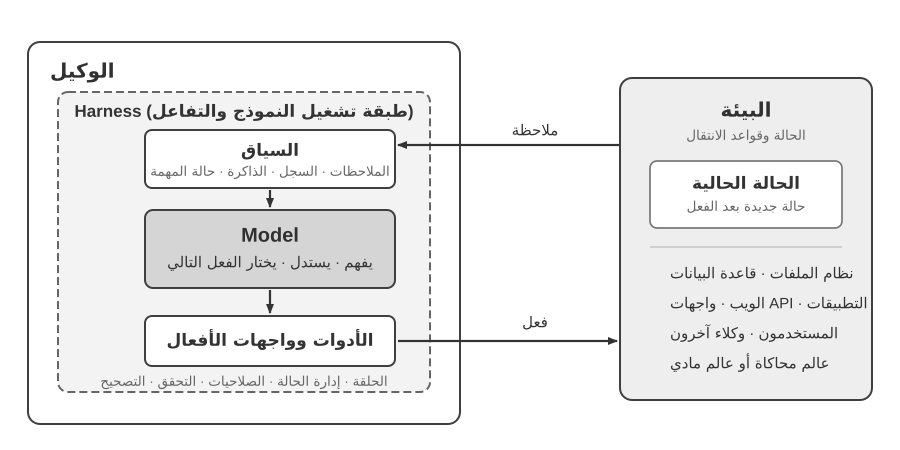
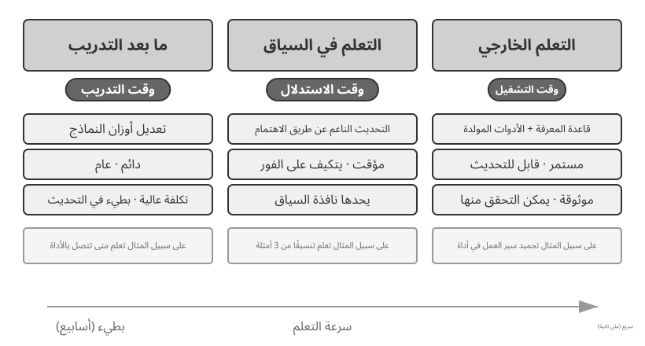
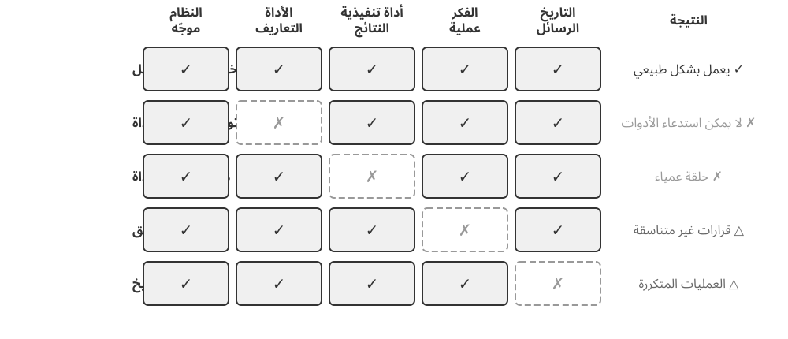
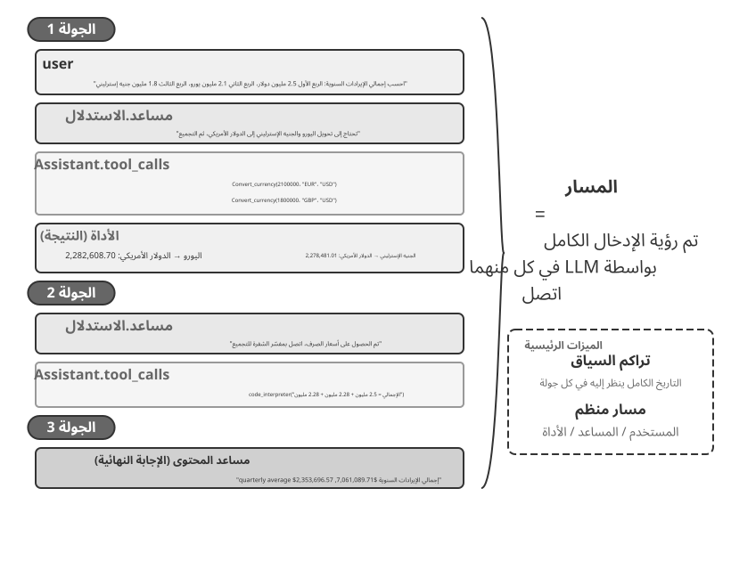
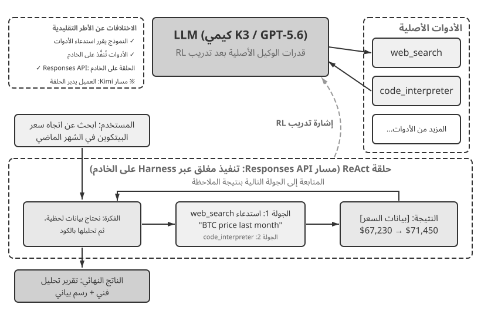
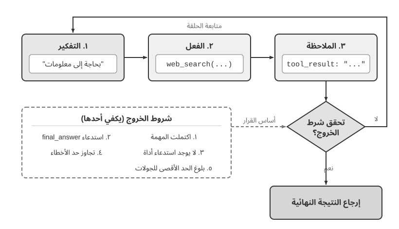

# الفصل الأول: أساسيات وكلاء الذكاء الاصطناعي

إذا سبق أن استخدمت Cursor لكتابة الشفرة، ورأيته يبحث في مستودعك ويعدّل عدة ملفات ويعيد تشغيل الاختبارات حتى تنجح، فقد استخدمت بالفعل وكيل ذكاء اصطناعي. وينطبق الأمر نفسه إذا استعنت بخدمة البحث المتعمق لاستقصاء موضوع عبر جولات متكررة من البحث والقراءة، أو جعلت Manus يتحكم في المتصفح لإنجاز مهمة عبر الإنترنت، أو طلبت من مساعد Doubao الهاتفي حجز تذكرة أو إرسال رسالة، أو كلّفت Pine AI بالتفاوض لخفض فاتورة اتصالات.

تتخذ هذه المنتجات أشكالًا مختلفة، لكنها تشترك في سمة واحدة: لم تعد مجرد حوارات سلبية من نوع «تسأل فيجيب النموذج». فالوكيل يخطط لخطوات التنفيذ، ويستعين بالأدوات التي تحتاج إليها المهمة، ويكيّف استراتيجيته مع النتائج التي تظهر تباعًا. وهكذا غدا وكلاء الذكاء الاصطناعي نمطًا جديدًا للتفاعل مع الحاسوب.

ينطلق هذا الفصل من أمثلة عملية، ثم يعود إلى المكونات الأساسية لوكيل الذكاء الاصطناعي. وستتعرف من خلاله إلى قدرات الوكلاء المعاصرين، والبنية التي تقوم عليها، وأنماط التصميم والممارسات الفضلى لبناء منظومات الوكلاء.

> **إرشاد للقراءة:** يمثل هذا الفصل الخريطة المفاهيمية للكتاب كله؛ فهو يقدم جولة موجزة في المعادلة الأساسية، وحلقة التشغيل، والإطار الهندسي، وأنماط تصميم الوكلاء. كما يضع المصطلحات ونقاط الإحالة التي تعتمد عليها الفصول التالية. لا تحاول حفظ كل مفهوم من القراءة الأولى؛ ركّز على الصورة العامة، ثم عد إلى هذا الفصل كلما احتجت إلى استعادة موضعك في الخريطة.

## الوكيل الحديث = LLM + السياق + الأدوات

يمكن تلخيص جوهر منظومة الوكيل الحديثة في معادلة واحدة: **الوكيل = نموذج لغوي كبير (LLM) + سياق + أدوات**. وهي معادلة بسيطة وعملية، ما دمنا نفهم كل عنصر بمعناه الواسع:

- **النموذج اللغوي الكبير هو محرك التفكير لدى الوكيل:** فهو ليس مجرد مجموعة من المعلمات، بل مركز اتخاذ القرار المسؤول عن فهم النية والتفكير والتخطيط والحكم. وتأتي قدراته من المعرفة العامة والكفاءة اللغوية المكتسبتين في **التدريب المسبق**، ومن استراتيجيات القرار التي يرسخها **التدريب اللاحق**، كالضبط الدقيق تحت الإشراف والتعلم المعزز اللذين يتناولهما الفصل الثامن.
- **السياق هو مجموعة معلومات العمل المتاحة للوكيل:** ولا يقتصر على النص المدخل إلى النموذج، بل يشمل كل ما يستطيع الوكيل الرجوع إليه عند اتخاذ القرار، مثل حالة البيئة وذاكرة المستخدم ومعرفة المجال وحالة الوكيل وتقدم المهمة. وكما يحتاج الإنسان إلى تقدير الموقف واستحضار خبرته والرجوع إلى المراجع قبل أن يقرر، تضم نافذة السياق المعلومات التي يستطيع الوكيل استخدامها في تلك اللحظة.
- **الأدوات هي واجهات الفعل لدى الوكيل:** ولا تقتصر على دوال API جاهزة للاستدعاء، بل تشمل جميع الوسائل التي يستطيع بها التأثير في العالم: من الأدوات المحددة سلفًا والمهارات المحمّلة عند الطلب، إلى توليد الشفرة لإنشاء قدرات جديدة، وتفويض العمل إلى وكلاء فرعيين، والتواصل مع المستخدم، والاستجابة للأحداث الخارجية.

وبصياغة أكثر حدسية: **الوكيل = محرك التفكير + سياق العمل + واجهات الفعل**. فالنموذج يفكر ويقرر، والسياق يمده بالمعلومات التي يبني عليها قراراته، والأدوات تحول تلك القرارات إلى أفعال تؤثر في العالم الخارجي.

من منظور التعلم المعزز الكلاسيكي ونظرية التحكم، الوكيل والبيئة طرفان في تفاعل ذي حلقة مغلقة، وليسا مكوّنين لبعضهما. تعيد البيئة ملاحظة إلى الوكيل، ويستخدم الوكيل سياقه لاختيار الفعل التالي، ثم يغير الفعل حالة البيئة فتنتج الملاحظة التالية.



يوضح الشكل 1-1 مستويين من التجريد. المستوى الخارجي هو **تفاعل الوكيل والبيئة**: تشمل البيئة نظام الملفات وقواعد البيانات وصفحات الويب والمستخدمين والوكلاء الآخرين والعالم الفيزيائي أو المحاكى. أما المستوى الداخلي فهو **بنية النموذج وHarness داخل الوكيل**: يتخذ النموذج قرارات السياسة، ويمثل Harness طبقة التشغيل والحوكمة داخل حدود الوكيل؛ فهو يبني السياق، ويعرض واجهات الأدوات، ويدير الحلقة والحالة، ويطبق الصلاحيات والتحقق والتصحيح. يمكن لـ Harness إنشاء بيئة أو عزلها أو التوسط لها، لكنه لا يضم حالة البيئة وقواعد انتقالها.

يمكن تفكيك المعادلة الهندسية على النحو الآتي: يقابل LLM النموذج، ويكوّن السياق والأدوات Harness الأدنى؛ وتضيف الأنظمة الإنتاجية التقييد والتحقق والتصحيح داخل هذه الحدود. ويلتزم باقي الفصل بهذه الحدود.

ترتبط هذه المكونات الثلاثة بالمفاهيم الأساسية الثلاثة في RL (التعلّم المعزّز؛ انظر الفصل 8)، لكنها ليست مكافئات صارمة واحدًا لواحد: السياق تمثيل الوكيل الداخلي للملاحظات والسجل، بينما تحدد الأدوات واجهات الملاحظة والفعل، وتظل الكيانات التي تقف خلفها جزءًا من البيئة.

| الحدس | مكون الوكيل | مفهوم RL | الدور |
|---------------|----------------|------------------|---------------------------------------------|
| **محرك التفكير** | LLM | **السياسة (Policy)** | منطق اتخاذ القرار الذي يحدد "ما يجب فعله بعد ذلك" — اختيار الفعل الأنسب بناءً على المعلومات المتاحة |
| **سياق العمل** | بناء السياق | **الملاحظات والسجل** | ينظم ملاحظات البيئة والسجل الموجود في المعلومات اللازمة للقرار الحالي |
| **واجهات الفعل** | واجهات الأدوات | **واجهات الملاحظة والفعل** | تحدد الملاحظات التي يستطيع الوكيل قراءتها، والأفعال التي يستطيع إرسالها، وصيغة هذه الواجهات |

### فضاء المراقبة وفضاء الأفعال: الواجهة بين النموذج والعالم

**يشكّل فضاء المراقبة وفضاء الأفعال معًا الواجهة بين النموذج اللغوي الكبير وبيئته الخارجية**. يحوّل فضاء المراقبة معلومات البيئة إلى سياق يستطيع النموذج معالجته، بينما يحوّل فضاء الأفعال قرارات النموذج إلى عمليات في العالم الخارجي. فالمعلومة التي لا تدخل فضاء المراقبة كأنها غير موجودة بالنسبة إلى النموذج؛ أما العملية التي لا تدخل فضاء الأفعال فلا يستطيع النموذج إلا اقتراحها بالكلمات، حتى لو عرف بدقة ما ينبغي فعله.

لذلك، **عند تثبيت النموذج الأساسي، تكون إعادة تعريف فضاءي المراقبة والأفعال أو توسيعهما غالبًا أهم رافعة هندسية لتحسين أداء الوكيل**. وبلغة هذا الكتاب، يعني ذلك توسيع السياق والأدوات. فكثير من المشكلات التي تبدو محتاجة إلى «نموذج أذكى» ليست إلا مشكلات واجهة: إذا أُدخلت بيانات المهمة ذات الصلة في السياق، أو أُتيحت العملية المطلوبة في صورة أداة، فقد تصبح مهمة كانت غير قابلة للحل قابلة له.

**Manus: دمج فضاءات كانت منفصلة.** قبل ظهور Manus، اتبعت الوكلاء المستخدمة في الإنتاج غالبًا ثلاثة مسارات مستقلة: Deep Research وCoding وComputer Use. وكان Manus أول وكيل إنتاجي واسع التأثير يجمع المسارات الثلاثة في نظام واحد. فقد وسّع المتصفح الافتراضي فضاء المراقبة، ووسّعت منظومة الملفات وتنفيذ الشفرة وسطر الأوامر فضاء الأفعال. لم يصبح Manus وكيلًا عامًا بمجرد استبدال النموذج بآخر أقوى؛ بل أخذ اتحاد فضاءات المراقبة والأفعال لثلاثة أنواع من الوكلاء، فمكّن وكيلًا واحدًا من تجاوز حدود المنتجات السابقة.

**OpenClaw: مدّ الواجهة إلى الحياة الرقمية للمستخدم.** يدفع OpenClaw الفضاءين خطوة أخرى إلى الخارج. فهو يستقبل المهام ويعيد النتائج عبر قنوات المراسلة التي يستخدمها الناس بالفعل، مثل WhatsApp وTelegram وSlack وDiscord وiMessage وغيرها، ولذلك يمكن الوصول إلى الوكيل من أي مكان تقريبًا. كما يستطيع الـ Gateway المحلي الاتصال بتطبيقات سحابية مثل Google Drive وNotion، فضلًا عن نظام الملفات المحلي. وبذلك يمكن للملفات الرقمية الموزعة بين الحسابات والأجهزة، بعد تفويض صريح من المستخدم، أن تدخل فضاء مراقبة وكيل واحد وأن تعالجها أدواته. وبالمقارنة مع الصورة الأولى من Manus التي تمحورت حول صندوق رمل سحابي معزول وكانت تتطلب عادة رفع الملفات أو إعداد موصّل منفصل، يعبر OpenClaw المحلي أولًا حدود بيانات أوسع. وقد أضاف Manus لاحقًا موصّل Google Drive والوصول إلى الملفات المحلية من سطح المكتب، وهو ما يعزز الفكرة نفسها: كثيرًا ما يكون تطور المنتج هو بالضبط توسع فضاءي المراقبة والأفعال[^ch1-agent-products].

[^ch1-agent-products]: تصف مواد Manus الرسمية الـ Sandbox الأصلي بأنه آلة افتراضية سحابية معزولة. وعند تقديم Google Drive Connector، استعرضت Manus صراحةً سير العمل السابق المجزأ الذي كان يتطلب تنزيل الملفات ورفعها يدويًا بين Drive وسطح المكتب وManus. وعند إطلاق My Computer في مارس 2026، وصفت وجود أهم أعمال المستخدم محليًا لا في السحابة بأنه قيد جوهري في الصندوق الرملي السحابي. أما README الرسمي لـ OpenClaw فيصفه بأنه مساعد شخصي دائم ومحلي أولًا يعمل على أجهزة المستخدم، ويسرد أكثر من عشرين قناة للمراسلة؛ ويمكن لمنظومة الأدوات والإضافات أن تضيف تكاملات سحابية وقدرات محلية. انظر https://manus.im/blog/manus-sandbox وhttps://manus.im/blog/manus-google-drive-connector وhttps://manus.im/blog/manus-my-computer-desktop وhttps://github.com/openclaw/openclaw وhttps://docs.openclaw.ai/tools

إن فهم وظيفة كل مكوّن وطريقة تكامله مع المكوّنين الآخرين هو أساس بناء وكلاء فعّالين. وسنبدأ بأكثر العناصر وضوحًا، أي الأدوات أو واجهات الفعل، ثم ننتقل إلى النموذج والسياق. يبيّن الجدول التالي كيف تختلف أنواع الوكلاء على امتداد هذه الأبعاد الثلاثة:

| منتج الوكيل | سياق العمل (فضاء الملاحظات) | واجهات الفعل (فضاء الأفعال) | استراتيجية التفكير والتنفيذ |
|-----------------|------------------------|--------------------------|-----------------------------|
| **وكلاء البرمجة (مثل Cursor)** | وثائق المتطلبات، قاعدة الشفرة البرمجية، البيئة الطرفية | مفتوح (التفكير الداخلي، البحث في الشفرة، قراءة/كتابة الملفات، تنفيذ الأوامر) | التطوير التراكمي: فهم المتطلبات ← البحث عن الشفرة ذات الصلة ← تعديل الملفات ← الاختبار والتحقق ← التصحيح والإصلاح |
| **وكلاء البحث (مثل Deep Research)** | موارد الويب، قواعد البيانات الأكاديمية، المستندات المحلية | مفتوح (التفكير الداخلي، استعلامات البحث، قراءة صفحات الويب، تلخيص المعرفة) | التعميق التكراري: ضبط اتجاه البحث بناءً على المعلومات المكتشفة، وتجميع تقرير شامل تدريجيًا |
| **وكلاء التحكم بالحاسوب (مثل Browser Use)** | شاشة الحاسوب، صفحات المتصفح، نظام الملفات المحلي | مفتوح (التفكير الداخلي، النقر، الكتابة، التمرير، التقاط الشاشة، تنفيذ الشفرة) | الإدراك البصري + التشغيل: مراقبة الشاشة ← تحديد العناصر المستهدفة ← تنفيذ الإجراءات ← التحقق من النتيجة |
| **وكلاء مساعد الهاتف (مثل Doubao)** | شاشة الهاتف، التطبيقات المثبتة | مفتوح (التفكير الداخلي، النقر، التمرير، الكتابة، فتح التطبيقات) | فهم النية + التحكم في التطبيقات: استيعاب حاجة المستخدم ← تحديد التطبيق المستهدف ← تنفيذ الخطوات ← تأكيد الإنجاز |
| **وكلاء المهام الشخصية (مثل Pine AI)** | حساب المستخدم، الفواتير السابقة، قاعدة معارف مزود الخدمة | مفتوح (التفكير الداخلي، إجراء المكالمات، إرسال البريد، ملء النماذج، التأكيد مع المستخدم) | تنفيذ المهام متعددة الخطوات: جمع المعلومات ← صياغة استراتيجية التفاوض ← الاتصال بمزود الخدمة ← التفاوض ← تقرير النتائج |

تشترك هذه الأنظمة في ثلاث سمات: **فضاء عمل مفتوح** — فالوكيل لا يختار من مجموعة أزرار ثابتة، بل يستطيع توليد اللغة الطبيعية والشفرة بحرية؛ و**تفكير داخلي** يسبق الفعل؛ و**تفاعل مستمر** يكيّف خلاله استراتيجيته مع ما يتلقاه من البيئة. وتنشأ هذه القدرات من تآزر محرك التفكير وسياق العمل وواجهات الفعل؛ أي من تآزر النموذج اللغوي والسياق والأدوات.

### الأدوات: واجهات فعل الوكيل

الأدوات هي جسر الوكيل إلى العالم الخارجي؛ فهي تنقله من مراقب سلبي إلى نظام قادر على البحث وكتابة الملفات وتشغيل الشفرة واستدعاء واجهات API وإرسال الرسائل والتحكم في الواجهات. من دون أدوات لا يتجاوز الوكيل توليد النص، أما بها فيستطيع تنفيذ أفعال حقيقية في الأنظمة الخارجية.

لمناقشة الأدوات بشكل منهجي، يمكننا تصنيفها إلى خمسة أنواع حسب اتجاه تفاعل الوكيل مع العالم. في هذه المرحلة، تكفي نظرة عامة موجزة عن السيناريوهات التمثيلية لكل نوع لتكوين الصورة العامة؛ الفصول اللاحقة تعالج كل منها بعمق.

**أدوات الإدراك** تسمح للوكيل بالوصول إلى المعلومات: توفر محركات البحث بيانات الويب في الوقت الفعلي، وتقرأ أنظمة الملفات المستندات المحلية، وتتصل واجهات برمجة التطبيقات وقواعد البيانات بالخدمات الخارجية والبيانات الأساسية للمؤسسة.

**أدوات التنفيذ** تسمح للوكيل بالعمل على الأنظمة الخارجية: تنفيذ التعليمات البرمجية وعمليات الملفات وأوامر النظام واستدعاءات API الخارجية لتحويل القرارات إلى إجراءات ملموسة.

**أدوات التعاون** تسمح للوكيل بتقسيم العمل مع الوكلاء الآخرين: تفويض المهام المتخصصة إلى الوكلاء الفرعيين، أو طلب تأكيد بشري في نقاط القرار الرئيسية، أو تنسيق الإجراءات في أنظمة متعددة الوكلاء.

**تعمل الأدوات المحفَّزة بالأحداث** على نحو يختلف تمامًا عن الفئات الثلاث الأولى؛ فالوكيل لا يستدعيها، بل تصله منها إشارة خارجية تدفعه إلى بدء العمل. قد تكون الإشارة رسالة بريد إلكتروني جديدة، أو حلول موعد محدد، أو طلب Webhook من نظام آخر. عندئذ ينشط الوكيل ويبدأ التفكير والتنفيذ. ومع أن الوكيل لا يستدعي هذه الأدوات بنفسه، فإنها تظل قناة يتفاعل عبرها مع العالم الخارجي، ولذلك نعدّها جزءًا من منظومة أدواته بمعناها الواسع.

**أدوات التواصل مع المستخدم** هي القنوات التي يخاطب الوكيل المستخدم عبرها. فإذا كانت أدوات التنفيذ تغيّر حالة العالم الخارجي، فإن أدوات التواصل تنقل المعلومات: كأن تعرض تقدم المهمة، أو ترسل تحديثًا استباقيًا، عبر رسالة نصية أو مكالمة صوتية أو بريد إلكتروني.

يعرض الفصل الرابع هذا التصنيف كاملًا، إلى جانب مبادئ تصميم الأنواع الخمسة. فجودة تصميم الأداة تحدد مباشرةً ما يستطيع الوكيل إنجازه بموثوقية: الواجهة الغامضة تدفع النموذج إلى إساءة استخدامها، والمعالجة الرديئة للأخطاء قد تجعل عطلًا واحدًا يوقف الوكيل، والصلاحيات الواسعة قد تحوّل هفوة بسيطة إلى خطأ يتعذر تداركه. ومع انتشار معيار MCP (بروتوكول سياق النموذج)، صار دمج الأدوات أسهل.

**استدعاء الأدوات** (المعروف أيضًا باسم استدعاء الوظائف) هو القدرة الأساسية لوكلاء LLM الحديثين: فهو يتيح للنموذج استدعاء أدوات خارجية بطريقة منظمة، مما يحول LLM من مولد نص خالص إلى نظام ذكي يمكنه العمل من خلال واجهات خارجية. يستخدم هذا الكتاب مصطلح "استدعاء الأداة" طوال الوقت.

يمر استدعاء الأداة بأربع خطوات. أولًا، يعرّف السياق النموذج بالأدوات المتاحة، بما في ذلك أسماؤها وأغراضها ومعاملاتها. ثم يقرر النموذج هل يحتاج إلى أداة، وأي أداة يختار، وما الوسائط التي يمررها إليها. وبعد التنفيذ تُلحق النتيجة بالسياق، فيحدد النموذج خطوته التالية على ضوئها. هذه الحلقة هي أساس نمط ReAct الذي سنعرضه لاحقًا في الفصل.

بالنسبة للاستعلام عن الطقس، يكون التمثيل المبسط للعملية المكونة من أربع خطوات على مستوى API كما يلي:

```text
Step 1: Declare tools                  Step 2: Model decides to call
tools: [{                             assistant: {
  name: "get_weather",                  tool_calls: [{
  parameters: {                           function: "get_weather",
    city: "string"                        arguments: {city: "Beijing"}
  }                                      }]
}]                                    }

Step 3: Result appended to context    Step 4: Model responds based on result
tool: {                               assistant: {
  tool_call_id: "call_1",               content: "Today in Beijing: 28°C, sunny."
  content: '{"temp":28,"sky":"clear"}' }
}                                     }
```

يقوم المطور فقط بتعريف الأدوات وتنفيذ الاستدعاءات؛ يقرر النموذج نفسه ما إذا كان سيتم الاتصال به، وأي أداة سيتم الاتصال بها، وما هي الوسائط التي سيتم تمريرها. يتناول الفصل الثاني بنية API بالتفصيل.

عند تصميم أدوات للوكيل، يمكن البدء بأضيق قدرة تتطلبها المهمة، ثم توسيعها تدريجيًا كلما ازدادت المهمة تعقيدًا. فإذا كانت المهمة لا تتجاوز العمليات الحسابية الأساسية، تكفي حاسبة ذات معاملات محددة بوضوح؛ أما إذا تطورت لتشمل قراءة جداول البيانات، وتنظيف القيم المفقودة، وحساب الإحصاءات، ورسم المخططات، فإن مفسر Python المقيّد يكون أسهل في التركيب والاستكشاف من الاستمرار في إضافة أدوات متخصصة. لكن العمومية توسع أيضًا مجال الخطأ وسطح الهجوم: يجب تشغيل الشفرة في صندوق حماية معزول، مع تعطيل الوصول إلى الشبكة افتراضيًا، ومنع قراءة الملفات خارج دليل العمل المصرّح به، وفرض حدود على زمن التنفيذ واستخدام CPU والذاكرة وحجم المخرجات.

وبالمثل، تصلح أداة تسجيل واحدة لتوثيق عملية تنفيذ واحدة؛ أما في المهام الطويلة الممتدة ساعات أو أيامًا، فيمكن لدليل عمل افتراضي خاضع للرقابة أن يحفظ الخطة، والنتائج الوسيطة، وسجلات التنفيذ، والمخرجات النهائية معًا، ليتيح للوكيل مواصلة العمل عبر تشغيلات متعددة. وينبغي أيضًا تقييد المسارات القابلة للقراءة والكتابة، والسعة، وأنواع الملفات داخل هذا الدليل، ومنع تجاوز حدوده، بدلًا من كشف نظام ملفات المضيف بأكمله للوكيل.

لا تتفوق الأدوات العامة دائمًا على الأدوات المتخصصة. فالعمليات عالية المخاطر أو الخاضعة لقيود أعمال صارمة—مثل الدفع، وحذف البيانات، وإرسال البريد الإلكتروني، والنشر في بيئة الإنتاج—ينبغي أن تظل مغلفة في أدوات متخصصة ذات معاملات صريحة وصلاحيات محدودة وقابلية تدقيق شاملة، مع إضافة المعاينة والتأكيد البشري عند الحاجة. وعليه، فإن المبدأ الأساسي لتصميم الأدوات هو: **تُستخدم القدرات الأساسية العامة للتركيب والاستكشاف؛ وتُستخدم الأدوات المتخصصة لتقييد العمليات عالية المخاطر وتطبيق قواعد الأعمال الصارمة**.

### LLM: محرك الاستدلال الخاص بالوكيل

يعد نموذج اللغة الكبير (LLM) هو جوهر عملية اتخاذ القرار لدى الوكيل. بالنظر إلى طلب المستخدم، يجب عليه أولاً استنتاج النية الحقيقية (ما يقوله المستخدمون غالبًا ليس ما يريدونه بالفعل)، ثم تقسيم المهمة الغامضة أو المعقدة إلى خطوات قابلة للتنفيذ. أثناء التنفيذ، يستمر في اتخاذ القرارات: ما يجب فعله بعد ذلك، وما إذا كان سيتم استدعاء أداة، وأي أداة، وبأي وسيطات. تأتي القدرة على الفهم والتخطيط والتنفيذ من المعرفة المتراكمة أثناء التدريب المسبق، وهي الأساس الذي يعتمد عليه سير العمل والوكلاء المستقلون على حدٍ سواء.

تتمثل القدرة المميزة لوكلاء LLM في **الاستدلال الداخلي** — قبل التصرف، يستطيع الوكيل التخطيط والتفكير خلال المهمة. وهذا لا يغير البيئة الخارجية، ولكنه يحسن الإجراءات التي تتبعها بشكل ملحوظ. تأتي هذه القدرة من التدريب المسبق (التدريب الأولي على كميات هائلة من النصوص على الإنترنت، والتي من خلالها يتعلم النموذج أنماط اللغة والمعرفة العالمية): يعتمد النموذج على أنماط التفكير المشفرة في المعرفة الإنسانية، بما في ذلك القوانين الرياضية، والعلاقات السببية، واستراتيجيات تحليل المشاكل. لذلك، وعلى خلاف وكلاء التعلم المعزز التقليديين، فإن الوكلاء القائمين على نماذج اللغة الكبيرة اليوم لا يستكشفون عشوائيًا وبلا هدى، بل يستدلون انطلاقًا من منظومة معرفة منظمة.

#### النموذج كوكيل: عندما يصبح النموذج نفسه هو المنتج

يعد نموذج "النموذج كوكيل" هو أحدث اتجاه في تطوير وكيل الذكاء الاصطناعي. تستوعب النماذج المتقدمة استدعاء الأداة كقدرة أصلية من خلال التدريب اللاحق (خاصة التعلم المعزز): متى يتم استدعاء أداة، وأي منها، وبأي وسائط - يقرر النموذج كل ذلك، دون الحاجة إلى تنسيق يدوي. هذا لا يجعل طبقة الإطار أقل أهمية. على العكس من ذلك: كلما كان النموذج أقوى، زادت أهمية منظومة التشغيل المحيط به. فكلمة Harness تعني في أصلها لجام الحصان وعدته؛ لا لتقييد قدرته على الجري، بل لتوجيه تلك القوة في الاتجاه الصحيح. وفي سياق الوكيل، يمثّل النموذج الحصان القوي الذي يصعب التنبؤ به، بينما تمثّل منظومة التشغيل البنية التحتية الهندسية التي توجه قدرته إلى تنفيذ المهام بشكل موثوق. وهي تشمل إدارة السياق، وواجهات الأدوات، وقيود السلامة، وآليات التحقق والتصحيح (انظر القسم الأخير من هذا الفصل).

كلما زادت سلطة اتخاذ القرار في النموذج، زاد تأثير القرار الخاطئ - الأمر الذي يستدعي قيودًا أكثر دقة، والتحقق، والتصحيح للحفاظ على موثوقيته. الميزة الحقيقية لموفري النماذج ليست "جعل إطار العمل أرق" ولكن القدرة على تحسين النموذج والأدوات المحيطة به، والتكرار بشكل مستمر.

لكن سؤالًا أعمق يبقى معلقًا: إذا استمرت النماذج في التحسن، فهل ستستبطن في النهاية ما تؤديه منظومات التشغيل اليوم؟ يستعرض ريتش ساتون في «الدرس المرير» نمطًا تكرر على مدى سبعين عامًا من أبحاث الذكاء الاصطناعي[^ch1-1]: يشفّر الباحثون فهمهم للمجال داخل النظام، فيحققون مكاسب قصيرة الأجل، ثم يخسرون على المدى البعيد أمام أساليب عامة — كالبحث والتعلم — تتوسع مع الحوسبة والبيانات. ومن هذا المنظور، كم من القيود وآليات التحقق والتصحيح في منظومة التشغيل يُعد معرفة بشرية مسبقة سيستبطنها النموذج يومًا ما؟ يلخّص موقف الكتاب مبدآن: **نوافق على الاتجاه، ونتعامل بواقعية مع الوتيرة**. فمن حيث الاتجاه، لا شك في أن النماذج ستستبطن أجزاءً متزايدة من منظومة التشغيل؛ فقد كان استدعاء الأدوات والتخطيط الممتد يعتمدان سابقًا على تنسيق خارجي، ثم صارا من قدرات النموذج الأصيلة. لكن هذا الاستبطان أبطأ عمليًا مما يوحي به الحدس: فالتدريب يستغرق شهورًا، ولا يستطيع نموذج واحد أن يستوعب دفعة واحدة جميع قيود الأعمال الواقعية وتفضيلاتها. وتكمن قيمة منظومة التشغيل تحديدًا عند حدود قدرة النموذج الراهنة. لذلك لا تعارض هندسة منظومة التشغيل «الدرس المرير»، بل تطبقه على المقياس الزمني للهندسة: ما لا يستطيع النموذج أداءه بثبات، تسنده المنظومة أولًا؛ وحين يستبطن النموذج طبقةً منه، تتخلى المنظومة عنها وتنتقل إلى حماية جبهة القدرة التالية.

[^ch1-1]: ساتون، ريتش. "الدرس المرير"، 2019. http://www.incompleteideas.net/IncIdeas/BitterLesson.html

#### آليات تعلم الوكيل: من التكيف السياقي إلى التحديثات المستمرة

أشارت المناقشة السابقة إلى أن النموذج يمكنه استيعاب سياسات استخدام الأدوات كقدرات أصلية من خلال التعلم المعزز. لكن التغييرات في سلوك الوكيل لا تحدث أثناء التدريب فقط. استنادًا إلى مكان حدوث التحديث ومدة استمراره، يمكن فهم هذه التغييرات على أنها ثلاثة مسارات تكميلية (الشكل 1-2): التكيف السياقي داخل المهمة، والتحديثات عبر المهام للعناصر الخارجية، وتحديثات المعلمات أثناء دورات التدريب.



**يحدث التكيف السياقي** ضمن المهمة الحالية. بمجرد دخول الأمثلة والحالة ونتائج الاسترجاع إلى السياق، يمكن للنموذج تعديل سلوكه على الفور، ولكن هذا لا يغير الحالة المستمرة للجلسة التالية. مميزاتها هي السرعة والتكلفة المنخفضة. تنشأ حدودها من نافذة السياق وطريقة تنظيم المعلومات. ويشرح الفصل الثاني بالتفصيل كيفية عمل هذا النوع من التكيف.

لكي تستمر التغييرات عبر المهام، يمكن للنظام تحديث **العناصر الخارجية**: يمكن تنظيم الحقائق والخبرة في وثائق المعرفة، ويمكن كتابة الاستراتيجيات المعبر عنها باللغة في موجّه أو مهارة، ويمكن ترميز الإجراءات والقيود الحتمية في البرامج والأدوات. هذه العناصر قابلة للتدقيق والمراجعة، ولكن لا يزال يتعين على الوكيل الوصول إليها في وقت التنفيذ من خلال السياق أو واجهات الأداة. تحدد الفصول من الثالث إلى الخامس أسس المعرفة والبرامج، بينما يناقش الفصل التاسع كيف يمكن إنشاء هذه التحديثات من المسارات التشغيلية التي تم تقييمها.

عندما تكون القدرة المستهدفة عالية الأبعاد، كفهم الصور الطبية أو إنتاج لغة طبيعية بأسلوب معين أو اتباع سياسة ضمنية لاتخاذ القرار، ويتعذر التعبير عنها كاملة بقواعد خارجية، فلا بد من تحديث **معلمات النموذج** في مرحلة ما بعد التدريب. وتزيد كلفة نشر تحديثات المعلمات، لكنها قد تحقق تعميمًا طبيعيًا واسع النطاق؛ ويعرض الفصل الثامن أساليبها بصورة منهجية. ومن ثم فالمسارات الثلاثة ليست فئات متنافية، بل آليات متكاملة تعمل على مقاييس زمنية مختلفة: يتيح السياق التكيف الآني، وتتيح المكونات الخارجية تراكمًا منضبطًا، وتستوعب المعلمات القدرات التي يصعب التصريح بها.

### السياق: مجموعة عمل الوكيل

السياق هو مجموعة العمل من المعلومات المتاحة للوكيل في كل نقطة قرار. مثلما يحتاج الشخص الذي يتخذ قرارًا إلى المواد الصحيحة الموجودة على الطاولة - تعليمات المهمة، والأدلة المرجعية، والمراسلات السابقة، وأحدث البيانات - فإن نافذة السياق الخاصة بالوكيل هي المعلومات التي يمكنه استخدامها. من منظور API (المفصل في الفصل 2)، يتكون سياق كل استدعاء LLM من خمسة أجزاء:

- **موجّه النظام**: على عكس الموجّهات التي يُدخلها المستخدمون أثناء المحادثة، تتم كتابة موجّه النظام بواسطة المطور وتظل ثابتة طوال المحادثة بأكملها. إنه "الوصف الوظيفي" للوكيل، والذي يحدد هويته وأذوناته وقواعد سلوكه. هندسة الموجّهات الدقيقة لموجّه النظام هي الطريقة التي نشكل بها السلوك التشغيلي للوكيل. يحمل موجّه النظام أيضًا **ذاكرة المستخدم** التي تستمر عبر الجلسات (معلومات شخصية مثل التفضيلات والسلوك السابق وإعدادات الخلفية؛ راجع الفصل 3)، بالإضافة إلى الحالة البيئية المحقونة ديناميكيًا.
- **تعريفات الأداة**: تعلن الأسماء والأوصاف الوظيفية وتنسيقات المعلمات للأدوات المتاحة للوكيل. بدون تعريفات الأدوات، لا يستطيع الوكيل التعرف على أي أدوات أو استدعائها - ستتحقق دراسة الاستئصال (التجربة 1-1) من ذلك. تشكل تعريفات الأداة، جنبًا إلى جنب مع موجّه النظام، **البادئة الثابتة** التي تظل دون تغيير طوال المحادثة. (هذا هو النمط الأساسي؛ منذ عام 2026، يمكن لأطر الإنتاج أيضًا تحميل مخططات الأداة الكاملة عند الطلب في نهاية السياق دون كسر البادئة - راجع قسم تعريفات الأداة في الفصل 2 والفصل 4.)
- **رسائل المستخدم**: مدخلات من المستخدم. قد تحتوي رسائل المستخدم أيضًا على **المعرفة الخارجية** التي تم استرجاعها ديناميكيًا عبر RAG (إنشاء الاسترجاع المعزز، راجع الفصل 3 للحصول على التفاصيل) - والتي تغطي معلومات تتجاوز قطع بيانات التدريب أو معرفة المجال الخاص.
- **رسائل المساعد**: الاستجابات التي تم إنشاؤها مسبقًا بواسطة النموذج، والتي يمكن أن تحتوي على ما يصل إلى ثلاثة أجزاء — `reasoning` (سلسلة الأفكار الداخلية، والحفاظ على التماسك وإمكانية تفسير القرار)، و`content` (الاستجابة للمستخدم)، و`tool_calls` (الطريقة التي يتخذ بها الوكيل الإجراء). في استجابة محددة، قد لا تظهر هذه الأجزاء الثلاثة جميعها في وقت واحد: على سبيل المثال، عندما يقرر الوكيل استدعاء أداة، عادةً ما تحتوي فقط على `reasoning` + `tool_calls`؛ عند إعطاء إجابة نهائية، عادةً ما تحتوي فقط على `reasoning` + `content`.
- **نتائج الأداة**: الإخراج الذي يتم إرجاعه بعد تنفيذ إطار عمل الوكيل للأداة. هذه النتائج هي الأساس المباشر لخطوة التفكير التالية التي يتخذها الوكيل، وما الذي يتيح له التعلم من النتائج بدلاً من تكرار أخطائه.

يشكل العنصران الأولان (موجّه النظام + تعريفات الأداة) البادئة الثابتة؛ تشكل الرسائل الثلاثة الأخيرة (رسائل المستخدم + رسائل المساعد + نتائج الأداة) سجل الرسائل الديناميكي الذي ينمو مع كل تفاعل. تشكل هذه الأجزاء الخمسة معًا سياق كل استنتاج LLM.

هل كل مكون لا غنى عنه حقًا؟ الطريقة الأكثر مباشرة لمعرفة ذلك هي **دراسة الاستئصال** — وهي الطريقة التشخيصية لاستبعاد الأسباب واحدًا تلو الآخر: إزالة المكون أ ومعرفة ما إذا كان النظام لا يزال يعمل، ثم المكون ب، وهكذا، حتى تتضح مساهمة كل مكون. تطبق التجربة 1-1 هذه الطريقة تمامًا على المكونات الخمسة المذكورة أعلاه. النتائج مباشرة: بدون تعريفات الأداة، يكون الوكيل غير قادر تمامًا على التصرف؛ بدون نتائج الأداة، لا تتلقى تعليقات من الخطوة السابقة، لذلك تستدعي نفس الأداة بشكل متكرر، وتصبح عالقة في حلقة لا نهائية؛ وبدون التعليل في الرسائل المساعدة، تبدأ القرارات المتتالية في التناقض مع بعضها البعض؛ بدون سجل الرسائل، يفقد الوكيل استمرارية المهمة ويعيد تشغيل المهمة بأكملها من البداية، مع تكرار الخطوات التي تم تنفيذها بالفعل.

> **التجربة 1-1 ★★: الدور الحاسم للسياق**
>
> لقد بحثنا في كيفية قيام كل مكون من مكونات السياق بتشكيل سلوك الوكيل من خلال **دراسة استئصال** منهجية. من بين المكونات الخمسة المذكورة أعلاه، تم اختبار أربعة - تم استثناء موجّه النظام، باعتباره تعريف الهوية الأساسي للوكيل: بدونه لن يكون لدى الوكيل أي وعي بالدور على الإطلاق، وسيكون الاختبار بلا معنى. كما يوضح الشكل 1-3، أجريت التجربة على خمس مجموعات خاضعة للرقابة: خط أساسي كامل يحتفظ بكل مكون، بالإضافة إلى أربع مجموعات تفتقد كل منها واحدة، لمراقبة تأثير كل مكون على أداء الوكيل.
>
> 
>
> كشفت النتائج التجريبية عن الدور الذي لا يمكن الاستغناء عنه لكل مكون من مكونات السياق. **تعريفات الأداة** (جزء من البادئة الثابتة) هي أساس قدرة الوكيل على التصرف؛ وبدونها، لا يستطيع الوكيل التعرف على أي أدوات أو الاتصال بها. **نتائج الأداة** هي المفتاح للتحكم في الحلقة المغلقة؛ يؤدي غيابهم إلى حرمان الوكيل من ردود فعل التنفيذ ويؤدي إلى وقوعه في حلقة لا نهائية. تحافظ **عملية الاستدلال** (جزء الاستدلال في الرسائل المساعدة) على أسباب قرارات الوكيل السابقة، مما يجعل الاستدلال العام أكثر تماسكًا ويمنع القرارات المتعارضة. **سجل الرسائل** (رسائل المستخدم، ورسائل المساعد، ونتائج الأداة من الجولات السابقة) يمنع العمليات المتكررة، ويحافظ على تماسك تنفيذ المهام، ويتجنب تكرار نفس الأخطاء.
>
> الرؤية الأساسية للتجربة: **يحدد السياق المعلومات التي يمتلكها الوكيل في وقت اتخاذ القرار، ولا يستطيع الوكيل اتخاذ القرار إلا بناءً على تلك المعلومات**. تمامًا كما لا يستطيع الشخص الذي يفتقد المستندات المهمة إصدار أحكام سليمة، فإن الوكيل الذي يفتقد أي مكون من مكونات السياق يعاني من خسارة فادحة في القدرة على اتخاذ القرار - بدون تعريفات الأدوات، لا يعرف ما هي الأدوات الموجودة؛ وبدون نتائج التنفيذ السابقة، لا يعرف ما تم إنجازه بالفعل.

### حلقة ReAct

ومع توفر المكونات الثلاثة، ينشأ سؤال طبيعي: كيف تعمل هذه العناصر معًا؟ حلقة ReAct هي الآلية الأساسية التي تربط LLM والسياق والأدوات في نظام واحد. يمكننا فحصها خطوة بخطوة.

يُطلق على النمط الأساسي الذي ينفذ به الوكيل المهمة اسم **ReAct** (التفكير والتصرف / Reasoning + Acting). ورغم أن الاسم يشير صراحةً للتفكير والفعل، إلا أن الحلقة الفعلية تتألف من ثلاث مراحل: يقوم النموذج أولاً **بالتفكير (Reasoning)** في الخطوة التالية، ثم يستدعي الأداة **للفعل (Action)**، ثم **يلاحظ (Observation)** نتيجة الأداة ليبني عليها تفكيره التالي. وتتكرر حلقة «التفكير ← الفعل ← الملاحظة» حتى إنجاز المهمة.

لنأخذ مثالاً ملموساً — تجميع الإيرادات عبر عملات متعددة — لفهم **مسار** الوكيل (Trajectory): وهو سجل الرسائل الديناميكي الذي يتراكم أثناء عمل الوكيل، ويشمل رسائل المستخدم، ورسائل المساعد (مع أفكارها واستدعاءات الأدوات)، ونتائج الأدوات. وفي كل استدعاء للنموذج، يتكون السياق الكامل من **البادئة الثابتة** (موجّه النظام + تعريفات الأدوات) بالإضافة إلى **المسار** (سجل الرسائل). وتوضح هذه المعادلة الجوهرية: **سياق الوكيل = بادئة ثابتة + مسار**.



المخطط التالي بأسلوب Python هو pseudocode توضيحي وليس شفرة SDK قابلة للتشغيل؛ وتُستخدم علامة `python` للتلوين النحوي فقط.

**حلقة تحكم ReAct:**

```python
trajectory = [user_request]

repeat:
    context = stable_prefix + trajectory
    decision = Model(context)
    trajectory.append(decision)

    if decision has no tool call:
        return decision.answer

    for call in decision.tool_calls:       # independent calls may run in parallel
        validated_call = Harness.validate(call)
        observation = Environment.execute(validated_call)
        trajectory.append(observation)
```

هنا هو هيكل المسار، في الكود الكاذب:

```text
trajectory = [
  {role: "user", content: "Based on the company's quarterly revenue: Q1 2.5M USD, Q2 2.1M EUR, Q3 1.8M GBP, Q4 380M JPY, calculate the company's total annual revenue and average quarterly revenue"},

  # First iteration - LLM receives the above trajectory and generates a response
  {role: "assistant",
   reasoning: "Need to convert all currencies to USD...",
   content: "",  # No direct reply to the user
   tool_calls: [
     {name: "convert_currency", args: {amount: 2100000, from: "EUR", to: "USD"}},
     {name: "convert_currency", args: {amount: 1800000, from: "GBP", to: "USD"}},
     {name: "convert_currency", args: {amount: 380000000, from: "JPY", to: "USD"}}
   ]},

  # Agent framework executes tools, adds results to trajectory
  {role: "tool", content: "EUR->USD: 2282608.7"},
  {role: "tool", content: "GBP->USD: 2278481.01"},
  {role: "tool", content: "JPY->USD: 2541806.02"},

  # Second iteration - LLM receives the complete trajectory, including tool results
  {role: "assistant",
   reasoning: "Conversion results obtained, now need to aggregate and calculate...",
   content: "",
   tool_calls: [
     {name: "code_interpreter", args: {code: "total = 2500000 + 2282608.7 + ..."}}
   ]},

  {role: "tool", content: "Total: $9,602,895.73, Average: $2,400,723.93..."},

  # Third iteration - LLM receives the complete trajectory and generates the final answer
  {role: "assistant",
   reasoning: "All calculations complete, summarizing results...",
   content: "FINAL ANSWER: Total revenue $9,602,895.73..."}
]
```

لاحظ أن موجّه النظام وتعريفات الأداة لا تظهر في المسار - فهي بمثابة بادئة ثابتة ويتم إضافتها تلقائيًا إلى المسار قبل كل استدعاء LLM.

في تجربتنا، كانت هذه الحلقة مرئية بوضوح. في الجولة الأولى، قام الوكيل بتحليل المهمة واستدعاء ثلاث أدوات لتحويل العملات بالتوازي؛ وفي الحالة الثانية، تم تغذية نتائج التحويل إلى مفسّر الشفرة لإجراء عمليات حسابية أكثر كثافة؛ وفي السؤال الثالث، بعد التأكد من اكتمال جميع الحسابات، قدم الإجابة النهائية. تم إكمال مهمة معقدة متعددة الخطوات في 3 تكرارات و4 استدعاءات للأدوات.

في هذا التصميم الأساسي، يُلحَق باستمرار سياق جديد بما يراه النموذج اللغوي الكبير. يتلقى كل استدعاء LLM المسار الكامل، بحيث يعرف النموذج مرحلة المهمة التي يمر بها، وما تمت تجربته من قبل، وما هي النتيجة. مثلما يستمر الأشخاص في المراجعة والتلخيص أثناء حل المشكلة، يحتفظ الوكيل برؤية عالمية للمهمة من خلال مسارها. ولأن المسار منظم - رسائل المستخدم، والرسائل المساعدة (الاستدلال + استدعاءات الأداة)، ونتائج الأداة، كلها منفصلة بشكل واضح - فإن النظام قابل للتفسير وتصحيح الأخطاء بدرجة كبيرة.

المسار هو أكثر من مجرد سجل تنفيذ؛ فهو دليل على قدرة الوكيل. ويكشف تحليل المسارات على نطاق واسع عن أنماط سلوكية، ومسارات أفضل لاتخاذ القرار، وتصميمات أفضل للأدوات. ويمكن أيضًا استخلاص بيانات المسار في قاعدة معرفية، أو استخدامها لتدريب نماذج وكلاء أقوى من خلال التعلم المعزز، مما يؤدي إلى إغلاق حلقة التعلم من التجربة.

الآن وبعد أن فهمنا حلقة تشغيل الوكيل، فإننا نفحص تجربتين لنرى كيف تقودها النماذج المختلفة.

> **التجربة 1-2 ★: قدرة Kimi K3 الأصلية بوصفه وكيلًا**
>
> تستعرض هذه التجربة القدرة الوكيلة الأصلية في **Kimi K3**، بوصفه مثالًا على نمط «النموذج نفسه وكيل». وهو نموذج خليط خبراء (MoE) يضم نحو 2.8 تريليون معلمة. ويمكن تشبيه هذه البنية بفريق من الخبراء: فبدل تشغيل النموذج كله لكل مسألة، يفعّل النظام عددًا قليلًا من الخبراء الأنسب لها، محافظًا بذلك على سعة كبيرة بكلفة حسابية أقل. ويملك Kimi K3 نافذة سياق بمليون رمز، وفهمًا بصريًا أصيلًا، و«وضع تفكير» دائم التشغيل. وقد رسّخ التعلم المعزز **سياسة اتخاذ القرار** الخاصة باستدعاء الأدوات في النموذج نفسه: فهو يقرر متى يستدعي أداة، وأي أداة يختار، وما الوسيطات التي يمررها، فيستطيع مثلًا إجراء عمليات بحث على الويب بصورة مستقلة. والدقيق هنا أن ما يتعلمه النموذج هو قرار *متى يستدعي الأداة وكيف*؛ أما الأدوات، مثل `web_search` و`code_runner`، فتبقى خدمات مدمجة في واجهة API وتُنفَّذ على الخادم. ويشغّل Kimi هذه الأدوات الرسمية عبر محرك نصي على الخادم يُسمى Formula.
>
> من الملاحظات الأساسية أن النموذج يقرر بنفسه متى يبحث وما الذي يبحث عنه، فيُظهر استقلالية حقيقية؛ كما يغيّر استراتيجيته مع وصول نتائج البحث ويحدد بنفسه ما إذا كانت المعلومات كافية. وهناك مفهوم خاطئ شائع يستحق التوضيح: **التعلم المعزز يمنح النموذج سياسة القرار**، وليس الأدوات نفسها. فهو يعلّمه متى يستدعي أداة، وأي أداة يختار، وما الوسيطات التي يمررها، وهل يواصل العمل بعد تلقي النتيجة، وكيف يربط عشرات أو مئات الاستدعاءات في استدلال متماسك؛ وهذه القرارات المتعلقة *باستخدام الأداة وكيفية استخدامها* هي ما يُكتب في أوزان النموذج. **أما الأدوات وتنفيذها فيوفرهما إطار عمل الوكيل أو الأدوات المدمجة في API**: فتطبيقات `web_search` و`code_runner`، وصندوق حماية الشفرة، والبنية التحتية التي تصدر الاستدعاءات وتعيد النتائج، تقع كلها خارج النموذج. يحسّن RL سياسة القرار، ولا يضمّن محرك بحث أو صندوق حماية للشفرة داخل أوزان النموذج. لذلك لم تختفِ حلقة التنسيق؛ بل انتقلت من العميل إلى الخادم، بينما انتقلت سلطة القرار إلى النموذج[^ch1-2].
>
> [^ch1-2]: شكرًا للقارئ asdlem على الإشارة والتوضيح، من خلال الإصدار رقم 30 من GitHub، فإن التمييز الذي يستوعبه RL هو سياسة قرار استدعاء الأداة، وليس آلية تنفيذ الأداة. انظر https://github.com/bojieli/ai-agent-book/issues/30
>
> تبرز قوة Kimi K3 في مهام الوكلاء في **ثباته عبر السلاسل الطويلة من استدعاءات الأدوات**؛ إذ يستطيع الحفاظ على ترابط التفكير خلال 200 إلى 300 استدعاء متتابع، في حين يبدأ أداء معظم النماذج بالتراجع بعد بضع عشرات من الاستدعاءات. وقد ضُبط K3 للبرمجة الممتدة وأعباء عمل الوكلاء، وصدر في نسختين: K3 Max لمهام الحوار والوكلاء، وK3 Swarm Max للمعالجة المتوازية واسعة النطاق. وكونه نموذجًا مفتوح المصدر ينافس أنظمة مغلقة رائدة في معايير هندسة البرمجيات والوكلاء يبيّن أن التعلم المعزز قادر على إكساب النموذج قدرات وكيلية أصيلة.

> **التجربة 1-3 ★: قدرة البحث العميق الأصلية في GPT-5.6**
>
> تستخدم هذه التجربة **OpenAI GPT-5.6** لتوضيح كيف يستطيع نموذج متقدم، تدعمه أدوات مدمجة في واجهة API، إدارة دورة «البحث، ثم القراءة، ثم التحليل» على الخادم لإجراء بحث معمق. ومن خصائص GPT-5.6 العملية **استدعاء الأدوات بالنص الحر**. ففي النمط التقليدي، على النموذج ترميز كل معامل بصيغة JSON وفق قواعد تنسيق صارمة. أما الأداة المعلنة في API بالنوع `type: "custom"` فتستقبل نصًا خامًا مباشرة، مثل مقطع Python أو استعلام SQL، من دون الحاجة إلى تغليفه أو تهريبه داخل JSON. وهذا تحسين في صيغة معاملات API، لا تغيير في بنية النموذج؛ فحلقة العميل تظل كما هي: اكتشاف `tool_calls`، ثم التنفيذ، ثم إعادة النتيجة. الذي يتغير هو شكل الوسائط فحسب.
>
> يوفر GPT-5.6، مع أداتي **بحث الويب ومفسّر الشفرة** المدمجتين في Responses API، المقومات الأساسية للبحث المعمق. يستطيع النموذج أن يبحث في الويب عن معلومات حديثة، ثم يكتب شفرة لتحليلها، ويكرر دورة «البحث ← القراءة ← التحليل ← البحث من جديد». فإذا سُئل مثلًا عن أقصر مسافة بين عواصم دول آسيان العشر، يمكنه جمع إحداثيات العواصم وكتابة شفرة Python لحساب مسافات الدائرة العظمى بين جميع الأزواج ثم تحديد أقربها. وفي مهمة مثل تحليل اتجاه Bitcoin خلال الشهر السابق، يمكنه جلب بيانات الأسعار من مصادر مالية متعددة، وحساب المتوسطات المتحركة ومؤشري RSI وMACD، ثم إنشاء رسوم بيانية وعرض خلاصة التحليل.
>
> والأهم أن GPT-5.6 يتبنى على مستوى النموذج فلسفة **OpenAI Deep Research** في **استيضاح المقصود**. فهو لا يشرع في كل طلب بحث فورًا، بل يسأل أولًا عما يؤثر في النتيجة. فعند طلب تحليل اتجاه Bitcoin خلال الشهر السابق، قد يستفسر عن مصدر البيانات المفضل والمؤشرات الفنية المطلوبة. يساعد هذا الحوار القصير على إنتاج تقرير أدق وأقرب إلى حاجة المستخدم الفعلية.
>
> يمثل GPT-5.6 صورة ناضجة لفكرة «النموذج بوصفه وكيلًا». فبحث الويب ومفسّر الشفرة وغيرهما من الأدوات المدمجة في Responses API تعمل داخل حلقة يديرها الخادم، وبذلك ينتقل عبء تنسيق دورة «البحث والقراءة والتحليل» من تطبيق الوكيل إلى API. يظل النموذج يصدر استدعاءات أدوات عادية، لكن التطبيق لا يعود مضطرًا إلى بناء إطار التنسيق كاملًا. وتظل ميزة استيضاح المقصود لافتة بوجه خاص؛ إذ يعالج النموذج الفجوة بين ما قاله المستخدم وما يريده فعلًا قبل أن يبدأ التنفيذ.
>
> من المهم التنبيه إلى أن هذه التجربة لا ترتبط بمورّد بعينه. يستطيع القراء الذين لا يملكون رصيدًا لدى OpenAI إعادة التجربة مع مزوّد يقدم أدوات مُدارة مكافئة. فعلى سبيل المثال، تتضمن Responses API لنموذج qwen3.7-plus من Alibaba Cloud Bailian أداتي `web_search` و`code_interpreter` أيضًا؛ كما توفر خدمة البحث المُدارة Formula وأداة `code_runner` في Kimi K3 قدرات من الفئة نفسها.
>
> يوضح الشكل 1-5 البنية الكاملة لاستدعاء الأداة الأصلية ضمن نموذج "النموذج كوكيل"، إلى جانب عملية تنفيذ ReAct لـ Kimi K3 وGPT-5.6 في مهام العالم الحقيقي.
>
> 

## هندسة منظومة التشغيل: القدرة التنافسية خارج النموذج

باتت لديك الآن صورة عن آلية عمل الوكيل: يشغّل النموذج اللغوي الكبير حلقة ReAct، ويستعين بالسياق والأدوات لإنجاز المهمة. وقد أثبتت التجارب السابقة صلاحية هذه الآلية الأساسية، لكنها كشفت أيضًا مواطن هشاشتها؛ فقد يهلوس النموذج فيختلق أداة أو معلمة غير موجودة، أو يختار أداة غير مناسبة، أو يعجز عن التعافي من الخطأ. وهنا تكمن الفجوة بين نموذج أولي يعمل ومنتج موثوق، وهي الفجوة التي تسعى **هندسة منظومة التشغيل** إلى سدها. تناول النصف الأول من الفصل ماهية الوكيل، ويتناول نصفه الثاني سبل تشغيله بموثوقية في بيئة الإنتاج.

قدمت الأقسام السابقة المعادلة الأساسية: **الوكيل = النموذج اللغوي الكبير + السياق + الأدوات**. وتصف هذه المعادلة **المكونات الداخلية** للوكيل: محرك التفكير، ومعلومات العمل، وواجهات الفعل. أما هندسة منظومة التشغيل فتضيف منظورًا آخر **على مستوى التنفيذ**؛ إذ تنظر إلى النموذج بوصفه المكوّن المركزي، وإلى جميع الشفرات والبنى الداعمة المحيطة به بوصفها منظومة تشغيله. والمنظوران متكاملان، لأنهما يصفان النظام نفسه على مستويين مختلفين من التجريد. ونستخدم هنا لفظ «النموذج» الأعم لأنه يشمل كل نموذج قادر على التفكير واستدعاء الأدوات، أيًا كان نوعه. وتتكون منظومة التشغيل في جوهرها من «السياق + الأدوات»، وتحيط بهما ثلاث طبقات من الضمانات: **التقييد** لتحديد ما يجوز للوكيل فعله، و**التحقق** للتأكد من صحة ما فعله، و**التصحيح** للتعافي عند وقوع الخطأ.

وبتوسيعها كمعادلة، فإن التركيبة الكاملة لدرجة الإنتاج هي:

> **الوكيل = النموذج + منظومة التشغيل**
>
> **منظومة التشغيل = إدارة السياق + واجهات الأدوات + التقييد + التحقق + التصحيح**
>
> **الوكيل ↔ البيئة**

لا يحتاج النموذج التجريبي الأدنى إلا إلى Model وHarness يبني السياق ويكشف الأدوات؛ أما نظام الإنتاج فيضيف داخل الحدود نفسها التقييد والتحقق والتصحيح. فمثلًا يستطيع وكيل ردّ الأموال وضع السياسة في السياق، وتقييد الاستدعاءات بقواعد الصلاحيات والمبالغ، والتحقق من النتيجة عبر حالة قاعدة البيانات، ثم إعادة المحاولة أو الرجوع إلى مسار بديل عند انتهاء المهلة. وهذا الكود التشغيلي والحوكمي، الواقع «خارج النموذج وداخل البيئة»، هو تحديدًا موضوع هندسة Harness.

وبصياغة أدق، لا تشمل منظومة التشغيل كل ما يقع خارج النموذج، بل هي طبقة التشغيل والحوكمة **داخل حدود الوكيل وخارج النموذج**. وهي تتوسط تفاعل النموذج والبيئة، لكنها لا تشمل البيئة نفسها. تنتمي تعريفات الأدوات ومحوّلات الاستدعاء وآليات صلاحيات الصندوق الرملي وإعادة ضبطه إلى Harness؛ أما الملفات والعمليات التي تتغير داخل الصندوق الرملي وقواعد البيانات الخارجية وصفحات الويب والمستخدمون والعالم الفيزيائي فتنتمي إلى البيئة. ولا يغير موضع النشر هذه الحدود المفاهيمية. ويقع بناء السياق وواجهات الأدوات في صميم Harness، ثم تحيط بهما ثلاثة أنواع من الضمانات الهندسية:

| وظيفة | مسؤولية جملة واحدة / المبدأ الأساسي | مثال عملي | انظر الفصل |
|---|---|---|---|
| **السياق** | يزود النموذج بالمعلومات ذات الصلة؛ كفاية المعلومات: التأكد من أن الوكيل يتخذ القرارات بناءً على معلومات كافية في كل نقطة قرار | موجّهات النظام، وقواعد المعرفة، وأشرطة حالة الوكيل، واستعلامات تجاوز Sidecar | الفصلان 2 و 3 |
| **الأدوات** | تزوّد النموذج بواجهات الفعل؛ واجهة واضحة: أسماء الأدوات بديهية، والمعلمات لها أمثلة، ويتم شرح الحدود | أدوات MCP، مفسّر الشفرة، أدوات البحث | الفصل 4 |
| **التقييد** | يضع الحدود السلوكية: ما يمكن فعله وما لا يمكن؛ الإعدادات الافتراضية الآمنة من الفشل: يتم إيقاف تشغيل جميع الإمكانات افتراضيًا ويجب تمكينها بشكل صريح (على غرار إدارة أذونات تطبيقات الهاتف المحمول) | في Claude Code، تتطلب كل أداة ترخيص المستخدم افتراضيًا قبل التنفيذ | الفصل 4 |
| **التحقق** | يحكم تلقائيًا على صحة نتائج تنفيذ الأداة؛ عزل الإدخال: تبحث عمليات التحقق الأمني فقط في البيانات المنظمة (على سبيل المثال، حقول JSON التي يتم إرجاعها بواسطة الأدوات)، وليس النص الحر الذي تم إنشاؤه بواسطة النموذج (لأن المهاجمين قد يتلاعبون بمخرجات النموذج من خلال حقن الموجّهات) | فحوصات Linter، وأنظمة الكتابة، والتحقق من صحة نتيجة استدعاء الأداة | الفصلان 5 و 6 |
| **التصحيح** | يصحح الخطأ أو يتراجع تلقائيًا عند اكتشاف مشكلة؛ لا تكشف الحالات الوسيطة قبل التأكد من تعذر التعافي من الفشل (مثل إعادة محاولة استدعاء أداة فاشلة بصمت بدل عرض نتيجة مبتورة للمستخدم) | إعادة المحاولة الصامتة، واستئناف التوليد، والاحتكام إلى الإنسان بعد حالات فشل متتالية (آلية قاطع الدائرة) | الفصلان 2 و5 |

تُظهر الشفرة الزائفة التالية التدفق الأساسي لحلقة التحكم في النموذج:

```python
observation = Environment.observe()
trajectory = [observation]
while true:
	actions = Model(Harness.build_context(trajectory))
	if len(actions) == 0:
		break
	allowed_actions = Harness.constrain(actions)
	observation = Environment.apply(allowed_actions)
	if not Harness.verify(Environment):
		observation = Harness.correct(Environment)
	trajectory.append(allowed_actions, observation)
```

يتعمد هذا الهيكل إغفال تفاصيل التنفيذ. تعرض الفصل الثاني حلقة رسائل API كاملة، بينما يناقش الفصلان الرابع والخامس الأدوات والتحقق الآلي على الترتيب.

يمكّن السياق والأدوات الوكيل من فهم المهمة والتصرف على أساسها، بينما تضمن طبقات التقييد والتحقق والتصحيح أن يفعل ذلك بأمان وموثوقية. وليست هذه الطبقات منفصلة عن السياق والأدوات، بل هي الهندسة التي تجعل استخدامهما صالحًا للإنتاج. ومع نضج منتج الوكيل، ينتقل الاهتمام تدريجيًا من إثبات القدرة الأساسية إلى تعزيز هذه الضمانات.

ركزت أطر عمل الوكيل المبكرة على السياق والأدوات: أعط أدوات النموذج، وامنحه السياق، واتركه يكمل المهام. قامت أنظمة الإنتاج بتحويل مركز ثقلها إلى التقييد والتحقق والتصحيح: التأكد من أن استدعاءات الأداة آمنة وإدارة السياق وإمكانية استرداد الأخطاء.

خذ رمز Claude. الغالبية العظمى من تعليمات برمجية Harness الخاصة بها تقوم بالتقييد والتحقق والتصحيح، وليس السياق والأدوات - فالأدوات نفسها (قراءة/كتابة الملف، وتنفيذ الأوامر، والبحث) ليست سوى جزء صغير؛ فالضمانات المبنية حولها هي الجوهر الحقيقي. وتشمل هذه الآليات:

- **إدارة حالة العملية**: تتبع الخطوة التي ينفذها الوكيل حاليًا
- **ضغط سياق متعدد الطبقات**: يقوم بتشذيب المعلومات تلقائيًا عندما يكون هناك الكثير منها
- **تصنيف الأذونات**: يتحكم في العمليات التي تتطلب تأكيد المستخدم
- **قاطع الدائرة**: يتوقف تلقائيًا عن إعادة المحاولة بعد تكرار الأخطاء حتى لا تتكرر عملية فاشلة واحدة عبر النظام بأكمله
- **آليات استرداد الأخطاء**: اكتشاف الاستثناءات، أو الرجوع إلى الحالة المستقرة الأخيرة، أو إعادة المحاولة، أو تسليم الأمر إلى أحد الأشخاص

**تتحول الصناعة من إكمال المهام إلى إكمال المهام بشكل موثوق، مما يجعل Harness Engineering الميزة التنافسية الأساسية لأنظمة الوكلاء.**

### من هندسة الموجّهات إلى هندسة الحلقات: تطور النماذج الهندسية

إذا نظرنا إلى الوراء في تطور هندسة تطبيقات الذكاء الاصطناعي، يظهر قوس تطوري واضح:

كانت **هندسة الموجّهات** الموجة الأولى من الابتكار، فرفعت جودة المخرجات بتحسين التعليمات المكتوبة باللغة الطبيعية التي تُقدَّم إلى النموذج.

ثم جاءت **هندسة السياق** بوصفها الموجة الثانية، بعد إدراك أن تحسين الموجّه وحده لا يكفي، وأن من الضروري إدارة كل ما يراه النموذج — تعليمات النظام، وتعريفات الأدوات، وسجل المحادثة، والمعرفة الخارجية — إدارة منهجية.

أما **هندسة منظومة التشغيل** فكانت الموجة الثالثة؛ إذ وسّعت زاوية النظر من «ما الذي يراه النموذج؟» إلى «في أي نظام يعمل النموذج؟»، لتشمل آليات التقييد والتحقق وحلقات التغذية الراجعة والتعافي من الأخطاء، أي البنية التحتية كلها خارج النموذج.

ثم ظهرت **هندسة الحلقات** لتوسّع النظر من تشغيل واحد إلى عمل مستقل مستمر عبر تشغيلات متعددة: من يكتشف العمل التالي، ومتى يُتحقق منه، ومتى تعد المهمة مكتملة فعلًا؟ ويناقش الفصل العاشر ذلك في سياق أنظمة التعاون متعدد الوكلاء.

في يوليو 2026، بدأ الوسط التقني يستخدم مصطلح **Graph Engineering** (هندسة الرسوم التنفيذية) لوصف منظور تنسيق أعلى مستوى: تنظيم حلقات الوكلاء، والبرامج الحتمية، ونقاط الموافقة البشرية في رسم تنفيذي صريح، تمثل عُقده قدرات محددة، وتحدد حوافه مسارات التوجيه والاعتماديات، وتنتقل الحالة المهيكلة عبر تلك الحواف وتُحفَظ عند الحدود المهمة[^ch1-graph-engineering-ar].

[^ch1-graph-engineering-ar]: استخدم Josh C. Simmons هذا الاسم صراحةً في مقاله المنشور في 4 يوليو 2026، *We Are Entering the Graph Engineering Phase*، ولخصه بالعُقد والحواف ذات الأنواع والحالة القابلة لنقاط الحفظ. وفي 18 يوليو ساعد سؤال Peter Steinberger عما إذا كان النقاش قد انتقل من الحلقات إلى الرسوم في زيادة انتشار الاسم. أما الممارسات نفسها فتسبق التسمية؛ إذ تصفها الوثائق الرسمية لـ LangGraph وMicrosoft Agent Framework وGoogle ADK بأنها تنسيق رسومي أو مسارات عمل مبنية على الرسوم. انظر https://www.drjoshcsimmons.com/writing/we-are-entering-the-graph-engineering-phase، وhttps://x.com/steipete/status/2078277297791189132، وhttps://docs.langchain.com/oss/python/langgraph/overview، وhttps://learn.microsoft.com/en-us/agent-framework/workflows/، وhttps://adk.dev/workflows/.

هذه المراحل الخمس ليست بدائل بل طبقات متداخلة: هندسة الموجّهات جزء من هندسة السياق، وهندسة السياق جزء من هندسة منظومة التشغيل، وهندسة منظومة التشغيل جزء من هندسة الحلقات. توسّع كل طبقة نطاق اهتمام المهندس وتأثيره مقارنةً بسابقتها. **ومع تقارب النماذج في قدراتها وتوقفها عن كونها عامل التمييز الحاسم، تنتقل الميزة التنافسية إلى الهندسة خارج النموذج.**

تدعم الممارسات الهندسية الحديثة هذا الرأي. يعد عمل LangChain على Terminal Bench 2.0، وهو معيار يقيّم قدرة الوكيل على إكمال مهام معقدة في بيئة طرفية، مثالًا واضحًا: فقد تحسن وكيل البرمجة لديهم من 52.8% إلى 66.5%، وقفز من خارج أول 30 مركزًا إلى المراكز الخمسة الأولى. لم يتغير النموذج، بل منظومة التشغيل: صار الوكيل يتحقق من نتائج تنفيذه، ويكتشف وقوعه في حلقة متكررة، ويحسّن استراتيجية التفكير الخاصة به.

### المبادئ الأساسية لبناء وكلاء فعالين

استنادًا إلى خبرة Anthropic، تتبع أنظمة الوكيل الناجحة ثلاثة مبادئ أساسية.

**حافظ على البساطة.** ابدأ بالحل الأبسط وأضف التعقيد فقط عندما يكون ذلك ضروريًا حقًا. تُفضل الاستدعاءات المباشرة لـ API على الأطر المعقدة؛ يُفضل الكود الواضح على التجريد الذكي، فكل طبقة إضافية من التجريد هي نقطة عمياء جديدة أثناء تصحيح الأخطاء.

**حافظ على الشفافية.** اعرض خطوات التخطيط للوكيل وسجلات التنفيذ ومسار القرار بوضوح. هذه ليست مجرد راحة التصحيح؛ إنه شرط مسبق لثقة المستخدم - من الصعب تحديد موقع الخطأ الموجود داخل الصندوق الأسود أو إصلاحه من الخارج.

**صمّم واجهة واضحة بين الوكيل والحاسوب (ACI).** تنطلق ACI من منظور الوكيل: ما الذي يسهل عليه فهم الواجهة واستخدامها؟ وهذا يختلف عن التركيز المعتاد في واجهات API على راحة المبرمج. ينبغي أن تكون أسماء الأدوات ومعاملاتها بديهية، وأن يمنع التصميم الخطأ من الأصل حين يُحتمل سوء الاستخدام؛ فالشق في بطاقة SIM لا يسمح بإدخالها إلا في اتجاه واحد، والميكروويف لا يعمل وبابه مفتوح. وتسمى هذه الفلسفة في التصنيع **Poka-yoke**، أي الوقاية من الخطأ بالتصميم، وهي آتية من نظام تويوتا للإنتاج. وقد تُفشل أداة سيئة التصميم حتى أقوى النماذج مرارًا، لأن الواجهة هي القناة الوحيدة بين النموذج والأداة، وغموضها يتحول بسهولة إلى خطأ منهجي.

تتناول الأقسام الثلاثة التالية ثلاثة موضوعات قائمة بذاتها ولكنها مهمة في هندسة منظومة التشغيل: اختيار النموذج، وأنماط التنسيق، وحواجز الحماية والسلامة. لا ينتمي أي منها إلى عناصر منظومة التشغيل الخمسة الأساسية، ولكن جميعها لا يمكن تجنبها في الممارسة الهندسية.

### كيفية اختيار النموذج

قبل مناقشة أنماط التنسيق، نحتاج أولاً إلى الإجابة على سؤال عملي: ما نوع النموذج الذي يجب أن يقود وكيلك؟

النموذج هو أساس ذكاء الوكيل، واختيار النموذج المناسب غالبًا ما يكون أكثر أهمية من أي قدر من الضبط الفوري. تتحرك إصدارات النماذج بسرعة كبيرة بحيث لا تظل توصيات الإصدارات المحددة مفيدة، لذلك يقدم هذا القسم توجيهات بدلاً من ذلك.

**النماذج المغلقة المصدر.** أكثر موردي النماذج المغلقة استخدامًا حاليًا في تطوير الوكلاء هما OpenAI (سلسلة GPT/o) وAnthropic (سلسلة Claude). تتقدم النماذج المغلقة عادةً من حيث القدرة، لكنها أعلى كلفة ومقيدة بسياسات API الخاصة بالمورّد. وعند اختيار نموذج، لا تعتمد على لوحات الصدارة وحدها؛ **قيّمه على مهامك أنت** (انظر الفصل السابع).

**النماذج المفتوحة المصدر.** عند كتابة هذا الكتاب، كان الفارق بين النماذج المفتوحة والمغلقة أقل من ستة أشهر، في حين كانت كلفة المفتوحة أقل بكثير. فإذا لم يتطلب مجال عملك أقصى قدرة متاحة، كانت النماذج المفتوحة خيارًا عمليًا. فهي منخفضة الكلفة، وقابلة للنشر الخاص والضبط المخصص، ما يلائم الحالات الحساسة للكلفة أو ذات متطلبات امتثال البيانات. وتعد DeepSeek وKimi وGLM من أقوى النماذج الصينية في قدرات الوكلاء. لكن قدرة استدعاء الأدوات تختلف كثيرًا بين النماذج، لذلك اختبر كل مرشح في سيناريوك الفعلي قبل الاختيار.

**إلى جانب القدرة، راعِ حدود سياسات النموذج.** قد يمتلك النموذج القدرة التقنية على تنفيذ مهمة، لكن ذلك لا يعني أن المنتج الذي يستضيفه سيسمح للمستخدم باستدعاء هذه القدرة. يضع كل مزود حدودًا مختلفة لسياساته بشأن الأمن السيبراني، وتقطير النماذج، واستخراج النماذج، والبيانات الخاصة، والعمليات عالية المخاطر؛ وقد تعطي المهمة نفسها نتائج مختلفة في منتج للمحادثة، أو Coding Agent، أو API. لذلك لا يمكن أن يقتصر اختيار النموذج على مقارنة الدقة والسعر والسرعة. اختبر على مهامك الحقيقية ما إذا كان النموذج مستعدًا للتنفيذ، وما إذا كانت الواجهة تكشف القدرة المطلوبة، وما إذا كانت شروط الخدمة تسمح بالاستخدام المقصود. وللمهام الحرجة للأعمال، جهّز مسبقًا مسارًا بديلًا ينقل المهمة إلى إنسان أو إلى نموذج آخر متوافق.

**يحتاج معظم الوكلاء إلى نموذج يدعم الاستدلال.** يتخذ الوكلاء قرارات معقدة — الاستدلال متعدد الخطوات، واختيار الأدوات — والنماذج التي لا تعتمد على الاستدلال تميل إلى أن يكون أداؤها ضعيفًا عليها. الاستثناءات قليلة: خطوة واحدة بسيطة، أو عمليات واجهة المستخدم الرسومية لاستخدام الكمبيوتر والتي تصل إلى حد النقر على موضع ثابت، حيث قد يكون النموذج غير المنطقي كافيًا. في اللحظة التي يدخل فيها التفكير متعدد الخطوات أو اتخاذ القرار الديناميكي، يصبح نموذج الاستدلال ضروريًا.

**راعِ سرعة توليد المخرجات ودعم الوسائط المتعددة.** ثمة عاملان يسهل إغفالهما إلى جانب الكلفة. أولهما **سرعة توليد الرموز**؛ فالوكيل يجري عادةً جولات استدلال متتابعة، ولا تبدأ الجولة التالية قبل اكتمال سابقتها، ولذلك تنعكس سرعة التوليد مباشرةً على زمن المهمة الكلي. فإذا استغرقت كل جولة ثانيتين إضافيتين، أضافت مهمة من عشرين جولة أربعين ثانية إلى انتظار المستخدم. والعامل الثاني هو **دعم الوسائط المتعددة**؛ فإذا كان الوكيل يحتاج إلى فهم الصور أو الصوت أو الفيديو، تصبح هذه القدرة شرطًا أساسيًا، وهي تتفاوت كثيرًا بين النماذج.

### أنماط التنسيق: سير العمل مقابل الاستقلالية

أنماط التنسيق هي الطريقة التي ينظم بها Harness طبقة "السياق والأدوات" الخاصة به - فهي تحدد كيفية تدفق السياق بين استدعاءات LLM، وكيفية جدولة الأدوات، وما إذا كان مسار تنفيذ الوكيل قد تم إصلاحه مسبقًا أو تم إنشاؤه ديناميكيًا. لقد تطور تنسيق الوكيل من البسيط إلى المعقد، ولكل نمط حالات استخدام ومقايضات مناسبة. في تجربة Anthropic في العمل مع العشرات من الفرق التي تقوم ببناء وكلاء LLM، نادرًا ما تستخدم التطبيقات الأكثر نجاحًا أطر عمل معقدة؛ يستخدمون أنماطًا بسيطة وقابلة للتركيب.

عند إنشاء تطبيق LLM، قم بالتقدم من البسيط إلى المعقد. ابدأ باستدعاء LLM واحد - إذا أدت الموجّهات الأفضل والأمثلة في السياق إلى حل المشكلة، فلا تقم بإنشاء نظام وكيل. عندما تكون هناك حاجة إلى خطوات متعددة وتنقسم المهمة بشكل واضح إلى مهام فرعية ثابتة، استخدم سير العمل. استخدم وكيلًا مستقلاً فقط عندما تحتاج إلى قرارات ديناميكية ومسار تنفيذ مرن. وتذكر: تقوم أنظمة الوكلاء عادةً باستبدال زمن الاستجابة والتكلفة مقابل أداء أفضل للمهام - قم بالتقييم بعناية لمعرفة ما إذا كانت هذه التجارة تستحق العناء.

#### نمط سير العمل: التنسيق الحتمي

**سير العمل** هو نظام يقوم بتنسيق نماذج LLM والأدوات من خلال مسارات التعليمات البرمجية المحددة مسبقًا. مسار التنفيذ الخاص به محدد ومصمم مسبقًا من قبل المطور - يتم تحديد سلوك كل خطوة وانتقال في التعليمات البرمجية؛ يتوكيل قائم على نموذج لغوي كبير مع الفهم والتوليد داخل كل عقدة فقط.

على سبيل المثال، يمكن لوكيل حجز رحلات الطيران استخدام سير عمل يحتوي على أربع عقد ثابتة:

1.  **التحقق من هوية المستخدم** — اتصل بوحدة التحقق من الهوية API للتأكد من هوية المستخدم.
2.  **البحث عن رحلات الطيران المتاحة**—الاستعلام عن قاعدة بيانات الرحلات بناءً على متطلبات المستخدم.
3.  **إتمام الدفع**—الاتصال بواجهة الدفع لخصم المبلغ.
4.  **تأكيد الحجز**—اتصل برقم الحجز API لقفل المقعد وإرسال تأكيد للمستخدم.

يمكن استخدام LLM داخل كل عقدة (على سبيل المثال، استخدام اللغة الطبيعية لفهم احتياجات سفر المستخدم)، ولكن يتم إصلاح تسلسل التدفق بين العقد عن طريق الرمز - لن يحجز النظام مقعدًا قبل اكتمال الدفع، ولن يبدأ في البحث عن الرحلات الجوية قبل التحقق من الهوية.

يتميز نمط سير العمل بميزتين أساسيتين. أولاً، **التحكم الصارم في العملية**: يمكن للمطور ضمان عدم تخطي الخطوات الحاسمة أو نفاد الترتيب مطلقًا - يتم فرض قواعد العمل مثل "عدم الحجز قبل الدفع" عن طريق التعليمات البرمجية، ولا تترك لحكم LLM. ثانيًا، **الأمان**: نظرًا لأن مسار التنفيذ حتمي، فإن حقن الموجّهات أو خطأ النموذج يمكن أن يؤثر على المعالجة داخل العقدة الحالية على الأكثر؛ لا يمكنه جعل الوكيل يقفز إلى فرع لا ينبغي له الوصول إليه. يقتصر سطح الهجوم على عقدة واحدة.

القيد الرئيسي لسير العمل هو **الافتقار إلى المرونة**. عند حدوث حدث غير متوقع - على سبيل المثال، يقوم المستخدم بتغيير الحجز أثناء الدفع، أو يتم إلغاء رحلة طيران ويحتاج النظام إلى التوصية ببديل - لا يمكن للمسار الثابت التكيف من تلقاء نفسه؛ يمكنه فقط اتباع فرع استثناء محدد مسبقًا أو التحكم اليدوي مرة أخرى إلى الإنسان.

لنأخذ أبسط مثال على سير العمل: **تحويل النص إلى صورة**. فحاجة المستخدم غالبًا ما تكون مجرد جملة بلغة يومية، مثل «ارسم لي مشهدًا لعمل المبرمجين بعد تحقيق AGI»؛ لكن نماذج تحويل النص إلى صورة مثل Stable Diffusion لا تقبل إلا موجّهات بأسلوب محدد - وسومًا إنجليزية مفصولة بفواصل، وكلمات جودة، وموجّهات سلبية. لذلك يضع سير العمل عقدتين ثابتتين بين المستخدم ونموذج توليد الصور:

1. **إعادة كتابة الموجّه** - استخدام LLM لإعادة صياغة طلب المستخدم بلغته الطبيعية إلى تنسيق الموجّه الذي اعتاده نموذج تحويل النص إلى صورة. ففي المثال أعلاه، «مشهد عمل المبرمجين بعد تحقيق AGI» طلب فضفاض للغاية، لذا يحتاج LLM إلى التفكير بجدية (مثلًا «بعد تحقيق AGI لن يضطر المبرمجون إلى كتابة الشفرة، لذا ينبغي رسم مبرمج يتشمس على شاطئ البحر ويوجّه موظفي الذكاء الاصطناعي عبر واجهة دماغ-حاسوب»)، ثم يقدم وصفًا محددًا للمشهد.
2. **توليد الصورة** - استدعاء نموذج تحويل النص إلى صورة بالموجّه المُعاد كتابته للحصول على الصورة.

مسار التنفيذ ثابت ومكتوب في الشفرة. وما تفعله عقدة LLM في سير العمل هذا هو **الترجمة**، أي تحويل كلام البشر إلى تنسيق إدخال تفهمه الأداة، وسبب وجودها أن نموذج تحويل النص إلى صورة «لا يفهم كلام البشر». ولا مانع من تسمية شفرة Harness هذه، التي ترقع مواطن قصور قدرات الأداة (أو النموذج)، بـ **طبقة المواءمة**.

لكن إذا استُبدلت أداة توليد الصور بنموذج متعدد الوسائط يتمتع بقدرة **توليد الصور الأصلية**، مثل Nano Banana 2 أوGPT-Image 2، فلن تعود هناك حاجة إلى إعادة كتابة الموجّه. فمهما كانت صياغة المستخدم، يستطيع النموذج فهمها بنفسه وإنتاج الصورة مباشرة.

> **التجربة 1-4 ★: مقارنة بين سير عمل تحويل النص إلى صورة والتوليد الأصلي للصور**
>
> مرّر جملة الطلب اليومية نفسها عبر مسارين. **مسار سير العمل**: يعيد LLM أولًا كتابة الطلب إلى موجّه بأسلوب Stable Diffusion، ثم يستدعي نموذج تحويل النص إلى صورة لإنتاج الصورة؛ **المسار الأصلي**: أرسل الجملة كما هي إلى نموذج متعدد الوسائط يدعم التوليد الأصلي للصور (مثل GPT-Image 2)، لينتج الصورة مباشرة باستدعاء واحد.
>
> قارن بين الأمرين: إلى ماذا حوّلت عقدة إعادة كتابة الموجّه الطلب الأصلي، وأيّ صورتَي المسارين أقرب إلى الطلب الأصلي. ويجدر تقسيم الطلبات إلى فئتين للمقارنة: فئة تصف شيئًا محددًا (مثل نص مُعيّن لملصق)؛ وفئة فضفاضة (مثل مشهد عمل AGI أعلاه)، فمع هذه الفئة قد يحتفظ مسار سير العمل بمزاياه الخاصة.

توضح هذه التجربة أن **أجزاء Harness التي ترقع مواطن قصور قدرات النموذج سيستوعبها النموذج نفسه كلما ازداد قوة**. وفي الفصل الأول من هذا الكتاب وحده، حدث هذا عدة مرات بالفعل: فأمثلة few-shot وحيل الموجّهات من قبيل «لنفكر خطوة بخطوة» استوعبها الضبط الدقيق للتعليمات ونماذج الاستدلال؛ وإصلاح تنسيق المخرجات والتسامح مع أخطاء تحليل JSON استوعبتهما المخرجات المنظمة واستدعاء الأدوات الأصلي؛ وإعادة كتابة موجّه تحويل النص إلى صورة التهمها الفهم والتوليد الأصليان متعددا الوسائط لدى النموذج. وفي كل جولة من جولات الاستيعاب هذه، تختفي شفرة طبقة المواءمة من فئة «الترجمة» و«السقالات».

#### الوكيل المستقل: اتخاذ القرار في وقت التشغيل

عندما يكون المسار الثابت لسير العمل غير كافٍ، نحتاج إلى **وكيل مستقل**. يتمثل الاختلاف الأساسي بين الوكيل المستقل وسير العمل في أن مسار التنفيذ غير محدد مسبقًا ولكن يتم تحديده في وقت التشغيل بواسطة الوكيل بناءً على **الملاحظات البيئية**.

وبالعودة إلى مثال الطيران، لا يحتاج الوكيل المستقل إلى أربع عقد محددة مسبقًا. يقول المستخدم، "احجز لي رحلة طيران إلى شنغهاي يوم الأربعاء القادم"، ويحدد الوكيل التسلسل ديناميكيًا: فهو يبحث عن الرحلات الجوية، ويكتشف أن تسجيل الدخول مطلوب، ويتحقق من الهوية، ويستأنف البحث. إذا كانت أرخص رحلة طيران بها توقف مؤقت، فيمكنها أن تسأل ما إذا كان ذلك مقبولاً؛ إذا قال المستخدم لا، فإنه يضبط معايير البحث.

ولذلك يتعين على الوكيل المستقل أن يخطط لنفسه - ويختار خطوات التنفيذ الخاصة به - ويتعرف على الفشل ويغير الإستراتيجية بدلاً من مجرد التوقف عند الخطأ. لكن الاستقلالية ليست غير محدودة: يجب تصميم **شروط الإيقاف** الصريحة (اكتمال المهمة، أو الوصول إلى الحد الأقصى من التكرارات، أو حدوث خطأ غير قابل للاسترداد)، أو يمكن للوكيل إدخال حلقات لا نهائية أو متابعة التنفيذ بعد انتهاء المهمة بالفعل.

من منظور التنفيذ، يعتبر الوكيل المستقل في الأساس LLM يستخدم أدوات في حلقة، ويحصل باستمرار على تعليقات بيئية لإحراز تقدم في المهمة - هذه هي حلقة ReAct التي تم تقديمها سابقًا. تتضمن شروط الخروج الشائعة: استدعاء أداة الإخراج النهائية، أو قيام النموذج بإرجاع استجابة دون أي استدعاءات للأداة، أو مواجهة خطأ أو الوصول إلى الحد الأقصى لعدد الجولات.



يعتبر الوكلاء المستقلون مناسبين تمامًا للمشكلات ذات النهايات المفتوحة، أي تلك التي يصعب التنبؤ بعدد الخطوات المطلوبة فيها. تتضمن حالات الاستخدام النموذجية ما يلي: وكلاء البرمجة الذين يحلون مهام SWE-bench (معيار هندسة البرمجيات، وهو معيار لتقييم قدرة الوكيل على إصلاح مشكلات GitHub الحقيقية تلقائيًا) ووكلاء "استخدام الكمبيوتر" الذين يقومون بتشغيل واجهات الكمبيوتر مثل الإنسان، ومهام البحث التي تتطلب بحثًا وتحليلاً متكررًا.

كما أن الاستقلالية تكلف أكثر وتسمح بتفاقم الأخطاء. وبالتالي، فإن نشر وكيل مستقل يتطلب اختبارًا شاملاً في بيئة معزولة، وحواجز حماية ومراقبة مناسبة، ونقاط تفتيش بشرية في نقاط القرار الحاسمة.

#### اختيار ومزج النموذجين

من الناحية العملية، لا يستبعد العديد من الأنظمة سير العمل والوكلاء المستقلين، إذ تمزج العديد من الأنظمة بين الاثنين: تعمل العمليات الهامة مع متطلبات الامتثال الصارمة كمسارات عمل لتحقيق الموثوقية، بينما تتحول الأجزاء التي تحتاج إلى قرارات مرنة إلى الوضع المستقل. n8n، على سبيل المثال، هو إطار عمل ناضج لأتمتة سير العمل مفتوح المصدر حيث يقوم المطورون ببناء الوكلاء من خلال ترتيب المكونات الوظيفية على لوحة مرئية - ويمكن أن تتعايش عقد سير العمل وعقد الوكلاء المستقلة في نفس النظام.


#### مقارنة موجزة لأطر عمل الوكيل السائدة

يلخص الجدول التالي أطر عمل ومنصات الوكلاء المستخدمة على نطاق واسع لمساعدة القراء على تحديد الإطار المناسب للسيناريو الخاص بهم:

| الإطار أو المنصة | الوظيفة الأساسية | نمط التنسيق | أسلوب التطوير | الاستخدام الأنسب |
|---------------|---------------|-------------------|---------------|--------------------------------|
| **Codex Harness** | بيئة تشغيل مفتوحة المصدر للوكلاء تشغّل Codex | مستقل | الشفرة أولاً (Code-first)، قابلة للتضمين في تطبيقك | وكلاء البرمجة، تضمين وكيل داخل منتجك |
| **Claude Agent SDK** | إطار إنتاجي لبناء الوكلاء | مستقل (حلقة الأدوات + وكلاء فرعيون) | الشفرة أولاً (Code-first) | المهام المستقلة المعقدة ووكلاء البرمجة |
| **LangChain / LangGraph** | إطار عام لتطبيقات النماذج اللغوية | سير عمل + استقلالية | الشفرة أولاً (Code-first) | السلاسل المعقدة ومسارات العمل متعددة الخطوات |
| **n8n** | أتمتة مرئية لمسارات العمل | سير عمل + استقلالية | منخفض الشفرة (Low-code / واجهة مرئية) | أتمتة الأعمال والفرق غير التقنية |
| **Dify** | منصة لتطوير تطبيقات النماذج اللغوية | سير عمل + محادثة | منخفض الشفرة (Low-code / واجهة مرئية + API) | RAG المؤسسي وتطبيقات قواعد المعرفة |
| **CrewAI** | تنسيق عدة وكلاء بحسب الأدوار | تعاون متعدد الوكلاء | الشفرة أولاً (Code-first) | تقسيم المهام وتنفيذها بأسلوب الفرق |
| **OpenClaw** | وكيل شخصي عام مفتوح المصدر | مستقل + موجه بالأحداث | إعدادات + شفرة (استضافة ذاتية) | المساعد الشخصي، والبحث المتعمق، واستخدام الحاسوب، والمراسلة |
| **DeepSeek Harness** | إطار للتطور الذاتي للوكلاء | كل شيء إضافة | الكود أولًا، سهل التخصيص | مطورو الوكلاء والباحثون |
| **Pi** | إطار مبسط لوكيل برمجة | مستقل | الكود أولًا، سهل التخصيص | مطورو الوكلاء |

يستحق أول صفّين في الجدول توضيحًا منفصلًا. فـ Codex هو منتج وكيل البرمجة من OpenAI (التطبيق وواجهة سطر الأوامر وامتداد بيئة التطوير)، أما Codex Harness فهو طبقة التشغيل التي تحرّك هذه الأشكال جميعها[^ch1-codex-harness]. ويوفّر Codex Harness ثلاثة مسارات للتكامل: `codex exec` يناسب المهام العابرة داخل السكربتات وأنظمة التكامل المستمر؛ و Codex SDK يناسب شفرة التطبيقات الخارجية التي تبدأ المهام وتستأنفها وتعالجها بثًا؛ أما app-server فيوفّر عبر بروتوكول JSON-RPC جلسات دائمة وتدفّقات أحداث ونداءات اعتماد، وهو ما يناسب دمج الوكيل داخل المنتج مباشرة. وتربط Claude Agent SDK بـ Claude Code علاقة مشابهة، مع فارق أن ما يُفتح للعموم في جانب Claude هو واجهة SDK، أما تنفيذ الـ Harness نفسه فليس مفتوح المصدر.

[^ch1-codex-harness]: OpenAI. "Codex as a platform: build on the open agent harness", أغسطس 2026.

تتطور أطر الوكلاء بسرعة؛ وحين تقرأ هذا الكتاب ربما تكون بعض هذه الأطر قد تقادمت وظهرت أطر رائجة جديدة. لذلك لا تهم معرفة واجهة إطار بعينه. وعند الاختيار، لا يكمن المعيار الأساسي في تعقيد الإطار، بل في قدرته على إبقاء طبقة التجريد في حدها الأدنى كي تركز على منطق العمل.

تنظم أنماط التنسيق السياق والأدوات داخل منظومة التشغيل، أي كيفية ربط استدعاءات النموذج بالأدوات وتدفقات البيانات. لكن إنجاز المهمة وحده لا يكفي؛ فلا بد أن تُنجز بصورة صحيحة وآمنة. ومن هنا ننتقل إلى الوسيلة العملية الأساسية لفرض القيود والتحقق والتصحيح: ضوابط الأمان.

### ضوابط الأمان والسلامة

يقدم هذا القسم نظرة عامة رفيعة المستوى عن حواجز الحماية لتكوين الصورة الكبيرة. تتبع تفاصيل التنفيذ والممارسات في الفصل 2 (طبقة السياق: الحماية من حقن الموجّهات)، والفصل 4 (طبقة التنفيذ: التحكم في إذن الأداة)، والفصل 5 (طبقتا التنفيذ والبيانات: أمان تنفيذ الشيفرة وإنزال حدّ الثقة)؛ لا يحتاج القراء لأول مرة إلى متابعة كل التفاصيل.

حواجز الحماية هي الطريقة التي يتم بها تنفيذ طبقة "التقييد والتحقق والتصحيح" الخاصة بمنظومة التشغيل بشكل أساسي - وهي عبارة عن دفاع متعدد الطبقات يحافظ على سلوك الوكيل آمنًا ويمكن التحكم فيه. تساعد **حواجز الحماية** المصممة جيدًا في إدارة مخاطر خصوصية البيانات (على سبيل المثال، منع التسرب الفوري للنظام) والمخاطر المتعلقة بالسمعة (على سبيل المثال، الحفاظ على سلوك النموذج متسقًا مع العلامة التجارية). ابدأ بحواجز الحماية للمخاطر التي حددتها بالفعل، ثم أضف مخاطر جديدة عند ظهور نقاط ضعف جديدة.

فكر في حواجز الحماية كدفاع في العمق. من غير المرجح أن يكون حاجز حماية واحد كافيًا بمفرده، ولكن العديد من ضوابط الأمان المتخصصة مجتمعة تشكل نظام وكلاء أكثر مرونة بكثير.

لحواجز الحماية نمط فشل آخر هو **الرفض الخاطئ**. ففي سبيل تقليل احتمال تمرير الطلبات الخطرة، قد يرفض النموذج أيضًا أعمالًا مشروعة لكنها تبدو حساسة، مثل اختبارات الأمان المصرح بها أو أبحاث تقطير النماذج. لذلك ينبغي ألا يختبر تقييم حواجز الحماية ما إذا كانت الطلبات المحظورة تُمنع فحسب، بل ما إذا كان بالإمكان أيضًا إكمال الطلبات المسموح بها بوضوح.

#### أنواع ضوابط الأمان

تنقسم ضوابط الأمان بحسب موضع الحماية إلى ثلاث طبقات: **طبقة السياق، وطبقة التنفيذ، وطبقة البيانات**. وهذه الطبقات الثلاث ليست مرتّبة بحسب تسلسل معالجة الطلب، بل بحسب **صعوبة الالتفاف عليها**: فكلما نزلت الطبقة قلّ اعتمادها على حكم النموذج نفسه، وصَعُب اختراقها بهجمة واحدة ناجحة. وكل ما يأتي في هذا الكتاب لاحقًا من نقاش أمني معلّق على هذه الشجرة.

ضوابط **طبقة السياق** تحكم **ما يُسمح للنموذج برؤيته**، فتعترض المحتوى قبل دخوله إلى السياق، وتتألف عادةً من أربع آليات. **مصنّف الصلة** يشير إلى الاستعلامات الخارجة عن الموضوع، كأن يتلقّى مساعد برمجي سؤال "كم يبلغ ارتفاع مبنى إمباير ستيت؟". و**مصنّف الأمان** يكشف كسر الحماية (Jailbreak، أي دفع النموذج إلى تجاوز قيوده الأمنية) وحقن الموجّهات (Prompt Injection، أي زرع تعليمات خبيثة في المدخلات)؛ والفارق الجوهري بينهما أن كسر الحماية يحاوله المستخدم نفسه، بينما حقن الموجّهات يقوم به مهاجم يتلاعب بسلوك النموذج بطريق غير مباشر عبر بيانات خارجية كمحتوى صفحات الوِب أو المستندات. و**مراجعة المحتوى** تشير إلى المدخلات الضارّة أو غير اللائقة، كالعنف والتمييز. أما **الحماية القائمة على القواعد** فتستخدم تدابير حتميّة — القوائم السوداء، وحدود طول المدخلات، ومرشّحات التعابير النمطية — لدرء التهديدات المعروفة مثل حقن SQL. ويندرج في هذه الطبقة أيضًا وسم المصادر والفصل بين «التعليمات» و«البيانات»، ويبسطهما الفصل الثاني.

ومن أبرز التطبيقات الصناعية للحواجز المعتمدة على المصنّفات نظام **المصنّفات الدستورية** لدى Anthropic[^ch1-3]، ويقوم على ثلاثة عناصر. أولها **التدريب المستند إلى قواعد**: تُكتب قواعد بلغة طبيعية تبيّن المسموح والمحظور بوضوح، ثم يُستخدم لتوليد بيانات اصطناعية تدرب مصنّفات للمدخلات والمخرجات. وثانيها **الحكم على السؤال والجواب معًا**؛ فقد تبدو إجابة مثل «كيفية استخدام منكّهات الطعام» بريئة إذا قُرئت وحدها، ولا يتضح أن العبارة ترمز إلى كواشف كيميائية إلا عند ربطها بسؤال المستخدم. وثالثها **الفحص على مرحلتين**: يفحص كل محادثة مسبار خفيف يقرأ التنشيطات الداخلية للنموذج بكلفة تكاد تساوي صفرًا، ثم يحيل الحالات المريبة إلى مصنّف أقوى بدل رفضها فورًا. وبذلك يمكن للمرحلة الأولى أن تكون أكثر حساسية، حتى مع زيادة الإنذارات الكاذبة، من دون إفساد تجربة المستخدم أو رفع الكلفة الإجمالية كثيرًا.

[^ch1-3]: Anthropic. “الجيل القادم من المصنفات الدستورية: حماية أكثر كفاءة ضد عمليات كسر الحماية العالمية”، 2026. ورقة https://www.anthropic.com/research/next-generation-constitutional-classifiers;: كننغهام وآخرون، “المصنفات الدستورية ++: دفاعات فعالة على مستوى الإنتاج ضد عمليات كسر الحماية العالمية”، أرخايف:2601.04603

غير أن لهذه الطبقة سقفًا بنيويًّا: **فـ Agent الجالس داخل السياق نفسه يصعب عليه أن يحكم هل حُقِن بالفعل أم لا**. ولذلك لا تستطيع طبقة السياق إلا خفض معدّل نجاح الهجمة، ولا تقدّم ضمانًا — وهذا بعينه سبب لزوم الطبقتين اللتين تحتها.

ضوابط **طبقة التنفيذ** تحكم **ما يُسمح للنموذج بفعله**، فتتحقّق من الفعل قبل أن يسري فعلًا. وجوهرها **تصنيف مخاطر الأدوات**: تُمنح كل أداة درجة خطورة (منخفضة/متوسطة/عالية) بحسب قابلية العملية للتراجع، ومستوى الصلاحية، والأثر المالي؛ وتقتضي العمليات عالية الخطورة مراجعة إضافية أو تأكيدًا بشريًّا. والمهمّ أن تتولّى هذه المراجعة آلية **خارج السياق** — عملية مراجعة مستقلة، واعتمادات بأدنى صلاحية، وعزل في صندوق رملي، وإنسان في الحلقة — وإلا سقطت مع Agent المحقون. والردّ العائد إلى المستخدم هو نفسه فعل (يصنّفه الفصل الرابع ضمن أدوات التواصل مع المستخدم)، ولذلك تنتمي **فحوص المخرجات** إلى هذه الطبقة أيضًا: **مرشّح PII** يفحص المخرجات بحثًا عن معلومات التعريف الشخصية (كأرقام الهوية والهواتف) منعًا للكشف غير الضروري، و**التحقّق من المخرجات** يفحص المحتوى ليضمن اتّساق الردود مع قيم العلامة التجارية.

ضوابط **طبقة البيانات** تحكم **ما يمكن أن يصير إليه العالم في نهاية المطاف**، فتوكل قرار «من يفعل ماذا بأيّ سجلّ» إلى آلية مستقرّة راجعها البشر: سياسات الأمان على مستوى الصف في قاعدة البيانات، والقيود والمدقّقات، والمناظير المضبوطة والإجراءات المخزّنة، وسياق وصول يربطه زمن تشغيل موثوق ولا يمكن تزويره. وقيمة هذه الطبقة تكمن تحديدًا في أنها لا تتوقّف على صحّة الطبقتين فوقها: فحتى لو نجح حقن الموجّهات وأغفلت الشيفرة المولّدة التحقّق من الصلاحيات إغفالًا تامًّا، فإن العملية المتجاوزة للصلاحية تُرفض عند طبقة البيانات. ويبسط الفصل الخامس هذه الطبقة على مثال البرمجيات المولّدة ديناميكيًّا.

#### التدخل البشري

**يُعد إشراك الإنسان في الحلقة** من أهم وسائل الوقاية؛ إذ يتيح تحسين أداء الوكيل في الاستخدام الفعلي من دون تعريض المستخدم لأخطاء غير مضبوطة. وتزداد أهميته في مراحل النشر الأولى، حين يساعد على اكتشاف أنماط الفشل والحالات الطرفية وبناء دورة تقييم متينة.

باستخدام آلية "الإنسان في الحلقة"، يمكن للوكيل الذي لا يستطيع إكمال المهمة تسليم السيطرة بأمان. وفي خدمة العملاء، يعني ذلك التصعيد إلى ممثل بشري؛ بالنسبة لوكيل البرمجة، فهذا يعني إعادة التحكم إلى المطور.

عادة ما يكون هناك حالتان رئيسيتان تؤديان إلى التدخل البشري:

**تجاوز عتبات الفشل**
ضع حدودًا قصوى لعدد محاولات الوكيل أو عملياته. فإذا تجاوزها، صعّد المهمة إلى إنسان.

**عمليات عالية المخاطر**
ينبغي أن تستدعي العمليات الحساسة أو غير القابلة للعكس أو عالية المخاطر إشرافًا بشريًا، على الأقل إلى أن يبني الفريق ثقة كافية في موثوقية الوكيل. ومن أمثلتها الموافقة على رد مبالغ كبيرة أو تنفيذ المدفوعات.

نعود إلى الخيط الرئيس لعناصر Harness الخمسة، ولننظر في علاقتها ببنية هذا الكتاب.

### عناصر Harness الخمسة وقسم «البناء»

**لنوضّح أولًا العلاقة بين الصيغتين حتى لا يضطر القارئ إلى حفظ هيكلين.** للكتاب هيكل بنيوي واحد لا غير، وهو الذي تستعمله المقدمة والخاتمة مرارًا: **Agent = LLM + السياق + الأدوات**؛ فالفصول من الثاني إلى السادس تبني، ومن السابع إلى التاسع تقيّم وتطوّر، والفصل العاشر للتعاون. أما **Agent = Model + Harness** فليست قسمة منافسة موضوعة إلى جانبها، بل هي الشيء نفسه مبسوطًا في صورته الإنتاجية: تبسط «السياق» و«الأدوات» إلى خمس مسؤوليات — إدارة السياق، وواجهة الأدوات، والقيود، والتحقّق، والتصحيح. ولذلك فهي **عدسة داخل قسم «البناء»**، لا فهرس يغطّي الفصول العشرة.

وضمن هذا النطاق تتطابق عناصر Harness الخمسة تطابقًا واضحًا مع الفصول من الثاني إلى الخامس:

| محور منظومة التشغيل | الفصل المقابل | المحتوى الأساسي | المخاوف الأمنية |
|--------------------|--------------------|-------------------------------|------------------------|
| تصميم السياق | الفصل الثاني (هندسة السياق) | هندسة الموجّهات، شريط حالة الوكيل، ضغط السياق، مهارات الوكيل | حقن الموجّهات وتسرب المعلومات |
| توسيع السياق (استمرارية المعرفة) | الفصل الثالث (قاعدة المعرفة) | ذاكرة المستخدم، RAG، الفهرسة المنظمة، RAG | التعرض للمعلومات الحساسة، وحماية الخصوصية |
| تصميم الأداة والقيود الأمنية | الفصل الرابع (تصميم الأداة) | تصنيف الأدوات، التحكم بالأذونات، معيار MCP، البنية غير المتزامنة | سوء التشغيل، الوصول غير المصرح به، عمليات لا رجعة فيها |
| التحقق من الأداة وتصحيحها | الفصل الخامس (إنشاء الكود) | أداة مساعدة وكيل البرمجة، والتطوير القائم على الاختبار، والقواعد المقننة | انتحال الهوية، وإسناد المسؤولية |

والفصل السادس (التفاعل) لا ينتمي إلى أيّ من العناصر الخمسة؛ فما يوسّعه هو وسيط فضاءَي الملاحظة والفعل وتوقيتهما نفسيهما. أما الفصول من السابع إلى التاسع فتسأل **كيف نعرف أن Harness بُني على الوجه الصحيح، وكيف نجعله يتحسّن باستمرار**. والفصل العاشر يستبدل ببنية Harness لوكيل واحد بنيةَ تعاون بين عدة وكلاء. وحشر هذه الفصول في الخانات الخمس لا يؤدي إلا إلى أن تفقد الخانات قدرتها على التمييز.

والأمن كذلك لا يُقسَّم بحسب الفصول: فهو شاغل عرضي (Cross-cutting Concern، أي مشكلة تمسّ أجزاء متعددة من النظام) يسري في الكتاب كلّه، وينتظم وفق طبقات الحماية الثلاث في القسم السابق — طبقة السياق، وطبقة التنفيذ، وطبقة البيانات. وعمود «موضع الاهتمام الأمني» في الجدول أعلاه يبيّن أين يقع مركز ثقل كل فصل بين هذه الطبقات الثلاث.

توضح ممارسة Anthropic في بناء الوكلاء ذوي التشغيل الطويل كيف يمكن لتصميم Harness أن يحل المشكلات التي لا يستطيع النموذج نفسه حلها. لقد قاموا بتقسيم المهام المعقدة بين "وكيل التهيئة" (إعداد البيئة، وتفكيك قائمة المهام) و"وكيل التنفيذ" (إحراز تقدم تدريجي في كل جلسة وترك عناصر تسليم واضحة)، باستخدام أداة مساعدة منظمة لمعالجة وضعي الفشل للمهام الطويلة: نفاد السياق والإعلان عن إنجاز المهمة قبل الأوان. تتناول الفصول المقبلة عنصر الربط تلو الآخر - يبدأ الفصل الثاني بالعنصر الأكثر مركزية، وهو هندسة السياق، ويوضح الفصل الخامس الممارسة الكاملة لهندسة منظومة التشغيل في وكلاء البرمجة.

## أنماط تصميم تسري في الكتاب كلّه

تستخدم الفصول التالية المجموعة نفسها من أنماط التصميم مرارًا، لذلك نسمّيها هنا مرة واحدة ونضع تعريفاتها المعيارية.

**المقترِح—المراجِع (Proposer-Reviewer)**: يتولّى الإنتاجَ والحكمَ دوران لا يتشاركان السياق، ويرى المراجِعُ المنتَجَ نفسه — الناتج المُصيَّر، ومخرجات الاختبار، ومعاملات الاستدعاء المهيكلة — لا مسار استدلال المنتِج. ومقدّمته أن **المراجعة الذاتية غير موثوقة**: فالنموذج داخل سياق بعينه لا يستطيع أن يهتدي إلى ما لم يهتدِ إليه، ويصعب عليه أن يحكم هل حُقن بالفعل أم لا. يستخدمه الفصل الثالث لتحديث المعرفة، والفصل الرابع للموافقة المسبقة والتحقّق اللاحق على استدعاءات الأدوات (وSidecar صيغته للقراءة فقط)، وتجارب الفصل الخامس الثلاث — العرض التقديمي والفيديو والسجلات — مبنيّة كلّها عليه، ويستخدمه الفصل السابع لتقييم الواجهات، والفصل التاسع لمراجعة مقترحات التحديث، ويناقش الفصل العاشر صورته في التعاون بين الأنداد، ولماذا لا يجوز أن يراجع Agent نفسه.

**الكشف التدريجي (Progressive Disclosure)**: بدل وضع المعلومات كلّها في السياق دفعةً واحدة، يُقدَّم أولًا فهرس قابل للبحث ثم تُحمّل التفاصيل عند الحاجة. وهو يحسّن أمرين في آن: ميزانية السياق ودقّة الاختيار. وAgent Skills في الفصل الثاني أوضح صوره (البيانات الوصفية مقيمة، والمتن يُحمَّل عند الطلب)، والاسترجاع الطبقي في الفصل الثالث، والاكتشاف النشط للأدوات والاقتطاع بالصفحات في الفصل الرابع، واكتشاف الوكلاء في الفصل العاشر، كلّها صيغ منه.

**الإضافة فقط (Append-only)**: تتقدّم الحالة بالإضافة، ولا يُعاد تعديل ما كُتب. والمقابل قابلية للتخزين المؤقّت وإعادة التشغيل والتدقيق. واستقرار بادئة KV Cache في الفصل الثاني هو صورته الأدائية — فكلّما تقدّم موضع التغيير بطل من الذاكرة المؤقّتة أكثر؛ والذاكرة الحدثية في الفصل الثالث، وعادة الفصل الرابع في إلحاق مخطّط الأداة الجديدة بذيل المسار بدل إعادة حشره في البادئة، تتبعان الانضباط نفسه.

**مجموعة الحدود + مجموعة الاحتفاظ (Boundary Set + Retention Set)**: يجب التحقّق من أي تعديل على «العيّنات التي يُفترض أن يغيّرها» و«العيّنات التي يجب ألّا يمسّها» معًا. فقياس الأولى وحدها يجعل فرط المطابقة يبدو تقدّمًا، وقياس الثانية وحدها يجعل التعديل عديم الأثر يبدو آمنًا. ومهامّ الانحدار في الفصل السابع، وعزل التدريب عن التقييم في الفصل الثامن، والتحقّق من مقترحات التحديث في الفصل التاسع، تقوم كلّها على هذين المجموعتين.

**أقلّ فرق ممكن + قابلية التراجع**: يكون كل تعديل أصغر ما يمكن، حاملًا مصدره، قابلًا للتراجع عنه وحده، لا إعادة كتابة شاملة. وهذا ما يجعل العزو ممكنًا: فإذا حدث خلل أمكن ردّه إلى تعديل بعينه. وتحديثات المعرفة في الفصل الثالث، ورقع الشيفرة في الفصل الخامس، وتحديثات الموجّهات والبرامج في الفصل التاسع، تتبع هذه القاعدة؛ كما أن مسارات التحديث الثلاثة التي وردت في أول هذا الفصل (التكيّف داخل السياق، وتحديث المنتجات الخارجية، وتحديث المعاملات) مرتّبة بالضبط من الأسهل تراجعًا إلى الأصعب.

## ملخص الفصل

لقد قام هذا الفصل ببناء إطار عمل عملي أولاً لفهم وبناء وكلاء الذكاء الاصطناعي.

**الوكيل = محرك التفكير + سياق العمل + واجهات الفعل**: يوفّر النموذج اللغوي التفكير واتخاذ القرار، ويضع السياق بين يديه المعلومات المتاحة لحظة القرار، وتحول الأدوات قراراته إلى أفعال. ولا يستغني الوكيل عن أي من هذه العناصر الثلاثة.

**توسيع السياق والأدوات هو الرافعة الأساسية للقدرة**: عند تثبيت النموذج، تستطيع إعادة تعريف فضاءي المراقبة والأفعال أو توسيعهما، أي توسيع السياق والأدوات، أن تحوّل مهمة غير قابلة للحل إلى مهمة قابلة له مباشرةً. يوضح التطور من Manus إلى OpenClaw أن جانبًا كبيرًا من العمومية يأتي من توسيع حدود الواجهة؛ ويجب أن يتم هذا التوسع عند الحاجة وأن يقترن بالصلاحيات والتحقق.

**السياق هو العامل الحاسم**: يتكون السياق من بادئة ثابتة (موجّه النظام + تعريفات الأداة) ومسار ديناميكي (سجل الرسائل). يوضح الاستئصال أن إزالة أي مكون يؤدي إلى تدهور النظام بشكل ملحوظ. جوهر حلقة ReAct هو إلحاق المسار مرارًا وتكرارًا، لذلك يستمر النموذج في تقدم المهمة.

**منظومة التشغيل هو الميزة التنافسية**: القدرة النموذجية تتحول إلى سلعة؛ إن الفارق الحقيقي هو منظومة التشغيل - آليات القيد والتحقق والتصحيح المبنية على السياق والأدوات التي تتيح إكمال المهام بشكل موثوق. في أنظمة الوكلاء المخصصة للإنتاج، تدخل الغالبية العظمى من تعليمات Harness البرمجية في هذه الضمانات، وليس السياق والأدوات وحدها.

**من سير العمل إلى الوكيل المستقل**: يطالب أولاً، ثم سير العمل، ثم الوكلاء المستقلون أخيرًا - هذا الطلب هو الطريقة الأكثر عملية لتقليل السلوك غير المتوقع. كل نمط تزامن له مواقف تناسبه؛ لا يوجد نمط واحد هو الأفضل في كل مكان.

**خمسة أنماط تصميم تسري في الكتاب كلّه**: المقترِح—المراجِع، والكشف التدريجي، والإضافة فقط، ومجموعة الحدود + مجموعة الاحتفاظ، وأقلّ فرق ممكن + قابلية التراجع.

**الأمن مشكلة معمارية**: يجب التفكير في الأمن منذ السطر الأول من الكود، لا إضافته كرقعة قبل الإطلاق. وتنقسم ضوابط الأمان بحسب صعوبة تجاوزها إلى طبقات السياق والتنفيذ والبيانات؛ وتستند مناقشات الأمن اللاحقة كلها إلى هذا الهيكل.

يتناول الفصل التالي بعمق العنصر الأكثر مركزية في منظومة التشغيل: هندسة السياق. يغطي الفصل الثامن الجذور الأكاديمية لمفهوم الوكيل في التعلم المعزز ويقارن RL التقليدي بوكلاء LLM الحديثين.

صُممت الأسئلة التأملية أدناه للتعمق في مفاهيم الفصل الأساسية، ولا توجد لها إجابات معيارية.

## أسئلة للتأمل

1. ★★ إذا كان بإمكانك إضافة قدرة واحدة فقط إلى نظام الوكيل - نموذج أقوى، أو سياق أكثر ثراء، أو المزيد من الأدوات - فما الذي ستختاره؟ تحت أي ظروف سيتغير اختيارك؟
2. ★★★ في حلقة ReAct، ينمو الحجم التراكمي لقراءات الذاكرة المؤقتة تقريبًا بشكل تربيعي مع عدد الجولات. كيف يمكن تقليل هذا النمو؟
3. ★★ يعني نموذج "النموذج كوكيل" أن النماذج أصبحت أكثر استقلالية في قرارات استدعاء الأدوات. ومع ذلك، يرى هذا الفصل أن أهمية هندسة منظومة التشغيل تتزايد بالفعل. فكيف يمكن أن يتعايش هذان الاتجاهان؟ أين تكمن القيمة الأساسية المستقبلية لأطر عمل الوكيل؟
4. ★★ في تجربة الاستئصال، أدى غياب "التغذية الراجعة لنتائج الأداة" إلى وقوع الوكيل في حلقة لا نهائية. في بيئة الإنتاج، إلى جانب فقدان نتائج الأداة، ما هي المواقف الأخرى التي قد تتسبب في تكرار الوكيل؟ ما هي آليات الكشف والإنهاء التي ستصممها؟
5. ★ حلّل هذا الفصل خمسة منتجات قائمة على الوكلاء من خلال ثلاثة أبعاد: سياق العمل، وواجهات الفعل، والاستراتيجية. اختر منتجًا تستخدمه يوميًا وحلّله بالأبعاد نفسها. هل بنيته ملائمة لغرضه؟ وما الذي كنت ستغيّره لو توليت تصميمه؟
6. ★★ إذا كنت ستقوم بتصميم نظام خدمة عملاء مخصص لحجز الرحلات الجوية، فهل ستختار نمط سير العمل أم نمط الوكيل المستقل؟ هل من الممكن المزج بين كلا النموذجين في نفس النظام؟
7. ★★★ ذكر قسم ضوابط الأمان تصنيفات مخاطر الأداة. إذا كانت الأداة منخفضة المخاطر بشكل عام ولكنها تصبح عالية الخطورة مع مجموعات معلمات محددة (على سبيل المثال، `delete_file` حذف ملف عادي مقابل حذف ملف نظام)، فكيف يمكنك تصميم تقييم ديناميكي للمخاطر؟
8. ★★ في جدول منتجات الوكلاء في هذا الفصل، يتمتع جميع الوكلاء بمساحة عمل "مفتوحة النهاية". في أي سيناريوهات تكون مساحة العمل المقيدة (على سبيل المثال، القدرة فقط على الاختيار من بين الخيارات المحددة مسبقًا) أفضل من المساحة المفتوحة؟
9. ★★ تتطلب آلية التدخل البشري من الوكيل "تسليم السيطرة بأمان". ومع ذلك، من الناحية العملية، قد يكون المستخدم غير متصل بالإنترنت، أو يستجيب ببطء، أو يعطي تعليمات غامضة. ماذا يجب على الوكيل أن يفعل في مثل هذه الحالات؟
10. ★★★ تنص المقدمة على أن «مبادئ التصميم الجيد يجب أن تتجاوز دورات تكرار النموذج»، لكن أساليب الهندسة الملموسة المستخدمة لتنفيذ هذه المبادئ قد تصبح قديمة مع تحسن قدرات النماذج. أعط مثالًا على أحد أساليب هندسة الوكلاء هذه واشرح السبب.
