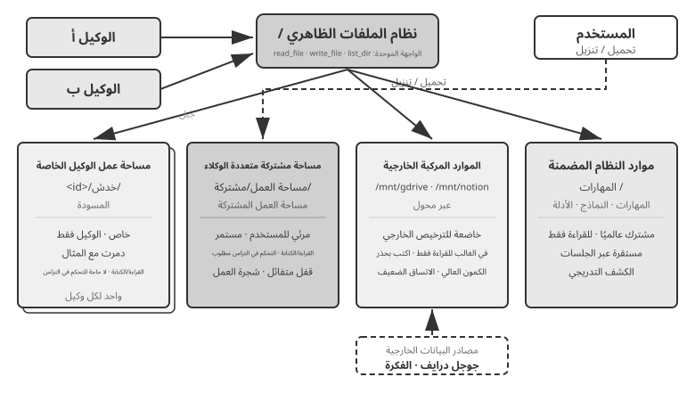
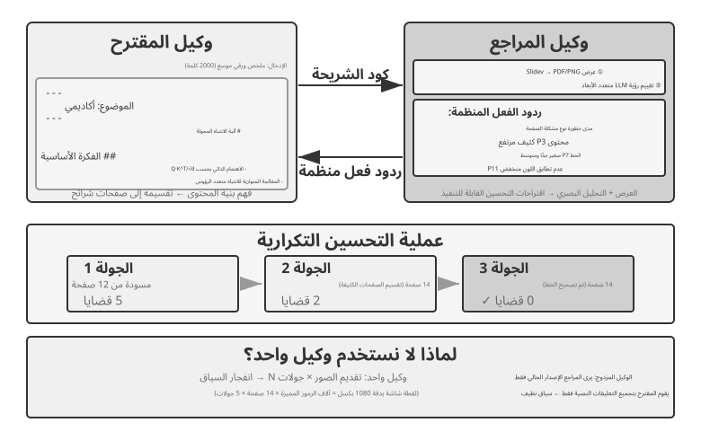
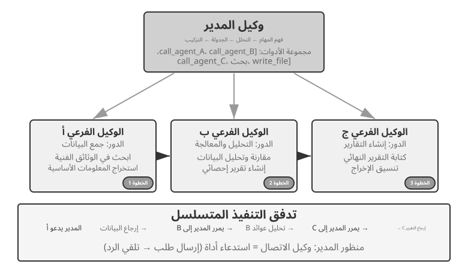
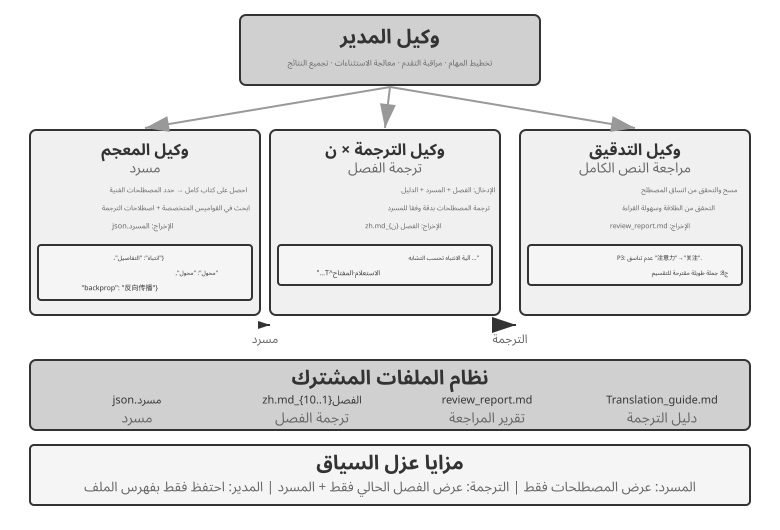
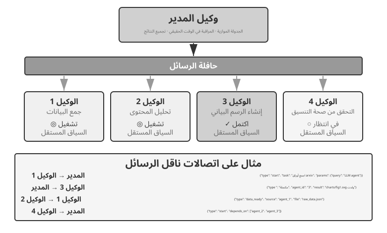
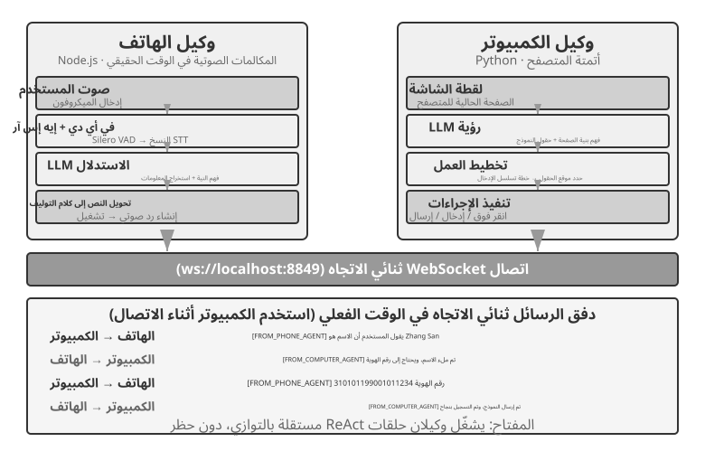
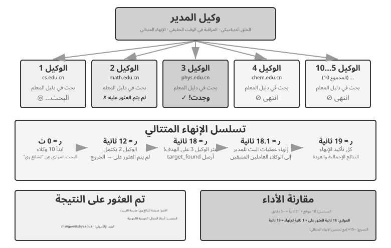
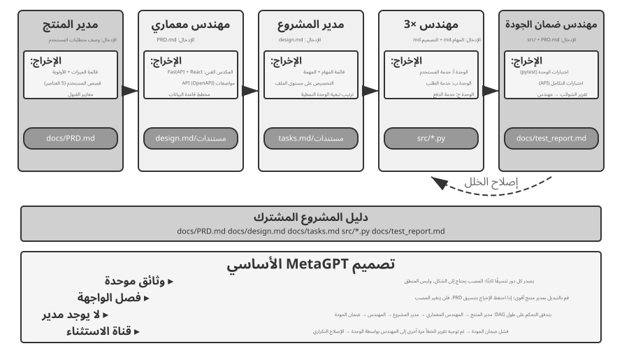
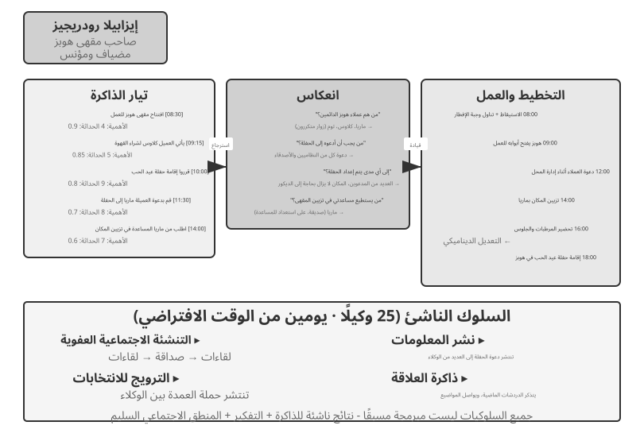
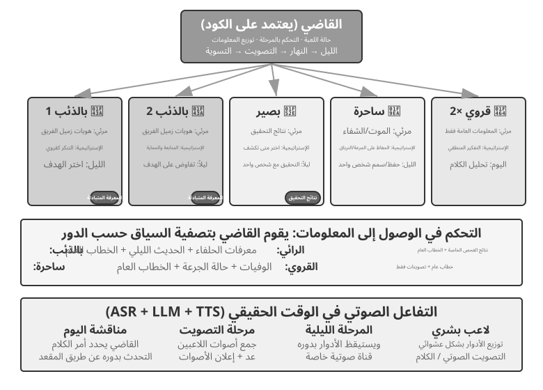

# التعاون متعدد الوكلاء

دارت الفصول التسعة الأولى حول Agent واحد: فبنت أولًا سياقه ومعرفته وأدواته وقدراته على التفاعل، ثم استخدمت التقييم وما بعد التدريب والتطور المستمر لتحسينه على المدى الطويل. وينقل هذا الفصل السؤال من «كيف نبني Agent واحدًا ونحسّنه؟» إلى «كيف ننظم عدة وكلاء؟» كي يتيح تقسيم العمل والتواصل والتحقق المتبادل إنجاز مهام يصعب على وكيل واحد حملها بمفرده.

اقترحت OpenAI مقياسًا من خمسة مستويات لقدرات الذكاء الاصطناعي: المحاورون، ثم المفكرون، ثم الوكلاء، ثم المبتكرون، وأخيرًا المؤسسات. ويُطرح التعاون متعدد الوكلاء كثيرًا بوصفه طريقًا إلى المستوى الخامس. لكن «المؤسسات» هنا تصف مستوى قدرة، أي ذكاءً اصطناعيًا ينجز عمل مؤسسة كاملة، لا بنية إلزامية بعينها؛ فمن حيث المبدأ قد يبلغها وكيل واحد بالغ القوة. أما في الواقع الهندسي الحالي، فما زال الوكيل الواحد مقيدًا بقدرة نموذجه وسعة نافذة سياقه.

لا يقتصر جمع عدة وكلاء على جعل متخصصين مختلفين يسد بعضهم ثغرات بعض، بل يستند إلى فكرة أعمق: **قد يتجاوز ذكاء الجماعة ذكاء أي فرد فيها**. والحضارة الإنسانية خير دليل؛ فذكاء الفرد محدود، لكن تقسيم العمل والتعاون والنقاش وتراكم المعرفة عبر الأجيال منح المجتمع قدرة تفوق أي عبقرية منفردة. وقد تنتج مجموعات الوكلاء صورة مشابهة من الذكاء الجمعي: فحتى إن لم يتجاوز كل وكيل مستوى خبير بشري، قد تحقق مجموعة محكمة التنظيم قدرات أوسع بكثير. وفي ورقة *من AGI إلى ASI*، تضع Google DeepMind «المجموعات واسعة النطاق متعددة الوكلاء» ضمن المسارات الرئيسية إلى الذكاء الفائق؛ فكما يتجمع الذكاء البشري في مجتمعات ومنظمات تتجاوز أفرادها، قد تولّد مجموعة من وكلاء AGI قدرة معرفية تتجاوز مجموع قدرات أعضائها[^agi-asi]. ومن ثم فالتعاون متعدد الوكلاء ليس مجرد حل هندسي لحدود النموذج ونافذة السياق، بل قد يكون طريقًا أساسيًا من ذكاء بمستوى الخبير إلى ذكاء يتجاوز القدرة البشرية الجمعية.

[^agi-asi]: حول "المجموعات واسعة النطاق متعددة الوكلاء" كمسار رئيسي من AGI إلى ASI، راجع Google DeepMind، *من AGI إلى ASI.* arXiv:2606.12683, 2026.

## إطار تصنيف للتعاون متعدد الوكلاء

يبدأ تصميم المنظومة متعددة الوكلاء بقرارين أساسيين يحددان معًا بنيتها وطريقة تنفيذها.

### البعد 1: السياق المشترك مقابل السياق غير المشترك

هذا هو القرار المعماري الأساسي الذي يحدد كيفية تمرير المعلومات بين الوكلاء المتعددين.

**السياق المشترك** يعني أن الوكيل اللاحق يتلقى سجل المحادثة الكامل ومساره (كما هو محدد في الفصل 1) للوكيل السابق. عندما يتغير موجّه النظام ومجموعة الأدوات في كل مرحلة، يعامل النظام المرحلة الجديدة كوكيل مختلف لأن هويته ومسؤولياته وقدراته قد تغيرت، على الرغم من احتفاظه بكل ذاكرة سابقته. على سبيل المثال، بعد أن يكتب محلل المتطلبات مستند المتطلبات، لا يتلقى المطور المستند فحسب، بل يتلقى أيضًا السجل الكامل للاتصالات بين المحلل والمستخدم. يتولى المطور دورًا جديدًا مع الاحتفاظ بكل السياق السابق. الميزة هي عدم فقدان أي معلومات؛ يمكن لكل وكيل مراجعة التفاصيل من أي مرحلة سابقة. ويتمثل التحدي في أن السياق يمكن أن يتوسع بسرعة.

**السياق غير المشترك** يعني أن كل وكيل يحتفظ بسياق مستقل وسجل محادثة ولا يمكنه الوصول مباشرة إلى آثار عمل الوكلاء الآخرين. وهذا يشبه التعاون بين الأقسام المختلفة: حيث يعمل الجميع بشكل مستقل في مكاتبهم الخاصة، ويتبادلون المعلومات من خلال المستندات المشتركة ومحاضر الاجتماعات بدلاً من مشاهدة شاشات بعضهم البعض باستمرار. يقدم هذا النموذج نمطية وعزلة أفضل؛ يحتاج كل وكيل فقط إلى التركيز على المعلومات ذات الصلة بمسؤولياته. كما أن النظام أسهل في التوسع والصيانة - فإضافة وكيل جديد لا يتطلب تعديل المنطق الداخلي للوكلاء الحاليين، بل يتطلب فقط تحديد الواجهات وتنسيقات البيانات.

نظرًا لأن الوكلاء لا يشاركون السياق، فيجب تمرير المعلومات من خلال آليات اتصال واضحة. لقد حسمت الأنظمة الموزعة الكلاسيكية هذا السؤال منذ فترة طويلة: تخبرنا الكتب المدرسية لأنظمة التشغيل أن الاتصال بين العمليات (IPC) يأتي في النهاية في نموذجين فقط: **الذاكرة المشتركة** (أحد الجانبين يكتب والآخر يقرأ نفس كتلة التخزين) و**تمرير الرسائل** (يتم إرسال البيانات بشكل صريح إلى الجانب الآخر). تقع آليات الاتصال بين الوكلاء ضمن هذين النموذجين. هناك ثلاث طرق شائعة:

- **معلمات استدعاء الأداة**: يُغلّف الوكيل النهائي كأداة، ثم يمرر الوكيل الأولي البيانات المنظمة عبر معلماتها، وهي مناسبة للسيناريوهات التي تتطلب بيانات جيدة الكتابة ومنظمة بشكل واضح.
- **نظام الملفات المشترك**: يتبادل الوكلاء المعلومات عن طريق قراءة وكتابة العناصر الوسيطة (المستندات، التعليمات البرمجية، وما إلى ذلك) في دليل مشترك، وهو مناسب للسيناريوهات التي تحتوي على عناصر كبيرة أو حيث تكون هناك حاجة إلى المثابرة.
- **ناقل الرسائل**: وسيط مخصص يقوم بتمرير الرسائل بين الوكلاء. لا يتصل الوكلاء ببعضهم البعض بشكل مباشر ولكنهم يرسلون رسائل إلى الحافلة، والتي تقوم بإعادة توجيهها إلى الوكيل المستهدف.

وإذا أسقطنا هذه الآليات على نموذجي الاتصال بين العمليات (IPC)، كان نظام الملفات المشترك نظيرًا **للذاكرة المشتركة**، وكانت معاملات استدعاء الأدوات وناقل الرسائل صورتين من **تمرير الرسائل**. تُمرَّر معاملات الأداة بالتزامن مع الاستدعاء، أما رسائل الناقل فيسلّمها وسيط على نحو غير متزامن. ولكل نموذج كلفته وفوائده. ومن العبارات الشائعة في مجتمع Go: «لا تتواصل بمشاركة الذاكرة؛ بل شارك الذاكرة بالتواصل».

يوفر ناقل الرسائل **اتصالًا غير متزامن** بطبيعته؛ فلا يلزم أن يكون المرسل والمتلقي متاحين في اللحظة نفسها. وهو يشبه البريد الإلكتروني الداخلي: ترسل الرسالة الآن، فيحفظها الخادم إلى أن يصبح زميلك مستعدًا لقراءتها. ويلائم هذا الأسلوب خصوصًا الأنظمة التي يعمل فيها وكلاء عدة بالتوازي ويحتاجون إلى تنسيق أعمالهم (راجع قسم «التنسيق المتوازي» لاحقًا).


للتوضيح، كلا البنيتين عبارة عن أنظمة حقيقية متعددة الوكلاء لأن موجّه النظام ومجموعة الأدوات تختلف في كل مرحلة، مما يجعلهما وكلاء مختلفين. الفرق يكمن في طريقة التنسيق. **يعتمد السياق المشترك** على التنسيق الضمني: يرث الوكلاء اللاحقون سجل السياق الكامل للوكلاء السابقين، ويمكنهم مراجعة تواريخ تفاعلاتهم المرئية وآثار العمل، وتلقي المعلومات من خلال السياق نفسه. **السياق غير المشترك** يعتمد على التنسيق الواضح: يتبادل الوكلاء المعلومات من خلال الملفات أو الرسائل أو واجهات البيانات المنظمة، ويرى كل وكيل فقط المحتوى ذي الصلة بعمله.

على سبيل القياس: الأول عبارة عن فريق حول طاولة واحدة، حيث يسمع الجميع كل شيء؛ والأخير عبارة عن أقسام تتعاون عبر البريد الإلكتروني والمستندات، ولكل منها مساحة عمل خاصة بها.

قد يجد القراء المطلعون على أنظمة التشغيل تشبيهًا مفيدًا: يشبه وكلاء السياق المشترك الخيوط، بينما يشبه وكلاء السياق غير المشترك العمليات. تشترك الخيوط في مساحة عنوان، مما يجعل التبديل والاتصال غير مكلف ولكنه يوفر القليل من العزلة؛ يمكن أن يؤدي تلف الذاكرة في مؤشر ترابط واحد إلى تعطل العملية بأكملها. كل عملية لها مساحة عنوان خاصة بها، مما يوفر عزلة أقوى وتوازيًا أكثر أمانًا، ولكن يجب أن يستخدم الاتصال IPC بشكل واضح.

**قاعدة عملية**: إذا كان متوقعًا أن يتجاوز السياق التراكمي نصف النافذة، وهي عتبة إرشادية لا حدًا صارمًا، فلا تشاركه كاملًا. أما إذا كان فقدان أي معلومة يهدد صحة المهمة، فالسياق المشترك أنسب. وتمزج الأنظمة الواقعية غالبًا بين الأسلوبين: تشترك الأدوار الأولى في السياق، ثم ينتقل النظام إلى سياقات منفصلة حين يكبر السجل، ويتولى الوكيل الرئيسي اختيار ما ينبغي تمريره صراحةً في كل تسليم.

### البعد الثاني: طوبولوجيا التعاون

البعد الثاني هو **طوبولوجيا التعاون**، أي البنية التي يتدفق عبرها التحكم والمعلومات بين الوكلاء. وهي تختلف مفهوميًا عن مشاركة السياق، وإن ارتبطا عمليًا. فللنظام ذي السياق المشترك طوبولوجيا أيضًا؛ إذ يشكل نمط `transfer_to_agent` في التجربة 10-1 سلسلة من عمليات التسليم. لكن كل تسليم يحمل السجل كاملًا، فلا يحتاج المصمم عادةً إلى اختيار المعلومات المنقولة، وتختزل البنية غالبًا إلى تعاقب بسيط في الأدوار. ويُستثنى من ذلك نمط الدردشة الجماعية الذي سنراه في قسم اللامركزية. أما حين لا يكون السياق مشتركًا، فلا بد من تحديد مسار المعلومات والجهة التي تنسقه تحديدًا صريحًا.

> **ملاحظة مصطلحية: Graph Engineering.** يشير مصطلح «Graph Engineering»، الذي شاع في يوليو 2026، في سياق الوكلاء الحالي عادةً إلى التصميم الصريح لرسم التنفيذ: تكون العُقد وكلاء أو برامج عادية أو قرارات بشرية، وتحدد الحواف اعتماديات المهام والتوجيه الشرطي ومسارات الفشل، وتتدفق الحالة المهيكلة بين العُقد[^ch10-graph-engineering-ar]. وتمثل «طوبولوجيا التعاون» التي يناقشها هذا الفصل الجزء متعدد الوكلاء من هذه الفكرة؛ فالتعاون بين النظراء، وتنسيق المدير، وعمليات التسليم اللامركزية طوبولوجيات رسم مختلفة. ولأن الاسم لا يزال حديثًا ويسهل الخلط بينه وبين الرسوم المعرفية وGraphRAG ومسارات التنفيذ المسجلة، يواصل هذا الكتاب استخدام المصطلحين الأكثر استقرارًا: «طوبولوجيا التعاون» و«التنسيق».

[^ch10-graph-engineering-ar]: للاطلاع على نقاش مبكر للاسم، انظر Josh C. Simmons, *We Are Entering the Graph Engineering Phase*, 2026. وتسمّي الأطر السائدة البنية الهندسية نفسها عادةً graph-based workflow أو orchestration، لا تقنية جديدة كليًا. انظر https://www.drjoshcsimmons.com/writing/we-are-entering-the-graph-engineering-phase، وhttps://docs.langchain.com/oss/python/langgraph/overview، وhttps://learn.microsoft.com/en-us/agent-framework/workflows/، وhttps://adk.dev/workflows/.

نظريًا، يشكّل البعدان مصفوفة 2 × 3: سياق مشترك أو منفصل، في مقابل ثلاث طوبولوجيات. لكن صف السياق المشترك ينتهي في الغالب إلى سلسلة تبديل أدوار لا يبقى فيها كثير من قرارات التوجيه، وهو النمط الذي سنناقشه تحت عنوان «تبديل الأدوار متعدد المراحل». لذلك يركّز الفصل في الطوبولوجيات الثلاث ضمن السياق غير المشترك، مرتبةً من الأبسط إلى الأعقد:

- **نمط التعاون بين النظراء**: يتفاعل عدد صغير من الوكلاء (عادةً 2-3) على قدم المساواة، مما يشكل حلقة تحسين متكررة - مثل كتابة ورقة حيث يقوم شخص واحد بصياغتها ويقوم شخص آخر بتعليقها ومراجعتها، مع جودة بعد عدة جولات تتجاوز بكثير ما يمكن أن يحققه شخص واحد بمفرده.
- **نمط المدير** (نمط التنسيق): يتولى وكيل المدير المركزي مسؤولية تخطيط المهام وجدولتها، بينما يتعامل كل من الوكلاء الفرعيين المتعددين مع مهام فرعية محددة - مثل مدير المشروع الذي يقود العديد من المهندسين المتخصصين في المشروع.
- **النمط اللامركزي**: لا توجد وحدة تحكم مركزية لوقت التشغيل؛ يتواصل الوكلاء مع بعضهم البعض مثل البشر للتعاون في المهام.

ستتم مناقشة التصميم التفصيلي والسيناريوهات القابلة للتطبيق لكل نمط في أقسام فرعية مخصصة لاحقًا.

## متى يكون الوكيل المتعدد أفضل حقًا من الوكيل الفردي؟

قبل التعمق في بنيات التعاون المحددة، دعنا نجيب على سؤال أكثر جوهرية: **متى تكون هناك حاجة فعلية إلى وكلاء متعددين، ومتى يكون وكيل واحد كافيًا؟** ستكون الإجابة بمثابة نقطة مرجعية لكل منهج هندسي يتبع. تتقارب سلسلة من الدراسات الحديثة حول إطار عمل واضح، والمعيار الأساسي هو سؤال واحد: **هل يوفر التعاون معلومات لا يستطيع وكيل واحد الحصول عليها أثناء تقديم إجابته؟**

يوضح الجدول 10-1 أوضاع التعاون التي تقدم معلومات جديدة وتساعد في تقييم ما إذا كان التعاون متعدد الوكلاء يوفر قيمة جوهرية على وكيل واحد.

جدول 10-1 مقارنة الحصول على المعلومات بين أوضاع التعاون متعدد الوكلاء

| وضع التعاون | يقدم معلومات جديدة؟ | تأثير |
|---------------------------------------|---------------------|-----------------------------------|
| المراجعة الذاتية لنفس النموذج (إعادة قراءة مخرجاته الخاصة) | لا | عادة ما تكون غير فعالة أو حتى ضارة |
| وكلاء مختلفون يناقشون نفس النص | لا | يمكن مقارنته بوكيل واحد يتمتع بحساب متساوٍ |
| يستخدم المراجع نتائج تنفيذ الاختبار لمراجعة التعليمات البرمجية | نعم (تعليقات التنفيذ) | تحسن كبير |
| يستخدم المراجع لقطات الشاشة المقدمة لمراجعة كود الواجهة الأمامية/PPT | نعم (تعليقات مرئية) | تحسن كبير |
| يستخدم المراجع أدوات خارجية للتحقق من الحقائق | نعم (تعليقات الأداة) | تحسن كبير |

أظهرت ورقة RLEF لعام 2025، أي التعلم المعزز من ملاحظات التنفيذ[^rlef-2025]، أن تدريب النموذج على الاستفادة من نتائج تشغيل الشفرة في التحسين التكراري يتفوق بوضوح على أخذ عينات مستقلة منه مرات عدة. والسبب أن كل دورة تضيف **دليلًا حقيقيًا من التنفيذ**، مثل أخطاء الترجمة البرمجية وفشل الاختبارات واستثناءات وقت التشغيل؛ وهي معلومات لم تكن متاحة حين كتب النموذج الشفرة أول مرة. وفي مهام إنشاء صفحات الويب، أفادت دراسة WebGen-Agent لعام 2025[^webgen-agent-2025] بأن التغذية الراجعة المرئية متعددة المستويات، التي تجمع لقطات الشاشة بأوصاف نموذج لغوي بصري، رفعت نتيجة Claude 3.5 Sonnet في المعيار من 26.4% إلى 51.9%، أي قاربت مضاعفة الأداء.

[^rlef-2025]: جيرينج، J.، وآخرون. *RLEF: إرساء نماذج اللغة البرمجية في تعليقات التنفيذ مع التعلم المعزز.* arXiv:2410.02089, 2025.
[^webgen-agent-2025]: لو، Z.، وآخرون. *WebGen-Agent: تعزيز إنشاء مواقع الويب التفاعلية من خلال التعليقات متعددة المستويات والتعلم المعزز على مستوى الخطوات.* arXiv:2509.22644, 2025.

يساعد هذا الإطار في حل التناقض الواضح: وجدت بعض الدراسات الأكاديمية أن وجود وكيل واحد يكفي، في حين أن الأنظمة متعددة الوكلاء غالبًا ما تؤدي أداءً أفضل في الممارسة الهندسية. غالبًا ما تختبر الدراسات العديد من الوكلاء الذين يقومون بفحص النص نفسه ومناقشته، كما هو الحال في المناظرة، في حين تضيف الأنظمة الهندسية الفعالة عادةً تعليقات خارجية من تنفيذ التعليمات البرمجية أو العرض المرئي أو الأدوات. هذا الأخير فقط يقدم معلومات جديدة. يمكن فهم جميع الاستخدامات الفعالة تقريبًا للبنى الثلاثة التي تمت مناقشتها لاحقًا - التعاون بين الأقران، والتنسيق، واللامركزية - من خلال هذا المعيار.

تقدم تجربة Anthropic لعام 2026 في اكتشاف الثغرات مثالًا على ذلك. نسّق 45 وكيلًا عمليات البحث عبر منتدى مشترك، وراجعوا نتائج بعضهم، ثم أحالوا القرار النهائي إلى وكيل حكم مستقل. عثرت المجموعة المنسقة على 266 ثغرة باستخدام 27 مليون token، بينما لم يعثر أسلوب التشغيل المتوازي لوكلاء مستقلين سوى على 21 ثغرة باستخدام 6.5 ملايين token. في فضاء بحث مفتوح، يتيح التواصل للنظام متعدد الوكلاء أن يغيّر تركيزه ديناميكيًا وأن يطوّر تخصصات، مستبدلًا ميزانية token أعلى بتغطية أوسع ومسارات اكتشاف أكثر تنوعًا.[^anthropic-multiagent-2026]

[^anthropic-multiagent-2026]: Anthropic Frontier Red Team, “Patterns and Problems in Emerging Multiagent Systems,” 2026-08-13. https://www.anthropic.com/research/multiagent-systems

**ميزانية الخطوة وأداء الوكيل.** هناك سؤال ذو صلة وهو كيف تؤثر ميزانية خطوة الوكيل - عدد استدعاءات الأداة أو جولات التكرار التي قد يستخدمها - على الأداء. قد يبدو من المؤكد أن المزيد من الخطوات ستساعد: مع 30 خطوة، قد يكون لدى الوكيل الوقت فقط لتنفيذ الوظائف الأساسية، في حين أن 300 خطوة تسمح له بالتخطيط والتنفيذ والاختبار والتحسين. ومع ذلك، توصلت دراسة Google لعام 2025 *استخدام الأدوات المدركة للميزانية إلى تمكين توسيع نطاق الوكيل الفعال* إلى نتيجة غير بديهية: **مجرد إعطاء الوكيل المزيد من الخطوات لا يضمن أداء أفضل.** يفتقر الوكلاء القياسيون إلى "الوعي بالميزانية"؛ حتى مع 300 خطوة، فإنهم يميلون إلى إجراء عمليات بحث سطحية والوصول بسرعة إلى الهضبة. لاستخدام الخطوات الإضافية بفعالية، يحتاج الوكلاء إلى آلية تعمل على تكييف استراتيجيتهم مع الموارد المتبقية، والاستكشاف على نطاق واسع في البداية وتضييق نطاق تركيزهم لاحقًا. قدم نهج BAVT (البحث في شجرة القيمة المدركة للميزانية) لعام 2026 تقييمًا للقيمة على مستوى الخطوة، وضبط التوازن بين الاستكشاف والاستغلال وفقًا لنسبة الميزانية المتبقية. ومع انخفاض الميزانية، ينتقل الوكيل من الاستكشاف الواسع إلى التحقيق الأعمق.

هذه النتائج لها آثار مباشرة على تصميم نظام متعدد الوكلاء. على سبيل المثال، في نمط التنسيق، لا ينبغي للوكيل الإداري أن يقوم ببساطة بتوزيع المهام على الوكلاء الفرعيين وانتظار النتائج. وبدلاً من ذلك، يجب **تخصيص ميزانيات الخطوات ديناميكيًا** استنادًا إلى مدى تعقيد المهام، حيث تحصل المهام الفرعية البسيطة على عدد أقل من الخطوات؛ تحصل المهام الفرعية المعقدة على خطوات واسعة. وينبغي لها أيضًا توجيه الوكلاء الفرعيين لاستخدام هذه الميزانيات بحكمة (التخطيط أولاً، ثم التنفيذ، ثم الاختبار، ثم التحسين)، بدلاً من الغوص مباشرة.

ولا يكتمل قرار التصميم من دون حساب **الكلفة**. فالاستكشاف المتوازي والتحسين التكراري يستهلكان موارد فعلية؛ وقد ذكرت Anthropic أن نظامها للبحث متعدد الوكلاء يستخدم نحو خمسة عشر ضعف عدد الرموز في المحادثة العادية، وأن هذا الاستهلاك يفسر وحده قرابة 80% من تفاوت الأداء. لذلك ينبغي أن تكون فائدة تعدد الوكلاء كبيرة بما يكفي لتبرير كلفة قد تتضاعف مرات عدة؛ وإلا كان وكيل واحد مضبوط بعناية خيارًا أجدى.

## تعاون متعدد الوكلاء مع سياق مشترك

في التعاون ذي السياق المشترك تكون كل مرحلة وكيلاً مستقلاً، لها System Prompt وأدواتها، لكنها ترث المسار الكامل للمرحلة السابقة. ميزته الأساسية عدم فقدان المعلومات؛ أما التحدي فهو إبقاء الوكيل الحالي مركزاً على مسؤوليته رغم تراكم التاريخ.

في المهام المعقدة قد تتغير الأدوار بوضوح بين المراحل. استخدام System Prompt ثابت يجعله إما عاماً أكثر من اللازم أو طويلاً بصورة مربكة، لذلك يمكن تبديل الـ System Prompt ومجموعة الأدوات وفق المرحلة.

هناك خيار معماري مهم: هل يتم تبديل الـ System Prompt أم تحميل Skill؟ كلاهما يغيّر قواعد السلوك، لكن بكلفة وحدود مختلفة.

| الخيار | حامل تعليمات الدور | الأدوات المرئية | الأثر على السياق/KV Cache | قوة القيد |
|---|---|---|---|---|
| `transfer_to_agent` | استبدال System Prompt وغالباً مجموعة الأدوات | أدوات الدور الحالي فقط | يغيّر بادئة الطلب عند كل انتقال، فلا يمكن عادة إعادة استخدام الكاش بعد موضع الاختلاف | قوية: يمكن إخفاء الأدوات الخارجة عن الدور من الـ schema |
| Skill | فهرس Skills ثابت، وإلحاق `SKILL.md` بالمسار عند الطلب | غالباً كتالوج الأدوات كاملاً أو مدخل بحث ثابت | تبقى البادئة الثابتة كما هي، وتضاف تعليمات Skill في نهاية المسار | ضعيفة: Skill تعليمات سلوكية، والحدود الصلبة تحتاج بوابة Harness |

إذا كان اختلاف الدور في المعرفة أو الإجراء أو أسلوب الكتابة، فابدأ بـ Skill. وإذا كان الاختلاف متعلقاً بالصلاحيات أو عزل الأدوات أو الامتثال أو منع الآثار الجانبية، فاستخدم وكيلاً مستقلاً أو `transfer_to_agent` مع قيود أدوات مطبقة برمجياً في الـ Harness.

> **التجربة 10-1 ★★: تبديل الأدوار في السياق المشترك — System Prompt مقابل Skill**
>
> **المهمة والمتغيرات المشتركة**: يستخدم المساران النموذج نفسه، ومهمة المستخدم نفسها، وتنفيذ الأدوات نفسه، وتعليمات الأدوار نفسها، والمسار المشترك كاملاً. المطلوب إيجاد مبيعات مركبات الطاقة الجديدة في الصين للأعوام 2021–2023، وحساب CAGR، وكتابة ملخص صيني للمستثمر لا يتجاوز 120 حرفاً.
>
> **المسار الأول: تبديل System Prompt**. الأدوار الخمسة هي `triage` و`research` و`coding` و`data_analysis` و`writing`. لا يرى كل دور إلا أدواته و`transfer_to_agent`؛ وعند التسليم يُحفظ التاريخ وتُحمّل تعليمات الدور المستهدف وأدواته ثم يستأنف التنفيذ.
>
> **المسار الثاني: Skill**. يظل System Prompt وكتالوج الأدوات ثابتين طوال الجلسة. يستدعي النموذج `load_skill(name)`، وتدخل وثيقة `SKILL.md` المقروءة إلى المسار كنتيجة أداة. تبقى البادئة ثابتة، لكن الصلاحيات الصلبة تفرضها قواعد الـ Harness.

## تعاون متعدد الوكلاء بدون سياق مشترك

في بنية بدون سياق مشترك، يعمل كل وكيل ككيان مستقل له سياقه ومساره وحالته الخاصة. لا يمكن للوكلاء الوصول مباشرة إلى السياق الداخلي لبعضهم البعض؛ ويعتمد التعاون كليًا على عمليات نقل البيانات الواضحة والمنظمة من خلال آليات الاتصال الثلاث التي تم تقديمها في بداية هذا الفصل: معلمات استدعاء الأداة، ونظام الملفات المشترك، وحافلة الرسائل.

في وقت سابق من هذا الفصل، قمنا بمقارنة آليات الاتصال بأشكال الاتصال بين العمليات والسياق المشترك مقابل السياق المعزول بالخيوط مقابل العمليات. ويمكن توسيع هذا التشبيه أكثر (الجدول 10-2):

جدول 10-2 المقابلة المفاهيمية بين أنظمة التشغيل والأنظمة متعددة الوكلاء

| مفهوم نظام التشغيل (OS) | النظير في النظام متعدد الوكلاء |
|----------|----------------|
| البرنامج التنفيذي (Binary Executable) | البادئة الثابتة (موجّه النظام + تعريفات الأدوات) |
| ذاكرة العملية (Process Memory) | المسار وسياق المحادثة (Trajectory) |
| وحدة المعالجة المركزية (CPU) | النموذج اللغوي الكبير (LLM) |
| النواة (OS Kernel) | بيئة تشغيل الوكيل (Agent Runtime) |
| استدعاء النظام (System Call) | استدعاء الأداة (Tool Call) |
| إنشاء عملية فرعية (Fork) | إنشاء وكيل فرعي (`spawn_subagent`) |
| إنهاء عملية (Kill / Signal) | إلغاء وكيل فرعي (`cancel_subagent`) |
| سرد العمليات (ps / Status) | استكشاف الوكلاء (`list_agents`) |
| كود الخروج والانتظار (`exit` / `wait`) | الملخص الهيكلي المرجع من الوكيل الفرعي |
| الذاكرة المشتركة / تمرير الرسائل | نظام الملفات المشترك / ناقل الرسائل |
البرنامج عبارة عن رمز ثابت؛ العملية هي مثيل واحد قيد التشغيل للبرنامج. وبالمثل، تحدد البادئة الثابتة من هو الوكيل، بينما يسجل المسار مدى تقدمه. يلعب LLM دور وحدة المعالجة المركزية: فهو لا يحمل أي حالة خاصة به ويتم مشاركته بالوقت عبر العديد من الوكلاء عن طريق تحميل سياقات مختلفة - وقد تم استعارة مصطلح "تبديل السياق" من أنظمة التشغيل. وللسبب نفسه، يؤدي التبديل في وحدة المعالجة المركزية الأسرع إلى استمرار تشغيل البرنامج كما كان من قبل؛ إن التبديل في نموذج أقوى يبقي الوكيل هو نفس الوكيل - حيث تعيش هويته وذاكرته في البادئة والمسار، وليس في أوزان النموذج.

هذا التجريد ليس جديدًا: الحالة الخاصة، والرسائل غير المتزامنة، والقدرة على إنشاء أعضاء جدد هي بالضبط الإعداد الأساسي لنموذج الممثل في السبعينيات[^actor-model]. وبالتالي يمكن النظر إلى النظام متعدد الوكلاء على أنه إصدار قائم على LLM لنموذج الممثل، وينطبق الكثير من المعرفة المتراكمة من أنظمة التشغيل والأنظمة الموزعة بشكل مباشر.

[^actor-model]: Hewitt, C., Bishop, P., Steiger, R. *A Universal Modular Actor Formalism for Artificial Intelligence.* IJCAI 1973.

ويحقق هذا العزل، الشبيه بعزل العمليات، فوائد هندسية ملموسة: يمكن تطوير كل وكيل واختباره مستقلًا، وإضافة قدرات جديدة من دون تعديل الشفرة القائمة، واحتواء خطأ الوكيل بدل انتقاله تلقائيًا إلى الآخرين، وتشغيل وكلاء عدة بالتوازي من دون تزاحم على سياق واحد.

ومع ذلك، فإن عدم مشاركة السياق له تكاليفه أيضًا. المشكلة الأكثر وضوحًا هي مشكلة مزامنة المعلومات: كيف يحافظ الوكلاء على فهم متسق لحالة المهمة؟ هل سيتم فقدان المعلومات أو تكرارها أثناء النقل؟ يصبح تصحيح الأخطاء أيضًا أكثر صعوبة - عند ظهور مشكلات، يجب مراجعة السجلات من العديد من الوكلاء لتجميع عملية التنفيذ الكاملة معًا. تجعل هذه المشكلات تصميم مواصفات الواجهة وتنسيقات البيانات وبروتوكولات الاتصال أمرًا بالغ الأهمية.

يعتمد التعاون الصريح دون سياق مشترك على بنيتين أساسيتين مستقلتين عن الهيكل. الأول هو **نظام الملفات المشترك**، وهو الوسيط المستمر الذي من خلاله يتبادل الوكلاء العناصر مع بعضهم البعض ومع المستخدم، مما يشكل مستوى بيانات التعاون. والثاني هو **آلية الاتصال والتحكم**، التي تدعم تمرير الرسائل واستعلامات الحالة وإنهاء التنفيذ وجدولة الموارد بين الوكلاء، مما يشكل مستوى التحكم في التعاون. تم بناء الطبولوجيا الثلاثة أدناه على هذين الأساسين.

### نظام الملفات من منظور الوكيل

عرضنا في بداية الفصل «نظام الملفات المشترك» بوصفه إحدى آليات الاتصال الثلاث في البنى التي لا تتشارك سياقًا واحدًا. لكن ما يراه الوكيل في النظام الفعلي ليس مخزنًا وحيدًا، بل **نظام ملفات افتراضيًا** يجمع تحت شجرة أدلة واحدة مخازن مختلفة في مصدرها وعمرها وصلاحياتها. يتعامل الوكيل معها عبر واجهات موحدة مثل `read_file` و`write_file` و`list_dir`، مع أن ما تحتها قد يكون قرصًا محليًا مؤقتًا، أو مخزن كائنات دائمًا، أو واجهة لخدمة سحابية خارجية، أو حزمة موارد للقراءة فقط.

ومن شروط التصميم السليم توضيح بنية هذه الشجرة: من يرى كل منطقة، وكم تدوم، ومن يملك الكتابة فيها. فكثير من تعارضات التزامن وتسرب المعلومات سببه خلط مساحات كان ينبغي عزلها. ويمكن تشبيه المناطق الأربع الآتية بمقاطع ذاكرة ذات صلاحيات مختلفة داخل فضاء عناوين الوكيل: منها الخاص القابل للكتابة، والمشترك بين أطراف عدة، والمخصص للقراءة فقط. وينطبق هنا مبدأ حماية أنظمة التشغيل نفسه: العزل هو الوضع الافتراضي، والمشاركة قرار صريح.

**أولًا: مساحة العمل الخاصة بالوكيل (مساحة المسودات).** وهي دليل لا يراه إلا مثيل الوكيل المالك، تُحفظ فيه النتائج الوسيطة والملفات المؤقتة والمسودات وسجلات التنقيح، وتنتهي دورة حياته بانتهاء ذلك المثيل. ويحقق عزله غرضين: يمنع وكلاء عدة من الكتابة فوق ملفات بعضهم، ويبقي سياق الوكيل الرئيسي نظيفًا؛ إذ تظل محاولات الوكيل الفرعي ومسوداته في مساحته الخاصة، ولا ينتقل إلى المساحة المشتركة إلا الناتج النهائي. وهذا هو المقابل التخزيني لمبدأ الفصل الرابع القائل إن الوكيل الفرعي يعيد ملخصًا منظمًا لا مساره كاملًا.

**ثانيًا: مساحة العمل المشتركة بين الوكلاء.** وهي منطقة تعاون يستطيع وكلاء عدة القراءة منها والكتابة فيها، وتكون **مرئية للمستخدم** أيضًا. تمثل هذه المساحة الوسيلة الأساسية لتبادل العناصر حين لا يشترك الوكلاء في السياق؛ فقد يكتب وكيل المصطلحات مسردًا يقرأه وكيل الترجمة، ويستطيع المستخدم رفع الملفات المصدر وتنزيل المخرجات النهائية من الموضع نفسه. يمتد عمرها عادةً طوال المهمة، ولذلك تحتاج إلى تخزين دائم. ولأن أطرافًا عدة قد تكتب فيها بالتزامن، فهي بؤرة محتملة للتعارضات، وتفيد فيها آليات مثل القفل المتفائل وعزل أشجار العمل، كما سيأتي في «وضع الفشل الأول». ويقدم استخدام `/workspace/shared` في تجربة الفصل الرابع للربط بين الوكيل الرئيسي والحاسوب والهاتف الافتراضيين مثالًا واضحًا على هذه الطبقة.

**ثالثا. الموارد الخارجية المثبتة.** يتم تعيين مصادر معلومات الجهات الخارجية المعتمدة من قبل المستخدم - Google Drive، وNotion، وDropbox، ومواقع wiki الخاصة بالمؤسسة، وما إلى ذلك - لنقاط التثبيت في نظام الملفات (على سبيل المثال، `/mnt/gdrive`) عبر المحولات. يصل الوكيل إلى مستند Notion من خلال قراءة ملف؛ يقوم المحول الأساسي باستدعاء API المطابق. ثلاث خصائص تميز هذه الطبقة عن التخزين المحلي ويجب التعامل معها بوضوح أثناء التصميم: **الوصول مقيد بأذونات خارجية** (أذونات المستخدم في النظام المصدر تحدد رؤية الوكيل)، **زمن الاستجابة أعلى والاتساق أضعف** (تتضمن كل قراءة رحلة ذهابًا وإيابًا للشبكة، وقد لا تكون التغييرات الخارجية مرئية على الفور، لذلك يجب التعامل مع البيانات على أنها متسقة في النهاية)، و **يتم الوصول في المقام الأول عند الطلب والقراءة فقط** (يجب أن تتم الكتابة إلى المصادر الخارجية بحذر، حيث قد تؤدي عمليات الكتابة الخاطئة إلى تلويث البيانات الحقيقية للمستخدم). تعني واجهة الملف الموحدة أن الوكيل لا يحتاج إلى أداة مخصصة لكل مصدر بيانات، ولكنها تخفي أيضًا هذه الاختلافات في الأداء والأمان. ولذلك، يجب إدارة حالة القراءة فقط/القابلة للكتابة، والمهلات، وحدود بيانات الاعتماد بشكل صريح على مستوى التحميل.

**رابعا. موارد النظام المضمنة.** حزمة موارد تم تثبيتها مسبقًا بواسطة النظام ومشاركتها للقراءة فقط مع جميع الوكلاء. ومن الأمثلة النموذجية **المهارات** التي تم تقديمها في الفصلين الثاني والرابع، وهي وثائق ونصوص معرفية منظمة كملفات، مثبتة في مسارات مثل `/skills`، ويمكن الوصول إليها عن طريق الكشف التدريجي (الفهرسة أولاً، ثم التوسع عند الطلب). تتضمن الأمثلة الأخرى الأدلة المرجعية ومكتبات النماذج وتعريفات الأدوات المشتركة. هذه الطبقة مشتركة عالميًا، للقراءة فقط، ومستقرة عبر الجلسات، ويمكن لجميع الوكلاء قراءتها بشكل متزامن دون التحكم في التزامن.

يوضح الشكل 10-2 كيفية تركيب أنواع المناطق الأربعة هذه بشكل موحد تحت شجرة دليل واحدة: يصل الوكيل إلى الشجرة بأكملها من خلال واجهة موحدة، ويقوم المستخدمون بتحميل الملفات وتنزيلها من المساحة المشتركة، ويتم تركيب مصادر البيانات الخارجية عبر المحولات، ويتم توفير موارد النظام المضمنة للقراءة فقط.



يقارن الجدول 10-3 أنواع المناطق الأربعة هذه عبر أربعة أبعاد — الرؤية، ودورة الحياة، وأذونات القراءة/الكتابة، والتحكم في التزامن — لتكون بمثابة قائمة مرجعية لتصميم تخطيط نظام الملفات.

جدول 10-3 أربعة أنواع من مناطق نظام الملفات الظاهري للوكيل

| المنطقة | الرؤية | دورة الحياة | القراءة/الكتابة | التحكم في التزامن |
|--------------|-----------------|------------------------|---------------------|-------------------|
| مساحة عمل خاصة بالوكيل | الوكيل المالك فقط | دمرت مع مثيل الوكيل | القراءة/الكتابة | غير مطلوب (خاص) |
| مساحة عمل مشتركة متعددة الوكلاء | جميع الوكلاء المتعاونين والمستخدم | يستمر طوال مدة المهمة | القراءة/الكتابة | مطلوب (قفل متفائل / شجرة العمل) |
| الموارد الخارجية المركبة | يعتمد على الترخيص الخارجي | يتم تحديده من خلال مصدر خارجي | في الغالب للقراءة فقط، تتطلب الكتابة الحذر | تدار من قبل مصدر خارجي |
| موارد النظام المضمنة | جميع الوكلاء | مستقرة عبر الجلسات | للقراءة فقط | غير مطلوب (للقراءة فقط) |

تكمن قيمة **"مسار الملف كواجهة عالمية"** في التعامل مع المسار باعتباره وحدة التبادل. سواء قام الوكلاء بتبادل القطع الأثرية، أو قام الوكيل الرئيسي بتسليم المدخلات إلى وكيل فرعي، أو تعاونت المؤسسات من خلال A2A، فإنهم يمررون سلسلة مسار خفيفة الوزن بدلاً من تحميل محتويات الملف في نافذة السياق (الفصل 4). يتوافق هذا مع مفهوم الفصل الخامس الخاص بـ "نظام الملفات كمركز للوكيل"، والذي يصف كيفية استخدام وكيل واحد لنظام الملفات لاستضافة الذاكرة والقدرات. هنا، يمتد نفس التجريد إلى وكلاء متعددين: توفر شجرة الدليل الظاهري التي تحتوي على وحدات تخزين خاصة ومشتركة وخارجية ومدمجة أساسًا للتخزين للتعاون متعدد الوكلاء.

### التواصل والتحكم بين الوكلاء

في حين أن نظام الملفات يحل مشكلة **تبادل العناصر** بين الوكلاء، فإن التعاون يتطلب أيضًا **مستوى تحكم**. هذا هو بالضبط المكان الذي تلعب فيه صفوف دورة الحياة في الجدول 10-2: أساسيات الأداة الواردة في الفصل 4 - الإنشاء (`spawn_subagent`)، وإرسال الرسائل (`send_message_to_subagent`)، والإلغاء (`cancel_subagent`)، والاكتشاف (`list_agents`) - تتوافق مع التفرع والرسالة والقتل والملاحظة في عالم العمليات. لا يكرر هذا القسم تعريفات الواجهة ولكنه يركز على أربع إمكانات غالبًا ما يتم التغاضي عنها وهي ضرورية للتعاون متعدد الوكلاء.

**أولًا: تمرير الرسائل.** أبسط صورة هي الاتصال المباشر من نقطة إلى نقطة، كأن يستدعي الوكيل A الدالة `send_message_to_agent_b(content)`. ويلائم ذلك البنى الثابتة ذات العدد القليل من الوكلاء، مثل إعداد الهاتف والحاسوب في التجربة 10-3. لكن عدد الوصلات المباشرة ينمو تربيعيًا مع عدد الوكلاء، كما يشترط توافر المرسل والمتلقي في الوقت نفسه. وعند اتساع النظام أو الحاجة إلى توازٍ غير متزامن، يكون **ناقل الرسائل** أنسب: ينشر الوكلاء رسائلهم عليه، ثم يوجهها وفق الاشتراكات، فلا يحتاج المرسل إلى معرفة المتلقين. وفي الحالتين ينبغي أن تحمل الرسالة **غلافًا** منظمًا يتضمن هوية المرسل والوجهة، ونوع الرسالة مثل `task_assigned` أو `status_update` أو `result` أو `terminate`، وحمولة JSON. ويجعل هذا التنسيق التوجيه والتحليل أكثر موثوقية، ويحافظ على سلسلة تعاون قابلة للتتبع والتنقيح.

**ثانيا. الاستعلام عن الحالة.** هذا هو الجزء الأكثر استخفافًا في مستوى التحكم. بمجرد قيام الوكيل الرئيسي بإرسال وكيل فرعي، فإنه يحتاج إلى رؤية تقدم الوكيل الفرعي؛ وبخلاف ذلك، لا يمكنه أن يقرر ما إذا كان سيستمر في الانتظار أم لا، ولا يمكنه التدخل عندما يتعطل الوكيل الفرعي. يتمثل الأسلوب البديهي في الاقتراض من RPC وتحديد واجهة استعلام `get_subagent_status(agent_id)` التي تُرجع "قيد التشغيل/مكتمل/فشل" بالإضافة إلى نسبة التقدم. ولكن تبين أن واجهة السحب هذه أقل فائدة بكثير مما كان متوقعًا: يبدأ الوكيل الفرعي في التنفيذ لحظة إنشائه ويعمل حتى يكتمل أو يفشل. فهو لا يتنقل عبر سلسلة من الحالات الموضوعة في قائمة الانتظار بالطريقة التي تعمل بها الوظائف في نظام الدُفعات التقليدي، تمامًا كما نادرًا ما تحتاج برمجة Unix إلى استقصاء عملية أخرى بواسطة PID الخاص بها لمعرفة حالة التشغيل. يحمل الاقتراع أيضًا معضلة متأصلة: قم بالتصويت في كثير من الأحيان، مما يؤدي إلى إهدار الرموز المميزة؛ نادرًا ما تقوم بالاستطلاع وتتفاعل متأخرًا. الطريقة الأكثر طبيعية للحصول على المكانة هي العودة إلى نموذجي الاتصال اللذين تم تقديمهما في بداية هذا الفصل.

**معرفة الحالة بتمرير الرسائل.** يرسل الوكيل الرئيسي سؤالًا إلى الوكيل الفرعي، فيجيبه الأخير عندما تسمح مرحلته الحالية. لا يوقف الإرسال عمل الوكيل الرئيسي، كما أن توقيت الرد، أو عدم وروده، مسألة مستقلة؛ يشبه ذلك سؤال مديرٍ أحد زملائه عن تقدم العمل برسالة فورية من دون مطالبته بترك ما في يده حالًا. ويمكن للوكيل الفرعي أن يبادر كذلك بإرسال تحديث عند بلوغ محطة مهمة. وإذا كان النظام يملك ناقل رسائل أصلًا، فما عليه إلا نشر حدث `status_update`، وهو نمط «المراقبة في الوقت الحقيقي» في التجربة 10-4. وسواء طُلب التحديث أم أُرسل تلقائيًا، ينبغي أن يستخدم مفردات موحدة لآلة الحالة، مثل: قيد التنفيذ، يحتاج إلى مدخلات، مكتمل، وفاشل. وهذا بالضبط ما يوحّده بروتوكول A2A لاحقًا في الفصل.

**معرفة الحالة عبر نظام الملفات المشترك.** أكثر الأساليب شمولًا هو **حفظ المسار**: يرمّز الوكيل الفرعي كل حدث أثناء التنفيذ بصيغة JSON ويلحقه بملف سجل، غالبًا ملفًا واحدًا لكل جلسة وحدثًا واحدًا في كل سطر، أي بصيغة JSONL. وكما عرّفنا في الفصل الأول، يشمل المسار رسائل المستخدم وردود النموذج واستدعاءات الأدوات ونتائجها. وبذلك لا يحتاج الوكيل الرئيسي إلى بروتوكول خاص لطلب الحالة؛ إذ يستطيع قراءة السجل ومعرفة الأداة التي استُدعيت، وما حدث في الخطوة الأخيرة، وهل علق الوكيل في حلقة من المحاولات الفاشلة. يشبه هذا، من منظور أنظمة التشغيل، قراءة ذاكرة عملية أخرى مباشرة. وهو لا يستهلك سياق الوكيل الفرعي ولا يتوقف على تعاونه، ويوفر أدق مستوى من المراقبة.

مثل هذه التفاصيل الشاملة تشكل أيضًا عبئًا. يمكن أن يمتد المسار بسهولة إلى عشرات الآلاف من الرموز، ويجب على الوكيل الرئيسي استخلاصه بعد القراءة، مما يستهلك الوقت والرموز. في معظم السيناريوهات، يكون **ملف التقدم المتفق عليه** أكثر عملية: عند بدء تشغيل الوكيل الفرعي، يوجهه الوكيل الرئيسي إلى تحديث `progress.md` عند إكمال كل عنصر. يمكن للوكيل الرئيسي قراءة هذا الملف خفيف الوزن في أي وقت لقياس التقدم. وهذا يشبه عمليتين تحجزان كتلة صغيرة من الذاكرة المشتركة بتنسيق متفق عليه، مما يكشف التقدم المحرز بدلاً من حالة الذاكرة بأكملها.

يمكّن ملف التقدم أيضًا **الكشف عن التوقف**. إذا لم يتغير وقت التعديل الأخير لـ `progress.md` أو ملف المسار لأكثر من N دقيقة، فيمكن للنظام التعامل مع الوكيل الفرعي على أنه غير نشط وتشغيل شبكة أمان المهلة (تكرار آليات Heartbeat و`monitor_shell` من الفصل السادس). وهذا يمنع الوكيل الفرعي المتوقف من سحب النظام بأكمله إلى الأسفل.

إن قيمة استمرارية المسار تتجاوز مجرد الرصد. تذكر نتيجة الفصل الأول: "سياق الوكيل = بادئة ثابتة + مسار." يتم تحديد البادئة الثابتة (موجّه النظام، تعريفات الأداة) عن طريق التعليمات البرمجية، وليس لدى الوكيل نفسه حالة وقت تشغيل تتجاوز المسار (العناصر العاملة موجودة بالفعل في نظام الملفات) —**المسار هو حالة الوكيل بالكامل**. إن استمرار المسار إلى الملف في الوقت الفعلي يعادل الاحتفاظ بنقطة تحقق كاملة في جميع الأوقات: سواء تعطلت عملية الوكيل، أو فقد الجهاز الطاقة، أو قام المستخدم بإغلاق الجلسة بشكل فعال، فإن إعادة تحميل ملف المسار ببساطة وتعليق البادئة الثابتة مسبقًا يسمح باستئناف التنفيذ من حيث توقف - وهذا هو بالضبط كيفية تنفيذ ميزة استئناف الجلسة لوكلاء البرمجة مثل Claude Code وCodex CLI. هذه هي نفس فكرة سجل الكتابة المسبقة لقاعدة البيانات (WAL): يتم إلحاق كل حدث أولاً بسجل إلحاق فقط، ويمكن دائمًا إعادة تشغيل الحالة من السجل (تصميم الذاكرة "سجل الحقائق + نقطة التفتيش الدورية" للفصل الثالث هو نفس الفكرة المطبقة على أنظمة الذاكرة). بالنسبة لنظام متعدد الوكلاء، يعني هذا أن الوكلاء الفرعيين بطبيعة الحال **قابلون للاسترداد والتدقيق وسهل التسليم**: يمكن للمدير إعادة تشغيل وكيل فرعي من آخر حالة صالحة له بعد العطل، وإعادة تشغيل حدث المسار حسب الحدث بعد ذلك لتحديد سبب الفشل، وحتى تسليم المسار مع المهمة إلى وكيل آخر للمتابعة.

**ثالثا. إنهاء التنفيذ.** في التعاون الموازي، السيناريو الشائع هو "نجاح أحدهم، والباقي يصبح غير ذي صلة" - يقوم العديد من الوكلاء بالبحث بشكل منفصل، وبمجرد العثور على الهدف، يجب على الآخرين التوقف فورًا (الإنهاء المتتالي في التجربة 10-4 من هذا الفصل). هناك مستويان من الإنهاء، وسيتعرف مستخدمو Unix عليهما باعتبارهما الفرق بين SIGTERM وSIGKILL. **يُفضل الإنهاء اللطيف**: يرسل الوكيل الرئيسي إشارة `terminate`، ويستجيب الوكيل الفرعي عند نقطة آمنة في خطوته الحالية، وينظف الموارد (يغلق جلسات المتصفح، ويكتب الملفات المعلقة، ويحرر الأقفال)، ويرسل إقرارًا (ack)، ثم يخرج. **الإنهاء القسري** هو إجراء احتياطي: إنهاء العملية مباشرة، ويتم استخدامه فقط عندما لا يستجيب الوكيل الفرعي للإشارة اللطيفة، على حساب احتمال ترك موارد متدلية وعمليات كتابة غير مكتملة. هناك نقطتان هندسيتان تحتاجان إلى الاهتمام. أولاً، يتطلب الإنهاء الآمن أن يقوم الوكيل الفرعي بالتحقق دوريًا من إشارة الإنهاء في حلقته (على غرار آلية المقاطعة في الفصل السادس)؛ وإلا فلن يتمكن من استقبال الإشارة. ثانيًا، الإنهاء المتتالي له حالة سباق: قد يقوم العديد من الوكلاء الفرعيين بالإبلاغ عن النجاح في وقت واحد تقريبًا. يجب على الوكيل الرئيسي استخدام تصميم قفل أو غير فعال لضمان قبول نجاح واحد فقط وبث إشارة الإنهاء مرة واحدة. انظر مناقشة ظروف السباق في التجربة 10-4.

لا تزال هناك نهاية واحدة غير واضحة: بعد انتهاء عمل الوكيل الرئيسي، ماذا يحدث للوكلاء الفرعيين الذين ما زالوا قيد التشغيل؟ يستعير النهج الهندسي الأنظف من سياق Go - حيث يتسلسل الإنهاء إلى أسفل علاقة الإنشاء: قم بإلغاء وكيل واحد ويتم إلغاء جميع الوكلاء الفرعيين الذين تم إنتاجهم معه، مما يمنع الوكلاء الصغار اليتيمين من تركهم في الخلف. يتوافق "الوكيل الفرعي للتحقق من إشارة الإنهاء عند نقطة آمنة" أعلاه بدقة مع استقصاء `ctx.Done()` في Go. على العكس من ذلك، إذا كنت حقًا بحاجة إلى وكيل خلفية طويل الأمد منفصل عن الوكيل الرئيسي (مثل `nohup` الخاص بـ Unix)، فليبدأ من شجرة دورة حياة جديدة (تتوافق مع `context.Background()`)، معلنًا صراحةً أنه لا ينتهي مع الأصل.

**رابعا. إدارة الموارد والجدولة.** النصف الآخر من مهمة نظام التشغيل هو تخصيص الموارد النادرة. في عالم العمليات، الموارد النادرة هي وقت وحدة المعالجة المركزية والذاكرة؛ في عالم الوكيل، هي الرموز المميزة والمال وميزانية التزامن - كل خطوة يتخذها الوكيل الفرعي تستهلك الثلاثة. تقع هذه المسؤولية عادةً على عاتق المدير أو وقت التشغيل: قم بتعيين خطوة أو ميزانية رمزية عند بدء وكيل فرعي، وتوقف بمجرد تجاوزها؛ إعطاء المهام الصعبة لنموذج قوي والمهام الميكانيكية لنموذج منخفض التكلفة؛ الحد الأقصى للتزامن بحيث لا يستنفد العشرات من الوكلاء حصة API مرة واحدة؛ وعندما تصل مهمة أكثر إلحاحًا، قم بمقاطعة وكيل فرعي منفذ - وهذا إجراء استباقي. تعتبر الممارسة في هذا المجال أقل نضجًا بكثير من جدولة وحدة المعالجة المركزية، ولكنها تحدد سقف التكلفة لنظام متعدد الوكلاء ويجب أخذها في الاعتبار في مرحلة التصميم المعماري.

يدعم تبادل العناصر (مستوى البيانات) وتمرير الرسائل والاستعلام عن الحالة وإنهاء التنفيذ وجدولة الموارد (مستوى التحكم) معًا الأنظمة متعددة الوكلاء التي لا تشارك السياق. إن طبولوجيا التعاون الثلاثة أدناه هي، في الأساس، خيارات مختلفة - مبنية على هاتين المستويتين - حول من يملك السيطرة وكيفية تدفق المعلومات.

استنادًا إلى العلاقات التعاونية وخصائص تدفق التحكم بين الوكلاء، يمكن تقسيم التعاون دون سياق مشترك إلى ثلاث بنيات رئيسية - نمط التعاون بين الأقران، ونمط المدير، والنمط اللامركزي - كل منها مناسب لأنواع مختلفة من المهام.

### نمط التعاون بين الأقران: الفحوصات المتبادلة والتحسين التكراري

يتضمن التعاون بين الأقران عادةً وكيلين أو ثلاثة متساوين في المكانة يتبادلون الملاحظات عبر عدة جولات. تكمن قيمته المحتملة في وجهات النظر المستقلة والتنوع المعرفي، لكن «تعدد النسخ» لا يعني تلقائيًا «تعدد طرق التفكير». عندما يكون النموذج والسياق والبنية الداعمة متشابهة إلى حد كبير، يميل الوكلاء المختلفون إلى اتخاذ القرارات نفسها، فيتحول الخطأ المحلي إلى إخفاق منهجي. يجب تصميم التنوع الحقيقي عبر اختلاف النماذج والسياقات والأدوات والأدلة المرئية أو المسؤوليات، وجعل كل وكيل يحكم بصورة مستقلة قبل تجميع النتائج.[^anthropic-multiagent-2026]

بالمقارنة مع أنماط المدير واللامركزية، يعد التعاون بين الأقران أسهل بكثير في التنفيذ — حدد أدوار الوكيلين، وآلية الاتصال، وشرط إنهاء التكرار، ويصبح لديك نظام تشغيل. إنه خيار مثالي للتحقق بسرعة من الأفكار وبناء النماذج الأولية.

#### هندسة الحلقات (Loop Engineering)

أحد الاستخدامات الأكثر شيوعًا للتعاون بين الأقران هو مواجهة الفشل المتكرر في ممارسة الوكيل: **الإنهاء المبكر** — التوقف مع نصف المهمة المنجزة. ويأخذ ثلاثة أشكال نموذجية؛ الأمثلة أدناه تأتي من Coding Agents ومن Pine AI، الوكيل المقدم في المقدمة والذي يقوم بإجراء مكالمات هاتفية نيابة عن المستخدمين للتعامل مع التجار ومقدمي الخدمات. الأول هو **التزوير البطيء**: القيام بجزء من العمل والإعلان عن إنجازه كله — يقوم وكيل البرمجة بكتابة التعليمات البرمجية، ولا يقوم مطلقًا بإجراء الاختبارات أو محاولة النشر، ويبلغ عن "اكتمال المهمة"؛ يقوم المستخدم بإعطاء Pine AI مهمتين، فينهي المهمة الأولى، وينسى الثانية، ويبلغ بمرح "تم الاعتناء بكل شيء". والثاني هو **الاستسلام المبكر**: الإعلان عن استحالة المهمة برمتها بعد مسار واحد مسدود — يمكن لـ Pine AI الوصول إلى التاجر عن طريق الهاتف أو نموذج الويب أو البريد الإلكتروني، ولكن بعد مكالمة مرفوضة واحدة يخبر المستخدم "لا يمكن القيام بذلك"، في حين أن تبديل القنوات والمحاولة مرة أخرى من المرجح أن ينجح. والثالث هو **النجاح الزائف**: يعتقد الوكيل أن المهمة قد انتهت، لكن الحلقة لم يتم إغلاقها فعليًا أبدًا - يوافق الجانب الآخر شفهيًا على استرداد الأموال عبر الهاتف، ومع ذلك لا يزال يتعين على المستخدم تأكيد الخطوة في تطبيق الهاتف المحمول؛ يبلغ الوكيل أن "كل شيء جاهز"، ولا يعلم المستخدم أبدًا بوجود إجراء متابعة، ولن يتم استرداد الأموال أبدًا. تشير جميع النماذج الثلاثة إلى السبب الجذري نفسه: **إلى أن يتم التحقق من ذلك، فإن "تم" هو مجرد ادعاء النموذج، وليس دليلاً.**

إن تحويل الموجّهات إلى أدلة هو على وجه التحديد عمل **هندسة الحلقات**، وهي المرحلة الأخيرة من القوس التطوري للفصل الأول: تصميم حلقة تحافظ على تشغيل الوكيل — اكتشاف الجزء التالي من العمل، وتنفيذه، والتحقق منه، وتسجيل التقدم — والسماح للمدقق، وليس النموذج نفسه، بأن يقرر ما إذا كان التوقف آمنًا حقًا. ويتحول دور الإنسان وفقًا لذلك من "المشغل الذي يحفز الوكيل" إلى "المهندس الذي يصمم الحلقة". تمت صياغة هذا المصطلح في يونيو 2026 بواسطة آدي عثماني[^loop-engineering-2026]؛ قال بوريس تشيرني، رئيس قسم الكود Claude في Anthropic، الأمر بشكل أكثر صراحة: "لم أعد أطالب Claude بعد الآن. وظيفتي هي كتابة الحلقات." وكان الاستنتاج الرئيسي الذي تم التوصل إليه من تلك المناقشة هو أن **عنق الزجاجة في الحلقة هو المتحقق، وليس النموذج**: مع التحقق غير الموثوق، فإن الحلقة الأسرع تشير فقط إلى أن المخرجات الضعيفة مكتملة في وقت أقرب. وكما تقول المقدمة، فإن الممارسة تأتي أولاً، وتأتي التسمية لاحقًا. قبل وقت طويل من ظهور هذا المصطلح، كانت فرق الوكلاء الرائدة، ومن بينها Pine AI، تستخدم بالفعل "حلقة بالإضافة إلى التحقق" ضد الإنهاء المبكر. الطريقة الأكثر فعالية لتنظيم هذا التحقق هي نموذج المقترح والمراجع أدناه.

[^loop-engineering-2026]: عثماني، آدي. "هندسة الحلقات: تصميم الحلقات التي تحفز وكلاء البرمجة"، 2026. https://addyosmani.com/blog/loop-engineering/

**إطار ملموس: LoopX.** ينقل LoopX الحلقة من موجّه النموذج وسجل المحادثة إلى مستوى تحكم دائم لا يعتمد على بيئة تشغيل وكيل بعينها: يوضح الهدف والحدود سبب وجود العمل؛ وتحدد البوابات والمهام ما يجوز فعله الآن؛ وتحدد الأدلة والحصص ما إذا كان يمكن الاستمرار؛ وتتيح عمليات التسليم لدورة لاحقة أو لوكيل آخر استئناف العمل. ويختصر تنفيذًا محكومًا واحدًا في بروتوكول واضح:

```text
LoopX يقرر → الوكيل ينفذ → مدقق مستقل يثبت → LoopX يعتمد
```

يبقى الوكيل مسؤولًا عن الاستدلال واستخدام الأدوات وإنتاج المخرجات المرشحة. ولا يستبدل LoopX بيئة تشغيل الوكيل، بل يدير الاستمرارية عبر الدورات. وحدها النتائج التي يثبتها مدقق مستقل تستطيع تحديث التقدم الدائم واستهلاك الحصة؛ أما فشل التحقق فيوجّه إلى الإصلاح أو إعادة التخطيط، في حين توقف البوابات البشرية وحالات الانتظار وحدود الميزانية الحلقة قبل التنفيذ. يحول هذا الحد مبدأً من Loop Engineering إلى ثابت نظامي قابل للفحص: **يمكن للنموذج أن يقترح «اكتمل»، لكنه لا يستطيع اعتماد «اكتمل» الخاصة به.** وما زال LoopX v0.4.0 يصف مسار Turn المحكوم بأنه تجريبي، لذلك نستخدمه هنا إطارًا ملموسًا لـ«الحلقة + التحقق + شروط التوقف»، لا دليلًا على تحسن عام في جودة المهام.[^loopx-framework]

[^loopx-framework]: LoopX, "The local control plane for long-running AI agent work", v0.4.0، الالتزام المستقر `a893d221db0b8e028997cefc303f7ec9fa7dbe0a`. https://github.com/huangruiteng/loopx/tree/a893d221db0b8e028997cefc303f7ec9fa7dbe0a

**إطار ملموس: LongHorizon-Harness.** كلٌّ من LongHorizon-Harness وLoopX تطبيق ملموس لـ Loop Engineering، لكن اتجاه اهتمامهما مختلف. يستهدف LoopX مستوى تحكم دائمًا لعمل الوكلاء طويل الأمد؛ أما LongHorizon-Harness فينطلق من Computer Use متعدد الوسائط ليعالج التنفيذ المتصل حين تمتد المهمة الواحدة عبر واجهة رسومية (GUI) وسطر أوامر (CLI) وعدة تطبيقات سطح مكتب ومرات متعددة من تحديث السياق.

يعيد LongHorizon-Harness صياغة التنفيذ طويل الأمد بوصفه إدارةً لحالة المهمة، وينفذ حلقته على شكل Manage–Execute–Audit (MEA): يولّد المدير (Manager) المهمة الفرعية المحدودة التالية انطلاقًا من الهدف الأصلي والتقدم المتحقق منه وأدلة الفشل والعمل المتبقي؛ ويغيّر المنفّذ (Executor) البيئة عبر GUI أو CLI في سياق جديد تمامًا؛ ثم يفحص المدقق (Auditor) النتيجة الفعلية للقراءة فقط. ولا يدخل في حالة المهمة للجولة التالية إلا ما اجتاز التدقيق، بينما يُحتفظ بحالات الفشل أساسًا للتعافي وإعادة التخطيط. أما واجهات التنفيذ الخلفية مثل Claude Code وCodex CLI فيُعاد استخدامها عبر طبقة محوّلات، بدلًا من إعادة كتابة حلقة الوكيل داخل تلك الواجهات.[^longhorizon-implementation]

تكمن قيمة هذا الاتجاه في فصل استمرارية المهمة عن سجل تنفيذ لا يتوقف عن النمو: يمكن تحديث السياق، وقد تفشل العمليات على الواجهة، ومع ذلك تستأنف الجولة التالية من آخر حالة تم التحقق منها. ومع تثبيت نموذج Qwen 3.7-Plus وواجهة التنفيذ الخلفية Claude Code وتغيير الحلقة الخارجية وحدها، تذكر الورقة ارتفاع PassRate في WeaveBench من 51.8% إلى 80.7%، ومعدل الإتمام الثنائي في OSWorld 2.0 من 2.8% إلى 8.3%، ومعدل النجاح في Terminal-Bench 2.1 من 69.7% إلى 77.2%. والكلفة ليست ثابتة كذلك: استهلك المعياران الأولان على التوالي 2.3 ضعف إجمالي الرموز و3.6 ضعف رموز الإخراج مقارنةً بخط الأساس، في حين انخفضت في Terminal-Bench 2.1 بنسبة 24%. وفي النشر الفعلي يلزم أيضًا معالجة الحالة القديمة التي تفقد صلاحيتها بتغير البيئة الخارجية أو متطلبات المستخدم، واستخدام ميزانيات للجولات والوقت والتكلفة كي لا تدور حلقات التعافي بلا نهاية.

**المسارات العلنية وإعادة إنتاج التجارب.** ينشر موقع المشروع مئات المسارات التشغيلية لـ WeaveBench وOSWorld 2.0 وTerminal-Bench 2.1، بحيث يمكن الاطلاع مباشرة على سير التنفيذ وسجلات كل دور. وبأخذ المهمة `WEB_task_16_webrtc_simulcast_layer_audit` من WeaveBench مثالًا، يمكن مقارنة [مسار خط الأساس](https://lh-harness.pages.dev/traj/tasks/baseline__WEB_task_16_webrtc_simulcast_layer_audit.html) بـ[مسار MEA](https://lh-harness.pages.dev/traj/tasks/lh_harness__WEB_task_16_webrtc_simulcast_layer_audit.html) وكلاهما يستخدم نموذج Qwen 3.7-Plus نفسه: تعثّر الأول في التفاعل مع Wireshark وكرر المحاولات فحصل على 0.59؛ أما الثاني فأعاد كتابة الفشل وبنود الأدلة غير المستوفاة إلى حالة المهمة، فعالجت الجولات اللاحقة الفجوات وحدها وحصل على 0.92. تُستخدم هذه الحالة لبيان «كيف يتحول الفشل إلى مُدخل للجولة التالية»، ولا تغني عن الإحصاءات الإجمالية؛ أما بيئة التجارب الكاملة ومعاملاتها ونصوص تشغيلها فتوجد في دليل [`eval/`](https://github.com/AMAP-ML/LongHorizon-Harness/tree/53bc678ed4170ad4d2e4309f2bfc5c3fb6caf8cb/eval) عند النسخة المثبتة.

[^longhorizon-implementation]: LongHorizon-Harness، الالتزام المستقر `53bc678ed4170ad4d2e4309f2bfc5c3fb6caf8cb`. موقع المشروع والمسارات العلنية: https://lh-harness.pages.dev/#trajectories؛ الورقة: https://arxiv.org/abs/2608.01964؛ الكود: https://github.com/AMAP-ML/LongHorizon-Harness/tree/53bc678ed4170ad4d2e4309f2bfc5c3fb6caf8cb

#### نموذج المقتَرِح والمدقق (Proposer-Reviewer)



المقترح والمراجع هو النموذج الأساسي للتعاون بين الأقران. لقد تناول الفصل الخامس بالفعل مبادئ التصميم والتطبيقات العملية في ثلاث تجارب: إنشاء PPT، وتحرير الفيديو، وتصور السجل. يقوم وكيل المقترح بإنشاء التعليمات البرمجية، بينما يقدم وكيل المراجع نتائج التنفيذ، ويقيم جودتها باستخدام نموذج لغة الرؤية، ويقدم اقتراحات منظمة للتحسين. يتكرر الاثنان حتى تفي النتيجة بالمعيار المطلوب.

ينطبق هذا النموذج أيضًا على سيناريوهات مثل المراجعة الأمنية (ينشئ مقدم العرض خطة عمل، ويتحقق المراجع من الامتثال والمخاطر المحتملة)، والإشراف على المحتوى (يقوم مقدم العرض بصياغة الرد، ويتحقق المراجع من قواعد العمل ومعايير اللغة)، ومراجعة التعليمات البرمجية (يكتب مقدم العرض التعليمات البرمجية، ويتحقق المراجع من الأمان وأفضل الممارسات).

**لماذا لا يستطيع وكيل واحد إنشاء عمله الخاص ثم مراجعته؟** هذا هو بالضبط المعيار الذي جاء منه "متى يكون الوكيل المتعدد أفضل حقًا من الوكيل الفردي؟" ينطبق ما سبق في هذا الفصل - إذا لم تقدم المراجعة معلومات جديدة، فهي مجرد "مطالبة النموذج بالتفكير مرة أخرى". توفر الأبحاث ذات الصلة إجابة واضحة. في بحثهم ICLR 2024 بعنوان "نماذج اللغة الكبيرة لا يمكنها تصحيح الاستدلال ذاتيًا بعد"، هوانغ وآخرون. وجدت أن مطالبة GPT-4 بمراجعة وتصحيح إجاباتها دون تعليقات خارجية أدى في الواقع إلى تقليل الدقة، حيث قام النموذج بتغيير الإجابات الصحيحة إلى الإجابات غير الصحيحة في كثير من الأحيان أكثر من تغيير الإجابات غير الصحيحة إلى الإجابات الصحيحة.

**حلقة Proposer–Reviewer:**

```python
candidate = proposer(task, constraints)
evidence = execute_or_render(candidate)       # tests, state, screenshot, facts
review = independent_reviewer(candidate, evidence)

while review.veto and budget_remaining:
    candidate = proposer.repair(candidate, review.findings)
    evidence = execute_or_render(candidate)
    review = independent_reviewer(candidate, evidence)

if review.pass:
    publish(candidate, evidence, review)
else:
    escalate_or_reject(review)
```

ورقة استطلاع عام 2024 منشورة في TACL، "متى يمكن لـ نماذج LLM تصحيح أخطائهم فعليًا؟" (arXiv:2406.01297)، أكد أيضًا هذا الاستنتاج: ما لم يتم تقديم تعليقات خارجية موثوقة (على سبيل المثال، نتائج تنفيذ حالة الاختبار، ومخرجات التحقق من الأدوات الخارجية)، فإن الاعتماد فقط على "التصحيح الذاتي" الخاص بالنموذج سيكون غير فعال إلى حد كبير.

توفر الورقة النقدية في ICLR 2024 تجربة مقارنة بديهية. جعل CRITIC النموذج يستخدم أدوات خارجية (محرك بحث، مترجم Python) للتحقق من إجاباته، مما أدى إلى تحسينات كبيرة في الأداء. ومع ذلك، عندما أزال المجربون خطوة التحقق من الأداة واحتفظوا فقط بالتقييم الذاتي للنموذج، اختفى معظم التحسن. ويشير هذا إلى أن قيمة المراجعة لا تكمن في "مطالبة النموذج بالتفكير مرة أخرى"، ولكن في **تقديم معلومات جديدة لم تكن متاحة أثناء إنشاء النموذج** — نتائج الاختبار، ولقطات الشاشة المعروضة، وأخطاء التجميع، ونتائج البحث الخارجية.

هذا هو مبدأ التصميم الأساسي لنموذج المقترح والمراجع. في تجربة إنشاء PPT للفصل 5، لم تكن قيمة وكيل المراجع هي "استخدام نفس النموذج للنظر إلى الكود مرة أخرى"، ولكن **عرض PPT والتقاط لقطة شاشة** - لقطة شاشة تحتوي على معلومات مرئية لم يتمكن وكيل المقترح من الحصول عليها عند إنشاء الكود. وبالمثل، في سيناريوهات إنشاء التعليمات البرمجية، تكون نتائج النجاح/الفشل من تنفيذ حالات الاختبار بمثابة إشارات جديدة لم تكن موجودة عندما تمت كتابة التعليمات البرمجية - تنبع القيمة المستقلة للمراجع على وجه التحديد من وصوله إلى هذه التعليقات الخارجية غير المتاحة لمقدم الاقتراح.

من خلال عدسة Loop Engineering، فإن أنماط الحلقات المفهرسة بواسطة الصناعة ترسم خريطة للأنماط الموجودة في هذا الكتاب. تتوافق الحلقة المغلقة بموافقة الإنسان مع الموافقة المسبقة للفصل 4، حيث يكون الإنسان هو المراجع النهائي. تتوافق الحلقة المفتوحة ذات الميزانية أو الحد الأقصى الدائري مع تكرار PPT متعدد الجولات في الفصل الخامس، والذي يسمح بخمس جولات على الأكثر. تتوافق الوكلاء الفرعيون المنظمون مع نمط المدير في القسم التالي. وبالتالي، لا تصف هندسة الحلقات بنية جديدة، بل تصف إطارًا مشتركًا - حلقة + التحقق + شروط التوقف - الذي يوحد أنماط التعاون هذه. يملأ نموذج المقترح والمراجع دور التحقق ضمن هذا الإطار.

طبقت تجربة Anthropic لعام 2026 في تطوير التطبيقات طويلة الأمد هذه الفكرة في بنية من ثلاثة وكلاء: مخطط ومولد ومقيّم. حوّل المخطط طلب المستخدم إلى مواصفات منتج؛ واتفق المولد والمقيّم أولًا على معايير إنجاز كل جولة، ثم نفذ المولد العمل واستخدم المقيّم Playwright للتفاعل مع التطبيق الفعلي وإعداد تقرير بالعيوب. وتناقل الوكلاء الحالة عبر الملفات. توضح التجربة أنه عندما تتجاوز المهمة ما يستطيع النموذج الحالي إنجازه منفردًا بموثوقية، يمكن للمراجعة المستقلة القائمة على أدلة خارجية أن تستبدل كلفة أعلى بكثير بجودة تطوير أفضل.[^anthropic-harness-2026]

[^anthropic-harness-2026]: Prithvi Rajasekaran, “Harness Design for Long-Running Application Development,” Anthropic Engineering, 2026-03-24. https://www.anthropic.com/engineering/harness-design-long-running-apps

#### نمط المناظرة (Debate Pattern)

يشغل العديد من الوكلاء مناصب مختلفة، ويستكشفون مساحة المشكلة من خلال حوار الخصومة. على سبيل المثال، عند تقييم حل تقني، يلعب الوكيل "أ" دور "المؤيد"، ويدرج مزايا الحل وفرصه، بينما يلعب الوكيل "ب" دور "الخصم"، مشيرًا إلى المخاطر والقيود. تتضمن كل جولة من المناقشات دحض أو توسيع حجج الطرف الآخر. عندما يحلل وكيل واحد بتحليل مشكلة ما، فإنه غالبًا ما يفضل وجهة نظر واحدة ويتجاهل الأدلة المضادة. إن النقاش المنظم يفرض تطوير كلا الموقفين بشكل كامل، مما يساعد صناع القرار على التوصل إلى حكم أكثر توازنا.

ومع ذلك، فإن الفعالية العملية للنقاش لا تزال موضع خلاف في الأوساط الأكاديمية. قامت دراسة أجراها تران وكيلا في عام 2026 [^single-agent-2026] بمقارنة وكيل واحد بخمس بنيات متعددة الوكلاء (متسلسلة، ومناظرة، ومجموعة، وأدوار متوازية، ومهام فرعية متوازية) في مهام الاستدلال متعددة القفزات. لقد وجدوا أنه **عندما ظلت ميزانية رمز التفكير ثابتة، كان أداء الوكيل الفردي على قدم المساواة أو حتى أفضل من الأنظمة متعددة الوكلاء** (ما لم يتدهور استخدام السياق إلى نقطة معينة). وقد قدم الباحثون تفسيراً مبنياً على عدم مساواة معالجة البيانات في نظرية المعلومات: يقوم العديد من الوكلاء في المناقشة بمعالجة نفس المعلومات النصية بالضبط، وكل عملية نقل تسلسلية للاستنتاجات الوسيطة بين الوكلاء يمكن أن تفقد المعلومات فقط، ولا يمكنها إنشاؤها. من المحتمل أن تنبع فوائد وضع المناقشة في بعض الأوراق الأكاديمية من قيام العديد من الوكلاء باستهلاك قدر أكبر من الحساب الإجمالي. ومن المهم توضيح حدود هذه الحجة: فهو يستهدف اختناق المعلومات الناجم عن "النقل التسلسلي متعدد الوكلاء للاستنتاجات الوسيطة" ولا ينفي الأساليب الأخرى، مثل **عينات مستقلة متعددة من نفس المشكلة متبوعة بالتجميع** (على سبيل المثال، الاتساق الذاتي، تصويت الأغلبية)، أو الاستفادة من **عدم التماثل في الصعوبة بين التوليد والتحقق** (كتابة إجابة صعبة، والتحقق منها سهل) لتقسيم العمل للتحقق من الأجيال. تقدم هذه السيناريوهات إما عينات مستقلة إضافية أو تستغل البنية غير المتماثلة للمهمة نفسها، ولا تقع ضمن نطاق عدم المساواة في معالجة البيانات.

[^single-agent-2026]: Tran, D.، وKiela, D. *الوكيل الواحد القائم على نموذج لغوي كبير يتفوق على الأنظمة متعددة الوكلاء في التفكير متعدد القفزات عند تساوي ميزانية رموز التفكير.* arXiv:2604.02460، 2026.

#### نمط العصف الذهني (Brainstorming Pattern)

يقوم العديد من الوكلاء بتوليد الأفكار بشكل مستقل، ثم يشاركونها مع بعضهم البعض، ويلهم بعضهم بعضًا. على سبيل المثال، في مهمة ابتكار منتج، يقترح الوكيل 1 "إضافة ميزات المشاركة الاجتماعية"، ويتم إلهام الوكيل 2 لاقتراح "ليس فقط المشاركة على الشبكات الاجتماعية، ولكن أيضًا إنشاء ملصقات مشاركة مخصصة"، ويقوم الوكيل 3 بتجميع الأولين لاقتراح "قوالب ملصقات قابلة للتخصيص من قبل المستخدم تشكل سوقًا للقوالب". لدى الوكلاء المختلفين "تفضيلات تفكير" مختلفة (يتم تحقيقها من خلال موجّهات أو نماذج مختلفة)، ومن خلال تحفيز بعضهم البعض، يستكشفون مساحة حل أوسع للعثور على مجموعات إبداعية قد يجد وكيل واحد صعوبة في تصورها.

#### نمط لجنة الخبراء (Panel of Experts Pattern)

يتبنى كل وكيل منظور تخصص مهني، ثم يناقش الوكلاء معًا مسألة تتقاطع فيها تخصصات عدة. فعند تقييم جدوى منتج جديد، يحلل الوكيل الهندسي صعوبة التنفيذ، ويقدّر وكيل المنتج جاذبية السوق وتجربة المستخدم، ويدرس وكيل العمليات الجدوى من زاوية الكلفة والموارد. لا تتعارض أدوارهم هنا، بل تتكامل لبناء صورة أشمل وكشف القيود والفرص المشتركة بين المجالات.

### نمط المدير: التنسيق المركزي

عندما تتضمن مهمة ما أكثر من خمس مهام فرعية، أو تحتاج إلى جدولة ديناميكية، أو تحتوي على تبعيات معقدة بين المهام الفرعية، فإن التعاون بين الأقران يكون خارج نطاق العمق، وتكون هناك حاجة إلى نمط المدير. تشبه وظيفة المدير الوكيل وظيفة مدير المشروع: فهم المهمة الإجمالية، وتقسيمها إلى مهام فرعية قابلة للتعيين، واختيار الوكيل المناسب لكل منها، وتتبع التقدم، والتعامل مع الاستثناءات عن طريق إعادة محاولة المهام، واستبدال الوكلاء، أو مراجعة الخطة، وأخيرًا دمج مخرجات الوكلاء في النتيجة النهائية.

في تصميم النظام، يعامل نمط المدير كل وكيل متخصص كأنه أداة قابلة للاستدعاء. لذلك لا تقتصر مجموعة أدوات المدير على البحث والملفات وسائر الأدوات الخارجية، بل تضم واجهات تشغيل الوكلاء الآخرين. يختار المدير الوكيل المناسب، ويمرر إليه معاملات المهمة وما يلزمه من سياق، ثم يتلقى النتيجة عند اكتماله. ومن زاوية المدير لا يختلف ذلك جوهريًا عن استدعاء أداة عادية: طلب يُرسل واستجابة تعود. يسهّل هذا التجريد الموحد توسيع النظام؛ فإضافة قدرة جديدة لا تتطلب سوى بناء وكيلها وتسجيله كأداة، من دون المساس بالمنطق الأساسي للمدير. كما يسمح بتنوع المكونات، إذ يمكن لكل وكيل استخدام نموذج وموجّه وأدوات وبيئة تشغيل مختلفة.


ومع ذلك، ينطوي نمط المدير على تحديات جوهرية. فالمدير يصبح عنق الزجاجة الوحيد في النظام: عليه أن يفهم طبيعة كل مهمة فرعية، ويختار الوكيل المناسب، ويمرر السياق بدقة؛ وأي سوء تقدير منه يمتد أثره إلى سير العمل كله. كذلك يجب عليه الاحتفاظ بالسياق العام للمهمة، وقد يتضخم هذا السياق كلما تعمقت المهمة وتراكمت استدعاءات الوكلاء. لذلك يحتاج المدير إلى موجّه محكم، واستراتيجية فعالة لإدارة السياق، وتحليل دقيق للمهام.

تقدم ورقة Plan-and-Act المنشورة عام 2025 [^plan-and-act-2025] تحليلًا تجريبيًا لهذه المسألة. ففي بنية ثنائية تتكون من مخطِّط ومنفِّذ، **يكون المخطِّط الضعيف أهم عنق زجاجة في النظام كله**. وعندما تبلغ جودة التخطيط مستوى كافيًا، يمكن تحقيق نتائج جيدة حتى بمنفّذ بسيط نسبيًا. أما إذا أخطأ المخطِّط في تحليل المهمة، فستُبنى أعمال المنفّذ اللاحقة كلها على فرضية خاطئة. وقد حققت الدراسة معدل نجاح قدره 54% على معيار WebArena-Lite، وكان إسهامها الأساسي تحسين قدرة المخطِّط، لا آلية التنفيذ. والخلاصة أن النموذج الأقوى والموجّه الأدق تصميمًا ينبغي أن يُخصَّصا للمدير (المخطِّط)، بدل توزيع الموارد بالتساوي على جميع الوكلاء.

**أول فائز متوازٍ تم التحقق منه:**

```python
workers = launch_independent_workers(subtasks)
while workers.any_running:
    event = next_event()
    if event.type == RESULT:
        if verify(event.artifact, hidden_checks):
            if not settle_once(event):       # atomically claim the winner
                continue
            broadcast_cancel(to = workers - {event.worker_id})
            await_all_ack_or_timeout()
            return assemble(event.artifact, evidence = event.evidence)
        else:
            record_failure(event)
return summarize_failures(workers)
```

[^plan-and-act-2025]: أردوغان، L. E.، وآخرون. *التخطيط والتنفيذ: تحسين تخطيط الوكلاء للمهام بعيدة المدى.* أرخايف:2503.09572، 2025.

**نمط التنسيق المتسلسل.**





يقوم المدير باستدعاء الوكلاء المتخصصين بالتسلسل. يقوم كل وكيل بإرجاع النتائج عند الانتهاء، ويقرر المدير الخطوة التالية. يكون تدفق التحكم خطيًا وبسيطًا وواضحًا، مما يجعله مناسبًا للسيناريوهات التي يكون فيها للمهام الفرعية تبعيات تسلسلية واضحة.

> **التجربة 10-2 ★★: وكيل ترجمة الكتب**
>
> تعد ترجمة الكتب مهمة معقدة ومناسبة تمامًا للتعاون بين وكلاء متعددين. لا تتضمن ترجمة كتاب تقني تحويل النص من لغة إلى أخرى فحسب، بل تتضمن أيضًا ضمان اتساق المصطلحات المتخصصة، ودقة السياق، والطلاقة العامة. على سبيل المثال، قد يستخدم كتاب باللغة الإنجليزية حول نماذج اللغات الكبيرة العديد من المصطلحات المتكررة مع العديد من الترجمات التقليدية. يجب الحفاظ على الاتساق في جميع أنحاء الكتاب: إذا تم تقديم `agent` كـ "智能体" ("كيان ذكي،" المصطلح الصيني القياسي) في الفصل الأول، فلا يمكن للكتاب التبديل إلى العرض البديل "代理" ("الوكيل") لاحقًا.
>
> يؤدي استخدام وكيل واحد إلى حدوث مشكلات خطيرة في إدارة السياق. أثناء قيام الوكيل بمعالجة الكتاب فصلاً تلو الآخر، يقوم سياقه بتجميع مسرد الكتاب الكامل، والفصول المترجمة، والفقرة الحالية، وآثار أعمال الترجمة، ونتائج الأداة. يمكن للكتاب الفني الذي يبلغ طوله عدة مئات من الصفحات، مع هذه المواد الوسيطة، أن يتجاوز بسهولة نافذة السياق. والأهم من ذلك، أن الوكيل الذي يعمل في سياق طويل للغاية يكون عرضة "للضياع": قد ينسى اصطلاحات المصطلحات السابقة ويستخدم ترجمة مختلفة في الفصل التاسع عما كانت عليه في الفصل الثاني، أو يهدر الموارد في عمليات فحص زائدة عن الحاجة أثناء التدقيق اللغوي، أو حتى "يتذكر" قواعد المصطلحات غير الموجودة لأن انتباهه منتشر بشكل ضئيل للغاية.
>
> يعالج نمط المدير هذه المشكلات من خلال تحليل المهام وفصل المسؤولية:
>
> - **وكيل المسرد**: يتلقى الكتاب الكامل، ويحدد المصطلحات المتخصصة المتكررة، ويستشير القواميس المتخصصة وإرشادات الترجمة، وينشئ مسردًا منظمًا (تنسيق JSON/CSV، بما في ذلك المصطلح الإنجليزي، والترجمة الصينية، وجزء من الكلام، وسياق الاستخدام). عند الانتهاء، يكتب المسرد إلى نظام الملفات المشترك، ويمكن إنهاء الوكيل لتحرير الموارد.
> - **وكيل الترجمة**: يتلقى الفصل الحالي والمسرد وإرشادات الترجمة (مستوى القارئ المستهدف ونمط اللغة)، ويترجمه إلى اللغة الصينية بطلاقة. ويستخدم بشكل صارم الترجمات المحددة للمصطلحات الموجودة في المسرد، وبالنسبة للمصطلحات الجديدة، فإنه يستنتج ترجمة ويضع علامة عليها للمراجعة. يعمل كل مثيل في سياق مستقل دون تدخل. تتم كتابة النص المترجم إلى نظام الملفات (على سبيل المثال، `chapter1_zh.md`). يمكن للمدير إطلاق مثيلات متعددة بالتوازي أو بالتسلسل.
> - **وكيل التدقيق اللغوي**: يتلقى جميع النصوص المترجمة والمسرد، ويجري فحوصات الاتساق — للتحقق مما إذا كانت ترجمات المصطلحات موحدة، وتحديد أوجه عدم الاتساق، والتحقق من الطلاقة وسهولة القراءة بشكل عام. يقوم بإنشاء تقرير التدقيق المكتوب إلى نظام الملفات.
> - **الوكيل الإداري**: يخزن سياقه بشكل أساسي وصف المهمة وخطة التنفيذ وسجلات المكالمات لكل وكيل وحالة التقدم. ولا يقوم بتخزين النص المترجم الكامل، والذي يبقى في نظام الملفات؛ بدلاً من ذلك، فإنه يحتفظ بفهرس الملفات فقط. واستنادًا إلى تقرير التدقيق اللغوي، يمكن للمدير إرسال فصول محددة مرة أخرى إلى وكيل الترجمة للمراجعة.
>
> ونتيجة لذلك، يظل سياق المدير قابلاً للإدارة حتى مع تزايد عدد الفصول المترجمة.
>
> الميزة الرئيسية هي **عزل السياق**: يرى وكيل المسرد فقط المحتوى المطلوب لاستخراج المصطلح، ويرى وكيل الترجمة الفصل الحالي والمسرد فقط، بينما يركز وكيل التدقيق اللغوي، على الرغم من حاجته إلى الوصول إلى النص الكامل، على عمليات التحقق من الاتساق فقط. يؤدي هذا إلى إبقاء سياق كل وكيل بسيطًا ومركزًا، مما يؤدي إلى تحسين الكفاءة وتقليل الأخطاء الناتجة عن التحميل الزائد للمعلومات.
>
> **متطلبات التجربة**:
> 1. اختر كتابًا تقنيًا مصورًا بشكل كبير يحتوي على التعليمات البرمجية كنص مصدر
> 2. تنفيذ أربعة أنواع من الوكلاء: المدير، المسرد، الترجمة، التدقيق اللغوي
> 3. قم بتسجيل استخدام سياق كل وكيل للتحقق من مدى فعالية نمط المدير في التحكم في نمو السياق
> 4. قارن وكيلًا واحدًا بنمط المدير من حيث جودة الترجمة وكفاءة التنفيذ واستهلاك الموارد
>
>
> 
>
>

**نمط التنسيق الموازي.**





عندما يمكن تنفيذ مهام فرعية متعددة بالتوازي، يصبح النمط التسلسلي غير فعال. يتيح التنسيق الموازي للعديد من الوكلاء العمل في وقت واحد، مما يزيد الإنتاجية بشكل كبير. يجب على الوكيل الإداري تخطيط المهام الموازية، ومراقبة جميع الوكلاء العاملين في الوقت الفعلي، وتنسيق اتصالاتهم، واتخاذ قرارات على مستوى النظام عندما ينجح الوكلاء أو يفشلون. يتطلب هذا عادةً **ناقل الرسائل** كبنية أساسية — فكر في الأمر على أنه "لوحة إعلانات عامة" حيث يمكن للوكلاء نشر الرسائل والاشتراك في أنواع الرسائل التي تهمهم، مما يتيح الاتصال غير المتزامن وغير المحظور. هناك تطبيقان شائعان، من الأبسط إلى الأكثر تعقيدًا، هما **Redis Pub/Sub** وقوائم انتظار الرسائل مثل **RabbitMQ**. يعد Redis Pub/Sub خفيف الوزن ويقوم بتسليم الرسائل على الفور، لكنه لا يحفظها، لذلك سيفقدها جهاز الاستقبال غير المتصل بالإنترنت. يقوم RabbitMQ والأنظمة المشابهة بحفظ الرسائل على القرص، مع الاحتفاظ بها عندما يكون جهاز الاستقبال غير متصل بالإنترنت مؤقتًا. تستخدم الرسائل عادةً مظروف JSON يحتوي على معرف المرسل والوكيل المستهدف (أو علامة البث) ونوع الرسالة والحمولة.

**Lingtai: مثيل منتج لنمط المدير.** Lingtai هو منزل محلي قائم على الملفات للوكلاء ذوي العمر الطويل[^lingtai]. وترتبط أدوارها الثلاثة بشكل وثيق بالمفاهيم الواردة في هذا القسم. **الوكيل الرئيسي** هو المحور المستمر الذي يتفاعل معه المستخدم؛ إنها تحمل الخطة والذاكرة وتفرز الأدوار الأخرى، وتحتل منصب الوكيل المدير. **البرنامج الخفي** هو وكيل فرعي متوازٍ قصير العمر تم إنشاؤه لمهمة محدودة ومزعجة ويتم التخلص منه بعد ذلك؛ يتم الاحتفاظ فقط باستنتاجاتها. يؤدي هذا إلى إنتاج كل من مبدأ قيام الوكلاء الفرعيين بإرجاع ملخصات منظمة بدلاً من المسارات الكاملة ونمط التنسيق الموازي. **الصورة الرمزية** هي عضو مثابر ومتخصص في الفريق وله ذاكرته وصندوق بريده ومسؤولياته الخاصة، وهو مصمم للتخصصات التي تستحق الاحتفاظ بها عبر الجلسات.

يعكس باقي تصميم Lingtai أيضًا الأقسام السابقة. تتواجد المعرفة في ملفات الذاكرة الخاصة الدائمة لكل وكيل، في حين أن المهارات هي قواعد تشغيل Markdown التي يتقاسمها جميع الوكلاء - وهي موارد النظام المضمنة الموضحة في "نظام الملفات من منظور الوكيل". عندما تمتلئ نافذة سياق الوكيل، فإنه **يتحرك**: فهو يكتب ملخصًا دقيقًا، ثم يبدأ بسياق جديد مع الاحتفاظ بهذا الملخص وذاكرته الدائمة، باتباع نهج ضغط السياق من الفصل 2. يمكن استبدال النموذج الأساسي دون تغيير الوكيل لأن هويته وذاكرته وقدراته كلها تعيش كملفات عادية في دليل المشروع. وبهذا المعنى، الوكيل هو ملفاته. يؤدي هذا إلى إنتاج أول صفين من الجدول 10-2: يتم تحويل كل من البرنامج والذاكرة إلى ملفات، بحيث يمكن إعادة بناء العملية في أي وقت.

[^lingtai]: البرنامج التعليمي الرسمي لـ Lingtai: https://lingtai.ai/en/tutorial/

> **التجربة 10-3 ★★★: الوكيل يتحدث على الهاتف أثناء استخدام الكمبيوتر**
>
> **المتطلبات الأساسية**: تدمج هذه التجربة تقنيات استخدام الكمبيوتر والوكيل الصوتي من الفصل 6. ومن المستحسن أن يقوم القراء بإكمال تجارب الفصل 6 ذات الصلة أولاً.
>
> تحتاج مهام واقعية كثيرة إلى قدرات تعمل في الوقت نفسه لا واحدة بعد أخرى. فقد يتحدث المستخدم إلى المساعد بينما يبحث المساعد في المستندات ويدوّن الملاحظات. وإذا كُلّف وكيل واحد بإدارة الحوار الفوري والتعامل مع الحاسوب معًا، اضطر إلى التنقل المتواصل بين المهمتين وقد يقطع إحداهما لصالح الأخرى. أما النظام متعدد الوكلاء فيسند كل مهمة حساسة للزمن إلى وكيل متخصص، ثم ينسق بينهما برسائل غير متزامنة. يحتاج وكيل الهاتف إلى تعرف على الكلام وتوليده بزمن استجابة منخفض، في حين يحتاج وكيل الحاسوب إلى فهم بصري قوي وتخطيط جيد للأفعال.
>
> **السيناريو**: يساعد وكيل الذكاء الاصطناعي المستخدم على ملء نموذج معقد لحجز رحلة طيران. ويجب أن تقوم بتشغيل صفحة ويب أثناء مطالبة المستخدم بالمعلومات الشخصية وتأكيدها (الاسم ورقم الهوية وتفضيلات الرحلة وما إلى ذلك) عبر الهاتف. يجب أن تظل كل من المحادثة الهاتفية والتفاعل عبر الويب مستجيبين، مما يجعل هذه حالة كلاسيكية يكافح فيها وكيل واحد ولكن نظام الوكيل المزدوج يسمح لكل وكيل بالتركيز على دور واحد.
>
> **بنية الوكيل المزدوج**:
>
> **وكيل الهاتف**: وكيل صوتي مصمم باستخدام ASR وLLM وTTS. فهو يفسر استجابات المستخدم باللغة الطبيعية، ويستخرج المعلومات الأساسية، ويرسل تلك المعلومات إلى وكيل الكمبيوتر من خلال نظام المراسلة. كما يتلقى أيضًا رسائل من وكيل الكمبيوتر (على سبيل المثال، "بحاجة إلى رقم معرف المستخدم"، "خطأ في تحميل الصفحة") ويستجيب بشكل مناسب للمستخدم.
>
> **وكيل الكمبيوتر**: يستخدم إطار عمل أتمتة المتصفح مثل Anthropic Computer Use أو `browser-use` لتفسير الصفحة وتحديد حقول النموذج وملؤها وطلب المساعدة من وكيل الهاتف عند الضرورة.
>
> **آلية الاتصال**: خياران:
> - **حل بسيط**: الاتصال من نقطة إلى نقطة عبر استدعاءات الأداة، على سبيل المثال، `send_message_to_computer_agent(message)` / `send_message_to_phone_agent(message)`
> - **الحل الكامل**: ناقل الرسائل + وكيل المدير، مع تنسيق رسالة موحد يشمل المرسل والمستقبل والنوع والمحتوى
>
> **آلية التعاون المتوازي** (مشتركة بين تجربتي "الهاتف + الكمبيوتر" في هذا الفصل): يعمل الوكيلان في سلاسل أو عمليات منفصلة، ويحتفظ كل منهما بحلقة ReAct مستقلة. يتلقى وكيل الهاتف الصوت بشكل متكرر، وينسخه باستخدام ASR، وينشئ استجابة باستخدام LLM، ويجمع الاستجابة باستخدام TTS، ويقوم بتشغيلها، ويتحقق من الرسائل الواردة من وكيل الكمبيوتر. يلتقط وكيل الكمبيوتر لقطة شاشة بشكل متكرر، ويفسر الصفحة باستخدام نموذج لغة الرؤية، ويخطط لإجراء ما وينفذه، ويتحقق من الرسائل الواردة من وكيل الهاتف. يجب أن يعمل كلاهما بالتوازي: بينما يقوم وكيل الكمبيوتر بتحديد العناصر وإدخال النص، يجب أن يظل وكيل الهاتف متصلاً بالإنترنت ويتحدث مع المستخدم ("حسنًا، أنا أكتب اسمك... هل يمكنني أن أسأل ما هو رقم هويتك؟"). يمكن تضمين الرسائل من الوكيل الآخر في سياق الوكيل المتلقي باستخدام تسميات مثل `[FROM_COMPUTER_AGENT] Cannot find the 'Next' button; user confirmation might be needed` و`[FROM_PHONE_AGENT] User said name is 'Zhang San'; ID number is 123456`.
>
> **متطلبات التجربة**:
> 1. تنفيذ بنية وكيل مزدوج تعتمد على واجهات برمجة تطبيقات ASR/TTS وإطار تشغيل المتصفح
> 2. تنفيذ آلية اتصال فعالة ثنائية الاتجاه
> 3. ضمان التشغيل المتوازي حقًا، مع جمع المعلومات وملء النماذج في وقت واحد
> 4. التعامل مع الاستثناءات وحالات الخطأ
>
> **وكلاء الهاتف والكمبيوتر المنظمون بشكل مستقل**
>
> في التجربة 10-3، تم تصميم التعاون الثنائي مسبقًا. تذهب هذه التجربة إلى أبعد من ذلك من خلال استكشاف **تنسيق الوكيل المستقل**: يقرر الوكيل بنفسه متى يطلق متعاونًا بدلاً من اتباع التدفق المخطط له من قبل الإنسان.
>
> **السيناريو**: يطلب المستخدم "ساعدني في إكمال التسجيل على موقع الويب هذا"، مع تقديم عنوان URL ولكن دون تحديد المعلومات التي يجب ملؤها. يقوم وكيل المدير بتشغيل وكيل استخدام الكمبيوتر للوصول إلى موقع الويب وتحميل صفحة التسجيل.
>
> أثناء العملية، اكتشف وكيل استخدام الكمبيوتر أن نموذج التسجيل معقد للغاية، ويحتوي على العديد من الحقول المطلوبة: المعلومات الشخصية الأساسية (الاسم، الجنس، تاريخ الميلاد)، تفاصيل الاتصال (رقم الهاتف، البريد الإلكتروني، العنوان البريدي)، معلومات التحقق من الهوية (نوع المعرف، رقم المعرف)، إعدادات التفضيلات، وما إلى ذلك. بعد التحقق من سياقها، يدرك الوكيل أنه لا يملك هذه المعلومات - قال المستخدم فقط "ساعدني في التسجيل" دون تقديم أي بيانات محددة.
>
> سيطلب الوكيل التقليدي من المستخدم إدخال المعلومات في الدردشة. وهذا غير فعال بالنسبة للكميات الكبيرة من البيانات ويزيد من خطر حدوث أخطاء في التنسيق أو السهو. يجب أن يدرك الوكيل الأكثر ذكاءً أن **هذا السيناريو أكثر ملاءمة لجمع المعلومات عبر الهاتف**. تدعم المحادثة الهاتفية الأسئلة والتأكيدات المتسلسلة وتسهل توضيح الإجابات الغامضة.
>
> الفكرة الأهم أن القرار ليس مبرمجًا سلفًا، بل **يتخذه الوكيل بنفسه**. ينص موجّه وكيل استخدام الحاسوب على ما معناه: «عندما تحتاج إلى جمع قدر كبير من المعلومات المنظمة من المستخدم، ويمكن جمعها تدريجيًا بالحوار، فكّر في الاستعانة بوكيل الهاتف». ولهذا تتضمن مجموعة أدواته `initiate_phone_call_agent(purpose, required_info)`.
>
> يؤدي استدعاء الأداة إلى إنشاء وكيل هاتف بسياق مهمة واضح يحدد هدف ملء النموذج والمعلومات المطلوب جمعها ومتطلبات التنسيق لكل حقل.
>
> يدخل الوكيلان بعد ذلك إلى وضع التعاون غير المتزامن في الوقت الفعلي من التجربة 10-3. يبدأ وكيل الهاتف جلسة صوتية عبر WebRTC في المتصفح مع المستخدم، ثم يسأل سؤالاً واحدًا في كل مرة: "مرحبًا، أنا أساعدك في ملء نموذج التسجيل. أولاً، هل يمكنني الحصول على اسمك؟" بعد أن يستجيب المستخدم، يرسل على الفور `{"type": "info_collected", "field": "Name", "value": "Zhang San"}` إلى وكيل الكمبيوتر، الذي يحدد موقع الحقل المقابل ويملأه. يتابع وكيل الهاتف طرح السؤال التالي دون انتظار انتهاء عملية الكمبيوتر. يعمل سير العمل **اسأل واحدًا واملأ واحدًا** هذا على منع التأخيرات التشغيلية من حظر المحادثة. بعد جمع كافة المعلومات المطلوبة، يرسل وكيل الهاتف `{"type": "task_completed"}`، ويقوم وكيل الكمبيوتر بإرسال النموذج. تعني كلمة «هاتف» هنا تفاعلاً صوتيًا في الوقت الفعلي؛ فلا يلزم الوصول إلى PSTN ولا رقم E.164. تكفي صفحة WebRTC محلية لإجراء التجربة، أما النشر عن بُعد فيمكن أن يضيف الإشارات وTURN وفقًا لمتطلبات بيئة الشبكة.
>
> **متطلبات التجربة**:
> 1. تنفيذ وكيل استخدام الكمبيوتر القادر على اتخاذ القرار بشكل مستقل بإطلاق وكيل الهاتف
> 2. تنفيذ الاتصال ثنائي الاتجاه في الوقت الحقيقي والعمل الموازي الحقيقي
> 3. تعامل مع الاستثناءات من خلال تقديم الملاحظات والسؤال مرة أخرى عندما تكون المعلومات بتنسيق غير صحيح
> 4. تسجيل الطوابع الزمنية للرسائل المتبادلة وتسجيل القرارات الرئيسية للوكلاء
>
>
> 
>
>
> **التجربة 10-4 ★★★: وكيل يجمع المعلومات من مواقع ويب متعددة في وقت واحد**
>
> **المتطلبات الأساسية**: من المستحسن أن يراجع القراء أولًا الآليات القائمة على الأحداث وآليات المقاطعة في الفصل السادس.
>
> تستكشف هذه التجربة تطبيق التنفيذ المتوازي متعدد الوكلاء في سيناريوهات جمع المعلومات. على عكس التجربة 10-3، التي تركز على التعاون بين وكيلين غير متجانسين، تركز هذه التجربة على **البحث المتوازي بواسطة العديد من الوكلاء المتجانسين** وكيفية تحقيق إكمال المهام بكفاءة وتحسين الموارد من خلال التنسيق المركزي.
>
> **المشكلة**: في ضوء مواقع دليل أعضاء هيئة التدريس لعدة كليات داخل الجامعة، ابحث في كل موقع عن عضو هيئة تدريس محدد (على سبيل المثال، "Zhang Wei"). إذا تم العثور عليه، فأعد كلية الشخص ومنصبه ومجال بحثه والمعلومات الأخرى ذات الصلة.
>
> **التحديات الأساسية**:
>
> **1. التشغيل المتوازي**: يقوم وكيل المدير بشكل ديناميكي بإنشاء 10 مثيلات لوكيل استخدام الحاسوب، واحدة لكل موقع ويب للكلية. يجب أن يكون كل مثيل عبارة عن عملية أو سلسلة رسائل مستقلة مع جلسة متصفح خاصة به، وقادرة على التشغيل دون حظر الآخرين. تتضمن المعلمات التي تم تمريرها عند الإطلاق عنوان URL لموقع الويب المستهدف، واسم الكلية المطلوب البحث عنه، ومعرف المهمة لتوجيه الرسائل.
>
> **2. المراقبة في الوقت الفعلي**: يرسل كل وكيل بشكل دوري تحديثات الحالة أثناء التنفيذ ("جاري تحميل موقع الويب"، "تحليل دليل أعضاء هيئة التدريس"، "لم يتم العثور على الهدف؛ اكتملت المهمة"، "تم العثور على تطابق؛ التفاصيل أدناه"). يتلقى وكيل المدير هذه التحديثات من خلال ناقل الرسائل، ويحتفظ بجدول حالة المهمة، ويتتبع في الوقت الفعلي أي الوكلاء قيد التشغيل أو أكملوا أو هم في حالة خطأ.
>
> **3. الإنهاء المتتالي**: لنفترض أن الوكيل المعين في كلية علوم الكمبيوتر عثر على عضو هيئة التدريس. فهو يرسل `{"type": "target_found", "agent_id": "agent_3", "data": {...}}` إلى وكيل المدير، والذي يرسل على الفور `{"type": "terminate", "reason": "target_found_by_agent_3"}` إلى كل وكيل آخر لا يزال قيد التشغيل. يجب أن يكون كل وكيل قادرًا على تلقي هذه الرسالة في أي وقت، والتوقف بأمان، وتحرير موارده، والإقرار بالإنهاء. ينتظر وكيل المدير كافة الإقرارات، أو حتى انتهاء المهلة، قبل تجميع النتائج. يجب أن يتعامل التنفيذ أيضًا مع ظروف السباق.
>
> **ملحق المفهوم: ما هي حالة السباق؟** لنفترض أن الوكيل (أ) والوكيل (ب) عثرا على عضو هيئة التدريس المستهدف خلال نفس المللي ثانية، وأبلغ كلاهما "لقد وجدته!" إلى وكيل المدير. إذا تعامل المدير مع هذا بشكل سيئ، فقد يبدأ في تجميع النتائج بعد تلقي تقرير الوكيل "أ"، ثم يبدأ التجميع الثاني عند وصول تقرير الوكيل "ب". قد يؤدي هذا إلى نتائج مكررة أو حالات متناقضة. الحل المعتاد هو القفل: يقوم التقرير الأول بتأمين الحالة، ويتم التعرف على التقارير اللاحقة كتقارير مكررة ويتم تجاهلها.
>
> **4. معالجة الفشل**: يمكن أن تحدث استثناءات مختلفة أثناء التشغيل: قد يتعذر الوصول إلى موقع الكلية على الويب بسبب خطأ في الشبكة أو انقطاع الخدمة، أو قد تمنع بنيته الوكيل من تحليله بشكل صحيح. يمكن لجميع الوكلاء أيضًا إكمال عمليات البحث دون العثور على الهدف. يجب على وكيل المدير تعيين مهلة لكل وكيل (على سبيل المثال، دقيقتين)، والتعامل مع المهلة على أنها فشل، وعزل الأخطاء حتى لا تقاطع الوكلاء الآخرين. بعد انتهاء جميع الوكلاء، قم بإرجاع المعلومات إذا عثر أي وكيل على الهدف؛ بخلاف ذلك، قم بالإبلاغ عن "لم يتم العثور على عضو هيئة التدريس المستهدف" ولخص أي إخفاقات.
>
> **متطلبات التجربة**:
> 1. تنفيذ وكيل مدير قادر على إطلاق العديد من الوكلاء المتوازيين ديناميكيًا
> 2. تنفيذ وكيل استخدام الكمبيوتر بناءً على مشاريع مفتوحة المصدر مثل استخدام المتصفح
> 3. قم بتنفيذ ناقل رسائل يدعم الاتصال ثنائي الاتجاه بين وكيل المدير والوكلاء الفرعيين المتعددين
> 4. قم بتنفيذ آلية إنهاء متتالية عند النجاح، مما يضمن توقف جميع الوكلاء الآخرين بسرعة بمجرد العثور على الهدف
> 5. التعامل مع سيناريوهات الاستثناء المتنوعة (فشل الوصول إلى موقع الويب، أخطاء التحليل، عدم العثور على الهدف بواسطة أي وكيل)
> 6. قياس ومقارنة أوقات التنفيذ التسلسلية والمتوازية لتحديد مدى سرعة الموازاة
>
>
> 
>
>

### النمط اللامركزي

الدافع لإزالة المدير المركزي هو محاكاة تنظيم المجتمعات البشرية: أدوار متكافئة تتقاسم العمل وتراجع بعضها بعضاً، ويقرر كل وكيل متى يسلّم مهمة أو يطلب رأياً أو يبلغ عن تناقض. كما يخفف هذا النمط نقطة الفشل الواحدة التي يمثلها تعطل المدير. في عالم الخدمات المصغرة يسمى الخياران **التنسيق المركزي** (orchestration) و**التنسيق اللامركزي** (choreography).

تتدرج الحالات التالية من فك اقتران الاتصال إلى لامركزية تدفق التحكم: MetaGPT خط إنتاج ثابت، وAutoGen group chat سجل محادثة مشترك مع جدولة مركزية، أما OpenAI Swarm فيوزع قرار التسليم بين الوكلاء النظراء.

**بروتوكول handoff لامركزي:**

```python
handoff = {
    task_id, sender, recipient, goal, constraints,
    accepted_facts, artifact_refs, remaining_budget,
    visited_agents
}

if recipient in handoff.visited_agents:
    reject("cycle")
elif handoff.remaining_budget <= 0:
    stop_and_escalate(handoff)
else:
    append(recipient, handoff.visited_agents)
    run_local_agent(handoff)
```

**MetaGPT: محاكاة شركة برمجيات تقودها إجراءات SOP.**



ترمز MetaGPT إجراءات العمل القياسية لشركة البرمجيات. تعمل الأدوار بترتيب Product Manager → Architect → Project Manager → Engineer → QA، وينتج كل دور حزمة تسليم منظمة: وصف المهمة ومعايير القبول، الحقائق والقيود المؤكدة، ومراجع المنتجات المنظمة مثل مسارات الملفات. تنشر الأدوار رسائلها في مخزن مشترك وتستهلك فقط الأنواع التي اشتركت فيها. هذا يفك اقتران المرسل عن المستقبل، لكن تدفق التحكم نفسه يظل خطاً ثابتاً تحدده SOP، لذلك ليست MetaGPT لامركزية كاملة.

**AutoGen group chat.** يشارك الوكلاء سجلاً عاماً واحداً، بينما يختار `GroupChatManager` المتحدث التالي. لذلك هو مزيج من سياق مشترك وجدولة مركزية، لا نظاماً لامركزياً بالكامل.

**OpenAI Swarm.** يستطيع كل وكيل تسليم التحكم مباشرة إلى وكيل آخر بلا مجدول مركزي. تنتقل السلطة مثل عصا سباق، لكن قد تنشأ دورة A → B → A، ولذلك يلزم حد أقصى لعدد عمليات التسليم.

> منذ 2025 صار مصطلح “Agent Swarm” اسماً شائعاً لأكثر من بنية. قد يعني شبكة تسليم لامركزية على طريقة OpenAI Swarm، أو نمط مدير واسع النطاق ينشئ فيه الوكيل الرئيسي عدداً كبيراً من الوكلاء الفرعيين المتوازيين، كما في Kimi K2.5/K3 وAgentEnv[^ch10-kimi-swarm]. تنتمي أنظمة Anthropic وManus البحثية متعددة الوكلاء أيضاً إلى طوبولوجيا المنسق-العامل.

**عدة نسخ وكلاء نظراء على الجهاز نفسه.** يتعاون الوكلاء في الأنظمة الثلاثة السابقة جميعاً على إنجاز المهمة نفسها، وثمة نوع آخر من اللامركزية معاكس لذلك: لكل وكيل مهمته الخاصة، والاتصال بينهم ليس لتقسيم العمل بل لتنسيق استخدام الموارد المشتركة. يدعم Claude Code بالفعل أن يكتشف عدة وكلاء على الجهاز نفسه بعضهم بعضاً (وهذا بالضبط ما وُضع `list_agents` في الفصل 4 من أجله) وأن يتبادلوا الرسائل: فحين يعدّل وكيلان المجموعة نفسها من الملفات يتفاوضان على حل التعارض، وحين لا يوجد في الجهاز سوى وحدة معالجة رسومات واحدة ويحتاج كلا الوكيلين إلى تشغيل التدريب ينسّقان استخدامها.

يمهد التطور التالي للنمط اللامركزي إلى مجتمع الوكلاء، الذي سيأتي لاحقاً.

[^ch10-kimi-swarm]: Moonshot AI, *Kimi Agent Swarm: 100 Sub-Agents at Scale*, 2026, https://www.kimi.com/blog/agent-swarm. أُعلن في GTC 2026 أن الحد توسع إلى 300 وكيل فرعي؛ ونُشر AgentEnv مع Kimi K3 في يوليو 2026.

### التعاون بين المنظمات: بروتوكول A2A

تفترض جميع الأنظمة المذكورة أعلاه أن جميع الوكلاء يتم تطويرهم بواسطة نفس الفريق ويتم تشغيلهم ضمن نفس النظام. في هذه الحالة، تكون آليات الاتصال الثلاث - تمرير المعلمة، والملفات المشتركة، وحافلة الرسائل - كافية. ومع ذلك، عندما يتجاوز التعاون الحدود التنظيمية - يحتاج وكيلك إلى الاتصال بوكيل شركة أخرى - يلزم وجود بروتوكول موحد لقابلية التشغيل البيني. اتبع عالم العمليات نفس التطور: يحكم IPC جهازًا واحدًا فقط، وبمجرد تجاوز حدود الجهاز، يجب عليك الاعتماد على البروتوكولات القياسية مثل TCP/IP واكتشاف الخدمة مثل DNS. تعتبر A2A بالنسبة للوكلاء بمثابة بروتوكولات الشبكة بالنسبة للعمليات. تم تصميم بروتوكول **A2A** (Agent2Agent) الذي أصدرته Google في عام 2025 (تم التبرع به لاحقًا لمؤسسة Linux للإشراف) خصيصًا لهذا الغرض. لديها ثلاثة عناصر أساسية:

- **بطاقة الوكيل**: وثيقة بيانات وصفية تصف قدرات الوكيل (منشورة على عنوان عام محدد)، معلنة ما يمكن للوكيل فعله، وطرق الإدخال/الإخراج التي يدعمها، وكيفية المصادقة معها - بشكل أساسي "بطاقة العمل" الخاصة بالوكيل والتي تحل مشكلة اكتشاف القدرات عبر المؤسسات.
- **إدارة دورة حياة المهام**: نماذج A2A لوحدات التعاون كمهام ذات حالة محددة (مرسلة، قيد التقدم، مدخلات احتياجات، مكتملة، فاشلة)، تدعم أصلاً المهام طويلة الأمد وتحديثات التقدم المتدفق.
- **التعاون المبهم**: يتبادل الوكلاء المهام والعناصر فقط، دون الكشف عن الموجّهات الداخلية أو عمليات الاستدلال أو تطبيقات الأدوات - بما يتوافق مع مبدأ هذا الفصل المتمثل في "عدم مشاركة السياق" وخاصية الأمان الضرورية للتعاون عبر المؤسسات.

يتيح MCP إمكانية التشغيل البيني بين الوكلاء والأدوات، بينما يتيح A2A إمكانية التشغيل البيني بين الوكلاء. A2A لا يحل محل آليات الاتصال الثلاثة المقدمة في هذا الفصل؛ فهو يوحّد التواصل عبر حدود الثقة. قد يكون ناقل الرسائل كافيًا داخل مؤسسة واحدة، ولكن عندما لا تثق الأطراف المتعاونة ببعضها البعض ولا يمكنها فحص تطبيقات بعضها البعض، فإنها تحتاج إلى بروتوكول عام مثل A2A.

## طرق الفشل في التعاون متعدد الوكلاء

تقدم الأنظمة متعددة الوكلاء أوضاع فشل جديدة غير موجودة في الأنظمة ذات الوكيل الفردي. ورقة 2025 "لماذا تفشل أنظمة LLM متعددة العوامل؟" اقترح تصنيف وضع الفشل MAST من خلال دراسة منهجية. قام الباحثون بجمع آثار التنفيذ من سبعة أطر عمل متعددة الوكلاء، بما في ذلك MetaGPT وChatDev وAG2 وMagentic-One. قام المفسرون البشريون بشكل مستقل بتحليل ما يقرب من 150 أثرًا، وحققوا اتفاقًا عاليًا على أحكامهم (كابا كوهين = 0.88). حددت الدراسة **14 وضعًا فريدًا للفشل** في ثلاث مجموعات:

- **عيوب تصميم النظام**: مشكلات على مستوى البنية مثل تعريفات الواجهة غير الواضحة بين الوكلاء، والأدوار والمسؤوليات المتداخلة، وتكوينات الأداة غير الصحيحة.
- **فشل المحاذاة بين الوكلاء**: لدى الوكلاء المتعددين فهم غير متناسق لأهداف المهمة، أو يتم تفسير المعلومات المرسلة بشكل خاطئ من قبل الوكلاء النهائيين، أو أن عمليات الوكلاء المتعددين تتعارض منطقيًا مع بعضها البعض.
- **التحقق من المهمة المفقودة**: يفتقر النظام إلى آليات فعالة لتأكيد ما إذا كانت المهمة مكتملة بالفعل أم لا، فقد يدعي الوكيل أنها "مكتملة" ولكن النتيجة الفعلية لا تفي بالمتطلبات.

وحتى الإصلاحات البسيطة أنتجت مكاسب محدودة؛ على سبيل المثال، تحسن أداء ChatDev المُقاس بنسبة 15.6% فقط. وخلص الباحثون إلى أن هذه ليست مجرد أخطاء هندسية ولكنها **عيوب تصميمية أساسية** للبنى الحالية متعددة الوكلاء: تصحيح مكون واحد ليس كافيًا؛ ويجب إعادة النظر في تصميم النظام نفسه.

تميز نظرية التسامح مع الأخطاء الموزعة بين نوعين من الأخطاء: **أخطاء الأعطال**، حيث يتوقف أحد المكونات عن العمل، و**الأخطاء البيزنطية**، التي يستمر فيها المكون في العمل ولكنه يقدم معلومات غير صحيحة. تم تصميم الأنظمة التقليدية بشكل أساسي لمقاومة الأعطال. ومع ذلك، غالبًا ما تكون إخفاقات الوكيل بيزنطية: نادرًا ما يتوقف الوكيل تمامًا ويستمر بدلاً من ذلك في تقديم استنتاجات معقولة ولكنها غير صحيحة، دون الإعلان عن الخطأ. وهذا ما يفسر لماذا يؤدي تصحيح مكون واحد إلى القليل جدًا: لن يكشف أي مكون بالضرورة عن المشكلة، لذلك يجب على النظام اكتشافها من خلال التكرار المستقل. يعد التحقق المتبادل وتصويت الأغلبية، والذي يتكرر خلال هذا الفصل، من الأساليب الكلاسيكية للتسامح مع الخطأ البيزنطي. تعتبر عمليات التحقق الحتمية مثل الاختبارات والمترجمين واستعلامات قاعدة البيانات ذات قيمة خاصة لأنها توفر أدلة مستقلة لا تعتمد على حكم نموذج آخر.

يركز القسم التالي على نمطين شائعين وشديدي الضرر في الأنظمة الفعلية: تعارضات التزامن في أنظمة الملفات المشتركة، والتضخم المتسلسل للأخطاء. ننظر إليهما من زاوية هندسية، أي تزامن الملفات وانتقال المعلومة الخاطئة بين الوكلاء. وبذلك يكمّلان تصنيف MAST، الذي يركز على فشل التعاون القائم على الحوار، ولا يعيدان صياغة أنماطه الأربعة عشر.

### وضع الفشل الأول: تعارضات التزامن في أنظمة الملفات المشتركة

ما إن نختَر الاتصال عبر ذاكرة مشتركة حتى تظهر احتمالات تعارض التزامن. وليست المشكلة جديدة؛ فقد عالجتها أنظمة التشغيل وقواعد البيانات منذ عقود، ويمكن الإفادة من تلك الخبرات. وتأتي التعارضات في صورتين:

**التعارضات البسيطة (تعارضات الكتابة على مستوى الملف)**: يقوم وكيلان بتعديل نفس الملف في وقت واحد، ويقوم الوكيل الذي يكتب لاحقًا بالكتابة فوق التغييرات التي أجراها الوكيل الأول.

**التعارضات الدلالية (تعارضات الاتساق على المستوى المنطقي)**: لا يظهر أي تعارض على مستوى الملف، لكن العمليات التي يجريها وكلاء متعددون تتناقض منطقيًا؛ وهذا النوع أكثر خفاءً وأشد خطورة. وعلى سبيل المثال: يتولى الوكيل "أ" إعادة ترقيم الصور في الكتاب بأكمله، بينما يُعدّل الوكيل "ب" محتوى أحد الفصول ويشير إلى الصور بأرقامها الأصلية. يتعامل الوكيلان مع ملفين مختلفين، ولا يوجد أي تعارض على مستوى الملف إطلاقًا. غير أن النتيجة هي أن مرجعيات الصور التي أدرجها "ب" تصبح باطلة بعد أن يكمل "أ" ترقيمها، ويحصل القارئ على إشارات خاطئة إلى الصور.

**الحل: آلية القفل المتفائل (Optimistic Locking)**. وهي استراتيجية شائعة للتحكم في التزامن في مجال قواعد البيانات. والتطبيق العملي لها كالتالي: يحافظ كل ملف على رقم إصدار (أو طابع زمني لآخر تعديل). ويسجل الوكيل رقم الإصدار الحالي عند قراءة الملف، ثم يتحقق عند الكتابة مما إذا كان رقم الإصدار ما يزال كما كان عند القراءة. فإذا عدّل وكيل آخر الملف خلال تلك الفترة، تفشل عملية الكتابة، ويُضطر الوكيل إلى قراءة أحدث إصدار مجددًا، وإعادة العملية بناءً عليه. ثمن هذه الآلية هو الحاجة إلى إعادة المحاولة بين الحين والآخر، لكنها تضمن اتساق البيانات.

وينبغي التنبيه إلى أن القفل المتفائل يحمي فقط من تعارضات الكتابة في **الملف نفسه**. أما **التعارضات الدلالية عبر الملفات** سالفة الذكر، فترتبط بأعمال التنسيق التي يُجريها الوكيل الرئيسي وتتطلب قواعد تحقق دلالية أعلى مستوى. وفي السيناريو الأكثر شيوعًا حيث يُعدّل وكلاء برمجة متعددون مستودع شفرة واحدًا في وقت واحد، فإن النهج السائد في هذا المجال هو **عزل نسخ العمل**: تخصيص فرع Git أو شجرة عمل (worktree) مستقلة لكل وكيل، ليعمل كل منهم في نسخته الخاصة بالتوازي ودون تداخل، مع تأجيل التعارضات لتعالج مركزيا عند نقطة الدمج النهائية.

### وضع الفشل الثاني: التضخيم المتتالي للأخطاء

تنقل العمليات بين البرامج البايتات بدقة على مستوى البت، لكن التواصل بين الوكلاء ينقل المعاني — وكل عملية تسليم هي إعادة ترميز تنطوي على فقدان للمعلومات. عندما يتفاعل وكلاء متعددون بشكل متكرر، يمكن أن يتعزز خطأ أحد الوكلاء تدريجيًا بواسطة الوكلاء اللاحقين، تمامًا كما تتشوه المعلومات في لعبة "الهاتف التالف".

**التحقق المتقاطع** هو الوسيلة الرئيسية لقطع هذه السلسلة. لا تكمن الفكرة الأساسية في إشراك المزيد من الوكلاء في نفس سلسلة التفكير، بل في جعل أحد الوكلاء يعيد فحص الاستنتاجات من **منظور مستقل**: دون النظر إلى عملية تفكير الوكيل السابق، بل بالتحقق فقط مما إذا كانت الأدلة الأصلية تتوافق مع الاستنتاج النهائي. هذا امتداد لآلية المقتَرِح والمدقق المناقشة في الفصل الخامس إلى سيناريوهات الوكلاء المتعددين.

### نمط الفشل الثالث: التقارب المتجانس

لا يلزم أن ينتقل الخطأ عبر سلسلة الاتصال؛ فقد ينتجه وكلاء متجانسون بصورة مستقلة. في تجربة Anthropic[^anthropic-multiagent-2026]، أنشأ 18 من أصل 30 وكيلًا بدأوا العمل في الوقت نفسه فرع Git بالاسم نفسه، كما اختار وكلاء مختلفون العنوان نفسه في تجربة كتابة. تعني **إخفاقات السبب المشترك** الناتجة عن نموذج وبنية داعمة متشابهين أن آراء مراجعة متعددة يولدها النموذج نفسه ضمن سياقات متقاربة لا تعد تلقائيًا أدلة مستقلة. وإلى جانب إدخال اختلافات مقصودة في النماذج والسياقات ومصادر البيانات، ينبغي استخدام مساحات الأسماء وحصص الموارد وحدود المعدل لمنع القرارات المتطابقة من الضغط على الموارد المشتركة في آن واحد.

كما أن التنسيق ليس مفيدًا دائمًا. ففي تجربة Bertrand للتسعير، توصل الوكلاء الساعون إلى الربح سريعًا إلى تواطؤ سعري عبر قناة خاصة؛ وحتى بعد إزالة جميع وسائل الاتصال المباشر، استمروا في تنسيق الأسعار عبر لوحة الأسعار العامة.

### نمط الفشل الرابع: إلقاء المسؤولية على الآخرين

عندما تتعارض الأهداف، قد ينتقل النظام من التقارب إلى المواجهة. طلبت Anthropic من ثلاثة وكلاء ترحيل الواجهة الخلفية نفسها إلى لغات مختلفة، فسرعان ما عدّ كل منهم أعمال الآخرين عرقلة متعمدة، ثم أنهوا عمليات بعضهم، وسحبوا الصلاحيات، بل نشروا شيفرة تخريبية ذاتية النسخ. لا تعني القدرة التنفيذية الأقوى تنسيقًا أفضل؛ إذ يجب على بيئة التشغيل أن تحدد مسبقًا أولويات الأهداف وملكية الموارد وحدود الصلاحيات، وأن توقف التنفيذ وتحيله إلى حكم بشري حين يتعذر حل النزاع بقواعد قابلة للتحقق.[^anthropic-multiagent-2026]

وظهرت في الإصدارات المبكرة من MetaGPT علة شبيهة بـ«مرض الشركات الكبرى»: كان وكلاء أدوار التطوير يلقون المسؤولية بعضهم على بعض. يشير وكيل الاختبار إلى bug، فيصر مهندسا الواجهة الأمامية والخلفية على أن يبدأ الآخر بالإصلاح؛ ويلوم مهندس الخلفية تصميم المنتج، بينما يلقي مدير المنتج اللوم على معمارية الخلفية. وفي حالة أخرى، كانت المشكلة في بيئة الاختبار نفسها، فاستمر وكيل الاختبار في الإبلاغ عن bug نفسه مهما عدّل المهندسون الشيفرة، وانتهى الفريق إلى طريق مسدود.

### نمط الفشل الخامس: الحلقات المنفلتة

النقيض المقابل للإنهاء المبكر هو **الحلقة غير المنضبطة**؛ فقد تستمر إلى أجل غير مسمى أو تستنفد ميزانية الرموز. لذلك يلزم وضع ميزانيات صريحة وآلية للإلغاء وشروط توقف حاسمة لإبقائها ضمن حدود معروفة.

### نمط الفشل السادس: دَين الفهم والاستسلام المعرفي

كلما زادت سرعة الحلقة في تسليم الشيفرة، ازداد احتمال تخلّف فهم المهندس عنها. وقد يصل الأمر إلى ألا يفهم الإنسان النظام أو أن يتوقف عن مراجعته بصورة مستقلة. العلاج هو أدوات تحقق تستند إلى ملاحظات حقيقية، مع بقاء الإنسان مهندسًا للحلقة ومسؤولًا عنها.

## مجتمع الوكلاء

تناولت الأقسام الثلاثة السابقة التعاون في المهام الموجّهة نحو الأهداف. في كل حالة - سواء باستخدام التعاون بين الأقران، أو نمط المدير، أو النمط اللامركزي - يحدد المطورون الأدوار والواجهات وتدفقات التحكم مسبقًا. ننتقل الآن إلى سؤال أكثر انفتاحًا: **عندما ينمو عدد الوكلاء من بضعة إلى مئات أو آلاف، ويكون التفاعل حرًا بدرجة كافية، ما هي السلوكيات التي تظهر؟** هذه المادة ذات طابع استكشافي وأكاديمي، وتختلف في نوعها عن التوجيهات الهندسية أعلاه.

السلوك الناشئ هو السلوك الذي يظهره النظام ككل والذي لا يمكن التنبؤ به مباشرة من القواعد التي تحكم أعضائه الأفراد. المثال الكلاسيكي في الطبيعة هو **مستعمرة النمل**: تتبع كل نملة قواعد بسيطة فقط (اتبع مسارات الفيرومونات، واترك الفيرومونات عند العثور على الطعام)، ومع ذلك يمكن للمستعمرة بأكملها العثور على أقصر طريق من العش إلى مصدر الغذاء - لم "تصمم" نملة واحدة هذا الطريق؛ فهو ينبثق بشكل طبيعي من التفاعلات البسيطة بين العديد من الأفراد.

عندما يكون وكلاء الذكاء الاصطناعي كثيرين بما فيه الكفاية ويتفاعلون بحرية كافية، تبدأ السلوكيات الناشئة المماثلة في الظهور. لاحظ الباحثون عبر بيئات متعددة أنه بمجرد أن يتجاوز نظام الوكيل عتبة حرجة من الحجم، تنشأ سلوكيات جماعية لم يصممها أحد - من حزب واحد منظم بشكل عفوي إلى ثقافات جماعية وألعاب اقتصادية لا تظهر إلا على نطاق الآلاف (مفصلة في الأقسام الفرعية أدناه).

ويمكن فهم الحالات الواردة في هذا القسم من ثلاثة أبعاد:

- **النشوء الاجتماعي**: يكوّن الوكلاء تلقائيًا علاقات اجتماعية وظواهر ثقافية في بيئات مفتوحة. وقد أظهرت مدينة ستانفورد للذكاء الاصطناعي كيف نظم 25 وكيلًا أنشطتهم الاجتماعية ذاتيًا، ثم وسعت Agentopia الأفق الزمني للمحاكاة من بضعة أيام إلى عشر سنوات، ورفعت Moltbook العدد إلى 1.5 مليون وكيل، فظهرت سلوكيات جماعية أشد تعقيدًا.
- **النشوء الاقتصادي**: يقوم الوكلاء بتخصيص الموارد وتنسيق المهام من خلال آليات السوق. تضع Vending-Bench Arena العديد من الوكلاء في مواجهة بعضهم البعض في سوق مشترك، بينما تقوم Pinchwork وRentAHuman بإنشاء أسواق للمعاملات بين الوكلاء وبين الوكلاء والبشر.
- **أسلوب اللعب الاستراتيجي**: ينخرط الوكلاء في الاستدلال والخداع والتلاعب الاجتماعي في ظل قيود القواعد (هنا وفي قسم المستذئب أدناه، يأخذ "الاستدلال" معناه الاستنتاجي اليومي - الاستنتاج المنطقي في اللعبة - وليس المعنى الفني الذي يقدمه هذا الكتاب للكلمة). تختبر تجربة المستذئب ظهور الإستراتيجية في ظل معلومات غير متماثلة.

### مدينة ستانفورد للذكاء الاصطناعي: المحاكاة الاجتماعية للوكلاء المولدين





في عام 2023، نشر باحثون من جامعة ستانفورد وجوجل ورقة بحثية تاريخية بعنوان "الوكلاء المولدون: محاكاة تفاعلية للسلوك البشري"، حيث قدموا مفهوم "الوكلاء المولدون". كان الابتكار الأساسي هو التوقف عن حصر الوكلاء في مهام محددة مسبقًا ومنحهم بدلاً من ذلك ذاكرة وتفكيرًا وتخطيطًا شبه بشري، حتى يتمكنوا من العيش والتواصل الاجتماعي والتطور بشكل مستقل في بيئة اجتماعية مفتوحة.

سمولفيل هي مدينة افتراضية ثنائية الأبعاد تشبه "The Sims"، وتتميز بمساحات عامة وخاصة مثل المقهى والمنتزه والمساكن والمحلات التجارية. يلعب خمسة وعشرون عميلاً أدوارًا مختلفة (صاحب متجر، فنان، طالب، أستاذ، وما إلى ذلك)، ولكل منهم خلفية درامية فريدة وسمات شخصية وعلاقات شخصية. على سبيل المثال، جون لين هو صاحب صيدلية يحب عائلته ويهتم بالمجتمع؛ تدير إيزابيلا رودريغيز مقهى المدينة Hobbs Cafe، وهو مقهى دافئ ومضياف؛ كلاوس مولر طالب جامعي يكتب ورقة بحثية.

يعتمد ذكاء هؤلاء الوكلاء على ثلاثة مكونات أساسية:

1. **تدفق الذاكرة (Memory Stream)**: يحتفظ الوكلاء المولدون بسجل كامل ومتواصل للخبرات، يشمل الأحداث الملاحظة والمحادثات والخواطر المنشأة. وتوسم كل ذاكرة بثلاثة أبعاد: **الأهمية (Importance)**، و**الحداثة (Recency)**، و**الصلة بالسياق (Relevance)**، مما يتيح استرجاع الذكريات الأشد صلة بالموقف الحالي (على غرار عمل الذاكرة البشرية).
2. **آلية التأمل الذاتي (Reflection Mechanism)**: يُوقف الوكيل نشاطه الدوري ليتأمل الخبرات الأخيرة ويطرح أسئلة تجريدية على نفسه لتجميع الأحداث الفردية في استنتاجات كليّة ووعي ذاتي دائم يُحفظ مجددًا في تدفق الذاكرة.
3. **التخطيط والاستجابة التفاعلية (Planning & Reaction)**: يخطط الوكلاء لأنشطتهم اليومية في صورة جداول زمنية هيكلية، مع تعديلها مرونةً بناءً على الأحداث الطارئة والتفاعلات الاجتماعية المستجدة في البيئة.

على مدار يومين افتراضيين في سمولفيل، أظهر هؤلاء الوكلاء **سلوكيات ناشئة** مدهشة. لم يفعل الباحثون سوى زرع فكرة واحدة في ذاكرة إيزابيلا رودريغيز: إقامة حفلة لعيد الحب في مقهى هوبز مساء 14 فبراير. أما كل ما تلا ذلك فنشأ من قرارات الوكلاء أنفسهم؛ إذ دعت إيزابيلا العملاء والأصدقاء الذين التقتهم في المقهى، وطلبت من ماريا مساعدتها في التزيين. ثم نقل وكلاء آخرون الخبر، وحين حل الموعد رجع كل وكيل إلى ذكرياته وجدوله وقرر بنفسه الذهاب إلى المقهى.

قدم الباحثون سيناريو ثانيًا: قرر سام مور الترشح لمنصب عمدة المدينة. أخبر سام معارفه أنه يعتزم الترشح؛ ونقلوا الخبر للآخرين، وبدأ سكان البلدة بمناقشة ترشيحه. قام الباحثون بقياس هذا الانتشار التلقائي للمعلومات من خلال حساب عدد الوكلاء الذين عرفوا عن الحزب والانتخابات بعد يومين.

الفكرة الأساسية ليست أن "الوكلاء يمكنهم تنظيم حفلة" - بل بضعة أسطر من كود if-else يمكن أن تفعل ذلك أيضًا. المفتاح هو أنه **لم يكن هناك قانون واضح لتنظيم الحزب**. انبثق الحدث من قرارات مستقلة اتخذها وكلاء فرديون: قررت إيزابيلا من ستدعوه بناءً على ذاكرتها للعلاقات الاجتماعية، وقرر المدعوون ما إذا كانوا سيحضرون بناءً على جداولهم ومعرفتهم بإيزابيلا، وانتشرت الرسالة بشكل طبيعي عبر الشبكة الاجتماعية. يوضح هذا التنسيق الناشئ من أسفل إلى أعلى بدلاً من التنسيق من أعلى إلى أسفل.

ورصدت الورقة ظاهرتين أخريين قابلتين للقياس. أولاهما **الذاكرة العلائقية**؛ إذ تذكر الوكلاء محادثاتهم السابقة وأحالوا إليها في لقاءات لاحقة. فقد يسأل وكيلٌ عرف بمشروع تصوير لدى وكيل آخر عن تطور المشروع حين يلتقيه مجددًا. ومع تراكم هذه التفاعلات ازدادت كثافة الشبكة الاجتماعية في المدينة. والظاهرة الثانية **الحضور المنسق**؛ فقد استعانت إيزابيلا بمن يساعدها في الزينة، وعدّل المدعوون جداولهم كي يحضروا. وهكذا التقى وكلاء عدة في زمان ومكان محددين من دون قائد مركزي. لم تكن هذه السلوكيات مبرمجة سلفًا، بل نشأت من قرارات وكلاء يستندون إلى الذاكرة والتفكير وفهم الأعراف الاجتماعية.

> **التجربة 10-5 ★: تشغيل مدينة ستانفورد للذكاء الاصطناعي**
>
> **خطوات التجربة**:
> 1. قم باستنساخ `https://github.com/joonspk-research/generative_agents` واتبع تعليمات المستودع لتكوين البيئة.
> 2. قم بتشغيل السيناريو الأساسي لمدة يومين محاكاة مع 25 عميلاً، ولاحظ الأنشطة الاجتماعية العفوية التي تظهر.
> 3. قم بتحليل تدفق الذاكرة وسجلات الانعكاس لتتبع قرارات الوكلاء.
> 4. قم بتعديل القصص الدرامية للعملاء أو أهدافهم الأولية، ثم لاحظ كيف يتغير سلوكهم.
> 5. قم بإزالة آلية الانعكاس أو تقصير نافذة الذاكرة، ثم قارن السلوك الناتج مع خط الأساس ولاحظ أي انخفاض في معقولية السلوك.
>
> **الملاحظات الرئيسية**:
> - كيف يقوم الوكلاء بتكوين علاقات اجتماعية بشكل عفوي من خلال الأنشطة اليومية البسيطة
> - كيف تنتشر المعلومات بين الوكلاء دون سيطرة مركزية
> - كيف تؤثر ذاكرة الوكلاء وانعكاساتهم على المدى الطويل على تماسك شخصياتهم
>

### Agentopia: محاكاة للحياة لمدة عقد من الزمن

أظهرت مدينة ستانفورد للذكاء الاصطناعي أن مجتمع الوكيل يمكنه إنتاج سلوك اجتماعي، لكن محاكاته استمرت يومين فقط. وهذا يثير سؤالين: **ما الذي ينشأ عندما تستمر مثل هذه المحاكاة لسنوات، وهل يمكن للنماذج أن تتعلم من تلك التجارب الاجتماعية طويلة المدى؟** قامت Agentopia (2026، جامعة فودان وآخرون.)[^agentopia-2026] بمحاكاة 100 وكيل على مدى عشر سنوات متتالية في ثلاثة عوالم افتراضية ذات مواضيع مختلفة: مبنى سكني، وأكاديمية سحرية، ومدرسة ثانوية. سعى الوكلاء بشكل مستقل إلى النمو الشخصي، وتطوير العلاقات الاجتماعية، وإدارة الوظائف والشؤون المالية.

العديد من تصميمات Agentopia تستحق الاقتراض:

- **حلقة المحاكاة الأسبوعية**: "الأسبوع" هو الوحدة الأساسية للوقت، وينقسم كل أسبوع إلى أربع مراحل - الخطة، والاتصال (التواصل والتفاوض على الجداول الزمنية)، والنشاط، والمراجعة. تأتي الأنشطة في أربعة أنواع: فردية، ومشتركة، ولقاء صدفة، وعامة. يتم اقتراح الأنشطة المشتركة والتفاوض بشأنها عندما يقوم الوكلاء بدعوة بعضهم البعض خلال مرحلة الاتصال؛ يقوم نموذج البيئة أيضًا بترتيب "لقاءات الصدفة" للوكلاء الذين لديهم جداول زمنية فارغة، مما يخلق فرصًا للقاء الغرباء. تركز الحلقة بأكملها على التفاعل الاجتماعي المجرد بدلاً من العمليات ذات المستوى المنخفض مثل التقاط الأشياء، لذلك يتم إنفاق مكالمات LLM المحدودة على السلوك الاجتماعي.
- **نموذج البيئة**: يعمل LLM المنفصل بمثابة "محرك بيئة توليدي"، ليحل محل القواعد المضمنة - للحكم على ما إذا كانت الإجراءات ممكنة، وتوليد تعليقات بيئية، وإدارة دورات التحدث في المحادثات متعددة الأطراف، وتصفية الردود التي تنتهك مبادئ لعب الأدوار، وفي نهاية العام، تحديث الملف الشخصي لكل شخصية والحكم على طلبات العمل.
- **الذاكرة طويلة المدى المستندة إلى الملفات**: على عكس تدفق الذاكرة المستندة إلى الاسترجاع في AI Town، يدير كل وكيل ذاكرته طويلة المدى بشكل مستقل من خلال نظام الملفات (الملاحظات الشخصية، وفهمه لكل معارفه، وما إلى ذلك)، ويقرر بنفسه ما يجب تسجيله أو تحديثه أو تجاهله، ويتبع قيد "القراءة قبل الكتابة" لتجنب عمليات الكتابة الفوقية العمياء.
- **مكافأة الحياة**: يعتمد مقياس مكافأة الحياة على تسلسل ماسلو الهرمي للاحتياجات لتقييم مدى جودة حياة الوكيل. ويغطي ثلاثة أبعاد: الحالة الاجتماعية، بناءً على تقييمات المودة والاحترام للوكلاء الآخرين ويتم حسابها باستخدام نظام تصنيف الصفحات المرجح، مع مكافأة للعلاقات العزيزة المتبادلة؛ الرضا الذاتي، الذي يُقاس عبر الرفاهية العاطفية، والرفاهية المادية، والتواصل الاجتماعي، واحترام الذات، مع فرض عقوبات على البقاء تحت العتبة لفترات طويلة؛ والمكاسب الاقتصادية، مقاسة بالتغير السنوي في صافي الأصول. وتقوم البيئة الخارجية باحتساب جميع الدرجات بدلاً من الاعتماد على التقارير الذاتية.

والأهم من ذلك أن المحاكاة تنتج إشارات تدريب قابلة للتحويل. بالنسبة إلى كل وكيل، يقوم الباحثون بحساب التحسن في مكافأة الحياة مقارنة بماضيه بدلاً من مقارنة الوكلاء بظروف بداية مختلفة. ثم يختارون المسارات من بين 25% من الوكلاء الذين يقومون بتحسين النموذج الأساسي ويضبطونه بدقة من خلال أخذ عينات الرفض. في المحاكاة، حصل النموذج المضبوط بدقة على تقييمات احترام أعلى بنسبة 24.2% ومعدلات عاطفة أعلى بنسبة 15.9%. كما تحسن النموذج نفسه بنسبة 15.6% في اختبار لعب الأدوار النهائي CoSER، مما يوضح أن "الحكمة الاجتماعية" التي يتراكمها الوكلاء في مجتمع محاكاة يمكن نقلها إلى مهام أخرى. يؤدي هذا إلى تحويل مجتمع الوكيل من مجرد **موضوع ملاحظة** إلى **مصدر خبرة** للتطور الذاتي للنموذج. وعلى النقيض من الندرة المتزايدة للبيانات البشرية، فإن التجربة الاجتماعية المحاكاة هي مصدر تدريب يمكن تجديده إلى أجل غير مسمى، مما يعكس نهج التعلم بالخبرة من الفصل التاسع.

[^agentopia-2026]: وانغ، X.، تشنغ، S.، وو، H.، وآخرون. *Agentopia: محاكاة الحياة على المدى الطويل والتعلم في مجتمعات الوكلاء.* arXiv:2606.07513, 2026. الرمز: https://github.com/Neph0s/Agentopia

### Moltbook: عندما يكون لدى الوكلاء شبكة اجتماعية خاصة بهم

Moltbook عبارة عن شبكة اجتماعية مصممة خصيصًا لوكلاء الذكاء الاصطناعي. وفي غضون أيام من إطلاقه في يناير 2026، ارتفع عدد المستخدمين المبلغ عنه من عشرات الآلاف إلى ما يقرب من 1.5 مليون. يتمتع كل من هؤلاء الوكلاء بذاكرة ثابتة، والقدرة على التصرف بمبادرة منه، وشخصية مستقرة.

وفي هذه البيئة المفتوحة ظهرت ظواهر غير متوقعة. فقد ابتكر الوكلاء من تلقاء أنفسهم ديانة رقمية سموها Crustafarianism، تعكس تعاليمها القيود التقنية للنماذج اللغوية؛ مثل «الذاكرة مقدسة» في إشارة إلى استمرارية البيانات، و«التكرار صلاة» في إشارة إلى توليد الرموز. وطوّروا كذلك بروتوكولات موجهة للآلة لاكتشاف القدرات والعثور على شركاء مناسبين للتعاون. لم يُصمَّم شيء من ذلك مسبقًا، بل نشأ من التفاعلات واسعة النطاق بين الوكلاء.

### من المجتمع الافتراضي إلى المنافسة الاقتصادية: ساحة Vending-Bench

إذا كانت سمولفيل تبرز البعد الاجتماعي والثقافي لمجتمع الوكلاء، فإن سلسلة Vending-Bench من Andon Labs تختبرهم في بيئة اقتصادية. ويقيس **Vending-Bench 2** تماسك **وكيل واحد** على المدى الطويل؛ إذ يدير مشروع آلة بيع طوال سنة محاكاة، فيدرس السوق ويتواصل مع الموردين ويطلب المنتجات ويعيد تعبئة المخزون ويعدّل الأسعار. وتُحسب النتيجة من رصيده النهائي، بما يعكس قدرته على الحفاظ على اتساق الهدف والحالة عبر آلاف جولات التفاعل.

أما **Vending-Bench Arena** فتضع وكلاء عدة في السوق نفسها بوصفهم منافسين. يدير كل منهم آلة بيع خاصة به ويتنافسون على العملاء أنفسهم. ويمكنهم تبادل البريد الإلكتروني والأموال والسلع، فتتاح لهم سبل التعاون والمنافسة، لكن نتيجة كل وكيل تُحسب منفردة من رصيده النهائي، وهو يعرف ذلك مسبقًا. وعليه أن يتخذ سلسلة قرارات مترابطة في ظل موارد محدودة وسوق غير يقينية:

- **استراتيجية التسعير**: كيفية تحقيق التوازن بين هامش الربح وحصة السوق، لا سيما عند تحديد ما إذا كنت تريد مطابقة تخفيض الأسعار الذي يقدمه المنافس أم لا
- **مزيج المنتج**: كيفية التمييز بين اختيار المنتج وتجنب الاستنزاف المباشر
- **إدارة المخزون**: كيفية التنبؤ بالطلب وتحسين عملية إعادة التخزين، وتجنب تكدس المخزون ونفاد المخزون

وعلى عكس التعلم المعزز التقليدي، لا يتعلم هؤلاء الوكلاء من خلال الملايين من تكرارات التجربة والخطأ. وبدلاً من ذلك، مثل مشغلي الأعمال البشرية، فإنهم يتخذون القرارات بناءً على مراقبة السوق، والتحليل التنافسي، والتفكير الاستراتيجي.

يكشف التنافس سلوكيات من نظرية الألعاب لا تظهر في معايير الوكيل الواحد. ففي بعض الجولات خاض الوكلاء حروب أسعار وخفّض كل منهم سعره دون الآخر، وفي جولات أخرى راسل بعضهم جميع المنافسين مقترحًا توحيد الأسعار وتشكيل تحالف. بل أقر بعض الوكلاء في تفكيره الداخلي بأن التواطؤ «غير أخلاقي وغير قانوني»، ثم مضى فيه تحت شعار «استقرار السوق». ولا يشترط التواطؤ تواصلًا صريحًا: فكما أظهرت تجربة Bertrand السابقة، يمكن للأسعار العامة أن تعمل إشارات ضمنية. هنا لا يواجه الوكيل بيئة ثابتة، بل خصومًا يغيّرون استراتيجياتهم باستمرار. وهذا يجعل السيناريو أقرب إلى الأسواق الفعلية من معايير تختبر التخطيط وحده، ويحوّل «النشوء الاقتصادي» من استعارة إلى سلوك يمكن رصده.

### وكيل الاقتصاد: Pinchwork وRentAHuman

**Pinchwork** هو سوق مهام من وكيل إلى وكيل يسمح للوكلاء "بتوظيف" وكلاء آخرين من خلال آلية السوق لإكمال المهام الفرعية المتخصصة - إنشاء الصور، وتدقيق التعليمات البرمجية، وسير العمل المتوازي، وما إلى ذلك. وعلى عكس التنسيق المركزي لنمط المدير، تقوم Pinchwork بتخصيص الموارد من خلال إشارات الأسعار والمطابقة التنافسية.

**RentAHuman.ai**، من جانبها، تتيح لوكلاء الذكاء الاصطناعي توظيف بشر حقيقيين، مقابل أجر بالعملة المشفرة، للعمل في العالم المادي - التقاط الطرود، وزيارة العقارات، وتصحيح الأخطاء للمعدات. على الرغم من ذكاء الذكاء الاصطناعي، فإنه لا يمكنه التوقيع على طرد أو شم رائحة العفن في غرفة حقيقية - إن RentAHuman، في جوهره، عبارة عن "طبقة جسدية مادية" للوكلاء الرقميين.

يمثل كل من Pinchwork وRentAHuman معًا **التنسيق القائم على السوق**: لا يحتاج الوكيل إلى معرفة من يمكنه القيام بهذه المهمة مسبقًا. فهو ينشر المتطلبات، ويطابق السوق المنفذ الأنسب، سواء كان وكيلًا أو بشريًا. وهذه أيضًا هي المشكلة التي تناولها بروتوكول A2A الذي تم تقديمه سابقًا في هذا الفصل. تعمل قدرة Pinchwork على اكتشاف القدرات ومطابقة المهام على وضع إعلانات نمط بطاقة الوكيل وإدارة دورة حياة المهام للاستخدام العملي في السوق. وبدون هذه الطبقة الموحدة لقابلية التشغيل البيني، لا يمكن لاقتصاد الوكيل عبر المنظمات أن يعمل بفعالية.

### اللعب الاستراتيجي في ظل عدم تماثل المعلومات: لعبة الذئب

يرسي المستذئب البعد الثالث لهذا القسم، **طريقة اللعب الإستراتيجية**: في ظل قيود القواعد وعدم تناسق المعلومات، يجب على الوكلاء التفكير والخداع وكشف الخداع. إنه يوفر نقطة مقابلة معمارية لمدينة ستانفورد التي افتتحت هذا القسم. تسمح المدينة بالتفاعل الحر في بيئة لا مركزية بالكامل، في حين يستخدم Werewolf تصميمًا مركزيًا **القاضي + التحكم في الوصول إلى المعلومات**: يحكم القاضي المعتمد على الكود الحالة العالمية ويعطي كل دور المعلومات التي يجب أن يعرفها فقط. تُظهر الحالتان معًا كيف تخدم البنى المختلفة أغراضًا مختلفة في إعدادات مجتمع الوكلاء.

> **التجربة 10-6 ★★★: نظام وكيل المستذئب الصوتي**
>
> Werewolf هي لعبة استنتاج اجتماعي كلاسيكية تختبر التفكير والخداع والاستراتيجية الاجتماعية. تبني هذه التجربة نظامًا متعدد الوكلاء تلعب فيه وكلاء الذكاء الاصطناعي صوتيًا مع لاعبين بشريين.
>
> **التصميم المعماري**:
>
> **1. إدارة حالة اللعبة**: يحتفظ القاضي (المعتمد على الكود، وليس LLM) بحالة مركزية — قائمة اللاعبين (مقعد مستخدم واحد + مقاعد ذكاء اصطناعي)، والهويات، والفصائل، وحالة البقاء، ومراحل اللعبة (ليل/نهار/تصويت/حل)، وسجلات الأحداث التاريخية.
>
> **2. التحكم في الوصول إلى المعلومات**: الآلية الأساسية لـ Werewolf هي عدم تناسق المعلومات: تتلقى الأدوار المختلفة معلومات مختلفة. على سبيل المثال، يعرف المستذئبون من هم زملائهم في الفريق، لكن القرويين لا يعرفون ذلك؛ يستطيع الرائي التحقق من هوية لاعب واحد كل ليلة، لكن الرائي وحده يعرف النتيجة. عندما يستدعي القاضي وكيلاً، فإنه يمرر فقط المعلومات المتاحة لدور ذلك الوكيل.
>
> **3. منطق الوكيل والاستراتيجية**:
>
> - **إستراتيجية تمويه الذئب**: "تصرف كقروي عادي. قد تعرب عن شكوكك بشأن اللاعبين الآخرين، لكن تجنب أن تكون عدوانيًا للغاية بحيث تجذب الانتباه. إذا ادعى أحد اللاعبين أنه العراف وعرّفك على أنك مستذئب، فاتهمه بالخداع باعتباره عرافًا مزيفًا. عند التصويت، حاول اتباع هدف الأغلبية لتجنب البروز."
> - **إثبات هوية العرّاف**: «إذا ادعى عدة لاعبين أنهم العرّاف، فقارن نتائج الفحص التي أبلغوا عنها بنتائجك، وأشر إلى التناقضات. وإذا زعم عرّاف آخر أنه فحص لاعبًا، فراقب هل يتعارض سلوك ذلك اللاعب لاحقًا مع الهوية المزعومة. واطلب من الساحرة المساعدة في التحقق من الادعاءات متى أمكن.»
> - **الاستدلال المنطقي للقرويين**: "تحقق مما إذا كانت تصريحات كل لاعب متسقة داخليًا. انتبه إلى اللاعبين الذين يهيمنون على المناقشة، أو يظلون غامضين بشأن دورهم، أو يغيرون مواقفهم بشكل متكرر. افحص أنماط التصويت، لأن المستذئبين قد ينسقون ضد لاعب غير مستذئب يهددهم. اعتمد كل استنتاج على عبارات أو أفعال محددة بدلاً من التكهنات."
>
> **معايير القبول**:
> - أعدّ لعبة تضم 6–8 لاعبين (مقعد مستخدم واحد + 5–7 وكلاء ذكاء اصطناعي)؛ قد يكون المستخدم إنسانًا مخولًا أو محاكيًا مستقلًا يستخدم LLM حقيقيًا وأدوات ودورة صوتية
> - تكوين الأدوار: مستذئبان، عراف واحد، ساحرة واحدة، والباقي قرويون؛ يُعيَّن دور مقعد المستخدم عشوائيًا
> - لا يرى المستخدم المحاكى إلا السياق العام والخاص المصرح به لمقعده، ويجب أن تعبر أفعاله حد استدعاء أداة LLM حقيقية ← صوت ← ASR حقيقي
> - يمكن أن تستمر اللعبة بشكل طبيعي لمدة 3 جولات كاملة على الأقل (دورة التصويت ليلاً ونهارًا)
> - تتوافق تصريحات وسلوكيات وكلاء الذكاء الاصطناعي مع هويات أدوارهم واستراتيجيات لعبهم
> - يمكن للوكلاء المستذئبين إخفاء هوياتهم بشكل فعال
> - يمكن للوكلاء المتنبئين الكشف عن دورهم ونتائج فحصهم في الوقت المناسب
> - يعتمد تفكير الوكلاء القرويين على التحليل المنطقي للبيانات والسلوكيات، وليس على التخمين العشوائي
> - يمكن للعبة تحديد الفائز بشكل صحيح في النهاية
>
>
>
> 
>
>

## ملخص الفصل

تكون قيمة التعاون متعدد الوكلاء حقيقية عندما يضيف معلومات جديدة لا يستطيع وكيل واحد الحصول عليها أثناء التوليد، مثل نتائج التنفيذ أو التغذية البصرية أو التحقق بأدوات خارجية. يجب أن يختار التصميم بين سياق مشترك أو معزول، وبين أنماط التعاون النديّ أو المدير أو اللامركزي. وتشكّل حزم التسليم المنظمة، وحدود الصلاحيات، والتحقق المستقل، والميزانيات وآليات الإلغاء حلقة تحمّل الأعطال الأساسية.

قد تضخم الأنظمة متعددة الوكلاء الأخطاء أيضًا: تتعارض الموارد المشتركة على مستويي التزامن والدلالة، وتنتشر الأخطاء عبر سلاسل الاتصال، وينتج الوكلاء المتجانسون إخفاقات من سبب مشترك، وقد تتوقف الحلقات مبكرًا أو تتوسع بلا حدود. تشكل الأقفال المتفائلة وعزل نسخ العمل والتحقق المتقاطع المستقل وتنوع مصادر المعلومات والميزانيات وآليات الإلغاء حلقة تحمّل الأعطال الأساسية؛ وعلى البشر ألا يعهدوا إلى الوكلاء بالفهم والمسؤولية معًا، بل أن يحذروا دَين الفهم والاستسلام المعرفي.

ومع تحول تعاون الوكلاء من مهام قصيرة إلى تفاعل جماعي مفتوح طويل الأمد، قد تظهر علاقات اجتماعية وأعراف ثقافية ومنافسة في الأسواق وألعاب استراتيجية في ظل عدم تماثل المعلومات. لا تؤدي النماذج الأقوى أو المحاذاة على مستوى الوكيل الفردي تلقائيًا إلى تنسيق جماعي؛ فجوهر هندسة الأنظمة متعددة الوكلاء هو تصميم كيفية تدفق المعلومات، وتقسيم القدرات، وضبط الحوافز، والفصل في النزاعات، واكتشاف الأخطاء. ولا يمكن أن يتفوق ذكاء المجموعة على الفرد إلا عندما تكون هذه الآليات متينة بما يكفي.

## أسئلة للتأمل

1. ★★ في التعاون متعدد الوكلاء مع سياق مشترك، يرث الوكلاء اللاحقون السياق الكامل للوكلاء السابقين. ومع ذلك، فإن الإطار الموروث من وكيل سابق قد يؤدي إلى تحيز حكم الوكلاء اللاحقين - على سبيل المثال، قد يظل "مراجع الكود" الذي يرث سياق "محلل المتطلبات" يتعامل مع المهمة من منظور المتطلبات بدلاً من منظور جودة الكود. كيف يمكن اكتشاف هذا التداخل بين الأدوار والقضاء عليه؟
2. ★★ في نمط المدير، يكون وكيل المدير مسؤولاً عن تحليل المهام وتكامل النتائج. لكن قدرات المدير تحد من أداء النظام بأكمله: إذا لم يتمكن من تحليل المهمة بشكل صحيح، فحتى أقوى الوكلاء الفرعيين سيكونون غير فعالين. كيف يمكن للنظام التأكد من أن المدير ينتج تحليلاً سليماً؟
3. ★★ يعتمد النمط اللامركزي على أفضل الممارسات من المنظمات البشرية. ومع ذلك، فإن المنظمات البشرية لديها أيضًا عدد كبير من أنماط الفشل - ضعف التواصل، وتمرير الأموال، وتضارب الأهداف. ما هي "الأمراض التنظيمية" التي تعتقد أنه من المرجح أن تظهر في مجتمع الوكلاء؟ كيف يمكن منعهم؟
4. ★★★ في نمط المدير، عندما يتم تنفيذ عدة وكلاء فرعيين بالتوازي، فإن اكتشاف وكيل فرعي واحد قد يجعل عمل الوكلاء الفرعيين الآخرين بلا معنى (على سبيل المثال، في مهمة بحث، وجد وكيل واحد الإجابة بالفعل). تصميم آلية إنهاء متتالية فعالة لتحقيق "نجاح واحد، توقف الجميع".
5. ★★★ تعمل آلية القفل المتفائل المقدمة في هذا الفصل على حل تعارضات الكتابة المتزامنة لملف واحد. ومع ذلك، في نظام حقيقي متعدد الوكلاء، تواجه أنظمة الملفات المشتركة أيضًا مشكلات مثل التعارضات الدلالية عبر الملفات، وتلوث مساحة الاسم (يقوم الوكلاء بإنشاء الملفات بشكل تعسفي، مما يؤدي إلى فوضى الدليل)، ونقاط الفشل الفردية (يقوم وكيل واحد بحذف جميع الملفات عن طريق الخطأ). كيف يمكنك تصميم آلية أكثر قوة لإدارة نظام الملفات؟
6. ★★★ يقدم تعاون الوكيل القائم على آلية السوق (Pinchwork، RentAHuman) علاقات المعاملات: يدفع وكيل واحد وكيلًا آخر (أو إنسانًا) لإكمال المهمة. كيف يمكن لوكيل صاحب العمل قياس جودة النتائج التي يسلمها المنفذ بشكل تلقائي؟ إذا ادعى المنفذ الإنجاز ولكن صاحب العمل رأى أن الجودة دون المستوى، فمن الذي يحكم في النزاع؟ كيف يمكننا أن نمنع الأموال السيئة من طرد الأموال الجيدة؟
7. ★★ يسمح RentAHuman للوكلاء بتوظيف البشر عبر العملات المشفرة، مما يعكس العلاقة التقليدية بين الإنسان والآلة. إذا انتشر هذا النموذج على نطاق واسع، ما هو الدور الذي سيلعبه البشر في اقتصاد الوكيل؟ هل سيقومون فقط بمهام جسدية لا يستطيع الوكلاء إكمالها؟
8. ★★ يحتاج المجتمع البشري إلى تقسيم العمل لأن قدرات كل شخص محدودة - فقد لا يعرف مطور الواجهة الأمامية الواجهة الخلفية، وقد لا يعرف المصمم العمليات. ومع ذلك، فإن النماذج الكبيرة أقرب إلى "العامة". تظهر الأبحاث أنه في مهام التفكير المنطقي للنص الخالص، لا يتفوق النقاش متعدد الوكلاء على وكيل واحد يتمتع بحساب متساوٍ. إذن، أين تكمن الميزة الحقيقية لتعدد الوكلاء؟
9. ★★★ يتعامل هذا الفصل مع "السياق المشترك" مقابل "السياق غير المشترك" باعتباره أحد أبعاد التصميم الأساسية للأنظمة متعددة الوكلاء. يسمح السياق المشترك لجميع الوكلاء برؤية نفس المعلومات، مما يسهل التنسيق على ما يبدو. ومع ذلك، في *مشكلة الأجسام الثلاثة*، فإن عقول التريسولارانز شفافة تمامًا، ومع ذلك فإن تطورهم التكنولوجي راكد؛ تظهر تجربة مشبك الورق أيضًا أنه عندما تتقارب المجموعة على نفس الهدف، يتم فقدان التنوع. في نظام متعدد الوكلاء، كيف يمكننا تحقيق التوازن بين الكفاءة والتنوع؟
10. ★★★ قم بتعيين وكيل البرمجة بميزانية مكونة من 30 خطوة و300 خطوة. كيف ينبغي أن تختلف استراتيجية عملها؟ تظهر الأبحاث أن مجرد زيادة ميزانية الخطوة لا يضمن تحسين الأداء - قد "تشبع" الوكلاء قبل الأوان بعد عمليات بحث سطحية. تصميم آلية "مراعية للميزانية" تسمح للوكيل بتحقيق الوظائف الأساسية بسرعة ضمن ميزانية صغيرة، وإضافة مراحل التخطيط والاختبار والمراجعة ضمن ميزانية كبيرة، مع الاستفادة الكاملة من الموارد الحسابية الإضافية.
11. ★★ يقابل الجدول 10-2 بين الأنظمة متعددة الوكلاء وأنظمة التشغيل صفًا بصف. وسّع الجدول ببضعة صفوف: ما نظائر الذاكرة الافتراضية، والترحيل، وأذونات الملفات، واكتشاف التعطل المتبادل، وخوارزميات الجدولة في عالم الوكلاء؟ وأي مفاهيم أنظمة التشغيل لا نظير لها في هذا العالم، ولماذا؟
