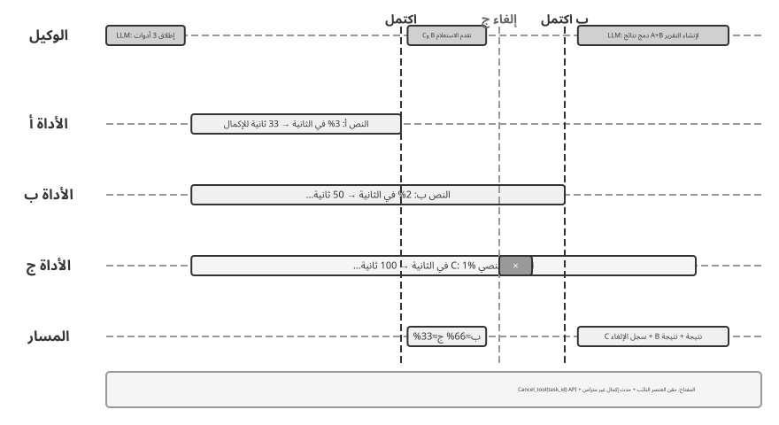
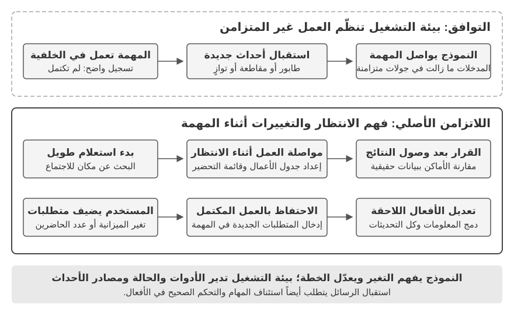
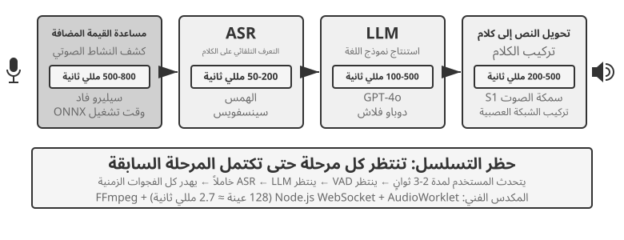
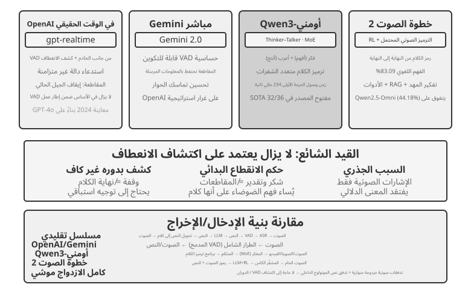
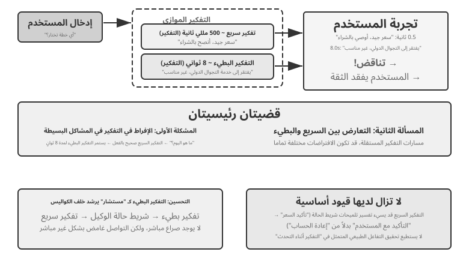
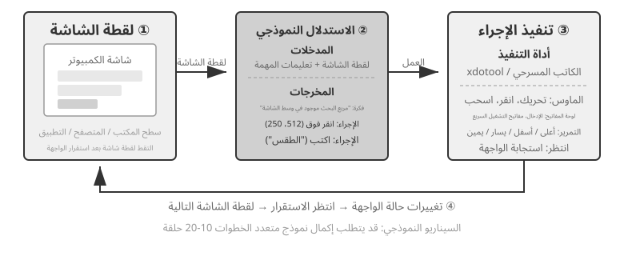
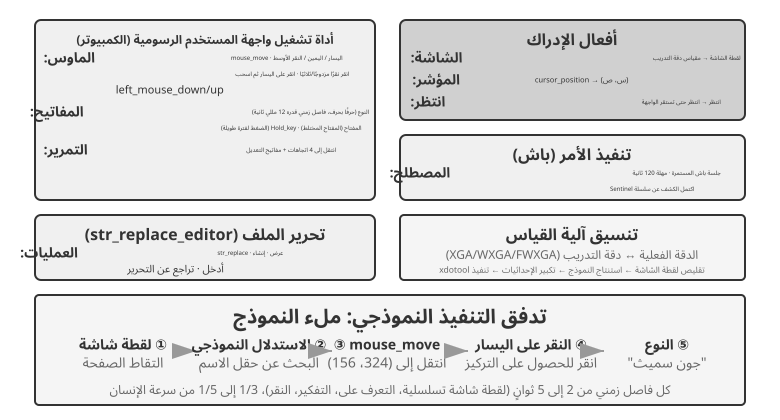
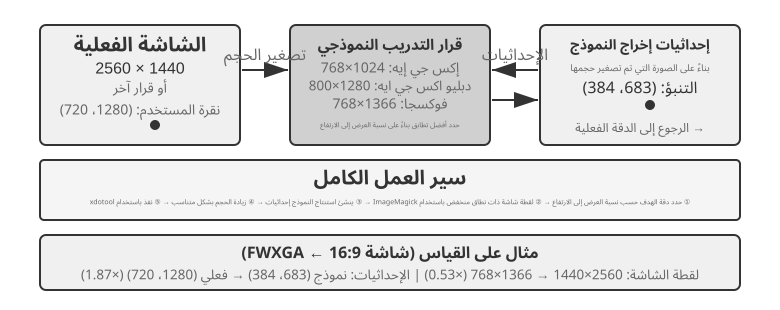

# التفاعل: توسيع فضاء الملاحظة وفضاء الفعل

طرح الفصل الأول دعوى مفادها أنه حين يكون النموذج الأساسي ثابتًا، فإن أهم وسيلة هندسية على مستوى النظام لرفع أداء Agent في المهام هي في الغالب إعادة تعريف **فضاء الملاحظة** و**فضاء الفعل** أو توسيعهما. وقد ظلّت الفصول من الثاني إلى الخامس تفي بهذه الجملة: هندسة السياق تحدّد ما يوضع في الملاحظة، والذاكرة وقواعد المعرفة تمدّان الملاحظة عبر الجلسات، والأدوات تحدّد ما يستطيع Agent فعله، وتوليد الشيفرة يجعله ينشئ أفعالًا جديدة بنفسه.

غير أن هذه التوسعات كلها جرت تحت المقدّمة نفسها: **أن Agent والعالم يتناوبان الكلام**. يُنهي المستخدم جملته، فيفكّر Agent برهة، ويستدعي بضع أدوات، ثم يردّ؛ وفي أثناء تفكيره يُفترض أن العالم ساكن. وهذه المقدّمة من الطبيعية بحيث نادرًا ما تُكتب أصلًا بوصفها افتراضًا.

وما يريد هذا الفصل رفعه هو هذه المقدّمة بعينها.

## محوران: الوسيط والتوقيت

إذا بسطنا فضاء الملاحظة وفضاء الفعل، تبيّن أن لكلٍّ منهما اتجاهين قابلين للتوسيع.

- **الوسيط** يحدّد **صورة** الملاحظة والفعل: أيقرأ Agent النص وحده، أم يسمع الصوت ويرى الشاشة ويستشعر العزم؛ أيُخرج الرموز وحدها، أم ينطق وينقر ويحرّك المفاصل كذلك.
- **التوقيت** يحدّد **إيقاع** الملاحظة والفعل: أيذهب Agent إلى الملاحظة بنفسه، أم يدفعها إليه العالم؛ أيجب أن ينتهي الفعل داخل جولة واحدة، أم يجوز أن يمتدّ عبر جولات، ويُقطع في منتصفه، ويُزاحَم بما هو أعجل منه.

كانت الفصول السابقة توسّع **مضمون** هذين الفضاءين؛ وهذا الفصل يوسّع **وسيطهما** و**توقيتهما**:

| | توسيع فضاء الملاحظة | توسيع فضاء الفعل |
|---|---|---|
| **المضمون** (الفصول 2–5) | هندسة السياق، الذاكرة وقواعد المعرفة | الأدوات، توليد الشيفرة |
| **الوسيط** (هذا الفصل) | الصوت، الشاشة، المستشعرات الفيزيائية | الكلام، النقر، حركة المفاصل |
| **التوقيت** (هذا الفصل) | دفع من العالم، تدفّق متصل | عبر الجولات، قابل للقطع، قابل للمزاحمة |

ويمكن ضغط الأطروحة المركزية لهذا الفصل في جملة واحدة: **التناوب افتراض خلّفه التدريب، لا خاصّية من خواصّ البيئة.**

تكاد بيانات تدريب النموذج كلها أن تكون تناوبية — سؤال يتبعه جواب، واستدعاء أداة يتبعه ناتج الأداة، ويتكلم أحدهما بعد أن ينتهي الآخر. لذا تفترض السياسة التي يتعلمها النموذج أن العالم سينتظره. لكن البيئة الحقيقية لا تنتظر النموذج حتى يتفاعل: يصل البريد وهو يفكر، ويقاطع المستخدم في منتصف الجملة، وتكون الصفحة قد تغيرت بالفعل بين لقطتي شاشة، وينقلب الكوب بينما الذراع تمتد لالتقاطه.

| المقياس | المشهد | التغيّر في جانب الملاحظة | التغيّر في جانب الفعل |
|---|---|---|---|
| ثوانٍ — أيام | اللاتزامن والتوجّه بالأحداث | العالم يوقظ Agent (بريد، مؤقّتات، استدعاءات راجعة) | الفعل يمتدّ عبر الجولات: يُطلق أولًا، ثم يُختم بحدث لاحق |
| 10 مللي ثانية — ثانية | الصوت | الإنصات أثناء الكلام، دون انتظار انتهاء الجملة | التفكير أثناء الكلام، قابل للقطع والتصحيح في المنتصف |
| دون الثانية — ثوانٍ | Computer Use | الشاشة تتغيّر باستمرار بين إطارَين | بعد الفعل لا بدّ من إعادة التأكّد من أن الواقع ما زال يوافق الخطة |
| مللي ثانية | الروبوت | المستشعرات ترتدّ باستمرار | تجزئة الفعل: يُخطَّط لمقطع قصير في كل مرة، وهو قابل للمزاحمة |

وتتشارك الأقسام الأربعة مجموعة الأوّليات نفسها — **الإيقاظ، نقطة الأمان، الإلغاء، المزاحمة، وفصل السريع عن البطيء** — ولا تختلف إلا في المعاملات وأشكال الإخفاق. فقولنا في اللاتزامن الموجّه بالأحداث "تحقّق من إشارة الإلغاء عند نقطة أمان"، وقولنا في تجزئة فعل الروبوت "إذا ظهر خلل فألقِ بقية الأفعال وأعد الملاحظة"، تطبيقان لآلية واحدة على مقياسين زمنيين يفصل بينهما خمس مراتب عشرية. وإدراك هذا التماثل أهمّ من حفظ التفاصيل التقنية لأي مشهد منفرد.

**وفي ترتيب القراءة ترتيب مقصود: يمنح هذا الفصل الصوتَ مساحة أوسع بوضوح من المشهدين التاليين.** ففي خط تطوّر التفاعل الآني، الصوت هو الذي قطع أطول شوط والأجدر بأن يُتّخذ إطارًا مرجعيًّا: انطلاقًا من مشكلة "خط الأنابيب التسلسلي زمن استجابته مرتفع جدًّا"، مرورًا بسلسلة حلول من طرف إلى طرف والازدواج الكامل والتفكير أثناء الكلام، وصولًا إلى خاتمة مستقرّة نسبيًّا اليوم — فقد قُطع مسار المشكلة ← الحل ← الخاتمة بأكمله. ولذلك نستوفيه شرحًا، فيمكن قراءة Computer Use والروبوت لاحقًا في مقابلته: إلى أين بلغ كلٌّ منهما على هذا الخط، وأين تعثّر.

## اللاتزامن والتوجّه بالأحداث: حين يأتي العالم إليك

يستدعي Agent من تلقاء نفسه أدوات الإدراك والتنفيذ والتعاون التي ناقشها الفصل الرابع. فكيف يستجيب للأحداث الخارجية التي قد تصل في أي وقت؟ يتطلب ذلك بنية غير متزامنة موجهة بالأحداث. وتعتمد الفئتان الباقيتان من أدوات الفصل الأول—أدوات تشغيل الأحداث وأدوات التواصل مع المستخدم—على هذه البنية، لذا نناقشهما هنا أيضًا.

### لماذا نحتاج إلى اللاتزامن

لنوضح الحاجة إلى اللاتزامن بتشبيه أولًا. التزامن (Synchronous) يعني "لا تبدأ الأمر التالي حتى ينتهي السابق"، واللاتزامن (Asynchronous) يعني "يمكن أن تجري عدة أمور في آن واحد". فبنية Agent المتزامنة التقليدية أشبه بشباك خدمة لا يُحسن إلا الطوابير: لا يخدم إلا زبونًا واحدًا في المرة، ولا ينادي التالي حتى يفرغ من سابقه؛ بينما المساعد الذكي حقًا أشبه بسكرتير مرن، على مكتبه عدة أمور معلّقة (بريد، ومكالمة، وزائر)، يقرر أيها يعالج أولًا بحسب درجة الإلحاح، وإن طرأ ما هو أعجل وهو في منتصف عمل استطاع أن يعلّقه وينتقل. وفي النمط المتزامن، إما أن ينتظر Agent اكتمال مهمة الخلفية ليحاور المستخدم، وإما أن ينتظر انتهاء الحوار ليعالج حدثًا جديدًا وصل — فيعجز عن عدة قدرات جوهرية يقتضيها سيناريو المساعد الحقيقي:

- **اللاتزامن هو الحالة الطبيعية** — فكثير من المهام يستغرق وقتًا طويلًا، ولا ينبغي أن يعطّل تفاعل المستخدم.
- **الحكم الديناميكي على أولوية الأحداث** — فليست الأحداث كلها سواءً في الأهمية، وعلى Agent أن يختار استراتيجية المعالجة بذكاء: إلغاء العملية الجارية (للعاجل)، أو الإضافة إلى الطابور (للاعتيادي)، أو المعالجة بالتوازي (للاستعلامات الخفيفة المستقلة).
- **سلاسة المقاطعة والاستئناف** — فالحوار أو المهمة التي قوطعت ينبغي أن تُستأنف استئنافًا طبيعيًا.

والتناقض الجذري الذي يصادفه تطبيق النموذج غير المتزامن على LLM الحالي هو أن نموذج تدريب LLM يفترض التزامن — فبعد إصدار استدعاء أداة، يجب أن تكون الرسالة التالية هي نتيجة الأداة؛ بينما يقتضي النشر الحقيقي اللاتزامن — إذ قد يقاطع المستخدم في أي لحظة، وقد تتقدم عدة مهام بالتوازي، وقد يصل حدث خارجي قبل أن تعود الأداة أصلًا. وهذا التناقض — "تدريب متزامن / نشر غير متزامن" — يسري في كل المفاضلات الهندسية التي يناقشها بقية هذا القسم.

ولهذا نحتاج إلى **بنية Agent غير المتزامنة الموجهة بالأحداث**. وتقنيًا، يعني ذلك أن النظام لم يعد يفحص بنفسه مرارًا "هل وصلت رسالة جديدة؟" (وهو ما يسمى الاستقصاء، وهو منخفض الكفاءة)، بل يُطلق منطق المعالجة تلقائيًا حين تصل رسالة جديدة. وتُنمذَج المدخلات والمخرجات وعمليات التفكير والتفاعلات الخارجية كلها في هيئة تدفق أحداث موحّد — سجل أحداث مرتب تباعًا على خط زمني واحد. ويعرض الشكل 6-1 البنية الإجمالية لـ Agent غير المتزامن الموجه بالأحداث، مبينًا العلاقة بين مصادر الأحداث وطابور الأحداث ومسار معالجة Agent.


### تطبيق آلية التوجيه بالأحداث في OpenClaw

يستقبل إطار العمل مفتوح المصدر OpenClaw الرسائل متعددة القنوات عبر مستوى التحكم Gateway ويوجّهها إلى بيئة تشغيل Agent. وهو يوفر ثلاث آليات مدمجة للتوجيه بالأحداث:

- **Hooks (خطاطيف الأحداث)**: تستجيب لأحداث دورة حياة Agent، كإنشاء الجلسة وإعادة تعيينها، وهي شبيهة بمُطلِقات الأحداث في GitHub Actions
- **Cron (المجدول الزمني)**: ينفّذ المهام الدورية بحسب تعبير cron (وهي صيغة مهام مؤقتة شائعة في أنظمة Unix، مثل `0 9 * * 5` بمعنى التاسعة صباح كل جمعة)
- **Heartbeat (عفريت نبضات القلب)**: يوقظ Agent كل N دقيقة ليفحص إن كان ثمة ما يستحق الانتباه

وتمنح هذه الآليات الثلاث وكيل OpenClaw مظهر "الاستقلالية" — فحتى لو لم يكن المستخدم متصلًا، يستطيع Agent أن يولّد تقارير دورية، ويفحص حالة النظام، ويعالج الأمور الروتينية. وأما رسائل القنوات المدمجة (كالمراسلة الفورية وواجهة الويب) فتصل إلى Gateway بأسلوب **الدفع**: ما إن تصل الرسالة حتى تُوجَّه إلى Agent. ومن بين آليات الأتمتة الثلاث، لا يحرّك Agent "من تلقاء نفسه" في غياب رسائل المستخدم إلا Cron وHeartbeat، وكلاهما **مدفوع بالزمن** — فـ Heartbeat يفحص كل فترة ثابتة، وCron يُطلَق في وقت محدد سلفًا، أما مصدر أحداث Hooks فداخلي في إطار OpenClaw لا خارجي.

والنقص الحقيقي هو أن OpenClaw يفتقر إلى قناة وصل فورية لمصادر الأحداث الخارجية عن قنواته المدمجة — كوصول بريد جديد، أو دفع استدعاء من واجهة خارجية، أو إشعار عاجل يستلزم معالجة فورية — فلا يستطيع Agent الاستجابة فور وقوع الحدث، بل ينتظر دورة Cron أو Heartbeat التالية لعله يتنبه.

وهذا التأخير غير مقبول في كثير من السيناريوهات. ولنأخذ **PineClaw** (وهو ملحق Pine AI لـ OpenClaw) مثالًا: فـ Pine AI مساعد ذكي يجري مكالمات هاتفية حقيقية نيابةً عن المستخدم، وسيناريوهاته النموذجية تشمل التفاوض على الفواتير وإلغاء الاشتراكات ومعالجة مطالبات التأمين. فحين يطلق المستخدم مهمة مكالمة Pine عبر وكيل OpenClaw، يتصل الذكاء الصوتي في Pine نيابةً عنه، لكن المكالمة قد تستلزم تدخّل المستخدم في أي لحظة:

- **التحقق الآني من الهوية**: يطلب موظف الخدمة التحقق من هوية صاحب الحساب، فيحتاج Pine أن يزوّده المستخدم فورًا برمز الأمان أو رمز التحقق لمرة واحدة (OTP)
- **تأكيد المكالمة الثلاثية**: يطلب موظف الخدمة التحدث مباشرةً إلى صاحب الحساب، فيحتاج Pine أن يردّ المستخدم خلال ثوانٍ
- **مزامنة التقدم وتأكيد القرار**: يبلغ التفاوض نقطة حاسمة (كأن يعرض الطرف الآخر خطة تخفيض)، فيحتاج Pine تأكيد المستخدم بالقبول من عدمه

ولو اعتُمد على الاستقصاء الدوري لـ Heartbeat، لربما تأخر وصول الإخطار إلى المستخدم بينما ينتظر موظف الخدمة رمز التحقق، فيُغلق الخط وتفشل المكالمة.

وحلّ PineClaw هو إدخال **آلية القنوات (Channel)** — أي إقامة قناة أحداث آنية بين Gateway في OpenClaw وواجهة Pine. فحين تقع أحداث مفصلية كاتصال المكالمة، أو الحاجة إلى إدخال المستخدم، أو انتهاء المكالمة، تُدفع الرسالة فورًا إلى وكيل OpenClaw، فيعالجها ويخطر المستخدم على الفور.

وتكشف هذه الحالة القيمة الجوهرية للبنية الموجهة بالأحداث بالنسبة لأطر عمل Agent: **"الخدمة الاستباقية" الحقيقية لا تتطلب أن يفحص Agent الأحداث دوريًا فحسب، بل تتطلب أن تستطيع الأحداث إخطار Agent من تلقاء نفسها**. ونمذجةُ جميع المدخلات — رسائل المستخدم، ونتائج الأدوات، والاستدعاءات الخارجية، والإطلاق المؤقت — في تدفق أحداث موحّد، ودفعُ تفكير Agent وفعله بحلقة أحداث، هما الأساس المعماري لتحقيق ذلك. وفي ظل هذه البنية، نعرض أولًا فئتي الأدوات المرتبطتين مباشرةً بالأحداث، ثم الهوية الافتراضية وبيئة التنفيذ المعزولة اللتين تدعمان استقلال Agent في الفعل، ثم نناقش التصميم المحدد لآلية معالجة الأحداث.

### أدوات إطلاق الأحداث

أدوات إطلاق الأحداث هي مدخل تحفيز الأحداث الخارجية لفعل Agent. فلولاها لما استطاع Agent إلا أن يفكر ويستدعي الأدوات في حلقة متصلة، ثم يُخرج نتيجة وينتظر إدخال المستخدم التالي. ولتحويل تغيرات العالم إلى أحداث يستطيع Agent معالجتها، ثمة ثلاث فئات شائعة من أدوات إطلاق الأحداث.

**المؤقت** (set_timer) يعالج الأحداث المعتمدة على الزمن الفيزيائي. فمثلًا: أُرسل بريد ولم يردّ الطرف الآخر، فينبغي بعد مدة إرسال بريد آخر للاستفسار عن المستجدات؛ أو أُجريت مكالمة والطرف الآخر خارج ساعات العمل، فيلزم إعادة المحاولة في وقت العمل التالي. ولذلك تدعم أدوات مثل OpenClaw وClaude Code أداة مؤقت توقظ Agent في وقت فيزيائي محدد. و**المؤقت لمرة واحدة** يُستخدم للمهام ذات النقطة الزمنية المحددة: كأن يطلب المستخدم "اتصل بقسم الرهن العقاري في المصرف للسؤال عن سير المعاملة"، واليوم سبت، فيضبط Agent "الاتصال بالمصرف الاثنين المقبل الساعة 10:00 صباحًا"، فيتصل تلقائيًا عند إطلاق المؤقت. و**المؤقت الدوري** يُستخدم للمهام الدورية: كفحص صحة الخادم كل ساعة. كما أن بعض الخدمات الخارجية لا تدعم دفع المستجدات، فلا سبيل إلا الاستعلام النشط عنها، وحينها يلزم المؤقت الدوري للاستعلام المتكرر. وHeartbeat في OpenClaw الذي عرضه القسم السابق هو بالضبط منهجة لهذه الآلية، وهو أصل قدرة OpenClaw على "الخدمة الاستباقية".

**مراقبة مهام الخلفية** (monitor_shell) تعالج الأحداث الآتية من الأدوات أو مهام سطر الأوامر المنفَّذة لا تزامنيًا. فبعض مهام سطر الأوامر يحتاج وقتًا طويلًا في الخلفية، ويحتاج Agent إلى مراقبة تقدمها. فإن جعلنا Agent "يحدّق في الطرفية" باستمرار، أي يستدعي أداة الاستعلام عن التقدم مرارًا، أهدرنا رموزًا كثيرة؛ وإن انتظرنا اكتمال المهمة تمامًا ليبدأ Agent تفكيره وفعله، عجز عن اكتشاف المشكلات الخطيرة أثناء التنفيذ في حينها، بل عجز عن التدخل إن تجمّد سطر الأوامر فتعطلت المهمة برمّتها. وحلّ Claude Code لهذه المشكلة هو إدخال أداة monitor (المراقبة) التي تتيح لـ Agent مراقبة المخرجات الجديدة لسطر الأوامر أو المخرجات المتضمنة كلمات مفتاحية بعينها.

**قناة الأحداث الخارجية** (connect_channel) تدفع إلى Agent آنيًا أحداثًا خارجية كوصول بريد جديد، واستدعاءات الواجهات، ورسائل المراسلة الفورية؛ وآلية Channel في PineClaw التي عُرضت في القسم السابق تطبيق نموذجي لها.

وعلى صعيد التصميم، ينبغي لأدوات إطلاق الأحداث أن تحدد شروط إطلاق وقواعد ترشيح واضحة، تفاديًا لإيقاظ أحداث لا صلة لها بـ Agent فتهدر الطاقة الحاسوبية؛ وينبغي أن تتضمن حمولة الحدث (payload) سياقًا كافيًا، تقليلًا لعدد الاستعلامات الإضافية التي يحتاجها Agent بعد إيقاظه.

### أدوات التواصل مع المستخدم

نشأت أدوات التواصل مع المستخدم في ظل تنامي تنوع قنوات التواصل بين Agent والمستخدم. فكثير من الوكلاء (مثل Claude Code وManus) يعتمد حلقة ReAct الأصيلة، حيث تُرسَل كل عبارة "يقولها" Agent (أي رسائل assistant) إلى المستخدم مباشرةً، ويتعين على المستخدم أن يفتح جلسة محددة في التطبيق ليحاوره. وغالبًا ما يرى المستخدم في الجلسة عملية استدعاء Agent للأدوات.

وقد كسر OpenClaw نموذج التواصل هذا بين الإنسان والآلة. فلا يحتاج المستخدم إلى إدراك وجود الجلسة أصلًا، ولا إلى الاهتمام بتفاصيل استدعاء Agent للأدوات؛ ويستطيع كلٌّ من المستخدم وAgent أن يرسل إلى الآخر رسالة في أي وقت، بدل أن يرسل المستخدم رسالة فيردّ Agent برسالة. ولهذا يصف كثيرون OpenClaw بأن له **"إحساسًا بشريًا"**، إذ يتواصل مع المستخدم لا تزامنيًا بالرسائل النصية كما يفعل السكرتير. وOpenClaw لا يُخرج رسائل assistant التي يولّدها النموذج إلى المستخدم مباشرةً، بل يستخدم أدوات مخصصة لإرسال الرسائل، ويمكن أن تُرفق بهذه الرسائل صور وملفات، وأن تُصحب بإشعارات دفع بحسب درجة الإلحاح.

وإلى جانب التواصل النصي، يمتلك عدد متزايد من الوكلاء **قدرة تواصل متعددة الوسائط**، كإرسال بطاقات رسائل هيكلية وإرسال بريد تذكيري. وقد بدأ بعض الوكلاء بتجريب **واجهة المستخدم التوليدية (Generative UI)**، أي توليد واجهات تفاعلية بوسائل مثل HTML لعرض المعلومات على المستخدم بصورة أودّ. وعلى صعيد التصميم، ينبغي لأدوات التواصل مع المستخدم أن تدعم نمط الرسائل غير المتزامن (فالمستخدم ليس بالضرورة متصلًا)، وأن توفر تتبعًا لحالة القراءة، وأن تحافظ على اتساق الرسائل في سيناريوهات القنوات المتعددة.

**التواصل متعدد القنوات واستعادة المستخدم.**

**ينبغي ألا تنحصر استجابة Agent في قناة واحدة، فآلية الإخطار هي في الوقت نفسه آلية لاستعادة المستخدم**. ويتوسع إرسال الرسائل ليشمل المراسلة الفورية والرسائل القصيرة والبريد والهاتف والإشعارات وغيرها. ويقرر Agent اختيار القناة بناءً على درجة الإلحاح وحالة المستخدم وطبيعة المحتوى وتفضيلاته مجتمعةً، بما يضمن عدم تفويت الرسائل المهمة ويتجنب الإزعاج المتكرر في آن.

وفي المهام طويلة التنفيذ، يحتاج Agent إلى إخطار المستخدم استباقيًا عند الاكتمال لاستعادة انتباهه. وفي المهام الدورية (كالملخص اليومي والتقرير الأسبوعي)، يساعد الإخطار المستخدم على تكوين عادة تفاعل ثابتة.

وقد حلّت أدوات التواصل مع المستخدم مسألة "كيف نصل إلى المستخدم". لكن بأي هوية يظهر Agent على هذه القنوات، وفي أي بيئة ينفّذ العمليات نيابةً عن المستخدم — ذلك يحتاج طبقةً من البنية التحتية للهوية والبيئة، وهي موضوع القسم التالي.

### الهوية الافتراضية وبيئة التنفيذ المعزولة

ذُكر في مطلع الفصل أن Samantha في فيلم *Her* تملك هوية وبيئة تشغيل مستقلتين. ولتحقيق مساعد عام كهذا، يواجهنا ابتداءً خيار معماري حاسم: أينبغي لـ Agent أن يدير حسابات المستخدم الشخصية مباشرةً، أم أن تكون له هويته الافتراضية الخاصة؟ الإدارة المباشرة تبدو أيسر، لكن ما إن يخطئ Agent أو يُخترق حتى تنكشف هوية المستخدم الرقمية بأكملها. والحل الأحوط هو منح Agent مجموعة هوية افتراضية مستقلة — كما أن للسكرتير هاتف مكتبه وبريده الخاصين. وتشمل هذه الهوية حسابات تواصل ومساحة تخزين وبيئة حوسبة مخصصة، بما يمكّن Agent من العمل نيابةً عن المستخدم بهوية شفافة. ووضوح الهوية لم يُضعف الثقة، بل عزّز صدق التواصل.

وتحتاج الهوية الافتراضية إلى أن تتجسد في بيئة تنفيذ معزولة. فـ**الحاسوب الافتراضي** (جهاز افتراضي أو حاوية) و**الهاتف الافتراضي** (محاكي Android) يوفران لـ Agent عزلًا على مستوى نظام التشغيل وقدرة تشغيل كاملة على سطح المكتب والجوال. فأولًا، يستطيع الحاسوب الافتراضي العمل على مدار الساعة دون التأثر بحالة اتصال جهاز المستخدم، ودون التأثير على التطبيقات التي يستخدمها. وثانيًا، حتى لو نفّذ Agent عملية خاطئة، فأقصى ما يحدث انهيار البيئة الافتراضية دون المساس بجهاز المستخدم الحقيقي. وثالثًا، تمنع البيئة المعزولة وصول Agent العشوائي إلى ملفات المستخدم المحلية، فترفع مستوى الأمان.

وتجلب الهوية المستقلة تحديين واقعيين. الأول هو **آليات مكافحة الروبوتات**: إذ تحجب مواقع كثيرة الوصول الآلي بـ CAPTCHA وفحص سمعة عناوين IP، والبيئات الافتراضية ذات عناوين مراكز البيانات يسهل التعرف عليها، فيلزم عمليًا في الغالب تهيئة شبكة وكيل سكنية (تستخدم عناوين IP منزلية حقيقية) ليتم الوصول بشكل طبيعي. والثاني هو **سيناريوهات الوصول إلى حساب المستخدم الحقيقي**: فحين تستلزم المهمة تسجيل الدخول بهوية المستخدم نفسه، ينبغي اعتماد مصادقة بإشراك الإنسان في الحلقة — أي تمكين المستخدم من إتمام تسجيل الدخول بنفسه في بيئة مرئية عبر سطح مكتب بعيد (VNC/RDP)، فيرى الواجهة الكاملة التي يعمل عليها Agent ويفهم سبب الحاجة إلى المصادقة؛ ثم يُعاد استخدام رمز الجلسة بعد المصادقة ضمن مدة صلاحيته تفاديًا لمقاطعة المستخدم المتكررة، تحقيقًا للتوازن بين الاستقلالية والأمان.

ويجري تبادل البيانات بين Agent والبيئة الافتراضية عبر **نظام ملفات مشترك**: إذ يُوصل Agent والحاسوب الافتراضي والهاتف الافتراضي بأسلوب تركيب وحدة تخزين (مثل `/workspace/shared`)، وتُمرَّر البيانات بمرجع مسار الملف لا بنسخ المحتوى، تفاديًا لشغل نافذة السياق. ولنأخذ مهمة تحليل بيانات مثالًا: يرفع المستخدم ملف CSV إلى المجلد المشترك، فيقرؤه Agent داخل الحاسوب الافتراضي، وينفّذ التحليل، ويولّد رسمًا بيانيًا يحفظه في المجلد المشترك، ثم لا يحتاج إلا أن يعيد مسار ملف الرسم إلى المستخدم — فما يُمرَّر بين الأطراف على الدوام ليس إلا سلاسل مسارات خفيفة.

فأدوات إطلاق الأحداث تتيح للعالم أن يوقظ Agent، وأدوات التواصل تتيح لـ Agent أن يصل إلى المستخدم، والهوية الافتراضية وبيئة التنفيذ المعزولة تتيحان له أن يعمل بهوية مستقلة قابلة للتدقيق. ويبقى السؤال: كيف تُعالَج الأحداث حين تتدفق عدة أحداث في آن واحد على نسخة Agent واحدة؟

### آلية معالجة الأحداث

قد تواجه نسخة Agent واحدة عدة أحداث في آن: رسالة جديدة من المستخدم، ونتيجة أعادتها أداة، وانتهاء مؤقت، وطلب تعاون من وكيل آخر. وطريقة معالجة هذه الأحداث بكفاءة وصواب تؤثر مباشرةً في الأداء وتجربة المستخدم.

وهيكل هذه الآلية هو **حلقة الأحداث** (event loop) المعروفة في البرمجة المتزامنة. ويمكن النظر إلى Agent غير المتزامن بوصفه حلقة تعمل مدةً طويلة: تأخذ في كل دورة عددًا من الأحداث من طابور الإدخال، وتلحقها بالمسار، وتستدعي LLM مرة، وتنفّذ ما قرره من أدوات، ثم تعود إلى رأس الحلقة لانتظار الدفعة التالية — وهي البنية نفسها التي تقرأ بها goroutine في Go الرسائلَ من channel وتعالجها دورةً دورةً داخل `for { select { ... } }`.

ولهذا النموذج خاصية جوهرية: **لا تُستهلك الأحداث إلا عند حدود كل دورة**. فحين يكون LLM في طور الاستدلال أو تكون الأداة قيد التنفيذ، لا تُقحَم الأحداث الواصلة حديثًا اقتحامًا فتربك الخطوة الجارية، بل تنتظر في الطابور حتى تبلغ الدورة **نقطة آمنة** (انتهاء مقطع استدلال، أو عودة استدعاء أداة) فتُعالَج مجتمعةً. ويتبع الإلغاء الانضباط نفسه: فلا يُقطع العمل قسرًا في أي لحظة، بل يُفحص عند النقطة الآمنة "هل طُلب التوقف؟" — وهذا بالضبط دور `ctx.Done()` في Go.

وبفهم ذلك، يصبح الفرق بين استراتيجيات المعالجة الثلاث التالية منحصرًا في طريقة التعامل مع النقطة الآمنة: أن يُترك الحدث لينتظر النقطة الآمنة التالية التي تأتي طبيعيًا (الطابورية)، أو أن تُصطنع نقطة آمنة مبكرة (الإلغائية)، أو أن تُفتح حلقة أخرى بحيث لا يلزم انتظار النقطة الآمنة للحلقة الرئيسية أصلًا (المتوازية).

**النمذجة الهيكلية للأحداث.**

شرط المعالجة هو الفهم. فالمدخلات التي يواجهها Agent العام لا تأتي من المستخدم وحده — فالرسالة الواردة من طرف ثالث ليست موجّهة من المستخدم إلى Agent، ومع ذلك على Agent أن يفهمها ويقدّر أهميتها ويقرر كيفية التدخل. ويقتضي ذلك نمذجة كل إدخال في هيئة **حدث هيكلي** غني الدلالة:

- **المصدر (مَن)**: المستخدم نفسه، أو جهة اتصال، أو شخص مجهول، أو إشعار نظام
- **القناة (بأي وسيلة)**: مكالمة صوتية، أو رسالة قصيرة، أو رسالة فورية، أو بريد، أو وسائط اجتماعية، أو إطلاق مؤقت، أو نتيجة استدعاء أداة غير متزامن، أو تحديث حالة مراقبة سطر الأوامر
- **المحتوى (ماذا)**: نص الرسالة، ونبرتها العاطفية، ودرجة إلحاحها، وهل تستدعي ردًا
- **السياق (الخلفية)**: أهي رد على حوار سابق أم تواصل مستأنَف، وما صلتها بالمهمة الجارية

وبأخذ رسالة بريد لطلب استرداد من عميل مثالًا، تكون الصيغة المحددة للحدث الهيكلي كالتالي:

```json
{
  "source": {"type": "email", "sender": "client@example.com"},
  "channel": "gmail_webhook",
  "content": {"subject": "طلب استرداد", "body": "أرغب في استرداد قيمة الطلب رقم #12345..."},
  "context": {"priority": "high", "customer_tier": "vip", "related_orders": ["#12345"]}
}
```

ولا يستطيع Agent أن يحافظ على إدراك واضح في التواصل متعدد الأطراف إلا حين تُنمذَج هذه الأبعاد نمذجةً هيكلية واضحة، فيتفادى أن يحسب إدخال المستخدم نتيجةَ أداة، أو أن يحسب نتيجةَ أداة تخبئ تعليمات أمرًا من المستخدم فيقع في حقن الموجهات. كما يقتضي تعقيدُ إدارة السياق متعدد الخيوط أن يفهم Agent الصلات بين خيوط الحوار المتعددة — كيف تؤثر رسالة طرف ثالث في مزاج المستخدم، وكيف يتبدل دور المستخدم عبر الحوارات المتعددة، ومتى يلزم تجميع معلومات الخيوط المختلفة لتقديم توصية.

ويتبيّن من منظومة المُطلِقات في منصات سير العمل مثل n8n أن كل نوع من المُطلِقات — Webhook، والمؤقتات، والبريد، وتغيرات قواعد البيانات، ومراقبة الملفات — هو "حاسّة" من حواس Agent التي يدرك بها العالم. وما إن تُنمذَج هذه الأحداث غير المتجانسة في صيغة هيكلية موحّدة حتى يستطيع Agent معالجة المنبهات الآتية من مصادر مختلفة بطريقة متسقة؛ ويقوم على هذه النمذجة الموحّدة كلٌّ من تقدير الإلحاح واستراتيجيات المعالجة المذكورة أدناه.

**استراتيجية المعالجة الديناميكية القائمة على الإلحاح.**

يتبع الإنسان عند معالجة عدة مهام استراتيجياتٍ مختلفة بحسب درجة الإلحاح. فأمام طارئ عاجل يتوقف فورًا عما بيده؛ وأمام أمر روتيني يضيفه إلى قائمة المهام ليعالجه لاحقًا. وينبغي لمعالجة Agent للأحداث أن تعكس هذا الذكاء نفسه.


**المعالجة الإلغائية (Cancellation-Based)** تُستخدم للأحداث العاجلة، وجوهرها **اصطناع نقطة آمنة مبكرة** للحدث العاجل: أي قطع الخطوة الجارية عمدًا وتحويل تلك اللحظة إلى حدٍّ يمكن عنده استهلاك الأحداث الجديدة. فحين يصل حدث عاجل (كأن ينقر المستخدم "إيقاف"، أو يرسل نظام إشرافي تعليمات عالية الأولوية): (1) يُوقَف العمل الجاري — فإن كان LLM يستدل، أُلغيت الاستجابة التدفقية فورًا؛ وإن كانت أداة متزامنة قيد التنفيذ، أُرسلت إشارة إلغاء؛ (2) يُفرَّغ طابور الانتظار وتُؤخذ الأحداث كلها؛ (3) تُلحَق أحداث الطابور مع الحدث العاجل بنهاية المسار؛ (4) يُستدعى LLM من جديد فورًا ليقيّم الموقف على أساس المسار الكامل المحدَّث. فمثلًا، إذا كتب المستخدم "قف! لقد أخطأت في الطلب" بينما ينفّذ Agent عملية قد تكون خاطئة، رأى Agent هذا الإدخال الجديد فورًا وأعاد فهم النية الحقيقية، فتفادى تنفيذ العملية الخاطئة.

**المعالجة الطابورية (Queued)** تُستخدم للأحداث الاعتيادية. فحين يصل حدث غير عاجل (كنتيجة أعادتها أداة غير متزامنة، أو معلومة تكميلية من المستخدم): (1) يُوضع الحدث في نهاية الطابور دون قطع العمل الجاري؛ (2) يُنتظر اكتمال العمل الجاري — بأن يُتمّ LLM استدلاله وتُتمّ الأداة المتزامنة تنفيذها؛ (3) وحين يكتمل أي استدعاء أداة ويعيد `tool.result`، يُفحص الطابور، فإن لم يكن فارغًا أُلحقت أحداثه كلها بالمسار دفعةً واحدة؛ (4) يعالج LLM المسار المحدَّث معالجةً مجمّعة. وبذلك تتحقق المعالجة الدفعية وترتفع الكفاءة — فمثلًا، بعد أن يستدعي Agent أداة بحث، يضيف المستخدم أثناء الانتظار "اقتصر على نتائج الشهر الأخير"، فتدخل هذه الإضافة الطابور، وحين تعود نتيجة البحث يُعرض الحدثان معًا على LLM، فتُتفادى ذهابات وإيابات لا لزوم لها.

**المعالجة المتوازية (Parallel)** تُستخدم للاستعلامات الخفيفة المستقلة. كأن يسأل المستخدم فجأةً "كيف الطقس اليوم؟" بينما Agent منهمك في تحليل كمية كبيرة من البيانات. ولهذا النوع من الاستعلامات ثلاث خصائص: لا صلة له بالمهمة الرئيسية، ويحتاج استجابة سريعة، وتكلفة تنفيذه منخفضة. فلا ينبغي معالجته إلغائيًا (إذ يقطع مهمة رئيسية مهمة)، ولا طابوريًا (إذ يُطيل انتظار المستخدم). فيحكم النظام أولًا على استقلالية الاستعلام ودرجة تعقيده، ثم ينفّذه مستقلًا في جلسة استدلال متوازية، ويستدعي ما يلزم من أدوات ليولّد الاستجابة ويعيدها فورًا. ويُلحَق الاستعلام والاستجابة بمسار المهمة الرئيسية موسومَين صراحةً بأنهما "نُفِّذا بالتوازي مع المهمة الرئيسية"، تفاديًا لخلط LLM بينهما.

**تقدير درجة الإلحاح.**

الأحداث العاجلة: مقاطعة المستخدم (`user.interrupt`)، وتعليمات الإشراف (`supervisor.instruction`)، والمقاطعة بين الوكلاء (`agent.interrupt`)، والمُطلِقات الخارجية الموسومة بالعجلة (كإنذارات النظام وفشل الدفع).

الأحداث غير العاجلة: إدخال المستخدم الاعتيادي (`user.input`)، وإدخال الوكلاء (`agent.input`)، ونتائج الأدوات (`tool.result`)، وإطلاق المؤقتات (`timer.trigger`)، والمُطلِقات الخارجية الاعتيادية.

وللقواعد المكتوبة يدويًا حدودها، فدلالة الحدث هي التي تحدد طريقة معالجته — فـ"توقف حالًا" تُعالَج إلغائيًا، و"كيف الطقس اليوم" تُعالَج بالتوازي، و"أرسل لي التقرير بالعربية" تُعالَج طابوريًا. و**يُنصح باستخدام LLM تصنيفي خفيف بوصفه موجّهًا للأحداث**، يحكم سريعًا عند وصول الحدث في أي استراتيجية ينبغي اعتمادها.

ويجب أن تكون نقطة الإلغاء موضعًا تستطيع عنده الأداة أو الاستدلال أن يُنهي عمله بأمان؛ وتُمثَّل نتائج الأدوات غير المكتملة بعنصر نائب صريح، ولا يجوز تزوير نجاحها.

وفيما يلي تجربةٌ لوكيل معالجة بريد موجّه بالأحداث، تُنزِل استراتيجيات معالجة الأحداث المذكورة إلى تطبيق قابل للتشغيل.

> **التجربة 6-1 ★★★: وكيل معالجة البريد الموجّه بالأحداث**
>
>
> 
>
>
> تبني هذه التجربة أبسط وكيل موجّه بالأحداث: **مساعد معالجة البريد التلقائي**. يراقب Agent صندوق الوارد، وكلما وصل بريد جديد أطلق تلقائيًا مسار معالجة — تصنيف، وتلخيص، وصياغة رد، وإخطار المستخدم عند اللزوم. وهذا أوضح سيناريو تمهيدي للوكيل الموجّه بالأحداث: حدث خارجي واحد (وصول بريد جديد) يُطلق حلقة تفكير كاملة لـ Agent.
>
> و**هدف التجربة** هو فهم المفهوم الجوهري للتوجيه بالأحداث: لم يعد Agent ينتظر إدخال المستخدم سلبيًا، بل صار قادرًا على الفعل الاستباقي استجابةً لأحداث خارجية. وسيتقن القارئ عبر هذه التجربة تسجيل مصادر الأحداث، وطابور الأحداث، والحلقة الأساسية "وصول الحدث ← معالجة Agent ← إخراج النتيجة".
>
> **مصادر الأحداث وطابور الأحداث.**
>
> يدعم النظام وصلًا موحّدًا لمصادر أحداث متعددة:
>
> - **أحداث البريد** (`on_email_received`): تُطلَق عند وصول بريد جديد، عبر الفحص الدوري لصندوق الوارد أو تلقي إشعار دفع
> - **رسائل المراسلة الفورية والرسائل القصيرة** (`on_im_message` و`on_sms_message`): إطلاق برسائل المراسلة الفورية
> - **أحداث GitHub** (`on_github_pr_update` و`on_github_issue_update`): ملاحظات مراجعة طلبات الدمج وتغيرات الحالة
> - **إطلاق المؤقتات** (`on_timer_expire`): المهام المؤقتة (كالملخص اليومي وتوليد التقرير الأسبوعي)
> - **Webhook** (`on_webhook_received`): استدعاء عام من نظام خارجي
> - **أحداث النظام** (`on_user_inactive` و`on_process_timeout` و`on_resource_alert`): تغيرات الحالة الداخلية
>
> وتدخل الأحداث كلها **طابور أحداث** موحّدًا تُعالَج فيه تباعًا بحسب ترتيب الوصول. ويُطلق كل حدث حلقة تفكير مستقلة لـ Agent: يقرأ محتوى الحدث، ويستدعي الأدوات ذات الصلة (كالاستعلام من قاعدة المعرفة، وقراءة المرفقات، والبحث في سجل البريد ذي الصلة)، ويولّد نتيجة المعالجة (وسم التصنيف، والملخص، ومسودة الرد)، ثم يخطر المستخدم عبر أداة إخطار أو ينفّذ العملية مباشرةً.
>
> **سيناريو التحقق**: هيّئ Agent لمراقبة صندوق بريد اختباري. وحاكِ وصول ثلاث رسائل — دعوة اجتماع، وشكوى عميل، وإعلان تسويقي. فيعالجها Agent تباعًا: يفحص تعارضات التقويم تلقائيًا لدعوة الاجتماع ويصوغ ردًا بالقبول أو الرفض؛ ويستخرج المعلومات الأساسية من شكوى العميل ويسمها بأولوية عالية ويخطر المستخدم بمعالجتها؛ ويؤرشف الإعلان التسويقي تلقائيًا. ولا تتطلب العملية كلها تدخل المستخدم.

أظهرت التجربة 6-1 أبسط أنماط التوجيه بالأحداث — دخول الأحداث الطابور ومعالجة Agent لها تباعًا. لكن حين يحتاج Agent إلى الاستجابة لمقاطعة أثناء تنفيذ أداة طويلة، أو إلى إدارة عدة مهام متزامنة في آن، لا يعود طابور الأحداث البسيط كافيًا. وفيما يلي نناقش التحديات الهندسية الأعمق.

### كيف نجعل النموذج المتزامن يدعم المقاطعة غير المتزامنة

لم تعالج التجربة 6-1 إلا الأحداث المتسلسلة — تدخل الأحداث الطابور تباعًا فيعالجها Agent واحدًا تلو الآخر. ولنعد الآن إلى التناقض الذي طُرح في مطلع هذا القسم — "تدريب متزامن / نشر غير متزامن": حين يقاطع المستخدم فجأةً قبل أن تعود الأداة، كيف تستوعب الصيغةُ المتزامنة ذلك؟ يعرض هذا القسم الحل الهندسي المعتمد في الصناعة حاليًا.

ولنوضح التناقض بسيناريو محدد أولًا. لنفترض أن Agent يساعد المستخدم في صياغة رسالة بريد (باستدعاء أداة: البحث عن معلومات جهة اتصال)، وقبل أن تعود نتيجة البحث يقول المستخدم فجأةً: "لحظة، ابحث لي أولًا عن طقس الغد". ففي حلقة ReAct المتزامنة، يجب على Agent أن ينتظر عودة البحث ليعالج الرسالة التالية — لأن الواجهة تشترط أن تكون الرسالة التالية بعد إصدار استدعاء أداة هي نتيجة الأداة. لكن في العالم الحقيقي غير المتزامن، قد تقاطع الأحداث المهمةَ الجارية في أي لحظة. وكيفية التعبير عن دلالة "المقاطعة غير المتزامنة" ضمن قيد "الصيغة المتزامنة" هي بالضبط ما تجيب عنه المنظومة الهندسية التالية.

**حل هندسي مؤقت: تنفيذ غير متزامن يحاكي التزامن.**

الفكرة الجوهرية هي: **في الحالة الاعتيادية التي لا مقاطعة فيها، يرى LLM مسارًا متزامنًا قياسيًا، ولا يُدرَج عنصر نائب لإصلاح الصيغة إلا عند المقاطعة**. وفيما يلي خمس قواعد أساسية:

**القاعدة 1**: تُسجَّل رسالة assistant فور إخراج LLM لها (متضمنةً التفكير والمحتوى واستدعاء الأداة).

**القاعدة 2**: لا تُسجَّل نتيجة الأداة إلا عند اكتمال استدعائها. وأثناء التنفيذ يكون المسار في حالة "اكتمال جزئي".

**القاعدة 3**: المقاطعة أثناء تنفيذ الأداة تستلزم عنصرًا نائبًا. فيُولَّد للأداة غير المكتملة ردٌّ نائب (مثل "الأداة قيد التنفيذ في الخلفية، يُرجى إعطاء الأولوية للحدث الجديد")، ثم يُلحَق حدث المقاطعة ويُستدعى LLM من جديد. ومن منظور LLM تبقى رسالة assistant مقترنة بنتيجة أداة.

**القاعدة 4**: المقاطعة أثناء تفكير LLM تُلغي التفكير الجاري مباشرةً. فلا يُكتب في المسار، ويُلحَق الحدث الجديد ثم تبدأ جولة تفكير جديدة.

**القاعدة 5**: الأحداث غير المقاطِعة تدخل الطابور بانتظار المعالجة الدفعية، ولا تُلحَق دفعةً واحدة إلا بعد اكتمال الدورة الحالية.

وبأخذ مثال مقاطعة المستخدم بسؤال عن الطقس بينما يصوغ Agent رسالة بريد، تعمل هذه القواعد الخمس على النحو التالي:

1. يستدعي Agent الأداة `search_contacts` للبحث عن معلومات جهة الاتصال، فتُكتب رسالة assistant في المسار فورًا (القاعدة 1).
2. وقبل أن تعيد أداة البحث نتيجتها، يرسل المستخدم "ابحث لي أولًا عن طقس الغد". ولأن هذه مقاطعة من المستخدم، يولّد النظام نتيجة أداة نائبة لـ `search_contacts` غير المكتملة ("الأداة قيد التنفيذ في الخلفية، يُرجى إعطاء الأولوية للحدث الجديد"، القاعدة 3)، ثم يُلحق استعلام الطقس بالمسار ويستدعي LLM من جديد. وفي هذه اللحظة يكون المسار الذي يراه LLM مشروعًا تمامًا في صيغته — إذ تقترن رسالة assistant بنتيجة أداة اقترانًا سليمًا.
3. وبعد إتمام استعلام الطقس والرد على المستخدم، تصل نتيجة `search_contacts` الأصلية فتُلحَق بالمسار بوصفها حدثًا جديدًا (القاعدة 2)، فيقرأ Agent معلومات جهة الاتصال ويواصل صياغة الرسالة.

والميزة الجوهرية لهذا الحل أن **LLM يرى في الحالة الاعتيادية مسارًا متزامنًا مثاليًا** — رسالة assistant مقترنة بنتيجة أداة اقترانًا صارمًا، وترتيب زمني واضح. وهذا أوفق ما يكون لـ LLM القائم حاليًا على نموذج التدريب المتزامن، ويضمن جودة التفكير إلى أقصى حد. ولا يُدخَل العنصر النائب — وهو "تنازل ضروري" — إلا حين تلزم المقاطعة فعلًا.

لكن يبقى خطر تفاقم الهلوسة. ففي هذا السيناريو، ورغم أن العنصر النائب يوضح صراحةً أن الأداة "لم تكتمل بعد"، قد "يختلق" النظام في تفكيره اللاحق نتيجةً للأداة فيظن أنها أعادت بيانات صالحة، فيبني على هذه النتيجة الوهمية قرارًا غير ملائم. والسبب أن النموذج رأى في تدريبه أن الغالبية العظمى من المسارات تُتبِع استدعاء الأداة بنتيجتها الحقيقية مباشرةً، فلم يتعلم قط كيف يتعامل مع حالة "النتيجة لم تعد بعد". ولذلك لا تُستخدم المقاطعة عمليًا إلا عند العجلة الحقيقية، وتوضع الأحداث غير العاجلة في الطابور للمعالجة الدفعية.

**واجهة أدوات غير متزامنة تلائم النماذج الحالية.**

ما دام كسر الافتراض المتزامن للنموذج عسيرًا، فثمة استراتيجية أكثر جذرية: **تبنّي الدلالة غير المتزامنة على مستوى تصميم واجهة الأداة نفسها**.

فتصميم الأدوات التقليدي يتضمن ضمنًا دلالة "الاستدعاء يعني الاكتمال". فاسم `phone_call` مثلًا يوحي بأن "الاستدعاء سيُجري المكالمة وينتظر انتهاءها ويعيد سجلها". وفي النموذج غير المتزامن ينبغي فصل "الإطلاق" عن "الاكتمال":

- `initiate_phone_call`: يطلق المكالمة ويعيد فورًا معرّف المهمة وحالتها الأولية (مثل "أُطلقت المكالمة، جارٍ الاتصال")
- ويُبلَّغ بتقدم المكالمة عبر إخطارات الأحداث (`phone_call_connected` و`phone_call_ended`)

والمفتاح أن ينقل اسم الأداة ووصفها الدلالةَ غير المتزامنة بنفسيهما. فحين يرى النموذج `initiate_phone_call` يستنتج طبيعيًا أنه "إطلاق" لا "اكتمال". وينبغي لوصف الأداة أن يعزز ذلك: "تطلق هذه الأداة مهمة مكالمة يعالجها وكيل فرعي. وتعيد معرّف المهمة فور نجاح الإطلاق، ويمكنك متابعة أمور أخرى. وستتلقى إخطارًا منفصلًا عند انتهاء المكالمة."

**مشكلة تشتت الانتباه في المعالجة الطابورية.**

عند المعالجة الدفعية للأحداث، كثيرًا ما لا يلتفت النموذج إلا إلى الحدث الأخير. والجذر أن **النموذج مدرَّب على التفاعل مع أحدث إدخال، والأحداث الدفعية تكسر هذا الافتراض**.

ويمكن التدخل على مستويين:

**مستوى الموجّه**: بإبلاغ النموذج "حين تتلقى عدة أحداث متتالية، تأكد من مراعاة جميع المعلومات مراعاةً شاملة".

**وسم شريط حالة Agent**: بإضافة وسم صريح قبل كل حدث:

```text
[حدث غير معالَج 1/4] نتيجة أداة من database_query: ...
[حدث غير معالَج 2/4] توضيح إضافي من المستخدم: اقتصر على بيانات منطقة بكين
[حدث غير معالَج 3/4] تنبيه النظام: بقي 30 دقيقة على موعد تسليم التقرير
[حدث غير معالَج 4/4] استفسار المستخدم: كيف يسير التقدم؟
```

مع إضافة خلاصة في النهاية: "أعلاه 4 أحداث غير معالَجة، تشمل نتيجة أداة واحدة، ورسالتي مستخدم، وتنبيه نظام واحدًا. تأكد من أن ردك يغطي جميع المعلومات."

### التناقض العميق والاتجاهات المستقبلية





إن العناصر النائبة وواجهات الأدوات غير المتزامنة ووسوم شريط الحالة التي عرضتها الأقسام السابقة كلها، إنما هي في نهاية المطاف تعويض بهندسة الموجهات عن التناقض نفسه — "تدريب متزامن / نشر غير متزامن" (الشكل 6-4). وقد فُصّل سبب هذا التناقض في مطلع هذا القسم فلا نعيده، ونقتصر هنا على حلّه الجذري.

**انتظار تطور النماذج: من التزامن إلى اللاتزامن.**

الحيل الهندسية المذكورة هي في جوهرها **تعويض بهندسة الموجهات عن نقص في تدريب النموذج**، وهي حلول انتقالية مؤقتة. أما الحل الحقيقي فيتطلب تحولًا نموذجيًا على مستوى تدريب النموذج.

وقد بدأت نماذج VLA (الرؤية-اللغة-الفعل، Vision-Language-Action، انظر الفصل السادس) في مجال الروبوتات تواجه تحديًا مشابهًا: إذ يوجد تأخير لا مفر منه بين الإدراك والفعل. ونجاح VLA يشير إلى اتجاه تطور نماذج Agent. فالجيل التالي من النماذج يحتاج إلى اكتساب ثلاث قدرات جوهرية عبر التعلم المعزز في بيئات غير متزامنة:

1. **فهم تداخل الأحداث غير المتزامن في المسار**: وهذا أهم نقص في القدرة. فالنماذج الحالية تتوقع تسلسلًا متزامنًا صارمًا، لكن في البيئة غير المتزامنة الحقيقية قد لا يعقب استدعاءَ الأداة نتيجةُ أداة بل رسالة مستخدم جديدة؛ وقد يُقاطع التفكير في منتصفه، على أن تبقى حالته الوسيطة في المسار ليواصل بعد معالجة الرسالة الجديدة لا أن يبدأ من الصفر. وعلى النموذج أن يحافظ على إدراك واضح داخل هذا المسار "المختلط الترتيب" — أي استدعاءات الأدوات ما زالت تنتظر نتائجها، وأي أجزاء التفكير غير مكتملة.
2. **استئناف المهام والأفكار المقاطَعة**: أي أن يظل ذاكرًا للمهمة غير المكتملة بعد أن قوطع لمعالجة حدث عاجل. فمثلًا، إذا سأل المستخدم فجأةً عن الطقس بينما ينفّذ Agent أداة تحليل بيانات، فينبغي بعد الإجابة أن ينتظر طبيعيًا نتيجة التحليل، لا أن ينسى أن ثمة أداة قيد التشغيل. ويجب بوجه خاص تفادي الهلوسة بالظن أن استدعاء الأداة المقاطَع قد اكتمل.
3. **المعالجة المتكاملة للأحداث الدفعية**: فحين تُلحَق عدة أحداث بالمسار دفعةً واحدة، لا يجوز الالتفات إلى الأخير وحده، بل يجب مراعاة جميع المعلومات غير المعالَجة.

ويتطلب تحقيق هذا التدريب المعزز غير المتزامن بنيةً تحتية جديدة: محاكي بيئة غير متزامنة (يولّد سيناريوهات كتأخر عودة الأدوات ومقاطعة المستخدم العشوائية)، ومكافآت مخصصة للقدرات غير المتزامنة (فهم المسار المختلط الترتيب فهمًا صحيحًا، والنجاح في استئناف التفكير المقاطَع، وتجنب الهلوسة، والمعالجة المتكاملة للأحداث الدفعية).

لا يلزم انتظار الجيل التالي من النماذج للحصول على التفكير المستمر. فقرابة مئتي سطر من التنسيق تكفي لتحويل نموذج تفكير نصي **موجود** إلى Agent **مستمر الزمن**، فتصل بين الحل الهندسي المؤقت وتطور النموذج. وهذه ترقية للقاعدة الرابعة: بدل طرح جزء التفكير عند المقاطعة، يُبنى التفاعل كتدفق تفكير متصل؛ يمكن إغلاق كتلة `<think>` الحالية قسرًا، وحقن ملاحظة وصلت للتو—نتيجة أداة أو مقاطعة مستخدم أو تحديث تعرف—كرسالة عادية، ثم متابعة فك الترميز.

وتستفيد الآلية من مورد يهدر كثيرًا: يستطيع النموذج توليد مئات الرموز في الثانية، بينما قد يستغرق استدعاء أداة أو حديث المستخدم عدة ثوان. ويمكن استثمار وقت الانتظار في التفكير. وهكذا يستطيع Agent **التفكير أثناء الانتظار**—متابعة التفكير من معلومات جزئية وربما بدء الأداة التالية مبكرًا—و**التفكير أثناء الفعل**—متابعة الاستدلال أثناء الإخراج وتصحيح نفسه في منتصف الإجراء.

> **التجربة 6-2 ★★★: وكيل غير متزامن بقدرة التنفيذ المتوازي والمقاطعة**
>
>
> 
>
>
> بناءً على طابور الأحداث البسيط في التجربة 6-1، تدخل هذه التجربة المياه العميقة للوكيل غير المتزامن: **التنفيذ المتوازي للأدوات، وإلغاء التنفيذ، وإدارة الحالة**. فلم يعد Agent يعالج الأحداث واحدًا واحدًا فحسب، بل صار عليه أن يدير عدة مهام متزامنة في آن، ويتعامل مع المقاطعة والاستئناف، ويتخذ قرارات ديناميكية بحسب الحالة الآنية.
>
> **1. التنفيذ غير المتزامن للأدوات**: دعم التنفيذ غير المتزامن للأدوات المستغرقة للوقت (3-5 ثوانٍ على الأقل)، بإعادة عنصر نائب فور الإطلاق. **سيناريو التحقق**: ينفّذ Agent أمر طرفية طويلًا، وأثناءه يسأل المستخدم "كم الساعة الآن؟"، فيردّ Agent فورًا، ثم يعرض نتيجة التحليل عند عودتها.
>
> **2. طابور الأحداث والمعالجة الدفعية**: تراكم الأحداث غير العاجلة وإلحاقها بالمسار دفعةً واحدة. **سيناريو التحقق**: ينفّذ Agent مهمة طويلة، ويرسل المستخدم تباعًا "تذكّر أن ترد باليابانية" و"نسّقها في صفحة ويب"، فتُعالَج الأحداث كلها دفعةً واحدة عند اكتمال المهمة، فتُولَّد صفحة ويب باليابانية.
>
> **3. آلية المقاطعة**: "توقف" من المستخدم تُنهي مسار التنفيذ فورًا وتلغي الأدوات غير المتزامنة. **سيناريو التحقق**: ينفّذ Agent مهمة طويلة، فيرسل المستخدم "إلغاء"، فيتوقف Agent فورًا، ويسجّل المسار حدث المقاطعة وعملية الإلغاء.
>
> **4. إلغاء الأدوات المتوازية والاستعلام عن حالتها**: تُحقن النتيجة الحقيقية في الحوار عبر حدث جديد بعد اكتمال الأداة غير المتزامنة، مع دعم الإلغاء أو الاستعلام عن التقدم بمعرّف المهمة. **سيناريو التحقق**: يطلب المستخدم "شغّل لي هذه النصوص الثلاثة معًا، وأيها انتهى أولًا فانظر في تقدم الباقي، وإن لم يتجاوز 50% فألغِه". وتحاكي النصوص الثلاثة عمليات تحليل تُخرج تقدمها باستمرار بسرعات 3% و2% و1% في الثانية. فيطلق Agent ثلاثة أوامر طرفية غير متزامنة معًا، وحين ينتهي النص ذو 3% في الثانية بعد نحو 33 ثانية، يستعلم عن حالة الطرفيتين الباقيتين، فيجد إحداهما عند نحو 66% والأخرى عند نحو 33%، فيلغي ما لم يتجاوز 50%. وبعد اكتمال الطرفيتين يدمج النتائج ويولّد تقريرًا كاملًا.

يسمح التنفيذ غير المتزامن والموجه بالأحداث للعالم بإيقاظ Agent في أي وقت، لكنه يفترض أن النموذج يستطيع إكمال التفكير قبل الرد. وتتحدى الأقسام الثلاثة التالية هذا الافتراض: حين تتغير البيئة بسرعة توليد النموذج أو أسرع منها، يصبح «فكّر ثم تكلم» تأخيرًا غير مقبول.

## الصوت: الواجهة الأكثر طبيعية بين الإنسان والآلة

الصوت ليس نصًا تحوّل إلى صوت فحسب. فسرعة الكلام تقارب أربعة أضعاف سرعة الكتابة، كما أنه يترك اليدين والعينين حرتين؛ لذلك يضع الوكيل في حلقة إدخال وإخراج مستمرة يمكن للمستخدم مقاطعتها في أي لحظة. يحوّل الإملاء الكلام إلى نص، أما وكيل الصوت فيتيح التعاون معه مباشرة، وكلاهما يدعم أسلوب «البرمجة بالهمس» الذي عُرض سابقًا.

يغطي هذا القسم اتجاهين: أن يتحدث المستخدم إلى الوكيل، وأن يتحدث الوكيل إلى العالم الخارجي نيابةً عن المستخدم. يحدد نموذج الصوت ما يستطيع الوكيل الإجابة عنه، بينما تحدد بنية التفاعل قدرته على السماع بوضوح، والرد في الوقت المناسب، وتسليم الدور طبيعيًا، وإتمام التأكيدات واستدعاءات الأدوات أثناء المكالمة.

### توقيت التفاعل: من التسلسل إلى الازدواج الكامل

تصف مقدمة GPT-Live من OpenAI ثلاثة نماذج للتفاعل الصوتي: التسلسلي، والقائم على الأدوار، والازدواج الكامل[^ch6-12]. ليست هذه مراحل تستبدل إحداها الأخرى ببساطة؛ فهي مقايضات مختلفة بين زمن الاستجابة والكلفة وقابلية المراقبة:

| النموذج | البنية الأساسية | الميزة الرئيسية | القيد الرئيسي |
| --- | --- | --- | --- |
| التسلسلي | VAD → ASR → LLM → TTS | وحدات واضحة يسهل استبدالها وتصحيحها | تتراكم الاستجابة وتضيع الإشارات غير اللفظية عند الحدود |
| Omni من طرف إلى طرف | إدخال وإخراج صوتيان أصليان، وتفاعل قائم على الأدوار | استجابة أسرع وحفظ أفضل للنبرة والعاطفة والصوت المحيط | لا يزال قائمًا على الأدوار؛ التدريب والتصحيح أعلى كلفة |
| الازدواج الكامل | إدخال وإخراج صوتيان أصليان، مع الاستماع والكلام واتخاذ القرار باستمرار | تداخل الكلام والمقاطعة الطبيعية وتدفق مستمر | التدريب والتحكم والتقييم أكثر تعقيدًا |

الخيط المشترك هو التخلص من افتراض أن الناس يتحدثون واحدًا بعد الآخر، ومن تخمين VAD لمن يملك الدور. ما زالت الأنظمة التسلسلية وOmni تقسم التفاعل إلى أدوار، أما الازدواج الكامل فيجعل امتلاك الدور قرارًا مستمرًا للنموذج.

[^ch6-12]: OpenAI، *Introducing GPT-Live*، 2026-07-08. https://openai.com/index/introducing-gpt-live/ يأتي تصنيف التسلسلي/القائم على الأدوار/الازدواج الكامل من ملخص المقال للأجيال الثلاثة من ChatGPT Voice؛ ويقابل مصطلح «Omni متعدد الوسائط من طرف إلى طرف» فئة «نماذج الصوت القائمة على الأدوار».

### النموذج الأول · خط أنابيب تسلسلي

لا تزال معظم المساعدات الصوتية التجارية تستخدم خطًا تسلسليًا (الشكل 6-6): يقرر VAD انتهاء كلام المستخدم، ويحوّل ASR الصوت إلى نص، ويفهم LLM الطلب وينشئ الرد، ثم ينطقه TTS. تتيح الوحدات المستقلة تحسين كل جزء، لكن كل حدّ يضيف وقت انتظار.



| الوحدة | الدور | عنق الزجاجة المعتاد |
| --- | --- | --- |
| VAD | تحديد انتهاء الكلام | عتبة الصمت تؤخر الرد وقد تقطع الدور خطأً |
| ASR | تحويل الصوت إلى نص | زمن التعرف وفقدان السياق |
| LLM | الفهم والاستدلال والتوليد | زمن أول رمز؛ والاستدلال يضيف انتظارًا |
| TTS | تحويل النص إلى كلام | توليد الحزمة الأولى وتخزين التشغيل المؤقت |

في رد قصير بلا استدلال تتراكم أزمنة انتظار VAD وASR وLLM وTTS (الشكل 6-7)، وتختلف القيم الفعلية باختلاف طول الإدخال والنموذج والعتاد والشبكة والحمل. ويزيد انتظار الطوابير في الإنتاج من الخمول (الشكل 6-8).


> **التجربة 6-3 ★: بناء وكيل صوتي تقليدي**
>
> صِل الميكروفون وSilero VAD وWhisper المحلي ونموذجًا لغويًا متدفقًا وFish S1 TTS عبر WebSocket لبناء خط الأساس المتسلسل.

#### من التسلسل إلى الإدراك المتدفق

يصف الشكل 6-7 الحالة التسلسلية الكاملة لـVAD وASR وLLM وTTS، ولهذا الإدراك التسلسلي ثلاثة عيوب:

1. **تراكم زمن الاستجابة**: لا بدّ من انتظار مدة من الصمت لتأكيد أن المستخدم أنهى كلامه.
2. **فقدان المعلومات**: إشارة «صوت/لا صوت» الثنائية لا تعبّر عن التردد والعاطفة والردود القصيرة والصوت المحيط.
3. **انقطاع السياق**: قد تنقسم عناوين البريد وأسماء الأشخاص والأعلام بين المقاطع فتُعرَّف خطأً.

ولحل هذه المشكلة مع الإبقاء على تقسيم العمل بين الوحدات، ثمة حل محسَّن هو **الإدراك المتدفق**، بأن تصدر كل مرحلة نتائج تزايدية في أبكر وقت ممكن:

- **ASR ينسخ أثناء الاستماع**: ما إن يكتشف VAD بدء كلام المستخدم حتى يُستدعى نموذج ASR على فترات زمنية محددة ليولّد نسخًا مؤقتة متدفقة؛ فإذا اكتشف VAD انتهاء الكلام، أُكِّد النص النهائي.
- **التنفيذ التخميني لـLLM**: يُرسَل النص المؤقت إلى LLM فور توليده؛ فإن طابق النصُّ النهائي النسخةَ المؤقتة لم يُستدعَ LLM من جديد، وإلا أُلغي التفكير التخميني السابق واستُدعي LLM مرة أخرى.
- **إخراج LLM مقطّعًا**: يُسلَّم أول مقطع نصي صالح للنطق إلى TTS فور توليده، دون انتظار الرد كاملًا.
- **التركيب التزايدي في TTS**: تُعاد كتل صوتية على التوالي، فيتداخل ما يليها من توليد وتركيب وتشغيل.

ويحتاج ASR المتدفق حقًّا إلى دعم من النموذج نفسه. فمع أن فك الترميز في Whisper انحداري ذاتي، يتوقع مُرمّزه مقطعًا صوتيًا كاملًا، ولذلك لا يصح عدّه نموذجًا متدفقًا. أما النموذج السمعي المتدفق المبني على LLM فيستطيع إصدار النص وأحداث دلالية من الصوت المستمر، فيجمع «التعرف» وجزءًا من «الفهم» في نموذج واحد. وهو يحتفظ بالسياق من بداية المحادثة إلى اللحظة الراهنة، ويستطيع كذلك الاستعانة بمعرفته بالعالم في معالجة العلامات التجارية وأسماء الأشخاص والأعلام.

إذا كان المطلوب فقط تحديد ما إذا كان المستخدم قد أنهى كلامه، فيمكن دمج قرار نهاية الدور مباشرة في أداة التعرف المتدفقة: يحكم النموذج، بالجمع بين الدلالة والصمت، هل اكتملت الجملة معنويًا. ويجب ألا تستخدم تسميات تدريب نقطة النهاية إلا المعلومات المتاحة لحظة اتخاذ القرار؛ وإلا أنتجت معرفة ما بعد الحدث («منظور إلهي») حكمًا يتعذّر إعادة إنتاجه في الإنتاج الفعلي.

ولا يقتصر مخرَج النموذج على النص، بل يمكن أن يتضمن وسوم أحداث صوتية:

- **speak_start/end وinterrupt**: بداية الكلام ونهايته ونية المقاطعة؛
- **emotion**: العاطفة والتردد وما شابههما من حالات؛
- **laugh وsigh وnoise**: الأصوات غير اللفظية والبيئية.

وتشكّل هذه الوسوم مع رموز النص تدفق أحداث موحّدًا، يستطيع Agent بموجبه تمييز التردد والمقاطعة والتغيّر البيئي، دون أن يُضغَط كل صوت في نص خالص.

> **التجربة 6-4 ★: محاكاة الإدراك الصوتي المتدفق باستخدام Qwen2-Audio**
>
> ليس Qwen2-Audio نموذجًا متدفقًا في ذاته. تحاكي التجربة الإدراك المستمر ببادئات صوتية متزايدة وتقارنه بـ 600ms VAD + Whisper.

### النموذج الثاني · نماذج Omni متعددة الوسائط من طرف إلى طرف

حتى مع الإدراك المتدفق، تمرر السلسلة السماع والتفكير والكلام عبر واجهات منفصلة، وقد تضيع العاطفة والتنغيم والصوت المحيط عند تحويل الصوت إلى نص. أما حل Omni فيستمع إلى الصوت ويولد الرد وينطقه بنموذج واحد، فتُتاح له فرصة حفظ هذه المعلومات، لكن كلفة تدريبه أعلى (الشكل 6-9). وقياسًا بالحل التسلسلي في النموذج الأول، تظهر ميزة Omni أساسًا في زمن الاستجابة وفي فهم المعلومات غير النصية وتوليدها.

ففي جانب الفهم، يستطيع نموذج Omni أن يفهم الوقفات في الصوت. وفي جانب التوليد، يستطيع أن ينقل معلومات غير لفظية أغنى، كالغناء أو نطق جملة بتنغيم خاص.

ولا يزال نموذج Omni يفترض تبادل الأدوار، ويعتمد عادةً على VAD في توزيع حق الكلام. لذلك يمكن أن تُفسر وقفة المستخدم في منتصف قراءة سلسلة أرقام على أنها نهاية كلامه.



> **التجربة 6-5 ★★: تشغيل MiniCPM-o 4.5 محليًا — من طرف إلى طرف مقابل التسلسل الذاتي**
>
> شغّل MiniCPM-o 4.5 محليًا مع تعطيل thinking mode، وقارن الإجابة المباشرة من الصوت بمسار ذاتي متسلسل ينسخ الصوت أولًا ثم يجيب بالنموذج نفسه. تقيس التجربة حفظ المعلومات الصوتية، **لا** «التفكير أثناء الكلام» الآتي لاحقًا.

### النموذج الثالث · نماذج تفاعلية كاملة الازدواج

يقسم Omni المحادثة إلى «المستخدم يتكلم» و«النموذج يتكلم»، بينما تتطلب الترجمة الفورية تداخلًا. لذلك يستمع النموذج كامل الازدواج ويتكلم باستمرار، ويقرر مرارًا هل يواصل أو يتوقف أو يقاطع أو يستدعي أداة. كان Moshi من Kyutai مثالًا بحثيًا مبكرًا؛ ويطلق Thinking Machines Lab على هذا النهج **نموذج التفاعل**[^ch6-14]، حيث تُبنى قواعد التفاعل داخل النموذج بدل تجميعها حول VAD. ويقدم GPT-Live النهج على نطاق إنتاجي مع تفويض الأعمال المعقدة إلى نموذج تفكير في الخلفية مع إبقاء المحادثة حية.

[^ch6-14]: Thinking Machines Lab، “Interaction Models: A Scalable Approach to Human-AI Collaboration”، 2026-05. https://thinkingmachines.ai/blog/interaction-models/

### التوقيت المعرفي: التفاعل الآني والتفكير العميق

جودة التفاعل والحد الأقصى للذكاء بُعدان مختلفان. يجب على النموذج الأمامي الرد قبل أن يفقد المستخدم اهتمامه، بينما يستطيع نموذج الخلفية التفكير مدة أطول. التصاميم الثلاثة التالية مفاضلات وليست تدرجًا خطيًا؛ يمكن تطبيق الأولين فوق نظام تسلسلي أو نموذج Omni، أما الثالث فيوحّد التفكير العميق والتعبير الآني داخل النموذج نفسه.

#### الحل الأول: التفكير السريع للحشو، والتفكير البطيء للإجابة

يستطيع التفكير السريع أن يقدّم ردًّا تمهيديًّا خلال مئات الميلي ثانية، بينما يُكمل التفكير البطيء استدلالًا أعمق في الخلفية. ومشكلته أن الأسئلة البسيطة تُعالَج مرتين، وأن الأسئلة المعقّدة قد يظهر فيها تناقض: يقترح النموذج السريع الشراء، ثم يكتشف النموذج البطيء أن الباقة تفتقر إلى ميزة أساسية، فيسمع المستخدم خلال ثوانٍ جوابين متعارضين. والسبب الجذري أن كل نسخة أجرت تفكيرًا مستقلًّا بذاته.





#### الحل الثاني: التفكير السريع للتفاعل، والتفكير البطيء للتنبيه

يجعل الحل الثاني نموذج الخلفية يزوّد النموذج الأمامي باقتراحات عبر شريط حالة أو واجهة مخصّصة، فيما يواصل الأمامي إمساك الحوار وتقرير صياغته. وهو أثبت من الحل الأول، لكن التواصل يظل غير مباشر: فقد يسيء الأمامي فهم الاقتراح، ولا يرى تفكير الخلفية الوسيط؛ وقبل أن تنتهي الخلفية، لا يملك الأمامي عند استفسار المستخدم إلا قدراته وحدها. إنه يستطيع "انتظار النتيجة" على نحو طبيعي، لكنه لا يبلغ حقًّا التفكير أثناء الكلام.

#### الحل الثالث: توحيد التفكير والتعبير من طرف إلى طرف

يستبطن الحل الثالث قدرة التفكير داخل نموذج صوتي من طرف إلى طرف. وتحل Step-Audio R1 مشكلتين بآليتين متكاملتين: **تقطير التفكير المرتكز على الوسيط (MGRD)** يجعل النموذج يفكّر انطلاقًا من السمات الصوتية، و**بنية الدماغين MPS** تجعل التصوّر والتعبير متوازيين. فالأولى تضمن "صحة التفكير"، والثانية تعالج "الكلام في حينه".

في الحالة المثلى، ينبغي أن يستدل النموذج على الانفعال من طبقة الصوت وإيقاعه ونبرته، لا من النص المفرّغ وحده. وتنقّي MGRD مسارات التفكير التي تستشهد فعلًا بالسمات الصوتية، ثم تدرّب النموذج على هذه البيانات، وتمنع بالتعلم المعزز أن يقفز النموذج فوق التفكير ليخمّن الجواب مباشرةً. وتجعل MPS دماغ التصوّر ينتج مقاطع تفكير متتابعة، فيما يتلقّى دماغ التعبير المقطع ويولّد الكلام فورًا مركّبًا إياه على ما سبق من الرد. ويتوازى الدماغان على هيئة خط أنابيب، فلا يلزم انتظار اكتمال التفكير كله ليسمع المستخدم الجملة الأولى.

#### المفاضلة بين فصل التفكير السريع والبطيء والاستدلال من طرف إلى طرف

يحقّق النموذج الموحّد "التفكير أثناء الكلام" على أوضح نحو، وثمنه أن التفكير والتعبير الآني يحتاجان إلى إعادة تدريب معًا؛ أما المسار المفكّك فيسهل فيه استبدال دماغ الخلفية. وهما مفاضلة، لا بديل أحدهما عن الآخر ببساطة.

مع التطور السريع لنماذج الاستدلال المتقدمة، يمنح فصل التفكير السريع عن البطيء ميزة هندسية مهمة: إذ يستطيع النظام الاستفادة مباشرةً من تحسن كل جيل جديد من النماذج البطيئة. لا يحتاج النموذج السريع في الواجهة إلا إلى الاستماع والرد وإبقاء الحوار حيًا بزمن استجابة منخفض، بينما يتولى النموذج البطيء في الخلفية الاستدلال والتخطيط واستدعاء الأدوات. وعند ظهور نموذج استدلال أقوى، يكفي استبدال نموذج الخلفية بدل إعادة تدريب نظام الصوت الآني كله. أما المسار الموحّد فيربط الاستدلال والتفاعل بدورة التدريب نفسها، ولذلك يتطلب كل تحديث إعادة موازنة الذكاء وزمن الاستجابة وطبيعية التعبير. ومن ثم، فالفصل بين السريع والبطيء ليس مجرد تنازل من أجل زمن الاستجابة، بل خيارًا معياريًا يتيح لقدرة التفاعل والحد الأقصى للذكاء أن يتطورا كلٌ على حدة.

ولا يعني هذا الفصل بالضرورة التضحية بأداء المهمة. فحتى أغسطس 2026، احتل وكيل Pine AI الصوتي، الذي يستخدم بنية منفصلة للتفكير السريع والبطيء، المركز الأول في τ³-Voice Leaderboard، متقدمًا على أنظمة صوت آنية مثل Grok Voice وGPT-Realtime-2. ويبيّن هذا، في الحد الأدنى، أن البنية المفكّكة ليست أدنى بطبيعتها من النماذج الطرفية في المهام التي تختبر الاستدلال العميق والحوار الآني معًا.[^ch6-17]

[^ch6-17]: Pine AI. “The Most Natural Human-Computer Interface Is Your Voice.” 2026-06-23 (حُدّث في 2026-08-06). https://www.19pine.ai/blog/pine-ai-the-most-natural-human-computer-interface-is-your-voice

ينبغي هنا توضيح أن عبارة «نموذج من طرف إلى طرف» تُستخدم عادةً بمعنيين. الأول هو **المسار الصوتي من طرف إلى طرف** الذي ناقشه القسم السابق: يستقبل النموذج الصوت ويولّده مباشرةً، بدل وصل عدة نماذج عبر نص منفصل. ويُعد كل من Omni ونموذج التفاعل طرفيًا بهذا المعنى، لكن Omni يظل عادةً قائمًا على الأدوار، في حين يستطيع نموذج التفاعل الاستماع والكلام في الوقت نفسه؛ ولذلك تختلف بنيتاهما اختلافًا كبيرًا. والمعنى الثاني هو **البنية المعرفية من طرف إلى طرف** التي يناقشها هذا القسم: إما أن يشترك التفاعل الآني والتفكير العميق في الحالة ويُدرَّبا معًا داخل نموذج واحد، أو يُقسَّما بين نموذج سريع في الواجهة ونموذج بطيء في الخلفية. وهذان المحوران مستقلان؛ فقد يكون المسار الصوتي للنظام طرفيًا مع بقاء التفكير السريع والبطيء منفصلين في بنيته المعرفية. وتفويض Thinking Machines Lab المهام المعقدة إلى نموذج استدلال في الخلفية مثال على هذا الجمع.

### تركيب كلام أكثر شبهًا بالبشر

يمكن لـTTS التقليدي أن يكشف هويته الآلية إذا كان سلسًا أكثر من اللازم ويتوقف قليلًا جدًا. فالتوقفات، والكلمات الحشو، والتكرار العرضي تُشير في الكلام البشري إلى التردد والتفكير.

يمكن لـLLM الرئيسي أن يصدّر علامات تحكم إضافة إلى النص، مثل **THINKING** و**EMO:happy** و**SPEED:0.8x**؛ ويحوّلها TTS إلى توقفات وتنغيم وسرعة نطق وضحك وتنهدات وغير ذلك من الصوت غير اللفظي. ويمكن أن يكون التنفيذ TTS مدرَّبًا على فهم علامات التحكم، أو استنساخًا للصوت مع مقاطع مرجعية لمشاعر وأساليب مختلفة.

> **التجربة 6-6 ★★: تركيب TTS بعلامات تحكم باستخدام Fish Audio**
>
> استخدم Fish Audio S1 لبناء مكتبة صوتية متعددة المراجع وقارن بين ثلاث إعدادات: بلا علامات تحكم، ومرجع واحد، ومراجع متعددة. تختار طبقة التنفيذ العاطفة وسرعة النطق والأسلوب المطابقين للعلامات.


## استخدام الكمبيوتر: وكلاء أتمتة واجهة المستخدم الرسومية

ربما لاحظت الآن أن هذا الفصل يخصص مساحة أكبر بكثير للتعبير عن السيناريوهين التاليين. هذا متعمد. ومن بين الأنظمة متعددة الوسائط في الوقت الحقيقي، حققت التكنولوجيا الصوتية تقدمًا كبيرًا، وبالتالي توفر أفضل نقطة مرجعية. لقد تتبعت المنحنى الكامل من المشكلة الأصلية - الكمون المفرط في خطوط الأنابيب التسلسلية - من خلال نماذج نهاية إلى نهاية، والتفاعل المزدوج الكامل، والتفكير أثناء التحدث، إلى التصميمات الناضجة نسبيًا اليوم. ولهذا السبب روينا قصتها كاملة. أثناء قراءتك لأقسام استخدام الكمبيوتر والروبوتات، قارنها بهذا المسار: إلى أي مدى تقدم كل مجال، وأين بقي كل مجال عالقًا؟

تبدو هذه السيناريوهات الثلاثة مختلفة ولكنها تواجه نفس التحديات الأساسية: الإدراك في الوقت الفعلي، واتخاذ القرار بزمن وصول منخفض، والتفاعل المستمر. بعد ذلك، ننتقل إلى التفاعل البصري، أو استخدام الكمبيوتر، لتوسيع المنظور من الطريقة السمعية إلى الطريقة البصرية: ماذا لو لم يتمكن الوكيل من فهم الكلام فحسب، بل يمكنه أيضًا "رؤية" الشاشة وتشغيل واجهتها الرسومية؟

يسمح استخدام الكمبيوتر، المعروف أيضًا باسم أتمتة واجهة المستخدم الرسومية، للذكاء الاصطناعي باستخدام البرامج مثل الإنسان من خلال مراقبة الشاشة وتشغيل الماوس ولوحة المفاتيح - على سبيل المثال، فتح متصفح للبحث عن المعلومات، أو ملء البيانات في تطبيق جدول بيانات، أو ضبط التكوينات في إعدادات النظام. جوهرها هو حلقة **الإدراك والتفكير والفعل** (الشكل 6-11):

1.  يأخذ الوكيل لقطة شاشة للشاشة الحالية.
2.  يتلقى النموذج متعدد الوسائط لقطة الشاشة وتعليمات المهمة، ويخرج فكرة وإجراءًا محددًا.
3.  تنفذ طبقة التنفيذ الإجراء في البيئة الحقيقية (تحريك الماوس، والنقر، وكتابة النص، وما إلى ذلك).
4.  وينتظر استجابة الواجهة، ويأخذ لقطة شاشة أخرى، ويدخل في تكرار الحلقة التالية.

يجب هنا التمييز بين **فهم الواجهة** و**إتمام المهمة**. الأول أقرب إلى الفهم متعدد الوسائط ويمكن قياسه بسؤال وجواب على لقطة شاشة واحدة؛ أما الثاني فيتطلب وضع الفهم وتوليد الأفعال داخل حلقة مغلقة تتعامل مع تحميل الصفحة وتغير الحالة والأخطاء والعواقب غير القابلة للعكس. لذلك لا تكمن صعوبة Computer Use في الإجابة الصحيحة عن لقطة شاشة فحسب، بل في إعادة التحقق بعد كل خطوة من أن الواقع لا يزال يطابق الخطة.



هناك ثلاثة أبعاد تصميم رئيسية في هذه الحلقة: **مساحة العمل** (ما هي العمليات التي يمكن للوكيل تنفيذها)، و**الأساس المرئي** (كيفية العثور على العنصر المستهدف في لقطة الشاشة)، و**هندسة النموذج** (كيفية إنشاء الإجراء الصحيح من لقطة الشاشة).

### تصميم مساحة العمل

يقسم التطبيق المرجعي لـ Anthropic قدرة التفاعل الكاملة إلى ثلاثة أنواع من الأدوات (الشكل 6-12). وهذا تصميم واضح لمساحة العمل، لكنه ليس بروتوكولًا خاصًا يجب على موردي النماذج اتباعه: ما دام Harness يستطيع تحويل لقطات الشاشة وقيود الأفعال ونتائج التنفيذ نفسها إلى الرسائل والمخرجات المهيكلة التي يدعمها النموذج المستهدف، يمكن لـ Claude ونماذج الرؤية مفتوحة الأوزان ونقاط النهاية ذاتية الاستضافة تشغيل حلقة الإدراك والتفكير والفعل نفسها.



**أداة تشغيل واجهة المستخدم الرسومية** (أداة `computer`): تتضمن عمليات الماوس النقل (`mouse_move`)، والنقر باليسار/اليمين/الوسطى، والنقر المزدوج أو النقر الثلاثي، والسحب (`left_click_drag`)، وإجراءات الضغط/التحرير الأكثر دقة (`left_mouse_down` و`left_mouse_up`). يدعم التمرير (`scroll`) أربعة اتجاهات ويمكن دمجه مع مفاتيح التعديل. تتضمن عمليات لوحة المفاتيح كتابة حرف بحرف (`type`، مع فاصل زمني قدره 12 مللي ثانية بين الأحرف لمحاكاة الكتابة الحقيقية)، ومجموعات المفاتيح (`key`، على سبيل المثال، `Ctrl+C`)، والإمساك بالمفتاح (`hold_key`). تتضمن إجراءات الإدراك التقاط لقطة شاشة واسترداد موضع المؤشر (`cursor_position`) والانتظار (`wait`).

**أداة تنفيذ الأوامر** (أداة bash): توفر جلسة طرفية bash مستمرة مع مهلة مدتها 120 ثانية. يستخدم سلسلة خافرة للكشف عن اكتمال الأمر ويحافظ على حالة البيئة عبر استدعاءات متعددة (على سبيل المثال، بعد `cd` إلى دليل، يبقى الاستدعاء التالي في هذا الدليل).

**أداة تحرير الملفات** (`str_replace_editor`): تتيح التحرير الآمن من خلال مطابقة السلسلة وتدعم عمليات العرض والإنشاء والاستبدال والإدراج والتراجع. إنه أكثر دقة من الكتابة فوق ملف بأكمله وأقل احتمالية لتعديل محتوى غير ذي صلة عن طريق الخطأ.

> **التجربة 6-7 ★: تشغيل Computer Use (مسار Anthropic المرجعي أو مسار النموذج المفتوح)**
>
> يستخدم المسار A عرض Anthropic Computer Use Demo. وتجمع الحاوية بيئة سطح مكتب Ubuntu كاملة، تشمل متصفحًا وطرفيةً وأدوات شائعة أخرى. تستقبل الواجهة الأمامية المهمة، بينما ترسل الواجهة الخلفية التعليمات ولقطات الشاشة إلى Claude، ثم تنفذ إجراءات الفأرة أو لوحة المفاتيح أو الطرفية أو التحرير التي يعيدها النموذج.
>
> يستخدم المسار B مثال الشفرة في [`chapter6/computer-use-open-model`](../chapter6/computer-use-open-model/). وبشكل افتراضي، يشغّل browser-use بالنموذج المفتوح الأوزان Qwen3-VL 32B Instruct عبر واجهة OpenRouter API المستضافة، أو عبر vLLM/SGLang مستضاف ذاتيًا وأنظمة مشابهة.

### تحديد الموقع البصري (Visual Grounding)

في كل تكرار للحلقة، يحتاج النموذج إلى تحديد موقع العنصر المستهدف بدقة في لقطة الشاشة - "أين يوجد مربع البحث؟" "ما هي إحداثيات زر الإرسال؟" هذه هي مشكلة الإرساء البصري. يوجد حاليًا **طريقتان رئيسيتان**: أحدهما هو تحويل تحديد الموقع إلى **مشكلة الاختيار من متعدد** — أولاً قم بإضافة تعليقات توضيحية لعناصر الواجهة بالأرقام، ويحتاج النموذج فقط إلى تحديد عنصر واحد؛ والآخر هو **التنبؤ بالإحداثيات النقية** — السماح للنموذج "بالنظر" إلى لقطة الشاشة والإبلاغ عن الإحداثيات مباشرة، تمامًا مثل الإنسان. يتضمن نهج الاختيار المتعدد طريقتين للتنفيذ: **تعليق توضيحي مرئي خالص** (مجموعة العلامات الأصلية، باستخدام نموذج تجزئة لتقسيم المناطق المرشحة في الصورة) و **فهرسة العناصر المنظمة** (DOM/شجرة إمكانية الوصول، قراءة البنية المتأصلة للواجهة مباشرة). الميزة الشائعة لمنهج الاختيار المتعدد هي أنه يحول المشكلة المفتوحة المتمثلة في "العثور على الزر في لقطة الشاشة والتنبؤ بإحداثياته" إلى مشكلة مغلقة تتمثل في "اختر واحدًا من العناصر المشروحة بالفعل". وتمامًا كما أن الإجابة على أسئلة الاختيار المتعدد أسهل بشكل صحيح من أسئلة ملء الفراغات في الاختبار، يحتاج النموذج فقط إلى قول "انقر فوق [123]" بدلاً من "انقر فوق الزر الموجود عند الموضع (350، 464) من الشاشة". ويمثل إخراج الإحداثيات تحديًا صعبًا للنموذج على وجه الخصوص، إذ يتطلب تدريبًا كثيفًا ليكون دقيقًا، ومن السهل أن يخطئ فيه عند اختلاف دقة الشاشة.

**مجموعة العلامات: طريقة التعليق التوضيحي المرئي.**

تم اقتراح مجموعة العلامات الأصلية (SoM) بواسطة Microsoft Research في عام 2023، في البداية لفتح إمكانيات الإرساء البصري لـ GPT-4V. إنها طريقة **مرئية بحتة**: تستخدم نماذج تجزئة الصور (SAM، SEEM، وما إلى ذلك) لتقسيم المناطق المرشحة تلقائيًا في لقطة الشاشة، وتراكب علامة مرقمة في كل منطقة، ويرى النموذج صورة بها أرقام. يحتاج النموذج فقط إلى الإبلاغ عن الرقم، ويقوم النظام بتحويله إلى الإحداثيات المركزية للمنطقة المقابلة. لا تتطلب العملية برمتها DOM أو أي بنية واجهة داخلية، لذا فهي قابلة للتطبيق بشكل متساوٍ على برامج سطح المكتب الأصلية وواجهات الألعاب - طالما أن نموذج التجزئة يمكنه تحديد المناطق المرشحة.

**فهرسة العناصر المنظمة: تنفيذ منظم لفكرة SoM على الويب.**

عندما توفر الواجهة نفسها معلومات منظمة، يمكن أن تكون التعليقات التوضيحية أكثر دقة. قبل العرض، تحدد صفحات الويب الحديثة بنية عنصر كاملة (شجرة DOM) والأدوار الدلالية التي تحدد الأزرار وحقول الإدخال وعناصر التحكم الأخرى. توفر أشجار إمكانية الوصول معلومات مماثلة للعديد من تطبيقات سطح المكتب. تقوم أنظمة وكيل الويب مثل `browser-use` بهذا بالضبط: فهي تقوم بتعداد وترقيم العناصر التفاعلية من DOM. هذا تنفيذ منظم لفكرة SoM للويب (الشكل 6-13). تتكون العملية من أربع خطوات:

1. الحصول على التمثيل المنظم (شجرة DOM) ومعلومات إمكانية الوصول للصفحة من خلال واجهة تصحيح الأخطاء في المتصفح (CDP، بروتوكول Chrome DevTools)
2. اكتشاف العناصر التفاعلية تلقائيًا (الأزرار، ومربعات الإدخال، والروابط، وما إلى ذلك)
3. قم بتعليق كل عنصر تفاعلي بمعرف فريد وارسم المربعات المحيطة في لقطة الشاشة
4. قم بإنشاء قائمة نصية في نفس الوقت تصف العنصر المقابل لكل معرف

```text
Screenshot: [Key elements in the image are annotated with IDs like [1], [2], [3], [4]]

Elements:
[1] <input type="text" placeholder="Search" aria-label="Search" />
[2] <button id="submit-btn" aria-label="Submit form" />
[3] <input type="text" placeholder="Enter your name" value="" />
[4] <a href="/docs" aria-label="Documentation" />
```

يحتاج النموذج فقط إلى إخراج معرف، ويقوم النظام تلقائيًا بالنقر فوق مركز العنصر المقابل. لا يحفظ هذا النهج الرموز المميزة لأنه لا يزال يتعين إرسال جميع بيانات التعليقات التوضيحية إلى النموذج، ولكنه يوفر توطينًا دقيقًا ومستقرًا مع تجنب الاكتشافات المفقودة والإيجابيات الخاطئة التي يمكن أن تقدمها نماذج التجزئة.


**توقع الإحداثيات النقية.**

يتخطى المسار الثالث التعليق التوضيحي ويطلب من النموذج إخراج الإحداثيات مباشرة. تعتمد أنظمة مثل **SeeClick** وClaude على نماذج الرؤية المدربة على مجموعات بيانات ضخمة من لقطات شاشة واجهة المستخدم الرسومية المقترنة بمواضع العناصر. تتعلم هذه النماذج كيفية تعيين أوصاف اللغة الطبيعية (على سبيل المثال، "انقر فوق زر الإرسال") مباشرة إلى إحداثيات لقطة الشاشة الدقيقة، بالاعتماد على الإدراك البصري مثلما يفعل المستخدم البشري.

في مخططات التنبؤ بالإحداثيات، يعتمد فهم النموذج للإحداثيات بشكل كبير على الدقة المستخدمة أثناء التدريب (الشكل 6-14). تم تدريب Claude باستخدام XGA (1024×768)، WXGA (1280×800)، وFWXGA (1366×768). إذا لم تتطابق دقة لقطة الشاشة المدخلة، فستتغير الإحداثيات المتوقعة للنموذج بشكل منهجي - مثل قياس المسافة على خريطة صغيرة ثم تطبيقها مباشرة على خريطة كبيرة. لذلك، يجب تنفيذ آلية قياس إحداثيات ثنائية الاتجاه في طبقة الأداة، ويجب تحديد دقة الهدف **بناءً على نسبة العرض إلى الارتفاع** لتجنب التمدد غير المنتظم الذي يشوه الصورة وبالتالي يؤدي إلى تحيز الحكم المنسق. على سبيل المثال، إذا كانت دقة الشاشة الفعلية هي 2560×1440 (16:9)، فإن الهدف الأكثر ملاءمة بين الخيارات الثلاثة المدعومة لـ Claude هو FWXGA (1366×768)، الذي يتمتع بنسبة عرض إلى ارتفاع أقرب إلى 16:9. تم تغيير حجم لقطة الشاشة بشكل متناسب إلى 1366 × 768 وإدخالها في النموذج؛ بعد أن يقوم النموذج بإخراج إحداثيات النقر (683، 384)، يتم تعيينها عكسيًا للإحداثيات الحقيقية (683×2560/1366، 384×1440/768) ≈ (1280، 720). على العكس من ذلك، إذا تم تمديد صورة 16:9 بالقوة إلى 1024×768 4:3، فسيتم ضغط الصورة أفقيًا، مما يتسبب في تحول الإحداثيات المتوقعة للنموذج بشكل منهجي.





يمكن تلخيص الاختيار من بين المسارات الثلاثة على النحو التالي: **عند توفر المعلومات المنظمة، قم بإعطاء الأولوية لفهرسة DOM/accessibility-tree** للحصول على أدق تحديد للموقع وأكثره ثباتًا. **عندما لا يكون متاحًا**—في برامج سطح المكتب الأصلية مثل Photoshop أو الواجهات المعروضة على قماش/WebGL أو الألعاب —**استخدم إما التعليقات التوضيحية المرئية (مسار SoM الأصلي) أو التنبؤ الإحداثي**. يعمل التعليق التوضيحي المرئي على تحويل تحديد الموقع إلى مشكلة متعددة الاختيارات، مما يجعلها أكثر ملاءمة للنماذج ذات الأغراض العامة دون تدريب متخصص. يلغي التنبؤ الإحداثي خطوة التعليق التوضيحي ويكون أكثر مباشرة للنماذج المدربة خصيصًا على توطين واجهة المستخدم الرسومية. لا يزال كلا النهجين يواجهان صعوبة في التعامل مع العناصر الصغيرة والواجهات الكثيفة.

> **التجربة 6-8 ★: استخدام استخدام المتصفح لتنفيذ عمليات المتصفح الآلية**
>
> ادمج Playwright، وهو إطار لأتمتة المتصفح، مع نموذج متعدد الوسائط لتنفيذ عمليات متصفح تقودها اللغة الطبيعية. فعّل عرض SoM واحفظ قبل كل قرار لقطة شاشة ذات مربعات تحديد.
>
> مهمة الاختبار «افتح Google وابحث عن طقس سان فرانسيسكو»: بعد البدء تعرض اللقطة صفحة البحث وعناصر التفاعل مرقمة. يختار النموذج مربع البحث، ويدخل “San Francisco weather today”، ويرسل البحث، ثم يستخرج الحرارة والحالة من صفحة النتائج.

### وكيل استخدام الكمبيوتر الذي يمكنه مشاهدة الرسوم المتحركة وسماع الصوت

حتى الآن يقوم إدراك Computer Use على افتراض ضمني: **الشاشة ثابتة**—لقطة، ثم تفكير في خطوة، ثم نقرة، ثم لقطة جديدة. لكن الشاشات الحقيقية تعرض فيديو وإشعارات عابرة وأصوات اجتماعات. ولا يستطيع Agent يفتح عينيه مرة كل 3–5 ثوانٍ ولا يملك أذنين أن يرى أو يسمع ما يحدث بين إطارين.

ما يحتاج إلى إعادة التصميم ليس واجهة الفعل، بل **واجهة الملاحظة**[^ch6-9]. تحوّل واجهة ملاحظة Agent–الحاسوب (AOI) الرصد المستمر للبيئة إلى أحداث منفصلة يسهل على النموذج معالجتها. وتقنياتها الأساسية هي: **التقاط لقطات الشاشة المفتاحية**، باستخدام نموذج صغير يحكم هل تغيّرت الشاشة تغيّرًا ذا معنى، فلا تُلتقط اللقطة إلا عند التغيّر الملحوظ، ويكفي عند تواتر التغيّرات التقاط لقطة واحدة في الثانية للحصول على نتيجة جيدة؛ و**نسخ الكلام المحكوم بمستوى الصوت**، فيُستدعى التعرف عند وجود صوت ويوضع النص المتعرَّف عليه في السياق، لكي يسمع Agent ما يجري؛ و**وصف الإطارات كنص**، كي يصف النموذج لقطة الشاشة الملتقطة في جملة واحدة، فيبقى هذا النص في السياق بعد خروج الصورة الأصلية منه ويضغط تاريخ التفاعل متعدد الوسائط.

[^ch6-9]: انظر Li, Bojie and Noah Shi. *Agent-Computer Observation Interfaces Enable Dynamic Computer Use.* arXiv:2606.29472, 2026.

### نماذج العالم في Computer Use

واجهة الرصد في القسم السابق تجيب عن سؤال «ماذا جرى في ما بين اللقطتين»: فبالإطارات المفتاحية ونسخ الكلام والنص الباقي، لم يعد الـ Agent يرى لقطتَي شاشة متباعدتين فحسب. لكن واجهة الرصد لا تُزيل زمن التخطيط. فالـ Agent ما زال يدور في حلقة متسلسلة «لقطة شاشة—تفكير—نقر»، وكلما نفّذ فعلاً أعاد الرصد وفكّر في الخطوة التالية. وتُظهر دراسة الكفاءة **OSWorld-Human** أنه حتى حين تنجح المهمة في النهاية، تظل خطوات الـ Agent وأزمنة انتظاره أكثر بوضوح من خطوات الإنسان وأزمنته؛ وبلوغُ الدقة مستوى الإنسان ليس مرادفاً لكونه صالحاً للاستعمال بما يكفي.

الإنسان حين يشغّل الحاسوب لا يبدأ التفكير في الخطوة التالية بعد النقر، بل يتنبأ أولاً بعاقبة الفعل: فإن وافق التغيّر الفعلي ما توقّعه مضى في خطته الأصلية؛ ولا يتوقف ليعيد الرصد والتخطيط إلا حين يجد حالة الصفحة قد حادت عن المتوقع. ونموذج العالم يتيح للـ Agent أن يتنبأ قبل الفعل بما قد يصير إليه سطح المكتب، فيتحقق بذلك «التنفيذ التخميني» الشبيه بصنيع الإنسان، وترتفع الكفاءة ارتفاعاً كبيراً.

وحالة سطح المكتب ليست صورة بكسلات فحسب، بل تشمل أيضاً النوافذ والتبئير وموضع التمرير ومحتوى حقول الإدخال وحالة التحميل والأذونات واستجابات الشبكة؛ أما الأفعال فتشمل النقر والإدخال بلوحة المفاتيح والتمرير والسحب والانتظار. وأي نموذج عالم صالح للاستعمال في Computer Use عليه على الأقل أن يرمّز الحالة الراهنة، وأن يتنبأ بتغيّر الحالة الذي يُحدثه الفعل المرشّح، وأن يسلّم هذا التنبؤ إلى المخطِّط ليقرر الخطوة التالية:

```text
حالة سطح المكتب + click/type/scroll/wait ──> تمثيل الحالة التالية
```

وبهذا يستطيع الـ Agent أن يقارن عواقب الأفعال المرشحة قبل أن ينقر فعلاً، وأن يُعِدّ الخطوة التالية أثناء تحميل الصفحة، وأن يتعافى استناداً إلى فرق الحالة حين تمرّ نافذة منبثقة في لمحة. فلو كانت المهمة «أنشئ ملف Python جديداً في VS Code واكتب فيه hello world»، أمكن النموذج أن يتنبأ أولاً بالحالة المفتاحية لشجرة الملفات والمحرّر بعد النجاح، ثم يختار أفعال النقر والكتابة والحفظ؛ ولو كانت المهمة حذف ملف، أمكنه أن يتنبأ سلفاً داخل سطح مكتب افتراضي معزول هل سيظهر صندوق تأكيد لا رجعة فيه، وأن يطلب تأكيد المستخدم عند اللزوم. والمهم هنا ليس أن يولّد النموذج لقطة شاشة مستقبلية واقعية المظهر، بل أن يتنبأ بفروق الحالة القابلة للفحص التي يقتضيها إتمام المهمة.

وفي تموز/يوليو 2026 عرض **Photon-1** الذي أعلنته Induction Labs تنفيذاً من تنفيذات هذا المسار، إذ أتمّ التدريب المسبق لنموذج عالم لـ computer use بثلاثين ألف ساعة فقط من زمن معالج H200. فهو يضغط كل إطار إلى رموز كامنة منفصلة، ويتنبأ انحدارياً ذاتياً بتمثيل الحالة التالية بعد الفعل، بدل توليد لقطات الشاشة بكسلاً بكسلاً في مرحلة التدريب المسبق؛ أما مولّد الصور الملحق به فلا يُستعمل إلا لإظهار التمثيلات الكامنة بصرياً، وليس مكوّناً لازماً للاستدلال. وإذا أُعطي لقطة شاشة بذرية والأفعال التالية لها، أمكنه أن «يتخيّل» حالات سطح المكتب على التوالي، ثم يتعلم عبر التدريب المتصل على الأجهزة الافتراضية أن يُخرج أفعال computer-use.[^ch6-20]

[^ch6-20]: David Li and Jonathan Li, Induction Labs, “Scaling Video Pretraining with Imagination Models,” 2026-07-23. https://www.inductionlabs.com/news/scaling-video-pretraining. أما معاملات Photon-1 وحجم بياناته ومقاييسه الداخلية ومقارنات كلفته الواردة في النص فهي كلها نتائج أفصحت عنها الشركة.

### الهاتف المحمول: حواجز النظام البيئي أصعب من التكنولوجيا
## التحكم في الروبوت: ترتيب سطح المكتب باستخدام XLeRobot

> **كيف يُقرأ هذا القسم**: نستخدم من أوله إلى آخره مهمة واحدة فقط——«ضع الكوب الأحمر في الصينية، وألقِ قصاصة الورق الصفراء في سلة المهملات، ثم انظر مرة أخرى في النهاية للتحقق من حالة سطح المكتب». التجربتان 9-7 و9-9 تجريان على جهاز XLeRobot حقيقي، وتحتاجان إلى ذراع وإلى معايرة وإلى مفتاح إيقاف طارئ وإلى مشرف حاضر في الموقع. أما التجارب 9-8 و9-10 و9-11 فهي نظائرها التي تعمل على وحدة معالجة رسوميات محلية. تُبلَّغ نتائج العتاد الحقيقي ونتائج المحاكاة كلٌّ على حدة، لكن هدف المهمة ومعنى الأفعال وشروط النجاح تبقى واحدة.

التحكم في الروبوت عمل أصعب بكثير من «النظر إلى صورة والإجابة عن سؤال». فالنموذج لا يكتفي بفهم المشهد، بل عليه أن يتصرف على نحو متصل في العالم الحقيقي، وكل فعل يغيّر أحوال اللحظة التالية. ويجعل XLeRobot هذا الفرق ملموساً جداً. فالذراع نفسها يمكن أن يتحكم فيها إنسان عن بُعد بلوحة مفاتيح أو ذراع ألعاب أو عتاد واقع افتراضي؛ ويمكن كذلك تسليم رصد الكاميرا ومجموعة محدودة من أدوات الفعل إلى Agent ليستدعيها بنفسه. لا يتغير العتاد ولا تتغير المهمة؛ الشيء الوحيد الذي يتغير هو من يتولى التشغيل——ففي الحالة الأولى يراقب الإنسان ويصحّح باستمرار، وفي الثانية على النموذج ونظام التحكم أن يُتمّا العمل نفسه إلى نهايته.

يربط هذا القسم خمس تجارب بخيط «ترتيب سطح المكتب». أولاً يتحكم إنسان عن بُعد في XLeRobot حقيقي، لنقيس إلى أين يصل هذا العتاد بين يدي مشغّل بارع بما يكفي. ثم نُرسي في المحاكي الحدَّ الأعلى المثالي للتحكم في المهمة نفسها. وبعد ذلك نترك Agent يتحكم ذاتياً في XLeRobot الحقيقي، لنرصد كيف يحدد الإدراك والتخطيط والتعافي من الإخفاق النتيجةَ. ثم ننقل عقد الأدوات نفسه إلى المحاكي ونقارن ثلاث استراتيجيات دفعة واحدة: التنفيذ مفتوح الحلقة، والتحقق خطوة بخطوة، ونموذج العالم. وأخيراً نغيّر الخلفية ومظهر الأجسام والإضاءة والضوضاء البصرية لنرى هل تستطيع سياسة بصرية تعلّمت في المحاكاة أن تتكيف مع بيئة جديدة.

عنق الزجاجة هنا ليس في العادة صنع مقياس أداء ساكن آخر للأسئلة والأجوبة، بل جعل النموذج يُبقي الحلقة مغلقة في ظل عرض حزمة محدود للإدراك والتحكم. وأي نظام روبوتي صالح للاستعمال عليه أن يجيب عن أربعة أسئلة على الأقل:

1. ما المهمة التي يريد الإنسان إنجازها؟
2. أي مهمة فرعية تأتي تالياً؟
3. ما الفعل المحدد الذي تُخرجه المهارة الحالية؟
4. بعد تنفيذ الفعل، هل ما زال الواقع مطابقاً للخطة الأصلية؟

يضع هذا القسم هذه الأسئلة الأربعة في حلقة التحكم نفسها في XLeRobot، ويبيّن ما تتكفل به كل تقنية من التقنيات الأربع: التخطيط طويل الأفق يقرر أيّهما أولاً، الكوب أم الورقة؛ وVLA أو بدائيات الفعل تنفذ الإمساك والوضع؛ ونموذج العالم يقدّر عواقب الفعل؛ والانتقال من المحاكاة إلى الواقع يتحمّل الفرق بين مقاطع التدريب وبين الكاميرا والمشغّلات الحقيقية. وحتى لو كان لدى النموذج عالي المستوى ما يكفي من معرفة وقدرة على التخطيط، فإن غياب حلقة واحدة من حلقات هذه التغذية الراجعة كافٍ لأن يعجز النظام عن إتمام المهمة.

### تقسيم العمل بين العتاد والخوارزمية

أول سؤال يصلح XLeRobot للإجابة عنه هو: حين يفشل ترتيب سطح المكتب ذاتياً، أهي الذراع لا تقدر، أم الخوارزمية لا تُحسن استعمال الذراع؟ هنا حقيقة لا ينبغي تليينها: **حتى ذراع بمئات قليلة من الدولارات مثل XLeRobot صارت قادرة، بالتحكم عن بُعد، على إتمام مهمة مكتبية متعددة الخطوات ومترابطة كالمهمة الواردة في هذا القسم**——ينظر الإنسان إلى بث الكاميرا، فيمسك الكوب الأحمر ويضعه في الصينية، ويلقي الورقة الصفراء في سلة المهملات، ثم يتحقق من الحالة مرة أخيرة. هذه النتيجة لا تعني فقط أن «العتاد بالكاد يكفي»، بل هي دليل تشخيصي واضح: **فيما يخص هذه المهمة تحديداً، عنق الزجاجة في جانب الخوارزمية لا في العتاد نفسه.**

طريقة التشخيص مباشرة. مع تثبيت الكاميرا والذراع والقابض وترتيب سطح المكتب وشروط النجاح، يتولى الإنسانُ الحلقةَ أولاً. فهو يصحّح باستمرار تقدير مواضع الأجسام واختيار الأفعال وتوقيتها، ويعرف ما يفعله حين يفلت الإمساك. والمسافة بين النظام الذاتي والإنسان تظهر بالضبط في هذه القدرة على العمل في حلقة مغلقة. ومدى هذا الحكم هو بالطبع المهمة المكتبية في هذا القسم: فهو يبيّن أن العتاد تجاوز عتبات الحمولة والدقة وحيّز العمل التي تتطلبها هذه المهمة، لكنه لا يعني أن ذراعاً بمئات قليلة من الدولارات تكفي لكل بيئة مفتوحة أو لعمليات تناول أصعب.

يدعم XLeRobot عدة مداخل للتحكم عن بُعد: لوحة المفاتيح، وذراع تحكم Xbox، وJoy-Con من Switch، وعتاد الواقع الافتراضي. والمشغّل البشري يفعل بطبيعته أموراً كثيرة كان على الخوارزمية أن تنفذها صراحةً: يبطئ حين يقترب القابض من الكوب، ويصحّح نقطة الإمساك إذا انزلق الكوب، ويعيد النظر إذا لم ينجح في قرص الورقة من المرة الأولى، ويتأكد من النتيجة حين يدخل الجسم منطقة الهدف. لذلك فالتحكم عن بُعد ليس وسيلة لجمع بيانات العروض التوضيحية فحسب، بل هو أيضاً تجربة تشخيصية «تُثبّت العتاد وتغيّر المشغّل وحده».[^ch6-1]

> **التجربة 6-9 ★: ترتيب سطح المكتب بالتحكم عن بُعد في XLeRobot حقيقي**
>
> ضع في حيّز عمل XLeRobot حقيقي كوباً أحمر وصينية وورقة صفراء مكوّرة وسلة مهملات. ينفّذ المشغّل المهمة الثابتة عبر أحد مسارات التحكم عن بُعد المعايَرة: «ضع الكوب الأحمر في الصينية، وألقِ قصاصة الورق الصفراء في سلة المهملات، ثم انظر مرة أخرى في النهاية للتحقق من حالة سطح المكتب». كرّر ذلك عدة جولات على الأقل، وسجّل بث الكاميرا ومدخلات المشغّل وحالة الذراع وأزمنة الأفعال وحالات فلتان الإمساك وعدد المحاولات المعادة والحالة النهائية.
>
> لا تُنزل معيار القبول إلى «يبدو سطح المكتب نظيفاً في النهاية». يجب أن يكون الكوب الأحمر داخل الصينية والورقة الصفراء داخل سلة المهملات، وأن تعود الذراع إلى وضعيتها الآمنة، وألا يقع طوال العملية أي اصطدام أو خروج عن حيّز العمل أو تدخّل بشري يُتمّ العمل من دون تحقق.

التحكم عن بُعد على عتاد حقيقي هو أقنع ما يُبيّن الحدَّ الأعلى للمهمة، لكنه غير مناسب لتغيير عدد الأجسام ومواضعها على نطاق واسع. وللحصول على مقارنة قابلة للتكرار وللقياس إحصائياً، ننقل المشكلة نفسها——«إعادة الأجسام إلى أماكنها»——إلى محاكي سطح مكتب ثنائي الأبعاد، ونستعمل متحكماً مثالياً بديلاً عن مشغّل قوي لا يخطئ في الإدراك ولا يسيء اختيار الفعل.

> **التجربة 6-10 ★: قياس الحد الأعلى المثالي للتحكم في المهمة نفسها داخل المحاكي**
>
> في محاكي سطح مكتب ثنائي الأبعاد، وزّع عشوائياً الكوب الأحمر والورقة الصفراء ومناطق الهدف الخاصة بكل منهما، ودع المتحكم المثالي يقترب من الأجسام بالتتابع ويمسكها وينقلها إلى الموضع الصحيح. فهو لا يحتاج إلى التعرف على الصور ولا يخطئ في اختيار الفعل، ولذلك يمثّل إجابة السؤال: «إلى أين تستطيع هذه المهمة أن تصل على الأقل حين يكون الإدراك والقرار كلاهما صحيحاً؟».
>
> انظر إلى معدل نجاح المهمة وعدد الخطوات وطول المسار؛ وغيّر أيضاً المواضع الابتدائية للأجسام ومقياس المهمة لترى هل يظل هذا الحد المثالي مستقراً. نستخدم شروط النجاح نفسها الواردة في التجربة 6-9، لكن ما يُقاس هنا محاكاة بلا مشغّلات: وهذا لا يعني أن XLeRobot الحقيقي تحرّك. وستكون التجربتان خطَّي أساس للتحكم الذاتي لاحقاً——فالتجربة 6-9 حلقة مغلقة بشرية على عتاد حقيقي، والتجربة 6-10 حلقة مغلقة مثالية في بيئة محاكاة.

### البنية الأساسية للتحكم في الروبوت

يفصل النظام الروبوتي عادةً بين الأعمال ذات المقاييس الزمنية المختلفة.

| الطبقة | السؤال الجوهري | المُخرَج | المقياس الزمني المعتاد |
| --- | --- | --- | --- |
| هدف المهمة | ماذا يريد الإنسان أن يُنجز | «الكوب والورقة إلى أماكنهما» | رتبة الدقائق |
| التخطيط طويل الأفق | ما الأول وما التالي | الكوب أولاً، ثم الورقة، والتحقق أخيراً | من ثوانٍ إلى دقائق |
| المهارة الأساسية | أي تغيّر في الحالة يتحقق الآن | `pick(red_cup)`، `place(red_cup, tray)` | نحو 1—3 ثوانٍ |
| VLA / سياسة المهارة | كيف تتحرك هذه المهارة تحديداً | حركة قصيرة أو مسار متصل لقابض XLeRobot | استدلال بنحو 1—10 هرتز |
| التحكم منخفض المستوى وطبقة الأمان | كيف يُنفَّذ بثبات ومن دون تأخير | مقادير تحكم في المفاصل أو الطرف، وحدود سرعة وإيقاف طارئ | نحو 50—1000 هرتز |

هذا تقسيم عمل هندسي شائع، لا معمارية النموذج الوحيدة. فقد يتكفل VLA بجزء من الأحكام عالية المستوى، وقد يكون المخطِّط برنامجاً قائماً على القواعد أو VLM أو مُحسِّناً. وأياً كان التنفيذ المختار، يُستحسن فصل «ترتيب المهمة» عن «الفعل الآني»؛ وإلا فإن زمن استدلال النموذج عالي المستوى يجرّ التحكم منخفض المستوى إلى الوراء، ويُرغم التحكمُ عالي التردد في الأسفل النموذجَ الأعلى على معالجة كمّ كبير من التفاصيل غير ذات الصلة. وعلى XLeRobot ينبغي ألا يُخرج النموذج زوايا مفاصل عشوائية مباشرة: فهو يكتفي باختيار مهارات ذات حدود واضحة مثل `pick` و`place` و`verify_state` و`stop`، ثم يتولى المنفِّذ المعايَر——المحدود السرعة وذو المهلة الزمنية——تحويلها إلى حركة حقيقية للذراع.

### التخطيط طويل الأفق وتفكيك المهمة

حين يقول المستخدم «رتّب سطح المكتب»، لا يستطيع النظام تمرير هذه الجملة كما هي إلى نموذج الفعل. فالمخطِّط يُعدّد أولاً الأجسام والأهداف في المشهد، ويحدد الترتيب، ثم يكتب لكل خطوة شرط البدء وشرط الإنهاء وحدود المخاطرة. مثلاً:

```text
معالجة الكوب الأحمر → إزالة الورقة الصفراء → فحص سطح المكتب
```

و«معالجة الكوب الأحمر» تتفكك بدورها إلى فعلين وتحقق واحد:

```text
pick(red_cup) → place(red_cup, tray) → verify_state()
```

كل مهارة تُنجَز تترك لنا عقدة قابلة للتحقق. فإذا فلت الإمساك أُعيدت تلك الخطوة وحدها. وإذا حرّك أحدهم جسماً أو غيّر المستخدم الهدف، يكفي إعادة تخطيط الخطوات اللاحقة المتأثرة، لا تكرار الخطة القديمة كلها. والأدوات التي تُعطى للوكيل ينبغي أن تكون بسيطة بما يكفي: كل استدعاء يفعل شيئاً واحداً، ومدى الحركة مثبَّت، وثمة مهلة زمنية، وبعد التنفيذ يُعاد الرصد فوراً.

> **التجربة 6-11 ★★: دع Gemini Robotics-ER 1.5 يرتّب سطح المكتب ذاتياً بواسطة XLeRobot**
>
> أبقِ على XLeRobot الحقيقي وترتيب سطح المكتب ونصّ المهمة وشروط النجاح من التجربة 6-9؛ واستبدل المشغّل البشري وحده بـ Agent. وكِل الرصد والتخطيط إلى نموذج استدلال مجسّد مثل Gemini Robotics-ER 1.5، وافتح عبر حلقة وكيل على طريقة RoboCrew خمس أدوات فقط: `observe_scene` و`pick` و`place` و`verify_state` و`stop`.[^ch6-2]
>
> يرصد النموذج سطح المكتب أولاً، ويحدد ترتيب المعالجة، ثم يستدعي أفعال الإمساك والوضع المعايَرة في XLeRobot. وكلما أتمّ مهارة وجب عليه أن يعيد الرصد ويتحقق من الشرط البعدي. وحين يفلت الإمساك لا يُسمح له إلا بإعادة محاولة المهارة الحالية؛ وعليه أن يستدعي `stop` إذا طلب المستخدم التوقف، أو خرج جسم عن حيّز العمل، أو تعذّر التحقق من الحالة. ولا يجوز للنموذج أن يُخرج زوايا مفاصل عشوائية مباشرة، ولا أن يتخطى التحقق الفعلي لمجرد أنه قال هو نفسه من قبل «انتهيت».
>
> معيار القبول هو عينه في التجربة 6-9 تماماً: الكوب داخل الصينية، والورقة داخل سلة المهملات، والذراع عادت إلى وضعيتها الآمنة، ولا اصطدام ولا خروج عن الحيّز. والفرق أن معنى المهمة في التجربة الذاتية يجب أن يأتي من رصد النموذج نفسه، وأن تأتي الأفعال الحقيقية من استدعاءات الأدوات، وأن تُؤكَّد الحالة النهائية برصد جديد. وليس للإنسان إلا التشغيل والإيقاف الطارئ والإشراف على السلامة، ولا يجوز له أن يُتمّ الفعل نيابةً عن Agent في منتصف الطريق. عندئذ فقط تصلح التجربتان 9-7 و9-9 لمقارنة مباشرة: «بالعتاد نفسه والمهمة نفسها، ما الذي ينقص حلقة النموذج المغلقة قياساً بحلقة الإنسان».

تكشف التجارب على العتاد الحقيقي أخطاء المعايرة وحجب الكاميرا وإخفاقات القابض، لكنها غير مناسبة لتكرار عدد كبير من الأعطال بأمان وتحت السيطرة. أما تجارب المحاكاة التالية فتحافظ على هذه الأدوات الخمس وعلى حالة المهمة نفسها بالضبط، ولا تستبدل إلا المشغّلات الحقيقية ببيئة سطح مكتب يمكن حقن الأعطال فيها——وذلك للفصل بين ما يضيفه التنفيذ مفتوح الحلقة وما يضيفه التحقق خطوة بخطوة وما يضيفه التنبؤ بالفعل.

### التحكم عبر VLA

VLA اختصار لـ Vision-Language-Action، أي «نموذج الرؤية—اللغة—الفعل». يتلقى المشهدَ الحالي وتعليمةَ مهارة واحدة، ويُخرج الفعلَ الذي على الروبوت تنفيذه تالياً:

```text
الرصد الحالي + تعليمة المهارة → فعل
```

في مثال XLeRobot، لا يقدّم المخطِّط عالي المستوى سوى `pick(red_cup)`؛ أما من أي اتجاه يقترب من الكوب، ومتى ينغلق القابض، وبأي مسار تُرفع الذراع، فأمر يقرره VLA أو سياسة المهارة انطلاقاً من المشهد الراهن. وحين تُتمّ طبقة التنفيذ هذه الحركة القصيرة، يُصوَّر سطح المكتب من جديد، ولا يُسمح للمخطِّط بتقديم `place(red_cup, tray)` إلا بعد تأكيد أن الكوب قد أُمسك فعلاً. أي أن استدعاء الأداة يعرّف تغيّر الحالة المطلوب، وVLA يعرّف كيف يتحقق هذا التغيّر بفعل متصل.

يقطّع RT-2 وOpenVLA الفعلَ المتصل إلى رموز (tokens) منفصلة ويُخرجانها واحداً تلو الآخر، تماماً كتوليد الجُمل. ويمثّل π₀ المسار الآخر: فهو يولّد مباشرةً مسارات فعل متصلة وسلسة. ولا أفضلية بسيطة لأحدهما على الآخر. فالرموز المنفصلة يسهل وصلها بنماذج اللغة؛ والمسارات المتصلة أنسب للتعبير عن الحركة السلسة. والمفاضلة الحقيقية هي كيف يُمثَّل الفعل، لا حجم النموذج وحده.[^ch6-15]

عادةً لا يستطيع النموذج الكبير الاستدلال إلا 1—10 مرات في الثانية، بينما قد يتحدّث المتحكم التقليدي من عشرات إلى آلاف المرات في الثانية. ومن الممارسات الهندسية الشائعة «تقطيع الفعل» (action chunking): يولّد النموذج دفعةً واحدة مقطعاً قصيراً من الأفعال المستقبلية، وينفّذ خيط التحكم هذا المقطع بتردد عالٍ، بينما يُعِدّ النموذج المقطعَ التالي في الخلفية. وبذلك يُخبَّأ جزء من انتظار الاستدلال داخل زمن تنفيذ الأفعال. والثمن أن المقطع كلما طال ازدادت الحركة سلاسة، لكن قلّ ما يراه النموذج من مشاهد جديدة خلال تلك الفترة. فإذا مدّ XLeRobot ذراعه ليأخذ الكوب فاصطُدم بالكوب وانزاح في الأثناء، فقد يمضي في تنفيذ أفعال وُلّدت من صورة قديمة. إذن فتقطيع الفعل مقايضة بين السلاسة وسرعة الاستجابة، لا تسريع بلا ثمن.

### حدود VLA

«التخطيط طويل الأفق + VLA» تصميم أساسي صالح للعمل، لكنه يترك مشكلات يسهل إغفالها.

- **بيانات التدريب محدودة**: العروض التوضيحية الروبوتية أقل بكثير من النصوص والصور على الإنترنت. وكون النموذج رأى كلمة «كوب» لا يعني أنه رأى أكواباً من كل المواد وفي كل ظروف الاحتكاك.
- **يتعلم المحاكاة ولا يعرف العاقبة**: استنساخ السلوك يتعلم أساساً «ماذا فعل المؤدّي في الخطوة التالية»، ولا يطالب النموذج صراحةً بأن يجيب «ماذا يُحدثه هذا الفعل».
- **كل روبوت مختلف**: مع اختلاف درجات الحرية وأنظمة الإحداثيات والقوابض وتأخيرات المشغّلات، لا ضمان أن ينتقل الفعل نفسه كما هو إلى آلة أخرى.
- **قد يفوت أوان الرصد**: بعد أن يبدأ تنفيذ مقطع الأفعال، قد يُزاح الجسم أو يُحجب أو ينقلب، بينما ما زال النموذج يحكم استناداً إلى الإطار السابق.

إذن، كون نموذج اللغة يعرف كلمة «كوب» لا يعني أنه يعرف كيف يغيّر الاحتكاكُ والتلامسُ وتموّجُ السائل وكابلُ الطاقة الحالةَ المستقبلية. فـ VLA يجيب أساساً عن «ماذا ينبغي أن أفعل الآن»؛ أما الحكم على «ماذا قد يحدث بعد الفعل» فيحتاج إلى نوع آخر من النماذج.

### نماذج العالم

يمكن فهم نموذج العالم بوصفه متنبئاً بعواقب الأفعال. وما يتعلمه هو: إذا اتُّخذ فعل ما في الحالة الراهنة، فكيف قد تتغير الحالة في اللحظة التالية.

```text
الحالة الراهنة + فعل مرشّح
    → تنبّأ بالحالة التالية أو بمقطع من المستقبل
    → قارن نتائج المرشحين
    → اختر الفعل، أو أعد التخطيط، أو توقّف بأمان
```

ونموذج العالم الصالح للاستعمال في الروبوتات عليه أن يُحسن ثلاثة أمور على الأقل:

- أن يفهم الحالة الراهنة؛
- أن يتنبأ بالنتائج التي قد تجلبها الأفعال المختلفة؛
- أن يسلّم هذا التنبؤ إلى المخطِّط أو المتحكم ليعينه على الاختيار.

وأي VLM لا يُحسن إلا وصف الفيديو، أو نموذج لا يُحسن إلا توليد الصور، لا يصير تلقائياً نموذج عالم موثوقاً للروبوتات. بل عليه أن يعرف ما الفعل، وأن يقدر على التنبؤ بأثر هذا الفعل في الأجسام والبيئة. ويمثّل V-JEPA 2 مسار التنبؤ بالمستقبل في الحالة الداخلية، بينما يتعلم World-Action Model صراحةً علاقة «الفعل—الرصد المستقبلي». ويمكن استعمالهما جنباً إلى جنب مع VLA، ولا يلزم أن يحلا محله.[^ch6-16]

وفي أي نظام حقيقي، لنموذج العالم عادةً ثلاثة استعمالات:

1. **قبل الحركة**: مقارنة الأفعال المرشحة كالإمساك والدفع والانتظار، وتقديم الخيار الأقل خطراً؛
2. **أثناء التنفيذ**: مقابلة الرصد الحقيقي بالتنبؤ، وعند اكتشاف انحراف يُقصَّر الفعل أو يُتوقَّف أو يُعاد التخطيط؛
3. **أثناء التدريب**: تعلّم تغيّرات الحالة من الفيديو وبيانات المحاكاة والمسارات الفاشلة، بما يقلل التجربة والخطأ على الآلة الحقيقية.

ولنعد إلى مهمة سطح المكتب في XLeRobot. إذا كانت الورقة الصفراء محجوبة جزئياً بالكوب الأحمر، جاز للنظام أن يقارن المهارات المرشحة: «خذ الورقة أولاً»، أو «أزح الكوب أولاً»، أو «امسك من اتجاه آخر». ولا يحتاج نموذج العالم إلى توليد فيديو روبوتي واقعي المظهر: يكفي أن يتنبأ بأي فعل مرشح أرجحُ إفضاءً إلى حالة يمكن فيها أخذ الورقة، وأيّها قد يُسقط الكوب، ليعين المخطِّط على ترتيب الخيارات. وبعد تنفيذ الفعل يبقى رصد الكاميرا الحقيقي هو الحقيقة الفاصلة: فالتنبؤ يعين على الاختيار ولا يحل محل فحص القبول.

ما يعطيه نموذج العالم ليس أجوبة قاطعة، بل تنبؤات قابلة للمقارنة عن «ماذا قد يحدث إن فعلتُ هكذا». وكلما بَعُد التنبؤ مال الخطأ إلى الكبر، والمشهد المستقبلي الذي يبدو واقعياً ليس ملزماً بأن يوافق قوانين التلامس والاحتكاك الحقيقية. لذلك يظل النظام الحقيقي محتاجاً إلى تنبؤ قصير المدى ورصد آني وتقدير لعدم اليقين ومتحكم أمان عتادي مستقل. ونماذج العالم التوليدية صالحة للمحاكاة التفاعلية وللتصور المرئي، لكن لا ينبغي الخلط بين «القدرة على توليد فيديو» و«القدرة على توجيه أفعال الروبوت».[^ch6-21]

> **التجربة 6-12 ★★: مقارنة ثلاث حلقات ذاتية لترتيب سطح المكتب في المحاكي**
>
> انقل مهمة التجربة 6-11 وحالاتها الهدف وشروط نجاحها وأدواتها الخمس كما هي إلى محاكي سطح المكتب، واستبدل مشغّلات XLeRobot الحقيقي وحدها بمنفِّذ محاكاة قابل للضبط، يُحدث في الإمساك بين الحين والآخر إخفاقاً عابراً قابلاً للتدارك. وبذلك يمكن مقارنة ثلاث استراتيجيات من دون تغيير المشكلة.
>
> **التنفيذ مفتوح الحلقة** يولّد متتالية الأفعال كاملةً دفعة واحدة ولا يعيد الرصد في الطريق. و**التحقق خطوة بخطوة** يعيد قراءة الحالة عند كل `pick` وكل `place`، ولا يعيد عند الإخفاق إلا المهارة الحالية. و**التنفيذ التنبؤي** يضيف إلى ذلك نموذج عالم قصير المدى، فيقارن النتائج المتوقعة للمهارات المرشحة قبل اختيار الخطوة التالية. تقارن التجربة معدل نجاح المهمة وكلفة استدعاءات الأدوات والقدرة على التعافي من الإخفاق، وتفحص هل جميع حالات النجاح النهائية مؤكَّدة برصد جديد من `verify_state`.
>
> وليس الغرض من هذه التجربة إثبات أن نموذج عالم محاكاة صغيراً يكافئ النموذج الفيزيائي للآلة الحقيقية، بل التحقق من علاقة أكثر أساسية: التخطيط مفتوح الحلقة يجرّ إخفاقاً موضعياً واحداً إلى نهاية المهمة؛ والتحقق خطوة بخطوة يتيح التعافي؛ والتنبؤ بالفعل يعين فوق ذلك على ترتيب المهارات المرشحة. أما من أنجز فعلاً فتحدده تغذية البيئة الراجعة كما كان.

### من بيئة المحاكاة إلى الروبوت الحقيقي

استقرار التجربة 6-12 في المحاكي لا يعني أن XLeRobot الحقيقي في التجربة 6-11 سينجح بالقدر نفسه. فالانتقال من المحاكاة إلى الآلة الحقيقية ليس استبدال متحكم آخر، بل تحمّل الفرق بين بيئتين. يمكن للتدريب أن يستعمل بيانات التحكم عن بُعد وبيانات الفيديو وبيانات التفاعل المحاكى؛ لكن عند النشر الفعلي يظهر الكوب الأحمر نفسه والورقة الصفراء نفسها والصينية نفسها وسلة المهملات نفسها تحت خلفية مختلفة وإضاءة مختلفة وموضع كاميرا مختلف وعلاقات حجب مختلفة، وتلاقي الذراع فوق ذلك احتكاكاً آخر وضوضاء استشعار أخرى وتأخير مشغّلات آخر. وإذا كبرت هذه الفروق بما يكفي، فقد تكفّ الحركات المتعلَّمة في المحاكاة عن النفع في الواقع.

> **التجربة 6-13 ★★★: اختبار عابر لبيئات RGB على مهمة سطح المكتب نفسها**
>
> في بيئة المحاكاة، استمر في استعمال المشكلة الأساسية «انقل الجسم إلى هدفه المقابل»، وانظر إلى كل عيّنة بوصفها قراراً موضعياً داخل ترتيب سطح المكتب: أن تحكم من صورة RGB من أي اتجاه ينبغي الاقتراب من الجسم، أو هل صار الإمساك ممكناً. درّب أربع سياسات بصرية متطابقة البنية: واحدة لا ترى إلا مشاهد ثابتة؛ وثانية تغيّر الخلفية؛ وثالثة تغيّر مظهر الأجسام؛ وأخيرة تغيّر الخلفية والمظهر والإضاءة والضوضاء معاً.
>
> اختبر كل السياسات في البيئة الأصلية وفي البيئة الجديدة المعدَّلة، ثم قارن دقة قرار الفعل قبل تغيّر الظروف البصرية وبعده. وما تحاول هذه التجربة الإجابة عنه ليس «هل صار المحاكي مثل XLeRobot الحقيقي»، بل سؤالاً أضيق: هل يعين توسيعُ مدى تغيّر المشاهد عمداً أثناء التدريب مهمةَ الكوب—الصينية والورقة—سلة المهملات نفسها على التكيف مع بث كاميرا جديد؟ وحتى لو تحسنت النتيجة، يظل النشر على الآلة الحقيقية مقتضياً معايرة كاميرا فعلية واختبارات للمشغّلات وحلقة أمان مغلقة كاملة.[^ch6-6]

## ملخص الفصل

عند النظر على محورَي **الوسيط** و**توقيت التنفيذ**، يوسّع **اللاتزامن والتوجه بالأحداث** الملاحظة من «يجلبها Agent» إلى «يدفعها العالم»، والفعل من «ينتهي داخل الدور» إلى «يبدأ الآن وتتممه أحداث لاحقة». وتضغط **الصوتيات** المقياس إلى أجزاء الألف من الثانية، فتنتقل من تبادل الأدوار إلى الاستماع والكلام المستمرين، مع فصل تفاعل الواجهة الفوري عن التفكير الخلفي الأعمق. وينقل **Computer Use** الحلقة إلى الشاشة، حيث تشمل الاختناقات الكفاءة والفهم البصري المستمر وتأكيد الحالة بعد الفعل. أما **الروبوتات** فتنقلها إلى العالم المادي، حيث يوازن تقطيع الفعل بين السلاسة وسرعة الاستجابة، ويظل الحكم على الإنجاز قائمًا على ملاحظة جديدة.

وتتشارك الأقسام الأربعة الهيكل التحكّمي نفسه:

```text
إدراك متصل
  ← الحكم على الحالة الراهنة والتوقيت
  ← اختيار ردّ أو فعل
  ← إدخال المخرَج إلى البيئة
  ← ملاحظة التغذية الراجعة
  ← المتابعة أو التصحيح أو إعادة المحاولة أو التوقّف أو إعادة التخطيط
```

كما تتشارك البدائيات نفسها—الإيقاظ، والنقاط الآمنة، والإلغاء، والمقاطعة، والفصل بين السريع والبطيء.

بهذا يُتمّ الفصل آخر قطعة من جزء «بناء Agent»: فقد انبسط فضاءا الملاحظة والفعل في الاتجاهات الثلاثة جميعًا — المضمون والوسيط والتوقيت. بعد ذلك يجيب الفصل السابع عن كيفية التحقق من أن النظام بُني على الوجه الصحيح؛ ويناقش الفصل الثامن تحديث معلمات النموذج عبر ما بعد التدريب؛ ثم ينظم الفصل التاسع مسارات التشغيل والتقييم ووسائط التحديث المختلفة في حلقة مغلقة للتطور المستمر. وينتقل الفصل العاشر من هذا الأساس المكتمل لوكيل واحد إلى التعاون متعدد الوكلاء.

[^ch6-16]: Meta AI, “Introducing the V-JEPA 2 world model and new benchmarks for physical reasoning,” 2025-06-11. https://ai.meta.com/blog/v-jepa-2-world-model-benchmarks/; V-JEPA 2 technical report：arXiv:2506.09985, https://arxiv.org/abs/2506.09985
[^ch6-21]: Jack Parker-Holder and Shlomi Fruchter, Google DeepMind, “Genie 3: A new frontier for world models,” 2025-08-05. https://deepmind.google/blog/genie-3-a-new-frontier-for-world-models/; Zachary Lin et al. *Cosmos World Foundation Model Platform for Physical AI.* arXiv:2501.03575, 2025. https://arxiv.org/abs/2501.03575 。
[^ch6-1]: XLeRobot, “وثائق التحكم عن بُعد”. https://xlerobot.readthedocs.io/en/latest/software/getting_started/XLeRobot_teleop.html
[^ch6-2]: Google DeepMind, “Gemini Robotics-ER 1.5”. https://deepmind.google/models/gemini-robotics/gemini-robotics-er/؛ XLeRobot, “التحكم عبر LLM Agent”. https://xlerobot.readthedocs.io/en/latest/software/getting_started/LLM_agent.html . يبيّن المثال الأصلي في XLeRobot كيفية تنسيق النموذج مع استدعاءات الأدوات؛ ويحافظ هذا القسم على مبدأ التنسيق نفسه، لكنه يقصر أدوات الفعل على بدائيات معايَرة للإمساك والوضع والفحص والإيقاف على سطح المكتب.
[^ch6-6]: LeRobot, “درس Sim2Real”. https://github.com/StoneT2000/lerobot-sim2real/blob/87d6c1d969f6e0ca4dc5697940804e231118a63a/docs/zero_shot_rgb_sim2real.md
[^ch6-15]: Moo Jin Kim et al. *OpenVLA: An Open-Source Vision-Language-Action Model.* arXiv:2406.09246, 2024. https://arxiv.org/abs/2406.09246

## أسئلة للتأمل

1. ★★ في بنية الوكيل غير المتزامنة، يجب تحديد إستراتيجية الأولوية لقائمة انتظار الأحداث في وقت التصميم. ولكن إذا كان حكم الأولوية نفسه يتطلب فهمًا دلاليًا (على سبيل المثال، تحديد ما إذا كانت الرسالة الجديدة أكثر إلحاحًا من المهمة الحالية)، فمن الذي يجب أن يصدر هذا الحكم - محرك القواعد أو استدعاء LLM آخر؟ ما هي تكاليف كل منهما؟
2. ★★ في معالجة الأحداث القائمة على قائمة الانتظار، تميل النماذج إلى التركيز فقط على الحدث الأخير. يخفف هذا الفصل من هذه المشكلة من خلال علامات شريط حالة الوكيل وتلخيصها. ولكن إذا كانت قائمة الانتظار تحتوي على 20 حدثًا متراكمًا (10 نتائج أدوات + 5 رسائل مستخدم + 5 تنبيهات للنظام)، فكيف يمكنك تنظيم ترتيب العرض التقديمي وتنسيق هذه الأحداث بحيث لا يفوت النموذج المعلومات الأساسية؟
3. ★★★ عندما يتفاعل الوكيل مع العالم الخارجي نيابة عن مستخدم، فإنه يواجه بشكل أساسي خيار الهوية: استخدام هوية افتراضية مستقلة (بريد إلكتروني ورقم هاتف مخصصين) للعمل كطرف ثالث، أو تشغيل الحسابات الشخصية للمستخدم مباشرة كمستخدم؟ الأول يسمح بتشغيل الخلفية بشكل مستقل، لكن الأطراف الثالثة قد لا تثق في هوية غير بشرية؛ يحتوي الأخير على سياق وأذونات أكثر اكتمالاً ولكنه يقدم مشكلات تتعلق بالترخيص والثقة والحدود الأمنية. في أي السيناريوهات تعتقد أنه يجب اختيار كل وضع؟
4. ★★ يدمج النموذج الشامل لوكلاء الصوت ASR-LLM-TTS في نموذج واحد، مما يقلل زمن الوصول ولكنه يفقد النمطية. إذا حدث خطأ في النموذج الشامل في مرحلة معينة (على سبيل المثال، التعرف على الكلام)، فإن تصحيح الأخطاء وإصلاحها يكون أصعب بكثير من خط أنابيب تسلسلي. كيف يمكنك تصميم نظام مراقبة لوكيل صوتي شامل؟
5. ★ يحقق Step-Audio R1 "التفكير أثناء التحدث" من خلال بنية MPS ثنائية الدماغ. ومع ذلك، فإن البشر، عندما "يفكرون أثناء التحدث"، غالبًا ما يقولون أشياء قبل أن يفكروا فيها بشكل كامل، أو يصححون أنفسهم، أو يستخدمون كلمات حشو. هل يجب على "تفكير الوكيل أثناء التحدث" أن يحاكي هذه الخصائص البشرية؟
6. ★★ تعمل SoM (مجموعة العلامات) ومتغيراتها المنظمة (فهرسة عناصر DOM) على تحويل تحديد الموقع البصري لاستخدام الكمبيوتر من توقع الإحداثيات المفتوحة إلى تحديد معرف المجموعة المغلقة، ولكنها جميعًا تتطلب اكتشاف عناصر واجهة المستخدم والتعليق عليها أولاً - سواء عبر نموذج التجزئة أو DOM. إذا كانت الواجهة تحتوي على عناصر تحكم غير قياسية أو عناصر متغيرة ديناميكيًا، فقد تكون التعليقات التوضيحية غير كاملة أو غير دقيقة. في مثل هذه الحالات، هل يجب أن نعود إلى تنسيق التنبؤ؟
7. ★★ منصات الروبوت التي تبلغ قيمتها بضع مئات من الدولارات مثل XLeRobot تجعل جمع بيانات التشغيل عن بعد غير مكلف. ومع ذلك، فإن جودة بيانات التشغيل عن بعد تعتمد بشكل كبير على مهارة المشغل. كيف ستؤثر البيانات منخفضة الجودة الواردة من مشغل غير ماهر على تدريب نموذج VLA؟ كيف يمكن تصفية البيانات منخفضة الجودة تلقائيًا أثناء مرحلة جمع البيانات؟
8. ★★★ يغطي هذا الفصل ثلاث طرق للتفاعل: الصوت، واستخدام الكمبيوتر، والروبوتات. الاتجاه الشائع عبر هذه الطرائق هو التطور من خطوط الأنابيب التسلسلية إلى النماذج الشاملة. إذا استمر هذا الاتجاه، كيف يمكن أن تبدو طبقة تفاعل الوكيل بعد خمس سنوات؟
9. ★★ تعمل فهرسة عناصر DOM/Accessibility Tree بشكل جيد على تطبيقات الويب القياسية، ولكن عددًا متزايدًا من واجهات البرامج (عرض Canvas/WebGL، وعناصر التحكم المرسومة حسب الطلب عبر الأنظمة الأساسية) لا توفر معلومات منظمة يمكن الوصول إليها، وتعتمد فقط على التعليقات التوضيحية المرئية أو توقع الإحداثيات. هل تعتقد أن استخدام الكمبيوتر يجب أن يراهن على نهج مرئي بحت، أو يحافظ على المسارات المنظمة والمرئية؟ ما هي تكاليف وفوائد الحفاظ على كلا المسارين؟
10. ★★ تستخدم نماذج VLA تقسيم الإجراء - كما هو مذكور في النص، فإن التكوين النموذجي لـ π₀ يولد 25-50 إجراءً مستقبليًا عند 50 هرتز - لإخفاء زمن الوصول للاستدلال خلال وقت التنفيذ. ومع ذلك، إذا تغيرت البيئة فجأة أثناء التنفيذ (على سبيل المثال، تم نقل كائن)، يصبح تسلسل الإجراء الذي تم إنشاؤه مسبقًا غير صالح. كيف يمكننا الموازنة بين ميزة الكفاءة في تقسيم العمل والحاجة إلى الاستجابة للتغيرات البيئية؟
11. ★★★ تواجه جميع السيناريوهات الثلاثة في هذا الفصل (الصوت، واستخدام الكمبيوتر، والروبوتات) مشكلة زمن الوصول لحلقة "الإدراك والتفكير والفعل" وتتطور نحو التفكير السريع والبطيء المتوازي. ويتجلى ذلك في الصوت على أنه "التصحيح بعد الخطأ في الكلام". في استخدام الكمبيوتر، مثل "النقر أولاً، ثم البحث"؛ في علم الروبوتات، مثل "الخطوة ثم النظر". كيف يمكننا التأكد من أن هذه الإجراءات المبنية على التفكير السريع لا تؤدي إلى عواقب لا رجعة فيها؟
12. ★★★ تتكرّر في هذا الفصل مجموعة الأوّليات نفسها (الإيقاظ، نقطة الأمان، الإلغاء، المزاحمة، فصل السريع عن البطيء) مطبَّقةً على مقاييس زمنية مختلفة. اختر واحدة منها وبيّن كيف يختلف تطبيقها بين المعالجة الموجّهة بالأحداث (ثوانٍ — أيام) وتجزئة فعل الروبوت (مللي ثانية). وما الذي يحدّد هذا الاختلاف أساسًا — سرعة تغيّر البيئة، أم قابلية الفعل للتراجع، أم كلفة الحصول على الملاحظة؟
