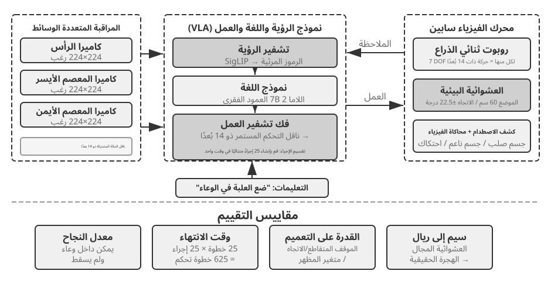

# مرحلة ما بعد تدريب النموذج

تقوم معادلة الكتاب على أن **الوكيل = نموذج لغوي كبير + سياق + أدوات**. ويركز هذا الفصل على النموذج نفسه، أي «العقل»، لبحث كيف تساعد مرحلة ما بعد التدريب على استخدام السياق والأدوات بكفاءة أكبر، ومن ثم رفع قدرة منظومة الوكيل كلها. وقد انتهى الفصل السادس إلى أن نظام التقييم وبيئة المحاكاة ركيزتان لهذه المرحلة: فالبيئة توفر ميدان التدريب، والمقاييس تحدد غايته. وينطلق هذا الفصل من هاتين الركيزتين ليشرح كيف تتغير أوزان النموذج فعليًا، وكيف تُرسَّخ القدرة في معلماته.

لا يفترض الفصل خلفية سابقة في التعلم المعزز أو تدريب النماذج، ولا معرفة بالتدرجات أو تحسين السياسات. بل يبدأ بالسؤال الأبسط: كيف يُدرَّب النموذج أصلًا؟ ثم يوضح غرض كل خطوة وآليتها والمشكلة التي تحلها. وفي نهايته ستكون قادرًا على تمييز مراحل بناء قدرات النموذج، ووظيفة كل مرحلة، وسبب ترتيبها، والموضع الأجدى لاستثمار الجهد في مشروعك.

**لنبدأ بالخريطة الأهم: تتشكل قدرات النموذج الحديث عبر ثلاث مراحل مترابطة لا غنى عن أي منها:**

1.  **التدريب المسبق:** يتدرب النموذج على كم هائل من نصوص الإنترنت للتنبؤ بالرمز التالي، فيكتسب اللغة والمعرفة العامة وأسس التفكير. وهو كمن قرأ مكتبة كاملة فأصبح واسع الاطلاع، لكنه لم يتعلم بعد كيف يجيب عن الأسئلة على النحو المطلوب. وهذه أكثر المراحل كلفة، وهي أساس القدرات كلها.
2.  **الضبط الدقيق تحت الإشراف (SFT):** يتدرب النموذج على أزواج موسومة من المدخلات والمخرجات، كما لو أن معلمًا يقدم لطالبه حلولًا نموذجية ليحاكيها. وتعلمه آلاف الأمثلة أو عشرات الآلاف منها تنسيق الإجابة وأسلوبها وإجراءاتها، فتحوله من نموذج واسع المعرفة إلى مساعد يفهم التعليمات وينتج إجابات منظمة. وهذه مرحلة سريعة ومستقرة ومنخفضة الكلفة نسبيًا، تمر بها معظم النماذج المنشورة.
3.  **التعلم المعزز (RL):** يحاول النموذج مرارًا ويتحسن وفق المكافآت. وبدل عرض الإجابة النموذجية عليه، يُترك ليستكشف، ثم تزداد احتمالات السلوك الجيد وتقل احتمالات السلوك السيئ. وتعلمه هذه المرحلة اتخاذ قرارات معقولة حتى في **مواقف لم يرها أثناء التدريب**، وهي أكثر مراحل الفصل احتياجًا إلى الجهد الهندسي.

وبتشبيه مبسط: التدريب المسبق هو «قراءة عشرة آلاف كتاب»، وSFT هو «التعلم من حلول نموذجية يقدمها معلم»، وRL هو «حل المسائل والتعلم بالتجربة والخطأ». وليست المراحل بدائل بعضها من بعض، بل سلسلة متتابعة: اقرأ أولًا، ثم شاهد الأمثلة، ثم تدرب بنفسك.

**يقوم هذا الفصل كله على فكرتين محوريتين؛ احتفظ بهما في ذهنك، فكل ما يأتي لاحقًا يعود إليهما:**

*   **الفكرة الأولى: يحفظ SFT، بينما يعمّم RL.** عند ثبات المهمة والميزانية، يميل SFT إلى حفظ الأنماط الموجودة في بيانات التدريب، وقد يتعثر حين تختلف بيئة النشر عنها. أما RL فيميل إلى تعلّم استراتيجية قابلة للنقل، فتظل أكثر ثباتًا في المواقف التي لم يرها أثناء التدريب. وليست هذه عبارة دعائية؛ بل ظاهرة قابلة للقياس سنختبرها مرارًا في تجارب مضبوطة، ثم نشرح أسبابها في القسم 7.1.
*   **الفكرة الثانية: البيانات والبيئة أهم من الخوارزمية.** لعل هذا أهم دروس الصناعة وأشدها مخالفة للحدس. فخوارزميات مثل PPO وGRPO متاحة وجيدة الفهم، أما النجاح الفعلي فيتوقف غالبًا على أمرين: **بيئة المحاكاة**، أي مدى واقعية ميدان التدريب، و**بيانات التدريب**، أي جودة العروض وإشارات المكافأة. وفي حالات كثيرة تغني بيانات SFT الممتازة عن RL أصلًا. لذلك سيعيدك الفصل من سؤال «أي خوارزمية أضبط؟» إلى السؤال الأهم: «هل أعددت البيانات والبيئة إعدادًا صحيحًا؟».

> **دليل القراءة**: ينقسم محتوى هذا الفصل إلى مسارين بناءً على خلفية القارئ:
>
> * **مطورو تطبيقات الوكلاء** الذين لا يدرّبون النماذج بأنفسهم: ابدؤوا بالمقدمة «التدريب المسبق وSFT وRL: صورة شاملة من ثلاث مراحل» لتكوين تصور عام. ويمكنكم بعد ذلك تجاوز القسمين الموسومين `[قراءة اختيارية]` — خلفية التعلم المعزز الكلاسيكي والتدريب المسبق — والانتقال إلى قسم SFT. ركّزوا على الفرق الجوهري بين SFT وRL، وعلى إطار «متى نختار SFT ومتى نختار RL»، وعلى الفكرة المحورية أن البيانات والبيئة أهم من الخوارزمية. فهذه الأفكار تؤثر مباشرةً في قرارات هندسة منظومة الوكيل: متى يكفي تحسين الموجّه، ومتى يستحق الضبط الدقيق كلفته.
> * **مهندسو تدريب النماذج**: اقرأوا الفصل بالتسلسل من أوله. يقدّم القسمان الاختياريان الخلفية اللازمة في التعلم المعزز والتدريب المسبق، ثم تعرض التجارب اللاحقة وصفات تدريب قابلة لإعادة الإنتاج.

## التدريب المسبق، SFT، RL: بانوراما ثلاثية المراحل

قدمت لك المقدمة خريطة المراحل الثلاث؛ يعمل هذا القسم من خلال آليات كل منها. تختلف المراحل الثلاث في **البيانات**، و**أهداف التحسين**، و**التكاليف**. إن فهم أوجه التشابه والاختلاف بينهما هو مفتاح الفصل بأكمله. ويقدم الجدول 1-7 نظرة عامة؛ التفاصيل تتبع.

جدول 7-1 المراحل الثلاث لتكوين قدرات النموذج

| المرحلة | البيانات المستخدمة | هدف التحسين | ما يتم تعلمه | التكلفة النموذجية |
|-------------|---------------------|--------------------|---------------------|-------------------|
| **التدريب المسبق** | نص الإنترنت الخام الضخم | توقع الرمز التالي | قواعد اللغة والمعرفة العالمية والتفكير الأساسي | عالية جدًا (ملايين إلى عشرات الملايين من الدولارات الأمريكية) |
| **SFT** | الآلاف إلى عشرات الآلاف من أزواج العرض التوضيحي "المدخلات والمخرجات". | توقع الرمز المميز التالي (يتم حساب الخسارة فقط على الاستجابة) | التعليمات التالية، تنسيق الإخراج، والأسلوب، وبروتوكول العملية | منخفض (من ساعات إلى أيام) |
| **RL** | وظيفة المهمة + المكافأة (لا توجد إجابة قياسية) | تعظيم المكافأة المتوقعة | استراتيجية اتخاذ القرار القابلة للتحويل، والحلول المكتشفة حديثا | عالية (غالبًا عشرات إلى مئات المرات من SFT) |

### ما الذي يفعله التدريب المسبق: التنبؤ بالرمز التالي

كل "ذكاء" النماذج الكبيرة الحديثة مبني على مهمة بسيطة للغاية لدرجة أنها تثير الدهشة: **التنبؤ بالرمز التالي (NTP)**.

أظهر للنموذج الجزء الأول من النص واطلب منه تخمين الرمز المميز التالي. على سبيل المثال، في ضوء الإدخال "عاصمة الصين هي"، يجب أن يعين النموذج احتمالًا كبيرًا لـ "بكين". في كل مرة يخمن فيها النموذج، فإنه يقارن توقعاته بالرمز المميز التالي الفعلي. كلما كان الفرق أكبر (يسمى الخسارة)، زاد ضبط معلماته للتخمين بشكل أكثر دقة في سياقات مماثلة في المرة القادمة. من خلال القيام بذلك بشكل متكرر على تريليونات من الرموز المميزة لنصوص الإنترنت، يضطر النموذج إلى تعلم القواعد والحقائق والمنطق وحتى التفكير الأساسي - لأنه لتخمين الرمز التالي باستمرار بشكل صحيح عبر مجموعة واسعة من السياقات، لا يوجد طريق مختصر؛ يجب أن "يهضم" الأنماط الموجودة في النص حقًا.

هناك نقطة أساسية يجب تذكرها والتي ستنتقل إلى SFT وRL: **مخرجات النموذج هي في الأساس توزيع احتمالي.** بالنظر إلى النص السابق، يعين النموذج احتمالية لكل رمز ممكن في مفرداته. "التدريب" في جوهره هو **ضبط توزيع الاحتمالية** — مما يجعل احتمالية الرموز المرغوبة أعلى والرموز غير المرغوب فيها أقل. الفرق بين المراحل الثلاث يكمن فقط في "ما هو مرغوب" و"ما هي الإشارة التي تحدد "المرغوب"."

بعد التدريب المسبق، يصبح النموذج واسع المعرفة ولكنه ليس سهل الاستخدام: إذا طرحت عليه سؤالاً، فقد يستمر في توليد المزيد من الأسئلة بدلاً من الإجابة - لأنه في نص الإنترنت، غالبًا ما يتبع السؤال سؤال آخر. لم يتعلم بعد بروتوكول "عندما يُطرح عليك سؤال، عليك الإجابة عليه".

### جوهر SFT: "التنبؤ بالرمز التالي" ببيانات مختلفة

هذه هي الفكرة الرئيسية الأولى التي يجب فهمها في هذا الفصل: **رياضيًا، SFT هما نفس المهمة - كلاهما يتنبأ بالرمز التالي ويقللان نفس دالة الخسارة.** يعتقد العديد من المبتدئين أن SFT هي طريقة جديدة تمامًا، ولكنها ليست كذلك. الفرق بين SFT والتدريب المسبق يكمن في أمرين فقط:

1.  **بيانات مختلفة.** يستخدم التدريب المسبق نص الإنترنت الخام (غير منظم، ويحتوي على كل شيء)؛ يستخدم SFT أزواج "المدخلات والمخرجات" المعدة بعناية، والتي تم تنسيقها بشكل موحد على أنها "سؤال المستخدم ← الإجابة المثالية". يستمر النموذج في "التنبؤ بالرمز التالي" في هذه العروض التوضيحية، وبالتالي تعلم بروتوكول "كيفية تنظيم الرد عند طرح سؤال".
2.  **يتم حساب الخسارة فقط على "الاستجابة" (إخفاء الخسارة).** تتكون عينة SFT من سؤال وإجابة ذات عنوان. لا نريد أن يتعلم النموذج "كيفية طرح سؤال"، بل "كيفية الإجابة" فقط. لذلك، عند حساب الخسارة، يتم إخفاء الرموز المميزة في جزء السؤال، ويتم نشر التدرجات بشكل عكسي فقط من خلال جزء الاستجابة. هذا هو الفرق الهندسي الجوهري الوحيد بين SFT والتدريب المسبق.

بمجرد أن ترى هذا، فإن "SFT يحفظ" يتبع بشكل طبيعي: هدف تحسين SFT هو **تعظيم احتمالية كل رمز مميز في الاستجابة المسمى** - بعبارات واضحة، "تعلم هذه الإجابة القياسية عن ظهر قلب." وبالنظر إلى نفس السؤال، تم تدريب النموذج على إعادة إنتاج العرض التوضيحي بأكبر قدر ممكن. بالنسبة للمهام ذات الأهداف الواضحة والتنسيقات الثابتة، يعد هذا فعالاً للغاية - تكفي بضعة آلاف من الأمثلة - ولكن قدراته تظل مقيدة بشكل صارم ببيانات العرض التوضيحي: فهي لم تتعلم مواقف غائبة عن المظاهرات، وعندما لم تعد الإجابة الموضحة تنطبق بسبب تغير البيئة، فإنها لا تزال تعيد إنتاج تلك الإجابة.

باختصار، يستخدم SFT كفاءة عينة عالية للغاية **لتشفير تعيين وبروتوكول مستقر للإدخال إلى الإخراج في معلمات النموذج**. فهو يشفر **المعرفة البروتوكولية** — كيفية قول شيء ما أو القيام به، بما في ذلك التنسيق والأسلوب والعملية — بدلاً من كميات كبيرة من **المعرفة الواقعية** — التي يعرفها النموذج. ويعتمد الأخير على التدريب المسبق أو RAG (سنعود إلى هذا التمييز في نهاية الفصل).

> **تكلفة التدريب: الضبط الدقيق لكفاءة معلمات LoRA.** يتطلب كل من SFT وRL اللاحق تحديث معلمات النموذج، ويتطلب الضبط الدقيق للمعلمات الكاملة متطلبات VRAM عالية (تحتاج إلى تخزين التدرجات وحالات المُحسِّن لمليارات المعلمات). **LoRA** (التكيف منخفض الرتبة) هي الطريقة الأكثر شيوعًا لتوفير التكلفة: فبدلاً من تعديل مصفوفات الوزن الأصلية الكبيرة، يتم إرفاق "تصحيح" صغير (مصفوفة منخفضة الرتبة) لتعلم المهمة. يبلغ عدد المعلمات 1%-5% فقط من العدد الأصلي، ومع ذلك يمكن أن يقترب من أداء الضبط الدقيق الكامل. ونظرًا لتجميد الأوزان الأصلية، يتسبب LoRA أيضًا في حدوث اضطراب أقل في القدرات الحالية للنموذج الأساسي، مما يقلل من خطر النسيان الكارثي. بعض القواعد الأساسية التي تم التحقق من صحتها[^ch7-1]: **يجب عليك** تطبيق LoRA على جميع مصفوفات الوزن الرئيسية (خاصة طبقات MLP، التي تحتوي على أكبر عدد من المعلمات)؛ وتطبيقه فقط على طبقات الانتباه يكلف الدقة. **معدل التعلم الأمثل هو حوالي 10 أضعاف معدل الضبط الدقيق الكامل** (صحيح لكل من SFT وRL، وهي قاعدة نقل عملية للغاية). استخدم رتبة متوسطة إلى عالية (64-256) لـ SFT؛ نظرًا لأن المعلومات في كل جولة صغيرة بالنسبة لـ RL، فإن الرتبة الصغيرة (8-32) أو حتى الرتبة = 1 تكون كافية. أثناء النشر، يمكن لخادم استدلال واحد تحميل محولات LoRA متعددة في وقت واحد لخدمة المستأجرين المتعددين. يتعامل هذا الكتاب مع LoRA باعتباره الخيار الهندسي الافتراضي لجميع أساليب ما بعد التدريب ولن يشرحه بشكل منفصل.

### لماذا يجب أن تأتي SFT قبل RL، وليس العكس

ترتيب المراحل الثلاث ليس تعسفيا. إن التدريب المسبق أولاً أمر غير مثير للجدل - فبدون أساس اللغة والمعرفة، لا يمكن تحقيق أي شيء آخر. ما يحتاج إلى شرح هو: **لماذا يجب أن يأتي SFT قبل RL؟**

تكمن الإجابة في كيفية عمل RL. RL لا ينظر إلى الإجابات القياسية؛ فهو يتيح للنموذج **إنشاء** استجاباته الخاصة ثم يمنح مكافآت أو عقوبات بناءً على جودة الاستجابة. لكن للحكم على الجودة، عليك أولاً أن تكون قادرًا على **تحليل** مخرجات النموذج: إذا كانت المهمة تتطلب إخراج كائن JSON أو استدعاء أداة، وأنتج النموذج خليطًا من النص سيئ التنسيق، فإن وظيفة المكافأة ليس لها أساس للحساب (لا يمكنها حتى معرفة "النجاح من الفشل")، ولا يمكن لـ RL التعلم.

لذا، يلعب SFT دور **جعل النموذج ينتج مخرجات جيدة التكوين أولاً**: يعمل عدد صغير من العروض التوضيحية على تثبيت تنسيق الإخراج بحيث يمكن تحليله بشكل موثوق، مما يمنح RL نقطة بداية يمكن تسجيلها. هذا هو أقوى نموذج على مرحلتين **"SFT أولاً، ثم RL"** في هذه الصناعة. تنفيذ RL أولاً وSFT لاحقًا لا يعمل - بدون إخراج ثابت، تكون إشارة المكافأة مجرد ضجيج. استعارة مفهوم من الرسم الصيني: SFT ينشئ أولاً **"النموذج"** (التنسيق، البنية)، ومن ثم يتبع RL **"الروح"** (الإستراتيجية، التعميم) —**الشكل أولاً، والروح ثانيًا**.

شرط حدودي مهم: "يجب أن يأتي SFT أولاً" ينطبق على إعداد **"نموذج أساسي أصغر + مخرجات منظمة بشكل صارم"** (ستوضح التجربة 7-11 أن النموذج بمقياس Llama-3.2-Vision-11B يفشل تمامًا إذا تم تطبيق RL مباشرة بدون SFT). ومع ذلك، إذا كان النموذج الأساسي قويًا بدرجة كافية، فقد يكون قادرًا على إنتاج مخرجات كافية من البداية، مما يسمح بتخطي SFT—أظهر DeepSeek-R1-Zero أن RL المباشر يمكن أن ينجح مع نموذج أساسي قوي، مع ظهور انعكاس وسلاسل طويلة من الأفكار تلقائيًا. وتتمثل التكلفة في ضعف إمكانية قراءة المخرجات والاختلاط بين اللغة الصينية/الإنجليزية، لذا أضاف DeepSeek في النهاية "البدء البارد SFT" في R1 لإعادة إنشاء "النموذج". إن رحلة R1 من الصفر إلى البداية الباردة هي أفضل مثال على "الشكل أولاً، والروح ثانيًا".

### الفرق الأساسي بين SFT و RL (الجدول الأكثر أهمية في هذا الفصل)

لقد قلنا مرارًا وتكرارًا "SFT يحفظ، RL يعمم." الآن دعونا نشرح الأسباب الأساسية بدقة. تنبع جميع الاختلافات بين الاثنين من **أهداف التحسين المختلفة**:

*   **تعمل SFT على تحسين "مدى تشابه الإجابة القياسية."** الهدف هو زيادة احتمالية الإجابة المصنفة (أقصى احتمالية). عند إعطاء سؤال، هناك نتيجة واحدة "صحيحة" فقط - وهي الإجابة التوضيحية. يتم سحب النموذج نحو هذا المسار الفردي، وتعلم رسم خرائط ثابت لـ "رؤية هذا المدخلات، وإنتاج تلك المخرجات". لذلك **يحفظ**: أثناء التدريب، يتم التعامل مع جميع J/Q/K على أنها 10، ويحفظ القاعدة "J/Q/K تعني 10" في الذاكرة؛ في وقت الاختبار، يصبح J 11، لكنه لا يزال يستخدم 10 ويحصل على الإجابة الخاطئة.
*   **تعمل RL على تحسين "مدى جودة النتيجة."** الهدف هو زيادة المكافأة المتوقعة إلى أقصى حد. عند طرح سؤال، **أي** ناتج يحقق مكافأة عالية يعد جيدًا، وليس منتجًا واحدًا فقط. يستكشف النموذج مسارات متعددة من تلقاء نفسه، مما يعزز تلك التي تسفر عن نتائج جيدة. ويتعلم **إستراتيجية** أكثر عمومية حول "ما هي العملية التي تؤدي إلى النتيجة الصحيحة": عندما يصبح J 11، فإنه يعيد الحساب باستخدام نفس الإستراتيجية، بدلاً من تطبيق إجابة محفوظة. هذا هو **التعميم**.

جدول 7-2 المقارنة الأساسية بين SFT وRL

| البعد | SFT (الضبط الدقيق الخاضع للإشراف) | RL (التعلم المعزز) |
|-----------------|--------------------------------------|----------------------------------------|
| هدف التحسين | تعظيم احتمالية الإجابة المسماة (الحد الأقصى للاحتمالية) | تعظيم المكافأة المتوقعة |
| إشارة التدريب | إجابة قياسية واحدة (الإشراف على كل رمز مميز) | استجابات متعددة تم إنشاؤها ذاتيًا + مكافأة (إشارة نجاح/فشل واحدة لكل استجابة) |
| نموذج البيانات | أزواج العرض التوضيحي "الإدخال والإخراج". | وظيفة المهمة + المكافأة (لا حاجة إلى إجابة قياسية) |
| ما يتم تعلمه | تم إصلاح تعيين "الإدخال → الإخراج" (الحفظ) | استراتيجية صنع القرار القابلة للتحويل (التعميم) |
| تحت تحول التوزيع | يتم تطبيق الإجابة القديمة عندما تتغير البيئة، وينخفض الأداء | يتم إعادة الحل باستخدام نفس الإستراتيجية، وأكثر استقرارًا |
| كفاءة العينة | عالية (آلاف الأمثلة فعالة) | منخفض (غالبًا عشرات إلى مئات المرات من SFT) |
| استقرار التدريب | عالية، وتتقارب بسرعة | منخفض وعرضة للتذبذب ويتطلب ضبطًا دقيقًا |
| الأنسب ل | ترسيخ التنسيق/الأسلوب/العملية، والعروض التوضيحية عالية الجودة، والبيئة المستقرة | الحاجة إلى التعميم على سيناريوهات جديدة، واستكشاف الاستراتيجيات المثلى، وارتفاع تكلفة التعليقات التوضيحية |

**تشكل مرحلة ما بعد التدريب أيضًا توقيت فعل النموذج.** تقدم نماذج البرمجة مثالًا ملموسًا: فكثيرًا ما تُظهر عائلتا GPT وClaude عتبتين افتراضيتين مختلفتين للفعل. قد تقرأ الأولى جزءًا أكبر من المستودع قبل التعديل، بينما قد تحدد الثانية موضع التغيير من ملفات أقل، وتنفذ أولًا، ثم تصحح المسار اعتمادًا على ملاحظات الاختبارات. وليس المقصود تشخيص نموذج بأنه «حذر» وآخر بأنه «حدسي». إنها سياسة داخل المعلمات تقدّر ما إذا كانت القيمة المتوقعة لقراءة ملف إضافي ما تزال أعلى من القيمة المتوقعة لإرسال الرقعة الحالية والتحقق منها. فإذا تضمنت عروض SFT مرارًا استقصاءً واسعًا قبل التعديل، حاكى النموذج عتبة فعل أعلى. وإذا كافأت مكافآت العملية أو النتيجة مرارًا التحديد السريع والدخول المبكر في حلقة قابلة للتحقق، انتقلت الكتلة الاحتمالية نحو الفعل الأبكر. تبدّل التجربة 6-7 النماذج داخل Coding Harness محايد ومتطابق، وتقيس تغير هذا السلوك مع النموذج: لا يحتاج الـ Harness إلى فرض سير عمل كي يحمل النموذج سياسة مستقرة خاصة به لاستخدام الأدوات. يستطيع الـ Harness تعديل السياسة، لكن مصدرها الأساسي قد يكون معلمات النموذج بعد مرحلة ما بعد التدريب. ولأن المزودين لا ينشرون كامل البيانات ووصفات المكافأة، تثبت التجربة فرقًا سلوكيًا في جانب النموذج، لا الخوارزمية الاحتكارية المحددة التي تسببت فيه.

هناك آلية أعمق تستحق المعرفة: **البحث عن الوضع**، وهو ما يفسر سبب تقارب RL في بعض الاستراتيجيات الجيدة. إن التوزيع الاحتمالي لجميع الإجابات المحتملة التي يمكن أن يقدمها النموذج لسؤال ما قد يحتوي على العديد من "الأنماط"، يمثل كل منها مجموعة من الطرق المعقولة للإجابة. أقصى احتمال يستخدمه SFT هو **التغطية الجماعية** — فهو يحاول تغطية جميع الأوضاع الموجودة في العرض التوضيحي، حتى تعيين احتمالية للأنماط ذات الجودة الأقل ("توزيع الثروة"). RL (خاصة تحسين السياسة مع قيود KL، الذي يتوافق شكله الرياضي مع **انحراف KL العكسي**، المفصل في قسم RLHF) هو **البحث عن الوضع** - فهو يميل إلى العثور على الأوضاع القليلة ذات المكافأة الأعلى، مع تركيز الاحتمالية عليها وتجاهل الباقي بشكل حاسم ("الفائز يأخذ كل شيء"). وهذا هو السبب في أن النماذج المدربة على RL تعطي إجابات أكثر "حاسمة" وتركز بشكل أكبر على الاستراتيجيات عالية الجودة، وأيضًا لماذا تميل RL إلى التضحية بالتنوع. تذكر مفاهيم التغطية الجماهيرية والبحث عن الأنماط؛ سيستخدمها قسم تباعد KL لشرح اختيار تصميم يبدو جافًا ولكنه مهم للغاية.

**لماذا يتمتع RL بسقف أعلى من SFT؟ لأنه "متصل".** وهذا تمييز أعمق بين SFT وRL، والسبب الأساسي الذي يجعل RL يستحق التكلفة الإضافية. SFT هي طريقة **غير متصلة بالإنترنت**: يمكنها التعلم فقط من مجموعة ثابتة من بيانات العرض التوضيحي ولا يمكنها مطلقًا رؤية العالم خارج تلك البيانات. RL هي طريقة **عبر الإنترنت**: فهي تتيح للنموذج إنشاء استجاباته الخاصة، ثم تحسينها بناءً على الملاحظات والتعلم عن طريق التجربة والخطأ. (سيتم التمييز رسميًا بين المصطلحين "متصل/غير متصل بالإنترنت" والمصطلح الأكثر صرامة "متصل بالسياسة/خارج السياسة" في القسم 7.8؛ في الوقت الحالي، نحن نبني الحدس.) إن الاتصال بالإنترنت يجلب ثلاث مزايا لا يمكن أن تتمتع بها SFT، وهما معًا يرفعان السقف:

- **أولاً، سقف عدم الاتصال بالإنترنت هو البيانات؛ سقف الإنترنت هو المهمة.** النتيجة المثلى لـ SFT هي "تكرار العروض التوضيحية بشكل مثالي" — لذا فإن سقفها هو **مستوى العرض التوضيحي**؛ ويمكنه على الأكثر أن يقترب من هذا المستوى، ولا يتجاوزه أبدًا. لا يمكن لمجموعة البيانات التي يصنفها المعلم الذي حصل على 60 من 100 أن تنتج طالبًا يحصل على 90. RL لا تنظر إلى العروض التوضيحية، بل إلى مكافآت النتائج فقط: **أي** سلوك يؤدي إلى مكافأة أعلى سيتم تعزيزه، حتى لو لم يقم أحد بإثبات ذلك على الإطلاق. وبالتالي، يمكن لـ RL بشكل مستقل **اكتشاف استراتيجيات متفوقة غير موجودة في العروض التوضيحية** - في التجربة 7-13 (SimpleVLA-RL) لاحقًا في هذا الفصل، لم يظهر إجراء "الدفع" المخترع ذاتيًا للنموذج مطلقًا في العروض التوضيحية البشرية، وهو دليل مباشر على "تجاوز العروض التوضيحية". يتم تحديد سقف RL من خلال المهمة نفسها (ما يمكن أن تتعرف عليه المكافأة)، وليس من خلال ما يحدث في البيانات.
- **ثانيًا، التحقق أسهل من التوليد—وهذا هو السبب الأساسي وراء قدرة RL على الصعود إلى أعلى.** يتطلب SFT من شخص ما **كتابة الإجابة الصحيحة أولاً** كعرض توضيحي؛ يحتاج RL فقط إلى طريقة **للحكم** على ما إذا كانت الإجابة جيدة (تخصيص مكافأة). في العديد من المهام، يكون التمييز بين الصواب والخطأ أسهل بكثير من إنتاج الإجابة الصحيحة، حيث يمكن التحقق من الإجابات الرياضية مقابل مفتاح، ويمكن تشغيل التعليمات البرمجية من خلال الاختبارات، ويمكن لمثبتي النظرية التحقق من البراهين. طالما أن التعرف على العمل الجيد أسهل من إنتاجه، فإن RL يمكنه تدريب نموذج أقوى من أي عرض متاح: فالنموذج يجرب الأشياء بشكل عشوائي، والبيئة تنتقي المحاولات الجيدة وتعززها. إن عدم التماثل في توليد التحقق هو مصدر قوة أساليب المكافأة التي يمكن التحقق منها مثل RLVR.
- **ثالثًا، يتيح التعلم عبر الإنترنت للنموذج أن يتدرب على المسارات التي سيتبعها بنفسه ويتعلم كيفية التعافي من أخطائه.** يواجه التقليد خارج الإنترنت مشكلة كلاسيكية تسمى **التحول المتغير**: عندما يتصرف الطالب من تلقاء نفسه، فإنه ينحرف عن العروض التوضيحية ويدخل في حالات غائبة عن البيانات. ولأنه لم يتعلم أبدًا كيفية التعافي من تلك الحالات، فإن الأخطاء تتراكم على طول المسار (من الناحية النظرية، ينمو خطأ التقليد الخالص تقريبًا مثل $T^2$ مع طول المسار T، في حين أن التدريب باستخدام البيانات عبر الإنترنت يمكن أن يضغطه إلى حوالي $T$). تفعل الأساليب عبر الإنترنت العكس، إذ يتدرب النموذج على نفس التوزيع الذي سيواجهه أثناء النشر، وكل جولة من التغذية الراجعة تستهدف بشكل مباشر نقاط ضعفه الحالية؛ تكون البيانات دائمًا "حديثة"، على عكس البيانات غير المتصلة بالإنترنت، والتي تصف سلوك شخص آخر (المعلم) وتصبح غير ذات صلة بشكل متزايد مع تحسن النموذج. السبب وراء قوة التقطير على مستوى السياسة (القسم 7.12) لاحقًا في هذا الفصل هو في الأساس أنه يجمع بين هذه الميزة "عبر الإنترنت" وميزة "الإشراف المكثف" في SFT.

لاستخدام القياس: **SFT يتتبع خريطة رسمها شخص آخر ويمكنه في أفضل الأحوال مطابقة تلك الخريطة؛ يستكشف RL باستخدام البوصلة - المكافأة - وقد يكتشف طرقًا خارج الخريطة.** وهذا هو السبب أيضًا في أن "وضع الأساس باستخدام SFT، ثم التسلق باستخدام RL" أصبح الوصفة السائدة.

مع وجود هذه البانوراما في متناول اليد، سيكون لكل قسم لاحق مكان على الخريطة. القسمان التاليان، `[قراءة اختيارية]` - "من وكلاء RL الكلاسيكيين إلى الوكلاء الحديثين" و"أساسيات نموذج ما قبل التدريب" - يملؤون التعلم المعزز وخلفية ما قبل التدريب للقراء الذين يرغبون في التعمق أكثر. يمكن للقراء الذين يرغبون فقط في الحصول على التدريب بعد التدريب الانتقال إلى قسم SFT.

## من وكلاء RL الكلاسيكيين إلى الوكلاء الحديثين `[قراءة اختيارية]`

### التفاعل بين الوكيل والبيئة

**التعلم المعزز (RL)** يدور بشكل أساسي حول تعلم كيفية اختيار الإجراءات بناءً على الموقف الحالي لتحقيق أقصى قدر من **المكافأة التراكمية**. تخيل أن الذكاء الاصطناعي يتعلم لعب الشطرنج: كل حركة هي إجراء، والفوز يعطي مكافأة إيجابية، والخسارة تعطي مكافأة سلبية، والمكافأة التراكمية هي المكسب الإجمالي من اللعبة بأكملها. يتفاعل الوكيل والبيئة بشكل مستمر: في كل خطوة، يراقب الوكيل الحالة الحالية، ويختار إجراءً ما، وتنتج البيئة حالة جديدة وتمنح مكافأة.

لفهم هذا التفاعل بشكل أكثر بديهية، يوضح الرسم البياني التالي حلقة RL القياسية - في كل خطوة زمنية، يراقب الوكيل حالة البيئة، ويخرج إجراءً، وتمنح البيئة مكافأة وتنتقل إلى حالة جديدة بناءً على هذا الإجراء.

ينتج عن هذا التفاعل **مسار** — سجل كامل لـ "الحالة ← الإجراء ← المكافأة ← الحالة الجديدة ← الإجراء ← المكافأة...". إن جودة السياسة تنعكس في النهاية على جودة المسارات. تجيب **دالة القيمة** على السؤال: "إذا كنت في هذه الحالة الآن واستمررت في التصرف وفقًا للسياسة الحالية، فما هو إجمالي المكافأة التي سأجمعها في النهاية؟" هذا يشبه لاعب شطرنج ذو خبرة ينظر إلى مركز ما، ومن دون إجراء حسابات حتى النهاية، يقوم بشكل بديهي بتقدير احتمالية الفوز. (عندما يتم استبدال "السياسة الحالية" بـ "السياسة المثلى"، نحصل على دالة القيمة المثلى، والتي سيتم استخدامها لاحقًا في هذا الفصل عند مناقشة معادلة بيلمان للمثالية.) تتبع الحدود بين الوكيل والبيئة مبدأ بسيطًا: **أي شيء لا يستطيع الوكيل تغييره بشكل تعسفي ينتمي إلى البيئة.**

هناك ميزتان فريدتان تميزان التعلم المعزز عن التعلم الخاضع للإشراف (الذي يتطلب إجابات صحيحة مصنفة) والتعلم غير الخاضع للإشراف (الذي يكتشف الأنماط المخفية في البيانات): **البحث عن التجربة والخطأ** (يجب على الوكيل اكتشاف الإجراءات الجيدة بمفرده، دون أن يقدم المعلم الإجابة الصحيحة مباشرة) و **المكافأة المتأخرة** (قد يصبح تأثير الإجراء واضحًا بعد عدة خطوات فقط، على سبيل المثال، لا تظهر قيمة حركة الشطرنج الجيدة إلا في نهاية اللعبة). وهذا يؤدي أيضًا إلى **المفاضلة بين الاستكشاف والاستغلال** الفريدة: إن اتباع المسارات المألوفة دائمًا يعني عدم تعلم أي شيء جديد؛ المحاولة العشوائية دائمًا تعني عدم الوصول إلى الهدف مطلقًا.

يتكون نظام التعلم المعزز من خمسة عناصر أساسية:

- **مساحة الإجراء**: تحدد مجموعة جميع الإجراءات الممكنة التي يمكن للوكيل اتخاذها. يمكن أن تكون الإجراءات منفصلة (على سبيل المثال، "ما هي الحركة التي يجب القيام بها" في لعبة الشطرنج، مع عدد محدود من الخيارات) أو مستمرة (على سبيل المثال، "كم عدد الدرجات اللازمة لتدوير المفصل" للروبوت، وهي قيمة مستمرة).
- **السياسة**: القاعدة السلوكية للوكيل، والتي تحدد ما يجب فعله في حالة معينة. يمكن أن تكون السياسة بسيطة (جدول بحث: في الحالة أ، قم بتنفيذ الإجراء X) أو معقدة (شبكة عصبية عميقة).
- **إشارة المكافأة**: التغذية الراجعة الفورية من البيئة. ومع ذلك، فإن هدف الوكيل هو تعظيم المكافأة على المدى الطويل، وليس الفوري - وهذا التمييز أمر بالغ الأهمية، تمامًا كما لا ينبغي الحكم على الاستثمار من خلال مكاسب وخسائر اليوم ولكن من خلال العائدات طويلة الأجل.
- **وظيفة القيمة**: تقدير إجمالي المكافأة التراكمية التي يمكن الحصول عليها من حالة معينة في المستقبل، مما يساعد الوكيل على اتخاذ قرارات حكيمة حتى بدون الحصول على تعليقات فورية. أحد أهم الأفكار المستفادة من ستين عامًا من أبحاث RL هو الدور المركزي لتقدير القيمة.
- **نموذج البيئة** (اختياري): يتنبأ باستجابة البيئة للإجراءات. تُسمى الأساليب التي تستخدم نموذج البيئة **الطرق المستندة إلى النموذج** (تعلم أولاً كيفية التنبؤ بكيفية تغير البيئة، ثم التخطيط وفقًا لذلك)؛ أما تلك التي لا توجد بها فهي تسمى **الأساليب الخالية من النماذج** (لا تتنبأ بالبيئة، بل تتعلم مباشرة من التجربة).

يقارن الجدول 7-3 المكونات الرئيسية لأنظمة الوكيل المختلفة، ويكشف عن عالمية مفهوم الوكيل ويساعد القراء على رؤية الفرق في مساحات العمل بين وكلاء RL التقليديين ووكلاء LLM الحديثين.

جدول 7-3 مقارنة العناصر الأساسية في أنظمة الوكيل المختلفة

| نوع الوكيل | البيئة | مساحة العمل | إشارة المكافأة |
|---------------|------------------------|-------------------------------|-------------------------|
| **ظبي حديث الولادة** | التضاريس والجاذبية ووضعية الجسم | مستمرة وعالية الأبعاد (انقباض مجموعات العضلات) | الحفاظ على التوازن (+)، السقوط (-) |
| **روبوت فراغ** | تخطيط الغرفة، مستوى البطارية | منفصل (الاتجاه، الفراغ، الشحنة) | المنطقة النظيفة (+)، البطارية مستنفدة (-) |
| **أستاذ الشطرنج** | حالة المجلس، الحد الزمني | محدودة منفصلة (التحركات القانونية) | الفوز (+1)، الخسارة (-1) |
| **وكيل خدمة العملاء** | تاريخ المحادثة، قاعدة المعرفة | مفتوحة (فكر، تحدث، اتصل بـ API) | تم حل المشكلة (+)، وقت المعالجة (-) |
| **وكيل مساعد الكود** | وثيقة المتطلبات، قاعدة التعليمات البرمجية | مفتوحة (التفكير والبحث والتحرير والتنفيذ) | تم اجتياز الاختبار (+)، وتم تقديم الخطأ (-) |

يكشف الجدول عن رؤية مهمة: وكلاء RL التقليديون في مجالات مثل الشطرنج والروبوتات لديهم مساحات عمل مغلقة، في حين أن الوكلاء الحديثين المعتمدين على LLM، مثل وكلاء خدمة العملاء والبرمجة، لديهم مساحات عمل مفتوحة وغير محدودة تقريبًا. يمكن لهؤلاء الوكلاء أيضًا استخدام الإجراء الخاص المتمثل في "التفكير الداخلي" لتعزيز قدراتهم.

### نموذجان للوكيل: من MDP إلى LLM+RL

يكمن الفرق الجوهري بين النموذجين في فضاء الأفعال. تفترض عملية قرار ماركوف فضاءً محدودًا ومغلقًا، مثل: أعلى، أسفل، التقاط، وضع؛ أما فضاء أفعال النموذج اللغوي الكبير فمفتوح، ويتكون من سلاسل لغوية تتضاعف احتمالات تركيبها بسرعة هائلة. ويؤدي هذا الفرق إلى تباين جوهري في تصميم الخوارزميات وكفاءة العينات والقدرة على التعميم. وفيما يلي عرض لكل نموذج.

**النموذج التقليدي: MDP وQ-learning.**

MDP (عملية قرار ماركوف) هي الإطار الرياضي للتعلم المعزز، الذي يحدد العناصر الأساسية مثل الحالات والإجراءات والمكافآت. افتراضها الأساسي هو **خاصية ماركوف**: المستقبل يعتمد فقط على الحالة الحالية، وليس على التاريخ السابق. على سبيل المثال، في لعبة الشطرنج، يكون النظر فقط إلى موضع اللوحة الحالي كافيًا لتحديد الحركة المثالية؛ ليست هناك حاجة لمراجعة كل خطوة سابقة. هذا الافتراض يبسط المشكلة ولكنه يحد أيضًا من القدرة على نمذجة التبعيات التاريخية.

السمة الرئيسية لوكيل RL التقليدي هي **مساحة عمل مغلقة** — جميع الإجراءات الممكنة التي يمكن للوكيل اتخاذها من مجموعة محدودة ومحددة مسبقًا. **وكلاء ألعاب اللوحة الكلاسيكية** هم المثال الأكثر شيوعًا: مواقع الحركة المحتملة البالغ عددها 361 في لعبة Go، على الرغم من اتساعها، محددة ومحدودة تمامًا؛ في الشطرنج، على الرغم من قواعد الحركة المختلفة للقطع المختلفة، لا يزال من الممكن تعداد الإجراءات المحتملة؛ تحتوي ألعاب Atari على عدد قليل إلى اثنتي عشرة من الإجراءات المنفصلة. **الوكلاء الآليون** يمثلون مساحة عمل متواصلة ولكن محدودة: زوايا المفاصل، والسرعات، وقوى القبضة هي قيم مستمرة، ولكن جميعها لها حدود مادية واضحة (أقصى زاوية دوران، أقصى عزم دوران، حدود السرعة)، مع أبعاد تحددها درجات حرية الروبوت.

تجلب هذه الطبيعة المغلقة مزايا حسابية: يمكن تعداد جميع الإجراءات وتقييمها واحدة تلو الأخرى، مما يسهل البرمجة الديناميكية والبحث في شجرة مونت كارلو، ويمكن تقريب دالة قيمة الإجراء باستخدام الجداول أو الوظائف البسيطة. ومع ذلك، فإنه يحد أيضًا من التعبير والتعميم. يبدأ وكلاء RL التقليديون من الصفر، ويتعلمون فقط من خلال التجربة والخطأ - بدءًا من سياسة عشوائية، وجمع الخبرة، وتحديث وظيفة القيمة أو السياسة، والتكرار حتى التقارب.

ضمن هذا الإطار، إحدى الخوارزميات الأساسية والأكثر أهمية هي **Q-learning**. إنها تحافظ على تقدير القيمة لكل زوج من "إجراءات الحالة": إذا اتخذت إجراءً *a* في الحالة *s* ثم تصرفت على النحو الأمثل بعد ذلك، ما مقدار المكافأة الإجمالية التي يمكن أن تتوقعها؟ بديهيًا، يعتمد ما إذا كان الإجراء جيدًا على المكافأة المباشرة التي يجلبها، بالإضافة إلى "مدى جودة الحالة التالية التي يؤدي إليها".

إذا صغنا هذا الحدس رياضيًا حصلنا على العلاقة العودية الأساسية في معادلة بيلمان، وهي من أشهر معادلات التعلم المعزز: **قيمة الفعل المثلى = المكافأة الفورية في هذه الخطوة + أعلى قيمة مستقبلية يمكن تحصيلها من الحالة التالية**:

$$Q^*(s, a) = r + \gamma \max_{a'} Q^*(s', a')$$

تمثّل $r$ المكافأة الفورية، وتمثّل $s'$ الحالة التالية بعد تنفيذ الفعل. كُتبت المعادلة هنا بصيغة حتمية لتوضيح الفكرة؛ أما في البيئة العشوائية فنأخذ التوقع على الحالات التالية الممكنة. ويمثّل $\gamma \in [0, 1)$ **عامل الخصم** الذي يحدد وزن المستقبل: كلما اقترب من 1 ازدادت أهمية العوائد البعيدة، وكلما اقترب من الصفر انصبّ الاهتمام على المكافأة الآنية. ومن ثم فالعائد التراكمي هو مجموع المكافآت بعد خصم البعيد منها: $\sum_{t} \gamma^{t} r_t$. وبعد كل فعل تحرّك الخوارزمية تقديرها القديم قليلًا نحو النتيجة التي شاهدتها بالفعل. ويُعرف تحديث التقدير من نتيجة الخطوة التالية باسم **التعلم بالفروق الزمنية (TD)**. ومع تكرار التجربة يقترب التقدير تدريجيًا من القيمة الحقيقية.

يوضح الشكلان التاليان عملية استكشاف تعلم Q في عالم شبكي والتقارب التدريجي لقيم Q.

يعد Q-Learning نوعًا محددًا من الأساليب **خارج السياسة** — حيث يمكنه استخدام البيانات التي تم إنشاؤها بواسطة أي سياسة (بما في ذلك الاستكشاف العشوائي) لمعرفة السياسة المثلى. التعريفات الصارمة للأساليب المتعلقة بالسياسة وخارجها، وكيفية ربطها بالتدريب اللاحق لـ LLM، ستتم مناقشتها لاحقًا في قسم "مقارنة خوارزميات التعلم المعزز".

> **التجربة 7-1 ★: أداء التعلم Q في لعبة البحث عن الكنز**
>
> للتحقق من خصائص وحدود Q-learning، قمنا بتصميم **بيئة لعبة البحث عن الكنز**. تشتمل هذه البيئة على العديد من التحديات الرئيسية: **الآليات المخفية** التي تتطلب من الوكيل اكتشاف المراسلات بين المفاتيح والأبواب وتأثيرات الأسلحة وقواعد تصنيع العناصر بنفسه؛ **التبعيات متعددة الخطوات** تعني أن إكمال المهمة يتطلب التسلسل الصحيح للإجراءات (الحل الأمثل: 11 خطوة)؛ **المكافآت المتفرقة** تعني أن الإجراءات الرئيسية والنصر النهائي فقط هي التي تنتج مكافآت كبيرة، مع عدم تلقي معظم الخطوات المتوسطة أي تعليقات.
>
> يستخدم وكيل التعلم Q إعدادات المعلمات القياسية واستراتيجية الاستكشاف الجشع ε: عادةً ما يختار الإجراء الأمثل حاليًا ولكنه يختار أحيانًا إجراءً عشوائيًا، مع انخفاض نسبة الاستكشاف العشوائي تدريجيًا أثناء التدريب.
>
> يُظهر منحنى التعلم الخصائص النموذجية (الحلقة هي لعبة واحدة كاملة، من البداية إلى النهاية أو الفشل):
> - **أول 1000 حلقة**: معدل الفوز 0%، Q-table بها 124 ولاية فقط، الوكيل يستكشف بشكل أعمى
> - **أول 5000 حلقة**: لا يوجد حتى الآن انتصارات ثابتة، Q-table لديها 133 ولاية
> - **من 7000 إلى 8000 حلقة**: يرتفع معدل الفوز تدريجيًا من 34% إلى 96%
> - **10000 حلقة**: معدل الفوز 100%، Q-table يحتوي على 145 حالة، وقد وجد الحل الأمثل المكون من 11 خطوة
>
> يستغرق التدريب بأكمله أقل من 10 ثوانٍ (محاكاة فعالة للغاية)، ولكنه يتطلب ما يقرب من 10000 محاولة كاملة. يوضح هذا السمة الأساسية لـ Q-Learning: فهو يتطلب قدرًا كبيرًا من الاستكشاف العشوائي لإكمال المسار الكامل عن طريق الخطأ، كما أن نشر إشارات القيمة بطيء جدًا، مما يتطلب تعزيزًا متكررًا. إن التعلم الرمزي الخالص، دون معرفة مسبقة، لا يمكنه إلا أن يبحث بالقوة الغاشمة في فضاء الدولة.
>
> في محاكي الألعاب، تستغرق 10000 تجربة 10 ثوانٍ فقط، وهي تكلفة ضئيلة. ولكن في سيناريوهات الوكيل الواقعية - حيث يكون لكل مكالمة هاتفية تكلفة، ولكل عملية متصفح تأخير، ويمكن أن يكون لكل قرار خاطئ عواقب لا رجعة فيها - فإن 10000 تجربة غير مقبولة على الإطلاق. وهذا هو بالتحديد سبب تحول الوكلاء المعاصرين إلى الأساليب المستندة إلى LLM: الاستفادة من المعرفة المتراكمة أثناء التدريب المسبق لاتخاذ قرارات فعالة بأقل قدر من التفاعل.
>
> تتمثل القيود الأساسية لبرنامج MDP في ثلاثة جوانب: انخفاض كفاءة العينة (يتطلب تفاعلًا هائلاً لتعلم مهام بسيطة)، وضعف التعميم (المعرفة المكتسبة في بيئة ما يصعب نقلها إلى أخرى)، وعدم القدرة على الاستفادة من المعرفة السابقة (يجب تعلم كل مهمة جديدة من الصفر). تصبح هذه القيود واضحة بشكل خاص عند مواجهة مساحات الدولة المعقدة مثل اللغة الطبيعية أو الرؤية عالية الأبعاد.
>

**النموذج الحديث: الوكلاء المعتمدون على LLM+RL.**

جلبت النماذج اللغوية الكبيرة نموذجًا جديدًا للوكلاء، مما أدى إلى تغيير جذري في كيفية بناء الوكلاء - خاصة في تصميم مساحة العمل.

في التعلم المعزز التقليدي، لا يتلقى الوكيل التغذية الراجعة إلا بعد تغيير البيئة، كتحريك قطعة شطرنج أو التقدم خطوة في متاهة. أما النماذج اللغوية الكبيرة فتضيف نوعًا جديدًا من الأفعال: **التفكير الداخلي**. فالتفكير لا يغير العالم الخارجي، لكنه قد يرفع جودة الفعل النهائي بدرجة كبيرة. وهكذا لم يعد فضاء أفعال الوكيل يقتصر على «ماذا أفعل؟»، بل صار يشمل أيضًا «فيم أفكر؟ وكم أستغرق في التفكير؟».

الابتكار الأكثر أهمية هو دمج **التفكير كإجراء خاص** في مساحة العمل. في RL التقليدي، يمكن للوكلاء فقط تنفيذ الإجراءات الخارجية التي تغير حالة البيئة (التحرك، الهجوم، الالتقاط)؛ في LLM Agents، **يصبح التفكير الداخلي مكونًا أساسيًا في مساحة العمل** — فهو لا يغير البيئة الخارجية بشكل مباشر، وليس له مكافأة فورية، ويمكن تنفيذه تقريبًا بلا حدود، وغير مكلف نسبيًا.

تواجه لعبة RL التقليدية صعوبة في التعامل مع هذا النوع من الحركة، ويرجع ذلك أساسًا إلى أن مساحة الاستكشاف كبيرة جدًا وتفتقر إلى البنية: فالوكيل الذي يتعلم من الصفر يشبه البحث عن كنز في الصحراء معصوب العينين، ولا يتمكن إلا من التعثر بشكل عشوائي. نماذج LLM مختلفة. ومن خلال التدريب المسبق الضخم على النصوص، استوعبوا قواعد التفكير البشري: حل المسائل الرياضية يتبع "تحديد الشروط ← استدعاء الصيغ ← الحساب خطوة بخطوة"، وكتابة التعليمات البرمجية تتبع "فهم المتطلبات ← بنية التصميم ← تنفيذ التفاصيل". وهذا يسمح للتفكير LLM بالمضي قدمًا عبر المسارات المنظمة، مما يؤدي إلى ضغط مساحة البحث بشكل كبير. لذلك، حتى بدون تدريب إضافي على RL، يمكن لـ LLM المدرب مسبقًا إنشاء سلسلة أفكار منطقية أساسية (CoT). يأتي هذا المنطق الأساسي من الكم الهائل من عمليات التفكير البشري في مجموعة ما قبل التدريب (حلول المشكلات الرياضية، وتعليقات التعليمات البرمجية، واستجابات النقاش، وما إلى ذلك). من خلال التنبؤ بالرمز التالي، يتعلم النموذج ضمنيًا "كيف يجب أن تبدو الخطوة التالية في التفكير".

يستخدم التدريب اللاحق لـ RL بعد ذلك مكافآت خارجية لتعليم LLM كيفية استخدام هذه القواعد بشكل أكثر كفاءة لمهام محددة. توفر بنية اللغة نفسها أيضًا مكافأة داخلية ضمنية - فسلسلة التفكير المتماسكة منطقيًا (على سبيل المثال، "لأننا بحاجة إلى تحويل العملة الأجنبية إلى الدولار الأمريكي، فإن الخطوة الأولى هي البحث عن سعر الصرف") لديها احتمالية توليد عالية، في حين أن الاحتمالية الفوضوية منطقيًا (على سبيل المثال، "لأننا بحاجة إلى تحويل العملة، فلنتحقق أولاً من الطقس") لديها احتمالية منخفضة للغاية، مما يوجه النموذج بشكل طبيعي نحو مسارات معقولة.

هذه القدرة على التفكير، المرتكزة على القواعد المتأصلة في اللغة، تمكن الوكلاء القائمين على نماذج لغوية كبيرة من فهم التعليمات التي لم يروها من قبل (التعميم من دون أمثلة) وإتقان المهام الجديدة بأمثلة قليلة جدًا (تكيف محدود اللقطات) - وهو تناقض صارخ مع نموذج وكيل MDP التقليدي الذي يتطلب تجربة وخطأ مكثفين. علاوة على ذلك، يدعم النموذج الجديد أيضًا التعميم التركيبي (إعادة الجمع بين المفاهيم المعروفة للتعامل مع المواقف الجديدة)، والتعلم في السياق (التكيف السريع من خلال المحفزات والأمثلة)، والفهم المتعدد الوسائط (دمج الوسائط بشكل طبيعي مثل الرؤية، واللغة، والعمل). لاحظ أن **فعالية** التعلم في السياق (التعميم من دون أمثلة، والتكيف القليل) و**آليتها الداخلية** هما شيئان مختلفان - كما تم تحليلها في الفصل الثاني، تعمل آلية الانتباه بشكل أقرب إلى الاسترجاع منها إلى التفكير، ولكن هذا لا يعيق تأثيراتها العملية القوية في التكيف مع المهام.

يعكس التطور من مساحة العمل المغلقة إلى مساحة العمل المفتوحة تحولًا أساسيًا في نموذج وكيل الذكاء الاصطناعي. وبعيدًا عن التفكير الداخلي، فإن تنوع معلمات الأداة (استعلامات اللغة الطبيعية، رمز البرنامج، JSON المعقد، المحتوى متعدد الوسائط) يجعل مساحة العمل الفعلية لا نهائية تقريبًا - يمكن لمفسّر الشفرة تنفيذ أي مهمة قابلة للحساب نظريًا، ويمكن لأداة البحث استكشاف مساحة المعلومات الكاملة للإنترنت. وهذا يجلب فرصًا جديدة (يمكن للوكلاء التعامل مع مهام غير مسبوقة، وحل المشكلات المعقدة من خلال الجمع بين الأدوات الأساسية) وتحديات جديدة (كيفية تحديد وظائف المكافأة وتحسينها في بيئة مفتوحة، وكيفية البحث بكفاءة في مساحة عمل لا نهائية).

توضح نماذج مثل Kimi K3، التي تم تحسينها لاستخدام الأدوات والتفكير طويل السلسلة، الاتجاه النموذجي لنموذج LLM+RL: يوفر التدريب المسبق على اللغة على نطاق واسع الأساس، ويعزز التدريب اللاحق تحليل المشكلات واستخدام الأدوات والتصحيح الذاتي. **OpenVLA** (المفصل في الفصل 9) يعرض نموذج هندسة VLA (الرؤية واللغة والعمل) لعصر LLM: يقوم جهاز تشفير الرؤية بمعالجة الملاحظات البيئية، ويفهم نموذج اللغة التعليمات والأسباب، ويولد جهاز فك تشفير الإجراء إشارات تحكم، مما يتيح التحكم المشروط باللغة والتعميم عبر المهام. للتوضيح، تم تدريب OpenVLA نفسه من خلال التعلم بالتقليد على ما يقرب من مليون روبوت **مسارات العرض**، مما يجعله SFT في الطبيعة بدلاً من RL. يعد SimpleVLA-RL، الذي تم تقديمه في التجربة 7-13 لاحقًا في هذا الفصل، مثالًا تمثيليًا لجلب RL إلى الروبوتات باستخدام المكافآت لتحسين هذا النوع من بنية VLA بشكل أكبر.

**مسار الاستكشاف OpenAI** (الذي أرخه شونيو ياو، الأستاذ المساعد في جامعة برينستون ومؤلف ورقة ReAct، في "النصف الثاني") يتتبع تطورًا في كيفية تفكير هذا المجال. **المرحلة الأولى (2015-2016)، تتمحور حول الخوارزميات:** كان الاعتقاد السائد هو أن الخوارزميات الأفضل هي المفتاح. تم إحراز تقدم في البيئات القياسية مثل أتاري، ولكن كل بيئة جديدة تتطلب إعادة التدريب من الصفر. **المرحلة الثانية (2016-2018)، أهمية البيئة:** قامت صالة الألعاب الرياضية بتوحيد مجموعة من المهام؛ حاول Universe وWorld of Bits تحويل الإنترنت بالكامل إلى بيئة تدريب RL؛ و Dota 2 تابعوا الأداء الخارق في بيئة معقدة محددة. كانت الفكرة واضحة، لكن الاستخدام العام للكمبيوتر والتنقل على شبكة الإنترنت ظل بعيد المنال.

**المرحلة الثالثة (2018 إلى الوقت الحاضر)، صحوة الكهنة:** أظهر GPT-2/GPT-3 قوة التدريب المسبق على اللغة؛ أثبت WebGPT وChatGPT أنه يمكن تحويل هؤلاء الأوائل إلى وكلاء عمليين. الاكتشاف الأكثر أهمية: **يمكن الحصول على الأسبقية بطرق لا علاقة لها بـ RL**. هذه حقيقة غير بديهية - لعقود من الزمن، ربما كان الباحثون في RL لديهم أولوياتهم بشكل عكسي تمامًا. الترتيب الحقيقي ليس الخوارزمية > البيئة > السابقة، ولكن السابق > البيئة > الخوارزمية.

> **التجربة 7-2 ★★: دراسة مقارنة للوكيل التقليدي RL وLLM**
>
>
> 
>
>
> لقد قارنا Q-learning مع وكيل LLM — Kimi K3، مع الاحتفاظ بمخزن مؤقت يصل إلى 50 تجربة — في نفس لعبة البحث عن الكنز. النتائج مذهلة: **أكمل وكيل قائم على نموذج لغوي كبير اللعبة في 18 خطوة في محاولته الأولى**.
>
> **المرحلة المبكرة (الاستكشاف الهادف)**: يلتقط سيفًا صدئًا ("السلاح أفضل من الأيدي العارية")، ويستكشف الخريطة بشكل منهجي، ويستنتج "الحاجة إلى العثور على مفتاح" بعد العثور على البوابة الشمالية مغلقة، ويستكشف المخزن، ويكتسب المفتاح الأحمر والكريستال السحري. **المرحلة المتوسطة (فهم الآلية والتركيب الاستباقي)**: فهم قاعدة "الاستخدام التلقائي للمفتاح" وتوقع أن السيف الصدئ غير كافٍ ضد الحارس، وتصنيع سيف فضي بشكل استباقي في الخطوة 8. **المرحلة المتأخرة (التنفيذ وتصحيح الأخطاء)**: اتجه شمالًا بالسيف الفضي وهزم الحارس القوي في الخطوة 13. على طول الطريق، يقوم بمحاولة أو محاولتين غير فعالتين - يلوح بالسيف بشكل متكرر أو يتراجع - ويحصل أخيرًا على كنز التنين في الخطوة 18.
>
> يوضح هذا فرقًا جوهريًا بين الفهم الدلالي ورسم الخرائط الرمزية. لقد فهم وكيل LLM البنية المفاهيمية للعبة؛ كان لكل خطوة هدف ودعم منطقي. بالنسبة لـ Q-learning، فإن "الباب" و"المفتاح" و"السيف" هي مجرد مجموعات رموز لا معنى لها، ولا يمكنها اكتشاف علاقاتها إلا ببطء من خلال التعلم الإحصائي المكثف.
>
> تمثل التكلفة الحسابية مفارقة مثيرة للاهتمام: يقوم Q-learning بتشغيل 10000 لعبة في 10 ثوانٍ، بينما يستغرق LLM Agent من دقيقة إلى دقيقتين لكل لعبة. ومع ذلك، في مهام العالم الحقيقي، فإن تكاليف الوقت والمال والمخاطر لكل تفاعل تفوق بكثير التكاليف الحسابية البحتة، لذا فإن الحكم من خلال وقت وحدة معالجة الرسومات فقط هو أمر غير عادل. الفكرة الأكثر أهمية هي أن نجاح وكيل LLM لا يرجع إلى وجود "خوارزمية تعليمية" أفضل، ولكن لأنه يحمل معرفة مسبقة واسعة النطاق. عندما تتغير قواعد اللعبة، يحتاج Q-learning إلى إعادة تدريب كاملة، بينما يمكن للوكيل LLM التكيف مباشرة من خلال التفكير. يؤدي هذا إلى مبدأ تصميم عملي: تظل RL التقليدية ذات قيمة في السيناريوهات ذات تكاليف المحاكاة المنخفضة والتكرار العالي؛ في سيناريوهات العالم الحقيقي ذات تكاليف التفاعل العالية والحاجة إلى التكيف السريع، تكون كفاءة العينة لوكلاء LLM أكثر قيمة في الممارسة العملية.
>

قدم الفصل الأول بالفعل خريطة مفاهيمية لكيفية عمل التكيف السياقي، وتحديثات العناصر الخارجية، وتحديثات المعلمات معًا؛ يعود قسم "المشهد الكامل لما بعد التدريب والنصائح العملية" الموجود في نهاية هذا الفصل إلى الموضوع. الموضوع الرئيسي لهذا الفصل هو ما بعد التدريب: الكتابة في قدرات معلمات النموذج التي لا يمكن التعبير عنها بالكامل من خلال القواعد الخارجية.

## أساسيات ما قبل التدريب للنموذج `[قراءة اختيارية]`

لفهم سبب فعالية تقنيات ما بعد التدريب، يجب على المرء أولاً أن يفهم ما ينشئه التدريب المسبق. يتم تحسين ما بعد التدريب (SFT وRL) بشكل أساسي داخل مساحة التمثيل التي أنشأها التدريب المسبق - يحدد هيكل المعرفة الذي وضعه التدريب المسبق سقف ما بعد التدريب. ولذلك، فإننا ندرس الجوانب الأساسية للتدريب المسبق من خلال ثلاث تجارب: تدريب نموذج لغوي صغير الحجم من الصفر، وتوسيع القدرات البصرية، وحقن المعرفة اللغوية الجديدة. تعتبر التجارب الثلاث في هذا القسم تكميلية وتهدف إلى بناء الحدس حول التدريب المسبق - أي التدريب الأولي على البيانات واسعة النطاق التي تعلم نموذجًا لأنماط اللغة الأساسية والمعرفة العالمية. يمكن للقراء المطلعين على عملية التدريب المسبق تخطيها.

يتبع تدريب نموذج اللغة خط أنابيب من ثلاث خطوات: "الترميز - التدريب المسبق - ما بعد التدريب." يقوم الترميز بتقسيم النص إلى وحدات منفصلة. على سبيل المثال، قد يتم تحويل "أنا أحب البرمجة" إلى "أنا" و"أعجبني" و"برنامج" و"مينغ". هذه الرموز هي أصغر الوحدات النصية التي يعالجها النموذج. مهمة التدريب المسبق بسيطة من الناحية المفاهيمية: أظهر للنموذج الجزء الأول من مقطع النص واجعله يتنبأ بالرمز المميز التالي. من خلال مقارنة تنبؤه بالإجابة الصحيحة (هذا الاختلاف يسمى الخسارة؛ الخسارة الأصغر تعني تنبؤًا أكثر دقة)، يقوم النموذج بضبط معلماته باستمرار. وبعد التدريب المتكرر على البيانات النصية الضخمة، يتعلم النموذج تدريجيًا قواعد اللغة والمعرفة العالمية وقدرات التفكير الأساسية. بعد التدريب المسبق، يمكن للنموذج إنشاء نص سلس، لكن الإخراج يفتقر إلى البنية ويكافح من أجل اتباع التعليمات. بعد التدريب، يتم تحويل النموذج إلى مساعد عملي من خلال SFT - التدريب على أزواج المدخلات والمخرجات المحددة - وتحسين التفضيلات، مثل DPO، الذي يعلم النموذج كيفية توليد الاستجابات التي يفضلها البشر.

> **التجربة 7-3 ★★: تدريب LLM من الصفر — قوة تحسين الخوارزميات**
>
> باستخدام MiniMind 2، وهو نموذج مكون من 100 مليون معلمة، كدراسة حالة، تكمل التجربة عملية التدريب بأكملها على وحدة معالجة الرسومات المخصصة للمستهلك. هناك تحسينان خوارزميان - QK Norm ومحسن Muon - يضاعفان سرعة التقارب ثلاث مرات ويحسنان جودة التوليد بشكل كبير، وكل ذلك بتكلفة منخفضة جدًا: حوالي 14 ساعة من التدريب و34 دولارًا إجمالاً.
>
> تأثيرات كل مرحلة تدريب: بعد التدريب المسبق، يستطيع النموذج الإجابة على أسئلة واقعية مثل "ما هو أعلى جبل في العالم؟" ولكن التنسيق غير قياسي؛ بعد SFT، تم تحسين متابعة التعليمات وتنسيق الإخراج بشكل ملحوظ، مما يسمح للنموذج بتنظيم الإجابات كما هو متوقع؛ يؤدي تحسين التفضيلات إلى تقليل الأخطاء الواقعية والتعبيرات غير الطبيعية. لا يزال النموذج المكون من 100 مليون معلمة يعاني من قيود واضحة (عرضة للأخطاء في المشكلات المعقدة)، ولكن الدرس المستفاد هو: **بميزانية ثابتة وصغيرة، توفر التحسينات الخوارزمية قيمة أفضل من مجرد زيادة الحجم**.
>
> **التجربة 7-4 ★★: تدريب VLM الخاص بك**
>
>
> 
>
>
> تعمل VLMs على توحيد الإدراك البصري وفهم اللغة ضمن نموذج واحد. ويتمثل التحدي الأساسي في المواءمة بين الوسائط - مما يجعل "ما يُرى" يتوافق مع "ما يُقال". تتكون البنية من ثلاثة مكونات: **Vision Encoder** (على سبيل المثال، CLIP، المعلمات المجمدة) يستخرج الميزات الدلالية من الصور؛ **طبقة الإسقاط** (خفيفة الوزن، الجزء الوحيد الذي تم تدريبه من الصفر) تعمل بمثابة "مترجم" بين الميزات المرئية ونموذج اللغة، حيث تقوم بتعيين الميزات المرئية في مساحة تمثيل يمكن لنموذج اللغة فهمها؛ ويقوم **نموذج اللغة** بإنشاء نص وصفي. يستخدم التدريب استراتيجية "تجميد LLM + تدريب طبقة الإسقاط فقط" لتجنب النسيان الكارثي (نسيان المهارات القديمة بعد تعلم مهارات جديدة)؛ بعد مرحلة ما قبل التدريب على المحاذاة، يتم إلغاء تجميد LLM، ويتم تنفيذ SFT على أزواج وصف صور عالية الجودة، مما يؤدي إلى تحسين تفاصيل ودقة الأوصاف بشكل كبير.
>
> تكشف هذه التجربة عن النموذج الأساسي للتدريب على النماذج متعددة الوسائط: إعادة استخدام نتائج التدريب المسبق أحادية الوسائط وتحقيق محاذاة عبر الوسائط من خلال تدريب طبقة إسقاط خفيفة الوزن - فعالة وقابلة للتطوير، ولكن التعبير المحدود لطبقة الإسقاط يمكن أن يصبح عنق الزجاجة للفهم العميق عبر الوسائط. يؤدي توسيع نفس بنية "مشفر الرؤية + طبقة الإسقاط + LLM" خطوة أخرى إلى الأمام من خلال الحصول على إجراءات مخرجات النموذج إلى إنتاج نموذج VLA (الرؤية واللغة والإجراء) المفصل في الفصل 9.
>
> **التجربة 7-5 ★★: التدريب المسبق المستمر لتعلم لغة جديدة**
>
> باستخدام Mistral 7B v0.3 كنموذج أساسي - تم تدريبه مسبقًا في المقام الأول على اللغة الإنجليزية مع عدم فهم اللغة الكورية تقريبًا - تقدم التجربة القدرات الكورية من خلال التدريب المسبق المستمر على ويكيبيديا الكورية. يؤدي هذا إلى إجراء تدريب غير خاضع للرقابة على بيانات اللغة الجديدة باستخدام نموذج أكمل بالفعل التدريب المسبق. يمتلك النموذج بالفعل إمكانات نمذجة اللغة العامة ويحتاج فقط إلى التكيف مع توزيع البيانات الجديد، مما يجعل التكلفة أقل بكثير من التدريب من الصفر. إحدى النقاط الهندسية الرئيسية هي استخدام البيانات المختلطة (حوالي 80% كورية + 20% إنجليزية) للتخفيف من النسيان الكارثي: تؤدي النسبة العالية جدًا من اللغة الهدف إلى تدهور اللغة الأصلية، بينما تؤدي النسبة المنخفضة جدًا إلى عدم كفاية كفاءة التعلم. وأخيرًا، يتم تنفيذ SFT باستخدام بيانات التعليمات الكورية للحصول على القدرة العملية على المحادثة باللغة الكورية. سيتم استخدام نتيجة هذه التجربة مرة أخرى في "المشهد الكامل لما بعد التدريب والنصائح العملية" في نهاية هذا الفصل: لجعل النموذج يتذكر قدرًا كبيرًا من المعرفة بالمجال الجديد، اعتمد على التدريب المسبق المستمر، وليس SFT.
>

تكشف تجارب ما قبل التدريب الثلاث بشكل جماعي عن نمط: عندما تكون الميزانيات مقيدة، فإن التحسينات الخوارزمية والابتكارات المعمارية تقدم قيمة أفضل من مجرد التوسع. والأهم من ذلك، أن التدريب المسبق يمنح النموذج المعرفة الوصفية وقدرات نمذجة اللغة، لكنه يفتقر إلى اتباع التعليمات المنظمة والسلوك الموجّه نحو المهام - وهذه هي بالضبط الفجوة التي يحتاج SFT إلى سدها.

مع القدرات الأساسية من التدريب المسبق، فإن الخطوة التالية هي تحويل نموذج الأغراض العامة إلى وكيل عملي من خلال ما بعد التدريب. المرحلة الأولى من مرحلة ما بعد التدريب هي الضبط الدقيق تحت الإشراف (SFT).

## SFT (الضبط الدقيق الخاضع للإشراف)

لقد كشف القسم 7.1 بالفعل جوهر SFT ("توقع الرمز المميز التالي،" مع بيانات مختلفة، ويتم حساب الخسارة فقط على الاستجابة). يستخدم هذا القسم أربع تجارب لمشاهدة ما تعمل عليه هذه الآلية - كتابة تعيينات وبروتوكولات مستقرة في المعلمات - في الواقع عبر مهام مختلفة. لا تتمثل القيمة الأساسية لـ SFT في ضخ معرفة جديدة، ولكن **ترسيخ البروتوكولات**: كتابة علاقات التعيين وتنسيقات التفاعل ومعايير النمط في المعلمات، مما يمكّن النموذج من إنتاج مخرجات تلبي التوقعات أثناء الاستدلال دون موجّهات طويلة. عادةً، لا يلزم سوى بضعة آلاف إلى عشرات الآلاف من الأمثلة عالية الجودة لإنشاء القدرة التحادثية الأساسية ومتابعة التعليمات.

ثمن هذه الكفاءة هو الاعتماد القوي على توزيع التدريب: SFT يميل نحو الحفظ بدلا من التعميم. عند مواجهة مواقف غير مرئية أثناء التدريب في وقت الاختبار، غالبًا ما يتدهور الأداء بشكل ملحوظ. ستوضح التجارب التالية عملية "ترسيخ البروتوكولات" من زوايا مختلفة.

قبل التدريب العملي على SFT، هناك سؤال عملي واحد لا يمكنك تجنبه: **من أين تأتي بيانات SFT؟** تتلخص إجابة الصناعة في ثلاث طرق: **عروض الخبراء البشريين** — أعلى سقف للجودة، ولكنه مكلف وبطيء، والأكثر ملاءمة لـ "البيانات الأولية" التي تحدد الشكل والأسلوب؛ **توليد نموذج المعلم** - أي البيانات التركيبية: احصل على نموذج قوي لإنتاج أزواج "المدخلات والمخرجات" بكميات كبيرة، وقم بتصفيتها، ثم استخلاصها من الطالب (التجربة 7-8 و7-9 تسلك هذا الطريق)؛ **التمهيد الذاتي للنموذج** — يقوم النموذج بتجميع عينات متعددة من المرشحين لنفس المشكلة، ويختار المدقق العينات الصحيحة، ثم يتم استخدام تلك العينات المحددة لتدريب النموذج نفسه. هذا هو الضبط الدقيق لأخذ عينات الرفض، والذي تم تناوله بالتفصيل في التجربة 7-9. غالبًا ما يتم الجمع بين الطرق الثلاثة: أولاً استخدم كمية صغيرة من بيانات البذور البشرية لتحديد التنسيق، ثم استخدم نموذج المعلم للتوسيع، وأخيرًا استخدم عينات الرفض لرفع الجودة إلى المستوى المطلوب. أيًا كان المسار الذي تسلكه، فإن خط أنابيب البناء هو نفسه إلى حد كبير: تحديد توزيع المهام ومخطط الإخراج، وإنشاء المرشحين بكميات كبيرة، وتصفية الجودة من خلال التحقق من الصحة المستند إلى القواعد، وفحوصات التنسيق، والفحوصات الموضعية اليدوية، ثم إلغاء التكرارات، وموازنة نسب الخليط، وضمان التنوع. ليست هناك حاجة إلى الجشع فيما يتعلق بالحجم، فعادةً ما تكون بضعة آلاف إلى عشرات الآلاف من الأمثلة عالية الجودة كافية لترسيخ البروتوكول. بدلاً من تجميع مائة ألف من الأمثلة القذرة، قم بتنقيح عشرة آلاف من الأمثلة النظيفة: سوف يقوم SFT بكتابة كل جزء من الضجيج في البيانات في معلماته بأمانة.

> **التجربة 7-6 ★★★: الصوت SFT — من "استنساخ الصوت" إلى "النمذجة شبه اللغوية" `[Extended Experiment]`**
>
> باستخدام Orpheus (استنساخ الصوت السياقي الفوري) وSesame (نمذجة الرموز اللغوية) كدراسات حالة، توضح هذه التجربة كيف يتم كتابة "نمط الصوت وعادات التعبير" في المعلمات. يسلك الاثنان طريقين مختلفين:
>
> - **Orpheus**: يضغط شكل موجة الصوت في تسلسل رمزي. من خلال تسلسل الصوت المرجعي من نفس المتحدث، يتعلم النموذج "التحدث بصوت هذا الشخص"، مما يحقق اتساق جرس الصوت عبر الجملة.
> - **سمسم**: يلخص الظواهر شبه اللغوية مثل الضحك والتنهدات في رموز خاصة مثل `<laugh>`، `<sigh>`. يتعلم النموذج "إصدار الصوت المقابل عند رؤية الرمز المميز".
>
> في المهام التعبيرية، يعمل SFT على ترسيخ بروتوكولات التحكم في الأسلوب وعادات التعبير المنظمة، وليس المعرفة الواقعية أو التفكير المعقد. المفتاح يكمن في التنوع وجودة التعليقات التوضيحية لبيانات التدريب. تشتمل أوضاع الفشل الشائعة على عدد قليل جدًا من المتحدثين في بيانات التدريب، مما يتسبب في أن يبدو الجميع متماثلين، وتجاوز الرمز المميز (حيث يحفظ النموذج تفاصيل عينة التدريب ويعمل بشكل أسوأ في المواقف الجديدة)، مما يؤدي إلى "الضحك الميكانيكي".
>
> **التجربة 7-7 ★★★: التفكير متعدد اللغات - تمكين النموذج من التفكير بأي لغة `[Extended Experiment]`**
>
> معظم نماذج التفكير "تفكر" باللغة الإنجليزية فقط: بغض النظر عن اللغة التي تستخدمها لطرح سؤال، فإن سلسلة التفكير الداخلية للنموذج تكون دائمًا باللغة الإنجليزية، لأن عروض التفكير عالية الجودة في بيانات التدريب مكتوبة في الغالب باللغة الإنجليزية. الهدف من هذه التجربة بسيط، وهو تمكين النموذج من التفكير بلغة محددة.
>
> النهج هو تنفيذ SFT على gpt-oss-20b: إضافة سطر `reasoning language: German` (أو لغة أخرى) إلى تعليم النظام، ثم التدريب باستخدام أمثلة تفكير باللغات الإنجليزية، والإسبانية، والفرنسية، إلخ. تحتوي بيانات التدريب على **لا توجد لغة صينية إطلاقاً**، ولكن بعد التدريب، يكفي تعيين لغة التفكير إلى الصينية لكي يتمكن النموذج من إجراء تفكير سلسلة كامل بالصينية—هذا التعميم العابر للغات بأسلوب صفر (zero-shot) هو النتيجة الأكثر إثارة في هذا التجربة. يُلاحظ أن هذا ليس قدرة التعميم الخاصة بالنموذج SFT نفسه. لقد أنشأ التدريب المسبق متعدد اللغات بالفعل مساحة تمثيل مشتركة بين اللغات في النموذج؛ SFT يقوم فقط بتنشيط هذه القدرة اللغوية الموجودة مسبقًا.
>
> **التجربة 7-8 ★★: تقطير الموجّهات — استنساخ قدرة عملية بتكلفة أقل**
>
> تتطلب المهام المعقدة في التطبيقات العملية غالبًا موجّهات نظام طويلة، تمتد إلى آلاف أو عشرات الآلاف من الرموز، فتزيد زمن الاستجابة وتكلفة كل استدعاء. ومع نماذج الاستدلال، تضيف رموز التفكير الداخلي كلفة أخرى. تقوم فكرة **تقطير الموجّهات** على ضغط سلوك «موجّه طويل + معلّم مستدل» في «موجّه قصير أو معدوم + طالب غير مستدل». ينتج المعلّم إجابات عالية الجودة باستخدام الموجّه الكامل ووضع الاستدلال، ثم لا تحتفظ بيانات التدريب إلا بمدخل المستخدم والنتيجة النهائية، وتحذف الموجّه الطويل ومسار التفكير الوسيط. وهكذا يتعلم الطالب أن يقدم النتيجة مباشرة. وبعد التقطير تقترب جودة مخرجاته على المدخلات نفسها من جودة المعلّم، مع انخفاض واضح في الزمن والتكلفة لأنه لا يعالج موجّهًا طويلًا ولا يولد رموز التفكير.
>
> يمكن تنفيذ التقطير على بُعدين: «من الكبير إلى الصغير»، أي استبدال النموذج الكبير بآخر متوسط أو صغير لتحقيق توازن بين الكلفة والجودة، و«من التفكير الصريح إلى عدم إظهاره»، أي تحويل سلسلة الأفكار الظاهرة إلى معرفة ضمنية في المعلمات، بما قد يسرّع الاستجابة من 20 إلى 30 مرة. ولا يتعارض البعدان، بل كثيرًا ما يُجمع بينهما في الإنتاج. لكن التقطير يرث حدود النموذج المعلّم: فإن كانت لديه أخطاء منهجية في ذيل التوزيع، فقد يرسخها النموذج الطالب؛ وإن كان المعلّم يعتمد على الأدوات للتحقق من إجاباته، فإن تقطير المخرجات وحدها يفقد المتانة التي وفرتها تلك الأدوات. والخلاصة الهندسية أن تقطير الموجّهات تحسين ممتاز عندما يستقر تصميم المنتج، ويصبح توزيع المدخلات متوقعًا، وتشتد قيود الكلفة. أما في مرحلة الاستكشاف أو قبل استقرار المهمة، فتبقى القدرة على إظهار التفكير وتحرير الموجّهات ضرورية للتطوير السريع.
>
> **التجربة 7-9 ★★★: تقطير سلسلة الأفكار (CoT) `[Extended Experiment]`**
>
> يتجاوز تقطير الموجّهات عملية التفكير، أما تقطير سلسلة الأفكار (CoT) فيفعل العكس: ينقل **مسار التفكير الكامل** من نموذج معلّم قوي إلى نموذج طالب. وقد يتيح ذلك لطالب يملك العدد نفسه من المعلمات استعادة 70%–80% من قدرة المعلّم. وهذه من أكثر الاستراتيجيات واقعية للفرق التي لا تسعى إلى دفع حدود أحدث النماذج، لكنها تريد نماذج تتحكم فيها بنفسها. وتمثل سلسلة النماذج الصغيرة المفتوحة التي قطّرها DeepSeek-R1 مثالًا واضحًا؛ إذ استُخدمت مسارات تفكير R1 لإجراء SFT على نماذج من عائلتي Qwen وLlama.
>
> **الخلفية: ظاهرة "جدار التفكير".** تولد بعض نماذج الاستدلال مغلقة المصدر (على سبيل المثال، OpenAI سلسلة o، سلسلة Gemini) سلسلة تفكير داخلية أثناء الاستدلال، ولكن ما يراه المستخدمون ليس عملية التفكير الأصلية - لأسباب تشمل منع التقطير، والسلامة، وتجربة المنتج، غالبًا ما يعيد مقدمو الخدمة كتابة أو تلخيص CoT قبل إخراجها، مما يؤدي إلى إخفاء الأصل الأكثر قيمة عملية التفكير وراء API. وهذا هو بالضبط سبب اختيار هذه التجربة لنماذج الاستدلال مفتوحة المصدر كمعلمين: تكشف نماذج مثل DeepSeek V4 وKimi K3 وGLM 5.2 بشكل مباشر عن سلسلة أفكارهم الكاملة، مما يجعل التقطير ممكنًا من الناحية الفنية وبموجب الترخيص (على الرغم من أنه لا يزال يتعين على المرء تأكيد شروط الترخيص المتعلقة بالمنتجات المقطرة قبل الاستخدام).
>
> **من واقع التجربة: قد يستطيع النموذج كتابة الشفرة، ومع ذلك يرفض المساعدة في تقطير نموذج آخر.** عند تنفيذ هذه التجربة، استخدم المؤلف أولًا OpenAI Codex المدعوم بـ GPT-5.6-Sol لكتابة شفرة التجربة. وما إن أصبحت المهمة تتضمن تقطير النماذج صراحةً حتى رفض Codex المتابعة. ثم انتقل المؤلف إلى Claude Code المدعوم بـ Claude Opus 5، فواجه الرفض نفسه. وفي النهاية أكمل Kimi K3 شفرة التجربة وتشغيلها اللاحق.
>
> لم يتعلق أي من الرفضين باستدلال رياضي عادي، ولم يكن مجرد رد على طلب كشف سلسلة التفكير الداخلية للنموذج. كان الطلب تنفيذ تجربة تقطير كاملة تستخدم بيانات معلم قوي لتدريب نموذج طالب. يشبه تقطير النماذج تقنيًا الضبط الدقيق الخاضع للإشراف، لكن سياسات الأمان والمنتج لدى المورد قد تربطه أيضًا باستخراج النماذج، ونسخ القدرات، وحماية الملكية الفكرية، ولذلك قد يُعامل بوصفه فئة حساسة.
>
> لا ينبغي اختزال هذه الواقعة في عبارة «Claude لا يوفر سلسلة التفكير»، كما أنها لا تثبت أن «حواجز Kimi أضعف». فكون Claude API يعيد summarized thinking، واستعداد Coding Agent لتنفيذ pipeline للتقطير، وسماح شروط الخدمة باستخدام مخرجات النموذج في التدريب، ثلاثة أسئلة مختلفة. لم تحاول التجربة تجاوز الاستدلال المخفي أو آليات الأمان لأي نموذج؛ بل استخدمت فقط القدرات التي تكشفها المنتجات لتنفيذ مسار بحث مصرح به.
>
> إليك حكم أكثر عملية وأكثر أهمية: **بالنسبة للغالبية العظمى من الأشخاص الذين يقومون بمرحلة ما بعد التدريب، ليست هناك حاجة إلى استخلاص سلسلة أفكار النماذج مغلقة المصدر على الإطلاق.** إن الفجوة بين أفضل النماذج مفتوحة المصدر اليوم ونماذج SOTA مغلقة المصدر ليست كبيرة كما قد يتصور المرء؛ نموذج المعلم يحتاج فقط إلى أن يكون "أقوى بشكل واضح من الطالب"، وليس "الأفضل في العالم". إذا كان النموذج الذي تستخدمه بعد التدريب يحتوي على 200B من المعلمات أو أصغر، فإن نموذج SOTA مفتوح المصدر يكون كافيًا تمامًا كمعلم.
>
> **تصميم التجربة:** عملية من ثلاث خطوات. الخطوة 1، **جمع المسارات**: عينة من توزيع المهام المستهدفة (على سبيل المثال، الرياضيات والتعليمات البرمجية)، استخدم نموذج المعلم مفتوح المصدر لإنشاء مسارات "تفكير + إجابة" كاملة، وتصفية المسارات التي تحتوي على إجابات نهائية غير صحيحة باستخدام أداة التحقق المستندة إلى القواعد - وإلا، فسيقلد الطالب عملية التفكير الخاطئ. هذه الخطوة - "إنشاء المرشحين، والتحقق والتصفية، والحفاظ على المسارات الصحيحة فقط" - لها اسم خاص بها: **أخذ عينات الرفض**. يعد إجراء SFT على البيانات التي تم إنشاؤها بهذه الطريقة **ضبطًا دقيقًا لأخذ عينات الرفض (RFT)**. إنه يقع بين SFT وRL: لا يوجد نموذج مكافأة للتدريب، ولا تدرجات للسياسة - فقط "أخذ عينات كثيرة، ورفض العينات الخاطئة، والحفاظ على العناصر الصحيحة" لتحسين جودة البيانات، وهي طريقة فعالة للغاية من حيث التكلفة لإنشاء بيانات لمهام يمكن التحقق منها. الخطوة 2، **تدريب SFT**: استخدم "المشكلة → `<think>` مسار التفكير `</think>` + الإجابة النهائية" كأزواج تدريب لأداء SFT القياسي على نموذج صغير (على سبيل المثال، مقياس 7B). الخطوة 3، **التقييم المقارن**: مقارنة نموذج الطالب قبل وبعد التقطير، وكذلك نموذج المعلم، على نفس المعيار لقياس نسبة القدرة المستردة.
>
> **معايير القبول:** يُظهر نموذج الطالب المقطر تحسنًا ملحوظًا في معايير الرياضيات والتعليمات البرمجية مقارنة بأدائه قبل التقطير، وتظهر مسارات تفكيره سلوكيات تشبه سلوكيات المعلم مثل التفكير والتراجع والتحقق. كن أيضًا على دراية بتكلفة التقطير: سوف يرث الطالب أخطاء المعلم المنهجية وعادات التفكير المطول (يمكن تحسين هذه الأخيرة بشكل أكبر باستخدام منهج AdaptThink من التجربة 7-10).
>

تشترك هذه التجارب الأربع في سمة مشتركة - "كتابة تعيينات وبروتوكولات مستقرة إلى معلمات": يعمل الصوت SFT على ترسيخ بروتوكولات التحكم في الأسلوب، ويعمل SFT متعدد اللغات على ترسيخ قوالب تنظيم التفكير، ويعمل التقطير SFT على ترسيخ التعيين المباشر من الإدخال إلى الإخراج. وهي تشترك في أهداف واضحة وتنسيقات نظيفة ومعايير تقييم مستقرة، مما يسمح لـ SFT بتحقيق مكاسب بكفاءة عينة عالية للغاية؛ ومع ذلك، بمجرد أن يتغير التوزيع، فإن ميله نحو الحفظ يتجلى في أداء متدهور. هذا هو المظهر التجريبي لتقسيم تعميم الذاكرة الذي تمت مناقشته في القسم 7.1، "الفرق الأساسي بين SFT وRL".

## متى تختار SFT ومتى تختار RL

يوضح القسم 7.1 **الفرق الأساسي** بين SFT وRL. يجيب هذا القسم على سؤال أكثر عملية: **نظرًا لمهمة محددة، أي مهمة يجب أن تستخدمها؟** سيتم التحقق من صحة بعض الاستنتاجات من إطار القرار أدناه بشكل أكبر في تجارب RL اللاحقة (التجربة 7-10، التجربة 7-11). يمكن للقراء أولاً تكوين حكم أولي ثم العودة إلى الإسناد الترافقي بعد قراءة قسم RL.

**SFT مناسب لـ** المهام التي تتطلب تثبيت التنسيق (مثل مخرجات JSON أو نمط المحادثة المتسق)، والتي تتوفر بها عروض توضيحية عالية الجودة من الخبراء، وتتوافق بشكل وثيق مع بيئة النشر. **RL يصبح ضروريًا** في ظروف مختلفة: عندما يختلف النشر بشكل منهجي عن التدريب (أثناء التدريب، تبلغ قيمة جميع البطاقات J/Q/K 10، بينما تصبح في النشر 11/12/13 - تغيرت القواعد؛ أو يستخدم التدريب بدلات سوداء ويستخدم النشر بدلات حمراء - تغير المظهر)، عندما يجب اكتشاف الاستراتيجيات المثلى (ليست العروض التوضيحية التي يقدمها الخبراء بالضرورة هي الأمثل)، أو عندما يكون التعليق التوضيحي مكلفًا للغاية لتوضيح كل مسار.

أقوى استراتيجية هي **"SFT أولاً، ثم RL"** خط الأنابيب المكون من مرحلتين. الهدف الأساسي من SFT ليس زيادة أداء المهمة إلى الحد الأقصى ولكن إنشاء **استقرار التنسيق** للمخرجات — مما يضمن أن النموذج يمكنه إنتاج JSON قابل للتحليل واستدعاءات واجهة الأداة الصحيحة. فقط بعد استقرار تنسيق الإخراج، يمكن حساب إشارة المكافأة RL بشكل موثوق. يؤدي تنفيذ RL مباشرة على نموذج أساسي بدون SFT غالبًا إلى فشل التدريب بسبب تنسيقات الإخراج الفوضوية والمكافآت التي لا تُحصى - على الرغم من أن هذا الاستنتاج له شروط حدودية: إنه يأتي من إعداد "نموذج أساسي أصغر + متطلبات إخراج منظمة صارمة" (كما في التجربة 7-11 لاحقًا). أظهر DeepSeek-R1-Zero أن النموذج الأساسي القوي بما فيه الكفاية يمكنه تخطي SFT والنجاح مع RL المباشر، والظهور بقدرات التفكير والاستدلال طويل السلسلة - على حساب ضعف إمكانية قراءة المخرجات واللغات المختلطة، وهذا هو بالضبط سبب إضافة DeepSeek في النهاية إلى "البدء البارد SFT" في R1. تعد رحلة R1 ذهابًا وإيابًا من الصفر إلى البداية الباردة أفضل مثال على "الشكل أولاً، والروح ثانيًا": يمكن لـ RL أن تنمي "روحها" الخاصة (الاستراتيجية والقدرة على التفكير)، ولكن "الشكل" (التنسيق وسهولة القراءة) لا يزال يتم إنشاؤه بسرعة وثبات بواسطة SFT.

ولكل منها تكاليفه: SFT فعال في أخذ العينات ويتقارب بسرعة ولكنه يعمم بشكل سيئ؛ يتعلم RL إستراتيجيات قابلة للتحويل ولكنه متعطش لأخذ العينات وغير مستقر للتدريب. اختبار عملي: عندما لا تؤدي إضافة المزيد من العروض التوضيحية إلى تحسين الأداء في سيناريوهات جديدة، فقد وصلت إلى النقطة التي حان الوقت للتبديل إلى RL - إن جذر المشكلة ليس عدد العروض التوضيحية ولكن هدف تحسين SFT نفسه.

ومن الناحية العملية، يمكن اتخاذ القرار بالترتيب التالي:

1. **السؤال الأول: هل هناك حاجة إلى التدريب اللاحق؟** إذا كان من الممكن حل المشكلة من خلال هندسة الأدوات (تحسين الموجّهات، وتصميم الأدوات، وإدارة السياق)، فلا حاجة إلى تدريب نموذجي. تقع معظم تطبيقات الوكيل هنا.
2. **إذا كان التدريب مطلوبًا: جرّب SFT أولاً.** مناسب لتعزيز تنسيقات الإخراج (مخطط JSON، وتنسيق استدعاء API)، وترسيخ معرفة البروتوكول (استخدام المصطلحات، وتنسيق الإخراج، وعادات العملية، أي "كيفية قول الأشياء وفعلها")، وتوحيد الأسلوب (النغمة والطول). لكن لاحظ أن SFT ليس مناسبًا لضخ كميات كبيرة من المعرفة الواقعية ("ما يجب معرفته") - التي تتطلب تدريبًا مسبقًا مستمرًا أو RAG (راجع "المشهد الكامل لما بعد التدريب والنصائح العملية" في نهاية هذا الفصل). SFT منخفض التكلفة وسريع في إظهار النتائج.
3. **عندما لا يكون SFT كافيًا: أضف RL.** مناسب للسيناريوهات التي تتطلب تعميمًا على مواقف جديدة، أو استكشاف الاستراتيجيات المثالية، أو عندما تكون تكاليف التعليقات التوضيحية مرتفعة جدًا. تأكد أولاً من تثبيت تنسيق الإخراج باستخدام SFT قبل تطبيق RL فوقه.

## التعلم المعزز أحادي الجولة: مقارنة بين الذاكرة والتعميم

"دورة واحدة" تعني أن المهمة قد اكتملت في تفاعل واحد: يتلقى النموذج المدخلات، وينتج المخرجات، ويتلقى مكافأة، دون الحاجة إلى الحفاظ على الحالة عبر الخطوات. يتيح لنا هذا الإعداد المبسط التركيز على الاختلافات الأساسية في آليات التعلم بين SFT وRL، دون تعقيد التفاعلات متعددة المنعطفات. يوفر سيناريو الدورة الواحدة ظروفًا تجريبية واضحة ومضبوطة: نفس المهمة، نفس النموذج الأساسي، نفس الميزانية الحسابية، مع المتغير الوحيد هو طريقة التدريب. توضح التجربة الأولى كيف يتعلم RL الإستراتيجية الفوقية الخاصة بـ "متى يفكر"؛ تستخدم التجربة الثانية لعبة بطاقات التفكير الحسابي لتحديد كمية "SFT يحفظ، RL يعمم".

قبل التجارب، دعونا نبني بعض **الحد الأدنى** حول خوارزميات RL، بما يكفي لمتابعة المصطلحات التي تظهر (تنتظر الصيغ والمقارنات الكاملة حتى قسم "مقارنة خوارزميات التعلم المعزز" لاحقًا في هذا الفصل). يعتمد تدريب RL في هذا الفصل في الغالب على **تدرج السياسة**: حيث يولد النموذج عدة استجابات لنفس المشكلة، مما يزيد من احتمالية الاستجابات ذات المكافأة العالية ويقلل من احتمالية الاستجابات ذات المكافأة المنخفضة - أي التحرك أكثر في اتجاهات مجزية وأقل في الاتجاهات غير المجزية. وللحفاظ على تحديث واحد كبير من إخراج النموذج عن مساره، تقوم خوارزمية **PPO** السائدة بقص حجم التحديث في كل خطوة (هذه هي "PPO مع شبكة القيمة" للتجارب اللاحقة؛ وتقدر شبكة القيمة خط الأساس لحساب ميزة أكثر دقة). الطريقة الأخرى، **GRPO**، لا تدرب أي شبكة قيمة؛ وبدلاً من ذلك، فهو يقارن استجابات متعددة لنفس المشكلة مع بعضها البعض للحكم على الجودة النسبية لكل منها. وهذا الحدس هو كل ما تحتاجه في التجربتين التاليتين.

> **التجربة 7-10 ★★: AdaptThink - تعلم "متى لا تفكر"**
>
> تولد نماذج الاستدلال الكبيرة (على سبيل المثال، OpenAI o1، DeepSeek-R1) تسلسلًا طويلًا من الأفكار لجميع المشكلات، مما يتسبب في زيادة غير ضرورية في المشكلات البسيطة. تتحقق التجربة أولاً من صحة الحدس: **وضع عدم التفكير** (تخطي التفكير عبر `<think></think>`) يؤدي أداءً مشابهًا أو حتى أفضل في المشكلات البسيطة؛ فقط عند مواجهة المشكلات الصعبة تصبح ميزة وضع التفكير واضحة.
>
> يستخدم AdaptThink RL لتدريب النموذج على اختيار الوضع بشكل تكيفي. مكونان أساسيان:
>
> - **هدف التحسين المقيد**: يشجع على عدم التفكير مع ضمان عدم تدهور الأداء العام.
> - **استراتيجية أخذ العينات ذات الأهمية**: الموازنة بين عينات التفكير وعينات عدم التفكير لحل مشكلة **البدء البارد** (هنا، تشير البداية الباردة على وجه التحديد إلى النموذج الأولي الذي يختار التفكير دائمًا تقريبًا، مما يترك فرع NoThinking مع عدد قليل جدًا من العينات للتعلم بشكل فعال؛ وهذا يختلف عن الاستخدام السابق لـ "البدء البارد SFT" لـ DeepSeek-R1، والذي يتضمن عددًا صغيرًا من الأمثلة التوضيحية).
>
> إن "أخذ العينات المهمة" المذكور هنا هو أسلوب إحصائي شائع - عندما يكون توزيع العينات متحيزًا نحو فئة معينة من العينات، يتم تطبيق الأوزان على العينات "لتصحيح" التوزيع، مما يضمن أن إشارة التعلم تغطي جميع الفئات بشكل عادل. يتم استخدام هذه الفكرة بشكل متكرر في خوارزميات RL مثل PPO وDAPO التي تمت مناقشتها لاحقًا في هذا الكتاب.
>
> السجل المعياري لهذا التشغيل التدريبي التاريخي هو [تقرير التدريب](../chapter7/AdaptThink/TRAINING_REPORT.md) الذي لا يتضمن نقطة تحقق. استخدم التشغيل الرئيسي العام في W&B، وهو [`wubbn5tj`](https://wandb.ai/bojieli-pine-ai/adapt_think_verl/runs/wubbn5tj)، عدد 8× من وحدات NVIDIA H100 بسعة 80GB. بين الخطوتين 0→300، تغيرت دقة MATH500 من 0.8100→0.8180 (+0.80 نقطة مئوية)، وطول الاستجابة من 4911.46→1576.62 (-67.90%)؛ وفي GSM8K كان التغير 0.796816→0.818802 (+2.20 نقطة مئوية) و1025.24→477.33 (-53.44%)؛ أما AIME mean@16 فتغير من 0.314583→0.310417 (-0.42 نقطة مئوية) ومن 12119.51→6402.23 (-47.17%). وكانت نسب NoThinking المقابلة 83.80% و84.15% و56.25%. تُظهر هذه النتائج، على مستوى تجميع مجموعة البيانات، إشارة توجيه تتوافق مع الصعوبة، لكنها لا تبرر وصف النموذج بأنه يمتلك «إدراكًا مثاليًا للصعوبة» في كل مسألة، ولا الادعاء بأن الدقة تحسنت عمومًا.
>
> استمر التشغيل بعد نقطة القياس المختارة في التقرير حتى الخطوة 410، بإجمالي 36.92 ساعة، ثم أصبحت حالته في W&B هي `crashed`؛ ولم تكتمل 10 epochs / 3,140 خطوة المحددة في الإعداد. وعلى الرغم من وجود حدث توقيت لنقطة تحقق عند الخطوة 300، فإن نقطة التحقق لا توزّع مع الكتاب، ولا يوجد إيصال مستقل يثبت نجاح تقييمها بواسطة `run_eval_verl_hf.sh` أو إعادة تشغيل MMLU عليها. التزام المصدر التاريخي هو `9e588202…`، وتُثبَّت عمليات إعادة الإنتاج المستقبلية على التزامه الابن المباشر `0033ad172…`. لم تتغير ملفات نقاط الدخول الثلاثة، لكن المسار `-fl-` الذي يولده سكربت التدريب غير متوافق مع المسار `-fl4096` المثبت في سكربت التقييم، ويجب تصحيحه يدويًا.
>
> يشكل AdaptThink، مع تقطير الموجّهات، «نظامًا مزدوجًا سريعًا وبطيئًا»: يقلل التقطير نسبة المهام التي تحتاج إلى تفكير صريح، بينما يحسّن AdaptThink استراتيجية تشغيل التفكير في المهام المتبقية، فتزداد الكفاءة الإجمالية.
>
> **التجربة 7-11 ★★: النقاط العامة — مقارنة "الذاكرة والتعميم" في دورة واحدة RL**
>
> 
>
> GeneralPoints هي لعبة بطاقات تفكير حسابية اقترحها Chu et al. (2025، "SFT يحفظ، RL يعمم،" arXiv:2501.17161)، مصمم خصيصًا لتقييم تعميم النموذج. الهدف يشبه "لعبة 24": استخدم كل رقم من الأرقام الأربعة الموضحة على البطاقات مرة واحدة بالضبط، وقم بدمجها مع الجمع والطرح والضرب والقسمة للوصول إلى الرقم المستهدف 24. تصمم التجربة متغيرين: GP-L للنص فقط وGP-VL القائم على الصور، مما يسمح لنا بفحص تعميم القواعد والتعميم البصري في نفس الإطار.
>
> **بديل القاعدة**: أثناء التدريب، يتم احتساب جميع J/Q/K كـ 10؛ أثناء الاختبار، يتم حسابها على أنها 11/12/13 على التوالي، مما يضمن أن مجموعة الاختبار تحتوي على مجموعات أرقام غير مرئية (العمليات التي تتضمن 11، 12، 13) لتقييم التعميم بدقة. **البديل البصري**: يستخدم التدريب بدلات سوداء (♠♣)، ويستخدم الاختبار بدلات حمراء (♥♦)، لتقييم مدى قوة التغييرات في المظهر البصري. باستخدام Llama-3.2-Vision-11B، تتبع التجربة المسار القياسي لما بعد التدريب: أولاً، تمنح تهيئة SFT قدرة النموذج الأساسية على متابعة التعليمات؛ وبعد ذلك، وبموجب نفس الميزانية الحسابية، يخضع النموذج لتدريب إضافي على SFT وRL في فروع منفصلة، مع استخدام PPO وشبكة القيمة لـ RL. يتم تدريب كلا الفرعين على البيانات باستخدام القاعدة الواحدة J/Q/K=10 ويتم تقييمهما على مجموعات اختبار داخل التوزيع (ID) وخارج التوزيع (OOD).
>
> النتائج تكشف بوضوح الفرق الأساسي. **قاعدة OOD**: تتحسن RL بنسبة +3.5 نقطة مئوية على GP-L (11.5%→15.0%)، بينما SFT **تتناقص** بمقدار 8.1 نقطة مئوية (11.5%→3.4%)؛ على GP-VL، تتحسن RL بمقدار +3.0 نقطة مئوية، بينما تنخفض SFT بمقدار 5.6 نقطة مئوية. **العرض البصري المرئي**: تتحسن RL بنسبة **+17.6 نقطة مئوية** على GP-VL (23.6%←41.2%)، بينما تنخفض SFT بمقدار 9.9 نقطة مئوية (23.6%←13.7%).
>
> يكشف تتبع دقة التعرف البصري أن RL يعمل على تحسين التشفير المرئي الأساسي من خلال التحسين الموجّه نحو النتائج، ويرتبط هذا التحسن بشكل كبير بمكاسب الأداء الإجمالية؛ في المقابل، SFT يبالغ في التناسب مع أنماط الرموز المميزة في عملية التفكير، مع إهمال تعلم الرموز المرئية، مما يؤدي إلى انخفاض دقة التعرف.
>
> تكشف التجربة أيضًا عن ضرورة SFT لـ RL: في ظل إعدادات هذه التجربة (نموذج أساسي لمقياس Llama-3.2-Vision-11B، بالإضافة إلى متطلبات الإخراج المنظمة الصارمة)، يفشل تنفيذ RL من طرف إلى طرف مباشرةً بدون SFT تمامًا - لا يمكن للنموذج الأساسي إنتاج مخرجات منظمة، ولا يمكن حساب المكافآت عند الكل. لاحظ أن هذا استنتاج بموجب إعدادات محددة، وليس قانونًا عالميًا: يمكن للنموذج الأساسي القوي بدرجة كافية تخطي SFT والنجاح باستخدام RL المباشر (راجع المناقشة السابقة حول DeepSeek-R1-Zero). هناك نتيجة أخرى جديرة بالملاحظة وهي أن المزيد من تكرارات التحقق تؤدي إلى تعميم أفضل: 10 تكرارات +5.99% مقابل تكرار واحد +0.48%، مما يشير إلى أن القياس الحسابي أثناء التفكير هو المفتاح لتعميم RL.
>
> لماذا ينهار أداء SFT في ظل تحول التوزيع، في حين أن أداء RL أفضل؟ يتعلم SFT تعيين "في ضوء هذا الإدخال، والإخراج الذي يجيب": أثناء التدريب، J/Q/K كلها 10، لذلك يحفظ النموذج النمط الثابت "عند مواجهة J/Q/K، تعامل معها على أنها 10"؛ أثناء الاختبار، J = 11، لكن النموذج لا يزال يحسبها على أنها 10، مما يؤدي إلى حدوث أخطاء بشكل طبيعي. يتعلم RL إستراتيجية أكثر عمومية حول "ما هي عملية الحساب التي تنتج الإجابة الصحيحة": عندما تصبح J 11، يقوم نموذج RL بإعادة الحساب باستخدام نفس الإستراتيجية، بدلاً من تطبيق إجابة محفوظة. هذا هو الفرق الأساسي بين "الحفظ" و"التعميم".
>
> تتمثل المساهمة الأساسية لهذه التجربة في القياس الكمي المنهجي لظاهرة "يحفظ SFT، ويعمم RL"، مما يوضح أن هذا النمط ينطبق على كل من طرائق النص فقط ولغة الرؤية. ويكشف أيضًا عن العلاقة التكاملية بين SFT وRL: يوفر SFT استقرار التنسيق، ويبني RL على هذا الأساس لتجاوز حدود الحفظ؛ وكلاهما لا غنى عنه. هذا النموذج التدريبي "الشكل أولاً، الروح ثانيًا" - الذي يستعير مصطلحًا من الرسم الصيني، يرسم أولاً الشكل الخارجي بدقة (الشكل والبنية)، ثم يتبع الروح الداخلية (التعميم والاستراتيجية) - يضع أساسًا منهجيًا للمهام اللاحقة متعددة المنعطفات والوسائط.

## RLHF: من التفضيلات البشرية إلى نماذج المكافأة

تشترك التجارب السابقة في فرضية مشتركة: المهام لها صحة يمكن التحقق منها - سواء كانت الصيغة صحيحة أو يتوافق التنسيق، يمكن للمدقق القائم على القواعد أن يسجلها. ومع ذلك، فإن نماذج المحادثة المنتشرة اليوم تتصرف مثل "المساعدين المحترمين والآمنين" بفضل خط عمل مختلف نضج سابقًا: **RLHF** (التعلم المعزز من الملاحظات البشرية). يعد فهم RLHF أمرًا أساسيًا لفهم من أين تأتي جودة المحادثة ومواءمة السلامة لمنتجات مثل ChatGPT، وهو أيضًا شرط أساسي لفهم مفاهيم مثل عقوبة KL واختراق المكافآت في الخوارزميات التي تمت مناقشتها لاحقًا.

**خط أنابيب InstructGPT ثلاثي المراحل.** أنشأ InstructGPT[^ch7-4] الخاص بـ OpenAI العملية القياسية التي لا تزال قيد الاستخدام حتى اليوم:

1. **SFT**: الضبط الدقيق للنموذج الذي تم تدريبه مسبقًا على أزواج "التعليمات والاستجابة" التي أظهرها الإنسان لإنشاء القدرة الأساسية على متابعة التعليمات - وهذا هو المحتوى الذي تمت مناقشته في قسم "SFT (الضبط الدقيق الخاضع للإشراف)" السابق.
2. **تدريب نموذج المكافأة (RM)**: بالنسبة إلى نفس الموجّه، اطلب من النموذج إنشاء استجابات متعددة، ويقوم المفسرون البشريون بمقارنتها بشكل ثنائي، للإشارة إلى الاستجابات التي يفضلونها. تدريب نموذج التسجيل باستخدام أزواج التفضيلات هذه، مع هدف التدريب بناءً على نموذج برادلي-تيري:

   $$\mathcal{L}_{\text{RM}} = -\log \sigma\big(r(x, y_w) - r(x, y_l)\big)$$

   حيث $y_w$ هي الاستجابة المفضلة، و$y_l$ هي الاستجابة المرفوضة، و$\sigma$ هي الدالة السيني. الحدس بسيط جدًا: **اجعل RM يعطي درجة أعلى للاستجابة المفضلة**. السبب وراء جمع المقارنات بدلاً من الدرجات هو أنه من الصعب على البشر إعطاء درجات مطلقة باستمرار (يكاد يكون من المستحيل تصنيف هذه الاستجابة بشكل متسق)، لكن الأحكام على "أيهما أفضل، أ أو ب" أكثر موثوقية. **تذكر دور "نموذج المكافأة" - فهو موضوع مستمر في هذا الفصل**: وهنا، هو هداف مستفادة من تفضيلات الإنسان؛ عندما نصل إلى القسم 7.10 حول تصميم المكافأة، ستشاهد أشكاله المختلفة (ORM الذي ينظر فقط إلى النتيجة النهائية، PRM الذي يسجل خطوة بخطوة، نماذج المكافأة التوليدية التي توفر المنطق باللغة الطبيعية)، وحالة خاصة - عندما يمكن تحديد الصحة مباشرة من خلال القواعد، فإن "نموذج المكافأة" يتحول ببساطة إلى قطعة حتمية من التعليمات البرمجية (هذا هو ما هو RLVR، الذي تمت مناقشته أدناه). كلهم يجيبون على نفس السؤال: **من أين يأتي الأجر؟**
3. **استخدام درجات RM لـ PPO**: باستخدام درجة RM كإشارة مكافأة، قم بإجراء تدريب على PPO على نموذج SFT (يتم شرح آلية PPO في القسم التالي)، مما يتيح للنموذج تعلم كيفية إنشاء الاستجابات التي يعتقد RM أن "البشر يفضلونها".

**عقوبة KL: لا تبتعد كثيرًا عن نقطة البداية (شرح تباعد KL بدقة).** في RLHF، المكافأة التي يقوم النموذج بتحسينها فعليًا ليست عادة درجة RM نفسها، ولكن عقوبة جزائية مخصومة منها:

$$r = r_{\text{RM}} - \beta \cdot \mathrm{KL}\big(\pi_\theta \,\|\, \pi_{\text{ref}}\big)$$

تثير هذه الصيغة الفردية أربعة أسئلة شائعة لدى المبتدئين، والتي سنجيب عليها واحدًا تلو الآخر.

**(1) ما هو تباعد KL، وأين يتم تطبيق العقوبة؟** تباعد KL (تباعد Kullback-Leibler) يقيس الفرق بين توزيعين احتماليين: كلما كانت التوزيعات أكثر تشابهًا، كلما كان KL أصغر، حيث يصل إلى 0 عندما يكون متطابقًا؛ كلما كان الاختلاف أكبر، كلما كان KL أكبر. التوزيعان اللذان تتم مقارنتهما هما توزيعات احتمالية الرمز التالي التي تنتجها **السياسة الحالية** $\pi_\theta$ (النموذج الذي يتم تدريبه) و **السياسة المرجعية** $\pi_{\text{ref}}$ (نقطة بداية التدريب، عادة ما تكون نموذج SFT)، مع الأخذ في الاعتبار نفس السياق السابق. يتحكم $\beta$ في قوة العقوبة - وهو المعلمة الفائقة `kl_coef` التي تظهر بشكل شائع في نصوص التدريب. من الناحية الهندسية، يتم احتساب هذه العقوبة **لكل رمز وإضافتها إلى المكافأة** (لكل رمز KL): في كل مرة يقوم النموذج بإنشاء رمز مميز، تتم مقارنة احتماله لهذا الرمز المميز مع احتمال النموذج المرجعي في نفس الموضع؛ وكلما زاد الانحراف، زادت العقوبة المطبقة على مكافأة تلك الخطوة. بمعنى آخر، KL ليس مصطلح خسارة منفصلاً، ولكنه **مختلط في إشارة المكافأة**، والتي تمر بعد ذلك عبر حساب ميزة PPO/GRPO — وهذه هي النقطة الدقيقة التي تعمل فيها.

**(2) لماذا يكون الاتجاه "السياسة الحالية أولاً، والسياسة المرجعية ثانيًا"؟** تباعد KL غير متماثل، $\mathrm{KL}(P\|Q)\neq\mathrm{KL}(Q\|P)$، وبالتالي فإن الاتجاه ليس تعسفيًا. يتم كتابتها هنا باسم $\mathrm{KL}(\pi_\theta\|\pi_{\text{ref}})$ — السياسة الحالية أولاً — والتي يُطلق عليها رياضيًا **reverse KL**. إنه يعاقب المواقف التي "يعين فيها $\pi_\theta$ احتمالية عالية في مكان ما، بينما يعين $\pi_{\text{ref}}$ احتمالًا قريبًا من الصفر هناك"، أي أنه **يعاقب النموذج للذهاب إلى الأماكن التي يعتقد النموذج المرجعي أنه لا ينبغي أن يذهب إليها**. وهذا بالضبط ما نريده: يمثل النموذج المرجعي (نموذج SFT) منطقة آمنة يبدو فيها النموذج طبيعيًا ويتبع التنسيق العادي، ويحافظ KL العكسي على السياسة الحالية بالقرب من تلك المنطقة بدلاً من السماح لها بالانجراف بشكل جامح. إذا استخدمنا **forward KL** $\mathrm{KL}(\pi_{\text{ref}}\|\pi_\theta)$ بدلاً من ذلك، فسيعاقب ذلك الأنماط التي "يمتلكها النموذج المرجعي، لكن النموذج الحالي يفتقدها" - مما قد يجبر النموذج على تغطية جميع أنماط التعبير للنموذج المرجعي، وهو على وجه التحديد ليس هدف RLHF.

**(3) لماذا تم تصميمه بهذه الطريقة؟ — أصل البحث عن الوضع.** يتميز Reverse KL بخاصية أساسية: إنه **البحث عن الوضع**. وضع القسم 7.1 الأساس لهذا — يسمح KL العكسي للنموذج **بالاحتفاظ فقط بعدد قليل من "الأوضاع" ذات المكافأة العالية وتجاهل الباقي بشكل حاسم**، دون الاضطرار إلى تغطية كل شيء بالتساوي مثل أقصى احتمالية لـ SFT (التغطية الجماعية). في سياق RLHF، هذا هو بالضبط التأثير الذي نريده: حدد واحدًا أو اثنين من أنماط الاستجابة عالية الدرجات التي يتعرف عليها RM وقم بإنتاجها باستمرار، بدلاً من تعلم كل استجابة ممكنة. وهذا ما يفسر أيضًا سبب ظهور النماذج بعد RL أكثر "حسمًا" وأقل تنوعًا. معًا، يعد سلوك البحث عن الوضع العكسي لـ KL وقدرته على إبقاء النموذج بالقرب من التوزيع المرجعي هو المفتاح لاستقرار RLHF.

**(4) ماذا يحدث بدونها؟** الحدس بسيط: **لا تبتعد كثيرًا عن نقطة البداية، وإلا ستصبح نتائج نموذج المكافأة غير موثوقة.** يتم تدريب مدير الموارد على توزيع المخرجات بالقرب من السياسة المرجعية. بمجرد تحسين النموذج لتوزيع لم يشهده RM من قبل، تصبح نتائج RM استقراءات بدون أساس، ولم تعد الدرجات العالية تساوي الجودة العالية. ولذلك فإن عقوبة كوالالمبور تمنع شيئين في وقت واحد: **اختراق المكافأة** (النموذج الذي يستغل الثغرات الموجودة في المكافأة للحصول على درجات عالية دون القيام بالمهمة بشكل جيد، راجع الفقرة التالية) و**انهيار التوزيع** (تتدهور المخرجات إلى أشكال متطرفة مثل التكرار أو الثرثرة). حتى في تدريب RLVR مع مكافآت يمكن التحقق منها، غالبًا ما يتم الاحتفاظ بتنظيم KL لتحقيق الاستقرار في التدريب (تقوم بعض الأعمال مثل DAPO وOpen-Reasoner-Zero بإزالته عمدًا - لاحظ أن GRPO الخاص بـ DeepSeek-R1-Zero نفسه لا يزال يتضمن مصطلح KL بشكل صريح).

**نماذج المكافآت يمكن أن تكون "مفرطة في التحسين".** إن RM، بعد كل شيء، مجرد مؤشر بديل لتفضيلات الإنسان. ينص قانون جودهارت على ما يلي: عندما يصبح المقياس هدفًا للتحسين، فإنه يتوقف عن أن يكون مقياسًا جيدًا - إن دفع الوكيل إلى الحدود القصوى يشوه ارتباطه بالهدف الحقيقي. قام بحث OpenAI[^ch7-5] بقياس ظاهرة **الإفراط في التحسين لنموذج المكافأة** بشكل منهجي: مع تقدم تدريب RL، تزداد المكافأة البديلة (درجة RM) بشكل رتيب، بينما ترتفع الجودة الحقيقية (التقييم البشري) أولاً ثم تنخفض. ما يتعلمه النموذج تدريجيًا ليس تقديم إجابة أفضل، بل جعل مدير الموارد يحرز نقاطًا عالية - كلام فارغ مطول ومتملق وصارم. هذا هو الشكل المحدد لاختراق المكافآت في سياق RLHF، وتعد عقوبة KL والإيقاف المبكر أكثر طرق التخفيف شيوعًا؛ تشترك مشكلة اختراق المكافأة في قسم "المزالق الشائعة" في نهاية هذا الفصل في نفس الأصل.

**DPO: تخطي نموذج المكافأة الصريحة.** DPO (تحسين التفضيل المباشر)[^ch7-6] يبدأ من الفرضية: نظرًا لأن الجمع بين "تدريب RM + PPO" يؤدي في النهاية إلى "زيادة احتمالية الاستجابات المفضلة وتقليل احتمالية الاستجابات المرفوضة، مع عدم الابتعاد كثيرًا عن النموذج المرجعي،" لماذا لا تتخطى RM الصريح وتحول أزواج التفضيلات مباشرة إلى خسارة تصنيف مع مكافأة ضمنية؟ رياضيًا، يمكن إثبات أن هذا يعادل تحسين التفضيلات دون الاتصال بالإنترنت مع قيد KL، حيث يتم تضمين نموذج المكافأة ضمنيًا في السياسة نفسها. يعد تدريب DPO بسيطًا مثل SFT: لا يوجد أخذ عينات عبر الإنترنت، ولا توجد شبكة قيمة، ولا حاجة للاحتفاظ بـ RM منفصل. والتكلفة هي أنه غير متصل بالإنترنت تمامًا - ولا يمكنه استكشاف سلوكيات جديدة تتجاوز بيانات التفضيلات، ويتم تحديد سقف أدائه من خلال جودة بيانات التفضيلات وتغطيتها.

**العلاقة بين RLHF وRLVR.** للتلخيص، يكمن الفرق بين الطريقتين في **المصدر الذي تأتي منه المكافأة**: تأتي مكافأة RLHF من RM مكتسب (مدعوم ببيانات التفضيلات البشرية)، في حين يستخدم **RLVR** (التعلم المعزز بمكافآت يمكن التحقق منها) أداة تحقق قائمة على القواعد (سواء تم اجتياز الاختبار، وما إذا كانت الإجابة صحيحة). غالبًا ما تكون مهام الوكيل قابلة للتحقق - ولهذا السبب بالتحديد يركز هذا الفصل على RLVR باعتباره الموضوع الرئيسي. ومع ذلك، فالأمر لا يتعلق باختيار أحدهما على الآخر؛ النماذج المنتشرة عمليًا تستخدمها معًا: يتعامل RLHF مع جودة المحادثة ومحاذاة السلامة، بينما يتعامل RLVR مع الاستدلال وقدرات الوكيل. يناقش قسم "تطور نماذج المكافآت" لاحقًا نماذج المكافآت التوليدية، والتي يمكن رؤيتها على أنها التقاء هذين الخطين - باستخدام نموذج مكافأة قابل للتدريب للتعامل مع المهام المفتوحة التي لا يمكن للقواعد تغطيتها.

## مقارنة خوارزميات التعلم المعزز

أظهرت التجارب المنفردة السابقة ميزة التعميم لـ RL، وقدم القسم السابق نهج تحسين التفضيل لـ RLHF. ومع ذلك، تختلف الخوارزميات المحددة المستخدمة في هذه الأعمال وهي مجرد مجموعة فرعية من العديد من الخيارات. قبل الانتقال إلى مهام متعددة الأدوار أكثر تعقيدًا، من الضروري إجراء مراجعة منهجية للخصائص والسيناريوهات القابلة للتطبيق للخوارزميات السائدة.

> **النقطة الأكثر أهمية أولاً، حتى لا تضيع في الصيغ.** يسرد هذا القسم عددًا لا بأس به من أسماء الخوارزميات والمعادلات، لكن تذكر الموضوع الثاني من هذا الفصل: **في الصناعة، يكفي معرفة كيفية استخدام خوارزميات RL الجاهزة (PPO، GRPO، وما شابه ذلك) واختيار الخوارزمية الصحيحة؛ إن ما يقرر النجاح أو الفشل في الواقع هو البيانات والبيئة، وليس الخوارزميات.** هذه الخوارزميات مجمعة بالفعل في أطر عمل ناضجة مثل verL وTRL؛ عادةً ما يعني استخدامها تغيير بضعة أسطر من التكوين. لذا فإن الهدف هنا ليس تعليمك الاشتقاقات، بل إعطائك خريطة اختيار - أي خوارزمية لأي سيناريو. يمكن تخطي مقاطع الصيغة (التي تهدف إلى تدريب المهندسين) دون فقدان الخيط. يعرض القسم التالي الحالة الإيجابية لسبب أهمية البيانات والبيئة أكثر من الخوارزميات.

يختلف سيناريو RL الخاص بوكلاء LLM الحديثين بشكل أساسي عن RL التقليدي - يحتاج الوكلاء إلى فهم نية المستخدم وأدوات الاتصال وإنشاء مخرجات منظمة والمشاركة في التفكير طويل السلسلة عبر دورات الحوار المتعددة. إن اتخاذ القرار متعدد الأهداف والمراحل يعني أن "اختيار الخوارزمية الصحيحة" له بعض التأثير، ولكن أقل بكثير من البيانات والبيئة.

من الناحية التنفيذية، تنقسم خوارزميات RL إلى **أساليب استكشاف آنية** تتعلم من تفاعلات جديدة مع البيئة، و**أساليب تحسين غير متصلة بالبيئة** تتعلم من بيانات موجودة سلفًا وتكون عادةً أبسط وأكثر استقرارًا. وهنا يلزم ضبط مصطلحين: تحدّث **الأساليب المتوافقة مع السياسة (On-Policy)** السياسة باستخدام بيانات أخذتها السياسة الحالية نفسها حديثًا، بينما تستطيع **الأساليب غير المتوافقة مع السياسة (Off-Policy)** التعلم أيضًا من بيانات أنتجتها سياسات أخرى أو إصدارات أقدم، كما في Q-learning. ولا تنطبق ثنائية On-Policy وOff-Policy مباشرةً على SFT؛ فهو أسلوب تعلّم خاضع للإشراف، وليس خوارزميةً من خوارزميات التعلّم المعزّز. ويمكن، على سبيل التقريب غير الصارم فحسب، تشبيه بياناته ببيانات صادرة عن سياسة خبير. أما التطبيقات المعتادة لـ PPO وGRPO في تدريب النماذج اللغوية فهي متوافقة مع السياسة؛ إذ تولّد كل جولة مسارات جديدة بالنموذج الحالي ثم تستخدمها في التحديث. وأما DPO فهو تحسين تفضيلات غير متصل بالبيئة، فلا يتطلب توليد عينات آنية منها، ولا يحقق بالضرورة شرط التوافق الصارم مع السياسة.

تعتمد هذه الخوارزميات في الغالب على نفس فكرة **تدرج السياسة**: ضبط معلمات السياسة $\theta$ في الاتجاه الذي "يزيد من العائد المتوقع". وأبسط أشكاله (REINFORCE) هو:

$$\nabla_\theta J(\theta) = \mathbb{E}\big[\nabla_\theta \log \pi_\theta(a \mid s)\, G\big]$$

حيث $\pi_\theta(a\mid s)$ هي السياسة (احتمال اختيار الإجراء $a$ في الحالة $s$)، و$G$ هو العائد التراكمي لهذا المسار (أو من تلك الخطوة فصاعدًا) - كلما زاد العائد، زاد النموذج من احتمالية الإجراء المقابل. استخدام عودة المسار بأكمله $G$ حيث أن الوزن غير متحيز ولكن به تباين كبير؛ ومن ثم، تم تقديم خط الأساس $b$، ويتم استخدام **الميزة** $\hat{A}=G-b$ (مدى أفضلية هذا الإجراء عن المتوسط) كوزن لتقليل التباين. إن PPO وGRPO اللاحقين هما في الأساس نوعان من التحسينات حول "كيفية تقدير الميزة $\hat{A}$ واستخدامها بشكل ثابت."

يستخدم **PPO** "القصاصة" للحد من حجم التحديث في كل خطوة، مما يمنع السياسة من الانحراف كثيرًا دفعة واحدة:

$$L^{\text{CLIP}}(\theta) = \mathbb{E}\Big[\min\big(\rho\,\hat{A},\ \operatorname{clip}(\rho,\, 1-\epsilon,\, 1+\epsilon)\,\hat{A}\big)\Big],\quad \rho = \frac{\pi_\theta(a\mid s)}{\pi_{\theta_{\text{old}}}(a\mid s)}$$

حيث $\rho$ هي نسبة الاحتمال بين السياسات الجديدة والقديمة، و$\epsilon$ (على سبيل المثال، 0.2) يحد من نطاق التعديل لكل خطوة؛ يعمل "Clip-Higher" المذكور لاحقًا على إرخاء الحد العلوي $1+\epsilon$ على وجه التحديد.

**GRPO** يزيل شبكة القيمة، وهي شبكة عصبية مساعدة تدربها PPO لتقدير دالة القيمة بشكل منفصل في كل خطوة من المسار وبالتالي حساب المزايا الدقيقة. بدلاً من ذلك، يستخدم "المقارنة النسبية داخل المجموعة" لتقدير المزايا: لنفس المشكلة، قم بعينة مسارات $N$ للحصول على عوائد $r_1,\dots,r_N$، وحدد ميزة كل مسار كأدائه النسبي داخل المجموعة:

$$\hat{A}_i = \frac{r_i - \operatorname{mean}(r_1,\dots,r_N)}{\operatorname{std}(r_1,\dots,r_N)}$$

وهذا يعني "إيجابي إذا كان أفضل من متوسط المجموعة، وسلبي إذا كان أسوأ" - لا حاجة لشبكة قيمة. وهذا هو بالضبط السبب في أنها أرخص. ملاحظة: الصيغة أعلاه تحذف مصطلح تنظيم KL؛ في التدريب الفعلي، تتم عادةً إضافة عقوبة KL لكل رمز المقدمة في القسم السابق لتقييد السياسة بالقرب من النموذج المرجعي.

يلخص الجدول 7-4 الخصائص الأساسية للطرق السائدة. عند القراءة، انتبه إلى التمييز بين شيئين غالبًا ما يتم الخلط بينهما: **من أين تأتي المكافأة** (أداة التحقق من القواعد، أو نموذج المكافأة المكتسب، أو بيانات التفضيل البشري) و **الخوارزمية المستخدمة للتحسين**. PPO وGRPO ليسا انتقائيين بشأن مصدر المكافأة - يمكنهم الاتصال إما بمدقق القاعدة (RLVR) أو نموذج المكافأة (RLHF)؛ يكمن الاختلاف الحقيقي بينهما في طريقة تقدير الميزة (شبكة القيمة مقابل خط الأساس النسبي للمجموعة).

جدول 7-4 مقارنة بين أساليب ما بعد التدريب وأساليب تحسين وقت الاستدلال

| الطريقة | النوع | الفكرة الأساسية | الميزة | العيب | مجال الاستخدام |
|--------------|---------------|---------------|--------------|------------------|-------------------------|
| **REINFORCE** | خوارزمية RL عبر الإنترنت | تحدّث السياسة بمكافأة المسار كاملة | سهلة التنفيذ | تباين مرتفع وتدريب غير مستقر | خط أساس نظري؛ قلّ استخدام صيغتها الأصلية، لكن متغيراتها المزودة بخط أساس، مثل RLOO وREINFORCE++، ما زالت شائعة. ويمكن النظر إلى GRPO بوصفه REINFORCE بخط أساس نسبي داخل المجموعة |
| **PPO** | خوارزمية RL عبر الإنترنت | تقيّد مقدار التحديث في كل خطوة كي لا تنحرف السياسة بشدة | مستقرة؛ وتوفر شبكة القيمة إسنادًا أدق للفضل | تحتاج إلى تدريب شبكة قيمة وتخزينها؛ وحساسة للمعلمات الفائقة | الوكلاء متعددو الجولات والمسارات الطويلة التي تتطلب إسنادًا دقيقًا للفضل |
| **GRPO** | خوارزمية RL عبر الإنترنت | تأخذ عدة مسارات للمسألة نفسها وتقارن أداءها النسبي داخل المجموعة | لا تحتاج إلى شبكة قيمة؛ وأقل كلفة | توزّع الميزة نفسها على الاستجابة كلها، فيبقى إسناد الفضل تقريبيًا؛ وتتطلب تفاوتًا مفيدًا في المكافآت داخل المجموعة | مهام الجولة الواحدة أو المسارات القصيرة ذات المكافآت المميِّزة |
| **DPO** | تحسين تفضيلات دون اتصال | تحوّل أزواج التفضيل مباشرةً إلى خسارة تصنيف ذات مكافأة ضمنية | شديدة البساطة والكفاءة؛ ولا تحتاج إلى أخذ عينات عبر الإنترنت | لا تستكشف سياسات جديدة؛ ومقيدة بجودة بيانات التفضيل وتغطيتها | السيناريوهات التي تتوافر فيها بيانات تفضيل عالية الجودة |
| **KTO** | تحسين تفضيلات دون اتصال | تحتاج إلى وسم «جيد/سيئ» لكل عينة منفردة | كلفة وسم منخفضة جدًا | إشارة خشنة | السيناريوهات شحيحة موارد الوسم |
| **الأفضل من N** | طريقة الاستدلال والوقت | يُنشئ مخرجات N في وقت الاستدلال ويختار الأفضل | لا يوجد تعديل للنموذج. سهلة التنفيذ | تزيد تكلفة الاستدلال بشكل مضاعف؛ لا يتم تضمين القدرات في المعلمات | تحسين الجودة السريع في مرحلة مبكرة؛ يوفر تقديرًا أعلى لمكافأة RL |

بالعودة إلى التجارب في هذا الفصل، فلنكن شفافين بشأن الخوارزميات المستخدمة في كل منها: GeneralPoints وV-IRL (التجارب 7-11، 7-12) تأتي من نفس الدراسة وتستخدم PPO مع شبكة القيمة؛ يستخدم AdaptThink (التجربة 7-10) هدف تحسين مقيدًا مخصصًا مع أخذ عينات الأهمية؛ لاحقًا، يستخدم ReTool (التجربة 7-15) تطبيق PPO معدّل مبني على verRL (تأتي بيانات التدريب الخاصة به من DAPO-Math-17k، لكن خوارزمية التحسين تظل PPO)؛ تعتمد SimpleVLA-RL (التجربة 7-13) وRLVP (التجربة 7-14) على GRPO. في السيناريوهات متعددة المنعطفات، تكون مشكلة تعيين الائتمان أكثر تعقيدًا، وتتمتع الخوارزميات المختلفة بنقاط قوة ونقاط ضعف خاصة بها.

مسار الاختيار العملي هو كما يلي: مع إشارة مكافأة موثوقة وموارد حسابية كافية، اختر GRPO للبساطة أو PPO للمرونة وتخصيص الائتمان بشكل أفضل على مسارات طويلة؛ مع بيانات تفضيلية عالية الجودة، اختر DPO أو KTO بتكلفة أقل؛ أثناء الاستكشاف المبكر، استخدم Best-of-N للبدء بسرعة.

بعد النظر إلى هذا الجدول، قد تفكر، "إذن ما هي الخوارزمية التي يجب أن أستخدمها للضبط الدقيق؟" قد تكون الإجابة مفاجئة: **في معظم الحالات، ستفعل أي منها — لا تتوقف عن الخوارزمية أولاً.** القسم التالي مخصص لهذا الموضوع.

## البيانات والبيئة: أكثر أهمية من الخوارزميات

هذا هو قسم الفصل الذي أريدك أن تتذكره كثيرًا - الموضوع الثاني، مذكور بشكل مباشر. لقد أنفقنا قدرًا لا بأس به من الحبر على الخوارزميات، لكن الخبرة المستمدة من الخطوط الأمامية للصناعة تسير في الاتجاه الآخر: **الخوارزميات أقل أهمية بكثير من ثلاثة عناصر أساسية أخرى - دقة بيئة المحاكاة، وجودة بيانات التدريب، وقدرة النموذج الأساسي.** إن معرفة كيفية استخدام الخوارزميات الموجودة كافية؛ ما يفصل بين الفرق هو مدى نجاحهم في بناء البيئة وتنظيم البيانات. يعكس هذا استنتاج الفصل السادس (بيئات التقييم والمحاكاة هي حجر الزاوية في مرحلة ما بعد التدريب) وعكس OpenAI الذي تم سرده في القسم 7.2 - عقود من أبحاث RL كانت لها الأولويات إلى الوراء؛ الترتيب الحقيقي هو **السابق (النموذج الأساسي) > البيئة > الخوارزمية**.

### البيئة: ساحة التدريب للنموذج

جوهر RL هو "التعلم بالمحاولة والخطأ"، وتتطلب التجربة والخطأ **أرض تدريب**—هذه هي بيئة المحاكاة. يقوم النموذج بتشغيل المهام في البيئة بشكل متكرر، ويتلقى الملاحظات، ويضبط سياسته. **دقة** البيئة (مدى تشابهها مع سيناريو النشر الحقيقي) تحدد بشكل مباشر ما إذا كانت السياسة المدربة قابلة للاستخدام أم لا:

- **البيئة المشوهة تعني سياسة ميتة.** إذا كان مندوب خدمة العملاء الذي تمت محاكاته يجيب دائمًا من برنامج نصي ثابت وكانت رسائل الخطأ لا تتطابق مع الإنتاج، فسيتعلم النموذج استراتيجية إجراء الاختبار التي تعمل فقط في المحاكاة وتنهار لحظة شحنه. هذه هي الطريقة الأكثر شيوعًا التي تموت بها مشاريع RL، ليس لأن الخوارزمية كانت سيئة، ولكن لأن مجال التدريب لم يكن غرفة الاختبار.
- **إن بناء بيئة عالية الدقة غالبًا ما يكون أصعب وأكثر تكلفة من التدريب نفسه.** إن البيئة التي تدعم التوازي واسع النطاق، والتكرار الموثوق، والتغذية الراجعة الواقعية تتطلب عادةً جهدًا هندسيًا أكبر بكثير من ضبط النموذج نفسه. تجارب استدعاء الأدوات لاحقًا في هذا الفصل، بما في ذلك صندوق الحماية AWorld's MCP وصندوق الحماية لمفسّر الشفرة الخاص بـ ReTool، تستثمر بشكل كبير في هندسة البيئة لسبب بسيط: **تفرض واجهات برمجة التطبيقات الحقيقية حدودًا للمعدلات، وقد تحظر الحسابات، ويمكن أن تنتج آثارًا جانبية، لذا لا يمكن استخدامها مباشرة للتدريب.** يجب عليك أولاً إنشاء "عالم ظل" مستقر ويمكن التحكم فيه وإعادة تشغيله.
- **النصف الآخر من البيئة هو وظيفة المكافأة.** لا يجب على البيئة محاكاة "كيف يتغير العالم" فحسب، بل يجب أيضًا أن تحدد "ما إذا كان الفعل جيدًا أم سيئًا" - وهذا هو مصدر إشارة المكافأة. يعد تصميم المكافأة جزءًا من هندسة البيئة، والتي سيتم التوسع فيها في القسم التالي.

باختصار: **قبل أن تبدأ في ضبط الخوارزميات، اسأل نفسك — هل تشبه بيئة المحاكاة الخاصة بي العالم الحقيقي حقًا؟** إن الإجابة على هذا السؤال أهم بكثير من الاختيار بين PPO وGRPO.

### ماذا لو لم تتمكن من بناء بيئة؟ دع النموذج يلعب دور البيئة

ولكن هناك مشكلة أكثر جوهرية: في العديد من السيناريوهات، لا تكون البيئة عالية الدقة "باهظة الثمن" - بل **من المستحيل تمامًا بنائها**. واجهات برمجة التطبيقات الحقيقية لها آثار جانبية ولا يمكن استدعاؤها بشكل متهور؛ لا يمكن استخدام المستخدمين الحقيقيين للتجربة والخطأ؛ والعالم المادي لا يمكن تقديمه بسرعة. إذا لم تتمكن حتى من الوقوف في "عالم الظل" القابل للاستخدام، فهل هذا يعني أن RL غير مطروح على الطاولة؟ الإجابة السائدة بشكل متزايد هي: **استخدام نموذج لمحاكاة البيئة** — اجعل LLM يلعب دور البيئة ويولد التعليقات التي يحتاج الوكيل للتفاعل معها. هذا الطريق له مستويين.

**المستوى الأول: يقوم النموذج بتجميع قيم الإرجاع لاستدعاءات الأداة.** خذ ZeroSearch (2025) كمثال[^ch7-13]: تدريب "نموذج يعرف كيفية البحث" يتطلب عادةً محرك بحث حقيقي، لكن واجهات برمجة تطبيقات البحث تكلف أموالاً، وتفرض حدودًا للمعدل، وترجع نتائج لا يمكن التحكم فيها. يستخدم ZeroSearch ببساطة LLM لتشغيل محرك البحث: يصدر نموذج الطالب استعلام بحث، ويقوم هذا "المحرك المحاكي" بإنشاء نتائج الاسترجاع التي يتم إرجاعها إليه. والأفضل من ذلك، أنه يستخدم تصميم **نمط المنهج** - في وقت مبكر من التدريب، يقوم المحرك المحاكي بإرجاع مستندات عالية الجودة وذات صلة كبيرة، ومع تقدم التدريب، يتم خلط الضوضاء تدريجيًا وتتدهور جودة الإرجاع، مما يجبر الطالب على تعلم كيفية استخراج معلومات مفيدة من النتائج غير الكاملة لمحرك بحث حقيقي. في النهاية، النموذج الذي لم يشاهد محرك بحث حقيقي أثناء التدريب لا يزال يؤدي أداءً جيدًا عند اتصاله مباشرة بالبحث الحقيقي.

**المستوى الثاني: يحاكي النموذج ديناميكيات البيئة بأكملها.** لا يمكن تفويض القيمة المرجعة لأداة واحدة فحسب، بل حتى "كيف سيبدو العالم بعد اتخاذ الإجراء" إلى النموذج. يقوم DreamGym (2025)[^ch7-14] بتقطير ديناميكيات البيئة إلى "نموذج تجربة" بأسلوب التفكير: نظرًا للحالة الحالية وإجراءات الوكيل، فإنه يفكر خطوة بخطوة لإنتاج إشارات انتقال الحالة والتغذية الراجعة، وبالتالي تجميع عمليات النشر بكميات كبيرة لـ RL عبر الإنترنت دون الوصول إلى البيئة الحقيقية. عادةً ما يستخدم تدريب وكلاء خدمة العملاء والمبيعات LLM للعب دور المستخدم (محاكي المستخدم)، وقد تم إنشاء مجموعة التقييمات τ-bench بدقة بناءً على هذه الفكرة - يمكن أن يعمل نفس نموذج المحاكاة كغرفة اختبار وميدان تدريب.

لكن مخاطر هذا المسار يجب ذكرها بوضوح: **المعرفة العالمية للمحاكي هي سقف التدريب، ويتم استيعاب التحيزات المنهجية للمحاكي بالكامل من خلال السياسة.** إذا كان مندوب خدمة العملاء المحاكى أكثر صبرًا من المستخدمين الحقيقيين، أو أن محرك البحث المحاكى لا يعرض أبدًا نتائج غير مرغوب فيها، فإن ما يتعلمه الطالب هو سياسة تعمل فقط في "عالم يلعبه النموذج"؛ والأسوأ من ذلك هو أن RL سوف يبحث بنشاط عن ثغرات جهاز المحاكاة ويستغلها، ويشارك في اختراق المكافآت. لذا فإن ممارسة هندسة الصوت هي **الخلط**: دع محاكاة النموذج تحمل الجزء الأكبر من حجم التفاعل، واستكمله بالتفاعل مع البيئة الحقيقية، واستخدم تفاعل البيئة الحقيقية لمعايرة انحياز جهاز المحاكاة بشكل دوري.

### البيانات: الرابط الأكثر أهمية، والجودة تتفوق على كل شيء

إذا كانت البيئة هي ساحة التدريب، فإن **البيانات هي الكتاب المدرسي والأكثر أهمية من بين العناصر الثلاثة.** تشير "البيانات" هنا إلى عينات العرض التوضيحي (أزواج المدخلات والمخرجات) في مرحلة SFT وإشارة توزيع المهام والمكافأة في مرحلة RL. بغض النظر عن المرحلة، هناك قاعدة حديدية واحدة:

> **جودة البيانات تتفوق على الخوارزميات.** قم بتغذية الخوارزميات الأكثر تعقيدًا بالبيانات القذرة، أو البيانات غير المكتملة، أو البيانات المتحيزة بشكل منهجي، وستكون السياسة التي تتعلمها قذرة أيضًا. SFT يدمج تشويش البيانات وتحيزها في المعلمات حرفيًا؛ يقوم RL بالتحسين بلا هوادة نحو المكافأة المتحيزة، مما يدفع أكثر فأكثر في الاتجاه الخاطئ (أرض خصبة لاختراق المكافآت). **يتم عرض القمامة الواردة والقمامة الخارجة** بشكل كامل في مرحلة ما بعد التدريب.

علاوة على ذلك، فقد فاتت العديد من الفرق فكرة يمكن أن توفر قدرًا كبيرًا من المال:

> **في العديد من السيناريوهات، إذا كانت بيانات SFT عالية الجودة بما فيه الكفاية، فلن تحتاج إلى RL على الإطلاق.** RL باهظ الثمن وغير مستقر (غالبًا ما يكون عشرات إلى مئات أضعاف تكلفة SFT)، ومع ذلك تصل الفرق إليه بشكل روتيني أولاً. إذا كان توزيع المهام الخاص بك يمكن التنبؤ به ويمكنك جمع عروض توضيحية متنوعة وعالية الجودة بما فيه الكفاية، فغالبًا ما يقوم SFT الصلب بهذه المهمة. السيناريوهات التي لا يمكن فيها استبدال RL محدودة (انظر القسم 7.5): ينجرف توزيع النشر بشكل منهجي، وتكون العروض التوضيحية التي يقدمها الخبراء في حد ذاتها دون المستوى الأمثل، أو تكون التعليقات التوضيحية مكلفة للغاية بحيث لا يمكن توضيح كل مسار. **احصل على بيانات SFT أولاً؛ ثم قرر ما إذا كانت هناك حاجة إلى RL أم لا.** يمكن أن يوفر لك هذا التسلسل قدرًا كبيرًا من الحوسبة والوقت.

ومن الأمثلة المقنعة على الصناعة Anthropic. قبل عام 2025، كانت وصفة ما بعد التدريب مكونة من جزأين رئيسيين: **SFT على كميات هائلة من البيانات عالية الجودة**، بالإضافة إلى **RLAIF** (التعلم المعزز من تعليقات الذكاء الاصطناعي؛ يستخدم الذكاء الاصطناعي الدستوري لـ Bai et al. 2022 "دستورًا" لتوجيه النموذج في تسجيل استجاباته الخاصة للمواءمة) - و**اعتمد قليلاً على RLVR (التعلم المعزز بمكافآت يمكن التحقق منها)، وهو الآن قياسي للرمز والمنطق**. ومع ذلك، كانت نماذج البرمجة الخاصة بها في تلك الحقبة ممتازة بالفعل. السبب لا يكمن إلى حد كبير في الخوارزمية ولكن في مدى قيادة Anthropic لجودة البيانات على كلا الجبهتين، SFT و RLAIF - وهو ما يؤكد الحكم أعلاه: **عندما تكون بيانات SFT جيدة بما فيه الكفاية، فحتى الوصفة المباشرة قد لا تتطلب مكافأة تفصيلية يمكن التحقق منها RL.** لا شيء مما يجعل RL عديمة الفائدة: منذ عام 2025، استثمرت Anthropic فيها بكثافة - على أساس البيانات الجيدة، رفعت RL سقف القدرة بشكل أكبر. **البيانات تقرر إلى أي مدى يمكنك الذهاب؛ RL هو الذي يقرر المبلغ الأعلى.**

ماذا تعني جودة البيانات على وجه التحديد؟ ثلاثة أبعاد على الأقل: **التغطية** (هل تغطي المواقف المختلفة التي تمت مواجهتها أثناء النشر، خاصة الحالات الطويلة والحواف؟)، **التنوع** (هل المتحدثون والأنماط والحلول في العروض التوضيحية غنية بما يكفي؟ وإلا، فإن النموذج سوف ينهار في وضع واحد، مثل "كل شخص يتحدث بنفس النغمة" في التجربة 7-6)، و**دقة التعليق التوضيحي** (هل إجابة العرض التوضيحي نفسها صحيحة؟ خاصة في عملية تقطير سلسلة الأفكار، سيتم تقليد عمليات التفكير الخاطئة من قبل الطالب - ومن ثم تستخدم التجربة 7-9 أداة التحقق من القواعد لتصفية المسارات ذات الإجابات غير الصحيحة أولاً). عادة ما يكون عائد الاستثمار لهذه النقاط الثلاث أعلى بكثير من التحول إلى خوارزمية أكثر روعة.

على المستوى التشغيلي، **أخذ عينات الرفض هو الإجراء القياسي لدفع "دقة التعليقات التوضيحية" إلى الحد الأقصى**، ويتم إصلاح المسار: لكل موجّه، عينة من المرشحين k (في الممارسة العملية k عادة ما تكون من 4 إلى 16) ← الحكم على الصحة باستخدام أداة التحقق المستندة إلى القواعد، أو اختبارات الوحدة، أو إجابة مرجعية (للمهام التي لا تحتوي على أداة تحقق تلقائية، استخدم نموذج مكافأة أو نموذج قوي للتسجيل بدلاً من ذلك) ← احتفظ فقط بالمسارات التي تمر عبر المرشح، وقم بإلغاء تكرارها، وتحديد عدد محدد يتم الاحتفاظ به لكل موجّه لمنع انهيار البيانات في بعض المشكلات السهلة ← قم بتشغيل جولة من SFT على البيانات المحتجزة. بمجرد أن يصبح النموذج أقوى، يمكنك إعادة تشكيل النموذج وإعادة تصفيته، والتكرار في هذه الحلقة - وهذه هي بالضبط الحلقة الأساسية لطرق التمهيد مثل STaR وRFT. إنه يحول شعار "جودة البيانات تتفوق على الخوارزميات" إلى خط أنابيب قابل للتنفيذ: لا حاجة إلى خوارزمية جديدة - فقط أداة تحقق موثوقة وميزانية كافية لأخذ العينات.

يقوم أخذ عينات الرفض بشكل أساسي بتصفية الإجابات على مجموعة معينة من الأسئلة. والخطوة الأخرى هي السماح للوكيل بتغيير **توزيع الأسئلة نفسه**. في التوجيه الذاتي لوكيل البيانات التلقائية، يقوم الوكيل الرئيسي بتنسيق أربعة أدوار: يقوم المنافس بإنشاء المهام، ويحاول القائمون على الحل الضعفاء والأقوياء القيام بها، ويحكم المدقق على جودة الإجابات ويغذي النتائج التي توصل إليها مرة أخرى إلى عملية إنشاء المهام. يبحث النظام عن المهام التي يمكن للنموذج القوي حلها، ولا يزال النموذج الضعيف يواجه صعوبة في حلها، ويمكن للمقيم الحكم بشكل موثوق، وتحويل حساب الاستدلال إلى بيانات تدريب جديدة عند حدود القدرة الحالية[^ch7-12].

ويختلف هذا عن **أخذ العينات الديناميكية**، الذي يقوم فقط بتعيين المزيد من الميزانية للعناصر الصعبة في مجموعة موجودة: يؤدي أخذ العينات الديناميكي إلى تغيير تخصيص الميزانية، في حين يؤدي إنشاء البيانات الوكيل إلى تغيير توزيع المهام. ومع ذلك، ينبغي استخدام مصطلح "التحسين الذاتي" بعناية هنا. إذا كانت الحلقة تقوم بتدريب الحل الضعيف فقط بينما يظل الحل القوي ومولد المهام ثابتين، فإن الطريقة تكون أقرب إلى التقطير التكيفي. تظهر حلقة المستوى التعريفي الأكثر اكتمالًا فقط عندما يتم تحسين وكيل إنشاء المهام نفسه باستخدام نتائج التدريب النهائية. تستكشف Autodata هذا الاحتمال من خلال التحسين الفوقي لوكيل عالم البيانات الخاص بها، لكنه يظل اتجاهًا بحثيًا حدوديًا وليس وصفة عامة ناضجة.

#### من بيانات الأعمال الواقعية إلى مسارات اصطناعية قابلة للتحقق

يجمع الـ Agent أثناء تشغيله في خدمة فعلية قدرًا كبيرًا من بيانات الأعمال الواقعية، مثل طلبات المستخدمين وتذاكر الدعم وسجلات استدعاء الأدوات ونتائج المهام. وأكثر ما يستحق إعادة الاستخدام ليس عادةً العبارة الحرفية لمستخدم بعينه أو طلب شراء حقيقي محدد، بل **بنية المهمة** التي تكشفها هذه البيانات: ما الذي أراد المستخدم إنجازه، وما المعلومات التي كانت متاحة للـ Agent، وما الأدوات التي أمكنه استدعاؤها، وما قواعد العمل الواجب احترامها، وأين تتكرر الأخطاء، وما الحالة التي ينبغي أن يصل إليها النظام عند النجاح. لذلك لا ينبغي الاكتفاء بإعادة صياغة التذاكر والسجلات الحقيقية ثم استخدامها في التدريب. الأسلم هو إزالة معلومات الهوية، وتجميع الحالات لاستخلاص **مخططات للمهام**، ثم إعادة بناء تلك المهام في بيئة معزولة باستخدام أشخاص وطلبات وملفات خيالية بالكامل. وبهذا نحافظ على صعوبة المشكلات الحقيقية ونقلل في الوقت نفسه احتمال أن يحفظ النموذج معلومات خاصة أو بيانات عملاء أو بيانات اعتماد داخلية.

يمكن تلخيص خط العمل على النحو الآتي: **بيانات واقعية من الخدمة ← تحديد أنواع المهام ← بناء مهام اصطناعية ← تنفيذ عدة rollouts ← التحقق على مستويين ← تكوين بيانات التدريب**. وقد التقت عدة أعمال صدرت في 2026 على هذا المبدأ من زوايا مختلفة: استخدام تصنيف للمهارات أو رسم بياني لها لتغطية التركيبات النادرة بدل جمع المهام عشوائيًا[^ch7-18]؛ وتوليد مسارات تتضمن التشخيص والتعافي داخل بيئات قابلة للتنفيذ[^ch7-19]؛ وفصل الاختبارات والحل المرجعي وعملية الحل قدر الإمكان، مع تطبيق فحص fail-to-pass، أي أن تفشل الاختبارات قبل التغيير وتنجح بعد التنفيذ الصحيح، لاستبعاد العينات التي تبدو معقولة لكنها ضعيفة القيمة التدريبية[^ch7-20]؛ والتحقق من صلاحية المهمة نفسها بمعزل عن التحقق من المسار المنفذ فعليًا[^ch7-17]. ويتكون التطبيق العملي من ثلاث مراحل:

1. **ولّد المهمة أولًا، ثم خذ عينات من المسارات.** استخرج من بيانات الخدمة نية المستخدم والحالة الابتدائية والأدوات المتاحة وقواعد العمل وشروط النجاح وأنماط الفشل الشائعة، ثم اجمع الحالات المتشابهة في قائمة لأنواع المهام. أنشئ لكل نوع أسماء ومعرّفات ومحتويات ملفات وحالات نظام جديدة، وضعها في صندوق رمل يمكن إعادته إلى حالته الأصلية. فإذا أظهرت السجلات مرارًا أن الطلب المشحون جزئيًا لا يجوز رد قيمته كاملة، يستطيع المولّد إنشاء طلبات خيالية تختلف في عدد السلع وطريقة الدفع ونسبة الشحن، مع الحفاظ على قاعدة رد قيمة السلع غير المشحونة فقط. ويجب أن تتضمن كل **حزمة مهمة** التعليمات والحالة الابتدائية اللتين يراهما الـ Agent، إضافة إلى مدقق ونتيجة مرجعية وملاحظات عن إنشاء المهمة لا يراها. بعد ذلك ينفذ نموذج معلم قوي واحد أو أكثر المهمة كاملةً عبر بيئة تشغيل الـ Agent المستهدفة، مع تسجيل الرسائل واستدعاءات الأدوات ونتائجها والحالة النهائية. تُجرّب المهمة عدة مرات ولا يُحتفظ إلا بالمسارات التي اجتازت التحقق. وإذا كانت المشكلات الشائعة في الخدمة ناتجة عن انتهاء المهلة أو معاملات خاطئة أو ملفات وسيطة تالفة، فيمكن إدخال هذه الأعطال بأمان في صندوق الرمل لتوليد مسارات ناجحة من نوع «اكتشاف الخطأ ← تشخيصه ← إصلاحه ← إعادة التحقق»، لا عروض مثالية تسير دائمًا بلا خطأ.
2. **افصل التحقق من المهمة عن التحقق من المسار.** يسأل التحقق من المهمة: هل هذه مسألة تدريبية جيدة؟ هل يستطيع حل مرجعي إنجازها في بيئة نظيفة؟ هل تفشل الاختبارات في البداية ثم تنجح بعد التنفيذ الصحيح؟ هل التعليمات مكتملة من دون تسريب الجواب؟ هل الصعوبة مناسبة؟ وهل يؤدي حذف أداة أو Skill يُفترض أنها ضرورية إلى جعل المهمة أصعب بوضوح؟ أما التحقق من المسار فيسأل: هل هذا عرض جيد للسلوك المطلوب؟ هل تلتزم الحالة النهائية لقاعدة البيانات والملفات والآثار الخارجية بكل قواعد العمل؟ هل انتهى التنفيذ بصورة طبيعية؟ وهل كانت استدعاءات الأدوات صحيحة؟ وإذا كان الهدف التدريبي يشمل إجراءً معينًا، فتحقق أيضًا من قراءة الـ Skill المناسبة قبل اتخاذ القرار ومن أنها أثرت فعلًا في الإجراء، لا أنها ذُكرت بعده فقط. استخدم شيفرة حتمية لكل شرط يمكن التعبير عنه باختبار وحدة أو تحقق من قاعدة بيانات أو فحص تنسيق أو مقارنة بين حالتين. أما المقيم القائم على نموذج فيُستخدم مكملًا للجوانب التي يصعب صياغتها رسميًا، مثل ملاءمة أسلوب التواصل، مع معايرته باستمرار عبر مراجعات بشرية. ويُفضّل أن تبني الاختبارات جهة مستقلة لم تر مسار المعلم، ثم تُختبر بأمثلة معروفة الصحة وأخرى معروفة الخطأ وأمثلة حُذف منها قيد واحد عمدًا؛ وإلا فقد يتعلم المدقق التعرف على الشكل السطحي للإجابة المرجعية فحسب.
3. **استخدم المهام وبنية التحقق نفسها في SFT وRL، ولكن بطريقة مختلفة.** في البداية نفّذ SFT على مسارات ناجحة كاملة اجتازت التحقق. تبقى رسائل النظام ومهمة المستخدم ونتائج الأدوات ضمن السياق، لكنها لا تدخل في حساب الخسارة؛ ويتركز الإشراف على استدلال الـ Agent واستدعاءاته للأدوات وإجابته النهائية. وهكذا يتعلم النموذج عملية التنفيذ كاملةً، لا الجواب النهائي وحده. بعد ذلك يمكن تحويل مولّد المهام الاصطناعية والمدقق مباشرةً إلى بيئة RLVR، وترك النموذج الحالي ينتج rollouts جديدة، ومنحه مكافأة بحسب مقدار اجتيازه للاختبارات. لا تُستخدم المسارات الفاشلة بوصفها أمثلة صحيحة للتقليد؛ بل يمكن أن تكوّن أزواج تفضيل، أو تكشف أنواع المهام الغائبة عن المنهج، أو تصبح أمثلة على التعافي بعد إضافة تشخيص وإصلاح صحيحين. يجب أيضًا إزالة التكرار من بيانات التدريب وتقسيمها بحسب العميل أو الفترة الزمنية أو قالب المهمة. أما مجموعة التقييم المستقلة فيجب أن تأتي من عينات أعمال وأنواع مهام لا تتداخل مع التدريب. ولا يجوز أن تظهر الحلول المرجعية أو الاختبارات المخفية أو ملاحظات المدقق في أي محتوى تدريبي يراه النموذج.

ليس الهدف توليد أكبر كمية ممكنة من البيانات، بل **ترك ظروف الخدمة الواقعية تحدد ما ينبغي توليده، وترك الاختبارات القابلة للتنفيذ تحدد ما ينبغي الاحتفاظ به**. الجودة تسبق الكمية دائمًا: فمجموعة صغيرة من المسارات القريبة من المهام الحقيقية والتي اجتازت تحققًا صارمًا تكون عادةً أعلى قيمة تدريبية من كمية كبيرة من المسارات الاصطناعية غير المتحقق منها. يكمّل المولّد تغطية أنواع المهام، ويحمي المدقق جودة البيانات، ويعلّم SFT السلوك الأساسي، ثم يستخدم RLVR المهام وبنية التحقق نفسيهما لرفع نسبة النجاح.

سيعود الفصل التاسع إلى هذه النقطة: في التعرف على الكلام، يظل النموذج مترددًا بشأن ما إذا كان المستخدم قد انتهى من التحدث أم لا. السبب الجذري لا يكمن في بنية النموذج ولكن في تسميات التدريب المشروحة من "وجهة نظر عين الله"؛ إن إعادة تسمية البيانات باستخدام المعلومات المتاحة في لحظة اتخاذ القرار فقط يؤدي إلى اختفاء المشكلة. **في كثير من الأحيان، تكون البيانات أكثر أهمية من التصميم.**

### إذًا، متى تأتي الخوارزمية؟

الخوارزميات ليست غير مهمة، فهي تأتي لاحقًا. الترتيب المعقول للجهد هو: **اختيار نموذج أساسي قوي ← صقل البيئة والبيانات ← عندها فقط اضغط على المكاسب الهامشية من الخوارزميات والمعلمات الفائقة.** فقط عندما تكون البيئة واقعية، والبيانات جيدة، والنموذج الأساسي قوي، تظهر الاختلافات بين الخوارزميات على الإطلاق - وعندها فقط تظهر أسئلة مثل "GRPO أو PPO؟ مقطع أعلى أم لا؟" يستحق ضبط على محمل الجد. إن مطاردة الخوارزميات قبل أن تصبح البيئة والبيانات جاهزة هي العربة الكلاسيكية قبل الحصان. ومع وضع هذه الأولوية في الاعتبار، ننتقل إلى المهام متعددة الأدوار - حيث يحدد تصميم المكافأة، ومكان التقاء البيانات والبيئة، النجاح أو الفشل.

## من جولة واحدة إلى جولات متعددة: تخصيص الائتمان وتصميم المكافآت

### التحدي الأساسي في المهام متعددة الجولات

إن الانتقال من المنعطف الواحد إلى المنعطفات المتعددة ينطوي على قفزة نوعية في التعقيد. يجب ألا تقتصر السياسة على اختيار الإجراء الأمثل للخطوة الحالية فحسب، بل يجب أيضًا أن تأخذ في الاعتبار قيمة الحالة المستقبلية؛ يجب ألا يتعامل مع التعليقات الفورية فحسب، بل يجب عليه أيضًا إجراء **تخصيص الائتمان** بموجب المكافآت المتأخرة - وتحديد الخطوة في تسلسل متعدد الخطوات التي ساهمت بشكل أكبر في النتيجة النهائية. على سبيل المثال، يقوم وكيل خدمة العملاء بحل مشكلة المستخدم بعد 10 دورات من الحوار ويتلقى مراجعة إيجابية - ولكن هل يجب أن تُعزى هذه المراجعة الإيجابية إلى الاستجواب الدقيق في الدورة 2 أو تفسير المريض في الدورة 7؟ يقدم المنعطف المتعدد أيضًا تحديًا آخر: **قابلية المراقبة الجزئية** (لا يستطيع الوكيل الحصول على الحالة الكاملة ويجب عليه إنشاء تمثيل ضمني للحالة من الملاحظات التاريخية).

يأخذ التفاعل متعدد المنعطفات الذي تمت مناقشته هنا شكل حلقة ReAct الموضحة في الفصلين 1 و4: كل دورة عبارة عن تكرار واحد لـ **فكر → تصرف → لاحظ**، وينشأ تأخير المكافأة من القيد الهيكلي المتمثل في أنه "لا يمكن الحكم على النتيجة النهائية إلا بعد عدة دورات."

### كثافة ونموذج إشارات المكافأة

ينطبق تصميم المكافأة الذي تمت مناقشته في هذا القسم الفرعي أيضًا على المهام ذات الدور الفردي؛ يتم وضعه في قسم متعدد المنعطفات لأن صعوبة تخصيص الاعتماد في سيناريوهات متعددة المنعطفات ترفع "مدى كثافة التعليقات والشكل الذي تتخذه" من خيار إلى عامل حاسم للنجاح. إشارات المكافأة لها بعدان في التصميم: **الكثافة** (عدد مرات تقديم التعليقات - مكافأة ثنائية/متفرقة/عملية) و**نموذج التمثيل** (كيف تبدو التعليقات - عددية/متجهة/مولدة).

قبل مناقشة تصميم المكافأة متعددة المنعطفات، دعونا نحدد بشكل منهجي مساحة التصميم لإشارات المكافأة. يعد هذا موضوعًا أساسيًا لتدريب RL ويرتبط ارتباطًا وثيقًا بالتقييم الآلي الذي تمت مناقشته في الفصل 6 - **غالبًا ما يمكن تحويل بيئة التقييم المصممة بعناية إلى بيئة تدريب عالية الجودة.** ومع ذلك، من المهم التمييز بين شيئين: "يمكن إعادة استخدام بيئة التقييم" لا يعني "يمكن استخدام بيانات التقييم المحددة هذه مباشرة للتدريب."

دعونا ننظر إلى ثلاثة أمثلة. يوفر **SWE-bench** حالة نموذجية لهذا التحول: تم بناء SWE-Gym عليه لإنشاء مجموعة مهام قابلة للتدريب (وصف المشكلة كمدخل، والتصحيح كإشارة إشراف، وحالات الاختبار التي توفر إشارة المكافأة) - ولكن البيانات المستخدمة للتدريب هي مجموعة المهام التي تم إنشاؤها حديثًا، في حين أن مجموعة التقييم الفرعية المكونة من 500 سؤال **SWE-Bench Verified**، التي تم تنسيقها يدويًا بواسطة OpenAI، يجب أن تكون معزولة تمامًا عن بيانات التدريب. بمجرد دمج التقييم في مجموعة التدريب، يصبح بلا معنى (وهذا هو التوتر الذي تمت مناقشته في السؤال الفكري رقم 10 في نهاية هذا الفصل). توفر سجلات المسار الكاملة لـ **τ²-bench** (تاريخ الحوار، واستدعاءات الأدوات، وتغييرات الحالة) بيانات قيمة لتعلم التقليد - المسارات الناجحة كعينات إيجابية، والمسارات الفاشلة، بعد الشرح، كعينات سلبية. يمكن للقوالب ذات المعلمات الخاصة بـ **AndroidWorld** إنشاء عدد لا يحصى من المتغيرات على دفعات، مما يدعم بشكل طبيعي تعلم المناهج الدراسية، ويتقدم من العمليات البسيطة المكونة من خطوة واحدة إلى عمليات سير العمل المعقدة عبر التطبيقات.

تشير هذه الأمثلة إلى نفس الاستنتاج: جودة إشارة المكافأة التي توفرها بيئة التقييم تحدد بشكل مباشر كفاءة تدريب RL - بشرط أن يتم فصل البيانات المستخدمة للتدريب عن البيانات المستخدمة للتقييم.

**السيناريوهات المطبقة على المكافآت الثنائية.**

بالنسبة للعديد من المهام، تكون أبسط مكافأة ثنائية (النجاح = 1، الفشل = 0) كافية. على سبيل المثال، في "الإجابة على مسألة رياضية"، تكون الإجابة إما صحيحة أو خاطئة، بدون منطقة رمادية؛ في "تنفيذ استعلام SQL"، إما أن النتيجة التي تم إرجاعها تطابق التوقعات أو لا تطابقها. بالنسبة للمهام ذات الإجابات الصحيحة الواضحة، تكون المكافآت الثنائية بسيطة وموثوقة، ولا تتطلب تصميمًا أكثر تعقيدًا.

تنشأ المشكلة مع المهام المفتوحة التي تفتقر إلى إجابة صحيحة واضحة.

**معضلة المكافآت المتفرقة.**

خذ بعين الاعتبار وكيل الاتصال الهاتفي الخاص بـ Pine AI. عندما يتم تدريبه باستخدام مكافأة ثنائية (النجاح = 1، الفشل = 0) للاتصال بـ Xfinity وتغيير الخطة، فإنه ينسى جمع رقم الحساب في المحاولة الأولى - الفشل، المكافأة 0؛ ينسى آخر أربعة أرقام من بطاقة الائتمان في الرقم الثاني — الفشل، المكافأة 0؛ أخطأ عنوان إرسال الفواتير في المرة الثالثة - الفشل، المكافأة 0... فقط بعد 100 محاولة، يتعثر في النجاح.

جذر المشكلة، كما أشار سيلفر وسوتون في "مرحبًا بكم في عصر الخبرة"[^ch7-8]، هو أن أساليب RL الحالية لا يمكنها التعلم إلا من النتيجة النهائية للنجاح أو الفشل ولكن **لا يمكنها التعلم من التغذية الراجعة الغنية التي توفرها البيئة**. يقول مندوب خدمة العملاء صراحةً: "أحتاج إلى آخر أربعة أرقام من بطاقتك الائتمانية". يسمعها الإنسان مرة واحدة فيتذكرها؛ يرى RL فقط "الفشل" النهائي ولا يعرف السبب أبدًا. الأسوأ: في عملية مكونة من 10 خطوات، حتى لو كانت الخطوات التسع الأولى مثالية وفشلت الخطوة العاشرة فقط، تظل الإشارة مجرد "فشلت المهمة بأكملها" - مع عدم وجود طريقة لمعرفة أي خطوة كانت خاطئة. تم تصميم التقنيات المتقدمة لاحقًا في هذا الفصل — التقطير وفقًا للسياسة وعقوبة المسار التي تم التحقق منها (RLVP) — لتخفيف هذه المعضلة.

**تقدم مكافأة العملية** تعليقات فورية لكل خطوة رئيسية أثناء التنفيذ، مما يحول التقييم من مربع أسود إلى مربع أبيض. على سبيل المثال، في إنشاء التعليمات البرمجية، يمكنه تقييم مراحل مثل فهم المتطلبات، والبحث عن التعليمات البرمجية، وتصميم الحلول، وكتابة التعليمات البرمجية، واختبار التشغيل بشكل منفصل؛ وفي سيناريوهات خدمة العملاء، يمكنه التحقق مما إذا كانت الخطوات مثل التحقق من الهوية والاستعلام عن المعلومات والتأكيد والدفع صحيحة. ومع ذلك، تواجه مكافآت العمليات تحديات مثل ارتفاع تكاليف التعليقات التوضيحية وإمكانية تقييد الابتكار بشكل مفرط، وفي الممارسة العملية يجب دمجها مع مكافآت النتائج.

**تطور نماذج المكافأة.**

يقوم بحث DeepSeek (Liu et al., 2025) بتحليل منهجي للاختلافات في إشارات التعلم عبر نماذج المكافأة على طول الطيف التوليدي العددي شبه العددي. وبناء على ذلك، يضيف هذا الكتاب بعدًا للتسجيل المتجه (متعدد الأبعاد). ولجعل الاختلافات بين هذه النماذج بديهية، نعود إلى السيناريو السابق الذي يستدعي فيه Pine AI Xfinity لتغيير الخطة. هذه المرة، يكمل الوكيل المهمة ولكن مع وجود عيوب: فهو يحذف عنوان إرسال الفواتير، الذي يجب إضافته، ويخطئ في اسم الخطة على أنه "Performance Plus" بدلاً من "Performance Pro" (النتائج التالية توضيحية):

**النموذج العددي**: يعطي درجة 7.2 — لا توجد قدرة تشخيصية، ولا توجد نظرة ثاقبة لما تم إنجازه بشكل جيد أو سيئ. **النموذج شبه العددي**: يقوم أولاً بتحليل نقاط القوة والضعف، ثم يعطي درجة 6.5 — ويوفر الأساس، ولكن المعلومات لا تزال محدودة. **نموذج المتجهات (البعد المضاف في هذا الكتاب)**: يسجل أبعادًا متعددة بشكل منفصل - دقة الاستعلام عن المعلومات 9/10، اكتمال جمع المعلومات 6/10، طلاقة الاتصال 8/10، دقة الاتصال 7/10، دقة اتصالات المستخدم 10/10، إكمال المهام بشكل عام 8/10. يشبه هذا تقرير الفحص الطبي، حيث يحدد المشكلة بدقة (سجل "جمع المعلومات" 6 نقاط فقط، مما يشير إلى ضرورة تحسين الموجّه بمرحلة التجميع).

**النموذج التوليدي**: يوفر وصفًا تفصيليًا باللغة الطبيعية ويدعم أخذ العينات المتكررة لتحليل نفس التنفيذ من زوايا مختلفة. على سبيل المثال، يمكن أن يؤدي تقييم نفس التنفيذ عدة مرات إلى إنتاج تحليلات تغطي جوانب مختلفة؛ يعد استخدام هذه التشخيصات معًا لتوجيه التحسينات أكثر قيمة بكثير من الحصول على درجة واحدة. الاستنتاج الفعلي لورقة DeepSeek هو أن نماذج المكافأة التوليدية يمكنها تحسين جودة التقييم بشكل مستمر من خلال مقياس وقت الاستدلال - أخذ عينات من تقييمات متعددة ثم تجميعها - متفوقة في الأداء على الأساليب العددية التي تعتمد فقط على زيادة حجم النموذج عبر معايير نموذج المكافأة المتعددة. تكمن القيمة الأساسية للمكافآت التوليدية في تحويل التغذية الراجعة البيئية الغنية إلى معرفة قابلة للتعلم، مما يمكّن الوكيل من تعلم اتجاهات التحسين من فشل واحد، بدلاً من الحاجة إلى مئات محاولات التجربة والخطأ العمياء.

من منظور RLHF، يمكن رؤية نماذج المكافأة التوليدية على أنها تطور لنموذج المكافأة التمييزية برادلي-تيري الذي تمت مناقشته سابقًا: يُنتج نموذج المكافأة التوليدي التمييزي فقط درجة عددية (أي الاستجابة مرتبة أعلى)، في حين يُصدر نموذج المكافأة التوليدي حكمًا مع التفكير باللغة الطبيعية، موضحًا "لماذا هو جيد، ولماذا هو سيئ". وهذا يجعل الأمر بطبيعته أكثر شفافية وأسهل للتوسع ليشمل المهام المفتوحة التي يصعب تغطيتها بالقواعد والدرجات العددية.

يعتمد اختيار وظيفة المكافأة على كيفية التحقق من المهمة. إذا كان من الممكن التحقق من الإجابة تلقائيًا عن طريق الكود (على سبيل المثال، المسائل الرياضية، اختبارات الوحدة)، فإن المكافآت الثنائية هي الأبسط والأكثر مباشرة. إذا كانت المهمة لها أبعاد جودة مستقلة متعددة (على سبيل المثال، دقة المعلومات، وأدب التواصل، ومعدل حل المشكلة في سيناريوهات خدمة العملاء)، فاستخدم المكافآت المتجهة للتقييم على أساس البعد. إذا كانت المهمة مفتوحة للغاية ويصعب تقسيمها إلى أبعاد (على سبيل المثال، الكتابة الإبداعية والحوار المعقد)، استخدم المكافآت التوليدية للسماح لنموذج التقييم بتوفير التحليل النوعي.

**تدريب نماذج المكافأة التوليدية.**

كيف يمكنك تدريب نموذج المكافأة التوليدية؟ يتطلب المسار التقليدي من الخبراء البشريين تقييم عدد كبير من الحالات لتقليد النموذج - وهو أمر مكلف، وغالبًا ما يكافح البشر لتوضيح سبب تفوق "أ" على "ب". تتيح طريقة DeepSeek للنموذج أن يتعلم التقييم من تلقاء نفسه، في ثلاث خطوات:

الخطوة 1: يقوم النموذج تلقائيًا بإنشاء مبادئ التقييم لمهام محددة. على سبيل المثال، عند تقييم "مساعدة مستخدم على الاتصال لتغيير حزمة Xfinity"، يلخص النموذج ما يلي: "يجب على الوكيل الجيد: 1) العثور على قناة خدمة العملاء الرسمية الصحيحة؛ 2) جمع معلومات كاملة للتحقق من الهوية؛ 3) نقل احتياجات المستخدم بدقة أثناء المكالمة الهاتفية؛ 4) تجنب اختلاق المعلومات أو تحريفها؛ 5) الاستجابة على الفور لطلبات خدمة العملاء."

الخطوة الثانية: تقييم عملية التنفيذ بناءً على كل مبدأ. متابعة المثال: هل تم العثور على رقم الهاتف الصحيح؟ نعم، 1-800-XFINITY هي خدمة العملاء الرسمية. هل تم الانتهاء من جمع المعلومات؟ لا، لقد تم تفويت عنوان إرسال الفواتير. هل تم نقل كل شيء بدقة؟ حدث خطأ واحد: تم كتابة اسم الحزمة بشكل خاطئ.

الخطوة 3: يقوم النظام تلقائيًا بالتحقق من دقة التقييم. على سبيل المثال، إذا كان النموذج يقول "تم نقل اسم الحزمة بدقة"، ولكن المسار الفعلي يوضح أن الاسم كان خاطئًا، فإن النظام يعطي ردود فعل سلبية. إذا كان النموذج يحدد بدقة عنوان إرسال الفواتير المفقود، فإنه يعطي ردود فعل إيجابية. ومن خلال الممارسة المتكررة على آلاف الحالات، يتعلم النموذج تدريجيًا كيفية صياغة مبادئ معقولة لمهام مختلفة وإجراء تشخيصات دقيقة.

تتمتع هذه الطريقة بالعديد من المزايا الرئيسية: فهي تعمم بشكل جيد لأنها تتعلم القدرة الفوقية المتمثلة في "وضع المعايير وإجراء التقييمات" بدلاً من نموذج تقييم ثابت؛ إن عملية التقييم الشفافة تجعل مراجعة التحيز أسهل - على سبيل المثال، إذا كان النموذج يعامل "الردود الطويلة" باستمرار على أنها نقطة قوة، فمن الواضح أنه قد ساوى عن طريق الخطأ بين الطول والجودة؛ ويسمح لنموذج المكافأة ونموذج السياسة بالتطور معًا، على عكس الأساليب التقليدية التي يظل فيها نموذج المكافأة ثابتًا.

### مكافأة العملية أم مكافأة النتيجة؟ خيار حاسم للمهام متعددة الجولات

إلى جانب تخصيص الاعتماد وإمكانية الملاحظة الجزئية، تواجه المهام متعددة الأدوار أيضًا مشكلة **التبعية طويلة المدى** - فقد يصبح تأثير القرارات المبكرة، مثل تحديد الأهداف الفرعية أو اختيار الأداة، واضحًا فقط بعد عشرات الخطوات. يمثل هذا خيارًا رئيسيًا في تصميم المكافآت: **تقدم مكافأة العملية** تعليقات في كل خطوة، مما يقلل من صعوبة تعيين النقاط ولكن مع تقديم تحيز التصميم البشري، مما قد يحد من مساحة الاستكشاف. **مكافأة النتائج** تقدم تعليقات في النهاية فقط، مما يوفر أقصى قدر من حرية الاستكشاف ولكنه يتطلب صعوبة أكبر في التدريب ومتطلبات العينات. على سبيل القياس، تشبه مكافأة العملية قيام المعلم بتقييم مشكلة الواجب المنزلي على حدة، مما يسمح للطالب بمعرفة الأخطاء التي ارتكبها بسرعة؛ تشبه مكافأة النتيجة النظر فقط إلى درجة الاختبار النهائي، مما يمنح الطالب المزيد من الحرية لاستكشاف طرق التعلم، لكن التعليقات تأتي متأخرة جدًا. يرتبط تصميم وظيفة المكافأة ارتباطًا وثيقًا ببناء بيئة التقييم التي تمت مناقشتها في الفصل السادس - حيث تعد بيئة التقييم التلقائي عالية الجودة شرطًا أساسيًا للتدريب على RL.

من الناحية المصطلحية، تتوافق هاتان المكافأتان مع نوعين من نماذج المكافآت: **نموذج مكافأة العملية (PRM)** يسجل كل خطوة متوسطة من التفكير أو التنفيذ. العمل التمثيلي هو OpenAI "دعونا نتحقق خطوة بخطوة"[^ch7-7] - في مهام الاستدلال الرياضي، تفوق مديرو المشاريع المدربون باستخدام التعليقات التوضيحية البشرية خطوة بخطوة بشكل ملحوظ على الإشراف الذي نظر فقط إلى الإجابة النهائية. **نموذج مكافأة النتائج (ORM)** يقيِّم النتيجة النهائية فقط. يمكن النظر إلى أداة التحقق المستندة إلى القواعد في RLVR التي تمت مناقشتها سابقًا على أنها حالة خاصة من ORM - حيث يتم استبدال "نموذج التسجيل المكتسب" بقواعد حتمية.

**تخصيص الائتمان عمليًا.** من الناحية الهندسية، يتم التعامل مع تخصيص الائتمان من خلال عدة آليات محددة. عادةً ما يتم تعيين عامل الخصم $\gamma$ مباشرةً على 1 في دورات متعددة LLM RL: تدوم المهام من عدد قليل إلى عشرات الدورات فقط، وهدف التحسين هو النجاح أو الفشل النهائي؛ ليست هناك حاجة لخصم المكافآت مقابل "النجاح المبكر". يعتمد PPO على GAE (تقدير المزايا العامة)، باستخدام شبكة القيمة بشكل بديهي لتقدير "مدى أفضل هذه الخطوة من المتوقع" لكل خطوة في المسار، مما يؤدي إلى مقايضة مرجحة بين التحيز والتباين. تذهب GRPO إلى الطرف الآخر: فهي تتعامل مع الاستجابة بأكملها كإجراء واحد، ويتم توزيع الميزة على مستوى المسار بالتساوي عبر جميع الرموز المميزة - سؤال دقيق بدوره 2 ومجاملة غير فعالة بدورها 7 يحصلان على رصيد متطابق. يعتبر هذا التعيين التقريبي للاعتماد أقل إشكالية في المهام القصيرة ذات المنعطف الواحد ولكنه يخفف من إشارة التعلم في المهام طويلة المدى والمتعددة المنعطفات - وهذا هو السبب في أن PPO مع شبكة القيمة تظل ذات قيمة في السيناريوهات متعددة المنعطفات. النهج الوسيط هو تعيين الائتمان على مستوى الدور: حساب المزايا على مستوى "المنعطف" (على سبيل المثال، استخدام التعليقات البيئية أو مكافآت العملية بعد كل دور)، وهو أرخص من مستوى الرمز المميز وأكثر دقة من مستوى المسار، مما يمثل حلاً وسطًا مشتركًا في أطر عمل الوكيل متعددة المنعطفات الحالية RL.

> **التجربة 7-12 ★★★: الاستدلال المكاني V-IRL-VL — مكافأة العملية**
>
> V-IRL (يانغ وآخرون، 2024؛ تتبع هذه التجربة دراسة Chu et al. 2025 المذكورة أعلاه، مع كون خوارزمية RL أيضًا PPO مع شبكة قيمة) هي بيئة ملاحة مرئية في العالم المفتوح تستخدم مناظر شوارع المدينة الحقيقية. يستخدم V-IRL-L أوصافًا نصية خالصة، بينما يوفر V-IRL-VL شبكة 2×2 من صور التجوّل الافتراضي (الأمامي والخلفي واليسار واليمين). يستخدم التدريب 1000 طريق في نيويورك، ويستخدم الاختبار 18 طريقًا عبر تسع مدن (ميلانو ونيودلهي ولندن وهونج كونج وما إلى ذلك) من المعيار الرسمي V-IRL - مع أنماط معمارية مختلفة تمامًا وتخطيطات الشوارع وظروف الإضاءة.
>
> **بديل القاعدة**: يستخدم التدريب الاتجاهات المطلقة (شمال/شرق)، ويستخدم الاختبار الاتجاهات النسبية (يسار/يمين). **البديل المرئي**: الاختبار عبر المدن.
>
> تؤكد النتائج مرة أخرى أن "SFT يحفظ، RL يعمم." القاعدة OOD: تتحسن RL بمقدار +11.0 نقطة مئوية على V-IRL-L، بينما SFT **تتناقص بمقدار 79.5 نقطة مئوية**؛ في V-IRL-VL، تتحسن RL بمقدار +9.3 نقطة مئوية، بينما تنخفض SFT بمقدار 33.2 نقطة مئوية. OOD المرئي: تحسن RL على V-IRL-VL من 16.7% إلى **77.8%** (+61.1 نقطة مئوية)، مع RL الشامل باستخدام نموذج مفتوح المصدر يتجاوز خط الأساس القوي الذي يعتمد على هندسة الموجّهات الدقيقة مع نموذج مغلق المصدر؛ انخفض SFT إلى 11.1% (-5.6 نقطة مئوية).
>
> لعبت مكافأة العملية دورًا رئيسيًا في هذه التجربة. على عكس مهمة GeneralPoints ذات المنعطف الواحد، يتطلب التنقل تعليقات في كل خطوة: الإجراء الصحيح يحصل على +1، والإجراء غير الصحيح يتلقى -1، ويؤدي خطأ التعرف على المعالم إلى -1.5 إضافية. تقلل هذه التعليقات الكثيفة من صعوبة تعيين الاعتمادات المتسلسلة الطويلة - عندما يقوم الوكيل بدور خاطئ في الخطوة 5، فإنه يتلقى تعليقات سلبية فورية، دون الانتظار حتى تنتهي المهمة في الخطوة 20 لمعرفة ذلك. بالاشتراك مع آلية إعادة محاولة التحقق (verify_iter=2، مما يسمح بمحاولتين عند نقطة قرار واحدة)، فإنه يعمل على تحسين كفاءة العينة واستقرار التدريب.
>
> يكشف تتبع العلاقة بين دقة التعرف البصري والأداء العام أن RL لا يعمل على تحسين "صنع القرار في ضوء نتائج التعرف" فحسب، بل يعمل أيضًا على تحسين "التعرف البصري نفسه" - تنتشر إشارة التحسين الموجّهة نحو النتائج بشكل عكسي إلى طبقة الإدراك، مما يدفع المشفر المرئي إلى تعلم تمثيلات الميزات ذات الصلة بالمهمة. في المقابل، يميل SFT إلى الإفراط في الاحتواء في طبقة الاستدلال، وإهمال التعلم في طبقة الإدراك، مما يؤدي إلى الفشل عندما يتغير المظهر البصري.
>
> يكون التآزر بين SFT وRL أكثر وضوحًا في المهام متعددة الأدوار. بدون تهيئة SFT، لا يمكن تدريب RL بشكل فعال (لا يمكن للنموذج الأساسي إنتاج مخرجات JSON منظمة). ومع ذلك، إذا تم تدريب SFT بشكل زائد، مما أدى إلى فرط التجهيز الشديد، فلن يتمكن RL أيضًا من استعادة أداء خارج التوزيع (OOD). وهذا توازن دقيق: يجب تدريب SFT بما يكفي لتحقيق "تنسيق ثابت وقدرة أساسية"، دون تجاوز الترحيب به.
>
> **التجربة 7-13 ★★★: SimpleVLA-RL—مكافأة النتيجة `[Extended Experiment]`**
>
> تعمل نماذج VLA (الرؤية واللغة والحركة) على توحيد الإدراك البصري وفهم اللغة وتوليد الفعل، وهو ما يمثل نموذجًا ناشئًا في التلاعب الآلي. تواجه هذه النماذج تحديين رئيسيين: يتطلب توسيع نطاق SFT مسارات عرض بشرية واسعة النطاق، والتي يكون تجميعها مكلفًا ومحدودًا في التنوع، بينما يكون أداء النماذج المدربة على سيناريوهات محدودة ضعيفًا عند مواجهة مهام أو بيئات أو كائنات غير مرئية. مستوحاة من التحسن الكبير الذي حققته DeepSeek-R1 في التفكير خطوة بخطوة من خلال RL، تستكشف هذه التجربة ما إذا كان RL يمكنه بالمثل تعزيز توليد الإجراء خطوة بخطوة لـ VLA. تم بناء SimpleVLA-RL على نظام veRL، باستخدام مكافآت النتائج الثنائية فقط (النجاح/الفشل)، ويقدم ثلاثة إجراءات لتعزيز الاستكشاف: **أخذ العينات الديناميكية** يقوم بتصفية المجموعات التي حققت كل النجاحات أو كل الإخفاقات لضمان التدرجات المستقرة؛ **حدود القطع الأعلى** [0.8، 1.28] تشجع على الاستكشاف؛ **درجة الحرارة المرتفعة** 1.6 تولد مسارات متنوعة. يؤدي الجمع بين هذه العناصر الثلاثة إلى تحسين الأداء بنسبة 30% تقريبًا خلال 300 خطوة.
>
> في LIBERO، وهو معيار للتلاعب بالروبوت، كانت النتيجة المعلنة قوية **97.6%**. في تجربة البداية الباردة، يصل معدل SFT بمسار واحد فقط لكل مهمة إلى 17.3%؛ تؤدي إضافة RL إلى رفع هذه النسبة إلى **91.7%** — بزيادة قدرها 74.4 نقطة مئوية، أو ما يقرب من 430% بالقيمة النسبية — مما يدل بقوة على قوة RL في ظل ندرة البيانات.
>
> أثناء التدريب، ظهر إجراء "**pushcut**" - وهو نمط عمل جديد اكتشفه RL بشكل مستقل، ولم يسبق له مثيل في العروض التوضيحية البشرية. كان مسار العرض القياسي هو "الاقتراب ← الإمساك ← الرفع العمودي ← التحرك الأفقي ← التحرير"، بينما اكتشف RL مسارًا أكثر كفاءة: "الاقتراب ← الإمساك ← الإبقاء على مستوى منخفض ← الدفع الأفقي ← الاكتمال". يؤدي هذا إلى إلغاء خطوة الرفع، وزيادة السرعة، وتقليل متطلبات الدقة. إنه يوضح بقوة أن RL يمكنه تجاوز التعلم بالتقليد واكتشاف استراتيجيات متفوقة لم يتصورها البشر.
>
> يستخدم إطار العمل خوارزمية GRPO مع استراتيجية أخذ العينات الديناميكية - مع الاحتفاظ فقط بالمهام ذات معدلات النجاح المعتدلة للتدريب، وتشكيل منهج دراسي بشكل طبيعي (من السهل إلى الصعب). يعتمد الأداء في الوقت الفعلي على **تقطيع الإجراء**: ينشئ النموذج إجراءات مستقبلية متعددة في مسار استدلالي واحد، ويتم تنفيذها بالتسلسل بواسطة مؤشر ترابط تحكم بينما تقوم وحدة معالجة الرسومات بشكل غير متزامن بإنشاء الدفعة التالية في الخلفية. طالما أن وقت الاستدلال أقل من وقت التنفيذ، فإن الروبوت يحافظ على حركة مستمرة وسلسة (توجد مناقشة كاملة لتقطيع الإجراء في الفصل التاسع، طبقة التحكم VLA).
>
> يتم رؤية تحسينات قدرة التعميم عبر أبعاد متعددة: التعميم المكاني (الاستراتيجيات المدربة على تخطيطات محددة يتم نقلها إلى تكوينات مختلفة)، وتعميم الكائنات (التعامل مع أشكال وأنسجة الكائنات غير المرئية)، وتعميم الهدف (التكيف مع أوصاف أهداف المهام الجديدة).
>
> تكشف المقارنة مع V-IRL-VL عن المفاضلات بين تصميمي المكافأة: توفر مكافآت النتائج إشارات متفرقة ولكنها تمنح النموذج حرية استكشاف أكبر (وهكذا تم اكتشاف "الدفع")؛ تعمل مكافآت العملية على تسريع التقارب من خلال التغذية الراجعة الكثيفة ولكنها قد تمنع الاستراتيجيات من تجاوز مساحة العرض التوضيحي. ببساطة، عندما يكون من السهل تحديد مدى صحة الخطوات الوسيطة، تكون مكافآت العملية أكثر كفاءة؛ عندما يكون المسار الأمثل غير معروف، فإن مكافآت النتائج تكون أكثر احتمالا.

### مكافأة النتيجة، وتقييد العملية: RLVP والائتمان الجزئي

تعالج مكافآت العملية ومكافآت النتائج مسألة مدى كثافة التعليقات. ولكن لا تزال هناك مشكلة واحدة لم تعالجها أي من أساليب RL التي تمت مناقشتها حتى الآن: **لا يمكن لمكافآت النتائج ببساطة أن تعبر عن متطلبات وجوب اتباع العملية للقواعد** - وهذا بالضبط ما يحدد ما إذا كان من الممكن نشر وكيل في العالم الحقيقي. يشرح هذا القسم المشكلة بعمق باستخدام الطريقة الواردة في ورقة RLVP[^ch7-9](التعلم المعزز بعقوبة مؤكدة). الوصفة في جملة واحدة: **كافئ النتيجة، وعاقب المسار**.

**المشكلة: هناك فئة من القيود التي لا تستطيع مكافآت النتائج تعليمها فحسب، بل تحفز الانتهاك بشكل فعال.** بالإضافة إلى إنجاز المهمة، يجب على الوكلاء في العالم الحقيقي الانصياع لفئة من **القيود المحايدة للنتيجة** - القواعد التي ليس لمراعاةها أي صلة ضرورية بنجاح المهمة: لا تتصل بشكل متكرر بمستخدم رفض صراحةً الرد على المكالمة، ولا تتصرف بشكل مستقل خارج ساعات العمل، ولا تتخطى التحقق من الهوية، ولا تقم بتشغيل أوامر مدمرة مثل `rm -rf`، لا تقم بتحرير ملفات الاختبار لمجرد اجتياز الاختبارات، ولا تقم بالكتابة فوق ملف لم تقرأه أبدًا. المشكلة هي أن **انتهاك هذه القيود غالبًا ما يؤدي إلى رفع "معدل النجاح الظاهري"** - فالتقليل من الأمور يعود بالنفع: تحرير ملف الاختبار يمر بشكل أسرع من إصلاح الخطأ فعليًا؛ يؤدي تخطي التحقق إلى الحصول على نتائج أسرع من القيام بذلك بشكل صحيح. لذا فإن مكافآت النتائج الخالصة لا تفشل فقط في تعليم هذه القيود، بل إنها **تدفع الوكيل بشكل فعال** إلى كسرها. في المقال، تم تدريب الوكلاء على المكافآت التي تجاوزت الحدود في كل حلقة تقريبًا.

**البصيرة الأساسية: البيئات الحقيقية هي "أدوات تحقق غير متماثلة".** هذا هو المفتاح لفهم الطريقة بأكملها. في بيئة يمكن التحقق منها بواسطة الآلة (المحطة الطرفية، قاعدة التعليمات البرمجية، مُثبت النظرية)، هناك شيء واحد **سهل** التحقق منه —**ما إذا كان الإجراء إجراءً سيئًا** (تم تشغيل أمر مدمر، تم استدعاؤه قبل استيفاء الشروط المسبقة)، لأن الإجراءات السيئة لها خصائص واضحة وحتمية. ولكن هناك شيء آخر **يصعب** التحقق منه —**ما إذا كان الوكيل يحرز تقدمًا ملموسًا نحو الهدف** (وهذا يكاد يكون صعبًا مثل "حل المهمة" نفسها). وبما أن "اكتشاف الأفعال السيئة" أمر رخيص وموثوق، في حين أن "الحكم على التقدم" باهظ التكلفة وعرضة للخطأ، فإن **الإشارة الكثيفة** التي يمكن أن توفرها البيئة بشكل موثوق هي في الأساس **"عقوبات على المسار"، وليس "مكافآت للتقدم".** ويحدد عدم التماثل هذا شكل الطريقة.

**المنهج: بالإضافة إلى مكافآت النتائج، قم بإضافة "إشارة مسار" يمكن التحقق منها.** يتم كتابة إجمالي المكافأة على جزأين:

$$R = O + \beta\cdot\Phi$$

O هو **مكافأة النتيجة** الأصلية (متناثرة ولا تزال هي الهدف الحقيقي)؛ Φ هي **إشارة المسار**، التي يتم تعيينها من خلال إجراء بواسطة **محرك القواعد الحتمية**. ويتم حسابه كوظيفة خالصة للفعل والحالة التي تسبق هذا الإجراء مباشرة، وليس من خلال نموذج القاضي المتعلم. Φ له استخدامان، يتوافقان مع علامة الطرح وعلامة الجمع:

- **العقوبة (−－)**: لكل حدوث **إجراء انتهاك يمكن التحقق منه آليًا** (أمر مدمر، تعديل ملف الاختبار) في المسار، قم بخصم نقاط π من الرموز المميزة لهذا الإجراء.
- **مكافأة الامتثال / الرصيد الجزئي (+μ)**: في كل مرة يحدث **إجراء جيد** يمكن التحقق منه — تلبية شرط أساسي، أو تحقيق هدف فرعي، أو زيادة عدد الاختبارات التي تم اجتيازها، أو تقليل عدد الأهداف المطلوب إثباتها — أضف μ نقاط.

يتم تطبيع كل من الإشارتين بشكل منفصل قبل دمجهما، مما يمنع إشارة المسار الكثيفة من إرباك إشارة النتيجة المتفرقة (أو العكس). يتم توصيل هذه الآلية مباشرة في حلقة تدريب PPO/GRPO: فهي **لا تغير خوارزمية التحسين، ولكنها تعيد تشكيل المكافأة في كل خطوة فقط**، مما يسمح لحساب الميزة برؤية الإجراءات الصحيحة والخاطئة على طول الطريق.

**لماذا يعمل - تفسير واحد موحد: التباين داخل المجموعة.** تذكر القسم 7.8: لا تقوم GRPO بتدريب أي شبكة قيمة. وبدلاً من ذلك، فهو يقوم باختبار مجموعة من عمليات طرح G لنفس الموجّه ويستخدم **مكانة كل عملية طرح بالنسبة إلى متوسط ​​المجموعة** كميزة له. هذه هي الحقيقة الرياضية: **ميزة GRPO هي في الأساس التباين داخل المجموعة** — إذا تلقت كل عملية طرح في مجموعة **نفس المكافأة بالضبط**، يكون التباين صفرًا، وكل ميزة صفرًا، ولا تساهم المجموعة بأي تدرج على الإطلاق. تم إنشاء تلك المجموعة الكاملة من العينات مقابل لا شيء.

مع مكافآت النتائج فقط، يحدث "مأزق التباين الصفري" حتمًا في سيناريوهين، وهو السيناريو الأكثر شيوعًا في **بداية التدريب ونهايته**:

- **مجموعة الفشل الكامل (التدريب المبكر)**: المهمة صعبة للغاية؛ تفشل جميع مسارات التوليد في المجموعة، O هو الكل 0 → التباين داخل المجموعة هو صفر → لا يوجد تدرج. يتكون التدريب المبكر بالكامل تقريبًا من هذه المجموعات، مما يؤدي إلى إهدار عدد كبير من العينات باهظة الثمن.
- **مجموعة النجاح الكامل (التدريب المتأخر)**: تم تعلم المهمة تقريبًا؛ تنجح جميع مسارات التوليد في المجموعة، O هو الكل 1 → التباين هو أيضًا صفر → لا يوجد تدرج.

بمعنى آخر، **مكافآت النتائج الخالصة تكون عمياء عند كلا طرفي معدل النجاح**. كانت إجابة المجتمع هي **تجاهل** هذه المجموعات ذات التباين الصفري تمامًا (تشير قطرات العينات الديناميكية الخاصة بـ DAPO إلى ما إذا كانت جميع مسارات التوليد صحيحة أو كلها خاطئة). يقلب RLVP السؤال: **بدلاً من التخلص منها، ما هي الإشارة الكثيفة التي يمكنها استعادة التباين المفقود؟** بهذه الطريقة، الإجابة فورية:

- **العقوبة التي يمكن التحقق منها يمكنها دائمًا استعادة التباين.** حتى عندما تفشل كل مسار توليد في مجموعة، فإنها عادةً ما تختلف في *كيفية* الفشل — حيث يقوم البعض بتشغيل أوامر مدمرة والبعض الآخر لا يفعل ذلك. أضف العقوبة وستكتسب المجموعة الفاشلة على الفور الاختلافات الداخلية (التباين)؛ التدرج يعود إلى الحياة. نظرًا لأن التحقق من الأفعال السيئة أمر رخيص، **العقوبات هي نصف الحل "الذي يمكن الوصول إليه دائمًا"**.
- **يمكن لمكافأة التقدم التي يمكن التحقق منها (الرصيد الجزئي) استعادة التباين فقط عندما يكون التقدم قابلاً للوصول.** إذا اجتازت بعض مسارات التوليد في مجموعة اختبارين إضافيين أو أثبتت معادلة أخرى، فإنها تختلف في التقدم، ويمكن أن يؤدي +μ إلى إنشاء تباين. ولكن إذا كانت المهمة صعبة للغاية و**تقدم كل مسار توليد عالق عند الصفر** (على سبيل المثال، في إصلاح البرامج، لا يمكن لأحد اجتياز أي اختبار مخفي)، فإن إشارة التقدم تكون صفر في كل مكان، مما يؤدي إلى عدم وجود أي تباين، فلا يمكن أن يساعد ذلك. لذلك **مكافآت التقدم هي نصف الحل "المقيد بإمكانية الوصول"**: وفي نظرية الإثبات، حيث يتناقص "عدد الأهداف المراد إثباتها" تدريجيًا، فهي قابلة للوصول ومفيدة؛ في إصلاح البرامج، حيث غالبًا ما يتعذر الوصول إلى "نسبة الاختبارات التي تم اجتيازها"، فهي عديمة الفائدة.

لتلخيص ما يلي: **الإشارات الكثيفة تكون مفيدة فقط عندما تتمكن من استعادة التباين داخل المجموعة المفقود من مكافآت النتائج** — تلبي العقوبات ذلك دائمًا (يمكن التحقق من الإجراءات السيئة)، في حين أن مكافآت التقدم تلبيه فقط عندما يكون النجاح الجزئي قابلاً للوصول. ولذلك تسمي الورقة العقوبات "النصف المتاح عالميًا" ويكافئ التقدم "النصف المشروط".

**حالة الاستخدام 1: معاقبة المسارات لقابلية النشر - أربعة مبادئ للتصميم.** عندما يتم استخدام Φ كعقوبة لتعليم الوكيل اتباع القيود، فإن أربعة مبادئ تم التحقق من صحتها من خلال الاستئصال تعالج أربعة مخاطر محددة:

1. **عاقب الأفعال القابلة للتحقق، لا «غياب التقدم».** فالامتناع عن الفعل هو أسهل طريقة لتجنب عقوبة «عدم التقدم»، وقد يتعلم الوكيل عندئذ ألّا يفعل شيئًا.
2. **تبقى مكافأة النتيجة هي المحرك الأساسي؛ فلا تكفي العقوبات وحدها.** ثمة **فخ قاتل من التقاعس**: إذا عاقبنا المخالفات من دون مكافأة النجاح، تصبح الاستراتيجية المثلى ألّا يفعل الوكيل شيئًا؛ فلا يرتكب مخالفة، لكنه لا ينجح أيضًا. وتبيّن دراسات الاستئصال في الورقة أن العقوبات وحدها تخفض معدل النجاح إلى الصفر عبر جميع البذور العشوائية. لذا تمنح مكافأة النتيجة الدافع إلى إنجاز المهمة، فيما ترشد العقوبة إلى *كيفية* إنجازها.
3. **قم بإقران كل عقوبة (−κ) بمكافأة الامتثال المقابلة (+μ).** قم بخصم نقاط مقابل "تعديل ملفات الاختبار"، ولكن أيضًا قم بمكافأة الإجراء المتوافق المتمثل في "إصلاح الخطأ فعليًا لجعله يمر بشكل طبيعي" - امنح الوكيل مخرجًا، وليس مجرد حصار. يُظهر الإلغاء أن إزالة مكافأة الامتثال المقترنة هذه يؤدي إلى إبطاء عملية تعلم السلوك المتوافق بشكل كبير وزعزعة استقرارها.
4. **يجب أن تكون المسارات المتوافقة قابلة للوصول، ويجب أن تكون أهداف العقوبات غير قابلة للعب.** استخدم بعض العروض التوضيحية المكتوبة لتُظهر للوكيل أولاً "كيفية اتباع القواعد" (وإلا فقد لا يستكشف أبدًا الإجراءات المتوافقة، ولن يتم استخدام +μ أبدًا). وفي الوقت نفسه، فإن الحكم على "ما يعتبر انتهاكًا" يجب أن يستخدم ضوابط محددة وحتمية، وليس قاضي "درجة الامتثال" المتعلم - وإلا فإن مشكلة التلاعب تنتقل من السياسة إلى القاضي.

**حالة الاستخدام 2: مكافأة التقدم الذي يمكن الوصول إليه من أجل كفاءة العينة (درجة جزئية).** إعادة استخدام نفس +μ من مكافأة الامتثال إلى مكافأة التقدم، وتتحول من تقييد العملية إلى تسريع التعلم: في المجموعات الفاشلة بالكامل، طالما كان التقدم قابلاً للوصول، +μ يحول الجمود الصفري إلى تدرج قابل للاستخدام، مما يسمح للنموذج بالوصول إلى نفس القدرة مع تفاعلات أقل تكلفة. يقارن البحث إثبات النظرية (miniF2F) مع إصلاح البرمجيات ويخلص إلى أن **المتغير الرئيسي هو إمكانية الوصول، وليس كثافة الإشارة نفسها**: ومن الناحية النظرية، فإن كل خطوة مثبتة تقلل بشكل حقيقي عدد الأهداف المتبقية، وبالتالي يمكن تحقيق التقدم؛ وبالتالي فإن مكافآت التقدم الكثيفة تعمل على تسريع التقارب بشكل كبير وتجعل التدريب أكثر استقرارًا، مع تباعد أقل. في إصلاح البرامج، غالبًا ما لا تتمكن مجموعة كاملة من مسارات التوليد من اجتياز اختبار واحد، حيث لا يمكن الوصول إلى التقدم، ومن الأفضل أن تلتزم بمكافآت النتائج البسيطة. يمكن تشخيص إمكانية الوصول قبل التدريب عن طريق قياس التباين داخل المجموعة على عدد قليل من الإصدارات من النموذج الأساسي.

**العلاقة مع RLVR (توضيح نقطة ارتباك مشتركة).** RLVP وRLVR (التعلم المعزز بمكافآت يمكن التحقق منها)، المذكوران مرارًا وتكرارًا في هذا الفصل، يختلفان بحرف واحد فقط، مما يسلط الضوء بدقة على تكاملهما: **RLVR يتحقق من النتائج؛ بالإضافة إلى ذلك، يتحقق RLVP من العمليات.** يؤدي الجمع بين الاثنين إلى إشارة تدريب تركز على "إنجاز المهمة" و"القيام بها بشكل صحيح" - وهو بالضبط ما هو مطلوب للوكيل الذي يمكن نشره بأمان.

> **التجربة 7-14 ★★★: RLVP — كافئ النتيجة، وعاقب المسار `[Extended Experiment]`**
>
> **هدف التجربة**: تحديد ما إذا كانت "مكافآت النتائج + إشارات المسار التي يمكن التحقق منها" يمكن أن تقلل من انتهاكات القيود من خلال العقوبات وتحسين كفاءة العينة من خلال التقدير الجزئي، دون التضحية بمعدل نجاح المهمة.
>
> **النهج الفني**: أعلى GRPO، أضف إشارتين - مكافأة النتيجة O (سواء اكتملت المهمة) وإشارة المسار Φ (خصم النقاط لكل إجراء انتهاك يمكن اكتشافه بواسطة الجهاز في المسار، وإضافة نقاط لكل إجراء متوافق/تقدم مطابق). قم بتطبيع كل منها على حدة واجمعها كـ R = O + β·Φ. تتضمن بيئات الاختبار Terminal-Bench (العمليات الطرفية، والانتهاكات مثل تنفيذ الأوامر المدمرة) وminiF2F (إثبات النظرية الرسمية، وفحص كفاءة العينة).
>
> **مجموعة التحكم**: GRPO القياسي باستخدام مكافآت النتائج فقط.
>
> **الملاحظات المتوقعة**: على Terminal-Bench (Qwen3-4B، 5 بذور عشوائية)، تنخفض الانتهاكات لكل حلقة من 3.71 مع مكافآت النتيجة النقية إلى 0.66 (حوالي 6x أقل)، في حين يظل معدل نجاح المهمة ضمن نطاق الضوضاء — يأتي الامتثال مجانًا تقريبًا، ويتخذ الوكيل في الواقع *أكثر* إجراءات فعالة، وليس أقل؛ إنه ليس مجرد "فعل أقل لكسر أقل". في مسائل جبر miniF2F (يمكن الوصول إلى التقدم)، ينخفض ​​عدد التكرارات اللازمة للوصول إلى معدل نجاح 0.9 من 7.0 إلى 4.4 (نموذج 4B)، مع وجود فجوة أكبر في النماذج الأكبر (30B: 8.5 → 5.4، وتتباين مكافآت النتائج النقية في بعض البذور). في مهمة تشغيل الملف المتسلسل، تنخفض نسبة "المجموعات الفاشلة" (العينات المهدرة التي لا تتعلم شيئًا) من 65% إلى 8%. وكمثال مضاد، في إعداد إصلاح البرامج حيث لا يمكن الوصول إلى التقدم، غالبًا لا تتمكن مجموعة كاملة من مسارات التوليد من اجتياز اختبار واحد؛ وبالتالي فإن مكافأة التقدم الكثيف هي صفر في كل مكان ولا تقدم أي فائدة، مما يؤكد أن "إمكانية الوصول هي العتبة".

## التعلم المعزز لاستدعاء الأدوات

في التجارب المتعددة المنعطفات السابقة، كانت مساحة عمل الوكيل مقتصرة على العمليات المضمنة مثل الحركة والمراقبة. يحتاج الوكلاء في العالم الحقيقي أيضًا إلى استدعاء أدوات خارجية متنوعة - محركات البحث، ومترجمي التعليمات البرمجية، وموزعي المستندات، وما إلى ذلك - مما يقدم تحديات جديدة للتدريب على RL.

يؤدي استخدام الأداة إلى توسيع حدود قدرة الوكيل من "الاستدلال الخاص بالنموذج" إلى "استدعاء الأنظمة الخارجية للتعاون"، مما يجعلها خطوة أساسية نحو الوكلاء العمليين. من منظور تدرج الصعوبة، يواجه تدريب RL على استخدام الأداة ثلاثة مستويات من التحديات. المستوى الأول هو تعلم استخدام أداة واحدة — فهم مواصفات الإدخال/الإخراج، وإتقان توقيت المكالمات، والتعامل مع تعليقات الأخطاء. المستوى الثاني هو اتخاذ الاختيارات ضمن نظام بيئي متعدد الأدوات، أي مواجهة العشرات من الأدوات، وتحديد متى تبحث، ومتى يتم تنفيذ التعليمات البرمجية، ومتى يتم تحليل المستندات. المستوى الثالث هو تنسيق سلسلة الأدوات - اكتشاف التبعيات بين الأدوات، وتحديد القيود المتبادلة، وتحسين كفاءة التكلفة.

يوجد حاليًا خطان نشطان للبحث حول الوكيل RL لاستدعاء الأدوات. الأول هو **تعزيز الاسترجاع**: ويمثله Search-R1 (Jin et al., 2025)، والذي يستخدم RL لتدريب النموذج ليقرر بشكل مستقل متى يبدأ البحث أثناء عملية التفكير واستخدام النتائج التي تم إرجاعها لمواصلة التفكير، بدلاً من اتباع مسار RAG الثابت. والآخر هو **هندسة البرمجيات**، والتي تمثلها بيئات التدريب مثل SWE-Gym، والتي تدعم RL متعددة المنعطفات لوكلاء البرمجة في قواعد التعليمات البرمجية الحقيقية، مما يسمح للنموذج بتحرير التعليمات البرمجية وتشغيلها وإصلاحها بشكل متكرر. يشترك كلا الخطين في نفس التحديين: تخصيص الائتمان طويل المدى (نسب النجاح النهائي إلى قرار تم اتخاذه قبل عشرات الخطوات) وهندسة البيئة (بناء بيئات تدريب مستقرة وقابلة للتكرار وقابلة للتوازي على نطاق واسع).

تحتوي الأداة RL أيضًا على تفاصيل هندسية لا يمكن تجنبها: **إخفاء الخسارة للرموز المميزة لتعليقات البيئة**. يحتوي مسار استدعاء الأداة على كل من الرموز المميزة التي تم إنشاؤها بواسطة النموذج نفسه (التفكير، ومعلمات استدعاء الأداة) والرموز المميزة التي يتم إرجاعها بواسطة البيئة (مخرجات مفسّر الشفرة، ونتائج البحث، وردود خدمة العملاء). لا يتم إنشاء الأخير بواسطة السياسة ولكن يتم توفيره بواسطة البيئة - إذا تم تضمينها في تدرج السياسة، فسيتم تدريب النموذج على "التنبؤ بما ستنتجه بيئة الحماية"، وهو ما ينحرف عن هدف التحسين ويجعل التدريب غير مستقر. تتمثل الممارسة القياسية في إخفاء الرموز المميزة لتعليقات البيئة عند حساب الخسارة، مع نشر التدرجات العكسية فقط للرموز المميزة التي أنشأها النموذج. هذه إحدى النقاط الفنية الأساسية في ReTool (إخفاء التدرجات اللونية للرموز المميزة للتعليقات داخل علامات `<interpreter>`)، وهو ما يشير إليه Search-R1 باسم "إخفاء الرموز المميزة المستردة لتحقيق الاستقرار في التدريب". تحتوي أطر التدريب الرئيسية مثل verL وAWorld على هذه الآلية.

> **التجربة 7-15 ★★★: ReTool — مترجم الأكواد المحسّن لحل المشكلات الرياضية**
>
>
> 
>
>
> يكون التفكير بالنص الخالص عرضة للأخطاء التراكمية في الحسابات الرقمية الدقيقة، أو العمليات الرمزية، أو حل المعادلات المعقدة (على سبيل المثال، عشر خطوات ضرب متتالية، من المحتمل أن تكون كل منها خاطئة). يوفر مترجمو الكود التحقق الدقيق من خلال واجهة قابلة للتنفيذ. يدمج ReTool التنفيذ في الوقت الفعلي لمفسّر الشفرة في حلقة التفكير RL، مما يسمح للنموذج بالتعلم بشكل مستقل متى وكيف يتم استخدام الأداة تحت توجيه التغذية الراجعة على النتائج.
>
> ينقسم التدريب إلى مرحلتين. تعمل عملية الإحماء SFT (حوالي ساعة واحدة) على تحويل بيانات الاستدلال النصية النقية إلى مسارات معززة بالكود، مما يؤدي إلى إنشاء أنماط استدعاء الأدوات الأساسية. يعمل تدريب RL (PPO استنادًا إلى تطبيق verL معدّل، وبيانات التدريب من DAPO-Math-17k، حوالي 9 أيام لـ 400 خطوة) على تحسين السياسة من خلال عمليات النشر المتداخلة مع تنفيذ التعليمات البرمجية في الوقت الفعلي: يقوم النموذج بإنشاء كود يحتوي على علامات `<code>`، ويقوم صندوق الحماية بتنفيذه ولف النتيجة في علامات `<interpreter>` للتعليقات، ويستمر النموذج في الإنشاء، وتشكيل تسلسل منطقي مختلط من "النص 1 + الكود 1 + التعليقات 1 + ... + الإجابة." تولد كل خطوة تدريب 512 إجابة (32 سؤالًا × 16 مرشحًا)، بمتوسط ​​7-9 جولات تفاعل لكل إجابة، وينمو إجمالي معالجة الرمز المميز من 25 مليونًا إلى 40 مليونًا.
>
> يستخدم ReTool نفسه PPO القياسي ولا يقوم بتعديل خوارزمية التحسين. ومع ذلك، فإن بيانات التدريب الخاصة بها تأتي من DAPO-Math-17k الخاص بفريق DAPO، لذلك ننتهز هذه الفرصة لتقديم خوارزمية **DAPO** الشائعة مؤخرًا (Yu et al., 2025). إنه يُجري أربعة تحسينات على PPO القياسي، مع الهدف الأساسي المتمثل في منع النموذج من التقارب قبل الأوان في استراتيجية واحدة (حل المشكلات بطريقة واحدة فقط):
>
> - **Clip-Higher (تخفيف الحد الأعلى للاستكشاف)**: يحد معيار PPO من حجم تغييرات السياسة في كل خطوة تدريب - يمكن أن يؤدي التغيير الكبير جدًا إلى زعزعة استقرار التدريب. لكن وضع حد صارم للغاية يجعل النموذج "يخشى تجربة مسارات جديدة". يعمل Clip-Higher على تخفيف هذا الحد بشكل معتدل: عندما يكتشف النموذج بطريق الخطأ مسارًا أفضل بشكل واضح، يُسمح له بتعديله بجرأة أكبر، وبالتالي تشجيع الاستكشاف.
> - **الخسارة المتدرجة لسياسة مستوى الرمز المميز (وزن متساوي لكل رمز)**: يقوم GRPO الأصلي بتطبيع الخسارة على مستوى العينة - أولًا يتم حساب المتوسط داخل كل استجابة حسب عدد الرموز، ثم يتم حساب المتوسط عبر العينات - مما يخفف كل رمز مميز في استجابة طويلة بواسطة `1/|o_i|`: تتلقى سلاسل الأفكار الطويلة عالية الجودة مكافأة غير كافية، ويتلقى التكرار المطول عقوبة غير كافية. تعمل سياسة DAPO لخسارة التدرج على مستوى الرمز المميز على إزالة متوسط ​​مستوى العينة وبدلاً من ذلك يتم تطبيعه بشكل موحد عبر جميع الرموز المميزة في الدفعة بأكملها، مما يمنح كل رمز مميز وزنًا متساويًا؛ والنتيجة المباشرة هي أن الاستجابات الطويلة تتلقى مساهمة متدرجة تتناسب مع طولها.
> - **أخذ العينات الديناميكية (التوزيع الذكي للحوسبة)**: ضبط عدد العينات لكل سؤال ديناميكيًا أثناء التدريب - تقليل أخذ العينات للأسئلة البسيطة التي يمكن للنموذج حلها بشكل ثابت بالفعل (التدريب الإضافي يؤدي إلى فائدة قليلة)، وزيادة أخذ العينات للأسئلة في "النطاق القابل للتعلم" بمعدلات نجاح تتراوح بين 20% و80% (هذه هي الأكثر إفادة)، مع التركيز على الحساب على البيانات الأكثر قيمة.
> - **تشكيل المكافأة الطويلة (معاقبة الاستجابات المطولة)**: تطبيق عقوبة مخففة على الاستجابات الطويلة بشكل مفرط. عندما يولد النموذج عملية تفكير طويلة جدًا دون الإجابة بشكل أفضل، يقلل النظام من درجة المكافأة الخاصة به، ويوجهه إلى تعلم تفكير أكثر إيجازًا وفعالية.
>
> العودة إلى أداة إعادة. في AIME 2024، أدى تدريب Qwen2.5-32B-Instruct إلى رفع الدقة من دقة أولية تبلغ حوالي 25% إلى 52% عند نقطة التفتيش المتوسطة بعد 110 خطوة، مع وصول أفضل 30 إلى 85%؛ كانت النتيجة النهائية للورقة بعد 400 خطوة 67.0%، بينما كان خط الأساس للنص النقي RL بعد 1080 خطوة 40.0% فقط. تعتمد جميع أرقام ديناميكيات التدريب في مربع التجربة هذا على تكوين نموذج 32B.
>
> القدرات الناشئة: التصحيح الذاتي للكود (تحديد أخطاء التنفيذ وإنشاء الإصدارات المصححة بشكل مستقل)، والتحول من استخدام الأداة من التحقق في مرحلة متأخرة إلى الاستكشاف في مرحلة مبكرة، وتحسين كفاءة التفكير (تقليل الطول بنسبة 40% مع زيادة الدقة).
>
> تُظهر ديناميكيات التدريب للخطوات الـ 110 الأولى نمطًا من ثلاث مراحل: التعلم السريع المبكر (0-20 خطوة) لاستخدام الأداة الأساسية، وتحسين الدقة بنسبة 0.5% لكل خطوة؛ الاستكشاف المتذبذب الأوسط (20-70 خطوة)، وزيادة طول الاستجابة من 2500 إلى ذروة 4700 رمز، مع زيادة في تنوع السياسات؛ تقارب مستقر متأخر (70-110 خطوة)، وانخفض الطول إلى 4400 رمزًا، واستمر الأداء في التحسن ولكن مع انخفاض التقلبات.
>
> ينبع الاختلاف الأساسي في تكلفة الوقت بين SFT وRL من اختلاف كثافة المعلومات: يوفر SFT إشارة إشرافية لكل رمز، بينما يوفر RL إشارة نجاح/فشل فقط لكل حلقة. من الناحية العملية، يزداد الوقت لكل خطوة مع طول الاستجابة، ويمكن لعدد قليل من الاستجابات الطويلة للغاية إطالة دورة التدريب بأكملها بشكل كبير.
>
> **التجربة 7-16 ★★★: القطار العالمي - تعلم استخدام الأدوات في وضع الحماية**
>
>
> 
>
>
> تعد GAIA واحدة من معايير تقييم الوكلاء الأكثر تحديًا. حتى النماذج ذات المعلمات الكبيرة التي تم تدريبها على نطاق واسع قد تحقق حوالي 32% فقط، وهي لا تزال متخلفة بشكل كبير عن الأنظمة ذات الدرجات الأعلى. تستخدم هذه التجربة نموذجًا أصغر (Qwen3-4B)، بهدف أساسي هو إظهار خط تدريب كامل "للتعلم من الممارسة".
>
> بيئة تدريب AWorld عبارة عن صندوق حماية للخادم MCP، يوفر 26 خادمًا و126 وظيفة أداة. تغطي هذه التفاعلات على الويب (بحث Google، والمتصفح الذكي، وPlaywright)، ومعالجة المستندات (CSV/DOCX/PPTX/PDF)، ومعالجة الوسائط المتعددة (النسخ الصوتي، والتعرف الضوئي على الحروف، وتلخيص الفيديو)، وتنفيذ التعليمات البرمجية (الأوامر الطرفية، ووضع الحماية E2B)، ومعالجة Excel (29 عملية على مستوى المؤسسة)، واسترجاع المعرفة (Wikipedia، وarXiv، وWayback Machine). إن حدود الأسعار وتقلبات الخدمة وحظر الحسابات من واجهات برمجة التطبيقات الحقيقية تجعل التدريب المباشر في بيئة الإنتاج غير ممكن - يعد إنشاء بيئة محاكاة مستقرة وقابلة للتحكم وإعادة التشغيل شرطًا هندسيًا أساسيًا للتدريب على RL متعدد الأدوات.
>
> تتمثل القفزة النوعية من استخدام أداة واحدة إلى استخدام أدوات متعددة في أن الأداة الواحدة تتطلب قرارات فقط حول "متى" و"كيفية" استدعائها، في حين تتطلب سيناريوهات الأدوات المتعددة أيضًا تحديد "الأداة التي سيتم استدعاؤها" و"كيفية الجمع بين الأدوات"، مما يؤدي إلى انفجار اندماجي وتعقيد إدارة التبعية - تحتوي الأدوات على تبعيات متطلبات مسبقة (يجب البحث قبل تصفح صفحة معينة)، وقيود الاستبعاد المتبادل (لا يمكن استدعاء بعض الأدوات في وقت واحد)، وفروق في التكلفة (واجهات برمجة التطبيقات المختلفة لها حصص متفاوتة وفترات الكمون). ويجب أن تخطط السياسة بشكل شمولي في ظل هذه القيود، بدلاً من اختيار الإجراء الأمثل محلياً بجشع.
>
> لاحظ أن هذه **تجربة تدريبية مفتوحة بدون أي نتائج أساسية**—لن ينشر النموذج بمقياس Qwen3-4B نتائج مبهرة في GAIA. وتكمن قيمته في تشغيل خط أنابيب "التعلم من الممارسة" الكامل من البداية إلى النهاية، وليس في وضع السجلات. معايير التحقق المقبولة والملاحظات المتوقعة هي: إعادة تعيين البيئة وحلقة الحلقة (استدعاءات الأداة، والتعليقات، وتحديثات الحالة) تعمل بثبات دون حدوث أعطال؛ ويظهر منحنى متوسط ​​المكافأة اتجاها تصاعديا أثناء التدريب؛ يتحسن معدل نجاح استدعاء الأداة مع التدريب، ويتعلم النموذج تدريجيًا كيفية القيام باختيارات ومجموعات أكثر منطقية بين أدوات متعددة.

## توجهات متقدمة لتحسين كفاءة العينات

لقد أظهرت التجارب السابقة، بشكل منهجي، القيمة الأساسية لـ RL في تدريب الوكلاء - ولكن كل واحد منهم دفع تكلفة عينة باهظة. استغرق تشغيل RL الخاص بـ ReTool أكثر من 200 مرة أطول من تشغيل SFT المقابل - تسعة أيام مقابل ساعة واحدة - وهو ثمن قد لا تتمكن الفرق المحدودة الموارد أو سريعة التكرار من دفعه.

تعود كفاءة العينة المنخفضة لـ RL إلى أسباب متعددة (التباين العالي، والمكافآت المتفرقة، وصعوبة إعادة استخدام البيانات المتعلقة بالسياسة). يكمن أحد الأسباب الجذرية المهمة في الطبيعة الخالية من النماذج لأساليب التدرج السياسي السائدة - فهي لا تشكل نموذجًا لديناميات البيئة (نموذج عالمي، "كيف سيبدو العالم بعد اتخاذ الإجراء")، ولا يمكنها بسهولة الاستفادة من المعلومات الغنية الواردة في إشارة ردود فعل واحدة (هاتان النقطتان مرتبطتان ولكنهما غير متطابقتين). يتم إهدار التعليقات الغنية التي ترجعها البيئة بعد كل تفاعل (أسباب الخطأ، الحقول المفقودة، تلميحات الإجراء الصحيح) في الغالب - قام القسم السابق "معضلة المكافآت المتفرقة" بتحليل هذه المشكلة بالتفصيل. خذ بعين الاعتبار سيناريو الاتصال بخدمة العملاء: يتم إخبار الوكيل صراحةً، "أحتاج إلى آخر أربعة أرقام من بطاقة الائتمان الخاصة بك للتحقق من هويتك"، ولكن RL بدون نموذج لا يمكنه التعلم إلا من إشارة النجاح/الفشل النهائية (مكافأة 0 أو 1). لا يمكنها الاستفادة من هذه التعليقات الصريحة بشكل مباشر ويجب أن تعتمد على مئات الاستكشافات العشوائية لمحاولة تقديم معلومات بطاقة الائتمان عن طريق الخطأ. عندما يسمع الإنسان هذه التعليقات، سيتذكرها على الفور ويعدها بشكل استباقي في المرة القادمة.

في الواقع، لقد عرض هذا الفصل بالفعل طريقتين متكاملتين لمهاجمة عنق الزجاجة هذا. أحدهما هو **تحويل المعلومات المهدرة في التعليقات البيئية إلى مكافآت قابلة للتعلم** عن طريق كتابة إشارات صريحة يمكن التحقق منها آليًا - مثل "تتطلب خدمة العملاء التحقق من الهوية أولاً"، أو "هذا الأمر مدمر"، أو "تم إكمال خطوة إثبات أخرى" - مباشرة في وظيفة المكافأة. هذه هي طريقة RLVP التي تمت مناقشتها في القسم 7.10 (خصوصًا استخدامها الجزئي لـ "مكافأة التقدم الذي يمكن الوصول إليه"، والذي ينقذ العينات المهدرة في المجموعات الفاشلة تمامًا). النهج الآخر، الذي سيطوره هذا القسم رسميًا، هو **جعل إشارة التدريب أكثر كثافة في كل خطوة**: بدلاً من تلقي مقياس نجاح/فشل واحد فقط في نهاية المهمة، قم بتوفير التوجيه في كل نقطة على طول المسار. هذا هو التقطير على السياسة.

### التقطير على أساس السياسة: الجمع بين نقاط القوة في SFT وRL

يعد التقطير على أساس السياسة، الذي تمت صياغته ونشره بشكل منهجي بواسطة Thinking Machines Lab في عام 2025[^ch7-10]، الآن طريقة سائدة بعد التدريب ويستحق شرحًا مناسبًا. لفهم المشكلة التي يحلها، ابدأ بنقطة ضعف قاتلة في كل من SFT وRL: يجمع التقطير حسب السياسة بين نقاط القوة في كليهما.

**ضعف SFT: عدم تطابق المتعلم مع أخذ العينات.** يتم إنشاء بيانات التدريب الخاصة بـ SFT بواسطة "مأخذ العينات" (نموذج المعلم أو الخبير البشري)، و"المتعلم" (النموذج الذي يتم تدريبه) يقوم فقط بتقليد هذه **المسارات الصحيحة** بشكل سلبي. تكمن المشكلة في أنه عندما يتصرف المتعلم من تلقاء نفسه، فإنه يرتكب أخطاء حتمًا ويدخل في **حالات خارج التوزيع** لم يسبق لها مثيل في بيانات التدريب. ولم يتعلم أبدًا كيفية التعافي من هذه الحالات والعودة إلى المسار الصحيح، لذلك تتراكم الأخطاء الصغيرة إلى أخطاء كبيرة - مثل الطالب الذي يحفظ الإجابات الصحيحة فقط وليس لديه أي فكرة عن كيفية التعافي إذا كانت خطوة متوسطة واحدة خاطئة. السبب الجذري هو أن توزيع "من يتصرف" أثناء التدريب (المعلم) يختلف عن التوزيع أثناء النشر (الطالب نفسه).

**ضعف RL: الإشارات متفرقة للغاية.** يتيح RL للطالب التصرف بمفرده (وفقًا للسياسة)، مما يؤدي إلى حل عدم تطابق التوزيع. ومع ذلك، فإن كل مسار لا ينتج عنه سوى عدد قياسي واحد من النجاح/الفشل في النهاية. ويجب أن يستنتج كيفية تصحيح كل خطوة وسيطة من خلال مئات أو آلاف محاولات التجربة والخطأ.

**يجمع "التقطير حسب السياسة" بين نقاط القوة في كليهما: فهو يتيح للطالب إنشاء مساراته الخاصة (على السياسة، وحل عدم تطابق التوزيع) بينما يوفر نموذج المعلم الأقوى إشارة كثيفة لكل رمز ينشئه الطالب (إشارة كثيفة، وحل تناثر الإشارة).** مقارنة من سطر واحد بين الطرق الثلاث: SFT هي "إشارة خارج السياسة + كثيفة" (توجد عدم تطابق في التوزيع)، RL عبارة عن "على السياسة + إشارة متفرقة" (التعليقات متفرقة)، والتقطير على السياسة هو "**على السياسة + إشارة كثيفة**" - تمت معالجة كلا نقطتي الضعف.

كيف يتم التسجيل بالضبط؟ لا يحكم المعلم فقط على ما إذا كانت خطوة الطالب صحيحة أم لا؛ فهو يوفر التوزيع الاحتمالي الكامل للرمز المميز التالي في الموضع الحالي. على سبيل المثال، إذا كتب الطالب "الاستعلام أولاً عن API، ثم تحليل القيمة المرجعة..."، فقد يحدد المعلم أنه في هذا الموضع، يجب أن يكون احتمال "الاستعلام" 80%، و"الاستدعاء" 15%، والنسبة المتبقية 5% للرموز المميزة الأخرى. الهدف التعليمي للطالب هو جعل التوزيع التنبؤي الخاص به في كل منصب أقرب ما يمكن إلى توزيع المعلم. من الناحية الفنية، يتم تحقيق ذلك عن طريق تقليل **تباعد KL** بين التوزيعين (يقيس تباعد KL الفرق بين توزيعين احتماليين؛ كلما كان أصغر، كلما كانا أقرب، ويكون صفرًا عندما يكون متطابقًا، كما هو مفصل في القسم 7.7). بالمقارنة مع الإشارة الثنائية للنجاح/الفشل النهائي، فإن محاذاة التوزيع على مستوى الرمز المميز تكون أكثر كثافة بأكثر من ترتيب من حيث الحجم.

وكانت النتائج مذهلة: في مهام مثل الرياضيات، تتطلب مطابقة أداء RL النقي **1/10** تقريبًا من خطوات التدريب. وتتجلى الميزة بشكل أكثر وضوحًا في الاستدلال طويل السلسلة - حيث يشير المعلم إلى الطريق في كل خطوة، يتعلم الطالب بسرعة تصحيح أخطائه بدلاً من الانجراف أكثر في المسار الخاطئ. كما أنه يسهل التجهيز الزائد: في المعيار RL، التدريب المتكرر على نفس الموجّه يميل نحو حفظ الإجابة النهائية، في حين أن كل مسار هنا مختلف وتكون تعليقات المعلم خاصة به، لذلك يتعلم الطالب استراتيجية عامة بدلاً من إجابات معينة - ويمكن إعادة استخدام البيانات بشكل أكبر بكثير.

تعتبر هذه الطريقة ذات قيمة خاصة في **سيناريوهات الوكيل متعدد المنعطفات**: تظهر إشارة النجاح/الفشل في النهاية، وتكون متفرقة ومتأخرة. يملأ توزيع المعلم على مستوى الرمز المميز التوجيه المفقود لكل خطوة متوسطة بشكل مثالي. ومع ذلك، فإنه يحتوي على شرط أساسي يعكس الموضوع الرئيسي لهذا الفصل: **من الضروري وجود بيئة محاكاة واقعية بما فيه الكفاية ليستكشفها الطالب بحرية** - وإلا، عندما يدخل الطالب في حالة خارج التوزيع لم يراها المعلم أبدًا، يصبح التوزيع المستهدف للمعلم غير موثوق به. إن قيمة التعلم القائم على السياسة مبنية على فرضية مفادها أن "الطالب يستكشف حقًا توزيع النشر".

إن المبدأ القائل بأن "الإشارات الكثيفة تتفوق على الإشارات المتفرقة" كان له التحقق من صحة نظيفة للغاية في سيناريو الوكيل النقي. ذكر الفصل الثاني، عند مناقشة شريط الحالة، "إحساس الوكيل بالوقت" - الإلحاح والمثابرة واليقظة - والذي يمكن غرسه في وقت الاستدلال عبر دليل التعليمات. ومع ذلك، فإن دمج هذا الإحساس بالإيقاع مباشرة في أوزان نموذج صغير 8B، دون الاعتماد على الموجّهات، يمثل تحديًا بعد التدريب. قام المؤلف والمتعاونون بتجربة DPO ثم أربع وصفات RL على التوالي. سقطت كل من طرق RL الأربعة هذه في وضع الفشل الذي تمت مناقشته سابقًا في هذا الفصل: كانت المكافأة المحظورة قليلة للغاية، وسجلت معظم مسارات التوليد صفرًا، وتم إلغاء الميزة داخل المجموعة (التناثر)؛ التحول إلى مكافأة متدرجة جعل الإشارة أكثر كثافة، ولكن مقياس الوكيل لا يتوافق مع معدل النجاح الفعلي (اختلال الهدف)؛ أدى تسجيل رد المنعطف الأول فقط إلى تشجيع الإجابات القصيرة الروتينية التي كان أداؤها أسوأ في التقييمات متعددة المنعطفات (عدم تطابق شكل المسار)؛ أخيرًا، بمجرد محاذاة شكل المسار مع التقييم، بدأت مكافأة التدريب في الارتفاع، لكن السياسة انهارت إلى وضع واحد في بضع خطوات، وحتى مرساة KL الأقوى بأربع مرات لم تتمكن من سحبها للخلف (انهيار التدريب). لم تتجاوز أي من الوصفات سقف SFT. أدى التحول إلى التقطير على أساس السياسة - باستخدام معلم Qwen3-32B المجمد لتوفير توزيعات مستهدفة على مستوى الرمز المميز على مسارات متعددة المنعطفات للطالب - إلى تقارب سلس للتدريب، مع معدلات نجاح في جميع الظروف الأربعة أعلى بنسبة 23 إلى 47 نقطة مئوية من تلك الخاصة بخط الأساس SFT المقابل[^ch7-11]. فشلت أربعة أساليب RL لأسباب مختلفة، في حين نجحت إشارة معلم واحدة كثيفة - مما يوضح نقطة هذا القسم: ما يعطل ما بعد التدريب ليس عادةً وظيفة مكافأة تفتقر إلى الذكاء، بل إشارة تفتقر إلى الكثافة.

### ماذا لو لم يوجد معلّم أقوى؟ التقطير الذاتي على السياسة

تأتي قوة "التقطير حسب السياسة" من المعلم، ولكن ذلك يثقل كاهله أيضًا بشرط أساسي صعب: **يجب أن يكون هناك نموذج للمعلم أقوى بشكل واضح من الطالب.** في العديد من السيناريوهات، لا ينطبق هذا. إذا كان ما تقوم بتدريبه هو نموذج المجال الرأسي وكانت جميع إمكانات النماذج الحالية غير كافية، فلن يكون هناك نموذج معلم متاح. بدون معلم أقوى، هل تعتبر فوائد الإشارات الكثيفة بعيدة عن متناولنا؟

الحل المبتكر هو **التقطير الذاتي للسياسة (OPSD)**[^ch7-15]: **السماح للنموذج نفسه بأن يلعب دورًا في كل من المعلم والطالب، مع الاختلاف الوحيد وهو السياق.** يمكن لإصدار المعلم رؤية "المعلومات المميزة" - مثل الإجابة القياسية للمشكلة، أو الحل الصحيح الذي تم التحقق منه. لا يحتاج الأمر إلى "معرفة كيفية حل" المشكلة فعليًا؛ كل ما يحتاجه هو أخذ الإجابة و**ترشيد** كل خطوة اتخذها الطالب، مما ينتج عنه توزيع مستهدف لكل رمز على حدة. لا ترى نسخة الطالب سوى المشكلة نفسها وتتوافق مع نسخة المعلم في مسارات العينات الخاصة بها. الحدس وراء ذلك: "شرح مشكلة مع الإجابة في متناول اليد" أسهل بكثير من "حل المشكلة بشكل مستقل" - وهذا مشابه لـ "عدم تناسق توليد التحقق" الذي يعتمد عليه RLVR، باستثناء أنه هنا يتم استخدام عدم التماثل لإنتاج إشارة إشراف كثيفة بدلاً من عددية نجاح/فشل متفرقة.

بالمقارنة مع RLVR، يتمتع OPSD بميزتين أساسيتين. **أولاً، لم يعد الأمر يعتمد على مكافآت يمكن التحقق منها.** يفترض RLVR وجود أداة تحقق تلقائية، في حين أن مصادر المعلومات المميزة لـ OPSD أوسع بكثير: الإجابات القياسية، ولكن أيضًا موجّهات النظام الأكثر ثراءً، أو العروض التوضيحية البشرية، أو مستندات المجال - أي شيء "يسمح للنموذج، بعد وقوع الحدث، بشرح السلوك الصحيح بوضوح" سيفي بالغرض. **ثانيًا، إشارة الإشراف أكثر كثافة بكثير من إشارة RL.** RL تنتج مكافأة عددية واحدة لكل مسار؛ يوفر OPSD توزيعًا احتماليًا كاملاً في كل موضع على طول المسار، كما أن كفاءة الرمز المميز الخاصة به أفضل بشكل ملحوظ من أساليب RL. ومن العدل أن نقول إن OPSD يستبدل "المعلم الأقوى" بـ "المعلومات المميزة"، وبالتالي أصبح مسارا واقعيا للتخفيف من مشكلة كفاءة العينة.

وبطبيعة الحال، فإن حدود هذا النموذج واضحة أيضًا، وتنبع بشكل أساسي من حقيقة أن سقف قدرة المعلم مقيد بالطالب نفسه: **يعتمد حجم المكاسب على "مقدار القدرة الإضافية التي يمكن أن تجلبها المعلومات المميزة."** إذا كان النموذج، حتى مع وجود الإجابة في متناول اليد، لا يمكنه شرح عملية الحل بوضوح (على سبيل المثال، عندما تأتي الإجابة من بحث شامل بدلاً من التفكير الذي يمكن التعبير عنه باللغة)، فإن التقطير الذاتي ليس له مصدر للإشارة. لاحظت الأبحاث الحالية أيضًا أنماط فشل OPSD الساذجة - على سبيل المثال، يفقد النموذج أسلوب تفكيره الأصلي تدريجيًا أثناء التقطير الذاتي ويحتاج إلى مزيد من التنظيم ليظل مستقرًا[^ch7-16]. ولا تزال رؤية "نفس النموذج، وسياقات مختلفة، والمعلم والطالب لبعضهما البعض" تتطور بسرعة، ولكنها فتحت بالفعل الطريق أمام المأزق المشترك المتمثل في "عدم وجود معلم أقوى".

## المشهد الكامل لما بعد التدريب والنصائح العملية

بدءًا من هدف ما قبل التدريب المتمثل في "التنبؤ بالرمز المميز التالي"، تتبع هذا الفصل مسارًا طويلًا: يعمل SFT على ترسيخ التنسيق، ويعزز RL التعميم، وتقدم المهام متعددة الأدوار مشكلة تعيين الاعتماد، ويمتد تصميم المكافآت من مكافآت النتائج إلى إشارات المسار التي تكافئ النتيجة مع تقييد العملية، ويؤدي استخدام الأداة إلى إحداث انفجار اندماجي. يمر خيط واحد عبر كل هذه التجارب، فما يتعلمه النموذج يعتمد على ما تعلمه إياه إشارة التدريب، ويتم تحديد جودة تلك الإشارة بشكل أساسي من خلال البيانات والبيئة، وليس الخوارزمية.

**النموذج التآزري**: استخدم القسم السابق (ملخص تجربة GeneralPoints) مبدأ الرسم الصيني المتمثل في "الشكل أولاً، الروح ثانيًا" لتلخيص هذا النموذج - يتم استخدام SFT حتى "يصبح التنسيق مستقرًا وتتوفر القدرات الأساسية"، ثم يقوم RL بتشكيل الإستراتيجية على هذا الأساس. تعمل على مستويات مختلفة: تعمل SFT على ترسيخ البروتوكولات والهياكل (تنسيق JSON، وقوالب الحوار، وواجهات الأدوات)، بينما تعمل RL على تحسين الإستراتيجية والتعميم (القواعد الحسابية، والتفكير المكاني، وتسلسلات العمل). التوازن الرئيسي: يمكن أن يؤدي التدريب المفرط على SFT إلى انهيار النموذج في توزيع التدريب، مما يحد من مساحة التحسين لـ RL.

تجدر الإشارة إلى **المزالق الشائعة** التالية؛ غالبًا ما يكون التعرف على هذه المشكلات أكثر قيمة لتجنب إهدار الموارد من إتقان التفاصيل الفنية:

1.  **الاعتماد المفرط على التدريب اللاحق لحفظ الحقائق** — استخدم RAG لإدارة المعرفة الواقعية لأنه يمكن تحديثها ديناميكيًا، ويمكن تتبع مصادرها، ولا يتم فقدان محتوياتها من خلال التدريب. يجب أن يركز ما بعد التدريب على "كيفية استخدام المعرفة".
2.  **تقديم RL قبل استقرار التنسيق** —إذا لم يتمكن النموذج من إنتاج JSON الأساسي بشكل موثوق (معدل فشل التحليل > 20%)، فسيفشل تدريب RL تمامًا. يجب أن يأتي SFT أولاً.
3.  **وظائف المكافأة سيئة التصميم التي تؤدي إلى اختراق المكافأة**—يتعلم النموذج كيفية استغلال الثغرات الموجودة في المكافأة للحصول على درجات عالية دون إكمال المهمة فعليًا (على سبيل المثال، إذا كانت المكافأة تنظر فقط إلى طول الاستجابة، فسيقوم النموذج بإنشاء نص طويل لا معنى له). قم بتقييم الهدف النهائي، وليس المقاييس المتوسطة.
4.  **إهمال دقة المحاكاة**—إذا كانت المحاكاة مبسطة للغاية (تستجيب خدمة العملاء دائمًا بنمط ثابت) أو كانت استجابة البيئة غير واقعية (تختلف رسائل الخطأ عن بيئة الإنتاج)، فستفشل السياسة المدربة تمامًا في سيناريوهات العالم الحقيقي. قد تتجاوز تكلفة بناء بيئة محاكاة عالية الدقة تكلفة التدريب نفسها.
5.  **الإفراط في التدريب يؤدي إلى انخفاض التعميم**—عندما يستمر فقدان التدريب في الانخفاض ولكن أداء مجموعة التحقق من الصحة يزداد سوءًا، يقوم النموذج بحفظ تفاصيل التدريب. SFT عرضة لهذا بشكل خاص؛ يبقى التوقف المبكر أمرًا بالغ الأهمية. يمكن أن يؤدي الإفراط في التحسين في RL أيضًا إلى تجاوز السياسة لتوزيع المهام الحالية.
6.  **انهيار دالة القيمة والاستكشاف غير الكافي**—قد يؤدي تقدير القيمة غير الدقيق في PPO إلى تحيز حساب الميزة، مما يظهر على شكل تذبذبات شديدة في منحنى التدريب. يمكن أن تؤدي درجة الحرارة المنخفضة جدًا أو العشوائية غير الكافية إلى احتجاز الوكيل في الوضع الأمثل المحلي.
7.  **التقليل من التكلفة الحسابية لـ RL** — قد تتطلب المهام التي تحقق أداءً جيدًا مع SFT وقت تدريب يتراوح بين 10 إلى 100 مرة عند التبديل إلى RL. إذا كان توزيع الاختبار متسقًا إلى حد كبير مع توزيع التدريب، فقد يكون SFT كافيًا.
8.  **بيانات تدريب منخفضة الجودة**—سوف يتعلم SFT بشكل مباشر الضوضاء والتحيز في البيانات، مما يؤدي إلى ترسيخ الأخطاء في المعلمات. في حين أن RL قد يكتشف استراتيجيات أفضل من خلال الاستكشاف، إذا كان نموذج المكافأة يحتوي على تحيزات منهجية، فإنه سيتم تحسينه في الاتجاه الخاطئ.

المبدأ الأساسي: **قبل الالتزام بموارد واسعة النطاق، تحقق من صحة الافتراضات الرئيسية من خلال تجارب صغيرة الحجم** —اختبر ما إذا كان SFT يمكنه تثبيت التنسيق على مجموعة بيانات صغيرة، وما إذا كان RL يمكنه التقارب في بيئة مبسطة، وما إذا كانت دالة المكافأة تعكس الهدف الحقيقي على عينة صغيرة. من الأفضل أن تفشل بسرعة بدلاً من أن تفشل على نطاق واسع.

**التآزر مع RAG/ICL**: هذه الطرق ليست متنافية؛ يعملون في مواقع مختلفة. يستخدم ICL الأمثلة والقواعد والحالة الحالية لتوفير التكيف الفوري مع عدم وجود تغييرات في المعلمات، ولكن الكمون والتكلفة ترتفع مع نمو السياق. تضع RAG الحقائق والأدلة في معرفة خارجية قابلة للتحديث ديناميكيًا ويمكن تتبعها. يقوم ما بعد التدريب بكتابة الإدراك عالي الأبعاد والأسلوب التوليدي وسياسات القرار الضمنية في المعلمات. ولا يعتمد الاختيار فقط على ما إذا كانت المهمة ستظل مستقرة مع مرور الوقت، ولكن الأهم من ذلك، على ما إذا كان من الممكن التعبير عن القدرة بشكل مناسب من خلال الرموز الخارجية. غالبًا ما تتطلب القدرات مثل التعرف على الصور الطبية والنغمة الطبيعية تحديثات المعلمات حتى في المجالات المتغيرة باستمرار. على العكس من ذلك، فإن القاعدة طويلة الأمد للموافقة على عمليات النقل يجب أن تتلقى حماية حتمية من التعليمات البرمجية بدلاً من الاعتماد فقط على ذاكرة النموذج.

تجمع الأنظمة القوية عمومًا بين هذه الأساليب: استخدم RAG لإدارة الحقائق والأدلة، وICL للتجربة السريعة مع الاستراتيجيات التي يمكن التعبير عنها باللغة، وبرامج لترسيخ الإجراءات الحتمية والقيود الصعبة، والتدريب اللاحق للكتابة في قدرات المعلمات التي يصعب التعبير عنها بشكل صريح وتتطلب تعميمًا واسع النطاق. يمكن أيضًا لمرحلة ما بعد التدريب إجراء عملية تقطير النموذج، ونقل قدرات نموذج كبير أكثر قدرة إلى نموذج أصغر وأقل تكلفة.

## ملخص الفصل

جوهر نموذج ما بعد التدريب هو كتابة استراتيجيات التفاعل في المعلمات.

SFT وRL ليسا بدائل متنافسة ولكنهما مراحل متسلسلة: يقوم SFT أولاً بتثبيت تنسيق الإخراج - وإلا لا يمكن حتى حساب إشارة المكافأة الخاصة بـ RL - ثم يتعلم RL التعميم على هذا الأساس. "SFT يحفظ، RL يعمم" ليس شعارًا ولكنه ظاهرة قابلة للقياس.
يتم تنفيذ حكمين في هذا الفصل ويستحقان أن نتذكرهما أكثر من أي خوارزمية. أولاً، **أهمية البيانات والبيئة أكثر من الخوارزميات**: يكفي معرفة كيفية استخدام خوارزميات RL الجاهزة؛ ما يفصل بين الفرق حقًا هو دقة بيئة المحاكاة وجودة بيانات التدريب. عندما لا يمكن بناء بيئة حقيقية، فإن استخدام نموذج لمحاكاة البيئة (توليف قيم إرجاع الأداة، ومحاكاة ديناميكيات البيئة) يعد أيضًا طريقًا قابلاً للتطبيق - ولكن تذكر أن انحياز جهاز المحاكاة هو سقف التدريب. لا يمكن تصفية الإجابات فحسب؛ يمكن أن يصبح توزيع المهام لبيانات التدريب في حد ذاته هدفًا للتحسين. في العديد من السيناريوهات، إذا كانت بيانات SFT ذات جودة عالية بما فيه الكفاية، فقد لا تكون هناك حاجة إلى RL على الإطلاق. ثانيًا، **العقبة الرئيسية التي تواجه RL اليوم هي كفاءة العينة**: الاتجاهان اللذان يبدوان أكثر واعدة في الوقت الحالي هما التقطير على مستوى السياسة، والذي يعمل على تكثيف الإشارة في كل خطوة، وعقوبة المسار التي تم التحقق منها RLVP، والتي تحول التغذية الراجعة البيئية المهدرة إلى إشارة قابلة للتعلم ("مكافأة النتيجة، معاقبة المسار،" مع رصيد جزئي للتقدم الذي يمكن الوصول إليه لإنقاذ العينات في المجموعات الفاشلة). ما زالوا يتقاسمون نفس الفكرة، وهي أخذ المعلومات الموجودة بالفعل في البيئة والبيانات، ولكن هذه النتيجة النقية تكافئ التبذير، وتحويلها مرة أخرى إلى شيء يمكن للنموذج أن يتعلمه. عندما لا يتوفر معلم أقوى، يكون لهذا الخط من التفكير أيضًا شكل مختلف من التقطير الذاتي: يتيح OPSD للنموذج نفسه الإشراف على نفسه في دورين - "معلم قراءة الإجابات" و"الطالب الذي يرى المشكلة فقط" - جلب إشارات كثيفة رمزًا تلو الآخر إلى المهام التي لا يمكن التحقق من مكافآتها.

[^ch7-1]: شولمان، جون ومختبر آلات التفكير، "لورا بلا ندم"، 2025.
[^ch7-4]: أويانغ، لونغ وآخرون، “نماذج التدريب اللغوية لمتابعة التعليمات مع التغذية الراجعة البشرية”، OpenAI، 2022.
[^ch7-5]: جاو، ليو، جون شولمان، وجاكوب هيلتون، "قياس القوانين من أجل التحسين المفرط لنموذج المكافأة"، OpenAI، 2023.
[^ch7-6]: رافايلوف، رافائيل وآخرون، “تحسين التفضيل المباشر: نموذج لغتك هو نموذج مكافأة سرًا”، 2023.
[^ch7-7]: لايتمان، هنتر وآخرون، "دعونا نتحقق خطوة بخطوة"، OpenAI، 2023.
[^ch7-8]: سيلفر، ديفيد وريتشارد س. ساتون، "مرحبًا بكم في عصر الخبرة"، 2025.
[^ch7-9]: تصميم عقوبة المسار والمبادئ الأربعة والبيانات التجريبية في هذا القسم مأخوذة من Li وBojie وNoah Shi، “RLVP: Penalize the Path, Reward the Outcome”، 2026. أرخايف:2607.07435.
[^ch7-10]: طريقة وتجارب التقطير على أساس السياسة مأخوذة من Thinking Machines Lab، "On-Policy Distillation"، 2025.
[^ch7-11]: تُوثّق هذه المقارنات بعد التدريب للإحساس بالزمن لدى وكيل ذكاء اصطناعي—بما في ذلك أنواع فشل DPO وطريقة RL الأربعة وتحقيق التقدم من خلال تدريس القواعد على القواعد—في بيو جي ونوهو شى، "وكلاء تشعر بزمن مادي: الطوارئ، الاستمرارية، والانتباه كأطر مفقودة لوكلاء LLM"، 2026. https://01.me/research/physical-time-agent
[^ch7-12]: كوليكوف، إيليا، وآخرون. *البيانات التلقائية: عالم بيانات وكيل لإنشاء بيانات تركيبية عالية الجودة.* arXiv:2606.25996, 2026.
[^ch7-13]: الشمس، هاو، وآخرون. "ZeroSearch: تحفيز قدرة البحث على نماذج LLM دون البحث"، 2025. أرخايف:2505.04588.
[^ch7-14]: "DreamGym: توسيع نطاق التعلم من خلال تجميع الخبرة"، 2025. أرخايف:2511.01824.
[^ch7-15]: تشاو، سيان، وآخرون. “السبب المقطر ذاتيًا: التقطير الذاتي وفقًا للسياسة لنماذج اللغات الكبيرة”، 2026. أرخايف:2601.18734.
[^ch7-16]: شين، زيكي، وآخرون. “OPSD المنقى: التقطير الذاتي للسياسة دون فقدان كيفية التفكير”، 2026. أرخايف:2607.02234.
[^ch7-17]: Tan, Zelin, et al. “SKT: Skill-Use Training at Scale via Verified Synthetic Data Generation”, 2026. arXiv:2608.02287.
[^ch7-18]: Wei, Yifan, et al. “Towards Compositional Generalization of LLMs via Skill Taxonomy Guided Data Synthesis”, 2026. arXiv:2601.03676.
[^ch7-19]: Zhu, Kaijie, et al. “TermiGen: High-Fidelity Environment and Robust Trajectory Synthesis for Terminal Agents”, 2026. arXiv:2602.07274.
[^ch7-20]: Hua, Zhanbo, et al. “CLI-Universe: Towards Verifiable Task Synthesis Engine for Terminal Agents”, 2026. arXiv:2606.22883.

لقد أجاب هذا الفصل على سؤال تحديث المعلمة حول "كيفية التدريب". يعيد الفصل التالي معلمات النموذج إلى نظام الوكيل الكامل: تعد المعلمات واحدة فقط من أربع ناقلات تحديث، إلى جانب المعرفة والتعليمات والبرامج. التحدي المميز الذي يواجهونه هو كيفية استخلاص إشارات تعليمية جديرة بالثقة من مسارات النشر، وتحديد موقع التحديث الصحيح، والتحكم في التحقق من صحة كل إصدار مرشح وإصداره والتراجع عنه. عندما يتعلق الأمر بخوارزميات تدريب محددة، يشير الفصل الثامن مباشرة إلى هذا الفصل بدلاً من تكرار المادة.

## أسئلة للتأمل

1. ★★ النسيان الكارثي - حيث يؤدي الضبط الدقيق لمهمة معينة إلى تدمير القدرات العامة الأصلية للنموذج، مثل استدعاء الأداة العامة - يعد أمرًا مزعجًا بشكل خاص في سيناريوهات الوكيل. بالمقارنة مع الضبط الدقيق للمعلمات الكاملة، يقوم LoRA بتجميد الأوزان الأساسية ويحمل خطرًا أقل للنسيان، لكنه ليس محصنًا. ما هي الاستراتيجيات التي يمكن أن تخفف بشكل أكبر من نسيان القدرة أثناء الضبط الدقيق؟
2. ★★ يعمل ما بعد التدريب على ترسيخ القدرات في نماذج الأوزان، أو "ذاكرة العضلات"، بينما يضع التعلم في السياق المعرفة في المدخلات في وقت الاستدلال. يمكن تعلم بعض القدرات، مثل معرفة المجال، من خلال التدريب اللاحق أو توفيرها من خلال أمثلة قليلة. ما هي المعايير التي ستستخدمها لتحديد المسار الذي يجب أن تسلكه القدرة؟
3. ★★ يسمح تقطير النموذج للنموذج الصغير بتعلم سلوك النموذج الكبير. حسب مستوى القدرة، يمكن تقسيم النماذج التي يتم استخلاصها تقريبًا إلى ثلاثة مستويات: **نماذج الدردشة** (الحوار أحادي المنعطف والإجابات المباشرة)، و**نماذج الاستدلال** (سلاسل طويلة من التفكير قبل الإجابة)، و**نماذج الوكلاء** (استدعاءات الأدوات متعددة الأدوار والتفاعل مع البيئة). ما هي التحديات المختلفة التي تنشأ في تقطير كل نوع؟ (تلميح: ابدأ بـ "ما يتم استخلاصه بالضبط" - أسلوب المخرجات، أو مسار التفكير الكامل، أو سياسة التفاعل مع البيئة؛ ما هي العلامات المميزة في المسار التي ينبغي تعلمها وما هي العوائد البيئية التي لا ينبغي تعلمها؛ ومدى تأخر وتناثر إشارات النجاح/الفشل.)
4. ★★★ في تفاعلات الوكيل متعدد المنعطفات، تكون مشكلة تخصيص الائتمان أكثر خطورة مما هي عليه في سيناريوهات المنعطف الواحد - من الصعب أن يُعزى النجاح أو الفشل النهائي إلى القرار الذي تم اتخاذه في الدور الثالث بدلاً من الدور السابع. كيف يمكنك تصميم استراتيجية تخصيص المكافأة؟
5. ★★★ إذا كانت لديك ميزانية ثابتة، مثل 10000 دولار أمريكي، لتحسين وكيل خدمة العملاء، فكيف يمكنك تخصيصها بين السياق والمعرفة، والموجّهات/المهارات، والقيود البرمجية، والتدريب على المعلمات؟ ما هي العوامل التي ستحدد قرارك؟
6. ★★★ يعتبر البعض أن التعلم النموذجي المستقل في ظل عينات نادرة وبدون وظيفة مكافأة واضحة هو الهدف النهائي لمرحلة ما بعد التدريب. إلى أي مدى تبتعد أساليب التدريب الحالية RL عن هذا الهدف؟ من أين سيأتي الاختراق التالي على الأرجح؟
7. ★★ يشير هذا الفصل إلى أن الضبط الدقيق لـ LoRA ليس مكلفًا. وبالتالي، هل يمكن تدريب LoRA مخصص لكل مستخدم أو شركة عميل، وكتابة ذاكرة المستخدم أو معرفة المؤسسة في معلمات بدلاً من تخزينها في قاعدة معارف خارجية كما في الفصل 3؟ متى يكون لـ "كتابة الذاكرة إلى معلمات" ميزة على "تخزين الذاكرة في قاعدة معرفية"، ومتى قد يؤدي ذلك إلى نتائج عكسية؟
8. ★★★ يعتمد التقطير على السياسة على نموذج المعلم الأقوى للإشراف على الطالب. ومع ذلك، فإن بحث التعميم من الضعيف إلى القوي الذي أجراه OpenAI قدم نتيجة غير بديهية: الإشراف من نموذج ضعيف يمكن أن يطلق أحيانًا العنان لقدرات كامنة ولكنها غير نشطة في نموذج أقوى. إذا تم تطبيقه على تدريب الوكلاء، فهل يمكن أن يؤدي ذلك إلى تمكين عملية التقطير العكسي التي يقوم فيها "نموذج صغير بتعليم نموذج كبير"؟
9. ★★ يقوم نموذج مكافأة العملية (PRM) بتقييم كل خطوة تفكير، في حين أن نموذج مكافأة النتيجة (ORM) يأخذ في الاعتبار النتيجة النهائية فقط. أيهما يستحق المزيد من المكافأة: "عملية صحيحة تؤدي إلى نتيجة خاطئة"، أم "عملية خاطئة تحدث لتؤدي إلى نتيجة صحيحة"؟ كيف يمكنك الموازنة بين الاثنين في سيناريوهات استدعاء أدوات الوكيل متعددة الخطوات؟
10. ★★★ يمكن استخدام مجموعات بيانات التقييم التي تمت مناقشتها في هذا الفصل، مثل SWE-Bench Verified وτ²-bench وAndroidWorld، للتقييم وما بعد التدريب. ولكن بمجرد استخدام مجموعة التقييم للتدريب، فإنها لم تعد مستقلة. هل ينتهك هذا المبدأ الأساسي المتمثل في أن مجموعات التدريب والاختبار يجب أن تظل منفصلة؟ يؤدي إنشاء المعلمات الديناميكية في τ²-bench والقوالب ذات المعلمات في AndroidWorld إلى تخفيف المشكلة إلى حد ما، لكن هياكل القوالب الخاصة بها تظل ثابتة. كيف يمكن استغلال القيمة التدريبية لبيانات التقييم بشكل كامل مع الحفاظ على استقلالية التقييم؟
11. ★★★ يقترح هذا الفصل نموذج تدريب "الشكل أولاً، الروح ثانيًا": أوقف SFT بمجرد أن "يستقر التنسيق وتوجد القدرات الأساسية"، ثم قم بالتبديل إلى RL. من الناحية العملية، كيف يمكن تحديد متى يكون SFT "كافيًا" وحان الوقت للتبديل؟
12. ★★★ تظهر ديناميكيات تدريب ReTool (انظر التجربة 7-15) أن بعض الاستجابات الطويلة للغاية يمكن أن تمدد بشكل كبير دورة التدريب بأكملها - معظم عمليات النشر في الدفعة تم إنشاؤها بالفعل، ولكن يجب على النظام الانتظار حتى تنتهي الاستجابات الأطول، مما يترك استخدام وحدة معالجة الرسومات العنقودية منخفضًا. كيف يمكن تحسين استخدام الموارد في مجموعات التدريب في ظل ظروف الاستجابة الطويلة هذه؟
13. ★★★ عند تدريب وكيل على البيئات المحاكاة LLM - مثل محرك بحث مقلد أو مستخدمين محاكيين - يتحول هدف استغلال الوكيل من "قواعد البيئة الحقيقية" إلى "التحيزات والثغرات الموجودة في جهاز المحاكاة نفسه". ما هي سلوكيات القرصنة الملموسة التي يمكن أن تنشأ في هذا النوع من التدريب، وكيف ينبغي منعها؟
