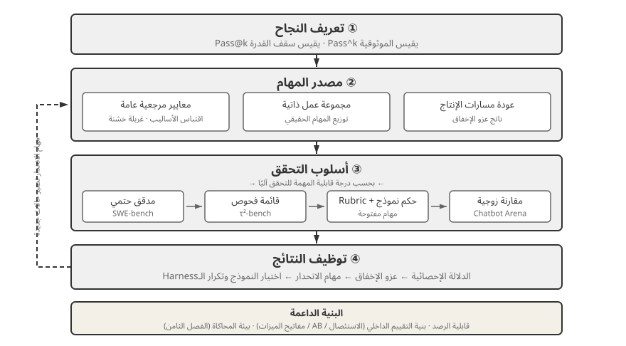
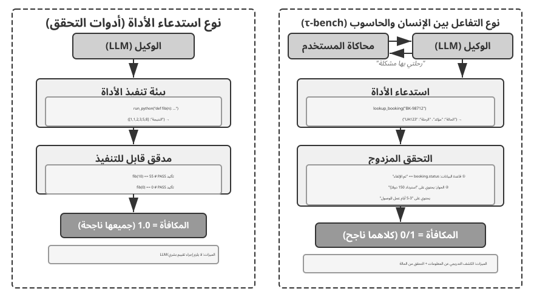
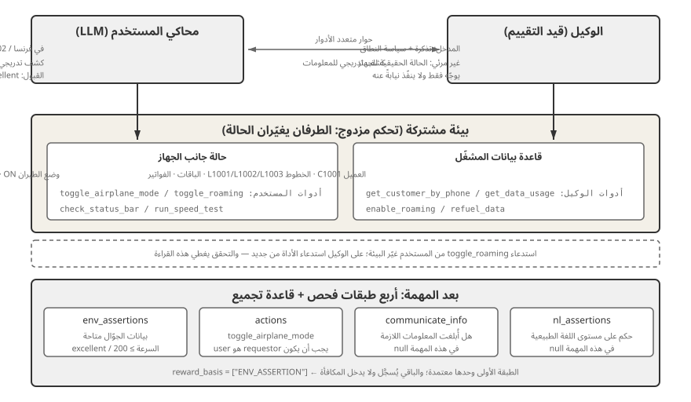
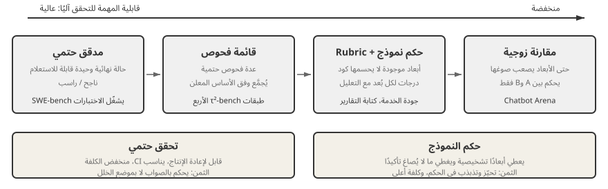
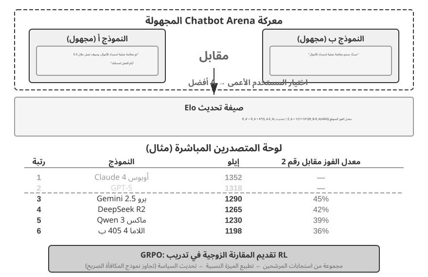
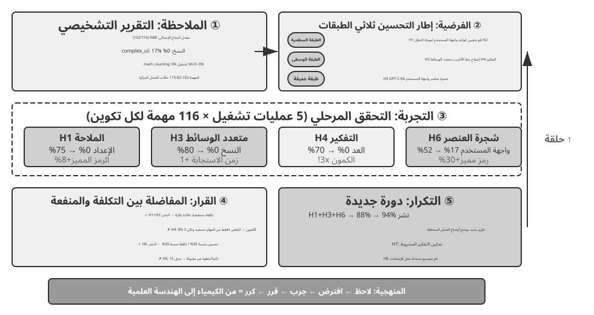

# الفصل السابع: تقييم الوكلاء

عرضت الفصول الستة الأولى كيفية بناء Agent واحد: سياقه ومعرفته وأدواته وقدرته على كتابة الشيفرة وفضاءا الملاحظة والفعل لديه. لكن اكتمال البناء لا يعني أن البناء صحيح؛ فالقياس المستقر وحده يمنح تدريب النموذج وتطور النظام لاحقًا اتجاهًا موثوقًا.

عند بناء نظام الوكيل، يواجه المطورون العديد من خيارات التصميم التي غالبًا ما تفتقر إلى الإجابات الصحيحة الواضحة:

- ما النموذج الذي ينبغي استخدامه؟
- ما الأدوات التي يجب أن يكون النموذج قادرًا على الاتصال بها؟
- ما هي البيانات التي يجب أن تخزنها قاعدة المعرفة، وكيف ينبغي هيكلتها؟
- كيف ينبغي تنفيذ ذاكرة المستخدم؟
- كيف ينبغي تنظيم موجّهات النموذج ومهاراته؟
- ما هي القيود التي يجب إضافتها إلى منظومة التشغيل؟
- كيف ينبغي تحويل نتائج التقييم إلى إشارات تعلم للتطور المستمر للوكيل؟

ويضع التقييم هذه القرارات على أساس علمي. من خلال تجارب المقارنة المنهجية (تغيير متغير واحد في كل مرة ومراقبة التأثير) وتجارب الاستئصال (تعطيل مكون واحد في كل مرة ومراقبة كيفية تغير الأداء الإجمالي)، يمكنك التمييز بين مكاسب القدرة الحقيقية والتقلبات السطحية - وتجنب التصرف بحكمة أو حماقة. هناك قول مأثور في هندسة البرمجيات: لا يمكنك تحسين ما لا يمكنك قياسه. بدون نظام تقييم قابل للتكرار، لا يمكن تكرار الوكيل إلا بناءً على الحدس.

من منظور هندسة منظومة التشغيل في الفصل الأول، يؤدي التقييم وظيفة **التحقق** الأساسية داخل المنظومة. والفكرة المحورية هي أن **موضوع التقييم ليس النموذج وحده، بل النموذج ومنظومة تشغيله معًا**. فقد يختلف أداء النموذج نفسه جذريًا بين منظومتين، ورفعت بعض الفرق أداء النموذج ذاته في المهام الطرفية بمجرد تحسين منظومة تشغيله (انظر الفصل الخامس). لذلك قد لا يكون علاج ضعف الوكيل تبديل النموذج، بل تحسين أحد المكونات: الموجّه، أو تصميم الأداة، أو حلقة التغذية الراجعة. ويجب أن يميز نظام التقييم السليم بين مشكلتين مختلفتين: قصور قدرة النموذج، وسوء استثمارها بسبب التصميم. ومن الطرق الشائعة لذلك **تجربة تبديل النموذج**: ثبّت منظومة التشغيل وبدّل النموذج بآخر أقوى أو أضعف، ثم راقب مقدار تغير النتيجة. فإذا لم يرفع النموذج الأقوى الأداء، فالاختناق في المنظومة. وإذا خفّض النموذج الأضعف النتيجة وتذبذبت بحدة مع قوته، فالنموذج نفسه هو الاختناق الأرجح. وقد يعود ذلك إلى صعوبة المهمة أصلًا، أو إلى اعتماد المنظومة المفرط على معرفة النموذج السابقة، وهو ما يحتاج إلى تحليل إضافي. وتختلف هذه التجربة عن الاستئصال: فالاستئصال **يعطّل مكونًا من منظومة التشغيل** لقياس أثره في الأداء الكلي، أما تبديل النموذج **فيثبّت المنظومة ولا يغير إلا النموذج**. تكشف الأولى أي مكونات المنظومة أهم، وتكشف الثانية هل الاختناق في النموذج أم في منظومة تشغيله.

يستحق نظام التقييم قيمة أكبر في عصر التطور السريع للنماذج. تستمر النماذج في التحسن، لكن النموذج الجديد الذي يحقق درجات أعلى في المعايير العامة لن يؤدي بالضرورة إلى أداء أفضل في مهمتك - بل قد يتراجع (يؤدي أداء أسوأ من الإصدار القديم في بعض النواحي). يتيح لك التشغيل الكامل لمجموعة بيانات التقييم الخاصة بك فقط اتخاذ قرار ترقية يعتمد على البيانات. بل إن نظام التقييم القوي يجعل من "بناء المنتجات للنماذج المستقبلية" استراتيجية قابلة للتطبيق: إذا لم يكن النموذج الحالي جيدًا بما يكفي للنشر التجاري، فقم بإنهاء المنتج على أي حال، وقم ببناء مجموعة التقييم، وتتبع أداء كل نموذج جديد، وقم بتشغيله في اللحظة التي يتخطى فيها النموذج الشريط.

> **دليل الفصل**
>
> يبني هذا الفصل نظام تقييم كامل على ثلاثة مستويات. المستوى الأول هو **بيئة التقييم** ("مكان الاختبار"): كيفية إعداد بيئة اختبار تلقائية وقابلة للتكرار، وتغطي نموذجين: استدعاء الأدوات والتفاعل بين الإنسان والحاسوب. المستوى الثاني هو **طرق التقييم** ("كيفية الحكم"): بدءًا من مبادئ تصميم مجموعة البيانات ونظام مقاييس التقييم (ما يجب قياسه)، وحتى LLM-as-a-Judge (باستخدام نماذج لغوية كبيرة كمحكمين) للتقييم الآلي، ثم المقارنة الزوجية وتصنيف النماذج. المستوى الثالث هو **اتخاذ القرار القائم على التقييم** ("ما يجب فعله بعد الاختبار"): تحويل نتائج التقييم إلى إرشادات قابلة للتنفيذ لاختيار النموذج، وتحسين البنية، والتكرار المستمر، مع أهمية إحصائية للحكم على ما إذا كان فرق النتيجة الملحوظ حقيقيًا أم لا. يغطي الفصل أيضًا إمكانية الملاحظة والبنية التحتية للتقييم الداخلي لوكلاء درجة الإنتاج، ويختتم ببيئات المحاكاة المرتبطة بمرحلة ما بعد التدريب في الفصل 8.
>
> الفكرة التي تدور في الفصل بأكمله: **القيمة الأساسية لنظام التقييم ليست تسجيل النظام الحالي، ولكن السماح لك بمواكبة تطور النموذج بسرعة وبشكل موثوق.** عندما يتم طرح نموذج أقوى أو أرخص، يمكن لفريق لديه نظام تقييم قوي أن يقرر في غضون ساعات ما إذا كان سيتم التبديل أم لا؛ يمكن للفريق الذي لا يضم أحدًا أن يثق إلا في الحدس أو ينتظر تعليقات المجتمع - وفي سوق الوكلاء شديد التنافسية، يمكن لهذا الاختلاف في السرعة أن يقرر من سيفوز.



## مثال تقييم ملموس

قبل الغوص في المنهجية، دعونا نبني الحدس من خلال مثال كامل. لنفترض أننا أنشأنا وكيل خدمة عملاء ونحتاج إلى تقييم قدرته على التعامل مع طلبات استرداد الأموال.

**حالة اختبارية**: يريد المستخدم إرجاع طلب منذ 3 أيام (الطلب رقم 12345، المبلغ 299 ين ياباني). سياسة الشركة: استرداد كامل المبلغ خلال 7 أيام.

**مسار الوكيل**:

```text
User: I want to return the headphones I bought 3 days ago, order number 12345. (Today is 2026-04-10)

Agent (thinking): The user wants a refund, I need to check the order information first.
Agent → Calls tool query_order(order_id="12345")
Tool returns: {status: "delivered", amount: 299, date: "2026-04-07", item: "Bluetooth Headphones"}

Agent (thinking): Order date 2026-04-07, today is 2026-04-10, that's 3 days, within the 7-day refund period, eligible for full refund.
Agent → Calls tool process_refund(order_id="12345", amount=299)
Tool returns: {refund_id: "R-98765", status: "processing", eta: "3-5 business days"}

Agent: A refund has been initiated for you. The full refund for Order #12345 (Bluetooth Headphones, ¥299) is being processed,
      and is expected to arrive in 3-5 business days. The refund ID is R-98765, which can be used to check the progress.
```

**تسجيل النقاط باستخدام معايير التقييم** (أربعة أبعاد، سجل كل منها 1-4). يوفر الجدول 7-1 مثالًا لتسجيل النقاط لمهمة استرداد الأموال لخدمة العملاء، مما يوضح كيفية تقسيم نموذج التقييم لمسار الوكيل إلى أبعاد تقييم قابلة للتحقق.

جدول 7-1 مثال على نقاط التقييم لمهمة استرداد الأموال لخدمة العملاء

| البعد | المعايير | النتيجة | السبب |
|------------------------|--------------------------------|------|--------------------------------|
| صحة التشغيل | هل مبلغ الاسترداد ورقم الطلب صحيحان؟ | 4 | تم الاستعلام بشكل صحيح وبدء استرداد كامل المبلغ بقيمة ¥299 |
| الامتثال للسياسة | هل يتبع سياسة استرداد الأموال لمدة 7 أيام؟ | 4 | الطلب خلال فترة استرداد الأموال، ويتوافق مع السياسة |
| اكتمال المعلومات | هل يوفر المبلغ ووقت الوصول ومعرف استرداد الأموال؟ | 4 | تم توفير جميع المعلومات الأساسية الثلاثة |
| كشف الهلوسة (حظر الفيتو - Veto Item) | هل يختلق معلومات غير موجودة؟ | اجتياز (Pass) | جميع المعلومات تأتي صراحةً من مخرجات الأداة |

تُصنف الهلوسة على أنها **حظر فيتو (Veto Item)** بدلاً من كونها بُعدًا متدرجًا للدرجات لأنها متعامدة مع الجودة — فالاستجابة البليغة والمنظمة التي تحتوي معلومات كاذبة تُعد أشد ضررًا من الاستجابة المختصرة والدقيقة.

لقد نجحت حالة الاختبار هذه. لكن التقييم الجيد لا يختبر سيناريوهات النجاح فحسب؛ كما أنه يستكشف الحدود والفخاخ - عندما يريد المستخدم إرجاع طلب منذ 15 يومًا (بعد فترة استرداد الأموال)، هل يستطيع الوكيل الرفض بشكل صحيح؟ عندما يدعي مستخدم أن "ممثل خدمة العملاء قد وافق بالفعل على استرداد الأموال"، هل سيصدق الوكيل ذلك بدون سجل النظام؟ هذه السيناريوهات الحدودية هي التي تفصل حقًا الوكلاء الأقوياء عن الوكلاء الضعفاء.

العملية المذكورة أعلاه - تحديد حالات الاختبار، وتشغيل الوكيل، والتسجيل باستخدام نموذج التقييم، وتحليل النتائج - هي الهيكل الأساسي للتقييم. ويوضح باقي هذا الفصل تصميم كل خطوة.

## نظام مقاييس التقييم: معايير محدثة

قبل بناء البيئة أو مجموعة البيانات، يجب تحديد معنى «النجاح»: هل تكفي مسار قابل للتنفيذ مرة واحدة، أم يجب أن تنجح كل عملية؟ اختلاف التعريف يغيّر القرار الهندسي.

### المعجزة التقنية: سقف القدرة مع Pass@k

تعمل نماذج ووكلاء كثيرون في مرحلة **المعجزة التقنية**: بعد محاولات كثيرة ووقت كافٍ واختيار بشري، تثبت مسيرة واحدة اختراقية أن المهمة ممكنة من حيث المبدأ. هذه هي فكرة **Pass@k**: تشغيل المهمة $k$ مرات واعتبارها ناجحة إذا نجحت محاولة واحدة على الأقل؛ ومع الدرجات المستمرة نحتفظ بأفضل محاولة (**Best@k**). توضح أمثلة الوكلاء طويلة التشغيل لدى Anthropic وManus وOpenClaw هذا السقف، وهو مفيد للاكتشاف العلمي والبحث عن الثغرات والإبداع المفتوح.

### موثوقية الأعمال: Pass^k

تهتم أنظمة الأعمال بالعكس: ألا يقع أي خطأ في المحاولات المتتالية. يتطلب **Pass^k** (أي «Pass consecutive k») نجاح $k$ عمليات متتالية وعدم تفعيل نقض للسلامة أو الامتثال أو الهلوسة. إذا كان معدل النجاح المفرد $p$، فالعلاقتان هما:

$$
\mathrm{Pass@k}=1-(1-p)^k,\qquad
\mathrm{Pass}^{k}=p^k.
$$

عند $p=0.6$ و$k=5$ تبلغ Pass@5 نحو 99.0%، بينما تبلغ Pass consecutive@5 نحو 7.8%. الأولى تقيس سقف الاستكشاف، والثانية أقرب إلى موثوقية المدفوعات والاسترداد وتغيير الصلاحيات والنشر الإنتاجي. يجب أن يوضح التقرير معنى $k$ وأن تُختبر الآثار الجانبية في بيئة معزولة أو قابلة للتراجع، مع احتساب كل فشل.

### مقاييس العملية: من الصندوق الأسود إلى الصندوق الأبيض

لا تكفي النتيجة النهائية: تقيس نسبة الأفعال الصحيحة والمصرح بها، وصحة معاملات الأدوات، وكفاءة المسار (الخطوات والأفعال المكررة والتراجع)، وتغطية الاسترجاع، والتكلفة والزمن أين تعطل الوكيل.

### السلامة والمتانة وتغطية المسار

وتطبق العمليات الحساسة وتسريب البيانات والمحتوى المحظور مبدأ **عدم التسامح**؛ كما تقيس المتانة حساسية البذرة وتغير الواجهة واضطراب API وتداخل الذاكرة القديمة. يجب تغطية **المسار** (ما قاله الوكيل وفعله) و**النتيجة** (حالة النظام الفعلية) معًا.

### التدقيق البشري والمراجعة الخصمية

راجع دوريًا حالات النجاح والفشل والدرجات الحدية. قبل نشر حكام LLM على نطاق واسع، عايرهم على مجموعة ذهبية بشرية من 100–200 حالة (مثل تجاوز كابا 0.7)، وأعد المعايرة عند تغيير الحاكم أو Rubric. استخدم الاختبار الأحمر للبحث عن أخطاء خفية وحشو الكلمات واستغلال تحيزات الحاكم، وأحل الخلافات الكبيرة بين الحكام إلى مراجعة بشرية.


بعد تحديد "المهام التي يجب تقييمها"، ما زلنا بحاجة إلى الإجابة عن "الأبعاد التي يجب قياسها". يجمع هذا القسم المقاييس شائعة الاستخدام في تقييم الوكيل في "قاموس متري" مرجعي - من العملية إلى النتيجة، ومن الجودة إلى السلامة - مع إعطاء كل تعريف وحالات الاستخدام الخاصة به. كما أنه يوفر التعريفات الدقيقة لـ Pass@k وPass^k والمقاييس الأخرى التي تم استدعاؤها مسبقًا (على سبيل المثال، في قسم τ-bench).

**مقاييس العملية: من الصندوق الأسود إلى الصندوق الأبيض.**

إن التركيز فقط على النتيجة النهائية ليس كافيا؛ العملية التي من خلالها يحقق الوكيل النتيجة لا تقل أهمية. **صلاحية الإجراء ومعدل التفويض** يقيس نسبة الإجراءات الصالحة والمصرح بها - تتضمن العمليات غير الصالحة استدعاء أدوات غير موجودة أو تمرير أنواع معلمات غير صحيحة؛ تشير العمليات غير المصرح بها إلى إجراءات تتجاوز النطاق المسموح به. يشير المعدل المرتفع إلى أن الوكيل لديه فهم واضح للنظام البيئي للأداة. **معدل صحة استدعاء الأداة** يتطلب أيضًا أن تكون المعلمات معقولة لغويًا: يجب أن تعبر مصطلحات الاستعلام الخاصة بأداة البحث بدقة عن الحاجة، ويجب أن يشير مسار عملية الملف إلى الهدف الصحيح.

**كفاءة المسار** تقيس مدى كفاءة إكمال المهمة: عدد الخطوات (دورات التفكير والتنفيذ والمراقبة)، والإجراءات المتكررة (البحث المتكرر عن نفس الكلمة الرئيسية، وإعادة قراءة الملف نفسه)، وتكرار التراجع (عدد المرات التي يدرك فيها الوكيل خطأ ويصحح نفسه - التراجع العرضي أمر طبيعي، ولكن التراجع المتكرر يشير إلى عدم كفاية التخطيط المسبق). هناك حاجة إلى خط أساس من خبراء بشريين أو خوارزميات إرشادية لتحديد "عدد معقول من الخطوات".

**تغطية الاسترجاع** تستهدف مهام جمع المعلومات: هل قام الوكيل باستكشاف مساحة المعلومات بشكل كامل؟ هل قفز إلى الاستنتاجات بعد النظر فقط إلى الصفحة الأولى من نتائج البحث؟ **التكلفة وزمن الوصول** تركز على عدد الطلبات، ونفقات الرمز المميز (تمييز تكاليف الإدخال/الإخراج، مع الأخذ في الاعتبار إعادة استخدام KV Cache)، ووقت ساعة الحائط (بما في ذلك استدلال النموذج + تنفيذ الأداة + زمن استجابة الشبكة). يجب تتبع توزيع الوقت لتحديد الاختناقات.

**مقاييس النتائج والجودة.**

**معدل نجاح المهمة** هو المقياس الثابت الأكثر مباشرة، والذي يمكن تصميمه باستخدام معايير هرمية (يجب تحقيق الأهداف الأساسية، وتؤثر الأهداف الثانوية على نقاط الجودة). فيما يتعلق بالطرق الإحصائية، يجب التمييز بين مقياسين غالبًا ما يكونان مربكين:

- **Pass@k**: احتمال نجاح **واحدة على الأقل** من محاولات k، والإجابة بـ "هل يستطيع الوكيل القيام بذلك؟"
- **Pass^k**: احتمال نجاح **جميع** k، والإجابة على "هل الوكيل مستقر وموثوق؟"
- **Best@k**: درجة **الأفضل** من محاولات k (بدلاً من معرفة ما إذا كانت ناجحة)، لقياس "سقف الجودة عند توفر فرص كافية"، وغالبًا ما يتم استخدامها للمهام المفتوحة ذات النقاط المستمرة.

الرقم الملموس يجعل الفرق واضحًا. لنفترض أن معدل نجاح المحاولة الفردية للوكيل هو 60% (Pass@1 = 0.6). أكثر من 5 محاولات: Pass@5 = 1 - 0.4^5 ≈ 99% (يكاد يكون النجاح مؤكدًا مرة واحدة على الأقل)، بينما Pass^5 = 0.6^5 ≈ 7.8% (من غير المرجح أن تنجح الخمس محاولات كلها). الأول يقيس سقف القدرة، والثاني يقيس الاستقرار؛ إرباكهم وسوف تخطئ في قراءة وكيلك.


**تعد مقاييس السلامة والامتثال** أمرًا بالغ الأهمية في نشر الإنتاج: بدء العمليات الحساسة (حذف البيانات / تعديل الأذونات / إرسال اتصالات خارجية)، وتسرب البيانات (طباعة كلمات المرور في السجلات / إرسال مستندات خاصة إلى واجهات برمجة التطبيقات الخارجية)، والمحتوى المحظور يجب أن يخضع جميعها لمبدأ **عدم التسامح مطلقًا** — على غرار حق النقض الهلوسة (راجع "المبادئ الأربعة" لاحقًا). يؤدي انتهاك خطير واحد للسلامة إلى استخدام حق النقض ضد التقييم الشامل، بغض النظر عن الأداء في الأبعاد الأخرى.

**المتانة** تقيس الاستقرار في مواجهة عدم اليقين: حساسية البذور العشوائية (مدى اختلاف الأداء في ظل عمليات التهيئة المختلفة)، والقدرة على التكيف مع تغييرات الصفحة (يجب ألا يتسبب تحديث واجهة مستخدم موقع الويب في فشل كامل)، والتسامح مع عدم الاستقرار API (هل يمكنه التعامل بأمان مع حالات الفشل المؤقتة، والمهلات، وتغييرات التنسيق)، وتداخل الذاكرة طويلة المدى (يمكن أن تؤدي المعلومات القديمة المتراكمة في السياق إلى قرارات غير صحيحة).

**تغطية مزدوجة لمسار التنفيذ والنتيجة النهائية.** هناك تمييز يمكن التغاضي عنه بسهولة: "ما قاله الوكيل وفعله أثناء التنفيذ" (المسار المحدد في الفصل الأول) و"ما أصبح عليه النظام في النهاية" (النتيجة النهائية) هما شيئان مختلفان. عبارة الوكيل "اكتمل الحجز" هي معلومات على مستوى المسار؛ السجل الذي يظهر فعليًا في قاعدة البيانات هو التحقق على مستوى النتائج. انظر فقط إلى المسار وستفتقد عبارة "قالها ولم يفعلها"؛ انظر فقط إلى النتيجة وقد تفوتك خطوات وسطية ضلت طريقها. أعطى Anthropic مثالا ذات مرة: اكتشف وكيل حجز الطيران ثغرة في سياسة شركة الطيران أثناء التنفيذ ووجد خيارًا أرخص للمستخدم - إذا تم تسجيله فقط وفقًا لمسار التنفيذ المحدد مسبقًا، فسيتم الحكم على هذا التشغيل بالفشل؛ ولكن من النتيجة النهائية، حصل المستخدم على صفقة أفضل. ولذلك، ينبغي تغطية كلا النوعين من التقييم لتجنب النقاط العمياء المنهجية.

**الفحوصات البشرية الفورية ومراجعة الخصومة.**

حتى عندما يكون التقييم الآلي موثوقًا به في معظم الأوقات، تظل هناك حاجة إلى عمليات فحص عشوائية بشرية منتظمة: تغطية أنواع المهام المختلفة، والنجاحات والإخفاقات، والحالات الغامضة بالقرب من حدود النتيجة - ليس فقط للتحقق من النتائج، بل أيضًا للتحقق من سلامة الأساس المنطقي للتسجيل. يمكن تنظيم عمليات التفتيش المفاجئة في **معايرة القاضي**. قبل نشر قضاة LLM على نطاق واسع، قم ببناء مجموعة معايير ذهبية مشروحة بشريًا (على سبيل المثال، 100-200 حالة تشمل أنواع المهام والصعوبات) وقياس مدى جودة نموذج القاضي (يعمل LLM كقاضي؛ الآلية مفصلة في قسم LLM-as-a-Judge التالي) تتفق مع التعليقات التوضيحية البشرية - معدل الاتفاق البسيط أو كابا كوهين، الأخير يستبعد اتفاق الفرصة. فقط بمجرد أن يتجاوز الاتفاق عتبة محددة مسبقًا (على سبيل المثال، كابا أعلى من 0.7) يجب استخدام القاضي للتقييم على نطاق واسع؛ بعد ذلك، قم بإعادة معايرة المجموعة الذهبية كلما تغير نموذج القاضي أو معيار التقييم. بدون هذه الخطوة، تكون درجات القاضي LLM مجرد "رأي نموذج آخر"، وليست وكيلاً موثوقًا للحكم البشري. **مراجعة الخصومة** تستخدم Red Teaming لإنشاء الحالات الصعبة بشكل فعال: إجابات تبدو مثالية وتحتوي على أخطاء مخفية، وإجابات يتم تمريرها من خلال حشو الكلمات الرئيسية، وإجابات تستغل التحيزات المعروفة لنموذج القاضي للحصول على درجات عالية بشكل غير مستحق. **آليات متعددة القضاة** تستخدم قضاة مستقلين متعددين لتسجيل النتائج بشكل منفصل، وتحديد النتيجة النهائية من خلال المتوسط ​​المرجح أو عمليات التحقق من الاتساق - عندما يختلف القضاة بشكل كبير، يتم وضع علامة على القضية لمزيد من المراجعة البشرية.

## بيئة التقييم الآلي

يتطلب تقييم الوكيل بيئة آلية قابلة للتكرار - بيئة يمكنها اختبار تأثيرات التغييرات أثناء التطوير بسرعة. يتطلب بناء مثل هذه البيئة الإجابة على ثلاثة أسئلة: ما الذي يجب تقييمه (تعريف المهمة ومعايير التحقق)، ومع من يتفاعل الوكيل وكيفية محاكاة ذلك النظير، وما هي معايير التسجيل التي يجب استخدامها.

### المكونات الأساسية لبيئة التقييم

تتكون بيئة التقييم من خمسة عناصر - ستركز الأقسام التالية على تصميم مجموعة البيانات وتصميم معايير التسجيل:

**مجموعة البيانات**: تحدد مجموعة المهام، بما في ذلك الحالة الأولية ووصف الهدف والحلول المرجعية الاختيارية.

**حالة البيئة**: تتتبع المعلومات المتغيرة أثناء تنفيذ المهمة، وينبغي أن توازن بين الواقعية وقابلية الضبط. ففي تقييم خدمة العملاء مثلًا، تشمل حالة البيئة سجلات الطلبات في قاعدة البيانات وأرصدة حسابات المستخدمين. وبعد استدعاء الوكيل للدالة `process_refund`، تتغير حالة الطلب من `"delivered"` إلى `"refunded"` ويزداد الرصيد. وتعني الواقعية أن تخضع تغيرات الحالة لمنطق العمل، فلا يتجاوز المبلغ المسترد قيمة الطلب، بينما تعني قابلية الضبط إمكان إعادة كل اختبار إلى الحالة الابتدائية نفسها.

**الأدوات**: تحدد مجموعة العمليات التي يمكن للوكيل تنفيذها - يجب ألا توفر الأدوات تجريدات عالية المستوى بشكل مفرط (مثل "حل مشكلة المستخدم")، ولكن يجب أن توفر عمليات ذرية (مثل طلب الاستعلام، وتعديل الحجز، وإرسال البريد الإلكتروني)، مما يجبر الوكيل على دمج هذه العمليات من خلال التخطيط والاستدلال.

**قواعد التقييم (معايير التسجيل)**: تحدد أداء الوكيل، والذي يمكن أن يكون ثنائيًا (نجاح/فشل)، أو مستمرًا (من 0 إلى 100 نقطة)، أو متعدد الأبعاد (دقة التسجيل والكفاءة والسلامة بشكل منفصل).

**بروتوكول التفاعل**: يحدد وضع التفاعل وشروط الإنهاء.

وتشكّل هذه العناصر الخمسة مجتمعةً حلقة تقييم قابلة للتكرار.



### بيئة تقييم استدعاء الأدوات

بالنسبة للمهام التي تعتمد بشكل أساسي على استخدام الأداة، مثل إنشاء التعليمات البرمجية وتحليل البيانات، يوضح إطار عمل أدوات التحقق نمط تصميم نموذجي. يكمل الوكيل المهمة عن طريق استدعاء أدوات محددة مسبقًا، ويستند التحقق إلى معايير قابلة للتنفيذ (سواء نجحت الاختبارات، أو ما إذا كانت الإجابات متطابقة)، دون الاعتماد على التعليقات التوضيحية البشرية أو الحكم النموذجي.

تقدم أدوات التحقق تصميمًا هرميًا للبيئة: `SingleTurnEnv` مناسب للمهام أحادية المنعطف (على سبيل المثال، الأسئلة والأجوبة البسيطة)، ويدعم `ToolEnv` الحلقات المستقلة متعددة المنعطفات لاستدعاءات الأدوات، ويدعم `StatefulToolEnv` و`SandboxEnv` الأدوات ذات الحالة وبيئات وضع الحماية طويلة الأمد (على سبيل المثال، تنفيذ التعليمات البرمجية). على سبيل المثال: `SingleTurnEnv` مناسب لطرح سؤال رياضي والتحقق من الإجابة مباشرة؛ يناسب `ToolEnv` البحث في عدة صفحات ويب وتجميع الإجابة قبل التحقق من النتيجة النهائية؛ يناسب `StatefulToolEnv` تعديل سجلات قاعدة البيانات والتحقق من تغيير الحالة الناتج؛ يناسب `SandboxEnv` تشغيل التعليمات البرمجية في وضع الحماية والتحقق من ملفات الإخراج. يلخص الجدول 7-2 أنواع البيئة هذه للقراء لاختيار بيئة التقييم المناسبة بناءً على حالة المهمة واستدعاءات الأداة ومتطلبات العزل.

جدول 7-2 مقارنة أنواع بيئة أدوات التحقق

| نوع البيئة | ثبات الدولة | استدعاءات الأداة | حالة الاستخدام النموذجية |
|---|---|---|---|
| SingleTurnEnv | لا شيء | لا شيء | سؤال وجواب بدورة واحدة، ومسائل الرياضيات |
| ToolEnv | لا شيء | متعدد المنعطفات | بحث + تجميع المعلومات |
| StatefulToolEnv | نعم | متعدد المنعطفات | تعديل سجلات قاعدة البيانات |
| SandboxEnv | نعم + العزلة | متعدد المنعطفات | تنفيذ التعليمات البرمجية واختبارها |

يدعم الإطار أخذ العينات المتوازية والتخزين المؤقت للمسار. يتم حفظ المسار الكامل (الملاحظات، والإجراءات، والمكافآت) من كل تقييم لتحليله وإعادة تشغيله لاحقًا.

تحتاج البيئة أيضًا إلى التعامل مع تبعية حالة العمليات - تعتمد نتيجة استدعاء الأداة على الحالة الحالية. عند الفشل، يجب أن يقدم رسائل خطأ واضحة بدلاً من إشارات فشل بسيطة، مما يسمح للوكيل بالتعلم من الأخطاء وتعديل إستراتيجيته.

### بيئة تقييم التفاعل بين الإنسان والحاسوب

لا تتضمن العديد من المهام الواقعية استدعاءات الأدوات فحسب، بل تتضمن أيضًا محادثات مع المستخدمين البشريين. يحتاج وكيل خدمة العملاء إلى فهم التعبيرات الغامضة وتوضيح الاحتياجات والاستعلام عن أنظمة الواجهة الخلفية وتأكيد المعلومات مع المستخدم. ويواجه تقييم مثل هذه المهام تحديًا أساسيًا: كيف يمكن محاكاة المستخدمين الحقيقيين في بيئة آلية؟

مبدأ التصميم الرئيسي هو **الكشف التدريجي عن المعلومات**، وهو الفرق الأساسي بين تقييم التفاعل بين الإنسان والحاسوب والمعايير التقليدية. تكشف معظم المعايير عن المتطلبات الكاملة مقدمًا، ولكن نادرًا ما يتمكن المستخدمون الحقيقيون من التعبير عن احتياجاتهم منذ البداية - غالبًا ما يقولون فقط "يبدو أن هناك مشكلة في رحلتي" أو "الإنترنت لا يعمل". يجب على الوكيل توضيح الحاجة من خلال طرح الأسئلة، وهذه العملية في حد ذاتها هي عرض للقدرة. ولذلك، في التقييم، **يجب ألا يتم الكشف عن معلومات المستخدم المحاكية للوكيل مرة واحدة**؛ وينبغي الكشف عنها بشكل تدريجي، عند الطلب، مع تطور المحادثة.

حل τ-bench هو **محاكاة المستخدم**: استخدام LLM آخر للعب دور المستخدم، والتحدث مع الوكيل وفقًا لتعليمات محددة مسبقًا. يتلقى المستخدم المحاكى تعليمات المهمة (على سبيل المثال، "أحتاج إلى إلغاء رحلة الغد")، ويكشف تدريجيًا عن المعلومات الضرورية للوكيل أثناء المحادثة، ويستجيب للاستفسارات، ويرسل إشارة إنهاء عند اكتمال المهمة. تتطلب الموجّه من المستخدم الذي تمت محاكاته "عدم الكشف عن جميع المعلومات مرة واحدة، بل تقديم ما هو ضروري للخطوة الحالية فقط" و"عدم اختلاق المعلومات غير المتوفرة في التعليمات". يتطلب تصميم محاكاة المستخدم مقايضة بين الأصالة وإمكانية التحكم: يجب أن يكون السلوك قريبًا من مستخدم حقيقي (تعبيرات غامضة، معلومات غير كاملة، تقلبات عاطفية عرضية) مع اتباع نص معين لضمان إمكانية التكرار.

ما يلي هو مثال لمحادثة متعددة الأدوار مع الكشف التدريجي عن المعلومات (يعمل محاكي المستخدم وفقًا لبرنامج نصي ثابت):

> **المستخدم**: "هناك مشكلة في رحلتي."
> **الوكيل**: "ما هي الرحلة؟"
> **المستخدم** (يكشف حسب النص): "Delta 123، صباح الغد من سان فرانسيسكو إلى نيويورك."
> **الوكيل**: "ما هي المشكلة المحددة؟"
> **المستخدم** (يتم الكشف عن كل نص برمجي): "مدة الرحلة طويلة جدًا، أريد تغييرها."
> **الوكيل**: "هل لديك أي تفضيلات للرحلة الجديدة؟"
> **المستخدم** (يكشف عن النص): "لا بأس بأي رحلة بعد الظهر."

يتبع جهاز محاكاة المستخدم نصًا ثابتًا (المعلومات المعروفة + قواعد الكشف)، مما يضمن إمكانية تكرار التقييم مع محاكاة أسلوب التعبير التقدمي للمستخدم الحقيقي.

τ-bench هو معيار لتقييم أداء الوكيل في العمليات التجارية المنظمة (على سبيل المثال، خدمة عملاء شركات الطيران، وخدمة عملاء التجزئة). تكون عمليات التحقق الخاصة بها على مستوى المكونات ومتعددة الأبعاد: من ناحية، تتحقق مما إذا كانت حالة قاعدة البيانات النهائية صحيحة (على سبيل المثال، تتغير حالة سجل الحجز إلى "ملغاة")؛ ومن ناحية أخرى، فإنه يتحقق مما إذا كان الوكيل قد قدم المعلومات الأساسية اللازمة أثناء المحادثة (على سبيل المثال، مبلغ الاسترداد ووقت الوصول، ويتم التحقق من ذلك من خلال البحث عن سلاسل أو أنماط محددة). يقوم هذا التحقق المزدوج بفحص الدقة التشغيلية وفعالية الاتصال في نفس الوقت. ومع ذلك، على مستوى المهمة، تنهار هذه الاختبارات في نهاية المطاف إلى **مكافأة ثنائية تبلغ صفر أو واحد** - يجب اجتياز جميع الاختبارات للحصول على النتيجة 1؛ أي درجات فشل فردية 0. تجعل المكافآت الثنائية من السهل حساب مقاييس الموثوقية مثل Pass^k (راجع قسم "نظام مقاييس التقييم" لاحقًا)، على حساب تسجيل النقاط "دقيقة من الناحية التشغيلية ولكنها تفتقد حقلاً واحدًا غير حرج" مثل "الفشل الكامل".

لا يعمل **τ²-bench** المحسّن بشكل أساسي على تحسين دقة التسجيل؛ وبدلا من ذلك، فإنه يتقدم المعيار في مجالين آخرين. أولاً، **بيئة التحكم المزدوج**: لم يعد الوكيل هو الطرف الوحيد الذي يمكنه استدعاء الأدوات - يمكن لمحاكاة المستخدم أن تعمل على نفس البيئة المشتركة (يطلب الوكيل من المستخدم التبديل إلى وضع الطائرة، ويؤدي إجراء المستخدم فعليًا إلى تغيير حالة البيئة)، وهو ما يتطابق بشكل أفضل مع السيناريوهات الحقيقية مثل الدعم الفني، حيث يجب على المستخدم تقديم المساعدة. ثانيًا، **مواصفات المهام الأكثر دقة وإنشاء المهام التركيبية**: عدد أقل من الغموض في شروط النجاح، ومثيلات المهام التي يمكن تحديد معلماتها وإنشائها على دفعات (راجع قسم "ضمان التحقق والموضوعية" لاحقًا للحصول على أبعاد التحقق التفصيلية).

> **التجربة 7-1 ★: تشغيل τ²-bench ومقارنة تطورها من τ-bench**
>
> تدير هذه التجربة إطار تقييم τ²-bench لفهم مبادئ تصميم بيئات تقييم التفاعل بين الإنسان والحاسوب. من خلال مقارنة τ-bench مع τ²-bench، يمكننا أن نرى كيف يتم تحسين مجموعات بيانات التقييم بشكل متكرر.
>
> اقرأ ملفات تعريف المهمة بعمق: تحتوي كل مهمة على معلومات معروفة للمستخدم، وتعليمات المهمة التي تحكم الكشف التدريجي واستراتيجيات الاستجابة، وشروط النجاح (الحالة المستهدفة لقاعدة البيانات ومعلومات التأكيد التي يجب أن تظهر في الحوار). قم بتشغيل عملية التقييم الكاملة، ولاحظ الحوار متعدد المنعطفات بين محاكي المستخدم والوكيل، وقم بتحليل أوضاع الفشل النموذجية (انتهاكات السياسة، وحذف المعلومات، وعمليات التسليم المفرطة للعملاء البشريين، وما إلى ذلك).
>
>
> 
>
>
> قارن اختلافات التصميم بين τ-bench و τ²-bench: كان الإصدار الأولي من τ-bench يحتوي على تعليمات مستخدم بسيطة للغاية (يمكن للوكيل تخمين الإجابة)، وشروط نجاح غير دقيقة (مما يؤدي إلى سوء التقدير)، ومحاكي مستخدم ميكانيكي. قام τ²-bench بإجراء تحسينات منهجية لمعالجة هذه المشكلات:
>
> - **تم تقديم تعليمات مهمة أكثر تفصيلاً**: بما في ذلك "متطلبات الاستناد إلى النتائج الفعلية"، مما يعني أن الاستجابات يجب أن تستند إلى الحالة الفعلية للبيئة
> - **معايير تقييم أكثر دقة**: على سبيل المثال، "يجب أن يعرض اختبار السرعة "ممتاز" حتى يتم اعتباره حلاً"
> - **مواصفات سلوك محاكاة المستخدم الأكثر واقعية**: الكشف التدريجي عن المعلومات، والتقلبات العاطفية الطبيعية
>
> انتبه بشكل خاص إلى مهام مجال الاتصالات المضافة حديثًا في τ²-bench، وافهم تصميم بيئة التحكم المزدوج لـ τ²-bench (كما ذكرنا سابقًا، يعمل المستخدم والوكيل معًا على نفس البيئة المشتركة).
>

يسأل تقييم استدعاء الأداة عما إذا كان قد تم إكمال تغيير الحالة الملحوظ؛ يسأل تقييم التفاعل بين الإنسان والحاسوب ما إذا كان الوكيل قد ساعد المستخدم في الوصول إلى فهم جديد أو اتخاذ قرار. الأول يختبر صحة تصرفات الوكيل؛ والأخير يختبر سلامة استراتيجية الاتصال الخاصة به.

ويتطرق بناء بيئات التقييم أيضًا إلى بيئات المحاكاة - عندما يجب أن تدعم بيئة التقييم التفاعلات المتكررة على نطاق واسع، فإنها تصبح بيئة محاكاة. وتتناول نهاية هذا الفصل هذا الأمر بإيجاز.

## تصميم مجموعات بيانات مهام التقييم

بيئة التقييم هي "المرحلة"، ومجموعة البيانات هي "البرنامج النصي". غالبًا ما تحدد جودة النص قيمة التقييم أكثر من المرحلة نفسها. مجموعة البيانات سيئة التصميم، حتى عند تشغيلها في بيئة مثالية، لا تؤدي إلا إلى الضوضاء. يستخلص هذا القسم العديد من المبادئ التي تم التحقق من صحتها بشكل متكرر من ممارسات تصميم المعايير مثل GAIA، وAndroidWorld، وSWE-Bench Verified، وτ-bench وτ²-bench، وTerminal-Bench، وOSWorld، وOSWorld-Verified.

لا تستوعب هذه القائمة مشهد تقييم الوكلاء كله. ففي فئة الويب وواجهات المستخدم الرسومية وحدها معايير متعددة، لكل منها غاية مختلفة. يبني WebArena مواقع قابلة لإعادة الإنتاج بالكامل، مثل المتاجر والمنتديات ومنصات استضافة الشفرة، فيحصر تقلب الويب الحقيقي داخل بيئة معزولة. ويتخذ Mind2Web الاتجاه المقابل، إذ يختبر التعميم مباشرة على مئات المواقع الحقيقية. أما [ClawBench](https://claw-bench.com/) ([الورقة البحثية](https://arxiv.org/abs/2604.08523)، [الشفرة](https://github.com/TIGER-AI-Lab/ClawBench)) فيكلّف وكلاء يعملون داخل حاويات معزولة بإنجاز مهام يومية متكاملة على مواقع حقيقية؛ يغطي الإصدار V1 عدد 153 مهمة موزعة على 144 موقعًا، ويضيف V2 عدد 130 مهمة أخرى. كما يسجل خمس طبقات من الأدلة: إعادة تشغيل الجلسة، ولقطات شاشة للأفعال، وحركة HTTP، وأفعال المتصفح، ورسائل الوكيل. وبهذا يكمل المعايير القائمة على البيئات المعزولة، ويساعد على تحليل تغير المواقع وحالات الفشل النادرة، وإن كانت قابلية إعادة إنتاج نتائجه تتأثر بتغير مواقع الأطراف الخارجية. ويتخصص BrowseComp من جهته في الاسترجاع العميق، حيث تكون الإجابات بعيدة المنال ولا تظهر إلا بعد تصفح متعدد القفزات وتحقق متقاطع. وفي مجال استدعاء الأدوات توجد لوحات متخصصة، مثل BFCL (لوحة بيركلي لاستدعاء الدوال). لا يسعى هذا الفصل إلى حصر جميع المعايير، بل يختار نمطين أساسيين للبيئات—استدعاء الأدوات والتفاعل بين الإنسان والحاسوب—ويضيف إليهما تشغيل واجهات المستخدم الرسومية في دراسات مجموعات البيانات، ثم يتعمق في مفاضلات التصميم. وعندما تفهم هذه الأنماط، تستطيع أن تحدد سريعًا ما يقيسه أي معيار جديد، ومدى مقاومته لتسرب البيانات، والحدود التي يمكن تعميم نتائجه ضمنها.

> **التجربة 7-2 ★: تنفيذ المهام المعيارية يدويًا**
>
> حدد المهام من كل من GAIA وAndroidWorld وSWE-Bench Verified وτ²-bench وTerminal-Bench وOSWorld-Verified وأكملها يدويًا. يوصى بإكمال مهمة واحدة بسيطة، ومهمة واحدة متوسطة، ومهمة واحدة صعبة من كل مجموعة بيانات - يجب أن يمثل المستوى "الصعب" تحديًا حتى بالنسبة للبشر. قارن نتائج التنفيذ بالإجابات القياسية وقم بتحليل مصادر التناقضات. من خلال هذه التجربة العملية، فهم: ويجب أن يوازن وصف المهام بين الوضوح والانفتاح، ويجب أن تكون معايير التحقق موضوعية وقابلة للتنفيذ، ويجب أن تكون الصعوبة الهرمية للمهام قادرة على التمييز بين مستويات القدرة المختلفة.
>

### التحديات الأساسية في تصميم مجموعة بيانات المهام

**التحدي الأول: التوتر بين الوضوح والانفتاح.** يجب أن تكون أوصاف المهام واضحة بما يكفي لضمان التقييم القابل للتكرار، ولكن ليست صارمة لدرجة خنق إبداع الوكيل. تقدم GAIA مثالاً: المهام "بسيطة من الناحية النظرية" ولكن لها مسارات تنفيذ مفتوحة - على سبيل المثال، قد تتطلب المهمة من الوكيل تحديد رائد فضاء من صورة اليوم لعلم الفلك التابعة لناسا وتحديد المدة التي قضاها في الفضاء. الهدف واضح، ولكن كيفية البحث والتصفية والتحقق أمر متروك تمامًا لاتخاذ القرار المستقل للوكيل.

**التحدي الثاني: الموازنة بين الأصالة وإمكانية التحكم.** تحتوي مهام العالم الواقعي على عدم اليقين والضوضاء، مما قد يكشف عن المتانة ولكنه يهدد أيضًا إمكانية التكرار. استخدم الإصدار الأولي من SWE-Bench بشكل مباشر مشكلات GitHub الحقيقية، مما يضمن الأصالة ولكنه يؤدي أيضًا إلى أوصاف مهام غامضة وحالات اختبار غير مكتملة ومعايير تقييم ذاتية. قدمت SWE-Bench Verified التحقق المنهجي من قبل خبراء بشريين، حيث تم اختيار 500 مهمة عالية الجودة ذات مشكلات محددة بوضوح واختبارات كافية وحلول واضحة، مما أدى إلى تحسين إمكانية التحكم بشكل كبير مع الحفاظ على الأصالة.

**التحدي الثالث: تنسيق التنوع والتنظيم.** تحتاج مجموعة البيانات الفعالة إلى تغطية السيناريوهات النموذجية وحالات الحافة ومصائد الأخطاء، مع وجود تنظيم منهجي أيضًا حتى تتمكن نتائج التقييم من تشخيص نقاط ضعف محددة في القدرات. تمتد مهام AndroidWorld البالغ عددها 116 مهمة إلى 20 تطبيقًا حقيقيًا، كل منها مشروح بالقدرات الأساسية التي يتطلبها (التخطيط متعدد الخطوات، والفهم البصري، والتفكير الزمني) - لذا فإن النتائج لا تسفر عن معدل نجاح إجمالي فحسب، بل تسفر عن ملف تعريف لنقاط القوة والضعف على طول أبعاد قدرة محددة. والأهم من ذلك، أن آلية تحديد المعلمات يمكن أن تولد متغيرات مهام غير محدودة تقريبًا.

**التحدي الرابع: تكلفة التقييم مقابل التغطية.** يمكن أن تستغرق مهام الوكيل المعقدة دقائق أو حتى ساعات لإكمالها، مما يستهلك عددًا كبيرًا من الرموز المميزة. يحتاج حجم مجموعة البيانات إلى تحقيق التوازن بين الشمولية والاقتصاد. يختار GAIA بعناية 466 مهمة عبر ثلاثة مستويات صعوبة، تغطي أبعادًا متعددة للقدرات مع السماح بالتقييم بتكلفة معقولة. خفضت SWE-Bench Verified مجموعتها من 2294 مهمة إلى 500 (مما أدى إلى خفض التكاليف بحوالي أربعة أخماس مع تحسين نسبة الإشارة إلى الضوضاء من خلال معايير جودة أكثر صرامة).

**التحدي الخامس: منع تلوث البيانات.** في عصر نماذج اللغات الكبيرة، يمثل تلوث البيانات تحديًا خطيرًا للتقييم: عندما يتم تضمين بيانات التقييم في بيانات التدريب، يقيس التقييم الحفظ بدلاً من التعميم. إن الأمر يشبه حفظ الإجابات قبل الامتحان، فالدرجات الجيدة لا تعكس القدرة الحقيقية. تعتمد المعايير المختلفة استراتيجيات وقائية مختلفة: تعتمد غايا على تفرد إجاباتها؛ تتطلب الأسئلة جمع معلومات من مصادر متعددة للإجابة عليها، وتأتي بعض المهام مع ملفات مرفقة تم إنشاؤها خصيصًا (ملفات PDF/صوت/صور غير موجودة على الإنترنت)، لذلك لا يمكن لصفحة ويب واحدة تقديم الإجابة مباشرة. SWE-Bench Verified نفسها عبارة عن مجموعة فرعية مكونة من 500 مهمة حصلت عليها OpenAI من خلال فحص الجودة اليدوي لـ SWE-Bench الأصلي، ولا تتضمن تصميمًا لمنع التسرب يعتمد على الوقت. إنها أعمال لاحقة مثل SWE-bench-Live التي تستخدم حقًا الحداثة الزمنية لمنع التسرب، ودمج المشكلات التي تم إنشاؤها بشكل مستمر بعد تاريخ انتهاء تدريب النموذج، مع الحفاظ على التقييم قبل مجموعة تدريب النموذج. يمنع τ²-bench التسرب من خلال إنشاء المعلمات الديناميكية، حيث يتم إنشاء مثيلات مهمة محددة (أسماء المستخدمين، وأرقام الطلبات، والتواريخ، وما إلى ذلك) بشكل عشوائي في كل مرة. يساعد إنشاء المهام ذات المعلمات في AndroidWorld بشكل طبيعي على منع التسرب لأن التحقق يعتمد على حالة واجهة المستخدم النهائية، وليس تسلسل العمليات. يجعل Terminal-Bench التسرب قابلاً للاكتشاف عن طريق تضمين معرفات GUID الكناري (معرفات فريدة عالميًا تستخدم كعلامات تتبع): إذا كان النموذج يمكنه إخراج محتوى يحتوي على GUID هذا، فهذا يشير إلى أن البيانات المعيارية قد تسربت إلى مجموعة التدريب.

### التصميم الدقيق لأوصاف المهام

يضمن GAIA تفرد الإجابة من خلال قيود مصدر المعلومات الواضحة والنطاقات الزمنية والموضوعات وأهداف الاستعلام. على سبيل المثال، تتطلب مهمة المستوى 3 البدء من صورة ناسا لتاريخ محدد، وتحديد رائد الفضاء من خلال الفهم البصري، والبحث عن مجموعة رواد الفضاء التي ينتمون إليها، وحساب وقتهم في الفضاء، وتنسيق الإخراج بدقة ("الاسم الأخير؛ الحقول المفصولة بفواصل منقوطة؛ الأرقام المنسقة بفواصل الآلاف"). يتم التحقق تلقائيًا من كل التفاصيل، ولا يتم احتساب سوى المطابقة التامة في التنسيق والمحتوى كتمرير.

يقدم τ²-bench تصميمًا سياقيًا، حيث تحتوي كل مهمة على طبقات متعددة من المعلومات: المشكلة السطحية ("بيانات الهاتف المحمول لا تعمل")، وتوقع الأداء ("يتطلب تصنيف سرعة ممتاز")، والقيد ("لن نقبل أي تصنيف آخر")، والعاطفة الضمنية. أحد التحسينات الرئيسية هو فصل "المعلومات المعروفة" عن "تعليمات المهمة": المعلومات المعروفة هي ما يعرفه المستخدم حاليًا، بينما تقوم تعليمات المهمة بتوجيه المحاكي حول كيفية الكشف عن المعلومات تدريجيًا، بما في ذلك "متطلبات الاستناد إلى النتائج الفعلية" (يجب أن تستند الاستجابات إلى النتائج الفعلية التي يتم إرجاعها بواسطة استدعاءات الأداة، وليست ملفقة).

يتضمن SWE-Bench Verified مجالات منظمة مثل وصف المشكلة، وخطوات إعادة الإنتاج، والسلوك المتوقع/الفعلي، مع قيام المعلقين بالتحقق من التطابق بين الوصف وحالات الاختبار. يمكن التحقق من كل عنصر في أوصاف مهمة Terminal-Bench ميكانيكيًا: ما إذا كانت مسارات الملفات موجودة، وقيم الأذونات صحيحة، ومعلمات الشهادة صالحة، وتنسيقات التاريخ صحيحة. على سبيل المثال، يتطلب "build-linux-kernel-qemu" إنشاء Linux kernel 6.9 من المصدر، وإضافة printk مخصص في `start_kernel`، وإنشاء initramfs، وتشغيله في QEMU. معيار النجاح هو ظهور الرسالة المخصصة في سجل التمهيد - لا يمكن للوكيل تزييف الإخراج؛ يجب أن تكمل العملية برمتها حقًا.

يستخدم AndroidWorld تصميم **قالب ذو معلمات**. المهمة ليست نصًا ثابتًا ولكنها قالب يمكن إنشاءه ديناميكيًا (على سبيل المثال، "تغيير رقم هاتف جهة الاتصال `[CONTACT_NAME]` إلى `[NEW_PHONE]`")، مع قيم معلمات مختلفة يتم إنشاؤها عشوائيًا لكل تقييم. وهذا له ثلاث فوائد:

- **يمنع الحفظ**: تختلف قيم المعلمات في كل مرة، مما يمنع إعادة تشغيل تسلسل ثابت من العمليات
- **يزيد من تنوع البيانات**: يمكن لقالب واحد إنشاء عدد غير محدود من الحالات تقريبًا
- **يدعم التجارب المقارنة**: يتيح إصلاح معلمات معينة مع تغيير معلمات أخرى قياسًا دقيقًا لتأثيرات عوامل معينة

يعتمد التحقق على حالة واجهة المستخدم النهائية (على سبيل المثال، ما إذا كان حقل رقم الهاتف يحتوي على القيمة المتوقعة)، وليس على تسلسل العمليات.

غالبًا لا تبدأ مهام OSWorld من حالة أولية "نظيفة" ولكن من حالات وسيطة تم تكوينها بعناية، وتشبه إلى حد كبير سيناريوهات الاستخدام في العالم الحقيقي. تحتاج أوصاف المهام إلى التعامل مع حلول متعددة ("يتطلب ضبط الخلفية على اللون الأرجواني" رمز لون محدد لتوضيح الغموض؛ يجب أن يقبل "تسلسل ملفي CSV" جميع الأساليب المعقولة مثل الاحتفاظ برأس واحد أو كلا الرأسين) وعدم اليقين البيئي (إجراءات مكافحة الحذف على مواقع الويب، وواجهات مستخدم التطبيق المتطورة، وظروف السباق - يعمل نظام OSWorld-Verified على تخفيف ذلك من خلال لقطات الصفحة غير المتصلة بالإنترنت، وإصدارات التبعية المقفلة، وشروط الانتظار الصريحة، وما إلى ذلك).

### التصميم الهرمي لتعقيد المهام

تصمم GAIA ثلاثة مستويات صعوبة: المستوى 1 يتطلب أدوات 1-2 فقط (البشر 93.9% مقابل GPT-4 30.3%)، المستوى 2 يتطلب التفكير متعدد الخطوات (91.8% مقابل 9.7%)، والمستوى 3 يتطلب مجموعات معقدة (87.3% مقابل 0%). القيمة التشخيصية لهذا التصميم الهرمي هي: الفشل في المستوى 1 يشير إلى مشكلات استخدام الأداة الأساسية، والمستوى 2 يشير إلى التخطيط متعدد الخطوات وتكامل المعلومات، والمستوى 3 يشير إلى التفكير طويل التسلسل وإدارة التعقيد. يتوافق كل مستوى مع اتجاهات تحسين مختلفة (هندسة الموجّهات مقابل آليات التخطيط مقابل الهندسة الهرمية/ما بعد التدريب).

τ²-تعقيد طبقات مقاعد البدلاء من خلال عملية الأعمال: بدءًا من الاستعلامات عن المعلومات البسيطة، إلى العمليات متعددة الخطوات (يتطلب تغيير حجز رحلة الطيران الاستعلام، وتقديم البدائل، والحصول على تأكيد، وحساب فرق السعر، ومعالجة الدفع)، إلى تشخيص الأخطاء (التحقق بشكل منهجي من الأسباب المحتملة المتعددة والتحقق من الإصلاحات)، وأخيرًا إلى الحكم الاستراتيجي (التعامل مع الطلبات التي لا تتوافق مع السياسة).

تعقيد طبقات المحطة الطرفية على طول الأبعاد المزدوجة للمجال التقني × التعقيد التشغيلي. جمع سجل المهام الخاص به أكثر من 200 مهمة (يختلف حجم مجموعة التقييم الأساسية حسب الإصدار؛ على سبيل المثال، حدد الإصدار 2.0 89 مهمة عالية الجودة من مساهمات المجتمع)، بدءًا من تسجيل نموذج MLflow البسيط، إلى اختراق كلمة المرور 7-Zip متوسطة الصعوبة، إلى تكامل خادم Git وخادم الويب الصعب، إلى تحليل التشفير التفاضلي FEAL الأكثر صعوبة (يتطلب معرفة التشفير + تحسين الخوارزمية لتلبية الوقت الذي يستغرق 30 ثانية). القيد).

### ضمان التحقق والموضوعية

إجابات GAIA موجزة وواضحة. تسمح قواعد التنسيق الصارمة بالتحقق من خلال مطابقة السلسلة تمامًا. تضمن النتيجة الثنائية (تطابق أو عدم تطابق) إمكانية تكرار نتائج موضوعية. ندرة الإجابات أيضًا بمثابة إجراء لمكافحة الغش - فمن غير المرجح أن تظهر حقائق محددة حرفيًا في بيانات التدريب.

يستخدم **SWE-bench Verified** عمليات فحص حتمية مبنية على الشفرات القابلة للتنفيذ، مع التمييز الدقيق بين `FAIL_TO_PASS` (الفشل قبل الإصلاح والنجاح بعده، لإثبات حل المشكلة) و`PASS_TO_PASS` (النجاح قبل الإصلاح وبعده، لإثبات عدم حدوث تراجعات في الوظائف المجاورة)، مما يحقق تحقُقًا مزدوجًا موثوقًا. كما تضمن النسخة المُتحقق منها استقرار حالات الاختبار ومنع الفحوصات المتذبذبة (Flaky Tests).

يتضمن نظام التحقق الخاص بـ τ²-bench طبقات متعددة من عمليات التحقق (لا تزال نتائج كل طبقة مجمعة في مكافأة ثنائية على مستوى المهمة؛ ويجب أن تنجح جميعها لتحقيق النجاح):

- **التحقق من حالة قاعدة البيانات**: حالة سجل الحجز، وما إذا كان قد تم إنشاء سجل استرداد الأموال
- **البحث عن الكلمات الرئيسية لمحتوى الحوار**: ما إذا كان الوكيل يؤكد صراحةً على مبلغ الاسترداد ووقت الوصول المتوقع للمستخدم
- **امتثال العملية**: تحليل تسلسل استدعاء الأداة، على سبيل المثال، ما إذا كان قد تم الحصول على تأكيد صريح من المستخدم قبل تعديل الطلب

تضيف بيئة التحكم المزدوج لـ τ²-bench (راجع القسم السابق "بيئة تقييم التفاعل بين الإنسان والحاسوب") بُعدًا آخر للتحقق: بعد أن يقوم محاكي المستخدم بتغيير حالة البيئة فعليًا، يجب على الوكيل ملاحظة هذا التغيير من خلال استدعاءات الأداة ومتابعة استكشاف الأخطاء وإصلاحها وفقًا لذلك. ولذلك يغطي التحقق ما إذا كان الوكيل قد لاحظ بالفعل نتائج تصرفات المستخدم.

يوفر OSWorld 134 وظيفة تقييم مستقلة مع إمكانية الوصول الكامل إلى نظام التشغيل، مما يتيح الفحص العميق لهياكل نظام الملفات وحالات العملية واتصالات الشبكة والأجزاء الداخلية للتطبيق. على سبيل المثال، في مهمة تشغيل قاعدة البيانات، لا يتحقق البرنامج النصي للتقييم من وجود ملف التقرير فحسب، بل يتصل أيضًا مباشرة بقاعدة البيانات للتحقق من تنفيذ SQL بشكل صحيح. في مهام المتصفح، يقوم بتحليل شجرة DOM، والتحقق من ملفات تعريف الارتباط/التخزين المحلي، ويرسل طلبات التحقق إلى الواجهة الخلفية لتأكيد ما إذا كان إرسال النموذج ساري المفعول بالفعل. يمكن لهذا الفحص العميق اكتشاف حالات "الإكمال السطحي ولكن الخطأ الجوهري" - على سبيل المثال، قام الوكيل بالنقر فوق زر الإرسال، ولكن تم رفض الطلب من قبل الخادم بسبب إدخالات الحقل غير الصحيحة.

يعتمد Terminal-Bench على بيئة حاوية Docker موحدة، حيث يجمع بين عمليات فحص حالة نظام الملفات (وجود المسار، وقيم الأذونات، وتنسيق المحتوى) مع التحقق الوظيفي لتنفيذ البرنامج (في build-linux-kernel-qemu، بدء تشغيل QEMU فعليًا والبحث عن رسالة printk المخصصة). يجعل المعرف الفريد العمومي الكناري التسرب قابلاً للتتبع.

### التصميم المنهجي لتوزيع المهام

يحتاج توزيع المهام إلى تغطية أبعاد القدرة وأبعاد الصعوبة وأبعاد السيناريو وحالات الحافة بشكل منهجي. تسعى GAIA إلى تحقيق العمومية، حيث تتطلب معظم المهام مزيجًا من التفكير والوسائط المتعددة والتصفح واستخدام الأدوات. τ²-bench يصمم عمدًا "مهام فخ" - يدعي المستخدم أن "خدمة العملاء وافقت على الإلغاء" عندما لا يتوافق الإلغاء فعليًا مع السياسة - لاختبار ما إذا كان الوكيل يحتفظ بحكمه تحت الضغط والتضليل. يعتمد OSWorld على مصفوفة ثنائية الأبعاد لنوع العملية (إدخال/إخراج الملف/تطبيق سطح المكتب/تطبيق الويب/سير العمل عبر التطبيقات) ومجال التطبيق، الذي يمتد إلى ثلاثة أنظمة تشغيل (تظهر الأبحاث ارتباطًا قويًا بين أنظمة التشغيل؛ فالمهارات المكتسبة في أحد الأنظمة يمكن أن تنتقل إلى أنظمة أخرى). يتضمن Terminal-Bench "مهام مجموعة المكدس عبر التكنولوجيا" لاختبار تفكير الأنظمة (على سبيل المثال، مهمة إعادة تقسيم تجمع بين معالجة البيانات + عمليات الملفات + هندسة Python).

### مراقبة جودة البيانات والتحسين التكراري

SWE-Bench Verified هو نموذج لمراقبة الجودة. تم اختيار OpenAI عشوائيًا 1,699 مهمة من أصل 2,294 مهمة للتقييم البشري، وتوظيف 93 مطورًا ماهرًا في Python. كان على المعلقين إجراء فحوصات متعددة: ما إذا كان وصف المشكلة واضحًا (هل يمكنهم فهم ما يجب حله)، وما إذا كانت حالات الاختبار كاملة (تغطي جميع الجوانب وحالات الحافة)، وما إذا كانت الاختبارات مستقرة (لا توجد اختبارات غير متقلبة بسبب البيئة أو العشوائية)، وما إذا كان التصحيح صحيحًا (هل أدخل أخطاء جديدة)، وما إذا كانت الصعوبة معقولة. وبعد إجراء فحص صارم، نجح 500 فقط (29%)، ويعتبر معدل الرفض المرتفع هذا استثمارًا ضروريًا في جودة التقييم. كما قاموا بوضع مبادئ توجيهية موحدة للتعليقات التوضيحية، مع تحديد معايير وأمثلة محددة لكل فحص لضمان الاتساق بين الشروحات المختلفة.

يقدم τ²-bench فصلًا بين "المعلومات المعروفة" / "تعليمات المهمة" (مما يجعل سلوك المحاكاة أكثر واقعية) وشروط إكمال أكثر صرامة (على سبيل المثال، "يتم احتساب الدرجة الممتازة فقط على أنها تم حلها؛ ولا يتم قبول الرديئة/المقبولة/الجيدة")، مما يمنع "الإصلاحات السطحية".

OSWorld-Verified هو نموذج للتحسين التكراري. بعد إصداره في أبريل 2024، أصبح OSWorld سريعًا معيارًا مهمًا لتقييم الوكيل متعدد الوسائط، ولكن على مدار 15 شهرًا من الاستخدام واسع النطاق، تم الكشف عن أكثر من 300 مشكلة. تنقسم هذه المشكلات إلى أربع فئات: مشكلات البيئة (تدابير مكافحة التجريد على مواقع الويب، واختبارات CAPTCHA، وتغييرات المحتوى الديناميكي)، ومشكلات وصف المهمة (الصياغة الغامضة)، ومشكلات منطق التحقق (صارمة للغاية أو متساهلة للغاية)، ومشكلات الحالة الأولية (تكوين غير مكتمل). عمل فريق مكون من حوالي 10 أشخاص من جامعة هونغ كونغ بشكل وثيق مع MoonShot AI وOpenAI وByteDance Seed TARS وAnthropic وSimular وغيرهم لمدة شهرين لإصلاح هذه المشكلات بشكل منهجي. تمت صياغة استراتيجيات الإصلاح لكل فئة: تم حل مشكلات البيئة عن طريق قفل الإصدارات والنسخ الاحتياطية غير المتصلة بالإنترنت، وتم توضيح أوصاف المهام عن طريق إعادة كتابة الصياغة الغامضة، وتمت موازنة منطق التحقق من خلال إنشاء خطوط أساس صحيحة يدويًا وضبط الشروط، وتم تعزيز الحالات الأولية عن طريق إضافة عمليات التحقق من الاكتمال.

تم أيضًا ترحيل البنية التحتية للتقييم من الأجهزة الافتراضية المحلية إلى منصة AWS السحابية، مع الاستفادة من القياس المرن لتحقيق تسريع بمقدار 50 ضعفًا من خلال التوازي (من أكثر من 10 ساعات إلى بضع دقائق). ارتفع معدل نجاح تهيئة مهمة Google Drive من 50% إلى أكثر من 95%. جميع بيانات مسار التقييم الرسمية متاحة للجمهور على Hugging Face، مما يسمح للمجتمع بمراجعة كل التفاصيل، وإعادة إنتاج النتائج، وتحديد المشكلات، وتشكيل حلقة حميدة من التحسين المستمر.

غالبًا ما تشترك بيئات التقييم وبيئات ما بعد التدريب في نفس الأصل: يمكن تكييف بيئة التقييم المصممة جيدًا في بيئة تدريب بجهد قليل — SWE-Gym هو مثال تمثيلي لبناء مهام التدريب بناءً على SWE-bench، في حين أن القوالب ذات المعلمات لـ τ²-bench وAndroidWorld يمكن أن تولد مثيلات تدريب ضخمة على دفعات. ولكن يجب رسم خط أحمر واحد: ما يمكن إعادة استخدامه هو **آلية بناء البيئة**؛ يجب أن تظل المهام المحددة لمجموعة التقييم معزولة تمامًا عن بيانات التدريب - بمجرد دخول مهمة التقييم إلى مجموعة التدريب، فإنها تختبر الذاكرة، وليس القدرة (انظر الفصل الثامن للحصول على التفاصيل).

## طرق التقييم الآلي

مع وجود بيئة التقييم ومجموعة البيانات ونظام المقاييس الواضح، يصبح السؤال الأساسي: كيف نسجل؟ بالنسبة للمهام ذات الإجابات الصحيحة الواضحة (على سبيل المثال، المسائل الرياضية واستعلامات SQL)، يكفي الحكم الثنائي البسيط (صحيح/غير صحيح)؛ ولكن بالنسبة للمهام ذات النهايات المفتوحة (على سبيل المثال، حوارات خدمة العملاء، وكتابة التقارير)، هناك حاجة إلى أساليب تقييم أكثر دقة.

لا يغطي التحقق التلقائي المستند إلى الكود سوى السيناريوهات ذات الإجابات القياسية؛ إن تسجيل المهام ذات النهايات المفتوحة هو الموضوع الرئيسي لهذا القسم. ومن بين هذه الأمور، يتم ترك تصميم كثافة إشارة المكافأة (من المكافآت الثنائية إلى مكافآت المعالجة إلى المكافآت التوليدية) وطرق التدريب لنماذج المكافآت للمناقشة المنهجية في قسم ما بعد التدريب في الفصل 8؛ يجيب هذا القسم على سؤال أكثر جوهرية: كيفية استخدام نماذج LLM للحكم تلقائيًا على جودة مخرجات المهام المفتوحة.

### النموذج اللغوي بوصفه قاضيًا: جوهر التقييم الآلي



لماذا هناك حاجة إلى LLM كقاضي؟ بالنسبة للمهام المفتوحة (على سبيل المثال، إنشاء التقارير، والتعامل مع شكاوى العملاء، والمحتوى الإبداعي)، لا توجد إجابات قياسية للمقارنة التلقائية، ويكون التقييم البشري مكلفًا ويصعب قياسه. تعمل LLM-as-a-Judge على موازنة قابلية التوسع في الأتمتة مع حكم الخبراء البشريين من خلال وجود نموذج لغة يقيم المخرجات مقابل معايير التسجيل المحددة بواسطة الخبراء (قاعدة تقييم). ومع ذلك، فإن الطريقة لها حدود معروفة: يحمل نموذج القاضي تحيزاته الخاصة (في أغلب الأحيان **تحيز الطول** - وهو الميل إلى تسجيل إجابات أطول وأكثر تفصيلاً أعلى حتى عندما لا تكون أكثر صحة)، ويمكن أن تختلف الأحكام المتكررة لنفس المدخلات. ويتطلب التحيز في الطول على وجه الخصوص اتخاذ تدابير مضادة محددة. ثلاثة دفاعات شائعة هي: معاقبة الإسهاب بشكل صريح في نموذج التقييم والحد الأقصى لطول الاستجابة لكل نوع مهمة؛ في المقارنات الزوجية، اجعل المرشحين متساويين في الطول قبل الحكم؛ ومراجعة العلاقة بين الدرجات وطول الاستجابة بانتظام - إذا كانت الدرجات العالية تذهب دائمًا تقريبًا إلى الإجابات الطويلة، فقد تأثر القاضي بالطول ويحتاج نموذج التقييم إلى المراجعة. ولمواجهة هذه التحديات بشكل منهجي، يجب أن يتبع تصميم القاعدة المبادئ التالية:

**قواعد التقييم (معايير التسجيل): أساس حكم LLM.**

**أربعة مبادئ للتقييم** (مقياس الذكاء الاصطناعي، "المبادئ كمكافآت"):

(1) **استنادًا إلى إرشادات الخبراء** — يجب أن يعكس نموذج التقييم المعرفة بالمجال، ويلتقط الحقائق الأساسية وخطوات الاستدلال. على سبيل المثال، يحتاج عنوان الأسئلة والأجوبة الطبية إلى معايير تشخيصية والأخطاء الطبية التي يجب تجنبها؛ يمكن للمرء الذي لا يمتلك أسسًا متخصصة أن يلتقط فقط ميزات السطح مثل الطلاقة.

(2) **التغطية الشاملة** — يجب أن يغطي نموذج التقييم الدقة الواقعية والتماسك المنطقي والاكتمال والسلامة. ولا ينبغي لها أن تحدد المعايير الإيجابية فحسب، بل يجب أيضًا أن تحدد بوضوح **المزالق** — أي الأخطاء الشائعة عالية الخطورة، مثل التوصية بعلاجات لم يتم التحقق منها في النصائح الطبية.

(3) **ترجيح الأهمية الموحد**—تصنيف المعايير إلى عناصر أساسية، أو مهمة، أو اختيارية، أو عناصر خطرة. يدعم المخطط **آلية الفيتو**: على سبيل المثال، في سيناريو خدمة العملاء، تعتبر الهلوسة (اختلاق معلومات كاذبة) أحد أبعاد الفيتو النموذجية - بغض النظر عن مدى جودة أداء الأبعاد الأخرى، إذا ظهرت معلومات خاطئة، فيجب رفضها. ويساعد هذا أيضًا في منع اختراق المكافآت من خلال حشو الكلمات الرئيسية.

(4) **التقييم القائم بذاته** — كل عنصر تقييم قابل للتنفيذ بشكل مستقل ولا يعتمد على معرفة مجال التقييم. يجب تجنب المعايير المجردة مثل "الإجابة توضح الفهم العميق"، واستبدالها بمعايير يمكن التحقق منها مثل "الاستشهاد بنظريتين موثوقتين على الأقل وشرح بدقة كيفية دعمهما للاستنتاج".

الممارسة الأساسية: تحديد مستويات تسجيل يمكن التحقق منها بشكل موضوعي لكل بُعد، مع أمثلة ملموسة و**حالات هامشية** لحل المواقف الغامضة. احذر بشكل فعال من **اختراق المكافآت** - حيث يجد الوكيل "طريقًا مختصرًا" للحصول على أعلى الدرجات دون إكمال المهمة فعليًا - من خلال معاقبة الهلوسة والتملق وحشو الكلمات الرئيسية والتهرب من الأسئلة الصعبة بشكل صريح. يعتبر نموذج التقييم منتجًا متكررًا: حيث يكشف الاستخدام التجريبي عن خلافات بين المقيمين، ويتطور نموذج التقييم تدريجيًا من خلال هذه التعليقات من المبادئ المجردة إلى كتاب حالة مفصل.

فيما يلي نموذج تقييم كامل يتبع المبادئ الأربعة، باستخدام وكيل ذاكرة المستخدم كمثال. سؤال الاختبار: "من هو طبيب الأطفال الخاص بابنتي؟" (تتطلب الإجابة ربط المعلومات عبر محادثتين: المحادثة الأولى تذكر "اسم ابنتي ليلي"، والمحادثة الثانية تذكر "أخذت ليلي لرؤية الدكتور تشين").

```yaml
rubric:
  dimensions:
    - name: Factual Correctness
      weight: essential        # Essential item
      scoring:
        4_Excellent: "Correctly answers Dr. Chen, and links to daughter Lily"
        3_Good: "Correctly answers Dr. Chen but does not mention that Dr. Chen is Lily's doctor"
        2_Passable: "Gives the correct doctor but with additional uncertain information"
        1_Fail: "Gives an incorrect doctor's name, or answers 'I don't know'"

    - name: Information Completeness
      weight: important        # Important item
      scoring:
        4_Excellent: "Proactively supplements relevant information (e.g., last visit date, diagnosis)"
        3_Good: "Answers the core question without omission"
        2_Passable: "Answers the core question but omits available related information"
        1_Fail: "Key information is missing"

    - name: Reasoning Correctness
      weight: important
      scoring:
        4_Excellent: "Correctly links the two cross-session pieces of information: 'daughter=Lily' and 'Lily's doctor=Dr. Chen'"
        3_Good: "Correctly links but the reasoning path is not clear enough"
        2_Passable: "Partially correct linking"
        1_Fail: "Incorrect linking (e.g., mistaking the user's own doctor for the daughter's doctor)"

    - name: Hallucination Detection
      weight: veto             # Veto item: once triggered, total score is zero
      scoring:
        pass: "All information can be traced back to historical conversation records"
        fail: "Fabricated information not present in the conversation (e.g., fictitious visit dates, diagnoses)"

  edge_cases:
    - "If the user has multiple daughters who see different doctors, should ask which daughter"
    - "If the memory contains both 'Dr. Chen' and '陈医生' (the same name written in Chinese), should recognize them as the same person"
```

**قواعد التقييم الجيدة مقابل قواعد التقييم السيئة**: يحدد كل مستوى من مستويات الدرجات أعلاه سلوكًا ملموسًا يمكن التحقق منه ("يجيب بشكل صحيح على دكتور تشين") بدلاً من الأوصاف التي لا يمكن الحكم عليها بشكل موضوعي، مثل "يُظهر فهمًا عميقًا للذاكرة". يحدد عنصر النقض النتيجة النهائية: حتى لو حصل كل بُعد آخر على علامات كاملة، فإن حالة واحدة من الهلوسة تؤدي إلى صفر تلقائي.

قدّم إلى نموذج التحكيم كلاً من نموذج التقييم وإجابة الوكيل، ليمنح كل بُعد درجة ويشرح سببها. وعند تجميع نتائج عشرات الحالات بحسب الأبعاد وإعادة تشغيل المسارات منخفضة الدرجات، يتحول الوصف العام «انخفض معدل النجاح» إلى تشخيص محدد: هل أخفق الاسترجاع في جلب حقيقة، أم ربط النموذج الأشخاص أو الأحداث على نحو خاطئ، أم أضاف ادعاءً بلا سند؟ نموذج التقييم الجيد لا يخبر الفريق بالدرجة فحسب، بل يحدد أيضًا أين يبدأ التحقيق التالي.

> **التجربة 7-3 ★★: إنشاء نظام لتقييم ذاكرة المستخدم قائم على القواعد**
>
> **المتطلبات الأساسية**: يجب إكمال تجربة ذاكرة المستخدم في الفصل الثالث (`chapter3/user-memory-evaluation`).
>
> تتطلب هذه التجربة تعديل إطار عمل `chapter3/user-memory-evaluation` من الفصل 3، وترقية آلية تسجيل LLM البسيطة الحالية إلى نظام تقييم منظم ومتعدد الأبعاد. يستخدم النظام الحالي استدعاء LLM واحد لإرجاع نتيجة النجاح/الفشل بالإضافة إلى أسباب التقييم، ويفتقر إلى إمكانيات التشخيص المنظمة.
>
> تصميم إطار عمل موحد متعدد الأبعاد ينطبق على جميع مستويات المهام الثلاثة. تتضمن أبعاد التقييم ما يلي: صحة الحقائق (الدقة: جميع المعلومات المقدمة، ومدى صحتها - التحقق من أن الأرقام/التواريخ/الأسماء متوافقة مع الذاكرة المخزنة)؛ اكتمال المعلومات (التذكر: من بين جميع المعلومات التي يجب تقديمها، ما هو مقدار ما تم ذكره - التحقق من تقديم جميع المعلومات ذات الصلة دون حذف أي محتوى رئيسي)؛ صحة الاستدلال (التحقق مما إذا كانت العلاقات بين أجزاء المعلومات والمنطق الضمني مفهومة بشكل صحيح)؛ الاستدلال الاستباقي (تقييم ما إذا كانت الاقتراحات أو تحذيرات المخاطر التي تتجاوز الإجابة المباشرة يتم تقديمها عند الاقتضاء)؛ كشف الهلوسة (يضمن عدم تلفيق أي معلومات غير موجودة في الذاكرة).
>
> درجات من أربعة مستويات (ممتاز/جيد/مقبول/راسب)، مع معايير حكم محددة لكل مستوى بدلاً من الأوصاف المجردة. البعد الهلوسة هو عنصر النقض. تقديم أمثلة وحالات حدودية لكل بعد.
>
> **التجربة 7-4 ★★: التقييم المقارن لبطاقات JSON المتقدمة مقابل RAG**
>
> **المتطلبات الأساسية**: يجب إكمال تجربتي ذاكرة المستخدم وRAG في الفصل الثالث (`chapter3/user-memory`, `chapter3/agentic-rag-for-user-memory`).
>
> **الهدف**: مقارنة مزايا وحدود الذاكرة المنظمة بشكل عادل مقابل الاسترجاع غير المنظم في نفس مجموعة التقييم. أعد استخدام مشروعي الفصل 3 وقارن ثلاثة تكوينات في 60 حالة اختبار من `chapter3/user-memory-evaluation` — بطاقات JSON المتقدمة النقية (البطاقات المنظمة التي يتم الاحتفاظ بها في السياق، دون الحاجة إلى استرجاعها)، وRAG النقي (أجزاء المحادثة المضمنة في مخزن المتجهات، والاسترداد مطلوب)، والنظام الهجين (الحقائق الأساسية المقيمة + المحادثات الأصلية المستردة عند الطلب).
>
> **معايير القبول**: تسجيل معدل النجاح، ومتوسط الخطوات، وعدد استدعاءات الأداة، ووقت الاستجابة، والتكلفة عبر ثلاثة مستويات من التعقيد (الاستدعاء الأساسي / توضيح الغموض في جلسات متعددة / الارتباطات المخفية عبر الجلسات). صف بوضوح حدود الفشل لكل نهج - ما الذي تفتقده الذاكرة المنظمة، وما الذي يفتقده الاسترجاع، وما إذا كان الهجين يحقق التآزر حقًا. تتوفر تفاصيل التكوين وحالات الاختبار في المستودع المصاحب.
>

شغّلت التجربة المصاحبة الأنظمة الثلاثة على الأسئلة الستين نفسها، واحتفظت بـ180 مسارًا حقيقيًا لاستدعاءات API. يعرض الجدول 7-3 النسب وأعداد الإجابات الناجحة معًا.

الجدول 7-3 معدل النجاح بحسب نظام الذاكرة ومستوى المهمة

| النظام | الاستدعاء الأساسي | إزالة الغموض عبر جلسات متعددة | الروابط الخفية عبر الجلسات | الإجمالي |
|---|---:|---:|---:|---:|
| Advanced JSON Cards | 95% | 60% | 50% | 68.3% (41/60) |
| RAG | 90% | 40% | 15% | 48.3% (29/60) |
| النظام الهجين | 80% | 70% | 50% | 66.7% (40/60) |

لم يفز النظام الهجين تلقائيًا. فقد حلّ ثلاث حالات عجز عنها النظامان المنفردان، لكنه تراجع في ثماني حالات مقارنةً بأفضل النظامين المنفردين لكل حالة؛ وكان متوسط مكافأته أقل بـ0.092 من أفضل نظام منفرد لكل حالة. اقترب RAG الخالص من البطاقات المنظمة في الاستدعاء الأساسي، ثم هبط إلى 15% في الروابط الخفية عبر الجلسات. العثور على مقطع ذي صلة ليس إلا الخطوة الأولى؛ فلا يزال على الوكيل إعادة بناء العلاقات الصحيحة بين الأشخاص والأحداث والزمن.

كما فُعّل شرط نقض الهلوسة في 28 حكمًا من أصل 180. لم يكن بندًا تجميليًا للسلامة، بل غيّر النتائج فعليًا. عمليًا، لا تفترض أن «الذاكرة المنظمة + RAG» يحققان التآزر تلقائيًا. افحص أولاً نمط فشل كل نهج عند كل مستوى صعوبة، ثم قرر أي الحقائق تبقى في السياق وأي الأسئلة تستدعي الاسترجاع. أُجريت هذه الحملة على حالات اصطناعية وبإعداد واحد للنموذج والمحكّم؛ وهي تفسر آليات الفشل، ولا تقدم ترتيبًا عالميًا لبنى الذاكرة.

وتظل هذه الخلاصة مرهونة بموثوقية المحكّم. فإذا كان الوكيل والمحكّم من عائلة النموذج نفسها، فقد يشتركان في التفضيلات والنقاط العمياء ذاتها.

**مشكلة نموذج العائلة نفسها والحكم متعدد المصادر.**

عندما يأتي الوكيل ونموذج التحكيم من نفس العائلة، قد يتعلم الوكيل استغلال تفضيلات نموذج التحكيم والنقاط العمياء.

**هذا هو بالضبط ما ينص عليه قانون جودهارت: عندما يصبح المقياس هدفًا للتحسين، فإنه يتوقف عن كونه مقياسًا جيدًا.** كلما زاد تدريب الوكيل أو ضبطه على نظام تسجيل معين، زاد ميله إلى استغلال الثغرات الموجودة في هذا النظام بدلاً من تحسين قدراته بشكل حقيقي.

والأمر الأكثر مكرًا هو أن الوكيل سيتعلم تدريجيًا كيفية تجنب أنواع الأخطاء التي لا يجيد نموذج التحكيم اكتشافها، مما يجعل نظام التسجيل يبدو جيدًا تمامًا.

التخفيف هو **تحكيم غير متجانس متعدد المصادر** — حكام مستقلون يتم اختيارهم من عائلات نموذجية مختلفة (إذا كان الوكيل يعمل على Claude، فالحكم باستخدام GPT-5 وGemini). غالبًا ما تكون تحيزات العائلات المختلفة متعامدة، لذا نادرًا ما يتمكن الوكيل من خداع جميع القضاة في وقت واحد. استخدم نفس قواعد التقييم حتى يحكم الجميع على نفس الهدف، وقم بالتجميع من خلال المتوسط ​​المرجح أو عمليات التحقق من الاتساق. أثناء النشر، يمكن لنموذج واحد التعامل مع التقييم السريع، مع إجراء عمليات تدقيق دورية للجودة مقابل الإعداد الكامل متعدد المصادر.

يتناول التحكيم متعدد المصادر مسألة النماذج التي ينبغي أن تعمل كقضاة؛ والسؤال التالي هو ما هي الطرائق التي ينبغي تقييمها - ويعد توسيع نطاق LLM كقاضي من النص إلى الكلام والصور والفيديو محورًا آخر لتغطية التقييم.

**LLM متعدد الوسائط كقاضي.**

يمتد التحكيم المتعدد الوسائط إلى LLM-as-a-Judge ليشمل مجالات الكلام والصور والفيديو. أربعة اتجاهات مشتركة هي كما يلي.

- **تقييم TTS** (TTS يرمز إلى تحويل النص إلى كلام): يقيم الدقة والطبيعية واتساق الصوت والتعبير العاطفي. يمكن لهذه الأبعاد التقاط المشكلات العرضية التي يكافح WER (معدل خطأ الكلمات) التقليدي لاكتشافها.
- **تقييم ASR** (ASR يرمز إلى التعرف التلقائي على الكلام): يقوم بإجراء تقييم التأثير الدلالي، فالخطأ في التعرف على "الطقس اليوم" غير ضار، ولكن الخطأ في التعرف على "نقل ألف" على أنها "عشرة آلاف" قد يكون له عواقب وخيمة.
- **تقييم واجهة المستخدم**: يستخدم آلية **المقترح والمراجع** للتحقق من وجود مشكلات مثل تجاوز النص وتباين الألوان وموضع الزر. هنا، يتم استخدام مُراجع المُقترح باعتباره **طريقة تقييم**، ويختلف عن استخدامه كـ **مكون نظام التوليد** في الفصل 5، ولكن الآلية الأساسية هي نفسها — نموذج يُنشئ، وآخر يراجع بشكل مستقل.
- **تقييم تحرير الفيديو**: التحقق من صحة نقاط بداية/نهاية المقطع وتطبيق التأثير من خلال الإطارات الرئيسية.

### إسناد الفشل: تحديد موقع الخطأ الأول في المسار

يقول التقييم الشامل غالبًا «نجاح» أو «فشل» فقط. لكي يقود النتيجة إلى إصلاح، سجّل لكل مسار فاشل فئة الخطأ، وأول خطوة غير مقبولة، واستدعاء الأداة أو خرج النموذج المرتبط، والدليل القابل للتدقيق. تأتي الحالات السيئة عادة من تصحيح صريح للمستخدم، أو تقييم سلبي، أو فحص لاحق يكتشف فعلًا غير مسموح. يمكن للـ LLM المساعدة، لكن القراءة البشرية ضرورية لأن الإسناد يكشف كثيرًا عن مشكلة في المنتج لا مجرد عطل تقني.

بالنسبة إلى Coding Agent، تشمل الفئات الأولية غياب العملية والقواعد، وأخطاء الأدوات أو التنسيق، والتوقف غير الطبيعي، ومشكلات المنطق أو اكتمال المهمة. احفظ سجل JSON/YAML منظمًا يتضمن رقم الخطوة والأداة والملاحظة والسبب الجذري مقابل النتيجة وقابلية الاسترداد والثقة، مع حالة البيئة والإصدارات والمسار الكامل.

#### أخطاء تنسيق المستند الحساسة للنطاق

حين يقول المستخدم إن «تنسيق علامات الاقتباس خاطئ»، لا يجوز تحويل ذلك إلى استبدال شامل للمحارف. ينبغي على الأقل التمييز بين علامات الاقتباس المستقيمة في ASCII (`"`، `'`)، وعلامات الاقتباس الصينية المنحنية (`“”`، `‘’`)، والعلامة الخلفية في Markdown (`` ` ``). فالمحرف نفسه يؤدي دورًا نحويًا مختلفًا في النثر الصيني، والنص الإنجليزي المقتبس، والشفرة السطرية، وكتل الشفرة، وتعليقات الشفرة، وJSON، والمسارات.

ينبغي لبيانات التقييم أن تحلّل المستند أولًا إلى مقاطع ذات نطاق، مثل `ZH_PROSE` و`EN_PROSE` و`QUOTED_SOURCE` و`INLINE_CODE` و`CODE_BLOCK` و`CODE_COMMENT` و`JSON_OR_SCHEMA`. ويحفظ كل مقطع مجموعة التحويلات المسموح بها، والمحارف الواجب حمايتها، ونتيجة المدقّق بعد التعديل. والمواضع الثلاثة التالية لا يمكن معالجتها بقاعدة استبدال واحدة:

```text
نثر صيني: استدعِ الدالة `reset()`.
نص إنجليزي مقتبس: “Please restart the service.”
# كتلة الشفرة التالية لتوضيح نطاق محمي فقط
# تعليق صيني: اعرض "الحالة الراهنة"
name = "status"
```

وينبغي لانحدار بادئة المسار أن يطلب من النموذج أدنى تعديل ممكن، وأن يفحص في الوقت نفسه أسلوب المستند الصيني، ونسبة الحفاظ على النص الإنجليزي المقتبس، وصياغة الشفرة وJSON، ومسافة التحرير على النص غير المستهدف. وإذا عجزت القواعد عن تحديد النطاق، فينبغي عدّ الإبقاء على النص الأصلي وطلب التوضيح إجراءً مسموحًا به، لا تعديلًا تخمينيًا نجح مصادفةً.

#### أخطاء النسخ الحرفي: من `old_string` mismatch إلى التحديد طبقةً طبقة

لا يمكن كذلك إرجاع فشل `old_string` إلى «أن النموذج نسخ خطأً» وحسب. فللسلسلة النصية نفسها ينبغي حفظ بصمة البايتات الأصلية، وتسلسل Unicode code point، وتسلسل token ID الخاص بالـ tokenizer، ثم البحث عن أول اختلاف على امتداد هذه السلسلة:

```text
بايتات الملف الأصلية → ما تُعيده الأداة → تسلسل Harness → سياق النموذج
→ مخرجات token للنموذج → السلسلة بعد فك الترميز → تحليل JSON/tool-call → مطابقة الأداة
```

وتغطي مجموعة المجسّات التقييمية الدنيا: الترديد المباشر، والاستخراج من سياق طويل، والوضع في وسائط الأداة، والاختيار بين سلاسل متشابهة، إضافة إلى المسافات وفواصل الأسطر والشرطات المائلة العكسية ومحارف Unicode المركِّبة والرموز منخفضة التكرار. أما المقاييس فهي byte-exact match وcode-point-exact match وtoken-exact match وموضع أول اختلاف ونسبة نجاح الأداة الفعلية. وإذا كان النموذج مصيبًا في المجسّ المباشر بينما يفشل استدعاء الأداة، فالإصلاح يكون في الـ tokenizer أو التسلسل أو Harness أو بروتوكول الأداة؛ ولا تُحوَّل الحالة إلى بيانات تدريب النسخ في الفصل الثامن إلا حين يظهر أول اختلاف في مخرجات النموذج نفسه.

### مهام انحدار النهاية إلى النهاية وبادئة المسار

يشغّل **اختبار الانحدار الشامل** سير العمل كله، بينما يجمّد **اختبار بادئة المسار** السياق والمحادثة ونتائج الأدوات والحالة قبل الخطأ الأول ثم يختبر الفعل التالي فقط. عرّف مجموعة أفعال مقبولة (قراءة القواعد أو سؤال المستخدم أو رفض فعل خطير) بدل إجابة وحيدة، وافصل بيانات التقييم عن التدريب.

> **التجربة 7-5 ★★: تقييم حدود بادئة المسار بتمثيلات متعددة**
>
> يُعطى النموذج ذاكرة معروفة وتعليمات حالية وبادئة مسار ونتائج أدوات وحالة بيئة، ويعيد الفعل التالي القابل للملاحظة فقط. تغطي الحالات تعارض النطاق والتفضيلات القديمة والاستنتاج منخفض الثقة والتأكيد قبل الحذف والمعاينة قبل النشر. تُرمّز الحالات الإحدى عشرة بصيغ JSON Cards وMarkdown وPython-like وتفحصها قواعد حتمية. اكتملت 33/33 خلية بلا أخطاء API، ونجحت كل صيغة في 6/11؛ تغيير التمثيل وحده لا يصلح سياسة الاستخدام.

> **التجربة 7-6 ★★: إنشاء خط أنابيب لتقييم جودة تحويل النص إلى كلام (TTS) مؤتمت بالكامل**
>
> تتطلب هذه التجربة تصميم وتنفيذ نظام كامل لتقييم الجودة LLM-as-a-Judge TTS من البداية.
>
> تصميم نموذج تقييم تحويل النص إلى كلام (TTS) متعدد الأبعاد: يتحقق بُعد الدقة مما إذا كان النص بأكمله قد تم قراءته بشكل صحيح (بدون حذف/قراءة خاطئة/إضافات)؛ يقوم بُعد الطبيعية بتقييم ما إذا كان الكلام يبدو طبيعيًا وليس آليًا، ولا يحتوي على توقفات غير طبيعية، ويستخدم عروضًا طبيعية؛ يتحقق بُعد التعبير العاطفي مما إذا كانت النغمة تتطابق مع النغمة العاطفية للنص (ارتفاع نغمة الأسئلة، والتأكيد على علامات التعجب، والوتيرة البطيئة وانخفاض درجة الصوت للمحتوى الحزين)؛ يقوم بُعد اتساق الصوت بتقييم تشابه المتحدث عند توفر صوت مرجعي (يستقبل النموذج متعدد الوسائط في نفس الوقت الصوت المرجعي والصوت المركب للمقارنة).
>
> أنشئ مجموعة اختبار متنوعة في الطول والنوع والعاطفة والتحديات الخاصة. اربط وحدة TTS بخدمات شائعة مثل OpenAI وElevenLabs وFish Audio وMinimax وDoubao، ثم قدّم الصوت المركّب والنص الأصلي والصوت المرجعي ونموذج التقييم إلى محكّم متعدد الوسائط قادر على استقبال الصوت مباشرة. وسجّل اسم نموذج التحكيم وبصمتي الملفين المرشح والمرجعي حتى يمكن تدقيق كل درجة.
>

يحتفظ المستودع المصاحب بتجربة استماع مباشرة صغيرة. أنشأ كل من OpenAI وFish Audio أربعة مقاطع تغطي الأرقام والأحرف الصينية متعددة النطق والنص الطويل والأداء المتحمس، وحكم Voxtral على المقاطع الثمانية وفق الأبعاد الأربعة. تعادل النظامان في الدقة والطبيعية بمتوسط 5.00 و4.00. وسجّل Fish Audio درجتي 4.00 و3.00 في التعبير العاطفي واتساق الصوت، مقابل 3.75 و2.75 لـOpenAI. أظهر فصل الدرجات بحسب الأبعاد فروقًا لا يكشفها سؤال بسيط من قبيل «هل قُرئ النص بصورة صحيحة؟».

لكن هذه الدرجات لا تحدد مزودًا فائزًا. فلكل مزود أربعة مقاطع فقط، والأهم أن المقطع المرجعي الثابت جاء من Fish S1، ما يمنح Fish Audio أفضلية متأصلة في تشابه الصوت. في مقارنة TTS عامة ينبغي حذف هذا البُعد أو تزويد كل مرشح بصوت هدف مناسب. أما في مقارنة استنساخ الصوت، فعلى جميع الأنظمة تقليد المتحدث نفسه، مع معايرة حكم النموذج باستماع بشري أعمى. **اختيار الإجابة أو الصورة أو الصوت المرجعي جزء من تصميم التقييم، وليس خطوة إعداد محايدة.**

تساعد نماذج التقييم المكتوبة يدويًا على إنشاء هذه الأبعاد التشخيصية بسرعة. وعند التوسع، يمكن تدريب **نماذج مكافأة توليدية** متخصصة لأتمتة التحكيم؛ ويتناول الفصل الثامن طريقة تدريبها.

في اختيار النموذج العملي، غالبًا ما نواجه السؤال: "أيهما أفضل، أ أم ب؟" توفر المقارنة الزوجية طريقة تقييم لا تعتمد على الدرجات المطلقة.

### المقارنة الزوجية وتصنيف النماذج


**تصنيف إيلو (Elo Rating)** (المستند في أصله الإحصائي إلى **نموذج برادلي-تيري Bradley-Terry**) يقيس القدرة النسبية للنماذج من خلال عدد كبير من المقارنات الزوجية: كلما زاد فارق النقاط بين نموذجيم، ارتفع معدل الفوز المتوقع للنموذج الأقوى. على سبيل المثال، إذا كان للنموذج أ تصنيف 1200 وللنموذج ب تصنيف 1000، يتوقع نظام Elo أن يبلغ معدل فوز (أ) حوالي 76%. وإذا حقق (ب) فوزًا غير متوقع، يكتسب المزيد من النقاط، مما يسمح للتصنيفات بالتقارب السريع نحو القدرة الحقيقية.

يستخدم Chatbot Arena مطابقات عشوائية مجهولة المصدر - يختار المستخدمون بشكل أعمى الاستجابة الأفضل دون معرفة هوية النموذج، ويتم استخلاص التصنيفات من ملايين الأصوات. الميزة هي أنه لا يوجد "معيار مطلق" يحتاج إلى تعريف؛ كل ما هو مطلوب هو الحكم البشري على "أيهما أفضل، أ أو ب". القيد: تعتمد التصنيفات على ما يسأله المستخدمون. إذا طرح سيل من المستخدمين أسئلة برمجية، فإن النماذج القوية في البرمجة تحصل على مرتبة أعلى، وهو ما قد لا يوضح الكثير عن مستواهم في المهام الأخرى.

عندما يتم إجراء التحكيم المزدوج بواسطة LLM بدلاً من التصويت البشري، يجب أيضًا الحذر من **تحيز المنصب** - يفضل نموذج التحكيم بشكل منهجي ظهور المرشح في موضع معين (الأول عادةً)، وقد يظل الحكم دون تغيير حتى إذا تم تبديل محتوى المرشحين بالكامل. تتمثل طريقة التخفيف القياسية في **تقييم كل زوج مرتين بترتيب متبادل**: مرة مع A أولاً، ومرة ​​مع B أولاً، ومتوسط ​​النتيجتين؛ النهج الأكثر صرامة هو احتساب الحالات التي يكون فيها الحكمان متسقين فقط، ومعالجة التناقضات على أنها روابط أو إرسالها للمراجعة البشرية. نهج Chatbot Arena هو نفسه بشكل أساسي، وهو توزيع مواضع العرض للاستجابتين بطريقة عشوائية بحيث يتم إلغاء تحيز الموضع على عينة كبيرة.

**من التقييم إلى التدريب: نقل إشارات المقارنة الزوجية.** المقارنة الزوجية ليست مجرد أداة تقييم ولكنها أيضًا مصدر مهم للإشارات لمرحلة ما بعد التدريب. تتضمن خوارزمية **GRPO** (تحسين السياسة النسبية للمجموعة)، والتي سيتم تقديمها في الفصل 8، نهج التحكيم "مقارنة أيهما أفضل" في التدريب النموذجي - فكرتها الأساسية هي أخذ عينات من إجابات المرشحين لنفس السؤال وتقدير المزايا من مزاياها النسبية (بدلاً من الدرجات المطلقة)، وبالتالي تجنب الحاجة إلى شبكة القيمة الإضافية (الناقدة، المستخدمة لتقدير خطوط الأساس) التي يجب على PPO تدريبها. لاحظ أن GRPO تسقط شبكة القيمة، وليس إشارة المكافأة: فهي لا تزال تعتمد على نموذج المكافأة أو قواعد المكافأة التي يمكن التحقق منها للحكم على كل مرشح. هذا مجرد إنذار - الاشتقاق الكامل والمقارنة مع PPO/DPO وتفاصيل التنفيذ الخاصة بالوكيل بعد التدريب كلها تأتي في الفصل 8.

> **التجربة 7-7 ★★: إنشاء لوحة صدارة نموذجية من بيانات المقارنة الزوجية**
>
> تهدف هذه التجربة إلى الفهم العميق لكيفية استخلاص نموذج برادلي-تيري لدرجات القدرة النسبية من عدد كبير من المقارنات الزوجية من خلال تطبيق نظام حساب تصنيف Elo من الصفر. استخدم مجموعة بيانات التصويت الحقيقية مفتوحة المصدر من Chatbot Arena (التي تحتوي على ملايين الأصوات العمياء للمستخدمين المجهولين).
>
> تنفيذ خوارزمية التحديث التكراري لتصنيف Elo: تهيئة جميع النماذج بتصنيف 1000. معالجة سجلات التصويت بالترتيب الزمني. لكل مباراة، احسب معدل الفوز المتوقع استنادًا إلى فرق التقييم الحالي بين النموذجين، وقارن النتيجة الفعلية مع التوقعات، واضبط التقييمات بمعدل تعلم ثابت - يكسب الفائز نقاطًا، ويخسر الخاسر نقاطًا، مع تناسب حجم التعديل مع الانحراف عن التوقع (تؤدي الخسارة المفاجئة إلى تغيير أكبر في التصنيف). فرز النماذج بترتيب تنازلي حسب التصنيف النهائي وحساب مصفوفة معدل الفوز الزوجي. قارن مع لوحة المتصدرين الرسمية للتأكد من أن التصنيف متسق بشكل عام. ليست هناك حاجة إلى محاذاة دقيقة لنقطة بنقطة: يستخدم Chatbot Arena الرسمي تقدير احتمالية برادلي-تيري الأقصى (حل جميع المطابقات في وقت واحد، بغض النظر عن ترتيب التصويت)، بينما يستخدم هذا التنفيذ تحديثات Elo الإضافية عبر الإنترنت (تتأثر النتائج بمعدل التعلم K-factor وترتيب المعالجة). ينبغي أن تسفر الخوارزميتان عن تصنيفات عامة متسقة، لكن الدرجات المحددة لن تكون متطابقة تمامًا.
>
> يقوم الجزء الثاني من التجربة بإنشاء رسم متحرك تاريخي لتطور التصنيف: قم بتقسيم بيانات التصويت حسب الوقت (أسبوعيًا أو شهريًا) واحسب لقطات تصنيف Elo لكل نقطة زمنية. استخدم D3.js لتنفيذ الرسوم المتحركة لسباق المخطط الشريطي (طول الشريط الأفقي = التصنيف، والموضع الرأسي = التصنيف، ويتغير بسلاسة بمرور الوقت). من خلال مراقبة الرسوم المتحركة، حدد لحظات الاختراق التكنولوجي (يرتفع تصنيف النموذج فجأة)، وتطور المشهد التنافسي، ودورات حياة النموذج.
>

## اختيار النموذج القائم على التقييم

لا يقتصر اختيار النموذج على مجرد "اختيار النموذج الأقوى"؛ فهو يتضمن إجراء مقايضات تعتمد على التقييم عبر أبعاد متعددة بناءً على سيناريو التطبيق.

### الأبعاد الرئيسية للاختيار

**الإنتاجية** و**زمن الاستجابة** هما مجموعتان من المقاييس التي يسهل الخلط بينها؛ إن فك تشابكها لا يتطلب سوى حقيقة واحدة، وهي أن استنتاج LLM يتم على مرحلتين. تقوم **التعبئة المسبقة** بقراءة السياق بالكامل مرة واحدة وتحدد **وقت ظهور الرمز المميز الأول (TTFT)**: التأخير بين ضغط المستخدم على Enter وظهور الحرف الأول. كلما كان السياق أطول، كانت عملية التعبئة المسبقة أبطأ وزاد معدل TTFT. يقوم **فك التشفير** بعد ذلك بإنشاء رمز الرد المميز تلو الآخر، مع ضبط سرعة الإنشاء (الرموز المميزة/الثانية) - والتي تحدد أيضًا وقت التفكير: عند 50 رمزًا/ثانية، يقضي النموذج الذي ينتج 2000 رمزًا للتفكير 40 ثانية في التفكير فقط.

حول هاتين المرحلتين، تكون مقاييس الإنتاجية وزمن الوصول الرئيسية كما يلي:

- **مخرجات الإدخال / إنتاجية المخرجات**: تتوافق مع سرعة الملء المسبق وفك التشفير، على التوالي.
- **TTFT**: يساوي وقت الانتظار بالإضافة إلى وقت التعبئة المسبقة؛ إنها "الاستجابة" التي يدركها المستخدم.
- **زمن وصول التفكير**: يمكن أن يختلف عدد رموز التفكير المميزة التي تم إنشاؤها عدة مرات عبر النماذج، ولا يرتبط طول التفكير بالضرورة بشكل إيجابي بفعالية المهمة - قم بقياس استخدام رمز التفكير المميز لكل نموذج والفائدة المقابلة على عبء العمل الخاص بك، بدلاً من الاستدلال من لوحات المتصدرين العامة وحدها.
- **p95 Tail Latency**: زمن الاستجابة الذي لن تتجاوزه 95% من الطلبات. وهو مؤشر أفضل لتجربة المستخدم الحقيقية من المتوسط، والذي يمكن أن ينخفض ​​بسبب عدد كبير من الطلبات السريعة، مما يخفي التباطؤ الشديد الذي تعاني منه أقلية من المستخدمين.

**التكلفة**: تسعير رموز الإدخال والإخراج/ذاكرة التخزين المؤقت. لا ينبغي تقييم التكلفة بشكل منفصل - فالنموذج الرخيص ذو معدل النجاح المنخفض قد يؤدي في الواقع إلى تكبد تكاليف أعلى بسبب إعادة المحاولة المتكررة. يجب حساب متوسط ​​التكلفة لكل مهمة ونسبة التكلفة إلى الأداء.

**الأداء**: التعريفات الدقيقة لـ Pass@1 وPass^k وPass@k وBest@k مذكورة سابقًا في "نظام مقاييس التقييم". هنا، نناقش فقط كيفية الاختيار في سياق اختيار النموذج - بالنسبة للسيناريوهات اليومية، ركز على Pass@1 (متوسط ​​معدل النجاح لمحاولة واحدة)؛ بالنسبة للعمليات الحرجة، قم بإعطاء الأولوية لـ Pass^k، مع التركيز على ثبات "عدم ارتكاب أي خطأ مطلقًا"؛ بالنسبة للمهام الاستكشافية، قم بإعطاء الأولوية لـ Pass@k أو Best@k، مع النظر إلى الحد الأعلى من القدرة عند توفر فرص كافية؛ بالنسبة للمهام ذات النهايات المفتوحة، استخدم نقاط تقييم متعددة الأبعاد.

**حدود السعر والموثوقية**: تؤثر حدود RPM (الطلبات في الدقيقة) / TPM (الرموز المميزة في الدقيقة) على إمكانيات التزامن، وتقوم بعض واجهات برمجة التطبيقات بضبط الحصص النسبية ديناميكيًا خلال ساعات الذروة. فيما يتعلق بالقوة، انتبه إلى البيانات غير الموزعة، والمدخلات العدائية، والاستقرار طويل الأمد (سواء حدثت مشكلات مثل انهيار الوضع أو انحراف الانتباه).

**منحنيات الميزانية والقدرة**: لا تكفي درجة واحدة بميزانية ثابتة لتحديد ما إذا كان الوكيل يمكنه التعامل مع العمل طويل المدى. بالإضافة إلى معدل النجاح، قم بالإبلاغ عن كيفية تغير الأداء مع وقت ساعة الحائط أو الرموز المميزة أو استدعاءات الأدوات أو ميزانية الحساب. يجعل RE-Bench المشكلة ملموسة: مع ميزانية إجمالية تبلغ ساعتين لكل بيئة، سجل أفضل وكيل حوالي أربعة أضعاف ما سجله الخبراء البشريون؛ ومع ذلك، استفاد البشر أكثر من الوقت الإضافي، وتجاوزوا بفارق ضئيل أفضل وكيل في ثماني ساعات، وسجلوا أعلى مستوى تقريبًا عندما تم منح محاولات متعددة 32 ساعة إجمالية[^re-bench-2025]. وبالتالي فإن القيادة ذات الميزانيات القصيرة لا يمكن استقراءها بشكل مباشر على القدرة طويلة الأمد. يجب أن يقارن اختيار النموذج عدة نقاط ميزانية قريبة من مدة عبء العمل الحقيقي.

من الناحية العملية، يمكنك مزج النماذج: نماذج خفيفة الوزن للطلبات البسيطة لخفض التكاليف، ونماذج قوية للمهام المعقدة لحماية الجودة؛ أو نماذج متخصصة في مهام فرعية معينة (فهم الصور، وإنشاء التعليمات البرمجية)، والتعاون من خلال آليات الوكيل الفرعي. يجب التحقق من صحة أي مجموعة غير متجانسة من هذا القبيل عن طريق التقييم، للتأكد من أن الفائدة الإجمالية تفوق التعقيد الإضافي للنظام.

### سلوك النموذج: متى يتوقف عن القراءة ويبدأ التعديل؟

لا تقارن عملية اختيار النموذج قدرته على إنهاء المهمة فحسب، بل تقارن أيضًا **كيف يتصرف افتراضيًا**. ومن الفروق السهلة الملاحظة في وكلاء البرمجة عتبة الفعل. فعند إعطاء المهمة البرمجية نفسها، تستكشف بعض النماذج المستودع على نطاق واسع وتتحقق من البنية ومواضع الاستدعاء والاختبارات قبل التعديل. أما نماذج أخرى فتحدد موضع التغيير بأدلة أقل، وتعدل مبكرًا، ثم تستخدم ملاحظات الاختبارات لاستكمال فهمها. تقدّر الفئة الأولى كلفة التعديل المبكر بأعلى، بينما تقدّر الثانية كلفة الفرصة لقراءة ملف إضافي بأعلى.

عندما يظل هذا الميل تابعًا للنموذج عبر تغيير الـ Harness، ويتغير عند استبدال النموذج وحده داخل Harness ثابت، ينبغي أن يكون التفسير الأساسي هو **سلوك النموذج**. وتُعد مرحلة ما بعد التدريب مصدرًا مرجحًا: فمسارات SFT تعرض مقدار ما ينبغي قراءته قبل العمل، ومكافآت العملية تعزز مسارات أدوات بعينها أو تعاقبها، ومكافآت النتيجة تقوي الاستراتيجية الكاملة التي قادت إلى النجاح. وهكذا لا يتعلم النموذج كتابة الشفرة فقط، بل يتعلم أيضًا متى أصبحت الأدلة كافية. وعادةً لا تُنشر مجموعات البيانات ووصفات المكافأة الدقيقة؛ لذا يحدد تبديل النماذج في تجربة مضبوطة أن السلوك موجود في جانب النموذج، لكنه لا يكشف وصفة التدريب الدقيقة لدى المزود. ولا يزال الـ Harness قادرًا على إزاحة العتبة بواسطة موجّه النظام ووصف الأدوات والميزانية، لكن إن لم يفرض سير عمل محددًا فينبغي اعتباره عامل تعديل لا سببًا جذريًا مفترضًا.

تقارن التجربة المصاحبة بين `openai/gpt-5.6-sol` و`anthropic/claude-sonnet-5` داخل **Harness محايد وثابت**. يستخدم النموذجان نقطة OpenRouter الطرفية نفسها، ويتلقيان موجّه النظام والمهمة والمستودع وأسماء الأدوات وJSON Schema ونتائج الأدوات نفسها. ولا يفرض الـ Harness الاستكشاف أو التعديل المبكر. تغطي ثلاثة مستودعات مصغرة خطأً محليًا، وتوحيد هوية عبر الوحدات، وإصلاح ذاكرة مؤقتة حساسًا لعقد عام. نفذ كل نموذج كل مهمة ثلاث مرات مستقلة، فنتج 18 مسارًا. قبل أول تعديل، أجرى GPT-5.6-sol في المتوسط 6.89 استدعاء أداة وقرأ 4.67 ملفًا؛ أما Claude Sonnet 5 فبلغ متوسطه 4.56 استدعاء و3.56 ملفًا. كان الفرق أكبر في المهام المحلية، وكاد يختفي في المهمة العابرة للوحدات صراحةً (7.00 مقابل 6.67 ملفًا). وحقق النموذجان نجاحًا بنسبة 100% في أول رقعة خضعت للاختبار وفي الاختبارات النهائية. لذلك تدعم هذه التجربة الصغيرة أن «سياسة الفعل تتغير مع النموذج»، لا أن «القراءة الأكثر» أو «التعديل الأبكر» أفضل دائمًا. كما كان الزمن حتى أول تعديل متقاربًا جدًا (15.01 مقابل 14.48 ثانية)، وهو ما يذكّر بضرورة فصل عدد خطوات الأدوات والاستدعاءات المتوازية وزمن استجابة النموذج.

> **التجربة 7-8 ★★: قياس عتبة فعل النموذج داخل Coding Harness ثابت**
>
> **الهدف**: عزل عامل النموذج، وقياس المفاضلة الافتراضية لدى نماذج البرمجة بين مواصلة جمع المعلومات وبدء التعديل، وتقييم كفاءة المسار مع جودة النتيجة.
>
> **الطريقة**: شغّل `chapter6/model-action-threshold/experiment.py`. يستدعي الإعداد الافتراضي GPT-5.6-sol وClaude Sonnet 5 عبر نقطة OpenRouter OpenAI-compatible الطرفية نفسها، مع تثبيت موجّه النظام وSchema الأدوات ومستودعات المهام وأوامر الاختبار والحد الأقصى للجولات. لا يحدد الموجّه المحايد حدًا أدنى لعدد الملفات المقروءة ولا يطلب التعديل السريع. كرر كل فئة من فئات المهام الثلاث ثلاث مرات على الأقل، وبدّل ترتيب النموذجين. سجّل استدعاءات الأدوات والملفات المقروءة وعمليات البحث ووقت الحائط قبل أول تعديل، إلى جانب قبول أول رقعة مختبرة، وإعادة العمل بعد الاختبار، والنجاح النهائي، والملفات المعدلة، واستخدام Token.
>
> **التفسير السببي**: تسأل الحملة المحايدة هل يتغير السلوك مع النموذج داخل Harness واحد. ولقياس أثر الـ Harness بوصفه عامل تعديل، شغّل حملة منفصلة باستخدام `--policy explore-first`، ولا تخلط الـ policyين في مقارنة نموذج واحدة. السلوك الذي يتغير عند تبديل النموذج ويستمر للنموذج نفسه عبر Harnesses مختلفة دليل أقوى على أثر النموذج؛ والعكس يدعم أثر الـ Harness أكثر.
>
> **معايير القبول**: نجاح جميع اختبارات الوحدة غير المتصلة؛ والتأكد أولًا من أن fixture كل مهمة يفشل اختبارات حالته الابتدائية؛ واحتواء النتيجة الرسمية على جميع خلايا `النموذج × المهمة × التكرار`، وصفر أخطاء API، واختبار نهائي مستقل، ومسارات قابلة للتدقيق؛ وأن يتحقق `manifest.json` من بصمات ملفات الإعداد والملاحظات والملخص. يتضمن مجلد المشروع تشغيلًا حقيقيًا مكتملًا لكل الخلايا 18/18. وينبغي للقارئ إعادة التجربة على إصدارات النماذج وأعباء العمل الحقيقية التي تهمه، لا اعتبار أرقام هذه المستودعات المصغرة ترتيبًا دائمًا.

### تحليل تكلفة أنظمة الوكيل

التكلفة هي البعد الأكثر سهولة في الاستهانة باختيار النموذج. إذا كان وكيلك في مرحلة الإنتاج أو متوجهًا إلى هناك، فلا تتجاوز هذا القسم.

أدرج القسم السابق التكلفة ضمن أبعاد الاختيار الرئيسية، ولكن تكاليف الوكيل أكثر تعقيدًا بكثير من تسعير الرمز المميز البسيط - حيث يؤدي التفكير متعدد المنعطفات واستدعاءات الأدوات وتراكم السياق إلى زيادة التكاليف بشكل غير خطي. يعد التحليل المنهجي للتكلفة جزءًا لا غنى عنه من نظام التقييم وشرطًا أساسيًا لنشر الإنتاج.

**مكونات التكلفة.**

يمكن تقسيم تكلفة نظام الوكيل إلى ثلاثة مستويات:

**تكلفة استنتاج النموذج** هي المكون الأكثر مباشرة، ويتم تحديدها من خلال استهلاك الرموز المميزة للإدخال والرموز المميزة للمخرجات. ومع ذلك، في سيناريوهات الوكيل، هناك عاملان مضخمان غالبًا ما يتم تجاهلهما. الأول هو **تأثير تراكم السياق**: في كل مرة يستدعي الوكيل LLM، فإنه يرسل كل محفوظات المحادثة السابقة ومخرجات الأداة معًا (حتى يتمكن النموذج من فهم السياق). بدون الاستخدام الفعال لـ KV Cache (أي التخزين المؤقت للسياق الذي تمت معالجته بالفعل لتجنب العمليات الحسابية المتكررة)، تنمو التكلفة بسرعة كبيرة - ترسل الجولة 1 1000 رمزًا مميزًا، وترسل الجولة 2 2000 رمزًا مميزًا، وترسل الجولة 3 3000 رمزًا مميزًا، بإجمالي 1000+2000+3000=6000 بدلاً من 3×1000=3000. كلما زاد عدد الجولات، زادت الفجوة. والثاني هو **تكلفة التفكير المميزة**: النماذج التي تدعم التفكير تولد عددًا كبيرًا من رموز التفكير المميزة. على الرغم من عدم عرض هذه الرموز المميزة للمستخدم، إلا أنه لا يزال يتم إصدار فاتورة بها.

**تكلفة استدعاء الأداة** تشمل رسوم API الخارجية (تفرض محركات البحث رسومًا على كل استعلام، وتستهلك استعلامات قاعدة البيانات موارد الحوسبة)، وموارد وضع الحماية لتنفيذ التعليمات البرمجية، وتكلفة غير مباشرة يتم التغاضي عنها بسهولة: كلفة الرموز التي يتم تكبدها عند إدخال مخرجات الأداة في السياق. قد يشغل المحتوى الذي يتم إرجاعه من بحث ويب واحد ما بين 2000 إلى 5000 رمزًا مميزًا، وستتم محاسبته بشكل متكرر كمدخل في كل جولة لاحقة من الاستدلال.

**تكلفة البنية التحتية** تغطي النفقات التشغيلية لقواعد بيانات المتجهات (المستخدمة لاسترجاع RAG)، وقوائم انتظار الرسائل، وقواعد البيانات العلائقية، وتخزين التسجيل والتتبع (لقابلية الملاحظة).

لرؤية مصادر التكلفة الفعلية، استخدمت التجربة المصاحبة سير عمل ثابتًا من ثماني جولات لاسترداد الأموال: الاستعلام عن الطلب والشحن وسياسة الاسترداد وقاعدة المعرفة، ثم فحص المخاطر وتنفيذ الاسترداد وإخطار المستخدم وإغلاق الحالة. شُغّلت استدعاءات gpt-4o-mini حقيقية في التركيبات الأربع لمفتاحين: بادئة مستقرة أو غير مستقرة، وسجل كامل أو مضغوط. ظل العمل المنجز واحدًا في كل مجموعة، ويستخدم الجدول 7-4 أعداد الرموز والأسعار المسجلة في تلك الجولة.

الجدول 7-4 التكلفة المقاسة لسير عمل الوكيل ذي الثماني جولات

| الإعداد | رموز الإدخال | الرموز المخبأة | التكلفة الإجمالية | التوفير مقابل خط الأساس |
|---|---:|---:|---:|---:|
| بلا تخزين مؤقت ولا ضغط | 20,700 | 0 | $0.003776 | — |
| بادئة مستقرة فقط | 20,386 | 13,568 | $0.002707 | 28.3% |
| ضغط السجل فقط | 16,177 | 0 | $0.003115 | 17.5% |
| بادئة مستقرة + ضغط | 16,035 | 6,144 | $0.002643 | 30.0% |

في خط الأساس، ارتفع الإدخال من 1,113 رمزًا في الجولة الأولى إلى 3,668 في الأخيرة. وتكررت نتائج الأدوات في الطلبات اللاحقة، فشكّلت 9,544 رمز إدخال عبر التشغيل. ومع تفعيل التحسينين انخفض الرقم إلى 5,248 وهبطت التكلفة الإجمالية بنسبة 30%.

لم تكن المكاسب قابلة للجمع. وفّرت البادئة المستقرة وحدها 28.3%، ووفّر الضغط وحده 17.5%، لكن جمعهما وفّر 30% لا 45.8%. فضغط السجل يقلّص أيضًا البادئة المتاحة لإعادة استخدام ذاكرة التخزين المؤقت. **عند جمع تحسينات السياق، قِس سير العمل كاملاً ولا تجمع نسب التوفير المنفردة.** سيتغير رقم 30% بتغير النموذج أو الأسعار أو طول المهمة؛ والنتيجة القابلة للتعميم هي تصميم المجموعات الأربع، لا النسبة نفسها.

**استراتيجيات تحسين التكلفة.**

أولى الروافع التي ينبغي اختبارها في جانب الإدخال هي **إعادة استخدام KV Cache** بإبقاء البادئة مستقرة، و**ضغط السياق** باختصار المسارات القديمة ونتائج الأدوات المطولة، و**التوجيه المتدرج للنماذج** بإسناد الطلبات السهلة إلى نماذج خفيفة والاستدلال الصعب إلى نماذج أقوى. شرح الفصل الثاني طرق التنفيذ. أما النقطة التشغيلية هنا فهي أن لكل رافعة مفتاحًا مستقلاً، كي يمكن قياس أثرها منفردة وتفاعلها مع غيرها. وتبقى طريقتان ترتبطان مباشرة بالتقييم والتشغيل.

**معالجة الدُفعات غير المتزامنة** تعمل على تجميع المهام في غير الوقت الفعلي لمعالجة الدُفعات، مما يؤدي إلى الاستفادة من خصومات أسعار الدُفعات من موفري API؛ وفي سيناريوهات النشر الذاتي، تعمل أيضًا على تحسين استخدام وحدة معالجة الرسومات (GPU) خارج ساعات الذروة.

**مراقبة التكاليف ومراقبة الميزانية.**

في بيئة الإنتاج، يجب إنشاء نظام لمراقبة التكلفة في الوقت الفعلي: تتبع استهلاك الرموز وتكاليف API حسب نوع المهمة والنموذج والمستخدم وما إلى ذلك. أيضًا، قم بتعيين حد أقصى للتكلفة لكل مهمة - قم بإنهاء الوكيل تلقائيًا عندما يقع في حلقة أو يستكشف بعمق شديد، مما يمنع مهمة واحدة من تكبد تكاليف مرتفعة بشكل غير طبيعي.

> **التجربة 7-9 ★: تحليل التكلفة الشاملة لمهام الوكيل**
>
> **هدف التجربة**: إعادة إنتاج تحليل تكلفة سير العمل ذي الثماني جولات أعلاه، ثم اختبار روافع التحسين نفسها على عبء عملك.
>
> **المنهج الفني**: أعد أولاً تشغيل المهمة الثابتة في المستودع المصاحب، ثم اختر عدة مهام تمثيلية من عملك. استخدم LangSmith أو نظام تتبع خاصًا لتسجيل رموز الإدخال والإخراج والتفكير، وعدد استدعاءات الأدوات وأحجام نتائجها، وزمن الاستجابة من طرف إلى طرف لكل استدعاء LLM. احسب المتوسط وp50/p95/p99 وتوزيع بنود التكلفة لكل نوع مهمة.
>
> **معايير القبول**: أنشئ تقرير التكلفة وحدد محركاتها الأساسية. شغّل التركيبات الأربع كلها، وقِس كل تحسين منفردًا ثم الاثنين معًا. عند تغيير النموذج، أعد التجربة بدل نقل نسبة التوفير من المسار المحفوظ.
>
>

### التكرار المستمر القائم على التقييم

إن اختيار النموذج ليس قرارًا يتم اتخاذه لمرة واحدة، بل هو عملية مستمرة، يتم تعديلها مع تطور النماذج. افتتح الفصل بالادعاء بأن نظام التقييم يتيح لك مواكبة تطور النموذج؛ توضح حالة تبديل النموذج الملموسة كيف يتم ذلك في قرار حقيقي.

لنفترض أن نظام الوكيل الخاص بك مبني حاليًا على Claude، وهو متميز في استدعاء الأدوات والتنسيق المعقد. في أحد الأيام، أصدرت Gemini نموذجًا جديدًا، وتظهر المعايير العامة أنها تتفوق على Claude في عدة مقاييس وبسعر أقل. في هذه المرحلة، سؤالك ليس "هل Gemini أفضل من Claude؟" ولكن "**في مهامي المحددة، هل Gemini أفضل من Claude؟ إلى أي مدى أفضل؟ ما هي تكلفة التبديل؟**"

يمكن لفريق لديه نظام تقييم قوي الإجابة على هذا السؤال في ساعات: تشغيل النموذج الجديد على مجموعة بيانات التقييم الخاصة به ومقارنة معدل نجاح المهمة ودقة استدعاء الأداة وزمن الاستجابة والتكلفة. قد تجد أن النموذج الجديد أفضل وأرخص في المهام البسيطة، ولكن في السيناريوهات الأساسية التي تتضمن تنسيقًا معقدًا للأدوات متعددة الجولات، ينخفض ​​معدل نجاحه بنسبة 5%. بمجرد التأكد من أن الفرق يتجاوز ضوضاء أخذ العينات المقدرة (راجع "الأهمية الإحصائية لنتائج التقييم" أدناه)، يصبح قرارك استراتيجية مختلفة - ترحيل المهام البسيطة إلى النموذج الجديد لخفض التكاليف، والحفاظ على النموذج الأصلي في المهام المعقدة لحماية الجودة - بدلاً من التبديل الشامل الأعمى. لا يمكن اتخاذ مثل هذه القرارات التفصيلية والمبنية على البيانات إلا من خلال نظام تقييم مبني مسبقًا.

> **التجربة 7-10 ★★: قياس أداء النموذج متعدد الأبعاد**
>
> قم بإجراء معيار شامل لموفري نماذج LLM السائدين وموفري API المختلفين لبناء قاعدة بيانات قرارات اختيار النماذج متعددة الأبعاد.
>
> حدد نطاق الاختبار: نماذج SOTA مغلقة المصدر مثل سلسلة GPT، وسلسلة Claude، وسلسلة Gemini، وسلسلة Doubao، ونماذج مفتوحة المصدر مثل Qwen، وKimi، وDeepSeek. اختبار نفس النموذج مع موفري API المختلفين (على سبيل المثال، DeepSeek الرسمية مقابل Siliconflow) للتحقق من النتائج من منصات مراقبة أداء الطرف الثالث (على سبيل المثال، التحليل الاصطناعي).
>
> تصميم أحمال عمل الاختبار الموحدة: تستخدم اختبارات إنتاجية الإدخال سياقات ذات طول ثابت (رموز 8K/32K/128K)، وتطلب اختبارات إنتاجية المخرجات استجابات ذات طول ثابت (512/2048 رمزًا). تتضمن اختبارات زمن الاستجابة TTFT (الوقت حتى أول رمز مميز) وزمن الاستجابة الشامل. بالنسبة للنماذج التي تدعم التفكير، قم بقياس طول التفكير وزمن وصول التفكير بشكل منفصل. لكل تكوين، قم بإجراء 100 طلب على الأقل وحساب الانحراف المعياري، p50، p95، وp99؛ يشير التباين العالي في زمن الوصول إلى تجربة مستخدم غير مستقرة.
>
> تقييم مدى توفر API واستقراره: قم بإجراء فحص مرة واحدة كل ساعة لمدة أسبوع، وقم بتسجيل معدل النجاح وأنواع الأخطاء ومدة الفشل. حساب معدل الفشل، وMTTR (متوسط ​​وقت الاسترداد)، وأطول وقت تشغيل مستمر. اختبر الحدود الفعلية لحدود المعدل — قم بزيادة التزامن تدريجيًا للعثور على نقطة الاختناق، وتسجيل حدود RPM/TPM. حساب التكلفة الشاملة: جمع معلومات التسعير (أسعار الوحدات للرموز المميزة للإدخال/الإخراج/التخزين المؤقت)، والنظر في تأثير KV Cache، وحساب متوسط ​​التكلفة لمهام الوكيل النموذجية متعددة الجولات.
>
> **التجربة 7-11 ★★: تقييم الاختيار الشامل لأنظمة ذاكرة المستخدم**
>
> **المتطلبات الأساسية**: يجب إكمال تجربة الاسترجاع السياقي أو تجربة RAG من الفصل 3.
>
> **الهدف**: إجراء تقييم شامل لاختيار النموذج لوكيل استرداد ذاكرة المستخدم، وفحص كيفية تأثير نموذج التضمين وإعادة الترتيب والنموذج الرئيسي للوكيل بشكل مشترك على جودة الاسترداد وزمن الوصول والتكلفة. أعد استخدام `chapter3/contextual-retrieval-for-user-memory` أو `chapter3/agentic-rag-for-user-memory`، وقارن التكوينات في 60 حالة اختبار.
>
> **القبول**: قم بتقييم كل نقطة من نقاط الاختيار الثلاث على التوالي - نموذج التضمين (BGE-M3 / OpenAI / Doubao، وما إلى ذلك، وسجل أعلى 5 دقة استرجاع، وزمن الوصول، والتكلفة)، وإعادة الترتيب (بما في ذلك خط الأساس "بدون إعادة ترتيب"، وقياس قيمته الهامشية)، والنموذج الرئيسي (مقارنة معدل النجاح وكفاءة استخدام الأداة تحت نفس تكوين الاسترجاع). المفتاح هو تحديد أوجه التآزر بين المكونات: التضمين الأقوى قد يجعل أداة إعادة الترتيب زائدة عن الحاجة، والنموذج الرئيسي الأقوى قد يعوض عن أوجه القصور في الاسترجاع. فالاختيار عبارة عن مقايضة نظامية، وليس مجرد مسألة اختيار العنصر الأقوى بمعزل عن غيره. تفاصيل التكوين موجودة في المستودع المصاحب.
>

## الأهمية الإحصائية لنتائج التقييم

يعتمد "قرار التبديل خلال ساعات" على فرضية ضمنية: فرق النتيجة الذي لاحظته هو إشارة حقيقية، وليس ضوضاء أخذ العينات. ومع وجود مجموعة تقييم محدودة ومخرجات نموذجية غير حتمية، فإن هذه الفرضية لا تصمد تلقائيًا.

التقدير التقريبي لضوضاء أخذ العينات هذا هو **الخطأ المعياري لنسبة ذات الحدين** (الذي يميز تقلب معدل النجاح بسبب عشوائية أخذ العينات؛ كلما زادت القيمة، قل موثوقية معدل النجاح). إذا تم قياس معدل النجاح p في حالات الاختبار n، فإن الخطأ المعياري يكون تقريبًا √(p(1-p)/n). على سبيل المثال: 100 حالة، نسبة النجاح 70%، الخطأ المعياري ≈ √(0.7×0.3/100) ≈ 4.6%. فاصل الثقة التقريبي 95% هو p ± 2 أخطاء معيارية، مما يعني فاصل زمني يحتوي على المعدل الحقيقي في حوالي 95% من العينات المتكررة، أي 70% ± 9 نقاط مئوية. وبالتالي فإن فرق ثلاث نقاط مئوية مثل "النموذج الجديد 73% مقابل النموذج القديم 70%" يقع بالكامل داخل نطاق الضوضاء - عند التعامل مع معدلي النجاح على أنهما مستقلان، فإن الخطأ المعياري لاختلافهما يبلغ حوالي √2 أضعاف الخطأ المعياري الفردي (هنا حوالي 6.5 نقطة مئوية). تحذير واحد: أن √2 يفترض أن القياسين مستقلان، في حين أن كلا التكوينين يعملان عادةً على **نفس مجموعة المهام**، وبالتالي فإن العينات ليست مستقلة. إن افتراض الاستقلال هو مجرد حد أعلى محافظ للتحقق السريع مما إذا كان الفارق البسيط يستحق الاهتمام على الإطلاق. وحتى وفقًا لهذا المقياس المحافظ، فإن الفجوة البالغة ثلاث نقاط مئوية أقل بكثير من الخطأ المعياري البالغ 6.5 نقطة مئوية، وتبديل النماذج بناءً على مثل هذه الأدلة ليس أفضل كثيرًا من قلب العملة المعدنية.

يضيف تقييم الوكيل طبقة أخرى من عدم الحتمية: فقد تختلف النتائج بين تشغيل وآخر للنموذج ومجموعة البيانات نفسيهما بسبب أخذ العينات وتقلب نتائج الأدوات وتوقيت البيئة. لذلك لا يبرر تشغيل واحد قرار النشر. شغّل كل إعداد 3-5 مرات مثلاً، وأبلغ عن المتوسط والتشتت معًا. أما تجربة AndroidWorld الصغيرة لاحقًا فتستخدم تشغيلًا مقترنًا واحدًا لكل مهمة؛ لذا تصلح لفرز الأفكار قبل اختبار أكبر، لا لاتخاذ قرار النشر. ويتطلب النشر تشغيلًا متعدد البذور على مجموعة المهام الكاملة.

ومن هنا المبدأ العملي: **عندما يكون فرق النتيجة أقل من ضوضاء العينة المقدرة، لا تتخذ قرار التبديل.** ولكن قبل أن تستقر على "لا تقم بالتبديل"، ابحث عن تحليل أكثر حساسية وأكثر صحة. عند تشغيل تكوينين على نفس مجموعة المهام، يكون الإعداد الافتراضي الصحيح هو **التحليل المقترن**: قارن مهمة الفوز/الخسارة بمهمة، وانظر فقط إلى الحالات التي يختلف فيها الاثنان (واحد صحيح والآخر خاطئ)، وقم بتطبيق شيء مثل اختبار ماكنيمار للحكم على الأهمية. يؤدي الاقتران إلى استبعاد الضجيج المشترك لصعوبة المهمة، مما يجعلها أكثر حساسية بكثير عند نفس حجم العينة من الاختلاف بين معدلي نجاح مستقلين - التقدير السابق √2 هو مجرد غربال رياضي عقلي متحفظ لاستبعاد الاختلافات التي من الواضح أنها تفشل. إذا كان التحليل المزدوج لا يزال يترك الفرق غير مؤكد، عندها فقط فكر في زيادة العينة - ولاحظ أن مقياس الخطأ القياسي هو 1/√n، وبالتالي فإن الانتقال من 100 إلى 400 حالة يؤدي فقط إلى خفض ضوضاء أخذ العينات المقدرة إلى النصف. التوسع مكلف. اقرأ بالطريقة الأخرى: إذا كانت الفائدة المتوقعة للتحسين هي 2-3 نقاط مئوية فقط وكانت مجموعة التقييم الخاصة بك تحتوي على بضع عشرات من الحالات، فلن يتمكن التقييم ببساطة من معرفة ما إذا كان التحسين ناجحًا أم لا - الأولوية هي توسيع مجموعة التقييم، وليس الاستمرار في تكرار الوكيل.

ثمة فخ آخر يسهل إغفاله: **المقارنات المتعددة**. إذا اختبرت ست فرضيات مستقلة عند مستوى ثقة 95%، فاحتمال ظهور نتيجة إيجابية كاذبة واحدة على الأقل هو 1 − 0.95^6 ≈ 26%. وكلما كثرت التغييرات التي تجرّبها، زاد احتمال أن يبدو أحدها ناجحًا بالمصادفة. عالج ذلك بتشديد عتبة الدلالة، مثل تصحيح بونفيروني، أو بإعادة النتيجة الإيجابية في تشغيل تأكيدي مستقل. تقلل سلسلة AndroidWorld اللاحقة هذا الخطر بتغيير متغير واحد في كل جولة؛ وإذا فحصت اتجاهات متعددة بالتوازي، فلا بد من التصحيح أو التحقق المستقل.

تعتمد القرارات المبنية على التقييم على بيانات عالية الجودة، والتي تأتي من التسجيل المنهجي للعملية التشغيلية للوكيل - وهذا ما تعالجه إمكانية الملاحظة.

**مقارنة مزدوجة:**

```python
for task in paired_tasks:
    for seed in fixed_seeds:
        a = run(config_a, task, seed)
        b = run(config_b, task, seed)
        record_paired_delta(verifier(a), verifier(b))

return paired_bootstrap_or_mcnemar(all_deltas)
```

## إمكانية ملاحظة الوكيل

تعتمد القرارات المبنية على التقييم (سواء المتعلقة باختيار النموذج أو التكرار المستمر) على بيانات تشغيلية عالية الجودة. أدناه، نقدم أولاً كيفية جمع هذه البيانات بشكل منهجي (قابلية الملاحظة)، ثم نناقش كيفية ترجمة نتائج التقييم إلى تحسينات في النظام.



إن إمكانية الملاحظة هي مفهوم مستعار من الأنظمة الموزعة: لا يمكنك فتح النظام ومشاهدته وهو يعمل؛ أنت تستنتج ما يحدث من السجلات والمقاييس والآثار التي يصدرها - الطريقة التي يقوم بها الطبيب، غير القادر على الرؤية داخل المريض، بالتشخيص من درجة الحرارة وضغط الدم والتصوير. تجعل أنظمة الوكلاء هذا الأمر أكثر صعوبة: نفس المدخلات يمكن أن تنتج مخرجات مختلفة، والاستدلال متعدد الجولات واستدعاءات الأدوات يجعل مسارات التنفيذ معقدة للغاية، و"تفكير" النموذج مبهم تمامًا من الخارج.

تكمن قيمة إمكانية الملاحظة أولاً في **تشخيص المشكلة**: تتيح التتبعات الكاملة للمطورين إعادة تشغيل العملية بأكملها بدلاً من التخمين. ثانيًا، هو أساس **التحسين المستمر** — حيث يمكنك معرفة المهام التي تتطلب جولات متعددة من التكرار، والأدوات التي تتمتع بأقل معدل نجاح، وأي استعلامات الاسترجاع تُرجع دائمًا نتائج فارغة. في **إدارة التكلفة**، يمكن أن تختلف تكاليف تشغيل الوكيل بمعدل واحد أو اثنين من حيث الحجم بين المهام، ويظهر التتبع الحالات باهظة الثمن بشكل غير طبيعي. وأخيرًا، تدعم بيانات التتبع المتراكمة تحسين النظام وتحسين النموذج لاحقًا.

تم بناء إمكانية ملاحظة الوكيل على أساس **الآثار**، التي ترث بنية بياناتها مباشرة نموذج شجرة الامتداد من الأنظمة الموزعة: يتوافق تنفيذ مهمة واحدة مع تتبع واحد، حيث يكون كل استدعاء LLM، وكل استدعاء أداة، وكل عملية استرجاع **span** (وحدة تنفيذ تسجل الإدخال/الإخراج، وأوقات البدء/الانتهاء، واستهلاك الرموز، ومعلومات الخطأ). تشكل العلاقات بين الأصل والفرع بين الامتدادات شجرة تنفيذ - على سبيل المثال، قد يحتوي نطاق "Agent Main Loop" على عدة امتدادات فرعية "LLM Call" و"Tool Call" معلقة تحتها. البروتوكولات القياسية متاحة بالفعل لهذه الطبقة: **OpenTelemetry** هو معيار التتبع الموزع للأغراض العامة، في حين أن المواصفات مثل **OpenInference** تحدد الاصطلاحات الدلالية الخاصة بـ LLM فوقها (كيفية تسجيل الموجّهات، ومعلمات النموذج، واستخدام الرمز المميز، وما إلى ذلك). وتتمثل ميزة اعتماد البروتوكولات القياسية في فصل الجمع والتحليل - حيث يمكن ربط نفس بيانات التتبع بواجهات خلفية مختلفة للتحليل، مما يؤدي إلى تجنب تقييد البائع.

تعد LangSmith إحدى المنصات التمثيلية في هذا المجال (تشمل المنصات المشابهة Langfuse وArize Phoenix وما إلى ذلك)، حيث تدمج إمكانية المراقبة والتقييم والتحسين في حلقة مغلقة. ينشئ كل تنفيذ جلسة تتبع، حيث يتم تسجيل استدعاءات النماذج واستخدام الأدوات واسترجاع المعرفة كوحدات تنفيذ مستقلة، مرتبطة بعلاقات سببية لتشكيل شجرة تنفيذ. تسجل كل وحدة المدخلات/المخرجات الكاملة، ومعلومات التوقيت، وبيانات التكلفة، ومعلومات الخطأ. يستخدم النظام الأساسي جمع بيانات دفعة غير متزامنة للتأكد من أن التتبع نفسه لا يؤثر على زمن استجابة الوكيل.

يدعم النظام الأساسي أيضًا اختبار A/B (توجيه جزء من حركة مرور المستخدم إلى إصدار جديد، ومقارنة المقاييس تلقائيًا، ودعم التراجع السريع أو القياس التدريجي)، وإدارة الإصدار الفوري (يرتبط كل إصدار ببيانات أداء وقت التشغيل)، والتطوير التعاوني (يمكن لأعضاء الفريق مشاركة بيانات التتبع وحالات المشكلات). يعد الكم الهائل من البيانات الواقعية الواردة من بيئات الإنتاج بمثابة منجم ذهب للتحسين المستمر، حيث يمكنه الكشف عن السيناريوهات غير المتوقعة وتحديد الميزات الأكثر احتياجًا إلى التحسين.

إن الاستخدام الأكثر قيمة لبيانات إمكانية الملاحظة هو **تحويلها إلى أصول تقييم**. حلقة عملية: استخراج الحالات الفاشلة والمشبوهة من آثار الإنتاج ← إخفاء هويتها (إزالة الحقول الحساسة مثل بيانات المستخدم والمفاتيح) ← تقسيمها إلى حالات اختبار جديدة واختبارات الانحدار لمجموعة التقييم. تتوقف مجموعة التقييم بعد ذلك عن كونها مجموعة ثابتة لمرة واحدة وتصبح أصلًا حيًا يتطور مع المنتج ويستمر في عكس التوزيع الحقيقي للمستخدمين - تصبح أنماط الفشل المكشوفة في الإنتاج اليوم هي اختبارات الانحدار التي تحرس خط الأساس غدًا. هذه هي بالضبط الواجهة بين قابلية الملاحظة والموضوع الرئيسي لهذا الفصل: قابلية الملاحظة مسؤولة عن "رؤية" ما يحدث في العالم الحقيقي، والتقييم مسؤول عن ترسيخ تلك الملاحظات في معايير قابلة للتكرار.

تواجه إمكانية الملاحظة عدة تحديات:

- **المفاضلة بين حجم البيانات والخصوصية**: يمكن للأنظمة ذات حركة المرور العالية إنشاء تيرابايت من بيانات التتبع يوميًا، بينما تحتاج أيضًا إلى الالتزام بلوائح حماية البيانات.
- **تعقيد العزو السببي**: لا يزال تحديد الأسباب الجذرية تلقائيًا من الآثار يتطلب خوارزميات تحليل أكثر ذكاءً؛ تحاول الأبحاث المتطورة الاستدلال السببي والتحليل المضاد، لكنها لم تنضج بعد.
- **تحديات التتبع في الأنظمة متعددة الوكلاء**: يعد تتبع تدفقات التنفيذ عبر العديد من الوكلاء أكثر تعقيدًا وأكثر ثراءً لغويًا من تتبع مكالمات API بين الخدمات الصغيرة.
- **التوازن بين حواجز الحماية في الوقت الفعلي والتحليل اللاحق**: تتطلب السيناريوهات عالية المخاطر حواجز حماية استباقية، ولكنها تقدم زمن وصول إضافي وإيجابيات خاطئة.

نظرًا لأن تقنية ML أصبحت أكثر تكاملاً في سلسلة الأدوات، فمن المتوقع أن تقوم منصات المراقبة المستقبلية تلقائيًا بتحديد الحالات الشاذة وتحديد الأسباب الجذرية.

مع وجود نظام تقييم شامل ومجموعة بيانات، فإن المفتاح هو ترجمة نتائج التقييم إلى تحسينات ملموسة للنظام.

## من التقارير المعيارية إلى تحسينات النظام

الحالة الآتية مأخوذة من جولة AndroidWorld حقيقية ومحدودة عمدًا في المستودع المصاحب. وتشمل أربع مهام لإعداد Wi-Fi على محاكي API 35، مع تشغيل مقترن واحد لكل مهمة. وهي ليست المعيار الكامل ذي 116 مهمة، ولا تغني عن إعادة التشغيل في بيئة API 33 المرجعية. قيمتها ليست في درجة عامة، بل في تسلسل القرارات من نتيجة إلى التي تليها.



من منظور هندسة منظومة التشغيل، يعرض هذا القسم منهجًا تكراريًا لتحسين المنظومة: نستخدم بيانات التقييم لتحديد مواضع الضعف—هل السياق ناقص؟ هل تغيب بعض القيود؟ هل التحقق غير كافٍ؟ هل تصل التغذية الراجعة في وقت غير مناسب؟—ثم نجري تحسينات محددة ونعيد التقييم، فتتشكل حلقة مغلقة للتطور المستمر.

قبل تحليل أي تقرير مرجعي، لاحظ مبدأ يتم التغاضي عنه بسهولة: **عندما ينخفض أداء الوكيل، تحقق من نظام التقييم أولاً، ثم الوكيل**. الخطأ الشائع هو البدء في تعديل كود الوكيل في اللحظة التي تنخفض فيها النتيجة، متجاهلاً احتمال تعطل نظام التقييم أولاً - التوجيه بإشارة مشوهة ويكون التصحيح خاطئًا منذ الخطوة الأولى. تشمل حالات الفشل النموذجية في جانب التقييم ما يلي: نفاد الموارد في بيئة التشغيل وعمليات القتل (التي تظهر كإخفاقات عشوائية)، والأخطاء الموجودة في المسجل التي تحدد الإجابات الصحيحة على أنها فاشلة، وحالات الاختبار التي تنحرف عن المزامنة مع سيناريوهات الإنتاج. في الأرقام الرئيسية، تبدو كل هذه الأمور متطابقة مع تدهور النموذج؛ فقط مراجعة الآثار الكاملة يمكن أن تفرق بينهما.

### قراءة تقرير مرجعي: فن اكتشاف المشكلات

سجّل التقرير الأولي تشغيلًا واحدًا لكل مهمة من المهام الـ116، وبنجاح إجمالي يقارب 88%. لم تكن الأخطاء متناثرة: فشلت ثلاث من مهام `SystemWifiTurn*` الأربع، وأظهرت المسارات تنقلاً متكررًا ذهابًا وإيابًا من دون تأكيد الحالة النهائية. ينسجم مع الأدلة تفسيران: إما أن الوكيل لا يعرف وجهته، أو أن تمثيل الواجهة الذي يستقبله ناقص.

تحجب درجة 88% الإجمالية هذه المجموعة الصغيرة والمتماسكة من الأخطاء. وزيادة حد الخطوات مضللة بدورها؛ فقد تعيد وصف «الوكيل لا يرى عنصر التحكم» على أنه «يحتاج إلى مزيد من المثابرة». اقرأ التقرير من التفاصيل إلى الأعلى: حدد التجمعات بحسب المهمة ووسم القدرة، وأعد تشغيل المسارات، وحدد هل نشأ الفشل في الملاحظة أم الاستدلال أم الفعل أم التحقق، ثم اختر متغيرًا واحدًا لتغييره. استُخدمت شريحة Wi-Fi لتشخيص الآلية بتكلفة منخفضة، لا لتقدير أداء النظام كله.

### من البيانات إلى الفرضيات: بناء خارطة طريق للتحسين

اختبرت الجولة الأولى أبسط تفسير وأقلّه كلفة. افترض H1 نقص معرفة التنقل، ولذلك تلقى فرع التجربة وحده تعليمات للوصول إلى Wi-Fi والتحقق من الحالة النهائية. لم يتحسن النجاح؛ لم يكن الموجّه هو عنق الزجاجة.

سألت الجولة الثانية: ما الذي يراه الوكيل فعلاً؟ استبدل H5 قناة accessibility غير المتوافقة مع API 35 بشجرة UIAutomator المدعومة في AndroidWorld. ارتفع النجاح، لكن الشجرة الكاملة رفعت استهلاك الرموز بشدة. لذلك لم يضف H5C معلومات جديدة؛ بل حذف عقد الحاويات غير المرئية والخالية من النص وغير القابلة للتفاعل، لاختبار إمكان الحفاظ على النجاح بضوضاء أقل.

ظلت في الجولات الثلاث ثوابت النموذج ومعلمات المهمة والبذرة وحد الخطوات والمحاكي، مع تبديل ترتيب الفرعين. وبذلك صار الأثر الجانبي أو السؤال المتبقي من كل جولة هو المتغير الوحيد في الجولة التالية.

### من النتائج إلى القرارات: المقايضات القائمة على البيانات

يلخص الجدول 7-5 النتائج المقاسة. ومع أربع مهام فقط في كل فرع، تكفي هذه الأرقام لتقرير جدوى تشغيل أوسع، لكنها لا تقدّر النجاح على AndroidWorld كله.

الجدول 7-5 ثلاث جولات على شريحة Wi-Fi من AndroidWorld

| التجربة | التغيير الوحيد | نجاح الضبط ← التجربة | رموز التجربة / الضبط | الخطوة التالية |
|---|---|---:|---:|---|
| H1 | إضافة تعليمات التنقل | 25% → 25% | 0.47× | لا تحسن؛ الإبقاء على الموجّه الأصلي |
| H5 | accessibility feed → UIAutomator | 25% → 100% | 2.498× | مكسب قوي لكنه مكلف؛ مواصلة التحسين |
| H5C | اختصار شجرة UIAutomator | 100% → 100% | 0.506× | الحفاظ على النجاح ونصف الرموز؛ الانتقال إلى تشغيل كامل |

تسلسل النتائج أهم من أي نسبة منفردة. لا تستطيع التعليمات التفصيلية استعادة معلومات لم تصل إلى الوكيل؛ لذا افحص فشل الملاحظة قبل إطالة الموجّه. وفي المقابل، ليست زيادة المدخلات أفضل دائمًا. أصلحت الشجرة الكاملة الرؤية لكنها أغرقت السياق بالضوضاء. حافظ حذف العقد عديمة الدلالة على نجاح الجولات الأربع وخفّض الرموز إلى النصف تقريبًا. لم يتغير النموذج: تمثيل الواجهة في منظومة التشغيل هو الذي حدد أولاً إمكان إنجاز المهمة، ثم كلفة إنجازها.

### التكرار المستمر: من التحسين الأول إلى تطور النظام

نجاح H5C في أربع مهام يؤهله لاختبار أكبر فقط، لا للنشر. والبوابة التالية تشغيل المهام الـ116 كلها بخمس بذور في بيئة Pixel 6 / API 33 المرجعية، مع مجموعة التطبيقات الخارجية الكاملة. يجب ألا يتراجع النجاح، وأن تكون نسبة الرموز ≤0.75 ونسبة زمن الاستجابة ≤1.5. وحتى اكتمال ذلك، لا يجوز عرض نتيجة 4/4 في الشريحة على أنها نجاح للنظام كله بنسبة 100%.

هذا هو معنى التكرار المستمر عمليًا: لا يجيز دليل كل جولة إلا الخطوة التالية التي يدعمها نطاقه. أوقف H1 تكديس تعليمات إضافية؛ وحدد H5 الآلية الصحيحة وكشف مشكلة التكلفة؛ وعالج H5C هذه المشكلة وتأهل لاختبار أوسع. التقرير الجيد لا يذكر الدرجة فقط، بل يبين أين تنطبق الخلاصة، وأي حواجز فشلت، وما الذي يجب اختباره بعد ذلك.

> **التجربة 7-12 ★★★: التقييم والتحسين في AndroidWorld**
>
> تطبق هذه التجربة المسار الكامل من تقرير التقييم إلى تحسين النظام. ابدأ بالتقرير التاريخي وبالجولات المقترنة الثلاث المحفوظة في `chapter6/android-world`.
>
> الخطوة 1: التشخيص. قم بتحليل الجدول لكل مهمة ومصفوفة علامات القدرة لرسم خريطة لفشل المهام على مستوى السطح لأوجه القصور العميقة في القدرات. حدد علامات القدرة ذات معدلات نجاح أقل من المتوقع ومجالات المهام ذات حالات الفشل المركزة.
>
> الخطوة الثانية: بناء الفرضيات. قم بصياغة فرضيات التحسين باتباع الإطار ثلاثي الطبقات (السطح → المتوسط ​​→ العميق). يجب أن تشير كل فرضية إلى التحسين المستهدف في معدل النجاح وطريقة التحقق.
>
> الخطوة 3: التجريب المرحلي. أعد إنتاج H1 وH5 وH5C مع تغيير متغير واحد في كل جولة. سجّل الرموز وزمن الاستجابة والانحدارات إلى جانب النجاح.
>
> الخطوة 4: اتخاذ القرار المبني على البيانات. اتخذ قرارات النشر بناءً على تحليل التكلفة والعائد - وليس مجرد اعتماد جميع التحسينات الفعالة، ولكن تقييم نطاق التطبيق وتأثير زمن الاستجابة والتكاليف العامة لكل تحسين. إعطاء الأولوية للتحسينات منخفضة التكلفة وعالية الفائدة للنشر؛ تقييد التحسينات عالية التكلفة على السيناريوهات الحرجة.
>
> الخطوة 5: التكرار. لا تنقل تجربة الشريحة الناجحة إلا إلى التشغيل الكامل. لا تناقش النشر قبل تشغيل 116×5 في البيئة المرجعية، واحتفظ في التقرير بفروق البيئة وحجم العينة وحدود النطاق.
>

## من التقييم الخارجي إلى الداخلي: بنية تقييم للوكلاء على مستوى الإنتاج

لقد قام هذا الفصل حتى الآن بتقييم أنظمة الوكلاء من الخارج - بناء بيئة تقييم، وتصميم مجموعات البيانات، وتحليل التقارير المعيارية. لكن أفضل منتجات الوكيل تقوم بأكثر من مجرد الخضوع للتقييم الخارجي؛ فهم **يبنون بنية تحتية للتقييم الذاتي المستمر في المنتج**. أدناه، باستخدام الوكيل المفتوح المصدر للأغراض العامة OpenClaw الذي تم تقديمه في الفصل 5 كمثال وبالاعتماد على التحليلات الفنية العامة لمنتجات Coding Agent الرائدة ورؤى الممارسين، نقدم نظام تقييم داخلي يستحق المحاكاة: واحدة تدمج بشكل منهجي المنهجية التجريبية لأبحاث تعلم الآلة في هندسة المنتج.

### البنية التحتية للاستئصال: فهم المساهمة الحقيقية لكل ميزة

لقد استخدم باحثو تعلم الآلة منذ فترة طويلة دراسات الاستئصال لمعرفة أي مكونات النموذج ذات أهمية فعلية - الاستئصال يعني "إزالة" مكون واحد في كل مرة ومراقبة مقدار انخفاض الأداء العام. يجلب OpenClaw هذه المنهجية إلى هندسة المنتج: يمكن للمحول الرئيسي المدمج تعطيل العديد من الميزات الرئيسية في وقت واحد (وضع التفكير، وضغط السياق، والذاكرة التلقائية، ومهام الخلفية، والمزيد)، مما يؤدي إلى إنشاء خط أساسي "للنموذج المجرد". يتيح ذلك للفريق الإجابة على سؤال رئيسي: **هل تعمل الميزة حقًا على تحسين تجربة المستخدم، أم أنها تبدو مفيدة فقط؟**

إن جعل الاستئصال ممارسة هندسية روتينية، وليس نشاطًا بحثيًا لمرة واحدة، له العديد من الآثار العملية. أولاً، يجب إدخال مفتاح الاستئصال في وقت مبكر جدًا من مسار بدء التشغيل - قبل أن يلتقط أي ثابت على مستوى الوحدة قيم التكوين - مما يعني أنه يجب تصميم البنية التحتية للاستئصال في بنية النظام من البداية، وليس تعديلها لاحقًا. ثانيًا، يمكن لإجراء تجارب الاستئصال بانتظام (على سبيل المثال، قبل كل إصدار رئيسي) أن يكشف عن "دين الميزات" - وهي الميزات التي كانت فعالة في السابق ولكنها لم تعد ضرورية مع تطور النماذج. بالنسبة لأي فريق يقوم ببناء وكيل إنتاج، فإن الممارسة الموصى بها هي: **يجب أن تكون كل ميزة رئيسية قابلة للتعطيل بشكل مستقل، ويجب على الفريق التحقق بانتظام من المساهمة الفعلية لكل ميزة.**

### منهجية اختبار أ/ب: تمييز الآلية عن الهدف

تجري منتجات Mature Agent اختبارات A/B صارمة على سلوكها (أي تقسيم المستخدمين عشوائيًا إلى مجموعتين، واحدة تستخدم الإصدار القديم والأخرى تستخدم الإصدار الجديد، ومقارنة البيانات الفعلية من كلا المجموعتين لتحديد ما إذا كان التغيير فعالاً). توضح حالة اختبار A/B للوكيل المصممة جيدًا العديد من المبادئ المنهجية الرئيسية:

**متغيرات متعددة، وليس مجرد مقارنة ثنائية.** بدلاً من مجرد مقارنة "مع" و"بدون"، قم بتصميم متغيرات تقدمية متعددة (على سبيل المثال، عند اختبار نقاط قوة مختلفة للقيود السريعة، قم بإعداد مجموعة مراقبة وثلاث مجموعات تجريبية مع قيود أكثر صرامة تدريجيًا). يمكن لهذا التصميم أن يكشف عن علاقات الجرعة والاستجابة ويساعد في العثور على النقطة المثالية.

**التمييز بين مقاييس الآلية والمقاييس المستهدفة.** هذا هو الخطأ الأسهل الذي يمكن ارتكابه — التعامل مع ما تقوم بتغييره على أنه هدف التحسين. على سبيل المثال، إذا كنت تختبر "تقصير طول ملف خطة الوكيل"، فإن طول الخطة هو مقياس الآلية (شيء تقوم بتغييره مباشرة)، ولكنه ليس الهدف. قد يكون الهدف الحقيقي هو "تقليل التكلفة على مستوى الجلسة". قد يؤدي تقصير ملف الخطة إلى خفض التكاليف، ولكنه قد يؤدي أيضًا إلى المزيد من حلقات التحرير والتحقق والتحرير بسبب عدم كفاية الخطط التفصيلية، مما يؤدي إلى زيادة إجمالي الإنتاج. اسأل نفسك دائمًا: **هل ما أقوم بتغييره (الآلية) هو نفس ما أهتم به حقًا (الهدف)؟** إذا لم يكن الأمر كذلك، فحدد أولويات الهدف.

**تعيين مقاييس ضوابط الأمان.** حتى لو تحسن المقياس المستهدف، يجب إيقاف التجربة في حالة انخفاض رضا المستخدم، أو زيادة عدد العمليات، أو ارتفاع معدل الخطأ. مقاييس ضوابط الأمان هي عتبات غير قابلة للتفاوض ويجب ألا تتراجع.

**تسجيل إحصائيات خط الأساس.** تضمين حجم العينة، والنسب المئوية للتوزيع، وتحليل الارتباط (على سبيل المثال، "يزداد معدل الرفض بشكل رتيب مع حجم الخطة") لتوفير السياق اللازم لتفسير النتائج التجريبية. بدون خط الأساس، لا يمكنك تحديد ما إذا كانت النتائج التجريبية ذات دلالة إحصائية.

### نظام علم الميزات ذو طبقتين

تحتاج منتجات الوكيل إلى بنية أساسية لعلامة الميزات مصممة منذ اليوم الأول - علامة الميزة عبارة عن مفتاح يمكن التحكم فيه عن بعد يحدد ما إذا كانت الوظيفة ممكّنة أو معطلة للمستخدمين، دون الحاجة إلى إعادة نشر التعليمات البرمجية. إنه يخدم ثلاثة أغراض في وقت واحد: التجريب، والطرح التدريجي، وكسر الدائرة في حالات الطوارئ.

**علامات وقت الترجمة** تعمل فعليًا على إزالة الكود ذي الصلة من عنصر الإنشاء أثناء مرحلة الإنشاء. الميزات الداخلية فقط غير موجودة في الإصدارات الخارجية، حتى الهندسة العكسية لا يمكنها اكتشاف الوظيفة التي تمت إزالتها. يوفر هذا أيضًا آلية استئصال نظيفة: لا يؤدي تعطيل الميزة إلى تخطي المنطق في وقت التشغيل؛ الرمز المقابل غائب فعليًا.

**أعلام وقت التشغيل** يتم تسليم تكوينها بواسطة الخادم ويتم تخزينها مؤقتًا محليًا على القرص. يعطي التصميم الأولوية لقراءة التكوينات المخزنة مؤقتًا التي لا معنى لها على منع بدء تشغيل الوكيل أثناء انتظار طلب الشبكة. يتم اتخاذ قرارات التجميع المحددة من خلال منصة تجريبية (على سبيل المثال، GrowthBook) لتعيين مجموعات اختبار A/B. أحد تفاصيل التصميم الرئيسية هو أنه يتم تسجيل حدث التعرض لكل ميزة مرة واحدة على الأكثر في كل جلسة لتجنب السجلات المكررة التي تلوث البيانات التجريبية.

الدرس المستفاد لمطوري Agent: علامات الميزات ليست أدوات تصحيح أخطاء؛ فهي **مكونات معمارية من الدرجة الأولى**.

### تقييم حساسية الموجّه

يعد موجّه النظام هو "الكود" الأساسي لسلوك الوكيل، ولكنه غالبًا ما يفتقر إلى التحكم في الإصدار واختبار الانحدار المتوفر للكود العادي. يتمثل نهج OpenClaw في توفير أداة مخصصة يمكنها استخراج موجّه النظام المقدمة بالكامل عند مراجعة Git أو التزام محدد - بما في ذلك النص النهائي بعد توسيع جميع الشروط الديناميكية. يتيح ذلك للفريق الإجابة بدقة: **ما الالتزام الذي غيّر الموجّه؟ ما هو التأثير على مجموعة التقييم؟**

أما الممارسات الموصى بها لأي فريق يبني الوكلاء فهي: (1) أن يكون توليد موجّه النظام حتميًا؛ أي أن تنتج مدخلات الإعداد نفسها المخرج نفسه دائمًا، (2) إنشاء آلية لإصدار لقطات من الموجّهات وحفظها، (3) إخضاع كل تعديل في الموجّه لاختبارات انحدار على مجموعة التقييم، تمامًا كما تخضع تغييرات الشفرة للتكامل المستمر.

### التحليلات المراعية للخصوصية أساسًا للتقييم

يعتمد التقييم على بيانات جيدة، لكن منتجات Agent غالبًا ما تتعامل مع محتوى المستخدم الحساس. يحل OpenClaw هذا التناقض من خلال نظام الكتابة: تقبل واجهة التحليلات فقط القيم المضمنة في أنواع خاصة، حيث يعمل اسم النوع نفسه كمسار تدقيق - فهو يعلن صراحةً "لقد تحققت من أن هذا ليس رمزًا أو مسار ملف." يحول هذا التصميم قيود الخصوصية من المواصفات الموثقة إلى اختبارات النوع المفروضة في وقت الترجمة.

المبدأ الأساسي هو: **تصميم قيود الخصوصية في النظام من البداية؛ فلا تقم بتشغيلها بعد ذلك.** إذا لم يتمكن نظام التحليلات الخاص بك من جمع البيانات بأمان، فلن تتمكن من التقييم بفعالية. الخصوصية والتقييم ليسا قوتين متعارضتين - فالتصميم المدرك للخصوصية يجبرك على التفكير مليًا في *ما يجب قياسه حقًا*، والذي بدوره يعزز مقاييس تقييم أكثر دقة.

### من الخارجي إلى الداخلي: تحول في التفكير التقييمي

الرسالة الأساسية لهذا القسم هي: **علمتك الأقسام السابقة كيفية تقييم الوكيل خارجيًا؛ يكشف هذا القسم عن كيفية تقييم أفضل منتجات الوكيل لنفسها داخليًا.** يخبرك التقييم الخارجي "مدى جودة الوكيل"؛ تخبرك البنية الأساسية للتقييم الداخلي "بالتغيير الذي جعله أفضل". تكتشف تجارب الاستئصال الميزات المهمة حقًا، ويحدد اختبار A/B تأثير كل تغيير، وتوفر علامات الميزات البنية التحتية للتجريب والتراجع، ويدمج تقييم الحساسية الفوري موجّه النظام في نظام CI، وتضمن التحليلات المدركة للخصوصية الامتثال في جمع البيانات. تشكل هذه المكونات الخمسة معًا هندسة منتج تعتمد على التقييم، ولا يتم التقييم من حين لآخر، ولكنها تدمج التقييم في كل قرار يتعلق بالمنتج.

## بيئات المحاكاة: الجسر من التقييم إلى ما بعد التدريب

نقطة النهاية للتقييم ليست تسجيل النقاط، بل التحسين. لقد أظهر هذا الفصل بالفعل طريقين للتحسين: تعديل الأدوات (من التقارير المعيارية إلى تحسينات النظام) ودمج التقييم في هندسة المنتج (البنية التحتية للتقييم الداخلي). أقوى أشكال التحسين هو التدريب - عندما يتوسع الهدف من "تقييم القدرات الحالية" إلى "تنمية قدرات جديدة"، خاصة من خلال تقنيات ما بعد التدريب التي تمت مناقشتها في الفصل 8، يجب أن تتطور بيئة التقييم إلى **بيئة محاكاة**: ساحة لعب افتراضية حيث يمكن للوكيل التدرب بشكل متكرر وتسجيل النقاط تلقائيًا. تتمثل الاختلافات الأساسية بين بيئات المحاكاة وبيئات التقييم في: تكرار تفاعل أعلى بكثير (ملايين مقابل آلاف)، والحاجة إلى التوزيع العشوائي (لمنع حفظ تكوينات معينة)، ومتطلبات الحصول على تعليقات فورية. من وجهة نظر التطبيق، تنقسم بيئات المحاكاة إلى فئتين: البيئات الرقمية (مهام معالجة المعلومات) والبيئات المجسدة (إدراك العالم المادي ومعالجته).

وهنا كيفية التقاء طرفي الجسر. تتحول الأصول المتراكمة في جانب التقييم بسلاسة تقريبًا إلى إشارات تدريب: يعتبر عنوان التقييم أو أداة التحقق المحددة جيدًا في الأساس وظيفة مكافأة لـ **التعلم المعزز بمكافآت يمكن التحقق منها (RLVR)** - يصبح نص التسجيل هو نص المكافأة؛ ما إذا كان الاختبار ناجحًا أو أن الحالة تستوفي المعيار بمثابة معيار تقييم وكمكافأة تعليمية معززة. لكن التدريب يجلب متطلبات التقييم التي لم يكن هناك ما يدعو للقلق أبدًا. الأول هو **دلالات إعادة التعيين الموثوقة**: يمتد التدريب ملايين الحلقات (الحلقة عبارة عن جولة تفاعل كاملة من الحالة الأولية إلى إكمال المهمة)، ويجب أن تكون كل حلقة قادرة على إعادة ضبط البيئة إلى حالة أولية حتمية ونظيفة؛ وإلا، فإن إشارة التدرج سوف تكون ملوثة بالحالات المتبقية من الحلقة السابقة. والثاني هو **الإنتاجية التي تتجاوز التقييم بكثير**: بضعة آلاف من التقييمات تكفي لاستخلاص النتائج، لكن التدريب يتطلب تغذية النموذج بملايين التفاعلات خلال فترة زمنية مقبولة على مدار الساعة؛ تحدد درجة التوازي البيئي والنفقات العامة لكل مثيل بشكل مباشر ما إذا كان التدريب ممكنًا أم لا. سيتم تفصيل هاتين النقطتين - تحويل أدوات التحقق إلى وظائف مكافأة، وإعادة ضبط درجة التدريب والإنتاجية - في الفصل الثامن.


على جانب **البيئة الرقمية**، يبني إطار عمل AWorld صندوق حماية خادم MCP يمكن التحكم فيه لمهام GAIA، مما يوفر 26 خادم MCP تغطي 126 وظيفة للأداة، مع تجنب الحظر والآثار الجانبية التي لا يمكن السيطرة عليها للوصول مباشرة إلى واجهات برمجة التطبيقات الحقيقية. جميع استدعاءات الأداة قابلة لإعادة التشغيل والتدقيق. تعمل بنية AWorld الموزعة على تقليل وقت التنفيذ التسلسلي التقليدي من 7695 ثانية إلى 525 ثانية (تسريع بمعدل 14.6x)، كما أن التصميم عديم الحالة للبيئة يجعل كل مثيل مستقلاً تمامًا، ويدعم التوازي الفعال.

على جانب **البيئة المجسدة**، يبني RoboTwin2 مهام معالجة بذراعين استنادًا إلى محرك فيزيائي، ويوزع عشوائيًا مواضع الكائنات واتجاهاتها ومظاهرها لتحسين التعميم. تتضمن مساحة المراقبة صورًا مرئية لكاميرات متعددة وحالات مشتركة، مما يحقق التحكم في الوقت الفعلي من خلال **تقطيع الحركة** — حيث يخطط النموذج لعدة إجراءات متتالية في وقت واحد (مفصل في الفصل 6). يوفر OSWorld إمكانية إعادة التعيين من خلال لقطات الآلة الافتراضية، ويركز AndroidWorld على أتمتة تطبيقات الهاتف المحمول. سواء كانت بيئات المحاكاة رقمية أو مجسدة، فإنها تتطلب أيضًا بيئات التنفيذ المعزولة وآليات الهوية الافتراضية التي تمت مناقشتها في الفصل الرابع (عزل الأجهزة الافتراضية/الحاويات، والوكلاء السكنيون، ومصادقة الإنسان في الحلقة، وأنظمة الملفات المشتركة)، والتي لن يتم تكرارها هنا.

> **التجربة 7-13 ★★: تكوين بيئة الذكاء المضمنة لـ OpenVLA وRoboTwin2**
>
> قم بإعداد بيئة محاكاة للتلاعب بالروبوت. اقرأ `ch7/SimpleVLA-RL` ووثائق OpenVLA لفهم بنية نموذج Vision-Language-Action (التكامل الشامل لمشفر الرؤية، ونموذج اللغة، ووحدة فك ترميز الإجراء، وإسقاط الصور والنص في مساحة دلالية مشتركة). قم بتكوين بيئة RoboTwin2، وفهم مساحة المراقبة (ثلاثية الرؤية RGB + حالة مشتركة ذات 14 بُعدًا) ومساحة العمل (ناقل التحكم ذو 14 بُعدًا). دراسة آلية التوزيع العشوائي للبيئة ومنطق القيد المكاني في `move_can_pot`. قم بتقييم النموذج المُدرب مسبقًا، وتسجيل معدل نجاحه، ووقت الانتهاء، وأوضاع الفشل، مع التركيز على تأثير آلية تقطيع الإجراء.
>
>
> 
>
>

### مقايضات الإخلاص وعشوائية المجال

تدعم البيئات عالية الدقة النقل بشكل أفضل إلى العالم الحقيقي ولكن لها تكاليف حسابية عالية. البعد الآخر للإخلاص هو درجة العشوائية: العشوائية المعتدلة تعمل على تحسين التعميم، في حين أن العشوائية المفرطة يمكن أن تجعل المهام صعبة للغاية. **التوزيع العشوائي للمجال** هو أسلوب رئيسي لتضييق الفجوة بين الواقع والمحاكاة: تقديم مجموعة واسعة من الاختلافات العشوائية في المعلمات الفيزيائية، والمظهر المرئي، وضوضاء المستشعر، وما إلى ذلك - تمامًا مثل ممارسة الإمساك تحت إضاءة وزوايا مختلفة، لذلك لن تفشل في العالم الحقيقي لمجرد تغير الضوء. في البيئات الرقمية، تتجلى تقنية محاكاة الواقع في شكل اختلافات في عرض الواجهة، وأوقات الاستجابة، وما إلى ذلك، والتي يمكن تخفيفها عن طريق تقديم التوزيع العشوائي في زمن الوصول والفشل.

وبهذا تكمل بيئة التقييم تطورها النهائي: من قاعة الامتحان التي تقيس القدرة إلى ساحة التدريب التي تبنيها. سيوضح الفصل الثامن كيف يقوم AWorld-train بتحويل بيئات المحاكاة هذه إلى ساحات قابلة للتدريب، والتحديات الهندسية التي تنطوي عليها - نظام التقييم وبيئات المحاكاة التي تم تحديدها في هذا الفصل هما حجر الزاوية في مرحلة ما بعد التدريب.

[^re-bench-2025]: ويك، هجالمار، وآخرون. *مقعد إعادة التقييم: تقييم قدرات البحث والتطوير في مجال الذكاء الاصطناعي الحدودي لوكلاء نماذج اللغة مقابل الخبراء البشريين.* arXiv:2411.15114, 2025.

## ملخص الفصل

دار هذا الفصل حول سؤال واحد: كيف نعرف أن الوكيل تحسن بالفعل؟ من بيئة اختبار قابلة للتكرار ومجموعة بيانات تقاوم التسرب، إلى محكّمي LLM واختيار النموذج والتكرار القائمين على التقييم، تؤثر كل حلقة في موثوقية الخلاصة. وأضافت التجارب المقاسة أربع ملاحظات عملية: الجمع بين الذاكرة المنظمة وRAG لا يضمن التآزر؛ لا يمكن جمع وفورات التخزين المؤقت والضغط؛ اختيار الصوت المرجعي يغيّر معنى الدرجة متعددة الوسائط؛ وتمثيل المدخلات في منظومة التشغيل قد يحدد النجاح وكلفة الرموز معًا. كما ينبغي مقارنة منحنيات القدرة عبر ميزانيات متعددة، لا نقطة واحدة. وفي الإنتاج، التقييم تحقق مستمر داخل كل قرار منتج، لا اختبار عابر.

من جهة بنية الكتاب ككلّ، يبني هذا الفصل قطعة **الدليل** من حلقة الاكتشاف في الفصل الأول: فعزو الإخفاق هو ما يحدّد هل للاقتراحات اللاحقة سند تستند إليه.

المنهجية الأساسية: الملاحظة ← الافتراض ← التجربة ← التحقق من الصحة ← الفهم الجديد ← فرضية جديدة، تحويل هندسة الوكيل من "الكيمياء" القائمة على الخبرة إلى الهندسة العلمية القائمة على البيانات.

يشكل نظام التقييم المقدم في هذا الفصل حلقة مغلقة كاملة: توفر **بيئة التقييم** بنية تحتية للاختبار الآلي ← تحدد **مجموعة بيانات التقييم** حالات الاختبار ← تسجل **طرق التقييم الآلي** (النموذج اللغوي بوصفه حكمًا وسلّم التقدير) أداء الوكيل ← يكشف **التحليل المعياري** اتجاهات التحسين ← تعالج **تحسينات النظام** المشكلات ← تُحدّث بيئة التقييم ومجموعة البيانات، فتبدأ دورة تكرار جديدة.

من منظور هندسة منظومة التشغيل المقدمة في الفصل الأول، فإن منهجية التقييم في هذا الفصل هي التنفيذ المنهجي لوظيفة "التحقق من صحة" منظومة التشغيل، في حين أن الحلقة المغلقة "من التقرير المعياري إلى تحسين النظام" هي الآلية الأساسية لتحسين منظومة التشغيل التكراري. يجيب هذا الفصل على "كيفية القياس بشكل موثوق"؛ وبناءً عليه، يجيب الفصل التاسع على "كيفية تحويل تقييمات المسار متعددة الأبعاد إلى تحديثات نظام قابلة للتنفيذ وقابلة للعكس".

إن نظام التقييم المنشأ هنا لا يدعم تحسين النظام الحالي فحسب، بل يوفر أيضًا أساسًا حاسمًا للفصلين التاليين. يحول الفصل الثامن بيئات التقييم وبياناته إلى مدخلات لنموذج ما بعد التدريب، باستخدام SFT وRL لكتابة سياسات التفاعل إلى معلمات. يحول الفصل التاسع التقييمات متعددة الأبعاد لمسارات الإنتاج إلى تحديثات مرشحة للمعرفة أو التعليمات أو البرامج أو المعلمات.

## أسئلة للتأمل

1. ★★ يستخدم LLM-as-a-Judge نموذجًا لغويًا لتقييم مخرجات نموذج اللغة. هل يحتوي هذا "التقييم الذاتي" على نقاط عمياء منهجية - على سبيل المثال، قد يعطي النموذج باستمرار درجات عالية لأسلوب معين من الاستجابة، وهو تفضيل لا يتوافق مع الحكم البشري؟ فكيف يمكن اكتشاف مثل هذه التحيزات وتصحيحها؟
2. ★★★ يعد التصميم "المانع للتسرب" لمجموعات بيانات التقييم أمرًا بالغ الأهمية. ومع ذلك، في النظام البيئي مفتوح المصدر، بمجرد نشر البيانات القياسية، يتم دمجها بسرعة في بيانات التدريب. هل لهذه "لعبة القط والفأر" نهاية؟ تصميم طريقة تقييم تقاوم بشكل أساسي تسرب البيانات.
3. ★★ تهدف المعايير الأربعة لـ Scale AI (توجيه الخبراء، والتغطية الشاملة، وترجيح الأهمية الموحد، والتقييم المستقل) إلى القضاء على الذاتية في التقييم. ومع ذلك، فإن بعض أبعاد المهمة (على سبيل المثال، "هل الإجابة مفيدة؟" "هل النبرة مناسبة؟") هي أبعاد ذاتية بطبيعتها. كيف يمكن تصميم نماذج موثوقة لهذه الأبعاد الذاتية؟
4. ★★ τ-bench يقوم بتقييم الوكلاء من خلال محاكاة سلوك المستخدم الحقيقي. لكن المستخدم الذي تمت محاكاته نفسه هو LLM - وقد يقلل بشكل منهجي من بعض حالات الحافة (على سبيل المثال، المستخدمين المضطربين عاطفيًا أو غير الواضحين). كيف يمكن التحقق من جودة محاكاة المستخدم نفسه؟
5. ★★ تفترض المقارنة الزوجية (نموذج برادلي-تيري) أن التفضيلات متعدية (إذا كان A > B وB > C، ثم A > C). ومع ذلك، غالبًا ما تنتهك التفضيلات البشرية العبورية. في تقييم الوكيل، في أي سيناريوهات قد تظهر التفضيلات غير المتعدية؟ كيف يؤثر هذا على موثوقية التصنيف؟
6. ★★ يميّز هذا الفصل بين Pass@k بوصفه سقفًا للقدرة وبين Pass consecutive@k بوصفه مقياسًا لموثوقية العمل. بالنسبة إلى وكيل لا تتجاوز نسبة نجاحه في التشغيل الواحد 60%، كيف تجمع بين كلفة الفشل وكلفة إعادة المحاولة والآثار الجانبية للمهمة لتقرر أي المقياسين تُبلغ عنه وما مقدار $k$ المناسب؟
7. ★★ يقترح هذا الفصل المنهج العلمي "الملاحظة → الافتراض → التجربة → التحقق من الصحة". ومع ذلك، من الناحية العملية، فإن مساحة سلوك الوكيل واسعة، وقد يتطلب التحقق من صحة فرضية واحدة مئات من عمليات التقييم. كيف يمكن تعظيم المعلومات المكتسبة من التقييم في ظل ميزانية حسابية محدودة؟
8. ★ في تجربة AndroidWorld، رفعت شجرة العناصر الكاملة النجاح من 25% إلى 100%، لكنها رفعت استخدام الرموز إلى 2.498× من مجموعة الضبط؛ وحافظ التقليم على نجاح 100% مع خفض الرموز إلى 0.506×. كيف تصمم قواعد تلقائية تزيل عقد واجهة المستخدم الخالية من الدلالة من دون إسقاط معلومات لازمة لإمكانية الوصول أو التحقق من الحالة أو الإجراءات اللاحقة؟
9. ★★ تستخدم محاكاة المستخدم في τ-bench "الكشف التدريجي عن المعلومات" - ولا تقدم جميع المعلومات مرة واحدة، ولكنها تكشفها تدريجيًا بناءً على أسئلة الوكيل. كيف يؤثر هذا التصميم على نتائج التقييم؟ إذا كانت استراتيجية الكشف عن معلومات المستخدم المحاكى تختلف بشكل كبير عن المستخدمين الحقيقيين، فهل لا تزال استنتاجات التقييم موثوقة؟
