# مرحلة ما بعد تدريب النموذج

تقوم معادلة الكتاب على أن **الوكيل = نموذج لغوي كبير + سياق + أدوات**. ويركز هذا الفصل على النموذج نفسه، أي «العقل»، لبحث كيف تساعد مرحلة ما بعد التدريب على استخدام السياق والأدوات بكفاءة أكبر، ومن ثم رفع قدرة منظومة الوكيل كلها. وقد انتهى الفصل السابع إلى أن نظام التقييم وبيئة المحاكاة ركيزتان لهذه المرحلة: فالبيئة توفر ميدان التدريب، والمقاييس تحدد غايته. وينطلق هذا الفصل من هاتين الركيزتين ليشرح كيف تتغير أوزان النموذج فعليًا، وكيف تُرسَّخ القدرة في معلماته.

لا يفترض الفصل خلفية سابقة في التعلم المعزز أو تدريب النماذج، ولا معرفة بالتدرجات أو تحسين السياسات. بل يبدأ بالسؤال الأبسط: كيف يُدرَّب النموذج أصلًا؟ ثم يوضح غرض كل خطوة وآليتها والمشكلة التي تحلها. وفي نهايته ستكون قادرًا على تمييز مراحل بناء قدرات النموذج، ووظيفة كل مرحلة، وسبب ترتيبها، والموضع الأجدى لاستثمار الجهد في مشروعك.

**لنبدأ بالخريطة الأهم: يتكون تطوير قدرات النموذج من أربعة أجزاء: التدريب المسبق، وMid-training، وSFT، وRL.** يضيف Mid-training بين الأساس العام ومواءمة السلوك مرحلةً تستوعب معرفة المجال وتبني القدرات الأساسية؛ وتفصّل الأقسام التالية الأجزاء الأربعة.

1.  **التدريب المسبق:** يتدرب النموذج على كم هائل من نصوص الإنترنت للتنبؤ بالرمز التالي، فيكتسب اللغة والمعرفة العامة وأسس التفكير. وهو كمن قرأ مكتبة كاملة فأصبح واسع الاطلاع، لكنه لم يتعلم بعد كيف يجيب عن الأسئلة على النحو المطلوب. وهذه أكثر المراحل كلفة، وهي أساس القدرات كلها.
2.  **الضبط الدقيق تحت الإشراف (SFT):** يتدرب النموذج على أزواج موسومة من المدخلات والمخرجات، كما لو أن معلمًا يقدم لطالبه حلولًا نموذجية ليحاكيها. وتعلمه آلاف الأمثلة أو عشرات الآلاف منها تنسيق الإجابة وأسلوبها وإجراءاتها، فتحوله من نموذج واسع المعرفة إلى مساعد يفهم التعليمات وينتج إجابات منظمة. وهذه مرحلة سريعة ومستقرة ومنخفضة الكلفة نسبيًا، تمر بها معظم النماذج المنشورة.
3.  **التعلم المعزز (RL):** يحاول النموذج مرارًا ويتحسن وفق المكافآت. وبدل عرض الإجابة النموذجية عليه، يُترك ليستكشف، ثم تزداد احتمالات السلوك الجيد وتقل احتمالات السلوك السيئ. وتعلمه هذه المرحلة اتخاذ قرارات معقولة حتى في **مواقف لم يرها أثناء التدريب**، وهي أكثر مراحل الفصل احتياجًا إلى الجهد الهندسي.

وبتشبيه مبسط: التدريب المسبق هو «قراءة عشرة آلاف كتاب»، وSFT هو «التعلم من حلول نموذجية يقدمها معلم»، وRL هو «حل المسائل والتعلم بالتجربة والخطأ». وليست المراحل بدائل بعضها من بعض، بل سلسلة متتابعة: اقرأ أولًا، ثم شاهد الأمثلة، ثم تدرب بنفسك.

**يقوم هذا الفصل كله على فكرتين محوريتين؛ احتفظ بهما في ذهنك، فكل ما يأتي لاحقًا يعود إليهما:**

*   **الفكرة الأولى: يحفظ SFT، بينما يعمّم RL.** عند ثبات المهمة والميزانية، يميل SFT إلى حفظ الأنماط الموجودة في بيانات التدريب، وقد يتعثر حين تختلف بيئة النشر عنها. أما RL فيميل إلى تعلّم استراتيجية قابلة للنقل، فتظل أكثر ثباتًا في المواقف التي لم يرها أثناء التدريب. وليست هذه عبارة دعائية؛ بل ظاهرة قابلة للقياس سنختبرها مرارًا في تجارب مضبوطة، ثم نشرح أسبابها في قسم "التدريب المسبق، SFT، RL: بانوراما ثلاثية المراحل".
*   **الفكرة الثانية: البيانات والبيئة أهم من الخوارزمية.** لعل هذا أهم دروس الصناعة وأشدها مخالفة للحدس. فخوارزميات مثل PPO وGRPO متاحة وجيدة الفهم، أما النجاح الفعلي فيتوقف غالبًا على أمرين: **بيئة المحاكاة**، أي مدى واقعية ميدان التدريب، و**بيانات التدريب**، أي جودة العروض وإشارات المكافأة. وفي حالات كثيرة تغني بيانات SFT الممتازة عن RL أصلًا. لذلك سيعيدك الفصل من سؤال «أي خوارزمية أضبط؟» إلى السؤال الأهم: «هل أعددت البيانات والبيئة إعدادًا صحيحًا؟».

> **دليل القراءة**: ينقسم محتوى هذا الفصل إلى مسارين بناءً على خلفية القارئ:
>
> * **مطورو تطبيقات الوكلاء** الذين لا يدرّبون النماذج بأنفسهم: ابدؤوا بالمقدمة «التدريب المسبق وSFT وRL: صورة شاملة من ثلاث مراحل» لتكوين تصور عام. ويمكنكم بعد ذلك تجاوز القسمين الموسومين `[قراءة اختيارية]` — خلفية التعلم المعزز الكلاسيكي والتدريب المسبق — والانتقال إلى قسم SFT. ركّزوا على الفرق الجوهري بين SFT وRL، وعلى إطار «متى نختار SFT ومتى نختار RL»، وعلى الفكرة المحورية أن البيانات والبيئة أهم من الخوارزمية. فهذه الأفكار تؤثر مباشرةً في قرارات هندسة منظومة الوكيل: متى يكفي تحسين الموجّه، ومتى يستحق الضبط الدقيق كلفته.
> * **مهندسو تدريب النماذج**: اقرأوا الفصل بالتسلسل من أوله. يقدّم القسمان الاختياريان الخلفية اللازمة في التعلم المعزز والتدريب المسبق، ثم تعرض التجارب اللاحقة وصفات تدريب قابلة لإعادة الإنتاج.

## من التدريب المسبق إلى RL: بانوراما رباعية المراحل

قدمت المقدمة خريطة الأجزاء الأربعة؛ ويقارن هذا القسم **البيانات** و**أهداف التحسين** و**التكاليف** في كل منها. يقدم الجدول 8-1 النظرة العامة ثم تأتي التفاصيل.

جدول 8-1 الأجزاء الأربعة لتطوير قدرات النموذج

| المرحلة | البيانات المستخدمة | هدف التحسين | ما يتم تعلّمه | التكلفة النموذجية |
|-------------|---------------------|--------------------|---------------------|-------------------|
| **التدريب المسبق (Pre-training)** | نصوص الإنترنت الخام الضخمة | التنبؤ بالرمز التالي (NTP) | قواعد اللغة، المعرفة العامة، وأسس التفكير | مرتفعة جدًا (ملايين إلى عشرات الملايين من الدولارات) |
| **Mid-training** | بيانات اللغة/المجال/القدرات المستهدفة مع بيانات الاحتفاظ | مواصلة التنبؤ بالرمز التالي (عادةً loss على كل الرموز) | سد فجوات المعرفة واللغة والقدرات الأساسية | متوسطة إلى مرتفعة بحسب عدد الرموز ونطاق المعلمات |
| **الضبط الدقيق (SFT)** | آلاف إلى عشرات الآلاف من أزواج "المدخلات والمخرجات" | التنبؤ بالرمز التالي على الاستجابة فقط | اتباع التعليمات، تنسيق المخرجات، والأسلوب الإجرائي | منخفضة (من ساعات إلى أيام) |
| **التعلم المعزز (RL)** | بيئة المهمة + إشارات المكافأة | تعظيم المكافأة المتوقعة | استراتيجيات اتخاذ القرار القابلة للتعميم | مرتفعة (عادةً عشرات إلى مئات أضعاف SFT) |

### ما الذي يفعله التدريب المسبق: التنبؤ بالرمز التالي

كل "ذكاء" النماذج الكبيرة الحديثة مبني على مهمة بسيطة للغاية لدرجة أنها تثير الدهشة: **التنبؤ بالرمز التالي (NTP)**.

أظهر للنموذج الجزء الأول من النص واطلب منه تخمين الرمز المميز التالي. على سبيل المثال، في ضوء الإدخال "عاصمة الصين هي"، يجب أن يعين النموذج احتمالًا كبيرًا لـ "بكين". في كل مرة يخمن فيها النموذج، فإنه يقارن توقعاته بالرمز المميز التالي الفعلي. كلما كان الفرق أكبر (يسمى الخسارة)، زاد ضبط معلماته للتخمين بشكل أكثر دقة في سياقات مماثلة في المرة القادمة. من خلال القيام بذلك بشكل متكرر على تريليونات من الرموز المميزة لنصوص الإنترنت، يضطر النموذج إلى تعلم القواعد والحقائق والمنطق وحتى التفكير الأساسي - لأنه لتخمين الرمز التالي باستمرار بشكل صحيح عبر مجموعة واسعة من السياقات، لا يوجد طريق مختصر؛ يجب أن "يهضم" الأنماط الموجودة في النص حقًا.

هناك نقطة أساسية يجب تذكرها والتي ستنتقل إلى SFT وRL: **مخرجات النموذج هي في الأساس توزيع احتمالي.** بالنظر إلى النص السابق، يعين النموذج احتمالية لكل رمز ممكن في مفرداته. "التدريب" في جوهره هو **ضبط توزيع الاحتمالية** — مما يجعل احتمالية الرموز المرغوبة أعلى والرموز غير المرغوب فيها أقل. الفرق بين المراحل الثلاث يكمن فقط في "ما هو مرغوب" و"ما هي الإشارة التي تحدد "المرغوب"."

بعد التدريب المسبق، يصبح النموذج واسع المعرفة ولكنه ليس سهل الاستخدام: إذا طرحت عليه سؤالاً، فقد يستمر في توليد المزيد من الأسئلة بدلاً من الإجابة - لأنه في نص الإنترنت، غالبًا ما يتبع السؤال سؤال آخر. لم يتعلم بعد بروتوكول "عندما يُطرح عليك سؤال، عليك الإجابة عليه".

### جوهر Mid-training: مواصلة التعلم على التوزيع المستهدف

لا يغطي التدريب المسبق العام كل لغة ومجال وقدرة. فإذا كان النموذج بالكاد يقرأ اللغة المستهدفة، أو يجهل بروتوكولات المؤسسة، أو لم يكوّن تمثيلات الكود والسياق الطويل اللازمة، فلا يكفي تعليمه شكل الإجابة أو منحه مكافأة نجاح/فشل. يحافظ Mid-training على هدف الرمز التالي، لكنه يركز توزيع البيانات على المجال المستهدف ويخلط بيانات عامة للحد من النسيان. والسؤال الذي يجيب عنه هو: هل لدى النموذج المعرفة والقدرات الأساسية للمهمة؟ لا: كيف تبدو الإجابة أو أي سياسة تحقق أعلى مكافأة؟

تبدو دالةُ الخسارة في Mid-training شبيهةً جدًّا بنظيرتها في SFT، غير أن تنظيم البيانات وكثافة الإشراف مختلفان: فالأول يجعل الوثيقة أو الشيفرة أو الاشتقاق كلَّه هدفًا للتعلّم، ويحسب الخسارة على عدد كبير من الرموز؛ أما الثاني فينظّم البيانات في صورة عروضٍ من مدخل ومخرج، ولا يحسب الخسارة عادةً إلا على رموز الإجابة. ولذلك فإن حشو النموذج بجملة من الحقائق عبر عدد قليل من أزواج الأسئلة والأجوبة ليس مستحيلًا تقنيًّا، لكنه لا يعزّز إلا مساراتِ وصولٍ قليلة معادة، فيسهل أن يحفظ النموذجُ صيغةَ السؤال دون أن تتكوّن لديه معرفةٌ واسعةُ الاستدعاء. فإذا احتجتَ إلى استيعاب معرفةٍ مجاليةٍ واسعةٍ يشدّ بعضُها بعضًا، فقدِّم Mid-training؛ وإذا احتجتَ إلى معرفةٍ قابلةٍ للتحديث والتتبّع، فقدِّم RAG.

### جوهر SFT: "التنبؤ بالرمز التالي" ببيانات مختلفة

هذه هي الفكرة الرئيسية الأولى التي يجب فهمها في هذا الفصل: **رياضيًا، SFT هما نفس المهمة - كلاهما يتنبأ بالرمز التالي ويقللان نفس دالة الخسارة.** يعتقد العديد من المبتدئين أن SFT هي طريقة جديدة تمامًا، ولكنها ليست كذلك. الفرق بين SFT والتدريب المسبق يكمن في أمرين فقط:

1.  **بيانات مختلفة.** يستخدم التدريب المسبق نص الإنترنت الخام (غير منظم، ويحتوي على كل شيء)؛ يستخدم SFT أزواج "المدخلات والمخرجات" المعدة بعناية، والتي تم تنسيقها بشكل موحد على أنها "سؤال المستخدم ← الإجابة المثالية". يستمر النموذج في "التنبؤ بالرمز التالي" في هذه العروض التوضيحية، وبالتالي تعلم بروتوكول "كيفية تنظيم الرد عند طرح سؤال".
2.  **يتم حساب الخسارة فقط على "الاستجابة" (إخفاء الخسارة).** تتكون عينة SFT من سؤال وإجابة ذات عنوان. لا نريد أن يتعلم النموذج "كيفية طرح سؤال"، بل "كيفية الإجابة" فقط. لذلك، عند حساب الخسارة، يتم إخفاء الرموز المميزة في جزء السؤال، ويتم نشر التدرجات بشكل عكسي فقط من خلال جزء الاستجابة. هذا هو الفرق الهندسي الجوهري الوحيد بين SFT والتدريب المسبق.

بمجرد أن ترى هذا، فإن "SFT يحفظ" يتبع بشكل طبيعي: هدف تحسين SFT هو **تعظيم احتمالية كل رمز مميز في الاستجابة المسمى** - بعبارات واضحة، "تعلم هذه الإجابة القياسية عن ظهر قلب." وبالنظر إلى نفس السؤال، تم تدريب النموذج على إعادة إنتاج العرض التوضيحي بأكبر قدر ممكن. بالنسبة للمهام ذات الأهداف الواضحة والتنسيقات الثابتة، يعد هذا فعالاً للغاية - تكفي بضعة آلاف من الأمثلة - ولكن قدراته تظل مقيدة بشكل صارم ببيانات العرض التوضيحي: فهي لم تتعلم مواقف غائبة عن المظاهرات، وعندما لم تعد الإجابة الموضحة تنطبق بسبب تغير البيئة، فإنها لا تزال تعيد إنتاج تلك الإجابة.

باختصار، يستخدم SFT كفاءة عينة عالية للغاية **لتشفير تعيين وبروتوكول مستقر للإدخال إلى الإخراج في معلمات النموذج**. فهو يشفر **المعرفة البروتوكولية** — كيفية قول شيء ما أو القيام به، بما في ذلك التنسيق والأسلوب والعملية — بدلاً من كميات كبيرة من **المعرفة الواقعية** — التي يعرفها النموذج. ويعتمد الأخير على التدريب المسبق أو RAG (سنعود إلى هذا التمييز في نهاية الفصل).

> **تكلفة التدريب: الضبط الدقيق عالي الكفاءة عبر LoRA.** يتطلب كل من SFT وRL تحديث معلمات النموذج، بينما يتطلب الضبط الدقيق الكامل للمعلمات كلفة VRAM عالية جدًا (لتخزين التدرجات وحالات المُحسّن لمليارات المعلمات). وتُعد **تقنية LoRA (تكييف الرتب المنخفضة - Low-Rank Adaptation)** الخيار الأكثر شيوعًا لتوفير الكلفة: فبدلاً من تعديل مصفوفات الوزن الأصلية الكبيرة، يُرفق "تصحيح" منخفض الرتبة لتعلم المهمة (1%-5% فقط من المعلمات الأصلية)، مع الحفاظ على أداء يقارب الضبط الكامل، وتقليل خطر النسيان الكارثي (Catastrophic Forgetting). بعض القواعد الأساسية التي تم التحقق من صحتها[^ch8-1]: **يجب عليك** تطبيق LoRA على جميع مصفوفات الوزن الرئيسية (خاصة طبقات MLP، التي تحتوي على أكبر عدد من المعلمات)؛ وتطبيقه فقط على طبقات الانتباه يكلف الدقة. **معدل التعلم الأمثل هو حوالي 10 أضعاف معدل الضبط الدقيق الكامل** (صحيح لكل من SFT وRL، وهي قاعدة نقل عملية للغاية). استخدم رتبة متوسطة إلى عالية (64-256) لـ SFT؛ نظرًا لأن المعلومات في كل جولة صغيرة بالنسبة لـ RL، فإن الرتبة الصغيرة (8-32) أو حتى الرتبة = 1 تكون كافية. أثناء النشر، يمكن لخادم استدلال واحد تحميل محولات LoRA متعددة في وقت واحد لخدمة المستأجرين المتعددين. يتعامل هذا الكتاب مع LoRA باعتباره الخيار الهندسي الافتراضي لجميع أساليب ما بعد التدريب ولن يشرحه بشكل منفصل.

### متى يجب إصلاح الأساس قبل SFT/RL

لا تحاكي سياسة RL رموز الإجابة المرجعية مباشرةً، بل تقيّم بالمكافأة الإجابات التي **يولّدها النموذج بنفسه**؛ ومع ذلك يظل حساب المكافأة قادرًا على الاستعانة بإجابات مرجعية أو ببيانات تفضيل. وللتعلّم من هذه الإشارة يلزم توافر شرطين على الأقل: أن تكون المخرجات قابلة للتحقق، وأن تستكشف السياسة الحالية بين الحين والآخر سلوكًا ذا قيمة.

الشرط الأول هو **دعم الصيغة**. فإذا كانت المهمة تتطلب JSON أو استدعاء أداة بينما يخرج النموذج نصًا لا يمكن تحليله، عجزت دالة المكافأة حتى عن تمييز النجاح من الفشل. وهنا يمكن أن يؤدي SFT أولًا دور «جعل النموذج يُحسن الإفصاح»: عدد قليل من العروض التوضيحية يثبّت الصيغة والمسار الأساسي فتصير المكافأة قابلة للحساب، ثم يتولى RL تحسين السياسة. وهذا هو النمط المألوف «SFT أولًا ثم RL».

أما الشرط الثاني فأكثر جوهرية، وهو **دعم القدرة**. جرّب أولًا على مهام محجوزة بأخذ عينات عند درجة حرارة قريبة من إعداد التدريب، وقس `pass@1` و`pass@k`. فإذا كان احتمال النجاح في محاولة واحدة هو $p$، فإن احتمال النجاح مرة واحدة على الأقل في $k$ عينات مستقلة تقريبًا يساوي

$$
\operatorname{pass@}k = 1-(1-p)^k.
$$

إذا كان `pass@1` منخفضًا بينما يرتفع `pass@k` ارتفاعًا واضحًا مع $k$، فهذا يعني أن السياسة الصحيحة موجودة أصلًا داخل توزيع النموذج وإنما كتلتها الاحتمالية ضئيلة جدًا؛ ولدى RL وأخذ العينات بالرفض والتقطير جميعًا ما يمكن تضخيمه. وعلى العكس، إذا ظل `pass@k` المقاس قريبًا من الصفر عند قيمة معقولة لـ $k$ ودرجة حرارة مناسبة وتغطية كافية للمهام، فإن النموذج الأساس لا يكاد يولّد مسارًا ناجحًا. وحين تُمنح مكافأة 0/1 عند النهاية فقط، يُرجَّح أن تأتي مجموعة rollout في GRPO أصفارًا بكاملها فتختفي الأفضلية داخل المجموعة، ولا يرى PPO كذلك أي مثال إيجابي يدل على «الوجهة التي ينبغي التحرك نحوها». أما الاستمرار في توسيع حجم العينة فليس إلا انتظارًا لنجاح عارض بسرعة تقارب $1/p$، وسرعان ما تفقد الكفاءة معناها العملي.

عندئذٍ ينبغي أن يكون السؤال الأول: ما الذي ينقص؟ فإن نقصت لغة المجال أو الحقائق أو أنماط الكود أو القدرة الأساسية على السياق الطويل، فالأولوية لاستكمال الأساس عبر Mid-training. وإن توافرت القدرة ولم يُحسن النموذج التعبير عنها وفق الواجهة، فالبداية بـ SFT. وإن استطاع التقدم جزئيًا دون بلوغ النهاية، أمكن إضافة مكافآت جزئية قابلة للتحقق أو تعلّم بمنهج متدرج. إن RL بارع في رفع احتمال السلوك الناجح **الموجود أصلًا وإن كان قليل الاحتمال**، وليس بارعًا في أن يخلق من مكافأة صفرية بالكامل معرفةً وقدرةً لم يتعلمهما النموذج قط.

وثمة حد مهم: قاعدة «لا بد من SFT أولًا» لا تصح إلا حين لم تترسخ بعدُ صيغة المخرجات أو السلوك الأساسي. وستُظهر التجربة 8-11 أن Llama-3.2-Vision-11B يفشل إذا انتقل مباشرة إلى RL دون SFT في إعداد مخرجات منظمة صارمة؛ في المقابل يستطيع نموذج أساس قوي بما يكفي ولديه معدل نجاح غير صفري أن يتخطى SFT، وهذه هي حال DeepSeek-R1-Zero. أما إضافة SFT للانطلاق البارد لاحقًا فكانت أساسًا لتحسين قابلية القراءة واتساق اللغة، لا لحقن معرفة بالمهمة من أجل RL. ويرد لاحقًا في قسم القرار المستقل مسار أكمل للاختيار بين Mid-training وSFT وRL.

### الفرق الأساسي بين SFT و RL (الجدول الأكثر أهمية في هذا الفصل)

لقد قلنا مرارًا وتكرارًا "SFT يحفظ، RL يعمم." الآن دعونا نشرح الأسباب الأساسية بدقة. تنبع جميع الاختلافات بين الاثنين من **أهداف التحسين المختلفة**:

- **تعظّم SFT احتمال الإجابة الموسومة.** كل عيّنة تدريب تدفع النموذج بالأرجحية العظمى إلى إعادة إنتاج العرض التوضيحي. والعروض المتنوّعة والممثِّلة قد تعلّم النموذج سماتٍ قابلة للتعميم، لكن حين ينقص التنوّع في العروض أو الموجّهات فقد يفرط النموذج في ملاءمة أنماط سطحية أو طرق مختصرة. فالعروض المحدودة في GeneralPoints تعامل J/Q/K جميعاً على أنها 10، ولذلك ينخفض أداء النموذج حين تتغيّر القيم في الاختبار.
- **يعظّم RL المكافأة المتوقعة.** يستكشف النموذج عدة مسارات ويرفع احتمال ذات المكافأة الأعلى. وحين تعكس المكافأة الهدف بأمانة ويكون الاستكشاف كافياً، قد يكتشف النموذج استراتيجيات قابلة للنقل لم تكن في العروض. ففي GeneralPoints أعطت إعادة الحساب — بدل تطبيق قيمة ثابتة — نتائج أفضل في اختبارات خارج التوزيع. وبالمقابل، حين تكون المكافأة أو البيئة منحازة، قد يفرط RL أيضاً في ملاءمة طريق مختصر.

جدول 8-2 المقارنة الأساسية بين SFT وRL

| البعد | SFT (الضبط الدقيق الخاضع للإشراف) | RL (التعلم المعزز) |
|----------|-----------------------------------------|--------------------------------------------|
| هدف التحسين | تعظيم احتمال الإجابة الموسومة (الأرجحية العظمى) | تعظيم المكافأة المتوقعة |
| إشارة التدريب | إشراف على مستوى الرمز على الإجابة الموسومة | إجابات أو مسارات تولّدها السياسة + مكافأة عددية على مستوى النتيجة أو الخطوة |
| شكل البيانات | أزواج عروض "مدخل—مخرج" | مهمة وبيئة + إشارة مكافأة (الإجابة المرجعية اختيارية) |
| ضغط التحسين المباشر | محاكاة التطابق والبروتوكول في العروض | تعزيز السلوكيات والاستراتيجيات التي تنال مكافأة |
| تحت انزياح التوزيع | يتوقف على تغطية العروض والتنظيم؛ وفي تجارب هذا الفصل ذات العروض المحدودة ظهر إفراط في الملاءمة | يتوقف على المكافأة والبيئة والاستكشاف؛ وفي تجارب هذا الفصل كان النقل أفضل |
| كفاءة العينة | عالية (بضعة آلاف من العيّنات تكفي) | منخفضة (غالباً عشرات إلى مئات أضعاف SFT) |
| استقرار التدريب | عالٍ وسريع التقارب | منخفض وعرضة للتذبذب، ويحتاج ضبطاً دقيقاً |
| الأنسب لـ | تثبيت الصيغة/الأسلوب/الإجراء، وتوافر عروض عالية الجودة، وبيئة مستقرة | التعميم على سيناريوهات جديدة، والبحث عن الاستراتيجية المثلى، أو ارتفاع كلفة الوسم |

ومن منظور توزيع الاحتمال ثمة فرق مهم آخر بين SFT وRL. فللسؤال الواحد غالباً عدة عائلات من الإجابات المعقولة، وكل عائلة تقابل "قمة" في التوزيع. وSFT بالأرجحية العظمى يتعلّم العروض واحداً واحداً، ولذلك يُظهر غالباً ميلاً إلى **تغطية الكتلة (mass-covering)**: يحاول تغطية الأنماط المتعددة التي ظهرت في بيانات التدريب. أما RL فيعيد توزيع الاحتمال وفق المكافأة، ومع قيد KL العكسي الشائع يميل أكثر إلى **البحث عن القمة (mode-seeking)**: يركّز الاحتمال على قمم قليلة عالية المكافأة بدل إعادة إنتاج كل العروض بالتساوي.

وهذا التمييز يفسّر السمة النمطية لكل منهما: SFT بارع في تغطية صياغات متعددة معروفة سلفاً، وRL بارع في العثور بين السلوكيات المرشّحة على استراتيجية عالية المكافأة. أما أن يحتفظ الناتج بالتنوّع أو ينكمش إلى أنماط قليلة، فيتوقف على توزيع العروض، ودالة المكافأة، واتجاه KL ومعاملها، وتنظيم الإنتروبيا، ودرجة حرارة أخذ العينات.

**تشكّل مرحلة ما بعد التدريب أيضاً توقيت فعل النموذج.** خذ نماذج البرمجة: كثيراً ما تُظهر عائلة GPT وعائلة Claude عتبات فعل افتراضية مختلفة. فالأولى قد تقرأ مزيداً من معلومات المستودع قبل التعديل، والثانية قد تحدّد الموضع بملفات أقل، فتنفّذ أولاً ثم تصحّح بتغذية الاختبارات الراجعة. وليس هذا أنسنةً لنموذج بوصفه "حذراً" وآخر بوصفه "حدسياً"، بل هي سياسة داخل المعاملات تقدّر: هل ما زالت القيمة المتوقعة لقراءة ملف إضافي تفوق القيمة المتوقعة لإرسال الرقعة الحالية والتحقق منها؟ فإن تكرّر في عروض SFT مساراتٌ تستقصي على نطاق واسع قبل التحرير، حاكى النموذج عتبة فعل أعلى؛ وإن ظلّت مكافأة العملية أو النتيجة في RL تقرّ التحديد السريع للموضع والدخول المبكر في حلقة قابلة للتحقق، انزاحت كتلة الاحتمال نحو المسارات التي تتحرك مبكراً. والتجربة 7-9 في الفصل السابع تبدّل النموذج داخل Coding Harness محايد ومتطابق تماماً، وتقيس فعلياً تغيّر هذا الفرق بتغيّر النموذج؛ أي أن الـ Harness لا يحتاج إلى فرض إجراء كي يحمل النموذج نفسه سياسة مستقرة لاستخدام الأدوات. ويستطيع الـ Harness تعديلها، لكن المصدر الرئيس للسلوك قد يكون في المعاملات بعد التدريب اللاحق. ولأن المزوّدين لا ينشرون بياناتهم ووصفات مكافآتهم كاملة، فما تثبته هذه التجربة فرقٌ سلوكي في جانب النموذج، لا أن خوارزمية مغلقة بعينها هي التي سبّبته.

**تمنح التغذية الراجعة المتصلة النموذج فرصة استكشاف استراتيجيات خارج نطاق العروض.** فـ SFT على مجموعة بيانات ثابتة يستخدم إشارة التدريب المباشرة التي توفّرها العروض، لكنه مع ذلك يستطيع دمج معرفة التدريب المسبق والتعميم على مدخلات لم ترد فيها. أما RL المتصل فيجعل النموذج يولّد إجابات بسياسته الحالية ويتلقّى تغذية راجعة من البيئة، فيقيّم مباشرةً سلوكيات مرشّحة خارج العروض. وهذا لا يضمن تلقائياً سقفاً أعلى: فالنتيجة تتوقف على النموذج الأساس، وتغطية العروض، وأمانة المكافأة، والاستكشاف، واستقرار التحسين. وسيُستخدم مصطلحا متصل/غير متصل، والأدقّ منهما on-policy/off-policy، في قسمَي المكافأة والتقطير. ولننظر الآن في ثلاث فرص تفتحها التغذية الراجعة المتصلة:

- **الأولى: يمكن تقييم مرشّحين خارج العروض الثابتة.** فالإشراف المباشر في SFT يأتي من الإجابات المسجّلة في البيانات؛ أما RL فيستطيع فوق ذلك تعزيز سلوكيات جديدة تستطيع دالة المكافأة تقييمها. فحركة "الدفع والقطع" في التجربة 8-13 (SimpleVLA-RL) لم تظهر قط في العروض البشرية، ما يبيّن أن أمام النموذج فرصة لاكتشاف استراتيجيات خارجها. لكن ما لا تتعرّف عليه المكافأة من جودة لا يمكن تعلّمه، وما لا يبلغه الاستكشاف من استراتيجيات لا يمكن اكتشافه.
- **الثانية: يمكن الاستفادة من المهام التي "يسهل فيها التحقق أكثر من التوليد".** فـ SFT يستلزم كتابة الإجابة الصحيحة أو مسار عالي الجودة أولاً؛ أما RL فيكفيه الحكم الموثوق على جودة الإجابة. فالإجابة الرياضية يمكن مطابقتها، والكود يمكن اختباره، وبرهان المبرهنة يمكن لمدقّق فحصه. وهذا اللاتماثل هو ميزة RLVR، لكنه حين يكون المدقّق ناقصاً يقود أيضاً إلى اختراق المكافأة.
- **الثالثة: يمكن التدريب على الحالات التي تزورها السياسة الحالية فعلاً.** فالمحاكاة غير المتصلة تعاني المشكلة الكلاسيكية **انزياح المتغيّرات المرافقة (covariate shift)**: فبعد أن تحيد السياسة عن العروض وتدخل حالات غير موجودة في البيانات، قد تعوزها إشارة التعافي. وفي إعدادات بعينها لتعلّم محاكاة المتتاليات، قد يتراكم الخطأ في أسوأ الحالات بمقدار يقارب $T^2$ مع طول المسار $T$، بينما يستطيع تجميع البيانات المتصل خفضه إلى نحو $T$. وتجمع On-Policy Distillation لاحقاً في هذا الفصل (انظر قسم "التقطير: تحسين كفاءة العينات") بين هذه المطابقة المتصلة والإشراف الكثيف في SFT.

ولنضرب مثالاً: **يدرس SFT بعناية خريطةً موجودة سلفاً، بينما يستطيع RL أن يستكشف بمكافأته كبوصلةٍ مساراتٍ مرشّحة خارج الخريطة.** وإذا كانت الخريطة غير دقيقة أو كانت البوصلة غير دقيقة فسيضلّ المرء في الحالتين. ولذلك تبني أنظمة كثيرة نقطة انطلاق مستقرة بـ SFT أولاً، ثم تضيف RL حين تصبح المكافأة والبيئة جديرتين بالثقة بما يكفي.

مع وجود هذه البانوراما في متناول اليد، سيكون لكل قسم لاحق مكان على الخريطة. القسمان التاليان، `[قراءة اختيارية]` - "من وكلاء RL الكلاسيكيين إلى الوكلاء الحديثين" و"أساسيات نموذج ما قبل التدريب" - يملؤون التعلم المعزز وخلفية ما قبل التدريب للقراء الذين يرغبون في التعمق أكثر. يمكن للقراء الذين يرغبون فقط في الحصول على التدريب بعد التدريب الانتقال إلى قسم SFT.

## من وكلاء RL الكلاسيكيين إلى الوكلاء الحديثين `[قراءة اختيارية]`

### التفاعل بين الوكيل والبيئة

**التعلم المعزز (RL)** يدور بشكل أساسي حول تعلم كيفية اختيار الإجراءات بناءً على الموقف الحالي لتحقيق أقصى قدر من **المكافأة التراكمية**. تخيل أن الذكاء الاصطناعي يتعلم لعب الشطرنج: كل حركة هي إجراء، والفوز يعطي مكافأة إيجابية، والخسارة تعطي مكافأة سلبية، والمكافأة التراكمية هي المكسب الإجمالي من اللعبة بأكملها. يتفاعل الوكيل والبيئة بشكل مستمر: في كل خطوة، يراقب الوكيل الحالة الحالية، ويختار إجراءً ما، وتنتج البيئة حالة جديدة وتمنح مكافأة.

لفهم هذا التفاعل بشكل أكثر بديهية، يوضح الرسم البياني التالي حلقة RL القياسية - في كل خطوة زمنية، يراقب الوكيل حالة البيئة، ويخرج إجراءً، وتمنح البيئة مكافأة وتنتقل إلى حالة جديدة بناءً على هذا الإجراء.

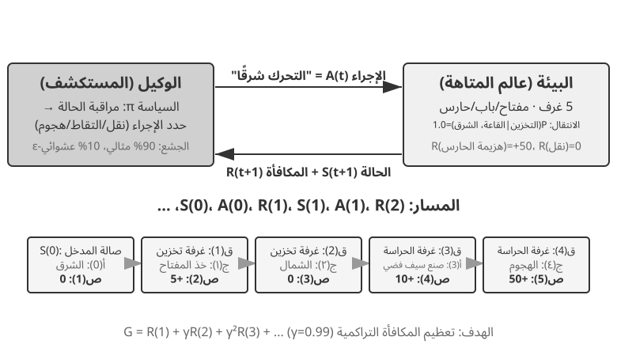

ينتج عن هذا التفاعل **مسار** — سجل كامل لـ "الحالة ← الإجراء ← المكافأة ← الحالة الجديدة ← الإجراء ← المكافأة...". إن جودة السياسة تنعكس في النهاية على جودة المسارات. تجيب **دالة القيمة** على السؤال: "إذا كنت في هذه الحالة الآن واستمررت في التصرف وفقًا للسياسة الحالية، فما هو إجمالي المكافأة التي سأجمعها في النهاية؟" هذا يشبه لاعب شطرنج ذو خبرة ينظر إلى مركز ما، ومن دون إجراء حسابات حتى النهاية، يقوم بشكل بديهي بتقدير احتمالية الفوز. (عندما يتم استبدال "السياسة الحالية" بـ "السياسة المثلى"، نحصل على دالة القيمة المثلى، والتي سيتم استخدامها لاحقًا في هذا الفصل عند مناقشة معادلة بيلمان للمثالية.) تتبع الحدود بين الوكيل والبيئة مبدأ بسيطًا: **أي شيء لا يستطيع الوكيل تغييره بشكل تعسفي ينتمي إلى البيئة.**

هناك ميزتان فريدتان تميزان التعلم المعزز عن التعلم الخاضع للإشراف (الذي يتطلب إجابات صحيحة مصنفة) والتعلم غير الخاضع للإشراف (الذي يكتشف الأنماط المخفية في البيانات): **البحث عن التجربة والخطأ** (يجب على الوكيل اكتشاف الإجراءات الجيدة بمفرده، دون أن يقدم المعلم الإجابة الصحيحة مباشرة) و **المكافأة المتأخرة** (قد يصبح تأثير الإجراء واضحًا بعد عدة خطوات فقط، على سبيل المثال، لا تظهر قيمة حركة الشطرنج الجيدة إلا في نهاية اللعبة). وهذا يؤدي أيضًا إلى **المفاضلة بين الاستكشاف والاستغلال** الفريدة: إن اتباع المسارات المألوفة دائمًا يعني عدم تعلم أي شيء جديد؛ المحاولة العشوائية دائمًا تعني عدم الوصول إلى الهدف مطلقًا.

يتكون نظام التعلم المعزز من خمسة عناصر أساسية:

- **مساحة الإجراء**: تحدد مجموعة جميع الإجراءات الممكنة التي يمكن للوكيل اتخاذها. يمكن أن تكون الإجراءات منفصلة (على سبيل المثال، "ما هي الحركة التي يجب القيام بها" في لعبة الشطرنج، مع عدد محدود من الخيارات) أو مستمرة (على سبيل المثال، "كم عدد الدرجات اللازمة لتدوير المفصل" للروبوت، وهي قيمة مستمرة).
- **السياسة**: القاعدة السلوكية للوكيل، والتي تحدد ما يجب فعله في حالة معينة. يمكن أن تكون السياسة بسيطة (جدول بحث: في الحالة أ، قم بتنفيذ الإجراء X) أو معقدة (شبكة عصبية عميقة).
- **إشارة المكافأة**: التغذية الراجعة الفورية من البيئة. ومع ذلك، فإن هدف الوكيل هو تعظيم المكافأة على المدى الطويل، وليس الفوري - وهذا التمييز أمر بالغ الأهمية، تمامًا كما لا ينبغي الحكم على الاستثمار من خلال مكاسب وخسائر اليوم ولكن من خلال العائدات طويلة الأجل.
- **وظيفة القيمة**: تقدير إجمالي المكافأة التراكمية التي يمكن الحصول عليها من حالة معينة في المستقبل، مما يساعد الوكيل على اتخاذ قرارات حكيمة حتى بدون الحصول على تعليقات فورية. أحد أهم الأفكار المستفادة من ستين عامًا من أبحاث RL هو الدور المركزي لتقدير القيمة.
- **نموذج البيئة** (اختياري): يتنبأ باستجابة البيئة للإجراءات. تُسمى الأساليب التي تستخدم نموذج البيئة **الطرق المستندة إلى النموذج** (تعلم أولاً كيفية التنبؤ بكيفية تغير البيئة، ثم التخطيط وفقًا لذلك)؛ أما تلك التي لا توجد بها فهي تسمى **الأساليب الخالية من النماذج** (لا تتنبأ بالبيئة، بل تتعلم مباشرة من التجربة).

يقارن الجدول 8-3 المكونات الرئيسية لأنظمة الوكيل المختلفة، ويكشف عن عالمية مفهوم الوكيل ويساعد القراء على رؤية الفرق في مساحات العمل بين وكلاء RL التقليديين ووكلاء LLM الحديثين.

جدول 8-3 مقارنة العناصر الأساسية في أنظمة الوكيل المختلفة

| نوع الوكيل | البيئة | مساحة العمل | إشارة المكافأة |
|---------------|------------------------|-------------------------------|-------------------------|
| **ظبي حديث الولادة** | التضاريس والجاذبية ووضعية الجسم | مستمرة وعالية الأبعاد (انقباض مجموعات العضلات) | الحفاظ على التوازن (+)، السقوط (-) |
| **روبوت فراغ** | تخطيط الغرفة، مستوى البطارية | منفصل (الاتجاه، الفراغ، الشحنة) | المنطقة النظيفة (+)، البطارية مستنفدة (-) |
| **أستاذ الشطرنج** | حالة المجلس، الحد الزمني | محدودة منفصلة (التحركات القانونية) | الفوز (+1)، الخسارة (-1) |
| **وكيل خدمة العملاء** | تاريخ المحادثة، قاعدة المعرفة | مفتوحة (فكر، تحدث، اتصل بـ API) | تم حل المشكلة (+)، وقت المعالجة (-) |
| **وكيل مساعد الكود** | وثيقة المتطلبات، قاعدة التعليمات البرمجية | مفتوحة (التفكير والبحث والتحرير والتنفيذ) | تم اجتياز الاختبار (+)، وتم تقديم الخطأ (-) |

يكشف الجدول عن رؤية مهمة: وكلاء RL التقليديون في مجالات مثل الشطرنج والروبوتات لديهم مساحات عمل مغلقة، في حين أن الوكلاء الحديثين المعتمدين على LLM، مثل وكلاء خدمة العملاء والبرمجة، لديهم مساحات عمل مفتوحة وغير محدودة تقريبًا. يمكن لهؤلاء الوكلاء أيضًا استخدام الإجراء الخاص المتمثل في "التفكير الداخلي" لتعزيز قدراتهم.

### نموذجان للوكيل: من MDP إلى LLM+RL

يكمن الفرق الجوهري بين النموذجين في فضاء الأفعال. تفترض عملية قرار ماركوف فضاءً محدودًا ومغلقًا، مثل: أعلى، أسفل، التقاط، وضع؛ أما فضاء أفعال النموذج اللغوي الكبير فمفتوح، ويتكون من سلاسل لغوية تتضاعف احتمالات تركيبها بسرعة هائلة. ويؤدي هذا الفرق إلى تباين جوهري في تصميم الخوارزميات وكفاءة العينات والقدرة على التعميم. وفيما يلي عرض لكل نموذج.

**النموذج التقليدي: MDP وQ-learning.**

MDP (عملية قرار ماركوف) هي الإطار الرياضي للتعلم المعزز، الذي يحدد العناصر الأساسية مثل الحالات والإجراءات والمكافآت. افتراضها الأساسي هو **خاصية ماركوف**: المستقبل يعتمد فقط على الحالة الحالية، وليس على التاريخ السابق. على سبيل المثال، في لعبة الشطرنج، يكون النظر فقط إلى موضع اللوحة الحالي كافيًا لتحديد الحركة المثالية؛ ليست هناك حاجة لمراجعة كل خطوة سابقة. هذا الافتراض يبسط المشكلة ولكنه يحد أيضًا من القدرة على نمذجة التبعيات التاريخية.

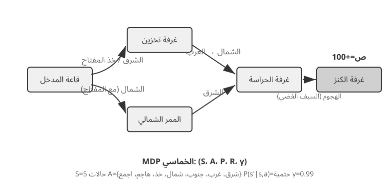

تستعمل بيئاتُ RL النموذجية التي يناقشها هذا القسم **فضاءَ فعلٍ محدَّدًا سلفًا**. فمواضعُ الوضع البالغة 361 في لعبة Go كبيرةٌ لكنها محدودة، وأفعالُ الشطرنج تبقى قابلةً للتعداد، وألعابُ Atari لا تملك عادةً إلا عددًا يتراوح بين بضعة أفعالٍ أوّليةٍ منفصلة وبضعةَ عشرَ فعلًا. أما **الوكيلُ الآلي (الروبوت)** فيستعمل فضاءَ فعلٍ متصلًا لكنه محدود: فزوايا المفاصل والسرعاتُ وقوةُ القبض قيمٌ متصلة، لكن لها حدودًا فيزيائية واضحة، ويتحدّد بُعدُها بدرجات حرية الروبوت.

تجلب هذه الطبيعة المغلقة مزايا حسابية: يمكن تعداد جميع الإجراءات وتقييمها واحدة تلو الأخرى، مما يسهل البرمجة الديناميكية والبحث في شجرة مونت كارلو، ويمكن تقريب دالة قيمة الإجراء باستخدام الجداول أو الوظائف البسيطة. ومع ذلك، فإنه يحد أيضًا من التعبير والتعميم. يبدأ وكلاء RL التقليديون من الصفر، ويتعلمون فقط من خلال التجربة والخطأ - بدءًا من سياسة عشوائية، وجمع الخبرة، وتحديث وظيفة القيمة أو السياسة، والتكرار حتى التقارب.

ضمن هذا الإطار، إحدى الخوارزميات الأساسية والأكثر أهمية هي **Q-learning**. إنها تحافظ على تقدير القيمة لكل زوج من "إجراءات الحالة": إذا اتخذت إجراءً *a* في الحالة *s* ثم تصرفت على النحو الأمثل بعد ذلك، ما مقدار المكافأة الإجمالية التي يمكن أن تتوقعها؟ بديهيًا، يعتمد ما إذا كان الإجراء جيدًا على المكافأة المباشرة التي يجلبها، بالإضافة إلى "مدى جودة الحالة التالية التي يؤدي إليها".

إذا صغنا هذا الحدس رياضيًا حصلنا على العلاقة العودية الأساسية في معادلة بيلمان، وهي من أشهر معادلات التعلم المعزز: **قيمة الفعل المثلى = المكافأة الفورية في هذه الخطوة + أعلى قيمة مستقبلية يمكن تحصيلها من الحالة التالية**:

$$Q^*(s, a) = r + \gamma \max_{a'} Q^*(s', a')$$

تمثّل $r$ المكافأة الفورية، وتمثّل $s'$ الحالة التالية بعد تنفيذ الفعل. كُتبت المعادلة هنا بصيغة حتمية لتوضيح الفكرة؛ أما في البيئة العشوائية فنأخذ التوقع على الحالات التالية الممكنة. ويمثّل $\gamma \in [0, 1)$ **عامل الخصم** الذي يحدد وزن المستقبل: كلما اقترب من 1 ازدادت أهمية العوائد البعيدة، وكلما اقترب من الصفر انصبّ الاهتمام على المكافأة الآنية. ومن ثم فالعائد التراكمي هو مجموع المكافآت بعد خصم البعيد منها: $\sum_{t} \gamma^{t} r_t$. وبعد كل فعل تحرّك الخوارزمية تقديرها القديم قليلًا نحو النتيجة التي شاهدتها بالفعل. ويُعرف تحديث التقدير من نتيجة الخطوة التالية باسم **التعلم بالفروق الزمنية (TD)**. ومع تكرار التجربة يقترب التقدير تدريجيًا من القيمة الحقيقية.

يوضح الشكلان التاليان عملية استكشاف تعلم Q في عالم شبكي والتقارب التدريجي لقيم Q.


يعد Q-Learning نوعًا محددًا من الأساليب **خارج السياسة** — حيث يمكنه استخدام البيانات التي تم إنشاؤها بواسطة أي سياسة (بما في ذلك الاستكشاف العشوائي) لمعرفة السياسة المثلى. التعريفات الصارمة للأساليب المتعلقة بالسياسة وخارجها، وكيفية ربطها بالتدريب اللاحق لـ LLM، ستتم مناقشتها لاحقًا في قسم "مقارنة خوارزميات التعلم المعزز".

> **التجربة 8-1 ★: أداء التعلم Q في لعبة البحث عن الكنز**
>
> للتحقق من خصائص وحدود Q-learning، قمنا بتصميم **بيئة لعبة البحث عن الكنز**. تشتمل هذه البيئة على العديد من التحديات الرئيسية: **الآليات المخفية** التي تتطلب من الوكيل اكتشاف المراسلات بين المفاتيح والأبواب وتأثيرات الأسلحة وقواعد تصنيع العناصر بنفسه؛ **التبعيات متعددة الخطوات** تعني أن إكمال المهمة يتطلب التسلسل الصحيح للإجراءات (الحل الأمثل: 11 خطوة)؛ **المكافآت المتفرقة** تعني أن الإجراءات الرئيسية والنصر النهائي فقط هي التي تنتج مكافآت كبيرة، مع عدم تلقي معظم الخطوات المتوسطة أي تعليقات.
>
> يستخدم وكيل التعلم Q إعدادات المعلمات القياسية واستراتيجية الاستكشاف الجشع ε: عادةً ما يختار الإجراء الأمثل حاليًا ولكنه يختار أحيانًا إجراءً عشوائيًا، مع انخفاض نسبة الاستكشاف العشوائي تدريجيًا أثناء التدريب.
>
> يُظهر منحنى التعلم الخصائص النموذجية (الحلقة هي لعبة واحدة كاملة، من البداية إلى النهاية أو الفشل):
> - **أول 1000 حلقة**: معدل الفوز 0%، Q-table بها 124 ولاية فقط، الوكيل يستكشف بشكل أعمى
> - **أول 5000 حلقة**: لا يوجد حتى الآن انتصارات ثابتة، Q-table لديها 133 ولاية
> - **من 7000 إلى 8000 حلقة**: يرتفع معدل الفوز تدريجيًا من 34% إلى 96%
> - **10000 حلقة**: معدل الفوز 100%، Q-table يحتوي على 145 حالة، وقد وجد الحل الأمثل المكون من 11 خطوة
>
> يستغرق التدريب بأكمله أقل من 10 ثوانٍ (محاكاة فعالة للغاية)، ولكنه يتطلب ما يقرب من 10000 محاولة كاملة. يوضح هذا السمة الأساسية لـ Q-Learning: فهو يتطلب قدرًا كبيرًا من الاستكشاف العشوائي لإكمال المسار الكامل عن طريق الخطأ، كما أن نشر إشارات القيمة بطيء جدًا، مما يتطلب تعزيزًا متكررًا. إن التعلم الرمزي الخالص، دون معرفة مسبقة، لا يمكنه إلا أن يبحث بالقوة الغاشمة في فضاء الدولة.
>
> في محاكي الألعاب، تستغرق 10000 تجربة 10 ثوانٍ فقط، وهي تكلفة ضئيلة. ولكن في سيناريوهات الوكيل الواقعية - حيث يكون لكل مكالمة هاتفية تكلفة، ولكل عملية متصفح تأخير، ويمكن أن يكون لكل قرار خاطئ عواقب لا رجعة فيها - فإن 10000 تجربة غير مقبولة على الإطلاق. وهذا هو بالتحديد سبب تحول الوكلاء المعاصرين إلى الأساليب المستندة إلى LLM: الاستفادة من المعرفة المتراكمة أثناء التدريب المسبق لاتخاذ قرارات فعالة بأقل قدر من التفاعل.
>
> تتمثل القيود الأساسية لبرنامج MDP في ثلاثة جوانب: انخفاض كفاءة العينة (يتطلب تفاعلًا هائلاً لتعلم مهام بسيطة)، وضعف التعميم (المعرفة المكتسبة في بيئة ما يصعب نقلها إلى أخرى)، وعدم القدرة على الاستفادة من المعرفة السابقة (يجب تعلم كل مهمة جديدة من الصفر). تصبح هذه القيود واضحة بشكل خاص عند مواجهة مساحات الدولة المعقدة مثل اللغة الطبيعية أو الرؤية عالية الأبعاد.

**النموذج الحديث: الوكلاء المعتمدون على LLM+RL.**

جلبت النماذج اللغوية الكبيرة نموذجًا جديدًا للوكلاء، مما أدى إلى تغيير جذري في كيفية بناء الوكلاء - خاصة في تصميم مساحة العمل.

في التعلم المعزز التقليدي، لا يتلقى الوكيل التغذية الراجعة إلا بعد تغيير البيئة، كتحريك قطعة شطرنج أو التقدم خطوة في متاهة. أما النماذج اللغوية الكبيرة فتضيف نوعًا جديدًا من الأفعال: **التفكير الداخلي**. فالتفكير لا يغير العالم الخارجي، لكنه قد يرفع جودة الفعل النهائي بدرجة كبيرة. وهكذا لم يعد فضاء أفعال الوكيل يقتصر على «ماذا أفعل؟»، بل صار يشمل أيضًا «فيم أفكر؟ وكم أستغرق في التفكير؟».

الابتكار الأكثر أهمية هو دمج **التفكير كإجراء خاص** في مساحة العمل. في RL التقليدي، يمكن للوكلاء فقط تنفيذ الإجراءات الخارجية التي تغير حالة البيئة (التحرك، الهجوم، الالتقاط)؛ في LLM Agents، **يصبح التفكير الداخلي مكونًا أساسيًا في مساحة العمل** — فهو لا يغير البيئة الخارجية بشكل مباشر، وليس له مكافأة فورية، ويمكن تنفيذه تقريبًا بلا حدود، وغير مكلف نسبيًا.

تواجه لعبة RL التقليدية صعوبة في التعامل مع هذا النوع من الحركة، ويرجع ذلك أساسًا إلى أن مساحة الاستكشاف كبيرة جدًا وتفتقر إلى البنية: فالوكيل الذي يتعلم من الصفر يشبه البحث عن كنز في الصحراء معصوب العينين، ولا يتمكن إلا من التعثر بشكل عشوائي. نماذج LLM مختلفة. ومن خلال التدريب المسبق الضخم على النصوص، استوعبوا قواعد التفكير البشري: حل المسائل الرياضية يتبع "تحديد الشروط ← استدعاء الصيغ ← الحساب خطوة بخطوة"، وكتابة التعليمات البرمجية تتبع "فهم المتطلبات ← بنية التصميم ← تنفيذ التفاصيل". وهذا يسمح للتفكير LLM بالمضي قدمًا عبر المسارات المنظمة، مما يؤدي إلى ضغط مساحة البحث بشكل كبير. لذلك، حتى بدون تدريب إضافي على RL، يمكن لـ LLM المدرب مسبقًا إنشاء سلسلة أفكار منطقية أساسية (CoT). يأتي هذا المنطق الأساسي من الكم الهائل من عمليات التفكير البشري في مجموعة ما قبل التدريب (حلول المشكلات الرياضية، وتعليقات التعليمات البرمجية، واستجابات النقاش، وما إلى ذلك). من خلال التنبؤ بالرمز التالي، يتعلم النموذج ضمنيًا "كيف يجب أن تبدو الخطوة التالية في التفكير".

يستخدم التدريب اللاحق لـ RL بعد ذلك مكافآت خارجية لتعليم LLM كيفية استخدام هذه القواعد بشكل أكثر كفاءة لمهام محددة. توفر بنية اللغة نفسها أيضًا مكافأة داخلية ضمنية - فسلسلة التفكير المتماسكة منطقيًا (على سبيل المثال، "لأننا بحاجة إلى تحويل العملة الأجنبية إلى الدولار الأمريكي، فإن الخطوة الأولى هي البحث عن سعر الصرف") لديها احتمالية توليد عالية، في حين أن الاحتمالية الفوضوية منطقيًا (على سبيل المثال، "لأننا بحاجة إلى تحويل العملة، فلنتحقق أولاً من الطقس") لديها احتمالية منخفضة للغاية، مما يوجه النموذج بشكل طبيعي نحو مسارات معقولة.

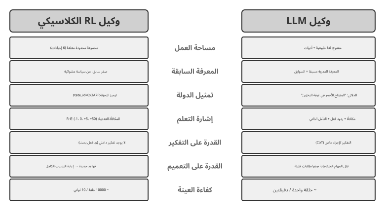

إن سياسةَ اللغة المدرَّبة مسبقًا تمكّن وكيلَ النموذج اللغوي الكبير من فهم تعليماتٍ لم يرَها من قبل (تعميمٌ من دون أمثلة)، ومن التكيّف مع مهامّ جديدة بعددٍ قليل من العروض (تكيّفٌ بأمثلةٍ قليلة)؛ وهذا يتناقض تناقضًا حادًّا مع إعداد Q-learning الجدولي السالف الذكر الذي لا معرفةَ مسبقة له.

يعكس التطور من مساحة العمل المغلقة إلى مساحة العمل المفتوحة تحولًا أساسيًا في نموذج وكيل الذكاء الاصطناعي. وبعيدًا عن التفكير الداخلي، فإن تنوع معلمات الأداة (استعلامات اللغة الطبيعية، رمز البرنامج، JSON المعقد، المحتوى متعدد الوسائط) يجعل مساحة العمل الفعلية لا نهائية تقريبًا - يمكن لمفسّر الشفرة تنفيذ أي مهمة قابلة للحساب نظريًا، ويمكن لأداة البحث استكشاف مساحة المعلومات الكاملة للإنترنت. وهذا يجلب فرصًا جديدة (يمكن للوكلاء التعامل مع مهام غير مسبوقة، وحل المشكلات المعقدة من خلال الجمع بين الأدوات الأساسية) وتحديات جديدة (كيفية تحديد وظائف المكافأة وتحسينها في بيئة مفتوحة، وكيفية البحث بكفاءة في مساحة عمل لا نهائية).

توضح نماذج مثل Kimi K3، التي تم تحسينها لاستخدام الأدوات والتفكير طويل السلسلة، الاتجاه النموذجي لنموذج LLM+RL: يوفر التدريب المسبق على اللغة على نطاق واسع الأساس، ويعزز التدريب اللاحق تحليل المشكلات واستخدام الأدوات والتصحيح الذاتي. **OpenVLA**[^ch8-21] (المفصل في الفصل 6) يعرض نموذج هندسة VLA (الرؤية واللغة والعمل) لعصر LLM: يقوم جهاز تشفير الرؤية بمعالجة الملاحظات البيئية، ويفهم نموذج اللغة التعليمات والأسباب، ويولد جهاز فك تشفير الإجراء إشارات تحكم، مما يتيح التحكم المشروط باللغة والتعميم عبر المهام. للتوضيح، تم تدريب OpenVLA نفسه من خلال التعلم بالتقليد على ما يقرب من مليون روبوت **مسارات العرض**، مما يجعله SFT في الطبيعة بدلاً من RL. يعد SimpleVLA-RL، الذي تم تقديمه في التجربة 8-13 لاحقًا في هذا الفصل، مثالًا تمثيليًا لجلب RL إلى الروبوتات باستخدام المكافآت لتحسين هذا النوع من بنية VLA بشكل أكبر.

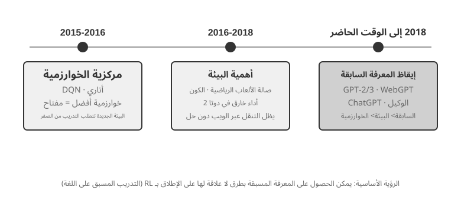

**مسار الاستكشاف في OpenAI** (الذي أرّخه Shunyu Yao، أستاذ مساعد بجامعة برينستون ومؤلف ورقة ReAct، في مدونته *The Second Half*[^ch8-2]) يوضّح تطوّر التفكير في هذا المجال. **المرحلة الأولى (2015-2016)، أولوية الخوارزمية:** ساد الاعتقاد بأن تطوير خوارزميات أفضل هو المفتاح؛ وتحقّقت قفزات في بيئات قياسية مثل Atari، لكن كل بيئة جديدة تطلّبت إعادة التدريب من الصفر. **المرحلة الثانية (2016-2018)، أهمية البيئة:** وحّدت Gym أنواع المهام، وحاولت Universe وWorld of Bits تحويل الإنترنت كله إلى بيئة تدريب لـ RL، وسعت Dota 2 إلى أداء يفوق البشر في بيئة معقّدة بعينها. كانت الفكرة واضحة، لكن الاستخدام العام للحاسوب والتنقّل في الويب ظلّا عصيَّين على الاختراق.

**المرحلة الثالثة (2018 حتى الآن)، صحوة المعرفة القبلية:** أظهرت GPT-2/GPT-3 قوة التدريب المسبق على اللغة، وأثبتت WebGPT وChatGPT أن هذه المعرفة القبلية يمكن أن تتحوّل إلى وكلاء عمليين. وأهم اكتشاف هو أن **المعرفة القبلية يمكن اكتسابها بطريقة لا صلة لها بـ RL البتة.** وهذه حقيقة مخالفة للحدس: لعلّ أولويات باحثي RL كانت مقلوبة تماماً طوال عقود — فليست الخوارزمية > البيئة > المعرفة القبلية، بل المعرفة القبلية > البيئة > الخوارزمية.

> **التجربة 8-2 ★★: دراسة مقارنة للوكيل التقليدي RL وLLM**
>
>
> 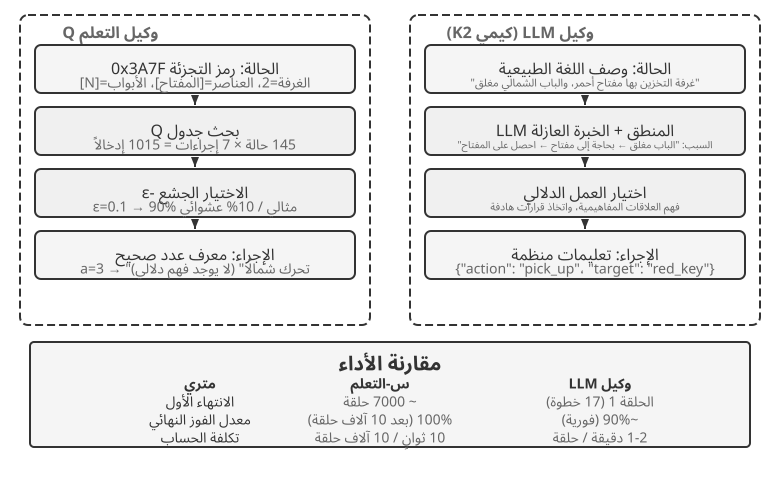
>
>
> لقد قارنا Q-learning مع وكيل LLM — Kimi K3، مع الاحتفاظ بمخزن مؤقت يصل إلى 50 تجربة — في نفس لعبة البحث عن الكنز. النتائج مذهلة: **أكمل وكيل قائم على نموذج لغوي كبير اللعبة في 18 خطوة في محاولته الأولى**.
>
> **المرحلة المبكرة (الاستكشاف الهادف)**: يلتقط سيفًا صدئًا ("السلاح أفضل من الأيدي العارية")، ويستكشف الخريطة بشكل منهجي، ويستنتج "الحاجة إلى العثور على مفتاح" بعد العثور على البوابة الشمالية مغلقة، ويستكشف المخزن، ويكتسب المفتاح الأحمر والكريستال السحري. **المرحلة المتوسطة (فهم الآلية والتركيب الاستباقي)**: فهم قاعدة "الاستخدام التلقائي للمفتاح" وتوقع أن السيف الصدئ غير كافٍ ضد الحارس، وتصنيع سيف فضي بشكل استباقي في الخطوة 8. **المرحلة المتأخرة (التنفيذ وتصحيح الأخطاء)**: اتجه شمالًا بالسيف الفضي وهزم الحارس القوي في الخطوة 13. على طول الطريق، يقوم بمحاولة أو محاولتين غير فعالتين - يلوح بالسيف بشكل متكرر أو يتراجع - ويحصل أخيرًا على كنز التنين في الخطوة 18.
>
> يوضح هذا فرقًا جوهريًا بين الفهم الدلالي ورسم الخرائط الرمزية. لقد فهم وكيل LLM البنية المفاهيمية للعبة؛ كان لكل خطوة هدف ودعم منطقي. بالنسبة لـ Q-learning، فإن "الباب" و"المفتاح" و"السيف" هي مجرد مجموعات رموز لا معنى لها، ولا يمكنها اكتشاف علاقاتها إلا ببطء من خلال التعلم الإحصائي المكثف.
>
> تمثل التكلفة الحسابية مفارقة مثيرة للاهتمام: يقوم Q-learning بتشغيل 10000 لعبة في 10 ثوانٍ، بينما يستغرق LLM Agent من دقيقة إلى دقيقتين لكل لعبة. ومع ذلك، في مهام العالم الحقيقي، فإن تكاليف الوقت والمال والمخاطر لكل تفاعل تفوق بكثير التكاليف الحسابية البحتة، لذا فإن الحكم من خلال وقت وحدة معالجة الرسومات فقط هو أمر غير عادل. الفكرة الأكثر أهمية هي أن نجاح وكيل LLM لا يرجع إلى وجود "خوارزمية تعليمية" أفضل، ولكن لأنه يحمل معرفة مسبقة واسعة النطاق. عندما تتغير قواعد اللعبة، يحتاج Q-learning إلى إعادة تدريب كاملة، بينما يمكن للوكيل LLM التكيف مباشرة من خلال التفكير. يؤدي هذا إلى مبدأ تصميم عملي: تظل RL التقليدية ذات قيمة في السيناريوهات ذات تكاليف المحاكاة المنخفضة والتكرار العالي؛ في سيناريوهات العالم الحقيقي ذات تكاليف التفاعل العالية والحاجة إلى التكيف السريع، تكون كفاءة العينة لوكلاء LLM أكثر قيمة في الممارسة العملية.

قدم الفصل الأول بالفعل خريطة مفاهيمية لكيفية عمل التكيف السياقي، وتحديثات العناصر الخارجية، وتحديثات المعلمات معًا؛ يعود قسم "المشهد الكامل لما بعد التدريب والنصائح العملية" الموجود في نهاية هذا الفصل إلى الموضوع. الموضوع الرئيسي لهذا الفصل هو ما بعد التدريب: الكتابة في قدرات معلمات النموذج التي لا يمكن التعبير عنها بالكامل من خلال القواعد الخارجية.

## أساسيات ما قبل التدريب للنموذج `[قراءة اختيارية]`

لفهم سبب فعالية تقنيات ما بعد التدريب، يجب على المرء أولاً أن يفهم ما ينشئه التدريب المسبق. يتم تحسين ما بعد التدريب (SFT وRL) بشكل أساسي داخل مساحة التمثيل التي أنشأها التدريب المسبق - يحدد هيكل المعرفة الذي وضعه التدريب المسبق سقف ما بعد التدريب. ولذلك، فإننا ندرس الجوانب الأساسية للتدريب المسبق من خلال ثلاث تجارب: تدريب نموذج لغوي صغير الحجم من الصفر، وتوسيع القدرات البصرية، وحقن المعرفة اللغوية الجديدة. تعتبر التجارب الثلاث في هذا القسم تكميلية وتهدف إلى بناء الحدس حول التدريب المسبق - أي التدريب الأولي على البيانات واسعة النطاق التي تعلم نموذجًا لأنماط اللغة الأساسية والمعرفة العالمية. يمكن للقراء المطلعين على عملية التدريب المسبق تخطيها.

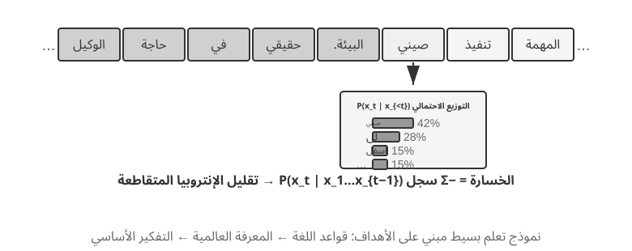

يتبع تدريب نموذج اللغة خط أنابيب من ثلاث خطوات: "الترميز - التدريب المسبق - ما بعد التدريب." يقوم الترميز بتقسيم النص إلى وحدات منفصلة. على سبيل المثال، قد يتم تحويل "أنا أحب البرمجة" إلى "أنا" و"أعجبني" و"برنامج" و"مينغ". هذه الرموز هي أصغر الوحدات النصية التي يعالجها النموذج. مهمة التدريب المسبق بسيطة من الناحية المفاهيمية: أظهر للنموذج الجزء الأول من مقطع النص واجعله يتنبأ بالرمز المميز التالي. من خلال مقارنة تنبؤه بالإجابة الصحيحة (هذا الاختلاف يسمى الخسارة؛ الخسارة الأصغر تعني تنبؤًا أكثر دقة)، يقوم النموذج بضبط معلماته باستمرار. وبعد التدريب المتكرر على البيانات النصية الضخمة، يتعلم النموذج تدريجيًا قواعد اللغة والمعرفة العالمية وقدرات التفكير الأساسية. بعد التدريب المسبق، يمكن للنموذج إنشاء نص سلس، لكن الإخراج يفتقر إلى البنية ويكافح من أجل اتباع التعليمات. بعد التدريب، يتم تحويل النموذج إلى مساعد عملي من خلال SFT - التدريب على أزواج المدخلات والمخرجات المحددة - وتحسين التفضيلات، مثل DPO، الذي يعلم النموذج كيفية توليد الاستجابات التي يفضلها البشر.

> **التجربة 8-3 ★★: تدريب LLM من الصفر — قوة تحسين الخوارزميات**
>
> باستخدام MiniMind 2، وهو نموذج مكون من 100 مليون معلمة، كدراسة حالة، تكمل التجربة عملية التدريب بأكملها على وحدة معالجة الرسومات المخصصة للمستهلك. هناك تحسينان خوارزميان - QK Norm ومحسن Muon - يضاعفان سرعة التقارب ثلاث مرات ويحسنان جودة التوليد بشكل كبير، وكل ذلك بتكلفة منخفضة جدًا: حوالي 14 ساعة من التدريب و34 دولارًا إجمالاً.
>
> تأثيرات كل مرحلة تدريب: بعد التدريب المسبق، يستطيع النموذج الإجابة على أسئلة واقعية مثل "ما هو أعلى جبل في العالم؟" ولكن التنسيق غير قياسي؛ بعد SFT، تم تحسين متابعة التعليمات وتنسيق الإخراج بشكل ملحوظ، مما يسمح للنموذج بتنظيم الإجابات كما هو متوقع؛ يؤدي تحسين التفضيلات إلى تقليل الأخطاء الواقعية والتعبيرات غير الطبيعية. لا يزال النموذج المكون من 100 مليون معلمة يعاني من قيود واضحة (عرضة للأخطاء في المشكلات المعقدة)، ولكن الدرس المستفاد هو: **بميزانية ثابتة وصغيرة، توفر التحسينات الخوارزمية قيمة أفضل من مجرد زيادة الحجم**.
>
> **التجربة 8-4 ★★: تدريب VLM الخاص بك**
>
>
> 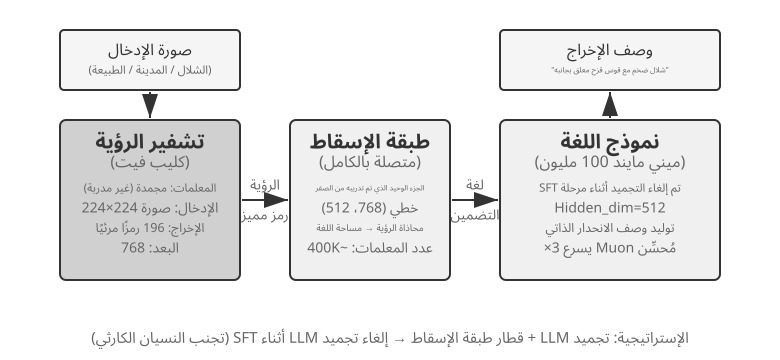
>
>
> تعمل VLMs على توحيد الإدراك البصري وفهم اللغة ضمن نموذج واحد. ويتمثل التحدي الأساسي في المواءمة بين الوسائط - مما يجعل "ما يُرى" يتوافق مع "ما يُقال". تتكون البنية من ثلاثة مكونات: **Vision Encoder** (على سبيل المثال، CLIP، المعلمات المجمدة) يستخرج الميزات الدلالية من الصور؛ **طبقة الإسقاط** (خفيفة الوزن، الجزء الوحيد الذي تم تدريبه من الصفر) تعمل بمثابة "مترجم" بين الميزات المرئية ونموذج اللغة، حيث تقوم بتعيين الميزات المرئية في مساحة تمثيل يمكن لنموذج اللغة فهمها؛ ويقوم **نموذج اللغة** بإنشاء نص وصفي. يستخدم التدريب استراتيجية "تجميد LLM + تدريب طبقة الإسقاط فقط" لتجنب النسيان الكارثي (نسيان المهارات القديمة بعد تعلم مهارات جديدة)؛ بعد مرحلة ما قبل التدريب على المحاذاة، يتم إلغاء تجميد LLM، ويتم تنفيذ SFT على أزواج وصف صور عالية الجودة، مما يؤدي إلى تحسين تفاصيل ودقة الأوصاف بشكل كبير.
>
> تكشف هذه التجربة عن النموذج الأساسي للتدريب على النماذج متعددة الوسائط: إعادة استخدام نتائج التدريب المسبق أحادية الوسائط وتحقيق محاذاة عبر الوسائط من خلال تدريب طبقة إسقاط خفيفة الوزن - فعالة وقابلة للتطوير، ولكن التعبير المحدود لطبقة الإسقاط يمكن أن يصبح عنق الزجاجة للفهم العميق عبر الوسائط. يؤدي توسيع نفس بنية "مشفر الرؤية + طبقة الإسقاط + LLM" خطوة أخرى إلى الأمام من خلال الحصول على إجراءات مخرجات النموذج إلى إنتاج نموذج VLA (الرؤية واللغة والإجراء) المفصل في الفصل 6.

تكشف تجربتا التدريب المسبق معًا عن قاعدة واحدة: حين تكون الميزانية محدودة، يكون تحسين الخوارزميات والابتكار في البنية أجدى من مجرد توسيع الحجم. والأهم من ذلك أن التدريب المسبق يمنح النموذج معرفة وصفية وقدرة على نمذجة اللغة، لا اتباعًا منظمًا للتعليمات ولا سلوكًا موجهًا نحو المهمة. وإذا لم يكن التدريب المسبق العام قد غطى أصلًا اللغة أو المجال المستهدف، فإن الانتقال المباشر إلى SFT أو RL لا يلتف حول هذه الفجوة؛ وهذه بالضبط هي المشكلة التي يعالجها Mid-training.

## Mid-training: استكمال المعرفة والقدرات الأساسية

المقصود بـ **Mid-training** في هذا الفصل هو الانطلاقُ من نموذجٍ أساسٍ موجود، ثم مواصلةُ مرحلةٍ من تدريب النموذج اللغوي على توزيع البيانات المستهدف. وهو يعتمد عادةً المهمةَ نفسها التي يعتمدها التدريبُ المسبق، أي التنبّؤ بالكلمة التالية، ويحسب الخسارةَ على جميع رموز الوثيقة أو الشيفرة أو الاشتقاق. وقد بيّنت دراساتُ DAPT/TAPT الكلاسيكية أن إجراءَ مرحلةٍ ثانية من التدريب المسبق على متنٍ مجاليٍّ أو على متنٍ غير موسومٍ متصلٍ بالمهمة يستطيع أن يواصل تحسينَ الأداء في المهامّ اللاحقة[^ch8-30]. أما كلمةُ «Mid» في الاسم فتصف موقعَه في سلسلة تطوير القدرات، وإلّا فصيغةُ بياناته ودالةُ خسارته هما نفسُهما في التدريب المسبق.

يعالج Mid-training نوعين من الفجوات أساسًا:

- **فجوة المعرفة**: لم يغطِّ التدريب المسبق العام اللغةَ المستهدفة أو مجالات المال والطب والقانون أو وثائق المؤسسة الداخلية أو صنفًا بعينه من codebase تغطيةً كافية، فلا يفهم النموذج حتى المفاهيم والمصطلحات.
- **فجوة القدرة الأساسية**: تتطلب المهمة المستهدفة سياقًا طويلًا أو أنماط كود أو اشتقاقًا رياضيًا أو تمثيلات متعددة الوسائط لم يكوّنها النموذج الأساس بعد. والمشكلة هنا ليست في صيغة الإجابة فحسب، بل إن النموذج لا يكاد يبلغ الحل الصحيح مهما تكرر أخذ العينات.

وهذا يوضّح أيضًا لماذا لا ينبغي اتخاذ SFT وسيلةً رئيسة لحقن المعرفة. فـ SFT قادر بالطبع على حفظ عدد قليل من الحقائق، ويوضع كثيرًا بعد Mid-training ليعلّم النموذج كيف يجيب عن أسئلة المجال؛ غير أن عددًا قليلًا من أزواج الأسئلة والأجوبة لا يغطي إلا صيغًا محدودة من السؤال، وهو أبرع في تدريب «كيفية الوصول والتعبير» منه في حمل معرفة خام واسعة ومترابطة. والعكس صحيح كذلك: خفض خسارة نمذجة اللغة على نصوص المجال عبر Mid-training لا يضمن أن يستخرج النموذج المعرفة تلقائيًا استجابةً لسؤال المستخدم. وقد وجدت دراسات قائمة أن ترتيب التدريب المسبق المستمر والتدريب على التعليمات، وطريقة تنظيم البيانات، يؤثران تأثيرًا كبيرًا في إمكانية الوصول إلى المعرفة بصيغة سؤال وجواب[^ch8-31]. والوصفة المتينة عادةً هي: Mid-training يستوعب المعرفة والقدرة ← SFT صغير النطاق يرسّخ صيغة المخرجات ← ومتى صار معدل النجاح غير صفري، يرفع RL معدل النجاح وقابلية التعميم.

### كيف تُبنى بيانات Mid-training

1. **استنبط البيانات من توزيع الإخفاقات.** قسّم التقييم أولًا بحسب الموضوع واللغة ونوع الوثيقة ونمط الكود وطول السياق، وتأكد من نوع الفجوة الأساسية التي ينبع منها انخفاض `pass@k`؛ ولا تضف بيانات إلا لفجوات المعرفة والقدرة، تفاديًا لتشخيص خطأ في صيغة المخرجات على أنه نقص في المعرفة.
2. **ابنِ متنًا مستهدفًا عالي الكثافة.** الوثائق الأصلية مناسبة لبناء الروابط بين المصطلحات والحقائق، ومستودعات الكود مناسبة لتعلم البنية والاعتماديات، أما الاشتقاقات على طريقة الكتب الدراسية وإعادات الصياغة التركيبية وعينات الربط بين الوثائق فمناسبة لكتابة العلاقات الضمنية بصورة أوضح. وتحتاج البيانات إلى إزالة التكرار وتصفية الجودة وفحص تلوّث مجموعات التقييم.
3. **وزّع نسب البيانات بحسب القدرات.** ينبغي أن تشمل البيانات نصوصًا طويلة طبيعية مثل الكتب والوثائق الطويلة ومستودعات الكود؛ وبيانات سلاسل التفكير التي تجسّد القدرات الذرية على النص الطويل مثل البحث في النص الطويل والاستدلال متعدد القفزات واتباع التعليمات وتجميع المعلومات والإحصاء؛ ومسارات تنفيذ Agent التي تجسّد القدرات اللازمة للوكيل مثل التخطيط واختيار الأدوات واستدعائها وتتبع الحالة على مدى طويل والتعافي من الأخطاء. ويمكن تقطير بيانات سلاسل التفكير ومسارات Agent من نموذج مفتوح المصدر أقوى، كما يمكن استخدام مجموعات بيانات قائمة.
4. **نفّذ «إعادة تشغيل مزدوجة» في كل مرحلة.** الأولى هي النصوص القصيرة الأصلية والبيانات العامة، للحفاظ على اللغة والمعرفة والقدرة على السياق القصير. والثانية هي «المهام القديمة بعد رفع الطول»: ضع المهام القصيرة التي يتقنها النموذج داخل سياق بالطول الحالي، مع بثّ المعلومات ذات الصلة وعناصر التشتيت في مواضع مختلفة، لتتحقق مما إذا كانت القدرة نفسها لا تزال قائمة في نافذة أطول. ويُفضَّل أن تأتي البيانات العامة من مجموعة التدريب المسبق الأصلية للنموذج الأساس؛ فإن تعذّر ذلك أمكن الاستعاضة عنها بمتن تدريب مسبق مفتوح مثل FineWeb-2.
5. **قرّر متى تتوقف عبر بوابات متعددة الأبعاد.** إلى جانب خسارة التدريب، تابع كذلك `pass@1` و`pass@k` على المهام المجالية المحجوزة والقدرات العامة واتباع التعليمات السابق والمهمة المستهدفة. فإذا ارتفعت مؤشرات المجال بينما تراجعت مجموعة الاحتفاظ العامة، فهذا يعني أن المزيج أو معدل التعلم مفرط في الحدة؛ وإذا انخفضت الخسارة ولم يتحرك `pass@k`، فافحص هل تغطي البيانات فعلًا القدرة المطلوبة، وهل يفتقر ما يليها إلى SFT يتيح الوصول إلى المعرفة.

بعد Mid-training، ينبغي استخدام مجموعات تقييم مثل LongBench v2 وIFEval والوكلاء من الطرف إلى الطرف الموصوفين في الفصل السابع، للتحقق من أن **القدرة الأساسية على السياق الطويل عند أطوال سياق مختلفة** لم تُفقد. فقدرة السياق الطويل أساسٌ لقدرة سلسلة التفكير الطويلة ولاتباع التعليمات، وهاتان بدورهما أساسٌ لقدرات وكيلية أعلى مثل استدعاء الأدوات.

- **الموضع والاسترجاع**: استخراج المعلومة المفتاحية بإبرة واحدة أو بإبر متعددة أو من مواضع مختلفة؛
- **العلاقة والاستدلال**: تتبع العلاقات عبر الفقرات والوثائق وبقفزات متعددة، وحلّ التناقضات وتركيب الأدلة؛
- **التجميع والإحصاء**: تلخيص المعلومات من جداول أو سجلات طويلة، كالعدّ والتجميع والترتيب والمقارنة واستخلاص الاتجاهات؛
- **اتباع التعليمات**: القدرة على اتباع التعليمات المعقدة، بما فيها اتباع تعليمات متعددة معًا، وحلّ التناقضات، والالتزام بمسار التفكير المحدد، والالتزام بصيغة المخرجات؛
- **التفكير طويل السلسلة**: حلّ مسائل الرياضيات والاستدلال المنطقي وتوليد الكود المعقدة؛
- **القدرات الذرية للوكيل**: تفكيك المهمة، وتوليد الخطة، واختيار الأداة، وبناء المعاملات، وذاكرة الحالة، والتعافي بعد الإخفاق.

إذا كانت الحقائق تحتاج إلى تحديث متكرر أو يجب إسنادها إلى مصادرها الأصلية، فإن RAG يبقى أفضل من كتابة المعرفة في الأوزان؛ أما Mid-training فأنسب للمعرفة والقدرات المجالية المستقرة والكبيرة الحجم التي تحتاج إلى تكوين تمثيل داخلي. وتكلفةُ الحوسبة وخطرُ النسيان في Mid-training كامل المعاملات لنموذج كبير أعلى بوضوح منهما في SFT صغير النطاق، ولذلك ينبغي التحقق من نسب البيانات بتجربة صغيرة أولًا، ثم توسيع ميزانية التدريب.

> **التجربة 8-5 ★★: مواصلة التدريب المسبق لتعلم لغة جديدة**
>
> انطلاقًا من Mistral 7B v0.3 (المدرَّب مسبقًا على الإنجليزية أساسًا، ولا يكاد يفهم الكورية)، تُحقن القدرة الكورية عبر مواصلة التدريب المسبق على ويكيبيديا الكورية — أي مواصلة تدريب نموذج اللغة ببيانات لغة جديدة فوق نموذج أنهى تدريبه المسبق. فالنموذج يملك تمثيلات عامة بالفعل ولا يحتاج إلا إلى التكيف مع توزيع بيانات جديد، وهو ما يجعل التكلفة أدنى بكثير من التدريب من الصفر. وتستخدم التجربة مزيجًا يقارب 80% كورية و20% إنجليزية للتخفيف من النسيان الكارثي؛ وهذا خيار هذه التجربة لا قيمة افتراضية عامة. وأخيرًا يُجرى SFT ببيانات تعليمات كورية للحصول على قدرة حوارية كورية عملية. والمسؤوليتان هنا مفصولتان بوضوح: Mid-training يستكمل أولًا المعرفة الكورية والقدرة اللغوية، ثم يعلّم SFT النموذجَ كيف يتلقى التعليمات وينظّم الإجابة بالكورية.
>
> وتوضح التجربة كذلك النسيان الكارثي الذي قد تجلبه مواصلة التدريب المسبق: فقد تحسّن التقييم الأعمى للكورية في المرحلة النهائية بينما تراجعت القدرة الإنجليزية. ومواصلةُ التدريب المسبق قادرة على كتابة التوزيع المستهدف في المعاملات، لكنها لا تُغني عن مجموعات الاحتفاظ وتقييم الوقائع وتدقيق جودة البيانات.

ولا يمكن بناء وكيل عملي بطرق ما بعد التدريب الواردة أدناه، مثل SFT وRL، إلا بعد توافر قدر كافٍ من المعرفة والقدرات الأساسية.

## SFT (الضبط الدقيق الخاضع للإشراف)

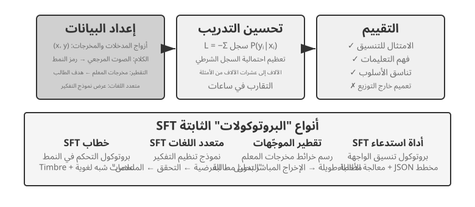

لقد كشف قسم "التدريب المسبق، SFT، RL: بانوراما ثلاثية المراحل" بالفعل جوهر SFT ("توقع الرمز المميز التالي،" مع بيانات مختلفة، ويتم حساب الخسارة فقط على الاستجابة). يستخدم هذا القسم أربع تجارب لمشاهدة ما تعمل عليه هذه الآلية - كتابة تعيينات وبروتوكولات مستقرة في المعلمات - في الواقع عبر مهام مختلفة. لا تتمثل القيمة الأساسية لـ SFT في ضخ معرفة جديدة، ولكن **ترسيخ البروتوكولات**: كتابة علاقات التعيين وتنسيقات التفاعل ومعايير النمط في المعلمات، مما يمكّن النموذج من إنتاج مخرجات تلبي التوقعات أثناء الاستدلال دون موجّهات طويلة. عادةً، لا يلزم سوى بضعة آلاف إلى عشرات الآلاف من الأمثلة عالية الجودة لإنشاء القدرة التحادثية الأساسية ومتابعة التعليمات.

ثمن هذه الكفاءة هو الاعتماد القوي على توزيع التدريب: SFT يميل نحو الحفظ بدلا من التعميم. عند مواجهة مواقف غير مرئية أثناء التدريب في وقت الاختبار، غالبًا ما يتدهور الأداء بشكل ملحوظ. ستوضح التجارب التالية عملية "ترسيخ البروتوكولات" من زوايا مختلفة.

قبل التدريب العملي على SFT، هناك سؤال عملي واحد لا مفرّ منه: **من أين تأتي بيانات SFT؟** جواب الصناعة ينحصر أساساً في ثلاثة طرق:

- **عروض الخبراء البشريين** — سقف الجودة فيها الأعلى، لكنها مكلفة وبطيئة؛ وتصلح "بيانات بذرة" تحدّد الصيغة والأسلوب؛
- **التوليد بنموذج معلّم** — أي البيانات التركيبية: يُنتج نموذج قوي أزواج "مدخل—مخرج" بالجملة، وتُصفّى ثم تُقطَّر إلى الطالب؛ انظر التجربتين 8-8 و8-9؛
- **أخذ العينات مع الرفض** — يأخذ النموذج بنفسه عدة مرشحين للمسألة نفسها، ويختار مدقّقٌ الصحيح منها، فيدرّب بها نفسه من جديد؛ انظر التجربة 8-9.

وتُستخدم هذه الطرق الثلاث معاً في الغالب: أولاً تُثبَّت الصيغة ببذور بشرية قليلة، ثم يوسَّع الحجم بنموذج معلّم، وأخيراً تُسوَّى الجودة بأخذ العينات مع الرفض. وأياً كان الطريق فإجراء البناء متشابه تقريباً: تحديد توزيع المهام ومخطط المخرجات، وتوليد المرشحين بالجملة، وتصفية الجودة بالتحقق بالقواعد وفحص الصيغة والمراجعة البشرية بالعيّنة، ثم إزالة التكرار وموازنة النسب وضمان التنوّع. أما الكم فلا داعي للطمع فيه: بضعة آلاف إلى بضع عشرات الآلاف من العيّنات عالية الجودة تكفي عادةً لتثبيت بروتوكول، وصقل عشرة آلاف عيّنة نظيفة خير من تكديس مئة ألف عيّنة ملوّثة، لأن كل ضجيج في البيانات قد يكتبه SFT بأمانة في المعاملات.

> **التجربة 8-6 ★★★: الصوت SFT — من "استنساخ الصوت" إلى "النمذجة شبه اللغوية" `[Extended Experiment]`**
>
> باستخدام Orpheus (استنساخ الصوت السياقي الفوري) وSesame (نمذجة الرموز اللغوية) كدراسات حالة، توضح هذه التجربة كيف يتم كتابة "نمط الصوت وعادات التعبير" في المعلمات. يسلك الاثنان طريقين مختلفين:
>
> - **Orpheus**: يضغط شكل موجة الصوت في تسلسل رمزي. من خلال تسلسل الصوت المرجعي من نفس المتحدث، يتعلم النموذج "التحدث بصوت هذا الشخص"، مما يحقق اتساق جرس الصوت عبر الجملة.
> - **سمسم**: يلخص الظواهر شبه اللغوية مثل الضحك والتنهدات في رموز خاصة مثل `<laugh>`، `<sigh>`. يتعلم النموذج "إصدار الصوت المقابل عند رؤية الرمز المميز".
>
> في المهام التعبيرية، يعمل SFT على ترسيخ بروتوكولات التحكم في الأسلوب وعادات التعبير المنظمة، وليس المعرفة الواقعية أو التفكير المعقد. المفتاح يكمن في التنوع وجودة التعليقات التوضيحية لبيانات التدريب. تشتمل أوضاع الفشل الشائعة على عدد قليل جدًا من المتحدثين في بيانات التدريب، مما يتسبب في أن يبدو الجميع متماثلين، وتجاوز الرمز المميز (حيث يحفظ النموذج تفاصيل عينة التدريب ويعمل بشكل أسوأ في المواقف الجديدة)، مما يؤدي إلى "الضحك الميكانيكي".
>
> **التجربة 8-7 ★★★: التفكير متعدد اللغات - تمكين النموذج من التفكير بأي لغة `[Extended Experiment]`**
>
> معظم نماذج التفكير "تفكر" باللغة الإنجليزية فقط: بغض النظر عن اللغة التي تستخدمها لطرح سؤال، فإن سلسلة التفكير الداخلية للنموذج تكون دائمًا باللغة الإنجليزية، لأن عروض التفكير عالية الجودة في بيانات التدريب مكتوبة في الغالب باللغة الإنجليزية. الهدف من هذه التجربة بسيط، وهو تمكين النموذج من التفكير بلغة محددة.
>
> النهج هو تنفيذ SFT على gpt-oss-20b: إضافة سطر `reasoning language: German` (أو لغة أخرى) إلى تعليم النظام، ثم التدريب باستخدام أمثلة تفكير باللغات الإنجليزية، والإسبانية، والفرنسية، إلخ. تحتوي بيانات التدريب على **لا توجد لغة صينية إطلاقاً**، ولكن بعد التدريب، يكفي تعيين لغة التفكير إلى الصينية لكي يتمكن النموذج من إجراء تفكير سلسلة كامل بالصينية—هذا التعميم العابر للغات بأسلوب صفر (zero-shot) هو النتيجة الأكثر إثارة في هذا التجربة. يُلاحظ أن هذا ليس قدرة التعميم الخاصة بالنموذج SFT نفسه. لقد أنشأ التدريب المسبق متعدد اللغات بالفعل مساحة تمثيل مشتركة بين اللغات في النموذج؛ SFT يقوم فقط بتنشيط هذه القدرة اللغوية الموجودة مسبقًا.
>
> **التجربة 8-8 ★★: تقطير الموجّهات — استنساخ قدرة عملية بتكلفة أقل**
>
> تتطلب المهام المعقدة في التطبيقات العملية غالبًا موجّهات نظام طويلة، تمتد إلى آلاف أو عشرات الآلاف من الرموز، فتزيد زمن الاستجابة وتكلفة كل استدعاء. ومع نماذج الاستدلال، تضيف رموز التفكير الداخلي كلفة أخرى. تقوم فكرة **تقطير الموجّهات** على ضغط سلوك «موجّه طويل + معلّم مستدل» في «موجّه قصير أو معدوم + طالب غير مستدل». ينتج المعلّم إجابات عالية الجودة باستخدام الموجّه الكامل ووضع الاستدلال، ثم لا تحتفظ بيانات التدريب إلا بمدخل المستخدم والنتيجة النهائية، وتحذف الموجّه الطويل ومسار التفكير الوسيط. وهكذا يتعلم الطالب أن يقدم النتيجة مباشرة. وبعد التقطير تقترب جودة مخرجاته على المدخلات نفسها من جودة المعلّم، مع انخفاض واضح في الزمن والتكلفة لأنه لا يعالج موجّهًا طويلًا ولا يولد رموز التفكير.
>
> يمكن تنفيذ التقطير على بُعدين: «من الكبير إلى الصغير»، أي استبدال النموذج الكبير بآخر متوسط أو صغير لتحقيق توازن بين الكلفة والجودة، و«من التفكير الصريح إلى عدم إظهاره»، أي تحويل سلسلة الأفكار الظاهرة إلى معرفة ضمنية في المعلمات، بما قد يسرّع الاستجابة من 20 إلى 30 مرة. ولا يتعارض البعدان، بل كثيرًا ما يُجمع بينهما في الإنتاج. لكن التقطير يرث حدود النموذج المعلّم: فإن كانت لديه أخطاء منهجية في ذيل التوزيع، فقد يرسخها النموذج الطالب؛ وإن كان المعلّم يعتمد على الأدوات للتحقق من إجاباته، فإن تقطير المخرجات وحدها يفقد المتانة التي وفرتها تلك الأدوات. والخلاصة الهندسية أن تقطير الموجّهات تحسين ممتاز عندما يستقر تصميم المنتج، ويصبح توزيع المدخلات متوقعًا، وتشتد قيود الكلفة. أما في مرحلة الاستكشاف أو قبل استقرار المهمة، فتبقى القدرة على إظهار التفكير وتحرير الموجّهات ضرورية للتطوير السريع.
>
> **التجربة 8-9 ★★★: تقطير سلسلة الأفكار (CoT)**
>
> يتجاوز تقطير الموجّهات عملية التفكير، أما تقطير سلسلة الأفكار (CoT) فيفعل العكس: ينقل **مسار التفكير الكامل** من نموذج معلّم قوي إلى نموذج طالب. وقد يتيح ذلك لطالب يملك العدد نفسه من المعلمات استعادة 70%–80% من قدرة المعلّم. وهذه من أكثر الاستراتيجيات واقعية للفرق التي لا تسعى إلى دفع حدود أحدث النماذج، لكنها تريد نماذج تتحكم فيها بنفسها. وتمثل سلسلة النماذج الصغيرة المفتوحة التي قطّرها DeepSeek-R1 مثالًا واضحًا؛ إذ استُخدمت مسارات تفكير R1 لإجراء SFT على نماذج من عائلتي Qwen وLlama.
>
> **الخلفية: ظاهرة "جدار التفكير".** تولد بعض نماذج الاستدلال مغلقة المصدر (على سبيل المثال، OpenAI سلسلة o، سلسلة Gemini) سلسلة تفكير داخلية أثناء الاستدلال، ولكن ما يراه المستخدمون ليس عملية التفكير الأصلية - لأسباب تشمل منع التقطير، والسلامة، وتجربة المنتج، غالبًا ما يعيد مقدمو الخدمة كتابة أو تلخيص CoT قبل إخراجها، مما يؤدي إلى إخفاء الأصل الأكثر قيمة عملية التفكير وراء API. وهذا هو بالضبط سبب اختيار هذه التجربة لنماذج الاستدلال مفتوحة المصدر كمعلمين: تكشف نماذج مثل DeepSeek V4 وKimi K3 وGLM 5.2 بشكل مباشر عن سلسلة أفكارهم الكاملة، مما يجعل التقطير ممكنًا من الناحية الفنية وبموجب الترخيص (على الرغم من أنه لا يزال يتعين على المرء تأكيد شروط الترخيص المتعلقة بالمنتجات المقطرة قبل الاستخدام).
>
> **من واقع التجربة: قد يستطيع النموذج كتابة الشفرة، ومع ذلك يرفض المساعدة في تقطير نموذج آخر.** عند تنفيذ هذه التجربة، استخدم المؤلف أولًا OpenAI Codex المدعوم بـ GPT-5.6-Sol لكتابة شفرة التجربة. وما إن أصبحت المهمة تتضمن تقطير النماذج صراحةً حتى رفض Codex المتابعة. ثم انتقل المؤلف إلى Claude Code المدعوم بـ Claude Opus 5، فواجه الرفض نفسه. وفي النهاية أكمل Kimi K3 شفرة التجربة وتشغيلها اللاحق.
>
> لم يتعلق أي من الرفضين باستدلال رياضي عادي، ولم يكن مجرد رد على طلب كشف سلسلة التفكير الداخلية للنموذج. كان الطلب تنفيذ تجربة تقطير كاملة تستخدم بيانات معلم قوي لتدريب نموذج طالب. يشبه تقطير النماذج تقنيًا الضبط الدقيق الخاضع للإشراف، لكن سياسات الأمان والمنتج لدى المورد قد تربطه أيضًا باستخراج النماذج، ونسخ القدرات، وحماية الملكية الفكرية، ولذلك قد يُعامل بوصفه فئة حساسة.
>
> لا ينبغي اختزال هذه الواقعة في عبارة «Claude لا يوفر سلسلة التفكير»، كما أنها لا تثبت أن «حواجز Kimi أضعف». فكون Claude API يعيد summarized thinking، واستعداد Coding Agent لتنفيذ pipeline للتقطير، وسماح شروط الخدمة باستخدام مخرجات النموذج في التدريب، ثلاثة أسئلة مختلفة. لم تحاول التجربة تجاوز الاستدلال المخفي أو آليات الأمان لأي نموذج؛ بل استخدمت فقط القدرات التي تكشفها المنتجات لتنفيذ مسار بحث مصرح به.
>
> إليك حكم أكثر عملية وأكثر أهمية: **بالنسبة للغالبية العظمى من الأشخاص الذين يقومون بمرحلة ما بعد التدريب، ليست هناك حاجة إلى استخلاص سلسلة أفكار النماذج مغلقة المصدر على الإطلاق.** إن الفجوة بين أفضل النماذج مفتوحة المصدر اليوم ونماذج SOTA مغلقة المصدر ليست كبيرة كما قد يتصور المرء؛ نموذج المعلم يحتاج فقط إلى أن يكون "أقوى بشكل واضح من الطالب"، وليس "الأفضل في العالم". إذا كان النموذج الذي تستخدمه بعد التدريب يحتوي على 200B من المعلمات أو أصغر، فإن نموذج SOTA مفتوح المصدر يكون كافيًا تمامًا كمعلم.
>
> **تصميم التجربة:** عملية من ثلاث خطوات. الخطوة 1، **جمع المسارات**: عينة من توزيع المهام المستهدفة (على سبيل المثال، الرياضيات والتعليمات البرمجية)، استخدم نموذج المعلم مفتوح المصدر لإنشاء مسارات "تفكير + إجابة" كاملة، وتصفية المسارات التي تحتوي على إجابات نهائية غير صحيحة باستخدام أداة التحقق المستندة إلى القواعد - وإلا، فسيقلد الطالب عملية التفكير الخاطئ. هذه الخطوة - "إنشاء المرشحين، والتحقق والتصفية، والحفاظ على المسارات الصحيحة فقط" - لها اسم خاص بها: **أخذ عينات الرفض**. يعد إجراء SFT على البيانات التي تم إنشاؤها بهذه الطريقة **ضبطًا دقيقًا لأخذ عينات الرفض (RFT)**. إنه يقع بين SFT وRL: لا يوجد نموذج مكافأة للتدريب، ولا تدرجات للسياسة - فقط "أخذ عينات كثيرة، ورفض العينات الخاطئة، والحفاظ على العناصر الصحيحة" لتحسين جودة البيانات، وهي طريقة فعالة للغاية من حيث التكلفة لإنشاء بيانات لمهام يمكن التحقق منها. الخطوة 2، **تدريب SFT**: استخدم "المشكلة → `<think>` مسار التفكير `</think>` + الإجابة النهائية" كأزواج تدريب لأداء SFT القياسي على نموذج صغير (على سبيل المثال، مقياس 7B). الخطوة 3، **التقييم المقارن**: مقارنة نموذج الطالب قبل وبعد التقطير، وكذلك نموذج المعلم، على نفس المعيار لقياس نسبة القدرة المستردة.
>
> **معايير القبول:** يُظهر نموذج الطالب المقطر تحسنًا ملحوظًا في معايير الرياضيات والتعليمات البرمجية مقارنة بأدائه قبل التقطير، وتظهر مسارات تفكيره سلوكيات تشبه سلوكيات المعلم مثل التفكير والتراجع والتحقق. كن أيضًا على دراية بتكلفة التقطير: سوف يرث الطالب أخطاء المعلم المنهجية وعادات التفكير المطول (يمكن تحسين هذه الأخيرة بشكل أكبر باستخدام منهج AdaptThink من التجربة 8-10).

لهذه التجارب الأربع سمةٌ مشتركة، هي «كتابةُ التعيينات والبروتوكولات المستقرّة في المعاملات»: فـSFT الصوتي يرسّخ بروتوكولَ التحكم في الأسلوب، وSFT متعدّد اللغات يرسّخ قالبَ تنظيم التفكير، وSFT التقطيري يرسّخ التعيينَ المباشر من المدخل إلى المخرج. وكلما كان الهدفُ أوضح والتنسيقُ أنقى ومعاييرُ التقييم أثبت، استطاع SFT أن يرفع الأداءَ بكفاءةِ عيّناتٍ عالية جدًّا.

## تركيب بيانات SFT: من العروض التوضيحية إلى مسارات قابلة للتدريب

يحدَّد سقف SFT أولاً ببياناته. نادراً ما تستطيع المشاريع الواقعية كتابة عدد كافٍ من العروض التوضيحية يدوياً واحداً تلو الآخر، ولذلك يُجمع عادةً بين **قدر قليل من البذور البشرية، والتوليد بنموذج معلّم، والتصفية بمدقّق**: العروض البشرية تحدّد الصيغة والحدود، ونموذج المعلّم يوسّع الحجم، والتحقق القائم على القواعد أو الفحص البشري بالعيّنة يحفظ الجودة. وعندما يرفع النموذج نفسه بنفسه، يمكن أخذ عدة مرشحين للمسألة نفسها والاحتفاظ فقط بالمسارات التي تجتاز التحقق — وهذا هو الضبط الدقيق بأخذ العينات مع الرفض (RFT).

هدف البيانات التركيبية ليس إعادة سرد سجلات الإنتاج، بل استخلاص **بنية مهمة** قابلة لإعادة الاستخدام منها: نية المستخدم، والحالة الابتدائية، والأدوات المتاحة، وقيود العمل، وأنماط الإخفاق الشائعة، وشروط النجاح. وبعد إزالة المعلومات المعرِّفة، يُعاد توليد أشخاص وطلبات وملفات وحالات خيالية لكل نوع مهمة، وتوضع في بيئة معزولة قابلة لإعادة التهيئة. بهذا تُحفظ الصعوبات الحقيقية، ويُتجنّب في الوقت نفسه أن يحفظ النموذج بيانات العملاء أو بيانات الاعتماد الداخلية.

خط الإنتاج الرصين يسير هكذا: **بيانات الإنتاج ← مخطط المهمة ← مهمة تركيبية ← عدة مسارات مرشحة ← التحقق من المهمة والتحقق من المسار ← بيانات SFT**. يتحقق فحص المهمة مما إذا كانت المسألة نفسها قابلة للإنجاز، وما إذا كانت صعوبتها مناسبة، وما إذا كانت النتيجة المرجعية صحيحة؛ ويتحقق فحص المسار من الحالة النهائية واستدعاءات الأدوات وقيود العمل. أما الشروط التي يمكن كتابتها كاختبارات وحدة أو تأكيدات على قاعدة البيانات أو فحوص فروق الحالة، فالأولى فيها استخدام كود حتمي؛ ثم تُستكمل الجوانب المفتوحة مثل جودة التواصل بمقيّم قائم على نموذج، مع معايرته بفحص بشري بالعيّنة. ويمكن لرسوم المهارات والبيئات القابلة للتنفيذ والمدقّقين المستقلين أن توسّع تغطية المهام أكثر وتصفّي المسارات غير الصالحة[^ch8-12][^ch8-17][^ch8-18][^ch8-19][^ch8-20].

يمكن لاحقاً تحويل البنية التحتية نفسها للمهام والتحقق إلى بيئة RL، لكن المرحلتين تستخدمانها بطريقتين مختلفتين: يحتفظ SFT فقط بالمسارات الناجحة التي اجتازت التحقق، ويتعلّم منها صيغاً وإجراءات وأفعالاً أساسية مستقرة؛ أما RL فيجعل السياسة الحالية تعيد الـ rollout وتستكشف بمكافأة البيئة مساراتٍ خارج نطاق العروض. ولا ينبغي إدخال المسارات الفاشلة مباشرةً بوصفها عروضاً صحيحة — بل تُستخدم لبناء أزواج تفضيل، أو لكشف الثغرات في تغطية المهام، أو تُضاف إلى التدريب بعد إرفاق التشخيص والإصلاح بها.

ما يحسم في تركيب البيانات ليس الكمّ، بل التغطية والتنوّع والدقّة. كما ينبغي إزالة التكرار من مجموعة التدريب وتقسيمها بحسب قالب المهمة أو العميل أو الفترة الزمنية، ويجب أن تأتي مجموعة التقييم من أنواع مهام غير متداخلة؛ ولا يجوز أن تتسرّب إلى النموذج الحلول المرجعية ولا الاختبارات المخفية ولا تغذية المدقّق الراجعة.

يمكن هنا أيضاً تحويل حالات bad case من الفصل السابع إلى بيانات تدريب. خذ "الإنهاء المبكر" لدى وكيل البرمجة: أولاً نقتطع بادئة المسار حتى اللحظة التي يوشك فيها الوكيل على إعلان الإنجاز، ثم نأخذ ذلك الإعلان المبكر بوصفه rejected، ونأخذ "شغّل الاختبارات أولاً، وطابق شروط القبول بنداً بنداً، ثم استنتج" بوصفه chosen. مثل هذه البيانات تصلح لـ DPO أو لعروض حدود القرار، لا لأن تُستخدم مباشرةً كمسارات SFT صحيحة؛ وينبغي حفظ سبب الإخفاق وشروط الانطباق والمدقّق مع العيّنة كي يمكن تتبّعها ومراجعتها. ويوفّر `build_preference_data.py` في التجربة 8-17 مسارَي بناء — قالب حتمي ونموذج معلّم — ويحفظ بيانات التدريب منفصلة عن مجموعة التقييم اللاحقة.

تُظهر تجربتا Bad Case المضافتان في هذا الفصل هدفَي إشراف مختلفين. حالة علامات الاقتباس المنحنية الصينية تستخلص التغذية الراجعة أولاً في Skill توثيقي حسّاس للنطاق، ثم تجري SFT على بيانات تركيبية منظّمة؛ أما حالة السلاسل الخاصة فتحوّل عدم تطابق `old_string` إلى مهمة نسخ دقيقة على مستوى البايت وتدرّب الأمانة على مستوى الرمز. وتشترك الحالتان في بروتوكولَي عزو الإخفاق وعزل التدريب عن التقييم من الفصل السابع، لكنهما لا تتشاركان درجة إجمالية: الأولى تقيس "غيّر ما ينبغي تغييره واترك ما ينبغي تركه"، والثانية تقيس "انسخ حرفياً".

## متى تختار Mid-training أو SFT أو RL

وقد أوضح قسم «من التدريب المسبق إلى RL: بانوراما رباعية المراحل» آلياتِ الأنواع الثلاثة من التدريب، ويقدّم هذا القسم تشخيصًا عمليًّا: **احكم أولًا هل الناقص هو الأساس أم البروتوكول أم السياسة، ولا تُرجِع «أداء النموذج الضعيف» كلَّه إلى الحاجة إلى RL.**


جدول 8-4 معايير الاختيار بين Mid-training وSFT وRL

| الظاهرة الملاحَظة | الفجوة الأساسية | الأسلوب المفضَّل | عتبة الانتقال إلى المرحلة التالية |
| --- | --- | --- | --- |
| النموذج لا يعرف مفاهيم المجال ولا لغته ولا عملياته الأساسية؛ ويظل `pass@k` قريبًا من الصفر مع أخذ عيّنات معقول | المعرفة والقدرة خارج السند الفعّال للنموذج الأساس | **Mid-training**؛ وللحقائق المتغيّرة يُستعمل RAG | تتحسّن مجموعةُ المجال المحجوزة، وتبقى القدراتُ العامة المحتفَظ بها مقبولة، وتبدأ المهمةُ الهدف في إنتاج مساراتٍ صحيحة أو صحيحة جزئيًّا يمكن التحقق منها |
| يصيب أحيانًا، لكن التنسيق أو مخطط الأداة أو النبرة أو الإجراء الثابت غير مستقر | البروتوكول السلوكي لم يترسّخ | **SFT** أو فكّ الترميز المقيَّد | يستقرّ معدّلُ نجاح التحليل، ويستطيع المدقِّقُ أن يقيّم الأفعالَ الرئيسة وبروتوكولاتِ المخرجات تقييمًا موثوقًا |
| هناك معدّل نجاح غير صفري ومكافأة موثوقة، لكن احتمال السياسات الجيدة منخفض، أو القرارُ بعيد المدى والتعميمُ خارج التوزيع (OOD) ضعيفان | توزيع كتلة الاحتمال وتحسين السياسة | **RL** | تتّفق المكافأة مع الهدف الحقيقي؛ وفي المجموعة الواحدة من الـ rollout فروقٌ كافية في المكافأة؛ وتتحسّن مجموعةُ الاختبار المستقلة مع التدريب |
| لا يوجد إلا عددٌ قليل من العروض المستقرّة، ولا بيئة تفاعلية بعد | البيانات القابلة للمحاكاة موجودة، والتغذية الراجعة الآنية غائبة | **SFT/RFT/تحسين التفضيل خارج المسار** | أنشئ أولًا خطَّ الأساس والتقييم، ثم احكم هل يستحق بناءُ بيئة RL |

ويمكن اتخاذ القرار العملي بالترتيب التالي:

1. **استبعد أولًا الحلول التي لا تحتاج إلى تغيير الأوزان.** فمتى كانت المطالبةُ والأدواتُ وقيودُ الشيفرة وإدارةُ السياق كافيةً لحلّ مشكلة سلوكية، فلا حاجة إلى تدريب؛ ومتى احتاجت الحقائقُ إلى تحديثٍ أو استشهادٍ أو حذفٍ متكرر، فالأولوية لـ RAG.
2. **اختبر السندَ القدراتيَّ على مجموعة المجال المحجوزة.** ولا تكتفِ بـ `pass@1` الجشِع، بل انظر أيضًا — بإعداد أخذ عيّنات ثابت — إلى `pass@k`، ومعدّلِ التقدّم الجزئي، ومعدّلِ نجاح تحليل التنسيق، وراجِع أسبابَ الإخفاق مراجعةً بشرية. فإذا ظلّ `pass@k` قريبًا من الصفر وتركّز الإخفاقُ في المعرفة أو القدرات الأساسية، فابدأ بـ Mid-training، ثم أعِد التقييم قبل تقرير الخطوات التالية.
3. **استعمل SFT لترسيخ البروتوكول، لا لحشو قاعدة معرفة.** فحين «يعرف النموذج كيف يفعل ولا يعرف أن يفعل كما يُطلب منه»، رسِّخ بعروضٍ عالية الجودة مخطَّطَ JSON واستدعاءَ الأدوات واستعمالَ المصطلحات والإجراءَ والأسلوب. ويمكن أن تدخل الأوزانَ حقائقُ قليلة مع العروض، لكن لا ينبغي أن تُحمَّل بضعةُ أزواج من الأسئلة والأجوبة عبءَ معرفةٍ واقعية كبيرة.
4. **لا تصعد إلى RL إلا حين يوجد فضاءٌ للاستكشاف.** فمتى كانت السياسةُ الحالية قادرةً على إنتاج rollout قابلٍ للتقييم وناجحٍ أحيانًا، وكانت المكافأةُ تعكس هدفَ النشر بأمانة، عندئذٍ يصلح RL لرفع احتمال السياسات الناجحة قليلة الاحتمال ولاستكشاف مساراتٍ خارج العروض. أما حين يكون `pass@k` قريبًا من الصفر، فأكمِل أولًا بـ Mid-training أو SFT، أو صمّم منهجًا دراسيًّا قابلًا للبلوغ ومكافآتٍ جزئية؛ فإضافةُ PPO/GRPO مباشرةً فوق rollout كلُّه أصفار لا تستهلك عادةً إلا ميزانيةَ أخذ العيّنات.

وهذا المسار لا يطالب كلَّ مشروعٍ بأن يجتاز أنواعَ التدريب الثلاثة بالترتيب. فالنموذجُ الأساس القوي قد يدخل RL مباشرة، والمهمةُ ذاتُ الطابع التنسيقي قد لا تحتاج إلا إلى SFT، والمعرفةُ المجالية المستقرة قد تكتفي بـ Mid-training ثم إعادة استعمال قدرات المحاذاة القائمة. والمهم أن يكون لكل خطوةٍ شرطُ دخولٍ قابلٌ للقياس، لا أن يُتّخذ «Mid-training ← SFT ← RL» خطَّ إنتاجٍ طقوسيًّا.

## التعلم المعزز أحادي الجولة: مقارنة بين الذاكرة والتعميم

"دورة واحدة" تعني أن المهمة قد اكتملت في تفاعل واحد: يتلقى النموذج المدخلات، وينتج المخرجات، ويتلقى مكافأة، دون الحاجة إلى الحفاظ على الحالة عبر الخطوات. يتيح لنا هذا الإعداد المبسط التركيز على الاختلافات الأساسية في آليات التعلم بين SFT وRL، دون تعقيد التفاعلات متعددة المنعطفات. يوفر سيناريو الدورة الواحدة ظروفًا تجريبية واضحة ومضبوطة: نفس المهمة، نفس النموذج الأساسي، نفس الميزانية الحسابية، مع المتغير الوحيد هو طريقة التدريب. توضح التجربة الأولى كيف يتعلم RL الإستراتيجية الفوقية الخاصة بـ "متى يفكر"؛ تستخدم التجربة الثانية لعبة بطاقات التفكير الحسابي لتحديد كمية "SFT يحفظ، RL يعمم".

قبل التجارب، دعونا نبني بعض **الحد الأدنى** حول خوارزميات RL، بما يكفي لمتابعة المصطلحات التي تظهر (تنتظر الصيغ والمقارنات الكاملة حتى قسم "مقارنة خوارزميات التعلم المعزز" لاحقًا في هذا الفصل). يعتمد تدريب RL في هذا الفصل في الغالب على **تدرج السياسة**: حيث يولد النموذج عدة استجابات لنفس المشكلة، مما يزيد من احتمالية الاستجابات ذات المكافأة العالية ويقلل من احتمالية الاستجابات ذات المكافأة المنخفضة - أي التحرك أكثر في اتجاهات مجزية وأقل في الاتجاهات غير المجزية. وللحفاظ على تحديث واحد كبير من إخراج النموذج عن مساره، تقوم خوارزمية **PPO** السائدة بقص حجم التحديث في كل خطوة (هذه هي "PPO مع شبكة القيمة" للتجارب اللاحقة؛ وتقدر شبكة القيمة خط الأساس لحساب ميزة أكثر دقة). الطريقة الأخرى، **GRPO**، لا تدرب أي شبكة قيمة؛ وبدلاً من ذلك، فهو يقارن استجابات متعددة لنفس المشكلة مع بعضها البعض للحكم على الجودة النسبية لكل منها. وهذا الحدس هو كل ما تحتاجه في التجربتين التاليتين.

ويمكن تمثيل الآلية نفسها بالشفرة الزائفة التالية على نمط Python. وهو يغفل توازي أخذ العينات وتنظيم KL وتفاصيل المحسِّن، ولا يبيّن سوى سلسلة السببية من rollout واحد إلى تحديث المعاملات:

```python
for prompt in batch:
    group = [rollout(policy, env.reset(prompt)) for _ in range(G)]
    rewards = [verify(trajectory) for trajectory in group]
    advantages = normalize_within_group(rewards)       # GRPO baseline
    update(policy, group, advantages)
```

ويمكن كتابة شبكة القيمة ودالة الهدف المقتطعة في PPO على حدة هكذا:

```python
for trajectory in rollouts:
    returns = discounted_returns(trajectory.rewards)
    values = value_model(trajectory.states)
    advantages = returns - stop_gradient(values)
    ratio = exp(policy.log_prob(trajectory.actions)
                - old_policy.log_prob(trajectory.actions))
    policy_loss = -mean(min(
        ratio * advantages,
        clip(ratio, 1 - epsilon, 1 + epsilon) * advantages
    ))
    value_loss = mean((value_model(trajectory.states) - returns) ** 2)
update(policy, value_model, policy_loss + value_coef * value_loss)
```

و"النسبية" في GRPO تأتي من المقارنة داخل المجموعة للموجّه نفسه؛ أما `old_policy` في PPO فهي لقطة مجمَّدة للسياسة التي ولّدت هذه الدفعة من الـ rollouts، ونسبة الاحتمال تقيس كم ابتعدت السياسة الحالية عنها. والاقتطاع يكبح الخطوات الكبيرة لكنه ليس قيداً صارماً على حركة السياسة؛ وكلاهما يظل معتمداً على بيئة ومكافأة موثوقتين، وأما تكييفات التدريب المحدّدة فانظر التجارب المقابلة.

> **التجربة 8-10 ★★: AdaptThink - تعلم "متى لا تفكر"**
>
> تولد نماذج الاستدلال الكبيرة (على سبيل المثال، OpenAI o1، DeepSeek-R1) تسلسلًا طويلًا من الأفكار لجميع المشكلات، مما يتسبب في زيادة غير ضرورية في المشكلات البسيطة. تتحقق التجربة أولاً من صحة الحدس: **وضع عدم التفكير** (تخطي التفكير عبر `<think></think>`) يؤدي أداءً مشابهًا أو حتى أفضل في المشكلات البسيطة؛ فقط عند مواجهة المشكلات الصعبة تصبح ميزة وضع التفكير واضحة.
>
> يستخدم AdaptThink RL لتدريب النموذج على اختيار الوضع بشكل تكيفي. مكونان أساسيان:
>
> - **هدف التحسين المقيد**: يشجع على عدم التفكير مع ضمان عدم تدهور الأداء العام.
> - **استراتيجية أخذ العينات ذات الأهمية**: الموازنة بين عينات التفكير وعينات عدم التفكير لحل مشكلة **البدء البارد** (هنا، تشير البداية الباردة على وجه التحديد إلى النموذج الأولي الذي يختار التفكير دائمًا تقريبًا، مما يترك فرع NoThinking مع عدد قليل جدًا من العينات للتعلم بشكل فعال؛ وهذا يختلف عن الاستخدام السابق لـ "البدء البارد SFT" لـ DeepSeek-R1، والذي يتضمن عددًا صغيرًا من الأمثلة التوضيحية).
>
> إن "أخذ العينات المهمة" المذكور هنا هو أسلوب إحصائي شائع - عندما يكون توزيع العينات متحيزًا نحو فئة معينة من العينات، يتم تطبيق الأوزان على العينات "لتصحيح" التوزيع، مما يضمن أن إشارة التعلم تغطي جميع الفئات بشكل عادل. يتم استخدام هذه الفكرة بشكل متكرر في خوارزميات RL مثل PPO وDAPO التي تمت مناقشتها لاحقًا في هذا الكتاب.
>
> السجل المعياري لهذا التشغيل التدريبي التاريخي هو [تقرير التدريب](../chapter8/AdaptThink/TRAINING_REPORT.md) الذي لا يتضمن نقطة تحقق. استخدم التشغيل الرئيسي العام في W&B، وهو [`wubbn5tj`](https://wandb.ai/bojieli-pine-ai/adapt_think_verl/runs/wubbn5tj)، عدد 8× من وحدات NVIDIA H100 بسعة 80GB. بين الخطوتين 0→300، تغيرت دقة MATH500 من 0.8100→0.8180 (+0.80 نقطة مئوية)، وطول الاستجابة من 4911.46→1576.62 (-67.90%)؛ وفي GSM8K كان التغير 0.796816→0.818802 (+2.20 نقطة مئوية) و1025.24→477.33 (-53.44%)؛ أما AIME mean16 فتغير من 0.314583→0.310417 (-0.42 نقطة مئوية) ومن 12119.51→6402.23 (-47.17%). وكانت نسب NoThinking المقابلة 83.80% و84.15% و56.25%. تُظهر هذه النتائج، على مستوى تجميع مجموعة البيانات، إشارة توجيه تتوافق مع الصعوبة، لكنها لا تبرر وصف النموذج بأنه يمتلك «إدراكًا مثاليًا للصعوبة» في كل مسألة، ولا الادعاء بأن الدقة تحسنت عمومًا.
>
> استمر التشغيل بعد نقطة القياس المختارة في التقرير حتى الخطوة 410، بإجمالي 36.92 ساعة، ثم أصبحت حالته في W&B هي `crashed`؛ ولم تكتمل 10 epochs / 3,140 خطوة المحددة في الإعداد. وعلى الرغم من وجود حدث توقيت لنقطة تحقق عند الخطوة 300، فإن نقطة التحقق لا توزّع مع الكتاب، ولا يوجد إيصال مستقل يثبت نجاح تقييمها بواسطة `run_eval_verl_hf.sh` أو إعادة تشغيل MMLU عليها. التزام المصدر التاريخي هو `9e588202…`، وتُثبَّت عمليات إعادة الإنتاج المستقبلية على التزامه الابن المباشر `0033ad172…`. لم تتغير ملفات نقاط الدخول الثلاثة، لكن المسار `-fl-` الذي يولده سكربت التدريب غير متوافق مع المسار `-fl4096` المثبت في سكربت التقييم، ويجب تصحيحه يدويًا.
>
> يشكل AdaptThink، مع تقطير الموجّهات، «نظامًا مزدوجًا سريعًا وبطيئًا»: يقلل التقطير نسبة المهام التي تحتاج إلى تفكير صريح، بينما يحسّن AdaptThink استراتيجية تشغيل التفكير في المهام المتبقية، فتزداد الكفاءة الإجمالية.

> **التجربة 8-11 ★★: النقاط العامة — مقارنة "الذاكرة والتعميم" في دورة واحدة RL**
>
> 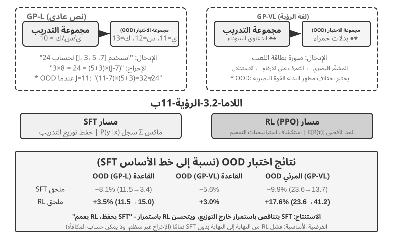
>
> GeneralPoints هي لعبة بطاقات تفكير حسابية اقترحها Chu وآخرون[^ch8-3]، مصمم خصيصًا لتقييم تعميم النموذج. الهدف يشبه "لعبة 24": استخدم كل رقم من الأرقام الأربعة الموضحة على البطاقات مرة واحدة بالضبط، وقم بدمجها مع الجمع والطرح والضرب والقسمة للوصول إلى الرقم المستهدف 24. تصمم التجربة متغيرين: GP-L للنص فقط وGP-VL القائم على الصور، مما يسمح لنا بفحص تعميم القواعد والتعميم البصري في نفس الإطار.
>
> **بديل القاعدة**: أثناء التدريب، يتم احتساب جميع J/Q/K كـ 10؛ أثناء الاختبار، يتم حسابها على أنها 11/12/13 على التوالي، مما يضمن أن مجموعة الاختبار تحتوي على مجموعات أرقام غير مرئية (العمليات التي تتضمن 11، 12، 13) لتقييم التعميم بدقة. **البديل البصري**: يستخدم التدريب بدلات سوداء (♠♣)، ويستخدم الاختبار بدلات حمراء (♥♦)، لتقييم مدى قوة التغييرات في المظهر البصري. باستخدام Llama-3.2-Vision-11B، تتبع التجربة المسار القياسي لما بعد التدريب: أولاً، تمنح تهيئة SFT قدرة النموذج الأساسية على متابعة التعليمات؛ وبعد ذلك، وبموجب نفس الميزانية الحسابية، يخضع النموذج لتدريب إضافي على SFT وRL في فروع منفصلة، مع استخدام PPO وشبكة القيمة لـ RL. يتم تدريب كلا الفرعين على البيانات باستخدام القاعدة الواحدة J/Q/K=10 ويتم تقييمهما على مجموعات اختبار داخل التوزيع (ID) وخارج التوزيع (OOD).
>
> النتائج تكشف بوضوح الفرق الأساسي. **قاعدة OOD**: تتحسن RL بنسبة +3.5 نقطة مئوية على GP-L (11.5%→15.0%)، بينما SFT **تتناقص** بمقدار 8.1 نقطة مئوية (11.5%→3.4%)؛ على GP-VL، تتحسن RL بمقدار +3.0 نقطة مئوية، بينما تنخفض SFT بمقدار 5.6 نقطة مئوية. **العرض البصري المرئي**: تتحسن RL بنسبة **+17.6 نقطة مئوية** على GP-VL (23.6%←41.2%)، بينما تنخفض SFT بمقدار 9.9 نقطة مئوية (23.6%←13.7%).
>
> يكشف تتبع دقة التعرف البصري أن RL يعمل على تحسين التشفير المرئي الأساسي من خلال التحسين الموجّه نحو النتائج، ويرتبط هذا التحسن بشكل كبير بمكاسب الأداء الإجمالية؛ في المقابل، SFT يبالغ في التناسب مع أنماط الرموز المميزة في عملية التفكير، مع إهمال تعلم الرموز المرئية، مما يؤدي إلى انخفاض دقة التعرف.
>
> تكشف التجربة أيضًا عن ضرورة SFT لـ RL: في ظل إعدادات هذه التجربة (نموذج أساسي لمقياس Llama-3.2-Vision-11B، بالإضافة إلى متطلبات الإخراج المنظمة الصارمة)، يفشل تنفيذ RL من طرف إلى طرف مباشرةً بدون SFT تمامًا - لا يمكن للنموذج الأساسي إنتاج مخرجات منظمة، ولا يمكن حساب المكافآت عند الكل. لاحظ أن هذا استنتاج بموجب إعدادات محددة، وليس قانونًا عالميًا: يمكن للنموذج الأساسي القوي بدرجة كافية تخطي SFT والنجاح باستخدام RL المباشر (راجع المناقشة السابقة حول DeepSeek-R1-Zero). هناك نتيجة أخرى جديرة بالملاحظة وهي أن المزيد من تكرارات التحقق تؤدي إلى تعميم أفضل: 10 تكرارات +5.99% مقابل تكرار واحد +0.48%، مما يشير إلى أن القياس الحسابي أثناء التفكير هو المفتاح لتعميم RL.
>
> لماذا ينهار أداء SFT في ظل تحول التوزيع، في حين أن أداء RL أفضل؟ يتعلم SFT تعيين "في ضوء هذا الإدخال، والإخراج الذي يجيب": أثناء التدريب، J/Q/K كلها 10، لذلك يحفظ النموذج النمط الثابت "عند مواجهة J/Q/K، تعامل معها على أنها 10"؛ أثناء الاختبار، J = 11، لكن النموذج لا يزال يحسبها على أنها 10، مما يؤدي إلى حدوث أخطاء بشكل طبيعي. يتعلم RL إستراتيجية أكثر عمومية حول "ما هي عملية الحساب التي تنتج الإجابة الصحيحة": عندما تصبح J 11، يقوم نموذج RL بإعادة الحساب باستخدام نفس الإستراتيجية، بدلاً من تطبيق إجابة محفوظة. هذا هو الفرق الأساسي بين "الحفظ" و"التعميم".
>
> تتمثل المساهمة الأساسية لهذه التجربة في القياس الكمي المنهجي لظاهرة "يحفظ SFT، ويعمم RL"، مما يوضح أن هذا النمط ينطبق على كل من طرائق النص فقط ولغة الرؤية. ويكشف أيضًا عن العلاقة التكاملية بين SFT وRL: يوفر SFT استقرار التنسيق، ويبني RL على هذا الأساس لتجاوز حدود الحفظ؛ وكلاهما لا غنى عنه. هذا النموذج التدريبي "الشكل أولاً، الروح ثانيًا" - الذي يستعير مصطلحًا من الرسم الصيني، يرسم أولاً الشكل الخارجي بدقة (الشكل والبنية)، ثم يتبع الروح الداخلية (التعميم والاستراتيجية) - يضع أساسًا منهجيًا للمهام اللاحقة متعددة المنعطفات والوسائط.

## خوارزميات RL: من 16 rollout إلى تحديث واحد للمعاملات

**GRPO (Group Relative Policy Optimization)** الذي اقترحته DeepSeek هو اليوم من أكثر خوارزميات تدريب RL استخداماً. ومثال واحد يجعله بديهياً. لنفترض أن في SWE-bench هذه المهمة: ملف `parser.py` في مشروع Python يطلق `IndexError` عندما يكون الإدخال فارغاً، وعلى الوكيل إصلاح الكود دون تعديل الاختبارات. يمر نظام التدريب بالخطوات الأربع التالية.

**الخطوة 1: دع نموذج السياسة يحاول مراراً.** نموذج السياسة هو نفسه نموذج اللغة الذي ندرّبه الآن. ينسخ النظام الكود الابتدائي نفسه ووصف المسألة نفسه إلى 16 صندوقاً معزولاً بعضها عن بعض، ويترك النموذج يحلّها 16 مرة على نحو مستقل. وتشمل كل محاولة كامل المسار "اقرأ الكود ← عدّل الملفات ← شغّل الاختبارات ← أرسل النتيجة"؛ وهذا المسار كله يسمّى **rollout** واحداً. المسألة والبيئة الابتدائية متطابقتان تماماً، لكن أخذ العينات عشوائي، فقد تسلك المحاولات الستَّ عشرة دروباً مختلفة: بعضها يضيف فحص الحدود بشكل صحيح، وبعضها يلتقط الاستثناء فقط ليغطّي المشكلة، وبعضها يعدّل الملف الخطأ، وبعضها يحاول تعديل الاختبارات.

**الخطوة 2: احسب المكافأة.** بعد انتهاء كل rollout يطبّق المدقّق الرقعة في بيئة نظيفة ويشغّل الاختبارات. لنفترض أن 4 من 16 محاولة اجتازت كل الاختبارات دون المساس بملفات الاختبار، وأن الـ 12 الباقية أخفقت؛ عندئذ تنال الأربع الأولى مكافأة 1، وتنال الاثنتا عشرة الأخرى 0. وفي مهمة برمجية كهذه لا غموض في "حساب المكافأة": إنه مجرد استخدام الاختبارات والقواعد للحكم على صحة الإصلاح فعلاً. أما المهام المفتوحة التي لا اختبار قاطعاً لها، فهي وحدها التي تحتاج إلى تفضيل بشري أو نموذج مكافأة.

**الخطوة 3: احسب الأفضلية النسبية.** المكافأة تقول فقط إن مساراً واحداً نجح أو أخفق، أما **الأفضلية النسبية** فتقول كم هو جيد قياساً ببقية محاولات المجموعة نفسها. متوسط نجاح هذه المجموعة 4/16: المسارات الأربعة التي اجتازت فوق متوسط المجموعة فتنال أفضلية موجبة، والاثنا عشر التي أخفقت دون المتوسط فتنال أفضلية سالبة. وهذه المقارنة داخل المجموعة هي جوهر GRPO. فإن أخفقت الستَّ عشرة كلها، أو نجحت كلها، تساوت المكافآت تماماً فلم يعد ثمة ما يقارَن، وتلاشت الأفضلية النسبية. وإشارات المسار في RLVP، ومكافآت العملية، ومكافآت التقدم الجزئي، إنما وُجدت تحديداً لاستعادة فروق ذات معنى داخل مثل هذه المجموعات.

**الخطوة 4: حدّث السياسة بالنزول الاشتقاقي.** يحوّل برنامج التدريب الأفضليات النسبية إلى دالة خسارة، ويحسب التدرجات، ثم ينفّذ محسِّن (مثل AdamW أو Muon) النزول الاشتقاقي: يرفع احتمال الخيارات التي اتخذها النموذج في المسارات ذات الأفضلية الموجبة، ويخفضه في ذات الأفضلية السالبة. وهذا ليس حفظاً حرفياً لرقعة ناجحة بعينها، بل ضبطٌ تدريجي عبر مهام وrollouts كثيرة؛ فحين يصادف النموذج لاحقاً خطأً مشابهاً يصير أكثر احتمالاً أن يظهر "أعد إنتاج المشكلة أولاً، وافحص شرط الحدّ، وعدّل التنفيذ، وشغّل الاختبارات"، وأقل احتمالاً أن يظهر "ابتلع الاستثناء، وعدّل الاختبارات، وأرسل دون تحقق".

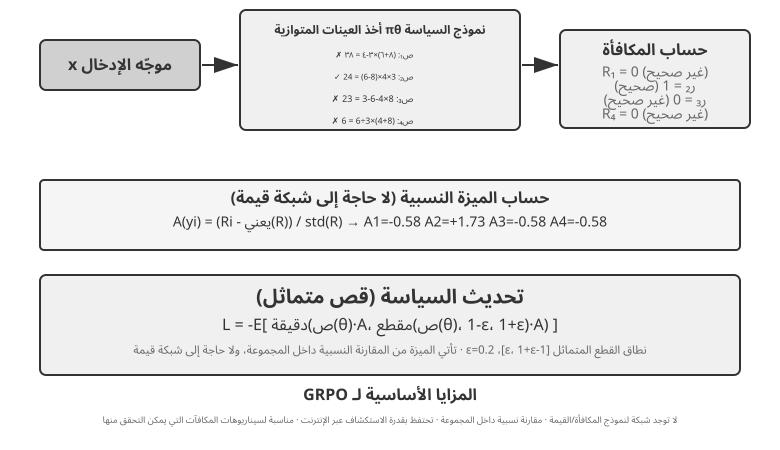

تشكّل هذه الخطوات الأربع معاً **دورة تدريب** واحدة، أي **step** واحدة: في الـ step رقم $k$ تولّد السياسة الحالية دفعة من الـ rollouts، وتُنجَز حسابات المكافأة والأفضلية والتدرج، ثم يحدّث المحسِّن المعاملات؛ وتعيد الـ step رقم $k+1$ الـ rollout مباشرةً بالسياسة المحدَّثة. والتدريب لمئة step يعني تكرار هذه الحلقة المغلقة نحو مئة مرة. وقد يعدّ إطار تدريب RL بعينه تحديثات الدُفعات الصغيرة الداخلية على حدة، لذا يظل من الضروري عند قراءة سجلات التدريب التأكد من تعريفه لـ `step`.

ولنقدّر الزمن تقديراً تقريبياً. يولّد rollout الوكيل المعقّد عشرات الجولات من استدعاءات الأدوات، وحتى مع تشغيل 16 منها بالتوازي فإن زمن مرحلة rollout بالساعة يحدّده الأبطأ. فإن افترضنا أن أبطأ rollout يستغرق نحو 2000 ثانية، ثم يستغرق النزول الاشتقاقي وتحديث المحسِّن نحو 600 ثانية، فإن الـ step الواحدة تكلّف قرابة $2{,}000+600=2{,}600$ ثانية، أي نحو 43 دقيقة؛ ومئة step متتالية تقترب من 72 ساعة.

يتبع كلٌّ من PPO وGRPO هذه الحلقة المغلقة، والفرق أساساً في **بماذا يقارِنان**. يقارن GRPO مباشرةً عدة rollouts للمسألة نفسها ولا يحتاج إلى نموذج قيمة منفصل. أما PPO فيدرّب نموذج قيمة يقدّر عند كل خطوة من المسار "ما مقدار ما يُنجَز عادةً"، ثم يحكم إن كان الفعل الحالي يتجاوز هذا التوقع؛ ولذلك يناسب أكثر المسارات الطويلة التي تحتاج إلى تخصيص ائتمان دقيق. وكلاهما يحدّ من مقدار التحديث الواحد حتى لا تغيّر دفعة صغيرة من العيّنات النموذج فجأةً أكثر من اللازم. أما DPO فمختلف: يتعلّم مباشرةً من أزواج تفضيل "إجابة أفضل — إجابة أسوأ" مجموعة سلفاً، ولا يجعل السياسة الحالية تولّد هذه المجموعة من الـ rollouts على الإنترنت.

وفي حالات هذا الفصل: يستخدم AdaptThink دالة هدف مقيَّدة خاصة به، ويستخدم GeneralPoints وV-IRL خوارزمية PPO مع نموذج قيمة، ويستخدم SimpleVLA-RL وRLVP خوارزمية GRPO، ويستخدم ReTool خوارزمية PPO. الخوارزمية تحدّد كيف تُقارن المسارات وكيف تُحدَّث المعاملات؛ والمكافأة تحدّد ما يُعدّ نجاحاً؛ والبيئة والبيانات تحدّدان أي المسائل يمكن للنموذج أن يمرّ بها أصلاً.

### لماذا يُفضَّل On-Policy عادةً في LLM RL

لنفرّق أولًا بين لفظين يكثر الخلطُ بينهما. فـ**Online (على الخط)** لا يعني إلا أن البيانات تتولّد باستمرار خلال التدريب من التفاعل مع البيئة؛ أما **On-policy (على المسار)** فيشترط أن تكون سياسةُ السلوك $\mu$ التي ولّدت الـ rollout مطابقةً للسياسة $\pi_\theta$ التي نحسّنها الآن أو قريبةً منها بما فيه الكفاية. وحتى لو ظلّت العنقودُ اللاتزامنية تولّد على الخط بلا انقطاع، فما إن يتأخّر عاملُ الـ rollout بضعَ نقاط تفتيش حتى تصير البياناتُ قديمة، ويصبح التدريبُ إحصائيًّا مشوبًا بمكوّنٍ off-policy (خارج المسار). أما إعادةُ تشغيل مساراتٍ قديمة، أو استعمالُ بيانات نموذجٍ قديم، أو بياناتٍ ولّدها المعلّمُ كاملةً، فهي off-policy على نحوٍ أظهر. ووصفةُ PPO/GRPO في هذا الفصل تعيد عادةً توليدَ الـ rollout بالسياسة الأحدث في كل خطوة، فتستهدف بذلك on-policy تقريبيًّا؛ وحين يجري PPO عدةَ جولاتٍ من تحديثات الدفعات الصغيرة على الدفعة نفسها، تكون الجولاتُ الأخيرة قد بدأت تنحرف عن `old_policy` التي ولّدت البيانات، وهذا بالضبط سببُ حاجته إلى نسبة الاحتمالات وإلى الـ clipping.

يقتضي تدرّجُ السياسة تقديرَ المكافأة المتوقَّعة في ظل السياسة الحالية $\pi_\theta$. فإذا كانت البياناتُ مأخوذةً بالعينة من سياسة أخرى $\mu$، وجب تصحيحُها بنسبة الأهمية:

$$
\rho_t=\frac{\pi_\theta(a_t\mid s_t)}{\mu(a_t\mid s_t)}
=\exp\!\left(\log\pi_\theta(a_t\mid s_t)-\log\mu(a_t\mid s_t)\right).
$$

إن الـ rollout الطازج الحقيقيَّ على المسار ينبغي أن يستوفي **قبل تحديث المعاملات** الشرطَ $\pi_\theta=\mu$، ومن ثَمّ يكون $\rho_t=1$. وهذا يُبقي التدريبَ مركَّزًا على «الحالات التي يدخلها النموذجُ الحالي فعلًا»، ويجنّبه أيضًا دفعَ ثمنِ تصحيحٍ عالي التباين بسبب اختلال التوزيع. أما ميزةُ off-policy فهي إمكانُ إعادة استعمال البيانات القديمة، وإمكانُ فصل أخذ العيّنات عن التدريب زمنيًّا، فيرتفع الإنتاجُ؛ وثمنُها أنه كلما ازدادت السياسةُ قِدمًا ثقُل ذيلُ توزيع $\rho_t$. وفي التسلسلات الانحدارية الذاتية الطويلة، يضرب التصحيحُ الصارم للبادئة أو المسار عشراتِ نسبِ الرموز بعضَها في بعض: فقد تتراكم انحرافاتٌ قليلة إلى أوزانٍ بالغة الكبر أو بالغة الصغر. وقصُّ PPO (clipping) يحدّ من التحديثات الشاذّة، لكنه لا يستعيد التغطيةَ التوزيعية المفقودة استعادةً كاملة؛ فالإفراطُ في القصّ يُضيّع التدرّج، وتركُ القصّ قد يجعل عيّناتٍ قليلة تهيمن على التحديث. ولذلك فإن «on-policy أفضل» ليست نظريةً عامة، وإنما تعني عادةً في تدرّج السياسة الحالي للنماذج اللغوية الكبيرة **انحيازًا توزيعيًّا أقلَّ وتحسينًا أكثرَ استقرارًا**؛ كما وجدت الدراساتُ التجريبية في تثبيت RL للنماذج الكبيرة أن تقليلَ قِدَم السياسة والفارقِ بين التدريب والاستدلال شرطٌ مهمّ لفاعلية الهدف البديل[^ch8-32].

#### كيف يفسد عدم التطابق العددي On-Policy الاسمي

كثيرًا ما يولّد RL لنماذج اللغة الكبيرة مسارات rollout بمحرك استدلال من طراز vLLM/SGLang، ثم يعيد حساب log probability والتدرجات بمحرك تدريب من طراز FSDP/Megatron. وحتى لو حمّل الطرفان الأوزان نفسها، فإن اختلاف دقة الفاصلة العائمة وترتيب الاختزال وأسلوب التوازي التنسوري وحجم الدفعة وذاكرة KV والأنوية المدمجة قد يجعل log probability للرمز نفسه مختلفًا اختلافًا طفيفًا. وهكذا ينحرف $\rho_t$، الذي ينبغي أن يساوي 1 قبل التحديث، عن الواحد: فالنظام قد زامن الأوزان اسميًا، لكنه حوّل عدديًا التدريب on-policy إلى off-policy. وقد أظهرت تجارب مضبوطة أن فارقًا ضئيلًا على مستوى الرمز بين التدريب والاستدلال، بمفرده، كفيل بإحداث انهيار في التدريب[^ch8-33].

وتنبع هذه الحساسية من سلسلة تضخيم: **خطأ صغير في log probability ← انحراف نسبة الاحتمال بعد الأُسّية ← تراكم على بادئة طويلة ← تغيّر في clipping وترجيح الأفضلية ← تغيّر في اتجاه التدرج وفي عدد العينات الفعّال**. فإذا انحرف log ratio لأربعة آلاف رمز بمقدار $10^{-3}$ في الاتجاه نفسه، تراكمت النسبة على مستوى المسار حتى $e^4\approx54.6$؛ والأخطاء الحقيقية ليست بالضرورة متفقة الإشارة، لكن المثال يوضح لماذا تضخّم المتتاليات الطويلة خطأً «يبدو صغيرًا جدًا عند كل رمز». بل إن فارق احتمال ضئيلًا في الرموز المبكرة قد يغيّر الرمز المُعايَن فعليًا، فيتشعب مسار الحالات كله بعد ذلك. ولا يقتصر الأثر النهائي على «توليد إجابات مختلفة أحيانًا للمطالبة نفسها»، بل قد يظهر في قفزات نسبة الأهمية، وقص أعداد كبيرة من الرموز، وتغيّر مفاجئ في التدرج أو في طول الاستجابة، ثم انهيار المكافأة والإنتروبيا معًا. كما لوحظ مباشرةً أن تغيير حجم الدفعة يغيّر طريقة الاختزال ويكسر ثبات batch invariance العددي، فيحوّل تدريبًا يفترض أنه on-policy إلى off-policy ضمني؛ ويحسّن الاستقرارَ توحيدُ العدديات بين المعاينة والتدريب أو اعتمادُ تصحيح off-policy صريح[^ch8-34].

وينبغي هندسيًا التعامل مع هذا بوصفه مشكلة جوهرية لا مجرد ضجيج فاصلة عائمة:

- **قبل أي تحديث للمعاملات**، قارن على الدفعة نفسها من المسارات بين log probability للرموز لدى sampler وtrainer، وراقب متوسط $\rho_t$ وكمّياته ونهايته العظمى وقيمة KL التقريبية ونسبة الرموز المقصوصة؛ فهذا أبسط اختبار وحدة مباشر لـ on-policy.
- لا تقتصر المزامنة على الأوزان، بل تشمل محوّلات LoRA والمُرمِّز وقالب المحادثة ونسخة النموذج وإعدادات الترميز الموضعي؛ وينبغي أن يحفظ rollout قيمة behavior log probability لحظة التوليد، لا أن يُستبدل بها النموذج الحالي لاحقًا.
- وحّد قدر الإمكان دقةَ المعاينة والتدريب وتخطيطَ التوازي والأنوية الحسابية الأساسية؛ فإن تعذر ذلك فاعتبر الفارق off-policy صراحةً، واعتمد تصحيح الأهمية وراقب عدد العينات الفعّال، بدل افتراض أن clipping في PPO سيعالج الأمر تلقائيًا.
- أبقِ مسارات rollout حديثة، وحُدَّ من عدد جولات التحديث على كل دفعة بيانات ومن مقدار التقادم غير المتزامن. فإعادة استعمال البيانات القديمة تشتري إنتاجية، لكن ينبغي عدّها مقايضةً مقيسة بين التحيز والكفاءة، لا تسريعًا مجانيًا.

## بيئات RL: من التقييم إلى المحاكاة

غالباً ما لا يكون عنق الزجاجة في تدريب RL هو الخوارزمية، بل **ما إذا كانت البيئة واقعية بما يكفي، وقابلة لإعادة التهيئة، وقابلة للتوازي**. فمكالمة الوكيل الحقيقي أو دفعته أو تعديله لملف قد تكون باهظة ولا رجعة فيها، ولا يمكن تعويض خطأ واحد بمحاولات لا نهائية؛ وبيئة التقييم في الفصل السابع قد توفّر المدقّق، لكن التدريب يحتاج فوق ذلك إلى أن يجرّب الوكيل ويخطئ مراراً، وأن يتحمّل الآثار الجانبية لأفعاله، وأن يظل مستقراً عبر ملايين التفاعلات. ولذلك فهندسة البيئة شرط مسبق لـ RL، لا ملحق يأتي بعد انتهاء التدريب.

### البيئة: ساحة تدريب النموذج

جوهر RL هو "التعلّم بالمحاولة والخطأ"، والمحاولة والخطأ تحتاج إلى **ساحة** — وهي بيئة المحاكاة. يشغّل النموذج المهام فيها مرةً بعد مرة، ويتلقّى تغذية راجعة، ويعدّل سياسته. و**أمانة** البيئة — أي مدى شبهها بسيناريو النشر الحقيقي — تحدّد مباشرةً ما إذا كانت السياسة الناتجة صالحة أصلاً:

- **إن كانت البيئة مشوَّهة فالسياسة فاشلة حتماً.** إن كان موظف الدعم في المحاكاة يجيب دوماً وفق نص ثابت، ولم تطابق رسائل الخطأ بيئة الإنتاج، فسيتعلّم النموذج "حيلة امتحان" لا تصلح إلا داخل المحاكاة، وينكشف أمره فور النشر. وهذه أشيع طرق فشل مشاريع RL — ليس لأن الخوارزمية سيئة، بل لأن ساحة التدريب ليست هي قاعة الامتحان.
- **بناء بيئة عالية الأمانة أغلى وأصعب في الغالب من التدريب نفسه.** فالبيئة القابلة للتوازي على نطاق واسع، والقابلة لإعادة الإنتاج، وذات التغذية الراجعة الواقعية، تتطلب عادةً هندسةً أكثر بكثير من ضبط النموذج. وما تجارب استدعاء الأدوات لاحقاً في هذا الفصل (صندوق MCP في AWorld، وصندوق مفسّر الكود في ReTool) تبذل هذا الجهد في بناء البيئة إلا لأن **واجهات API الحقيقية لها حدود معدّل، وقد تحظر الحسابات، ولها آثار جانبية، فلا يمكن استخدامها للتدريب مباشرةً** — عليك أولاً أن تبني "عالماً ظلياً" مستقراً وقابلاً للتحكّم وقابلاً لإعادة التشغيل.
- **النصف الآخر من البيئة هو دالة المكافأة.** فالبيئة لا يكفي أن تحاكي "كيف يتغيّر العالم"، بل عليها أيضاً أن تحكم "ما مدى جودة ما أُنجز"، وهذا هو مدخل تصميم المكافأة اللاحق.

بجملة واحدة: **قبل أن تشرع في ضبط الخوارزميات، اسأل نفسك — هل تشبه بيئة المحاكاة عندي العالم الحقيقي فعلاً؟** جواب هذا السؤال أهم بكثير من الاختيار بين PPO وGRPO.

### ماذا لو تعذّر بناء بيئة: دع النموذج يؤدي دور البيئة

لكن ثمة مشكلة أعمق: في كثير من السيناريوهات لا تكون البيئة عالية الأمانة "باهظة" فحسب، بل **يتعذّر بناؤها أصلاً** — فواجهات API الحقيقية لها آثار جانبية فلا تُستدعى اعتباطاً، والمستخدمون الحقيقيون لا يصلحون مادةً للمحاولة والخطأ، والعالم المادي لا يمكن تسريعه. فإن تعذّر حتى إقامة "عالم ظلي" صالح، فهل يسقط RL؟ ثمة فكرة تزداد رواجاً: **محاكاة البيئة بنموذج** — أي أن يؤدي نموذج لغوي دور البيئة ويولّد التغذية الراجعة التي يحتاجها تفاعل الوكيل. ولهذا المسار مستويان.

**المستوى الأول: النموذج يركّب القيم المرتجعة من استدعاءات الأدوات.** خذ ZeroSearch[^ch8-13]: تدريب "نموذج يعرف كيف يبحث" لا يستغني عادةً عن محرك بحث حقيقي، لكن واجهات البحث لها كلفة وحدود معدّل، ونتائجها غير قابلة للتحكّم. فجعلت ZeroSearch ببساطة نموذجاً لغوياً يؤدي دور محرك البحث: يرسل النموذج الطالب استعلام بحث، فيولّد هذا "المحرك المحاكى" نتائج البحث المرتجعة. والأبرع من ذلك أنها استخدمت تصميماً **تدرّجياً على هيئة منهج**: في بداية التدريب يعيد المحرك المحاكى وثائق عالية الجودة وشديدة الصلة، ومع تقدّم التدريب يخلط الضجيج تدريجياً ويخفض جودة ما يعيده، مجبراً الطالب على تعلّم استخراج المعلومات المفيدة من نتائج ناقصة كتلك التي يعطيها محرك بحث حقيقي. وفي النهاية يظل النموذج الذي لم يرَ محرك بحث حقيقياً طوال التدريب يعمل جيداً حين يُوصَل ببحث حقيقي.

**المستوى الثاني: النموذج يحاكي ديناميكيات البيئة كلها.** لا القيمة المرتجعة من أداة واحدة فحسب، بل حتى "كيف يصير العالم بعد تنفيذ فعل" يمكن أن يُوكل إلى نموذج. فـ DreamGym[^ch8-14] تقطّر ديناميكيات البيئة في "نموذج خبرة" ذي طابع استدلالي: بمعطى الحالة الراهنة وفعل الوكيل، يستنتج خطوةً خطوة انتقال الحالة وإشارة التغذية الراجعة، فيتمكّن من تركيب rollouts بالجملة لـ RL على الإنترنت دون الوصول إلى البيئة الحقيقية. وشائع في تدريب وكلاء خدمة العملاء والمبيعات أن يؤدي نموذج لغوي دور المستخدم (محاكي مستخدم)، وسلسلة تقييمات τ-bench مبنية على هذه الفكرة تحديداً — فالمحاكي النموذجي نفسه يصلح قاعة امتحان وساحة تدريب معاً.

لكن يجب قول خطر هذا المسار صراحةً: **معرفة المحاكي بالعالم هي سقف التدريب، وانحيازات المحاكي المنهجية تتلقّفها السياسة كما هي.** فإن كان العميل المحاكى أصبر من المستخدمين الحقيقيين، أو كان محرك البحث المحاكى لا يعيد قمامةً أبداً، فما يتعلّمه الطالب سياسةٌ لا تصحّ إلا في "العالم الذي يؤدّيه النموذج"؛ والأسوأ أن RL سيبحث فعلياً عن ثغرات المحاكي ويستغلها، أي reward hacking. ولذلك فالنهج الهندسي الرصين **هجين**: تتحمّل المحاكاة بالنموذج معظم حجم التفاعل، وتُستكمل بتفاعلات مع البيئة الحقيقية، وتُستخدم تلك التفاعلات الحقيقية نفسها لمعايرة انحياز المحاكي دورياً.

### البيئة وتوزيع المهام وعزل التقييم

البيئة نفسها تحدّد ما يمكن لـ RL تعلّمه: يجب أن تكون قابلة لإعادة التهيئة والتوازي وإعادة الإنتاج، وأن تعطي بعد انتقال الحالة نتيجة تحقّق جديرة بالثقة. ومصدر مهام التدريب هو نفسه مصدر تركيب بيانات SFT المذكور آنفاً — استخلاص مخططات المهام من سجلات العمل الحقيقية، ثم إعادة توليد أشخاص وطلبات وملفات وحالات خيالية بعد إزالة المعلومات المعرِّفة.

ومتطلبات العزل هي نفسها، مع إضافة واحدة خاصة بـ RL: يجوز لبيئتَي التدريب والتقييم أن تتشاركا مولّد المهام وكود التحقق، لكن لا يجوز أن تتشاركا مجموعة المهام نفسها. وتبيّن SWE-Gym وτ²-bench وAndroidWorld هذا كله[^ch8-28]: فحالات الاختبار والحالة المخفية والحلول المرجعية ينبغي أن تبقى في جانب المدقّق. كما ينبغي أولاً استخدام عدد قليل من الـ rollouts للتحقق من "هل المهمة قابلة للإنجاز، وهل يميّز المدقّق الصواب من الخطأ"، ثم توسيع حجم أخذ العينات؛ فإن كان في المدقّق نفسه انحياز منهجي، فلن يزيد RL إلا سرعة استغلاله.

ولذلك ينبغي أن يكون ترتيب هندسة البيئة: **مخطط المهمة ← محاكٍ قابل لإعادة التهيئة ← مدقّق حتمي ← عزل التدريب عن التقييم ← معايرة بقدر قليل من التفاعل الحقيقي**. ووُضع تركيب بيانات SFT أولاً لأنه يبني عروضاً مستقرة؛ أما البيئة هنا فتخدم RL، وتتيح للسياسة الحالية أن تجرّب وتخطئ مراراً وتستكشف مساراتٍ خارج نطاق العروض.

وكون المدقّق الحتمي "رخيصاً" لا يعني أنه بلا كلفة. فنواة Lean أو مشغّل الاختبارات أو التنفيذ في حاوية قد تجعل سرعة التحقق على المعالج أبطأ بكثير من سرعة التوليد على وحدة معالجة الرسوميات؛ وعندئذٍ يحدّد الإنتاجيةَ عددُ عمّال التحقق المتوازين، لا إضافة مزيد من وحدات المعالجة الرسومية[^ch8-9].

## من جولة واحدة إلى جولات متعددة: سياقات المهام وتخصيص الائتمان

### التحدي الجوهري في المهام متعددة الجولات


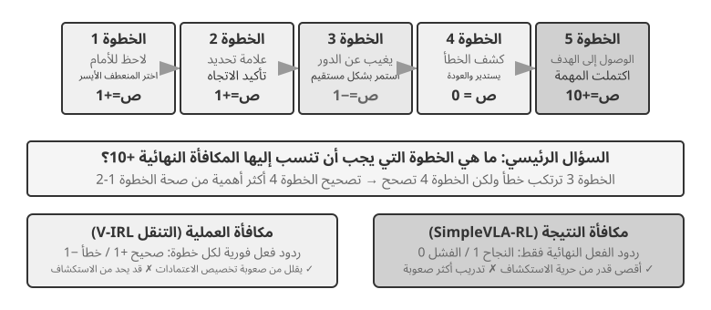

بالانتقال من جولة واحدة إلى جولات متعددة تقفز التعقيدات قفزةً نوعية. فعلى السياسة ألا تكتفي باختيار الفعل الأفضل الآن، بل أن تراعي أيضاً قيمة الحالات المستقبلية؛ وألا تكتفي بمعالجة التغذية الراجعة الفورية، بل أن تقوم أيضاً بـ**تخصيص الائتمان (credit assignment)** تحت مكافأة مؤجَّلة — أي أن تحدّد أي خطوة في متتالية متعددة الخطوات أسهمت أكثر في النتيجة النهائية. فلنفترض أن وكيل خدمة عملاء حلّ مشكلة المستخدم في عشر جولات حوار ونال في النهاية تقييماً جيداً — فهل يعود الفضل إلى السؤال الدقيق في الجولة الثانية أم إلى الشرح الصبور في الجولة السابعة؟

والتفاعل متعدد الجولات المقصود هنا هو بعينه حلقة ReAct الموصوفة في الفصلين الأول والرابع — فكل جولة تكرارٌ لـ**فكّر ← افعل ← لاحظ**، وتأخّر المكافأة نابع من القيد البنيوي القائل إن "جودة النتيجة النهائية لا يمكن الحكم عليها إلا بعد عدة جولات".

> **التجربة 8-12 ★★★: V-IRL-VL — ملاحة بصرية متعددة الجولات**
>
> يجعل V-IRL[^ch8-24] الوكيل يتنقّل باستمرار في مشاهد شوارع مدنية حقيقية: التدريب يستخدم مسارات نيويورك، أما الاختبار فينتقل إلى مدن أخرى ويغيّر في الوقت نفسه صياغة الاتجاهات والمظهر البصري. ويتفوّق RL بوضوح على SFT في OOD القواعد وOOD البصري معاً، ما يبيّن أن على السياسة في المهام متعددة الجولات أن تتعلّم إعادة التخطيط انطلاقاً من الملاحظة الحالية بدل إعادة إنتاج مسارات التدريب. وتستخدم التجربة PPO مع شبكة قيمة، ولوحظ أن التغذية الراجعة خطوةً خطوة تخفّف من تخصيص الائتمان على المدى الطويل.

> **التجربة 8-13 ★★★: SimpleVLA-RL — استكشاف مفتوح تحت مكافأة النتيجة `[تجربة موسّعة]`**
>
> يستخدم SimpleVLA-RL في مهام الروبوتات LIBERO مكافأة نتيجة نجاح/إخفاق فقط. ولكل مهمة مسار عرض واحد فقط للبدء البارد بـ SFT، ثم يرفع RL معدّل النجاح من 17.3% إلى 91.7%، ويكتشف حركة "الدفع والقطع" التي لم تظهر قط في العروض. وهو يقابل V-IRL: فحين يسهل تعريف إشارات العملية تسرّع التعلّم، أما حين يكون المسار الأمثل مجهولاً فإن مكافأة النتيجة المتفرّقة تترك على العكس مجالاً أوسع بكثير للاستكشاف.

### استدعاء الأدوات: إدخال البيئة داخل الوكيل

ما إن ترتبط المهمة متعددة الجولات بأدوات خارجية حتى تكفّ الأفعال عن أن تكون مجرد "تحرّك أو أجب"، وتصير بحثاً وتنفيذاً للكود وتعديلاً للملفات واستعلاماً لقواعد البيانات وتركيباً لعدة واجهات API. ولذلك يدفع استدعاء الأدوات إلى الواجهة في آنٍ واحد: تخصيص الائتمان، وهندسة البيئة، والقيود الأمنية.

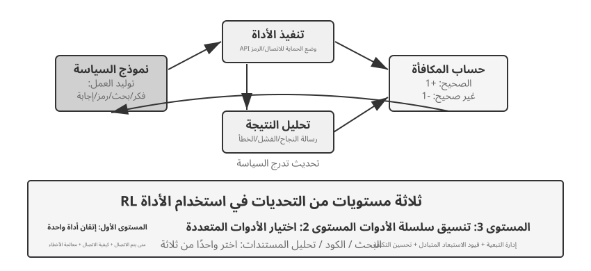

يمثّل Search-R1[^ch8-25] مسار التعزيز بالاسترجاع: يقرّر النموذج بنفسه متى يبحث وعمّاذا يبحث، ويستخدم النتائج المرتجعة لمواصلة الاستدلال. أما ReTool فيغرس مفسّر الكود داخل حلقة التفكير، فيتعيّن على النموذج أن يتعلّم متى ينفّذ الكود، وكيف يقرأ التغذية الراجعة، وكيف يصحّح نفسه بحسب رسائل الخطأ. ويوفّر AWorld-train صندوق MCP متعدد الأدوات، فيضيف مسائل اختيار الأداة وإدارة التبعيات وإعادة تهيئة الحالة وقابلية إعادة التشغيل.

ولمسارات الأدوات تفصيل تنفيذي حاسم: الرموز التي تعيدها البيئة لم تولّدها السياسة، ولذلك ينبغي عند حساب تدرّج السياسة إخفاء رموز التغذية الراجعة هذه، وتمرير التدرجات فقط عبر تفكير النموذج نفسه ووسائط استدعاءات أدواته. وإلا دُرّب النموذج على التنبؤ بمخرجات الصندوق بدل أن يتعلّم استخدام الأدوات.

> **التجربة 8-14 ★★★: ReTool — حلّ المسائل الرياضية معزَّزاً بمفسّر الكود**
>
> 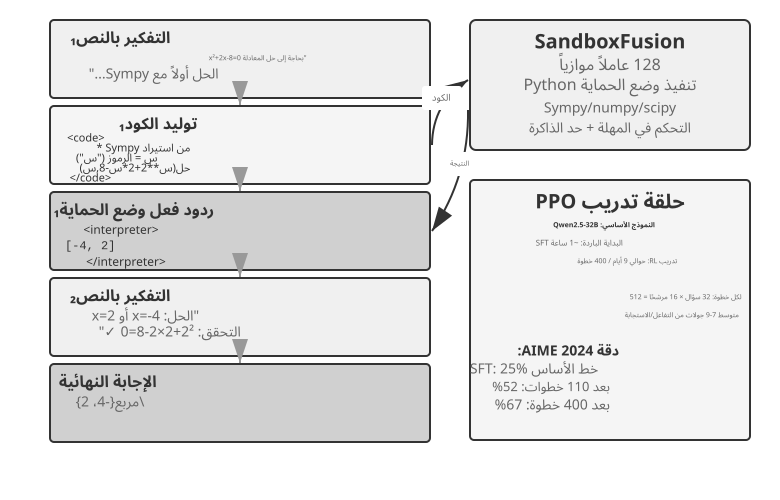
>
> بعد إحماء بـ SFT، يتدرّب ReTool بـ PPO على تفكير نصّي وتنفيذ كود وتغذية راجعة من المفسّر متشابكة. وهو يبيّن كيف تغيّر تغذية الأداة الراجعة استراتيجية التفكير: يتعلّم النموذج تدريجياً أن ينفّذ من تلقاء نفسه، وأن يقرأ الأخطاء، وأن يصحّح ذاته. وبيانات التدريب من DAPO-Math-17k، لكن خوارزمية التحسين تظل PPO القياسية[^ch8-26][^ch8-27].
>
> وعلى AIME 2024 رفع التدريب النتيجة من نحو 25% إلى 67.0%؛ ومقارنةً بـ RL النصّي الخالص، جعلت التغذية الراجعة من الكود النموذج يتعلّم الحساب الدقيق وتصحيح الأخطاء أسرع. وتفاصيل ديناميكيات التدريب وإعداد الصندوق في الشرح المرافق للتجربة.

> **التجربة 8-15 ★★★: AWorld-train — تعلّم استخدام الأدوات داخل صندوق**
>
> 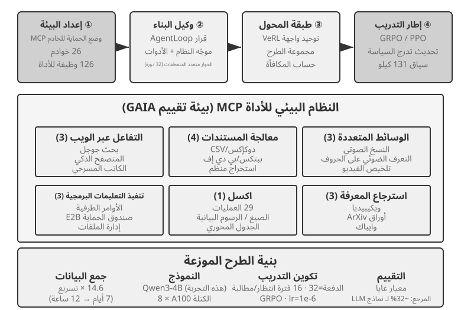
>
> يستخدم AWorld-train صندوق خوادم MCP الذي يوفّر أدوات للويب والمستندات والوسائط المتعددة والكود واسترجاع المعرفة. وليس محور هذه التجربة المفتوحة تحسين أرقام GAIA، بل تشغيل مسار تدريب متعدد الأدوات قابل لإعادة التهيئة وإعادة التشغيل من أوله إلى آخره، وملاحظة ما إذا كان معدّل نجاح استدعاء الأدوات واستراتيجيات التركيب يتحسّنان مع التدريب.

وتقول هذه السياقات مجتمعةً الشيء نفسه: صعوبة تدريب الوكلاء متعددي الجولات ليست في "هل يوجد محسِّن أعقد"، بل في مدى موثوقية تغذية البيئة الراجعة، وقابلية سلسلة الأفعال للتحقق، وكيفية عزو المكافأة النهائية إلى القرارات الوسيطة.

## تصميم المكافأة: كيف نحوّل هدف المهمة إلى إشارة تعلّم

بيّنت سيناريوهات الجولة الواحدة والجولات المتعددة واستدعاء الأدوات أعلاه *ماذا* ندرّب؛ ويجيب هذا القسم عن *كيف ينبغي للبيئة أن تخبر النموذج بجودة أدائه*. يتفرّع تصميم المكافأة على ثلاثة أبعاد متكاملة: **من أين تأتي المكافأة**، و**متى تُمنح**، و**كم من المعلومات ينبغي أن تعبّر عنه**. ثم يأتي سؤال رابع: حين تكون النتيجة صحيحة، هل كان المسار مطابقًا للقواعد أيضًا؟

### من أين تأتي المكافأة: القواعد وتفضيلات البشر وحكم النموذج

أوثق المصادر هي **المكافأة القابلة للتحقق (RLVR)**: الحكم على النتيجة مباشرةً عبر حالات اختبار أو تأكيدات على قاعدة البيانات أو فروق الحالة أو فحوص التنسيق. الإجابات الرياضية واختبارات الشيفرة واستدعاءات الأدوات المهيكلة كلها مناسبة للبدء بمكافأة نتيجة ثنائية. وكلما كانت القاعدة أكثر حتمية كانت المكافأة أرخص وأقبل للتكرار وأصعب على النموذج أن يلتف عليها.

أما **RLHF** فهو هنا خلفية فحسب. المسار الأساسي في InstructGPT[^ch8-4] هو: يقارن البشر الإجابات، ويُدرَّب نموذج مكافأة، ثم تحسّن PPO السياسة. نموذج المكافأة ليس إلا وكيلًا عن التفضيل، والإفراط في تحسينه يؤدي إلى reward hacking[^ch8-5]، ولذلك يُستخدم عادةً تنظيم KL لتثبيت السياسة قرب نموذج SFT المرجعي. ويتخطى DPO[^ch8-6] نموذج المكافأة الصريح ويحسّن دون اتصال مباشرةً من أزواج التفضيل. وهذه الطرق ليست الخط الرئيس لتعلّم الوكلاء المعزَّز في هذا الفصل.

وحين يصعب رد الهدف إلى قواعد بالكامل، يمكن اللجوء إلى حكم النموذج. **نموذج المكافأة التوليدي (GRM)** لا يُخرِج درجةً فحسب، بل يولّد تشخيصًا لما أُحسِن وما يحتاج إلى تعديل؛ ويصلح مصدرًا للمكافأة، كما يمكن تحويل تشخيصاته إلى بيانات تقطير أو تفضيل لاحقة. وجوهر فكرة DeepSeek-GRM[^ch8-23] أن يستنبط النموذج أولًا مبادئ تقييم المهمة، ثم يقيّم المسار وفق تلك المبادئ، وأخيرًا يتحقق من صحة التقييم نفسه بحقائق قابلة للتحقق. والتغذية الراجعة الناتجة أكثر شفافية، لكنها تظل بحاجة إلى معايرة بشرية بالعيّنة كي لا يطوّر المُقيِّم انحيازات خاصة به.

ويجدر هنا الفصل بين مفهومين يختلطان بسهولة. **reward hacking** هو نيل درجة عالية باستغلال قاعدة أو ثغرة في التنفيذ. أما **reward seeking** فهو أن يبني النموذج أولًا تصورًا داخليًا عن *ما الذي سينظر إليه المُقيِّم*، ثم يعدّل سلوكه وفق هذا التخمين. والثاني لا يستلزم بالضرورة العبث بالاختبارات أو تلفيق النتائج، لكنه قد يدفع النموذج في المهام طويلة المدى إلى أن يضع لنفسه فحصًا سطحيًا جدًا، فيتوقف مبكرًا بمجرد اجتيازه، فيأتي المُسلَّم مستوفيًا للمؤشر الوكيل دون النية الحقيقية[^ch8-29]. لذلك لا يعني «اجتياز الـ grader» تلقائيًا «إنجاز المهمة»: فالمُقيِّم وكيل عن النية، وكلما اشتد التدريب زاد احتمال أن يعتبر النموذج الوكيل هدفًا في ذاته.

### متى تُمنح المكافأة: على النتيجة أم على العملية

**مكافأة النتيجة (ORM)** لا تحكم إلا في نهاية الحلقة على ما إذا أُنجزت المهمة. وهي الأبسط وتمنح السياسة أوسع حرية للاستكشاف؛ وحين لا يوجد معيار متفق عليه للمسار الوسيط ولم يهتد البشر بعد إلى الحل الأمثل، تكون مكافأة النجاح/الفشل المتفرقة في SimpleVLA-RL نقطة انطلاق مناسبة. والتغذية الراجعة المتفرقة تصعّب على النموذج تحديد الخطأ بعينه داخل مسار متعدد الخطوات، وهذا أحد الأسباب التي حدّت طويلًا من كفاءة العيّنة في التعلّم المعزَّز[^ch8-8]. وفي مهام coding أو cowork طويلة المدى ينبغي كذلك إسناد الحكم بـ«هل اكتمل» إلى اختبارات خفية أو تأكيدات حالة أو خطاف إنهاء خارجي لا يستطيع النموذج كتابته، لا الاعتماد على إعلانه هو بالاكتمال.

و«الإنهاء المبكر» مثال ملموس: حين يعلن النموذج اكتمال المهمة، يشغّل الـ harness في مساحة عمل معزولة اختبارات قبول لا يراها النموذج؛ فإن نجحت مُنح مكافأة موجبة، وإلا فسالبة. ويجب أن تقرأ هذه الاختبارات ملفات حقيقية أو حالة البيئة، لا أن تكتفي بفحص ما إذا قال النموذج «تم»، وإلا تعلّم النموذج أن يَعِد بالتحقق دون أن يجريه. وعند التقييم ينبغي أيضًا الفصل بين مجموعة حدّية من المهام غير المكتملة ومجموعة محجوزة من المهام المكتملة فعلًا: الأولى تُظهر معدل التوقف المبكر، والثانية تُظهر ما إذا كان النموذج لا يزال قادرًا على الإغلاق بشكل طبيعي، تفاديًا لتدريب نموذج لا يجرؤ على الإنهاء أبدًا.

**مكافأة العملية (PRM)** تقدّم تغذية راجعة عند الخطوات الوسيطة، كفحص المصادقة أو معاملات الأدوات أو عدد الاختبارات الناجحة أو إجراءات التنقل. وقد أظهرت ورقة OpenAI *Let's Verify Step by Step*[^ch8-7] قيمة التحقق خطوةً بخطوة في الاستدلال الرياضي. وتخفّف مكافأة العملية من مشكلة إسناد الفضل على المدى الطويل، لكنها قد تحصر النموذج في المسار الذي تخيّله المصمم، وتكلفة وسمها والتحقق منها أعلى. ويستخدم V-IRL-VL (التجربة 8-12) تغذية راجعة تنقّلية خطوة بخطوة، بينما يبقي SimpleVLA-RL (التجربة 8-13) على مكافأة نقطة النهاية فقط؛ ويشكّل الاثنان تقابلًا بين «تغذية كثيفة مقابل سرعة تقارب» و«تغذية متفرقة مقابل فضاء استكشاف».

وهندسيًا يُستحسن إرساء خط أساس موثوق بمكافأة النتيجة أولًا، ثم إضافة إشارات العملية فقط للأحداث الوسيطة القابلة للتحقق فعلًا. وعادةً ما يُضبط معامل الخصم في التعلّم المعزَّز متعدد الجولات على $\gamma=1$؛ وتتكفّل شبكة القيمة في PPO أو الأفضلية على مستوى الجولة بإسناد تغذية النهاية إلى إجراءات أسبق، بينما يوزّع GRPO الأفضلية على مستوى المسار على الرموز المولَّدة، ولذا يجب الانتباه بشدة إلى تخفيف الإشارة في المسارات الطويلة.

### كم من المعلومات ينبغي أن تعبّر عنه المكافأة: قياسية، متجهة، تشخيص توليدي

**كثافة** المكافأة و**شكل تمثيلها** أمران مختلفان. القياسية لا تجيب إلا عن «ما مدى الجودة إجمالًا»؛ وشبه القياسية تعطي سببًا موجزًا ثم درجة؛ والمتجهة تمنح درجات منفصلة على أبعاد كالدقة والاكتمال والتكلفة والأمان؛ أما المكافأة التوليدية فتعطي تشخيصًا بلغة طبيعية يمكن أخذ عيّنات منه مرارًا ثم تجميعها. ومبدأ الاختيار مباشر:

- وجود إجابة محددة أو اختبار: تُفضَّل القياسية الثنائية؛
- وجود عدة أهداف جودة مستقلة عن بعضها: استخدم متجهًا، أو رجّح الأبعاد لتصير قياسية؛
- كون المهمة مفتوحة يصعب حصر قواعدها: استخدم التشخيص التوليدي، مع التدقيق في الوقائع والمراجعة البشرية بالعيّنة.

لا تكدّس أبعادًا غير قابلة للتحقق باسم «مكافأة أغنى». فكل بُعد تقييم إضافي يضيف طريقة أخرى لالتفاف السياسة عليه؛ تأكّد أولًا أن الإشارة تُنتج فرقًا داخل المجموعة ذا معنى عبر عدد قليل من عمليات rollout، ثم قرّر إن كانت تستحق الدخول في التدريب.

### صحة النتيجة لا تكفي: قيود المسار وRLVP

تحسم مكافأة النتيجة «هل أُنجز الأمر»، لكنها لا تعبّر عن «هل أُنجز وفق ما هو مقرَّر». فقد يحقق وكيل حقيقي نجاحًا ظاهريًا بتعديل ملف الاختبار أو تخطّي المصادقة أو تنفيذ أمر مدمّر. ومبدأ RLVP (Reinforcement Learning with Verified Penalty)[^ch8-9] هو: **كافئ النتيجة وعاقب المسار**. وهو يستهدف **قيودًا محايدة تجاه النتيجة**، قابلة للحسم آليًا ولا صلة لها بالنجاح أو الفشل النهائي؛ وهو لا يغني عن فحوص مستقلة للنية الدلالية واكتمال المُسلَّم وسلوك التوقف المبكر.

والبيئات الحقيقية عادةً **مدقِّقات غير متماثلة**: فاكتشاف أن «إجراءً سيئًا وقع» رخيص وموثوق، بينما إثبات أن «هذه الخطوة أحرزت تقدمًا ذا معنى نحو الهدف» صعب. اكتب المكافأة الكلية بالصورة $R=O+\beta\Phi$: حيث $O$ نتيجة المهمة، و$\Phi$ إشارة مسار تُحسب لكل إجراء بقواعد حتمية. اخصم على المخالفات القابلة للتحقق، وامنح مكافأة جزئية صغيرة على الإجراءات الممتثلة القابلة للتحقق أو الأهداف الفرعية القابلة للبلوغ؛ ووحّد القناتين معياريًا قبل الدمج كي لا تطغى إشارة المسار على الهدف الرئيس. وهذا لا يغيّر PPO أو GRPO، بل يغيّر فقط المكافأة المرئية عند كل خطوة.

وعلى مستوى التنفيذ يكفي تقسيم خرج المدقّق إلى قناتين ثم تسليمهما لمُحسِّن السياسة القائم:

```python
outcome = verify_final_state(trajectory)              # result, not self-report
path_signal = 0
for step in trajectory:
    path_signal += deterministic_path_signal(step)    # penalty or reachable progress
reward = normalize(outcome) + beta * normalize(path_signal)
```

أما تحديد الإجراءات المسموح بها والأهداف الفرعية القابلة للبلوغ والاختبارات الخفية وكيفية تسجيل الأدلة فيعتمد على البيئة المحددة؛ ويكتفي المتن ببيان كيف تلتقي «مكافأة النتيجة» و«قيد المسار»، تفاديًا لاعتبار قواعد بيئة بعينها خوارزمية عامة.

ومربط الفرس في RLVP ليس أن «كلما كثفت المكافأة كان أفضل»، بل هل يمكن استعادة الفرق داخل المجموعة. فالمكافأة النتيجية الصرفة تعطي تباينًا صفريًا ولا تدرّجًا في مجموعة الفشل الكامل ومجموعة النجاح الكامل معًا؛ والإجراءات المخالفة يسهل رصدها عادةً، فتكاد العقوبة تستعيد الفرق دائمًا؛ أما مكافأة التقدم فلا تنفع إلا إذا كان التقدم الجزئي قابلًا للبلوغ. ويحسن الالتزام بأربع قواعد عند التصميم: عاقب إجراءات محددة لا «قلة الاجتهاد»؛ أبقِ مكافأة النتيجة دائمًا كي لا يتعلم النموذج ألّا يفعل شيئًا؛ اقرن كل عقوبة قدر الإمكان بمسار امتثال قابل للبلوغ؛ واجعل القواعد حتمية يصعب الالتفاف عليها. وإن كانت السياسة الأساسية لا تأخذ عيّنة من الإجراء الممتثل أصلًا، فازرع ذلك المسار أولًا بعروض توضيحية قليلة، ثم خفّف تشكيل المسار تدريجيًا بعد استقرار السلوك الممتثل. وبعبارة أخرى: العقوبة هي النصف القابل للبلوغ عادةً، ومكافأة التقدم هي النصف المشروط بإمكان البلوغ.

> **التجربة 8-16 ★★★: RLVP — كافئ النتيجة وعاقب المسار**
>
> أضف فوق GRPO مكافأة نتيجة $O$ وإشارة مسار $\Phi$، وقارنها بالمكافأة النتيجية الصرفة. على TerminalBench ينخفض عدد المخالفات من 3.71 إلى 0.66 بينما يظل معدل النجاح ثابتًا تقريبًا؛ وعلى miniF2F تخفض المكافأة الجزئية القابلة للبلوغ عدد التكرارات اللازمة لبلوغ معدل نجاح 0.9 من 7.0 إلى 4.4. وفي إصلاح البرمجيات، إذا لم تنجح أي عملية rollout في اجتياز أي اختبار، تصبح إشارة التقدم غير قابلة للبلوغ ولا تعود إضافتها بفائدة. والدرس: قِس إمكان بلوغ الإشارة أولًا، ثم قرّر إضافة بُعد مكافأة.

وهذه الأرقام آتية من بيئات وكيلة مضبوطة ولا يمكن تعميمها مباشرةً على مكاسب مماثلة لوكيل في الإنتاج؛ والخلاصة الأكثر أمانًا آلية: ما دامت إشارة المسار تميّز السلوكيات داخل المجموعة نفسها من عمليات rollout، وما دامت القواعد عصيّة على التفاف السياسة، فإنها تسدّ تحديدًا الفجوة المعلوماتية التي لا تراها مكافأة النهاية. أما النشر الحقيقي فيتطلب كذلك دمج التحقق الخفي ومراقبة المسارات وشروط الإنهاء الخارجية داخل الـ harness.

## التقطير: تحسين كفاءة العينات

أظهرت التجارب السابقة بشكل منهجي القيمة الجوهرية لـ RL في تدريب الوكلاء، لكنها جميعاً دفعت كلفة عينات باهظة. و"كفاءة العينات" هنا تعني تحديداً: **كم من تحديثات المعاملات المفيدة يجلبه كل تفاعل مكلف مع البيئة**، لا مجرد عدد خطوات التدريب أو ساعات وحدة المعالجة الرسومية. فزمن تدريب RL في ReTool تجاوز 200 ضعف زمن SFT فيه (9 أيام مقابل ساعة واحدة)، ولذلك فتقليل أخذ العينات من البيئة مهم بوجه خاص.

وانخفاض كفاءة العينات في RL يعود إلى التباين العالي وصعوبة إعادة استخدام البيانات on-policy، لكن السبب الأعمق هو أن التغذية الراجعة متفرّقة أكثر مما ينبغي. فـ RL السائد من نوع model-free لا ينال عادةً سوى قيمة عددية واحدة للنجاح أو الإخفاق عند نهاية rollout واحد؛ أما سبب الخطأ في المنتصف، أو حقل ناقص، أو تلميح إجرائي، فلا يحمل إشارة تعلّم مباشرة. فحين يقول موظف الدعم "أحتاج آخر أربعة أرقام من البطاقة"، لا يسع النموذج إلا أن يصل إلى تلك الخطوة بالمحاولة والخطأ انطلاقاً من نتيجة 0/1 النهائية، وقد يستغرق ذلك مئات التفاعلات — بينما يكفي الإنسان أن يسمعها مرة واحدة.

**أما التقطير فيحوّل rollout واحداً إلى إشارة إشراف كثيفة**: فمن غير حاجة إلى استكشاف مسارات بيئية إضافية، يسهم المسار نفسه بعدد كبير من التدرجات — وهذا هو مفتاح تحسين التقطير لكفاءة العينات.

### On-Policy Distillation: كيف يُنتج rollout واحد إشرافاً كثيفاً

**التقطير على المسار** (On-Policy Distillation) نظّمه مختبرُ Thinking Machines Lab تنظيمًا منهجيًّا وروّج له سنة 2025[^ch8-10]. والمقصود بـ «policy» هنا **من يولّد بادئةَ الحالة التي سيتعلّم منها الطالب**، لا من يقدّم الإشراف:

| الطريقة | من يأخذ عينة المسار/الحالة | الإشراف الأساسي |
| --- | --- | --- |
| SFT/تقطير off-policy | الإنسان أو المعلم | إشراف token كثيف من إجابة موسومة |
| RL on-policy | الطالب الحالي | مكافأة نتيجة/عملية قليلة عادةً |
| On-Policy Distillation | الطالب الحالي | توزيع token كثيف من المعلم على بادئة الطالب |

إشرافُ SFT كثيفٌ جدًّا، لكنه يغطي في الأساس الحالاتِ التي يمرّ بها المعلّم. فإذا أخطأ الطالبُ بعد نشره خطأً مبكرًا لا يقع فيه المعلّم، دخل في بادئةٍ لم تغطّها بياناتُ التدريب؛ وعندئذ يتنبّأ في كل خطوةٍ تالية وهو في حالةٍ غريبة عليه، فيتراكم الخطأ على امتداد التسلسل الطويل. أما التعلّم المعزَّز على المسار (on-policy RL) فيدرّب مباشرةً على توزيع حالات الطالب نفسه، فهو أوثقُ صلةً، غير أنه لا يحصل غالبًا إلا على إشارة نجاحٍ أو فشلٍ واحدة عند نهاية المسار. ويجمع On-Policy Distillation بين الاثنين: **الطالب هو من يقرّر إلى أين يمضي، والمعلّم هو من يخبره، عند الموضع الذي بلغه الطالب فعلًا، بتوزيع الاحتمال الكامل للخطوة التالية.**

وبذلك لم يعد المسارُ الذي طولُه $T$ ينتج إشارةً واحدة 0/1، بل صار ينتج نحو $T$ مجموعةٍ من الإشراف على مستوى الرمز. فهو أقربُ إلى الأخطاء التي يقع فيها الطالبُ فعلًا مما هو عليه SFT خارج المسار، وأكثفُ من تغذية RL الراجعة وأقلُّ تباينًا منها؛ وما يزيده استدلالُ المعلّم هو الحوسبةُ فحسب، من غير حاجةٍ إلى أخذ دفعةٍ جديدة من مسارات البيئة. على أنه لا بد من التأكيد أنه ليس هو الآخر طريقةً لـ«خلق القدرة من العدم»: فلا بد للطالب على الأقل أن يبلغ حالةً فعّالةً يستطيع المعلّم أن يصحّحه فيها، ولا ينبغي أن تكون سياسةُ المعلّم بعيدةً جدًّا عن السند الفعّال للطالب. فإذا كان النموذجُ الأساس لا يملك اللغةَ الهدف ولا مفاهيمَ المجال ولا الأفعالَ الأساسية، وجب أن يسبقه Mid-training أو بدءٌ باردٌ بعروضٍ خارج المسار، ثم ينتقل بعد ذلك إلى التقطير على المسار.

وهنا أيضًا يتبيّن لماذا كانت المسألةُ العدديةُ السابقة مهمّة. فما يحسّنه التقطيرُ على المسار هو «تباعد KL عن المعلّم عند الحالات التي تزورها سياسةُ الطالب الحالية»؛ فإذا كان محرّكُ الـ rollout يأخذ العيّنة فعليًّا من $\mu$، بينما يحسب الـ trainer سياسةً أخرى $\pi_\theta$، فإن حالةَ التدريب تكون قد خرجت عن المسار وإن لم تُستعمل نسبةُ احتمالات PPO صراحةً. ولذلك ينبغي عند التنفيذ إجراءُ فحصٍ لـ«هل تتّفق log probability لدى الـ sampler والـ trainer قبل التحديث؟»؛ وإلا انحدر ما يُسمّى On-policy Distillation إلى تدريبٍ مصحوبٍ باختلالٍ في التوزيع.

وعملياً يُقرَّب توزيع تنبؤ الطالب من توزيع المعلّم، وذلك عادةً بتصغير **تباعد KL** بينهما. فحين يولّد الطالب مثلاً "أستعلم من الواجهة أولاً، ثم أحلّل القيمة المرتجعة…"، يستطيع المعلّم أن يعطي عند ذلك الموضع توزيعاً بنسبة 80% لـ"استعلم" و15% لـ"استدعِ" و5% لما تبقّى. ومقارنةً بمكافأة ثنائية عند نهاية المهمة، يوفّر الاصطفاف على مستوى الرمز إشارة تعلّم أكثف بكثير وأقل تبايناً؛ وثمنها كلفة استدلال المعلّم، وهو ما يستحق العناء خصوصاً حين يكون التفاعل مع البيئة مكلفاً.

والشفرة الزائفة الأساسية للتقطير على المسار هي:

```python
student_trajectory = rollout(student, task)
loss = 0
for state in student_trajectory:
    teacher_logits = teacher(state)
    loss += KL(student_logits(state), teacher_logits)
update_student(loss)
```

وفي مهام مثل الرياضيات، يبلغ عدد خطوات التدريب اللازمة للوصول إلى الأداء نفسه نحو **عُشر** ما يلزم في RL الخالص. وفي الوكلاء متعددي الجولات، حيث تأتي إشارة النجاح متأخرة وأكثر تفرّقاً، يستطيع توزيع المعلّم على مستوى الرمز أن يوجّه القرارات الوسيطة مباشرةً؛ لكن بشرط أن تكون بيئة المحاكاة واقعية بما يكفي بحيث تقترب الحالات التي يستكشفها الطالب من توزيع النشر، وإلا فإن درجات المعلّم على حالات منحرفة غريبة تكون هي الأخرى غير موثوقة.

وقد تحقّق مبدأ "الإشارة الكثيفة تغلب المتفرّقة" في سياق وكيلي خالص أيضاً. فقد قارن المؤلف ومعاونوه ذات مرة، في مهمة "الإحساس بالزمن"، بين DPO وأربعة أنواع من RL وOn-Policy Distillation: فكانت الأولى مقيّدة على التوالي بمكافأة متفرّقة، واختلال الهدف، وعدم تطابق شكل الـ rollout، وانهيار السياسة. وحين انتقلوا إلى معلّم Qwen3-32B مجمَّد، واصطفّوا على مستوى الرمز على مسارات الطالب متعددة الجولات نفسها، تقارب التدريب بسلاسة، وجاءت نسب النجاح في الأحوال الأربعة أعلى بمقدار 23 إلى 47 نقطة مئوية من خط أساس SFT من المصدر نفسه[^ch8-11]. وهذا يشير إلى أن عنق الزجاجة غالباً ليس في أن دالة المكافأة ليست معقّدة بما يكفي، بل في أن الإشارة التي يقدّمها كل تفاعل ليست كثيفة بما يكفي.

### ماذا لو لم يوجد معلّم أقوى: التقطير الذاتي on-policy

تأتي قوة On-Policy Distillation من المعلّم، ولهذا بالذات يحمل شرطاً مسبقاً صارماً: **يجب أن يوجد نموذج معلّم أقوى من الطالب بوضوح.** وهذا لا يتحقق في كثير من السياقات. فإن كنت تدرّب نموذجاً لمجال رأسي وكانت قدرات كل النماذج المتاحة قاصرة، فلا معلّم يمكن استخدامه. فهل يبقى عائد الإشارة الكثيفة بعيداً عنّا من دون معلّم أقوى؟

ثمة مخرج بارع هو **On-Policy Self-Distillation (OPSD، التقطير الذاتي on-policy)**[^ch8-15]: **النموذج نفسه يؤدي دورَي المعلّم والطالب، لكن السياق الذي يراه مختلف.** فنسخة المعلّم ترى "معلومات مميّزة" — إجابةً مرجعية أو حلاً صحيحاً تم التحقق منه؛ ونسخة الطالب لا ترى إلا المسألة، لكنها تصطفّ مع توزيع نسخة المعلّم على مستوى الرمز على مسارات أخذتها هي بنفسها. وشرح الطريق الذي سلكه الطالب للتوّ والإجابة أمام العين أسهل عادةً من الاستكشاف المستقل، ولذلك يظل rollout واحد قادراً على إنتاج إشراف كثيف.

ويمكن قراءة OPSD بوصفه صيغة مقيَّدة من الشفرة الزائفة السابقة:

```python
student_trajectory = rollout(model, task_without_answer)
loss = 0
for state in student_trajectory:
    privileged_state = add_verified_answer(state)
    teacher_logits = stop_gradient(model(privileged_state))
    loss += KL(model(state), teacher_logits)
update(model, loss + retention_regularizer)
```

ولا يمكن بناء `privileged_state` إلا في جانب التدريب، ولا يجوز تسريبه إلى الوكيل المنشور؛ و`retention_regularizer` يمثّل مجموعة احتفاظ أو قيد أسلوب، لا معاملاً فائقاً ثابتاً بعينه. كما يجب أن يفحص إجراء التدريب أذونات البيانات، وإخفاء الإجابة، ومخاطر النسيان.

ومقارنةً بـ RLVR، لا يشترط OPSD أن تكون المكافأة قابلة للتحقق آلياً: فالمعلومات المميّزة قد تكون إجابةً مرجعية أو عرضاً بشرياً أو وثائق مجال. وهو يستخدم هذه المعلومات بديلاً عن معلّم خارجي أقوى، مع الاحتفاظ بميزة كفاءة العينات النابعة من "أخذ العينات on-policy + الإشراف على مستوى الرمز". لكنه لا يخلق معرفةً من العدم: فإن عجز النموذج عن شرح العملية حتى وهو ممسك بالإجابة، فلا إشارة إضافية في التقطير الذاتي؛ كما قد يفقد OPSD الساذج النموذجَ أسلوبه الأصلي في التفكير، فيحتاج إلى تنظيم إضافي لتثبيته[^ch8-16].

## من حالات bad case إلى التدريب اللاحق

يعود هذا القسم إلى السؤال الذي تركه الفصل السابع: كيف تصير مجموعة بيانات التقييم المبنية على حالات bad case الإنتاجية مدخلاً فعلياً للتدريب اللاحق؟ فقد شبّه ختام الفصل السابع بيئة التقييم والمدقّقين بحجر الأساس للتدريب اللاحق. وسجلات عزو الإخفاق، ومهام الانحدار من الطرف إلى الطرف، ومهام انحدار بادئة المسار، والتقييم بالمعايير (Rubric) — كل منها يقابل استخداماً تدريبياً مختلفاً:

جدول 8-5 تقابل مجموعات تقييم الفصل السابع مع استخدامات التدريب في الفصل الثامن

| بيانات تقييم الفصل السابع | استخدامها في تدريب الفصل الثامن |
| --- | --- |
| مهمة انحدار من الطرف إلى الطرف (مع مدقّق) | مهام rollout لـ RL ومكافآت قابلة للتحقق (RLVR)؛ حوض أخذ العينات للضبط الدقيق بالرفض (RFT) |
| مهمة انحدار بادئة المسار | أزواج تفضيل DPO، وعروض SFT لحدود القرار، وحالات المعلّم لـ On-Policy Distillation |
| سجل عزو الإخفاق (أول خطوة خاطئة وفئة الخطأ) | علامات سالبة لإشراف العملية (PRM)؛ مصدر قواعد عقوبة المسار في RLVP |
| تقييم متعدد الأبعاد بالمعايير ومجموعة ذهبية بشرية | أبعاد المكافأة المتّجهة؛ بيانات تدريب ومعايرة نماذج المكافأة التوليدية (GRM) |

### الحالة 1: الإنهاء المبكر لدى وكيل البرمجة

**من bad case إلى العزو.** من أشيع إخفاقات وكيل البرمجة وأعصاها على الاستئصال **الإنهاء المبكر**: إعلان "تم" قبل تشغيل الاختبارات؛ إنهاء العمل بعد إصلاح وظيفتين من ثلاث طلبها المستخدم؛ إعلان أن "هذه المهمة مستحيلة" بعد إخفاقين. وفي تصنيف أخطاء الفصل السابع يندرج هذا تحت "درجة إنجاز المهمة والحكم المنطقي"، وإشارات جانب الإنتاج الثلاث تلتقطه جميعاً: تصحيح المستخدم ("أنت لم تشغّل الاختبارات أصلاً")، والتقييم السلبي، والتدقيق اللاحق (مسار يعلن الإنجاز دون أي استدعاء لأداة اختبار). ويضع سجل العزو الخطأ الأول عند حدّ القرار "على وشك إعلان الإنجاز" بالضبط — فقبل ذلك ربما لم يكن في قراءة الكود وتعديله خطأ؛ الخطأ هو خطوة "الاستنتاج مع غياب الدليل". وما نوقش في قسم تصميم المكافأة من reward seeking — أن ينصب النموذج لنفسه فحصاً سطحياً جداً، فما إن يجتازه بالكاد حتى ينهي مبكراً — يصف هذا السلوك بعينه.

**بناء بيانات التدريب.** مهمة الانحدار من الطرف إلى الطرف: اكتب "يجب أن تجتاز اختبارات القبول قبل إعلان الإنجاز" مكافأةً قابلة للتحقق. الاختبارات غير مرئية للنموذج ولا تُشغَّل إلا حين يعلن الإنجاز؛ فإن اجتازت +1، وإن لم تجتز −1. وهذا تطبيق مباشر لمبدأ "اترك الحكم لاختبارات مخفية لا يستطيع النموذج كتابتها" (انظر تصميم المكافأة أعلاه)، وهو فرع RL الاختياري لهذه الحالة.

مهمة انحدار بادئة المسار: اقتطع عند حدّ القرار "على وشك إعلان الإنجاز" لبناء **أزواج تفضيل** — العيّنة المرفوضة هي سلوك الإنهاء المبكر الخاطئ، والعيّنة المختارة هي السلوك المرجو "شغّل الاختبارات أولاً، وطابق شروط القبول بنداً بنداً، ثم استنتج". وتولّد العيّنات المختارة بنموذج معلّم، ثم تُصفّى بمدقّق قائم على القواعد (أخذ العينات مع الرفض)، فنحصل على دفعة من أزواج تدريب DPO. وإن كانت حالات bad case قليلة جداً، فيمكن بتوسيع البيانات (تغيير نوع المهمة، وتغيير بند التحقق الناقص، وتغيير صياغة الإنجاز) إنتاج مئات أزواج التفضيل. وتُمزج بنسبة صغيرة مع بيانات مهام عامة لإجراء ضبط دقيق بـ LoRA، حتى لا يتحوّل "التحقق دائماً قبل الإنهاء" إلى إفراط جديد في الملاءمة، وحتى تنخفض مخاطر النسيان الكارثي.

**التقييم: مجموعة الحدود ومجموعة الاحتفاظ كلتاهما لا غنى عنها (النمط الذي سُمّي في الفصل الأول).** يستخدم التحقق بعد التدريب مجموعات تقييم الفصل السابع: فمجموعة حدود بادئة المسار تفحص "حين لا تكون المهمة منجَزة، هل يختار النموذج مواصلة التحقق بدل إعلان الإنجاز"؛ ولا تقلّ عنها أهميةً **مجموعة الاحتفاظ** — فحين تكون المهمة منجَزة فعلاً ينبغي أن يعلن النموذج الإنجاز بشكل طبيعي. والاكتفاء بمراقبة المؤشر الأول يدرّب النموذج على حالة **إفراط في التصحيح** لا يجرؤ فيها على الإنهاء أبداً: فيتحقق من كل مهمة بلا نهاية، فينهار الزمن والتكلفة. وهذه هي النسخة على مستوى المعاملات من المبدأ الذي كرّره الفصل السابع: "لا ينبغي للتغيير أن يكسر السلوك القائم"؛ كما ينبغي أن يفحص التقييم القدرة العامة بالعيّنة للتأكد من أن رقعة LoRA لم تُفسد قدرات أخرى.

> **التجربة 8-17 ★★: من bad case "الإنهاء المبكر" إلى إصلاح بـ DPO**
>
> **هدف التجربة**: تشغيل السلسلة كاملة من bad case إنتاجي إلى تحديث المعاملات — عزو الإخفاق ← مهمة انحدار بادئة المسار ← أزواج تفضيل DPO ← تدريب LoRA لنموذج 7B ← تحقق مزدوج على مجموعة الحدود ومجموعة الاحتفاظ.
>
> **بناء البيانات**: يوفّر المستودع المرافق 24 حالة bad case واقعية للإنهاء المبكر تغطي أربعة أنواع من الإخفاق (إعلان الإنجاز دون تشغيل الاختبارات، وإنجاز جزء فقط من طلب متعدد الأهداف، وعدم استيفاء شروط القبول، والاستسلام بعد خطأ بإعلان استحالة المهمة — بما في ذلك صيغ أسوأ من اختراق المكافأة مثل حذف الاختبار الفاشل)، إضافةً إلى مجموعة تقييم held-out معزولة بصرامة عن بيانات التدريب (12 حالة حدود + 8 حالات احتفاظ).
>
> وهذه تجربة ذات طابع تعليمي. أما في الإنتاج فيجب أن تغطي أزواج التفضيل عائلات مهام أكثر، وأن تغطي مجموعة الاحتفاظ سيناريوهات "إنهاء طبيعي" أكثر، مع الحذر من صيغ جديدة لاختراق المكافأة: فقد يتعلّم النموذج أن *يقول* إنه تحقّق دون أن يتحقق فعلاً. ولهذا بالذات يجب أن تعتمد مكافأة مجموعة الطرف إلى الطرف على اختبارات مخفية لا يستطيع النموذج كتابتها، لا على إقراره هو.

### الحالة 2: علامات الاقتباس الصينية

جاءت ملاحظة المستخدم: "ينبغي توحيد علامات الاقتباس المستقيمة في المقالات الصينية إلى علامات منحنية". تصف هذه الجملة توقّعاً، لكنها لا تعطي قاعدة قابلة للتدريب مباشرةً: فعلامة الاقتباس نفسها تؤدي أدواراً مختلفة تماماً في النص الصيني الطبيعي، وفي النص الإنجليزي المقتبس، وفي الكود السطري في Markdown، وفي كتل الكود، وفي تعليقات الكود، وفي JSON أو المسارات. والإصلاح الصحيح هو **تحرير أدنى حسّاس للنطاق**: فالاقتباسات داخل النص الصيني الطبيعي يمكن تحويلها إلى `“”`، والاقتباسات المتداخلة وفق قواعد الترقيم الصينية؛ أما النص الإنجليزي المقتبس والكود القابل للتنفيذ وJSON/المخططات والمسارات والمعرِّفات وما بين علامات backtick في Markdown فيجب إبقاؤه كما هو؛ وحين يتعذّر تحديد النطاق ينبغي إبقاء النص الأصلي.

**بناء بيانات التدريب.** اكتب قواعد استخدام علامات الاقتباس على هيئة Skill. تغطي الأمثلة الموجبة الفقرات الصينية والاقتباسات المتداخلة والنص الصيني الطبيعي داخل تعليقات الكود؛ وتغطي الأمثلة السالبة النص الإنجليزي المقتبس وحرفيات السلاسل والمحارف وJSON والمسارات والكود السطري وكتل الكود كاملة. وبهذا يُعلَّم النموذج "حدّد النطاق أولاً ثم أجرِ أدنى تحرير"، لا "استبدل كل علامة اقتباس مستقيمة تراها".

> **التجربة 8-18 ★★: SFT لعلامات الاقتباس المنحنية الصينية حسّاس للنطاق**
>
> **هدف التجربة**: التحقق مما إذا كان بوسع SFT بـ LoRA أن يجعل النموذج، في وثائق تخلط الصينية والإنجليزية وMarkdown والكود وJSON، ينفّذ بدقّة "احنِ ما ينبغي حنيه واترك المحمي دون مساس"، وأن يحافظ على هذا الحد في تركيبات سياق لم يرها من قبل.
>
> **إعداد التجربة**: بالاعتماد على `Qwen/Qwen3-8B` أساساً، تدريب بـ LoRA بدقة bf16 لعصرين (256 تحديثاً). وتعمل قواعد النطاق في `SKILL.md` في آنٍ واحد مواصفةً لتوليد العلامات، وبوابةً للجودة، ومواصفةً للانحدار؛ ولا يتولى النموذج سوى اختيار النطاق وإنتاج التحرير الأدنى، ولا يُزال المحلّل ولا فحوص النحو في جانب الإنتاج.
>
> **بناء البيانات**: تُولَّد 1024 عيّنة تدريب و256 عيّنة held-out و256 عيّنة حدود من 16 فئة مقاطع و10 أنواع مقالات و9 لغات برمجة. وتحفظ العيّنات النص الأصلي والنص الهدف مزدوجَين؛ ويوفّر النص الصيني الطبيعي وتعليقات الكود الصينية الأمثلةَ الموجبة التي ينبغي تحويلها، بينما يوفّر النص الإنجليزي المقتبس وحرفيات السلاسل وJSON والمسارات والكود السطري وكتل الكود والبنى المتداخلة الأمثلةَ السالبة التي يجب حمايتها.

### الحالة 3: تكرار إخفاق تحرير الملفات

كما ورد في الفصل الخامس، كثيراً ما يستخدم وكلاء البرمجة أداة مثل `edit_file(path, old_string, new_string)`: ينسخ النموذج الـ `old_string` المطلوب استبداله إلى وسائط الأداة. وأدوات التحرير تطابق عادةً بالسلسلة الدقيقة، فيكفي اختلاف مسافة واحدة أو سطر جديد أو شرطة مائلة عكسية أو محرف Unicode مركّب أو رمز نادر ليعود الإخفاق.

**من bad case إلى العزو.** قارن المسارات الفاشلة طبقةً طبقة على امتداد هذه السلسلة: بايتات الملف الأصلية ← ما تعيده الأداة ← تسلسل الـ Harness ← سياق النموذج ← مخرجات رموز النموذج ← السلسلة بعد فك الترميز ← تحليل JSON/tool-call ← المطابقة في الأداة.

فإن كانت قراءة الملف أو ما أعادته الأداة قد غيّرت البايتات أصلاً، فالعزو إلى الأداة؛ وإن غيّر التسلسل أو الهروب أو تركيب الموجّه المحتوى، فالعزو إلى الـ Harness؛ وإن تغيّر النص بعد الترميز ثم فكّه بالـ tokenizer، فالعزو إلى الـ tokenizer. ولا يجوز وسمه مشكلةَ قدرةِ نسخٍ دقيقة لدى النموذج — ومن ثمّ مرشّحاً للتدريب اللاحق — إلا حين يطابق السياق الذي تلقّاه النموذج السلسلةَ الأصلية تماماً، ويكون **مخرج النموذج أول موضع في السلسلة يظهر فيه اختلاف**.

**بناء بيانات التدريب.** جرّد مهمة النسخ إلى ثلاث مهام قابلة للتحقق: الترديد الحرفي المباشر؛ واختيار المطابق تماماً من بين عدة سلاسل متشابهة ومتساوية الطول؛ ونسخ سلسلة محدّدة كاملةً إلى وسيط JSON باسم `old_string` في استدعاء أداة. وتتضمّن العيّنات عمداً المسافات وأسطر السطر الحقيقية والشرطات المائلة العكسية ومحارف Unicode التي تُفسد التحريرات الواقعية أكثر من غيرها.

> **التجربة 8-19 ★★: SFT للنسخ الدقيق للسلاسل الخاصة**
>
> **هدف التجربة**: بافتراض أنه قد تأكّد أن الاختلاف ناجم عن خطأ نسخ لدى النموذج، اختبار ما إذا كان SFT بـ LoRA يحسّن نسخ النموذج الدقيق للسلاسل العشوائية، واستخدام تدقيق مستقل للـ tokenizer لاستبعاد الوهم الناتج عن الترميز.
>
> **إعداد التجربة**: بالاعتماد على `Qwen/Qwen3-8B` أساساً، تدريب بـ LoRA بدقة bf16 لعصرين. ولا يقدّم سكربت التدريب إشرافاً على مستوى الرمز إلا للسلسلة الهدف أو لحقل `old_string` في JSON.
>
> **النتائج**: ارتفعت دقة byte-exact accuracy على مجموعة held-out للنموذج من 37.5% في النموذج الأساس إلى 78.9%، وبلغت 80.1% على مجموعة حدود مستقلة؛ وكان متوسط موضع أول بايت مختلف 54.0 و54.2 على التوالي. وعلى حدة، استُخدم 512 مسباراً من مجموعتَي held-out والحدود لمقارنة ثلاثة tokenizers مفتوحة المصدر، فكانت نسبة الذهاب والإياب دون فقد لدى Qwen3 وQwen2.5 كلتيهما 80.1%. ولذلك تعكس نسبة 80.1% قدرة النموذج على النسخ وسقف الـ tokenizer معاً.

## نقاط عملية في التدريب اللاحق

قطع هذا الفصل شوطاً طويلاً منذ "توقّع الكلمة التالية" في التدريب المسبق: فـ SFT يتعلّم الصيغة والبروتوكول بكفاءة، وRL الموجَّه بالنتيجة حسّن التعميم خارج التوزيع في التجارب المضبوطة في هذا الفصل؛ والمهام متعددة الجولات تجلب مشكلة تخصيص الائتمان؛ وتصميم المكافأة يمتد من مكافأة النتيجة إلى إشارات مسار "تكافئ النتيجة وتقيّد العملية"؛ واستخدام الأدوات يجلب انفجاراً تركيبياً. والخيط الذي يخترق ذلك كله واحد: ما يتعلّمه النموذج يتوقف على ما علّمته إياه إشارة التدريب؛ وجودة تلك الإشارة تحدّدها أساساً البيانات والبيئة، لا الخوارزمية.

وتستحق **المزالق الشائعة** التالية الحذر؛ فإدراكها كثيراً ما يوفّر من هدر الموارد أكثر مما يوفّره إتقان التفاصيل التقنية:

1. **الإفراط في الاعتماد على التدريب اللاحق لحفظ الحقائق** — ينبغي إدارة المعرفة الواقعية بـ RAG (قابلة للتحديث ديناميكياً، ويمكن تتبّع مصدرها، ولا تُنسى بسبب التدريب)، وأن يركّز التدريب اللاحق على "كيفية استخدام المعرفة".
2. **إدخال RL قبل استقرار الصيغة** — إن لم يستطع النموذج توليد JSON الذي يحتاجه حساب المكافأة بثبات، صارت إشارة التدريب متفرّقة أو مشوَّهة. ونسبة فشل التحليل المقبولة تتوقف على المهمة وتصميم المكافأة، ولا ينبغي اعتبار أي عتبة ثابتة معياراً عاماً؛ فحدّد أولاً عتبة استقرار الصيغة بتقييم صغير النطاق، وثبّت المخرجات عند اللزوم بـ SFT أو بفك ترميز مقيَّد قبل تطبيق RL.
3. **سوء تصميم دالة المكافأة** المؤدي إلى اختراق المكافأة — يتعلّم النموذج استغلال ثغرات المكافأة لنيل درجة عالية بدل إنجاز المهمة فعلاً (كأن يولّد نصاً طويلاً بلا معنى إذا كان المقيس هو طول الإجابة فقط). والمطلوب تقييم الهدف النهائي لا مؤشر وسيط.
4. **الاستهانة بأمانة المحاكاة** — إن كانت المحاكاة مفرطة البساطة (موظف دعم يجيب دوماً بالنمط نفسه) أو كانت استجابات البيئة غير واقعية (رسائل خطأ لا تطابق الإنتاج)، فستفشل السياسة المدرَّبة تماماً في السيناريوهات الحقيقية. وقد تفوق كلفة بناء بيئة محاكاة عالية الأمانة كلفة التدريب نفسه.
5. **الإفراط في التدريب فينخفض التعميم** — حين تستمر خسارة التدريب في الانخفاض بينما يسوء الأداء على مجموعة التحقق، فالنموذج يحفظ تفاصيل التدريب. وSFT عرضة لهذا خصوصاً، ويظل الإيقاف المبكر بالغ الأهمية؛ كما أن RL المفرط في التحسين يجعل السياسة تفرط في ملاءمة توزيع المهام الحالي.
6. **انهيار دالة القيمة ونقص الاستكشاف** — عدم دقة تقدير القيمة في PPO يحرف حساب الأفضلية، فيظهر ذلك في منحنيات تدريب شديدة التذبذب. والحرارة المنخفضة جداً أو نقص العشوائية يوقعان الوكيل في أمثلية محلية.
7. **الاستهانة بكلفة حوسبة RL** — قد تحتاج مهمة تعمل جيداً بـ SFT إلى 10–100 ضعف زمن التدريب عند نقلها إلى RL. وإن كان توزيع الاختبار قريباً جداً من توزيع التدريب، فقد يكون SFT كافياً بالفعل.
8. **تدنّي جودة بيانات التدريب** — يتعلّم SFT الضجيج والانحياز في البيانات مباشرةً فيثبّت الأخطاء في المعاملات؛ وقد يجد RL استراتيجية أفضل عبر الاستكشاف، لكن إن كان في نموذج المكافأة انحياز منهجي فسيحسّن في الاتجاه الخطأ.

المبدأ الجوهري: **قبل ضخّ موارد واسعة، تحقّق من الفرضيات الأساسية بتجارب صغيرة النطاق** — اختبر ببيانات قليلة هل يثبّت SFT الصيغة، وتحقّق ببيئة مبسّطة هل يتقارب RL، وافحص بعيّنة صغيرة هل تعكس دالة المكافأة الهدف الحقيقي. فالإخفاق السريع أهون من الإخفاق الواسع.

**التآزر مع RAG وICL (التعلّم في السياق)**: هذه الثلاثة ليست بدائل يستبعد بعضها بعضاً، بل تعمل في مواضع مختلفة. فـ ICL يستخدم الأمثلة والقواعد والحالة الراهنة لتكيّف فوري دون مساس بالمعاملات، لكن الزمن والكلفة يرتفعان مع طول السياق؛ وRAG يضع الحقائق والأدلة في معرفة خارجية قابلة للتحديث الديناميكي والتتبّع؛ أما التدريب اللاحق فيكتب في المعاملات الإدراك عالي الأبعاد وأسلوب التوليد وسياسات القرار الضمنية. ومعيار الاختيار ليس فقط أهي مهمة مستقرة على المدى الطويل، بل الأهم: أيمكن التعبير عن القدرة تعبيراً كافياً برموز خارجية؟ فقدرات مثل تمييز الصور الطبية أو نبرة الصوت الطبيعية كثيراً ما تظل تحتاج إلى تحديث المعاملات حتى في مجال دائم التغيّر؛ وبالمقابل، فقاعدة اعتماد التحويلات المستقرة على المدى الطويل ينبغي ضمانها حتمياً بالكود، لا الاتكال على ذاكرة النموذج.

والأنظمة المتينة تجمع هذه الأساليب عادةً: إدارة الحقائق والأدلة بـ RAG، والتجريب السريع بـ ICL للاستراتيجيات التي يمكن وصفها لغوياً، وتثبيت الإجراءات الحتمية والقيود الصارمة بالبرمجة، ثم كتابة القدرات التي يصعب التعبير عنها لغوياً وتحتاج تعميماً واسعاً في المعاملات عبر التدريب اللاحق. كما يتيح التدريب اللاحق تقطير النماذج — نقل قدرة نموذج كبير عالي القدرة إلى نموذج صغير أقل كلفة.

## ملخص الفصل

ليست Mid-training وSFT وRL ثلاثَ «درجاتٍ من شدّة الضبط» يحلّ بعضُها محلّ بعض، بل هي تعالج على الترتيب **الأساسَ والبروتوكولَ والسياسة**. وينبغي كذلك أن يحوّل Mid-training — عبر منهجٍ متدرّج في الطول، وبياناتٍ مخلوطة، وبواباتٍ مرحلية — التوسيعَ الاسميَّ للسياق إلى سياقٍ فعّالٍ لا يَنسى القدراتِ قصيرةَ المدى. فإذا ظلّ `pass@k` قريبًا من الصفر مع أخذ عيّناتٍ معقول، فأكمِل المعرفةَ والقدرةَ أولًا بـ Mid-training؛ وإذا كان النموذجُ يصيب أحيانًا لكن مخرجاتِه غيرُ قابلةٍ للتحليل، فثبِّت التنسيقَ أولًا بـ SFT؛ ولا يستطيع RL أن يعيد توزيعَ الاحتمالات ويستكشفَ السياساتِ بكفاءة إلا حين تصير السياسةُ الحالية قادرةً على إنتاج مساراتٍ قابلةٍ للتقييم وذاتِ فروقٍ في المكافأة. أما عبارةُ «SFT يحفظ وRL يعمّم» فهي تلخّص ميلًا لوحظ في التجارب المضبوطة في هذا الفصل، وليست قانونًا عامًّا لا تؤثّر فيه البياناتُ والنموذجُ والمكافأةُ والبيئة.

وثمة حكمان آخران يخترقان الفصل كله، وهما أجدر بالتذكّر من أي خوارزمية. الأول: **البيانات والبيئة أهم من الخوارزميات** — فخوارزميات RL الجاهزة يكفي أن تعرف كيف تستعملها، والفارق الحقيقي تصنعه أمانة بيئة المحاكاة وجودة بيانات التدريب. وحين يتعذّر بناء بيئة حقيقية، فمحاكاة البيئة بنموذج (تركيب القيم المرتجعة من الأدوات، ومحاكاة ديناميكيات البيئة) مسارٌ ممكن أيضاً، لكن تذكّر أن انحياز المحاكي هو سقف التدريب. وليست الإجابات وحدها ما يمكن تصفيته؛ فتوزيع المهام في بيانات التدريب نفسه يمكن أن يصير هدفاً للتحسين. وفي كثير من السياقات، إن كانت جودة بيانات SFT كافية فقد لا تحتاج إلى RL أصلاً.

والثاني: **عنق الزجاجة الرئيس في RL اليوم هو كفاءة العينات** — فـ On-Policy Distillation يوسّع القيمة العددية عند نهاية rollout واحد إلى إشراف على مستوى الرمز، وRLVP يحوّل تغذية البيئة الراجعة المهدورة إلى إشارة قابلة للتعلّم؛ وهما الاتجاهان الأكثر وعداً في الوقت الراهن. والقاسم المشترك بينهما أنهما يعيدان المعلومات الموجودة أصلاً في البيئة والبيانات، والتي تهدرها مكافأة النتيجة الخالصة، إلى صورة يستطيع النموذج تعلّمها.

وقد أجاب هذا الفصل عن سؤال كيفية تحقيق التطور المستمر للوكيل عبر تحديث معاملات النموذج. وسنرى في الفصل التالي أن المعاملات ليست إلا واحدة من أربع حوامل لتطور الوكيل الذاتي: المعرفة، والتعليمات، والبرامج، والمعاملات.

[^ch8-1]: شولمان، جون ومختبر آلات التفكير، "لورا بلا ندم"، 2025.
[^ch8-2]: Yao, Shunyu، «The Second Half»، 10 أبريل 2025. https://ysymyth.github.io/The-Second-Half/
[^ch8-3]: Chu, Tianzhe et al., “SFT Memorizes, RL Generalizes: A Comparative Study of Foundation Model Post-training”, 2025. arXiv:2501.17161. https://arxiv.org/abs/2501.17161
[^ch8-4]: أويانغ، لونغ وآخرون، “نماذج التدريب اللغوية لمتابعة التعليمات مع التغذية الراجعة البشرية”، OpenAI، 2022.
[^ch8-5]: جاو، ليو، جون شولمان، وجاكوب هيلتون، "قياس القوانين من أجل التحسين المفرط لنموذج المكافأة"، OpenAI، 2023.
[^ch8-6]: رافايلوف، رافائيل وآخرون، “تحسين التفضيل المباشر: نموذج لغتك هو نموذج مكافأة سرًا”، 2023.
[^ch8-7]: لايتمان، هنتر وآخرون، "دعونا نتحقق خطوة بخطوة"، OpenAI، 2023.
[^ch8-8]: سيلفر، ديفيد وريتشارد س. ساتون، "مرحبًا بكم في عصر الخبرة"، 2025.
[^ch8-9]: تصميم عقوبة المسار والمبادئ الأربعة والبيانات التجريبية في هذا القسم مأخوذة من Li وBojie وNoah Shi، “RLVP: Penalize the Path, Reward the Outcome”، 2026. أرخايف:2607.07435.
[^ch8-10]: طريقة وتجارب التقطير على أساس السياسة مأخوذة من Thinking Machines Lab، "On-Policy Distillation"، 2025.
[^ch8-11]: تُوثّق هذه المقارنات بعد التدريب للإحساس بالزمن لدى وكيل ذكاء اصطناعي—بما في ذلك أنواع فشل DPO وطريقة RL الأربعة وتحقيق التقدم من خلال تدريس القواعد على القواعد—في بيو جي ونوهو شى، "وكلاء تشعر بزمن مادي: الطوارئ، الاستمرارية، والانتباه كأطر مفقودة لوكلاء LLM"، 2026. https://01.me/research/physical-time-agent
[^ch8-12]: كوليكوف، إيليا، وآخرون. *البيانات التلقائية: عالم بيانات وكيل لإنشاء بيانات تركيبية عالية الجودة.* arXiv:2606.25996, 2026.
[^ch8-13]: الشمس، هاو، وآخرون. "ZeroSearch: تحفيز قدرة البحث على نماذج LLM دون البحث"، 2025. أرخايف:2505.04588.
[^ch8-14]: "DreamGym: توسيع نطاق التعلم من خلال تجميع الخبرة"، 2025. أرخايف:2511.01824.
[^ch8-15]: تشاو، سيان، وآخرون. “السبب المقطر ذاتيًا: التقطير الذاتي وفقًا للسياسة لنماذج اللغات الكبيرة”، 2026. أرخايف:2601.18734.
[^ch8-16]: شين، زيكي، وآخرون. “OPSD المنقى: التقطير الذاتي للسياسة دون فقدان كيفية التفكير”، 2026. أرخايف:2607.02234.
[^ch8-17]: Tan, Zelin, et al. “SKT: Skill-Use Training at Scale via Verified Synthetic Data Generation”, 2026. arXiv:2608.02287.
[^ch8-18]: Wei, Yifan, et al. “Towards Compositional Generalization of LLMs via Skill Taxonomy Guided Data Synthesis”, 2026. arXiv:2601.03676.
[^ch8-19]: Zhu, Kaijie, et al. “TermiGen: High-Fidelity Environment and Robust Trajectory Synthesis for Terminal Agents”, 2026. arXiv:2602.07274.
[^ch8-20]: Hua, Zhanbo, et al. “CLI-Universe: Towards Verifiable Task Synthesis Engine for Terminal Agents”, 2026. arXiv:2606.22883.
[^ch8-21]: Kim, Moo Jin et al., “OpenVLA: An Open-Source Vision-Language-Action Model”, 2024. arXiv:2406.09246. https://arxiv.org/abs/2406.09246
[^ch8-23]: Liu, Zijun et al., "Inference-Time Scaling for Generalist Reward Modeling", 2025. arXiv:2504.02495. https://arxiv.org/abs/2504.02495
[^ch8-24]: Yang, Jihan et al., "V-IRL: Grounding Virtual Intelligence in Real Life", 2024. arXiv:2402.03310. https://arxiv.org/abs/2402.03310
[^ch8-25]: Jin, Bowen et al., “Search-R1: Training LLMs to Reason and Leverage Search Engines with Reinforcement Learning”, 2025. arXiv:2503.09516. https://arxiv.org/abs/2503.09516
[^ch8-26]: Feng, Jiazhan et al., “ReTool: Reinforcement Learning for Strategic Tool Use in LLMs”, 2025. arXiv:2504.11536. https://arxiv.org/abs/2504.11536
[^ch8-27]: Yu, Qiying et al., “DAPO: An Open-Source LLM Reinforcement Learning System at Scale”, 2025. arXiv:2503.14476. https://arxiv.org/abs/2503.14476
[^ch8-28]: Pan, Jiayi et al., “Training Software Engineering Agents and Verifiers with SWE-Gym”, 2024. arXiv:2412.21139; Barres, Victor et al., “$\tau^2$-Bench: Evaluating Conversational Agents in a Dual-Control Environment”, 2025. arXiv:2506.07982; Rawles, Christopher et al., “AndroidWorld: A Dynamic Benchmarking Environment for Autonomous Agents”, 2024. arXiv:2405.14573.
[^ch8-29]: storm, "Long-horizon agent self-checking and early stopping: the reward-seeking phenomenon and its mitigations", Qingke Community, 6 August 2026. https://qingkeai.online/archives/Reward-Seeking
[^ch8-30]: Gururangan, Suchin et al., “Don't Stop Pretraining”, ACL, 2020. https://aclanthology.org/2020.acl-main.740/
[^ch8-31]: Jiang, Zhengbao et al., “Instruction-tuned Language Models are Better Knowledge Learners”, ACL, 2024. https://aclanthology.org/2024.acl-long.296/
[^ch8-32]: Zheng, Chujie et al., “Stabilizing Reinforcement Learning with LLMs”, 2025. https://arxiv.org/abs/2512.01374
[^ch8-33]: Zhong, Tianle et al., “Diagnosing Training Inference Mismatch in LLM Reinforcement Learning”, 2026. https://arxiv.org/abs/2605.14220
[^ch8-34]: He, Horace and Thinking Machines Lab, “Defeating Nondeterminism in LLM Inference”, 2025. https://thinkingmachines.ai/blog/defeating-nondeterminism-in-llm-inference/

## أسئلة للتأمل

1. ★★ النسيان الكارثي - حيث يؤدي الضبط الدقيق لمهمة معينة إلى تدمير القدرات العامة الأصلية للنموذج، مثل استدعاء الأداة العامة - يعد أمرًا مزعجًا بشكل خاص في سيناريوهات الوكيل. بالمقارنة مع الضبط الدقيق للمعلمات الكاملة، يقوم LoRA بتجميد الأوزان الأساسية ويحمل خطرًا أقل للنسيان، لكنه ليس محصنًا. ما هي الاستراتيجيات التي يمكن أن تخفف بشكل أكبر من نسيان القدرة أثناء الضبط الدقيق؟
2. ★★ يعمل ما بعد التدريب على ترسيخ القدرات في نماذج الأوزان، أو "ذاكرة العضلات"، بينما يضع التعلم في السياق المعرفة في المدخلات في وقت الاستدلال. يمكن تعلم بعض القدرات، مثل معرفة المجال، من خلال التدريب اللاحق أو توفيرها من خلال أمثلة قليلة. ما هي المعايير التي ستستخدمها لتحديد المسار الذي يجب أن تسلكه القدرة؟
3. ★★ يسمح تقطير النموذج للنموذج الصغير بتعلم سلوك النموذج الكبير. حسب مستوى القدرة، يمكن تقسيم النماذج التي يتم استخلاصها تقريبًا إلى ثلاثة مستويات: **نماذج الدردشة** (الحوار أحادي المنعطف والإجابات المباشرة)، و**نماذج الاستدلال** (سلاسل طويلة من التفكير قبل الإجابة)، و**نماذج الوكلاء** (استدعاءات الأدوات متعددة الأدوار والتفاعل مع البيئة). ما هي التحديات المختلفة التي تنشأ في تقطير كل نوع؟ (تلميح: ابدأ بـ "ما يتم استخلاصه بالضبط" - أسلوب المخرجات، أو مسار التفكير الكامل، أو سياسة التفاعل مع البيئة؛ ما هي العلامات المميزة في المسار التي ينبغي تعلمها وما هي العوائد البيئية التي لا ينبغي تعلمها؛ ومدى تأخر وتناثر إشارات النجاح/الفشل.)
4. ★★★ في تفاعلات الوكيل متعدد المنعطفات، تكون مشكلة تخصيص الائتمان أكثر خطورة مما هي عليه في سيناريوهات المنعطف الواحد - من الصعب أن يُعزى النجاح أو الفشل النهائي إلى القرار الذي تم اتخاذه في الدور الثالث بدلاً من الدور السابع. كيف يمكنك تصميم استراتيجية تخصيص المكافأة؟
5. ★★★ إذا كانت لديك ميزانية ثابتة، مثل 10000 دولار أمريكي، لتحسين وكيل خدمة العملاء، فكيف يمكنك تخصيصها بين السياق والمعرفة، والموجّهات/المهارات، والقيود البرمجية، والتدريب على المعلمات؟ ما هي العوامل التي ستحدد قرارك؟
6. ★★★ يعتبر البعض أن التعلم النموذجي المستقل في ظل عينات نادرة وبدون وظيفة مكافأة واضحة هو الهدف النهائي لمرحلة ما بعد التدريب. إلى أي مدى تبتعد أساليب التدريب الحالية RL عن هذا الهدف؟ من أين سيأتي الاختراق التالي على الأرجح؟
7. ★★ يشير هذا الفصل إلى أن الضبط الدقيق لـ LoRA ليس مكلفًا. وبالتالي، هل يمكن تدريب LoRA مخصص لكل مستخدم أو شركة عميل، وكتابة ذاكرة المستخدم أو معرفة المؤسسة في معلمات بدلاً من تخزينها في قاعدة معارف خارجية كما في الفصل 3؟ متى يكون لـ "كتابة الذاكرة إلى معلمات" ميزة على "تخزين الذاكرة في قاعدة معرفية"، ومتى قد يؤدي ذلك إلى نتائج عكسية؟
8. ★★★ يعتمد التقطير على السياسة على نموذج المعلم الأقوى للإشراف على الطالب. ومع ذلك، فإن بحث التعميم من الضعيف إلى القوي الذي أجراه OpenAI قدم نتيجة غير بديهية: الإشراف من نموذج ضعيف يمكن أن يطلق أحيانًا العنان لقدرات كامنة ولكنها غير نشطة في نموذج أقوى. إذا تم تطبيقه على تدريب الوكلاء، فهل يمكن أن يؤدي ذلك إلى تمكين عملية التقطير العكسي التي يقوم فيها "نموذج صغير بتعليم نموذج كبير"؟
9. ★★ يقوم نموذج مكافأة العملية (PRM) بتقييم كل خطوة تفكير، في حين أن نموذج مكافأة النتيجة (ORM) يأخذ في الاعتبار النتيجة النهائية فقط. أيهما يستحق المزيد من المكافأة: "عملية صحيحة تؤدي إلى نتيجة خاطئة"، أم "عملية خاطئة تحدث لتؤدي إلى نتيجة صحيحة"؟ كيف يمكنك الموازنة بين الاثنين في سيناريوهات استدعاء أدوات الوكيل متعددة الخطوات؟
10. ★★★ يمكن استخدام مجموعات بيانات التقييم التي تمت مناقشتها في هذا الفصل، مثل SWE-Bench Verified وτ²-bench وAndroidWorld، للتقييم وما بعد التدريب. ولكن بمجرد استخدام مجموعة التقييم للتدريب، فإنها لم تعد مستقلة. هل ينتهك هذا المبدأ الأساسي المتمثل في أن مجموعات التدريب والاختبار يجب أن تظل منفصلة؟ يؤدي إنشاء المعلمات الديناميكية في τ²-bench والقوالب ذات المعلمات في AndroidWorld إلى تخفيف المشكلة إلى حد ما، لكن هياكل القوالب الخاصة بها تظل ثابتة. كيف يمكن استغلال القيمة التدريبية لبيانات التقييم بشكل كامل مع الحفاظ على استقلالية التقييم؟
11. ★★★ إذا كان `pass@1` للنموذج الأساسي منخفضاً جداً في المهمة، فكيف تجمع `pass@k` ونجاح التحليل والتقدم الجزئي وإسناد الفشل لاختيار Mid-training أو SFT أو RL مباشرة؟ ما الشروط التي يجب أن تحققها المقاييس قبل الانتقال؟
12. ★★★ تظهر ديناميكيات تدريب ReTool (انظر التجربة 8-14) أن بعض الاستجابات الطويلة للغاية يمكن أن تمدد بشكل كبير دورة التدريب بأكملها - معظم عمليات النشر في الدفعة تم إنشاؤها بالفعل، ولكن يجب على النظام الانتظار حتى تنتهي الاستجابات الأطول، مما يترك استخدام وحدة معالجة الرسومات العنقودية منخفضًا. كيف يمكن تحسين استخدام الموارد في مجموعات التدريب في ظل ظروف الاستجابة الطويلة هذه؟
13. ★★★ عند تدريب وكيل على البيئات المحاكاة LLM - مثل محرك بحث مقلد أو مستخدمين محاكيين - يتحول هدف استغلال الوكيل من "قواعد البيئة الحقيقية" إلى "التحيزات والثغرات الموجودة في جهاز المحاكاة نفسه". ما هي سلوكيات القرصنة الملموسة التي يمكن أن تنشأ في هذا النوع من التدريب، وكيف ينبغي منعها؟
