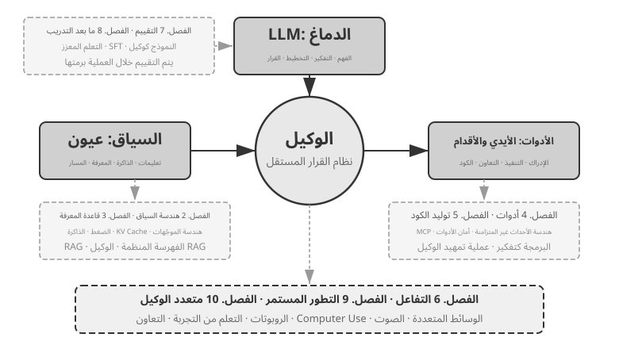

# مقدمة {.unnumbered}

```{=latex}
\markboth{مقدمة}{مقدمة}
```

بين أغسطس وأكتوبر 2025، ألقيت سلسلة من المحاضرات التقنية ضمن «المعسكر التطبيقي لوكلاء الذكاء الاصطناعي» الذي تنظمه دار تورينغ الصينية للنشر التقني. كان الهدف بسيطًا: نقل تصميم وكلاء الذكاء الاصطناعي من منهج تحكمه الانطباعات إلى منهج تحكمه المبادئ؛ فلا نكتفي بتشغيل نموذج تجريبي، بل نفهم *لماذا* صُمّم الوكيل على هذا النحو، وما المفاضلات الكامنة وراء كل قرار معماري. وقد نشأ هذا الكتاب من مواد تلك المحاضرات وتجاربها، بعد تنقيحها وتوسيعها.

أُنجز الكتاب نفسه، من بذرته الأولى إلى مخطوطته النهائية، بأسلوب يمكن تسميته **البرمجة بالهمس** (Whisper Coding)، أي التعاون القائم على الإملاء. وكانت أداة الإملاء هي Pine، وكيلنا الصوتي. عند إعداد كل محاضرة، كنت أملي مخططًا أوليًا، وأطلب من Pine البحث في الموضوع، ثم أدعه يصوغ المسودة الأولى. وبعد المحاضرة، كنت أطلعه على ملاحظات طلاب المعسكر، فندخل في جولات من النقاش والتحسين. ومع كل جولة، نمت ملاحظات المحاضرات حتى صارت الكتاب الذي بين يديك. نادرًا ما كتبت أثناء ذلك؛ كنت أفكر بصوت مسموع. فالكلام أسرع من الكتابة بكثير — بنحو أربعة أضعاف في المحادثة العادية — ولذلك كانت دورة «الإملاء، ثم البحث، ثم النقاش، ثم المراجعة» سريعة. ومن هذه الزاوية، لا يتناول هذا الكتاب الوكلاء فحسب، بل هو أيضًا كتاب أسهم وكيل في صنعه.

منذ صدور DeepSeek R1 مطلع عام 2025، تجاوز مجال الذكاء الاصطناعي مرحلة التركيز الخالص على النماذج الأساسية — أي العمود الفقري العام لنماذج اللغة الكبيرة — ودخل صميم النشر الهندسي. ويظهر التقدم على مستوى النموذج في اتجاهين. أولًا، أتاحت تقنيات التعلم المعزز للنماذج أن تستبطن القدرة على استدعاء الأدوات ضمن معلماتها، وأن تكتسب قدرات عامة في البرمجة والرياضيات واستخدام الحاسوب. وثانيًا، تسارعت دورات تطوير النماذج: من GPT-5.2 إلى GPT-5.5، ومن Claude Opus 4.5 إلى 4.8، بفاصل لا يتجاوز نصف عام بين كل قفزة وأخرى. أما على مستوى المنتج، فقد أعاد وكلاء عامون مثل Manus وClaude Code وOpenClaw تعريف التفاعل بين الإنسان والحاسوب، ودفعوا بنمط «توليد الشفرة + نظام الملفات» إلى صدارة التصاميم المعمارية.

حين راجعت مبادئ هندسة الوكلاء التي لخّصتها في الدورة قبل نحو عام، لاحظت أمرًا ممتعًا ومدهشًا: **لم تصبح هذه المبادئ قديمة، بل غدت أكثر رسوخًا.** ومنذ ذلك الحين، انتشرت في صناعة الوكلاء مصطلحات مثل المهارات، ومنظومات التشغيل، وهندسة الحلقات. غير أن التسلسل الحقيقي كان معكوسًا: لم تخترع شركات مثل Anthropic هذه الممارسات ثم تقلّدها الصناعة؛ بل كانت تطبيقات كثيرة تنفذها بالفعل، ثم صاغتها Anthropic في صورة مبادئ تصميم واضحة. تأتي الممارسة أولًا، ثم يأتي الاسم.

تستمد هذه المبادئ وجاهتها من خبرة فعلية في دفع الوكلاء إلى تنفيذ مهام طويلة ومعقدة وعالية المخاطر في العالم الحقيقي. وبصفتي كبير العلماء في Pine AI، طوّرت مع فريقي وكيل Pine. وهو، بحسب علمي، أول وكيل عام يستطيع التفاعل ذاتيًا مع أشخاص حقيقيين، وإنجاز مهام حساسة ومعقدة وممتدة تنطوي على أموال بدرجة موثوقة: يتصل بمزودي الخدمات نيابة عن المستخدم للتفاوض بشأن الفواتير، ويتابع طلبات الاسترداد والشكاوى مع التجار، ويلغي الاشتراكات، وكل ذلك من دون أن يتولى إنسان المهمة. وقد تمتد المهمة الواحدة إلى عشرات جولات التفاوض، وأي خطأ فيها قد يسبب خسارة مالية حقيقية. هذا الشرط الصارم للموثوقية هو ما فرض، مبدأً بعد آخر، القرارات المعمارية التي يؤكدها الكتاب. والأمثلة الآتية مأخوذة من هذه الخبرة.

- قبل شيوع مفهوم «المهارة»، كنا نحمّل الموجّهات ديناميكيًا لمعالجة تضخمها المستمر، وننفذ الأدوات عبر سطر الأوامر لمعالجة تضخم قوائم الأدوات، ونستخدم شريط حالة النظام كي يدرك الوكيل بيئة التنفيذ ووقت المستخدم وحالة المهمة.
- وقبل شيوع مفهوم «منظومة التشغيل»، كنا نستخدم أساليب شبيهة بما يفعله Claude Code للتعامل مع اضطراب استدعاءات الأدوات، والهلوسة، والعمليات الخطرة أو غير المصرح بها، وتجاهل التعليمات.
- وقبل شيوع «هندسة الحلقات»، كنا نستخدم ما يسميه هذا الكتاب نمط «المقترِح والمراجع» لمنع النموذج من إعلان اكتمال المهمة قبل أوانه.

وليس في ذلك اختراع يخصنا وحدنا؛ فبحسب علمي، توصّلت معظم الشركات الرائدة في النماذج والوكلاء إلى أساليب مشابهة كلٌّ على حدة. لهذا أطلقت معسكر وكلاء الذكاء الاصطناعي في تورينغ في أغسطس 2025، ودرّست مقررًا تطبيقيًا في الذكاء الاصطناعي بجامعة الأكاديمية الصينية للعلوم بين عامي 2024 و2026. ولهذا أيضًا اخترت نشر الكتاب مفتوح المصدر بدلًا من إبقائه مغلقًا والاكتفاء بعائداته: أريد لهذه المعرفة أن تصل إلى عدد أكبر من الممارسين.

**تأتي الممارسة أولًا، ثم تأتي التسمية.** وفي هذا الترتيب درس عملي مهم لتطوير وكلاء المؤسسات: **إذا انتظرت حتى يظهر المصطلح الرائج قبل أن تطبق فكرته، فقد تأخرت خطوة بالفعل.** فعندما يشيع المصطلح، تكون الشركات المتقدمة قد أمضت وقتًا في حل المشكلة التي يصفها. فكيف تعرف ما ينبغي فعله قبل ظهور الاسم؟ في رأيي، ثمة أمران أساسيان.

**أولًا، اعمل على مشكلة حقيقية تدفع قدرات الوكيل إلى أقصاها، واستخلص منها تغذية راجعة حقيقية باستمرار.** خذ Pine مثلًا: قد تستغرق المهمة الواحدة ساعات أو أسابيع، وتتطلب أخذًا وردًا مع أطراف متعددة؛ ساعات على الهاتف، وصفحات من النماذج المعقدة على الحاسوب، وجولات من البريد الإلكتروني. لا مجال لخطأ في رقم واحد، ويجب أن يحمي كل تفاعل مصالح المستخدم. حين تنغمس في سيناريو بهذه الصعوبة، تدفعك الممارسة تلقائيًا إلى بناء منظومة تشغيل تسد الفجوة بين ما يستطيع النموذج فعله منفردًا وما يتطلبه العمل. أما إذا كانت متطلبات المنتج متواضعة ويمكن تلبيتها بمجرد ترقية النموذج، فلن تضطر أصلًا إلى بلورة هذه المبادئ المعمارية.

**ثانيًا، أنشئ آلية للتقييم.** يعود الكتاب إلى هذه الفكرة مرارًا: لا تقدم بلا تقييم. فالتقييم يبيّن إن كان التغيير تحسينًا حقيقيًا أم نتيجة موفقة عابرة، ويحرر تطوير الوكيل من الاعتماد على الحدس وحده. ما ندعو إليه، في جوهره، هو تطبيق المنهج العلمي في الهندسة وبناء الوكلاء، والتقييم هو أساس هذا المنهج. ويتناول الفصل السابع ذلك بالتفصيل.

ومهما تطورت النماذج الأساسية وتبدلت أشكال المنتجات، تكاد أنظمة الوكلاء الناجحة كلها تتبع الأنماط المعمارية نفسها. وليس ذلك مصادفة: **ينبغي لمبادئ التصميم الجيدة أن تصمد عبر أجيال النماذج**؛ لأنها لا تصف طريقة استخدام نموذج بعينه، بل الأنماط الأساسية لتفاعل الأنظمة الذكية مع العالم.

قال ريتشارد ساتون، الحائز على جائزة تورينغ وأحد رواد التعلم المعزز، إن تطور الكون مر بأربع مراحل: من الغبار إلى النجوم، ومن النجوم إلى الحياة، ومن الحياة إلى الكيانات المصمَّمة. فالتطور البيولوجي أعمى، تحكمه الطفرات العشوائية والانتقاء الطبيعي؛ ومعظم الكائنات لا تفهم آلياتها ولا تستطيع أن تصمم كائنات جديدة أو تعيد تشكيل ذاتها. أما الوكلاء فظاهرة جديدة في تاريخ هذا التطور: يستطيعون، عبر توليد الشفرة، أن يطلقوا عملية تطوير ذاتي؛ كأن يكتب مبرمجٌ مبرمجًا آخر، ثم يواصل الثاني كتابة غيره. أي إن الوكيل قادر على فهم آلية عمله، وإنشاء وكلاء جدد وفق الهدف، بل وتحسين ذاته. ورسالة هذا الكتاب أن يساعدك على فهم مبادئ هذا الخلق وإتقانها.

تتلخص الفكرة المركزية للكتاب في معادلة واحدة: **الوكيل = نموذج لغوي كبير + سياق + أدوات**. ولا غنى عن أي عنصر منها.



وبصياغة أكثر حدسًا: **دماغ + عينان + يدان وقدمان**. يتولى الدماغ، أي النموذج اللغوي الكبير، التفكير واتخاذ القرار؛ وتحدد العينان، أي السياق، ما يستطيع الوكيل رؤيته من معلومات؛ وتحدد اليدان والقدمان، أي الأدوات، ما يستطيع فعله. (والعينان هنا استعارة تقريبية؛ فالسياق لا يضم معلومات البيئة وسجل المحادثة فحسب، بل تعريفات الأدوات أيضًا. لذلك يشمل ما «يراه» الوكيل الأدوات المتاحة له. والمقصود من الاستعارة هو تثبيت الحدس الأساسي: السياق هو كل ما يستطيع النموذج إدراكه.)

وللقارئ الملمّ بالتعلم المعزز، يمكن مقابلة العناصر الثلاثة بمفاهيمه الصورية: يقابل النموذج اللغوي **السياسة** (Policy)، ويقابل السياق **فضاء الملاحظات** (Observation Space)، وتقابل الأدوات **فضاء الأفعال** (Action Space). إنها ثلاث صيغ للمنظومة نفسها، تختلف فقط في مستوى التجريد.


## هيكل الكتاب {.unnumbered}

يقع هذا الكتاب في عشرة فصول تنتظم على أربعة مستويات (الشكل 0-2). يبني الفصل الأول الإطار الأساسي لـ Agent؛ وتناقش الفصول من الثاني إلى السادس كيفية بناء Agent، فتبسط السياق والمعرفة والأدوات وتوليد الشيفرة والتفاعل تباعًا؛ وتناقش الفصول من السابع إلى التاسع كيفية تقييم Agent وتحسينه باستمرار، من أنظمة القياس وما بعد تدريب النموذج وصولًا إلى التطوّر المستمر المدفوع بخبرة التشغيل؛ ثم يوسّع الفصل العاشر الأفق إلى التعاون متعدد الوكلاء.


- **الفصل الأول (أساسيات الوكلاء)** ينطلق من منتجات حقيقية ليكوّن تصورًا أوليًا واضحًا عن الوكلاء، ثم يتعمق في الصيغة الأساسية: النموذج اللغوي الكبير + السياق + الأدوات. ويعرض الصيغة نفسها بصورتها الحدسية: الدماغ + العينان + اليدان والقدمان، ثم بصيغتها الأكاديمية: السياسة + فضاء الملاحظات + فضاء الأفعال. وتوضح التجارب حلقة ReAct التكرارية: «التفكير → الفعل → الملاحظة»، مع التمييز بين التكيف السياقي داخل المهمة، وتحديث المكونات الخارجية عبر المهام، وتحديث المعلمات في دورات التدريب. ويختتم الفصل بأنماط تصميم متدرجة، من مسارات العمل المحددة سلفًا إلى الوكلاء المستقلين.
- **الفصل الثاني (هندسة السياق)** هو أهم فصول الكتاب؛ إذ يتناول «عيني» الوكيل بصورة منهجية. يبدأ ببنية رسائل API والحلقة الأساسية للوكيل، ويؤسس لفكرة أن السياق قائمة من الرسائل، ثم يشرح المبادئ الأساسية لذاكرة KV المخبأة، وهي الآلية التي تتيح إعادة استخدام نتائج الحساب السابقة أثناء استدلال النموذج. بعد ذلك يتناول هندسة الموجّهات، والتصميم المتمحور حول العمليات، وأوصاف الأدوات، وصياغة قواعد العمل، وهجمات حقن الموجّهات وسبل صدها، والتحميل عند الطلب لمهارات الوكيل، وشريط حالة الوكيل، واستراتيجيات ضغط السياق.
- **الفصل الثالث (ذاكرة المستخدم وقواعد المعرفة)** يوسع إدارة السياق إلى منظومة معرفية دائمة تتجاوز حدود الجلسة الواحدة. وبذلك لا يكتفي الوكيل بتذكر المحادثة الحالية، بل يراكم المعرفة ويسترجعها عبر محادثات متعددة. ويعرض الفصل أربع استراتيجيات متدرجة لذاكرة المستخدم، ومنظومة RAG كاملة، وطرائق البحث النصي وإعادة الترتيب، واستخراج المعلومات متعددة الوسائط، وأساليب متقدمة لتنظيم المعرفة، وRAG القائم على الوكلاء الذي يقرر فيه الوكيل بنفسه متى يسترجع المعلومات وما الذي يسترجعه.
- **الفصل الرابع (الأدوات)** يبحث في الجسر الذي يصل Agent بالعالم الخارجي. فالأدوات هي «يداه وقدماه»، وبها يبحث في الويب، ويستدعي واجهات API، ويتعامل مع قواعد البيانات وغيرها. ويقدم الفصل معيار MCP للتشغيل البيني ومبادئ تصميم خمس فئات من الأدوات: الإدراك والتنفيذ والتعاون وتفعيل الأحداث والتواصل مع المستخدم؛ كما يعرض ثلاثة مسارات للإدراك متعدد الوسائط: المعالجة الأصلية متعددة الوسائط، والتحويل إلى نص، والتحليل متعدد الوسائط القائم على الأدوات، مع عناية خاصة بآليات أمان أدوات التنفيذ. أما تفعيل الأحداث والتواصل مع المستخدم وبيئة التشغيل غير المتزامنة فتُعرض في الفصل السادس.
- **الفصل الخامس (وكيل البرمجة وتوليد الشفرة)** يبين أن وكيل البرمجة ونظام الملفات يشكلان معًا أساسًا تقنيًا لأي وكيل عام الغرض. ويتخذ من بنية OpenClaw خيطًا ناظمًا لتحليل سير عمل وكيل البرمجة وتقنيات تنفيذه، كما يوضح أن قيمة توليد الشفرة تتجاوز البرمجة نفسها، فتشمل دعم التفكير وبناء قواعد المعرفة وإنشاء أدوات جديدة وتشغيل وكلاء آخرين ديناميكيًا.
- **الفصل السادس (التفاعل: توسيع فضاء الملاحظة وفضاء الفعل)** يرفع مقدّمة «التناوب في الكلام» التي افترضتها الفصول الخمسة السابقة، ويبسط تفاعل Agent مع العالم على محورَي **الوسيط** و**التوقيت**: فاللاتزامن والتوجّه بالأحداث يجعلان العالم يوقظ Agent (أدوات إطلاق الأحداث، وأدوات التواصل مع المستخدم، والهوية الافتراضية وبيئات التنفيذ المعزولة)؛ والصوت يدفع التفاعل إلى مقياس المللي ثانية (من خطوط الأنابيب المتتالية إلى النماذج الشاملة من طرف إلى طرف والازدواج الكامل)؛ وComputer Use يجعل Agent يشغّل الواجهات الرسومية كما يفعل الإنسان؛ أما التعامل الروبوتي فيمدّ الفعل إلى العالم الفيزيائي (تحكّم VLA والنقل Sim2Real). وتتشارك المشاهد الأربعة مجموعة الأوّليات نفسها: الإيقاظ، ونقطة الأمان، والإلغاء، والمزاحمة، وفصل السريع عن البطيء.
- **الفصل السابع (تقييم الوكلاء)** يضع منهجية علمية للتقييم. ويتناول بيئات التقييم، بما فيها استدعاء الأدوات والتفاعل بين الإنسان والحاسوب وبيئات المحاكاة، ومبادئ تصميم مجموعات البيانات، والتقييم الآلي بأسلوب LLM-as-a-Judge، واختيار النموذج على أساس النتائج، والحلقة المغلقة التي تحول نتائج التقييم إلى تحسينات عملية في النظام.
- **الفصل الثامن (مرحلة ما بعد تدريب النموذج)** يتعمق في تقنيتين: الضبط الدقيق تحت الإشراف (SFT)، الذي يعلم النموذج اتباع أمثلة موسومة، والتعلم المعزز (RL)، الذي يتيح له التحسن بالتجربة والخطأ وإشارات المكافأة. ويتمحور الفصل حول فكرتين: «SFT يحفظ، وRL يعمم» و«البيانات والبيئة أهم من الخوارزمية». كما يغطي مراحل التدريب المسبق وSFT وRL، وأسس التعلم المعزز، وتصميم المكافآت، والخوارزميات أحادية الجولة ومتعددة الجولات، وتحسين كفاءة العينات.
- **الفصل التاسع (التطور المستمر للوكيل)** يدرس كيفية تحويل الخبرة التشغيلية إلى قدرات في الإصدار التالي. يبدأ ببناء إشارات التعلم من نتائج البيئة وقواعد العمليات وأحكام نماذج التقييم، ثم يقارن بين أربعة مسارات للتحديث: وثائق المعرفة، والموجّهات والمهارات، والبرامج والأدوات، ومعلمات النموذج. ويختتم بالتحقق من الإصدار المرشح، والإطلاق التدريجي، والتراجع الآمن، والدمج على المدى الطويل.
- **الفصل العاشر (التعاون متعدد الوكلاء)** يبحث في كيفية تقسيم العمل والتنسيق بين عدة وكلاء. ويقدم إطارًا منهجيًا لتصنيف أنماط التعاون وفق محورين: السياق المشترك أو المستقل، والبنية النظيرة أو الإدارية أو اللامركزية. ثم يستخدم وكلاء الترجمة والهاتف والحاسوب لشرح التصميم التعاوني، ويناقش الاتجاهات الناشئة في مجتمعات الوكلاء واقتصاداتهم.

## كيفية قراءة هذا الكتاب {.unnumbered}

فصول الكتاب مستقلة نسبيًا، ولذلك يمكنك اختيار مسار القراءة الأنسب لاحتياجاتك:

- **إن كنت مطوّر Agent**، فيُستحسن أن تقرأ الفصول من الأول إلى التاسع بالترتيب: تعطيك الفصول الستة الأولى طرائق البناء، ويؤسّس الفصل السابع قاعدة التقييم، ويشرح الفصل الثامن كيفية تدريب النموذج، ثم يُدخل الفصل التاسع المعاملات وسائر حوامل التحديث في حلقة تطوّر مستمر مكتملة. أما الفصل العاشر فيمكن قراءته انتقائيًّا بحسب حاجتك إلى التعاون متعدد الوكلاء.
- **إذا كان وقتك محدودًا**، فامنح الأولوية للفصل الأول لاستيعاب الصورة العامة، وللفصل الثاني لهندسة السياق — وهي المهارة الأكثر أهمية. تُعد المبادئ الأساسية لذاكرة KV المخبأة (KV Cache) تقنية إلى حد ما؛ لذا يمكنك في القراءة الأولى تخطي التفاصيل الآلية والاحتفاظ فقط بالاستنتاجات الأساسية الثلاثة المذكورة في البداية، دون أن يؤثر ذلك على فهمك للموضوعات اللاحقة.
- **إذا كان تركيزك منصبًا على تدريب النماذج**، فانتقل مباشرة إلى الفصل الثامن (مرحلة ما بعد تدريب النموذج). ولأن طرق التقييم الواردة في الفصل السابع تُعد شرطًا أساسيًا للتدريب، يُستحسن قراءتهما معًا بعد استكمال الفصلين الأول والثاني.

يتضمن كل فصل عددًا من **التجارب** و**أسئلة التأمل**، مرقمة بصيغة «التجربة X-Y»، حيث X رقم الفصل وY ترتيب التجربة فيه. وتشير النجوم في العنوان إلى مستوى الصعوبة: ★ للمستوى التمهيدي المناسب لجميع القراء، و★★ للمستوى المتوسط الذي يتطلب قدرًا من الخبرة الهندسية، و★★★ للتحديات المتقدمة التي تتناول عادة مسائل مفتوحة أو تصميمات نظم معقدة. وتأتي معظم التجارب مع شفرة كاملة قابلة للتشغيل في المستودع المفتوح المصدر المصاحب:

> **مستودع الشفرة المصاحب**: [https://github.com/bojieli/ai-agent-book](https://github.com/bojieli/ai-agent-book)

يمكنك الحصول على جميع الأكواد المصاحبة باستخدام Git:

```bash
git clone https://github.com/bojieli/ai-agent-book.git
cd ai-agent-book
```

إذا كنت لا تستخدم Git، فيمكنك أيضًا اختيار **Code → Download ZIP** من صفحة المستودع. تُنظَّم أكواد التجارب حسب الفصول في المجلدات من `chapter1/` إلى `chapter10/`. للعثور على «التجربة X-Y»، افتح الملف الموافق `chapterX/README.ar.md`، واستخدم رقم التجربة لتحديد مجلد المشروع، ثم اتبع ملف README الخاص بالمشروع لتثبيت الاعتماديات وتشغيله. تعتمد بعض التجارب الموسومة بأنها أدلة لإعادة الإنتاج على مستودعات خارجية؛ وتوضح ملفات README الخاصة بها كيفية الحصول عليها أيضًا.

وأوصي بشدة بتنفيذ هذه التجارب بنفسك؛ فبناء وكلاء الذكاء الاصطناعي مجال عملي بامتياز، وكثير من **بديهيات التصميم** لا يتضح إلا أثناء التجربة وتصحيح الأخطاء.

**ملاحظة حول المصطلحات**: يميز هذا الكتاب بين مفهومين يختلطان كثيرًا في الاستعمال. **التفكير** (Reasoning) هو معالجة النموذج للمسألة خطوةً خطوة، كما في نماذج التفكير وسلسلة الأفكار ورموز التفكير. أما **الاستدلال** (Inference) فهو تنفيذ المرور الأمامي للنموذج عند الاستخدام، كما في تكلفة الاستدلال ومنظومته وزمنه. وتفصل الطبعة الصينية بينهما بالمصطلحين 思考 و推理، وتلتزم الترجمة العربية بهذا الفصل الدلالي. أما سائر المصطلحات الأساسية فتُعرَّف عند ورودها للمرة الأولى.

## المتطلبات الأساسية {.unnumbered}

يستهدف هذا الكتاب القراء ذوي الخلفية التقنية، لكنه لا يتطلب خبرة عميقة في مجال بعينه. وتُصنف المتطلبات الأساسية أدناه ضمن مستويين: "أساسي" و"موصى به"، لمساعدتك في تقييم مدى استعدادك.

**المستوى الأساسي: متطلبات قراءة الكتاب كاملاً**

- **برمجة بايثون (Python)**: تعتمد جميع تجارب الكتاب تقريبًا على Python. يُفترض الاطلاع على البنية الأساسية للغة، وهياكل البيانات الشائعة، وإدارة الحزم (`pip`). لا تُشترط الاحترافية، بل القدرة على قراءة وتعديل شفرات Python ذات التعقيد المتوسط.
- **الخبرة الأساسية بنماذج LLM**: تجربة سابقة في التعامل مع ChatGPT أو Claude أو منتجات مماثلة، وفهم نمط التفاعل الأساسي `الموجه → استجابة النموذج` (`Prompt → Model Response`).
- **أداة برمجة مدعومة بالذكاء الاصطناعي**: تثبيت أداة واحدة على الأقل مثل Claude Code أو Codex أو Cursor أو TRAE. ستختصر وقتك في تجارب التطوير وتتيح لك معاينة وكيل برمجيات ناضج من الداخل؛ لتشاهد مباشرة حلقة ReAct واستدعاء الأدوات وإدارة السياق.
- **معرفة عامة بهندسة البرمجيات**: إلمام بمفاهيم سطر الأوامر، ونظام ضبط الإصدارات Git، وتنسيق بيانات JSON، وواجهات برمجة التطبيقات REST API.

**المستوى الموصى به: لتعزيز الاستيعاب في فصول محددة**

- **أساسيات التعلم الآلي** (الفصل 8): فهم المفاهيم الأساسية مثل التدريب مقابل الاستدلال، ودوال الخسارة، والانحدار التدريجي، والتجهيز الزائد (Overfitting).
- **الرياضيات الأساسية** (الفصول 2-3، 8): فهم بديهي للجبر الخطي (تمثيل المتجهات ورسم المصفوفات) ودوال الاحتمالات الإحصائية لتقييم المكافآت في التعلم المعزز.
- **أساسيات تطوير الويب** (الفصلان 4 و9): فهم مفاهيم HTTP وWebSocket وبنية فصل الواجهة الأمامية عن الخلفية لفهم بنية الوكيل غير المتزامن الموجه بالأحداث.
- **الفهم الأساسي لبنية المحولات (Transformer)** (الفصول 2، 8): بنية Transformer هي العمود الفقري لجميع النماذج اللغوية الكبيرة.

تكمن القيمة الأساسية لهذا الكتاب في **مبادئ التصميم المعماري والمنهجية الهندسية**؛ لذا حتى إن كنت تفتقد بعض هذه المتطلبات، يمكنك البدء بثقة وسد الفجوات أثناء القراءة.

## شكر وتقدير

أتقدم بالشكر إلى المحررين Meng Ge وLiu Meiying في Turing على جهدهما الدؤوب في التحرير وتنظيم دورة Turing «AI Agent Bootcamp»، وإلى البروفيسور Liu Junming على تقديمه مقررًا عمليًا في وكلاء الذكاء الاصطناعي في جامعة الأكاديمية الصينية للعلوم. وشكر خاص لطلاب الدورتين؛ فقد أتاحت لي تجربة التدريس قدرًا كبيرًا من الملاحظات والنصائح القيّمة، وعمّقت فهمي لهذه المفاهيم.

أشكر جميع زملائي في Pine AI. بدون منتج ممتاز مثل Pine AI، والتحديات العديدة التي جلبها معه، لم يكن بإمكاني أبدًا التعمق في مجال الوكيل، سواء في الفهم أو في الممارسة؛ ومن خلال تبادل الأفكار الواحدة تلو الأخرى، ساهم زملائي بثروة من الأفكار القيمة.

وأشكر كذلك أصدقاء كثيرين في مجال الذكاء الاصطناعي، يتعذر ذكرهم جميعًا هنا. فقد منحوني، عبر نقاشات متتابعة، ملاحظات صريحة على آرائي، وصححوا عددًا من أحكامي، وعمّقوا فهمي للنماذج والوكلاء.

والأهم من ذلك كله، أنني أشكر عائلتي، وخاصة زوجتي، منغ جياينغ. لقد دعمتني طوال فترة كتابة هذا الكتاب وقدمت لي العديد من الاقتراحات القيمة على طول الطريق.
