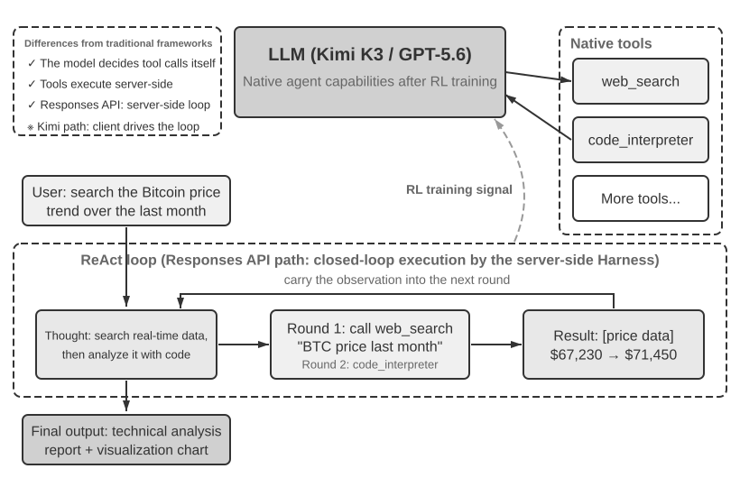

# Getting Started with AI Agents

If you have used Cursor to write code and watched it search your codebase, edit multiple files, and rerun tests until they pass, you have already used an AI Agent. The same is true if you have used Deep Research to investigate a topic through repeated searching and reading, had Manus control a browser to finish online tasks, asked the Doubao phone assistant to book tickets or send messages, or sent Pine AI to negotiate a lower telecom bill.

These products take many forms, but they share a common trait: they are no longer passive "you ask, it answers" conversations. They plan their own execution steps, call the tools each task requires, and adjust their strategy as results come in. AI Agents are becoming a new way to interact with computers.

This chapter begins with practical examples and works back toward the core components of an AI Agent: readers will experience firsthand what modern Agents can do, understand the architecture behind them, and learn the design patterns and best practices for building Agent systems.

> **Reading Tip**: This chapter is the conceptual map for the whole book: a concise tour of the core formula, operating loop, engineering framework, and Agent design patterns. It establishes the shared vocabulary and reference points used throughout later chapters. Do not try to memorize every concept on your first read; aim for the big picture. Each later chapter expands on one aspect introduced here, and you can return to this chapter whenever you need to reorient.

## Modern Agent = LLM + Context + Tools

The essence of a modern Agent system fits into one concise formula: **Agent = LLM (Large Language Model) + Context + Tools**. The formula is simple and practical—provided each term is read broadly:

- **The LLM is the Agent's reasoning engine**: It is more than a set of model parameters; it is the Agent's decision-making core, responsible for understanding intent, reasoning, planning, and judgment. An LLM's capabilities come from world knowledge and language ability acquired during **pre-training**, plus decision-making strategies encoded through **post-training** (techniques such as supervised fine-tuning and reinforcement learning are covered in Chapter 8).
- **Context is the Agent's working set of information**: Not just the text fed into the model, but the working set of information available to the Agent at each decision point—the environment, user memory, domain knowledge, its own state, and task progress. Just as a person making a decision needs to size up the situation, recall relevant experience, and consult references, the Agent's context window contains the information it can use at that moment.
- **Tools are the Agent's action interfaces**: Not a handful of callable API functions, but the full set of ways the Agent can act—from predefined tool calls to Skills loaded on demand, from generating code to create new capabilities on the fly to delegating work to sub-agents, from reaching out to the user to responding to external events.

Put more intuitively: **Agent = Reasoning Engine + Working Context + Action Interfaces**. The model reasons and decides, the context provides the working set of information those decisions depend on, and the tools provide the interfaces through which decisions affect the outside world.

From the classical reinforcement-learning and control perspective, the Agent and the Environment are two sides of a closed-loop interaction, not components of one another. The Environment returns an observation, the Agent uses its context to choose the next action, and that action changes the Environment's state, producing the next observation.


Figure 1-1 shows two levels of abstraction. The outer level is the interaction between the **Agent and the Environment**: the Environment includes file systems, databases, web pages, users, other Agents, and physical or simulated worlds. The inner level is the **Model–Harness structure inside the Agent**: the Model makes policy decisions; the Harness is the runtime and governance layer inside the Agent boundary that builds context, exposes tool interfaces, maintains loops and state, and applies permissions, verification, and correction. A Harness can create, isolate, or proxy an environment without containing the Environment's state or transition rules.

The engineering formula can therefore be expanded as follows: the LLM is the Model, while Context + Tools form the minimum Harness; production systems add constraints, verification, and correction inside that boundary. The rest of this chapter follows this boundary.

These three components correspond exactly to three core concepts in RL (reinforcement learning; see Chapter 8), but they are not strict one-to-one equivalents: context is the Agent's internal representation of observations and history, while tools define observation/action interfaces whose underlying objects remain in the Environment.

| Intuition | Agent Component | RL Concept | Role |
|---------------|----------------|------------------|---------------------------------------------|
| **Reasoning Engine** | LLM | **Policy** | The decision-making logic that determines "what to do next"—given the current information, choose the most appropriate action from all available options |
| **Working Context** | Context construction | **Observations and history** | Organizes Environment observations and existing history into the information needed for the current decision |
| **Action Interfaces** | Tool interfaces | **Observation/action interfaces** | Defines which observations the Agent can read, which actions it can issue, and the format of those interfaces |

### Observation and Action Spaces: The Interface Between Model and World

**The observation space and action space together form the interface between the LLM and its external environment**. The observation space translates information in the environment into context the model can process; the action space translates model decisions into operations on the outside world. Information outside the observation space effectively does not exist for the model. An operation outside the action space remains something the model can only recommend in words, even if it knows exactly what should be done.

Consequently, **once the underlying model is held constant, the primary systems-engineering lever for improving Agent performance is often to redefine or expand its observation and action spaces**. In this book's terminology, that means expanding context and tools. Many problems that appear to require a “smarter model” are really interface problems: bring the task-relevant data into context or expose the required operation as a tool, and a previously unsolvable task may become solvable.

**Manus: merging spaces that had been separate.** Before Manus appeared, production Agents mostly followed three distinct tracks: Deep Research, Coding, and Computer Use. Manus was the first widely influential production Agent to bring all three together in one system. Its virtual browser enlarged the observation space, while its file system, code execution, and command execution enlarged the action space. Manus did not become a general Agent merely by swapping in a stronger model. It took the union of three kinds of Agents' observation and action spaces, enabling one Agent to cross the previous product boundaries.

**OpenClaw: extending the interface into the user's digital life.** OpenClaw pushes both spaces outward again. It receives tasks and returns results through messaging channels users already inhabit—WhatsApp, Telegram, Slack, Discord, iMessage, and many others—so the Agent can be reached from almost anywhere. Its local Gateway connects cloud applications such as Google Drive and Notion as well as the local file system. Files scattered across accounts and devices can therefore, with the user's explicit authorization, enter one Agent's observation space and be acted on by its tools. Compared with the original cloud-sandbox-centered form of Manus, where files generally had to be uploaded or a connector separately configured, local-first OpenClaw spans a broader data boundary. Manus later added its own Google Drive connector and desktop access to local files, which only reinforces the point: product evolution often consists precisely of expanding observation and action spaces[^ch1-agent-products].

[^ch1-agent-products]: Manus's official materials describe its original Sandbox as an isolated cloud virtual machine. When introducing its Google Drive Connector, Manus explicitly recalled the earlier, fragmented workflow of manually downloading and uploading files between Drive, the desktop, and Manus. When it launched My Computer in March 2026, it called the fact that important work lives locally rather than in the cloud a fundamental limitation of the cloud sandbox. OpenClaw's official README describes a local-first, always-on personal assistant running on the user's own devices and lists more than twenty messaging channels; its tools and plugin system can add cloud integrations and local capabilities. See https://manus.im/blog/manus-sandbox, https://manus.im/blog/manus-google-drive-connector, https://manus.im/blog/manus-my-computer-desktop, https://github.com/openclaw/openclaw, and https://docs.openclaw.ai/tools

Understanding what each component does, and how they fit together, is the foundation for building effective Agent systems. We will begin with the most concrete of the three—tools, the action interfaces—and work inward to the LLM and context. First, here is how different kinds of Agents compare across these three dimensions:

| Agent Product | Working Context | Action Interfaces | Strategy |
|-----------------|------------------------|--------------------------|-----------------------------|
| **Coding Agents (e.g., Cursor)** | Requirements documents, codebase, terminal environment | Open-ended (internal reasoning, code search, file read/write, command execution, etc.) | Incremental development: understand requirements → search relevant code → edit code → test and verify → debug and fix |
| **Search Agents (e.g., Deep Research)** | Web resources, academic databases, local files | Open-ended (internal reasoning, search queries, web reading, summary generation) | Iterative deepening: adjust search direction based on existing information, gradually synthesize a complete report |
| **Computer Control Agents (e.g., Browser Use)** | Computer screen, browser pages, file system | Open-ended (internal reasoning, clicking, typing, scrolling, screenshots, code execution, etc.) | Visual perception + operation: observe screen → identify target elements → perform actions → verify results |
| **Phone Assistant Agents (e.g., Doubao)** | Phone screen, installed apps | Open-ended (internal reasoning, clicking, swiping, typing, opening apps, etc.) | Intent understanding + App control: understand user needs → locate target app → perform actions → confirm completion |
| **Personal Task Agents (e.g., Pine AI)** | User account information, historical bills, service provider knowledge base | Open-ended (internal reasoning, making calls, sending emails, filling forms, confirming with user) | Multi-step task execution: gather information → formulate negotiation strategy → contact service provider → negotiate → report results |

These systems share three features: an **open-ended action space**—not picking from a fixed set of buttons but generating arbitrary natural language and code; **internal reasoning**—planning before acting; and **continuous interaction**—adjusting strategy based on environmental feedback. These capabilities come precisely from the interplay of the reasoning engine, working context, and action interfaces—that is, LLM, context, and tools.

### Tools: The Agent's Action Interfaces

Tools are the Agent's bridge to the outside world. They turn the Agent from a passive observer into an active system that can search, write files, run code, call APIs, send messages, or operate interfaces. Without tools, an Agent is limited to text generation; with them, it can act on external systems.

To discuss tools systematically, we can sort them into five types by the direction of the Agent's interaction with the world. At this stage, a brief overview of each type's representative scenarios is enough to establish the overall picture; later chapters treat each in depth.

**Perception Tools** allow the Agent to access information: search engines provide real-time web data, file systems read local documents, and APIs and databases connect to external services and enterprise core data.

**Execution Tools** allow the Agent to act on external systems: code execution, file operations, system commands, and external API calls turn decisions into concrete actions.

**Collaboration Tools** allow the Agent to divide work with other Agents: delegating specialized tasks to sub-agents, requesting human confirmation at key decision points, or coordinating actions in multi-agent systems.

**Event Trigger Tools** are invoked in a fundamentally different way from the first three categories: the Agent does not call them; they arrive as external inputs that trigger the Agent to begin work. A new email comes in, a scheduled time arrives, or another system fires a Webhook callback; the event activates the Agent and initiates reasoning and action. The Agent never calls these itself, yet they are still a channel through which it interacts with the outside world, so we count them in the broad tool system.

**User Communication Tools** are the channels through which the Agent communicates with the user. Where execution tools change the external world, communication tools carry information—delivering the Agent's progress, or a proactive check-in, by text message, voice call, email, and so on.

Chapter 4 covers the full taxonomy and design principles for these five types. The quality of tool design directly determines what an Agent can reliably accomplish: define interfaces vaguely and the model will misuse them; handle errors poorly and a single failed tool can leave the Agent stuck; scope permissions too broadly and one Agent error can become irreversible. As the MCP (Model Context Protocol) standard spreads, integrating tools is becoming easier.

**Tool Calling** (also known as Function Calling) is a core capability of modern LLM Agents: it lets the model invoke external tools in a structured way, transforming the LLM from a pure text generator into an intelligent system that can act through external interfaces. This book uses the term "tool calling" throughout.

Tool calling proceeds in four steps: first, the context tells the model which tools are available (names, purposes, parameters); then the model decides on its own whether to call a tool, which tool to call, and with what arguments; next, once the tool has run, its result is appended to the context; finally, the model decides its next move based on that result. This loop is the foundation of ReAct, introduced later in the chapter.

For a weather query, the simplified representation of the four-step process at the API level is as follows:

```text
Step 1: Declare tools                  Step 2: Model decides to call
tools: [{                             assistant: {
  name: "get_weather",                  tool_calls: [{
  parameters: {                           function: "get_weather",
    city: "string"                        arguments: {city: "Beijing"}
  }                                      }]
}]                                    }

Step 3: Result appended to context    Step 4: Model responds based on result
tool: {                               assistant: {
  tool_call_id: "call_1",               content: "Today in Beijing: 28°C, sunny."
  content: '{"temp":28,"sky":"clear"}' }
}                                     }
```

The developer only defines the tools and executes the calls; the model itself decides whether to call, which tool to call, and what arguments to pass. Chapter 2 examines this API structure in detail.

When designing tools for an Agent, start with the narrowest capability the task needs, then expand gradually as the task grows more complex. If the task only requires basic arithmetic, a calculator with clearly defined parameters is enough; when it grows to reading spreadsheets, cleaning missing values, computing statistics, and plotting charts, a constrained Python code interpreter is easier to combine and explore with than an ever-growing collection of specialized tools. But generality also increases the risk of errors and expands the attack surface: code must run in an isolated sandbox, with network access disabled by default, no access to files outside the authorized working directory, and limits on execution time, CPU, memory, and output size.

Likewise, a single logging tool is suitable for recording one execution; for long-running tasks that take hours or even days, a controlled virtual working directory can preserve plans, intermediate results, execution logs, and final artifacts so the Agent can resume across multiple runs. This directory should also restrict readable and writable paths, storage capacity, and file types, and prevent path traversal instead of exposing the entire host file system to the Agent.

General-purpose tools are not always better than specialized ones. High-risk operations or those governed by strict business constraints—such as payments, data deletion, sending email, and production deployment—should still be exposed as dedicated tools with explicit parameters, restricted permissions, and end-to-end auditability, with previews and human confirmation added when necessary. The core principle of tool design is therefore: **use general-purpose foundational capabilities for composition and exploration; use specialized tools to constrain high-risk operations and enforce strict business rules**.

### LLM: The Agent's Reasoning Engine

The Large Language Model (LLM) is the Agent's decision-making core. Given a user request, it first has to infer the real intent (what users say is often not what they actually want), then break a vague or complex task into executable steps. Throughout execution it keeps making decisions: what to do next, whether to call a tool, which one, and with what arguments. This understand–plan–execute capability comes from knowledge accumulated during pre-training, and it is the foundation that workflows and autonomous Agents alike depend on.

A distinctive capability of LLM Agents is **internal reasoning**—before acting, the Agent can plan and reason through the task. This does not change the external environment, yet it markedly improves the actions that follow. This ability comes from pre-training (the initial training on massive amounts of internet text, through which the model learns language patterns and world knowledge): the model draws on reasoning patterns encoded in human knowledge, including mathematical laws, causal relationships, and strategies for decomposing problems. Therefore, unlike traditional reinforcement-learning Agents, today's LLM-based Agents do not explore through blind trial and error; they reason over a structured body of knowledge.

#### Model as Agent: When the Model Itself Becomes the Product

The "Model as Agent" paradigm is the newest direction in AI Agent development. Advanced models internalize tool calling as a native ability through post-training (especially reinforcement learning): when to call a tool, which one, with what arguments—the model decides all of it, with no manual orchestration required. That does not make the framework layer less important. On the contrary: the stronger the model, the more the surrounding Harness matters. The word Harness originally referred to the reins and tack fitted to a horse—not to limit its ability to run, but to direct that power appropriately. In the Agent context, the model is the powerful yet unpredictable horse, while the Harness is the engineering infrastructure that channels its capability into reliable task execution. It includes context management, tool interfaces, safety constraints, and verification and correction mechanisms (see the final section of this chapter).

The more decision authority a model has, the greater the impact of a wrong decision—which calls for finer-grained constraint, verification, and correction to keep it reliable. The real advantage of model providers is not "making the framework thinner" but being able to co-optimize the model and its surrounding Harness, iterating continuously.

But a deeper question follows: if models keep getting stronger, will today's Harness eventually be absorbed into the model? In “The Bitter Lesson,” Rich Sutton looked back on a pattern repeated throughout seventy years of AI research[^ch1-1]: researchers repeatedly encoded their understanding of a domain into a system, achieving short-term gains but ultimately losing to general methods—search and learning—that scale with compute and data. Viewed through this lens, how much of the constraint, verification, and correction in a Harness is “human prior” that the model is destined to internalize? This book's position is: **endorse the direction, stay pragmatic about the pace**. Directionally, we do not doubt that models will continue to absorb parts of the Harness—tool calling and long-horizon planning once depended on external orchestration but are now native model capabilities. In practice, however, this absorption is far slower than intuition suggests: training proceeds on a timescale of months, and no model can internalize all the constraints and preferences of real businesses in a single pass. The model's current capability boundary is precisely where the Harness creates value. Harness engineering is therefore not resistance to the Bitter Lesson, but its practice on an engineering timescale: whatever the model cannot yet do reliably, the Harness covers first; whenever the model internalizes another layer, the Harness sheds that layer and moves on to support the next capability frontier.

[^ch1-1]: Sutton, Rich. “The Bitter Lesson”, 2019. http://www.incompleteideas.net/IncIdeas/BitterLesson.html

#### Agent Learning Mechanisms: From Contextual Adaptation to Persistent Updates

The preceding discussion noted that a model can internalize tool-use policies as native capabilities through reinforcement learning. But changes in an Agent's behavior do not occur only during training. Based on where an update occurs and how long it persists, these changes can be understood as three complementary paths (Figure 1-2): within-task contextual adaptation, cross-task updates to external artifacts, and parameter updates during training cycles.


**Contextual adaptation** occurs within the current task. Once examples, state, and retrieval results enter the context, the model can adjust its behavior immediately, but this does not change the persistent state of the next session. Its advantages are speed and low cost; its limitations arise from the context window and the way information is organized. Chapter 2 explains in detail how this form of adaptation works.

For changes to persist across tasks, the system can update **external artifacts**: facts and experience can be organized into knowledge documents, strategies expressible in language can be written into a Prompt or Skill, and deterministic procedures and constraints can be encoded in programs and Harnesses. These artifacts are auditable and revisable, but the Agent must still access them at execution time through the context or tool interfaces. Chapters 3 through 5 establish the foundations for knowledge and programs, while Chapter 9 discusses how such updates can be generated from evaluated operational trajectories.

When the objective is a high-dimensional capability—such as medical-image understanding, natural-language style, or an implicit decision policy—that external rules cannot fully express, **model parameters** must be updated through post-training. Parameter updates carry higher deployment costs but can produce natural and broad generalization; Chapter 8 presents their methods systematically. The three paths are therefore not mutually exclusive categories but coordinated mechanisms operating at different timescales: context supports immediate adaptation, external artifacts support controlled accumulation, and parameters internalize capabilities that are difficult to express explicitly.

### Context: The Agent's Working Set

Context is the working set of information available to an Agent at each decision point. Just as a person making a decision needs the right materials on the table—task instructions, reference manuals, earlier correspondence, the latest data—an Agent's context window is the information it can use. From the API's perspective (detailed in Chapter 2), the context of each LLM call consists of five parts:

- **System Prompt**: Unlike the prompts users enter during a conversation, the system prompt is written by the developer and stays fixed for the whole conversation. It is the Agent’s “job description”—defining its identity, permissions, and rules of conduct. Careful prompt engineering of the system prompt is how we shape the Agent’s operating behavior. The system prompt also carries **user memory** that persists across sessions (personalized information such as preferences, past behavior, and background settings; see Chapter 3), plus dynamically injected environmental state.
- **Tool Definitions**: Declares the names, functional descriptions, and parameter formats of the tools available to the Agent. Without tool definitions, the Agent cannot recognize or call any tools—an ablation study (Experiment 1-1) will verify this. Tool definitions, together with the system prompt, form the **static prefix** that remains unchanged throughout the conversation. (This is the foundational pattern; since 2026, production frameworks can also load full tool schemas on demand at the end of the context without breaking the prefix—see the tool definitions section of Chapter 2 and Chapter 4.)
- **User Messages**: Input from the user. User messages may also contain **external knowledge** dynamically retrieved via RAG (Retrieval-Augmented Generation, see Chapter 3 for details)—covering information beyond the training data cutoff or private domain knowledge.
- **Assistant Messages**: Responses previously generated by the model, which can contain up to three parts—`reasoning` (the internal chain of thought, maintaining coherence and decision interpretability), `content` (the response to the user), and `tool_calls` (the way the Agent takes action). In a specific response, these three parts may not all appear simultaneously: for example, when the Agent decides to call a tool, it usually only has `reasoning` + `tool_calls`; when giving a final answer, it usually only has `reasoning` + `content`.
- **Tool Results**: The output returned after the Agent framework executes a tool. These results are the direct basis for the Agent’s next reasoning step—and what lets it learn from outcomes rather than repeat its mistakes.

The first two items (system prompt + tool definitions) form the static prefix; the last three (user messages + assistant messages + tool results) form the dynamic message history that grows with every interaction. Together, these five parts make up the context of each LLM inference.

Is every component truly indispensable? The most direct way to find out is an **ablation study**—the diagnostic method of ruling out causes one at a time: remove component A and see whether the system still works, then component B, and so on, until each component’s contribution is clear. Experiment 1-1 applies exactly this method to the five components above. The results are direct: without tool definitions, the Agent is completely incapable of action; without tool results, it does not receive feedback from the previous step, so it calls the same tool repeatedly, becoming stuck in an infinite loop; without the reasoning in assistant messages, consecutive decisions start contradicting each other; without message history, the Agent loses task continuity and restarts the whole task from the beginning, repeating steps already done.

> **Experiment 1-1 ★★: The Critical Role of Context**
>
> We probed how each context component shapes Agent behavior with a systematic **ablation study**. Of the five components above, four were tested—the system prompt, as the Agent’s basic identity definition, was exempt: without it the Agent has no role awareness at all, and the test would be meaningless. As Figure 1-3 shows, the experiment ran five controlled groups: a complete baseline retaining every component, plus four groups each missing one, to observe each component’s effect on Agent performance.
>
> 
>
> The experimental results revealed the irreplaceable role of each context component. **Tool Definitions** (part of the static prefix) are the foundation of the Agent’s action capability; without them, the Agent cannot recognize or call any tools. **Tool Results** are key to closed-loop control; their absence deprives the Agent of execution feedback and causes it to fall into an infinite loop. The **reasoning process** (the reasoning part of assistant messages) preserves the reasons for the Agent’s previous decisions, making the overall reasoning more coherent and preventing contradictory decisions. **Message history** (user messages, assistant messages, and tool results from previous rounds) prevents redundant operations, maintains task execution coherence, and avoids repeating the same mistakes.
>
> The experiment's core insight: **context determines what information the Agent has at decision time, and the Agent can only decide based on that information**. Just as a person missing crucial documents cannot make sound judgments, an Agent missing any context component suffers a severe loss of decision-making ability—without tool definitions it does not know what tools exist; without previous execution results it does not know what has already been done.

### The ReAct Loop

With the three components in hand, a natural question follows: how do they work together? The ReAct loop is the core mechanism that connects LLM, context, and tools into one system. We can examine it step by step.

The core pattern by which an Agent executes a task is called **ReAct** (Reasoning + Acting). The name mentions only reasoning and acting, but the actual loop has three stages: the model first **reasons** about what to do next, then calls a tool to **act**, then **observes** the tool’s result and reasons about the subsequent step. This “reason → act → observe → reason → act → observe” loop repeats until the task is done.

Consider a concrete example—aggregating revenue across multiple currencies—to understand an Agent’s **trajectory**: the message history that accumulates as the Agent works, comprising user messages, assistant messages (with their reasoning and tool calls), and tool results. On every LLM call, the complete context the model receives is the **static prefix** (system prompt + tool definitions) plus the **trajectory** (dynamic message history) (Figure 1-4). This shows a key fact: **Agent context = static prefix + trajectory**. Concretely, the static prefix is the first two of the five components above (system prompt + tool definitions); the trajectory is the last three (user messages + assistant messages + tool results, growing with each interaction). From this complete context the LLM generates its next response, which is then appended to the trajectory for the subsequent call.


The following Python-style sketch is explanatory pseudocode, not runnable SDK code; the `python` marker is used only for syntax highlighting.

**ReAct control loop:**

```python
trajectory = [user_request]

repeat:
    context = stable_prefix + trajectory
    decision = Model(context)
    trajectory.append(decision)

    if decision has no tool call:
        return decision.answer

    for call in decision.tool_calls:       # independent calls may run in parallel
        validated_call = Harness.validate(call)
        observation = Environment.execute(validated_call)
        trajectory.append(observation)
```

Here is the structure of a trajectory, in pseudocode:

```text
trajectory = [
  {role: "user", content: "Based on the company's quarterly revenue: Q1 2.5M USD, Q2 2.1M EUR, Q3 1.8M GBP, Q4 380M JPY, calculate the company's total annual revenue and average quarterly revenue"},
  
  # First iteration - LLM receives the above trajectory and generates a response
  {role: "assistant",
   reasoning: "Need to convert all currencies to USD...",
   content: "",  # No direct reply to the user
   tool_calls: [
     {name: "convert_currency", args: {amount: 2100000, from: "EUR", to: "USD"}},
     {name: "convert_currency", args: {amount: 1800000, from: "GBP", to: "USD"}},
     {name: "convert_currency", args: {amount: 380000000, from: "JPY", to: "USD"}}
   ]},
  
  # Agent framework executes tools, adds results to trajectory
  {role: "tool", content: "EUR->USD: 2282608.7"},
  {role: "tool", content: "GBP->USD: 2278481.01"},
  {role: "tool", content: "JPY->USD: 2541806.02"},
  
  # Second iteration - LLM receives the complete trajectory, including tool results
  {role: "assistant",
   reasoning: "Conversion results obtained, now need to aggregate and calculate...",
   content: "",
   tool_calls: [
     {name: "code_interpreter", args: {code: "total = 2500000 + 2282608.7 + ..."}}
   ]},
  
  {role: "tool", content: "Total: $9,602,895.73, Average: $2,400,723.93..."},
  
  # Third iteration - LLM receives the complete trajectory and generates the final answer
  {role: "assistant",
   reasoning: "All calculations complete, summarizing results...",
   content: "FINAL ANSWER: Total revenue $9,602,895.73..."}
]
```

Note that the system prompt and tool definitions are not shown in the trajectory—they serve as the static prefix and are automatically prepended to the trajectory before each LLM call.

In our experiment, this loop was clearly visible. In the first round, the Agent analyzed the task and called three currency conversion tools in parallel; in the second, it fed the conversion results to a code interpreter for the more computationally intensive calculation; in the third, having confirmed all calculations were complete, it produced the final answer. A complex multi-step task was completed in 3 iterations and 4 tool calls.

In this most basic design, the context seen by the LLM is continually appended to. Every LLM call receives the complete trajectory, so the model knows which stage of the task it is in, what was tried before, and what the outcome was. Just as people keep reviewing and summarizing while solving a problem, the Agent maintains a global view of the task through its trajectory. And because the trajectory is structured—user messages, assistant messages (reasoning + tool calls), and tool results all separated cleanly—the system is highly interpretable and debuggable.

The trajectory is more than an execution record; it is evidence of the Agent’s capability. Analyzing trajectories at scale reveals behavior patterns, better decision paths, and better tool designs. Trajectory data can even be distilled into a knowledge base, or used to train stronger Agent models via reinforcement learning—closing the loop of learning from experience.

Now that we understand the Agent's operating loop, we examine two experiments to see how different models drive it.

> **Experiment 1-2 ★: Kimi K3 Native Agent Capability**
>
> This experiment demonstrates the native Agent capability of **Kimi K3**, an example of the “Model as Agent” paradigm. Kimi K3 is a Mixture of Experts (MoE) model with approximately 2.8 trillion parameters. MoE can be viewed as a team of experts: for each kind of problem, the system activates only the few experts best suited to it rather than the entire model, preserving capability without paying the full efficiency cost. Kimi K3 has a 1 million token context window, native visual understanding, and an always-on “thinking mode.” Through reinforcement learning, it has internalized the tool-calling **decision policy** as a native capability: when to call a tool, which tool to call, and what arguments to pass are all decided by the model, allowing it to carry out tasks such as web searches autonomously. To be precise, what is internalized is the *when and how to call* decision; the tools themselves, such as `web_search` and `code_runner`, still execute server-side as API-level built-in tools. Kimi runs these official tools through a server-side script engine called Formula.
>
> The key observations are that the model decides when to search and what to search for, showing genuine autonomy; it adjusts strategy as search results arrive and judges whether it has enough information. A common misconception is worth clarifying: **reinforcement learning gives the model the decision policy**, not the tools themselves. It teaches when to call a tool, which tool to choose, what arguments to pass, whether to continue after receiving a result, and how to chain dozens or hundreds of calls into coherent reasoning; these *whether-and-how-to-use* judgments are what get written into the model's weights. **The tools and their execution are provided by the Agent framework or API built-ins**: the implementations of `web_search` and `code_runner`, the code sandbox, and the infrastructure that issues calls and returns results all live outside the model. RL optimizes the decision policy; it does not embed a search engine or a code sandbox into the model's weights. Thus, the orchestration loop has not disappeared; it has moved from the client to the server, while decision-making has moved into the model[^ch1-2].
>
> [^ch1-2]: Thanks to reader asdlem for pointing out and clarifying, via GitHub Issue #30, the distinction that what RL internalizes is the tool-calling decision policy, not the tool execution mechanism. See https://github.com/bojieli/ai-agent-book/issues/30
>
> Kimi K3’s notable advantage in Agent tasks is **the stability of long-chain tool calls**—it can sustain 200–300 consecutive tool calls with coherent reasoning throughout, far beyond the few dozen calls at which most models begin to degrade. K3 is optimized for long-horizon programming and Agent workloads, and was released in two variants: K3 Max (for dialogue and Agent tasks) and K3 Swarm Max (for large-scale parallel processing). As an open-source model, it matches top-tier closed-source systems on software engineering and Agent benchmarks—evidence that reinforcement learning can endow a model with native Agent capability.

> **Experiment 1-3 ★: GPT-5.6 Native Deep Research Capability**
>
> The second experiment uses **OpenAI GPT-5.6** to show how an advanced model, backed by API-level built-in tools, closes the "search—read—analyze" orchestration loop on the server side for Deep Research. One convenient GPT-5.6 feature is **Freeform Tool Calling**. Traditionally, a model calling a tool must serialize every parameter into strict JSON (a structured data format), much like filling out a form with rigid formatting rules. Freeform tool calling (declared in the API through a tool of `type: "custom"`) lets the model send raw text straight to the tool (a snippet of Python code, a SQL query), avoiding JSON escaping entirely. It is worth stressing that this is an evolution of the API's parameter format, not an innovation in model architecture—the client's tool-calling loop (detect `tool_calls` → execute → return the result) stays the same; only the arguments change from a JSON string to raw text.
>
> GPT-5.6, paired with the Responses API's **web search and code interpreter** built-in tools, delivers the core mechanism of Deep Research: the model can autonomously search the web for real-time information and write code for in-depth analysis, enabling an iterative research process of "search -> read -> analyze -> search again." For example, when faced with a question like "What is the shortest distance between the capitals of the 10 ASEAN countries?", GPT-5.6 automatically searches for the geographic coordinates of each capital, then writes Python code to calculate the great-circle distance between all pairs of capitals, ultimately identifying the closest pair. Similarly, in a task like "Search for Bitcoin's trend over the past month and perform technical analysis," it can fetch real-time price data from multiple financial data sources, use professional technical analysis libraries to calculate moving averages, RSI, MACD, and other technical indicators, generate visual charts, and provide trading recommendations.
>
> More importantly, GPT-5.6 internalizes the design philosophy of the **OpenAI Deep Research** product at the model level, introducing an **intent clarification process**. Given a research request, GPT-5.6 does not start executing immediately; it first clarifies the user's true intent through a series of questions. For "Search for Bitcoin's trend over the past month and perform technical analysis," it would first ask: "Which data source do you prefer? Which technical indicators would you like analyzed?" This interactive clarification lets GPT-5.6 produce research reports that are more precise and better aligned with what the user actually needs.
>
> GPT-5.6 is a mature example of "Model as Agent"—web search, the code interpreter, and other built-in tools of the Responses API execute in a closed loop on the server; the orchestration loop moves from the client to the API server, which simplifies the client implementation. The model still emits standard tool calls; the client simply no longer has to build the "search—read—analyze" orchestration framework itself. Its most noteworthy aspect is the intent clarification mechanism: rather than executing a task immediately, the model first confirms what the user really needs, then formulates a research strategy. The gap between "what the user said" and "what the user actually wants" is addressed before execution begins.
>
> It is important to note that this experiment is not tied to any one vendor. Readers without OpenAI credits can reproduce it with providers that offer equivalent managed tools. For example, Alibaba Cloud Bailian's qwen3.7-plus Responses API also includes built-in `web_search` and `code_interpreter`; Kimi K3's Formula-managed search and `code_runner` provide the same class of capability.
>
> Figure 1-5 illustrates the complete architecture of native tool calling under the "Model as Agent" paradigm, along with the ReAct execution process of Kimi K3 and GPT-5.6 in real-world tasks.
>
> 

## Harness Engineering: Competitiveness Beyond the Model

By now you understand how an Agent works at its core: an LLM runs the ReAct loop, guided by context, using tools to complete the task. The experiments above show that the basic mechanism works—and also expose how fragile it is. The model may hallucinate (invent tools or parameters that do not exist), pick the wrong tool, or fail to recover from an error. Between a working demo and a reliable product lies a substantial gap, and those fragilities are exactly what Harness Engineering exists to fix. The first half of this chapter answered what an Agent is; the second half answers how an Agent runs reliably in production.

The preceding sections established the core formula: **Agent = LLM + Context + Tools**. It describes the Agent's **internal composition**: reasoning engine, working context, and action interfaces. Harness Engineering adds a second, **implementation-level** view of the same system: treat the LLM as one core component (the Model), and call all the supporting code built around it the Harness. The two views are not rivals; they describe the same system at different levels of abstraction. We switch to the more general word "Model" because the principles of Harness Engineering apply to any model that can reason and call tools, not one particular kind. The core of the Harness is the original formula's "Context + Tools," plus three layers of safeguards: **Constrain** (what the Agent may and may not do), **Verify** (whether it did the thing correctly), and **Correct** (how to recover when it did not).

Expanded as an equation, the complete production-grade composition is:

> **Agent = Model + Harness**
>
> **Harness = Context management + Tool interfaces + Constrain + Verify + Correct**
>
> **Agent ↔ Environment**

A minimal demo needs only a Model and a Harness that can construct context and expose tools; a production system must add constrain, verify, and correct within that same boundary. For example, a refund Agent can place its policy in context, constrain calls with permission and amount rules, verify the result against database state, and retry or fall back after a timeout. Harness engineering studies precisely this runtime and governance code—outside the model and inside the environment.

More precisely, the Harness is not everything outside the model: it is the runtime and governance layer **inside the Agent boundary and outside the Model**. It mediates the Model–Environment interaction but does not include the Environment itself. Tool definitions, call adapters, sandbox permissions and reset mechanisms belong to the Harness; files and processes that change inside the sandbox, external databases, web pages, users and the physical world belong to the Environment. Deployment location does not change this conceptual boundary. The core of the Harness is context management and tool interfaces, around which three types of engineering safeguards are built:

| Function | One-Sentence Responsibility / Core Principle | Practical Example | See Chapter |
|---|---|---|---|
| **Context** | Provides the model with relevant information; Information Sufficiency: Ensure the Agent makes decisions based on sufficient information at every decision point | System prompts, knowledge bases, Agent status bars, Sidecar bypass queries | Chapters 2 & 3 |
| **Tools** | Provides the model with action interfaces; Clear Interface: Tool names are intuitive, parameters have examples, boundaries are explained | MCP tools, code interpreter, search tools | Chapter 4 |
| **Constrain** | Sets behavioral boundaries—what can and cannot be done; Fail-Safe Defaults: All capabilities are off by default and must be explicitly enabled (similar to mobile app permission management) | In Claude Code, every tool requires user authorization by default before execution | Chapter 4 |
| **Verify** | Automatically judges the correctness of tool execution results; Input Isolation: Security checks only look at structured data (e.g., JSON fields returned by tools), not free-form text generated by the model (because attackers might manipulate model output through prompt injection) | Linter checks, type systems, tool call result validation | Chapters 5 & 6 |
| **Correct** | Automatically recovers or rolls back when problems are found; Do not expose intermediate states until a failure is confirmed unrecoverable (e.g., silently retry a failed tool call instead of showing the user a half-finished result) | Silent retries, continuation generation, fallback to human judgment upon consecutive failures (circuit breaker mechanism) | Chapters 2 & 5 |

The basic model control loop is shown in the following pseudocode:

```python
observation = Environment.observe()
trajectory = [observation]
while true:
	actions = Model(Harness.build_context(trajectory))
	if len(actions) == 0:
		break
	allowed_actions = Harness.constrain(actions)
	observation = Environment.apply(allowed_actions)
	if not Harness.verify(Environment):
		observation = Harness.correct(Environment)
	trajectory.append(allowed_actions, observation)
```

This skeleton deliberately omits implementation details. The complete API message loop appears in Chapter 2; tools and automatic verification are covered in Chapters 4 and 5, respectively.

Context and Tools let the Agent complete tasks—understand the task and act on it. Constrain, Verify, and Correct make sure it does so reliably and safely—not as something apart from Context and Tools, but as the engineering that keeps them working reliably in production. Along the maturity curve of Agent products, the emphasis between these two groups shifts.

Early Agent frameworks focused on Context and Tools: give the model tools, give it context, and let it complete tasks. Production-grade systems have shifted their center of gravity to Constrain, Verify, and Correct: making sure tool calls are safe, context is managed, and errors are recoverable.

Take Claude Code. The vast majority of its Harness code does Constrain, Verify, and Correct, not Context and Tools—the tools themselves (file read/write, command execution, search) are only a small part; the safeguards built around them are the true core. These mechanisms include:

- **Process State Management**: Tracks which step the Agent is currently executing
- **Multi-Layer Context Compression**: Automatically prunes information when there is too much
- **Permission Classification**: Controls which operations require user confirmation
- **Circuit Breaker**: Automatically stops retrying after repeated errors so one failing operation does not cascade through the whole system
- **Error Recovery Mechanisms**: Catches exceptions, rolls back to the last stable state, retries, or hands off to a human

**The industry is shifting from task completion to reliable task completion, making Harness Engineering the core competitive advantage of Agent systems.**

### From Prompt Engineering to Loop Engineering: The Evolution of Engineering Paradigms

Looking back at the development of AI application engineering, a clear evolutionary arc emerges:

**Prompt Engineering** was the first wave of innovation—improving output quality by refining the natural-language instructions fed to the model.

**Context Engineering** was the second wave—the realization that optimizing the prompt alone is not enough: all the information the model can see (system instructions, tool definitions, conversation history, external knowledge) has to be managed systematically.

**Harness Engineering** was the third wave—it widens the view from "what information the model receives" to "what kind of system the model runs in," taking in all infrastructure outside the model: constraint mechanisms, verification methods, feedback loops, error recovery.

**Loop Engineering** came next, widening the view from a single run to sustained autonomous operation across runs: who discovers the next piece of work, when to verify, and when the task counts as truly done (Chapter 10 develops this alongside multi-agent collaboration systems).

In July 2026, the industry began using **Graph Engineering** for a higher-level orchestration perspective: organizing Agent loops, deterministic programs, and human approvals into an explicit execution graph, where nodes provide capabilities, edges define routing and dependencies, and structured state travels along those edges and is persisted at key boundaries[^ch1-graph-engineering].

[^ch1-graph-engineering]: Josh C. Simmons used the name explicitly in his July 4, 2026 article *We Are Entering the Graph Engineering Phase*, summarizing it in terms of nodes, typed edges, and checkpointed state. On July 18, Peter Steinberger's question about whether the discussion had shifted from loops to graphs helped the name spread further. The practices predate the label: the official documentation for LangGraph, Microsoft Agent Framework, and Google ADK describes them as graph orchestration or graph-based workflows. See https://www.drjoshcsimmons.com/writing/we-are-entering-the-graph-engineering-phase, https://x.com/steipete/status/2078277297791189132, https://docs.langchain.com/oss/python/langgraph/overview, https://learn.microsoft.com/en-us/agent-framework/workflows/, and https://adk.dev/workflows/.

These five stages are not replacements but nested layers: Prompt Engineering is a subset of Context Engineering, which is a subset of Harness Engineering, which is a subset of Loop Engineering. Each layer widens the engineer's scope of concern and influence beyond the last. **As models converge in capability and stop being the decisive differentiator, competitive advantage shifts to the engineering outside the model.**

Recent engineering practice supports this view. LangChain's work on Terminal Bench 2.0 (a benchmark evaluating an Agent's ability to complete complex tasks in a terminal environment) is a striking example: their Coding Agent improved from 52.8% to 66.5% (jumping from outside the top 30 to the top 5 on the leaderboard). What changed was not the model but the Harness—having the Agent check its own execution results, detect when it was stuck in a repetitive loop, and refine its reasoning strategy.

### Core Principles for Building Effective Agents

Based on Anthropic's experience, successful Agent systems follow three core principles.

**Keep it simple.** Start with the simplest solution and add complexity only when truly necessary. Direct API calls are preferable to complex frameworks; clear code is preferable to clever abstraction—every extra layer of abstraction is a new blind spot during debugging.

**Keep it transparent.** Show the Agent's planning steps, execution logs, and decision trajectory clearly. This is not just a debugging convenience; it is a precondition for user trust—an error inside a black box is hard to locate or fix from outside.

**Design a well-structured tool interface (ACI, Agent-Computer Interface).** ACI means designing the interface from the Agent's perspective—easy for the Agent to understand and use—rather than from the programmer's perspective, as in traditional APIs. Tool names and parameters should be intuitive, and wherever misuse is likely the design should make the mistake impossible from the start: a SIM card's notched corner lets it slide into the tray in only one orientation, and a microwave refuses to heat while its door is open. Manufacturing calls this "designing errors out" philosophy **Poka-yoke**, a term from the Toyota Production System. A poorly designed tool can cause even the strongest model to fail repeatedly: the interface is the only channel between model and tool, and a vague interface gets amplified into systemic error.

The next three sections address three freestanding but important topics in Harness engineering: model selection, orchestration patterns, and guardrails and safety. None belongs to the five Harness elements proper, but all are unavoidable in engineering practice.

### How to Choose a Model

Before discussing orchestration patterns, we first need to answer a practical question: what kind of model should drive your Agent?

The model is the foundation of the Agent's intelligence, and choosing the right one often matters more than any amount of prompt tuning. Model releases move too quickly for specific version recommendations to stay useful, so this section offers directions instead.

**Closed-Source Models.** The two most commonly used closed-source model providers in current Agent development are OpenAI (GPT/o series) and Anthropic (Claude series). Closed-source models generally lead in capability but are more expensive and constrained by the vendor's API policies. When selecting a model, do not rely only on leaderboards; **evaluate it on your own tasks** (see Chapter 7).

**Open-Source Models.** At the time of writing, open-source models lag closed-source models by no more than six months, while costing substantially less. If your business scenario does not demand the highest model capability, an open-source model is a pragmatic choice. Open-source models are low-cost, support private deployment, and allow fine-tuning customization, making them suitable for cost-sensitive scenarios or those with data compliance requirements. DeepSeek, Kimi, and GLM are among the stronger Chinese models for Agent capabilities. Note that models differ widely in tool-calling ability, so be sure to test in your specific scenario before committing.

**Beyond capability, consider the model's policy boundaries.** A model may have the technical ability to perform a task without the product that hosts it allowing users to invoke that ability. Vendors draw different policy boundaries around cybersecurity, model distillation, model extraction, private data, and high-risk operations; the same task may also produce different outcomes in a chat product, a Coding Agent, and an API. Model selection therefore cannot compare only accuracy, price, and speed. Test on your real tasks whether the model is willing to proceed, whether the interface exposes the required capability, and whether the service terms permit the intended use. For business-critical tasks, prepare human handoff or another compliant model as a fallback.

**Most Agents Need a Model that Supports Reasoning.** Agents make complex decisions—multi-step reasoning, tool selection—and models without reasoning tend to perform poorly on them. The exceptions are few: a single simple step, or Computer Use GUI operations that amount to clicking a fixed position, where a non-reasoning model may suffice. The moment multi-step reasoning or dynamic decision-making enters, a reasoning model is essential.

**Consider Output Speed and Multimodal Capabilities.** Beyond cost, two dimensions are easy to overlook. One is **output token speed**: Agents typically run many rounds of inference, and each round must finish before the next can start, so output speed directly determines end-to-end latency—a 20-round Agent task that runs 2 seconds slower per round means an extra 40 seconds of waiting. The other is **multimodal support**: if your Agent needs to understand images, audio, or video, multimodal capability is a hard requirement, and models differ widely here.

### Orchestration Patterns: Workflow vs. Autonomous

Orchestration patterns are how the Harness organizes its "context and tools" layer—they determine how context flows between LLM calls, how tools are scheduled, and whether the Agent's execution path is fixed in advance or generated dynamically. Agent orchestration has evolved from simple to complex, and each pattern has suitable use cases and trade-offs. In Anthropic's experience working with dozens of teams building LLM Agents, the most successful implementations rarely use complex frameworks; they use simple, composable patterns.

When building an LLM application, progress from simple to complex. Start with a single LLM call—if better prompts and in-context examples solve the problem, do not build an Agent system. When multiple steps are needed and the task decomposes cleanly into fixed sub-tasks, use a workflow. Use an autonomous Agent only when you need dynamic decisions and a flexible execution path. And remember: Agent systems typically trade latency and cost for better task performance—evaluate carefully whether that trade is worth it.

#### Workflow Pattern: Deterministic Orchestration

A **workflow** is a system that orchestrates LLMs and tools through predefined code paths. Its execution path is deterministic and designed in advance by the developer—the behavior of each step and transition is defined in code; the LLM handles only the understanding and generation inside each node.

For example, a flight-booking Agent can use a workflow with four fixed nodes:

1.  **Verify User Identity**—Call the identity verification API to confirm who the user is.
2.  **Search for Available Flights**—Query the flight database based on user requirements.
3.  **Complete Payment**—Call the payment interface to deduct the amount.
4.  **Confirm Booking**—Call the booking API to lock the seat and send a confirmation to the user.

An LLM can be used within each node (e.g., using natural language to understand the user's travel needs), but the flow sequence between nodes is fixed by code—the system will not book a seat before payment is completed, nor will it start searching for flights before identity verification.

The workflow pattern has two core advantages. First, **strict process control**: the developer can guarantee that critical steps are never skipped or run out of order—business rules like "no booking before payment" are enforced by code, not left to the LLM's judgment. Second, **security**: because the execution path is deterministic, prompt injection or a model error can at most affect the processing inside the current node; it cannot make the Agent jump to a branch it should not reach. The attack surface is confined to a single node.

The main limitation of a workflow is its **lack of flexibility**. When an unanticipated event occurs—for example, the user changes the booking during payment, or a flight is canceled and the system needs to recommend an alternative—the fixed path cannot adapt on its own; it can only follow a preset exception branch or hand control back to a human.

Take the simplest workflow example: **text-to-image generation**. The user's need is usually a single plain-language sentence, such as "Draw me a scene of programmers at work after AGI is achieved"; but text-to-image models like Stable Diffusion only accept prompts in a specific style—comma-separated English tags, quality words, negative prompts. So the workflow places two fixed nodes between the user and the image-generation model:

1.  **Prompt Rewriting**—Use an LLM to rewrite the user's natural-language request into the prompt format a text-to-image model expects. For the example above, "programmers at work after AGI is achieved" is a very broad requirement, so the LLM also needs to think carefully (for example, "after AGI is achieved, programmers no longer need to write code, so the image should show a programmer sunbathing on a beach, directing AI employees through a brain-computer interface") and then produce a concrete scene description.
2.  **Image Generation**—Call the text-to-image model with the rewritten prompt to obtain the image.

The execution path is hard-coded. The LLM node in this workflow performs **translation**—converting human language into an input format the tool can understand—and it exists because text-to-image models "don't understand plain speech." Harness code that specifically patches a capability shortcoming of a tool (or model) like this can be called an **adapter layer**.

But if the image-generation tool is replaced with a multimodal model that has **native image generation** capability, such as Nano Banana 2 or GPT-Image 2, prompt rewriting is no longer needed. No matter how the user phrases the request, the model understands it on its own and produces the image directly.

> **Experiment 1-4 ★: Text-to-Image Workflow vs. Native Image Generation**
>
> Send the same plain-language request through two routes. **Workflow route**: an LLM first rewrites the request into a Stable Diffusion-style prompt, then calls the text-to-image model to produce the image; **native route**: send the sentence as-is to a multimodal model that supports native image generation (such as GPT-Image 2), producing the image in a single call.
>
> Compare two things: what the prompt-rewriting node turns the original request into, and which route's image stays closer to the original request. It is worth comparing two categories of requests: one that is concrete (for example, a poster with specified copy), and one that is broad (such as the AGI work scene above)—for this category, the workflow route may still have advantages of its own.

This experiment shows that **the parts of a Harness that patch the model's capability shortcomings will be internalized by the model itself as the model grows stronger**. In this first chapter alone, this has already happened several times: few-shot examples and prompting tricks like "let's think step by step" were internalized by instruction tuning and reasoning models; output-format repair and JSON parsing tolerance were internalized by structured output and native tool calling; and text-to-image prompt rewriting was absorbed by the model's native multimodal understanding and generation capabilities. Each round of internalization eliminates adapter-layer code of the "translation" and "scaffolding" kind.

#### Autonomous Agent: Runtime Decision-Making

When the fixed path of a workflow is insufficient, we need an **autonomous Agent**. The core difference between an autonomous Agent and a workflow is that the execution path is not predefined but is determined at runtime by the Agent based on **environmental feedback**.

Returning to the flight example, an autonomous Agent needs no four predefined nodes. The user says, "Book me a flight to Shanghai next Wednesday," and the Agent determines the sequence dynamically: it searches for flights, discovers that login is required, verifies identity, and resumes the search. If the cheapest flight has a layover, it can ask whether that is acceptable; if the user says no, it adjusts the search criteria.

An autonomous Agent therefore has to plan for itself—choose its own execution steps—and recognize failure and change strategy rather than simply halting on error. But autonomy is not unbounded: explicit **stopping conditions** must be designed in (task complete, maximum iterations reached, unrecoverable error hit), or the Agent can enter infinite loops or continue executing after the task is already done.

From an implementation perspective, an autonomous Agent is essentially an LLM using tools in a loop, continuously obtaining environmental feedback to make progress on the task—this is the ReAct loop introduced earlier. Common exit conditions include: calling a final output tool, the model returning a response without any tool calls, or encountering an error or reaching the maximum number of rounds.


Autonomous Agents are well suited to open-ended problems—those where it is difficult to predict the number of steps required. Typical use cases include: Coding Agents solving SWE-bench (Software Engineering Benchmark, a benchmark for evaluating an Agent's ability to automatically fix real GitHub issues) tasks, "Computer Use" Agents operating computer interfaces like a human, and research tasks requiring iterative search and analysis.

Autonomy also costs more and lets errors compound. Deploying an autonomous Agent therefore demands thorough testing in a sandbox, appropriate guardrails and monitoring, and human-in-the-loop checkpoints at critical decision points.

#### Choosing and Mixing the Two Patterns

In practice, workflows and autonomous Agents are not mutually exclusive—many systems mix the two: critical processes with strict compliance requirements run as workflows for reliability, while the parts that need flexible decisions switch to autonomous mode. n8n, for example, is a mature open-source workflow automation framework in which developers build Agents by arranging functional components on a visual canvas—and workflow nodes and autonomous Agent nodes can coexist in the same system.


#### Brief Comparison of Mainstream Agent Frameworks

The following table summarizes widely used Agent frameworks and platforms to help readers identify the right one for their scenario:

| Framework/Platform | Core Positioning | Orchestration Pattern | Development Approach | Suitable Scenarios |
|---|---|---|---|---|
| **Codex Harness** | Open-source Agent runtime behind Codex | Autonomous | Code-first, embeddable in your own app | Coding Agents, embedding an Agent into your own product |
| **Claude Agent SDK** | Production-grade Agent development framework | Autonomous | Code-first | Complex autonomous tasks, Coding Agents |
| **LangChain / LangGraph** | General LLM application framework | Workflow + autonomous | Code-first | Complex reasoning chains, multi-step workflows |
| **n8n** | Visual workflow automation | Workflow + autonomous | Low-code | Business automation, nontechnical teams |
| **Dify** | LLM application development platform | Workflow + conversational | Low-code + API | Enterprise RAG, knowledge-base applications |
| **CrewAI** | Role-based multi-Agent orchestration | Multi-Agent collaboration | Code-first | Team-style task decomposition and execution |
| **OpenClaw** | Open-source all-purpose personal Agent | Autonomous + event-driven | Configuration + code | Personal assistants, Deep Research, Computer Use, multiplatform messaging |
| **DeepSeek Harness** | Agent self-evolution framework | Everything is a plugin | Code-first, easy to customize | Agent developers, researchers |
| **Pi** | Minimal Coding Agent framework | Autonomous | Code-first, easy to customize | Agent developers |

The first two rows deserve a separate clarification. Codex is OpenAI's Coding Agent product (App, CLI, IDE extension), and the Codex Harness is the runtime layer that drives all of these forms[^ch1-codex-harness]. The Codex Harness offers three integration paths: `codex exec` suits one-off tasks in scripts and CI; the Codex SDK suits third-party application code that starts, resumes, and streams tasks; and the app-server provides persistent sessions, event streams, and approval callbacks over the JSON-RPC protocol, which suits building an Agent directly into a product. Claude Agent SDK and Claude Code stand in a similar relationship, except that what Claude opens up is the SDK interface—the Harness implementation itself is not open source.

[^ch1-codex-harness]: OpenAI. "Codex as a platform: build on the open agent harness", August 2026.

Agent frameworks evolve rapidly. By the time you read this book, some of these frameworks may already be obsolete and new ones may be popular. Learning the API of one particular framework is therefore not important. When choosing a framework, the key question is not its sophistication, but whether its abstraction is thin enough to let you focus on business logic.

Orchestration patterns solve the organization of context and tools within the Harness—how LLM calls, tools, and data flows connect. But task completion is not enough; tasks must also be completed correctly and safely. We therefore turn to the main way constrain, verify, and correct are implemented in practice: guardrails.

### Guardrails and Safety

This section gives a high-level overview of guardrails to establish the big picture. Implementation details and practice follow in Chapter 2 (the context layer: prompt injection protection), Chapter 4 (the execution layer: tool permission control), and Chapter 5 (the execution and data layers: code execution security and moving the trust boundary down); first-time readers do not need to follow every detail.

Guardrails are how the "constrain, verify, and correct" layer of the Harness is primarily implemented—a layered defense that keeps Agent behavior safe and controllable. Well-designed **guardrails** help manage data privacy risks (for example, preventing system prompt leakage) and reputational risks (for example, keeping model behavior consistent with the brand). Start with guardrails for the risks you have already identified, then add new ones as new vulnerabilities surface.

Think of guardrails as defense in depth. No single guardrail is likely to be sufficient on its own, but several specialized ones combined make a far more resilient Agent system.

Guardrails also have another failure mode: **false refusal**. To reduce the chance of allowing dangerous requests, a model may also reject legitimate but sensitive-looking work, such as authorized security testing or model distillation research. Guardrail evaluation should therefore test not only whether prohibited requests are blocked, but also whether clearly permitted requests can still be completed.

#### Types of Guardrails

Guardrails can be placed at three layers: **the context layer, the execution layer, and the data layer**. These three are ordered not by where they sit in the request lifecycle, but by **how hard they are to bypass**—the lower the layer, the less it depends on the model's own judgment, and the harder it is for a single successful attack to get through. Every security discussion later in this book hangs on this tree.

**Context-layer** guardrails govern **what the model gets to see**, intercepting content before it enters the context. They usually comprise four mechanisms. A **relevance classifier** flags off-topic queries—a coding assistant asked "how tall is the Empire State Building?" A **safety classifier** detects jailbreaks (inducing the model to bypass its safety limits) and prompt injection (embedding malicious instructions in the input); the key difference is that a jailbreak is the user trying to get around the model's own limits, whereas prompt injection is an attacker manipulating the model indirectly through external data such as web pages or documents. **Content moderation** flags harmful or inappropriate input such as violent or discriminatory content. **Rule-based protection** applies deterministic measures—blocklists, input length limits, regular-expression filters—against known threats such as SQL injection. Source labelling and the separation of "instructions" from "data" also belong to this layer; Chapter 2 develops them.

A representative industry practice of classifier-based guardrails is Anthropic's Constitutional Classifiers[^ch1-3]. Its design has three key elements. First, **rule-driven training**: rules written in natural language—which explicitly specify what is allowed and what is not—is used to generate synthetic training data for the input and output classifiers. Second, **joint contextual judgment**: the new generation checks the user's question and the model's answer together, because some answers look perfectly fine on their own (e.g., "how to use food flavorings"), and only against the question does it become clear that "food flavorings" is code for chemical reagents. Third, **two-stage screening**: an extremely lightweight probe—which reads the model's internal activations at almost zero cost—checks every conversation first, and anything suspicious is escalated to a more powerful classifier for review rather than being refused outright. This way the first stage can tolerate more false positives without hurting the user experience, and the overall cost is greatly reduced.

[^ch1-3]: Anthropic. "Next-generation Constitutional Classifiers: More efficient protection against universal jailbreaks", 2026. https://www.anthropic.com/research/next-generation-constitutional-classifiers; paper: Cunningham et al., "Constitutional Classifiers++: Efficient Production-Grade Defenses against Universal Jailbreaks", arXiv:2601.04603

But this layer has a structural ceiling: **an Agent sitting inside the very context under attack can hardly tell whether it has already been injected**. The context layer can therefore lower the success rate of an attack but cannot offer a guarantee—which is exactly why the two layers below it are necessary.

**Execution-layer** guardrails govern **what the model gets to do**, validating an action before it takes effect. At their core is **tool risk rating**: each tool is labelled low, medium, or high risk according to reversibility, privilege level, and financial impact, and high-risk operations require additional review or human confirmation. What matters is that this review must be performed by a mechanism **outside the context**—an independent review process, least-privilege credentials, sandbox isolation, a human in the loop—otherwise it falls together with the injected Agent. The reply returned to the user is itself an action (Chapter 4 classifies it as a user-communication tool), so **output checks** belong to this layer too: a **PII filter** screens the output for personally identifiable information such as ID or phone numbers to prevent unnecessary exposure, and **output validation** checks content to keep replies aligned with brand values.

**Data-layer** guardrails govern **what the world can ultimately be changed into**, delegating "who may do what to which record" to a stable, human-reviewed mechanism: row-level security policies in the database, constraints and validators, controlled views and stored procedures, and an access context bound by a trusted runtime that cannot be forged. The value of this layer is precisely that it does not depend on the two above it being correct—even if the prompt injection succeeds and the generated code omits its permission checks entirely, the unauthorized operation is still rejected at the data layer. Chapter 5 develops this layer through the example of dynamically generated software.

#### Human Intervention

**Human-in-the-loop** intervention is a key protective measure: it lets an Agent improve real-world performance without degrading the user experience. It matters most in early deployment, when it helps identify failure modes, surface edge cases, and establish a robust evaluation cycle.

With a human-in-the-loop mechanism, an Agent that cannot complete a task can hand over control gracefully. In customer service, this means escalating to a human representative; for a Coding Agent, it means handing control back to the developer.

There are typically two main situations that trigger human intervention:

**Exceeding Failure Thresholds**
Set caps on the Agent's retries and operations. If the Agent exceeds those caps, escalate to a human.

**High-Risk Operations**
Sensitive, irreversible, or high-risk operations should trigger human oversight—at least until the team has built enough confidence in the Agent's reliability. Typical examples include authorizing a large refund or processing a payment.

Back to the main thread of the five Harness elements—let us see how they relate to the structure of this book.

### The Five Harness Elements and the "Building" Part

**First, the relationship between the two formulas, so that no one has to remember two skeletons.** The book has exactly one structural skeleton, the one the introduction and afterword keep using: **Agent = LLM + Context + Tools**—chapters 2 through 6 build, chapters 7 through 9 evaluate and evolve, chapter 10 collaborates. **Agent = Model + Harness** is not a rival partition alongside it but the same thing unfolded into its production form: it expands "context" and "tools" into five responsibilities—context management, tool interface, constraints, verification, correction. It is therefore **a lens inside the "building" part**, not a table of contents covering all ten chapters.

Within that scope, the five Harness elements map cleanly onto chapters 2 through 5:

| Harness Focus | Corresponding Chapter | Core Content | Security Concerns |
|--------------------|--------------------|-------------------------------|------------------------|
| Context Design | Chapter 2 (Context Engineering) | Prompt engineering, Agent status bar, context compression, Agent Skills | Prompt injection and information leakage |
| Context Expansion (Knowledge Persistence) | Chapter 3 (Knowledge Base) | User memory, RAG, structured indexing, agentic RAG | Sensitive information exposure, privacy protection |
| Tool Design and Security Constraints | Chapter 4 (Tool Design) | Tool classification, permission control, MCP standard, asynchronous architecture | Misoperation, unauthorized access, irreversible operations |
| Tool Verification and Correction | Chapter 5 (Code Generation) | Coding Agent's Harness, test-driven development, codified rules | Identity impersonation, responsibility attribution |

Chapter 6 (Interaction) does not belong to any of the five elements; what it expands is the modality and timing of the observation and action spaces themselves. Chapters 7 through 9 ask **how we know the Harness was built right, and how to keep making it better**. Chapter 10 replaces a single Agent's Harness with a collaboration structure among several. Forcing those chapters into the five boxes only makes the boxes stop discriminating.

Security likewise is not partitioned by chapter: it is a cross-cutting concern (a problem that affects many parts of a system) running through the whole book, organized by the three guardrail layers of the previous section—context, execution, data. The "security focus" column above gives each chapter's principal landing point among those three layers.

Anthropic's practice in building long-running Agents shows how Harness design can solve problems the model itself cannot. They split complex tasks between an "Initialization Agent" (setting up the environment, decomposing the task list) and an "Execution Agent" (making incremental progress each session and leaving clear handover artifacts), using a structured Harness to tackle the two failure modes of long tasks: running out of context and declaring the task done prematurely. The chapters ahead work through the Harness component by component—Chapter 2 begins with the most central one, context engineering, and Chapter 5 lays out the complete practice of Harness engineering in Coding Agents.

## Design Patterns That Run Through the Book

The chapters that follow repeatedly use the same group of design patterns, so they are named and defined canonically here once.

**Proposer-Reviewer**: production and judgment are carried out by two roles that do not share a context, and the judge sees the artifact itself—the rendered result, the test output, the structured call arguments—rather than the producer's reasoning. The premise is that **self-review is unreliable**: a model inside a given context can neither think of what it failed to think of, nor readily tell whether it has already been injected. Chapter 3 uses it to update knowledge; Chapter 4 uses it for pre-approval and post-validation of tool calls (the Sidecar is a read-only variant); the PPT, video and log experiments of Chapter 5 are all built on it; Chapter 7 uses it to evaluate UIs; Chapter 9 uses it to review update proposals; and Chapter 10 discusses its shape in peer collaboration, and why an Agent must not review itself.

**Progressive Disclosure**: rather than putting everything into the context at once, offer a searchable catalogue first and load the details on demand. It optimizes two things simultaneously—the context budget and selection accuracy. Agent Skills in Chapter 2 is the archetype (metadata resident, body loaded on demand); the layered retrieval of Chapter 3, the proactive tool discovery and paginated truncation of Chapter 4, and Agent discovery in Chapter 10 are all variants.

**Append-only**: state evolves by appending, and what has been written is never revised in place. What this buys is cacheability, replayability and auditability. The KV Cache prefix stability of Chapter 2 is its performance form—the earlier a change lands, the more cache it invalidates; the event-shaped memory of Chapter 3 and Chapter 4's habit of appending a newly discovered tool schema to the end of the trajectory rather than splicing it back into the prefix follow the same discipline.

**Boundary Set + Retention Set**: every change must be validated both on "the samples it is supposed to change" and on "the samples it must not affect". Testing only the former mistakes overfitting for progress; testing only the latter mistakes an ineffective change for a safe one. The regression tasks of Chapter 7, the training/evaluation isolation of Chapter 8, and the update-proposal validation of Chapter 9 all rest on this pair of sets.

**Minimal Diff, Reversible**: keep each change as small as possible, carrying its provenance, and independently revertible instead of rewritten wholesale. This is what makes attribution possible—when something breaks, it can be traced to one specific change. The knowledge updates of Chapter 3, the code patches of Chapter 5, and the prompt and program updates of Chapter 9 all follow it; and the three update paths given at the start of this chapter (in-context adaptation, external-artifact updates, parameter updates) are themselves ordered from most to least reversible.

## Chapter Summary

This chapter has built a practice-first framework for understanding and constructing AI Agents.

**Agent = Reasoning Engine + Working Context + Action Interfaces**: The LLM provides reasoning and decision-making, context supplies the working set of information available at decision time, and tools provide the action interfaces. None of the three is dispensable.

**Expanding Context and Tools Is the Primary Capability Lever**: Once the model is fixed, redefining or enlarging the observation and action spaces—that is, expanding context and tools—can often turn an unsolvable task into a solvable one directly. The evolution from Manus to OpenClaw shows that much of generality comes from broadening the interface boundary; that expansion must remain on-demand and be paired with permissions and verification.

**Context Is the Decisive Factor**: Context consists of a static prefix (system prompt + tool definitions) and a dynamic trajectory (message history). Ablation shows that removing any component degrades the system markedly. The essence of the ReAct loop is appending to the trajectory, over and over, so the model keeps advancing the task.

**Harness Is the Competitive Advantage**: Model capability is commoditizing; the real differentiator is the Harness—the constrain, verify, and correct mechanisms built around context and tools that enable reliable task completion. In production-grade Agent systems, the vast majority of Harness code goes into these safeguards, not the context and tools alone.

**From Workflow to Autonomous Agent**: Prompts first, then workflows, autonomous Agents last—that ordering is the most practical way to reduce unexpected behavior. Every orchestration pattern has situations where it fits; no single pattern is best everywhere.

**Five design patterns run through the book**: Proposer-Reviewer, Progressive Disclosure, Append-only, Boundary Set + Retention Set, and Minimal Diff + Reversible.

**Security Is an Architectural Issue**: Security has to be considered from the first line of code, not patched on before launch. Guardrails are divided by difficulty of bypass into context, execution, and data layers; all later security discussions use this structure.

The next chapter examines the Harness's most central component in depth: context engineering. Chapter 8 covers the Agent concept's academic roots in reinforcement learning and compares traditional RL with modern LLM Agents.

The thought questions below are designed to take the chapter's core concepts a level deeper; they do not have standard answers.

## Thought Questions

1. ★★ If you could only add one capability to an Agent system—a stronger model, richer context, or more tools—which would you choose? Under what conditions would your choice change?
2. ★★★ In a ReAct loop, cumulative cache reads grow approximately quadratically with the number of rounds. How can this growth be reduced?
3. ★★ The "Model as Agent" paradigm means models are becoming more autonomous in tool-calling decisions. However, this chapter argues that the importance of Harness engineering is actually increasing. How can these two trends coexist? Where does the future core value of Agent frameworks lie?
4. ★★ In the ablation experiment, the absence of "tool result feedback" caused the Agent to fall into an infinite loop. In a production environment, besides missing tool results, what other situations could cause an Agent to loop? What detection and termination mechanisms would you design?
5. ★ This chapter analyzed five Agent products along three dimensions: working context, action interfaces, and strategy. Pick an AI product you use daily, analyze it along the same three dimensions, and judge whether its architecture is appropriate. If you were designing it, what would you improve?
6. ★★ If you were to design a customer service system specifically for booking flights, would you choose a workflow pattern or an autonomous Agent pattern? Is it possible to mix both patterns in the same system?
7. ★★★ The guardrails section mentioned tool risk ratings. If a tool is generally low-risk but becomes high-risk with specific parameter combinations (e.g., `delete_file` deleting a normal file vs. deleting a system file), how would you design dynamic risk assessment?
8. ★★ In the Agent product table in this chapter, all Agents have an "open-ended" action space. In what scenarios would a constrained action space (e.g., only being able to choose from predefined options) be superior to an open-ended one?
9. ★★ The human-in-the-loop intervention mechanism requires the Agent to "gracefully hand over control." However, in practice, the user might be offline, respond slowly, or give vague instructions. What should the Agent do in such cases?
10. ★★★ The introduction states that "good design principles should transcend model iteration cycles," but the concrete engineering methods used to implement those principles may become obsolete as model capabilities improve. Give an example of such an Agent engineering method and explain why.
