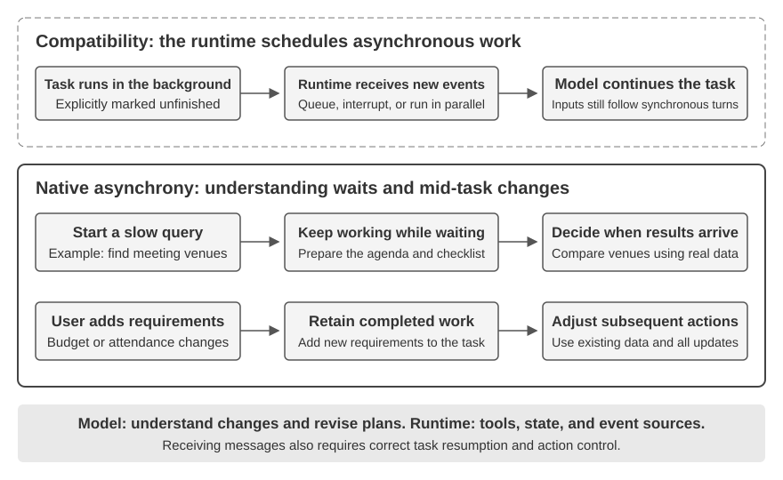
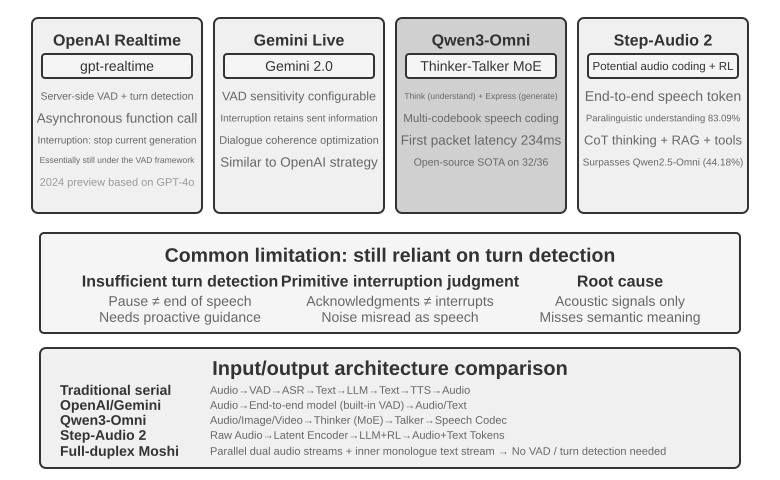

# Interaction: Expanding the Observation and Action Spaces

Chapter 1 made a claim: when the underlying model is fixed, the most effective system-engineering lever for improving an Agent's task performance is usually to redefine or expand its **observation space** and **action space**. Chapters 2 through 5 have been cashing that claim out—context engineering decides what goes into the observation, memory and knowledge bases stretch the observation across sessions, tools define what the Agent can do, and code generation lets it create new actions of its own.

But all of these expansions happened under one shared premise: **the Agent and the world take turns speaking**. The user finishes a sentence, the Agent thinks for a while, calls a few tools, and replies; while it is thinking, the world is assumed to stand still. The premise is so natural that it is rarely written down as an assumption at all.

This chapter removes exactly that premise.

## Two Axes: Modality and Timing

Lay the observation space and the action space out flat and each turns out to have two directions in which it can be expanded.

- **Modality** decides the **form** of observation and action: does the Agent only read text, or can it also hear sound, see the screen, and sense torque; can it only emit tokens, or also speak, click, and drive joints.
- **Timing** decides the **rhythm** of observation and action: does the Agent go and fetch an observation, or does the world push it; must an action finish within one turn, or may it span turns, be interrupted midway, and be preempted by something more urgent.

The previous chapters expanded the **content** of these two spaces; this chapter expands their **modality** and **timing**:

| | Expanding the observation space | Expanding the action space |
|---|---|---|
| **Content** (Chapters 2–5) | Context engineering, memory and knowledge bases | Tools, code generation |
| **Modality** (this chapter) | Voice, screen, physical sensors | Speaking, clicking, joint motion |
| **Timing** (this chapter) | The world pushes, continuous streams | Across turns, interruptible, preemptible |

The core proposition of this chapter compresses into one sentence: **turn-taking is an assumption left behind by training, not a property of the environment.**

A model's training corpus is almost entirely turn-based—a question followed by an answer, a tool call followed by a tool result, one speaker finishing before the other begins. So the policy a model learns assumes the world will wait for it. The real environment does not wait for the model to react: mail arrives while it is thinking, the user cuts in mid-sentence, the page has already changed between two screenshots, and the cup is knocked over while the arm is reaching for it.

| Scale | Scenario | Change on the observation side | Change on the action side |
|---|---|---|---|
| Seconds — days | Async and event-driven | The world wakes the Agent (mail, timers, callbacks) | Actions span turns: start now, finish later on an event |
| 10 ms — 1 s | Voice | Listen while speaking, without waiting for a full sentence | Think while speaking, interruptible, revisable midway |
| Sub-second — seconds | Computer Use | The screen keeps changing between frames | After acting, reality must be re-confirmed against the plan |
| Milliseconds | Robotics | Sensors stream back continuously | Actions are chunked: plan a little at a time, preemptible |

The four sections share one set of primitives—**wake-up, safe point, cancellation, preemption, and fast/slow separation**—differing only in parameters and failure modes. "Check the cancellation signal at a safe point" in event-driven async and "on anomaly, discard the remaining actions and re-observe" in robot action chunking are the same mechanism implemented twice, five orders of magnitude apart in time. Seeing that isomorphism matters more than memorizing the technical detail of any single scenario.

**One arrangement in the reading order is deliberate: this chapter gives voice noticeably more space than the two scenarios that follow it.** Along the evolutionary line of real-time interaction, voice is the one that has travelled furthest and is most worth using as a frame of reference: starting from "the serial pipeline has too much latency," through end-to-end models, full duplex, and thinking-while-speaking, all the way to a relatively settled endgame—problem, solution, and endgame have all been walked through. So we tell it fully, and Computer Use and robotics can then be read against that line—how far along it each has come, and where each is stuck.

## Async and Event-Driven: When the World Comes Looking for You

The perception, execution, and collaboration tools discussed in Chapter 4 are all invoked proactively by the Agent. How should an Agent respond to external events that may arrive at any time? This requires an event-driven asynchronous architecture. The two remaining tool classes from Chapter 1—event-trigger tools and user-communication tools—depend on this architecture, so they are discussed here as well.

### Why Asynchrony is Needed

Let's start with an analogy to explain why asynchrony is needed. Synchronous means "do one thing before you can do the next," while asynchronous means "multiple things can happen concurrently." A traditional synchronous Agent architecture is like a single checkout counter at a store—it can only handle one customer at a time, and only calls the next number after finishing with the current one. A truly intelligent assistant is more like a flexible secretary—with multiple pending items on the desk (emails, phone calls, visitors), the secretary decides which to handle first based on urgency, and can pause and switch to a more urgent task mid-way. In synchronous mode, the Agent either has to wait for a background task to complete before talking to the user, or wait for the conversation to end before processing a newly arrived event. It cannot deliver the core capabilities a real assistant scenario requires:

- **Asynchronous execution is the norm**—Many tasks require long runtimes and should not block user interaction.
- **Dynamic judgment of event priority**—Not all events are equally important. The Agent needs to intelligently choose a handling strategy: cancel the current operation (urgent), add it to a queue (routine), or process in parallel (independent lightweight query).
- **Fluency in interruption and resumption**—An interrupted conversation or task should be able to resume naturally.

The asynchronous paradigm, however, collides with a fundamental fact about current LLMs: their training assumes synchrony—after a tool call, the next message must be the tool result—while real deployment demands asynchrony: users interrupt at will, tasks progress concurrently, and external events arrive before a tool returns. This "synchronous training / asynchronous deployment" contradiction runs through every engineering trade-off in the rest of this section.

To solve this, we need an **event-driven asynchronous Agent architecture**. Technically, this means the system no longer actively and repeatedly checks for "new messages" (this is polling, which is inefficient), but instead automatically triggers processing logic when a new message arrives. All inputs, outputs, thought processes, and external interactions are uniformly modeled as an event stream—a sequence of event records arranged on a timeline. Figure 6-1 shows the overall architecture of an event-driven asynchronous Agent, illustrating the relationship between event sources, the event queue, and the Agent processing flow.


### Implementing Event-Driven Mechanisms in OpenClaw

The open-source framework OpenClaw receives multi-channel messages through a Gateway control plane and routes them to the Agent runtime. It provides three built-in event-driven mechanisms:

- **Hooks**: Respond to events in the Agent's lifecycle, such as session creation and reset, similar to event triggers in GitHub Actions
- **Cron (scheduled-task scheduler)**: Execute periodic tasks according to cron expressions (a widely used syntax for scheduled tasks in Unix systems, e.g., `0 9 * * 5` means 9 AM every Friday)
- **Heartbeat (Heartbeat Daemon)**: Wakes up the Agent every N minutes to check whether anything requires attention

These three mechanisms give OpenClaw Agents the appearance of autonomy—even with the user offline, the Agent can generate reports on schedule, check system status, and handle routine chores. The Gateway already handles messages from built-in channels such as IM and the web interface in **push** fashion. Of the three mechanisms, only Cron and Heartbeat let the Agent act without a user message, and both are **time-driven**: Heartbeat checks at fixed intervals, Cron fires at preset times, and Hooks originate inside the OpenClaw framework rather than outside it.

The real gap is third-party event sources beyond the built-in channels: a new email, an external API callback, or an urgent notification. OpenClaw has no immediate ingress path for them, so the Agent cannot respond immediately and may only notice at the next Cron or Heartbeat tick.

This delay is unacceptable in many scenarios. Take **PineClaw** (Pine AI's OpenClaw plugin) as an example: Pine AI is an AI assistant that makes real phone calls on behalf of the user, with typical scenarios including negotiating bills, canceling subscriptions, and handling insurance claims. When a user initiates a Pine phone task through an OpenClaw Agent, Pine's voice AI will make the call on behalf of the user, but the user may need to intervene at any time during the call:

- **Real-time Identity Verification**: The customer service representative asks to verify the account holder's identity, and Pine needs the user to immediately provide a security code or one-time password (OTP)
- **Three-Way Call Confirmation**: The customer service representative asks to speak directly with the account holder, and Pine needs the user to answer the phone within seconds
- **Progress Sync and Decision Confirmation**: At a critical point in the negotiation (e.g., the other party proposes a price reduction), Pine needs the user to confirm whether to accept

With Heartbeat's periodic polling, the user might not get the notification while the representative is still waiting for the verification code; the representative hangs up and the call fails.

PineClaw's solution is a **Channel mechanism** that establishes a real-time event path between OpenClaw's Gateway and the Pine API. When a call connects, needs user input, or ends, the message is pushed immediately to the OpenClaw Agent, which handles it and notifies the user.

This case reveals the core value of an event-driven architecture for Agent frameworks: **true "proactive service" requires not only that the Agent can periodically check for events, but also that events can actively notify the Agent.** Unifying all inputs—user messages, tool returns, external callbacks, scheduled triggers—into an event stream, and driving the Agent's thinking and actions through an event loop, is the architectural foundation for achieving this goal. Under this architecture, we will first introduce the two tool categories directly related to events, as well as the virtual identity and isolated execution environment that support the Agent's independent actions, before discussing the specific design of the event handling mechanism.

### Event-Triggered Tools

Event-triggered tools are the entry points through which external events drive an Agent's actions. Without them, an Agent can only operate in a continuous loop of thinking, calling tools, and finally outputting a result, then waiting for the user's next input. To translate changes in the world into events an Agent can process, there are three common types of event-triggered tools.

**Timers** (`set_timer`) handle events tied to physical time. If an email goes unanswered, the Agent should follow up after a while to ask about progress; if a call is placed outside the recipient's business hours, it should retry during the next business window. Tools like OpenClaw and Claude Code therefore let an Agent wake itself at a specified time. **One-shot timers** handle tasks with a specific time: if a user asks on Saturday to “call the bank's mortgage department for a status update,” the Agent sets “call the bank next Monday at 10:00 AM,” and the timer triggers the call. **Recurring timers** handle periodic tasks, such as checking server health every hour. Some external services cannot push progress updates and must be polled; the recurring timer provides that polling. OpenClaw's Heartbeat is a systematized version of this mechanism and the basis of its “proactive service” capability.

**Background Task Monitoring** (`monitor_shell`) handles events from asynchronously executing tools or command-line tasks. Some command-line tasks run in the background for a long time, and the Agent needs to track their progress. If the Agent "stares at the command line," repeatedly calling a tool to poll for progress, it burns tokens; if it waits until the task has fully finished before thinking again, it misses critical problems as they unfold—and if the command hangs, it cannot intervene at all, stalling the whole task. Claude Code solves this by introducing a `monitor` tool, allowing the Agent to monitor new command-line output, including output that contains specific keywords.

**External Event Channels** (`connect_channel`) push external events like new emails, API callbacks, or IM messages to the Agent in real time. The Channel mechanism in PineClaw from the previous section is a typical implementation.

From a design perspective, event-triggered tools should define clear trigger conditions and filtering rules to prevent irrelevant events from waking the Agent and wasting computational resources. The event payload should contain sufficient context information to minimize the number of additional queries the Agent needs to make after being woken up.

### User Communication Tools

User communication tools arise as communication channels between Agents and users diversify. Many Agents, such as Claude Code and Manus, use a native ReAct loop: everything the Agent “says” (an assistant message) is sent directly to the user, who must open a specific session in the app to converse with it. The session often exposes the Agent's tool-call process.

OpenClaw breaks this pattern. Users need not perceive sessions or follow the details of tool calls; both user and Agent can send messages at any time instead of alternating one request with one response. This gives OpenClaw what many describe as a **“human-like presence”**, communicating asynchronously like a secretary. Rather than sending raw assistant messages, OpenClaw uses dedicated messaging tools whose messages can include images and files and can trigger push notifications based on urgency.

Beyond text, more Agents support **multimodal communication**, such as structured cards and reminder emails. Some are experimenting with **Generative UI**, producing interactive HTML interfaces that present information more effectively. User communication tools should support asynchronous messaging, read/unread tracking, and consistency across channels.

**Multi-channel User Communication and Re-engagement.**

**An Agent's response should not be limited to a single channel; the notification mechanism also serves as a user re-engagement mechanism.** Message sending extends to instant messaging, SMS, email, phone calls, push notifications, and other channels. The Agent decides on the channel based on a combination of urgency, user status, content nature, and user preferences, ensuring important messages are not missed while avoiding redundant interruptions.

For long-running tasks, the Agent needs to proactively notify the user upon completion to bring the user's attention back. For periodic tasks (like daily summaries or weekly reports), notifications can help users develop a regular interaction habit.

User communication tools solve the problem of "how to reach the user." However, the identity the Agent assumes on these channels and the environment in which it performs actions on behalf of the user require a layer of identity and execution-environment infrastructure, which is the topic of the next section.

### Virtual Identity and Isolated Execution Environment

As mentioned at the beginning of this chapter, Samantha in *Her* has an independent identity and operating environment. Achieving such a general-purpose assistant forces a key architectural choice: should the Agent manage the user's personal accounts directly, or hold a virtual identity of its own? Direct management looks convenient, but one Agent error or compromise exposes the user's entire digital identity. The safer approach is to give the Agent an independent virtual identity—the way a secretary has their own office phone and mailbox—comprising dedicated communication accounts, storage, and computing environments, so the Agent can work on the user's behalf under a transparent, clearly declared identity. This transparency does not weaken trust; it can make communication more authentic.

Virtual identities need isolated execution environments. **Virtual computers** (VMs/containers) and **virtual phones** (Android emulators) give the Agent operating-system isolation and full desktop or mobile capabilities. First, a virtual computer can run around the clock regardless of whether the user's device is online and without disrupting the apps the user is operating. Second, an Agent error can at worst crash the virtual environment rather than the user's real device. Finally, isolation prevents the Agent from freely accessing the user's local files.

An independent identity also presents two practical challenges. First, there are **anti-bot mechanisms**: many websites use CAPTCHAs and IP reputation checks to block automated access. Virtual environments using data center IPs are easily identified; in practice, normal access often requires configuring a residential proxy network (which uses real household IPs). Second, **access to the user's real accounts**: when a task must log in as the user, use Human-in-the-Loop authentication—a VNC/RDP remote desktop where the user logs in personally, sees the full interface the Agent is operating, and understands why authentication is needed. The session token is then reused within its validity period to avoid interrupting the user repeatedly, balancing autonomy and security.

Data exchange between the Agent and virtual environments uses a **shared file system**: volume mounts such as `/workspace/shared` connect the Agent, virtual computer, and virtual phone. Data is passed by file-path reference rather than copied into context. For example, a user uploads a CSV to the shared directory; the Agent in the virtual computer analyzes it and saves a chart there; the Agent returns only the chart's path. Every handoff remains a lightweight path string.

Event-triggered tools allow the world to wake the Agent, user communication tools allow the Agent to reach the user, and virtual identities with isolated execution environments allow the Agent to act independently and auditably. The remaining question is: when multiple events converge on the same Agent instance simultaneously, how should they be handled?

### Event Handling Mechanism

A single Agent instance may face multiple events concurrently: a new message from the user, a result from a tool, a timer expiring, a collaboration request from another Agent. How these events are handled efficiently and correctly directly impacts performance and user experience.

The skeleton of this mechanism is the **event loop** from concurrent programming. Think of an asynchronous Agent as a long-running loop: each round takes a batch of events off the input queue, appends them to the trajectory, invokes the LLM once, executes the tools it decides to call, then returns to the top of the loop to wait for the next batch of events—the same structure as a Go goroutine reading messages from a channel and processing them round by round inside a `for { select { ... } }`. This model has one crucial property: **events are consumed only at the boundaries of each loop iteration**. While the LLM is reasoning or a tool is executing, a newly arrived event cannot inject itself out of nowhere and disrupt the current step; it waits in the queue until the round reaches a **safe point** (the end of a stretch of reasoning, a tool return) and is then handled as a batch. Cancellation follows the same discipline: rather than forcibly cutting off at an arbitrary moment, the Agent checks "have I been asked to stop?" at a safe point—which is exactly the role played by `ctx.Done()` in Go (Chapter 10 uses the same context idiom to discuss a parent Agent's cascading cancellation of its sub-agents). Once this is understood, the three processing strategies below differ only in how they treat the safe point: let the event wait for the next naturally occurring safe point (queued), proactively force a safe point early (cancellation), or simply spin up a separate loop and not wait for the main loop's safe point at all (parallel).

**Structured Event Modeling.**

Handling requires understanding. A general-purpose Agent's input doesn't come only from the user—a third-party message is not sent by the user to the Agent, yet the Agent must understand it, weigh its importance, and decide whether to step in. This requires modeling each input as a **structured event** rich with semantics:

- **Source (who)**: The user themselves, a contact, a stranger, a system notification
- **Channel (how)**: Phone call, SMS, instant message, email, social media, timer trigger, asynchronous tool call result, command-line monitoring status update
- **Content (what)**: Message text, emotional tone, urgency, whether a reply is needed
- **Context (background)**: Whether it's a reply to a previous conversation or a new communication, its relevance to the current task

Taking a customer refund request email as an example, the structured event looks like this:

```json
{
  "source": {"type": "email", "sender": "client@example.com"},
  "channel": "gmail_webhook",
  "content": {"subject": "Refund Request", "body": "Order #12345, requesting a refund..."},
  "context": {"priority": "high", "customer_tier": "vip", "related_orders": ["#12345"]}
}
```

Only when these dimensions are clearly modeled as structured events can the Agent maintain a clear understanding in multi-party communication, avoiding mistaking user input for a tool result, or mistaking a tool result containing hidden instructions for a user command (prompt injection). The complexity of multi-threaded context management also requires the Agent to understand the relationships between multiple conversation threads—how a message from a third party affects the user's mood, the user's role transitions across different conversations, and when to synthesize information from different threads to provide advice. The trigger ecosystem of workflow platforms like n8n—webhooks, timers, emails, database changes, file watchers—illustrates the same principle: each trigger is a "sense organ" through which the Agent perceives the world. Once these heterogeneous events are modeled into one structured format, the Agent can process stimuli from any source consistently. The urgency determination and processing strategies below are all built on this unified modeling.

**Dynamic Processing Strategy Based on Urgency.**

Humans juggling multiple tasks adapt their strategy to urgency: an emergency makes them drop what they're doing; a routine to-do goes on the list for later. An Agent's event handling should show the same intelligence.


**Cancellation-Based Processing** is used for urgent events; its essence is **forcing a safe point early** for the urgent event: proactively interrupting the current step to turn this instant into a boundary at which the new event can be consumed. When an urgent event arrives (e.g., the user clicks "stop" or a supervisory system sends a high-priority instruction): (1) Stop the current operation—if the LLM is reasoning, immediately cancel the streaming response; if a synchronous tool is executing, send a cancel signal; (2) Drain the pending queue by removing all pending events; (3) Append those events together with the urgent event to the end of the trajectory; (4) Immediately re-invoke the LLM with the updated complete trajectory as input to assess the situation. For example, if the user inputs "Stop! I said the wrong thing" while the Agent is about to perform a potentially erroneous operation, the Agent will immediately see this new input, re-understand the true intent, and thus avoid executing the wrong action.

**Queued Processing** is used for routine events. When a non-urgent event arrives (e.g., an asynchronous tool returns a result or the user sends supplementary information): (1) Add the event to the end of the queue without interrupting the current operation; (2) Wait for the current operation to complete—let the LLM finish reasoning, let the synchronous tool finish executing; (3) When any tool call completes and returns a `tool.result`, check the queue. If the queue is non-empty, append all events to the trajectory at once; (4) The LLM processes the updated trajectory comprehensively. This enables batch processing, improving efficiency—for example, while the Agent is waiting for a search tool result, the user adds "only show results from the last month." This supplementary information enters the queue, and when the search results return, both events are presented to the LLM together, avoiding unnecessary round trips.

**Parallel Processing** is used for independent, lightweight queries. For example, while the Agent is analyzing a large amount of data, the user suddenly asks, "What's the weather like today?" Such queries have three characteristics: they are unrelated to the main task, require a quick response, and have low execution cost. Neither cancellation-based (would interrupt the important main task) nor queued processing (would make the user wait too long) is suitable. The system first assesses the query's independence and complexity, then executes it independently in a parallel reasoning session, calling necessary tools to generate a response and returning it immediately. The query and response are appended to the main task's trajectory, clearly marked as "executed in parallel with the main task" to avoid confusing the LLM.

**Urgency Determination.**

Urgent events: User interrupt (`user.interrupt`), supervisor instruction (`supervisor.instruction`), inter-Agent interrupt (`agent.interrupt`), external triggers marked as urgent (e.g., system alerts, payment failures).

Non-urgent events: Regular user input (`user.input`), Agent input (`agent.input`), tool results (`tool.result`), timer triggers (`timer.trigger`), regular external triggers.

Hardcoded rules have limitations; the semantics of the event dictate the handling method—"Stop immediately!" uses cancellation-based processing, "What's the weather like today?" uses parallel processing, "Send the report in Chinese" uses queued processing. **It is recommended to use a lightweight classification LLM as an event router**, quickly determining which strategy to adopt when an event arrives.

The following experiment, an event-driven email processing Agent, implements the event handling strategies discussed above into a runnable implementation.

> **Experiment 6-1 ★★★: Event-Driven Email Processing Agent**
>
>
> 
>
>
> This experiment builds the simplest event-driven Agent: an **Automated Email Processing Assistant**. The Agent monitors the email inbox, and whenever a new email arrives, it automatically triggers a processing workflow—classification, summarization, draft reply, and notifying the user if necessary. This is the most intuitive introductory scenario for an event-driven Agent: an external event (new email arrival) triggers a complete Agent thinking cycle.
>
> **Experiment Objective**: to understand the core idea of event-driven architecture—the Agent no longer waits passively for user input but acts on its own in response to external events. Through this experiment, readers will master the basic closed loop of event source registration, the event queue, and "event arrives → Agent processes → result delivered".
>
> **Event Sources and Event Queue.**
>
> The system supports unified access for multiple event sources:
>
> - **Email Events** (`on_email_received`): Triggered when a new email arrives, either by periodically checking the inbox or receiving push notifications.
> - **IM/SMS Messages** (`on_im_message`, `on_sms_message`): Triggered by instant messages or SMS messages.
> - **GitHub Events** (`on_github_pr_update`, `on_github_issue_update`): Triggered by PR review comments or status changes.
> - **Timer Triggers** (`on_timer_expire`): Triggered by scheduled tasks (e.g., daily summaries, weekly report generation).
> - **Webhooks** (`on_webhook_received`): Generic callbacks from external systems.
> - **System Events** (`on_user_inactive`, `on_process_timeout`, `on_resource_alert`): Triggered by internal state changes.
>
> All events enter a unified **event queue** and are processed sequentially in order of arrival. Each event triggers an independent Agent thinking loop: the Agent reads the event content, calls relevant tools (e.g., querying the knowledge base, reading attachments, searching related email history), generates a processing result (classification labels, summaries, draft replies), and finally either notifies the user via notification tools or directly executes an action.
>
> **Validation Scenario**: Configure the Agent to monitor a test mailbox. Simulate receiving three emails—a meeting invitation, a customer complaint, and a marketing advertisement. The Agent processes them sequentially: for the meeting invitation, it automatically checks for calendar conflicts and drafts an accept/decline reply; for the customer complaint, it extracts key information, marks it as high priority, and notifies the user to handle it; for the marketing advertisement, it automatically archives it. The entire process requires no user intervention.

Experiment 6-1 demonstrates the simplest event-driven pattern—events enter a queue, and the Agent processes them sequentially. However, when the Agent needs to respond to interruptions during long-running tool executions, or manage multiple concurrent tasks simultaneously, a simple event queue is insufficient. Next, we discuss deeper engineering challenges.

### Engineering Implementation: How to Make Synchronous Models Support Asynchronous Interruptions

Experiment 6-1 only handles serial events—events enter the queue one by one, and the Agent processes them one after another. Now, let's return to the "synchronous training / asynchronous deployment" contradiction raised at the beginning of this section: when the user interrupts while a tool has not yet returned, how can the synchronous format accommodate it? This section lays out the engineering workarounds the industry uses today.

Let's first illustrate this contradiction with a specific scenario. Suppose the Agent is helping a user draft an email (tool call: search for contact information). Before the search returns results, the user suddenly says, "Wait, first check tomorrow's weather for me." In a synchronous ReAct loop, the Agent must wait for the search to return before processing the next message—because the API requires that "after issuing a tool call, the next message must be the tool result." But in the asynchronous real world, events can interrupt ongoing tasks at any time. Expressing the semantics of "asynchronous interruption" under the constraints of a "synchronous format" is precisely the problem this engineering solution aims to solve.

**Engineering Expedient: An Asynchronous Implementation Simulating Synchronous Behavior.**

The core idea is: **Under normal conditions without interruptions, let the LLM see a standard synchronous trajectory; only when an interruption occurs, insert placeholders to fix the format**. Here are five key rules:

**Rule 1**: Immediately record the assistant message (including thinking, content, and tool call) when the LLM produces it.

**Rule 2**: Record the tool result only when the tool call is complete. The trajectory is in a "partially completed" state during execution.

**Rule 3**: Interruptions during tool execution require placeholders. Generate a placeholder response for the unfinished tool (e.g., "The tool is executing in the background, please prioritize the new event"), append the interruption event, and re-invoke the LLM. From the LLM's perspective, the assistant message still has a paired tool result.

**Rule 4**: Interruptions during LLM thinking directly discard the current thinking. Do not write it to the trajectory; instead, append the new event and start a new round of thinking.

**Rule 5**: Non-interrupting events enter the queue for batch processing. They are appended all at once only after the current cycle is complete.

Using the example of the Agent drafting an email when the user interrupts to ask about the weather, the operation of these five rules is as follows:

1. The Agent calls `search_contacts` to search for contact information, and the assistant message is immediately written to the trajectory (Rule 1).
2. Before the search tool returns results, the user sends "First check tomorrow's weather for me." Since this is a user interruption, the system generates a placeholder tool result for the unfinished `search_contacts` ("The tool is executing in the background, please prioritize the new event", Rule 3), then appends the user's weather query to the trajectory and re-invokes the LLM. At this point, the trajectory format seen by the LLM is completely valid—the assistant message and tool result are perfectly paired.
3. After the Agent answers the weather query, the original `search_contacts` result arrives and is appended to the trajectory as a new event (Rule 2). The Agent reads the contact information and continues drafting the email.

The core advantage of this scheme: **under normal conditions, the LLM sees a perfect synchronous trajectory**—assistant messages and tool results strictly paired, the timeline clear, no placeholders or anomalous states. This is the friendliest arrangement for LLMs trained under the synchronous paradigm, and it preserves thinking quality. The placeholder—a necessary compromise—appears only when an interruption genuinely occurs.

But there remains a risk of exacerbating hallucinations. Even though the placeholder states explicitly that the tool "has not yet completed," the model may still fabricate a tool result in later thinking—convincing itself the tool returned valid data and basing decisions on fabricated data. This is because, in the vast majority of trajectories seen during training, a tool call is immediately followed by the real result; the model has never learned how to handle situations where "the result hasn't come back yet." Therefore, in practice, interruptions are only triggered in truly urgent situations (when the user explicitly requests a stop); non-urgent events are placed in a queue for batch processing.

**Asynchronous Tool Interfaces Suitable for Existing Models.**

Since the synchronous assumption of models is difficult to break, a more fundamental strategy is to **embrace asynchronous semantics at the tool-interface design level**.

Traditional tool design implies a "call equals completion" semantics. For example, the name `phone_call` suggests "calling will dial the phone and wait for the call to end, returning the call log." Under the asynchronous paradigm, "initiation" and "completion" should be decoupled:

- `initiate_phone_call`: Initiates a phone call, immediately returning a task identifier and initial status (e.g., "Call initiated, dialing...")
- Call progress is communicated via event notifications (`phone_call_connected`, `phone_call_ended`)

The key is that the tool's name and description themselves should convey asynchronous semantics. When the model sees `initiate_phone_call`, its language understanding capabilities will naturally infer this is "initiating" rather than "completing." The tool description should further reinforce this: "This tool initiates a phone call task handled by a sub-agent. It returns the task ID immediately upon successful initiation, allowing you to continue with other matters. A separate notification event will be sent when the call ends."

**Attention Dispersion in Queue-Based Processing.**

When processing batch events, the model often focuses only on the last event. The root cause is that **the model is trained to react to the most recent input, and batch events break this assumption**.

Intervention can be applied at two levels:

**Prompt Level**: Inform the model, "When you receive multiple consecutive events, please ensure you comprehensively consider all the information."

**Agent Status Bar Markers**: Add explicit markers before each event:

```text
[Unprocessed Event 1/4] Tool result from database_query: ...
[Unprocessed Event 2/4] User supplementary note: Only look at Beijing data
[Unprocessed Event 3/4] System reminder: Report deadline is in 30 minutes
[Unprocessed Event 4/4] User asks: What's the progress?
```

Add a summary at the end: "There are 4 unprocessed events above, including 1 tool result, 2 user messages, and 1 system reminder. Please ensure your response covers all the information."

### Deeper Contradictions and Future Directions


Ultimately, the placeholders, asynchronous tool interfaces, and status bar markers from the previous sections are all using prompt engineering to patch the same "synchronous training / asynchronous deployment" contradiction (Figure 6-4)—the cause of this contradiction has been detailed at the beginning of this section, so we do not repeat it here; instead, we focus on the fundamental solution.

**Anticipating Model Evolution: From Synchronous to Asynchronous.**

The engineering techniques above are essentially **using prompt engineering to compensate for the shortcomings of model training**, a temporary expedient during a transitional period. The real solution requires a paradigm shift at the model training level.

VLA (Vision-Language-Action, see Chapter 6) models in the robotics field are already beginning to face similar challenges: there is an unavoidable delay between perception and action. The success of VLA points the way for the evolution of Agent models. The next generation of models needs to acquire three core capabilities through reinforcement learning in asynchronous environments:

1. **Understanding Asynchronous Interleaving of Events in Trajectories**: This is the most critical capability deficiency. Current models expect a strictly synchronous sequence, but in a real asynchronous environment, a tool call might be followed not by a tool result but by a new user message; thinking might be interrupted halfway, but the intermediate state should be retained in the trajectory, and thinking should continue after the new message is processed, rather than starting over. The model needs to maintain a clear understanding in such "out-of-order" trajectories—which tool calls are still waiting for results, and which thoughts are unfinished fragments.
2. **Resuming Interrupted Tasks and Thoughts**: When interrupted to handle an urgent event, the model must still remember the unfinished task. For example, if the user suddenly asks about the weather while the Agent is executing a data analysis tool, after answering, the Agent should naturally wait for the data analysis result, rather than forgetting that a tool is still running. It is particularly important to avoid hallucinations where the model mistakenly believes the interrupted tool call has completed.
3. **Comprehensive Processing of Batch Events**: When multiple events are appended to the trajectory in a batch, the model must not only focus on the last one; it must comprehensively consider all unprocessed information.

Achieving this asynchronous RL training requires new infrastructure: an asynchronous environment simulator (generating scenarios like delayed tool returns, random user interruptions, etc.) and specialized rewards for asynchronous capabilities (correctly understanding out-of-order trajectories, successfully resuming interrupted thoughts, avoiding hallucinations, comprehensively processing batch events).

Continuous thinking need not wait for the next generation of models. About two hundred lines of orchestration can turn an **existing** text-reasoning model into a **continuous-time** Agent, connecting the engineering expedient above with model evolution. It upgrades Rule 4: rather than discard an interrupted partial thought, make the interaction one uninterrupted stream of thought. The runtime can forcibly close the model's current `<think>` block, inject a newly arrived observation—a tool result, user interruption, or recognition update—as an ordinary message, and let decoding continue.

It uses a commonly wasted resource: a model can generate hundreds of tokens per second, while a tool call or a user's utterance may take several seconds. That waiting time can be used for thought. The Agent can therefore **think while waiting**—continue from partial information and even start the next tool early—and **think while acting**—continue reasoning while producing output and correct itself midway through an action.

> **Experiment 6-2 ★★★: Asynchronous Agent with Parallel Execution and Interruption Capabilities**
>
>
> 
>
>
> Building on the simple event queue of Experiment 6-1, this experiment moves into the hard parts of asynchronous Agents: **parallel tool execution, execution cancellation, and state management**. The Agent no longer just processes events one by one; it needs to manage multiple concurrent tasks simultaneously, handle interruptions and recoveries, and make dynamic decisions based on real-time state.
>
> **1. Asynchronous Tool Execution**: Supports asynchronous execution of time-consuming tools (at least 3-5 seconds), returning a placeholder immediately upon initiation. **Validation Scenario**: The Agent executes a long-running terminal command. During this time, the user asks, "What time is it now?" The Agent responds immediately, then presents the analysis result when the long-running command completes.
>
> **2. Event Queue and Batch Processing**: Accumulates non-urgent events and appends them to the trajectory in a batch. **Validation Scenario**: The Agent is executing a long task. The user sends consecutive messages: "Remember to reply in Japanese" and "Format it as a webpage." When the task completes, the Agent processes all events at once, generating a Japanese webpage.
>
> **3. Interruption Mechanism**: A user's "stop" command immediately terminates the execution flow and cancels the asynchronous tool. **Validation Scenario**: The Agent is executing a long task. The user sends "Cancel." The Agent stops immediately, and the trajectory records the interruption event and the cancellation operation.
>
> **4. Cancellation and Status Query for Parallel Tools**: After an asynchronous tool completes, the real result is injected into the conversation via a new event. Supports cancellation or progress query via task ID. **Validation Scenario**: The user requests, "Run these three scripts simultaneously for me. Whichever finishes first, check the progress of the remaining scripts. If any hasn't exceeded 50%, cancel it." The three scripts simulate analysis processes, outputting progress continuously at speeds of 3%, 2%, and 1% per second, respectively. The Agent starts three asynchronous terminal commands simultaneously. When the script at 3% per second finishes in about 33 seconds, the Agent queries the status of the remaining two terminals, finding one at about 66% and the other at about 33%. It then cancels the one that hasn't exceeded 50%. After both terminals complete, it integrates the results to generate a complete report.
>

Asynchrony and event-driven execution let the world wake an Agent at any time, but assume the model can finish thinking before it responds. The next three sections challenge that assumption: when the environment changes as fast as or faster than model generation, “think first, then speak” becomes unacceptable latency.

## Voice: The Most Natural Human-Machine Interface

Voice is not merely text turned into sound. Speaking is roughly four times faster than typing and leaves the hands and eyes free, so it naturally places an Agent in a continuous input-output loop where the user may interrupt at any moment. Dictation converts speech into text; a voice Agent lets the user collaborate with the Agent directly. Both support the whisper-coding workflow introduced earlier.

This section covers two directions: the user speaking to an Agent, and an Agent speaking to the outside world on the user's behalf. The voice model determines what the Agent can answer; the interaction architecture determines whether it can hear clearly, respond in time, hand over naturally, and complete confirmations and tool calls during a call. We first examine interaction timing, then cognitive timing and expressive quality.

### Interaction timing: from cascaded to full-duplex

OpenAI's GPT-Live introduction describes three voice-interaction paradigms—cascaded, turn-based, and full-duplex[^ch6-12]. They are not a simple old-to-new replacement; they trade latency, cost, and observability in different ways:

| Paradigm | Core structure | Main advantage | Main limitation |
| --- | --- | --- | --- |
| Cascaded | VAD → ASR → LLM → TTS | Clear modules that are easy to replace and debug | Latency accumulates and paralinguistic information is lost at interfaces |
| End-to-end Omni | Native audio input and output with turn-based interaction | Lower latency and better preservation of tone, emotion, and ambient sound | Still turn-based; training and debugging cost more |
| Full-duplex | Native audio input and output with continuous listening, speaking, and decision-making | Overlapping speech, natural interruption, and continuous streams | Training, control, and evaluation are more complex |

The common thread is escaping the assumption that people must speak one at a time, and escaping VAD's guess about who has the floor. Cascaded and Omni systems still divide interaction into turns; full-duplex makes turn ownership a continuous model decision.

[^ch6-12]: OpenAI. *Introducing GPT-Live.* 2026-07-08. https://openai.com/index/introducing-gpt-live/ The cascaded / turn-based / full-duplex taxonomy comes from the article's summary of three generations of ChatGPT Voice; its “end-to-end omnimodal (Omni)” term corresponds to the “turn-based voice models” category.

### Paradigm 1 · Cascaded pipeline

Most commercial voice assistants still use a serial pipeline (Figure 6-6): VAD decides when the user has finished, ASR converts audio to text, the LLM understands and generates a reply, and TTS speaks it. Modularity lets each component be optimized independently, but every boundary can add waiting time.


| Module | Role | Typical bottleneck |
| --- | --- | --- |
| VAD | Decide whether speech has ended | Silence thresholds add waiting and split turns incorrectly |
| ASR | Convert audio to text | Recognition latency and loss of context |
| LLM | Understand, reason, and generate | Time to first token; reasoning adds more waiting |
| TTS | Convert text to speech | First-packet synthesis and playback buffering |

For a short reply without reasoning, VAD, ASR, LLM, and TTS waiting time accumulates serially (Figure 6-7). The real value depends on input length, model, hardware, network, and load.


Production queueing amplifies idle latency further (Figure 6-8), but capacity planning is outside this chapter's scope.


> **Experiment 6-3 ★: Build a traditional voice Agent**
>
> Connect a microphone, Silero VAD, local Whisper, a streaming LLM, and Fish S1 TTS over WebSocket to establish the cascaded baseline.

#### From serial to streaming perception

Figure 6-7 describes the fully serial case: VAD, ASR, LLM, and TTS run one after another. This serial perception approach has three problems:

1. **Accumulated latency:** it must wait through silence before confirming the end.
2. **Lost information:** a voiced/unvoiced bit cannot express hesitation, emotion, backchannels, or ambient sound.
3. **Broken context:** email addresses, names, and proper nouns may be split across chunks and misrecognized.

To address this while keeping the modular split, one optimization is **streaming perception**, which lets each stage produce incremental results as early as possible:

- **Streaming ASR:** once VAD detects that the user has started speaking, the ASR model is called at fixed intervals to produce a provisional transcript in a streaming fashion; once VAD detects that the user has finished, the final text is confirmed.
- **LLM speculative execution:** the provisional transcript is sent to the LLM as soon as it exists. If the final text matches the provisional transcript, the LLM is not called again; otherwise the earlier speculative thinking is cancelled and the LLM is called again.
- **Segmented LLM output:** the first speakable sentence goes to TTS without waiting for the full reply.
- **Incremental TTS:** audio chunks are returned continuously so later generation, synthesis, and playback overlap.

A truly streaming ASR needs model-level support. Whisper's decoder is autoregressive, but its encoder expects a complete audio segment, so it cannot simply be equated with a streaming model. An LLM-based streaming-audio model can emit text and semantic events from continuous audio, placing recognition and part of understanding in one model. It keeps the conversation context from the beginning up to the present moment and can use world knowledge for brands, names, and proper nouns.

If the only goal is deciding whether the user has finished, endpointing can be built into the streaming recognizer. The model combines semantics and silence to judge whether an utterance is complete. Training labels must contain only information visible at decision time, or hindsight will produce a judgment that cannot be reproduced online.

The model can emit acoustic-event markers as well as words:

- **speak_start/end, interrupt:** speech boundaries and interruption intent;
- **emotion:** emotion and hesitation;
- **laugh, sigh, noise:** paralinguistic and environmental sound.

Together with text tokens, these markers form one event stream. The Agent can detect hesitation, interruption, and environmental changes without compressing every sound into plain text.

> **Experiment 6-4 ★: Simulate streaming voice perception with Qwen2-Audio**
>
> Qwen2-Audio is not itself a streaming model. This experiment simulates continuous perception with increasing audio prefixes and compares it with 600 ms VAD + Whisper.

### Paradigm 2 · End-to-end omnimodal models (Omni)

Even with streaming perception, a cascade passes listening, thinking, and speaking through discrete interfaces; emotion, intonation, and ambient sound may be lost when audio becomes plain text. The Omni approach uses one model to listen to audio, generate a reply, and speak it, which can preserve those signals, though at a higher training cost (Figure 6-9). Compared with the cascaded pipeline of Paradigm 1, Omni's advantage shows up mainly in latency and in understanding and generating non-text information.

On the understanding side, Omni models can pick up on pauses in the voice. On the generation side, Omni models can convey richer paralinguistic information—singing, or delivering a line in a distinctive tone.

Omni models still assume turn-taking and generally use VAD to assign the floor. A mid-utterance pause while the user reads out a string of digits can therefore still be mistaken for the end of the turn.



> **Experiment 6-5 ★★: Run MiniCPM-o 4.5 locally—end-to-end versus self-cascade**
>
> Run MiniCPM-o 4.5 locally with thinking mode disabled, comparing direct answers from audio against a self-cascade that first transcribes and then answers with the same model. This measures whether audio information is preserved, **not** the “thinking while speaking” discussed later.

### Paradigm 3 · Full-duplex interactive models

Omni still divides conversation into “the user speaks” and “the model speaks,” but simultaneous interpreting and similar tasks require overlap. A full-duplex model therefore does not presuppose turns: it listens and speaks continuously and repeatedly decides whether to continue, pause, interrupt, or call a tool.

Kyutai's **Moshi** (2024) was an early research example. It models the user's and the model's audio streams in parallel, so overlapping speech and interruption can be natural behaviors.

Thinking Machines Lab calls this an **Interaction Model**[^ch6-14]: interaction is built into the model instead of assembled around it with VAD and other external harnesses. Its micro-turn mechanism advances in short audio blocks, preserving silence, overlap, and interruption as continuous context. It can delegate the full conversation to a background reasoning model while it keeps the conversation alive, then incorporate the result at a suitable moment.

[^ch6-14]: Thinking Machines Lab, “Interaction Models: A Scalable Approach to Human-AI Collaboration,” 2026-05. https://thinkingmachines.ai/blog/interaction-models/

OpenAI's GPT-Live brings the full-duplex path to production scale: it continuously processes input and generates output, can wait, backchannel, be interrupted, and handle realtime translation. Like the Interaction Model, it delegates complex work to a background model while the foreground model maintains the conversation.

### Cognitive timing: realtime interaction and deep thinking

Interaction quality and intelligence ceiling are different dimensions. The foreground model must respond while the user is still engaged; the background model can spend longer thinking. The following three designs are trade-offs, not a linear progression. The first two can wrap a cascade or Omni model; the third instead unifies deep reasoning and realtime expression within the same model.

#### Solution 1: Fast thinking for fillers, slow thinking for answers

Fast thinking can give a holding response within a few hundred milliseconds while slow thinking performs a deeper derivation in the background. Simple questions may be processed twice, while hard questions can produce contradictions: the fast model recommends a purchase, then the slow model discovers that a key feature is missing. The root cause is two independent instances thinking separately.


#### Solution 2: Fast thinking for interaction, slow thinking for advice

The background model can send advice through a status bar or dedicated interface while the foreground model keeps the conversation alive and decides how to phrase it. This is more stable than Solution 1, but communication is still indirect: the foreground can misunderstand the advice and cannot see the background's intermediate reasoning. Before the background finishes, follow-up questions still rely on the foreground model. It can naturally wait for a result, but it cannot truly think while speaking.

#### Solution 3: End-to-end unification of thinking and expression

This design internalizes reasoning directly in an end-to-end audio model. Step-Audio R1 uses two complementary mechanisms: **Modality-Grounded Reasoning Distillation (MGRD)** grounds thinking in acoustic features, while the **MPS dual-brain architecture** lets planning and expression proceed in parallel. The first helps the model think correctly; the second helps it speak in time.

Ideally, the model infers emotion from pitch, rhythm, and intonation rather than only from the transcript. MGRD selects reasoning traces that actually cite acoustic features, trains on them, and uses reinforcement learning to prevent guessing without thinking. MPS lets the planning brain continuously emit thought segments; the expression brain combines each segment with the partial reply and immediately generates speech. The pipeline runs in parallel, so the listener need not wait for the entire chain of reasoning before hearing the first sentence.

#### The trade-off between separated fast/slow thinking and end-to-end reasoning

A unified model implements “thinking while speaking” most directly, but thinking and realtime expression must be retrained together. A decoupled design makes it easier to swap the background brain. These are trade-offs, not simple substitutes.

As frontier reasoning models advance rapidly, separating fast and slow thinking offers an important engineering advantage: it captures the gains from each new generation of slow models directly. The fast foreground model only needs to listen, respond, and sustain the conversation with low latency, while the slow background model handles reasoning, planning, and tool use. When a stronger reasoning model arrives, only the background model needs to be replaced; the entire realtime voice system need not be retrained. A unified design binds reasoning and interaction to the same training cycle, so every upgrade must rebalance intelligence, response latency, and natural expression. Fast/slow separation is therefore not merely a compromise on latency, but a modular choice that lets interaction capability and the intelligence ceiling evolve independently.

This separation does not necessarily sacrifice task performance. As of August 2026, Pine AI's voice Agent, which uses a separated fast/slow architecture, ranked first on the τ³-Voice Leaderboard, ahead of realtime voice systems including Grok Voice and GPT-Realtime-2. At minimum, this result shows that a decoupled architecture is not inherently inferior to end-to-end models on tasks that jointly test deep reasoning and realtime conversation.[^ch6-17]

[^ch6-17]: Pine AI. “The Most Natural Human-Computer Interface Is Your Voice.” 2026-06-23 (updated 2026-08-06). https://www.19pine.ai/blog/pine-ai-the-most-natural-human-computer-interface-is-your-voice

The term “end-to-end model” needs one further clarification because it is commonly used in two senses. The first is **an end-to-end speech path**, discussed in the preceding section: the model receives audio and produces audio directly instead of connecting multiple models through discrete text. Both Omni and Interaction Models are end-to-end in this sense, but Omni models usually remain turn-based, whereas Interaction Models can listen and speak at the same time; their architectures differ substantially. The second is **an end-to-end cognitive architecture**, discussed in this section: realtime interaction and deep reasoning either share state and are trained together within one model, or are split between a fast foreground model and a slow background model. The two axes are independent. A system can have an end-to-end speech path while retaining fast/slow separation in its cognitive architecture; Thinking Machines Lab's delegation of complex tasks to a background reasoner is one such combination.

### More human-like speech synthesis

Traditional TTS can expose its machine identity by being too smooth and pausing too little. Pauses, filler words, and occasional repetition signal uncertainty and thought in human speech.

The main LLM can emit control markers in addition to text, such as **THINKING**, **EMO:happy**, and **SPEED:0.8x**; TTS maps them to pauses, prosody, speaking rate, laughter, sighs, and other nonverbal audio. The implementation can be a TTS trained to understand control markers, or voice cloning with reference clips for different emotions and styles.

> **Experiment 6-6 ★★: Control token-driven TTS with Fish Audio**
>
> Use Fish Audio S1 to build a multi-reference voice library and compare three configurations: no control markers, one reference clip, and multiple reference clips. The execution layer selects matching emotion, speaking rate, and style from the markers.

## Computer Use: GUI Automation Agents

By now you may have noticed that this chapter devotes far more space to voice than to the two scenarios that follow. This is deliberate. Among real-time multimodal systems, voice technology has progressed the furthest and therefore provides the best reference point. It has traced the full arc from the original problem—excessive latency in serial pipelines—through end-to-end models, full-duplex interaction, and thinking while speaking, to today's relatively mature designs. That is why we have told its story in full. As you read the Computer Use and robotics sections, compare them with this trajectory: how far has each field progressed, and where does each remain stuck?

These three scenarios seem different but face the same core challenges: real-time perception, low-latency decision-making, and continuous interaction. Next, we turn to visual interaction, or Computer Use, expanding the perspective from the auditory to the visual modality: what if an Agent could not only understand speech but also "see" the screen and operate its graphical interface?

Computer Use, also known as GUI automation, allows AI to use software like a human by observing the screen and operating the mouse and keyboard—for example, opening a browser to search for information, filling in data in a spreadsheet application, or adjusting configurations in system settings. Its core is a **Perceive-Think-Act** loop (Figure 6-11):

1.  The Agent takes a screenshot of the current screen.
2.  A multimodal model receives the screenshot and task instruction, and outputs a thought and a specific action.
3.  The execution layer performs the action in the real environment (moving the mouse, clicking, typing text, etc.).
4.  It waits for the interface to respond, takes another screenshot, and enters the next loop iteration.

It is important to distinguish **understanding the interface** from **completing the task**. The former is closer to multimodal understanding and can be measured with one-shot screenshot question answering. The latter requires the model to put understanding and action generation into a closed loop that handles page loading, state changes, mistakes, and irreversible consequences. The challenge of Computer Use is therefore not merely answering correctly about a screenshot, but reconfirming after every step that reality still matches the plan.


There are three key design dimensions in this loop: **Action Space** (what operations the Agent can perform), **Visual Grounding** (how to find the target element in the screenshot), and **Model Architecture** (how to generate the correct action from the screenshot).

### Action Space Design

Anthropic's reference implementation divides a complete interaction capability into three types of tools (Figure 6-12). This is a clear action-space design, but not a private protocol that model providers must follow: as long as the Harness can translate the same screenshots, action constraints, and execution results into messages and structured outputs supported by the target model, Claude, open-weight vision models, and self-hosted endpoints can all drive the same Perceive-Think-Act loop.


**GUI Operation Tool** (`computer` tool): Mouse operations include moving (`mouse_move`), left/right/middle clicks, double-clicking or triple-clicking, dragging (`left_click_drag`), and more precise press/release actions (`left_mouse_down` and `left_mouse_up`). Scrolling (`scroll`) supports four directions and can be combined with modifier keys. Keyboard operations include typing character by character (`type`, with a 12ms interval between characters to simulate real typing), key combinations (`key`, e.g., `Ctrl+C`), and holding a key (`hold_key`). Perception actions include taking a screenshot, retrieving the cursor position (`cursor_position`), and waiting (`wait`).

**Command Execution Tool** (bash tool): Provides a persistent bash terminal session with a 120-second timeout. It uses a sentinel string to detect command completion and maintains environment state across multiple calls (e.g., after `cd` to a directory, the next call remains in that directory).

**File Editing Tool** (`str_replace_editor`): Enables safe editing through string matching and supports view, create, replace, insert, and undo operations. It is more precise than overwriting an entire file and less likely to modify unrelated content accidentally.

> **Experiment 6-7 ★: Running Computer Use (Anthropic Reference Path or Open-Model Path)**
>
> Path A uses the Anthropic Computer Use Demo. Its container packages a complete Ubuntu desktop environment, including a browser, terminal, and other common tools. The frontend receives a task, while the backend sends the instructions and screenshots to Claude and then executes the mouse, keyboard, terminal, or editing actions returned by the model.
>
> Path B uses the example code in [`chapter6/computer-use-open-model`](../chapter6/computer-use-open-model/). By default, it drives browser-use with the open-weight Qwen3-VL 32B Instruct model through the hosted OpenRouter API, or through self-hosted vLLM/SGLang and similar systems.

### Visual Grounding

In each iteration of the loop, the model needs to accurately locate the target element in the screenshot—"Where is the search box?" "What are the coordinates of the submit button?" This is the visual grounding problem. Currently, there are **two main approaches**: one is to turn localization into a **multiple-choice problem**—first annotate the interface elements with numbers, and the model only needs to select one; the other is **pure coordinate prediction**—letting the model "look" at the screenshot and report coordinates directly, just like a human. The multiple-choice approach has two implementation methods: **pure visual annotation** (the original Set-of-Mark, using a segmentation model to segment candidate regions in the image) and **structured element indexing** (DOM/Accessibility Tree, directly reading the interface's inherent structure). The common advantage of the multiple-choice approach is that it transforms the open-ended problem of "find the button in the screenshot and predict its coordinates" into a closed-ended one of "choose one from the already annotated elements." Just as multiple-choice questions are easier to answer correctly than fill-in-the-blank questions in an exam, the model only needs to say "click [123]" instead of "click the button at screen coordinates (350, 464)." Predicting coordinates directly is especially hard for a model—it takes extensive training to get right, and it is prone to error across different screen resolutions.

**Set-of-Mark: Visual Annotation Method.**

The original Set-of-Mark (SoM) was proposed by Microsoft Research in 2023, initially to unlock the visual grounding capabilities of GPT-4V. It is a **purely visual** method: it uses image segmentation models (SAM, SEEM, etc.) to automatically segment candidate regions in the screenshot, overlays a numbered marker on each region, and the model sees an image with numbers. The model only needs to report the number, and the system converts it into the center coordinates of the corresponding region. The entire process does not require a DOM or any internal interface structure, so it is equally applicable to native desktop software and game interfaces—as long as the segmentation model can identify the candidate regions.

**Structured Element Indexing: A Structured Implementation of the SoM Idea on the Web.**

When the interface itself provides structured information, annotation can be more precise. Before rendering, modern web pages define a complete element structure (the DOM tree) and semantic roles that identify buttons, input fields, and other controls. Accessibility trees provide similar information for many desktop applications. Web Agent systems such as `browser-use` take exactly this route: they enumerate and number interactive elements from the DOM. This is a structured implementation of the SoM idea for the web (Figure 6-13). The process has four steps:

1. Obtain the structured representation (DOM tree) and accessibility information for the page through the browser's debugging interface (CDP, Chrome DevTools Protocol)
2. Automatically detect which elements are interactive (buttons, input boxes, links, etc.)
3. Annotate each interactive element with a unique ID and draw bounding boxes on the screenshot
4. Simultaneously generate a text list describing the element corresponding to each ID

```text
Screenshot: [Key elements in the image are annotated with IDs like [1], [2], [3], [4]]

Elements:
[1] <input type="text" placeholder="Search" aria-label="Search" />
[2] <button id="submit-btn" aria-label="Submit form" />
[3] <input type="text" placeholder="Enter your name" value="" />
[4] <a href="/docs" aria-label="Documentation" />
```

The model only needs to output an ID, and the system automatically clicks the center of the corresponding element. This approach does not save tokens because all annotation data must still be sent to the model, but it provides accurate, stable localization while avoiding the missed detections and false positives that segmentation models can introduce.


**Pure Coordinate Prediction.**

The third route skips annotation and asks the model to output coordinates directly. Systems such as **SeeClick** and Claude's computer use rely on vision models trained on massive datasets of GUI screenshots paired with element positions. These models learn to map natural-language descriptions (e.g., "click the submit button") directly to precise screenshot coordinates, relying on visual perception much like a human user.

In coordinate prediction schemes, the model's understanding of coordinates is highly dependent on the resolution used during training (Figure 6-14). Claude was trained using XGA (1024×768), WXGA (1280×800), and FWXGA (1366×768). If the input screenshot resolution does not match, the model's predicted coordinates will systematically shift—like measuring a distance on a small map and then applying it directly to a large map. Therefore, a bidirectional coordinate scaling mechanism must be implemented at the tool layer, and the target resolution must be **selected based on the aspect ratio** to avoid non-uniform stretching that distorts the image and consequently biases coordinate judgment. For example, if the actual screen resolution is 2560×1440 (16:9), the most suitable target among Claude's three supported options is FWXGA (1366×768), which has an aspect ratio closest to 16:9. The screenshot is proportionally scaled to 1366×768 and fed to the model; after the model outputs the click coordinates (683, 384), they are inversely mapped to the real coordinates (683×2560/1366, 384×1440/768) ≈ (1280, 720). Conversely, if a 16:9 image is forcibly stretched into the 4:3 1024×768, the image will be horizontally compressed, causing the model's predicted coordinates to systematically shift.


The choice among the three routes can be summarized as follows: **when structured information is available, prioritize DOM/accessibility-tree indexing** for the most accurate and stable localization. **When it is unavailable**—in native desktop software such as Photoshop, canvas/WebGL-rendered interfaces, or games—**use either visual annotation (the original SoM route) or coordinate prediction**. Visual annotation turns localization into a multiple-choice problem, making it friendlier to general-purpose models without specialized training. Coordinate prediction eliminates the annotation step and is more direct for models trained specifically on GUI localization. Both approaches still struggle with small elements and dense interfaces.

> **Experiment 6-8 ★: Using browser-use to Implement Automated Browser Operations**
>
> Use Playwright, a browser-automation framework, together with a multimodal model to implement natural-language-driven browser operations. Enable SoM visualization and save a screenshot with annotated bounding boxes before every decision.
>
> Test task “Open Google and query San Francisco weather”: after startup, the screenshot shows Google Search with numbered interactive elements. The model selects the search box, enters “San Francisco weather today,” submits it, and extracts the temperature and conditions from the results page.

### A Computer Use Agent That Can Watch Animations and Hear Sound

So far, Computer Use perception has rested on an implicit assumption: **the screen is static**—take a screenshot, reason one step, click, and take the next screenshot. Real screens play videos, flash short-lived notifications, and carry voices from meetings. An Agent that opens its eyes only once every 3–5 seconds and has no ears cannot see or hear what happens between two frames.

What needs redesign is not the action interface but the **observation interface**[^ch6-9]. An Agent–computer observation interface (AOI) converts continuous environmental observation into discrete events the model can handle. Its key techniques are: **screen keyframe capture**, which uses a small model to judge whether the screen has changed meaningfully and only takes a screenshot on a significant change—when changes are frequent, capturing once per second already works well; **volume-gated speech transcription**, which invokes recognition when sound is present and feeds the recognized text into the context so the Agent can hear; and **describing the screen as text**, so the model turns each captured screenshot into a one-sentence description that stays in the context after the original image leaves it, compressing multimodal interaction history.

[^ch6-9]: See Li, Bojie and Noah Shi. *Agent-Computer Observation Interfaces Enable Dynamic Computer Use.* arXiv:2606.29472, 2026.

### World Models for Computer Use

The observation interface of the previous section answers "what happened in between?": with keyframes, speech transcription and persistent text, the Agent no longer sees only two screenshots taken far apart. But an observation interface does not remove planning latency. The Agent is still running a serial "screenshot—think—click" loop, re-observing and reasoning about the next step after every single action. The **OSWorld-Human** efficiency study shows that even when a task eventually succeeds, the Agent takes markedly more steps and waits markedly longer than a person does; reaching human-level accuracy is not the same as being practical.

People do not start thinking about the next step only after clicking. They first predict what an action will do: if the actual change matches the expectation, they carry on with the existing plan; only when the page state departs from what was expected do they stop to observe and plan again. A world model lets the Agent predict what the desktop may turn into before it acts, giving it this human-like "speculative execution" and improving efficiency substantially.

Desktop state is more than a grid of pixels. It also includes windows, focus, scroll position, input-field contents, loading state, permissions and network responses; actions include clicking, typing, scrolling, dragging and waiting. A world model usable for Computer Use must at minimum encode the current state, predict the state change a candidate action would cause, and hand that prediction to the planner to decide the next step:

```text
desktop state + click/type/scroll/wait ──> representation of the next state
```

This lets the Agent compare the consequences of candidate actions before it actually clicks, prepare the next step while a page is loading, and recover from a dialog that flashed past by reasoning about the state difference. If the task is "create a new Python file in VS Code and write hello world", the model can first predict the key state of the file tree and editor on success, and only then choose the click, type and save actions; if the task is to delete a file, it can predict inside an isolated virtual desktop whether an irreversible confirmation dialog will appear, and ask the user to confirm when necessary. The point here is not to have the model generate a photorealistic future screenshot, but to predict the checkable state differences that completing the task requires.

In July 2026, **Photon-1** from Induction Labs demonstrated one implementation of this route, completing the pretraining of a computer use world model with only 30,000 hours of H200 GPU time. It compresses each frame into discrete latent tokens and autoregressively predicts the representation of the next state after an action, rather than generating screenshots pixel by pixel during pretraining; the image generator attached to it serves only to visualize the latent representations and is not a component required for inference. Given a seed screenshot and the actions that follow, the model can "imagine" desktop states continuously, and then learn to output computer-use actions through online training on virtual machines.[^ch6-20]

[^ch6-20]: David Li and Jonathan Li, Induction Labs, “Scaling Video Pretraining with Imagination Models,” 2026-07-23. https://www.inductionlabs.com/news/scaling-video-pretraining. The parameters, data scale, internal benchmarks and cost comparisons reported for Photon-1 are figures disclosed by the company.

### Mobile: Ecosystem Barriers Are Harder Than Technology

Computer Use is also expanding to mobile devices. Mobile and desktop systems do differ technically: instead of relying on mouse coordinates and keyboard input, the mobile action space typically uses the system's accessibility-service API (e.g., Android's `AccessibilityService`) to read interface elements and issue clicks or enter text. Interaction also shifts from a mouse pointer to touch gestures, changing the meaning of coordinates. The same `(x, y)` position might indicate a tap, a long press, or the starting point of a swipe, so the action must also specify a gesture type. Mobile benchmarks such as AndroidWorld, introduced in Chapter 7, evaluate an Agent's ability to complete tasks in real applications within this action space.

However, what truly hinders mobile Computer Use is often not these technical differences, but ecosystem barriers. Some phone manufacturers have attempted to integrate AI assistants into consumer-grade phones so that the assistants can automatically operate everyday apps like WeChat, Taobao, and Alipay, but they quickly encountered platform restrictions.

This reveals a unique challenge for Computer Use: **ecosystem barriers**. The fundamental reason behind these restrictions is a conflict of business models. The core monetization logic of traditional internet applications is **traffic and attention**: users see ads while scrolling through feeds, are guided by recommendation algorithms when searching for products, and make impulse purchases while browsing pages. When an Agent operates on the user's behalf, that monetization chain is bypassed entirely: the AI ignores ads, makes no impulse purchases, heads straight for the goal, finishes the task, and leaves. For platforms that live on advertising and traffic, every Agent operation erodes the foundation of the business model.

This means that Computer Use faces not only technical countermeasures such as CAPTCHAs, but also a **structural conflict of interest**. This conflict will be difficult to resolve in the short term and poses a greater obstacle to consumer adoption than purely technical problems.

## Robot Manipulation: Tidying a Desk with XLeRobot

> **Reading note**: This section uses one task throughout—"put the red cup in the tray, put the yellow scrap paper in the bin, then observe again and confirm the state of the desk." Experiments 6-9 and 9-9 run on real XLeRobot hardware and need an arm, calibration, an emergency stop and an on-site observer; experiments 9-8, 9-10 and 9-11 are the corresponding local-GPU experiments. Hardware and simulation are reported separately, but the task goal, the action semantics and the success conditions stay the same.

Robot manipulation is much harder than answering questions about a picture. The model has to understand the scene and then take actions continuously in the real world, where every action changes what the next moment looks like. XLeRobot makes that difference concrete: the same arm can be teleoperated by a person through a keyboard, a gamepad or a VR device, or it can hand camera observations and a constrained set of action tools to an Agent to call on its own. The hardware and the task stay fixed; only the operator changes—in the first case a human observes and corrects continuously, in the second the model and the control system must do the same work.

This section runs five experiments on "tidy the desk." First a human teleoperates the real XLeRobot, measuring what the hardware can do under a sufficiently capable operator; then a simulator establishes the ideal control ceiling for the same task. Next an Agent controls the real XLeRobot autonomously, showing how perception, planning and failure recovery affect the result; then the same tool contract goes into the simulator so that open-loop execution, step-by-step checking and world models can be compared in bulk. Finally the background, object appearance, lighting and visual noise change, to see whether a visual policy learned in simulation adapts to a new environment.

The bottleneck here is usually not one more static question-answering benchmark, but whether the model can keep closing the loop under limited perception and control bandwidth. A usable robot system has to answer at least four questions:

1. What task does the person want done?
2. Which subtask comes next?
3. What actions does the current skill actually emit?
4. After the action executes, does reality still match the plan?

This section places those four questions inside one XLeRobot control loop and shows what each of four techniques is responsible for: long-horizon planning decides whether the cup or the paper is handled first, a VLA or action primitive performs the grasp and the placement, a world model estimates the consequences of an action, and sim-to-real transfer handles the differences between training footage and the real camera and actuators. Even when the high-level model already has enough knowledge and planning ability, losing any one of these feedback links can still leave the task unfinished.

### The Division of Labour Between Hardware and Algorithms

The first question XLeRobot is best suited to answer is this: when autonomous desk tidying fails, is it the arm that cannot do it, or the algorithm that is not using the arm well? There is a fact here that should not be softened: **an arm costing only a few hundred dollars, like XLeRobot, can already complete the kind of continuous multi-step desk task in this section through teleoperation**—a person watches the camera feed, picks up the red cup and puts it in the tray, then puts the yellow scrap paper in the bin and confirms the state again. That result is not merely "the hardware is barely feasible"; it is a clear piece of diagnostic evidence: **for this task the hardware itself is not the bottleneck, the algorithm is.**

The diagnostic method is direct: keep the camera, the arm, the gripper, the desk layout and the success conditions fixed, and let a human take over the loop. A human continuously corrects object localization, action choice and timing, and handles failed grasps; the gap between an autonomous system and a person lies precisely in those closed-loop abilities. The scope of the claim is of course this section's desk task: it shows the hardware has cleared the payload, precision and workspace thresholds this task requires, not that a few-hundred-dollar arm can handle every open environment or harder manipulation.

XLeRobot supports keyboard, Xbox controller, Switch Joy-Con and VR teleoperation. A human operator naturally does many things an algorithm has to implement explicitly: slowing the gripper as it nears the cup, correcting the grasp point when the cup slides, observing again after failing to pinch the paper the first time, and checking the outcome once an object is in the target area. Teleoperation is therefore not only a way to collect demonstrations but also a "fix the hardware, swap the operator" diagnostic experiment.[^ch6-1]

> **Experiment 6-9 ★: Teleoperating a real XLeRobot to tidy a desk**
>
> Place a red cup, a tray, yellow scrap paper and a bin in the real XLeRobot workspace. Using one calibrated teleoperation method, the operator performs the fixed task: "put the red cup in the tray, put the yellow scrap paper in the bin, then observe again and confirm the state of the desk." Repeat for several rounds at minimum, recording the camera feed, operator input, arm state, action timing, failed grasps, retry counts and the final state.
>
> Acceptance cannot rest on "the desk looks tidy at the end." The red cup must be inside the tray, the yellow paper inside the bin, the arm back in a safe pose, with no collision, no out-of-bounds motion and no unconfirmed manual intervention along the way.

Teleoperation on real hardware gives the most convincing ceiling for the task, but it is not suited to varying object counts and positions in bulk. To obtain a repeatable, statistically meaningful control, the next step moves the same "put objects where they belong" problem into a 2D desktop simulator, using an ideal controller to stand in for a strong operator who never misperceives and never picks the wrong action.

> **Experiment 6-10 ★: Measuring the ideal control ceiling for the same task in simulation**
>
> In a 2D desktop simulator, randomly place the red cup, the yellow paper and their target areas, and let an ideal controller approach each object in turn, grasp it and move it to the right place. It does not need to recognise images and never picks the wrong action, so it represents "what this task can at least achieve when perception and decision-making are both correct."
>
> The experiment tracks task success rate, number of steps and path length, and varies initial object positions and task scale to see whether the ideal ceiling stays stable. It uses the same success conditions as experiment 9-7, but measures a non-actuated simulation and does not imply the real XLeRobot has been run. Together the two establish the reference lines for the autonomous control that follows: experiment 9-7 is a human loop on real hardware, experiment 9-8 an ideal loop in simulation.

### The Basic Structure of Robot Control

Robot systems usually separate work by timescale:

| Layer | Core question | Output | Typical timescale |
| --- | --- | --- | --- |
| Task goal | What does the person want done | "Put the cup and the paper away" | Minutes |
| Long-horizon planning | What comes first, what comes after | Handle the cup, then the paper, then check | Seconds to minutes |
| Basic skills | Which state change to achieve now | `pick(red_cup)`, `place(red_cup, tray)` | About 1–3 s |
| VLA / skill policy | How this skill actually moves | A short motion or continuous trajectory of the XLeRobot gripper | About 1–10 Hz inference |
| Low-level control and safety | How to execute stably and in time | Joint or end-effector commands, speed limits and emergency stop | About 50–1000 Hz |

This is a common engineering split, not the only model architecture. A VLA can take on part of the high-level judgement, and the planner can be a rule-based program, a VLM or an optimiser. Whichever implementation you choose, "task order" and "the action right now" should stay separate; otherwise the high-level model's inference latency drags down low-level control, and high-frequency low-level control forces the high-level model to process a great deal of irrelevant detail. For XLeRobot the model should not emit arbitrary joint angles directly; it only selects bounded skills such as `pick`, `place`, `verify_state` or `stop`, and a calibrated, speed-limited executor with timeouts turns those skills into real arm motion.

### Long-Horizon Planning and Task Decomposition

When the user says "tidy up the desk," the system cannot hand that sentence straight to an action model. The planner first lists the objects and goals in the scene, then decides the order, and for each step writes down the start condition, the completion condition and the risk limits. For example:

```text
handle the red cup → clear the yellow paper → check the desk
```

"Handle the red cup" then decomposes further into two actions and one check:

```text
pick(red_cup) → place(red_cup, tray) → verify_state()
```

Every completed skill yields a checkable node. If a grasp fails, only that step is retried; if someone moves an object, or the user changes the goal, only the affected later steps need replanning—the old plan does not have to be redone from scratch. The tools given to the agent should be equally simple: one call does one thing, the range of motion is fixed, there is a timeout, and observation happens again immediately after execution.

> **Experiment 6-11 ★★: Driving XLeRobot to tidy a desk autonomously with Gemini Robotics-ER 1.5**
>
> Keep the real XLeRobot, the desk layout, the task instruction and the success conditions of experiment 9-7 unchanged, and replace the human operator with an Agent. An embodied reasoning model such as Gemini Robotics-ER 1.5 can handle observation and planning, exposing only five tools through a RoboCrew-style agent loop: `observe_scene`, `pick`, `place`, `verify_state` and `stop`.[^ch6-2]
>
> The model first observes the desk, decides the order, then calls the calibrated XLeRobot grasp and place actions. After every completed skill it must observe again and check the postcondition; on a failed grasp it may only retry the current skill, and it must call `stop` when the user says stop, when an object leaves the workspace, or when the state cannot be confirmed. The model cannot emit arbitrary joint angles, nor skip a real check merely because it previously said "done."
>
> The acceptance criteria are exactly those of experiment 9-7: cup in the tray, paper in the bin, arm back in a safe pose, no collision and no out-of-bounds motion. The difference is that in the autonomous experiment the task semantics must come from the model's own observation, the real actions must come from tool calls, and the final state must be confirmed by a fresh observation; the human may only start the run, hit the emergency stop and supervise safety, never complete an action on the Agent's behalf midway. Only then can experiments 9-7 and 9-9 be compared directly on "same hardware, same task—what is still missing between the human loop and the model loop."

Real-hardware experiments expose calibration error, camera occlusion and gripper failure, but they are poorly suited to repeating large numbers of faults safely and controllably. The simulation experiments that follow keep these five tools and exactly the same task state, replacing only the real actuator with a desktop environment into which failures can be injected, in order to separate what open-loop execution, step-by-step checking and action prediction each contribute.

### VLA Control

VLA stands for Vision-Language-Action. It takes the current frame and one skill instruction, then emits the action the robot should perform next:

```text
current observation + skill instruction → action
```

In the XLeRobot case the high-level planner only submits `pick(red_cup)`; the VLA or skill policy still has to decide, from the current frame, which direction to approach the cup from, when the gripper closes and along what trajectory the arm lifts. After the execution layer finishes that short motion it photographs the desk again, and only once the cup is confirmed to be held may the planner submit `place(red_cup, tray)`. A tool call therefore defines the desired state change, while the VLA defines how to realise that change through continuous motion.

RT-2 and OpenVLA cut continuous actions into discrete tokens and emit them one at a time, like generating text; π₀ represents the other route, producing continuous, smooth action trajectories directly. Neither is simply better: discrete tokens combine more easily with language models, while continuous trajectories usually express smooth motion better. The real trade-off is how the action should be represented, not merely model size.[^ch6-15]

A large model can usually run inference only 1–10 times per second, whereas a traditional controller may update tens to thousands of times per second. A common engineering answer is "action chunking": the model generates a short segment of future actions at once, a control thread executes that segment at a higher rate, and the model prepares the next segment in the background. This hides part of the inference wait inside the execution time. The cost is that the longer the segment, the smoother the motion but the fewer new frames the model sees during it; if the cup is knocked while XLeRobot reaches for it, the arm may still be executing actions generated from the old frame. Action chunking is therefore a trade-off between smoothness and reaction speed, not free acceleration.

### The Limits of VLAs

"Long-horizon planning + VLA" is a practical baseline, but several problems are easy to overlook:

- **Limited training data**: robot demonstrations are far scarcer than internet text and images. That a model has seen the word "cup" does not mean it has seen cups of every material and friction condition.
- **Imitation without consequence**: behaviour cloning mainly learns "what the demonstrator did next," and never explicitly requires the model to answer "what will this action cause."
- **Robots differ**: different robots have different degrees of freedom, coordinate frames, grippers and actuator latencies, so the same action does not necessarily transfer to another machine.
- **Observations go stale**: once an action chunk starts executing, an object may be moved, occluded or knocked over while the model is still deciding from the previous frame.

So a language model knowing what a "cup" is does not mean it knows how friction, contact, liquid sloshing and a power cable will change the future state. A VLA mainly answers "what should be done now"; another kind of model is needed to judge "what may happen afterwards."

### World Models

A world model can be understood as an "action-outcome predictor." What it learns is: given the current state and some action, how the next state may change.

```text
current state + candidate action
    → predict the next state or a future segment
    → compare candidate outcomes
    → choose an action, replan, or stop safely
```

A world model usable for robotics has to do at least three things well:

- understand the current state;
- predict the outcomes different actions may bring;
- pass those predictions to the planner or controller to help them choose.

A VLM that can only describe video, or a model that can only generate frames, does not automatically become a reliable robot world model. It must also know what the actions are and be able to predict their effect on objects and the environment. V-JEPA 2 represents the route of predicting the future in an internal state, while World-Action Models explicitly learn the "action–future observation" relationship. These models can work alongside a VLA; they need not replace it.[^ch6-16]

In practical systems a world model is typically used in three ways:

1. **Before acting**: compare candidates such as grasping, pushing or waiting, and prefer the lower-risk option;
2. **During execution**: compare the real observation against the prediction, and on divergence shorten the action, stop, or replan;
3. **During training**: learn state transitions from video, simulation data and failure trajectories, reducing trial and error on real hardware.

Back to the XLeRobot desk task: if the yellow paper is partly hidden under the red cup, the system can compare candidate skills such as "grab the paper first," "move the cup first" and "approach from another direction." The world model does not need to generate photorealistic robot video; predicting which candidates are more likely to make the paper graspable and which might knock the cup over is already enough to help the planner rank them. Once an action executes, the real camera observation remains the final truth; prediction can inform the choice but cannot replace acceptance.

What a world model gives is not a definite answer but a comparable prediction of "if I do this, what may happen." The further ahead it predicts, the larger the error usually grows, and a future frame that looks realistic may still violate real contact and friction. Practical systems therefore still need short-horizon prediction, real-time observation, an estimate of uncertainty, and an independent hardware safety controller. Generative world models can serve interactive simulation or visualisation, but "can generate video" must not be conflated with "can guide robot action."[^ch6-21]

> **Experiment 6-12 ★★: Comparing three autonomous desk-tidying loops in simulation**
>
> Put the task, object state, success conditions and five tools of experiment 9-9 into the desktop simulator unchanged, replacing only the real XLeRobot actuator with a controllable simulated one, and let grasps occasionally suffer recoverable transient failures. This allows three strategies to be compared without changing the problem.
>
> **Open-loop execution** generates the full action sequence once and never observes again midway; **step-by-step checking** re-reads the state after every `pick` and `place` and retries only the current skill on failure; **predictive execution** adds a short-horizon world model, comparing the expected outcomes of candidate skills before choosing the next step. The experiment compares task success rate, tool-call overhead and failure-recovery ability, and checks that every final success is confirmed by a fresh `verify_state` observation.
>
> The point is not to prove that a small simulated world model equals a real robot's physics model, but to verify a more basic relationship: an open-loop plan carries a single local failure all the way to the end of the task, step-by-step checking can recover, and action prediction can further help rank candidate skills. Whether the task is truly finished must still be decided by environment feedback.

### From Simulation to a Real Robot

Even if experiment 9-10 is stable in the simulator, that does not imply the real XLeRobot of experiment 9-9 will succeed the same way. Going from simulation to a real robot is not a matter of swapping in yet another controller, but of handling the differences between two environments. Training may use teleoperation data, video data or simulated interaction data; in real deployment the same red cup, yellow paper, tray and bin appear against different backgrounds, lighting, camera positions and occlusion relationships, and the arm additionally meets different friction, sensor noise and actuator latency. Once those differences are large enough, motions learned in simulation may fail in reality.

> **Experiment 6-13 ★★★: A cross-environment RGB test on the same desk task**
>
> Keep using the basic "move the object to its target" problem in simulation, treating each sample as one local decision within desk tidying: from the RGB frame, judge which direction to approach the object from, or whether it can already be grasped. Train four visual policies with identical structure: one sees only a fixed scene, one varies the background, one varies object appearance, and the last varies background, appearance, lighting and noise together.
>
> All policies are tested in the original environment and in the changed one, comparing action-decision accuracy before and after the visual conditions change. The question here is not "is the simulator already equal to the real XLeRobot," but a narrower one: does actively widening the range of visual variation during training help the same cup–tray, paper–bin task adapt to a new camera view? Even if the result improves, real deployment still requires real camera calibration, actuator testing and a complete safety loop.[^ch6-6]

## Chapter Summary

Viewed along the two axes of **modality** and **execution timing**, **asynchrony and event-driven execution** expand observation from “the Agent fetches it” to “the world pushes it,” and action from “finish within the turn” to “start now and finish through later events.” **Voice** compresses the scale to milliseconds, moving from turn-taking toward continuous listening and speaking while dividing realtime foreground interaction from deeper background thought. **Computer Use** moves the loop to the screen, where the bottlenecks include efficiency, continuous visual understanding, and state confirmation after actions. **Robotics** moves it into the physical world, where action chunking trades smoothness against responsiveness and completion must still be judged from a new observation.

The four sections share one control skeleton:

```text
keep perceiving
  → judge current state and timing
  → choose a reply or an action
  → let the output enter the environment
  → observe the feedback
  → continue, correct, retry, stop, or replan
```

They also share the same primitives—wake-up, safe points, cancellation, preemption, and fast/slow separation.

This chapter completes the last piece of the “building an Agent” part: the observation and action spaces have now been expanded in all three directions—content, modality, and timing. Next, Chapter 7 asks how to determine whether the system was built correctly; Chapter 8 explains how post-training updates model parameters; and Chapter 9 organizes runtime trajectories, evaluation, and multiple update carriers into a continual-evolution loop. Chapter 10 then moves from this complete single-Agent foundation to multi-Agent collaboration.

[^ch6-16]: Meta AI, “Introducing the V-JEPA 2 world model and new benchmarks for physical reasoning,” 2025-06-11. https://ai.meta.com/blog/v-jepa-2-world-model-benchmarks/; V-JEPA 2 technical report：arXiv:2506.09985, https://arxiv.org/abs/2506.09985
[^ch6-21]: Jack Parker-Holder and Shlomi Fruchter, Google DeepMind, “Genie 3: A new frontier for world models,” 2025-08-05. https://deepmind.google/blog/genie-3-a-new-frontier-for-world-models/; Zachary Lin et al. *Cosmos World Foundation Model Platform for Physical AI.* arXiv:2501.03575, 2025. https://arxiv.org/abs/2501.03575 。
[^ch6-1]: XLeRobot, "Teleop documentation". https://xlerobot.readthedocs.io/en/latest/software/getting_started/XLeRobot_teleop.html
[^ch6-2]: Google DeepMind, "Gemini Robotics-ER 1.5". https://deepmind.google/models/gemini-robotics/gemini-robotics-er/; XLeRobot, "LLM Agent control". https://xlerobot.readthedocs.io/en/latest/software/getting_started/LLM_agent.html. The upstream XLeRobot example shows how the model and tool calls are orchestrated; this section keeps the same orchestration principle but restricts the action tools to calibrated desktop grasp, place, check and stop primitives.
[^ch6-6]: LeRobot, "Sim2Real tutorial". https://github.com/StoneT2000/lerobot-sim2real/blob/87d6c1d969f6e0ca4dc5697940804e231118a63a/docs/zero_shot_rgb_sim2real.md
[^ch6-15]: Moo Jin Kim et al. *OpenVLA: An Open-Source Vision-Language-Action Model.* arXiv:2406.09246, 2024. https://arxiv.org/abs/2406.09246

## Thought Questions

1. ★★ In an asynchronous Agent architecture, the priority strategy for the event queue must be determined at design time. But if priority judgment itself requires semantic understanding (e.g., determining whether a new message is more urgent than the current task), who should make this judgment—a rules engine or another LLM call? What are the costs of each?
2. ★★ In queue-based event processing, models tend to focus only on the last event. This chapter mitigates this through Agent status bar markers and summarization. But if the queue has 20 events backlogged (10 tool results + 5 user messages + 5 system alerts), how would you organize the presentation order and format of these events so that the model does not miss key information?
3. ★★★ When an Agent interacts with the external world on behalf of a user, it essentially faces an identity choice: use an independent virtual identity (dedicated email and phone number) to act as a third party, or directly operate the user's personal accounts as the user? The former allows autonomous background operation, but third parties may not trust a non-human identity; the latter has more complete context and permissions but introduces authorization, trust, and security-boundary issues. In what scenarios do you think each mode should be chosen?
4. ★★ The end-to-end model for voice Agents merges ASR-LLM-TTS into a single model, reducing latency but losing modularity. If the end-to-end model makes an error in a specific stage (e.g., speech recognition), debugging and fixing it is much harder than in a serial pipeline. How would you design an observability system for an end-to-end voice Agent?
5. ★ Step-Audio R1 achieves "thinking while speaking" through the MPS dual-brain architecture. However, humans, when "thinking while speaking," often say things before they have fully thought them through, self-correct, or use filler words. Should an Agent's "thinking while speaking" mimic these human characteristics?
6. ★★ SoM (Set-of-Mark) and its structured variants (DOM element indexing) convert Computer Use's visual localization from open-ended coordinate prediction to closed-set ID selection, but they all require detecting and annotating UI elements first—whether via a segmentation model or the DOM. If the interface contains non-standard controls or dynamically changing elements, the annotations may be incomplete or inaccurate. In such cases, should we fall back to coordinate prediction?
7. ★★ Thousand-dollar robot platforms like XLeRobot make teleoperation data collection inexpensive. However, the quality of teleoperation data depends heavily on the operator's skill. How would low-quality data from an unskilled operator affect the training of a VLA model? How can low-quality data be automatically filtered during the data collection phase?
8. ★★★ This chapter covers three interaction modalities: voice, Computer Use, and robotics. A common trend across these modalities is the evolution from serial pipelines to end-to-end models. If this trend continues, what might the Agent interaction layer look like in five years?
9. ★★ DOM/Accessibility Tree element indexing works well on standard web applications, but an increasing number of software interfaces (Canvas/WebGL rendering, cross-platform custom-drawn controls) do not provide accessible structured information, relying solely on visual annotation or coordinate prediction. Do you think Computer Use should bet on a purely visual approach, or maintain both structured and visual paths? What are the costs and benefits of maintaining both paths?
10. ★★ VLA models use action chunking—as mentioned in the text, π₀'s typical configuration generates 25-50 future actions at 50Hz—to hide inference latency within execution time. However, if the environment changes suddenly during execution (e.g., an object is moved), the pre-generated action sequence becomes invalid. How can we balance the efficiency advantage of action chunking with the need for responsiveness to environmental changes?
11. ★★★ All three scenarios in this chapter (voice, Computer Use, robotics) face the latency problem of the "perceive-think-act" loop and are evolving toward parallelized fast and slow thinking. In voice, this manifests as "correcting after misspeaking"; in Computer Use, as "clicking first, then looking"; in robotics, as "taking a step, then looking." How can we ensure that these actions based on fast thinking do not lead to irreversible consequences?
12. ★★★ The same set of primitives (wake-up, safe point, cancellation, preemption, fast/slow separation) recurs in this chapter at different time scales. Pick one and explain how its implementation differs between event-driven processing (seconds to days) and robot action chunking (milliseconds). What mainly determines that difference—the speed at which the environment changes, the reversibility of the action, or the cost of obtaining an observation?
