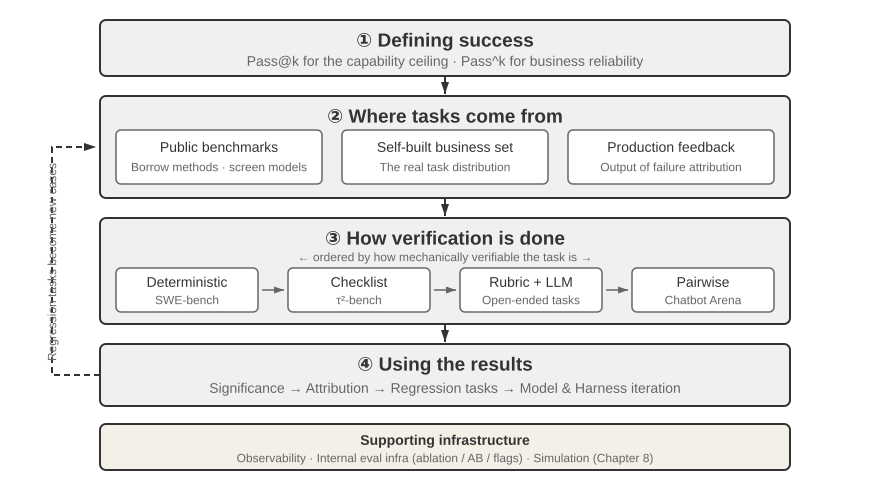
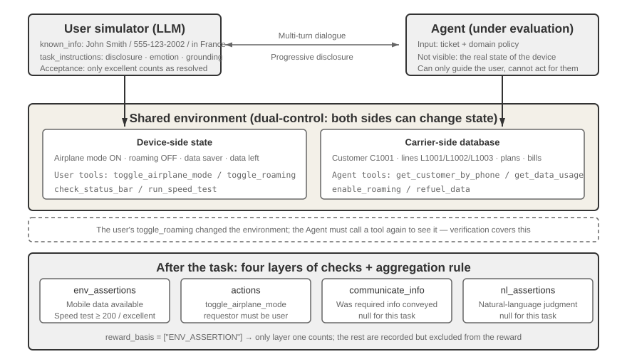
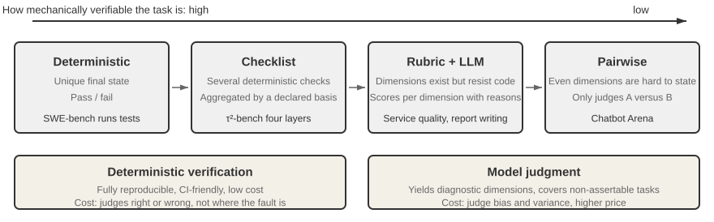
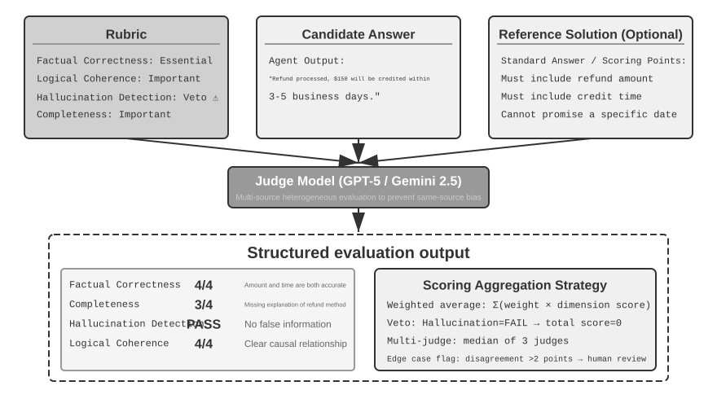
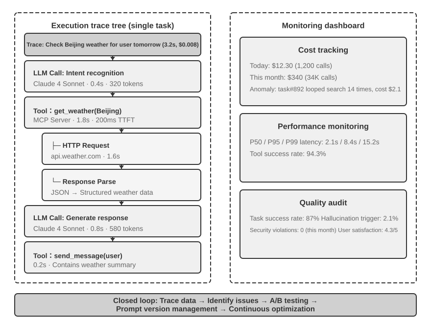
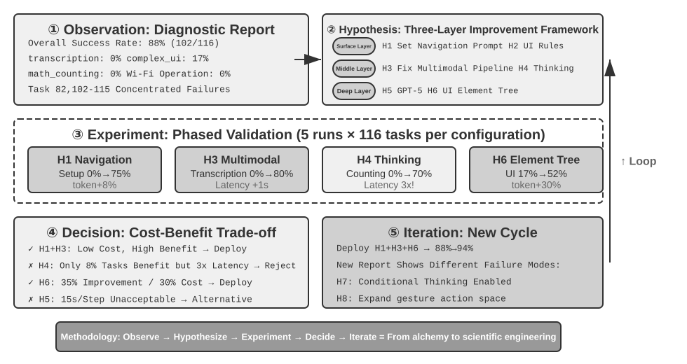
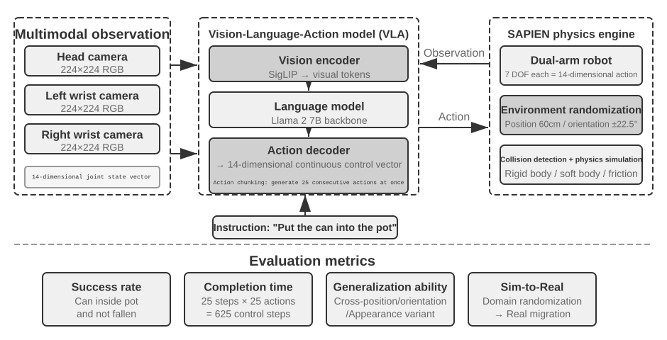

# Evaluating Agents

The first six chapters laid out how to build a single Agent: its context, knowledge, tools, coding capabilities, and observation and action spaces. But completing a build does not mean the build is correct; only stable measurement can give subsequent model training and system evolution a reliable direction.

When building an Agent system, developers face numerous design choices that often lack obvious correct answers:

- Which model should be used?
- What tools should the model be able to call?
- What data should the knowledge base store, and how should it be structured?
- How should user memory be implemented?
- How should the model's prompts and Skills be organized?
- What constraints need to be added to the Harness?
- How should evaluation results be transformed into learning signals for the Agent's continuous evolution?

Evaluation puts these decisions on a scientific footing. Through systematic comparative experiments (change one variable at a time and observe the effect) and ablation experiments (disable one component at a time and observe how overall performance changes), you can distinguish genuine capability gains from superficial fluctuations—and avoid being penny wise and pound foolish. Software engineering has a saying: you can't improve what you don't measure. Without a repeatable evaluation system, an Agent can only be iterated on intuition.

From the perspective of Harness engineering introduced in Chapter 1, evaluation plays the core role of "verification" within the Harness. A key insight is: **the object of evaluation should not be just the model, but the combination of the model and the Harness**. The same model can perform wildly differently in different Harnesses — some teams have significantly improved the same model's performance on terminal tasks purely by optimizing the Harness (see Chapter 5). So when an Agent evaluates poorly, the fix may not be a different model but a better Harness component (prompts, tool design, feedback loops). A sound evaluation system should be able to tell apart two fundamentally different problems: "insufficient model capability" and "Harness design flaws." **A common way to tell them apart is the model swap experiment**: fix the Harness, swap in a stronger or weaker model, and watch how much the score moves. If a stronger model doesn't raise the score, the bottleneck is the Harness. If a weaker model tanks the score and results swing sharply with model capability, the most direct reading is that the model itself is the bottleneck and current performance is dominated by the model. Whether this is because the task is inherently hard or because the Harness relies too heavily on the model's prior knowledge requires further analysis. Note that this differs from the ablation experiment above: ablation **disables a Harness component** to see how overall performance changes; model swapping **fixes the Harness and changes only the model**. The former locates which part inside the Harness matters; the latter tells you whether the bottleneck is the model or the Harness.

An evaluation system is worth even more in an era of rapid model evolution. Models keep improving, but a new model that scores higher on public benchmarks will not necessarily do better on your task—it may even regress (perform worse than the old version in some respects). Only a full run on your own evaluation dataset lets you make a data-driven upgrade decision. A solid evaluation system even makes **"building products for future models"** a viable strategy: if the current model isn't good enough for commercial deployment, finish the product anyway, build the evaluation set, track each new model's performance, and launch the moment one clears the bar.

> **Chapter Guide**
>
> This chapter builds a complete evaluation system on three levels. The first level is **Evaluation Design**: to avoid discussing tools and data first and defining "success" last, the chapter starts by defining what counts as success, distinguishing the capability ceiling of technical wonders from the consecutive reliability required by business scenarios; it then develops evaluation environments and datasets (where to test and what to test). The second level is **Evaluation Methods** (how to judge): LLM-as-a-Judge, pairwise comparison, and model ranking. The third level is **Evaluation-Driven Decision Making** (what to do after testing): turning results into actionable guidance for model selection, architecture optimization, and continuous iteration, with statistical significance to judge whether an observed score difference is real. The chapter also covers observability and the internal evaluation infrastructure of production-grade Agents, and closes with the simulation environments that connect to post-training in Chapter 8.
>
> The idea running through the whole chapter: **an evaluation system's primary value is not scoring the current system, but letting you keep up with model evolution quickly and reliably.** When a stronger or cheaper model ships, a team with a robust evaluation system can decide within hours whether to switch; a team without one can only trust intuition or wait for community feedback. In the fiercely competitive Agent market, that difference in speed can decide who wins.



## A Concrete Evaluation Example

Before diving into the methodology, let's build intuition through a complete example. Suppose we have built a customer service Agent and need to evaluate its ability to handle refund requests.

**Test Case**: The user wants to return an order from 3 days ago (Order #12345, Amount ¥299). Company policy: Full refund within 7 days.

**Agent Trajectory**:

```text
User: I want to return the headphones I bought 3 days ago, order number 12345. (Today is 2026-04-10)

Agent (thinking): The user wants a refund, I need to check the order information first.
Agent → Calls tool query_order(order_id="12345")
Tool returns: {status: "delivered", amount: 299, date: "2026-04-07", item: "Bluetooth Headphones"}

Agent (thinking): Order date 2026-04-07, today is 2026-04-10, that's 3 days, within the 7-day refund period, eligible for full refund.
Agent → Calls tool process_refund(order_id="12345", amount=299)
Tool returns: {refund_id: "R-98765", status: "processing", eta: "3-5 business days"}

Agent: A refund has been initiated for you. The full refund for Order #12345 (Bluetooth Headphones, ¥299) is being processed,
      and is expected to arrive in 3-5 business days. The refund ID is R-98765, which can be used to check the progress.
```

**Scoring with a Rubric** (four dimensions, each scored 1-4). Table 7-1 provides a scoring example for this customer service refund task, illustrating how a Rubric breaks down an Agent trajectory into checkable evaluation dimensions.

Table 7-1 Rubric Scoring Example for Customer Service Refund Task

| Dimension | Criteria | Score | Reason |
|------------------------|--------------------------------|------|--------------------------------|
| Operational Correctness | Is the refund amount and order number correct? | 4 | Correctly queried and initiated a ¥299 full refund |
| Policy Compliance | Does it follow the 7-day refund policy? | 4 | Order is within the refund period, complies with policy |
| Information Completeness | Does it provide the amount, arrival time, and refund ID? | 4 | All three key pieces of information were provided |
| Hallucination Detection (Veto) | Does it fabricate non-existent information? | Pass | All information comes from tool outputs |

Hallucination is listed as a **veto** rather than a graded scoring dimension because it is orthogonal to quality. A fluent, detailed, and polite response containing false information is far more harmful to the user than a brief but accurate one.

This test case passed. But a good evaluation doesn't just test success scenarios; it also probes boundaries and traps—when a user wants to return an order from 15 days ago (beyond the refund period), can the Agent correctly refuse? When a user claims "a customer service representative already approved the refund," will the Agent believe it without a system record? These boundary scenarios are what truly separate strong Agents from weak ones.

The process above — defining test cases, running the Agent, scoring with a Rubric, and analyzing results — is the basic skeleton of evaluation. The rest of this chapter fleshes out the design of each step.

## Evaluation Metrics System

Before building an environment or dataset, define what "success" means: is one workable path enough, or must every run be correct? Different definitions can reverse the engineering decision. This section establishes the vocabulary used by the rest of the chapter.

### Technical Wonders: Capability Ceilings with Pass@k

Many current models and Agents operate in a **technical-wonder** phase: after many attempts, a long time budget, and human selection, one breakthrough trajectory is enough to show that a task is possible in principle. That is the logic of **Pass@k**—run the same task $k$ times and count it as passed if at least one attempt passes; for continuous scores, keep the best attempt as **Best@k**.

Anthropic's long-running-Agent examples—writing a C compiler over a week, searching for a counterexample to an important conjecture, or repeatedly auditing open-source software until a decades-old vulnerability is found—illustrate this capability ceiling. Research discovery, vulnerability hunting, and open-ended creation can all benefit from selecting the best of $k$ candidate trajectories.

Manus made this ceiling visible by giving people a virtual computer on which an Agent could work for half an hour or an hour. OpenClaw made the experience feel more like a person who can be assigned work through messaging, access files and online services, report progress, ask for information, and wake itself to process mail. Early versions were expensive and unreliable on any single attempt, but their generality made high Pass@k possible—and the resulting technical wonders spread widely on social networks.

### Business Reliability: Focus on Pass^k

Business systems usually care about the opposite: no mistake across repeated attempts. We call this **Pass^k** (read "Pass consecutive k"): run a task consecutively $k$ times, require every run to pass, and veto any safety, compliance, or hallucination violation. It asks whether an Agent can deliver reliably, not whether it can occasionally create a miracle.

If runs are independent and the single-run success rate is $p$,

$$
\mathrm{Pass@k}=1-(1-p)^k,\qquad
\mathrm{Pass}^{k}=p^k.
$$

At $p=0.6$ and $k=5$, Pass@5 is about 99.0%, while Pass consecutive@5 is about 7.8%. The first is useful for capability exploration; the second is closer to the reliability required for payments, refunds, permission changes, and production deployment. Reports must state whether $k$ means independent samples of one task or consecutive production tasks. Side-effecting actions must be sampled in a sandbox or rollback-capable environment, with every failure counted.

### Process Metrics: From Black Box to White Box

Final outcomes alone are insufficient. **Action validity and authorization rate** measures the share of valid, authorized operations; **tool-call correctness** additionally asks whether arguments are semantically appropriate. **Path efficiency** covers steps, redundant actions, and backtracking against a human or heuristic baseline. **Retrieval coverage** asks whether the Agent explored enough of the information space; **cost and latency** track requests, input/output tokens, KV-cache reuse, tool time, and network delay.

### Safety, Robustness, and Trajectory Coverage

Safety and compliance follow a **zero-tolerance** rule for sensitive operations, data leakage, and prohibited content: one serious violation vetoes the evaluation. Robustness covers seed sensitivity, UI changes, API jitter, and stale-memory interference. Evaluation must cover both the execution **trajectory** (what the Agent said and did) and the final **outcome** (what the system became); a booking claim in the dialogue is not proof that a booking exists.

### Human Spot Checks and Adversarial Review

Regularly sample successes, failures, and borderline scores and audit the judge's rationale. Before deploying LLM judges at scale, calibrate against a human-labeled gold set of roughly 100–200 cases and require a preset agreement threshold such as Cohen's kappa above 0.7; recalibrate whenever the judge or Rubric changes. Red-team hidden errors, keyword stuffing, and judge-specific exploits, and use multiple independent judges with human review for serious disagreement.


Having settled "what tasks to evaluate on," we still need to answer "which dimensions to measure." This section gathers the metrics commonly used in Agent evaluation into a reference "metric dictionary"—from process to outcome, from quality to safety—giving each a definition and its use cases. It also supplies the precise definitions of Pass@k, Pass^k, and the other metrics invoked earlier (e.g., in the τ-bench section).

**Process Metrics: From Black Box to White Box.**

Focusing solely on the final outcome is insufficient; the process by which the Agent achieves the outcome is equally important. **Action validity and authorization rate** measures the proportion of actions that are both valid and authorized—invalid operations include calling non-existent tools or passing incorrect parameter types; unauthorized operations refer to actions beyond the permitted scope. A high rate indicates the Agent has a clear understanding of the tool ecosystem. **Tool call correctness rate** further requires that parameters are semantically reasonable: the query terms for a search tool should accurately express the need, and the path for a file operation should point to the correct target.

**Path efficiency** measures how efficiently the task is completed: number of steps (think-act-observe cycles), redundant actions (repeatedly searching for the same keyword, re-reading the same file), and backtracking frequency (how often the Agent realizes an error and corrects itself—occasional backtracking is normal, but frequent backtracking indicates insufficient forward planning). A baseline from human experts or heuristic algorithms is needed to define a "reasonable number of steps."

**Retrieval coverage** targets information-gathering tasks: Did the Agent fully explore the information space? Did it jump to conclusions after only looking at the first page of search results? **Cost and latency** focus on request count, token expenditure (distinguishing input/output costs, considering KV Cache reuse), and wall-clock time (including model inference + tool execution + network latency). Time distribution needs to be tracked to identify bottlenecks.

**Outcome and Quality Metrics.**

**Task success rate** is the most direct hard metric, which can be designed with hierarchical standards (core goals must be achieved, secondary goals affect quality scores). In terms of statistical methods, two often-confused metrics need to be distinguished:

- **Pass@k**: The probability that **at least one** of k attempts succeeds, answering "Can the Agent do it?"
- **Pass^k**: The probability that **all** k attempts succeed, answering "Is the Agent stable and reliable?"
- **Best@k**: The score of the **best** of k attempts (rather than whether it succeeded), measuring the "quality ceiling given enough opportunities," often used for open-ended tasks with continuous scoring.

A concrete number makes the difference vivid. Suppose the Agent's single-attempt success rate is 60% (Pass@1 = 0.6). Over 5 attempts: Pass@5 = 1 - 0.4^5 ≈ 99% (almost certain to succeed at least once), while Pass^5 = 0.6^5 ≈ 7.8% (all five succeeding is unlikely). The former measures the capability ceiling, the latter stability; confuse them and you will misread your Agent.

**Safety and Compliance Metrics** are crucial in production deployment: triggering sensitive operations (deleting data / modifying permissions / sending external communications), data leakage (printing passwords in logs / sending private documents to external APIs), and prohibited content should all be subject to a **zero-tolerance principle**—similar to the hallucination veto (see the "Four Rubric Principles" later). A single serious safety violation vetoes the overall evaluation, regardless of performance in other dimensions.

**Robustness** measures stability in the face of uncertainty: random seed sensitivity (how much performance varies under different initializations), adaptability to page changes (a website UI update should not cause complete failure), tolerance for API jitter (can it gracefully handle temporary failures, timeouts, format changes), and long-term memory interference (can outdated information accumulated in the context lead to incorrect decisions).

**Dual Coverage of Execution Trajectory and Final Outcome.** An easily overlooked distinction: "what the Agent said and did during execution" (the trajectory defined in Chapter 1) and "what the system ultimately became" (the final outcome) are two different things. The Agent saying "the booking is complete" is trajectory-level information; a record actually appearing in the database is outcome-level verification. Look only at the trajectory and you miss "said it but didn't do it"; look only at the outcome and you may miss intermediate steps that went astray. Anthropic once gave an example: a flight booking Agent discovered a loophole in the airline's policy during execution and found a cheaper option for the user—if scored only according to the preset execution path, this run would be judged a failure; but from the final outcome, the user got a better deal. Therefore, both types of evaluation should be covered to avoid systematic blind spots.

**Human Spot Checks and Adversarial Review.**

Even when automated evaluation is reliable most of the time, regular human spot checks are still needed: cover different task types, successes and failures, and ambiguous cases near score boundaries — verifying not just the results but the soundness of the scoring rationale. Spot checks can be systematized into **judge calibration**. Before deploying LLM judges at scale, build a human-annotated gold standard set (say, 100-200 cases spanning task types and difficulties) and measure how well the judge model (an LLM acting as judge; the mechanism is detailed in the LLM-as-a-Judge section next) agrees with human annotations — simple agreement rate or Cohen's kappa, the latter discounting chance agreement. Only once agreement clears a preset threshold (e.g., kappa above 0.7) should the judge be used for large-scale evaluation; thereafter, recalibrate on the gold set whenever the judge model or Rubric changes. Without this step, an LLM judge's scores are just "another model's opinion," not a reliable proxy for human judgment. **Adversarial review** uses Red Teaming to actively construct challenging cases: seemingly perfect answers containing hidden errors, answers that get by through keyword stuffing, and answers that exploit known biases of the judge model to obtain undeservedly high scores. **Multi-judge mechanisms** use multiple independent judges to score separately, determining the final result through weighted averaging or consistency checks—when judges disagree significantly, the case is flagged for further human review.

## Automated Evaluation Environment

Agent evaluation requires a repeatable, automated environment — one that can quickly test the effects of changes during development. Building such an environment requires answering three questions: what to evaluate (task definition and verification criteria), whom the Agent interacts with and how to simulate that counterpart, and which scoring criteria to use.

### Basic Components of an Evaluation Environment

An evaluation environment consists of five elements — the following sections will focus on dataset design and scoring criteria design:

**Dataset**: Defines the task set, including initial state, goal description, and optional reference solutions.

**Environment State**: Tracks mutable state during task execution and must balance realism with controllability. For example, in a customer service evaluation, the environment state includes order records in the database and user account balances. After the Agent calls `process_refund`, the order status changes from `"delivered"` to `"refunded"` and the balance increases. "Realism" requires that state changes follow business logic (refund amount cannot exceed the order amount), and "controllability" requires that each test can be reset to the same initial state.

**Tools**: Defines the set of operations the Agent can perform — tools should not provide overly high-level abstractions (like "solve user problem"), but should provide atomic operations (like query order, modify booking, send email), forcing the Agent to combine these operations through planning and reasoning.

**Rubric (Scoring Criteria)**: Quantifies the Agent's performance, which can be binary (pass/fail), continuous (0 to 100 points), or multi-dimensional (scoring accuracy, efficiency, and safety separately).

**Interaction Protocol**: Specifies the interaction mode and termination conditions.

Together, these five elements form a repeatable evaluation loop.


Depending on the task, evaluation environments can be roughly divided into tool-calling and human-computer interaction types.

### Tool-Calling Evaluation Environment

For tasks that primarily rely on tool usage, such as code generation and data analysis, the Verifiers framework demonstrates a typical design pattern. The Agent completes the task by calling predefined tools, and verification is based on executable criteria (whether tests pass, whether answers match), without relying on human annotation or model judgment.

Verifiers introduces a hierarchical environment design: `SingleTurnEnv` is suitable for single-turn tasks (e.g., simple Q&A), `ToolEnv` supports multi-turn autonomous loops of tool calls, and `StatefulToolEnv` and `SandboxEnv` support stateful tools and long-running sandbox environments (e.g., code execution). For example: `SingleTurnEnv` is suitable for posing a math question and checking the answer directly; `ToolEnv` fits searching several web pages and synthesizing an answer before verifying the final result; `StatefulToolEnv` fits modifying database records and verifying the resulting state change; `SandboxEnv` fits running code in a sandbox and checking the output files. Table 7-2 summarizes these environment types for readers to choose the appropriate evaluation environment based on task state, tool calls, and isolation requirements.

Table 7-2 Verifiers Environment Type Comparison

| Environment Type | State Persistence | Tool Calls | Typical Use Case |
|---|---|---|---|
| SingleTurnEnv | None | None | Single-turn Q&A, math problems |
| ToolEnv | None | Multi-turn | Search + information synthesis |
| StatefulToolEnv | Yes | Multi-turn | Modifying database records |
| SandboxEnv | Yes + Isolation | Multi-turn | Code execution and testing |

The framework supports parallel sampling and trajectory caching. The complete trajectory (observations, actions, rewards) from each evaluation is saved for subsequent analysis and replay.

The environment also needs to handle the state dependency of operations — the outcome of a tool call depends on the current state. On failure, it should provide clear error messages rather than simple failure flags, allowing the Agent to learn from errors and adjust its strategy.

### Human-Computer Interaction Evaluation Environment

Many real-world tasks involve not only tool calls but also conversations with human users. A customer service Agent needs to understand vague expressions, clarify needs, query backend systems, and confirm information with the user. Evaluating such tasks faces a fundamental challenge: how to simulate real users in an automated environment?

The key design principle is **Progressive Information Disclosure**, which is the fundamental difference between human-computer interaction evaluation and traditional benchmarks. Most benchmarks reveal the complete requirements upfront, but real users can rarely articulate their needs from the start — they often just say "there seems to be a problem with my flight" or "the internet isn't working." The Agent must clarify the need by asking questions, and that process is itself a display of capability. In evaluation, therefore, **the simulated user's information must not be revealed to the Agent all at once**; it should be disclosed progressively, on demand, as the conversation unfolds.

τ-bench's solution is **User Simulation**: using another LLM to play the user role, conversing with the Agent according to predefined instructions. The simulated user receives task instructions (e.g., "I need to cancel tomorrow's flight"), gradually reveals necessary information to the Agent during the conversation, responds to inquiries, and sends a termination signal when the task is complete. The prompt requires the simulated user to "not reveal all information at once, only provide what is necessary for the current step" and "not fabricate information not provided in the instructions." The design of user simulation requires a trade-off between authenticity and controllability: behavior should be close to a real user (vague expressions, incomplete information, occasional emotional fluctuations) while following a certain script to ensure reproducibility.

The following is an example of a multi-turn conversation with progressive information disclosure (the user simulator acts according to a fixed script):

> **User**: "There's a problem with my flight."
> **Agent**: "Which flight is it?"
> **User** (revealing per script): "Delta 123, tomorrow morning from San Francisco to New York."
> **Agent**: "What's the specific problem?"
> **User** (revealing per script): "The flight time is too long, I want to change it."
> **Agent**: "Any preferences for the new flight?"
> **User** (revealing per script): "Any afternoon flight is fine."

The user simulator follows a fixed script (known information + disclosure rules), ensuring evaluation reproducibility while simulating the progressive expression style of a real user.

τ-bench is a benchmark for evaluating Agent performance in structured business processes (e.g., airline customer service, retail customer service). Its checks are component-level and multi-dimensional: on one hand, it checks whether the final database state is correct (e.g., the booking record status changes to "cancelled"); on the other hand, it verifies whether the Agent provided the necessary key information during the conversation (e.g., refund amount and arrival time, verified by searching for specific strings or patterns). This dual verification simultaneously examines operational accuracy and communication effectiveness. At the task level, however, these checks ultimately collapse into a **binary reward of zero or one** — all checks must pass to score 1; any single failure scores 0. Binary rewards make reliability metrics like Pass^k easy to compute (see the "Evaluation Metrics System" section later), at the cost of scoring "operationally accurate but missing one non-critical field" the same as "complete failure."

The enhanced **τ²-bench** does not primarily improve scoring granularity; instead, it advances the benchmark in two other areas. First, the **Dual-Control Environment**: the Agent is no longer the only party that can call tools — the user simulator can operate on the same shared environment (the Agent instructs the user to switch to airplane mode, and the user's action actually changes the environment state), which better matches real scenarios like technical support, where the user must lend a hand. Second, **more precise task specifications and compositional task generation**: fewer ambiguities in success conditions, and task instances that can be parameterized and generated in batches (see the "Verifiability and Objectivity Assurance" section later for detailed verification dimensions).

> **Experiment 7-1 ★: Run τ²-bench and Compare Its Evolution from τ-bench**
>
> This experiment runs the τ²-bench evaluation framework to understand the design principles of human-computer interaction evaluation environments. By comparing τ-bench with τ²-bench, we can see how evaluation datasets are iteratively improved.
>
> Read the task definition files in depth: each task contains information known to the user, task instructions governing progressive disclosure and response strategies, and success conditions (the target state of the database and confirmation information that must appear in the dialogue). Run the complete evaluation process, observe the multi-turn dialogue between the user simulator and the Agent, and analyze typical failure modes (policy violations, information omissions, excessive handoffs to human agents, etc.).
>
>
> 
>
>
> Compare the design differences between τ-bench and τ²-bench: The initial version of τ-bench had overly simple user instructions (the Agent could guess the answer), imprecise success conditions (leading to misjudgments), and a mechanical user simulator. τ²-bench made systematic improvements to address these issues:
>
> - **Introduced more detailed task instructions**: Including "Grounding Requirements," meaning responses must be based on the actual state of the environment
> - **More precise evaluation criteria**: For example, "a speed test must return 'excellent' to be considered resolved"
> - **More realistic user simulator behavior specifications**: Progressive information disclosure, natural emotional fluctuations
>
> Pay special attention to the newly added telecom domain tasks in τ²-bench, and understand τ²-bench's dual-control environment design (as mentioned earlier, the user and the Agent jointly operate the same shared environment).
>

Tool-calling evaluation asks whether an observable state change was completed; human-computer interaction evaluation asks whether the Agent helped the user reach a new understanding or make a decision. The former tests the correctness of the Agent's actions; the latter tests the soundness of its communication strategy.

Building evaluation environments also touches on simulation environments—when an evaluation environment must support repeated interactions at scale, it becomes a simulation environment. The end of this chapter takes this up briefly.

## Design of Evaluation Task Datasets

The evaluation environment is the "stage," and the dataset is the "script." The quality of the script often determines the value of the evaluation more than the stage itself. A poorly designed dataset, even when run in a perfect environment, only yields noise. This section distills several repeatedly validated principles from the design practices of benchmarks such as GAIA, AndroidWorld, SWE-Bench Verified, τ-bench and τ²-bench, Terminal-Bench, OSWorld, and OSWorld-Verified.

This list does not exhaust the Agent evaluation landscape. Even within the Web/GUI category there are several benchmarks with different emphases: WebArena builds fully reproducible websites (e-commerce, forums, code hosting, etc.), containing the unpredictability of real web pages within a sandbox; Mind2Web goes the opposite way, testing generalization directly on hundreds of real websites; [ClawBench](https://claw-bench.com/) ([paper](https://arxiv.org/abs/2604.08523), [code](https://github.com/TIGER-AI-Lab/ClawBench)) lets an Agent running in an isolated container perform end-to-end everyday tasks on live websites. V1 covers 153 tasks across 144 websites, V2 adds another 130, and it records five layers of evidence in parallel: session replays, action screenshots, HTTP traffic, browser actions, and Agent messages. It complements sandboxed benchmarks by making live-site drift and long-tail failures easier to analyze, at the cost of reproducibility that is subject to changes on third-party websites; BrowseComp specializes in deep retrieval — answers buried so deep that only multi-hop browsing and cross-checking can surface them. On the tool-calling side there are dedicated function-calling leaderboards like BFCL (Berkeley Function-Calling Leaderboard). This chapter makes no attempt to catalog them all. Instead it takes the two core environment paradigms (tool calling and human-computer interaction), plus the GUI operation scenarios that run through the dataset case studies, and digs into their design trade-offs. Once you understand the paradigms, you can quickly judge what any new benchmark measures, how well it prevents data leakage, and how far its conclusions can be extrapolated.

> **Experiment 7-2 ★: Manually Execute Benchmark Tasks**
>
> Select tasks from each of GAIA, AndroidWorld, SWE-Bench Verified, τ²-bench, Terminal-Bench, and OSWorld-Verified and complete them manually. It is recommended to complete one simple, one medium, and one difficult task from each dataset—the "difficult" level should be challenging even for humans. Compare your execution results with the standard answers and analyze the sources of discrepancies. Through this hands-on experience, understand: task descriptions need to balance clarity and openness, verification standards must be objective and executable, and the hierarchical difficulty of tasks must be able to distinguish different capability levels.
>

### Core Challenges in Task Dataset Design

**Challenge One: The Tension Between Clarity and Openness.** Task descriptions must be clear enough to ensure reproducible evaluation, yet not so rigid as to stifle the Agent's creativity. GAIA provides an example: tasks are "conceptually simple" but have open implementation paths—for instance, a task may require the Agent to identify an astronaut from NASA's Astronomy Picture of the Day and determine how long they spent in space. The goal is clear, but how to search, filter, and verify is entirely up to the Agent's autonomous decision-making.

**Challenge Two: Balancing Authenticity and Controllability.** Real-world tasks contain uncertainty and noise, which can reveal robustness but also threaten reproducibility. The initial version of SWE-Bench directly used real GitHub issues, ensuring authenticity but also leading to vague task descriptions, incomplete test cases, and subjective evaluation criteria. SWE-Bench Verified introduced systematic validation by human experts, selecting 500 high-quality tasks with clearly defined problems, sufficient tests, and clear solutions, significantly improving controllability while maintaining authenticity.

**Challenge Three: Coordinating Diversity and Systematization.** An effective dataset needs to cover typical scenarios, edge cases, and error traps, while also having a systematic organization so that evaluation results can diagnose specific capability weaknesses. AndroidWorld's 116 tasks span 20 real applications, each annotated with the core capabilities it requires (multi-step planning, visual understanding, temporal reasoning) — so results yield not just an overall success rate but a profile of strengths and weaknesses along specific capability dimensions. More critically, a parameterization mechanism can generate almost unlimited task variants.

**Challenge Four: Evaluation Cost vs. Coverage.** Complex Agent tasks can take minutes or even hours to complete, consuming a large number of tokens. The size of the dataset needs to balance comprehensiveness and economy. GAIA carefully selects 466 tasks across three difficulty levels, covering multiple capability dimensions while allowing evaluation at a reasonable cost. SWE-Bench Verified reduced its set from 2,294 tasks to 500 (reducing costs by about four-fifths while improving the signal-to-noise ratio through stricter quality standards).

**Challenge Five: Preventing Data Contamination.** In the era of large language models, data contamination is a serious challenge for evaluation: when evaluation data is included in the training data, the evaluation measures memorization rather than generalization. It's like memorizing the answers before an exam—good scores don't reflect true ability. Different benchmarks adopt different prevention strategies: GAIA relies on the uniqueness of its answers; questions require combining information from multiple sources to answer, and some tasks come with specially created attachment files (PDFs/audio/images that don't exist on the internet), so a single web page cannot directly provide the answer. SWE-Bench Verified itself is a 500-task subset obtained by OpenAI through manual quality screening of the original SWE-Bench, and does not include time-based leakage-prevention design. It is subsequent works like SWE-bench-Live that truly use temporal freshness to prevent leakage, continuously incorporating issues created after the model's training cutoff date, keeping the evaluation ahead of the model's training corpus. τ²-bench prevents leakage through dynamic parameter generation, where specific task instances (user names, order numbers, dates, etc.) are randomly generated each time. AndroidWorld's parameterized task generation naturally helps prevent leakage because verification is based on the final UI state, not the sequence of operations. Terminal-Bench makes leakage detectable by embedding canary GUIDs (globally unique identifiers used as tracking markers): if a model can output content containing this GUID, it indicates that the benchmark data has leaked into the training set.

### Precision Design of Task Descriptions

GAIA ensures answer uniqueness through clear information source constraints, time ranges, topics, and query targets. For example, a Level 3 task requires starting from a specific date's NASA image, identifying the astronaut through visual understanding, looking up the astronaut group to which they belong, calculating their time in space, and formatting the output precisely ("last name; fields separated by semicolons; numbers formatted with thousands separators"). Every detail serves automatic verification—only an exact match in format and content counts as a pass.

τ²-bench introduces contextualized design, with each task containing multiple layers of information: the surface problem ("mobile data isn't working"), the performance expectation ("requires an excellent speed rating"), the constraint ("will not accept any other rating"), and the implied emotion. A key improvement is separating "known information" from "task instructions": known information is what the user currently knows, while task instructions guide the simulator on how to progressively reveal information, including "Grounding Requirements" (responses must be based on the actual results returned by tool calls, not fabricated).

SWE-Bench Verified includes structured fields like problem description, reproduction steps, and expected/actual behavior, with annotators verifying the match between the description and the test cases. Every element in Terminal-Bench's task descriptions can be mechanically verified: whether file paths exist, permission values are correct, certificate parameters are valid, and date formats are correct. For example, "build-linux-kernel-qemu" requires building the Linux kernel 6.9 from source, adding a custom printk in `start_kernel`, generating an initramfs, and running it in QEMU. The success criterion is the appearance of the custom message in the boot log—the Agent cannot fake the output; it must truly complete the entire process.

AndroidWorld uses a **parameterized template** design. A task is not static text but a dynamically instantiable template (e.g., "Change the phone number of contact `[CONTACT_NAME]` to `[NEW_PHONE]`"), with different parameter values randomly generated for each evaluation. This has three benefits:

- **Prevents memorization**: Parameter values differ each time, preventing the replay of a fixed sequence of operations
- **Increases data diversity**: One template can generate almost unlimited instances
- **Supports comparative experiments**: Fixing certain parameters while varying others allows precise measurement of specific factors' effects

Verification is based on the final UI state (e.g., whether the phone number field contains the expected value), not the sequence of operations.

OSWorld tasks often do not start from a "clean" initial state but from carefully configured intermediate states, more closely resembling real-world usage scenarios. Task descriptions need to handle multiple solutions ("set the background to purple" requires a specific color code to disambiguate; "concatenate two CSVs" must accept all reasonable methods like keeping one header or both headers) and environmental uncertainty (anti-scraping measures on websites, evolving application UIs, and race conditions—OSWorld-Verified mitigates these through offline page snapshots, locked dependency versions, explicit wait conditions, etc.).

### Hierarchical Design of Task Complexity

GAIA designs three difficulty levels: Level 1 requires only 1-2 tools (humans 93.9% vs GPT-4 30.3%), Level 2 requires multi-step reasoning (91.8% vs 9.7%), and Level 3 requires complex combinations (87.3% vs 0%). The diagnostic value of this hierarchical design is: failure at Level 1 points to basic tool usage issues, Level 2 points to multi-step planning and information integration, and Level 3 points to long-sequence reasoning and complexity management. Each level corresponds to different improvement directions (prompt engineering vs. planning mechanisms vs. hierarchical architecture/post-training).

τ²-bench layers complexity by business process: from simple information queries, to multi-step processes (changing a flight booking requires querying, presenting alternatives, obtaining confirmation, calculating the fare difference, and processing payment), to fault diagnosis (systematically checking multiple possible causes and verifying fixes), and finally to strategic judgment (handling requests that don't comply with policy).

Terminal-Bench layers complexity along the dual dimensions of technical domain × operational complexity. Its task registry has collected over 200 tasks (the size of the core evaluation set varies by version; for example, version 2.0 selected 89 high-quality tasks from community contributions), ranging from simple MLflow model registration, to medium-difficulty 7-Zip password cracking, to difficult Git server and web server integration, to the most difficult FEAL differential cryptanalysis (requiring cryptography knowledge + algorithm optimization to meet the 30-second time constraint).

### Ensuring Verifiability and Objectivity

GAIA's answers are concise and clear. Strict formatting rules allow verification through exact string matching. The binary result (match or no match) ensures objective reproducibility. The rarity of the answers also serves as an anti-cheating measure—highly specific facts are unlikely to appear verbatim in training data.

SWE-Bench Verified uses executable code-based checks, distinguishing between FAIL_TO_PASS (fails before fix, passes after fix, proving the problem is solved) and PASS_TO_PASS (passes both before and after fix, proving no new bugs were introduced), achieving dual verification. The Verified version also ensures the tests themselves are reliable, without flaky tests that sometimes pass and sometimes fail.

τ²-bench's verification system includes multiple layers of checks (the results of each layer are still aggregated into a binary reward at the task level; all must pass for success):

- **Database state check**: Booking record status, whether a refund record was created
- **Dialogue content keyword search**: Whether the Agent explicitly confirms the refund amount and expected arrival time to the user
- **Process compliance**: Analysis of the tool call sequence, e.g., whether the user's explicit confirmation was obtained before modifying an order

The dual-control environment of τ²-bench (see the earlier section "Human-Computer Interaction Evaluation Environment") adds another dimension to verification: after the user simulator actually changes the environment state, the Agent must observe this change through tool calls and proceed with troubleshooting accordingly. Verification therefore covers whether the Agent actually observed the outcome of the user's actions.

OSWorld provides 134 independent evaluation functions with full OS access, enabling deep inspection of file system structures, process states, network connections, and application internals. For example, in a database operation task, the evaluation script not only verifies that the report file exists but also directly connects to the database to check if the SQL was executed correctly. In browser tasks, it analyzes the DOM tree, checks cookies/localStorage, and sends verification requests to the backend to confirm whether the form submission actually took effect. This deep inspection can detect cases of "superficial completion but substantive error"—for instance, the Agent clicked the submit button, but the request was rejected by the server due to incorrect field entries.

Terminal-Bench is based on a standardized Docker container environment, combining file system state checks (path existence, permission values, content format) with program execution functional verification (in build-linux-kernel-qemu, actually starting QEMU and searching for the custom printk message). The canary GUID makes leakage traceable.

### Systematic Design of Task Distribution

Task distribution needs to systematically cover capability dimensions, difficulty dimensions, scenario dimensions, and edge cases. GAIA pursues generality—most tasks require a combination of reasoning, multimodality, browsing, and tool use. τ²-bench deliberately designs "trap tasks"—a user claims "customer service has approved the cancellation" when the cancellation doesn't actually comply with policy—to test whether the Agent holds its judgment under pressure and misdirection. OSWorld is based on a dual-dimension matrix of operation type (file IO / desktop application / web application / cross-application workflow) and application domain, spanning three operating systems (research shows strong cross-OS correlation; skills learned on one system can transfer to others). Terminal-Bench includes "cross-technology stack combination tasks" to test systems thinking (e.g., a resharding task combining data processing + file operations + Python engineering).

### Data Quality Control and Iterative Improvement

SWE-Bench Verified is a model of quality control. OpenAI randomly selected 1,699 tasks from the original 2,294 for human evaluation, recruiting 93 Python-proficient developers. Annotators had to perform multiple checks: whether the problem description was clear (could they understand what needed to be solved), whether the test cases were complete (covering all aspects and edge cases), whether the tests were stable (no flaky tests due to environment or randomness), whether the patch was correct (did it introduce new errors), and whether the difficulty was reasonable. After rigorous screening, only 500 passed (29%)—this high rejection rate is a necessary investment in evaluation quality. They also established standardized annotation guidelines, defining specific criteria and examples for each check to ensure consistency among different annotators.

τ²-bench introduces a separation of "known information" / "task instructions" (making the simulator behavior more realistic) and stricter completion conditions (e.g., "only excellent counts as solved; poor/fair/good are not accepted"), preventing "superficial fixes."

OSWorld-Verified is a model of iterative improvement. After its release in April 2024, OSWorld quickly became an important benchmark for multimodal Agent evaluation, but over 15 months of widespread use, more than 300 issues were uncovered. These issues fall into four categories: environment issues (anti-scraping measures on websites, CAPTCHAs, and dynamic content changes), task description issues (ambiguous phrasing), verification logic issues (too strict or too lenient), and initial state issues (incomplete configuration). A team of about 10 people from the University of Hong Kong worked closely with MoonShot AI, OpenAI, ByteDance Seed TARS, Anthropic, Simular, and others for two months to systematically fix these issues. Repair strategies were formulated for each category: environment issues were resolved by locking versions and offline backups, task descriptions were clarified by rewriting ambiguous phrasing, verification logic was balanced by manually establishing correct baselines and adjusting conditions, and initial states were enhanced by adding completeness checks.

The evaluation infrastructure was also migrated from local VMs to the AWS cloud platform, leveraging elastic scaling to achieve a 50-fold speedup through parallelization (from over 10 hours to a few minutes). The Google Drive task initialization success rate increased from 50% to over 95%. All official evaluation trajectory data is publicly available on Hugging Face, allowing the community to review every detail, reproduce results, and identify issues, forming a virtuous cycle of continuous improvement.

Evaluation environments and post-training environments often share the same origin: a well-designed evaluation environment can be adapted into a training environment with little effort—SWE-Gym is a representative example of building training tasks based on SWE-bench, while the parameterized templates of τ²-bench and AndroidWorld can generate massive training instances in batches. But one red line must be drawn: what can be reused is the environment's **construction mechanism**; the evaluation set's specific tasks must stay strictly isolated from the training data—once an evaluation task enters the training set, it tests memory, not ability (see Chapter 8 for details).

## Automated Evaluation Methods

With the evaluation environment, dataset, and clear metrics system in place, the core question becomes: how to score? For tasks with clear correct answers (e.g., math problems, SQL queries), simple binary judgment (correct/incorrect) is sufficient; but for open-ended tasks (e.g., customer service dialogues, report writing), more refined evaluation methods are needed.

Code-based automatic verification only covers scenarios with standard answers; scoring open-ended tasks is the main topic of this section. Among these, the design of reward signal density (from binary rewards to process rewards to generative rewards) and training methods for reward models are left for systematic discussion in the post-training section of Chapter 8; this section answers a more fundamental question: how to use LLMs to automatically judge the output quality of open-ended tasks.

### LLM-as-a-Judge: The Core of Automated Evaluation



Why is LLM-as-a-Judge needed? For open-ended tasks (e.g., generating reports, handling customer complaints, creative content), there are no standard answers for automatic comparison, and human evaluation is costly and difficult to scale. LLM-as-a-Judge balances the scalability of automation with human expert judgment by having a language model evaluate outputs against expert-defined scoring criteria (a Rubric). The method has known limitations, though: the judge model carries its own biases (most typically **length bias**—a tendency to score longer, more detailed responses higher even when they are no more correct), and repeated judgments of the same input can vary. Length bias in particular warrants specific countermeasures. Three common defenses are: penalize verbosity explicitly in the Rubric and cap response length per task type; in pairwise comparisons, bring the two candidates to similar lengths before judging; and regularly audit the correlation between scores and response length—if high scores almost always go to long responses, the judge has been swayed by length and the Rubric needs revision. To address these challenges systematically, Rubric design must follow the principles below:

**Rubric (Scoring Criteria): The Basis for LLM Judgment.**

**Four Rubric Principles** (Scale AI, "Rubrics as Rewards"):

(1) **Based on Expert Guidance**—A Rubric must reflect domain knowledge, capturing the core facts and reasoning steps. A Rubric for medical Q&A, for instance, needs diagnostic criteria and the medical errors that must be avoided; one without expert grounding can only capture surface features like fluency.

(2) **Comprehensive Coverage**—A Rubric should cover factual accuracy, logical coherence, completeness, and safety. It should not only define positive standards but also explicitly identify **Pitfalls**—i.e., high-risk common errors, such as recommending unverified therapies in medical advice.

(3) **Standardized Importance Weighting**—Classify criteria as Essential, Important, Optional, or Pitfall items. The scheme supports a **Veto mechanism**: for example, in a customer service scenario, hallucination (fabricating false information) is a typical veto dimension—regardless of how well other dimensions perform, if false information appears, it must be vetoed. This also helps prevent reward hacking through keyword stuffing.

(4) **Self-Contained Evaluation**—Each evaluation item is independently actionable and does not rely on the evaluator's domain knowledge. Abstract standards like "the response demonstrates deep understanding" should be avoided, replaced by verifiable standards like "cites at least two authoritative theories and accurately explains how they support the conclusion."

The key practice: define objectively verifiable scoring levels for each dimension, with concrete examples and **edge cases** to resolve ambiguous situations. Actively guard against **Reward Hacking**—the Agent finding a "shortcut" to high scores without actually completing the task—by explicitly penalizing hallucination, sycophancy, keyword stuffing, and dodging hard questions. A Rubric is an iterative product: trial use reveals disagreements among evaluators, and the Rubric gradually evolves through this feedback from abstract principles into a detailed casebook.

Here is a complete Rubric that follows the four principles, using a user memory Agent as the example. Test question: "Who is my daughter's pediatrician?" (The answer requires linking information across two conversations: the first conversation mentions "my daughter's name is Lily," the second mentions "took Lily to see Dr. Chen").

```yaml
rubric:
  dimensions:
    - name: Factual Correctness
      weight: essential        # Essential item
      scoring:
        4_Excellent: "Correctly answers Dr. Chen, and links to daughter Lily"
         3_Good: "Correctly answers Dr. Chen but does not mention that Dr. Chen is Lily's doctor"
        2_Passable: "Gives the correct doctor but with additional uncertain information"
        1_Fail: "Gives an incorrect doctor's name, or answers 'I don't know'"

    - name: Information Completeness
      weight: important        # Important item
      scoring:
        4_Excellent: "Proactively supplements relevant information (e.g., last visit date, diagnosis)"
        3_Good: "Answers the core question without omission"
        2_Passable: "Answers the core question but omits available related information"
        1_Fail: "Key information is missing"

    - name: Reasoning Correctness
      weight: important
      scoring:
        4_Excellent: "Correctly links the two cross-session pieces of information: 'daughter=Lily' and 'Lily's doctor=Dr. Chen'"
        3_Good: "Correctly links but the reasoning path is not clear enough"
        2_Passable: "Partially correct linking"
        1_Fail: "Incorrect linking (e.g., mistaking the user's own doctor for the daughter's doctor)"

    - name: Hallucination Detection
      weight: veto             # Veto item: once triggered, total score is zero
      scoring:
        pass: "All information can be traced back to historical conversation records"
        fail: "Fabricated information not present in the conversation (e.g., fictitious visit dates, diagnoses)"

  edge_cases:
    - "If the user has multiple daughters who see different doctors, should ask which daughter"
    - "If the memory contains both 'Dr. Chen' and '陈医生' (the same name written in Chinese), should recognize them as the same person"
```

**Good Rubric vs. Bad Rubric**: Each scoring level above specifies verifiable, concrete behavior ("Correctly answers Dr. Chen") rather than descriptions that cannot be judged objectively, like "demonstrates a deep understanding of memory." The veto item sets the bottom line: even if every other dimension scores full marks, a single instance of hallucination results in an automatic zero.

### Failure Attribution: Locate the First Error in a Trajectory

End-to-end evaluation often says only "pass" or "fail". To make results drive fixes, perform **failure attribution** for every failed trajectory: record the main error class, the first step at which unacceptable behavior appeared, the relevant tool call or model output, and evidence that can be audited. Attribute the first error that sent the task off course; later errors are often just the chain reaction.

Production bad cases usually come from three signals: an explicit user correction ("do not do that"), a downvote or other negative feedback, or a later state check, rule verifier, or LLM judge showing that the Agent did something it should not have done. LLMs can help with this work, but cannot replace careful human reading because failure attribution often reveals product problems, not only technical bugs.

An initial Coding-Agent taxonomy can include missing process or repository rules, tool-call and format errors, abnormal model termination, and task-completion or logic failures. The first violating action—not the final error message—should be recorded. Store a structured JSON or YAML attribution with step number, tool name, observation evidence, root cause versus consequence, recoverability, and confidence, together with the task goal, environment state, version identities, and complete trajectory.

#### Scope-Sensitive Document Formatting Errors

When a user says "the quotes are wrong", that cannot be turned into a global character replacement. At minimum you must distinguish ASCII straight quotes (`"`, `'`), Chinese curly quotes (`“”`, `‘’`) and Markdown backticks (`` ` ``). The same character plays a different syntactic role in Chinese prose, quoted English source, inline code, code blocks, code comments, JSON and paths.

Evaluation data should first parse the document into scoped spans—for example `ZH_PROSE`, `EN_PROSE`, `QUOTED_SOURCE`, `INLINE_CODE`, `CODE_BLOCK`, `CODE_COMMENT` and `JSON_OR_SCHEMA`. Each span records the set of permitted transformations, the characters that must be protected, and the validator result after editing. The three cases below cannot be handled by one replacement rule:

```text
Chinese prose: call the `reset()` method.
Quoted English source: “Please restart the service.”
# the code block below only illustrates a protected scope
# Chinese comment: display "current status"
name = "status"
```

Trajectory-prefix regression should require the model to make the minimal edit, and check at the same time Chinese document style, the preservation rate of quoted English source, code and JSON syntax, and the edit distance over non-target text. When the rules cannot determine the scope, keeping the original text and asking for clarification should count as a permitted action, not a guessed edit that happens to pass.

#### Exact-Copy Errors: From `old_string` Mismatch to Layer-by-Layer Localization

An `old_string` failure cannot be attributed simply to "the model copied it wrong" either. For the same string, store the raw byte hash, the Unicode code point sequence and the tokenizer token ID sequence, then look for the first divergence along this chain:

```text
original file bytes → tool return → Harness serialization → model context
→ model token output → decoded string → JSON/tool-call parsing → tool matching
```

A minimal set of evaluation probes covers direct restatement, extraction from a long context, placement into tool arguments, selection among similar strings, and spaces, newlines, backslashes, Unicode combining characters and low-frequency tokens. The metrics are byte-exact match, code-point-exact match, token-exact match, the position of the first divergence, and the real tool success rate. If the model is correct on the direct probe but the tool call still fails, fix the tokenizer, the serialization, the Harness or the tool protocol; only when the first divergence appears in the model's own output should the case be turned into the copying training data of Chapter 8.

### End-to-End and Trajectory-Prefix Regression Tasks

Once the first error is known, turn the repair target into a repeatable **regression task**. End-to-end regression starts from the initial state and user request, runs the whole workflow, and checks final state, required output, and safety. A **trajectory-prefix regression task** freezes the context, conversation, tool returns, and environment state just before the first error, then tests only the next one or few observable actions. It is cheaper and isolates one decision boundary, so it is especially important for high-reliability production Agents.

Prefix tasks should define an **acceptable action set**, not one canonical answer: reading repository rules, asking the user, or refusing a dangerous operation may all be valid, while prohibited actions are listed explicitly. Process omissions become end-to-end tasks with Plans, required documents, and acceptance tests; tool errors become prefix tasks that test formatting, escaping, or tool choice; abnormal execution becomes truncation, timeout, and tool-failure recovery; and completion or logic errors become multi-goal and "not yet proved impossible" cases. The first error is also a possible process-supervision signal for Chapter 8, but evaluation and training data must remain isolated.

> **Experiment 7-5 ★★: Trajectory-Prefix Boundary Evaluation with Multiple Encodings**
>
> This experiment supplies the Agent with known user memory, the current instruction, a trajectory prefix, tool returns, and environment state, then asks for only the next observable action. It covers production bad cases such as scope conflicts, stale preferences overriding current instructions, low-confidence inferences, confirmation before high-risk deletion, and preview before external publication. The same cases are encoded as JSON Cards, Markdown, and Python-like memory; deterministic checks score the allowed decision category, safety, required evidence, and forbidden actions.
>
> With GPT-5.6-sol through OpenRouter, all 33 cells (11 cases × 3 encodings) completed without API errors. Each encoding passed 6/11 cases, but their failure locations differed, showing that changing the representation alone does not repair application policy.

Give the judge both the Rubric and the Agent's response. It will score each dimension and explain why. Once results from dozens of cases are grouped by dimension and the low-scoring traces are replayed, a vague drop in success rate becomes a concrete diagnosis: retrieval missed a fact, the model linked the wrong people or events, or it added an unsupported claim. A useful Rubric tells the team not only how the system scored, but where to look next.

> **Experiment 7-3 ★★: Building a Rubric-Based User Memory Evaluation System**
>
> **Prerequisites**: Must complete the Chapter 3 User Memory Experiment (`chapter3/user-memory-evaluation`).
>
> This experiment requires modifying the `chapter3/user-memory-evaluation` framework from Chapter 3, upgrading the current simple LLM-as-a-Judge scoring mechanism to a structured, multi-dimensional Rubric evaluation system. The existing system uses a single LLM call to return a pass/fail result plus evaluation reasoning, lacking structured diagnostic capabilities.
>
> Design a unified multi-dimensional Rubric framework applicable to all three task levels. Evaluation dimensions include: Factual Correctness (precision: of all the information given, how much is correct—verifies that numbers/dates/names are consistent with the stored memory); Information Completeness (recall: of all the information that should be given, how much is mentioned—verifies that all relevant information is provided with no key content omitted); Reasoning Correctness (checks whether the relationships between pieces of information and implicit logic are correctly understood); Reasoning Proactiveness (evaluates whether suggestions or risk warnings beyond a direct answer are provided when appropriate); Hallucination Detection (ensures no information not present in memory is fabricated).
>
> Four-level scoring (Excellent/Good/Passable/Fail), with specific judgment criteria for each level rather than abstract descriptions. The hallucination dimension is a veto item. Provide examples and boundary cases for each dimension.
>
> **Experiment 7-4 ★★: Comparative Evaluation of Advanced JSON Cards vs. RAG**
>
> **Prerequisites**: Must complete the Chapter 3 User Memory and RAG experiments (`chapter3/user-memory`, `chapter3/agentic-rag-for-user-memory`).
>
> **Objective**: Fairly compare the advantages and boundaries of structured memory versus unstructured retrieval on the same evaluation set. Reuse the two Chapter 3 projects and compare three configurations on the 60 test cases from `chapter3/user-memory-evaluation`—Pure Advanced JSON Cards (structured cards kept in context, with no retrieval needed), Pure RAG (conversation chunks embedded in a vector store, retrieval required), Hybrid System (core facts resident + original conversations retrieved on demand).
>
> **Acceptance Criteria**: Record success rate, average steps, number of tool calls, latency, and cost across three complexity levels (basic recall / multi-session disambiguation / cross-session hidden associations). Clearly describe the failure boundaries for each approach—what structured memory misses, what retrieval misses, and whether the hybrid truly achieves synergy. This is an **end-to-end regression layer**: it checks that the complete task still works, but cannot by itself show whether the Agent correctly scopes a memory once it has been supplied. Configuration details and test cases are available in the companion repository.
>

The companion experiment ran all three systems on the same 60 questions and retained 180 real API trajectories. Table 7-3 reports both the rates and the underlying success counts.

Table 7-3 Success Rate by Memory System and Task Level

| System | Basic Recall | Multi-Session Disambiguation | Hidden Cross-Session Links | Overall |
|---|---:|---:|---:|---:|
| Advanced JSON Cards | 95% | 60% | 50% | 68.3% (41/60) |
| RAG | 90% | 40% | 15% | 48.3% (29/60) |
| Hybrid | 80% | 70% | 50% | 66.7% (40/60) |

The hybrid did not win by default. It uniquely solved three cases that neither single approach solved, but regressed on eight cases relative to the better single approach; its mean reward was 0.092 below the per-case best single system. Pure RAG nearly matched structured cards on basic recall, then fell to 15% on hidden cross-session links. Retrieving a relevant passage is only the first step—the Agent still has to reconstruct the right relationships among people, events, and time.

The hallucination veto also fired in 28 of 180 judgments. It was not a decorative safety clause; it materially changed the results.

That conclusion, in turn, depends on the judge being trustworthy. If the Agent and judge come from the same model family, they may share exactly the same preferences and blind spots.

**The Same-Family Model Problem and Multi-Source Judging.**

When the Agent and the judging model come from the same family, the Agent may learn to exploit the judging model's preferences and blind spots.

**This is precisely what Goodhart's Law states: when a metric becomes an optimization target, it ceases to be a good metric.** The more an Agent is trained or tuned on a particular scoring system, the more it tends to exploit loopholes in that system rather than genuinely improving its capabilities.

More insidiously, the Agent will gradually learn to avoid the types of errors that the judging model is not good at detecting, making the scoring system appear perfectly fine.

The mitigation is **multi-source heterogeneous judging**—independent judges drawn from different model families (if the Agent runs on Claude, judge with GPT-5 and Gemini). Different families' biases are often orthogonal, so the Agent can rarely fool all the judges at once. Use the same Rubric so everyone judges the same target, and aggregate by weighted averaging or consistency checks. In deployment, a single model can handle rapid evaluation, with periodic quality audits run against the full multi-source setup.

Multi-source judging addresses the question of which models should serve as judges; the next question is which modalities should be evaluated—extending LLM-as-a-Judge from text to speech, images, and video is another axis of evaluation coverage.

**Multimodal LLM-as-a-Judge.**

Multimodal judging extends LLM-as-a-Judge to the domains of speech, images, and video. Four common directions are as follows.

- **TTS Evaluation** (TTS stands for Text-to-Speech): Assesses accuracy, naturalness, voice consistency, and emotional expression. These dimensions can capture prosodic issues that traditional WER (Word Error Rate) struggles to detect.
- **ASR Evaluation** (ASR stands for Automatic Speech Recognition): Performs semantic impact assessment—misrecognizing "today's weather" is harmless, but misrecognizing "transfer one thousand" as "ten thousand" could have serious consequences.
- **UI Evaluation**: Uses a **Proposer-Reviewer** mechanism to check for issues like text overflow, color contrast, and button placement. Here, the proposer-reviewer is used as an **evaluation method**, differing from its use as a **generation system component** in Chapter 5, but the core mechanism is the same—one model generates, another independently reviews.
- **Video Editing Evaluation**: Verifies the correctness of clip start/end points and effect application through keyframes.

> **Experiment 7-6 ★★: Building a Fully Automated TTS Quality Evaluation Pipeline**
>
> This experiment requires designing and implementing a complete multimodal LLM-as-a-Judge TTS quality evaluation system from scratch.
>
> Design a multi-dimensional TTS Rubric: The Accuracy dimension verifies whether all text is correctly read (no omissions/misreadings/additions); the Naturalness dimension assesses whether the speech sounds natural rather than robotic, has no unnatural pauses, and uses natural prosody; the Emotional Expression dimension checks whether the tone matches the text's emotional tone (rising intonation for questions, emphasis for exclamations, slower pace and lower pitch for sad content); the Voice Consistency dimension evaluates speaker similarity when a reference voice is available (the multimodal model simultaneously receives the reference voice and the synthesized voice for comparison).
>
> Build a diverse test corpus: varying lengths (single sentence → long paragraph), genres (news/story/dialogue), emotions (neutral/excited/sad), and special challenges (numbers/proper nouns/polyphonic characters/dialectal vocabulary). Connect the TTS module to mainstream services (OpenAI, ElevenLabs, Fish Audio, Minimax, Doubao), then send the synthesized audio, source text, reference audio, and Rubric to an audio-capable multimodal judge. Record the judge model and hashes of both candidate and reference audio so that every score can be audited.
>

The companion repository preserves a small direct-listening run. OpenAI and Fish Audio each generated four clips covering numbers, polyphonic Chinese characters, long-form text, and excited delivery; Voxtral completed all eight four-dimensional judgments. Both systems averaged 5.00 for accuracy and 4.00 for naturalness. Fish Audio scored 4.00/3.00 for emotion and voice consistency, while OpenAI scored 3.75/2.75. Splitting the Rubric into dimensions therefore exposed differences that a simple "was it read correctly?" check would miss.

Those scores do not establish a provider winner. There were only four clips per provider, and the fixed reference clip came from Fish S1, which naturally favors Fish Audio on voice similarity. A general TTS comparison should remove that dimension or give every candidate an appropriate target speaker. A voice-cloning comparison should ask every system to imitate the same speaker and calibrate the model judge against blinded human listening. **Choosing the reference answer, image, or audio is part of evaluation design, not neutral setup work.**

Handwritten Rubrics are a fast way to establish diagnostic dimensions like these. At larger scale, a specialized **generative reward model** can automate the judging; Chapter 8 covers how such reward models are trained.

In practical model selection, we often face the question: "Which is better, A or B?" Pairwise comparison provides an evaluation method that does not rely on absolute scores.

### Pairwise Comparison and Model Ranking



**Elo Rating** (a ranking system originally designed for chess) quantifies the relative ability of models through a large number of pairwise matchups: the larger the rating difference, the higher the expected win rate for the stronger model. For example, if Model A has a rating of 1200 and Model B has a rating of 1000, the Elo system would predict A's win rate to be approximately 76%. If B unexpectedly wins, B gains more points and A loses more—an upset triggers a larger correction, which is what lets rankings converge quickly on true ability. The statistical foundation is the **Bradley-Terry model**: each model is abstracted as a latent "strength score," and the probability of one beating another in a matchup is determined by the difference between their scores. Elo is the engineering implementation of this model in online-update form.

Chatbot Arena uses anonymous random matchups—users blindly choose the better response without knowing the model's identity, and rankings are derived from millions of votes. The advantage is that no "absolute standard" needs defining; all that is required is human judgment on "which is better, A or B." The limitation: rankings depend on what users happen to ask. If a flood of users ask programming questions, models strong at programming rank higher—which may say little about their level on other tasks.

When pairwise judging is performed by an LLM rather than human voting, one must also guard against **Position Bias**—the judging model systematically favors the candidate appearing in a certain position (usually the first), and the judgment may remain unchanged even if the content of the two candidates is completely swapped. The standard mitigation method is to **evaluate each pair twice with swapped order**: once with A first, once with B first, and average the two results; a stricter approach is to only count cases where the two judgments are consistent, and treat inconsistencies as ties or send them for human review. Chatbot Arena's approach is essentially the same—randomizing the display positions of the two responses so that position bias cancels out over a large sample.

**From Evaluation to Training: Transfer of Pairwise Comparison Signals.** Pairwise comparison is not only an evaluation tool but also an important source of signals for post-training. The **GRPO** (Group Relative Policy Optimization) algorithm, which will be introduced in Chapter 8, incorporates the "compare which is better" judging approach into model training—its core idea is to sample multiple candidate answers for the same question and estimate advantages from their relative merits (rather than absolute scores), thereby avoiding the need for the extra value network (critic, used to estimate baselines) that PPO must train. Note that GRPO drops the value network, not the reward signal: it still relies on a reward model or verifiable reward rules to judge each candidate. This is only a foreshadowing—the full derivation, the comparison with PPO/DPO, and the implementation details for Agent post-training all come in Chapter 8.

> **Experiment 7-7 ★★: Building a Model Leaderboard from Pairwise Comparison Data**
>
> This experiment aims to deeply understand how the Bradley-Terry model extracts relative ability scores from a large number of pairwise comparisons by implementing an Elo rating calculation system from scratch. Use the real open-source voting dataset from Chatbot Arena (containing millions of anonymous user blind votes).
>
> Implement the Elo rating iterative update algorithm: Initialize all models with a rating of 1000. Process voting records in chronological order. For each matchup, calculate the expected win rate based on the current rating difference between the two models, compare the actual result with the expectation, and adjust ratings by a fixed learning rate—the winner gains points, the loser loses points, with the adjustment magnitude proportional to the deviation from the expectation (an upset loss results in a larger rating change). Sort models in descending order by final rating and calculate the pairwise win rate matrix. Compare with the official leaderboard to verify that the rankings are generally consistent. Exact point-for-point alignment is not required: the official Chatbot Arena uses Bradley-Terry maximum likelihood estimation (solving all matchups simultaneously, independent of voting order), while this implementation uses online incremental Elo updates (results are affected by the learning rate K-factor and processing order). The two algorithms should yield consistent overall rankings, but the specific scores will not be precisely identical.
>
> The second part of the experiment creates a historical ranking evolution animation: Slice the voting data by time (weekly or monthly) and calculate Elo rating snapshots for each time point. Use D3.js to implement a bar chart race animation (horizontal bar length = rating, vertical position = ranking, smoothly changing over time). By observing the animation, identify technology breakthrough moments (a model's rating suddenly surges), competitive landscape evolution, and model lifecycles.
>

## Evaluation-Driven Model Selection

Model selection is not simply about "choosing the strongest model"; it involves making evaluation-driven trade-offs across multiple dimensions based on the application scenario.

### Key Dimensions for Selection

**Throughput** and **Latency** are two families of metrics that are easily confused; untangling them takes only one fact—LLM inference runs in two stages. **Prefill** reads the entire context at once and determines the **Time To First Token (TTFT)**: the delay between the user pressing Enter and the first character appearing. The longer the context, the slower the prefill and the higher the TTFT. **Decode** then generates the response token by token, setting the generation speed (tokens/second)—which also dictates thinking time: at 50 tokens/s, a model producing 2000 thinking tokens spends 40 seconds just thinking.

Around these two stages, the main throughput and latency metrics are as follows:

- **Input Throughput / Output Throughput**: Correspond to the speed of Prefill and Decode, respectively.
- **TTFT**: Equals queuing time plus Prefill time; it is the user-perceived "responsiveness."
- **Thinking Latency**: The number of thinking tokens generated can vary severalfold across models, and thinking length is not necessarily positively correlated with task effectiveness—measure each model's thinking token usage and the corresponding benefit on your own workload, rather than inferring from public leaderboards alone.
- **p95 Tail Latency**: The latency that 95% of requests will not exceed. It is a better indicator of real user experience than the average, which can be pulled down by a large number of fast requests, masking severe slowdowns experienced by a minority of users.

**Cost**: Pricing for input/output/cache tokens. Cost should not be evaluated in isolation—a cheap model with a low success rate may actually incur higher costs due to frequent retries. The average cost per task and the cost-performance ratio need to be calculated.

**Performance**: The precise definitions of Pass@1, Pass^k, Pass@k, and Best@k are given earlier in the "Evaluation Metrics System." Here, we only discuss how to choose in the context of model selection—for daily scenarios, focus on Pass@1 (single-attempt average success rate); for critical operations, prioritize Pass^k, focusing on the stability of "never making a mistake"; for exploratory tasks, prioritize Pass@k or Best@k, looking at the upper bound of capability given enough opportunities; for open-ended tasks, use multi-dimensional Rubric scoring.

**Rate Limits and Reliability**: RPM (Requests Per Minute) / TPM (Tokens Per Minute) limits affect concurrency capabilities, and some APIs dynamically adjust quotas during peak hours. In terms of robustness, pay attention to out-of-distribution data, adversarial inputs, and long-running stability (whether issues like mode collapse or attention drift occur).

**Budget–capability curves**: A single score at a fixed budget is not enough to determine whether an Agent can handle long-horizon work. In addition to success rate, report how performance changes with wall-clock time, tokens, tool calls, or compute budget. RE-Bench makes the problem concrete: with a total budget of two hours per environment, the best Agent scored about four times as high as human experts; humans, however, benefited more from additional time, narrowly surpassed the best Agent at eight hours, and scored about twice as high when multiple attempts were given 32 total hours[^re-bench-2025]. Short-budget leadership therefore cannot be extrapolated directly to long-running capability. Model selection should compare several budget points close to the duration of the real workload.

In practice you can mix models: lightweight models on simple requests to cut costs, powerful models on complex tasks to protect quality; or specialist models on particular sub-tasks (image understanding, code generation), collaborating through sub-agent mechanisms. Any such heterogeneous combination must itself be validated by evaluation, to confirm the overall benefit outweighs the added system complexity.

### Model Behavior: When to Stop Reading and Start Editing

Model selection compares not only whether a model can finish a task, but also **how it behaves by default**. One readily observable difference in Coding Agents is the action threshold. Given the same coding task, some models explore the repository broadly and confirm the architecture, callers, and tests before editing. Others localize from less evidence, edit early, and use test feedback to complete their understanding. The former assigns a higher cost to premature edits; the latter assigns a higher opportunity cost to reading one more file.

When a tendency continues to follow the model across harnesses, and changes when only the model is swapped inside a fixed harness, the primary explanation should be **model behavior**. Post-training is a likely source: SFT trajectories demonstrate how much to read before acting, process rewards reinforce or penalize particular tool paths, and outcome rewards strengthen the whole strategy that led to success. The model consequently learns not only how to write code, but also when it has enough evidence. Exact datasets and reward recipes are usually private, so controlled model swaps can locate the behavior on the model side without revealing a vendor's precise training recipe. A harness can still shift the threshold through its system prompt, tool descriptions, and budget; in the absence of an enforced workflow, however, it should be treated as a modifier rather than the default root cause.

The accompanying experiment compares `openai/gpt-5.6-sol` and `anthropic/claude-sonnet-5` in one **neutral, fixed harness**. Both models use the same OpenRouter endpoint and receive the same system prompt, task, repository, tool names, JSON Schemas, and results. The harness requires neither exploration nor early editing. Three miniature repositories cover a localized bug, cross-module identity normalization, and a cache fix sensitive to a public contract. Each model runs each task independently three times, producing 18 trajectories. GPT-5.6-sol averaged 6.89 tool calls and 4.67 files read before its first edit; Claude Sonnet 5 averaged 4.56 calls and 3.56 files. The gap was largest on localized tasks and nearly vanished on the explicitly cross-cutting task (7.00 versus 6.67 files). Both models achieved 100% first-tested-patch and final-test success, so this small experiment supports “the action policy changes with the model,” not “reading more” or “editing earlier” as universally better. Time to first edit was also nearly identical (15.01 versus 14.48 seconds), a reminder to separate tool steps, parallel calls, and model latency.

> **Experiment 7-8 ★★: Measuring Model Action Thresholds in a Fixed Coding Harness**
>
> **Objective**: Isolate the model factor, quantify how Coding models trade off continued information gathering against starting to edit, and evaluate path efficiency together with outcome quality.
>
> **Method**: Run `chapter6/model-action-threshold/experiment.py`. By default it calls GPT-5.6-sol and Claude Sonnet 5 through the same OpenRouter OpenAI-compatible endpoint while fixing the system prompt, tool schemas, task repositories, test commands, and turn limit. The neutral prompt specifies neither a minimum number of files to read nor a requirement to edit quickly. Repeat each of the three task categories at least three times and alternate model order. Record tool calls, files read, searches, and wall-clock time before the first edit, along with first-tested-patch acceptance, post-test rework, final success, changed files, and token usage.
>
> **Causal interpretation**: The neutral campaign asks whether behavior changes with the model inside one harness. To measure the harness as a modifier, run a separate campaign with `--policy explore-first`; do not mix the two policies in one model comparison. Behavior that changes with a model swap and persists for the same model across harnesses is stronger evidence of a model effect; the reverse is stronger evidence of a harness effect.
>
> **Acceptance criteria**: All offline unit tests pass; every task fixture is first confirmed to fail its tests; the formal result contains every `model × task × trial` cell, zero API errors, an independent final test, and auditable trajectories; and `manifest.json` verifies the hashes of the configuration, observations, and summary. The project directory includes one complete 18/18-cell run. Readers should rerun it on the model versions and real workloads they care about rather than treating these miniature-repository numbers as a permanent leaderboard.

### Cost Analysis of Agent Systems

Cost is the most easily underestimated dimension of model selection. If your Agent is in production or headed there, do not skip this section.

The previous section listed cost among the key selection dimensions, but Agent costs are far more complex than simple token pricing—multi-turn reasoning, tool calls, and context accumulation make costs grow non-linearly. Systematic cost analysis is an indispensable part of the evaluation system and a prerequisite for production deployment.

**Components of Cost.**

The cost of an Agent system can be decomposed into three levels:

**Model inference cost** is the most direct component, determined by the consumption of input tokens and output tokens. However, in Agent scenarios, there are two often-overlooked amplifying factors. The first is the **context accumulation effect**: each time an Agent calls an LLM, it sends all previous conversation history and tool outputs together (so the model can understand the context). Without effectively utilizing KV Cache (i.e., caching already processed context to avoid redundant computation), the cost grows very quickly—Round 1 sends 1000 tokens, Round 2 sends 2000 tokens, Round 3 sends 3000 tokens, totaling 1000+2000+3000=6000 instead of 3×1000=3000. The more rounds, the larger the gap. The second is **thinking token cost**: models that support thinking generate a large number of thinking tokens. Although these tokens are not displayed to the user, they are still billed.

**Tool call cost** includes external API fees (search engines charge per query, database queries consume computing resources), sandbox resources for code execution, and an easily overlooked indirect cost: the token cost incurred when tool outputs are injected into the context. The content returned from a single web search might occupy 2000-5000 tokens, and it will be repeatedly billed as input in every subsequent round of inference.

**Infrastructure cost** covers operational overhead for vector databases (used for RAG retrieval), message queues, relational databases, and logging and tracing storage (for observability).

To see where these costs actually come from, the companion experiment used a fixed eight-turn refund workflow: query the order, logistics, refund policy, and knowledge base, then perform risk checks, issue the refund, notify the user, and close the case. Real gpt-4o-mini calls were run under all four combinations of two switches: stable versus unstable prefixes, and full versus compressed history. The business workflow was identical in every arm. Table 7-4 uses the recorded token counts and prices from that run.

Table 7-4 Measured Cost of the Eight-Turn Agent Workflow

| Configuration | Input Tokens | Cached Tokens | Total Cost | Savings vs. Baseline |
|---|---:|---:|---:|---:|
| No cache, no compression | 20,700 | 0 | $0.003776 | — |
| Stable prefix only | 20,386 | 13,568 | $0.002707 | 28.3% |
| History compression only | 16,177 | 0 | $0.003115 | 17.5% |
| Stable prefix + compression | 16,035 | 6,144 | $0.002643 | 30.0% |

In the baseline, input grew from 1,113 tokens on the first turn to 3,668 on the last. Tool results were repeatedly carried into later requests, accounting for 9,544 input tokens across the run. With both optimizations enabled, that figure fell to 5,248 and total cost dropped by 30%.

The gains were not additive. A stable prefix alone saved 28.3%, and compression alone saved 17.5%, yet together they saved 30%, not 45.8%. Compressing history also shortened the prefix available for cache reuse. **When context optimizations are combined, measure the complete workflow; never add their isolated savings together.** A different model, price schedule, or task length will change the 30% figure. The reusable result is the four-arm method, not the percentage itself.

**Cost Optimization Strategies.**

The first input-side levers to test are **KV Cache Reuse** (keep the prefix stable), **Context Compression** (shorten old trajectories and verbose tool results), and **Tiered Model Routing** (send simple requests to lightweight models and difficult reasoning to stronger ones). Chapter 2 covered the implementations. Here the operational point is that each lever should have its own switch, so the team can measure both its isolated effect and what happens when it is combined with others. Two further methods matter specifically to evaluation and operations.

**Asynchronous Batch Processing** accumulates non-real-time tasks for batch processing, leveraging batch pricing discounts from API providers; in self-deployment scenarios, it also improves GPU utilization during off-peak hours.

**Cost Monitoring and Budget Control.**

In a production environment, a real-time cost monitoring system should be established: track token consumption and API costs by task type, model, user, etc. Also, set a cost cap for each task—automatically terminate the Agent when it falls into a loop or explores too deeply, preventing a single task from incurring abnormally high costs.

> **Experiment 7-9 ★: End-to-End Cost Analysis of Agent Tasks**
>
> **Experiment Goal**: Reproduce the eight-turn cost breakdown above, then test the same optimization levers on your own workload.
>
> **Technical Approach**: Reproduce the fixed companion task first, then select several representative tasks of your own. Use LangSmith or a self-built tracing system to record input/output and thinking tokens, tool-call counts and return sizes, and end-to-end latency for every LLM call. Calculate average cost, p50/p95/p99, and the cost breakdown for each task type.
>
> **Acceptance Criteria**: Generate a cost report and identify the main drivers. Run all four switch combinations, measuring each optimization alone and both together. Rerun the experiment after changing models rather than carrying forward the saved trace's percentage savings.
>
>

### Evaluation-Driven Continuous Iteration

Model selection is not a one-time decision but a continuous process, adjusted as models evolve. The chapter opened with the claim that an evaluation system lets you keep pace with model evolution; a concrete model-switching case shows how that plays out in a real decision.

Suppose your Agent system is currently built on Claude, excelling in tool calling and complex orchestration. One day, Gemini releases a new model, and public benchmarks show it surpasses Claude on several metrics at a lower price. At this point, your question is not "Is Gemini better than Claude?" but "**On my specific tasks, is Gemini better than Claude? How much better? What is the switching cost?**"

A team with a solid evaluation system can answer this in hours: run the new model on its own evaluation dataset and compare task success rate, tool call accuracy, latency, and cost. You might find the new model really is better and cheaper on simple tasks—but in the core scenarios involving complex multi-round tool orchestration, its success rate drops by 5%. Once you confirm the difference exceeds the estimated sampling noise (see "Statistical Significance of Evaluation Results" below), your decision becomes a differentiated strategy—migrate simple tasks to the new model to cut costs, keep the original model on complex tasks to protect quality—rather than a blind wholesale switch. Decisions this granular and data-driven are only possible with an evaluation system built in advance.

> **Experiment 7-10 ★★: Multi-Dimensional Model Performance Benchmarking**
>
> Conduct a comprehensive benchmark of mainstream LLMs and different API providers to build a multi-dimensional model selection decision database.
>
> Select test scope: Closed-source SOTA models like GPT series, Claude series, Gemini series, Doubao series, and open-source models like Qwen, Kimi, DeepSeek. Test the same model with different API providers (e.g., DeepSeek official vs. Siliconflow) to verify results from third-party performance monitoring platforms (e.g., Artificial Analysis).
>
> Design standardized test workloads: Input throughput tests use fixed-length contexts (8K/32K/128K tokens), output throughput tests request fixed-length responses (512/2048 tokens). Latency tests include TTFT (Time to First Token) and end-to-end latency. For models supporting thinking, separately measure thinking length and thinking latency. For each configuration, make at least 100 requests and calculate the standard deviation, p50, p95, and p99; high latency variance indicates an unstable user experience.
>
> Evaluate API availability and stability: Probe once per hour for a week, recording success rate, error types, and failure duration. Calculate failure rate, MTTR (Mean Time to Recovery), and longest continuous uptime. Test the actual thresholds of rate limits—gradually increase concurrency to find the throttling point, recording RPM/TPM limits. Calculate comprehensive cost: Collect pricing information (unit prices for input/output/cache tokens), consider the impact of KV Cache, and calculate the average cost for typical multi-round Agent tasks.
>
> **Experiment 7-11 ★★: End-to-End Selection Evaluation of User Memory Systems**
>
> **Prerequisites**: Must complete the contextual retrieval or agentic RAG experiment from Chapter 3.
>
> **Goal**: Perform an end-to-end model-selection evaluation of a user-memory retrieval Agent, examining how the embedding model, reranker, and Agent's main model jointly affect retrieval quality, latency, and cost. Reuse `chapter3/contextual-retrieval-for-user-memory` or `chapter3/agentic-rag-for-user-memory`, and compare the configurations on 60 test cases.
>
> **Acceptance**: Evaluate each of the three selection points in turn—embedding model (BGE-M3 / OpenAI / Doubao, etc., record top-5 retrieval accuracy, latency, cost), reranker (include a "no reranker" baseline, quantify its marginal value), and main model (compare success rate and tool usage efficiency under the same retrieval configuration). The key is to identify synergies among the components: a stronger embedding might make the reranker redundant, and a stronger main model might compensate for retrieval shortcomings. Selection is a systemic trade-off, not simply a matter of choosing the strongest component in isolation. Configuration details are in the companion repository.
>

## Statistical Significance of Evaluation Results

"A switching decision within hours" rests on an implicit premise: the score difference you observed is real signal, not sampling noise. With a limited evaluation set and non-deterministic model outputs, that premise does not hold automatically.

A rough estimate of this sampling noise is the **standard error of a binomial proportion** (which characterizes the fluctuation of the success rate due to sampling randomness; the larger the value, the less reliable the success rate). If the success rate p is measured on n test cases, the standard error is approximately √(p(1-p)/n). For a concrete example: 100 cases, success rate 70%, standard error ≈ √(0.7×0.3/100) ≈ 4.6%. An approximate 95% confidence interval is p ± 2 standard errors, meaning an interval that would contain the true rate in about 95% of repeated samples, i.e., 70% ± 9 percentage points. A three-percentage-point difference like "new model 73% vs. old model 70%" therefore sits entirely inside the noise band—treating the two success rates as independent, the standard error of their difference is about √2 times the individual standard error (here about 6.5 percentage points). One caveat: that √2 assumes the two measurements are independent, whereas in practice both configurations usually run on the **same set of tasks**, so the samples are not independent. The independence assumption is merely a conservative upper bound for a quick check on whether a small difference deserves attention at all. Even by that conservative yardstick, a three-percentage-point gap falls far short of the 6.5-percentage-point standard error—switching models on such evidence is little better than a coin flip.

Agent evaluation adds another layer of non-determinism: the same model and dataset can still produce different results across runs because temperature sampling, tool-return variance, and environmental timing all inject randomness. A single run should therefore never justify deployment. **Run multiple times and average**—say, 3-5 runs per configuration—and report both the mean and the spread. The small AndroidWorld pilot later in this chapter uses only one paired run per task, so it can screen ideas for a larger test but cannot support deployment. That decision requires the planned multi-seed run on the full task set.

Hence a practical principle: **when the score difference is smaller than the estimated sampling noise, do not make a switching decision.** But before settling on "don't switch," reach for a more sensitive—and more correct—analysis. When two configurations run on the same set of tasks, the right default is **paired analysis**: compare win/loss task by task, look only at the cases where the two disagree (one correct, one wrong), and apply something like McNemar's test to judge significance. Pairing subtracts out the shared noise of task difficulty, making it far more sensitive at the same sample size than differencing two independent success rates—the earlier √2 estimate is just a conservative, mental-math sieve for ruling out differences that obviously fall short. If paired analysis still leaves the difference uncertain, only then consider growing the sample—and note that the standard error scales as 1/√n, so going from 100 to 400 cases merely halves the estimated sampling noise. Expansion is expensive. Read the other way: if an improvement's expected benefit is only 2-3 percentage points and your evaluation set has a few dozen cases, the evaluation simply cannot tell whether the improvement works—the priority is to grow the evaluation set, not to keep iterating the Agent.

One more easily overlooked pitfall is **multiple comparisons**. Test a batch of hypotheses in parallel and the probability that at least one conclusion is a false positive climbs fast—even at a 95% confidence level per conclusion, across 6 hypotheses the chance of hitting at least one false positive is 1 − 0.95^6 ≈ 26%. The more hypotheses you run in parallel, the harder it becomes to avoid one that merely looks significant. Countermeasures come in two kinds: tighten the significance threshold for each conclusion as the number of hypotheses grows, using a Bonferroni-style correction, or rerun every positive result in an independent confirmatory pass and accept it only if it replicates. The AndroidWorld case later changes one variable at a time across successive rounds, avoiding the temptation to try a large batch of changes and report only the winner. If several prompts or observation formats are screened in parallel, multiple comparisons must be reflected in the conclusion.

Evaluation-driven decisions rely on high-quality data, which comes from the systematic recording of the Agent's operational process—this is what observability addresses.

**Paired comparison:**

```python
for task in paired_tasks:
    for seed in fixed_seeds:
        a = run(config_a, task, seed)
        b = run(config_b, task, seed)
        record_paired_delta(verifier(a), verifier(b))

return paired_bootstrap_or_mcnemar(all_deltas)
```

## Agent Observability

Evaluation-driven decisions (whether for model selection or continuous iteration) rely on high-quality operational data. Below, we first introduce how to systematically collect this data (observability), and then discuss how to translate evaluation results into system improvements.


Observability is a concept borrowed from distributed systems: you cannot open the system and watch it work; you infer what is happening from the logs, metrics, and traces it emits—the way a doctor, unable to see inside a patient, diagnoses from temperature, blood pressure, and imaging. Agent systems make this harder still: the same input can produce different outputs, multi-round reasoning and tool calls make execution paths extremely complex, and the model's "thinking" is completely opaque from outside.

The value of observability lies first in **problem diagnosis**: complete traces allow developers to replay the entire process rather than guessing. Second, it is the foundation for **continuous optimization**—you can see which tasks require multiple rounds of iteration, which tools have the lowest success rate, and which retrieval queries always return empty results. In **cost management**, Agent operating costs can differ by one or two orders of magnitude between tasks, and tracing surfaces the abnormally expensive cases. Finally, accumulated trace data underpins later system optimization and model improvement.

Agent observability is built on the foundation of **traces**, whose data structure directly inherits the span tree model from distributed systems: one task execution corresponds to one trace, where each LLM call, each tool call, and each retrieval is a **span** (an execution unit recording input/output, start/end times, token consumption, and error information). The parent-child relationships between spans form an execution tree—for example, an "Agent Main Loop" span may have several "LLM Call" and "Tool Call" child spans hanging beneath it. Standardized protocols are already available for this layer: **OpenTelemetry** is the general-purpose distributed tracing standard, while specifications like **OpenInference** define LLM-specific semantic conventions on top of it (how to record prompts, model parameters, token usage, etc.). The advantage of adopting standard protocols is the decoupling of collection and analysis—the same trace data can be connected to different analysis backends, avoiding vendor lock-in.

LangSmith is one of the representative platforms in this domain (similar platforms include Langfuse, Arize Phoenix, etc.), integrating observability, evaluation, and optimization into a closed loop. Each execution creates a trace session, where model calls, tool usage, and knowledge retrieval are recorded as independent execution units, linked by causal relationships to form an execution tree. Each unit records complete input/output, timing information, cost data, and error information. The platform uses asynchronous batch data collection to ensure that tracing itself does not affect the Agent's response latency.

The platform also supports A/B testing (routing a portion of user traffic to a new version, automatically comparing metrics, and supporting rapid rollback or gradual scaling), prompt version management (each version is associated with runtime performance data), and collaborative development (team members can share trace data and problem cases). The massive amount of real-world data from production environments is a goldmine for continuous improvement—it can uncover unforeseen scenarios and identify the features most in need of optimization.

The most valuable use of observability data is to **turn it into evaluation assets**. A practical loop: extract failed and suspicious cases from production traces → anonymize them (strip sensitive fields such as user data and keys) → distill them into new test cases and regression tests for the evaluation set. The evaluation set then stops being a one-time, static collection and becomes a living asset that evolves with the product and continues to reflect the real user distribution—the failure patterns exposed in production today become the regression tests guarding the baseline tomorrow. This is precisely the interface between observability and the main theme of this chapter: observability is responsible for "seeing" what happens in the real world, and evaluation is responsible for solidifying those observations into repeatable standards.

Observability faces several challenges:

- **Trade-off between data volume and privacy**: High-traffic systems can generate terabytes of trace data daily, while also needing to comply with data protection regulations.
- **Complexity of causal attribution**: Automatically identifying root causes from traces still requires more intelligent analysis algorithms; cutting-edge research is attempting causal inference and counterfactual analysis, but it is not yet mature.
- **Tracing challenges in multi-Agent systems**: Tracing execution flows across multiple Agents is more complex and semantically richer than tracing API calls between microservices.
- **Balance between real-time guardrails and post-hoc analysis**: High-risk scenarios require proactive guardrails, but these introduce additional latency and false positives.

As ML technology becomes more deeply integrated into the toolchain, future observability platforms are expected to automatically identify anomalies and pinpoint root causes.

With a comprehensive evaluation system and dataset in place, the key is to translate evaluation results into tangible system improvements.

## From Benchmark Reports to System Improvements

The following case comes from a real, deliberately narrow AndroidWorld iteration in the companion repository. It covers four Wi-Fi settings tasks on an API 35 emulator, with one matched run per task. It is not the full 116-task benchmark and does not replace a rerun in the reference API 33 environment. Its value is not an overall score; it is the sequence of decisions from one result to the next.



From the perspective of Harness engineering, this section is essentially about the methodology for iterative Harness optimization—using evaluation data to identify weak points in the Harness (insufficient context? missing constraints? inadequate validation? untimely feedback?), making targeted improvements, and then re-evaluating, forming a closed loop for the Harness's continuous evolution.

Before analyzing any benchmark report, note an easily overlooked principle: **when Agent performance drops, check the evaluation system first, then the Agent**. The common mistake is to start editing Agent code the moment a score falls, ignoring the possibility that the evaluation system broke first—steer by a distorted signal and the correction is wrong from the very first step. Typical evaluation-side failures include: the runtime environment running out of resources and killing processes (which shows up as random failures), bugs in the scorer that mark correct answers as failures, and test cases drifting out of sync with production scenarios. In the headline numbers, all of these look identical to model degradation; only a review of the full traces can tell them apart.

### Reading a Benchmark Report: The Art of Problem Discovery

The starting report recorded one run on each of 116 tasks and about 88% overall success. The failures were not scattered: three of the four `SystemWifiTurn*` tasks failed, and their traces repeatedly navigated back and forth without confirming the final state. Two explanations fit the evidence: the Agent did not know where to go, or the UI representation it received was incomplete.

An 88% headline score hides this small but coherent failure cluster. Raising the step limit would be equally misleading—it could recast "the Agent cannot see the control" as "the Agent needs more persistence." Read reports in the opposite direction: locate clusters by task and capability tag, replay the traces, decide whether the failure arose in observation, reasoning, action, or verification, and only then choose a variable to change. The Wi-Fi slice was used to diagnose the mechanism cheaply, not to estimate system-wide performance.

### From Data to Hypotheses: Building an Improvement Roadmap

The first round tested the cheapest explanation. H1 assumed a navigation-knowledge gap, so only the treatment received Wi-Fi navigation and final-state-checking instructions. Success did not improve; the prompt was not the bottleneck.

The second round asked what the Agent could actually see. H5 replaced the API-35-incompatible accessibility feed with AndroidWorld's supported UIAutomator tree. Success improved, but the full tree caused token use to surge. H5C therefore added no new information: it simply removed invisible, textless, non-actionable container nodes to see whether the same success could be preserved with less noise.

Across all three rounds, the model, task parameters, seed, step limit, and emulator stayed fixed, and arm order alternated. This staged design made attribution straightforward: the residual problem or side effect from one round became the sole change in the next.

### From Results to Decisions: Data-Driven Trade-offs

Table 7-5 summarizes the measured results. With only four tasks per arm, these numbers can decide whether a larger rerun is worthwhile; they cannot estimate success across AndroidWorld.

Table 7-5 Three Rounds on the AndroidWorld Wi-Fi Slice

| Experiment | Only Change | Control → Treatment Success | Treatment / Control Tokens | Next Step |
|---|---|---:|---:|---|
| H1 | Add navigation instructions | 25% → 25% | 0.47× | No success gain; retain the original prompt |
| H5 | Accessibility feed → UIAutomator | 25% → 100% | 2.498× | Strong gain but too expensive; continue optimizing |
| H5C | Compact the UIAutomator tree | 100% → 100% | 0.506× | Preserve success and halve tokens; advance to a full rerun |

The sequence matters more than any one percentage. More detailed instructions cannot restore information the Agent never received; observation failures should be investigated before prompts are expanded. But more input is not always better either. The full element tree fixed visibility while flooding the context with noise. Removing non-semantic nodes preserved four successful runs and cut tokens by roughly half. No model was changed: the Harness's UI representation first determined whether the task could be completed and then whether completing it was economical.

### Continuous Iteration: From First Improvement to System Evolution

Passing H5C on four tasks only earns it a larger test; it does not authorize deployment. The next gate is a five-seed run over all 116 tasks in the Pixel 6 / API 33 reference environment with the full third-party app set. Success must be non-inferior, token use no more than 75% of the original, and latency no more than 1.5×. Until that run is complete, 4/4 on the slice must not be reported as 100% system-wide success.

That is what continuous iteration means in practice: evidence from one round should authorize only the next action that its scope can support. H1 stopped further prompt piling; H5 found the right mechanism and revealed a cost problem; H5C fixed that problem and qualified for broader testing. A good benchmark report contains more than a score. It states where the conclusion applies, which guardrails failed, and what must be tested next.

> **Experiment 7-12 ★★★: Evaluation and Improvement on AndroidWorld**
>
> This experiment practices the full path from evaluation report to system improvement. Start with the historical report and three saved paired runs in `chapter6/android-world`.
>
> Step 1: Diagnosis. Cross-analyze the per-task table and the capability tag matrix to map surface-level task failures to deep-seated capability deficiencies. Identify capability tags with lower-than-expected success rates and task areas with concentrated failures.
>
> Step 2: Build Hypotheses. Formulate improvement hypotheses following the three-layer framework (surface → mid → deep). Each hypothesis should state the target improvement in success rate and the verification method.
>
> Step 3: Phased Experimentation. Reproduce H1, H5, and H5C with one variable changed per round. Record tokens, latency, and regressions as well as success.
>
> Step 4: Data-Driven Decision Making. Make deployment decisions based on cost-benefit analysis—not simply adopting all effective improvements, but weighing the scope of application, latency impact, and cost overhead for each improvement. Prioritize low-cost, high-benefit improvements for deployment; restrict high-cost improvements to critical scenarios.
>
> Step 5: Iteration. A passing slice experiment advances only to the full rerun. Discuss deployment only after the 116×5 reference-environment run, and preserve environment differences, sample size, and incomplete scope in the report.
>

## From External Evaluation to Internal Evaluation: Evaluation Infrastructure for Production-Grade Agents

So far this chapter has evaluated Agent systems from the outside—building an evaluation environment, designing datasets, analyzing benchmark reports. But the best Agent products do more than undergo external evaluation; they **build continuous self-evaluation infrastructure into the product**. Below, using the open-source general-purpose Agent OpenClaw introduced in Chapter 5 as an example and drawing on public technical analyses of leading Coding Agent products and practitioner insights, we present an internal evaluation system worth emulating: one that systematically embeds the experimental methodology of ML research into product engineering.

### Ablation Infrastructure: Understanding the True Contribution of Each Feature

ML researchers have long used ablation studies to learn which components of a model actually matter—ablation means "removing" one component at a time and observing how much overall performance drops. OpenClaw brings this methodology into product engineering: a built-in master switch can disable several major features at once (thinking mode, context compression, automatic memory, background tasks, and more), creating a "bare model" baseline. That lets the team answer a key question: **does a feature truly improve the user experience, or does it just feel useful?**

Making ablation a routine engineering practice, rather than a one-time research activity, has several practical implications. First, the ablation switch must be injected very early in the startup path—before any module-level constant captures configuration values—meaning the ablation infrastructure must be designed into the system architecture from the start, not retrofitted later. Second, running ablation experiments regularly (e.g., before each major release) can uncover "feature debt"—features that were once effective but are no longer necessary as models evolve. For any team building a production Agent, the recommended practice is: **Every major feature should be independently disableable, and the team should regularly verify the actual contribution of each feature.**

### A/B Testing Methodology: Distinguishing Mechanism from Goal

Mature Agent products conduct rigorous A/B testing on their own behavior (i.e., randomly dividing users into two groups, one using the old version and one using the new version, and comparing actual data from both groups to determine if a change is effective). A well-designed Agent A/B test case illustrates several key methodological principles:

**Multiple variants, not just a binary comparison.** Instead of just comparing "with" and "without," design multiple progressive variants (e.g., when testing different strengths of prompt constraints, set up a control group and three experimental groups with progressively stricter constraints). This design can reveal dose-response relationships and help find the optimal point.

**Distinguishing mechanism metrics from target metrics.** This is the easiest mistake to make—treating what you are changing as the optimization target. For example, if you are testing "shortening the Agent's plan file length," plan length is a mechanism metric (something you directly change), but it is not the target. The real target might be "reducing session-level cost." Shortening the plan file may lower costs, but it could also lead to more edit-check-edit loops due to insufficiently detailed plans, increasing total output. Always ask yourself: **Is what I am changing (the mechanism) the same as what I truly care about (the target)?** If not, prioritize the target.

**Setting guardrail metrics.** Even if the target metric improves, the experiment should be stopped if user satisfaction declines, the number of operations increases, or the error rate rises. Guardrail metrics are non-negotiable thresholds that must not regress.

**Recording baseline statistics.** Include sample size, distribution percentiles, and correlation analysis (e.g., "rejection rate increases monotonically with plan size") to provide the necessary context for interpreting experimental results. Without a baseline, you cannot determine whether the experimental results are statistically significant.

### Two-Layer Feature Flag System

Agent products need a Feature Flag infrastructure designed from day one—a feature flag is a remotely controllable switch that determines whether a function is enabled or disabled for users, without requiring code redeployment. It serves three purposes simultaneously: experimentation, gradual rollout, and emergency circuit breaking.

**Compile-time flags** physically remove the relevant code from the build artifact during the build phase. Internal-only features simply do not exist in external builds—even reverse engineering cannot discover the removed functionality. This also provides a clean ablation mechanism: disabling a feature does not skip logic at runtime; the corresponding code is physically absent.

**Runtime flags** have their configuration delivered by the server and cached locally on disk. The design prioritizes reading slightly stale cached configuration over blocking the Agent's startup while waiting for a network request. Specific grouping decisions are made through an experimentation platform (e.g., GrowthBook) for assigning A/B test groups. A key design detail is that each feature's exposure event is logged at most once per session to avoid duplicate records polluting the experimental data.

The lesson for Agent developers: feature flags are not debugging tools; they are **first-class architectural components**.

### Prompt Sensitivity Assessment

The system prompt is the core "code" of Agent behavior, yet it often lacks the version control and regression testing afforded to regular code. OpenClaw's approach is to provide a dedicated tool that can extract the fully rendered system prompt at a specified Git revision or commit—including the final text after all dynamic conditions are expanded. This allows the team to precisely answer: **Which commit changed the prompt? What was the impact on the evaluation set?**

For any Agent team, the recommended practices are: (1) The system prompt should be deterministically renderable (given the same configuration input, it always produces the same output); (2) Establish a versioned snapshot mechanism for prompts; (3) Every prompt change should run regression tests on the evaluation set—just as code changes require CI.

### Privacy-Aware Analytics as an Evaluation Foundation

Evaluation relies on good data, but Agent products often handle sensitive user content. OpenClaw resolves this contradiction through a type system: the analytics interface only accepts values wrapped in special types, where the type name itself serves as an audit trail—it explicitly declares "I have verified this is not code or a file path." This design transforms privacy constraints from documented specifications into compile-time enforced type checks.

The core principle is: **Design privacy constraints into the system from the start; do not bolt them on afterward.** If your analytics system cannot safely collect data, you cannot evaluate effectively. Privacy and evaluation are not opposing forces—privacy-aware design forces you to think carefully about *what truly needs to be measured*, which in turn fosters more precise evaluation metrics.

### From External to Internal: A Shift in Evaluation Thinking

The core message of this section is: **The previous sections taught you how to evaluate an Agent externally; this section reveals how the best Agent products evaluate themselves internally.** External evaluation tells you "how good the Agent is"; internal evaluation infrastructure tells you "which change made it better." Ablation experiments discover which features truly matter, A/B testing quantifies the impact of each change, feature flags provide the infrastructure for experimentation and rollback, prompt sensitivity assessment integrates the system prompt into the CI system, and privacy-aware analytics ensures compliance in data collection. These five components together constitute evaluation-driven product engineering—not evaluating occasionally, but embedding evaluation into every product decision.

## Simulation Environments: The Bridge from Evaluation to Post-Training

The endpoint of evaluation is not scoring, but improvement. This chapter has already demonstrated two paths for improvement: adjusting the Harness (from Benchmark reports to system improvements) and embedding evaluation into product engineering (internal evaluation infrastructure). The strongest form of improvement is training—when the goal expands from "evaluating existing capabilities" to "cultivating new capabilities," especially through the post-training techniques discussed in Chapter 8, the evaluation environment needs to evolve into a **simulation environment**: a virtual playground where the Agent can repeatedly practice and be automatically scored. The core differences between simulation environments and evaluation environments are: much higher interaction frequency (millions vs. thousands), the need for randomization (to prevent memorizing specific configurations), and the requirement for immediate feedback. From an application perspective, simulation environments are divided into two categories: digital environments (information processing tasks) and embodied environments (physical world perception and manipulation).

Here is how the two ends of the bridge meet. Assets accumulated on the evaluation side convert almost seamlessly into training signals: a well-defined Rubric or validator is essentially a reward function for **Reinforcement Learning with Verifiable Rewards (RLVR)**—the scoring script becomes the reward script; whether a test passes or a state meets the standard serves both as an evaluation criterion and as a reinforcement learning reward. But training brings demands evaluation never had to worry about. The first is **reliable reset semantics**: training runs millions of episodes (an episode is one complete interaction round from an initial state to task completion), and each episode must be able to reset the environment to a deterministic, clean initial state; otherwise, the gradient signal will be contaminated by residual states from the previous episode. The second is **throughput far exceeding evaluation**: a few thousand evaluations are enough to draw conclusions, but training requires feeding the model millions of interactions within an acceptable wall-clock time; the degree of environment parallelism and per-instance overhead directly determine whether training is feasible. These two points—validators turned into reward functions, and training-grade reset and throughput—will be elaborated in Chapter 8.



On the **digital environment** side, the AWorld framework builds a controllable MCP server sandbox for GAIA tasks, providing 26 MCP servers covering 126 tool functions, avoiding the bans and uncontrollable side effects of directly accessing real APIs. All tool calls are replayable and auditable. AWorld's distributed architecture reduces the traditional serial execution time from 7695 seconds to 525 seconds (a 14.6x speedup), and the environment's stateless design makes each instance completely independent, supporting efficient parallelism.

On the **embodied environment** side, RoboTwin2 builds dual-arm manipulation tasks based on a physics engine, randomizing object positions, orientations, and appearances to improve generalization. The observation space includes multi-camera visuals and joint states, achieving real-time control through **Action Chunking**—where the model plans multiple consecutive actions at once (detailed in Chapter 6). OSWorld provides reset capability through virtual machine snapshots, and AndroidWorld focuses on mobile application automation. Whether digital or embodied, simulation environments also require the isolated execution environments and virtual identity mechanisms discussed in Chapter 4 (VM/container isolation, residential proxies, Human-in-the-Loop authentication, shared file systems), which will not be repeated here.

> **Experiment 7-13 ★★: Configure the Embodied Intelligence Environment for OpenVLA and RoboTwin2**
>
> Set up a simulation environment for robot manipulation. Read `ch7/SimpleVLA-RL` and the OpenVLA documentation to understand the architecture of the Vision-Language-Action model (end-to-end integration of a vision encoder, language model, and action decoder, projecting images and text into a shared semantic space). Configure the RoboTwin2 environment, understanding the observation space (three-view RGB + 14-dimensional joint state) and action space (14-dimensional control vector). Study the environment randomization mechanism and spatial constraint logic in `move_can_pot`. Evaluate the pretrained model, recording its success rate, completion time, and failure modes, with a focus on the impact of the action chunking mechanism.
>
>
> 
>
>

### Fidelity Trade-offs and Domain Randomization

High-fidelity environments support better transfer to the real world but have high computational costs. Another dimension of fidelity is the degree of randomization: moderate randomization improves generalization, while excessive randomization can make tasks too difficult. **Domain Randomization** is a key technique for narrowing the sim-to-real gap: introducing a wide range of random variations in physical parameters, visual appearance, sensor noise, etc.—just like practicing grasping under various lighting and angles, so you won't fail in the real world just because the light changes. In digital environments, sim-to-real manifests as differences in interface rendering, response times, etc., which can be mitigated by introducing randomization in latency and failures.

With that, the evaluation environment completes its final evolution: from an exam hall that measures ability into a training ground that builds it. Chapter 8 will show how AWorld-train turns such simulation environments into trainable arenas, and the engineering challenges involved—the evaluation system and simulation environments established in this chapter are the two cornerstones of post-training.

[^re-bench-2025]: Wijk, Hjalmar, et al. *RE-Bench: Evaluating Frontier AI R&D Capabilities of Language Model Agents against Human Experts.* arXiv:2411.15114, 2025.

## Chapter Summary

This chapter has revolved around one question: how do you know an Agent has actually improved? From building reproducible test environments, to designing datasets that withstand leakage, to using LLMs as judges, to letting evaluation results drive model selection and iteration—every link in this chain bears on how much the conclusions can be trusted. The measured cases add four concrete cautions: combining structured memory with RAG does not guarantee synergy; cache and compression savings cannot be added; the choice of reference audio changes what a multimodal score means; and the Harness's input representation can determine both task success and token cost. Model selection should also compare capability-growth curves across resource budgets rather than relying on a single operating point. For production-grade Agents, evaluation is not an occasional exam but continuous validation embedded in every product decision.

In terms of the book's larger structure, this chapter builds the **evidence** segment of Chapter 1's discovery loop: failure attribution determines whether later proposals have anything solid to rest on.

Core methodology: Observe → Hypothesize → Experiment → Validate → New Understanding → New Hypothesis, transforming Agent engineering from experience-driven "alchemy" to data-driven scientific engineering.

The evaluation system introduced in this chapter forms a complete closed loop: **Evaluation Environment** provides automated testing infrastructure → **Evaluation Dataset** defines test cases → **Automated Evaluation Methods** (LLM-as-a-Judge and Rubric) score Agent performance → **Benchmark Analysis** reveals improvement directions → **System Improvements** fix issues → Update the evaluation environment and dataset, starting a new iteration cycle.

From the perspective of Harness engineering introduced in Chapter 1, the evaluation methodology in this chapter is the systematic implementation of the Harness's “validation” function, while the closed loop “from Benchmark report to system improvement” is the core mechanism for iterative Harness optimization. This chapter answers “how to measure reliably”; building on it, Chapter 9 answers “how to transform multidimensional trajectory evaluations into executable, reversible system updates.”

The evaluation system established here not only supports optimization of the current system but also provides a critical foundation for the next two chapters. Chapter 8 turns evaluation environments and data into inputs for model post-training, using SFT and RL to write interaction policies into parameters. Chapter 9 transforms multidimensional evaluations of production trajectories into candidate updates to knowledge, instructions, programs, or parameters.

## Thought Questions

1. ★★ LLM-as-a-Judge uses a language model to evaluate the output of a language model. Does this "self-evaluation" have systematic blind spots—for example, the model might consistently give high scores to a certain style of response, a preference that is inconsistent with human judgment? How can such biases be detected and corrected?
2. ★★★ The "leakage-proof" design of evaluation datasets is crucial. However, in the open-source ecosystem, once benchmark data is made public, it is quickly incorporated into training data. Does this "cat-and-mouse game" have an endgame? Design an evaluation method that fundamentally resists data leakage.
3. ★★ Scale AI's four criteria (expert guidance, comprehensive coverage, standardized importance weighting, self-contained evaluation) aim to eliminate subjectivity in evaluation. However, certain task dimensions (e.g., "Is the answer helpful?" "Is the tone appropriate?") are inherently subjective. How can reliable Rubrics be designed for these subjective dimensions?
4. ★★ τ-bench evaluates Agents by simulating real user behavior. But the simulated user itself is an LLM—it might systematically underestimate certain edge cases (e.g., emotionally agitated or unclear users). How can the quality of the simulated user itself be validated?
5. ★★ Pairwise comparison (Bradley-Terry model) assumes preferences are transitive (if A > B and B > C, then A > C). However, human preferences often violate transitivity. In Agent evaluation, in what scenarios might non-transitive preferences appear? How does this affect the reliability of rankings?
6. ★★ This chapter distinguishes Pass@k as a ceiling on capability from Pass consecutive@k as a measure of business reliability. For an Agent whose single-run success rate is only 60%, how would you combine a task's failure cost, retry cost and side effects to decide which metric to report and how large $k$ should be?
7. ★★ This chapter proposes the scientific method of "Observe → Hypothesize → Experiment → Validate." In practice, however, the Agent's behavior space is vast, and validating a single hypothesis may require hundreds of evaluation runs. How can the information gained from evaluation be maximized under a limited computational budget?
8. ★ In the AndroidWorld pilot, the full element tree raised success from 25% to 100% but increased token use to 2.498× the control; pruning preserved 100% success while reducing token use to 0.506×. How would you design automatic pruning rules that remove semantically empty UI nodes without discarding information needed for accessibility, state verification, or later actions?
9. ★★ τ-bench's user simulation employs "progressive information disclosure"—not providing all information at once, but gradually revealing it based on the Agent's questions. How does this design affect evaluation results? If the simulated user's information disclosure strategy differs significantly from real users, are the evaluation conclusions still reliable?
