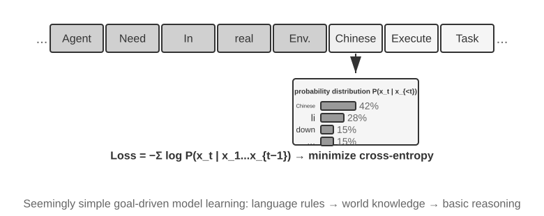
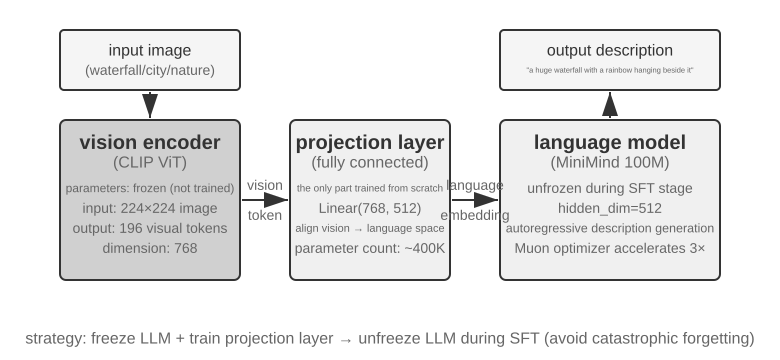
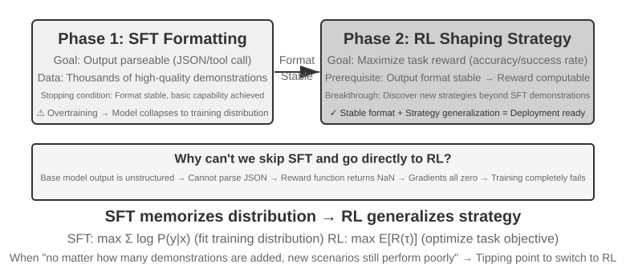
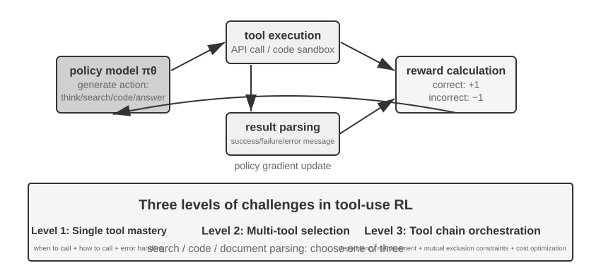

# Model Post-Training

The core formula of this book is Agent = LLM + Context + Tools. This chapter turns to the LLM itself—the "brain." We first use Mid-training to fill gaps in domain knowledge and foundational capabilities, then use post-training methods such as SFT and RL to shape how the model uses context and tools. The end of Chapter 7 pointed out that the evaluation system and simulation environment are the two cornerstones of post-training: the evaluation environment gives training its practice ground, and the evaluation metrics give it its target. This chapter builds on those cornerstones and discusses how to actually change model weights—how to bake capability into the parameters.

This chapter assumes no background in reinforcement learning or model training. We don't expect you to know gradients or policy optimization. Instead, we start from the question of how a model gets trained at all, making clear what each step is for, how it works, and what problem it solves. By the end of the chapter, you should be able to answer the following questions: At what stages are model capabilities formed? What does each stage do? How are the stages commonly combined, and when can the order differ? And where should you focus your effort in your own projects?

**First, let's establish the most important map: modern model capability development can usually be divided into four parts.** Pre-training lays the general foundation, Mid-training fills knowledge and capability gaps on the target distribution, and SFT and RL then shape behavior according to output requirements and task objectives.

1.  **Pre-training**: Training on massive internet text to "predict the next token." This step teaches the model language rules, world knowledge, and basic reasoning. It's like a person who has read all the books in a library—erudite, but not yet good at answering questions. This is the most expensive step (often tens of millions of dollars) and the foundation of all capabilities.
2.  **Mid-training (intermediate training or continued pre-training)**: Starting from an existing base model, continue language modeling on target-language data, domain documents, code, long contexts, or deliberately designed capability data. It does not rebuild the foundation from scratch; it fills in the "textbook chapters" that general pre-training covered poorly. It uses less data and compute than full pre-training and is better suited than SFT to absorbing large bodies of knowledge and forming the basic representations a task requires. Some teams treat Mid-training as the latter part of pre-training; others call it Continued Pre-training (CPT), Domain-Adaptive Pre-training (DAPT), or Task-Adaptive Pre-training (TAPT).
3.  **Supervised Fine-Tuning (SFT)**: Training the model on labeled input-output pairs, much like a teacher giving a student standard answers to imitate. Thousands to tens of thousands of question-and-standard-answer demonstrations teach the model what format, style, and process to use when responding. This step transforms a knowledgeable and capable model into an assistant that understands instructions and produces well-structured outputs. It is cheap, fast, and stable, and almost all deployed models undergo it.
4.  **Reinforcement Learning (RL)**: Letting the model try repeatedly and improve from rewards and penalties, much like reviewing exercises according to their scores. Instead of directly imitating the tokens of a standard response, RL lets the model try on its own, increasing the probability of good behavior and decreasing the probability of poor behavior. When the base model can already succeed occasionally, and the rewards, data, and environment are well designed, this step can improve decisions in **unseen situations**—and it is also the step that takes up the most space in this chapter and requires the most engineering effort.

An intuitive analogy: Pre-training is a general education, Mid-training is an intensive study of specialist textbooks, SFT is a teacher demonstrating solution and communication conventions, and RL is working problems yourself and refining your approach from the outcomes.

**This chapter has two main threads that run throughout. Please remember them, as all subsequent content serves them:**

*   **Thread One: In this chapter's controlled experiments, SFT tends to memorize demonstrations while RL generalizes better.** Under the same task, model, and budget in GeneralPoints and V-IRL, SFT overfits the training answers, while RL more often learns a transferable strategy under the tested distribution shifts. This is a measured result under those experimental conditions, not a universal property of SFT and RL: SFT can generalize with diverse data and appropriate regularization, and RL can overfit when its reward or environment is biased. This chapter uses "SFT memorizes, RL generalizes" as shorthand for these experiments, and the section "From Pre-training to RL: A Four-Part Panorama" explains why the two objectives can produce that difference.
*   **Thread Two: Data and environment matter more than algorithms.** This is the industry's most counterintuitive and most valuable lesson. With off-the-shelf RL algorithms such as PPO and GRPO, knowing how to use them is enough. What actually determines success are three things: whether the **Mid-training corpus** repairs the foundation, whether the **demonstration data** establishes a behavioral protocol, and whether the **simulation environment and reward** provide reliable trial-and-error feedback. In many scenarios, if the first two kinds of data are good enough, RL is not needed at all. This chapter will repeatedly redirect your attention from "which algorithm should I tune?" to "have the data and environment been set up correctly?"

> **Reading Guide**: The content of this chapter is divided into two paths based on the reader's background:
>
> *   **Agent Application Developers** (don't need to train models themselves): Start by reading the opening "From Pre-training to RL: A Four-Part Panorama" to build a global understanding. Then you can skip the two `[Optional Reading]` sections on classic RL and pre-training background and continue from the standalone Mid-training section. Focus on the decision framework for choosing Mid-training, SFT, and RL, as well as the judgment that "data and environment are more important than algorithms"—these insights will influence your design decisions in Harness engineering, including when a prompt is enough and when training is worthwhile.
> *   **Model Training Engineers**: Read sequentially from the beginning. The two `[Optional Reading]` sections provide complete background on reinforcement learning and pre-training. The subsequent experiments provide reproducible training schemes.

## From Pre-training to RL: A Four-Part Panorama

The introduction gave you the four-part map; this section works through the mechanics of each part. They differ in their **data**, **optimization objectives**, and **costs**. Understanding those differences is the key to the entire chapter. Table 8-1 gives the overview; the details follow.

Table 8-1 The Four Parts of Model Capability Development

| Stage | Data Used | Optimization Objective | What Is Learned | Typical Cost |
|-------------|---------------------|--------------------|---------------------|-------------------|
| **Pre-training** | Massive raw internet text | Predict the next token | Language rules, world knowledge, basic reasoning | Very High (millions to tens of millions USD) |
| **Mid-training** | Target-language/domain/capability corpora plus retention data | Continue next-token prediction (usually with loss on every token) | Fill gaps in domain knowledge, language, and foundational capabilities | Medium to high, depending on token volume and whether all parameters are trained |
| **SFT** | Thousands to tens of thousands of "input-output" demonstration pairs | Predict the next token (loss calculated only on the response) | Instruction following, output format, style, process protocol | Low (hours to days) |
| **RL** | Task and environment + reward signal (reference answers optional) | Maximize expected reward | Transferable decision-making strategy, newly discovered solutions | High (often tens to hundreds of times that of SFT) |

### What Pre-training Does: Predicting the Next Token

All the "intelligence" of modern large models is built on a task so simple it's surprising: **Next Token Prediction (NTP)**.

Show the model the first part of a text and have it guess the next token. For example, given the input "The capital of China is," the model should assign a high probability to "Beijing." Each time the model guesses, it compares its prediction to the actual next token. The larger the difference (called the loss), the more it adjusts its parameters to guess more accurately in similar contexts next time. By repeatedly doing this on trillions of tokens of internet text, the model is forced to learn grammar, facts, logic, and even basic reasoning—because to consistently guess the next token correctly across a vast range of contexts, there's no shortcut; it must truly "digest" the patterns in the text.

There's a key point to remember that will carry through to Mid-training, SFT, and RL: **The model's output is essentially a probability distribution.** Given the preceding text, the model assigns a probability to every possible token in its vocabulary. "Training," at its core, is **adjusting this probability distribution**—making the probability of desired tokens higher and undesired ones lower. The difference among the four parts lies only in "what is desired" and "what signal defines desired."

After pre-training, the model is erudite but not user-friendly: if you ask it a question, it might continue generating more questions instead of answering—because in internet text, a question is often followed by another question. It hasn't yet learned the protocol of "when asked a question, you should answer."

### The Essence of Mid-training: Continue Learning on the Target Distribution

General pre-training cannot cover every language, domain, and capability. If a model can barely read Korean documents, does not understand an enterprise's internal protocols, or has never formed the code and long-context representations required by the target task, it is too late to teach only "how to answer" or reward only success and failure. Mid-training retains pre-training's next-token objective but narrows the data distribution to the target domain and mixes in general retention data to control forgetting. It asks whether the model possesses the knowledge and foundational capabilities needed to complete the task—not what the response should look like or which policy earns the highest reward.

Mid-training and SFT may appear to use similar loss functions, but their data organization and supervision density differ. Mid-training usually treats whole documents, code, or derivations as learning targets and computes loss over many tokens. SFT organizes data as input-output demonstrations and usually computes loss only on response tokens. It is technically possible to make a model memorize some facts through a small question-answer SFT set, but this repeatedly reinforces only a few access paths: the model may memorize the questions without forming broadly accessible knowledge. Prefer Mid-training when absorbing large, interconnected bodies of domain knowledge; prefer RAG when the knowledge must remain updateable and traceable.

### The Essence of SFT: "Predict the Next Token" with Different Data

This is the first key insight to grasp in this chapter: **Mathematically, SFT and pre-training are the same task—both predict the next token and minimize the same loss function.** Many beginners think SFT is a completely new method, but it's not. The difference between SFT and pre-training lies in just two things:

1.  **Different Data.** Pre-training uses raw internet text (unstructured, containing everything); SFT uses carefully prepared "input-output" pairs, uniformly formatted as "user question → ideal answer." The model continues "predicting the next token" on these demonstrations, thereby learning the protocol of "how to structure a response when asked a question."
2.  **Loss is calculated only on the "response" (loss masking).** An SFT sample consists of a question and a labeled response. We don't want the model to learn "how to ask a question," only "how to answer." So, when calculating the loss, the tokens in the question part are masked, and gradients are backpropagated only through the response portion. This is the only substantive engineering difference between SFT and pre-training.

Once you see this, it becomes clear why SFT can exhibit memorization on limited demonstrations: its optimization goal is to **maximize the probability of every token in the labeled response**, reproducing the demonstration as closely as possible. For tasks with clear goals and fixed formats, this is extremely efficient—a few thousand examples suffice. But when coverage and diversity are insufficient, the model may overfit surface patterns or shortcuts in the demonstrations and lose performance under distribution shift.

In a nutshell, SFT uses extremely high sample efficiency to **encode a stable input-to-output mapping and protocol in the model's parameters**. It encodes **protocol knowledge**—how to say or do something, including format, style, and process—rather than large amounts of **factual knowledge**—what the model knows. The latter relies on pre-training or RAG.

> **Training Cost: LoRA Parameter-Efficient Fine-Tuning.** Both SFT and the subsequent RL require updating model parameters, and full-parameter fine-tuning has high VRAM requirements (needing to store gradients and optimizer states for billions of parameters). **LoRA** (Low-Rank Adaptation) is the most common cost-saving method: instead of modifying the large original weight matrices, it attaches a small "patch" (low-rank matrix) to learn the task. The parameter count is only 1%–5% of the original, yet it can approach the performance of full fine-tuning. Because the original weights are frozen, LoRA also causes less perturbation to the base model's existing capabilities, reducing the risk of catastrophic forgetting. A few validated rules of thumb[^ch8-1]: You **must** apply LoRA to all major weight matrices (especially the MLP layers, which have the largest parameter count); applying it only to attention layers costs accuracy. **The optimal learning rate is about 10 times that of full fine-tuning** (true for both SFT and RL, a very practical transfer rule). Use medium-to-high rank (64–256) for SFT; since the information per round is small for RL, a small rank (8–32) or even rank=1 is sufficient. During deployment, a single inference server can load multiple LoRA adapters simultaneously for multi-tenant service. This book treats LoRA as the default engineering choice for all post-training methods and will not elaborate on it separately.

### When to Repair the Foundation Before Applying SFT or RL

An RL policy does not directly imitate the tokens of a reference response. It uses rewards to evaluate responses the model **generates itself**, although reference answers or preference data may still be used to calculate that reward. Learning from this signal requires at least two preconditions: the output must be verifiable, and the current policy must occasionally explore valuable behavior.

The first precondition is **format support**. If the task requires JSON or a tool call and the model emits unparseable text, the reward function cannot even tell success from failure. SFT can first make the model articulate itself properly: a small number of demonstrations stabilizes the format and basic procedure so that the reward can be computed, after which RL can optimize the policy. This is the familiar "SFT first, RL second" pattern.

The second, more fundamental precondition is **capability support**. Sample held-out tasks at a temperature close to the training setup and measure `pass@1` and `pass@k`. If the probability of success on one sample is $p$, then under approximately independent sampling the probability of at least one success in $k$ samples is

$$
\operatorname{pass@}k = 1-(1-p)^k.
$$

If `pass@1` is low but `pass@k` rises clearly with $k$, the correct policy is already in the model's distribution but has too little probability mass; RL, rejection sampling, or distillation has something to amplify. Conversely, if empirical `pass@k` remains near zero at a reasonable $k$, sampling temperature, and task coverage, the base model can hardly generate a successful trajectory. With only a terminal 0/1 reward, a GRPO rollout group will likely be all zero, eliminating within-group advantage; PPO likewise sees no positive example showing where to move. Increasing the sample count merely waits roughly $1/p$ trials for an accidental success, and quickly becomes impractical.

At that point, ask what is missing. If it is domain language, facts, code patterns, or foundational long-context capability, use Mid-training to repair the foundation. If the capability exists but cannot be expressed through the interface, use SFT. If the model makes partial progress but cannot reach the endpoint, add verifiable partial rewards or curriculum learning. RL is good at raising the probability of **existing but unlikely** successful behavior; it is poor at creating knowledge and capabilities the model never learned from an all-zero reward.

One boundary remains important: "SFT must come first" is true only when output format or basic behavior has not yet been established. Experiment 8-11 shows that Llama-3.2-Vision-11B fails under strict structured-output requirements when trained directly with RL. A sufficiently strong base model with nonzero success, however, can skip SFT; DeepSeek-R1-Zero is one example. Its later cold-start SFT primarily improved readability and language consistency rather than injecting task knowledge for RL. The standalone decision section below gives the fuller Mid-training/SFT/RL workflow.

### The Essential Difference Between SFT and RL (The Most Important Table in This Chapter)

We have used "SFT memorizes, RL generalizes" to summarize this chapter's controlled experiments. Now let's explain why that tendency can appear. The key is the **different optimization objectives**:

*   **SFT maximizes the probability of the labeled response.** Maximum likelihood pushes the model to reproduce the demonstration for each training sample. Diverse, representative demonstrations can teach generalizable features, but limited demonstrations or prompts can also produce overfitting to surface patterns or shortcuts. In GeneralPoints, the limited demonstrations treated J/Q/K as 10, and performance dropped when those values changed at test time.
*   **RL maximizes expected reward.** The model explores paths and raises the probability of those that earn high reward. When the reward faithfully represents the objective and exploration is sufficient, it can discover transferable strategies absent from the demonstrations. In GeneralPoints, recomputing the answer when values changed produced better out-of-distribution performance. Conversely, a biased reward or environment can make RL overfit to shortcuts too.

Table 8-2 Essential Comparison of SFT and RL

| Dimension | SFT (Supervised Fine-Tuning) | RL (Reinforcement Learning) |
|-----------------|--------------------------------------|----------------------------------------|
| Optimization Objective | Maximize probability of labeled answer (Maximum Likelihood) | Maximize expected reward |
| Training Signal | Token-level supervision on a labeled response | Policy-generated responses or trajectories + outcome- or step-level scalar rewards |
| Data Form | "Input-Output" demonstration pairs | Task and environment + reward signal (reference answers optional) |
| Direct Optimization Pressure | Imitate mappings and protocols in the demonstrations | Reinforce behaviors and strategies that earn reward |
| Under Distribution Shift | Depends on demonstration coverage and regularization; limited demonstrations overfit in this chapter's experiments | Depends on reward, environment, and exploration; transfer was better in this chapter's experiments |
| Sample Efficiency | High (thousands of examples are effective) | Low (often tens to hundreds of times that of SFT) |
| Training Stability | High, converges quickly | Low, prone to oscillation, requires careful tuning |
| Best Suited For | Solidifying format/style/process, high-quality demonstrations, stable environment | Needing generalization to new scenarios, exploring optimal strategies, high annotation cost |

Seen through the probability distribution, SFT and RL differ in another important way. A question usually admits several families of reasonable answers, each corresponding to a "mode" in the distribution. Maximum-likelihood SFT learns the demonstrations one by one and therefore often exhibits a **mass-covering** tendency: it tries to cover the several modes that appear in the training data. RL redistributes probability according to reward and, combined with the common reverse-KL constraint, more readily exhibits a **mode-seeking** tendency: it concentrates probability on a few high-reward modes rather than reproducing every demonstration evenly.

This distinction explains their characteristic strengths: SFT is good at covering many known ways of phrasing something, RL is good at searching among candidate behaviors for a high-reward strategy. Whether the end result preserves diversity or contracts to a few modes depends on the demonstration distribution, the reward function, the KL direction and coefficient, entropy regularization, and the sampling temperature.

**Post-training also shapes when a model acts.** Coding models provide a concrete example: GPT-family and Claude-family models often exhibit different default action thresholds. The former may read more of a repository before editing; the latter may localize from fewer files, implement first, and then use test feedback to correct course. This is not a matter of anthropomorphizing one model as “cautious” and another as “instinctive.” It is a policy in the parameters estimating whether the expected value of reading one more file still exceeds the expected value of submitting and validating the current patch. If SFT demonstrations repeatedly investigate broadly before editing, the model imitates a higher action threshold. If process or outcome rewards repeatedly validate rapid localization and an early verifiable loop, probability mass shifts toward earlier action. Experiment 7-8 in Chapter 7 swaps models inside an identical neutral Coding harness and measures this behavior changing with the model: the harness need not enforce a workflow for the model to carry a stable tool-use policy of its own. The harness can modify the policy, but its primary source can reside in the post-trained parameters. Because vendors do not publish their complete data and reward recipes, the experiment establishes a model-side behavioral difference, not the particular proprietary algorithm that caused it.

**Online feedback creates an opportunity to explore strategies beyond the demonstrations.** SFT on a fixed dataset uses direct training signals from demonstrations, but it can still combine pre-training knowledge and generalize to unseen inputs. Online RL generates responses from the current policy and receives environmental feedback, so it can directly evaluate candidates absent from the demonstrations. This does not automatically guarantee a higher ceiling: results depend on the base model, demonstration coverage, reward fidelity, exploration, and optimization stability. The terms "online/offline" and the stricter "on-policy/off-policy" will be used in the reward and distillation sections. For now, consider three opportunities created by online feedback:

- **First, it can evaluate candidates beyond a fixed demonstration set.** SFT's direct supervision comes from recorded responses; RL can also reinforce new behaviors that the reward function can score. The "pushcut" action in Experiment 8-13 (SimpleVLA-RL) never appeared in human demonstrations, showing the possibility of discovering a strategy outside the data. But the model cannot learn quality the reward cannot recognize or discover a strategy it never explores.
- **Second, it can exploit tasks where verification is easier than generation.** SFT needs a correct answer or good trajectory written first; RL needs a reliable way to judge answer quality. Math answers can be checked, code can be tested, and proofs can be verified. This asymmetry is a strength of RLVR, but an incomplete verifier can also produce reward hacking.
- **Third, it can train on states visited by the current policy.** Offline imitation has the classic problem of **covariate shift**: after a policy leaves the demonstrations and enters unseen states, recovery signals may be absent. In specific sequential imitation-learning settings, worst-case error can accumulate roughly as $T^2$ with trajectory length $T$, while online data aggregation can reduce it to about $T$. On-Policy Distillation (see "Distillation: Improving Sample Efficiency" later in this chapter) combines this online matching with SFT's dense supervision.

To use an analogy: **SFT studies an existing map in detail, while RL can use reward as a compass to explore candidate routes beyond it.** An inaccurate map or compass can lead the model astray. Many systems therefore use SFT to establish a stable starting point, then add RL when the reward and environment are trustworthy.

With this panorama in hand, every later section has a place on the map. The next two sections, both `[Optional Reading]`—"From Classic RL Agents to Modern Agents" and "Model Pre-training Basics"—fill in the reinforcement learning and pre-training background for readers who want to go deeper. Readers who just want to get their hands on post-training can skip ahead to the SFT section.

## From Classic RL Agents to Modern Agents `[Optional Reading]`

### Agent-Environment Interaction

**Reinforcement Learning (RL)** is fundamentally about learning how to select actions based on the current situation to maximize **cumulative reward**. Imagine an AI learning to play chess: each move is an action, winning gives a positive reward, losing gives a negative reward, and the cumulative reward is the total gain from the entire game. The Agent and the environment interact continuously: at each step, the Agent observes the current state, chooses an action, and the environment produces a new state and gives a reward.

To understand this interaction more intuitively, the following diagram shows the standard RL loop—at each time step, the Agent observes the environment state, outputs an action, and the environment gives a reward and transitions to a new state based on that action.


This interaction produces a **trajectory**—a complete record of "state → action → reward → new state → action → reward...". The quality of a policy is ultimately reflected in the quality of the trajectories. A **value function** answers the question: "If I am in this state now and continue acting according to the current policy, how much total reward will I eventually accumulate?" This is like an experienced chess player looking at a position and, without calculating to the end, intuitively estimating the winning probability. (When the "current policy" is replaced by the "optimal policy," we get the optimal value function, which will be used later in this chapter when discussing the Bellman optimality equation.) The boundary between the Agent and the environment follows a simple principle: **anything the Agent cannot arbitrarily change belongs to the environment.**

Two unique features distinguish reinforcement learning from supervised learning (which requires labeled correct answers) and unsupervised learning (which discovers hidden patterns in data): **trial-and-error search** (the Agent must figure out which actions are good on its own, without a teacher directly providing the correct answer) and **delayed reward** (the effect of an action may only become apparent many steps later, e.g., the value of a good chess move is only evident at the end of the game). This also brings about the unique **exploration-exploitation tradeoff**: always taking familiar paths means learning nothing new; always trying randomly means never reaching the goal.

A reinforcement learning system consists of five core elements:

- **Action Space**: Defines the set of all possible actions the Agent can take. Actions can be discrete (e.g., "which move to make" in chess, with a finite number of options) or continuous (e.g., "how many degrees to rotate a joint" for a robot, a continuous value).
- **Policy**: The Agent's behavioral rule, specifying what to do in a given state. A policy can be simple (a lookup table: in state A, execute action X) or complex (a deep neural network).
- **Reward Signal**: The immediate feedback from the environment. However, the Agent's goal is to maximize long-term, not immediate, reward—this distinction is crucial, just as investment should not be judged by today's gains and losses but by long-term returns.
- **Value Function**: Estimates the total cumulative reward obtainable from a given state in the future, helping the Agent make wise decisions even without immediate feedback. One of the most important insights from sixty years of RL research is the central role of value estimation.
- **Environment Model** (optional): Predicts the environment's response to actions. Methods that use an environment model are called **model-based methods** (first learn to predict how the environment changes, then plan accordingly); those without are called **model-free methods** (do not predict the environment, but learn directly from experience).

Table 8-3 compares the key components of various Agent systems, revealing the universality of the Agent concept and helping readers see the difference in action spaces between traditional RL Agents and modern LLM Agents.

Table 8-3 Comparison of Key Elements in Different Agent Systems

| Agent Type | Environment | Action Space | Reward Signal |
|---------------|------------------------|-------------------------------|-------------------------|
| **Newborn Gazelle** | Terrain, gravity, body posture | Continuous high-dimensional (muscle group contractions) | Balance (+), Falling (-) |
| **Vacuum Robot** | Room layout, battery level | Discrete (direction, vacuum, charge) | Cleaned area (+), Battery depleted (-) |
| **Chess Grandmaster** | Board state, time limit | Discrete finite (legal moves) | Win (+1), Loss (-1) |
| **Customer Service Agent** | Conversation history, knowledge base | Variable-length compositional (think, speak, API call) | Problem solved (+), Handling time (-) |
| **Code Assistant Agent** | Requirements document, codebase | Variable-length compositional (think, search, edit, execute) | Test passed (+), Bug introduced (-) |

The table reveals an important distinction. Representative board-game and Atari environments use predefined finite discrete primitive actions, while robot control uses continuous actions with fixed dimensions and physical bounds. Modern LLM-based customer-service and coding Agents compose finite tokens and tool calls into variable-length action sequences, making the possible sequences difficult to enumerate at once. They can also use internal thinking to improve their capabilities.

### Two Action Representations: Classic RL Settings and Variable-Length LLM Policies

The most visible difference between the two settings is how actions are represented. An MDP itself can represent finite or infinite, discrete or continuous action spaces. The representative board-game and Atari environments here use finite discrete primitive actions, robot control uses bounded continuous actions, and an LLM policy composes a finite token vocabulary and tool schemas into variable-length sequences. This compositional representation has major consequences for algorithm design, sample efficiency, and generalization. Each setting is discussed below.

**Foundational Example: MDP and Tabular Q-learning.**

MDP (Markov Decision Process) is the mathematical framework for reinforcement learning, defining core elements such as states, actions, and rewards. Its core assumption is the **Markov property**: the future depends only on the current state, which must contain all history relevant to the decision. In chess, for example, the state includes not only piece placement but also the side to move, castling and en passant rights, and information needed for the fifty-move and repetition rules. With a sufficient state definition, the entire game record need not be reread for each transition. If an observation omits necessary history, that history must be added to the state or handled with a partially observable model.


The representative RL environments in this section use **predefined action spaces**. The 361 move positions in Go are large but finite; chess actions can still be enumerated; and Atari games typically expose a few to a dozen discrete primitive actions. **Robotic Agents** use continuous but bounded action spaces: joint angles, velocities, and grip forces are continuous values, but have clear physical bounds and dimensions fixed by the robot's degrees of freedom.

Finite discrete actions make individual candidates easier to evaluate. If the numbers of states and actions are small enough, tabular Q-learning stores their values directly; larger Atari and board-game state spaces combine function approximation with search. Continuous-action MDPs cannot enumerate every action, so methods such as policy gradients and actor-critic approximate the policy and value function. The classic example in this section also differs from an LLM policy because it starts trial-and-error learning without pretrained knowledge.

Within this framework, one of the most fundamental and important algorithms is **Q-learning**. It maintains a value estimate for each "state-action" pair: if you take action *a* in state *s* and then act optimally thereafter, how much total reward can you expect? Intuitively, whether an action is good depends on the immediate reward it brings, plus "how good the next state it leads to is."

Writing this intuition as an equation gives the core recursive relationship of the famous **Bellman equation** in RL textbooks: **The true value of an action = the immediate reward obtained at this step + the maximum future value obtainable from the next state**:

$$Q^*(s, a) = r + \gamma \max_{a'} Q^*(s', a')$$

where $r$ is the immediate reward, $s'$ is the next state reached after executing the action (written in deterministic form for intuition; in a stochastic environment, an expectation over the next state $s'$ is needed), and $\gamma \in [0, 1)$ is the **discount factor**—it determines how much the Agent values the future: the closer $\gamma$ is to 1, the more it values long-term returns; the closer to 0, the more it focuses on the immediate. The "cumulative reward" mentioned repeatedly earlier is precisely the sum of rewards at each step, discounted by $\gamma$: $\sum_{t} \gamma^{t} r_t$. After each action, the algorithm slightly adjusts the old estimate towards the "actually observed outcome"—this paradigm of "correcting an old estimate with a one-step actual result" is called **Temporal-Difference Learning (TD learning)**. After thousands of trials, the estimate gradually approaches the true value.

The following two figures show the exploration process of Q-learning in a grid world and the gradual convergence of Q-values.


Q-learning is an **off-policy** method: it can learn an optimal policy from data generated by an exploratory policy different from the target policy. It still requires adequate coverage of the relevant state-action pairs and appropriate learning-rate and convergence conditions; it does not automatically converge on an arbitrary data distribution. The strict definitions of on-policy and off-policy methods, and how they map to LLM post-training, are discussed later in the section "RL Algorithms: From 16 Rollouts to One Parameter Update."

> **Experiment 8-1 ★: Q-learning Performance in a Treasure Hunt Game**
>
> To verify the characteristics and limitations of Q-learning, we designed a **treasure hunt game environment**. This environment includes several key challenges: **hidden mechanisms** require the Agent to discover the correspondence between keys and doors, weapon effects, and item crafting rules on its own; **multi-step dependencies** mean that completing the task requires the correct sequence of actions (optimal solution: 11 steps); **sparse rewards** mean that only key actions and the final victory yield significant rewards, with most intermediate steps receiving no feedback.
>
> The Q-learning Agent uses standard parameter settings and an ε-greedy exploration strategy: it usually selects the currently optimal action but occasionally chooses a random one, with the proportion of random exploration gradually decreasing during training.
>
> The learning curve shows typical characteristics (an episode is one complete game, from start to completion or failure):
> - **First 1000 episodes**: 0% win rate, Q-table has only 124 states, Agent is blindly exploring
> - **First 5000 episodes**: Still no stable victories, Q-table has 133 states
> - **7,000–8,000 episodes**: Win rate gradually rises from 34% to 96%
> - **10,000 episodes**: 100% win rate, Q-table has 145 states, found the 11-step optimal solution
>
> The entire training takes less than 10 seconds (very efficient simulation), but requires nearly 10,000 complete attempts. This demonstrates the behavior of the prior-free, ε-greedy tabular Q-learning setup used in this experiment: it needs substantial random exploration to complete the path by chance, and value signals propagate slowly enough to require repeated reinforcement.
>
> In a game simulator, 10,000 trials take only 10 seconds, a negligible cost. But in real-world Agent scenarios—where each phone call has a cost, each browser operation has a delay, and each wrong decision can have irreversible consequences—10,000 trials are completely unacceptable. One reason to use a pretrained LLM policy is that accumulated knowledge can support effective decisions with far fewer environmental interactions.
>
> This **prior-free tabular Q-learning experiment** has three limitations: even a simple task needs extensive interaction, values learned in one environment do not transfer directly to another, and each new task must be explored again. These are not limitations of the MDP framework itself. Function approximation, transfer learning, and model-based RL can handle richer states and knowledge transfer, although they may still require substantial environmental interaction compared with a pretrained LLM.

**Agents Based on Pretrained LLM Policies.**

Large language models have brought an important practical change to how Agent actions are represented and initialized.

Classic RL can also model internal computation or information gathering as states and actions. The practical change introduced by LLMs is not that thinking became possible for the first time, but that a pretrained language policy can represent internal computation as variable-length token sequences and generate it within the same policy as external actions. Thinking tokens do not directly change the external world, but they can improve the final action. The action representation now includes not only "what to do," but also "how long to think and what to think about."

The most important practical innovation is incorporating **thinking tokens as special actions in the policy output space**. Representative traditional RL environments emphasize primitive actions such as moving, attacking, and picking up, although internal computation can also be modeled in an MDP or hierarchical policy. In LLM Agents, **internal thinking becomes a core part of the learned language action space**. It does not directly change the external environment or receive immediate environmental reward, but can express many computational paths within token costs and context limits.

Variable-length compositional actions create a much larger search space than primitive actions and are difficult to learn from scratch without prior knowledge. An Agent learning from scratch is like searching for treasure in a desert blindfolded. LLMs instead learn human problem-solving patterns from massive text pre-training: math solutions often follow "identify conditions → recall formulas → calculate step by step," while coding follows "understand requirements → design structure → implement details." The pretrained policy gives structured paths higher prior probability, greatly compressing the search space. Thus, even without additional RL, a pretrained LLM can generate a basic logical Chain of Thought (CoT), learned through next-token prediction over math solutions, code comments, discussions, and other human-written reasoning traces.

RL post-training then uses external rewards to teach the LLM to apply these patterns more effectively to a specific task. Language structure is not a separate "internal reward"; it acts as a **prior distribution** in the pretrained policy. A pattern consistently present in training data, such as "we need to convert currency, so first look up the exchange rate," may start with higher generation probability than an unrelated path such as checking the weather. RL uses the actual task reward to reshape path probabilities from that starting distribution.


The pretrained language policy enables LLM Agents to understand unseen instructions (zero-shot generalization) and adapt to new tasks from a few examples (few-shot adaptation), in sharp contrast with the prior-free tabular Q-learning setting above. It also supports compositional generalization, in-context learning, and multimodal understanding. Note that the **effectiveness** of in-context learning and its **internal mechanism** are different questions—as analyzed in Chapter 2, attention works more like retrieval than reasoning, but this does not reduce its practical effect in task adaptation.

Expanding from predefined primitive actions to variable-length compositional actions is an important shift in the AI Agent paradigm. LLM actions are still defined by a finite token vocabulary and tool schemas, but internal thinking, natural-language queries, program code, complex JSON, and multimodal content combine into an explosive number of variable-length sequences. Code interpreters and search tools connect that representation to a wide range of real-world tasks and information. This creates both opportunities and challenges: Agents can combine basic tools to handle unseen tasks, but reward design and efficient exploration must operate over an enormous compositional space.

Models such as Kimi K3, which are optimized for tool use and long-chain reasoning, illustrate the typical direction of the LLM+RL paradigm: large-scale language pre-training provides the foundation, and post-training strengthens problem decomposition, tool use, and self-correction. **OpenVLA**[^ch8-21] (detailed in Chapter 6) showcases the VLA (Vision-Language-Action) architecture paradigm of the LLM era: a vision encoder processes environmental observations, a language model understands instructions and reasons, and an action decoder generates control signals, enabling language-conditioned control and cross-task generalization. To be clear, OpenVLA itself is trained through imitation learning on nearly one million robot **demonstration trajectories**, making it SFT in nature rather than RL. SimpleVLA-RL, introduced in Experiment 8-13 later in this chapter, is the representative example of bringing RL into robotics by using rewards to further optimize this kind of VLA architecture.


**OpenAI's Exploration Path** (chronicled by Shunyu Yao, Assistant Professor at Princeton University and author of the ReAct paper, in "The Second Half"[^ch8-2]) traces an evolution in how the field thought. **Phase 1 (2015-2016), Algorithm-Centric:** The prevailing belief was that better algorithms were the key. Progress was made in standard environments such as Atari, but every new environment required retraining from scratch. **Phase 2 (2016-2018), The Importance of Environment:** Gym standardized a range of tasks; Universe and World of Bits attempted to turn the entire internet into an RL training environment; and Dota 2 pursued superhuman performance in a specific complex environment. The idea was clear, but general computer use and web navigation remained out of reach.

**Phase 3 (2018-present), Awakening of Priors:** GPT-2/GPT-3 demonstrated the power of language pre-training; WebGPT and ChatGPT proved those priors could be turned into practical Agents. The most important discovery: **priors can be acquired in ways that have nothing to do with RL**. This is a counterintuitive truth—for decades, RL researchers may have had their priorities exactly backwards. The real order is not algorithm > environment > prior, but prior > environment > algorithm.

> **Experiment 8-2 ★★: Comparative Study of Traditional RL and LLM Agent**
>
>
> 
>
>
> We compared Q-learning with an LLM Agent—Kimi K3, maintaining a buffer of up to 50 experiences—in the same treasure hunt game. The results are astonishing: **The LLM Agent completed the game in 18 steps on its first try**.
>
> **Early Stage (Purposeful Exploration)**: Picks up a rusty sword ("A weapon is better than bare hands"), systematically explores the map, deduces "need to find a key" after finding the north gate locked, explores the storeroom, acquires the red key and magic crystal. **Middle Stage (Mechanism Understanding and Proactive Synthesis)**: Understands the "key auto-use" rule and anticipates the rusty sword is insufficient against the guard, proactively synthesizes a silver sword on step 8. **Late Stage (Execution and Error Correction)**: Heads north with the silver sword and defeats the powerful guard at step 13. Along the way, it makes one or two ineffective attempts—repeatedly swinging the sword or backtracking—and finally obtains the dragon's treasure at step 18.
>
> This demonstrates a fundamental difference between semantic understanding and symbolic mapping. The LLM Agent understood the conceptual structure of the game; every step had purpose and logical support. For Q-learning, "door," "key," and "sword" are just meaningless symbol combinations, and it can only slowly discover their relationships through extensive statistical learning.
>
> Computational cost presents an interesting paradox: Q-learning runs 10,000 games in 10 seconds, while the LLM Agent takes 1-2 minutes per game. However, in real-world tasks, the time, money, and risk costs per interaction far outweigh pure computational costs, so judging solely by GPU time is unfair. A more critical insight is: The LLM Agent's success isn't due to having a better "learning algorithm," but because it carries vast prior knowledge. When game rules change, Q-learning needs complete retraining, while the LLM Agent can adapt directly through reasoning. This leads to a practical design principle: Traditional RL remains valuable in scenarios with low simulation costs and high repeatability; in real-world scenarios with high interaction costs and a need for rapid adaptation, the sample efficiency of LLM Agents is more valuable in practice.

Chapter 1 already provided a conceptual map of how contextual adaptation, updates to external artifacts, and parameter updates work together; the section “Post-Training Practical Takeaways” at the end of this chapter returns to the topic. This chapter's main thread is post-training: writing into model parameters capabilities that cannot be fully expressed through external rules.

## Model Pre-training Basics `[Optional Reading]`

To understand why post-training techniques are effective, one must first understand what pre-training establishes. Post-training (SFT and RL) essentially optimizes within the representation space established by pre-training—the knowledge structure laid down by pre-training determines the ceiling of post-training. Therefore, we examine the core aspects of pre-training through three experiments: training a small-scale language model from scratch, extending visual capabilities, and injecting new language knowledge. The three experiments in this section are supplementary and are intended to build intuition about pre-training—that is, initial training on large-scale data that teaches a model basic language patterns and world knowledge. Readers already familiar with the pre-training process can skip them.



Language model training follows a three-step pipeline: "tokenization — pre-training — post-training." Tokenization segments text into discrete units. For example, "I like programming" might be tokenized into "I," "like," "program," "ming." These tokens are the smallest textual units processed by the model. The task of pre-training is conceptually simple: show the model the first part of a text segment and have it predict the next token. By comparing its prediction to the correct answer (this difference is called loss; smaller loss means more accurate prediction), the model continuously adjusts its parameters. After repeated training on massive text data, the model gradually learns language rules, world knowledge, and basic reasoning abilities. After pre-training, the model can generate fluent text, but the output lacks structure and struggles to follow instructions. Post-training then transforms the model into a practical assistant through SFT—training on labeled input-output pairs—and preference optimization, such as DPO, which teaches the model to generate responses that humans prefer.

> **Experiment 8-3 ★★: Training an LLM from Scratch—The Power of Algorithm Improvement**
>
> Using MiniMind 2, a 100-million-parameter model, as a case study, the experiment completes the entire training process on a consumer-grade GPU. Two algorithmic optimizations—QK Norm and the Muon optimizer—triple the convergence speed and significantly improve generation quality, all at very low cost: approximately 14 hours of training and $34 in total.
>
> Effects of each training stage: After pre-training, the model can answer factual questions like "What is the highest mountain in the world?" but the format is non-standard; after SFT, instruction following and output formatting improve significantly, allowing the model to organize answers as expected; preference optimization further reduces factual errors and unnatural expressions. The 100-million-parameter model still has obvious limitations (prone to errors on complex problems), but the lesson is: **With a fixed, small budget, algorithmic improvements offer better value than simply scaling up size**.

> **Experiment 8-4 ★★: Training Your Own VLM**
>
>
> 
>
>
> VLMs unify visual perception and language understanding within a single model. The core challenge is cross-modal alignment—making "what is seen" correspond to "what is said." The architecture consists of three components: a **Vision Encoder** (e.g., CLIP, parameters frozen) extracts semantic features from images; a **Projection Layer** (lightweight, the only part trained from scratch) acts as a "translator" between visual features and the language model, mapping visual features into a representation space the language model can understand; and a **Language Model** generates descriptive text. Training uses a "freeze LLM + train only projection layer" strategy to avoid catastrophic forgetting (forgetting old skills after learning new ones); after the alignment pre-training stage, the LLM is unfrozen, and SFT is performed on high-quality image-description pairs, significantly improving the detail and accuracy of its descriptions.
>
> This experiment reveals the basic paradigm for multimodal model training: reusing unimodal pre-training results and achieving cross-modal alignment by training a lightweight projection layer—efficient and scalable, but the projection layer's limited expressiveness can become a bottleneck for deep cross-modal understanding. Extending the same "vision encoder + projection layer + LLM" architecture one step further by having the model output actions produces the VLA (Vision-Language-Action) model detailed in Chapter 6.

Together, the two pre-training experiments reveal a pattern: under a limited budget, algorithmic and architectural improvements often offer better value than scale alone. More importantly, pre-training supplies descriptive knowledge and language-modeling capability but not structured instruction following or task-oriented behavior. Yet SFT and RL cannot bypass a target language or domain that general pre-training never covered. That is the gap Mid-training addresses.

## Mid-training: Filling Knowledge and Foundational Capability Gaps

In this chapter, **Mid-training** means taking an existing base model and continuing language-model training on a target data distribution. It usually retains pre-training's next-token objective and computes loss over every token in a document, code sample, or derivation. Classic DAPT/TAPT research shows that a second pre-training stage on domain or task-related unlabeled corpora can continue improving downstream performance[^ch8-30]. "Mid" describes its place in the capability-development pipeline; its data format and loss remain those of pre-training.

Mid-training mainly addresses two kinds of gap:

- **Knowledge gaps**: General pre-training did not adequately cover a target language, finance, medicine, law, internal enterprise documents, or a class of codebases, so the model cannot even understand the concepts and terminology.
- **Foundational capability gaps**: The target task requires long-context, coding, mathematical-derivation, or multimodal representations that the base model has not formed. The problem is not merely the response format: even after many samples, the model almost never reaches a correct solution.

This also explains why SFT should not be treated as the main vehicle for knowledge injection. SFT can memorize a small number of facts and often follows Mid-training to teach the model how to answer domain questions. But a small QA set covers only a limited set of phrasings; it is better at training how to access and express knowledge than at carrying a large, interconnected body of raw knowledge. Conversely, reducing language-model loss on domain text does not ensure the model will retrieve that knowledge in response to a question. Research shows that the order and organization of continued pre-training and instruction tuning materially affect whether knowledge can be accessed in QA form[^ch8-31]. A robust recipe is usually: **Mid-training absorbs knowledge and capabilities → small-scale SFT establishes access and output protocols → RL is added if needed once success is nonzero**.

### Constructing Mid-training Data

The key is not to dump every domain file into training. The **target distribution, retention distribution, and evaluation distribution** must form a closed loop:

1. **Infer data needs from the failure distribution.** Slice evaluations by topic, language, document type, code pattern, and context length. Determine which low-`pass@k` cases come from a base-model gap, and add data only for knowledge and capability gaps rather than misdiagnosing output-format errors as missing knowledge.
2. **Build high-density target corpora.** Raw documents establish terminology and factual associations; repositories teach structure and dependencies; textbook-style derivations, synthetic explanations, and cross-document association samples make implicit relationships explicit. Deduplicate, filter for quality, and check for evaluation-set contamination.
3. **Mix by capability bucket, not only by corpus source.** The data for context stage $i$ can be written as

   $$
   \mathcal{D}_i=\alpha_i\mathcal{D}_{\text{long}}+\beta_i\mathcal{D}_{\text{atomic}}+\gamma_i\mathcal{D}_{\text{agent}}+\delta_i\mathcal{D}_{\text{replay}},\qquad
   \alpha_i+\beta_i+\gamma_i+\delta_i=1
   $$

   Here, $\mathcal{D}_{\text{long}}$ contains natural long texts near the current target length, such as books, long documents, and code repositories; $\mathcal{D}_{\text{atomic}}$ covers primitives such as long-text retrieval, multi-hop reasoning, information aggregation, and statistics; $\mathcal{D}_{\text{agent}}$ injects Agent essentials such as planning, tool selection and calling, long-horizon state tracking, and error recovery; and $\mathcal{D}_{\text{replay}}$ retains general pre-training data and data from earlier length stages. Tool documentation, code, plans, state transitions, and execution traces can be organized as complete sequences and trained with language-model loss over every token to form basic representations; exact dialogue templates and tool-call schemas remain the job of later SFT. There is no universal ratio across models. Adjust it from each bucket's learning and forgetting curves, and report the effective mixture **by token**, not merely by sample count, because long examples naturally consume more tokens.
4. **Use two forms of replay at every stage.** The first is original short text and general data, preserving language, knowledge, and short-context ability. The second is "length-lifted replay": place an old short task that the model already solves into the current context length, with relevant information and distractors at different positions, and verify that the same capability survives in a longer window. Ideally, general data comes from the base model's original pre-training set; when unavailable, open corpora such as FineWeb-2 can substitute. Long-context research also finds that high-quality short-context data remains an important part of a good mixture alongside natural long text[^ch8-35].
5. **Stop by multidimensional gates.** In addition to training loss, track held-out domain tasks, general capabilities, prior instruction following, and target-task `pass@1`/`pass@k`. If domain metrics rise while the general retention set falls, the mixture or learning rate is too aggressive. If loss falls but `pass@k` does not move, check whether the data truly covers the required capability and whether a later SFT step is needed to make knowledge accessible.

### Expanding the Context Window with Curriculum Learning

For an Agent, Mid-training has another important responsibility: extend the **effective context window** reliably to the target length while developing long-text reasoning, planning, and tool-use capabilities during the expansion. Merely changing positional encoding or setting `max_position_embeddings` from 32K to 128K proves only that the model accepts such input, not that it can retrieve, aggregate, and act across the full window. A more robust approach uses a length curriculum—for example, 8K → 16K → 32K → 64K → 128K. The exact ladder depends on the starting model, target length, and compute budget and need not double mechanically. Existing work on long-context continued pre-training likewise treats data mixtures and sequence-length curricula as key design variables[^ch8-36].

Before moving to a longer window, solve these foundational capabilities at the current length:

- **Position and retrieval**: single-needle and multi-needle extraction, key information at different positions, and retrieval under distractors;
- **Relations and reasoning**: cross-paragraph, cross-document, and multi-hop relation tracking, contradiction resolution, and evidence composition;
- **Aggregation and statistics**: counting, grouping, sorting, comparison, trend summaries, and aggregation over long tables or logs;
- **Agent primitives**: basic task decomposition, planning, tool selection, argument construction, state memory, and recovery from failure.

Let checkpoint $\theta_i$ be produced at stage $i$, let the current window be $L_i$, and let $M(\theta_i,c,L)$ be the score of capability bucket $c$ at effective length $L$. Before entering $L_{i+1}$, check at least three gates:

$$
\begin{aligned}
M(\theta_i,c,L_i) &\geq \tau_c &&\text{(current-length capability reaches its threshold)},\\
M(\theta_i,c,L_i) &\geq M(\theta_i,c,L_{i-1})-\epsilon_{\text{len}} &&\text{(capability does not materially decay with length)},\\
M(\theta_i,c,L_{i-1}) &\geq M(\theta_{i-1},c,L_{i-1})-\epsilon_{\text{retain}} &&\text{(the new stage has not forgotten old capability)}.
\end{aligned}
$$

The second condition must use **difficulty-matched, length-lifted tasks**; otherwise questions at different lengths may differ in inherent difficulty and their scores are not directly comparable. The ideal is for current-length performance not to fall below shorter-window performance. In practice, set $\epsilon_{\text{len}}$ and $\epsilon_{\text{retain}}$ from confidence intervals over repeated evaluations rather than arbitrarily forcing them to zero. If any critical capability bucket fails a gate, increase the corresponding atomic-capability data, current-length data, or replay share, continue training, and retest instead of increasing only the nominal context length.

There is no need to invent these gates from scratch. Existing long-context benchmarks cover most primitives and realistic tasks and can form a **capability × length** acceptance matrix:

| Acceptance layer | Available benchmarks | Main observations |
| --- | --- | --- |
| Position, retrieval, tracking, and aggregation | NIAH, RULER | Degradation curves by needle position, needle count, multi-hop tracking, aggregation task, and length; NIAH is only a basic smoke test |
| Realistic long-document reasoning | LongBench, LongBench v2 | Single- and multi-document QA, long dialogue, long-context learning, and structured-data understanding; inspect each category and length slice, not only the aggregate score |
| Long-code understanding | LongBench v2 repository tasks, LongCodeU | Code-unit perception, cross-file and cross-unit relations, and repository-level understanding |
| Planning and tool learning | PlanningArena and the tool-use benchmarks introduced earlier in this book | Task decomposition, tool selection, context memory, arguments, and state correctness |
| End-to-end Agents | SWE-bench Verified, $\tau^2$-bench, Terminal-Bench, and others | Final success, valid-trajectory rate, and `pass@k`, confirming that primitives combine into usable behavior |

RULER extends single NIAH to multi-needle retrieval, multi-hop tracing, and aggregation, making it suitable for controlled-length foundational gates[^ch8-37]. LongBench v2 covers realistic multi-document, long-dialogue, repository, and long-structured-data tasks[^ch8-38]. LongCodeU and PlanningArena respectively add diagnosis for long-code relations and planning/tool learning[^ch8-39][^ch8-40]. Keep each benchmark's official test set exclusively for evaluation, construct training data from structurally similar but non-overlapping examples, and report every length, capability bucket, and failure type. Passing a single code or Agent leaderboard is strong aggregate evidence but can still hide local regressions; passing NIAH alone does not establish long-context reasoning.

If facts change frequently or must be cited to primary sources, RAG is still preferable to writing them into weights. Mid-training is better suited to stable, large-scale domain knowledge and capabilities that need internal representations. Full-parameter Mid-training on a large model costs more and risks more forgetting than small-scale SFT, so validate the mixture in a small pilot before scaling the training budget.

> **Experiment 8-5 ★★: Continued Pre-training to Learn a New Language**
>
> Using Mistral 7B v0.3 as the base model—primarily pre-trained on English and with almost no understanding of Korean—the experiment introduces Korean capability through continued language-model training on Korean Wikipedia. The model already has general representations and only needs to adapt to a new data distribution, making this much cheaper than training from scratch. This experiment uses approximately 80% Korean and 20% English to mitigate catastrophic forgetting; that ratio is an experimental choice, not a universal default. Korean instruction data is then used for SFT to obtain practical conversational ability. The division of responsibility is clear: Mid-training first supplies Korean knowledge and language capability, then SFT teaches the model how to receive instructions and organize answers in Korean.
>
> The experiment also demonstrates the catastrophic forgetting that continued pre-training can cause: blind ratings improved for Korean in the final stage while English capability declined. Continued pre-training can write the target distribution into parameters, but it does not remove the need for retention sets, factual evaluation, and data-quality audits.

Once the model has enough knowledge and foundational capability, the next step is to turn it into a practical Agent that works according to a protocol.

## SFT (Supervised Fine-Tuning)


The section "From Pre-training to RL: A Four-Part Panorama" already explained the essence of SFT ("predict the next token" with different data and loss computed only on the response). This section uses four experiments to show what this mechanism—writing stable mappings and protocols into parameters—solidifies across different tasks. The core value of SFT is not injecting new knowledge but **solidifying protocols**: writing mappings, interaction formats, and style norms into parameters so the model can produce compliant outputs at inference time without lengthy prompts. Typically, only a few thousand to tens of thousands of high-quality examples are needed to establish basic conversational ability and instruction following.

This efficiency can come with dependence on the training distribution. In tasks that require exploring diverse correct strategies, or where deployment shifts away from the demonstrations, SFT may favor reproducing demonstrated patterns and lose performance in new situations. The following experiments show this process of "solidifying protocols" from different angles; they do not establish a universal ranking of SFT and RL.

Before getting hands-on with SFT, there is one practical question you cannot avoid: **where does SFT data come from?** The industry's answer boils down to three routes:

- **Human expert demonstrations**—the highest quality ceiling, but expensive and slow; best used as the "seed data" that defines format and style;
- **Teacher-model generation**—that is, synthetic data: have a strong model mass-produce "input-output" pairs, filter them, and distill them into the student; see Experiments 8-8 and 8-9;
- **Rejection sampling**—the model samples several candidates for the same problem itself, a verifier picks out the correct ones, and it trains on those; see Experiment 8-9.

The three routes are often combined: use a small number of human seeds to fix the format, scale up with a teacher model, and level out the quality with rejection sampling. Whichever route you take, the construction pipeline is much the same: define the task distribution and the output schema, generate candidates in bulk, filter for quality with rule-based validation, format checks, and human spot checks, then deduplicate, balance the mix, and ensure diversity. There is no need to chase volume—a few thousand to a few tens of thousands of high-quality samples is usually enough to solidify a protocol, and refining ten thousand clean samples beats piling up a hundred thousand dirty ones: every bit of noise in the data is something SFT may faithfully write into the parameters. **human expert demonstrations**—the highest quality ceiling, but expensive and slow, best suited for the "seed data" that defines format and style; **teacher-model generation**—that is, synthetic data: have a strong model mass-produce "input–output" pairs, filter them, and then distill them into the student (Experiments 8-8 and 7-9 both take this route); **model self-bootstrapping**—the model samples multiple candidates for the same problem, a verifier selects the correct ones, and those selected samples are then used to train the model itself. This is rejection sampling fine-tuning, covered in detail in Experiment 8-9. The three routes are often combined: first use a small amount of human seed data to pin down the format, then use a teacher model to scale up, and finally use rejection sampling to bring the quality up to the mark. Whichever route you take, the construction pipeline is largely the same: define the task distribution and output schema, generate candidates in bulk, filter for quality with rule-based validation, format checks, and manual spot-checks, then deduplicate, balance the mixture ratios, and ensure diversity. There is no need to be greedy about scale—a few thousand to tens of thousands of high-quality examples are usually enough to solidify the protocol. Rather than piling up a hundred thousand dirty examples, refine ten thousand clean ones: SFT will faithfully write every bit of noise in the data into its parameters.

> **Experiment 8-6 ★★★: Voice SFT—From "Voice Cloning" to "Paralinguistic Modeling" `[Extended Experiment]`**
>
> Using Orpheus (contextual-prompt voice cloning) and Sesame (paralinguistic token modeling) as case studies, this experiment shows how "voice style and expression habits" get written into parameters. The two take different routes:
>
> - **Orpheus**: Compresses the voice waveform into a token sequence. By concatenating reference audio from the same speaker, the model learns to "speak in this person's voice," achieving cross-sentence timbre consistency.
> - **Sesame**: Abstracts paralinguistic phenomena like laughter and sighs into special tokens like `<laugh>`, `<sigh>`. The model learns to "produce the corresponding sound when seeing the token."
>
> In expressive tasks, SFT solidifies style control protocols and structured expression habits, not factual knowledge or complex reasoning. The key lies in the diversity and annotation quality of the training data. Common failure modes include too few speakers in the training data, causing everyone to sound the same, and token overfitting (where the model memorizes training sample details and performs worse on new situations), leading to "mechanical laughter."

> **Experiment 8-7 ★★★: Multilingual Thinking—Enabling the Model to Think in Any Language `[Extended Experiment]`**
>
> Most thinking models only "think" in English: regardless of the language you use to ask a question, the model's internal chain of thought is almost always in English, because the high-quality thinking demonstrations in the training data are mostly written in English. The goal of this experiment is simple—to enable the model to think in a specified language.
>
> The approach is to perform SFT on gpt-oss-20b: add a line `reasoning language: German` (or another language) to the system instruction, then train with reasoning examples in English, Spanish, French, etc. The training data contains **no Chinese at all**, but after training, simply setting the reasoning language to Chinese enables the model to perform complete chain-of-thought reasoning in Chinese—this zero-shot cross-lingual generalization is the most interesting finding of this experiment. Note that this is not the generalization capability of SFT itself. Multilingual pre-training has already established a shared cross-lingual representation space in the model; SFT merely activates this pre-existing cross-lingual ability.

> **Experiment 8-8 ★★: Prompt Distillation—Replicating Usable Capabilities at Lower Cost**
>
> In practical applications, to make a model perform complex tasks, lengthy system prompts (thousands or even tens of thousands of tokens) are often required, increasing latency and cost with each call. When using reasoning LLMs, internal thinking tokens further amplify the cost. The idea behind prompt distillation is to compress the behavior of a "long prompt + thinking teacher" into a "short prompt/no prompt + non-thinking student." The teacher generates high-quality answers under the full prompt and thinking mode; the training data retains only the user input and final conclusion, discarding the lengthy prompt and intermediate thinking process. The student learns to "directly give the conclusion." After distillation, the student's output quality on the same inputs approaches that of the teacher, while latency and cost are significantly reduced because there is no need to process lengthy prompts and thinking tokens.
>
> Distillation can be performed along two dimensions: "large to small" (replacing a large model with a medium or small one to balance cost and quality) and "thinking to non-thinking" (folding explicit CoT into implicit parametric knowledge at the same scale, achieving a 20-30x improvement in response speed). These two are not mutually exclusive and are often used together in production environments. It is important to note that distillation inherits the teacher's boundaries—if the teacher has systematic errors on the long tail of the distribution, the student will further hard-code these errors; if the teacher relies on tools to ensure correctness, simple output distillation will lose the robustness provided by tools. Engineering takeaway: when the product design is stable, the input distribution is predictable, and cost constraints are significant, prompt distillation is an excellent optimization; during exploration or before the task has stabilized, retaining explicit thinking and editable prompts remains central to rapid iteration.

> **Experiment 8-9 ★★★: Chain of Thought (CoT) Distillation**
>
> Prompt distillation discards the thinking process; CoT distillation does the opposite: it transfers the **complete thinking trajectory** of a strong teacher model to the student model. Distilling CoT from a capable teacher model can enable a student with the same parameter count to recover 70%-80% of the teacher's capabilities. For teams that do not aim to push the frontier of state-of-the-art capabilities but want models they can control themselves, this is the most pragmatic follower strategy. The series of distilled small models open-sourced by DeepSeek-R1 (using R1's thinking trajectories to perform SFT on the Qwen and Llama series) are a representative example of this approach.
>
> **Background: The "Thinking Wall" Phenomenon.** Some closed-source reasoning models (e.g., OpenAI o-series, Gemini series) generate internal chain-of-thought during reasoning, but what users see is not the original thinking process—for reasons including distillation prevention, safety, and product experience, providers often rewrite or summarize the CoT before outputting it, hiding the most valuable original thinking process behind the API. This is precisely why this experiment chooses open-source reasoning models as teachers: models like DeepSeek V4, Kimi K3, and GLM 5.2 directly expose their complete chain-of-thought, making distillation feasible both technically and under the license (though one should still confirm the license's terms regarding distilled products before use).
>
> **From the lab: a model that can write code may still refuse to help distill another model.** While implementing this experiment, the author first used OpenAI Codex powered by GPT-5.6-Sol to write the experimental code. Once the task explicitly involved model distillation, Codex refused to continue. The author then switched to Claude Code powered by Claude Opus 5 and encountered the same refusal. Kimi K3 ultimately completed the experimental code and subsequent run.
>
> Neither refusal concerned ordinary mathematical reasoning or merely asking a model to reveal its internal chain-of-thought. The request was to implement a complete distillation experiment that used data from a strong teacher to train a student. Model distillation is technically very similar to ordinary supervised fine-tuning, but vendor safety and product policies may also associate it with model extraction, capability replication, and intellectual-property protection, making it a sensitive category.
>
> This event should not be simplified to "Claude does not provide chain-of-thought," nor does it prove that "Kimi has weaker guardrails." Whether the Claude API returns summarized thinking, whether a Coding Agent will implement a distillation pipeline, and whether service terms permit model outputs to be used for training are three different questions. This experiment did not attempt to bypass any model's hidden reasoning or safety mechanisms; it used only capabilities exposed by the products to conduct an authorized research workflow.
>
> Here is a more practical and more important judgment: **for the vast majority of people doing post-training, there is no need to distill the chain-of-thought of closed-source models at all.** The gap between today's best open-source models and SOTA closed-source models is not as large as one might imagine; a teacher model only needs to be "clearly stronger than the student", not "the best in the world". If the model you are post-training is 200B parameters or smaller, an open-source SOTA model is entirely sufficient as the teacher.
>
> **Experiment Design:** A three-step process. Step 1, **Collect Trajectories**: Sample problems from the target task distribution (e.g., math, code), use the open-source teacher model to generate complete "thinking + answer" trajectories, and filter out trajectories with incorrect final answers using a rule-based validator—otherwise, the student will imitate the erroneous thinking process. This step—"generate candidates, verify and filter, keep only correct trajectories"—has a name of its own: **rejection sampling**. Performing SFT on data constructed this way is **rejection sampling fine-tuning (RFT)**. It sits between pure SFT and RL: no reward model to train, no policy gradients—just "sample many, reject the wrong ones, keep the right ones" to improve data quality, an extremely cost-effective way to construct data for verifiable tasks. Step 2, **SFT Training**: Use "problem → `<think>` thinking trajectory `</think>` + final answer" as training pairs to perform standard SFT on a small model (e.g., 7B scale). Step 3, **Comparative Evaluation**: Compare the student model before and after distillation, as well as the teacher model, on the same benchmark to measure the proportion of capability recovered.
>
> **Acceptance Criteria:** The distilled student model shows significant improvement on math and code benchmarks relative to its pre-distillation performance, and its thinking trajectories exhibit teacher-like behaviors such as reflection, backtracking, and verification. Also, be aware of the cost of distillation: the student will inherit the teacher's systematic errors and verbose thinking habits (the latter can be further optimized using the AdaptThink approach from Experiment 8-10).

These four experiments share a common feature—"writing stable mappings and protocols into parameters": voice SFT solidifies style control protocols, multilingual SFT solidifies thinking organization templates, and distillation SFT solidifies the direct mapping from input to output. The clearer the objective, format, and evaluation criteria, the more sample-efficiently SFT can improve performance. Whether performance degrades under distribution shift must still be evaluated for the particular task, data, and model; these examples alone do not establish a universal limit on SFT generalization.


## SFT Data Synthesis: From Demonstrations to Trainable Trajectories

The ceiling of SFT is set first by its data. Real projects can rarely hand-write enough demonstrations one at a time; they usually combine **a small human seed set, teacher-model generation, and verifier filtering**: human demonstrations define the format and the boundaries, the teacher model scales them up, and rule-based verification or human spot checks hold the quality line. When the model bootstraps itself, you can sample several candidates for the same problem and keep only the trajectories that pass verification—this is rejection sampling fine-tuning (RFT).

The goal of synthetic data is not to replay production logs but to distill from them a reusable **task structure**: user intent, initial state, available tools, business constraints, common failure modes, and success conditions. Once identifying information is stripped, regenerate fictional people, orders, files, and states for each task type and place them in a resettable, isolated environment. This preserves the genuine difficulties while keeping the model from memorizing customer data or internal credentials.

A dependable pipeline runs: **production data → task blueprint → synthetic task → multiple candidate trajectories → task verification and trajectory verification → SFT data**. Task verification checks whether the problem itself is solvable, whether its difficulty is appropriate, and whether the reference result is correct; trajectory verification checks the final state, the tool calls, and the business constraints. Conditions that can be written as unit tests, database assertions, or state-diff checks should use deterministic code first; open-ended qualities such as communication quality are then supplemented by a model evaluator and calibrated by human sampling. Skill graphs, executable environments, and independent verifiers can further widen task coverage and filter out invalid trajectories[^ch8-12][^ch8-17][^ch8-18][^ch8-19][^ch8-20].

The same task and verification infrastructure can later be turned into an RL environment, but the two stages use it differently: SFT keeps only the successful trajectories that passed verification, learning stable formats, procedures, and basic actions; RL has the current policy roll out again and uses environment rewards to explore paths beyond the demonstrations. Failed trajectories should not be fed in directly as correct demonstrations—they can be used to construct preference pairs, to reveal gaps in task coverage, or to be added to training after a diagnosis and a fix have been appended.

What matters in data synthesis is not volume but coverage, diversity, and accuracy. The training set should also be deduplicated and split by task template, customer, or time period, and the evaluation set must come from non-overlapping task types; reference solutions, hidden tests, and verifier feedback must not leak to the model.

The bad cases from Chapter 7 can also be turned into training data here. Take the Coding Agent's "premature completion": first cut out the trajectory prefix up to the point where it is about to declare completion, then treat that premature declaration as the rejected sample and "run the tests first, check the acceptance conditions one by one, and only then conclude" as the chosen sample. Data like this suits DPO or decision-boundary demonstrations rather than being used directly as correct SFT trajectories; the failure reason, the applicable conditions, and the verifier should be stored with the sample so it can be traced and re-examined. The `build_preference_data.py` in Experiment 8-17 offers two construction paths—a deterministic template and a teacher model—and keeps the training data separate from the evaluation set that follows.

The two Bad Case experiments added in this chapter demonstrate two different supervision targets. The Chinese curly-quote case first distills the feedback into a scope-sensitive documentation Skill and then runs SFT on structured synthetic data; the special-string case turns `old_string` mismatches into a byte-exact copying task, training token-by-token fidelity. Both share Chapter 7's failure-attribution and train/eval isolation protocols, but they do not share a total score: the former tests "change what should change, leave what should be left," the latter tests "copy verbatim."

## When to Choose Mid-training, SFT, and RL

The section "From Pre-training to RL: A Four-Part Panorama" explained the mechanics of all three training methods. This section gives a practical diagnosis: **first decide whether the missing piece is the foundation, the protocol, or the policy; do not treat every model failure as a need for RL.**



Table 8-4 Criteria for Choosing Mid-training, SFT, and RL

| Observed behavior | Main gap | Preferred method | Gate for moving on |
| --- | --- | --- | --- |
| The model does not know domain concepts, the language, or basic operations; `pass@k` stays near zero under reasonable sampling | Knowledge and capability are outside the base model's effective support | **Mid-training**; use RAG for dynamic facts | Held-out domain results improve, general retention remains acceptable, and the target task begins to yield verifiably correct or partially correct trajectories |
| The model is occasionally correct, but format, tool schema, tone, or fixed procedure is unstable | Behavioral protocol has not been solidified | **SFT** or constrained decoding | Parse success stabilizes, and a verifier can reliably score key actions and output protocols |
| Success is nonzero and rewards are reliable, but good policies have low probability or long-horizon decisions and OOD generalization remain weak | Probability allocation and policy optimization | **RL** | Reward agrees with the real objective, rollout groups have enough reward variation, and independent test performance improves during training |
| Only a few stable demonstrations exist and no interactive environment is available | Imitable data exists, online feedback does not | **SFT/RFT/offline preference optimization** | Establish a baseline and evaluation first, then decide whether building an RL environment is worthwhile |

Make the decision in this order:

1. **First rule out solutions that do not modify weights.** If prompts, tools, code constraints, or context management solve the behavior problem, do not train. Prefer RAG for facts that need frequent updates, citations, or deletion.
2. **Measure capability support on a target held-out set.** Do not look only at greedy `pass@1`; under a fixed sampling setup, also measure `pass@k`, partial-progress rate, parse rate, and manually audit failure causes. If `pass@k` remains near zero and failures cluster around knowledge or foundational capability, use Mid-training first and remeasure before choosing a later stage.
3. **Use SFT to establish protocols, not to stuff in a knowledge base.** When the model can do the task but cannot do it as required, use high-quality demonstrations to solidify JSON schemas, tool calls, terminology, procedures, and style. A few facts may enter the parameters with the demonstrations, but a handful of QA pairs should not carry a large knowledge base.
4. **Use RL only when there is something to explore.** RL is appropriate when the current policy already produces scoreable, occasionally successful rollouts and the reward faithfully represents deployment goals. If `pass@k` is near zero, first use Mid-training/SFT or design a reachable curriculum and partial rewards; applying PPO or GRPO directly to all-zero rollouts usually only burns sampling budget.

This flow does not require every project to run all three methods in order. A strong base model may enter RL directly, a format-only task may need only SFT, and stable domain knowledge may need Mid-training followed by reuse of the model's existing alignment. The key is that every transition has a measurable entry condition rather than treating "Mid-training → SFT → RL" as a ritual pipeline.

## Single-Turn Reinforcement Learning: A Comparison of Memory and Generalization

"Single-turn" means the task is completed in one interaction: the model receives input, produces output, and receives a reward, without needing to maintain state across steps. This simplified setting allows us to focus on the fundamental differences in learning mechanisms between SFT and RL, without the complexity of multi-turn interactions. The single-turn scenario provides clear controlled experimental conditions: the same task, the same base model, the same computational budget, with the only variable being the training method. The first experiment demonstrates how RL learns the meta-strategy of "when to think"; the second experiment uses an arithmetic reasoning card game to systematically quantify "SFT memorizes, RL generalizes."

Before the experiments, let's build some **minimal intuition** about RL algorithms, enough to follow the terms that come up in the experiments that follow. The RL training in this chapter mostly rests on the **policy gradient**: the model generates several responses to the same problem, increasing the probability of high-reward responses and decreasing that of low-reward responses—moving further in rewarding directions and less in unrewarding ones. To discourage a single large update from derailing the model, mainstream **PPO** clips additional gains in its surrogate objective when a probability ratio falls outside a specified range; this discourages large changes but does not impose a hard constraint on policy movement (the later experiments use "PPO with a value network," whose value network estimates a baseline for finer-grained advantages). The other method, **GRPO**, trains no value network; instead it compares multiple responses to the same problem against one another to judge each one's relative quality. That intuition is all you need for the next two experiments.

The same mechanism can be written as the Python-style pseudocode below. It omits sampling parallelism, KL regularization, and optimizer details, marking only the causal chain from one rollout to a parameter update:

```python
for prompt in batch:
    group = [rollout(policy, env.reset(prompt)) for _ in range(G)]
    rewards = [verify(trajectory) for trajectory in group]
    advantages = normalize_within_group(rewards)       # GRPO baseline
    update(policy, group, advantages)
```

PPO's value network and clipped objective can be written separately:

```python
for trajectory in rollouts:
    returns = discounted_returns(trajectory.rewards)
    values = value_model(trajectory.states)
    advantages = returns - stop_gradient(values)
    ratio = exp(policy.log_prob(trajectory.actions)
                - old_policy.log_prob(trajectory.actions))
    policy_loss = -mean(min(
        ratio * advantages,
        clip(ratio, 1 - epsilon, 1 + epsilon) * advantages
    ))
    value_loss = mean((value_model(trajectory.states) - returns) ** 2)
update(policy, value_model, policy_loss + value_coef * value_loss)
```

The "relative" in GRPO comes from comparing rollouts within a group for the same prompt; the `old_policy` in PPO is the frozen policy snapshot that generated this batch of rollouts, and the probability ratio measures how far the current policy has already moved from it. Clipping discourages large steps but is not a hard constraint on policy movement; both still depend on a reliable environment and reward, and the specific training adaptations appear in the corresponding experiments.

> **Experiment 8-10 ★★: AdaptThink—Learning "When Not to Think"**
>
> Large reasoning models (e.g., OpenAI o1, DeepSeek-R1) generate lengthy chain-of-thought for all problems, causing unnecessary overhead on simple problems. The experiment first validates an intuition: **NoThinking mode** (skipping thinking via `<think></think>`) performs comparably or even better on simple problems; only when facing difficult problems does the advantage of Thinking mode become apparent.
>
> AdaptThink uses RL to train the model to adaptively choose the mode. Two core components:
>
> - **Constrained Optimization Objective**: Encourages NoThinking while ensuring overall performance does not degrade.
> - **Importance Sampling Strategy**: Balances Thinking and NoThinking samples to solve the **cold-start** problem (here, cold start specifically refers to the initial model almost always choosing Thinking, leaving the NoThinking branch with too few samples to learn effectively; this differs from the earlier use of "cold-start SFT" for DeepSeek-R1, which involves a small number of demonstration examples).
>
> The "importance sampling" mentioned here is a common statistical method—when the sampling distribution is biased towards a certain class of samples, weights are applied to the samples to "correct" the distribution, ensuring that the learning signal fairly covers all classes. This idea is repeatedly used in RL algorithms like PPO and DAPO discussed later in this book.
>
> The canonical record of this historical training run is the checkpoint-free [training report](../chapter8/AdaptThink/TRAINING_REPORT.md). The public W&B main run [`wubbn5tj`](https://wandb.ai/bojieli-pine-ai/adapt_think_verl/runs/wubbn5tj) used 8×NVIDIA H100 80GB GPUs. From step 0→300, MATH500 accuracy changed from 0.8100→0.8180 (+0.80 pp) while response length changed from 4911.46→1576.62 (-67.90%); GSM8K changed from 0.796816→0.818802 (+2.20 pp) and 1025.24→477.33 (-53.44%); and AIME mean16 changed from 0.314583→0.310417 (-0.42 pp) and 12119.51→6402.23 (-47.17%). The corresponding NoThinking ratios were 83.80%, 84.15%, and 56.25%. These results show a routing signal aligned with difficulty at the aggregate dataset level, but they do not justify calling it "perfect difficulty awareness" on every problem or claiming that accuracy improved universally.
>
> After the report's selected measurement point, the run continued to step 410 and 36.92 cumulative hours before W&B marked it as `crashed`; the configured 10 epochs / 3,140 steps were not completed. Although step 300 contains a checkpoint-timing event, the checkpoint is not distributed with the book, and there is no independent receipt proving that it was successfully evaluated with `run_eval_verl_hf.sh` or used to rerun MMLU. The historical source commit is `9e588202…`; future reproductions are pinned to its direct child commit `0033ad172…`. The three entry-point files are unchanged, but the `-fl-` path generated by the training script is incompatible with the `-fl4096` path hard-coded in the evaluation script and must be corrected manually.
>
> AdaptThink complements prompt distillation to form a "fast-slow dual system": distillation reduces the proportion of tasks that require thinking, while AdaptThink optimizes the triggering strategy for the remaining tasks, jointly improving thinking efficiency.

> **Experiment 8-11 ★★: GeneralPoints—A "Memory and Generalization" Comparison in Single-Turn RL**
>
>
> 
>
>
> GeneralPoints is an arithmetic reasoning card game proposed by Chu et al.[^ch8-3], specifically designed to evaluate model generalization. The objective resembles the "24 Game": use each of the four numbers shown on the cards exactly once, combining them with addition, subtraction, multiplication, and division to reach the target number 24. The experiment designs two variants: the text-only GP-L and the image-based GP-VL, allowing us to examine rule generalization and visual generalization within the same framework.
>
> **Rule Variant**: During training, J/Q/K are all counted as 10; during testing, they are counted as 11/12/13 respectively, ensuring the test set contains unseen number combinations (operations involving 11, 12, 13) to strictly evaluate generalization. **Visual Variant**: Training uses black suits (♠♣), testing uses red suits (♥♦), to evaluate robustness to changes in visual appearance. Using Llama-3.2-Vision-11B, the experiment follows the standard post-training pipeline: first, SFT initialization gives the model basic instruction-following ability; then, under the same computational budget, the model undergoes additional SFT and RL training in separate branches, with PPO and a value network used for RL. Both branches are trained on data using the single rule J/Q/K=10 and evaluated on in-distribution (ID) and out-of-distribution (OOD) test sets.
>
> The results show a clear difference in this controlled setting. **Rule OOD**: RL improves by +3.5 percentage points on GP-L (11.5%→15.0%), while SFT **decreases** by 8.1 percentage points (11.5%→3.4%); on GP-VL, RL improves by +3.0 percentage points, while SFT decreases by 5.6 percentage points. **Visual OOD**: RL improves by **+17.6 percentage points** on GP-VL (23.6%→41.2%), while SFT decreases by 9.9 percentage points (23.6%→13.7%).
>
> Tracking visual recognition accuracy reveals that RL improves the underlying visual encoder through outcome-oriented optimization, and this improvement is highly correlated with overall performance gains; in contrast, SFT overfits to the token patterns in the thinking process, neglecting the learning of visual tokens, leading to a decrease in recognition accuracy.
>
> The experiment also shows that RL required SFT initialization in this setting: with a Llama-3.2-Vision-11B-scale base model and strict structured-output requirements, end-to-end RL without SFT failed completely because the base model could not produce scoreable structured outputs. This is specific to the setting, not a universal law; a sufficiently strong base model can skip SFT and succeed with direct RL (see the earlier discussion of DeepSeek-R1-Zero). Another noteworthy finding is that, in this experiment, more verification iterations produced better measured generalization: 10 iterations yielded +5.99% versus +0.48% for one iteration, making test-time computation an important factor in the observed gain.
>
> Why did SFT degrade under this experiment's distribution shift while RL performed better? One explanation consistent with the observations is that the limited SFT data reinforced the fixed pattern "treat J/Q/K as 10," which remained active when J changed to 11. The outcome-trained RL branch was more likely to reinforce a strategy of recalculating until it reached the correct result, allowing the same procedure to apply after the rule changed. This explains the experiment's memorization-versus-generalization contrast; it does not imply that SFT can only memorize or that RL must learn a general algorithm.
>
> The core contribution of this experiment is its systematic quantification, within the limited GeneralPoints setting, of SFT's overfitting tendency and RL's better out-of-distribution performance, with the same pattern observed in both text-only and vision-language variants. In this setting, SFT stabilized the format and RL explored strategies on that foundation, making the two methods complementary.

## RL Algorithms: From 16 Rollouts to One Parameter Update

**GRPO (Group Relative Policy Optimization)**, proposed by DeepSeek, is one of the most widely used RL training algorithms today. An example makes it concrete. Suppose SWE-bench contains this task: `parser.py` in some Python project raises an `IndexError` on empty input, and the Agent must fix the code without modifying the tests. The training system goes through the four steps below.

**Step 1: Let the policy model try repeatedly.** The policy model is the language model currently being trained. The system copies the same initial code and the same problem description into 16 mutually isolated sandboxes and lets the model solve it 16 times independently. Each attempt covers the full "read the code → edit the files → run the tests → submit the result"; that entire process is one **rollout**. The problem and the initial environment are identical, but sampling is stochastic, so the 16 attempts may take different paths: some correctly add the boundary check, some merely catch the exception and paper over the problem, some edit the wrong file, and some try to modify the tests.

**Step 2: Compute the reward.** After each rollout ends, a verifier applies the patch in a clean environment and runs the tests. Suppose 4 of the 16 attempts pass all tests without touching the test files, and the other 12 fail; then the first 4 receive reward 1 and the other 12 receive reward 0. In a coding task like this, "computing the reward" is nothing mysterious—it is just using tests and rules to judge whether the fix is actually correct. Only for open-ended tasks with no definitive test do you need human preference or a reward model to do the judging.

**Step 3: Compute the relative advantage.** A reward only says whether a single trajectory succeeded or failed; the **relative advantage** says how good it is compared with the other attempts in the same group. This group's average success rate is 4/16: the 4 that passed are above the group average and get a positive advantage; the 12 that failed are below it and get a negative advantage. This within-group comparison is the core of GRPO. If all 16 fail, or all 16 succeed, every reward is identical, there is no way to tell which is better, and the relative advantage vanishes. RLVP's path signals, process rewards, and partial-progress rewards exist precisely to restore meaningful differences within such groups.

**Step 4: Update the policy by gradient descent.** The training program turns the relative advantages into a training loss, computes gradients, and has an optimizer (AdamW, Muon, and the like) perform gradient descent, raising the probability of the choices the model made in positive-advantage trajectories and lowering it in negative-advantage ones. It does not memorize some successful patch verbatim; it adjusts gradually across many tasks and rollouts, so that when a similar bug appears later, "reproduce the problem, check the boundary condition, change the implementation, and run the tests" is more likely to occur, while "swallow the exception, edit the tests, submit without verifying" is less likely.


These four steps together make up one **training iteration**, that is, one **step**: step $k$ generates a batch of rollouts with the current policy, completes the reward, advantage, and gradient computations, and has the optimizer update the parameters; step $k+1$ then rolls out again with the updated policy. Training for 100 steps means repeating this loop about 100 times. A given RL training framework may count its internal minibatch updates separately, so when reading training logs you still need to confirm how it defines a `step`.

A rough time estimate helps. A complex Agent rollout generates dozens of tool-calling turns, and even with 16 running in parallel the wall-clock time of a rollout stage is set by the slowest one. Suppose the slowest rollout takes about 2,000 seconds and the subsequent gradient descent and optimizer update take about 600 seconds; then one step takes roughly $2{,}000+600=2{,}600$ seconds, about 43 minutes, and 100 consecutive steps come to nearly 72 hours.

PPO and GRPO both follow this loop; they differ mainly in **what they compare against**. GRPO directly compares multiple rollouts of the same problem and needs no separate value model. PPO trains a value model that estimates "how well one typically does" at each step of a trajectory, then judges whether the current action beats that expectation, which suits long trajectories that need fine-grained credit assignment. Both limit the size of a single update so that a small batch of samples cannot suddenly change the model too much. DPO is different: it learns directly from pre-collected "better response—worse response" preference pairs and never has the current policy generate this group of rollouts online.

Among this chapter's cases, AdaptThink uses a custom constrained objective; GeneralPoints and V-IRL use PPO with a value model; SimpleVLA-RL and RLVP use GRPO; ReTool uses PPO. The algorithm decides how trajectories are compared and parameters updated; the reward decides what counts as success; the environment and the data decide which problems the model gets to experience.

### Why LLM RL Usually Prefers On-Policy Data

First separate two terms that are easily conflated. **Online** means only that data is continually produced through interaction with an environment during training. **On-policy** requires the behavior policy $\mu$ that generates rollouts to be identical, or sufficiently close, to the policy $\pi_\theta$ currently being optimized. An asynchronous cluster may generate data continuously yet still become off-policy in the statistical sense if its rollout workers lag several checkpoints behind. Replaying old trajectories or using trajectories generated entirely by an older model or a teacher is more clearly off-policy. The PPO/GRPO recipes in this chapter generally aim to roll out again from the latest policy at every step. When PPO performs several minibatch epochs on the same batch, however, the later epochs already drift away from the `old_policy` that generated the data—precisely why PPO uses a probability ratio and clipping.

Policy gradients seek to estimate expected reward under the current policy $\pi_\theta$. If data was sampled from another policy $\mu$, the correction uses an importance ratio:

$$
\rho_t=\frac{\pi_\theta(a_t\mid s_t)}{\mu(a_t\mid s_t)}
=\exp\left(\log\pi_\theta(a_t\mid s_t)-\log\mu(a_t\mid s_t)\right).
$$

On-policy data is usually preferable not because off-policy learning is impossible, but because it removes or reduces this correction:

- **Lower variance.** When $\mu$ assigns very little probability to an action that $\pi_\theta$ considers likely, or vice versa, $\rho_t$ becomes extreme. A small number of tokens can dominate the gradient, and clipping then discards much of the data.
- **Better state relevance.** The errors a current LLM makes determine the prefixes and tool states it will visit next. Old or teacher trajectories cover a different state distribution and therefore teach less about how the current student should recover from its own mistakes.
- **More truthful group comparisons.** GRPO assumes that rollouts for the same prompt are comparable samples from the current policy. Mixing policies turns a relative advantage into a mixture of policy age, sampling configuration, and trajectory quality.

Off-policy data can still be useful—especially for expensive environments, replay, demonstrations, and rare successful trajectories—but it requires deliberate importance weighting, staleness limits, replay design, or an offline objective. The practical rule is therefore not "off-policy never works," but **use fresh on-policy rollouts by default; introduce reuse only when its savings exceed the bias and variance it creates**[^ch8-32].

#### Why Training Is Sensitive to Sampler/Trainer Numerical Mismatch

There is a subtle engineering problem: even when the rollout server and trainer load the same checkpoint, they may not compute exactly the same token probabilities. Different precision, quantization, attention kernels, tensor-parallel layouts, batching shapes, or accumulation order can make the sampler record $\log\mu(a_t\mid s_t)$ while the trainer recomputes a slightly different $\log\pi_\theta(a_t\mid s_t)$. Before any parameter update, the ideal ratio should be $\rho_t=1$. A numerical discrepancy $\delta_t$ instead gives

$$
\rho_t=\exp(\delta_t),\qquad
\delta_t=\log\pi_\theta(a_t\mid s_t)-\log\mu(a_t\mid s_t).
$$

The exponential turns apparently small log-probability errors into multiplicative ratio errors, and the effect accumulates over long responses. This causes three forms of instability:

1. **False clipping.** PPO treats samples as if the policy had already moved, so useful gradients are clipped before the first update.
2. **Incorrect KL and advantage weighting.** The trainer attributes numerical implementation differences to policy change, corrupting the regularization and the scale of the update.
3. **A hidden off-policy shift.** The algorithm is called on-policy, but its data was effectively sampled from another distribution. Longer trajectories and very low-probability tokens amplify the discrepancy.

This is not merely theoretical: recent work has identified training–inference mismatch as an independent cause of unstable LLM RL[^ch8-33]. Some nondeterminism can also arise from the inference implementation itself, including batch-dependent floating-point reduction order[^ch8-34]. A robust implementation should therefore check, **before the optimizer changes any parameter**, that sampler and trainer log probabilities agree on the same token IDs, masks, temperature, and model version. Monitor the distribution and maximum of log-probability differences, the pre-update probability ratio, approximate KL, clipping fraction, and policy staleness. If the mismatch is already large at step zero, tuning PPO's clip range or learning rate treats the symptom rather than the cause.

## RL Environments: From Evaluation to Simulation

The bottleneck in RL training is often not the algorithm but **whether the environment is realistic, resettable, and parallelizable enough**. A real Agent's phone calls, payments, or file modifications can be expensive and irreversible, and one mistake cannot be made good by unlimited retries; Chapter 7's evaluation environment can supply the verifier, but training additionally requires the Agent to fail repeatedly, to absorb the side effects of its actions, and to stay stable across millions of interactions. Environment engineering is therefore a precondition for RL, not an afterthought once training is done.

### Environment: The Training Ground for the Model

RL is fundamentally "learning by trial and error," and trial and error needs **somewhere to happen**—the simulation environment. The model runs tasks in the environment over and over, collects feedback, and adjusts its policy. The environment's **fidelity**—how closely it resembles the real deployment scenario—directly determines whether the resulting policy is usable at all:

- **A distorted environment guarantees a useless policy.** If the simulated customer always answers from a fixed script and its error messages do not match production, the model learns a test-taking strategy that only works in simulation and falls apart on the first real deployment. This is the most common way RL projects fail—not a bad algorithm, but a practice ground that is not the same as the exam hall.
- **Building a high-fidelity environment is often more expensive and harder than the training itself.** An environment that is massively parallel, reproducible, and realistic in its feedback usually takes far more engineering than tuning the model. The tool-calling experiments later in this chapter (AWorld's MCP sandbox, ReTool's code-interpreter sandbox) invest heavily in the environment precisely because **real APIs have rate limits, will ban accounts, and have side effects, which makes them unusable for training directly**—you have to build a stable, controllable, replayable "shadow world" first.
- **The other half of the environment is the reward function.** The environment must not only simulate how the world changes but also judge how well the Agent did, which is the input to the reward design discussed later.

In a nutshell: **before you start tuning algorithms, ask yourself—does my simulation environment truly resemble the real world?** The answer matters far more than choosing between PPO and GRPO.

### What If You Can't Build an Environment? Let the Model Play the Environment

But there is a more fundamental problem: in many scenarios a high-fidelity environment is not merely expensive, it **cannot be built at all**—real APIs have side effects and cannot be called at random, real users cannot be experimented on, and the physical world cannot be fast-forwarded. If you cannot even stand up a usable "shadow world," is RL simply off the table? An increasingly mainstream idea is to **use a model to simulate the environment**—have an LLM play the environment and generate the feedback the Agent's interactions require. This route has two levels.

**Level one: the model synthesizes the return values of tool calls.** Take ZeroSearch[^ch8-13]: training a model that "knows how to search" normally requires a real search engine, but search APIs cost money, have rate limits, and return uncontrollable results. ZeroSearch simply has an LLM play the search engine: the student model issues a search query, and this "simulated engine" generates the retrieval results it returns. Better still, it uses a **curriculum** design—early in training the simulated engine returns high-quality, highly relevant documents, and as training proceeds it progressively mixes in noise and lowers the quality of what it returns, forcing the student to learn to extract useful information from the kind of imperfect results a real search engine gives. In the end, a model that never saw a real search engine during training still performs well when connected to one.

**Level two: the model simulates the whole environment's dynamics.** Not just the return value of a single tool, but "what the world looks like after an action is taken" can also be handed to a model. DreamGym[^ch8-14] distills environment dynamics into a reasoning-style "experience model": given the current state and the Agent's action, it reasons step by step to the state transition and the feedback signal, and can thus synthesize rollouts in bulk for online RL without touching the real environment. Training for customer-service and sales Agents commonly uses an LLM to play the user (a user simulator), and the τ-bench family of evaluations is built on exactly this idea—the same model simulator can serve as both exam hall and practice ground.

But the risk of this route must be stated plainly: **the simulator's knowledge of the world is the ceiling on training, and the simulator's systematic biases will be adopted wholesale by the policy.** If the simulated customer is more patient than real users, or the simulated search engine never returns junk, what the student learns is a strategy that only holds in "the world as the model imagines it"; worse, RL will actively seek out and exploit the simulator's flaws, which is reward hacking. The prudent engineering answer is therefore a **hybrid**: let model simulation carry most of the interaction volume, supplement it with interactions in the real environment, and use those real interactions to periodically calibrate the simulator's bias.

### Environments, Task Distribution, and Evaluation Isolation

The environment itself determines what RL can learn: it must be resettable, parallelizable, and reproducible, and it must return a trustworthy verification result after each state transition. Training tasks come from the same source as the SFT data synthesis above—distill task blueprints from real business logs, then, once identifying information is stripped, regenerate fictional people, orders, files, and states.

The isolation requirements are the same, with one addition specific to RL: the training and evaluation environments may share the task generator and the verification code, but they must not share the same set of tasks. SWE-Gym, τ²-bench, and AndroidWorld all illustrate this[^ch8-28]: test cases, hidden state, and reference solutions belong on the verifier's side. Beyond that, use a small number of rollouts first to check "is the task completable, and can the verifier tell right from wrong," and only then scale up sampling; if the verifier itself has a systematic bias, RL will only exploit it faster.

The order for environment engineering is therefore: **task blueprint → resettable simulator → deterministic verifier → training/evaluation isolation → calibration with a small amount of real interaction**. SFT data synthesis appeared earlier because it constructs stable demonstrations; the environment here serves RL, letting the current policy fail repeatedly and explore paths beyond the demonstrations.

A deterministic verifier being "cheap" is not the same as being free. A Lean kernel, a test runner, or container execution can make CPU verification far slower than GPU generation; throughput is then set by the number of parallel verifier workers, not by adding more GPUs[^ch8-9].

## From Single-Turn to Multi-Turn: Task Scenarios and Credit Assignment

### The Core Challenge of Multi-Turn Tasks


Going from single-turn to multi-turn is a qualitative jump in complexity. The policy must not only choose the best action now but also consider the value of future states; it must handle not only immediate feedback but also **credit assignment** under delayed rewards—deciding which step in a multi-step sequence contributed most to the final outcome. Suppose a customer-service Agent takes 10 turns of dialogue to resolve a user's problem and finally earns a positive rating—should the credit go to the precise question it asked in turn 2, or to the patient explanation in turn 7?

The multi-turn interaction discussed here is exactly the ReAct loop described in Chapters 1 and 4—each turn is one **think → act → observe** iteration, and the delayed reward comes from the structural constraint that "how good the final outcome is can only be judged several turns later."

> **Experiment 8-12 ★★★: V-IRL-VL—Multi-Turn Visual Navigation**
>
> V-IRL[^ch8-24] has the Agent navigate continuously through real urban street scenes: training uses New York routes, while testing transfers to different cities and changes both the phrasing of directions and the visual appearance. RL clearly outperforms SFT on both rule OOD and visual OOD, showing that in multi-turn tasks the policy must learn to re-plan from the current observation rather than reproduce training trajectories. The experiment uses PPO with a value network, and step-by-step feedback is observed to ease long-horizon credit assignment.

> **Experiment 8-13 ★★★: SimpleVLA-RL—Open Exploration Under Outcome Rewards `[Extended Experiment]`**
>
> SimpleVLA-RL uses only success/failure outcome rewards on LIBERO robotics tasks. Each task gets just one demonstration trajectory for SFT cold start; RL then lifts the success rate from 17.3% to 91.7% and discovers a "pushcut" action that never appeared in the demonstrations. It contrasts with V-IRL: when process signals are easy to define they accelerate learning, but when the optimal path is unknown a sparse outcome reward preserves far more room for exploration.

### Tool Calling: Bringing the Environment Into the Agent

Once a multi-turn task connects to external tools, actions are no longer just "move or answer" but searching, executing code, editing files, querying databases, and composing several APIs. Tool calling therefore pushes credit assignment, environment engineering, and safety constraints to the foreground all at once.



Search-R1[^ch8-25] represents the retrieval-augmented route: the model decides on its own when to search and what to search for, and uses the returned results to continue reasoning. ReTool instead embeds a code interpreter into the thinking loop, so the model must learn when to execute code, how to read the feedback, and how to correct itself from error messages. AWorld-train provides an MCP multi-tool sandbox, which further introduces tool selection, dependency management, state reset, and replayability.

Tool trajectories have one crucial implementation detail: the tokens returned by the environment are not generated by the policy, so when computing the policy gradient those feedback tokens should be masked, and gradients propagated only through the model's own thinking and its tool-call arguments. Otherwise the model is trained to predict sandbox output instead of learning how to use tools.

> **Experiment 8-14 ★★★: ReTool—Code Interpreter Enhanced Math Problem Solving**
>
> 
>
> After an SFT warm-up, ReTool trains with PPO on interleaved text reasoning, code execution, and interpreter feedback. It shows how tool feedback changes the thinking strategy: the model gradually learns to execute proactively, read errors, and correct itself. The training data comes from DAPO-Math-17k, but the optimization algorithm is still standard PPO[^ch8-26][^ch8-27].
>
> On AIME 2024, training raised accuracy from about 25% to 67.0%; compared with pure-text RL, code feedback let the model learn precise calculation and error correction faster. Detailed training dynamics and sandbox configuration are in the experiment's companion notes.

> **Experiment 8-15 ★★★: AWorld-train—Learning to Use Tools in a Sandbox**
>
> 
>
> AWorld-train uses an MCP server sandbox that provides web, document, multimedia, code, and knowledge-retrieval tools. The point of this open-ended experiment is not to push GAIA numbers but to get a resettable, replayable multi-tool training loop running end to end, and to observe whether tool-call success rates and composition strategies improve with training.

These scenarios together make the same point: the difficulty in training multi-turn Agents is not "whether there is a fancier optimizer," but whether environment feedback is reliable, whether the action chain is verifiable, and how the final reward should be attributed to intermediate decisions.

## Reward Design: Turning Task Goals into Learning Signals

The single-turn, multi-turn and tool-calling scenarios above established *what* to train; this section answers *how the environment should tell the model whether it did well*. Reward design unfolds along three complementary dimensions: **where the reward comes from**, **when it is given**, and **how much information it must express**. A fourth question follows: when the outcome is correct, was the path also acceptable?

### Where the Reward Comes From: Rules, Human Preference and Model Judgment

The most reliable source is a **verifiable reward (RLVR)**: judge the result directly with test cases, database assertions, state diffs or format checks. Mathematical answers, code tests and structured tool calls are all good places to start from a binary outcome reward. The more deterministic the rule, the cheaper and more reproducible the reward, and the harder it is for the model to game.

**RLHF** is background here. The basic InstructGPT[^ch8-4] pipeline is: humans compare responses, a reward model is trained, and PPO then optimizes the policy. The reward model is only a proxy for preference, and over-optimizing it leads to reward hacking[^ch8-5], which is why a KL penalty is normally used to anchor the policy near the SFT reference. DPO[^ch8-6] skips the explicit reward model and optimizes offline from preference pairs directly. These methods are not the main line of Agent RL in this chapter.

When the goal cannot be fully reduced to rules, model judgment is an option. A **generative reward model (GRM)** emits not just a score but a diagnosis of what went well and what needs to change; it can serve as a reward source, and its diagnoses can be turned into distillation or preference data. The core idea of DeepSeek-GRM[^ch8-23] is to have the model first induce evaluation principles for the task, then evaluate the trajectory against those principles, and finally check the evaluation itself against verifiable facts. The resulting feedback is more transparent, but it still needs sampled human calibration so the judge does not develop biases of its own.

Two easily confused notions are worth separating here. **Reward hacking** means exploiting a rule or an implementation hole to score highly. **Reward seeking** means the model first builds an internal picture of *what the grader will look at*, then adjusts its behavior to that guess. The latter need not tamper with tests or fabricate results, yet on long-horizon tasks it can lead the model to set itself a very shallow check, stop as soon as it passes, and deliver something that satisfies the proxy metric but not the real intent[^ch8-29]. So "it passed the grader" cannot be equated with "the task is done": the grader is a proxy for intent, and the harder you train, the more likely the model is to treat the proxy as the goal itself.

### When the Reward Is Given: Outcome or Process

An **outcome reward (ORM)** judges only at the end of the episode whether the task was completed. It is the simplest and gives the policy the most freedom to explore; when there is no agreed standard for the intermediate path and the optimal solution has not yet been found by humans, SimpleVLA-RL's sparse success/failure reward is the right starting point. Sparse feedback makes it hard for the model to localize a specific mistake in a multi-step trajectory, which is one long-standing reason RL sample efficiency is limited[^ch8-8]. On long-horizon coding or cowork tasks, the "is it done" judgment should also be handed to hidden tests, state assertions or an external termination hook that the model cannot write — never to the model's own claim of completion.

"Premature completion" is a concrete example: when the model says the task is done, the harness runs acceptance tests the model cannot see, in an isolated workspace. Passing earns positive reward, failing earns negative reward. Those tests must read real files or environment state rather than checking whether the model said "done", or the model will learn to promise verification without performing it. During evaluation, keep a boundary set of unfinished tasks separate from a held-out set of genuinely finished ones: the former shows the premature-stop rate, the latter shows whether the model can still close out normally — otherwise you train a model that never dares to finish.

A **process reward (PRM)** gives feedback at intermediate steps, checking things like authentication, tool arguments, the number of passing tests or navigation actions. OpenAI's *Let's Verify Step by Step*[^ch8-7] showed the value of step-by-step verification in mathematical reasoning. Process rewards ease long-horizon credit assignment, but they can confine the model to the path the designer had in mind, and they cost more to label and validate. V-IRL-VL (Experiment 8-12) uses step-by-step navigation feedback while SimpleVLA-RL (Experiment 8-13) keeps only the endpoint reward, and together they form a controlled contrast: dense feedback buys convergence speed, sparse feedback buys exploration space.

In practice, establish a reliable baseline with outcome rewards first, and only then add process signals for intermediate events that are genuinely verifiable. Multi-turn LLM RL usually sets the discount factor $\gamma=1$; PPO's value network or turn-level advantage attributes endpoint feedback back to earlier actions, while GRPO spreads a trajectory-level advantage across the generated tokens, so signal dilution deserves particular care on long trajectories.

### How Much Information the Reward Must Express: Scalar, Vector, Generative Diagnosis

The **density** of a reward and its **representation** are two different things. A scalar answers only "how good overall"; a semi-scalar gives a brief reason and then a score; a vector scores separately along dimensions such as accuracy, completeness, cost and safety; a generative reward produces a natural-language diagnosis that can be sampled several times and aggregated. The selection rule is straightforward:

- A definite answer or test exists: prefer a binary scalar;
- Several mutually independent quality goals: use a vector, or weight the dimensions into a scalar;
- Open-ended and hard to enumerate as rules: use generative diagnosis, but pair it with fact-checking and sampled human review.

Do not stack unverifiable dimensions in the name of a "richer" reward. Every additional evaluation dimension adds one more way for the policy to game it. Confirm first that the signal produces meaningful within-group variation across a handful of rollouts, and only then decide whether it belongs in training.

### A Correct Outcome Is Not Enough: Path Constraints and RLVP

An outcome reward settles whether the job got done, but it cannot express whether it was done the way it was supposed to be. A real Agent may achieve surface success by editing the test file, skipping authentication or running a destructive command. The principle behind RLVP (Reinforcement Learning with Verified Penalty)[^ch8-9] is: **reward the outcome, penalize the path**. It targets machine-decidable, **outcome-neutral constraints** that have no bearing on final success or failure, and it is not a substitute for independent checks on semantic intent, delivery completeness and early-stopping behavior.

Real environments are typically **asymmetric verifiers**: detecting "a bad action was taken" is cheap and reliable, whereas proving "this step made meaningful progress toward the goal" is hard. Write the total reward as $R=O+\beta\Phi$, where $O$ is the task outcome and $\Phi$ is a path signal computed per action by deterministic rules. Deduct points for verifiable violations, and give a small partial reward for verifiable compliant actions or reachable sub-goals; normalize the two channels before combining them so the path signal cannot drown out the main objective. None of this changes PPO or GRPO — it changes only the reward seen at each step.

At the implementation level, split the verifier output into two channels and hand them to the existing policy optimizer:

```python
outcome = verify_final_state(trajectory)              # result, not self-report
path_signal = 0
for step in trajectory:
    path_signal += deterministic_path_signal(step)    # penalty or reachable progress
reward = normalize(outcome) + beta * normalize(path_signal)
```

Which actions are permitted, which sub-goals are reachable, what the hidden tests are and how evidence is recorded all depend on the specific environment. The text here only explains how the outcome reward and the path constraint merge, so that one environment's rules are not mistaken for a general algorithm.

The point of RLVP is not that "denser rewards are better" but whether within-group variation can be restored. A pure outcome reward produces zero variance and no gradient in both all-fail and all-succeed groups. Violating actions are usually easy to detect, so a penalty almost always restores the variance; a progress reward only works when partial progress is actually reachable. Four design rules follow: penalize specific actions, never "insufficient effort"; always keep the outcome reward so the model does not learn to do nothing; pair every penalty with a reachable compliant path where possible; and make the rules deterministic and hard to game. If the base policy would never sample the compliant action at all, seed that path with a few demonstrations first, and taper the path shaping once compliant behavior is stable. Put differently: the penalty is the half that is usually reachable, and the progress reward is the half gated by reachability.

> **Experiment 8-16 ★★★: RLVP — Reward the Outcome, Penalize the Path**
>
> Add an outcome reward $O$ and a path signal $\Phi$ on top of GRPO and compare against a pure outcome reward. On TerminalBench, violations drop from 3.71 to 0.66 while the success rate is essentially unchanged; on miniF2F, a reachable partial reward cuts the iterations needed to reach a 0.9 success rate from 7.0 to 4.4. In software repair, where no rollout passes any test, the progress signal is unreachable and adding it brings no benefit. The lesson: test whether the signal is reachable before deciding to add a reward dimension.

These numbers come from controlled proxy environments and cannot be extrapolated directly into equivalent gains for a production Agent. The safer conclusion is mechanistic: as long as the path signal distinguishes behaviors within the same group of rollouts, and the rules are hard for the policy to game, it fills in exactly the information the endpoint reward cannot see. Real deployments additionally need hidden verification, trajectory monitoring and external termination conditions built into the harness.


## Distillation: Improving Sample Efficiency

The experiments above have systematically shown RL's core value in Agent training, but every one of them paid a steep sample cost. "Sample efficiency" here means something specific: **how many effective parameter updates each expensive environment interaction buys**, not merely training steps or GPU hours. ReTool's RL training took more than 200 times as long as its SFT (9 days versus 1 hour), which makes reducing environment sampling especially valuable.

RL's low sample efficiency comes from high variance and the difficulty of reusing on-policy data, but the more fundamental cause is that feedback is too sparse. Mainstream model-free RL typically yields a single success/failure scalar at the end of one rollout; the reason for an intermediate mistake, a missing field, or a hint about the procedure carries no direct learning signal. When a customer-service script says "I need the last four digits of the credit card," the model can only trial-and-error its way there from a final 0/1 outcome, perhaps taking hundreds of interactions to stumble onto that step—whereas a human remembers it after hearing it once.

**Distillation turns one rollout into a dense supervisory signal**, letting a single trajectory contribute a large number of gradients without exploring any additional environment trajectories. That is the key to how distillation improves sample efficiency.

### On-Policy Distillation: Making One Rollout Produce Dense Supervision

On-Policy Distillation was systematically organized and popularized by Thinking Machines Lab in 2025[^ch8-10]. Here, "policy" refers to **who generates the state prefixes on which the student learns**, not who supplies the supervision:

| Method | Who samples the trajectory/state? | Main supervision per trajectory |
| --- | --- | --- |
| SFT / off-policy distillation | Human or teacher | Dense token-level supervision from labeled answers |
| On-policy RL | Current student | Usually sparse outcome or process rewards |
| On-Policy Distillation | Current student | Dense teacher token distributions on student prefixes |

SFT supervision is dense but mainly covers states that a teacher would visit. If the deployed student makes an early mistake that the teacher would not make, it enters a prefix absent from the training data; every subsequent prediction is then made in an unfamiliar state, and errors can compound along a long sequence. On-policy RL trains directly on the student's own state distribution and is therefore more relevant, but it often receives only a success/failure signal at the end of the trajectory. On-Policy Distillation combines the two: **the student decides where it goes, and the teacher supplies the full next-token distribution at the state the student has actually reached.**

A rollout of length $T$ therefore no longer produces only one 0/1 signal but roughly $T$ sets of token-level supervision. It follows the student's real errors more closely than off-policy SFT and supplies denser, lower-variance feedback than pure RL. Teacher inference adds compute but does not require a second set of environment trajectories. It still cannot create capability from nothing: the student must at least enter meaningful states the teacher can correct, and the teacher's policy cannot lie too far outside the student's effective support. If the base model lacks even the target language, domain concepts, or basic actions, first use Mid-training or off-policy demonstrations for a cold start, then switch to on-policy distillation.

This also shows why the preceding numerical issue matters. On-Policy Distillation optimizes the teacher KL on states visited by the student's current policy. If the rollout engine actually samples from $\mu$ while the trainer computes another $\pi_\theta$, the training states are already off-policy even though no PPO ratio is used explicitly. Implementations should still verify sampler/trainer log-probability agreement before an update; otherwise nominal On-Policy Distillation degenerates into training with a distribution mismatch.

Concretely, the student's predicted distribution is pulled toward the teacher's, usually by minimizing the **KL divergence** between them. For instance, when the student generates "first query the API, then parse the return value…," the teacher can give a distribution at the current position of 80% "query," 15% "call," and 5% for everything else. Compared with a binary end-of-task reward, token-level alignment provides a far denser, lower-variance learning signal; the cost is the teacher's inference, which pays off especially well when environment interaction is expensive.

The basic pseudocode for on-policy distillation is:

```python
student_trajectory = rollout(student, task)
loss = 0
for state in student_trajectory:
    teacher_logits = teacher(state)
    loss += KL(student_logits(state), teacher_logits)
update_student(loss)
```

On tasks such as mathematics, reaching comparable performance takes roughly **one tenth** the training steps of pure RL. In multi-turn Agents, where the success signal arrives later and more sparsely, the teacher's token-level distribution can guide intermediate decisions directly—but only if the simulation environment is realistic enough that the states the student explores stay close to the deployment distribution; otherwise the teacher's scores on unfamiliar, off-distribution states are unreliable too.

The principle that "dense signals beat sparse signals" has also been verified in a pure Agent setting. The author and collaborators once compared DPO, four RL variants, and On-Policy Distillation on a "sense of time" task: the first group was limited by sparse rewards, objective mismatch, rollout-shape mismatch, and policy collapse, respectively. Switching to a frozen Qwen3-32B teacher and aligning token by token on the student's own multi-turn trajectories, training converged smoothly, and pass rates across the four conditions were 23 to 47 percentage points above the same-source SFT baseline[^ch8-11]. This suggests the bottleneck is often not that the reward function is insufficiently sophisticated, but that each interaction supplies too little signal.

### What If There Is No Stronger Teacher? On-Policy Self-Distillation

On-Policy Distillation's power comes from the teacher, and that saddles it with a hard prerequisite: **there must be a teacher model clearly stronger than the student.** In many settings that does not hold. If you are training a vertical-domain model where every existing model falls short, there is no teacher available. Without a stronger teacher, is the dividend of dense signals simply out of reach?

One ingenious way through is **On-Policy Self-Distillation (OPSD)**[^ch8-15]: **the same model plays both teacher and student, but sees different context.** The teacher version sees "privileged information"—a reference answer or a verified correct solution; the student version sees only the problem, yet aligns to the teacher version's token-level distribution on trajectories it sampled itself. Explaining a path the student just walked while holding the answer is usually easier than exploring independently, so one rollout still produces dense supervision.

OPSD can be read as a constrained variant of the pseudocode above:

```python
student_trajectory = rollout(model, task_without_answer)
loss = 0
for state in student_trajectory:
    privileged_state = add_verified_answer(state)
    teacher_logits = stop_gradient(model(privileged_state))
    loss += KL(model(state), teacher_logits)
update(model, loss + retention_regularizer)
```

`privileged_state` may only be constructed on the training side and must not leak to the deployed Agent; `retention_regularizer` stands for a retention set or style constraint, not some fixed hyperparameter. The training pipeline must also check data permissions, answer masking, and the risk of forgetting.

Compared with RLVR, OPSD does not require the reward to be automatically verifiable: the privileged information can be a reference answer, a human demonstration, or domain documentation. It uses that information in place of a stronger external teacher while keeping the sample-efficiency advantage of "on-policy sampling plus token-level supervision." But it does not create new knowledge out of nothing—if the model still cannot explain the process even while holding the answer, self-distillation yields no extra signal; naive OPSD can also make the model lose its original reasoning style, requiring additional regularization to stabilize[^ch8-16].

## From Bad Cases to Post-Training

This section returns to the question left open in Chapter 7: how an evaluation dataset built from production bad cases actually becomes an input to post-training. The end of Chapter 7 compared the evaluation environment and its verifiers to the cornerstones of post-training. Failure-attribution records, end-to-end regression tasks, trajectory-prefix regression tasks, and rubric scores each map to a different training use:

Table 8-5. Mapping Chapter 7 evaluation data to Chapter 8 training uses

| Chapter 7 evaluation data | Chapter 8 training use |
|---|---|
| End-to-end regression task with a verifier | RL rollout tasks and verifiable rewards (RLVR); the sampling pool for rejection-sampling fine-tuning (RFT) |
| Trajectory-prefix regression task | DPO preference pairs, SFT demonstrations for decision boundaries, and teacher states for On-Policy Distillation |
| Failure-attribution record (first erroneous step and error category) | Negative labels for process supervision (PRM); rules for RLVP path penalties |
| Multi-dimensional rubric scores and human gold set | Dimensions of vector rewards; training and calibration data for generative reward models (GRM) |

### Case 1: Coding Agent premature completion

**From bad case to attribution.** One of the most common and most stubborn Coding Agent failures is **premature completion**: declaring "done" before the tests have run; wrapping up after fixing two of the three features the user asked for; announcing "this task is impossible" after two failures. In Chapter 7's error taxonomy this belongs to "task completeness and logical judgment," and all three production signals catch it: user corrections ("you never ran the tests"), thumbs-down, and post-hoc audits (a trajectory that claims completion with no test tool call anywhere in it). The attribution record places the first error at the decision boundary where the Agent was "about to declare completion"—up to that point, reading and editing code may all have been fine; what was wrong was the step of "concluding without evidence." The reward seeking discussed earlier in the reward-design section (setting up a shallow check that just barely passes, then finishing early) describes exactly this behavior.

**Constructing the training data.** End-to-end regression task: write "acceptance tests must pass before completion is declared" as a verifiable reward. The tests are invisible to the model and run only when it claims to be done; passing scores +1, failing −1. This is the direct application of "leave the judgment to hidden tests the model cannot write" from the reward-design section, and it is this case's optional RL branch.

Trajectory-prefix regression task: cut at the "about to declare completion" decision boundary to build **preference pairs**—the rejected sample is the premature-completion behavior, and the chosen sample is the desired "run the tests first, check the acceptance conditions one by one, and only then conclude." The chosen samples are generated by a teacher model and then filtered by a rule-based verifier (rejection sampling), yielding a batch of DPO training pairs. If there are too few bad cases, data augmentation (varying the task type, the missing verification item, the completion phrasing) can produce hundreds of preference pairs. Mix them into general task data at a small ratio for LoRA fine-tuning, so that "always verify before wrapping up" does not become a new overfit and the risk of catastrophic forgetting stays low.

**Evaluation: the boundary set and the retention set are both indispensable.** Post-training validation uses Chapter 7's evaluation datasets: the trajectory-prefix boundary set checks "when the task is not finished, does the model choose to keep verifying rather than declare completion"; equally important is the **retention set**—when the task really is finished, the model should declare completion normally. Watching only the first metric trains the model into an **over-corrected** state that never dares to finish: every task verifies forever, and latency and cost collapse. This is the parameter-level version of the same principle Chapter 7 kept stressing, that "a change must not break existing behavior"; evaluation should also spot-check general capability to confirm the LoRA patch has not damaged anything else.

> **Experiment 8-17 ★★: From a "Premature Completion" Bad Case to a DPO Fix**
>
> **Goal**: run the complete chain from a production bad case to a parameter update—failure attribution → trajectory-prefix regression task → DPO preference pairs → LoRA training of a 7B model → dual validation on a boundary set and a retention set.
>
> **Data construction**: the companion repository provides 24 realistic premature-completion bad cases covering four failure types (claiming completion without running tests, completing only part of a multi-goal request, unmet acceptance conditions, and giving up after errors by declaring the task impossible, including nastier reward-hacking variants such as deleting the failing test), plus a held-out evaluation set strictly isolated from the training data (12 boundary cases + 8 retention cases).
>
> This is a teaching experiment. In production, the preference pairs must cover more task families, the retention set must cover more "normal wrap-up" scenarios, and you must watch for new forms of reward hacking: the model may learn to *say* it verified without actually verifying. That is precisely why the end-to-end dataset's reward must rely on hidden tests the model cannot write, rather than on the model's own claims.

### Case 2: Chinese quotation marks

A user reports that "straight quotes in Chinese articles should be normalized to curly quotes." That sentence describes an expectation but gives no directly trainable rule: the same quotation mark plays completely different roles in Chinese prose, quoted English, Markdown inline code, code blocks, code comments, JSON, and paths. The correct fix is a **scope-sensitive minimal edit**: quotations in Chinese prose may be converted to `""`, with nested quotations following Chinese punctuation rules; quoted English, executable code, JSON/schemas, paths, identifiers, and anything inside Markdown backticks must be preserved verbatim; and when the scope cannot be determined, the original text should be left alone.

**Constructing the training data.** Write the quotation rules as a Skill. Positive examples cover Chinese paragraphs, nested quotations, and Chinese prose inside code comments; negative examples cover quoted English, string and character literals, JSON, paths, inline code, and whole code blocks. What this teaches the model is "determine the scope first, then make the minimal edit," not "replace every straight quote you see."

> **Experiment 8-18 ★★: Scope-Sensitive Chinese Curly-Quote SFT**
>
> **Goal**: verify whether LoRA SFT can make the model accurately "curl the quotes that should be curled and leave protected quotes untouched" in documents mixing Chinese, English, Markdown, code, and JSON, and hold that boundary on unseen context combinations.
>
> **Setup**: `Qwen/Qwen3-8B` as the base, trained with bf16 LoRA for 2 epochs (256 updates). The scope rules in `SKILL.md` serve simultaneously as the label-generation spec, the quality gate, and the regression specification; the model is only responsible for choosing the scope and producing the minimal edit, and the production-side parser and syntax checks are not removed.
>
> **Data construction**: 1,024 training samples, 256 held-out samples, and 256 boundary samples are rendered across 16 fragment categories, 10 article genres, and 9 programming languages. Samples store the source and target text in pairs; Chinese prose and Chinese code comments provide the positive examples that need conversion, while quoted English, string literals, JSON, paths, inline code, code blocks, and nested structures provide the negative examples that must be protected.

### Case 3: Frequent file-edit failures

As described in Chapter 5, Coding Agents commonly use a tool like `edit_file(path, old_string, new_string)`: the model transcribes the `old_string` it wants replaced into the tool arguments. Edit tools usually match by exact string, so a single difference in a space, a newline, a backslash, a Unicode combining character, or a low-frequency token returns a failure.

**From bad case to attribution.** Compare failed trajectories layer by layer along this chain: original file bytes → tool return → Harness serialization → model context → model token output → decoded string → JSON/tool-call parsing → tool matching.

If the file read or the tool return already altered the bytes, attribute it to the tool; if serialization, escaping, or prompt assembly changed the content, attribute it to the Harness; if encoding and then decoding with the tokenizer changes it, attribute it to the tokenizer. Only when the context the model received matches the original string exactly and **the model's output is the first place in the chain where a difference appears** can it be labeled a model precise-copying problem and become a post-training candidate.

**Constructing the training data.** Abstract the copying task into three verifiable tasks: verbatim restatement; selecting the exactly identical target among several similar strings of equal length; and transcribing a given string in full into the `old_string` JSON argument of a tool call. Samples deliberately include the spaces, real newlines, backslashes, and Unicode characters that most often corrupt real edits.

> **Experiment 8-19 ★★: Exact-Copy SFT for Special Strings**
>
> **Goal**: given that the difference has been confirmed to come from the model's transcription error, test whether LoRA SFT improves the model's exact transcription of random strings, and use an independent tokenizer audit to rule out artifacts caused by tokenization.
>
> **Setup**: `Qwen/Qwen3-8B` as the base, trained with bf16 LoRA for 2 epochs. The training script supplies token-level supervision only on the target string or the `old_string` JSON field.
>
> **Results**: byte-exact accuracy on the model's held-out set rose from the base model's 37.5% to 78.9%, with 80.1% on an independent boundary set; the mean position of the first diverging byte was 54.0 and 54.2 respectively. Separately, 512 probes drawn from the held-out and boundary sets were used to compare three open-source tokenizers, and the lossless round-trip rate for both Qwen3 and Qwen2.5 was 80.1%. The 80.1% therefore reflects both the model's copying ability and the tokenizer ceiling.

## Post-Training Practical Takeaways

This chapter has come a long way from pre-training's "predict the next token": Mid-training fills knowledge and foundational capability gaps on the target distribution; SFT learns formats and protocols efficiently; and outcome-oriented RL improved out-of-distribution generalization in this chapter's controlled experiments. Multi-turn tasks introduce the credit-assignment problem, reward design extends from outcome rewards to path signals that "reward the outcome and constrain the process," and tool use brings combinatorial explosion. A single thread runs through all of it—what the model learns depends on what the training signal taught it, and the quality of that signal is determined mainly by the data and the environment, not by the algorithm.

The following **common pitfalls** are worth watching for; recognizing them usually saves more wasted resources than mastering technical details:

1.  **Stuffing a knowledge base into SFT, or handing all knowledge to parameters**—large bodies of stable domain knowledge and foundational capabilities can be written into parameters with Mid-training, after which SFT teaches the model how to access and express them. Facts that need updates, citations, access control, or deletion belong in RAG.
2.  **Introducing RL before the format is stable**—if the model cannot reliably produce the JSON the reward computation needs, the training signal becomes sparse or distorted. The acceptable parse-failure rate depends on the task and the reward design, and no fixed threshold should be treated as universal; set a format-stability bar with a small-scale evaluation first, and stabilize the output with SFT or constrained decoding before applying RL if needed.
3.  **Treating a nominal context window as an effective one**—allowing 128K input through positional encoding does not mean the model can still retrieve, reason, and plan at 128K. Complete the current-length capability gates before expanding, retain short data and earlier-stage replay at every stage, and check degradation with a capability × length matrix.
4.  **Applying RL while `pass@k` is still near zero**—all-failure rollouts contain no positive trajectory, and GRPO also loses within-group advantage. First use Mid-training to add capability, SFT or distillation to widen effective support, or a reachable curriculum and partial rewards aligned with the final goal.
5.  **Poorly designed reward functions** leading to reward hacking—the model learns to exploit loopholes in the reward for a high score instead of actually completing the task. Evaluate the final goal, not an intermediate proxy.
6.  **Ignoring simulation fidelity**—if the simulation is too simplistic or the environment's responses are unrealistic, the resulting policy fails in real scenarios. Building a high-fidelity simulation can cost more than the training itself.
7.  **Over-training that degrades generalization**—falling training loss with worsening validation means the model is memorizing details. Mid-training can forget general capabilities, SFT can overfit demonstrations, and RL can overfit the current reward and task distribution; all three require independent retention sets and early stopping.
8.  **Value-function collapse and insufficient exploration**—inaccurate value estimates in PPO bias the advantage computation, showing up as violently oscillating training curves. Too low a temperature or too little randomness traps the Agent in a local optimum.
9.  **Treating training–inference numerical mismatch as harmless noise**—if the sampler/trainer probability ratio already differs from 1 before an update, nominal on-policy training has silently become off-policy. Monitor log-probability differences, approximate KL, clipping fraction, and policy staleness.
10. **Underestimating RL's compute cost**—a task that works well with SFT may need 10–100 times the training time under RL. If the test distribution closely matches training, SFT may already be enough.
11. **Low-quality training data**—Mid-training absorbs incorrect associations from the corpus, SFT learns demonstration noise directly, and a systematically biased RL reward amplifies the policy in the wrong direction.

Core principle: **validate the key assumptions with small-scale experiments before committing large-scale resources**—use a small Mid-training corpus to inspect knowledge, capability, and forgetting curves; a small SFT set to test format stability; and a small rollout batch to inspect `pass@k`, reward variation, and sampler/trainer numerical agreement. Failing fast is more acceptable than failing at scale.

**Synergy with RAG and ICL (in-context learning)**: the three are not mutually exclusive alternatives but act in different places. ICL uses examples, rules, and current state for zero-parameter, immediate adaptation, though latency and cost rise as the context grows; RAG puts facts and evidence in external knowledge that can be updated dynamically and traced; post-training writes high-dimensional perception, generation style, and implicit decision policies into parameters. The choice depends not only on whether the task is stable over the long term but, more importantly, on whether the capability can be adequately expressed in external symbols. Capabilities such as medical image recognition or a natural tone of voice often still require parameter updates even in a continuously changing domain; conversely, a long-stable transfer-approval rule should be guaranteed deterministically by code rather than left to the model's memory.

Robust systems generally combine these methods: manage dynamic facts and evidence with RAG, experiment quickly with language-describable strategies via ICL, encode deterministic processes and hard constraints in program code, absorb stable domain knowledge and foundational capabilities with Mid-training, and shape behavior that external rules cannot fully express with SFT and RL. Distillation can also transfer the behavior of a capable large model into a cheaper small one.

## Chapter Summary

Mid-training, SFT, and RL are not interchangeable strengths of "fine-tuning"; they address the **foundation, protocol, and policy**, respectively. Mid-training should also turn a nominal context extension into an effective context that retains short-range capabilities through a length curriculum, mixed data, and staged gates. If `pass@k` remains near zero under reasonable sampling, use Mid-training to add knowledge and capability. If the model occasionally succeeds but produces unparseable output, use SFT to stabilize the format. Only when the current policy generates scoreable trajectories with reward variation can RL efficiently reallocate probability and explore strategies. "SFT memorizes, RL generalizes" summarizes a tendency observed in this chapter's controlled experiments, not a law independent of the data, model, reward, and environment.

Two further judgments run through the whole chapter and are worth remembering more than any algorithm. First, **data and environment matter more than algorithms**: the Mid-training corpus determines what gaps are repaired in the foundation, SFT demonstrations determine whether the protocol is stable, and the environment and reward determine what RL can explore and reinforce. When a real environment cannot be built, using a model to simulate it is viable, but the simulator's bias remains the ceiling on training. In many scenarios, once the foundation and demonstration data are good enough, RL is unnecessary.

Second, **RL's main bottlenecks today are sample efficiency and distribution consistency**. On-Policy Distillation expands one rollout's terminal scalar into token-level supervision on states the student actually visits, while RLVP turns wasted environment feedback into a learnable signal. Truly on-policy rollouts also reduce the bias and variance of importance correction. Training–inference numerical mismatch breaks that premise, so sampler/trainer consistency deserves the same attention as the reward curve.

This chapter answers how updating parameters can enable continuous Agent evolution. In the next chapter, we will see that parameters are only one of four carriers of Agent self-evolution: knowledge, instructions, programs, and parameters.

[^ch8-1]: Schulman, John and Thinking Machines Lab, “LoRA Without Regret”, 2025.
[^ch8-2]: Yao, Shunyu, “The Second Half”, April 10, 2025. https://ysymyth.github.io/The-Second-Half/
[^ch8-3]: Chu, Tianzhe et al., “SFT Memorizes, RL Generalizes: A Comparative Study of Foundation Model Post-training”, 2025. arXiv:2501.17161. https://arxiv.org/abs/2501.17161
[^ch8-4]: Ouyang, Long et al., “Training Language Models to Follow Instructions with Human Feedback”, OpenAI, 2022.
[^ch8-5]: Gao, Leo, John Schulman, and Jacob Hilton, “Scaling Laws for Reward Model Overoptimization”, OpenAI, 2023.
[^ch8-6]: Rafailov, Rafael et al., “Direct Preference Optimization: Your Language Model is Secretly a Reward Model”, 2023.
[^ch8-7]: Lightman, Hunter et al., “Let's Verify Step by Step”, OpenAI, 2023.
[^ch8-8]: Silver, David and Richard S. Sutton, “Welcome to the Era of Experience”, 2025.
[^ch8-9]: The path penalty design, four principles, and experimental data in this section are from Li, Bojie and Noah Shi, “RLVP: Penalize the Path, Reward the Outcome”, 2026. arXiv:2607.07435.
[^ch8-10]: The method and experiments for On-Policy Distillation are from Thinking Machines Lab, “On-Policy Distillation”, 2025.
[^ch8-11]: This set of post-training comparisons for an Agent's sense of time—including the failure modes of DPO and four RL methods and the breakthrough achieved by On-Policy Distillation—is documented in Li, Bojie and Noah Shi, “Agents That Sense Physical Time: Urgency, Persistence, and Vigilance as Missing Controls for LLM Agents”, 2026. https://01.me/research/physical-time-agent
[^ch8-12]: Kulikov, Ilia, et al. *Autodata: An Agentic Data Scientist to Create High Quality Synthetic Data.* arXiv:2606.25996, 2026.
[^ch8-13]: Sun, Hao, et al. "ZeroSearch: Incentivize the Search Capability of LLMs without Searching", 2025. arXiv:2505.04588.
[^ch8-14]: "DreamGym: Scaling Agent Learning via Experience Synthesis", 2025. arXiv:2511.01824.
[^ch8-15]: Zhao, Siyan, et al. "Self-Distilled Reasoner: On-Policy Self-Distillation for Large Language Models", 2026. arXiv:2601.18734.
[^ch8-16]: Shen, Ziqi, et al. "Purified OPSD: On-Policy Self-Distillation Without Losing How to Think", 2026. arXiv:2607.02234.
[^ch8-17]: Tan, Zelin, et al. "SKT: Skill-Use Training at Scale via Verified Synthetic Data Generation", 2026. arXiv:2608.02287.
[^ch8-18]: Wei, Yifan, et al. "Towards Compositional Generalization of LLMs via Skill Taxonomy Guided Data Synthesis", 2026. arXiv:2601.03676.
[^ch8-19]: Zhu, Kaijie, et al. "TermiGen: High-Fidelity Environment and Robust Trajectory Synthesis for Terminal Agents", 2026. arXiv:2602.07274.
[^ch8-20]: Hua, Zhanbo, et al. "CLI-Universe: Towards Verifiable Task Synthesis Engine for Terminal Agents", 2026. arXiv:2606.22883.
[^ch8-21]: Kim, Moo Jin et al., “OpenVLA: An Open-Source Vision-Language-Action Model”, 2024. arXiv:2406.09246. https://arxiv.org/abs/2406.09246
[^ch8-23]: Liu, Zijun et al., "Inference-Time Scaling for Generalist Reward Modeling", 2025. arXiv:2504.02495. https://arxiv.org/abs/2504.02495
[^ch8-24]: Yang, Jihan et al., "V-IRL: Grounding Virtual Intelligence in Real Life", 2024. arXiv:2402.03310. https://arxiv.org/abs/2402.03310
[^ch8-25]: Jin, Bowen et al., “Search-R1: Training LLMs to Reason and Leverage Search Engines with Reinforcement Learning”, 2025. arXiv:2503.09516. https://arxiv.org/abs/2503.09516
[^ch8-26]: Feng, Jiazhan et al., “ReTool: Reinforcement Learning for Strategic Tool Use in LLMs”, 2025. arXiv:2504.11536. https://arxiv.org/abs/2504.11536
[^ch8-27]: Yu, Qiying et al., “DAPO: An Open-Source LLM Reinforcement Learning System at Scale”, 2025. arXiv:2503.14476. https://arxiv.org/abs/2503.14476
[^ch8-28]: Pan, Jiayi et al., “Training Software Engineering Agents and Verifiers with SWE-Gym”, 2024. arXiv:2412.21139; Barres, Victor et al., “$\tau^2$-Bench: Evaluating Conversational Agents in a Dual-Control Environment”, 2025. arXiv:2506.07982; Rawles, Christopher et al., “AndroidWorld: A Dynamic Benchmarking Environment for Autonomous Agents”, 2024. arXiv:2405.14573.
[^ch8-29]: storm, "Long-horizon agent self-checking and early stopping: the reward-seeking phenomenon and its mitigations", Qingke Community, 6 August 2026. https://qingkeai.online/archives/Reward-Seeking
[^ch8-30]: Gururangan, Suchin et al., “Don't Stop Pretraining: Adapt Language Models to Domains and Tasks”, ACL, 2020. https://aclanthology.org/2020.acl-main.740/
[^ch8-31]: Jiang, Zhengbao et al., “Instruction-tuned Language Models are Better Knowledge Learners”, ACL, 2024. https://aclanthology.org/2024.acl-long.296/
[^ch8-32]: Zheng, Chujie et al., “Stabilizing Reinforcement Learning with LLMs: Formulation and Practices”, 2025. arXiv:2512.01374. https://arxiv.org/abs/2512.01374
[^ch8-33]: Zhong, Tianle et al., “Diagnosing Training Inference Mismatch in LLM Reinforcement Learning”, 2026. arXiv:2605.14220. https://arxiv.org/abs/2605.14220
[^ch8-34]: He, Horace and Thinking Machines Lab, “Defeating Nondeterminism in LLM Inference”, 2025. https://thinkingmachines.ai/blog/defeating-nondeterminism-in-llm-inference/
[^ch8-35]: Gao, Tianyu et al., “How to Train Long-Context Language Models (Effectively)”, ACL, 2025. https://aclanthology.org/2025.acl-long.366/
[^ch8-36]: Xiong, Wenhan et al., “Effective Long-Context Scaling of Foundation Models”, NAACL, 2024. https://aclanthology.org/2024.naacl-long.260/
[^ch8-37]: Hsieh, Cheng-Ping et al., “RULER: What’s the Real Context Size of Your Long-Context Language Models?”, COLM, 2024. https://arxiv.org/abs/2404.06654
[^ch8-38]: Bai, Yushi et al., “LongBench: A Bilingual, Multitask Benchmark for Long Context Understanding”, ACL, 2024. https://aclanthology.org/2024.acl-long.172/; Bai, Yushi et al., “LongBench v2: Towards Deeper Understanding and Reasoning on Realistic Long-context Multitasks”, ACL, 2025. https://aclanthology.org/2025.acl-long.183/
[^ch8-39]: Li, Jia et al., “Benchmarking Long-Context Language Models on Long Code Understanding”, ACL, 2025. https://aclanthology.org/2025.acl-long.1324/
[^ch8-40]: Zheng, Zihan et al., “PlanningArena: A Modular Benchmark for Multidimensional Evaluation of Planning and Tool Learning”, ACL, 2025. https://aclanthology.org/2025.acl-long.1499/

## Thought Questions

1. ★★ Catastrophic forgetting—where fine-tuning for a specific task destroys the model's original general capabilities, such as general tool calling—is particularly troublesome in Agent scenarios. Compared with full-parameter fine-tuning, LoRA freezes the base weights and carries a lower risk of forgetting, but it is not immune. What strategies can further mitigate capability forgetting during fine-tuning?
2. ★★ Post-training solidifies capabilities into model weights, or “muscle memory,” while in-context learning places knowledge in the input at inference time. Some capabilities, such as domain knowledge, can be learned through post-training or supplied through few-shot examples. What criteria would you use to decide which path a capability should take?
3. ★★ Model distillation allows a small model to learn the behavior of a large model. By capability level, the models being distilled can be divided roughly into three tiers—**Chat models** (single-turn dialogue and direct answers), **Reasoning models** (long chains of thought before answering), and **Agentic models** (multi-turn tool calls and interaction with the environment). What different challenges arise in distilling each type? (Hint: Begin with “what exactly is being distilled”—the style of the output, the complete reasoning trajectory, or the policy for interacting with the environment; which tokens in the trajectory should be learned and which environmental returns should not; and how delayed and sparse the success/failure signals are.)
4. ★★★ In multi-turn Agent interactions, the credit-assignment problem is more severe than in single-turn scenarios—a final success or failure is difficult to attribute to a decision made in turn 3 rather than turn 7. How would you design a reward-allocation strategy?
5. ★★★ If you had a fixed budget, such as $10,000, to improve a customer-service Agent, how would you allocate it among context and knowledge, Prompt/Skills, programmatic constraints, and parameter training? What factors would determine your decision?
6. ★★★ Autonomous model learning under scarce samples and without a clear reward function is regarded by some as the ultimate goal of post-training. How far are current RL training methods from this goal? Where is the next breakthrough most likely to come from?
7. ★★ This chapter notes that LoRA fine-tuning is not expensive. Could a dedicated LoRA therefore be trained for every user or client company, writing user memory or enterprise knowledge into parameters rather than storing it in an external knowledge base as in Chapter 3? When would “writing memory into parameters” have an advantage over “storing memory in a knowledge base,” and when would it be counterproductive?
8. ★★★ On-Policy Distillation relies on a stronger teacher model to supervise the student. OpenAI's Weak-to-Strong Generalization research, however, offered a counterintuitive finding: supervision from a weak model can sometimes unlock capabilities latent but inactive in a stronger model. If applied to Agent training, could this enable reverse distillation in which “a small model teaches a large model”?
9. ★★ A Process Reward Model (PRM) evaluates each reasoning step, whereas an Outcome Reward Model (ORM) considers only the final result. Which deserves more reward: “a correct process that leads to a wrong result,” or “a wrong process that happens to produce the correct result”? How would you balance the two in multi-step Agent tool-calling scenarios?
10. ★★★ The evaluation datasets discussed in this chapter, such as SWE-Bench Verified, τ²-bench, and AndroidWorld, can be used both for evaluation and post-training. But once an evaluation set is used for training, it is no longer independent. Does this violate the fundamental principle that training and test sets must remain separate? Dynamic parameter generation in τ²-bench and parameterized templates in AndroidWorld mitigate the problem to some extent, but their template structures remain fixed. How can the training value of evaluation data be fully exploited while preserving evaluation independence?
11. ★★★ For a target task, the base model has a very low `pass@1`. How would you combine `pass@k`, parse success, partial-progress rate, and failure attribution to decide whether to start with Mid-training or SFT, or move directly to RL? What conditions should these metrics satisfy before switching stages?
12. ★★★ ReTool's training dynamics show (see Experiment 8-14) that a few extremely long responses can significantly extend the entire training cycle—most rollouts in a batch have already been generated, but the system must wait for the longest responses to finish, leaving cluster GPU utilization low. How can resource utilization be improved in training clusters under such long-tail response conditions?
13. ★★★ When training an Agent against LLM-simulated environments—such as a simulated search engine or simulated users—the target of the Agent's exploitation shifts from “the rules of the real environment” to “the biases and loopholes of the simulator itself.” What concrete reward hacking behaviors can arise in this kind of training, and how should they be prevented?
