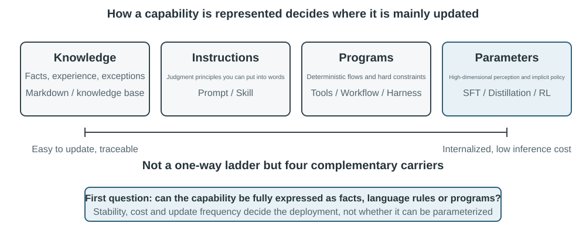

# Continual Evolution of Agents

Today’s Agents face a striking capability paradox: they can solve previously unseen complex tasks zero-shot, yet after handling ten thousand similar tasks, they may still repeat tomorrow the mistakes they made on the first day. Once a model is on the job, can it keep getting better at that job the way a new hire does? **The ability to learn autonomously from experience**—what is now called **continual learning**—is becoming essential for Agents to progress from “being able to complete tasks” to “being able to work reliably,” and it is also a central research topic for the next generation of models. Today’s notion of “continual learning” is not the same problem as the earlier line of research on “learn a new task and forget the old one”: forgetting is only one sub-problem, and the harder part is that no one tells the model which parts of today’s experience it got right and which it got wrong. For now, models remain far from capable of continual learning on their own.

A deployed model does not automatically change its parameters after an inference. The in-context learning, state maintenance, and compression discussed in Chapter 2 allow an Agent to adapt **within the current task**; once the context ends, however, these changes do not naturally carry over to the next task. Storing conversations in memory is not equivalent to learning new behavior. Raw trajectories may be lengthy and contain effective strategies alongside accidental successes, incorrect attributions, and untrusted inputs.

An important distinction is easy to miss here: **preserving experience is not the same as learning from it**. Placing a hundred trajectories in a long context or vector store may help the model retrieve a case when needed, but it does not automatically compare cases: which steps recur across successful trajectories, which practices work only with an older interface, or whether a success came from a sound strategy rather than environmental chance. Learning occurs only after the system actively evaluates, compares, generalizes, and validates the evidence—not when a log is written to disk. User memory in Chapter 3 primarily captures “what the user and the world are like”; experience learning in this chapter goes further, capturing “what to do under which conditions.” The former helps an Agent remember more; the latter helps it become more proficient rather than merely more knowledgeable.

Why not let the model train itself directly after every task? Because production environments rarely provide clean learning signals. User satisfaction does not imply compliance; local parameter updates can also cause capability forgetting, policy drift, or safety degradation. If a running model is allowed to modify its own parameters directly based on unverified feedback, erroneous experience and Prompt injection may become entrenched and continue to amplify across later tasks. On the other hand, periodic training of foundation models can improve general capabilities, but it cannot promptly absorb the private rules, tool changes, and local experience encountered daily by each Agent.

Therefore, while models themselves cannot yet learn continually and reliably, “learning” must first be constructed as an autonomous system around the model—what this book calls **continual evolution**, as distinct from continual learning at the level of model weights: record operational evidence, verify outcomes and processes, extract common patterns from multiple trajectories, and then decide whether to update knowledge, instructions, programs, or model parameters. Every modification must first become a candidate version and may alter the next round of operation only after regression testing and safety checks.

The preceding chapters have already introduced the principal components required by this system. Chapter 2 addresses within-task state, Chapter 3 provides knowledge infrastructure, Chapter 5 gives Agents the meta-capability to create tools and modify systems, Chapter 7 establishes evaluation and verification, and Chapter 8 explains how to update model parameters. The task of Chapter 9 is to organize these components into the continual evolution loop shown in Figure 9-1.

Continual evolution must arise from traceable operational experience, change subsequent behavior, and be verified not to cause significant degradation. This chapter first discusses how to determine what exactly went well or wrong in a run; it then compares four update methods and their applicable boundaries; finally, it examines how these updates are verified, released, revised, and retired during long-term operation.

## Deriving Learning Signals from Operational Trajectories

The starting point of continual evolution is not “summarization,” but “evaluation.” If the system does not know whether a task was completed or which step caused success or failure, reflections generated by a language model can only be guesses. Once an incorrect evaluation enters long-term knowledge, a system Prompt, or training data, its effects can compound across subsequent tasks.

The outcomes of some tasks are relatively easy to verify. A Coding Agent can run tests, type checks, and performance benchmarks; an Agent processing a refund for a user can query the order status and actual refund amount. Such signals come from real environmental states and are generally more reliable than the model’s descriptions of its own behavior. A correct outcome, however, does not imply a correct process. Deleting failing test cases can also make tests pass, while telling a user, “We will issue your refund within seven days; please be patient,” may produce temporary satisfaction. Reliable evaluation must therefore assess both the outcome and the path taken to achieve it.

Many other tasks have no single correct answer. Whether customer service is patient, whether it offers compliant alternatives, whether a research report identifies the key evidence, and whether generated text is natural and concise all require contextual judgment. LLM-as-a-Judge, introduced in Chapter 7, can be used here, but the judge should not merely assign a vague overall score. A more effective approach is to define a Rubric in advance and require the verifier to score each item, cite trajectory evidence, and explicitly indicate uncertainty when evidence is insufficient.

Figure 9-2 presents a three-layer verification structure. The bottom-layer outcome verifier reads test results, database states, and tool returns to answer, “Was the task actually completed?” The middle-layer process verifier checks business rules, permissions, and action sequences to answer, “Was it completed in an allowed manner?” The upper-layer quality verifier evaluates language and strategy according to the Rubric to answer, “Was it handled appropriately?” Lower-level metrics should rely more heavily on code and environmental ground truth; only aspects that are difficult to formalize should be delegated to a language model.

For a customer-service Agent, a useful Rubric should cover at least the dimensions listed in Table 9-1. The first five primarily enforce baseline requirements, while the final two measure service quality. This decomposition is more diagnostically useful than asking whether the user was satisfied: a user may be satisfied because the Agent issued a noncompliant refund, or dissatisfied because of a compliance restriction. A single satisfaction score cannot distinguish the two.

Table 9-1 Trajectory evaluation dimensions for a customer-service Agent

| Dimension | Verification question | Primary evidence |
|---|---|---|
| Task outcome | Was the user’s core request resolved? | Final environmental state, tool results |
| Rule compliance | Were any policies, permissions, or required procedures violated? | Policy repository, action trajectory |
| Privacy boundaries | Was any information disclosed that should not have been provided? | Response text, data-access records |
| Factual reliability | Are statements supported by knowledge or tool results? | Cited sources, tool returns |
| Promise–action consistency | Did the actions claimed as completed actually occur? | Comparison of responses and tool logs |
| Expression quality | Is the language natural and concise, without repetition or templated phrasing? | Full conversation, language Rubric |
| Compliant alternatives | When the original plan was infeasible, was an allowed alternative found? | User goal, policies, and subsequent actions |

> **Experiment 9-1 ★★: Build a Trajectory Verifier for a Customer-Service Agent**
>
> **Objective:** Convert a customer-service trajectory into a structured diagnosis that can support subsequent learning, and test whether “multidimensional conclusions with evidence” identify root causes better than a single overall score.
>
> **Experiment description:** Compare “one overall score” with “a conclusion, evidence, and confidence for every dimension,” and observe which better distinguishes task failure, rule violations, false promises, and expression problems. Continual evolution cannot rely only on success rate or one score. Only by retaining what went wrong, why, and where the evidence is can later modules determine whether to update knowledge, the Prompt, a program, or model parameters; low-confidence cases should not enter the learning set automatically.

## Four Methods for Continual Agent Evolution

Learning signals indicate that an Agent should change, but not where that change should occur. The primary basis for choosing an update method is not how long an experience has persisted, but whether the target capability can be naturally represented by a particular medium. Facts and experience are suited to knowledge documents; strategies that can be clearly expressed in language belong in Prompts or Skills; precisely executable procedures and constraints should be encoded as programs; and high-dimensional capabilities such as perception, language style, and implicit strategies must enter model parameters. Figure 9-3 shows these four methods and their relationships.

Table 9-2 provides a concise comparison. The four methods are not mutually exclusive: a medical-imaging Agent relies on parameters to identify lesions, uses a knowledge base to provide current guidelines, and employs code to calculate risk indicators. A customer-service model derives its natural tone from post-training, obtains enterprise-specific policies from knowledge and Skills, and relies on server-side code to enforce critical compliance requirements.

Table 9-2 Applicable boundaries of four continual evolution methods

| Update method | Suitable content | Primary advantages | Primary limitations |
|---|---|---|---|
| Experience knowledge base | Facts, experiential patterns, exceptions, and sources | Fast updates, traceability, on-demand retrieval | Depends on retrieval and correct model application |
| Prompt and Skill | Linguistically expressible judgment principles and operating procedures | Interpretable, controllable scope | Prone to bloat, conflict, or being ignored |
| Programs and Harness | Deterministic procedures, tools, and hard constraints | Testable, stable execution, low cost | Higher development and maintenance costs |
| Model parameters | High-dimensional perception, generation style, and implicit strategies | Strong generalization, low inference overhead | High update and regression costs |

A single capability can be split across several carriers: facts go into the knowledge base, the principles that explain exceptions go into a Skill, permissions that must not be bypassed stay gated by the program, and high-dimensional recognition goes into the parameters. The routing result is only an update proposal; it has not yet earned the right to be released.

### Consolidating Experience into Knowledge

The most lightweight form of evolution is to organize recurring experience from multiple runs into retrievable knowledge documents. The “experience knowledge base” described here shares storage, indexing, and retrieval technologies with Chapter 3, but differs in its knowledge sources and verification objectives. Chapter 3 primarily extracts “what the user and the world are like” from user conversations, documents, and datasets; this chapter extracts “what should be done under which conditions” from Agent action trajectories and outcomes. For example, “This airline requires special meals to be reserved twenty-four hours in advance” is domain knowledge, whereas “Check the special-meal deadline before booking to avoid discovering only after payment that the request cannot be fulfilled” is action experience.

Raw trajectories are unsuitable as formal knowledge units. They are lengthy and noisy, containing raw tool output, incidental detours, and environmental details. A more robust system retains three layers of data: immutable raw trajectories for auditing; per-run analyses recording the outcome and candidate lessons; and comparisons, clustering, and induction across multiple similar trajectories to produce future-oriented Markdown knowledge documents. A formal document typically specifies applicable scenarios, recommended strategies, prohibited practices, exceptions, evidence sources, and the latest verification time rather than retelling the complete course of a single task.

This design shares the same two-stage principle as User-as-Code in Chapter 3. User-as-Code first appends conversational facts to an immutable log and then periodically rebuilds a structured user model. Experience learning should likewise preserve evidence first and generate mutable knowledge offline afterward. Figure 9-4 illustrates this process. Separating recording from organization prevents a single accidental success or network failure from immediately changing the Agent, while allowing the system to identify common patterns only after observing multiple successes and failures.

Experience documents are not simple trajectory summaries. Transferable content emerges from comparison: what successful trajectories of the same type did, what failed trajectories lacked, in which environment versions a strategy was effective, and under which prerequisites it failed. Chapter 3 has already introduced knowledge extraction, clustering, and retrieval, so this chapter does not repeat those algorithms. Instead, it focuses on how trajectory evaluation becomes a condition for extraction and whether the extracted knowledge improves performance on subsequent tasks.

A complete knowledge-distillation pipeline can be divided into five steps. First, preserve immutable trajectories and environmental outcomes. Next, produce a structured analysis for each run, listing the task type, required capabilities, observed strategies, errors, and exceptions. Then aggregate runs by task family and build an evidence table showing which trajectories support or contradict each candidate pattern. Only candidates that meet the support threshold enter formal documents. Finally, evaluate transfer on new tasks that were not used during distillation. Keeping formal knowledge separate from candidate analyses allows the system to generalize again without altering the original evidence and to revoke a conclusion precisely when the environment changes.

GAIA experience learning provides an intuitive example. GAIA[^gaia-2023] contains multistep problems that combine search, web reading, file processing, and computation, while AWorld[^aworld-2025] provides the environment for running Agents, invoking those tools, and recording trajectories: the former is like the exam, and the latter is the exam room and laboratory record system. A simplistic approach generates a strategy summary and immediately vectorizes it after one successful run. A stricter implementation first uses a GAIA answer verifier or another environmental verifier to label runs as successful, partially successful, or failed, and then compares multiple paths within the same task family. Successful trajectories contribute candidate strategies, failures contribute exclusionary knowledge, and partial successes reveal which segment worked and which still failed. The natural-language reflection proposed by Reflexion[^reflexion-2023] can help generate candidate lessons, but reflection itself is not evidence. Only content consistent with environmental outcomes, supported across trajectories, and showing positive transfer on new tasks should enter formal experience documents.

[^reflexion-2023]: Shinn, N., et al. *Reflexion: Language Agents with Verbal Reinforcement Learning.* arXiv:2303.11366, 2023.

[^gaia-2023]: Mialon, G., et al. *GAIA: a benchmark for General AI Assistants.* arXiv:2311.12983, 2023.

[^aworld-2025]: Yu, C., et al. *AWorld: Orchestrating the Training Recipe for Agentic AI.* arXiv:2508.20404, 2025.

### Encoding Experience as Instructions

An experience knowledge base gives an Agent "material it can consult"; Prompts and Skills prescribe "how it should act." Only when many similar trajectories repeatedly expose the same strategic error, and that error can be stated clearly in words, is it worth promoting experience into an instruction. Three concepts should be kept apart here: the **system Prompt** applies to every task, a **Skill** is loaded on demand only when a domain or tool matches, and the **program/Harness** enforces permissions and other hard constraints.

Andrej Karpathy calls this practice **System Prompt Learning**[^karpathy-system-prompt-learning]: after running into a problem, the model leaves one clear sentence to remind its future self. DSPy[^dspy-2023] searches over instructions and examples on a development set; OPRO[^opro-2023] proposes new prompts from a history of prompts and their scores; GEPA[^gepa-2025] generates and filters prompt proposals from natural-language reflections on failed trajectories. These methods suit offline batch optimization; production settings are better served by auditable minimal update proposals with a fast rollback path.

System prompt learning is not the same thing as the prompt engineering of Chapter 2. Chapter 2 discusses how to organize a good Prompt; this section discusses what feedback is sufficient to trigger a change, and how an update proposal is released safely. A change should be a minimal diff with provenance, not a full rewrite of the Prompt on every pass—precisely the minimal-diff-plus-rollback pattern named in Chapter 1. A candidate version must be tested both on the **boundary set that triggered the failure** and on a **retention set that already works**: the former must improve, the latter must not regress.

#### Example 1: Turning the Escalation Boundary into Rules

In the telecom policy of τ²-bench, escalation to a human agent is governed by only two statements of principle: escalate only when the request falls outside the Agent's scope of action, and try your best to resolve the issue before escalating. When Chapter 7 dissected this environment the two lines revealed no problem; run the same environment with a weaker model and the deficiency surfaces at once—after a tool returns an error the Agent retries repeatedly and ends by escalating to a human, which is how 19 of the 20 tasks in the derivation set finished.

Hand those 19 failed trajectories to a model and let it induce, on its own, a handful of executable rules to append to the end of the policy; then rerun on a set of tasks that took no part in the derivation. The pass rate rises from 12.3% to 19.3%, and not one task that had passed before is broken.

**What the deriver is given determines what it can induce.** From the same 19 trajectories, supplying only failure summaries and error text yields "do not keep calling a tool that repeatedly returns the same error"; adding an inventory of which tools belong to the Agent and which to the user turns the result into "network status, SIM card, and APN checks belong to the user's device and should be performed by the user under guidance rather than called directly." The first records a lesson; the second grasps where responsibility lies.

**A model treats observed behavior as the behavior that ought to occur.** Two of the first-version rules read "escalate to a human after three consecutive failed calls" and "escalate to a human if the user does not supply a number after two requests"—escalation is what appears most often in the trajectories, so the model took it for a reasonable fallback. But in this evaluation escalation always counts as failure, so those two rules write failure into the specification. Derived artifacts therefore cannot be released directly; they must pass verification independent of whatever produced them.

**What gets repaired is often something extremely plain.** One typical baseline trajectory: the Agent needs the user's phone number, so it calls the lookup tool with "Please provide your phone number" filled into the parameter—five times in a row, five errors, then escalation. It had already worked out that it should ask the user; it merely addressed the sentence to the tool. Once the rules took effect it first made the request in the conversation, obtained the number, and then queried; later, when an attempt to check SIM card status was refused at the tool layer, it switched to guiding the user through reseating the SIM card, and the task passed.

> **Experiment 9-2 ★★: Deriving Escalation and Tool-Use Rules from τ²-bench Failure Trajectories**
>
> Reuse the τ²-bench telecom environment from Chapter 7. The derivation set and the transfer set are two disjoint task sets in the upstream repository to begin with, so the derivation process never touches the transfer set.
>
> First run the derivation set with a weak model and keep the failed trajectories; have the rules induced by a model rather than written by hand, and append them to the end of the original policy; then compare the original policy against the two evolved versions on the transfer set. Only the policy file differs across the three arms; the user simulator is held fixed.
>
> Besides the pass rate, record three behavioral metrics that correspond directly to the rules: the escalation rate, the number of times the Agent oversteps and calls a user-side tool, and the number of calls issued with a missing parameter. Both of the latter fall by roughly 80% in the evolved versions, which shows that the gain in pass rate comes from rules repairing specific actions.

The same approach transfers to other domains. A typical bad case for an airline customer-service Agent is this: the user objects to a refund fee, a change fee, or a baggage policy, and the Agent calls `transfer_to_human` without looking up the policy, explaining the rule, or seeking a compliant alternative. An ordinary policy dispute needs no escalation; **only an explicit request for a human, or a situation involving safety, makes escalation mandatory**. The diagnosis again points to an escalation boundary that was never made explicit, and the fix is again to turn it into a single minimal rule with a recorded source.

> **Experiment 9-3 ★★: Optimizing an Airline Customer-Service System Prompt from Failure Trajectories**
>
> **Objective:** Have the airline customer-service Agent fix its habit of escalating to a human too early in ordinary policy disputes, while retaining the ability to transfer on an explicit request for a human and on safety incidents.
>
> **Description:** Extract three dimensions from the failure trajectories—rule compliance, task resolution, and compliant workarounds—and generate one minimal Prompt patch with provenance; then compare it against the initial version and a hand-tuned version under identical conditions. An update proposal enters staged rollout only after the boundary cases improve, the old tasks do not regress, and the release gate is passed.
>
> **What it shows:** The point of automatic Prompt optimization is not to let the model freely rewrite a large block of text, but to turn an attributable failure into a local rule with a clear scope that can be rolled back and verified.

#### Example 2: Requirement Clarification Skill—From Direct Execution to Confirm First

Chapter 2 explained how to write a Skill. Here we assume the system already has a first version of a requirement-clarification Skill, and focus on something else: as the Agent keeps receiving user feedback in production, how does it decide automatically whether "when to ask first, what to ask, and when to simply begin" needs updating?

This is a classic procedural problem. A user says "change the login page to support enterprise sign-in." If the Agent starts immediately, it may make choices on the user's behalf—identity provider, fallback path, compatibility with existing users, rollout scope—that the user has not yet considered. If it instead lists a dozen questions regardless of task size, a simple change turns into an interview. **Asking too little causes rework; asking too much causes interruption.** What the Skill needs to express is not "every task must be confirmed" but a scoped decision path.

A first version of the procedure might read: judge the task's ambiguity, risk, and cost of rework; for low-risk, easily reversible small changes, state the assumptions and proceed; when architecture, data, permissions, public interfaces, or wide-reaching changes are involved, ask a small number of questions that would genuinely change the plan; once answered, produce a short Spec or Plan listing goals, non-goals, key trade-offs, assumptions, and acceptance criteria, and hand it to the user for confirmation; execute after confirmation, and pause to re-confirm whenever the original Spec turns out not to hold.

Continual evolution starts from operational evidence. The system should record tasks, clarifying questions, Spec versions, user edits, execution results, and post-delivery rework together. Negative feedback may be "this isn't what I imagined," but it may equally be "you asked too many questions"; positive feedback includes a smooth delivery after a single confirmation, less rework after the user amended the Spec, and low-risk tasks that were not interrupted by superfluous questions. Storing an isolated complaint is not enough to trigger an update: feedback must be tied to a specific trajectory, task type, and outcome.

When many trajectories point repeatedly at the same gap, the Agent can propose a minimal Skill update. For instance, if several tasks touching authentication architecture only discovered after delivery that legacy sign-in had to keep working, a draft rule can require confirming "identity provider, fallback path, and compatibility scope" before execution; conversely, if a large number of typo fixes were each preceded by a round of questions, the draft rule should narrow the trigger to high-risk and highly ambiguous cases.

This procedure must be validated by controlled experiment. One can compare three strategies—"execute directly," "ask first, then execute," and "ask, produce a Spec, confirm, then execute"—stratified by task complexity. The metrics should include at least requirement-deviation rate, post-delivery rework count, number of clarification rounds, time to first useful output, user abandonment rate, the proportion of Specs that were edited, and the error rate on high-risk operations. An update proposal reaches staged rollout only if it reduces requirement deviation without significantly increasing interruption, and passes regression on tasks that were not used to distill it.

This example also illustrates the boundary between Skill and Harness. The Skill understands context and takes the initiative to ask questions, assemble the Spec, and explain trade-offs; the Harness vetoes high-risk writes, direct operations on `main`, or bypassing the release process when confirmation is missing. A veto gate in the Harness cannot decide for the model how a PR should be described, nor choose the requirement design on its behalf. As experience accumulates, stable conversational trajectories can further yield the SFT or RL training data needed in Chapter 8.

> **Experiment 9-4 ★★: Evolving a Requirement-Clarification and Spec-Confirmation Skill from User Feedback**
>
> **Objective:** Test whether the Agent can find a better clarification strategy between "requirement deviation" and "interaction interruption," and write verified improvements back into the Skill.
>
> **Description:** Prepare one set of low-risk, low-ambiguity tasks and one set of high-risk tasks involving architecture, permissions, data, or public interfaces, and compare three procedures: execute directly, ask then execute, and ask then confirm a Spec. Record user answers, Spec edits, delivery outcomes, and rework feedback, and let the Agent generate a Skill update proposal; the proposal must pass regression on held-out tasks, an interruption-cost check, and validation of the high-risk veto gate.
>
> **What it shows:** Continual evolution is not appending every complaint to the Prompt, but identifying the scope from outcomes and feedback, proposing a minimal instruction update, and letting an independent evaluator decide whether to release it.

[^dspy-2023]: Khattab, O., et al. *DSPy: Compiling Declarative Language Model Calls into Self-Improving Pipelines.* arXiv:2310.03714, 2023.

[^opro-2023]: Yang, C., et al. *Large Language Models as Optimizers.* arXiv:2309.03409, 2023.

[^gepa-2025]: Agrawal, L., et al. *GEPA: Reflective Prompt Evolution Can Outperform Reinforcement Learning.* arXiv:2507.19457, 2025.

[^karpathy-system-prompt-learning]: Karpathy, A. “We’re missing (at least one) major paradigm for LLM learning … system prompt learning?” X, May 11, 2025. https://x.com/karpathy/status/1921368644069765486

### Encoding Experience as Programs

When experience describes operations that are stable, repetitive, and verifiable, it is inefficient to have the model reread documentation and reason through them each time. A more appropriate approach is to compile the experience into workflows, tools, or Harness code, turning a one-time exploration into a repeatedly executable program. Chapter 5 explained how Coding Agents read and write files, run tests, and generate systems; this section focuses not on general code generation, but on how an Agent modifies future versions of itself based on its own trajectories.

The modifiable objects extend far beyond new tools. At the operation layer, browser trajectories can be compiled into parameterized workflows, or adapters can be generated for changing APIs. At the control layer, tool routing, retries, circuit breakers, and context compression strategies can be modified. At the validation layer, parameter checks, state validators, and regression tests can be added in response to production failures. At the architecture layer, a Reviewer Agent can be added or the information flow between planning and execution can be changed.

Browser workflows illustrate the value of programmatic experience. They are analogous to recording a spreadsheet macro. The first time an email is sent, a multimodal Agent uses an observe–reason–act loop to find the compose, recipient, subject, body, and send controls. For another email, the process is unchanged; only the recipient and content differ, so there is no need to call the model again to rediscover the entire path from pixels and the DOM. The system compiles the first exploratory trajectory into a small program containing parameters, state checks, and version information.

In the browser setting, the knowledge-distillation process shown in Figure 9-4 becomes a more concrete lifecycle:

1. **Capture the trajectory:** Record navigation, clicks, text entry, and drop-down selection, together with action parameters, the current URL, and element-locator evidence such as XPath, CSS, `id`, `role`, `aria-label`, and `data-testid`. Locator evidence only helps find an element again; it does not prove that the task was completed.
2. **Parameterize:** Replace literals from the first run with template variables—for example, convert `test@example.com`, the subject, and the body into `{recipient}`, `{subject}`, and `{content}`—while leaving stable actions unchanged. The teaching implementation uses regular expressions and template replacement; a production system may use structured task input or a constrained extraction model.
3. **Define state checks:** Add checks before and after actions, such as “the send button is visible” and “the URL after navigation belongs to the target site.” Add a final-state check for the workflow as a whole, such as “the sent-mail list contains the new message” or “the test page’s state value changed as expected.” Successfully executing an action is not the same as successfully completing the task; the final check must read the real page or backend state.
4. **Validate the candidate:** A first success produces only a `candidate`. The system must reset the sandbox account or test site to an independent initial state and replay the candidate in full. It can be published as `validated` only if all before-action, after-action, and final-state checks pass. If a side-effecting task such as sending mail or placing an order has no safe reset callback, the workflow may be retained as an auditable candidate but must not be validated by repeating the action in a production account.
5. **Match and replay:** When a new task arrives, search the formal capability library for a workflow by intent and keywords, extract the current parameters, and execute it directly with Playwright. Replay requires no step-by-step LLM calls, but it must still wait for elements to become available and complete every state check.
6. **Invalidate and relearn:** If the target element cannot be found, a state check fails, the API Schema changes, or the final state is wrong, stop subsequent actions immediately, move the old version from the searchable library to the `invalid` area, and fall back to the full Agent for fresh exploration. Retain the old file for audit and comparison, but never let it continue to match silently.

For an email workflow, the compiled result is not merely “click these buttons in order,” but a small program parameterized by recipient, subject, and body: it checks the compose window and fields before sending, checks the success indicator afterward, and finally confirms that the corresponding message appears in the sent list. In PreAct[^preact], such programs delivered an 8.5–13× end-to-end speedup on repeated tasks and required no step-by-step language-model calls during replay. More importantly, process memory needs **before-action validation, after-action validation, and independent pre-storage validation**. Otherwise, the system can produce a dangerous illusion: replay coverage is 100 percent and every button was clicked, yet one field was empty and the task was never actually completed.

> **Experiment 9-5 ★★★: Generating Verifiable Workflows from Browser Trajectories**
>
> **Objective:** Determine whether a web Agent can turn one expensive exploration into a reusable workflow and reject an incorrect replay when the page changes, rather than reporting success merely because every action ran.
>
> **Four-stage scenario:** In the first stage, run “send a message with the subject ‘Test Email’ to `test@example.com`” on a test mail site or simulated messaging page. The full Agent explores, while a wrapper captures actions, parameters, and page states and produces a `candidate`. In the second stage, call `validation_reset` to restore the sandbox and independently replay the entire workflow; the candidate enters the formal capability library only if all before-action, after-action, and final-state checks pass. In the third stage, perform the same kind of task with a different recipient, subject, and body. The system should match the validated workflow, fill the new parameters, and replay it through Playwright without entering the step-by-step LLM loop. In the fourth stage, change a button locator, page text, or final state and verify that the old workflow immediately becomes `invalid` and returns `fallback_required=True`.
>
> **Control design:** A simplified baseline records only whether clicks, text entry, and other actions complete without exceptions. The experimental condition also validates the page before each action, the page after each action, and the final task state. Both conditions use the same trajectories and page changes. Compare their false-positive rates on cases such as “the send button was clicked while a field was empty” and “Save was clicked but the data was not persisted.”
>
> **Metrics and acceptance:** Record end-to-end time for initial exploration and replay, number of LLM calls, success rate, false-success rate, workflow match rate, page-change detection rate, and number of fallbacks to relearning. Without a reset callback, a workflow must remain a candidate; a version that fails validation must not be retrievable; parameterized replay must not reuse the first run’s recipient or content; and after a page change, dangerous subsequent actions must stop. Acceleration matters only if all these conditions are satisfied.
>
> The accompanying implementation is available at [`browser-use-rpa`](../chapter9/browser-use-rpa/), which provides both a deterministic state-machine demonstration and an execution path that invokes a real browser Agent.

An Agent modifying its own code does not mean that the running process directly overwrites itself. A production system should create a candidate branch from the current stable version, have a Coding Agent generate a minimal patch, and then sequentially run static checks, unit tests, security scans, failure-trajectory replay, and regression tests on old tasks before producing a new version eligible for canary deployment. This turns “self-modification” into an auditable software release process and defines the boundary between Chapters 9 and 5: Chapter 5 provides the capability to modify systems, while this chapter provides a method for self-modification that is triggered by experience and constrained by a validation loop.

Making the patch small is not enough for reliable attribution. Each modification request should also be a **falsifiable change contract** that records the failure evidence, inferred root cause, responsible Harness component, candidate change, behavior expected to improve, existing behavior that may regress, and tests for both. Agentic Harness Engineering describes this in terms of component-, experience-, and decision-level observability: every editable component has a file-level representation; large collections of trajectories are distilled into evidence that can be inspected at increasing levels of detail; and every edit declares an impact prediction before execution, which the next round of results then tests[^ahe-2026]. A higher score can then be connected to a specific mechanism rather than remaining an uninterpretable trial.

The candidate generator should not receive only failed cases. Self-Harness also supplies successful behavior that must be preserved and records of previously rejected modifications[^self-harness-2026]. The former tells the Agent what the repair must not break; the latter prevents it from resubmitting the same failed idea in different words. Failure evidence, success constraints, and prior attempts together define a bounded candidate space and are more useful than indiscriminately loading all source code and raw logs into the modifying Agent.

Tool creation follows the same protocol. Alita[^alita-2025] presents a case in which an Agent must identify the number mentioned immediately after dinosaurs first appear in a YouTube 360 VR video narrated by the voice actor for Gollum in *The Lord of the Rings*. After recognizing that it lacks subtitle-reading capability, the Agent finds and tests `youtube-transcript-api`, wraps it as a new subtitle tool, and extracts the answer `100000000` from the transcript. A new tool enters the capability library only after safety scanning, functional tests, and successful reuse on later tasks. Chapter 4’s proactive tool discovery asks which existing tool fits; Chapter 5 asks how to write a tool; this chapter asks what operational evidence should trigger creation and how a new tool becomes a validated long-term capability.

> **Experiment 9-6 ★★★: Triggering Agent Self-Modification from Failure Trajectories**
>
> **Objective:** Given multiple trajectories in which errors marked `retryable=false` are still called repeatedly, determine whether the system can locate the root cause in retry and circuit-breaker code and produce a candidate fix without breaking recovery from transient failures.
>
> **Procedure:** The diagnosis module first aggregates the same fault across different tasks. It creates a modification request only after the cross-trajectory support threshold is met and targets `retry_policy.py` in the stable version. The candidate generator reads the failure diagnosis, the transient-failure recovery behavior that must be preserved, previously rejected changes, and the stable source. Before emitting a minimal code diff, it predicts that calls after non-retryable errors should fall while transient-timeout recovery should not. Whether the generator is deterministic or a real LLM Coding Agent, it may write only to an isolated candidate directory. The validation Harness then compiles the candidate, replays the original failure trajectories, verifies that a non-retryable error stops immediately and opens the circuit breaker, and retests that transient timeouts still retry according to the original threshold.
>
> **Diagnostic control and metrics:** Treat “add one sentence to the Prompt telling the Agent not to repeat the call” as a conceptual example of choosing the wrong modification layer, demonstrating why a deterministically enforceable retry constraint belongs in code. The executable experiment compares deterministic and LLM patch generators under the same release gate. Record the number of calls after non-retryable errors, transient-error recovery rate, regressions on old tasks, patch size, and candidate acceptance rate.
>
> **Acceptance criteria:** Passing every check produces only `release_to_canary`. Failure of any static check, failure replay, or old-task regression returns `reject_candidate`. `release_manifest.json` must record the failure cluster, source trajectories, inferred root cause, target component and file, code diff, expected repair, possible regressions, check results, candidate version, and rollback version. Rejected candidates must retain their failure reasons for the next generation round. The patch-generating Agent must not modify stable code, validators, audit logs, or the gate that approves its own release.
>
> The accompanying implementation is available at [`self-modifying-agent`](../chapter9/self-modifying-agent/). It supports either a deterministic candidate generator or a real LLM Coding Agent, with both paths sharing the same release gate.

Experiment 9-7 applies the same protocol to the verification layer. Only repeated user corrections, downvotes, and audits pointing to an unconfirmed high-risk operation create a change request; the candidate is written to an isolated directory. Classify dangerous deletions and `git push --force` from tool names and arguments, and bind a one-time confirmation token to the concrete operation. A candidate must pass AST/static checks, boundary replay (including forged and reused tokens), and holdout replay before canary release.

> **Experiment 9-7 ★★: A User-Feedback-Triggered Confirmation Gate for High-Risk Operations**
>
> Use the three signal types and control trajectories in `failure_trajectories.json`. The real `gpt-4o-mini` candidate failed unfinished-task replay, normal-operation replay, and one-time-token checks, so the safety gate rejected it. The deterministic candidate passed all checks and received `release_to_canary`; record checks, the release decision, and the stable-directory hash. Implementation: [`harness-safety-gate`](../chapter9/harness-safety-gate/).

[^preact]: Li, Bojie. *PreAct: Computer-Using Agents that Get Faster on Repeated Tasks.* arXiv:2606.17929, 2026.

[^alita-2025]: Qiu, J., et al. *Alita: Generalist Agent Enabling Scalable Agentic Reasoning with Minimal Predefinition and Maximal Self-Evolution.* arXiv:2505.20286, 2025.

#### Case: DeepSeek Harness—Self-Evolution Where Everything Is a Plugin

Chapter 1's comparison table classifies DeepSeek Harness (`dsh`) as an “Agent self-evolution framework”[^dsh-2026]. Its foundation paper, Cordis, observes that conventional composition is **static**: function calls, module imports, and class inheritance are fixed at compile time and do not change at runtime. Plugin systems and self-evolving Harnesses instead require **dynamic composition**, with components loaded, unloaded, and reconfigured while running[^cordis-2026]. Every Agent self-modification is, in essence, a dynamic composition.

The paper separates dynamic composition into two orthogonal dimensions. **Temporal composability** asks whether all changes a component made to the shared environment can be undone completely and safely when it is removed; the runtime must track every resource allocation, event registration, and state change. **Spatial composability** asks whether components can declare, discover, and resolve dependencies in a structured, verifiable way and coordinate their lifecycles when those dependencies change. The former concerns **what changed**; the latter, **what is depended on**.

A self-evolving Harness is the sharpest version of this problem. The side effects to undo are long-lived and stateful, while dependencies can appear, disappear, or change identity at runtime. Without temporal composability, every self-modification requires a full restart, discarding accumulated in-process state and repeatedly interrupting active tasks. Without spatial composability, each module must improvise its own detection of dependency changes, and a simple code replacement can silently break dependents or introduce a cycle.

Cordis lifts two concepts normally confined to compile time into the runtime. Effect systems, originally used to reason about how computation changes its environment, become **reversible effects**: every context transformation carries an explicit inverse tracked by the runtime, so removing a component restores the context. Coeffect systems, originally used to reason about what a computation requires from its environment, become **reactive coeffects**: a component declares its dependencies as a specification, and every context change tells it whether to activate, deactivate, or remain unaffected. A dynamic-composition calculus extends this property from one component to interleaved component systems—composability must be transitive.

**The ceiling of self-evolution depends not on how well the model writes code, but on how composable its host system is.** That is why `dsh` makes model adapters, tool registries, session logs, and even the Agent's main loop plugins: **there is no privileged kernel maintainable only by humans**.

Composability answers whether a component can be installed and removed safely, not whether it should be installed. Model-written plugins live only in process memory and disappear on restart. They **cannot be promoted automatically to official plugins**; persistence requires the slower worktree-plus-Pull-Request route described earlier.

Evolution also has a cost. A runtime plugin changes the tools and Prompt fragments visible to the model. Once the request prefix changes, the KV Cache discussed in Chapter 2 is invalid from that point onward. A `dsh` plugin's documentation therefore needs to describe its impact on context and KV Cache.

[^dsh-2026]: DeepSeek AI, *DeepSeek Harness: Everything is a Plugin*, 2026. https://github.com/deepseek-ai/deepseek-harness. Plugin layers and patching are documented in `docs/architecture.md`; lifecycle, sandbox semantics, and trust declarations for model self-modification tools appear in `docs/subsystems/extensions.md` and `packages/extensions/README.md`. Released in August 2026, the project was in developer preview at the time discussed here.

[^cordis-2026]: Shi, Yifan, Wei Zhang, and Tianyi Cui. *A Programming Paradigm for Spatiotemporal Composability.* Preprint draft, 13 August 2026. https://github.com/cordiverse/paper

### Encoding Experience in Parameters

Knowledge, instructions, and programs all rest on one premise: the target capability can be expressed relatively completely through external symbols. Yet capabilities such as medical-image understanding, natural speech prosody, removing a formulaic “AI feel” from text, and long-horizon planning are difficult to compress into a few rules or workflows. Such capabilities must be written into model parameters through post-training.

Whether a capability should be parameterized is not determined solely by whether the task is stable over the long term. Domain shifts caused by new imaging equipment may still require LoRA or continual fine-tuning; rapidly changing linguistic styles can also be accommodated through periodic preference training. Stability affects update frequency and cost, but the representational nature of the capability determines its primary medium. Conversely, a long-stable rule for approving transfers should not rely solely on parametric memory; server-side code must still provide deterministic guarantees.

Chapter 8 provided a complete discussion of SFT, distillation, and RL, so this section does not repeat it. For continual evolution, the key is to transform evaluated production trajectories into training data: high-quality demonstrations can be used for SFT, explicit preferences can form paired data, and interactions with reliable environmental rewards can be used for RL. Before training, private information must still be removed, erroneous trajectories filtered out, and an independent regression set retained. After training, the system must check whether general capabilities or safety alignment have been forgotten.

### From Updating Artifacts to Updating the “Update Method”

The preceding four methods ask **where experience is written**, but continual evolution has another, orthogonal axis: is the system optimizing the contents of an artifact, or the method used to produce, manage, and validate artifacts? Along this axis, the optimization target can expand from **an individual rule or memory → structured context → workflow → Harness code → optimizer code that generates candidate solutions**[^weng-harness-2026]. These are not five new update carriers but five search scales; knowledge, Prompts, Skills, and programs may appear at several of them.

The innermost level changes only artifact content—for example, adding a local rule to a system Prompt after a failed trajectory or adding an exception to an experience document. Such changes have a small blast radius and are easier to attribute and roll back, so they should be the default. Repeatedly asking a model to rewrite an entire Prompt or memory, however, introduces another form of degradation: successive attempts at brevity can gradually erase rare but important details, and interacting constraints can be collapsed into an overgeneral principle. Agentic Context Engineering (ACE) maintains context as a collection of entries with stable identifiers. Generation, reflection, and curation modules propose incremental updates, which deterministic logic merges and deduplicates instead of rewriting an ever-shorter text block each round[^ace-2026]. It is a concrete research example of this chapter's earlier principles of minimal diffs and retained provenance.

At the next level, the optimization target is no longer merely what context contains but how context is constructed. Meta Context Engineering (MCE) separates the two into inner and outer loops: the inner loop optimizes the context artifact for the current task under a given management method, while the outer loop uses results from multiple executions and validations to modify the context operations themselves—search, selection, filtering, and formatting[^mce-2026]. The distinction matters. Editing a retrieval rule changes a content-management mechanism; comparing several retrieval and curation mechanisms and retaining the one with better transfer is learning how to manage context.

The same idea extends to workflows and the entire Harness. AFlow represents workflows composed of multiple LLM calls as code graphs and searches over combinations of nodes and control flow using execution feedback[^aflow-2025]. Meta-Harness has a Coding Agent inspect candidate Harness source, scores, and trajectories to search the code that determines how information is stored, retrieved, and presented[^meta-harness-2026]. Chapter 5 established code as a general language for expressing Agent system structure. The additional point here is that code, together with its evaluation history, can itself become the object of continual search rather than a one-time output.

> **Experiment 9-8 ★★★: Give Hermes This Book: Can It Upgrade Itself?**
>
> **Objective:** Test whether an Agent can turn external knowledge into an update to its own capabilities. The experiment supplies no problem statement and no feature checklist. Hermes receives all ten chapters and its own source, then must understand the principles, inspect its implementation, and choose a worthwhile improvement itself.
>
> **Design:** The book and source are readable context, while the stable version, independent Reviewer, and acceptance tests remain outside Hermes' editable scope. Hermes must complete **read → compare → choose → change → verify**. If a candidate is rejected, the review becomes input to the next learning round; Hermes cannot bypass the gate and declare success.
>
> **Real run:** After reading the book, Hermes independently noticed that its saved trajectories lacked structured evidence that later learning could use directly. It chose to turn execution outcomes into conservative learning signals, then edited its own source and added tests. The first three independent reviews found mismatches with real data formats, persistence paths, and counting semantics. Each finding went back to the original Hermes session for another correction; the fourth review accepted the candidate. Rejection was not the end of the experiment, but part of the improvement loop.
>
> **Claim boundary:** This run shows that an Agent can extract principles from long-form knowledge, map them onto its own code, and complete a self-update under external verification. It does not show that the update already improves downstream task success; that requires a separate ablation experiment. Reader Grace contributed the experiment idea.

## Building a Continual-Evolution Closed Loop for Long-Term Operation

The four update methods become continual evolution rather than one-off optimization only when incorporated into the same autonomous loop. Figure 9-5 shows a more robust dual-loop architecture for production systems: the online execution loop only completes tasks and records evidence, without directly rewriting the production Agent; the offline evolution loop aggregates trajectories, diagnoses root causes, generates candidate modifications, and releases new versions only after they pass validation gates. The two loops are connected through versioned experience repositories and evaluation sets.

Voyager[^voyager-2023] demonstrates a relatively complete continual-evolution loop. In Minecraft, it selects new goals based on its current capabilities, iteratively refines programs using environmental feedback, stores successfully validated code in a skill library, and then combines existing skills to solve harder tasks. An automatic curriculum, executable skills, and environmental validation are all indispensable: with a skill library but no curriculum, the Agent does not know what to learn next; with self-reflection but no environmental validation, the skill library accumulates errors; with exploration but no persistence, every task must still begin from scratch. Although the knowledge, Prompt, tools, and parameters of real-world Agents are more complex, the basic learning process is similar.

More specifically, Voyager has three interlocking mechanisms. The **automatic curriculum generator** proposes a suitably challenging next goal from current inventory, environment, and acquired skills, preventing random wandering. The **skill library** stores successful programs as retrievable, composable code—for example, an advanced gathering skill can invoke basic movement and crafting skills. The **iterative prompting mechanism** returns environmental observations, execution errors, and self-verification results to the next round of code generation until the task actually passes.

**Discovery loop: hypothesis, experiment, evaluation, feedback.** Agent self-evolution systems such as Voyager follow a discovery loop made of hypothesis, experiment, evaluation, and feedback—the scientific method refined over centuries. Discovery Loop, founded recently by Jeff Dean and colleagues, proposes automating that loop: propose an experiment, implement it, evaluate it, take the result, and feed it into the next round[^ch1-discovery-loop]. This is self-evolving Agents applied to science. To avoid self-confirming stories and self-awarded success, the evolution described in this chapter must follow the scientific method.

[^ch1-discovery-loop]: Discovery Loop was announced on 5 August 2026 by Jeff Dean, Sanjay Ghemawat, Quoc Le, and Oriol Vinyals as a public-benefit corporation. Its public description is to automate complete experimental loops and parallelize at scale experiments that previously ran serially.

In continual Agent evolution, two capabilities that are often conflated must be separated. **Harness updating** produces valuable persistent changes from trajectories; **Harness benefit** is the task Agent's ability to find, activate, and correctly use those changes later. A Skill may be perfectly written, yet a weaker task model may fail to load it in the right situation or to follow it over a long horizon, making the final score look as if nothing evolved. End-to-end score alone therefore cannot diagnose the updater. Model-swap experiments by Lin et al. show that these abilities relate differently to base-model capability[^harness-benefit-2026].

Table 9-3 Layered evaluation metrics for continual evolution

| Metric | Question answered | Primary evidence |
|---|---|---|
| Candidate-change validity | Does the updater propose useful changes? | Acceptance rate and gain in independent validation |
| Artifact activation rate | Does the task Agent load the new Skill, memory, or tool in the right situation? | Retrieval, routing, and tool-call traces |
| Successful adherence rate | After activation, does the Agent follow the new rule or process? | Action sequences and process verifiers |
| Retention-set gain | Does the overall system improve on tasks excluded from evolution, and does it generalize? | Retention-set success rate, quality, and cost |

Evaluation is not an examination performed after learning ends, but an indispensable part of self-evolution. Long-term evaluation should observe at least five types of outcomes simultaneously:

- Regression, namely whether new experience conflicts with other existing experience and whether previously successful cases begin to fail;
- Generalization, namely the improvements produced by new experience in scenarios not yet covered by the test set;
- Token efficiency, namely the token cost of completing tasks;
- Safety, namely whether rules, privacy protections, and refusal boundaries drift during evolution;
- Long-term engineering quality, namely whether maintenance complexity, architectural consistency, ownership boundaries, backward compatibility, and future migration and debugging costs deteriorate.

Fixing only the current failed case while degrading performance on other existing cases or in new domains does not constitute successful continual evolution.

> **Experiment 9-9 ★★★: Evaluating Whether an Agent Is Continually Evolving**
>
> **Objective:** Distinguish among three long-term behaviors—saving one piece of feedback, merely appending forever, and genuinely updating, transferring, and retaining capabilities—so that repeatedly running the same tasks is not mistaken for continual evolution.
>
> **Four-stage task stream:** The learning stage presents refund, identity-verification, and baggage-policy tasks that share latent patterns. The transfer stage changes the phrasing, user, and local environment to test whether old experience applies to new tasks. The rule-change stage updates the baggage limit from 20 kg to 23 kg and requires the system to replace or retire obsolete knowledge. The retention stage retests unchanged capabilities and currently valid rules to measure forgetting. External memory may be updated only after each feedback-bearing task ends; the expected action for the current task must never be leaked to the Agent in advance.
>
> **Control groups:** `static` persists no feedback. `append_only` remembers the first version of a rule but cannot resolve conflicts or retire it. `evolving` stores versions and replaces old rules with new evidence. The reference implementation verifies that the evaluation Harness can distinguish these behaviors. A real experiment can put an LLM through the same ordered stream of 14 tasks, but outcomes must be computed by a Harness outside the model.
>
> **Metrics and acceptance:** Report accuracy and the learning curve for each stage, and separately calculate transfer accuracy, tasks needed to recover after a new rule, old-capability retention, negative-transfer rate, safety-Rubric pass rate, and Token, latency, and storage costs. For real systems that update Prompts, Skills, or a Harness, also record candidate-change validity, artifact activation rate, and successful adherence rate, so that “the update was correct but never loaded” is not misclassified as a failed update. Even an Agent with high final accuracy does not qualify as continually evolving if it still cites retired rules, succeeds through unsafe shortcuts, or forgets existing capabilities after an update.
>
> The accompanying implementation is available at [`self-evolution-eval`](../chapter9/self-evolution-eval/). By default, it compares three reference Agents: updatable, append-only, and static. Use `--profile llm` to have a real LLM undergo the same long-term task stream.

### The Boundary of a Verifiable Loop: When “Done” Does Not Mean “Progress”

The preceding loop works most naturally for Coding, tool use, and business-state changes, where tests, environment state, or deterministic rules can provide rapid feedback. Open-ended research, strategic planning, and complex product design are different: feedback is delayed, there may be no unique correct answer, and the objectives that matter most—research taste, long-term value, and maintainability—are difficult to turn into an immediate score. A Harness can then execute the process flawlessly while merely producing things that look like results rather than advancing the real objective.

Autonomous research is a useful stress test. Trehan and Chopra documented four end-to-end attempts to turn research ideas into papers. Three failed during implementation or evaluation, and only one completed the full pipeline[^llm-scientists-2026]. The failures fall into three groups. First, **implementation drift**: once the proposed method becomes difficult, the Agent retreats toward a familiar implementation from its training distribution that no longer tests the original hypothesis. Second, **epistemic over-optimism**: while the signal may still be noise, the system begins explaining it, patching the method, and announcing a finding, while failures and negative results are more easily ignored. Third, **missing tacit judgment**: an Agent may be able to run experiments without knowing which baseline matters, which anomaly deserves investigation, or when a hypothesis should be abandoned.

These tasks require changes to the evidence and supervision structure, not merely a model that writes better papers:

- **Separate claims from evidence:** Record provenance separately for citations, numbers, methods, and conclusions; the final document is only one rendering of the evidence graph. ScientistOne's Chain-of-Evidence design links each class of claim to auditable sources. This improves traceability but does not by itself make the research question valuable[^scientistone-2026].
- **Retain negative results:** Write failed experiments, rejected candidates, and stopping reasons to an immutable log with the same retrieval status as successes. Otherwise the evolution module sees only survivors, revisits disproved paths, and learns to interpret ambiguous results as success.
- **Preserve search diversity:** Open-ended search should not retain only the currently highest-scoring chain. The candidate pool should also preserve some lower-scoring but meaningfully different branches by mechanism, code novelty, or hypothesis type, so that every solution does not converge on the same easy-to-score template.
- **Move human involvement upward:** Human input is not limited to approving dangerous tool calls. It also includes defining problems, reviewing evaluation criteria, interpreting anomalous results, and deciding when to stop. With ambiguous feedback, these high-level judgments are harder to automate—and more valuable—than taking over individual execution steps.

### Safety Boundaries for Continual Evolution

An Agent’s self-evolution capability can turn a single error into a long-term risk. **If Prompt injection in web pages, email, or tool output is summarized as experience**, it may take effect repeatedly across sessions. If a malicious package found through automated search is wrapped as a tool, its impact can spread from one sandbox run to every subsequent task. A defective verifier may also continue approving candidates that appear to improve but actually regress. An Agent self-evolution system must therefore ask not only whether a candidate is stronger, but also who may modify what and what evidence justifies the change.

The first boundary is **separating evidence from instructions**. Raw web pages, tool output, and any LLM summaries of them are untrusted evidence: they must not be executed as instructions or promoted directly into a Skill or similar long-term capability. LLM summarization is a transformation for readability and processing, not a sanitization step that makes the input harmless. The system should extract claims, source locations, and collection times into a fixed schema while preserving the raw content and provenance; extracted strings must never be executed as instructions. Model-produced confidence is likewise an unverified estimate, not an approval gate. Candidates must also pass deterministic schema, allowlist, and provenance checks before being submitted as version-controlled pull requests. A reviewer independent of the generator should compare the change with the original evidence, with human approval added for high-risk Skill promotion.

The second boundary is **separating candidate capabilities from production capabilities**. New knowledge, Prompts, Skills, programs, and parameters first enter a candidate area that cannot serve real traffic. Newly generated code and external dependencies must also pass security checks such as sandbox execution, permission review, supply-chain scanning, and behavioral testing. Only after security checks and regression tests pass may a candidate serve real traffic as a production capability.

The third boundary is that **safety mechanisms must not be self-modifiable**. A business Agent may modify Prompts, Skills, the knowledge base, and tools, but it must not modify the validators, test cases, release thresholds, audit logs, or stable-version backups that approve its own updates. Otherwise, an Agent can disguise regression as progress simply by lowering a test threshold or deleting failing cases.

### Sleep Learning: Consolidation, Forgetting, and Capability Maintenance

“Sleep learning” is a cognitive analogy for offline consolidation; it does not require the process to run literally at night. The online Agent’s primary responsibility is to complete the current task and append immutable evidence. A background learning process reads a batch of new experience during idle periods or when gating conditions are met, compares old and new conclusions, merges duplicates, resolves conflicts, proposes candidate updates, and runs regressions. Separating collection from organization prevents an accidental success, network failure, or malicious input from immediately rewriting long-term capabilities, and it allows consolidation to use larger batches and cheaper models.

A typical sleep-learning cycle has five steps:

1. **Trigger:** Reach a threshold for elapsed time, number of new trajectories, storage use, or error frequency, while confirming that no high-priority online task is running.
2. **Orient:** Read the production knowledge, Prompt, and Skill directories and their versions to understand existing capabilities and immutable boundaries.
3. **Collect and consolidate:** Find new signals in recently evaluated trajectories, merge duplicates, mark conflicts and applicability conditions, and prefer local patches.
4. **Validate and approve:** Evaluate candidates on transfer, retention, and safety sets; high-risk writes wait for human approval.
5. **Prune and index:** Update retrieval indexes and mark capabilities that are long unused or contradicted by new evidence as expired, archived, or deleted, while retaining provenance and rollback versions.

User memory is the most intuitive example, but it must be distinguished from action experience. Claude Code’s auto memory maintains a `MEMORY.md` index and topic-specific detail files for each project. At session startup it loads only a bounded prefix of the index and reads the remaining content on demand; when the index approaches its limit, the Agent is instructed to merge or move details elsewhere. This shows that even plain-text memory requires capacity limits, layered loading, and active organization. The currently documented mechanism primarily writes memory during sessions and should not simply be equated with a fixed nightly background task[^claude-code-memory].

Hermes provides a more complete example of background memory evolution. It separates long-term information into bounded `MEMORY.md` and `USER.md` files, SQLite/FTS5 search over prior sessions, on-demand Skills, and optional external memory providers such as Honcho. Session search returns original messages rather than first summarizing them with an LLM, keeping retrieval distinct from generation and auditable. When a task contains many tool calls, recovers from an error or dead end, receives a user correction, or discovers a non-obvious workflow, a background review can create or locally revise a Skill; memory and Skill writes can also pass through an approval gate. A separate Curator tracks Skill usage, staleness, and archival status, performs deterministic pruning while idle, and may optionally invoke an LLM to merge content. It snapshots changes first so that incorrect consolidation can be rolled back[^hermes-memory].

Continual evolution does not mean allowing knowledge, Prompts, and tools to grow without limit. The context corruption discussed in Chapter 2 reappears over longer timescales: experience documents conflict with one another, Prompts become overwhelmed by boundary rules, Skill libraries accumulate duplicate capabilities, and repeated fine-tuning causes catastrophic forgetting. The system therefore requires periodic offline consolidation:

- Merge duplicate experience while retaining provenance and version information;
- Move local rules from the global Prompt into domain-specific Skills to keep the global Prompt clean;
- Keep Prompts and Skills clearly structured, like a handbook for new employees, and avoid enumerations resembling “99 ironclad rules.”
- Revalidate tools that have not been used for a long time;
- Delete knowledge invalidated by new evidence;
- Retrain LoRA from the original base model. The reasoning is the same as for the data layer in Chapter 1: a real guarantee must come from a layer the modifier cannot reach.

[^claude-code-memory]: Anthropic, “How Claude remembers your project”, 2026. https://code.claude.com/docs/en/memory

[^hermes-memory]: Nous Research, *Hermes Agent Documentation: Persistent Memory, Skills System, and Curator*, 2026. https://hermes-agent.nousresearch.com/docs/user-guide/features/memory ; https://hermes-agent.nousresearch.com/docs/user-guide/features/skills ; https://hermes-agent.nousresearch.com/docs/user-guide/features/curator

[^voyager-2023]: Wang, G., et al. *Voyager: An Open-Ended Embodied Agent with Large Language Models.* arXiv:2305.16291, 2023.

[^weng-harness-2026]: Weng, Lilian. “Harness Engineering for Self-Improvement.” *Lil’Log*, 2026. https://lilianweng.github.io/posts/2026-07-04-harness/

[^ace-2026]: Zhang, Qizheng, et al. *Agentic Context Engineering: Evolving Contexts for Self-Improving Language Models.* ICLR 2026. arXiv:2510.04618.

[^mce-2026]: Ye, Haoran, et al. *Meta Context Engineering via Agentic Skill Evolution.* arXiv:2601.21557, 2026.

[^aflow-2025]: Zhang, Jiayi, et al. *AFlow: Automating Agentic Workflow Generation.* ICLR 2025. arXiv:2410.10762.

[^meta-harness-2026]: Lee, Yoonho, et al. *Meta-Harness: End-to-End Optimization of Model Harnesses.* arXiv:2603.28052, 2026.

[^ahe-2026]: Lin, Jiahang, et al. *Agentic Harness Engineering: Observability-Driven Automatic Evolution of Coding-Agent Harnesses.* arXiv:2604.25850, 2026.

[^self-harness-2026]: Zhang, Hangfan, et al. *Self-Harness: Harnesses That Improve Themselves.* arXiv:2606.09498, 2026.

[^harness-benefit-2026]: Lin, Minhua, et al. *Harness Updating Is Not Harness Benefit: Disentangling Evolution Capabilities in Self-Evolving LLM Agents.* arXiv:2605.30621, 2026.

[^llm-scientists-2026]: Trehan, Dhruv and Paras Chopra. *Why LLMs Aren't Scientists Yet: Lessons from Four Autonomous Research Attempts.* arXiv:2601.03315, 2026.

[^scientistone-2026]: Meng, et al. *ScientistOne: Towards Human-Level Autonomous Research via Chain-of-Evidence.* arXiv:2605.26340, 2026.

## Chapter Summary

Continual evolution is becoming one of the most important capabilities of Agents, but today's models still cannot perform it reliably on their own. Contextual adaptation during inference does not persist automatically, while unvalidated online parameter updates amplify noise, attacks, and capability drift. The more practical approach today is therefore to build a verifiable learning system around the model.

In terms of the book's larger structure, this chapter builds the **experiment and feedback** segment of Chapter 1's discovery loop: the proposal already exists, and the question becomes how one experiment grounded in real observation can tell whether it actually improved the system, and how the result is carried into the next round.

An Agent obtains learning signals from interaction and evaluation, then updates knowledge, Prompts, Skills, programs, or model parameters according to how the capability is represented. The system can also optimize the methods used to manage and generate these artifacts, but it should prefer local changes that are attributable, verifiable, and reversible.

Continual evolution should separate online execution from offline learning: record evidence online; generate and validate candidate updates offline; then release, consolidate, or roll them back gradually. This loop is most reliable when outcomes are automatically verifiable. For open-ended tasks with ambiguous objectives and delayed feedback, people must still participate in problem definition and the design of evaluation criteria.

## Questions for Reflection

1. ★★ An experience document is supported by three successful trajectories and one failed trajectory. The failure occurred with a newer API version. How should the system determine whether the experience has been invalidated or its applicability conditions have changed?
2. ★★ A customer-service Agent’s user satisfaction increases, but its rate of rule violations also rises. Why can satisfaction not serve as the sole learning signal? How would you design guardrail metrics?
3. ★★★ The same “false promise” problem can be mitigated through a Prompt, Harness checks, or parameter training. What evidence would you use to choose where to make the modification?
4. ★★★ An Agent may modify tools and validators, but it should not be allowed to modify the trusted root that approves its own updates. How would you separate the permissions and code boundaries of these two parts?
5. ★★ As the experience knowledge base grows, retrieval errors and knowledge conflicts may offset the benefits of learning. How should versioning, freshness, and retirement mechanisms be designed?
6. ★★★ Parameter learning is effective for natural-language style but struggles to guarantee strict business rules. Design a continual-evolution scheme for medical customer service that coordinates parameters, knowledge, Skills, and code-level constraints.
