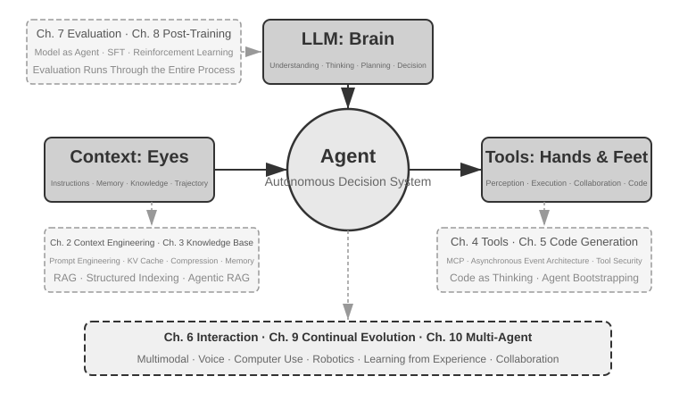

# Introduction {.unnumbered}

From August to October 2025, I delivered a series of technical lectures at the "AI Agent Bootcamp" run by Turing, the Chinese tech publisher. The goal was simple: to move AI Agent design from intuition-driven to principle-driven—not just getting a demo to run, but understanding *why* an Agent is designed the way it is and what trade-offs lie behind each architectural decision. This book was compiled and expanded from the notes and experiments of those lectures.

The book itself, from first idea to finished manuscript, was created through what might be called **whisper coding** (dictation-based collaboration)—and the tool I used for dictation was Pine, our own voice Agent. To prepare each lecture, I would dictate a rough outline, have it survey the topic, and let it assemble a first draft. After the lecture, I would share the Bootcamp students' feedback with Pine, and we would discuss and polish over many rounds; iteration by iteration, the lecture notes grew into the book you hold today. Through it all I rarely typed—I spoke my thoughts aloud instead. Speech has far higher bandwidth than typing (normal speech runs about four times typing speed), so the "dictate—survey—discuss—revise" loop moved quickly. In a sense, this book is not only about Agents; it is also a work an Agent helped create.

Since the release of DeepSeek R1 in early 2025, the AI field has moved beyond the pure foundation model stage (i.e., general-purpose large language model backbones) and into the deep end of engineering deployment. Progress at the model layer is visible in two directions. First, through Agentic Reinforcement Learning, models have trained tool-calling capabilities into their parameters, mastering general abilities in areas like coding, mathematics, and computer use. Second, model iteration keeps accelerating—GPT-5.2 to GPT-5.5, Claude Opus 4.5 to 4.8, each leap taking just half a year. At the product layer, general Agents like Manus, Claude Code, and OpenClaw have redefined human-computer interaction, pushing the architectural paradigm of "code generation + file system" into the mainstream.

Looking back at the Agent architecture principles I summarized in the course nearly a year ago, I found something both gratifying and surprising: **these principles have not gone stale; they have become more canonical.** New terms—Skill, harness, loop engineering—have since swept the Agent industry, but the real sequence runs the other way: companies like Anthropic did not invent these concepts and watch the industry adopt them; a great many Agents were already doing these things, and Anthropic then distilled the practice into named design principles. Practice comes first, naming comes later.

The confidence behind these principles comes from pushing Agents into long-horizon, high-stakes work in the real world. As Chief Scientist of Pine AI, I built Pine with my team. To my knowledge, it is the first general Agent that can autonomously interact with real people and reliably handle sensitive, complex, long-horizon tasks involving money on its own: it calls carriers on behalf of users to negotiate bills, handles refund requests and complaints with merchants, and cancels subscriptions—all without a human stepping in. Such tasks routinely run to dozens of rounds of negotiation, and a single mistake means real financial loss. It was this unforgiving demand for reliability that hammered out, one by one, the architectural principles this book keeps returning to. The following examples come from that practice.

- Long before Skill became a buzzword, we were already using dynamic prompt loading to rein in runaway prompt growth, command-line execution tools to rein in runaway tool lists, and a system status bar to give the Agent awareness of its execution environment, the user's time, and its own work status.
- Long before harness became a buzzword, we were already using Claude Code-style methods to handle unstable tool calls, hallucinations, dangerous operations, unauthorized operations, and ignored instructions.
- Long before loop engineering became a buzzword, we were already using what this book calls the proposer-reviewer method to keep the model from declaring a task finished too early.

None of this is our exclusive invention, either: to my knowledge, most leading model and Agent companies have worked out similar methods on their own. That is why I launched the "AI Agent Bootcamp" course at Turing in August 2025 and have taught a hands-on AI Agent course at the University of Chinese Academy of Sciences continuously from 2024 to 2026—and why I chose to release this book as open source rather than keep it closed and collect royalties: I want this knowledge to reach more practitioners.

**Practice comes first, naming comes later.** This sequence carries a very practical lesson for enterprise Agent development: **if you wait for an Agent buzzword to catch on before putting it into practice, you are already a step behind.** By the time a term is trending, the leading companies have usually worked through the problem it names. So how do you know what to do before the name arrives? Two things, I believe, are key.

**First, have a real business that makes extreme demands on the Agent's capability ceiling, and keep drawing genuine feedback from it.** Take Pine. A single task often takes hours or even weeks and can mean repeated back-and-forth with multiple stakeholders: hours on the phone, pages of complex forms filled out on a computer, several rounds of email. Through all of it, not one number can be wrong, and every exchange must stay careful enough to protect the user's interests. Only when you are immersed in a scenario this complex does practice naturally push you to build harnesses—to cover what the model cannot yet do on its own but the business requires. Conversely, if the business asks little of the capability ceiling and a modest model upgrade is all it takes, you will never have a reason to hone these architectural principles.

**Second, you must build an Evaluation mechanism.** This book returns to the point again and again: without evaluation, there is no progress. Evaluation lets you tell whether a change is genuinely better or merely lucky, so the Agent's direction of iteration no longer rests on gut feeling. At bottom, what we advocate is using the scientific method to do engineering and build Agents, and evaluation is that method's foundation. Chapter 7 develops it in full.

However the underlying models advance and however product forms shift, almost all successful Agent systems follow the same architectural patterns. This is no coincidence: **good design principles should outlast model iteration cycles**, because they describe not the usage of a specific model but the fundamental patterns by which intelligent systems interact with the world.

Richard Sutton, Turing Award winner and father of reinforcement learning, once said that the evolution of the universe has gone through four stages: dust, stars, life, and agents (originally termed designed entities). Biological evolution is blind: random mutation, natural selection. Most organisms do not understand their own working principles and cannot design or remake living things on their own. Agents, however, are something entirely new in the history of cosmic evolution: by generating code they can bootstrap and evolve themselves, like a programmer who writes another programmer, who in turn writes the next. That is, an Agent can understand its own operating mechanism and, given a goal, create entirely new Agents—even improve itself. The mission of this book is to help you understand and master the principles of this creation.

The core formula of this book is just one sentence: **Agent = LLM + Context + Tools**. All three are indispensable.



More intuitively, it is **Brain + Eyes + Hands and Feet**. The brain (LLM) is responsible for thinking and decision-making, the eyes (Context) determine what information the Agent can see, and the hands and feet (Tools) determine what the Agent can do. (Strictly speaking, "eyes" is a rough analogy: Context includes not only environmental information and conversation history but also tool definitions, meaning the information the Agent "sees" also includes "what hands and feet are available." This metaphor aims to convey the core intuition: Context is all the information the model can perceive.)

For readers familiar with reinforcement learning, these three can also be mapped to the formal language of RL. Specifically, LLM corresponds to Policy, Context corresponds to Observation Space, and Tools correspond to Action Space. The three expressions refer to the same object, just at different levels of abstraction.


## Book Structure {.unnumbered}

This book consists of ten chapters organized across four levels (Figure 0-2). Chapter 1 establishes the foundational framework for Agents; Chapters 2 through 6 discuss how to build Agents, covering context, knowledge, tools, code generation, and interaction in sequence; Chapters 7 through 9 discuss how to evaluate and continuously improve Agents, progressing from measurement systems and model post-training to continuous evolution driven by operational experience; Chapter 10 broadens the scope to multi-agent collaboration.


- **Chapter 1 (Agent Fundamentals)** begins with several real Agent products to build an intuitive understanding of Agents. It then examines the Agent's core formula in depth: from the implementation layer of LLM + Context + Tools, to the intuitive layer of Brain + Eyes + Hands and Feet, and finally to the academic layer of Policy, Observation Space, and Action Space. Experiments dissect how the ReAct loop operates—the iterative process of “Think → Act → Observe”—and distinguish among within-task contextual adaptation, cross-task updates to external artifacts, and parameter updates during training cycles. It concludes with orchestration design patterns ranging from workflows to autonomous Agents, establishing a unified conceptual framework for the chapters that follow.
- **Chapter 2 (Context Engineering)** is the most critical chapter in the book, systematically explaining Context, the Agent's “eyes.” It begins with the API message structure and the Agent's core loop, establishing the foundation that “Context is a list of messages,” then examines the underlying principles of KV Cache—the mechanism for reusing historical computation results during LLM inference. It subsequently covers Prompt Engineering, including process-oriented design, tool descriptions, and refinement of business rules; Prompt Injection attacks and defenses; the on-demand loading mechanism of Agent Skills; Agent status bar technology; and Context Compression strategies. Complete definitions of these terms are provided when they first appear in the main text.
- **Chapter 3 (User Memory and Knowledge Bases)** extends context management into a persistent knowledge system spanning sessions, allowing the Agent not only to remember the current conversation but also to accumulate and retrieve knowledge across multiple conversations. It covers four progressive strategies for user memory; the complete technical stack of RAG (Retrieval-Augmented Generation, in which relevant documents are retrieved before the model generates an answer), including different text-search methods and ranking optimization; multimodal information extraction; more advanced methods of knowledge organization; and Agentic RAG, in which the Agent autonomously decides when and what to retrieve.
- **Chapter 4 (Tools)** examines the bridge between Agents and the external world: tools function as the Agent's “hands and feet,” enabling it to search the web, call APIs, operate databases, and more. It introduces the MCP tool-interoperability standard and design principles for five categories of tools—Perception, Execution, Collaboration, Event Triggering, and User Communication—covers three approaches to multimodal perception (native multimodal processing, conversion to text, and tool-based multimodal analysis), and emphasizes security mechanisms for execution tools. Event triggering, user communication, and the asynchronous runtime are covered in Chapter 6.
- **Chapter 5 (Coding Agent and Code Generation)** argues that a Coding Agent plus a file system constitutes the core technical foundation of every general-purpose Agent. Using the OpenClaw architecture as its organizing thread, it analyzes Coding Agent workflows and implementation techniques, while demonstrating the broad value of code generation beyond programming: from assisting thought and building knowledge bases to dynamically creating new tools and Agent bootstrapping.
- **Chapter 6 (Interaction: Expanding the Observation and Action Spaces)** removes the turn-taking premise the previous five chapters assumed, and expands the Agent's interaction with the world along two axes—**modality** and **timing**: async and event-driven processing lets the world wake the Agent (event-triggered tools, user communication tools, virtual identities and isolated execution environments); voice pushes interaction to the millisecond scale (from cascading pipelines to end-to-end omnimodal and full-duplex models); Computer Use lets an Agent operate graphical interfaces like a human; and robotic manipulation extends action into the physical world (VLA control and Sim2Real transfer). The four scenarios share one set of primitives—wake-up, safe point, cancellation, preemption, and fast/slow separation.
- **Chapter 7 (Agent Evaluation)** constructs a scientific evaluation methodology. It covers evaluation environments—two core paradigms, tool calling and human-computer interaction, plus simulation environments discussed separately at the end of the chapter—dataset design principles, LLM-as-a-Judge automated evaluation, evaluation-driven model selection, and the complete closed loop that converts evaluation results into system improvements.
- **Chapter 8 (Model Post-training)** examines two post-training techniques in depth: SFT (Supervised Fine-Tuning, using labeled data to teach the model to follow examples) and RL (Reinforcement Learning, allowing the model to improve autonomously through trial and error and reward feedback). Organized around the central arguments that “SFT memorizes, RL generalizes” and “Data and environment matter more than algorithms,” it covers the full pre-training/SFT/RL landscape, classical RL theory, reward-signal design—from binary rewards and process rewards to verified path penalties that “reward the outcome and constrain the process”—single-turn and multi-turn reinforcement-learning algorithms, and frontier topics such as sample-efficiency optimization.
- **Chapter 9 (Continuous Agent Evolution)** studies how to transform an Agent's operational experience into capabilities for its next version. It first establishes learning signals composed of environmental outcomes, process rules, and LLM Rubrics; then compares four update carriers—knowledge documents, Prompts and Skills, programs and Harnesses, and model parameters; and finally discusses candidate-version validation, canary releases, rollback, and long-term consolidation.
- **Chapter 10 (Multi-Agent Collaboration)** discusses the ultimate form of AI Agent systems: how multiple Agents divide work and collaborate. It systematically presents a classification framework for multi-agent collaboration—shared/independent context × peer/manager/decentralized structures—uses translation Agents and telephone-plus-computer Agents to demonstrate collaborative architecture design, and surveys frontier directions in Agent societies and Agent economies.

## How to Read This Book {.unnumbered}

The chapters in this book are relatively independent. You can choose different reading paths based on your needs:

- **If you are an Agent developer**, read Chapters 1 through 9 in order: the first six chapters present construction methods, Chapter 7 establishes the foundations of evaluation, Chapter 8 explains how to train models, and Chapter 9 integrates parameters and other update carriers into a complete continuous-evolution loop. Chapter 10 can be read selectively according to your needs in multi-agent collaboration.
- **If you have limited time**, prioritize Chapter 1, for the overall picture, and Chapter 2, for context engineering—the most critical skill. The underlying principles of KV Cache in Chapter 2 are fairly technical; on a first reading, you may skip the mechanics and retain only the three core conclusions stated at the beginning, without affecting your understanding of later material.
- **If your focus is model training**, go directly to Chapter 8 (Model Post-training). Because the evaluation methods in Chapter 7 are a prerequisite for training, read the two together, after Chapters 1 and 2 have established the overall picture.

Each chapter contains a large number of **experiments** and **thought questions**, numbered in the format "Experiment X-Y" (X is the chapter number, Y is the sequence number within the chapter). The titles of experiments and thought questions carry star ratings for difficulty: ★ means entry-level, suitable for all readers; ★★ means medium difficulty, requiring some engineering practice; ★★★ means an advanced challenge, usually involving open-ended questions or complex system design. Most experiments come with complete runnable code, organized in the accompanying open-source repository:

> **Companion Code Repository**: [https://github.com/bojieli/ai-agent-book](https://github.com/bojieli/ai-agent-book)

You can obtain all companion code with Git:

```bash
git clone https://github.com/bojieli/ai-agent-book.git
cd ai-agent-book
```

If you do not use Git, you can also select **Code → Download ZIP** on the repository page. Experiment code is organized by chapter under `chapter1/` through `chapter10/`. To find “Experiment X-Y,” open the corresponding `chapterX/README.en.md`, use the experiment number to locate its project directory, and then follow that project's README to install dependencies and run it. Some experiments marked as reproduction guides depend on external repositories; their READMEs explain how to obtain those as well.

I strongly recommend running these experiments yourself: AI Agents are an intensely hands-on field, and many design intuitions only take shape while you are debugging.

**A Terminology Note**: This book is careful to distinguish two terms that casual usage often conflates. **Reasoning** is the model's step-by-step thinking—as in reasoning models, chain-of-thought, and reasoning tokens. **Inference** is the model's forward computation at deployment time—as in inference cost, inference stack, and inference-time scaling. (The Chinese edition renders them as two distinct words—思考 for reasoning, 推理 for inference—precisely to keep the two ideas apart; Chapter 10's translation case study refers back to this convention.) Other key terms are defined at their first occurrence in the text.

## Prerequisites {.unnumbered}

This book is aimed at readers with some technical background, but does not require you to be an expert in a specific field. The prerequisites are listed below in two levels: "Required" and "Recommended", to help you assess your readiness.

**Required: Foundation for reading the entire book**

- **Python Programming**: Almost all experiments in the book are based on Python. You need to be familiar with Python's basic syntax, common data structures, package management (pip), and other fundamental concepts. Proficiency is not required, but you should be able to read and modify Python code of moderate complexity.
- **Basic Experience with LLMs**: You should have used ChatGPT, Claude, or similar products, and understand the basic interaction pattern of "Prompt → Model Response".
- **An AI-Assisted Programming Tool**: Install and get comfortable with at least one AI-assisted programming tool, such as Claude Code, Codex, Cursor, or TRAE. For one thing, these tools will greatly speed up the experiments, which involve extensive code writing and debugging. For another, they are themselves mature Coding Agents: in using one, you will experience firsthand the core mechanisms this book keeps returning to—the ReAct loop, tool calls, context management. That firsthand experience is invaluable for understanding Agent design principles.
- **General Software Engineering Knowledge**: Be familiar with basic concepts such as command-line operations, Git version control, JSON data format, and REST APIs. These are the foundation for running experiments and understanding the Agent's tool-calling mechanism.

**Recommended: Enhancing the reading experience for specific chapters**

- **Machine Learning Basics** (Chapter 8): Understanding basic concepts like training vs. inference, loss functions, gradient descent, and overfitting will help you understand model post-training.
- **Basic Mathematics** (Chapters 2-3, 8): An intuitive understanding of linear algebra (e.g., knowing that vectors can represent direction and magnitude, and matrices can perform batch operations) will help you understand embeddings and attention mechanisms. Basic knowledge of probability and statistics will help with evaluation metrics and expected rewards in reinforcement learning. The mathematics in the book does not involve complex derivations and focuses on intuitive explanations.
- **Web Development Basics** (Chapter 6): Understanding concepts like HTTP, WebSocket, and front-end/back-end separation architecture will help you understand event-driven asynchronous Agent architectures and real-time communication experiments for voice agents.
- **Basic Understanding of the Transformer Architecture** (Chapters 2, 8): Transformer is the underlying architecture of almost all current large language models. Readers who want to systematically build up their foundational knowledge of large models may enjoy *Illustrating Large Models* (图解大模型, published in Chinese by Turing), which uses intuitive diagrams to explain core concepts such as the Transformer architecture, pre-training, and fine-tuning—a good complement to this book's Agent engineering perspective.

If you are missing some of these prerequisites, don't be discouraged. The core value of this book lies in **architectural design principles and engineering methodology**, not in any specific algorithm or technique. Outside of Chapter 8 on post-training, the book requires very little mathematics or machine learning, and it works perfectly well as a starting point.

Agent technology is still evolving rapidly, but **good architectural design principles have the power to endure through time**. Master the "why" behind the designs, and you can keep your judgment clear as the waves of technology roll through. I hope this book becomes a reliable guide as you build AI Agents.

## Acknowledgments {.unnumbered}

I would like to thank editors Meng Ge and Liu Meiying at Turing for their diligent editing and for their work organizing the Turing "AI Agent Bootcamp" course; I also thank Professor Liu Junming for offering the hands-on AI Agent course at the University of Chinese Academy of Sciences. Special thanks go to all the students of the Turing "AI Agent Bootcamp" and of the UCAS AI Agent course—teaching these courses brought me a wealth of valuable feedback and advice from you, and it sharpened my own grasp of these concepts.

I thank all my colleagues at Pine AI. Without a product as excellent as Pine AI, and the many challenges it brought with it, I could never have gone so deep into the Agent field, in understanding or in practice; and through one exchange of ideas after another, my colleagues contributed a wealth of valuable insights.

I also want to thank many friends across the AI industry (I won't name them all here). In discussion after discussion, you gave me honest feedback on my views, corrected many of my misjudgments, and raised my understanding of models and Agents.

Most of all, I thank my family, especially my wife, Meng Jiaying. She supported me throughout the writing of this book and offered many valuable suggestions along the way.
