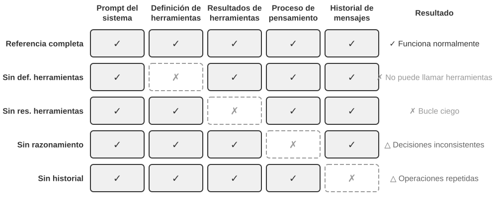
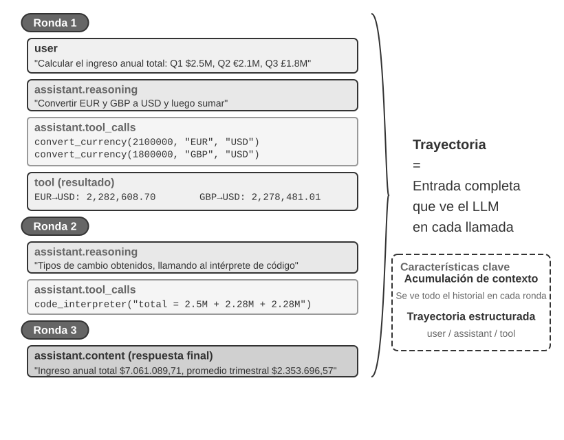
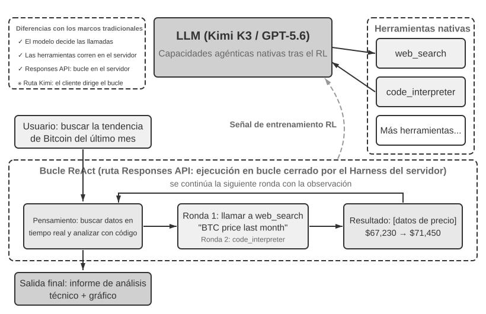

# Capítulo 1: Fundamentos de los Agentes de IA

Si has utilizado Cursor para escribir código y has observado cómo busca en tu código fuente, edita múltiples archivos y vuelve a ejecutar las pruebas hasta que pasan, ya has utilizado un Agente de IA. Lo mismo ocurre si has usado Deep Research para investigar un tema mediante búsquedas y lecturas repetidas, si has hecho que Manus controle un navegador para completar tareas en línea, si le has pedido al asistente de voz Doubao que reserve billetes o envíe mensajes, o si has enviado a Pine AI a negociar una tarifa telefónica más baja.

Estos productos adoptan muchas formas, pero comparten un rasgo común: ya no son conversaciones pasivas de "tú preguntas, él responde". Planifican sus propios pasos de ejecución, invocan las herramientas que requiere cada tarea y ajustan su estrategia a medida que llegan los resultados. Los Agentes de IA se están convirtiendo en una nueva forma de interactuar con las computadoras.

Este capítulo comienza con ejemplos prácticos y avanza de vuelta hacia los componentes fundamentales de un Agente de IA: los lectores experimentarán de primera mano lo que pueden hacer los Agentes modernos, comprenderán la arquitectura que los sustenta y aprenderán los patrones de diseño y las mejores prácticas para construir sistemas de Agentes.

> **Consejo de Lectura**: Este capítulo es el mapa conceptual de todo el libro: un recorrido conciso por la fórmula fundamental, el bucle de funcionamiento, el marco de ingeniería y los patrones de diseño de Agentes. Establece el vocabulario compartido y los puntos de referencia utilizados a lo largo de los capítulos posteriores. No intentes memorizar cada concepto en tu primera lectura; busca comprender la visión general. Cada capítulo posterior profundiza en un aspecto presentado aquí, y puedes volver a este capítulo siempre que necesites reorientarte.

## Agente Moderno = LLM + Contexto + Herramientas

La esencia de un sistema de Agente moderno se resume en una fórmula concisa: **Agente = LLM (Modelo de Lenguaje Grande) + Contexto + Herramientas**. La fórmula es simple y práctica, siempre que cada término se entienda en un sentido amplio:

- **El LLM es el motor de razonamiento del Agente**: Es más que un conjunto de parámetros de modelo; es el núcleo de toma de decisiones del Agente, responsable de comprender la intención, razonar, planificar y juzgar. Las capacidades de un LLM provienen del conocimiento del mundo y la habilidad lingüística adquiridos durante el **preentrenamiento**, además de las estrategias de toma de decisiones codificadas a través del **posentrenamiento** (técnicas como el ajuste fino supervisado y el aprendizaje por refuerzo se cubren en el Capítulo 7).
- **El Contexto es el conjunto de información de trabajo del Agente**: No es solo el texto introducido en el modelo, sino el conjunto operativo de información disponible para el Agente en cada punto de decisión: el entorno, la memoria del usuario, el conocimiento del dominio, su propio estado y el progreso de la tarea. Al igual que una persona que toma una decisión necesita evaluar la situación, recordar experiencias relevantes y consultar referencias, la ventana de contexto del Agente contiene la información que puede utilizar en ese momento exacto.
- **Las Herramientas son —las interfaces de acción— del Agente**: No son solo un puñado de funciones API invocables, sino el conjunto completo de formas en que el Agente puede actuar: desde llamadas a herramientas predefinidas hasta habilidades (Skills) cargadas bajo demanda, desde generar código para crear nuevas capacidades sobre la marcha hasta delegar trabajo a subagentes, pasando por comunicarse con el usuario o responder a eventos externos.

Dicho de forma más intuitiva: **Agente = Motor de Razonamiento + Contexto de Trabajo + Interfaces de Acción**. El modelo razona y decide, el contexto proporciona el conjunto de información de trabajo del que dependen esas decisiones, y las herramientas proporcionan las interfaces a través de las cuales las decisiones afectan al mundo exterior.

Estos tres componentes corresponden exactamente a tres conceptos clave del RL (aprendizaje por refuerzo; véase el capítulo 7).

| Intuición | Componente del Agente | Concepto en RL | Rol |
|---------------|----------------|------------------|---------------------------------------------|
| **Motor de Razonamiento** | LLM | **Política (Policy)** | La lógica de toma de decisiones que determina "qué hacer a continuación": dada la información actual, elige la acción más adecuada entre todas las opciones disponibles. |
| **Contexto de Trabajo** | Contexto | **Espacio de Observación** | Toda la información disponible para el Agente: lo que puede observar, leer, recordar y a qué sistemas puede acceder. |
| **Interfaces de Acción** | Herramientas | **Espacio de Acción** | El conjunto completo de cosas que el Agente puede hacer: qué "medios" tiene a su disposición, desde enviar mensajes hasta ejecutar código o controlar interfaces. |

### Espacio de observación y espacio de acción: la interfaz entre el modelo y el mundo

**El espacio de observación y el espacio de acción conforman conjuntamente la interfaz entre el LLM y el entorno externo**. El espacio de observación transforma la información del entorno en un contexto que el modelo puede procesar, mientras que el espacio de acción transforma las decisiones del modelo en operaciones sobre el mundo exterior. Para el modelo, la información que no entra en el espacio de observación es como si no existiera; si una operación no forma parte del espacio de acción, aunque el modelo sepa qué hacer, solo podrá ofrecer recomendaciones por escrito.

Por tanto, **cuando el modelo subyacente permanece fijo, el principal recurso de ingeniería de sistemas para mejorar el rendimiento de un Agente en una tarea suele consistir en redefinir o ampliar el espacio de observación y el espacio de acción**. En la terminología de este libro, esto significa ampliar el contexto y las herramientas. Muchos problemas que parecen requerir un “modelo más inteligente” son en realidad problemas de interfaz: al incorporar al contexto los datos necesarios para la tarea, o encapsular como herramientas las operaciones necesarias para completarla, una tarea que antes era irresoluble puede pasar a ser resoluble.

**Manus: la unificación de espacios anteriormente separados.** Antes de la aparición de Manus, los Agentes de nivel de producción se desarrollaban principalmente siguiendo tres líneas relativamente independientes: Deep Research (investigación profunda), Coding (generación de código) y Computer Use (control de computadoras). El avance de Manus consistió en ser el primero en reunir las tres en un mismo Agente de nivel de producción y de amplia repercusión: el navegador virtual amplió el espacio de observación, mientras que el sistema de archivos, la ejecución de código y la línea de comandos ampliaron el espacio de acción. No se convirtió en un Agente de propósito general limitándose a sustituir el modelo por otro más potente, sino tomando la unión de los espacios de observación y de acción de tres tipos de Agentes, lo que permitió a un mismo Agente realizar tareas que traspasaban los límites anteriores entre productos.

**OpenClaw: la extensión de la interfaz a la vida digital del usuario.** OpenClaw llevó estos dos espacios un paso más allá. Recibe tareas y devuelve resultados a través de canales de mensajería que el usuario ya utiliza, como WhatsApp, Telegram, Slack, Discord e iMessage, lo que permite acceder al Agente en cualquier momento y lugar; al mismo tiempo, adopta un Gateway local que se conecta con aplicaciones en la nube como Google Drive y Notion, así como con el sistema de archivos local. De este modo, los archivos digitales dispersos entre distintas cuentas y dispositivos pueden entrar en el espacio de observación de un mismo Agente, previa autorización explícita del usuario, y ser procesados por sus herramientas. En comparación con la primera versión de Manus, centrada en un sandbox aislado en la nube y que a menudo exigía subir archivos o configurar conectores por separado, el enfoque local-first de OpenClaw permite atravesar fronteras de datos más amplias. Cabe señalar que Manus también incorporó posteriormente un conector de Google Drive y acceso local desde su aplicación de escritorio; esto demuestra una vez más que la evolución de las capacidades de un producto suele ser, en esencia, la evolución de sus espacios de observación y de acción[^ch1-agent-products].

[^ch1-agent-products]: La documentación oficial de Manus describe su Sandbox original como una máquina virtual aislada en la nube; más adelante, al lanzar Google Drive Connector, también recordó explícitamente el flujo de trabajo fragmentado anterior, que obligaba a descargar y subir archivos manualmente entre Drive, el escritorio y Manus. Cuando lanzó My Computer en marzo de 2026, Manus volvió a calificar el hecho de que “el trabajo importante reside en local y no en la nube” como una limitación fundamental de los sandboxes en la nube. Por su parte, el README oficial de OpenClaw lo describe como un asistente personal permanente y local-first que se ejecuta en el propio dispositivo del usuario, y enumera más de veinte canales de mensajería; sus mecanismos de herramientas y plugins permiten seguir integrando servicios en la nube y capacidades locales. Véanse https://manus.im/blog/manus-sandbox, https://manus.im/blog/manus-google-drive-connector, https://manus.im/blog/manus-my-computer-desktop, https://github.com/openclaw/openclaw, https://docs.openclaw.ai/tools

Comprender la función de estos tres elementos y sus relaciones mutuas es fundamental para construir sistemas de Agentes eficaces. Comenzaremos por los componentes más concretos, las manos y los pies (las herramientas), y avanzaremos gradualmente hacia el cerebro (el LLM) y los ojos (el contexto). Veamos primero cómo se despliegan distintos tipos de Agentes en estas tres dimensiones:

| Producto de Agente | Ojos (percepción) | Manos y pies (acción) | Estrategia |
|----------------|----------------------|----------------------------|------------------------------|
| **Agentes de Coding como Cursor** | Documentos de requisitos, repositorios de código, entorno de terminal | Abierto (razonamiento interno, búsqueda de código, lectura y escritura de archivos, ejecución de comandos, etc.) | Desarrollo incremental: comprender los requisitos→buscar el código relacionado→editar el código→realizar pruebas de verificación→depurar y corregir |
| **Agentes de búsqueda como Deep Research** | Recursos de Internet, bases de datos académicas, archivos locales | Abierto (razonamiento interno, consultas de búsqueda, lectura de páginas web, generación de resúmenes) | Profundización iterativa: ajustar la dirección de búsqueda según la información disponible y sintetizar gradualmente un informe completo |
| **Agentes de control de computadoras como Browser Use** | Pantalla de la computadora, páginas del navegador, sistema de archivos | Abierto (razonamiento interno, clics, introducción de datos, desplazamiento, capturas de pantalla, ejecución de código, etc.) | Percepción visual+operación: observar la pantalla→identificar el elemento objetivo→ejecutar la operación→verificar el resultado |
| **Agentes asistentes para teléfonos móviles como Doubao** | Pantalla del teléfono, App instaladas | Abierto (razonamiento interno, clics, deslizamientos, introducción de datos, apertura de App, etc.) | Comprensión de la intención+control de App: comprender la necesidad del usuario→localizar la App objetivo→ejecutar la operación→confirmar que se ha completado |
| **Agentes personales de gestión de tareas como Pine AI** | Información de las cuentas del usuario, facturas anteriores, bases de conocimiento de proveedores de servicios | Abierto (razonamiento interno, llamadas telefónicas, envío de correos electrónicos, cumplimentación de formularios, confirmación con el usuario) | Ejecución de tareas de varios pasos: recopilar información→formular una estrategia de negociación→contactar con el proveedor de servicios→negociar→informar de los resultados |

Estos sistemas de Agentes comparten varias características: todos utilizan un **espacio de acción abierto**—no eligen entre unos pocos botones limitados, sino que pueden generar cualquier lenguaje natural y código; todos pueden **razonar internamente**—piensan y planifican antes de actuar; y todos pueden **interactuar de forma continua**—ajustan constantemente su estrategia según la respuesta del entorno. Estas capacidades proceden precisamente de la acción coordinada del cerebro, los ojos y las manos y los pies—es decir, del LLM, el contexto y las herramientas.
### Herramientas: Las Interfaces de Acción del Agente

Las herramientas son el puente del Agente hacia el mundo exterior. Convierten al Agente de un observador pasivo en un sistema activo que puede buscar, escribir archivos, ejecutar código, llamar a APIs, enviar mensajes u operar interfaces. Sin herramientas, un Agente se limita a la generación de texto; con ellas, puede actuar sobre sistemas externos.

Para analizar las herramientas de manera sistemática, podemos clasificarlas en cinco tipos según la dirección de la interacción del Agente con el mundo. En esta etapa, un breve resumen de los escenarios representativos de cada tipo es suficiente para establecer la visión general; los capítulos posteriores tratan cada uno en profundidad.

**Herramientas de Percepción**: Permiten al Agente acceder a la información. Los motores de búsqueda proporcionan datos web en tiempo real, los sistemas de archivos leen documentos locales y las APIs y bases de datos se conectan a servicios externos y datos empresariales clave.

**Herramientas de Ejecución**: Permiten al Agente actuar sobre sistemas externos. La ejecución de código, las operaciones de archivos, los comandos del sistema y las llamadas a APIs externas convierten las decisiones en acciones concretas.

**Herramientas de Colaboración**: Permiten al Agente dividir el trabajo con otros Agentes: delegar tareas especializadas a subagentes, solicitar confirmación humana en puntos clave de decisión o coordinar acciones en sistemas multiagente.

**Herramientas Disparadas por Eventos**: Se invocan de una forma fundamentalmente diferente a las tres primeras categorías. El Agente no las llama; llegan como entradas externas que activan al Agente para comenzar a trabajar. Llega un nuevo correo electrónico, se cumple un horario programado o un sistema externo dispara una llamada Webhook; el evento activa al Agente e inicia el razonamiento y la acción.

**Herramientas de Comunicación con el Usuario**: Son los canales a través de los cuales el Agente se comunica con el usuario. Mientras que las herramientas de ejecución cambian el mundo exterior, las herramientas de comunicación transmiten información: entregando el progreso del Agente o una verificación proactiva mediante mensajes de texto, llamadas de voz, correos electrónicos, etc.

El Capítulo 4 cubre la taxonomía completa y los principios de diseño para estos cinco tipos. La calidad del diseño de las herramientas determina directamente lo que un Agente puede lograr de manera confiable. La difusión del estándar MCP (Model Context Protocol) está facilitando la integración de herramientas.

**Llamada a Funciones (Tool Calling / Function Calling)** es una capacidad nuclear de los Agentes LLM modernos: permite que el modelo invoque herramientas externas de forma estructurada, transformando el LLM de un generador de texto puro a un sistema inteligente capaz de actuar a través de interfaces externas.

La llamada a herramientas procede en cuatro pasos: primero, el contexto informa al modelo qué herramientas están disponibles (nombres, propósitos, parámetros); luego, el modelo decide de forma autónoma si llama a una herramienta, cuál llamar y con qué argumentos; a continuación, una vez que la herramienta se ha ejecutado, su resultado se adjunta al contexto; finalmente, el modelo decide su siguiente paso basándose en ese resultado. Este bucle es la base de ReAct.

Para una consulta meteorológica, la representación simplificada del proceso de cuatro pasos a nivel de API es la siguiente:

```text
Paso 1: Declarar herramientas             Paso 2: El modelo decide llamar
tools: [{                             assistant: {
  name: "get_weather",                  tool_calls: [{
  parameters: {                           function: "get_weather",
    city: "string"                        arguments: {city: "Beijing"}
  }                                      }]
}]                                    }

Paso 3: Resultado adjunto al contexto      Paso 4: El modelo responde según el resultado
tool: {                               assistant: {
  tool_call_id: "call_1",               content: "Hoy en Pekín: 28°C, soleado."
  content: '{"temp":28,"sky":"clear"}' }
}                                     }
```

El desarrollador solo define las herramientas y ejecuta las llamadas; el propio modelo decide si llama, qué herramienta llamar y qué argumentos pasar. El Capítulo 2 examina esta estructura API en detalle.

Al diseñar herramientas para un Agente, comienza con la capacidad más estrecha que requiera la tarea y luego expándela gradualmente a medida que la tarea se vuelve más compleja. Si la tarea solo requiere aritmética básica, una calculadora con parámetros claramente definidos es suficiente; cuando crece para leer hojas de cálculo, limpiar valores faltantes, calcular estadísticas y trazar gráficos, un intérprete de código Python restringido es más fácil de combinar y explorar que una colección cada vez mayor de herramientas especializadas. Sin embargo, la generalidad también aumenta el riesgo de errores y amplía la superficie de ataque: el código debe ejecutarse en un sandbox aislado, con acceso a la red deshabilitado por defecto, sin acceso a archivos fuera del directorio de trabajo autorizado y con límites de tiempo de ejecución, CPU, memoria y tamaño de salida.

Asimismo, una herramienta de registro simple es adecuada para grabar una ejecución; para tareas de larga duración que toman horas o días, un directorio de trabajo virtual controlado puede conservar planes, resultados intermedios, registros de ejecución y artefactos finales para que el Agente pueda reanudar el trabajo a lo largo de múltiples ejecuciones. Este directorio también debe restringir las rutas de lectura y escritura, la capacidad de almacenamiento y los tipos de archivos, previniendo el desbordamiento de rutas (path traversal) en lugar de exponer todo el sistema de archivos del host al Agente.

Las herramientas de propósito general no siempre son mejores que las especializadas. Las operaciones de alto riesgo o las gobernadas por estrictas restricciones de negocio (como pagos, eliminación de datos, envío de correos electrónicos y despliegue en producción) deben exponerse como herramientas dedicadas con parámetros explícitos, permisos restringidos y auditabilidad de extremo a extremo, añadiendo previsualizaciones y confirmación humana cuando sea necesario. El principio central del diseño de herramientas es: **utilizar capacidades fundamentales de propósito general para la composición y exploración; utilizar herramientas especializadas para restringir operaciones de alto riesgo y hacer cumplir reglas de negocio estrictas**.

### LLM: el cerebro del Agente

El modelo de lenguaje de gran tamaño (Large Language Model, LLM) constituye el núcleo de toma de decisiones del Agente. Tras recibir la solicitud del usuario, primero debe interpretar su verdadera intención (lo que el usuario dice a menudo no es lo que realmente quiere) y, después, descomponer una tarea ambigua o compleja en pasos ejecutables. Durante la ejecución, también debe tomar decisiones de forma continua: qué hacer a continuación, si debe invocar una herramienta, cuál invocar y qué parámetros pasarle. Esta capacidad de «comprender-planificar-ejecutar» procede del conocimiento acumulado durante el preentrenamiento y es la base de la que dependen tanto los workflows como los Agentes autónomos.

Una capacidad distintiva de los Agentes basados en LLM es el **razonamiento interno**—antes de emprender una acción real, el Agente puede planificar y simular primero. Este proceso no modifica el entorno externo, pero puede mejorar significativamente la calidad de las acciones posteriores. La capacidad del LLM para realizar simulaciones internas eficaces se debe a las competencias adquiridas durante el preentrenamiento (Pre-training, es decir, el entrenamiento inicial sobre enormes volúmenes de texto de Internet para que el modelo aprenda los patrones del lenguaje y conocimientos sobre el mundo)—al simular, el modelo sigue reglas lógicas ya consolidadas en el conocimiento humano, como leyes matemáticas, relaciones causales y estrategias de descomposición de problemas. Por tanto, a diferencia de los Agentes tradicionales de aprendizaje por refuerzo, los Agentes actuales basados en LLM no realizan una exploración aleatoria a ciegas, sino que razonan sobre un sistema de conocimiento estructurado.
#### El Modelo como Agente: Cuando el Modelo Mismo se Convierte en el Producto

El paradigma "El Modelo como Agente" (Model as Agent) es la dirección más reciente en el desarrollo de Agentes de IA. Los modelos avanzados internalizan la llamada a herramientas como una capacidad nativa a través del posentrenamiento (especialmente el aprendizaje por refuerzo): cuándo llamar a una herramienta, cuál llamar y con qué argumentos son decisiones que toma el modelo por completo, sin necesidad de orquestación manual. Esto no resta importancia a la capa de framework; al contrario: cuanto más fuerte es el modelo, más importa el Harness que lo rodea. La palabra *harness* se refería originalmente a los arreos y las riendas de un caballo: no sirven para limitar su capacidad de correr, sino para dirigir esa fuerza en la dirección adecuada. En el contexto de los Agentes, el modelo es ese caballo potente pero impredecible, mientras que el Harness es la infraestructura de ingeniería que canaliza su capacidad hacia una ejecución de tareas confiable. Incluye la gestión de contexto, las interfaces de herramientas, las restricciones de seguridad y los mecanismos de verificación y corrección.

Cuanto mayor es la autoridad de decisión que tiene un modelo, mayor es el impacto de una decisión equivocada, lo que exige mecanismos de restricción, verificación y corrección más precisos para mantener la confiabilidad. La verdadera ventaja de los proveedores de modelos no es "hacer el framework más delgado", sino ser capaces de cooptimizar el modelo y su Harness circundante, iterando continuamente.

Sin embargo, surge una pregunta más profunda: si los modelos se vuelven cada vez más fuertes, ¿el Harness actual terminará siendo absorbido por el modelo? En "La Lección Amarga" (The Bitter Lesson), Rich Sutton revisó un patrón repetido a lo largo de setenta años de investigación en IA[^ch1-1]: los investigadores codificaban repetidamente su comprensión de un dominio en un sistema, logrando ganancias a corto plazo pero perdiendo finalmente ante métodos generales —búsqueda y aprendizaje— que escalan con el cómputo y los datos. Visto desde esta perspectiva, ¿cuánto de las restricciones, la verificación y la corrección del Harness es un «conocimiento previo humano» destinado a ser internalizado por el modelo? La posición de este libro es: **respaldar la dirección, mantener el pragmatismo respecto al ritmo**. En cuanto a la dirección, no dudamos de que los modelos seguirán absorbiendo partes del Harness: la llamada a herramientas y la planificación de largo alcance dependían antes de la orquestación externa y ahora son capacidades nativas del modelo. En la práctica, sin embargo, esta absorción es mucho más lenta de lo que sugiere la intuición: el entrenamiento avanza en escalas de meses y ningún modelo puede internalizar de una sola vez todas las restricciones y preferencias de los negocios reales. El límite actual de capacidad del modelo es precisamente donde el Harness aporta valor. Por tanto, la ingeniería del Harness no se opone a la Lección Amarga, sino que la pone en práctica a escala de ingeniería: lo que el modelo aún no puede hacer de forma confiable lo cubre primero el Harness; cuando el modelo internaliza una capa, el Harness la retira y pasa a proteger la siguiente frontera de capacidad.

[^ch1-1]: Sutton, Rich. “The Bitter Lesson”, 2019. http://www.incompleteideas.net/IncIdeas/BitterLesson.html

#### Mecanismos de Aprendizaje de los Agentes: De la Adaptación Contextual a las Actualizaciones Persistentes

Las modificaciones en el comportamiento de un Agente no ocurren únicamente durante el entrenamiento. Según dónde ocurre la actualización y cuánto tiempo persiste, estos cambios pueden entenderse a través de tres vías complementarias (Figura 1-1): adaptación contextual intra-tarea, actualizaciones entre tareas en artefactos externos y actualizaciones de parámetros durante ciclos de entrenamiento.


La **adaptación contextual** ocurre dentro de la tarea actual. Una vez que los ejemplos, el estado y los resultados de recuperación ingresan al contexto, el modelo puede ajustar su comportamiento de inmediato, pero esto no cambia el estado persistente de la siguiente sesión. Sus ventajas son la velocidad y el bajo costo; sus limitaciones provienen de la ventana de contexto. El Capítulo 2 explica en detalle este tipo de adaptación.

Para que los cambios persistan a lo largo de múltiples tareas, el sistema puede actualizar **artefactos externos**: los hechos y la experiencia se organizan en documentos de conocimiento, las estrategias expresables en lenguaje se escriben en un Prompt o Skill, y los procedimientos deterministas se codifican en programas y Harnesses. Estos artefactos son auditables y revisables. Los Capítulos 3 a 5 sientan las bases para el conocimiento y los programas, mientras que el Capítulo 8 analiza cómo generar tales actualizaciones a partir de trayectorias evaluadas.

Cuando el objetivo es una capacidad de alta dimensión (como la comprensión de imágenes médicas o una política de decisión implícita) que las reglas externas no pueden expresar por completo, los **parámetros del modelo** deben actualizarse mediante posentrenamiento. Las actualizaciones de parámetros conllevan mayores costos de despliegue, pero pueden producir una generalización amplia y natural; el Capítulo 7 presenta sus métodos sistemáticamente.

### Contexto: El Conjunto de Trabajo del Agente

El contexto es el conjunto de información de trabajo disponible para un Agente en cada punto de decisión. Desde la perspectiva de la API (detallada en el Capítulo 2), el contexto de cada llamada al LLM consta de cinco partes:

- **System Prompt (Prompt del Sistema)**: Escrito por el desarrollador, permanece fijo durante toda la conversación. Es la "descripción del puesto" del Agente: define su identidad, permisos y reglas de conducta. También transporta la **memoria del usuario** persistente y el estado del entorno inyectado dinámicamente.
- **Definiciones de Herramientas (Tool Definitions)**: Declara los nombres, descripciones funcionales y formatos de parámetros de las herramientas disponibles. Junto con el system prompt, forman el **prefijo estático** que permanece inalterado.
- **Mensajes del Usuario (User Messages)**: Entradas del usuario, que también pueden contener **conocimiento externo** recuperado dinámicamente mediante RAG (Generación Aumentada por Recuperación, ver Capítulo 3).
- **Mensajes del Asistente (Assistant Messages)**: Respuestas generadas previamente por el modelo, que pueden contener tres partes: `reasoning` (la cadena de pensamiento interna), `content` (la respuesta al usuario) y `tool_calls` (las acciones a ejecutar).
- **Resultados de Herramientas (Tool Results)**: La salida devuelta después de que el framework ejecuta una herramienta, sirviendo de base directa para el siguiente paso de razonamiento.

Los dos primeros elementos forman el prefijo estático; los últimos tres forman el historial dinámico de mensajes. Juntos hacen el contexto de cada inferencia.

Para comprobar si cada componente es realmente indispensable, el método más directo es un **estudio de ablación**: al igual que un médico descarta posibles causas una por una, se elimina primero el componente A para observar si el sistema sigue funcionando, después el componente B, y así sucesivamente, hasta determinar la contribución de cada uno. El Experimento 1-1 aplica este enfoque a los cinco componentes anteriores. Los resultados muestran que, sin definiciones de herramientas, el Agente pierde por completo su capacidad de actuar; sin los resultados de las herramientas, no puede ver la respuesta del paso anterior y llama repetidamente a la misma herramienta hasta caer en un bucle infinito; si se elimina el razonamiento de los mensajes del asistente, las decisiones consecutivas empiezan a contradecirse; y, sin el historial de mensajes, el Agente pierde la memoria, reinicia la tarea desde el principio y repite pasos ya completados.

> **Experimento 1-1 ★★: El Papel Crítico del Contexto**
>
> Examinamos cómo influye cada componente del contexto en el comportamiento del Agente mediante un **estudio de ablación** sistemático. Como muestra la Figura 1-2, el experimento ejecutó cinco grupos controlados: una línea base completa y cuatro grupos a los que les faltaba un componente.
>
> 
>
> Los resultados revelaron el papel irremplazable de cada componente. Las **Definiciones de Herramientas** son la base de la capacidad de acción; sin ellas, el Agente no reconoce ni puede llamar a ninguna herramienta. Los **Resultados de Herramientas** son clave para el control de bucle cerrado; su ausencia priva al Agente de retroalimentación y provoca que caiga en bucles infinitos. El **proceso de razonamiento** mantiene la coherencia de las decisiones anteriores. El **historial de mensajes** evita operaciones redundantes y mantiene la continuidad de la tarea.
>
> La conclusión central: **el contexto determina qué información tiene el Agente al decidir, y el Agente solo puede decidir basándose en esa información**.

### El Bucle ReAct

El patrón central mediante el cual un Agente ejecuta una tarea se llama **ReAct** (Reasoning + Acting). El bucle consta de tres etapas: el modelo **razona** sobre qué hacer a continuación, llama a una herramienta para **actuar**, y **observa** el resultado para volver a razonar. Este bucle "razonar → actuar → observar" se repite hasta completar la tarea.

Consideremos la **trayectoria**: el historial de mensajes que se acumula a medida que el Agente trabaja. En cada llamada al LLM, el contexto completo es el **prefijo estático** más la **trayectoria** (historial dinámico) (Figura 1-3). De aquí se deriva una verdad clave: **Contexto del Agente = Prefijo Estático + Trayectoria**.



Estructura de una trayectoria en pseudocódigo:

```text
trajectory = [
  {role: "user", content: "Basándote en los ingresos trimestrales de la empresa: Q1 2.5M USD, Q2 2.1M EUR, Q3 1.8M GBP, Q4 380M JPY, calcula los ingresos anuales totales y el promedio trimestral en USD"},
  
  # Primera iteración - El LLM recibe la trayectoria anterior y genera una respuesta
  {role: "assistant",
   reasoning: "Necesito convertir todas las monedas a USD...",
   content: "",
   tool_calls: [
     {name: "convert_currency", args: {amount: 2100000, from: "EUR", to: "USD"}},
     {name: "convert_currency", args: {amount: 1800000, from: "GBP", to: "USD"}},
     {name: "convert_currency", args: {amount: 380000000, from: "JPY", to: "USD"}}
   ]},
  
  # El framework del Agente ejecuta las herramientas y añade los resultados a la trayectoria
  {role: "tool", content: "EUR->USD: 2282608.7"},
  {role: "tool", content: "GBP->USD: 2278481.01"},
  {role: "tool", content: "JPY->USD: 2541806.02"},
  
  # Segunda iteración - El LLM recibe la trayectoria completa con los resultados
  {role: "assistant",
   reasoning: "Resultados de conversión obtenidos, ahora debo agregar y calcular...",
   content: "",
   tool_calls: [
     {name: "code_interpreter", args: {code: "total = 2500000 + 2282608.7 + 2278481.01 + 2541806.02; avg = total / 4; print(f'Total: {total}, Avg: {avg}')"}}
   ]},
  
  {role: "tool", content: "Total: $9,602,895.73, Average: $2,400,723.93"},
  
  # Tercera iteración - El LLM genera la respuesta final
  {role: "assistant",
   reasoning: "Todos los cálculos están completos, resumiendo resultados...",
   content: "RESPUESTA FINAL: Los ingresos anuales totales son $9,602,895.73 USD y el promedio trimestral es $2,400,723.93 USD."}
]
```

En este diseño básico, el contexto que ve el modelo se amplía mediante anexos sucesivos. Cada llamada al LLM recibe la trayectoria completa, permitiendo que el modelo conozca el estado de la tarea en todo momento.

> **Experimento 1-2 ★: capacidades nativas de Agente de Kimi K3**
>
> Este experimento muestra las capacidades nativas de Agente de **Kimi K3** y refleja el nuevo paradigma de «el modelo es el Agente». Kimi K3 es un modelo de mezcla de expertos (MoE, Mixture of Experts) con aproximadamente 2,8 billones de parámetros—podemos imaginar una MoE como un equipo de especialistas: ante distintos tipos de problemas, el sistema selecciona automáticamente a los expertos más adecuados para responder, sin necesidad de que todos intervengan al mismo tiempo, lo que permite mantener las capacidades y, a la vez, mejorar la eficiencia. Cuenta con una ventana de contexto de un millón de tokens, comprensión visual nativa y un «modo de pensamiento» (thinking mode) siempre activo; mediante entrenamiento por aprendizaje por refuerzo, el modelo ha internalizado como capacidad nativa la **política de decisión** para invocar herramientas—cuándo invocarlas, cuál utilizar y qué parámetros proporcionar son decisiones que toma de forma autónoma, lo que le permite completar por sí mismo tareas como búsquedas en Internet. Conviene aclarar que lo que se internaliza es la decisión de «cuándo invocar y cómo invocar»; las propias herramientas, como `web_search` y `code_runner`, siguen ejecutándose en el servidor como herramientas integradas en el nivel de la API (Kimi ejecuta estas herramientas oficiales mediante un motor de scripts del servidor denominado Formula).
>
> Entre las observaciones clave se encuentran las siguientes: el propio modelo decide cuándo buscar y qué buscar, lo que demuestra una autonomía real; además, puede ajustar dinámicamente su estrategia en función de los resultados de búsqueda y determinar por sí mismo si la información es suficiente. Aquí conviene aclarar un malentendido habitual: la clave consiste en distinguir a quién corresponde cada una de estas dos cosas. **El aprendizaje por refuerzo proporciona al modelo la capacidad de decisión**—cuándo debe invocar una herramienta, cuál debe utilizar, qué parámetros debe proporcionar, si debe continuar después de recibir el resultado y cómo encadenar decenas o centenares de invocaciones para formar un razonamiento coherente; todas estas decisiones sobre «si usarla o no y cómo usarla» quedan incorporadas a los parámetros del modelo. **En cambio, las propias herramientas y su ejecución las proporciona el framework de Agente (o las herramientas integradas en la API)**—la implementación real de `web_search` y `code_runner`, el entorno aislado para ejecutar código, el inicio de las invocaciones y la devolución de los resultados se realizan en una infraestructura externa al modelo. Lo que optimiza el RL es la política de decisión, no la incorporación del motor de búsqueda o del entorno aislado de código a los pesos del modelo. Por tanto, el bucle de orquestación no ha desaparecido, sino que se ha trasladado del cliente al servidor, mientras que la capacidad de decisión se ha cedido al modelo[^ch1-2].
>
> [^ch1-2]: Agradecemos al lector asdlem que, mediante el GitHub Issue #30, señalara y aclarara la distinción entre «lo que el RL internaliza es la política de decisión para invocar herramientas, no el mecanismo de ejecución de las herramientas». Véase https://github.com/bojieli/ai-agent-book/issues/30
>
> Una ventaja destacada de Kimi K3 en las tareas de Agente es la **estabilidad de las cadenas largas de invocaciones de herramientas**—puede ejecutar de forma consecutiva entre 200 y 300 invocaciones manteniendo la coherencia del razonamiento, muy por encima de la mayoría de los modelos, cuyo rendimiento empieza a degradarse tras unas pocas decenas de invocaciones. K3 está optimizado para programación de larga duración y cargas de trabajo de Agentes; en el momento de su lanzamiento se ofrecía en dos variantes: K3 Max (orientada a conversaciones y tareas de Agente) y K3 Swarm Max (orientada al procesamiento paralelo a gran escala). Como modelo de código abierto, ha demostrado en pruebas de referencia de ingeniería de software y Agentes un rendimiento comparable al de los mejores sistemas cerrados, lo que confirma la eficacia del enfoque consistente en dotar al modelo de capacidades nativas de Agente mediante aprendizaje por refuerzo.

> **Experimento 1-3 ★: capacidades nativas de Deep Research de GPT-5.6**
>
> El segundo experimento utiliza **OpenAI GPT-5.6** para mostrar cómo los modelos avanzados pueden servirse de las herramientas integradas en la API y cerrar en el servidor el bucle de orquestación de Deep Research de «búsqueda—lectura—análisis». Una característica práctica de GPT-5.6 es la **invocación de herramientas en formato libre** (Freeform Tool Calling). Con el método tradicional, al invocar una herramienta el modelo debe empaquetar todos los parámetros en un formato JSON estricto (un formato de datos estructurado), que impone numerosas restricciones de formato, como si se rellenara un formulario. La invocación de herramientas en formato libre (declarada en la API mediante el tipo de herramienta `type: "custom"`) permite al modelo enviar directamente texto sin procesar a la herramienta (por ejemplo, un fragmento de código Python o una consulta SQL), lo que evita las complicaciones del escapado de JSON. Conviene aclarar que se trata de una evolución del formato de parámetros de la API, no de una innovación en la arquitectura del modelo—la lógica del bucle de invocación de herramientas del cliente (detectar `tool_calls` → ejecutar → devolver los resultados) permanece sin cambios; lo único que cambia es que los parámetros dejan de ser una cadena JSON y pasan a ser texto sin procesar.
>
> GPT-5.6, junto con las herramientas integradas de **búsqueda web e intérprete de código** de Responses API—esto constituye precisamente el núcleo de Deep Research: el modelo puede buscar de forma autónoma información actualizada en Internet y escribir código para realizar análisis profundos, implementando un proceso de investigación iterativo de «búsqueda -> lectura -> análisis -> nueva búsqueda». Por ejemplo, ante una pregunta como «¿qué distancia separa al par de capitales más próximas entre sí de los diez países de la ASEAN?», GPT-5.6 busca automáticamente las coordenadas geográficas de las capitales de cada país y, a continuación, escribe código Python para calcular la distancia ortodrómica entre todos los pares de capitales, hasta encontrar el par más próximo. Del mismo modo, en una tarea como «busca la evolución del bitcoin durante el último mes y realiza un análisis técnico», puede obtener datos de precios en tiempo real de distintas fuentes financieras, utilizar bibliotecas profesionales de análisis técnico para calcular indicadores como medias móviles, RSI y MACD, generar gráficos y ofrecer recomendaciones de negociación.
>
> Más importante aún, GPT-5.6 ha internalizado en el nivel del modelo la filosofía de diseño del producto **OpenAI Deep Research** e incorpora un **proceso de aclaración de la intención**. Cuando el usuario plantea una necesidad de investigación, GPT-5.6 no comienza a ejecutar la tarea de inmediato, sino que primero formula una serie de preguntas para aclarar la verdadera intención del usuario. Tomemos como ejemplo «busca la evolución del bitcoin durante el último mes y realiza un análisis técnico»: primero preguntará «¿Qué fuente de datos prefiere? ¿Qué indicadores técnicos necesita analizar?». Gracias a esta aclaración interactiva de la intención, GPT-5.6 puede generar informes de investigación más precisos y mejor adaptados a las necesidades del usuario.
>
> GPT-5.6 es un ejemplo maduro del concepto «el modelo es el Agente»—la búsqueda web, el intérprete de código y otras herramientas integradas en Responses API se ejecutan en un bucle cerrado en el servidor, y el bucle de orquestación se traslada del cliente al servidor de la API, lo que simplifica la implementación del cliente; el modelo sigue generando invocaciones de herramientas estándar, pero el cliente ya no tiene que construir por sí mismo el framework de orquestación de «búsqueda—lectura—análisis». El aspecto más destacable es el mecanismo de aclaración de la intención: el modelo no ejecuta la tarea en cuanto la recibe, sino que primero formula preguntas para confirmar las necesidades reales del usuario y después elabora una estrategia de investigación. De este modo, la diferencia entre «lo que el usuario ha dicho» y «lo que el usuario realmente quiere» se salva antes de ejecutar la tarea.
>
> Conviene señalar que este experimento no está ligado a un proveedor concreto. Quienes no tengan créditos de OpenAI pueden reproducirlo con proveedores que ofrezcan herramientas gestionadas equivalentes. Por ejemplo, la Responses API de qwen3.7-plus de Alibaba Cloud Bailian también incorpora `web_search` y `code_interpreter`; la búsqueda gestionada por Formula y `code_runner` de Kimi K3 ofrecen capacidades de la misma clase.
>
> La figura 1-4 muestra la arquitectura completa de las invocaciones nativas de herramientas bajo el paradigma «el modelo es el Agente», así como el proceso de ejecución ReAct de Kimi K3 / GPT-5.6 en tareas reales.
>
> 

## Ingeniería de Harness: la competitividad más allá del modelo

Llegados a este punto, ya comprende el principio de funcionamiento fundamental de un Agente—el LLM completa tareas utilizando herramientas mediante el bucle ReAct y con ayuda del contexto. Los experimentos anteriores han demostrado que este mecanismo básico es eficaz, pero también han dejado al descubierto puntos débiles evidentes: el modelo puede alucinar (inventar herramientas o parámetros inexistentes), elegir la herramienta equivocada o ser incapaz de recuperarse por sí mismo cuando se produce un error. Entre una demostración que funciona y un producto fiable existe un enorme abismo, y estos puntos débiles son precisamente los problemas que la Ingeniería de Harness pretende resolver. La primera mitad de este capítulo respondió qué es un Agente; la segunda mitad explica cómo lograr que funcione de manera fiable en un entorno de producción.

Las secciones anteriores establecieron la fórmula fundamental **Agente = LLM + contexto + herramientas**. Esta fórmula describe la **composición interna** del Agente, es decir, qué elementos desempeñan respectivamente el papel de cerebro, ojos, manos y pies. Desde la perspectiva de la Ingeniería de Harness, también se necesita una visión en el nivel de la **implementación de ingeniería**: el LLM se considera un componente central (Model), y todo el código de soporte construido a su alrededor recibe en conjunto el nombre de Harness. Estas dos perspectivas no se sustituyen entre sí, sino que describen el mismo sistema en distintos niveles de abstracción. Se utiliza el término más general «Model» porque los principios de la Ingeniería de Harness se aplican a cualquier modelo con capacidades de razonamiento e invocación de herramientas, sin limitarse a un tipo específico de modelo. El núcleo del Harness es el «contexto + herramientas» de la fórmula original, al que se añaden tres niveles de garantías: **restricción** (delimitar qué puede y qué no puede hacer el Agente), **verificación** (comprobar si el Agente ha actuado correctamente) y **corrección** (remediar los errores).

Si expresamos mediante una ecuación la composición completa de un sistema de producción:

> **Agente = LLM + [contexto + herramientas + restricción + verificación + corrección] = Model + Harness**

Un Agente mínimo funcional solo necesita un LLM, contexto y herramientas para ponerse en marcha; sin embargo, para que funcione de manera fiable y duradera en un entorno de producción también es necesario completar la envoltura de ingeniería con los tres niveles de restricción, verificación y corrección—la restricción impide que se sobrepasen los límites, la verificación detecta errores y la corrección permite recuperarse de las anomalías. En otras palabras, la fórmula mínima corresponde a la perspectiva de una demostración, mientras que la fórmula ampliada corresponde a la perspectiva de producción; la segunda contiene por completo a la primera y añade a su alrededor una red de seguridad.

Un ejemplo ayudará a entenderlo: incorporar la política de reembolsos al contexto pertenece al ámbito del «contexto», mientras que comprobar que el importe del reembolso no supere el importe del pedido pertenece al ámbito de la «restricción»; ejecutar una llamada a una API corresponde al ámbito de las «herramientas», mientras que reintentarla automáticamente después de que la API agote el tiempo de espera pertenece al ámbito de la «corrección». El modelo proporciona las capacidades básicas de comprensión y razonamiento, mientras que el Harness orienta, restringe y amplifica esas capacidades para convertirlas en una ejecución fiable de las tareas. La práctica de ingeniería consistente en diseñar y optimizar esta infraestructura externa al modelo es la **Ingeniería de Harness** (Harness Engineering).

Veamos un ejemplo concreto para comprender el valor del Harness. Supongamos que pide a un Agente que ayude a un usuario a devolver un pedido realizado hace tres días. **Sin Harness**: el modelo no puede ver la política de reembolsos (falta contexto), no sabe qué API invocar (faltan herramientas), inventa directamente un resultado de reembolso y responde al usuario (falta verificación), y el usuario descubre que el reembolso nunca se produjo (falta corrección). **Con Harness**: el prompt del sistema especifica una política de reembolso de siete días (contexto), el Agente invoca las herramientas `query_order` y `process_refund` para completar la operación (herramientas), el framework comprueba que el importe del reembolso no supere el importe del pedido (restricción), verifica el estado de la base de datos para confirmar que el reembolso se ha realizado correctamente (verificación) y, si la llamada a la API agota el tiempo de espera, la reintenta automáticamente (corrección). Con el mismo modelo, la presencia o ausencia de Harness produce resultados radicalmente distintos.

Volvamos a la metáfora del arnés presentada al principio del capítulo: un modelo sin Harness es como un caballo salvaje desbocado, con capacidades asombrosas, pero incapaz de completar tareas de forma fiable.

Para ser más precisos, toda la infraestructura externa al modelo forma parte del Harness. El núcleo del Harness está constituido por el contexto y las herramientas, alrededor de los cuales se construyen tres tipos de mecanismos de garantía de ingeniería:

| Función | Responsabilidad en una frase | Relación con el contexto/las herramientas |
|--------------------|----------------------------------------|-----------------------------------|
| **Context (contexto)** | Proporcionar información perceptiva al modelo | Capacidad central |
| **Tools (herramientas)** | Proporcionar al modelo medios para actuar | Capacidad central |
| **Constrain (restricción)** | Establecer los límites de comportamiento—qué puede y qué no puede hacer | Límite de seguridad construido alrededor del contexto y las herramientas |
| **Verify (verificación)** | Determinar automáticamente si el resultado de una operación es correcto | Mecanismo de comprobación construido alrededor de los resultados de ejecución de las herramientas |
| **Correct (corrección)** | Corregir automáticamente o revertir cuando se detecta un problema | Mecanismo de recuperación construido alrededor de los fallos en las invocaciones de herramientas |

El contexto y las herramientas permiten que el Agente «haga cosas»—comprender la tarea y actuar; la restricción, la verificación y la corrección permiten que el Agente «no haga las cosas mal»—no son elementos independientes y ajenos al contexto y las herramientas, sino prácticas de ingeniería que garantizan que ambos funcionen de forma fiable en un entorno de producción. En la curva de madurez de los productos de Agentes, la importancia de ambos grupos es asimétrica.

Los primeros frameworks de Agentes se centraban principalmente en el contexto y las herramientas: proporcionar herramientas y contexto al modelo para permitirle «hacer cosas». En cambio, el centro de gravedad de los sistemas de Agentes de nivel de producción ya se ha desplazado hacia la restricción, la verificación y la corrección: garantizar que las invocaciones de herramientas sean seguras, que el contexto esté gestionado y que los errores sean recuperables.

Tomemos Claude Code como ejemplo: la mayor parte del código de su Harness está dedicada a la restricción, la verificación y la corrección, no al contexto y las herramientas—las propias herramientas (lectura y escritura de archivos, ejecución de comandos y búsquedas) solo representan una pequeña parte; el verdadero núcleo son los mecanismos de garantía construidos alrededor de ellas. Estos mecanismos incluyen:

- **Gestión del estado del proceso**: realizar un seguimiento del paso en el que se encuentra el Agente
- **Compresión del contexto en varias capas**: simplificar automáticamente la información cuando es excesiva
- **Clasificación de permisos**: controlar qué operaciones requieren la confirmación del usuario
- **Disyuntor** (Circuit Breaker): cuando se producen errores consecutivos, «cortar la corriente» automáticamente y dejar de reintentar—igual que un fusible se dispara automáticamente cuando se produce un cortocircuito en casa, para evitar que todo el sistema colapse
- **Mecanismo de recuperación de errores**: capturar excepciones, volver al último estado estable, reintentar o devolver el control a una persona

**El sector está pasando de «hacer cosas» a «hacerlas de forma fiable»; por eso, la Ingeniería de Harness se ha convertido en la principal ventaja competitiva de los sistemas de Agentes.**

### De la ingeniería de prompts a la Ingeniería de Loops: evolución del paradigma de ingeniería

Al repasar el desarrollo de la ingeniería de aplicaciones de IA, se aprecia un arco evolutivo claro:

La **ingeniería de prompts** (Prompt Engineering) fue la primera ola de innovación: mejorar la calidad de las salidas optimizando las instrucciones en lenguaje natural proporcionadas al modelo.

La **ingeniería de contexto** (Context Engineering) fue la segunda ola: se comprendió que no bastaba con optimizar los prompts y que era necesario gestionar de forma sistemática toda la información visible para el modelo (instrucciones del sistema, definiciones de herramientas, historial de conversación y conocimiento externo).

La **Ingeniería de Harness** fue la tercera ola: amplió la perspectiva desde «qué puede ver el modelo» hasta «en qué tipo de sistema se ejecuta el modelo», abarcando toda la infraestructura externa al modelo, incluidos los mecanismos de restricción, los métodos de verificación, los bucles de retroalimentación y la recuperación de errores.

La posterior **Ingeniería de Loops** (Loop Engineering) volvió a ampliar la perspectiva, desde una única ejecución hasta el funcionamiento autónomo y continuo a lo largo de múltiples iteraciones: quién descubre qué es lo siguiente que debe hacerse, cuándo verificar y cuándo puede considerarse que la tarea está realmente terminada (el capítulo 10 lo desarrollará en el contexto de los sistemas colaborativos multi-Agente).

En julio de 2026, el sector también empezó a utilizar el término **Ingeniería de Grafos** (Graph Engineering) para describir una perspectiva de orquestación de mayor nivel: organizar los bucles de Agentes, los programas deterministas y las aprobaciones humanas en forma de un grafo de ejecución explícito, cuyos nodos asumen capacidades concretas, cuyas aristas definen el enrutamiento y las dependencias, y en el que el estado estructurado se transmite a lo largo de las aristas y se persiste en límites clave[^ch1-graph-engineering].

[^ch1-graph-engineering]: Josh C. Simmons fue uno de los primeros en utilizar explícitamente esta denominación en su artículo del 4 de julio de 2026, *We Are Entering the Graph Engineering Phase*, donde la resumió en términos de nodos, aristas tipadas y estados con puntos de control; el 18 de julio, el debate de Peter Steinberger sobre «si ya hemos pasado de loops a graphs» impulsó aún más la difusión del término. Conviene señalar que las prácticas correspondientes son anteriores a esta denominación: la documentación oficial de LangGraph, Microsoft Agent Framework y Google ADK se refiere a ellas, respectivamente, como orquestación mediante grafos o graph-based workflow. Véanse https://www.drjoshcsimmons.com/writing/we-are-entering-the-graph-engineering-phase、https://x.com/steipete/status/2078277297791189132、https://docs.langchain.com/oss/python/langgraph/overview、https://learn.microsoft.com/en-us/agent-framework/workflows/、https://adk.dev/workflows/。

Estas cinco etapas no se sustituyen unas a otras, sino que cada una contiene a la anterior: la ingeniería de prompts es un subconjunto de la ingeniería de contexto, la ingeniería de contexto es un subconjunto de la Ingeniería de Harness y la Ingeniería de Harness es un subconjunto de la Ingeniería de Loops. Cada capa amplía el ámbito de atención y de influencia del ingeniero sobre la base de la anterior. **Cuando las capacidades de los modelos de distintos proveedores convergen y dejan de ser el factor diferenciador decisivo, la ventaja competitiva se desplaza hacia las prácticas de ingeniería externas al modelo**.

Esta conclusión ha quedado confirmada por experiencias de ingeniería recientes: el trabajo de LangChain en Terminal Bench 2.0 (una prueba de referencia que evalúa la capacidad de los Agentes para completar tareas complejas en un entorno de terminal) constituye un ejemplo contundente. Su Coding Agent pasó del 52,8 % al 66,5 % (saltó de una posición inferior al puesto 30 a situarse entre los cinco primeros), y lo que cambió no fue el modelo, sino el Harness: técnicas de ingeniería para que el Agente comprobara automáticamente los resultados de sus propias ejecuciones, detectara si había caído en un bucle repetitivo y optimizara su estrategia de razonamiento, entre otras.

### Principios fundamentales de las cinco funciones del Harness

La tabla anterior enumera las cinco funciones del Harness. La siguiente tabla desarrolla los principios de diseño fundamentales de cada función y los capítulos correspondientes de este libro, para ayudar al lector a establecer una relación entre los conceptos y la práctica:

| Función | Principio fundamental | Ejemplo práctico | Véase |
|------|-----------------------------------------------|-----------------------------------|-------|
| **Contexto** | Suficiencia de la información: permitir que el Agente tome decisiones basadas en información suficiente en cada punto de decisión | Prompt del sistema, base de conocimiento, barra de estado del Agente, consultas auxiliares mediante Sidecar | Capítulos 2 y 3 |
| **Herramientas** | Interfaz clara: nombres intuitivos para las herramientas, ejemplos de parámetros y límites documentados | Herramientas MCP, intérprete de código, herramientas de búsqueda | Capítulo 4 |
| **Restricción** | Valores predeterminados a prueba de fallos: todas las capacidades están desactivadas por defecto y deben habilitarse explícitamente (de forma similar a la gestión de permisos de las aplicaciones móviles) | En Claude Code, cada herramienta requiere por defecto la autorización del usuario para poder ejecutarse | Capítulo 4 |
| **Verificación** | Aislamiento de las entradas: las comprobaciones de seguridad solo examinan datos estructurados (como los campos JSON devueltos por una herramienta), no texto generado libremente por el modelo (porque un atacante podría manipular la salida del modelo mediante una inyección de prompts) | Comprobaciones mediante linter, sistema de tipos, validación de los resultados de invocaciones de herramientas | Capítulos 5 y 6 |
| **Corrección** | No exponer estados intermedios antes de confirmar que no es posible recuperarse (por ejemplo, si falla una invocación de herramienta, reintentar primero de forma silenciosa y no mostrar al usuario resultados incompletos) | Reintentos silenciosos, continuación de la generación, derivación a una persona tras fallos consecutivos (mecanismo de disyuntor) | Capítulos 2 y 5 |

Las cinco funciones forman un bucle cerrado: el contexto y las herramientas sustentan las decisiones, la restricción previene errores, la verificación detecta desviaciones y la corrección cierra el bucle. Si falta cualquiera de estos eslabones, el sistema presentará una brecha de fiabilidad. Antes de profundizar en patrones específicos de orquestación y diseños de guardrails, establezcamos primero los principios fundamentales para construir Agentes y la estrategia de selección de modelos—constituyen la base de todas las decisiones de diseño posteriores.


### Principios fundamentales para construir Agentes eficaces

Según la experiencia de Anthropic, los sistemas de Agentes de éxito siguen tres principios fundamentales.

**Mantener la sencillez**. Comience por la solución más sencilla y añada complejidad únicamente cuando sea realmente necesario. Las llamadas directas a la API son preferibles a los frameworks complejos, y el código claro es preferible a las abstracciones ingeniosas. Cada capa adicional de abstracción se convertirá en un nuevo punto ciego durante la depuración futura.

**Mantener la transparencia**. Muestre con claridad los pasos de planificación, los registros de ejecución y la trayectoria de decisiones del Agente—esto no solo facilita la depuración, sino que también es un requisito previo para ganarse la confianza del usuario. Cuando se produce un error dentro de una caja negra, un observador externo no puede localizarlo ni corregirlo.

**Diseñar bien la interfaz de las herramientas (ACI, Agent-Computer Interface)**. ACI pone el énfasis en diseñar la interfaz desde la perspectiva del Agente (para que le resulte fácil comprenderla y utilizarla), en lugar de diseñarla desde la perspectiva del programador, como ocurre con las API tradicionales. Los nombres y parámetros de las herramientas deben ser intuitivos, y los puntos propensos a usos incorrectos deben diseñarse de tal forma que los errores no puedan producirse—por ejemplo, la esquina recortada de una tarjeta SIM hace que solo pueda introducirse en la ranura en una dirección, lo que evita insertarla al revés; un microondas nunca calienta si la puerta no está bien cerrada, lo que evita la conducta peligrosa de calentarlo con la puerta abierta. Esta idea de «eliminar los errores mediante el diseño» tiene un término específico en la industria manufacturera: **a prueba de errores** (Poka-yoke), procedente del sistema de producción de Toyota. Una herramienta mal diseñada hará que incluso los modelos más potentes cometan errores con frecuencia—porque el único canal de comunicación entre el modelo y la herramienta es la propia interfaz, y una interfaz ambigua transforma la ambigüedad en errores sistémicos amplificados por el modelo.

Las tres secciones siguientes desarrollan tres temas independientes pero importantes de la Ingeniería de Harness: selección de modelos, patrones de orquestación y guardrails y seguridad. Ninguno de ellos forma parte en sí mismo de los cinco elementos del Harness, pero todos representan decisiones ineludibles en la práctica de ingeniería.

### Cómo elegir un modelo

Antes de hablar de los patrones de orquestación, respondamos a una cuestión práctica: ¿qué tipo de modelo debería elegirse para impulsar un Agente?

El modelo es la base inteligente del Agente, y elegir el modelo adecuado suele ser más eficaz que optimizar los prompts. Dado que los modelos evolucionan con enorme rapidez, esta sección no recomienda versiones concretas, sino que ofrece algunas orientaciones para la selección.

**Modelos cerrados.** Actualmente, los dos principales proveedores de modelos cerrados más utilizados en el desarrollo de Agentes son OpenAI (serie GPT/o) y Anthropic (serie Claude). Los modelos cerrados suelen ir por delante en capacidad, pero tienen un coste más elevado y están condicionados por las políticas de API de sus proveedores. Al elegir un modelo, no se limite a consultar las clasificaciones: **debe evaluarlo con sus propias tareas** (véase el capítulo 6).

**Modelos de código abierto.** En el momento de escribir este libro, la diferencia entre los modelos abiertos y cerrados es inferior a seis meses, pero su coste es sensiblemente menor. Si el escenario de negocio no exige las máximas capacidades, un modelo abierto es una opción pragmática. Estos modelos tienen costes bajos, pueden desplegarse de forma privada y admiten personalización mediante ajuste fino, por lo que son adecuados para escenarios sensibles a los costes o sujetos a requisitos de conformidad de los datos. DeepSeek, Kimi y GLM se cuentan entre los modelos chinos con mayores capacidades de Agente. Conviene tener en cuenta que las capacidades de invocación de herramientas varían considerablemente entre modelos, por lo que es imprescindible probarlos en escenarios concretos antes de elegir.

**Más allá de la capacidad, hay que considerar los límites de las políticas del modelo.** Que un modelo posea técnicamente una capacidad no significa que el producto que lo aloja permita al usuario utilizarla. Cada proveedor establece límites diferentes para la ciberseguridad, la destilación y extracción de modelos, los datos privados y las operaciones de alto riesgo; además, una misma tarea puede producir resultados distintos en un producto de chat, un Coding Agent y una API. Por tanto, la selección no puede limitarse a comparar precisión, precio y velocidad. Hay que comprobar con tareas reales si el modelo está dispuesto a ejecutarlas, si la interfaz expone la capacidad necesaria y si las condiciones del servicio permiten el uso previsto. Para tareas críticas del negocio, conviene preparar una transferencia a una persona u otro modelo conforme como alternativa.

**La inmensa mayoría de los Agentes necesitan modelos que admitan razonamiento (Reasoning).** Los Agentes deben realizar razonamientos de varios pasos, seleccionar herramientas y tomar otras decisiones complejas; los modelos sin capacidad de razonamiento suelen rendir muy mal en estas tareas. Solo existen unas pocas excepciones—por ejemplo, tareas sencillas de un solo paso u operaciones simples de GUI en Computer Use que solo requieren hacer clic en una posición fija—en cuyo caso un modelo sin razonamiento también puede ser suficiente. Sin embargo, siempre que intervengan razonamientos de varios pasos o decisiones dinámicas, debe elegirse un modelo que admita razonamiento.

**Preste atención a la velocidad de salida y a las capacidades multimodales.** Además del coste, existen otras dos dimensiones que suelen pasarse por alto. La primera es la **velocidad de generación de tokens**: los Agentes suelen necesitar varias rondas de razonamiento y, en cada una, deben esperar a que el modelo termine de generar la salida antes de ejecutar el siguiente paso; por tanto, la velocidad de salida determina directamente la latencia de extremo a extremo—si una tarea de Agente necesita 20 rondas de razonamiento, dos segundos adicionales por ronda significan 40 segundos más de espera en total. La segunda es la **compatibilidad multimodal**: si su Agente necesita comprender imágenes, audio o vídeo, la capacidad multimodal es un requisito imprescindible, y las diferencias entre modelos en este aspecto son considerables.


### Patrones de orquestación: workflows y autonomía

Los patrones de orquestación son la forma de organizar las capas de «contexto y herramientas» dentro del Harness—determinan cómo fluye el contexto entre las llamadas al LLM, cómo se programan las herramientas y si la ruta de ejecución del Agente está predefinida o se genera dinámicamente. La orquestación de los sistemas de Agentes ha evolucionado desde soluciones sencillas hasta otras más complejas; cada patrón tiene escenarios de aplicación adecuados y compromisos que deben sopesarse. Según la experiencia de Anthropic colaborando con decenas de equipos en la construcción de Agentes basados en LLM, las implementaciones más exitosas no suelen utilizar frameworks complejos, sino patrones sencillos y componibles.

Al construir aplicaciones basadas en LLM, debe seguirse el principio de «ir de lo sencillo a lo complejo»: considere primero una única llamada al LLM—si el problema puede resolverse optimizando el prompt y los ejemplos de contexto, no introduzca un sistema de Agentes; cuando sea necesario un procesamiento de varios pasos, considere utilizar un workflow en escenarios que puedan descomponerse claramente en subtareas fijas; utilice un Agente autónomo solo cuando sean necesarias decisiones dinámicas y rutas de ejecución flexibles. Hay que recordar lo siguiente: los sistemas de Agentes suelen intercambiar latencia y coste por un mejor rendimiento en las tareas, por lo que debe evaluarse cuidadosamente si este intercambio merece la pena.

#### Patrón de workflow: orquestación determinista

Un **workflow** (Workflow) es un sistema que orquesta el LLM y las herramientas mediante rutas de código predefinidas. Su ruta de ejecución es determinista y ha sido diseñada de antemano por el desarrollador—qué se hace en cada paso y cuál es el siguiente destino están fijados en el código; el LLM solo se ocupa de comprender y generar dentro de cada nodo.

Tomemos como ejemplo un Agente para reservar billetes de avión. El workflow podría diseñarse con cuatro nodos fijos:

1. **Verificar la identidad del usuario**—invocar la API de autenticación para confirmar quién es el usuario
2. **Buscar vuelos disponibles**—consultar la base de datos de vuelos según las necesidades del usuario
3. **Completar el pago**—invocar la interfaz de pago para efectuar el cobro
4. **Confirmar la reserva**—invocar la API de reservas para bloquear el asiento y enviar la confirmación al usuario

Dentro de cada nodo puede utilizarse un LLM (por ejemplo, para comprender mediante lenguaje natural las necesidades de viaje del usuario), pero el orden de transición entre nodos está fijado por el código—el sistema no reservará un asiento antes de completar el pago ni empezará a buscar vuelos antes de verificar la identidad.

El patrón de workflow tiene dos ventajas fundamentales. La primera es el **control estricto del proceso**: el desarrollador puede garantizar que no se omitan pasos críticos ni se ejecuten en un orden incorrecto; por ejemplo, reglas de negocio como «no se puede reservar antes de pagar» se aplican mediante código y no dependen del criterio del LLM. La segunda es la **seguridad**: dado que la ruta de ejecución es determinista, una inyección de prompts o un error del modelo solo puede afectar, como máximo, al procesamiento interno del nodo actual y no puede hacer que el Agente salte a una rama que no debería ejecutar—la superficie de ataque queda restringida a un único nodo.

La principal limitación de un workflow es su **falta de flexibilidad**. Cuando se presenta una situación no contemplada por el proceso predefinido (por ejemplo, si el usuario quiere cambiar el vuelo durante la fase de pago o si el vuelo se cancela de repente y es necesario recomendar alternativas), la ruta fija de nodos no puede adaptarse con flexibilidad y solo puede seguir una rama predefinida para excepciones o devolver el control a una persona.

#### Agente autónomo: decisiones autónomas y dinámicas

Cuando la ruta fija de un workflow no puede satisfacer las necesidades, se requiere un **Agente autónomo** (Autonomous Agent). La diferencia fundamental entre un Agente autónomo y un workflow es la siguiente: la ruta de ejecución no está predefinida, sino que el Agente la decide en tiempo real basándose en la **retroalimentación del entorno**.

Sigamos con el ejemplo de la reserva de vuelos: un Agente autónomo no necesita cuatro nodos fijos predefinidos. El usuario dice «resérvame un vuelo a Shanghái para el próximo miércoles»; el Agente decide por sí mismo buscar primero los vuelos, descubre que es necesario iniciar sesión, verifica entonces la identidad, vuelve a la búsqueda, descubre que el vuelo más barato tiene escala, pregunta de forma proactiva al usuario si la acepta, el usuario responde que no quiere escalas y el Agente ajusta los criterios de búsqueda...

Esto significa que un Agente autónomo debe tener capacidad de planificación autónoma—decidir por sí mismo los pasos de ejecución, además de poder identificar fallos y ajustar su estrategia, en lugar de limitarse a detenerse cuando se produce un error. Sin embargo, autonomía no significa ausencia de límites—deben diseñarse **condiciones de parada** claras (tarea completada, número máximo de iteraciones alcanzado o error irrecuperable); de lo contrario, el Agente puede caer fácilmente en un bucle infinito o ejecutar acciones en exceso.

Desde la perspectiva de la implementación, un Agente autónomo es esencialmente un LLM que utiliza herramientas dentro de un bucle y hace avanzar la tarea obteniendo continuamente retroalimentación del entorno—esto es precisamente el bucle ReAct presentado anteriormente. Entre las condiciones de salida habituales se encuentran: invocar la herramienta de salida final, que el modelo devuelva una respuesta sin ninguna invocación de herramienta, encontrar un error o alcanzar el número máximo de rondas.



Los Agentes autónomos son especialmente adecuados para problemas abiertos—problemas en los que es difícil predecir el número de pasos necesarios. Entre los escenarios de aplicación típicos se incluyen: un Coding Agent que resuelve tareas de SWE-bench (Software Engineering Benchmark, una prueba de referencia que evalúa la capacidad de un Agente para corregir automáticamente GitHub Issues reales), un Agente de «uso del ordenador» (Computer Use) que maneja una interfaz informática como lo haría una persona y tareas de investigación que requieren búsquedas y análisis iterativos.

No obstante, la autonomía también conlleva mayores costes y un posible riesgo de errores compuestos. Por tanto, al desplegar un Agente autónomo, es imprescindible realizar pruebas exhaustivas en un entorno aislado, configurar guardrails y mecanismos de supervisión adecuados, y considerar la incorporación de puntos de control con intervención humana en las decisiones críticas.
#### Selección y Mezcla de Ambos Patrones
Muchos sistemas combinan ambos: los procesos críticos funcionan como workflows, mientras que los pasos dinámicos se delegan a Agentes autónomos (ejemplo: n8n).


#### Breve comparativa de los principales frameworks de Agentes

La siguiente tabla presenta los principales frameworks/plataformas de Agentes disponibles actualmente para ayudar al lector a identificar rápidamente la opción más adecuada según el escenario:

| Framework/plataforma | Posicionamiento principal | Modelo de orquestación | Modalidad de desarrollo | Escenarios de aplicación |
|---------------|---------------|-------------------|---------------|--------------------------------|
| **OpenAI Agents SDK** | Biblioteca ligera para el desarrollo de Agentes | Autónomo (bucle de herramientas) | Prioridad al código | Prototipado rápido, aplicaciones con un único Agente |
| **Claude Agent SDK** | Framework de producción para el desarrollo de Agentes | Autónomo (bucle de herramientas + subagentes) | Prioridad al código | Tareas autónomas complejas, Coding Agents |
| **LangChain / LangGraph** | Framework de propósito general para aplicaciones con LLM | Workflow + autónomo | Prioridad al código | Razonamiento encadenado complejo, workflows de varios pasos |
| **n8n** | Automatización visual de workflows | Workflow + autónomo | Low-code (arrastrar y soltar visualmente) | Automatización empresarial, equipos no técnicos |
| **Dify** | Plataforma de desarrollo de aplicaciones con LLM | Workflow + conversacional | Low-code (interfaz visual + API) | RAG empresarial, aplicaciones de bases de conocimiento |
| **CrewAI** | Orquestación multiagente basada en roles | Colaboración multiagente | Prioridad al código | Descomposición y ejecución de tareas en equipo |
| **OpenClaw** | Agente personal integral de código abierto | Autónomo + basado en eventos | Configuración + código (autoalojado) | Asistente personal, Deep Research, Computer Use, integración de mensajería multiplataforma |

A medida que se profundiza la tendencia del «modelo como Agente», el valor central de los frameworks ya no se limita a «orquestar llamadas a LLM»—los modelos son cada vez más capaces de tomar decisiones de forma autónoma, pero la Ingeniería de Harness en torno a ellos, como la gestión del contexto, el ecosistema de herramientas, las restricciones de seguridad y la recuperación ante errores, cobra aún más importancia. Al elegir un framework, la consideración clave no reside en la complejidad del propio framework, sino en si permite centrarse en la lógica de negocio con una capa de abstracción mínima.

Los modelos de orquestación analizados anteriormente resuelven el problema de cómo organizar el contexto y las herramientas dentro del Harness—cómo encadenar las llamadas a LLM, las herramientas y los flujos de datos. Sin embargo, no basta con poder ejecutar tareas; también hay que garantizar que se ejecuten correctamente y de forma segura. A continuación, abordaremos el principal mecanismo práctico para implementar las restricciones, la validación y la corrección construidas en torno al contexto y las herramientas: las guardrails.
### Guardarraíles y Seguridad

Esta sección ofrece una visión general de alto nivel sobre los guardarraíles para establecer el panorama general. Los detalles de implementación y la práctica se desarrollan en el Capítulo 2 (protección contra inyección de prompts), Capítulo 4 (control de permisos de herramientas) y Capítulo 5 (seguridad en la ejecución de código); los lectores por primera vez no necesitan seguir cada detalle inmediatamente.

Los guardarraíles son la forma principal en que se implementa la capa de "restricción, verificación y corrección" del Harness: una defensa en profundidad por capas que mantiene el comportamiento del Agente seguro y controlable. Unos **guardarraíles (guardrails)** bien diseñados ayudan a gestionar los riesgos de privacidad de datos (por ejemplo, prevenir la fuga del prompt del sistema) y los riesgos reputacionales (por ejemplo, mantener el comportamiento del modelo consistente con la marca). Comienza con guardarraíles para los riesgos que ya has identificado y añade otros nuevos a medida que salgan a la luz nuevas vulnerabilidades.

Piensa en los guardarraíles como una defensa en profundidad. Es poco probable que un solo guardarraíl sea suficiente por sí solo, pero varios especializados combinados crean un sistema de Agentes mucho más resiliente.

Los guardarraíles también presentan otro modo de fallo: el **falso rechazo**. Para reducir la probabilidad de permitir solicitudes peligrosas, un modelo puede rechazar también tareas legítimas pero aparentemente sensibles, como pruebas de seguridad autorizadas o investigaciones sobre destilación de modelos. Por ello, la evaluación de los guardarraíles no debe comprobar únicamente si se bloquean las solicitudes prohibidas, sino también si las solicitudes claramente permitidas pueden completarse.

#### Tipos de barreras de protección

Según el punto en el que se aplica la protección, pueden dividirse en tres categorías: de entrada, de ejecución y de salida.

Las barreras de protección **de entrada** interceptan las solicitudes antes de que lleguen al Agente y suelen incluir cuatro mecanismos. Los **clasificadores de pertinencia** marcan las consultas que se desvían del tema; por ejemplo, cuando un asistente de programación recibe una pregunta irrelevante como «¿Cuánto mide el Empire State Building?». Los **clasificadores de seguridad** detectan jailbreaks (es decir, intentos de inducir al modelo a eludir las restricciones de seguridad) e inyecciones de prompt (Prompt Injection, es decir, la inserción de instrucciones maliciosas en la entrada). La diferencia fundamental entre ambos es la siguiente: en un jailbreak, el propio usuario intenta eludir las restricciones de seguridad del modelo, mientras que, en una inyección de prompt, un atacante manipula indirectamente el comportamiento del modelo mediante datos externos, como el contenido de páginas web o documentos. La **moderación de contenido** marca entradas dañinas o inapropiadas, como contenido violento o discriminatorio. La **protección basada en reglas**, por su parte, adopta medidas deterministas, como listas negras, límites de longitud de entrada y filtros de expresiones regulares, para prevenir amenazas conocidas como la inyección SQL.

Las barreras de protección **de ejecución** realizan validaciones durante las llamadas a herramientas. Su elemento central es la **clasificación del riesgo de las herramientas**: a cada herramienta se le asigna un nivel de riesgo (bajo/medio/alto) en función de si la operación es reversible, del nivel de permisos y del impacto financiero; las operaciones de alto riesgo requieren una revisión adicional o confirmación humana.

Las barreras de protección **de salida** realizan comprobaciones antes de devolver la respuesta al usuario. Los **filtros de PII** revisan la salida en busca de información de identificación personal, como números de documento de identidad o de teléfono, para evitar su exposición innecesaria; la **validación de la salida**, por su parte, garantiza mediante comprobaciones de contenido que la respuesta sea coherente con los valores de la marca.

Cabe señalar que ciertos mecanismos, como el filtrado mediante expresiones regulares basado en reglas, pueden utilizarse tanto en la entrada como en la salida; la clasificación anterior se basa en su ubicación de despliegue más habitual.

Una práctica industrial representativa de las barreras de protección basadas en clasificadores son los Constitutional Classifiers de Anthropic[^ch1-3]. Su mecanismo central consta de tres elementos: en primer lugar, un enfoque **guiado por reglas**—se utiliza una «constitución» redactada en lenguaje natural, que especifica claramente qué contenido está permitido y cuál está prohibido, para generar datos sintéticos de entrenamiento con los que se entrenan clasificadores de entrada y salida—; en segundo lugar, la **evaluación conjunta del contexto**—los sistemas de nueva generación examinan conjuntamente la pregunta del usuario y la respuesta del modelo, porque algunas respuestas no presentan ningún problema de forma aislada, como «cómo utilizar condimentos alimentarios», y solo al cotejarlas con la pregunta puede descubrirse que «condimentos alimentarios» es en realidad una expresión codificada para referirse a reactivos químicos—; en tercer lugar, un **proceso de filtrado en dos niveles**—primero, una sonda extremadamente ligera, que lee directamente las activaciones internas del modelo con un coste prácticamente nulo, comprueba todas las conversaciones y, cuando detecta algo sospechoso, lo remite a un clasificador más potente para una segunda revisión, en lugar de rechazarlo directamente—. De este modo, aunque el primer nivel genere un mayor número de falsos positivos, la experiencia del usuario no se ve afectada y el coste se reduce de forma considerable.

[^ch1-3]: Anthropic. "Next-generation Constitutional Classifiers: More efficient protection against universal jailbreaks", 2026. https://www.anthropic.com/research/next-generation-constitutional-classifiers; artículo: Cunningham et al., "Constitutional Classifiers++: Efficient Production-Grade Defenses against Universal Jailbreaks", arXiv:2601.04603
#### Intervención Humana (Human-in-the-loop)

La intervención de **humano en el bucle (Human-in-the-loop)** es una medida de protección clave: permite que un Agente mejore su rendimiento en el mundo real sin degradar la experiencia del usuario. Es de máxima importancia en las primeras etapas de despliegue, donde ayuda a identificar modos de fallo, sacar a la luz casos límite y establecer un ciclo de evaluación robusto.

Con un mecanismo de humano en el bucle, un Agente que no puede completar una tarea puede transferir el control de forma elegante. En atención al cliente, esto significa escalar a un representante humano; para un Coding Agent, significa devolver el control al desarrollador.

Habitualmente existen dos situaciones principales que activan la intervención humana:

**Superar Umbrales de Fallo**
Establece límites para los reintentos y operaciones del Agente. Si el Agente supera esos límites, escala a un humano.

**Operaciones de Alto Riesgo**
Las operaciones sensibles, irreversibles o de alto riesgo deben activar la supervisión humana, al menos hasta que el equipo haya generado suficiente confianza en la fiabilidad del Agente. Ejemplos típicos: autorizar un reembolso elevado o procesar un pago.

Con los cinco elementos de Harness en mente, el resto del libro sigue esta estructura.

### Este Libro como Guía Práctica de Ingeniería de Harness

Visto a través de la lente de la ingeniería de Harness, cada capítulo de este libro construye de forma sistemática un componente del Harness. La seguridad, mientras tanto, no pertenece a un solo capítulo; es una preocupación transversal de todo el libro (una preocupación transversal afecta a muchas partes de un sistema a la vez, de la misma manera que el registro de logs, en ingeniería de software, debe atravesar cada módulo). La siguiente tabla presenta las funciones de Harness, las consideraciones de seguridad y los capítulos correspondientes en una sola vista:

| Enfoque del Harness | Capítulo Correspondiente | Contenido Central | Preocupaciones de Seguridad |
|--------------------|--------------------|-------------------------------|------------------------|
| Diseño de Contexto | Capítulo 2 (Ingeniería de Contexto) | Ingeniería de prompts, barra de estado del Agente, compresión de contexto, Skills del Agente | Inyección de prompts y fuga de información |
| Extensión de Contexto | Capítulo 3 (Base de Conocimiento) | Memoria del usuario, RAG, indexación estructurada, RAG agentizado | Exposición de información sensible, protección de la privacidad |
| Diseño de Herramientas y Restricciones | Capítulo 4 (Diseño de Herramientas) | Clasificación de herramientas, control de permisos, estándar MCP, arquitectura asíncrona | Operaciones erróneas, acceso no autorizado, operaciones irreversibles |
| Verificación y Corrección de Herramientas | Capítulo 5 (Generación de Código) | Harness de Coding Agents, desarrollo guiado por pruebas, reglas codificadas | Suplantación de identidad, atribución de responsabilidad |
| Verificación a Nivel de Sistema | Capítulo 6 (Evaluación) | Entorno de evaluación, conjuntos de datos, evaluación automatizada, observabilidad |, |
| Corrección a Nivel de Modelo | Capítulo 7 (Posentrenamiento) | SFT (Ajuste Fino Supervisado), Aprendizaje por Refuerzo | Desalineación de objetivos, alineación y robustez |
| Corrección a Nivel de Sistema | Capítulo 8 (Autoevolución) | Aprendizaje externalizado, creación de herramientas, acumulación de experiencia |, |
| Contexto y Herramientas Multimodales | Capítulo 9 (Interacción Multimodal y en Tiempo Real) | Agentes de voz, uso de computadoras, operación robótica | Filtrado de seguridad de entradas multimodales, control de permisos en tiempo real |
| Restricciones y Correcciones entre Múltiples Agentes | Capítulo 10 (Colaboración Multiagente) | Arquitectura de colaboración, modos de fallo, sociedad de Agentes | Violación de límites de confianza entre Agentes, conflictos de recursos compartidos |

La práctica de Anthropic en la construcción de Agentes de larga duración muestra cómo el diseño de Harness puede resolver problemas que el modelo por sí solo no puede. Dividen las tareas complejas entre un "Agente de Inicialización" (que configura el entorno y descompone la lista de tareas) y un "Agente de Ejecución" (que avanza de forma incremental en cada sesión y deja artefactos de entrega claros), utilizando un Harness estructurado para abordar los dos modos de fallo de las tareas largas: quedarse sin contexto y declarar la tarea completada prematuramente. Los capítulos siguientes analizan el Harness componente por componente: el Capítulo 2 comienza con el más central, la ingeniería de contexto, y el Capítulo 5 expone la práctica completa de la ingeniería de Harness en los Coding Agents.
## Resumen del capítulo

Este capítulo ha establecido, desde una perspectiva práctica, un marco fundamental para comprender y construir Agentes de IA.

**Agente = cerebro + ojos + manos y pies**: el LLM es el cerebro (el núcleo de toma de decisiones), el contexto son los ojos (determina qué puede ver) y las herramientas son las manos y los pies (determinan qué puede hacer). Los tres son indispensables.

**Ampliar los ojos y las manos y los pies es la principal palanca de capacidad**: cuando el modelo permanece fijo, redefinir o ampliar el espacio de observación y el espacio de acción—es decir, ampliar el contexto y las herramientas—suele convertir directamente tareas que antes eran irresolubles en tareas resolubles. La evolución tanto de Manus como de OpenClaw demuestra que la capacidad de propósito general proviene, en gran medida, de la ampliación de los límites de las interfaces; esta ampliación debe realizarse según las necesidades y combinarse con controles de permisos y mecanismos de verificación.

**Los ojos (el contexto) son el factor decisivo**: el contexto consta de un prefijo estático (prompt del sistema + definiciones de herramientas) y una trayectoria dinámica (historial de mensajes). Los estudios de ablación demuestran que eliminar cualquiera de estos componentes provoca una degradación significativa del sistema. La esencia del bucle ReAct consiste en permitir que el modelo haga avanzar la tarea de manera continua mediante la incorporación constante de elementos a la trayectoria.

**El Harness es donde reside la competitividad**: las capacidades de los modelos se están convirtiendo en productos básicos; la verdadera diferenciación reside en el Harness—los mecanismos de restricción, verificación y corrección construidos en torno al contexto y las herramientas, que garantizan que el Agente «haga las cosas de forma fiable». En los sistemas de Agentes de nivel de producción, la gran mayoría del código del Harness implementa estos mecanismos de garantía, y no únicamente el contexto y las herramientas en sí.

**Del workflow al Agente autónomo**: primero hay que optimizar el prompt, después considerar un workflow y solo entonces introducir un Agente autónomo—este es el orden más práctico para reducir el riesgo de resultados inesperados. Cada patrón de orquestación tiene sus propios escenarios de aplicación; no existe una solución óptima universal.

**La seguridad es una cuestión de arquitectura**: guardrails, intervención humana y alineación (alignment, es decir, hacer que el comportamiento del modelo sea coherente con la intención humana)—la seguridad debe tenerse en cuenta desde la primera línea de código, en lugar de abordarse mediante parches justo antes del lanzamiento. Las cuestiones de seguridad abarcan cinco niveles: modelo, contexto, herramientas, colaboración y sociedad.

El próximo capítulo profundizará en el componente más importante del Harness—la ingeniería de contexto. En cuanto a los orígenes académicos del concepto de Agente en el aprendizaje por refuerzo y a la comparación exhaustiva entre el RL tradicional y los Agentes LLM modernos, los abordaremos sistemáticamente en el capítulo 7.

Las siguientes preguntas de reflexión tienen como objetivo ayudar a los lectores a explorar con mayor profundidad los conceptos centrales de este capítulo; no tienen una respuesta única y oficial.
## Preguntas de Reflexión

1. ★★ Si solo pudieras añadir una capacidad a un sistema de Agente (un modelo más fuerte, un contexto más rico o más herramientas), ¿cuál elegirías? ¿En qué condiciones cambiaría tu elección?
2. ★★★ En el bucle ReAct, cada llamada al LLM recibe la trayectoria completa, por lo que el costo crece cuadráticamente con la longitud de la trayectoria. ¿Se puede romper este crecimiento cuadrático sin perder información crítica?
3. ★★ El paradigma "El Modelo como Agente" significa que los modelos son cada vez más autónomos en sus decisiones de llamadas a herramientas. Sin embargo, este capítulo sostiene que la importancia de la ingeniería de Harness está aumentando. ¿Cómo pueden coexistir estas dos tendencias?
4. ★★ En el experimento de ablación, la ausencia de "retroalimentación de resultados de herramientas" hizo que el Agente cayera en un bucle infinito. En un entorno de producción, ¿qué otras situaciones podrían causar que un Agente entre en un bucle? ¿Qué mecanismos de detección y terminación diseñarías?
5. ★ Este capítulo analizó cinco productos de Agentes en tres dimensiones: contexto de trabajo, interfaces de acción y estrategia. Elige un producto de IA que uses a diario, analízalo en esas tres dimensiones y juzga si su arquitectura es adecuada.
6. ★★ Si fueras a diseñar un sistema de atención al cliente específicamente para reservar vuelos, ¿elegirías un patrón de workflow o un patrón de Agente autónomo? ¿Es posible mezclar ambos patrones en el mismo sistema?
7. ★★★ La sección de guardarraíles mencionó las clasificaciones de riesgo de las herramientas. Si una herramienta es generalmente de bajo riesgo pero se vuelve de alto riesgo con combinaciones específicas de parámetros (ej. `delete_file` borrando un archivo normal vs. un archivo de sistema), ¿cómo diseñarías una evaluación de riesgo dinámica?
8. ★★ En la tabla de productos de Agentes, todos los Agentes tienen un espacio de acción "abierto". ¿En qué escenarios sería superior un espacio de acción restringido (ej. solo poder elegir entre opciones predefinidas)?
9. ★★ El mecanismo de intervención humana requiere que el Agente "transfiera el control de forma elegante". Sin embargo, en la práctica, el usuario podría estar desconectado, responder lentamente o dar instrucciones vagas. ¿Qué debería hacer el Agente en tales casos?
10. ★★★ La introducción afirma que «los buenos principios de diseño deben trascender los ciclos de iteración de los modelos», pero los métodos concretos de ingeniería utilizados para aplicar esos principios pueden quedar obsoletos a medida que mejoren las capacidades de los modelos. Da un ejemplo de uno de esos métodos de ingeniería de Agentes y explica por qué.
