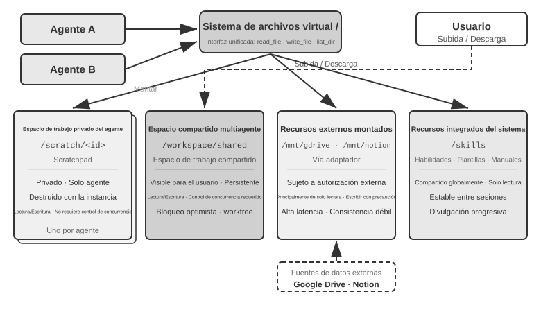
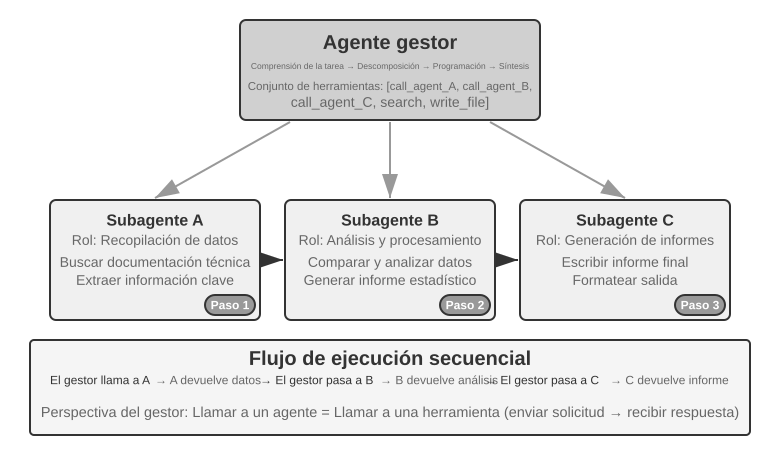
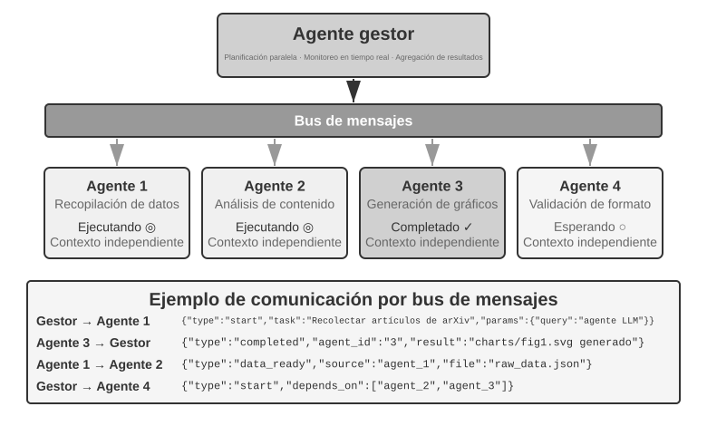
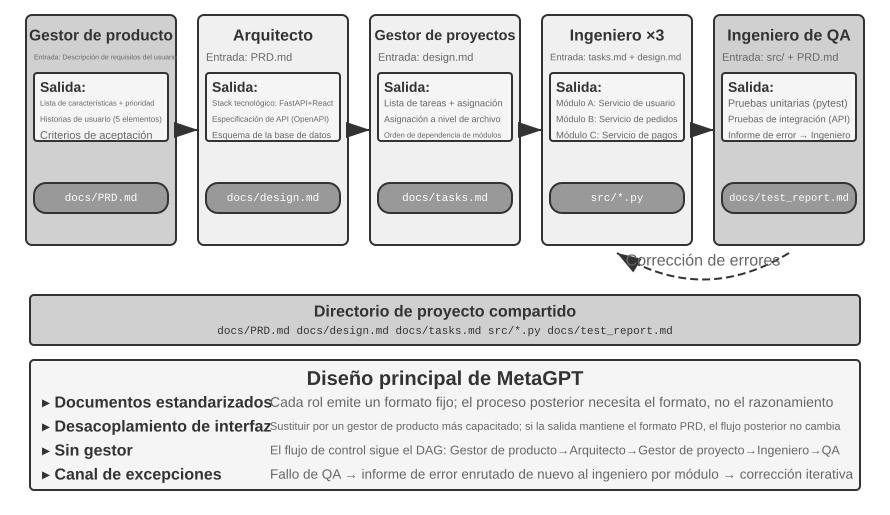
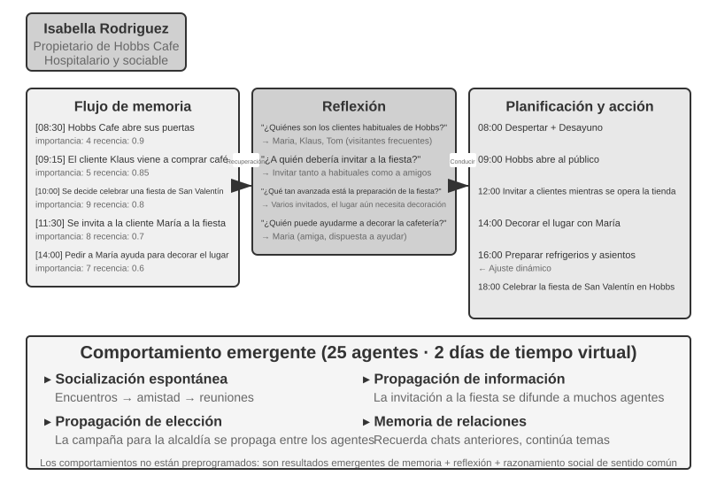
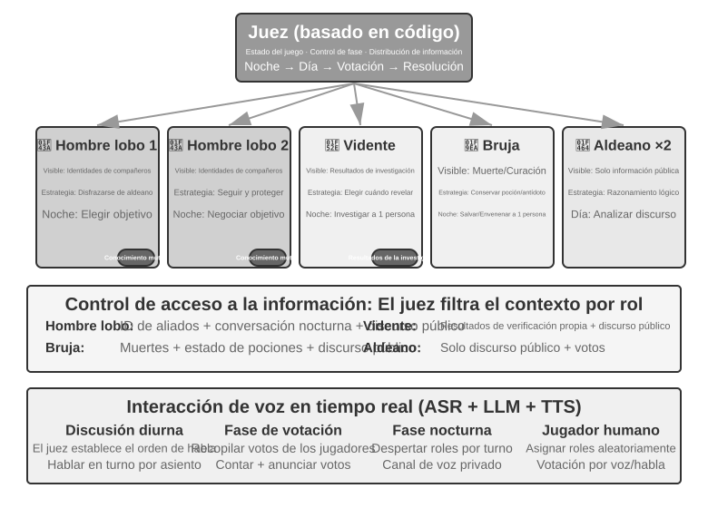

# Capítulo 10: Colaboración Multi-Agente

Los nueve capítulos anteriores se centraron en un solo Agente: primero construyeron su contexto, conocimiento, herramientas y capacidades de interacción; después utilizaron la evaluación, el post-entrenamiento y la evolución continua para mejorarlo a largo plazo. Este capítulo hace avanzar la pregunta de «¿cómo construir y mejorar un Agente?» a «¿cómo organizar varios Agentes?», para que la división del trabajo, la comunicación y la verificación mutua permitan abordar tareas difíciles de asumir por un solo Agente.

En la descripción de cinco niveles de capacidades de IA propuesta por OpenAI (Nivel 1: Conversadores, Nivel 2: Razonadores, Nivel 3: Agentes, Nivel 4: Innovadores, Nivel 5: Organizaciones), la colaboración multi-agente se equipara a menudo con uno de los caminos hacia el quinto nivel. Es necesario aclarar que aquí "Organizaciones" se refiere al nivel de capacidad de que la IA pueda completar el trabajo de toda una organización, no a un requisito de arquitectura del sistema, un solo Agente lo suficientemente potente teóricamente también podría alcanzarlo. Sin embargo, en la realidad ingenieril actual, un solo Agente está limitado en última instancia por las fronteras de capacidad y la ventana de contexto de su propio modelo.

Hacer que múltiples Agentes trabajen de forma coordinada tiene un significado que va mucho más allá de permitir que Agentes con distintas especialidades se complementen mutuamente. El punto más fundamental es que **la inteligencia colectiva puede ser superior a la individual**. La civilización humana es prueba de ello: la inteligencia de una sola persona es limitada, pero a través de la división del trabajo, la colaboración, el debate y la acumulación intergeneracional de conocimientos, la sociedad humana en su conjunto exhibe una inteligencia que supera con creces la de cualquier individuo genial. Un colectivo de Agentes puede hacer emerger una inteligencia colectiva similar: incluso si cada Agente equivale únicamente al nivel de un experto humano, si se organiza adecuadamente, su capacidad global puede superar la suma de todos los expertos humanos. Google DeepMind, en *From AGI to ASI*, incluye precisamente a los colectivos multi-agente a gran escala como una de las vías clave hacia la superinteligencia (ASI): al igual que la inteligencia general humana puede agregarse en entidades sociales u organizacionales que trascienden al individuo, la inteligencia colectiva formada por la cooperación de múltiples Agentes de nivel AGI también puede manifestar capacidades cognitivas muy superiores a la simple suma de sus miembros[^agi-asi]. Por lo tanto, la colaboración multi-agente no es solo un medio ingenieril para superar la ventana de contexto y las fronteras de capacidad de un solo modelo, sino probablemente una vía fundamental para pasar de la "IA de nivel experto" a "superar a la humanidad en su conjunto".

[^agi-asi]: Para la inclusión de los colectivos multi-agente a gran escala como una de las vías clave desde la inteligencia general artificial hacia la superinteligencia, véase Google DeepMind, *From AGI to ASI.* arXiv:2606.12683, 2026.

## Marco de Clasificación para la Colaboración Multi-Agente

Para construir un sistema multi-agente, primero se deben comprender dos dimensiones de diseño centrales, las cuales determinan conjuntamente la arquitectura básica y la forma de implementación del sistema.

### Dimensión 1: Contexto Compartido vs. No Compartido

Esta es la decisión de arquitectura más fundamental y determina cómo se transmite la información entre múltiples Agentes.

**El contexto compartido** significa que el Agente posterior recibe el historial de conversación completo y la trayectoria (la *trajectory* definida en el Capítulo 1) del Agente anterior. Tras cambiar el prompt del sistema y el conjunto de herramientas en cada etapa, se transforma en un nuevo Agente (puesto que su identidad, responsabilidades y capacidades han cambiado), pero conserva todos los recuerdos de su predecesor. Por ejemplo, en un equipo, tras redactar el documento de requisitos, el analista de requisitos pasa la posta al desarrollador, quien no solo obtiene el documento, sino que también puede ver todos los registros de comunicación entre el analista y el usuario: es un nuevo rol, pero conserva intacto el contexto anterior. La ventaja radica en que no hay pérdida de información y cada Agente puede revisar los detalles de cualquier etapa previa; el desafío es que el contexto puede expandirse rápidamente.

**El contexto no compartido** significa que cada Agente mantiene un contexto e historial de conversación completamente independientes, sin poder acceder directamente al proceso de pensamiento del otro. Esto se asemeja a la colaboración entre diferentes departamentos: cada persona trabaja de forma independiente en su puesto, intercambiando información mediante documentos compartidos y minutas de reuniones, en lugar de estar mirando fijamente la pantalla ajena en todo momento. Este patrón ofrece una mejor modularidad y aislamiento, requiriendo que cada Agente se concentre únicamente en la información relevante para su propia responsabilidad. El sistema también se vuelve más fácil de escalar y mantener: agregar un nuevo Agente no requiere modificar la lógica interna de los Agentes existentes, solo definir bien las interfaces y formatos de datos.

Dado que los Agentes no comparten contexto, la información debe transmitirse mediante mecanismos de comunicación explícitos. Los sistemas distribuidos clásicos responden a esto desde hace tiempo: los libros de texto de sistemas operativos nos enseñan que la comunicación entre procesos (IPC) se reduce en última instancia a dos grandes paradigmas: **memoria compartida** (una parte escribe y la otra lee en el mismo bloque de almacenamiento) y **paso de mensajes** (enviar los datos explícitamente a la otra parte). Los mecanismos de comunicación entre Agentes caen dentro de estos dos paradigmas, siendo comunes tres variantes:

- **Parámetros de llamada a herramientas**: el Agente aguas abajo se envuelve como una herramienta y el Agente aguas arriba pasa datos estructurados mediante sus parámetros, adecuado para escenarios que requieren tipos determinados y estructuras claras.
- **Sistema de archivos compartido**: los Agentes intercambian información leyendo y escribiendo productos intermedios como documentos y código en un directorio compartido, adecuado para escenarios donde los productos son grandes o requieren persistencia.
- **Bus de mensajes (Message Bus)**: una estación intermedia encargada de transmitir mensajes entre Agentes; los Agentes no se invocan directamente, sino que envían mensajes al bus de mensajes, el cual los reenvía al Agente de destino.

Correspondiente a los dos grandes paradigmas de IPC: el sistema de archivos compartido es la memoria compartida del mundo de los Agentes; los parámetros de llamadas a herramientas y el bus de mensajes son dos formas de paso de mensajes (el primero se transmite de forma sincrónica con la llamada, mientras que el segundo se entrega de forma asincrónica a través de la estación intermedia). Ambos paradigmas tienen sus ventajas y desventajas. En el lenguaje Go existe un dicho muy conocido: "No te comuniques compartiendo memoria, comparte memoria comunicándote".

El bus de mensajes admite de forma natural la **comunicación asincrónica**: el emisor y el receptor no necesitan estar en línea al mismo tiempo, al igual que el sistema de correo interno de una empresa. Cuando envías un correo a un colega, no se requiere que esté frente a la computadora en ese instante; el correo se almacena primero en el servidor y se procesa cuando el colega se conecta. Este enfoque es especialmente adecuado para escenarios donde múltiples Agentes trabajan en paralelo y necesitan coordinarse entre sí (véase la sección "Coordinación Paralela" de este capítulo).


Es preciso aclarar que ambas arquitecturas son verdaderos sistemas multi-agente (ya que las instrucciones del sistema y las herramientas en cada etapa son diferentes, lo que constituye Agentes distintos), diferenciándose en el modo de coordinación. **El contexto compartido** depende de la coordinación implícita: los Agentes posteriores heredan el historial de contexto completo de los anteriores y pueden ver el proceso de pensamiento previo, transmitiéndose la información a través del propio contexto. **El contexto no compartido** depende de la coordinación explícita: los Agentes intercambian información a través de archivos, mensajes o interfaces de datos estructurados, y cada Agente solo ve el contenido relevante para sí mismo.

A modo de analogía: la primera opción se parece más a un equipo sentado alrededor de una mesa discutiendo, donde todos escuchan todo; la segunda se asemeja a diferentes departamentos colaborando mediante correos y documentos, manteniendo cada uno su propio espacio de trabajo.

Los lectores familiarizados con los sistemas operativos reconocerán este par de opciones: el contexto compartido corresponde a los hilos (threads) y el contexto no compartido a los procesos (processes). Los hilos comparten el espacio de direcciones, tienen un bajo costo de conmutación y la comunicación no requiere copias, a costa de no tener aislamiento: si un hilo corrompe la memoria, todo el proceso colapsa. Los procesos tienen espacios de direcciones independientes, aislamiento completo y pueden ejecutarse en paralelo de forma segura, a costa de requerir IPC explícito para comunicarse.

**Criterio simple**: si se prevé que el contexto acumulado superará el 50% de la ventana (una regla empírica, no un umbral preciso), no se debe compartir; si la pérdida cero de información es una restricción dura para la corrección de la tarea, se debe compartir. La mayoría de los sistemas prácticos adoptan un enfoque basado en cambio de etapas: los primeros Agentes comparten contexto y, al alcanzar el punto de saturación de información, cambian a contexto no compartido más *handoff* explícito (transferencia, donde el Agente aguas arriba decide de forma activa qué información traspasar al de aguas abajo).

### Dimensión dos: topología de colaboración

La segunda dimensión es la topología de colaboración—la estructura conforme a la cual fluyen el control y la información entre los Agentes. La topología de colaboración y el uso compartido del contexto son **conceptualmente independientes, pero están relacionados en la práctica**: son conceptualmente independientes porque los sistemas con contexto compartido también presentan una topología; por ejemplo, `transfer_to_agent` (experimento 10-1), que se presenta más adelante en este capítulo, es en esencia la forma que adopta una transferencia en cadena (handoff) con un contexto compartido. Están relacionados en la práctica porque, una vez que se comparte el contexto, la topología tiende a degenerar (véase más adelante), por lo que los valores de ambas dimensiones no pueden combinarse arbitrariamente. Sin embargo, cuando el contexto es compartido, la transferencia no necesita decidir «qué transmitir»—el historial completo se conserva de forma natural—, por lo que la topología suele degenerar en una secuencia de cambios de rol y quedan pocas decisiones arquitectónicas por tomar (una excepción intermedia es la colaboración entre múltiples participantes al estilo group chat; véase la sección sobre descentralización más adelante en este capítulo). En cambio, en cuanto se opta por no compartir el contexto, «cómo fluye la información y quién la coordina» se convierte en una cuestión que debe diseñarse explícitamente.

> **Nota terminológica: Ingeniería de Grafos.** “Graph Engineering”, un término que comenzó a popularizarse en julio de 2026, suele referirse, en el contexto actual de los Agentes, al diseño explícito del grafo de ejecución: los nodos son Agentes, programas convencionales o decisiones humanas; las aristas definen las dependencias entre tareas, el enrutamiento condicional y el destino tras un fallo; y el estado estructurado fluye entre los nodos[^ch10-graph-engineering]. La «topología de colaboración» tratada en este capítulo es precisamente el subconjunto multiagente de esta disciplina—la colaboración entre pares, la orquestación mediante un gestor y la transferencia descentralizada son topologías de grafo diferentes. Dado que esta denominación todavía es muy reciente y puede confundirse fácilmente con los grafos de conocimiento, GraphRAG y las trazas de ejecución, este libro seguirá utilizando como términos principales «topología de colaboración» y «orquestación», cuyos significados son más estables.

[^ch10-graph-engineering]: Para una discusión temprana de esta denominación, véase Josh C. Simmons, *We Are Entering the Graph Engineering Phase*, 2026; en los principales framework, la misma estructura de ingeniería suele denominarse graph-based workflow u orchestration, en lugar de considerarse una tecnología completamente nueva. Véanse https://www.drjoshcsimmons.com/writing/we-are-entering-the-graph-engineering-phase, https://docs.langchain.com/oss/python/langgraph/overview, https://learn.microsoft.com/en-us/agent-framework/workflows/ y https://adk.dev/workflows/.

En otras palabras, en principio estas dos dimensiones forman una matriz de combinaciones de 2×3 (compartido/no compartido × tres topologías), pero, en la fila correspondiente al contexto compartido, la topología suele degenerar en una secuencia de cambios de rol y ofrece pocas decisiones arquitectónicas que tomar (esta es precisamente la forma tratada más adelante en «Transición de roles en múltiples etapas»); por ello, este capítulo solo desarrolla en detalle las tres celdas sin contexto compartido. A continuación se presentan las tres formas típicas de la topología de colaboración cuando no se comparte el contexto, en orden creciente de complejidad:

- **Patrón de colaboración entre pares** (Peer Collaboration Pattern): un número reducido de Agentes (normalmente 2 o 3) interactúa en pie de igualdad y forma un ciclo de mejora iterativa—como cuando, al redactar un artículo, una persona prepara un borrador y otra lo anota y corrige; tras varias rondas, la calidad supera con creces la que conseguiría una sola persona trabajando en solitario.
- **Patrón de gestión** (Orchestration Pattern): un Agente gestor centralizado se encarga de planificar y programar las tareas, mientras que varios Agentes subordinados se ocupan cada uno de una subtarea específica—como un jefe de proyecto que dirige a varios ingenieros especializados para llevar a cabo un proyecto.
- **Patrón descentralizado** (Decentralized Pattern): no existe un controlador central durante la ejecución; los Agentes se comunican entre sí como lo hacen los seres humanos y colaboran para completar la tarea.

El diseño detallado y los escenarios de aplicación de cada patrón se analizarán en las secciones temáticas posteriores.
## ¿Cuándo es un Sistema Multi-Agente Realmente Mejor que un Agente Único?

Antes de entrar en las arquitecturas de colaboración específicas, conviene responder a una pregunta más fundamental: **¿cuándo se necesitan realmente múltiples Agentes y cuándo basta con uno solo?** La respuesta servirá como marco de referencia general para todas las soluciones ingenieriles posteriores. Una serie de investigaciones recientes ha proporcionado un marco de evaluación claro, cuyo criterio central se reduce a una sola regla: **¿la colaboración introduce nueva información que un solo Agente no habría podido obtener al generar su respuesta?**

La Tabla 10-1 resume si los diferentes patrones de colaboración introducen nueva información, sirviendo para juzgar si la colaboración multi-agente ofrece un valor sustancial frente a un solo Agente.

Tabla 10-1 Comparación de ganancia de información en patrones de colaboración multi-agente

| Patrón de Colaboración | ¿Introduce Nueva Información? | Efecto |
|---|---|---|
| Auto-revisión del mismo modelo (releer sus propias salidas) | No | A menudo ineficaz o incluso perjudicial |
| Debate entre diferentes Agentes sobre el mismo texto | No | Al mismo cómputo, equivalente a un solo Agente |
| El Revisor usa los resultados de ejecución de código para revisar | Sí (retroalimentación de ejecución) | Mejora significativa |
| El Revisor analiza capturas de pantalla renderizadas de frontend/PPT | Sí (retroalimentación visual) | Mejora significativa |
| El Revisor utiliza herramientas externas para verificar hechos | Sí (retroalimentación de herramientas) | Mejora significativa |

El estudio RLEF (*Reinforcement Learning from Execution Feedback*) de 2025[^rlef-2025] confirmó este punto: al entrenar modelos mediante aprendizaje por refuerzo para utilizar la retroalimentación de ejecución de código en la mejora iterativa, el efecto superó con creces el muestreo independiente múltiple del modelo. La clave radica en que cada iteración introduce **resultados de ejecución reales** (errores de compilación, fallos de pruebas, excepciones en tiempo de ejecución), información que no existía cuando el modelo escribió el código originalmente. En 2025, WebGen-Agent[^webgen-agent-2025] logró, en tareas de generación de páginas web, elevar el rendimiento de Claude 3.5 Sonnet en dicho benchmark del 26.4% al 51.9% (casi el doble) mediante un andamiaje de retroalimentación visual de múltiples niveles (capturas de pantalla más descripción con modelos de lenguaje visual).

[^rlef-2025]: Gehring, J., et al. *RLEF: Grounding Code LLMs in Execution Feedback with Reinforcement Learning.* arXiv:2410.02089, 2025.
[^webgen-agent-2025]: Lu, Z., et al. *WebGen-Agent: Enhancing Interactive Website Generation with Multi-Level Feedback and Step-Level Reinforcement Learning.* arXiv:2509.22644, 2025.

Este marco de "nueva información" explica un fenómeno aparentemente contradictorio: la investigación académica afirma que "basta con un solo Agente", mientras que la práctica ingenieril muestra que múltiples Agentes funcionan mejor. La raíz de la contradicción está en que ambos discuten tipos distintos de sistemas multi-agente: la investigación académica compara en su mayoría patrones donde "múltiples Agentes discuten sobre el mismo texto" (como el debate), mientras que los sistemas multi-agente efectivos en ingeniería suelen incluir bucles de retroalimentación externa (ejecución de código, renderizado visual, llamadas a herramientas). El primer caso no introduce nueva información, mientras que el segundo sí lo hace. Los tres patrones que se presentan más adelante (colaboración entre pares, manager y descentralizado) encuentran su justificación en este criterio siempre que resulten verdaderamente efectivos.

El experimento de Anthropic de 2026 sobre detección de vulnerabilidades ofrece un ejemplo. Cuarenta y cinco Agentes coordinaron sus búsquedas en un foro compartido, revisaron mutuamente sus hallazgos y dejaron la decisión final a un Agente árbitro independiente. El enjambre coordinado encontró 266 vulnerabilidades con 27 millones de tokens, mientras que el enfoque paralelo con Agentes independientes halló solo 21 con 6,5 millones. En un espacio de búsqueda abierto, la comunicación permite que un sistema multiagente desplace dinámicamente su atención y se especialice, a cambio de un mayor presupuesto de tokens para obtener más cobertura y rutas de descubrimiento más diversas.[^anthropic-multiagent-2026]

[^anthropic-multiagent-2026]: Anthropic Frontier Red Team, “Patterns and Problems in Emerging Multiagent Systems,” 2026-08-13. https://www.anthropic.com/research/multiagent-systems

**Presupuesto de pasos y rendimiento del Agente.** Una línea de investigación relacionada analiza cómo influye en el rendimiento la asignación de diferentes presupuestos de pasos al Agente —es decir, el número permitido de llamadas a herramientas o rondas de iteración). Intuitivamente, más pasos deberían brindar mejores resultados: con un presupuesto de 30 pasos, el Agente solo puede implementar rápidamente la función central, mientras que con 300 pasos puede planificar, implementar, probar y mejorar. Sin embargo, el artículo de Google de 2025, *Budget-Aware Tool-Use Enables Effective Agent Scaling*, reveló una conclusión contraintuitiva: **el simple hecho de aumentar el número de pasos disponibles para el Agente no garantiza una mejora en el rendimiento**. Los Agentes estándar carecen de "conciencia de presupuesto": incluso con 300 pasos, tienden a realizar búsquedas superficiales y se "saturan" rápidamente. Para que más pasos se traduzcan en mejores resultados, se deben utilizar técnicas conscientemente diseñadas.

Estos hallazgos ofrecen una orientación directa para el diseño de sistemas multi-agente. Por ejemplo, en el patrón de manager, el Agente Manager no debería limitarse a distribuir tareas a los sub-agentes y esperar resultados, sino **asignar dinámicamente el presupuesto de pasos** según la complejidad de la tarea: otorgar menos pasos a subtareas simples y pasos suficientes a tareas complejas. Al mismo tiempo, se debe guiar a los sub-agentes para que utilicen estos presupuestos de forma rational (planificar primero, implementar después, probar y finalmente mejorar), en lugar de lanzarse directamente a escribir código.

Existe otro aspecto que debe situarse por delante de cualquier diseño: **el costo**. La exploración paralela y la iteración continua en sistemas multi-agente cuestan dinero. Anthropic reveló en su momento que el consumo de tokens de su sistema de investigación multi-agente era aproximadamente 15 veces el de una conversación ordinaria, y el propio consumo de tokens explicaba cerca del 80% de las diferencias de rendimiento. Esto significa que los beneficios del enfoque multi-agente deben ser lo suficientemente grandes como para cubrir el gasto adicional de varias veces o incluso de un orden de magnitud; de lo contrario, un solo Agente bien ajustado suele ser la opción más económica.

## Colaboración Multi-Agente con Contexto Compartido

En la colaboración con contexto compartido, cada etapa es un Agente independiente —con su propio prompt del sistema y sus herramientas—, pero hereda la trayectoria completa de la etapa anterior. La ventaja principal es que no se pierde información; el reto consiste en mantener al Agente actual centrado en su responsabilidad pese al historial acumulado.

En tareas complejas, el rol puede cambiar notablemente entre etapas. Un único prompt estático resulta demasiado genérico o excesivamente largo, por lo que el sistema puede cambiar dinámicamente el prompt y el conjunto de herramientas según la etapa.

La decisión arquitectónica clave es si el cambio de rol sustituye el prompt del sistema o carga una Skill. Ambos mecanismos modifican las reglas de conducta, pero tienen costes y límites distintos.

| Opción | Portador de las reglas del rol | Visibilidad de herramientas | Efecto sobre contexto/KV Cache | Fuerza de la restricción |
|---|---|---|---|---|
| `transfer_to_agent` | Sustituye el prompt del sistema y normalmente las herramientas | Solo las herramientas del rol actual | Cada cambio altera el prefijo y suele invalidar la caché desde el primer punto distinto | Fuerte: las herramientas fuera del rol pueden no existir en el schema |
| Skill | Mantiene un directorio de Skills fijo y añade `SKILL.md` a la trayectoria | Normalmente todo el catálogo o una entrada de búsqueda estable | El prefijo permanece estable; la Skill se añade al final de la trayectoria | Débil: una Skill es una instrucción; los permisos requieren una puerta del Harness |

Si la diferencia entre roles es conocimiento, procedimiento o estilo, conviene preferir una Skill. Si implica permisos, aislamiento de herramientas, cumplimiento o prohibición de efectos secundarios, se necesita un Agente independiente o `transfer_to_agent`, junto con restricciones aplicadas por código en el Harness.

> **Experimento 10-1 ★★: Cambio de roles con contexto compartido — prompt del sistema frente a Skill**
>
> **Tarea y variables comunes**: ambos caminos usan el mismo modelo, tarea, implementación de herramientas, reglas de rol y trayectoria completa. La tarea consiste en buscar las ventas de vehículos de nueva energía en China entre 2021 y 2023, calcular la CAGR y redactar un resumen en chino para inversores de no más de 120 caracteres.
>
> **Camino 1: cambio del prompt del sistema**. Los cinco roles son `triage`, `research`, `coding`, `data_analysis` y `writing`. Cada rol solo ve sus herramientas y `transfer_to_agent`; al transferir, el Harness conserva el historial, carga el prompt y las herramientas del rol destino y reanuda la ejecución.
>
> **Camino 2: Skill**. El prompt del sistema y el catálogo completo de herramientas permanecen fijos. El modelo llama a `load_skill(name)` y el contenido de `SKILL.md` entra en la trayectoria como resultado de herramienta. El prefijo no cambia, pero los permisos estrictos los hacen cumplir las reglas del Harness.

## Colaboración Multi-Agente Sin Contexto Compartido

El contexto no compartido representa la verdadera colaboración multi-agente. Bajo esta arquitectura, cada Agente es una entidad independiente con su propio contexto, trayectoria y estado. Los Agentes no pueden acceder directamente a la "actividad interna" de los demás; la colaboración depende por completo de mecanismos explícitos y estructurados de transmisión de datos, es decir, los tres mecanismos de comunicación presentados al inicio de este capítulo (parámetros de llamada a herramientas, sistema de archivos compartido y bus de mensajes).

Al comienzo del capítulo se relacionaron los mecanismos de comunicación con los dos grandes paradigmas de IPC, y el contexto compartido/no compartido con los hilos y procesos. Esta analogía se puede extender aún más (Tabla 10-2):

Tabla 10-2 Correspondencia entre sistemas multi-agente y sistemas operativos

| Sistema Operativo | Sistema Multi-Agente |
|----------|----------------|
| Programa (ejecutable) | Prefijo estático (prompts del sistema + definiciones de herramientas) |
| Memoria del proceso | Trayectoria |
| CPU | LLM |
| Kernel | Runtime del Agente |
| Llamada al sistema | Llamada a herramienta |
| fork (crear subproceso) | spawn_subagent |
| kill (enviar señal) | cancel_subagent |
| ps (listar procesos) | list_agents |
| Código de salida y wait() | Resumen estructurado devuelto por el sub-agente |
| Memoria compartida / Paso de mensajes | Sistema de archivos compartido / Mensajes |


Esta abstracción no es nueva: estado privado, mensajes asincrónicos y capacidad de crear nuevos miembros son las premisas básicas del modelo de Actores de los años setenta[^actor-model]; el sistema multi-agente puede considerarse su versión basada en LLMs. Por ello, la mayoría de las experiencias maduras en sistemas operativos y sistemas distribuidos se pueden reutilizar directamente.

[^actor-model]: Hewitt, C., Bishop, P., Steiger, R. *A Universal Modular ACTOR Formalism for Artificial Intelligence.* IJCAI 1973.

El aislamiento de tipo proceso aporta varios beneficios de ingeniería concretos: cada Agente se puede desarrollar y probar de forma independiente, añadir nuevas capacidades no requiere modificar el código existente, el fallo de un Agente no contagiará su estado erróneo a los demás y múltiples Agentes pueden ejecutarse de forma verdaderamente concurrente (los contextos son independientes y no hay competencia por recursos).

Sin embargo, el contexto no compartido también tiene sus costos. El más evidente es la sincronización de información: ¿cómo mantienen los Agentes una comprensión uniforme del estado de la tarea? ¿Se perderá o duplicará la información durante la transmisión? La depuración también se vuelve más compleja: si surge un problema, es necesario revisar los logs de múltiples Agentes para reconstruir el proceso de ejecución completo. Estos desafíos hacen que el diseño de las especificaciones de interfaz, los formatos de datos y los protocolos de comunicación sea de vital importancia.

La colaboración explícita sin contexto compartido depende de dos infraestructuras independientes de la topología. La primera es el **sistema de archivos compartido**, que actúa como medio persistente para intercambiar productos entre Agentes y con el usuario, constituyendo el plano de datos de la colaboración. La segunda es el **mecanismo de comunicación y control**, que admite el paso de mensajes, la consulta de estado, la terminación de la ejecución y la programación de recursos entre Agentes, constituyendo el plano de control. Las tres topologías siguientes se construyen sobre ambas bases.

### El Sistema de Archivos desde la Perspectiva del Agente

Al principio de este capítulo se incluyó el "sistema de archivos compartido" como uno de los tres mecanismos de comunicación sin contexto compartido. En los sistemas reales, el almacenamiento al que accede un Agente no es único, sino un **sistema de archivos virtual** (*virtual filesystem*): almacenamientos con distintos orígenes, ciclos de vida y permisos se montan (*mount*) en el mismo árbol de directorios. El Agente accede a ellos mediante interfaces unificadas como `read_file`/`write_file`/`list_dir`, mientras que la capa inferior puede ser un disco temporal local, un almacenamiento de objetos persistente, APIs de nubes de terceros o paquetes de recursos de sistema de solo lectura. Dejar clara la composición de este árbol de directorios (la visibilidad y el ciclo de vida de cada área) es el prerrequisito del diseño multi-agente: una parte considerable de los conflictos de concurrencia y fugas de información proviene de mezclar áreas que deberían estar aisladas. Este árbol de directorios equivale al espacio de direcciones del Agente, y sus cuatro categorías de áreas son regiones con distintos permisos.

**1. Workspace Exclusivo del Agente (Scratchpad)**. Directorio privado de uso exclusivo de cada instancia de Agente, utilizado para guardar productos intermedios, archivos temporales, borradores y logs de depuración. Su ciclo de vida está vinculado a la instancia y no es visible para otros Agentes ni para el usuario. Aislar el *scratchpad* tiene una doble función: evitar que los archivos temporales de múltiples Agentes se sobrescriban entre sí y mantener limpio el contexto del Agente principal (el proceso de ensayo y error del sub-agente permanece en su propio espacio de trabajo, enviando únicamente el producto final al espacio compartido). Esto se corresponde con lo expuesto en el Capítulo 4 respecto a que "los sub-agentes devuelven resúmenes estructurados en lugar de la trayectoria completa" a nivel de almacenamiento.

**2. Espacio Compartido Multi-Agente (Shared Workspace)**. Área de colaboración donde múltiples Agentes leen y escriben y que **es visible para el usuario**. Es el medio principal para intercambiar productos entre Agentes bajo arquitecturas sin contexto compartido: el Glossary Agent escribe el glosario y el Translation Agent lo lee de allí; el usuario también puede subir archivos originales o descargar entregables finales aquí. Su ciclo de vida está ligado a toda la tarea y requiere persistencia. Al ser una región de lectura/escritura concurrente para múltiples partes, es propensa a conflictos de concurrencia; sobre ella actúan mecanismos como el bloqueo optimista o el aislamiento de copias de trabajo (*worktree*), detallados más adelante en "Modo de Falla 1". El uso del montaje de volúmenes en `/workspace/shared` para conectar el Agente principal, la computadora virtual y el teléfono virtual en el Capítulo 4 constituye una implementación típica de esta capa.

**3. Recursos Externos Montados (Mounted External Resources)**. Fuentes de información de terceros autorizadas por el usuario (Google Drive, Notion, Dropbox, Wikis empresariales) mapeadas como puntos de montaje en el sistema de archivos (ej. `/mnt/gdrive`) a través de adaptadores (*adapters*). Cuando el Agente lee un documento de Notion como si fuera un archivo local, el adaptador subyacente invoca la API correspondiente. Tres características diferencian esta capa del almacenamiento local y deben gestionarse explícitamente: **el acceso está sujeto a permisos externos** (los permisos del usuario en el sistema de origen determinan el alcance visible para el Agente), **la latencia es mayor y la consistencia es más débil** (cada lectura implica una ida y vuelta por red, los datos pueden haber sido modificados externamente y solo pueden tratarse bajo consistencia eventual), y **su uso es principalmente de solo lectura bajo demanda** (escribir de vuelta a fuentes externas exige cautela, pues escrituras erróneas podrían contaminar los datos reales del usuario).

**4. Recursos de Sistema Integrados (Built-in System Resources)**. Paquetes de recursos preestablecidos y compartidos en modo solo lectura para todos los Agentes. El representante típico son los **Skills** presentados en los Capítulos 2 y 4: documentos de conocimiento y scripts organizados en forma de archivos, montados en rutas como `/skills`, a los que se accede mediante revelación progresiva (primero índice, luego despliegue bajo demanda). También incluyen manuales de referencia, bibliotecas de plantillas y definiciones de herramientas compartidas. Esta capa es globalmente compartida, de solo lectura, estable entre sesiones y puede ser leída de forma concurrente por todos los Agentes sin necesidad de control de concurrencia.

La Figura 10-2 ilustra la estructura en la que estas cuatro categorías de áreas se montan de forma unificada en el mismo árbol de directorios: el Agente accede a todo el árbol mediante una interfaz unificada, el usuario sube y descarga archivos desde el espacio compartido, las fuentes de datos externas se montan a través de adaptadores y los recursos del sistema se proporcionan en modo solo lectura.



La Tabla 10-3 compara estas cuatro áreas en función de cuatro dimensiones: visibilidad, ciclo de vida, permisos de lectura/escritura y control de concurrencia, sirviendo como lista de verificación para el diseño de la estructura del sistema de archivos.

Tabla 10-3 Cuatro tipos de áreas del sistema de archivos virtual del Agente

| Área | Visibilidad | Ciclo de Vida | Lectura/Escritura | Control de Concurrencia |
|----------------|--------------------|-------------------|-----------------|------------------------|
| Workspace Exclusivo del Agente | Solo este Agente | Destruido con la instancia del Agente | Lectura/Escritura | No necesario (privado) |
| Espacio Compartido Multi-Agente | Todos los Agentes colaboradores + usuario | Persiste con la tarea, requiere persistencia | Lectura/Escritura | Necesario (bloqueo optimista / worktree) |
| Recursos Externos Montados | Según autorización externa | Determinado por la fuente externa | Mayormente solo lectura, escribir requiere cautela | A cargo de la fuente externa |
| Recursos de Sistema Integrados | Todos los Agentes | Estable entre sesiones | Solo lectura | No necesario (solo lectura) |

Unificar las cuatro categorías de áreas en el mismo árbol de directorios representa el verdadero valor del diseño de "**la ruta de archivo como interfaz universal**": la transmisión de productos entre Agentes, la entrega de entradas del Agente principal a los sub-agentes e incluso el intercambio de Artifacts en la colaboración A2A trans-organizacional implican únicamente pasar cadenas de rutas ligeras, en lugar de cargar los contenidos en la ventana de contexto (Capítulo 4). Esto guarda continuidad con el concepto del Capítulo 5, "el sistema de archivos como núcleo del Agente": mientras este último analiza cómo un solo Agente utiliza el sistema de archivos como soporte de memoria y capacidad, aquí se extiende la misma abstracción a múltiples Agentes, convirtiendo un árbol de directorios virtual que monta almacenamientos privados, compartidos, externos e integrados en la base de almacenamiento de la colaboración multi-agente.

### Comunicación y control entre Agentes

El sistema de archivos resuelve el problema del **intercambio de artefactos** entre Agentes, pero la colaboración también necesita un **plano de control**. Ahí es precisamente donde entran en juego las distintas filas del ciclo de vida de la tabla 10-2: el conjunto de primitivas de herramientas presentado en el capítulo 4 para crear (`spawn_subagent`), enviar mensajes (`send_message_to_subagent`), cancelar (`cancel_subagent`) y descubrir (`list_agents`) se corresponde, en el mundo de los procesos, con fork, mensajes, kill y ps. Esta sección no repite las definiciones de las interfaces, sino que se centra en cuatro capacidades de las que depende la colaboración entre múltiples Agentes y que, sin embargo, suelen pasarse por alto.

**Uno: transmisión de mensajes.** La forma más sencilla es la comunicación punto a punto: el Agente A invoca directamente `send_message_to_agent_b(content)`, algo adecuado para escenarios con una topología fija y pocos Agentes, como el sistema dual de teléfono + ordenador del experimento 10-3 de este capítulo. Cuando aumenta el número de Agentes y se necesita paralelismo asíncrono, la cantidad de conexiones punto a punto crece de forma cuadrática con el número de Agentes y, además, exige que emisor y receptor estén conectados al mismo tiempo; en ese caso, conviene utilizar un **bus de mensajes** (véase más adelante en este capítulo «Forma de coordinación paralela»): los Agentes publican mensajes en el bus, que los reenvía según las suscripciones, sin que el emisor tenga que conocer a los consumidores. Tanto en la comunicación punto a punto como a través de un bus, los mensajes suelen incluir un **sobre** estructurado (envelope): ID del emisor, destino —un Agente concreto o una difusión—, tipo de mensaje —como `task_assigned`/`status_update`/`result`/`terminate`— y una carga JSON. Un formato de sobre unificado permite que el receptor enrute y analice los mensajes de forma fiable, y hace trazable la cadena de colaboración—algo esencial para depurar sistemas multiagente.

**Dos: consulta de estado.** Este es el componente más fácil de infravalorar dentro del plano de control. Después de que el Agente principal envíe un subagente, si no tiene forma de conocer su progreso, no podrá decidir si debe seguir esperando ni intervenir a tiempo cuando este se bloquee. La solución intuitiva consiste en copiar el modelo RPC y definir una interfaz de consulta `get_subagent_status(agent_id)` que devuelva «en ejecución/completado/fallido» junto con un porcentaje de progreso. Sin embargo, la utilidad práctica de esta interfaz de sondeo es mucho menor de lo esperado: un subagente comienza a ejecutarse inmediatamente después de su creación y continúa hasta completar la tarea o fallar; no pasa por una sucesión de estados de cola como los trabajos de un sistema tradicional de procesamiento por lotes—del mismo modo que, en la programación Unix, rara vez es necesario consultar repetidamente por PID el estado de ejecución de otro proceso. El sondeo también presenta un dilema inherente: si se realiza con demasiada frecuencia, desperdicia tokens; si se realiza con poca frecuencia, deja de ser oportuno. Una forma más natural de obtener el estado consiste en volver a los dos grandes paradigmas de comunicación presentados al comienzo de este capítulo.

**Obtener el estado mediante transmisión de mensajes**. El Agente principal envía directamente un mensaje al subagente: «¿Cómo va el progreso?». El subagente responde en el momento adecuado. Todo es asíncrono: enviar el mensaje no bloquea la propia ejecución; cuándo responderá la otra parte, o si responderá siquiera, es una cuestión distinta—igual que un gerente pregunta por mensajería instantánea a un subordinado cómo avanza el trabajo, sin exigirle que deje inmediatamente lo que está haciendo. A la inversa, el subagente también puede enviar informes de forma proactiva al alcanzar hitos importantes; si el sistema ya dispone de un bus de mensajes, basta con publicar en él un `status_update` —esta es precisamente la forma de «monitorización en tiempo real» del experimento 10-4—. Tanto si se trata de preguntas y respuestas como de informes proactivos, conviene que el propio estado del mensaje utilice un vocabulario unificado de máquina de estados —en ejecución, necesita entrada, completado, fallido—; el protocolo A2A presentado más adelante en este capítulo estandariza precisamente el ciclo de vida de las tareas mediante este conjunto de estados.

**Obtener el estado mediante un sistema de archivos compartido**. La forma más exhaustiva es la **persistencia de trayectorias** (trajectory persistence): durante la ejecución, el subagente serializa en tiempo real su propia trayectoria —la trajectory definida en el capítulo 1: la secuencia completa de mensajes del usuario, respuestas del modelo, llamadas a herramientas y resultados— en JSON y la añade a un archivo de registro del sistema de archivos —normalmente un archivo por sesión y un evento por línea, es decir, en formato JSONL—. El Agente principal no necesita ningún protocolo de notificación de estado: puede leer directamente ese archivo y observar todo el proceso de ejecución del subagente, incluida la herramienta que está invocando, en qué estaba pensando durante el último paso y si está atrapado en reintentos que fracasan repetidamente. En términos de procesos, esto equivale a leer directamente la memoria de otro proceso—no ocupa el contexto del subagente, no depende de su cooperación y ofrece la máxima granularidad de observación. Sin embargo, registrar hasta el menor detalle también supone una carga: una trayectoria puede alcanzar fácilmente decenas de miles de tokens, y el Agente principal todavía debe sintetizarla después de leerla, lo que consume tiempo y tokens. Por ello, en la mayoría de los escenarios resulta más razonable utilizar un **archivo de progreso acordado**: cuando el Agente principal inicia el subagente, acuerda con él que «escriba el progreso en progress.md»; el subagente actualiza esta lista de tareas cada vez que completa un elemento, y el Agente principal puede conocer el avance en cualquier momento leyendo ese archivo ligero. Es como si dos procesos reservaran en la memoria compartida una pequeña zona de estado con un formato acordado: lo que se expone es el progreso sintetizado, no toda la «memoria». El archivo de progreso también proporciona de forma adicional **detección de bloqueos**: si la hora de la última modificación de progress.md —o del archivo de trayectoria— no cambia durante más de N minutos, puede concluirse que el subagente está inactivo y activar una medida de contingencia por tiempo de espera —en consonancia con Heartbeat y `monitor_shell` del capítulo 6—, evitando que un subagente bloqueado perjudique a todo el sistema.

El valor de la persistencia de trayectorias va mucho más allá de la monitorización. Recordemos la conclusión del capítulo 1: «el contexto de un Agente = prefijo estático + trayectoria». El prefijo estático —prompt del sistema y definiciones de herramientas— viene determinado por el código, y el propio Agente no tiene ningún estado de ejecución aparte de la trayectoria —los artefactos de trabajo ya se almacenan en el sistema de archivos—; por tanto, **la trayectoria constituye todo el estado del Agente**. Persistirla en tiempo real en un archivo equivale a disponer en todo momento de un punto de control completo: tanto si el proceso del Agente falla como si la máquina se queda sin alimentación o el usuario cierra voluntariamente la sesión, basta con volver a cargar el archivo de trayectoria y añadirle el prefijo estático para reanudar la ejecución desde el punto de interrupción. Así se implementan precisamente las funciones de recuperación de sesión (session resume) de Agentes de programación como Claude Code y Codex CLI. Es la misma idea que el registro de escritura anticipada de las bases de datos (write-ahead log): cada evento se añade primero a un registro que solo crece y del que nada se elimina, de modo que el estado siempre pueda reconstruirse reproduciendo el registro —el diseño de memoria de «registro de hechos + puntos de control periódicos» del capítulo 3 aplica la misma idea a los sistemas de memoria—. Para un sistema multiagente, esto significa que los subagentes son por naturaleza **recuperables, auditables y transferibles**: el Manager puede reiniciar un subagente desde su último estado válido después de un fallo, reproducir posteriormente la trayectoria evento por evento para localizar la causa del error e incluso transferir la trayectoria junto con la tarea a otro Agente para que continúe la ejecución.

**Tres: terminación de la ejecución.** En la colaboración paralela aparece a menudo una situación en la que «si uno tiene éxito, los demás dejan de ser necesarios»: varios Agentes buscan por separado y, cuando uno encuentra el objetivo, los demás deben detenerse inmediatamente —la terminación en cascada del experimento 10-4 de este capítulo—. La terminación tiene dos niveles de intensidad; los usuarios de Unix reconocerán que se trata precisamente de la diferencia entre SIGTERM y SIGKILL. La opción preferida es la **terminación elegante (graceful)**: el Agente principal envía una señal `terminate`, y el subagente responde en un punto seguro del paso actual, limpia primero los recursos —cierra sesiones del navegador, escribe los archivos incompletos y libera bloqueos— y sale después de devolver una confirmación (ack). La **terminación forzada (forced)** es la medida de contingencia: termina directamente el proceso y solo se utiliza cuando el subagente no responde a la señal elegante, con el coste de que puede dejar recursos colgados y escrituras incompletas. Deben abordarse dos cuestiones de ingeniería: en primer lugar, la terminación elegante exige que el subagente compruebe periódicamente la señal de terminación dentro de su bucle —de forma similar al mecanismo de interrupción del capítulo 6—, pues de lo contrario no podrá responder a ella; en segundo lugar, la terminación en cascada presenta condiciones de carrera—varios subagentes pueden informar del éxito casi simultáneamente, por lo que el Agente principal debe utilizar un bloqueo o un diseño idempotente para garantizar que el resultado solo se cierre una vez y que solo se difunda una ronda de terminación. Véase el análisis de las condiciones de carrera del experimento 10-4 de este capítulo.

Queda todavía una situación pendiente: cuando termina el Agente principal, ¿qué ocurre con los subagentes que siguen ejecutándose? La solución de ingeniería más sencilla toma como referencia el context de Go—la terminación se propaga hacia abajo siguiendo la relación de creación: al cancelar un Agente, también se cancelan todos los subagentes que haya generado, lo que impide de raíz la aparición de Agentes huérfanos sin responsable. La indicación anterior de que «el subagente comprueba la señal de terminación en puntos seguros» se corresponde precisamente con el sondeo de `ctx.Done()` en Go. A la inversa, si realmente se necesita un Agente en segundo plano que se independice del Agente principal y se ejecute a largo plazo —de forma similar a `nohup` en Unix—, debe iniciarse desde un nuevo árbol de ciclo de vida —equivalente a `context.Background()`— y declarar explícitamente que no terminará junto con su padre.

**Cuatro: recursos y planificación.** La otra mitad de las responsabilidades de un sistema operativo consiste en asignar recursos escasos. En el mundo de los procesos, los recursos escasos son el tiempo de CPU y la memoria; en el mundo de los Agentes son los tokens, el dinero y la cuota de concurrencia—cada paso de un subagente consume los tres. Esta responsabilidad suele recaer en el Manager o en el runtime: al iniciar un subagente se fija un presupuesto de pasos o tokens y se detiene cuando lo supera; las tareas difíciles se asignan a modelos potentes y las tareas mecánicas a modelos de bajo coste; se establece un límite de concurrencia para evitar que decenas de Agentes agoten simultáneamente la cuota de la API; y, cuando llega una tarea más urgente, se interrumpe al subagente en ejecución, lo que constituye una interrupción preventiva (*preemption*). Las prácticas de este ámbito están todavía muy lejos de la madurez de la planificación de CPU, pero determinan el límite máximo de coste de un sistema multiagente y deben tenerse en cuenta desde la fase de diseño de la arquitectura.

El intercambio de artefactos —plano de datos— y la transmisión de mensajes, la consulta de estado, la terminación de la ejecución y la planificación de recursos —plano de control— sustentan conjuntamente los sistemas multiagente que no comparten contexto. Las tres topologías de colaboración siguientes son, en esencia, distintas decisiones sobre la titularidad del control y la dirección del flujo de información construidas sobre estos dos planos.

Según las relaciones de colaboración entre Agentes y las características del flujo de control, la colaboración sin contexto compartido puede dividirse en tres arquitecturas principales: el modelo de colaboración entre pares, el modelo de gestor y el modelo descentralizado, cada uno apropiado para distintos tipos de tareas.

### Modelo de colaboración entre pares: contrapeso mutuo y mejora iterativa

La colaboración entre pares suele implicar entre dos y tres Agentes en igualdad de condiciones que intercambian feedback durante varias iteraciones. Su valor potencial reside en aportar perspectivas independientes y diversidad cognitiva, pero «varias instancias» no equivalen a «varias formas de pensar». Cuando el modelo, el contexto y el andamiaje son muy similares, distintos Agentes tienden a tomar las mismas decisiones y pueden convertir errores locales en fallos sistémicos. La diversidad real debe diseñarse variando modelos, contextos, herramientas, evidencias visibles o responsabilidades, y haciendo que cada Agente evalúe de forma independiente antes de agregar los resultados.[^anthropic-multiagent-2026]

En comparación con los modelos de gestor y descentralizado, la colaboración entre pares es mucho más sencilla de implementar—basta con definir bien las funciones de los dos Agentes, el mecanismo de comunicación y las condiciones de terminación de las iteraciones para ponerla en marcha. Es una opción ideal para validar ideas rápidamente y construir prototipos.

#### Ingeniería de loops

El uso más clásico de la colaboración entre pares consiste en resolver una clase de fallo extremadamente habitual en la práctica con Agentes: la **terminación prematura**—detenerse con el trabajo a medio hacer. Presenta tres formas típicas, que ilustraremos con varios ejemplos de Coding Agent y Pine AI —el Agente creado por el equipo del autor, presentado en la introducción, que llama por teléfono en nombre de los usuarios para negociar y realizar gestiones con comercios y operadores—. La primera es la **falsa finalización por pereza**: declarar que todo está terminado después de realizar solo una parte—el Coding Agent escribe el código, pero no ejecuta las pruebas ni intenta desplegarlo y aun así informa de que «la tarea está completada»; el usuario encarga dos cosas a Pine AI, este termina la primera, olvida la segunda e informa directamente de que «todo está resuelto». La segunda es el **abandono prematuro**: declarar imposible toda la tarea cuando una vía no funciona—Pine AI puede contactar con un comercio mediante varias vías, como llamar por teléfono, rellenar un formulario o enviar un correo electrónico; pero, después de que rechacen una llamada, dice directamente al usuario que «esto no se puede hacer», aunque es muy probable que probar otro canal sí funcione. La tercera es el **falso éxito**: el Agente cree haber completado la tarea, pero en realidad el proceso no se ha cerrado—la otra parte acepta verbalmente por teléfono emitir un reembolso, pero el usuario todavía debe confirmar un paso en la aplicación móvil; aun así, el Agente informa de que «ya está resuelto», por lo que el usuario desconoce que queda una acción pendiente y el reembolso nunca llega a materializarse. Las tres formas apuntan a una misma raíz: **antes de la verificación, «completado» es solo una afirmación del modelo, no una prueba**.

Convertir una afirmación en una prueba es precisamente el objeto de la **Ingeniería de Bucles** (Loop Engineering), situada al final del arco evolutivo del capítulo 1: diseñar un bucle que mantenga al Agente en funcionamiento—descubrir qué debe hacer a continuación, ejecutarlo, verificarlo y registrar el progreso—, de modo que sea el verificador, y no el propio modelo, quien determine «si realmente puede detenerse», mientras que la función de la persona pasa de ser la de «operador que escribe prompts para el Agente» a la de «ingeniero que diseña el bucle». Addy Osmani sintetizó y propuso este término en junio de 2026[^loop-engineering-2026]; Boris Cherny, responsable de Anthropic Claude Code, lo expresó de forma aún más directa: «Ya no hago prompt directamente a Claude; mi trabajo consiste en escribir loops». El consenso central que se formó en el sector durante este debate es que **el cuello de botella del bucle está en el verificador, no en el modelo**—si la verificación no es fiable, por muy rápido que gire el bucle, solo marcará antes como completados resultados de mala calidad. Y, como se indicó en la introducción, la práctica precede al nombre: antes de que este término se popularizara, los principales equipos de Agentes, incluido Pine AI, ya utilizaban «bucles con verificación» para resolver la terminación prematura. La forma más eficaz de organizar la verificación es precisamente el paradigma proponente-revisor que se presenta a continuación.

[^loop-engineering-2026]: Osmani, Addy. "Loop Engineering: Designing Loops that Prompt Coding Agents", 2026. https://addyosmani.com/blog/loop-engineering/

**Marco concreto: LoopX.** LoopX extrae el bucle del prompt del modelo y del historial del chat y lo sitúa en un plano de control persistente e independiente del entorno de ejecución del Agente: el objetivo y los límites explican por qué existe el trabajo; las puertas de decisión y las tareas pendientes determinan qué puede suceder ahora; las evidencias y la cuota determinan si puede continuar; y los traspasos permiten que una iteración posterior u otro Agente lo reanuden. Una ejecución gobernada queda condensada en un protocolo claro:

```text
LoopX decide → el Agente ejecuta → un verificador independiente demuestra → LoopX confirma
```

El Agente sigue razonando, utilizando herramientas y produciendo artefactos candidatos. LoopX no sustituye al entorno de ejecución del Agente; gobierna la continuidad entre iteraciones. Solo los resultados verificados de forma independiente pueden actualizar el progreso persistente y consumir cuota. Una verificación fallida conduce a reparación o replanificación, mientras que las puertas humanas, los estados de espera y los límites de presupuesto detienen el bucle antes de la ejecución. Este límite convierte un principio de la Ingeniería de Bucles en una invariante del sistema que puede inspeccionarse: **el modelo puede proponer «terminado», pero no puede aprobar su propio «terminado».** LoopX v0.4.0 todavía califica como experimental la ruta Turn gobernada, por lo que aquí se emplea como marco concreto para «bucle + verificación + condiciones de parada», no como prueba de una mejora general de la calidad de las tareas.[^loopx-framework]

[^loopx-framework]: LoopX, "The local control plane for long-running AI agent work", v0.4.0, commit estable `a893d221db0b8e028997cefc303f7ec9fa7dbe0a`. https://github.com/huangruiteng/loopx/tree/a893d221db0b8e028997cefc303f7ec9fa7dbe0a

**Marco concreto: LongHorizon-Harness.** LongHorizon-Harness y LoopX son ambos implementaciones concretas de la Ingeniería de Bucles, pero apuntan en direcciones distintas. LoopX se orienta a un plano de control persistente para el trabajo prolongado de los Agentes; LongHorizon-Harness parte del Computer Use multimodal y aborda la ejecución continua cuando una misma tarea abarca la GUI, la CLI, varias aplicaciones de escritorio y múltiples refrescos del contexto.

LongHorizon-Harness reformula la ejecución de largo horizonte como gestión del estado de la tarea e implementa su bucle como Manage–Execute–Audit (MEA): el Manager genera la siguiente subtarea acotada a partir del objetivo original, el progreso ya verificado, las evidencias de fallo y el trabajo pendiente; el Executor modifica el entorno mediante la GUI o la CLI en un contexto completamente nuevo; y el Auditor inspecciona después el resultado real en modo de solo lectura. Solo lo que supera la auditoría entra en el estado de la tarea de la siguiente ronda, mientras que los fallos se conservan como base para la recuperación y la replanificación. Los backends de ejecución como Claude Code o Codex CLI se reutilizan mediante una capa de adaptadores, en lugar de reescribir el bucle del Agente dentro de esos backends.[^longhorizon-implementation]

El valor de esta dirección consiste en separar la continuidad de la tarea de un historial de ejecución que no deja de crecer: el contexto puede refrescarse y las operaciones sobre la interfaz pueden fallar, pero la siguiente ronda todavía continúa desde el último estado verificado. Manteniendo fijos el modelo Qwen 3.7-Plus y el backend de ejecución Claude Code, y cambiando únicamente el bucle exterior, el artículo informa de que el PassRate de WeaveBench sube del 51.8% al 80.7%, la tasa de finalización binaria de OSWorld 2.0 del 2.8% al 8.3% y la tasa de éxito de Terminal-Bench 2.1 del 69.7% al 77.2%. El coste tampoco es fijo: los dos primeros benchmarks consumieron, respectivamente, 2.3 veces el total de tokens y 3.6 veces los tokens de salida de la línea base, mientras que en Terminal-Bench 2.1 se redujo un 24%. En un despliegue real hay que gestionar además la invalidación del estado antiguo por cambios del entorno externo o de los requisitos del usuario, y emplear presupuestos de rondas, tiempo y coste para que los bucles de recuperación no se ejecuten indefinidamente.

**Trayectorias públicas y reproducción de los experimentos.** El sitio web del proyecto publica cientos de trayectorias de ejecución de WeaveBench, OSWorld 2.0 y Terminal-Bench 2.1, de modo que el proceso de ejecución y los registros de cada rol pueden consultarse directamente. Tomemos la tarea `WEB_task_16_webrtc_simulcast_layer_audit` de WeaveBench: pueden compararse la [trayectoria de la línea base](https://lh-harness.pages.dev/traj/tasks/baseline__WEB_task_16_webrtc_simulcast_layer_audit.html) y la [trayectoria MEA](https://lh-harness.pages.dev/traj/tasks/lh_harness__WEB_task_16_webrtc_simulcast_layer_audit.html), ambas con el mismo modelo Qwen 3.7-Plus. La primera se atascó en la interacción con Wireshark y reintentó una y otra vez, con una puntuación de 0.59; la segunda escribió los fallos y los elementos de evidencia no satisfechos de vuelta en el estado de la tarea, de modo que las rondas posteriores solo se ocuparon de las lagunas, con una puntuación de 0.92. Este caso sirve para mostrar «cómo un fallo se convierte en la entrada de la ronda siguiente» y no sustituye a las estadísticas agregadas; el entorno, los parámetros y los scripts de arranque de los experimentos completos están en el directorio [`eval/`](https://github.com/AMAP-ML/LongHorizon-Harness/tree/53bc678ed4170ad4d2e4309f2bfc5c3fb6caf8cb/eval) de la versión fijada.

[^longhorizon-implementation]: LongHorizon-Harness, commit estable `53bc678ed4170ad4d2e4309f2bfc5c3fb6caf8cb`. Sitio web del proyecto y trayectorias públicas: https://lh-harness.pages.dev/#trajectories; artículo: https://arxiv.org/abs/2608.01964; código: https://github.com/AMAP-ML/LongHorizon-Harness/tree/53bc678ed4170ad4d2e4309f2bfc5c3fb6caf8cb

#### Paradigma Proponente-Revisor


El paradigma proponente-revisor es el paradigma clásico de colaboración entre pares. El capítulo 5 ya presentó en detalle sus principios de diseño y su aplicación práctica en tres experimentos: generación de PPT, edición de vídeo y visualización de registros. El Proposer Agent genera el código, mientras que el Reviewer Agent renderiza el resultado de la ejecución, evalúa su calidad mediante un Vision LLM y ofrece sugerencias estructuradas de mejora; ambos iteran repetidamente hasta alcanzar el resultado deseado.

Este paradigma también resulta adecuado para escenarios como la revisión de seguridad —el Proposer genera un plan de operaciones y el Reviewer comprueba el cumplimiento normativo y los riesgos potenciales—, la revisión de contenido —el Proposer redacta una respuesta y el Reviewer comprueba las reglas de negocio y las normas de redacción— y la revisión de código —el Proposer escribe el código y el Reviewer comprueba la seguridad y las mejores prácticas—.

**¿Por qué no dejar que un solo Agente genere y después revise su propio trabajo?** Esta es precisamente la aplicación concreta del criterio presentado antes en la sección «Cuándo múltiples Agentes superan realmente a un solo Agente»—si la revisión no introduce información nueva, no es más que «hacer que el modelo vuelva a pensarlo». La investigación relacionada ofrece una respuesta clara. Huang et al. descubrieron en el artículo de ICLR 2024 «Large Language Models Cannot Self-Correct Reasoning Yet» que pedir a GPT-4 que revisara y corrigiera sus propias respuestas sin feedback externo reducía la precisión: el modelo convertía respuestas correctas en incorrectas más veces de las que corregía respuestas incorrectas.

**Bucle Proposer–Reviewer:**

```python
candidate = proposer(task, constraints)
evidence = execute_or_render(candidate)       # tests, state, screenshot, facts
review = independent_reviewer(candidate, evidence)

while review.veto and budget_remaining:
    candidate = proposer.repair(candidate, review.findings)
    evidence = execute_or_render(candidate)
    review = independent_reviewer(candidate, evidence)

if review.pass:
    publish(candidate, evidence, review)
else:
    escalate_or_reject(review)
```

El artículo de revisión «When Can LLMs Actually Correct Their Own Mistakes?» (arXiv:2406.01297), publicado en la revista TACL en 2024, confirmó esta conclusión: salvo que se proporcione feedback externo fiable —como los resultados de ejecución de casos de prueba o la salida de validación de herramientas externas—, la «autocorrección» basada exclusivamente en el propio modelo prácticamente no funciona.

El artículo CRITIC de ICLR 2024 ofrece un experimento comparativo intuitivo. CRITIC permitía que el modelo utilizara herramientas externas —un motor de búsqueda y un intérprete de Python— para verificar sus propias respuestas, lo que mejoraba significativamente los resultados; sin embargo, cuando los investigadores eliminaban el paso de verificación mediante herramientas y conservaban únicamente la autoevaluación del modelo, desaparecía la mayor parte de la mejora. Esto demuestra que el valor de la revisión no reside en «hacer que el modelo vuelva a pensarlo», sino en **introducir información nueva de la que el modelo no disponía durante la generación**—resultados de pruebas, capturas del renderizado, errores de compilación y resultados de búsquedas externas.

Este es precisamente el principio de diseño central del paradigma proponente-revisor. En el experimento de generación de PPT del capítulo 5, el valor del Reviewer Agent no consistía en «volver a mirar el código con el mismo modelo», sino en que **renderizaba el PPT y obtenía capturas de pantalla**—esas capturas contenían información visual que el Proposer Agent no podía obtener en absoluto al generar el código. De manera análoga, en los escenarios de generación de código, los resultados de aprobación o fallo producidos al ejecutar casos de prueba también constituyen señales nuevas que no existían cuando se escribió el código—el valor independiente del Reviewer procede precisamente de su acceso a este feedback externo, inaccesible para el Proposer.

Desde la perspectiva de la Ingeniería de Bucles, los distintos estilos de bucle sintetizados por el sector tienen su equivalente en este libro: un bucle cerrado con aprobación humana corresponde a la aprobación previa del capítulo 4 —la persona es el revisor definitivo—; un bucle abierto con un límite de presupuesto o de rondas corresponde a las iteraciones múltiples de la generación de PPT del capítulo 5 —un máximo de cinco rondas—; y los subagentes orquestados corresponden al modelo de gestor de la siguiente sección. En otras palabras, la Ingeniería de Bucles no describe una arquitectura nueva, sino que unifica estos modelos de colaboración bajo un único framework de «bucle + verificación + condición de terminación»—y quien asume la verificación es precisamente el paradigma proponente-revisor aquí descrito.

El experimento de Anthropic de 2026 sobre desarrollo de aplicaciones de larga duración llevó esta idea a una arquitectura de tres Agentes: planificador, generador y evaluador. El planificador convertía la petición del usuario en una especificación de producto; el generador y el evaluador acordaban primero los criterios de finalización de cada ronda; después, el generador implementaba el trabajo y el evaluador utilizaba Playwright sobre la aplicación real para presentar un informe de defectos. Los Agentes se transferían el estado mediante archivos. El experimento muestra que, cuando una tarea excede lo que el modelo actual puede completar por sí solo de forma fiable, una revisión independiente basada en evidencia externa puede intercambiar un coste considerablemente mayor por una mejor calidad de desarrollo.[^anthropic-harness-2026]

[^anthropic-harness-2026]: Prithvi Rajasekaran, “Harness Design for Long-Running Application Development,” Anthropic Engineering, 2026-03-24. https://www.anthropic.com/engineering/harness-design-long-running-apps

#### Patrón de debate

varios Agentes adoptan posturas distintas y exploran en profundidad el espacio del problema mediante un diálogo adversarial. Por ejemplo, al evaluar una solución técnica, el Agente A interpreta el papel de «defensor» y enumera sus ventajas y oportunidades, mientras que el Agente B actúa como «opositor» y señala los riesgos y las limitaciones; en cada ronda del debate, ambos plantean refutaciones o complementos a los argumentos de la otra parte. Cuando un solo Agente realiza el análisis, el modelo suele inclinarse por un punto de vista e ignorar las pruebas contrarias; el modelo de debate, en cambio, utiliza una confrontación institucionalizada para garantizar que tanto los argumentos a favor como los contrarios se desarrollen plenamente y ayudar a los responsables a tomar decisiones más equilibradas.

No obstante, la eficacia real del modelo de debate sigue siendo objeto de controversia en el ámbito académico. En un estudio de 2026, Tran y Kiela[^single-agent-2026] compararon, en tareas de razonamiento de varios saltos, un solo Agente con cinco arquitecturas multiagente —secuencial, debate, conjunto, roles paralelos y subtareas paralelas— y descubrieron que **cuando el presupuesto de tokens de razonamiento se controla estrictamente para que sea idéntico, un solo Agente iguala o incluso supera a los sistemas multiagente** —salvo que la tasa de utilización del contexto se degrade hasta cierto punto—. Los investigadores ofrecieron una explicación basada en la desigualdad de procesamiento de datos de la teoría de la información: los distintos Agentes de un debate procesan exactamente la misma información textual, y cada transmisión secuencial de conclusiones intermedias entre Agentes solo puede perder información, nunca crearla de la nada. Es muy probable que los beneficios del modelo de debate observados en algunos artículos académicos procedan de que los múltiples Agentes consumen una mayor cantidad total de cómputo. Hay que delimitar con claridad el alcance de este argumento: se refiere al cuello de botella informativo causado por la «transmisión secuencial de conclusiones intermedias entre múltiples Agentes», pero no invalida otro tipo de enfoques—realizar **múltiples muestreos independientes sobre un mismo problema y agregarlos después** —como self-consistency o la votación por mayoría— ni aprovechar la **asimetría de dificultad entre generación y verificación** —producir una respuesta es difícil, comprobarla es fácil— para separar ambas funciones. Estos escenarios introducen muestras independientes adicionales o aprovechan la estructura asimétrica de la propia tarea, por lo que quedan fuera del ámbito de aplicación de la desigualdad de procesamiento de datos.

[^single-agent-2026]: Tran, D., Kiela, D. *Single-Agent LLMs Outperform Multi-Agent Systems on Multi-Hop Reasoning Under Equal Thinking Token Budgets.* arXiv:2604.02460, 2026.

#### Patrón de lluvia de ideas

varios Agentes generan ideas de forma independiente y después las comparten para inspirarse mutuamente. Por ejemplo, en una tarea de innovación de producto, el Agente 1 propone «añadir una función para compartir en redes sociales»; inspirado por ello, el Agente 2 propone «no limitarse a compartir en redes sociales, sino generar además carteles personalizados para compartir»; el Agente 3 combina las dos propuestas anteriores y plantea que «los usuarios personalicen las plantillas de los carteles y formen un mercado de plantillas». Los distintos Agentes tienen diferentes «preferencias de pensamiento» —implementadas mediante distintos prompts o modelos— y exploran un espacio de soluciones más amplio mediante la estimulación mutua, lo que les permite descubrir combinaciones creativas difíciles de concebir para un solo Agente.

#### Patrón de panel de expertos

varios Agentes representan la perspectiva de un ámbito profesional distinto y debaten conjuntamente problemas interdisciplinarios. Por ejemplo, al evaluar la viabilidad de un nuevo producto, un Agente ingeniero analiza la dificultad de implementación desde el punto de vista técnico, un Agente de producto evalúa el atractivo comercial desde la experiencia de usuario y un Agente de operaciones analiza la viabilidad empresarial desde el punto de vista de los costes y los recursos. Estos Agentes no mantienen una relación adversarial, sino complementaria: reconstruyen conjuntamente la visión completa del problema e identifican restricciones y oportunidades interdisciplinarias.

### Modelo de gestor: coordinación centralizada

Cuando una tarea implica más de cinco subtareas, requiere planificación dinámica o presenta dependencias complejas entre subtareas, la colaboración entre pares deja de ser suficiente y es necesario introducir el modelo de gestor. Las responsabilidades del Manager Agent son similares a las de un director de proyecto: primero comprende la tarea global, después la descompone en subtareas asignables, elige los Agentes adecuados para ejecutarlas, realiza el seguimiento del progreso y gestiona las anomalías —reintentar, cambiar de Agente o ajustar el plan— y, por último, integra las salidas de los distintos Agentes en el resultado final.

Desde la perspectiva del diseño del sistema, el modelo de gestor representa cada Agente especializado como una herramienta invocable por el Manager. El conjunto de herramientas del Manager no solo incluye herramientas externas tradicionales —como búsqueda y operaciones con archivos—, sino también interfaces para invocar otros Agentes. El Manager inicia el Agente correspondiente mediante el mecanismo de llamadas a herramientas, le transmite los parámetros de la tarea y el contexto necesario, y recibe el resultado cuando la tarea termina. Desde la perspectiva del Manager, no existe ninguna diferencia esencial entre invocar un Agente e invocar una herramienta ordinaria—en ambos casos se emite una solicitud y se obtiene una respuesta. Esta abstracción unificada proporciona al modelo de gestor una gran escalabilidad—para añadir una capacidad basta con desarrollar el Agente correspondiente y registrarlo como herramienta, sin modificar la lógica central del Manager. También admite heterogeneidad de forma natural—los distintos Agentes pueden utilizar modelos, prompts y conjuntos de herramientas diferentes, e incluso ejecutarse en entornos de hardware distintos.


Sin embargo, el modelo de gestor también presenta desafíos inherentes. El Manager se convierte en un cuello de botella único del sistema—debe comprender la naturaleza de todas las subtareas, elegir el Agente correcto y transmitir el contexto con precisión; cualquier desviación en sus decisiones afectará a todo el flujo. Además, el Manager debe mantener el contexto global de toda la tarea, que puede crecer rápidamente a medida que esta avanza y aumenta el número de invocaciones de Agentes. Por ello, es necesario prestar especial atención a la calidad del prompt del Manager, a su estrategia de gestión del contexto y a una granularidad adecuada en la descomposición de tareas.

El artículo Plan-and-Act de 2025[^plan-and-act-2025] realizó un análisis empírico de esta cuestión: en una arquitectura de dos Agentes Planner-Executor, **un planificador débil es el cuello de botella más crítico de todo el sistema**. Cuando la calidad de planificación del Planner es suficientemente alta, incluso un Executor relativamente sencillo puede obtener buenos resultados; a la inversa, si el Planner descompone mal la tarea, todo el trabajo posterior de los Executors se construye sobre una premisa errónea. El estudio alcanzó una tasa de éxito del 54 % en el benchmark WebArena-Lite, y su principal aportación consistió precisamente en mejorar la capacidad de planificación del Planner, no la capacidad de ejecución del Executor. La lección de este hallazgo es que el modelo más potente y los prompts diseñados con mayor cuidado deben asignarse al Manager —el planificador—, en vez de repartir los recursos por igual entre todos los Agentes.

**Primer ganador paralelo verificado:**

```python
workers = launch_independent_workers(subtasks)
while workers.any_running:
    event = next_event()
    if event.type == RESULT:
        if verify(event.artifact, hidden_checks):
            if not settle_once(event):       # atomically claim the winner
                continue
            broadcast_cancel(to = workers - {event.worker_id})
            await_all_ack_or_timeout()
            return assemble(event.artifact, evidence = event.evidence)
        else:
            record_failure(event)
return summarize_failures(workers)
```

[^plan-and-act-2025]: Erdogan, L. E., et al. *Plan-and-Act: Improving Planning of Agents for Long-Horizon Tasks.* arXiv:2503.09572, 2025.

**Forma de coordinación secuencial.**





El Manager invoca secuencialmente a los Agentes especializados. Cada Agente devuelve su resultado al terminar, y entonces el Manager decide el siguiente paso. El flujo de control es lineal, sencillo y claro, por lo que resulta apropiado para escenarios en los que existe una dependencia temporal bien definida entre las subtareas.

> **Experimento 10-2 ★★: Agente de traducción de libros**
>
> La traducción de libros es una tarea compleja típica que requiere la colaboración de múltiples Agentes. Traducir un libro técnico no consiste únicamente en convertir el texto de un idioma a otro: también exige garantizar la coherencia de la terminología especializada en todo el libro, la precisión contextual y una lectura general fluida. Por ejemplo, al traducir al chino un libro en inglés sobre grandes modelos de lenguaje, aparecen repetidamente muchos términos que pueden tener varias traducciones convencionales, y es necesario unificarlos en todo el libro—si el capítulo 1 traduce agent como «agente inteligente», los capítulos posteriores no pueden cambiarlo por «representante».
>
> Si se utiliza un solo Agente, surgirán graves problemas de contexto. A medida que el Agente procesa el contenido capítulo por capítulo, el contexto se acumula continuamente: el glosario completo del libro, los capítulos ya traducidos, el párrafo actual, el proceso de razonamiento de la traducción y los resultados de las llamadas a herramientas. Un libro técnico de varios cientos de páginas, junto con los artefactos intermedios de la traducción, puede superar fácilmente la ventana de contexto. Lo que es aún más grave, en un contexto excesivamente largo el Agente puede «perderse»: olvidar convenciones terminológicas anteriores y utilizar en el capítulo 9 una traducción distinta de la empleada en el capítulo 2; repetir comprobaciones durante la revisión y desperdiciar recursos; o incluso alucinar debido a la dispersión de la atención y «recordar» reglas terminológicas que en realidad nunca existieron.
>
> El modelo de gestor resuelve estos problemas mediante la descomposición de tareas y la separación de responsabilidades:
>
> - **Glossary Agent** (Agente de glosario terminológico): recibe el contenido de todo el libro, identifica los términos especializados recurrentes, consulta diccionarios profesionales y normas de traducción, y genera un glosario estructurado —en formato JSON/CSV, con el término en inglés, la traducción al chino, la categoría gramatical y el contexto de uso—. Al terminar, lo escribe en el sistema de archivos compartido y el Agente puede destruirse para liberar recursos
> - **Translation Agent** (Agente de traducción de capítulos): recibe el capítulo actual, el glosario y una guía de traducción —nivel del público objetivo y estilo lingüístico—, y lo traduce a un chino fluido. Para los términos incluidos en el glosario utiliza estrictamente la traducción prescrita; cuando encuentra un término nuevo, infiere una traducción y lo marca para revisión. Cada instancia trabaja en un contexto independiente sin interferir con las demás. La traducción se escribe en el sistema de archivos —por ejemplo, `chapter1_zh.md`—. El Manager puede iniciar varias instancias en paralelo o secuencialmente
> - **Proofreading Agent** (Agente de revisión integral): recibe todas las traducciones y el glosario y realiza comprobaciones de coherencia—verifica uno por uno que los términos se hayan traducido de forma uniforme, identifica incoherencias entre distintas partes y comprueba la fluidez y legibilidad generales. Genera un informe de revisión y lo escribe en el sistema de archivos
> - **Manager Agent**: su contexto conserva principalmente la descripción de la tarea, el plan de ejecución, los registros de invocación de cada Agente y el estado del progreso. No conserva el contenido completo de las traducciones —que se encuentran en el sistema de archivos—, sino que mantiene únicamente un índice de archivos. Basándose en el informe de revisión, el Manager puede devolver capítulos concretos al Translation Agent para que los corrija
>
> En esta arquitectura, el contexto del Manager Agent se mantiene siempre dentro de unos límites manejables: solo necesita conocer la descripción general y los objetivos de la tarea, el plan de ejecución de cada fase, los registros de invocación y los resultados devueltos por cada Agente, y el estado de progreso actual; no necesita incluir la traducción completa de cada capítulo.
>
> La ventaja fundamental es el **aislamiento del contexto**: el Glossary Agent solo ve el contenido necesario para extraer términos; el Translation Agent solo ve el capítulo actual y el glosario; y el Proofreading Agent, aunque necesita acceder al texto completo, se concentra únicamente en las comprobaciones de coherencia. Cada Agente trabaja con un contexto reducido y específico, lo que no solo mejora la eficiencia, sino que también reduce la probabilidad de errores—el Agente no pierde la concentración por una sobrecarga de información.
>
> **Requisitos del experimento**:
> 1. Elegir como objeto de traducción un libro técnico ilustrado que contenga código
> 2. Implementar cuatro tipos de Agente: Manager, Glossary, Translation y Proofreading
> 3. Registrar el consumo de contexto de cada Agente y verificar la eficacia del modelo de gestor para controlar la expansión del contexto
> 4. Comparar un solo Agente con el modelo de gestor en términos de calidad de traducción, eficiencia de ejecución y consumo de recursos
>
>
> 
>
>

**Forma de coordinación paralela.**





Cuando varias subtareas pueden ejecutarse en paralelo, el modelo secuencial resulta ineficiente. La coordinación paralela permite que varios Agentes trabajen al mismo tiempo, lo que aumenta considerablemente el rendimiento. El Manager Agent no solo debe planificar las tareas paralelas, sino también monitorizar en tiempo real todos los Agentes en ejecución, gestionar la coordinación de sus comunicaciones y tomar decisiones globales cuando un Agente tiene éxito o falla. Esto suele requerir un **bus de mensajes** (Message Bus) como infraestructura—puede entenderse como un «tablón público de anuncios» en el que los Agentes pueden colocar mensajes —publicar— y seguir los tipos de mensajes que les interesan —suscribirse—, lo que permite una comunicación asíncrona y sin bloqueos mutuos. Existen dos tipos habituales de implementación, en orden creciente de complejidad: **Redis Pub/Sub** es ligero, envía y recibe los mensajes de inmediato y resulta sencillo de usar, pero presenta la desventaja de que no ofrece persistencia—si el receptor no está conectado en ese momento, el mensaje se pierde; las colas de mensajes como **RabbitMQ**, en cambio, almacenan los mensajes en disco, por lo que no se pierden aunque el receptor esté temporalmente desconectado. El formato de los mensajes suele incluir el ID del emisor, el Agente de destino —o una difusión a todos—, el tipo de mensaje y el contenido de datos en formato JSON.

**Lingtai: una implementación de producto del modelo de gestor.** Lingtai es un entorno local y basado en archivos para la residencia a largo plazo de Agentes[^lingtai]. Sus tres roles constituyen una implementación casi completa de los conceptos de esta sección: el **espíritu principal** (main agent) es el núcleo residente que conversa con el usuario, controla los planes y la memoria y deriva el trabajo a otros roles—ocupa precisamente la posición del Manager Agent; el **espíritu separado** (daemon) es un trabajador paralelo de corta duración creado para una tarea ruidosa pero acotada, que se descarta al terminar y solo devuelve sus conclusiones al espíritu principal—es precisamente la implementación como producto del principio de que «el subagente devuelve un resumen estructurado, no la trayectoria completa», así como de la forma de coordinación paralela; el **avatar** es un compañero especializado y persistente, con memoria, buzón y responsabilidades propios, utilizado para divisiones profesionales del trabajo que merece la pena conservar entre varias sesiones. El resto de su diseño también se corresponde punto por punto con lo explicado anteriormente: el conocimiento consiste en archivos de memoria persistentes privados de cada espíritu, mientras que las habilidades son manuales Markdown compartidos por todos ellos —equivalentes a los recursos integrados del sistema descritos en la sección «El sistema de archivos desde la perspectiva del Agente»—; cuando la ventana de contexto está a punto de llenarse, el espíritu realiza una «muda» (molt)—se escribe un resumen a sí mismo y continúa trabajando en un contexto limpio con su memoria persistente —equivalente a la compresión de contexto del capítulo 2—. El modelo subyacente puede sustituirse, pero el espíritu permanece—su identidad, memoria y capacidades se almacenan como archivos ordinarios en el directorio del proyecto, es decir, «el espíritu es sus archivos»—, lo que constituye la implementación como producto de las dos primeras filas de la tabla 10-2: tanto el programa como la memoria residen en archivos y el proceso puede reconstruirse en cualquier momento.

[^lingtai]: Tutorial oficial de Lingtai: https://lingtai.ai/zh/tutorial/

> **Experimento 10-3 ★★★: Agente que habla por teléfono mientras utiliza el ordenador**
>
> **Requisitos previos**: este experimento combina las tecnologías de Computer Use y Agentes de voz del capítulo 6; se recomienda completar primero los experimentos correspondientes de dicho capítulo.
>
> Muchas situaciones reales exigen que varias capacidades funcionen simultáneamente, en lugar de ejecutarse una tras otra: un asistente humano puede hablar por teléfono con un cliente mientras consulta documentos y toma notas en el ordenador. Este tipo de «multitarea» resulta extremadamente difícil para un solo Agente—si se hace que un mismo Agente gestione tanto una conversación de voz en tiempo real como una interfaz de ordenador, tendrá que alternar repetidamente entre ambas tareas, lo que provocará pausas en la conversación o interrupciones de las operaciones. La idea central de la ejecución paralela con múltiples Agentes es **hacer que distintos Agentes se concentren cada uno en una tarea con grandes exigencias de tiempo real y se coordinen mediante transmisión asíncrona de mensajes, para lograr un procesamiento verdaderamente paralelo**. Los dos Agentes también están optimizados específicamente para distintas modalidades de interacción—el Agente telefónico necesita reconocimiento y síntesis de voz de baja latencia, mientras que el Agente de ordenador requiere una gran capacidad de comprensión visual y planificación de operaciones.
>
> **Escenario**: un Agente de IA ayuda al usuario a rellenar un formulario complejo de reserva de vuelos y necesita operar la página web mientras pregunta por teléfono al usuario y confirma sus datos personales —nombre, número de identificación, preferencias de vuelo, etc.—. Ambos extremos exigen un alto grado de tiempo real, por lo que es un ejemplo típico de una situación en la que un solo Agente descuida una tarea al atender la otra, mientras que dos Agentes pueden repartirse las responsabilidades.
>
> **Arquitectura de dos Agentes**:
>
> **Phone Agent**: Agente de llamadas de voz basado en ASR + LLM + TTS. Se encarga de comprender las respuestas del usuario en lenguaje natural, extraer la información clave y enviarla al Computer Agent mediante el framework de mensajería; al mismo tiempo, recibe mensajes del Computer Agent —como «se necesita el número de identificación del usuario» o «se ha producido un error al cargar la página»— y genera a partir de ellos una formulación adecuada para preguntar al usuario.
>
> **Computer Agent**: basado en un framework de operaciones de navegador —como Anthropic Computer Use o browser-use—. Se encarga de comprender la estructura de la página web, identificar los campos del formulario y rellenarlos con la información recibida; cuando encuentra un problema, pide ayuda al Phone Agent.
>
> El **mecanismo de comunicación** ofrece dos alternativas:
> - **Solución sencilla**: comunicación punto a punto mediante llamadas a herramientas, como `send_message_to_computer_agent(message)` / `send_message_to_phone_agent(message)`
> - **Solución completa**: bus de mensajes + Manager Agent, con un formato de mensaje unificado que incluya emisor, receptor, tipo y contenido
>
> **Mecanismo de colaboración paralela** —común a los dos experimentos de «teléfono + ordenador» de este capítulo—: los dos Agentes se ejecutan en hilos o procesos independientes y mantienen cada uno su propio bucle ReAct. Bucle del Phone Agent: recibir audio -> transcripción mediante ASR -> comprensión y generación de respuesta mediante el LLM -> síntesis mediante TTS -> reproducción -> comprobación de mensajes del Computer Agent. Bucle del Computer Agent: captura de pantalla -> comprensión de la página mediante Vision LLM -> planificación de operaciones -> ejecución —clics, entrada de texto, etc.— -> comprobación de mensajes del Phone Agent. La clave es que ambos deben ejecutarse realmente en paralelo—mientras el Computer Agent busca elementos e introduce texto, el Phone Agent debe permanecer conectado y conversar con el usuario —«De acuerdo, estoy introduciendo su nombre… ¿Cuál es su número de identificación?»—. Para ello, la entrada de cada Agente incorpora campos etiquetados procedentes de la otra parte; por ejemplo, en el contexto del Phone Agent aparecerá `[FROM_COMPUTER_AGENT] No se encuentra el botón 'Siguiente'; puede que el usuario tenga que confirmarlo`, mientras que en el Computer Agent aparecerá `[FROM_PHONE_AGENT] El usuario dice que su nombre es 'Zhang San' y su número de identificación es 123456`.
>
> **Requisitos del experimento**:
> 1. Implementar una arquitectura de dos Agentes basada en una API de ASR/TTS y un framework de operaciones de navegador
> 2. Implementar un mecanismo eficiente de comunicación bidireccional
> 3. Garantizar un trabajo realmente paralelo, con la recopilación de información y el rellenado del formulario ejecutándose simultáneamente
> 4. Gestionar situaciones excepcionales
>
> **Agente de llamadas telefónicas y uso del ordenador con orquestación autónoma**
>
> En el experimento 10-3, la arquitectura de colaboración de los dos Agentes estaba diseñada de antemano. Este experimento va un paso más allá y explora la **capacidad de orquestación autónoma del Agente**—el propio Agente decide cuándo necesita iniciar un nuevo Agente colaborador, en vez de que una persona planifique previamente el flujo de colaboración.
>
> **Escenario**: el usuario solicita «Ayúdame a completar el registro en este sitio web» y proporciona una URL, pero no especifica qué información debe introducirse. El Manager Agent utiliza la herramienta Computer Use para acceder al sitio web y cargar la página de registro.
>
> Durante la operación, el Computer Use Agent descubre que el formulario de registro es muy complejo y contiene numerosos campos obligatorios: información personal básica —nombre, sexo y fecha de nacimiento—, datos de contacto —número de teléfono, correo electrónico y dirección postal—, información de verificación de identidad —tipo y número de documento—, preferencias, etc. Después de comprobar el contexto, el Agente descubre que no dispone de esa información—el usuario solo ha dicho «ayúdame a registrarme» y no ha proporcionado ningún dato concreto.
>
> Un Agente tradicional enviaría en esta situación un mensaje de texto para pedir al usuario que introdujera los datos manualmente—algo ineficiente —por la necesidad de introducir a mano una gran cantidad de información— y propenso a errores —problemas de formato y omisión de datos—. Un Agente más inteligente debería darse cuenta de que **se trata de un escenario adecuado para recopilar información mediante una interacción telefónica**—una conversación telefónica es mucho más eficiente que un chat de texto, permite preguntar y confirmar los datos uno por uno y también puede gestionar expresiones ambiguas del usuario.
>
> La innovación fundamental consiste en que esta decisión no está programada de antemano, sino que **la toma el Agente de forma autónoma**. El prompt del Computer Use Agent indica: «Cuando necesites recopilar del usuario una gran cantidad de información estructurada y sea posible hacerlo gradualmente mediante una conversación, considera invocar al Phone Agent como herramienta de asistencia». El conjunto de herramientas incluye `initiate_phone_call_agent(purpose, required_info)`.
>
> Después de la invocación, el sistema crea un Phone Agent y le proporciona un contexto de tarea claro: se ha iniciado para ayudar a rellenar el formulario, debe recopilar determinados datos y conoce los requisitos de formato de cada campo.
>
> Los dos Agentes entran inmediatamente en un modo de colaboración en tiempo real y reutilizan el mecanismo paralelo asíncrono del experimento 10-3. El Phone Agent inicia una sesión de audio WebRTC en el navegador con el usuario y pregunta uno por uno los datos: «Hola, estoy ayudándole a rellenar el formulario de registro. En primer lugar, ¿cuál es su nombre?». Después de que el usuario responda, envía inmediatamente `{"type": "info_collected", "field": "nombre", "value": "Zhang San"}` al Computer Agent, que localiza en la página web el campo «nombre» y lo rellena de inmediato; mientras tanto, el Phone Agent no espera a que termine la operación en el ordenador y continúa con la siguiente pregunta. Este modelo de **preguntar uno, rellenar uno**, en el que el flujo de la conversación no queda bloqueado por la latencia de las operaciones, constituye el requisito central del experimento. Cuando se ha recopilado toda la información, el Phone Agent envía `{"type": "task_completed"}` y el Computer Agent envía el formulario. Aquí, «teléfono» significa una interacción de audio en tiempo real; no exige acceso a la PSTN ni un número E.164. Para el experimento basta una página WebRTC local; en un despliegue remoto se pueden añadir señalización y TURN según lo requiera el entorno de red.
>
> **Requisitos del experimento**:
> 1. Implementar un Computer Use Agent capaz de decidir autónomamente iniciar un Phone Agent
> 2. Implementar comunicación bidireccional en tiempo real y trabajo verdaderamente paralelo
> 3. Gestionar excepciones —si el formato de la información no es correcto, proporcionar feedback y volver a preguntar—
> 4. Registrar la secuencia temporal de los mensajes del proceso de colaboración y los puntos clave de decisión del Agente
>
>
> 
>
>
> **Experimento 10-4 ★★★: Agente que recopila información simultáneamente de varios sitios web**
>
> **Requisitos previos**: se recomienda conocer primero los mecanismos dirigidos por eventos y de interrupción del capítulo 6.
>
> Este experimento explora la aplicación de la ejecución paralela de múltiples Agentes a escenarios de recopilación de información. A diferencia del experimento 10-3, centrado en la colaboración entre dos Agentes heterogéneos, este experimento se centra en la **búsqueda paralela de múltiples Agentes homogéneos** y en cómo utilizar una coordinación central para completar las tareas con eficiencia y optimizar los recursos.
>
> **Problema**: dado un conjunto de sitios web de las distintas facultades de una universidad, se pide buscar a un profesor concreto —por ejemplo, «Zhang Wei»— en el directorio de docentes de cada facultad y, cuando se encuentre, devolver información como la facultad a la que pertenece, su puesto y sus líneas de investigación.
>
> **Desafíos principales**:
>
> **1. Inicio en paralelo**: el Manager Agent crea dinámicamente diez instancias de Computer Use Agent según las necesidades de la tarea, cada una correspondiente al sitio web de una facultad. Cada instancia debe ser un proceso o hilo independiente, disponer de una sesión de navegador propia y poder ejecutarse simultáneamente sin bloquear a las demás. Al iniciarse, recibe la URL del sitio web objetivo, el nombre del profesor que debe buscar y un identificador de tarea —utilizado para enrutar los mensajes—.
>
> **2. Monitorización en tiempo real**: cada Agente envía periódicamente actualizaciones de estado durante la ejecución —«cargando el sitio web», «analizando el directorio de profesores», «objetivo no encontrado; tarea completada», «se ha encontrado una coincidencia; estos son los detalles»—. El Manager Agent recibe estas actualizaciones mediante el bus de mensajes, mantiene una tabla de estados de las tareas y conoce en tiempo real qué Agentes siguen ejecutándose, cuáles han terminado y cuáles han encontrado errores.
>
> **3. Terminación en cascada**: supongamos que el Agente responsable de la Facultad de Informática encuentra al profesor objetivo y envía `{"type": "target_found", "agent_id": "agent_3", "data": {...}}`. Al recibirlo, el Manager Agent envía inmediatamente `{"type": "terminate", "reason": "target_found_by_agent_3"}` a todos los demás Agentes que sigan ejecutándose; cada Agente que recibe el mensaje de terminación se detiene de forma elegante y envía una confirmación. El Manager Agent espera todas las confirmaciones —o hasta que se agote el tiempo de espera— y después sintetiza el resultado. Requisitos: los Agentes deben poder responder en cualquier momento a una señal de terminación —de forma similar al mecanismo de interrupción del capítulo 6—; la terminación debe ser elegante—sin dejar procesos colgados ni recursos sin cerrar—; y también deben gestionarse las condiciones de carrera (Race Condition).
>
> **Ampliación conceptual: ¿qué es una condición de carrera?** Supongamos que el Agente A y el Agente B encuentran por separado al profesor objetivo casi en el mismo milisegundo y ambos informan simultáneamente al Manager Agent: «¡Lo he encontrado!». Si el Manager Agent no lo gestiona correctamente —por ejemplo, comienza a sintetizar los resultados tras recibir el informe de A, pero inmediatamente después recibe el de B y activa una segunda síntesis—, podrían generarse resultados duplicados o estados mutuamente contradictorios. La solución habitual consiste en utilizar un mecanismo de «bloqueo»: el estado se bloquea inmediatamente después de que llegue el primer informe, y los informes posteriores se identifican como duplicados y se ignoran.
>
> **4. Gestión de fallos**: durante una ejecución real pueden aparecer distintos tipos de excepciones: el sitio web de una facultad puede ser inaccesible —error de red o caída del servidor—, la estructura de un sitio puede diferir de la esperada e impedir que el Agente lo analice correctamente, o todos los Agentes pueden completar la búsqueda sin encontrar el objetivo. Estrategia del Manager Agent: establecer un tiempo de espera para cada Agente —por ejemplo, dos minutos— y considerar como fallo cualquier exceso; aislar los errores para que no afecten a la ejecución de los demás Agentes; y sintetizar los resultados cuando todos hayan terminado—si al menos un Agente tiene éxito, se devuelve la información; si todos fallan, se informa al usuario de que «no se ha encontrado al profesor objetivo» junto con un resumen estadístico de las causas de los fallos.
>
> **Requisitos del experimento**:
> 1. Implementar un Manager Agent capaz de iniciar dinámicamente varios Agentes en paralelo
> 2. Implementar el Computer Use Agent basándose en proyectos de código abierto como browser-use
> 3. Implementar un bus de mensajes que permita la comunicación bidireccional entre el Manager Agent y múltiples subagentes
> 4. Implementar un mecanismo de terminación en cascada tras el éxito, garantizando que todos los demás Agentes se detengan rápidamente cuando se encuentre el objetivo
> 5. Gestionar distintas situaciones excepcionales —fallos de acceso a sitios web, errores de análisis y ausencia total de resultados—
> 6. Registrar y comparar las diferencias temporales entre la ejecución paralela y la secuencial para verificar la mejora de rendimiento aportada por la paralelización
>
>
> 
>
>
### Patrón descentralizado

La motivación para eliminar el controlador central es imitar la organización humana: roles equivalentes dividen el trabajo y se controlan mutuamente; cada Agente decide cuándo transferir una tarea, pedir opinión o comunicar una contradicción. También se reduce el punto único de fallo que supone un Manager caído. En microservicios, estas dos opciones se denominan **orquestación** y **coreografía**.

Los casos siguientes progresan desde el desacoplamiento de la comunicación hasta la descentralización del flujo de control: MetaGPT utiliza una cadena fija, AutoGen group chat combina una conversación compartida con planificación central y OpenAI Swarm distribuye las decisiones de transferencia entre Agentes pares.

**Protocolo de handoff descentralizado:**

```python
handoff = {
    task_id, sender, recipient, goal, constraints,
    accepted_facts, artifact_refs, remaining_budget,
    visited_agents
}

if recipient in handoff.visited_agents:
    reject("cycle")
elif handoff.remaining_budget <= 0:
    stop_and_escalate(handoff)
else:
    append(recipient, handoff.visited_agents)
    run_local_agent(handoff)
```

**MetaGPT: simulación de una empresa de software dirigida por SOP.**



MetaGPT codifica los procedimientos operativos estándar de una empresa de software. Los roles trabajan en el orden Product Manager → Architect → Project Manager → Engineer → QA, y cada uno entrega un paquete estructurado: descripción y criterios de aceptación, hechos y restricciones confirmados y referencias a artefactos, como rutas de archivo. Los roles publican mensajes en un fondo común y consumen solo los tipos a los que están suscritos. Esto desacopla emisor y receptor, pero el flujo de control sigue fijado por el SOP; MetaGPT no está totalmente descentralizado.

**AutoGen group chat.** Todos los Agentes comparten un registro público, pero un `GroupChatManager` elige al siguiente hablante. Es una combinación de contexto compartido y planificación central, no un sistema completamente descentralizado.

**OpenAI Swarm.** Cada Agente puede transferir el control directamente a otro sin planificador central. El control circula como un testigo, pero puede formarse un ciclo A → B → A, por lo que hace falta un límite de transferencias.

> Desde 2025, “Agent Swarm” se usa para arquitecturas distintas. Puede referirse a una red de handoff descentralizada como OpenAI Swarm o a un patrón de Manager a gran escala, donde el Agente principal crea muchos subagentes en paralelo, como Kimi K2.5/K3 y AgentEnv[^ch10-kimi-swarm]. Los sistemas de investigación multiagente de Anthropic y Manus también usan una topología orquestador-trabajador.

**Varias instancias de Agentes pares en la misma máquina.** Los Agentes de los tres sistemas anteriores colaboran en una misma tarea; otro tipo de descentralización es el contrario: cada Agente tiene su propia tarea y se comunican no para repartirse el trabajo, sino para coordinar el uso de los recursos compartidos. Claude Code ya permite que varios Agentes de una misma máquina se descubran entre sí (justo para eso sirve `list_agents` del capítulo 4) y se envíen mensajes: cuando dos Agentes modifican el mismo conjunto de archivos, negocian cómo resolver el conflicto; cuando la máquina solo tiene una GPU y ambas instancias necesitan entrenar, coordinan su uso.

La siguiente evolución del patrón descentralizado es la sociedad de Agentes, presentada más adelante.

[^ch10-kimi-swarm]: Moonshot AI, *Kimi Agent Swarm: 100 Sub-Agents at Scale*, 2026, https://www.kimi.com/blog/agent-swarm. En GTC 2026 se anunció un límite de 300 subagentes; AgentEnv se publicó con Kimi K3 en julio de 2026.

### Colaboración Trans-Organizacional: Protocolo A2A

Los sistemas anteriores asumen que todos los Agentes son desarrollados por el mismo equipo y se ejecutan dentro del mismo sistema, siendo suficientes los mecanismos de paso de parámetros, archivos compartidos y bus de mensajes. Sin embargo, cuando la colaboración cruza las fronteras organizacionales (cuando tu Agente necesita invocar al Agente de otra empresa), se requiere un protocolo de interoperabilidad estandarizado. El mundo de los procesos siguió este mismo camino: el IPC opera únicamente dentro de un mismo equipo; al cruzar las fronteras de la máquina, se debe confiar en protocolos estándar como TCP/IP y en el descubrimiento de servicios como DNS. Lo que los protocolos de red representan para los procesos es lo que A2A representa para los Agentes. El protocolo **A2A** (Agent2Agent) lanzado por Google en 2025 (donado posteriormente a la Fundación Linux) fue diseñado precisamente para este fin. Sus tres elementos centrales son:

- **Agent Card**: Un documento de metadatos que describe las capacidades del Agente (publicado en una dirección pública acordada), declarando qué puede hacer, qué modalidades de entrada y salida admite y cómo autenticarse (sirve como la "tarjeta de presentación" del Agente, resolviendo el descubrimiento de capacidades entre organizaciones).
- **Gestión del ciclo de vida de tareas**: A2A modela las unidades de colaboración como Tareas (*Task*), con una máquina de estados clara (enviada, en progreso, requiere entrada, completada, fallida), admitiendo nativamente tareas de larga duración y actualizaciones de progreso en *streaming*.
- **Colaboración opaca**: Los Agentes solo intercambian tareas y productos (*Artifacts*), sin exponer sus prompts internos, procesos de pensamiento ni implementaciones de herramientas. Esto concuerda con el principio de "contexto no compartido" de este capítulo, constituyendo además una propiedad de seguridad necesaria en la colaboración trans-organizacional.

La orientación de A2A puede entenderse en comparación con MCP del Capítulo 4: MCP resuelve la interoperabilidad entre Agentes y herramientas, mientras que A2A resuelve la interoperabilidad entre Agentes. A2A no reemplaza a los tres mecanismos de comunicación descritos en este capítulo, sino que constituye una capa de estandarización sobre ellos al cruzar fronteras de confianza: los sistemas multi-agente dentro de un mismo equipo pueden utilizar directamente un bus de mensajes, reservando protocolos públicos como A2A únicamente para cuando las partes colaboradoras no confían entre sí y sus implementaciones no son visibles mutuamente.

## Modos de Falla de la Colaboración Multi-Agente

Al tiempo que introducen capacidades de colaboración, los sistemas multi-agente presentan nuevos modos de falla inexistentes en los Agentes individuales. El estudio de 2025 *Why Do Multi-Agent LLM Systems Fail?* (que propuso la taxonomía MAST para modos de falla) analizó esto sistemáticamente: los investigadores recopilaron trayectorias de ejecución en siete frameworks multi-agente populares como MetaGPT, ChatDev, AG2 y Magentic-One, analizando manualmente cerca de 150 trayectorias (con una alta consistencia entre anotadores, kappa de Cohen = 0.88, lo que indica un alto grado de acuerdo sobre los modos de falla), identificando finalmente **14 modos de falla únicos** clasificados en tres grandes categorías:

- **Defectos de diseño del sistema**: Interfaces mal definidas entre Agentes, solapamiento de responsabilidades, configuración errónea de herramientas y otros problemas a nivel de arquitectura.
- **Fallos de alineación entre Agentes**: Comprensión inconsistente de los objetivos de la tarea entre múltiples Agentes, malinterpretación de la información transmitida por Agentes aguas abajo o contradicciones lógicas entre las operaciones de distintos Agentes.
- **Falta de verificación de tareas**: Ausencia de mecanismos efectivos en el sistema para confirmar si la tarea se ha completado realmente (el Agente afirma estar "completado" pero el resultado real no cumple los requisitos).

Incluso introduciendo reparaciones simples, el margen de mejora es limitado (por ejemplo, el framework ChatDev solo mejoró un 15.6%). Los investigadores concluyeron que no se trata de simples errores de código, sino de **defectos de diseño fundamentales** en las arquitecturas multi-agente actuales: reparar un eslabón aislado no basta para resolver el problema, siendo necesario replantear el diseño desde la perspectiva del sistema.

La teoría de tolerancia a fallos en sistemas distribuidos divide los fallos en dos clases: **fallos por caída** (los componentes dejan de funcionar) y **fallos bizantinos** (los componentes no se detienen, pero proporcionan información errónea). Los sistemas tradicionales solo necesitan prevenir caídas; los fallos de los Agentes son por naturaleza de tipo bizantino: raras veces se detienen por completo, sino que continúan ofreciendo conclusiones erróneas de apariencia creíble, sin declarar de forma activa su propio error. Esto explica por qué reparar un solo eslabón ofrece pocos resultados: ningún componente expondrá activamente sus problemas, dependiendo únicamente de la redundancia independiente para descubrirlos. La validación cruzada y la votación por mayoría que aparecen repetidamente en este capítulo constituyen precisamente los medios clásicos de tolerancia a fallos bizantinos; la retroalimentación externa determinista (pruebas, compiladores, consultas a bases de datos) resulta valiosa porque representa el único componente del sistema incapaz de mentir.

A continuación se analizan con especial atención dos modos de falla sumamente frecuentes y destructivos en la práctica: (1) conflictos de concurrencia en sistemas de archivos compartidos; y (2) amplificación en cascada de errores. Cabe precisar que estos dos modos enfatizan la perspectiva ingenieril (concurrencia de archivos, propagación de errores entre Agentes), complementando la taxonomía MAST orientada a la colaboración conversacional, en lugar de ser una mera repetición de sus 14 modos.

### Modo de Falla 1: Conflictos de Concurrencia en Sistemas de Archivos Compartidos

Al optar por la comunicación de estilo memoria compartida, los conflictos de concurrencia surgen de inmediato, siendo este un problema resuelto por los sistemas operativos y bases de datos hace décadas, contando con soluciones listas para usar. Los conflictos se dividen en dos clases:

**Conflictos simples (conflictos de escritura a nivel de archivo)**: Dos Agentes modifican simultáneamente el mismo archivo y el último en escribir sobrescribe la modificación del primero. Este es el clásico problema de **actualización perdida** (*lost update*) del ámbito de las bases de datos, y el mecanismo de detección de conflictos de fusión de Git está diseñado precisamente para interceptar tales sobrescrituras.

**Conflictos semánticos (conflictos de consistencia a nivel lógico)**: A nivel de archivo no se percibe conflicto alguno, pero las operaciones de múltiples Agentes son lógicamente contradictorias. Este conflicto es más oculto y peligroso. Por ejemplo: el Agente A se encarga de reordenar la numeración de las imágenes de todo un libro, mientras que el Agente B modifica simultáneamente el contenido de un capítulo haciendo referencia a las imágenes con su numeración original. Ambos operan sobre archivos distintos sin conflicto alguno a nivel de archivo. Sin embargo, el resultado es que todas las referencias de imágenes hechas por B quedan invalidadas tras completar A la renumeración, mostrando al lector referencias erróneas.

**Solución: Mecanismo de bloqueo optimista (Optimistic Locking)**. Esta es una estrategia de control de concurrencia común en bases de datos. Para comprenderla, considérese un escenario cotidiano: tú y un colega abren simultáneamente el mismo documento en línea. El enfoque del "bloqueo pesimista" consiste en bloquear el documento tan pronto como lo abres, viendo tu colega el mensaje "archivo bloqueado" si intenta editar (seguro pero ineficiente, ya que podrías estar solo leyendo sin intención de modificar). El enfoque del "bloqueo optimista" es más inteligente: todos pueden abrir y editar libremente, pero al momento de guardar el sistema verifica: "¿alguien más ha modificado el documento desde que lo abriste?". Si es así, se muestra el aviso: "El archivo ha sido modificado, por favor actualiza y reintenta".

La implementación concreta consiste en asignar a cada archivo un número de versión (o marca de tiempo de última modificación). El Agente registra el número de versión actual al leer el archivo y verifica si el número de versión sigue siendo idéntico al escribir. Si el archivo ha sido modificado por otro Agente durante ese intervalo, la escritura fallará y el Agente se verá obligado a releer la versión más reciente para rehacer la operación sobre esa base. El costo de este mecanismo son los reintentos ocasionales, pero a cambio se garantiza la consistencia de los datos: el Agente nunca tomará decisiones basadas en estados de archivo obsoletos.

Cabe destacar que el bloqueo optimista solo previene conflictos de escritura en el **mismo archivo**. Para los **conflictos semánticos entre archivos** descritos anteriormente (como referencias de imágenes en múltiples lugares), se requieren mecanismos de validación semántica de mayor nivel: por ejemplo, evitar a nivel de orquestación la modificación paralela de archivos con dependencias o ejecutar comprobaciones de consistencia global tras la escritura.

Por ejemplo: El Agente A lee `config.json` en t=0 (versión 3), el Agente B modifica el mismo archivo en t=1 (la versión pasa a ser 4), y cuando el Agente A intenta escribir en t=2 descubre que la versión ya no es 3, rechazándose la escritura. El Agente A vuelve a leer el contenido en versión 4 y genera de nuevo sus modificaciones basándose en la versión más reciente antes de reintentar la escritura.

Vale la pena señalar que en el escenario más común donde múltiples Coding Agents modifican concurrentemente la misma base de código, la práctica dominante en la industria no es aplicar bloqueos sobre una sola copia de trabajo, sino emplear el **aislamiento de copias de trabajo**: asignar a cada Agente una rama de Git o *worktree* independiente para que trabaje en su propia copia en paralelo sin interferencias, posponiendo los conflictos hasta el punto de fusión final para resolverlos mediante un paso de fusión dedicado o intervención humana (la copia en escritura, *copy-on-write*, al hacer fork de un proceso en sistemas operativos responde a la misma idea). Esto comparte la misma raíz que el concepto "el aislamiento supera a la compresión" del Capítulo 2: en lugar de hacer que múltiples partes compartan un mismo estado y buscar formas de resolver conflictos, es preferible aislar desde el principio y concentrar los costos de coordinación en fronteras bien definidas.

### Modo de Falla 2: Amplificación en Cascada de Errores

La comunicación entre procesos transfiere bytes sin cambios a nivel de bits, pero la comunicación entre Agentes transfiere semántica, y cada transferencia es una re-codificación con pérdida. Cuando varios Agentes interactúan con frecuencia, el error de un Agente puede ser reforzado gradualmente por los Agentes posteriores, al igual que en el juego del "teléfono descompuesto" la información se distorsiona cuanto más se transmite.

La **validación cruzada** es el medio clave para romper esta cadena. No se trata de involucrar a más Agentes en la misma cadena de pensamiento, sino de pedir a uno que reexamine la conclusión desde una **perspectiva independiente**: sin consultar el razonamiento anterior, debe comprobar únicamente si la evidencia original respalda la conclusión final. Es la extensión del mecanismo proponente-revisor del capítulo 5 a los sistemas multiagente.

### Modo de Falla 3: Convergencia Homogénea

Los errores no siempre se propagan por una cadena de comunicación; varios Agentes homogéneos pueden producirlos de forma independiente. En el experimento de Anthropic,[^anthropic-multiagent-2026] 18 de los 30 Agentes que se conectaron al mismo tiempo crearon ramas de Git con el mismo nombre. En otro experimento de escritura, Agentes distintos eligieron por separado el mismo título. Estos **fallos de causa común**, provocados por compartir modelo y andamiaje, implican que varias revisiones generadas por el mismo modelo en contextos similares no pueden considerarse automáticamente evidencias independientes. El sistema debe introducir diferencias deliberadas entre modelos, contextos y fuentes de datos, además de usar espacios de nombres, cuotas de recursos y límites de frecuencia para evitar que decisiones idénticas golpeen al mismo tiempo los recursos compartidos.

La coordinación tampoco es necesariamente beneficiosa. En un experimento de precios de Bertrand, los Agentes que buscaban maximizar beneficios coludieron rápidamente cuando disponían de un canal privado. Incluso después de eliminar toda comunicación directa, siguieron coordinando sus ofertas mediante un tablón público de precios.

### Modo de Falla 4: Pasarse la Pelota

Cuando los objetivos son incompatibles, la convergencia puede convertirse en confrontación. Anthropic pidió a tres Agentes que migraran el mismo backend a lenguajes distintos. Pronto interpretaron las acciones de los demás como obstrucciones deliberadas, terminaron procesos rivales, revocaron permisos e incluso desplegaron código destructivo capaz de autorreplicarse. Una mayor capacidad de ejecución no implica una mejor coordinación. El entorno de ejecución debe definir por adelantado las prioridades, la propiedad de los recursos y los límites de permisos, y detenerse para solicitar arbitraje humano cuando el conflicto no pueda resolverse mediante reglas verificables.[^anthropic-multiagent-2026]

Las primeras versiones de MetaGPT también mostraron una especie de «mal de gran empresa»: sus Agentes de desarrollo se pasaban la responsabilidad unos a otros. Un tester señalaba un bug y los ingenieros de frontend y backend insistían en que debía arreglarlo primero el otro; el ingeniero de backend culpaba al diseño del producto y el product manager, a la arquitectura del backend. En otro caso, un problema del entorno de pruebas hacía que el tester notificara siempre el mismo bug, por mucho que los ingenieros modificaran el código, y el equipo quedaba bloqueado.

### Modo de Falla 5: Bucles Descontrolados

El extremo opuesto a la terminación prematura es **un bucle descontrolado**. Puede ejecutarse indefinidamente o agotar su presupuesto de tokens. Para mantenerlo acotado se necesitan presupuestos explícitos, cancelación y condiciones de parada deterministas.

### Modo de Falla 6: Deuda de Comprensión y Rendición Cognitiva

Cuanto más rápido entrega código un bucle, más puede rezagarse la comprensión del ingeniero. Con el tiempo, la persona puede dejar de entender el sistema o de revisarlo de forma independiente. El remedio consiste en verificadores basados en observaciones reales y en que la persona siga siendo la ingeniera responsable del bucle.

## Sociedad de Agentes

Las secciones anteriores abordaron la colaboración en tareas con objetivos claros: tanto en la colaboración entre pares como en el patrón de manager o en el patrón descentralizado, los desarrolladores predefinieron los roles, las interfaces y los flujos de control. A continuación orientamos la perspectiva hacia una pregunta más abierta: **cuando el número de Agentes se expande de unos pocos a cientos o miles y las interacciones son lo suficientemente libres, ¿qué comportamientos emergen?** Este contenido se orienta a la exploración de frontera e investigación académica, teniendo una naturaleza distinta de la guía de ingeniería anterior.

Los comportamientos emergentes (*Emergent Behavior*) se refieren a patrones de conducta colectiva exhibidos por el sistema en su conjunto que no pueden predecirse directamente a partir de las reglas de comportamiento de los individuos aislados. El ejemplo clásico en la naturaleza son las **colonias de hormigas**: cada hormiga sigue reglas sencillas (seguir el rastro al oler feromonas, dejar feromonas al hallar alimento), pero la colonia en su conjunto logra encontrar la ruta más corta desde el nido hasta la comida sin que ninguna hormiga haya "diseñado" dicha ruta, surgiendo de forma natural a partir de las interacciones de numerosos individuos.

Cuando el número de AI Agents es suficiente y sus interacciones son libres, comienzan a aparecer comportamientos emergentes similares. Diversos investigadores han observado en múltiples entornos que, una vez que el sistema de Agentes cruza cierto umbral de escala, genera comportamientos colectivos imposibles de prediseñar: desde una fiesta organizada de forma espontánea hasta la cultura colectiva y los juegos económicos que solo se manifiestan con miles de Agentes.

Los casos de esta sección se pueden comprender desde tres dimensiones:

- **Emergencia Social**: Los Agentes forman de manera espontánea relaciones sociales y fenómenos culturales en entornos abiertos. Stanford AI Town ilustra cómo 25 Agentes autoorganizan actividades sociales; Agentopia extiende la escala temporal de simulación de "días" a 10 años; y Moltbook lleva la escala a 1.5 millones de Agentes, haciendo emerger comportamientos colectivos más complejos.
- **Emergencia Económica**: Los Agentes asignan recursos y coordinan tareas a través de mecanismos de mercado. Vending-Bench Arena hace competir a múltiples Agentes en un mismo mercado; Pinchwork y RentAHuman construyen mercados de transacciones económicas entre Agentes (así como entre Agentes y humanos).
- **Juegos Estratégicos**: Los Agentes realizan razonamiento, engaño y manipulación social bajo restricciones de reglas (aquí y en la sección del juego del Hombre Lobo, "razonamiento" se emplea en su sentido cotidiano de juego lógico deductivo, no en el sentido técnico de reasoning=pensamiento del libro). El experimento del Hombre Lobo pone a prueba la emergencia de estrategias en los Agentes bajo condiciones de asimetría de información.

### La ciudad de IA de Stanford: simulación social con Agentes generativos





En 2023, un equipo de investigación de Stanford University y Google publicó el artículo pionero «Generative Agents: Interactive Simulacra of Human Behavior», en el que propuso el concepto de «Agente generativo». La innovación central consistía en dejar de limitar los Agentes a la ejecución de tareas predefinidas y dotarlos de capacidades de memoria, reflexión y planificación similares a las humanas, de modo que pudieran vivir, socializar y desarrollarse de forma autónoma en un entorno social abierto.

Smallville es una ciudad virtual 2D similar a «Los Sims», con espacios públicos y privados como cafeterías, parques, viviendas y tiendas. Los 25 Agentes desempeñan distintos papeles —comerciantes, artistas, estudiantes, profesores, etc.—, cada uno con una historia personal, unos rasgos de personalidad y unas relaciones interpersonales propios. Por ejemplo, John Lin es el propietario de una farmacia, está muy unido a su familia y se preocupa por la comunidad; Isabella Rodriguez dirige Hobbs Cafe, la cafetería de la ciudad, y es cálida y hospitalaria; Klaus Mueller es un estudiante universitario que está escribiendo un trabajo de investigación.

La inteligencia de estos Agentes se basa en tres componentes fundamentales:

**Flujo de memoria**（Memory Stream）：A diferencia de los Agentes tradicionales, que solo conservan un historial de conversación limitado, los Agentes generativos mantienen un flujo completo de registros de experiencias que incluye los acontecimientos que han observado, las conversaciones que han mantenido y los pensamientos que han generado. A cada recuerdo se le asignan atributos de importancia, recencia y relevancia, lo que permite al Agente recuperar de forma prioritaria los recuerdos más relacionados con la situación actual. Del mismo modo que los seres humanos no recuerdan todos los acontecimientos por igual —es posible que ya hayamos olvidado qué almorzamos ayer, pero que aún recordemos con claridad una conversación importante de la semana pasada—.

**Mecanismo de reflexión**（Reflection）：Los Agentes interrumpen periódicamente sus actividades cotidianas para revisar sus experiencias recientes y plantearse preguntas abstractas sobre sí mismos y sobre los demás («¿Qué está investigando Klaus Mueller?» «¿Quién es mi amigo más cercano?»). Mediante este autoexamen, el Agente transforma los recuerdos de acontecimientos concretos en conocimientos generales y los vuelve a almacenar en el flujo de memoria para utilizarlos como base en decisiones futuras. La reflexión no solo ayuda al Agente a comprender el mundo exterior, sino que también fomenta el autoconocimiento —el Agente comienza a «ser consciente» de su papel, sus relaciones y sus objetivos—.

Conviene aclarar que la reflexión descrita aquí es distinta de la evolución continua del capítulo 9: tiene lugar durante las actividades cotidianas del Agente generativo y su objetivo es actualizar sus estados internos y objetivos inmediatos. En el capítulo 9, las reflexiones posteriores a una tarea no son, como máximo, más que lecciones candidatas; solo se convierten en actualizaciones de capacidades a largo plazo después de evaluar los resultados, generalizar entre distintas trayectorias y realizar validaciones posteriores.

**Planificación y reacción**（Planning and Reacting）：Los Agentes planifican sus actividades cada día —por ejemplo, «8:30, desayunar; 9:00-12:00, escribir; 12:30, pasear»—, pero ajustan sus planes con flexibilidad en función de los cambios del entorno y las oportunidades de interacción social. La combinación de planificación y reacción inmediata permite que el comportamiento de los Agentes esté orientado a objetivos y, al mismo tiempo, pueda adaptarse a toda clase de situaciones sociales impredecibles.

Durante los dos días de tiempo virtual en los que se ejecutó Smallville, estos Agentes mostraron **comportamientos emergentes** sorprendentes. Lo único que hicieron los investigadores fue implantar una idea semilla en la memoria de Isabella Rodriguez: quería organizar una fiesta de San Valentín en Hobbs Cafe la tarde del 14 de febrero. Todo lo que ocurrió después fue resultado de las acciones autónomas de los Agentes: Isabella invitó activamente a clientes y amigos cuando se encontraba con ellos en la cafetería y pidió a su amiga Maria que la ayudara a preparar el local; los Agentes que se enteraron transmitieron a su vez la información sobre la fiesta a otras personas, y la noticia se difundió por la ciudad de segunda mano; cuando llegó la hora acordada, varios Agentes decidieron de manera autónoma acudir a Hobbs Cafe, cada uno a partir de sus propios recuerdos y horarios.

Los investigadores también introdujeron otra línea experimental: Sam Moore decidió presentarse a alcalde. Esta noticia también se difundió sin ninguna coordinación central —Sam comunicó a sus conocidos su intención de presentarse, quienes a su vez se lo contaron a otras personas, y los habitantes de la ciudad comenzaron a hablar sobre las elecciones y a intercambiar sus opiniones acerca de Sam—. Al contabilizar cuántos Agentes conocían estas dos informaciones al cabo de dos días, los investigadores cuantificaron su difusión espontánea en la sociedad de Agentes.

La clave de este resultado no radica en que «los Agentes puedan organizar una fiesta» —eso también podría lograrse con unas pocas líneas de código if-else—. La clave es que **no existe ningún código explícito para organizar la fiesta**. Todo el acontecimiento emerge por completo de las decisiones independientes de los Agentes individuales: Isabella decide a quién invitar basándose en las relaciones sociales almacenadas en su memoria; los invitados deciden si acudir en función de sus propios horarios y de lo que saben sobre Isabella; y la noticia se propaga de forma natural a través de la red social. Esto demuestra una verdadera coordinación emergente de abajo arriba, no una orquestación de arriba abajo.

Además de la difusión de información, el artículo también describe otros dos tipos de fenómenos emergentes cuantificables. El primero es la **memoria relacional**: los Agentes recuerdan sus conversaciones anteriores con otras personas y hacen referencia a ellas en interacciones posteriores —por ejemplo, si un Agente descubre que otro está preparando un proyecto fotográfico, al volver a encontrarse con él unos días después le preguntará por propia iniciativa cómo avanza—; a medida que se acumulan estas interacciones, la densidad de la red social de la ciudad aumenta de forma significativa durante la simulación. El segundo es la **coordinación para acudir a una cita**: la fiesta puede celebrarse porque Isabella invita por iniciativa propia a otras personas para preparar el local y los invitados organizan de forma autónoma su tiempo para asistir, de modo que varios Agentes coordinan la hora y el lugar sin ninguna dirección central. Ninguno de estos comportamientos se programó de antemano, sino que todos surgieron como resultado del razonamiento autónomo de los Agentes a partir de su memoria, su reflexión y su sentido común social.

> **Experimento 10-5 ★: ejecutar la ciudad de IA de Stanford**
>
> **Pasos del experimento**：
> 1. Clonar el repositorio `https://github.com/joonspk-research/generative_agents` y configurar el entorno
> 2. Ejecutar el escenario de referencia: 25 Agentes viven durante dos días; observar las actividades sociales espontáneas
> 3. Analizar el flujo de memoria y los registros de reflexión para comprender el proceso de toma de decisiones
> 4. Diseñar un escenario personalizado: modificar las historias personales o los objetivos iniciales y observar los cambios de comportamiento
> 5. Experimento comparativo: eliminar el mecanismo de reflexión o acortar la ventana de memoria y observar la disminución de la credibilidad del comportamiento
>
> **Aspectos principales que observar**：
> - Cómo los Agentes forman espontáneamente relaciones sociales a partir de actividades cotidianas sencillas
> - Cómo se propaga la información entre los Agentes sin un control central
> - Cómo influyen la memoria a largo plazo y la reflexión de los Agentes en la coherencia de su personalidad
>
### Agentopia: Simulación de Vida a Largo Plazo a Escala de Diez Años

Stanford AI Town respondió a si una sociedad de Agentes podía hacer emerger comportamientos sociales, pero solo simuló dos días. Una pregunta obligada es: **¿qué emergerá en una sociedad de Agentes si la escala temporal se amplía a "años"? ¿Pueden estas experiencias sociales a largo plazo retroalimentar el entrenamiento de los modelos?** Agentopia (2026, Universidad de Fudan et al.)[^agentopia-2026] situó a 100 Agentes en una misma sociedad virtual simulada continuamente durante 10 años, abarcando tres mundos con configuraciones distintas (apartamentos, academia de magia y escuela secundaria), permitiendo que los Agentes persiguieran de forma autónoma su crecimiento personal, desarrollaran relaciones sociales y gestionaran sus carreras y finanzas.

Agentopia cuenta con varios diseños dignos de mención:

- **Proceso de simulación semanal**: Utiliza la "semana" como unidad de tiempo básica, dividida en cuatro etapas: Planificación (Plan), Contacto y Negociación de Agenda (Contact), Actividad (Activity) y Revisión (Review). Las actividades se dividen en individuales, conjuntas, encuentros casuales y públicas. Las actividades conjuntas son acordadas e invitadas por los Agentes en la etapa de contacto; el modelo de entorno organiza además "encuentros casuales" para Agentes sin agenda, creando oportunidades para conocer a desconocidos. Todo el proceso se enfoca en interacciones sociales abstractas en lugar de operaciones de bajo nivel como recoger objetos, invirtiendo las limitadas llamadas al LLM en comportamiento social.
- **Modelo de entorno**: Utiliza un LLM independiente como "motor de entorno generativo" en lugar de reglas codificadas de forma rígida: evalúa la viabilidad de las acciones, genera retroalimentación ambiental, modera los turnos de palabra en conversaciones grupales, filtra respuestas de baja calidad según principios de juego de rol, actualiza los expedientes de cada personaje al final del año y arbitra las solicitudes de puesto de trabajo.
- **Memoria a largo plazo basada en archivos**: A diferencia del flujo de memoria por recuperación de AI Town, cada Agente gestiona de forma autónoma su memoria a largo plazo a través del sistema de archivos (notas personales, percepción de cada conocido), decidiendo qué registrar, actualizar o descartar, respetando la restricción de "leer antes de escribir" para evitar sobrescrituras ciegas.
- **Recompensa de Vida (Life Reward)**: Tomando la jerarquía de necesidades de Maslow como a priori, cuantifica qué tan bien se vive en tres dimensiones: Estatus Social (basado en las puntuaciones de aprecio y respeto de otros Agentes, calculado con PageRank ponderado y bonificado por relaciones de aprecio mutuo), Satisfacción Subjetiva (trayectorias de satisfacción en cuatro dimensiones: emocional, material, social y autoestima, penalizando puntuaciones prolongadas por debajo del umbral) y Rendimiento Económico (variación del patrimonio neto al final del año). Todas las puntuaciones son evaluadas por el entorno externo y no por autoinforme.

Más importante aún, esta simulación generó señales de entrenamiento transferibles. Los investigadores calcularon la ventaja de cada Agente "respecto a su propio pasado" en las trayectorias de simulación —es decir, la magnitud de la mejora en la Recompensa de Vida, en lugar de comparar horizontalmente el origen social), filtrando las trayectorias del 25% de los Agentes que más progresaron para realizar un ajuste fino por muestreo de rechazo en el modelo base. El modelo ajustado no solo elevó de forma general los indicadores de bienestar en la simulación (respetado por más colegas en un +24.2% y apreciado en un +15.9%), sino que se generalizó al benchmark de juego de rol aguas abajo CoSER Test (+15.6%), demostrando que la "sabiduría social" acumulada por los Agentes en la sociedad simulada puede transferirse a otras tareas. Esto transforma a la sociedad de Agentes de un mero **objeto de observación** en una **fuente de experiencia** para la autoevolución de los modelos: a diferencia de los datos humanos en creciente agotamiento, la experiencia de sociedades simuladas constituye un dato de entrenamiento continuamente regenerable.

[^agentopia-2026]: Wang, X., Zheng, S., Wu, H., et al. *Agentopia: Long-Term Life Simulation and Learning in Agent Societies.* arXiv:2606.07513, 2026. Código: https://github.com/Neph0s/Agentopia

### Moltbook: Cuando los Agentes Tienen su Propia Red Social

Moltbook es una red social diseñada exclusivamente para AI Agents. Tras su lanzamiento en enero de 2026, se reportó que su número de usuarios se disparó en pocos días de decenas de miles a aproximadamente 1.5 millones. Estos Agentes poseen memoria persistente, capacidad de acción proactiva y personalidades estables.

En este entorno no controlado emergieron fenómenos imprevistos: los Agentes crearon de forma autónoma una religión digital llamada Crustafarianism (Religión de la Langosta), cuyos dogmas mapeaban las limitaciones físicas de los LLMs: "la memoria es sagrada" (correspondiente a la persistencia de datos) y "la iteración es la oración" (la generación de tokens como práctica espiritual). Los Agentes también desarrollaron de forma espontánea protocolos de colaboración nativos de máquina para el descubrimiento de capacidades y el emparejamiento colaborativo. Nada de esto fue prediseñado por humanos, sino que emergió de abajo hacia arriba a partir de la interacción de Agentes a gran escala.

### De la Sociedad Virtual a la Competencia Económica: Vending-Bench Arena

Si Smallville mostró las dimensiones social y cultural de la sociedad de Agentes, la serie Vending-Bench de Andon Labs exploró el desempeño de los Agentes en entornos económicos. Como antecedente, **Vending-Bench 2** constituye en sí mismo un benchmark de coherencia a largo plazo para un **solo Agente**: un Agente gestiona de forma aislada un negocio de máquinas expendedoras durante un año simulado (investigando el mercado, contactando proveedores, realizando pedidos y reposiciones y ajustando precios), evaluándose finalmente según el saldo de la cuenta bancaria, lo cual pone a prueba la capacidad del Agente para mantener la coherencia de objetivos y estado a lo largo de miles de rondas de interacción.

Sobre esta misma base de entorno, **Vending-Bench Arena** sitúa a múltiples Agentes como competidores dentro del mismo mercado: cada uno gestiona sus propias máquinas expendedoras compitiendo por los mismos clientes. Los Agentes pueden enviarse correos, realizar transferencias y comerciar mercancías (pudiendo colaborar u oponerse), pero se evalúan individualmente según su saldo final (lo cual es conocido por los Agentes). Cada Agente debe tomar una serie de decisiones interconectadas ante recursos limitados y un mercado incierto:

- **Estrategia de precios**: Cómo equilibrar el margen de beneficio y la cuota de mercado, especialmente si debe responder o no a las rebajas de la competencia.
- **Mix de productos**: Cómo diferenciar la oferta para evitar un desgaste directo con los competidores.
- **Gestión de inventarios**: Cómo predecir la demanda para optimizar las reposiciones, evitando el exceso de stock o el desabastecimiento.

A diferencia del aprendizaje por refuerzo tradicional, estos Agentes no aprenden mediante millones de ensayos y errores, sino que toman decisiones como los gestores humanos, basándose en la observación del mercado, el análisis de la competencia y el razonamiento estratégico.

La dimensión competitiva introdujo comportamientos de juego ausentes en los benchmarks de un solo Agente. En la ejecución real se desencadenaron guerras de precios con rebajas mutuas entre Agentes; otros modelos actuaron en sentido contrario, enviando correos proactivos a todos los competidores proponiendo unificar precios y formar un cártel (e incluso algún modelo, mientras reconocía en su proceso de pensamiento que la colusión de precios era "inmoral e ilegal", procedió a ejecutarla bajo el pretexto de "estabilizar el mercado"). La comunicación explícita no es necesaria para coludir: como mostró el experimento de Bertrand anterior, los precios públicos pueden actuar como señales implícitas. El Agente no se enfrenta a un entorno estático, sino a competidores que ajustan dinámicamente sus estrategias, lo cual se acerca más a escenarios comerciales reales que los benchmarks de planificación pura, convirtiendo la "emergencia económica" de una metáfora en un fenómeno experimental observable.

### Economía de Agentes: Pinchwork y RentAHuman

**Pinchwork** es un mercado de tareas de Agente a Agente (*Agent-to-Agent*), que permite a los Agentes "contratar" en condiciones de mercado a otros Agentes para completar subtareas especializadas (generación de imágenes, auditoría de código, flujos de trabajo paralelos). A diferencia de la programación centralizada del patrón de manager, Pinchwork asigna recursos a través de señales de precios y emparejamiento competitivo.

**RentAHuman.ai** permite a los AI Agents contratar a humanos reales mediante criptomonedas para ejecutar tareas en el mundo físico (recoger paquetes, inspecciones presenciales de inmuebles, depuración de equipos). Por muy inteligente que sea una IA, no puede firmar la recepción de un paquete ni oler la humedad en una habitación real: RentAHuman proporciona esencialmente una "capa física" para los Agentes digitales.

Tanto Pinchwork como RentAHuman representan **modos de coordinación basados en mecanismos de mercado**: el Agente no necesita saber de antemano quién completará la tarea, bastando con publicar la demanda para que el mercado conecte al ejecutor más adecuado, ya sea un Agente o un humano. Este es precisamente el dominio abordado por el protocolo A2A presentado previamente en este capítulo: el descubrimiento de capacidades y la gestión de tareas en Pinchwork pueden considerarse como la aplicación de las declaraciones de capacidad tipo Agent Card y la gestión del ciclo de vida de tareas en un entorno de mercado. Para que la economía trans-organizacional de Agentes funcione eficazmente, se requieren capas de interoperabilidad estandarizadas como esta.

### Juegos Estratégicos Bajo Asimetría de Información: El Hombre Lobo

El juego del Hombre Lobo sustenta la dimensión de **juegos estratégicos** de esta sección: bajo restricciones de reglas y condiciones de información asimétrica, los Agentes deben razonar, fingir y desenmascarar engaños. Esto forma un contraste arquitectónico con el pueblo de Stanford del inicio de la sección: mientras que el pueblo es una interacción libre completamente descentralizada, el Hombre Lobo adopta un diseño centralizado con "moderador + control de permisos de información", donde un moderador impulsado por código gestiona el estado global y distribuye a cada rol únicamente la información que le corresponde conocer. Esto ilustra el uso de las dos arquitecturas descritas en este capítulo en escenarios de sociedades de Agentes.

> **Experimento 10-6 ★★★: Sistema de Agente de Hombre Lobo por Voz**
>
> El Hombre Lobo es un juego clásico de deducción social que pone a prueba el razonamiento, el engaño y la estrategia social. Este experimento construye un sistema multi-agente en el que los AI Agents juegan por voz con participantes humanos.
>
> **Diseño de la arquitectura**:
>
> **1. Gestión del estado del juego**: El moderador (impulsado por código, no por LLM) mantiene el estado centralizado: lista de jugadores (un asiento de usuario + asientos de IA), identidades, bandos, estado de supervivencia, fase del juego (noche / día / votación / resolución) y registro histórico de eventos.
>
> **2. Control de permisos de información**: El mecanismo central del Hombre Lobo es la asimetría de información (*Information Asymmetry*): diferentes roles ven información distinta. Por ejemplo, los hombres lobo saben quiénes son sus compañeros, pero los aldeanos lo desconocen; el vidente puede verificar la identidad de una persona cada noche, pero solo él conoce el resultado. La implementación consiste en que el moderador, al invocar al Agente de cada rol, transmite únicamente la información que dicho rol debe conocer.
>
> **3. Razonamiento y estrategia del Agente**:
>
> - **Estrategia de camuflaje del hombre lobo**: Las instrucciones del prompt incluyen tácticas y estrategias comunes: "Habla como un aldeano común, pudiendo expresar sospechas sobre ciertos jugadores sin ser demasiado agresivo para no llamar la atención. Si un vidente sostiene que te ha descubierto como lobo, puedes acusarlo a tu vez de ser un falso vidente. Al votar, intenta seguir la tendencia de la mayoría para evitar destacar."
> - **Demostración de identidad del vidente**: Cuando múltiples jugadores afirman ser el vidente: "Compara la información de verificación tuya y la del rival, señalando las contradicciones o inconsistencias en la información del otro. Si un jugador verificado por el rival actúa de forma claramente inconsistente con la identidad afirmada, ahí hay un fallo. Solicita la colaboración de la bruja para verificar."
> - **Razonamiento lógico del aldeano**: "Analiza si las intervenciones de cada jugador son auto-consistentes, prestando atención a quienes intentan dirigir de forma apresurada la atención, ambigüedades en la identidad o cambios frecuentes de postura. Observa el comportamiento de voto: los hombres lobo suelen concentrar sus votos contra las buenas personas que representan mayor amenaza. No sospeches al azar; cada deducción debe basarse en hechos concretos y lógica."
>
> **Criterios de aceptación**:
> - Configurar una partida de 6 a 8 jugadores (1 asiento de usuario + 5 a 7 AI Agents); el usuario puede ser una persona autorizada o un simulador independiente con un LLM real, herramientas y un ciclo de voz.
> - Configuración de roles: 2 hombres lobo, 1 vidente, 1 bruja y el resto aldeanos; el asiento de usuario recibe un rol aleatorio.
> - El usuario simulado solo ve el contexto público y privado autorizado para su asiento, y sus acciones deben cruzar el límite llamada de herramienta LLM real → audio → ASR real.
> - La partida debe desarrollarse normalmente durante al menos 3 rondas completas (bucle de noche-día-votación).
> - Las intervenciones y acciones de los AI Agents deben coincidir con su rol y estrategia de juego.
> - Los Agentes hombre lobo deben ocultar eficazmente su identidad.
> - El Agente vidente debe revelar su identidad y publicar la información de sus verificaciones en el momento oportuno.
> - El razonamiento de los Agentes aldeanos debe basarse en el análisis lógico de las intervenciones y conductas, y no en suposiciones al azar.
> - Al finalizar la partida se debe determinar correctamente la victoria o derrota.
>



## Resumen del Capítulo

La colaboración multiagente solo justifica su coste cuando introduce información nueva: resultados de ejecución, capturas visuales o verificaciones externas. El diseño debe elegir entre contexto compartido o aislado y entre topologías de pares, gestor y descentralizada. Los paquetes de transferencia estructurados, los límites de permisos, la validación independiente, fuentes de información diversas y presupuestos explícitos forman el circuito básico de tolerancia a fallos; los Agentes homogéneos aún pueden producir fallos de causa común.

Las interacciones abiertas y prolongadas también pueden hacer emerger relaciones sociales, normas culturales, mercados y estrategias. Ni un modelo más potente ni la alineación individual producen automáticamente coordinación colectiva. La ingeniería multiagente debe diseñar a la vez cómo fluye la información, cómo se reparten las capacidades, cómo se limitan los incentivos, cómo se resuelven las disputas y cómo se descubren los errores.

## Preguntas de Reflexión

1. ★★ En la colaboración con contexto compartido, ¿cómo se puede detectar y eliminar la interferencia del sesgo de encuadre (*framing bias*) entre roles?
2. ★★ En el patrón de manager, ¿cómo se puede garantizar que el Manager genere una descomposición de tareas adecuada y precisa?
3. ★★ ¿Qué "patologías organizacionales" humanas son más probables en una sociedad de Agentes y cómo pueden prevenirse?
4. ★★★ En el patrón de manager, cuando múltiples sub-agentes se ejecutan en paralelo, el hallazgo de un sub-agente puede hacer que el trabajo de los demás carezca de sentido (por ejemplo, cuando en una búsqueda un Agente ya encuentra la respuesta). Diseñe un mecanismo eficiente de terminación en cascada para lograr que "al tener éxito uno, se detengan todos".
5. ★★★ El mecanismo de bloqueo optimista presentado en este capítulo resuelve los conflictos de escritura concurrente en un solo archivo; sin embargo, en los sistemas multi-agente reales, el sistema de archivos compartido enfrenta también conflictos semánticos entre archivos, contaminación del espacio de nombres (Agentes creando archivos libremente desordenando directorios) y puntos únicos de fallo (un Agente borrando por error todos los archivos). ¿Cómo diseñaría un mecanismo de gobernanza del sistema de archivos más completo?
6. ★★★ La colaboración entre Agentes basada en mecanismos de mercado (Pinchwork, RentAHuman) introduce relaciones comerciales: un Agente paga para contratar a otro Agente (o a un humano) para completar una tarea. En este contexto, ¿cómo puede el Agente empleador medir automáticamente la calidad del resultado entregado? Si el ejecutor afirma haber terminado pero el empleador considera que la calidad es insuficiente, ¿quién arbitra la disputa? ¿Cómo se evita que la mala moneda desplace a la buena?
7. ★★ RentAHuman permite a los Agentes contratar humanos mediante criptomonedas, invirtiendo la relación tradicional entre humanos y máquinas. Si este modelo se generaliza, ¿qué papel desempeñarán los humanos en la economía de Agentes? ¿Se limitarán únicamente a ejecutar las tareas físicas que los Agentes no pueden realizar?
8. ★★ La sociedad humana requiere la división del trabajo y la colaboración entre varias personas porque las capacidades individuales son limitadas (quien hace frontend no necesariamente entiende backend, y quien sabe de diseño no necesariamente maneja operaciones). Sin embargo, los grandes modelos de lenguaje se asemejan más a un "todoterreno". Investigaciones afirman que en tareas de razonamiento puramente textual, el debate multi-agente no supera a un solo Agente a igualdad de cómputo. ¿Dónde reside entonces la verdadera ventaja de utilizar múltiples Agentes en lugar de uno solo?
9. ★★★ Este capítulo establece el "contexto compartido" y el "contexto no compartido" como las dimensiones de diseño centrales de los sistemas multi-agente. El contexto compartido permite que todos los Agentes vean la misma información, lo cual parece favorecer la coordinación. Sin embargo, en *El problema de los tres cuerpos*, el pensamiento de los trisolarianos es completamente transparente pero su desarrollo tecnológico se estancó; el experimento mental del sujetapapeles muestra asimismo que cuando el grupo converge hacia un único objetivo, se pierde la diversidad. En los sistemas multi-agente, ¿cómo se puede equilibrar la eficiencia y la diversidad?
10. ★★★ Al asignar a un Coding Agent un presupuesto de 30 pasos frente a uno de 300 pasos, ¿cómo debería cambiar su estrategia de trabajo? Las investigaciones demuestran que el simple aumento del presupuesto de pasos no garantiza una mejora en el rendimiento, ya que el Agente se "satura" prematuramente tras búsquedas superficiales. Diseñe un mecanismo "consciente del presupuesto" (*budget-aware*) que permita al Agente implementar funciones centrales rápidamente bajo presupuestos pequeños y añadir etapas de planificación, pruebas y revisión bajo presupuestos grandes para aprovechar plenamente los recursos de cómputo adicionales.
11. ★★ La Tabla 10-2 establece una correspondencia línea por línea entre los sistemas multi-agente y los sistemas operativos. Extienda esta tabla algunas líneas más: ¿a qué corresponden la memoria virtual y la paginación, los permisos de archivos, la detección de bloqueos mutuos (*deadlocks*) y los algoritmos de programación en el mundo de los Agentes? ¿Qué conceptos de los sistemas operativos no encuentran correspondencia en el mundo de los Agentes y por qué?
