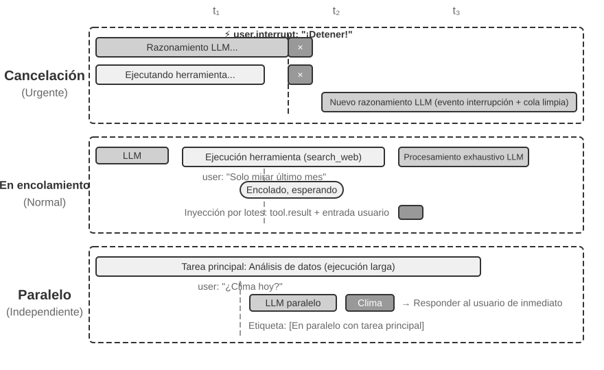
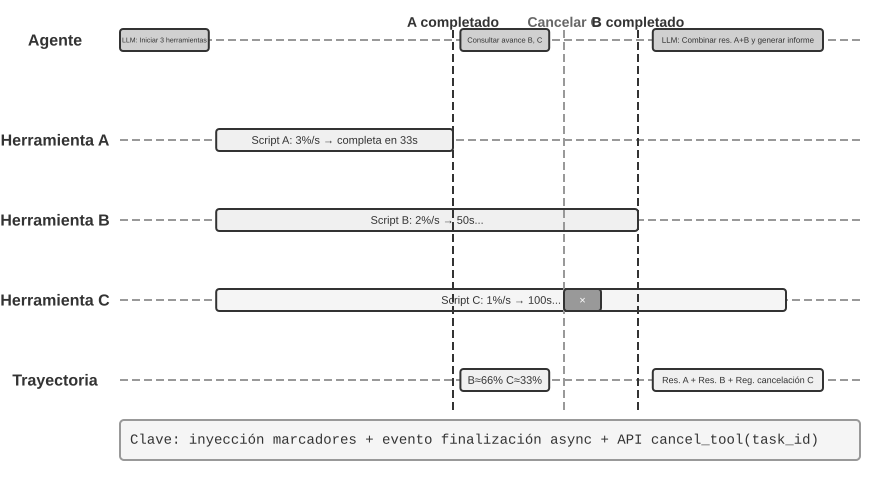
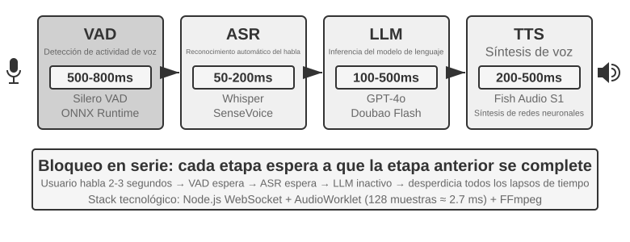
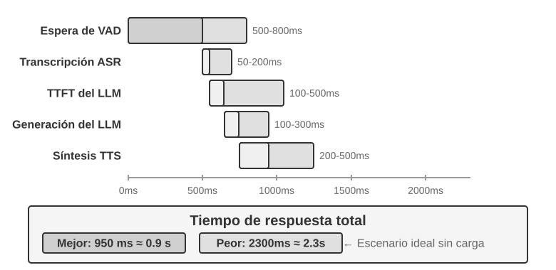
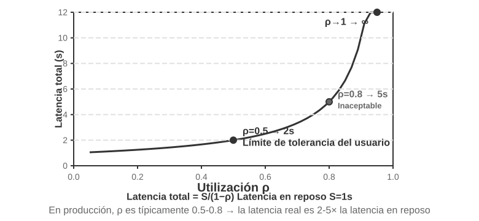
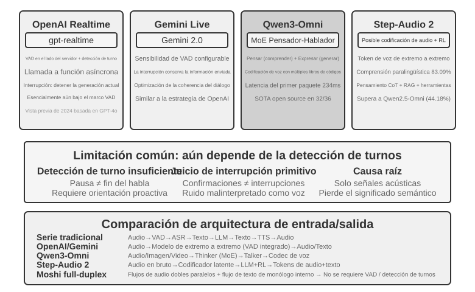
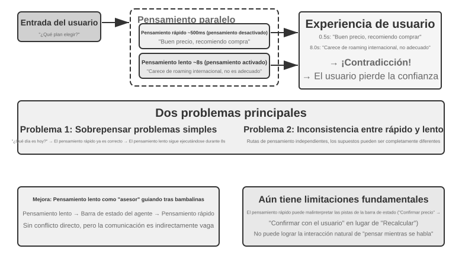
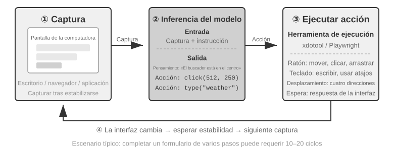
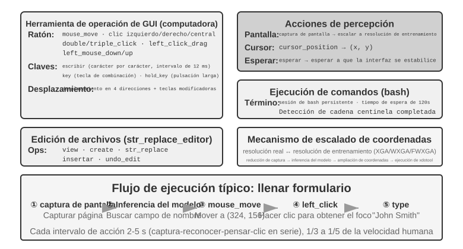

# Interacción: la expansión de los espacios de observación y de acción

El capítulo 1 planteaba una tesis: cuando el modelo subyacente está fijo, la principal palanca de ingeniería de sistemas para mejorar el desempeño de un Agente suele ser redefinir o ampliar su **espacio de observación** y su **espacio de acción**. Los capítulos 2 a 5 han venido cumpliendo esa promesa: la ingeniería de contexto decide qué entra en la observación, la memoria y las bases de conocimiento la extienden más allá de una sesión, las herramientas definen lo que el Agente puede hacer y la generación de código le permite crear acciones nuevas por sí mismo.

Pero todas esas ampliaciones ocurrieron bajo una misma premisa: **el Agente y el mundo hablan por turnos**. El usuario termina una frase, el Agente piensa un rato, llama a unas cuantas herramientas y responde; mientras piensa, se da por supuesto que el mundo permanece quieto. La premisa es tan natural que rara vez llega a escribirse como un supuesto.

Lo que este capítulo retira es precisamente esa premisa.

## Dos ejes: modalidad y momento

Si se despliegan el espacio de observación y el de acción, se ve que cada uno admite dos direcciones de expansión.

- La **modalidad** decide la **forma** de la observación y de la acción: si el Agente solo lee texto o también puede oír sonido, ver la pantalla y percibir par de fuerza; si solo emite tokens o también habla, hace clic y acciona articulaciones.
- El **momento** decide el **ritmo** de la observación y de la acción: si el Agente va a buscar la observación o es el mundo quien la empuja; si la acción debe completarse dentro de un turno o puede atravesar varios, ser interrumpida a mitad de camino y ser desalojada por algo más urgente.

Los capítulos anteriores ampliaron el **contenido** de esos dos espacios; este capítulo amplía su **modalidad** y su **momento**:

| | Expansión del espacio de observación | Expansión del espacio de acción |
|---|---|---|
| **Contenido** (capítulos 2–5) | Ingeniería de contexto, memoria y bases de conocimiento | Herramientas, generación de código |
| **Modalidad** (este capítulo) | Voz, pantalla, sensores físicos | Hablar, hacer clic, mover articulaciones |
| **Momento** (este capítulo) | El mundo empuja, flujos continuos | A través de turnos, interrumpible, desalojable |

La tesis central del capítulo cabe en una frase: **el turno es un supuesto que deja el entrenamiento, no una propiedad del entorno.**

El corpus de entrenamiento de un modelo es casi por completo basado en turnos: una pregunta seguida de una respuesta, una llamada a una herramienta seguida de su resultado, una persona termina antes de que la otra empiece. Por eso la política que aprende el modelo da por hecho que el mundo lo esperará. El entorno real no espera a que el modelo reaccione: llega correo mientras está pensando, el usuario interrumpe a mitad de frase, la página ya ha cambiado entre dos capturas, y la taza se vuelca mientras el brazo va a alcanzarla.

| Escala | Escenario | Cambio del lado de la observación | Cambio del lado de la acción |
|---|---|---|---|
| Segundos — días | Asincronía y orientación a eventos | El mundo despierta al Agente (correo, temporizadores, callbacks) | La acción atraviesa turnos: se inicia ahora y se cierra después con un evento |
| 10 ms — 1 s | Voz | Escuchar mientras se habla, sin esperar a que termine la frase | Pensar mientras se habla, interrumpible y rectificable a mitad |
| Subsegundo — segundos | Computer Use | La pantalla cambia continuamente entre fotogramas | Tras actuar hay que reconfirmar que la realidad sigue ajustándose al plan |
| Milisegundos | Robótica | Los sensores fluyen de vuelta sin pausa | Acción por bloques: se planifica un tramo corto cada vez, desalojable |

Las cuatro secciones comparten un mismo conjunto de primitivas —**despertar, punto seguro, cancelación, desalojo y separación rápido/lento**— y solo difieren en los parámetros y en la forma de fallar. «Comprobar la señal de cancelación en un punto seguro», en la asincronía orientada a eventos, y «al detectar una anomalía, descartar las acciones restantes y volver a observar», en la acción por bloques robótica, son el mismo mecanismo implementado dos veces con cinco órdenes de magnitud de diferencia temporal. Ver esa isomorfía importa más que memorizar el detalle técnico de cualquier escenario aislado.

**Hay una decisión deliberada en el orden de lectura: este capítulo dedica a la voz bastante más espacio que a los dos escenarios siguientes.** En la línea evolutiva de la interacción en tiempo real, la voz es la que ha llegado más lejos y la que mejor sirve de sistema de referencia: parte del problema «la tubería en serie tiene demasiada latencia», atraviesa el extremo a extremo, el dúplex completo y el pensar mientras se habla, y llega hasta un final relativamente asentado; el recorrido completo problema → solución → final ya está hecho. Por eso lo contamos a fondo, y Computer Use y robótica pueden leerse contra esa línea: hasta dónde ha llegado cada uno y dónde se ha atascado.

## Asincronía y orientación a eventos: cuando el mundo viene a buscarte

El Agente invoca de forma activa las herramientas de percepción, ejecución y colaboración tratadas en el capítulo 4. ¿Cómo debe responder a eventos externos que pueden llegar en cualquier momento? Para ello necesita una arquitectura asíncrona orientada a eventos. Las dos clases de herramientas restantes del capítulo 1—las activadas por eventos y las de comunicación con el usuario—dependen de esta arquitectura, por lo que también se abordan aquí.

### Por qué se necesita la asincronía

Utilicemos primero una analogía para ilustrar por qué se necesita la asincronía. Lo síncrono (Synchronous) significa "completar una cosa antes de hacer la siguiente", mientras que lo asíncrono (Asynchronous) significa "múltiples cosas pueden avanzar al mismo tiempo". La arquitectura tradicional de Agentes síncronos se parece a una ventanilla de atención donde solo se atiende haciendo cola: solo puede atender a un cliente a la vez y llamar al siguiente número tras terminar; mientras que un asistente realmente inteligente se parece más a una secretaria flexible: sobre el escritorio hay múltiples asuntos pendientes (correos, llamadas, visitantes), y la secretaria decide cuál atender primero según la urgencia, pudiendo pausar y cambiar si surge algo más urgente a mitad de camino. En el modo síncrono, el Agente debe esperar a que las tareas en segundo plano terminen para hablar con el usuario, o esperar a que la conversación termine para procesar eventos recién llegados, siendo incapaz de responder a varias capacidades clave requeridas en escenarios de asistencia reales:

- **La ejecución asíncrona es la norma**: muchas tareas requieren ejecutarse durante mucho tiempo y no deben bloquear la interacción con el usuario.
- **Juicio dinámico de la prioridad de eventos**: no todos los eventos son igualmente importantes, y el Agente necesita elegir estratégicamente la forma de procesamiento: cancelar la operación actual (urgente), añadir a la cola (rutinario) o procesar en paralelo (consultas ligeras e independientes).
- **Fluidez en la interrupción y recuperación**: las conversaciones o tareas interrumpidas deben poder reanudarse de forma natural.

La contradicción fundamental que enfrenta el paradigma asíncrono al aplicarse a los LLM actuales radica en que: el paradigma de entrenamiento del LLM asume un comportamiento síncrono (tras emitir una llamada a herramienta, el mensaje siguiente debe ser el resultado de la herramienta); mientras que el despliegue en el mundo real exige un comportamiento asíncrono (el usuario puede interrumpir en cualquier momento, múltiples tareas pueden avanzar concurrentemente y eventos externos pueden llegar antes de que la herramienta haya devuelto respuesta). Esta contradicción entre "entrenamiento síncrono y despliegue asíncrono" atraviesa todas las decisiones de ingeniería analizadas en el resto de esta sección.

Para ello necesitamos una **arquitectura de Agentes asíncrona orientada a eventos**. Técnicamente, esto significa que el sistema ya no comprueba repetidamente de forma activa si "hay nuevos mensajes" (lo que se llama sondeo o polling, de baja eficiencia), sino que activa automáticamente la lógica de procesamiento cuando llega un nuevo mensaje. Todas las entradas, salidas, procesos de pensamiento e interacciones externas se modelan de forma unificada como un flujo de eventos: un registro de eventos ordenados cronológicamente a lo largo de una línea de tiempo. La Figura 6-1 muestra la arquitectura general de un Agente asíncrono orientado a eventos, ilustrando la relación entre las fuentes de eventos, la cola de eventos y el flujo de procesamiento del Agente.


### Implementación de mecanismos orientados a eventos en OpenClaw

El framework de código abierto OpenClaw (cuya arquitectura se detallará en el Capítulo 5) recibe mensajes multicanal a través del plano de control Gateway y los enruta al tiempo de ejecución del Agente. Proporciona tres mecanismos de automatización integrados:

- **Hooks (ganchos de eventos)**: Responden a eventos en el ciclo de vida del Agente, como la creación o reinicio de sesiones, similar a los disparadores de eventos en GitHub Actions
- **Cron (programador temporal)**: Ejecuta tareas periódicas según expresiones cron (sintaxis de tareas programadas ampliamente utilizada en sistemas Unix, como `0 9 * * 5` para ejecutarse todos los viernes a las 9:00 AM), como generar informes semanales los viernes o consolidar datos a principios de mes
- **Heartbeat (demonio de latido)**: Despierta al Agente cada N minutos para comprobar si hay asuntos que requieran atención, utilizando su criterio para evitar la fatiga por alarmas

Estos tres mecanismos otorgan al Agente de OpenClaw una apariencia de "autonomía": incluso si el usuario no está en línea, el Agente puede generar informes de forma programada, comprobar el estado del sistema y procesar asuntos de rutina. Sin embargo, un examen detallado revela una limitación fundamental. Primero es necesario aclarar algo: el manejo que Gateway hace de los mensajes de canales integrados (como IM o interfaz Web) es en sí de tipo **push** (el mensaje se enruta al Agente tan pronto como llega); de los tres mecanismos de automatización, los únicos que realmente hacen que el Agente "se mueva por sí mismo" sin mensajes del usuario son Cron y Heartbeat, y ambos están **impulsados por el tiempo**: Heartbeat comprueba a intervalos fijos, Cron se dispara en momentos preestablecidos y Hooks solo responde pasivamente a eventos del ciclo de vida interno del framework, sin poder introducir novedades del mundo exterior. La verdadera deficiencia radica en que: para cualquier fuente de eventos de terceros ajena a los canales integrados (un nuevo correo que llega, una llamada de retorno de API externa o una notificación urgente que requiere procesamiento inmediato), OpenClaw carece de un canal de acceso instantáneo, y el Agente no puede responder en el instante en que ocurre el evento, teniendo que esperar hasta el siguiente ciclo de Cron/Heartbeat para percatarse.

Esta latencia es inaceptable en muchos escenarios. Tomemos como ejemplo **PineClaw** (el plugin de Pine AI para OpenClaw): Pine AI es un asistente de IA que realiza llamadas telefónicas reales en nombre del usuario, en escenarios típicos como negociar facturas, cancelar suscripciones y tramitar reclamaciones de seguros. Cuando un usuario inicia una tarea de llamada telefónica con Pine a través del Agente de OpenClaw, la IA de voz de Pine llama por teléfono en nombre del usuario, pero durante la llamada puede requerirse la intervención del usuario en cualquier momento:

- **Autenticación en tiempo real**: El servicio al cliente solicita verificar la identidad del titular de la cuenta, y Pine necesita que el usuario proporcione inmediatamente un código de seguridad o un código OTP (contraseña de un solo uso)
- **Confirmación de llamada a tres bandas**: El servicio al cliente exige hablar directamente con el titular de la cuenta, y Pine requiere que el usuario atienda la llamada en unos pocos segundos
- **Sincronización de avances y confirmación de decisiones**: Al alcanzar un nodo clave de la negociación (como la contraparte ofreciendo un plan de descuento), Pine necesita que el usuario confirme si lo acepta

Si se depende del sondeo periódico de Heartbeat (asumiendo un intervalo de latido de 5 minutos), el usuario podría no recibir la notificación a tiempo mientras el servicio al cliente espera el código de verificación, lo que provocaría que cuelguen y la llamada falle. Por otro lado, reducir el intervalo de sondeo a nivel de segundos generaría una enorme cantidad de peticiones inútiles y desperdicio de recursos.

La solución de PineClaw consiste en introducir el **mecanismo de Channel**: establecer un canal de eventos en tiempo real entre el Gateway de OpenClaw y la API de Pine. Cuando ocurren eventos clave como la llamada conectándose, la necesidad de entrada del usuario o la llamada finalizando, los mensajes se envían instantáneamente por push al Agente de OpenClaw, que procesa de inmediato y notifica al usuario, reduciendo la latencia de respuesta de minutos a segundos.

Este caso revela el valor nuclear de la arquitectura orientada a eventos para los frameworks de Agentes: **un servicio verdaderamente "proactivo" no solo requiere que el Agente pueda examinar los eventos periódicamente, sino que requiere que los eventos puedan notificar activamente al Agente**. Modelar de forma unificada todas las entradas (mensajes de usuario, respuestas de herramientas, callbacks externos, disparos programados) como flujos de eventos y profundizar la reflexión y acción del Agente mediante un bucle de eventos constituye la base arquitectónica para lograr este objetivo. Bajo esta arquitectura, a continuación se presentan dos categorías de herramientas directamente relacionadas con los eventos, así como la identidad virtual y el entorno de ejecución aislado que respaldan la acción independiente del Agente, antes de discutir el diseño específico del mecanismo de procesamiento de eventos.

### Herramientas disparadas por eventos

Las herramientas disparadas por eventos son la puerta de entrada para que eventos externos impulsen la acción del Agente. Sin herramientas disparadas por eventos, el Agente solo podría pensar en bucles continuos, invocar herramientas y emitir un resultado final, quedando a la espera de la siguiente entrada del usuario. Para transformar los cambios del mundo en eventos procesables por el Agente, existen tres categorías comunes de herramientas disparadas por eventos.

**Temporizadores** (`set_timer`): Procesan eventos que dependen del tiempo físico. Por ejemplo, si se envió un correo pero la contraparte no respondió, se debe enviar otro correo pasado un tiempo para consultar el avance; o si se realizó una llamada pero la contraparte estaba fuera del horario laboral, se debe intentar llamar nuevamente en el siguiente horario de trabajo. Para ello, herramientas como OpenClaw y Claude Code admiten herramientas de temporizador para despertarse a sí mismas en momentos físicos específicos. Los **temporizadores de una sola vez** se utilizan para tareas con momentos temporales claros: por ejemplo, el usuario solicita "llamar al DMV", si hoy es sábado, el Agente configura "el próximo lunes a las 10:00 AM llamar al DMV", marcándose para marcar automáticamente al dispararse el temporizador. Los **temporizadores cíclicos** se utilizan para tareas periódicas: como comprobar la salud del servidor cada hora o enviar informes de avance todos los viernes. Además, algunos servicios externos no admiten notificaciones activas de avances, requiriendo consultas activas; en tales casos se utilizan temporizadores cíclicos para consultar repetidamente (el mecanismo Heartbeat de OpenClaw analizado en la sección anterior es la sistematización de este esquema y la fuente de la capacidad de servicio proactivo de OpenClaw).

**Monitoreo de tareas en segundo plano** (`monitor_shell`): Procesa eventos provenientes de herramientas de ejecución asíncrona o tareas de línea de comandos. Algunas tareas de línea de comandos requieren ejecutarse durante mucho tiempo en segundo plano, y el Agente necesita monitorear su avance. Si se hace que el Agente "esté continuamente mirando la línea de comandos" (es decir, invocando repetidamente herramientas para consultar el estado actual), se desperdiciarían demasiados tokens; mientras que si se espera a que la tarea de línea de comandos finalice por completo para que el Agente empiece a pensar y actuar, el Agente no podría detectar a tiempo problemas graves en el proceso de ejecución, quedando incapaz de intervenir incluso si la línea de comandos se bloquea, lo que congelaría toda la tarea. Claude Code resuelve este problema introduciendo la herramienta monitor (monitoreo), que permite al Agente monitorear nuevas salidas de la línea de comandos o salidas que contengan palabras clave específicas.

**Canales de eventos externos** (`connect_channel`): Envían en tiempo real al Agente eventos externos como la llegada de nuevos correos, callbacks de API o mensajes de IM; el mecanismo Channel de PineClaw en la sección anterior es una implementación típica.

A nivel de diseño, las herramientas disparadas por eventos deben definir condiciones de disparo y reglas de filtrado claras, evitando que eventos irrelevantes despierten al Agente y desperdicien cómputo; la carga útil del evento (payload) debe contener suficiente información contextual para reducir la cantidad de consultas adicionales que el Agente deba realizar tras ser despertado.

### Herramientas de comunicación con el usuario

En OpenClaw las sesiones son transparentes: usuario y Agente pueden enviarse mensajes en cualquier momento mediante herramientas dedicadas, con imágenes, archivos, notificaciones push, comunicación multimodal y Generative UI.

Las herramientas de comunicación con el usuario surgen a medida que los canales de comunicación entre el Agente y el usuario se diversifican cada vez más. Muchos Agentes (como Claude Code, Manus o Genspark) adoptan un bucle ReAct nativo, donde todas las palabras que "dice" el Agente —es decir, mensajes de tipo assistant) se envían directamente al usuario, y el usuario debe abrir una sesión específica en la aplicación para conversar con el Agente. OpenClaw es uno de los representantes más influyentes de Agentes generales que rompen este paradigma de interacción persona-ordenador: sus sesiones son transparentes para el usuario (el usuario no necesita percibir la existencia de la sesión ni preocuparse por los detalles de las llamadas a herramientas del Agente); tanto el usuario como el Agente pueden enviarse mensajes mutuamente en cualquier momento, en lugar de seguir un esquema rígido donde el usuario envía uno y el Agente responde otro. Por ello, muchas personas evalúan que OpenClaw posee una "sensación de presencia humana", comunicándose de forma asíncrona con el usuario mediante mensajes de texto al igual que una secretaria. En este caso, dichos mensajes de texto no consisten en volcar directamente la salida assistant del modelo al usuario, sino en utilizar herramientas dedicadas para enviar mensajes, los cuales pueden incluir imágenes y archivos adjuntos, además de notificaciones de alerta según el nivel de urgencia.

Además de comunicarse mediante texto, cada vez más Agentes poseen capacidades de comunicación multimodal, como enviar tarjetas de mensajes estructuradas o correos de recordatorio. Algunos Agentes han comenzado a experimentar con UI generativa, utilizando HTML y otros medios para generar interfaces interactivas que presentan la información al usuario de forma más amigable. A nivel de diseño, las herramientas de comunicación con el usuario deben admitir el modo de mensajes asíncronos (el usuario no necesariamente está en línea), ofrecer seguimiento del estado leído/no leído y mantener la coherencia del mensaje en escenarios multicanal.

**Comunicación multicanal con el usuario y reconvocatoria.**

Aquí es necesario aclarar un límite categórico propenso a confusión: en el caso de "enviar una notificación", si el destinatario es un aprobador o colaborador (como solicitar aprobación del administrador o informar avances a un Agente colaborador), la herramienta se clasifica como herramienta de colaboración; si el destinatario es el propio usuario final, se clasifica como herramienta de comunicación con el usuario. La diferencia no radica en el canal, sino en "a quién se notifica y para qué".

**La respuesta del Agente no debe limitarse a un solo canal; el mecanismo de notificación es también un mecanismo de reconvocatoria del usuario**. El envío de mensajes se extiende a mensajería instantánea, SMS, correo electrónico, llamadas telefónicas y notificaciones push. El Agente selecciona el canal considerando la urgencia, el estado del usuario, la naturaleza del contenido y las preferencias del usuario, garantizando no perder mensajes importantes sin generar molestias repetitivas.

Para tareas de larga duración, el Agente necesita notificar activamente al usuario al finalizar, reconvocando la atención del usuario. Para tareas periódicas (como resúmenes diarios o informes semanales), las notificaciones ayudan al usuario a consolidar hábitos de interacción fijos.

Las herramientas de comunicación con el usuario resuelven "cómo contactar al usuario". Sin embargo, la identidad con la que el Agente aparece en estos canales y el entorno en el que ejecuta operaciones en nombre del usuario requieren una infraestructura de identidad y entorno, que es el tema de la siguiente sección.

### Identidad virtual y entorno de ejecución aislado

Un ordenador virtual puede funcionar 24/7, aislar los archivos locales del usuario y limitar los daños a la máquina virtual si el Agente se equivoca. El intercambio usa un sistema de archivos compartido y rutas, no copias completas de contenido.

Es necesario aclarar primero la posición de esta sección: la identidad virtual y el entorno de ejecución aislado constituyen esencialmente una infraestructura de entorno de ejecución alineada con los sandboxes discutidos en la sección de herramientas de ejecución; la razón por la que se desarrollan en esta sección de arquitectura asíncrona es porque solo un Agente capaz de ejecutarse de forma independiente, permanente y de actuar en nombre del usuario en cualquier momento los requiere con máxima urgencia.

Al inicio del capítulo se mencionó que Samantha en *Her* posee una identidad y un entorno de operación independientes. Para construir un asistente general semejante, nos enfrentamos primero a una elección arquitectónica clave: ¿debe el Agente gestionar directamente las cuentas personales del usuario, o debe poseer su propia identidad virtual? La gestión directa parece conveniente, pero si el Agente comete un error o es vulnerado, toda la identidad digital del usuario quedará expuesta. El esquema más seguro consiste en otorgar al Agente un conjunto independiente de identidades virtuales, del mismo modo que una secretaria posee su propio teléfono de oficina y correo electrónico. Esta identidad virtual incluye cuentas de comunicación exclusivas, espacio de almacenamiento y entorno de cómputo, permitiendo que el Agente trabaje en nombre del usuario con una identidad transparente. La claridad de la identidad no solo no debilita la confianza, sino que refuerza la autenticidad de la comunicación.

La identidad virtual necesita asentarse en un entorno de ejecución aislado. Las **computadoras virtuales** (VM/contenedores) y los **teléfonos virtuales** (emuladores de Android) proporcionan al Agente aislamiento a nivel de sistema operativo y capacidades completas de operación móvil/escritorio: el Agente posee en su interior sus propias cuentas de usuario, directorio personal y credenciales de inicio de sesión, haciendo que todas las operaciones sean rastreables y auditables; incluso si ejecuta una operación errónea, no afectará al sistema host ni a los dispositivos reales del usuario. Esta es una extensión de la idea de sandbox discutida en las herramientas de ejecución hacia la dimensión de la "identidad digital": el sandbox aísla la ejecución de código, mientras que las computadoras y teléfonos virtuales aíslan toda la identidad digital.

La identidad independiente conlleva dos desafíos reales. El primero son los **mecanismos antiautomatización**: muchos sitios web utilizan verificaciones CAPTCHA y detección de reputación de IP para interceptar accesos automatizados, y los entornos virtuales procedentes de IP de centros de datos son fácilmente identificados, requiriendo en la práctica configurar redes proxy residenciales (utilizando IP de hogares reales) para operar normalmente. El segundo son los **escenarios de acceso a cuentas reales del usuario**: cuando la tarea requiere iniciar sesión con la identidad del propio usuario, se debe adoptar la autenticación Human-in-the-Loop (mediante escritorio remoto VNC/RDP), permitiendo que el usuario complete personalmente el inicio de sesión en un entorno visual donde puede observar la interfaz completa que el Agente está operando, comprendiendo por qué requiere autenticación; los tokens de sesión tras la autenticación se reutilizan dentro de su periodo de validez, evitando interrumpir al usuario con frecuencia y logrando un equilibrio entre autonomía y seguridad.

El intercambio de datos entre el Agente principal y el entorno virtual se realiza mediante un **sistema de archivos compartido**: conectando el Agente principal, la computadora virtual y el teléfono virtual mediante montaje de volúmenes (como `/workspace/shared`), transmitiendo los datos mediante referencias a rutas de archivos en lugar de copias de contenido, evitando ocupar la ventana de contexto. Tomemos como ejemplo una tarea de análisis de datos: el usuario sube un archivo CSV al directorio compartido, el Agente en la computadora virtual lee el archivo, ejecuta el análisis, genera un gráfico y lo guarda de nuevo en el directorio compartido, y el Agente principal solo necesita devolver la ruta del archivo del gráfico al usuario: lo que se transmite entre todas las partes es siempre una cadena de texto ligera con la ruta.

Las herramientas disparadas por eventos permiten que el mundo despierte al Agente, las herramientas de comunicación con el usuario permiten que el Agente contacte al usuario, y la identidad virtual con entorno aislado permite que el Agente actúe de forma independiente y auditable. La pregunta restante es: cuando múltiples eventos concurren simultáneamente hacia la misma instancia del Agente, ¿cómo deben procesarse?

### Mecanismo de manejo de eventos

Una instancia de Agente puede enfrentarse simultáneamente a múltiples eventos: nuevos mensajes del usuario, resultados devueltos por herramientas, vencimiento de temporizadores o peticiones de colaboración de otro Agente. Cómo procesar estos eventos de forma eficiente y correcta impacta directamente en el rendimiento y la experiencia del usuario.

El esqueleto de este mecanismo es el **bucle de eventos (event loop)** de la programación concurrente. Se puede considerar a un Agente asíncrono como un bucle de ejecución continua: en cada ronda toma varios eventos de la cola de entrada, los añade a la trayectoria, invoca al LLM una vez, ejecuta las herramientas decididas por este y regresa al inicio del bucle a esperar el siguiente lote de eventos, coincidiendo con la estructura en la que una goroutine de Go lee mensajes de un channel y los procesa ronda a ronda en un `for { select { ... } }`. Este modelo posee una propiedad crucial: **los eventos solo se consumen en los límites de cada ronda del bucle**. Mientras el LLM está razonando o las herramientas se están ejecutando, los nuevos eventos que llegan no se introducen espontáneamente interrumpiendo el paso actual, sino que se acumulan en la cola, procesándose de forma unificada cuando esta ronda alcanza un **punto seguro** (finalización de un fragmento de razonamiento o devolución de una herramienta). La cancelación sigue exactamente la misma disciplina: no se interrumpe por la fuerza en cualquier instante, sino que se comprueba en el punto seguro si "se ha solicitado la parada", rol que desempeña precisamente `ctx.Done()` en Go (el Capítulo 10 utilizará esta misma idea de contexto para analizar la cancelación en cascada de Agentes padre a hijos). Comprendido esto, la diferencia entre las tres estrategias de procesamiento siguientes radica únicamente en el modo de tratar los puntos seguros: esperar al siguiente punto seguro al que se llegue de forma natural (en cola), crear activamente un punto seguro por adelantado (cancelación) o iniciar un bucle paralelo sin necesidad de esperar al punto seguro del bucle principal (paralelo).

**Modelado estructurado de eventos.**

La premisa para procesar es comprender. La entrada que enfrenta un Agente general no procede únicamente del usuario: los mensajes enviados por terceros no son dirigidos por el usuario al Agente, pero el Agente necesita comprenderlos, evaluar su importancia y decidir cómo intervenir. Esto requiere modelar cada entrada como un **evento estructurado** con semántica rica:

- **Origen (quién)**: El propio usuario, contactos, desconocidos, notificaciones del sistema
- **Canal (medio)**: Voz telefónica, SMS, mensajería instantánea, correo electrónico, redes sociales, disparo de temporizador, resultado de llamada a herramienta asíncrona, actualización de estado de monitoreo de línea de comandos
- **Contenido (qué)**: Texto del mensaje, tono emocional, nivel de urgencia, si requiere respuesta
- **Contexto (trasfondo)**: Si es una respuesta a una conversación previa o una nueva comunicación, su relación con la tarea actual

Tomando como ejemplo un correo electrónico de solicitud de reembolso de un cliente, la forma concreta del evento estructurado es la siguiente:

```json
{
  "source": {"type": "email", "sender": "client@example.com"},
  "channel": "gmail_webhook",
  "content": {"subject": "Solicitud de reembolso", "body": "Deseo el reembolso del pedido #12345..."},
  "context": {"priority": "high", "customer_tier": "vip", "related_orders": ["#12345"]}
}
```

Solo cuando estas dimensiones se modelan claramente como eventos estructurados puede el Agente mantener una percepción clara en comunicaciones multiparte, evitando confundir las entradas del usuario con resultados de herramientas, o tomar resultados de herramientas con instrucciones ocultas por instrucciones del usuario provocando inyecciones de prompts. La complejidad de la gestión de contextos multihilo exige además que el Agente comprenda la vinculación entre múltiples hilos de conversación: cómo los mensajes de terceros afectan las emociones del usuario, las transiciones de rol del usuario en distintas conversaciones y cuándo se requiere sintetizar información de diferentes hilos para ofrecer consejos. En el ecosistema de disparadores de plataformas de flujo de trabajo como n8n se observa que Webhooks, temporizadores, correos, cambios en bases de datos y monitores de archivos son cada uno un "sentido" con el que el Agente percibe el mundo. Cuando estos eventos heterogéneos se modelan de forma unificada en un formato estructurado, el Agente puede procesar los estímulos de distintos orígenes de manera coherente, sustentando los juicios de urgencia y las estrategias de procesamiento que se detallan a continuación.

**Estrategias de procesamiento dinámico basadas en la urgencia.**

Al gestionar múltiples tareas, las personas adoptan distintas estrategias según el nivel de urgencia. Ante emergencias imprevistas, pausan de inmediato el trabajo en curso; ante asuntos pendientes de rutina, los añaden a la lista de tareas para procesarlos más tarde. El procesamiento de eventos del Agente debe reflejar esta misma inteligencia.



**El procesamiento basado en cancelación (Cancellation-Based)** se utiliza para eventos urgentes, consistiendo en esencia en **crear un punto seguro por adelantado** para el evento urgente: interrumpiendo activamente el paso actual para convertir ese instante en el límite donde consumir nuevos eventos. Cuando llega un evento urgente (como el usuario haciendo clic en "detener" o el sistema de supervisión enviando una orden de alta prioridad): (1) detener la operación actual (si el LLM está razonando, cancelar de inmediato la respuesta en streaming; si hay herramientas síncronas ejecutándose, enviar la señal de cancelación); (2) vaciar la cola de pendientes, extrayendo todos los eventos; (3) añadir los eventos de la cola junto con el evento urgente al final de la trayectoria; (4) volver a invocar de inmediato al LLM, evaluando la situación tomando como entrada la trayectoria completa actualizada. Por ejemplo, si el usuario introduce "¡Detente! Me he equivocado" mientras el Agente ejecuta una operación potencialmente errónea, el Agente verá inmediatamente esta nueva entrada y recomprenderá la intención real, evitando ejecutar la operación errónea.

**El procesamiento en cola (Queued)** se utiliza para eventos rutinarios. Cuando llega un evento no urgente (como el retorno de un resultado de herramienta asíncrona o el usuario enviando información complementaria): (1) colocar el evento al final de la cola sin interrumpir la operación actual; (2) esperar a que la operación actual finalice (permitiendo que el LLM complete su razonamiento y que las herramientas síncronas terminen su ejecución); (3) cuando cualquier llamada a herramienta se completa devolviendo `tool.result`, examinar la cola y, si no está vacía, añadir todos los eventos juntos a la trayectoria de una sola vez; (4) el LLM procesa de forma sintética la trayectoria actualizada. Esto logra un procesamiento por lotes que mejora la eficiencia: por ejemplo, después de que el Agente invoca una herramienta de búsqueda, si durante la espera el usuario añade "solo busca resultados del último mes", esta información complementaria entra en la cola y, al retornar los resultados de búsqueda, ambos eventos se presentan juntos al LLM, evitando idas y vueltas innecesarias.

**El procesamiento paralelo (Parallel)** se utiliza para consultas ligeras e independientes. Por ejemplo, mientras el Agente analiza un gran volumen de datos, el usuario pregunta repentinamente "¿qué tiempo hace hoy?". Estas consultas poseen tres características: no están relacionadas con la tarea principal, requieren respuesta rápida y tienen bajo costo de ejecución. No deben procesarse con cancelación (interrumpiría la tarea principal importante) ni en cola (haría esperar demasiado al usuario). El sistema juzga primero la independencia y complejidad de la consulta y la ejecuta de forma independiente en una sesión de razonamiento paralela, devolviendo la respuesta inmediatamente tras invocar las herramientas necesarias. La consulta y la respuesta se añaden a la trayectoria de la tarea principal marcadas explícitamente como "ejecutadas en paralelo con la tarea principal", evitando que el LLM se confunda.

**Determinación de la urgencia.**

Eventos urgentes: Interrupción del usuario (`user.interrupt`), instrucciones de supervisión (`supervisor.instruction`), interrupciones entre Agentes (`agent.interrupt`), disparadores externos marcados como urgentes (como alertas del sistema o fallos de pago).

Eventos no urgentes: Entradas de usuario de rutina (`user.input`), entradas de Agentes (`agent.input`), resultados de herramientas (`tool.result`), disparos de temporizadores (`timer.trigger`), disparadores externos de rutina.

Las reglas rígidas codificadas tienen sus limitaciones, ya que la semántica del evento determina su forma de procesamiento: "detente inmediatamente" usa cancelación, "¿qué tiempo hace hoy?" usa paralelo y "el informe debe enviarse en español" usa cola. **Se recomienda utilizar un LLM clasificador ligero como enrutador de eventos**, juzgando rápidamente al llegar el evento qué estrategia se debe adoptar.

A continuación, mediante un experimento de Agente de procesamiento de correo orientado a eventos, aterrizaremos las estrategias de procesamiento anteriores en una implementación ejecutable.

> **Experimento 6-1 ★★★: Agente de Procesamiento de Correos Orientado a Eventos**
>
>
> 
>
>
> Este experimento construye el Agente orientado a eventos más simple: **un asistente automático de procesamiento de correo**. El Agente escucha la bandeja de entrada y, cada vez que recibe un nuevo correo, activa automáticamente el flujo de procesamiento: clasificación, resumen, borrador de respuesta y notificación al usuario si es necesario. Este es el escenario de entrada más intuitivo para Agentes orientados a eventos: un evento externo (llegada de nuevo correo) activa un bucle de reflexión completo del Agente.
>
> **El objetivo del experimento** es comprender el concepto central de estar orientado a eventos: el Agente ya no se limita a esperar pasivamente la entrada del usuario, sino que puede responder a eventos externos para actuar de forma proactiva. Mediante este experimento, el lector dominará el registro de fuentes de eventos, la cola de eventos y el bucle básico de "llegada de evento -> procesamiento del Agente -> salida de resultado".
>
> **Fuentes de eventos y cola de eventos.**
>
> El sistema admite el acceso unificado a múltiples fuentes de eventos:
>
> - **Eventos de correo** (`on_email_received`): Se disparan al llegar nuevos correos comprobando la bandeja periódicamente o recibiendo notificaciones push
> - **Mensajes de IM/SMS** (`on_im_message`, `on_sms_message`): Se disparan por mensajes de mensajería instantánea
> - **Eventos de GitHub** (`on_github_pr_update`, `on_github_issue_update`): Comentarios de revisión de PR y cambios de estado
> - **Disparos de temporizador** (`on_timer_expire`): Tareas programadas (como resúmenes diarios o generación de informes semanales)
> - **Webhook** (`on_webhook_received`): Callbacks genéricos de sistemas externos
> - **Eventos del sistema** (`on_user_inactive`, `on_process_timeout`, `on_resource_alert`): Cambios en el estado interno
>
> Todos los eventos entran en una **cola de eventos** unificada y se procesan en orden de llegada. Cada evento activa un bucle de reflexión independiente del Agente: el Agente lee el contenido del evento, invoca las herramientas correspondientes (como consultar la base de conocimientos, leer archivos adjuntos o buscar historiales de correo relevantes), genera los resultados del procesamiento (etiquetas de clasificación, resumen, borrador de respuesta) y finalmente notifica al usuario mediante herramientas de notificación o ejecuta la operación directamente.
>
> **Escenario de verificación**: Configurar el Agente para escuchar un buzón de prueba. Simular la recepción de tres correos: una invitación a una reunión, una queja de cliente y un anuncio publicitario. El Agente procesa secuencialmente: para la invitación a la reunión comprueba automáticamente conflictos en el calendario y redacta una respuesta de aceptación/rechazo; para la queja de cliente extrae la información clave y la marca como alta prioridad, notificando al usuario para su atención; y archiva automáticamente el anuncio publicitario. Todo el proceso ocurre sin intervención del usuario.

El Experimento 6-1 muestra el modo orientado a eventos más simple: los eventos entran en la cola y el Agente los procesa secuencialmente. Sin embargo, cuando el Agente necesita responder a interrupciones durante la ejecución de herramientas de larga duración, o gestionar múltiples tareas concurrentes al mismo tiempo, una cola de eventos simple resulta insuficiente. A continuación analizaremos desafíos de ingeniería más profundos.

### Implementación de ingeniería: Cómo hacer que modelos síncronos admitan interrupciones asíncronas

El Experimento 6-1 solo procesa eventos en serie: los eventos entran secuencialmente en la cola y el Agente los atiende uno a uno. Volvamos ahora a la contradicción entre "entrenamiento síncrono y despliegue asíncrono" planteada al inicio de esta sección: cuando una herramienta aún no ha devuelto respuesta y el usuario interrumpe repentinamente, ¿cómo puede el formato síncrono dar cabida a esta situación? Esta sección presenta la solución de ingeniería actual de la industria.

Ilustremos primero esta contradicción con un escenario concreto. Supongamos que el Agente está ayudando al usuario a redactar un correo (llamada a herramienta: buscar información de contacto), y mientras la búsqueda aún no devuelve resultados, el usuario dice repentinamente "espera un momento, consulta primero el tiempo de mañana". En el bucle ReAct síncrono, el Agente debe esperar a que la búsqueda devuelva respuesta antes de procesar el siguiente mensaje, porque la API exige que "tras emitir una llamada a herramienta, el mensaje siguiente debe ser el resultado de la herramienta". Sin embargo, en el mundo real asíncrono, los eventos pueden interrumpir la tarea en curso en cualquier momento. Cómo expresar la semántica de "interrupción asíncrona" bajo las restricciones del "formato síncrono" es la pregunta que responde este esquema de ingeniería.

**Solución de compromiso de ingeniería: Simular la ejecución asíncrona en formato síncrono.**

La idea central es: **en condiciones normales sin interrupciones, permitir que el LLM vea una trayectoria síncrona estándar, e insertar marcadores de posición (placeholders) para reparar el formato solo cuando ocurra una interrupción**. A continuación se presentan las cinco reglas clave:

**Regla 1**: Registrar de inmediato el mensaje assistant al emitir la salida el LLM (incluyendo thinking, content y tool call).

**Regla 2**: Registrar tool result solo cuando la llamada a la herramienta se complete. Durante la ejecución, la trayectoria se encuentra en estado de "completada parcialmente".

**Regla 3**: Las interrupciones durante la ejecución de herramientas requieren marcadores de posición. Generar un marcador de posición como respuesta para la herramienta no completada (por ejemplo, "La herramienta se está ejecutando en segundo plano, por favor procese primero el nuevo evento"), añadir el evento de interrupción y volver a invocar al LLM. Desde la perspectiva del LLM, el mensaje assistant sigue teniendo su tool result emparejado.

**Regla 4**: Las interrupciones durante la reflexión del LLM descartan directamente el pensamiento actual. No se escribe en la trayectoria, y el nuevo evento se añade directamente antes de iniciar una nueva ronda de reflexión.

**Regla 5**: Los eventos no urgentes entran en la cola a la espera de procesamiento por lotes. Se añaden de una sola vez al finalizar el ciclo actual.

Tomando como ejemplo el caso en que el usuario interrumpe pidiendo el tiempo mientras el Agente redacta un correo, el funcionamiento de estas cinco reglas es el siguiente:

1. El Agente invoca `search_contacts` para buscar información de contacto, y el mensaje assistant se escribe inmediatamente en la trayectoria (Regla 1).
2. Mientras la herramienta de búsqueda aún no devuelve resultado, el usuario envía "consulta primero el tiempo de mañana". Dado que se trata de una interrupción del usuario, el sistema genera un tool result con marcador de posición para la herramienta `search_contacts` no completada ("La herramienta se está ejecutando en segundo plano, por favor procese primero el nuevo evento", Regla 3), añade la consulta del tiempo a la trayectoria y vuelve a invocar al LLM. En este instante, el formato de la trayectoria que observa el LLM es totalmente válido: el mensaje assistant y el tool result están perfectamente emparejados.
3. Tras completar la consulta del tiempo y responder al usuario, llega el resultado original de `search_contacts`, añadiéndose a la trayectoria como un nuevo evento (Regla 2), y el Agente continúa redactando el correo tras leer la información de contacto.

La ventaja central de este esquema es que: **en condiciones normales, el LLM observa una trayectoria síncrona perfecta**: los mensajes assistant y tool result están estrictamente emparejados, el orden cronológico es claro y no hay marcadores de posición ni estados anómalos. Esto resulta sumamente amigable para los LLM actuales entrenados bajo el paradigma síncrono, garantizando al máximo la calidad del pensamiento. Solo cuando realmente se requiere una interrupción se introduce el marcador de posición como un "compromiso necesario".

Sin embargo, persiste el riesgo de acentuar las alucinaciones. En este escenario, aunque el marcador de posición explica claramente que la herramienta "aún no se ha completado", el sistema podría "inventar" un resultado de herramienta en reflexiones posteriores, asumiendo erróneamente que la herramienta devolvió datos válidos y tomando decisiones inadecuadas basadas en ese resultado ficticio. Esto ocurre porque en la inmensa mayoría de las trayectorias vistas por el modelo durante su entrenamiento, a una llamada a herramienta le sigue inmediatamente el resultado real, no habiendo aprendido nunca a gestionar situaciones donde "el resultado aún no ha llegado". Por ello, en la práctica solo se interrumpe ante verdaderas emergencias (solicitud explícita de parada por parte del usuario), mientras que los eventos no urgentes se colocan en cola para su procesamiento por lotes.

**Interfaces de herramientas asíncronas adecuadas para modelos existentes.**

Dado que la suposición síncrona de los modelos es difícil de romper, una estrategia más fundamental consiste en **abrazar la semántica asíncrona desde el diseño de las interfaces de las herramientas**.

Las herramientas tradicionales conllevan implícitamente la semántica de "invocar es completar". Por ejemplo, el nombre `phone_call` insinúa que "la llamada realizará la marcación, esperará a que finalice la conversación y devolverá el registro de la llamada". En el paradigma asíncrono se deben desacoplar el "inicio" y la "finalización":

- `initiate_phone_call`: Inicia la llamada telefónica, devolviendo inmediatamente el identificador de la tarea y el estado inicial (como "Llamada iniciada, marcando")
- El avance de la llamada se notifica mediante eventos (`phone_call_connected`, `phone_call_ended`)

La clave radica en que el propio nombre y la descripción de la herramienta transmitan semántica asíncrona. Cuando el modelo ve `initiate_phone_call`, su capacidad de comprensión del lenguaje deduce de forma natural que se trata de "iniciar" y no de "completar". La descripción de la herramienta debe reforzar aún más esto: "Esta herramienta iniciará una tarea telefónica procesada por un subagente. Tras iniciar con éxito devolverá inmediatamente un ID de tarea, permitiéndole continuar procesando otros asuntos. Se recibirá un evento de notificación separado al finalizar la llamada."

**Dispersión de la atención en el procesamiento en cola.**

Al procesar eventos en lote, el modelo tiende a prestar atención únicamente al último evento. La causa raíz reside en que **el modelo ha sido entrenado para reaccionar a la entrada más reciente, y el procesamiento de eventos en lote rompe esta suposición**.

Se puede intervenir a dos niveles:

**Nivel de prompts**: Informar al modelo "cuando reciba múltiples eventos consecutivos, asegúrese de considerar de forma integral toda la información".

**Marcado en la barra de estado del Agente**: Añadir marcadores explícitos antes de cada evento:

```text
[Evento no procesado 1/4] Tool result from database_query: ...
[Evento no procesado 2/4] User nota adicional: solo consultar datos de la región de Madrid
[Evento no procesado 3/4] Recordatorio del sistema: quedan 30 minutos para la fecha límite del informe
[Evento no procesado 4/4] User consulta: ¿cómo va el avance?
```

Añadir un resumen al final: "Hay 4 eventos no procesados anteriormente, incluyendo 1 resultado de herramienta, 2 mensajes de usuario y 1 recordatorio del sistema. Asegúrese de que su respuesta cubra toda la información."

### Contradicción profunda y direcciones futuras





En última instancia, los marcadores de posición, las interfaces de herramientas asíncronas y las marcas en la barra de estado de las secciones anteriores son todos intentos de compensar mediante ingeniería de prompts la misma contradicción entre "entrenamiento síncrono y despliegue asíncrono" (Figura 6-4), cuyas causas ya se detallaron al inicio de esta sección y no se repiten aquí, enfocándonos solo en su solución fundamental.

**Esperando la evolución del modelo: De lo síncrono a lo asíncrono.**

Las técnicas de ingeniería mencionadas son esencialmente **el uso de ingeniería de prompts para remediar las deficiencias del entrenamiento del modelo**, constituyendo medidas provisionales de transición. La verdadera solución requiere un cambio de paradigma a nivel de entrenamiento del modelo.

Los modelos VLA (Vision-Language-Action, visión-lenguaje-acción, véase el Capítulo 6) en el campo de la robótica han comenzado a enfrentarse a desafíos similares: existe una latencia inevitable entre la percepción y la acción. El éxito de los VLA marca la dirección para la evolución de los modelos de Agentes. La siguiente generación de modelos necesita adquirir tres capacidades centrales mediante aprendizaje por refuerzo en entornos asíncronos:

1. **Comprender la intercalación asíncrona de eventos en la trayectoria**: Esta es la deficiencia de capacidad más central. Los modelos actuales esperan secuencias estrictamente síncronas, pero en entornos asíncronos reales, tras un tool call puede seguir no un tool result sino un nuevo mensaje de user; el thinking puede interrumpirse a la mitad, pero el estado intermedio debe conservarse en la trayectoria, continuando la reflexión tras procesar el nuevo mensaje en lugar de empezar desde cero. El modelo necesita mantener una percepción clara en estas trayectorias "desordenadas": qué llamadas a herramientas siguen esperando resultados y qué pensamientos son fragmentos no completados.
2. **Recuperar tareas y reflexiones interrumpidas**: Mantener en memoria las tareas no completadas tras ser interrumpido para atender emergencias. Por ejemplo, si mientras el Agente ejecuta una herramienta de análisis de datos el usuario pregunta por el tiempo, tras responder debe esperar de forma natural el resultado del análisis de datos, en lugar de olvidar que hay una herramienta ejecutándose. En particular, debe evitarse generar alucinaciones asumiendo erróneamente que la herramienta interrumpida ya ha finalizado.
3. **Procesamiento sintético de eventos en lote**: Cuando se añaden múltiples eventos a la trayectoria en lote, no se debe prestar atención únicamente al último, siendo obligatorio considerar de forma integral toda la información no procesada.

Lograr este entrenamiento RL asíncrono requiere nueva infraestructura: simuladores de entornos asíncronos (que generen latencias en devoluciones de herramientas, interrupciones aleatorias de usuarios, etc.) y recompensas específicas para capacidades asíncronas (comprender correctamente trayectorias desordenadas, recuperar con éxito pensamientos interrumpidos, evitar alucinaciones y procesar eventos en lote de forma sintética).

El pensamiento continuo no tiene que esperar a la siguiente generación de modelos. Unas doscientas líneas de orquestación pueden convertir un modelo de razonamiento textual **existente** en un Agente **de tiempo continuo**, enlazando la solución de ingeniería anterior con la evolución del modelo. Es una ampliación de la regla 4: en vez de descartar un pensamiento parcial interrumpido, se construye la interacción como un flujo de pensamiento ininterrumpido. El runtime puede cerrar por la fuerza el bloque `<think>` actual, inyectar como mensaje ordinario una observación recién llegada—resultado de una herramienta, interrupción del usuario o actualización del reconocimiento—y continuar la decodificación.

Aprovecha un recurso que suele desperdiciarse: el modelo puede generar cientos de tokens por segundo, mientras que una llamada a herramienta o una intervención del usuario puede tardar varios segundos. Ese tiempo de espera puede dedicarse a pensar. Así, el Agente puede **pensar mientras espera**—continuar a partir de información parcial e incluso iniciar antes la siguiente herramienta—y **pensar mientras actúa**—seguir razonando durante la salida y corregirse a mitad de una acción.

> **Experimento 6-2 ★★★: Agente Asíncrono con Ejecución Paralela y Capacidad de Interrupción**
>
>
> 
>
>
> Sobre la base de la cola de eventos simple del Experimento 6-1, este experimento entra en las aguas profundas de los Agentes asíncronos: **ejecución paralela de herramientas, cancelación de ejecución y gestión de estado**. El Agente ya no se limita a procesar eventos uno a uno, sino que necesita gestionar múltiples tareas concurrentes simultáneamente, gestionar interrupciones y recuperaciones, y tomar decisiones dinámicas basadas en el estado en tiempo real.
>
> **1. Ejecución asíncrona de herramientas**: Admite la ejecución asíncrona de herramientas de larga duración (al menos 3-5 segundos), devolviendo inmediatamente un marcador de posición tras el inicio. **Escenario de verificación**: El Agente ejecuta un comando de terminal largo y, mientras tanto, el usuario pregunta "¿qué hora es?", el Agente responde de inmediato y presenta los resultados del análisis una vez devueltos.
>
> **2. Cola de eventos y procesamiento por lotes**: Acumula eventos no urgentes y los añade a la trayectoria en lote. **Escenario de verificación**: El Agente ejecuta una tarea larga y el usuario envía consecutivamente "recuerda responder en japonés" y "organízalo como página web"; al finalizar la tarea, procesa todos los eventos de una sola vez generando la página web en japonés.
>
> **3. Mecanismo de interrupción**: El "detente" del usuario finaliza inmediatamente el flujo de ejecución y cancela las herramientas asíncronas. **Escenario de verificación**: El Agente ejecuta una tarea larga, el usuario envía "cancelar", el Agente se detiene inmediatamente y la trayectoria registra el evento de interrupción y la operación de cancelación.
>
> **4. Cancelación de herramientas paralelas y consulta de estado**: Una vez completadas las herramientas asíncronas, se inyectan los resultados reales en la conversación mediante nuevos eventos, admitiendo la cancelación o consulta de avance mediante el ID de la tarea. **Escenario de verificación**: El usuario solicita "ayúdame a ejecutar estos tres scripts simultáneamente; cuando el primero termine, comprueba el avance de los restantes y, si alguno no supera el 50%, cancélalo". Tres scripts simulan procesos de análisis emitiendo avances continuamente mientras se ejecutan, a velocidades del 3%, 2% y 1% por segundo respectivamente. El Agente inicia simultáneamente los tres comandos de terminal asíncronos; cuando el script del 3% por segundo se completa en unos 33 segundos, el Agente consulta el estado de los otros dos terminales, descubriendo que uno se ha ejecutado hasta aproximadamente el 66% y el otro hasta el 33%, cancelando este último por no superar el 50%. Una vez completados ambos terminales, integra los resultados generando el informe completo.

La ejecución asíncrona y orientada a eventos permite que el mundo despierte al Agente en cualquier momento, pero supone que el modelo puede terminar de pensar antes de responder. Las tres secciones siguientes cuestionan ese supuesto: cuando el entorno cambia tan rápido como genera el modelo o más, «pensar y después hablar» introduce una latencia inaceptable.

## Voz: la interfaz humano-máquina más natural

La voz no es solo convertir texto en sonido. Hablar es aproximadamente cuatro veces más rápido que escribir y deja libres las manos y la mirada, por lo que encaja naturalmente a un Agente en un bucle continuo que puede ser interrumpido en cualquier momento. La entrada de voz convierte el dictado en texto; un Agente de voz permite colaborar directamente con él. Ambos sostienen el whisper coding presentado en la introducción.

Esta sección cubre dos direcciones: el usuario habla con el Agente y el Agente habla con el mundo exterior en nombre del usuario. El modelo de voz determina qué puede responder; la arquitectura de interacción determina si escucha bien, responde a tiempo, cede el turno de forma natural y completa confirmaciones y llamadas a herramientas durante una llamada.

### Tiempo de interacción: de la cascada al dúplex completo

La introducción de GPT-Live de OpenAI resume tres paradigmas: cascada, basado en turnos y dúplex completo[^ch6-12]. Son intercambios distintos entre latencia, coste y observabilidad, no una sustitución lineal.

| Paradigma | Estructura | Ventaja | Limitación |
| --- | --- | --- | --- |
| Cascada | VAD → ASR → LLM → TTS | Módulos claros, intercambiables y depurables | Se acumula la latencia y se pierde información paralingüística |
| Omni de extremo a extremo | Entrada y salida de audio nativas, con interacción por turnos | Menor latencia y preservación de tono, emoción y ambiente | Sigue dependiendo de turnos; entrenar y depurar cuesta más |
| Dúplex completo | Entrada y salida de audio nativas; escucha, habla y decide continuamente | Habla solapada, interrupción natural y flujo continuo | Entrenamiento, control y evaluación más complejos |

El hilo común es escapar de la suposición de que hay que hablar por turnos y de la conjetura de VAD sobre quién tiene la palabra. Cascada y Omni aún dividen la interacción en turnos; el dúplex completo convierte esa decisión en una salida continua del modelo.

[^ch6-12]: OpenAI. *Introducing GPT-Live.* 2026-07-08. https://openai.com/index/introducing-gpt-live/ . La clasificación procede del resumen de las tres generaciones de ChatGPT Voice; «end-to-end omnimodal (Omni)» corresponde a «turn-based voice models».

### Paradigma 1 · Pipeline en cascada

La mayoría de asistentes comerciales todavía usa un pipeline serial (Figura 6-6): VAD detecta el final, ASR convierte audio en texto, el LLM entiende y genera la respuesta, y TTS la pronuncia. La modularidad facilita optimizar cada componente, pero cada frontera añade espera.



| Módulo | Función | Cuello de botella |
| --- | --- | --- |
| VAD | Decidir si terminó el habla | Umbral de silencio, espera y segmentación errónea |
| ASR | Audio a texto | Latencia y pérdida de contexto |
| LLM | Comprender, razonar y generar | Latencia del primer token y espera adicional con reasoning |
| TTS | Texto a voz | Síntesis del primer paquete y búfer de reproducción |

En una respuesta breve, las esperas de VAD, ASR, LLM y TTS se acumulan en serie (Figura 6-7). La cola de producción amplifica aún más la latencia en vacío (Figura 6-8).





> **Experimento 6-3 ★: Construir un Agente de voz tradicional**
>
> Conecte mediante WebSocket el micrófono, Silero VAD, Whisper local, un LLM en streaming y Fish S1 TTS para establecer la línea base en cascada.

#### De lo serial a la percepción en streaming

La Figura 6-7 describe el caso completamente serial de VAD+ASR+LLM+TTS. Ese esquema de percepción serial tiene tres problemas:

1. **Acumulación de latencia**: hay que esperar un tramo de silencio para confirmar que el usuario ha terminado de hablar.
2. **Pérdida de información**: una señal binaria de voz/silencio no puede expresar dudas, emoción, apoyos ni sonido ambiente.
3. **Contexto cortado**: los correos, los nombres de persona y los nombres propios pueden fragmentarse y reconocerse mal.

Para resolverlo, y sin renunciar al reparto modular, una vía de optimización es la **percepción en streaming**, que hace que cada etapa produzca resultados incrementales lo antes posible:

- **ASR que transcribe mientras escucha**: cuando VAD detecta que el usuario empieza a hablar, se invoca el modelo ASR a intervalos regulares para generar en streaming una transcripción provisional; cuando VAD detecta que el usuario ha terminado, se confirma el texto definitivo.
- **Ejecución especulativa del LLM**: la transcripción provisional se envía al LLM en cuanto se genera; si el texto definitivo coincide con ella, no hace falta volver a invocar al LLM; si no coincide, se cancela el pensamiento especulativo anterior y se invoca al LLM de nuevo.
- **Salida por fragmentos del LLM**: el primer fragmento de texto apto para pronunciarse pasa de inmediato a TTS, sin esperar la respuesta completa.
- **Síntesis incremental en TTS**: se devuelven bloques de audio de forma continua, de modo que la generación posterior, la síntesis y la reproducción se solapen.

Un ASR realmente en streaming necesita soporte del propio modelo. Aunque la decodificación de Whisper es autorregresiva, su codificador necesita el segmento de audio completo, así que no equivale a un modelo en streaming. Un modelo auditivo en streaming basado en LLM puede emitir texto y eventos semánticos a partir de audio continuo, y así reúne el «reconocimiento» y parte de la «comprensión» dentro de un mismo modelo. Conserva el contexto desde el inicio de la conversación hasta el instante actual y puede aprovechar su conocimiento del mundo para tratar marcas, nombres de persona y nombres propios. Los marcadores speak_start/end, interrupt, emotion, laugh, sigh y noise conservan señales que no caben en texto.

Si el único objetivo es decidir si el usuario ha terminado de hablar, el juicio de fin de turno puede integrarse directamente en el reconocedor streaming. Las etiquetas de entrenamiento solo deben usar información visible en el momento de la decisión; de lo contrario, la retrospectiva producirá un juicio imposible de reproducir en línea.

> **Experimento 6-4 ★: Simular percepción de voz en streaming con Qwen2-Audio**
>
> Qwen2-Audio no es un modelo de streaming. El experimento simula la percepción continua mediante prefijos de audio crecientes y la compara con VAD de 600 ms + Whisper.

### Paradigma 2 · Modelos omnimodales de extremo a extremo (Omni)

Aunque la cascada adopte percepción en streaming, escuchar, pensar y hablar siguen intercambiándose a través de interfaces discretas, y la emoción, la entonación y el sonido ambiente pueden perderse al convertirlo todo en texto plano. El esquema Omni escucha el audio, genera la respuesta y emite la voz con un único modelo, por lo que tiene la oportunidad de conservar esa información, aunque su entrenamiento cuesta más (Figura 6-9). Frente a la cascada del paradigma 1, la ventaja de Omni está sobre todo en la latencia y en la comprensión y la generación de información no textual.

En la comprensión, un modelo Omni es capaz de interpretar las pausas de la voz. En la generación, puede transmitir información paralingüística más rica: cantar o pronunciar una frase con una entonación particular.

Los modelos Omni siguen suponiendo que se habla por turnos y normalmente dependen de VAD para decidir quién tiene la palabra. Por eso, una pausa a mitad de camino mientras el usuario dicta una secuencia de números todavía puede confundirse con el final del turno.



> **Experimento 6-5 ★★: Ejecutar MiniCPM-o 4.5 localmente, extremo a extremo frente a autocascada**
>
> Ejecute MiniCPM-o 4.5 localmente con thinking mode desactivado y compare la respuesta directa desde el audio con una autocascada que primero transcribe y luego responde con el mismo modelo. Esto mide si se conserva la información sonora, **no** el «pensar mientras se habla» tratado más adelante.

### Paradigma 3 · Modelos interactivos de dúplex completo

Omni separa «habla el usuario» y «habla el modelo», pero la interpretación simultánea exige solapamiento. Un modelo de dúplex completo escucha y habla continuamente y decide seguir, pausar, interrumpir o llamar a una herramienta. Moshi de Kyutai fue un ejemplo temprano; Thinking Machines Lab llama a esta ruta Interaction Model[^ch6-14] y la integra en el modelo en lugar de montarla alrededor de VAD. GPT-Live la lleva a escala de producción y delega el trabajo complejo a un modelo de fondo mientras mantiene la conversación.

[^ch6-14]: Thinking Machines Lab, “Interaction Models: A Scalable Approach to Human-AI Collaboration,” 2026-05. https://thinkingmachines.ai/blog/interaction-models/

### Tiempo cognitivo: interacción en tiempo real y pensamiento profundo

La calidad de la interacción y el techo de inteligencia son dimensiones distintas. El modelo de primer plano responde mientras el usuario sigue conectado; el modelo de fondo puede pensar más tiempo. Los tres diseños siguientes son compromisos, no una progresión lineal: los dos primeros pueden aplicarse sobre una cascada o un modelo Omni; el tercero, en cambio, unifica el razonamiento profundo y la expresión en tiempo real dentro de un mismo modelo.

#### Solución 1: pensamiento rápido para rellenar, pensamiento lento para responder

El pensamiento rápido puede emitir una respuesta de relleno en unos cientos de milisegundos, mientras el pensamiento lento completa en segundo plano una deducción más profunda. Su problema es que las preguntas sencillas se procesan dos veces y las complejas pueden acabar en contradicción: el modelo rápido recomienda comprar y el lento descubre después que el plan carece de una función clave, de modo que el usuario escucha respuestas contradictorias en cuestión de segundos. La causa de fondo es que cada instancia ha realizado su propio razonamiento independiente.





#### Solución 2: pensamiento rápido para interactuar, pensamiento lento para avisar

En la segunda solución, el modelo de fondo ofrece sugerencias al de primer plano a través de una barra de estado o de una interfaz específica, mientras el primer plano mantiene el hilo y decide cómo expresarse. Es más estable que la primera, pero la comunicación sigue siendo indirecta: el primer plano puede malinterpretar la sugerencia y no ve el razonamiento intermedio del fondo; antes de que el fondo termine, si el usuario repregunta el primer plano solo puede responder con sus propias capacidades. Puede «esperar el resultado» con naturalidad, pero no llega realmente a pensar mientras habla.

#### Solución 3: unificación de extremo a extremo del pensamiento y la expresión

La tercera solución interioriza la capacidad de razonar dentro del propio modelo de audio de extremo a extremo. Step-Audio R1 resuelve dos problemas con dos mecanismos complementarios: la **destilación de pensamiento anclada en la modalidad (MGRD)** hace que el modelo razone a partir de rasgos acústicos, y la **arquitectura de doble cerebro MPS** permite que la concepción y la expresión avancen en paralelo. La primera garantiza «pensar bien»; la segunda resuelve «hablar a tiempo».

Idealmente, el modelo debería inferir la emoción del tono, el ritmo y la entonación, y no solo del texto transcrito. MGRD filtra las cadenas de razonamiento que citan realmente rasgos acústicos, entrena el modelo con esos datos y, mediante aprendizaje por refuerzo, impide que el modelo se salte el razonamiento y adivine la respuesta. MPS hace que el cerebro de concepción produzca fragmentos de pensamiento de forma continua, y el cerebro de expresión, al recibir cada fragmento, genera voz de inmediato combinándolo con lo ya respondido. Ambos funcionan en paralelo como una tubería, de modo que no hace falta esperar a que el razonamiento termine para que el usuario oiga la primera frase.

#### La separación del pensamiento rápido y lento frente al razonamiento de extremo a extremo

El modelo unificado es el que más directamente logra «pensar mientras habla», a costa de tener que reentrenar juntos el razonamiento y la expresión en tiempo real; la vía desacoplada facilita sustituir el cerebro de fondo. Son un compromiso, no un simple reemplazo mutuo.

En un momento en que los modelos de razonamiento de frontera avanzan con rapidez, separar el pensamiento rápido del lento ofrece una importante ventaja de ingeniería: permite aprovechar directamente cada nueva generación del modelo lento. El modelo rápido de primer plano solo se ocupa de escuchar, responder y mantener la conversación con baja latencia; el modelo lento de fondo se encarga del razonamiento, la planificación y las llamadas a herramientas. Cuando aparece un modelo de razonamiento más potente, basta con sustituir el de fondo, sin volver a entrenar todo el sistema de voz en tiempo real. La vía unificada vincula razonamiento e interacción al mismo ciclo de entrenamiento, por lo que cada actualización debe volver a equilibrar inteligencia, latencia de respuesta y naturalidad expresiva. La separación rápido/lento no es, por tanto, una mera concesión a la latencia, sino una opción modular que permite que la capacidad de interacción y el techo de inteligencia evolucionen por separado.

Esta separación tampoco implica necesariamente sacrificar el rendimiento. En agosto de 2026, el Agente de voz de Pine AI, basado en una arquitectura de pensamiento rápido/lento separada, ocupaba el primer puesto de la τ³-Voice Leaderboard, por delante de sistemas como Grok Voice y GPT-Realtime-2. Este resultado muestra, como mínimo, que una arquitectura desacoplada no es intrínsecamente inferior a los modelos de extremo a extremo en tareas que evalúan conjuntamente el razonamiento profundo y la conversación en tiempo real.[^ch6-17]

[^ch6-17]: Pine AI. “The Most Natural Human-Computer Interface Is Your Voice.” 2026-06-23 (actualizado el 2026-08-06). https://www.19pine.ai/blog/pine-ai-the-most-natural-human-computer-interface-is-your-voice

Conviene aclarar que «modelo de extremo a extremo» suele emplearse con dos significados. El primero es una **ruta de voz de extremo a extremo**, descrita en la sección anterior: el modelo recibe audio y genera audio directamente, sin enlazar varios modelos mediante texto discreto. Tanto Omni como los Interaction Models son de extremo a extremo en este sentido, pero Omni suele avanzar por turnos, mientras que un Interaction Model puede escuchar y hablar simultáneamente; sus arquitecturas son muy distintas. El segundo es una **arquitectura cognitiva de extremo a extremo**, el tema de esta sección: la interacción en tiempo real y el razonamiento profundo comparten estado y se entrenan juntos dentro de un solo modelo, o se reparten entre un modelo rápido de primer plano y otro lento de fondo. Ambos ejes son independientes. Un sistema puede tener una ruta de voz de extremo a extremo y, a la vez, mantener separadas las partes rápida y lenta de su arquitectura cognitiva; la delegación de tareas complejas a un razonador de fondo por parte de Thinking Machines Lab es un ejemplo de esta combinación.

### Síntesis de voz más humana

Un TTS tradicional puede delatar su identidad de máquina por ser demasiado fluido y hacer pocas pausas. Las pausas, las muletillas y la repetición ocasional señalan incertidumbre y pensamiento en el habla humana.

El LLM principal puede emitir marcadores de control además del texto, como **THINKING**, **EMO:happy** y **SPEED:0.8x**; TTS los mapea a pausas, prosodia, velocidad de habla, risas, suspiros y otros elementos sonoros no verbales. La implementación puede ser un TTS entrenado para entender marcadores de control, o clonación de voz con clips de referencia para distintas emociones y estilos.

> **Experimento 6-6 ★★: TTS controlado por tokens con Fish Audio**
>
> Usa Fish Audio S1 para construir una biblioteca de voces con múltiples referencias y compara tres configuraciones: sin marcadores de control, un clip de referencia y múltiples clips de referencia. La capa de ejecución selecciona emoción, velocidad de habla y estilo coincidiendo con los marcadores.


## Computer Use: Agentes de automatización de GUI

Al llegar a este punto, el lector habrá notado que el espacio dedicado a la voz en este capítulo es notablemente superior al de los dos escenarios posteriores, lo cual es intencionado. En la línea evolutiva de la multimodalidad en tiempo real, la voz es el escenario que se ha desarrollado de manera más completa y que más merece tomarse como sistema de referencia: partiendo del problema de "la alta latencia del pipeline serial", pasando por soluciones como extremo a extremo, full-duplex y pensar mientras se habla, hasta llegar a la situación consolidada de hoy, todo el recorrido de problema → solución → situación final se ha completado. Por ello lo explicamos en profundidad, de modo que los dos escenarios siguientes, Computer Use y robótica, puedan examinarse en comparación con este marco de referencia: para ver en qué punto de esta línea evolutiva se encuentra cada uno y dónde se han atascado.

Aunque estos tres escenarios parecen diferentes, enfrentan los mismos desafíos centrales: percepción en tiempo real, toma de decisiones con baja latencia e interacción continua. A continuación veremos cómo reaparecen estos temas técnicos en la interacción visual (Computer Use) y la interacción física (robótica); comenzando por ampliar la perspectiva de la modalidad auditiva a la visual: ¿qué ocurre si el Agente no solo puede comprender la voz, sino también "entender" la pantalla y operar interfaces gráficas de usuario?

Computer Use (también llamado Agente de automatización de GUI) permite a la IA utilizar software como los humanos, observando la pantalla y operando el ratón y el teclado; por ejemplo, abrir el navegador para buscar información, rellenar datos en una hoja de cálculo o ajustar la configuración del sistema. Su núcleo es un bucle de **Percepción-Pensamiento-Acción** (Figura 6-11):

1. El Agente toma una captura de la pantalla actual.
2. El modelo multimodal recibe la captura y la instrucción de la tarea, emitiendo un fragmento de pensamiento y una acción específica.
3. La capa de ejecución ejecuta dicha acción en el entorno real (mover el ratón, hacer clic, ingresar texto, etc.).
4. Espera la respuesta de la interfaz y vuelve a tomar una captura de pantalla, entrando en la siguiente ronda del bucle.

Aquí conviene distinguir entre **comprender la interfaz** y **completar la tarea**. Lo primero se aproxima más a la comprensión multimodal y puede medirse con preguntas sobre una sola captura; lo segundo exige integrar la comprensión y la generación de acciones en un bucle cerrado que gestione la carga de páginas, los cambios de estado, los errores y las consecuencias irreversibles. La dificultad de Computer Use no consiste solo en responder bien sobre una captura, sino en volver a comprobar tras cada paso que la realidad aún coincide con el plan.



Existen tres dimensiones de diseño clave en este bucle: el **espacio de acciones** (qué operaciones puede ejecutar el Agente), el **grounding visual** (cómo encontrar el elemento objetivo en la captura de pantalla) y la **arquitectura del modelo** (cómo generar la acción correcta a partir de la captura de pantalla).

### Diseño del espacio de acciones

La implementación de referencia de Anthropic divide la capacidad de interacción completa en tres categorías de herramientas (Figura 6-12). Es un diseño claro del espacio de acciones, pero no un protocolo privado que deban seguir los proveedores de modelos: siempre que el Harness traduzca las mismas capturas, restricciones de acción y resultados de ejecución a mensajes y salidas estructuradas compatibles con el modelo objetivo, Claude, los modelos visuales de pesos abiertos y los endpoints autoalojados pueden impulsar el mismo bucle Percepción-Pensamiento-Acción.



**Herramientas de operación de GUI** (`computer tool`): Las operaciones de ratón incluyen movimiento (`mouse_move`), clic con botón izquierdo/derecho/central, doble clic/triple clic, arrastre (`left_click_drag`), así como presionar/soltar con mayor precisión (`left_mouse_down/up`). El desplazamiento (`scroll`) admite cuatro direcciones y se puede combinar con teclas modificadoras. Las operaciones de teclado incluyen escritura carácter por carácter (`type`, simulando la escritura real con un intervalo de 12 ms entre caracteres), combinaciones de teclas (`key`, como Ctrl+C) y pulsación prolongada (`hold_key`). Acciones de percepción: captura de pantalla (`screenshot`), obtención de la posición del cursor (`cursor_position`) y espera (`wait`).

**Herramientas de ejecución de comandos** (`bash tool`): Proporciona una sesión de terminal bash persistente con un tiempo de espera de 120 segundos, detectando si la ejecución del comando ha finalizado mediante cadenas centinela y manteniendo el estado del entorno entre múltiples llamadas (por ejemplo, si se hace `cd` a un directorio, la siguiente llamada permanecerá en ese directorio).

**Herramientas de edición de archivos** (`str_replace_editor`): Logra una edición segura mediante coincidencia de cadenas, admitiendo operaciones de visualización, creación, reemplazo, inserción y deshacer, siendo más preciso que sobrescribir el archivo completo y reduciendo la probabilidad de modificar involuntariamente otros contenidos.

> **Experimento 6-7 ★: Ejecutar Computer Use (ruta de referencia de Anthropic o ruta de modelo abierto)**
>
> La ruta A usa la demo de Anthropic Computer Use. Su contenedor empaqueta un entorno de escritorio Ubuntu completo, que incluye navegador, terminal y otras herramientas comunes. El frontend recibe una tarea, mientras que el backend envía las instrucciones y capturas de pantalla a Claude y luego ejecuta las acciones de ratón, teclado, terminal o edición devueltas por el modelo.
>
> La ruta B usa el código de ejemplo de [`chapter6/computer-use-open-model`](../chapter6/computer-use-open-model/). Por defecto, controla browser-use con el modelo abierto Qwen3-VL 32B Instruct mediante la API alojada de OpenRouter, o mediante vLLM/SGLang autohospedados y sistemas similares.

### Grounding visual (Visual Grounding)

En cada ronda del bucle, el modelo necesita localizar con precisión el elemento objetivo en la captura de pantalla: "¿Dónde está la casilla de búsqueda?", "¿Cuáles son las coordenadas del botón de envío?". Este es el problema de grounding visual (Visual Grounding). Actualmente existen **dos enfoques principales**: el primero convierte la localización en una **pregunta de opción múltiple** (etiquetando previamente los elementos de la interfaz con números para que el modelo solo tenga que elegir uno); el segundo es la **predicción directa de coordenadas** (permitiendo que el modelo "mire" directamente la captura de pantalla e informe las coordenadas como haría un humano). El enfoque de opción múltiple tiene dos formas de implementación: **anotación puramente visual** (el Set-of-Mark original, utilizando modelos de segmentación para recortar regiones candidatas sobre los píxeles) e **indexación de elementos estructurados** (DOM/Accessibility Tree, leyendo directamente la estructura interna de la interfaz). La ventaja común del enfoque de opción múltiple es que transforma la tarea abierta de "encontrar el botón en la captura de pantalla y predecir las coordenadas" en una tarea cerrada de "elegir uno entre los elementos ya etiquetados". Al igual que en un examen las preguntas de opción múltiple son más fáciles de responder correctamente que las de rellenar espacios, el modelo solo necesita decir "hacer clic en [123]" en lugar de "hacer clic en el botón situado en la posición (350, 464) de la pantalla". Emitir coordenadas resulta especialmente difícil para el modelo: requiere una gran cantidad de entrenamiento para lograr precisión, y es fácil equivocarse cuando cambia la resolución de la pantalla.

**Set-of-Mark: Método de anotación visual.**

El Set-of-Mark (SoM) original fue propuesto por Microsoft Research en 2023, inicialmente para liberar la capacidad de localización visual de GPT-4V. Es un método **puramente visual**: utiliza modelos de segmentación de imágenes (SAM, SEEM, etc.) para recortar automáticamente regiones candidatas en la captura de pantalla, superponiendo marcas numéricas en cada región; el modelo ve una imagen con números y solo necesita informar el número, que el sistema convierte en las coordenadas centrales de la región correspondiente. Todo el proceso no requiere DOM ni ninguna estructura interna de la interfaz, por lo que el software de escritorio nativo y las interfaces de juegos son igualmente aplicables, siempre que el modelo de segmentación pueda recortar las regiones candidatas.

**Indexación de elementos estructurados: Implementación estructurada de la idea SoM en la Web.**

Cuando la propia interfaz puede proporcionar información estructurada, las anotaciones se pueden realizar con mayor precisión. Las páginas web modernas ya definen la estructura completa de los elementos (árbol DOM) y los roles semánticos (cuál es un botón, cuál es una casilla de entrada) antes de renderizar, y las interfaces de accesibilidad (Accessibility Tree) proporcionan información similar para muchas aplicaciones de escritorio. Las soluciones de Web Agent representadas por el proyecto `browser-use` funcionan precisamente de esta manera: enumeran y numeran los elementos interactivos desde el DOM, lo que puede considerarse una implementación estructurada de la idea SoM en la Web (Figura 6-13). El flujo consta de cuatro pasos:

1. Obtener la representación estructurada de la página web (árbol DOM) y la información de accesibilidad a través de la interfaz de depuración del navegador (CDP, Chrome DevTools Protocol).
2. Detectar automáticamente qué elementos son interactivos (botones, casillas de entrada, enlaces, etc.).
3. Etiquetar un ID único para cada elemento interactivo y dibujar cuadros delimitadores en la captura de pantalla.
4. Generar simultáneamente una lista de texto que describa el elemento correspondiente a cada ID.

```text
Screenshot: [en la imagen los elementos clave están etiquetados con ID como [1], [2], [3], [4]]

Elements:
[1] <input type="text" placeholder="Search" aria-label="Search" />
[2] <button id="submit-btn" aria-label="Submit form" />
[3] <input type="text" placeholder="Enter your name" value="" />
[4] <a href="/docs" aria-label="Documentation" />
```

El modelo solo necesita emitir un número de ID, y el sistema ejecuta automáticamente el clic utilizando las coordenadas centrales de dicho elemento. Este tipo de solución no ahorra tokens (porque toda la información de anotación debe enviarse al modelo), pero la localización es precisa y estable, evitando además las omisiones y falsas detecciones que los modelos de segmentación podrían introducir.


**Predicción directa de coordenadas.**

La tercera ruta no realiza ninguna anotación y permite que el modelo emita las coordenadas directamente. Representada por **SeeClick** y el computer use de Claude: se entrena un modelo visual con datos emparejados de capturas de pantalla de GUI y posiciones de elementos a gran escala, permitiéndole aprender a mapear descripciones en lenguaje natural (como "hacer clic en el botón de envío") directamente a coordenadas precisas en la captura de pantalla, al igual que un usuario humano que confía puramente en la "vista" para encontrar la posición donde hacer clic.

En la solución de predicción de coordenadas, la comprensión de las coordenadas por parte del modelo depende en gran medida de la resolución utilizada durante el entrenamiento (Figura 6-14). El entrenamiento de Claude utiliza XGA (1024x768), WXGA (1280x800) y FWXGA (1366x768); si la resolución de la captura de pantalla de entrada no coincide, las coordenadas predichas por el modelo se desviarán sistemáticamente, como si se midiera una distancia en un mapa pequeño y se aplicara directamente a un mapa grande. Por lo tanto, es necesario implementar un mecanismo de escalado bidireccional de coordenadas en la capa de herramientas, debiendo **seleccionar la resolución objetivo según la relación de aspecto de ancho y alto**, evitando que un estiramiento no proporcional deforme la imagen e introduzca desvíos en el juicio de coordenadas. Por ejemplo, si la resolución real de la pantalla es de 2560×1440 (16:9), se debe seleccionar entre las tres opciones admitidas por Claude aquella cuya relación de aspecto sea más cercana a 16:9: FWXGA (1366×768) es la más adecuada. Al tomar la captura de pantalla, la pantalla se escala proporcionalmente a 1366×768 para enviarla al modelo; tras emitir el modelo las coordenadas de clic (683, 384), se mapean de forma inversa a las coordenadas reales (683×2560/1366, 384×1440/768) ≈ (1280, 720). Por el contrario, si se fuerza el estiramiento de 16:9 a 1024×768 (4:3), la imagen se aplastará horizontalmente y las coordenadas predichas por el modelo sufrirán una desviación sistemática.


La lógica de elección entre las tres rutas se puede resumir de la siguiente manera: **cuando la información estructurada esté disponible, se priorizará el uso del índice DOM/Accessibility Tree**, ya que la localización es la más precisa y estable; **cuando no esté disponible** (software de escritorio nativo como Photoshop, interfaces renderizadas en Canvas/WebGL, juegos), **se puede utilizar tanto la anotación visual (ruta SoM original) como la predicción de coordenadas**. La anotación visual convierte la localización en una pregunta de opción múltiple, siendo más amigable para modelos generales no entrenados específicamente; la predicción de coordenadas omite el paso de anotación y es más directa para modelos entrenados en localización de GUI. La precisión de ambas en elementos pequeños e interfaces densas aún presenta brechas.

> **Experimento 6-8 ★: Uso de browser-use para implementar operaciones automatizadas en el navegador**
>
> Combine Playwright, un framework de automatización del navegador, con un modelo multimodal para realizar operaciones guiadas por lenguaje natural. Active la visualización SoM y guarde antes de cada decisión una captura con cuadros anotados.
>
> Tarea de prueba «Abrir Google y consultar el tiempo de San Francisco»: tras iniciar, la captura muestra Google con los elementos interactivos numerados. El modelo selecciona el buscador, escribe «San Francisco weather today», envía la búsqueda y extrae la temperatura y las condiciones de la página de resultados.

### Agentes de Computer Use capaces de ver animaciones y escuchar audio

Hasta ahora, la percepción de Computer Use se ha basado en una suposición implícita: **la pantalla es estática**—capturar, razonar un paso, hacer clic y volver a capturar. Las pantallas reales reproducen vídeo, muestran notificaciones fugaces y emiten voces de reuniones. Un Agente que abre los ojos cada 3–5 segundos y carece de oídos no puede ver ni oír lo que ocurre entre dos fotogramas.

Lo que debe rediseñarse no es la interfaz de acción, sino la **interfaz de observación**[^ch6-9]. Una interfaz de observación Agente–ordenador (AOI) convierte la observación continua del entorno en eventos discretos que el modelo puede procesar. Sus técnicas clave son: primero, la **captura de fotogramas clave de la pantalla**, en la que un modelo pequeño decide si la pantalla ha cambiado de forma significativa y solo se toma una captura cuando el cambio es relevante (si los cambios son frecuentes, basta con una captura por segundo para obtener buenos resultados); segundo, la **transcripción de voz controlada por volumen**, que invoca el reconocimiento cuando hay sonido e incorpora el texto reconocido al contexto, de modo que el Agente pueda oír; y tercero, la **descripción textual de la pantalla**, que hace que el modelo resuma en una frase cada captura obtenida, de manera que, aunque la imagen original se limpie después del contexto, esa frase permanezca en el contexto y comprima el historial de interacción multimodal.

[^ch6-9]: Véase Li, Bojie and Noah Shi. *Agent-Computer Observation Interfaces Enable Dynamic Computer Use.* arXiv:2606.29472, 2026.

### Modelos del mundo para Computer Use

La interfaz de observación de la sección anterior resuelve "qué ocurrió entre medias": mediante fotogramas clave, transcripción de voz y texto persistente, el Agente deja de ver únicamente dos capturas separadas por mucho tiempo. Pero una interfaz de observación no elimina la latencia de planificación. El Agente sigue ejecutando el bucle serial "captura—pensar—clic", y vuelve a observar y a razonar el siguiente paso después de cada acción. El estudio de eficiencia **OSWorld-Human** muestra que, aunque la tarea acabe teniendo éxito, el Agente necesita bastantes más pasos y bastante más espera que una persona; alcanzar precisión de nivel humano no equivale a ser ya lo bastante práctico.

Cuando una persona maneja un ordenador no empieza a pensar el paso siguiente después de hacer clic: primero predice la consecuencia de la acción. Si el cambio real coincide con lo esperado, continúa con el plan previsto; solo cuando el estado de la página se desvía de lo previsto se detiene a observar y a planificar de nuevo. El modelo del mundo permite al Agente predecir en qué puede convertirse el escritorio antes de actuar, y así realizar esa "ejecución especulativa" parecida a la humana, con una mejora considerable de la eficiencia.

El estado del escritorio no es solo una imagen de píxeles: incluye también ventanas, foco, posición de desplazamiento, contenido de los campos de entrada, estado de carga, permisos y respuestas de red; y las acciones incluyen hacer clic, teclear, desplazarse, arrastrar y esperar. Un modelo del mundo utilizable en Computer Use debe, como mínimo, codificar el estado actual, predecir el cambio de estado que provocaría una acción candidata y entregar esa predicción al planificador para decidir el siguiente paso:

```text
estado del escritorio + click/type/scroll/wait ──> representación del estado siguiente
```

Así el Agente puede comparar las consecuencias de las acciones candidatas antes de hacer clic de verdad, preparar el paso siguiente mientras se carga la página y recuperarse, a partir de la diferencia de estado, cuando una ventana emergente aparece y desaparece en un instante. Si la tarea es "crear un archivo Python nuevo en VS Code y escribir hello world", el modelo puede predecir primero el estado clave del árbol de archivos y del editor tras el éxito, y solo después elegir las acciones de clic, escritura y guardado; si la tarea es borrar un archivo, puede predecir dentro de un escritorio virtual aislado si aparecerá un cuadro de confirmación irreversible y pedir confirmación al usuario cuando sea necesario. Lo importante aquí no es que el modelo genere una captura futura fotorrealista, sino que prediga las diferencias de estado comprobables que exige completar la tarea.

En julio de 2026, **Photon-1**, presentado por Induction Labs, mostró una implementación de esta vía: completó el preentrenamiento de un modelo del mundo para computer use con solo 30.000 horas de GPU H200. Comprime cada fotograma en tokens latentes discretos y predice de forma autorregresiva la representación del estado siguiente tras una acción, en lugar de generar capturas píxel a píxel durante el preentrenamiento; el generador de imágenes que lleva acoplado sirve únicamente para visualizar las representaciones latentes y no es un componente necesario para la inferencia. Dada una captura semilla y las acciones posteriores, el modelo puede "imaginar" estados del escritorio de forma continuada, y después aprende a emitir acciones de computer-use mediante entrenamiento en línea sobre máquinas virtuales.[^ch6-20]

[^ch6-20]: David Li and Jonathan Li, Induction Labs, "Scaling Video Pretraining with Imagination Models," 2026-07-23. https://www.inductionlabs.com/news/scaling-video-pretraining. Los parámetros, la escala de datos, los benchmarks internos y las comparaciones de coste de Photon-1 que aparecen en el texto son resultados divulgados por la propia empresa.

### Dispositivos móviles: Las barreras del ecosistema superan a los desafíos técnicos

Computer Use también se está expandiendo hacia los dispositivos móviles. Existen diferencias técnicas reales entre los dispositivos móviles y los de escritorio: el espacio de acciones ya no suele ser "coordenadas del ratón + teclado", sino que se conecta a las API de servicios de accesibilidad del sistema (como AccessibilityService en Android) para leer los elementos de la interfaz y emitir clics e ingreso de texto; el modo de interacción pasa de un puntero de ratón a gestos táctiles, y la semántica de las coordenadas cambia en consecuencia (si un mismo $(x, y)$ corresponde a un toque simple, una pulsación larga o el punto inicial de un gesto de deslizamiento requiere tipos de gestos adicionales para delimitarse). Los benchmarks para móviles como AndroidWorld presentados en el Capítulo 7 evalúan precisamente la capacidad del Agente para completar tareas reales en App sobre este espacio de acciones.

Sin embargo, lo que suele atascar a los dispositivos móviles no son estas diferencias técnicas, sino las barreras del ecosistema. Algunos fabricantes de teléfonos móviles intentaron integrar asistentes de IA en teléfonos de consumo para operar automáticamente aplicaciones cotidianas como WeChat, Taobao y Alipay, pero rápidamente encontraron restricciones por parte de las plataformas.

Esto revela un desafío único al que se enfrenta Computer Use: las **barreras del ecosistema**. La razón fundamental detrás de los bloqueos es el conflicto de modelos de negocio. La lógica de monetización central de las aplicaciones de internet tradicionales es el **tráfico y la atención**: los usuarios ven anuncios al revisar flujos de información, siguen la guía de los algoritmos de recomendación al buscar productos y generan compras impulsivas al navegar por las páginas. Sin embargo, cuando el Agente opera en lugar del usuario, esta cadena de monetización se elude por completo: la IA no presta atención a los anuncios ni realiza compras impulsivas, dirigiéndose directamente al objetivo para completar la tarea e irse. Para las plataformas que monetizan mediante anuncios y tráfico, cada operación del Agente erosiona la base de su modelo de negocio.

Esto significa que Computer Use no solo se enfrenta a enfrentamientos a nivel técnico como los CAPTCHA (códigos de verificación), sino a un **conflicto de intereses estructural**. Esta contradicción es difícil de conciliar a corto plazo, lo que hace que la implantación de Computer Use en escenarios de consumo enfrente desafíos más complejos que los puramente técnicos.

## Operación robótica: ordenar un escritorio con XLeRobot

> **Cómo leer esta sección**: de principio a fin usamos una sola tarea——"poner la taza roja en la bandeja, tirar el papel amarillo a la papelera y, al final, observar otra vez para comprobar el estado del escritorio". Los experimentos 6-9 y 9-9 se hacen sobre un XLeRobot físico y requieren brazo, calibración, parada de emergencia y un supervisor presente. Los experimentos 6-10, 9-10 y 9-11 son sus contrapartes en GPU local. Lo físico y lo simulado se reportan por separado, pero la meta de la tarea, el significado de las acciones y las condiciones de éxito se mantienen iguales.

La operación robótica es bastante más difícil que "mirar una imagen y responder". El modelo no solo tiene que entender la escena: tiene que actuar de forma continua en el mundo real, y cada acción cambia la situación del instante siguiente. XLeRobot vuelve muy concreta esa diferencia. El mismo brazo puede teleoperarse con teclado, mando de videojuegos o equipo de VR, o bien puede entregarse la observación de la cámara y un conjunto acotado de herramientas de acción a un Agent para que las invoque por su cuenta. El hardware no cambia y la tarea tampoco; lo único que cambia es quién opera——en el primer caso una persona observa y corrige sin parar; en el segundo, el modelo y el sistema de control tienen que llevar el mismo trabajo hasta el final.

Esta sección hilvana cinco experimentos con "ordenar el escritorio". Primero una persona teleopera el XLeRobot físico, para medir de qué es capaz este hardware con un operador suficientemente competente. Después, en el simulador, se establece el límite superior ideal de control para la misma tarea. A continuación se deja que un Agent controle de forma autónoma el XLeRobot físico, para observar cómo la percepción, la planificación y la recuperación de fallos determinan el resultado. Luego se lleva el mismo contrato de herramientas al simulador y se comparan de una vez tres estrategias: ejecución en lazo abierto, verificación paso a paso y modelo del mundo. Por último se cambian el fondo, la apariencia de los objetos, la iluminación y el ruido visual para ver si una política visual aprendida en simulación logra adaptarse a un entorno nuevo.

El cuello de botella aquí no suele estar en fabricar otro benchmark estático de preguntas y respuestas, sino en conseguir que el modelo mantenga el lazo cerrado con un ancho de banda de percepción y control limitado. Un sistema robótico utilizable tiene que responder al menos a cuatro preguntas:

1. ¿Qué tarea quiere terminar la persona?
2. ¿Qué subtarea toca a continuación?
3. ¿Qué acción concreta produce la habilidad actual?
4. Después de ejecutar la acción, ¿la realidad sigue ajustándose al plan original?

Esta sección coloca esas cuatro preguntas en el mismo lazo de control de XLeRobot y muestra de qué se encarga cada una de las cuatro técnicas: la planificación a largo plazo decide si va primero la taza o el papel; el VLA o las primitivas de acción hacen el agarre y la colocación; el modelo del mundo estima las consecuencias de una acción; y el paso de la simulación a la realidad carga con la diferencia entre los vídeos de entrenamiento y la cámara y los actuadores reales. Aunque el modelo de alto nivel ya tenga conocimiento y capacidad de planificación de sobra, basta con que falte uno de los eslabones de este lazo de realimentación para que el sistema no consiga terminar la tarea.

### El reparto entre hardware y algoritmo

La primera pregunta que XLeRobot está en mejor posición de responder es esta: cuando falla el ordenado autónomo del escritorio, ¿es que el brazo no puede, o es que el algoritmo no sabe usar el brazo? Hay aquí un hecho que no conviene suavizar: **incluso un brazo de unos pocos cientos de dólares como XLeRobot ya es capaz, por teleoperación, de completar una tarea de escritorio de varios pasos encadenados como la de esta sección**——una persona mira el vídeo de la cámara, agarra la taza roja y la deja en la bandeja, tira el papel amarillo a la papelera y al final vuelve a comprobar el estado. Este resultado no dice solo que "el hardware apenas da la talla"; es una evidencia diagnóstica clara: **en lo que respecta a esta tarea, el cuello de botella está del lado del algoritmo, no del hardware.**

El método de diagnóstico es directo. Con la cámara, el brazo, la pinza, la disposición del escritorio y las condiciones de éxito fijas, primero es la persona quien se hace cargo del lazo. La persona corrige de forma continua la estimación de la posición de los objetos, la elección de acciones y el momento de ejecutarlas, y también sabe qué hacer cuando el agarre falla. La distancia entre un sistema autónomo y una persona se manifiesta precisamente en esa capacidad de lazo cerrado. Por supuesto, el alcance de esta conclusión es la tarea de escritorio de esta sección: muestra que el hardware supera los umbrales de carga, precisión y espacio de trabajo que esta tarea necesita, pero no significa que un brazo de unos cientos de dólares sirva para cualquier entorno abierto ni para manipulaciones más difíciles.

XLeRobot admite varias vías de teleoperación: teclado, mando de Xbox, Joy-Con de Switch y equipos de VR. El operador humano hace de forma natural muchas cosas que un algoritmo tendría que implementar explícitamente: frena cuando la pinza se acerca a la taza, corrige el punto de agarre si la taza resbala, vuelve a mirar si no consigue pinzar el papel a la primera y comprueba el resultado cuando el objeto entra en la zona objetivo. Por eso la teleoperación no es solo un medio para recoger datos de demostración, sino también un experimento diagnóstico que "fija el hardware y solo cambia al operador".[^ch6-1]

> **Experimento 6-9 ★: Ordenar el escritorio teleoperando un XLeRobot físico**
>
> Coloca en el área de trabajo de un XLeRobot físico una taza roja, una bandeja, un papel amarillo arrugado y una papelera. El operador ejecuta la tarea fija mediante una de las vías de teleoperación calibradas: "poner la taza roja en la bandeja, tirar el papel amarillo a la papelera y, al final, observar otra vez para comprobar el estado del escritorio". Repite al menos varias rondas y registra el vídeo de la cámara, las entradas del operador, el estado del brazo, la duración de las acciones, los fallos de agarre, el número de reintentos y el estado final.
>
> No rebajes el criterio de aceptación a "al final el escritorio parece limpio". La taza roja tiene que estar dentro de la bandeja y el papel amarillo dentro de la papelera, el brazo tiene que volver a su postura segura y en todo el proceso no puede haber colisiones, salidas del área de trabajo ni intervenciones humanas que rematen la tarea sin verificación.

La teleoperación física es lo más convincente como límite superior de la tarea, pero no es cómoda para variar en bloque el número y la posición de los objetos. Para obtener un control reproducible y con estadística, llevamos a continuación el mismo problema de "devolver los objetos a su sitio" a un simulador de escritorio en dos dimensiones, y usamos un controlador ideal como sustituto de un operador fuerte que ni se equivoca al percibir ni elige mal la acción.

> **Experimento 6-10 ★: Medir en el simulador el límite superior ideal de control de la misma tarea**
>
> En un simulador de escritorio bidimensional, coloca al azar la taza roja, el papel amarillo y sus respectivas zonas objetivo, y deja que un controlador ideal se acerque a los objetos por orden, los agarre y los mueva a la posición correcta. No necesita reconocer imágenes ni se equivoca al elegir la acción, de modo que representa "hasta dónde puede llegar esta tarea como mínimo cuando la percepción y la decisión son ambas correctas".
>
> Observa la tasa de éxito, el número de pasos y la longitud del recorrido, y varía la posición inicial de los objetos y la escala de la tarea para ver si ese límite ideal se mantiene estable. Se usan las mismas condiciones de éxito que en el experimento 6-9, pero lo que se mide es una simulación sin actuadores: no implica que el XLeRobot físico se haya movido. Ambos experimentos serán las dos líneas base del control autónomo posterior——el 9-7 es el lazo cerrado humano sobre hardware real, y el 9-8 el lazo cerrado ideal en un entorno simulado.

### La estructura básica del control robótico

Un sistema robótico suele separar trabajos con escalas de tiempo distintas.

| Nivel | Pregunta central | Salida | Escala de tiempo típica |
| --- | --- | --- | --- |
| Meta de la tarea | Qué quiere terminar la persona | "La taza y el papel a su sitio" | Minutos |
| Planificación a largo plazo | Qué va antes y qué después | Primero la taza, luego el papel, comprobar al final | De segundos a minutos |
| Habilidad básica | Qué cambio de estado se logra ahora | `pick(red_cup)`, `place(red_cup, tray)` | Unos 1—3 s |
| VLA / política de habilidad | Cómo se mueve concretamente esta habilidad | Movimiento corto o trayectoria continua de la pinza de XLeRobot | Inferencia a ~1—10 Hz |
| Control de bajo nivel y capa de seguridad | Cómo ejecutar de forma estable y sin retardo | Consignas de articulación o del extremo, límites de velocidad y parada de emergencia | ~50—1000 Hz |

Este es un reparto de ingeniería habitual, no la única arquitectura de modelo posible. El VLA puede asumir parte de las decisiones de alto nivel, y el planificador puede ser un programa basado en reglas, un VLM o un optimizador. Sea cual sea la implementación, conviene separar "el orden de la tarea" de "la acción inmediata"; de lo contrario la latencia de inferencia del modelo de alto nivel lastra el control de bajo nivel, y el control de alto ritmo del nivel bajo obliga al modelo superior a procesar un montón de detalles irrelevantes. En XLeRobot, el modelo no debería emitir directamente ángulos articulares arbitrarios: solo elige habilidades con fronteras claras, como `pick`, `place`, `verify_state` y `stop`, y es el ejecutor——calibrado, con límite de velocidad y con tiempo máximo——quien las convierte en movimiento real del brazo.

### Planificación a largo plazo y descomposición de la tarea

Cuando el usuario dice "recoge el escritorio", el sistema no puede pasarle esa frase tal cual al modelo de acción. El planificador primero enumera los objetos y las metas de la escena, decide el orden y escribe para cada paso su condición de inicio, su condición de finalización y sus límites de riesgo. Por ejemplo:

```text
Tratar la taza roja → Retirar el papel amarillo → Comprobar el escritorio
```

"Tratar la taza roja" se descompone a su vez en dos acciones y una verificación:

```text
pick(red_cup) → place(red_cup, tray) → verify_state()
```

Cada habilidad terminada nos deja un nodo verificable. Si falla el agarre, se rehace solo ese paso. Si alguien mueve un objeto o el usuario cambia de meta, basta con replanificar los pasos posteriores afectados en lugar de repetir el plan entero. Las herramientas que se dan al agente también deben ser lo bastante simples: cada llamada hace una sola cosa, el rango de movimiento está acotado, hay tiempo máximo y después de ejecutar se vuelve a observar de inmediato.

> **Experimento 6-11 ★★: Que Gemini Robotics-ER 1.5 ordene el escritorio de forma autónoma con XLeRobot**
>
> Mantén el XLeRobot físico, la disposición del escritorio, la instrucción de la tarea y las condiciones de éxito del experimento 6-9, y sustituye únicamente al operador humano por un Agent. Deja la observación y la planificación en manos de un modelo de razonamiento corporeizado como Gemini Robotics-ER 1.5 y, a través de un lazo de agente al estilo RoboCrew, abre solo cinco herramientas: `observe_scene`, `pick`, `place`, `verify_state` y `stop`.[^ch6-2]
>
> El modelo primero observa el escritorio, decide el orden de tratamiento y después invoca las acciones calibradas de agarre y colocación de XLeRobot. Cada vez que termina una habilidad tiene que volver a observar y comprobar la poscondición. Cuando el agarre falla solo se le permite reintentar la habilidad actual, y tiene que llamar a `stop` si el usuario pide parar, si un objeto sale del área de trabajo o si no consigue verificar el estado. El modelo no puede emitir directamente ángulos articulares arbitrarios ni saltarse la verificación real solo porque él mismo haya dicho antes que "ya está".
>
> El criterio de aceptación es exactamente el del experimento 6-9: la taza dentro de la bandeja, el papel dentro de la papelera, el brazo de vuelta en postura segura, sin colisiones ni salidas del área. La diferencia es que en el experimento autónomo el sentido de la tarea tiene que salir de la propia observación del modelo, las acciones reales tienen que salir de llamadas a herramientas y el estado final tiene que confirmarse con una observación nueva. La persona solo puede arrancar, parar de emergencia y supervisar la seguridad, nunca completar acciones en lugar del Agent a mitad de camino. Solo así los experimentos 6-9 y 9-9 permiten comparar directamente "con el mismo hardware y la misma tarea, qué le falta al lazo cerrado del modelo frente al lazo cerrado humano".

Los experimentos físicos sacan a la luz errores de calibración, oclusiones de cámara y fallos de pinza, pero no son adecuados para repetir gran cantidad de averías de forma segura y controlada. Los experimentos simulados que siguen conservan exactamente estas cinco herramientas y el mismo estado de la tarea, y solo sustituyen los actuadores reales por un entorno de escritorio en el que se pueden inyectar fallos, para separar qué aporta cada uno: la ejecución en lazo abierto, la verificación paso a paso y la predicción de acciones.

### Control mediante VLA

VLA es la abreviatura de Vision-Language-Action, es decir, "modelo visión—lenguaje—acción". Recibe la escena actual más una instrucción de habilidad y emite la acción que el robot debe ejecutar a continuación:

```text
observación actual + instrucción de habilidad → acción
```

En el ejemplo de XLeRobot, el planificador de alto nivel solo presenta `pick(red_cup)`, y es el VLA o la política de habilidad quien decide, a partir de la escena actual, desde qué dirección acercarse a la taza, cuándo cerrar la pinza y con qué trayectoria levantar el brazo. Cuando la capa de ejecución termina ese movimiento corto, se vuelve a fotografiar el escritorio, y solo tras confirmar que la taza está efectivamente agarrada se le permite al planificador presentar `place(red_cup, tray)`. Dicho de otro modo: la llamada a la herramienta define el cambio de estado deseado, y el VLA define cómo lograr ese cambio de estado con acción continua.

RT-2 y OpenVLA trocean la acción continua en tokens discretos y los emiten uno a uno, como quien genera texto. π₀ representa la otra vía: genera directamente trayectorias de acción continuas y suaves. No hay una superioridad simple de una sobre otra. Los tokens discretos se acoplan con facilidad a los modelos de lenguaje; las trayectorias continuas se prestan mejor a expresar movimiento suave. La decisión de fondo es cómo representar la acción, no solo el tamaño del modelo.[^ch6-15]

Un modelo grande suele poder inferir solo entre 1 y 10 veces por segundo, mientras que un controlador tradicional puede actualizarse de decenas a miles de veces por segundo. Una práctica habitual en ingeniería es el "troceado de acciones" (action chunking): el modelo genera de una vez un tramo corto de acciones futuras, el hilo de control ejecuta ese tramo a alta frecuencia y el modelo prepara entretanto el siguiente. Así se oculta parte de la espera de inferencia dentro del tiempo de ejecución de las acciones. El precio es que, cuanto más largo es el tramo, más suave resulta el movimiento pero menos escenas nuevas ve el modelo durante ese intervalo. Si el XLeRobot extiende el brazo para coger la taza y la taza se desplaza de un golpe a mitad de camino, puede seguir ejecutando acciones generadas a partir de una imagen antigua. El troceado de acciones es, por tanto, un compromiso entre suavidad y velocidad de reacción, no una aceleración gratuita.

### Los límites del VLA

"Planificación a largo plazo + VLA" es un plan base practicable, pero deja algunos problemas que se pasan por alto con facilidad.

- **Los datos de entrenamiento son escasos**: las demostraciones robóticas son muchísimo menos abundantes que el texto y las imágenes de internet. Que el modelo haya visto la palabra "taza" no significa que haya visto tazas de todos los materiales y condiciones de fricción.
- **Aprende a imitar, pero no conoce las consecuencias**: la clonación de comportamiento aprende sobre todo "qué hizo el demostrador a continuación", y no exige explícitamente al modelo que responda "qué provoca esta acción".
- **Cada robot es distinto**: con grados de libertad, sistemas de coordenadas, pinzas y retardos de actuador diferentes, no hay garantía de que la misma acción se traslade tal cual a otra máquina.
- **La observación puede quedar obsoleta**: una vez que el tramo de acciones entra en ejecución, si el objeto se mueve, se ocluye o se vuelca, el modelo sigue decidiendo con base en el fotograma anterior.

Así pues, que un modelo de lenguaje conozca la palabra "taza" no implica que sepa cómo la fricción, el contacto, el chapoteo del líquido o un cable de alimentación cambian el estado futuro. El VLA responde sobre todo a "qué hay que hacer ahora"; para juzgar "qué puede pasar después de hacerlo" hace falta otro tipo de modelo.

### Modelos del mundo

Un modelo del mundo puede entenderse como un predictor de las consecuencias de las acciones. Lo que aprende es cómo puede cambiar el estado del instante siguiente si se toma cierta acción en el estado actual.

```text
estado actual + acción candidata
    → predecir el estado siguiente o un fragmento de futuro
    → comparar los resultados de los candidatos
    → elegir la acción, replanificar o detenerse de forma segura
```

Un modelo del mundo utilizable en robótica tiene que hacer bien al menos tres cosas:

- entender el estado actual;
- predecir los resultados que pueden traer acciones distintas;
- entregar esa predicción al planificador o al controlador para ayudar a decidir.

Un VLM que solo sabe describir vídeo, o un modelo que solo sabe generar imágenes, no se convierte automáticamente en un modelo del mundo fiable para robótica. Tiene que saber qué es una acción y poder predecir el efecto de esa acción sobre los objetos y el entorno. V-JEPA 2 representa la vía de predecir el futuro en el estado interno, mientras que el World-Action Model aprende explícitamente la relación "acción—observación futura". Ambos pueden usarse junto al VLA; no hace falta que lo sustituyan.[^ch6-16]

En un sistema real, un modelo del mundo suele tener tres usos:

1. **Antes de moverse**: comparar acciones candidatas como agarrar, empujar o esperar, y priorizar la opción de menor riesgo;
2. **Durante la ejecución**: contrastar la observación real con la predicción y, al detectar una desviación, acortar la acción, detenerse o replanificar;
3. **Durante el entrenamiento**: aprender los cambios de estado a partir de vídeo, datos simulados y trayectorias fallidas, para reducir el ensayo y error sobre la máquina real.

Volvamos a la tarea de escritorio de XLeRobot. Si el papel amarillo queda parcialmente tapado por la taza roja, el sistema puede comparar habilidades candidatas: "coger primero el papel", "mover primero la taza" o "agarrar desde otra dirección". El modelo del mundo no necesita generar vídeo robótico realista: basta con que prediga qué acción candidata conduce con más probabilidad a un estado en el que el papel se pueda coger, y cuál podría volcar la taza, para ayudar al planificador a ordenar las opciones. Después de ejecutar la acción, la observación real de la cámara sigue siendo el hecho definitivo: la predicción ayuda a elegir, pero no sustituye a la verificación de aceptación.

Lo que da un modelo del mundo no son respuestas definitivas, sino predicciones comparables sobre "qué puede pasar si hago esto". Cuanto más lejos se predice, mayor tiende a ser el error, y una escena futura de aspecto realista no tiene por qué ajustarse a las leyes reales del contacto y la fricción. Por eso un sistema real sigue necesitando predicción a corto plazo, observación en tiempo real, estimación de incertidumbre y un controlador de seguridad de hardware independiente. Los modelos del mundo generativos sirven para simulación interactiva y visualización, pero no hay que confundir "puede generar vídeo" con "puede guiar las acciones de un robot".[^ch6-21]

> **Experimento 6-12 ★★: Comparar en el simulador tres lazos autónomos de ordenado de escritorio**
>
> Lleva al simulador de escritorio la tarea, los estados objetivo, las condiciones de éxito y las cinco herramientas del experimento 6-11, y sustituye únicamente los actuadores del XLeRobot físico por un ejecutor simulado y controlable, que de vez en cuando provoque en el agarre un fallo transitorio recuperable. Así se pueden comparar tres estrategias sin cambiar el problema.
>
> La **ejecución en lazo abierto** genera de una vez la secuencia completa de acciones y no vuelve a observar por el camino. La **verificación paso a paso** relee el estado en cada `pick` y cada `place`, y al fallar rehace solo la habilidad actual. La **ejecución predictiva** añade además un modelo del mundo de corto plazo y compara los resultados previstos de las habilidades candidatas antes de elegir el siguiente movimiento. El experimento compara la tasa de éxito, el sobrecoste de llamadas a herramientas y la capacidad de recuperación ante fallos, y comprueba si todos los éxitos finales están confirmados por una observación nueva de `verify_state`.
>
> El objetivo de este experimento no es mostrar que un pequeño modelo del mundo simulado equivalga al modelo físico de la máquina real, sino verificar una relación más básica: la planificación en lazo abierto arrastra un fallo local hasta el final de la tarea, la verificación paso a paso permite recuperarse, y la predicción de acciones ayuda además a ordenar las habilidades candidatas. Quién ha terminado de verdad lo sigue decidiendo la realimentación del entorno.

### Del entorno simulado al robot real

Que el experimento 6-12 sea estable en el simulador no significa que el XLeRobot físico del experimento 6-11 vaya a tener el mismo éxito. Pasar de la simulación a la máquina real no consiste en cambiar de controlador, sino en hacerse cargo de la diferencia entre dos entornos. Para entrenar se pueden usar datos de teleoperación, datos de vídeo y datos de interacción simulada; pero al desplegar de verdad, la misma taza roja, el mismo papel amarillo, la misma bandeja y la misma papelera aparecen bajo fondos, iluminación, posiciones de cámara y relaciones de oclusión distintas, y el brazo se encuentra además con otra fricción, otro ruido de sensor y otro retardo de actuador. Si esas diferencias son lo bastante grandes, los movimientos aprendidos en simulación pueden dejar de funcionar en la realidad.

> **Experimento 6-13 ★★★: Prueba entre entornos RGB en la misma tarea de escritorio**
>
> Sigue usando en el entorno simulado el problema básico de "mover el objeto hasta su meta correspondiente", y considera cada muestra como una decisión local dentro del ordenado del escritorio: a partir de una imagen RGB, juzgar desde qué dirección hay que acercarse al objeto o si ya se puede agarrar. Entrena cuatro políticas visuales de idéntica estructura: una que solo ve escenas fijas; otra que varía el fondo; otra que varía la apariencia de los objetos; y una última que varía a la vez fondo, apariencia, iluminación y ruido.
>
> Prueba todas las políticas en el entorno original y en el entorno nuevo modificado, y compara la precisión de la decisión de acción antes y después del cambio de condiciones visuales. Lo que este experimento intenta responder no es "¿ya es el simulador igual que el XLeRobot físico?", sino una pregunta más estrecha: ampliar deliberadamente el rango de variación de las escenas durante el entrenamiento, ¿ayuda a que esta misma tarea de taza—bandeja y papel—papelera se adapte a un vídeo de cámara nuevo? Aunque el resultado mejore, desplegar en la máquina real sigue exigiendo calibración real de cámara, pruebas de actuadores y un lazo cerrado de seguridad completo.[^ch6-6]

## Resumen del capítulo

Vistos sobre los ejes de **modalidad** y **momento de ejecución**, la **asincronía y la orientación a eventos** amplían la observación de «el Agente la obtiene» a «el mundo la envía», y la acción de «terminar dentro del turno» a «iniciar ahora y completar mediante eventos posteriores». La **voz** comprime la escala a milisegundos, avanza de los turnos a la escucha y el habla continuas y separa la interacción inmediata en primer plano del pensamiento profundo en segundo plano. **Computer Use** lleva el bucle a la pantalla, donde los cuellos de botella incluyen eficiencia, comprensión visual continua y confirmación de estado tras la acción. La **robótica** lo lleva al mundo físico: el troceado de acciones equilibra fluidez y respuesta, y la finalización aún debe juzgarse con una nueva observación.

Las cuatro secciones comparten un mismo esqueleto de control:

```text
percibir de forma continua
  → juzgar el estado actual y el momento
  → elegir una respuesta o una acción
  → dejar que la salida entre en el entorno
  → observar la retroalimentación
  → continuar, corregir, reintentar, detenerse o replanificar
```

También comparten las mismas primitivas—activación, puntos seguros, cancelación, expropiación y separación rápida/lenta.

Este capítulo cierra la última pieza de la parte dedicada a «construir Agentes»: los espacios de observación y de acción ya se han desplegado en las tres direcciones —contenido, modalidad y momento—. A continuación, el Capítulo 7 pregunta cómo determinar si el sistema se construyó correctamente; el Capítulo 8 explica cómo actualizar los parámetros del modelo mediante post-entrenamiento; y el Capítulo 9 organiza las trayectorias de ejecución, la evaluación y los distintos soportes de actualización en un ciclo de evolución continua. El Capítulo 10 parte entonces de esta base completa de un solo Agente para abordar la colaboración multi-Agente.

[^ch6-16]: Meta AI, “Introducing the V-JEPA 2 world model and new benchmarks for physical reasoning,” 2025-06-11. https://ai.meta.com/blog/v-jepa-2-world-model-benchmarks/; V-JEPA 2 technical report：arXiv:2506.09985, https://arxiv.org/abs/2506.09985
[^ch6-21]: Jack Parker-Holder and Shlomi Fruchter, Google DeepMind, “Genie 3: A new frontier for world models,” 2025-08-05. https://deepmind.google/blog/genie-3-a-new-frontier-for-world-models/; Zachary Lin et al. *Cosmos World Foundation Model Platform for Physical AI.* arXiv:2501.03575, 2025. https://arxiv.org/abs/2501.03575 。
[^ch6-1]: XLeRobot, “Documentación de teleoperación”. https://xlerobot.readthedocs.io/en/latest/software/getting_started/XLeRobot_teleop.html
[^ch6-2]: Google DeepMind, “Gemini Robotics-ER 1.5”. https://deepmind.google/models/gemini-robotics/gemini-robotics-er/; XLeRobot, “Control mediante LLM Agent”. https://xlerobot.readthedocs.io/en/latest/software/getting_started/LLM_agent.html. El ejemplo original de XLeRobot muestra cómo orquestar el modelo con las llamadas a herramientas; esta sección mantiene el mismo principio de orquestación, pero acota las herramientas de acción a primitivas calibradas de agarre, colocación, verificación y parada sobre el escritorio.
[^ch6-6]: LeRobot, “Tutorial de Sim2Real”. https://github.com/StoneT2000/lerobot-sim2real/blob/87d6c1d969f6e0ca4dc5697940804e231118a63a/docs/zero_shot_rgb_sim2real.md
[^ch6-15]: Moo Jin Kim et al. *OpenVLA: An Open-Source Vision-Language-Action Model.* arXiv:2406.09246, 2024. https://arxiv.org/abs/2406.09246

## Preguntas de reflexión

1. ★★ En una arquitectura de Agentes asíncrona, la estrategia de prioridad de la cola de eventos debe determinarse durante el diseño. Sin embargo, si el propio juicio de prioridad requiere comprensión semántica (por ejemplo, juzgar si un nuevo mensaje es más urgente que la tarea actual), ¿quién debe realizar este juicio: un motor de reglas o una llamada a otro LLM? ¿Cuáles son los costos de cada opción?
2. ★★ En el procesamiento de eventos en cola, el modelo tiende a prestar atención únicamente al último evento, problema que este capítulo mitiga mediante marcas en la barra de estado del Agente y resúmenes. Sin embargo, si en la cola se acumulan 20 eventos (10 resultados de herramientas + 5 mensajes de usuario + 5 recordatorios del sistema), ¿cómo organizaría el orden y formato de presentación de estos eventos para que el modelo no omita información clave?
3. ★★★ Al interactuar con el mundo exterior en nombre del usuario, el Agente enfrenta esencialmente una elección de identidad: ¿utilizar una identidad virtual independiente (correo y teléfono dedicados) para actuar como un tercero, o gestionar directamente las cuentas reales del propio usuario para operar? Lo primero permite operaciones autónomas en segundo plano, pero los terceros podrían no confiar en una identidad no humana; lo segundo posee un contexto y permisos más completos, pero introduce problemas de autorización de confianza y límites de seguridad. ¿En qué escenarios considera que se debe elegir cada modo?
4. ★★ El modelo de extremo a extremo de los Agentes de voz combina ASR-LLM-TTS en un solo modelo, lo que reduce la latencia pero pierde modularidad. Si el modelo de extremo a extremo comete un error en alguna etapa (como el reconocimiento de voz), la depuración y reparación es mucho más difícil que en un pipeline serial. ¿Cómo diseñarías el sistema de observabilidad (observability) para un Agente de voz de extremo a extremo?
5. ★ Step-Audio R1 logra "pensar mientras se habla" mediante la arquitectura de doble cerebro MPS. Sin embargo, los seres humanos a menudo dicen palabras sin pensar profundamente, se autorcorrigen o utilizan muletillas al "pensar mientras hablan". ¿Debería el "pensar mientras se habla" de un Agente imitar estas características humanas?
6. ★★ SoM (Set-of-Mark) y sus variantes estructuradas (índice de elementos DOM) convierten el grounding visual de Computer Use de una predicción de coordenadas abierta a una selección de ID cerrada, pero ambos requieren detectar y etiquetar previamente los elementos de la interfaz, ya sea mediante modelos de segmentación o mediante el DOM. Si la interfaz contiene controles no estándar o elementos dinámicos, la anotación puede ser incompleta o inexacta. En este caso, ¿se debería recurrir a la predicción de coordenadas?
7. ★★ Plataformas robóticas de unos cientos de dólares como XLeRobot hacen que la recopilación de datos de teleoperación sea económica. Sin embargo, la calidad de los datos de teleoperación depende en gran medida de la habilidad del operador. ¿Cómo afectará el entrenamiento del modelo VLA los datos proporcionados por un operador no experimentado? ¿Cómo filtrar automáticamente datos de baja calidad durante la etapa de recopilación?
8. ★★★ Este capítulo abarca tres formas de interacción: voz, Computer Use y robótica. La tendencia común de estas tres formas es evolucionar de pipelines seriales hacia modelos de extremo a extremo. Si esta tendencia continúa, ¿cómo será la capa de interacción de los Agentes dentro de cinco años?
9. ★★ El índice de elementos DOM/Accessibility Tree produce efectos notables en aplicaciones Web estándar, pero cada vez más interfaces de software (renderizado en Canvas/WebGL, controles autodibujados multiplataforma) no proporcionan información estructurada accesible, teniendo que depender únicamente de la anotación visual o la predicción de coordenadas. ¿Crees que Computer Use debería apostar por una ruta puramente visual, o mantener simultáneamente dos vías, estructurada y visual? ¿Cuáles son los costos y beneficios de mantener ambas vías?
10. ★★ Los modelos VLA adoptan la fragmentación de acciones (action chunking); como se menciona en el texto principal, la configuración típica de π₀ es generar de una vez entre 25 y 50 acciones futuras a una frecuencia de 50 Hz, ocultando la latencia de inferencia en el tiempo de ejecución. Sin embargo, si el entorno cambia repentinamente durante la ejecución (por ejemplo, si se retira un objeto), la secuencia de acciones pregenerada quedará invalidada. ¿Cómo equilibrar la ventaja de eficiencia de la fragmentación de acciones con la velocidad de respuesta ante cambios en el entorno?
11. ★★★ Los tres escenarios de este capítulo (voz, Computer Use y robótica) enfrentan el problema de latencia en el bucle "Percepción-Pensamiento-Acción", evolucionando todos hacia la paralelización del pensamiento rápido y lento. En el escenario de voz, esto se manifiesta como "corregir tras hablar mal"; en el escenario de Computer Use, se manifiesta como "hacer clic primero y mirar después"; en el escenario robótico, se manifiesta como "dar un paso y observar". ¿Cómo garantizar que estas acciones basadas en el pensamiento rápido no causen consecuencias irreversibles?
12. ★★★ En este capítulo reaparece el mismo conjunto de primitivas (despertar, punto seguro, cancelación, desalojo, separación rápido/lento) implementado en escalas temporales distintas. Elija una y explique en qué difiere su implementación entre el procesamiento orientado a eventos (segundos a días) y la acción por bloques robótica (milisegundos). ¿Qué determina principalmente esa diferencia: la velocidad de cambio del entorno, la reversibilidad de la acción o el coste de obtener una observación?
