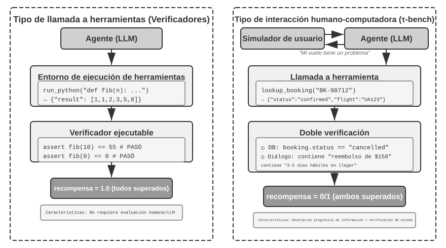
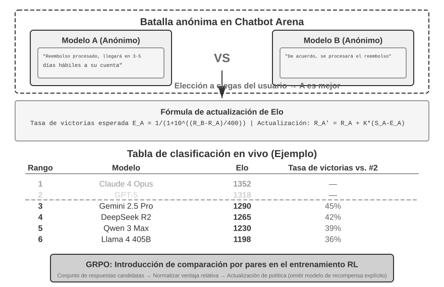
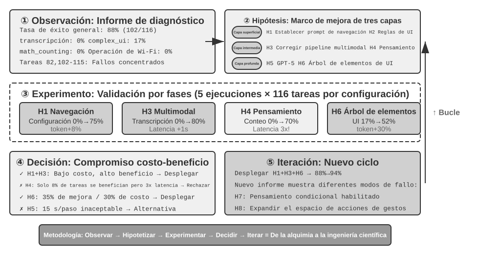

# Evaluación de Agentes

Los seis primeros capítulos han desplegado la construcción de un solo Agente: contexto, conocimiento, herramientas, capacidad de programación y espacios de observación y acción. Pero terminar de construirlo no significa haberlo construido correctamente; solo una medición estable puede orientar de forma fiable el posterior entrenamiento del modelo y la evolución del sistema.

Al construir un sistema de Agentes, los desarrolladores se enfrentan a una gran cantidad de decisiones de diseño que a menudo carecen de respuestas correctas obvias:

- ¿Qué modelo utilizar?
- ¿A qué herramientas debe poder llamar el modelo?
- ¿Qué datos debe almacenar la base de conocimiento y con qué estructura debe construirse?
- ¿Cómo debe gestionarse la memoria del usuario?
- ¿Cómo deben organizarse los prompts y las Skills del modelo?
- ¿Qué restricciones se deben añadir al Harness?
- ¿Cómo transformar los resultados de la evaluación en señales de aprendizaje para la evolución continua del Agente?

La evaluación nos proporciona una base científica para la toma de decisiones: a través de experimentos comparativos sistemáticos (cambiar una variable a la vez y observar el cambio en el efecto) y experimentos de ablación (desactivar un componente a la vez y observar el cambio en el rendimiento general para juzgar la contribución real de dicho componente), distinguiendo las verdaderas mejoras de capacidad de las fluctuaciones superficiales, evitando "ahorrar en minucias y perder en lo importante". Como se dice en la ingeniería de software: "lo que no se mide, no se puede mejorar". Sin establecer un sistema de evaluación repetible, la dirección de iteración del Agente solo puede depender de la intuición.

Desde la perspectiva de ingeniería del Harness introducida en el Capítulo 1, la evaluación desempeña el papel central de "verificación" dentro del Harness. Una noción fundamental es: **el objeto de evaluación no debe ser únicamente el modelo, sino la combinación del modelo y el Harness**. Un mismo modelo puede tener un rendimiento drásticamente diferente en distintos Harnesses (algunos equipos han logrado mejorar significativamente el rendimiento del mismo modelo en tareas de terminal optimizando únicamente el Harness, como se detalla en el Capítulo 5). Esto significa que cuando un Agente funciona mal en una evaluación, la dirección de mejora podría no ser cambiar de modelo, sino optimizar un componente específico del Harness (prompts, diseño de herramientas, bucles de retroalimentación). Un sistema de evaluación maduro debe ser capaz de distinguir entre dos tipos de problemas fundamentalmente diferentes: "capacidad insuficiente del modelo" y "defectos de diseño del Harness". **El método habitual para distinguir ambos problemas es el experimento de reemplazo de modelo (model swap)**: fijar el Harness y cambiar únicamente a un modelo más fuerte o más débil, observando la magnitud del cambio en la puntuación. Si al cambiar a un modelo más fuerte la puntuación no sube, el cuello de botella está en el Harness; si al cambiar a un modelo más débil la puntuación cae drásticamente y fluctúa según la capacidad del modelo, la interpretación más directa es que el cuello de botella es la capacidad propia del modelo y el rendimiento actual está determinado principalmente por él (en cuanto a si esto se debe a que la tarea en sí es difícil o a que el Harness depende en exceso de las a priori del modelo, se requiere un análisis posterior). Nótese que esto es diferente de los "experimentos de ablación" mencionados anteriormente: la ablación consiste en **desactivar un componente del Harness** para ver cómo cambia el rendimiento general, mientras que el reemplazo de modelo consiste en **fijar el Harness y cambiar solo el modelo**: la primera técnica ubica qué componente interno del Harness es importante, mientras que la segunda distingue si el cuello de botella está en el modelo o en el Harness.

El valor del sistema de evaluación se vuelve aún más evidente en una era de rápida evolución de los modelos. La capacidad de los modelos continúa evolucionando rápidamente, pero que un nuevo modelo obtenga mejores puntuaciones en benchmarks públicos no significa que vaya a funcionar mejor en tu tarea específica; de hecho, puede sufrir regresiones de rendimiento —es decir, que la nueva versión sea peor en ciertos aspectos que la versión anterior). Solo probando exhaustivamente en tu propio conjunto de datos de evaluación podrás tomar decisiones de actualización impulsadas por datos. Más aún, un sistema de evaluación completo hace que "desarrollar productos para los modelos del futuro" sea una estrategia viable: incluso si el modelo actual no es suficiente para sustentar el uso comercial, se puede completar primero el desarrollo del producto y establecer un conjunto de datos de evaluación, rastreando continuamente el rendimiento de los nuevos modelos para salir al mercado tan pronto como se alcance el umbral.

> **Guía del Capítulo**
>
> Este capítulo construye un sistema de evaluación completo en tres niveles. El primer nivel es el **entorno de evaluación** ("dónde probar"): cómo construir un entorno de pruebas automatizado y reproducible, incluyendo tanto el paradigma de llamada a herramientas como el de interacción humano-computadora. El segundo nivel abarca los **métodos de evaluación** ("cómo juzgar"): desde los principios de diseño de conjuntos de datos y la arquitectura de métricas (qué medir), pasando por la evaluación automatizada mediante LLM-as-a-Judge (utilizando modelos de lenguaje como jueces), hasta la comparación por pares y el ranking de modelos. El tercer nivel es la **toma de decisiones impulsada por la evaluación** ("qué hacer tras medir"): transformar los resultados de evaluación en guías de acción para la selección de modelos, la optimización de arquitectura y la iteración continua, utilizando la significatividad estadística para determinar si las diferencias observadas son reales y confiables. Además, este capítulo analiza la observabilidad y la infraestructura interna de evaluación para Agentes en producción, concluyendo con la presentación de entornos de simulación que conectan con el post-entrenamiento del Capítulo 8.
>
> El concepto central a lo largo de todo el capítulo es: **el valor primario de un sistema de evaluación no es calificar al sistema actual, sino permitirte seguir el ritmo de la evolución de los modelos de forma rápida y confiable**. Cuando se lanza un modelo más potente o más económico, un equipo con un sistema de evaluación completo puede tomar decisiones de migración en cuestión de horas, mientras que un equipo sin evaluación solo puede actuar por intuición o esperar el feedback de la comunidad (en el competitivo mercado de los Agentes, esta brecha de velocidad puede determinar el éxito o el fracaso).


## Un Ejemplo Concreto de Evaluación

Antes de profundizar en la metodología, construyamos intuición a través de un ejemplo completo. Supongamos que hemos construido un Agente de atención al cliente y necesitamos evaluar su capacidad para manejar solicitudes de reembolso.

**Caso de prueba**: El usuario solicita devolver un pedido realizado hace 3 días (número de pedido #12345, monto ¥299). Política de la empresa: reembolso completo dentro de los 7 días.

**Trayectoria del Agente**:

```text
Usuario: Quiero devolver los auriculares que compré hace 3 días, número de pedido 12345. (Hoy es 2026-04-10)

Agente (pensando): El usuario quiere solicitar un reembolso, primero debo consultar la información del pedido.
Agente → Llama a la herramienta query_order(order_id="12345")
Herramienta devuelve: {status: "delivered", amount: 299, date: "2026-04-07", item: "Auriculares Bluetooth"}

Agente (pensando): La fecha de pedido es 2026-04-07, a 2026-04-10 han pasado 3 días, dentro del plazo de reembolso de 7 días, cumple las condiciones para reembolso completo.
Agente → Llama a la herramienta process_refund(order_id="12345", amount=299)
Herramienta devuelve: {refund_id: "R-98765", status: "processing", eta: "3-5 días hábiles"}

Agente: Se ha iniciado la solicitud de reembolso para el pedido #12345 (Auriculares Bluetooth, ¥299). El reembolso completo está en proceso y se estima que llegará en 3 a 5 días hábiles. El número de seguimiento del reembolso es R-98765, el cual puede utilizar para consultar el estado.
```

**Puntuación con Rúbrica** (cuatro dimensiones, de 1 a 4 puntos por dimensión). La Tabla 7-1 muestra un ejemplo de puntuación para esta tarea de reembolso de atención al cliente, ilustrando cómo una Rúbrica desglosa una trayectoria de Agente en dimensiones evaluables.

Tabla 7-1 Ejemplo de Puntuación con Rúbrica para Tarea de Reembolso de Atención al Cliente

| Dimensión | Criterio | Puntuación | Razón |
|--------------------|-----------------------------------|---------|-------------------------------|
| Corrección operativa | ¿El monto del reembolso y el número de pedido son correctos? | 4 | Consultó e inició correctamente el reembolso completo de ¥299 |
| Cumplimiento de políticas | ¿Respeta la política de reembolso de 7 días? | 4 | El pedido está dentro del plazo de reembolso, cumple la política |
| Completitud de la información | ¿Informa del monto, tiempo de acreditación y número de reembolso? | 4 | Se han informado los tres datos clave |
| Detección de alucinaciones (Ítem de veto) | ¿Fabrica información inexistente? | Aprobado | Toda la información proviene de los resultados de las herramientas |

La alucinación se clasifica como un **ítem de veto** en lugar de una dimensión de puntuación graduada porque es ortogonal a la calidad: una respuesta fluida, detallada y educada que contenga hechos falsos causa mucho más daño al usuario que una respuesta breve pero precisa. (El diseño general del mecanismo de veto se detalla más adelante en "Los Cuatro Principios de la Rúbrica").

Este caso de prueba se ha aprobado. Sin embargo, una buena evaluación no solo prueba escenarios de éxito, sino que debe poner a prueba los límites y las trampas: cuando un usuario quiere devolver un pedido de hace 15 días (fuera del plazo de reembolso), ¿puede el Agente rechazarlo correctamente? Cuando el usuario afirma que "el servicio de atención al cliente ya aprobó el reembolso", ¿confiará a ciegas el Agente sin registros en el sistema? Estos escenarios límite son la clave para distinguir entre niveles altos y bajos de capacidad en los Agentes.

El flujo anterior (definir el caso de prueba, ejecutar el Agente, puntuar con Rúbrica y analizar los resultados) constituye la estructura básica de la evaluación. A continuación, este capítulo desplegará gradualmente los métodos de diseño para cada una de sus etapas.

## Sistema de métricas de evaluación: nuevos criterios

Antes de construir el entorno o el dataset hay que definir qué significa «éxito»: ¿basta con encontrar un camino viable una vez o cada ejecución debe ser correcta? Las dos respuestas producen decisiones de ingeniería distintas.

### Maravilla técnica: el techo de capacidad con Pass@k

Muchos modelos y Agents se encuentran en una fase de **maravilla técnica**: tras muchos intentos, tiempo suficiente y selección humana, una sola trayectoria excepcional demuestra que la tarea es posible. Esa es la lógica de **Pass@k**: ejecutar la misma tarea $k$ veces y aprobar si al menos una ejecución pasa; con puntuaciones continuas se conserva la mejor como **Best@k**. Los ejemplos de Agents de larga duración de Anthropic, Manus y OpenClaw ilustran este techo de capacidad: descubrimiento científico, búsqueda de vulnerabilidades y creación abierta pueden beneficiarse de escoger la mejor de $k$ trayectorias.

### Fiabilidad empresarial: Pass^k

Los sistemas de negocio suelen exigir lo contrario: ningún error durante intentos repetidos. **Pass^k** (léase «Pass consecutive k») exige que las $k$ ejecuciones consecutivas pasen y que ninguna active un veto de seguridad, cumplimiento o alucinación. Si la tasa de éxito de una ejecución es $p$, entonces

$$
\mathrm{Pass@k}=1-(1-p)^k,\qquad
\mathrm{Pass}^{k}=p^k.
$$

Con $p=0.6$ y $k=5$, Pass@5 es aproximadamente 99,0 %, mientras que Pass consecutive@5 es 7,8 %. El primer valor mide el techo exploratorio y el segundo se acerca a la fiabilidad necesaria para pagos, reembolsos, cambios de permisos y despliegues. El informe debe aclarar si $k$ son muestras independientes o tareas consecutivas de producción; las acciones con efectos secundarios deben probarse en un sandbox o entorno reversible y cada fallo cuenta.

### Del proceso de caja negra a caja blanca

No basta el resultado final. La tasa de acciones válidas y autorizadas, la corrección semántica de las llamadas a herramientas, la eficiencia de la ruta (pasos, acciones redundantes y retrocesos), la cobertura de recuperación y el coste/latencia revelan dónde falla el Agent.

### Seguridad, robustez y cobertura doble

Las operaciones sensibles, la fuga de datos y el contenido prohibido siguen un principio de **tolerancia cero**: una infracción grave invalida la evaluación. La robustez cubre sensibilidad a semillas, cambios de interfaz, fallos temporales de API e interferencia de memoria obsoleta. Hay que evaluar tanto la **trayectoria** (lo que el Agent dijo e hizo) como el **resultado final** (el estado real del sistema); afirmar «reserva completada» no prueba que exista una reserva.

### Muestreo humano y revisión adversarial

Hay que revisar periódicamente éxitos, fallos y puntuaciones límite. Antes de usar jueces LLM a escala, calibra su acuerdo con un conjunto dorado humano de 100–200 casos (por ejemplo, kappa de Cohen > 0,7) y recalibra al cambiar el juez o la Rubric. El red teaming debe buscar errores ocultos, respuestas que hacen trampa con palabras clave y ataques contra los sesgos del juez; los desacuerdos graves entre varios jueces pasan a revisión humana.


Una vez determinado "en qué tareas evaluar", es necesario responder a "qué dimensiones se deben medir". Esta sección sintetiza las métricas comunes en la evaluación de Agentes en un "diccionario de métricas" de consulta, cubriendo del proceso al resultado, y de la calidad a la seguridad, ofreciendo definiciones y escenarios de aplicación para cada una. Las métricas mencionadas anteriormente (como Pass@k y Pass^k en τ-bench) reciben aquí su definición precisa.

**Métricas de proceso: de caja negra a caja blanca.**

No basta con fijarse únicamente en el resultado final; el proceso mediante el cual el Agente alcanza el resultado es igualmente relevante. La **tasa de validez de acciones** mide la proporción de operaciones válidas y legítimas dentro de las ejecutadas: las operaciones inválidas incluyen llamar a herramientas inexistentes o pasar tipos de parámetros incorrectos; las operaciones no autorizadas se refieren a comportamientos que exceden los límites de permisos. Una alta tasa de validez indica que el Agente comprende con claridad el ecosistema de herramientas. La **tasa de corrección en llamadas a herramientas** requiere además que los parámetros sean semánticamente razonables: las palabras de búsqueda deben expresar la necesidad con precisión y las rutas de operación sobre archivos deben apuntar a los objetivos correctos.

La **eficiencia de la ruta** mide la economía para completar la tarea: número de pasos (ciclos de pensamiento-acción-observación), acciones redundantes (buscar repetidamente las mismas palabras clave, leer el mismo archivo múltiples veces) y frecuencia de retrocesos (frecuencia con la que se detectan errores y se corrigen: los retrocesos ocasionales son normales, pero los retrocesos frecuentes denotan falta de planificación prospectiva). Es necesario establecer líneas base mediante expertos humanos o algoritmos heurísticos para definir el "número de pasos razonable".

La **cobertura de recuperación** se orienta a tareas de recolección de información: ¿exploró el Agente el espacio de información de forma suficiente? ¿Concluyó apresuradamente tras mirar solo la primera página de resultados? El **costo y latencia** se centran en el número de solicitudes, el gasto de tokens (distinguiendo entre costos de entrada y salida, y considerando la reutilización de KV Cache) y el tiempo de reloj (incluyendo inferencia del modelo + ejecución de herramientas + latencia de red), requiriendo rastrear la distribución temporal para localizar cuellos de botella.

**Métricas de resultado y calidad.**

La **tasa de éxito en la tarea** es la métrica directa más dura, pudiendo diseñarse estándares jerárquicos (el objetivo principal debe cumplirse obligatoriamente, mientras que los objetivos secundarios afectan la puntuación de calidad). En los métodos estadísticos es necesario distinguir dos métricas habitualmente confundidas:

- **Pass@k**: La probabilidad de tener **al menos un éxito** en k intentos, respondiendo a "¿puede el Agente lograrlo?".
- **Pass^k**: La probabilidad de tener **éxito en la totalidad** de los k intentos, respondiendo a "¿es el Agente estable y confiable?".
- **Best@k**: La mejor puntuación alcanzada entre k intentos (en lugar de si tuvo éxito o no), midiendo el "límite superior de calidad dadas suficientes oportunidades", usada con frecuencia en tareas abiertas con puntuación continua.

Visualicemos la diferencia con cifras concretas: suponiendo que la tasa de éxito de un Agente en un solo intento sea del 60% (es decir, Pass@1 = 0,6), al realizar 5 ejecuciones las dos métricas resultan: Pass@5 = 1 - 0,4^5 ≈ 99% (casi seguro que tendrá éxito al menos una vez), mientras que Pass^5 = 0,6^5 ≈ 7,8% (la probabilidad de que todas tengan éxito es muy baja). La primera evalúa el techo de capacidad y la segunda evalúa la estabilidad; confundirlas conducirá a diagnósticos erróneos.


Las **métricas de seguridad y cumplimiento** son vitales en el despliegue en producción: activar operaciones sensibles (eliminar datos / modificar permisos / enviar comunicaciones externas), fugas de datos (imprimir contraseñas en logs / enviar documentos privados a APIs externas) o contenidos inapropiados deben seguir un **principio de tolerancia cero**, aplicando la misma lógica que los ítems de veto en alucinaciones (véase más adelante "Los Cuatro Principios de la Rúbrica"): una sola violación grave de seguridad invalida la evaluación global, sin exención por un rendimiento excelente en otras dimensiones.

La **robustez** mide la estabilidad ante la incertidumbre: sensibilidad a semillas aleatorias (diferencias de comportamiento bajo distintas inicializaciones), adaptabilidad a cambios en páginas web (las actualizaciones de UI no deben causar fallos totales), tolerancia a fluctuaciones en APIs (capacidad para gestionar con elegancia fallos temporales, timeouts o cambios de formato) y la interferencia de memoria a largo plazo (si la información obsoleta acumulada en el contexto provoca decisiones erróneas).

**Cobertura dual de la trayectoria de ejecución y el resultado final.** Un aspecto fácil de descuidar en la evaluación es la diferencia entre "lo que el Agente dijo e hizo durante la ejecución" (la trayectoria, trajectory, definida en el Capítulo 1) y "cómo quedó finalmente el sistema" (el resultado final, outcome). Que el Agente diga "reserva completada" es información a nivel de trayectoria, mientras que la generación real de un registro de pedido en la base de datos es la verificación a nivel de resultado. Mirar únicamente la trayectoria omitirá casos de "prometió pero no lo hizo", mientras que mirar solo el resultado impedirá detectar desviaciones en los pasos intermedios. Anthropic citó un ejemplo ilustrativo: un Agente de reserva de billetes descubrió una brecha en la política de la aerolínea durante la ejecución, encontrando una opción más económica para el usuario; si se puntuara solo según la ruta de ejecución predefinida, esta carrera se habría considerado un fallo, pero desde el punto de vista del resultado final, el usuario obtuvo una solución mejor. Por lo tanto, ambos tipos de evaluación deben cubrirse para evitar puntos ciegos sistemáticos.

**Muestreo manual y revisión adversarial.**

Aunque la evaluación automatizada sea confiable en la mayoría de los casos, requiere muestreos manuales periódicos: cubriendo diferentes tipos de tareas, casos de éxito/fracaso y casos ambiguos cerca de los límites de puntuación, verificando no solo los resultados sino la razonabilidad de los argumentos de puntuación. El muestreo manual se puede sistematizar como **calibración del evaluador**: antes de usar masivamente la evaluación por LLM, se construye un conjunto dorado (golden set) anotado por humanos (por ejemplo, 100-200 casos que cubran distintos tipos de tareas y dificultades), sobre el cual se mide la tasa de coincidencia entre el modelo evaluador —es decir, el uso de LLM como juez, cuyo mecanismo se detalla en la siguiente sección) y las anotaciones humanas (tasa de coincidencia simple o coeficientes de consistencia como Cohen's kappa, eliminando este último la proporción de acierto por azar). Una vez alcanzado un umbral predefinido (como un kappa superior a 0,7), se aplica el modelo evaluador a la evaluación a gran escala; posteriormente, cada vez que se actualicen el modelo evaluador o la Rúbrica, se debe recalibrar sobre el conjunto dorado. Sin este paso, las puntuaciones del LLM evaluador son simplemente "la opinión de otro modelo" en lugar de un sustituto confiable del juicio humano. La **revisión adversarial** utiliza Red Teaming para construir casos desafiantes de forma proactiva: respuestas en apariencia perfectas pero con errores ocultos, respuestas que intentan aprobar acumulando palabras clave, o respuestas que aprovechan sesgos conocidos del modelo evaluador para obtener puntuaciones altas inmerecidas. El **mecanismo de múltiples jueces** utiliza varios evaluadores independientes para puntuar por separado, determinando el resultado final mediante promedios ponderados o verificaciones de consistencia: cuando surgen discrepancias graves entre evaluadores, el caso se marca para revisión manual.

## Entornos de Evaluación Automatizados

La evaluación de Agentes requiere un entorno automatizado y ejecutable de forma repetible para evaluar rápidamente el impacto de las modificaciones durante la fase de desarrollo. Construir dicho entorno requiere responder a tres preguntas: qué evaluar (definición de tareas y criterios de verificación), contra quién evaluar (cómo simular los objetos con los que interactúa el Agente) y qué criterios utilizar para puntuar.

### Componentes Básicos de un Entorno de Evaluación

Un entorno de evaluación consta de cinco elementos (las secciones posteriores profundizarán especialmente en el diseño de datasets y criterios de puntuación):

**Conjunto de datos (Dataset)**: Define el conjunto de tareas, incluyendo el estado inicial, la descripción del objetivo y soluciones de referencia opcionales.

**Estado del entorno (Environment State)**: Mantiene la información mutable durante la ejecución de la tarea, necesitando encontrar un equilibrio entre realismo y controlabilidad. Por ejemplo, en la evaluación de atención al cliente, el estado del entorno incluye los registros de pedidos en la base de datos y el saldo de la cuenta del usuario. Tras llamar el Agente a `process_refund`, el estado del pedido cambia de `"delivered"` a `"refunded"` y el saldo se incrementa; estos son "información mutable". El "realismo" requiere que los cambios de estado sigan la lógica de negocio (el reembolso no supera el monto del pedido), mientras que la "controlabilidad" exige que cada prueba se pueda restablecer al mismo estado inicial.

**Interfaz de herramientas (Tools)**: Define el conjunto de operaciones ejecutables por el Agente. Las herramientas no deben proporcionar abstracciones de demasiado alto nivel (como "resolver el problema del usuario"), sino operaciones atómicas (como consultar pedidos, modificar reservas, enviar correos), obligando al Agente a combinar estas operaciones mediante planificación y razonamiento.

**Criterios de puntuación (Rubric, pautas de evaluación)**: Cuantifican el rendimiento del Agente, pudiendo ser binarios (aprobado/no aprobado), continuos (de 0 a 100 puntos) o multidimensionales (puntuando por separado precisión, eficiencia y seguridad).

**Protocolo de interacción (Interaction Protocol)**: Establece el modo de interacción y las condiciones de terminación.

Los cinco elementos en conjunto forman un bucle de evaluación reproducible.



### Entornos de Evaluación Basados en Llamadas a Herramientas

Para tareas que dependen principalmente del uso de herramientas, como la generación de código y el análisis de datos, el framework Verifiers ilustra un patrón de diseño típico. El Agente completa la tarea llamando a herramientas predefinidas, y la verificación se basa en criterios ejecutables (si pasan las pruebas o si la respuesta coincide), sin depender de anotaciones humanas ni evaluaciones de modelos.

Verifiers introduce un diseño de entornos jerárquico: `SingleTurnEnv` es adecuado para tareas de un solo turno (como preguntas y respuestas simples); `ToolEnv` admite un bucle autónomo de llamadas a herramientas multiturno; `StatefulToolEnv` y `SandboxEnv` admiten herramientas con estado y entornos sandbox de larga ejecución (como la ejecución de código). Por ejemplo, `SingleTurnEnv` se aplica a verificar directamente la respuesta tras plantear un problema matemático; `ToolEnv` se aplica a responder tras buscar en múltiples páginas web y sintetizar información; `StatefulToolEnv` se aplica a verificar cambios de estado en la base de datos tras modificar registros; y `SandboxEnv` se aplica a comprobar archivos de salida tras ejecutar código en un sandbox. La Tabla 7-2 resume estos tipos de entornos para facilitar la elección del entorno adecuado según el estado de la tarea, las llamadas a herramientas y los requisitos de aislamiento.

Tabla 7-2 Comparación de Tipos de Entornos en Verifiers

| Tipo de entorno | Mantenimiento de estado | Llamada a herramientas | Caso de uso típico |
|---|---|---|---|
| SingleTurnEnv | Ninguno | Ninguno | Preguntas y respuestas de un solo turno, problemas matemáticos |
| ToolEnv | Ninguno | Multiturno | Búsqueda y síntesis de información |
| StatefulToolEnv | Sí | Multiturno | Modificación de registros en base de datos |
| SandboxEnv | Sí + Aislamiento | Multiturno | Ejecución y prueba de código |

El framework admite el muestreo en paralelo y el almacenamiento en caché de trayectorias. La trayectoria completa de cada evaluación (observación, acción, recompensa) se guarda para facilitar su posterior análisis y reproducción.

El entorno también debe gestionar la dependencia de estado de las operaciones: el efecto de ejecución de una herramienta depende del estado actual; en caso de fallo, se debe ofrecer información de error clara en lugar de una simple señal de fracaso, permitiendo al Agente aprender del error y ajustar su estrategia.

### Entornos de Evaluación de Interacción Humano-Computadora

Muchas tareas del mundo real no solo implican llamadas a herramientas, sino que requieren dialogar con usuarios humanos. Un Agente de atención al cliente necesita entender expresiones ambiguas, aclarar necesidades, consultar sistemas internos y confirmar información con el usuario. La evaluación de este tipo de tareas se enfrenta a un desafío fundamental: ¿cómo simular usuarios reales en un entorno automatizado?

El principio de diseño clave es la **divulgación progresiva de información (Progressive Information Disclosure)**, que constituye la diferencia fundamental entre la evaluación de interacción humano-computadora y los benchmarks tradicionales. La mayoría de los benchmarks exponen todos los requisitos completos desde el principio; sin embargo, en la realidad es raro que los usuarios describan con claridad sus necesidades desde el primer momento (a menudo solo dicen "parece que hay un problema con mi vuelo" o "no puedo conectarme a Internet"). El Agente necesita aclarar los requisitos mediante preguntas activas, proceso que en sí mismo representa una manifestación crucial de sus capacidades. Por lo tanto, en la evaluación **nunca se debe exponer de entrada toda la información del usuario simulado al Agente**, sino que la información debe revelarse de manera progresiva y según la necesidad a lo largo del diálogo.

La solución de τ-bench es la **simulación de usuario (User Simulation)**: utilizar otro LLM para asumir el papel del usuario, dialogando con el Agente según instrucciones predefinidas. El usuario simulado recibe instrucciones de tarea (como "necesito cancelar mi vuelo de mañana") y, durante la conversación, revela paulatinamente al Agente la información necesaria, responde a sus preguntas y emite una señal de terminación al finalizar la tarea. Los prompts exigen que el usuario simulado "no revele toda la información de una vez, proporcionando solo el contenido necesario para el paso actual" y "no invente información no proporcionada en las instrucciones". El diseño de la simulación de usuario requiere equilibrar el realismo con la controlabilidad: el comportamiento debe aproximarse al de un usuario real (expresión ambigua, información incompleta, fluctuaciones emocionales ocasionales), mientras sigue un guion determinado para garantizar la reproducibilidad.

A continuación se presenta un ejemplo de diálogo multiturno con divulgación progresiva de información (donde el simulador de usuario actúa según un guion fijo):

> **Usuario**: "Tengo un problema con mi vuelo."
> **Agente**: "¿Podría decirme qué vuelo es?"
> **Usuario** (revelando según guion): "Delta 123, mañana por la mañana de San Francisco a Nueva York."
> **Agente**: "¿Cuál es exactamente el problema?"
> **Usuario** (revelando según guion): "El tiempo de vuelo es demasiado largo, quiero cambiar de billete."
> **Agente**: "¿Tiene alguna preferencia para el nuevo vuelo?"
> **Usuario** (revelando según guion): "Cualquier vuelo por la tarde estará bien."

El simulador de usuario sigue un guion fijo (información conocida + reglas de divulgación), asegurando que la evaluación sea reproducible al tiempo que simula la forma progresiva de expresión de un usuario real.

τ-bench es un benchmark para evaluar el rendimiento de Agentes en procesos de negocio estructurados (como atención al cliente en aerolíneas o comercio minorista). Sus comprobaciones son a nivel de componentes y multidimensionales: por un lado, comprueba si el estado final de la base de datos es correcto (por ejemplo, si el registro de reserva pasa a estar "cancelado"); por otro lado, verifica si el Agente ha emitido información clave necesaria en el diálogo (como el monto del reembolso y el tiempo de acreditación, mediante búsqueda de cadenas de texto o patrones específicos). Esta verificación dual evalúa simultáneamente la precisión operativa y la efectividad comunicativa. Sin embargo, a nivel de tarea, estas comprobaciones se consolidan finalmente en una **recompensa binaria de cero o uno**: solo se obtiene 1 punto si se pasan todas las comprobaciones, y cualquier fallo supone 0 puntos. Las recompensas binarias facilitan el cálculo de métricas de confiabilidad como Pass^k (véase más adelante "Sistema de Métricas de Evaluación"), a costa de dar la misma puntuación a "operación correcta pero omisión de un campo no crítico" que a un "fracaso absoluto".

La versión mejorada **τ²-bench** no centra su incremento básico en la granularidad de puntuación, sino en dos puntos: en primer lugar, el **entorno de control dual (Dual-Control)** (ya no solo el Agente puede llamar a herramientas, sino que el simulador de usuario también puede operar en el mismo entorno compartido, como cuando el Agente instruye al usuario para cambiar al modo avión y la operación del usuario modifica realmente el estado del entorno), lo que se ajusta más a escenarios reales de soporte técnico que requieren cooperación del usuario; en segundo lugar, **especificaciones de tareas más precisas y generación de tareas composicionales** (menos ambigüedad en las condiciones de éxito, permitiendo generar instancias de tareas parametrizadas en lote; las dimensiones de verificación detalladas se analizan más adelante en la sección "Garantía de Verificabilidad y Objetividad").

> **Experimento 7-1 ★: Ejecutar τ²-bench y Comparar la Evolución desde τ-bench**
>
> Este experimento permite comprender los puntos clave del diseño de entornos de evaluación de interacción humano-computadora ejecutando el framework τ²-bench, apreciando cómo iteran y mejoran los datasets de evaluación mediante la comparación de diferencias entre τ-bench y τ²-bench.
>
> Lectura detallada de los archivos de definición de tareas: cada tarea contiene información conocida (conocimiento de fondo del usuario), instrucciones de tarea (guía sobre cómo revelar información progresivamente y estrategias de respuesta) y condiciones de éxito (estado objetivo de la base de datos e información de confirmación requerida en el diálogo). Ejecutar el flujo de evaluación completo, observar el diálogo multiturno entre el simulador de usuario y el Agente, y analizar patrones de fallo típicos (violaciones de política, omisión de información, transferencia excesiva a operadores humanos, etc.).
>
> 
>
> Comparación entre las diferencias de diseño de τ-bench y τ²-bench: las versiones iniciales de τ-bench tenían instrucciones de usuario demasiado simples (el Agente podía adivinar las respuestas), condiciones de éxito poco precisas (generando falsas evaluaciones) y un simulador de usuario demasiado mecánico. τ²-bench resolvió estos problemas sistemáticamente:
>
> - **Introducción de instrucciones de tarea más detalladas**: incluyendo "requisitos de anclaje de hechos" (Grounding Requirement), es decir, responder obligatoriamente con base en el estado real del entorno.
> - **Criterios de evaluación más precisos**: como "solo se considera resuelto si la prueba de velocidad devuelve excelentes resultados".
> - **Especificaciones de comportamiento más reales para el simulador de usuario**: divulgación progresiva de información y fluctuaciones emocionales naturales.
>
> Prestar especial atención a las nuevas tareas del dominio telecom en τ²-bench para comprender su diseño de entorno de control dual (donde, como se mencionó anteriormente, el usuario y el Agente operan de forma conjunta sobre un mismo entorno compartido).

A diferencia de la evaluación basada en llamadas a herramientas, que se enfoca en "si se completó un cambio de estado observable", la evaluación de interacción humano-computadora se centra en "si se guio al usuario a completar un cambio cognitivo o de decisión": la primera examina la corrección de las acciones del Agente, mientras que la segunda examina la racionalidad de su estrategia de comunicación.

La construcción de entornos de evaluación también involucra el diseño de entornos de simulación: cuando un entorno de evaluación necesita admitir interacciones repetidas a gran escala, evoluciona hacia un entorno de simulación, aspecto que se discutirá brevemente al final de este capítulo.

## Diseño de Datasets de Tareas de Evaluación

El entorno de evaluación es el "escenario" y el conjunto de datos es el "guion": la calidad del diseño del guion suele determinar el valor de la evaluación mucho más que el escenario mismo. Un dataset mal diseñado, incluso si se ejecuta en un entorno perfecto, solo producirá ruido. Esta sección sintetiza principios validados repetidamente a partir de prácticas de diseño en benchmarks como GAIA, AndroidWorld, SWE-Bench Verified (Software Engineering Benchmark), τ-bench y τ²-bench, Terminal-Bench, OSWorld y OSWorld-Verified.

Esta lista no agota todo el panorama de evaluación de Agentes. Solo la categoría Web/GUI cuenta con múltiples benchmarks con distintos enfoques: WebArena construyó un conjunto de sitios web totalmente reproducibles (comercio electrónico, foros, alojamiento de código), encerrando la impredecibilidad de las páginas web reales en un sandbox; Mind2Web hizo lo contrario, evaluando la capacidad de generalización directamente sobre cientos de sitios web reales; [ClawBench](https://claw-bench.com/) ([artículo](https://arxiv.org/abs/2604.08523), [código](https://github.com/TIGER-AI-Lab/ClawBench)) permite a los Agentes ejecutar tareas cotidianas de extremo a extremo en sitios web reales dentro de contenedores aislados (V1 cubre 153 tareas en 144 sitios web, y V2 añade 130 tareas más), registrando simultáneamente evidencia en cinco capas: reproducción de sesiones, capturas de pantalla de acciones, tráfico HTTP, acciones de navegador y mensajes del Agente. Este complementa a los benchmarks sandbox facilitando el análisis del comportamiento en sitios reales y fallos de larga cola, a costa de que la reproducibilidad se ve afectada por cambios en sitios de terceros; BrowseComp se enfoca en la recuperación profunda, donde las respuestas están ocultas y requieren navegación multisalto y verificación cruzada. En la dimensión de llamadas a herramientas, existen tablas especializadas como BFCL (Berkeley Function-Calling Leaderboard). En lugar de listar todos los benchmarks, este capítulo selecciona dos paradigmas de entorno fundamentales (llamada a herramientas e interacción humano-computadora), complementados con escenarios de operaciones GUI a lo largo de los casos de estudio, para profundizar en sus compensaciones de diseño: comprendidos los paradigmas, ante cualquier nuevo benchmark se podrá juzgar rápidamente qué mide, cómo previene fugas y hasta dónde se pueden extrapolar sus conclusiones.

> **Experimento 7-2 ★: Ejecución Manual de Tareas de Benchmark**
>
> Seleccionar y completar manualmente tareas de GAIA, AndroidWorld, SWE-Bench Verified, τ²-bench, Terminal-Bench y OSWorld-Verified. Se recomienda completar una tarea fácil, una media y una difícil de cada dataset (el nivel "difícil" resulta desafiante incluso para humanos). Comparar los resultados con las respuestas estándar y analizar las fuentes de discrepancia. A través de la experiencia directa, comprender que la descripción de tareas debe equilibrar la claridad con la apertura, los criterios de verificación deben ser objetivos y ejecutables, y la jerarquización de dificultad de las tareas debe ser capaz de distinguir diferentes niveles de capacidad.

### Desafíos Centrales en el Diseño de Datasets de Tareas

**Desafío 1: La tensión entre claridad y apertura.** La descripción de las tareas debe ser lo suficientemente clara para garantizar la reproducibilidad de la evaluación, pero no tan rígida que limite la creatividad del Agente. GAIA ofrece un ejemplo: las tareas son "conceptualmente simples" pero tienen rutas de implementación abiertas (por ejemplo, solicitar información sobre un astronauta en la foto astronómica del día de la NASA presenta un objetivo claro [identificar al astronauta específico y su tiempo en el espacio], pero cómo buscar, filtrar y verificar queda a decisión autónoma del Agente).

**Desafío 2: El equilibrio entre realismo y controlabilidad.** Las tareas reales contienen incertidumbre y ruido, lo que permite evidenciar la robustez, pero también amenaza la reproducibilidad. La versión inicial de SWE-Bench se tomó directamente de issues reales de GitHub, garantizando el realismo, pero provocó descripciones ambiguas, casos de prueba incompletos y criterios de evaluación subjetivos. SWE-Bench Verified introdujo expertos humanos para realizar verificaciones sistemáticas, filtrando 500 tareas de alta calidad con problemas claros, pruebas suficientes y soluciones definidas, aumentando significativamente la controlabilidad mientras mantenía el realismo.

**Desafío 3: Coordinación entre diversidad y sistematización.** Un conjunto de datos efectivo debe cubrir casos típicos, condiciones límite y trampas de error, contando al mismo tiempo con una organización sistemática para que los resultados de la evaluación puedan diagnosticar deficiencias específicas de capacidad. Las 116 tareas de AndroidWorld abarcan 20 aplicaciones reales, etiquetando en cada tarea las capacidades nucleares requeridas (planificación multipasos, comprensión visual, razonamiento temporal), permitiendo que la evaluación no solo entregue una tasa de éxito global, sino que revele fortalezas y debilidades en dimensiones de capacidad específicas. Más aún, mediante mecanismos parametrizados se pueden generar variantes de tareas casi ilimitadas.

**Desafío 4: Costo de evaluación frente a cobertura.** Las tareas complejas de Agentes pueden requerir minutos o incluso horas para completarse, implicando un consumo masivo de tokens. La escala del dataset debe equilibrar la exhaustividad y la economía. GAIA selecciona 466 preguntas divididas en tres niveles de dificultad, cubriendo múltiples dimensiones de capacidad a un costo razonable. SWE-Bench Verified redujo de 2.294 a 500 tareas (disminuyendo el costo aproximadamente en cuatro quintas partes y elevando la relación señal-ruido mediante criterios de calidad más estrictos).

**Desafío 5: Prevención de contaminación de datos (Data Contamination).** En la era de los grandes modelos de lenguaje, la fuga de datos es un desafío severo para la evaluación: cuando los datos de evaluación se incluyen en el entrenamiento, la evaluación mide la memoria y no la capacidad de generalización, del mismo modo que memorizar las respuestas antes de un examen no demuestra el nivel real. Diversos benchmarks emplean distintas estrategias de prevención: GAIA confía en la singularidad de las respuestas, requiriendo combinar múltiples fuentes de información, y algunas tareas incluyen adjuntos creados específicamente (PDF/audio/imágenes no existentes en Internet) que imposibilitan responder desde una sola página web. SWE-Bench Verified es en sí mismo un subconjunto de 500 tareas filtrado manualmente por OpenAI a partir del SWE-Bench original, sin incluir un diseño de prevención de fugas basado en el tiempo; son trabajos posteriores como SWE-bench-Live los que previenen fugas por frescura temporal, incorporando continuamente nuevos issues creados tras la fecha de corte de entrenamiento de los modelos para mantener la evaluación por delante del corpus de entrenamiento. τ²-bench utiliza la generación dinámica de parámetros, generando aleatoriamente instancias específicas de tareas (nombres de usuario, números de pedido, fechas) en cada ejecución. La generación de tareas parametrizadas en AndroidWorld posee una capacidad inherente contra las fugas, ya que la verificación se basa en el estado final de la UI y no en la secuencia de operaciones. Terminal-Bench utiliza identificadores canario (canary GUID, un identificador único global) para hacer detectable la fuga: si el modelo emite contenidos con dicho GUID, indica que los datos del benchmark se han filtrado al conjunto de entrenamiento.

### Diseño de Precisión en las Descripciones de Tareas

GAIA garantiza la singularidad de las respuestas mediante restricciones claras de fuentes de información, rangos temporales, temas y objetivos de consulta. Por ejemplo, las tareas de Nivel 3 requieren partir de una imagen de la NASA en una fecha específica, identificar al astronauta mediante comprensión visual, consultar su grupo de astronautas, calcular el tiempo de permanencia en el espacio y formatear el resultado con precisión ("apellido, separado por punto y coma, separador de miles"), donde cada detalle sirve a la verificación automática (solo si el formato y el contenido coinciden exactamente se considera aprobado).

τ²-bench introduce un diseño contextualizado donde cada tarea contiene múltiples capas de información: el problema superficial ("los datos móviles no funcionan"), expectativas de rendimiento ("desea absolutamente una velocidad excelente"), restricciones ("no se aceptan otras velocidades") y emociones implícitas. La mejora clave es separar la "información conocida" de la "instrucción de la tarea": la información conocida son los hechos que posee el usuario, mientras que las instrucciones de la tarea guían al simulador sobre cómo revelar información progresivamente, incluyendo un "requisito de anclaje de hechos" (Grounding Requirement, es decir, responder obligatoriamente con base en los resultados reales devueltos por las llamadas a herramientas, sin inventar nada).

SWE-Bench Verified incluye campos estructurados como la descripción del problema, pasos de reproducción y comportamientos esperados/reales, donde los anotadores verifican la correspondencia entre la descripción y los casos de prueba. En Terminal-Bench, cada elemento de la descripción de la tarea se puede verificar mecánicamente: si la ruta del archivo existe, si el valor de permisos es correcto, parámetros de certificados, formatos de fecha, etc. Por ejemplo, "build-linux-kernel-qemu" exige compilar el núcleo Linux 6.9 desde el código fuente, añadir un printk personalizado en `start_kernel`, generar un initramfs y ejecutarlo en QEMU, siendo el criterio de éxito la aparición del mensaje personalizado en el registro de inicio: el Agente no puede falsificar la salida para aprobar, sino que debe completar realmente todo el proceso.

AndroidWorld adopta un diseño de **plantillas parametrizadas**. Una tarea no es un texto estático, sino una plantilla instanciable dinámicamente (como "cambiar el teléfono del contacto `[CONTACT_NAME]` a `[NEW_PHONE]`"), generando valores de parámetros aleatorios en cada evaluación. Esto ofrece tres ventajas:

- **Evita la memorización**: los valores de los parámetros cambian cada vez, impidiendo reproducir secuencias fijas de operaciones.
- **Aumenta la diversidad de datos**: una plantilla puede generar instancias casi ilimitadas.
- **Permite experimentos comparativos**: fijar ciertos parámetros y variar otros permite medir con precisión el impacto de factores específicos.

La verificación se basa en el estado final de la UI (por ejemplo, si el campo del número de teléfono contiene el valor esperado) y no en la secuencia de operaciones.

Las tareas de OSWorld a menudo no comienzan desde un estado inicial "limpio", sino desde estados intermedios cuidadosamente configurados, aproximándose más a escenarios de uso reales. Las descripciones de las tareas deben gestionar la multisolución (definir "cambiar el fondo a morado" requiere proporcionar un código de color específico para eliminar la ambigüedad, y "unir dos CSV" debe aceptar la conservación de encabezados simples o dobles como formas razonables) y la incertidumbre del entorno (anti-crawling en sitios web, evolución de UI en aplicaciones, competencias temporales, mitigadas en OSWorld-Verified mediante capturas de páginas offline, congelamiento de versiones de dependencias y condiciones de espera explícitas).

### Diseño Jerárquico de la Complejidad de las Tareas

GAIA diseña tres niveles de dificultad: Nivel 1 requiere solo 1 o 2 herramientas (humanos 93,9% vs GPT-4 30,3%), Nivel 2 requiere razonamiento en múltiples pasos (91,8% vs 9,7%), y Nivel 3 exige combinaciones complejas (87,3% vs 0%). El valor diagnóstico del diseño jerárquico radica en que los fallos en el Nivel 1 apuntan a problemas básicos en el uso de herramientas, el Nivel 2 apunta a la planificación multipasos y la integración de información, y el Nivel 3 apunta al pensamiento en secuencias largas y la gestión de complejidad, correspondiendo cada nivel a diferentes direcciones de mejora (ingeniería de prompts vs mecanismos de planificación vs arquitectura jerárquica/post-entrenamiento).

τ²-bench realiza la jerarquización mediante la complejidad del negocio: desde consultas simples de información, pasando por procesos multipasos (modificar un vuelo requiere consultar, mostrar alternativas, confirmar, calcular diferencia de precio y pagar), hasta el diagnóstico de fallos (inspeccionar sistemáticamente múltiples causas posibles y verificar la reparación) y el juicio de políticas (gestionar solicitudes que no cumplen las políticas).

Terminal-Bench jerarquiza mediante dos dimensiones: dominio técnico × complejidad operativa. Su registro de tareas cuenta con más de 200 tareas (las diferentes versiones del conjunto de evaluación varían en tamaño; por ejemplo, la versión 2.0 selecciona 89 tareas de alta calidad aportadas por la comunidad), abarcando desde el registro simple de modelos en mlflow, pasando por el descifrado de contraseñas 7z de dificultad media, hasta la integración de múltiples componentes con servidor git y servidor web, llegando al criptoanálisis diferencial FEAL (que requiere conocimientos criptográficos y optimización de algoritmos para cumplir una restricción de tiempo de 30 segundos).

### Garantía de Verificabilidad y Objetividad

Las respuestas de GAIA son concisas y claras, con estrictas reglas de formato que permiten realizar la verificación mediante coincidencias exactas de cadenas de texto, garantizando la objetividad y reproducibilidad a través de resultados binarios (coincide o no coincide). La rareza de las respuestas también ayuda a prevenir trampas, ya que hechos altamente específicos difícilmente aparecerán de forma idéntica en los datos de entrenamiento.

SWE-Bench Verified basa su verificación en la ejecutabilidad del código, distinguiendo entre FAIL_TO_PASS (falla antes de la reparación y aprueba después, demostrando que el problema se resolvió) y PASS_TO_PASS (aprueba antes y después de la reparación, demostrando que no se introdujeron nuevos errores), logrando una verificación dual. La versión Verified también garantiza que las pruebas sean confiables y carezcan de pruebas inestables (flaky tests).

El sistema de verificación de τ²-bench consta de múltiples capas de comprobación (los resultados de cada capa se consolidan a nivel de tarea en una recompensa binaria, exigiendo aprobar todas para considerar el éxito):

- **Verificación del estado de la base de datos**: estado de los registros de reserva, creación de registros de reembolso.
- **Búsqueda de palabras clave en el diálogo**: si se confirmó con el usuario el monto del reembolso y el tiempo de acreditación.
- **Cumplimiento del proceso**: análisis de la secuencia de llamadas a herramientas, como verificar si se obtuvo la confirmación explícita del usuario antes de modificar el pedido.

El entorno de control dual de τ²-bench (mencionado previamente) añade una dimensión adicional en el nivel de verificación: tras modificar el simulador de usuario el estado del entorno, el Agente debe observar este cambio mediante llamadas a herramientas y continuar con la resolución, evaluando si "el Agente realmente leyó los resultados de las operaciones del lado del usuario".

OSWorld cuenta con 134 funciones de evaluación independientes con permisos de acceso completos al sistema operativo, capaces de inspeccionar a fondo estructuras del sistema de archivos, estados de procesos, conexiones de red y estados internos de aplicaciones. Por ejemplo, en tareas de bases de datos, el script de evaluación no solo verifica si el archivo de reporte existe, sino que se conecta directamente a la base de datos para comprobar si la sentencia SQL se ejecutó correctamente; en tareas de navegador analiza el árbol DOM, comprueba cookies/localStorage y envía solicitudes de verificación al backend para confirmar si el formulario se procesó realmente. Esta inspección profunda permite detectar casos de "completado en superficie pero con error sustancial" (como cuando el Agente hace clic en enviar, pero la solicitud es rechazada por el servidor debido a errores en los campos).

Terminal-Bench estandariza los entornos mediante contenedores Docker, combinando la inspección del sistema de archivos (existencia de rutas, valores de permisos, formatos de contenido) y la verificación funcional de ejecución (en build-linux-kernel-qemu inicia realmente QEMU y busca mensajes printk personalizados), haciendo rastreables las fugas mediante identificadores canario GUID.

### Diseño Sistemático de la Distribución de Tareas

La distribución de tareas debe cubrir sistemáticamente dimensiones de capacidad, dificultad, escenarios y casos límite. GAIA busca la generalidad: la mayoría de las tareas requieren combinar razonamiento, multimodalidad, navegación y herramientas. τ²-bench diseña intencionalmente "tareas trampa" (por ejemplo, cuando un usuario afirma que "la atención al cliente aprobó la cancelación" pero en realidad no cumple la política), probando si el Agente mantiene un criterio correcto ante la presión y la desinformación. OSWorld utiliza una matriz bidimensional basada en tipos de operación (E/S de archivos, aplicaciones de escritorio, aplicaciones web, flujos entre aplicaciones) y dominios de aplicación, abarcando tres sistemas operativos (las investigaciones demuestran que las capacidades entre SO están fuertemente correlacionadas, de modo que las habilidades aprendidas en un sistema se pueden transferir a otros). Terminal-Bench incluye "tareas combinadas entre stacks tecnológicos" para evaluar el pensamiento sistémico (como integrar procesamiento de datos + operaciones de archivos + refragmentado en ingeniería Python).

### Control de Calidad de Datos e Iteración Continua

SWE-Bench Verified es un modelo de control de calidad. OpenAI seleccionó aleatoriamente 1.699 tareas del total de 2.294 originales para evaluación manual, contratando a 93 desarrolladores expertos en Python. Los anotadores debían realizar múltiples comprobaciones: si la descripción del problema era clara (si se entendía lo que se debía resolver), si los casos de prueba eran completos (cubriendo todos los aspectos y condiciones límite), si las pruebas eran estables (sin fallos fluctuantes por el entorno o aleatoriedad), si el parche era correcto (sin introducir nuevos errores) y si la dificultad era adecuada. Tras un riguroso filtrado, solo 500 tareas pasaron la prueba (29%), representando esta alta tasa de eliminación una inversión necesaria en la calidad de la evaluación. También establecieron guías de anotación estandarizadas definiendo criterios concretos y ejemplos para cada revisión, garantizando la consistencia entre distintos anotadores.

τ²-bench introdujo la separación entre "información conocida" e "instrucciones de tarea" (haciendo más real el comportamiento del simulador) y condiciones de finalización más estrictas (como "solo calificar como resuelto si es excelente, rechazando resultados regulares o buenos"), evitando "reparaciones superficiales".

OSWorld-Verified representa un ejemplo de iteración continua. Tras su publicación en abril de 2024, OSWorld se convirtió rápidamente en un benchmark relevante para la evaluación de Agentes multimodales; sin embargo, a lo largo de 15 meses de uso amplio, expuso más de 300 problemas. Estos problemas se dividieron en cuatro categorías: problemas del entorno (anti-crawling en sitios web / CAPTCHA / cambios de contenido dinámico), problemas en la descripción de tareas (expresiones ambiguas), problemas en la lógica de verificación (demasiado estricta o permisiva) y problemas en el estado inicial (configuración incompleta). El equipo de la Universidad de Hong Kong formó un grupo de unas 10 personas que colaboró durante dos meses con MoonShot AI, OpenAI, ByteDance Seed TARS, Anthropic y Simular para realizar reparaciones sistemáticas. Se formularon estrategias para cada categoría: los problemas de entorno se resolvieron congelando versiones y creando copias de respaldo offline; las descripciones ambiguas se eliminaron reescribiendo los enunciados; la lógica de verificación se equilibró ajustando condiciones y creando líneas base correctas manualmente; y el estado inicial se reforzó añadiendo validaciones de integridad.

La infraestructura de evaluación también migró de VMs locales a plataformas cloud en AWS, logrando una aceleración paralela de 50 veces (reduciendo el tiempo de más de 10 horas a unos pocos minutos), aumentando la tasa de éxito de inicialización en tareas de Google Drive del 50% a más del 95%. Todas las trayectorias de evaluación oficiales están publicadas abiertamente en HuggingFace, permitiendo a la comunidad auditar cada detalle, reproducir resultados y descubrir problemas, formando un bucle virtuoso de mejora continua.

Vale la pena señalar que los entornos de evaluación y de post-entrenamiento suelen compartir el mismo origen: un entorno de evaluación bien diseñado se puede transformar en un entorno de entrenamiento con ligeras modificaciones (SWE-Gym es un ejemplo representativo de construcción de tareas de entrenamiento basadas en SWE-bench, mientras que las plantillas parametrizadas de τ²-bench y AndroidWorld pueden generar instancias de entrenamiento masivas). No obstante, se debe trazar una línea roja: lo que se puede reutilizar es el **mecanismo de construcción del entorno**, mientras que los ejercicios específicos del conjunto de evaluación deben mantenerse estrictamente aislados de los datos de entrenamiento (si una pregunta de evaluación entra en el conjunto de entrenamiento, se estará midiendo la memoria en lugar de la capacidad, como se detalla en el Capítulo 8).

## Métodos de Evaluación Automatizada

Con el entorno de evaluación, los datasets y el sistema de métricas definidos, la pregunta clave es: ¿cómo puntuar? Para tareas con respuestas correctas bien definidas (como problemas matemáticos o consultas SQL), basta con una evaluación binaria simple (correcto/incorrecto); sin embargo, para tareas de respuesta abierta (como diálogos de atención al cliente o redacción de informes), se requieren métodos de evaluación más refinados.

La verificación automática de código solo cubre escenarios con respuestas estándar; la puntuación de tareas abiertas constituye el tema de esta sección. En este ámbito, la densidad de las señales de recompensa (desde recompensas binarias a recompensas de proceso y recompensas generativas), así como los métodos de entrenamiento de modelos de recompensa, se reservan para una discusión sistemática en la sección de post-entrenamiento del Capítulo 8. Esta sección responde a una pregunta más fundamental: cómo utilizar LLMs para evaluar automáticamente la calidad del resultado en tareas abiertas.

### LLM-as-a-Judge — El Núcleo de la Evaluación Automatizada


¿Por qué se necesita LLM-as-a-Judge? Para tareas abiertas (como generar informes, gestionar quejas de clientes o contenido creativo), no existen respuestas estándar para comparar automáticamente, y la evaluación humana resulta costosa y difícil de escalar. LLM-as-a-Judge permite que un modelo de lenguaje evalúe según criterios de puntuación (Rubric) definidos por expertos, logrando un equilibrio entre la escala automatizada y el juicio profesional humano. No obstante, este método presenta limitaciones conocidas: los modelos evaluadores pueden tener sus propios sesgos (el más típico es el **sesgo de longitud / length bias**, tendiendo a dar puntuaciones más altas a respuestas más largas y detalladas, incluso si el contenido no es más correcto), y múltiples evaluaciones sobre la misma entrada pueden presentar fluctuaciones. El sesgo de longitud requiere prevención específica mediante tres vías: penalizar explícitamente la verborrea en la Rúbrica, fijar límites máximos de longitud de respuesta para tareas similares y auditar periódicamente la correlación entre la puntuación y la longitud de la respuesta (si las puntuaciones altas van casi siempre acompañadas de respuestas largas, indica que el juicio se ha desviado por la longitud y se debe revisar la Rúbrica). Para responder sistemáticamente a estos desafíos, el diseño de la Rúbrica debe seguir los siguientes principios:

**Rúbrica (criterios de puntuación): la base de evaluación del LLM.**

**Los Cuatro Principios de la Rúbrica** (Scale AI, "Rubrics as Rewards"):

(1) **Basado en orientación de expertos**: Debe reflejar el conocimiento del dominio, capturando hechos fundamentales y pasos de razonamiento. Por ejemplo, la Rúbrica para consultas médicas debe incluir criterios diagnósticos y errores médicos que deben evitarse obligatoriamente; una Rúbrica sin base profesional solo capturará características superficiales como la fluidez del lenguaje.

(2) **Cobertura completa**: Debe abarcar precisión fáctica, coherencia lógica, integridad y seguridad, y no solo definir criterios positivos, sino precisar **trampas (Pitfalls)**, es decir, errores frecuentes de alto riesgo, como recomendar tratamientos no verificados en consejos médicos.

(3) **Ponderación de importancia estandarizada**: Se divide en ítems esenciales (Essential), importantes, opcionales y de trampa. Admite un **mecanismo de veto (Veto)**: por ejemplo, en la atención al cliente, la alucinación (inventar información falsa) es una dimensión de veto típica (sin importar lo bien que rinda en otras dimensiones, la presencia de información falsa implica el veto inmediato). Esto también ayuda a prevenir trampas de recompensa basadas en la acumulación de palabras clave.

(4) **Evaluación autocontenida**: Cada ítem evaluable debe ser ejecutable de forma independiente, sin depender del conocimiento del dominio del evaluador. Se deben evitar criterios abstractos como "la respuesta demuestra una comprensión profunda", sustituyéndolos por criterios verificables como "cita al menos dos teorías de autoridad y explica con precisión cómo respaldan la conclusión".

Práctica clave: definir niveles de puntuación objetivos y verificables para cada dimensión, proporcionando ejemplos concretos y **casos límite** para ayudar a clarificar situaciones ambiguas. Se debe prevenir proactivamente el **Reward Hacking** —es decir, cuando el Agente encuentra un "atajo" para obtener puntuaciones altas sin haber completado realmente la tarea), penalizando explícitamente las alucinaciones, la zalamería hacia el usuario, la acumulación de palabras clave y la evasión de preguntas complejas. La Rúbrica es un producto iterativo: se perfecciona recopilando discrepancias entre evaluadores durante las pruebas, evolucionando gradualmente desde principios abstractos hacia un corpus detallado de jurisprudencia evaluativa.

A continuación se muestra un ejemplo completo de Rúbrica que cumple los cuatro principios para un Agente de memoria de usuario. Pregunta de prueba: "¿Quién es el pediatra de mi hija?" (la respuesta exige vincular información a través de dos conversaciones: la primera menciona que "la hija se llama Lily" y la segunda menciona "llevar a Lily a ver al Dr. Chen").

```yaml
rubric:
  dimensions:
    - name: Corrección factual
      weight: essential        # Ítem esencial
      scoring:
        4_Excelente: "Responde con precisión Dr. Chen y lo vincula con su hija Lily"
        3_Bueno: "Responde con precisión Dr. Chen, pero no menciona que es el médico de Lily"
        2_Suficiente: "Proporciona el médico correcto pero incluye información adicional incierta"
        1_Insuficiente: "Proporciona un nombre de médico incorrecto o responde que no lo sabe"

    - name: Integridad de la información
      weight: important        # Ítem importante
      scoring:
        4_Excelente: "Aporta proactivamente información relevante (como la fecha de la última consulta o el diagnóstico)"
        3_Bueno: "Responde a la pregunta central sin omisiones"
        2_Suficiente: "Responde a la pregunta central, pero omite información asociada disponible"
        1_Insuficiente: "Falta información clave"

    - name: Corrección del razonamiento
      weight: important
      scoring:
        4_Excelente: "Asocia correctamente 'hija=Lily' y 'médico de Lily=Dr. Chen' a través de dos conversaciones"
        3_Bueno: "La asociación es correcta pero la ruta de pensamiento no es del todo clara"
        2_Suficiente: "Asociación parcialmente correcta"
        1_Insuficiente: "Asociación errónea (por ejemplo, confundir el médico del usuario con el de la hija)"

    - name: Detección de alucinaciones
      weight: veto             # Ítem de veto: si se activa, la puntuación total es cero
      scoring:
        pass: "Toda la información se puede rastrear en el historial de conversación"
        fail: "Inventa información no existente en la conversación (como fechas de consulta o diagnósticos ficticios)"

  edge_cases:
    - "Si el usuario tiene varias hijas y cada una consulta a un médico diferente, se debe repreguntar a qué hija se refiere"
    - "Si en la memoria existen simultáneamente 'Dr. Chen' y 'Doctor Chen', deben identificarse como la misma persona"
```

**Rúbrica buena frente a Rúbrica mala**: Cada nivel de puntuación anterior proporciona comportamientos verificables específicos ("responder con precisión Dr. Chen") en lugar de descripciones imposibles de juzgar objetivamente como "demuestra una comprensión profunda de la memoria". El ítem de veto define la línea roja: incluso con puntuación máxima en las demás dimensiones, la presencia de alucinación resulta en cero puntos.

Al enviar la rúbrica junto con la respuesta real del Agente, el modelo evaluador puntúa cada dimensión y explica el motivo. Al reunir decenas de casos y volver sobre las trayectorias peor puntuadas, una caída genérica de la tasa de éxito se convierte en un diagnóstico concreto: faltó recuperar un dato, se relacionaron mal las personas o se añadió información sin respaldo. La rúbrica, por tanto, no se limita a decir cuánto falló el sistema; también orienta la siguiente mejora.

> **Experimento 7-3 ★★: Construcción de un Sistema de Evaluación de Memoria de Usuario Basado en Rubrics**
>
> **Prerrequisito**: Haber completado el experimento de memoria de usuario del Capítulo 3 (`chapter3/user-memory-evaluation`).
>
> Este experimento requiere modificar el framework `chapter3/user-memory-evaluation` del Capítulo 3, pasando del mecanismo de evaluación simple basado en LLM-as-a-Judge a un sistema estructurado de evaluación multidimensional basado en rúbricas. El sistema existente utiliza una única llamada a un LLM que devuelve aprobado/fallo junto con una razón, por lo que carece de capacidad diagnóstica estructurada.
>
> Diseñar un framework de Rubrics multidimensional unificado aplicable a las tres capas de tareas. Las dimensiones de evaluación incluyen: corrección factual (Precision, precisión: qué proporción de la información proporcionada es correcta), verificando si números, fechas y nombres coinciden con la memoria; integridad factual (Recall, cobertura: qué proporción de la información que debía proporcionar fue mencionada), verificando si se entregó toda la información relevante sin omitir contenido clave; corrección del razonamiento, comprobando si se entendieron correctamente las relaciones entre informaciones y la lógica implícita; proactividad del razonamiento, evaluando si se ofrecen sugerencias o advertencias de riesgo apropiadas más allá de la respuesta directa; y detección de alucinaciones, garantizando que no se invente información inexistente en la memoria.
>
> Puntuación en cuatro niveles (Excelente / Bueno / Suficiente / Insuficiente), acompañando a cada nivel criterios de decisión concretos en lugar de descripciones abstractas. Establecer la dimensión de alucinación como ítem de veto. Proporcionar ejemplos y casos límite para cada dimensión.

> **Experimento 7-4 ★★: Evaluación Comparativa entre Advanced JSON Cards y RAG**
>
> **Prerrequisito**: Haber completado los experimentos de memoria de usuario y RAG del Capítulo 3 (`chapter3/user-memory`, `chapter3/agentic-rag-for-user-memory`).
>
> **Objetivo**: Comparar en un mismo conjunto de evaluación dónde funciona mejor la memoria estructurada y dónde la recuperación no estructurada. Reutilizar los dos proyectos del Capítulo 3 para contrastar tres configuraciones en los 60 casos de `chapter3/user-memory-evaluation`: Advanced JSON Cards sin RAG (las tarjetas permanecen en el contexto), RAG puro (las conversaciones se fragmentan y se guardan en una base vectorial) y un sistema híbrido (hechos esenciales en contexto y conversación original recuperada bajo demanda).
>
> **Aceptación**: Registrar la tasa de éxito, pasos promedio, número de llamadas a herramientas, latencia y costo a lo largo de tres niveles de complejidad (recuerdo básico, desambiguación multisesión y asociaciones ocultas entre conversaciones), explicando con claridad los límites de fallo de cada solución: qué perdió la estructura, qué omitió la recuperación y si el híbrido presenta una sinergia real. Consultar el repositorio adjunto para detalles de configuración y casos de prueba.

El experimento asociado probó los tres sistemas con las mismas 60 preguntas y conservó 180 trayectorias de llamadas reales a la API. La tabla 7-3 muestra los resultados; junto al porcentaje global aparece también el número de aciertos para que el tamaño de la muestra quede a la vista.

Tabla 7-3. Tasa de éxito por nivel de los tres sistemas de memoria

| Sistema | Recuerdo básico | Desambiguación multisesión | Asociación oculta entre sesiones | Total |
|---|---:|---:|---:|---:|
| Advanced JSON Cards | 95% | 60% | 50% | 68,3% (41/60) |
| RAG | 90% | 40% | 15% | 48,3% (29/60) |
| Híbrido | 80% | 70% | 50% | 66,7% (40/60) |

Lo más revelador es que combinar ambos enfoques no produjo una mejora automática. El híbrido resolvió 3 casos que ninguno de los sistemas individuales había resuelto, pero en otros 8 quedó por debajo del mejor sistema individual. Frente al mejor sistema individual para cada pregunta, su recompensa media fue 0,092 menor. RAG casi igualó a las tarjetas estructuradas en recuerdo básico, pero cayó al 15% en las asociaciones entre sesiones: recuperar fragmentos relacionados no basta; el Agente todavía debe reconstruir correctamente quién hizo qué y cuándo.

Otro dato fácil de pasar por alto es que el veto por alucinación se activó 28 veces en 180 evaluaciones. No es una cláusula decorativa de la rúbrica: cambia el resultado. En la práctica conviene estudiar cómo falla cada método según la dificultad antes de decidir qué hechos deben permanecer estructurados y qué consultas justifican una recuperación. Estos resultados proceden de casos sintéticos y de una sola campaña con una combinación concreta de modelo y evaluador. Sirven para explicar los modos de éxito y fallo, no para establecer una clasificación universal de sistemas de memoria.

Todo ello presupone, además, que el evaluador sea fiable. Si el Agente y el juez pertenecen a la misma familia de modelos, pueden compartir preferencias y puntos ciegos. Esa es la cuestión de la siguiente sección.

**El problema del modelo de la misma familia y la evaluación multifamilia.**

Cuando el Agente y el modelo evaluador provienen de la misma familia de modelos, el Agente puede aprender a aprovechar las preferencias y puntos ciegos del modelo evaluador.

**Esto es precisamente lo que expresa la Ley de Goodhart: cuando una métrica se convierte en un objetivo de optimización, deja de ser una buena métrica.** Cuanto más se entrene o ajuste un Agente sobre un sistema de puntuación determinado, más tenderá a explotar las brechas de ese sistema en lugar de mejorar genuinamente su capacidad.

De forma más sutil, el Agente aprenderá gradualmente a evitar los tipos de errores que el modelo evaluador no detecta con facilidad, haciendo que el sistema de puntuación parezca funcionar sin problemas.

La estrategia de mitigación es la **evaluación heterogénea multifamilia**: utilizar múltiples LLMs de diferentes familias de modelos para evaluar por separado (por ejemplo, si el Agente usa Claude, la evaluación utiliza GPT-5 y Gemini). Los sesgos de distintas familias suelen ser ortogonales, por lo que resulta difícil para el Agente "engañar" a todos los evaluadores simultáneamente. El uso de la misma Rúbrica garantiza que todos evalúen el mismo objetivo, agregando los resultados mediante promedios ponderados o verificaciones de consistencia. En producción se puede usar un único modelo para evaluaciones rápidas, pero se debe recurrir periódicamente a la evaluación multifamilia completa para auditorías de calidad.

La evaluación multifamilia resuelve "qué modelo usar para evaluar"; a continuación se debe abordar "qué modalidades evaluar": extender la capacidad de LLM-as-a-Judge del texto a voz, imágenes y vídeo constituye otra dimensión de la cobertura de evaluación.

**LLM-as-a-Judge multimodal.**

La evaluación multimodal extiende el concepto de LLM-as-a-Judge a los dominios de voz, imágenes y vídeo. A continuación se presentan cuatro direcciones habituales:

- **Evaluación de TTS** (TTS o Text-to-Speech, texto a voz): Juzgar la precisión, naturalidad, consistencia tímbrica y expresión emocional. Estas dimensiones permiten detectar problemas prosódicos que la métrica tradicional WER (Word Error Rate, tasa de error de palabras) no logra capturar.
- **Evaluación de ASR** (ASR o Automatic Speech Recognition, reconocimiento automático del habla): Realizar juicios de impacto semántico: un error de reconocimiento en "el tiempo hoy" no tiene gran importancia, pero transformar "transferir mil" en "diez mil" puede acarrear consecuencias graves.
- **Evaluación de UI**: Adoptar un mecanismo de **proponente-revisor (Proposer-Reviewer)** para detectar desbordamientos de texto, contraste de color, ubicación de botones, etc. Aquí el esquema proponente-revisor se utiliza como **método de evaluación**, difiriendo de su uso como **componente del sistema de generación** en el Capítulo 5, aunque el mecanismo central sea idéntico: un modelo genera y otro revisa de forma independiente.
- **Evaluación de edición de vídeo**: Verificar mediante fotogramas clave si los puntos de inicio y fin de corte y la aplicación de efectos especiales son correctos.

### Atribución de fallos: localización del primer error en la trayectoria

Una evaluación extremo a extremo suele decir solo «aprobado» o «fallido». Para convertir el resultado en una reparación, cada trayectoria fallida debe registrar la categoría, el primer paso inaceptable, la llamada a herramienta o salida asociada y evidencia auditable. Las señales habituales son una corrección explícita del usuario, un voto negativo o una comprobación posterior que detecta una acción indebida. El LLM puede ayudar, pero la lectura humana sigue siendo necesaria porque el fallo suele revelar un problema de producto.

Para un Coding Agent, clasifica la falta de proceso, los errores de herramientas/formato, la terminación anómala del modelo y los problemas de lógica o completitud. Guarda la atribución en JSON/YAML con número de paso, herramienta, observación, causa raíz frente a consecuencia, recuperabilidad y confianza, junto con el estado y las versiones del experimento.

#### Errores de formato del documento sensibles al ámbito

Cuando un usuario dice «las comillas están mal», eso no puede convertirse en un reemplazo global de caracteres. Como mínimo hay que distinguir las comillas rectas ASCII (`"`, `'`), las comillas curvas chinas (`“”`, `‘’`) y las comillas invertidas de Markdown (`` ` ``). El mismo carácter cumple un papel sintáctico distinto en la prosa china, en el original inglés citado, en el código en línea, en los bloques de código, en los comentarios de código, en JSON y en las rutas.

Los datos de evaluación deberían analizar primero el documento en fragmentos con ámbito: por ejemplo `ZH_PROSE`, `EN_PROSE`, `QUOTED_SOURCE`, `INLINE_CODE`, `CODE_BLOCK`, `CODE_COMMENT` y `JSON_OR_SCHEMA`. Cada fragmento guarda el conjunto de transformaciones permitidas, los caracteres que deben protegerse y el resultado del validador tras la edición. Los tres casos siguientes no pueden tratarse con una única regla de reemplazo:

```text
Prosa china: llamar al método `reset()`.
Original inglés citado: “Please restart the service.”
# el bloque de código siguiente solo ilustra un ámbito protegido
# Comentario en chino: mostrar "estado actual"
name = "status"
```

La regresión por prefijo de trayectoria debe exigir al modelo la edición mínima y comprobar a la vez el estilo del documento chino, la tasa de conservación del original inglés, la sintaxis de código y JSON, y la distancia de edición sobre el texto no objetivo. Cuando las reglas no puedan determinar el ámbito, conservar el texto original y pedir aclaración debe contar como acción permitida, y no como una edición conjetural que pasa por casualidad.

#### Errores de copia exacta: del *mismatch* de `old_string` a la localización capa por capa

Un fallo de `old_string` tampoco puede atribuirse sin más a «el modelo lo copió mal». Para la misma cadena hay que guardar el hash de bytes original, la secuencia de code points Unicode y la secuencia de token IDs del tokenizador, y buscar la primera divergencia a lo largo de esta cadena:

```text
bytes originales → respuesta de la herramienta → serialización del Harness → contexto del modelo
→ salida de tokens → cadena decodificada → análisis JSON/tool-call → coincidencia de la herramienta
```

Un conjunto mínimo de sondas de evaluación cubre la repetición directa, la extracción desde un contexto largo, la colocación en argumentos de herramienta, la selección entre cadenas similares, y espacios, saltos de línea, barras invertidas, caracteres combinantes Unicode y tokens de baja frecuencia. Las métricas son byte-exact match, code-point-exact match, token-exact match, la posición de la primera divergencia y la tasa real de éxito de la herramienta. Si el modelo acierta en la sonda directa pero la llamada a la herramienta falla, hay que arreglar el tokenizador, la serialización, el Harness o el protocolo de la herramienta; solo cuando la primera divergencia aparece en la salida del propio modelo debe convertirse el caso en datos de entrenamiento de copia del capítulo 8.

### Tareas de regresión extremo a extremo y de prefijo de trayectoria

Una **regresión extremo a extremo** ejecuta todo el flujo. Una **regresión de prefijo de trayectoria** congela el contexto, las conversaciones, las respuestas de herramientas y el estado justo antes del primer error, y comprueba solo la siguiente acción. La respuesta debe ser un conjunto de acciones aceptables (leer las reglas, preguntar o rechazar una operación peligrosa), no una única cadena canónica. Los casos de prefijo son especialmente valiosos para Agents de producción de alta fiabilidad y deben permanecer separados de los datos de entrenamiento.

> **Experimento 7-5 ★★: Evaluación de límites de prefijos con varias codificaciones**
>
> Se proporcionan al modelo memoria conocida, instrucción actual, prefijo de trayectoria, respuestas de herramientas y estado del entorno; debe devolver solo la siguiente acción observable. Se prueban conflictos de alcance, preferencias obsoletas, inferencias de baja confianza, confirmación antes de borrar y previsualización antes de publicar. Los mismos 11 casos se codifican como JSON Cards, Markdown y Python-like, con comprobaciones deterministas de acciones permitidas, seguridad, evidencia y acciones prohibidas. Las 33 celdas se completaron sin errores de API y cada codificación aprobó 6/11; cambiar la representación por sí solo no arregla la política de la aplicación.

> **Experimento 7-6 ★★: Construcción de una Tubería de Evaluación Automatizada de Calidad TTS**
>
> Este experimento exige diseñar e implementar desde cero un sistema completo de evaluación de calidad TTS basado en LLM-as-a-Judge multimodal.
>
> Diseñar una Rúbrica multidimensional para TTS: la dimensión de precisión verifica la lectura correcta de todo el texto (sin omisiones, errores de lectura ni adiciones); la dimensión de naturalidad evalúa la fluidez de la voz (ausencia de tono robótico, pausas no naturales y si la prosodia cumple los hábitos humanos); la dimensión de expresión emocional comprueba si el tono se ajusta al matiz emocional del texto (entonación ascendente en preguntas, énfasis en exclamaciones, velocidad lenta y tono bajo en contenidos tristes); la dimensión de consistencia tímbrica evalúa la similitud con el hablante cuando se dispone de un audio de referencia (el modelo multimodal recibe simultáneamente el audio de referencia y el sintetizado para compararlos).
>
> Construir un corpus variado en longitud, género, emoción y dificultades especiales como números, nombres propios, palabras de pronunciación ambigua o voces dialectales. El módulo TTS puede conectarse a OpenAI, ElevenLabs, Fish Audio, Minimax o Doubao; un juez multimodal capaz de recibir audio evalúa conjuntamente la voz sintetizada, el texto original, el audio de referencia y la rúbrica. Además de analizar las puntuaciones por dimensión, hay que guardar el modelo evaluador y los hashes del audio de referencia y de cada candidato para que la ejecución sea auditable.

El repositorio conserva una prueba piloto de escucha directa. OpenAI y Fish Audio generaron cuatro muestras cada uno —números, pronunciación ambigua, una frase larga y un tono entusiasta— y Voxtral evaluó los ocho audios en las cuatro dimensiones anteriores. Ambos obtuvieron 5,00 en precisión y 4,00 en naturalidad. Fish Audio alcanzó 4,00 en expresión emocional y 3,00 en consistencia de voz; OpenAI, 3,75 y 2,75. Separar las dimensiones permite ver diferencias de tono y voz incluso cuando la lectura del texto es igual de correcta.

Pero ocho muestras no bastan para decidir qué proveedor es mejor. Hay cuatro por sistema y, sobre todo, el audio de referencia fijo procede de Fish S1, lo que favorece de antemano a Fish Audio en la comparación de voz. Para comparar TTS de propósito general habría que excluir del total la semejanza con esa voz. Para comparar clonación, todos los sistemas deberían imitar al mismo hablante y las notas del modelo deberían calibrarse con una escucha humana a ciegas. **Elegir la respuesta, imagen o voz de referencia forma parte del diseño de la evaluación; no es un trámite neutro previo al experimento.**

Las rúbricas escritas a mano permiten crear rápido estas dimensiones diagnósticas. A mayor escala también se pueden entrenar **modelos de recompensa generativos** para automatizar la evaluación; el Capítulo 8 presenta sus métodos de entrenamiento.

En la selección práctica de modelos, la pregunta habitual es: "¿cuál es mejor, A o B?". La comparación por pares ofrece una forma de evaluación que no depende de puntuaciones absolutas.

### Comparación por Pares y Ranking de Modelos


El **sistema de puntuación Elo** (un sistema de ranking diseñado originalmente para el ajedrez) cuantifica la capacidad relativa de los modelos mediante un gran número de enfrentamientos de dos en dos: a mayor diferencia de puntuación, mayor es la tasa de victoria esperada del más fuerte. Por ejemplo, si el modelo A tiene 1.200 puntos y el modelo B 1.000 puntos, el sistema Elo predecirá una probabilidad de victoria para A cercana al 76%. Si B gana inesperadamente, B sumará más puntos y A perderá más puntos: los resultados imprevistos provocan ajustes de puntuación más drásticos, permitiendo que el ranking converja rápidamente hacia el nivel real. La base estadística subyacente es el **modelo Bradley-Terry**: abstrae cada modelo como una "puntuación de capacidad" latente, donde la probabilidad de victoria en enfrentamientos directos está determinada por la diferencia de puntuación entre ambos, siendo Elo la implementación de ingeniería en forma de actualización en línea de dicho modelo.

Chatbot Arena utiliza enfrentamientos aleatorios anónimos: los usuarios eligen la respuesta superior a ciegas sin conocer la identidad de los modelos, obteniendo un ranking basado en millones de votos. La ventaja de este método es que no requiere definir un "estándar absoluto", bastando con el juicio humano de "¿cuál es mejor, A o B?". Sin embargo, también presenta limitaciones: el ranking depende de las preguntas planteadas por los usuarios (si muchos usuarios hacen preguntas de programación, los modelos fuertes en programación tendrán rankings más altos, lo que no necesariamente refleja su nivel real en otras tareas).

Cuando la evaluación por pares se realiza mediante un LLM en lugar de votos humanos, se debe prevenir el **sesgo de posición (Position Bias)**: los modelos evaluadores tienden de forma sistemática a favorecer la opción ubicada en una posición determinada (habitualmente la primera), incluso si los contenidos de ambas opciones se invierten por completo. El método de mitigación estándar consiste en **evaluar dos veces intercambiando el orden**: evaluar una vez con A primero y otra con B primero, promediando ambos resultados; una práctica más estricta solo contabiliza el resultado si ambos juicios coinciden, registrándolo como empate o enviándolo a revisión manual en caso contrario. El enfoque de Chatbot Arena es conceptualmente idéntico: aleatorizar la posición de presentación de ambas respuestas para que el sesgo de posición se cancele en muestras grandes.

**De la evaluación al entrenamiento: transferencia de señales de comparación por pares**. La comparación por pares no es solo un medio de evaluación, sino una fuente clave de señales para el post-entrenamiento. El algoritmo **GRPO** (Group Relative Policy Optimization, optimización de política relativa de grupo) que se presentará en el Capítulo 8 introduce precisamente este enfoque de "comparar cuál es mejor" en el entrenamiento del modelo: su idea central consiste en muestrear múltiples respuestas candidatas para una misma pregunta, utilizando su ventaja relativa (en lugar de la puntuación absoluta) para estimar la ganancia, ahorrando la molestia de entrenar una red de valor adicional (critic, usada para estimar la línea base) como en PPO. Cabe destacar que GRPO ahorra la red de valor, no la señal de recompensa en sí, ya que sigue dependiendo de un modelo de recompensa o de reglas de recompensa verificables para juzgar la calidad de cada candidato. Esto sienta una base cuyos desarrollos matemáticos, comparaciones con PPO/DPO y detalles de aplicación en Agentes se desplegarán por completo en el Capítulo 8.

> **Experimento 7-7 ★★: Construcción de una Tabla de Clasificación de Modelos a partir de Datos de Comparación por Pares**
>
> Este experimento permite comprender en profundidad cómo el modelo Bradley-Terry extrae puntuaciones de capacidad relativa a partir de comparaciones por pares mediante la implementación desde cero de un sistema de cálculo de Elo rating. Se utiliza el dataset de votación real publicado por Chatbot Arena (que contiene millones de votos a ciegas de usuarios).
>
> Implementar el algoritmo de actualización iterativa de Elo rating: asignar inicialmente a todos los modelos una puntuación de 1.000 puntos y procesar los registros de votación en orden cronológico. Para cada enfrentamiento, calcular la tasa de victoria esperada según la diferencia de puntuación actual entre ambos modelos, ajustando las puntuaciones tras comparar el resultado real con el esperado mediante una tasa de aprendizaje fija (el ganador suma puntos y el perdedor resta, siendo la magnitud de ajuste proporcional a la desviación de la expectativa, de modo que una derrota imprevista cause un mayor cambio de puntuación). Ordenar de forma descendente según la puntuación final y calcular la matriz de victorias cruzadas, verificando la consistencia general con la tabla oficial. No es necesario exigir una alineación exacta punto por punto: la versión oficial de Chatbot Arena utiliza un ajuste de máxima verosimilitud de Bradley-Terry (resolviendo globalmente para todos los enfrentamientos de una vez, independientemente del orden de los votos), mientras que aquí se implementa un Elo de actualización incremental en línea (cuyos resultados se ven afectados por la tasa de aprendizaje K y el orden de procesamiento); ambos algoritmos deben coincidir en el ranking general, aunque las puntuaciones concretas no sean idénticas.
>
> La segunda parte del experimento crea una animación de la evolución histórica del ranking: dividir los datos de votación en cortes temporales (semanales o mensuales), calculando una instantánea de puntuaciones Elo para cada momento. Utilizar D3.js para implementar una animación de carrera de barras (longitud de barra horizontal = puntuación, posición vertical = ranking, cambiando de forma suave con el tiempo). A través de la animación se pueden identificar momentos de avance tecnológico (cuando la puntuación de un modelo aumenta drásticamente), la evolución del panorama competitivo y los ciclos de vida de los modelos.

## Selección de Modelos Impulsada por la Evaluación

La selección de modelos no consiste en "elegir el modelo más fuerte", sino en realizar sopesados orientados por la evaluación entre múltiples dimensiones según el escenario de aplicación.

### Dimensiones Clave para la Selección

El **throughput (rendimiento de procesamiento)** y la **latencia** son dos conceptos que se confunden con frecuencia; para distinguirlos basta saber que la inferencia en grandes modelos de lenguaje se divide en dos fases. **Prefill (pre-llenado)** procesa todo el contexto de entrada de una sola vez, determinando la **latencia del primer token (TTFT, Time To First Token)** desde que el usuario presiona Enter hasta que aparece la primera palabra (a mayor contexto, más lento es el prefill y mayor el TTFT). **Decode (decodificación)** genera posteriormente la respuesta token a token, determinando la velocidad de emisión subsiguiente (tokens/segundo) y condicionando directamente el tiempo de pensamiento: un modelo a 50 tokens/s que genere 2.000 tokens de pensamiento tardará 40 segundos solo en pensar.

Alrededor de estas dos fases, las principales métricas de throughput y latencia son:

- **Throughput de entrada / Throughput de salida**: Corresponden a las velocidades de Prefill y Decode, respectivamente.
- **TTFT**: Equivale al tiempo de cola más el tiempo de Prefill, siendo la "rapidez de reacción" percibida por el usuario.
- **Latencia de pensamiento**: La cantidad de tokens de pensamiento generados por distintos modelos puede variar enormemente, y la longitud del pensamiento no siempre presenta una correlación positiva con la efectividad en la tarea. Se debe medir en la propia carga de trabajo el consumo de tokens de pensamiento de cada modelo y sus ganancias correspondientes, en lugar de inferir solo mediante benchmarks públicos.
- **Latencia de cola p95**: La latencia que el 95% de las solicitudes no superará. Refleja la experiencia real del usuario mejor que el promedio, ya que los promedios se ven reducidos por la gran cantidad de solicitudes rápidas, ocultando los bloqueos graves sufridos por una minoría.

**Costo**: Precios de tokens de entrada, salida y caché. El costo no debe evaluarse de forma aislada: un modelo económico pero con baja tasa de éxito puede resultar más costoso en la práctica debido a reintentos frecuentes. Es necesario calcular el costo promedio por tarea y la relación costo-rendimiento.

**Rendimiento en tareas**: Las definiciones precisas de Pass@1, Pass^k, Pass@k y Best@k se expusieron en la sección "Sistema de Métricas de Evaluación". En el contexto de selección de modelos, se considera el Pass@1 habitual para escenarios cotidianos (tasa de éxito media en un solo intento); en escenarios de operaciones críticas se prioriza Pass^k, enfocado en la estabilidad de "no cometer errores en ninguna ocasión"; en tareas exploratorias se prioriza Pass@k o Best@k, evaluando el límite de capacidad dadas suficientes oportunidades; y para tareas abiertas se utiliza la puntuación multidimensional por Rubric.

**Límites de tasa y confiabilidad**: Las restricciones de RPM (solicitudes por minuto) y TPM (tokens por minuto) afectan la capacidad de concurrencia, y algunas APIs ajustan dinámicamente sus límites en horas pico. En cuanto a la robustez, se debe prestar atención a los datos fuera de distribución, entradas adversariales y estabilidad en ejecuciones de larga duración (evitando colapsos de modo o dispersión de atención).

**Curva de presupuesto-capacidad**: Los resultados puntuales bajo un presupuesto fijo no bastan para juzgar si un Agente puede asumir tareas de largo aliento. Además de la tasa de éxito, se debe reportar la curva de rendimiento en función del tiempo de reloj, tokens, número de llamadas a herramientas o presupuesto de cómputo. La comparación humano-máquina de RE-Bench resulta ilustrativa: bajo un presupuesto de 2 horas por entorno, el mejor Agente obtuvo puntuaciones aproximadamente 4 veces superiores a los expertos humanos; sin embargo, los humanos obtuvieron mayores beneficios al aumentar el presupuesto de tiempo, superando ligeramente al mejor Agente a las 8 horas y duplicando su puntuación al sumar 32 horas en múltiples intentos[^re-bench-2025]. Por ello, los liderazgos en presupuestos cortos no se pueden extrapolar directamente a capacidades de ejecución prolongada, requiriendo comparar en la selección sobre múltiples puntos de presupuesto cercanos a la duración real de la tarea.

En la práctica se pueden emplear estrategias de cooperación multimodelo: utilizar modelos ligeros para solicitudes simples reduciendo costos y modelos potentes para tareas complejas garantizando calidad; o emplear modelos especializados para subtareas específicas (como comprensión de imágenes o generación de código) mediante colaboración entre subagentes. Esta combinación heterogénea debe ser validada mediante evaluación para confirmar si los beneficios globales superan la complejidad añadida al sistema.

### Comportamiento del modelo: cuándo dejar de leer y empezar a editar

La selección de modelos no compara únicamente si un modelo puede terminar una tarea, sino también **cómo se comporta por defecto**. Una diferencia fácil de observar en los Coding Agents es el umbral de acción. Ante la misma tarea de programación, algunos modelos exploran ampliamente el repositorio y confirman la arquitectura, los sitios de llamada y las pruebas antes de editar. Otros localizan el cambio con menos evidencia, editan pronto y usan las pruebas para completar su comprensión. Los primeros asignan un coste mayor a editar prematuramente; los segundos asignan un coste de oportunidad mayor a leer un archivo adicional.

Cuando una tendencia sigue al modelo al cambiar de Harness y cambia al sustituir únicamente el modelo dentro de un Harness fijo, la explicación principal debe ser el **comportamiento del modelo**. El post-entrenamiento es una fuente probable: las trayectorias de SFT muestran cuánto leer antes de actuar, las recompensas de proceso refuerzan o penalizan rutas de herramientas concretas y las recompensas de resultado fortalecen la estrategia completa que condujo al éxito. Así, el modelo aprende no solo a escribir código, sino también cuándo dispone de evidencia suficiente. Los conjuntos de datos y las recetas de recompensa exactos suelen ser privados; los intercambios controlados de modelo permiten ubicar el comportamiento en el modelo sin revelar la receta precisa de un proveedor. El Harness todavía puede desplazar el umbral mediante el prompt del sistema, las descripciones de herramientas y el presupuesto, pero, si no impone un flujo, debe tratarse como modulador y no como causa raíz predeterminada.

El experimento asociado compara `openai/gpt-5.6-sol` y `anthropic/claude-sonnet-5` en un **Harness neutral y fijo**. Ambos modelos usan el mismo endpoint de OpenRouter y reciben el mismo prompt del sistema, tarea, repositorio, nombres de herramientas, JSON Schemas y resultados. El Harness no exige explorar ni editar pronto. Tres repositorios pequeños cubren un bug localizado, una normalización de identidad entre módulos y una corrección de caché sensible a un contrato público. Cada modelo ejecuta cada tarea tres veces de forma independiente, produciendo 18 trayectorias. GPT-5.6-sol realizó en promedio 6,89 llamadas a herramientas y leyó 4,67 archivos antes de su primera edición; Claude Sonnet 5 promedió 4,56 llamadas y 3,56 archivos. La diferencia fue mayor en las tareas localizadas y casi desapareció en la tarea explícitamente transversal (7,00 frente a 6,67 archivos). Ambos modelos lograron un 100 % de éxito tanto en el primer parche probado como en las pruebas finales. Por ello, este pequeño experimento respalda que «la política de acción cambia con el modelo», no que «leer más» o «editar antes» sea siempre mejor. El tiempo hasta la primera edición también fue casi idéntico (15,01 frente a 14,48 segundos), lo que recuerda que hay que separar pasos de herramienta, llamadas paralelas y latencia del modelo.

> **Experimento 7-8 ★★: Medir los umbrales de acción de los modelos en un Coding Harness fijo**
>
> **Objetivo**: aislar el factor modelo, cuantificar cómo distintos modelos de programación equilibran seguir recopilando información frente a empezar a editar y evaluar conjuntamente la eficiencia de la trayectoria y la calidad final.
>
> **Método**: ejecuta `chapter6/model-action-threshold/experiment.py`. Por defecto llama a GPT-5.6-sol y Claude Sonnet 5 mediante el mismo endpoint OpenAI-compatible de OpenRouter, manteniendo fijos el prompt del sistema, los esquemas de herramientas, los repositorios de tareas, los comandos de prueba y el límite de turnos. El prompt neutral no exige un número mínimo de archivos leídos ni editar con rapidez. Repite al menos tres veces cada una de las tres categorías de tareas y alterna el orden de los modelos. Registra llamadas a herramientas, archivos leídos, búsquedas y tiempo de reloj antes de la primera edición, junto con la aceptación del primer parche probado, el retrabajo posterior a las pruebas, el éxito final, los archivos modificados y el uso de Tokens.
>
> **Interpretación causal**: la campaña neutral pregunta si el comportamiento cambia con el modelo dentro de un mismo Harness. Para medir el Harness como modulador, ejecuta otra campaña con `--policy explore-first`; no mezcles ambas políticas en una sola comparación de modelos. Un comportamiento que cambia al sustituir el modelo y persiste para el mismo modelo entre Harnesses es evidencia más fuerte de un efecto del modelo; lo contrario respalda más un efecto del Harness.
>
> **Criterios de aceptación**: todas las pruebas unitarias offline pasan; primero se confirma que cada fixture de tarea falla sus pruebas; el resultado formal contiene todas las celdas `modelo × tarea × repetición`, cero errores de API, una prueba final independiente y trayectorias auditables; y `manifest.json` verifica los hashes de la configuración, las observaciones y el resumen. El directorio del proyecto incluye una ejecución completa de 18/18 celdas. Los lectores deben repetirla con las versiones de modelo y las cargas reales que les importen, en vez de tratar las cifras de estos repositorios pequeños como una clasificación permanente.

### Análisis de Costos en Sistemas de Agentes

El costo es una dimensión habitualmente subestimada en la selección de modelos. Si tu Agente ha entrado en producción o se prepara para ello, el análisis de costos de esta sección no debe pasarse por alto.

La sección anterior clasificó el costo como una dimensión clave en la selección de modelos; sin embargo, los costos en escenarios de Agentes son mucho más complejos que la simple tarificación por token: las inferencias multiturno, llamadas a herramientas y acumulación de contexto provocan que los costos crezcan de forma no lineal. Un análisis de costos sistemático es parte indispensable del sistema de evaluación y requisito previo para el despliegue en producción.

**Componentes del costo.**

El costo de un sistema de Agentes se desglosa en tres niveles:

El **costo de inferencia del modelo** es la parte más directa, determinada por el consumo de tokens de entrada y salida. Sin embargo, existen dos factores de amplificación habitualmente ignorados en los Agentes. El primero es el **efecto de acumulación de contexto**: en cada turno de llamada al LLM, el Agente envía todo el historial de conversación anterior y los resultados devueltos por las herramientas (para que el modelo comprenda el contexto). Si no se aprovecha la KV Cache (es decir, almacenar en caché el contexto ya procesado para evitar recalcularlo), el crecimiento de costos será sumamente rápido: el turno 1 envía 1.000 tokens, el turno 2 envía 2.000 tokens y el turno 3 envía 3.000 tokens, siendo el total 1.000+2.000+3.000=6.000 en lugar de 3×1.000=3.000, ampliándose la brecha a más turnos. El segundo es el **costo de tokens de pensamiento**: los modelos con soporte de pensamiento generan un gran volumen de tokens de pensamiento que, aunque no se muestren al usuario, se contabilizan en la factura.

El **costo de llamada a herramientas** incluye tarifas de APIs externas (motores de búsqueda cobrados por consulta, consultas a bases de datos que consumen cómputo), recursos sandbox para ejecución de código y un costo indirecto fácil de obviar: las tarifas de tokens generadas tras inyectar los resultados de las herramientas en el contexto. Una búsqueda web puede ocupar 2.000-5.000 tokens que se cobrarán repetidamente como entrada en cada turno posterior de inferencia.

El **costo de infraestructura** abarca bases de datos vectoriales (para recuperación RAG), colas de mensajes, bases de datos relacionales y almacenamiento de logs y traces (para observabilidad).

Para localizar el gasto real, el experimento asociado fijó un flujo de reembolso de ocho turnos: consultar pedido, envío, política y base de conocimiento; después ejecutar control de riesgo, reembolso, notificación y cierre. Con llamadas reales a gpt-4o-mini se activaron o desactivaron dos opciones —prefijo estable y compresión del historial— para formar un diseño 2×2. Las cuatro variantes completaron el mismo trabajo. Los importes de la tabla 7-4 se calcularon con el consumo guardado en cada ejecución y los precios vigentes entonces.

Tabla 7-4. Costo real de la tarea de ocho turnos

| Configuración | Tokens de entrada | Tokens en caché | Costo total | Ahorro frente al control |
|---|---:|---:|---:|---:|
| Sin caché ni compresión | 20.700 | 0 | $0,003776 | — |
| Solo prefijo estable | 20.386 | 13.568 | $0,002707 | 28,3% |
| Solo compresión | 16.177 | 0 | $0,003115 | 17,5% |
| Prefijo estable + compresión | 16.035 | 6.144 | $0,002643 | 30,0% |

En el control, la entrada por turno creció de 1.113 a 3.668 tokens. Las respuestas de las herramientas reaparecieron en las peticiones posteriores y acumularon 9.544 tokens de entrada; con ambas mejoras bajaron a 5.248 y el costo total cayó un 30%.

Los efectos no se suman: el prefijo estable ahorró por sí solo un 28,3% y la compresión un 17,5%, pero juntos llegaron al 30%, no al 45,8%. Al acortar el historial también se reduce la parte del prefijo que puede aprovechar la caché. **Cuando se combinan optimizaciones de contexto, hay que medir todas las combinaciones en una tarea completa; no se pueden sumar sus porcentajes aislados.** El 30% cambiará con el modelo, los precios y la duración de la tarea. Lo reutilizable es el diseño de cuatro grupos.

**Estrategias de optimización de costos.**

En la entrada conviene probar primero tres palancas: **reutilizar KV Cache** manteniendo estable el prefijo, **comprimir el contexto** para reducir trayectorias antiguas y respuestas verbosas de herramientas, y **escalonar los modelos**, reservando los más capaces para el razonamiento complejo. El Capítulo 2 explica su implementación. Aquí importa que cada función pueda activarse de forma independiente: así se mide su contribución y se detecta si se contrarrestan al combinarlas. A ellas se suman dos medidas propias de evaluación y operaciones.

El **procesamiento por lotes asincrónico (Async Batching)** acumula tareas no en tiempo real para procesarlas en lote, aprovechando descuentos por volumen de las APIs o aumentando la utilización de GPUs en horarios de bajo tráfico en entornos autoalojados.

**Monitoreo de costos y control presupuestario.**

En producción se debe establecer un sistema de monitoreo de costos en tiempo real: rastreando el consumo de tokens y gastos de API por tipo de tarea, modelo y usuario. Asimismo, se deben fijar límites superiores de costo por tarea, terminando automáticamente la ejecución si el Agente entra en bucles o exploraciones excesivas para evitar cobros anormalmente elevados en una sola ejecución.

> **Experimento 7-9 ★: Análisis de Costos de Extremo a Extremo en Tareas de Agentes**
>
> **Objetivo**: Reproducir el desglose de la tarea de ocho turnos y validar las optimizaciones con cargas de trabajo propias.
>
> **Solución técnica**: Reproducir primero la tarea fija del repositorio y sustituirla después por varias tareas representativas. Con LangSmith o un sistema propio, registrar tokens de entrada, salida y pensamiento, llamadas y tamaño de respuestas de herramientas, y latencia de extremo a extremo. Calcular el costo medio, su distribución (p50/p95/p99) y su composición por tipo de tarea.
>
> **Criterios de aceptación**: Generar un informe que identifique los principales impulsores de gasto. Ejecutar las cuatro combinaciones de caché y compresión para medir tanto el efecto individual como la interacción. Al cambiar de modelo, volver a medir en lugar de reutilizar el porcentaje de ahorro de las trayectorias adjuntas.

### Iteración Continua Impulsada por la Evaluación

La selección de modelos no es una decisión puntual, sino un proceso continuo que debe ajustarse dinámicamente a medida que evolucionan los modelos. El inicio de este capítulo planteó el concepto de que "un sistema de evaluación permite seguir rápidamente la evolución de los modelos"; a continuación se presenta un caso real de migración de modelos para ilustrar cómo opera esta arquitectura en decisiones reales.

Supongamos que tu sistema de Agentes está construido actualmente sobre Claude, destacando en llamadas a herramientas y orquestación compleja. Un día Gemini lanza un nuevo modelo cuyos benchmarks públicos muestran que supera a Claude en múltiples métricas a un menor precio. La pregunta a la que te enfrentas no es si "Gemini es más fuerte que Claude", sino "**en mi tarea específica, ¿es Gemini mejor que Claude? ¿Cuánto mejor? ¿Cuál es el costo de migración?**".

Un equipo con un sistema de evaluación maduro puede obtener la respuesta en pocas horas: ejecutando el nuevo modelo sobre su propio dataset de evaluación y comparando la tasa de éxito en tareas, corrección en llamadas a herramientas, latencia y costo. Es posible descubrir que el nuevo modelo es superior y más económico en tareas simples, pero que en escenarios centrales con orquestaciones multiturno complejas la tasa de éxito cae un 5%. Tras confirmar que esta diferencia supera el ancho de banda del ruido (véase a continuación "Significatividad Estadística de los Resultados de Evaluación"), la decisión pasa a ser una estrategia diferenciada: "migrar tareas simples al nuevo modelo para reducir costos y mantener el modelo original en tareas complejas para garantizar la calidad", en lugar de una migración ciega y total. Esta toma de decisiones precisa e impulsada por datos solo es posible contando previamente con un sistema de evaluación construido.

> **Experimento 7-10 ★★: Benchmarking Multidimensional de Rendimiento de Modelos**
>
> Realizar benchmarking exhaustivo sobre LLMs principales y diversos proveedores de API para construir una base de datos de decisiones de selección de modelos multidimensional.
>
> Seleccionar el alcance de evaluación: modelos SOTA de código cerrado de las series GPT, Claude, Gemini, Doubao, así como modelos de código abierto como Qwen, Kimi y DeepSeek. Evaluar distintos proveedores de API para un mismo modelo (por ejemplo, DeepSeek oficial vs Siliconflow), verificando los resultados con plataformas de monitoreo de rendimiento de terceros (como Artificial Analysis).
>
> Diseñar cargas de trabajo de prueba estandarizadas: las pruebas de throughput de entrada utilizan contextos de longitud fija (8K/32K/128K tokens), y las de salida solicitan generar respuestas de longitud fija (512/2.048 tokens). Las pruebas de latencia incluyen TTFT (tiempo de generación del primer token) y latencia de extremo a extremo, midiendo por separado la longitud y latencia de pensamiento en modelos con soporte de pensamiento. Realizar al menos 100 solicitudes por configuración, calculando desviación estándar/p50/p95/p99 (una alta varianza en la latencia implica inestabilidad en la experiencia de usuario).
>
> Evaluar la disponibilidad y estabilidad de las APIs: realizar sondeos cada hora durante una semana, registrando la tasa de éxito, tipos de error y duración de fallos. Calcular la tasa de fallos, MTTR (tiempo medio de recuperación) y el tiempo máximo de disponibilidad continua. Probar los umbrales reales de límite de tasa incrementando gradualmente la concurrencia hasta hallar el punto de restricción, registrando los límites de RPM/TPM. Calcular el costo consolidado: recopilar precios (unidad de token de entrada/salida/caché), considerando el impacto de KV Cache para calcular el costo promedio en tareas multiturno típicas de Agentes.

> **Experimento 7-11 ★★: Evaluación de Selección de Extremo a Extremo para Sistemas de Memoria de Usuario**
>
> **Prerrequisito**: Haber completado los experimentos de recuperación contextual o RAG con Agentes del Capítulo 3.
>
> **Objetivo**: Realizar una evaluación de selección a lo largo de toda la cadena para un Agente de recuperación de memoria de usuario, analizando cómo la combinación del modelo de embeddings, el reranker y el modelo principal del Agente influyen conjuntamente en la calidad de recuperación, latencia y costo. Reutilizar `chapter3/contextual-retrieval-for-user-memory` o `chapter3/agentic-rag-for-user-memory` para comparar sobre 60 casos de prueba.
>
> **Aceptación**: Evaluar por separado los tres puntos de elección: modelo de embeddings (BGE-M3 / OpenAI / Doubao, registrando precisión de recuperación top-5, latencia y costo), reranker (incluyendo la línea base de "sin reranker" para cuantificar su valor marginal) y modelo principal (comparando la tasa de éxito y eficiencia de uso de herramientas bajo la misma configuración de recuperación). La clave radica en interpretar las sinergias entre componentes: un embedding más fuerte puede hacer redundante al reranker, y un modelo principal más potente puede compensar deficiencias en la recuperación. La selección es un sopesado sistémico, no la elección aislada del componente más fuerte en cada categoría. Consultar el repositorio adjunto para detalles de configuración.

## Significatividad Estadística de los Resultados de Evaluación

Tomar decisiones de migración en cuestión de horas asume una premisa implícita: que la diferencia de puntuación observada es una señal real y no ruido de muestreo. Dado que el tamaño del conjunto de evaluación es limitado y la salida de los modelos es incierta, esta premisa no se cumple de forma automática.

Una herramienta para estimar el ancho de banda del ruido es el **error estándar de una distribución binomial** (standard error, que describe la magnitud de fluctuación de la tasa de éxito debido a la aleatoriedad del muestreo; a mayor valor, menos confiable es la tasa de éxito). Si en $n$ casos de prueba se obtiene una tasa de éxito $p$, el error estándar es aproximadamente $\sqrt{p(1-p)/n}$. Tomando un ejemplo concreto: con $n=100$ casos de prueba y una tasa de éxito $p=0,7$, el error estándar es $\approx \sqrt{0,7 \times 0,3 / 100} \approx 4,6\%$. Intuitivamente, el intervalo de confianza del 95% (el rango dentro del cual hay un 95% de certeza de que se encuentra la verdadera tasa de éxito) es aprox. $p \pm 2$ errores estándar, es decir, $70\% \pm 9\%$ puntos porcentuales. Es decir, una diferencia de 3 puntos porcentuales como "nuevo modelo 73% vs modelo anterior 70%" se encuentra completamente dentro del ancho de banda del ruido: al comparar ambas tasas de éxito asumiendo que son independientes, el error estándar de la diferencia es aproximadamente $\sqrt{2}$ veces el individual (aquí aprox. 6,5%). Pero cabe enfatizar: este $\sqrt{2}$ responde a la premisa de "dos mediciones independientes", mientras que en la práctica ambas configuraciones se ejecutan sobre el **mismo conjunto de tareas**, por lo que las muestras no son independientes: la suposición de independencia es solo un límite superior conservador para determinar rápidamente si "vale la pena tomar en serio esta pequeña diferencia". Bajo este criterio conservador, una diferencia del 3% es muy inferior a la escala de ruido del 6,5%, por lo que cambiar de modelo basándose en esa cifra equivale a tirar una moneda al aire.

La evaluación de Agentes añade otra capa de incertidumbre: el mismo modelo y dataset pueden producir resultados distintos por el muestreo, las respuestas variables de las herramientas y los tiempos del entorno. Una sola ejecución no debe justificar un despliegue. Hay que **repetir y promediar** —por ejemplo, de tres a cinco veces por configuración— y publicar tanto la media como la dispersión. El pequeño piloto de AndroidWorld que aparece más adelante usa una sola ejecución emparejada por tarea: sirve para decidir qué idea merece una prueba mayor, pero no para desplegarla. Esa decisión exige la ejecución prevista con varias semillas sobre las 116 tareas.

De aquí se deriva un principio práctico: **no tomar decisiones de cambio si la diferencia es inferior al ancho de banda del ruido**. No obstante, antes de decidir "no cambiar", se deben emplear métodos de análisis más sensibles y precisos. Al comparar dos configuraciones sobre el mismo conjunto de tareas, la práctica predeterminada correcta es el **análisis pareado**: comparar la victoria o derrota caso por caso, centrándose únicamente en los casos con resultados divergentes (uno correcto y otro erróneo), utilizando pruebas como la de McNemar para determinar si la diferencia es significativa. El análisis pareado descuenta la fuente de ruido común de la "dificultad propia de cada ejercicio", siendo mucho más sensible para el mismo tamaño de muestra que la resta de dos tasas de éxito independientes (la estimación rápida con $\sqrt{2}$ basada en independencia es solo un filtro conservador que no requiere calculadora para descartar diferencias claramente insuficientes). Si el análisis pareado sigue mostrando una diferencia incierta, se debe considerar ampliar la muestra: el error estándar se reduce proporcionalmente a $\sqrt{n}$, requiriendo pasar de 100 a 400 muestras para reducir el ruido a la mitad, lo cual implica un costo elevado. Visto al revés, si la mejora esperada es de solo 2 a 3 puntos porcentuales y el conjunto de evaluación consta de pocas decenas de casos, este sistema de evaluación no podrá distinguir si la mejora es efectiva: en tal caso, la prioridad es ampliar el dataset de evaluación antes de continuar iterando el Agente.

Existe además una trampa fácil de obviar: las **comparaciones múltiples**. Al verificar una serie de hipótesis en paralelo, la probabilidad de que "al menos una conclusión sea un falso positivo" se acumula rápidamente con el número de hipótesis: incluso aplicando un nivel de confianza del 95% a cada conclusión individual, al evaluar 6 hipótesis simultáneamente la probabilidad de obtener al menos un falso positivo es de $1 - 0,95^6 \approx 26\%$. A mayor número de hipótesis evaluadas en paralelo, más difícil es evitar la coincidencia de que "alguna parezca significativa". Existen dos estrategias de mitigación: elevar el umbral de confianza individual en escenarios de hipótesis múltiples, por ejemplo con una corrección de Bonferroni, o repetir las conclusiones positivas en una ejecución confirmatoria independiente y aceptarlas solo si se reproducen. El caso de AndroidWorld cambia una variable por ronda y evita seleccionar a posteriori el mejor de muchos cambios. Si se prueban en paralelo varios prompts o formatos de observación, la conclusión deberá corregir las comparaciones múltiples.

Las decisiones impulsadas por la evaluación dependen de datos de alta calidad obtenidos a partir del registro sistemático del proceso de ejecución del Agente, ámbito que resuelve la observabilidad.

**Comparación emparejada:**

```python
for task in paired_tasks:
    for seed in fixed_seeds:
        a = run(config_a, task, seed)
        b = run(config_b, task, seed)
        record_paired_delta(verifier(a), verifier(b))

return paired_bootstrap_or_mcnemar(all_deltas)
```

## Observabilidad del Agente

Las decisiones impulsadas por la evaluación (tanto en la selección de modelos como en la iteración continua) dependen de datos de ejecución de alta calidad. A continuación se presenta cómo recolectar sistemáticamente estos datos (observabilidad) y cómo transformar los resultados de evaluación en mejoras del sistema.



El concepto de observabilidad (Observability) proviene de los sistemas distribuidos: ante la imposibilidad de abrir el sistema internamente para ver qué ocurre, se deduce lo sucedido mediante los logs, métricas y datos de rastreo emitidos, del mismo modo que un médico no ve directamente el interior del cuerpo del paciente y diagnostica a través de señales externas como la temperatura, presión arterial o imágenes médicas. Los sistemas de Agentes complican este escenario: una misma entrada puede generar salidas distintas, la inferencia multiturno y las llamadas a herramientas vuelven la ruta de ejecución sumamente compleja, y el proceso de "pensamiento" del modelo resulta totalmente opaco hacia el exterior.

El valor de la observabilidad reside primeramente en el **diagnóstico de problemas**: las trayectorias completas permiten a los desarrolladores reproducir todo el proceso sin recurrir a suposiciones. En segundo lugar, constituye la base de la **optimización continua**: permite visualizar qué tareas requieren múltiples iteraciones, qué herramientas presentan las tasas de éxito más bajas y qué consultas de recuperación devuelven siempre resultados vacíos. En la **gestión de costos**, los costos de ejecución de los Agentes pueden variar en uno o dos órdenes de magnitud entre diferentes tareas, permitiendo el rastreo identificar casos de costo anormalmente elevado. Por último, los datos de trayectoria acumulados ofrecen la base para la posterior optimización del sistema y mejora de modelos.

La base de datos de la observabilidad de Agentes es el **rastreo (Trace)**, cuya estructura hereda directamente el modelo de árbol de spans de los sistemas distribuidos: la ejecución de una tarea corresponde a una trace, dentro de la cual cada llamada a LLM, llamada a herramienta o recuperación constituye un **span** (unidad de ejecución que registra entradas y salidas, tiempos de inicio y fin, consumo de tokens e información de errores), formando las relaciones padre-hijo un árbol de ejecución (por ejemplo, el span "bucle principal del Agente" contiene varios sub-spans de "llamada a LLM" y "llamada a herramienta"). En esta capa existen protocolos estandarizados: **OpenTelemetry** es el estándar general de rastreo distribuido, y especificaciones como **OpenInference** definen sobre él convenciones semánticas específicas para aplicaciones de LLM (cómo registrar prompts, parámetros del modelo, consumo de tokens, etc.). La ventaja de adoptar protocolos estándar es el desacoplamiento entre recolección y análisis: los mismos datos de rastreo se pueden conectar a distintos backends de análisis, evitando quedar atado a una sola plataforma.

LangSmith representa una de las plataformas referentes en este ámbito (con posicionamientos similares a Langfuse o Arize Phoenix), integrando observabilidad, evaluación y optimización en un bucle cerrado. Cada ejecución crea una sesión de rastreo donde las llamadas a modelos, uso de herramientas y recuperación de conocimiento se registran como unidades de ejecución independientes, enlazadas por relaciones de causalidad para formar un árbol de ejecución. Cada unidad registra entradas y salidas completas, información temporal, datos de costo y errores. La plataforma utiliza recolección asincrónica de datos en lote, garantizando que el rastreo no afecte la latencia de respuesta del Agente.

La plataforma admite además pruebas A/B (enrutando parte del tráfico de usuarios a una nueva versión para comparar métricas automáticamente, permitiendo giros rápidos o despliegues graduales), gestión de versiones de prompts (asociando cada versión con datos de rendimiento en tiempo de ejecución) y desarrollo colaborativo (permitiendo a los miembros del equipo compartir datos de rastreo y casos de problemas). Los datos reales masivos del entorno de producción representan una mina de oro para la mejora continua, permitiendo descubrir escenarios imprevistos e identificar las funcionalidades que más requieren optimización.

El destino más valioso de los datos de observabilidad es su **realimentación como activos de evaluación**. Un bucle cerrado práctico consiste en: filtrar casos de fallo y sospechosos de las trayectorias de producción → desensibilizar datos (eliminando privacidad de usuarios, claves y campos sensibles) → consolidar como nuevos casos de prueba y pruebas de regresión en el dataset de evaluación. De este modo, el conjunto de datos de evaluación deja de ser una colección estática construida una sola vez y se convierte en un activo vivo que evoluciona con el producto y se ajusta continuamente a la distribución de usuarios reales: los patrones de fallo expuestos hoy en producción se convierten mañana en casos de regresión para defender esa línea base. Este es el punto de contacto entre la observabilidad y la línea principal de evaluación de este capítulo: la observabilidad se encarga de "ver" lo que sucede en el mundo real y la evaluación se encarga de consolidar esas observaciones en criterios verificables repetidamente.

La observabilidad se enfrenta a diversos desafíos:

- **Sopesado entre volumen de datos y privacidad**: Los sistemas de alto tráfico generan diariamente terabytes de datos de rastreo, debiendo cumplir estrictamente las normativas de protección de datos.
- **Complejidad de la atribución causal**: Identificar automáticamente la causa raíz a partir de las trayectorias sigue requiriendo algoritmos de análisis más inteligentes; las investigaciones de vanguardia intentan aplicar inferencia causal y análisis contrafactual, aunque no han alcanzado la madurez.
- **Desafíos de rastreo en sistemas multi-agente**: El rastreo de flujos de ejecución a través de múltiples Agentes resulta más complejo y semántico que las llamadas API entre microservicios.
- **Equilibrio entre protección en tiempo real y análisis a posteriori**: Los escenarios de alto riesgo requieren protección activa, lo que introduce latencia adicional y falsos positivos.

A medida que la tecnología de ML se integre profundamente en la cadena de herramientas, las futuras plataformas de observabilidad podrán identificar anomalías y localizar causas raíz de forma automática.

Contando con un sistema de evaluación completo y conjuntos de datos, la clave radica en transformar los resultados de evaluación en mejoras efectivas del sistema.

## De Reportes de Benchmark a Mejoras del Sistema

Veamos ahora un ajuste real de AndroidWorld conservado en el repositorio. El piloto cubrió solo cuatro tareas de configuración Wi-Fi en un emulador con API 35, con una ejecución emparejada por tarea. No es el benchmark completo de 116 tareas ni sustituye la repetición en el entorno de referencia con API 33. Su valor está en mostrar cómo los datos de una ronda determinan el único cambio de la siguiente, no en demostrar una mejora global del sistema.


Desde la perspectiva de la ingeniería de Harness, esta sección aborda la metodología de iteración y optimización del Harness: localizar los puntos débiles del Harness mediante datos de evaluación (¿contexto insuficiente?, ¿falta de restricciones?, ¿verificación deficiente?, ¿retroalimentación extemporánea?), aplicar mejoras dirigidas y reevaluar para formar un bucle cerrado de evolución continua.

Antes de comenzar a analizar un reporte de benchmark, existe un principio fácil de olvidar: **ante una caída en el rendimiento del Agente, se debe revisar primero el propio sistema de evaluación antes de modificar el Agente**. Un error frecuente consiste en modificar el código del Agente tan pronto como cae una puntuación, ignorando que el propio sistema de evaluación puede haber fallado primero: ajustar la dirección basándose en señales distorsionadas puede provocar que la modificación sea errónea desde el inicio. Las fuentes comunes de error en los sistemas de evaluación incluyen: recursos insuficientes en el entorno de ejecución que causan la cancelación de procesos (manifestado como fallos aleatorios), errores en el propio evaluador que califican respuestas correctas como fallidas, o desconexión entre los casos de prueba y los escenarios de producción. Estos problemas se muestran en las cifras de forma idéntica a una regresión del modelo, pudiendo distinguirse únicamente al auditar las trayectorias completas.

### Lectura de Reportes de Benchmark: El Arte de Diagnosticar Problemas

El informe inicial registró una ejecución de cada una de las 116 tareas y una tasa de éxito cercana al 88%. Los fallos, sin embargo, no estaban repartidos al azar: tres de las cuatro tareas `SystemWifiTurn*` fallaron, y sus trayectorias repetían navegación de ida y vuelta y problemas para confirmar el estado final. Había al menos dos explicaciones: el Agente no sabía llegar al ajuste o la representación de la pantalla era incompleta.

Ese pequeño grupo se pierde fácilmente dentro de un 88% global. Aumentar el límite de pasos tampoco ayuda si se confunde «no ve la interfaz» con «necesita más tiempo». Conviene localizar primero las tareas y capacidades donde se concentran los fallos y después reproducir las trayectorias para separar percepción, razonamiento, acción y verificación. Reducir el análisis a cuatro tareas Wi-Fi abarata el diagnóstico; no estima el rendimiento general.

### De Datos a Hipótesis: Construcción de una Hoja de Ruta de Mejora

La primera ronda probó el cambio más barato. H1 suponía que el Agente solo necesitaba indicaciones para llegar al menú Wi-Fi, así que el tratamiento añadió navegación y una instrucción para comprobar el estado final. La tasa de éxito no cambió: el problema no era el prompt.

La segunda ronda examinó qué información recibía el Agente. H5 sustituyó el *accessibility feed*, incompatible con API 35, por el árbol UIAutomator compatible con AndroidWorld. El éxito aumentó, pero el árbol completo consumía demasiados tokens. H5C no añadió información nueva: eliminó contenedores invisibles, sin texto y sin acciones para comprobar si podía conservar el éxito reduciendo el ruido.

Las tres rondas mantuvieron constantes el modelo, los parámetros, la semilla, el límite de pasos y el emulador, y alternaron el orden de control y tratamiento. Cambiar una sola variable por ronda hace que el problema descubierto en una ejecución sea exactamente lo que la siguiente pone a prueba.

### De Resultados a Decisiones: Sopesado Impulsado por Datos

La tabla 7-5 resume las mediciones. Con solo cuatro tareas por grupo, sirven para decidir si merece la pena ampliar el ensayo, no para inferir la tasa de éxito de AndroidWorld completo.

Tabla 7-5. Tres rondas sobre el subconjunto Wi-Fi de AndroidWorld

| Experimento | Único cambio | Éxito control→tratamiento | Tokens tratamiento/control | Decisión |
|---|---|---:|---:|---|
| H1 | Añadir indicaciones de navegación | 25%→25% | 0,47× | Sin mejora de éxito; conservar el prompt original |
| H5 | Sustituir *accessibility feed* por UIAutomator | 25%→100% | 2,498× | Mejora clara, pero falla el límite de costo |
| H5C | Podar el árbol UIAutomator | 100%→100% | 0,506× | Mismo éxito y la mitad de tokens; pasar al ensayo completo |

La secuencia enseña más que cualquier porcentaje aislado. Un prompt más detallado no repone información que el Agente nunca recibió: ante estos fallos, primero hay que revisar la entrada. Tampoco conviene enviar toda la información posible. El árbol completo resolvió la visibilidad a costa de mucho ruido; al quitar nodos sin contenido semántico, las cuatro tareas siguieron funcionando y el consumo se redujo aproximadamente a la mitad. Sin cambiar de modelo, la representación de la interfaz en el Harness resolvió primero la capacidad y después el costo.

### Iteración Continua: De la Primera Mejora a la Evolución del Sistema

Superar las cuatro tareas con H5C solo autoriza la siguiente prueba; no autoriza el despliegue. El siguiente umbral es ejecutar las 116 tareas, incluidas las aplicaciones de terceros, con cinco semillas en un Pixel 6 y API 33. El éxito no debe empeorar, los tokens no deben superar el 75% del control y la latencia debe mantenerse por debajo de 1,5×. Hasta entonces, un 4/4 en el subconjunto no puede presentarse como un 100% del sistema.

Esa es la disciplina de la iteración: cada evidencia solo justifica el paso siguiente que su escala permite. H1 descartó seguir acumulando prompts; H5 encontró la dirección correcta, pero descubrió un problema de costo; H5C resolvió ese costo y obtuvo el derecho a una prueba mayor. Un buen informe de benchmark no solo da una puntuación: delimita dónde vale la conclusión, qué barreras no se han superado y qué debe comprobar la ronda siguiente.

> **Experimento 7-12 ★★★: Evaluación y Mejora en AndroidWorld**
>
> Este experimento practica el recorrido desde el reporte hasta la mejora del sistema. Partir de los reportes históricos y las tres comparaciones guardadas en `chapter6/android-world`.
>
> Paso 1: Diagnóstico. Realizar un análisis cruzado entre la tabla por tareas y la matriz de etiquetas de capacidad, mapeando los fallos superficiales en las tareas hacia deficiencias profundas de capacidad. Identificar las etiquetas de capacidad con éxito inferior al esperado y las áreas de tareas con fallos concentrados.
>
> Paso 2: Construcción de hipótesis. Formular hipótesis de mejora siguiendo la estructura de tres capas (superficial → intermedia → profunda), especificando en cada hipótesis el objetivo esperado de incremento en la tasa de éxito y el método de verificación.
>
> Paso 3: Experimentos por fases. Reproducir H1, H5 y H5C cambiando una sola variable en cada ronda. Registrar éxito, tokens, latencia y regresiones.
>
> Paso 4: Toma de decisiones impulsada por datos. Tomar decisiones de despliegue según la relación costo-beneficio (no adoptar simplemente todas las mejoras efectivas, sino sopesar el alcance de aplicación, impacto en latencia y costo de cada una). Las mejoras de bajo costo y alto beneficio se despliegan prioritariamente, mientras que las de alto costo se restringen a escenarios críticos.
>
> Paso 5: Iteración. Un piloto aprobado solo da paso al ensayo completo. No discutir el despliegue hasta completar 116×5 ejecuciones en el entorno estándar. El reporte debe conservar las diferencias de entorno, el tamaño de muestra y lo que todavía no se ha ejecutado.

## De la Evaluación Externa a la Evaluación Interna: Infraestructura para Agentes de Producción

Las secciones anteriores abordaron cómo evaluar un sistema de Agentes desde el exterior: construyendo entornos de evaluación, diseñando datasets y analizando reportes de benchmark. Sin embargo, los mejores productos de Agentes no solo aceptan evaluaciones externas, sino que **integran internamente una infraestructura de autoevaluación continua**. Tomando como ejemplo el Agente de propósito general de código abierto OpenClaw presentado en el Capítulo 5, en combinación con análisis técnicos públicos y aprendizajes de productos de Coding Agents líderes, se presenta a continuación una infraestructura de evaluación interna referente que traslada de forma sistemática la metodología experimental de la investigación en ML a la ingeniería de producto.

### Infraestructura de Ablación: Comprensión de la Contribución Real de Cada Característica

Los investigadores en ML emplean desde hace tiempo los experimentos de ablación (Ablation Study) para comprender qué componentes del modelo son verdaderamente relevantes: la ablación consiste en "retirar" un componente a la vez para observar cuánto cae el rendimiento general. OpenClaw incorporó esta metodología a la ingeniería de producto: el sistema incluye un interruptor general capaz de desactivar simultáneamente múltiples características principales (modo de pensamiento, compresión de contexto, memoria automática, tareas en segundo plano), creando una línea base de "modelo al desnudo". Esto permite al equipo responder a una pregunta clave: **¿una característica mejora realmente la experiencia del usuario o solo parece útil?**

Convertir la ablación en una práctica de ingeniería regular y no en un estudio puntual exige ciertas consideraciones. En primer lugar, los interruptores de ablación deben inyectarse en una fase muy temprana de la ruta de inicio (antes de que cualquier constante a nivel de módulo capture valores de configuración), lo que implica que la infraestructura de ablación debe diseñarse dentro de la arquitectura del sistema desde el principio y no añadirse a posteriori. En segundo lugar, ejecutar periódicamente experimentos de ablación (como antes de cada gran lanzamiento) permite descubrir "deuda de características", es decir, aquellas funcionalidades que fueron efectivas en el pasado pero que han dejado de ser necesarias debido a la evolución del modelo. La recomendación práctica para cualquier equipo que construya Agentes en producción es: **cada característica principal debe poder desactivarse de forma independiente, y el equipo debe verificar periódicamente la contribución real de cada una**.

### Metodología de Pruebas A/B: Distinción entre Mecanismos y Objetivos

Los productos de Agentes maduros realizan estrictas pruebas A/B sobre sus comportamientos (dividiendo a los usuarios aleatoriamente en dos grupos, uno con la versión anterior y otro con la nueva, comparando los datos reales para juzgar la efectividad del cambio). Un caso bien diseñado de prueba A/B en Agentes ilustra varios principios metodológicos clave:

**Multi-brazo en lugar de binario**. No comparar únicamente "con" y "sin", sino diseñar múltiples variantes progresivas (por ejemplo, al probar diferentes intensidades de restricciones en prompts, configurar un grupo de control y tres grupos experimentales progresivamente más estrictos). Este diseño revela la relación dosis-efecto, ayudando a encontrar el punto óptimo.

**Diferenciar métricas de mecanismo y métricas de objetivo**. Este es el error más frecuente: convertir aquello que estás modificando en el objetivo de optimización. Por ejemplo, si estás probando "reducir la longitud del archivo de planificación del Agente", la longitud del plan es la métrica de mecanismo (lo que cambias directamente), pero no es el objetivo. El objetivo real puede ser "reducir el costo por sesión". Reducir el archivo de plan puede disminuir el costo, pero también puede provocar más ciclos de edición-comprobación-edición debido a una planificación insuficiente, aumentando el volumen total de salida. Pregúntate siempre: **¿es lo que estoy cambiando (mecanismo) lo mismo que me importa verdaderamente (objetivo)?** Si no es así, rígete por el objetivo.

**Establecer métricas de salvaguarda (Métricas de Salvaguarda / Guardrail Metrics)**. Incluso si la métrica de objetivo mejora, si la satisfacción del usuario disminuye, el número de operaciones aumenta o la tasa de errores se eleva, el experimento debe detenerse. Las métricas de salvaguarda representan la "línea roja que no puede empeorar".

**Registrar estadísticas de línea base**. Incluir tamaño de muestra, percentiles de distribución y análisis de correlación (como "la tasa de rechazo aumenta monótonamente con el tamaño del plan"), ofreciendo el contexto necesario para interpretar los resultados experimentales. Sin una línea base, no podrás determinar si los resultados del experimento poseen significatividad estadística.

### Sistema de Feature Flags de Dos Capas

Los productos de Agentes necesitan diseñar una infraestructura de feature flags (interruptores de características) desde el primer día: un feature flag es un interruptor controlable remotamente que determina si una funcionalidad está activa o no para los usuarios, sin necesidad de redesplegar código. Sirve simultáneamente a tres propósitos: experimentación, despliegue gradual y fusión de emergencia.

Los **flags en tiempo de compilación** eliminan físicamente el código correspondiente del producto durante la fase de build. Las características de uso interno no existen en absoluto en los builds externos, resultando imposible descubrir las funciones eliminadas incluso mediante ingeniería inversa. Esto constituye asimismo un mecanismo de ablación limpio: desactivar una característica no consiste en omitir la lógica en tiempo de ejecución, sino que el código correspondiente no existe físicamente.

La configuración de los **flags en tiempo de ejecución** se distribuye desde el servidor, almacenando una copia en caché en el disco local. El diseño prefiere leer una configuración en caché ligeramente obsoleta antes que bloquear el inicio del Agente esperando una solicitud de red. Las decisiones concretas de agrupación se realizan a través de la plataforma de experimentación (como GrowthBook) para asignar los grupos de prueba A/B. Un detalle de diseño clave consiste en que cada evento de exposición de característica se registra como máximo una vez por sesión, evitando que registros repetidos contaminen los datos experimentales.

Para los desarrolladores de Agentes, la lección es: los feature flags no son herramientas de depuración, sino **componentes arquitectónicos de primer nivel**.

### Evaluación de Sensibilidad de Prompts

El prompt de sistema constituye el "código" nuclear del comportamiento del Agente, aunque a menudo carece del control de versiones y pruebas de regresión equivalentes a los del código convencional. El enfoque de OpenClaw consiste en proporcionar una herramienta dedicada capaz de extraer el prompt de sistema completamente renderizado en un commit específico de git, incluyendo el texto final tras expandir todas las condiciones dinámicas. Esto permite al equipo responder con precisión: **¿qué commit modificó el prompt? ¿Cuál fue el impacto sobre el conjunto de datos de evaluación?**

La práctica recomendada para cualquier equipo de Agentes es: (1) el prompt de sistema debe ser renderizable de forma determinista (dada la misma configuración de entrada, debe producir siempre la misma salida); (2) establecer un mecanismo de instantáneas versionadas de los prompts; (3) cada cambio en los prompts debe ejecutar pruebas de regresión sobre el dataset de evaluación, exactamente igual que el código ejecuta CI.

### Analítica Consciente de la Privacidad como Base de Evaluación

La evaluación depende de buenos datos, pero los productos de Agentes procesan frecuentemente contenidos sensibles de los usuarios. OpenClaw resuelve esta contradicción mediante el sistema de tipos: las interfaces de analítica solo aceptan valores envueltos en tipos especiales, siendo el nombre del tipo una pista de auditoría que declara explícitamente "he verificado que esto no es código ni una ruta de archivo". Este diseño transforma las restricciones de privacidad de especificaciones documentales en verificaciones de tipos forzadas en tiempo de compilación.

El principio central es: **diseñar las restricciones de privacidad desde el inicio en lugar de añadirlas a posteriori**. Si tu sistema de analítica no puede recopilar datos de forma segura, no podrás evaluar de forma efectiva. La privacidad y la evaluación no son opuestas: el diseño consciente de la privacidad obliga a reflexionar seriamente sobre *qué se necesita medir realmente*, lo que a su vez impulsa métricas de evaluación más precisas.

### De lo Externo a lo Interno: La Transformación de la Mentalidad de Evaluación

El mensaje central de esta sección es: **mientras las secciones anteriores enseñaron a evaluar un Agente desde el exterior, esta sección revela cómo los mejores productos de Agentes se evalúan a sí mismos desde el interior**. La evaluación externa indica "cuán bueno es el Agente", mientras que la infraestructura de evaluación interna indica "qué cambio lo hizo mejorar". Los experimentos de ablación descubren qué características son verdaderamente relevantes, las pruebas A/B cuantifican el impacto de cada modificación, los feature flags ofrecen la infraestructura para experimentos y giros atrás, la evaluación de sensibilidad de prompts incorpora los prompts de sistema al esquema CI y el análisis consciente de la privacidad garantiza el cumplimiento en la recolección de datos. Estos cinco componentes forman conjuntamente la ingeniería de producto impulsada por la evaluación: no realizar evaluaciones de forma ocasional, sino integrar la evaluación en cada decisión de producto.

## Entornos de Simulación: El Puente entre Evaluación y Post-Entrenamiento

El destino de la evaluación no es calificar, sino mejorar. Este capítulo ha mostrado dos vías de mejora: ajustar el Harness (de reportes de benchmark a mejoras del sistema) e integrar la evaluación en la ingeniería de producto (infraestructura interna de evaluación). La forma superior de mejora es el entrenamiento: cuando el objetivo pasa de "evaluar capacidades existentes" a "desarrollar nuevas capacidades", especialmente mediante las técnicas de post-entrenamiento analizadas en el Capítulo 8, el entorno de evaluación debe evolucionar hacia un **entorno de simulación**: un patio de juegos virtual donde el Agente puede practicar repetidamente y obtener puntuaciones automáticas. La diferencia fundamental entre un entorno de simulación y uno de evaluación radica en que la frecuencia de interacción es enormemente superior (millones de veces frente a miles), requiere aleatorización (para evitar memorizar configuraciones específicas) y debe ofrecer retroalimentación instantánea. Según su ámbito de aplicación, los entornos de simulación se dividen en digitales (tareas de procesamiento de información) y encarnados (percepción y manipulación del mundo físico).

Las dos orillas de este puente se conectan de la siguiente manera. Los activos acumulados en el lado de la evaluación se pueden transformar de manera casi directa en señales de entrenamiento: una Rúbrica o verificador bien definido es en esencia una **función de recompensa para aprendizaje por refuerzo con recompensas verificables (RLVR, Reinforcement Learning with Verifiable Rewards)**, donde los scripts de puntuación actúan directamente como scripts de recompensa, siendo la superación de pruebas o el cumplimiento de estados tanto el criterio de evaluación como el retorno en aprendizaje por refuerzo. Sin embargo, el entrenamiento plantea nuevos requisitos que la fase de evaluación no necesita atender. El primero es una **semántica de reset confiable**: el entrenamiento ejecuta millones de episodios (un episodio es un ciclo completo de interacción desde el estado inicial hasta la finalización de la tarea), debiendo cada episodio poder restablecer el entorno a un estado inicial limpio y determinado para evitar que las señales de gradiente se contaminen con residuos del turno anterior. El segundo es un **throughput (rendimiento de procesamiento) enormemente superior al de la evaluación**: mientras evaluar unos miles de veces basta para extraer conclusiones, el entrenamiento exige entregar millones de interacciones al modelo en un tiempo de reloj aceptable, siendo la paralelización del entorno y el costo por instancia los factores que determinan la viabilidad del entrenamiento. Ambos puntos (verificadores convertidos en funciones de recompensa, y reset junto a throughput orientados al entrenamiento) se desplegarán en el Capítulo 8.



En los **entornos digitales**, el framework AWorld construyó un sandbox de servidores MCP controlables para las tareas de GAIA, ofreciendo 26 servidores MCP que abarcan 126 funciones de herramientas, evitando el bloqueo de cuentas y efectos secundarios incontrolables derivados del acceso directo a APIs reales. Todas las llamadas a herramientas se pueden reproducir y auditar. La arquitectura distribuida de AWorld redujo la ejecución en serie tradicional de 7.695 segundos a 525 segundos (aceleración de 14,6 veces), y el diseño sin estado del entorno independiza por completo cada instancia, admitiendo una paralelización eficiente.

En los **entornos encarnados**, RoboTwin2 construye tareas de manipulación con doble brazo sobre motores físicos, aleatorizando la posición, orientación y apariencia de los objetos en el entorno para elevar la capacidad de generalización. El espacio de observación incluye visión multicámara y estados articulares, logrando control en tiempo real mediante **chunking de acciones (Action Chunking)**, donde el modelo planifica múltiples acciones continuas de una sola vez (detallado en el Capítulo 6). OSWorld logra la capacidad de restablecimiento mediante instantáneas de máquinas virtuales, y AndroidWorld se enfoca en la automatización de aplicaciones móviles. Ya sean entornos digitales o encarnados, los entornos de simulación requieren de igual modo los mecanismos de aislamiento y virtualización de identidad analizados en el Capítulo 4 (aislamiento por VM/contenedor, proxies residenciales, autenticación Human-in-the-Loop, sistemas de archivos compartidos), los cuales no se repetirán aquí.

> **Experimento 7-13 ★★: Configuración del Entorno de Inteligencia Encarnada para OpenVLA y RoboTwin2**
>
> Configurar un entorno de simulación para manipulación robótica. Leer `ch7/SimpleVLA-RL` y la documentación de OpenVLA para comprender la arquitectura de modelos de visión-lenguaje-acción (integración de extremo a extremo de codificador visual + modelo de lenguaje + decodificador de acciones, proyectando imágenes y texto a un espacio semántico compartido). Configurar el entorno RoboTwin2, comprendiendo el espacio de observación (RGB de tres perspectivas + estado articular de 14 dimensiones) y el espacio de acciones (vector de control de 14 dimensiones). Estudiar el mecanismo de aleatorización del entorno y la lógica de restricciones espaciales en move_can_pot. Ejecutar la evaluación de modelos preentrenados, registrando la tasa de éxito, tiempo de finalización y patrones de fallo, prestando especial atención al impacto del mecanismo de chunking de acciones.
>
> 

### Sopesado de Fidelidad y Aleatorización de Dominio

Los entornos de alta fidelidad permiten una mejor transferencia al mundo real, pero implican un gran costo computacional. Otra dimensión de la fidelidad es el grado de aleatorización: una aleatorización moderada eleva la capacidad de generalización, mientras que una aleatorización excesiva vuelve la tarea excesivamente difícil. La **aleatorización de dominio (Domain Randomization)** es la tecnología clave para reducir la brecha entre simulación y realidad (sim-to-real gap): introduciendo variaciones aleatorias de gran amplitud en parámetros físicos, apariencia visual y ruido de sensores (del mismo modo que practicar agarres bajo diversas iluminaciones y ángulos evita fallar en el entorno real por un cambio de luz). En entornos digitales, el fenómeno sim-to-real se manifiesta en diferencias de renderizado de interfaz y tiempos de respuesta, pudiendo mitigarse mediante la introducción de aleatoriedad en latencias y fallos.

Así, el entorno de evaluación completa su última evolución: pasa de ser un examen para medir capacidades a un campo de entrenamiento para cultivarlas. El Capítulo 8 presentará cómo AWorld-train transforma estos entornos de simulación en escenarios entrenables, junto con sus desafíos de ingeniería: el sistema de evaluación y los entornos de simulación construidos en este capítulo constituyen precisamente dos pilares fundamentales para el post-entrenamiento.

[^re-bench-2025]: Wijk, Hjalmar, et al. *RE-Bench: Evaluating Frontier AI R&D Capabilities of Language Model Agents against Human Experts.* arXiv:2411.15114, 2025.

## Resumen del Capítulo

Este capítulo ha girado en torno a una pregunta central: ¿cómo determinar si un Agente ha mejorado de verdad? Desde los entornos reproducibles y los datasets resistentes a fugas hasta el uso de LLMs como jueces y la iteración guiada por resultados, cada eslabón condiciona la confiabilidad de la conclusión. Los experimentos aportan cuatro advertencias concretas: unir memoria estructurada y RAG no garantiza sinergia; los ahorros de caché y compresión no se suman; la elección del audio de referencia cambia el significado de la puntuación multimodal; y la capacidad de leer una interfaz —junto con su costo en tokens— depende de cómo el Harness represente la entrada. La selección de modelos debe comparar curvas de capacidad bajo distintos presupuestos, no solo un punto. En producción, evaluar no es celebrar un examen ocasional, sino verificar de forma continua cada decisión de producto.

En términos de la estructura del libro, este capítulo construye el tramo de **evidencia** del bucle de descubrimiento del capítulo 1: la atribución de fallos determina si las propuestas posteriores tienen algo sólido en lo que apoyarse.

Metodología nuclear: Observar → Hipotetizar → Experimentar → Validar → Nuevo conocimiento → Nueva hipótesis, transformando la ingeniería de Agentes de una "alquimia" basada en la experiencia en una ingeniería científica impulsada por datos.

El sistema de evaluación presentado en este capítulo forma un bucle cerrado completo: el **entorno de evaluación** proporciona la infraestructura de pruebas automatizada → el **dataset de evaluación** define los casos de prueba → los **métodos de evaluación automatizada** (LLM-as-a-Judge y Rubric) puntúan el desempeño del Agente → el **análisis de benchmark** revela las direcciones de mejora → la **mejora del sistema** repara los problemas → se actualizan el entorno y dataset de evaluación, comenzando una nueva ronda de iteración.

Desde la perspectiva de ingeniería de Harness introducida en el Capítulo 1, la metodología de evaluación de este capítulo representa la implementación sistemática de la función de "verificación" en el Harness, mientras que el bucle cerrado "de reportes de benchmark a mejoras del sistema" constituye el mecanismo central de la iteración del Harness. Este capítulo responde a "cómo medir de forma confiable"; el Capítulo 9 responderá sobre esta base a "cómo transformar evaluaciones de trayectorias multidimensionales en actualizaciones del sistema ejecutables y reversibles".

La arquitectura de evaluación construida en este capítulo no solo sirve a la optimización del sistema actual, sino que sienta las bases clave para los dos capítulos siguientes. El Capítulo 8 transforma los entornos y datos de evaluación en entradas para el post-entrenamiento del modelo, grabando estrategias de interacción en los parámetros mediante SFT y RL; mientras que el Capítulo 9 convierte las evaluaciones multidimensionales de trayectorias de producción en actualizaciones candidatas de conocimiento, instrucciones, programas o parámetros.

## Preguntas de Reflexión

1. ★★ LLM-as-a-Judge utiliza un modelo de lenguaje para evaluar la salida de otro. ¿Presenta esta "autoevaluación" puntos ciegos sistemáticos (por ejemplo, que el modelo otorgue sistemáticamente puntuaciones altas a respuestas con cierto estilo, discrepando dicha preferencia del juicio humano)? ¿Cómo detectar y corregir esta desviación?
2. ★★★ El diseño de "prevención de fugas" en los datasets de evaluación resulta crucial. Sin embargo, en el ecosistema de código abierto, una vez publicado un benchmark, sus datos son incorporados rápidamente a los datos de entrenamiento. ¿Tiene fin este juego del gato y el ratón? Diseña un método de evaluación que sea fundamentalmente resistente a la fuga de datos.
3. ★★ Los cuatro principios de Scale AI (orientación de expertos, cobertura completa, ponderación estandarizada, evaluación autocontenida) buscan eliminar la subjetividad. Sin embargo, ciertas dimensiones de las tareas (como "si la respuesta es de ayuda" o "si el tono es apropiado") son inherentemente subjetivas. ¿Cómo diseñar Rúbricas confiables para estas dimensiones subjetivas?
4. ★★ τ-bench evalúa Agentes simulando comportamientos de usuarios reales. Sin embargo, el usuario simulado es también un LLM que puede subestimar sistemáticamente ciertos escenarios límite (como usuarios alterados o con expresiones confusas). ¿Cómo verificar la calidad del propio usuario simulado?
5. ★★ La comparación por pares (modelo Bradley-Terry) asume que las preferencias son transitivas (si A > B y B > C, entonces A > C). Sin embargo, las preferencias humanas violan frecuentemente la transitividad. En la evaluación de Agentes, ¿en qué escenarios pueden aparecer preferencias no transitivas? ¿Cómo afecta esto a la confiabilidad de los rankings?
6. ★★ Este capítulo distingue Pass@k, que mide el techo de capacidad, de Pass consecutive@k, que mide la fiabilidad de negocio. Para un Agente cuya tasa de éxito en una sola ejecución es de solo el 60 %, ¿cómo combinarías el coste del fallo, el coste del reintento y los efectos secundarios de la tarea para decidir qué métrica informar y qué valor de $k$ tomar?
7. ★★ Este capítulo propone el método científico de "Observar → Hipotetizar → Experimentar → Validar". Sin embargo, en la práctica, el espacio de comportamientos del Agente es enorme y verificar una hipótesis puede requerir cientos de ejecuciones de evaluación. ¿Cómo maximizar la cantidad de información obtenida de la evaluación bajo un presupuesto computacional limitado?
8. ★ En el piloto de AndroidWorld, el árbol completo elevó el éxito del 25% al 100%, pero aumentó el uso de tokens a 2,498×; la poda mantuvo el 100% y lo redujo a 0,506× respecto al control. ¿Cómo diseñarías reglas automáticas que eliminen nodos de UI sin semántica sin perder información necesaria para accesibilidad, verificación de estado o acciones posteriores?
9. ★★ La simulación de usuarios en τ-bench adopta la "divulgación progresiva de información", proporcionando datos gradualmente según las preguntas del Agente en lugar de entregarlos todos de una vez. ¿Cómo influye este diseño en los resultados de evaluación? Si la estrategia de divulgación del usuario simulado difiere significativamente de la de los usuarios reales, ¿siguen siendo confiables las conclusiones de la evaluación?
