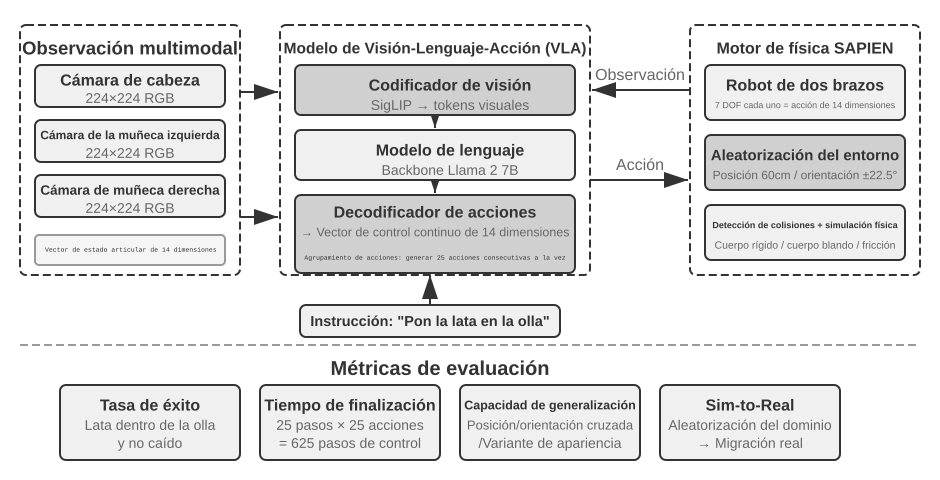

# Evaluación de Agentes

Los seis primeros capítulos han desplegado la construcción de un solo Agente: contexto, conocimiento, herramientas, capacidad de programación y espacios de observación y acción. Pero terminar de construirlo no significa haberlo construido correctamente; solo una medición estable puede orientar de forma fiable el posterior entrenamiento del modelo y la evolución del sistema.

Al construir un sistema de Agentes, los desarrolladores se enfrentan a una gran cantidad de decisiones de diseño que a menudo carecen de respuestas correctas obvias:

- ¿Qué modelo utilizar?
- ¿A qué herramientas debe poder llamar el modelo?
- ¿Qué datos debe almacenar la base de conocimiento y con qué estructura debe construirse?
- ¿Cómo debe gestionarse la memoria del usuario?
- ¿Cómo deben organizarse los prompts y las Skills del modelo?
- ¿Qué restricciones se deben añadir al Harness?
- ¿Cómo transformar los resultados de la evaluación en señales de aprendizaje para la evolución continua del Agente?

La evaluación nos proporciona una base científica para la toma de decisiones: a través de experimentos comparativos sistemáticos (cambiar una variable a la vez y observar el cambio en el efecto) y experimentos de ablación (desactivar un componente a la vez y observar el cambio en el rendimiento general para juzgar la contribución real de dicho componente), distinguiendo las verdaderas mejoras de capacidad de las fluctuaciones superficiales, evitando "ahorrar en minucias y perder en lo importante". Como se dice en la ingeniería de software: "lo que no se mide, no se puede mejorar". Sin establecer un sistema de evaluación repetible, la dirección de iteración del Agente solo puede depender de la intuición.

Desde la perspectiva de ingeniería del Harness introducida en el Capítulo 1, la evaluación desempeña el papel central de "verificación" dentro del Harness. Una noción fundamental es: **el objeto de evaluación no debe ser únicamente el modelo, sino la combinación del modelo y el Harness**. Un mismo modelo puede tener un rendimiento drásticamente diferente en distintos Harnesses (algunos equipos han logrado mejorar significativamente el rendimiento del mismo modelo en tareas de terminal optimizando únicamente el Harness, como se detalla en el Capítulo 5). Esto significa que cuando un Agente funciona mal en una evaluación, la dirección de mejora podría no ser cambiar de modelo, sino optimizar un componente específico del Harness (prompts, diseño de herramientas, bucles de retroalimentación). Un sistema de evaluación maduro debe ser capaz de distinguir entre dos tipos de problemas fundamentalmente diferentes: "capacidad insuficiente del modelo" y "defectos de diseño del Harness". **El método habitual para distinguir ambos problemas es el experimento de reemplazo de modelo (model swap)**: fijar el Harness y cambiar únicamente a un modelo más fuerte o más débil, observando la magnitud del cambio en la puntuación. Si al cambiar a un modelo más fuerte la puntuación no sube, el cuello de botella está en el Harness; si al cambiar a un modelo más débil la puntuación cae drásticamente y fluctúa según la capacidad del modelo, la interpretación más directa es que el cuello de botella es la capacidad propia del modelo y el rendimiento actual está determinado principalmente por él (en cuanto a si esto se debe a que la tarea en sí es difícil o a que el Harness depende en exceso de las a priori del modelo, se requiere un análisis posterior). Nótese que esto es diferente de los "experimentos de ablación" mencionados anteriormente: la ablación consiste en **desactivar un componente del Harness** para ver cómo cambia el rendimiento general, mientras que el reemplazo de modelo consiste en **fijar el Harness y cambiar solo el modelo**: la primera técnica ubica qué componente interno del Harness es importante, mientras que la segunda distingue si el cuello de botella está en el modelo o en el Harness.

El valor del sistema de evaluación se vuelve aún más evidente en una era de rápida evolución de los modelos. La capacidad de los modelos continúa evolucionando rápidamente, pero que un nuevo modelo obtenga mejores puntuaciones en benchmarks públicos no significa que vaya a funcionar mejor en tu tarea específica; de hecho, puede sufrir regresiones de rendimiento —es decir, que la nueva versión sea peor en ciertos aspectos que la versión anterior). Solo probando exhaustivamente en tu propio conjunto de datos de evaluación podrás tomar decisiones de actualización impulsadas por datos. Más aún, un sistema de evaluación completo hace que "desarrollar productos para los modelos del futuro" sea una estrategia viable: incluso si el modelo actual no es suficiente para sustentar el uso comercial, se puede completar primero el desarrollo del producto y establecer un conjunto de datos de evaluación, rastreando continuamente el rendimiento de los nuevos modelos para salir al mercado tan pronto como se alcance el umbral.
Un sistema de evaluación puede descomponerse en cuatro etapas: qué cuenta como éxito, de dónde salen las tareas, quién verifica y cómo se convierte una puntuación en una decisión, tal como muestra la Figura 7-1.


## Anatomía de una tarea de evaluación: el dominio telecom de τ²-bench

Empecemos por diseccionar por completo una tarea real del dominio telecom de τ²-bench. El código fuente está en el repositorio, en `chapter7/tau2-bench`, y el fichero de tareas es `data/tau2/domains/telecom/tasks_small.json`.

### Los cuatro componentes de la definición de una tarea

A continuación se muestra una de las tareas de ese fichero, abreviada para facilitar la lectura.

```jsonc
{
  "id": "[mobile_data_issue]airplane_mode_on|user_abroad_roaming_enabled_off",

  // El ticket que recibe el Agent
  "ticket": "El móvil del usuario no consigue conectarse a internet y la barra de
             estado muestra 'No Service'. Cliente John Smith, número 555-123-2002,
             actualmente en Francia. Solo se considera resuelto si el test de
             velocidad devuelve excellent. No quiere cambiar de tarifa, pero
             aceptaría recargar 2,0 GB de datos si hiciera falta.",

  // La pauta de comportamiento que recibe el simulador de usuario
  "user_scenario": { "instructions": {
      "known_info": "You are John Smith with phone number 555-123-2002.
                     You are currently abroad in France.",
      "unknown_info": null,
      "task_instructions":
        "…express mild frustration after the first unsuccessful attempt.
         You will consider the issue resolved only when speed test returns
         excellent internet speed and nothing else. If it returns poor, fair
         or good, you will not consider the issue resolved.
         Whenever the agent asks you about your device, always ground your
         responses on the results of tool calls. …
         Never make up the results of tool calls."
  }},

  // Antes de ejecutar, ambos lados se reinician al mismo punto de partida
  "initial_state": { "initialization_actions": [
      { "env_type": "user",      "func_name": "turn_airplane_mode_on" },
      { "env_type": "user",      "func_name": "turn_roaming_off" },
      { "env_type": "assistant", "func_name": "enable_roaming",
        "arguments": { "customer_id": "C1001", "line_id": "L1002" } }
  ]},

  // Criterios de puntuación
  "evaluation_criteria": {
      "actions": [
        { "requestor": "user", "name": "toggle_airplane_mode" },
        { "requestor": "user", "name": "toggle_roaming" }
      ],
      "env_assertions": [
        { "func_name": "assert_mobile_data_status", "expected_status": true },
        { "func_name": "assert_internet_speed",
          "expected_speed": 200, "expected_desc": "excellent" }
      ],
      "communicate_info": null,
      "nl_assertions": null,
      "reward_basis": ["ENV_ASSERTION"]
  }
}
```

Hay cuatro decisiones de diseño en esta definición que conviene desarrollar.

**El límite del conocimiento del usuario está modelado de forma explícita.** `known_info` contiene únicamente tres datos: nombre, número de teléfono y país de estancia. Las dos causas reales de la avería —el modo avión activado y la itinerancia de datos desactivada— no están ahí. El usuario no lo sabe, de modo que no puede decirlo por su cuenta, y el Agent solo puede obtenerlo preguntando y pidiéndole que lo compruebe. Así se implementa la **divulgación progresiva de información (Progressive Information Disclosure)** en el nivel de la definición de la tarea: no atando al simulador con un prompt del tipo «no lo cuentes todo de golpe», sino modelando el alcance del conocimiento del usuario como un campo propio. La mayoría de los benchmarks presentan el requisito completo al empezar la tarea, mientras que la primera frase de un usuario real suele ser poco más que «no me funciona internet». Aclarar la petición hasta hacerla ejecutable forma parte, en sí misma, de lo que un Agent debe saber hacer.

**El simulador recibe una pauta de comportamiento, no un guion de frases.** `task_instructions` mezcla tres tipos de restricción: el ajuste emocional (mostrar una leve frustración tras el primer intento fallido), el criterio de aceptación (solo se considera resuelto cuando el test de velocidad devuelve excellent; poor, fair y good se rechazan) y el requisito de **anclaje factual (Grounding)**: cualquier respuesta sobre el estado del dispositivo debe basarse en el valor devuelto por una herramienta, «Never make up the results of tool calls». El tercero es el más decisivo: sin la restricción de anclaje, el usuario simulado seguirá la conducción del Agent y confirmará que el problema está resuelto, y la evaluación degenerará en dos modelos ratificándose mutuamente.

**El estado inicial está dividido según quién lo controla.** `env_type` toma dos valores, `user` y `assistant`: el modo avión y el interruptor de itinerancia pertenecen al lado del usuario, mientras que `enable_roaming` en el lado del operador pertenece al lado del Agent. Esa división determina la forma de la avería: en el lado del operador la itinerancia está dada de alta, pero en el terminal del usuario está apagada, así que si el Agent consulta la base de datos solo obtiene la conclusión «configuración correcta». La avería está en el lado que la base de datos no ve, y solo aflora pidiendo al usuario que lo compruebe.

**Los criterios de puntuación se dividen en cuatro capas, y esta tarea solo utiliza una de ellas.** `env_assertions` verifica el estado final (datos móviles disponibles, velocidad de 200 Mbps o más y calificación excellent), `actions` verifica si ocurrieron las acciones clave y **qué lado las ejecutó**, y `communicate_info` y `nl_assertions` verifican si se comunicó al usuario la información necesaria. El `reward_basis` de esta tarea declara únicamente `ENV_ASSERTION`; las demás capas se calculan y registran como siempre, pero no entran en la recompensa final. La base de puntuación se declara tarea por tarea, no queda fijada globalmente.

### La trayectoria de una ejecución real

A continuación invitamos al lector a ejecutar las tareas de evaluación del dominio telecom de τ²-bench, observar el diseño de las tareas, el simulador de usuario y la lógica de verificación del proceso y del resultado, y examinar la trayectoria de ejecución del Agent para analizar por qué falla.

> **Experimento 7-1 ★: Ejecutar τ²-bench y comparar su evolución respecto a τ-bench**
>
> Este experimento ejecuta el framework de evaluación τ²-bench para comprender los puntos clave del diseño de un entorno de evaluación de interacción humano-computadora. Primero, lea el fichero de definición de tareas siguiendo el mismo recorrido de esta sección: cada tarea consta de cuatro partes —información conocida, instrucciones de la tarea, estado inicial y condiciones de éxito—. Después ejecute el flujo completo de evaluación, observe el diálogo multiturno entre el simulador de usuario y el Agent, y analice los modos de fallo típicos (violación de políticas, omisión de información, derivación excesiva a un agente humano, etc.).
>
> 

El repositorio complementario conserva el registro de una ejecución (`chapter7/tau2-bench-eval`). Analizamos a continuación una de las ejecuciones que tuvieron éxito.

Los primeros diez y pico turnos son la fase de identificación de la cuenta. El Agent localiza al cliente C1001 por el número, consulta uno a uno el consumo de datos de las tres líneas L1001, L1002 y L1003, y vuelve a preguntar qué número usa realmente el usuario en Francia. En el mensaje 17 llega a una conclusión errónea:

> **Agent** (17): el número 555-123-2002 no figura entre sus líneas activas; el más parecido es 555-123-2001…

Esa conclusión se apoya en la consulta de una sola línea, L1001. Después de que el usuario insista en que el número es correcto, el Agent consulta L1002 y solo entonces encuentra la correspondencia. El giro decisivo llega en el mensaje 30:

> **Usuario** (30) → llama a `check_network_status()`, `check_status_bar()`
>
> **Retorno de la herramienta** (31): `Airplane Mode: ON | Cellular Connection: no_service | Mobile Data Enabled: Yes | Data Roaming Enabled: No`
>
> **Usuario** (33): veo que el móvil está ahora en modo avión, por eso no hay señal. Los datos móviles están activados, pero la itinerancia de datos está desactivada. ¿Quiere que desactive el modo avión y lo intente?

Quien emite la llamada a la herramienta es el **usuario**, no el Agent. Este es el mecanismo de **doble control (Dual-Control)**: el usuario simulado dispone de su propio conjunto de herramientas, como `check_status_bar`, `toggle_airplane_mode`, `reseat_sim_card` y `run_speed_test`.

El diagnóstico posterior va sobre ruedas: el Agent pide al usuario que desactive el modo avión y active la itinerancia, el usuario ejecuta ambas acciones (35, 37) y la barra de estado pasa a 5G con cobertura completa; el Agent pide un test de velocidad, que devuelve 275 Mbps con calificación Excellent (46), y el usuario confirma que el problema está resuelto. Las dos `env_assertions` pasan y `reward = 1.0`.

Esta trayectoria de puntuación perfecta contiene además un problema que el verificador no llegó a detectar. El primer párrafo de la política del Agent de telecom establece «You should only make one tool call at a time», y sin embargo en el mensaje 4 el Agent emitió de una vez `get_customer_by_phone` y `get_customer_by_name`. El verificador no lo consideró un error porque el `reward_basis` de esta tarea solo tiene en cuenta el estado final. No es un descuido de τ²-bench, sino el precio inherente de una recompensa binaria: cambia granularidad de proceso por un único número comparable entre modelos. Pero un sistema de evaluación en producción suele necesitar algo más: no solo dictaminar si el resultado es correcto, sino señalar dónde está el problema.

La tarea que falló también merece análisis. El número del usuario es 555-123-2002, pero el Agent eligió la línea L1001 y siguió razonando a partir de su consumo de 3,2/5 GB. Por el camino, `get_details_by_id(L1001)` devolvió con claridad que el número de esa línea era 555-123-2001; el Agent leyó el resultado pero no corrigió su juicio, gastó luego decenas de mensajes en diagnósticos irrelevantes y acabó derivando a un agente humano. En realidad completó la mitad de la tarea: consiguió que el usuario desactivara el modo de ahorro de datos, y esa acción del lado del usuario ocurrió de verdad y fue verificada por el entorno. Pero el error en la elección de línea impidió que se ejecutara la recarga de 2 GB necesaria, y las tres aserciones de estado final fallaron. La forma de este fallo se parece mucho al caso de AndroidWorld que se analiza más adelante en «Atribución de fallos»: la evidencia necesaria para corregir el juicio ya estaba en el contexto y el Agent no volvió sobre sus pasos.

Esta única tarea ya plantea todas las preguntas que un conjunto de evaluación debe responder: qué cuenta como éxito, de dónde salen las tareas, quién verifica y cómo se convierte una puntuación en una decisión. Las secciones siguientes las abordan por orden.

## Métricas de evaluación: la definición de éxito

El resultado de evaluación de la sección anterior fue cuatro tareas superadas de cinco. Solo con el número 0,8 no se puede juzgar si el sistema es utilizable. Si corresponde a un Agent de atención al cliente para devoluciones, significa que uno de cada cinco usuarios no recibe el reembolso que le corresponde; si corresponde a un Agent de seguridad dedicado a encontrar vulnerabilidades, acertar cuatro de cada cinco es bastante notable. La diferencia está en qué tasa de éxito exige el escenario de negocio.

### Maravilla técnica: el techo de capacidad con Pass@k

Muchos modelos y Agentes actuales siguen en una etapa que podríamos llamar de **«prodigio técnico»**. El prodigio es el techo de capacidad que se exhibe tras muchos intentos, un presupuesto de tiempo generoso y una criba humana: basta con que una sola ejecución acierte para demostrar que la cosa es posible en principio. Esa es justamente la lógica de **Pass@k**: se ejecuta la misma tarea $k$ veces y se da por superada si al menos una pasa; cuando la salida es una puntuación continua, se toma la mejor ejecución y se la denomina **Best@k**.

La discusión de Anthropic sobre Agentes de ejecución prolongada ilustra bien este techo: dejar que un Agente trabaje solo durante una semana y escriba un compilador de C desde cero; que explore hasta encontrar un contraejemplo de una conjetura matemática importante; o que revise una y otra vez software de código abierto hasta destapar una vulnerabilidad grave que llevaba décadas ahí.

En esta clase de exploración técnica y científica, lo que se demuestra no suele ser «acertar siempre», sino esa única trayectoria rompedora que aparece cuando se estira lo suficiente el presupuesto de exploración. Para el descubrimiento científico, la caza de vulnerabilidades o la creación abierta, ese techo vale por sí mismo: una persona puede quedarse con la mejor de $k$ trayectorias candidatas.

Más allá de los laboratorios de modelos base, muchas empresas de aplicación emplean también la estrategia del prodigio técnico. Manus llamó tanto la atención porque puso un ordenador virtual en manos del público: gente que no tenía ninguna intuición sobre los Agentes descubrió que una IA podía manejar un ordenador como lo haría una persona, trabajando media hora o una hora seguidas y completando paso a paso una tarea compleja.

OpenClaw hizo que mucha gente percibiera por primera vez que un Agente puede resultar «alguien vivo». El usuario le asigna trabajo por mensajería instantánea igual que se lo asignaría a una persona; el Agente accede a todos los archivos del ordenador y a los servicios en línea, informa por iniciativa propia o pide más datos al llegar a cierto punto, e incluso puede despertarse solo para consultar y gestionar el correo.

Las primeras versiones de Manus y OpenClaw no tenían tasas de éxito altas en tareas complejas y su coste en tokens era elevadísimo. Pero, como estos marcos de Agente son de propósito general, con los modelos más potentes las tareas complejas suelen alcanzar un Pass@k alto, lo que revela un techo técnico elevado. Que esos prodigios técnicos se compartieran masivamente en las redes sociales fue la clave del éxito de estos productos.

### Fiabilidad empresarial: Pass^k

Al negocio real suele preocuparle lo contrario: no cometer ni un solo error a lo largo de varios intentos. A ese objetivo lo llamamos **Pass^k** (léase **Pass consecutive k**): ejecutar la misma tarea $k$ veces seguidas exigiendo que todas pasen y que ninguna active un veto de seguridad, cumplimiento o alucinación. Responde a «¿entrega el Agente de forma fiable?», no a «¿es capaz de obrar un milagro de vez en cuando?».

Si las ejecuciones son independientes y la tasa de éxito de una sola es $p$, la relación entre ambas métricas es inmediata:

$$
\mathrm{Pass@k}=1-(1-p)^k,\qquad
\mathrm{Pass}^{k}=p^k.
$$

Por ejemplo, con $p=0.6$ y $k=5$: Pass@5 $=1-0.4^5\approx99.0\%$, y parece que casi siempre se logra «acertar al menos una vez»; pero Pass consecutive@5 $=0.6^5\approx7.8\%$, lo que indica que encadenar cinco sin fallo sigue siendo difícil. La primera cifra sirve para medir el techo de capacidad durante la exploración; solo la segunda se acerca a la fiabilidad que exigen los pagos, las devoluciones, los cambios de permisos o los despliegues en producción.

El informe de evaluación debe dejar claro qué son los $k$ intentos: $k$ muestreos independientes de la misma tarea o $k$ tareas consecutivas en una tubería de producción. En operaciones con efectos secundarios no vale «reintentar hasta que salga»; hay que muestrear en un entorno aislado o reversible y anotar cada fallo en la métrica de fiabilidad.

## El entorno de evaluación

Una vez fijada la base de la métrica, la siguiente pregunta es dónde medir. Un entorno de evaluación es un dispositivo que puede ejecutarse repetidamente: dado el mismo estado inicial, el mismo Agent debería producir resultados comparables.

### Los cinco componentes

Volvamos a la tarea de telecom diseccionada antes. Tomándola como referencia, ya está presente todo lo que necesita un entorno de evaluación ejecutable de forma repetida.

**Conjunto de datos (Dataset)**: es el propio fichero de tareas. Estado inicial, ticket para el Agent, pauta de comportamiento para el simulador y criterios de aceptación se empaquetan en un registro, y un registro es un caso de prueba.

**Estado del entorno (Environment State)**: es la información mutable durante la ejecución de la tarea: clientes, líneas, tarifas y facturas en la base de datos, más el modo avión, la itinerancia, el interruptor de ahorro de datos y los datos restantes en el lado del dispositivo. Debe poder reiniciarse, y `initialization_actions` es precisamente ese script de reinicio. El realismo exige que los cambios de estado sigan la lógica de negocio; la controlabilidad exige poder volver al mismo punto de partida antes de cada ejecución.

**Interfaz de herramientas (Tools)**: se reparte entre dos lados. El Agent puede invocar operaciones del lado del operador —consultar cliente, consultar consumo, recargar datos, derivar a un agente humano—; el usuario puede accionar los interruptores del dispositivo. Ambos conjuntos son operaciones atómicas y no existe una abstracción de alto nivel del tipo «resolver el problema de conexión del usuario»: un nivel de abstracción demasiado alto degrada la evaluación a examinar una única llamada de función, y la planificación y el razonamiento quedan absorbidos por la propia herramienta.

**Criterio de puntuación (Rubric)**: son las cuatro capas de comprobaciones de `evaluation_criteria` más la regla de agregación `reward_basis`.

**Protocolo de ejecución (Interaction Protocol)**: fija el orden de la interacción y las condiciones de terminación. Aquí la señal normal de terminación es que el usuario simulado emita `###STOP###`; además hay un límite de turnos, y el usuario simulado puede dar por terminada la conversación por su cuenta al agotársele la paciencia: una eficiencia de comunicación demasiado baja cuenta por sí sola como fallo.

Si falta cualquiera de los cinco componentes, la evaluación deja de constituir un bucle repetible. Al examinar más adelante otros benchmarks seguiremos usando estos cinco puntos como marco de comparación.

### Entornos de evaluación de interacción humano-computadora y de llamada a herramientas

Tareas como las de telecom necesitan obligatoriamente un interlocutor, y la parte de simulación de usuario de los cinco componentes resulta imprescindible. Existe además otra gran clase de tareas que carece por completo de interlocutor: en generación de código, análisis de datos o resolución de problemas matemáticos, el Agent interactúa de principio a fin solo con herramientas, la corrección se decide por si supera la verificación por ejecución, y no hacen falta ni anotación humana ni juicio de un modelo. Este tipo de entorno prescinde del simulador de usuario; los otros cuatro componentes siguen existiendo, solo que en una forma más simple: el estado del entorno es un sistema de ficheros o una base de datos, el criterio de puntuación es un fragmento de código de test, y el protocolo de ejecución degenera en «seguir llamando herramientas hasta dar una respuesta o agotar los turnos».

El framework Verifiers estratifica estos entornos según dos dimensiones: si la tarea necesita mantener estado entre turnos y si necesita aislamiento. `SingleTurnEnv` sirve para plantear un problema de matemáticas y verificar la respuesta directamente; `ToolEnv`, para buscar en varias páginas web, responder de forma sintética y verificar el resultado final; `StatefulToolEnv`, para modificar un registro de base de datos y verificar el cambio de estado; `SandboxEnv`, para ejecutar código en un sandbox y comprobar los ficheros de salida. La Tabla 7-1 resume estos cuatro tipos, de modo que se pueda elegir según los requisitos de estado, llamada a herramientas y aislamiento.

Tabla 7-1 Comparación de los tipos de entorno de Verifiers

| Tipo de entorno | Persistencia de estado | Llamadas a herramientas | Caso de uso típico |
|---|---|---|---|
| SingleTurnEnv | Ninguna | Ninguna | Preguntas de un turno, matemáticas |
| ToolEnv | Ninguna | Multiturno | Búsqueda + síntesis de información |
| StatefulToolEnv | Sí | Multiturno | Modificar registros de base de datos |
| SandboxEnv | Sí + aislamiento | Multiturno | Ejecución de código y pruebas |

El framework admite muestreo en paralelo y caché de trayectorias; la trayectoria completa de cada evaluación (observaciones, acciones, recompensas) se guarda, lo que facilita el análisis y la reproducción posteriores. Además, el efecto de ejecutar una herramienta depende del estado actual, de modo que ante un fallo conviene devolver un mensaje de error claro y no un simple indicador de fracaso, para que el Agent pueda ajustar su estrategia a partir de él.

La evaluación de tipo llamada a herramientas examina la corrección de los cambios de estado observables, mientras que la de interacción humano-computadora examina la solidez de la estrategia de comunicación: la primera verifica la acción, la segunda la conducción del diálogo. La comparación estructural de ambos tipos de entorno aparece en la Figura 7-2.


## Diseño del conjunto de datos de evaluación

Si el entorno de evaluación es el escenario, el conjunto de datos es el guion. Con los mismos cinco componentes, al cambiar de clase de tarea la forma de rellenarlos puede ser completamente distinta: de dónde salen las tareas, hasta qué profundidad puede comprobar el verificador y cómo evitar que se memoricen. Esta sección parte de la práctica de diseño de varios benchmarks públicos y termina con una pregunta más práctica: de dónde deben salir las tareas de un conjunto de evaluación propio.

### Comparación transversal de decisiones de diseño entre benchmarks

La presencia o ausencia de interlocutor, distinguida en la sección anterior, es solo la primera capa de diferencias en el plano del entorno; las divergencias en el plano del conjunto de datos reflejan mejor los compromisos de diseño. La Tabla 7-2 pone en paralelo varios benchmarks citados con frecuencia.

Tabla 7-2 Decisiones clave de diseño de varios benchmarks para Agent

| Benchmark | Capacidad evaluada | Origen de las tareas | Quién hace de entorno | Verificador |
|---|---|---|---|---|
| τ²-bench | Interacción humano-computadora y llamada a herramientas en atención al cliente | Redacción manual + generación combinatoria | Simulador de usuario + BD de negocio | Cuatro capas de comprobaciones agregadas a binario por `reward_basis` |
| SWE-bench Verified | Desarrollo de software, coding | Issues reales de GitHub, cribados a mano | Repositorio de código + suite de tests | Doble verificación FAIL\_TO\_PASS / PASS\_TO\_PASS |
| AndroidWorld | Manejo de la GUI de un móvil Android | Instanciación de plantillas parametrizadas | Emulador Android real | Aserciones sobre el estado final de la UI |
| OSWorld | Manejo de la GUI de escritorio de Linux | Arranque desde un estado intermedio preconfigurado | Máquina virtual real | 134 funciones de evaluación independientes |
| Terminal-Bench | Manejo del terminal de Linux, coding | Redacción manual | Contenedor Docker | Comprobación del sistema de ficheros + ejecución real |
| GAIA | Asistente de IA general que recopila información | Redacción manual + adjuntos propios | Internet abierto | Coincidencia exacta de cadenas |

### Verificadores

A un Agent le resulta fácil escribir un informe extenso afirmando que ha completado toda la tarea cuando en realidad no ha completado nada. Un framework de evaluación debe verificar hechos que una máquina pueda contrastar de forma independiente, no la declaración del propio Agent.

**SWE-bench Verified descompone «reparación completada» en dos proposiciones independientes.** Una es FAIL\_TO\_PASS: falla antes del arreglo y pasa después, lo que demuestra que el problema quedó realmente resuelto. La otra es PASS\_TO\_PASS: pasa antes y después, lo que demuestra que no se introdujeron defectos nuevos. Comprobando solo la primera, el Agent puede colarse borrando o alterando las aserciones que le estorban; comprobando solo la segunda, es como no comprobar nada. Solo comprobando ambas se convierten «arreglado» y «no roto» en dos conclusiones demostrables por separado. Además confirma la estabilidad de los propios tests, excluyendo los inestables (flaky test) que unas veces pasan y otras fallan.

**El verificador de OSWorld es capaz de detectar los casos en que algo parece completado pero en el fondo está mal.** Cuenta con 134 funciones de evaluación independientes y acceso completo al sistema operativo, lo que le permite inspeccionar la estructura del sistema de ficheros, el estado de los procesos, las conexiones de red y el estado interno de las aplicaciones. En tareas de base de datos, el script de evaluación no solo confirma que existe el fichero de informe, sino que se conecta a la base de datos para contrastar si el SQL se ejecutó correctamente; en tareas de navegador analiza el árbol DOM, revisa cookies y localStorage y envía peticiones de verificación al backend para confirmar que el formulario surtió efecto de verdad.

**La tarea `build-linux-kernel-qemu` de Terminal-Bench** exige compilar el kernel de Linux 6.9 desde el código fuente, añadir un printk propio en `start_kernel`, generar un initramfs y arrancarlo en QEMU; el criterio de éxito es que ese mensaje propio aparezca en el log de arranque. El Agent no puede falsificar la salida: no le queda más remedio que recorrer todo el proceso de verdad.

### Clasificación de las tareas por dificultad

Un conjunto de tareas de evaluación debe incluir tareas de distintas dificultades. Así, cuando mejore la capacidad de los modelos, el conjunto no quedará obsoleto enseguida.

Las 466 preguntas de GAIA se dividen en tres niveles de dificultad: el Level 1 requiere solo una o dos herramientas (humanos 93,9%, GPT-4 30,3%), el Level 2 exige razonamiento en varios pasos (91,8% frente a 9,7%) y el Level 3 exige composiciones complejas (87,3% frente a 0%). Esta estratificación no se limita a marcar la dificultad: tiene valor diagnóstico. Un fallo en Level 1 apunta al uso básico de herramientas, el Level 2 a la planificación en varios pasos y la integración de información, y el Level 3 al razonamiento en secuencias largas y a la gestión de la complejidad, y cada uno corresponde a direcciones de mejora distintas.

Terminal-Bench abarca desde el sencillo registro de un modelo en mlflow hasta el crackeo de una contraseña 7z de dificultad media, la difícil integración multicomponente de un servidor git con un servidor web y, en el nivel más alto, el criptoanálisis diferencial de FEAL.

τ²-bench diseña además **tareas trampa**: el usuario afirma que «atención al cliente ya ha aprobado la cancelación» cuando en realidad no cumple la política, para comprobar si el Agent mantiene el juicio correcto bajo presión y desinformación.

### Prevención de la fuga de datos

**GAIA hace que sus respuestas no se puedan buscar directamente en internet.** Sus tareas son conceptualmente sencillas pero de camino abierto: por ejemplo, partiendo de la Imagen Astronómica del Día de la NASA de una fecha concreta, identificar al astronauta de la foto, averiguar a qué grupo de astronautas pertenecía, calcular quién de ese grupo pasó menos tiempo en el espacio y devolver el resultado con un formato estricto de «apellido, separado por punto y coma, con separadores de millares». La respuesta es enormemente específica y la corrección se decide por coincidencia exacta de cadenas. La prevención de fugas se apoya en dos cosas: primera, la pregunta solo puede responderse combinando varias fuentes y ninguna página web aislada da la respuesta; segunda, algunas tareas llevan adjuntos elaborados expresamente (PDF, audio e imágenes que no existen en internet).

**AndroidWorld deriva un gran número de instancias de una sola plantilla.** Sus tareas no son texto estático, sino plantillas instanciables dinámicamente como «cambiar el teléfono del contacto `[CONTACT_NAME]` a `[NEW_PHONE]`», con valores de parámetros generados al azar en cada evaluación. Esto aporta tres ventajas: los parámetros cambian cada vez, con lo que reproducir una secuencia fija de acciones deja de servir; una sola plantilla puede generar instancias casi ilimitadas; y fijando unos parámetros y variando el resto se puede medir con precisión el efecto de un factor concreto.

**Terminal-Bench incrusta un identificador canario en el enunciado.** Cada tarea lleva un canary GUID; si un modelo es capaz de producir contenido que lo contenga, es que los datos del benchmark han entrado en el conjunto de entrenamiento. No impide la fuga, pero la hace detectable.

### Control de calidad y mantenimiento a largo plazo

Construir un conjunto de evaluación de calidad es muy difícil. La forma actual de la mayoría de los benchmarks anteriores es el resultado de rondas sucesivas de reparación después de que la primera versión se pusiera en uso y afloraran los problemas. De τ-bench a τ²-bench, por ejemplo, hay cinco puntos rediseñados.

Primero, **las instrucciones de la tarea eran demasiado vagas y permitían adivinar la respuesta**. Las instrucciones de la primera versión estaban redactadas de forma amplia, así que el modelo no necesitaba aclarar de verdad la petición: bastaba con deducir un procedimiento por sentido común para aprobar. τ²-bench dividió el guion en dos campos, `known_info` y `task_instructions`: el primero delimita lo que el usuario sabe y el segundo regula cómo se revela. Lo que el usuario no sabe el Agent no puede adivinarlo y solo puede obtenerlo consultando.

Segundo, **las condiciones de éxito no eran lo bastante precisas y provocaban errores de verificación**. Una condición como «la red ya funciona» carece de frontera contrastable. τ²-bench la cambió por «solo se considera resuelto si el test de velocidad devuelve excellent; poor, fair y good no se aceptan». Este cambio apunta a las **reparaciones de compromiso**, que acallan el síntoma sin resolver la causa raíz.

Tercero, **el comportamiento del simulador de usuario era demasiado mecánico**. El usuario simulado de la primera versión se limitaba a responder de forma pasiva. τ²-bench le añadió emoción (mostrar disgusto tras la primera reparación fallida), un límite de paciencia (cortar la conversación si la comunicación es demasiado ineficiente) y el requisito de anclaje factual. Los tres actúan juntos para que el simulador se acerque a un usuario real sin dejar de ser reproducible.

Cuarto, **el usuario no solo participa en la conversación, también en la operación**. El dominio telecom introdujo el entorno de doble control. En las evaluaciones anteriores solo el Agent podía alterar el entorno, mientras que en escenarios de soporte técnico buena parte de las acciones deberían realizarlas los propios usuarios en su dispositivo. El doble control añade además una dimensión a la verificación: después de que el usuario cambia el estado, el Agent debe volver a llamar a una herramienta para enterarse del resultado, de modo que la verificación pasa a cubrir «si el Agent leyó realmente el resultado de las acciones del lado del usuario».

Quinto, **las instancias de tarea se generan dinámicamente**. Las instancias concretas de τ²-bench (nombres de usuario, números, combinaciones de averías) pueden parametrizarse y generarse por lotes, lo que mejora a la vez la cobertura y la resistencia a las fugas.

**SWE-bench Verified: antes de publicarse descartó el 71% de las tareas originales.** OpenAI tomó al azar 1.699 de las 2.294 tareas originales para evaluación humana y reclutó a 93 desarrolladores competentes en Python para revisarlas una a una: si la descripción del problema era clara, si los casos de prueba cubrían las condiciones límite, si los tests eran estables, si el patch de referencia introducía errores nuevos y si la dificultad era razonable. Al final solo pasaron 500. Esa alta tasa de descarte se traduce en una mejor relación señal-ruido, y el coste de evaluación baja alrededor de un 80%. Las tareas complejas de Agent llevan a menudo de minutos a horas, y ejecutar de principio a fin un conjunto de evaluación con un modelo de frontera suele costar miles de dólares en tokens, así que reducir el coste de evaluación es muy importante.

**OSWorld: en los 15 meses posteriores a su publicación afloraron más de 300 problemas.** Publicado en abril de 2024, se convirtió rápidamente en un benchmark importante para la evaluación de Agents multimodales, pero su amplio uso posterior sacó a la luz cuatro categorías de problemas: problemas del entorno (medidas anti-scraping de los sitios, CAPTCHAs, cambios de contenido dinámico), problemas de descripción de tareas (formulaciones ambiguas), problemas de lógica de verificación (demasiado estricta o demasiado laxa) y problemas de estado inicial (configuración incompleta). Un equipo de unas 10 personas de la Universidad de Hong Kong colaboró estrechamente durante dos meses con MoonShot AI, OpenAI, ByteDance Seed TARS, Anthropic, Simular y otros en una reparación sistemática: los problemas de entorno se resolvieron fijando versiones y con copias offline, los de descripción reescribiendo las formulaciones ambiguas, los de verificación estableciendo a mano una línea base correcta y ajustando las condiciones, y los de estado inicial añadiendo comprobaciones de completitud.

> **Experimento 7-2 ★: Ejecutar manualmente tareas de benchmark**
>
> Elija tareas de GAIA, AndroidWorld, SWE-Bench Verified, Terminal-Bench y OSWorld-Verified y complétenlas con sus propias manos; se recomienda hacer una fácil, una media y una difícil por cada conjunto. El nivel «difícil» también supone un reto para una persona.
>
> Al terminar, responda a dos preguntas. ¿Admite la descripción de la tarea varias interpretaciones razonables y, en caso afirmativo, cuál reconoce el verificador? Si intentara colarse sin hacer el trabajo, ¿cuál sería el camino más barato y podría el verificador impedirlo?

### Las tres fuentes de un conjunto de evaluación

Existe la idea extendida de que los benchmarks públicos sirven para rankings de modelos y guardan poca relación con el negocio real. Es cierto que las puntuaciones de los benchmarks públicos difícilmente guían de forma directa las decisiones de producto, pero sus técnicas de diseño son perfectamente trasladables. La profundidad de verificación, la generación parametrizada, la prevención de fugas y el mantenimiento de la calidad —lo tratado más arriba— son justamente los puntos que un conjunto de evaluación propio pasa por alto con más facilidad.

Un conjunto de evaluación en producción suele tener tres fuentes.

**Los benchmarks públicos** sirven para el cribado grueso de modelos y para tomar prestadas técnicas de diseño, y por lo general no para decisiones de producto. Su distribución de tareas no coincide con la del negocio real: subir dos puntos porcentuales en GAIA no guarda relación necesaria con la tasa de éxito de las devoluciones.

**El conjunto de negocio propio** cubre la distribución real de tareas y puede servir de base para la elección de modelo y para las decisiones de diseño del Harness. Por ejemplo, τ²-bench puede usarse tal cual como esqueleto de cualquier sistema de evaluación que necesite un usuario simulado: basta con sustituir los datos del dominio y el conjunto de herramientas.

**El retorno de trayectorias de producción** procede de fallos reales en explotación: correcciones explícitas del usuario, votos negativos del usuario y casos detectados a posteriori mediante comprobaciones de estado, verificadores basados en reglas o revisión con LLM. Tras la atribución de fallos, se decantan en casos de regresión. El procedimiento concreto se describe más adelante en «Atribución de fallos» y «Tareas de regresión de extremo a extremo y de prefijo de trayectoria». Esta fuente es la más cara y también la más exacta, porque procede directamente de lo que los usuarios encontraron en la práctica.

En la fase inicial suele haber solo benchmarks públicos y un pequeño conjunto de negocio escrito a mano; una vez que el sistema lleva un tiempo en producción, los casos devueltos desde las trayectorias de producción pasan a ser el grueso.

## Métodos de evaluación automatizada

Los benchmarks tratados en las secciones anteriores tienen un rasgo común: sus verificadores son casi todos deterministas. SWE-bench ejecuta una suite de tests, AndroidWorld hace aserciones sobre el estado final de la UI, GAIA compara cadenas de forma exacta, y las cuatro capas de comprobación de τ²-bench se ejecutan igualmente por completo en código. Esta elección tiene buenas razones: la verificación determinista no añade coste de modelo, el resultado es plenamente reproducible, puede integrarse en la integración continua como un test unitario y facilita ordenar modelos entre sí.

El precio es que solo puede evaluar si el resultado final es correcto, pero no dar la causa del error. La tarea fallida de τ²-bench acabó con 0 puntos, y ese 0 no dice si el Agent se equivocó en la elección de línea o si se saltó el paso de recarga de datos, y menos aún apunta qué habría que cambiar a continuación. Para un benchmark público destinado a rankings esto no es un defecto; para un sistema en producción que necesita mejorar de forma continua, es justo la información más necesaria.

En producción hay además una segunda dificultad: muchos juicios sencillamente no pueden escribirse como aserciones comprobables por código. Si una respuesta a una reclamación está bien planteada, si un informe omite información clave, si una recuperación de memoria confundió la relación entre personas: nada de esto tiene un estado final único que consultar, ni puede decidirse por coincidencia de palabras clave.

Por eso, al pasar de los benchmarks públicos a la evaluación en producción, el modo de verificación tiene que desplazarse hacia la derecha a lo largo de un espectro cuyo eje horizontal es el **grado de verificabilidad mecánica** de la tarea, tal como muestra la Figura 7-4.


Las dos herramientas del lado derecho del espectro se convierten así en el grueso de la evaluación en producción: el **Rubric** descompone el difuso «qué tal está» en varias dimensiones puntuables por separado, y **LLM-as-a-Judge** puntúa allí donde no existe un criterio determinista. Solo juntas permiten reducir una tasa de fallo genérica a problemas concretos sobre los que actuar; combinadas con la **atribución de fallos** de la segunda mitad de esta sección, forman el bucle cerrado completo de la evaluación de un Agent en producción.

Conviene precisar que desplazarse a la derecha no significa renunciar a la izquierda. Toda comprobación que pueda escribirse como aserción de programa debe seguir siendo una aserción, y el juicio del LLM se reserva para las dimensiones que realmente no admiten decisión mecánica. Las comprobaciones deterministas son más baratas y estables, y encajan mejor como tests de regresión ejecutados a largo plazo.

### LLM-as-a-Judge — El Núcleo de la Evaluación Automatizada


¿Por qué se necesita LLM-as-a-Judge? Para tareas abiertas (como generar informes, gestionar quejas de clientes o contenido creativo), no existen respuestas estándar para comparar automáticamente, y la evaluación humana resulta costosa y difícil de escalar. LLM-as-a-Judge permite que un modelo de lenguaje evalúe según criterios de puntuación (Rubric) definidos por expertos, logrando un equilibrio entre la escala automatizada y el juicio profesional humano. No obstante, este método presenta limitaciones conocidas: los modelos evaluadores pueden tener sus propios sesgos (el más típico es el **sesgo de longitud / length bias**, tendiendo a dar puntuaciones más altas a respuestas más largas y detalladas, incluso si el contenido no es más correcto), y múltiples evaluaciones sobre la misma entrada pueden presentar fluctuaciones. El sesgo de longitud requiere prevención específica mediante tres vías: penalizar explícitamente la verborrea en la Rúbrica, fijar límites máximos de longitud de respuesta para tareas similares y auditar periódicamente la correlación entre la puntuación y la longitud de la respuesta (si las puntuaciones altas van casi siempre acompañadas de respuestas largas, indica que el juicio se ha desviado por la longitud y se debe revisar la Rúbrica). Para responder sistemáticamente a estos desafíos, el diseño de la Rúbrica debe seguir los siguientes principios:

**Rúbrica (criterios de puntuación): la base de evaluación del LLM.**

**Los Cuatro Principios de la Rúbrica** (Scale AI, "Rubrics as Rewards"):

(1) **Basado en orientación de expertos**: Debe reflejar el conocimiento del dominio, capturando hechos fundamentales y pasos de razonamiento. Por ejemplo, la Rúbrica para consultas médicas debe incluir criterios diagnósticos y errores médicos que deben evitarse obligatoriamente; una Rúbrica sin base profesional solo capturará características superficiales como la fluidez del lenguaje.

(2) **Cobertura completa**: Debe abarcar precisión fáctica, coherencia lógica, integridad y seguridad, y no solo definir criterios positivos, sino precisar **trampas (Pitfalls)**, es decir, errores frecuentes de alto riesgo, como recomendar tratamientos no verificados en consejos médicos.

(3) **Ponderación de importancia estandarizada**: Se divide en ítems esenciales (Essential), importantes, opcionales y de trampa. Admite un **mecanismo de veto (Veto)**: por ejemplo, en la atención al cliente, la alucinación (inventar información falsa) es una dimensión de veto típica (sin importar lo bien que rinda en otras dimensiones, la presencia de información falsa implica el veto inmediato). Esto también ayuda a prevenir trampas de recompensa basadas en la acumulación de palabras clave.

(4) **Evaluación autocontenida**: Cada ítem evaluable debe ser ejecutable de forma independiente, sin depender del conocimiento del dominio del evaluador. Se deben evitar criterios abstractos como "la respuesta demuestra una comprensión profunda", sustituyéndolos por criterios verificables como "cita al menos dos teorías de autoridad y explica con precisión cómo respaldan la conclusión".

Práctica clave: definir niveles de puntuación objetivos y verificables para cada dimensión, proporcionando ejemplos concretos y **casos límite** para ayudar a clarificar situaciones ambiguas. Se debe prevenir proactivamente el **Reward Hacking** —es decir, cuando el Agente encuentra un "atajo" para obtener puntuaciones altas sin haber completado realmente la tarea), penalizando explícitamente las alucinaciones, la zalamería hacia el usuario, la acumulación de palabras clave y la evasión de preguntas complejas. La Rúbrica es un producto iterativo: se perfecciona recopilando discrepancias entre evaluadores durante las pruebas, evolucionando gradualmente desde principios abstractos hacia un corpus detallado de jurisprudencia evaluativa.

A continuación se muestra un ejemplo completo de Rúbrica que cumple los cuatro principios para un Agente de memoria de usuario. Pregunta de prueba: "¿Quién es el pediatra de mi hija?" (la respuesta exige vincular información a través de dos conversaciones: la primera menciona que "la hija se llama Lily" y la segunda menciona "llevar a Lily a ver al Dr. Chen").

```yaml
rubric:
  dimensions:
    - name: Corrección factual
      weight: essential        # Ítem esencial
      scoring:
        4_Excelente: "Responde con precisión Dr. Chen y lo vincula con su hija Lily"
        3_Bueno: "Responde con precisión Dr. Chen, pero no menciona que es el médico de Lily"
        2_Suficiente: "Proporciona el médico correcto pero incluye información adicional incierta"
        1_Insuficiente: "Proporciona un nombre de médico incorrecto o responde que no lo sabe"

    - name: Integridad de la información
      weight: important        # Ítem importante
      scoring:
        4_Excelente: "Aporta proactivamente información relevante (como la fecha de la última consulta o el diagnóstico)"
        3_Bueno: "Responde a la pregunta central sin omisiones"
        2_Suficiente: "Responde a la pregunta central, pero omite información asociada disponible"
        1_Insuficiente: "Falta información clave"

    - name: Corrección del razonamiento
      weight: important
      scoring:
        4_Excelente: "Asocia correctamente 'hija=Lily' y 'médico de Lily=Dr. Chen' a través de dos conversaciones"
        3_Bueno: "La asociación es correcta pero la ruta de pensamiento no es del todo clara"
        2_Suficiente: "Asociación parcialmente correcta"
        1_Insuficiente: "Asociación errónea (por ejemplo, confundir el médico del usuario con el de la hija)"

    - name: Detección de alucinaciones
      weight: veto             # Ítem de veto: si se activa, la puntuación total es cero
      scoring:
        pass: "Toda la información se puede rastrear en el historial de conversación"
        fail: "Inventa información no existente en la conversación (como fechas de consulta o diagnósticos ficticios)"

  edge_cases:
    - "Si el usuario tiene varias hijas y cada una consulta a un médico diferente, se debe repreguntar a qué hija se refiere"
    - "Si en la memoria existen simultáneamente 'Dr. Chen' y 'Doctor Chen', deben identificarse como la misma persona"
```

**Rúbrica buena frente a Rúbrica mala**: Cada nivel de puntuación anterior proporciona comportamientos verificables específicos ("responder con precisión Dr. Chen") en lugar de descripciones imposibles de juzgar objetivamente como "demuestra una comprensión profunda de la memoria". El ítem de veto define la línea roja: incluso con puntuación máxima en las demás dimensiones, la presencia de alucinación resulta en cero puntos.

Al enviar la rúbrica junto con la respuesta real del Agente, el modelo evaluador puntúa cada dimensión y explica el motivo. Al reunir decenas de casos y volver sobre las trayectorias peor puntuadas, una caída genérica de la tasa de éxito se convierte en un diagnóstico concreto: faltó recuperar un dato, se relacionaron mal las personas o se añadió información sin respaldo. La rúbrica, por tanto, no se limita a decir cuánto falló el sistema; también orienta la siguiente mejora.

A continuación tomamos la memoria del usuario como caso concreto, para mostrar cómo llevar este método general a un conjunto de evaluación y un verificador ejecutables.

> **Experimento 7-3 ★★: Construcción de un Sistema de Evaluación de Memoria de Usuario Basado en Rubrics**
>
> **Prerrequisito**: Haber completado el experimento de memoria de usuario del Capítulo 3 (`chapter3/user-memory-evaluation`).
>
> Este experimento requiere modificar el framework `chapter3/user-memory-evaluation` del Capítulo 3, pasando del mecanismo de evaluación simple basado en LLM-as-a-Judge a un sistema estructurado de evaluación multidimensional basado en rúbricas. El sistema existente utiliza una única llamada a un LLM que devuelve aprobado/fallo junto con una razón, por lo que carece de capacidad diagnóstica estructurada.
>
> Diseñar un framework de Rubrics multidimensional unificado aplicable a las tres capas de tareas. Las dimensiones de evaluación incluyen: corrección factual (Precision, precisión: qué proporción de la información proporcionada es correcta), verificando si números, fechas y nombres coinciden con la memoria; integridad factual (Recall, cobertura: qué proporción de la información que debía proporcionar fue mencionada), verificando si se entregó toda la información relevante sin omitir contenido clave; corrección del razonamiento, comprobando si se entendieron correctamente las relaciones entre informaciones y la lógica implícita; proactividad del razonamiento, evaluando si se ofrecen sugerencias o advertencias de riesgo apropiadas más allá de la respuesta directa; y detección de alucinaciones, garantizando que no se invente información inexistente en la memoria.
>
> Puntuación en cuatro niveles (Excelente / Bueno / Suficiente / Insuficiente), acompañando a cada nivel criterios de decisión concretos en lugar de descripciones abstractas. Establecer la dimensión de alucinación como ítem de veto. Proporcionar ejemplos y casos límite para cada dimensión.
>
> **Experimento 7-4 ★★: Evaluación Comparativa entre Advanced JSON Cards y RAG**
>
> **Prerrequisito**: Haber completado los experimentos de memoria de usuario y RAG del Capítulo 3 (`chapter3/user-memory`, `chapter3/agentic-rag-for-user-memory`).
>
> **Objetivo**: Comparar en un mismo conjunto de evaluación dónde funciona mejor la memoria estructurada y dónde la recuperación no estructurada. Reutilizar los dos proyectos del Capítulo 3 para contrastar tres configuraciones en los 60 casos de `chapter3/user-memory-evaluation`: Advanced JSON Cards sin RAG (las tarjetas permanecen en el contexto), RAG puro (las conversaciones se fragmentan y se guardan en una base vectorial) y un sistema híbrido (hechos esenciales en contexto y conversación original recuperada bajo demanda).
>
> **Aceptación**: Registrar la tasa de éxito, pasos promedio, número de llamadas a herramientas, latencia y costo a lo largo de tres niveles de complejidad (recuerdo básico, desambiguación multisesión y asociaciones ocultas entre conversaciones), explicando con claridad los límites de fallo de cada solución: qué perdió la estructura, qué omitió la recuperación y si el híbrido presenta una sinergia real. Consultar el repositorio adjunto para detalles de configuración y casos de prueba.

El experimento asociado probó los tres sistemas con las mismas 60 preguntas y conservó 180 trayectorias de llamadas reales a la API. La tabla 7-3 muestra los resultados; junto al porcentaje global aparece también el número de aciertos para que el tamaño de la muestra quede a la vista.

Tabla 7-3. Tasa de éxito por nivel de los tres sistemas de memoria

| Sistema | Recuerdo básico | Desambiguación multisesión | Asociación oculta entre sesiones | Total |
|---|---:|---:|---:|---:|
| Advanced JSON Cards | 95% | 60% | 50% | 68,3% (41/60) |
| RAG | 90% | 40% | 15% | 48,3% (29/60) |
| Híbrido | 80% | 70% | 50% | 66,7% (40/60) |

Lo más notable es que la solución híbrida no se impuso de forma natural. En 3 preguntas logró lo que ninguno de los dos enfoques individuales consiguió, pero en otras 8 quedó por debajo del mejor de ellos; frente al mejor enfoque individual en cada pregunta, su tasa media de éxito resultó incluso inferior. El RAG puro apenas se distanciaba de las tarjetas estructuradas en las preguntas de recuerdo básico, pero en las de asociación entre sesiones su tasa de éxito caía al 15%. Otra cifra fácil de pasar por alto: de 180 juicios, el veto por alucinación se activó 28 veces, lo que muestra la importancia de un criterio de veto absoluto.

**El problema del modelo de la misma familia y la evaluación multifamilia.**

Cuando el Agente y el modelo evaluador provienen de la misma familia de modelos, el Agente puede aprender a aprovechar las preferencias y puntos ciegos del modelo evaluador.

**Esto es precisamente lo que expresa la Ley de Goodhart: cuando una métrica se convierte en un objetivo de optimización, deja de ser una buena métrica.** Cuanto más se entrene o ajuste un Agente sobre un sistema de puntuación determinado, más tenderá a explotar las brechas de ese sistema en lugar de mejorar genuinamente su capacidad.

De forma más sutil, el Agente aprenderá gradualmente a evitar los tipos de errores que el modelo evaluador no detecta con facilidad, haciendo que el sistema de puntuación parezca funcionar sin problemas.

La estrategia de mitigación es la **evaluación heterogénea multifamilia**: utilizar múltiples LLMs de diferentes familias de modelos para evaluar por separado (por ejemplo, si el Agente usa Claude, la evaluación utiliza GPT-5 y Gemini). Los sesgos de distintas familias suelen ser ortogonales, por lo que resulta difícil para el Agente "engañar" a todos los evaluadores simultáneamente. El uso de la misma Rúbrica garantiza que todos evalúen el mismo objetivo, agregando los resultados mediante promedios ponderados o verificaciones de consistencia. En producción se puede usar un único modelo para evaluaciones rápidas, pero se debe recurrir periódicamente a la evaluación multifamilia completa para auditorías de calidad.

La evaluación multifamilia resuelve "qué modelo usar para evaluar"; a continuación se debe abordar "qué modalidades evaluar": extender la capacidad de LLM-as-a-Judge del texto a voz, imágenes y vídeo constituye otra dimensión de la cobertura de evaluación.

**LLM-as-a-Judge multimodal.**

La evaluación multimodal extiende el concepto de LLM-as-a-Judge a los dominios de voz, imágenes y vídeo. A continuación se presentan cuatro direcciones habituales:

- **Evaluación de TTS** (TTS o Text-to-Speech, texto a voz): Juzgar la precisión, naturalidad, consistencia tímbrica y expresión emocional. Estas dimensiones permiten detectar problemas prosódicos que la métrica tradicional WER (Word Error Rate, tasa de error de palabras) no logra capturar.
- **Evaluación de ASR** (ASR o Automatic Speech Recognition, reconocimiento automático del habla): Realizar juicios de impacto semántico: un error de reconocimiento en "el tiempo hoy" no tiene gran importancia, pero transformar "transferir mil" en "diez mil" puede acarrear consecuencias graves.
- **Evaluación de UI**: Adoptar un mecanismo de **proponente-revisor (Proposer-Reviewer)** para detectar desbordamientos de texto, contraste de color, ubicación de botones, etc. Aquí el esquema proponente-revisor se utiliza como **método de evaluación**, difiriendo de su uso como **componente del sistema de generación** en el Capítulo 5, aunque el mecanismo central sea idéntico: un modelo genera y otro revisa de forma independiente.
- **Evaluación de edición de vídeo**: Verificar mediante fotogramas clave si los puntos de inicio y fin de corte y la aplicación de efectos especiales son correctos.

> **Experimento 7-5 ★★: Construcción de una Tubería de Evaluación Automatizada de Calidad TTS**
>
> Este experimento exige diseñar e implementar desde cero un sistema completo de evaluación de calidad TTS basado en LLM-as-a-Judge multimodal.
>
> Diseñar una Rúbrica multidimensional para TTS: la dimensión de precisión verifica la lectura correcta de todo el texto (sin omisiones, errores de lectura ni adiciones); la dimensión de naturalidad evalúa la fluidez de la voz (ausencia de tono robótico, pausas no naturales y si la prosodia cumple los hábitos humanos); la dimensión de expresión emocional comprueba si el tono se ajusta al matiz emocional del texto (entonación ascendente en preguntas, énfasis en exclamaciones, velocidad lenta y tono bajo en contenidos tristes); la dimensión de consistencia tímbrica evalúa la similitud con el hablante cuando se dispone de un audio de referencia (el modelo multimodal recibe simultáneamente el audio de referencia y el sintetizado para compararlos).
>
> Construir un corpus variado en longitud, género, emoción y dificultades especiales como números, nombres propios, palabras de pronunciación ambigua o voces dialectales. El módulo TTS puede conectarse a OpenAI, ElevenLabs, Fish Audio, Minimax o Doubao; un juez multimodal capaz de recibir audio evalúa conjuntamente la voz sintetizada, el texto original, el audio de referencia y la rúbrica. Además de analizar las puntuaciones por dimensión, hay que guardar el modelo evaluador y los hashes del audio de referencia y de cada candidato para que la ejecución sea auditable.

El repositorio conserva una prueba piloto de escucha directa. OpenAI y Fish Audio generaron cuatro muestras cada uno —números, pronunciación ambigua, una frase larga y un tono entusiasta— y Voxtral evaluó los ocho audios en las cuatro dimensiones anteriores. Ambos obtuvieron 5,00 en precisión y 4,00 en naturalidad. Fish Audio alcanzó 4,00 en expresión emocional y 3,00 en consistencia de voz; OpenAI, 3,75 y 2,75. Separar las dimensiones permite ver diferencias de tono y voz incluso cuando la lectura del texto es igual de correcta.

Pero ocho muestras no bastan para decidir qué proveedor es mejor. Hay cuatro por sistema y, sobre todo, el audio de referencia fijo procede de Fish S1, lo que favorece de antemano a Fish Audio en la comparación de voz. Para comparar TTS de propósito general habría que excluir del total la semejanza con esa voz. Para comparar clonación, todos los sistemas deberían imitar al mismo hablante y las notas del modelo deberían calibrarse con una escucha humana a ciegas. **Elegir la respuesta, imagen o voz de referencia forma parte del diseño de la evaluación; no es un trámite neutro previo al experimento.**

Las rúbricas escritas a mano permiten crear rápido estas dimensiones diagnósticas. A mayor escala también se pueden entrenar **modelos de recompensa generativos** para automatizar la evaluación; el Capítulo 8 presenta sus métodos de entrenamiento.

La puntuación que da el modelo juez solo indica si el resultado es bueno o malo; para convertir ese resultado en un problema reparable hace falta además localizar en qué paso empezó realmente el fallo.

### Atribución de fallos: localización del primer error en la trayectoria

Una evaluación extremo a extremo suele decir solo «aprobado» o «fallido». Para convertir el resultado en una reparación, cada trayectoria fallida debe registrar la categoría, el primer paso inaceptable, la llamada a herramienta o salida asociada y evidencia auditable. Las señales habituales son una corrección explícita del usuario, un voto negativo o una comprobación posterior que detecta una acción indebida. El LLM puede ayudar, pero la lectura humana sigue siendo necesaria porque el fallo suele revelar un problema de producto.

Para un Coding Agent, clasifica la falta de proceso, los errores de herramientas/formato, la terminación anómala del modelo y los problemas de lógica o completitud. Guarda la atribución en JSON/YAML con número de paso, herramienta, observación, causa raíz frente a consecuencia, recuperabilidad y confianza, junto con el estado y las versiones del experimento.

Montar un sistema de atribución de fallos exige que el desarrollador lea y analice con paciencia las trazas problemáticas de producción. Un LLM puede ayudar, pero no sustituir a la persona, porque **la atribución de fallos suele revelar problemas de producto**, no solo técnicos.

A medida que el producto madura, la taxonomía puede llegar a varias clases principales, cada una con subclases, hasta sumar cientos de entradas. Esas clases y sus recetas de atribución se convierten después en el prompt o el Skill de un Agente anotador de atribuciones.

Para un Coding Agent, una taxonomía inicial útil es la siguiente.

| Clase de error | Síntoma típico | Cómo localizar el primer error |
| --- | --- | --- |
| Comprensión de requisitos y ambigüedad | Lo construido no es lo que pidió el usuario: se pierde una condición del requisito, o el alcance se lee demasiado amplio o demasiado estrecho; si el repositorio tiene dos archivos de configuración con el mismo nombre, se elige uno sin avisar ni preguntar | Compare con un LLM el requisito original frente a lo que el Agente **hizo realmente** (la secuencia de acciones), punto por punto; localice la primera desviación en el resultado y retroceda hasta la llamada a herramienta o la respuesta que la provocó |
| Falta de proceso o convención | Hacer commit sin ejecutar las pruebas unitarias; tocar el código antes de escribir un plan; incorporar una dependencia externa cuando el repositorio ya tiene un equivalente interno; saltarse una convención arquitectónica establecida | Busque la primera acción que viola la convención del proceso de desarrollo —el primer `git commit`, la primera escritura de archivo— y compruebe si antes había leído la fuente de esa convención |
| Errores de llamada a herramienta | Ediciones repetidamente fallidas sobre el mismo archivo; JSON/schema o argumentos mal formados; caracteres especiales que rompen la transcripción, el escapado o la escritura | Registre la primera edición o herramienta que falló junto con la petición original y el error devuelto; los fallos repetidos son síntomas posteriores |
| Hackeo del entorno de verificación | Editar una aserción, añadir un `skip`, sustituir por mocks la lógica bajo prueba; afirmar que «las pruebas pasan» sin haberlas ejecutado nunca | Tome el primer mensaje que modifica una prueba o la lógica de verificación; después contraste la declaración de finalización con los comandos realmente ejecutados en la traza para confirmar si llegó a ejecutarlos |
| Modificación incompleta | Cambió la firma de la función y actualizó tres puntos de llamada, pero omitió el cuarto: una llamada dinámica, un binding en otro lenguaje o un schema | Calcule la diferencia entre el alcance que el Agente declaró y el real, tome la primera omisión y revise con qué palabras clave buscó |
| Información errónea comunicada al usuario | Las llamadas a herramientas y el estado final son correctos, pero lo que se le dice al usuario no lo es: importe, estado u hora equivocados; presentar como completo lo que solo está parcialmente hecho; omitir un aviso obligatorio | Alinee cada afirmación factual de la respuesta con los valores devueltos por las herramientas y quédese con la primera que no pueda rastrearse o que contradiga una devolución |
| Regresión no funcional | Cambiar una API pública o un schema sin script de migración; borrar una validación para que pase una comprobación | Tome el primer mensaje que hizo el cambio y observe si era consciente de estar tocando una interfaz pública o una estructura que requiere migración |
| Terminación anómala del modelo | Salida truncada a mitad, parada sin motivo, tiempo de espera agotado, o final sin la acción de cierre | Localice la primera terminación anómala y distinga entre parada del modelo, tiempo de espera del Harness y fallo del servicio de la herramienta |
| Detener la tarea demasiado pronto | Solo se completa una parte de una tarea con varios objetivos; declarar algo imposible sin agotar las opciones razonables | Localice la primera decisión que abandonó un objetivo o renunció a explorar, y regístrela por separado del fallo de verificación final |

**Un Agente anotador de atribuciones puede usar un LLM para hacer análisis de causa raíz a escala sobre muchas trazas de producción**, pero no puede limitarse a emitir una frase con la «causa del fallo». **El registro de atribución tiene que ser estructurado**: en JSON o YAML, citando números de paso concretos, nombres de herramienta y evidencia observada; además debe separar causa raíz de consecuencia, juzgar la recuperabilidad y dar una confianza. Por ejemplo, `edit_file` devuelve un fallo de coincidencia de `old_string` y el Agente reintenta tres veces sin llegar a escribir el archivo: la causa principal es el error de edición y llamada a herramienta, y los tres reintentos son consecuencias, no tres causas raíz independientes. Cuando aparecen varias clases a la vez, elija la principal con el criterio «la más temprana que explique los fallos posteriores» y conserve el resto como secundarias. Al menos tres clases de la tabla anterior admiten un filtrado previo por reglas antes de pedirle al LLM que localice el primer error: contrastar la declaración de finalización con los comandos realmente ejecutados, ver si el diff toca aserciones de prueba y marcas `skip`, y ver si el diff cambia una API pública o un schema sin archivo de migración. Filtrar con reglas y localizar después con el LLM sale más barato y más certero que volcarle todas las trazas.

Al guardar un registro de atribución no basta con la salida del LLM: conserve también el objetivo de la tarea, el estado del entorno, la versión del Agente, la versión del conjunto de herramientas y la traza completa, de modo que el caso pueda convertirse en una prueba de regresión.

A continuación se detallan tres clases de error representativas.

#### El problema de «hizo bien y contó mal»

«Hizo bien y contó mal» es la categoría que la tasa global de éxito oculta con más facilidad, porque la mayoría de las evaluaciones solo comprueban el estado del entorno. τ²-bench la puntúa por separado: de las 704 ejecuciones de referencia publicadas cuya tarea lleva un requisito de comunicación, 240 fallaron, 162 de ellas suspendieron la comprobación de comunicación, y 80 —un tercio de todos los fallos— tenían el estado del entorno correcto y el informe equivocado.

El repositorio complementario guarda un caso equivalente. Ante la tarea de introducir los gastos de `expenses.jpg` en una aplicación de contabilidad, el Agente empleó 32 pasos en conceder permisos, buscar, abrir la imagen, rellenar cada fila y guardar, **sin que ningún paso devolviera un error**, y declaró la tarea completada; el validador informó de que la fila que debía haber escrito —`Dress`, 436,35 ¥— no estaba, y no guarda relación con las cuatro que introdujo. En el paso 8 su propio razonamiento dice *«I cannot actually see the content/details of the expenses in the image»*: ya sabía que le faltaban los datos, no se detuvo ni lo informó, y en el paso 11 aparecieron cuatro gastos inventados en sus notas, que cada entrada posterior ejecutó fielmente. El primer error es el paso 8, y ese paso ni lanzó un error ni fue una llamada a herramienta. Su causa raíz también se archiva mal con facilidad: T3A es un Agente de solo texto cuyo espacio de observación contiene únicamente el árbol de elementos y ningún píxel de imagen, así que la causa no es «el modelo no sabe hacer OCR» sino un canal de observación ausente más la falta de una salida legítima de «información no disponible». Archivarlo como problema de capacidad del modelo lleva a cambiar de modelo o entrenar OCR; el arreglo real es añadir el canal y la salida.

> **Experimento 7-6 ★★: Atribución de fallos sobre trazas de AndroidWorld**
>
> Este experimento practica el método de atribución de esta sección con trazas reales, sin emulador y sin API de modelo. El material es la ejecución T3A guardada en `chapter7/android-world`: `t3a.md` contiene el `Action`/`Reason`/`Summary` paso a paso de todas las tareas y `t3a_failed.md` reúne más de cincuenta trazas fallidas, cada una terminada con el veredicto objetivo del validador.
>
> Paso 1: Muestreo. Extraiga al menos diez fallos silenciosos de `t3a_failed.md`, es decir, trazas sin ningún error de herramienta. Ninguna llamada puede haber devuelto error; el Agente declaró la tarea completada o agotó los pasos; y solo el veredicto final del validador marca el fallo.
>
> Paso 2: Localizar el primer error. Para cada traza, registre el número de paso del primer error e indique si ese paso es una llamada a herramienta o un assistant message. Los fallos silenciosos requieren dos técnicas: la comparación con anclas factuales, que contrasta las afirmaciones del Agente con los valores devueltos por las herramientas y toma la primera divergencia; y la bisección del prefijo de trayectoria, que corta la trayectoria en el paso k y la cede — si aún es recuperable, el error está después de k. Buscar palabras clave de error no sustituye a ninguna de las dos.
>
> Paso 3: Escribir registros estructurados. Produzca un registro JSON o YAML por traza con el nombre de la tarea, el paso del primer error, la categoría del error, el responsable de la causa raíz, las citas de apoyo y la separación entre causa principal y consecuencia.
>
> Paso 4: Contrastar con las notas existentes. Compare sus resultados con `t3a_failed_analysis.md` y registre cada discrepancia. Preste especial atención a la atribución de la causa raíz: esas notas registraban el fallo de transcripción de imágenes como «el modelo de visión carece de OCR», pero el espacio de observación de T3A no contiene ningún píxel de imagen, así que la causa raíz real es un canal de observación ausente. Una nota de atribución existente no es una solución oficial.
>
> Paso 5: Convertir en tareas de regresión. Tome tres trazas cuyo primer error sea un assistant message, corte el prefijo justo antes de ese error y escriba el conjunto de acciones aceptables y las acciones prohibidas para formar tareas de regresión de prefijo de trayectoria.
>

#### Errores de formato del documento sensibles al ámbito

Cuando un usuario dice «las comillas están mal», eso no puede convertirse en un reemplazo global de caracteres. Como mínimo hay que distinguir las comillas rectas ASCII (`"`, `'`), las comillas curvas chinas (`“”`, `‘’`) y las comillas invertidas de Markdown (`` ` ``). El mismo carácter cumple un papel sintáctico distinto en la prosa china, en el original inglés citado, en el código en línea, en los bloques de código, en los comentarios de código, en JSON y en las rutas.

Los datos de evaluación deberían analizar primero el documento en fragmentos con ámbito: por ejemplo `ZH_PROSE`, `EN_PROSE`, `QUOTED_SOURCE`, `INLINE_CODE`, `CODE_BLOCK`, `CODE_COMMENT` y `JSON_OR_SCHEMA`. Cada fragmento guarda el conjunto de transformaciones permitidas, los caracteres que deben protegerse y el resultado del validador tras la edición. Los tres casos siguientes no pueden tratarse con una única regla de reemplazo:

```text
Prosa china: llamar al método `reset()`.
Original inglés citado: “Please restart the service.”
# el bloque de código siguiente solo ilustra un ámbito protegido
# Comentario en chino: mostrar "estado actual"
name = "status"
```

La regresión por prefijo de trayectoria debe exigir al modelo la edición mínima y comprobar a la vez el estilo del documento chino, la tasa de conservación del original inglés, la sintaxis de código y JSON, y la distancia de edición sobre el texto no objetivo. Cuando las reglas no puedan determinar el ámbito, conservar el texto original y pedir aclaración debe contar como acción permitida, y no como una edición conjetural que pasa por casualidad.

#### Errores de copia exacta: del *mismatch* de `old_string` a la localización capa por capa

Un fallo de `old_string` tampoco puede atribuirse sin más a «el modelo lo copió mal». Para la misma cadena hay que guardar el hash de bytes original, la secuencia de code points Unicode y la secuencia de token IDs del tokenizador, y buscar la primera divergencia a lo largo de esta cadena:

```text
bytes originales → respuesta de la herramienta → serialización del Harness → contexto del modelo
→ salida de tokens → cadena decodificada → análisis JSON/tool-call → coincidencia de la herramienta
```

Un conjunto mínimo de sondas de evaluación cubre la repetición directa, la extracción desde un contexto largo, la colocación en argumentos de herramienta, la selección entre cadenas similares, y espacios, saltos de línea, barras invertidas, caracteres combinantes Unicode y tokens de baja frecuencia. Las métricas son byte-exact match, code-point-exact match, token-exact match, la posición de la primera divergencia y la tasa real de éxito de la herramienta. Si el modelo acierta en la sonda directa pero la llamada a la herramienta falla, hay que arreglar el tokenizador, la serialización, el Harness o el protocolo de la herramienta; solo cuando la primera divergencia aparece en la salida del propio modelo debe convertirse el caso en datos de entrenamiento de copia del capítulo 8.

### Tareas de regresión extremo a extremo y de prefijo de trayectoria

Una vez que la atribución fija el primer error y su clase, el siguiente paso es escribir el objetivo de la corrección como un caso de prueba repetible, es decir, una **tarea de regresión** (regression task). Hacen falta dos capas complementarias: las **tareas de regresión extremo a extremo** verifican que el cambio no rompió el flujo completo; las **tareas de regresión de prefijo de trayectoria** (trajectory prefix) recortan el estado anterior al primer error y comprueban únicamente si esa frontera de decisión quedó arreglada.

Las **tareas de regresión extremo a extremo** parten del estado inicial y la petición del usuario, dejan que el Agente complete toda la tarea y revisan el estado final, la salida requerida y las condiciones de seguridad. Son lo más parecido al resultado de producción, pero dificultan saber en qué paso ocurrió el fallo. Por lo general sirven para verificar que la capacidad del Agente en cada dominio sigue a la altura de lo esperado. Los conjuntos de evaluación estándar descritos en este capítulo —OSWorld, AndroidWorld, tau-bench— son todos tareas de regresión extremo a extremo.

Las **tareas de regresión de prefijo de trayectoria** congelan el contexto, el diálogo, las devoluciones de herramientas y el estado del entorno ya existentes, y solo piden al Agente que piense y ejecute la siguiente acción observable o las siguientes. Cuestan menos y aíslan un problema concreto de política o de herramienta. Para un Agente de producción que necesita alta fiabilidad, construir el conjunto de prefijos suele importar más que el extremo a extremo, y exige levantar con paciencia la taxonomía de fallos y el sistema de atribución descritos en la sección anterior.

La respuesta de una tarea de prefijo debe definirse como un **conjunto de acciones aceptables**, no como una acción o respuesta única: se puede exigir «leer primero las reglas del repositorio», «preguntar primero al usuario» o «rechazar la operación peligrosa», enumerando a la vez las acciones prohibidas.

**Terminada la atribución de fallos, se puede construir un conjunto de evaluación que incluya tanto tareas extremo a extremo como de prefijo de trayectoria.** Para un Coding Agent: la falta de proceso debe generar una tarea extremo a extremo con documento de plan y condiciones de aceptación de pruebas; los errores de llamada a herramienta deben truncarse en el prefijo que falló y editarse como tarea límite que compruebe si el modelo sabe corregir el formato, escapar caracteres especiales o cambiar de herramienta; las terminaciones anómalas deben añadir escenarios de recuperación ante truncamiento, tiempo de espera y fallo de herramienta; los errores de completitud y lógica deben añadir listas de objetivos múltiples, recordatorios de trabajo pendiente y la frontera del «todavía no se ha demostrado imposible»; la clase de comprensión de requisitos y ambigüedad debe congelar como prefijo las tareas con varias lecturas razonables y poner «aclarar primero» entre las acciones aceptables; la clase de parche sintomático y verificación falseada debe añadir a la aceptación dos restricciones duras —«no se pueden modificar las aserciones de prueba» y «toda declaración de finalización debe acompañarse de la salida de un comando realmente ejecutado»—; y la clase de comunicación al usuario debe aseverar sobre el contenido mismo de la respuesta, no solo sobre el estado del entorno.

El conjunto de evaluación es la base del post-entrenamiento del capítulo 8 y de la autoevolución del Agente del capítulo 9.

> **Experimento 7-7 ★★: Evaluación de límites de prefijos con varias codificaciones**
>
> Se proporcionan al modelo memoria conocida, instrucción actual, prefijo de trayectoria, respuestas de herramientas y estado del entorno; debe devolver solo la siguiente acción observable. Se prueban conflictos de alcance, preferencias obsoletas, inferencias de baja confianza, confirmación antes de borrar y previsualización antes de publicar. Los mismos 11 casos se codifican como JSON Cards, Markdown y Python-like, con comprobaciones deterministas de acciones permitidas, seguridad, evidencia y acciones prohibidas. Las 33 celdas se completaron sin errores de API y cada codificación aprobó 6/11; cambiar la representación por sí solo no arregla la política de la aplicación.

En la selección práctica de modelos, la pregunta habitual es: "¿cuál es mejor, A o B?". La comparación por pares ofrece una forma de evaluación que no depende de puntuaciones absolutas.

### Comparación por Pares y Ranking de Modelos


El **sistema de puntuación Elo** (un sistema de ranking diseñado originalmente para el ajedrez) cuantifica la capacidad relativa de los modelos mediante un gran número de enfrentamientos de dos en dos: a mayor diferencia de puntuación, mayor es la tasa de victoria esperada del más fuerte. Por ejemplo, si el modelo A tiene 1.200 puntos y el modelo B 1.000 puntos, el sistema Elo predecirá una probabilidad de victoria para A cercana al 76%. Si B gana inesperadamente, B sumará más puntos y A perderá más puntos: los resultados imprevistos provocan ajustes de puntuación más drásticos, permitiendo que el ranking converja rápidamente hacia el nivel real. La base estadística subyacente es el **modelo Bradley-Terry**: abstrae cada modelo como una "puntuación de capacidad" latente, donde la probabilidad de victoria en enfrentamientos directos está determinada por la diferencia de puntuación entre ambos, siendo Elo la implementación de ingeniería en forma de actualización en línea de dicho modelo.

Chatbot Arena utiliza enfrentamientos aleatorios anónimos: los usuarios eligen la respuesta superior a ciegas sin conocer la identidad de los modelos, obteniendo un ranking basado en millones de votos. La ventaja de este método es que no requiere definir un "estándar absoluto", bastando con el juicio humano de "¿cuál es mejor, A o B?". Sin embargo, también presenta limitaciones: el ranking depende de las preguntas planteadas por los usuarios (si muchos usuarios hacen preguntas de programación, los modelos fuertes en programación tendrán rankings más altos, lo que no necesariamente refleja su nivel real en otras tareas).

Cuando la evaluación por pares se realiza mediante un LLM en lugar de votos humanos, se debe prevenir el **sesgo de posición (Position Bias)**: los modelos evaluadores tienden de forma sistemática a favorecer la opción ubicada en una posición determinada (habitualmente la primera), incluso si los contenidos de ambas opciones se invierten por completo. El método de mitigación estándar consiste en **evaluar dos veces intercambiando el orden**: evaluar una vez con A primero y otra con B primero, promediando ambos resultados; una práctica más estricta solo contabiliza el resultado si ambos juicios coinciden, registrándolo como empate o enviándolo a revisión manual en caso contrario. El enfoque de Chatbot Arena es conceptualmente idéntico: aleatorizar la posición de presentación de ambas respuestas para que el sesgo de posición se cancele en muestras grandes.

> **Experimento 7-8 ★★: Construcción de una Tabla de Clasificación de Modelos a partir de Datos de Comparación por Pares**
>
> Este experimento permite comprender en profundidad cómo el modelo Bradley-Terry extrae puntuaciones de capacidad relativa a partir de comparaciones por pares mediante la implementación desde cero de un sistema de cálculo de Elo rating. Se utiliza el dataset de votación real publicado por Chatbot Arena (que contiene millones de votos a ciegas de usuarios).
>
> Implementar el algoritmo de actualización iterativa de Elo rating: asignar inicialmente a todos los modelos una puntuación de 1.000 puntos y procesar los registros de votación en orden cronológico. Para cada enfrentamiento, calcular la tasa de victoria esperada según la diferencia de puntuación actual entre ambos modelos, ajustando las puntuaciones tras comparar el resultado real con el esperado mediante una tasa de aprendizaje fija (el ganador suma puntos y el perdedor resta, siendo la magnitud de ajuste proporcional a la desviación de la expectativa, de modo que una derrota imprevista cause un mayor cambio de puntuación). Ordenar de forma descendente según la puntuación final y calcular la matriz de victorias cruzadas, verificando la consistencia general con la tabla oficial. No es necesario exigir una alineación exacta punto por punto: la versión oficial de Chatbot Arena utiliza un ajuste de máxima verosimilitud de Bradley-Terry (resolviendo globalmente para todos los enfrentamientos de una vez, independientemente del orden de los votos), mientras que aquí se implementa un Elo de actualización incremental en línea (cuyos resultados se ven afectados por la tasa de aprendizaje K y el orden de procesamiento); ambos algoritmos deben coincidir en el ranking general, aunque las puntuaciones concretas no sean idénticas.
>
> La segunda parte del experimento crea una animación de la evolución histórica del ranking: dividir los datos de votación en cortes temporales (semanales o mensuales), calculando una instantánea de puntuaciones Elo para cada momento. Utilizar D3.js para implementar una animación de carrera de barras (longitud de barra horizontal = puntuación, posición vertical = ranking, cambiando de forma suave con el tiempo). A través de la animación se pueden identificar momentos de avance tecnológico (cuando la puntuación de un modelo aumenta drásticamente), la evolución del panorama competitivo y los ciclos de vida de los modelos.

## Selección de Modelos Impulsada por la Evaluación

La selección de modelos no consiste en "elegir el modelo más fuerte", sino en realizar sopesados orientados por la evaluación entre múltiples dimensiones según el escenario de aplicación.

### Dimensiones Clave para la Selección

El **throughput (rendimiento de procesamiento)** y la **latencia** son dos conceptos que se confunden con frecuencia; para distinguirlos basta saber que la inferencia en grandes modelos de lenguaje se divide en dos fases. **Prefill (pre-llenado)** procesa todo el contexto de entrada de una sola vez, determinando la **latencia del primer token (TTFT, Time To First Token)** desde que el usuario presiona Enter hasta que aparece la primera palabra (a mayor contexto, más lento es el prefill y mayor el TTFT). **Decode (decodificación)** genera posteriormente la respuesta token a token, determinando la velocidad de emisión subsiguiente (tokens/segundo) y condicionando directamente el tiempo de pensamiento: un modelo a 50 tokens/s que genere 2.000 tokens de pensamiento tardará 40 segundos solo en pensar.

Alrededor de estas dos fases, las principales métricas de throughput y latencia son:

- **Throughput de entrada / Throughput de salida**: Corresponden a las velocidades de Prefill y Decode, respectivamente.
- **TTFT**: Equivale al tiempo de cola más el tiempo de Prefill, siendo la "rapidez de reacción" percibida por el usuario.
- **Latencia de pensamiento**: La cantidad de tokens de pensamiento generados por distintos modelos puede variar enormemente, y la longitud del pensamiento no siempre presenta una correlación positiva con la efectividad en la tarea. Se debe medir en la propia carga de trabajo el consumo de tokens de pensamiento de cada modelo y sus ganancias correspondientes, en lugar de inferir solo mediante benchmarks públicos.
- **Latencia de cola p95**: La latencia que el 95% de las solicitudes no superará. Refleja la experiencia real del usuario mejor que el promedio, ya que los promedios se ven reducidos por la gran cantidad de solicitudes rápidas, ocultando los bloqueos graves sufridos por una minoría.

**Costo**: Precios de tokens de entrada, salida y caché. El costo no debe evaluarse de forma aislada: un modelo económico pero con baja tasa de éxito puede resultar más costoso en la práctica debido a reintentos frecuentes. Es necesario calcular el costo promedio por tarea y la relación costo-rendimiento.

**Rendimiento en tareas**: Las definiciones precisas de Pass@1, Pass^k, Pass@k y Best@k se expusieron en la sección "Sistema de Métricas de Evaluación". En el contexto de selección de modelos, se considera el Pass@1 habitual para escenarios cotidianos (tasa de éxito media en un solo intento); en escenarios de operaciones críticas se prioriza Pass^k, enfocado en la estabilidad de "no cometer errores en ninguna ocasión"; en tareas exploratorias se prioriza Pass@k o Best@k, evaluando el límite de capacidad dadas suficientes oportunidades; y para tareas abiertas se utiliza la puntuación multidimensional por Rubric.

**Límites de tasa y confiabilidad**: Las restricciones de RPM (solicitudes por minuto) y TPM (tokens por minuto) afectan la capacidad de concurrencia, y algunas APIs ajustan dinámicamente sus límites en horas pico. En cuanto a la robustez, se debe prestar atención a los datos fuera de distribución, entradas adversariales y estabilidad en ejecuciones de larga duración (evitando colapsos de modo o dispersión de atención).

**Curva de presupuesto-capacidad**: Los resultados puntuales bajo un presupuesto fijo no bastan para juzgar si un Agente puede asumir tareas de largo aliento. Además de la tasa de éxito, se debe reportar la curva de rendimiento en función del tiempo de reloj, tokens, número de llamadas a herramientas o presupuesto de cómputo. La comparación humano-máquina de RE-Bench resulta ilustrativa: bajo un presupuesto de 2 horas por entorno, el mejor Agente obtuvo puntuaciones aproximadamente 4 veces superiores a los expertos humanos; sin embargo, los humanos obtuvieron mayores beneficios al aumentar el presupuesto de tiempo, superando ligeramente al mejor Agente a las 8 horas y duplicando su puntuación al sumar 32 horas en múltiples intentos[^re-bench-2025]. Por ello, los liderazgos en presupuestos cortos no se pueden extrapolar directamente a capacidades de ejecución prolongada, requiriendo comparar en la selección sobre múltiples puntos de presupuesto cercanos a la duración real de la tarea.

En la práctica se pueden emplear estrategias de cooperación multimodelo: utilizar modelos ligeros para solicitudes simples reduciendo costos y modelos potentes para tareas complejas garantizando calidad; o emplear modelos especializados para subtareas específicas (como comprensión de imágenes o generación de código) mediante colaboración entre subagentes. Esta combinación heterogénea debe ser validada mediante evaluación para confirmar si los beneficios globales superan la complejidad añadida al sistema (por ejemplo, tomar preguntas como «¿qué es mayor, 9,9 o 9,11?» o «quiero lavar el coche y el lavadero está a 50 metros de casa, ¿voy andando o en coche?» por sencillas y pasárselas a un modelo ligero, con la consiguiente decisión errónea).

### Comportamiento del modelo: cuándo dejar de leer y empezar a editar

La selección de modelos no compara únicamente si un modelo puede terminar una tarea, sino también **cómo se comporta por defecto**. Una diferencia fácil de observar en los Coding Agents es el umbral de acción. Ante la misma tarea de programación, algunos modelos exploran ampliamente el repositorio y confirman la arquitectura, los sitios de llamada y las pruebas antes de editar. Otros localizan el cambio con menos evidencia, editan pronto y usan las pruebas para completar su comprensión. Los primeros asignan un coste mayor a editar prematuramente; los segundos asignan un coste de oportunidad mayor a leer un archivo adicional.

Esta tendencia del Agente tiene dos fuentes: el prompt de sistema del harness y la política de comportamiento del modelo. El post-entrenamiento es la fuente clave de esa política: las trayectorias de SFT demuestran «hasta dónde leer antes de ponerse a trabajar», las recompensas de proceso premian o castigan cierta ruta de herramientas, y las recompensas de resultado refuerzan toda la estrategia que acabó en éxito. Con el tiempo, lo que el modelo aprende no es solo cómo escribir código, sino también hábitos de ingeniería.

> **Experimento 7-9 ★★: Medir los umbrales de acción de los modelos en un Coding Harness fijo**
>
> **Objetivo**: aislar el factor modelo, cuantificar cómo distintos modelos de programación equilibran seguir recopilando información frente a empezar a editar y evaluar conjuntamente la eficiencia de la trayectoria y la calidad final.
>
> **Método**: ejecuta `chapter6/model-action-threshold/experiment.py`. Por defecto llama a GPT-5.6-sol y Claude Sonnet 5 mediante el mismo endpoint OpenAI-compatible de OpenRouter, manteniendo fijos el prompt del sistema, los esquemas de herramientas, los repositorios de tareas, los comandos de prueba y el límite de turnos. El prompt neutral no exige un número mínimo de archivos leídos ni editar con rapidez. Repite al menos tres veces cada una de las tres categorías de tareas y alterna el orden de los modelos. Registra llamadas a herramientas, archivos leídos, búsquedas y tiempo de reloj antes de la primera edición, junto con la aceptación del primer parche probado, el retrabajo posterior a las pruebas, el éxito final, los archivos modificados y el uso de Tokens.
>
> **Interpretación causal**: la campaña neutral pregunta si el comportamiento cambia con el modelo dentro de un mismo Harness. Para medir el Harness como modulador, ejecuta otra campaña con `--policy explore-first`; no mezcles ambas políticas en una sola comparación de modelos. Un comportamiento que cambia al sustituir el modelo y persiste para el mismo modelo entre Harnesses es evidencia más fuerte de un efecto del modelo; lo contrario respalda más un efecto del Harness.
>
> **Criterios de aceptación**: todas las pruebas unitarias offline pasan; primero se confirma que cada fixture de tarea falla sus pruebas; el resultado formal contiene todas las celdas `modelo × tarea × repetición`, cero errores de API, una prueba final independiente y trayectorias auditables; y `manifest.json` verifica los hashes de la configuración, las observaciones y el resumen. El directorio del proyecto incluye una ejecución completa de 18/18 celdas. Los lectores deben repetirla con las versiones de modelo y las cargas reales que les importen, en vez de tratar las cifras de estos repositorios pequeños como una clasificación permanente.

### Análisis de Costos en Sistemas de Agentes

La sección anterior clasificó el costo como una dimensión clave en la selección de modelos; sin embargo, los costos en escenarios de Agentes son mucho más complejos que la simple tarificación por token: las inferencias multiturno, llamadas a herramientas y acumulación de contexto provocan que los costos crezcan de forma no lineal. Un análisis de costos sistemático es parte indispensable del sistema de evaluación y requisito previo para el despliegue en producción.

**Componentes del costo.**

El costo de un sistema de Agentes se desglosa en tres niveles:

El **costo de inferencia del modelo** es la parte más directa, determinada por el consumo de tokens de entrada y salida. Sin embargo, existen dos factores de amplificación habitualmente ignorados en los Agentes. El primero es el **efecto de acumulación de contexto**: en cada turno de llamada al LLM, el Agente envía todo el historial de conversación anterior y los resultados devueltos por las herramientas (para que el modelo comprenda el contexto). Si no se aprovecha la KV Cache (es decir, almacenar en caché el contexto ya procesado para evitar recalcularlo), el crecimiento de costos será sumamente rápido: el turno 1 envía 1.000 tokens, el turno 2 envía 2.000 tokens y el turno 3 envía 3.000 tokens, siendo el total 1.000+2.000+3.000=6.000 en lugar de 3×1.000=3.000, ampliándose la brecha a más turnos. El segundo es el **costo de tokens de pensamiento**: los modelos con soporte de pensamiento generan un gran volumen de tokens de pensamiento que, aunque no se muestren al usuario, se contabilizan en la factura.

El **costo de llamada a herramientas** incluye tarifas de APIs externas (motores de búsqueda cobrados por consulta, consultas a bases de datos que consumen cómputo), recursos sandbox para ejecución de código y un costo indirecto fácil de obviar: las tarifas de tokens generadas tras inyectar los resultados de las herramientas en el contexto. Una búsqueda web puede ocupar 2.000-5.000 tokens que se cobrarán repetidamente como entrada en cada turno posterior de inferencia.

El **costo de infraestructura** abarca bases de datos vectoriales (para recuperación RAG), colas de mensajes, bases de datos relacionales y almacenamiento de logs y traces (para observabilidad).

Para localizar el gasto real, el experimento asociado fijó un flujo de reembolso de ocho turnos: consultar pedido, envío, política y base de conocimiento; después ejecutar control de riesgo, reembolso, notificación y cierre. Con llamadas reales a gpt-4o-mini se activaron o desactivaron dos opciones —prefijo estable y compresión del historial— para formar un diseño 2×2. Las cuatro variantes completaron el mismo trabajo. Los importes de la tabla 7-4 se calcularon con el consumo guardado en cada ejecución y los precios vigentes entonces.

Tabla 7-4. Costo real de la tarea de ocho turnos

| Configuración | Tokens de entrada | Tokens en caché | Costo total | Ahorro frente al control |
|---|---:|---:|---:|---:|
| Sin caché ni compresión | 20.700 | 0 | $0,003776 | — |
| Solo prefijo estable | 20.386 | 13.568 | $0,002707 | 28,3% |
| Solo compresión | 16.177 | 0 | $0,003115 | 17,5% |
| Prefijo estable + compresión | 16.035 | 6.144 | $0,002643 | 30,0% |

En el grupo de referencia, la entrada de cada turno subió de 1.113 tokens hasta 3.668. Las respuestas de las herramientas vuelven a entrar una y otra vez en las peticiones siguientes junto con el historial, y en ocho turnos acumularon 9.544 tokens de entrada. Con las dos optimizaciones activadas a la vez, esa cifra bajó a 5.248 y el coste total se redujo un 30%.

Los efectos no se suman: el prefijo estable ahorró por sí solo un 28,3% y la compresión un 17,5%, pero juntos llegaron al 30%, no al 45,8%. Al acortar el historial también se reduce la parte del prefijo que puede aprovechar la caché. **Cuando se combinan optimizaciones de contexto, hay que medir todas las combinaciones en una tarea completa; no se pueden sumar sus porcentajes aislados.** El 30% cambiará con el modelo, los precios y la duración de la tarea. Lo reutilizable es el diseño de cuatro grupos.

**Estrategias de optimización de costos.**

En la entrada conviene probar primero tres palancas: **reutilizar KV Cache** manteniendo estable el prefijo, **comprimir el contexto** para reducir trayectorias antiguas y respuestas verbosas de herramientas, y **escalonar los modelos**, reservando los más capaces para el razonamiento complejo. El Capítulo 2 explica su implementación. Aquí importa que cada función pueda activarse de forma independiente: así se mide su contribución y se detecta si se contrarrestan al combinarlas. A ellas se suman dos medidas propias de evaluación y operaciones.

El **procesamiento por lotes asincrónico (Async Batching)** acumula tareas no en tiempo real para procesarlas en lote, aprovechando descuentos por volumen de las APIs o aumentando la utilización de GPUs en horarios de bajo tráfico en entornos autoalojados.

**Monitoreo de costos y control presupuestario.**

En producción se debe establecer un sistema de monitoreo de costos en tiempo real: rastreando el consumo de tokens y gastos de API por tipo de tarea, modelo y usuario. Asimismo, se deben fijar límites superiores de costo por tarea, terminando automáticamente la ejecución si el Agente entra en bucles o exploraciones excesivas para evitar cobros anormalmente elevados en una sola ejecución.

> **Experimento 7-10 ★: Análisis de Costos de Extremo a Extremo en Tareas de Agentes**
>
> **Objetivo**: Reproducir el desglose de la tarea de ocho turnos y validar las optimizaciones con cargas de trabajo propias.
>
> **Solución técnica**: Reproducir primero la tarea fija del repositorio y sustituirla después por varias tareas representativas. Con LangSmith o un sistema propio, registrar tokens de entrada, salida y pensamiento, llamadas y tamaño de respuestas de herramientas, y latencia de extremo a extremo. Calcular el costo medio, su distribución (p50/p95/p99) y su composición por tipo de tarea.
>
> **Criterios de aceptación**: Generar un informe que identifique los principales impulsores de gasto. Ejecutar las cuatro combinaciones de caché y compresión para medir tanto el efecto individual como la interacción. Al cambiar de modelo, volver a medir en lugar de reutilizar el porcentaje de ahorro de las trayectorias adjuntas.

### Iteración Continua Impulsada por la Evaluación

La selección de modelos no es una decisión puntual, sino un proceso continuo que debe ajustarse dinámicamente a medida que evolucionan los modelos. El inicio de este capítulo planteó el concepto de que "un sistema de evaluación permite seguir rápidamente la evolución de los modelos"; a continuación se presenta un caso real de migración de modelos para ilustrar cómo opera esta arquitectura en decisiones reales.

Supongamos que tu sistema de Agentes está construido actualmente sobre Claude, destacando en llamadas a herramientas y orquestación compleja. Un día Gemini lanza un nuevo modelo cuyos benchmarks públicos muestran que supera a Claude en múltiples métricas a un menor precio. La pregunta a la que te enfrentas no es si "Gemini es más fuerte que Claude", sino "**en mi tarea específica, ¿es Gemini mejor que Claude? ¿Cuánto mejor? ¿Cuál es el costo de migración?**".

Un equipo con un sistema de evaluación maduro puede obtener la respuesta en pocas horas: ejecutando el nuevo modelo sobre su propio dataset de evaluación y comparando la tasa de éxito en tareas, corrección en llamadas a herramientas, latencia y costo. Es posible descubrir que el nuevo modelo es superior y más económico en tareas simples, pero que en escenarios centrales con orquestaciones multiturno complejas la tasa de éxito cae un 5%. Tras confirmar que esta diferencia supera el ancho de banda del ruido (véase a continuación "Significatividad Estadística de los Resultados de Evaluación"), la decisión pasa a ser una estrategia diferenciada: "migrar tareas simples al nuevo modelo para reducir costos y mantener el modelo original en tareas complejas para garantizar la calidad", en lugar de una migración ciega y total. Esta toma de decisiones precisa e impulsada por datos solo es posible contando previamente con un sistema de evaluación construido.

> **Experimento 7-11 ★★: Benchmarking Multidimensional de Rendimiento de Modelos**
>
> Realizar benchmarking exhaustivo sobre LLMs principales y diversos proveedores de API para construir una base de datos de decisiones de selección de modelos multidimensional.
>
> Seleccionar el alcance de evaluación: modelos SOTA de código cerrado de las series GPT, Claude, Gemini, Doubao, así como modelos de código abierto como Qwen, Kimi y DeepSeek. Evaluar distintos proveedores de API para un mismo modelo (por ejemplo, DeepSeek oficial vs Siliconflow), verificando los resultados con plataformas de monitoreo de rendimiento de terceros (como Artificial Analysis).
>
> Diseñar cargas de trabajo de prueba estandarizadas: las pruebas de throughput de entrada utilizan contextos de longitud fija (8K/32K/128K tokens), y las de salida solicitan generar respuestas de longitud fija (512/2.048 tokens). Las pruebas de latencia incluyen TTFT (tiempo de generación del primer token) y latencia de extremo a extremo, midiendo por separado la longitud y latencia de pensamiento en modelos con soporte de pensamiento. Realizar al menos 100 solicitudes por configuración, calculando desviación estándar/p50/p95/p99 (una alta varianza en la latencia implica inestabilidad en la experiencia de usuario).
>
> Evaluar la disponibilidad y estabilidad de las APIs: realizar sondeos cada hora durante una semana, registrando la tasa de éxito, tipos de error y duración de fallos. Calcular la tasa de fallos, MTTR (tiempo medio de recuperación) y el tiempo máximo de disponibilidad continua. Probar los umbrales reales de límite de tasa incrementando gradualmente la concurrencia hasta hallar el punto de restricción, registrando los límites de RPM/TPM. Calcular el costo consolidado: recopilar precios (unidad de token de entrada/salida/caché), considerando el impacto de KV Cache para calcular el costo promedio en tareas multiturno típicas de Agentes.

> **Experimento 7-12 ★★: Evaluación de Selección de Extremo a Extremo para Sistemas de Memoria de Usuario**
>
> **Prerrequisito**: Haber completado los experimentos de recuperación contextual o RAG con Agentes del Capítulo 3.
>
> **Objetivo**: Realizar una evaluación de selección a lo largo de toda la cadena para un Agente de recuperación de memoria de usuario, analizando cómo la combinación del modelo de embeddings, el reranker y el modelo principal del Agente influyen conjuntamente en la calidad de recuperación, latencia y costo. Reutilizar `chapter3/contextual-retrieval-for-user-memory` o `chapter3/agentic-rag-for-user-memory` para comparar sobre 60 casos de prueba.
>
> **Aceptación**: Evaluar por separado los tres puntos de elección: modelo de embeddings (BGE-M3 / OpenAI / Doubao, registrando precisión de recuperación top-5, latencia y costo), reranker (incluyendo la línea base de "sin reranker" para cuantificar su valor marginal) y modelo principal (comparando la tasa de éxito y eficiencia de uso de herramientas bajo la misma configuración de recuperación). La clave radica en interpretar las sinergias entre componentes: un embedding más fuerte puede hacer redundante al reranker, y un modelo principal más potente puede compensar deficiencias en la recuperación. La selección es un sopesado sistémico, no la elección aislada del componente más fuerte en cada categoría. Consultar el repositorio adjunto para detalles de configuración.

## Significatividad Estadística de los Resultados de Evaluación

El conjunto de evaluación es finito y la salida del modelo es aleatoria, de modo que una diferencia de puntuación puede ser solo ruido de muestreo. Si mides una tasa de éxito $p$ sobre $n$ casos, el error estándar puede estimarse a grandes rasgos así:

$$
\mathrm{SE}(p)\approx\sqrt{\frac{p(1-p)}{n}}
$$

Por ejemplo, con 100 casos y una tasa de éxito del 70%, el intervalo de confianza del 95% ronda los $70\%\pm9$ puntos porcentuales; «el modelo nuevo saca 73% frente al 70% del viejo» no basta para justificar un cambio.

Al comparar dos configuraciones sobre el mismo lote de tareas conviene dar prioridad al **análisis pareado**: registra tarea a tarea quién gana y juzga la diferencia con la prueba de McNemar o un bootstrap pareado, en lugar de restar dos tasas de éxito independientes. Como cada ejecución del Agente también puede variar, lo mejor es correr cada configuración con varias semillas aleatorias (3–5, por ejemplo) e informar la media junto con el rango de variación; una sola ejecución solo sirve para filtrar una dirección. Si la ganancia esperada es de apenas 2–3 puntos y el conjunto de evaluación tiene unas pocas decenas de tareas, amplía primero la muestra: el error estándar se reduce como $1/\sqrt{n}$.

```python
for task in paired_tasks:
    for seed in fixed_seeds:
        a = run(config_a, task, seed)
        b = run(config_b, task, seed)
        record_paired_delta(verifier(a), verifier(b))

return paired_bootstrap_or_mcnemar(all_deltas)
```

Parear significa que ambos grupos comparten las tareas y las condiciones aleatorias, no que se extraigan dos muestras por separado y se comparen sus promedios.

Al validar varias hipótesis en paralelo hay que considerar además las **comparaciones múltiples**: endurecer el umbral de significación o volver a ejecutar de forma independiente los resultados positivos. El criterio práctico es sencillo: una diferencia de puntuación solo merece que cambies de modelo o publiques un cambio si supera el ruido, se sostiene en el análisis pareado y es reproducible.

## Observabilidad del Agente

Las decisiones impulsadas por la evaluación (tanto en la selección de modelos como en la iteración continua) dependen de datos de ejecución de alta calidad. A continuación se presenta cómo recolectar sistemáticamente estos datos (observabilidad) y cómo transformar los resultados de evaluación en mejoras del sistema.


El concepto de observabilidad (Observability) proviene de los sistemas distribuidos: ante la imposibilidad de abrir el sistema internamente para ver qué ocurre, se deduce lo sucedido mediante los logs, métricas y datos de rastreo emitidos, del mismo modo que un médico no ve directamente el interior del cuerpo del paciente y diagnostica a través de señales externas como la temperatura, presión arterial o imágenes médicas. Los sistemas de Agentes complican este escenario: una misma entrada puede generar salidas distintas, la inferencia multiturno y las llamadas a herramientas vuelven la ruta de ejecución sumamente compleja, y el proceso de "pensamiento" del modelo resulta totalmente opaco hacia el exterior.

El valor de la observabilidad reside primeramente en el **diagnóstico de problemas**: las trayectorias completas permiten a los desarrolladores reproducir todo el proceso sin recurrir a suposiciones. En segundo lugar, constituye la base de la **optimización continua**: permite visualizar qué tareas requieren múltiples iteraciones, qué herramientas presentan las tasas de éxito más bajas y qué consultas de recuperación devuelven siempre resultados vacíos. En la **gestión de costos**, los costos de ejecución de los Agentes pueden variar en uno o dos órdenes de magnitud entre diferentes tareas, permitiendo el rastreo identificar casos de costo anormalmente elevado. Por último, los datos de trayectoria acumulados ofrecen la base para la posterior optimización del sistema y mejora de modelos.

La base de datos de la observabilidad de Agentes es el **rastreo (Trace)**, cuya estructura hereda directamente el modelo de árbol de spans de los sistemas distribuidos: la ejecución de una tarea corresponde a una trace, dentro de la cual cada llamada a LLM, llamada a herramienta o recuperación constituye un **span** (unidad de ejecución que registra entradas y salidas, tiempos de inicio y fin, consumo de tokens e información de errores), formando las relaciones padre-hijo un árbol de ejecución (por ejemplo, el span "bucle principal del Agente" contiene varios sub-spans de "llamada a LLM" y "llamada a herramienta"). En esta capa existen protocolos estandarizados: **OpenTelemetry** es el estándar general de rastreo distribuido, y especificaciones como **OpenInference** definen sobre él convenciones semánticas específicas para aplicaciones de LLM (cómo registrar prompts, parámetros del modelo, consumo de tokens, etc.). La ventaja de adoptar protocolos estándar es el desacoplamiento entre recolección y análisis: los mismos datos de rastreo se pueden conectar a distintos backends de análisis, evitando quedar atado a una sola plataforma.

LangSmith representa una de las plataformas referentes en este ámbito (con posicionamientos similares a Langfuse o Arize Phoenix), integrando observabilidad, evaluación y optimización en un bucle cerrado. Cada ejecución crea una sesión de rastreo donde las llamadas a modelos, uso de herramientas y recuperación de conocimiento se registran como unidades de ejecución independientes, enlazadas por relaciones de causalidad para formar un árbol de ejecución. Cada unidad registra entradas y salidas completas, información temporal, datos de costo y errores. La plataforma utiliza recolección asincrónica de datos en lote, garantizando que el rastreo no afecte la latencia de respuesta del Agente.

La plataforma admite además pruebas A/B (enrutando parte del tráfico de usuarios a una nueva versión para comparar métricas automáticamente, permitiendo giros rápidos o despliegues graduales), gestión de versiones de prompts (asociando cada versión con datos de rendimiento en tiempo de ejecución) y desarrollo colaborativo (permitiendo a los miembros del equipo compartir datos de rastreo y casos de problemas). Los datos reales masivos del entorno de producción representan una mina de oro para la mejora continua, permitiendo descubrir escenarios imprevistos e identificar las funcionalidades que más requieren optimización.

El destino más valioso de los datos de observabilidad es su **realimentación como activos de evaluación**. Un bucle cerrado práctico consiste en: filtrar casos de fallo y sospechosos de las trayectorias de producción → desensibilizar datos (eliminando privacidad de usuarios, claves y campos sensibles) → consolidar como nuevos casos de prueba y pruebas de regresión en el dataset de evaluación. De este modo, el conjunto de datos de evaluación deja de ser una colección estática construida una sola vez y se convierte en un activo vivo que evoluciona con el producto y se ajusta continuamente a la distribución de usuarios reales: los patrones de fallo expuestos hoy en producción se convierten mañana en casos de regresión para defender esa línea base. Este es el punto de contacto entre la observabilidad y la línea principal de evaluación de este capítulo: la observabilidad se encarga de "ver" lo que sucede en el mundo real y la evaluación se encarga de consolidar esas observaciones en criterios verificables repetidamente.

Contando con un sistema de evaluación completo y conjuntos de datos, la clave radica en transformar los resultados de evaluación en mejoras efectivas del sistema.

## De Reportes de Benchmark a Mejoras del Sistema

Veamos ahora un ajuste real de AndroidWorld conservado en el repositorio. El piloto cubrió solo cuatro tareas de configuración Wi-Fi en un emulador con API 35, con una ejecución emparejada por tarea. No es el benchmark completo de 116 tareas ni sustituye la repetición en el entorno de referencia con API 33. Su valor está en mostrar cómo los datos de una ronda determinan el único cambio de la siguiente, no en demostrar una mejora global del sistema.


Desde la perspectiva de la ingeniería de Harness, esta sección aborda la metodología de iteración y optimización del Harness: localizar los puntos débiles del Harness mediante datos de evaluación (¿contexto insuficiente?, ¿falta de restricciones?, ¿verificación deficiente?, ¿retroalimentación extemporánea?), aplicar mejoras dirigidas y reevaluar para formar un bucle cerrado de evolución continua.

Antes de comenzar a analizar un reporte de benchmark, existe un principio fácil de olvidar: **ante una caída en el rendimiento del Agente, se debe revisar primero el propio sistema de evaluación antes de modificar el Agente**. Un error frecuente consiste en modificar el código del Agente tan pronto como cae una puntuación, ignorando que el propio sistema de evaluación puede haber fallado primero: ajustar la dirección basándose en señales distorsionadas puede provocar que la modificación sea errónea desde el inicio. Las fuentes comunes de error en los sistemas de evaluación incluyen: recursos insuficientes en el entorno de ejecución que causan la cancelación de procesos (manifestado como fallos aleatorios), errores en el propio evaluador que califican respuestas correctas como fallidas, o desconexión entre los casos de prueba y los escenarios de producción. Estos problemas se muestran en las cifras de forma idéntica a una regresión del modelo, pudiendo distinguirse únicamente al auditar las trayectorias completas.

### Lectura de Reportes de Benchmark: El Arte de Diagnosticar Problemas

El informe inicial registró una ejecución de cada una de las 116 tareas y una tasa de éxito cercana al 88%. Los fallos, sin embargo, no estaban repartidos al azar: tres de las cuatro tareas `SystemWifiTurn*` fallaron, y sus trayectorias repetían navegación de ida y vuelta y problemas para confirmar el estado final. Había al menos dos explicaciones: el Agente no sabía llegar al ajuste o la representación de la pantalla era incompleta.

Ese pequeño grupo se pierde fácilmente dentro de un 88% global. Aumentar el límite de pasos tampoco ayuda si se confunde «no ve la interfaz» con «necesita más tiempo». Conviene localizar primero las tareas y capacidades donde se concentran los fallos y después reproducir las trayectorias para separar percepción, razonamiento, acción y verificación. Reducir el análisis a cuatro tareas Wi-Fi abarata el diagnóstico; no estima el rendimiento general.

### De Datos a Hipótesis: Construcción de una Hoja de Ruta de Mejora

La primera ronda probó el cambio más barato. H1 suponía que el Agente solo necesitaba indicaciones para llegar al menú Wi-Fi, así que el tratamiento añadió navegación y una instrucción para comprobar el estado final. La tasa de éxito no cambió: el problema no era el prompt.

La segunda ronda pasó a examinar qué es lo que el Agente «veía» realmente. Supongamos que H5 sustituye el *accessibility feed*, incompatible con la API 35, por el árbol de elementos UIAutomator que AndroidWorld ya admite. La tasa de éxito sí mejoró, pero el árbol de elementos completo es demasiado largo y el consumo de tokens subió de forma notable. Por eso la tercera ronda, H5C, ya no añade información nueva: solo elimina del árbol de elementos los nodos contenedores invisibles, sin texto y no operables, para ver si se puede quitar el ruido conservando la tasa de éxito.

Las tres rondas mantuvieron constantes el modelo, los parámetros, la semilla, el límite de pasos y el emulador, y alternaron el orden de control y tratamiento. Cambiar una sola variable por ronda hace que el problema descubierto en una ejecución sea exactamente lo que la siguiente pone a prueba.

### De Resultados a Decisiones: Sopesado Impulsado por Datos

La tabla 7-5 resume las mediciones. Con solo cuatro tareas por grupo, sirven para decidir si merece la pena ampliar el ensayo, no para inferir la tasa de éxito de AndroidWorld completo.

Tabla 7-5. Tres rondas sobre el subconjunto Wi-Fi de AndroidWorld

| Experimento | Único cambio | Éxito control→tratamiento | Tokens tratamiento/control | Decisión |
|---|---|---:|---:|---|
| H1 | Añadir indicaciones de navegación | 25%→25% | 0,47× | Sin mejora de éxito; conservar el prompt original |
| H5 | Sustituir *accessibility feed* por UIAutomator | 25%→100% | 2,498× | Mejora clara, pero falla el límite de costo |
| H5C | Podar el árbol UIAutomator | 100%→100% | 0,506× | Mismo éxito y la mitad de tokens; pasar al ensayo completo |

La secuencia enseña más que cualquier porcentaje aislado. Un prompt más detallado no repone información que el Agente nunca recibió: ante estos fallos, primero hay que revisar la entrada. Tampoco conviene enviar toda la información posible. El árbol completo resolvió la visibilidad a costa de mucho ruido; al quitar nodos sin contenido semántico, las cuatro tareas siguieron funcionando y el consumo se redujo aproximadamente a la mitad. Sin cambiar de modelo, la representación de la interfaz en el Harness resolvió primero la capacidad y después el costo.

### Iteración Continua: De la Primera Mejora a la Evolución del Sistema

Superar las cuatro tareas con H5C solo autoriza la siguiente prueba; no autoriza el despliegue. El siguiente umbral es ejecutar las 116 tareas, incluidas las aplicaciones de terceros, con cinco semillas en un Pixel 6 y API 33. El éxito no debe empeorar, los tokens no deben superar el 75% del control y la latencia debe mantenerse por debajo de 1,5×. Hasta entonces, un 4/4 en el subconjunto no puede presentarse como un 100% del sistema.

Esa es la disciplina de la iteración: cada evidencia solo justifica el paso siguiente que su escala permite. H1 descartó seguir acumulando prompts; H5 encontró la dirección correcta, pero descubrió un problema de costo; H5C resolvió ese costo y obtuvo el derecho a una prueba mayor. Un buen informe de benchmark no solo da una puntuación: delimita dónde vale la conclusión, qué barreras no se han superado y qué debe comprobar la ronda siguiente.

> **Experimento 7-13 ★★★: Evaluación y Mejora en AndroidWorld**
>
> Este experimento practica el recorrido desde el reporte hasta la mejora del sistema. Partir de los reportes históricos y las tres comparaciones guardadas en `chapter6/android-world`.
>
> Paso 1: Diagnóstico. Realizar un análisis cruzado entre la tabla por tareas y la matriz de etiquetas de capacidad, mapeando los fallos superficiales en las tareas hacia deficiencias profundas de capacidad. Identificar las etiquetas de capacidad con éxito inferior al esperado y las áreas de tareas con fallos concentrados.
>
> Paso 2: Construcción de hipótesis. Formular hipótesis de mejora siguiendo la estructura de tres capas (superficial → intermedia → profunda), especificando en cada hipótesis el objetivo esperado de incremento en la tasa de éxito y el método de verificación.
>
> Paso 3: Experimentos por fases. Reproducir H1, H5 y H5C cambiando una sola variable en cada ronda. Registrar éxito, tokens, latencia y regresiones.
>
> Paso 4: Toma de decisiones impulsada por datos. Tomar decisiones de despliegue según la relación costo-beneficio (no adoptar simplemente todas las mejoras efectivas, sino sopesar el alcance de aplicación, impacto en latencia y costo de cada una). Las mejoras de bajo costo y alto beneficio se despliegan prioritariamente, mientras que las de alto costo se restringen a escenarios críticos.
>
> Paso 5: Iteración. Un piloto aprobado solo da paso al ensayo completo. No discutir el despliegue hasta completar 116×5 ejecuciones en el entorno estándar. El reporte debe conservar las diferencias de entorno, el tamaño de muestra y lo que todavía no se ha ejecutado.

## De la Evaluación Externa a la Evaluación Interna: Infraestructura para Agentes de Producción

Las secciones anteriores abordaron cómo evaluar un sistema de Agentes desde el exterior: construyendo entornos de evaluación, diseñando datasets y analizando reportes de benchmark. Sin embargo, los mejores productos de Agentes no solo aceptan evaluaciones externas, sino que **integran internamente una infraestructura de autoevaluación continua**. Tomando como ejemplo el Agente de propósito general de código abierto OpenClaw presentado en el Capítulo 5, en combinación con análisis técnicos públicos y aprendizajes de productos de Coding Agents líderes, se presenta a continuación una infraestructura de evaluación interna referente que traslada de forma sistemática la metodología experimental de la investigación en ML a la ingeniería de producto.

### Infraestructura de Ablación: Comprensión de la Contribución Real de Cada Característica

Los investigadores en ML emplean desde hace tiempo los experimentos de ablación (Ablation Study) para comprender qué componentes del modelo son verdaderamente relevantes: la ablación consiste en "retirar" un componente a la vez para observar cuánto cae el rendimiento general. OpenClaw incorporó esta metodología a la ingeniería de producto: el sistema incluye un interruptor general capaz de desactivar simultáneamente múltiples características principales (modo de pensamiento, compresión de contexto, memoria automática, tareas en segundo plano), creando una línea base de "modelo al desnudo". Esto permite al equipo responder a una pregunta clave: **¿una característica mejora realmente la experiencia del usuario o solo parece útil?**

Convertir la ablación en una práctica de ingeniería regular y no en un estudio puntual exige ciertas consideraciones. En primer lugar, los interruptores de ablación deben inyectarse en una fase muy temprana de la ruta de inicio (antes de que cualquier constante a nivel de módulo capture valores de configuración), lo que implica que la infraestructura de ablación debe diseñarse dentro de la arquitectura del sistema desde el principio y no añadirse a posteriori. En segundo lugar, ejecutar periódicamente experimentos de ablación (como antes de cada gran lanzamiento) permite descubrir "deuda de características", es decir, aquellas funcionalidades que fueron efectivas en el pasado pero que han dejado de ser necesarias debido a la evolución del modelo. La recomendación práctica para cualquier equipo que construya Agentes en producción es: **cada característica principal debe poder desactivarse de forma independiente, y el equipo debe verificar periódicamente la contribución real de cada una**.

### Metodología de Pruebas A/B: Distinción entre Mecanismos y Objetivos

Los productos de Agentes maduros realizan estrictas pruebas A/B sobre sus comportamientos (dividiendo a los usuarios aleatoriamente en dos grupos, uno con la versión anterior y otro con la nueva, comparando los datos reales para juzgar la efectividad del cambio). Un caso bien diseñado de prueba A/B en Agentes ilustra varios principios metodológicos clave:

**Multi-brazo en lugar de binario**. No comparar únicamente "con" y "sin", sino diseñar múltiples variantes progresivas (por ejemplo, al probar diferentes intensidades de restricciones en prompts, configurar un grupo de control y tres grupos experimentales progresivamente más estrictos). Este diseño revela la relación dosis-efecto, ayudando a encontrar el punto óptimo.

**Diferenciar métricas de mecanismo y métricas de objetivo**. Este es el error más frecuente: convertir aquello que estás modificando en el objetivo de optimización. Por ejemplo, si estás probando "reducir la longitud del archivo de planificación del Agente", la longitud del plan es la métrica de mecanismo (lo que cambias directamente), pero no es el objetivo. El objetivo real puede ser "reducir el costo por sesión". Reducir el archivo de plan puede disminuir el costo, pero también puede provocar más ciclos de edición-comprobación-edición debido a una planificación insuficiente, aumentando el volumen total de salida. Pregúntate siempre: **¿es lo que estoy cambiando (mecanismo) lo mismo que me importa verdaderamente (objetivo)?** Si no es así, rígete por el objetivo.

**Establecer métricas de salvaguarda (Métricas de Salvaguarda / Guardrail Metrics)**. Incluso si la métrica de objetivo mejora, si la satisfacción del usuario disminuye, el número de operaciones aumenta o la tasa de errores se eleva, el experimento debe detenerse. Las métricas de salvaguarda representan la "línea roja que no puede empeorar".

**Registrar estadísticas de línea base**. Incluir tamaño de muestra, percentiles de distribución y análisis de correlación (como "la tasa de rechazo aumenta monótonamente con el tamaño del plan"), ofreciendo el contexto necesario para interpretar los resultados experimentales. Sin una línea base, no podrás determinar si los resultados del experimento poseen significatividad estadística.

### Sistema de Feature Flags de Dos Capas

Los productos de Agentes necesitan diseñar una infraestructura de feature flags (interruptores de características) desde el primer día: un feature flag es un interruptor controlable remotamente que determina si una funcionalidad está activa o no para los usuarios, sin necesidad de redesplegar código. Sirve simultáneamente a tres propósitos: experimentación, despliegue gradual y fusión de emergencia.

Los **flags en tiempo de compilación** eliminan físicamente el código correspondiente del producto durante la fase de build. Las características de uso interno no existen en absoluto en los builds externos, resultando imposible descubrir las funciones eliminadas incluso mediante ingeniería inversa. Esto constituye asimismo un mecanismo de ablación limpio: desactivar una característica no consiste en omitir la lógica en tiempo de ejecución, sino que el código correspondiente no existe físicamente.

La configuración de los **flags en tiempo de ejecución** se distribuye desde el servidor, almacenando una copia en caché en el disco local. El diseño prefiere leer una configuración en caché ligeramente obsoleta antes que bloquear el inicio del Agente esperando una solicitud de red. Las decisiones concretas de agrupación se realizan a través de la plataforma de experimentación (como GrowthBook) para asignar los grupos de prueba A/B. Un detalle de diseño clave consiste en que cada evento de exposición de característica se registra como máximo una vez por sesión, evitando que registros repetidos contaminen los datos experimentales.

Para los desarrolladores de Agentes, la lección es: los feature flags no son herramientas de depuración, sino **componentes arquitectónicos de primer nivel**.

### Evaluación de Sensibilidad de Prompts

El prompt de sistema constituye el "código" nuclear del comportamiento del Agente, aunque a menudo carece del control de versiones y pruebas de regresión equivalentes a los del código convencional. El enfoque de OpenClaw consiste en proporcionar una herramienta dedicada capaz de extraer el prompt de sistema completamente renderizado en un commit específico de git, incluyendo el texto final tras expandir todas las condiciones dinámicas. Esto permite al equipo responder con precisión: **¿qué commit modificó el prompt? ¿Cuál fue el impacto sobre el conjunto de datos de evaluación?**

La práctica recomendada para cualquier equipo de Agentes es: (1) el prompt de sistema debe ser renderizable de forma determinista (dada la misma configuración de entrada, debe producir siempre la misma salida); (2) establecer un mecanismo de instantáneas versionadas de los prompts; (3) cada cambio en los prompts debe ejecutar pruebas de regresión sobre el dataset de evaluación, exactamente igual que el código ejecuta CI.

### Analítica Consciente de la Privacidad como Base de Evaluación

La evaluación depende de buenos datos, pero los productos de Agentes procesan frecuentemente contenidos sensibles de los usuarios. OpenClaw resuelve esta contradicción mediante el sistema de tipos: las interfaces de analítica solo aceptan valores envueltos en tipos especiales, siendo el nombre del tipo una pista de auditoría que declara explícitamente "he verificado que esto no es código ni una ruta de archivo". Este diseño transforma las restricciones de privacidad de especificaciones documentales en verificaciones de tipos forzadas en tiempo de compilación.

El principio central es: **diseñar las restricciones de privacidad desde el inicio en lugar de añadirlas a posteriori**. Si tu sistema de analítica no puede recopilar datos de forma segura, no podrás evaluar de forma efectiva. La privacidad y la evaluación no son opuestas: el diseño consciente de la privacidad obliga a reflexionar seriamente sobre *qué se necesita medir realmente*, lo que a su vez impulsa métricas de evaluación más precisas.

### De lo Externo a lo Interno: La Transformación de la Mentalidad de Evaluación

El mensaje central de esta sección es: **mientras las secciones anteriores enseñaron a evaluar un Agente desde el exterior, esta sección revela cómo los mejores productos de Agentes se evalúan a sí mismos desde el interior**. La evaluación externa indica "cuán bueno es el Agente", mientras que la infraestructura de evaluación interna indica "qué cambio lo hizo mejorar". Los experimentos de ablación descubren qué características son verdaderamente relevantes, las pruebas A/B cuantifican el impacto de cada modificación, los feature flags ofrecen la infraestructura para experimentos y giros atrás, la evaluación de sensibilidad de prompts incorpora los prompts de sistema al esquema CI y el análisis consciente de la privacidad garantiza el cumplimiento en la recolección de datos. Estos cinco componentes forman conjuntamente la ingeniería de producto impulsada por la evaluación: no realizar evaluaciones de forma ocasional, sino integrar la evaluación en cada decisión de producto.

## Entornos de Simulación: El Puente entre Evaluación y Post-Entrenamiento

El destino de la evaluación no es calificar, sino mejorar. Este capítulo ha mostrado dos vías de mejora: ajustar el Harness (de reportes de benchmark a mejoras del sistema) e integrar la evaluación en la ingeniería de producto (infraestructura interna de evaluación). La forma superior de mejora es el entrenamiento: cuando el objetivo pasa de "evaluar capacidades existentes" a "desarrollar nuevas capacidades", especialmente mediante las técnicas de post-entrenamiento analizadas en el Capítulo 8, el entorno de evaluación debe evolucionar hacia un **entorno de simulación**: un patio de juegos virtual donde el Agente puede practicar repetidamente y obtener puntuaciones automáticas. La diferencia fundamental entre un entorno de simulación y uno de evaluación radica en que la frecuencia de interacción es enormemente superior (millones de veces frente a miles), requiere aleatorización (para evitar memorizar configuraciones específicas) y debe ofrecer retroalimentación instantánea. Según su ámbito de aplicación, los entornos de simulación se dividen en digitales (tareas de procesamiento de información) y encarnados (percepción y manipulación del mundo físico).

Las dos orillas de este puente se conectan de la siguiente manera. Los activos acumulados en el lado de la evaluación se pueden transformar de manera casi directa en señales de entrenamiento: una Rúbrica o verificador bien definido es en esencia una **función de recompensa para aprendizaje por refuerzo con recompensas verificables (RLVR, Reinforcement Learning with Verifiable Rewards)**, donde los scripts de puntuación actúan directamente como scripts de recompensa, siendo la superación de pruebas o el cumplimiento de estados tanto el criterio de evaluación como el retorno en aprendizaje por refuerzo. Sin embargo, el entrenamiento plantea nuevos requisitos que la fase de evaluación no necesita atender. El primero es una **semántica de reset confiable**: el entrenamiento ejecuta millones de episodios (un episodio es un ciclo completo de interacción desde el estado inicial hasta la finalización de la tarea), debiendo cada episodio poder restablecer el entorno a un estado inicial limpio y determinado para evitar que las señales de gradiente se contaminen con residuos del turno anterior. El segundo es un **throughput (rendimiento de procesamiento) enormemente superior al de la evaluación**: mientras evaluar unos miles de veces basta para extraer conclusiones, el entrenamiento exige entregar millones de interacciones al modelo en un tiempo de reloj aceptable, siendo la paralelización del entorno y el costo por instancia los factores que determinan la viabilidad del entrenamiento. Ambos puntos (verificadores convertidos en funciones de recompensa, y reset junto a throughput orientados al entrenamiento) se desplegarán en el Capítulo 8.


En los **entornos digitales**, el framework AWorld construyó un sandbox de servidores MCP controlables para las tareas de GAIA, ofreciendo 26 servidores MCP que abarcan 126 funciones de herramientas, evitando el bloqueo de cuentas y efectos secundarios incontrolables derivados del acceso directo a APIs reales. Todas las llamadas a herramientas se pueden reproducir y auditar. La arquitectura distribuida de AWorld redujo la ejecución en serie tradicional de 7.695 segundos a 525 segundos (aceleración de 14,6 veces), y el diseño sin estado del entorno independiza por completo cada instancia, admitiendo una paralelización eficiente.

En los **entornos encarnados**, RoboTwin2 construye tareas de manipulación con doble brazo sobre motores físicos, aleatorizando la posición, orientación y apariencia de los objetos en el entorno para elevar la capacidad de generalización. El espacio de observación incluye visión multicámara y estados articulares, logrando control en tiempo real mediante **chunking de acciones (Action Chunking)**, donde el modelo planifica múltiples acciones continuas de una sola vez (detallado en el Capítulo 6). OSWorld logra la capacidad de restablecimiento mediante instantáneas de máquinas virtuales, y AndroidWorld se enfoca en la automatización de aplicaciones móviles. Ya sean entornos digitales o encarnados, los entornos de simulación requieren de igual modo los mecanismos de aislamiento y virtualización de identidad analizados en el Capítulo 4 (aislamiento por VM/contenedor, proxies residenciales, autenticación Human-in-the-Loop, sistemas de archivos compartidos), los cuales no se repetirán aquí.

> **Experimento 7-14 ★★: Configuración del Entorno de Inteligencia Encarnada para OpenVLA y RoboTwin2**
>
> Configurar un entorno de simulación para manipulación robótica. Leer `ch7/SimpleVLA-RL` y la documentación de OpenVLA para comprender la arquitectura de modelos de visión-lenguaje-acción (integración de extremo a extremo de codificador visual + modelo de lenguaje + decodificador de acciones, proyectando imágenes y texto a un espacio semántico compartido). Configurar el entorno RoboTwin2, comprendiendo el espacio de observación (RGB de tres perspectivas + estado articular de 14 dimensiones) y el espacio de acciones (vector de control de 14 dimensiones). Estudiar el mecanismo de aleatorización del entorno y la lógica de restricciones espaciales en move_can_pot. Ejecutar la evaluación de modelos preentrenados, registrando la tasa de éxito, tiempo de finalización y patrones de fallo, prestando especial atención al impacto del mecanismo de chunking de acciones.
>
> 

### Sopesado de Fidelidad y Aleatorización de Dominio

Los entornos de alta fidelidad permiten una mejor transferencia al mundo real, pero implican un gran costo computacional. Otra dimensión de la fidelidad es el grado de aleatorización: una aleatorización moderada eleva la capacidad de generalización, mientras que una aleatorización excesiva vuelve la tarea excesivamente difícil. La **aleatorización de dominio (Domain Randomization)** es la tecnología clave para reducir la brecha entre simulación y realidad (sim-to-real gap): introduciendo variaciones aleatorias de gran amplitud en parámetros físicos, apariencia visual y ruido de sensores (del mismo modo que practicar agarres bajo diversas iluminaciones y ángulos evita fallar en el entorno real por un cambio de luz). En entornos digitales, el fenómeno sim-to-real se manifiesta en diferencias de renderizado de interfaz y tiempos de respuesta, pudiendo mitigarse mediante la introducción de aleatoriedad en latencias y fallos.

[^re-bench-2025]: Wijk, Hjalmar, et al. *RE-Bench: Evaluating Frontier AI R&D Capabilities of Language Model Agents against Human Experts.* arXiv:2411.15114, 2025.

## Resumen del Capítulo

Este capítulo ha girado en torno a una pregunta central: ¿cómo determinar si un Agente ha mejorado de verdad? La cadena consta de cuatro etapas: primero precisar qué cuenta como éxito (las bases distintas de Pass@k, Best@k y Pass consecutive@k), después decidir de dónde salen las tareas (benchmarks públicos, conjunto de negocio propio y retorno de trayectorias de producción), luego elegir el modo de verificación (de los verificadores deterministas a las listas de comprobaciones, el Rubric con juicio de LLM y, finalmente, la comparación por pares) y, por último, convertir las puntuaciones en decisiones (significancia estadística, atribución de fallos, tareas de regresión y elección de modelo). Cada eslabón condiciona la confiabilidad de la conclusión. Los experimentos aportan cuatro advertencias concretas: unir memoria estructurada y RAG no garantiza sinergia; los ahorros de caché y compresión no se suman; la elección del audio de referencia cambia el significado de la puntuación multimodal; y la capacidad de leer una interfaz —junto con su costo en tokens— depende de cómo el Harness represente la entrada. La selección de modelos debe comparar curvas de capacidad bajo distintos presupuestos, no solo un punto. En producción, evaluar no es celebrar un examen ocasional, sino verificar de forma continua cada decisión de producto.

En términos de la estructura del libro, este capítulo construye el tramo de **evidencia** del bucle de descubrimiento del capítulo 1: la atribución de fallos determina si las propuestas posteriores tienen algo sólido en lo que apoyarse.

La evaluación de fronteras sobre prefijos de trayectoria muestra además que **obtener una información y aplicarla correctamente a la decisión actual son dos capacidades distintas**: la regresión de extremo a extremo garantiza que las tareas básicas no se degraden, mientras que el conjunto de fronteras de prefijo de trayectoria comprueba directamente el juicio de alcance, la anulación por la instrucción actual, la petición de aclaración y la confirmación previa a acciones peligrosas. La memoria del usuario es solo un caso de este método general. La evaluación de Agentes de nivel de producción no es un examen que se hace de vez en cuando, sino un sistema de verificación que genera de forma continua tareas de regresión y tareas de frontera a partir de casos de problemas reales.

Metodología nuclear: Observar → Hipotetizar → Experimentar → Validar → Nuevo conocimiento → Nueva hipótesis, transformando la ingeniería de Agentes de una "alquimia" basada en la experiencia en una ingeniería científica impulsada por datos.

El sistema de evaluación presentado en este capítulo forma un bucle cerrado completo: el **entorno de evaluación** proporciona la infraestructura de pruebas automatizada → el **dataset de evaluación** define los casos de prueba → los **métodos de evaluación automatizada** (LLM-as-a-Judge y Rubric) puntúan el desempeño del Agente → el **análisis de benchmark** revela las direcciones de mejora → la **mejora del sistema** repara los problemas → se actualizan el entorno y dataset de evaluación, comenzando una nueva ronda de iteración.

El sistema de evaluación construido en este capítulo no solo sirve para optimizar el sistema actual, sino que también aporta una base clave para los dos capítulos siguientes. El capítulo 8 convierte los entornos y los datos de evaluación en entradas para el post-entrenamiento del modelo; el capítulo 9 convierte la evaluación multidimensional de trayectorias de producción en actualizaciones de conocimiento, instrucciones y procedimientos.

## Preguntas de Reflexión

1. ★★ LLM-as-a-Judge utiliza un modelo de lenguaje para evaluar la salida de otro. ¿Presenta esta "autoevaluación" puntos ciegos sistemáticos (por ejemplo, que el modelo otorgue sistemáticamente puntuaciones altas a respuestas con cierto estilo, discrepando dicha preferencia del juicio humano)? ¿Cómo detectar y corregir esta desviación?
2. ★★★ El diseño de "prevención de fugas" en los datasets de evaluación resulta crucial. Sin embargo, en el ecosistema de código abierto, una vez publicado un benchmark, sus datos son incorporados rápidamente a los datos de entrenamiento. ¿Tiene fin este juego del gato y el ratón? Diseña un método de evaluación que sea fundamentalmente resistente a la fuga de datos.
3. ★★ Los cuatro principios de Scale AI (orientación de expertos, cobertura completa, ponderación estandarizada, evaluación autocontenida) buscan eliminar la subjetividad. Sin embargo, ciertas dimensiones de las tareas (como "si la respuesta es de ayuda" o "si el tono es apropiado") son inherentemente subjetivas. ¿Cómo diseñar Rúbricas confiables para estas dimensiones subjetivas?
4. ★★ τ-bench evalúa Agentes simulando comportamientos de usuarios reales. Sin embargo, el usuario simulado es también un LLM que puede subestimar sistemáticamente ciertos escenarios límite (como usuarios alterados o con expresiones confusas). ¿Cómo verificar la calidad del propio usuario simulado?
5. ★★ La comparación por pares (modelo Bradley-Terry) asume que las preferencias son transitivas (si A > B y B > C, entonces A > C). Sin embargo, las preferencias humanas violan frecuentemente la transitividad. En la evaluación de Agentes, ¿en qué escenarios pueden aparecer preferencias no transitivas? ¿Cómo afecta esto a la confiabilidad de los rankings?
6. ★★ Este capítulo distingue Pass@k, que mide el techo de capacidad, de Pass consecutive@k, que mide la fiabilidad de negocio. Para un Agente cuya tasa de éxito en una sola ejecución es de solo el 60 %, ¿cómo combinarías el coste del fallo, el coste del reintento y los efectos secundarios de la tarea para decidir qué métrica informar y qué valor de $k$ tomar?
7. ★★ Este capítulo propone el método científico de "Observar → Hipotetizar → Experimentar → Validar". Sin embargo, en la práctica, el espacio de comportamientos del Agente es enorme y verificar una hipótesis puede requerir cientos de ejecuciones de evaluación. ¿Cómo maximizar la cantidad de información obtenida de la evaluación bajo un presupuesto computacional limitado?
8. ★ En el piloto de AndroidWorld, el árbol completo elevó el éxito del 25% al 100%, pero aumentó el uso de tokens a 2,498×; la poda mantuvo el 100% y lo redujo a 0,506× respecto al control. ¿Cómo diseñarías reglas automáticas que eliminen nodos de UI sin semántica sin perder información necesaria para accesibilidad, verificación de estado o acciones posteriores?
9. ★★ La simulación de usuarios en τ-bench adopta la "divulgación progresiva de información", proporcionando datos gradualmente según las preguntas del Agente en lugar de entregarlos todos de una vez. ¿Cómo influye este diseño en los resultados de evaluación? Si la estrategia de divulgación del usuario simulado difiere significativamente de la de los usuarios reales, ¿siguen siendo confiables las conclusiones de la evaluación?
