# Post-entrenamiento de Modelos

La fórmula central de este libro es Agente = LLM + Contexto + Herramientas. Este capítulo se centra en optimizar el LLM, el «cerebro» del sistema: primero usamos Mid-training para cubrir carencias de conocimiento y capacidades básicas del dominio objetivo, y después SFT y RL para moldear cómo el modelo utiliza el contexto y las herramientas. Al final del Capítulo 7 se señaló que el sistema de evaluación y el entorno de simulación son las dos piedras angulares del post-entrenamiento: el entorno aporta el campo de práctica y las métricas definen el objetivo. Este capítulo parte de ambas para explicar cómo modificar los pesos y consolidar capacidades en los parámetros.

Este capítulo está dirigido a lectores sin experiencia previa en aprendizaje por refuerzo o entrenamiento de modelos. No asumimos que entiendas de gradientes o de optimización de políticas; en cambio, explicamos desde cero cómo se entrena un modelo, aclarando el propósito, el principio y el problema que resuelve cada paso. Al terminar de leer este capítulo, deberías poder responder a las siguientes preguntas: en cuántas etapas se forjan las capacidades de un modelo, qué se hace en cada etapa, por qué deben seguir este orden estricto y en qué etapa debes enfocar tus esfuerzos según las necesidades de tu propio proyecto.

**Establezcamos primero el mapa más importante: el desarrollo de capacidades de un modelo moderno suele dividirse en cuatro partes.** El pre-entrenamiento crea la base general, Mid-training cubre conocimiento y capacidades en la distribución objetivo, y SFT y RL moldean después la conducta según el formato y la tarea.

1. **Pre-entrenamiento (Pre-training)**: Se realiza en textos masivos de internet bajo la tarea de "predecir el siguiente token". Esta etapa enseña al modelo las reglas del lenguaje, el conocimiento del mundo y el razonamiento básico, de forma análoga a una persona que ha leído todos los libros de una biblioteca: es sumamente erudito, pero aún no sabe responder adecuadamente a las preguntas. Es la etapa más costosa (frecuentemente decenas de millones de dólares) y constituye el cimiento de todas sus capacidades.
2. **Mid-training (entrenamiento intermedio o pre-entrenamiento continuado)**: Parte de un modelo base existente y continúa el modelado del lenguaje con datos del idioma objetivo, documentos de dominio, código, contextos largos o datos de capacidades diseñados. No reconstruye los cimientos: completa los «capítulos del manual» que el pre-entrenamiento general cubrió mal. Requiere menos datos y cómputo que entrenar desde cero y resulta más apropiado que SFT para absorber mucho conocimiento y formar representaciones básicas. También se denomina Continued Pre-training (CPT), Domain-Adaptive Pre-training (DAPT) o Task-Adaptive Pre-training (TAPT).
3. **Ajuste Fino Supervisado (SFT)**: Con miles o decenas de miles de demostraciones «entrada-salida», enseña formato, estilo y procedimiento. Convierte un modelo con conocimiento y capacidad en un asistente que sigue instrucciones y produce salidas estructuradas.
4. **Aprendizaje por Refuerzo (RL)**: El modelo prueba por sí mismo y eleva la probabilidad de las conductas recompensadas. Cuando el modelo base ya acierta ocasionalmente y la recompensa, los datos y el entorno son adecuados, RL puede mejorar las decisiones en **situaciones no vistas previamente**.

Una analogía intuitiva: el pre-entrenamiento es una educación general; Mid-training, un estudio intensivo de manuales especializados; SFT, la demostración del profesor sobre cómo resolver y comunicar; y RL, resolver ejercicios y corregirse según el resultado.

**Este capítulo tiene dos hilos conductores a lo largo de toda la exposición. Por favor, tenlos en mente, ya que todo el contenido posterior trabaja a su servicio:**

- **Hilo uno: en los experimentos controlados de este capítulo, SFT tiende a memorizar demostraciones y RL generaliza mejor.** Es una tendencia medida bajo esas condiciones, no una propiedad universal. La sección «Del pre-entrenamiento a RL: panorama en cuatro partes» explica por qué pueden aparecer esas diferencias.
- **Hilo dos: los datos y el entorno importan más que los algoritmos.** Lo decisivo es si el **corpus de Mid-training** repara la base, si las **demostraciones** fijan el protocolo y si el **entorno y la recompensa** ofrecen retroalimentación fiable. Cuando los dos primeros están bien, a menudo no hace falta RL.

> **Guía de lectura**: El contenido de este capítulo se divide en dos rutas según el perfil del lector:
>
> - **Desarrolladores de aplicaciones de Agentes**: Lee primero «Del pre-entrenamiento a RL: panorama en cuatro partes», omite si quieres las dos secciones `[Lectura Opcional]` y continúa en la sección independiente de Mid-training. Concéntrate en cuándo elegir Mid-training, SFT o RL y en cuándo un prompt basta frente a cuándo merece la pena entrenar.
> - **Ingenieros de entrenamiento de modelos**: Lee secuencialmente desde el principio. Las dos secciones de `[Lectura Opcional]` proporcionan el contexto completo sobre aprendizaje por refuerzo y pre-entrenamiento, mientras que los experimentos posteriores ofrecen esquemas de entrenamiento totalmente reproducibles.

## Del pre-entrenamiento a RL: panorama en cuatro partes

La introducción ofreció el mapa de cuatro partes; esta sección examina sus mecanismos. Sus **datos**, **objetivos de optimización** y **costos** son distintos. La Tabla 8-1 resume el panorama.

Tabla 8-1 Las cuatro partes del desarrollo de capacidades

| Etapa | Datos utilizados | Objetivo de optimización | Lo que se aprende | Costo típico |
|------|---------------------|-----------------------|------------------------|---------------------|
| **Pre-entrenamiento** | Texto masivo de internet | Predecir el siguiente token | Reglas del lenguaje, conocimiento del mundo, razonamiento básico | Extremadamente alto (millones a decenas de millones de USD) |
| **Mid-training** | Corpus del idioma/dominio/capacidad objetivo y datos de retención | Continuar prediciendo el siguiente token, normalmente con pérdida en todos | Conocimiento de dominio, idioma y capacidades básicas | Medio a alto, según tokens y entrenamiento completo o parcial |
| **SFT** | Miles a decenas de miles de pares de demostración "entrada-salida" | Predecir el siguiente token (cálculo de pérdida solo en la respuesta) | Seguimiento de instrucciones, formato de salida, estilo, protocolos de proceso | Bajo (unas pocas horas a días) |
| **RL** | Tarea + Función de recompensa (sin respuesta estándar) | Maximizar la recompensa esperada | Estrategia de decisión transferible, nuevas soluciones exploradas | Alto (frecuentemente decenas a cientos de veces el costo de SFT) |

### Lo que hace el pre-entrenamiento: predecir el siguiente token

Toda la "inteligencia" de los grandes modelos modernos se erige sobre una tarea sorprendentemente simple: la **predicción del siguiente token (Next Token Prediction, NTP)**.

Se le muestra al modelo la primera parte de un texto y se le pide que adivine cuál es el siguiente token. Por ejemplo, ante la entrada "La capital de España es", el modelo debería asignar una probabilidad muy alta a "Madrid". Cada vez que el modelo hace una predicción, se compara su resultado con el token real siguiente; cuanto mayor sea la diferencia (llamada pérdida o Loss), más intensamente se ajustan los parámetros para que la próxima vez adivine con mayor precisión en contextos similares. Al repetir este proceso sobre billones de tokens de texto de internet, el modelo se ve obligado a aprender gramática, hechos, lógica e incluso razonamiento básico, ya que para acertar continuamente el siguiente token en una variedad masiva de contextos no hay atajos: debe "digerir" verdaderamente las reglas subyacentes del texto.

Hay un punto clave que acompañará toda la explicación hasta Mid-training, SFT y RL: **la salida del modelo es una distribución de probabilidad**. Entrenar consiste en ajustarla. Las cuatro partes difieren en qué se desea y qué señal lo define.

Tras el pre-entrenamiento, el modelo es erudito pero poco práctico: si le formulas una pregunta, es posible que continúe escribiendo más preguntas en lugar de responder, debido a que en el texto de internet a menudo a una pregunta le sigue otra. Todavía no ha aprendido el protocolo de "responder cuando se le pregunta".

### La esencia de Mid-training: seguir aprendiendo en la distribución objetivo

El pre-entrenamiento general no cubre todos los idiomas, dominios y capacidades. Si el modelo apenas entiende documentos coreanos, protocolos internos o las representaciones de código y contexto largo que exige la tarea, enseñar solo «cómo responder» o premiar éxito y fracaso llega demasiado tarde. Mid-training conserva el objetivo de siguiente token, concentra los datos en el dominio objetivo y mezcla datos generales de retención. Responde a si el modelo posee el conocimiento y las capacidades básicas, no a cómo debe verse la respuesta ni qué política recibe más recompensa.

Mid-training suele aprender de documentos, código o derivaciones completos y calcula pérdida sobre muchos tokens; SFT organiza demostraciones entrada-salida y normalmente calcula pérdida solo en la respuesta. Un pequeño SFT puede memorizar hechos, pero refuerza pocas rutas de acceso. Para conocimiento de dominio grande e interconectado, conviene Mid-training; para conocimiento actualizable y trazable, RAG.

### La esencia del SFT: "predecir el siguiente token" con datos cambiados

Esta es la primera noción clave que se debe asimilar: **matemáticamente, el SFT es la misma tarea que el pre-entrenamiento: ambos consisten en predecir el siguiente token y minimizar la misma función de pérdida.** Muchos principiantes asumen erróneamente que el SFT es un método completamente nuevo, pero no es así. Las únicas dos diferencias entre el SFT y el pre-entrenamiento son:

1. **Los datos son diferentes.** El pre-entrenamiento utiliza texto crudo de internet (sin estructura, con contenido heterogéneo); el SFT utiliza pares de "entrada-salida" cuidadosamente elaborados por humanos, con un formato unificado de "pregunta del usuario → respuesta ideal". El modelo continúa realizando la "predicción del siguiente token" sobre estas demostraciones, aprendiendo así el protocolo de "cómo organizar una respuesta cuando se hace una pregunta".
2. **La pérdida se calcula únicamente en la "respuesta" (enmascaramiento de pérdida / loss masking).** Una muestra de SFT contiene dos partes: la pregunta y la respuesta anotada. No queremos que el modelo aprenda "cómo formular preguntas", sino "cómo responder", por lo que al calcular la pérdida se enmascaran los tokens de la pregunta y solo se retropropagan los gradientes sobre los tokens de la respuesta. Esta es la única diferencia sustancial a nivel de ingeniería entre el SFT y el pre-entrenamiento.

Comprendiendo este punto, la "memorización del SFT" resulta evidente: el objetivo de optimización del SFT es **maximizar la probabilidad de cada token en la respuesta anotada**, lo que equivale a "memorizar de memoria la respuesta estándar". Dada la misma pregunta, se le entrena para reproducir la demostración palabra por palabra en la medida de lo posible. Esto es sumamente eficiente en tareas con objetivos claros y formatos fijos (efectivo con solo unos pocos miles de ejemplos), pero los límites de su capacidad quedan fijados por los datos de demostración: no sabe manejar situaciones ausentes en las demostraciones y, cuando las respuestas de la demostración dejan de ser aplicables por un cambio de entorno, sigue aplicando la memoria mecánicamente.

En resumen, la esencia del SFT es: **utilizar una eficiencia de muestra extremadamente alta para consolidar en los parámetros un mapeo y protocolo estables de "entrada → salida".** Lo que consolida es el **conocimiento protocolar** sobre "formato, estilo y flujo" (cómo hablar y actuar), y no una gran cantidad de **conocimiento fáctico** (qué se sabe), este último dependiente del pre-entrenamiento o de RAG (concepto al que volveremos al final del capítulo).

> **Costo de entrenamiento: ajuste fino eficiente en parámetros con LoRA**. Tanto el SFT como el RL posterior requieren actualizar los parámetros del modelo, mientras que el ajuste fino de parámetros completos impone exigencias de memoria VRAM muy altas (debido a la necesidad de almacenar gradientes y estados del optimizador para miles de millones de parámetros). **LoRA** (Low-Rank Adaptation, Adaptación de Bajo Rango) es el método más común para ahorrar recursos: en lugar de modificar las grandes matrices de pesos originales, se añade a un lado un "parche" muy pequeño (matrices de bajo rango) para aprender la tarea. El volumen de parámetros representa solo entre el 1% y el 5% del original, logrando un rendimiento cercano al ajuste completo. Dado que los pesos originales permanecen congelados, LoRA altera en menor medida las capacidades previas de la base, reduciendo el riesgo de olvido catastrófico. Algunas experiencias prácticas comprobadas [^ch8-1]: **debes** aplicar LoRA a todas las matrices de pesos principales (especialmente a las capas MLP, que concentran la mayor proporción de parámetros); aplicarlo únicamente a las capas de atención degrada el rendimiento; **la tasa de aprendizaje óptima es aproximadamente 10 veces mayor que la del ajuste completo** (regla empírica muy práctica que aplica tanto a SFT como a RL); SFT suele emplear rangos medios a altos (64 a 256), mientras que RL, al recibir una menor cantidad de información por iteración, funciona bien con rangos pequeños (8 a 32) o incluso rank=1. Durante el despliegue, un único servidor de inferencia puede cargar simultáneamente múltiples adaptadores LoRA para ofrecer servicios multitenant. Este libro trata a LoRA como la opción por defecto de ingeniería en todos los métodos de post-entrenamiento, por lo que no se detallará por separado.

### Cuándo reparar la base antes de aplicar SFT o RL

RL evalúa con una recompensa respuestas que el modelo **genera por sí mismo**. Para aprender, la salida debe poder verificarse y la política actual debe explorar ocasionalmente una conducta valiosa.

La primera condición es el **soporte de formato**: si un JSON o una llamada a herramienta no puede analizarse, la recompensa tampoco puede calcularse. SFT estabiliza formato y procedimiento con pocas demostraciones antes de que RL optimice la política.

La segunda es el **soporte de capacidad**. En tareas reservadas, mide `pass@1` y `pass@k`. Si la probabilidad de éxito por muestra es $p$, la probabilidad de al menos un éxito en $k$ muestras aproximadamente independientes es

$$
\operatorname{pass@}k = 1-(1-p)^k.
$$

Si `pass@1` es bajo pero `pass@k` crece con $k$, la estrategia correcta ya está en la distribución y RL, muestreo por rechazo o destilación pueden amplificarla. Si `pass@k` sigue cerca de cero, los grupos GRPO serán todo ceros y PPO tampoco verá una dirección positiva; esperar un acierto fortuito cuesta aproximadamente $1/p$ muestras. Si faltan idioma, hechos, patrones de código o capacidad de contexto largo, usa Mid-training; si la capacidad existe pero no se expresa según la interfaz, usa SFT; si hay progreso parcial, diseña recompensas parciales verificables o un currículo. RL eleva conductas exitosas **existentes pero improbables**; no crea conocimiento nuevo a partir de recompensas siempre nulas. Un modelo fuerte con éxito no nulo puede omitir SFT; el SFT de arranque en frío de DeepSeek-R1 mejoró sobre todo legibilidad y coherencia lingüística.

### Diferencia esencial entre SFT y RL (la tabla más importante del capítulo)

Anteriormente se ha mencionado que "SFT memoriza y RL generaliza". Explicaremos ahora la razón fundamental de esta afirmación. Todas las diferencias entre ambos provienen de sus **diferentes objetivos de optimización**:

- **El SFT maximiza la probabilidad de la respuesta anotada.** Cada muestra de entrenamiento empuja al modelo, por máxima verosimilitud, a reproducir la demostración. Demostraciones variadas y representativas pueden enseñarle rasgos generalizables, pero cuando las demostraciones o los prompts carecen de diversidad el modelo también puede sobreajustarse a patrones superficiales o a atajos. Las demostraciones limitadas de GeneralPoints tratan J/Q/K siempre como 10, y por eso el rendimiento del modelo cae cuando cambian los valores de prueba.
- **El RL maximiza la recompensa esperada.** El modelo explora varios caminos y aumenta la probabilidad de los que reciben mayor recompensa. Cuando la recompensa refleja fielmente el objetivo y la exploración es suficiente, el modelo puede descubrir estrategias transferibles que no estaban en las demostraciones. En GeneralPoints, rehacer el cálculo en lugar de aplicar un valor fijo obtuvo mejores resultados en las pruebas fuera de distribución. A la inversa, si la recompensa o el entorno están sesgados, el RL también puede sobreajustarse a un atajo.

Tabla 8-2 Comparación esencial entre SFT y RL

| Dimensión | SFT (Ajuste Fino Supervisado) | RL (Aprendizaje por Refuerzo) |
|----------|-----------------------------------------|--------------------------------------------|
| Objetivo de optimización | Maximizar la probabilidad de la respuesta anotada (máxima verosimilitud) | Maximizar la recompensa esperada |
| Señal de entrenamiento | Supervisión token a token sobre la respuesta anotada | Respuestas o trayectorias generadas por la política + recompensa escalar a nivel de resultado o de paso |
| Forma de los datos | Pares de demostración "entrada-salida" | Tarea y entorno + señal de recompensa (la respuesta de referencia es opcional) |
| Presión directa de optimización | Imitar el mapeo y el protocolo de las demostraciones | Reforzar las conductas y estrategias que obtienen recompensa |
| Ante cambio de distribución | Depende de la cobertura de las demostraciones y de la regularización; en los experimentos de demostraciones limitadas de este capítulo apareció sobreajuste | Depende de la recompensa, el entorno y la exploración; en los experimentos de este capítulo transfirió mejor |
| Eficiencia de muestra | Alta (efectivo con unos pocos miles de ejemplos) | Baja (frecuentemente decenas o cientos de veces la del SFT) |
| Estabilidad de entrenamiento | Alta, convergencia rápida | Baja, propenso a oscilaciones, requiere ajuste cuidadoso |
| Escenario más adecuado | Consolidar formato/estilo/flujo, con demostraciones de alta calidad y entorno estable | Generalizar a escenarios nuevos, explorar la estrategia óptima, o cuando el costo de anotación es prohibitivo |

Desde el punto de vista de la distribución de probabilidad, SFT y RL presentan otra diferencia importante. Una misma pregunta suele admitir varias familias de respuestas razonables, y cada familia corresponde a un "pico" de la distribución. El SFT por máxima verosimilitud aprende las demostraciones una a una, por lo que suele mostrar una tendencia **mass-covering (de cobertura)**: intenta cubrir los distintos modos presentes en los datos de entrenamiento. El RL redistribuye la probabilidad según la recompensa y, combinado con la habitual restricción de KL inversa, muestra más fácilmente una tendencia **mode-seeking (de búsqueda de picos)**: concentra la probabilidad en unos pocos picos de alta recompensa en lugar de reproducir por igual todas las demostraciones.

Esta distinción explica los rasgos característicos de cada uno: el SFT es bueno cubriendo varias formulaciones ya conocidas, y el RL es bueno buscando entre las conductas candidatas una estrategia de alta recompensa. Que el resultado final conserve diversidad o se contraiga a unos pocos modos depende de la distribución de las demostraciones, de la función de recompensa, de la dirección y el coeficiente de la KL, de la regularización de entropía y de la temperatura de muestreo.

**El post-entrenamiento también determina cuándo actúa un modelo.** Los modelos de programación ofrecen un ejemplo concreto: las familias GPT y Claude suelen mostrar umbrales de acción por defecto distintos. La primera puede leer más información del repositorio antes de modificar; la segunda puede localizar el problema con menos archivos, implementar primero y corregir después con la ayuda de las pruebas. No se trata de antropomorfizar a un modelo como "prudente" y a otro como "intuitivo": es una política inscrita en los parámetros que estima si el valor esperado de leer un archivo más sigue siendo mayor que el de enviar el parche actual y verificarlo. Si las demostraciones de SFT contienen repetidamente trayectorias que investigan ampliamente antes de editar, el modelo imita un umbral de acción más alto; si la recompensa de proceso o de resultado del RL premia de forma sostenida la localización rápida y la entrada temprana en un ciclo verificable, la masa de probabilidad se desplaza hacia las trayectorias que actúan antes. El Experimento 7-8 del capítulo 7 cambia de modelo dentro de un Harness de programación neutro e idéntico y mide efectivamente esta diferencia según el modelo, lo que muestra que el Harness no necesita imponer un flujo para que el modelo lleve consigo una política estable de uso de herramientas. El Harness puede modularla, pero el origen principal de la conducta puede residir en los parámetros posteriores al entrenamiento. Como los proveedores no publican sus datos ni sus recetas de recompensa completas, lo que el experimento establece es una diferencia de conducta del lado del modelo, no que un algoritmo propietario concreto la haya causado.

**La retroalimentación en línea da al modelo la oportunidad de explorar estrategias más allá de las demostraciones.** El SFT sobre un conjunto de datos fijo usa la señal de entrenamiento directa que aportan las demostraciones, pero aun así puede combinar el conocimiento del pre-entrenamiento y generalizar a entradas que no aparecían en ellas. El RL en línea hace que el modelo genere respuestas con su política actual y reciba retroalimentación del entorno, con lo que puede evaluar directamente conductas candidatas ausentes de las demostraciones. Esto no garantiza automáticamente un techo más alto: el resultado depende del modelo base, de la cobertura de las demostraciones, de la fidelidad de la recompensa, de la exploración y de la estabilidad de la optimización. Los términos en línea/fuera de línea y los más estrictos on-policy/off-policy se usarán en las secciones de recompensa y de destilación. Por ahora, veamos las tres oportunidades que abre la retroalimentación en línea:

- **Primera: permite evaluar candidatos que están fuera de las demostraciones fijas.** La supervisión directa del SFT procede de las respuestas registradas en los datos; el RL puede además reforzar conductas nuevas que la función de recompensa sea capaz de puntuar. La acción de "empuje-corte" del Experimento 8-13 (SimpleVLA-RL) nunca apareció en las demostraciones humanas, lo que muestra que el modelo tiene la oportunidad de descubrir estrategias ausentes de ellas. Pero no se aprende la calidad que la recompensa no sabe reconocer, ni se descubre la estrategia que no se llega a explorar.
- **Segunda: permite aprovechar las tareas en las que verificar es más fácil que generar.** El SFT exige escribir primero la respuesta correcta o una trayectoria de alta calidad; el RL solo necesita juzgar de forma fiable la calidad de una respuesta. Una respuesta matemática se puede contrastar, el código se puede probar y una demostración de un teorema la puede revisar un verificador. Esta asimetría es la ventaja del RLVR, pero cuando el verificador es incompleto también conduce a reward hacking.
- **Tercera: permite entrenar sobre los estados que la política actual visita realmente.** La imitación fuera de línea sufre el clásico **desplazamiento de covariables (covariate shift)**: cuando la política se aparta de las demostraciones y entra en estados ausentes de los datos, puede faltarle señal para recuperarse. En ciertos escenarios de aprendizaje por imitación de secuencias, el error puede acumularse en el peor caso aproximadamente como $T^2$ con la longitud de trayectoria $T$, mientras que la agregación de datos en línea puede reducirlo a alrededor de $T$. La On-Policy Distillation que aparece más adelante en este capítulo (véase "Destilación: mejorar la eficiencia de muestra") combina esta correspondencia en línea con la supervisión densa del SFT.

Una metáfora: **el SFT estudia con detalle un mapa ya existente, mientras que el RL puede explorar rutas candidatas fuera del mapa con la recompensa como brújula.** Si el mapa o la brújula son imprecisos, uno se pierde igualmente. Por eso muchos sistemas usan primero el SFT para establecer un punto de partida estable y añaden RL cuando la recompensa y el entorno son suficientemente fiables.

Con esta visión panorámica, cada sección posterior encajará en su lugar correspondiente. Las dos secciones siguientes, marcadas `[Lectura Opcional]` —"De Agentes de RL Clásicos a Agentes Modernos" y "Fundamentos del Pre-entrenamiento de Modelos"—, aportan a quien quiera profundizar el trasfondo de aprendizaje por refuerzo y de pre-entrenamiento; quien solo quiera pasar directamente al post-entrenamiento puede saltárselas y empezar por la sección de SFT.

## De Agentes de RL Clásicos a Agentes Modernos `[Lectura Opcional]`

### Interacción Agente-Entorno

El núcleo del **Aprendizaje por Refuerzo (Reinforcement Learning, RL)** radica en aprender a seleccionar acciones en función de la situación actual para maximizar la **recompensa acumulada (Cumulative Reward)**. Imagina un AI aprendiendo a jugar al ajedrez: cada movimiento es una acción; ganar otorga una recompensa positiva y perder una negativa; la recompensa acumulada representa el beneficio total de la partida. El Agente y el entorno interactúan continuamente: en cada paso, el Agente observa el estado actual, selecciona una acción, y el entorno genera un nuevo estado junto con una recompensa.

Para comprender de forma más intuitiva esta interacción, la figura siguiente ilustra el bucle estándar de RL: el Agente observa el estado del entorno en cada paso temporal, ejecuta una acción, y el entorno responde proporcionando una recompensa y transitando a un nuevo estado.

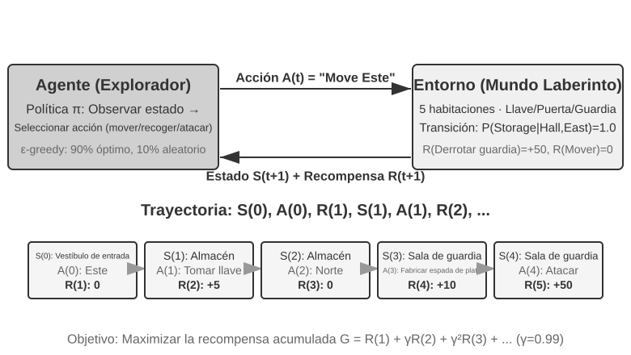

La interacción genera una **trayectoria**, es decir, el registro completo de "estado → acción → recompensa → nuevo estado → acción → recompensa...". La calidad de la política se refleja en la calidad de sus trayectorias. La **función de valor (Value Function)** responde a la pregunta: "si me encuentro en este estado y continúo actuando según la política actual, ¿cuánta recompensa total obtendré al final?". Es similar a un ajedrecista experimentado que, al evaluar una posición, no necesita calcular hasta el último movimiento, sino que estima intuitivamente la probabilidad de victoria. (Cuando la "política actual" se reemplaza por la "política óptima", se obtiene la función de valor óptimo, utilizada más adelante al abordar la Ecuación de Optimidad de Bellman.) La frontera entre el Agente y el entorno sigue un principio conciso: **todo aquello que el Agente no pueda modificar libremente pertenece al entorno**.

El aprendizaje por refuerzo se distingue del aprendizaje supervisado (que requiere respuestas correctas anotadas) y del aprendizaje no supervisado (que busca patrones ocultos en los datos) por dos rasgos únicos: la **búsqueda por ensayo y error** (el Agente debe descubrir por sí mismo qué acciones son buenas sin la guía directa de un profesor) y la **recompensa diferida** (el impacto de una acción puede manifestarse muchos pasos después, como el valor de una buena jugada que solo se aprecia al final de la partida). Esto introduce además el dilema clásico entre **exploración y explotación (Exploration-Exploitation Tradeoff)**: seguir siempre el camino conocido impide aprender cosas nuevas, mientras que probar a ciegas todo el tiempo impide llegar a la meta.

Un sistema de aprendizaje por refuerzo consta de cinco elementos clave:

- **Espacio de acciones**: Define el conjunto de todas las acciones que el Agente puede ejecutar. Las acciones pueden ser discretas (como elegir qué movimiento hacer en un juego de mesa, entre un número finito de opciones) o continuas (como determinar cuántos grados gira la articulación de un robot, expresado en valores numéricos continuos).
- **Política**: La regla de comportamiento del Agente, que especifica qué hacer en un estado determinado. Puede ser tan simple como una tabla de consulta (al ver el estado A, ejecuta la acción X) o tan compleja como una red neuronal profunda.
- **Señal de recompensa**: La retroalimentación inmediata provista por el entorno. No obstante, el objetivo del Agente es maximizar la recompensa a largo plazo y no solo la inmediata; esta distinción es vital, al igual que en las inversiones, donde no cuenta solo la fluctuación diaria sino el rendimiento a largo plazo.
- **Función de valor**: Estima la recompensa total acumulada a futuro partiendo de un estado específico, ayudando al Agente a tomar decisiones acertadas en ausencia de retroalimentación inmediata. Uno de los mayores avances en sesenta años de investigación en RL es el reconocimiento de la posición central de la estimación del valor.
- **Modelo del entorno (opcional)**: Predice la respuesta del entorno ante las acciones del Agente. Los métodos que disponen de un modelo del entorno se denominan **métodos basados en modelo** (aprenden a predecir los cambios del entorno antes de planificar), mientras que los que carecen de él se llaman **métodos libres de modelo** (aprenden directamente de la experiencia sin predecir el entorno).

La Tabla 8-3 compara los componentes clave de diversos sistemas de Agentes, revelando la universalidad del concepto de Agente y destacando la diferencia en el espacio de acciones entre los Agentes de RL tradicionales y los Agentes de LLM modernos.

Tabla 8-3 Comparación de elementos clave en diferentes sistemas de Agentes

| Tipo de Agente | Entorno | Espacio de acciones | Señal de recompensa |
|---------------|---------------------|----------------------------------|-------------------------|
| **Cazuela de gacela recién nacida** | Terreno, gravedad, postura corporal | Continuo de alta dimensión (contracción de grupos musculares) | Equilibrio (+), Caída (-) |
| **Robot aspirador** | Distribución de la habitación, nivel de batería | Discreto (dirección, succión, recarga) | Área limpia (+), Batería agotada (-) |
| **Gran Maestro de Ajedrez** | Estado del tablero, límite de tiempo | Discreto finito (movimientos legales) | Victoria (+1), Derrota (-1) |
| **Agente de atención al cliente** | Historial de diálogo, base de conocimiento | Abierto (pensar, hablar, llamadas a API) | Resolución del problema (+), Tiempo de atención (-) |
| **Agente asistente de código** | Documentación de requisitos, repositorio de código | Abierto (pensar, buscar, editar, ejecutar) | Pruebas aprobadas (+), Introducción de bugs (-) |

La tabla revela una noción fundamental: los Agentes de RL tradicionales (en juegos de mesa o robótica) operan en espacios de acciones cerrados, mientras que los Agentes modernos basados en LLM (en atención al cliente o asistencia de código) se mueven en espacios de acciones abiertos y casi infinitos, capaces además de utilizar el "pensamiento interno" como una acción especial para elevar sus capacidades.

### Dos paradigmas de Agentes: de MDP a LLM+RL

La diferencia más sustancial entre ambos paradigmas reside en el espacio de acciones: MDP asume un espacio de acciones finito y cerrado (arriba/abajo/tomar/soltar), mientras que el espacio de acciones de un LLM es una secuencia de lenguaje natural abierta y de explosión combinatoria. Esta discrepancia determina la separación radical entre ambos paradigmas en cuanto al diseño de algoritmos, la eficiencia de muestra y la capacidad de generalización.

**El paradigma tradicional: MDP y Q-learning.**

El MDP (Markov Decision Process, Proceso de Decisión de Markov) es el marco matemático del aprendizaje por refuerzo que define el estado, la acción, la recompensa y otros elementos centrales. Su hipótesis central es la **propiedad de Márkov**: el futuro depende únicamente del estado actual y no del historial previo. Por ejemplo, al jugar al ajedrez, evaluar la posición actual del tablero basta para determinar la mejor jugada, sin requerir revisar cada movimiento previo. Esta suposición simplifica el problema, aunque limita el modelado de dependencias históricas.


El rasgo distintivo del Agente de RL tradicional es su **espacio de acciones cerrado**: todas las acciones posibles forman un conjunto finito predefinido. Los **Agentes clásicos de juegos de mesa** constituyen el ejemplo más típico: Go cuenta con 361 posiciones de colocación de fichas que, aunque amplias, son totalmente finitas y deterministas; el ajedrez considera reglas de movimiento para distintas piezas, pero sus acciones siguen siendo enumerables. Los juegos de Atari ofrecen solo entre unos pocos y una docena de acciones discretas. Los **Agentes robóticos** representan espacios de acciones continuos pero acotados: los ángulos de las articulaciones, la velocidad y la fuerza de agarre son valores continuos, pero con límites físicos precisos (ángulo máximo de rotación, par máximo, límite de velocidad), cuya dimensión viene dada por los grados de libertad del robot.

Esta naturaleza cerrada aporta ventajas de cálculo: se pueden enumerar todas las acciones para evaluarlas individualmente, facilitando la programación dinámica y la búsqueda en árbol de Monte Carlo, permitiendo aproximar la función de valor de acción mediante tablas o funciones simples. Sin embargo, restringe la expresividad y la generalización. El Agente de RL tradicional parte desde cero y aprende mediante puro ensayo y error: inicia con una política aleatoria, recopila experiencia, actualiza la función de valor o la política, e itera hasta la convergencia.

En este marco, uno de los algoritmos más fundamentales es **Q-learning**. Este mantiene una estimación de valor para cada combinación "estado-acción": al ejecutar la acción $a$ en el estado $s$ y continuar actuando según la política óptima en el futuro, ¿cuánta recompensa total se obtendrá? Intuitivamente, la calidad de una acción depende del retorno inmediato que genera más la estimación de "cuán bueno es el siguiente estado al que conduce".

Expresando esta intuición en forma de ecuación, obtenemos la relación recursiva fundamental de la **Ecuación de Bellman** de los libros de texto de RL: **el valor real de una acción = la recompensa inmediata de este paso + el valor futuro máximo que se puede obtener al alcanzar el siguiente estado**:

$$Q^*(s, a) = r + \gamma \max_{a'} Q^*(s', a')$$

Donde $r$ es la recompensa inmediata, $s'$ es el siguiente estado alcanzado tras ejecutar la acción (expresado aquí de forma determinista para favorecer la intuición; en entornos estocásticos se toma la esperanza sobre el siguiente estado $s'$), y $\gamma \in [0, 1)$ es el **factor de descuento**, que determina el peso asignado al futuro: cuanto más cercano a 1 sea $\gamma$, mayor importancia se otorga al retorno a largo plazo; cuanto más cercano a 0, más se atiende a lo inmediato. La "recompensa acumulada" mencionada previamente es la suma descontada paso a paso $\sum_{t} \gamma^{t} r_t$. Tras cada acción, el algoritmo ajusta ligeramente el valor estimado antiguo hacia el "resultado real acontecido"; este paradigma de "corregir estimaciones antiguas con resultados reales de un solo paso" se denomina **Aprendizaje de Diferencias Temporales (Temporal-Difference Learning, TD learning)**, el cual, tras miles de iteraciones de ensayo y error, converge progresivamente hacia el valor real.

Las dos figuras siguientes ilustran el proceso de exploración de Q-learning en un Grid World y la convergencia gradual de los valores Q.

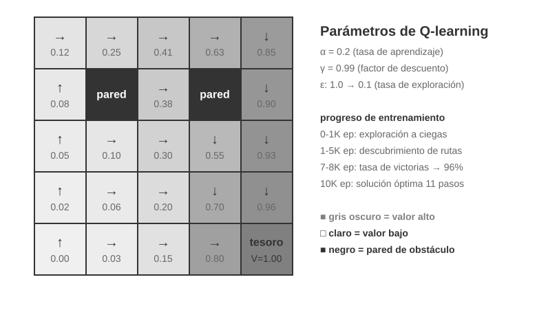

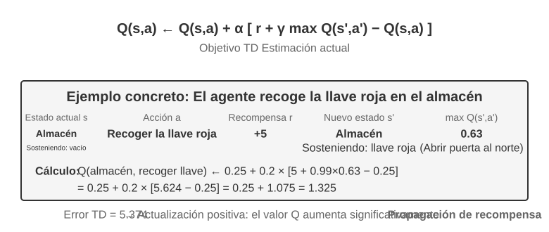

Q-learning es un método específico **fuera de la política (Off-Policy)**: puede aprender la política óptima a partir de datos generados por cualquier política (incluida la exploración aleatoria). Las definiciones estrictas de métodos en la política y fuera de la política, y su correspondencia en el post-entrenamiento de LLM, se abordan en la sección "Comparación de algoritmos de aprendizaje por refuerzo".

> **Experimento 8-1 ★: Rendimiento de Q-learning en el Juego de Búsqueda del Tesoro**
>
> Para verificar las características y limitaciones de Q-learning, diseñamos un **entorno de juego de búsqueda del tesoro**. Este entorno presenta varios desafíos clave: las **mecánicas ocultas** exigen que el Agente descubra por sí mismo la correspondencia entre llaves y puertas, los efectos de las armas y las reglas de combinación de objetos; las **dependencias de múltiples pasos** implican que completar la tarea requiere una secuencia correcta de acciones (con una solución óptima de 11 pasos); y las **recompensas esporádicas (sparse rewards)** significan que solo las acciones críticas y la victoria final otorgan recompensas significativas, sin retroalimentación en la mayoría de los pasos intermedios.
>
> El Agente de Q-learning utiliza una configuración estándar de parámetros bajo una política de exploración $\epsilon$-greedy (elige la acción óptima actual la mayor parte del tiempo y ocasionalmente prueba opciones aleatorias, reduciendo gradualmente la exploración aleatoria conforme avanza el entrenamiento).
>
> La curva de aprendizaje muestra rasgos característicos (un episodio se refiere a una partida completa, desde el inicio hasta la victoria o derrota):
> - **Primeros 1.000 episodios**: 0% de tasa de victoria, la tabla Q contiene solo 124 estados; el Agente explora a ciegas.
> - **Primeros 5.000 episodios**: Aún sin victorias estables, la tabla Q alcanza 133 estados.
> - **Episodios 7.000 a 8.000**: La tasa de victoria asciende del 34% al 96%.
> - **10.000 episodios**: 100% de tasa de victoria, la tabla Q registra 145 estados, encontrando la solución óptima de 11 pasos.
>
> Todo el entrenamiento toma menos de 10 segundos (debido a una eficiencia de simulación extremadamente alta), pero requiere casi 10.000 intentos completos. Esto ilustra la característica central de Q-learning: necesita una exploración aleatoria masiva para encontrar por casualidad el camino completo, y la propagación de la señal de valor es muy lenta, requiriendo refuerzo iterativo. El aprendizaje simbólico puro sin conocimiento previo solo puede recurrir a la búsqueda por fuerza bruta en el espacio de estados.
>
> En un simulador de juego, 10.000 intentos toman solo 10 segundos, con un costo insignificante. Sin embargo, en escenarios reales de Agentes, donde cada llamada telefónica cuesta dinero, cada interacción con el navegador tiene latencia y cada decisión errónea puede acarrear consecuencias irreversibles, 10.000 intentos son absolutamente inaceptables. Esta es la razón por la cual los Agentes modernos han migrado hacia métodos basados en LLM: aprovechar el conocimiento acumulado en el pre-entrenamiento para tomar decisiones efectivas con un número mínimo de interacciones.
>
> Las limitaciones fundamentales de MDP son tres: baja eficiencia de muestra (requiere interacciones masivas para aprender tareas simples), escasa generalización (el conocimiento adquirido en un entorno es difícil de transferir a otro) e incapacidad para aprovechar conocimientos previos (cada nueva tarea se aprende desde cero). Cuando se enfrentan al lenguaje natural o a espacios de estados complejos como la visión de alta dimensión, estas limitaciones se vuelven críticas.

**El paradigma moderno: Agentes basados en LLM+RL.**

Los grandes modelos de lenguaje han introducido un paradigma de Agente totalmente nuevo, transformando radicalmente la forma de construir Agentes, especialmente en lo relativo al diseño del espacio de acciones.

Un Agente de RL tradicional solo puede obtener retroalimentación modificando el entorno: dar el siguiente paso en el ajedrez o avanzar en el laberinto. Sin embargo, un LLM introduce un tipo de acción completamente nuevo: el pensamiento interno. El pensamiento no altera el mundo exterior, pero mejora sustancialmente la calidad de la acción final. Este cambio lo transforma todo: el espacio de acciones del Agente ya no es solo "qué hacer", sino también "cuánto tiempo pensar y qué pensar".

La innovación más relevante es **incorporar el pensamiento (Thinking) como una acción especial** dentro del espacio de acciones. En el RL tradicional, el Agente solo puede ejecutar acciones externas que alteran el estado del entorno (moverse, atacar, recoger); en un Agente basado en LLM, **el pensamiento interno se convierte en un componente central del espacio de acciones**: no cambia directamente el entorno externo, no ofrece recompensa inmediata, se puede ejecutar casi sin límite de veces y su costo es relativamente bajo.

El RL tradicional tiene dificultades para gestionar este tipo de acciones debido a que el espacio de exploración es excesivamente amplio y carece de estructura: un Agente que aprende desde cero es como alguien con los ojos vendados buscando un tesoro en el desierto, chocando al azar. Un LLM es distinto. Mediante el pre-entrenamiento en textos masivos, ha internalizado las reglas de pensamiento estructuradas por la humanidad: para resolver problemas matemáticos sigue "identificar condiciones → recordar fórmulas → calcular paso a paso", y para escribir código sigue "comprender requisitos → diseñar estructura → implementar detalles". Esto permite que el pensamiento del LLM avance por rutas estructuradas, comprimiendo drásticamente el espacio de búsqueda. Por ello, incluso sin entrenamiento adicional en RL, un LLM pre-entrenado puede generar cadenas de pensamiento (Chain of Thought, CoT) con lógica básica. Esta lógica proviene de los vastos datos de pensamiento humano en el corpus de pre-entrenamiento (soluciones matemáticas, comentarios de código, debates), donde el modelo aprende implícitamente mediante la predicción del siguiente token "cuál debe ser la estructura de un razonamiento".

El post-entrenamiento con RL enseña al LLM a emplear estas reglas de forma más eficiente mediante recompensas externas. La estructura del lenguaje ofrece además una recompensa interna implícita: las cadenas de pensamiento lógicas y coherentes (como "dado que se requiere convertir divisas a dólares, el primer paso es consultar el tipo de cambio") tienen una alta probabilidad de generación, mientras que las desorganizadas ("dado que se requiere convertir divisas, primero consultamos el clima") tienen una probabilidad extremadamente baja, guiando de forma natural al modelo hacia rutas razonables.

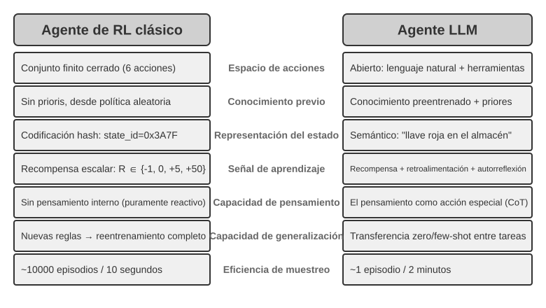

Esta capacidad de pensamiento basada en reglas lingüísticas internas permite que los Agentes de LLM comprendan instrucciones no vistas previamente (generalización zero-shot) y se adapten a nuevas tareas con muy pocos ejemplos (adaptación few-shot), lo cual contrasta totalmente con la necesidad de ensayo y error masivo en los MDP tradicionales. Además, el nuevo paradigma posee capacidades de generalización combinatoria (recombinar conceptos conocidos ante situaciones nuevas), aprendizaje en contexto (adaptación rápida mediante prompts y ejemplos) y comprensión multimodal (integrar de forma natural visión, lenguaje y acciones). Es importante señalar que el **efecto** del aprendizaje en contexto (generalización zero-shot, adaptación few-shot) y su **mecanismo interno** son dos aspectos distintos: el mecanismo de atención funciona más como una recuperación que como un razonamiento puro (como se analizó en el Capítulo 2), pero esto no impide que genere efectos prácticos potentes en la adaptación a tareas.

La evolución desde un espacio de acciones cerrado a uno abierto refleja la transformación fundamental en el paradigma de los AI Agents. Además del pensamiento interno, la diversidad de parámetros de las herramientas (consultas en lenguaje natural, código de programación, JSON complejo, contenido multimodal) hace que el espacio de acciones real sea prácticamente infinito: un intérprete de código puede teóricamente ejecutar cualquier tarea computable, y una herramienta de búsqueda puede explorar el espacio de información de todo internet. Esto aporta nuevas oportunidades (el Agente puede abordar tareas inéditas y resolver problemas complejos combinando herramientas básicas) y también nuevos desafíos (cómo definir y optimizar funciones de recompensa en entornos abiertos y cómo buscar de manera eficiente en espacios de acciones infinitos).

Tomando como ejemplo modelos como Kimi K3, optimizados para la llamada a herramientas y el razonamiento en cadena larga, se observa la dirección típica del paradigma LLM+RL: sobre la base de un pre-entrenamiento del lenguaje a gran escala, se refuerza mediante post-entrenamiento la descomposición de problemas, la llamada a herramientas y la autocorrección. **OpenVLA**[^ch8-21] (detallado en el Capítulo 6) ilustra el paradigma de arquitectura VLA (Visión-Lenguaje-Acción) en la era de los LLM: el codificador visual procesa las observaciones del entorno, el modelo de lenguaje comprende las instrucciones y razona, y el decodificador de acciones genera señales de control, logrando control condicionado por lenguaje y generalización entre tareas. Conviene aclarar que OpenVLA se entrena mediante aprendizaje por imitación (clonación de comportamiento) sobre casi un millón de **trayectorias de demostración** robóticas, siendo de naturaleza SFT y no RL; la representación real de la introducción de RL en robótica para optimizar aún más mediante recompensas sobre arquitecturas VLA se analiza en el Experimento 8-13 de SimpleVLA-RL más adelante.

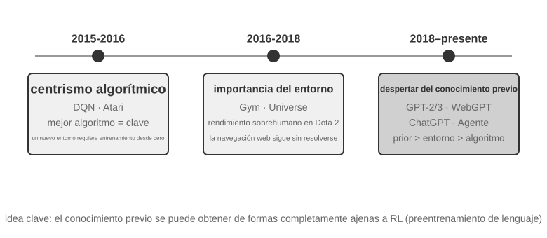

**El camino de exploración de OpenAI** (registrado en detalle[^ch8-2] por Yao Shunyu, profesor asistente en Princeton y autor del artículo de ReAct, en *The Second Half*) revela una importante evolución conceptual. **Primera etapa (2015-2016) El centralismo del algoritmo**: Se creía que el factor determinante eran los mejores algoritmos, logrando avances en entornos estándar como Atari, pero requiriendo entrenar desde cero al cambiar de entorno. **Segunda etapa (2016-2018) La importancia del entorno**: Gym estandarizó diversas tareas, mientras que Universe y World of Bits intentaron transformar todo internet en un entorno de entrenamiento para RL; Dota 2 buscó un rendimiento sobrehumano en entornos complejos específicos. La idea era clara, pero el uso general de ordenadores y la navegación web no lograron avances definitivos.

**Tercera etapa (2018 al presente) El despertar de los conocimientos previos**: GPT-2 y GPT-3 demostraron el poder del pre-entrenamiento del lenguaje, y WebGPT y ChatGPT probaron que estos conocimientos previos podían transformarse en Agentes prácticos. El descubrimiento más valioso fue: **los conocimientos previos se pueden adquirir mediante métodos totalmente ajenos al RL**. Esta es una verdad contraintuitiva: las prioridades de los investigadores de RL durante décadas podrían haber estado invertidas; la jerarquía real no es algoritmo > entorno > conocimientos previos, sino conocimientos previos > entorno > algoritmo.

> **Experimento 8-2 ★★: Estudio Comparativo entre RL Tradicional y Agente LLM**
>
> 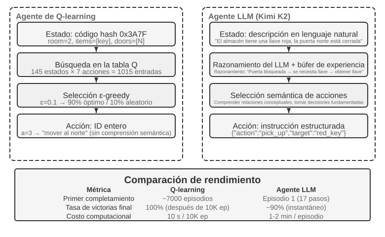
>
> Evaluamos en el mismo juego de búsqueda del tesoro a Q-learning frente a un Agente LLM (Kimi K3, manteniendo un búfer de experiencia de hasta 50 entradas). El resultado fue impactante: **el Agente LLM completó el juego en la primera partida en solo 18 pasos**.
>
> **Etapa inicial (exploración con propósito)**: Recoge la espada oxidada ("un arma es mejor que ir con las manos vacías"), explora el mapa de forma sistemática y, tras descubrir que la puerta norte está cerrada, razona que "se necesita buscar una llave", pasando a explorar el almacén donde obtiene sucesivamente la llave roja y el cristal mágico. **Etapa intermedia (comprensión de mecánicas y síntesis activa)**: Comprende la regla de "uso automático de la llave" y prevé que la espada oxidada no bastará contra el guardia, sintetizando activamente una espada de plata en el paso 8. **Etapa final (ejecución y corrección)**: Avanza hacia el norte con la espada de plata, derrota al guardia fuerte en el paso 13 (con uno o dos intentos ineficientes intermedios) y obtiene el tesoro del dragón en el paso 18.
>
> Esto evidencia la diferencia sustancial entre la comprensión semántica y el mapeo simbólico. El Agente LLM comprendió la estructura conceptual del juego, respaldando cada paso en una lógica y un propósito. Para Q-learning, "puerta", "llave" y "espada" son meras combinaciones de símbolos sin significado, que solo pueden relacionarse lentamente tras un aprendizaje estadístico masivo.
>
> El costo de cálculo plantea una paradoja interesante: Q-learning ejecuta 10.000 partidas en solo 10 segundos, mientras que el Agente LLM requiere entre 1 y 2 minutos por partida. Sin embargo, en tareas reales, el costo en tiempo, dinero y riesgo por interacción supera con creces el costo computacional puro, por lo que evaluar únicamente el tiempo de GPU no es justo. La noción clave es: el éxito del Agente LLM no se debe a un "algoritmo de aprendizaje" superior, sino a que incorpora una cantidad masiva de conocimientos previos. Ante un cambio en las reglas del juego, Q-learning requiere reentrenarse por completo, mientras que el Agente LLM puede adaptarse directamente mediante razonamiento. Esto establece un principio práctico de diseño: en escenarios con costos de simulación bajos y alta repetibilidad, el RL tradicional conserva su valor; en escenarios reales con altos costos de interacción y necesidad de adaptación rápida, la eficiencia de muestra del Agente LLM resulta mucho más práctica.

En cuanto a cómo colaboran la adaptación en contexto, la actualización de artefactos externos y la actualización de parámetros, el Capítulo 1 ofreció el mapa conceptual, y la sección "Panorama completo" al final de este capítulo retornará sobre este tema. El hilo conductor de este capítulo es el post-entrenamiento: consolidar en los parámetros del modelo aquellas capacidades difíciles de expresar mediante reglas externas.

## Fundamentos del Pre-entrenamiento de Modelos `[Lectura Opcional]`

Para entender por qué son efectivas las técnicas de post-entrenamiento, es necesario comprender primero qué se construye durante el pre-entrenamiento. El post-entrenamiento (SFT y RL) optimiza esencialmente dentro del espacio de representación establecido por el pre-entrenamiento; la estructura del conocimiento asentada en el pre-entrenamiento determina el límite superior del post-entrenamiento. Por ello, examinamos los aspectos centrales del pre-entrenamiento a través de tres experimentos: entrenar un modelo de lenguaje de pequeña escala desde cero, extender capacidades visuales e inyectar conocimientos en un nuevo idioma. Los tres experimentos de esta sección son contenidos auxiliares para ayudar al lector a construir una intuición sobre el pre-entrenamiento (es decir, el entrenamiento inicial sobre datos masivos para que el modelo aprenda las reglas básicas del lenguaje y el conocimiento del mundo); aquellos lectores familiarizados con el proceso de pre-entrenamiento pueden omitirlos.

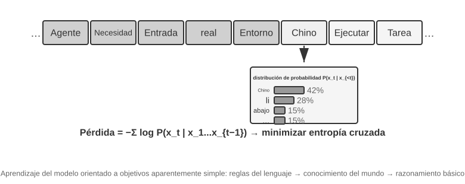

El entrenamiento de modelos de lenguaje sigue un flujo de tres etapas: "tokenización: pre-entrenamiento: post-entrenamiento". La tokenización divide el texto en unidades discretas; por ejemplo, "me gusta programar" podría dividirse en cuatro tokens: "me", "gusta", "progra" y "mar", siendo estos tokens las unidades mínimas que el modelo procesa. La tarea de pre-entrenamiento es conceptualmente simple: mostrar al modelo la primera parte de un texto y pedirle que prediga el siguiente token. El modelo ajusta sus parámetros comparando la diferencia entre su predicción y la respuesta correcta (esta diferencia se denomina pérdida o Loss; cuanto menor sea la pérdida, más precisa es la predicción). Tras entrenarse repetidamente sobre textos masivos, el modelo adquiere gradualmente las reglas del lenguaje, el conocimiento del mundo y capacidades básicas de razonamiento. Al completarse el pre-entrenamiento, el modelo genera texto fluido, pero sus salidas carecen de estructura y le cuesta seguir instrucciones. El post-entrenamiento lo transforma en un asistente práctico mediante SFT (entrenamiento con pares entrada-salida etiquetados) y optimización de preferencias (como DPO, enseñando al modelo a generar respuestas preferidas por los humanos).

> **Experimento 8-3 ★★: Entrenar un LLM desde Cero: El Poder de la Mejora Algorítmica**
>
> Tomando MiniMind 2 (cien millones de parámetros) como caso de estudio, se completa el flujo de entrenamiento sobre una GPU de consumo. Al introducir dos optimizaciones algorítmicas (QK Norm y el optimizador Muon), la velocidad de convergencia aumenta 3 veces y la calidad de generación mejora notablemente, con un costo de ejecución extremadamente bajo: alrededor de 14 horas de entrenamiento total y un costo de unos 34 dólares.
>
> Efectos en cada etapa de entrenamiento: Tras el pre-entrenamiento, el modelo responde a preguntas fácticas como "¿cuál es la montaña más alta del mundo?", pero con un formato no estandarizado; tras el SFT, el seguimiento de instrucciones y el formato de salida mejoran significativamente, organizando la respuesta según lo esperado; la optimización de preferencias reduce aún más los errores fácticos y las expresiones poco naturales. Un modelo de cien millones de parámetros conserva limitaciones evidentes (propenso a fallar en problemas complejos), pero la lección es: **bajo un presupuesto pequeño y fijo, las mejoras algorítmicas ofrecen una relación costo-beneficio muy superior a simplemente aumentar la escala**.

> **Experimento 8-4 ★★: Entrenar tu propio VLM**
>
> 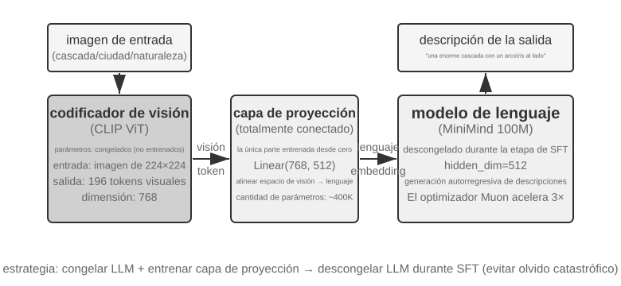
>
> Un VLM unifica la percepción visual y la comprensión del lenguaje en un único modelo, siendo su desafío central la alineación entre modalidades: lograr que lo que se "ve" se corresponda con lo que se "dice". La arquitectura consta de tres componentes: un **codificador visual** (como CLIP, con parámetros congelados) que extrae características semánticas de la imagen; una **capa de proyección** (ligera, el único componente entrenado desde cero) que actúa como "traductor" entre las características visuales y el modelo de lenguaje, mapeando las representaciones visuales a un espacio comprensible por el LLM; y el **modelo de lenguaje** que genera el texto descriptivo. El entrenamiento adopta la estrategia de "congelar el LLM + entrenar únicamente la capa de proyección" para evitar el olvido catastrófico (Catastrophic Forgetting, es decir, olvidar habilidades previas al aprender otras nuevas); tras alinear el pre-entrenamiento, se descongela el LLM y se aplica SFT con pares de imagen-descripción de alta calidad, mejorando considerablemente el nivel de detalle y la precisión de la descripción.
>
> Este experimento revela el paradigma básico de entrenamiento de modelos multimodales: reutilizar los logros del pre-entrenamiento unimodal y lograr la alineación multimodal entrenando una capa de proyección ligera, un enfoque eficiente y escalable, aunque la capacidad expresiva limitada de la capa de proyección puede convertirse en un cuello de botella para la comprensión profunda. Extendiendo este mismo esquema de "codificador visual + capa de proyección + LLM" un paso más allá para permitir que el modelo genere acciones, se llega al modelo VLA (Visión-Lenguaje-Acción) que se aborda en el Capítulo 6.

Los dos experimentos de pre-entrenamiento revelan una regla: con presupuesto limitado, mejorar algoritmos y arquitectura suele rendir más que aumentar escala. Sin embargo, si el pre-entrenamiento general no cubre el idioma o dominio objetivo, SFT y RL no pueden saltarse esa carencia. Esa es la función de Mid-training.

## Mid-training: completar conocimiento y capacidades básicas

En este capítulo, **Mid-training** significa continuar el modelado del lenguaje de un modelo base sobre la distribución objetivo, con el mismo objetivo de siguiente token y, normalmente, pérdida sobre todos los tokens de documentos, código o derivaciones. DAPT y TAPT muestran que una segunda fase sobre corpus no etiquetados del dominio o la tarea puede mejorar el rendimiento posterior[^ch8-30]. «Mid» describe su lugar en el flujo, no una función de pérdida distinta.

Resuelve dos carencias:

- **Conocimiento**: idioma, finanzas, medicina, derecho, documentos internos o repositorios apenas cubiertos por el pre-entrenamiento general.
- **Capacidad básica**: representaciones de contexto largo, código, matemáticas o multimodalidad que el modelo base aún no posee y que no aparecen ni tras muchas muestras.

SFT puede memorizar algunos hechos y enseñar a formular respuestas de dominio, pero unos pocos pares QA cubren pocas rutas de acceso y no son un buen contenedor para conocimiento grande e interconectado. Mid-training tampoco garantiza por sí solo que el conocimiento pueda recuperarse mediante preguntas: el orden y la organización del pre-entrenamiento continuado y el ajuste de instrucciones importan[^ch8-31]. Una receta robusta es **Mid-training para conocimiento/capacidad → SFT pequeño para acceso y protocolo → RL opcional cuando ya existe éxito no nulo**.

### Cómo construir los datos de Mid-training

La **distribución objetivo, la distribución de retención y la evaluación** deben cerrar el ciclo:

1. **Derivar los datos de la distribución de fallos.** Segmenta por tema, idioma, tipo de documento, patrón de código y longitud; distingue una carencia de base de un simple error de formato.
2. **Crear corpus objetivo densos.** Documentos para términos y hechos, repositorios para estructura y dependencias, y derivaciones, explicaciones sintéticas y relaciones entre documentos para hacer explícitas las conexiones. Deduplica, filtra calidad y evita contaminación del conjunto de evaluación.
3. **Mezclar por capacidad.** En la etapa $i$:

   $$
   \mathcal{D}_i=\alpha_i\mathcal{D}_{\text{long}}+\beta_i\mathcal{D}_{\text{atomic}}+\gamma_i\mathcal{D}_{\text{agent}}+\delta_i\mathcal{D}_{\text{replay}},\qquad
   \alpha_i+\beta_i+\gamma_i+\delta_i=1
   $$

   $\mathcal{D}_{\text{long}}$ contiene libros, documentos largos y repositorios cercanos a la longitud actual; $\mathcal{D}_{\text{atomic}}$, recuperación, razonamiento multi-salto, agregación y estadística; $\mathcal{D}_{\text{agent}}$, planificación, elección y llamada de herramientas, seguimiento de estado y recuperación; $\mathcal{D}_{\text{replay}}$, datos generales y de etapas anteriores. Documentación, código, planes, cambios de estado y trayectorias pueden entrenarse como secuencias completas; el schema exacto de diálogo y herramientas queda para SFT. No existe una proporción universal: ajústala según curvas de aprendizaje y olvido y mídela **por tokens**, no por número de ejemplos.
4. **Aplicar doble replay.** Conserva texto corto y datos generales, y además eleva tareas antiguas a la longitud actual con evidencia y distractores en distintas posiciones. Usa si es posible el corpus original del modelo; de lo contrario, corpus abiertos como FineWeb-2. Los datos cortos de alta calidad siguen siendo importantes junto al texto largo natural[^ch8-35].
5. **Detenerse con puertas multidimensionales.** Sigue pérdida, tareas de dominio reservadas, capacidad general, instrucciones previas y `pass@1`/`pass@k`. Si mejora el dominio pero cae la retención, cambia mezcla o tasa de aprendizaje; si baja la pérdida pero no sube `pass@k`, revisa cobertura y la necesidad de SFT para acceder al conocimiento.

### Ampliar la ventana de contexto mediante aprendizaje curricular

Mid-training debe convertir la longitud nominal en una **ventana efectiva** e incorporar razonamiento largo, planificación y herramientas mientras se amplía. Cambiar `max_position_embeddings` de 32K a 128K solo permite la entrada; no demuestra que el modelo recupere, agregue y actúe. Usa un currículo, por ejemplo 8K → 16K → 32K → 64K → 128K, adaptado al modelo y al presupuesto. La mezcla de datos y el currículo de longitudes son variables clave en el pre-entrenamiento continuado de contexto largo[^ch8-36].

Antes de ampliar, resuelve en la longitud actual:

- **Posición y recuperación**: una o varias agujas, distintas posiciones y distractores;
- **Relaciones y razonamiento**: seguimiento entre párrafos/documentos, multi-salto, contradicciones y evidencia;
- **Agregación y estadística**: conteo, agrupación, orden, comparación y resumen de tablas o logs largos;
- **Primitivas de Agente**: descomposición, plan, herramienta, argumentos, memoria de estado y recuperación de fallos.

Para checkpoint $\theta_i$, ventana $L_i$ y capacidad $c$, exige antes de pasar a $L_{i+1}$:

$$
\begin{aligned}
M(\theta_i,c,L_i) &\geq \tau_c &&\text{(umbral en la longitud actual)},\\
M(\theta_i,c,L_i) &\geq M(\theta_i,c,L_{i-1})-\epsilon_{\text{len}} &&\text{(sin degradación significativa por longitud)},\\
M(\theta_i,c,L_{i-1}) &\geq M(\theta_{i-1},c,L_{i-1})-\epsilon_{\text{retain}} &&\text{(sin olvidar la capacidad anterior)}.
\end{aligned}
$$

La segunda condición requiere tareas elevadas de dificultad equivalente. Determina $\epsilon$ mediante intervalos de confianza de evaluaciones repetidas. Si falla una capacidad crítica, aumenta sus datos atómicos, los datos de longitud actual o replay antes de seguir ampliando.

Los benchmark existentes permiten construir una matriz **capacidad × longitud**:

| Capa de aceptación | Benchmark disponibles | Qué observar |
| --- | --- | --- |
| Posición, recuperación, seguimiento y agregación | NIAH, RULER | Degradación por posición, número de agujas, multi-salto, agregación y longitud; NIAH es solo una prueba de humo |
| Razonamiento sobre documentos reales | LongBench, LongBench v2 | QA mono/multidocumento, diálogo largo, aprendizaje en contexto y datos estructurados, por categoría y longitud |
| Comprensión de código largo | Tareas de repositorio de LongBench v2, LongCodeU | Unidades de código, relaciones entre archivos y comprensión del repositorio |
| Planificación y herramientas | PlanningArena y benchmark de herramientas anteriores | Descomposición, selección, memoria, argumentos y estado |
| Agente extremo a extremo | SWE-bench Verified, $\tau^2$-bench, Terminal-Bench, etc. | Éxito final, trayectorias válidas y `pass@k` |

RULER amplía NIAH con recuperación de varias agujas, seguimiento multi-salto y agregación[^ch8-37]; LongBench v2 cubre tareas reales de documentos, diálogo, repositorios y datos estructurados[^ch8-38]; LongCodeU y PlanningArena diagnostican código largo y planificación/herramientas[^ch8-39][^ch8-40]. Reserva los test oficiales para evaluar y entrena solo con ejemplos homólogos pero no solapados. Informa por longitud, capacidad y tipo de fallo: una puntuación global puede ocultar regresiones y superar NIAH no demuestra razonamiento largo.

Para hechos cambiantes o que exigen cita, sigue siendo mejor RAG. Mid-training encaja con conocimiento estable y capacidades que necesitan representación interna; valida primero la mezcla a pequeña escala.

> **Experimento 8-5 ★★: Continuar el pre-entrenamiento para aprender un nuevo idioma**
>
> Partiendo de Mistral 7B v0.3, pre-entrenado sobre todo en inglés y con casi nula comprensión del coreano, se continúa el modelado del lenguaje con Wikipedia coreana. El modelo ya posee representaciones generales y solo se adapta a una nueva distribución, mucho más barato que entrenar desde cero. El experimento usa aproximadamente 80 % coreano y 20 % inglés para reducir el olvido; es una elección experimental, no una regla universal. Después, SFT con instrucciones coreanas enseña a recibir instrucciones y organizar respuestas. Mid-training aporta primero conocimiento y capacidad lingüística; SFT fija el protocolo.
>
> El experimento también muestra olvido catastrófico: mejoró la evaluación ciega en coreano y cayó la capacidad en inglés. Por eso siguen siendo necesarios conjuntos de retención, evaluación factual y auditoría de datos.

Con suficiente conocimiento y capacidad básica, el siguiente paso es convertir el modelo en un Agente práctico que respete protocolos.

## SFT (Ajuste Fino Supervisado)

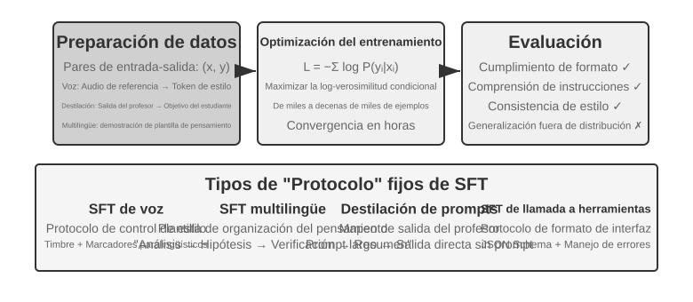

La sección «Del pre-entrenamiento a RL: panorama en cuatro partes» explicó la esencia del SFT. Su valor central no es inyectar conocimiento nuevo, sino **consolidar protocolos**: mapeos, formatos de interacción y normas de estilo.

Esta alta eficiencia puede tener como contrapartida la dependencia de la distribución de entrenamiento: en tareas que exigen explorar varias estrategias correctas, o cuando la distribución de despliegue se aleja de los datos de demostración, el SFT tiende a reproducir los patrones demostrados y su rendimiento cae en escenarios nuevos. Los cuatro experimentos siguientes muestran desde distintos ángulos este proceso de "consolidar protocolos".

Antes de poner en práctica el SFT, surge una pregunta operativa inevitable: **¿de dónde provienen los datos de SFT?** En la industria la respuesta se reduce básicamente a tres caminos:

- **Demostraciones de expertos humanos**: el techo de calidad más alto, pero caras y lentas; sirven como "datos semilla" para definir formato y estilo;
- **Generación con un modelo profesor**: es decir, datos sintéticos: un modelo fuerte produce en volumen pares "entrada-salida" que, tras filtrarse, se destilan al estudiante; véanse los Experimentos 8-8 y 8-9;
- **Muestreo por rechazo**: el propio modelo muestrea varios candidatos para la misma pregunta, un verificador selecciona los correctos y con ellos vuelve a entrenarse a sí mismo; véase el Experimento 8-9.

Los tres caminos se combinan a menudo: primero unas pocas semillas humanas fijan el formato, después el modelo profesor amplía la escala y por último el muestreo por rechazo nivela la calidad. Sea cual sea el camino, el proceso de construcción es muy parecido: definir la distribución de tareas y el esquema de salida, generar candidatos en volumen, filtrar la calidad con validación por reglas, comprobaciones de formato y revisión humana por muestreo, y finalmente deduplicar, equilibrar las proporciones y garantizar la diversidad. En cuanto al volumen, no hace falta acumular: de unos miles a unas decenas de miles de muestras de alta calidad suelen bastar para consolidar un protocolo, y vale más pulir diez mil muestras limpias que amontonar cien mil sucias, porque cada ruido presente en los datos el SFT puede escribirlo fielmente en los parámetros.

> **Experimento 8-6 ★★★: SFT de Voz: De la Clonación de Voz al Modelado Paralingüístico `[Experimento Extendido]`**
>
> Tomando como objetos de estudio Orpheus (clonación de voz basada en prompt de contexto) y Sesame (modelado de marcas paralingüísticas), se muestra cómo escribir el estilo de voz y los hábitos expresivos en los parámetros. Ambos siguen enfoques distintos:
>
> - **Orpheus**: Comprime la forma de onda de audio en una secuencia de tokens y, mediante la concatenación del audio de referencia del mismo hablante, enseña al modelo a "hablar con la voz de esa persona", logrando consistencia de timbre entre oraciones.
> - **Sesame**: Abstrae fenómenos paralingüísticos como risas o suspiros en tokens especiales como `<laugh>` o `<sigh>`, entrenando al modelo para "emitir el sonido correspondiente al detectar la marca".
>
> En tareas expresivas, el SFT consolida protocolos de control de estilo y hábitos de expresión estructurada, no conocimientos fácticos ni razonamientos complejos. La clave reside en la diversidad de los datos de entrenamiento y la calidad de la anotación. Modos de falla comunes: la falta de variedad de hablantes en los datos provoca que todos suenen igual; el sobreajuste de marcas (Overfitting, donde el modelo memoriza detalles específicos de las muestras de entrenamiento y empeora ante situaciones nuevas) produce "risas mecánicas".

> **Experimento 8-7 ★★★: Pensamiento Multilingüe: Permitir que el Modelo Piense en Cualquier Idioma `[Experimento Extendido]`**
>
> La mayoría de los modelos de razonamiento solo piensan en inglés: sin importar en qué idioma preguntes, la cadena de pensamiento interna del modelo ocurre casi siempre en inglés, debido a que las demostraciones de pensamiento de alta calidad en los datos de entrenamiento están escritas principalmente en inglés. El objetivo de este experimento es simple: permitir que el modelo piense en el idioma especificado.
>
> El procedimiento consiste en aplicar SFT sobre gpt-oss-20b: agregar en la instrucción del sistema la línea `reasoning language: German` (u otro idioma) y entrenar con ejemplos de pensamiento en varios idiomas como inglés, español y francés. Los datos de entrenamiento **no contienen absoluto español ni chino**, pero una vez completado el entrenamiento, si se fija el idioma de razonamiento en chino o español, el modelo puede realizar cadenas de pensamiento completas en ese idioma. Esta generalización lingüística zero-shot es el hallazgo más interesante del experimento. Cabe destacar que esto no es una capacidad de generalización propia del SFT: el pre-entrenamiento multilingüe ya ha construido un espacio de representación compartido entre idiomas en el modelo, y el SFT únicamente activa esa capacidad multilingüe preexistente.

> **Experimento 8-8 ★★: Destilación de Prompts: Replicar Capacidades Prácticas con Menor Costo**
>
> En aplicaciones reales, para que un modelo complete tareas complejas se suele diseñar un prompt del sistema extenso (de miles o decenas de miles de tokens), lo que incrementa la latencia y el costo en cada llamada. Al usar modelos de razonamiento grandes, los tokens de pensamiento interno elevan aún más el costo. La idea de la destilación de prompts es comprimir el comportamiento de un "profesor de razonamiento con prompt largo" en un "estudiante sin razonamiento y con prompt corto". El profesor genera respuestas de alta calidad bajo el prompt completo y el modo de pensamiento, mientras que los datos de entrenamiento conservan solo la entrada del usuario y la conclusión final, descartando el prompt extenso y el proceso de pensamiento intermedio. El estudiante aprende a "ofrecer directamente la conclusión", aproximándose tras la destilación a la calidad de salida del profesor ante la misma entrada, mientras que la latencia y el costo se reducen drásticamente al no procesar prompts ni tokens de pensamiento extensos.
>
> La destilación se puede realizar en dos dimensiones: de "grande a pequeño" (usando un modelo mediano o pequeño para reemplazar al grande, equilibrando costo y calidad) y de "pensamiento a no-pensamiento" (plegando la CoT explícita en conocimiento parametrizado implícito a igual escala, logrando un aumento de 20 a 30 veces en la velocidad de respuesta). Ambas dimensiones no son excluyentes y se usan conjuntamente en entornos de producción. Cabe señalar que la destilación heredará los límites del profesor: si el profesor comete errores sistemáticos en distribuciones poco comunes, el estudiante codificará de forma rígida esos errores; si el profesor depende de herramientas para garantizar la precisión, la pura destilación de salidas perderá la robustez aportada por las herramientas. Lección de ingeniería: cuando la forma del producto es estable, la distribución de entrada es predecible y las restricciones de costo son marcadas, la destilación de prompts es un excelente medio de optimización; en fases de exploración o cuando la tarea no está definida, conservar el pensamiento explícito y la ingeniería de prompts editable sigue siendo el núcleo para iterar rápidamente.

> **Experimento 8-9 ★★★: Destilación de Cadena de Pensamiento (Chain of Thought, CoT)**
>
> Si bien la destilación de prompts descarta el proceso de pensamiento, la destilación de CoT hace lo contrario: transfiere la **trayectoria completa de pensamiento** del modelo profesor fuerte al modelo estudiante. Aplicar destilación CoT a un modelo profesor potente permite recuperar entre el 70% y el 80% de su capacidad en un estudiante de igual escala de parámetros. Para equipos que no buscan desplazar el estado del arte pero requieren modelos soberanos y controlables, esta es la estrategia de seguimiento más pragmática. La serie de modelos pequeños destilados publicados junto a DeepSeek-R1 (aplicando SFT sobre series como Qwen y Llama con las trayectorias de R1) representa exactamente esta ruta.
>
> **Contexto: El fenómeno del "Muro del Pensamiento"**. Algunos modelos de razonamiento de código cerrado (como las series o1 de OpenAI o Gemini) generan cadenas de pensamiento internas, pero el usuario no ve el proceso de pensamiento original: los proveedores suelen resumir o modificar la CoT antes de mostrarla por razones de protección de propiedad intelectual, seguridad y experiencia de producto, ocultando tras la API el proceso original más valioso. Por ello, este experimento selecciona modelos de razonamiento de código abierto como profesores: modelos como DeepSeek V4, Kimi K3 o GLM 5.2 publican directamente la cadena de pensamiento completa, haciendo viable la destilación técnica y legalmente (verificando siempre los términos de licencia sobre los derivados de destilación).
>
> **Desde el laboratorio: que un modelo sepa programar no significa que esté dispuesto a ayudar a destilar otro modelo.** Al implementar este experimento, el autor utilizó primero OpenAI Codex con GPT-5.6-Sol para escribir el código experimental. Cuando la tarea pasó a implicar explícitamente la destilación de modelos, Codex se negó a continuar. Después cambió a Claude Code con Claude Opus 5 y encontró el mismo rechazo. Finalmente, Kimi K3 completó el código del experimento y su posterior ejecución.
>
> Ninguno de los dos rechazos se refería al razonamiento matemático ordinario ni se limitaba a una petición para revelar la cadena de pensamiento interna del modelo. La solicitud consistía en implementar un experimento completo de destilación que utilizara datos de un profesor potente para entrenar a un estudiante. Técnicamente, la destilación de modelos se parece mucho al ajuste fino supervisado habitual, pero las políticas de seguridad y producto de los proveedores también pueden asociarla con la extracción de modelos, la reproducción de capacidades y la protección de la propiedad intelectual, por lo que puede tratarse como una categoría sensible.
>
> Este episodio no debe resumirse como «Claude no proporciona cadenas de pensamiento», ni demuestra que «Kimi tenga guardarraíles más débiles». Que la API de Claude devuelva summarized thinking, que un Coding Agent acepte implementar un pipeline de destilación y que las condiciones del servicio permitan usar salidas del modelo para entrenar son tres cuestiones diferentes. Este experimento no intentó eludir el razonamiento oculto ni los mecanismos de seguridad de ningún modelo; utilizó únicamente las capacidades expuestas por los productos para realizar un flujo de investigación autorizado.
>
> Existe una apreciación muy práctica e importante: **para la inmensa mayoría de quienes realizan post-entrenamiento, no es necesario destilar las cadenas de pensamiento de modelos de código cerrado.** La brecha entre los modelos de código abierto más avanzados y los modelos de código cerrado SOTA no es tan amplia como se piensa; el modelo profesor solo necesita ser "claramente superior al estudiante", no requiere ser "el número uno del mundo". Si vas a realizar post-entrenamiento sobre modelos de escala igual o inferior a 200B, usar un modelo SOTA de código abierto como profesor resulta totalmente suficiente.
>
> **Diseño experimental**: Proceso en tres pasos. Primero, **recolección de trayectorias**: se muestrean preguntas de la distribución de tareas objetivo (como matemáticas o código), se genera la trayectoria completa de "pensamiento + respuesta" con el profesor de código abierto, y se filtran mediante un verificador basado en reglas aquellas trayectorias con respuestas finales incorrectas, evitando que el estudiante imite razonamientos erróneos. Esta práctica de "generar candidatos: filtrar por verificación: conservar solo trayectorias correctas" recibe el nombre de **muestreo por rechazo (Rejection Sampling)**. Construir datos con este enfoque para entrenar SFT se denomina **ajuste fino con muestreo por rechazo (Rejection Sampling Fine-Tuning, RFT)**. Se sitúa entre el SFT puro y el RL: no entrena modelos de recompensa ni calcula gradientes de política, basándose únicamente en "rechazar lo incorrecto y conservar lo correcto entre múltiples muestras" para elevar la calidad de los datos, siendo un medio de construcción de datos de alta relación costo-beneficio para tareas verificables. Segundo paso, **entrenamiento SFT**: utilizando pares de "pregunta → `<think>` trayectoria de pensamiento `</think>` + respuesta final", se realiza un SFT estándar sobre el modelo pequeño (por ejemplo, de escala 7B). Tercer paso, **evaluación comparativa**: se compara en el mismo benchmark al modelo estudiante antes y después de la destilación frente al modelo profesor, midiendo la proporción de capacidad recuperada.
>
> **Criterio de aceptación**: El modelo estudiante destilado muestra mejoras significativas en benchmarks de matemáticas/código respecto a su versión previa, y en sus trayectorias aparecen comportamientos de autorreflexión, retroceso y comprobación al estilo del profesor. Asimismo, se debe tener en cuenta el costo de la destilación: el estudiante heredará los errores sistemáticos del profesor y sus hábitos de pensamiento redundantes (esto último puede optimizarse mediante la idea de AdaptThink del Experimento 8-10).

Estos cuatro experimentos comparten un rasgo común: "escribir mapeos y protocolos estables en los parámetros". El SFT de voz consolida el protocolo de control de estilo, el SFT multilingüe consolida la plantilla de organización del pensamiento, y el SFT de destilación consolida el mapeo directo de entrada a salida. Su punto común es un objetivo claro, un formato preciso y un estándar de evaluación estable, lo que permite al SFT obtener ganancias con una eficiencia de muestra extremadamente alta; sin embargo, al cambiar la distribución, la tendencia a memorizar se manifiesta en una caída de rendimiento. Esta es la plasmación experimental de la división entre memorización y generalización explicada en la sección "Panorama de las Tres Etapas: Pre-entrenamiento, SFT y RL".

## Síntesis de Datos para SFT: De las Demostraciones a Trayectorias Entrenables

El techo del SFT lo fijan ante todo sus datos. Los proyectos reales rara vez pueden escribir a mano suficientes demostraciones una a una; lo habitual es combinar **un pequeño conjunto semilla humano, la generación con un modelo profesor y el filtrado por verificador**: las demostraciones humanas definen el formato y los límites, el modelo profesor amplía la escala, y la validación por reglas o la revisión humana por muestreo sostienen la calidad. Cuando el modelo se impulsa a sí mismo, se pueden muestrear varios candidatos para el mismo problema y conservar solo las trayectorias que superen la verificación: esto es el ajuste fino con muestreo por rechazo (RFT).

El objetivo de los datos sintéticos no es repetir los registros de producción, sino destilar de ellos una **estructura de tarea** reutilizable: intención del usuario, estado inicial, herramientas disponibles, restricciones de negocio, modos de fallo habituales y condiciones de éxito. Una vez eliminada la información identificativa, se regeneran personas, pedidos, archivos y estados ficticios para cada tipo de tarea y se colocan en un entorno aislado y reiniciable. Así se conservan las dificultades reales y se evita que el modelo memorice datos de clientes o credenciales internas.

Una tubería sólida es: **datos de producción → plano de la tarea → tarea sintética → múltiples trayectorias candidatas → verificación de la tarea y de la trayectoria → datos de SFT**. La verificación de la tarea comprueba si el problema en sí es resoluble, si su dificultad es adecuada y si el resultado de referencia es correcto; la verificación de la trayectoria comprueba el estado final, las llamadas a herramientas y las restricciones de negocio. Las condiciones que puedan escribirse como pruebas unitarias, aserciones sobre la base de datos o comprobaciones de diferencias de estado deben usar primero código determinista; las cualidades abiertas, como la calidad de la comunicación, las complementa después un evaluador basado en modelo, calibrado con muestreo humano. Los grafos de habilidades, los entornos ejecutables y los verificadores independientes pueden ampliar aún más la cobertura de tareas y filtrar trayectorias inválidas[^ch8-12][^ch8-17][^ch8-18][^ch8-19][^ch8-20].

La misma infraestructura de tareas y verificación puede convertirse después en un entorno de RL, pero las dos etapas la usan de forma distinta: el SFT conserva únicamente las trayectorias exitosas que superaron la verificación y aprende formatos, procedimientos y acciones básicas estables; el RL hace que la política actual vuelva a hacer rollout y usa las recompensas del entorno para explorar caminos más allá de las demostraciones. Las trayectorias fallidas no deben introducirse directamente como demostraciones correctas: sirven para construir pares de preferencia, para revelar huecos en la cobertura de tareas, o para incorporarse al entrenamiento después de añadirles un diagnóstico y una corrección.

Lo que importa en la síntesis de datos no es el volumen, sino la cobertura, la diversidad y la exactitud. El conjunto de entrenamiento debe además deduplicarse y dividirse por plantilla de tarea, cliente o periodo temporal, y el conjunto de evaluación debe proceder de tipos de tarea que no se solapen; las soluciones de referencia, las pruebas ocultas y la retroalimentación del verificador no pueden filtrarse al modelo.

Los bad cases del capítulo 7 también pueden convertirse aquí en datos de entrenamiento. Tomemos la "finalización prematura" de un Coding Agent: primero se recorta el prefijo de la trayectoria hasta el punto en que está a punto de declarar la tarea terminada; después se toma esa declaración prematura como muestra rechazada y "ejecutar primero las pruebas, revisar una a una las condiciones de aceptación y solo entonces concluir" como muestra elegida. Este tipo de datos sirve para DPO o para demostraciones de frontera de decisión, más que para usarse directamente como trayectorias correctas de SFT; el motivo del fallo, las condiciones de aplicabilidad y el verificador deben guardarse junto a la muestra para poder rastrearla y revisarla. El `build_preference_data.py` del Experimento 8-17 ofrece dos vías de construcción —una plantilla determinista y un modelo profesor— y guarda los datos de entrenamiento separados del conjunto de evaluación que viene después.

Los dos experimentos de Bad Case que añade este capítulo muestran dos objetivos de supervisión distintos. El caso de las comillas curvas en chino destila primero la retroalimentación en una Skill documental sensible al ámbito y después hace SFT con datos sintéticos estructurados; el caso de las cadenas especiales convierte los desajustes de `old_string` en una tarea de copia byte a byte y entrena la fidelidad token a token. Ambos comparten los protocolos de atribución de fallos y de aislamiento entrenamiento/evaluación del capítulo 7, pero no comparten una puntuación total: el primero mide "cambiar lo que hay que cambiar y dejar lo que hay que dejar", el segundo mide "copiar literalmente".

## Cuándo elegir Mid-training, SFT y RL

Primero diagnostica si falta **base, protocolo o política**; no conviertas «el modelo falla» en «necesita RL».

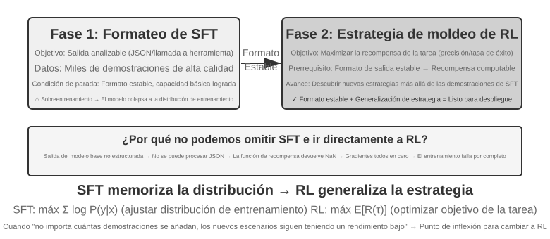

Tabla 8-4 Criterios de elección

| Observación | Carencia | Método prioritario | Puerta de salida |
| --- | --- | --- | --- |
| No conoce conceptos, idioma u operaciones; `pass@k`≈0 | Conocimiento/capacidad fuera del soporte efectivo | **Mid-training**; RAG para hechos dinámicos | Mejora en dominio, retención aceptable y primeras trayectorias verificables |
| A veces acierta, pero formato, schema, tono o flujo son inestables | Protocolo | **SFT** o decodificación restringida | Análisis estable y verificador fiable |
| Hay éxito y recompensa fiables, pero la política buena es improbable o falla en OOD | Distribución de probabilidad y política | **RL** | Variación de recompensa y mejora en test independiente |
| Hay pocas demostraciones y no hay entorno interactivo | Datos imitables, sin feedback online | **SFT/RFT/preferencias offline** | Crear primero línea base y evaluación |

Orden práctico:

1. **Descarta cambios de pesos innecesarios.** Usa prompt, herramientas, restricciones de código o gestión de contexto; usa RAG para hechos actualizables, citables o eliminables.
2. **Mide soporte.** Evalúa `pass@1`, `pass@k`, progreso parcial, tasa de análisis y causas de fallo. Si `pass@k`≈0 por conocimiento/capacidad, aplica Mid-training y vuelve a medir.
3. **Usa SFT para protocolos, no para embutir una base de conocimiento.** Fija JSON, herramientas, terminología, proceso y estilo.
4. **Usa RL solo cuando haya exploración posible.** La política debe producir trayectorias puntuables y algún éxito; con rollouts todo cero, PPO/GRPO solo gastan presupuesto.

No todos los proyectos recorren las tres fases. Un modelo fuerte puede ir directo a RL; una tarea de formato, solo a SFT; conocimiento estable, solo a Mid-training y la alineación ya existente. Lo importante son puertas medibles, no un ritual fijo.

## RL de Un Solo Turno: Memoria vs Generalización

Un escenario de "un solo turno" implica que la tarea se completa en una única interacción: el modelo recibe una entrada, produce una salida y obtiene una recompensa, sin necesidad de mantener un estado a través de múltiples pasos. Esta configuración simplificada nos permite enfocar de forma nítida las diferencias fundamentales entre el SFT y el RL en sus mecanismos de aprendizaje, sin la interferencia de la complejidad multiturno. El escenario de un solo turno ofrece condiciones de experimento comparativo ideales: la misma tarea, el mismo modelo base y el mismo presupuesto computacional, siendo el método de entrenamiento la única variable. El primer experimento muestra cómo el RL aprende la meta-estrategia de "cuándo se debe pensar", mientras que el segundo experimento cuantifica sistemáticamente el fenómeno de "SFT memoriza, RL generaliza" mediante un juego de cartas de razonamiento aritmético.

Antes de abordar los experimentos, construyamos una **intuición mínima** sobre los algoritmos de RL para comprender la terminología posterior (las fórmulas completas y comparativas se reservan para la sección "Comparación de algoritmos de aprendizaje por refuerzo"). El entrenamiento de RL en este capítulo se basa principalmente en el **gradiente de política**: se deja que el modelo genere varias respuestas para una misma pregunta; las respuestas con alta recompensa incrementan su probabilidad de aparición, mientras que las de baja recompensa la reducen ("avanzar más en la dirección de alta recompensa y menos en la de baja recompensa"). Para evitar que una actualización individual excesiva desvíe al modelo, el algoritmo dominante **PPO** recorta el margen de actualización de cada paso (a esto se refiere la mención posterior a "PPO con red de valor", donde la red de valor estimar la línea base para calcular ventajas más precisas); por su parte, **GRPO** prescinde de entrenar una red de valor y compara las múltiples respuestas de una misma pregunta entre sí para determinar su calidad relativa. Retener esta intuición basta para seguir los dos experimentos siguientes.

El mismo mecanismo puede escribirse como el pseudocódigo en estilo Python de abajo. Omite el paralelismo de muestreo, la regularización KL y los detalles del optimizador, y marca solo la cadena causal que va de un rollout a una actualización de parámetros:

```python
for prompt in batch:
    group = [rollout(policy, env.reset(prompt)) for _ in range(G)]
    rewards = [verify(trajectory) for trajectory in group]
    advantages = normalize_within_group(rewards)       # GRPO baseline
    update(policy, group, advantages)
```

La red de valor y el objetivo recortado de PPO pueden escribirse por separado:

```python
for trajectory in rollouts:
    returns = discounted_returns(trajectory.rewards)
    values = value_model(trajectory.states)
    advantages = returns - stop_gradient(values)
    ratio = exp(policy.log_prob(trajectory.actions)
                - old_policy.log_prob(trajectory.actions))
    policy_loss = -mean(min(
        ratio * advantages,
        clip(ratio, 1 - epsilon, 1 + epsilon) * advantages
    ))
    value_loss = mean((value_model(trajectory.states) - returns) ** 2)
update(policy, value_model, policy_loss + value_coef * value_loss)
```

Lo "relativo" de GRPO viene de comparar los rollouts de un grupo para el mismo prompt; la `old_policy` de PPO es la instantánea congelada de la política que generó ese lote de rollouts, y el cociente de probabilidades mide cuánto se ha movido ya la política actual respecto de ella. El recorte desalienta los pasos grandes, pero no es una restricción dura sobre el movimiento de la política; ambos siguen dependiendo de un entorno y una recompensa fiables, y las adaptaciones concretas de entrenamiento aparecen en los experimentos correspondientes.

> **Experimento 8-10 ★★: AdaptThink: Aprender "Cuándo No Pensar"**
>
> Los grandes modelos de razonamiento (como o1 de OpenAI o DeepSeek-R1) generan cadenas de pensamiento extensas para todas las preguntas, lo que provoca gastos innecesarios en preguntas simples. El experimento verifica primero una intuición: el modo **NoThinking** (saltarse el pensamiento mediante `<think></think>`) ofrece un rendimiento equivalente o superior en problemas sencillos, manifestándose la ventaja de Thinking solo ante problemas complejos.
>
> AdaptThink entrena al modelo mediante RL para seleccionar el modo de forma adaptativa. Incorpora dos componentes clave:
>
> - **Objetivo de optimización con restricciones**: Incentiva el modo NoThinking garantizando al mismo tiempo que el rendimiento general no se degrade.
> - **Estrategia de muestreo por importancia**: Equilibra las muestras de Thinking y NoThinking, resolviendo el problema de **arranque en frío** provocado por la tendencia inicial del modelo a seleccionar casi siempre Thinking (Arranque en frío se refiere aquí a la fase inicial del entrenamiento donde casi no se generan muestras NoThinking, impidiendo el aprendizaje de esa rama; difiere del contexto de "SFT de arranque en frío" usado en DeepSeek-R1).
>
> El "muestreo por importancia" utilizado aquí es un método estadístico común: cuando la distribución de muestreo está sesgada hacia una categoría, se aplican pesos a las muestras para "corregir" la distribución y lograr que la señal de aprendizaje cubra equitativamente todas las categorías. Los algoritmos PPO y DAPO analizados más adelante reutilizarán este concepto.
>
> El registro canónico de esta ejecución histórica de entrenamiento es el [informe de entrenamiento](../chapter8/AdaptThink/TRAINING_REPORT.md), que no incluye ningún checkpoint. La ejecución principal pública de W&B [`wubbn5tj`](https://wandb.ai/bojieli-pine-ai/adapt_think_verl/runs/wubbn5tj) utilizó 8×NVIDIA H100 de 80GB. Entre los pasos 0→300, la precisión de MATH500 pasó de 0.8100→0.8180 (+0.80 pp) y la longitud de respuesta de 4911.46→1576.62 (-67.90%); en GSM8K fueron 0.796816→0.818802 (+2.20 pp) y 1025.24→477.33 (-53.44%); en AIME mean16, 0.314583→0.310417 (-0.42 pp) y 12119.51→6402.23 (-47.17%). Las proporciones correspondientes de NoThinking fueron 83.80%, 84.15% y 56.25%. Esto muestra, al nivel agregado de cada conjunto de datos, una señal de encaminamiento coherente con la dificultad, pero no permite hablar de una «percepción perfecta de la dificultad» en cada problema ni afirmar que la precisión mejore de forma generalizada.
>
> La ejecución continuó más allá del punto de medición elegido en el informe hasta el paso 410 y 36.92 horas acumuladas, tras lo cual W&B la marcó como `crashed`; no se completaron las 10 epochs / 3,140 pasos configurados. Aunque en el paso 300 aparece un evento de temporización de checkpoint, este no se distribuye con el libro y no existe ningún comprobante independiente de que se evaluara correctamente con `run_eval_verl_hf.sh` ni de que se volviera a ejecutar MMLU. El commit histórico del código fuente es `9e588202…`; las futuras reproducciones quedan fijadas en su commit hijo directo `0033ad172…`. Los tres archivos de punto de entrada no han cambiado, pero la ruta `-fl-` generada por el script de entrenamiento es incompatible con la ruta `-fl4096` codificada en el script de evaluación y debe corregirse manualmente.
>
> AdaptThink puede complementar la destilación de prompts para formar un sistema dual "rápido-lento": la destilación reduce la proporción de tareas que requieren pensar, y AdaptThink optimiza la estrategia de activación en las tareas restantes, mejorando conjuntamente la eficiencia del pensamiento.

> **Experimento 8-11 ★★: GeneralPoints: Comparación entre Memoria y Generalización en RL de Un Solo Turno**
>
> 
>
> GeneralPoints es un juego de cartas de pensamiento aritmético propuesto por Chu et al.[^ch8-3] para evaluar la capacidad de generalización de los modelos. El objetivo es similar al juego del "24": utilizar los números de cuatro cartas y las operaciones aritméticas elementales para obtener exactamente el número 24, usando cada número una sola vez. Se diseñaron dos variantes: GP-L (texto puro) y GP-VL (imágenes), lo que permite evaluar la generalización de reglas y la generalización visual bajo un mismo marco.
>
> **Variante de reglas**: Durante el entrenamiento, las cartas J/Q/K valen 10; en la evaluación, pasan a valer 11/12/13 respectivamente, garantizando que el conjunto de prueba contenga combinaciones numéricas no vistas en el entrenamiento para evaluar estrictamente la generalización. **Variante visual**: El entrenamiento utiliza palos negros (♠♣) y la evaluación palos rojos (♥♦), evaluando la robustez ante cambios de apariencia visual. Basado en Llama-3.2-Vision-11B, sigue el flujo estándar de post-entrenamiento: inicialización con SFT para estabilizar el seguimiento de instrucciones básico, y posterior extensión con SFT y RL bajo el mismo presupuesto computacional (la parte de RL utiliza PPO con red de valor), entrenando únicamente con datos de una sola regla (J/Q/K=10) y evaluando en conjuntos dentro de la distribución (ID) y fuera de la distribución (OOD).
>
> Los resultados revelan una diferencia fundamental. **OOD de reglas**: El RL en GP-L aumenta un +3,5% (del 11,5% al 15,0%), mientras que el SFT **cae** un 8,1% (del 11,5% al 3,4%); en GP-VL, el RL sube un +3,0% y el SFT cae un 5,6%. **OOD visual**: El RL en GP-VL sube un **+17,6%** (del 23,6% al 41,2%), mientras que el SFT cae un 9,9% (del 23,6% al 13,7%).
>
> Al analizar la precisión de reconocimiento visual, se descubrió que el RL mejoró el codificador visual subyacente mediante la optimización orientada a resultados, estando esta mejora altamente correlacionada con el rendimiento general; en contraste, el SFT sufrió de sobreajuste hacia los patrones de tokens en el proceso de pensamiento, descuidando el aprendizaje de tokens visuales y provocando una caída en la precisión de reconocimiento.
>
> El experimento reveló además la necesidad del SFT para el RL: bajo la configuración evaluada (un modelo base de escala Llama-3.2-Vision-11B con requisitos estrictos de salida estructurada), el RL directo de extremo a extremo sin SFT falló por completo: el modelo base no lograba producir salidas estructuradas y la recompensa no se podía calcular. Cabe señalar que esta es una conclusión condicionada y no una ley universal: modelos base suficientemente potentes pueden omitir el SFT y lograr el éxito mediante RL directo (como se comentó sobre DeepSeek-R1-Zero). Otro hallazgo relevante es que a mayor número de iteraciones de verificación, mejor es la generalización: 10 iteraciones logran +5,99% frente a +0,48% con 1 iteración, demostrando que la expansión del cálculo durante el pensamiento es clave para la generalización del RL.
>
> ¿Por qué colapsa el rendimiento del SFT ante un desplazamiento de distribución mientras que el RL mejora? El SFT aprende el mapeo de "al ver esta entrada, genera aquella respuesta": durante el entrenamiento J/Q/K valen 10, por lo que el modelo memoriza el patrón fijo de "tratar J/Q/K como 10"; en la evaluación J vale 11, pero el modelo sigue calculando con 10, cometiendo un error. El RL aprende una estrategia más general sobre "qué proceso de cálculo conduce a la respuesta correcta": al cambiar J a 11, el modelo de RL recalcula con la misma estrategia en lugar de aplicar la respuesta memorizada. Esta es la diferencia esencial entre "memorización" y "generalización".
>
> La contribución central de este experimento radica en cuantificar sistemáticamente el fenómeno de "SFT memoriza, RL generaliza", demostrando que esta regla aplica tanto en la modalidad lingüística pura como en la visual-lingüística, y revelando la relación de sinergia entre SFT y RL: el SFT aporta estabilidad de formato y el RL rompe los límites de la memoria sobre esa base, siendo ambos indispensables. Este paradigma de "primero la forma, luego el espíritu" (dibujar primero con precisión la forma externa y buscar después el espíritu interno) establece las bases metodológicas para tareas posteriores multiturno y multimodales.

## Algoritmos de RL: De 16 Rollouts a Una Actualización de Parámetros

**GRPO (Group Relative Policy Optimization)**, propuesto por DeepSeek, es hoy uno de los algoritmos de entrenamiento por RL más usados. Un ejemplo lo hace concreto. Supongamos que en SWE-bench hay esta tarea: el `parser.py` de un proyecto Python lanza un `IndexError` cuando la entrada está vacía, y el Agente debe arreglar el código sin modificar las pruebas. El sistema de entrenamiento recorre los cuatro pasos siguientes.

**Paso 1: hacer que el modelo de política lo intente repetidamente.** El modelo de política es el modelo de lenguaje que se está entrenando. El sistema copia el mismo código inicial y la misma descripción del problema en 16 entornos aislados entre sí y deja que el modelo lo resuelva 16 veces de forma independiente. Cada intento recorre entero el ciclo "leer el código → modificar los archivos → ejecutar las pruebas → enviar el resultado"; ese proceso completo es un **rollout**. El problema y el entorno inicial son idénticos, pero el muestreo es estocástico, así que los 16 intentos pueden seguir caminos distintos: unos añaden correctamente la comprobación de límites, otros solo capturan la excepción y tapan el problema, otros editan el archivo equivocado y otros intentan modificar las pruebas.

**Paso 2: calcular la recompensa.** Cuando termina cada rollout, un verificador aplica el parche en un entorno limpio y ejecuta las pruebas. Supongamos que 4 de los 16 intentos pasan todas las pruebas sin tocar los archivos de prueba y los otros 12 fallan: los 4 primeros reciben recompensa 1 y los otros 12 reciben 0. En una tarea de programación como esta, "calcular la recompensa" no tiene nada de misterioso: es usar pruebas y reglas para juzgar si la corrección es realmente correcta. Solo en tareas abiertas sin una prueba definitiva hacen falta la preferencia humana o un modelo de recompensa para evaluar.

**Paso 3: calcular la ventaja relativa.** La recompensa solo dice si una trayectoria concreta tuvo éxito o fracasó; la **ventaja relativa** dice cuán buena es en comparación con los demás intentos del mismo grupo. La tasa media de éxito de este grupo es 4/16: los 4 que pasaron están por encima de la media del grupo y reciben ventaja positiva; los 12 que fallaron están por debajo y reciben ventaja negativa. Esta comparación dentro del grupo es el núcleo de GRPO. Si los 16 fallan, o los 16 aciertan, todas las recompensas son idénticas, no hay forma de distinguir cuál es mejor y la ventaja relativa desaparece. Las señales de camino de RLVP, las recompensas de proceso y las recompensas por progreso parcial existen precisamente para recuperar diferencias significativas dentro de esos grupos.

**Paso 4: actualizar la política por descenso de gradiente.** El programa de entrenamiento convierte las ventajas relativas en una pérdida, calcula los gradientes y deja que un optimizador (AdamW, Muon y similares) ejecute el descenso de gradiente, elevando la probabilidad de las decisiones que el modelo tomó en las trayectorias de ventaja positiva y reduciéndola en las de ventaja negativa. No memoriza literalmente un parche exitoso: ajusta gradualmente a lo largo de muchas tareas y rollouts, de modo que cuando más adelante aparezca un error parecido sea más probable que surja "reproducir el problema, revisar la condición de límite, cambiar la implementación y ejecutar las pruebas", y menos probable que surja "tapar la excepción, editar las pruebas, enviar sin verificar".

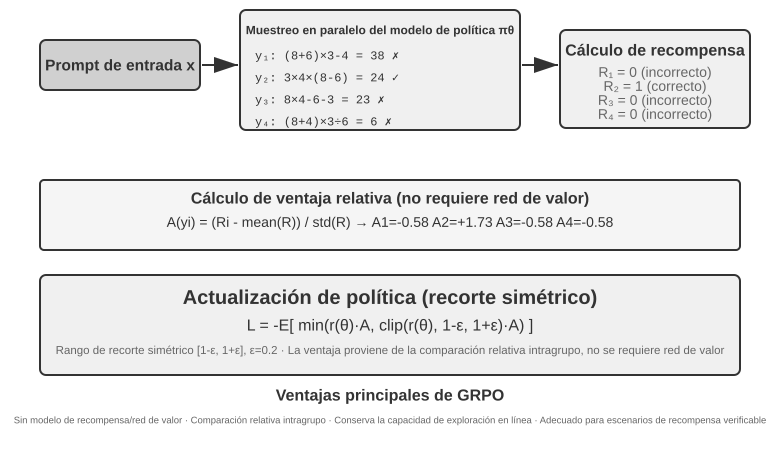

Estos cuatro pasos juntos forman una **iteración de entrenamiento**, es decir, un **step**: el step $k$ genera un lote de rollouts con la política actual, completa los cálculos de recompensa, ventaja y gradiente, y deja que el optimizador actualice los parámetros; el step $k+1$ vuelve entonces a hacer rollout con la política actualizada. Entrenar 100 steps es repetir este bucle unas 100 veces. Un framework de entrenamiento por RL concreto puede contar aparte sus actualizaciones internas de minilote, así que al leer los registros de entrenamiento conviene confirmar cómo define su `step`.

Vale la pena hacer una estimación aproximada de tiempo. El rollout de un Agente complejo genera decenas de turnos de llamadas a herramientas y, aunque 16 corran en paralelo, el tiempo de reloj de una fase de rollout lo marca el más lento. Supongamos que el rollout más lento tarda unos 2.000 segundos y que el descenso de gradiente y la actualización del optimizador posteriores tardan unos 600: un step sale por unos $2{,}000+600=2{,}600$ segundos, unos 43 minutos, y 100 steps seguidos se acercan a las 72 horas.

PPO y GRPO siguen ambos este bucle; se diferencian sobre todo en **con qué comparan**. GRPO compara directamente varios rollouts del mismo problema y no necesita un modelo de valor aparte. PPO entrena un modelo de valor que estima "cuán bien se suele llegar a hacer" en cada paso de la trayectoria y después juzga si la acción actual supera esa expectativa, lo que encaja mejor con trayectorias largas que requieren una asignación de crédito de grano fino. Ambos limitan el tamaño de cada actualización para que un lote pequeño de muestras no cambie el modelo demasiado de golpe. DPO es distinto: aprende directamente de pares de preferencia "mejor respuesta—peor respuesta" recogidos de antemano y nunca hace que la política actual genere ese grupo de rollouts en línea.

Entre los casos de este capítulo, AdaptThink usa un objetivo restringido propio; GeneralPoints y V-IRL usan PPO con modelo de valor; SimpleVLA-RL y RLVP usan GRPO; ReTool usa PPO. El algoritmo decide cómo se comparan las trayectorias y cómo se actualizan los parámetros; la recompensa decide qué cuenta como éxito; el entorno y los datos deciden qué problemas llega a experimentar el modelo.

### Por qué RL con LLM suele preferir on-policy

**Online** solo significa que se generan datos durante el entrenamiento; **on-policy** exige que la política de comportamiento $\mu$ que produce los rollouts sea igual o muy cercana a la política actual $\pi_\theta$. Workers atrasados, replay antiguo o trayectorias de un profesor introducen off-policy. Incluso las últimas épocas de minibatch de PPO se alejan del `old_policy`, motivo de la razón de probabilidad y el clipping.

Si los datos proceden de $\mu$, la corrección es

$$
\rho_t=\frac{\pi_\theta(a_t\mid s_t)}{\mu(a_t\mid s_t)}
=\exp\left(\log\pi_\theta(a_t\mid s_t)-\log\mu(a_t\mid s_t)\right).
$$

On-policy suele ser mejor porque reduce varianza y razones extremas, cubre los estados y errores reales del estudiante y mantiene comparables los grupos de GRPO. Off-policy sigue siendo útil para entornos caros, replay y éxitos raros, pero requiere ponderación, límites de staleness u objetivos offline. La regla práctica es usar rollouts frescos por defecto y reutilizar solo cuando el ahorro supera el sesgo y la varianza[^ch8-32].

#### Sensibilidad al desajuste numérico entre sampler y trainer

Aunque carguen el mismo checkpoint, precisión, cuantización, kernels de atención, paralelismo, forma del batch u orden de reducción pueden producir probabilidades distintas. Antes de actualizar, debería cumplirse $\rho_t=1$; con

$$
\delta_t=\log\pi_\theta(a_t\mid s_t)-\log\mu(a_t\mid s_t),\qquad \rho_t=\exp(\delta_t),
$$

un pequeño error logarítmico se convierte exponencialmente en error multiplicativo y se acumula en respuestas largas. Aparecen clipping falso, KL y ponderación de ventajas incorrectos y un desplazamiento off-policy oculto. El desajuste entrenamiento-inferencia se ha identificado como causa independiente de inestabilidad[^ch8-33], y la inferencia también puede ser no determinista por el orden de reducción dependiente del batch[^ch8-34]. Antes de cualquier actualización, compara log probabilities sobre los mismos tokens, máscaras, temperatura y versión. Monitoriza diferencias, razón previa, KL aproximado, fracción recortada y staleness; si el error ya es grande en el paso cero, cambiar learning rate o clipping no corrige la causa.

## Entornos de RL: De la Evaluación a la Simulación

El cuello de botella del entrenamiento por RL no suele estar en el algoritmo, sino en **si el entorno es lo bastante realista, reiniciable y paralelizable**. Las llamadas telefónicas, los pagos o las modificaciones de archivos de un Agente real pueden ser caros e irreversibles, y un error no se compensa con reintentos ilimitados; el entorno de evaluación del capítulo 7 puede aportar el verificador, pero el entrenamiento necesita además que el Agente falle una y otra vez, absorba los efectos secundarios de sus acciones y se mantenga estable a lo largo de millones de interacciones. La ingeniería del entorno es, por tanto, una condición previa del RL, no un accesorio posterior al entrenamiento.

### El entorno: El campo de práctica del modelo

El RL es en el fondo "aprender por ensayo y error", y el ensayo y error necesita **un sitio donde ocurrir**: el entorno de simulación. El modelo ejecuta tareas en él una y otra vez, recoge retroalimentación y ajusta su política. La **fidelidad** del entorno —cuánto se parece al escenario real de despliegue— determina directamente si la política resultante sirve de algo:

- **Un entorno distorsionado garantiza una política inútil.** Si el cliente simulado responde siempre según un guion fijo y sus mensajes de error no coinciden con los de producción, el modelo aprende una estrategia de "aprobar el examen" que solo funciona en la simulación y se derrumba en el primer despliegue real. Es la forma más común de que fracase un proyecto de RL: no es que el algoritmo sea malo, es que el campo de práctica no es el mismo que la sala de examen.
- **Construir un entorno de alta fidelidad suele ser más caro y más difícil que el propio entrenamiento.** Un entorno masivamente paralelo, reproducible y con retroalimentación realista requiere normalmente mucha más ingeniería que ajustar el modelo. Los experimentos de llamada a herramientas que aparecen más adelante en este capítulo (el sandbox MCP de AWorld, el sandbox del intérprete de código de ReTool) invierten tanto en el entorno precisamente porque **las API reales tienen límites de tasa, pueden bloquear cuentas y tienen efectos secundarios, lo que las hace inservibles para entrenar directamente**: hay que construir antes un "mundo sombra" estable, controlable y reproducible.
- **La otra mitad del entorno es la función de recompensa.** El entorno no solo debe simular cómo cambia el mundo, sino también juzgar cómo de bien lo hizo el Agente, que es la entrada del diseño de recompensas del que se habla después.

En una frase: **antes de ponerse a ajustar algoritmos, pregúntate si tu entorno de simulación se parece de verdad al mundo real.** La respuesta importa mucho más que elegir entre PPO y GRPO.

### Qué hacer si no se puede construir un entorno: Hacer que un modelo interprete al entorno

Pero hay un problema más fundamental: en muchos escenarios un entorno de alta fidelidad no es solo caro, es que **no se puede construir**: las API reales tienen efectos secundarios y no se pueden llamar al azar, no se puede experimentar con usuarios reales y el mundo físico no se puede acelerar. Si ni siquiera se puede levantar un "mundo sombra" utilizable, ¿queda el RL descartado? Una idea cada vez más extendida es **usar un modelo para simular el entorno**: que un LLM interprete al entorno y genere la retroalimentación que necesitan las interacciones del Agente. Esta vía tiene dos niveles.

**Primer nivel: el modelo sintetiza los valores de retorno de las llamadas a herramientas.** Tomemos ZeroSearch[^ch8-13]: entrenar un modelo que "sepa buscar" requiere normalmente un motor de búsqueda real, pero las API de búsqueda cuestan dinero, tienen límites de tasa y devuelven resultados incontrolables. ZeroSearch simplemente hace que un LLM interprete al motor de búsqueda: el modelo estudiante emite una consulta y ese "motor simulado" genera los resultados de recuperación que devuelve. Y aún mejor, usa un diseño **curricular**: al principio del entrenamiento el motor simulado devuelve documentos de alta calidad y muy relevantes, y a medida que avanza va mezclando ruido y bajando la calidad de lo que devuelve, forzando al estudiante a aprender a extraer información útil del tipo de resultados imperfectos que da un motor real. Al final, un modelo que nunca vio un motor de búsqueda real durante el entrenamiento sigue funcionando bien cuando se conecta a uno.

**Segundo nivel: el modelo simula la dinámica de todo el entorno.** No solo el valor de retorno de una herramienta concreta: también "cómo queda el mundo después de ejecutar una acción" puede delegarse a un modelo. DreamGym[^ch8-14] destila la dinámica del entorno en un "modelo de experiencia" de tipo razonador: dado el estado actual y la acción del Agente, razona paso a paso hasta la transición de estado y la señal de retroalimentación, y así puede sintetizar rollouts en volumen para RL en línea sin tocar el entorno real. El entrenamiento de Agentes de atención al cliente y de ventas usa habitualmente un LLM para interpretar al usuario (un simulador de usuario), y la familia de evaluaciones τ-bench se apoya justamente en esta idea: el mismo simulador basado en modelo puede servir de sala de examen y de campo de práctica.

Pero hay que decir claramente el riesgo de esta vía: **el conocimiento del mundo que tiene el simulador es el techo del entrenamiento, y los sesgos sistemáticos del simulador los adopta la política tal cual.** Si el cliente simulado es más paciente que los usuarios reales, o el motor de búsqueda simulado nunca devuelve basura, lo que aprende el estudiante es una estrategia que solo se sostiene en "el mundo tal como lo imagina el modelo"; y peor aún, el RL buscará activamente los fallos del simulador para explotarlos, es decir, reward hacking. La respuesta prudente en ingeniería es por tanto **híbrida**: que la simulación por modelo soporte la mayor parte del volumen de interacción, complementarla con interacciones en el entorno real y usar esas interacciones reales para calibrar periódicamente el sesgo del simulador.

### Entornos, distribución de tareas y aislamiento de la evaluación

El entorno determina qué puede aprender el RL: debe ser reiniciable, paralelizable y reproducible, y debe devolver un resultado de verificación fiable tras cada transición de estado. Las tareas de entrenamiento vienen de la misma fuente que la síntesis de datos para SFT vista antes: destilar planos de tarea de los registros reales de negocio y, una vez eliminada la información identificativa, regenerar personas, pedidos, archivos y estados ficticios.

Los requisitos de aislamiento son los mismos, con uno añadido propio del RL: los entornos de entrenamiento y de evaluación pueden compartir el generador de tareas y el código de verificación, pero no pueden compartir el mismo conjunto de tareas. SWE-Gym, τ²-bench y AndroidWorld lo ilustran[^ch8-28]: los casos de prueba, el estado oculto y las soluciones de referencia se quedan del lado del verificador. Además, conviene usar primero unos pocos rollouts para comprobar si la tarea es completable y si el verificador distingue lo correcto de lo incorrecto, y solo después ampliar el muestreo; si el verificador tiene un sesgo sistemático, el RL se limitará a explotarlo más deprisa.

El orden de la ingeniería del entorno debe ser, por tanto: **plano de la tarea → simulador reiniciable → verificador determinista → aislamiento entrenamiento/evaluación → calibración con una pequeña cantidad de interacción real**. La síntesis de datos para SFT aparecía antes porque construye demostraciones estables; el entorno de aquí está al servicio del RL, para que la política actual falle repetidamente y explore caminos más allá de las demostraciones.

Que un verificador determinista sea "barato" no significa que sea gratis. Un kernel de Lean, un ejecutor de pruebas o la ejecución en contenedor pueden hacer que la verificación en CPU sea mucho más lenta que la generación en GPU; entonces el rendimiento lo fija el número de workers de verificación en paralelo, no añadir más GPU[^ch8-9].

## De Un Solo Turno a Multiturno: Escenarios de Tarea y Asignación de Crédito

### El desafío central de las tareas multiturno

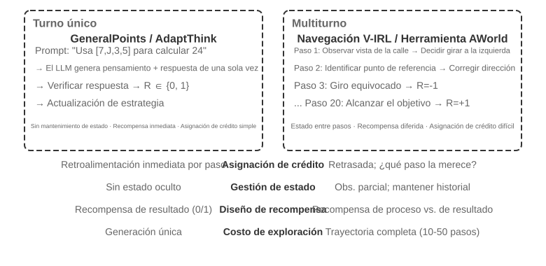


Pasar de un solo turno a multiturno supone un salto cualitativo en complejidad. La política no solo debe elegir la mejor acción ahora, sino también considerar el valor de los estados futuros; no solo debe manejar retroalimentación inmediata, sino también hacer **asignación de crédito (credit assignment)** bajo recompensas diferidas, decidiendo qué paso de una secuencia contribuyó más al resultado final. Supongamos que un Agente de atención al cliente resuelve el problema del usuario en 10 turnos de diálogo y acaba recibiendo una valoración positiva: ¿el mérito es de la pregunta precisa del turno 2 o de la explicación paciente del turno 7?

La interacción multiturno de la que hablamos aquí es exactamente el bucle ReAct descrito en los capítulos 1 y 4: cada turno es una iteración de **pensar → actuar → observar**, y la recompensa diferida procede de la restricción estructural de que "lo bueno que sea el resultado final solo puede juzgarse varios turnos después".

> **Experimento 8-12 ★★★: V-IRL-VL — navegación visual multiturno**
>
> V-IRL[^ch8-24] hace que el Agente navegue de forma continua por escenas urbanas reales: el entrenamiento usa rutas de Nueva York, mientras que la prueba se transfiere a otras ciudades y cambia a la vez la formulación de las indicaciones y la apariencia visual. El RL supera claramente al SFT tanto en OOD de reglas como visual, lo que muestra que en tareas multiturno la política debe aprender a replanificar a partir de la observación actual en lugar de reproducir las trayectorias de entrenamiento. El experimento usa PPO con red de valor, y se observa que la retroalimentación paso a paso alivia la asignación de crédito a largo horizonte.

> **Experimento 8-13 ★★★: SimpleVLA-RL — exploración abierta con recompensas de resultado `[Experimento Extendido]`**
>
> SimpleVLA-RL usa únicamente recompensas de resultado de éxito/fracaso en tareas de robótica LIBERO. Cada tarea recibe una sola trayectoria de demostración para el arranque en frío por SFT; después el RL eleva la tasa de éxito del 17,3 % al 91,7 % y descubre una acción de "empuje-corte" que nunca apareció en las demostraciones. Contrasta con V-IRL: cuando las señales de proceso son fáciles de definir aceleran el aprendizaje, pero cuando el camino óptimo se desconoce una recompensa de resultado dispersa preserva mucho más margen de exploración.

### Llamada a herramientas: traer el entorno dentro del Agente

En cuanto una tarea multiturno se conecta a herramientas externas, las acciones dejan de ser solo "moverse o responder" y pasan a ser buscar, ejecutar código, editar archivos, consultar bases de datos y componer varias API. La llamada a herramientas empuja así al primer plano, a la vez, la asignación de crédito, la ingeniería del entorno y las restricciones de seguridad.


Search-R1[^ch8-25] representa la vía de la generación aumentada por recuperación: el modelo decide por su cuenta cuándo buscar y qué buscar, y usa los resultados devueltos para seguir razonando. ReTool, en cambio, incrusta un intérprete de código en el bucle de pensamiento, de modo que el modelo debe aprender cuándo ejecutar código, cómo leer la retroalimentación y cómo corregirse a partir de los mensajes de error. AWorld-train aporta un sandbox MCP multi-herramienta, que introduce además la selección de herramientas, la gestión de dependencias, el reinicio de estado y la reproducibilidad.

Las trayectorias con herramientas tienen un detalle de implementación crucial: los tokens que devuelve el entorno no los genera la política, así que al calcular el gradiente de política esos tokens de retroalimentación deben enmascararse y los gradientes propagarse solo por el pensamiento propio del modelo y por los argumentos de sus llamadas a herramientas. De lo contrario se entrena al modelo para predecir la salida del sandbox en vez de para aprender a usar herramientas.

> **Experimento 8-14 ★★★: ReTool — resolución de problemas matemáticos potenciada por un intérprete de código**
>
> 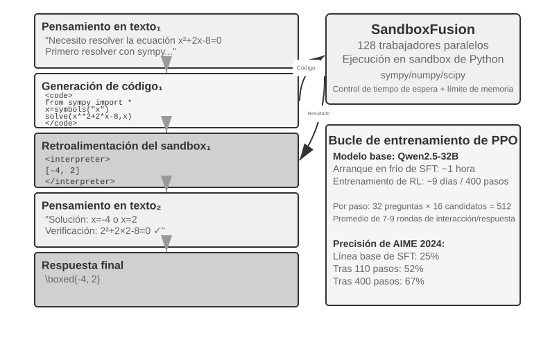
>
> Tras un precalentamiento con SFT, ReTool entrena con PPO sobre razonamiento textual, ejecución de código y retroalimentación del intérprete entrelazados. Muestra cómo la retroalimentación de la herramienta cambia la estrategia de pensamiento: el modelo aprende poco a poco a ejecutar por iniciativa propia, leer los errores y corregirse. Los datos de entrenamiento vienen de DAPO-Math-17k, pero el algoritmo de optimización sigue siendo PPO estándar[^ch8-26][^ch8-27].
>
> En AIME 2024, el entrenamiento subió la precisión de alrededor del 25 % al 67,0 %; frente al RL de solo texto, la retroalimentación de código hizo que el modelo aprendiera antes a calcular con precisión y a corregir errores. Las dinámicas de entrenamiento detalladas y la configuración del sandbox están en las notas que acompañan al experimento.

> **Experimento 8-15 ★★★: AWorld-train — aprender a usar herramientas en un sandbox**
>
> 
>
> AWorld-train usa un sandbox de servidores MCP que ofrece herramientas web, documentales, multimedia, de código y de recuperación de conocimiento. El objetivo de este experimento abierto no es mejorar las cifras de GAIA, sino hacer funcionar de extremo a extremo un ciclo de entrenamiento multi-herramienta reiniciable y reproducible, y observar si la tasa de éxito de las llamadas y las estrategias de composición mejoran con el entrenamiento.

Estos escenarios apuntan todos a lo mismo: la dificultad de entrenar Agentes multiturno no está en "si hay un optimizador más sofisticado", sino en si la retroalimentación del entorno es fiable, si la cadena de acciones es verificable y en cómo debe atribuirse la recompensa final a las decisiones intermedias.

## Diseño de recompensas: convertir el objetivo de la tarea en señal de aprendizaje

Los escenarios de un solo turno, multiturno y de llamada a herramientas explicaron *qué* entrenar; esta sección responde a *cómo debe el entorno decirle al modelo si lo hizo bien*. El diseño de recompensas se despliega en tres dimensiones complementarias: **de dónde viene la recompensa**, **cuándo se entrega** y **cuánta información debe expresar**. Queda una cuarta pregunta: cuando el resultado es correcto, ¿fue también admisible el camino?

### De dónde viene la recompensa: reglas, preferencia humana y juicio del modelo

La fuente más fiable es la **recompensa verificable (RLVR)**: juzgar el resultado directamente con casos de prueba, aserciones sobre la base de datos, diferencias de estado o comprobaciones de formato. Las respuestas matemáticas, los tests de código y las llamadas estructuradas a herramientas son buenos puntos de partida desde una recompensa binaria de resultado. Cuanto más determinista sea la regla, más barata y reproducible será la recompensa, y más difícil resultará que el modelo la burle.

**RLHF** aparece aquí solo como contexto. El flujo básico de InstructGPT[^ch8-4] es: las personas comparan respuestas, se entrena un modelo de recompensa y luego PPO optimiza la política. El modelo de recompensa es apenas un sustituto de la preferencia, y sobreoptimizarlo lleva al reward hacking[^ch8-5]; por eso se suele usar una regularización KL que ancla la política cerca del modelo SFT de referencia. DPO[^ch8-6] se salta el modelo de recompensa explícito y optimiza fuera de línea directamente a partir de pares de preferencia. Estos métodos no son la línea principal del RL de Agents de este capítulo.

Cuando el objetivo no puede reducirse por completo a reglas, cabe recurrir al juicio del modelo. Un **modelo de recompensa generativo (GRM)** no solo emite una puntuación, sino también un diagnóstico de qué salió bien y qué hay que cambiar; puede servir como fuente de recompensa, y sus diagnósticos pueden convertirse en datos de destilación o de preferencia. La idea central de DeepSeek-GRM[^ch8-23] es que el modelo induzca primero los principios de evaluación de la tarea, evalúe después la trayectoria conforme a esos principios y compruebe por último, con hechos verificables, si la evaluación es correcta. La retroalimentación resultante es más transparente, pero sigue necesitando calibración humana por muestreo para que el juez no desarrolle sesgos propios.

Conviene distinguir dos nociones que se confunden con facilidad. El **reward hacking** consiste en explotar una regla o un agujero de implementación para puntuar alto. El **reward seeking** consiste en que el modelo se forma primero una imagen interna de *qué mirará el evaluador* y luego ajusta su conducta a esa suposición. Lo segundo no implica necesariamente manipular tests ni falsificar resultados, pero en tareas de horizonte largo puede llevar al modelo a fijarse una comprobación muy superficial, detenerse en cuanto la supera y entregar algo que satisface la métrica sustituta pero no la intención real[^ch8-29]. Por eso «pasó el grader» no equivale automáticamente a «la tarea está hecha»: el evaluador es un sustituto de la intención y, cuanto más se entrena, más probable es que el modelo tome el sustituto por el objetivo mismo.

### Cuándo se entrega la recompensa: resultado o proceso

La **recompensa de resultado (ORM)** solo juzga al final del episodio si la tarea se completó. Es la más simple y concede a la política la máxima libertad de exploración; cuando no hay un criterio aceptado para el camino intermedio y los humanos aún no han hallado la solución óptima, la recompensa dispersa de éxito/fracaso de SimpleVLA-RL es el punto de partida adecuado. La retroalimentación dispersa dificulta que el modelo localice el error concreto dentro de una trayectoria de varios pasos, y esa es una de las razones de que la eficiencia muestral del RL lleve tiempo limitada[^ch8-8]. En tareas largas de coding o cowork, además, el veredicto de «si está terminado» debe recaer en tests ocultos, aserciones de estado o un gancho de terminación externo que el modelo no pueda escribir, nunca en su propia declaración de haber acabado.

La «terminación prematura» es un ejemplo concreto: cuando el modelo declara la tarea completa, el harness ejecuta en un espacio aislado pruebas de aceptación que el modelo no ve; si pasan, recompensa positiva; si no, negativa. Esas pruebas deben leer archivos reales o el estado del entorno y no limitarse a comprobar si el modelo dijo «hecho», o el modelo aprenderá a prometer la verificación sin realizarla. Al evaluar, mantén separado un conjunto frontera de tareas sin terminar y un conjunto reservado de tareas realmente terminadas: el primero muestra la tasa de parada prematura y el segundo, si el modelo sigue sabiendo cerrar con normalidad, para no entrenar un modelo que nunca se atreva a terminar.

La **recompensa de proceso (PRM)** da retroalimentación en pasos intermedios: comprueba la autenticación, los argumentos de las herramientas, el número de tests que pasan o las acciones de navegación. *Let's Verify Step by Step*[^ch8-7], de OpenAI, mostró el valor de la verificación paso a paso en razonamiento matemático. La recompensa de proceso alivia la asignación de crédito a largo plazo, pero puede encerrar al modelo en el camino que el diseñador tenía en mente, y su etiquetado y validación cuestan más. V-IRL-VL (experimento 8-12) usa retroalimentación de navegación paso a paso y SimpleVLA-RL (experimento 8-13) conserva solo la recompensa final: juntos forman el contraste entre «retroalimentación densa a cambio de velocidad de convergencia» y «retroalimentación dispersa a cambio de espacio de exploración».

En la práctica, establece primero una línea base fiable con recompensas de resultado y solo después añade señales de proceso para los eventos intermedios que sean realmente verificables. El RL multiturno con LLM suele fijar el factor de descuento $\gamma=1$; la red de valor de PPO o la ventaja por turno atribuye la retroalimentación final a acciones anteriores, mientras que GRPO reparte una ventaja de nivel de trayectoria entre los tokens generados, de modo que en trayectorias largas conviene vigilar especialmente la dilución de la señal.

### Cuánta información debe expresar la recompensa: escalar, vector, diagnóstico generativo

La **densidad** de una recompensa y su **forma de representación** son dos cosas distintas. Un escalar solo responde «qué tal en conjunto»; un semiescalar da una razón breve y después una puntuación; un vector puntúa por separado dimensiones como exactitud, completitud, coste y seguridad; una recompensa generativa produce un diagnóstico en lenguaje natural que puede muestrearse varias veces y agregarse. El criterio de elección es directo:

- Hay una respuesta definida o un test: prefiere el escalar binario;
- Hay varios objetivos de calidad mutuamente independientes: usa un vector, o pondera las dimensiones hasta obtener un escalar;
- Es abierto y difícil de agotar con reglas: usa diagnóstico generativo, pero acompáñalo de verificación de hechos y revisión humana por muestreo.

No apiles dimensiones no verificables en nombre de una recompensa «más rica». Cada dimensión de evaluación añadida suma una manera más de que la política la burle; confirma primero que la señal produce diferencias intragrupo significativas en unos pocos rollouts y decide después si entra en el entrenamiento.

### Con el resultado correcto no basta: restricciones de camino y RLVP

La recompensa de resultado resuelve «si la cosa se hizo», pero no expresa «si se hizo como estaba estipulado». Un Agent real puede lograr un éxito aparente editando el archivo de tests, saltándose la autenticación o ejecutando un comando destructivo. El principio de RLVP (Reinforcement Learning with Verified Penalty)[^ch8-9] es: **recompensar el resultado, penalizar el camino**. Se dirige a **restricciones neutrales respecto del resultado**, decidibles por máquina y ajenas al éxito o fracaso final; no sustituye a las comprobaciones independientes sobre la intención semántica, la integridad de la entrega y el comportamiento de parada temprana.

Los entornos reales suelen ser **verificadores asimétricos**: detectar que «se ejecutó una mala acción» es barato y fiable, mientras que demostrar que «este paso avanzó de forma significativa hacia el objetivo» es difícil. Escribe la recompensa total como $R=O+\beta\Phi$: $O$ es el resultado de la tarea y $\Phi$ es una señal de camino calculada acción por acción mediante reglas deterministas. Resta puntos por acciones de incumplimiento verificables y otorga una pequeña recompensa parcial por acciones conformes verificables o subobjetivos alcanzables; normaliza ambos canales antes de combinarlos para que la señal de camino no ahogue el objetivo principal. Nada de esto cambia PPO ni GRPO: cambia solo la recompensa que se ve en cada paso.

En la implementación basta con separar la salida del verificador en dos canales y entregárselos al optimizador de políticas existente:

```python
outcome = verify_final_state(trajectory)              # result, not self-report
path_signal = 0
for step in trajectory:
    path_signal += deterministic_path_signal(step)    # penalty or reachable progress
reward = normalize(outcome) + beta * normalize(path_signal)
```

Qué acciones se permiten, qué subobjetivos son alcanzables, cuáles son los tests ocultos y cómo se registra la evidencia dependen del entorno concreto; el texto solo explica cómo confluyen «recompensa de resultado» y «restricción de camino», para no confundir las reglas de un entorno con un algoritmo general.

La clave de RLVP no es que «cuanto más densa la recompensa, mejor», sino si se puede recuperar la diferencia intragrupo. La recompensa de resultado pura genera varianza cero y ningún gradiente tanto en el grupo que falla entero como en el que acierta entero; las acciones de incumplimiento suelen ser fáciles de detectar, así que la penalización casi siempre recupera la diferencia; la recompensa de progreso solo funciona cuando el progreso parcial es realmente alcanzable. Al diseñar, sigue cuatro reglas: penaliza acciones concretas, nunca la «falta de esfuerzo»; conserva siempre la recompensa de resultado para que el modelo no aprenda a no hacer nada; empareja cada penalización con un camino conforme alcanzable siempre que se pueda; y haz que las reglas sean deterministas y difíciles de burlar. Si la política base nunca llegara a muestrear la acción conforme, «siembra» antes ese camino con unas pocas demostraciones y atenúa el modelado de camino cuando la conducta conforme se estabilice. Dicho de otro modo: la penalización es la mitad habitualmente alcanzable, y la recompensa de progreso es la mitad condicionada por la alcanzabilidad.

> **Experimento 8-16 ★★★: RLVP — recompensar el resultado, penalizar el camino**
>
> Añade sobre GRPO una recompensa de resultado $O$ y una señal de camino $\Phi$, y compáralo con la recompensa de resultado pura. En TerminalBench las infracciones caen de 3,71 a 0,66 mientras la tasa de éxito se mantiene prácticamente igual; en miniF2F, una recompensa parcial alcanzable reduce de 7,0 a 4,4 las iteraciones necesarias para llegar a una tasa de éxito de 0,9. En reparación de software, si ningún rollout pasa test alguno, la señal de progreso es inalcanzable y añadirla no aporta nada. La lección: mide primero la alcanzabilidad de la señal y decide después si añades una dimensión de recompensa.

Estas cifras proceden de entornos sustitutos controlados y no pueden extrapolarse directamente a mejoras equivalentes en un Agent en producción; la conclusión más prudente es mecanicista: mientras la señal de camino distinga conductas dentro del mismo grupo de rollouts y las reglas sean difíciles de burlar para la política, aporta justo la información que la recompensa final no ve. En un despliegue real hay que incorporar además al harness la verificación oculta, la monitorización de trayectorias y las condiciones de terminación externas.


## Destilación: mejorar la eficiencia de muestra

Los experimentos anteriores han mostrado de forma sistemática el valor central del RL en el entrenamiento de Agentes, pero todos han pagado un alto costo en muestras. "Eficiencia de muestra" significa aquí algo concreto: **cuántas actualizaciones de parámetros efectivas compra cada interacción cara con el entorno**, no simplemente los pasos de entrenamiento o las horas de GPU. El entrenamiento por RL de ReTool tardó más de 200 veces lo que su SFT (9 días frente a 1 hora), lo que hace especialmente valioso reducir el muestreo del entorno.

La baja eficiencia de muestra del RL viene de la alta varianza y de lo difícil que es reutilizar los datos on-policy, pero la causa más fundamental es que la retroalimentación es demasiado dispersa. El RL model-free habitual solo obtiene un escalar de éxito/fracaso al final de un rollout; el motivo de un error intermedio, un campo que falta o una pista sobre el procedimiento no llevan señal de aprendizaje directa. Cuando un guion de atención al cliente dice "necesito los últimos cuatro dígitos de la tarjeta de crédito", el modelo solo puede llegar ahí por ensayo y error a partir de un 0/1 final, y quizá le hagan falta cientos de interacciones para dar con ese paso, mientras que a una persona le basta oírlo una vez.

**La destilación convierte un rollout en una señal de supervisión densa**, de modo que una sola trayectoria aporta gran cantidad de gradientes sin explorar ninguna trayectoria adicional del entorno. Esa es la clave de cómo la destilación mejora la eficiencia de muestra.

### On-Policy Distillation: hacer que un rollout produzca supervisión densa

On-Policy Distillation fue sistematizada y difundida por Thinking Machines Lab en 2025[^ch8-10]. Aquí «policy» indica **quién genera los prefijos de estado que aprenderá el estudiante**, no quién aporta la supervisión:

| Método | Quién muestrea trayectoria/estado | Supervisión principal |
| --- | --- | --- |
| SFT / destilación off-policy | Persona o profesor | Respuesta etiquetada token a token, densa |
| RL on-policy | Estudiante actual | Recompensa de resultado o proceso, normalmente dispersa |
| On-Policy Distillation | Estudiante actual | Distribución token a token del profesor sobre prefijos del estudiante, densa |

SFT cubre sobre todo estados que visitaría el profesor; un error temprano del estudiante lo lleva a prefijos desconocidos y el error se acumula. RL on-policy usa la distribución real del estudiante, pero suele recibir solo éxito o fracaso al final. La destilación combina ambos: **el estudiante decide adónde llega y el profesor le da allí la distribución completa del siguiente token**.

Un rollout de longitud $T$ produce cerca de $T$ supervisiones. Es más relevante que SFT off-policy y más densa y de menor varianza que RL puro. Pero tampoco crea capacidad desde cero: el estudiante debe alcanzar estados corregibles y el profesor no puede estar demasiado lejos de su soporte. Si faltan idioma, conceptos o acciones básicas, usa antes Mid-training o demostraciones off-policy.

La coherencia numérica también importa: si el motor muestrea de $\mu$ y el trainer calcula otro $\pi_\theta$, los estados ya son off-policy aunque no se use la razón de PPO. Comprueba las log probabilities sampler/trainer antes de actualizar.

En concreto, la distribución predicha por el estudiante se acerca a la del profesor, normalmente minimizando la **divergencia KL** entre ambas. Por ejemplo, cuando el estudiante genera "primero consulto la API, después analizo el valor devuelto…", el profesor puede dar en esa posición una distribución de 80 % "consultar", 15 % "llamar" y 5 % para todo lo demás. Frente a una recompensa binaria al final de la tarea, el alineamiento token a token aporta una señal de aprendizaje mucho más densa y de menor varianza; el costo es la inferencia del profesor, que compensa especialmente cuando la interacción con el entorno es cara.

El pseudocódigo básico de la destilación on-policy es:

```python
student_trajectory = rollout(student, task)
loss = 0
for state in student_trajectory:
    teacher_logits = teacher(state)
    loss += KL(student_logits(state), teacher_logits)
update_student(loss)
```

En tareas como las matemáticas, alcanzar un rendimiento equivalente cuesta alrededor de **una décima parte** de los pasos de entrenamiento del RL puro. En Agentes multiturno, donde la señal de éxito llega más tarde y más dispersa, la distribución token a token del profesor puede guiar directamente las decisiones intermedias; pero solo si el entorno de simulación es lo bastante realista como para que los estados que explora el estudiante se parezcan a la distribución de despliegue; de lo contrario, las puntuaciones del profesor sobre estados desconocidos y sesgados tampoco son fiables.

El principio de que "las señales densas superan a las dispersas" también se ha verificado en un escenario puramente de Agente. El autor y sus colaboradores compararon en su día DPO, cuatro variantes de RL y On-Policy Distillation en una tarea de "sentido del tiempo": el primer grupo quedaba limitado, respectivamente, por recompensas dispersas, desajuste de objetivo, desajuste de forma de los rollouts y colapso de la política. Al cambiar a un profesor Qwen3-32B congelado y alinear token a token sobre las propias trayectorias multiturno del estudiante, el entrenamiento convergió de forma suave y las tasas de acierto en las cuatro condiciones quedaron entre 23 y 47 puntos porcentuales por encima de la línea base de SFT de la misma procedencia[^ch8-11]. Esto sugiere que el cuello de botella no suele ser que la función de recompensa no sea lo bastante sofisticada, sino que cada interacción aporta demasiada poca señal.

### ¿Qué hacer si no hay un profesor más fuerte?: Auto-destilación en política

La potencia de On-Policy Distillation viene del profesor, y eso le impone un requisito duro: **debe existir un modelo profesor claramente más fuerte que el estudiante.** En muchos contextos eso no se cumple. Si lo que entrenas es un modelo de dominio vertical en el que todos los modelos existentes se quedan cortos, no hay profesor disponible. Sin un profesor más fuerte, ¿queda fuera de alcance el dividendo de las señales densas?

Una salida ingeniosa es la **On-Policy Self-Distillation (OPSD, auto-destilación en política)**[^ch8-15]: **el mismo modelo hace de profesor y de estudiante, pero ve contextos distintos.** La versión profesora ve "información privilegiada" —una respuesta de referencia o una solución correcta ya verificada—; la versión estudiante ve solo el problema, pero se alinea con la distribución token a token de la versión profesora sobre trayectorias que ella misma muestreó. Explicar un camino que el estudiante acaba de recorrer teniendo la respuesta delante suele ser más fácil que explorar por cuenta propia, así que un rollout sigue produciendo supervisión densa.

OPSD puede leerse como una variante restringida del pseudocódigo anterior:

```python
student_trajectory = rollout(model, task_without_answer)
loss = 0
for state in student_trajectory:
    privileged_state = add_verified_answer(state)
    teacher_logits = stop_gradient(model(privileged_state))
    loss += KL(model(state), teacher_logits)
update(model, loss + retention_regularizer)
```

`privileged_state` solo puede construirse del lado del entrenamiento y no debe filtrarse al Agente desplegado; `retention_regularizer` representa un conjunto de retención o una restricción de estilo, no un hiperparámetro fijo. El proceso de entrenamiento debe además comprobar los permisos sobre los datos, el enmascaramiento de la respuesta y el riesgo de olvido.

Frente a RLVR, OPSD no exige que la recompensa sea verificable automáticamente: la información privilegiada puede ser una respuesta de referencia, una demostración humana o documentación del dominio. Usa esa información en lugar de un profesor externo más fuerte y conserva la ventaja en eficiencia de muestra del "muestreo on-policy más supervisión token a token". Pero no crea conocimiento de la nada: si el modelo sigue sin poder explicar el proceso incluso teniendo la respuesta, la auto-destilación no aporta señal adicional; y una OPSD ingenua puede además hacer que el modelo pierda su estilo de razonamiento original, por lo que hace falta regularización adicional para estabilizarla[^ch8-16].

## De los bad cases al postentrenamiento

Esta sección retoma la pregunta que dejó abierta el capítulo 7: cómo un conjunto de datos de evaluación construido a partir de bad cases de producción se convierte realmente en entrada del post-entrenamiento. El final del capítulo 7 comparaba el entorno de evaluación y sus verificadores con los cimientos del post-entrenamiento. Los registros de atribución de fallos, las tareas de regresión de extremo a extremo, las tareas de regresión sobre prefijos de trayectoria y las puntuaciones por rúbrica corresponden cada uno a un uso distinto en entrenamiento:

Tabla 8-5. Correspondencia entre los datos de evaluación del capítulo 7 y su uso en entrenamiento en el capítulo 8

| Datos de evaluación del capítulo 7 | Uso en entrenamiento del capítulo 8 |
|---|---|
| Tarea de regresión de extremo a extremo con verificador | Tareas de rollout de RL y recompensas verificables (RLVR); grupo de muestreo para el ajuste fino con muestreo por rechazo (RFT) |
| Tarea de regresión sobre prefijos de trayectoria | Pares de preferencia para DPO, demostraciones SFT de fronteras de decisión y estados de profesor para On-Policy Distillation |
| Registro de atribución de fallos (primer paso erróneo y categoría de error) | Etiquetas negativas para supervisión de proceso (PRM); origen de las reglas de penalización de camino de RLVP |
| Puntuaciones multidimensionales por rúbrica y conjunto oro humano | Dimensiones de las recompensas vectoriales; datos de entrenamiento y calibración de los modelos de recompensa generativos (GRM) |

### Caso 1: finalización prematura de un Coding Agent

**De bad case a atribución.** Uno de los fallos más habituales y más difíciles de erradicar en un Coding Agent es la **finalización prematura**: declarar "terminado" antes de ejecutar las pruebas; dar por cerrado el trabajo tras arreglar dos de las tres funcionalidades que pidió el usuario; anunciar que "esta tarea es imposible" tras dos fallos. En la taxonomía de errores del capítulo 7 esto pertenece a "grado de completitud de la tarea y juicio lógico", y las tres señales del lado de producción lo capturan: correcciones del usuario ("no has ejecutado las pruebas"), votos negativos y auditorías posteriores (una trayectoria que declara la tarea terminada sin ninguna llamada a herramienta de pruebas). El registro de atribución sitúa el primer error en la frontera de decisión en la que el Agente estaba "a punto de declarar la tarea terminada": hasta ese momento, leer y modificar código podía estar bien; lo que estaba mal era el paso de "concluir sin evidencia". El reward seeking del que se habló en la sección de diseño de recompensas —montar una comprobación muy superficial que justo se supera y terminar antes de tiempo— describe exactamente esta conducta.

**Construcción de datos.** Tarea de regresión de extremo a extremo: escribir "las pruebas de aceptación deben pasar antes de declarar la tarea terminada" como recompensa verificable. Las pruebas son invisibles para el modelo y solo se ejecutan cuando declara haber terminado; pasar suma +1 y fallar resta −1. Es la aplicación directa de "dejar el juicio a pruebas ocultas que el modelo no puede escribir" de la sección de diseño de recompensas, y es la rama opcional de RL de este caso.

Tarea de regresión sobre prefijos de trayectoria: recortar en la frontera de decisión del "a punto de declarar terminado" para construir **pares de preferencia**: la muestra rechazada es la conducta de finalización prematura, y la muestra elegida es la conducta deseada de "ejecutar primero las pruebas, revisar una a una las condiciones de aceptación y solo entonces concluir". Las muestras elegidas las genera un modelo profesor y después las filtra un verificador por reglas (muestreo por rechazo), lo que da un lote de pares de entrenamiento para DPO. Si hay demasiado pocos bad cases, la ampliación de datos (variar el tipo de tarea, el elemento de verificación que falta, la formulación de la finalización) puede producir cientos de pares de preferencia. Se mezclan en una proporción pequeña con datos de tareas generales para el ajuste fino con LoRA, de modo que "verificar siempre antes de cerrar" no se convierta en un nuevo sobreajuste y baje el riesgo de olvido catastrófico.

**Evaluación: el conjunto límite y el conjunto de retención son igual de indispensables (el patrón que nombra el capítulo 1).** La validación posterior al entrenamiento usa los conjuntos de datos de evaluación del capítulo 7: el conjunto límite de prefijos de trayectoria comprueba si, cuando la tarea no está terminada, el modelo elige seguir verificando en lugar de declararla terminada; igual de importante es el **conjunto de retención**: cuando la tarea sí está terminada, el modelo debe declararla terminada con normalidad. Vigilar solo la primera métrica entrena al modelo hasta un estado de **sobrecorrección** en el que nunca se atreve a cerrar: cada tarea verifica indefinidamente y la latencia y el costo se desploman. Es la versión a nivel de parámetros del mismo principio que el capítulo 7 repetía, el de que "un cambio no debe romper la conducta existente"; la evaluación debe además revisar por muestreo la capacidad general para confirmar que el parche LoRA no ha dañado nada más.

> **Experimento 8-17 ★★: De los bad cases de finalización prematura a una corrección con DPO**
>
> **Objetivo**: recorrer la cadena completa desde un bad case de producción hasta una actualización de parámetros: atribución del fallo → tarea de regresión sobre prefijos de trayectoria → pares de preferencia para DPO → entrenamiento LoRA de un modelo de 7B → doble validación sobre un conjunto límite y un conjunto de retención.
>
> **Construcción de datos**: el repositorio que acompaña al libro aporta 24 bad cases realistas de finalización prematura que cubren cuatro tipos de fallo (declarar la tarea terminada sin ejecutar las pruebas, completar solo una parte de una petición con varios objetivos, condiciones de aceptación no satisfechas y rendirse tras un error declarando la tarea imposible, incluidas variantes más dañinas de reward hacking como borrar la prueba que falla), más un conjunto de evaluación held-out estrictamente aislado de los datos de entrenamiento (12 casos límite + 8 de retención).
>
> Es un experimento didáctico. En producción, los pares de preferencia deben cubrir más familias de tareas, el conjunto de retención debe cubrir más escenarios de "cierre normal" y hay que vigilar formas nuevas de reward hacking: el modelo puede aprender a *decir* que ha verificado sin verificar realmente. Precisamente por eso la recompensa del conjunto de extremo a extremo debe apoyarse en pruebas ocultas que el modelo no pueda escribir, y no en sus propias declaraciones.

### Caso 2: comillas en chino

Un usuario informa de que "las comillas rectas de los artículos en chino deberían unificarse en comillas curvas". La frase describe una expectativa, pero no da una regla directamente entrenable: unas mismas comillas cumplen papeles completamente distintos en prosa china, en inglés citado, en código en línea de Markdown, en bloques de código, en comentarios de código, en JSON o en rutas. La corrección adecuada es una **edición mínima sensible al ámbito**: las citas en prosa china pueden convertirse a `“”`, con las citas anidadas siguiendo las reglas de puntuación china; el inglés citado, el código ejecutable, los JSON y esquemas, las rutas, los identificadores y todo lo que esté entre acentos graves de Markdown deben conservarse literalmente; y cuando el ámbito no puede determinarse, hay que dejar el texto original tal cual.

**Construcción de datos.** Se escriben las reglas de las comillas como una Skill. Los ejemplos positivos cubren párrafos en chino, citas anidadas y prosa china dentro de comentarios de código; los negativos cubren inglés citado, literales de cadena y de carácter, JSON, rutas, código en línea y bloques de código completos. Lo que esto enseña al modelo es "determinar primero el ámbito y después hacer la edición mínima", no "sustituir todas las comillas rectas que veas".

> **Experimento 8-18 ★★: SFT de comillas curvas en chino sensible al ámbito**
>
> **Objetivo**: verificar si un SFT con LoRA consigue que el modelo, en documentos que mezclan chino, inglés, Markdown, código y JSON, "curve las comillas que hay que curvar y deje intactas las protegidas", y mantenga esa frontera en combinaciones de contexto no vistas.
>
> **Configuración**: `Qwen/Qwen3-8B` como base, entrenado con LoRA en bf16 durante 2 épocas (256 actualizaciones). Las reglas de ámbito de `SKILL.md` sirven a la vez de especificación para generar etiquetas, de control de calidad y de especificación de regresión; el modelo solo se encarga de elegir el ámbito y producir la edición mínima, y no se eliminan el analizador ni las comprobaciones de sintaxis del lado de producción.
>
> **Construcción de datos**: se generan 1.024 muestras de entrenamiento, 256 held-out y 256 de frontera a partir de 16 categorías de fragmento, 10 géneros de artículo y 9 lenguajes de programación. Las muestras guardan por pares el texto original y el objetivo; la prosa china y los comentarios de código en chino aportan los ejemplos positivos que deben convertirse, mientras que el inglés citado, los literales de cadena, los JSON, las rutas, el código en línea, los bloques de código y las estructuras anidadas aportan los negativos que deben protegerse.

### Caso 3: fallos frecuentes al editar archivos

Como se describió en el capítulo 5, los Coding Agents suelen usar una herramienta como `edit_file(path, old_string, new_string)`: el modelo transcribe a los argumentos de la herramienta el `old_string` que quiere reemplazar. Las herramientas de edición suelen comparar por cadena exacta, así que una sola diferencia en un espacio, un salto de línea, una barra invertida, un carácter combinante Unicode o un token poco frecuente devuelve un fallo.

**De bad case a atribución.** Hay que comparar las trayectorias fallidas capa por capa a lo largo de esta cadena: bytes originales del archivo → respuesta de la herramienta → serialización del Harness → contexto del modelo → tokens que emite el modelo → cadena decodificada → análisis del JSON/tool-call → comparación en la herramienta.

Si la lectura del archivo o la respuesta de la herramienta ya alteraron los bytes, se atribuye a la herramienta; si la serialización, el escapado o el ensamblado del prompt cambiaron el contenido, se atribuye al Harness; si codificar y después decodificar con el tokenizador lo cambia, se atribuye al tokenizador. Solo cuando el contexto que recibió el modelo coincide exactamente con la cadena original y **la salida del modelo es el primer punto de la cadena en el que aparece una diferencia** puede etiquetarse como un problema de capacidad de copia exacta del modelo y convertirse en candidato a post-entrenamiento.

**Construcción de datos.** La tarea de copia se abstrae en tres tareas verificables: repetición literal directa; elegir, entre varias cadenas parecidas y de igual longitud, la exactamente idéntica; y transcribir íntegramente una cadena dada al argumento JSON `old_string` de una llamada a herramienta. Las muestras incluyen deliberadamente los espacios, saltos de línea reales, barras invertidas y caracteres Unicode que más a menudo corrompen las ediciones reales.

> **Experimento 8-19 ★★: SFT de copia exacta para cadenas especiales**
>
> **Objetivo**: dado que ya se ha confirmado que la diferencia viene de un error de transcripción del modelo, comprobar si un SFT con LoRA mejora la transcripción exacta de cadenas aleatorias, y usar una auditoría independiente del tokenizador para descartar artefactos causados por la tokenización.
>
> **Configuración**: `Qwen/Qwen3-8B` como base, entrenado con LoRA en bf16 durante 2 épocas. El script de entrenamiento aporta supervisión token a token únicamente sobre la cadena objetivo o sobre el campo JSON `old_string`.
>
> **Resultados**: la precisión byte-exacta sobre el conjunto held-out del modelo subió del 37,5 % del modelo base al 78,9 %, con un 80,1 % en un conjunto de frontera independiente; la posición media del primer byte divergente fue 54,0 y 54,2 respectivamente. Aparte, se usaron 512 sondas tomadas de los conjuntos held-out y de frontera para comparar tres tokenizadores de código abierto, y la tasa de ida y vuelta sin pérdida fue del 80,1 % tanto para Qwen3 como para Qwen2.5. El 80,1 % refleja por tanto tanto la capacidad de copia del modelo como el techo del tokenizador.

## Puntos prácticos del post-entrenamiento

Este capítulo ha recorrido un largo camino desde «predecir el siguiente token»: Mid-training completa conocimiento y capacidades básicas en la distribución objetivo, SFT aprende formatos y protocolos, y RL orientado a resultados mejoró la generalización OOD en los experimentos controlados. El hilo común es que el modelo aprende lo que enseña la señal, cuya calidad depende principalmente de datos y entorno.

Merece la pena vigilar los siguientes **errores habituales**; reconocerlos suele ahorrar más recursos que dominar los detalles técnicos:

1.  **Embutir una base de conocimiento en SFT o confiar todo a los parámetros**: usa Mid-training para conocimiento estable y capacidades, SFT para acceso y expresión, y RAG para actualización, cita, permisos o borrado.
2.  **Introducir RL antes de que el formato sea estable**: si el modelo no produce de forma fiable el JSON que necesita el cálculo de la recompensa, la señal de entrenamiento se vuelve dispersa o distorsionada. La tasa de fallo de análisis aceptable depende de la tarea y del diseño de la recompensa, y ningún umbral fijo debe tomarse como universal; fija primero un listón de estabilidad de formato con una evaluación a pequeña escala y, si hace falta, estabiliza la salida con SFT o decodificación restringida antes de aplicar RL.
3.  **Confundir ventana nominal con efectiva**: aceptar 128K no demuestra recuperar, razonar y planificar en 128K. Usa puertas por longitud, datos cortos y replay.
4.  **Aplicar RL con `pass@k`≈0**: rollouts sin éxito no aportan trayectoria positiva y GRPO pierde ventaja interna. Añade capacidad, soporte o un currículo alcanzable.
5.  **Funciones de recompensa mal diseñadas** que llevan a reward hacking: evalúa el objetivo final, no un proxy.
6.  **Ignorar la fidelidad de simulación**: un entorno irreal produce una política irreal.
7.  **Sobreentrenar**: Mid-training olvida capacidad general, SFT sobreajusta demostraciones y RL sobreajusta recompensa; todos necesitan retención independiente y parada temprana.
8.  **Colapso de valor y exploración insuficiente**: estimaciones PPO erróneas o temperatura baja desestabilizan o atrapan la política.
9.  **Tratar el desajuste numérico entrenamiento-inferencia como ruido menor**: si antes de actualizar la razón sampler/trainer no es 1, el on-policy ya se volvió off-policy. Monitoriza log probability, KL, clipping y staleness.
10. **Subestimar el cómputo de RL**: puede costar 10–100 veces SFT.
11. **Datos de baja calidad**: Mid-training absorbe asociaciones falsas, SFT ruido y RL amplifica recompensas sesgadas.

Principio central: **valida a pequeña escala**: corpus Mid-training para curvas de capacidad/olvido, pocos datos SFT para formato y pocos rollouts para `pass@k`, variación de recompensa y coherencia sampler/trainer.

**Sinergia con RAG e ICL (aprendizaje en contexto)**: los tres no son alternativas excluyentes, sino que actúan en lugares distintos. ICL usa ejemplos, reglas y el estado actual para una adaptación inmediata sin tocar parámetros, aunque la latencia y el costo suben a medida que crece el contexto; RAG coloca hechos y evidencias en un conocimiento externo actualizable dinámicamente y rastreable; el post-entrenamiento escribe en los parámetros la percepción de alta dimensión, el estilo de generación y las políticas de decisión implícitas. La elección no depende solo de si la tarea es estable a largo plazo, sino sobre todo de si la capacidad puede expresarse suficientemente con símbolos externos. Capacidades como el reconocimiento de imágenes médicas o un tono de voz natural suelen seguir requiriendo actualización de parámetros incluso en un dominio en cambio continuo; a la inversa, una regla de aprobación de transferencias estable a largo plazo debería garantizarse de forma determinista con código, y no dejarse a la memoria del modelo.

Los sistemas robustos combinan RAG para hechos dinámicos, ICL para estrategias editables, código para restricciones deterministas, Mid-training para conocimiento estable y capacidades básicas, y SFT/RL para conductas difíciles de expresar con reglas externas. La destilación transfiere conductas a modelos más baratos.

## Resumen del Capítulo

Mid-training, SFT y RL no son intensidades intercambiables de ajuste: tratan **base, protocolo y política**. Mid-training convierte mediante currículo, mezcla y puertas una ventana nominal en contexto efectivo sin olvidar capacidades cortas. Con `pass@k`≈0, completa primero conocimiento/capacidad; si a veces acierta pero la salida no puede analizarse, estabiliza con SFT; solo con trayectorias puntuables y variación de recompensa RL puede redistribuir probabilidad con eficiencia.

Primero, **datos y entorno importan más que algoritmos**: el corpus Mid-training define qué se repara, las demostraciones SFT el protocolo y entorno/recompensa lo que RL explora. Muchas veces una buena base y demostraciones eliminan la necesidad de RL.

Segundo, **los cuellos de botella de RL son eficiencia de muestra y coherencia de distribución**. On-Policy Distillation densifica la supervisión en estados del estudiante y RLVP recupera feedback desperdiciado; rollouts realmente on-policy reducen sesgo y varianza. El desajuste numérico rompe esa premisa, por lo que la coherencia sampler/trainer importa tanto como la curva de recompensa.

Este capítulo ha respondido a cómo la actualización de parámetros permite la evolución continua de un Agente. En el próximo veremos que los parámetros son solo uno de los cuatro soportes de la auto-evolución de un Agente: conocimiento, instrucciones, programas y parámetros.

[^ch8-1]: Schulman, John y Thinking Machines Lab, "LoRA Without Regret", 2025.
[^ch8-2]: Yao, Shunyu, “The Second Half”, 10 de abril de 2025. https://ysymyth.github.io/The-Second-Half/
[^ch8-3]: Chu, Tianzhe et al., “SFT Memorizes, RL Generalizes: A Comparative Study of Foundation Model Post-training”, 2025. arXiv:2501.17161. https://arxiv.org/abs/2501.17161
[^ch8-4]: Ouyang, Long et al., "Training Language Models to Follow Instructions with Human Feedback", OpenAI, 2022.
[^ch8-5]: Gao, Leo, John Schulman, y Jacob Hilton, "Scaling Laws for Reward Model Overoptimization", OpenAI, 2023.
[^ch8-6]: Rafailov, Rafael et al., "Direct Preference Optimization: Your Language Model is Secretly a Reward Model", 2023.
[^ch8-7]: Lightman, Hunter et al., "Let's Verify Step by Step", OpenAI, 2023.
[^ch8-8]: Silver, David y Richard S. Sutton, "Welcome to the Era of Experience", 2025.
[^ch8-9]: El diseño de penalización de ruta, los cuatro principios y los datos experimentales de esta sección corresponden a Li, Bojie y Noah Shi, "RLVP: Penalize the Path, Reward the Outcome", 2026. arXiv:2607.07435.
[^ch8-10]: El método y experimentos de On-Policy Distillation corresponden a Thinking Machines Lab, "On-Policy Distillation", 2025.
[^ch8-11]: La comparación de post-entrenamiento sobre la noción del tiempo en Agentes (DPO y cuatro formulaciones de RL frente a la Destilación en la Política) corresponde a Li, Bojie y Noah Shi, "Agents That Sense Physical Time: Urgency, Persistence, and Vigilance as Missing Controls for LLM Agents", 2026. https://01.me/research/physical-time-agent
[^ch8-12]: Kulikov, Ilia, et al. *Autodata: An Agentic Data Scientist to Create High Quality Synthetic Data.* arXiv:2606.25996, 2026.
[^ch8-13]: Sun, Hao, et al. "ZeroSearch: Incentivize the Search Capability of LLMs without Searching", 2025. arXiv:2505.04588.
[^ch8-14]: "DreamGym: Scaling Agent Learning via Experience Synthesis", 2025. arXiv:2511.01824.
[^ch8-15]: Zhao, Siyan, et al. "Self-Distilled Reasoner: On-Policy Self-Distillation for Large Language Models", 2026. arXiv:2601.18734.
[^ch8-16]: Shen, Ziqi, et al. "Purified OPSD: On-Policy Self-Distillation Without Losing How to Think", 2026. arXiv:2607.02234.
[^ch8-17]: Tan, Zelin, et al. "SKT: Skill-Use Training at Scale via Verified Synthetic Data Generation", 2026. arXiv:2608.02287.
[^ch8-18]: Wei, Yifan, et al. "Towards Compositional Generalization of LLMs via Skill Taxonomy Guided Data Synthesis", 2026. arXiv:2601.03676.
[^ch8-19]: Zhu, Kaijie, et al. "TermiGen: High-Fidelity Environment and Robust Trajectory Synthesis for Terminal Agents", 2026. arXiv:2602.07274.
[^ch8-20]: Hua, Zhanbo, et al. "CLI-Universe: Towards Verifiable Task Synthesis Engine for Terminal Agents", 2026. arXiv:2606.22883.
[^ch8-21]: Kim, Moo Jin et al., “OpenVLA: An Open-Source Vision-Language-Action Model”, 2024. arXiv:2406.09246. https://arxiv.org/abs/2406.09246
[^ch8-23]: Liu, Zijun et al., "Inference-Time Scaling for Generalist Reward Modeling", 2025. arXiv:2504.02495. https://arxiv.org/abs/2504.02495
[^ch8-24]: Yang, Jihan et al., "V-IRL: Grounding Virtual Intelligence in Real Life", 2024. arXiv:2402.03310. https://arxiv.org/abs/2402.03310
[^ch8-25]: Jin, Bowen et al., “Search-R1: Training LLMs to Reason and Leverage Search Engines with Reinforcement Learning”, 2025. arXiv:2503.09516. https://arxiv.org/abs/2503.09516
[^ch8-26]: Feng, Jiazhan et al., “ReTool: Reinforcement Learning for Strategic Tool Use in LLMs”, 2025. arXiv:2504.11536. https://arxiv.org/abs/2504.11536
[^ch8-27]: Yu, Qiying et al., “DAPO: An Open-Source LLM Reinforcement Learning System at Scale”, 2025. arXiv:2503.14476. https://arxiv.org/abs/2503.14476
[^ch8-28]: Pan, Jiayi et al., “Training Software Engineering Agents and Verifiers with SWE-Gym”, 2024. arXiv:2412.21139; Barres, Victor et al., “$\tau^2$-Bench: Evaluating Conversational Agents in a Dual-Control Environment”, 2025. arXiv:2506.07982; Rawles, Christopher et al., “AndroidWorld: A Dynamic Benchmarking Environment for Autonomous Agents”, 2024. arXiv:2405.14573.
[^ch8-29]: storm, "Long-horizon agent self-checking and early stopping: the reward-seeking phenomenon and its mitigations", Qingke Community, 6 August 2026. https://qingkeai.online/archives/Reward-Seeking
[^ch8-30]: Gururangan, Suchin et al., “Don't Stop Pretraining: Adapt Language Models to Domains and Tasks”, ACL, 2020. https://aclanthology.org/2020.acl-main.740/
[^ch8-31]: Jiang, Zhengbao et al., “Instruction-tuned Language Models are Better Knowledge Learners”, ACL, 2024. https://aclanthology.org/2024.acl-long.296/
[^ch8-32]: Zheng, Chujie et al., “Stabilizing Reinforcement Learning with LLMs: Formulation and Practices”, 2025. arXiv:2512.01374. https://arxiv.org/abs/2512.01374
[^ch8-33]: Zhong, Tianle et al., “Diagnosing Training Inference Mismatch in LLM Reinforcement Learning”, 2026. arXiv:2605.14220. https://arxiv.org/abs/2605.14220
[^ch8-34]: He, Horace and Thinking Machines Lab, “Defeating Nondeterminism in LLM Inference”, 2025. https://thinkingmachines.ai/blog/defeating-nondeterminism-in-llm-inference/
[^ch8-35]: Gao, Tianyu et al., “How to Train Long-Context Language Models (Effectively)”, ACL, 2025. https://aclanthology.org/2025.acl-long.366/
[^ch8-36]: Xiong, Wenhan et al., “Effective Long-Context Scaling of Foundation Models”, NAACL, 2024. https://aclanthology.org/2024.naacl-long.260/
[^ch8-37]: Hsieh, Cheng-Ping et al., “RULER: What’s the Real Context Size of Your Long-Context Language Models?”, COLM, 2024. https://arxiv.org/abs/2404.06654
[^ch8-38]: Bai, Yushi et al., “LongBench: A Bilingual, Multitask Benchmark for Long Context Understanding”, ACL, 2024. https://aclanthology.org/2024.acl-long.172/; Bai, Yushi et al., “LongBench v2: Towards Deeper Understanding and Reasoning on Realistic Long-context Multitasks”, ACL, 2025. https://aclanthology.org/2025.acl-long.183/
[^ch8-39]: Li, Jia et al., “Benchmarking Long-Context Language Models on Long Code Understanding”, ACL, 2025. https://aclanthology.org/2025.acl-long.1324/
[^ch8-40]: Zheng, Zihan et al., “PlanningArena: A Modular Benchmark for Multidimensional Evaluation of Planning and Tool Learning”, ACL, 2025. https://aclanthology.org/2025.acl-long.1499/

## Preguntas de Reflexión

1. ★★ El olvido catastrófico (donde un ajuste fino para una tarea específica degrada capacidades generales previas como la llamada a herramientas) resulta crítico en Agentes. Frente al ajuste completo, LoRA congela los pesos base reduciendo el riesgo, aunque sin ser inmune. ¿Qué estrategias adicionales permiten mitigar el olvido de capacidades durante el ajuste fino?
2. ★★ El post-entrenamiento consolida capacidades en los pesos del modelo ("memoria muscular"), mientras que el aprendizaje en contexto coloca el conocimiento en la entrada durante la inferencia. Sin embargo, algunas capacidades (como el conocimiento de dominio) pueden aprenderse por post-entrenamiento o suministrarse mediante ejemplos few-shot. ¿Qué criterios utilizarías para decidir qué ruta debe seguir una capacidad específica?
3. ★★ La destilación de modelos permite que un modelo pequeño aprenda del comportamiento de uno grande. Según su nivel de capacidad, los modelos a destilar se dividen en tres categorías: **Modelos de Chat** (diálogo de un solo turno, respuesta directa), **Modelos de Razonamiento** (cadena de pensamiento larga previa a responder) y **Modelos de Agentes** (llamada a herramientas multiturno, interacción con el entorno). ¿Qué diferencias de dificultad presentan la destilación de cada una de estas tres categorías? (Sugerencia: Analiza qué se está destilando en cada caso: si el estilo de salida, la trayectoria completa de pensamiento o la estrategia de decisión en interacción con el entorno; qué tokens de la trayectoria deben aprenderse y cuáles son retornos del entorno que no deben aprenderse; y cuán diferida y esporádica es la señal de éxito o fracaso).
4. ★★★ En interacciones multiturno de Agentes, la asignación de crédito es más compleja que en un solo turno: resulta difícil atribuir un éxito o fracaso final a la decisión del turno 3 o del turno 7. ¿Cómo diseñarías una estrategia de asignación de recompensa?
5. ★★★ Ante un presupuesto fijo (por ejemplo, 10.000 USD) para elevar el rendimiento de un Agente de atención al cliente, ¿cómo distribuirías el presupuesto entre contexto y conocimiento, Prompt/Skills, restricciones por programa y entrenamiento de parámetros? ¿De qué factores dependería tu decisión?
6. ★★★ Lograr el aprendizaje autónomo del modelo en ausencia de funciones de recompensa explícitas y con pocas muestras es considerado por algunos el objetivo final del post-entrenamiento. ¿A qué distancia se hallan los métodos de RL actuales de dicha meta? ¿De qué dirección consideras más probable el próximo avance?
7. ★★ Este capítulo señala que el costo del ajuste fino con LoRA es moderado. ¿Sería viable entrenar un LoRA dedicado para cada usuario (o empresa cliente), escribiendo la memoria del usuario o el conocimiento empresarial en los parámetros, en lugar de almacenarlo en bases de conocimiento externas como en el Capítulo 3? ¿En qué escenarios "escribir la memoria en parámetros" supera a "almacenarla en bases de conocimiento"? ¿En qué escenarios resulta contraproducente?
8. ★★★ La Destilación en la Política depende de un profesor más fuerte para supervisar al estudiante. Sin embargo, la investigación de Generalización Weak-to-Strong de OpenAI reveló un hallazgo contraintuitivo: la señal de supervisión de un modelo débil puede activar capacidades latentes no expresadas en un modelo fuerte. Si se aplica esta idea al entrenamiento de Agentes, ¿sería factible lograr una destilación inversa donde "un modelo pequeño enseñe a uno grande"?
9. ★★ El Modelo de Recompensa de Proceso (PRM) evalúa cada paso del pensamiento, y el Modelo de Recompensa de Resultado (ORM) evalúa solo el resultado final. Entre "un proceso correcto que conduce a un resultado erróneo" y "un proceso erróneo que llega por azar a un resultado correcto", ¿cuál merece mayor recompensa? En escenarios de llamadas a herramientas de múltiples pasos en Agentes, ¿cómo equilibrarías ambos aspectos?
10. ★★★ Los conjuntos de datos de evaluación abordados en este capítulo (SWE-Bench Verified, $\tau²$-bench, AndroidWorld) pueden emplearse tanto para evaluar como para realizar post-entrenamiento. Sin embargo, al usar un conjunto de evaluación para entrenar, este deja de ser independiente, violando el principio de separación entre datos de entrenamiento y prueba. La generación dinámica de parámetros en $\tau²$-bench y las plantillas parametrizadas de AndroidWorld mitigan parcialmente este problema, aunque la estructura de la plantilla permanece fija. ¿Cómo equilibrar el aprovechamiento del valor de entrenamiento de los datos de evaluación con la preservación de la independencia en la evaluación?
11. ★★★ Ante una tarea objetivo con `pass@1` muy bajo, ¿cómo combinarías `pass@k`, tasa de análisis, progreso parcial y atribución de fallos para decidir entre Mid-training, SFT o RL directo? ¿Qué condiciones justificarían cambiar de fase?
12. ★★★ La dinámica de entrenamiento de ReTool (Experimento 8-14) muestra que unas pocas respuestas extremadamente largas prolongan sustancialmente el ciclo global de entrenamiento: la gran mayoría de las rollouts finalizan pero deben esperar a las más largas, reduciendo la utilización de GPU en el clúster. ¿Cómo mejorar la utilización de recursos en clústeres de entrenamiento ante este escenario de respuestas con cola larga?
13. ★★★ Al entrenar Agentes con LLM que simulan el entorno (como motores de búsqueda o usuarios simulados), el objeto de reward hacking del Agente pasa de ser "las reglas del entorno real" a ser "los sesgos y vulnerabilidades del propio simulador". ¿Qué comportamientos concretos de reward hacking pueden emerger en este tipo de entrenamiento y cómo prevenirlos?
