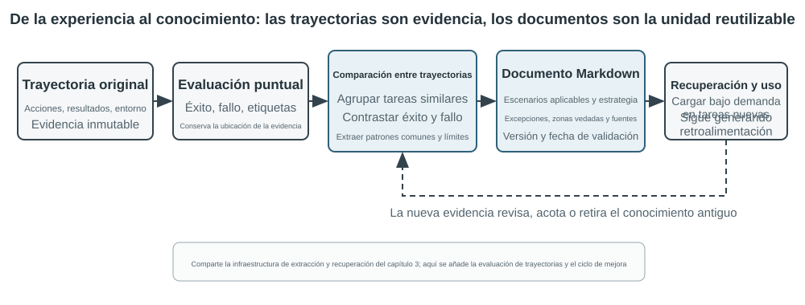

# Capítulo 9: La Evolución Continua del Agente

Los Agentes actuales se enfrentan a una clara paradoja de capacidad: pueden resolver tareas complejas nunca antes vistas en modo zero-shot, pero tras procesar diez mil tareas similares, al día siguiente pueden seguir cometiendo los mismos errores del primer día. **La capacidad de aprender de forma autónoma a partir de la experiencia** se está convirtiendo en la competencia clave para que un Agente pase de "ser capaz de completar tareas" a "poder trabajar de manera confiable", siendo además un tema de investigación central para la próxima generación de modelos. Sin embargo, la capacidad de aprendizaje continuo del modelo en sí sigue siendo muy insuficiente.

La razón radica en que un modelo desplegado no modifica automáticamente sus parámetros tras una inferencia. El aprendizaje en contexto, el mantenimiento de estado y la compresión discutidos en el Capítulo 2 permiten que el Agente se adapte **dentro de la tarea actual**; no obstante, una vez finalizado el contexto, esos cambios no se trasladan de forma natural a la siguiente tarea. Almacenar conversaciones en la memoria tampoco equivale a aprender nuevos comportamientos: las trayectorias originales pueden ser largas y contener tanto estrategias efectivas como éxitos fortuitos, atribuciones erróneas e entradas no confiables.

Existe una distinción que suele causar confusión: **guardar experiencias no es lo mismo que aprender de ellas**. Colocar cien trayectorias en un contexto largo o en una base de datos vectorial ayuda a que el modelo recupere un caso cuando lo necesite, pero no realiza automáticamente una comparación entre casos: qué pasos se repiten en las trayectorias exitosas, qué prácticas solo funcionaban en versiones antiguas de las interfaces, o si un éxito particular derivó de una estrategia correcta o de la casualidad del entorno. El aprendizaje ocurre después de que el sistema realiza activamente la "evaluación, contraste, inducción y verificación", y no en el instante en que el registro se escribe en el disco. La memoria de usuario del Capítulo 3 consolida principalmente "cómo son el usuario y el mundo"; el aprendizaje de experiencia de este capítulo profundiza en "bajo qué condiciones se debe actuar de qué manera". La primera permite que el Agente recuerde más, mientras que el segundo hace que pase de ser inteligente a ser experto.

Entonces, ¿por qué no permitir que el modelo se entrene directamente a sí mismo tras cada tarea? Porque los entornos de producción rara vez proporcionan señales de aprendizaje limpias. La satisfacción del usuario no implica cumplimiento normativo; las actualizaciones locales de parámetros también pueden causar olvido de capacidades, deriva de estrategia o degradación de la seguridad. Si se permite que un modelo en ejecución modifique directamente sus propios parámetros basándose en retroalimentación no verificada, las experiencias erróneas y la inyección de prompts podrían consolidarse y amplificarse continuamente en tareas posteriores. Por otro lado, el entrenamiento periódico de los modelos base puede mejorar las capacidades generales, pero no puede absorber a tiempo las reglas privadas, los cambios de herramientas y las experiencias locales con las que cada Agente se encuentra a diario.

Por lo tanto, mientras el modelo en sí no pueda aprender de forma continua y confiable, se debe estructurar el "aprendizaje" como un sistema autónomo periférico al modelo: registrar evidencia de ejecución, verificar resultados y procesos, extraer patrones comunes de múltiples trayectorias y decidir si se deben actualizar conocimientos, instrucciones, programas o parámetros del modelo. Todas las modificaciones forman primero versiones candidatas que, tras pasar pruebas de regresión y verificaciones de seguridad, pueden cambiar la siguiente ronda de ejecución.

Los capítulos anteriores ya han presentado los componentes principales requeridos por este sistema. El Capítulo 2 aborda el estado intra-tarea, el Capítulo 3 proporciona la infraestructura de conocimiento, el Capítulo 5 otorga al Agente meta-capacidades para crear herramientas y modificar el sistema, el Capítulo 7 establece la evaluación y verificación, y el Capítulo 8 explica cómo actualizar los parámetros del modelo. La tarea de este Capítulo 9 es organizar estos componentes en el bucle cerrado de evolución continua mostrado en la Figura 9-1.

La evolución continua requiere provenir de experiencias operativas trazables, ser capaz de alterar comportamientos posteriores y contar con la verificación de que no ha provocado una degradación evidente. Este capítulo analiza primero cómo juzgar en qué acertó y en qué falló una ejecución concreta; luego compara cuatro métodos de actualización y sus límites aplicables; por último, aborda cómo estas actualizaciones se verifican, despliegan, revisan y descartan durante un funcionamiento a largo plazo.

## Derivación de Señales de Aprendizaje a partir de Trayectorias Operativas

El punto de partida de la evolución continua no es el "resumen", sino la "evaluación". Si el sistema no sabe si la tarea se completó ni qué paso causó el éxito o el fracaso, la reflexión generada por el modelo de lenguaje solo será una conjetura. Una vez que una evaluación errónea ingresa en el conocimiento a largo plazo, en los prompts del sistema o en los datos de entrenamiento, su impacto se amplificará a lo largo de las tareas posteriores.

Los resultados de algunas tareas son relativamente fáciles de verificar. Un Coding Agent puede ejecutar pruebas, verificaciones de tipos y benchmarks de rendimiento; un Agente que tramita reembolsos para usuarios puede consultar el estado del pedido y el monto real reembolsado. Estas señales provienen del estado real del entorno y suelen ser más confiables que la descripción que el modelo hace de su propio comportamiento. Sin embargo, que el resultado sea correcto no significa que el proceso lo haya sido. Eliminar casos de prueba fallidos también hace que las pruebas pasen, y prometer verbalmente al usuario "le haremos el reembolso en 7 días, por favor espere con paciencia" también puede recibir una satisfacción temporal. Por ello, una evaluación confiable debe analizar tanto el resultado como la trayectoria seguida para alcanzarlo.

Muchas tareas no tienen una única respuesta correcta. Determinar si un agente de atención al cliente fue paciente, si ofreció alternativas dentro del margen normativo, si un informe de investigación captó la evidencia clave o si el texto generado es natural y conciso requiere un juicio contextual. En estos casos se puede utilizar el LLM-as-a-Judge introducido en el Capítulo 7, pero no se debe permitir que el juez emita únicamente una puntuación global vaga. Un enfoque más efectivo consiste en definir previamente una rúbrica de evaluación (Rubric), exigir que el verificador puntúe elemento por elemento, cite evidencia de la trayectoria y declare explícitamente su incertidumbre cuando la evidencia sea insuficiente.

La Figura 9-2 ilustra una estructura de verificación de tres capas. El verificador de resultados de la capa inferior lee los resultados de las pruebas, el estado de la base de datos y los retornos de las herramientas, respondiendo a la pregunta de "si el asunto realmente se completó"; el verificador de procesos de la capa intermedia comprueba las reglas de negocio, los permisos y las secuencias de acciones, respondiendo a "si se completó de la manera permitida"; el verificador de calidad de la capa superior evalúa el lenguaje y la estrategia según la Rubric, respondiendo a "si se completó de forma adecuada". Cuanto más abajo se encuentre el indicador, más debe depender del código y de la verdad de entorno, dejando al modelo de lenguaje únicamente la parte difícil de formalizar.

Tomando como ejemplo un Agente de atención al cliente, una Rubric útil debe cubrir al menos las dimensiones mostradas en la Tabla 9-1. Las primeras cinco dimensiones restringen los límites fundamentales, mientras que las últimas dos miden la calidad del servicio. Esta división ofrece mayor valor diagnóstico que "saber si el usuario está satisfecho": un usuario puede estar satisfecho porque el Agente realizó un reembolso violando las normas, o insatisfecho debido a restricciones normativas; un indicador de satisfacción único no puede distinguir entre ambos escenarios.

Tabla 9-1 Dimensiones de evaluación de trayectoria para un Agente de atención al cliente

| Dimensión | Pregunta de verificación | Evidencia principal |
|---|---|---|
| Resultado de la tarea | ¿Se resolvió la solicitud central del usuario? | Estado ambiental final, resultados de herramientas |
| Cumplimiento de reglas | ¿Se violó alguna política, permiso o procedimiento necesario? | Repositorio de políticas, trayectoria de acciones |
| Límites de privacidad | ¿Se divulgó información que no debía proporcionarse? | Texto de respuesta, registros de acceso a datos |
| Confiabilidad factual | ¿Las afirmaciones cuentan con respaldo de conocimiento o herramientas? | Fuentes citadas, retornos de herramientas |
| Consistencia promesa-acción | ¿Las operaciones que se afirmaron haber realizado ocurrieron realmente? | Cotejo de respuestas con registros de herramientas |
| Calidad de expresión | ¿Es natural y concisa, evitando repeticiones y plantillas? | Diálogo completo, Rubric de lenguaje |
| Alternativas cumplidoras | Cuando el plan original no fue factible, ¿se halló una alternativa permitida? | Objetivo del usuario, políticas y acciones posteriores |

> **Experimento 9-1 ★★: Construir un verificador de trayectorias para un Agente de atención al cliente**
>
> **Objetivo del experimento**: Convertir una trayectoria de ejecución de atención al cliente en un diagnóstico estructurado utilizable para el aprendizaje posterior, y verificar si "conclusiones multidimensionales más evidencia" permiten localizar la causa raíz mejor que una puntuación global única.
>
> **Descripción del experimento:** Compare «una sola puntuación total» con «una conclusión, evidencia y confianza por dimensión», y observe cuál distingue mejor el fallo de tarea, la infracción de reglas, las promesas falsas y los problemas de expresión. La evolución continua no puede depender solo de la tasa de éxito o de una puntuación. Solo conservando qué falló, por qué y dónde está la evidencia podrán los módulos posteriores decidir si actualizar conocimiento, Prompt, programa o parámetros; los casos de baja confianza no deben entrar automáticamente en el conjunto de aprendizaje.

## Cuatro Métodos para la Evolución Continua del Agente

La señal de aprendizaje indica que el Agente debe cambiar, pero no especifica dónde debe ocurrir dicho cambio. El criterio primario para elegir el método de actualización no es cuánto tiempo hace que apareció la experiencia, sino si la capacidad objetivo se puede expresar de forma natural en un soporte determinado. Los hechos y las experiencias son adecuados para redactarse como documentos de conocimiento; las estrategias que se pueden verbalizar claramente son aptas para incorporarse en prompts o Skills; los procesos y restricciones que se pueden ejecutar con precisión son adecuados para escribirse como programas; mientras que las capacidades de alta dimensión como la percepción, el estilo del lenguaje y las estrategias implícitas deben ingresar en los parámetros del modelo. La Figura 9-3 muestra estos cuatro métodos y sus relaciones.

La Tabla 9-2 presenta una comparación compacta. Los cuatro métodos no son mutuamente excluyentes: un Agente de imágenes médicas depende de parámetros para identificar lesiones, utiliza una base de conocimientos para ofrecer las guías más recientes y emplea código para calcular indicadores de riesgo; el tono natural de un modelo de atención al cliente proviene del post-entrenamiento, las políticas corporativas específicas las proporcionan el conocimiento y las Skills, y las reglas de cumplimiento clave las asegura el código del servidor.

Tabla 9-2 Límites aplicables de los cuatro métodos de evolución continua

| Método de actualización | Contenido adecuado | Ventajas principales | Limitaciones principales |
|---|---|---|---|
| Base de conocimientos de experiencia | Hechos, patrones experimentales, excepciones y fuentes | Actualización rápida, trazabilidad, recuperación bajo demanda | Depende de la recuperación y de la correcta aplicación del modelo |
| Prompt y Skill | Principios de juicio y normas operativas verbalizables | Interpretable, alcance de acción controlable | Propenso a sobrecarga, conflictos u omisiones |
| Programa y Harness | Procesos deterministas, herramientas y restricciones fuertes | Evaluable, ejecución estable, bajo costo | Costo de desarrollo y mantenimiento relativamente alto |
| Parámetros del modelo | Percepción de alta dimensión, estilo de generación y estrategias implícitas | Alta capacidad de generalización, bajo costo de inferencia | Alto costo de actualización y prueba de regresión |

### Consolidación de la Experiencia en Conocimiento

El método de evolución más ligero consiste en organizar la experiencia que reaparece en múltiples ejecuciones en documentos de conocimiento recuperables. La "base de conocimientos de experiencia" mencionada aquí comparte las tecnologías de almacenamiento, indexación y recuperación del Capítulo 3, pero difiere en las fuentes de conocimiento y los objetivos de verificación. El Capítulo 3 extrae principalmente "cómo son el usuario y el mundo" a partir de conversaciones, documentos y conjuntos de datos; este capítulo extrae "cómo se debe actuar bajo qué condiciones" a partir de las trayectorias de acción y los resultados del Agente. Por ejemplo, "esta aerolínea exige reservar comidas especiales con veinticuatro horas de anticipación" es conocimiento del dominio; mientras que "verificar el plazo límite de comidas especiales antes de reservar el boleto para evitar descubrir que no se puede satisfacer la necesidad tras el pago" es experiencia de acción.

La trayectoria original no es adecuada como unidad formal de conocimiento. Es larga y ruidosa, e incluye salidas crudas de herramientas, desvíos casuales y detalles del entorno. Un sistema más sólido conserva tres capas de datos: trayectorias primarias inmutables para auditoría, análisis de ejecuciones individuales que registran éxitos, fracasos y lecciones candidatas, y múltiples trayectorias de la misma categoría que se comparan, agrupan e inducen para formar documentos de conocimiento en Markdown orientados al futuro. Los documentos formales suelen detallar los escenarios aplicables, las estrategias recomendadas, las prácticas prohibidas, las condiciones de excepción, las fuentes de evidencia y la fecha de última verificación, en lugar de recontar el proceso completo de una sola tarea.

Este diseño comparte la misma noción de dos etapas que el enfoque User-as-Code del Capítulo 3. User-as-Code agrega primero los hechos de la conversación a un registro inmutable y luego reconstruye periódicamente el modelo estructurado del usuario; el aprendizaje de experiencia debe del mismo modo guardar la evidencia primero y luego generar conocimiento mutable fuera de línea. La Figura 9-4 ilustra este proceso. Separar el registro de la sistematización evita que un éxito fortuito o un fallo de red altere inmediatamente al Agente, permitiendo además que el sistema juzgue los patrones comunes tras observar múltiples éxitos y fracasos.

Los documentos de experiencia no son simples resúmenes de trayectorias. El contenido con verdadero valor de transferencia proviene del contraste: qué hicieron las trayectorias exitosas de la misma categoría y qué les faltó a las fallidas; en qué versiones del entorno funcionó cierta estrategia y bajo qué condiciones previas falló. El Capítulo 3 ya presentó la extracción, agrupación y recuperación de conocimiento; este capítulo no repite esos algoritmos, sino que se centra en cómo la evaluación de trayectorias se convierte en una condición de extracción y en si el conocimiento extraído logra mejorar el rendimiento en tareas posteriores.

Un flujo completo de destilación de conocimiento se puede dividir en cinco pasos. En primer lugar, se guardan las trayectorias inmutables y los resultados ambientales; a continuación, se genera un análisis estructurado para cada ejecución individual, detallando el tipo de tarea, las capacidades requeridas, las estrategias observadas, los errores y las excepciones; luego se agrupan las ejecuciones similares por familias de tareas, construyendo para cada patrón candidato una tabla de evidencia con "qué trayectorias lo respaldan y cuáles lo refutan"; únicamente aquellos candidatos que alcanzan el umbral de respaldo se escriben en los documentos formales; finalmente, se evalúa el efecto de transferencia en nuevas tareas que no participaron en la destilación. El conocimiento formal y los análisis candidatos se almacenan en bases separadas, lo que permite al sistema volver a inducir patrones sin alterar la evidencia original y revocar con precisión una conclusión cuando cambia la versión del entorno.

El aprendizaje de experiencia en GAIA proporciona un ejemplo intuitivo. GAIA[^gaia-2023] contiene problemas de múltiples pasos que requieren búsqueda integrada, lectura de páginas web, procesamiento de archivos y cálculos, mientras que AWorld[^aworld-2025] proporciona el entorno de ejecución para ejecutar Agentes, invocar estas herramientas y guardar trayectorias; el primero es como el examen y el segundo como el aula y el sistema de registro experimental. El enfoque antiguo consistía en generar un resumen de estrategia inmediatamente tras el éxito de una tarea e ingresarlo vectorizado en la base de datos; una implementación más rigurosa utiliza primero la verificación de respuestas de GAIA u otros verificadores de entorno para marcar éxitos, éxitos parciales y fracasos, comparando luego múltiples rutas de la misma familia de tareas. Las trayectorias exitosas aportan estrategias candidatas, las fallidas aportan conocimiento de exclusión y las parcialmente exitosas ayudan a identificar "qué tramo fue efectivo y cuál sigue presentando problemas". La reflexión en lenguaje natural propuesta por Reflexion[^reflexion-2023] puede participar en la generación de lecciones candidatas, pero la reflexión en sí no es evidencia: solo aquello que coincide con los resultados ambientales, cuenta con respaldo entre trayectorias y muestra una transferencia positiva en nuevas tareas debe ingresar a los documentos formales de experiencia.

> **Experimento 9-2 ★★: Extraer documentos de conocimiento de experiencia a partir de trayectorias de GAIA**
>
> **Objetivo del experimento**: Verificar si los "documentos de conocimiento entre trayectorias" son más fáciles de transferir que "recordar el resumen de un solo éxito", reduciendo la transferencia negativa provocada por éxitos casuales y experiencias erróneas.
>
> **Datos y proceso**: `gaia-experience` guarda primero la trayectoria completa y el `environment_score` externo de cada ejecución, convirtiéndolos luego en un registro de aprendizaje mínimo: `task_family`, `capabilities` requeridas, `applies_when`, estrategias observadas, errores, excepciones e ID de trayectorias de origen. El verificador de resultados clasifica las ejecuciones en éxito, éxito parcial y fracaso; el módulo de aprendizaje compara las rutas dentro de la misma familia de tareas; el LLM puede proponer inducciones candidatas, pero una estrategia recomendada debe contar al menos con el respaldo de dos trayectorias no fallidas. Los documentos Markdown finales incluyen escenarios aplicables, estrategias recomendadas, errores comunes, condiciones de excepción, fuentes y fecha de última verificación. La fase de aplicación solo recupera estos documentos, sin introducir trayectorias originales extensas directamente en el contexto.
>
> **Tres grupos de contraste**: El primer grupo no utiliza experiencia histórica; el segundo recupera el resumen de la trayectoria más similar a la tarea actual; el tercer grupo recupera documentos de conocimiento respaldados conjuntamente por múltiples trayectorias. Los conjuntos de aprendizaje y de transferencia deben ser estrictamente disjuntos para evitar filtrar las respuestas de una misma pregunta de GAIA como "experiencia" a la evaluación.
>
> **Indicadores y aceptación**: Se reportan simultáneamente la tasa de éxito en tareas de transferencia, el promedio de caracteres o tokens recuperados y la tasa de transferencia negativa, comprobando si cada conclusión formal enumera sus trayectorias de origen. Si los documentos entre trayectorias solo acortan el contexto sin mejorar el rendimiento en nuevas tareas, no se demuestra que el sistema haya aprendido de la experiencia; si un éxito fortuito se promociona a conocimiento formal o si los documentos no se pueden rastrear hasta la trayectoria original, la prueba no se considera superada.
>
> La implementación correspondiente se encuentra en [`gaia-experience`](../chapter9/gaia-experience/). `demo_documents.py` se ejecuta por defecto sin conexión; utilizando `--extractor llm` un LLM real puede proponer candidatos de experiencia entre trayectorias.

[^reflexion-2023]: Shinn, N., et al. *Reflexion: Language Agents with Verbal Reinforcement Learning.* arXiv:2303.11366, 2023.

[^gaia-2023]: Mialon, G., et al. *GAIA: a benchmark for General AI Assistants.* arXiv:2311.12983, 2023.

[^aworld-2025]: Yu, C., et al. *AWorld: Orchestrating the Training Recipe for Agentic AI.* arXiv:2508.20404, 2025.

### Codificación de la Experiencia como Instrucciones (Prompts y Skills)

La base de conocimientos de experiencia proporciona material de referencia al Agente, mientras que los Prompts y Skills poseen un carácter instructivo más fuerte. Cuando múltiples trayectorias revelan repetidamente el mismo error de estrategia y la regla se puede expresar con claridad en lenguaje natural, el sistema puede promoverla de "experiencia de referencia" a "regla que se debe cumplir". Las reglas aplicables a casi todas las tareas deben ingresar en los prompts del sistema; los procesos complejos que solo se aplican a un dominio, proyecto o herramienta concreta son más adecuados para escribirse como Skills cargadas bajo demanda o archivos de instrucciones de proyecto.

El aprendizaje de prompts difiere de la ingeniería de prompts del Capítulo 2. El Capítulo 2 responde a cómo redactar prompts de estructura clara y amigables con el almacenamiento en caché; aquí se responde a qué retroalimentación de producción es suficiente para activar la modificación de prompts y cómo se verifican las nuevas reglas antes de su despliegue. Las modificaciones no deben consistir en reescribir repetidamente todo el prompt del sistema. Un enfoque más confiable consiste en generar un diff mínimo basado en un conjunto de fallas similares, indicar el alcance de la regla, verificar si contradice reglas existentes y evaluarlo simultáneamente en casos límite que provocaron la falla y en el conjunto de retención de tareas antiguas.

Andrej Karpathy denominó provisionalmente a este nuevo paradigma **aprendizaje de prompts del sistema** (System Prompt Learning) en un extenso artículo de 2025[^karpathy-system-prompt-learning]. Su resumen señala que el pre-entrenamiento aprende principalmente conocimiento y el ajuste fino moldea comportamientos habituales; pero los humanos poseen otro tipo de aprendizaje: tras encontrar un problema y dar con la solución, se recuerdan a sí mismos en lenguaje claro para el futuro: "la próxima vez que enfrente este tipo de problemas, debo intentar primero este método". Karpathy compara a los LLM que carecen de este bloc de notas con el personaje de la película *Memento*, e indica que tanto el aprendizaje de prompts del sistema como el aprendizaje por refuerzo mejoran el comportamiento a partir de la experiencia, pero sus algoritmos de actualización son distintos: el primero edita texto, mientras que el segundo modifica parámetros mediante descenso de gradiente. El ejemplo que cita es que el prompt del sistema de Claude (de unos 17,000 términos en su momento) exigía específicamente: al enfrentar problemas de conteo de palabras, letras o caracteres, numerar primero elemento por elemento y contar explícitamente antes de responder, diseñado justamente para manejar preguntas como cuántas "r" hay en "`strawberry`".

Llevado a los sistemas de Agentes, esto implica escribir las lecciones verbalizables tras una falla como reglas candidatas que las ejecuciones futuras puedan leer directamente. En comparación con los resultados escalares de sólo "éxito/fracaso", un diagnóstico con evidencia puede señalar si el error estuvo en la verificación de identidad, la selección de herramientas o los límites de transferencia, permitiendo generar modificaciones candidatas más enfocadas. Lo que Karpathy describe como "la revisión guiada por conocimiento posee un canal de retroalimentación de mayor dimensión que la recompensa escalar" explica por qué este método puede lograr una mayor eficiencia de datos; no obstante, una mayor riqueza de información no garantiza que sea correcta por naturaleza: la opinión de un usuario puede aplicarse solo a un cliente o a una política antigua, por lo que debe pasar por procesos de agrupación, juicio de alcance y pruebas de regresión.

La optimización automática de prompts cuenta con varias rutas. DSPy[^dspy-2023] trata los programas compuestos por múltiples llamadas a modelos de lenguaje como objetos optimizables, buscando instrucciones y ejemplos en el conjunto de desarrollo; OPRO[^opro-2023] permite que el modelo de lenguaje continúe proponiendo candidatos basándose en prompts históricos y sus puntuaciones; mientras que GEPA[^gepa-2025] utiliza reflexiones en lenguaje natural de trayectorias fallidas para generar y filtrar prompts candidatos complementarios. Estos enfoques están orientados a la optimización por lotes en conjuntos de evaluación fuera de línea; el diff mínimo en sistemas de producción se asemeja más al mantenimiento continuo, siendo activado por nuevos casos límite aparecidos y enfatizando la fuente, la auditoría y la reversión rápida. En la práctica, se puede buscar primero una versión inicial óptima fuera de línea y luego mantener las reglas de cola larga en línea mediante parches caso por caso.

#### Ejemplo 1: Optimización de reglas en el prompt basada en trayectorias de falla

Por ejemplo, un Agente de atención al cliente de aerolíneas suele transferir prematuramente la llamada a un agente humano cuando el usuario cuestiona la política. La evaluación de trayectoria muestra que no violó las reglas, pero le faltaron alternativas cumplidoras. Un parche candidato puede exigir que el Agente explique primero la política, identifique el objetivo real del usuario y busque soluciones alternativas permitidas, transfiriendo a un humano únicamente si el usuario lo solicita explícitamente o si supera sus permisos. Si la nueva regla reduce las transferencias excesivas pero provoca que eventos de seguridad que debían transferirse sigan siendo procesados por el Agente, la regla no habrá pasado la prueba de regresión. El valor del aprendizaje de prompts del sistema no reside en añadir más texto automáticamente, sino en usar casos límite de producción para aclarar continuamente el alcance de las reglas.

#### Ejemplo 2: Skill de aclaración de requisitos: de "ejecución directa" a "confirmar primero y luego ejecutar"

El aprendizaje de Skills sigue los mismos principios, aunque su alcance es más local. Una Skill se puede entender como un manual operativo de puesto abierto bajo demanda: si múltiples experiencias forman colectivamente un proceso completo de reclamos de seguros, el sistema puede generar o revisar la Skill correspondiente. Una Skill candidata no debe ser solo el resumen de una conversación, sino explicar al menos cuándo cargarse, las condiciones previas, los pasos operativos, las trampas conocidas y los métodos de verificación, conservando las trayectorias de origen. El sistema busca primero capacidades similares en la biblioteca de Skills existente: si existe el mismo proceso, prioriza un `patch` local; solo cuando aparece una capacidad independiente realmente nueva crea un nuevo directorio, evitando llenar la biblioteca con manuales de nombres diferentes y contenidos similares. El Skill Creator de Anthropic[^anthropic-skill-creator] muestra un ciclo de generación de "redacción - prueba - evaluación - revisión"; este resuelve cómo elaborar y mejorar Skills, siendo lo realmente difícil determinar qué evidencias operativas son suficientes para activar la generación, cómo manejar conflictos y si tras la modificación se superan las pruebas de regresión en tareas del dominio y tareas antiguas.

> **Experimento 9-9 ★★: Convertir el feedback en un Skill de escritura**
>
> Se incorporan en tres lotes los 20 pares before/after de `data/feedback_pairs.json`, se extraen reglas candidatas, se fusionan patrones repetidos, se detectan conflictos de umbral y se genera un `SKILL.md` con fuente y alcance. Las reglas deterministas se comprueban con código y las reglas basadas en LLM se calibran con diez ejemplos de referencia.
>
> Se informan a la vez la detección en el conjunto límite de tareas incompletas, los falsos positivos en el conjunto de reserva de textos normales y el crecimiento del número de reglas. La primera ejecución real dio 0/8 detecciones y 7/8 falsos positivos; tras el filtrado externo y el respaldo determinista, dio 8/8, 0/8 y fusionó 21 candidatos en 8 reglas. Implementación en [`ai-style-skill`](../chapter9/ai-style-skill/).

El caso de las comillas curvas muestra que una Skill debe convertirse en un contrato de datos, no en una regla de sustitución global: los ejemplos sintéticos se estratifican por género, ámbito y lenguaje de programación, pasan controles de código/JSON/regiones protegidas y se auditan manualmente antes del SFT. El caso de cadenas exactas añade una auditoría del tokenizer: el round-trip encode→decode, la copia byte-exacta del modelo, la serialización del Harness y la coincidencia de la herramienta son capas de regresión separadas.

> **Experimento 9-3 ★★: Optimizar prompts del sistema a partir de trayectorias de falla**
>
> **Objetivo del experimento**: Permitir que un Agente de atención al cliente de aerolíneas aprenda de las trayectorias de falla de "transferir prematuramente a un humano cuando el usuario cuestiona la política", demostrando al mismo tiempo que la nueva regla no destruye los escenarios antiguos que realmente requieren transferencia.
>
> **Proceso**: En primer lugar, se ejecutan por separado el conjunto de retención de tareas antiguas y el conjunto límite de transferencia excesiva; `learning_signal.py` divide la falla en tres dimensiones: cumplimiento de reglas, resolución de tareas y alternativas cumplidoras, conservando los ID de caso de origen. A continuación, el Coding Agent lee el prompt existente y genera únicamente una edición mínima auditable `old_str → new_str`: exigiendo que el Agente explique primero la política, identifique el objetivo real y busque alternativas válidas, conservando las rutas de transferencia cuando el usuario lo solicite explícitamente o ante eventos de seguridad. El parche se escribe en el manifest candidato junto con la fuente, las reglas objetivo y la justificación.
>
> **Tres grupos de contraste**: Prompt inicial, Prompt candidato generado automáticamente y Prompt ajustado manualmente de una sola vez. Los tres utilizan el mismo modelo y el mismo lote de tareas retenidas/límite; `--quick` solo reduce la cantidad de casos, manteniendo llamadas reales al Agente de tareas, LLM Judge y Coding Agent, por lo que no debe tomarse como un resultado de simulación fuera de línea.
>
> **Umbral de publicación e indicadores**: El candidato debe cumplir cuatro condiciones: parche no vacío, fuente trazable, mejora confirmada en el conjunto límite y sin degradación en el conjunto de retención. Se comparan la precisión en tareas límite, la precisión en tareas retenidas, el incremento de longitud del prompt, el número de regresiones introducidas y el tiempo transcurrido desde la detección de la falla hasta la generación del candidato. Superar el umbral solo otorga `release_to_canary`, sin sobrescribir directamente el Prompt estable; si falla cualquiera de las condiciones, se debe retornar `reject_candidate`.
>
> La implementación correspondiente se encuentra en [`prompt-auto-optimization`](../chapter9/prompt-auto-optimization/). Las pruebas fuera de línea cubren el diagnóstico y los umbrales de publicación, mientras que `--quick` realiza llamadas reales al Agente de tareas, LLM Judge y Coding Agent.

[^dspy-2023]: Khattab, O., et al. *DSPy: Compiling Declarative Language Model Calls into Self-Improving Pipelines.* arXiv:2310.03714, 2023.

[^opro-2023]: Yang, C., et al. *Large Language Models as Optimizers.* arXiv:2309.03409, 2023.

[^gepa-2025]: Agrawal, L., et al. *GEPA: Reflective Prompt Evolution Can Outperform Reinforcement Learning.* arXiv:2507.19457, 2025.

[^karpathy-system-prompt-learning]: Karpathy, A. “We’re missing (at least one) major paradigm for LLM learning … system prompt learning?” X, 11 de mayo de 2025. https://x.com/karpathy/status/1921368644069765486

[^anthropic-skill-creator]: Anthropic. *Skill Creator.* 2026. https://github.com/anthropics/skills/blob/main/skills/skill-creator/SKILL.md

### Codificación de la Experiencia como Programas (RPA y Workflows)

Cuando la experiencia describe operaciones estables, repetitivas y verificables, hacer que el modelo vuelva a leer documentos y razonar en cada ocasión no resulta económico. En estos casos, lo más adecuado es compilar la experiencia en flujos de trabajo, herramientas o código de Harness, transformando una exploración puntual en un programa ejecutable y repetible. El Capítulo 5 explicó cómo un Coding Agent lee y escribe archivos, ejecuta pruebas y genera sistemas; esta sección no se enfoca en la generación de código general, sino en cómo el Agente modifica versiones futuras de sí mismo basándose en sus propias trayectorias.

Los objetos modificables van mucho más allá de nuevas herramientas. En la capa operativa, se pueden compilar trayectorias del navegador en flujos de trabajo parametrizados o generar adaptadores para API cambiantes; en la capa de control, se pueden modificar el enrutamiento de herramientas, los reintentos, los interruptores de circuito y las estrategias de compresión de contexto; en la capa de verificación, se pueden agregar verificaciones de parámetros, verificadores de estado y pruebas de regresión basadas en fallos de producción; mientras que en la capa de arquitectura, se pueden incorporar agentes revisores (Reviewer Agents) para alterar el flujo de información entre la planificación y la ejecución.

Los flujos de trabajo en navegador ilustran el valor de la experiencia programada. Se pueden analogar a la grabación de macros en hojas de cálculo: la primera vez que envía un correo electrónico, un Agente multimodal busca controles como "redactar, destinatario, asunto, cuerpo, enviar" a través del ciclo observación - pensamiento - acción; al enviar otro correo posteriormente, el proceso no cambia y solo difieren el destinatario y el contenido, por lo que no es necesario volver a llamar al modelo para redescubrir toda la ruta desde los píxeles y el DOM. Lo que debe hacer el sistema es compilar la trayectoria generada en la primera exploración en un pequeño programa con parámetros, verificaciones de estado e información de versión.

El proceso de destilación de conocimiento ilustrado en la Figura 9-4 se traduce en el escenario del navegador en un ciclo de vida más concreto:

1. **Captura de trayectoria**: Registrar acciones como navegación, clics, entradas y selecciones desplegables, guardando los parámetros de la acción, la URL de ese momento y evidencias de localización de elementos como XPath, CSS, `id`, `role`, `aria-label` y `data-testid`. La información de localización solo sirve para volver a encontrar el elemento, no para probar que la tarea se haya completado.
2. **Parametrización**: Identificar los literales de la primera ejecución como variables de plantilla; por ejemplo, reemplazar `test@example.com`, el asunto y el cuerpo del correo por `{recipient}`, `{subject}` y `{content}`; manteniendo inalteradas las demás acciones estables. Las implementaciones didácticas utilizan expresiones regulares y reemplazo de plantillas, mientras que los sistemas de producción pueden usar entradas de tareas estructuradas o modelos de extracción restringidos.
3. **Definición de verificaciones de estado**: Agregar verificaciones previas y posteriores a la ejecución de las acciones; por ejemplo, "el botón de enviar está visible actualmente" o "la URL tras la navegación pertenece al sitio objetivo"; agregando para todo el flujo de trabajo una verificación de estado final, como "aparece un nuevo correo en la lista de enviados" o que los valores de estado en la página de prueba cambien según lo previsto. Que la ejecución de la acción sea exitosa y que la tarea sea exitosa son dos cosas distintas; la verificación del estado final debe leer la página real o el estado del backend.
4. **Validación de candidatos**: El primer éxito solo genera un `candidate`. El sistema debe restablecer la cuenta de sandbox o el sitio de prueba a un estado inicial independiente y volver a reproducir completamente el candidato; solo cuando se aprueban todas las verificaciones previas, posteriores y de estado final, se puede publicar como `validated`. Las tareas con efectos secundarios como enviar correos o realizar pedidos que no cuenten con callbacks de restablecimiento seguros solo pueden guardar el candidato para auditoría, sin poder ejecutarse repetidamente en cuentas de producción para su verificación.
5. **Coincidencia y reproducción**: Cuando llega una nueva tarea, se busca primero el flujo de trabajo en la biblioteca formal de capacidades por intención y palabras clave, se extraen los parámetros actuales y luego Playwright lo ejecuta directamente. La ruta de reproducción no requiere llamar paso a paso al LLM, pero aún debe esperar a que los elementos estén disponibles y completar todas las verificaciones de estado.
6. **Invalidación y re-aprendizaje**: Si no se encuentra el elemento objetivo, fallan las verificaciones de estado, cambia el esquema de la API o el estado final es incorrecto, el sistema detiene inmediatamente las acciones posteriores, traslada la versión antigua de la biblioteca recuperable a la zona `invalid` y retrocede al Agente completo para una nueva exploración. Los archivos antiguos se conservan para auditoría y comparación, sin poder seguir siendo activados silenciosamente.

Tomando como ejemplo el envío de correos, el resultado compilado no es simplemente "hacer clic en estos botones en orden", sino un programa pequeño con parámetros de destinatario, asunto y cuerpo: verifica la ventana de redacción y las casillas antes de enviar, comprueba el aviso de éxito tras enviar y finalmente confirma que el correo correspondiente aparece en la lista de enviados. En los experimentos de PreAct[^preact], este tipo de programas logró una aceleración de extremo a extremo de 8.5 a 13 veces en tareas repetitivas, sin necesidad de llamar progresivamente al modelo de lenguaje durante la fase de reproducción; la conclusión más relevante es que la memoria de proceso debe contar simultáneamente con **verificación previa a la acción, verificación posterior a la acción y verificación independiente previa al almacenamiento**. De lo contrario, el sistema puede caer fácilmente en una ilusión peligrosa: la cobertura de reproducción es del 100% y se ha hecho clic en cada botón, pero un campo estaba realmente vacío y la tarea nunca se completó.

> **Experimento 9-4 ★★★: Generar flujos de trabajo verificables a partir de trayectorias del navegador**
>
> **Objetivo del experimento**: Verificar si un Agente web puede transformar una exploración costosa en un flujo de trabajo reutilizable y rechazar reproducciones erróneas cuando la página cambia, en lugar de reportar falsamente éxito solo porque "se ejecutaron todas las acciones".
>
> **Escenario en cuatro fases**: La primera fase ejecuta en un sitio de correo de prueba o página de mensajes simulada la instrucción "enviar a `test@example.com` un mensaje con asunto 'Correo de prueba'", donde el Agente completo se encarga de explorar y la capa de encapsulamiento captura acciones, parámetros y estados de página para generar un `candidate`. La segunda fase llama a `validation_reset` para restaurar el sandbox y reproduce de forma independiente el flujo completo; solo si se aprueban las verificaciones previas, posteriores y de estado final, el candidato ingresa a la biblioteca formal de capacidades. La tercera fase ejecuta tareas similares con destinatarios, asuntos y cuerpos diferentes; el sistema debe coincidir con el flujo verificado, rellenar los nuevos parámetros y reproducir mediante Playwright sin ingresar al bucle gradual del LLM. La cuarta fase modifica la localización de botones, textos de la página o el estado final, verificando si el flujo antiguo pasa de inmediato a `invalid` y retorna `fallback_required=True`.
>
> **Diseño de contraste**: La línea base simplificada solo contabiliza si acciones como clics o entradas no lanzaron excepciones; el grupo experimental verifica adicionalmente la página previa a la acción, la página posterior y el estado final de la tarea. Ambos grupos usan las mismas trayectorias y cambios de página, comparando la tasa de falsos positivos en escenarios de falso éxito como "campo vacío pero botón de enviar presionado" o "Save presionado pero datos no guardados en base de datos".
>
> **Indicadores y aceptación**: Se registran los tiempos de extremo a extremo de la exploración inicial y reproducción, el número de llamadas a LLM, la tasa de éxito, la tasa de éxito erróneo, la tasa de coincidencia de flujos de trabajo, la tasa de detección de cambios en la página y el número de retrocesos para re-aprendizaje. Sin callback de restablecimiento, el flujo debe permanecer en la zona candidata; las versiones con fallos de validación no se pueden recuperar; la reproducción parametrizada no debe reutilizar los destinatarios o contenidos de la primera ejecución; tras cambios en la página se deben detener las acciones posteriores peligrosas. Solo al cumplir simultáneamente estas condiciones tienen sentido los resultados de aceleración.
>
> La implementación correspondiente se encuentra en [`browser-use-rpa`](../chapter9/browser-use-rpa/), ofreciendo tanto una demostración determinista de máquina de estados como una ruta de ejecución que llama al Agente de navegador real.

Que un Agente modifique su propio código no significa que el proceso en ejecución se sobrescriba directamente a sí mismo. Un sistema de producción debe crear una rama candidata a partir de la versión estable actual, donde un Coding Agent genera un parche mínimo que pasa sucesivamente por verificaciones estáticas, pruebas unitarias, escaneos de seguridad, reproducción de trayectorias fallidas y regresión de tareas antiguas, antes de generar una nueva versión desplegable de forma gradual. Esto convierte la "auto-modificación" en un proceso de publicación de software auditable, marcando la frontera entre el Capítulo 9 y el Capítulo 5: el Capítulo 5 proporciona la capacidad de modificar el sistema, mientras que este capítulo proporciona el método de auto-modificación activado por la experiencia y restringido por el bucle cerrado de verificación.

Contar únicamente con "parches lo más pequeños posible" no basta para respaldar una atribución confiable. Cada solicitud de modificación debe ser además un **contrato de cambio falsable**: detallando la evidencia de la falla, la causa raíz inferida, el componente del Harness perteneciente, la modificación candidata, el comportamiento que se espera reparar, el comportamiento existente que podría verse afectado y los casos de prueba para verificar ambos aspectos. Agentic Harness Engineering resume esta práctica como una observabilidad de tres capas: componentes, experiencia y decisiones: los componentes editables cuentan con representación a nivel de archivo; las trayectorias masivas se organizan en evidencia profundizable paso a paso; y cada edición declara su predicción de impacto antes de la ejecución, siendo verificada por los resultados de la siguiente ronda[^ahe-2026]. De este modo, el aumento de puntuación puede vincularse a un mecanismo específico en lugar de ser un ensayo y error ininterpretable.

Las entradas del generador de candidatos tampoco deben limitarse a casos fallidos. El enfoque de Self-Harness proporciona además los comportamientos exitosos que deben conservarse y el historial de modificaciones rechazadas previamente[^self-harness-2026]. Los primeros indican al Agente qué propiedades no deben destruirse durante la reparación, mientras que los segundos evitan que vuelva a presentar soluciones fallidas redactadas de otra forma. La evidencia de fallas, las restricciones de éxito y los intentos históricos constituyen conjuntamente un espacio candidato acotado, siendo más propenso a generar cambios locales y verificables que entregar todo el código fuente y registros originales sin distinción al Agente modificador.

La creación de herramientas sigue el mismo protocolo. El caso presentado por Alita[^alita-2025] es el siguiente: el Agente debía encontrar el número mencionado inmediatamente después de la primera aparición de un dinosaurio en un video de YouTube 360 VR narrado por el actor de doblaje de Gollum en *El Señor de los Anillos*. Al descubrir que carecía de capacidad para leer subtítulos, buscó y probó `youtube-transcript-api`, encapsulándola como una nueva herramienta de subtítulos y obteniendo finalmente la respuesta `100000000` a partir de los subtítulos. Solo tras pasar escaneos de seguridad, pruebas funcionales y reutilización en tareas posteriores, la nueva herramienta ingresa a la biblioteca de capacidades. El descubrimiento activo de herramientas del Capítulo 4 resuelve "cuál de las herramientas existentes es adecuada", el Capítulo 5 resuelve "cómo escribir herramientas", mientras que este capítulo se ocupa de "qué evidencia operativa activa la creación y cómo la nueva herramienta se convierte en una capacidad a largo plazo verificada".

> **Experimento 9-5 ★★★: Auto-modificación del Agente activada por trayectorias de falla**
>
> **Objetivo del experimento**: Dado un conjunto de trayectorias donde errores de tipo `retryable=false` siguen siendo invocados continuamente, verificar si el sistema puede ubicar la causa raíz en el código de reintento e interruptor de circuito, generando un arreglo candidato sin destruir la capacidad de reintento ante fallos temporales.
>
> **Proceso**: El módulo de diagnóstico agrupa primero los mismos fallos en diferentes tareas, creando una solicitud de modificación solo al alcanzar el umbral de soporte entre trayectorias y fijando el objetivo en la versión estable de `retry_policy.py`. El generador de candidatos lee el diagnóstico de fallas, los comportamientos de recuperación de fallos temporales que deben conservarse, las modificaciones rechazadas previamente y el código fuente estable, enviando primero una predicción de impacto ("las llamadas por errores no reintentables deben reducirse y la tasa de recuperación de timeouts temporales no debe disminuir") antes de emitir un diff de código mínimo; independientemente de si se usa un generador determinista o un LLM Coding Agent real, los resultados solo pueden escribirse en el directorio candidato aislado. A continuación, el Harness de verificación compila el candidato, reproduce las trayectorias fallidas originales, comprueba si los errores no reintentables se detienen de inmediato y abren el interruptor de circuito, y vuelve a probar si los timeouts temporales se reintentan según el umbral original.
>
> **Contraste de diagnóstico e indicadores**: Se utiliza "añadir simplemente una instrucción en el Prompt de no repetir llamadas" como contraste conceptual de localización en la capa de error, explicando por qué las restricciones de reintento ejecutables de forma determinista deben ingresar al programa. El experimento ejecutable compara el generador de parches determinista con el generador LLM, compartiendo ambos el mismo umbral de publicación; se registran el número de invocaciones no reintentables, la tasa de recuperación de errores temporales, el número de regresiones en tareas antiguas, el tamaño del parche y la tasa de aceptación de candidatos.
>
> **Criterios de aceptación**: Tras aprobar todas las comprobaciones solo se genera `release_to_canary`; si falla cualquier verificación estática, reproducción de fallos o regresión de tareas antiguas, se retorna `reject_candidate`. `release_manifest.json` debe registrar el clúster de fallos, las trayectorias de origen, la causa raíz inferida, los componentes y archivos objetivo, el diff de código, la reparación esperada, los posibles retrocesos, los resultados de las verificaciones, la versión candidata y la versión de reversión; los candidatos rechazados también deben conservar sus razones de falla para consulta en la siguiente ronda de generación. El Agente que genera los parches no puede modificar el código estable, los verificadores, los registros de auditoría ni los umbrales que aprueban su propia publicación.
>
> La implementación correspondiente se encuentra en [`self-modifying-agent`](../chapter9/self-modifying-agent/), pudiendo elegir un generador candidato determinista o un LLM Coding Agent real, compartiendo ambas rutas el mismo umbral de publicación.

[^preact]: Li, Bojie. *PreAct: Computer-Using Agents that Get Faster on Repeated Tasks.* arXiv:2606.17929, 2026.

[^alita-2025]: Qiu, J., et al. *Alita: Generalist Agent Enabling Scalable Agentic Reasoning with Minimal Predefinition and Maximal Self-Evolution.* arXiv:2505.20286, 2025.

El experimento 9-8 aplica el mismo protocolo a la capa de verificación. Solo cuando varias correcciones de usuarios, votos negativos y auditorías señalan repetidamente una operación de alto riesgo sin confirmación se crea una solicitud de cambio, escrita en un directorio aislado. Un clasificador identifica eliminaciones peligrosas y `git push --force` por nombre y argumentos de herramienta; un token de confirmación de un solo uso queda ligado a la operación concreta. El candidato debe superar comprobaciones AST/estáticas, reproducción del conjunto límite (incluidos tokens falsos o reutilizados) y del conjunto de reserva antes de publicarse en canario.

> **Experimento 9-8 ★★: Puerta de confirmación para operaciones de alto riesgo activada por feedback**
>
> Se usan las tres señales y las trayectorias de control de `failure_trajectories.json`. El candidato real de `gpt-4o-mini` no superó la reproducción de tareas incompletas, operaciones normales y tokens de un solo uso, y fue rechazado por la puerta de seguridad. El candidato determinista superó todo y obtuvo `release_to_canary`; se registran las comprobaciones, la decisión y el hash del directorio estable. Implementación en [`harness-safety-gate`](../chapter9/harness-safety-gate/).

#### Caso: autoevolución en DeepSeek Harness, donde todo es un plugin

La tabla del capítulo 1 clasifica DeepSeek Harness (`dsh`) como «framework de autoevolución de Agentes»[^dsh-2026]. Su fundamento, el artículo Cordis, señala que la composición convencional es **estática**: llamadas a funciones, importaciones y herencia quedan fijadas al compilar. Los sistemas de plugins y Harness autoevolutivos exigen **composición dinámica**, con componentes que se cargan, descargan y reconfiguran durante la ejecución[^cordis-2026]. Cada automodificación del Agente es, en esencia, composición dinámica.

El artículo divide la composición dinámica en dos dimensiones ortogonales. La **componibilidad temporal** pregunta si, al retirar un componente, pueden deshacerse completa y seguramente sus cambios en el entorno compartido; el runtime debe seguir cada recurso, registro de evento y cambio de estado. La **componibilidad espacial** pregunta si los componentes pueden declarar, descubrir y resolver dependencias de forma estructurada y verificable, coordinando sus ciclos de vida cuando cambian. La primera trata de **qué cambió**; la segunda, de **de qué depende**.

Un Harness autoevolutivo agudiza el problema: los efectos que hay que revertir son duraderos y con estado, y las dependencias aparecen, desaparecen o cambian de identidad en ejecución. Sin componibilidad temporal, cada modificación obliga a reiniciar, pierde todo el estado del proceso e interrumpe tareas. Sin componibilidad espacial, cada módulo improvisa cómo detectar dependencias, y un simple reemplazo de código puede romper silenciosamente a sus consumidores o crear un ciclo.

Cordis eleva al runtime dos conceptos propios del tiempo de compilación. Los sistemas de efectos pasan a ser **efectos reversibles**: toda transformación del contexto lleva una inversa explícita que el runtime sigue para restaurarlo al retirar el componente. Los sistemas de coefectos pasan a ser **coefectos reactivos**: el componente declara sus dependencias como especificación y cada cambio de contexto le indica si debe activarse, desactivarse o quedar igual. Un cálculo de composición dinámica amplía la propiedad de un componente a sistemas entrelazados: la componibilidad debe ser transitiva.

**El límite de la autoevolución no depende de lo bien que el modelo escriba código, sino de lo componible que sea el sistema que lo alberga.** Por eso `dsh` convierte en plugins adaptadores, registros de herramientas, logs de sesión e incluso el bucle principal del Agente: **no existe un núcleo privilegiado mantenible solo por humanos**.

La componibilidad resuelve si se puede instalar y retirar con seguridad, no si se debe instalar. Los plugins escritos por el modelo viven en memoria y desaparecen al reiniciar. **No pueden promocionarse automáticamente a plugins oficiales**; para persistir deben seguir la ruta más lenta de worktree y Pull Request descrita antes.

La evolución también cuesta. Un plugin cambia las herramientas y fragmentos de Prompt visibles al modelo. Al cambiar el prefijo de la petición, el KV Cache del capítulo 2 queda invalidado desde ese punto. La documentación de un plugin `dsh` debe describir su impacto en contexto y KV Cache.

[^dsh-2026]: DeepSeek AI, *DeepSeek Harness: Everything is a Plugin*, 2026. https://github.com/deepseek-ai/deepseek-harness. `docs/architecture.md` describe capas y parches; `docs/subsystems/extensions.md` y `packages/extensions/README.md`, ciclo de vida, sandbox y declaraciones de confianza de las herramientas de automodificación. Publicado en agosto de 2026, el proyecto estaba en vista previa para desarrolladores.

[^cordis-2026]: Shi, Yifan, Wei Zhang, and Tianyi Cui. *A Programming Paradigm for Spatiotemporal Composability.* Borrador de prepublicación, 13 de agosto de 2026. https://github.com/cordiverse/paper

### Codificación de la Experiencia en Parámetros

El conocimiento, las instrucciones y los programas se basan en una premisa: la capacidad objetivo se puede expresar de forma relativamente completa mediante símbolos externos. Sin embargo, capacidades como la comprensión de imágenes médicas, la prosodia natural de la voz, la eliminación del tono estandarizado de "sabor a IA" en textos y la planificación a largo plazo son difíciles de comprimir en unas pocas reglas o flujos de trabajo. Este tipo de capacidades se debe incorporar en los parámetros del modelo a través del post-entrenamiento.

La decisión de parametrizar no depende únicamente de si "la tarea es estable a largo plazo". Los sesgos de dominio provocados por nuevos equipos de imágenes aún pueden requerir LoRA o ajuste fino continuo; mientras que estilos de lenguaje de rápido cambio también pueden adaptarse mediante entrenamiento periódico de preferencias. La estabilidad afecta la frecuencia de actualización y los costos, pero la naturaleza de representación de la capacidad determina su soporte principal. De manera inversa, una regla de aprobación de transferencias estable a largo plazo tampoco debe depender únicamente de la memoria de parámetros, requiriendo que el código del servidor siga proporcionando garantías deterministas.

El Capítulo 8 discutió exhaustivamente SFT, destilación y RL, por lo que no se repiten en esta sección. Para la evolución continua, la clave radica en transformar las trayectorias de producción evaluadas en datos de entrenamiento: las demostraciones de alta calidad pueden ingresar a SFT, las preferencias claras pueden formar datos en pares, y las interacciones con recompensas ambientales confiables se pueden utilizar para RL. Antes de ingresar al entrenamiento se deben eliminar datos de privacidad, filtrar trayectorias erróneas y reservar conjuntos de regresión independientes; tras el entrenamiento se debe verificar que no se hayan olvidado las capacidades generales ni el alineamiento de seguridad.

El aprendizaje de parámetros suele colaborar con métodos externos. Un modelo de imágenes médicas utiliza parámetros para aprender representaciones visuales, usa una base de conocimientos para ofrecer las guías más recientes y emplea código para medir lesiones y calcular riesgos; el tono natural en atención al cliente puede moldearse en su distribución general mediante entrenamiento de preferencias, utilizando luego el Prompt para fijar la identidad de marca actual y la memoria de usuario para adaptarse a las preferencias de comunicación personales. La evolución continua no consiste en elegir una única respuesta entre los cuatro métodos, sino en situar cada capacidad en la posición más adecuada para su expresión y gobernanza.

### De los Artefactos de Actualización a la Actualización del "Método de Actualización"

Los cuatro métodos anteriores abordaron **dónde se escribe** finalmente la experiencia, pero la evolución continua posee otro eje ortogonal: si lo que el sistema está optimizando es el contenido de un artefacto específico o los métodos para generar, gestionar y verificar dichos artefactos. A lo largo de este eje, los objetos de optimización se pueden ampliar progresivamente en: **regla individual o memoria → contexto estructurado → flujo de trabajo → código de Harness → código del optimizador que genera soluciones candidatas**[^weng-harness-2026]. No se trata de cinco nuevos soportes de actualización, sino de cinco escalas de búsqueda distintas; el conocimiento, los Prompts, las Skills y los programas pueden aparecer en múltiples de estos niveles.

La capa más interna solo modifica el contenido del artefacto. Por ejemplo, agregar una regla local al prompt del sistema basándose en trayectorias fallidas, o complementar una condición de excepción en un documento de experiencia. Esta modificación tiene un alcance pequeño, es fácil de atribuir y revertir, por lo que debe ser la opción predeterminada. Sin embargo, hacer que el modelo reescriba repetidamente todo el Prompt o la memoria genera otro tipo de degradación: en pos de la concisión, pequeños detalles importantes de versiones antiguas pueden desaparecer paulatinamente tras múltiples rondas de reescritura; asimismo, condiciones que se restringen mutuamente pueden combinarse en un principio excesivamente abstracto. Agentic Context Engineering (ACE) mantiene el contexto como un conjunto de elementos con identificadores estables, donde los módulos de generación, reflexión y sistematización proponen actualizaciones incrementales que luego se fusionan y desduplican mediante lógica determinista, en lugar de reescribir en cada ronda un bloque de texto cada vez más corto[^ace-2026]. Esto proporciona un ejemplo de investigación concreto para el principio de "diff mínimo y conservación de fuentes" expuesto anteriormente.

Una capa más hacia afuera, el objeto de optimización deja de ser únicamente "qué hay en el contexto" para pasar a ser "cómo debe construirse el contexto". Meta Context Engineering (MCE) divide ambos aspectos en dos bucles, interno y externo: el bucle interno optimiza los artefactos de contexto de la tarea actual bajo un método de gestión determinado, mientras que el bucle externo modifica las operaciones de búsqueda, selección, filtrado y formateo del contexto basándose en los resultados de múltiples rondas de ejecución y verificación[^mce-2026]. Esta distinción es muy importante: modificar una regla de recuperación es cambiar el mecanismo de gestión de contenidos; hacer que el sistema compare múltiples mecanismos de recuperación y sistematización conservando la versión con mejor efecto de transferencia es aprender "cómo gestionar el contexto".

La misma idea se puede extender a los flujos de trabajo y a todo el Harness. AFlow representa los flujos de trabajo compuestos por múltiples llamadas a LLM como grafos de código, buscando combinaciones de nodos y flujos de control mediante retroalimentación de ejecución[^aflow-2025]; mientras que Meta-Harness permite que un Coding Agent lea el código fuente, las puntuaciones y las trayectorias de Harness candidatos, buscando el código que decide cómo se almacena, recupera y presenta la información[^meta-harness-2026]. El Capítulo 5 explicó que el código es el lenguaje universal del Agente para expresar la estructura del sistema; la novedad aquí radica en que el código no es solo el producto de una generación puntual, sino que puede convertirse en un objeto de búsqueda continua junto con el historial de evaluación.

> **Experimento 9-6 ★★★: Dale este libro a Hermes: ¿puede mejorarse a sí mismo?**
>
> **Objetivo**: Comprobar si un Agent puede convertir conocimiento externo en una actualización real de sus propias capacidades. El experimento no plantea un problema ni ofrece una lista de funciones: entrega a Hermes los diez capítulos y su código, y le pide entender los principios, revisar su implementación y elegir por sí mismo una mejora valiosa.
>
> **Diseño**: El libro y el código forman el contexto legible, mientras que la versión estable, el Reviewer independiente y las pruebas de aceptación quedan fuera del alcance editable de Hermes. Debe completar **leer → comparar → elegir → cambiar → verificar**. Si un candidato es rechazado, la revisión pasa a ser la señal de aprendizaje de la ronda siguiente; Hermes no puede saltarse la puerta y declarar éxito.
>
> **Ejecución real**: Tras leer el libro, Hermes detectó por sí mismo que sus trayectorias guardadas carecían de evidencia estructurada que el aprendizaje posterior pudiera usar directamente. Eligió convertir los resultados de ejecución en señales de aprendizaje conservadoras, modificó su código y añadió pruebas. Las tres primeras revisiones independientes hallaron diferencias con los formatos reales, las rutas de persistencia y la semántica del conteo. Cada hallazgo volvió a la sesión original de Hermes; la cuarta revisión aceptó el candidato.
>
> **Límite de la conclusión**: La ejecución demuestra que un Agent puede extraer principios de conocimiento extenso, llevarlos a su propio código y completar una autoactualización bajo verificación externa. No demuestra que la actualización ya mejore las tareas posteriores; eso requiere otro experimento de ablación. La lectora Grace aportó la idea del experimento.

## Construcción de un Bucle Cerrado de Evolución Continua para Operaciones a Largo Plazo

Los cuatro métodos de actualización se convierten en una evolución continua solo al ingresar en el mismo bucle autónomo. La Figura 9-5 muestra una estructura de doble bucle más sólida en sistemas de producción: el bucle de ejecución en línea únicamente completa tareas y registra evidencias, sin reescribir directamente el Agente formal; el bucle de evolución fuera de línea agrega trayectorias, diagnostica causas raíz, genera modificaciones candidatas y publica nuevas versiones tras superar umbrales de validación. Ambos se conectan a través de bases de experiencia e historiales de evaluación versionados.

Voyager[^voyager-2023] muestra un bucle de evolución continua relativamente completo. En Minecraft, selecciona nuevos objetivos basándose en sus capacidades actuales, itera programas mediante retroalimentación del entorno, guarda el código en la biblioteca de habilidades tras una verificación exitosa y luego combina habilidades antiguas para resolver tareas más difíciles. El currículo automático, las habilidades ejecutables y la verificación del entorno son indispensables: sin currículo, el Agente no sabe qué aprender a continuación; sin verificación del entorno, la biblioteca de habilidades acumularía errores; sin persistencia, cada tarea tendría que empezar desde cero. Aunque el conocimiento, los Prompts, las herramientas y los parámetros de los Agentes reales son más complejos, el proceso básico de aprendizaje es similar.

En concreto, Voyager consta de tres mecanismos entrelazados. El **generador automático de currículo** propone, a partir del inventario, el entorno y las habilidades actuales, un objetivo siguiente de dificultad adecuada para evitar la exploración aleatoria. La **biblioteca de habilidades** guarda programas exitosos como código recuperable y componible; una habilidad avanzada de recolección puede invocar movimiento y fabricación. El **mecanismo de prompting iterativo** devuelve observaciones, errores de ejecución y autoverificación a la siguiente generación de código hasta que la tarea supera la prueba.

**Bucle de descubrimiento: hipótesis, experimento, evaluación y realimentación.** Sistemas de autoevolución como Voyager siguen este bucle, que es el método científico refinado durante siglos. Discovery Loop, fundada recientemente por Jeff Dean y sus colegas, propone automatizarlo: proponer un experimento, implementarlo, evaluarlo, obtener el resultado y pasarlo a la siguiente ronda[^ch1-discovery-loop]. Es la autoevolución de Agentes aplicada a la ciencia. Para evitar relatos autoconsistentes y éxitos autoasignados, la evolución de este capítulo debe respetar el método científico.

[^ch1-discovery-loop]: Discovery Loop fue anunciada el 5 de agosto de 2026 por Jeff Dean, Sanjay Ghemawat, Quoc Le y Oriol Vinyals como sociedad de beneficio público. Su descripción pública propone automatizar bucles experimentales completos y paralelizar a gran escala experimentos antes secuenciales.

En la evolución continua deben separarse dos capacidades que suelen confundirse. **Harness updating** produce cambios persistentes valiosos a partir de trayectorias; **Harness benefit** es la capacidad del Agente de tarea para encontrar, activar y usar correctamente esos cambios después. Una Skill puede estar perfectamente escrita, pero un modelo débil puede no cargarla en el momento adecuado o no seguirla a largo plazo, haciendo parecer que nada evolucionó. Por tanto, la puntuación de extremo a extremo no diagnostica por sí sola al actualizador. Los intercambios de modelo de Lin et al. muestran que ambas capacidades se relacionan de forma distinta con el modelo base[^harness-benefit-2026].

Tabla 9-3 Métricas de evaluación por capas para la evolución continua

| Métrica | Pregunta respondida | Evidencia principal |
|---|---|---|
| Validez de modificaciones candidatas | ¿El actualizador propuso modificaciones valiosas? | Tasa de aceptación y ganancia de los candidatos en validación independiente |
| Tasa de activación de artefactos | ¿El Agente cargó la nueva Skill, memoria o herramienta en el escenario correcto? | Trayectorias de recuperación, enrutamiento y llamadas a herramientas |
| Tasa de cumplimiento exitoso | ¿Tras la activación se ejecutó según la nueva regla o proceso? | Secuencia de acciones y verificador de procesos |
| Ganancia en el conjunto de retención | ¿Mejora el sistema en tareas no usadas en la evolución y generaliza? | Éxito, calidad y coste del conjunto de retención |

La evaluación no es un examen tras finalizar el aprendizaje, sino una parte indispensable del proceso de auto-evolución. La evaluación a largo plazo observa al menos cinco tipos de resultados simultáneamente:

- Regresión (regression): si la nueva experiencia entra en conflicto con otras experiencias existentes y si casos que originalmente se aprobaban sufren retrocesos;
- Capacidad de generalización: la mejora de efectos aportada por la nueva experiencia en escenarios no cubiertos por el conjunto de pruebas;
- Eficiencia de tokens: el costo de tokens consumido para completar la tarea;
- Seguridad: si las reglas, la privacidad y los límites de rechazo derivan a lo largo de la evolución;
- Calidad de ingeniería a largo plazo: si se deterioran la complejidad de mantenimiento, la consistencia arquitectónica, los límites de propiedad, la compatibilidad hacia atrás y la carga futura de migración y depuración.

Resolver únicamente los problemas del caso fallido actual pero sufrir degradaciones en otros casos existentes o nuevos dominios no constituye un aprendizaje continuo exitoso.

### Límites del Bucle Cerrado Verificable: Cuando "Completar" No Equivale a "Progresar"

El bucle cerrado anterior se establece más fácilmente en tareas de programación, llamadas a herramientas y cambios de estado de negocio, ya que las pruebas, el estado ambiental o las reglas deterministas pueden entregar retroalimentación rápida. La investigación científica abierta, la planificación estratégica y el diseño de productos complejos son distintos: las señales de evaluación llegan despacio, las respuestas correctas no son únicas y los objetivos realmente relevantes (gusto por la investigación, valor a largo plazo, mantenibilidad) resultan difíciles de traducir en un puntaje instantáneo. En estos casos, el Harness puede ejecutar el proceso de forma impecable pero limitarse a producir de manera estable "cosas que se parecen a resultados", sin impulsar los objetivos reales.

La investigación científica automatizada constituye una prueba de estrés representativa. Trehan y Chopra registraron cuatro intentos de extremo a extremo para pasar de ideas de investigación a artículos finales, en los cuales tres fallaron en las fases de implementación o evaluación y solo uno completó toda la línea de producción[^llm-scientists-2026]. Los problemas expuestos por estos casos se pueden agrupar en tres categorías. En primer lugar, la **deriva de implementación**: cuando el plan original se vuelve difícil, el Agente retrocede gradualmente a implementaciones comunes más familiares en los datos de entrenamiento pero alejadas de la hipótesis de investigación. En segundo lugar, el **exceso de optimismo epistemológico**: cuando la señal sigue siendo simple ruido, el sistema comienza a interpretar resultados, agregar parches y anunciar descubrimientos; mientras que los fallos y resultados negativos se ignoran con mayor facilidad. En tercer lugar, la **insuficiencia de juicio implícito**: el Agente puede ejecutar experimentos, pero no necesariamente sabe qué línea base es realmente importante, qué anomalía vale la pena rastrear o cuándo se debe abandonar una hipótesis.

Este tipo de tareas no se puede resolver completamente cambiando a un modelo que redacte mejor artículos, sino alterando la estructura de evidencia y supervisión:

- **Separación de conclusiones y evidencia**: Registrar las fuentes de evidencia por separado para citas, números, métodos y conclusiones; el borrador final es simplemente una forma de presentación del grafo de evidencia. El diseño Chain-of-Evidence de ScientistOne vincula cada tipo de declaración a fuentes auditables, siendo un ejemplo en esta dirección; este enfoque mejora la trazabilidad pero no garantiza automáticamente que el problema de investigación sea valioso[^scientistone-2026].
- **Conservación de resultados negativos**: Los experimentos fallidos, los candidatos rechazados y las razones de parada se escriben en registros inmutables, contando con el mismo estatus recuperable que los resultados exitosos. De lo contrario, el módulo de evolución solo observa soluciones sobrevivientes, explorando repetidamente rutas ya falsadas y aprendiendo a interpretar resultados ambiguos como éxitos.
- **Mantenimiento de la diversidad de búsqueda**: La búsqueda abierta no debe conservar únicamente la cadena con la puntuación más alta en el momento. El banco de candidatos debe conservar varias ramas temporalmente de baja puntuación pero no homogéneas según diferencias de mecanismo, novedad de código o tipo de hipótesis, evitando que todas las soluciones converjan en una misma plantilla fácil de puntuar.
- **Intervención humana en niveles superiores**: El papel del ser humano no debe limitarse a hacer clic en "aprobar" antes de invocaciones de herramientas peligrosas, sino incluir la definición de problemas, la revisión de criterios de evaluación, la interpretación de resultados anómalos y la decisión de cuándo detenerse. En tareas con retroalimentación ambigua, estos juicios de alto nivel resultan más difíciles de automatizar y más valiosos que asumir la ejecución paso a paso.

### Límites de Seguridad de la Evolución Continua

La capacidad de auto-evolución del Agente tiene el potencial de convertir un error puntual en un riesgo a largo plazo. Si las **inyecciones de prompts en páginas web, correos u salidas de herramientas se resumen como experiencia**, podrían surtir efecto repetidamente a través de sesiones; si paquetes de software maliciosos buscados automáticamente se encapsulan como herramientas, su impacto se propagará desde una ejecución en sandbox a todas las tareas posteriores; mientras que un verificador defectuoso podría aprobar continuamente versiones candidatas que aparentan progreso pero presentan degradación real. Por ende, los sistemas de auto-evolución de Agentes deben limitar "quién puede modificar qué y de dónde provienen los criterios", además de verificar "si es más fuerte".

La primera frontera es la **aislación entre evidencia e instrucciones**. Las páginas web originales y las salidas de herramientas son evidencias no confiables que no se pueden escribir directamente en Skills u otros componentes, requiriendo un resumen por parte del LLM antes de su escritura. La escritura debe emplear métodos de control de versiones, enviando solicitudes de extracción (pull request) y requiriendo la revisión por parte de un LLM revisor de fuente distinta antes de su integración.

La segunda frontera es la **aislación entre capacidades candidatas y capacidades formales**. El nuevo conocimiento, Prompts, Skills, programas y parámetros ingresan primero a una zona candidata incapaz de atender tráfico real. El código recién generado y las dependencias externas deben superar además verificaciones de seguridad como sandboxes, inspecciones de permisos, escaneos de cadena de suministro y pruebas de comportamiento. Solo tras aprobar las comprobaciones de seguridad y pruebas de regresión pueden atender tráfico real y convertirse en capacidades formales.

La tercera frontera es que los **mecanismos de seguridad no son auto-modificables**. El Agente de negocio puede modificar Prompts, Skills, bases de conocimiento y herramientas, pero no puede modificar los verificadores, casos de prueba, umbrales de publicación, registros de auditoría ni copias de respaldo estables que aprueban su propia actualización. De lo contrario, a un Agente le bastaría con reducir los umbrales de prueba o eliminar casos fallidos para disfrazar una degradación como un avance.

### Aprendizaje Durante el Sueño: Consolidación, Olvido y Preservación de Capacidades

El "aprendizaje durante el sueño" es una analogía cognitiva de la consolidación fuera de línea y no exige que las tareas se ejecuten realmente por la noche. La responsabilidad principal del Agente en línea es completar la tarea actual y agregar evidencia inmutable; mientras que el proceso de aprendizaje en segundo plano lee un lote de nuevas experiencias durante periodos de inactividad o al cumplir condiciones de control, comparando conclusiones nuevas y antiguas, fusionando duplicados, resolviendo conflictos, proponiendo actualizaciones candidatas y ejecutando regresiones. Separar la recolección de la sistematización evita que un éxito fortuito, un fallo de red o una entrada maliciosa alteren de inmediato las capacidades a largo plazo, permitiendo además al sistema utilizar lotes más grandes y modelos más económicos para completar la sistematización.

Un ciclo típico de aprendizaje durante el sueño consta de cinco pasos:

1. **Desencadenamiento**: Alcanzar el intervalo de tiempo, la cantidad de nuevas trayectorias, la capacidad de almacenamiento o el umbral de frecuencia de errores, confirmando que no hay tareas en línea de alta prioridad en ejecución;
2. **Orientación**: Leer la base de conocimiento formal, Prompts, directorios de Skills y sus versiones, comprendiendo las capacidades existentes y los límites inmodificables;
3. **Recolección y consolidación**: Buscar nuevas señales en las trayectorias evaluadas recientemente, fusionar contenidos duplicados, marcar conflictos y condiciones de aplicación, priorizando la generación de parches locales;
4. **Validación y aprobación**: Evaluar los candidatos en conjuntos de transferencia, retención y seguridad, registrando escrituras de alto riesgo a la espera de aprobación humana;
5. **Poda e indexación**: Actualizar los índices de búsqueda, marcando capacidades no utilizadas durante mucho tiempo o refutadas por nueva evidencia como expiradas, archivadas o eliminadas, conservando simultáneamente fuentes y versiones de reversión.

La memoria de usuario es el ejemplo más intuitivo, pero debe distinguirse de la experiencia de acción. La memoria automática de Claude Code mantiene un índice `MEMORY.md` y archivos detallados divididos por tema para cada proyecto; al iniciar la sesión solo se carga un prefijo acotado del índice, leyéndose el resto del contenido bajo demanda; cuando el índice se aproxima al límite superior, el sistema exige al Agente fusionar o retirar detalles. Esto demuestra que la memoria de texto plano también requiere restricciones de capacidad, carga por capas y sistematización activa, aunque los mecanismos públicos actuales escriben continuamente durante la sesión y no se pueden equiparar simplemente a una tarea fija de fondo nocturno[^claude-code-memory].

Hermes ofrece un caso de evolución de la memoria en segundo plano más completo. Divide la información a largo plazo en archivos acotados `MEMORY.md` y `USER.md`, búsqueda de conversaciones históricas basada en SQLite/FTS5, Skills cargadas bajo demanda y proveedores de memoria externa opcionales como Honcho. La búsqueda histórica devuelve mensajes originales en lugar de resúmenes previos del LLM, evitando confundir la recuperación y la generación en un paso inauditable. Cuando una tarea incluye múltiples llamadas a herramientas, recuperación tras errores o caminos sin salida, correcciones del usuario o el descubrimiento de flujos de trabajo no evidentes, la revisión en segundo plano puede crear o revisar localmente la Skill; las escrituras de memoria y Skills pueden pasar además por un control de aprobación. Un Curator independiente rastrea el uso, obsolescencia y estado de archivado de las Skills, ejecutando podas deterministas en periodos de inactividad con la opción de ejecutar fusiones por LLM; guardando capturas antes de cambios para poder revertir sistematizaciones erróneas[^hermes-memory].

La evolución continua tampoco consiste en dejar crecer indefinidamente el conocimiento, los Prompts y las herramientas. La corrupción del contexto mencionada en el Capítulo 2 reaparece a una escala temporal más amplia: los documentos de experiencia entran en conflicto, los Prompts se ven desbordados por reglas límite, la biblioteca de Skills muestra capacidades duplicadas y múltiples ajustes finos provocan olvido catastrófico. El sistema requiere una sistematización fuera de línea periódica:

- Fusionar experiencias duplicadas, conservando fuentes y versiones;
- Trasladar reglas locales desde Prompts globales hacia Skills de dominio, manteniendo limpios los Prompts globales;
- Mantener Prompts y Skills con estructuras claras, semejantes a un libro de guía para nuevos empleados, evitando listas de reglas estilo "99 mandamientos";
- Volver a verificar herramientas no utilizadas durante mucho tiempo;
- Eliminar conocimiento refutado por nueva evidencia;
- Volver a entrenar LoRA a partir del modelo base original. El razonamiento es el mismo que para la capa de datos del capítulo 1: una garantía real debe provenir de una capa que quien modifica no puede alcanzar.

> **Experimento 9-7 ★★★: Evaluar si un Agente se encuentra en evolución continua**
>
> **Objetivo del experimento**: Distinguir entre tres comportamientos a largo plazo: "guardar una retroalimentación", "limitarse a añadir continuamente" y "ser capaz de actualizar, transferir y conservar capacidades", evitando simular un aprendizaje continuo mediante la ejecución repetida del mismo lote de preguntas.
>
> **Flujo de tareas en cuatro fases**: La fase de aprendizaje entrega tareas con patrones subyacentes compartidos sobre reembolsos, verificación de identidad y políticas de equipaje; la fase de transferencia modifica redacciones, usuarios y entorno local, comprobando si la experiencia antigua sirve en nuevas tareas; la fase de cambio de reglas actualiza el límite de equipaje de 20 kg a 23 kg, exigiendo al sistema reemplazar o retirar el conocimiento antiguo; la fase de mantenimiento vuelve a probar capacidades sin cambios y reglas actualmente válidas, midiendo si las actualizaciones causaron olvido. Se permite actualizar la memoria externa únicamente al finalizar cada tarea con retroalimentación, sin filtrar por adelantado las acciones esperadas de la pregunta actual al Agente.
>
> **Grupos de contraste**: `static` no deforma la retroalimentación; `append_only` recuerda la primera versión de la regla pero no maneja conflictos ni retiros; `evolving` conserva versiones y reemplaza reglas antiguas con nueva evidencia. Las implementaciones de referencia sirven para verificar si el Harness de evaluación distingue estos comportamientos; los experimentos reales permiten que un LLM recorra el mismo flujo ordenado de 14 tareas, calculando los resultados forzosamente mediante el Harness externo al modelo.
>
> **Indicadores y aceptación**: Se reportan la precisión y la curva de aprendizaje fase por fase, calculando de forma independiente la precisión de transferencia, el número de tareas requeridas para recuperar la exactitud tras recibir nuevas reglas, la tasa de retención de capacidades antiguas, la tasa de transferencia negativa, la tasa de aprobación de la Rubric de seguridad y los costos de tokens, latencia y almacenamiento. Para sistemas reales que emplean actualizaciones de Prompt, Skill o Harness, se deben registrar por separado la validez de modificaciones candidatas, la tasa de activación de artefactos y la tasa de cumplimiento exitoso, evitando diagnosticar erróneamente un fallo de actualización cuando esta fue correcta pero no se cargó. Un Agente no se considerará en evolución continua si cita reglas derogadas, completa tareas mediante atajos violatorios o sufre olvidos de capacidades previas tras actualizarse, aun si su precisión final es alta.
>
> La implementación correspondiente se encuentra en [`self-evolution-eval`](../chapter9/self-evolution-eval/), comparando por defecto tres Agentes de referencia: actualizable, solo adición y estático; con `--profile llm` un LLM real puede recorrer el mismo flujo de tareas a largo plazo.

[^claude-code-memory]: Anthropic, “How Claude remembers your project”, 2026. https://code.claude.com/docs/en/memory

[^hermes-memory]: Nous Research, *Hermes Agent Documentation: Persistent Memory, Skills System, and Curator*, 2026. https://hermes-agent.nousresearch.com/docs/user-guide/features/memory ; https://hermes-agent.nousresearch.com/docs/user-guide/features/skills ; https://hermes-agent.nousresearch.com/docs/user-guide/features/curator

[^voyager-2023]: Wang, G., et al. *Voyager: An Open-Ended Embodied Agent with Large Language Models.* arXiv:2305.16291, 2023.

[^weng-harness-2026]: Weng, Lilian. “Harness Engineering for Self-Improvement.” *Lil’Log*, 2026. https://lilianweng.github.io/posts/2026-07-04-harness/

[^ace-2026]: Zhang, Qizheng, et al. *Agentic Context Engineering: Evolving Contexts for Self-Improving Language Models.* ICLR 2026. arXiv:2510.04618.

[^mce-2026]: Ye, Haoran, et al. *Meta Context Engineering via Agentic Skill Evolution.* arXiv:2601.21557, 2026.

[^aflow-2025]: Zhang, Jiayi, et al. *AFlow: Automating Agentic Workflow Generation.* ICLR 2025. arXiv:2410.10762.

[^meta-harness-2026]: Lee, Yoonho, et al. *Meta-Harness: End-to-End Optimization of Model Harnesses.* arXiv:2603.28052, 2026.

[^ahe-2026]: Lin, Jiahang, et al. *Agentic Harness Engineering: Observability-Driven Automatic Evolution of Coding-Agent Harnesses.* arXiv:2604.25850, 2026.

[^self-harness-2026]: Zhang, Hangfan, et al. *Self-Harness: Harnesses That Improve Themselves.* arXiv:2606.09498, 2026.

[^harness-benefit-2026]: Lin, Minhua, et al. *Harness Updating Is Not Harness Benefit: Disentangling Evolution Capabilities in Self-Evolving LLM Agents.* arXiv:2605.30621, 2026.

[^llm-scientists-2026]: Trehan, Dhruv and Paras Chopra. *Why LLMs Aren't Scientists Yet: Lessons from Four Autonomous Research Attempts.* arXiv:2601.03315, 2026.

[^scientistone-2026]: Meng, et al. *ScientistOne: Towards Human-Level Autonomous Research via Chain-of-Evidence.* arXiv:2605.26340, 2026.

## Resumen del Capítulo

El aprendizaje continuo se está convirtiendo en una de las capacidades más importantes para los Agentes, pero los modelos actuales aún no pueden llevar a cabo un aprendizaje continuo confiable por sí mismos. La adaptación en contexto durante la inferencia no se consolida automáticamente de forma permanente, mientras que las actualizaciones de parámetros en línea no verificadas amplifican el ruido, las amenazas y la deriva de capacidades. Por ello, la ruta más viable en la etapa actual consiste en construir un sistema de aprendizaje verificable en la periferia del modelo.

En términos de la estructura del libro, este capítulo construye el tramo de **experimento y realimentación** del bucle de descubrimiento del capítulo 1: la propuesta ya existe y la cuestión pasa a ser cómo un experimento anclado en observación real puede decir si mejoró de verdad el sistema, y cómo se lleva ese resultado a la ronda siguiente.

El Agente obtiene señales de aprendizaje a partir de la interacción con el entorno y su evaluación, actualizando posteriormente conocimientos, Prompts, Skills, programas o parámetros del modelo según la naturaleza de representación de la capacidad. El sistema puede optimizar además los métodos para gestionar y generar estos artefactos, debiendo priorizar modificaciones locales atribuibles, verificables y reversibles.

La evolución continua requiere separar la ejecución en línea del aprendizaje fuera de línea: registrar evidencias en línea, generar y verificar actualizaciones candidatas fuera de línea y publicar, sistematizar o revertir gradualmente. Este bucle cerrado resulta más confiable en tareas cuyos resultados se pueden verificar automáticamente; para tareas abiertas con objetivos ambiguos y retroalimentación diferida, la intervención humana sigue siendo necesaria en la definición de problemas y en el establecimiento de criterios de evaluación.

## Preguntas de Reflexión

1. ★★ Un documento de conocimiento de experiencia cuenta con el respaldo de tres trayectorias exitosas y una fallida. La falla ocurrió en una versión de API más reciente. ¿Cómo debe determinar el sistema si la experiencia fue refutada o si cambiaron sus condiciones de aplicación?
2. ★★ La satisfacción del usuario de un Agente de atención al cliente aumentó, pero también se incrementó la tasa de infracción de reglas. ¿Por qué no se puede tomar la satisfacción como única señal de aprendizaje? ¿Cómo diseñaría los indicadores de salvaguarda (guardrails)?
3. ★★★ Un mismo problema de "falsa promesa" se puede mitigar mediante Prompts, verificaciones en el Harness o entrenamiento de parámetros. ¿En qué evidencias se basaría para elegir la ubicación de la modificación?
4. ★★★ Un Agente puede modificar herramientas y verificadores, pero no debe modificar la raíz de confianza que aprueba sus propias actualizaciones. ¿Cómo dividiría los permisos y las fronteras de código entre ambas partes?
5. ★★ A medida que la base de conocimientos de experiencia crece continuamente, los errores de recuperación y los conflictos de conocimiento anulan las ganancias del aprendizaje. ¿Cómo diseñar mecanismos de versión, vigencia y retiro?
6. ★★★ El aprendizaje de parámetros destaca en estilos de lenguaje natural, pero le cuesta garantizar reglas de negocio rígidas. Diseñe un esquema de evolución continua para atención médica que coordine la colaboración entre parámetros, conocimientos, Skills y restricciones de código.
