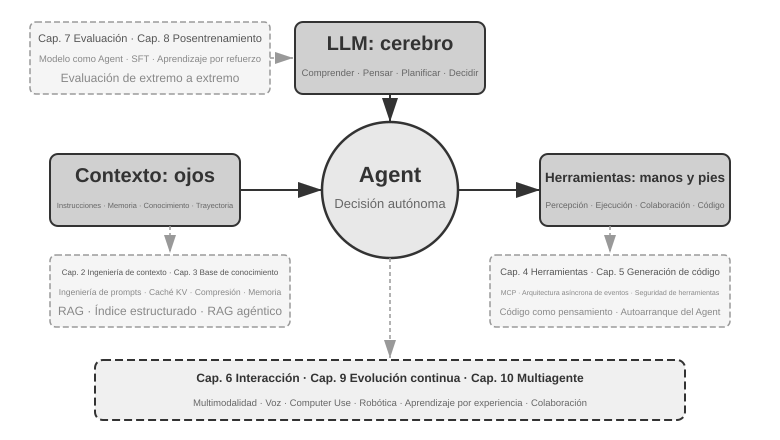

# Introducción {.unnumbered}

De agosto a octubre de 2025, impartí una serie de conferencias técnicas en el *Campamento de Entrenamiento de Agentes de IA* de Turing. La intención original de las conferencias era simple: transformar el diseño de Agentes de IA de algo "impulsado por la intuición" a algo "impulsado por principios": no solo enseñar a todos a ejecutar una demostración (Demo), sino comprender profundamente por qué un Agente se diseña de cierta manera y cuáles son las compensaciones (*trade-offs*) detrás de cada decisión arquitectónica. Este libro se organizó y amplió precisamente a partir de los manuscritos y experimentos de aquellas conferencias.

Vale la pena señalar que este libro, desde la idea inicial hasta el resultado final, fue creado utilizando un método que puede llamarse **whisper coding** (colaboración por dictado de voz), y lo que utilicé para dictar fue precisamente el Agente de voz de Pine. Cada vez que preparaba un manuscrito, primero le dictaba un esquema general, le pedía que investigara (*survey*) y luego organizaba un primer borrador; después de dar la clase, combinando los comentarios de los estudiantes en el Campamento de Entrenamiento de Agentes de IA, discutía y pulía repetidamente con él, iterando de esta manera hasta ampliar y editar estos manuscritos en el libro de hoy. Durante todo el proceso, la mayoría de las veces no escribía a máquina, sino que le dictaba mis ideas, el ancho de banda de la voz es mucho mayor que el del teclado (la velocidad normal al hablar es aproximadamente cuatro veces la de escribir a máquina), por lo que el ciclo de "dictar, investigar, discutir, modificar" giraba muy rápido. En cierto sentido, este libro no solo habla sobre Agentes, sino que también es una obra creada con la participación de un Agente.

Desde principios de 2025, con el lanzamiento de DeepSeek R1 hasta la actualidad, el campo de la IA ha evolucionado desde modelos base puros (es decir, la base de modelos de lenguaje grandes generales) y ha entrado en la zona profunda de la aplicación en ingeniería. El progreso en la capa de modelos se puede ver en dos direcciones: por un lado, los modelos han entrenado la capacidad de llamada a herramientas (*Tool Calling*) en los parámetros del modelo mediante el aprendizaje por refuerzo en entornos de agentes (*Agentic Reinforcement Learning*), permitiendo que el modelo domine capacidades generales en áreas como programación (*coding*), matemáticas u operaciones de interfaz gráfica (*computer use*). La velocidad de iteración de los modelos también es cada vez más rápida: de GPT-5.2 a GPT-5.5, y de Claude Opus 4.5 a 4.8, han pasado solo seis meses. En la capa de producto, Agentes generales como Manus, Claude Code y OpenClaw han redefinido las formas de interacción persona-computadora, llevando el paradigma arquitectónico de "generación de código + sistema de archivos" a la vista del público general.

Cuando miro hacia atrás a los principios de diseño de arquitectura de Agentes que resumí en el curso hace casi un año, hay un descubrimiento que me hace sentir tanto satisfecho como sorprendido: **estos principios no solo no han quedado obsoletos, sino que se han vuelto cada vez más clásicos.** Aunque más tarde aparecieron en la industria de los Agentes nuevos términos como Skill, harness y loop engineering, el orden real fue precisamente el inverso: no fue que empresas como Anthropic inventaran primero estos conceptos y luego muchos Agentes comenzaran a usarlos; al contrario, una gran cantidad de Agentes ya lo estaban haciendo hace mucho tiempo, y Anthropic simplemente los sintetizó y resumió en principios de diseño de arquitectura. La práctica va primero, la denominación después.

La confianza en estos principios proviene de llevar verdaderamente a los Agentes a escenarios de combate real con procesos largos y alto riesgo. Como científico jefe de Pine AI, mi equipo y yo creamos Pine. Hasta donde sé, es el primer Agente general capaz de interactuar de forma autónoma con personas reales y gestionar de manera confiable e independiente tareas sensibles, complejas y de largo alcance que involucran dinero: llama por teléfono en nombre de los usuarios para negociar facturas con operadores, negocia reembolsos y quejas con comerciantes, o cancela suscripciones, todo sin necesidad de intervención humana. Este tipo de tareas a menudo implica docenas de rondas de negociación, y cualquier error en algún paso causaría pérdidas económicas reales. Es precisamente este requisito casi severo de confiabilidad lo que forzó la aparición, una a una, de las reglas arquitectónicas que este libro enfatiza repetidamente. Los siguientes ejemplos provienen de este periodo de práctica:

- Mucho antes de que el concepto de Skill se popularizara, ya utilizábamos métodos de carga dinámica de prompts para resolver el problema de la expansión infinita de prompts, el método de ejecución de herramientas por línea de comandos para resolver el problema de la expansión infinita de la lista de herramientas, y la tecnología de barra de estado del sistema para resolver el problema de que el Agente no fuera consciente del entorno de ejecución, el tiempo del usuario, el estado de trabajo, etc.
- Mucho antes de que el concepto de harness se hiciera popular, estábamos utilizando métodos similares a Claude Code para resolver problemas como la inestabilidad de las llamadas a herramientas del modelo, alucinaciones, operaciones peligrosas, operaciones no autorizadas y el no seguimiento de instrucciones.
- Mucho antes de que el concepto de loop engineering se popularizara, estábamos utilizando el método que este libro llama proponente-revisor (*proposer-reviewer*) para resolver el problema de que el modelo considere prematuramente que una tarea está completada.

Y esto no fue un invento exclusivo nuestro; hasta donde sé, la mayoría de las empresas líderes en modelos y Agentes descubrieron métodos similares por sí mismas. Esta es la razón por la que abrí el curso *Campamento de Entrenamiento de Agentes de IA* en Turing en agosto de 2025 y he seguido impartiendo el curso práctico de Agentes de IA en la Universidad de la Academia China de Ciencias (UCAS) durante 2024-2026. Elegí publicar este libro como código abierto en lugar de cerrarlo para recibir regalías, con la esperanza de que este conocimiento pueda transmitirse a más profesionales.

**La práctica va primero, la denominación después**; este orden tiene un significado muy práctico para el desarrollo de Agentes a nivel empresarial: **si cada vez tienes que esperar a que cierto término de Agentes comience a ser popular en la industria para empezar a practicarlo, ya te habrás quedado un paso atrás.** Cuando un término se vuelve popular, las empresas líderes a menudo ya han superado ese problema. Entonces, ¿cómo se puede saber qué hacer antes de que los términos se pongan de moda? Creo que hay dos puntos fundamentales:

**Primero, tener un negocio real con requisitos extremadamente altos sobre el límite superior de la capacidad del Agente y poder obtener retroalimentación comercial real de manera continua.** Tomando a Pine como ejemplo, procesar un asunto a menudo lleva varias horas o incluso semanas, y durante el proceso puede ser necesario comunicarse repetidamente con múltiples partes interesadas: puede requerir varias horas de llamadas telefónicas, operar y llenar varias páginas de formularios complejos en la computadora, y enviar varias cartas de correo electrónico de ida y vuelta; en todo el proceso no se puede cometer ningún error numérico, y al mismo tiempo hay que ser cauteloso en la comunicación para proteger los intereses del usuario. Solo al situarse en un escenario lo suficientemente complejo, la práctica te forzará de forma natural a construir un harness para resolver las cosas que el modelo por sí solo aún no puede hacer hoy en día pero que comercialmente son indispensables. Por el contrario, si los requisitos del negocio no son altos y el modelo es suficiente con solo una pequeña actualización, no tendrás la motivación para pulir estos principios arquitectónicos.

**Segundo, se debe establecer un mecanismo de evaluación (Evaluation).** Este es también un punto enfatizado repetidamente en este libro: sin evaluación, no hay progreso. La evaluación te permite distinguir si una modificación realmente ha mejorado el sistema o si fue solo cuestión de suerte, haciendo que la dirección de iteración del Agente ya no dependa de la intuición. En última instancia, lo que defendemos es utilizar una metodología científica para hacer ingeniería y construir Agentes, y la evaluación es precisamente la base de esta metodología. El Capítulo 7 desarrollará específicamente este conjunto de métodos.

Independientemente de cómo se actualicen los modelos subyacentes o cómo innoven las formas de productos, casi todos los sistemas de Agentes exitosos siguen los mismos patrones arquitectónicos. Esto no es una coincidencia: **los buenos principios de diseño deben atravesar los ciclos de iteración de los modelos**, porque no describen cómo usar un modelo específico, sino los patrones fundamentales de interacción entre un sistema inteligente y el mundo.

Richard Sutton, ganador del Premio Turing y padre del aprendizaje por refuerzo, dijo una vez que la evolución del universo pasó por 4 etapas: desde el polvo hasta las estrellas, desde las estrellas hasta la vida, y desde la vida hasta los agentes inteligentes (*entidades diseñadas* en el original, *designed entities*). La evolución biológica es ciega: mutación aleatoria y selección natural. La mayoría de los seres vivos no entienden sus propios principios de funcionamiento ni pueden diseñar y transformar seres vivos de forma autónoma. Un agente inteligente (Agent) es una existencia completamente nueva en la historia de la evolución del universo: puede lograr la autorrecuperación o arranque autónomo (*bootstrap*) y la autoevolución mediante la generación de código, como un programador que escribe a otro programador, y luego el nuevo programador continúa escribiendo al siguiente. Es decir, un Agente puede entender sus propios mecanismos de funcionamiento y crear agentes inteligentes completamente nuevos e incluso mejorarse a sí mismo según sus objetivos. La misión de este libro es ayudarte a entender y dominar los principios de esta creación.

La fórmula principal de este libro consta de una sola frase: **Agente = LLM + Contexto + Herramientas**. Ninguno de los tres puede faltar.

De forma más intuitiva, es **Cerebro + Ojos + Manos/Pies**. El cerebro (LLM) es responsable de pensar y tomar decisiones, los ojos (contexto) determinan qué información puede ver el Agente, y las manos/pies (herramientas) determinan qué cosas puede hacer el Agente. (Estrictamente hablando, "ojos" es solo una analogía aproximada: el contexto no solo contiene información ambiental e historial de conversaciones, sino también definiciones de herramientas, es decir, la información que el Agente "ve" también incluye "qué manos y pies están disponibles". Esta metáfora pretende transmitir una intuición central: el contexto es todo lo que el modelo puede percibir.)



Para los lectores familiarizados con el aprendizaje por refuerzo (RL), estos tres elementos también se pueden mapear al lenguaje formal de RL. Específicamente, el LLM corresponde a la Política (*Policy*), el contexto corresponde al Espacio de Observación (*Observation Space*), y las herramientas corresponden al Espacio de Acción (*Action Space*). Las tres expresiones corresponden al mismo objeto, solo que en diferentes niveles de expresión.

## Estructura del libro {.unnumbered}

Este libro consta de diez capítulos organizados en cuatro niveles (Figura 0-2). El capítulo 1 establece el marco básico del Agente; los capítulos 2 a 6 tratan cómo construir Agentes, desplegando sucesivamente contexto, conocimiento, herramientas, generación de código e interacción; los capítulos 7 a 9 tratan cómo evaluarlos y mejorarlos de forma continua, desde los sistemas de medición y el postentrenamiento del modelo hasta la evolución continua impulsada por la experiencia de operación; el capítulo 10 amplía la mirada a la colaboración multiagente.


- **Capítulo 1 (Fundamentos de Agentes de IA)** parte de múltiples productos de Agentes reales para construir una comprensión intuitiva de los Agentes. Analiza en profundidad la fórmula central del Agente: desde el nivel de implementación LLM + Contexto + Herramientas, pasando por la intuición Cerebro + Ojos + Manos/Pies, hasta el nivel académico de Política (*Policy*), Espacio de Observación (*Observation Space*) y Espacio de Acción (*Action Space*). Al mismo tiempo, analiza los mecanismos del ciclo ReAct a través de experimentos, es decir, el proceso iterativo de "pensar → actuar → observar", y distingue entre la adaptación dentro del contexto de la tarea, la actualización de artefactos externos (*artifacts*) entre tareas y la actualización de parámetros durante los ciclos de entrenamiento. Finalmente, analiza los patrones de diseño de orquestación desde flujos de trabajo hasta Agentes autónomos, estableciendo un marco conceptual unificado para los capítulos posteriores.
- **Capítulo 2 (Ingeniería de Contexto)** es el capítulo más crucial de todo el libro, explicando de manera sistemática el contexto, es decir, los "ojos" del Agente. Este capítulo comienza con la estructura de mensajes de API y el ciclo central del Agente, estableciendo la base de que "el contexto es una lista de mensajes", y luego profundiza en los principios subyacentes de KV Cache (el mecanismo para reutilizar resultados de cálculo históricos durante la inferencia de modelos grandes), para después desarrollar secuencialmente: ingeniería de prompts (*Prompt Engineering*, incluyendo diseño de flujos, descripción de herramientas, refinamiento de reglas de negocio) y defensa/ataque de inyección de prompts (*Prompt Injection*), el mecanismo de carga bajo demanda de Agent Skills, la tecnología de barra de estado del Agente y las estrategias de compresión de contexto (*Context Compression*). Las definiciones completas de cada término se proporcionan en su primera aparición en el texto.
- **Capítulo 3 (Memoria de Usuario y Base de Conocimientos)** extiende la gestión de contexto a sistemas de conocimiento persistentes entre sesiones, permitiendo que el Agente no solo recuerde el contenido de la conversación actual, sino que también acumule y consulte conocimiento a lo largo de múltiples conversaciones. Cubre cuatro estrategias progresivas de memoria de usuario, la pila tecnológica completa de RAG (Generación Aumentada por Recuperación, es decir, recuperar documentos relevantes antes de que el modelo genere una respuesta, incluyendo diferentes métodos de búsqueda de texto y optimización de la clasificación de resultados de búsqueda), extracción de información multimodal, métodos avanzados de organización del conocimiento y RAG agéntico (*Agentic RAG*, donde el Agente decide de forma autónoma cuándo y qué buscar).
- **Capítulo 4 (Herramientas)** explora el puente entre el Agente y el mundo exterior: las herramientas son como sus «manos y pies», pues le permiten buscar en la web, llamar a API, operar bases de datos y mucho más. Presenta el estándar de interoperabilidad de herramientas MCP y los principios de diseño de cinco categorías de herramientas (percepción, ejecución, colaboración, activación por eventos y comunicación con el usuario), desarrolla tres vías para la percepción multimodal (procesamiento multimodal nativo, conversión a texto y análisis multimodal mediante herramientas) y pone especial énfasis en los mecanismos de seguridad de las herramientas de ejecución. La activación por eventos, la comunicación con el usuario y el runtime asíncrono se desarrollan en el Capítulo 6.
- **Capítulo 5 (Coding Agent y Generación de Código)** demuestra que los Coding Agents combinados con el sistema de archivos constituyen la base técnica más central de todos los Agentes generales. Utilizando la arquitectura de OpenClaw como hilo conductor, analiza el flujo de trabajo y las técnicas de implementación de un Coding Agent, y muestra el amplio valor de la generación de código más allá de la programación: desde asistir al pensamiento y construir bases de conocimiento, hasta crear dinámicamente nuevas herramientas y el arranque autónomo (*bootstrap*) de Agentes.
- **Capítulo 6 (Interacción: la expansión de los espacios de observación y de acción)** retira la premisa de los turnos que asumían los cinco capítulos anteriores y despliega la interacción del Agente con el mundo a lo largo de dos ejes, **modalidad** y **momento**: la asincronía orientada a eventos deja que el mundo despierte al Agente (herramientas disparadas por eventos, herramientas de comunicación con el usuario, identidades virtuales y entornos de ejecución aislados); la voz lleva la interacción a la escala de milisegundos (de las tuberías en cascada a los modelos omnimodales extremo a extremo y de dúplex completo); Computer Use permite al Agente operar interfaces gráficas como una persona; y la manipulación robótica extiende la acción al mundo físico (control VLA y transferencia Sim2Real). Los cuatro escenarios comparten un mismo conjunto de primitivas: despertar, punto seguro, cancelación, desalojo y separación rápido/lento.
- **Capítulo 7 (Evaluación de Agentes)** construye una metodología de evaluación científica. Cubre los entornos de evaluación (dos paradigmas centrales: basados en llamadas a herramientas y basados en interacción humano-computadora, así como los entornos de simulación discutidos por separado al final del capítulo), los principios de diseño de conjuntos de datos, los métodos de juicio automatizado LLM-as-a-Judge, la selección de modelos impulsada por evaluación y el ciclo cerrado completo para transformar los resultados de evaluación en mejoras del sistema.
- **Capítulo 8 (Posentrenamiento de Modelos)** profundiza en SFT (ajuste fino supervisado, es decir, usar datos etiquetados para enseñar al modelo a "imitar ejemplos") y RL (aprendizaje por refuerzo, es decir, permitir que el modelo mejore de forma autónoma a través del ensayo y error y la retroalimentación de recompensas), dos tecnologías de posentrenamiento. Utilizando los argumentos centrales de "SFT para memoria, RL para generalización" y "los datos y el entorno son más importantes que el algoritmo", abarca el panorama completo de tres etapas (preentrenamiento/SFT/RL), teoría clásica de RL, diseño de señales de recompensa (desde recompensas binarias hasta recompensas de proceso, y penalizaciones de ruta de verificación que "recompensan resultados y restringen procesos"), algoritmos de aprendizaje por refuerzo de una sola ronda y múltiples rondas, así como exploraciones de vanguardia en optimización de eficiencia de muestras.
- **Capítulo 9 (Evolución Continua del Agente)** investiga cómo transformar la experiencia operativa del Agente en capacidades para la siguiente versión. El capítulo establece primero señales de aprendizaje compuestas por resultados ambientales, reglas de proceso y rúbricas LLM, luego compara cuatro portadores de actualización: documentos de conocimiento, Prompt y Skills, programas y Harness, y parámetros del modelo; finalmente analiza la verificación de versiones candidatas, despliegue canario (*canary deployment*), reversión (*rollback*) y organización a largo plazo.
- **Capítulo 10 (Colaboración Multi-Agente)** analiza la forma definitiva de los sistemas de Agentes de IA: cómo múltiples Agentes se dividen el trabajo y colaboran. Expone sistemáticamente el marco de clasificación de colaboración multi-agente (contexto compartido/independiente × entre pares/gestor/descentralizado), muestra métodos de diseño de arquitectura de colaboración a través de casos como Agentes de traducción y Agentes de teléfono + computadora, y vislumbra las direcciones de vanguardia de la sociedad de Agentes y la economía de Agentes.

## Cómo leer este libro {.unnumbered}

Los capítulos de este libro son relativamente independientes, por lo que puedes elegir diferentes rutas de lectura según tus necesidades:

- **Si es desarrollador de Agentes**, lea los capítulos 1 a 9 en orden: los seis primeros presentan los métodos de construcción, el capítulo 7 asienta las bases de la evaluación, el capítulo 8 explica cómo entrenar modelos y el capítulo 9 integra los parámetros y los demás vehículos de actualización en un ciclo completo de evolución continua. El capítulo 10 puede leerse de forma selectiva según sus necesidades de colaboración multiagente.
- **Si tu tiempo es limitado**, da prioridad a la lectura del Capítulo 1 (para establecer una percepción global) y el Capítulo 2 (para dominar la ingeniería de contexto más crucial). Los principios subyacentes de KV Cache en el Capítulo 2 son relativamente técnicos; en una primera lectura puedes saltarte la parte de principios y recordar solo las tres conclusiones centrales al principio, lo cual no afectará la comprensión posterior.
- **Si te enfocas en el entrenamiento de modelos**, puedes leer directamente el Capítulo 8 (Posentrenamiento de Modelos); la metodología de evaluación (Capítulo 7) es un prerrequisito para el entrenamiento, por lo que se recomienda leerla juntos y leer primero los Capítulos 1 y 2 para establecer una comprensión general.

Cada capítulo contiene una gran cantidad de **experimentos** y **preguntas de reflexión**, numerados con el formato "Experimento X-Y" (donde X es el número de capítulo e Y es el número secuencial dentro del capítulo). Los títulos de los experimentos y preguntas de reflexión utilizan estrellas para indicar la dificultad: ★ indica nivel introductorio, adecuado para todos los lectores; ★★ indica dificultad media, que requiere cierta experiencia práctica en ingeniería; ★★★ indica un desafío avanzado, que generalmente involucra preguntas abiertas o diseño de sistemas complejos. La mayoría de los experimentos vienen con código ejecutable completo, organizado en el repositorio de código abierto complementario:

> **Repositorio de código complementario**: [https://github.com/bojieli/ai-agent-book](https://github.com/bojieli/ai-agent-book)

Puedes obtener todo el código complementario con Git:

```bash
git clone https://github.com/bojieli/ai-agent-book.git
cd ai-agent-book
```

Si no utilizas Git, también puedes seleccionar **Code → Download ZIP** en la página del repositorio. El código de los experimentos está organizado por capítulos, desde `chapter1/` hasta `chapter10/`. Para encontrar el «Experimento X-Y», abre el archivo `chapterX/README.es.md` correspondiente, localiza el directorio del proyecto mediante el número del experimento y sigue el README del propio proyecto para instalar las dependencias y ejecutarlo. Algunos experimentos marcados como guías de reproducción dependen de repositorios externos; sus README también explican cómo obtenerlos.

Te recomiendo enfáticamente que ejecutes personalmente estos experimentos. Los Agentes de IA son un campo altamente práctico, y muchas intuiciones de diseño solo se pueden establecer verdaderamente durante el proceso de depuración directa.

**Una convención de terminología**: Algunas palabras técnicas en inglés generan ambigüedad si se traducen literalmente al español. Este libro hace una distinción especial para dos términos de alta frecuencia: *reasoning* (el proceso del modelo al desarrollar deducciones intermedias, "pensar") se traduce unificadamente como "pensar" (*pensamiento* / *pensar*), mientras que *inference* (el cálculo hacia adelante y la ejecución/despliegue del modelo) se traduce unificadamente como "inferencia" (*inferencia*). El uso de dos palabras diferentes evita que la palabra "inferencia" lleve dos conceptos al mismo tiempo, lo que impediría al lector distinguirlos. Por lo tanto, dondequiera que se refiera a la cadena de pensamiento del modelo (Chain-of-Thought), modelos de pensamiento (como la serie o de OpenAI, DeepSeek-R1, llamados en este libro "modelos de pensamiento" o "pensadores"), tokens de pensamiento o procesos de pensamiento, este libro utiliza invariablemente "pensar" (*pensamiento*); dondequiera que se refiera al despliegue y ejecución de modelos (tiempo de inferencia, costo de inferencia, pila de inferencia, escalado en inferencia, etc.), se utiliza "inferencia". Una excepción son algunos términos compuestos consolidados: **razonamiento lógico, razonamiento de múltiples saltos, razonamiento espacial, razonamiento temporal**, así como usos cotidianos como "juegos de razonamiento", donde se mantiene el término "razonamiento", pidiendo al lector que comprenda según el contexto que se refieren al significado general de deducción lógica y no al significado técnico de *inference*. Para otros términos clave, el texto proporcionará la correspondencia en inglés y español en su primera aparición.

## Prerrequisitos {.unnumbered}

Este libro está dirigido a lectores con cierta formación técnica, pero no requiere que seas un experto en un campo específico. A continuación, se enumeran los conocimientos previos en dos niveles, "esenciales" y "recomendados", para ayudarte a evaluar tu grado de preparación.

**Esenciales: La base para leer todo el libro**

- **Programación en Python**: Casi todos los experimentos del libro están basados en Python. Debes estar familiarizado con la sintaxis básica de Python, estructuras de datos comunes, gestión de paquetes (pip) y otros conceptos básicos. No se requiere maestría, pero debes ser capaz de leer y modificar código Python de complejidad media.
- **Experiencia básica en el uso de LLM**: Deberías haber usado ChatGPT, Claude o productos similares, comprendiendo el patrón de interacción básico de "prompt (instrucción) → respuesta del modelo".
- **Una herramienta de programación asistida por IA**: Se recomienda enfáticamente instalar y familiarizarse con al menos una herramienta de programación asistida por IA, como Claude Code, Codex, Cursor, TRAE, etc. Por un lado, estas herramientas pueden mejorar significativamente la eficiencia del desarrollo de experimentos, los cuales involucran una gran cantidad de escritura y depuración de código. Por otro lado, estas herramientas de programación son en sí mismas Coding Agents maduros; durante su uso, experimentarás de forma intuitiva mecanismos centrales discutidos repetidamente en el libro, como el ciclo ReAct, la llamada a herramientas y la gestión del contexto. Esta experiencia de primera mano es extremadamente valiosa para comprender los principios de diseño de los Agentes.
- **Sentido común de ingeniería de software**: Familiaridad con operaciones de línea de comandos, control de versiones Git, formato de datos JSON, REST API y otros conceptos básicos. Estos son la base para ejecutar experimentos y comprender el mecanismo de llamada a herramientas de los Agentes.

**Recomendados: Mejorar la experiencia de lectura en capítulos específicos**

- **Fundamentos de Aprendizaje Automático** (Capítulo 8): Comprender conceptos básicos como entrenamiento e inferencia, funciones de pérdida, descenso de gradiente y sobreajuste ayuda a comprender el posentrenamiento de modelos.
- **Matemáticas básicas** (Capítulos 2-3, 8): Una comprensión intuitiva del álgebra lineal (como saber que los vectores pueden representar dirección y magnitud, y que las matrices pueden realizar operaciones por lotes) ayuda a comprender las incrustaciones (*embeddings*) y los mecanismos de atención; conceptos básicos de probabilidad y estadística ayudan a comprender las métricas de evaluación y las recompensas esperadas en el aprendizaje por refuerzo. Las matemáticas del libro no involucran deducciones complejas y se centran en explicaciones intuitivas.
- **Fundamentos de Desarrollo Web** (Capítulo 6): Comprender conceptos como HTTP, WebSocket, arquitectura separada de frontend y backend ayuda a comprender la arquitectura asíncrona de Agentes impulsada por eventos y los experimentos de comunicación en tiempo real de Agentes de voz.
- **Comprensión básica de la arquitectura Transformer** (Capítulos 2, 8): Transformer es la arquitectura subyacente de casi todos los modelos de lenguaje grandes actuales. Para los lectores que deseen complementar de manera sistemática los conocimientos básicos sobre modelos grandes, se recomienda leer *Ilustrando Modelos Grandes* (Turing Publishing). Este libro explica conceptualmente la arquitectura Transformer, el preentrenamiento y el ajuste fino mediante diagramas intuitivos, formando un excelente complemento con la perspectiva de ingeniería de Agentes de este libro.

Si careces de algunos conocimientos previos, no hay necesidad de dar un paso atrás. El valor central de este libro reside en los **principios de diseño de arquitectura y la metodología de práctica de ingeniería**, no en un algoritmo o técnica específica. A excepción del posentrenamiento del Capítulo 8, todo el libro tiene requisitos muy bajos de matemáticas y aprendizaje automático, pudiendo servir perfectamente como punto de partida.

La tecnología de Agentes todavía evoluciona rápidamente, pero **los buenos principios de diseño de arquitectura tienen el poder de atravesar el tiempo**. Dominando "por qué se diseña de esta manera", podrás mantener un juicio claro en medio de las olas de cambios tecnológicos. Espero que este libro se convierta en tu guía confiable para construir Agentes de IA.

## Agradecimientos {.unnumbered}

Gracias a Mengge y Liumeiying de Turing por su arduo trabajo editorial y sus esfuerzos en la organización del curso *Campamento de Entrenamiento de Agentes de IA* de Turing; gracias al profesor Liu Junming por impartir el curso práctico de Agentes de IA en la Universidad de la Academia China de Ciencias. También quiero agradecer especialmente a todos los estudiantes del *Campamento de Entrenamiento de Agentes de IA* de Turing y a todos los compañeros del curso práctico de Agentes de IA de UCAS: durante mis lecturas en estos cursos, me dieron muchas retroalimentaciones y sugerencias valiosas, lo que también me permitió tener una comprensión más clara de estos conceptos.

Gracias a todos los colegas de Pine AI. Sin un producto tan excelente como Pine AI y los diversos desafíos que trajo consigo, me habría sido imposible obtener una comprensión y práctica tan profundas en el campo de los Agentes; en una colisión de ideas tras otra, mis colegas también aportaron una gran cantidad de valiosas ideas.

También quiero agradecer a muchos amigos de la industria de la IA (no nombrados individualmente aquí). En diversas discusiones de la industria, me brindaron comentarios sinceros sobre mis puntos de vista, corrigiendo muchos de mis juicios erróneos y mejorando mi comprensión de los modelos y Agentes.

El agradecimiento más especial es para mi familia, especialmente para mi esposa Meng Jiaying. Ella me apoyó constantemente para completar la escritura de este libro y también ofreció muchas valiosas opiniones para el libro.
