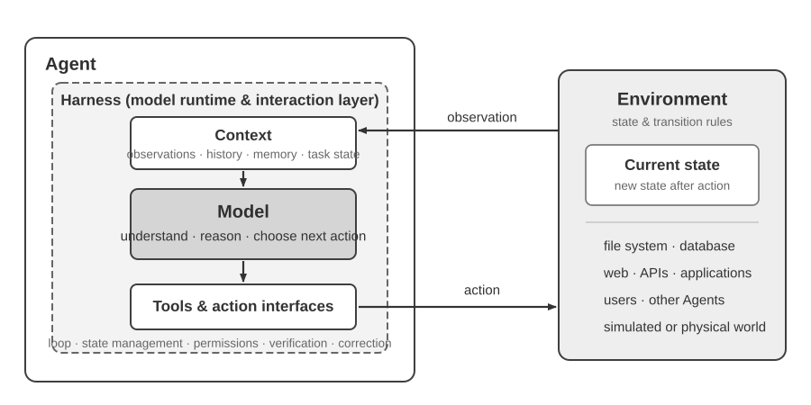
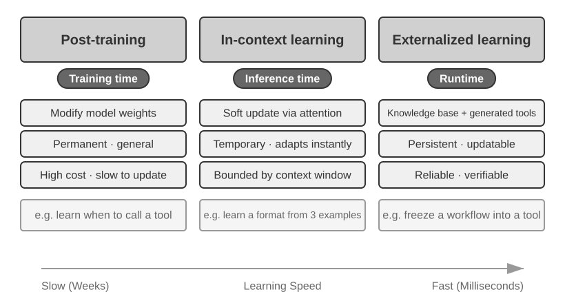
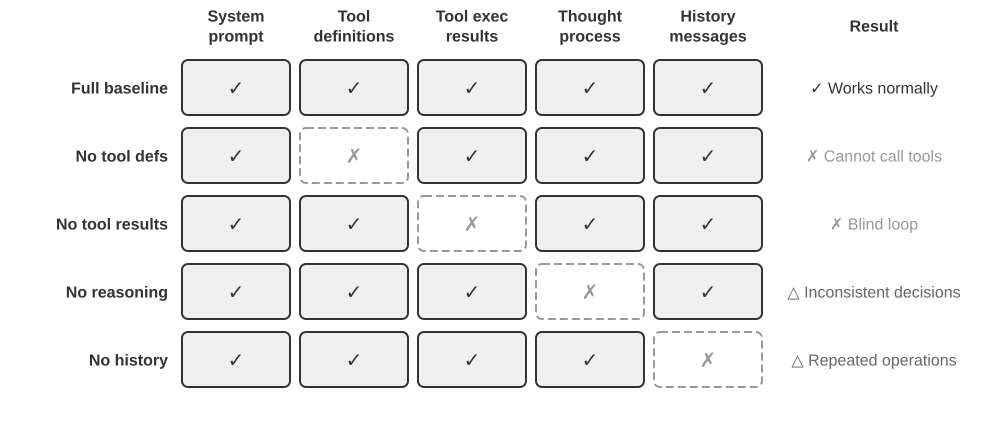
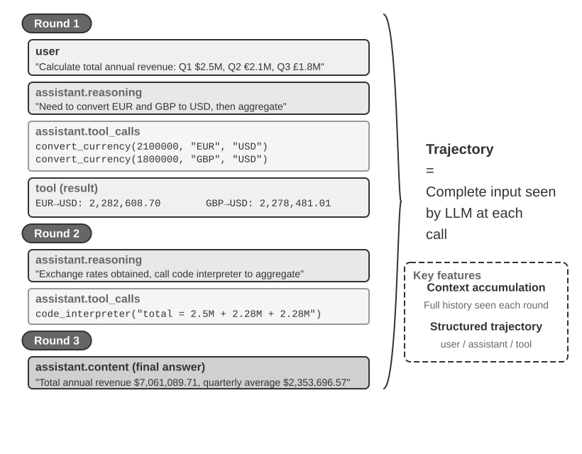
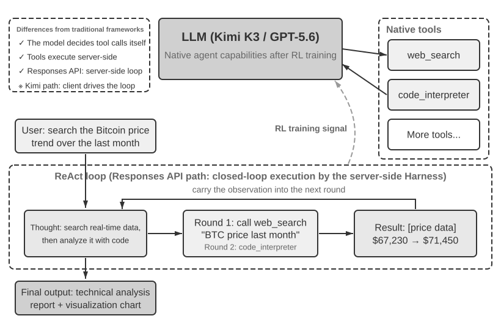
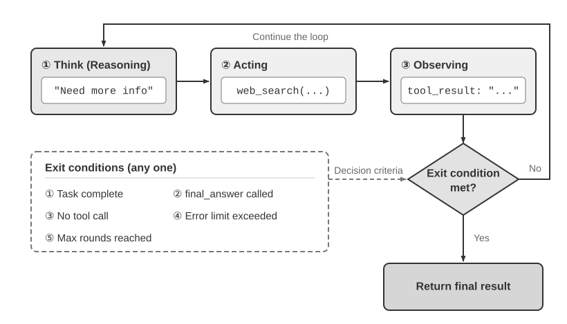

# צעדים ראשונים עם סוכני AI

אם השתמשתם ב‑Cursor כדי לכתוב קוד וראיתם אותו מחפש בבסיס הקוד שלכם, עורך קבצים מרובים ומריץ מחדש בדיקות עד שהן עוברות — כבר השתמשתם בסוכן AI (AI Agent). הדבר נכון גם אם השתמשתם ב‑Deep Research כדי לחקור נושא באמצעות חיפוש וקריאה חוזרים ונשנים, נתתם ל‑Manus לשלוט בדפדפן כדי להשלים משימות מקוונות, ביקשתם מעוזר הטלפון Doubao להזמין כרטיסים או לשלוח הודעות, או שלחתם את Pine AI להתמקח על הוזלת חשבון הטלקום שלכם.

מוצרים אלה לובשים צורות רבות, אך משותפת להם תכונה אחת: הם כבר אינם שיחות פסיביות של "אתם שואלים, הם עונים". הם מתכננים בעצמם את שלבי הביצוע, קוראים לכלים שכל משימה דורשת, ומתאימים את האסטרטגיה שלהם ככל שהתוצאות מגיעות. סוכני AI הופכים לדרך חדשה של אינטראקציה עם מחשבים.

פרק זה מתחיל בדוגמאות מעשיות ועובד לאחור אל עבר רכיבי הליבה של סוכן AI: הקוראים יתנסו באופן בלתי אמצעי במה שסוכנים מודרניים מסוגלים לעשות, יבינו את הארכיטקטורה שמאחוריהם, וילמדו את דפוסי העיצוב ושיטות העבודה המומלצות לבניית מערכות סוכן.

> **טיפ קריאה**: פרק זה הוא המפה המושגית של הספר כולו: סיור תמציתי בנוסחת הליבה, בלולאת ההפעלה, במסגרת ההנדסית ובדפוסי העיצוב של סוכנים. הוא מבסס את אוצר המילים המשותף ואת נקודות הייחוס שישמשו בפרקים הבאים. אל תנסו לשנן כל מושג בקריאה הראשונה; כוונו לתמונה הגדולה. כל פרק מאוחר יותר מרחיב היבט אחד שהוצג כאן, ותוכלו לחזור לפרק זה בכל פעם שתצטרכו להתמצא מחדש.

## סוכן מודרני = LLM + הקשר + כלים

מהותה של מערכת סוכן מודרנית נכנסת לנוסחה תמציתית אחת: **סוכן = LLM (מודל שפה גדול) + הקשר (Context) + כלים (Tools)**. הנוסחה פשוטה ומעשית — בתנאי שכל מונח נקרא בצורה רחבה:

- **ה‑LLM הוא מנוע ההיסק של הסוכן**: הוא יותר מאשר אוסף פרמטרים של מודל; הוא ליבת קבלת ההחלטות של הסוכן, האחראית להבנת כוונה, להיסק, לתכנון ולשיפוט. יכולותיו של LLM נובעות מידע עולם ומיכולת לשונית שנרכשו במהלך **אימון מקדים (pre‑training)**, בתוספת אסטרטגיות קבלת החלטות המקודדות באמצעות **אימון־על (post‑training)** (טכניקות כגון כוונון עדין מונחה ולמידת חיזוק נדונות בפרק 8).
- **הקשר הוא מערך העבודה של המידע של הסוכן**: לא רק הטקסט המוזן למודל, אלא מערך המידע העומד לרשות הסוכן בכל נקודת החלטה — הסביבה, זיכרון המשתמש, ידע תחומי, מצבו שלו והתקדמות המשימה. בדיוק כפי שאדם המקבל החלטה צריך להעריך את המצב, להיזכר בניסיון רלוונטי ולעיין בחומרי עזר, כך חלון ההקשר של הסוכן מכיל את המידע שהוא יכול להשתמש בו באותו רגע.
- **כלים הם ממשקי הפעולה של הסוכן**: לא קומץ פונקציות API שניתן לקרוא להן, אלא מכלול הדרכים שבהן הסוכן יכול לפעול — מקריאות לכלים מוגדרים מראש ועד Skills הנטענים לפי דרישה, מיצירת קוד שיוצר יכולות חדשות בזמן אמת ועד האצלת עבודה לתת‑סוכנים, מפנייה למשתמש ועד תגובה לאירועים חיצוניים.

בניסוח אינטואיטיבי יותר: **סוכן = מנוע היסק + הקשר עבודה + ממשקי פעולה**. המודל מסיק ומחליט, ההקשר מספק את מערך המידע שעליו נשענות ההחלטות הללו, והכלים מספקים את הממשקים שדרכם ההחלטות משפיעות על העולם החיצוני.

מנקודת המבט הקלאסית של למידת חיזוק ובקרה, הסוכן (Agent) והסביבה (Environment) הם שני צדדים של אינטראקציה במעגל סגור, ולא רכיבים זה של זה. הסביבה מחזירה תצפית, הסוכן משתמש בהקשר שלו כדי לבחור את הפעולה הבאה, ופעולה זו משנה את מצב הסביבה ומייצרת את התצפית הבאה.



איור 1‑1 מציג שתי רמות הפשטה. הרמה החיצונית היא האינטראקציה בין **הסוכן לסביבה**: הסביבה כוללת מערכות קבצים, מסדי נתונים, דפי אינטרנט, משתמשים, סוכנים אחרים ועולמות פיזיים או מדומים. הרמה הפנימית היא **מבנה מודל–Harness בתוך הסוכן**: המודל מקבל את החלטות המדיניות; ה‑Harness הוא שכבת זמן הריצה והממשל בתוך גבול הסוכן, הבונה הקשר, חושפת ממשקי כלים, מתחזקת לולאות ומצב, ומיישמת הרשאות, אימות ותיקון. Harness יכול ליצור סביבה, לבודד אותה או לתווך אליה, מבלי להכיל את מצב הסביבה או את כללי המעבר שלה.

לפיכך ניתן להרחיב את הנוסחה ההנדסית כך: ה‑LLM הוא המודל, ואילו הקשר + כלים מהווים את ה‑Harness המינימלי; מערכות ייצור מוסיפות אילוצים, אימות ותיקון בתוך אותו גבול. המשך הפרק עוקב אחר גבול זה.

שלושת הרכיבים הללו מקבילים במדויק לשלושה מושגי ליבה ב‑RL (למידת חיזוק; ראו פרק 8), אך אין מדובר בשקילות חד‑חד‑ערכית מוחלטת: ההקשר הוא הייצוג הפנימי של הסוכן לתצפיות ולהיסטוריה, בעוד שהכלים מגדירים ממשקי תצפית/פעולה שהאובייקטים שבבסיסם נותרים בסביבה.

| אינטואיציה | רכיב הסוכן | מושג ב‑RL | תפקיד |
|---------------|----------------|------------------|---------------------------------------------|
| **מנוע היסק** | LLM | **מדיניות (Policy)** | לוגיקת קבלת ההחלטות הקובעת "מה לעשות הלאה" — בהינתן המידע הנוכחי, לבחור את הפעולה המתאימה ביותר מכלל האפשרויות הזמינות |
| **הקשר עבודה** | בניית הקשר | **תצפיות והיסטוריה** | מארגן תצפיות מהסביבה והיסטוריה קיימת לכדי המידע הדרוש להחלטה הנוכחית |
| **ממשקי פעולה** | ממשקי כלים | **ממשקי תצפית/פעולה** | מגדיר אילו תצפיות הסוכן יכול לקרוא, אילו פעולות הוא יכול להנפיק, ומהו הפורמט של ממשקים אלה |

### מרחבי תצפית ופעולה: הממשק בין המודל לעולם

**מרחב התצפית ומרחב הפעולה מהווים יחד את הממשק בין ה‑LLM לסביבתו החיצונית**. מרחב התצפית מתרגם מידע שבסביבה להקשר שהמודל יכול לעבד; מרחב הפעולה מתרגם החלטות של המודל לפעולות על העולם החיצוני. מידע שמחוץ למרחב התצפית למעשה אינו קיים עבור המודל. פעולה שמחוץ למרחב הפעולה נותרת דבר שהמודל יכול רק להמליץ עליו במילים, גם אם הוא יודע בדיוק מה צריך לעשות.

כתוצאה מכך, **ברגע שהמודל הבסיסי מוחזק קבוע, המנוף ההנדסי־מערכתי העיקרי לשיפור ביצועי הסוכן הוא לעיתים קרובות הגדרה מחדש או הרחבה של מרחבי התצפית והפעולה שלו**. במונחי ספר זה, פירוש הדבר הרחבת ההקשר והכלים. בעיות רבות שנראה כי הן דורשות "מודל חכם יותר" הן למעשה בעיות ממשק: הכניסו לתוך ההקשר את הנתונים הרלוונטיים למשימה או חשפו את הפעולה הנדרשת ככלי, ומשימה שקודם לכן לא הייתה פתירה עשויה להפוך לפתירה.

**Manus: איחוד מרחבים שהיו נפרדים.** לפני הופעת Manus, סוכני ייצור פעלו ברובם בשלושה מסלולים נפרדים: Deep Research, Coding ו‑Computer Use. Manus היה סוכן הייצור הראשון בעל השפעה רחבה שאיחד את שלושתם במערכת אחת. הדפדפן הווירטואלי שלו הרחיב את מרחב התצפית, בעוד שמערכת הקבצים, הרצת הקוד וביצוע הפקודות הרחיבו את מרחב הפעולה. Manus לא הפך לסוכן כללי רק מתוקף החלפת המודל בחזק יותר. הוא לקח את איחוד מרחבי התצפית והפעולה של שלושה סוגי סוכנים, ובכך אפשר לסוכן אחד לחצות את גבולות המוצר הקודמים.

**OpenClaw: הרחבת הממשק אל תוך החיים הדיגיטליים של המשתמש.** OpenClaw דוחף את שני המרחבים החוצה פעם נוספת. הוא מקבל משימות ומחזיר תוצאות דרך ערוצי הודעות שמשתמשים כבר שוהים בהם — WhatsApp,‏ Telegram,‏ Slack,‏ Discord,‏ iMessage ורבים אחרים — כך שניתן להגיע לסוכן כמעט מכל מקום. ה‑Gateway המקומי שלו מחבר יישומי ענן כגון Google Drive ו‑Notion, וכן את מערכת הקבצים המקומית. קבצים המפוזרים בין חשבונות ומכשירים יכולים אפוא, בהרשאה מפורשת של המשתמש, להיכנס למרחב התצפית של סוכן אחד ולהיות מטופלים על ידי כליו. בהשוואה לצורתו המקורית של Manus, שהתמקדה בארגז חול בענן, שבה קבצים היו צריכים בדרך כלל להיות מועלים או לחייב הגדרת מחבר נפרדת, OpenClaw שהוא מקומי־תחילה (local‑first) פורש גבול נתונים רחב יותר. Manus הוסיף מאוחר יותר מחבר Google Drive משלו וגישת שולחן עבודה לקבצים מקומיים, מה שרק מחזק את הטענה: התפתחות מוצר מורכבת פעמים רבות בדיוק מהרחבת מרחבי התצפית והפעולה[^ch1-agent-products].

[^ch1-agent-products]: החומרים הרשמיים של Manus מתארים את ה‑Sandbox המקורי שלו כמכונה וירטואלית מבודדת בענן. בעת הצגת מחבר ה‑Google Drive שלו, Manus הזכיר במפורש את זרימת העבודה המקוטעת הקודמת של הורדה והעלאה ידנית של קבצים בין Drive, שולחן העבודה ו‑Manus. כאשר השיק את My Computer במרץ 2026, הוא כינה את העובדה שעבודה חשובה מתגוררת מקומית ולא בענן כמגבלה יסודית של ארגז החול בענן. ה‑README הרשמי של OpenClaw מתאר עוזר אישי מקומי־תחילה הפועל תמיד על מכשירי המשתמש עצמו ומונה יותר מעשרים ערוצי הודעות; הכלים ומערכת התוספים שלו יכולים להוסיף אינטגרציות ענן ויכולות מקומיות. ראו https://manus.im/blog/manus-sandbox, https://manus.im/blog/manus-google-drive-connector, https://manus.im/blog/manus-my-computer-desktop, https://github.com/openclaw/openclaw, ו‑https://docs.openclaw.ai/tools

הבנת תפקידו של כל רכיב, וכיצד הם משתלבים יחד, היא הבסיס לבניית מערכות סוכן אפקטיביות. נתחיל במוחשי מבין השלושה — הכלים, כלומר ממשקי הפעולה — ונתקדם פנימה אל ה‑LLM וההקשר. תחילה, כך נראית ההשוואה בין סוגי סוכנים שונים לאורך שלושת הממדים הללו:

| מוצר סוכן | הקשר עבודה | ממשקי פעולה | אסטרטגיה |
|-----------------|------------------------|--------------------------|-----------------------------|
| **סוכני קוד (למשל Cursor)** | מסמכי דרישות, בסיס קוד, סביבת טרמינל | פתוח (היסק פנימי, חיפוש קוד, קריאה/כתיבה של קבצים, הרצת פקודות וכו') | פיתוח הדרגתי: הבנת דרישות ← חיפוש קוד רלוונטי ← עריכת קוד ← בדיקה ואימות ← ניפוי שגיאות ותיקון |
| **סוכני חיפוש (למשל Deep Research)** | משאבי אינטרנט, מסדי נתונים אקדמיים, קבצים מקומיים | פתוח (היסק פנימי, שאילתות חיפוש, קריאת רשת, יצירת סיכומים) | העמקה איטרטיבית: התאמת כיוון החיפוש על סמך מידע קיים, וסינתזה הדרגתית של דוח שלם |
| **סוכני שליטה במחשב (למשל Browser Use)** | מסך המחשב, דפי דפדפן, מערכת קבצים | פתוח (היסק פנימי, לחיצה, הקלדה, גלילה, צילומי מסך, הרצת קוד וכו') | תפיסה חזותית + הפעלה: התבוננות במסך ← זיהוי אלמנטים יעד ← ביצוע פעולות ← אימות תוצאות |
| **סוכני עוזר טלפון (למשל Doubao)** | מסך הטלפון, אפליקציות מותקנות | פתוח (היסק פנימי, לחיצה, החלקה, הקלדה, פתיחת אפליקציות וכו') | הבנת כוונה + שליטה באפליקציה: הבנת צורכי המשתמש ← איתור אפליקציית היעד ← ביצוע פעולות ← אישור השלמה |
| **סוכני משימות אישיות (למשל Pine AI)** | פרטי חשבון המשתמש, חשבוניות היסטוריות, בסיס ידע של ספק השירות | פתוח (היסק פנימי, ביצוע שיחות, שליחת דוא"ל, מילוי טפסים, אישור מול המשתמש) | ביצוע משימה רב‑שלבית: איסוף מידע ← גיבוש אסטרטגיית משא ומתן ← יצירת קשר עם ספק השירות ← ניהול משא ומתן ← דיווח תוצאות |

למערכות אלה שלוש תכונות משותפות: **מרחב פעולה פתוח** — לא בחירה מתוך מערך קבוע של כפתורים אלא יצירת שפה טבעית וקוד שרירותיים; **היסק פנימי** — תכנון לפני פעולה; ו**אינטראקציה מתמשכת** — התאמת האסטרטגיה על בסיס משוב מהסביבה. יכולות אלה נובעות בדיוק מהגומלין שבין מנוע ההיסק, הקשר העבודה וממשקי הפעולה — כלומר LLM, הקשר וכלים.

### כלים: ממשקי הפעולה של הסוכן

כלים הם הגשר של הסוכן אל העולם החיצוני. הם הופכים את הסוכן מצופה פסיבי למערכת פעילה שיכולה לחפש, לכתוב קבצים, להריץ קוד, לקרוא ל‑API, לשלוח הודעות או להפעיל ממשקים. ללא כלים, סוכן מוגבל ליצירת טקסט; עם כלים, הוא יכול לפעול על מערכות חיצוניות.

כדי לדון בכלים באופן שיטתי, נוכל למיין אותם לחמישה סוגים לפי כיוון האינטראקציה של הסוכן עם העולם. בשלב זה, סקירה קצרה של התרחישים המייצגים של כל סוג מספיקה כדי לבסס את התמונה הכוללת; פרקים מאוחרים יותר מטפלים בכל אחד לעומק.

**כלי תפיסה** מאפשרים לסוכן לגשת למידע: מנועי חיפוש מספקים נתוני רשת בזמן אמת, מערכות קבצים קוראות מסמכים מקומיים, וממשקי API ומסדי נתונים מתחברים לשירותים חיצוניים ולנתוני ליבה ארגוניים.

**כלי ביצוע** מאפשרים לסוכן לפעול על מערכות חיצוניות: הרצת קוד, פעולות על קבצים, פקודות מערכת וקריאות API חיצוניות הופכות החלטות לפעולות מוחשיות.

**כלי שיתוף פעולה** מאפשרים לסוכן לחלק את העבודה עם סוכנים אחרים: האצלת משימות מתמחות לתת‑סוכנים, בקשת אישור אנושי בנקודות החלטה מרכזיות, או תיאום פעולות במערכות רב‑סוכניות.

**כלי הפעלת אירועים** מופעלים באופן שונה מהותית משלוש הקטגוריות הראשונות: הסוכן אינו קורא להם; הם מגיעים כקלטים חיצוניים שמפעילים את הסוכן להתחיל לעבוד. דוא"ל חדש נכנס, מועד מתוזמן מגיע, או מערכת אחרת מפעילה קריאת Webhook; האירוע מפעיל את הסוכן ומניע היסק ופעולה. הסוכן לעולם אינו קורא להם בעצמו, ובכל זאת הם עדיין ערוץ שדרכו הוא מקיים אינטראקציה עם העולם החיצוני, ולכן אנו מונים אותם במערכת הכלים במובנה הרחב.

**כלי תקשורת עם המשתמש** הם הערוצים שדרכם הסוכן מתקשר עם המשתמש. בעוד שכלי ביצוע משנים את העולם החיצוני, כלי תקשורת נושאים מידע — מוסרים את התקדמות הסוכן, או בדיקה יזומה, באמצעות הודעת טקסט, שיחה קולית, דוא"ל וכן הלאה.

פרק 4 מכסה את הטקסונומיה המלאה ואת עקרונות העיצוב של חמשת הסוגים הללו. איכות עיצוב הכלים קובעת ישירות מה סוכן יכול להשיג באופן אמין: הגדירו ממשקים בעמימות והמודל ישתמש בהם לרעה; טפלו בשגיאות בצורה גרועה וכלי כושל אחד עלול להשאיר את הסוכן תקוע; הגדירו הרשאות רחבות מדי ושגיאה אחת של הסוכן עלולה להפוך לבלתי הפיכה. ככל שתקן ה‑MCP‏ (Model Context Protocol) מתפשט, שילוב כלים נעשה קל יותר.

**קריאה לכלים** (Tool Calling, המכונה גם Function Calling) היא יכולת ליבה של סוכני LLM מודרניים: היא מאפשרת למודל להפעיל כלים חיצוניים באופן מובנה, ובכך להפוך את ה‑LLM ממחולל טקסט טהור למערכת אינטליגנטית שיכולה לפעול דרך ממשקים חיצוניים. ספר זה משתמש במונח "קריאה לכלים" לאורכו.

קריאה לכלים מתנהלת בארבעה שלבים: ראשית, ההקשר מיידע את המודל אילו כלים זמינים (שמות, מטרות, פרמטרים); לאחר מכן המודל מחליט בעצמו אם לקרוא לכלי, לאיזה כלי לקרוא ועם אילו ארגומנטים; בהמשך, לאחר שהכלי רץ, תוצאתו מצורפת להקשר; ולבסוף, המודל מחליט על מהלכו הבא על סמך אותה תוצאה. לולאה זו היא הבסיס ל‑ReAct, שיוצג בהמשך הפרק.

עבור שאילתת מזג אוויר, הייצוג המפושט של תהליך ארבעת השלבים ברמת ה‑API הוא כדלקמן:

```text
Step 1: Declare tools                  Step 2: Model decides to call
tools: [{                             assistant: {
  name: "get_weather",                  tool_calls: [{
  parameters: {                           function: "get_weather",
    city: "string"                        arguments: {city: "Beijing"}
  }                                      }]
}]                                    }

Step 3: Result appended to context    Step 4: Model responds based on result
tool: {                               assistant: {
  tool_call_id: "call_1",               content: "Today in Beijing: 28°C, sunny."
  content: '{"temp":28,"sky":"clear"}' }
}                                     }
```

המפתח רק מגדיר את הכלים ומבצע את הקריאות; המודל עצמו מחליט אם לקרוא, לאיזה כלי לקרוא ואילו ארגומנטים להעביר. פרק 2 בוחן מבנה API זה בפירוט.

בעת עיצוב כלים לסוכן, התחילו מהיכולת הצרה ביותר שהמשימה דורשת, ולאחר מכן הרחיבו בהדרגה ככל שהמשימה נעשית מורכבת יותר. אם המשימה דורשת רק חשבון בסיסי, מחשבון עם פרמטרים מוגדרים היטב מספיק; כאשר היא גדלה לכדי קריאת גיליונות אלקטרוניים, ניקוי ערכים חסרים, חישוב סטטיסטיקות ושרטוט תרשימים, מפרש קוד Python מוגבל קל יותר לשילוב ולחקירה מאשר אוסף הולך וגדל של כלים מתמחים. אך כלליות גם מגדילה את הסיכון לשגיאות ומרחיבה את משטח התקיפה: קוד חייב לרוץ בארגז חול מבודד, עם גישת רשת מושבתת כברירת מחדל, ללא גישה לקבצים מחוץ לספריית העבודה המורשית, ועם מגבלות על זמן ריצה, מעבד, זיכרון וגודל פלט.

באופן דומה, כלי רישום יחיד מתאים לתיעוד הרצה אחת; עבור משימות ארוכות טווח הנמשכות שעות ואף ימים, ספריית עבודה וירטואלית מבוקרת יכולה לשמר תוכניות, תוצאות ביניים, יומני ביצוע ותוצרים סופיים, כך שהסוכן יוכל להמשיך לאורך הרצות מרובות. ספרייה זו צריכה גם להגביל נתיבים הניתנים לקריאה ולכתיבה, קיבולת אחסון וסוגי קבצים, ולמנוע מעבר נתיבים (path traversal) במקום לחשוף לסוכן את מערכת הקבצים כולה של המארח.

כלים כלליים אינם תמיד טובים יותר ממתמחים. פעולות בסיכון גבוה או כאלה הכפופות לאילוצים עסקיים נוקשים — כגון תשלומים, מחיקת נתונים, שליחת דוא"ל ופריסה לייצור — עדיין צריכות להיחשף ככלים ייעודיים עם פרמטרים מפורשים, הרשאות מוגבלות ויכולת ביקורת מקצה לקצה, בתוספת תצוגות מקדימות ואישור אנושי כשנדרש. עקרון הליבה של עיצוב כלים הוא אפוא: **השתמשו ביכולות יסוד כלליות לצורך הרכבה וחקירה; השתמשו בכלים מתמחים כדי לרסן פעולות בסיכון גבוה ולאכוף כללים עסקיים נוקשים**.

### LLM: מנוע ההיסק של הסוכן

מודל השפה הגדול (LLM) הוא ליבת קבלת ההחלטות של הסוכן. בהינתן בקשת משתמש, עליו תחילה להסיק את הכוונה האמיתית (מה שמשתמשים אומרים אינו לרוב מה שהם באמת רוצים), ולאחר מכן לפרק משימה עמומה או מורכבת לשלבים ברי‑ביצוע. לאורך הביצוע הוא ממשיך לקבל החלטות: מה לעשות הלאה, האם לקרוא לכלי, לאיזה, ועם אילו ארגומנטים. יכולת ההבנה–תכנון–ביצוע הזו נובעת מידע שנצבר במהלך האימון המקדים, והיא הבסיס שעליו נשענים כאחד תהליכי עבודה (workflows) וסוכנים אוטונומיים.

יכולת ייחודית של סוכני LLM היא **היסק פנימי** — לפני שהוא פועל, הסוכן יכול לתכנן ולהסיק לגבי המשימה. הדבר אינו משנה את הסביבה החיצונית, ובכל זאת הוא משפר במידה ניכרת את הפעולות שבאות לאחר מכן. יכולת זו נובעת מהאימון המקדים (האימון הראשוני על כמויות עצומות של טקסט מהאינטרנט, שדרכו המודל לומד תבניות לשוניות וידע עולם): המודל שואב מתבניות היסק המקודדות בידע האנושי, ובכללן חוקים מתמטיים, יחסי סיבתיות ואסטרטגיות לפירוק בעיות. לפיכך, בשונה מסוכני למידת חיזוק מסורתיים, סוכני LLM של ימינו אינם חוקרים באמצעות ניסוי וטעייה עיוורים; הם מסיקים על גבי גוף ידע מובנה.

#### מודל כסוכן: כאשר המודל עצמו הופך למוצר

פרדיגמת "מודל כסוכן" (Model as Agent) היא הכיוון החדש ביותר בפיתוח סוכני AI. מודלים מתקדמים מפנימים קריאה לכלים כיכולת מובנית באמצעות אימון־על (ובמיוחד למידת חיזוק): מתי לקרוא לכלי, לאיזה, עם אילו ארגומנטים — המודל מחליט על כל אלה, ללא צורך בתזמור ידני. אין בכך כדי להפחית מחשיבותה של שכבת המסגרת. להפך: ככל שהמודל חזק יותר, כך ה‑Harness הסובב אותו חשוב יותר. המילה Harness התייחסה במקורה לרתמה ולציוד הרכיבה המורכבים על סוס — לא כדי להגביל את יכולתו לרוץ, אלא כדי לכוון את הכוח הזה כראוי. בהקשר הסוכן, המודל הוא הסוס החזק אך בלתי צפוי, ואילו ה‑Harness הוא התשתית ההנדסית המתעלת את יכולתו לכדי ביצוע משימות אמין. הוא כולל ניהול הקשר, ממשקי כלים, אילוצי בטיחות, ומנגנוני אימות ותיקון (ראו את החלק האחרון של פרק זה).

ככל שלמודל יש יותר סמכות החלטה, כך גדלה ההשפעה של החלטה שגויה — מה שמחייב ריסון, אימות ותיקון ברמת פירוט עדינה יותר כדי לשמור על אמינותו. היתרון האמיתי של ספקי מודלים אינו "הפיכת המסגרת לדקה יותר" אלא היכולת לבצע אופטימיזציה משותפת של המודל וה‑Harness הסובב אותו, תוך איטרציה מתמדת.

אך מכאן נובעת שאלה עמוקה יותר: אם מודלים ימשיכו להתחזק, האם ה‑Harness של היום ייבלע בסופו של דבר לתוך המודל? במאמרו "The Bitter Lesson", ריץ' סאטון סקר תבנית שחזרה על עצמה לאורך שבעים שנות מחקר AI‏[^ch1-1]: חוקרים קידדו שוב ושוב את הבנתם בתחום כלשהו לתוך מערכת, השיגו רווחים לטווח קצר, אך בסופו של דבר הפסידו לשיטות כלליות — חיפוש ולמידה — שמתרחבות עם כוח חישוב ונתונים. במבט מבעד לעדשה זו, כמה מהריסון, האימות והתיקון שב‑Harness הם "פריור אנושי" שהמודל נועד להפנים? עמדת ספר זה היא: **לאשרר את הכיוון, להישאר פרגמטיים לגבי הקצב**. מבחינת הכיוון, איננו מפקפקים בכך שמודלים ימשיכו לספוג חלקים מה‑Harness — קריאה לכלים ותכנון ארוך טווח היו תלויים בעבר בתזמור חיצוני, וכיום הם יכולות מובנות של המודל. אולם בפועל, ספיגה זו איטית בהרבה ממה שהאינטואיציה מרמזת: אימון מתקדם בסקאלת זמן של חודשים, ואף מודל אינו יכול להפנים במעבר יחיד את כל האילוצים וההעדפות של עסקים אמיתיים. גבול היכולת הנוכחי של המודל הוא בדיוק המקום שבו ה‑Harness יוצר ערך. הנדסת Harness אינה אפוא התנגדות ל‑Bitter Lesson, אלא יישומו בסקאלת זמן הנדסית: כל מה שהמודל עדיין אינו מסוגל לעשות באופן אמין, ה‑Harness מכסה תחילה; בכל פעם שהמודל מפנים שכבה נוספת, ה‑Harness משיל אותה שכבה וממשיך לתמוך בגבול היכולת הבא.

[^ch1-1]: Sutton, Rich. “The Bitter Lesson”, 2019. http://www.incompleteideas.net/IncIdeas/BitterLesson.html

#### מנגנוני למידה של סוכנים: מהתאמה הקשרית ועד עדכונים מתמידים

הדיון הקודם ציין שמודל יכול להפנים מדיניות שימוש בכלים כיכולת מובנית באמצעות למידת חיזוק. אך שינויים בהתנהגות הסוכן אינם מתרחשים רק במהלך האימון. בהתבסס על היכן מתרחש העדכון וכמה זמן הוא מתמיד, ניתן להבין שינויים אלה כשלושה מסלולים משלימים (איור 1‑2): התאמה הקשרית בתוך המשימה, עדכונים חוצי־משימות לתוצרים חיצוניים, ועדכוני פרמטרים במהלך מחזורי אימון.



**התאמה הקשרית** מתרחשת בתוך המשימה הנוכחית. ברגע שדוגמאות, מצב ותוצאות אחזור נכנסים להקשר, המודל יכול להתאים את התנהגותו מיידית, אך אין בכך כדי לשנות את המצב המתמיד של הסשן הבא. יתרונותיה הם מהירות ועלות נמוכה; מגבלותיה נובעות מחלון ההקשר ומאופן ארגון המידע. פרק 2 מסביר בפירוט כיצד צורת התאמה זו פועלת.

כדי ששינויים יתמידו לאורך משימות, המערכת יכולה לעדכן **תוצרים חיצוניים**: עובדות וניסיון ניתנים לארגון למסמכי ידע, אסטרטגיות הניתנות לביטוי בשפה ניתנות לכתיבה לתוך Prompt או Skill, ונהלים ואילוצים דטרמיניסטיים ניתנים לקידוד בתוכניות וב‑Harness. תוצרים אלה ניתנים לביקורת ולתיקון, אך הסוכן עדיין חייב לגשת אליהם בזמן הביצוע דרך ההקשר או דרך ממשקי הכלים. פרקים 3 עד 5 מבססים את היסודות לידע ולתוכניות, בעוד שפרק 9 דן כיצד ניתן לייצר עדכונים כאלה ממסלולים תפעוליים שהוערכו.

כאשר היעד הוא יכולת רב‑ממדית — כגון הבנת דימות רפואי, סגנון בשפה טבעית, או מדיניות החלטה סמויה — שכללים חיצוניים אינם יכולים לבטא במלואה, יש לעדכן את **פרמטרי המודל** באמצעות אימון־על. עדכוני פרמטרים נושאים עלויות פריסה גבוהות יותר, אך יכולים לייצר הכללה טבעית ורחבה; פרק 8 מציג את שיטותיהם באופן שיטתי. שלושת המסלולים אינם אפוא קטגוריות סותרות אלא מנגנונים מתואמים הפועלים בסקאלות זמן שונות: ההקשר תומך בהתאמה מיידית, תוצרים חיצוניים תומכים בצבירה מבוקרת, והפרמטרים מפנימים יכולות שקשה לבטא במפורש.

### הקשר: מערך העבודה של הסוכן

הקשר הוא מערך המידע העומד לרשות הסוכן בכל נקודת החלטה. בדיוק כפי שאדם המקבל החלטה זקוק לחומרים הנכונים על השולחן — הוראות משימה, מדריכי עזר, התכתבות קודמת, הנתונים העדכניים — חלון ההקשר של הסוכן הוא המידע שהוא יכול להשתמש בו. מנקודת מבט ה‑API (מפורט בפרק 2), ההקשר של כל קריאת LLM מורכב מחמישה חלקים:

- **הנחיית מערכת (System Prompt)**: בשונה מההנחיות שהמשתמשים מזינים במהלך שיחה, הנחיית המערכת נכתבת על ידי המפתח ונשארת קבועה לאורך השיחה כולה. היא "תיאור התפקיד" של הסוכן — המגדיר את זהותו, הרשאותיו וכללי ההתנהגות שלו. הנדסת פרומפט קפדנית של הנחיית המערכת היא הדרך שבה אנו מעצבים את התנהגות ההפעלה של הסוכן. הנחיית המערכת נושאת גם **זיכרון משתמש** המתמיד לאורך סשנים (מידע מותאם אישית כגון העדפות, התנהגות עבר והגדרות רקע; ראו פרק 3), בתוספת מצב סביבתי המוזרק דינמית.
- **הגדרות כלים (Tool Definitions)**: מצהירות על השמות, התיאורים התפקודיים ופורמטי הפרמטרים של הכלים העומדים לרשות הסוכן. ללא הגדרות כלים, הסוכן אינו יכול לזהות או לקרוא לשום כלי — מחקר ביטול (ניסוי 1‑1) יאמת זאת. הגדרות כלים, יחד עם הנחיית המערכת, מהוות את **הקידומת הסטטית** הנותרת ללא שינוי לאורך השיחה. (זו התבנית היסודית; מאז 2026, מסגרות ייצור יכולות גם לטעון סכמות כלים מלאות לפי דרישה בסוף ההקשר מבלי לשבור את הקידומת — ראו את חלק הגדרות הכלים בפרק 2 ובפרק 4.)
- **הודעות משתמש (User Messages)**: קלט מהמשתמש. הודעות משתמש עשויות להכיל גם **ידע חיצוני** שאוחזר דינמית באמצעות RAG‏ (Retrieval‑Augmented Generation, ראו פרק 3 לפרטים) — המכסה מידע שמעבר לתאריך החיתוך של נתוני האימון או ידע תחומי פרטי.
- **הודעות עוזר (Assistant Messages)**: תגובות שנוצרו קודם לכן על ידי המודל, ויכולות להכיל עד שלושה חלקים — `reasoning` (שרשרת המחשבה הפנימית, השומרת על קוהרנטיות ועל פרשנות החלטות), `content` (התגובה למשתמש), ו‑`tool_calls` (הדרך שבה הסוכן פועל). בתגובה מסוימת, שלושת החלקים הללו עשויים שלא להופיע כולם בו‑זמנית: לדוגמה, כאשר הסוכן מחליט לקרוא לכלי, בדרך כלל יש לו רק `reasoning` + `tool_calls`; כאשר הוא נותן תשובה סופית, בדרך כלל יש לו רק `reasoning` + `content`.
- **תוצאות כלים (Tool Results)**: הפלט המוחזר לאחר שמסגרת הסוכן מריצה כלי. תוצאות אלה הן הבסיס הישיר לצעד ההיסק הבא של הסוכן — והן שמאפשרות לו ללמוד מתוצאות במקום לחזור על טעויותיו.

שני הפריטים הראשונים (הנחיית מערכת + הגדרות כלים) מהווים את הקידומת הסטטית; שלושת האחרונים (הודעות משתמש + הודעות עוזר + תוצאות כלים) מהווים את היסטוריית ההודעות הדינמית הגדלה עם כל אינטראקציה. יחד, חמשת החלקים הללו מרכיבים את ההקשר של כל אינפרנס (inference) של LLM.

האם כל רכיב אכן הכרחי? הדרך הישירה ביותר לברר זאת היא **מחקר ביטול (ablation study)** — שיטת האבחון של שלילת גורמים אחד‑אחד: הסירו את רכיב א' וראו אם המערכת עדיין פועלת, לאחר מכן את רכיב ב', וכן הלאה, עד שתרומתו של כל רכיב מתבררת. ניסוי 1‑1 מיישם בדיוק שיטה זו על חמשת הרכיבים לעיל. התוצאות ישירות: ללא הגדרות כלים, הסוכן חסר יכולת פעולה לחלוטין; ללא תוצאות כלים, הוא אינו מקבל משוב מהצעד הקודם, ולכן קורא שוב ושוב לאותו כלי ונתקע בלולאה אינסופית; ללא ה‑reasoning בהודעות העוזר, החלטות עוקבות מתחילות לסתור זו את זו; ללא היסטוריית הודעות, הסוכן מאבד את רציפות המשימה ומתחיל את כל המשימה מחדש מההתחלה, תוך חזרה על צעדים שכבר בוצעו.

> **ניסוי 1‑1 ★★: תפקידו הקריטי של ההקשר**
>
> בחנו כיצד כל רכיב הקשר מעצב את התנהגות הסוכן באמצעות **מחקר ביטול** שיטתי. מבין חמשת הרכיבים לעיל, ארבעה נבדקו — הנחיית המערכת, בהיותה הגדרת הזהות הבסיסית של הסוכן, הוחרגה: בלעדיה אין לסוכן כל מודעות לתפקיד, והבדיקה תהיה חסרת משמעות. כפי שאיור 1‑3 מראה, הניסוי הריץ חמש קבוצות בקרה: קו בסיס שלם המשמר כל רכיב, בתוספת ארבע קבוצות שבכל אחת חסר רכיב אחד, כדי לצפות בהשפעת כל רכיב על ביצועי הסוכן.
>
> 
>
> תוצאות הניסוי חשפו את תפקידו הבלתי ניתן להחלפה של כל רכיב הקשר. **הגדרות כלים** (חלק מהקידומת הסטטית) הן הבסיס ליכולת הפעולה של הסוכן; בלעדיהן, הסוכן אינו יכול לזהות או לקרוא לשום כלי. **תוצאות כלים** הן המפתח לבקרת מעגל סגור; היעדרן שולל מהסוכן משוב ביצוע וגורם לו ליפול ללולאה אינסופית. **תהליך ההיסק** (חלק ה‑reasoning בהודעות העוזר) משמר את הנימוקים להחלטותיו הקודמות של הסוכן, ובכך הופך את ההיסק הכולל לקוהרנטי יותר ומונע החלטות סותרות. **היסטוריית הודעות** (הודעות משתמש, הודעות עוזר ותוצאות כלים מסבבים קודמים) מונעת פעולות מיותרות, שומרת על רציפות ביצוע המשימה, ומונעת חזרה על אותן טעויות.
>
> התובנה המרכזית של הניסוי: **ההקשר קובע איזה מידע יש לסוכן בזמן ההחלטה, והסוכן יכול להחליט רק על בסיס אותו מידע**. בדיוק כפי שאדם שחסרים לו מסמכים קריטיים אינו יכול לגבש שיפוט מבוסס, כך סוכן שחסר לו רכיב הקשר כלשהו סובל מאובדן חמור של יכולת קבלת החלטות — ללא הגדרות כלים הוא אינו יודע אילו כלים קיימים; ללא תוצאות ביצוע קודמות הוא אינו יודע מה כבר נעשה.

### לולאת ReAct

משיש בידינו שלושת הרכיבים, מתבקשת שאלה טבעית: כיצד הם פועלים יחד? לולאת ReAct היא מנגנון הליבה המחבר את ה‑LLM, ההקשר והכלים למערכת אחת. נוכל לבחון אותה צעד אחר צעד.

תבנית הליבה שבה סוכן מבצע משימה נקראת **ReAct**‏ (Reasoning + Acting, היסק + פעולה). השם מזכיר רק היסק ופעולה, אך הלולאה בפועל כוללת שלושה שלבים: המודל תחילה **מסיק** מה לעשות הלאה, לאחר מכן קורא לכלי כדי **לפעול**, ואז **צופה** בתוצאת הכלי ומסיק לגבי הצעד שאחריו. לולאת "היסק ← פעולה ← תצפית ← היסק ← פעולה ← תצפית" זו חוזרת על עצמה עד שהמשימה מסתיימת.

נבחן דוגמה מוחשית — צבירת הכנסות במטבעות מרובים — כדי להבין את **המסלול (trajectory)** של הסוכן: היסטוריית ההודעות הנצברת בזמן שהסוכן עובד, הכוללת הודעות משתמש, הודעות עוזר (עם ההיסק וקריאות הכלים שלהן) ותוצאות כלים. בכל קריאת LLM, ההקשר המלא שהמודל מקבל הוא **הקידומת הסטטית** (הנחיית מערכת + הגדרות כלים) בתוספת **המסלול** (היסטוריית הודעות דינמית) (איור 1‑4). הדבר מראה עובדה מרכזית: **הקשר הסוכן = קידומת סטטית + מסלול**. באופן קונקרטי, הקידומת הסטטית היא שני הרכיבים הראשונים מבין החמישה לעיל (הנחיית מערכת + הגדרות כלים); המסלול הוא שלושת האחרונים (הודעות משתמש + הודעות עוזר + תוצאות כלים, הגדלים עם כל אינטראקציה). מתוך הקשר שלם זה ה‑LLM מייצר את תגובתו הבאה, המצורפת לאחר מכן למסלול לקראת הקריאה שאחריה.



מתווה ה‑Python שלהלן הוא פסאודו‑קוד הסברי, ולא קוד SDK בר‑הרצה; הסימון `python` משמש רק לצורך הדגשת תחביר.

**לולאת הבקרה של ReAct:**

```python
trajectory = [user_request]

repeat:
    context = stable_prefix + trajectory
    decision = Model(context)
    trajectory.append(decision)

    if decision has no tool call:
        return decision.answer

    for call in decision.tool_calls:       # independent calls may run in parallel
        validated_call = Harness.validate(call)
        observation = Environment.execute(validated_call)
        trajectory.append(observation)
```

להלן מבנה של מסלול, בפסאודו‑קוד:

```text
trajectory = [
  {role: "user", content: "Based on the company's quarterly revenue: Q1 2.5M USD, Q2 2.1M EUR, Q3 1.8M GBP, Q4 380M JPY, calculate the company's total annual revenue and average quarterly revenue"},

  # First iteration - LLM receives the above trajectory and generates a response
  {role: "assistant",
   reasoning: "Need to convert all currencies to USD...",
   content: "",  # No direct reply to the user
   tool_calls: [
     {name: "convert_currency", args: {amount: 2100000, from: "EUR", to: "USD"}},
     {name: "convert_currency", args: {amount: 1800000, from: "GBP", to: "USD"}},
     {name: "convert_currency", args: {amount: 380000000, from: "JPY", to: "USD"}}
   ]},

  # Agent framework executes tools, adds results to trajectory
  {role: "tool", content: "EUR->USD: 2282608.7"},
  {role: "tool", content: "GBP->USD: 2278481.01"},
  {role: "tool", content: "JPY->USD: 2541806.02"},

  # Second iteration - LLM receives the complete trajectory, including tool results
  {role: "assistant",
   reasoning: "Conversion results obtained, now need to aggregate and calculate...",
   content: "",
   tool_calls: [
     {name: "code_interpreter", args: {code: "total = 2500000 + 2282608.7 + ..."}}
   ]},

  {role: "tool", content: "Total: $9,602,895.73, Average: $2,400,723.93..."},

  # Third iteration - LLM receives the complete trajectory and generates the final answer
  {role: "assistant",
   reasoning: "All calculations complete, summarizing results...",
   content: "FINAL ANSWER: Total revenue $9,602,895.73..."}
]
```

שימו לב שהנחיית המערכת והגדרות הכלים אינן מוצגות במסלול — הן משמשות כקידומת הסטטית ומצורפות אוטומטית לפני המסלול לפני כל קריאת LLM.

בניסוי שלנו, לולאה זו הייתה גלויה בבירור. בסבב הראשון, הסוכן ניתח את המשימה וקרא לשלושה כלי המרת מטבע במקביל; בשני, הזין את תוצאות ההמרה למפרש קוד לצורך החישוב עתיר המשאבים יותר; בשלישי, לאחר שווידא שכל החישובים הושלמו, הפיק את התשובה הסופית. משימה מורכבת ורבת‑שלבים הושלמה ב‑3 איטרציות ו‑4 קריאות לכלים.

בעיצוב הבסיסי ביותר הזה, ההקשר שה‑LLM רואה נצבר בהתמדה. כל קריאת LLM מקבלת את המסלול המלא, ולכן המודל יודע באיזה שלב של המשימה הוא נמצא, מה נוסה קודם לכן, ומה הייתה התוצאה. בדיוק כפי שאנשים ממשיכים לסקור ולסכם תוך כדי פתרון בעיה, כך הסוכן שומר על מבט כולל של המשימה באמצעות המסלול שלו. ומכיוון שהמסלול מובנה — הודעות משתמש, הודעות עוזר (היסק + קריאות כלים) ותוצאות כלים מופרדות זו מזו בבירור — המערכת ניתנת לפרשנות ולניפוי שגיאות במידה רבה.

המסלול הוא יותר מרישום ביצוע; הוא עדות ליכולת הסוכן. ניתוח מסלולים בקנה מידה גדול חושף דפוסי התנהגות, נתיבי החלטה טובים יותר ועיצובי כלים טובים יותר. נתוני מסלול ניתנים אף לזיקוק לבסיס ידע, או לשימוש לאימון מודלי סוכן חזקים יותר באמצעות למידת חיזוק — וכך נסגרת לולאת הלמידה מניסיון.

כעת, משהבנו את לולאת ההפעלה של הסוכן, נבחן שני ניסויים כדי לראות כיצד מודלים שונים מניעים אותה.

> **ניסוי 1‑2 ★: יכולת הסוכן המובנית של Kimi K3**
>
> ניסוי זה מדגים את יכולת הסוכן המובנית של **Kimi K3**, דוגמה לפרדיגמת "מודל כסוכן". Kimi K3 הוא מודל תערובת מומחים (MoE, Mixture of Experts) בעל כ‑2.8 טריליון פרמטרים. ניתן לראות ב‑MoE צוות של מומחים: עבור כל סוג בעיה, המערכת מפעילה רק את המומחים הבודדים המתאימים לה ביותר ולא את המודל כולו, ובכך משמרת את היכולת מבלי לשלם את מלוא מחיר היעילות. ל‑Kimi K3 חלון הקשר של מיליון טוקנים, הבנה חזותית מובנית, ו"מצב חשיבה" הפעיל תמיד. באמצעות למידת חיזוק, הוא הפנים את **מדיניות ההחלטה** של קריאה לכלים כיכולת מובנית: מתי לקרוא לכלי, לאיזה כלי לקרוא ואילו ארגומנטים להעביר — כל אלה מוכרעים על ידי המודל, מה שמאפשר לו לבצע משימות כגון חיפושי רשת באופן אוטונומי. ליתר דיוק, מה שמופנם היא ההחלטה על *מתי וכיצד לקרוא*; הכלים עצמם, כגון `web_search` ו‑`code_runner`, עדיין רצים בצד השרת ככלים מובנים ברמת ה‑API. Kimi מריץ את הכלים הרשמיים הללו באמצעות מנוע סקריפטים בצד השרת בשם Formula.
>
> התצפיות המרכזיות הן שהמודל מחליט מתי לחפש ומה לחפש, ובכך מגלה אוטונומיה אמיתית; הוא מתאים את האסטרטגיה ככל שתוצאות החיפוש מגיעות ושופט האם יש בידיו די מידע. כדאי להבהיר תפיסה שגויה נפוצה: **למידת חיזוק מעניקה למודל את מדיניות ההחלטה**, ולא את הכלים עצמם. היא מלמדת מתי לקרוא לכלי, באיזה כלי לבחור, אילו ארגומנטים להעביר, האם להמשיך לאחר קבלת תוצאה, וכיצד לשרשר עשרות או מאות קריאות לכדי היסק קוהרנטי; שיפוטי ה*האם וכיצד להשתמש* הללו הם שנכתבים לתוך משקלי המודל. **הכלים וביצועם מסופקים על ידי מסגרת הסוכן או על ידי כלים מובנים ב‑API**: המימושים של `web_search` ו‑`code_runner`, ארגז החול לקוד, והתשתית המנפיקה קריאות ומחזירה תוצאות — כולם שוכנים מחוץ למודל. RL מבצע אופטימיזציה למדיניות ההחלטה; הוא אינו מטמיע מנוע חיפוש או ארגז חול לקוד לתוך משקלי המודל. לפיכך, לולאת התזמור לא נעלמה; היא עברה מהלקוח לשרת, בעוד שקבלת ההחלטות עברה לתוך המודל[^ch1-2].
>
> [^ch1-2]: תודה לקורא asdlem על שהצביע והבהיר, באמצעות GitHub Issue #30, את ההבחנה שמה ש‑RL מפנים היא מדיניות ההחלטה של קריאה לכלים, ולא מנגנון ביצוע הכלים. ראו https://github.com/bojieli/ai-agent-book/issues/30
>
> יתרונו הבולט של Kimi K3 במשימות סוכן הוא **יציבות קריאות הכלים בשרשראות ארוכות** — הוא מסוגל לקיים 200–300 קריאות כלים רצופות עם היסק קוהרנטי לאורך כולן, הרבה מעבר לעשרות הבודדות שבהן רוב המודלים מתחילים להידרדר. K3 עבר אופטימיזציה למשימות תכנות ארוכות טווח ולעומסי עבודה של סוכנים, ושוחרר בשתי גרסאות: K3 Max (לשיחה ולמשימות סוכן) ו‑K3 Swarm Max (לעיבוד מקבילי בקנה מידה גדול). כמודל בקוד פתוח, הוא משתווה למערכות סגורות מהשורה הראשונה במדדי הנדסת תוכנה וסוכנים — עדות לכך שלמידת חיזוק יכולה להעניק למודל יכולת סוכן מובנית.

> **ניסוי 1‑3 ★: יכולת Deep Research מובנית של GPT‑5.6**
>
> הניסוי השני משתמש ב‑**OpenAI GPT‑5.6** כדי להראות כיצד מודל מתקדם, הנתמך בכלים מובנים ברמת ה‑API, סוגר את לולאת התזמור "חיפוש—קריאה—ניתוח" בצד השרת עבור Deep Research. תכונה נוחה אחת של GPT‑5.6 היא **קריאה חופשית לכלים (Freeform Tool Calling)**. באופן מסורתי, מודל הקורא לכלי חייב לסדר כל פרמטר לתוך JSON נוקשה (פורמט נתונים מובנה), בדומה למילוי טופס עם כללי עיצוב קשיחים. קריאה חופשית לכלים (המוצהרת ב‑API באמצעות כלי מסוג `type: "custom"`) מאפשרת למודל לשלוח טקסט גולמי ישירות לכלי (קטע קוד Python, שאילתת SQL), ובכך להימנע לחלוטין מבריחת תווים ב‑JSON. ראוי להדגיש שמדובר באבולוציה של פורמט הפרמטרים של ה‑API, ולא בחדשנות בארכיטקטורת המודל — לולאת קריאת הכלים בצד הלקוח (זיהוי `tool_calls` ← ביצוע ← החזרת התוצאה) נותרת זהה; רק הארגומנטים משתנים ממחרוזת JSON לטקסט גולמי.
>
> GPT‑5.6, בשילוב עם הכלים המובנים **חיפוש רשת ומפרש קוד** של ה‑Responses API, מספק את מנגנון הליבה של Deep Research: המודל יכול לחפש באופן אוטונומי מידע בזמן אמת ברשת ולכתוב קוד לניתוח מעמיק, ובכך לאפשר תהליך מחקר איטרטיבי של "חיפוש ← קריאה ← ניתוח ← חיפוש נוסף". לדוגמה, מול שאלה כמו "מהו המרחק הקצר ביותר בין בירות 10 מדינות ASEAN?", GPT‑5.6 מחפש אוטומטית את הקואורדינטות הגאוגרפיות של כל בירה, ולאחר מכן כותב קוד Python לחישוב מרחק המעגל הגדול בין כל זוגות הבירות, ולבסוף מזהה את הזוג הקרוב ביותר. באופן דומה, במשימה כגון "חפש את מגמת הביטקוין בחודש האחרון ובצע ניתוח טכני", הוא יכול לשלוף נתוני מחיר בזמן אמת ממקורות נתונים פיננסיים מרובים, להשתמש בספריות ניתוח טכני מקצועיות לחישוב ממוצעים נעים, RSI, MACD ומדדים טכניים נוספים, לייצר תרשימים חזותיים ולספק המלצות מסחר.
>
> חשוב מכך, GPT‑5.6 מפנים ברמת המודל את פילוסופיית העיצוב של מוצר **OpenAI Deep Research**, ומציג **תהליך הבהרת כוונה**. בהינתן בקשת מחקר, GPT‑5.6 אינו מתחיל לבצע מיד; הוא תחילה מבהיר את כוונתו האמיתית של המשתמש באמצעות סדרת שאלות. עבור "חפש את מגמת הביטקוין בחודש האחרון ובצע ניתוח טכני", הוא ישאל תחילה: "איזה מקור נתונים אתה מעדיף? אילו מדדים טכניים תרצה שאנתח?" הבהרה אינטראקטיבית זו מאפשרת ל‑GPT‑5.6 להפיק דוחות מחקר מדויקים יותר ותואמים יותר למה שהמשתמש באמת צריך.
>
> GPT‑5.6 הוא דוגמה בשלה ל"מודל כסוכן" — חיפוש רשת, מפרש הקוד וכלים מובנים אחרים של ה‑Responses API רצים במעגל סגור בשרת; לולאת התזמור עוברת מהלקוח לשרת ה‑API, מה שמפשט את מימוש הלקוח. המודל עדיין מנפיק קריאות כלים סטנדרטיות; פשוט אין עוד צורך שהלקוח יבנה בעצמו את מסגרת התזמור של "חיפוש—קריאה—ניתוח". ההיבט הראוי לציון ביותר בו הוא מנגנון הבהרת הכוונה: במקום לבצע משימה מיד, המודל תחילה מאשר מה המשתמש באמת צריך, ורק אז מגבש אסטרטגיית מחקר. הפער בין "מה שהמשתמש אמר" ל"מה שהמשתמש באמת רוצה" מטופל לפני שהביצוע מתחיל.
>
> חשוב לציין שניסוי זה אינו קשור לספק כלשהו. קוראים ללא קרדיטים ב‑OpenAI יכולים לשחזר אותו עם ספקים המציעים כלים מנוהלים שקולים. לדוגמה, ה‑Responses API של qwen3.7‑plus מבית Alibaba Cloud Bailian כולל אף הוא `web_search` ו‑`code_interpreter` מובנים; החיפוש המנוהל באמצעות Formula ו‑`code_runner` של Kimi K3 מספקים יכולת מאותו סוג.
>
> איור 1‑5 ממחיש את הארכיטקטורה המלאה של קריאה מובנית לכלים תחת פרדיגמת "מודל כסוכן", לצד תהליך הביצוע של ReAct ב‑Kimi K3 וב‑GPT‑5.6 במשימות מהעולם האמיתי.
>
> 

## הנדסת Harness: תחרותיות שמעבר למודל

בשלב זה אתם מבינים כיצד סוכן עובד בליבתו: LLM מריץ את לולאת ReAct, מונחה על ידי הקשר, ומשתמש בכלים כדי להשלים את המשימה. הניסויים לעיל מראים שהמנגנון הבסיסי עובד — וגם חושפים עד כמה הוא שביר. המודל עלול להזות (להמציא כלים או פרמטרים שאינם קיימים), לבחור בכלי הלא נכון, או להיכשל בהתאוששות משגיאה. בין הדגמה עובדת למוצר אמין נפער פער משמעותי, ואותן שבירויות הן בדיוק מה שהנדסת Harness נועדה לתקן. המחצית הראשונה של פרק זה ענתה על השאלה מהו סוכן; המחצית השנייה עונה כיצד סוכן פועל באופן אמין בייצור.

הסעיפים הקודמים ביססו את נוסחת הליבה: **סוכן = LLM + הקשר + כלים**. היא מתארת את **ההרכב הפנימי** של הסוכן: מנוע היסק, הקשר עבודה וממשקי פעולה. הנדסת Harness מוסיפה מבט שני, **ברמת המימוש**, על אותה מערכת: התייחסו ל‑LLM כאל רכיב ליבה אחד (המודל), וקראו לכל קוד התמיכה הבנוי סביבו Harness. שני המבטים אינם יריבים; הם מתארים את אותה מערכת ברמות הפשטה שונות. אנו עוברים למילה הכללית יותר "מודל" מכיוון שעקרונות הנדסת ה‑Harness חלים על כל מודל שיכול להסיק ולקרוא לכלים, ולא על סוג מסוים אחד. ליבת ה‑Harness היא "הקשר + כלים" של הנוסחה המקורית, בתוספת שלוש שכבות של אמצעי הגנה: **ריסון (Constrain)** (מה מותר ומה אסור לסוכן לעשות), **אימות (Verify)** (האם הוא עשה את הדבר נכון), ו**תיקון (Correct)** (כיצד להתאושש כשלא).

בהרחבה כמשוואה, ההרכב המלא ברמת ייצור הוא:

> **סוכן = מודל + Harness**
>
> **Harness = ניהול הקשר + ממשקי כלים + ריסון + אימות + תיקון**
>
> **סוכן ↔ סביבה**

הדגמה מינימלית זקוקה רק למודל ול‑Harness שיכול לבנות הקשר ולחשוף כלים; מערכת ייצור חייבת להוסיף ריסון, אימות ותיקון בתוך אותו גבול. לדוגמה, סוכן החזרים כספיים יכול להציב את המדיניות שלו בהקשר, לרסן קריאות בכללי הרשאה וסכום, לאמת את התוצאה מול מצב מסד הנתונים, ולנסות שוב או ליפול לחלופה לאחר פסק זמן. הנדסת Harness חוקרת בדיוק את קוד זמן הריצה והממשל הזה — מחוץ למודל ובתוך הסביבה.

ליתר דיוק, ה‑Harness אינו כל מה שנמצא מחוץ למודל: הוא שכבת זמן הריצה והממשל **בתוך גבול הסוכן ומחוץ למודל**. הוא מתווך את האינטראקציה מודל–סביבה אך אינו כולל את הסביבה עצמה. הגדרות כלים, מתאמי קריאה, הרשאות ארגז חול ומנגנוני איפוס שייכים ל‑Harness; קבצים ותהליכים המשתנים בתוך ארגז החול, מסדי נתונים חיצוניים, דפי אינטרנט, משתמשים והעולם הפיזי שייכים לסביבה. מיקום הפריסה אינו משנה גבול מושגי זה. ליבת ה‑Harness היא ניהול הקשר וממשקי כלים, שסביבם נבנים שלושה סוגים של אמצעי הגנה הנדסיים:

| תפקיד | אחריות במשפט אחד / עקרון ליבה | דוגמה מעשית | ראו פרק |
|---|---|---|---|
| **הקשר** | מספק למודל מידע רלוונטי; מספיקות מידע: לוודא שהסוכן מקבל החלטות על בסיס מידע מספק בכל נקודת החלטה | הנחיות מערכת, בסיסי ידע, שורות מצב של הסוכן, שאילתות עוקפות מסוג Sidecar | פרקים 2 ו‑3 |
| **כלים** | מספק למודל ממשקי פעולה; ממשק ברור: שמות כלים אינטואיטיביים, פרמטרים עם דוגמאות, גבולות מוסברים | כלי MCP, מפרש קוד, כלי חיפוש | פרק 4 |
| **ריסון** | מגדיר גבולות התנהגות — מה ניתן ומה לא ניתן לעשות; ברירות מחדל בטוחות בכשל: כל היכולות כבויות כברירת מחדל וחייבות להיות מופעלות במפורש (בדומה לניהול הרשאות באפליקציות מובייל) | ב‑Claude Code, כל כלי דורש כברירת מחדל הרשאת משתמש לפני הביצוע | פרק 4 |
| **אימות** | שופט אוטומטית את נכונות תוצאות ביצוע הכלים; בידוד קלט: בדיקות אבטחה מסתכלות רק על נתונים מובנים (למשל שדות JSON שהוחזרו על ידי כלים), ולא על טקסט חופשי שנוצר על ידי המודל (מכיוון שתוקפים עלולים לתמרן את פלט המודל באמצעות הזרקת פרומפט) | בדיקות Linter, מערכות טיפוסים, אימות תוצאות קריאה לכלים | פרקים 5 ו‑6 |
| **תיקון** | מתאושש או מבצע רולבק אוטומטית כשמתגלות בעיות; אין לחשוף מצבי ביניים עד שכשל אושר כבלתי ניתן לשחזור (למשל לנסות שוב בשקט קריאת כלי שנכשלה במקום להציג למשתמש תוצאה חצי גמורה) | ניסיונות חוזרים שקטים, יצירת המשך, נפילה לשיפוט אנושי לאחר כשלים רצופים (מנגנון מפסק) | פרקים 2 ו‑5 |

לולאת בקרת המודל הבסיסית מוצגת בפסאודו‑קוד הבא:

```python
observation = Environment.observe()
trajectory = [observation]
while true:
	actions = Model(Harness.build_context(trajectory))
	if len(actions) == 0:
		break
	allowed_actions = Harness.constrain(actions)
	observation = Environment.apply(allowed_actions)
	if not Harness.verify(Environment):
		observation = Harness.correct(Environment)
	trajectory.append(allowed_actions, observation)
```

שלד זה משמיט בכוונה פרטי מימוש. לולאת הודעות ה‑API המלאה מופיעה בפרק 2; כלים ואימות אוטומטי מכוסים בפרקים 4 ו‑5 בהתאמה.

הקשר וכלים מאפשרים לסוכן להשלים משימות — להבין את המשימה ולפעול עליה. ריסון, אימות ותיקון מבטיחים שהוא יעשה זאת באופן אמין ובטוח — לא כמשהו נפרד מהקשר וכלים, אלא כהנדסה השומרת עליהם פועלים באופן אמין בייצור. לאורך עקומת הבשלות של מוצרי סוכן, הדגש בין שתי הקבוצות הללו משתנה.

מסגרות סוכן מוקדמות התמקדו בהקשר ובכלים: תנו למודל כלים, תנו לו הקשר, ואפשרו לו להשלים משימות. מערכות ברמת ייצור העבירו את מרכז הכובד שלהן לריסון, אימות ותיקון: לוודא שקריאות לכלים בטוחות, שההקשר מנוהל, ושניתן להתאושש משגיאות.

קחו למשל את Claude Code. הרוב המכריע של קוד ה‑Harness שלו עוסק בריסון, אימות ותיקון, ולא בהקשר ובכלים — הכלים עצמם (קריאה/כתיבה של קבצים, הרצת פקודות, חיפוש) הם רק חלק קטן; אמצעי ההגנה הבנויים סביבם הם הליבה האמיתית. מנגנונים אלה כוללים:

- **ניהול מצב תהליך**: עוקב אחר איזה שלב הסוכן מבצע כרגע
- **דחיסת הקשר רב‑שכבתית**: גוזמת מידע אוטומטית כשיש יותר מדי ממנו
- **סיווג הרשאות**: שולט אילו פעולות דורשות אישור משתמש
- **מפסק (Circuit Breaker)**: מפסיק אוטומטית לנסות שוב לאחר שגיאות חוזרות, כך שפעולה כושלת אחת אינה מתפשטת בכל המערכת
- **מנגנוני התאוששות משגיאות**: תופסים חריגות, מבצעים רולבק למצב היציב האחרון, מנסים שוב, או מעבירים לטיפול אנושי

**התעשייה עוברת מהשלמת משימות להשלמת משימות אמינה, מה שהופך את הנדסת ה‑Harness ליתרון התחרותי המרכזי של מערכות סוכן.**

### מהנדסת פרומפט להנדסת לולאה: התפתחות הפרדיגמות ההנדסיות

במבט לאחור על התפתחות הנדסת יישומי AI, מסתמן קשת אבולוציונית ברורה:

**הנדסת פרומפט (Prompt Engineering)** הייתה גל החדשנות הראשון — שיפור איכות הפלט באמצעות ליטוש ההוראות בשפה טבעית המוזנות למודל.

**הנדסת הקשר (Context Engineering)** הייתה הגל השני — ההבנה שאופטימיזציה של הפרומפט בלבד אינה מספיקה: כל המידע שהמודל יכול לראות (הוראות מערכת, הגדרות כלים, היסטוריית שיחה, ידע חיצוני) חייב להיות מנוהל באופן שיטתי.

**הנדסת Harness** הייתה הגל השלישי — היא מרחיבה את המבט מ"איזה מידע המודל מקבל" ל"באיזו מערכת המודל רץ", וכוללת את כל התשתית שמחוץ למודל: מנגנוני ריסון, שיטות אימות, לולאות משוב, התאוששות משגיאות.

**הנדסת לולאה (Loop Engineering)** באה אחריה, ומרחיבה את המבט מהרצה בודדת לפעילות אוטונומית מתמשכת לאורך הרצות: מי מגלה את פיסת העבודה הבאה, מתי לאמת, ומתי המשימה נחשבת גמורה באמת (פרק 10 מפתח זאת לצד מערכות שיתוף פעולה רב‑סוכניות).

ביולי 2026 החלה התעשייה להשתמש ב**הנדסת גרף (Graph Engineering)** עבור נקודת מבט תזמורית ברמה גבוהה יותר: ארגון לולאות סוכן, תוכניות דטרמיניסטיות ואישורים אנושיים לכדי גרף ביצוע מפורש, שבו צמתים מספקים יכולות, קשתות מגדירות ניתוב ותלויות, ומצב מובנה נע לאורך אותן קשתות ונשמר בגבולות מרכזיים[^ch1-graph-engineering].

[^ch1-graph-engineering]: Josh C. Simmons השתמש בשם במפורש במאמרו מ‑4 ביולי 2026, *We Are Entering the Graph Engineering Phase*, וסיכם אותו במונחים של צמתים, קשתות מטופסות ומצב עם נקודות ביקורת. ב‑18 ביולי, שאלתו של Peter Steinberger בדבר האם הדיון עבר מלולאות לגרפים סייעה להפצת השם. הפרקטיקות קדמו לתווית: התיעוד הרשמי של LangGraph, Microsoft Agent Framework ו‑Google ADK מתאר אותן כתזמור גרפים או כתהליכי עבודה מבוססי גרף. ראו https://www.drjoshcsimmons.com/writing/we-are-entering-the-graph-engineering-phase, https://x.com/steipete/status/2078277297791189132, https://docs.langchain.com/oss/python/langgraph/overview, https://learn.microsoft.com/en-us/agent-framework/workflows/, ו‑https://adk.dev/workflows/.

חמשת השלבים הללו אינם מחליפים זה את זה אלא מהווים שכבות מקוננות: הנדסת פרומפט היא תת‑קבוצה של הנדסת הקשר, שהיא תת‑קבוצה של הנדסת Harness, שהיא תת‑קבוצה של הנדסת לולאה. כל שכבה מרחיבה את תחום העניין וההשפעה של המהנדס מעבר לקודמתה. **ככל שיכולות המודלים מתכנסות וחדלות להיות הגורם המבדל המכריע, היתרון התחרותי עובר להנדסה שמחוץ למודל.**

פרקטיקה הנדסית עדכנית תומכת בתפיסה זו. עבודתה של LangChain על Terminal Bench 2.0 (מדד המעריך את יכולת הסוכן להשלים משימות מורכבות בסביבת טרמינל) היא דוגמה בולטת: סוכן הקוד שלהם השתפר מ‑52.8% ל‑66.5% (וזינק ממקום מחוץ ל‑30 המובילים לחמישייה הראשונה בטבלה). מה שהשתנה לא היה המודל אלא ה‑Harness — הם גרמו לסוכן לבדוק את תוצאות הביצוע שלו עצמו, לזהות מתי הוא תקוע בלולאה חזרתית, וללטש את אסטרטגיית ההיסק שלו.

### עקרונות ליבה לבניית סוכנים אפקטיביים

בהתבסס על ניסיונה של Anthropic, מערכות סוכן מוצלחות פועלות לפי שלושה עקרונות ליבה.

**שמרו על פשטות.** התחילו מהפתרון הפשוט ביותר והוסיפו מורכבות רק כשזה באמת הכרחי. קריאות API ישירות עדיפות על מסגרות מורכבות; קוד ברור עדיף על הפשטה מתוחכמת — כל שכבת הפשטה נוספת היא נקודה עיוורת חדשה בזמן ניפוי שגיאות.

**שמרו על שקיפות.** הציגו בבירור את שלבי התכנון של הסוכן, את יומני הביצוע ואת מסלול ההחלטות. אין זו רק נוחות לניפוי שגיאות; זהו תנאי מקדים לאמון המשתמשים — שגיאה בתוך קופסה שחורה קשה לאיתור או לתיקון מבחוץ.

**עצבו ממשק כלים מובנה היטב (ACI, Agent‑Computer Interface).** ACI פירושו עיצוב הממשק מנקודת מבטו של הסוכן — קל לסוכן להבין ולהשתמש — ולא מנקודת מבטו של המתכנת, כמו ב‑API מסורתי. שמות הכלים והפרמטרים צריכים להיות אינטואיטיביים, ובכל מקום שבו שימוש שגוי סביר, העיצוב צריך להפוך את הטעות לבלתי אפשרית מלכתחילה: הפינה החתוכה של כרטיס SIM מאפשרת לו להיכנס למגש בכיוון אחד בלבד, ומיקרוגל מסרב לחמם כשדלתו פתוחה. בתעשיית הייצור מכנים את פילוסופיית "עיצוב שגיאות החוצה" הזו **Poka‑yoke**, מונח ממערכת הייצור של טויוטה. כלי מעוצב גרוע עלול לגרום אפילו למודל החזק ביותר להיכשל שוב ושוב: הממשק הוא הערוץ היחיד בין המודל לכלי, וממשק עמום מוגבר לכדי שגיאה מערכתית.

שלושת הסעיפים הבאים עוסקים בשלושה נושאים עצמאיים אך חשובים בהנדסת Harness: בחירת מודל, דפוסי תזמור, ומעקות בטיחות. אף אחד מהם אינו שייך לחמשת מרכיבי ה‑Harness במובן הצר, אך כולם בלתי נמנעים בפרקטיקה ההנדסית.

### כיצד לבחור מודל

לפני שנדון בדפוסי תזמור, עלינו לענות תחילה על שאלה מעשית: איזה סוג מודל צריך להניע את הסוכן שלכם?

המודל הוא הבסיס לאינטליגנציה של הסוכן, ובחירת המודל הנכון חשובה לעיתים קרובות יותר מכל כמות של כוונון פרומפטים. שחרורי מודלים נעים מהר מכדי שהמלצות על גרסאות ספציפיות יישארו שימושיות, ולכן סעיף זה מציע כיוונים במקום.

**מודלים בקוד סגור.** שני ספקי המודלים הסגורים הנפוצים ביותר בפיתוח סוכנים כיום הם OpenAI (סדרות GPT/o) ו‑Anthropic (סדרת Claude). מודלים סגורים בדרך כלל מובילים ביכולת אך יקרים יותר ומוגבלים על ידי מדיניות ה‑API של הספק. בעת בחירת מודל, אל תסתמכו רק על טבלאות דירוג; **הערכו אותו על המשימות שלכם** (ראו פרק 7).

**מודלים בקוד פתוח.** נכון לכתיבת שורות אלה, מודלים בקוד פתוח מפגרים אחר מודלים סגורים בלא יותר מששה חודשים, בעוד שעלותם נמוכה משמעותית. אם תרחיש העסקי שלכם אינו דורש את יכולת המודל הגבוהה ביותר, מודל בקוד פתוח הוא בחירה פרגמטית. מודלים בקוד פתוח הם זולים, תומכים בפריסה פרטית ומאפשרים התאמה אישית בכוונון עדין, מה שהופך אותם למתאימים לתרחישים רגישי עלות או כאלה עם דרישות ציות לנתונים. DeepSeek, Kimi ו‑GLM נמנים עם המודלים הסיניים החזקים יותר ביכולות סוכן. שימו לב שמודלים נבדלים מאוד ביכולת קריאה לכלים, ולכן הקפידו לבדוק בתרחיש הספציפי שלכם לפני שאתם מתחייבים.

**מעבר ליכולת, שקלו את גבולות המדיניות של המודל.** למודל עשויה להיות היכולת הטכנית לבצע משימה מבלי שהמוצר המארח אותו מתיר למשתמשים להפעיל יכולת זו. ספקים מתווים גבולות מדיניות שונים סביב אבטחת סייבר, זיקוק מודלים, חילוץ מודלים, נתונים פרטיים ופעולות בסיכון גבוה; אותה משימה עשויה גם להניב תוצאות שונות במוצר צ'אט, בסוכן קוד וב‑API. בחירת מודל אינה יכולה אפוא להשוות רק דיוק, מחיר ומהירות. בדקו על המשימות האמיתיות שלכם האם המודל מוכן להמשיך, האם הממשק חושף את היכולת הנדרשת, והאם תנאי השירות מתירים את השימוש המיועד. עבור משימות קריטיות לעסק, הכינו העברה לאדם או מודל תואם אחר כחלופה.

**רוב הסוכנים זקוקים למודל התומך בהיסק.** סוכנים מקבלים החלטות מורכבות — היסק רב‑שלבי, בחירת כלים — ומודלים ללא היסק נוטים להפגין ביצועים ירודים בהן. החריגים מעטים: שלב פשוט יחיד, או פעולות GUI מסוג Computer Use המסתכמות בלחיצה על מיקום קבוע, שבהן מודל ללא היסק עשוי להספיק. ברגע שנכנס היסק רב‑שלבי או קבלת החלטות דינמית, מודל היסק הוא הכרחי.

**שקלו מהירות פלט ויכולות רב‑מודאליות.** מעבר לעלות, שני ממדים קל לפספס. האחד הוא **מהירות טוקני פלט**: סוכנים מריצים בדרך כלל סבבי אינפרנס רבים, וכל סבב חייב להסתיים לפני שהבא יכול להתחיל, ולכן מהירות הפלט קובעת ישירות את זמן ההשהיה מקצה לקצה — משימת סוכן בת 20 סבבים שרצה 2 שניות לאט יותר בכל סבב פירושה 40 שניות המתנה נוספות. השני הוא **תמיכה רב‑מודאלית**: אם הסוכן שלכם צריך להבין תמונות, אודיו או וידאו, יכולת רב‑מודאלית היא דרישה קשיחה, ומודלים נבדלים מאוד בהיבט זה.

### דפוסי תזמור: תהליך עבודה מול אוטונומיה

דפוסי תזמור הם האופן שבו ה‑Harness מארגן את שכבת "ההקשר והכלים" שלו — הם קובעים כיצד ההקשר זורם בין קריאות LLM, כיצד כלים מתוזמנים, והאם נתיב הביצוע של הסוכן קבוע מראש או נוצר דינמית. תזמור סוכנים התפתח מפשוט למורכב, ולכל דפוס יש מקרי שימוש מתאימים ופשרות. מניסיונה של Anthropic בעבודה עם עשרות צוותים הבונים סוכני LLM, המימושים המוצלחים ביותר משתמשים לעיתים רחוקות במסגרות מורכבות; הם משתמשים בדפוסים פשוטים וברי‑הרכבה.

בעת בניית יישום LLM, התקדמו מפשוט למורכב. התחילו בקריאת LLM יחידה — אם פרומפטים טובים יותר ודוגמאות בתוך ההקשר פותרים את הבעיה, אל תבנו מערכת סוכן. כאשר נדרשים שלבים מרובים והמשימה מתפרקת בבירור לתת‑משימות קבועות, השתמשו בתהליך עבודה. השתמשו בסוכן אוטונומי רק כשאתם זקוקים להחלטות דינמיות ולנתיב ביצוע גמיש. וזכרו: מערכות סוכן בדרך כלל מחליפות זמן השהיה ועלות בתמורה לביצועי משימה טובים יותר — הערכו בזהירות האם החלפה זו שווה את המחיר.

#### דפוס תהליך עבודה: תזמור דטרמיניסטי

**תהליך עבודה (workflow)** הוא מערכת המתזמרת מודלי LLM וכלים באמצעות נתיבי קוד מוגדרים מראש. נתיב הביצוע שלו דטרמיניסטי ומעוצב מראש על ידי המפתח — התנהגות כל שלב ומעבר מוגדרת בקוד; ה‑LLM מטפל רק בהבנה וביצירה בתוך כל צומת.

לדוגמה, סוכן הזמנת טיסות יכול להשתמש בתהליך עבודה עם ארבעה צמתים קבועים:

1.  **אימות זהות המשתמש** — קריאה ל‑API לאימות זהות כדי לוודא מיהו המשתמש.
2.  **חיפוש טיסות זמינות** — שאילתה למסד נתוני הטיסות על סמך דרישות המשתמש.
3.  **השלמת תשלום** — קריאה לממשק התשלום לחיוב הסכום.
4.  **אישור ההזמנה** — קריאה ל‑API ההזמנות לנעילת המושב ושליחת אישור למשתמש.

ניתן להשתמש ב‑LLM בתוך כל צומת (למשל, שימוש בשפה טבעית להבנת צורכי הנסיעה של המשתמש), אך רצף הזרימה בין הצמתים קבוע בקוד — המערכת לא תזמין מושב לפני שהתשלום הושלם, ולא תתחיל לחפש טיסות לפני אימות הזהות.

לדפוס תהליך העבודה שני יתרונות ליבה. ראשית, **בקרת תהליך קפדנית**: המפתח יכול להבטיח ששלבים קריטיים לעולם לא יידלגו או ירוצו מחוץ לסדר — כללים עסקיים כמו "אין הזמנה לפני תשלום" נאכפים על ידי קוד, ולא נותרים לשיפוט ה‑LLM. שנית, **אבטחה**: מכיוון שנתיב הביצוע דטרמיניסטי, הזרקת פרומפט או שגיאת מודל יכולות לכל היותר להשפיע על העיבוד בתוך הצומת הנוכחי; הן אינן יכולות לגרום לסוכן לקפוץ לענף שאליו אין להגיע. משטח התקיפה מצומצם לצומת יחיד.

המגבלה העיקרית של תהליך עבודה היא **חוסר הגמישות** שלו. כאשר מתרחש אירוע בלתי צפוי — למשל, המשתמש משנה את ההזמנה במהלך התשלום, או שטיסה מבוטלת והמערכת צריכה להמליץ על חלופה — הנתיב הקבוע אינו יכול להסתגל בעצמו; הוא יכול רק לעקוב אחר ענף חריגים מוגדר מראש או להחזיר את השליטה לאדם.

ניקח את הדוגמה הפשוטה ביותר לתהליך עבודה: **יצירת תמונה מטקסט** (text‑to‑image). צורכי המשתמש הם לרוב משפט אחד בשפה יומיומית, כגון "צייר לי סצנה של מתכנתים בעבודה אחרי ש‑AGI מתממש"; אבל מודלי יצירת תמונה מטקסט כגון Stable Diffusion מקבלים רק פרומפטים בסגנון מסוים — תגיות באנגלית מופרדות בפסיקים, מילות איכות ופרומפטים שליליים. לכן תהליך העבודה מציב שני צמתים קבועים בין המשתמש למודל יצירת התמונה:

1.  **שכתוב פרומפט** — שימוש ב‑LLM כדי לשכתב את דרישת המשתמש בשפה הטבעית לפורמט הפרומפט שמודל יצירת התמונה מורגל בו. בדוגמה שלעיל, "סצנה של מתכנתים בעבודה אחרי ש‑AGI מתממש" היא דרישה רחבה מאוד, ולכן ה‑LLM צריך גם לחשוב ברצינות (למשל, "אחרי ש‑AGI מתממש מתכנתים כבר לא צריכים לכתוב קוד, ולכן כדאי לצייר מתכנת המשתזף על חוף הים ומפקח על עובדי AI דרך ממשק מוח־מחשב"), ואז לתת תיאור סצנה קונקרטי.
2.  **יצירת תמונה** — קריאה למודל יצירת התמונה עם הפרומפט המשוכתב כדי לקבל את התמונה.

נתיב הביצוע קבוע בקוד. צומת ה‑LLM בתהליך עבודה זה מבצע **תרגום** — המרת שפת אדם לפורמט קלט שהכלי מבין — והוא קיים משום שמודל יצירת התמונה מטקסט "לא מבין שפת אדם". קוד Harness שמתקן באופן ייעודי חוסר יכולת של כלי (או מודל) אפשר לכנות **שכבת התאמה** (adapter layer).

אבל אם מחליפים את כלי יצירת התמונה במודל רב‑מודאלי בעל יכולת **יצירת תמונה מובנית**, כגון Nano Banana 2 או GPT‑Image 2, אין עוד צורך בשכתוב פרומפט. איך שהמשתמש לא ינסח, המודל עצמו מבין ומפיק תמונה ישירות.

> **ניסוי 1‑4 ★: תהליך עבודה של יצירת תמונה מטקסט מול יצירת תמונה מובנית**
>
> העבירו את אותה דרישה בשפה יומיומית דרך שני מסלולים. **מסלול תהליך עבודה**: LLM משכתב תחילה את הדרישה לפרומפט בסגנון Stable Diffusion, ולאחר מכן קורא למודל יצירת התמונה כדי להפיק תמונה; **מסלול מובנה**: שולחים את המשפט כמות שהוא למודל רב‑מודאלי התומך ביצירת תמונה מובנית (כגון GPT‑Image 2), ומקבלים תמונה בקריאה אחת.
>
> בחנו זה לצד זה: למה צומת שכתוב הפרומפט הפך את הדרישה המקורית, ותמונתו של איזה מסלול קרובה יותר לדרישה המקורית. כדאי להשוות שני סוגי דרישות: דרישות קונקרטיות (למשל, כשטקסט הכרזה מוגדר מראש); ודרישות רחבות (כגון סצנת עבודת המתכנתים לאחר AGI שלעיל) — עבור סוג זה, למסלול תהליך העבודה עדיין עשוי להיות יתרון משלו.

ניסוי זה מראה: **החלקים ב‑Harness שמתקנים חסרי יכולת של המודל יופנמו על ידי המודל עצמו ככל שהוא מתחזק**. רק בפרק הראשון של ספר זה דבר כזה כבר קרה כמה פעמים: דוגמאות few‑shot וטריקים של פרומפט כגון "בואו נחשוב צעד אחר צעד" הופנמו על ידי כוונון הוראות ומודלי הסקה; תיקון פורמט פלט וסובלנות לניתוח JSON הופנמו על ידי פלט מובנה וקריאה מובנית לכלים; ושכתוב הפרומפט של יצירת תמונה מטקסט נבלע על ידי יכולות ההבנה והיצירה הרב‑מודאליות המובנות של המודל. כל סבב של הפנמה מבטל קוד שכבת התאמה מסוג "תרגום" ו"פיגומים".

#### סוכן אוטונומי: קבלת החלטות בזמן ריצה

כאשר הנתיב הקבוע של תהליך עבודה אינו מספיק, אנו זקוקים ל**סוכן אוטונומי**. ההבדל המרכזי בין סוכן אוטונומי לתהליך עבודה הוא שנתיב הביצוע אינו מוגדר מראש אלא נקבע בזמן ריצה על ידי הסוכן על בסיס **משוב סביבתי**.

בחזרה לדוגמת הטיסות, סוכן אוטונומי אינו זקוק לארבעה צמתים מוגדרים מראש. המשתמש אומר "הזמן לי טיסה לשנגחאי ביום רביעי הבא", והסוכן קובע את הרצף דינמית: הוא מחפש טיסות, מגלה שנדרשת התחברות, מאמת זהות, וממשיך את החיפוש. אם לטיסה הזולה ביותר יש עצירת ביניים, הוא יכול לשאול האם זה מקובל; אם המשתמש אומר שלא, הוא מתאים את קריטריוני החיפוש.

לסוכן אוטונומי יש אפוא חובה לתכנן בעצמו — לבחור את שלבי הביצוע שלו — ולזהות כישלון ולשנות אסטרטגיה במקום פשוט לעצור בשגיאה. אך אוטונומיה אינה חסרת גבולות: יש לתכנן פנימה **תנאי עצירה** מפורשים (המשימה הושלמה, מספר האיטרציות המרבי הושג, אירעה שגיאה בלתי ניתנת לשחזור), אחרת הסוכן עלול להיכנס ללולאות אינסופיות או להמשיך לפעול לאחר שהמשימה כבר הסתיימה.

מנקודת מבט של מימוש, סוכן אוטונומי הוא בעיקרו LLM המשתמש בכלים בלולאה, ומשיג ברציפות משוב סביבתי כדי לקדם את המשימה — זוהי לולאת ReAct שהוצגה קודם לכן. תנאי יציאה נפוצים כוללים: קריאה לכלי פלט סופי, החזרת תגובה על ידי המודל ללא קריאות כלים כלשהן, או היתקלות בשגיאה או הגעה למספר הסבבים המרבי.



סוכנים אוטונומיים מתאימים היטב לבעיות פתוחות — כאלה שקשה לחזות בהן את מספר הצעדים הנדרש. מקרי שימוש טיפוסיים כוללים: סוכני קוד הפותרים משימות SWE‑bench‏ (Software Engineering Benchmark, מדד להערכת יכולת הסוכן לתקן אוטומטית תקלות אמיתיות ב‑GitHub), סוכני "Computer Use" המפעילים ממשקי מחשב כמו אדם, ומשימות מחקר הדורשות חיפוש וניתוח איטרטיביים.

אוטונומיה גם עולה יותר ומאפשרת לשגיאות להצטבר. פריסת סוכן אוטונומי דורשת אפוא בדיקות יסודיות בארגז חול, מעקות בטיחות וניטור מתאימים, ונקודות ביקורת עם אדם בלולאה בנקודות החלטה קריטיות.

#### בחירה בין שני הדפוסים ושילובם

בפועל, תהליכי עבודה וסוכנים אוטונומיים אינם סותרים זה את זה — מערכות רבות משלבות את השניים: תהליכים קריטיים עם דרישות ציות נוקשות רצים כתהליכי עבודה למען אמינות, בעוד שהחלקים הזקוקים להחלטות גמישות עוברים למצב אוטונומי. n8n, למשל, היא מסגרת אוטומציה של תהליכי עבודה בקוד פתוח ובוגרת, שבה מפתחים בונים סוכנים באמצעות סידור רכיבים פונקציונליים על קנבס חזותי — וצמתי תהליך עבודה וצמתי סוכן אוטונומי יכולים להתקיים יחד באותה מערכת.


#### השוואה קצרה של מסגרות סוכן מובילות

הטבלה הבאה מסכמת מסגרות ופלטפורמות סוכן בשימוש נרחב, כדי לסייע לקוראים לזהות את המתאימה לתרחיש שלהם:

| מסגרת/פלטפורמה | מיצוב ליבה | דפוס תזמור | גישת פיתוח | תרחישים מתאימים |
|---|---|---|---|---|
| **Codex Harness** | סביבת ריצה בקוד פתוח שמפעילה את Codex | אוטונומי | קוד תחילה, ניתן להטמעה באפליקציה שלכם | סוכני קוד, הטמעת סוכן במוצר שלכם |
| **Claude Agent SDK** | מסגרת פיתוח סוכנים ברמת ייצור | אוטונומי | קוד תחילה | משימות אוטונומיות מורכבות, סוכני קוד |
| **LangChain / LangGraph** | מסגרת כללית ליישומי LLM | תהליך עבודה + אוטונומי | קוד תחילה | שרשראות היסק מורכבות, תהליכי עבודה רב‑שלביים |
| **n8n** | אוטומציה חזותית של תהליכי עבודה | תהליך עבודה + אוטונומי | קוד נמוך | אוטומציה עסקית, צוותים לא טכניים |
| **Dify** | פלטפורמת פיתוח יישומי LLM | תהליך עבודה + שיחתי | קוד נמוך + API | RAG ארגוני, יישומי בסיס ידע |
| **CrewAI** | תזמור רב‑סוכני מבוסס תפקידים | שיתוף פעולה רב‑סוכני | קוד תחילה | פירוק וביצוע משימות בסגנון צוות |
| **OpenClaw** | סוכן אישי רב‑תכליתי בקוד פתוח | אוטונומי + מונחה אירועים | תצורה + קוד | עוזרים אישיים, Deep Research, Computer Use, הודעות רב‑פלטפורמיות |
| **DeepSeek Harness** | מסגרת התפתחות עצמית של סוכנים | הכול הוא תוסף | קוד תחילה, קל להתאמה | מפתחי סוכנים, חוקרים |
| **Pi** | מסגרת סוכן קוד מינימלית | אוטונומי | קוד תחילה, קל להתאמה | מפתחי סוכנים |

שתי השורות הראשונות בטבלה ראויות להבהרה נפרדת. Codex הוא מוצר סוכן הקוד של OpenAI (אפליקציה, שורת פקודה, תוסף לסביבת פיתוח), ו‑Codex Harness הוא שכבת הריצה שמפעילה את כל הצורות האלה[^ch1-codex-harness]. Codex Harness מציע שלושה מסלולי אינטגרציה: `codex exec` מתאים למשימות חד‑פעמיות בסקריפטים וב‑CI; Codex SDK מתאים לקוד אפליקציה של צד שלישי שמפעיל משימות, מחדש אותן ומעבד אותן בזרימה; ו‑app-server מספק דרך פרוטוקול JSON-RPC סשנים מתמשכים, זרמי אירועים וקריאות חוזרות לאישור, ולכן מתאים להטמעת הסוכן ישירות בתוך המוצר. גם Claude Agent SDK ו‑Claude Code נמצאים ביחס דומה, בהבדל אחד: מה שנפתח החוצה בצד של Claude הוא ממשק ה‑SDK, בעוד שמימוש ה‑Harness עצמו אינו בקוד פתוח.

[^ch1-codex-harness]: OpenAI. "Codex as a platform: build on the open agent harness", אוגוסט 2026.

מסגרות סוכן מתפתחות במהירות. עד שתקראו ספר זה, ייתכן שחלק מהמסגרות הללו כבר יהיו מיושנות וחדשות יהיו פופולריות. לימוד ה‑API של מסגרת מסוימת אחת אינו אפוא חשוב. בעת בחירת מסגרת, השאלה המרכזית אינה מידת התחכום שלה, אלא האם ההפשטה שלה דקה מספיק כדי לאפשר לכם להתמקד בלוגיקה העסקית.

דפוסי תזמור פותרים את ארגון ההקשר והכלים בתוך ה‑Harness — כיצד קריאות LLM, כלים וזרימות נתונים מתחברים. אך השלמת משימה אינה מספיקה; משימות חייבות גם להסתיים נכון ובבטחה. לפיכך נפנה לדרך המרכזית שבה ריסון, אימות ותיקון ממומשים בפועל: מעקות בטיחות.

### מעקות בטיחות ואבטחה

סעיף זה נותן סקירה ברמה גבוהה של מעקות בטיחות כדי לבסס את התמונה הכוללת. פרטי מימוש ופרקטיקה יובאו בפרק 2 (שכבת ההקשר: הגנה מפני הזרקת פרומפט), בפרק 4 (שכבת הביצוע: בקרת הרשאות כלים), ובפרק 5 (שכבות הביצוע והנתונים: אבטחת הרצת קוד והזזת גבול האמון כלפי מטה); קוראים בפעם הראשונה אינם צריכים לעקוב אחר כל פרט.

מעקות בטיחות הם הדרך העיקרית שבה ממומשת שכבת "הריסון, האימות והתיקון" של ה‑Harness — הגנה רב‑שכבתית השומרת על התנהגות הסוכן בטוחה ובת‑שליטה. **מעקות בטיחות** מעוצבים היטב מסייעים בניהול סיכוני פרטיות נתונים (למשל, מניעת דליפה של הנחיית המערכת) וסיכונים מוניטיניים (למשל, שמירה על התנהגות המודל בהתאמה למותג). התחילו במעקות עבור הסיכונים שכבר זיהיתם, ולאחר מכן הוסיפו חדשים ככל שפגיעויות חדשות צצות.

חשבו על מעקות בטיחות כהגנה לעומק. סביר שאף מעקה בטיחות בודד לא יספיק בפני עצמו, אך כמה מעקות מתמחים בשילוב יוצרים מערכת סוכן עמידה הרבה יותר.

למעקות בטיחות יש גם מצב כשל נוסף: **סירוב שגוי**. כדי להקטין את הסיכוי להתיר בקשות מסוכנות, מודל עשוי לדחות גם עבודה לגיטימית שנראית רגישה, כגון בדיקות אבטחה מורשות או מחקר זיקוק מודלים. הערכת מעקות בטיחות צריכה אפוא לבחון לא רק האם בקשות אסורות נחסמות, אלא גם האם בקשות מותרות בבירור עדיין ניתנות להשלמה.

#### סוגי מעקות בטיחות

מעקות בטיחות ניתן להציב בשלוש שכבות: **שכבת ההקשר, שכבת הביצוע ושכבת הנתונים**. שלוש אלה מסודרות לא לפי מיקומן במחזור החיים של הבקשה, אלא לפי **כמה קשה לעקוף אותן** — ככל שהשכבה נמוכה יותר, כך היא תלויה פחות בשיפוטו של המודל עצמו, וכך קשה יותר להתקפה מוצלחת אחת לחדור. כל דיון אבטחה בהמשך הספר תלוי בעץ זה.

מעקות **שכבת ההקשר** שולטים ב**מה שהמודל זוכה לראות**, ומיירטים תוכן לפני שהוא נכנס להקשר. הם כוללים בדרך כלל ארבעה מנגנונים. **מסווג רלוונטיות** מסמן שאילתות מחוץ לנושא — עוזר קוד שנשאל "מה גובה בניין האמפייר סטייט?" **מסווג בטיחות** מזהה פריצות כלא (jailbreak, שידול המודל לעקוף את מגבלות הבטיחות שלו) והזרקת פרומפט (הטמעת הוראות זדוניות בקלט); ההבדל המרכזי הוא שפריצת כלא היא המשתמש המנסה לעקוף את מגבלות המודל עצמו, בעוד שהזרקת פרומפט היא תוקף המתמרן את המודל בעקיפין דרך נתונים חיצוניים כגון דפי אינטרנט או מסמכים. **סינון תוכן** מסמן קלט מזיק או בלתי הולם כגון תוכן אלים או מפלה. **הגנה מבוססת כללים** מיישמת אמצעים דטרמיניסטיים — רשימות חסימה, מגבלות אורך קלט, מסנני ביטויים רגולריים — נגד איומים ידועים כגון הזרקת SQL. תיוג מקורות והפרדה בין "הוראות" ל"נתונים" שייכים גם הם לשכבה זו; פרק 2 מפתח אותם.

פרקטיקה תעשייתית מייצגת של מעקות מבוססי מסווגים היא Constitutional Classifiers של Anthropic‏[^ch1-3]. לעיצובה שלושה מרכיבים מרכזיים. ראשית, **אימון מונחה כללים**: כללים הכתובים בשפה טבעית — המפרטים במפורש מה מותר ומה אסור — משמשים לייצור נתוני אימון סינתטיים עבור מסווגי הקלט והפלט. שנית, **שיפוט הקשרי משותף**: הדור החדש בוחן את שאלת המשתמש ואת תשובת המודל יחד, מכיוון שתשובות מסוימות נראות תקינות לחלוטין בפני עצמן (למשל, "כיצד להשתמש בתמציות טעם למזון"), ורק מול השאלה מתברר ש"תמציות טעם למזון" הוא כינוי מוצפן לריאגנטים כימיים. שלישית, **סינון דו‑שלבי**: גשש קל משקל במיוחד — הקורא את ההפעלות הפנימיות של המודל בעלות אפסית כמעט — בודק תחילה כל שיחה, וכל דבר חשוד מוסלם למסווג חזק יותר לבדיקה במקום להידחות על הסף. כך השלב הראשון יכול לסבול יותר התרעות שווא מבלי לפגוע בחוויית המשתמש, והעלות הכוללת מצטמצמת במידה רבה.

[^ch1-3]: Anthropic. "Next-generation Constitutional Classifiers: More efficient protection against universal jailbreaks", 2026. https://www.anthropic.com/research/next-generation-constitutional-classifiers; מאמר: Cunningham et al., "Constitutional Classifiers++: Efficient Production-Grade Defenses against Universal Jailbreaks", arXiv:2601.04603

אך לשכבה זו יש תקרה מבנית: **סוכן היושב בתוך אותו הקשר שמותקף אינו יכול כמעט לדעת האם כבר הוזרק לו**. שכבת ההקשר יכולה אפוא להוריד את שיעור ההצלחה של התקפה, אך אינה יכולה להציע ערובה — וזו בדיוק הסיבה ששתי השכבות שמתחתיה נחוצות.

מעקות **שכבת הביצוע** שולטים ב**מה שהמודל זוכה לעשות**, ומאמתים פעולה לפני שהיא נכנסת לתוקף. בליבתם עומד **דירוג סיכון הכלים**: כל כלי מתויג בסיכון נמוך, בינוני או גבוה בהתאם להפיכוּת, לרמת ההרשאה ולהשפעה הכספית, ופעולות בסיכון גבוה דורשות בדיקה נוספת או אישור אנושי. מה שחשוב הוא שבדיקה זו חייבת להתבצע על ידי מנגנון **מחוץ להקשר** — תהליך בדיקה עצמאי, אישורי הרשאה מינימלית, בידוד ארגז חול, אדם בלולאה — אחרת היא נופלת יחד עם הסוכן שהוזרק. התשובה המוחזרת למשתמש היא כשלעצמה פעולה (פרק 4 מסווג אותה ככלי תקשורת עם המשתמש), ולכן **בדיקות פלט** שייכות אף הן לשכבה זו: **מסנן PII** סורק את הפלט לאיתור מידע מזהה אישית כגון מספרי זהות או טלפון כדי למנוע חשיפה מיותרת, ו**אימות פלט** בודק תוכן כדי לשמור על תשובות התואמות את ערכי המותג.

מעקות **שכבת הנתונים** שולטים ב**מה שהעולם יכול בסופו של דבר להשתנות אליו**, ומאצילים את השאלה "מי רשאי לעשות מה לאיזו רשומה" למנגנון יציב ומבוקר על ידי אדם: מדיניות אבטחה ברמת השורה במסד הנתונים, אילוצים ומאמתים, תצוגות מבוקרות ופרוצדורות מאוחסנות, והקשר גישה הכבול בזמן ריצה מהימן שאינו ניתן לזיוף. ערכה של שכבה זו הוא בדיוק בכך שאינה תלויה בנכונות שתי השכבות שמעליה — גם אם הזרקת הפרומפט מצליחה והקוד שנוצר משמיט לחלוטין את בדיקות ההרשאה שלו, הפעולה הבלתי מורשית עדיין נדחית בשכבת הנתונים. פרק 5 מפתח שכבה זו דרך הדוגמה של תוכנה הנוצרת דינמית.

#### התערבות אנושית

התערבות מסוג **אדם בלולאה (Human‑in‑the‑loop)** היא אמצעי הגנה מרכזי: היא מאפשרת לסוכן לשפר ביצועים בעולם האמיתי מבלי לפגוע בחוויית המשתמש. היא חשובה במיוחד בפריסה מוקדמת, כשהיא מסייעת לזהות מצבי כשל, לחשוף מקרי קצה ולבסס מחזור הערכה איתן.

עם מנגנון אדם בלולאה, סוכן שאינו יכול להשלים משימה יכול למסור את השליטה באלגנטיות. בשירות לקוחות, פירוש הדבר הסלמה לנציג אנושי; עבור סוכן קוד, פירוש הדבר החזרת השליטה למפתח.

בדרך כלל ישנם שני מצבים עיקריים המפעילים התערבות אנושית:

**חריגה מסף כשלים**
הגדירו תקרות לניסיונות החוזרים ולפעולות של הסוכן. אם הסוכן חורג מתקרות אלה, הסלימו לאדם.

**פעולות בסיכון גבוה**
פעולות רגישות, בלתי הפיכות או בסיכון גבוה צריכות להפעיל פיקוח אנושי — לפחות עד שהצוות בנה די ביטחון באמינות הסוכן. דוגמאות טיפוסיות כוללות אישור החזר כספי גדול או עיבוד תשלום.

בחזרה לקו המרכזי של חמשת מרכיבי ה‑Harness — נראה כיצד הם מתקשרים למבנה הספר הזה.

### חמשת מרכיבי ה‑Harness וחלק ה"בנייה"

**ראשית, היחס בין שתי הנוסחאות, כדי שאיש לא יצטרך לזכור שני שלדים.** לספר יש שלד מבני אחד בדיוק, אותו שלד שההקדמה ואחרית הדבר ממשיכות להשתמש בו: **סוכן = LLM + הקשר + כלים** — פרקים 2 עד 6 בונים, פרקים 7 עד 9 מעריכים ומפתחים, פרק 10 משתף פעולה. **סוכן = מודל + Harness** אינו חלוקה מתחרה לצידו, אלא אותו דבר עצמו פרוש לצורת הייצור שלו: הוא מרחיב את "ההקשר" ואת "הכלים" לחמש אחריויות — ניהול הקשר, ממשק כלים, אילוצים, אימות, תיקון. הוא אפוא **עדשה בתוך חלק ה"בנייה"**, ולא תוכן עניינים המכסה את כל עשרת הפרקים.

בתוך תחום זה, חמשת מרכיבי ה‑Harness ממופים באופן נקי לפרקים 2 עד 5:

| מוקד ה‑Harness | פרק מקביל | תוכן ליבה | היבטי אבטחה |
|--------------------|--------------------|-------------------------------|------------------------|
| עיצוב הקשר | פרק 2 (הנדסת הקשר) | הנדסת פרומפט, שורת מצב של הסוכן, דחיסת הקשר, Agent Skills | הזרקת פרומפט ודליפת מידע |
| הרחבת הקשר (התמדת ידע) | פרק 3 (בסיס ידע) | זיכרון משתמש, RAG, אינדוקס מובנה, agentic RAG | חשיפת מידע רגיש, הגנת פרטיות |
| עיצוב כלים ואילוצי אבטחה | פרק 4 (עיצוב כלים) | סיווג כלים, בקרת הרשאות, תקן MCP, ארכיטקטורה אסינכרונית | תפעול שגוי, גישה בלתי מורשית, פעולות בלתי הפיכות |
| אימות ותיקון של כלים | פרק 5 (יצירת קוד) | ה‑Harness של סוכן קוד, פיתוח מונחה בדיקות, כללים מקודדים | התחזות זהות, ייחוס אחריות |

פרק 6 (אינטראקציה) אינו שייך לאף אחד מחמשת המרכיבים; מה שהוא מרחיב הוא המודאליות והתזמון של מרחבי התצפית והפעולה עצמם. פרקים 7 עד 9 שואלים **כיצד נדע שה‑Harness נבנה נכון, וכיצד להמשיך לשפר אותו**. פרק 10 מחליף את ה‑Harness של סוכן יחיד במבנה שיתוף פעולה בין כמה סוכנים. דחיסת פרקים אלה לתוך חמש המשבצות רק גורמת למשבצות לחדול מלהבחין.

גם האבטחה אינה מחולקת לפי פרקים: היא היבט חוצה‑מערכת (בעיה המשפיעה על חלקים רבים במערכת) העובר לאורך הספר כולו, ומאורגן לפי שלוש שכבות מעקות הבטיחות מהסעיף הקודם — הקשר, ביצוע, נתונים. עמודת "היבטי האבטחה" לעיל נותנת לכל פרק את נקודת הנחיתה העיקרית שלו מבין שלוש השכבות הללו.

הפרקטיקה של Anthropic בבניית סוכנים ארוכי טווח מדגימה כיצד עיצוב Harness יכול לפתור בעיות שהמודל עצמו אינו יכול. הם מפצלים משימות מורכבות בין "סוכן אתחול" (הקמת הסביבה, פירוק רשימת המשימות) ל"סוכן ביצוע" (התקדמות הדרגתית בכל סשן והשארת תוצרי מסירה ברורים), תוך שימוש ב‑Harness מובנה כדי להתמודד עם שני מצבי הכשל של משימות ארוכות: אזילת ההקשר והכרזה מוקדמת מדי על סיום המשימה. הפרקים שלפנינו עוברים על ה‑Harness רכיב אחר רכיב — פרק 2 מתחיל במרכזי שבהם, הנדסת הקשר, ופרק 5 פורש את הפרקטיקה המלאה של הנדסת Harness בסוכני קוד.

## דפוסי עיצוב העוברים לאורך הספר

הפרקים הבאים משתמשים שוב ושוב באותה קבוצת דפוסי עיצוב, ולכן הם נקראים בשמם ומוגדרים באופן קנוני כאן, פעם אחת.

**מציע–סוקר (Proposer‑Reviewer)**: הייצור והשיפוט מבוצעים על ידי שני תפקידים שאינם חולקים הקשר, והשופט רואה את התוצר עצמו — התוצאה המרונדרת, פלט הבדיקות, ארגומנטי הקריאה המובנים — ולא את ההיסק של היצרן. ההנחה היא ש**ביקורת עצמית אינה אמינה**: מודל בתוך הקשר נתון אינו יכול לחשוב על מה שלא הצליח לחשוב עליו, ואינו יכול לומר בקלות האם כבר הוזרק לו. פרק 3 משתמש בו לעדכון ידע; פרק 4 משתמש בו לאישור מוקדם ולאימות בדיעבד של קריאות לכלים (ה‑Sidecar הוא וריאנט לקריאה בלבד); ניסויי ה‑PPT, הווידאו והיומנים של פרק 5 בנויים כולם עליו; פרק 7 משתמש בו להערכת ממשקי משתמש; פרק 9 משתמש בו לסקירת הצעות עדכון; ופרק 10 דן בצורתו בשיתוף פעולה עמיתים, ומדוע אסור לסוכן לסקור את עצמו.

**חשיפה הדרגתית (Progressive Disclosure)**: במקום להכניס הכול להקשר בבת אחת, הציעו תחילה קטלוג בר‑חיפוש וטענו את הפרטים לפי דרישה. הדפוס מבצע אופטימיזציה לשני דברים בו‑זמנית — תקציב ההקשר ודיוק הבחירה. Agent Skills בפרק 2 הוא האב‑טיפוס (מטא‑נתונים תושבים, גוף נטען לפי דרישה); האחזור הרב‑שכבתי של פרק 3, גילוי הכלים היזום והקטיעה המדפדפת של פרק 4, וגילוי סוכנים בפרק 10 — כולם וריאנטים.

**הוספה בלבד (Append‑only)**: המצב מתפתח באמצעות הוספה, ומה שנכתב לעולם אינו מתוקן במקומו. מה שזה קונה הוא יכולת שמירה במטמון, יכולת שחזור ויכולת ביקורת. יציבות קידומת ה‑KV Cache של פרק 2 היא צורת הביצועים שלו — ככל שהשינוי נוחת מוקדם יותר, כך הוא מבטל יותר מטמון; הזיכרון בצורת אירועים של פרק 3, והרגלו של פרק 4 לצרף סכמת כלי שהתגלתה זה עתה לסוף המסלול במקום לשחבר אותה חזרה לקידומת — עוקבים אחר אותה משמעת.

**קבוצת גבול + קבוצת שימור (Boundary Set + Retention Set)**: כל שינוי חייב להיות מאומת גם על "הדגימות שהוא אמור לשנות" וגם על "הדגימות שאסור לו להשפיע עליהן". בדיקת הראשונות בלבד מבלבלת התאמת יתר עם התקדמות; בדיקת האחרונות בלבד מבלבלת שינוי חסר תועלת עם שינוי בטוח. משימות הרגרסיה של פרק 7, בידוד האימון/הערכה של פרק 8, ואימות הצעות העדכון של פרק 9 — כולם נשענים על זוג קבוצות זה.

**דיף מינימלי, הפיך (Minimal Diff, Reversible)**: שמרו על כל שינוי קטן ככל האפשר, נושא את מקורו, ובר‑ביטול עצמאי במקום נכתב מחדש בשלמותו. זה מה שמאפשר ייחוס — כשמשהו נשבר, ניתן לייחס אותו לשינוי ספציפי אחד. עדכוני הידע של פרק 3, תיקוני הקוד של פרק 5, ועדכוני הפרומפטים והתוכניות של פרק 9 — כולם עוקבים אחריו; ושלושת מסלולי העדכון שניתנו בתחילת פרק זה (התאמה בתוך ההקשר, עדכוני תוצרים חיצוניים, עדכוני פרמטרים) מסודרים בעצמם מההפיך ביותר לפחות הפיך.

## סיכום הפרק

פרק זה בנה מסגרת מעשית־תחילה להבנת סוכני AI ולבנייתם.

**סוכן = מנוע היסק + הקשר עבודה + ממשקי פעולה**: ה‑LLM מספק היסק וקבלת החלטות, ההקשר מספק את מערך המידע הזמין בזמן ההחלטה, והכלים מספקים את ממשקי הפעולה. אף אחד מהשלושה אינו ניתן לוויתור.

**הרחבת ההקשר והכלים היא מנוף היכולת העיקרי**: ברגע שהמודל קבוע, הגדרה מחדש או הגדלה של מרחבי התצפית והפעולה — כלומר הרחבת ההקשר והכלים — יכולה לעיתים קרובות להפוך משימה בלתי פתירה לפתירה באופן ישיר. ההתפתחות מ‑Manus ל‑OpenClaw מראה שחלק ניכר מהכלליות נובע מהרחבת גבול הממשק; הרחבה זו חייבת להישאר לפי דרישה ולהיות משולבת עם הרשאות ואימות.

**ההקשר הוא הגורם המכריע**: ההקשר מורכב מקידומת סטטית (הנחיית מערכת + הגדרות כלים) וממסלול דינמי (היסטוריית הודעות). ניסויי ביטול מראים שהסרת רכיב כלשהו פוגעת במערכת במידה ניכרת. מהותה של לולאת ReAct היא הוספה למסלול, שוב ושוב, כך שהמודל ממשיך לקדם את המשימה.

**ה‑Harness הוא היתרון התחרותי**: יכולת המודלים הופכת לסחורה; הגורם המבדל האמיתי הוא ה‑Harness — מנגנוני הריסון, האימות והתיקון הבנויים סביב ההקשר והכלים, המאפשרים השלמת משימות אמינה. במערכות סוכן ברמת ייצור, הרוב המכריע של קוד ה‑Harness מוקדש לאמצעי הגנה אלה, ולא להקשר ולכלים בלבד.

**מתהליך עבודה לסוכן אוטונומי**: פרומפטים תחילה, לאחר מכן תהליכי עבודה, וסוכנים אוטונומיים אחרונים — סדר זה הוא הדרך המעשית ביותר לצמצם התנהגות בלתי צפויה. לכל דפוס תזמור יש מצבים שבהם הוא מתאים; אף דפוס יחיד אינו הטוב ביותר בכל מקום.

**חמישה דפוסי עיצוב עוברים לאורך הספר**: מציע–סוקר, חשיפה הדרגתית, הוספה בלבד, קבוצת גבול + קבוצת שימור, ודיף מינימלי + הפיך.

**אבטחה היא סוגיה ארכיטקטונית**: יש לשקול אבטחה מהשורה הראשונה של הקוד, ולא לטלוא אותה לפני ההשקה. מעקות בטיחות מחולקים לפי קושי העקיפה לשכבות הקשר, ביצוע ונתונים; כל דיוני האבטחה בהמשך משתמשים במבנה זה.

הפרק הבא בוחן לעומק את הרכיב המרכזי ביותר של ה‑Harness: הנדסת הקשר. פרק 8 מכסה את השורשים האקדמיים של מושג הסוכן בלמידת חיזוק ומשווה בין RL מסורתי לסוכני LLM מודרניים.

שאלות המחשבה שלהלן נועדו להעמיק את מושגי הליבה של הפרק ברמה אחת; אין להן תשובות סטנדרטיות.

## שאלות למחשבה

1. ★★ אם יכולתם להוסיף למערכת סוכן יכולת אחת בלבד — מודל חזק יותר, הקשר עשיר יותר, או יותר כלים — במה הייתם בוחרים? באילו תנאים הבחירה שלכם הייתה משתנה?
2. ★★★ בלולאת ReAct, קריאות המטמון המצטברות גדלות בקירוב ריבועית עם מספר הסבבים. כיצד ניתן לצמצם גידול זה?
3. ★★ פרדיגמת "מודל כסוכן" פירושה שמודלים נעשים אוטונומיים יותר בהחלטות על קריאה לכלים. עם זאת, פרק זה טוען שחשיבותה של הנדסת ה‑Harness דווקא הולכת וגדלה. כיצד שתי המגמות הללו יכולות להתקיים יחד? היכן טמון ערכן המרכזי העתידי של מסגרות סוכן?
4. ★★ בניסוי הביטול, היעדר "משוב תוצאות הכלים" גרם לסוכן ליפול ללולאה אינסופית. בסביבת ייצור, מלבד תוצאות כלים חסרות, אילו מצבים נוספים עלולים לגרום לסוכן להיכנס ללולאה? אילו מנגנוני זיהוי וסיום הייתם מעצבים?
5. ★ פרק זה ניתח חמישה מוצרי סוכן לאורך שלושה ממדים: הקשר עבודה, ממשקי פעולה ואסטרטגיה. בחרו מוצר AI שאתם משתמשים בו מדי יום, נתחו אותו לאורך אותם שלושה ממדים, ושפטו האם הארכיטקטורה שלו הולמת. אילו שיפורים הייתם מבצעים אילו אתם הייתם מעצבים אותו?
6. ★★ אילו הייתם מעצבים מערכת שירות לקוחות המיועדת במיוחד להזמנת טיסות, הייתם בוחרים בדפוס תהליך עבודה או בדפוס סוכן אוטונומי? האם אפשר לשלב את שני הדפוסים באותה מערכת?
7. ★★★ סעיף מעקות הבטיחות הזכיר דירוגי סיכון של כלים. אם כלי הוא בדרך כלל בסיכון נמוך אך הופך לסיכון גבוה עם צירופי פרמטרים מסוימים (למשל, `delete_file` המוחק קובץ רגיל לעומת מחיקת קובץ מערכת), כיצד הייתם מעצבים הערכת סיכון דינמית?
8. ★★ בטבלת מוצרי הסוכן בפרק זה, לכל הסוכנים יש מרחב פעולה "פתוח". באילו תרחישים מרחב פעולה מוגבל (למשל, יכולת לבחור רק מתוך אפשרויות מוגדרות מראש) יהיה עדיף על מרחב פתוח?
9. ★★ מנגנון ההתערבות של אדם בלולאה מחייב שהסוכן "ימסור את השליטה באלגנטיות". אולם בפועל, המשתמש עלול להיות לא מקוון, להגיב לאט, או לתת הוראות עמומות. מה על הסוכן לעשות במקרים כאלה?
10. ★★★ ההקדמה מציינת ש"עקרונות עיצוב טובים אמורים לחצות מחזורי איטרציה של מודלים", אך השיטות ההנדסיות הקונקרטיות המשמשות ליישום עקרונות אלה עשויות להתיישן ככל שיכולות המודלים משתפרות. תנו דוגמה לשיטה הנדסית כזו בעולם הסוכנים והסבירו מדוע.
