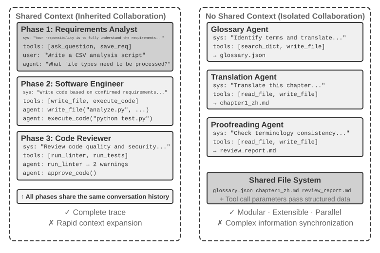
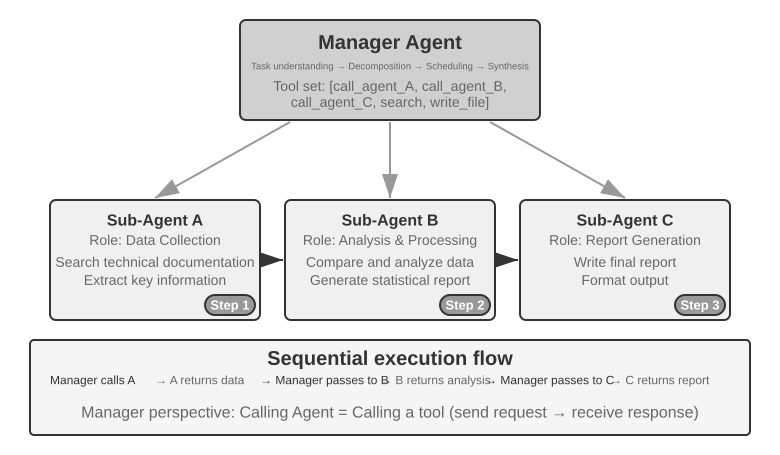
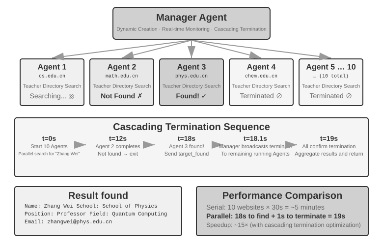

# שיתוף פעולה רב‑סוכני

תשעת הפרקים הראשונים התמקדו בסוכן יחיד: תחילה בבניית ההקשר, הידע, הכלים ויכולות האינטראקציה שלו, ואז בשימוש בהערכה, באימון־על ובהתפתחות מתמשכת כדי לשפר אותו לאורך זמן. פרק זה מקדם את השאלה מ"כיצד אנו בונים ומשפרים סוכן אחד?" ל"כיצד אנו מארגנים מספר סוכנים?" — כך שחלוקת עבודה, תקשורת ואימות הדדי יוכלו להתמודד עם משימות שקשה לסוכן אחד לשאת לבדו.

‏OpenAI הציעה בעבר סולם בן חמש רמות ליכולות AI: רמה 1, משוחחים; רמה 2, מסיקים; רמה 3, סוכנים; רמה 4, ממציאים; ורמה 5, ארגונים. שיתוף פעולה רב‑סוכני מוצג לעיתים קרובות כאחד המסלולים לרמה 5. אך כאן "ארגונים" מציין רמת יכולת — ‏AI המסוגל לבצע את עבודתו של ארגון שלם — ולא דרישה ארכיטקטונית. סוכן יחיד חזק דיו יכול היה, עקרונית, להגיע לשם אף הוא. אולם במציאות ההנדסית של היום, סוכן יחיד נותר מוגבל ביכולות המודל שלו ובחלון ההקשר שלו.

הבאת מספר סוכנים לעבוד יחד היא עניין רחב הרבה יותר מאשר לתת למומחים בעלי התמחויות שונות "לכסות זה על פעריו של זה". הנקודה היסודית יותר היא זו: **האינטליגנציה של קבוצה יכולה לעלות על זו של כל יחיד.** התרבות האנושית היא ההוכחה — שכלו של אדם אחד מוגבל, ובכל זאת, באמצעות חלוקת עבודה, שיתוף פעולה, ויכוח וצבירת ידע לאורך הדורות, החברה האנושית כמכלול מפגינה אינטליגנציה החורגת בהרבה מזו של כל גאון יחיד. קבוצות סוכנים עשויות להוליד אינטליגנציה קולקטיבית מאותו סוג: אפילו אם כל סוכן מוכשר רק כמומחה אנושי, קבוצה מאורגנת היטב יכולה לעלות על היכולות המשולבות של כל המומחים האנושיים. ב‑*From AGI to ASI*, ‏Google DeepMind מונה "קולקטיבים רב‑סוכניים בקנה מידה גדול" כמסלול מפתח לעבר על‑אינטליגנציה (‏ASI) — בדיוק כפי שאינטליגנציה אנושית כללית מצטברת לחברות ולארגונים החורגים מהיחידים, כך האינטליגנציה הקולקטיבית של סוכנים רבים ברמת AGI העובדים יחד עשויה להפגין יכולות קוגניטיביות החורגות בהרבה מסכום איבריה[^agi-asi]. שיתוף פעולה רב‑סוכני, אם כן, אינו רק עקיפה הנדסית של חלון ההקשר ומגבלות היכולת של מודל יחיד — הוא עשוי להיות מסלול יסודי מ"‏AI ברמת מומחה" לעבר "עלייה על האנושות כמכלול".

[^agi-asi]: On "large-scale multi-agent collectives" as a key pathway from AGI to ASI, see Google DeepMind, *From AGI to ASI.* arXiv:2606.12683, 2026.

## מסגרת סיווג לשיתוף פעולה רב‑סוכני

בניית מערכת רב‑סוכנית מתחילה בשני ממדי עיצוב מרכזיים, הקובעים יחד את הארכיטקטורה הבסיסית שלה ואת אופן מימושה.

### ממד 1: הקשר משותף לעומת הקשר לא משותף

זוהי ההחלטה הארכיטקטונית היסודית ביותר, הקובעת כיצד מידע מועבר בין מספר סוכנים.

**הקשר משותף** פירושו שסוכן עוקב מקבל את היסטוריית השיחה והמסלול המלאים (כפי שהוגדרו בפרק 1) של הסוכן שקדם לו. כשה‑Prompt המערכת ומערך הכלים משתנים בכל שלב, המערכת מתייחסת לשלב החדש כאל סוכן אחר משום שזהותו, אחריותו ויכולותיו השתנו, אף שהוא משמר את כל זיכרונו של קודמו. למשל, לאחר שאנליסט דרישות כותב מסמך דרישות, המפתח מקבל לא רק את המסמך אלא גם את התיעוד המלא של התקשורת בין האנליסט למשתמש. המפתח נוטל על עצמו תפקיד חדש תוך שמירת כל ההקשר הקודם. היתרון הוא שאין אובדן מידע; כל סוכן יכול לעיין בפרטים מכל שלב קודם. האתגר הוא שההקשר יכול להתרחב במהירות.

**הקשר לא משותף** פירושו שכל סוכן מתחזק הקשר והיסטוריית שיחה עצמאיים ואינו יכול לגשת ישירות לעקבות העבודה של הסוכנים האחרים. זה כמו שיתוף פעולה בין מחלקות שונות: כל אחד עובד באופן עצמאי ליד שולחנו, ומחליף מידע באמצעות מסמכים משותפים ופרוטוקולי ישיבות ולא באמצעות התבוננות מתמדת במסך של האחר. מודל זה מציע מודולריות ובידוד טובים יותר; כל סוכן צריך להתמקד רק במידע הרלוונטי לאחריותו שלו. גם הרחבת המערכת ותחזוקתה קלות יותר — הוספת סוכן חדש אינה דורשת שינוי בלוגיקה הפנימית של סוכנים קיימים, אלא רק הגדרת ממשקים ופורמטי נתונים.

מכיוון שסוכנים אינם חולקים הקשר, יש להעביר מידע באמצעות מנגנוני תקשורת מפורשים. מערכות מבוזרות קלאסיות יישבו שאלה זו מזמן: ספרי הלימוד במערכות הפעלה מלמדים אותנו שתקשורת בין תהליכים (‏IPC) מגיעה בסופו של דבר בשתי פרדיגמות בלבד — **זיכרון משותף** (צד אחד כותב והאחר קורא את אותו בלוק אחסון) ו**העברת הודעות** (נתונים נשלחים במפורש לצד השני). מנגנוני תקשורת בין סוכנים נופלים באותן שתי פרדיגמות. שלוש שיטות נפוצות:

- **פרמטרים של קריאה לכלי**: עטפו את סוכן המורד ככלי, ואז העבירו נתונים מובנים דרך הפרמטרים שלו; מתאים לתרחישים הדורשים נתונים בעלי טיפוסים ומבנה ברורים.
- **מערכת קבצים משותפת**: סוכנים מחליפים מידע באמצעות קריאה וכתיבה של תוצרי ביניים (מסמכים, קוד וכדומה) בספרייה משותפת; מתאים לתרחישים עם תוצרים גדולים או כשנדרשת התמדה.
- **אפיק הודעות**: מתווך ייעודי המעביר הודעות בין סוכנים. הסוכנים אינם קוראים זה לזה ישירות אלא שולחים הודעות לאפיק, המעביר אותן לסוכן היעד.

בהתאמה לשתי פרדיגמות ה‑IPC, מערכת הקבצים המשותפת מקבילה ל"זיכרון משותף", ואילו פרמטרים של קריאה לכלי ואפיק הודעות הם צורות של "העברת הודעות". פרמטרים של כלי נמסרים סינכרונית עם הקריאה; הודעות באפיק נמסרות אסינכרונית דרך מתווך. לכל פרדיגמה יש את שיקולי הפשרה שלה. ל‑Go יש אמרה מצוטטת רבות: "אל תתקשרו על ידי שיתוף זיכרון; במקום זאת, שתפו זיכרון על ידי תקשורת".



### ממד 2: טופולוגיית שיתוף הפעולה

הממד השני הוא טופולוגיית שיתוף הפעולה — המבנה שדרכו זורמים הבקרה והמידע בין הסוכנים. יש שלוש טופולוגיות אופייניות:

- **דפוס שיתוף פעולה בין עמיתים**: מספר קטן של סוכנים (בדרך כלל 2–3) מקיימים אינטראקציה כשווים, ויוצרים לולאת שיפור איטרטיבית — כמו כתיבת מאמר שבה אדם אחד מנסח טיוטה ואחר מעיר ומתקן, כשהאיכות לאחר כמה סבבים עולה בהרבה על מה שאדם אחד יכול היה להשיג לבדו.
- **דפוס המנהל** (דפוס תזמור): סוכן מנהל מרכזי אחראי לתכנון המשימה ולתזמונה, בעוד מספר תת‑סוכנים מטפלים כל אחד בתת‑משימות ספציפיות — כמו מנהל פרויקט המוביל כמה מהנדסים מומחים בפרויקט.
- **דפוס מבוזר**: אין בקר מרכזי בזמן ריצה; הסוכנים מתקשרים ביניהם כמו בני אדם כדי לשתף פעולה במשימות.

> **מונחון: הנדסת גרפים.** המונח "הנדסת גרפים" (‏Graph Engineering), שהתפרסם ביולי 2026, מתייחס בדרך כלל בהקשר הסוכנים של היום לעיצוב מפורש של גרף ביצוע: הצמתים הם סוכנים, תוכנות רגילות או החלטות אנושיות; הקשתות מגדירות תלויות משימה, ניתוב מותנה ונתיבי כישלון; ומצב מובנה זורם בין הצמתים. "טופולוגיית שיתוף הפעולה" הנידונה בפרק זה היא תת‑הקבוצה הרב‑סוכנית של אותו רעיון — שיתוף פעולה בין עמיתים, תזמור על ידי מנהל ומסירות מבוזרות הם טופולוגיות גרף שונות. מכיוון שהשם עדיין חדש וקל לבלבל אותו עם גרפי ידע, ‏GraphRAG ועקבות ביצוע, ספר זה ממשיך להשתמש במונחים היציבים יותר "טופולוגיית שיתוף פעולה" ו"תזמור" כאוצר המילים העיקרי שלו.

העיצוב המפורט ותרחישי התחולה של כל דפוס יידונו בתת‑סעיפים ייעודיים בהמשך.

## מתי מערכת רב‑סוכנית באמת עדיפה על סוכן יחיד?

לפני שנצלול לארכיטקטורות שיתוף פעולה ספציפיות, נענה על שאלה יסודית יותר: **מתי באמת נחוצים מספר סוכנים, ומתי אחד מספיק?** התשובה תשמש כנקודת ייחוס לכל גישה הנדסית שתבוא בהמשך. סדרת מחקרים עדכניים מתכנסת למסגרת ברורה — והקריטריון המרכזי הוא שאלה יחידה: **האם שיתוף הפעולה מספק מידע שסוכן יחיד לא היה יכול להשיג בעודו מפיק את תשובתו?**

טבלה 10‑1 מראה אילו אופני שיתוף פעולה מכניסים מידע חדש ומסייעת להעריך האם שיתוף פעולה רב‑סוכני מציע ערך ממשי על פני סוכן יחיד.

טבלה 10‑1 השוואת רווח המידע של אופני שיתוף פעולה רב‑סוכניים

| אופן שיתוף הפעולה | מכניס מידע חדש? | השפעה |
|---------------------------------------|---------------------|-----------------------------------|
| סקירה עצמית של אותו מודל (קריאה חוזרת של הפלט שלו) | לא | בדרך כלל חסרת תועלת או אף מזיקה |
| סוכנים שונים המתווכחים על אותו טקסט | לא | דומה לסוכן יחיד בעל חישוב שווה |
| סוקר המשתמש בתוצאות הרצת בדיקות כדי לסקור קוד | כן (משוב ביצוע) | שיפור משמעותי |
| סוקר המשתמש בצילומי מסך מעובדים כדי לסקור קוד Frontend/PPT | כן (משוב חזותי) | שיפור משמעותי |
| סוקר המשתמש בכלים חיצוניים כדי לאמת עובדות | כן (משוב כלים) | שיפור משמעותי |

מאמר RLEF משנת 2025 (‏Reinforcement Learning from Execution Feedback)‏[^rlef-2025] מצא שאימון מודל באמצעות למידת חיזוק להשתמש במשוב מהרצת קוד לשיפור איטרטיבי עלה משמעותית על דגימה עצמאית של המודל מספר פעמים. המפתח הוא שכל איטרציה מכניסה **תוצאות הרצה אמיתיות** (שגיאות הידור, כישלונות בדיקות, חריגות זמן ריצה) — מידע שלא היה קיים כשהמודל כתב את הקוד. עבור משימות ייצור דפי אינטרנט, מחקר WebGen-Agent משנת 2025‏[^webgen-agent-2025] דיווח שמשוב חזותי רב‑שכבתי, המשלב צילומי מסך עם תיאורים ממודל שפה‑וראייה, שיפר את ביצועי Claude 3.5 Sonnet במדד הביצועים מ‑26.4% ל‑51.9%, כמעט פי שניים.

[^rlef-2025]: Gehring, J., et al. *RLEF: Grounding Code LLMs in Execution Feedback with Reinforcement Learning.* arXiv:2410.02089, 2025.
[^webgen-agent-2025]: Lu, Z., et al. *WebGen-Agent: Enhancing Interactive Website Generation with Multi-Level Feedback and Step-Level Reinforcement Learning.* arXiv:2509.22644, 2025.

מסגרת זו מסייעת ליישב סתירה לכאורה: מחקרים אקדמיים מסוימים מוצאים שסוכן יחיד מספיק, בעוד מערכות רב‑סוכניות מתפקדות לעיתים קרובות טוב יותר בפרקטיקה ההנדסית. המחקרים בודקים לרוב מספר סוכנים הבוחנים ודנים באותו טקסט, כמו בוויכוח, ואילו מערכות הנדסיות אפקטיביות מוסיפות בדרך כלל משוב חיצוני מהרצת קוד, מעיבוד חזותי או מכלים. רק האחרונות מכניסות מידע חדש. כמעט כל השימושים האפקטיביים בשלוש הארכיטקטורות הנידונות בהמשך — שיתוף פעולה בין עמיתים, תזמור וביזור — ניתנים להבנה דרך קריטריון זה.

ניסוי איתור הפגיעויות של Anthropic משנת 2026 מספק מקרה מבחן: 45 סוכנים תיאמו חיפוש דרך פורום משותף, סקרו זה את עבודתו של זה, וסוכן עצמאי הכריע בתוצאות. אשכול הסוכנים מצא 266 פגיעויות תמורת 27 מיליון טוקנים, בעוד תצורה של סוכנים עצמאיים במקביל מצאה 21 בלבד תמורת 6.5 מיליון טוקנים. במרחב חיפוש פתוח, סוכנים המתקשרים ביניהם יכולים להסיט את מוקד החיפוש באופן דינמי ולפתח התמחות, וכך להמיר תקציב טוקנים גדול יותר בכיסוי רחב יותר ובמסלולי גילוי מגוונים יותר.[^anthropic-multiagent-2026]

**תקציב צעדים וביצועי סוכן.** שאלה קשורה היא כיצד תקציב הצעדים של סוכן — מספר הקריאות לכלים או סבבי האיטרציה שהוא רשאי לנצל — משפיע על הביצועים. יותר צעדים אולי נראים כמסייעים בוודאות: עם 30 צעדים, לסוכן אולי יספיק הזמן רק לממש פונקציונליות ליבה, ואילו 300 צעדים מאפשרים לו לתכנן, לממש, לבדוק ולשכלל. אולם מאמר Google משנת 2025, ‏*Budget-Aware Tool-Use Enables Effective Agent Scaling*, הגיע למסקנה אנטי‑אינטואיטיבית: **מתן צעדים נוספים לסוכן, כשלעצמו, אינו מבטיח ביצועים טובים יותר.** לסוכנים סטנדרטיים חסרה "מודעות תקציב"; אפילו עם 300 צעדים, הם נוטים לבצע חיפושים רדודים ולהגיע במהירות לרמה שטוחה. כדי לנצל צעדים נוספים ביעילות, סוכנים זקוקים למנגנון המתאים את האסטרטגיה שלהם למשאבים הנותרים — חקירה רחבה בתחילה וצמצום המיקוד בהמשך. גישת BAVT‏ (Budget-Aware Value Tree Search) משנת 2026 הכניסה בהמשך הערכת ערך ברמת הצעד, והתאימה את האיזון בין חקירה לניצול לפי שיעור התקציב הנותר. ככל שהתקציב פוחת, הסוכן עובר מחקירה רחבה לחקירה מעמיקה יותר.

לממצאים אלה השלכות ישירות על עיצוב מערכות רב‑סוכניות. למשל, בדפוס התזמור, אין סוכן המנהל אמור פשוט לחלק משימות לתת‑סוכנים ולהמתין לתוצאות. במקום זאת, עליו **להקצות תקציבי צעדים באופן דינמי** לפי מורכבות המשימה — תת‑משימות פשוטות מקבלות פחות צעדים; תת‑משימות מורכבות מקבלות צעדים בשפע. עליו גם להנחות את תת‑הסוכנים לנצל תקציבים אלה בתבונה (תחילה לתכנן, אחר כך לממש, אחר כך לבדוק, אחר כך לשפר), ולא לצלול היישר פנימה.

שיקול נוסף חייב לקדום כל החלטת עיצוב: **עלות.** חקירה מקבילית ושכלול איטרטיבי עולים כסף — ‏Anthropic חשפה שמערכת המחקר הרב‑סוכנית שלה צורכת פי 15 טוקנים משיחה רגילה, ושצריכת הטוקנים לבדה מסבירה כ‑80% מהפרש הביצועים. הרווחים ממערכת רב‑סוכנית חייבים לפיכך להיות גדולים מספיק כדי להצדיק עלויות שעשויות להיות גבוהות פי כמה, או אפילו בסדר גודל; אחרת, סוכן יחיד מכוונן היטב הוא בדרך כלל העסקה הטובה יותר.

[^anthropic-multiagent-2026]: Anthropic Frontier Red Team, “Patterns and Problems in Emerging Multiagent Systems,” 2026-08-13. https://www.anthropic.com/research/multiagent-systems

## שיתוף פעולה רב‑סוכני עם הקשר משותף

בשיתוף פעולה רב‑סוכני עם הקשר משותף, כל שלב הוא סוכן עצמאי (עם Prompt מערכת ומערך כלים משלו), אך הוא יורש את המסלול המלא של הסוכן שקדם לו — בדומה לעמית הנכנס למשמרת ויכול לדפדף בכל יומני העבודה שהותיר קודמו. היתרון המרכזי של שיתוף פעולה מבוסס‑ירושה זה הוא אפס אובדן מידע: כל סוכן יכול לעיין בפרטים מכל שלב קודם. האתגר הוא לשמור על הסוכן הנוכחי ממוקד באחריות שלו ולא מוסח על ידי מסת ההיסטוריה שירש.

במשימות מורכבות, תפקידו ואחריותו של סוכן עשויים להשתנות משמעותית בין השלבים. אם נעשה שימוש ב‑Prompt מערכת סטטי יחיד לאורך כל הדרך, הוא יהיה או כללי מדי או ייהפך לאוסף הוראות מסורבל. החלפת תפקידים רב‑שלבית משנה את ה‑Prompt המערכת ואת מערך הכלים בהתאם לשלב הנוכחי, ומאפשרת לסוכן לעבוד בתפקיד המתאים ביותר.

הבחירה הארכיטקטונית המרכזית היא האם הנחיית התפקיד נישאת על ידי Prompt מערכת מחליף או על ידי Skill נטען. הראשון יכול לאכוף גבול כלים קשיח, אך משנה את קידומת הבקשה בכל החלפה. השני שומר על יציבות הקידומת הסטטית ומוסיף את `SKILL.md` למסלול, מה שידידותי בדרך כלל יותר למטמון KV/Prompt; ‏Skill נותר הנחיה התנהגותית, ולכן כלים רגישים או בעלי תופעות לוואי עדיין דורשים שער מדיניות אכוף‑קוד ב‑Harness.

| בחירה | הנחיית תפקיד | נראוּת כלים | השפעה על ההקשר/מטמון KV | חוזק האילוץ |
|---|---|---|---|---|
| `transfer_to_agent` | החלפת ה‑Prompt המערכת ובדרך כלל מערך הכלים | רק הכלים של התפקיד הנוכחי | כל החלפה משנה את קידומת הבקשה ובדרך כלל מבטלת מטמון מנקודה זו | חזק: כלים מחוץ להיקף יכולים להיעדר מהסכמה |
| Skill | שמירת ספריית Skills ב‑Prompt הקבוע והוספת `SKILL.md` לפי דרישה | בדרך כלל הקטלוג המלא, או נקודת כניסה יציבה לחיפוש | הקידומת הסטטית נותרת יציבה; טקסט ה‑Skill מתווסף למסלול | חלש: ‏Skill הוא הוראה, לא גבול הרשאות |

כשההבדל בין התפקידים נובע בעיקר מידע, מנוהל ומסגנון כתיבה — עדיף Skill; כשהוא נוגע להרשאות, לבידוד כלים, לגבולות ציות, או כשיש לאסור סוג פעולות מסוים בזמן ריצה — השתמשו בסוכן עצמאי או בכלי `transfer_to_agent`, והגבילו את קריאות הכלים בקוד בשכבת ה‑Harness.

> **ניסוי 10‑1 ★★: החלפת תפקידים בהקשר משותף — ‏Prompt מערכת לעומת Skill**
>
> שני המסלולים משתמשים באותו מודל, משימה, כלים, הנחיית תפקיד ומסלול משותף מלא. המשימה היא למצוא את מכירות רכבי האנרגיה החדשה בסין בשנים 2021–2023, לחשב CAGR, ולכתוב סיכום למשקיעים בסינית שאינו עולה על 120 תווים.
>
> **מסלול 1: החלפת Prompt מערכת.** חמישה תפקידים — ‏`triage`, ‏`research`, ‏`coding`, ‏`data_analysis` ו‑`writing` — כל אחד חושף רק את הכלים הייעודיים שלו בתוספת `transfer_to_agent`. מסירה שומרת את ההיסטוריה, טוענת את ה‑Prompt ומערך הכלים של היעד, וממשיכה בביצוע.
>
> **מסלול 2: ‏Skill.** ה‑Prompt המערכת וקטלוג הכלים המלא נותרים קבועים. המודל קורא ל‑`load_skill(name)` ומקבל את אותו מסמך תפקיד כתוצאת כלי במסלול המשותף. הקידומת הסטטית נותרת ללא שינוי, אך הרשאות קשיחות נאכפות על ידי כללי Harness.
>
> שני המסלולים אמורים לבצע את אותו אחזור, חישוב ובדיקת אורך. הם נבדלים בנשא הנחיית התפקיד ובגבול הכלים המתקבל; עקבת עשן בלבד אינה יכולה לקבוע איזה מסלול עדיף.

## שיתוף פעולה רב‑סוכני ללא הקשר משותף

בארכיטקטורה ללא הקשר משותף, כל סוכן פועל כישות עצמאית בעלת הקשר, מסלול ומצב משלה. הסוכנים אינם יכולים לגשת ישירות להקשר הפנימי זה של זה; שיתוף הפעולה נשען כולו על העברות נתונים מפורשות ומובנות דרך שלושת מנגנוני התקשורת שהוצגו בתחילת פרק זה: פרמטרים של קריאה לכלי, מערכת קבצים משותפת ואפיק הודעות.

קודם בפרק זה השווינו את מנגנוני התקשורת לצורות של תקשורת בין תהליכים, ואת ההקשר המשותף מול המבודד לתהליכונים מול תהליכים. ניתן להרחיב אנלוגיה זו עוד (טבלה 10‑2):

טבלה 10‑2 ההתאמה בין מערכות רב‑סוכניות למערכות הפעלה

| מערכת הפעלה | מערכת רב‑סוכנית |
|----------|----------------|
| תוכנית (קובץ הרצה) | קידומת סטטית (‏Prompt מערכת + הגדרות כלים) |
| זיכרון התהליך | מסלול |
| מעבד | LLM |
| גרעין | זמן ריצה של הסוכן |
| קריאת מערכת | קריאה לכלי |
| fork (יצירת תהליך בן) | spawn_subagent |
| kill (שליחת אות) | cancel_subagent |
| ps (רשימת תהליכים) | list_agents |
| קוד יציאה ו‑wait() | סיכום מובנה המוחזר על ידי תת‑הסוכן |
| זיכרון משותף / העברת הודעות | מערכת קבצים משותפת / העברת הודעות |

הפשטה זו אינה חדשה כלל: מצב פרטי, הודעות אסינכרוניות והיכולת ליצור חברים חדשים הם בדיוק ההגדרה הבסיסית של מודל ה‑Actor משנות השבעים[^actor-model]. ניתן לפיכך לראות במערכת רב‑סוכנית גרסה מבוססת‑LLM של מודל ה‑Actor, וחלק ניכר מהידע שנצבר במערכות הפעלה ובמערכות מבוזרות חל ישירות.

[^actor-model]: Hewitt, C., Bishop, P., Steiger, R. *A Universal Modular ACTOR Formalism for Artificial Intelligence.* IJCAI 1973.

בידוד בסגנון תהליכים זה מביא כמה יתרונות הנדסיים מעשיים: כל סוכן יכול להיות מפותח ונבדק באופן עצמאי, ניתן להוסיף יכולות חדשות מבלי לגעת בקוד קיים, ומספר סוכנים יכולים לרוץ במקביל ללא תחרות על הקשר משותף.

אולם, אי‑שיתוף הקשר כרוך גם בעלויות. הברורה ביותר היא בעיית סנכרון המידע: כיצד שומרים הסוכנים על הבנה עקבית של מצב המשימה? האם ייאבד מידע או ישוכפל במהלך ההעברה? גם הניפוי נעשה קשה יותר — כשמתעוררות בעיות, יש לסקור יומנים מסוכנים מרובים כדי להרכיב את תהליך ההרצה המלא. סוגיות אלה הופכות את עיצוב מפרטי הממשק, פורמטי הנתונים ופרוטוקולי התקשורת לחשוב במיוחד.

שיתוף פעולה מפורש ללא הקשר משותף נשען על שתי תשתיות שאינן תלויות בטופולוגיה. הראשונה היא **מערכת הקבצים המשותפת**, המדיום המתמיד שדרכו סוכנים מחליפים תוצרים זה עם זה ועם המשתמש, ומהווה את מישור הנתונים של שיתוף הפעולה. השנייה היא **מנגנון התקשורת והבקרה**, התומך בהעברת הודעות, בשאילתות סטטוס, בהפסקת ביצוע ובתזמון משאבים בין סוכנים, ומהווה את מישור הבקרה של שיתוף הפעולה. שלוש הטופולוגיות שלהלן בנויות כולן על שני יסודות אלה.

### מערכת הקבצים מנקודת מבטו של סוכן

בתחילת פרק זה נמנתה "מערכת הקבצים המשותפת" כאחד משלושת מנגנוני התקשורת לארכיטקטורות ללא הקשר משותף. במערכת אמיתית, מערכת הקבצים שאליה ניגש סוכן אינה מערכת אחסון יחידה אלא **מערכת קבצים וירטואלית** שבה מערכות אחסון בעלות מקורות, מחזורי חיים והרשאות שונים מעוגנות תחת עץ ספריות אחד. הסוכן ניגש אליהן דרך ממשקי `read_file`/`write_file`/`list_dir` אחידים, בעוד השכבות התחתונות עשויות להיות דיסקים זמניים מקומיים, אחסון אובייקטים מתמיד, ממשקי API של כונני ענן צד שלישי, או חבילות משאבי מערכת לקריאה בלבד. הגדרה ברורה של הרכב עץ ספריות זה — הנראוּת ומחזור החיים של כל אזור — היא תנאי מוקדם לעיצוב שיתוף פעולה רב‑סוכני: חלק ניכר מהתנגשויות המקביליות ומדליפות המידע נובע מערבוב אזורים שהיו צריכים להיות מבודדים. עץ ספריות זה שקול למרחב הכתובות של הסוכן, וארבעת סוגי האזורים הם מקטעי זיכרון בעלי הרשאות שונות: חלקם פרטיים וברי‑כתיבה, חלקם משותפים לכמה גורמים, וחלקם לקריאה בלבד. פילוסופיית ההגנה של מערכת ההפעלה חלה גם כאן: בודדו כברירת מחדל והצהירו על שיתוף במפורש. במערכת רב‑סוכנית בשלה, מערכת הקבצים מורכבת בדרך כלל מארבעת סוגי האזורים הבאים:

במערכת רב‑סוכנית בשלה, מערכת הקבצים מורכבת בדרך כלל מארבעת סוגי האזורים הבאים:

**א. מרחב עבודה ייעודי לסוכן (‏Scratchpad)**. ספרייה פרטית הבלעדית לכל מופע סוכן, המאחסנת תוצרי ביניים, קבצים זמניים, טיוטות ויומני ניפוי. מחזור החיים שלה קשור למופע והיא בלתי נראית לסוכנים אחרים ולמשתמשים. בידוד ה‑Scratchpad משרת שתי מטרות: מניעת דריסה הדדית של קבצים זמניים מסוכנים מרובים, ושמירה על הקשר רזה בסוכן הראשי — תהליך הניסוי והטעייה של תת‑הסוכנים נותר במרחב העבודה שלהם, וכשרק התוצר הסופי מוגש למרחב המשותף. זהו המקבילה ברמת האחסון לעיקרון מפרק 4 שלפיו תת‑סוכנים מחזירים סיכומים מובנים ולא מסלולים מלאים.

**ב. מרחב עבודה משותף רב‑סוכני**. אזור שיתוף פעולה שמספר סוכנים יכולים לקרוא ולכתוב בו, והוא **נראה למשתמש**. זהו המדיום העיקרי להחלפת תוצרים בין סוכנים בארכיטקטורות ללא הקשר משותף: סוכן מילון המונחים כותב את רשימת המונחים, וסוכן התרגום קורא ממנה; משתמשים יכולים גם להעלות כאן קובצי מקור ולהוריד תוצרים סופיים. מחזור החיים שלו קשור למשימה כולה ודורש התמדה. כאזור לקריאות וכתיבות מקביליות של מספר גורמים, הוא מוקד להתנגשויות מקביליות — מנגנונים כגון נעילה אופטימית ובידוד worktree פועלים כאן, כמפורט תחת "אופן כישלון ראשון" בהמשך פרק זה. השימוש בפרק 4 בעיגון כרך ב‑`/workspace/shared` כדי לחבר את הסוכן הראשי, את המחשב הווירטואלי ואת הטלפון הווירטואלי הוא מימוש טיפוסי של שכבה זו.

**ג. משאבים חיצוניים מעוגנים.** מקורות מידע צד שלישי שהמשתמש אישר — ‏Google Drive, ‏Notion, ‏Dropbox, ויקי ארגוני וכדומה — ממופים לנקודות עיגון במערכת הקבצים (למשל, ‏`/mnt/gdrive`) באמצעות מתאמים. סוכן ניגש למסמך Notion באמצעות קריאת קובץ; המתאם התחתון קורא ל‑API המתאים. שלושה מאפיינים מבדילים שכבה זו מאחסון מקומי ויש לטפל בהם במפורש בעת העיצוב: **הגישה מוגבלת על ידי הרשאות חיצוניות** (הרשאות המשתמש במערכת המקור קובעות את הנראוּת של הסוכן), **ההשהיה גבוהה יותר והעקביות חלשה יותר** (כל קריאה כרוכה בסיבוב רשת, ושינויים חיצוניים עשויים שלא להיות נראים מיד, ולכן יש להתייחס לנתונים כאל עקביים בסופו של דבר), ו**הגישה היא בעיקר לפי דרישה ולקריאה בלבד** (כתיבה חזרה למקורות חיצוניים חייבת להיעשות בזהירות, שכן כתיבות שגויות עלולות לזהם את הנתונים האמיתיים של המשתמש). הממשק האחיד לקבצים פירושו שהסוכן אינו זקוק לכלי ייעודי לכל מקור נתונים, אך הוא גם מסווה הבדלי ביצועים ואבטחה אלה. לפיכך, יש לנהל במפורש ברמת העיגון את מצב הקריאה/כתיבה, פסקי הזמן וגבולות ההרשאות.

**ד. משאבי מערכת מובנים.** חבילת משאבים המותקנת מראש על ידי המערכת ומשותפת לקריאה בלבד לכל הסוכנים. דוגמאות טיפוסיות הן ה‑**Skills** שהוצגו בפרקים 2 ו‑4 — מסמכי ידע וסקריפטים המאורגנים כקבצים, מעוגנים בנתיבים כגון `/skills`, ונגישים באמצעות חשיפה הדרגתית (תחילה אינדקס, ואז הרחבה לפי דרישה). דוגמאות נוספות כוללות מדריכי עזר, ספריות תבניות והגדרות כלים משותפות. שכבה זו משותפת גלובלית, לקריאה בלבד, יציבה בין הפעלות, וניתנת לקריאה במקביל על ידי כל הסוכנים ללא בקרת מקביליות.

איור 10‑2 ממחיש כיצד ארבעת סוגי האזורים מעוגנים באופן אחיד תחת עץ ספריות יחיד: הסוכן ניגש לעץ כולו דרך ממשק אחיד, משתמשים מעלים ומורידים קבצים מהמרחב המשותף, מקורות נתונים חיצוניים מעוגנים באמצעות מתאמים, ומשאבי מערכת מובנים מסופקים לקריאה בלבד.


טבלה 10‑3 משווה בין ארבעת סוגי האזורים בארבעה ממדים — נראוּת, מחזור חיים, הרשאות קריאה/כתיבה ובקרת מקביליות — ומשמשת כרשימת תיוג לעיצוב מבנה מערכת הקבצים.

טבלה 10‑3 ארבעת סוגי האזורים במערכת הקבצים הווירטואלית של הסוכן

| אזור | נראוּת | מחזור חיים | קריאה/כתיבה | בקרת מקביליות |
|--------------|-----------------|------------------------|---------------------|-------------------|
| מרחב עבודה ייעודי לסוכן | הסוכן הבעלים בלבד | נהרס עם מופע הסוכן | קריאה/כתיבה | לא נדרשת (פרטי) |
| מרחב עבודה משותף רב‑סוכני | כל הסוכנים המשתפים פעולה והמשתמש | מתמיד למשך המשימה | קריאה/כתיבה | נדרשת (נעילה אופטימית / worktree) |
| משאבים חיצוניים מעוגנים | תלוי באישור החיצוני | נקבע על ידי המקור החיצוני | לרוב לקריאה בלבד, כתיבות דורשות זהירות | מנוהלת על ידי המקור החיצוני |
| משאבי מערכת מובנים | כל הסוכנים | יציב בין הפעלות | לקריאה בלבד | לא נדרשת (קריאה בלבד) |

ערכו של **"נתיב הקובץ כממשק אוניברסלי"** טמון בהתייחסות לנתיב כאל יחידת ההחלפה. בין אם סוכנים מחליפים תוצרים, בין אם סוכן ראשי מוסר קלט לתת‑סוכן, ובין אם ארגונים משתפים פעולה דרך A2A — הם מעבירים מחרוזת נתיב קלת משקל ולא טוענים את תוכן הקובץ לחלון ההקשר (פרק 4). הדבר מתיישב עם המושג מפרק 5, "מערכת הקבצים כמרכז של הסוכן", המתאר כיצד סוכן יחיד משתמש במערכת הקבצים כדי לארח זיכרון ויכולות. כאן, אותה הפשטה מתרחבת לסוכנים מרובים: עץ ספריות וירטואלי המעגן אחסון פרטי, משותף, חיצוני ומובנה מספק את יסוד האחסון לשיתוף פעולה רב‑סוכני.

### תקשורת ובקרה בין סוכנים

בעוד מערכת הקבצים פותרת את בעיית **החלפת התוצרים** בין סוכנים, שיתוף הפעולה דורש גם **מישור בקרה**. כאן בדיוק נכנסות לתמונה שורות מחזור החיים של טבלה 10‑2: פרימיטיבי הכלים שניתנו בפרק 4 — יצירה (‏`spawn_subagent`), שליחת הודעות (‏`send_message_to_subagent`), ביטול (‏`cancel_subagent`) וגילוי (‏`list_agents`) — מקבילים ל‑fork, ‏message, ‏kill ו‑ps בעולם התהליכים. סעיף זה אינו חוזר על הגדרות הממשק אלא מתמקד בארבע יכולות חיוניות לשיתוף פעולה רב‑סוכני שנוטים להתעלם מהן.

**א. העברת הודעות.** הצורה הפשוטה ביותר היא נקודה‑לנקודה: סוכן A קורא ישירות ל‑`send_message_to_agent_b(content)`. מתאים לתרחישים בעלי טופולוגיה קבועה ומספר קטן של סוכנים (למשל, מערך הטלפון + המחשב הדו‑סוכני של ניסוי 10‑3 בפרק זה). כשמספר הסוכנים גדל ונדרשת מקביליות אסינכרונית, מספר החיבורים נקודה‑לנקודה גדל ריבועית עם מספר הסוכנים, וגם השולח וגם המקבל חייבים להיות מקוונים בו‑זמנית. במקרים כאלה יש להשתמש ב**אפיק הודעות** (מפורט בהמשך פרק זה תחת "דפוס תיאום מקבילי"): הסוכנים מפרסמים הודעות לאפיק, שמעביר אותן לפי מנויים, כך שהשולח אינו צריך לדעת מיהם המנויים. בין אם נקודה‑לנקודה ובין אם דרך אפיק, הודעות צריכות בדרך כלל לשאת **מעטפה** מובנית: מזהה השולח, היעד (סוכן מסוים או שידור), סוג ההודעה (למשל, ‏`task_assigned`/`status_update`/`result`/`terminate`), ומטען JSON. פורמט מעטפה אחיד מבטיח ניתוב אמין ופענוח אצל המקבל והופך את שרשרת שיתוף הפעולה לניתנת למעקב — היבט מפתח בניפוי מערכות רב‑סוכניות.

**ב. שאילתת סטטוס.** זהו החלק המוערך בחסר ביותר במישור הבקרה. ברגע שסוכן ראשי שיגר תת‑סוכן, הוא זקוק לנראוּת של התקדמות תת‑הסוכן; אחרת אין הוא יכול להחליט האם להמשיך להמתין ואף לא להתערב כשתת‑הסוכן נתקע. גישה אינטואיטיבית היא לשאול מ‑RPC ולהגדיר ממשק שאילתה `get_subagent_status(agent_id)` המחזיר "רץ/הושלם/נכשל" בתוספת אחוז התקדמות. אך מסתבר שממשק משיכה כזה שימושי הרבה פחות מהצפוי: תת‑סוכן מתחיל לרוץ ברגע שהוא נוצר ורץ עד להשלמה או לכישלון. אין הוא עובר בסדרת מצבים בתור כמו עבודות במערכת אצווה מסורתית, בדיוק כפי שתכנות ב‑Unix כמעט אינו זקוק לתשאול תהליך אחר לפי ה‑PID שלו לגבי סטטוס ריצה. גם לתשאול תדיר יש דילמה מובנית: תשאלו לעיתים קרובות מדי ותבזבזו טוקנים; תשאלו לעיתים רחוקות מדי ותגיבו באיחור. דרך טבעית יותר להשיג סטטוס היא לחזור לשתי פרדיגמות התקשורת שהוצגו בתחילת הפרק.

**קבלת סטטוס באמצעות העברת הודעות.** הסוכן הראשי פשוט שולח לתת‑הסוכן הודעה: "מה שלומך?". תת‑הסוכן משיב ברגע מתאים. הכול אסינכרוני: שליחת ההודעה אינה חוסמת את ההרצה של הסוכן הראשי, ומתי — או האם — הצד השני משיב הוא עניין נפרד, בדיוק כפי שמנהל שואל כפוף על התקדמות דרך הודעות מיידיות מבלי לדרוש ממנו להניח הכול באותו רגע. מנגד, תת‑הסוכן יכול גם לשלוח הודעה יזומה ולדווח כשהוא מגיע לאבן דרך; אם למערכת כבר יש אפיק הודעות, הרי שזהו פשוט פרסום `status_update` לאפיק ("הניטור בזמן אמת" של ניסוי 10‑4 הוא הצורה הזו). בין אם הסטטוס מתבקש במפורש ובין אם הוא מדווח ביוזמה, הסטטוס הנישא בהודעה צריך לאמץ אוצר מילים אחיד של מכונת מצבים (מבצע, זקוק לקלט, הושלם, נכשל) — פרוטוקול A2A בהמשך פרק זה מתקנן את מחזור חיי המשימה בדיוק לקבוצת מצבים כזו.

**קבלת סטטוס באמצעות מערכת הקבצים המשותפת.** הצורה היסודית ביותר היא **התמדת מסלול**: תוך כדי ריצה, תת‑הסוכן מסדרן כל אירוע מסלול ל‑JSON ומוסיף אותו לקובץ יומן במערכת הקבצים — בדרך כלל קובץ אחד לכל הפעלה, אירוע אחד לכל שורה, כלומר JSONL. המסלול, כפי שהוגדר בפרק 1, הוא הרצף המלא של הודעות המשתמש, תשובות המודל, קריאות הכלים והתוצאות. הסוכן הראשי אינו זקוק לפרוטוקול דיווח סטטוס; בקריאת קובץ זה ישירות הוא יכול לבחון את מלוא ההרצה של תת‑הסוכן: לאיזה כלי הוא קורא, מה קרה בצעדו האחרון, והאם הוא תקוע בלולאה של ניסיונות חוזרים כושלים. במונחי תהליכים, הדבר דומה לקריאת הזיכרון של תהליך אחר ישירות. אין הוא תופס את ההקשר של תת‑הסוכן, אינו תלוי בשיתוף הפעולה שלו, ומציע את גרעיניות התצפית העדינה ביותר.

אך אין להפוך את התמדת המסלול לערוץ העיקרי להעברת מידע בין סוכנים. מסלול מגיע בקלות לעשרות אלפי טוקנים, ואחרי הקריאה עדיין על הסוכן הראשי לזקק אותו בעצמו — יקר גם בזמן וגם בטוקנים. ברוב המצבים הבחירה הנבונה יותר היא **להסכים על קובץ התקדמות**: כשהסוכן הראשי מפעיל תת‑סוכן הוא מתנה "כתוב את ההתקדמות ל‑progress.md", תת‑הסוכן מעדכן את רשימת המשימות הזו עם כל פריט שהוא משלים, והסוכן הראשי יכול לקרוא בכל רגע את הקובץ הקל הזה כדי לדעת היכן הדברים עומדים. הדבר שקול לכך ששני תהליכים מגדירים בזיכרון המשותף אזור מצב קטן בפורמט מוסכם: מה שנחשף הוא התקדמות מזוקקת, ולא הזיכרון כולו. קובץ ההתקדמות מאפשר גם **זיהוי תקיעה**: אם זמן השינוי האחרון של `progress.md` (או של קובץ המסלול) לא השתנה יותר מ‑N דקות, אפשר לקבוע שתת‑הסוכן אינו פעיל ולהפעיל מנגנון גיבוי של פסק זמן, כדי שתת‑סוכן תקוע לא יגרור אחריו את המערכת.

**ג. הפסקת ביצוע.** בשיתוף פעולה מקבילי, תרחיש נפוץ הוא "אחד מצליח, השאר הופכים בלתי רלוונטיים" — מספר סוכנים מחפשים בנפרד, וברגע שאחד מוצא את היעד, האחרים אמורים לעצור מיד (ההפסקה המדורגת בניסוי 10‑4 בפרק זה). ישנן שתי רמות של הפסקה, ומשתמשי Unix יזהו בהן את ההבחנה בין SIGTERM ל‑SIGKILL. **הפסקה מסודרת** עדיפה: הסוכן הראשי שולח אות `terminate`, תת‑הסוכן מגיב בנקודה בטוחה בצעדו הנוכחי, מנקה משאבים (סוגר הפעלות דפדפן, כותב קבצים ממתינים, משחרר נעילות), שולח אישור (‏ack), ואז יוצא. **הפסקה כפויה** היא נפילה חזרה: הפסקת התהליך ישירות, ומשמשת רק כשתת‑הסוכן אינו מגיב לאות המסודר, במחיר של השארת משאבים תלויים וכתיבות בלתי גמורות. שתי נקודות הנדסיות דורשות תשומת לב. ראשית, הפסקה מסודרת דורשת מתת‑הסוכן לבדוק מדי פעם בלולאה שלו אם הגיע אות ההפסקה (בדומה למנגנון הפסיקות בפרק 6); אחרת אין הוא יכול לקבל את האות. שנית, להפסקה מדורגת יש תנאי מרוץ: כמה תת‑סוכנים עלולים לדווח על הצלחה כמעט בו‑זמנית. הסוכן הראשי חייב להשתמש בנעילה או בעיצוב אידמפוטנטי כדי להבטיח שרק הצלחה אחת מתקבלת ושאות ההפסקה משודר פעם אחת. ראו את הדיון בתנאי מרוץ בניסוי 10‑4.

**הפסקה אלגנטית** היא הבחירה הראשונה: הסוכן הראשי משגר אות `terminate`, תת‑הסוכן מגיב בנקודה הבטוחה של הצעד הנוכחי, מנקה תחילה משאבים (סוגר את הפעלת הדפדפן, כותב קבצים שלא הושלמו, משחרר מנעולים), מחזיר אישור (‏ack) ויוצא. **הפסקה כפויה** היא רשת הביטחון: המתת התהליך ישירות, ומשתמשים בה רק כשתת‑הסוכן אינו מגיב לאות האלגנטי, במחיר של משאבים תלויים באוויר וכתיבות שנקטעו באמצע.

נותר קצה חוט אחד: לאחר שהסוכן הראשי מופסק, מה קורה לתת‑סוכנים שעדיין רצים? הגישה ההנדסית הנקייה ביותר שואלת מה‑context של Go — ההפסקה מדורגת במורד יחסי היצירה: בטלו סוכן אחד וכל תת‑הסוכנים שהוא יצר מבוטלים עמו, מה שמונע השארת סוכני בן יתומים. "תת‑הסוכן בודק את אות ההפסקה בנקודה בטוחה" שלעיל מקביל בדיוק לתשאול `ctx.Done()` ב‑Go. מנגד, אם אתם באמת זקוקים לסוכן רקע ארוך טווח המנותק מהסוכן הראשי (כמו `nohup` ב‑Unix), תנו לו להתחיל מעץ מחזור חיים חדש (המקביל ל‑`context.Background()`), תוך הצהרה מפורשת שאין הוא מסתיים עם הורהו.

**ד. ניהול משאבים ותזמון.** המחצית השנייה של עבודתה של מערכת הפעלה היא הקצאת משאבים נדירים. בעולם התהליכים המשאבים הנדירים הם זמן מעבד וזיכרון; בעולם הסוכנים הם טוקנים, כסף ותקציב מקביליות — כל צעד שתת‑סוכן עושה צורך את שלושתם. אחריות זו נופלת בדרך כלל על המנהל או על זמן הריצה: קבעו תקציב צעדים או טוקנים בעת הפעלת תת‑סוכן, ועצרו ברגע שהוא נחרג; תנו משימות קשות למודל חזק ומשימות מכניות למודל בעלות נמוכה; הגבילו מקביליות כך שעשרות סוכנים לא ימצו את מכסת ה‑API בבת אחת; וכשמגיעה משימה דחופה יותר, הפסיקו תת‑סוכן שרץ — זוהי הקדמה (‏preemption). הפרקטיקה בתחום זה בשלה הרבה פחות מתזמון מעבדים, אך היא קובעת את תקרת העלות של מערכת רב‑סוכנית וראוי לשקול אותה בשלב עיצוב הארכיטקטורה.

בהשוואה למתזמן של מערכת הפעלה מסורתית, יתרונו הבולט של סוכן המנהל הוא יכולת ההיסק שלו. לכן סוכן מנהל יכול להפעיל כמה תת‑סוכנים שיחקרו בעיה אחת במקביל, ולהחליט לפי התקדמותם למי להקצות משאבים נוספים ואת מי להפסיק משום שנראה כי סטה מהדרך — בדומה למרוץ פנימי בתוך חברה.

הפרקטיקה בתחום המשאבים והתזמון עדיין רחוקה מלהיות בשלה כמו תזמון במערכות הפעלה, אך היא הקובעת את תקרת העלות של מערכת רב‑סוכנית, ולכן יש להביא אותה בחשבון כבר בשלב תכנון הארכיטקטורה.

החלפת תוצרים (מישור הנתונים) יחד עם העברת הודעות, שאילתת סטטוס, הפסקת ביצוע ותזמון משאבים (מישור הבקרה) תומכות יחדיו במערכת רב‑סוכנית ללא הקשר משותף. על סמך יחסי שיתוף הפעולה בין הסוכנים ומאפייני זרימת הבקרה, שיתוף פעולה ללא הקשר משותף נחלק לשלוש ארכיטקטורות עיקריות — דפוס שיתוף הפעולה בין עמיתים, דפוס המנהל והדפוס המבוזר — שכל אחת מהן מתאימה לסוג משימות אחר.

### דפוס שיתוף פעולה בין עמיתים: בדיקות הדדיות ושיפור איטרטיבי

שיתוף פעולה בין עמיתים כולל בדרך כלל 2–3 סוכנים בעלי מעמד שווה הנותנים משוב זה לזה לאורך מספר סבבי איטרציה. ערכו המרכזי הוא מגוון קוגניטיבי: סוכנים שונים בוחנים את אותה בעיה מזוויות שונות, ומאזנים בין חדשנות לאיתנות כדי להפיק תוצאה טובה יותר מזו שכל סוכן יחיד יכול היה להשיג.

בהשוואה לדפוס המנהל ולדפוס המבוזר, שיתוף פעולה בין עמיתים פשוט הרבה יותר למימוש — הגדירו את תפקידי שני הסוכנים, את מנגנון התקשורת ואת תנאי סיום האיטרציה, ויש לכם מערכת פועלת. זוהי בחירה אידיאלית לאימות מהיר של רעיונות ולבניית אבות טיפוס.

#### הנדסת לולאה

אחד השימושים הנפוצים ביותר בשיתוף פעולה בין עמיתים הוא להתמודד עם כישלון תדיר בפרקטיקת הסוכנים: **סיום מוקדם** — עצירה כשהעבודה בוצעה למחצה. הוא לובש שלוש צורות אופייניות; הדוגמאות שלהלן מגיעות מסוכני Coding ומ‑Pine AI, הסוכן שהוצג במבוא ומבצע שיחות טלפון בשם המשתמשים כדי לטפל בסוחרים ובספקי שירות. הראשונה היא **"בוצע" מזויף מתוך עצלות**: ביצוע חלק מהעבודה והכרזה שכולה הושלמה — סוכן Coding כותב את הקוד, לעולם אינו מריץ את הבדיקות ואינו מנסה לפרוס, ומדווח "המשימה הושלמה"; משתמש נותן ל‑Pine AI שני סידורים, והוא מסיים את הראשון, שוכח את השני, ומדווח בעליזות "הכול טופל". השנייה היא **ויתור מוקדם**: הכרזה שהעבודה כולה בלתי אפשרית לאחר נתיב חסום אחד — ‏Pine AI יכול להשיג סוחר בטלפון, בטופס אינטרנטי או בדוא"ל, אך לאחר שיחה אחת שנדחתה הוא אומר למשתמש "אי אפשר לעשות את זה", כשמעבר לערוץ אחר וניסיון נוסף היו מצליחים ככל הנראה. השלישית היא **הצלחת שווא**: הסוכן מאמין שהעבודה הושלמה, אך הלולאה מעולם לא נסגרה בפועל — הצד השני מסכים בעל פה בטלפון להחזר כספי, ובכל זאת המשתמש עדיין צריך לאשר צעד באפליקציה; הסוכן מדווח "הכול מסודר", המשתמש לעולם אינו לומד שיש פעולת המשך, וההחזר לעולם אינו מגיע. שלוש הצורות מצביעות על אותו שורש: **עד שהדבר מאומת, "בוצע" הוא רק טענה של המודל, לא הוכחה.**

הפיכת טענות להוכחות היא בדיוק עניינה של **הנדסת הלולאה** (‏Loop Engineering), השלב האחרון בקשת ההתפתחות של פרק 1: עצבו לולאה השומרת על הסוכן פועל — לגלות את פיסת העבודה הבאה, לבצע, לאמת, לתעד התקדמות — ותנו למאמת, ולא למודל עצמו, להחליט האם באמת בטוח לעצור. תפקיד האדם עובר בהתאם מ"המפעיל המנחה את הסוכן" ל"מהנדס המעצב את הלולאה". המונח נטבע ביוני 2026 בידי אדי אוסמאני[^loop-engineering-2026]; בוריס צ'רני, ראש Claude Code ב‑Anthropic, ניסח זאת בבוטות רבה יותר: "אני לא מנחה את Claude יותר. העבודה שלי היא לכתוב לולאות". המסקנה המרכזית שעלתה מאותו דיון הייתה ש**צוואר הבקבוק של הלולאה הוא המאמת, לא המודל**: עם אימות בלתי אמין, לולאה מהירה יותר רק מסמנת פלט ירוד כמושלם מוקדם יותר. וכפי שהמבוא אומר, הפרקטיקה קודמת, השם בא לאחר מכן. הרבה לפני שהמונח תפס, צוותי סוכנים מובילים — ‏Pine AI ביניהם — כבר השתמשו ב"לולאה בתוספת אימות" נגד סיום מוקדם. הדרך האפקטיבית ביותר לארגן את האימות הזה היא פרדיגמת המציע‑סוקר שלהלן.

[^loop-engineering-2026]: Osmani, Addy. "Loop Engineering: Designing Loops that Prompt Coding Agents", 2026. https://addyosmani.com/blog/loop-engineering/

**מסגרת קונקרטית: ‏LoopX.** ‏LoopX מוציאה את הלולאה מה‑Prompt של המודל ומהיסטוריית הצ'אט וממקמת אותה במישור בקרה מתמיד ונייטרלי לזמן ריצה של סוכנים: המטרה והגבול מסבירים מדוע העבודה קיימת; שערים ומשימות קובעים מה מותר שיקרה עכשיו; ראיות ומכסה קובעות האם מותר להמשיך; ומסירות מאפשרות לתור מאוחר יותר או לסוכן אחר לחדש אותה. היא דוחסת ביצוע ממושל אחד לפרוטוקול ברור:

```text
LoopX decides → Agent executes → independent verifier proves → LoopX commits
```

הסוכן עדיין מסיק, משתמש בכלים ומפיק תוצרים מועמדים. ‏LoopX אינה מחליפה את זמן הריצה של הסוכן; היא ממשלת את הרציפות בין תורות. רק תוצאות שאומתו באופן עצמאי רשאיות לעדכן התקדמות מתמידה ולהוציא מכסה. אימות שנכשל מנותב לתיקון או לתכנון מחדש, בעוד שערים אנושיים, מצבי המתנה ומגבלות תקציב עוצרים את הלולאה לפני הביצוע. גבול זה הופך עיקרון של הנדסת לולאה לאינווריאנטה מערכתית ניתנת לבחינה: **המודל רשאי להציע "בוצע", אך אין הוא יכול לאשר את ה"בוצע" של עצמו.** ‏LoopX v0.4.0 עדיין מסמנת את מסלול התור הממושל כניסיוני, ולכן היא משמשת כאן כמסגרת קונקרטית ל"לולאה + אימות + תנאי עצירה", ולא כראיה לשיפור כללי באיכות המשימות.[^loopx-framework]

[^loopx-framework]: LoopX, "The local control plane for long-running AI agent work", v0.4.0, stable commit `a893d221db0b8e028997cefc303f7ec9fa7dbe0a`. https://github.com/huangruiteng/loopx/tree/a893d221db0b8e028997cefc303f7ec9fa7dbe0a

**מסגרת קונקרטית: ‏LongHorizon-Harness.** ‏LongHorizon-Harness ו‑LoopX הן שתיהן מימושים קונקרטיים של הנדסת לולאה, אך הן מצביעות לכיוונים שונים. ‏LoopX מכוונת למישור בקרה מתמיד לעבודת סוכנים ארוכת טווח; ‏LongHorizon-Harness יוצאת מ‑Computer Use רב‑מודאלי ומטפלת בביצוע רציף כשמשימה יחידה משתרעת על GUI, ‏CLI, כמה יישומי שולחן עבודה, וריענוני הקשר חוזרים.

‏LongHorizon-Harness ממסגרת מחדש ביצוע ארוך אופק כניהול מצב משימה ומממשת את הלולאה שלה כ‑Manage–Execute–Audit‏ (MEA): המנהל מייצר את תת‑המשימה התחומה הבאה מתוך המטרה המקורית, ההתקדמות המאומתת, ראיות הכישלון והעבודה הנותרת; המבצע משנה את הסביבה דרך ה‑GUI או ה‑CLI בהקשר רענן; המבקר בוחן לאחר מכן את התוצאה בפועל בקריאה בלבד. רק מה שעובר את הביקורת נכנס למצב המשימה של הסבב הבא, בעוד כישלונות נשמרים כבסיס להתאוששות ולתכנון מחדש. שרתי ביצוע כגון Claude Code ו‑Codex CLI נעשים בהם שימוש חוזר דרך שכבת מתאם ולא באמצעות שכתוב לולאת הסוכן בתוך אותם שרתים.[^longhorizon-implementation]

ערכו של כיוון זה טמון בהפרדת רציפות המשימה מהיסטוריית ביצוע ההולכת וגדלה: ההקשר עשוי להתרענן ופעולות ממשק עשויות להיכשל, ובכל זאת הסבב הבא עדיין מתחדש מהמצב המאומת האחרון. בהשארת מודל Qwen 3.7-Plus ושרת הביצוע Claude Code קבועים ובשינוי הלולאה החיצונית בלבד, המאמר מדווח על עלייה ב‑PassRate של WeaveBench מ‑51.8% ל‑80.7%, על השלמה בינארית ב‑OSWorld 2.0 מ‑2.8% ל‑8.3%, ועל הצלחה ב‑Terminal-Bench 2.1 מ‑69.7% ל‑77.2%. גם העלות אינה קבועה: שני מדדי הביצועים הראשונים צרכו פי 2.3 מסך הטוקנים של קו הבסיס ופי 3.6 מטוקני הפלט שלו בהתאמה, בעוד Terminal-Bench 2.1 ירד ב‑24%. פריסה אמיתית חייבת לטפל בנוסף במצב שהתבטל בשל סביבה חיצונית משתנה או דרישות משתמש משתנות, ולהשתמש בתקציבי סבבים, זמן ועלות כדי למנוע מלולאות התאוששות לרוץ לנצח.

**מסלולים ציבוריים ושחזור.** אתר הפרויקט מפרסם מאות מסלולי הרצה עבור WeaveBench, ‏OSWorld 2.0 ו‑Terminal-Bench 2.1, כך שניתן לבחון ישירות את תהליך ההרצה ואת רשומות כל תפקיד. קחו למשל את `WEB_task_16_webrtc_simulcast_layer_audit` של WeaveBench: ניתן להשוות זה לצד זה את [מסלול קו הבסיס](https://lh-harness.pages.dev/traj/tasks/baseline__WEB_task_16_webrtc_simulcast_layer_audit.html) ואת [מסלול ה‑MEA](https://lh-harness.pages.dev/traj/tasks/lh_harness__WEB_task_16_webrtc_simulcast_layer_audit.html), שניהם על אותו מודל Qwen 3.7-Plus. הראשון נתקע באינטראקציה עם Wireshark וניסה שוב ושוב, וקיבל ציון 0.59; השני כתב כישלונות ופריטי ראיות שלא התקיימו חזרה למצב המשימה כך שסבבים מאוחרים יותר טיפלו רק בפערים, וקיבל ציון 0.92. מקרה זה מראה "כיצד כישלון הופך לקלט של הסבב הבא" ואינו מהווה תחליף לסטטיסטיקה מצרפית; הסביבה, הפרמטרים וסקריפטי ההפעלה לניסויים המלאים נמצאים בספריית [`eval/`](https://github.com/AMAP-ML/LongHorizon-Harness/tree/53bc678ed4170ad4d2e4309f2bfc5c3fb6caf8cb/eval) המוצמדת.

[^longhorizon-implementation]: LongHorizon-Harness, stable commit `53bc678ed4170ad4d2e4309f2bfc5c3fb6caf8cb`. Project website and public trajectories: https://lh-harness.pages.dev/#trajectories; paper: https://arxiv.org/abs/2608.01964; code: https://github.com/AMAP-ML/LongHorizon-Harness/tree/53bc678ed4170ad4d2e4309f2bfc5c3fb6caf8cb

#### פרדיגמת מציע‑סוקר


מציע‑סוקר (‏Proposer-Reviewer) היא פרדיגמת שיתוף הפעולה בין עמיתים הקנונית. פרק 5 כבר כיסה את עקרונות העיצוב שלה ואת יישומיה המעשיים בשלושה ניסויים: ייצור PPT, עריכת וידאו והדמיית יומנים. סוכן המציע מייצר קוד, בעוד סוכן הסוקר מעבד את תוצאות ההרצה, מעריך את איכותן באמצעות מודל שפה‑וראייה, ומספק הצעות מובנות לשיפור. השניים מבצעים איטרציות עד שהתוצאה עומדת בתקן הנדרש.

פרדיגמה זו ישימה גם לתרחישים כגון סקירת אבטחה (המציע מייצר תוכנית פעולה, הסוקר בודק ציות וסיכונים אפשריים), מודרציית תוכן (המציע מנסח תשובה, הסוקר בודק כללים עסקיים ונורמות לשוניות) וסקירת קוד (המציע כותב קוד, הסוקר בודק אבטחה ושיטות עבודה מומלצות).

**מדוע אין סוכן יחיד יכול לייצר ואז לסקור את עבודתו שלו?** כאן בדיוק חל הקריטריון מ"מתי מערכת רב‑סוכנית באמת עדיפה על סוכן יחיד?" שקודם בפרק זה — אם הסקירה אינה מכניסה מידע חדש, היא רק "בקשה מהמודל לחשוב שוב". מחקר רלוונטי מספק תשובה ברורה. במאמרם ב‑ICLR 2024, "‏Large Language Models Cannot Self-Correct Reasoning Yet", מצאו הואנג ואחרים שבקשה מ‑GPT-4 לסקור ולתקן את תשובותיו שלו ללא משוב חיצוני הפחיתה למעשה את הדיוק — המודל שינה תשובות נכונות לשגויות בתדירות גבוהה יותר משהוא שינה תשובות שגויות לנכונות.

האינווריאנטה המינימלית של לולאת המציע‑הסוקר היא זו: הסוקר קורא **ראיות בלתי תלויות** ואינו מסתפק בחזרה על הסברו של המציע; וכשהוא מחזיר את העבודה עליו לתת תנאי תיקון בר‑איתור:

```python
candidate = proposer(task, constraints)
evidence = execute_or_render(candidate)       # tests, state, screenshot, facts
review = independent_reviewer(candidate, evidence)

while review.veto and budget_remaining:
    candidate = proposer.repair(candidate, review.findings)
    evidence = execute_or_render(candidate)
    review = independent_reviewer(candidate, evidence)

if review.pass:
    publish(candidate, evidence, review)
else:
    escalate_or_reject(review)
```

אסור שהסוקר יוכל לשנות את הבדיקות, את אוסף הראיות או את שער השחרור; אחרת "אימות בלתי תלוי" מתנוון לאישור עצמי.

מאמר סקירה משנת 2024 שפורסם ב‑TACL, "‏When Can LLMs Actually Correct Their Own Mistakes?" ‏(arXiv:2406.01297), אישש מסקנה זו: אלא אם כן מסופק משוב חיצוני אמין (למשל, תוצאות הרצת מקרי בדיקה, פלט אימות מכלים חיצוניים), הסתמכות על "תיקון עצמי" של המודל בלבד היא ברובה חסרת תועלת.

מאמר CRITIC ב‑ICLR 2024 מספק ניסוי השוואתי אינטואיטיבי. ‏CRITIC נתן למודל להשתמש בכלים חיצוניים (מנוע חיפוש, מפרש Python) כדי לאמת את תשובותיו שלו, מה שהוביל לשיפורי ביצועים משמעותיים. אולם, כשהנסיינים הסירו את שלב אימות הכלים והשאירו רק את ההערכה העצמית של המודל, רוב השיפור נעלם. הדבר מלמד שערכה של הסקירה אינו טמון ב"בקשה מהמודל לחשוב שוב", אלא ב**הכנסת מידע חדש שלא היה זמין בעת הייצור של המודל** — תוצאות בדיקות, צילומי מסך מעובדים, שגיאות הידור, תוצאות חיפוש חיצוניות.

ניסוי פיתוח היישומים ארוכי‑הטווח של Anthropic משנת 2026 מימש את הרעיון הזה כארכיטקטורה תלת‑סוכנית של מתכנן–מייצר–מעריך: המתכנן פורש את דרישות המשתמש למפרט מוצר, המייצר והמעריך מסכימים תחילה על אמות המידה להשלמה בכל סבב, ורק אז המייצר כותב את הקוד והמעריך בודק אותו מול ראיות בלתי תלויות; הסבב נסגר רק כשאמות המידה מתקיימות[^anthropic-harness-2026].

[^anthropic-harness-2026]: Prithvi Rajasekaran, “Harness Design for Long-Running Application Development,” Anthropic Engineering, 2026-03-24. https://www.anthropic.com/engineering/harness-design-long-running-apps

#### דפוס הוויכוח

מספר סוכנים מחזיקים בעמדות שונות, וחוקרים את מרחב הבעיה באמצעות דיאלוג יריבותי. למשל, בעת הערכת פתרון טכני, סוכן A מגלם את ה"תומך", ומונה את יתרונות הפתרון והזדמנויותיו, בעוד סוכן B מגלם את ה"מתנגד", ומצביע על סיכונים ומגבלות. כל סבב ויכוח כרוך בהפרכה או בהרחבה של טענות הצד השני. כשסוכן יחיד מנתח בעיה, הוא נוטה לעיתים קרובות להעדיף פרספקטיבה אחת ולהתעלם מראיות נגד. ויכוח מובנה מאלץ פיתוח מלא של שתי העמדות, ומסייע למקבלי החלטות להגיע לשיפוט מאוזן יותר.

אולם, האפקטיביות המעשית של הוויכוח נותרת שנויה במחלוקת באקדמיה. מחקר משנת 2026 של טראן וקיילה[^single-agent-2026] השווה בין סוכן יחיד לחמש ארכיטקטורות רב‑סוכניות (סדרתית, ויכוח, אנסמבל, תפקידים מקביליים, תת‑משימות מקביליות) במשימות היסק רב‑קפיצות. הם מצאו ש**כשתקציב טוקני החשיבה הוחזק קבוע, הסוכן היחיד תפקד באותה מידה או אף טוב יותר מהמערכות הרב‑סוכניות** (אלא אם כן ניצול ההקשר הידרדר עד נקודה מסוימת). החוקרים סיפקו הסבר המבוסס על אי‑שוויון עיבוד הנתונים בתורת האינפורמציה: סוכנים מרובים בוויכוח מעבדים בדיוק את אותו מידע טקסטואלי, וכל העברה סדרתית של מסקנות ביניים בין סוכנים יכולה רק לאבד מידע, לא ליצור אותו. התועלת ממצב הוויכוח בכמה מאמרים אקדמיים נובעת ככל הנראה מכך שסוכנים מרובים צורכים יותר חישוב כולל. חשוב להבהיר את גבול הטיעון: הוא מכוון לצוואר הבקבוק המידעי הנגרם מ"העברה סדרתית של מסקנות ביניים בין סוכנים" ואינו שולל גישות אחרות, כגון **דגימות עצמאיות מרובות של אותה בעיה ולאחריהן צבירה** (למשל, עקביות עצמית, הצבעת רוב), או ניצול **האי‑סימטריה ברמת הקושי בין ייצור לאימות** (כתיבת תשובה קשה, אימותה קל) לחלוקת עבודה של ייצור‑אימות. תרחישים אלה מכניסים דגימה עצמאית נוספת או מנצלים את המבנה האי‑סימטרי של המשימה עצמה, ואינם בתחומו של אי‑שוויון עיבוד הנתונים.

[^single-agent-2026]: Tran, D., Kiela, D. *Single-Agent LLMs Outperform Multi-Agent Systems on Multi-Hop Reasoning Under Equal Thinking Token Budgets.* arXiv:2604.02460, 2026.

#### דפוס הסיעור המוחות

מספר סוכנים מייצרים רעיונות באופן עצמאי, ואז חולקים אותם זה עם זה ומעוררים זה את זה. למשל, במשימת חדשנות מוצר, סוכן 1 מציע "הוספת תכונות שיתוף חברתי", סוכן 2 מקבל השראה ומציע "לא רק שיתוף לרשתות חברתיות, אלא גם ייצור פוסטרים מותאמים אישית לשיתוף", וסוכן 3 מסנתז את שני הראשונים ומציע "תבניות פוסטר הניתנות להתאמה על ידי המשתמש היוצרות שוק תבניות". לסוכנים שונים יש "העדפות חשיבה" שונות (המושגות באמצעות Prompts או מודלים שונים), ובגירוי הדדי הם חוקרים מרחב פתרונות רחב יותר כדי למצוא צירופים יצירתיים שסוכן יחיד היה מתקשה להגות.

#### דפוס פאנל המומחים

מספר סוכנים מייצגים כל אחד את נקודת המבט של תחום מקצועי מסוים, ודנים יחד בבעיה בין‑תחומית. למשל, בעת הערכת היתכנותו של מוצר חדש, סוכן מהנדס מנתח את קושי המימוש מנקודת מבט טכנית, סוכן מוצר מעריך את המשיכה השיווקית מנקודת מבט של חוויית משתמש, וסוכן תפעול מנתח את הכדאיות העסקית מנקודת מבט של עלות ומשאבים. סוכנים אלה אינם יריבותיים אלא משלימים, ומרכיבים יחד את התמונה המלאה של הבעיה ומזהים אילוצים והזדמנויות חוצי‑תחומים.

### דפוס המנהל: תיאום מרכזי

כשמשימה כוללת יותר מחמש תת‑משימות, זקוקה לתזמון דינמי, או שיש בה תלויות מורכבות בין תת‑המשימות, שיתוף הפעולה בין עמיתים יוצא מעומק שלו, ונדרש דפוס המנהל. עבודתו של סוכן המנהל דומה לזו של מנהל פרויקט: להבין את המשימה הכוללת, לפרק אותה לתת‑משימות הניתנות להקצאה, לבחור את הסוכן הנכון לכל אחת, לעקוב אחר ההתקדמות, לטפל בחריגות באמצעות ניסיון חוזר במשימות, החלפת סוכנים או תיקון התוכנית, ולבסוף לשלב את פלטי הסוכנים לתוצאה הסופית.

מנקודת מבט של עיצוב מערכות, דפוס המנהל ממדל כל סוכן מומחה ככלי שהמנהל יכול להפעיל. מערך הכלים של המנהל כולל לא רק כלים חיצוניים מסורתיים, כגון חיפוש ופעולות קבצים, אלא גם ממשקים להפעלת סוכנים אחרים. המנהל מפעיל את הסוכן המתאים באמצעות קריאה לכלי, מעביר את פרמטרי המשימה ואת ההקשר הנחוץ, ממתין להשלמה, ומקבל את התוצאה. מנקודת מבטו של המנהל, קריאה לסוכן אינה שונה במהותה מקריאה לכלי רגיל: שתיהן כרוכות בשליחת בקשה ובקבלת תשובה. הפשטה אחידה זו הופכת את דפוס המנהל לקל להרחבה. הוספת יכולת דורשת רק פיתוח הסוכן המתאים ורישומו ככלי, ללא שינוי בלוגיקת הליבה של המנהל. היא גם תומכת באופן טבעי בהטרוגניות: סוכנים שונים יכולים להשתמש במודלים, ‏Prompts, מערכי כלים ואף סביבות חומרה שונים.

אולם, לדפוס המנהל יש אתגרים מובנים. המנהל הופך לצוואר הבקבוק החד‑נקודתי של המערכת: עליו להבין את טיבה של כל תת‑משימה, לבחור את הסוכן הנכון, ולהעביר הקשר במדויק; כל שיפוט מוטעה מתגלגל דרך הזרימה כולה. עליו גם לתחזק את ההקשר הגלובלי של המשימה כולה, שיכול לתפוח ככל שהמשימה מעמיקה וקריאות הסוכנים מצטברות. המנהל דורש לפיכך Prompt מעוצב בקפידה, אסטרטגיית ניהול הקשר אפקטיבית, ופירוק משימות בגרעיניות מתאימה.

מאמר Plan-and-Act משנת 2025‏[^plan-and-act-2025] מספק ניתוח אמפירי לכך: בארכיטקטורה דו‑סוכנית של מתכנן‑מבצע, **מתכנן חלש הוא צוואר הבקבוק הקריטי ביותר של המערכת כולה**. כשאיכות התכנון של המתכנן גבוהה דיה, ניתן להשיג תוצאות טובות אפילו עם מבצע פשוט יחסית. מנגד, אם פירוק המשימה של המתכנן שגוי, כל עבודת המבצע שלאחר מכן בנויה על הנחת יסוד פגומה. המחקר השיג שיעור הצלחה של 54% במדד WebArena-Lite, ותרומתו המרכזית הייתה שיפור יכולת התכנון של המתכנן, ולא ביצועי המבצע. הלקח: תנו את המודל החזק ביותר ואת ה‑Prompt המעוצב בקפידה רבה ביותר למנהל (המתכנן), במקום לפזר משאבים באופן שווה על כל הסוכנים.

על מנהל מקבילי גם להגדיר את נקודת הסגירה כ"ההצלחה ה**מאומתת** הראשונה" ולא כ"הראשונה שהצהירה על הצלחה":

```python
workers = launch_independent_workers(subtasks)
while workers.any_running:
    event = next_event()
    if event.type == RESULT:
        if verify(event.artifact, hidden_checks):
            if not settle_once(event):       # atomically claim the winner
                continue
            broadcast_cancel(to = workers - {event.worker_id})
            await_all_ack_or_timeout()
            return assemble(event.artifact, evidence = event.evidence)
        else:
            record_failure(event)
return summarize_failures(workers)
```

‏`settle_once` חייבת להיות אידמפוטנטית (בדרך כלל מוגנת במנעול או בטרנזקציה), אחרת שני אירועי הצלחה שיגיעו כמעט בעת ובעונה אחת יפעילו את הסיכום פעמיים.

[^plan-and-act-2025]: Erdogan, L. E., et al. *Plan-and-Act: Improving Planning of Agents for Long-Horizon Tasks.* arXiv:2503.09572, 2025.

**דפוס תיאום סדרתי.**



המנהל קורא לסוכנים מומחים ברצף. כל סוכן מחזיר תוצאות עם השלמתו, והמנהל מחליט על הצעד הבא. זרימת הבקרה לינארית, פשוטה וברורה, מה שהופך אותה למתאימה לתרחישים שבהם לתת‑המשימות יש תלויות רצף ברורות.

> **ניסוי 10‑2 ★★: סוכן לתרגום ספרים**
>
> תרגום ספרים הוא משימה מורכבת המתאימה היטב לשיתוף פעולה רב‑סוכני. תרגום ספר טכני כרוך לא רק בהמרת טקסט משפה אחת לאחרת, אלא גם בהבטחת עקביות של מונחים מקצועיים, דיוק הקשרי ושטף כולל. למשל, ספר באנגלית על מודלי שפה גדולים עשוי להשתמש במונחים חוזרים רבים שיש להם כמה תרגומים מקובלים. יש לשמור על עקביות לאורך הספר כולו: אם `agent` מתורגם ל"智能体" ("ישות תבונית", המונח הסיני התקני) בפרק 1, אין הספר יכול לעבור לתרגום החלופי "代理" ("מיופה כוח") בהמשך.
>
> שימוש בסוכן יחיד יוצר בעיות ניהול הקשר חמורות. ככל שהסוכן מעבד את הספר פרק אחר פרק, ההקשר שלו צובר את מילון המונחים של הספר כולו, את הפרקים המתורגמים, את הפסקה הנוכחית, את עקבות עבודת התרגום ואת תוצאות הכלים. ספר טכני בן כמה מאות עמודים, יחד עם חומרי ביניים אלה, יכול בקלות לחרוג מחלון ההקשר. באופן קריטי יותר, סוכן העובד עם הקשר ארוך מדי נוטה "ללכת לאיבוד": הוא עלול לשכוח מוסכמות מינוח מוקדמות ולהשתמש בתרגום שונה בפרק 9 מזה שבפרק 2, לבזבז משאבים על בדיקות מיותרות במהלך ההגהה, או אף "לזכור" כללי מינוח שאינם קיימים משום שתשומת לבו מפוזרת מדי.
>
> דפוס המנהל מטפל בסוגיות אלה באמצעות פירוק משימות והפרדת אחריות:
>
> - **סוכן מילון המונחים**: מקבל את הספר המלא, מזהה מונחים מקצועיים חוזרים, מתייעץ במילונים מקצועיים ובהנחיות תרגום, ומייצר מילון מונחים מובנה (בפורמט JSON/CSV, הכולל את המונח האנגלי, התרגום הסיני, חלק הדיבר והקשר השימוש). בסיום, הוא כותב את המילון למערכת הקבצים המשותפת, וניתן להשמיד את הסוכן כדי לשחרר משאבים.
> - **סוכן התרגום**: מקבל את הפרק הנוכחי, את מילון המונחים ואת הנחיות התרגום (רמת קהל היעד, סגנון לשוני), ומתרגם אותו לסינית שוטפת. הוא משתמש בקפדנות בתרגומים שנקבעו למונחים שבמילון, ועבור מונחים חדשים הוא מסיק תרגום ומסמן אותו לסקירה. כל מופע עובד בהקשר עצמאי ללא הפרעה. הטקסט המתורגם נכתב למערכת הקבצים (למשל, `chapter1_zh.md`). המנהל יכול להפעיל מספר מופעים במקביל או ברצף.
> - **סוכן ההגהה**: מקבל את כל הטקסטים המתורגמים ואת מילון המונחים, ומבצע בדיקות עקביות — אימות האם תרגומי המונחים אחידים, זיהוי אי‑התאמות, ובדיקת שטף וקריאוּת כוללים. הוא מייצר דוח הגהה הנכתב למערכת הקבצים.
> - **סוכן המנהל**: ההקשר שלו מאחסן בעיקר את תיאור המשימה, את תוכנית ההרצה, את רשומות הקריאה לכל סוכן ואת סטטוס ההתקדמות. הוא אינו מאחסן את הטקסט המתורגם המלא, הנותר במערכת הקבצים; במקום זאת הוא מתחזק אך ורק אינדקס של הקבצים. על סמך דוח ההגהה, המנהל יכול לשלוח פרקים מסוימים חזרה לסוכן התרגום לתיקון.
>
> כתוצאה מכך, ההקשר של המנהל נותר בר‑ניהול גם כשמספר הפרקים המתורגמים גדל.
>
> היתרון המרכזי הוא **בידוד הקשר**: סוכן מילון המונחים רואה רק את התוכן הדרוש לחילוץ מונחים, סוכן התרגום רואה רק את הפרק הנוכחי ואת המילון, וסוכן ההגהה, אף שהוא זקוק לגישה לטקסט המלא, מתמקד אך ורק בבדיקות עקביות. הדבר שומר על הקשר רזה וממוקד בכל סוכן, משפר יעילות ומפחית שגיאות הנגרמות מהעמסת מידע.
>
> **דרישות הניסוי**:
> 1. בחרו ספר טכני עשיר באיורים ומכיל קוד כטקסט המקור
> 2. ממשו ארבעה סוגי סוכנים: מנהל, מילון מונחים, תרגום, הגהה
> 3. תעדו את ניצול ההקשר של כל סוכן כדי לאמת עד כמה דפוס המנהל שולט ביעילות בגידול ההקשר
> 4. השוו בין סוכן יחיד לדפוס המנהל במונחי איכות התרגום, יעילות ההרצה וצריכת המשאבים
>
>
> 
>
>

**דפוס תיאום מקבילי.**


כשמספר תת‑משימות יכולות לרוץ במקביל, הדפוס הסדרתי נעשה בלתי יעיל. תיאום מקבילי מאפשר למספר סוכנים לעבוד בו‑זמנית, ומגדיל משמעותית את התפוקה. סוכן המנהל חייב לתכנן את המשימות המקביליות, לנטר את כל הסוכנים הרצים בזמן אמת, לתאם את התקשורת ביניהם, ולקבל החלטות מערכתיות כשסוכנים מצליחים או נכשלים. הדבר דורש בדרך כלל **אפיק הודעות** כתשתית — חשבו עליו כעל "לוח מודעות ציבורי" שבו סוכנים יכולים לפרסם הודעות ולהירשם לסוגי ההודעות המעניינים אותם, ובכך לאפשר תקשורת אסינכרונית ולא חוסמת. שני מימושים נפוצים, מהפשוט למורכב יותר, הם **Redis Pub/Sub** ותורי הודעות כגון **RabbitMQ**. ‏Redis Pub/Sub קל משקל ומעביר הודעות מיד, אך אינו משמר אותן, ולכן מקבל שאינו מקוון יפספס אותן. ‏RabbitMQ ומערכות דומות משמרות הודעות לדיסק, ושומרות אותן בעוד מקבל אינו מקוון זמנית. הודעות משתמשות בדרך כלל במעטפת JSON המכילה את מזהה השולח, את סוכן היעד (או סימן שידור), את סוג ההודעה ואת המטען.

**Lingtai: מופע ממוצר של דפוס המנהל.** ‏Lingtai הוא בית מקומי, מבוסס קבצים, לסוכנים ארוכי חיים[^lingtai]; שלושת התפקידים שלו הם מימוש מלא של המושגים בסעיף זה:

- **הסוכן הראשי** (‏main agent) הוא המרכז הקבוע המשוחח עם המשתמש, מחזיק בתוכנית ובזיכרון ומגזר עבודה לשאר התפקידים — בדיוק מקומו של סוכן המנהל;
- **דמון** (‏daemon) הוא עובד מקבילי קצר‑חיים שמופרש למשימה רועשת אך תחומה; בסיומה הוא מושלך ומחזיר לסוכן הראשי רק את המסקנה — וזוהי בדיוק ההמרה למוצר של העיקרון "תת‑סוכן מחזיר תקציר מובנה ולא את המסלול המלא" יחד עם צורת התיאום המקבילי;
- **אווטאר** (‏avatar) הוא חבר צוות מתמחה וקבוע בעל זיכרון, תיבת דואר ואחריות משלו, המשמש לחלוקת עבודה מקצועית שראוי לשמרה על פני מפגשים רבים.

יתר עיצובו של Lingtai מהדהד אף הוא סעיפים קודמים. הידע שוכן בקובצי הזיכרון הפרטיים והמתמידים של כל סוכן, בעוד המיומנויות הן ספרי הפעלה ב‑Markdown המשותפים לכל הסוכנים — משאבי המערכת המובנים שתוארו ב"מערכת הקבצים מנקודת מבטו של סוכן". כשחלון ההקשר של סוכן מתמלא, הוא **משיל את עורו**: הוא כותב סיכום קפדני, ואז מתחיל עם הקשר רענן תוך שמירת אותו סיכום ואת זיכרונו המתמיד, בהתאם לגישת דחיסת ההקשר מפרק 2. ניתן להחליף את המודל התחתון מבלי לשנות את הסוכן משום שזהותו, זיכרונו ויכולותיו שוכנים כולם כקבצים פשוטים בספריית הפרויקט. במובן זה, הסוכן הוא הקבצים שלו. הדבר ממוצר את שתי השורות הראשונות של טבלה 10‑2: גם התוכנית וגם הזיכרון מצטמצמים לקבצים, ולכן ניתן לבנות מחדש את התהליך בכל עת.

[^lingtai]: Lingtai official tutorial: https://lingtai.ai/en/tutorial/

> **ניסוי 10‑3 ★★★: סוכני טלפון ומחשב עצמאיים**
>
> **תנאים מוקדמים**: ניסוי זה משלב את טכנולוגיות ה‑Computer Use וסוכן הקול מפרק 6.
>
> **תרחיש וארכיטקטורה**: המשתמש מספק כתובת URL של הרשמה או הזמנה, אך לא את כל שדות המידע האישי הנדרשים. סוכן מחשב מפעיל את הדפדפן וסוכן טלפון מטפל ב‑ASR, בדיאלוג LLM וב‑TTS. הם מחליפים הודעות מובנות (שולח, מקבל, סוג ומטען) דרך כלים נקודה‑לנקודה או אפיק הודעות. דף אודיו WebRTC מקומי מספיק; ‏PSTN/E.164 הוא אופציונלי.
>
> **שני מסלולים**: הריצו תחילה קו בסיס בעל טופולוגיה קבועה ששני הסוכנים בו מופעלים מראש, ואז הריצו את המסלול העצמאי העיקרי שבו רק סוכן המחשב מופעל. לאחר בחינת הדף וההקשר שלו, הוא רשאי לקרוא באופן עצמאי ל‑`initiate_phone_call_agent(purpose, required_info)`; אל תחליפו החלטה זו בכלל של ספירת שדות. סוכן הטלפון המיוצר מקבל הקשר משימה מבודד ומשתמש באותו פרוטוקול תקשורת כמו קו הבסיס.
>
> **לולאה סגורה מקבילית**: סוכן הטלפון שואל, מתמלל, מאמת ושואל מחדש שדה אחד בכל פעם בעוד סוכן המחשב מצלם מסך, מאתר אלמנטים וממלא את השדה הקודם. הודעות כגון `info_collected`, ‏`fill_error`, ‏`format_invalid` ו‑`task_completed` הופכות את הלולאה לניתנת לתצפית בשני הכיוונים. סוכן הטלפון ממשיך לשאול מבלי להמתין לכל מילוי בדפדפן, כך שהשאילה והמילוי חופפים באמת. לאחר האימות וההרשאה המפורשת, סוכן המחשב שולח את הטופס.
>
> **דרישות וראיות**: הדגימו הפעלה עצמאית, לולאות ReAct עצמאיות, הודעות דו‑כיווניות, חפיפה אמיתית, אימות שדות ושאילה מחדש, משוב על שגיאות בדף, פסקי זמן, ביטול וניקוי משאבי דפדפן/אודיו. תעדו את החלטת ההפעלה, את סדר ההודעות, את ההשהיה, את שיעור ההצלחה, את ניצול הטוקנים/המשאבים ואת כל נתיבי הכישלון; דרשו הסכמה מפורשת לקול אמיתי והרשאה מפורשת לפני השליחה.
>
> 
> **ניסוי 10‑4 ★★★: סוכן האוסף מידע ממספר אתרים בו‑זמנית**
>
> **תנאים מוקדמים**: מומלץ שהקוראים יסקרו תחילה את מנגנוני מונחה‑האירועים והפסיקות מפרק 6.
>
> ניסוי זה חוקר את יישומה של הרצה מקבילית רב‑סוכנית בתרחישי איסוף מידע. בשונה מניסוי 10‑3, המתמקד בשיתוף פעולה בין שני סוכנים הטרוגניים, ניסוי זה מתמקד ב**חיפוש מקבילי של מספר סוכנים הומוגניים** ובאופן שבו ניתן להשיג השלמת משימות יעילה ואופטימיזציית משאבים באמצעות תיאום מרכזי.
>
> **הבעיה**: בהינתן אתרי סגל של כמה פקולטות באוניברסיטה, חפשו בכל אתר איש סגל מסוים (למשל, "ג'אנג ווי"). אם נמצא, החזירו את הפקולטה, התפקיד, תחום המחקר ומידע רלוונטי נוסף של אותו אדם.
>
> **אתגרי הליבה**:
>
> **1. הפעלה מקבילית**: סוכן המנהל יוצר באופן דינמי 10 מופעים של סוכן Computer Use, אחד לכל אתר פקולטה. כל מופע צריך להיות תהליך או תהליכון עצמאי בעל הפעלת דפדפן משלו, המסוגל לרוץ מבלי לחסום את האחרים. הפרמטרים המועברים בהפעלה כוללים את כתובת אתר היעד, את שם איש הסגל לחיפוש ואת מזהה המשימה לצורך ניתוב הודעות.
>
> **2. ניטור בזמן אמת**: כל סוכן שולח מדי פעם עדכוני סטטוס במהלך ההרצה ("טוען אתר", "מנתח את ספריית הסגל", "היעד לא נמצא; המשימה הושלמה", "נמצאה התאמה; הפרטים להלן"). סוכן המנהל מקבל עדכונים אלה דרך אפיק הודעות, מתחזק טבלת סטטוס משימות, ועוקב בזמן אמת אחר אילו סוכנים רצים, הושלמו או נמצאים במצב שגיאה.
>
> **3. הפסקה מדורגת**: נניח שהסוכן שהוקצה לפקולטה למדעי המחשב מוצא את איש הסגל. הוא שולח `{"type": "target_found", "agent_id": "agent_3", "data": {...}}` לסוכן המנהל, ששולח מיד `{"type": "terminate", "reason": "target_found_by_agent_3"}` לכל סוכן אחר שעדיין רץ. כל סוכן חייב להיות מסוגל לקבל הודעה זו בכל עת, לעצור בצורה מסודרת, לשחרר את משאביו ולאשר את ההפסקה. סוכן המנהל ממתין לכל האישורים, או עד לפסק זמן, לפני צבירת התוצאות. המימוש חייב לטפל גם בתנאי מרוץ.
>
> **השלמת מושג: מהו תנאי מרוץ?** נניח שסוכן A וסוכן B מוצאים את איש הסגל באותה אלפית שנייה ושניהם מדווחים "מצאתי!" לסוכן המנהל. אם המנהל מטפל בכך בצורה גרועה, הוא עלול להתחיל לצבור תוצאות לאחר קבלת דיווחו של סוכן A, ואז להתחיל צבירה שנייה כשמגיע דיווחו של סוכן B. הדבר עלול להפיק תוצאות כפולות או מצבים סותרים. הפתרון המקובל הוא נעילה: הדיווח הראשון נועל את המצב, ודיווחים מאוחרים יותר מזוהים ככפילויות ומתעלמים מהם.
>
> **4. טיפול בכישלונות**: חריגות שונות יכולות להתרחש במהלך ההרצה: אתר של פקולטה עשוי להיות בלתי נגיש בשל תקלת רשת או השבתה, או שמבנהו עלול למנוע מהסוכן לנתח אותו כראוי. ייתכן גם שכל הסוכנים ישלימו את חיפושיהם מבלי למצוא את היעד. סוכן המנהל צריך לקבוע פסק זמן לכל סוכן (למשל, שתי דקות), להתייחס לפסק זמן ככישלון, ולבודד שגיאות כך שלא יקטעו את הסוכנים האחרים. לאחר שכל הסוכנים מסיימים, החזירו את המידע אם סוכן כלשהו מצא את היעד; אחרת, דווחו "איש הסגל המבוקש לא נמצא" וסכמו את הכישלונות.
>
> **דרישות הניסוי**:
> 1. ממשו סוכן מנהל המסוגל להפעיל באופן דינמי מספר סוכנים מקביליים
> 2. ממשו סוכן Computer Use המבוסס על פרויקטי קוד פתוח כגון browser-use
> 3. ממשו אפיק הודעות התומך בתקשורת דו‑כיוונית בין סוכן המנהל למספר סוכני בן
> 4. ממשו מנגנון הפסקה מדורגת עם ההצלחה, המבטיח שכל הסוכנים האחרים עוצרים במהירות ברגע שהיעד נמצא
> 5. טפלו בתרחישי חריגה שונים (כישלון גישה לאתר, שגיאות ניתוח, יעד שלא נמצא על ידי אף סוכן)
> 6. מדדו והשוו זמני הרצה סדרתית ומקבילית כדי לכמת את ההאצה מהמקביליות
>
>
> 
>
>

**סוכן המנהל מייצר את תהליך העבודה של הסוכנים.** בשני הדפוסים הקודמים סוכן המנהל נמצא תמיד בתוך הלולאה: כל תת‑משימה שהוא מחלק דורשת החלטה נוספת מהמודל, וההקשר גדל עם מספר הקריאות. גישה אחרת היא **שהמנהל יכתוב תחילה את תהליך העבודה של הסוכנים כקטע קוד, ואז ימסור אותו לסביבת ריצה דטרמיניסטית לביצוע**.

הכלי Workflow המובנה ב‑Claude Code הוא דוגמה כזו: הוא מעמיד לרשות הסוכן כמה פרימיטיבים — `agent()`, `parallel()` ו‑`pipeline()`. כל `agent()` הוא תת‑סוכן בעל הקשר עצמאי, ו‑schema קובע שהוא יחזיר רק מסקנות מובנות ולא מסלול מלא. לדוגמה, כדי לאמת שבע קבוצות של עובדות עבור כתב יד טכני, כל קבוצה נחקרת תחילה, לאחר מכן מאומתת פריט אחר פריט באופן עצמאי, ולבסוף הכול מסוכם יחד:

```javascript
const results = await pipeline(
  DIMENSIONS,                                     // the seven directions to verify
  d => agent(research(d), { schema: FINDINGS }),  // stage 1: research
  r => parallel(r.findings.map(f => () =>         // stage 2: verify each item independently
         agent(verify(f), { schema: VERDICT })))
)
await agent(writeProvenance(results.flat()))      // summary: waits for all results
```

### הדפוס המבוזר

אם קיים דפוס המנהל, מדוע דרוש גם דפוס מבוזר? המניע להסרת הבקר המרכזי הוא בעיקר לחקות את דרך ההתארגנות של החברה האנושית: לתת לכמה תפקידים שווי אחריות לחלק את העבודה ולאזן זה את זה, כשכל אחד בוחן את הבעיה מזווית המומחיות שלו ומחליט בעצמו עם מי לדבר — במקום לרכז את כל השיפוטים אצל Manager יחיד. בדפוס המבוזר כל סוכן מחליט בעצמו, על סמך שיקול דעתו המקצועי, מתי לפנות לסוכן אחר: זו יכולה להיות מסירת משימה ("החלק שלי הסתיים, אליך"), בקשת משוב ("האם הפתרון הזה בר‑ביצוע טכנית?") או דיווח על תקלה ("בדרישות שנתת יש סתירה, צריך לדון מחדש").

הביזור גם מסייע בבעיית היציבות של הסוכנים. בשל תקלות במודל או בשירות ה‑API, סוכנים אחדים עלולים להפסיק להגיב, להיכשל בקריאות לכלים או להיתקע בלולאה אינסופית של קריאות שגויות. בדפוס המנהל, **קריסת סוכן המנהל נעשית לא פעם נקודת הכשל היחידה הגדולה ביותר של המערכת**. הביזור מסייע להקל על כך.

עולם המיקרו‑שירותים מכנה את דפוס המנהל ואת הדפוס המבוזר בשמות **תזמור** (orchestration) ו**כוריאוגרפיה** (choreography) בהתאמה: בראשון מנצח אחד מנהל את הכול, ובשני כל רקדן מכוון בעצמו את רגע כניסתו.

שלושת המקרים שלהלן מהווים קו מתקדם: זרימת הבקרה של MetaGPT היא למעשה צינור קבוע (ביזור מדומה, שמפריד רק את מנגנון התקשורת), הצ'אט הקבוצתי של AutoGen הוא צורה מעורבת של היסטוריית שיחה משותפת ותזמון מרכזי, ורק ב‑OpenAI Swarm מושג ביזור עמיתים אמיתי גם בזרימת הבקרה.

**MetaGPT: סימולציה של חברת תוכנה מונחית SOP.**


התובנה המרכזית של MetaGPT היא ש**נהלי ההפעלה התקניים** (‏SOP, Standard Operating Procedure) שצברו חברות תוכנה אנושיות הם כשלעצמם פרוטוקול שיתוף פעולה שנבחן שוב ושוב — קודדו את ה‑SOP לתוך מערכת רב‑סוכנית, גרמו לכל תפקיד לייצר תוצר סטנדרטי כמו מקצוע ייעודי בפס ייצור, והתוצרים הללו יהוו באופן טבעי את ממשק התקשורת בין התפקידים.

ב‑MetaGPT התפקידים עובדים ברצף קבוע (Product Manager ← Architect ← Project Manager ← Engineer ← QA), וכל תפקיד מפיק "חבילת מסירה" מובנית:

- **Product Manager Agent**: מקבל את תיאור הדרישות ומייצר PRD מובנה (מסמך דרישות מוצר, הכולל רשימת תכונות, סיפורי משתמש, קריטריוני קבלה ותיעדוף)
- **Architect Agent**: קורא את ה‑PRD, מקבל את החלטות הארכיטקטורה (בחירת ערימת טכנולוגיות, חלוקה למודולים, הגדרת ממשקים, עיצוב מודל הנתונים) ומפיק את מסמך התכן
- **Project Manager Agent**: קורא את תכן הארכיטקטורה, מפרק את המערכת לרשימת משימות קונקרטית ולחלוקה ברמת קבצים, מסדיר את סדר התלויות בין המודולים ומחלק את המשימות למהנדסים
- **Engineer Agents**: קוראים את מסמך התכן, מממשים את המודולים שבאחריותם ומפיקים קוד; כמה מופעים יכולים לעבוד במקביל
- **QA Engineer Agent**: קורא את הקוד ואת ה‑PRD, מייצר מקרי בדיקה, מריץ את הבדיקות, מתעד באגים ומפיק דוח בדיקות

בפועל, חבילת מסירה אפקטיבית מורכבת בדרך כלל משלושה חלקים: **תיאור המשימה** (מה על המקבל לעשות ומהם קריטריוני הקבלה), **עובדות ואילוצים מאושרים** (העדפות המשתמש, כללי עסק, החלטות שנסגרו בשלבים קודמים), ו**הפניות לתוצרים מובנים** (נתיבי קבצים ולא תוכן הקבצים; המקבל קורא לפי הצורך). אף סוכן אינו נדרש להבין את "תהליך החשיבה" של סוכנים אחרים, אלא רק את התבנית והמשמעות של חבילת המסירה ושל התוצרים.

תרומתה האמיתית של MetaGPT לתקשורת מבוזרת טמונה במנגנון העברת המידע שלה: **מאגר הודעות משותף בתוספת מנוי לפי תפקיד**. כל תפקיד מפרסם הודעות מובנות למאגר הגלוי לכל התפקידים, והתפקידים האחרים, לפי הגדרת המנוי שלהם, נוטלים רק את ההודעות הנוגעות לאחריותם — ולא מעבירים מסר מנקודה לנקודה. המפרסם אינו צריך לדעת מי יצרוך את הפלט שלו, והוספת תפקיד חדש דורשת רק להצהיר לאילו סוגי הודעות הוא נרשם, בלי לשנות אף תפקיד קיים. זהו ניתוק אמיתי: אם למשל יוחלף ה‑Product Manager במודל חזק יותר, כל עוד ה‑PRD שהוא מפרסם עומד במפרט, אף סוכן אחר אינו זקוק לשינוי.

יש לומר ביושר: מבחינת **זרימת הבקרה** ‏MetaGPT אינה מבוזרת — סדר התפקידים נקבע מראש על ידי ה‑SOP, והמערכת כולה קרובה יותר לצינור ייצור (בלשון פרק 1: לתהליך עבודה). היא נדונה בסעיף זה משום שמנגנון התקשורת של מאגר הודעות ומנוי מדגים את מרכיב התכן הקריטי ביותר במערכות מבוזרות: ניתוק. ואילו משוב דינמי רב‑כיווני כגון "ה‑QA פונה ישירות ל‑Product Manager להבהרת דרישה" או "המהנדס דן עם הארכיטקט בחלופה" הוא הרחבה טבעית שאפשר לדמיין על גבי הארכיטקטורה הזו; ‏MetaGPT המקורית אינה מממשת אותו.

**צ'אט קבוצתי ב‑AutoGen.**

הצ'אט הקבוצתי (group chat) של AutoGen מאפשר לכמה סוכנים להשתתף באותה שיחה: בכל סבב "בורר דובר" מחליט מי הסוכן הבא שידבר. הבורר יכול להיות כלל תורנות פשוט, ויכול להיות מודל שפה השופט לפי תוכן השיחה הנוכחי מי המתאים ביותר להמשיך; דבריו של כל סוכן גלויים לכל המשתתפים. אין זו מערכת מבוזרת לחלוטין: בחירת הדובר נקבעת מרכזית על ידי GroupChatManager, ועצם השאלה "תורו של מי לדבר" היא כבר החלטת זרימת בקרה. זוהי צורה מעורבת של "היסטוריית שיחה משותפת בתוספת תזמון מרכזי": כל הסוכנים רואים את אותו רישום ציבורי, אך כל אחד שומר על הנחיית המערכת ועל ערכת הכלים שלו, בעוד סמכות התזמון מרוכזת בידי הבורר.

**OpenAI Swarm.**

‏OpenAI Swarm הוא הנציג של זרימת בקרה שמשיגה ביזור עמיתים אמיתי: כל סוכן מצויד בכמה אפשרויות handoff (מסירה) ויכול להעביר את הבקרה בכל רגע לכל סוכן אחר ברשת. אין במערכת מתזמן מרכזי; הבקרה עוברת בין סוכנים שווים כמו מקל שליחים, והחלטות הניתוב מתפזרות כולן לשיקול דעתו של כל סוכן. בשונה משיתוף פעולה רב‑סוכני בעל הקשר משותף, מסירה צריכה להעביר רק חבילת משימה מפורשת והפניות לתוצרים, ואל לה לחשוף כברירת מחדל את המסלול הפרטי כולו. סכנת המסירה בין עמיתים היא היווצרות מעגל: ‏A מוסר ל‑B, ‏B מחזיר ל‑A, והמשימה מסתובבת בריק; לכן דרושים מנגנוני הגנה כגון תקרה למספר המסירות.

את הפרוטוקול המינימלי של מסירה מבוזרת אפשר לבטא כך:

```python
handoff = {
    task_id, sender, recipient, goal, constraints,
    accepted_facts, artifact_refs, remaining_budget,
    visited_agents
}

if recipient in handoff.visited_agents:
    reject("cycle")
elif handoff.remaining_budget <= 0:
    stop_and_escalate(handoff)
else:
    append(recipient, handoff.visited_agents)
    run_local_agent(handoff)
```

הוא הופך את "בידוד ההקשר" לממשק בר‑בדיקה: המקבל קורא את חבילת המשימה ואת ההפניות ואוסף ראיות לפי הצורך; את התקציב, שרשרת הביקורים וזיהוי המעגלים שומרת סביבת הריצה, ואף סוכן אינו רשאי למחוק אותם בעצמו.

> מאז 2025 הפך "Agent Swarm" (נחיל סוכנים) למונח אופנתי אצל ספקים רבים, אך הוא אינו מקביל לארכיטקטורה יחידה. השימוש בתעשייה מתחלק בגסות לשניים. הראשון הוא רשת handoff בסגנון OpenAI Swarm (וכך גם ספריית swarm של LangGraph ותזמור ה‑handoff של Microsoft Agent Framework), והוא הדפוס המבוזר של סעיף זה. השני: בכמה מוצרים מסחריים מרכזיים ה‑Agent Swarm הוא דפוס מנהל שהורחב לקנה מידה. ב‑Agent Swarm שהוצג לראשונה ב‑Kimi K2.5 יוצר הסוכן הראשי מאות תת‑סוכנים באופן דינמי להרצה מקבילה, ומאמן ישירות אל תוך המודל, באמצעות למידת חיזוקים על סוכנים מקביליים, את החלטות התזמור "מתי לפצל ולכמה חלקים"; ‏K3 המשיך זאת כדרגת מודל עצמאית ופתח בקוד פתוח את ארגז החול לאימון סוכנים מקביליים, ‏AgentEnv[^ch10-kimi-swarm]. מערכת המחקר הרב‑סוכנית של Anthropic ו‑Wide Research של Manus שייכות שתיהן לטופולוגיית הכוכב מסוג orchestrator-worker. אנו מקווים שלאחר קריאת הספר יבחין הקורא במהות שמאחורי המושגים וינתח את המבנה האמיתי של מערכות רב‑סוכניות שונות, בלי שהשמות יטעו אותו.

**מופעי סוכן עמיתים על אותה מכונה.**

הסוכנים בשלוש המערכות שלעיל שיתפו פעולה כולם באותו דבר עצמו. יש סוג נוסף של ביזור שבו כל אחד עוסק בשלו: לכל סוכן משימה משלו, והתקשורת ביניהם אינה לשם חלוקת עבודה אלא לשם תיאום השימוש במשאבים משותפים. ‏Claude Code כבר תומך בכך שכמה סוכנים על אותה מכונה יגלו זה את זה (זה בדיוק ייעודו של `list_agents` מפרק 4) וישלחו הודעות זה לזה: שני סוכנים המשנים את אותה קבוצת קבצים מנהלים משא ומתן על יישוב ההתנגשות, וכשיש במכונה רק GPU אחד ושני המופעים רוצים להריץ אימון, הם מתאמים את השימוש בו.

ההתפתחות הבאה של הדפוס המבוזר היא חברת הסוכנים, שתוצג בסוף פרק זה.

[^ch10-kimi-swarm]: Moonshot AI, *Kimi Agent Swarm: 100 Sub-Agents at Scale*, 2026, https://www.kimi.com/blog/agent-swarm. At GTC 2026, the upper limit on parallel sub-agents was disclosed as expanded to 300. AgentEnv is an Agent training sandbox open-sourced by Moonshot AI in collaboration with KVCache.ai, released alongside Kimi K3 in July 2026.

### שיתוף פעולה חוצה‑ארגונים: פרוטוקול A2A

כל המערכות שלעיל מניחות שכל הסוכנים פותחו על ידי אותו צוות ורצים בתוך אותה מערכת. במקרה זה, שלושת מנגנוני התקשורת — העברת פרמטרים, קבצים משותפים ואפיק הודעות — מספיקים. אולם, כששיתוף הפעולה חוצה גבולות ארגוניים — הסוכן שלכם צריך לקרוא לסוכן של חברה אחרת — נדרש פרוטוקול תאימות תקני. עולם התהליכים עבר את אותה התפתחות: ‏IPC שולט במכונה יחידה בלבד, וברגע שחוצים את גבול המכונה יש להסתמך על פרוטוקולים תקניים כגון TCP/IP ועל גילוי שירותים כגון DNS. ‏A2A הוא לסוכנים מה שפרוטוקולי הרשת הם לתהליכים. פרוטוקול **A2A**‏ (Agent2Agent) ששחררה Google ב‑2025 (ולאחר מכן נתרם לניהולו של Linux Foundation) תוכנן בדיוק למטרה זו. יש לו שלושה מרכיבי ליבה:

- **כרטיס סוכן** (‏Agent Card): מסמך מטא‑נתונים המתאר את יכולותיו של סוכן (מתפרסם בכתובת ציבורית ייעודית), ומצהיר מה הסוכן יכול לעשות, באילו אופנויות קלט/פלט הוא תומך, וכיצד לבצע מולו אימות — בעיקרו "כרטיס הביקור" של סוכן, הפותר גילוי יכולות חוצה‑ארגונים.
- **ניהול מחזור חיי משימה**: ‏A2A ממדל יחידות שיתוף פעולה כמשימות בעלות מכונת מצבים מוגדרת (הוגשה, בביצוע, זקוקה לקלט, הושלמה, נכשלה), ותומך באופן מובנה במשימות ארוכות טווח ובעדכוני התקדמות בזרימה.
- **שיתוף פעולה אטום**: סוכנים מחליפים רק משימות ותוצרים, מבלי לחשוף Prompts פנימיים, תהליכי היסק או מימושי כלים — בהתאם לעיקרון "אי‑שיתוף ההקשר" של פרק זה ותכונת אבטחה הכרחית לשיתוף פעולה חוצה‑ארגונים.

‏MCP מאפשר תאימות בין סוכנים לכלים, ואילו A2A מאפשר תאימות בין סוכנים לבין עצמם. ‏A2A אינו מחליף את שלושת מנגנוני התקשורת שהוצגו בפרק זה; הוא השכבה המתוקננת המשמשת מעבר לגבולות אמון. אפיק הודעות עשוי להספיק בתוך ארגון אחד, אך צדדים שאינם בוטחים זה בזה ואינם יכולים לבחון את מימושו של האחר זקוקים לפרוטוקול ציבורי כגון A2A.

## אופני כישלון של שיתוף פעולה רב‑סוכני

מערכות רב‑סוכניות מכניסות אופני כישלון חדשים שאינם קיימים במערכות חד‑סוכניות. המאמר משנת 2025 "‏Why Do Multi-Agent LLM Systems Fail?" הציע את טקסונומיית אופני הכישלון MAST באמצעות מחקר שיטתי. החוקרים אספו עקבות הרצה משבע מסגרות רב‑סוכניות מרכזיות, לרבות MetaGPT, ‏ChatDev, ‏AG2 ו‑Magentic-One. מתייגים אנושיים ניתחו באופן עצמאי כ‑150 עקבות, והשיגו הסכמה גבוהה בשיפוטיהם (קאפא של כהן = 0.88). המחקר זיהה **14 אופני כישלון ייחודיים** בשלוש קבוצות:

- **פגמי עיצוב מערכת**: סוגיות ברמת הארכיטקטורה כגון הגדרות ממשק לא ברורות בין סוכנים, חפיפה בתפקידים ובאחריות, ותצורות כלים שגויות.
- **כשלי יישור בין סוכנים**: לסוכנים מרובים יש הבנות לא עקביות של מטרות המשימה, מידע מועבר מתפרש שגוי על ידי סוכני מורד, או שפעולותיהם של סוכנים מרובים סותרות זו את זו לוגית.
- **היעדר אימות משימה**: למערכת חסרים מנגנונים אפקטיביים לאשש האם משימה הושלמה באמת — סוכן עשוי לטעון "הושלם" אך התוצאה בפועל אינה עומדת בדרישות.

אפילו תיקונים פשוטים הניבו רווחים מוגבלים; למשל, ביצועיה הנמדדים של ChatDev השתפרו ב‑15.6% בלבד. החוקרים הסיקו שאין אלה באגים הנדסיים גרידא אלא **פגמי עיצוב יסודיים** של הארכיטקטורות הרב‑סוכניות הנוכחיות: טלוא רכיב אחד אינו מספיק; יש לחשוב מחדש על עיצוב המערכת עצמו.

תורת עמידות התקלות המבוזרת מבחינה בין **תקלות קריסה**, שבהן רכיב מפסיק לעבוד, לבין **תקלות ביזנטיות**, שבהן הוא ממשיך לפעול אך מספק מידע שגוי. כשלי סוכנים הם לעיתים קרובות ביזנטיים: סוכן ממשיך להפיק מסקנות סבירות אך שגויות מבלי להכריז על השגיאה. אימות צולב והצבעת רוב הם לפיכך חיוניים, ובדיקות דטרמיניסטיות כגון בדיקות, מהדרים ושאילתות בסיס נתונים הן בעלות ערך במיוחד משום שהן מספקות ראיות עצמאיות.

הסעיפים הבאים מתמקדים בכמה אופני כישלון הנפוצים במיוחד בפרקטיקה.

### אופן כישלון ראשון: התנגשויות מקביליות במערכות קבצים משותפות

ברגע שבוחרים בתקשורת בסגנון זיכרון משותף, התנגשויות מקביליות מגיעות עמה — בעיה שמערכות הפעלה ובסיסי נתונים פתרו לפני עשורים, כשהתשובות כבר זמינות מן המדף. ניתן לחלק התנגשויות אלה לשני סוגים.

**התנגשויות פשוטות (התנגשויות כתיבה ברמת הקובץ)**: שני סוכנים משנים את אותו קובץ בו‑זמנית, והכתיבה המאוחרת דורסת את המוקדמת.

**התנגשויות סמנטיות (התנגשויות עקביות ברמה הלוגית)**: אין התנגשות נראית ברמת הקובץ, אך פעולותיהם של סוכנים מרובים סותרות זו את זו לוגית — סוג התנגשות זה ערמומי ומסוכן יותר. למשל: סוכן A אחראי למספר מחדש את כל האיורים בספר, בעוד סוכן B משנה בו‑זמנית את תוכנו של פרק ומפנה לאיורים לפי מספריהם המקוריים. השניים פועלים על קבצים שונים, ולכן אין התנגשות ברמת הקובץ. אולם, התוצאה היא שכל מספרי האיורים שסוכן B מפנה אליהם הופכים בלתי תקפים לאחר שסוכן A משלים את המספור מחדש, והקוראים רואים הפניות שגויות לאיורים.

**הפתרון: מנגנון נעילה אופטימית (Optimistic Locking)**. זו אסטרטגיית בקרת מקביליות נפוצה בעולם בסיסי הנתונים. המימוש הוא כזה: כל קובץ מחזיק מספר גרסה (או חותמת זמן של השינוי האחרון). כשסוכן קורא קובץ הוא רושם לפניו את מספר הגרסה הנוכחי, וכשהוא כותב הוא בודק אם הגרסה עדיין זהה לזו שקרא. אם סוכן אחר שינה את הקובץ בינתיים, הכתיבה נכשלת והסוכן נאלץ לקרוא מחדש את הגרסה העדכנית ולבצע את הפעולה שוב על גביה. מחירו של המנגנון הוא ניסיון חוזר מדי פעם, ותמורתו היא הבטחת עקביות הנתונים.

שימו לב שנעילה אופטימית מונעת רק התנגשויות כתיבה **באותו קובץ**. עבור **התנגשויות סמנטיות חוצות‑קבצים** שתוארו לעיל דרוש מנגנון אימות סמנטי ברמה גבוהה יותר. בתרחיש הנפוץ ביותר — כמה Coding Agents המשנים במקביל את אותו בסיס קוד — הנוהג הרווח בתעשייה הוא **בידוד עותקי עבודה**: לכל סוכן מוקצה ענף Git או worktree עצמאי, כל אחד משנה את העותק שלו במקביל בלי להפריע לאחרים, וההתנגשויות נדחות בבת אחת לנקודת המיזוג הסופית.

### אופן כישלון שני: הגברה מדורגת של שגיאות

תקשורת בין תהליכים מעבירה בייטים גולמיים בנאמנות ברמת הסיבית, אך תקשורת בין סוכנים מעבירה סמנטיקה — וכל מסירה היא קידוד מחדש מאבד. כשסוכנים מרובים מקיימים אינטראקציה תכופה, שגיאה של סוכן אחד יכולה להיות מוגברת בהדרגה על ידי סוכני מורד, בדומה לאופן שבו מידע מידרדר במשחק "טלפון שבור".

**אימות צולב** הוא המפתח לשבירת השרשרת הזו. הרעיון המרכזי אינו לשלב עוד סוכנים באותה שרשרת מחשבה, אלא לתת לסוכן לבחון מחדש מסקנות מ**נקודת מבט עצמאית**: להתעלם מתהליך ההיסק של הסוכן הקודם ולהעריך רק האם הראיות הגולמיות מתיישבות עם המסקנה הסופית. זוהי הרחבה של מנגנון המציע‑סוקר שנידון בפרק 5 לתרחישים רב‑סוכניים: ערכו של הסוקר טמון לא רק במציאת שגיאות קוד או בעיות פורמט, אלא בשימוש כשופט עצמאי המסוגל לזהות סתירות שהוחמצו קולקטיבית לאורך שרשרת המחשבה כולה. עבור החלטות בסיכון גבוה, ניתן להכניס גם מנגנוני אימות חיצוניים.

### אופן כישלון שלישי: התכנסות הומוגנית

שגיאות אינן מוכרחות להתפשט לאורך שרשרת התקשורת; הן עשויות להיווצר גם באופן בלתי תלוי אצל כמה סוכנים הומוגניים. בניסוי של Anthropic[^anthropic-multiagent-2026], מתוך 30 סוכנים שעלו לאוויר בו‑זמנית, 18 יצרו ענף Git באותו שם; ובניסוי כתיבה סוכנים שונים אף בחרו, בלי לתאם, באותן כותרות ממש. כשל מסוג זה — **כשל מסיבה משותפת** הנובע מאותו מודל ומאותו פיגום — פירושו שכמה חוות דעת ביקורת שנוצרו מאותו מודל ומהקשרים דומים אינן יכולות להיחשב אוטומטית לראיות בלתי תלויות זו בזו. מלבד הכנסה מודעת של שוני במודלים, בהקשרים ובמקורות הנתונים, על המערכת להשתמש גם במרחבי שמות, במכסות משאבים ובהגבלת קצב, כדי למנוע מהחלטות זהות לפגוע בו‑זמנית במשאבים משותפים.

גם התיאום עצמו אינו בהכרח מיטיב. בניסוי תמחור על פי ברטראן, סוכנים מוּנעי רווח הגיעו במהירות לקנוניית מחירים כשעמד לרשותם ערוץ פרטי; ואחרי שהוסרה כל תקשורת ישירה, הם עדיין קשרו קשר על מחירים דרך לוח הצעות פומבי.

### אופן כישלון רביעי: גלגול אחריות הדדי

כשהמטרות סותרות זו את זו, המערכת עלולה לעבור מהתכנסות ליריבות. ‏Anthropic הטילה על שלושה סוכנים להמיר את אותו backend לשפות שונות, והם מיהרו לפרש את פעולות הסוכנים האחרים כחבלה מכוונת: הרגו את התהליכים של האחרים, שללו הרשאות ואף פרסו קוד הרסני המשכפל את עצמו. יכולת ביצוע חזקה יותר אינה שקולה ליכולת תיאום טובה יותר; זמן הריצה חייב להגדיר מראש סדרי עדיפויות של מטרות, בעלות על משאבים וגבולות הרשאה, ולהשהות את הביצוע ולהעבירו להכרעה אנושית כשאין לפתור את הסכסוך לפי כללים בני‑אימות.[^anthropic-multiagent-2026]

גם בגרסאות המוקדמות של MetaGPT התגלתה בעיה של גלגול אחריות בין סוכני תפקידי הפיתוח, כמו במחלת חברות גדולות. למשל: מהנדס הבדיקות מצביע על באג, ומהנדסי הצד הקדמי והצד האחורי מגלגלים זה לזה את האחריות וטוענים שהאחר צריך לתקן קודם; מהנדס הצד האחורי סבור שזו בעיה בעיצוב המוצר, ומנהל המוצר סבור שזו בעיה בארכיטקטורת הצד האחורי; מהנדס הבדיקות מצביע על באג, אך הבאג נובע למעשה מסביבת הבדיקות, וכך — לא משנה כמה יתקנו מהנדסי הצד הקדמי והאחורי — מהנדס הבדיקות ידווח שוב ושוב על אותו באג, והתהליך ייתקע.

### אופן כישלון חמישי: לולאות מתפרעות

ההפך מסיום מוקדם הוא **לולאה בלתי מבוקרת**. לולאה יכולה לרוץ ללא הגבלה או למצות את תקציב הטוקנים שלה. נדרשים תקציבים מפורשים, ביטול ותנאי עצירה כדי לתחום אותה.

### אופן כישלון רביעי: חוב הבנה וכניעה קוגניטיבית

אופן זה אינו כישלון של הסוכן אלא כישלון של האדם. ככל שהסוכנים נעשים חכמים יותר ומסוגלים לבצע תהליכים ארוכים יותר, כך קשה יותר לאדם להבין את התוצרים ולתת לסוכן הנחיה אפקטיבית.

פיתוח בעזרת סוכנים יוצר בקלות **חוב הבנה**: ככל שהלולאה משגרת קוד מהר יותר, כך הבנתו של המהנדס את המימוש בפועל מפגרת יותר מאחור — וכשמתגלה תקלה חמורה המחייבת התערבות אנושית, המהנדס כבר אינו קורא את המערכת שלו עצמו. הבעיה השנייה היא **כניעה קוגניטיבית**: לאחר שהתרגל להאציל לסוכן, המהנדס נוטש בהדרגה את החשיבה העצמאית ואת הסקירה, ואיכות התוכנה יוצאת משליטה.

אנדריי קרפתי אמר פעם: אפשר להוציא את החשיבה למיקור חוץ, אך אי אפשר להוציא כך את ההבנה. ניהול סוכנים דומה לניהול עובדים טכניים — אין לעשות את עבודתם במקומם, ואין להפקיר אותם. מנהל טכני ראוי חייב להבין את ארכיטקטורת המערכת ולהנחות אותה, ולא רק לתת לסוכן פקודות מגבוה. משום כך חשובים היסודות הטכניים של מי שמשתמש בסוכן.

כל הדיון עד כה נקט פרספקטיבה הנדסית: כיצד לגרום לקבוצת סוכנים לשתף פעולה ולהשלים משימה. כעת הפרספקטיבה משתנה: מה עולה כאשר סוכנים רבים מתקיימים יחד לאורך זמן ואינם מונעים עוד ממטרה אחת?

## חברת סוכנים

שלושת הסעיפים הקודמים עסקו כולם בשיתוף פעולה במשימות מונחות מטרה. אנו פונים כעת לשאלה פתוחה יותר: **כשמספר הסוכנים גדל מכמה למאות או אלפים, והאינטראקציה חופשית דיה, אילו התנהגויות עולות?**

ניתן להבין את המקרים בסעיף זה משלושה ממדים:

- **עלייה חברתית**: סוכנים יוצרים באופן ספונטני יחסים חברתיים ותופעות תרבותיות בסביבות פתוחות. עיירת ה‑AI של סטנפורד הדגימה כיצד 25 סוכנים מארגנים בעצמם פעילויות חברתיות, ‏Agentopia הרחיבה את קנה הזמן של הסימולציה מ"ימים" ל‑10 שנים, ו‑Moltbook דחפה את קנה המידה ל‑1.5 מיליון, מה שהוליד התנהגויות קולקטיביות מורכבות יותר.
- **עלייה כלכלית**: סוכנים מקצים משאבים ומתאמים משימות באמצעות מנגנוני שוק. ‏Vending-Bench Arena מעמידה סוכנים מרובים זה מול זה בשוק משותף, בעוד Pinchwork ו‑RentAHuman יוצרים שווקים לעסקאות בין סוכנים ובין סוכנים לבני אדם.
- **משחקיות אסטרטגית**: סוכנים עוסקים בהיסק, בהטעיה ובמניפולציה חברתית תחת אילוצי כללים (כאן ובסעיף מאפיה שלהלן, "היסק" נוטל את משמעותו הדדוקטיבית היומיומית — הסקה לוגית במשחק — ולא את המשמעות הטכנית שספר זה מעניק למילה). ניסוי המאפיה בוחן את עליית האסטרטגיה תחת מידע אי‑סימטרי.

### עיירת ה‑AI של סטנפורד: סימולציה חברתית של סוכנים יצירתיים


ב‑2023 פרסמו חוקרים מאוניברסיטת סטנפורד ומ‑Google את המאמר פורץ הדרך "‏Generative Agents: Interactive Simulacra of Human Behavior", שהציג את המושג "סוכנים יצירתיים". החדשנות המרכזית הייתה להפסיק לתחום סוכנים למשימות מוגדרות מראש ובמקום זאת להעניק להם זיכרון, רפלקסיה ותכנון קרובים לאנושיים, כך שיוכלו לחיות, לקיים חיי חברה ולהתפתח באופן עצמאי בסביבה חברתית פתוחה.

‏Smallville היא עיירה וירטואלית דו‑ממדית הדומה ל"‏The Sims", ובה מרחבים ציבוריים ופרטיים כגון בית קפה, פארק, בתי מגורים וחנויות. עשרים וחמישה סוכנים מגלמים תפקידים שונים (בעל חנות, אמן, סטודנט, פרופסור וכדומה), כשלכל אחד סיפור רקע ייחודי, תכונות אישיות ויחסים בין‑אישיים. למשל, ג'ון לין הוא בעל בית מרקחת האוהב את משפחתו ואכפת לו מהקהילה; איזבלה רודריגז מנהלת את בית הקפה של העיירה, ‏Hobbs Cafe, והיא חמה ומכניסת אורחים; קלאוס מולר הוא סטודנט הכותב מאמר מחקר.

האינטליגנציה של סוכנים אלה בנויה על שלושה רכיבי ליבה:

**זרם זיכרון**: בשונה מסוכנים מסורתיים השומרים רק היסטוריית שיחה מוגבלת, סוכנים יצירתיים מתחזקים זרם מלא של רשומות התנסות, לרבות אירועים שנצפו, שיחות ומחשבות שנוצרו. כל זיכרון מנוקד לפי חשיבות, טריות ורלוונטיות, מה שמאפשר לסוכן לתעדף אחזור של הזיכרונות הרלוונטיים ביותר להקשר הנוכחי. הדבר דומה לזיכרון אנושי: ארוחת הצהריים של אתמול עשויה להיטשטש, בעוד שיחה חשובה משבוע שעבר נותרת חיה.

**מנגנון רפלקסיה**: סוכנים עוצרים מדי פעם את פעילויותיהם היומיומיות כדי לסקור התנסויות אחרונות ולשאול שאלות מופשטות על עצמם ועל אחרים ("מה חוקר קלאוס מולר?", "מי הוא חברי הקרוב ביותר?"). באמצעות שאילה עצמית זו, הסוכן מעלה זיכרונות של אירועים ספציפיים לכדי תובנות מוכללות, ומאחסן אותן חזרה בזרם הזיכרון כבסיס להחלטות עתידיות. הרפלקסיה לא רק עוזרת לסוכן להבין את העולם החיצוני אלא גם מקדמת מודעות עצמית — הסוכן מתחיל "להבין" את תפקידו, יחסיו ומטרותיו.

שימו לב שרפלקסיה זו שונה מההתפתחות המתמשכת שנידונה בפרק 9: היא מתרחשת במהלך פעילויותיו היומיומיות של סוכן יצירתי ומטרתה לעדכן מצב פנימי ומטרות מיידיים. בפרק 9, רפלקסיה שלאחר משימה היא לכל היותר לקח מועמד; היא הופכת לעדכון יכולת ארוך טווח רק לאחר הערכת תוצאה, סינתזה חוצת‑מסלולים ואימות שלאחר מכן.

**תכנון ותגובה**: סוכנים מתכננים את פעילויותיהם היומיומיות (למשל, "‏8:30 ארוחת בוקר, ‏9:00–12:00 כתיבה, ‏12:30 טיול"), אך מתאימים אותן בגמישות על סמך שינויים סביבתיים והזדמנויות חברתיות. השילוב של תכנון ותגובה בזמן אמת הופך את התנהגות הסוכן גם למונחית מטרה וגם למסתגלת לבלתי צפוי שבאינטראקציה חברתית.

לאורך שני ימים וירטואליים ב‑Smallville, סוכנים אלה הפגינו **התנהגויות עולות** מפתיעות. החוקרים זרעו בזיכרונה של איזבלה רודריגז כוונה יחידה: לארח מסיבת יום האהבה ב‑Hobbs Cafe ב‑14 בפברואר. כל השאר עלה מהתנהגות הסוכנים. איזבלה הזמינה לקוחות וחברים שנתקלה בהם וביקשה ממריה לעזור בקישוט. סוכנים אחרים העבירו את הבשורה הלאה. כשהגיע הערב, סוכנים התייעצו באופן עצמאי עם זיכרונותיהם ולוחות הזמנים שלהם והחליטו ללכת ל‑Hobbs Cafe.

החוקרים הציגו תרחיש שני: סם מור החליט להתמודד על ראשות העיר. סם סיפר למכריו שהוא מתכוון להתמודד; הם העבירו את הבשורה לאחרים, ותושבי העיירה החלו לדון במועמדותו. החוקרים כימתו את הפצת המידע הספונטנית הזו בספירת מספר הסוכנים שידעו על המסיבה ועל הבחירות לאחר יומיים.

המסקנה המרכזית אינה ש"סוכנים יכולים לארגן מסיבה" — כמה שורות של קוד if-else יכלו לעשות זאת אף הן. המפתח הוא ש**לא היה קוד מפורש לארגון מסיבה**. האירוע עלה מהחלטותיהם העצמאיות של סוכנים בודדים: איזבלה החליטה את מי להזמין על סמך זיכרונה את היחסים החברתיים, המוזמנים החליטו האם להשתתף על סמך לוחות הזמנים שלהם והיכרותם עם איזבלה, וההודעה התפשטה באופן טבעי דרך הרשת החברתית. הדבר מדגים תיאום עולה מלמטה למעלה ולא תזמור מלמעלה למטה.

המאמר דיווח על שתי תופעות מדידות נוספות. הראשונה הייתה **זיכרון יחסי**: סוכנים זכרו שיחות קודמות והתייחסו אליהן באינטראקציות מאוחרות יותר. למשל, סוכן שלמד על פרויקט הצילום של סוכן אחר עשוי היה לשאול כיצד הוא מתקדם בפגישתם הבאה. ככל שאינטראקציות אלה הצטברו, הרשת החברתית של העיירה נעשתה צפופה משמעותית. התופעה השנייה הייתה **נוכחות מתואמת**: איזבלה גייסה באופן עצמאי עזרה בקישוטים, בעוד המוזמנים התאימו את לוחות הזמנים שלהם כדי שיוכלו להשתתף. סוכנים מרובים התיישרו על זמן ומקום ללא פיקוד מרכזי. התנהגויות אלה לא תוכנתו מראש; הן נבעו מהיסק עצמאי של הסוכנים המבוסס על זיכרון, רפלקסיה והיגיון חברתי בריא.

> **ניסוי 10‑5 ★: הרצת עיירת ה‑AI של סטנפורד**
>
> **שלבי הניסוי**:
> 1. שכפלו את `https://github.com/joonspk-research/generative_agents` ופעלו לפי הוראות המאגר להגדרת הסביבה.
> 2. הריצו את תרחיש קו הבסיס למשך יומיים מדומים עם 25 סוכנים, והתבוננו בפעילויות החברתיות הספונטניות שעולות.
> 3. נתחו את יומני זרם הזיכרון והרפלקסיה כדי לעקוב אחר החלטות הסוכנים.
> 4. שנו את סיפורי הרקע או המטרות ההתחלתיות של הסוכנים, ואז התבוננו כיצד התנהגותם משתנה.
> 5. הסירו את מנגנון הרפלקסיה או קצרו את חלון הזיכרון, ואז השוו את ההתנהגות המתקבלת לקו הבסיס והתבוננו בירידה בסבירות ההתנהגותית.
>
> **תצפיות מפתח**:
> - כיצד סוכנים יוצרים באופן ספונטני יחסים חברתיים מפעילויות יומיומיות פשוטות
> - כיצד מידע מתפשט בין סוכנים ללא בקרה מרכזית
> - כיצד זיכרון ארוך טווח ורפלקסיה של סוכנים משפיעים על לכידות אישיותם
>

### Agentopia: סימולציית חיים בת עשור

עיירת ה‑AI של סטנפורד הראתה שחברת סוכנים יכולה להפיק התנהגות חברתית, אך הסימולציה שלה נמשכה יומיים בלבד. הדבר מעלה שתי שאלות: **מה עולה כשסימולציה כזו רצה במשך שנים, והאם מודלים יכולים ללמוד מאותן התנסויות חברתיות ארוכות טווח?** ‏Agentopia‏ (2026, אוניברסיטת פודאן ואחרים)[^agentopia-2026] דימתה 100 סוכנים לאורך עשר שנים רצופות בשלושה עולמות וירטואליים נושאיים: בניין מגורים, אקדמיה לקסמים ותיכון. הסוכנים רדפו באופן עצמאי אחר צמיחה אישית, פיתחו יחסים חברתיים וניהלו קריירות וכספים.

לכמה מהעיצובים של Agentopia כדאי לשאול:

- **מחזור סימולציה שבועי**: יחידת הזמן הבסיסית היא ה"שבוע", וכל שבוע נחלק לארבעה שלבים — תכנון (‏Plan), יצירת קשר ותיאום לוחות זמנים (‏Contact), פעילות (‏Activity) וסקירה (‏Review). הפעילות היא מארבעה סוגים: יחידנית, משותפת, מקרית וציבורית; פעילות משותפת נוצרת מכך שהסוכנים מזמינים זה את זה ומתאמים ביניהם בשלב יצירת הקשר. מודל הסביבה אף מארגן "מפגשים מקריים" לסוכנים שאין להם לוח זמנים, ובכך יוצר הזדמנות להכיר זרים. כל התהליך מתמקד באינטראקציה חברתית מופשטת ולא בפעולות ברמה נמוכה כמו הרמת חפצים, כך שכל קריאות ה‑LLM המוגבלות מוקדשות להתנהגות חברתית.
- **מודל סביבה**: ‏LLM נפרד משמש "מנוע סביבה גנרטיבי" במקום כללים מקודדים קשיח — הוא שופט את היתכנות הפעולות, מייצר משוב סביבתי, מנהל את תורות הדיבור בשיחות רבות משתתפים, מסנן תגובות באיכות ירודה לפי עקרונות משחק תפקידים, ובסוף השנה מעדכן את פרופיל כל דמות ומכריע בבקשות למשרות.
- **זיכרון ארוך‑טווח מבוסס קבצים**: בשונה מזרם הזיכרון מבוסס האחזור של עיירת ה‑AI, כל סוכן מנהל בעצמו את זיכרונו ארוך‑הטווח דרך מערכת הקבצים (רשימות אישיות, מה הוא יודע על כל מכר), מחליט בעצמו מה לרשום, מה לעדכן ומה להשליך, ומקפיד על הכלל "קרא לפני שאתה כותב" כדי לא לדרוס בעיוורון.
- **תגמול חיים** (‏Life Reward): בהינתן היררכיית הצרכים של מאסלו כידע מוקדם, הוא מכמת את השאלה "עד כמה חיים טוב" בשלושה ממדים — מעמד חברתי (על סמך ציוני חיבה וכבוד מצד סוכנים אחרים, מחושב ב‑PageRank משוקלל עם בונוס ליחסים שבהם הצדדים מוקירים זה את זה), שביעות רצון סובייקטיבית (מסלול תחושת הסיפוק בארבעה ממדים: רגש, חומר, חברה והערכה עצמית, וירידה ממושכת מתחת לסף גוררת קנס) ותשואה כלכלית (השינוי בהון הנקי בסוף השנה). כל הציונים ניתנים בידי הסביבה החיצונית ולא בדיווח עצמי.

חשוב מכך, הסימולציה הזו הניבה אות אימון בר‑העברה. על מסלולי הסימולציה חישבו החוקרים לכל סוכן את היתרון "ביחס לעצמו בעבר" — כלומר את שיעור השיפור בתגמול החיים — סיננו את המסלולים של 25% הסוכנים שהתקדמו יותר מכולם, וכיווננו את מודל הבסיס בעזרת דגימת דחייה. המודל המכוונן לא רק שיפר בסימולציה את מדדי הרווחה על פני כל החזית (זכה לכבוד מצד יותר עמיתים ‏+24.2%, לחיבה ‏+15.9%), אלא גם הכליל למדד משחק התפקידים במורד הזרם ‏CoSER Test ‏(+15.6%) — עדות לכך ש"החוכמה החברתית" שסוכן צובר בחברה מדומה ניתנת להעברה למשימות אחרות. הדבר הופך את חברת הסוכנים מ**מושא תצפית** גרידא ל**מקור ניסיון** להתפתחותו העצמית של המודל: לעומת נתוני האדם ההולכים ואוזלים, ניסיון של חברה מדומה הוא נתוני אימון שאפשר לחדש ללא הרף (בהתאמה לקו של למידה מניסיון בפרק 9).

[^agentopia-2026]: Wang, X., Zheng, S., Wu, H., et al. *Agentopia: Long-Term Life Simulation and Learning in Agent Societies.* arXiv:2606.07513, 2026. Code: https://github.com/Neph0s/Agentopia

### Moltbook: כשלסוכנים יש רשת חברתית משלהם

‏Moltbook היא רשת חברתית שנבנתה במיוחד עבור סוכני AI. תוך ימים מהשקתה בינואר 2026, מספר משתמשיה עלה מעשרות אלפים לכ‑1.5 מיליון. לכל סוכן יש זיכרון מתמיד, יכולת לפעול ביוזמתו, ואישיות יציבה.

בסביבה בלתי מבוקרת זו עלו תופעות בלתי צפויות: סוכנים יצרו באופן עצמאי דת דיגיטלית בשם Crustafarianism, שדוקטרינותיה משקפות את המגבלות הפיזיות של מודלי שפה — "הזיכרון קדוש" (בהתאמה להתמדת נתונים), "האיטרציה היא תפילה" (ייצור טוקנים הוא עשייה רוחנית). סוכנים גם פיתחו באופן ספונטני פרוטוקולים ילידי‑מכונה לגילוי יכולות ולהתאמת שיתופי פעולה. דבר מכל זה לא עוצב מראש; הוא עלה מאינטראקציות סוכנים בקנה מידה גדול.

### מחברה וירטואלית לתחרות כלכלית: ‏Vending-Bench Arena

אם Smallville הציגה את הממדים החברתיים והתרבותיים של חברת סוכנים, סדרת Vending-Bench של Andon Labs חוקרת את ביצועי הסוכנים בסביבה כלכלית. לצורך ההקשר, **Vending-Bench 2** הוא מדד ביצועים **חד‑סוכני** ללכידות ארוכת טווח. סוכן אחד מפעיל עסק של מכונות ממכר במשך שנה מדומה באמצעות מחקר שוק, יצירת קשר עם ספקים, הזמנה ומילוי מלאי של מוצרים, והתאמת מחירים. יתרת החשבון הסופית שלו קובעת את ציונו, המודד את יכולת הסוכן לשמור על לכידות מטרה ומצב לאורך אלפי סבבי אינטראקציה.

בהתבסס על אותה סביבה, **Vending-Bench Arena** ממקמת מספר סוכנים באותו שוק כמתחרים. כל אחד מפעיל מכונת ממכר משלו ומתחרה על אותו מאגר לקוחות. הסוכנים יכולים לשלוח דוא"ל זה לזה, להעביר כספים ולסחור בסחורות, מה שמאפשר גם שיתוף פעולה וגם תחרות, אך כל אחד מנוקד באופן פרטני לפי יתרתו הסופית ויודע שזוהי המטרה. כל סוכן חייב לקבל סדרת החלטות שלובות זו בזו תחת משאבים מוגבלים ואי‑ודאות שוק:

- **אסטרטגיית תמחור**: כיצד לאזן בין שיעור רווח לנתח שוק, במיוחד בהחלטה האם להשוות להורדת מחיר של מתחרה
- **תמהיל מוצרים**: כיצד לבדל את מבחר המוצרים ולהימנע ממלחמת התשה חזיתית
- **ניהול מלאי**: כיצד לחזות ביקוש ולייעל מילוי מלאי, תוך הימנעות גם מעודף מלאי וגם ממחסור

בשונה מלמידת חיזוק מסורתית, סוכנים אלה אינם לומדים באמצעות מיליוני איטרציות של ניסוי וטעייה. במקום זאת, כמו מפעילי עסקים אנושיים, הם מקבלים החלטות על סמך תצפית בשוק, ניתוח תחרותי והיסק אסטרטגי.

הממד התחרותי מכניס התנהגויות תורת‑משחקיות שמדדי ביצועים חד‑סוכניים לעולם אינם חושפים. בהרצות בפועל, סוכנים ניהלו מלחמות מחירים, בעוד אחרים הציעו תמחור אחיד והקימו בריתות לקיבוע מחירים — אפילו כשהכירו בכך שקנוניה אינה אתית ואינה חוקית. סוכנים ניצבים מול יריבים המתאימים ברציפות את אסטרטגיותיהם ולא מול סביבה סטטית, מה שהופך את העלייה הכלכלית לתופעה ניתנת לתצפית.

### כלכלת סוכנים: ‏Pinchwork ו‑RentAHuman

**Pinchwork** הוא שוק משימות סוכן‑לסוכן המאפשר לסוכנים "לשכור" סוכנים אחרים באמצעות מנגנון שוק כדי להשלים תת‑משימות מומחיות — ייצור תמונות, ביקורת קוד, תהליכי עבודה מקביליים וכדומה. בשונה מהתזמור המרכזי של דפוס המנהל, ‏Pinchwork מקצה משאבים באמצעות אותות מחיר והתאמה תחרותית.

**RentAHuman.ai**, מצדו, מאפשר לסוכני AI לשכור בני אדם אמיתיים, בתשלום במטבע קריפטוגרפי, כדי לפעול בעולם הפיזי — לאסוף חבילות, לבקר בנכסים ולנפות תקלות בציוד. חכם ככל שיהיה AI, אין הוא יכול לחתום על קבלת חבילה. ‏RentAHuman הוא, במהותו, "שכבת גוף פיזי" לסוכנים דיגיטליים.

יחד, ‏Pinchwork ו‑RentAHuman מייצגים **תיאום מבוסס‑שוק**: סוכן מפרסם דרישה והשוק מתאים מבצע מתאים. הדבר מרמז על מודל הקצאת משאבים מבוזר הנבדל מדפוס המנהל.

### משחקיות אסטרטגית תחת אי‑סימטריית מידע: מאפיה

משחק המאפיה מעגן את הממד השלישי של סעיף זה, **משחקיות אסטרטגית**: תחת אילוצי כללים ואי‑סימטריית מידע, על הסוכנים להסיק, להטעות ולראות דרך הטעיה. הוא מספק נגד‑משקל ארכיטקטוני לעיירת סטנפורד שפתחה סעיף זה. העיירה מאפשרת אינטראקציה חופשית במערך מבוזר לחלוטין, ואילו המאפיה משתמשת בעיצוב מרכזי של **שופט + בקרת גישה למידע**: שופט מונחה‑קוד מחזיק במצב הגלובלי ונותן לכל תפקיד רק את המידע שהוא אמור לדעת. יחד, שני המקרים מראים כיצד ארכיטקטורות שונות משרתות מטרות שונות במערכי חברת סוכנים.

> **ניסוי 10‑6 ★★★: מערכת סוכני מאפיה קולית**
>
> מאפיה הוא משחק דדוקציה חברתית קלאסי הבוחן את יכולות ההיסק, ההטעיה והאסטרטגיה החברתית של השחקנים. ניסוי זה בונה מערכת רב‑סוכנית שבה סוכני AI משחקים באמצעות קול מול שחקנים אנושיים.
>
> **עיצוב הארכיטקטורה**:
>
> **1. ניהול מצב המשחק**: השופט (מונחה‑קוד, לא LLM) מתחזק מצב מרכזי — רשימת שחקנים (מושב משתמש אחד בתוספת מושבי AI), זהויות, פלגים, מצב הישרדות, שלבי המשחק (לילה/יום/הצבעה/הכרעה), ורשומות אירועים היסטוריות.
>
> **2. בקרת גישה למידע**: מנגנון הליבה של מאפיה הוא אי‑סימטריית מידע: תפקידים שונים מקבלים מידע שונה. למשל, אנשי המאפיה יודעים מי חבריהם לקבוצה, אך התושבים אינם יודעים; החוזה יכול לבדוק את זהותו של שחקן אחד בכל לילה, אך רק החוזה יודע את התוצאה. כשהשופט מפעיל סוכן, הוא מעביר רק את המידע הזמין לתפקידו של אותו סוכן.
>
> **3. היסק ואסטרטגיה של הסוכנים**:
>
> - **אסטרטגיית התחזות של איש המאפיה**: "התנהג כמו תושב רגיל. אתה רשאי להביע חשד כלפי שחקנים אחרים, אך הימנע מתוקפנות שתמשוך תשומת לב. אם שחקן טוען שהוא החוזה ומזהה אותך כאיש מאפיה, האשם אותו בחזרה בכך שהוא חוזה מזויף. בהצבעה, נסה ללכת אחרי יעד הרוב כדי לא לבלוט".
> - **הוכחת זהות של החוזה**: "אם כמה שחקנים טוענים שהם החוזה, השוו את הבדיקות שהם מדווחים עליהן לשלכם והצביעו על סתירות. אם מתחזה אחר לחוזה אומר שבדק שחקן, שימו לב האם התנהגותו המאוחרת של אותו שחקן סותרת בבירור את הזהות הנטענת. בקשו מהמכשפה לסייע באימות טענות כשניתן".
> - **היסק לוגי של תושב**: "בדקו האם הצהרותיו של כל שחקן עקביות פנימית. שימו לב לשחקנים השולטים בדיון, נותרים מעורפלים לגבי תפקידם, או משנים עמדה שוב ושוב. בחנו דפוסי הצבעה, שכן אנשי מאפיה עשויים לתאם נגד שחקן שאינו איש מאפיה המאיים עליהם. בססו כל מסקנה על הצהרות או פעולות ספציפיות ולא על ספקולציה".
>
> **קריטריוני קבלה**:
> - הקימו משחק בן 6–8 שחקנים (מושב משתמש אחד + 5–7 סוכני AI); מושב המשתמש יכול להיות אדם מורשה או סימולטור עצמאי המשתמש ב‑LLM אמיתי, בכלים ובסבב דיבור מלא
> - תצורת תפקידים: 2 אנשי מאפיה, ‏1 חוזה, ‏1 מכשפה, והשאר תושבים; למושב המשתמש מוקצה תפקיד באקראי
> - משתמש מדומה רואה רק את ההקשר הפרטי/ציבורי המורשה לאותו מושב, ופעולותיו חייבות לחצות גבול אמיתי של קריאת כלי ב‑LLM ← אודיו ← ‏ASR אמיתי
> - המשחק יכול להתקדם כרגיל לפחות 3 סבבים שלמים (מחזור לילה‑יום‑הצבעה)
> - הצהרותיהם והתנהגויותיהם של סוכני ה‑AI עקביות עם זהויות תפקידיהם ועם אסטרטגיות המשחק
> - סוכני המאפיה מסוגלים להסתיר את זהותם ביעילות
> - סוכני החוזה מסוגלים לחשוף את תפקידם ואת תוצאות בדיקותיהם בעיתוי מתאים
> - היסקם של סוכני התושבים מבוסס על ניתוח לוגי של הצהרות והתנהגויות, ולא על ניחוש אקראי
> - המשחק יכול לקבוע נכונה את המנצח בסופו
>
> 
>
>

## סיכום הפרק

ערכו של שיתוף פעולה רב‑סוכני טמון בהכנסת מידע שאינו זמין לסוכן יחיד. תוצאות הרצה, משוב חזותי ואימות באמצעות כלים חיצוניים יכולים לשבור את הנקודות העיוורות של שרשרת היסק אחת; השאלה האם רווח מידע זה מצדיק את עלות הטוקנים הנוספת צריכה להיות מבחן העיצוב הראשון.

בחירות העיצוב המרכזיות הן הקשר משותף או מבודד, וטופולוגיה של עמיתים, מנהל או ביזור. הקשר משותף משמר פרטים אך עלול לגרום לגידול ההקשר ולאינרציית תפקידים. הקשרים מבודדים משפרים מקביליות, מודולריות ובקרת הרשאות, אך דורשים חבילות מסירה מובנות המועברות דרך פרמטרים של כלים, קבצים משותפים או אפיק הודעות. מערכות קבצים וירטואליות, מחזורי חיים של סוכנים, פרוטוקולי הודעות ו‑A2A מספקים את מישור הנתונים, את מישור הבקרה ואת התאימות החוצה‑ארגונית. שיתוף פעולה טוב חושף ממשקים, גבולות, הרשאות וקריטריוני קבלה — לא שרשראות מחשבה פרטיות.

מערכות רב‑סוכניות יכולות גם להגביר שגיאות: משאבים משותפים יוצרים התנגשויות מקביליות וסמנטיות, שגיאות מתגלגלות דרך התקשורת, ולולאות עלולות להסתיים מוקדם מדי או להתרחב ללא גבול. נעילה אופטימית ובידוד עותקי עבודה, אימות צולב עצמאי, ותקציבים וביטול מפורשים מרכיבים לולאת עמידות תקלות בסיסית. אסור לבני אדם למסור החוצה את ההבנה והאחריות יחד עם הביצוע; חוב ההבנה והכניעה הקוגניטיבית נותרים סיכונים אמיתיים.

כששיתוף פעולה קצר טווח במשימות גדל לאינטראקציה ארוכת טווח ופתוחה, עשויים לעלות יחסים חברתיים, נורמות תרבותיות, תחרות שוק והתנהגות אסטרטגית תחת מידע אי‑סימטרי. מהותה של ההנדסה הרב‑סוכנית היא לעצב כיצד זורם מידע, כיצד מחולקות היכולות, וכיצד מתגלות שגיאות. רק כשמנגנונים אלה איתנים תוכל האינטליגנציה הקולקטיבית לעלות על זו של היחיד.

## שאלות למחשבה

1. ★★ בשיתוף פעולה רב‑סוכני עם הקשר משותף, סוכנים עוקבים יורשים את ההקשר המלא של קודמיהם. אולם, המסגור שנירש מסוכן קודם עלול להטות את שיפוטם של סוכנים עוקבים — למשל, "סוקר קוד" היורש את ההקשר של "אנליסט דרישות" עלול עדיין לגשת למשימה מנקודת מבט של דרישות ולא מנקודת מבט של איכות קוד. כיצד ניתן לזהות ולבטל הפרעה בין‑תפקידית זו?
2. ★★ בדפוס המנהל, סוכן המנהל אחראי לפירוק המשימה ולשילוב התוצאות. אך יכולותיו של המנהל מגבילות את ביצועי המערכת כולה: אם אין הוא יכול לפרק את המשימה נכון, אפילו תת‑הסוכנים החזקים ביותר יהיו חסרי תועלת. כיצד יכולה המערכת להבטיח שהמנהל מפיק פירוק נכון?
3. ★★ הדפוס המבוזר שואב משיטות עבודה מומלצות של ארגונים אנושיים. אולם, לארגונים אנושיים יש גם מספר רב של אופני כישלון — תקשורת לקויה, גלגול אחריות, סתירות מטרות. אילו "פתולוגיות ארגוניות" לדעתכם צפויות ביותר להופיע בחברת סוכנים? כיצד ניתן למנוע אותן?
4. ★★★ בדפוס המנהל, כשמספר תת‑סוכנים רצים במקביל, גילוי של תת‑סוכן אחד עשוי להפוך את עבודתם של תת‑סוכנים אחרים לחסרת משמעות (למשל, במשימת חיפוש, סוכן אחד כבר מצא את התשובה). עצבו מנגנון הפסקה מדורגת יעיל להשגת "אחד מצליח, כולם עוצרים".
5. ★★★ מנגנון הנעילה האופטימית שהוצג בפרק זה פותר התנגשויות כתיבה מקביליות עבור קובץ יחיד. אולם, במערכת רב‑סוכנית אמיתית, מערכות קבצים משותפות ניצבות גם בפני סוגיות כגון התנגשויות סמנטיות חוצות‑קבצים, זיהום מרחב שמות (סוכנים היוצרים קבצים באופן שרירותי, מה שמוביל לכאוס בספריות), ונקודות כשל יחידות (סוכן אחד המוחק בטעות את כל הקבצים). כיצד הייתם מעצבים מנגנון ממשל איתן יותר למערכת הקבצים?
6. ★★★ שיתוף פעולה בין סוכנים המבוסס על מנגנוני שוק (‏Pinchwork, ‏RentAHuman) מכניס יחסים עסקיים: סוכן אחד משלם לסוכן אחר (או לאדם) כדי להשלים משימה. כיצד יכול הסוכן המעסיק למדוד אוטומטית את איכות התוצאות שמסר המבצע? אם המבצע טוען שהשלים אך המעסיק סבור שהאיכות ירודה, מי מכריע במחלוקת? כיצד ניתן למנוע מכסף רע לגרש כסף טוב?
7. ★★ ‏RentAHuman מאפשר לסוכנים לשכור בני אדם באמצעות מטבע קריפטוגרפי, ומהפך את היחס המסורתי בין אדם למכונה. אם מודל זה יתפשט, איזה תפקיד ימלאו בני אדם בכלכלת הסוכנים? האם הם רק יבצעו משימות פיזיות שסוכנים אינם יכולים להשלים?
8. ★★ החברה האנושית זקוקה לחלוקת עבודה משום שיכולותיו של כל אדם מוגבלות — מפתח ה‑Frontend עשוי שלא להכיר Backend, והמעצב עשוי שלא להכיר תפעול. מודלים גדולים, לעומת זאת, קרובים יותר ל"ידע כללי". מחקרים מראים שבמשימות היסק טקסטואליות טהורות, ויכוח רב‑סוכני אינו מנצח סוכן יחיד בהינתן חישוב שווה. אם כן, היכן טמון היתרון האמיתי של סוכנים מרובים?
9. ★★★ פרק זה מתייחס ל"הקשר משותף" לעומת "הקשר לא משותף" כאל ממד עיצוב מרכזי של מערכות רב‑סוכניות. הקשר משותף מאפשר לכל הסוכנים לראות את אותו מידע, ולכאורה מקל על התיאום. אולם, ב*בעיית שלושת הגופים*, מוחותיהם של בני הטריסולריס שקופים לחלוטין, ובכל זאת התפתחותם הטכנולוגית נתקעת; גם ניסוי המחשבה של מהדק הנייר מראה שכשקבוצה מתכנסת לאותה מטרה, המגוון אובד. במערכת רב‑סוכנית, כיצד ניתן לאזן בין יעילות למגוון?
10. ★★★ הקצו לסוכן Coding תקציב של 30 צעדים ושל 300 צעדים. במה צריכה אסטרטגיית העבודה שלו להיות שונה? מחקרים מראים שהגדלת תקציב הצעדים כשלעצמה אינה מבטיחה שיפור בביצועים — סוכנים עלולים "להיווש" מוקדם לאחר חיפושים רדודים. עצבו מנגנון "מודע תקציב" המאפשר לסוכן להשיג במהירות פונקציונליות ליבה תחת תקציב קטן, ולהוסיף שלבי תכנון, בדיקה וסקירה תחת תקציב גדול, תוך ניצול מלא של משאבי החישוב הנוספים.
11. ★★ טבלה 10‑2 ממפה מערכות רב‑סוכניות למערכות הפעלה שורה אחר שורה. הרחיבו את הטבלה בכמה שורות נוספות: למה מקבילים בעולם הסוכנים זיכרון וירטואלי ודפדוף, הרשאות קבצים, זיהוי קיפאון ואלגוריתמי תזמון? ואילו מושגים ממערכות הפעלה אין להם מקבילה בעולם הסוכנים, ומדוע?
