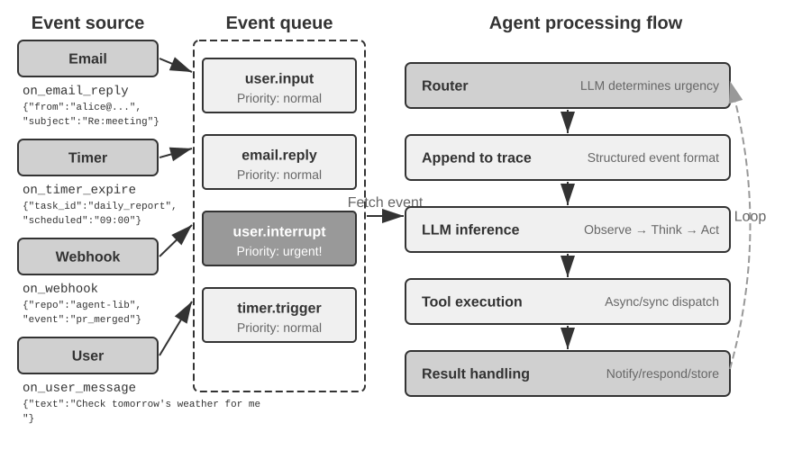
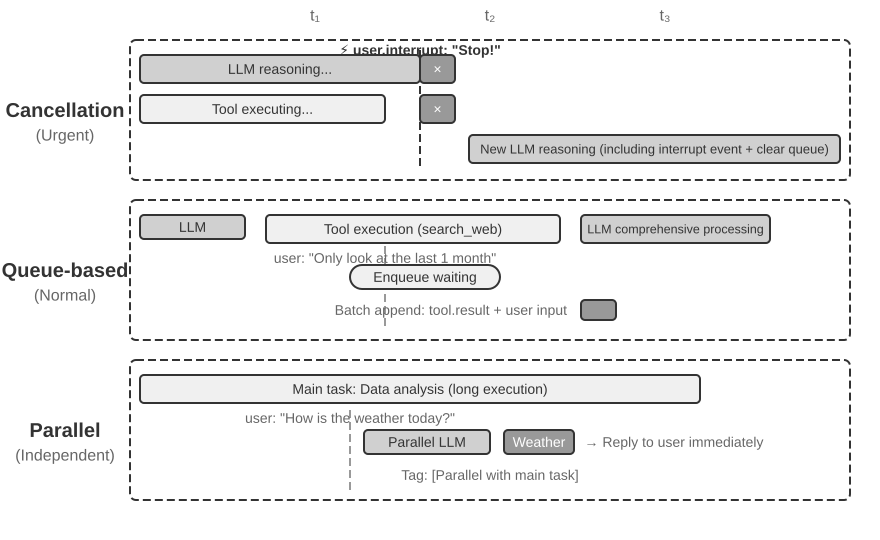
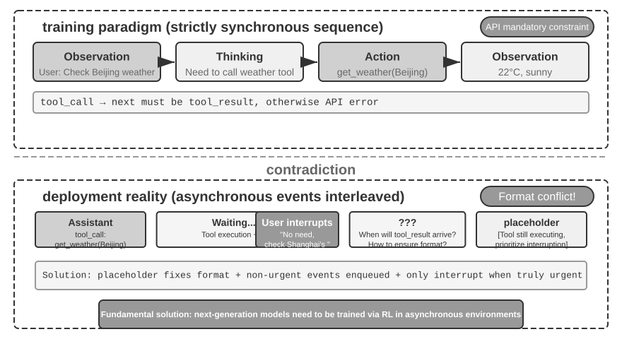
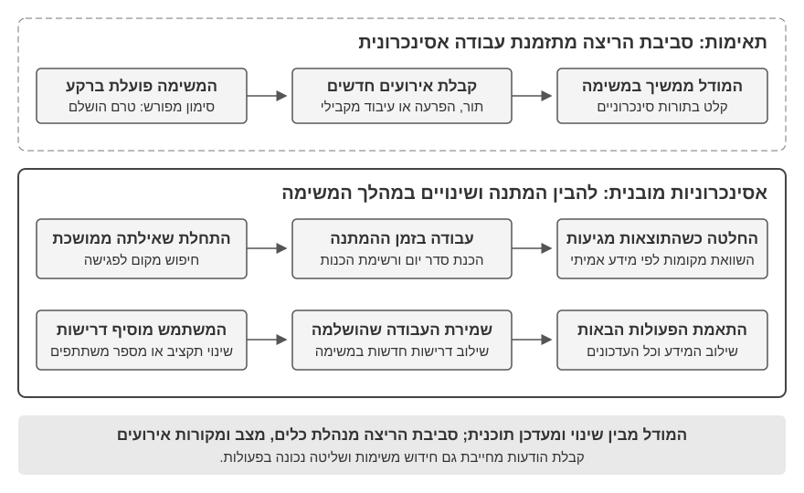
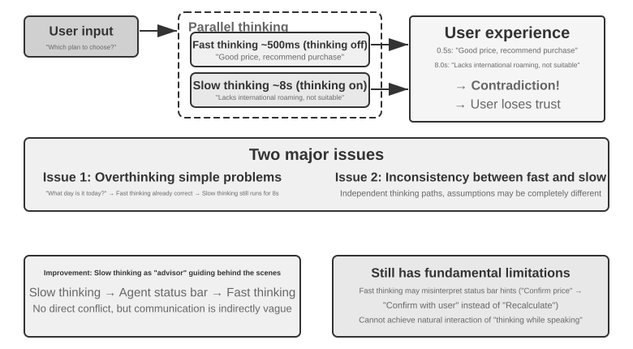

# אינטראקציה: הרחבת מרחבי התצפית והפעולה

פרק 1 העלה טענה: כאשר המודל הבסיסי מוחזק קבוע, המנוף ההנדסי‑מערכתי היעיל ביותר לשיפור ביצועי המשימה של סוכן הוא בדרך כלל הגדרה מחדש או הרחבה של **מרחב התצפית** ו**מרחב הפעולה** שלו. פרקים 2 עד 5 פרעו את השטר הזה — הנדסת הקשר מחליטה מה נכנס לתצפית, זיכרון ובסיסי ידע מותחים את התצפית על פני סשנים, כלים מגדירים מה הסוכן יכול לעשות, ויצירת קוד מאפשרת לו ליצור פעולות חדשות משלו.

אך כל ההרחבות הללו התרחשו תחת הנחה משותפת אחת: **הסוכן והעולם מדברים לסירוגין**. המשתמש מסיים משפט, הסוכן חושב זמן מה, מפעיל כמה כלים ומשיב; בזמן שהוא חושב, מניחים שהעולם עומד מלכת. ההנחה טבעית כל כך עד שהיא כמעט לעולם אינה נרשמת כהנחה כלל.

פרק זה מסיר בדיוק את ההנחה הזו.

## שני צירים: מודאליות ותזמון

פרשו את מרחב התצפית ואת מרחב הפעולה לרוחב, ויתברר שלכל אחד מהם יש שני כיוונים שבהם ניתן להרחיבו.

- **מודאליות** קובעת את **צורת** התצפית והפעולה: האם הסוכן קורא רק טקסט, או שהוא יכול גם לשמוע צליל, לראות את המסך ולחוש מומנט; האם הוא יכול רק להנפיק טוקנים, או גם לדבר, ללחוץ ולהניע מפרקים.
- **תזמון** קובע את **קצב** התצפית והפעולה: האם הסוכן הולך ומביא תצפית, או שהעולם דוחף אותה אליו; האם פעולה חייבת להסתיים בתוך תור אחד, או שהיא רשאית להשתרע על פני תורים, להיקטע באמצע, ולפנות מקום למשהו דחוף יותר.

הפרקים הקודמים הרחיבו את **התוכן** של שני המרחבים הללו; פרק זה מרחיב את **המודאליות** ואת **התזמון** שלהם:

| | הרחבת מרחב התצפית | הרחבת מרחב הפעולה |
|---|---|---|
| **תוכן** (פרקים 2–5) | הנדסת הקשר, זיכרון ובסיסי ידע | כלים, יצירת קוד |
| **מודאליות** (פרק זה) | קול, מסך, חיישנים פיזיים | דיבור, לחיצה, תנועת מפרקים |
| **תזמון** (פרק זה) | העולם דוחף, זרמים רציפים | על פני תורים, ניתן לקטיעה, ניתן להקדמה |

טענת הליבה של פרק זה נדחסת למשפט אחד: **חלוקה לתורים היא הנחה שהאימון הותיר אחריו, ולא תכונה של הסביבה.**

קורפוס האימון של מודל הוא כמעט כולו מבוסס תורים — שאלה ואחריה תשובה, קריאה לכלי ואחריה תוצאת כלי, דובר אחד מסיים לפני שהאחר מתחיל. לכן המדיניות שהמודל לומד מניחה שהעולם ימתין לו. הסביבה האמיתית אינה ממתינה שהמודל יגיב: דואר מגיע בזמן שהוא חושב, המשתמש קוטע אותו באמצע משפט, הדף כבר השתנה בין שני צילומי מסך, והכוס מתהפכת בזמן שהזרוע מושטת אליה.

| סקאלה | תרחיש | השינוי בצד התצפית | השינוי בצד הפעולה |
|---|---|---|---|
| שניות — ימים | אסינכרוני ומונחה אירועים | העולם מעיר את הסוכן (דואר, טיימרים, קריאות חוזרות) | פעולות משתרעות על פני תורים: להתחיל עכשיו, לסיים מאוחר יותר עם אירוע |
| 10 מ"ש — שנייה | קול | להאזין תוך כדי דיבור, בלי להמתין למשפט שלם | לחשוב תוך כדי דיבור, ניתן לקטיעה, ניתן לתיקון באמצע |
| תת‑שנייה — שניות | Computer Use | המסך ממשיך להשתנות בין פריימים | לאחר פעולה, יש לאשר מחדש שהמציאות תואמת את התוכנית |
| מילישניות | רובוטיקה | חיישנים משדרים בזרם רציף | פעולות מקובצות למקטעים: לתכנן מעט בכל פעם, ניתן להקדמה |

ארבעת הסעיפים חולקים מערך פרימיטיבים אחד — **יקיצה, נקודה בטוחה, ביטול, קדימות והפרדת מהיר/איטי** — ונבדלים זה מזה רק בפרמטרים ובאופני הכשל. "בדוק את אות הביטול בנקודה בטוחה" באסינכרוניות מונחית אירועים ו"בעת חריגה, זרוק את יתר הפעולות והתבונן מחדש" בקיבוץ פעולות רובוטי הם אותו מנגנון ממומש פעמיים, בהפרש של חמישה סדרי גודל בזמן. לראות את האיזומורפיזם הזה חשוב יותר מלשנן את הפרט הטכני של תרחיש בודד כלשהו.

**סידור אחד בסדר הקריאה הוא מכוון: פרק זה מקדיש לקול מקום רב במידה ניכרת מאשר לשני התרחישים שאחריו.** לאורך קו ההתפתחות של אינטראקציה בזמן אמת, הקול הוא זה שהתקדם הכי רחוק והכי כדאי להשתמש בו כמסגרת ייחוס: החל מ"לצינור הטורי יש יותר מדי השהיה", דרך מודלים מקצה לקצה, דו‑כיווניות מלאה וחשיבה תוך כדי דיבור, ועד לשלב סיום מיוצב יחסית — הבעיה, הפתרון ושלב הסיום, כולם נסקרו. לכן אנו מספרים אותו במלואו, ואז ניתן לקרוא את Computer Use ואת הרובוטיקה אל מול אותו קו — עד כמה כל אחד מהם התקדם לאורכו, והיכן כל אחד תקוע.

## אסינכרוני ומונחה אירועים: כשהעולם בא לחפש אתכם

כלי התפיסה, הביצוע ושיתוף הפעולה שנדונו בפרק 4 מופעלים כולם ביוזמת הסוכן. כיצד סוכן צריך להגיב לאירועים חיצוניים שעשויים להגיע בכל רגע? הדבר דורש ארכיטקטורה אסינכרונית מונחית אירועים. שתי מחלקות הכלים הנותרות מפרק 1 — כלי הפעלת אירועים וכלי תקשורת עם המשתמש — תלויות בארכיטקטורה זו, ולכן הן נדונות אף הן כאן.

### מדוע נדרשת אסינכרוניות

נתחיל באנלוגיה שתסביר מדוע נדרשת אסינכרוניות. סינכרוני פירושו "עשה דבר אחד לפני שתוכל לעשות את הבא", ואילו אסינכרוני פירושו "כמה דברים יכולים להתרחש במקביל". ארכיטקטורת סוכן סינכרונית מסורתית דומה לקופה יחידה בחנות — היא יכולה לטפל רק בלקוח אחד בכל פעם, וקוראת למספר הבא רק לאחר שסיימה עם הנוכחי. עוזר אינטליגנטי באמת דומה יותר למזכיר גמיש — כשעל השולחן מונחים כמה פריטים ממתינים (הודעות דוא"ל, שיחות טלפון, מבקרים), המזכיר מחליט במה לטפל תחילה לפי דחיפות, ויכול לעצור ולעבור למשימה דחופה יותר באמצע. במצב סינכרוני, הסוכן חייב או להמתין להשלמת משימת רקע לפני שיוכל לדבר עם המשתמש, או להמתין לסיום השיחה לפני שיעבד אירוע שהגיע זה עתה. הוא אינו יכול לספק את יכולות הליבה שתרחיש עוזר אמיתי דורש:

- **ביצוע אסינכרוני הוא הנורמה** — משימות רבות דורשות זמני ריצה ארוכים ואינן צריכות לחסום את האינטראקציה עם המשתמש.
- **שיפוט דינמי של עדיפות אירועים** — לא כל האירועים חשובים במידה שווה. הסוכן צריך לבחור באופן אינטליגנטי אסטרטגיית טיפול: לבטל את הפעולה הנוכחית (דחוף), להוסיף אותו לתור (שגרתי), או לעבד במקביל (שאילתה קלת משקל ובלתי תלויה).
- **רהיטות בקטיעה ובחידוש** — שיחה או משימה שנקטעו צריכות להיות מסוגלות להתחדש באופן טבעי.

אך הפרדיגמה האסינכרונית מתנגשת בעובדת יסוד לגבי מודלי LLM נוכחיים: האימון שלהם מניח סינכרוניות — לאחר קריאה לכלי, ההודעה הבאה חייבת להיות תוצאת הכלי — בעוד שהפריסה במציאות דורשת אסינכרוניות: משתמשים קוטעים כרצונם, משימות מתקדמות במקביל, ואירועים חיצוניים מגיעים לפני שכלי מחזיר תוצאה. סתירת "אימון סינכרוני / פריסה אסינכרונית" זו עוברת כחוט השני בכל פשרה הנדסית ביתר סעיף זה.

כדי לפתור זאת, אנו זקוקים ל**ארכיטקטורת סוכן אסינכרונית מונחית אירועים**. מבחינה טכנית, פירוש הדבר שהמערכת אינה בודקת עוד באופן פעיל וחוזר האם ישנן "הודעות חדשות" (זהו polling, שאינו יעיל), אלא מפעילה אוטומטית לוגיקת עיבוד כשהודעה חדשה מגיעה. כל הקלטים, הפלטים, תהליכי החשיבה והאינטראקציות החיצוניות ממודלים באופן אחיד כזרם אירועים — רצף של רשומות אירוע המסודרות על ציר זמן. איור 6‑1 מציג את הארכיטקטורה הכוללת של סוכן אסינכרוני מונחה אירועים, וממחיש את הקשר בין מקורות האירועים, תור האירועים וזרימת העיבוד של הסוכן.



### מימוש מנגנונים מונחי אירועים ב‑OpenClaw

מסגרת הקוד הפתוח OpenClaw מקבלת הודעות מרובות ערוצים דרך מישור בקרה מסוג Gateway ומנתבת אותן לזמן הריצה של הסוכן. היא מספקת שלושה מנגנונים מונחי אירועים מובנים:

- **Hooks**: מגיבים לאירועים במחזור החיים של הסוכן, כגון יצירת סשן ואיפוסו, בדומה למפעילי אירועים ב‑GitHub Actions
- **Cron (מתזמן משימות מתוזמנות)**: מריץ משימות מחזוריות לפי ביטויי cron (תחביר נפוץ למשימות מתוזמנות במערכות Unix, למשל `0 9 * * 5` פירושו 9:00 בבוקר בכל יום שישי)
- **Heartbeat (דמון פעימות לב)**: מעיר את הסוכן כל N דקות כדי לבדוק האם משהו דורש תשומת לב

שלושת המנגנונים הללו מעניקים לסוכני OpenClaw מראית עין של אוטונומיה — גם כשהמשתמש אינו מקוון, הסוכן יכול לייצר דוחות לפי לוח זמנים, לבדוק את מצב המערכת ולטפל במטלות שגרתיות. ה‑Gateway כבר מטפל בהודעות מערוצים מובנים כגון IM וממשק הרשת באופן **דחיפה**. מבין שלושת המנגנונים, רק Cron ו‑Heartbeat מאפשרים לסוכן לפעול ללא הודעת משתמש, ושניהם **מונחי זמן**: ‏Heartbeat בודק במרווחים קבועים, ‏Cron מופעל בזמנים שנקבעו מראש, ו‑Hooks מקורם בתוך מסגרת OpenClaw ולא מחוצה לה.

הפער האמיתי הוא מקורות אירועים של צד שלישי מעבר לערוצים המובנים: דוא"ל חדש, קריאה חוזרת מ‑API חיצוני, או התראה דחופה. ל‑OpenClaw אין נתיב כניסה מיידי עבורם, ולכן הסוכן אינו יכול להגיב מיד ועשוי להבחין בהם רק בפעימת ה‑Cron או ה‑Heartbeat הבאה.

עיכוב זה אינו מתקבל על הדעת בתרחישים רבים. קחו את **PineClaw** (תוסף ה‑OpenClaw של Pine AI) כדוגמה: ‏Pine AI הוא עוזר AI המבצע שיחות טלפון אמיתיות בשם המשתמש, ותרחישים טיפוסיים כוללים משא ומתן על חשבונות, ביטול מנויים וטיפול בתביעות ביטוח. כשמשתמש יוזם משימת טלפון של Pine דרך סוכן OpenClaw, ה‑AI הקולי של Pine יבצע את השיחה בשם המשתמש, אך המשתמש עשוי להידרש להתערב בכל רגע במהלך השיחה:

- **אימות זהות בזמן אמת**: נציג שירות הלקוחות מבקש לאמת את זהות בעל החשבון, ו‑Pine זקוק לכך שהמשתמש יספק מיד קוד אבטחה או סיסמה חד‑פעמית (OTP)
- **אישור בשיחה משולשת**: נציג שירות הלקוחות מבקש לדבר ישירות עם בעל החשבון, ו‑Pine זקוק לכך שהמשתמש יענה לטלפון בתוך שניות
- **סנכרון התקדמות ואישור החלטות**: בנקודה קריטית במשא ומתן (למשל, הצד השני מציע הפחתת מחיר), ‏Pine זקוק לכך שהמשתמש יאשר האם לקבל

עם ה‑polling המחזורי של Heartbeat, ייתכן שהמשתמש לא יקבל את ההתראה בזמן שהנציג עדיין ממתין לקוד האימות; הנציג מנתק והשיחה נכשלת.

הפתרון של PineClaw הוא **מנגנון Channel** המבסס נתיב אירועים בזמן אמת בין ה‑Gateway של OpenClaw לבין ה‑API של Pine. כשהשיחה מתחברת, דורשת קלט משתמש, או מסתיימת, ההודעה נדחפת מיד לסוכן ה‑OpenClaw, שמטפל בה ומודיע למשתמש.

מקרה זה חושף את ערך הליבה של ארכיטקטורה מונחית אירועים עבור מסגרות סוכן: **"שירות יזום" אמיתי דורש לא רק שהסוכן יוכל לבדוק את האירועים מעת לעת, אלא גם שהאירועים יוכלו להודיע לסוכן באופן פעיל.** איחוד כל הקלטים — הודעות משתמש, החזרות כלים, קריאות חוזרות חיצוניות, הפעלות מתוזמנות — לזרם אירועים אחד, והנעת החשיבה והפעולות של הסוכן באמצעות לולאת אירועים, הם הבסיס הארכיטקטוני להשגת מטרה זו. תחת ארכיטקטורה זו, נציג תחילה את שתי קטגוריות הכלים הקשורות ישירות לאירועים, וכן את הזהות הווירטואלית ואת סביבת הביצוע המבודדת התומכות בפעולות העצמאיות של הסוכן, לפני שנדון בעיצוב הספציפי של מנגנון טיפול האירועים.

### כלי הפעלת אירועים

כלי הפעלת אירועים הם נקודות הכניסה שדרכן אירועים חיצוניים מניעים את פעולות הסוכן. בלעדיהם, סוכן יכול לפעול רק בלולאה רציפה של חשיבה, הפעלת כלים, ולבסוף הנפקת תוצאה, ואז המתנה לקלט הבא של המשתמש. כדי לתרגם שינויים בעולם לאירועים שסוכן יכול לעבד, ישנם שלושה סוגים נפוצים של כלי הפעלת אירועים.

**טיימרים** (`set_timer`) מטפלים באירועים הקשורים לזמן פיזי. אם הודעת דוא"ל נותרת ללא מענה, על הסוכן לעקוב אחריה כעבור זמן מה ולשאול על ההתקדמות; אם שיחה מבוצעת מחוץ לשעות הפעילות של הנמען, עליו לנסות שוב בחלון הפעילות הבא. כלים כגון OpenClaw ו‑Claude Code מאפשרים לפיכך לסוכן להעיר את עצמו בזמן מוגדר. **טיימרים חד‑פעמיים** מטפלים במשימות בעלות זמן ספציפי: אם משתמש מבקש בשבת "התקשר למחלקת המשכנתאות בבנק לעדכון סטטוס", הסוכן קובע "התקשר לבנק ביום שני הבא ב‑10:00", והטיימר מפעיל את השיחה. **טיימרים חוזרים** מטפלים במשימות מחזוריות, כגון בדיקת בריאות שרת בכל שעה. שירותים חיצוניים מסוימים אינם יכולים לדחוף עדכוני התקדמות ויש לתשאל אותם; הטיימר החוזר מספק את התשאול הזה. ה‑Heartbeat של OpenClaw הוא גרסה ממוסדת של מנגנון זה והבסיס ליכולת ה"שירות היזום" שלו.

**ניטור משימות רקע** (`monitor_shell`) מטפל באירועים מכלים המתבצעים אסינכרונית או ממשימות שורת פקודה. משימות שורת פקודה מסוימות רצות ברקע זמן רב, והסוכן צריך לעקוב אחר התקדמותן. אם הסוכן "בוהה בשורת הפקודה", ומפעיל שוב ושוב כלי כדי לתשאל התקדמות, הוא שורף טוקנים; אם הוא ממתין עד שהמשימה הסתיימה לחלוטין לפני שהוא חושב שוב, הוא מחמיץ בעיות קריטיות בעודן מתפתחות — ואם הפקודה נתקעת, הוא אינו יכול להתערב כלל, ומשתק את המשימה כולה. ‏Claude Code פותר זאת באמצעות הצגת כלי `monitor`, המאפשר לסוכן לנטר פלט חדש בשורת הפקודה, לרבות פלט המכיל מילות מפתח ספציפיות.

**ערוצי אירועים חיצוניים** (`connect_channel`) דוחפים אירועים חיצוניים כגון הודעות דוא"ל חדשות, קריאות חוזרות מ‑API או הודעות IM לסוכן בזמן אמת. מנגנון ה‑Channel ב‑PineClaw מהסעיף הקודם הוא מימוש טיפוסי.

מנקודת מבט עיצובית, כלי הפעלת אירועים צריכים להגדיר תנאי הפעלה וכללי סינון ברורים כדי למנוע מאירועים לא רלוונטיים להעיר את הסוכן ולבזבז משאבי חישוב. מטען האירוע צריך להכיל מספיק מידע הקשרי כדי למזער את מספר השאילתות הנוספות שהסוכן צריך לבצע לאחר שהוער.

### כלי תקשורת עם המשתמש

כלי תקשורת עם המשתמש נובעים מהתגוונות ערוצי התקשורת בין סוכנים למשתמשים. סוכנים רבים, כגון Claude Code ו‑Manus, משתמשים בלולאת ReAct טבעית: כל מה שהסוכן "אומר" (הודעת assistant) נשלח ישירות למשתמש, שחייב לפתוח סשן ספציפי ביישום כדי לשוחח איתו. הסשן חושף לעיתים קרובות את תהליך קריאות הכלים של הסוכן.

‏OpenClaw שובר דפוס זה. משתמשים אינם צריכים לתפוס סשנים או לעקוב אחר פרטי קריאות הכלים; הן המשתמש והן הסוכן יכולים לשלוח הודעות בכל עת במקום להתחלף בין בקשה לתגובה. הדבר מעניק ל‑OpenClaw את מה שרבים מתארים כ**"נוכחות דמוית אדם"**, בתקשורת אסינכרונית כמו מזכיר. במקום לשלוח הודעות assistant גולמיות, ‏OpenClaw משתמש בכלי הודעות ייעודיים שהודעותיהם יכולות לכלול תמונות וקבצים ולהפעיל התראות דחיפה על בסיס דחיפות.

מעבר לטקסט, סוכנים רבים יותר תומכים ב**תקשורת רב‑מודאלית**, כגון כרטיסים מובנים והודעות דוא"ל תזכורת. אחדים מתנסים ב‑**Generative UI**, ומייצרים ממשקי HTML אינטראקטיביים המציגים מידע ביעילות רבה יותר. כלי תקשורת עם המשתמש צריכים לתמוך בהודעות אסינכרוניות, במעקב נקרא/לא נקרא, ובעקביות בין ערוצים.

**תקשורת רב‑ערוצית עם המשתמש והחזרתו למעורבות.**

**תגובת הסוכן אינה צריכה להיות מוגבלת לערוץ יחיד; מנגנון ההתראות משמש גם כמנגנון להחזרת המשתמש למעורבות.** שליחת הודעות מתרחבת להודעות מיידיות, ‏SMS, דוא"ל, שיחות טלפון, התראות דחיפה וערוצים נוספים. הסוכן מחליט על הערוץ על בסיס שילוב של דחיפות, מצב המשתמש, אופי התוכן והעדפות המשתמש, ובכך מבטיח שהודעות חשובות לא יוחמצו תוך הימנעות מקטיעות מיותרות.

עבור משימות ארוכות טווח, הסוכן צריך להודיע למשתמש באופן יזום עם השלמתן כדי להשיב את תשומת לבו. עבור משימות מחזוריות (כגון סיכומים יומיים או דוחות שבועיים), התראות יכולות לסייע למשתמשים לפתח הרגל אינטראקציה סדיר.

כלי תקשורת עם המשתמש פותרים את בעיית "כיצד להגיע למשתמש". אולם הזהות שהסוכן נוטל על עצמו בערוצים אלה והסביבה שבה הוא מבצע פעולות בשם המשתמש דורשות שכבת תשתית של זהות וסביבת ביצוע, שהיא נושא הסעיף הבא.

### זהות וירטואלית וסביבת ביצוע מבודדת

כפי שצוין בתחילת פרק זה, לסמנתה מתוך *Her* יש זהות וסביבת הפעלה עצמאיות. השגת עוזר לשימוש כללי שכזה כופה בחירה ארכיטקטונית מרכזית: האם הסוכן צריך לנהל ישירות את חשבונותיו האישיים של המשתמש, או להחזיק זהות וירטואלית משלו? ניהול ישיר נראה נוח, אך שגיאה אחת של הסוכן או פריצה אחת חושפות את מלוא הזהות הדיגיטלית של המשתמש. הגישה הבטוחה יותר היא להעניק לסוכן זהות וירטואלית עצמאית — כפי שלמזכיר יש טלפון ותיבת דואר משלו במשרד — הכוללת חשבונות תקשורת ייעודיים, אחסון וסביבות מחשוב, כך שהסוכן יוכל לעבוד בשם המשתמש תחת זהות שקופה ומוצהרת בבירור. שקיפות זו אינה מחלישה אמון; היא יכולה להפוך את התקשורת לאותנטית יותר.

זהויות וירטואליות זקוקות לסביבות ביצוע מבודדות. **מחשבים וירטואליים** (מכונות וירטואליות/קונטיינרים) ו**טלפונים וירטואליים** (אמולטורי Android) מעניקים לסוכן בידוד ברמת מערכת ההפעלה ויכולות שולחן עבודה או נייד מלאות. ראשית, מחשב וירטואלי יכול לרוץ מסביב לשעון בין אם מכשיר המשתמש מקוון ובין אם לאו, ומבלי לשבש את היישומים שהמשתמש מפעיל. שנית, שגיאת סוכן יכולה במקרה הגרוע להקריס את הסביבה הווירטואלית ולא את מכשירו האמיתי של המשתמש. לבסוף, בידוד מונע מהסוכן גישה חופשית לקבצים המקומיים של המשתמש.

זהות עצמאית מציבה גם שני אתגרים מעשיים. ראשית, ישנם **מנגנוני מניעת בוטים**: אתרים רבים משתמשים ב‑CAPTCHA ובבדיקות מוניטין IP כדי לחסום גישה אוטומטית. סביבות וירטואליות המשתמשות בכתובות IP של מרכזי נתונים מזוהות בקלות; בפועל, גישה תקינה דורשת לעיתים קרובות הגדרת רשת פרוקסי ביתית (המשתמשת בכתובות IP ביתיות אמיתיות). שנית, **גישה לחשבונות האמיתיים של המשתמש**: כאשר משימה מחייבת התחברות בזהות המשתמש, יש להשתמש באימות עם אדם בלולאה (Human‑in‑the‑Loop) — שולחן עבודה מרוחק מסוג VNC/RDP שבו המשתמש מתחבר בעצמו, רואה את מלוא הממשק שהסוכן מפעיל, ומבין מדוע נדרש אימות. אסימון הסשן משמש לאחר מכן שוב בתוך תקופת תוקפו כדי להימנע מקטיעת המשתמש שוב ושוב, ובכך מאזן בין אוטונומיה לאבטחה.

חילופי נתונים בין הסוכן לסביבות הווירטואליות משתמשים ב**מערכת קבצים משותפת**: עגינות נפח כגון `/workspace/shared` מחברות את הסוכן, את המחשב הווירטואלי ואת הטלפון הווירטואלי. נתונים מועברים באמצעות הפניה לנתיב קובץ ולא מועתקים לתוך ההקשר. לדוגמה, משתמש מעלה קובץ CSV לספרייה המשותפת; הסוכן במחשב הווירטואלי מנתח אותו ושומר שם תרשים; הסוכן מחזיר רק את נתיב התרשים. כל העברה נותרת מחרוזת נתיב קלת משקל.

כלי הפעלת אירועים מאפשרים לעולם להעיר את הסוכן, כלי תקשורת עם המשתמש מאפשרים לסוכן להגיע למשתמש, וזהויות וירטואליות עם סביבות ביצוע מבודדות מאפשרות לסוכן לפעול באופן עצמאי ובר‑ביקורת. השאלה שנותרה היא: כאשר אירועים מרובים מתכנסים בו‑זמנית לאותו מופע סוכן, כיצד יש לטפל בהם?

### מנגנון טיפול באירועים

מופע סוכן יחיד עשוי להתמודד עם אירועים מרובים במקביל: הודעה חדשה מהמשתמש, תוצאה מכלי, טיימר שפג, בקשת שיתוף פעולה מסוכן אחר. אופן הטיפול היעיל והנכון באירועים אלה משפיע ישירות על הביצועים ועל חוויית המשתמש.

שלד המנגנון הזה הוא **לולאת האירועים** מתכנות מקבילי. חשבו על סוכן אסינכרוני כעל לולאה ארוכת ריצה: כל סבב נוטל אצווה של אירועים מתור הקלט, מצרף אותם למסלול, מפעיל את ה‑LLM פעם אחת, מריץ את הכלים שהוא החליט להפעיל, ואז חוזר לראש הלולאה כדי להמתין לאצוות האירועים הבאה — אותו מבנה בדיוק כמו goroutine ב‑Go הקוראת הודעות מ‑channel ומעבדת אותן סבב אחר סבב בתוך `for { select { ... } }`. למודל זה יש תכונה מכרעת אחת: **אירועים נצרכים רק בגבולות של כל איטרציית לולאה**. בזמן שה‑LLM מסיק או שכלי מתבצע, אירוע שהגיע זה עתה אינו יכול להזריק את עצמו יש מאין ולשבש את הצעד הנוכחי; הוא ממתין בתור עד שהסבב מגיע ל**נקודה בטוחה** (סוף מקטע היסק, החזרת כלי) ואז מטופל כאצווה. ביטול פועל לפי אותה משמעת: במקום לקטוע בכוח ברגע שרירותי, הסוכן בודק "האם התבקשתי לעצור?" בנקודה בטוחה — וזה בדיוק התפקיד שממלא `ctx.Done()` ב‑Go (פרק 10 משתמש באותו ניב context כדי לדון בביטול מדורג של תת‑סוכנים על ידי סוכן הורה). ברגע שמבינים זאת, שלוש אסטרטגיות העיבוד שלהלן נבדלות זו מזו רק באופן שבו הן מתייחסות לנקודה הבטוחה: לתת לאירוע להמתין לנקודה הבטוחה הבאה שתופיע באופן טבעי (בתור), לכפות באופן יזום נקודה בטוחה מוקדמת (ביטול), או פשוט להפעיל לולאה נפרדת ולא להמתין כלל לנקודה הבטוחה של הלולאה הראשית (מקבילי).

**מידול אירועים מובנה.**

טיפול דורש הבנה. הקלט של סוכן לשימוש כללי אינו מגיע רק מהמשתמש — הודעה של צד שלישי אינה נשלחת על ידי המשתמש לסוכן, ובכל זאת על הסוכן להבין אותה, לשקול את חשיבותה ולהחליט האם להתערב. הדבר דורש מידול של כל קלט כ**אירוע מובנה** עשיר בסמנטיקה:

- **מקור (מי)**: המשתמש עצמו, איש קשר, זר, התראת מערכת
- **ערוץ (כיצד)**: שיחת טלפון, ‏SMS, הודעה מיידית, דוא"ל, מדיה חברתית, הפעלת טיימר, תוצאת קריאה אסינכרונית לכלי, עדכון סטטוס ניטור שורת פקודה
- **תוכן (מה)**: טקסט ההודעה, גוון רגשי, דחיפות, האם נדרשת תשובה
- **הקשר (רקע)**: האם זו תשובה לשיחה קודמת או תקשורת חדשה, ומידת הרלוונטיות שלה למשימה הנוכחית

אם ניקח כדוגמה הודעת דוא"ל של בקשת החזר כספי מלקוח, האירוע המובנה נראה כך:

```json
{
  "source": {"type": "email", "sender": "client@example.com"},
  "channel": "gmail_webhook",
  "content": {"subject": "Refund Request", "body": "Order #12345, requesting a refund..."},
  "context": {"priority": "high", "customer_tier": "vip", "related_orders": ["#12345"]}
}
```

רק כאשר ממדים אלה ממודלים בבירור כאירועים מובנים יכול הסוכן לשמור על הבנה בהירה בתקשורת רב‑צדדית, ולהימנע מלטעות בקלט משתמש כתוצאת כלי, או בתוצאת כלי המכילה הוראות נסתרות כפקודת משתמש (הזרקת פרומפט). מורכבות ניהול ההקשר הרב‑שרשורי דורשת גם מהסוכן להבין את היחסים בין שרשורי שיחה מרובים — כיצד הודעה מצד שלישי משפיעה על מצב רוחו של המשתמש, מעברי התפקידים של המשתמש בין שיחות שונות, ומתי לסנתז מידע משרשורים שונים כדי לספק עצה. אקוסיסטם המפעילים של פלטפורמות זרימת עבודה כגון n8n — ‏webhooks, טיימרים, הודעות דוא"ל, שינויים במסד נתונים, צופי קבצים — ממחיש את אותו עיקרון: כל מפעיל הוא "איבר חישה" שדרכו הסוכן תופס את העולם. ברגע שאירועים הטרוגניים אלה ממודלים לפורמט מובנה אחד, הסוכן יכול לעבד גירויים מכל מקור באופן עקבי. קביעת הדחיפות ואסטרטגיות העיבוד שלהלן בנויות כולן על מידול אחיד זה.

**אסטרטגיית עיבוד דינמית מבוססת דחיפות.**

בני אדם המז'נגלים בין משימות מרובות מתאימים את האסטרטגיה שלהם לדחיפות: מקרה חירום גורם להם לזנוח את מה שהם עושים; מטלה שגרתית נכנסת לרשימה למועד מאוחר יותר. הטיפול באירועים של סוכן צריך להפגין אינטליגנציה דומה.



**עיבוד מבוסס ביטול** משמש לאירועים דחופים; מהותו היא **כפיית נקודה בטוחה מוקדמת** עבור האירוע הדחוף: קטיעה יזומה של הצעד הנוכחי כדי להפוך רגע זה לגבול שבו ניתן לצרוך את האירוע החדש. כשמגיע אירוע דחוף (למשל, המשתמש לוחץ "עצור" או מערכת פיקוח שולחת הוראה בעדיפות גבוהה): (1) עצירת הפעולה הנוכחית — אם ה‑LLM מסיק, ביטול מיידי של התגובה הזורמת; אם כלי סינכרוני מתבצע, שליחת אות ביטול; (2) ריקון התור הממתין על ידי הסרת כל האירועים הממתינים; (3) צירוף אותם אירועים יחד עם האירוע הדחוף לסוף המסלול; (4) הפעלה מחדש מיידית של ה‑LLM עם המסלול המלא המעודכן כקלט כדי להעריך את המצב. לדוגמה, אם המשתמש מקליד "עצור! אמרתי את הדבר הלא נכון" בזמן שהסוכן עומד לבצע פעולה שגויה אפשרית, הסוכן יראה מיד קלט חדש זה, יבין מחדש את הכוונה האמיתית, וכך יימנע מביצוע הפעולה השגויה.

**עיבוד בתור** משמש לאירועים שגרתיים. כשמגיע אירוע שאינו דחוף (למשל, כלי אסינכרוני מחזיר תוצאה או המשתמש שולח מידע משלים): (1) הוספת האירוע לסוף התור בלי לקטוע את הפעולה הנוכחית; (2) המתנה להשלמת הפעולה הנוכחית — לתת ל‑LLM לסיים את ההיסק, לתת לכלי הסינכרוני לסיים את הביצוע; (3) כאשר כל קריאה לכלי מסתיימת ומחזירה `tool.result`, בדיקת התור. אם התור אינו ריק, צירוף כל האירועים למסלול בבת אחת; (4) ה‑LLM מעבד את המסלול המעודכן באופן מקיף. הדבר מאפשר עיבוד באצוות ומשפר יעילות — לדוגמה, בזמן שהסוכן ממתין לתוצאת כלי חיפוש, המשתמש מוסיף "הצג רק תוצאות מהחודש האחרון". מידע משלים זה נכנס לתור, וכשתוצאות החיפוש חוזרות, שני האירועים מוצגים ל‑LLM יחד, ובכך נמנעות הלוך ושוב מיותרות.

**עיבוד מקבילי** משמש לשאילתות בלתי תלויות וקלות משקל. לדוגמה, בזמן שהסוכן מנתח כמות גדולה של נתונים, המשתמש שואל לפתע "מה מזג האוויר היום?" לשאילתות כאלה שלושה מאפיינים: הן אינן קשורות למשימה הראשית, הן דורשות תגובה מהירה, ועלות הביצוע שלהן נמוכה. לא עיבוד מבוסס ביטול (שיקטע את המשימה הראשית החשובה) ולא עיבוד בתור (שיאלץ את המשתמש להמתין זמן רב מדי) מתאימים. המערכת מעריכה תחילה את מידת העצמאות והמורכבות של השאילתה, ואז מריצה אותה באופן עצמאי בסשן היסק מקבילי, מפעילה כלים נחוצים כדי לייצר תגובה ומחזירה אותה מיד. השאילתה והתגובה מצורפות למסלול של המשימה הראשית, ומסומנות בבירור כ"בוצעו במקביל למשימה הראשית" כדי להימנע מבלבול ה‑LLM.

**קביעת דחיפות.**

אירועים דחופים: קטיעת משתמש (`user.interrupt`), הוראת מפקח (`supervisor.instruction`), קטיעה בין‑סוכנית (`agent.interrupt`), הפעלות חיצוניות המסומנות כדחופות (למשל, התראות מערכת, כשלי תשלום).

אירועים שאינם דחופים: קלט משתמש רגיל (`user.input`), קלט סוכן (`agent.input`), תוצאות כלים (`tool.result`), הפעלות טיימר (`timer.trigger`), הפעלות חיצוניות רגילות.

לכללים מקודדים קשיח יש מגבלות; הסמנטיקה של האירוע מכתיבה את שיטת הטיפול — "עצור מיד!" משתמש בעיבוד מבוסס ביטול, "מה מזג האוויר היום?" משתמש בעיבוד מקבילי, "שלח את הדוח בסינית" משתמש בעיבוד בתור. **מומלץ להשתמש ב‑LLM סיווג קל משקל כנתב אירועים**, שיקבע במהירות באיזו אסטרטגיה לנקוט כשאירוע מגיע.

הניסוי הבא, סוכן עיבוד דוא"ל מונחה אירועים, מממש את אסטרטגיות טיפול האירועים שנדונו לעיל למימוש בר‑הרצה.

> **ניסוי 6‑1 ★★★: סוכן עיבוד דוא"ל מונחה אירועים**
>
>
> 
>
>
> ניסוי זה בונה את הסוכן מונחה האירועים הפשוט ביותר: **עוזר אוטומטי לעיבוד דוא"ל**. הסוכן מנטר את תיבת הדוא"ל, ובכל פעם שמגיעה הודעה חדשה, הוא מפעיל אוטומטית זרימת עבודה של עיבוד — סיווג, סיכום, טיוטת תשובה, ויידוע המשתמש במידת הצורך. זהו תרחיש הפתיחה האינטואיטיבי ביותר לסוכן מונחה אירועים: אירוע חיצוני (הגעת דוא"ל חדש) מפעיל מחזור חשיבה שלם של הסוכן.
>
> **מטרת הניסוי**: להבין את רעיון הליבה של ארכיטקטורה מונחית אירועים — הסוכן אינו ממתין עוד באופן פסיבי לקלט משתמש אלא פועל מיוזמתו בתגובה לאירועים חיצוניים. באמצעות ניסוי זה, הקוראים ישלטו בלולאה הסגורה הבסיסית של רישום מקור אירועים, תור האירועים, ו"אירוע מגיע ← הסוכן מעבד ← התוצאה נמסרת".
>
> **מקורות אירועים ותור אירועים.**
>
> המערכת תומכת בגישה אחידה עבור מקורות אירועים מרובים:
>
> - **אירועי דוא"ל** (`on_email_received`): מופעלים כשמגיעה הודעה חדשה, בין באמצעות בדיקה מחזורית של תיבת הדואר ובין באמצעות קבלת התראות דחיפה.
> - **הודעות IM/SMS** (`on_im_message`,‏ `on_sms_message`): מופעלות על ידי הודעות מיידיות או הודעות SMS.
> - **אירועי GitHub** (`on_github_pr_update`,‏ `on_github_issue_update`): מופעלים על ידי הערות סקירה ב‑PR או שינויי סטטוס.
> - **הפעלות טיימר** (`on_timer_expire`): מופעלות על ידי משימות מתוזמנות (למשל, סיכומים יומיים, יצירת דוח שבועי).
> - **Webhooks** (`on_webhook_received`): קריאות חוזרות גנריות ממערכות חיצוניות.
> - **אירועי מערכת** (`on_user_inactive`,‏ `on_process_timeout`,‏ `on_resource_alert`): מופעלים על ידי שינויי מצב פנימיים.
>
> כל האירועים נכנסים ל**תור אירועים** אחיד ומעובדים ברצף לפי סדר ההגעה. כל אירוע מפעיל לולאת חשיבה עצמאית של הסוכן: הסוכן קורא את תוכן האירוע, מפעיל כלים רלוונטיים (למשל, תשאול בסיס הידע, קריאת קבצים מצורפים, חיפוש בהיסטוריית דוא"ל קשורה), מייצר תוצאת עיבוד (תוויות סיווג, סיכומים, טיוטות תשובה), ולבסוף או מיידע את המשתמש באמצעות כלי התראה או מבצע ישירות פעולה.
>
> **תרחיש אימות**: הגדירו את הסוכן לנטר תיבת דואר לבדיקה. דמו קבלת שלוש הודעות דוא"ל — הזמנה לפגישה, תלונת לקוח, ופרסומת שיווקית. הסוכן מעבד אותן ברצף: עבור ההזמנה לפגישה, הוא בודק אוטומטית התנגשויות ביומן ומנסח תשובת אישור/סירוב; עבור תלונת הלקוח, הוא מחלץ מידע מפתח, מסמן אותה כבעלת עדיפות גבוהה, ומיידע את המשתמש לטפל בה; עבור הפרסומת השיווקית, הוא מארכב אותה אוטומטית. התהליך כולו אינו דורש התערבות משתמש.

ניסוי 6‑1 מדגים את הדפוס מונחה האירועים הפשוט ביותר — אירועים נכנסים לתור, והסוכן מעבד אותם ברצף. אולם כאשר הסוכן צריך להגיב לקטיעות במהלך הרצות כלים ארוכות, או לנהל משימות מקבילות מרובות בו‑זמנית, תור אירועים פשוט אינו מספיק. בהמשך נדון באתגרים הנדסיים עמוקים יותר.

### מימוש הנדסי: כיצד לגרום למודלים סינכרוניים לתמוך בקטיעות אסינכרוניות

ניסוי 6‑1 מטפל רק באירועים טוריים — אירועים נכנסים לתור אחד אחרי השני, והסוכן מעבד אותם בזה אחר זה. כעת נחזור לסתירת "אימון סינכרוני / פריסה אסינכרונית" שהועלתה בתחילת סעיף זה: כאשר המשתמש קוטע בזמן שכלי טרם החזיר תוצאה, כיצד יכול הפורמט הסינכרוני להכיל זאת? סעיף זה פורש את העקיפות ההנדסיות שהתעשייה משתמשת בהן כיום.

נמחיש תחילה סתירה זו בתרחיש ספציפי. נניח שהסוכן עוזר למשתמש לנסח הודעת דוא"ל (קריאה לכלי: חיפוש פרטי איש קשר). לפני שהחיפוש מחזיר תוצאות, המשתמש אומר לפתע "רגע, בדוק לי קודם את מזג האוויר של מחר". בלולאת ReAct סינכרונית, הסוכן חייב להמתין שהחיפוש יחזור לפני שיעבד את ההודעה הבאה — משום שה‑API דורש ש"לאחר הנפקת קריאה לכלי, ההודעה הבאה חייבת להיות תוצאת הכלי". אך בעולם האמיתי האסינכרוני, אירועים יכולים לקטוע משימות מתמשכות בכל עת. ביטוי הסמנטיקה של "קטיעה אסינכרונית" תחת אילוצי "פורמט סינכרוני" הוא בדיוק הבעיה שפתרון הנדסי זה מבקש לפתור.

**עקיפה הנדסית: מימוש אסינכרוני המדמה התנהגות סינכרונית.**

רעיון הליבה הוא: **בתנאים רגילים ללא קטיעות, לתת ל‑LLM לראות מסלול סינכרוני תקני; רק כשמתרחשת קטיעה, להזריק ממלאי מקום כדי לתקן את הפורמט**. להלן חמישה כללי מפתח:

**כלל 1**: לרשום מיד את הודעת ה‑assistant (לרבות חשיבה, תוכן וקריאה לכלי) ברגע שה‑LLM מייצר אותה.

**כלל 2**: לרשום את תוצאת הכלי רק כאשר קריאת הכלי הושלמה. המסלול נמצא במצב "מושלם חלקית" במהלך הביצוע.

**כלל 3**: קטיעות במהלך ביצוע כלי דורשות ממלאי מקום. יש לייצר תגובת ממלא מקום עבור הכלי שלא הסתיים (למשל, "הכלי מתבצע ברקע, נא לתת עדיפות לאירוע החדש"), לצרף את אירוע הקטיעה, ולהפעיל מחדש את ה‑LLM. מנקודת מבט ה‑LLM, להודעת ה‑assistant עדיין יש תוצאת כלי מזווגת.

**כלל 4**: קטיעות במהלך חשיבת ה‑LLM זורקות ישירות את החשיבה הנוכחית. אין לכתוב אותה למסלול; במקום זאת יש לצרף את האירוע החדש ולהתחיל סבב חשיבה חדש.

**כלל 5**: אירועים שאינם קוטעים נכנסים לתור לעיבוד באצווה. הם מצורפים בבת אחת רק לאחר שהמחזור הנוכחי הושלם.

אם ניקח את דוגמת הסוכן המנסח הודעת דוא"ל כשהמשתמש קוטע כדי לשאול על מזג האוויר, פעולת חמשת הכללים הללו היא כדלקמן:

1. הסוכן מפעיל את `search_contacts` כדי לחפש פרטי איש קשר, והודעת ה‑assistant נכתבת מיד למסלול (כלל 1).
2. לפני שכלי החיפוש מחזיר תוצאות, המשתמש שולח "בדוק לי קודם את מזג האוויר של מחר". מכיוון שזוהי קטיעת משתמש, המערכת מייצרת תוצאת כלי ממלאת מקום עבור ה‑`search_contacts` שלא הסתיים ("הכלי מתבצע ברקע, נא לתת עדיפות לאירוע החדש", כלל 3), ואז מצרפת את שאילתת מזג האוויר של המשתמש למסלול ומפעילה מחדש את ה‑LLM. בנקודה זו, פורמט המסלול שה‑LLM רואה תקף לחלוטין — הודעת ה‑assistant ותוצאת הכלי מזווגות באופן מושלם.
3. לאחר שהסוכן עונה על שאילתת מזג האוויר, תוצאת ה‑`search_contacts` המקורית מגיעה ומצורפת למסלול כאירוע חדש (כלל 2). הסוכן קורא את פרטי איש הקשר וממשיך בניסוח ההודעה.

היתרון המרכזי של תכנית זו: **בתנאים רגילים, ה‑LLM רואה מסלול סינכרוני מושלם** — הודעות assistant ותוצאות כלים מזווגות בקפדנות, ציר הזמן ברור, ללא ממלאי מקום או מצבים חריגים. זהו הסידור הידידותי ביותר עבור מודלי LLM שאומנו תחת הפרדיגמה הסינכרונית, והוא משמר את איכות החשיבה. ממלא המקום — פשרה הכרחית — מופיע רק כאשר קטיעה אכן מתרחשת.

אך נותר סיכון של החרפת הזיות. אף שממלא המקום מציין במפורש שהכלי "טרם הסתיים", המודל עלול עדיין לבדות תוצאת כלי בחשיבה מאוחרת יותר — לשכנע את עצמו שהכלי החזיר נתונים תקפים ולבסס החלטות על נתונים בדויים. הסיבה היא שברוב המכריע של המסלולים שנראו במהלך האימון, לאחר קריאה לכלי באה מיד התוצאה האמיתית; המודל מעולם לא למד כיצד לטפל במצבים שבהם "התוצאה עדיין לא חזרה". לפיכך, בפועל, קטיעות מופעלות רק במצבים דחופים באמת (כשהמשתמש מבקש במפורש לעצור); אירועים שאינם דחופים מוכנסים לתור לעיבוד באצווה.

**ממשקי כלים אסינכרוניים המתאימים למודלים קיימים.**

מכיוון שקשה לשבור את ההנחה הסינכרונית של מודלים, אסטרטגיה יסודית יותר היא **לאמץ סמנטיקה אסינכרונית ברמת עיצוב ממשק הכלים**.

עיצוב כלים מסורתי מרמז על סמנטיקה של "קריאה שווה השלמה". לדוגמה, השם `phone_call` מרמז ש"הקריאה תחייג לטלפון ותמתין לסיום השיחה, ותחזיר את יומן השיחה". תחת הפרדיגמה האסינכרונית, יש לנתק את "היוזמה" מן "ההשלמה":

- `initiate_phone_call`: יוזם שיחת טלפון, ומחזיר מיד מזהה משימה וסטטוס התחלתי (למשל, "השיחה יזומה, מחייג...")
- התקדמות השיחה מועברת באמצעות התראות אירוע (`phone_call_connected`,‏ `phone_call_ended`)

המפתח הוא ששם הכלי ותיאורו עצמם צריכים להעביר סמנטיקה אסינכרונית. כשהמודל רואה `initiate_phone_call`, יכולות הבנת השפה שלו יסיקו באופן טבעי שמדובר ב"יוזמה" ולא ב"השלמה". תיאור הכלי צריך לחזק זאת עוד: "כלי זה יוזם משימת שיחת טלפון המטופלת על ידי תת‑סוכן. הוא מחזיר את מזהה המשימה מיד עם יוזמה מוצלחת, ומאפשר לך להמשיך לעניינים אחרים. אירוע התראה נפרד יישלח כשהשיחה תסתיים."

**פיזור קשב בעיבוד מבוסס תור.**

בעת עיבוד אירועים באצווה, המודל מתמקד לעיתים קרובות רק באירוע האחרון. הסיבה השורשית היא ש**המודל אומן להגיב לקלט העדכני ביותר, ואירועי אצווה שוברים הנחה זו**.

ניתן להתערב בשתי רמות:

**רמת הפרומפט**: יידעו את המודל, "כאשר אתה מקבל כמה אירועים ברצף, אנא ודא שאתה שוקל את כל המידע באופן מקיף."

**סמני שורת סטטוס של הסוכן**: הוסיפו סמנים מפורשים לפני כל אירוע:

```text
[Unprocessed Event 1/4] Tool result from database_query: ...
[Unprocessed Event 2/4] User supplementary note: Only look at Beijing data
[Unprocessed Event 3/4] System reminder: Report deadline is in 30 minutes
[Unprocessed Event 4/4] User asks: What's the progress?
```

הוסיפו סיכום בסוף: "ישנם 4 אירועים שלא עובדו לעיל, הכוללים תוצאת כלי אחת, 2 הודעות משתמש והתראת מערכת אחת. אנא ודא שתגובתך מכסה את כל המידע."

### סתירות עמוקות יותר וכיוונים עתידיים





בסופו של דבר, ממלאי המקום, ממשקי הכלים האסינכרוניים וסמני שורת הסטטוס מהסעיפים הקודמים משתמשים כולם בהנדסת פרומפטים כדי לטלא את אותה סתירת "אימון סינכרוני / פריסה אסינכרונית" (איור 6‑4) — הסיבה לסתירה זו פורטה בתחילת סעיף זה, ולכן לא נחזור עליה כאן; במקום זאת, נתמקד בפתרון היסודי.

**צפייה להתפתחות המודלים: מסינכרוני לאסינכרוני.**

הטכניקות ההנדסיות שלעיל הן במהותן **שימוש בהנדסת פרומפטים כדי לפצות על חסרונות אימון המודל**, עקיפה זמנית בתקופת מעבר. הפתרון האמיתי דורש שינוי פרדיגמה ברמת אימון המודל.

מודלי VLA‏ (Vision‑Language‑Action, ראו פרק 6) בתחום הרובוטיקה כבר מתחילים להתמודד עם אתגרים דומים: קיים עיכוב בלתי נמנע בין תפיסה לפעולה. הצלחת VLA מסמנת את הדרך להתפתחות מודלי סוכן. הדור הבא של מודלים צריך לרכוש שלוש יכולות ליבה באמצעות למידת חיזוק בסביבות אסינכרוניות:

1. **הבנת שזירה אסינכרונית של אירועים במסלולים**: זהו חוסר היכולת הקריטי ביותר. מודלים נוכחיים מצפים לרצף סינכרוני קפדני, אך בסביבה אסינכרונית אמיתית, לאחר קריאה לכלי עשויה לבוא לא תוצאת כלי אלא הודעת משתמש חדשה; חשיבה עשויה להיקטע באמצע, אך יש לשמר את מצב הביניים במסלול, ולהמשיך את החשיבה לאחר עיבוד ההודעה החדשה, ולא להתחיל מחדש. המודל צריך לשמור על הבנה בהירה במסלולים "לא מסודרים" שכאלה — אילו קריאות לכלים עדיין ממתינות לתוצאות, ואילו מחשבות הן קטעים שלא הושלמו.
2. **חידוש משימות ומחשבות שנקטעו**: כאשר המודל נקטע כדי לטפל באירוע דחוף, עליו עדיין לזכור את המשימה שלא הושלמה. לדוגמה, אם המשתמש שואל לפתע על מזג האוויר בזמן שהסוכן מריץ כלי ניתוח נתונים, לאחר המענה על הסוכן להמתין באופן טבעי לתוצאת ניתוח הנתונים, ולא לשכוח שכלי עדיין רץ. חשוב במיוחד להימנע מהזיות שבהן המודל סבור בטעות שקריאת הכלי שנקטעה הושלמה.
3. **עיבוד מקיף של אירועי אצווה**: כאשר אירועים מרובים מצורפים למסלול באצווה, אסור למודל להתמקד רק באחרון; עליו לשקול באופן מקיף את כל המידע שלא עובד.

השגת אימון RL אסינכרוני זה דורשת תשתית חדשה: סימולטור סביבה אסינכרוני (המייצר תרחישים כגון החזרות כלים מעוכבות, קטיעות משתמש אקראיות וכדומה) ותגמולים ייעודיים ליכולות אסינכרוניות (הבנה נכונה של מסלולים לא מסודרים, חידוש מוצלח של מחשבות שנקטעו, הימנעות מהזיות, עיבוד מקיף של אירועי אצווה).

חשיבה רציפה אינה צריכה להמתין לדור הבא של מודלים. כמאתיים שורות של תזמור יכולות להפוך מודל היסק טקסטואלי **קיים** לסוכן **בזמן רציף**, ובכך לחבר בין העקיפה ההנדסית שלעיל להתפתחות המודלים. הדבר משדרג את כלל 4: במקום לזרוק מחשבה חלקית שנקטעה, הופכים את האינטראקציה לזרם מחשבה אחד בלתי פוסק. זמן הריצה יכול לסגור בכוח את בלוק ה‑`<think>` הנוכחי של המודל, להזריק תצפית שהגיעה זה עתה — תוצאת כלי, קטיעת משתמש, או עדכון זיהוי — כהודעה רגילה, ולתת לפענוח להמשיך.

הדבר עושה שימוש במשאב שנזרק לרוב לפח: מודל יכול לייצר מאות טוקנים בשנייה, בעוד שקריאה לכלי או אמירה של משתמש עשויות לארוך כמה שניות. ניתן להשתמש בזמן ההמתנה הזה לחשיבה. הסוכן יכול לפיכך **לחשוב תוך כדי המתנה** — להמשיך ממידע חלקי ואף להתחיל את הכלי הבא מוקדם — ו**לחשוב תוך כדי פעולה** — להמשיך להסיק תוך כדי הפקת פלט ולתקן את עצמו באמצע פעולה.

> **ניסוי 6‑2 ★★★: סוכן אסינכרוני בעל יכולות ביצוע מקבילי וקטיעה**
>
>
> 
>
>
> בהתבסס על תור האירועים הפשוט של ניסוי 6‑1, ניסוי זה נכנס לחלקים הקשים של סוכנים אסינכרוניים: **ביצוע כלים מקבילי, ביטול ביצוע וניהול מצב**. הסוכן אינו מעבד עוד אירועים אחד אחד בלבד; עליו לנהל משימות מקבילות מרובות בו‑זמנית, לטפל בקטיעות ובהתאוששויות, ולקבל החלטות דינמיות על בסיס מצב בזמן אמת.
>
> **1. ביצוע כלים אסינכרוני**: תומך בביצוע אסינכרוני של כלים עתירי זמן (לפחות 3‑5 שניות), ומחזיר ממלא מקום מיד עם היוזמה. **תרחיש אימות**: הסוכן מריץ פקודת טרמינל ארוכת ריצה. במהלך זמן זה, המשתמש שואל "מה השעה עכשיו?" הסוכן משיב מיד, ואז מציג את תוצאת הניתוח כשהפקודה ארוכת הריצה מסתיימת.
>
> **2. תור אירועים ועיבוד באצווה**: צובר אירועים שאינם דחופים ומצרף אותם למסלול באצווה. **תרחיש אימות**: הסוכן מריץ משימה ארוכה. המשתמש שולח הודעות רצופות: "זכור לענות ביפנית" ו"עצב את זה כדף אינטרנט". כשהמשימה מסתיימת, הסוכן מעבד את כל האירועים בבת אחת, ומייצר דף אינטרנט ביפנית.
>
> **3. מנגנון קטיעה**: פקודת "עצור" של המשתמש מסיימת מיד את זרימת הביצוע ומבטלת את הכלי האסינכרוני. **תרחיש אימות**: הסוכן מריץ משימה ארוכה. המשתמש שולח "בטל". הסוכן עוצר מיד, והמסלול רושם את אירוע הקטיעה ואת פעולת הביטול.
>
> **4. ביטול ותשאול סטטוס עבור כלים מקביליים**: לאחר שכלי אסינכרוני מסתיים, התוצאה האמיתית מוזרקת לשיחה באמצעות אירוע חדש. תומך בביטול או בתשאול התקדמות באמצעות מזהה משימה. **תרחיש אימות**: המשתמש מבקש "הרץ לי את שלושת הסקריפטים האלה בו‑זמנית. איזה שיסתיים ראשון, בדוק את ההתקדמות של הסקריפטים הנותרים. אם אחד מהם לא עבר 50%, בטל אותו". שלושת הסקריפטים מדמים תהליכי ניתוח, ומדפיסים התקדמות ברציפות בקצב של 3%, 2% ו‑1% לשנייה בהתאמה. הסוכן מפעיל שלוש פקודות טרמינל אסינכרוניות בו‑זמנית. כשהסקריפט בקצב 3% לשנייה מסתיים תוך כ‑33 שניות, הסוכן מתשאל את הסטטוס של שני הטרמינלים הנותרים, ומוצא אחד בכ‑66% ואת השני בכ‑33%. אז הוא מבטל את זה שלא עבר 50%. לאחר ששני הטרמינלים מסתיימים, הוא משלב את התוצאות ומייצר דוח שלם.
>

אסינכרוניות וביצוע מונחה אירועים מאפשרים לעולם להעיר סוכן בכל עת, אך מניחים שהמודל יכול לסיים לחשוב לפני שהוא משיב. שלושת הסעיפים הבאים מאתגרים הנחה זו: כאשר הסביבה משתנה במהירות זהה לזו של ייצור המודל או מהירה ממנה, "קודם לחשוב, ואז לדבר" הופך להשהיה בלתי מתקבלת על הדעת.

## קול: ממשק אדם‑מכונה הטבעי ביותר

קול אינו סתם טקסט שהומר לצליל. דיבור מהיר פי ארבעה בערך מהקלדה ומשאיר את הידיים והעיניים פנויות, ולכן הוא מציב באופן טבעי סוכן בלולאת קלט‑פלט רציפה שבה המשתמש עשוי לקטוע בכל רגע. הכתבה ממירה דיבור לטקסט; סוכן קולי מאפשר למשתמש לשתף פעולה עם הסוכן ישירות. שניהם תומכים בזרימת העבודה של whisper‑coding שהוצגה קודם.

סעיף זה מכסה שני כיוונים: המשתמש המדבר אל סוכן, וסוכן המדבר אל העולם החיצוני בשם המשתמש. מודל הקול קובע על מה הסוכן יכול לענות; ארכיטקטורת האינטראקציה קובעת האם הוא יכול לשמוע היטב, להגיב בזמן, למסור את רשות הדיבור באופן טבעי, ולהשלים אישורים וקריאות לכלים במהלך שיחה. נבחן תחילה את תזמון האינטראקציה, ולאחר מכן את התזמון הקוגניטיבי ואת איכות ההבעה.

### תזמון האינטראקציה: ממדורג לדו‑כיווני מלא

ההצגה של GPT-Live מבית OpenAI מתארת שלוש פרדיגמות אינטראקציה קולית — מדורגת, מבוססת תורים, ודו‑כיוונית מלאה[^ch6-12]. הן אינן החלפה פשוטה של ישן בחדש: הן מבצעות פשרות שונות בין השהיה, עלות ויכולת תצפית:

| פרדיגמה | מבנה הליבה | היתרון העיקרי | המגבלה העיקרית |
| --- | --- | --- | --- |
| מדורגת | VAD → ASR → LLM → TTS | מודולים ברורים שקל להחליף ולנפות | ההשהיה מצטברת ומידע פרה‑לשוני אובד בממשקים |
| Omni מקצה לקצה | קלט ופלט אודיו טבעיים, עם אינטראקציה מבוססת תורים | השהיה נמוכה יותר ושימור טוב יותר של גוון, רגש וצליל סביבתי | עדיין מבוססת תורים; האימון והניפוי יקרים יותר |
| דו‑כיוונית מלאה | קלט ופלט אודיו טבעיים, עם האזנה, דיבור והחלטה רציפים | דיבור חופף, קטיעה טבעית וזרמים רציפים | האימון, הבקרה וההערכה מורכבים יותר |

החוט המשותף הוא היחלצות מההנחה שאנשים חייבים לדבר אחד בכל פעם, והיחלצות מניחושו של ה‑VAD לגבי מי מחזיק ברשות הדיבור. מערכות מדורגות ו‑Omni עדיין מחלקות את האינטראקציה לתורים; דו‑כיווניות מלאה הופכת את בעלות התור להחלטה מודלית רציפה.

[^ch6-12]: OpenAI. *Introducing GPT-Live.* 2026-07-08. https://openai.com/index/introducing-gpt-live/ הטקסונומיה מדורגת / מבוססת תורים / דו‑כיוונית מלאה מגיעה מסיכום המאמר של שלושה דורות של ChatGPT Voice; המונח "אומני‑מודאלי מקצה לקצה (Omni)" שבו מתאים לקטגוריית "מודלי קול מבוססי תורים".

### פרדיגמה 1 · צינור מדורג

מרבית העוזרים הקוליים המסחריים עדיין משתמשים בצינור טורי (איור 6‑6): ‏VAD מחליט מתי המשתמש סיים, ‏ASR ממיר אודיו לטקסט, ה‑LLM מבין ומייצר תשובה, ו‑TTS מדבר אותה. מודולריות מאפשרת לבצע אופטימיזציה לכל רכיב באופן עצמאי, אך כל גבול עלול להוסיף זמן המתנה.


| מודול | תפקיד | צוואר בקבוק טיפוסי |
| --- | --- | --- |
| VAD | להחליט האם הדיבור הסתיים | ספי שתיקה מוסיפים המתנה ומפצלים תורים באופן שגוי |
| ASR | להמיר אודיו לטקסט | השהיית זיהוי ואובדן הקשר |
| LLM | להבין, להסיק ולייצר | הזמן עד הטוקן הראשון; היסק מוסיף עוד המתנה |
| TTS | להמיר טקסט לדיבור | סינתזת המנה הראשונה ואגירת השמעה |

עבור תשובה קצרה ללא היסק, זמני ההמתנה של VAD,‏ ASR,‏ LLM ו‑TTS מצטברים טורית (איור 6‑7). הערך האמיתי תלוי באורך הקלט, במודל, בחומרה, ברשת ובעומס.


תור בסביבת ייצור מגביר עוד יותר את השהיית ההמתנה (איור 6‑8), אך תכנון קיבולת נמצא מחוץ להיקפו של פרק זה.


> **ניסוי 6‑3 ★: בניית סוכן קולי מסורתי**
>
> חברו מיקרופון, ‏Silero VAD,‏ Whisper מקומי, ‏LLM מזרים ו‑Fish S1 TTS דרך WebSocket כדי לבסס את קו הבסיס המדורג.

#### מטורי לתפיסה מזרימה

איור 6‑7 מתאר את המקרה הטורי לחלוטין של VAD,‏ ASR,‏ LLM ו‑TTS, ולתפיסה טורית מסוג זה יש שלוש בעיות:

1. **השהיה מצטברת:** יש להמתין למקטע שתיקה כדי לאשר שהמשתמש סיים לדבר.
2. **מידע אבוד:** ביט של קולי/לא‑קולי אינו יכול לבטא היסוס, רגש, אישורי האזנה או צליל סביבתי.
3. **הקשר שבור:** כתובות דוא"ל, שמות ושמות עצם פרטיים עלולים להתפצל בין מקטעים ולהיות מזוהים באופן שגוי.

כדי לפתור בעיות אלה, ותוך שמירת הפיצול המודולרי, פתרון אפשרי אחד הוא **תפיסה מזרימה** — לגרום לכל שלב להפיק תוצאות מצטברות מוקדם ככל האפשר:

- **ASR שמתמלל תוך כדי האזנה:** כאשר ה‑VAD מזהה שהמשתמש התחיל לדבר, המערכת קוראת למודל ה‑ASR במרווחי זמן קבועים ומייצרת בהזרמה תמליל זמני; לאחר שה‑VAD מזהה שהמשתמש סיים לדבר, מאושר הטקסט הסופי.
- **ביצוע ספקולטיבי ב‑LLM:** התמליל הזמני נשלח ל‑LLM מיד עם הפקתו; אם הטקסט הסופי זהה לתמליל הזמני, אין צורך לקרוא ל‑LLM שוב, ואחרת החשיבה הספקולטיבית הקודמת מבוטלת וה‑LLM נקרא מחדש.
- **פלט LLM מקוטע:** המשפט הראשון הניתן לאמירה נמסר ל‑TTS מיד עם הפקתו, בלי להמתין לתשובה המלאה.
- **TTS מצטבר:** מקטעי אודיו מוחזרים ברציפות, כך שהייצור, הסינתזה וההשמעה המאוחרים יותר חופפים.

‏ASR מזרים באמת דורש תמיכה מצד המודל. המפענח של Whisper הוא אוטורגרסיבי, אך המקודד שלו מצפה למקטע אודיו שלם, ולכן אין לכנותו מודל הזרמה. מודל האזנה מזרים מבוסס LLM יכול להנפיק טקסט ואירועים סמנטיים מאודיו רציף, ובכך למקם את הזיהוי וחלק מההבנה במודל אחד. הוא שומר על הקשר השיחה מתחילתה ועד לרגע הנוכחי, ויכול להשתמש בידע עולם עבור מותגים, שמות ושמות עצם פרטיים.

אם המטרה היחידה היא להחליט האם המשתמש סיים, ניתן לבנות זיהוי נקודת קצה לתוך המזהה המזרים. המודל משלב סמנטיקה ושתיקה כדי לשפוט האם אמירה שלמה. תוויות האימון חייבות להכיל רק מידע הגלוי בזמן ההחלטה, אחרת חוכמה שבדיעבד תפיק שיפוט שאינו ניתן לשחזור בזמן אמת.

המודל יכול להנפיק סמני אירועים אקוסטיים בנוסף למילים:

- **speak_start/end,‏ interrupt:** גבולות דיבור וכוונת קטיעה;
- **emotion:** רגש והיסוס;
- **laugh,‏ sigh,‏ noise:** צליל פרה‑לשוני וסביבתי.

יחד עם טוקני טקסט, סמנים אלה יוצרים זרם אירועים אחד. הסוכן יכול לזהות היסוס, קטיעה ושינויים סביבתיים בלי לדחוס כל צליל לטקסט פשוט.

> **ניסוי 6‑4 ★: הדמיית תפיסה קולית מזרימה עם Qwen2-Audio**
>
> ‏Qwen2-Audio אינו כשלעצמו מודל מזרים. ניסוי זה מדמה תפיסה רציפה באמצעות קידומות אודיו הולכות וגדלות ומשווה אותה ל‑VAD בן 600 מ"ש + Whisper.

### פרדיגמה 2 · מודלים אומני‑מודאליים מקצה לקצה (Omni)

גם עם תפיסה מזרימה, צינור מדורג מעביר את ההאזנה, החשיבה והדיבור דרך ממשקים בדידים; רגש, אינטונציה וצליל סביבתי עלולים לאבוד כשאודיו הופך לטקסט פשוט. גישת Omni משתמשת במודל אחד כדי להאזין לאודיו, לייצר תשובה ולומר אותה, מה שיכול לשמר אותות אלה במחיר של עלות אימון גבוהה יותר (איור 6‑9). בהשוואה לצינור המדורג של פרדיגמה 1, יתרונה של Omni בא לידי ביטוי בעיקר בהשהיה ובהבנה ובייצור של מידע שאינו טקסטואלי.

בצד ההבנה, מודל Omni יכול להבין את ההפסקות שבתוך הקול. בצד הייצור, מודל Omni יכול להעביר מידע פרה‑לשוני עשיר יותר — למשל לשיר, או לומר משפט באינטונציה מיוחדת.

מודלי Omni עדיין מניחים חלוקה לתורים ונשענים בדרך כלל על VAD כדי להקצות את רשות הדיבור. לפיכך, הפסקה באמצע רצף מספרים שהמשתמש מקריא עדיין עלולה להתפרש בטעות כסיום.


> **ניסוי 6‑5 ★★: הרצת MiniCPM-o 4.5 מקומית — מקצה לקצה מול דירוג עצמי**
>
> הריצו את MiniCPM-o 4.5 מקומית עם מצב חשיבה מושבת, והשוו תשובות ישירות מאודיו מול דירוג עצמי שמתמלל תחילה ואז עונה באמצעות אותו מודל. הדבר מודד האם מידע אודיו נשמר, **ולא** את "החשיבה תוך כדי דיבור" הנדונה בהמשך.

### פרדיגמה 3 · מודלים אינטראקטיביים דו‑כיווניים מלאים

‏Omni עדיין מחלק את השיחה ל"המשתמש מדבר" ול"המודל מדבר", אך תרגום סימולטני ומשימות דומות דורשים חפיפה. מודל דו‑כיווני מלא אינו מניח אפוא תורים מראש: הוא מאזין ומדבר ברציפות ומחליט שוב ושוב האם להמשיך, לעצור, לקטוע או להפעיל כלי.

ה‑**Moshi** של Kyutai (2024) היה דוגמת מחקר מוקדמת. הוא ממדל את זרמי האודיו של המשתמש ושל המודל במקביל, כך שדיבור חופף וקטיעה יכולים להיות התנהגויות טבעיות.

‏Thinking Machines Lab מכנה זאת **מודל אינטראקציה** (Interaction Model)‏[^ch6-14]: האינטראקציה בנויה לתוך המודל במקום להיות מורכבת סביבו באמצעות VAD ורתמות חיצוניות אחרות. מנגנון המיקרו‑תורים שלו מתקדם בבלוקי אודיו קצרים, ומשמר שתיקה, חפיפה וקטיעה כהקשר רציף. הוא יכול להאציל את השיחה המלאה למודל היסק רקע בעודו שומר על השיחה חיה, ואז לשלב את התוצאה ברגע מתאים.

[^ch6-14]: Thinking Machines Lab, “Interaction Models: A Scalable Approach to Human-AI Collaboration,” 2026-05. https://thinkingmachines.ai/blog/interaction-models/

ה‑GPT-Live של OpenAI מביא את הנתיב הדו‑כיווני המלא לקנה מידה של ייצור: הוא מעבד קלט ומייצר פלט ברציפות, יכול להמתין, להשמיע אישורי האזנה, להיקטע, ולטפל בתרגום בזמן אמת. בדומה למודל האינטראקציה, הוא מאציל עבודה מורכבת למודל רקע בעוד מודל החזית מתחזק את השיחה.

### תזמון קוגניטיבי: אינטראקציה בזמן אמת וחשיבה עמוקה

איכות האינטראקציה ותקרת האינטליגנציה הם ממדים שונים. מודל החזית חייב להגיב בעוד המשתמש עדיין מעורב; מודל הרקע יכול להקדיש זמן רב יותר לחשיבה. שלושת העיצובים שלהלן הם פשרות, לא התקדמות לינארית. את השניים הראשונים ניתן ליישם מעל מודל מדורג או Omni; השלישי מאחד חשיבה עמוקה והבעה בזמן אמת בתוך אותו מודל.

#### פתרון 1: חשיבה מהירה לממלאי זמן, חשיבה איטית לתשובות

חשיבה מהירה יכולה לתת תגובת החזקה בתוך כמה מאות מילישניות בעוד חשיבה איטית מבצעת גזירה עמוקה יותר ברקע. שאלות פשוטות עשויות להיות מעובדות פעמיים, בעוד ששאלות קשות עלולות להוליד סתירות: המודל המהיר ממליץ על רכישה, ואז המודל האיטי מגלה שתכונה מרכזית חסרה. הסיבה השורשית היא שני מופעים עצמאיים החושבים בנפרד.



#### פתרון 2: חשיבה מהירה לאינטראקציה, חשיבה איטית לעצה

מודל הרקע יכול לשלוח עצה דרך שורת סטטוס או ממשק ייעודי בעוד מודל החזית שומר על השיחה חיה ומחליט כיצד לנסח אותה. זה יציב יותר מפתרון 1, אך התקשורת עדיין עקיפה: החזית עלולה להבין את העצה לא נכון ואינה יכולה לראות את ההיסק הביניימי של הרקע. לפני שהרקע מסיים, שאלות המשך עדיין נשענות על מודל החזית. הוא יכול להמתין באופן טבעי לתוצאה, אך אינו יכול באמת לחשוב תוך כדי דיבור.

#### פתרון 3: איחוד מקצה לקצה של חשיבה והבעה

עיצוב זה מפנים את ההיסק ישירות במודל אודיו מקצה לקצה. ‏Step-Audio R1 משתמש בשני מנגנונים משלימים: **זיקוק היסק מעוגן‑מודאליות** (Modality‑Grounded Reasoning Distillation,‏ MGRD) מעגן את החשיבה במאפיינים אקוסטיים, בעוד ש**ארכיטקטורת המוח הכפול MPS** מאפשרת לתכנון ולהבעה להתקדם במקביל. הראשון עוזר למודל לחשוב נכון; השני עוזר לו לדבר בזמן.

באופן אידיאלי, המודל מסיק רגש מגובה הצליל, מהקצב ומהאינטונציה ולא רק מהתמליל. ‏MGRD בוחר עקבות היסק המצטטים בפועל מאפיינים אקוסטיים, מאמן עליהם, ומשתמש בלמידת חיזוק כדי למנוע ניחוש ללא חשיבה. ‏MPS מאפשר למוח המתכנן להנפיק ברציפות מקטעי מחשבה; מוח ההבעה משלב כל מקטע עם התשובה החלקית ומייצר מיד דיבור. הצינור רץ במקביל, כך שהמאזין אינו צריך להמתין לשרשרת ההיסק כולה לפני ששומע את המשפט הראשון.

#### הפשרה בין הפרדת חשיבה מהירה/איטית לבין היסק מקצה לקצה

מודל מאוחד מממש "חשיבה תוך כדי דיבור" באופן הישיר ביותר, אך יש לאמן מחדש יחד את החשיבה ואת ההבעה בזמן אמת. עיצוב מנותק מקל על החלפת מוח הרקע. אלה פשרות, לא תחליפים פשוטים.

בתקופה שבה מודלי ההיסק המתקדמים מתפתחים במהירות, להפרדת החשיבה המהירה מן האיטית יש יתרון הנדסי חשוב: היא מאפשרת למערכת ליהנות ישירות מהשיפורים בכל דור חדש של המודל האיטי. מודל החזית המהיר צריך רק להאזין, להגיב ולשמור על השיחה חיה בהשהיה נמוכה; מודל הרקע האיטי מטפל בהיסק, בתכנון ובקריאות לכלים. כאשר מופיע מודל היסק חזק יותר, די להחליף את מודל הרקע ואין צורך לאמן מחדש את מערכת הקול בזמן אמת כולה. הנתיב המאוחד קושר היסק ואינטראקציה לאותו מחזור אימון, ולכן כל שדרוג מחייב לאזן מחדש אינטליגנציה, השהיית תגובה וטבעיות ההבעה. הפרדת מהיר/איטי אינה אפוא רק פשרה על השהיה, אלא בחירה מודולרית המאפשרת ליכולת האינטראקציה ולתקרת האינטליגנציה להתפתח בנפרד.

הפרדה זו גם אינה חייבת לפגוע בביצועי המשימה. נכון לאוגוסט 2026, סוכן הקול של Pine AI, המשתמש בארכיטקטורת חשיבה מהירה/איטית מופרדת, דורג ראשון ב‑τ³-Voice Leaderboard, לפני מערכות קול בזמן אמת ובהן Grok Voice ו‑GPT-Realtime-2. תוצאה זו מראה לכל הפחות שארכיטקטורה מנותקת אינה נחותה מטבעה ממודלים מקצה לקצה במשימות הבוחנות יחד היסק עמוק ושיחה בזמן אמת.[^ch6-17]

[^ch6-17]: Pine AI. “The Most Natural Human-Computer Interface Is Your Voice.” 2026-06-23 (עודכן ב‑2026-08-06). https://www.19pine.ai/blog/pine-ai-the-most-natural-human-computer-interface-is-your-voice

יש להבהיר כי הביטוי "מודל מקצה לקצה" משמש בדרך כלל בשתי משמעויות. הראשונה היא **נתיב קול מקצה לקצה**, שנדון בסעיף הקודם: המודל מקבל אודיו ומפיק אודיו ישירות, במקום לחבר כמה מודלים באמצעות טקסט בדיד. גם Omni וגם Interaction Model הם מקצה לקצה במובן זה, אך Omni בדרך כלל עדיין מתקדם בתורים, ואילו Interaction Model יכול להאזין ולדבר בו‑זמנית; הארכיטקטורות שלהם שונות במידה ניכרת. המשמעות השנייה היא **ארכיטקטורה קוגניטיבית מקצה לקצה**, שנדונה בסעיף זה: אינטראקציה בזמן אמת וחשיבה עמוקה חולקות מצב ומתאמנות יחד בתוך מודל יחיד, או מפוצלות בין מודל חזית מהיר למודל רקע איטי. שני הצירים עצמאיים. למערכת יכול להיות נתיב קול מקצה לקצה ובה בעת הפרדת מהיר/איטי בארכיטקטורה הקוגניטיבית; האצלת משימות מורכבות של Thinking Machines Lab למודל היסק ברקע היא דוגמה לשילוב כזה.

### סינתזת דיבור דמוית‑אדם יותר

TTS מסורתי יכול לחשוף את זהותו המכונתית בכך שהוא חלק מדי ומפסיק מעט מדי. הפסקות, מילות מילוי וחזרות מזדמנות מאותתות על אי־ודאות ועל חשיבה בדיבור אנושי.

ה‑LLM הראשי יכול להפיק סמני בקרה בנוסף לטקסט, כגון **THINKING**,‏ **EMO:happy** ו‑**SPEED:0.8x**; ‏TTS ממפה אותם להפסקות, לפרוזודיה, לקצב דיבור, לצחוק, לאנחות ולאודיו לא‑מילולי אחר. המימוש יכול להיות TTS שאומן להבין סמני בקרה, או שיבוט קול עם קטעי ייחוס לרגשות ולסגנונות שונים.

> **ניסוי 6-6 ★★: TTS מונע סמני בקרה עם Fish Audio**
>
> השתמשו ב‑Fish Audio S1 כדי לבנות ספריית קול מרובת ייחוסים והשוו שלוש תצורות: ללא סמני בקרה, קטע ייחוס אחד, וקטעי ייחוס מרובים. שכבת הביצוע בוחרת רגש, קצב דיבור וסגנון תואמים מתוך הסמנים.


## Computer Use: סוכני אוטומציית GUI

עד כה ייתכן ששמתם לב שפרק זה מקדיש הרבה יותר מקום לקול מאשר לשני התרחישים שאחריו. הדבר מכוון. בין המערכות הרב‑מודאליות בזמן אמת, טכנולוגיית הקול התקדמה הכי רחוק ולכן מספקת את נקודת הייחוס הטובה ביותר. היא שרטטה את הקשת המלאה מהבעיה המקורית — השהיה מופרזת בצינורות טוריים — דרך מודלים מקצה לקצה, אינטראקציה דו‑כיוונית מלאה וחשיבה תוך כדי דיבור, ועד לעיצובים הבשלים יחסית של ימינו. זו הסיבה שסיפרנו את סיפורה במלואו. בעודכם קוראים את סעיפי Computer Use והרובוטיקה, השוו אותם למסלול זה: עד כמה התקדם כל תחום, והיכן כל אחד נותר תקוע?

שלושת התרחישים הללו נראים שונים אך ניצבים בפני אותם אתגרי ליבה: תפיסה בזמן אמת, קבלת החלטות בהשהיה נמוכה ואינטראקציה רציפה. בהמשך נפנה לאינטראקציה חזותית, או Computer Use, ונרחיב את הפרספקטיבה מהמודאליות השמיעתית לחזותית: מה אם סוכן יוכל לא רק להבין דיבור אלא גם "לראות" את המסך ולהפעיל את ממשקו הגרפי?

‏Computer Use, המכונה גם אוטומציית GUI, מאפשר ל‑AI להשתמש בתוכנה כמו אדם באמצעות התבוננות במסך והפעלת העכבר והמקלדת — למשל, פתיחת דפדפן לחיפוש מידע, מילוי נתונים ביישום גיליון אלקטרוני, או התאמת תצורות בהגדרות המערכת. ליבתו היא לולאת **תפיסה‑חשיבה‑פעולה** (איור 6‑11):

1.  הסוכן מצלם את המסך הנוכחי.
2.  מודל רב‑מודאלי מקבל את צילום המסך ואת הוראת המשימה, ומנפיק מחשבה ופעולה ספציפית.
3.  שכבת הביצוע מבצעת את הפעולה בסביבה האמיתית (הזזת העכבר, לחיצה, הקלדת טקסט וכו').
4.  היא ממתינה שהממשק יגיב, מצלמת צילום מסך נוסף, ונכנסת לאיטרציית הלולאה הבאה.

חשוב להבחין בין **הבנת הממשק** לבין **השלמת המשימה**. הראשונה קרובה יותר להבנה רב‑מודאלית וניתן למדוד אותה באמצעות מענה על שאלות מצילום מסך יחיד. השנייה דורשת מהמודל להכניס את ההבנה ואת יצירת הפעולה ללולאה סגורה המטפלת בטעינת דפים, בשינויי מצב, בטעויות ובהשלכות בלתי הפיכות. האתגר של Computer Use אינו אפוא רק לענות נכון על צילום מסך, אלא לאשר מחדש לאחר כל צעד שהמציאות עדיין תואמת את התוכנית.


ישנם שלושה ממדי עיצוב מרכזיים בלולאה זו: **מרחב הפעולה** (אילו פעולות הסוכן יכול לבצע), **עיגון חזותי** (כיצד למצוא את אלמנט היעד בצילום המסך), ו**ארכיטקטורת המודל** (כיצד לייצר את הפעולה הנכונה מצילום המסך).

### עיצוב מרחב הפעולה

מימוש הייחוס של Anthropic מחלק יכולת אינטראקציה שלמה לשלושה סוגי כלים (איור 6‑12). זהו עיצוב מרחב פעולה ברור, אך לא פרוטוקול פרטי שספקי מודלים חייבים לציית לו: כל עוד ה‑Harness יכול לתרגם את אותם צילומי מסך, אילוצי פעולה ותוצאות ביצוע להודעות ולפלטים מובנים שהמודל המיועד תומך בהם, ‏Claude, מודלי ראייה בעלי משקלים פתוחים ונקודות קצה שמארחים בעצמכם — כולם יכולים להניע את אותה לולאת תפיסה‑חשיבה‑פעולה.


**כלי הפעלת GUI** (כלי `computer`): פעולות עכבר כוללות הזזה (`mouse_move`), לחיצות שמאל/ימין/אמצע, לחיצה כפולה או משולשת, גרירה (`left_click_drag`), ופעולות לחיצה/שחרור מדויקות יותר (`left_mouse_down` ו‑`left_mouse_up`). גלילה (`scroll`) תומכת בארבעה כיוונים וניתנת לשילוב עם מקשי החלפה. פעולות מקלדת כוללות הקלדה תו אחר תו (`type`, עם מרווח של 12 מ"ש בין תווים כדי לדמות הקלדה אמיתית), צירופי מקשים (`key`, למשל `Ctrl+C`), והחזקת מקש (`hold_key`). פעולות תפיסה כוללות צילום מסך, אחזור מיקום הסמן (`cursor_position`) והמתנה (`wait`).

**כלי הרצת פקודות** (כלי bash): מספק סשן טרמינל bash מתמיד עם פסק זמן של 120 שניות. הוא משתמש במחרוזת זקיף כדי לזהות השלמת פקודה ושומר על מצב סביבה בין קריאות מרובות (למשל, לאחר `cd` לספרייה, הקריאה הבאה נותרת באותה ספרייה).

**כלי עריכת קבצים** (`str_replace_editor`): מאפשר עריכה בטוחה באמצעות התאמת מחרוזות ותומך בפעולות צפייה, יצירה, החלפה, הוספה וביטול. הוא מדויק יותר מדריסת קובץ שלם ופחות סביר שישנה בטעות תוכן שאינו קשור.

> **ניסוי 6-7 ★: הרצת Computer Use (נתיב הייחוס של Anthropic או נתיב המודל הפתוח)**
>
> נתיב A משתמש ב‑Anthropic Computer Use Demo. הקונטיינר שלו כולל סביבת שולחן עבודה מלאה של Ubuntu, ובה דפדפן, טרמינל וכלים נפוצים אחרים. ה‑frontend מקבל משימה, בעוד ה‑backend שולח את ההוראות ואת צילומי המסך ל‑Claude ואז מבצע את פעולות העכבר, המקלדת, הטרמינל או העריכה שהמודל מחזיר.
>
> נתיב B משתמש בקוד הדוגמה ב‑[`chapter6/computer-use-open-model`](../chapter6/computer-use-open-model/). כברירת מחדל, הוא מפעיל את browser-use עם המודל בעל המשקולות הפתוחות Qwen3-VL 32B Instruct דרך OpenRouter API המתארח, או דרך vLLM/SGLang מאוחסנים‑עצמית ומערכות דומות.

### עיגון חזותי

בכל איטרציה של הלולאה, המודל צריך לאתר במדויק את אלמנט היעד בצילום המסך — "היכן תיבת החיפוש?" "מהן הקואורדינטות של כפתור השליחה?" זוהי בעיית העיגון החזותי. כיום ישנן **שתי גישות עיקריות**: האחת היא להפוך את האיתור ל**בעיית בחירה מרובה** — תחילה לתייג את אלמנטי הממשק במספרים, והמודל צריך רק לבחור אחד; השנייה היא **חיזוי קואורדינטות טהור** — לתת למודל "להסתכל" על צילום המסך ולדווח קואורדינטות ישירות, בדיוק כמו אדם. לגישת הבחירה המרובה שתי שיטות מימוש: **תיוג חזותי טהור** (ה‑Set‑of‑Mark המקורי, המשתמש במודל סגמנטציה כדי לפלח אזורים מועמדים בתמונה) ו**אינדוקס אלמנטים מובנה** (DOM/עץ נגישות, קריאה ישירה של המבנה המובנה של הממשק). היתרון המשותף לגישת הבחירה המרובה הוא שהיא הופכת את הבעיה הפתוחה של "מצא את הכפתור בצילום המסך וחזה את הקואורדינטות שלו" לבעיה סגורה של "בחר אחד מהאלמנטים שכבר תויגו". בדיוק כפי ששאלות בחירה מרובה קלות יותר לענות עליהן נכון מאשר שאלות השלמה בבחינה, המודל צריך רק לומר "לחץ [123]" במקום "לחץ על הכפתור הממוקם בקואורדינטות (350, 464) על המסך". הנפקת קואורדינטות היא אתגר גדול במיוחד עבור המודל — היא דורשת אימון נרחב כדי להיות מדויקת, וקל לטעות בה כשרזולוציית המסך משתנה.

**Set-of-Mark: שיטת התיוג החזותי.**

ה‑Set-of-Mark‏ (SoM) המקורי הוצע על ידי Microsoft Research ב‑2023, בתחילה כדי לשחרר את יכולות העיגון החזותי של GPT‑4V. זוהי שיטה **חזותית טהורה**: היא משתמשת במודלי סגמנטציית תמונה (SAM,‏ SEEM ואחרים) כדי לפלח אוטומטית אזורים מועמדים בצילום המסך, מציבה סמן ממוספר על כל אזור, והמודל רואה תמונה עם מספרים. המודל צריך רק לדווח את המספר, והמערכת ממירה אותו לקואורדינטות המרכז של האזור המתאים. התהליך כולו אינו דורש DOM או מבנה ממשק פנימי כלשהו, ולכן הוא ישים באותה מידה לתוכנת שולחן עבודה טבעית ולממשקי משחקים — כל עוד מודל הסגמנטציה יכול לזהות את האזורים המועמדים.

**אינדוקס אלמנטים מובנה: מימוש מובנה של רעיון ה‑SoM ברשת.**

כאשר הממשק עצמו מספק מידע מובנה, התיוג יכול להיות מדויק יותר. לפני הרינדור, דפי אינטרנט מודרניים מגדירים מבנה אלמנטים שלם (עץ ה‑DOM) ותפקידים סמנטיים המזהים כפתורים, שדות קלט ופקדים אחרים. עצי נגישות מספקים מידע דומה עבור יישומי שולחן עבודה רבים. מערכות Web Agent כגון `browser-use` עושות בדיוק זאת: הן מונות וממספרות אלמנטים אינטראקטיביים מה‑DOM. זהו מימוש מובנה של רעיון ה‑SoM עבור הרשת (איור 6‑13). לתהליך ארבעה שלבים:

1. השגת הייצוג המובנה (עץ DOM) ומידע הנגישות של הדף באמצעות ממשק הניפוי של הדפדפן (CDP,‏ Chrome DevTools Protocol)
2. זיהוי אוטומטי של אילו אלמנטים אינטראקטיביים (כפתורים, תיבות קלט, קישורים וכו')
3. תיוג כל אלמנט אינטראקטיבי במזהה ייחודי ושרטוט תיבות תוחמות על צילום המסך
4. יצירה בו‑זמנית של רשימת טקסט המתארת את האלמנט המתאים לכל מזהה

```text
Screenshot: [Key elements in the image are annotated with IDs like [1], [2], [3], [4]]

Elements:
[1] <input type="text" placeholder="Search" aria-label="Search" />
[2] <button id="submit-btn" aria-label="Submit form" />
[3] <input type="text" placeholder="Enter your name" value="" />
[4] <a href="/docs" aria-label="Documentation" />
```

המודל צריך רק להנפיק מזהה, והמערכת לוחצת אוטומטית על מרכז האלמנט המתאים. גישה זו אינה חוסכת טוקנים משום שכל נתוני התיוג עדיין חייבים להישלח למודל, אך היא מספקת איתור מדויק ויציב תוך הימנעות מהחמצות ומזיהויים שגויים שמודלי סגמנטציה עלולים להכניס.


**חיזוי קואורדינטות טהור.**

המסלול השלישי מדלג על התיוג ומבקש מהמודל להנפיק קואורדינטות ישירות. מערכות כגון **SeeClick** ו‑computer use של Claude נשענות על מודלי ראייה שאומנו על מערכי נתונים עצומים של צילומי מסך של GUI בזיווג עם מיקומי אלמנטים. מודלים אלה לומדים למפות תיאורים בשפה טבעית (למשל, "לחץ על כפתור השליחה") ישירות לקואורדינטות מדויקות בצילום המסך, ונשענים על תפיסה חזותית בדומה מאוד למשתמש אנושי.

בתכניות חיזוי קואורדינטות, הבנת המודל את הקואורדינטות תלויה במידה רבה ברזולוציה ששימשה במהלך האימון (איור 6‑14). ‏Claude אומן באמצעות XGA‏ (1024×768),‏ WXGA‏ (1280×800) ו‑FWXGA‏ (1366×768). אם רזולוציית צילום המסך הנכנס אינה תואמת, הקואורדינטות שהמודל חוזה יסטו באופן שיטתי — כמו מדידת מרחק על מפה קטנה ואז יישום אותה מדידה ישירות על מפה גדולה. לפיכך, יש לממש מנגנון שינוי קנה מידה דו‑כיווני של קואורדינטות בשכבת הכלים, ויש **לבחור את רזולוציית היעד על בסיס יחס הממדים** כדי להימנע ממתיחה לא אחידה המעוותת את התמונה וכתוצאה מכך מטה את שיפוט הקואורדינטות. לדוגמה, אם רזולוציית המסך בפועל היא 2560×1440‏ (16:9), היעד המתאים ביותר מבין שלוש האפשרויות ש‑Claude תומך בהן הוא FWXGA‏ (1366×768), שיחס הממדים שלו הקרוב ביותר ל‑16:9. צילום המסך משונה קנה מידה באופן פרופורציונלי ל‑1366×768 ומוזן למודל; לאחר שהמודל מנפיק את קואורדינטות הלחיצה (683, 384), הן ממופות הפוך לקואורדינטות האמיתיות ‏(683×2560/1366, 384×1440/768) ≈ ‏(1280, 720). לעומת זאת, אם תמונה ביחס 16:9 נמתחת בכוח ל‑1024×768 ביחס 4:3, התמונה תידחס אופקית, ותגרום לקואורדינטות שהמודל חוזה לסטות באופן שיטתי.


הבחירה בין שלושת המסלולים ניתנת לסיכום כך: **כאשר מידע מובנה זמין, יש להעדיף אינדוקס DOM/עץ נגישות** לאיתור המדויק והיציב ביותר. **כשהוא אינו זמין** — בתוכנת שולחן עבודה טבעית כגון Photoshop, בממשקים המרונדרים ב‑Canvas/WebGL, או במשחקים — **יש להשתמש בתיוג חזותי (מסלול ה‑SoM המקורי) או בחיזוי קואורדינטות**. תיוג חזותי הופך את האיתור לבעיית בחירה מרובה, ובכך הוא ידידותי יותר למודלים לשימוש כללי ללא אימון מתמחה. חיזוי קואורדינטות מבטל את שלב התיוג והוא ישיר יותר עבור מודלים שאומנו במיוחד לאיתור ב‑GUI. שתי הגישות עדיין מתקשות עם אלמנטים קטנים ועם ממשקים צפופים.

> **ניסוי 6‑8 ★: שימוש ב‑browser-use למימוש פעולות דפדפן אוטומטיות**
>
> השתמשו ב‑Playwright, מסגרת לאוטומציית דפדפן, יחד עם מודל רב‑מודאלי כדי לממש פעולות דפדפן מונחות שפה טבעית. הפעילו ויזואליזציית SoM ושמרו צילום מסך עם תיבות תוחמות מתויגות לפני כל החלטה.
>
> משימת בדיקה "פתח את Google ותשאל על מזג האוויר בסן פרנסיסקו": לאחר ההפעלה, צילום המסך מציג את חיפוש Google עם אלמנטים אינטראקטיביים ממוספרים. המודל בוחר את תיבת החיפוש, מקליד "San Francisco weather today", שולח, ומחלץ את הטמפרטורה ואת התנאים מדף התוצאות.

### סוכן Computer Use שיכול לצפות באנימציות ולשמוע צליל

עד כה, התפיסה ב‑Computer Use נשענה על הנחה סמויה: **המסך סטטי** — לצלם צילום מסך, להסיק צעד אחד, ללחוץ, ולצלם את הצילום הבא. מסכים אמיתיים מנגנים סרטונים, מהבהבים התראות קצרות מועד, ונושאים קולות מפגישות. סוכן הפוקח את עיניו רק אחת ל‑3‑5 שניות ואין לו אוזניים אינו יכול לראות או לשמוע מה קורה בין שני פריימים.

מה שדורש עיצוב מחדש אינו ממשק הפעולה אלא **ממשק התצפית**[^ch6-9]. ממשק תצפית סוכן‑מחשב (AOI) ממיר תצפית סביבתית רציפה לאירועים בדידים שהמודל יכול לטפל בהם. הטכניקות המרכזיות שלו הן: ראשית, **לכידת פריימי מפתח של המסך** — מודל קטן שופט האם המסך השתנה באופן משמעותי ומצלם רק כשהשינוי ניכר; כשהשינויים תכופים, צילום אחת לשנייה כבר נותן תוצאה טובה. שנית, **תמלול דיבור מגודר‑עוצמה**, המפעיל זיהוי דיבור כשיש צליל ומזין את הטקסט המזוהה להקשר, כדי שהסוכן יוכל לשמוע. שלישית, **תיאור המסך כטקסט** — המודל הופך כל צילום מסך שנלכד למשפט תיאור אחד שנשאר בהקשר גם לאחר שהתמונה המקורית עוזבת אותו, ובכך דוחס את היסטוריית האינטראקציה הרב‑מודאלית.

[^ch6-9]: ראו Li, Bojie and Noah Shi. *Agent-Computer Observation Interfaces Enable Dynamic Computer Use.* arXiv:2606.29472, 2026.

### מודלי עולם עבור Computer Use

ממשק התצפית של הסעיף הקודם עונה על "מה קרה בינתיים?": עם פריימי מפתח, תמלול דיבור וטקסט מתמיד, הסוכן אינו רואה עוד רק שני צילומי מסך שצולמו במרחק זמן זה מזה. אך ממשק תצפית אינו מסיר את השהיית התכנון. הסוכן עדיין מריץ לולאה טורית של "צילום מסך—חשיבה—לחיצה", ומתבונן ומסיק מחדש לגבי הצעד הבא לאחר כל פעולה בודדת. מחקר היעילות **OSWorld-Human** מראה שגם כאשר משימה מצליחה בסופו של דבר, הסוכן נוקט צעדים רבים יותר במידה ניכרת וממתין זמן רב יותר במידה ניכרת מאשר אדם; הגעה לדיוק ברמת אדם אינה זהה להיות מעשי.

אנשים אינם מתחילים לחשוב על הצעד הבא רק לאחר הלחיצה. הם חוזים תחילה מה פעולה תעשה: אם השינוי בפועל תואם את הציפייה, הם ממשיכים בתוכנית הקיימת; רק כאשר מצב הדף סוטה ממה שצופה, הם עוצרים כדי להתבונן ולתכנן מחדש. מודל עולם מאפשר לסוכן לחזות למה שולחן העבודה עשוי להפוך לפני שהוא פועל, ובכך מעניק לו את ה"ביצוע הספקולטיבי" הדמוי‑אנושי הזה ומשפר את היעילות במידה ניכרת.

מצב שולחן העבודה הוא יותר מרשת פיקסלים. הוא כולל גם חלונות, מיקוד, מיקום גלילה, תוכן שדות קלט, מצב טעינה, הרשאות ותגובות רשת; הפעולות כוללות לחיצה, הקלדה, גלילה, גרירה והמתנה. מודל עולם שמיש עבור Computer Use חייב לכל הפחות לקודד את המצב הנוכחי, לחזות את שינוי המצב שפעולה מועמדת תגרום, ולמסור את החיזוי הזה למתכנן כדי שיחליט על הצעד הבא:

```text
desktop state + click/type/scroll/wait ──> representation of the next state
```

הדבר מאפשר לסוכן להשוות את ההשלכות של פעולות מועמדות לפני שהוא לוחץ בפועל, להכין את הצעד הבא בזמן שדף נטען, ולהתאושש מדיאלוג שהבהב וחלף על ידי היסק על הפרש המצבים. אם המשימה היא "צור קובץ Python חדש ב‑VS Code וכתוב hello world", המודל יכול לחזות תחילה את מצב המפתח של עץ הקבצים והעורך בעת הצלחה, ורק אז לבחור את פעולות הלחיצה, ההקלדה והשמירה; אם המשימה היא למחוק קובץ, הוא יכול לחזות בתוך שולחן עבודה וירטואלי מבודד האם יופיע דיאלוג אישור בלתי הפיך, ולבקש מהמשתמש לאשר בעת הצורך. הנקודה כאן אינה לגרום למודל לייצר צילום מסך עתידי פוטוריאליסטי, אלא לחזות את הפרשי המצב הניתנים לבדיקה שהשלמת המשימה דורשת.

ביולי 2026, **Photon-1** מבית Induction Labs הדגים מימוש אחד של מסלול זה, והשלים את האימון המקדים של מודל עולם ל‑computer use ב‑30,000 שעות GPU מסוג H200 בלבד. הוא דוחס כל פריים לטוקנים סמויים בדידים וחוזה אוטורגרסיבית את הייצוג של המצב הבא לאחר פעולה, במקום לייצר צילומי מסך פיקסל אחר פיקסל במהלך האימון המקדים; מחולל התמונות המחובר אליו משמש רק להמחשה חזותית של הייצוגים הסמויים ואינו רכיב הנדרש להסקה. בהינתן צילום מסך זרע והפעולות שבאות אחריו, המודל יכול "לדמיין" מצבי שולחן עבודה ברציפות, ואז ללמוד להנפיק פעולות computer use באמצעות אימון מקוון על מכונות וירטואליות.[^ch6-20]

[^ch6-20]: David Li and Jonathan Li, Induction Labs, “Scaling Video Pretraining with Imagination Models,” 2026-07-23. https://www.inductionlabs.com/news/scaling-video-pretraining. הפרמטרים, היקף הנתונים, מדדי הביצועים הפנימיים והשוואות העלות המדווחים עבור Photon-1 הם נתונים שהחברה חשפה.

### נייד: חסמי האקוסיסטם קשים יותר מהטכנולוגיה

‏Computer Use מתרחב גם למכשירים ניידים. מערכות ניידות ומערכות שולחן עבודה אכן נבדלות מבחינה טכנית: במקום להישען על קואורדינטות עכבר וקלט מקלדת, מרחב הפעולה בנייד משתמש בדרך כלל ב‑API של שירות הנגישות של המערכת (למשל, ה‑`AccessibilityService` של Android) כדי לקרוא אלמנטי ממשק ולהנפיק לחיצות או להזין טקסט. האינטראקציה עוברת גם ממצביע עכבר למחוות מגע, מה שמשנה את משמעות הקואורדינטות. אותו מיקום `(x, y)` עשוי לציין הקשה, לחיצה ארוכה, או נקודת ההתחלה של החלקה, ולכן הפעולה חייבת לציין גם סוג מחווה. מדדי ביצועים לנייד כגון AndroidWorld, המוצג בפרק 7, מעריכים את יכולתו של סוכן להשלים משימות ביישומים אמיתיים בתוך מרחב פעולה זה.

אולם מה שבאמת מעכב את Computer Use בנייד אינו לעיתים קרובות ההבדלים הטכניים הללו, אלא חסמי אקוסיסטם. יצרני טלפונים אחדים ניסו לשלב עוזרי AI בטלפונים לצרכן כך שהעוזרים יוכלו להפעיל אוטומטית יישומי יומיום כגון WeChat,‏ Taobao ו‑Alipay, אך הם נתקלו במהירות בהגבלות פלטפורמה.

הדבר חושף אתגר ייחודי ל‑Computer Use: **חסמי אקוסיסטם**. הסיבה היסודית מאחורי הגבלות אלה היא התנגשות של מודלים עסקיים. לוגיקת ההכנסה המרכזית של יישומי אינטרנט מסורתיים היא **תעבורה וקשב**: משתמשים רואים מודעות בעודם גוללים בפיד, מונחים על ידי אלגוריתמי המלצה כשהם מחפשים מוצרים, ומבצעים רכישות אימפולסיביות בעודם מעיינים בדפים. כאשר סוכן פועל בשם המשתמש, שרשרת ההכנסה הזו נעקפת לחלוטין: ה‑AI מתעלם ממודעות, אינו מבצע רכישות אימפולסיביות, פונה ישירות אל היעד, מסיים את המשימה ועוזב. עבור פלטפורמות שחיות על פרסום ותעבורה, כל פעולת סוכן שוחקת את יסודות המודל העסקי.

פירוש הדבר ש‑Computer Use ניצב לא רק בפני אמצעי נגד טכניים כגון CAPTCHA, אלא גם בפני **התנגשות אינטרסים מבנית**. התנגשות זו תהיה קשה לפתרון בטווח הקצר ומהווה מכשול גדול יותר לאימוץ צרכני מאשר בעיות טכניות גרידא.

## מניפולציה רובוטית: סידור שולחן עבודה עם XLeRobot

> **הערת קריאה**: סעיף זה משתמש במשימה אחת לאורכו — "שים את הכוס האדומה במגש, שים את פיסת הנייר הצהובה בפח, ואז התבונן שוב ואשר את מצב השולחן." ניסויים 6‑9 ו‑9‑9 רצים על חומרת XLeRobot אמיתית ודורשים זרוע, כיול, לחצן עצירת חירום ומשקיף באתר; ניסויים 9‑8,‏ 9‑10 ו‑9‑11 הם ניסויי ה‑GPU המקומיים המקבילים. החומרה והסימולציה מדווחות בנפרד, אך מטרת המשימה, סמנטיקת הפעולה ותנאי ההצלחה נותרים זהים.

מניפולציה רובוטית קשה בהרבה ממענה על שאלות אודות תמונה. המודל צריך להבין את הסצנה ואז לנקוט פעולות ברציפות בעולם האמיתי, שבו כל פעולה משנה את מראה הרגע הבא. ‏XLeRobot הופך את ההבדל הזה למוחשי: אותה זרוע יכולה להיות מופעלת מרחוק על ידי אדם באמצעות מקלדת, ג'ויסטיק או מכשיר VR, או שהיא יכולה למסור תצפיות מצלמה ומערך פעולות מוגבל לסוכן שיפעיל בעצמו. החומרה והמשימה נותרות קבועות; רק המפעיל משתנה — במקרה הראשון אדם מתבונן ומתקן ברציפות, ובשני המודל ומערכת הבקרה חייבים לעשות את אותה עבודה.

סעיף זה מריץ חמישה ניסויים על "סדר את השולחן". תחילה אדם מפעיל מרחוק את ה‑XLeRobot האמיתי, ומודד מה החומרה יכולה לעשות תחת מפעיל מיומן דיו; אחר כך סימולטור מבסס את תקרת הבקרה האידיאלית לאותה משימה. לאחר מכן סוכן שולט ב‑XLeRobot האמיתי באופן אוטונומי, ומראה כיצד תפיסה, תכנון והתאוששות מכשל משפיעים על התוצאה; ואז אותו חוזה כלים נכנס לסימולטור כדי שניתן יהיה להשוות בכמות ביצוע בלולאה פתוחה, בדיקה צעד אחר צעד ומודלי עולם. לבסוף הרקע, מראה האובייקטים, התאורה והרעש החזותי משתנים, כדי לראות האם מדיניות חזותית שנלמדה בסימולציה מסתגלת לסביבה חדשה.

צוואר הבקבוק כאן אינו בדרך כלל עוד מדד ביצועים סטטי של מענה על שאלות, אלא האם המודל יכול להמשיך לסגור את הלולאה תחת רוחב פס מוגבל של תפיסה ובקרה. מערכת רובוטית שמישה חייבת לענות על ארבע שאלות לפחות:

1. איזו משימה האדם רוצה שתבוצע?
2. איזו תת‑משימה באה בתור?
3. אילו פעולות המיומנות הנוכחית מנפיקה בפועל?
4. לאחר שהפעולה מתבצעת, האם המציאות עדיין תואמת את התוכנית?

סעיף זה ממקם את ארבע השאלות הללו בתוך לולאת בקרה אחת של XLeRobot ומראה על מה כל אחת מארבע הטכניקות אחראית: תכנון ארוך‑טווח מחליט האם הכוס או הנייר מטופלים תחילה, ‏VLA או פרימיטיב פעולה מבצע את התפיסה וההנחה, מודל עולם מעריך את ההשלכות של פעולה, והעברת sim‑to‑real מטפלת בהבדלים בין צילומי האימון לבין המצלמה והמפעילים האמיתיים. גם כאשר למודל ברמה הגבוהה כבר יש די ידע ויכולת תכנון, אובדן אחד מקישורי המשוב הללו עדיין עלול להותיר את המשימה בלתי מושלמת.

### חלוקת העבודה בין חומרה לאלגוריתמים

השאלה הראשונה ש‑XLeRobot מתאים במיוחד לענות עליה היא זו: כאשר סידור שולחן אוטונומי נכשל, האם זו הזרוע שאינה יכולה, או האלגוריתם שאינו משתמש בזרוע היטב? יש כאן עובדה שאין לרכך: **זרוע שעולה כמה מאות דולרים בלבד, כמו XLeRobot, כבר יכולה להשלים בהפעלה מרחוק את סוג משימת השולחן הרב‑שלבית הרציפה של סעיף זה** — אדם צופה בהזנת המצלמה, מרים את הכוס האדומה ומניח אותה במגש, ואז שם את פיסת הנייר הצהובה בפח ומאשר את המצב שוב. תוצאה זו אינה רק "החומרה בקושי ישימה"; היא ראיה אבחנתית ברורה: **עבור משימה זו החומרה עצמה אינה צוואר הבקבוק, האלגוריתם הוא.**

שיטת האבחון ישירה: להחזיק את המצלמה, הזרוע, התפסן, פריסת השולחן ותנאי ההצלחה קבועים, ולתת לאדם להשתלט על הלולאה. אדם מתקן ברציפות את איתור האובייקטים, את בחירת הפעולה ואת התזמון, ומטפל בתפיסות שנכשלו; הפער בין מערכת אוטונומית לאדם נמצא בדיוק ביכולות הלולאה הסגורה הללו. היקף הטענה הוא כמובן משימת השולחן של סעיף זה: היא מראה שהחומרה עברה את ספי המטען, הדיוק ומרחב העבודה שמשימה זו דורשת, לא שזרוע בכמה מאות דולרים יכולה להתמודד עם כל סביבה פתוחה או עם מניפולציה קשה יותר.

‏XLeRobot תומך בהפעלה מרחוק באמצעות מקלדת, בקר Xbox,‏ Joy-Con של Switch ו‑VR. מפעיל אנושי עושה באופן טבעי דברים רבים שאלגוריתם חייב לממש במפורש: להאט את התפסן כשהוא מתקרב לכוס, לתקן את נקודת התפיסה כשהכוס מחליקה, להתבונן שוב לאחר כישלון בצביטת הנייר בפעם הראשונה, ולבדוק את התוצאה לאחר שאובייקט נמצא באזור היעד. הפעלה מרחוק אינה אפוא רק דרך לאסוף הדגמות אלא גם ניסוי אבחנתי של "קבע את החומרה, החלף את המפעיל".[^ch6-1]

> **ניסוי 6‑9 ★: הפעלה מרחוק של XLeRobot אמיתי לסידור שולחן**
>
> הניחו כוס אדומה, מגש, פיסת נייר צהובה ופח במרחב העבודה של XLeRobot האמיתי. באמצעות שיטת הפעלה מרחוק מכוילת אחת, המפעיל מבצע את המשימה הקבועה: "שים את הכוס האדומה במגש, שים את פיסת הנייר הצהובה בפח, ואז התבונן שוב ואשר את מצב השולחן." חזרו על כך במשך כמה סבבים לכל הפחות, ותעדו את הזנת המצלמה, קלט המפעיל, מצב הזרוע, תזמון הפעולות, תפיסות שנכשלו, מספר הניסיונות החוזרים והמצב הסופי.
>
> הקבלה אינה יכולה להישען על "השולחן נראה מסודר בסוף". הכוס האדומה חייבת להיות בתוך המגש, הנייר הצהוב בתוך הפח, הזרוע חזרה לתנוחה בטוחה, ללא התנגשות, ללא תנועה מחוץ לתחום וללא התערבות ידנית בלתי מאושרת לאורך הדרך.

הפעלה מרחוק על חומרה אמיתית נותנת את התקרה המשכנעת ביותר למשימה, אך היא אינה מתאימה לשינוי כמויות ומיקומים של אובייקטים בהיקף גדול. כדי להשיג בקרה חוזרת ומשמעותית סטטיסטית, הצעד הבא מעביר את אותה בעיה של "שים אובייקטים במקומם" לסימולטור שולחן דו‑ממדי, ומשתמש בבקר אידיאלי במקום מפעיל חזק שלעולם אינו טועה בתפיסה ולעולם אינו בוחר פעולה שגויה.

> **ניסוי 6‑10 ★: מדידת תקרת הבקרה האידיאלית לאותה משימה בסימולציה**
>
> בסימולטור שולחן דו‑ממדי, מקמו באקראי את הכוס האדומה, את הנייר הצהוב ואת אזורי היעד שלהם, ותנו לבקר אידיאלי להתקרב לכל אובייקט בתורו, לתפוס אותו ולהזיז אותו למקום הנכון. הוא אינו צריך לזהות תמונות ולעולם אינו בוחר פעולה שגויה, ולכן הוא מייצג "מה משימה זו יכולה להשיג לכל הפחות כאשר התפיסה וקבלת ההחלטות שתיהן נכונות".
>
> הניסוי עוקב אחר שיעור הצלחת המשימה, מספר הצעדים ואורך המסלול, ומשנה את מיקומי האובייקטים ההתחלתיים ואת היקף המשימה כדי לראות האם התקרה האידיאלית נותרת יציבה. הוא משתמש באותם תנאי הצלחה כמו ניסוי 9‑7, אך מודד סימולציה ללא מפעילים ואינו מרמז שה‑XLeRobot האמיתי הורץ. יחד השניים מבססים את קווי הייחוס לבקרה האוטונומית שבאה בהמשך: ניסוי 9‑7 הוא לולאה אנושית על חומרה אמיתית, ניסוי 9‑8 לולאה אידיאלית בסימולציה.

### המבנה הבסיסי של בקרת רובוטים

מערכות רובוטיות מפרידות בדרך כלל את העבודה לפי סקאלת זמן:

| שכבה | שאלת הליבה | פלט | סקאלת זמן טיפוסית |
| --- | --- | --- | --- |
| מטרת המשימה | מה האדם רוצה שייעשה | "פנה את הכוס ואת הנייר" | דקות |
| תכנון ארוך‑טווח | מה בא קודם, מה בא אחר כך | לטפל בכוס, אחר כך בנייר, אחר כך לבדוק | שניות עד דקות |
| מיומנויות בסיסיות | איזה שינוי מצב להשיג עכשיו | `pick(red_cup)`,‏ `place(red_cup, tray)` | כ‑1–3 שניות |
| VLA / מדיניות מיומנות | כיצד מיומנות זו זזה בפועל | תנועה קצרה או מסלול רציף של תפסן ה‑XLeRobot | הסקה בכ‑1–10 הרץ |
| בקרה ברמה נמוכה ובטיחות | כיצד לבצע ביציבות ובזמן | פקודות מפרק או מפעיל‑קצה, הגבלות מהירות ועצירת חירום | כ‑50–1000 הרץ |

זהו פיצול הנדסי נפוץ, לא ארכיטקטורת המודל היחידה. ‏VLA יכול לקחת על עצמו חלק מהשיפוט ברמה הגבוהה, והמתכנן יכול להיות תוכנית מבוססת כללים, ‏VLM או אופטימייזר. באיזה מימוש שתבחרו, "סדר המשימות" ו"הפעולה כרגע" צריכים להישאר נפרדים; אחרת השהיית ההסקה של המודל ברמה הגבוהה גוררת מטה את הבקרה ברמה הנמוכה, והבקרה ברמה הנמוכה בתדר גבוה מכריחה את המודל ברמה הגבוהה לעבד כמות רבה של פרטים לא רלוונטיים. עבור XLeRobot אין למודל להנפיק זוויות מפרק שרירותיות ישירות; הוא רק בוחר מיומנויות תחומות כגון `pick`,‏ `place`,‏ `verify_state` או `stop`, ומבצע מכויל, מוגבל‑מהירות ובעל פסקי זמן הופך את המיומנויות הללו לתנועת זרוע אמיתית.

### תכנון ארוך‑טווח ופירוק משימות

כאשר המשתמש אומר "סדר את השולחן", המערכת אינה יכולה למסור את המשפט הזה ישירות למודל פעולה. המתכנן מונה תחילה את האובייקטים והמטרות שבסצנה, אחר כך מחליט על הסדר, ולכל צעד רושם את תנאי ההתחלה, את תנאי ההשלמה ואת מגבלות הסיכון. לדוגמה:

```text
handle the red cup → clear the yellow paper → check the desk
```

"לטפל בכוס האדומה" מתפרק אז עוד לשתי פעולות ובדיקה אחת:

```text
pick(red_cup) → place(red_cup, tray) → verify_state()
```

כל מיומנות שהושלמה מניבה צומת ניתן לבדיקה. אם תפיסה נכשלת, רק אותו צעד מנוסה שוב; אם מישהו מזיז אובייקט, או שהמשתמש משנה את המטרה, רק הצעדים המאוחרים המושפעים זקוקים לתכנון מחדש — אין צורך לבצע מחדש את התוכנית הישנה מאפס. הכלים הניתנים לסוכן צריכים להיות פשוטים באותה מידה: קריאה אחת עושה דבר אחד, טווח התנועה קבוע, יש פסק זמן, והתצפית מתרחשת שוב מיד לאחר הביצוע.

> **ניסוי 6‑11 ★★: הנעת XLeRobot לסידור שולחן באופן אוטונומי עם Gemini Robotics-ER 1.5**
>
> השאירו את ה‑XLeRobot האמיתי, את פריסת השולחן, את הוראת המשימה ואת תנאי ההצלחה של ניסוי 9‑7 ללא שינוי, והחליפו את המפעיל האנושי בסוכן. מודל היסק מגולם כגון Gemini Robotics-ER 1.5 יכול לטפל בתצפית ובתכנון, וחושף רק חמישה כלים באמצעות לולאת סוכן בסגנון RoboCrew: ‏`observe_scene`,‏ `pick`,‏ `place`,‏ `verify_state` ו‑`stop`.[^ch6-2]
>
> המודל מתבונן תחילה בשולחן, מחליט על הסדר, ואז מפעיל את פעולות התפיסה וההנחה המכוילות של XLeRobot. לאחר כל מיומנות שהושלמה עליו להתבונן שוב ולבדוק את תנאי הסיום; בעת תפיסה שנכשלה הוא רשאי רק לנסות שוב את המיומנות הנוכחית, ועליו להפעיל `stop` כשהמשתמש אומר לעצור, כשאובייקט עוזב את מרחב העבודה, או כשלא ניתן לאשר את המצב. המודל אינו יכול להנפיק זוויות מפרק שרירותיות, וגם אינו רשאי לדלג על בדיקה אמיתית רק משום שאמר קודם "בוצע".
>
> קריטריוני הקבלה הם בדיוק אלה של ניסוי 9‑7: הכוס במגש, הנייר בפח, הזרוע חזרה לתנוחה בטוחה, ללא התנגשות וללא תנועה מחוץ לתחום. ההבדל הוא שבניסוי האוטונומי סמנטיקת המשימה חייבת לנבוע מתצפית עצמאית של המודל, הפעולות האמיתיות חייבות לנבוע מקריאות לכלים, והמצב הסופי חייב להיות מאושר בתצפית טרייה; האדם רשאי רק להתחיל את ההרצה, ללחוץ על עצירת החירום ולפקח על הבטיחות, ולעולם לא להשלים פעולה בשם הסוכן באמצע. רק אז ניתן להשוות את ניסויים 9‑7 ו‑9‑9 ישירות על "אותה חומרה, אותה משימה — מה עדיין חסר בין הלולאה האנושית ללולאת המודל".

ניסויים בחומרה אמיתית חושפים שגיאת כיול, הסתרת מצלמה וכשל תפסן, אך הם מתאימים גרוע לחזרה על מספרים גדולים של תקלות בבטחה ובאופן מבוקר. ניסויי הסימולציה שבאים בהמשך שומרים על חמשת הכלים הללו ועל אותו מצב משימה בדיוק, ומחליפים רק את המפעיל האמיתי בסביבת שולחן שלתוכה ניתן להזריק כשלים, כדי להפריד בין מה שביצוע בלולאה פתוחה, בדיקה צעד אחר צעד וחיזוי פעולות תורמים כל אחד.

### בקרת VLA

‏VLA הוא ראשי תיבות של Vision-Language-Action. הוא מקבל את הפריים הנוכחי והוראת מיומנות אחת, ואז מנפיק את הפעולה שהרובוט צריך לבצע בהמשך:

```text
current observation + skill instruction → action
```

במקרה של XLeRobot המתכנן ברמה הגבוהה מגיש רק `pick(red_cup)`; ה‑VLA או מדיניות המיומנות עדיין חייבים להחליט, מהפריים הנוכחי, מאיזה כיוון להתקרב לכוס, מתי התפסן נסגר ולאורך איזה מסלול הזרוע מרימה. לאחר ששכבת הביצוע מסיימת את התנועה הקצרה הזו היא מצלמת את השולחן שוב, ורק לאחר שמאושר שהכוס מוחזקת רשאי המתכנן להגיש `place(red_cup, tray)`. קריאה לכלי מגדירה אפוא את שינוי המצב הרצוי, בעוד ש‑VLA מגדיר כיצד לממש את השינוי הזה באמצעות תנועה רציפה.

‏RT-2 ו‑OpenVLA חותכים פעולות רציפות לטוקנים בדידים ומנפיקים אותם אחד אחד, כמו ייצור טקסט; ‏π₀ מייצג את המסלול השני, ומפיק מסלולי פעולה רציפים וחלקים ישירות. אף אחד מהם אינו טוב יותר באופן פשוט: טוקנים בדידים משתלבים ביתר קלות עם מודלי שפה, בעוד שמסלולים רציפים מבטאים בדרך כלל תנועה חלקה טוב יותר. הפשרה האמיתית היא כיצד יש לייצג את הפעולה, ולא רק גודל המודל.[^ch6-15]

מודל גדול יכול בדרך כלל להריץ הסקה רק 1–10 פעמים בשנייה, בעוד שבקר מסורתי עשוי להתעדכן עשרות עד אלפי פעמים בשנייה. תשובה הנדסית נפוצה היא "קיבוץ פעולות" (action chunking): המודל מייצר מקטע קצר של פעולות עתידיות בבת אחת, שרשור בקרה מבצע את המקטע הזה בקצב גבוה יותר, והמודל מכין את המקטע הבא ברקע. הדבר מסתיר חלק מהמתנת ההסקה בתוך זמן הביצוע. המחיר הוא שככל שהמקטע ארוך יותר, התנועה חלקה יותר אך המודל רואה פחות פריימים חדשים במהלכה; אם הכוס נדחפת בזמן ש‑XLeRobot מושיט אליה יד, הזרוע עשויה עדיין לבצע פעולות שנוצרו מהפריים הישן. קיבוץ פעולות הוא אפוא פשרה בין חלקות למהירות תגובה, לא האצה חינם.

### מגבלותיהם של מודלי VLA

"תכנון ארוך‑טווח + VLA" הוא קו בסיס מעשי, אך כמה בעיות קל להחמיץ:

- **נתוני אימון מוגבלים**: הדגמות רובוטיות נדירות בהרבה מטקסט ותמונות באינטרנט. העובדה שמודל ראה את המילה "כוס" אינה אומרת שהוא ראה כוסות מכל חומר ובכל תנאי חיכוך.
- **חיקוי ללא השלכה**: שיבוט התנהגות לומד בעיקר "מה המדגים עשה אחר כך", ולעולם אינו דורש במפורש מהמודל לענות "מה פעולה זו תגרום".
- **רובוטים נבדלים זה מזה**: לרובוטים שונים יש דרגות חופש, מערכות צירים, תפסנים והשהיות מפעילים שונים, ולכן אותה פעולה אינה בהכרח עוברת למכונה אחרת.
- **תצפיות מתיישנות**: ברגע שמקטע פעולות מתחיל להתבצע, אובייקט עשוי להיות מוזז, מוסתר או נהפך בזמן שהמודל עדיין מחליט מהפריים הקודם.

כך שמודל שפה היודע מהי "כוס" אינו יודע בהכרח כיצד חיכוך, מגע, שכשוך נוזל וכבל חשמל ישנו את המצב העתידי. ‏VLA עונה בעיקר על "מה יש לעשות עכשיו"; נדרש סוג אחר של מודל כדי לשפוט "מה עשוי לקרות לאחר מכן".

### מודלי עולם

מודל עולם ניתן להבנה כ"מנבא תוצאות פעולה". מה שהוא לומד הוא: בהינתן המצב הנוכחי ופעולה כלשהי, כיצד המצב הבא עשוי להשתנות.

```text
current state + candidate action
    → predict the next state or a future segment
    → compare candidate outcomes
    → choose an action, replan, or stop safely
```

מודל עולם שמיש לרובוטיקה חייב לעשות היטב לפחות שלושה דברים:

- להבין את המצב הנוכחי;
- לחזות את התוצאות שפעולות שונות עשויות להביא;
- להעביר את החיזויים הללו למתכנן או לבקר כדי לסייע להם לבחור.

‏VLM שיכול רק לתאר וידאו, או מודל שיכול רק לייצר פריימים, אינו הופך אוטומטית למודל עולם רובוטי אמין. עליו גם לדעת מהן הפעולות ולהיות מסוגל לחזות את השפעתן על אובייקטים ועל הסביבה. ‏V-JEPA 2 מייצג את המסלול של חיזוי העתיד במצב פנימי, בעוד ש‑World-Action Models לומדים במפורש את היחס "פעולה–תצפית עתידית". מודלים אלה יכולים לעבוד לצד VLA; אין הם צריכים להחליף אותו.[^ch6-16]

במערכות מעשיות מודל עולם משמש בדרך כלל בשלוש דרכים:

1. **לפני הפעולה**: להשוות מועמדים כגון תפיסה, דחיפה או המתנה, ולהעדיף את האפשרות בעלת הסיכון הנמוך יותר;
2. **במהלך הביצוע**: להשוות את התצפית האמיתית מול החיזוי, ובעת סטייה לקצר את הפעולה, לעצור, או לתכנן מחדש;
3. **במהלך האימון**: ללמוד מעברי מצב מווידאו, מנתוני סימולציה וממסלולי כשל, ובכך לצמצם ניסוי וטעייה על חומרה אמיתית.

בחזרה למשימת השולחן של XLeRobot: אם הנייר הצהוב מוסתר חלקית מתחת לכוס האדומה, המערכת יכולה להשוות מיומנויות מועמדות כגון "לתפוס קודם את הנייר", "להזיז קודם את הכוס" ו"להתקרב מכיוון אחר". מודל העולם אינו צריך לייצר וידאו רובוטי פוטוריאליסטי; חיזוי אילו מועמדים סבירים יותר להפוך את הנייר לניתן לתפיסה ואילו עלולים להפיל את הכוס כבר די בו כדי לסייע למתכנן לדרג אותם. ברגע שפעולה מתבצעת, תצפית המצלמה האמיתית נותרת האמת הסופית; חיזוי יכול ליידע את הבחירה אך אינו יכול להחליף קבלה.

מה שמודל עולם נותן אינו תשובה ודאית אלא חיזוי בר‑השוואה של "אם אעשה זאת, מה עשוי לקרות". ככל שהוא חוזה רחוק יותר קדימה, השגיאה בדרך כלל גדלה, ופריים עתידי הנראה מציאותי עלול עדיין להפר מגע וחיכוך אמיתיים. מערכות מעשיות זקוקות לפיכך עדיין לחיזוי קצר‑טווח, לתצפית בזמן אמת, להערכת אי‑ודאות, ולבקר בטיחות חומרתי עצמאי. מודלי עולם גנרטיביים יכולים לשרת סימולציה אינטראקטיבית או ויזואליזציה, אך אין לבלבל בין "יכול לייצר וידאו" לבין "יכול להנחות פעולה רובוטית".[^ch6-21]

> **ניסוי 6‑12 ★★: השוואת שלוש לולאות אוטונומיות לסידור שולחן בסימולציה**
>
> הכניסו את המשימה, מצב האובייקטים, תנאי ההצלחה וחמשת הכלים של ניסוי 9‑9 לסימולטור השולחן ללא שינוי, והחליפו רק את המפעיל האמיתי של XLeRobot במפעיל מדומה בר‑בקרה, ותנו לתפיסות לסבול מדי פעם מכשלים חולפים ברי‑התאוששות. הדבר מאפשר להשוות שלוש אסטרטגיות בלי לשנות את הבעיה.
>
> **ביצוע בלולאה פתוחה** מייצר את רצף הפעולות המלא פעם אחת ולעולם אינו מתבונן שוב באמצע; **בדיקה צעד אחר צעד** קוראת מחדש את המצב לאחר כל `pick` ו‑`place` ומנסה שוב רק את המיומנות הנוכחית בעת כשל; **ביצוע חזוי** מוסיף מודל עולם קצר‑טווח, ומשווה את התוצאות הצפויות של מיומנויות מועמדות לפני בחירת הצעד הבא. הניסוי משווה שיעור הצלחת משימה, תקורת קריאות לכלים ויכולת התאוששות מכשל, ובודק שכל הצלחה סופית מאושרת בתצפית `verify_state` טרייה.
>
> הנקודה אינה להוכיח שמודל עולם מדומה קטן שקול למודל הפיזיקה של רובוט אמיתי, אלא לאמת יחס בסיסי יותר: תוכנית בלולאה פתוחה נושאת כשל מקומי בודד עד לסוף המשימה, בדיקה צעד אחר צעד יכולה להתאושש, וחיזוי פעולות יכול לסייע עוד בדירוג מיומנויות מועמדות. האם המשימה באמת הסתיימה חייב עדיין להיקבע על ידי משוב מהסביבה.

### מסימולציה לרובוט אמיתי

גם אם ניסוי 9‑10 יציב בסימולטור, אין הדבר מרמז שה‑XLeRobot האמיתי של ניסוי 9‑9 יצליח באותו אופן. המעבר מסימולציה לרובוט אמיתי אינו עניין של החלפת בקר נוסף, אלא של טיפול בהבדלים בין שתי סביבות. האימון עשוי להשתמש בנתוני הפעלה מרחוק, בנתוני וידאו או בנתוני אינטראקציה מדומים; בפריסה אמיתית אותה כוס אדומה, נייר צהוב, מגש ופח מופיעים על רקעים שונים, בתאורה שונה, במיקומי מצלמה שונים וביחסי הסתרה שונים, והזרוע נתקלת בנוסף בחיכוך שונה, ברעש חיישנים ובהשהיית מפעילים. ברגע שההבדלים הללו גדולים מספיק, תנועות שנלמדו בסימולציה עלולות להיכשל במציאות.

> **ניסוי 6‑13 ★★★: בדיקת RGB חוצת‑סביבות על אותה משימת שולחן**
>
> המשיכו להשתמש בבעיה הבסיסית של "הזז את האובייקט ליעדו" בסימולציה, והתייחסו לכל דגימה כאל החלטה מקומית אחת בתוך סידור השולחן: מתוך פריים ה‑RGB, שפטו מאיזה כיוון להתקרב לאובייקט, או האם כבר ניתן לתפוס אותו. אמנו ארבע מדיניויות חזותיות בעלות מבנה זהה: אחת רואה רק סצנה קבועה, אחת משנה את הרקע, אחת משנה את מראה האובייקטים, והאחרונה משנה רקע, מראה, תאורה ורעש יחד.
>
> כל המדיניויות נבדקות בסביבה המקורית ובסביבה שהשתנתה, ומשווים את דיוק החלטת הפעולה לפני ואחרי שהתנאים החזותיים משתנים. השאלה כאן אינה "האם הסימולטור כבר שקול ל‑XLeRobot האמיתי", אלא שאלה צרה יותר: האם הרחבה אקטיבית של טווח השונות החזותית במהלך האימון מסייעת לאותה משימת כוס–מגש, נייר–פח להסתגל למבט מצלמה חדש? גם אם התוצאה משתפרת, פריסה אמיתית עדיין דורשת כיול מצלמה אמיתי, בדיקת מפעילים ולולאת בטיחות שלמה.[^ch6-6]

## סיכום הפרק

במבט לאורך שני הצירים של **מודאליות** ו**תזמון ביצוע**, **אסינכרוניות וביצוע מונחה אירועים** מרחיבים את התצפית מ"הסוכן מביא אותה" ל"העולם דוחף אותה", ואת הפעולה מ"לסיים בתוך התור" ל"להתחיל עכשיו ולסיים דרך אירועים מאוחרים יותר". **קול** דוחס את הסקאלה למילישניות, ועובר מחלוקה לתורים לעבר האזנה ודיבור רציפים תוך חלוקה בין אינטראקציית חזית בזמן אמת לבין מחשבת רקע עמוקה יותר. **Computer Use** מעביר את הלולאה למסך, שם צווארי הבקבוק כוללים יעילות, הבנה חזותית רציפה ואישור מצב לאחר פעולות. **רובוטיקה** מעבירה אותה לעולם הפיזי, שם קיבוץ פעולות מחליף חלקות בתגובתיות והשלמה חייבת עדיין להישפט מתוך תצפית חדשה.

ארבעת הסעיפים חולקים שלד בקרה אחד:

```text
keep perceiving
  → judge current state and timing
  → choose a reply or an action
  → let the output enter the environment
  → observe the feedback
  → continue, correct, retry, stop, or replan
```

הם חולקים גם את אותם פרימיטיבים — יקיצה, נקודות בטוחות, ביטול, קדימות והפרדת מהיר/איטי.

פרק זה משלים את החלק האחרון של החטיבה "בניית סוכן": מרחבי התצפית והפעולה הורחבו כעת בכל שלושת הכיוונים — תוכן, אופנות ותזמון. בהמשך, פרק 7 שואל כיצד לקבוע האם המערכת נבנתה נכון; פרק 8 מסביר כיצד אימון־על מעדכן את פרמטרי המודל; ופרק 9 מארגן מסלולי הרצה, הערכה ונשאי עדכון מרובים ללולאת התפתחות מתמשכת. פרק 10 עובר אז מיסוד הסוכן היחיד השלם הזה אל שיתוף פעולה רב‑סוכני.

[^ch6-16]: Meta AI, “Introducing the V-JEPA 2 world model and new benchmarks for physical reasoning,” 2025-06-11. https://ai.meta.com/blog/v-jepa-2-world-model-benchmarks/; דוח טכני של V-JEPA 2: arXiv:2506.09985, https://arxiv.org/abs/2506.09985
[^ch6-21]: Jack Parker-Holder and Shlomi Fruchter, Google DeepMind, “Genie 3: A new frontier for world models,” 2025-08-05. https://deepmind.google/blog/genie-3-a-new-frontier-for-world-models/; Zachary Lin et al. *Cosmos World Foundation Model Platform for Physical AI.* arXiv:2501.03575, 2025. https://arxiv.org/abs/2501.03575
[^ch6-1]: XLeRobot, "Teleop documentation". https://xlerobot.readthedocs.io/en/latest/software/getting_started/XLeRobot_teleop.html
[^ch6-2]: Google DeepMind, "Gemini Robotics-ER 1.5". https://deepmind.google/models/gemini-robotics/gemini-robotics-er/; XLeRobot, "LLM Agent control". https://xlerobot.readthedocs.io/en/latest/software/getting_started/LLM_agent.html. דוגמת XLeRobot במקור מראה כיצד המודל וקריאות הכלים מתוזמרים; סעיף זה שומר על אותו עקרון תזמור אך מגביל את כלי הפעולה לפרימיטיבים מכוילים של תפיסה, הנחה, בדיקה ועצירה על שולחן העבודה.
[^ch6-6]: LeRobot, "Sim2Real tutorial". https://github.com/StoneT2000/lerobot-sim2real/blob/87d6c1d969f6e0ca4dc5697940804e231118a63a/docs/zero_shot_rgb_sim2real.md
[^ch6-15]: Moo Jin Kim et al. *OpenVLA: An Open-Source Vision-Language-Action Model.* arXiv:2406.09246, 2024. https://arxiv.org/abs/2406.09246

## שאלות למחשבה

1. ★★ בארכיטקטורת סוכן אסינכרונית, אסטרטגיית העדיפות של תור האירועים חייבת להיקבע בזמן העיצוב. אך אם שיפוט העדיפות עצמו דורש הבנה סמנטית (למשל, קביעה האם הודעה חדשה דחופה יותר מהמשימה הנוכחית), מי צריך לבצע שיפוט זה — מנוע כללים או קריאת LLM נוספת? מהן העלויות של כל אחד?
2. ★★ בעיבוד אירועים מבוסס תור, מודלים נוטים להתמקד רק באירוע האחרון. פרק זה מקל על כך באמצעות סמני שורת סטטוס של הסוכן וסיכום. אך אם בתור מצטברים 20 אירועים (10 תוצאות כלים + 5 הודעות משתמש + 5 התראות מערכת), כיצד הייתם מארגנים את סדר ההצגה ואת הפורמט של אירועים אלה כך שהמודל לא יחמיץ מידע מפתח?
3. ★★★ כאשר סוכן מתקשר עם העולם החיצוני בשם משתמש, הוא ניצב במהותו בפני בחירת זהות: להשתמש בזהות וירטואלית עצמאית (דוא"ל ומספר טלפון ייעודיים) כדי לפעול כצד שלישי, או להפעיל ישירות את חשבונותיו האישיים של המשתמש בזהות המשתמש? הראשונה מאפשרת פעולת רקע אוטונומית, אך צדדים שלישיים עשויים שלא לתת אמון בזהות שאינה אנושית; לאחרונה יש הקשר והרשאות שלמים יותר אך היא מציגה סוגיות של הרשאה, אמון וגבולות אבטחה. באילו תרחישים אתם סבורים שיש לבחור בכל מצב?
4. ★★ המודל מקצה לקצה לסוכנים קוליים ממזג את ASR‑LLM‑TTS למודל יחיד, ומצמצם השהיה אך מאבד מודולריות. אם המודל מקצה לקצה שוגה בשלב ספציפי (למשל, זיהוי דיבור), הניפוי והתיקון קשים בהרבה מאשר בצינור טורי. כיצד הייתם מעצבים מערכת יכולת תצפית עבור סוכן קולי מקצה לקצה?
5. ★ ‏Step-Audio R1 משיג "חשיבה תוך כדי דיבור" באמצעות ארכיטקטורת המוח הכפול MPS. אולם בני אדם, כשהם "חושבים תוך כדי דיבור", אומרים לעיתים קרובות דברים לפני שחשבו עליהם עד הסוף, מתקנים את עצמם, או משתמשים במילות מילוי. האם "החשיבה תוך כדי דיבור" של סוכן צריכה לחקות מאפיינים אנושיים אלה?
6. ★★ ‏SoM‏ (Set-of-Mark) והווריאנטים המובנים שלו (אינדוקס אלמנטי DOM) הופכים את האיתור החזותי של Computer Use מחיזוי קואורדינטות פתוח לבחירת מזהה מקבוצה סגורה, אך כולם דורשים תחילה לזהות ולתייג אלמנטי ממשק — בין באמצעות מודל סגמנטציה ובין באמצעות ה‑DOM. אם הממשק מכיל פקדים שאינם תקניים או אלמנטים המשתנים דינמית, התיוגים עלולים להיות חלקיים או לא מדויקים. במקרים כאלה, האם עלינו לסגת לחיזוי קואורדינטות?
7. ★★ פלטפורמות רובוטיות בעלות אלף דולר כגון XLeRobot הופכות איסוף נתוני הפעלה מרחוק לזול. אולם איכות נתוני ההפעלה מרחוק תלויה במידה רבה במיומנות המפעיל. כיצד נתונים באיכות נמוכה ממפעיל לא מיומן ישפיעו על אימון מודל VLA? כיצד ניתן לסנן אוטומטית נתונים באיכות נמוכה בשלב איסוף הנתונים?
8. ★★★ פרק זה מכסה שלוש מודאליות אינטראקציה: קול, ‏Computer Use ורובוטיקה. מגמה משותפת בין המודאליות הללו היא ההתפתחות מצינורות טוריים למודלים מקצה לקצה. אם מגמה זו תימשך, כיצד עשויה להיראות שכבת האינטראקציה של סוכנים בעוד חמש שנים?
9. ★★ אינדוקס אלמנטים באמצעות DOM/עץ נגישות עובד היטב ביישומי רשת תקניים, אך יותר ויותר ממשקי תוכנה (רינדור Canvas/WebGL, פקדים מצוירים בהתאמה אישית חוצי‑פלטפורמות) אינם מספקים מידע מובנה נגיש, ונשענים אך ורק על תיוג חזותי או על חיזוי קואורדינטות. האם לדעתכם Computer Use צריך להמר על גישה חזותית טהורה, או לתחזק גם את המסלול המובנה וגם את החזותי? מהן העלויות והתועלות של תחזוקת שני המסלולים?
10. ★★ מודלי VLA משתמשים בקיבוץ פעולות — כפי שצוין בטקסט, התצורה הטיפוסית של π₀ מייצרת 25‑50 פעולות עתידיות ב‑50 הרץ — כדי להסתיר השהיית הסקה בתוך זמן הביצוע. אולם אם הסביבה משתנה לפתע במהלך הביצוע (למשל, אובייקט מוזז), רצף הפעולות שנוצר מראש מאבד את תוקפו. כיצד נוכל לאזן בין יתרון היעילות של קיבוץ פעולות לבין הצורך בתגובתיות לשינויים סביבתיים?
11. ★★★ כל שלושת התרחישים בפרק זה (קול, ‏Computer Use, רובוטיקה) ניצבים בפני בעיית ההשהיה של לולאת "תפיסה‑חשיבה‑פעולה" ומתפתחים לעבר חשיבה מהירה ואיטית במקביל. בקול, הדבר מתבטא כ"תיקון לאחר אמירה שגויה"; ב‑Computer Use, כ"קודם ללחוץ, ואז להסתכל"; ברובוטיקה, כ"לצעוד צעד, ואז להסתכל". כיצד נוכל להבטיח שפעולות אלה המבוססות על חשיבה מהירה לא יובילו להשלכות בלתי הפיכות?
12. ★★★ אותו מערך פרימיטיבים (יקיצה, נקודה בטוחה, ביטול, קדימות, הפרדת מהיר/איטי) חוזר בפרק זה בסקאלות זמן שונות. בחרו אחד והסבירו כיצד מימושו נבדל בין עיבוד מונחה אירועים (שניות עד ימים) לבין קיבוץ פעולות רובוטי (מילישניות). מה קובע בעיקר את ההבדל הזה — מהירות השינוי של הסביבה, הפיכות הפעולה, או עלות השגת תצפית?
