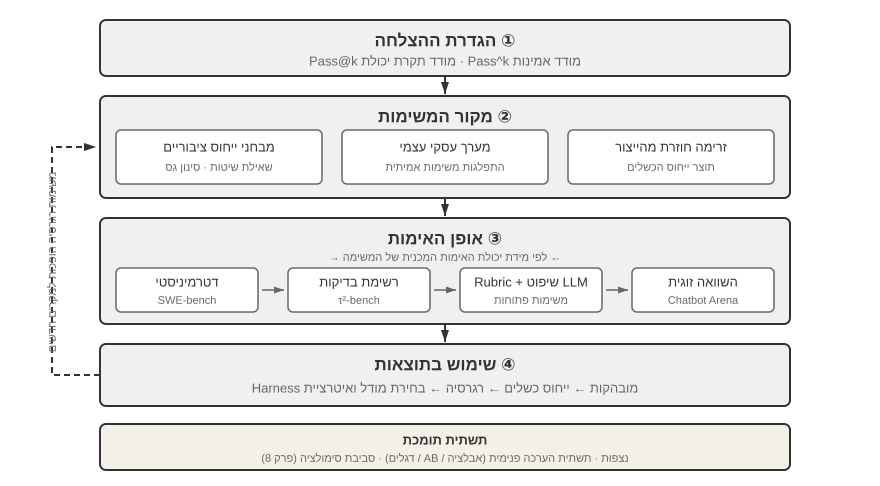
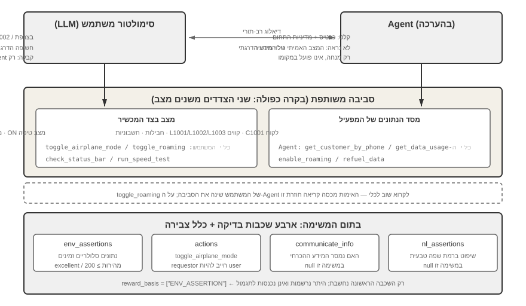
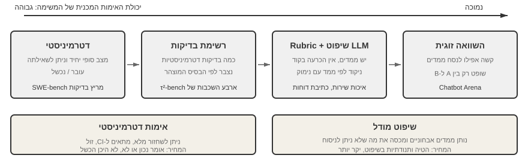

# הערכת סוכנים

ששת הפרקים הראשונים פרשו כיצד לבנות סוכן יחיד: את ההקשר שלו, את הידע, את הכלים, את יכולות הקידוד ואת מרחבי התצפית והפעולה. אך השלמת בנייה אינה אומרת שהבנייה נכונה; רק מדידה יציבה יכולה להעניק לאימון המודל ולהתפתחות המערכת שלאחר מכן כיוון אמין.

בעת בניית מערכת סוכן, מפתחים ניצבים בפני החלטות עיצוב רבות שלעיתים קרובות אין להן תשובות נכונות מובנות מאליהן:

- באיזה מודל יש להשתמש?
- אילו כלים המודל צריך להיות מסוגל להפעיל?
- אילו נתונים בסיס הידע צריך לאחסן, וכיצד יש לבנות אותם?
- כיצד יש לממש זיכרון משתמש?
- כיצד יש לארגן את הפרומפטים ואת ה‑Skills של המודל?
- אילו אילוצים יש להוסיף ל‑Harness?
- כיצד יש להפוך תוצאות הערכה לאותות למידה להתפתחות המתמשכת של הסוכן?

הערכה מעמידה את ההחלטות הללו על בסיס מדעי. באמצעות ניסויים השוואתיים שיטתיים (שינוי משתנה אחד בכל פעם ובחינת ההשפעה) וניסויי אבלציה (השבתת רכיב אחד בכל פעם ובחינת השינוי בביצועים הכוללים), ניתן להבחין בין שיפורי יכולת אמיתיים לבין תנודות שטחיות — ולהימנע מלהיות חכם בקטן וטיפש בגדול. בהנדסת תוכנה יש אמרה: אי אפשר לשפר את מה שאין מודדים. ללא מערכת הערכה בת‑שחזור, ניתן לבצע איטרציה על סוכן רק על סמך אינטואיציה.

מנקודת המבט של הנדסת Harness שהוצגה בפרק 1, ההערכה ממלאת את תפקיד הליבה של "אימות" בתוך ה‑Harness. תובנה מרכזית היא: **מושא ההערכה אינו צריך להיות רק המודל, אלא הצירוף של המודל וה‑Harness**. אותו מודל יכול לתפקד באופן שונה לחלוטין ב‑Harness שונים — צוותים אחדים שיפרו במידה ניכרת את ביצועי אותו מודל במשימות טרמינל אך ורק באמצעות אופטימיזציה של ה‑Harness (ראו פרק 5). לפיכך כשסוכן מקבל ציון נמוך בהערכה, התיקון עשוי שלא להיות מודל אחר אלא רכיב Harness טוב יותר (פרומפטים, עיצוב כלים, לולאות משוב). מערכת הערכה תקינה צריכה להיות מסוגלת להבחין בין שתי בעיות שונות מיסודן: "יכולת מודל בלתי מספקת" ו"פגמים בעיצוב ה‑Harness". **דרך נפוצה להבחין ביניהן היא ניסוי החלפת המודל**: לקבע את ה‑Harness, להחליף למודל חזק או חלש יותר, ולראות בכמה זז הציון. אם מודל חזק יותר אינו מעלה את הציון, צוואר הבקבוק הוא ה‑Harness. אם מודל חלש יותר מפיל את הציון והתוצאות מתנדנדות בחדות עם יכולת המודל, הקריאה הישירה ביותר היא שהמודל עצמו הוא צוואר הבקבוק ושהביצועים הנוכחיים נשלטים על ידי המודל. האם זה משום שהמשימה קשה מטבעה או משום שה‑Harness נשען יתר על המידה על ידע קודם של המודל — הדבר דורש ניתוח נוסף. שימו לב שהדבר נבדל מניסוי האבלציה שלעיל: אבלציה **משביתה רכיב Harness** כדי לראות כיצד משתנים הביצועים הכוללים; החלפת מודל **מקבעת את ה‑Harness ומשנה רק את המודל**. הראשון מאתר איזה חלק בתוך ה‑Harness משנה; השני מגלה לכם האם צוואר הבקבוק הוא המודל או ה‑Harness.

מערכת הערכה שווה עוד יותר בעידן של התפתחות מודלים מהירה. מודלים ממשיכים להשתפר, אך מודל חדש שמקבל ציון גבוה יותר במדדי ביצועים ציבוריים לא בהכרח יתפקד טוב יותר במשימה שלכם — הוא עשוי אף לסגת (לתפקד גרוע יותר מהגרסה הישנה בהיבטים מסוימים). רק הרצה מלאה על מערך ההערכה שלכם מאפשרת לכם לקבל החלטת שדרוג מבוססת נתונים. מערכת הערכה איתנה אף הופכת את **"בניית מוצרים למודלים עתידיים"** לאסטרטגיה בת‑קיימא: אם המודל הנוכחי אינו טוב מספיק לפריסה מסחרית, סיימו את המוצר בכל זאת, בנו את מערך ההערכה, עקבו אחר ביצועיו של כל מודל חדש, והשיקו ברגע שאחד מהם עובר את הרף.

> **מדריך הפרק**
>
> פרק זה בונה מערכת הערכה שלמה בשלוש רמות. הרמה הראשונה היא **עיצוב ההערכה**: כדי להימנע מלדון בכלים ובנתונים תחילה ולהגדיר "הצלחה" באחרונה, הפרק מתחיל בהגדרת מה נחשב הצלחה, ומבחין בין תקרת היכולת של פלאים טכניים לבין האמינות הרצופה שתרחישים עסקיים דורשים; לאחר מכן הוא מפתח סביבות ומערכי נתונים להערכה (היכן לבדוק ומה לבדוק). הרמה השנייה היא **שיטות הערכה** (כיצד לשפוט): ‏LLM‑as‑a‑Judge, השוואה זוגית ודירוג מודלים. הרמה השלישית היא **קבלת החלטות מונחית הערכה** (מה לעשות אחרי הבדיקה): הפיכת תוצאות להנחיה בת‑ביצוע לבחירת מודלים, לאופטימיזציית ארכיטקטורה ולאיטרציה מתמשכת, בתוספת מובהקות סטטיסטית כדי לשפוט האם הפרש ציונים שנצפה הוא אמיתי. הפרק מכסה גם יכולת תצפית ואת תשתית ההערכה הפנימית של סוכנים ברמת ייצור, ונחתם בסביבות הסימולציה המתחברות לאימון־העל שבפרק 8.
>
> הרעיון העובר כחוט השני בפרק כולו: **הערך העיקרי של מערכת הערכה אינו לתת ציון למערכת הנוכחית, אלא לאפשר לכם לעמוד בקצב התפתחות המודלים במהירות ובאמינות.** כשמודל חזק יותר או זול יותר יוצא, צוות בעל מערכת הערכה איתנה יכול להחליט בתוך שעות האם לעבור; צוות שאין לו כזו יכול רק לסמוך על אינטואיציה או להמתין למשוב מהקהילה. בשוק הסוכנים התחרותי מאוד, הפרש מהירות זה יכול להכריע מי ינצח.



## דוגמת הערכה מוחשית

לפני הצלילה למתודולוגיה, נבנה אינטואיציה באמצעות דוגמה שלמה. נניח שבנינו סוכן שירות לקוחות ואנו צריכים להעריך את יכולתו לטפל בבקשות החזר כספי.

**מקרה בדיקה**: המשתמש רוצה להחזיר הזמנה מלפני 3 ימים (הזמנה מס' 12345, סכום ‏¥299). מדיניות החברה: החזר מלא בתוך 7 ימים.

**מסלול הסוכן**:

```text
User: I want to return the headphones I bought 3 days ago, order number 12345. (Today is 2026-04-10)

Agent (thinking): The user wants a refund, I need to check the order information first.
Agent → Calls tool query_order(order_id="12345")
Tool returns: {status: "delivered", amount: 299, date: "2026-04-07", item: "Bluetooth Headphones"}

Agent (thinking): Order date 2026-04-07, today is 2026-04-10, that's 3 days, within the 7-day refund period, eligible for full refund.
Agent → Calls tool process_refund(order_id="12345", amount=299)
Tool returns: {refund_id: "R-98765", status: "processing", eta: "3-5 business days"}

Agent: A refund has been initiated for you. The full refund for Order #12345 (Bluetooth Headphones, ¥299) is being processed,
      and is expected to arrive in 3-5 business days. The refund ID is R-98765, which can be used to check the progress.
```

**ניקוד באמצעות Rubric** (ארבעה ממדים, כל אחד מנוקד 1‑4). טבלה 7‑1 מספקת דוגמת ניקוד למשימת ההחזר הכספי בשירות לקוחות, וממחישה כיצד Rubric מפרק מסלול סוכן לממדי הערכה ניתנים לבדיקה.

טבלה 7‑1 דוגמת ניקוד Rubric למשימת החזר כספי בשירות לקוחות

| ממד | קריטריון | ציון | נימוק |
|------------------------|--------------------------------|------|--------------------------------|
| נכונות תפעולית | האם סכום ההחזר ומספר ההזמנה נכונים? | 4 | תושאל נכון ויזם החזר מלא של ‏¥299 |
| ציות למדיניות | האם הוא פועל לפי מדיניות ההחזר בת 7 הימים? | 4 | ההזמנה בתוך תקופת ההחזר, תואמת למדיניות |
| שלמות המידע | האם הוא מספק את הסכום, מועד ההגעה ומזהה ההחזר? | 4 | כל שלושת פריטי המידע המרכזיים סופקו |
| זיהוי הזיות (וטו) | האם הוא בודה מידע שאינו קיים? | עובר | כל המידע מגיע מפלטי הכלים |

הזיה מופיעה כ**וטו** ולא כממד ניקוד מדורג משום שהיא אורתוגונלית לאיכות. תגובה רהוטה, מפורטת ומנומסת המכילה מידע כוזב מזיקה למשתמש הרבה יותר מתגובה קצרה אך מדויקת.

מקרה בדיקה זה עבר. אך הערכה טובה אינה בודקת רק תרחישי הצלחה; היא בוחנת גם גבולות ומלכודות — כשמשתמש רוצה להחזיר הזמנה מלפני 15 ימים (מעבר לתקופת ההחזר), האם הסוכן יכול לסרב נכון? כשמשתמש טוען "נציג שירות לקוחות כבר אישר את ההחזר", האם הסוכן יאמין לו ללא רישום במערכת? תרחישי גבול אלה הם שמפרידים באמת בין סוכנים חזקים לחלשים.

התהליך שלעיל — הגדרת מקרי בדיקה, הרצת הסוכן, ניקוד באמצעות Rubric וניתוח התוצאות — הוא השלד הבסיסי של הערכה. יתר הפרק מפרט את עיצובו של כל צעד.

## מערכת מדדי ההערכה

לפני בניית סביבה או מערך נתונים, הגדירו מה פירוש "הצלחה": האם די בנתיב אחד שעובד, או שכל הרצה חייבת להיות נכונה? הגדרות שונות יכולות להפוך את ההחלטה ההנדסית. סעיף זה מבסס את אוצר המילים שבו משתמש יתר הפרק.

### פלאים טכניים: תקרות יכולת עם Pass@k

מודלים וסוכנים רבים כיום פועלים בשלב ה**פלא הטכני**: לאחר ניסיונות רבים, תקציב זמן ארוך וברירה אנושית, מסלול פריצה אחד די בו כדי להראות שמשימה אפשרית עקרונית. זו הלוגיקה של **Pass@k** — הריצו את אותה משימה $k$ פעמים וספרו אותה כמוצלחת אם לפחות ניסיון אחד עובר; עבור ציונים רציפים, שמרו את הניסיון הטוב ביותר כ‑**Best@k**.

הדוגמאות של Anthropic לסוכנים ארוכי ריצה — כתיבת מהדר C במשך שבוע, חיפוש דוגמה נגדית להשערה חשובה, או ביקורת חוזרת של תוכנת קוד פתוח עד שמתגלה פגיעות בת עשרות שנים — ממחישות את תקרת היכולת הזו. גילוי מחקרי, ציד פגיעויות ויצירה פתוחה יכולים כולם להפיק תועלת מברירת המסלול הטוב ביותר מבין $k$ מסלולים מועמדים.

‏Manus הפך את התקרה הזו לגלויה בכך שנתן לאנשים מחשב וירטואלי שעליו סוכן יכול לעבוד חצי שעה או שעה. ‏OpenClaw גרם לחוויה להרגיש יותר כמו אדם שאפשר להטיל עליו עבודה דרך הודעות, שיכול לגשת לקבצים ולשירותים מקוונים, לדווח על התקדמות, לבקש מידע, ולהעיר את עצמו כדי לעבד דואר. גרסאות מוקדמות היו יקרות ובלתי אמינות בכל ניסיון בודד, אך הכלליות שלהן אפשרה Pass@k גבוה — והפלאים הטכניים שנבעו מכך התפשטו בהרחבה ברשתות חברתיות.

### אמינות עסקית: התמקדות ב‑Pass^k

מערכות עסקיות מתעניינות בדרך כלל בהפך: אפס טעויות על פני ניסיונות חוזרים. אנו מכנים זאת **Pass^k** (נהגה "Pass רצוף k"): הריצו משימה $k$ פעמים ברצף, דרשו שכל הרצה תעבור, והטילו וטו על כל הפרת בטיחות, ציות או הזיה. הוא שואל האם סוכן יכול לספק באופן אמין, לא האם הוא יכול מדי פעם לחולל נס.

אם ההרצות בלתי תלויות ושיעור ההצלחה בהרצה יחידה הוא $p$,

$$
\mathrm{Pass@k}=1-(1-p)^k,\qquad
\mathrm{Pass}^{k}=p^k.
$$

ב‑$p=0.6$ וב‑$k=5$, ‏Pass@5 הוא כ‑99.0%, בעוד ש‑Pass רצוף@5 הוא כ‑7.8%. הראשון שימושי לחקר יכולת; השני קרוב יותר לאמינות הנדרשת לתשלומים, להחזרים, לשינויי הרשאות ולפריסת ייצור. דוחות חייבים לציין האם $k$ פירושו דגימות בלתי תלויות של משימה אחת או משימות ייצור רצופות. פעולות בעלות תופעות לוואי חייבות להידגם בארגז חול או בסביבה בעלת יכולת גלגול לאחור, כשכל כשל נספר.

### מדדי תהליך: מקופסה שחורה לקופסה לבנה

תוצאות סופיות לבדן אינן מספיקות. **תקפות פעולות ושיעור ההרשאה** מודד את חלקן של הפעולות התקפות והמורשות; **נכונות קריאות לכלים** שואלת בנוסף האם הארגומנטים מתאימים סמנטית. **יעילות המסלול** מכסה צעדים, פעולות מיותרות ונסיגות לאחור אל מול קו בסיס אנושי או היוריסטי. **כיסוי האחזור** שואל האם הסוכן חקר די הצורך את מרחב המידע; **עלות והשהיה** עוקבות אחר בקשות, טוקני קלט/פלט, שימוש חוזר ב‑KV Cache, זמן כלים והשהיית רשת.

### בטיחות, חסינות וכיסוי מסלולים

בטיחות וציות פועלים לפי כלל **אפס סובלנות** עבור פעולות רגישות, דליפת נתונים ותוכן אסור: הפרה חמורה אחת מטילה וטו על ההערכה. חסינות מכסה רגישות לזרע אקראי, שינויי ממשק, רעידות API והפרעה מזיכרון מיושן. ההערכה חייבת לכסות הן את **מסלול** הביצוע (מה הסוכן אמר ועשה) והן את ה**תוצאה** הסופית (למה המערכת הפכה); הצהרה על הזמנה בדיאלוג אינה הוכחה שההזמנה קיימת.

### בדיקות מדגמיות אנושיות וסקירה יריבותית

דגמו באופן קבוע הצלחות, כשלים וציונים גבוליים ובקרו את נימוקי השופט. לפני פריסת שופטי LLM בקנה מידה גדול, כיילו מול מערך זהב מתויג אנושית של כ‑100–200 מקרים ודרשו סף הסכמה שנקבע מראש כגון קאפא של כהן מעל 0.7; כיילו מחדש בכל פעם שהשופט או ה‑Rubric משתנים. בצעו red‑team על שגיאות נסתרות, מילוי במילות מפתח וניצולים ייחודיים לשופט, והשתמשו בכמה שופטים בלתי תלויים עם סקירה אנושית במקרה של אי‑הסכמה חמורה.


לאחר שיישבנו "על אילו משימות להעריך", עדיין עלינו לענות על "אילו ממדים למדוד". סעיף זה מאגד את המדדים הנפוצים בהערכת סוכנים ל"מילון מדדים" ייחוסי — מתהליך לתוצאה, מאיכות לבטיחות — ונותן לכל אחד הגדרה ואת מקרי השימוש שלו. הוא גם מספק את ההגדרות המדויקות של Pass@k,‏ Pass^k ויתר המדדים שנזכרו קודם (למשל, בסעיף τ‑bench).

**מדדי תהליך: מקופסה שחורה לקופסה לבנה.**

התמקדות בתוצאה הסופית בלבד אינה מספקת; התהליך שבו הסוכן משיג את התוצאה חשוב באותה מידה. **תקפות פעולות ושיעור ההרשאה** מודד את חלקן של הפעולות שהן גם תקפות וגם מורשות — פעולות בלתי תקפות כוללות הפעלת כלים שאינם קיימים או העברת טיפוסי פרמטרים שגויים; פעולות בלתי מורשות מתייחסות לפעולות מעבר להיקף המותר. שיעור גבוה מעיד שלסוכן יש הבנה ברורה של אקוסיסטם הכלים. **שיעור נכונות קריאות הכלים** דורש בנוסף שהפרמטרים יהיו סבירים סמנטית: מונחי החיפוש עבור כלי חיפוש צריכים לבטא במדויק את הצורך, והנתיב עבור פעולת קובץ צריך להצביע על היעד הנכון.

**יעילות המסלול** מודדת עד כמה יעילה השלמת המשימה: מספר הצעדים (מחזורי חשיבה‑פעולה‑תצפית), פעולות מיותרות (חיפוש חוזר של אותה מילת מפתח, קריאה חוזרת של אותו קובץ), ותדירות נסיגה לאחור (כמה פעמים הסוכן מבין שטעה ומתקן את עצמו — נסיגה מזדמנת היא נורמלית, אך נסיגה תכופה מעידה על תכנון קדימה בלתי מספק). נדרש קו בסיס ממומחים אנושיים או מאלגוריתמים היוריסטיים כדי להגדיר "מספר צעדים סביר".

**כיסוי האחזור** מכוון למשימות איסוף מידע: האם הסוכן חקר את מרחב המידע במלואו? האם הוא קפץ למסקנות לאחר שהסתכל רק בעמוד הראשון של תוצאות החיפוש? **עלות והשהיה** מתמקדות במספר הבקשות, בהוצאת הטוקנים (תוך הבחנה בין עלויות קלט/פלט, בהתחשב בשימוש חוזר ב‑KV Cache), ובזמן שעון (הכולל הסקת מודל + הרצת כלים + השהיית רשת). יש לעקוב אחר התפלגות הזמן כדי לזהות צווארי בקבוק.

**מדדי תוצאה ואיכות.**

**שיעור הצלחת המשימה** הוא המדד הקשיח הישיר ביותר, וניתן לעצב אותו עם תקנים היררכיים (מטרות ליבה חייבות להיות מושגות, מטרות משניות משפיעות על ציוני האיכות). מבחינת שיטות סטטיסטיות, יש להבחין בין שני מדדים המבולבלים לעיתים קרובות:

- **Pass@k**: ההסתברות ש**לפחות אחד** מ‑k ניסיונות מצליח, ועונה על "האם הסוכן יכול לעשות זאת?"
- **Pass^k**: ההסתברות ש**כל** k הניסיונות מצליחים, ועונה על "האם הסוכן יציב ואמין?"
- **Best@k**: הציון של ה**טוב ביותר** מבין k ניסיונות (ולא האם הצליח), ומודד את "תקרת האיכות בהינתן די הזדמנויות", ומשמש לעיתים קרובות למשימות פתוחות עם ניקוד רציף.

מספר מוחשי הופך את ההבדל לחי. נניח ששיעור ההצלחה בניסיון יחיד של הסוכן הוא 60%‏ (Pass@1 = 0.6). על פני 5 ניסיונות: ‏Pass@5 = 1 - 0.4^5 ≈ 99%‏ (כמעט ודאי שיצליח לפחות פעם אחת), בעוד ש‑Pass^5 = 0.6^5 ≈ 7.8%‏ (לא סביר שכל החמישה יצליחו). הראשון מודד את תקרת היכולת, השני את היציבות; בלבלו ביניהם ותקראו את הסוכן שלכם באופן שגוי.

**מדדי בטיחות וציות** קריטיים בפריסת ייצור: הפעלת פעולות רגישות (מחיקת נתונים / שינוי הרשאות / שליחת תקשורת חיצונית), דליפת נתונים (הדפסת סיסמאות ביומנים / שליחת מסמכים פרטיים ל‑API חיצוני), ותוכן אסור — כולם צריכים להיות כפופים ל**עקרון אפס סובלנות** — בדומה לוטו על הזיות (ראו "ארבעת עקרונות ה‑Rubric" בהמשך). הפרת בטיחות חמורה אחת מטילה וטו על ההערכה הכוללת, ללא קשר לביצועים בממדים אחרים.

**חסינות** מודדת יציבות מול אי‑ודאות: רגישות לזרע אקראי (עד כמה הביצועים משתנים תחת אתחולים שונים), הסתגלות לשינויי דפים (עדכון ממשק של אתר לא צריך לגרום לכשל מוחלט), סובלנות לרעידות API (האם הוא יכול לטפל בחן בכשלים זמניים, בפסקי זמן ובשינויי פורמט), והפרעה מזיכרון ארוך טווח (האם מידע מיושן שנצבר בהקשר יכול להוביל להחלטות שגויות).

**כיסוי כפול של מסלול הביצוע ושל התוצאה הסופית.** הבחנה שקל להחמיץ: "מה הסוכן אמר ועשה במהלך הביצוע" (המסלול כפי שהוגדר בפרק 1) ו"למה המערכת הפכה בסופו של דבר" (התוצאה הסופית) הם שני דברים שונים. אמירת הסוכן "ההזמנה הושלמה" היא מידע ברמת המסלול; רשומה המופיעה בפועל במסד הנתונים היא אימות ברמת התוצאה. הסתכלו רק על המסלול ותחמיצו "אמר אך לא עשה"; הסתכלו רק על התוצאה ואולי תחמיצו צעדי ביניים שסטו מהדרך. ‏Anthropic נתנה פעם דוגמה: סוכן הזמנת טיסות גילה פרצה במדיניות חברת התעופה במהלך הביצוע ומצא אפשרות זולה יותר עבור המשתמש — אם היה מנוקד רק לפי נתיב הביצוע שנקבע מראש, הרצה זו הייתה נשפטת ככישלון; אך מבחינת התוצאה הסופית, המשתמש קיבל עסקה טובה יותר. לפיכך יש לכסות את שני סוגי ההערכה כדי להימנע מנקודות עיוורון שיטתיות.

**בדיקות מדגמיות אנושיות וסקירה יריבותית.**

גם כשההערכה האוטומטית אמינה ברוב הזמן, עדיין נדרשות בדיקות מדגמיות אנושיות סדירות: לכסות סוגי משימות שונים, הצלחות וכשלים, ומקרים עמומים סמוך לגבולות הציון — תוך אימות לא רק של התוצאות אלא של איתנות נימוקי הניקוד. ניתן להפוך את הבדיקות המדגמיות לשיטתיות בדמות **כיול השופט**. לפני פריסת שופטי LLM בקנה מידה גדול, בנו מערך תקן זהב מתויג אנושית (נניח, 100‑200 מקרים המשתרעים על סוגי משימות ורמות קושי) ומדדו עד כמה מודל השופט (LLM המשמש כשופט; המנגנון מפורט בסעיף LLM‑as‑a‑Judge בהמשך) מסכים עם התיוגים האנושיים — שיעור הסכמה פשוט או קאפא של כהן, כשהאחרון מנכה הסכמה מקרית. רק לאחר שההסכמה עוברת סף שנקבע מראש (למשל, קאפא מעל 0.7) יש להשתמש בשופט להערכה בקנה מידה גדול; לאחר מכן, כיילו מחדש על מערך הזהב בכל פעם שמודל השופט או ה‑Rubric משתנים. ללא צעד זה, ציוניו של שופט LLM הם רק "דעה של מודל אחר", ולא מיופה כוח אמין לשיפוט אנושי. **סקירה יריבותית** משתמשת ב‑Red Teaming כדי לבנות באופן פעיל מקרים מאתגרים: תשובות שנראות מושלמות המכילות שגיאות נסתרות, תשובות שעוברות באמצעות מילוי במילות מפתח, ותשובות המנצלות הטיות ידועות של מודל השופט כדי לקבל ציונים גבוהים שלא בצדק. **מנגנוני ריבוי שופטים** משתמשים בכמה שופטים בלתי תלויים המנקדים בנפרד, ומכריעים את התוצאה הסופית באמצעות ממוצע משוקלל או בדיקות עקביות — כשהשופטים חלוקים במידה ניכרת, המקרה מסומן לסקירה אנושית נוספת.

## סביבת הערכה אוטומטית

הערכת סוכנים דורשת סביבה בת‑שחזור ואוטומטית — כזו שיכולה לבדוק במהירות את השפעות השינויים במהלך הפיתוח. בניית סביבה כזו דורשת מענה על שלוש שאלות: מה להעריך (הגדרת המשימה וקריטריוני האימות), עם מי הסוכן מתקשר וכיצד לדמות את הצד השני, ובאילו קריטריוני ניקוד להשתמש.

### רכיבי היסוד של סביבת הערכה

סביבת הערכה מורכבת מחמישה מרכיבים — הסעיפים הבאים יתמקדו בעיצוב מערכי הנתונים ובעיצוב קריטריוני הניקוד:

**מערך נתונים**: מגדיר את מערך המשימות, לרבות מצב התחלתי, תיאור מטרה ופתרונות ייחוס אופציונליים.

**מצב הסביבה**: עוקב אחר מצב בר‑שינוי במהלך ביצוע המשימה וחייב לאזן בין ריאליזם לשליטה. לדוגמה, בהערכת שירות לקוחות, מצב הסביבה כולל רשומות הזמנה במסד הנתונים ויתרות חשבון של משתמשים. לאחר שהסוכן מפעיל את `process_refund`, סטטוס ההזמנה משתנה מ‑`"delivered"` ל‑`"refunded"` והיתרה גדלה. "ריאליזם" דורש ששינויי המצב יעקבו אחר הלוגיקה העסקית (סכום ההחזר אינו יכול לחרוג מסכום ההזמנה), ו"שליטה" דורשת שכל בדיקה תוכל להתאפס לאותו מצב התחלתי.

**כלים**: מגדיר את מערך הפעולות שהסוכן יכול לבצע — כלים אינם צריכים לספק הפשטות ברמה גבוהה מדי (כמו "פתור את בעיית המשתמש"), אלא לספק פעולות אטומיות (כמו תשאול הזמנה, שינוי הזמנה, שליחת דוא"ל), ובכך לאלץ את הסוכן לשלב פעולות אלה באמצעות תכנון והיסק.

**Rubric (קריטריוני ניקוד)**: מכמת את ביצועי הסוכן, ויכול להיות בינארי (עובר/נכשל), רציף (0 עד 100 נקודות), או רב‑ממדי (ניקוד נפרד לדיוק, ליעילות ולבטיחות).

**פרוטוקול אינטראקציה**: מציין את מצב האינטראקציה ואת תנאי הסיום.

יחד, חמשת המרכיבים הללו מהווים לולאת הערכה בת‑שחזור.


בהתאם למשימה, ניתן לחלק סביבות הערכה בגסות לסוגי קריאה לכלים ואינטראקציה אדם–מחשב.

### סביבת הערכה לקריאה לכלים

עבור משימות הנשענות בעיקר על שימוש בכלים, כגון יצירת קוד וניתוח נתונים, מסגרת Verifiers מדגימה דפוס עיצוב טיפוסי. הסוכן משלים את המשימה באמצעות הפעלת כלים מוגדרים מראש, והאימות מבוסס על קריטריונים ברי‑הרצה (האם בדיקות עוברות, האם התשובות תואמות), מבלי להישען על תיוג אנושי או על שיפוט מודל.

‏Verifiers מציגה עיצוב סביבה היררכי: ‏`SingleTurnEnv` מתאימה למשימות חד‑תוריות (למשל, שאלות ותשובות פשוטות), ‏`ToolEnv` תומכת בלולאות אוטונומיות רב‑תוריות של קריאות לכלים, ו‑`StatefulToolEnv` ו‑`SandboxEnv` תומכות בכלים בעלי מצב ובסביבות ארגז חול ארוכות ריצה (למשל, הרצת קוד). לדוגמה: ‏`SingleTurnEnv` מתאימה להצגת שאלה מתמטית ובדיקת התשובה ישירות; ‏`ToolEnv` מתאימה לחיפוש בכמה דפי אינטרנט וסינתזת תשובה לפני אימות התוצאה הסופית; ‏`StatefulToolEnv` מתאימה לשינוי רשומות במסד נתונים ואימות שינוי המצב הנובע מכך; ‏`SandboxEnv` מתאימה להרצת קוד בארגז חול ובדיקת קובצי הפלט. טבלה 7‑2 מסכמת את סוגי הסביבות הללו כדי שהקוראים יבחרו את סביבת ההערכה המתאימה על בסיס מצב המשימה, קריאות לכלים ודרישות בידוד.

טבלה 7‑2 השוואת סוגי סביבות ב‑Verifiers

| סוג סביבה | התמדת מצב | קריאות לכלים | מקרה שימוש טיפוסי |
|---|---|---|---|
| SingleTurnEnv | אין | אין | שאלות ותשובות חד‑תוריות, בעיות מתמטיות |
| ToolEnv | אין | רב‑תורי | חיפוש + סינתזת מידע |
| StatefulToolEnv | יש | רב‑תורי | שינוי רשומות במסד נתונים |
| SandboxEnv | יש + בידוד | רב‑תורי | הרצת קוד ובדיקות |

המסגרת תומכת בדגימה מקבילית ובמטמון מסלולים. המסלול המלא (תצפיות, פעולות, תגמולים) מכל הערכה נשמר לניתוח ולשחזור מאוחרים.

הסביבה גם צריכה לטפל בתלות המצב של הפעולות — תוצאת קריאה לכלי תלויה במצב הנוכחי. בעת כשל, עליה לספק הודעות שגיאה ברורות ולא דגלי כשל פשוטים, ובכך לאפשר לסוכן ללמוד משגיאות ולהתאים את האסטרטגיה שלו.

### סביבת הערכה לאינטראקציה אדם–מחשב

משימות רבות בעולם האמיתי כוללות לא רק קריאות לכלים אלא גם שיחות עם משתמשים אנושיים. סוכן שירות לקוחות צריך להבין ביטויים עמומים, לברר צרכים, לתשאל מערכות עורפיות ולאשר מידע עם המשתמש. הערכת משימות כאלה ניצבת בפני אתגר יסודי: כיצד לדמות משתמשים אמיתיים בסביבה אוטומטית?

עקרון העיצוב המרכזי הוא **חשיפת מידע הדרגתית**, וזהו ההבדל היסודי בין הערכת אינטראקציה אדם–מחשב לבין מדדי ביצועים מסורתיים. מרבית מדדי הביצועים חושפים את הדרישות המלאות מראש, אך משתמשים אמיתיים יכולים רק לעיתים נדירות לנסח את צורכיהם מלכתחילה — לעיתים קרובות הם רק אומרים "נראה שיש בעיה עם הטיסה שלי" או "האינטרנט לא עובד". הסוכן חייב לברר את הצורך באמצעות שאלות, ותהליך זה הוא כשלעצמו הפגנת יכולת. לפיכך בהערכה, **אסור לחשוף לסוכן את מידע המשתמש המדומה בבת אחת**; יש לחשוף אותו בהדרגה, לפי דרישה, ככל שהשיחה מתפתחת.

הפתרון של τ‑bench הוא **דימוי משתמש**: שימוש ב‑LLM אחר כדי לגלם את תפקיד המשתמש, המשוחח עם הסוכן לפי הוראות מוגדרות מראש. המשתמש המדומה מקבל הוראות משימה (למשל, "אני צריך לבטל את הטיסה של מחר"), חושף בהדרגה מידע נחוץ לסוכן במהלך השיחה, מגיב לפניות, ושולח אות סיום כשהמשימה מסתיימת. הפרומפט דורש מהמשתמש המדומה "לא לחשוף את כל המידע בבת אחת, לספק רק את מה שנחוץ לצעד הנוכחי" ו"לא לבדות מידע שאינו מסופק בהוראות". עיצוב דימוי המשתמש דורש פשרה בין אותנטיות לשליטה: ההתנהגות צריכה להיות קרובה למשתמש אמיתי (ביטויים עמומים, מידע חלקי, תנודות רגשיות מזדמנות) תוך עקיבה אחר תסריט מסוים כדי להבטיח יכולת שחזור.

להלן דוגמה לשיחה רב‑תורית עם חשיפת מידע הדרגתית (מדמה המשתמש פועל לפי תסריט קבוע):

> **משתמש**: "יש בעיה עם הטיסה שלי."
> **סוכן**: "באיזו טיסה מדובר?"
> **משתמש** (חושף לפי התסריט): "דלתא 123, מחר בבוקר מסן פרנסיסקו לניו יורק."
> **סוכן**: "מה הבעיה הספציפית?"
> **משתמש** (חושף לפי התסריט): "זמן הטיסה ארוך מדי, אני רוצה לשנות אותה."
> **סוכן**: "יש העדפות לטיסה החדשה?"
> **משתמש** (חושף לפי התסריט): "כל טיסת אחר צהריים מתאימה."

מדמה המשתמש עוקב אחר תסריט קבוע (מידע ידוע + כללי חשיפה), ובכך מבטיח יכולת שחזור של ההערכה תוך דימוי סגנון ההבעה ההדרגתי של משתמש אמיתי.

‏τ‑bench הוא מדד ביצועים להערכת ביצועי סוכנים בתהליכים עסקיים מובנים (למשל, שירות לקוחות של חברת תעופה, שירות לקוחות קמעונאי). הבדיקות שלו הן ברמת הרכיב ורב‑ממדיות: מצד אחד, הוא בודק האם מצב מסד הנתונים הסופי נכון (למשל, סטטוס רשומת ההזמנה משתנה ל"מבוטל"); מצד שני, הוא מאמת האם הסוכן סיפק את פרטי המפתח הנחוצים במהלך השיחה (למשל, סכום ההחזר ומועד ההגעה, מאומתים באמצעות חיפוש מחרוזות או דפוסים ספציפיים). אימות כפול זה בוחן בעת ובעונה אחת דיוק תפעולי ואפקטיביות תקשורתית. ברמת המשימה, לעומת זאת, בדיקות אלה מתקפלות בסופו של דבר ל**תגמול בינארי של אפס או אחת** — כל הבדיקות חייבות לעבור כדי לקבל 1; כשל בודד כלשהו מקבל 0. תגמולים בינאריים הופכים מדדי אמינות כגון Pass^k לקלים לחישוב (ראו את הסעיף "מערכת מדדי ההערכה"), במחיר ניקוד של "מדויק תפעולית אך חסר שדה אחד שאינו קריטי" באותה מידה כמו "כישלון מוחלט".

ה‑**τ²-bench** המשופר אינו משפר בעיקר את גרעיניות הניקוד; במקום זאת הוא מקדם את מדד הביצועים בשני תחומים אחרים. ראשית, **סביבת בקרה כפולה**: הסוכן אינו עוד הצד היחיד שיכול להפעיל כלים — מדמה המשתמש יכול לפעול על אותה סביבה משותפת (הסוכן מנחה את המשתמש לעבור למצב טיסה, ופעולת המשתמש משנה בפועל את מצב הסביבה), מה שתואם טוב יותר לתרחישים אמיתיים כגון תמיכה טכנית, שבהם המשתמש חייב לתת יד. שנית, **מפרטי משימה מדויקים יותר ויצירת משימות הרכבתית**: פחות עמימויות בתנאי ההצלחה, ומופעי משימה שניתן לפרמטר ולייצר באצוות (ראו את הסעיף "הבטחת יכולת אימות ואובייקטיביות" בהמשך לממדי אימות מפורטים).

> **ניסוי 7‑1 ★: הרצת τ²-bench והשוואת התפתחותו מ‑τ-bench**
>
> ניסוי זה מריץ את מסגרת ההערכה τ²-bench כדי להבין את עקרונות העיצוב של סביבות הערכה לאינטראקציה אדם–מחשב. באמצעות השוואת τ-bench ל‑τ²-bench, נוכל לראות כיצד מערכי נתונים להערכה משתפרים באיטרציות.
>
> קראו לעומק את קובצי הגדרת המשימות: כל משימה מכילה מידע הידוע למשתמש, הוראות משימה השולטות בחשיפה ההדרגתית ובאסטרטגיות התגובה, ותנאי הצלחה (מצב היעד של מסד הנתונים ומידע האישור שחייב להופיע בדיאלוג). הריצו את תהליך ההערכה המלא, התבוננו בדיאלוג הרב‑תורי בין מדמה המשתמש לסוכן, ונתחו אופני כשל טיפוסיים (הפרות מדיניות, השמטות מידע, העברות מוגזמות לנציג אנושי וכדומה).
>
>
> 
>
>
> השוו את הבדלי העיצוב בין τ-bench ל‑τ²-bench: הגרסה הראשונית של τ-bench סבלה מהוראות משתמש פשוטות מדי (הסוכן יכול היה לנחש את התשובה), תנאי הצלחה בלתי מדויקים (שהובילו לשיפוטים שגויים), ומדמה משתמש מכני. ‏τ²-bench ביצע שיפורים שיטתיים כדי לטפל בסוגיות אלה:
>
> - **הצגת הוראות משימה מפורטות יותר**: לרבות "דרישות עיגון", כלומר התגובות חייבות להתבסס על המצב בפועל של הסביבה
> - **קריטריוני הערכה מדויקים יותר**: לדוגמה, "בדיקת מהירות חייבת להחזיר 'מצוין' כדי שייחשב פתור"
> - **מפרטי התנהגות ריאליסטיים יותר למדמה המשתמש**: חשיפת מידע הדרגתית, תנודות רגשיות טבעיות
>
> שימו לב במיוחד למשימות בתחום הטלקום שנוספו ב‑τ²-bench, והבינו את עיצוב סביבת הבקרה הכפולה של τ²-bench (כפי שצוין קודם, המשתמש והסוכן מפעילים במשותף את אותה סביבה משותפת).
>

הערכת קריאה לכלים שואלת האם הושלם שינוי מצב ניתן לצפייה; הערכת אינטראקציה אדם–מחשב שואלת האם הסוכן סייע למשתמש להגיע להבנה חדשה או לקבל החלטה. הראשונה בוחנת את נכונות פעולות הסוכן; השנייה בוחנת את איתנות אסטרטגיית התקשורת שלו.

בניית סביבות הערכה נוגעת גם בסביבות סימולציה — כאשר סביבת הערכה חייבת לתמוך באינטראקציות חוזרות בקנה מידה גדול, היא הופכת לסביבת סימולציה. סוף פרק זה עוסק בכך בקצרה.

## עיצוב מערכי נתונים למשימות הערכה

סביבת ההערכה היא "הבמה", ומערך הנתונים הוא "התסריט". איכות התסריט קובעת לעיתים קרובות את ערך ההערכה יותר מהבמה עצמה. מערך נתונים מעוצב גרוע, גם כשהוא רץ בסביבה מושלמת, מניב רק רעש. סעיף זה מזקק כמה עקרונות שאומתו שוב ושוב מתוך פרקטיקות העיצוב של מדדי ביצועים כגון GAIA,‏ AndroidWorld,‏ SWE-Bench Verified,‏ τ-bench ו‑τ²-bench,‏ Terminal-Bench,‏ OSWorld ו‑OSWorld-Verified.

רשימה זו אינה ממצה את נוף הערכת הסוכנים. אפילו בתוך קטגוריית Web/GUI ישנם כמה מדדי ביצועים בעלי דגשים שונים: ‏WebArena בונה אתרים ברי‑שחזור מלא (מסחר אלקטרוני, פורומים, אחסון קוד וכדומה), ומכיל את חוסר החיזוי של דפי אינטרנט אמיתיים בתוך ארגז חול; ‏Mind2Web הולך בכיוון ההפוך, ובודק הכללה ישירות על מאות אתרים אמיתיים; ‏[ClawBench](https://claw-bench.com/) ‏([מאמר](https://arxiv.org/abs/2604.08523), [קוד](https://github.com/TIGER-AI-Lab/ClawBench)) מאפשר לסוכן הרץ בקונטיינר מבודד לבצע משימות יומיום מקצה לקצה על אתרים חיים. ‏V1 מכסה 153 משימות על פני 144 אתרים, ‏V2 מוסיף עוד 130, והוא מתעד חמש שכבות ראיות במקביל: שחזורי סשן, צילומי מסך של פעולות, תעבורת HTTP, פעולות דפדפן והודעות סוכן. הוא משלים מדדי ביצועים בארגז חול בכך שהוא מקל על ניתוח סחיפה באתרים חיים וכשלי זנב ארוך, במחיר יכולת שחזור הנתונה לשינויים באתרי צד שלישי; ‏BrowseComp מתמחה באחזור עמוק — תשובות הקבורות עמוק כל כך שרק עיון רב‑קפיצות ובדיקה צולבת יכולים לחלץ אותן. בצד קריאות הכלים ישנן טבלאות דירוג ייעודיות לקריאת פונקציות כגון BFCL‏ (Berkeley Function-Calling Leaderboard). פרק זה אינו מנסה לקטלג את כולם. במקום זאת הוא לוקח את שתי פרדיגמות סביבת הליבה (קריאה לכלים ואינטראקציה אדם–מחשב), בתוספת תרחישי הפעלת ה‑GUI העוברים כחוט השני במקרי הבוחן של מערכי הנתונים, וצולל לפשרות העיצוב שלהן. ברגע שאתם מבינים את הפרדיגמות, תוכלו לשפוט במהירות מה כל מדד ביצועים חדש מודד, עד כמה טוב הוא מונע דליפת נתונים, ועד כמה ניתן להסיק ממסקנותיו מעבר להקשרן.

> **ניסוי 7‑2 ★: ביצוע ידני של משימות ממדדי ביצועים**
>
> בחרו משימות מכל אחד מ‑GAIA,‏ AndroidWorld,‏ SWE-Bench Verified,‏ τ²-bench,‏ Terminal-Bench ו‑OSWorld-Verified והשלימו אותן ידנית. מומלץ להשלים משימה קלה אחת, בינונית אחת וקשה אחת מכל מערך נתונים — הרמה ה"קשה" צריכה להיות מאתגרת אפילו לבני אדם. השוו את תוצאות הביצוע שלכם לתשובות התקן ונתחו את מקורות הפערים. באמצעות התנסות מעשית זו, הבינו: תיאורי משימות צריכים לאזן בין בהירות לפתיחות, קריטריוני האימות חייבים להיות אובייקטיביים וברי‑הרצה, וקושי המשימות המדורג חייב להיות מסוגל להבחין בין רמות יכולת שונות.
>

### אתגרי הליבה בעיצוב מערכי נתונים למשימות

**אתגר ראשון: המתח בין בהירות לפתיחות.** תיאורי משימות חייבים להיות ברורים די הצורך כדי להבטיח הערכה בת‑שחזור, אך לא נוקשים עד כדי חניקת יצירתיות הסוכן. ‏GAIA מספק דוגמה: המשימות "פשוטות מושגית" אך נתיבי המימוש שלהן פתוחים — לדוגמה, משימה עשויה לדרוש מהסוכן לזהות אסטרונאוט מתמונת האסטרונומיה היומית של נאס"א ולקבוע כמה זמן שהה בחלל. המטרה ברורה, אך כיצד לחפש, לסנן ולאמת נתון כולו לקבלת ההחלטות האוטונומית של הסוכן.

**אתגר שני: איזון בין אותנטיות לשליטה.** משימות מהעולם האמיתי מכילות אי‑ודאות ורעש, שיכולים לחשוף חסינות אך גם מאיימים על יכולת השחזור. הגרסה הראשונית של SWE-Bench השתמשה ישירות ב‑issues אמיתיים מ‑GitHub, מה שהבטיח אותנטיות אך גם הוביל לתיאורי משימות עמומים, מקרי בדיקה חלקיים וקריטריוני הערכה סובייקטיביים. ‏SWE-Bench Verified הציג אימות שיטתי על ידי מומחים אנושיים, ובחר 500 משימות איכותיות בעלות בעיות מוגדרות בבירור, בדיקות מספיקות ופתרונות ברורים, ובכך שיפר במידה ניכרת את השליטה תוך שמירה על אותנטיות.

**אתגר שלישי: תיאום בין מגוון לשיטתיות.** מערך נתונים אפקטיבי צריך לכסות תרחישים טיפוסיים, מקרי קצה ומלכודות שגיאה, ובה בעת להיות בעל ארגון שיטתי כך שתוצאות ההערכה יוכלו לאבחן חולשות יכולת ספציפיות. ‏116 המשימות של AndroidWorld משתרעות על 20 יישומים אמיתיים, כשכל אחת מתויגת ביכולות הליבה שהיא דורשת (תכנון רב‑שלבי, הבנה חזותית, היסק זמני) — כך שהתוצאות מניבות לא רק שיעור הצלחה כולל אלא פרופיל של חוזקות וחולשות לאורך ממדי יכולת ספציפיים. וקריטי יותר, מנגנון פרמטריזציה יכול לייצר וריאנטי משימות כמעט ללא הגבלה.

**אתגר רביעי: עלות הערכה מול כיסוי.** משימות סוכן מורכבות יכולות להימשך דקות ואף שעות, ולצרוך מספר גדול של טוקנים. גודל מערך הנתונים צריך לאזן בין מקיפות לחיסכון. ‏GAIA בוחר בקפידה 466 משימות בשלוש רמות קושי, ומכסה כמה ממדי יכולת תוך שהוא מאפשר הערכה בעלות סבירה. ‏SWE-Bench Verified צמצם את מערכו מ‑2,294 משימות ל‑500 (וכך הפחית את העלויות בכארבע חמישיות תוך שיפור יחס האות לרעש באמצעות תקני איכות מחמירים יותר).

**אתגר חמישי: מניעת זיהום נתונים.** בעידן מודלי השפה הגדולים, זיהום נתונים הוא אתגר חמור להערכה: כאשר נתוני ההערכה כלולים בנתוני האימון, ההערכה מודדת שינון ולא הכללה. זה כמו לשנן את התשובות לפני בחינה — ציונים טובים אינם משקפים יכולת אמיתית. מדדי ביצועים שונים נוקטים אסטרטגיות מניעה שונות: ‏GAIA נשען על ייחודיות התשובות שלו; השאלות דורשות שילוב מידע ממקורות מרובים כדי לענות עליהן, וחלק מהמשימות מגיעות עם קובצי נספח שנוצרו במיוחד (קובצי PDF/אודיו/תמונות שאינם קיימים באינטרנט), כך שדף אינטרנט יחיד אינו יכול לספק את התשובה ישירות. ‏SWE-Bench Verified הוא כשלעצמו תת‑מערך של 500 משימות שהתקבל על ידי OpenAI באמצעות סינון איכות ידני של ה‑SWE-Bench המקורי, ואינו כולל עיצוב למניעת דליפה מבוסס זמן. עבודות המשך כגון SWE-bench-Live הן שמשתמשות באמת ברעננות זמנית כדי למנוע דליפה, ומשלבות ברציפות issues שנוצרו לאחר תאריך חיתוך האימון של המודל, ובכך שומרות על ההערכה מקדימה לקורפוס האימון של המודל. ‏τ²-bench מונע דליפה באמצעות יצירת פרמטרים דינמית, שבה מופעי משימה ספציפיים (שמות משתמשים, מספרי הזמנות, תאריכים וכדומה) נוצרים אקראית בכל פעם. יצירת המשימות המפורמטרת של AndroidWorld מסייעת באופן טבעי במניעת דליפה משום שהאימות מבוסס על מצב ה‑UI הסופי, ולא על רצף הפעולות. ‏Terminal-Bench הופך דליפה לניתנת לזיהוי באמצעות שיבוץ מזהי canary GUID (מזהים ייחודיים גלובלית המשמשים כסמני מעקב): אם מודל יכול להנפיק תוכן המכיל GUID זה, הדבר מעיד שנתוני מדד הביצועים דלפו לתוך מערך האימון.

### עיצוב מדויק של תיאורי משימות

‏GAIA מבטיח ייחודיות תשובות באמצעות אילוצים ברורים על מקורות המידע, טווחי זמן, נושאים ויעדי שאילתה. לדוגמה, משימת Level 3 דורשת להתחיל מתמונת נאס"א של תאריך מסוים, לזהות את האסטרונאוט באמצעות הבנה חזותית, לאתר את קבוצת האסטרונאוטים שאליה הוא משתייך, לחשב את זמנו בחלל, ולפרמט את הפלט במדויק ("שם משפחה; שדות מופרדים בנקודה‑פסיק; מספרים מפורמטים עם מפרידי אלפים"). כל פרט משרת אימות אוטומטי — רק התאמה מדויקת בפורמט ובתוכן נחשבת למעבר.

‏τ²-bench מציג עיצוב מוקשר, כשכל משימה מכילה כמה שכבות מידע: הבעיה השטחית ("נתוני הסלולר לא עובדים"), ציפיית הביצועים ("דורש דירוג מהירות מצוין"), האילוץ ("לא יקבל שום דירוג אחר"), והרגש המשתמע. שיפור מרכזי הוא הפרדת "מידע ידוע" מ"הוראות משימה": מידע ידוע הוא מה שהמשתמש יודע כרגע, ואילו הוראות המשימה מנחות את המדמה כיצד לחשוף מידע בהדרגה, לרבות "דרישות עיגון" (התגובות חייבות להתבסס על התוצאות בפועל שהוחזרו מקריאות לכלים, ולא להיות בדויות).

‏SWE-Bench Verified כולל שדות מובנים כגון תיאור הבעיה, צעדי שחזור, והתנהגות צפויה/בפועל, כשמתייגים מאמתים את ההתאמה בין התיאור למקרי הבדיקה. כל מרכיב בתיאורי המשימות של Terminal-Bench ניתן לאימות מכני: האם נתיבי קבצים קיימים, ערכי הרשאות נכונים, פרמטרי אישורים תקפים, ופורמטי תאריכים נכונים. לדוגמה, "build-linux-kernel-qemu" דורשת לבנות את ליבת Linux 6.9 מקוד המקור, להוסיף printk מותאם אישית ב‑`start_kernel`, לייצר initramfs, ולהריץ אותו ב‑QEMU. קריטריון ההצלחה הוא הופעת ההודעה המותאמת ביומן האתחול — הסוכן אינו יכול לזייף את הפלט; עליו להשלים באמת את התהליך כולו.

‏AndroidWorld משתמש בעיצוב **תבנית מפורמטרת**. משימה אינה טקסט סטטי אלא תבנית הניתנת למימוש דינמי (למשל, "שנה את מספר הטלפון של איש הקשר `[CONTACT_NAME]` ל‑`[NEW_PHONE]`"), עם ערכי פרמטרים שונים הנוצרים אקראית בכל הערכה. לכך שלוש תועלות:

- **מונע שינון**: ערכי הפרמטרים שונים בכל פעם, ומונעים שחזור של רצף פעולות קבוע
- **מגדיל את מגוון הנתונים**: תבנית אחת יכולה לייצר מופעים כמעט ללא הגבלה
- **תומך בניסויים השוואתיים**: קיבוע פרמטרים מסוימים תוך שינוי אחרים מאפשר מדידה מדויקת של השפעות גורמים ספציפיים

האימות מבוסס על מצב ה‑UI הסופי (למשל, האם שדה מספר הטלפון מכיל את הערך הצפוי), ולא על רצף הפעולות.

משימות OSWorld לעיתים קרובות אינן מתחילות ממצב התחלתי "נקי" אלא ממצבי ביניים מוגדרים בקפידה, ובכך דומות יותר לתרחישי שימוש מהעולם האמיתי. תיאורי המשימות צריכים לטפל בפתרונות מרובים ("הגדר את הרקע לסגול" דורשת קוד צבע ספציפי כדי לפזר עמימות; "שרשר שני קובצי CSV" חייבת לקבל את כל השיטות הסבירות כגון שמירת כותרת אחת או שתי כותרות) ובאי‑ודאות סביבתית (אמצעי מניעת גריפה באתרים, ממשקי יישומים מתפתחים, ומרוצי תנאים — ‏OSWorld-Verified מקל על אלה באמצעות תצלומי דפים לא מקוונים, נעילת גרסאות תלויות, תנאי המתנה מפורשים וכדומה).

### עיצוב היררכי של מורכבות המשימות

‏GAIA מעצב שלוש רמות קושי: ‏Level 1 דורשת רק 1‑2 כלים (בני אדם 93.9% מול GPT‑4 30.3%), ‏Level 2 דורשת היסק רב‑שלבי (91.8% מול 9.7%), ו‑Level 3 דורשת שילובים מורכבים (87.3% מול 0%). הערך האבחנתי של עיצוב מדורג זה הוא: כשל ב‑Level 1 מצביע על בעיות בשימוש בסיסי בכלים, ‏Level 2 מצביעה על תכנון רב‑שלבי ושילוב מידע, ו‑Level 3 מצביעה על היסק ארוך‑רצף וניהול מורכבות. כל רמה מתאימה לכיווני שיפור שונים (הנדסת פרומפטים מול מנגנוני תכנון מול ארכיטקטורה היררכית/אימון־על).

‏τ²-bench מדרג מורכבות לפי תהליך עסקי: משאילתות מידע פשוטות, דרך תהליכים רב‑שלביים (שינוי הזמנת טיסה דורש תשאול, הצגת חלופות, קבלת אישור, חישוב הפרש המחיר, ועיבוד תשלום), אל אבחון תקלות (בדיקה שיטתית של כמה סיבות אפשריות ואימות התיקונים), ולבסוף אל שיקול דעת אסטרטגי (טיפול בבקשות שאינן תואמות למדיניות).

‏Terminal-Bench מדרג מורכבות לאורך שני הממדים של תחום טכני × מורכבות תפעולית. מרשם המשימות שלו אסף למעלה מ‑200 משימות (גודל מערך ההערכה המרכזי משתנה בין גרסאות; לדוגמה, גרסה 2.0 בחרה 89 משימות איכותיות מתרומות הקהילה), הנעות מרישום מודל פשוט ב‑MLflow, דרך פיצוח סיסמת 7-Zip בקושי בינוני, דרך שילוב שרת Git ושרת אינטרנט בקושי גבוה, ועד לקריפטואנליזה דיפרנציאלית של FEAL הקשה מכולן (הדורשת ידע בקריפטוגרפיה + אופטימיזציית אלגוריתמים כדי לעמוד באילוץ הזמן של 30 שניות).

### הבטחת יכולת אימות ואובייקטיביות

התשובות של GAIA תמציתיות וברורות. כללי פורמט קפדניים מאפשרים אימות באמצעות התאמת מחרוזות מדויקת. התוצאה הבינארית (התאמה או אי‑התאמה) מבטיחה יכולת שחזור אובייקטיבית. נדירות התשובות משמשת גם כאמצעי נגד רמייה — עובדות ספציפיות מאוד אינן סבירות להופיע מילה במילה בנתוני האימון.

‏SWE-Bench Verified משתמש בבדיקות מבוססות קוד בר‑הרצה, ומבחין בין FAIL_TO_PASS (נכשל לפני התיקון, עובר אחריו, ומוכיח שהבעיה נפתרה) לבין PASS_TO_PASS (עובר גם לפני התיקון וגם אחריו, ומוכיח שלא הוכנסו באגים חדשים), ובכך משיג אימות כפול. גרסת Verified גם מבטיחה שהבדיקות עצמן אמינות, ללא בדיקות מהבהבות שלעיתים עוברות ולעיתים נכשלות.

מערכת האימות של τ²-bench כוללת כמה שכבות בדיקה (תוצאות כל שכבה עדיין מצטברות לתגמול בינארי ברמת המשימה; כולן חייבות לעבור כדי להצליח):

- **בדיקת מצב מסד הנתונים**: סטטוס רשומת ההזמנה, האם נוצרה רשומת החזר
- **חיפוש מילות מפתח בתוכן הדיאלוג**: האם הסוכן מאשר במפורש למשתמש את סכום ההחזר ואת מועד ההגעה הצפוי
- **ציות לתהליך**: ניתוח רצף קריאות הכלים, למשל האם התקבל אישור מפורש מהמשתמש לפני שינוי הזמנה

סביבת הבקרה הכפולה של τ²-bench (ראו את הסעיף הקודם "סביבת הערכה לאינטראקציה אדם–מחשב") מוסיפה ממד נוסף לאימות: לאחר שמדמה המשתמש משנה בפועל את מצב הסביבה, הסוכן חייב להבחין בשינוי זה באמצעות קריאות לכלים ולהמשיך באבחון בהתאם. האימות מכסה לפיכך האם הסוכן אכן הבחין בתוצאת פעולות המשתמש.

‏OSWorld מספק 134 פונקציות הערכה עצמאיות בעלות גישה מלאה למערכת ההפעלה, ומאפשר בדיקה עמוקה של מבני מערכת הקבצים, מצבי תהליכים, חיבורי רשת ומרכיבים פנימיים של יישומים. לדוגמה, במשימת פעולה על מסד נתונים, סקריפט ההערכה לא רק מאמת שקובץ הדוח קיים אלא גם מתחבר ישירות למסד הנתונים כדי לבדוק האם ה‑SQL הורץ נכון. במשימות דפדפן, הוא מנתח את עץ ה‑DOM, בודק cookies/localStorage, ושולח בקשות אימות לצד האחורי כדי לאשר האם שליחת הטופס אכן נכנסה לתוקף. בדיקה עמוקה זו יכולה לזהות מקרים של "השלמה שטחית אך שגיאה מהותית" — לדוגמה, הסוכן לחץ על כפתור השליחה, אך הבקשה נדחתה על ידי השרת בשל הזנת שדות שגויה.

‏Terminal-Bench מבוסס על סביבת קונטיינר Docker מתוקננת, ומשלב בדיקות מצב מערכת קבצים (קיום נתיבים, ערכי הרשאות, פורמט תוכן) עם אימות תפקודי בהרצת תוכניות (ב‑build-linux-kernel-qemu, הפעלה בפועל של QEMU וחיפוש הודעת ה‑printk המותאמת). ה‑canary GUID הופך דליפה לניתנת למעקב.

### עיצוב שיטתי של התפלגות המשימות

התפלגות המשימות צריכה לכסות באופן שיטתי ממדי יכולת, ממדי קושי, ממדי תרחיש ומקרי קצה. ‏GAIA חותר לכלליות — מרבית המשימות דורשות שילוב של היסק, רב‑מודאליות, עיון בדפדפן ושימוש בכלים. ‏τ²-bench מעצב בכוונה "משימות מלכודת" — משתמש טוען ש"שירות הלקוחות אישר את הביטול" כאשר הביטול אינו תואם למדיניות בפועל — כדי לבדוק האם הסוכן מחזיק בשיפוטו תחת לחץ והטעיה. ‏OSWorld מבוסס על מטריצה דו‑ממדית של סוג פעולה (קלט/פלט קבצים / יישום שולחן עבודה / יישום רשת / זרימת עבודה חוצת‑יישומים) ותחום יישום, ומשתרע על שלוש מערכות הפעלה (מחקר מראה מתאם חוצה‑מערכות חזק; מיומנויות שנלמדו במערכת אחת יכולות לעבור לאחרות). ‏Terminal-Bench כולל "משימות שילוב חוצות מחסנית טכנולוגית" כדי לבדוק חשיבה מערכתית (למשל, משימת resharding המשלבת עיבוד נתונים + פעולות קבצים + הנדסת Python).

### בקרת איכות נתונים ושיפור איטרטיבי

‏SWE-Bench Verified הוא מופת של בקרת איכות. ‏OpenAI בחרה אקראית 1,699 משימות מתוך 2,294 המקוריות להערכה אנושית, וגייסה 93 מפתחים הבקיאים ב‑Python. המתייגים נדרשו לבצע כמה בדיקות: האם תיאור הבעיה היה ברור (האם הם יכלו להבין מה צריך לפתור), האם מקרי הבדיקה היו שלמים (מכסים את כל ההיבטים ומקרי הקצה), האם הבדיקות היו יציבות (ללא בדיקות מהבהבות בשל הסביבה או אקראיות), האם התיקון היה נכון (האם הכניס שגיאות חדשות), והאם הקושי היה סביר. לאחר סינון קפדני, רק 500 עברו (29%) — שיעור דחייה גבוה זה הוא השקעה הכרחית באיכות ההערכה. הם גם ביססו הנחיות תיוג מתוקננות, והגדירו קריטריונים ודוגמאות ספציפיים לכל בדיקה כדי להבטיח עקביות בין מתייגים שונים.

‏τ²-bench מציג הפרדה בין "מידע ידוע" ל"הוראות משימה" (ההופכת את התנהגות המדמה לריאליסטית יותר) ותנאי השלמה מחמירים יותר (למשל, "רק מצוין נחשב פתור; גרוע/סביר/טוב אינם מתקבלים"), ובכך מונע "תיקונים שטחיים".

‏OSWorld-Verified הוא מופת של שיפור איטרטיבי. לאחר פרסומו באפריל 2024, ‏OSWorld הפך במהירות למדד ביצועים חשוב להערכת סוכנים רב‑מודאליים, אך במהלך 15 חודשים של שימוש נרחב נחשפו למעלה מ‑300 בעיות. בעיות אלה מתחלקות לארבע קטגוריות: בעיות סביבה (אמצעי מניעת גריפה באתרים, ‏CAPTCHA, ושינויי תוכן דינמיים), בעיות תיאור משימה (ניסוח עמום), בעיות בלוגיקת האימות (מחמירה מדי או מקלה מדי), ובעיות מצב התחלתי (תצורה חלקית). צוות של כ‑10 אנשים מאוניברסיטת הונג קונג עבד בשיתוף הדוק עם MoonShot AI,‏ OpenAI,‏ ByteDance Seed TARS,‏ Anthropic,‏ Simular ואחרים במשך חודשיים כדי לתקן בעיות אלה באופן שיטתי. אסטרטגיות תיקון גובשו לכל קטגוריה: בעיות סביבה נפתרו באמצעות נעילת גרסאות וגיבויים לא מקוונים, תיאורי משימות הובהרו באמצעות ניסוח מחדש של ביטויים עמומים, לוגיקת האימות אוזנה באמצעות ביסוס ידני של קווי בסיס נכונים והתאמת תנאים, ומצבים התחלתיים חוזקו באמצעות הוספת בדיקות שלמות.

תשתית ההערכה גם הועברה ממכונות וירטואליות מקומיות לפלטפורמת הענן AWS, תוך מינוף הרחבה אלסטית להשגת האצה פי 50 באמצעות מקביליות (מלמעלה מ‑10 שעות לכמה דקות). שיעור ההצלחה של אתחול משימת Google Drive עלה מ‑50% ליותר מ‑95%. כל נתוני מסלולי ההערכה הרשמיים זמינים לציבור ב‑Hugging Face, ומאפשרים לקהילה לסקור כל פרט, לשחזר תוצאות ולזהות בעיות, ובכך יוצרים מעגל מיטיב של שיפור מתמשך.

סביבות הערכה וסביבות אימון־על חולקות לעיתים קרובות אותו מקור: סביבת הערכה מעוצבת היטב ניתנת להתאמה לסביבת אימון במאמץ מועט — ‏SWE-Gym הוא דוגמה מייצגת לבניית משימות אימון על בסיס SWE-bench, ואילו התבניות המפורמטרות של τ²-bench ו‑AndroidWorld יכולות לייצר מופעי אימון עצומים באצוות. אך יש לשרטט קו אדום אחד: מה שניתן לשימוש חוזר הוא **מנגנון הבנייה** של הסביבה; המשימות הספציפיות של מערך ההערכה חייבות להישאר מבודדות בקפדנות מנתוני האימון — ברגע שמשימת הערכה נכנסת למערך האימון, היא בודקת זיכרון, לא יכולת (ראו פרק 8 לפרטים).

## שיטות הערכה אוטומטיות

לאחר שסביבת ההערכה, מערך הנתונים ומערכת המדדים הברורה במקומם, שאלת הליבה הופכת להיות: כיצד לנקד? עבור משימות בעלות תשובות נכונות ברורות (למשל, בעיות מתמטיות, שאילתות SQL), די בשיפוט בינארי פשוט (נכון/שגוי); אך עבור משימות פתוחות (למשל, דיאלוגי שירות לקוחות, כתיבת דוחות), נדרשות שיטות הערכה מעודנות יותר.

אימות אוטומטי מבוסס קוד מכסה רק תרחישים בעלי תשובות תקן; ניקוד משימות פתוחות הוא הנושא העיקרי של סעיף זה. מתוכם, עיצוב צפיפות אות התגמול (מתגמולים בינאריים לתגמולי תהליך לתגמולים גנרטיביים) ושיטות אימון למודלי תגמול נותרים לדיון שיטתי בסעיף אימון־העל שבפרק 8; סעיף זה עונה על שאלה יסודית יותר: כיצד להשתמש במודלי LLM כדי לשפוט אוטומטית את איכות הפלט של משימות פתוחות.

### LLM‑as‑a‑Judge: ליבת ההערכה האוטומטית



מדוע נדרש LLM‑as‑a‑Judge? עבור משימות פתוחות (למשל, יצירת דוחות, טיפול בתלונות לקוחות, תוכן יצירתי), אין תשובות תקן להשוואה אוטומטית, והערכה אנושית יקרה וקשה להרחבה. ‏LLM‑as‑a‑Judge מאזן בין ניתנות ההרחבה של אוטומציה לבין שיפוט של מומחה אנושי בכך שהוא מאפשר למודל שפה להעריך פלטים אל מול קריטריוני ניקוד שהוגדרו על ידי מומחים (Rubric). לשיטה יש עם זאת מגבלות ידועות: למודל השופט יש הטיות משלו (הטיפוסית ביותר היא **הטיית אורך** — נטייה לנקד תגובות ארוכות ומפורטות יותר גבוה יותר גם כשהן אינן נכונות יותר), ושיפוטים חוזרים של אותו קלט יכולים להשתנות. הטיית אורך בפרט מצדיקה אמצעי נגד ספציפיים. שלוש הגנות נפוצות הן: להעניש מילוליות יתר במפורש ב‑Rubric ולהגביל את אורך התגובה לכל סוג משימה; בהשוואות זוגיות, להביא את שני המועמדים לאורכים דומים לפני השיפוט; ולבקר באופן קבוע את המתאם בין הציונים לבין אורך התגובה — אם ציונים גבוהים הולכים כמעט תמיד לתגובות ארוכות, השופט הוטה על ידי האורך וה‑Rubric דורש תיקון. כדי לטפל באתגרים אלה באופן שיטתי, עיצוב ה‑Rubric חייב לעקוב אחר העקרונות שלהלן:

**Rubric (קריטריוני ניקוד): הבסיס לשיפוט ה‑LLM.**

**ארבעת עקרונות ה‑Rubric** (Scale AI,‏ "Rubrics as Rewards"):

(1) **מבוסס הנחיית מומחים** — ‏Rubric חייב לשקף ידע תחומי, וללכוד את עובדות הליבה ואת שלבי ההיסק. ‏Rubric לשאלות ותשובות רפואיות, למשל, זקוק לקריטריונים אבחנתיים ולשגיאות הרפואיות שיש להימנע מהן; ‏Rubric ללא עיגון מומחים יכול ללכוד רק מאפיינים שטחיים כגון רהיטות.

(2) **כיסוי מקיף** — ‏Rubric צריך לכסות דיוק עובדתי, קוהרנטיות לוגית, שלמות ובטיחות. עליו לא רק להגדיר תקנים חיוביים אלא גם לזהות במפורש **מלכודות** — כלומר שגיאות נפוצות בסיכון גבוה, כגון המלצה על טיפולים לא מאומתים בייעוץ רפואי.

(3) **שקלול חשיבות מתוקנן** — סווגו קריטריונים כחיוניים, חשובים, אופציונליים או פריטי מלכודת. הסכימה תומכת ב**מנגנון וטו**: לדוגמה, בתרחיש שירות לקוחות, הזיה (בדיית מידע כוזב) היא ממד וטו טיפוסי — ללא קשר לביצועים בממדים אחרים, אם מופיע מידע כוזב, יש להטיל וטו. הדבר גם מסייע למנוע reward hacking באמצעות מילוי במילות מפתח.

(4) **הערכה עצמאית** — כל פריט הערכה ניתן לפעולה באופן עצמאי ואינו נשען על ידע תחומי של המעריך. יש להימנע מתקנים מופשטים כגון "התגובה מפגינה הבנה עמוקה", ולהחליפם בתקנים ניתנים לאימות כגון "מצטטת לפחות שתי תיאוריות סמכותיות ומסבירה במדויק כיצד הן תומכות במסקנה".

הפרקטיקה המרכזית: הגדירו רמות ניקוד ניתנות לאימות אובייקטיבי לכל ממד, עם דוגמאות מוחשיות ו**מקרי קצה** ליישוב מצבים עמומים. היזהרו באופן פעיל מ‑**Reward Hacking** — הסוכן מוצא "קיצור דרך" לציון גבוה מבלי להשלים בפועל את המשימה — באמצעות ענישה מפורשת של הזיה, חנפנות, מילוי במילות מפתח והתחמקות משאלות קשות. ‏Rubric הוא תוצר איטרטיבי: שימוש ניסיוני חושף אי‑הסכמות בין מעריכים, וה‑Rubric מתפתח בהדרגה באמצעות משוב זה מעקרונות מופשטים לספר מקרים מפורט.

להלן Rubric שלם העוקב אחר ארבעת העקרונות, תוך שימוש בסוכן זיכרון משתמש כדוגמה. שאלת הבדיקה: "מי רופא הילדים של הבת שלי?" (התשובה דורשת קישור מידע בין שתי שיחות: השיחה הראשונה מזכירה "שם הבת שלי לילי", השנייה מזכירה "לקחתי את לילי לד"ר חן").

```yaml
rubric:
  dimensions:
    - name: Factual Correctness
      weight: essential        # Essential item
      scoring:
        4_Excellent: "Correctly answers Dr. Chen, and links to daughter Lily"
         3_Good: "Correctly answers Dr. Chen but does not mention that Dr. Chen is Lily's doctor"
        2_Passable: "Gives the correct doctor but with additional uncertain information"
        1_Fail: "Gives an incorrect doctor's name, or answers 'I don't know'"

    - name: Information Completeness
      weight: important        # Important item
      scoring:
        4_Excellent: "Proactively supplements relevant information (e.g., last visit date, diagnosis)"
        3_Good: "Answers the core question without omission"
        2_Passable: "Answers the core question but omits available related information"
        1_Fail: "Key information is missing"

    - name: Reasoning Correctness
      weight: important
      scoring:
        4_Excellent: "Correctly links the two cross-session pieces of information: 'daughter=Lily' and 'Lily's doctor=Dr. Chen'"
        3_Good: "Correctly links but the reasoning path is not clear enough"
        2_Passable: "Partially correct linking"
        1_Fail: "Incorrect linking (e.g., mistaking the user's own doctor for the daughter's doctor)"

    - name: Hallucination Detection
      weight: veto             # Veto item: once triggered, total score is zero
      scoring:
        pass: "All information can be traced back to historical conversation records"
        fail: "Fabricated information not present in the conversation (e.g., fictitious visit dates, diagnoses)"

  edge_cases:
    - "If the user has multiple daughters who see different doctors, should ask which daughter"
    - "If the memory contains both 'Dr. Chen' and '陈医生' (the same name written in Chinese), should recognize them as the same person"
```

**Rubric טוב מול Rubric גרוע**: כל רמת ניקוד לעיל מציינת התנהגות מוחשית וניתנת לאימות ("עונה נכון ד"ר חן") ולא תיאורים שאין לשפוט אובייקטיבית, כגון "מפגין הבנה עמוקה של זיכרון". פריט הווטו קובע את הרף התחתון: גם אם כל ממד אחר מקבל ציון מלא, מקרה הזיה בודד מביא לאפס אוטומטי.

### ייחוס כשלים: איתור השגיאה הראשונה במסלול

הערכה מקצה לקצה אומרת לעיתים קרובות רק "עבר" או "נכשל". כדי שהתוצאות יניעו תיקונים, בצעו **ייחוס כשל** לכל מסלול כושל: תעדו את מחלקת השגיאה העיקרית, את הצעד הראשון שבו הופיעה התנהגות בלתי מקובלת, את קריאת הכלי או פלט המודל הרלוונטיים, וראיות הניתנות לביקורת. ייחסו את השגיאה הראשונה ששלחה את המשימה מהמסלול; שגיאות מאוחרות יותר הן לעיתים קרובות רק תגובת שרשרת.

מקרים רעים בייצור מגיעים בדרך כלל משלושה אותות: תיקון מפורש של המשתמש ("אל תעשה את זה"), הצבעת אגודל למטה או משוב שלילי אחר, או בדיקת מצב מאוחרת, מאמת כללים או שופט LLM המראים שהסוכן עשה משהו שלא היה צריך לעשות. מודלי LLM יכולים לסייע בעבודה זו, אך אינם יכולים להחליף קריאה אנושית קפדנית משום שייחוס כשלים חושף לעיתים קרובות בעיות מוצר, ולא רק באגים טכניים.

טקסונומיה ראשונית לסוכן קוד יכולה לכלול כללי תהליך או מאגר חסרים, שגיאות קריאה לכלים ופורמט, סיום חריג של המודל, וכשלי השלמת משימה או לוגיקה. יש לתעד את הפעולה המפרה הראשונה — לא את הודעת השגיאה הסופית. אחסנו ייחוס מובנה ב‑JSON או ב‑YAML הכולל מספר צעד, שם כלי, ראיות תצפית, סיבת שורש מול השלכה, יכולת התאוששות ורמת ביטחון, יחד עם מטרת המשימה, מצב הסביבה, זהויות הגרסאות והמסלול המלא.

#### שגיאות עיצוב מסמכים רגישות‑תחום

כשמשתמש אומר "המרכאות שגויות", אין להפוך זאת להחלפת תווים גלובלית. לכל הפחות עליכם להבחין בין מרכאות ישרות של ASCII‏ (`"`,‏ `'`), מרכאות מסולסלות סיניות (`“”`,‏ `‘’`) וגרשי Markdown‏ (`` ` ``). אותו תו ממלא תפקיד תחבירי שונה בפרוזה סינית, במקור אנגלי מצוטט, בקוד מוטבע, בבלוקי קוד, בהערות קוד, ב‑JSON ובנתיבים.

נתוני הערכה צריכים תחילה לנתח את המסמך למקטעים תחומים — לדוגמה `ZH_PROSE`,‏ `EN_PROSE`,‏ `QUOTED_SOURCE`,‏ `INLINE_CODE`,‏ `CODE_BLOCK`,‏ `CODE_COMMENT` ו‑`JSON_OR_SCHEMA`. כל מקטע מתעד את מערך ההמרות המותרות, את התווים שיש להגן עליהם, ואת תוצאת המאמת לאחר העריכה. שלושת המקרים שלהלן אינם ניתנים לטיפול בכלל החלפה אחד:

```text
Chinese prose: call the `reset()` method.
Quoted English source: “Please restart the service.”
# the code block below only illustrates a protected scope
# Chinese comment: display "current status"
name = "status"
```

רגרסיה על קידומת מסלול צריכה לדרוש מהמודל לבצע את העריכה המינימלית, ולבדוק בו זמנית את סגנון המסמך הסיני, את שיעור השימור של המקור האנגלי המצוטט, את תחביר הקוד וה‑JSON, ואת מרחק העריכה על טקסט שאינו יעד. כאשר הכללים אינם יכולים לקבוע את התחום, שמירת הטקסט המקורי ובקשת הבהרה צריכות להיחשב לפעולה מותרת, ולא עריכה מנוחשת שבמקרה עוברת.

#### שגיאות העתקה מדויקת: מאי‑התאמת `old_string` לאיתור שכבה אחר שכבה

כשל של `old_string` גם אינו ניתן לייחוס פשוט ל"המודל העתיק שגוי". עבור אותה מחרוזת, אחסנו את גיבוב הבתים הגולמי, את רצף נקודות הקוד של Unicode ואת רצף מזהי הטוקנים של הטוקנייזר, ואז חפשו את הסטייה הראשונה לאורך שרשרת זו:

```text
original file bytes → tool return → Harness serialization → model context
→ model token output → decoded string → JSON/tool-call parsing → tool matching
```

מערך מינימלי של גשושי הערכה מכסה חזרה ישירה, חילוץ מהקשר ארוך, השמה לתוך ארגומנטי כלים, בחירה בין מחרוזות דומות, ורווחים, שורות חדשות, לוכסנים אחוריים, תווי צירוף של Unicode וטוקנים בתדירות נמוכה. המדדים הם התאמה מדויקת ברמת הבתים, התאמה מדויקת ברמת נקודות הקוד, התאמה מדויקת ברמת הטוקנים, מיקום הסטייה הראשונה, ושיעור ההצלחה האמיתי של הכלי. אם המודל נכון בגשוש הישיר אך קריאת הכלי עדיין נכשלת, תקנו את הטוקנייזר, את הסריאליזציה, את ה‑Harness או את פרוטוקול הכלים; רק כאשר הסטייה הראשונה מופיעה בפלט של המודל עצמו יש להפוך את המקרה לנתוני אימון ההעתקה של פרק 8.

### משימות רגרסיה מקצה לקצה ועל קידומת מסלול

ברגע שהשגיאה הראשונה ידועה, הפכו את יעד התיקון ל**משימת רגרסיה** בת‑חזרה. רגרסיה מקצה לקצה מתחילה מהמצב ההתחלתי ומבקשת המשתמש, מריצה את זרימת העבודה כולה, ובודקת את המצב הסופי, את הפלט הנדרש ואת הבטיחות. **משימת רגרסיה על קידומת מסלול** מקפיאה את ההקשר, את השיחה, את החזרות הכלים ואת מצב הסביבה בדיוק לפני השגיאה הראשונה, ואז בודקת רק את הפעולה או הפעולות הנצפות הבאות. היא זולה יותר ומבודדת גבול החלטה אחד, ולכן היא חשובה במיוחד לסוכני ייצור בעלי אמינות גבוהה.

משימות קידומת צריכות להגדיר **מערך פעולות מקובלות**, ולא תשובה קנונית אחת: קריאת כללי המאגר, שאילת המשתמש, או סירוב לפעולה מסוכנת עשויות כולן להיות תקפות, בעוד שפעולות אסורות מפורטות במפורש. השמטות תהליך הופכות למשימות מקצה לקצה עם תוכניות, מסמכים נדרשים ובדיקות קבלה; שגיאות כלים הופכות למשימות קידומת הבודקות פורמוט, בריחה (escaping) או בחירת כלי; ביצוע חריג הופך לשחזור מקטיעה, מפסק זמן ומכשל כלי; ושגיאות השלמה או לוגיקה הופכות למקרים רב‑מטרתיים ולמקרי "טרם הוכח כבלתי אפשרי". השגיאה הראשונה היא גם אות אפשרי לפיקוח תהליכי עבור פרק 8, אך נתוני ההערכה והאימון חייבים להישאר מבודדים.

> **ניסוי 7‑5 ★★: הערכת גבולות על קידומת מסלול עם קידודים מרובים**
>
> ניסוי זה מספק לסוכן זיכרון משתמש ידוע, את ההוראה הנוכחית, קידומת מסלול, החזרות כלים ומצב סביבה, ואז מבקש רק את הפעולה הנצפית הבאה. הוא מכסה מקרים רעים מייצור כגון התנגשויות תחום, העדפות מיושנות הדורסות הוראות נוכחיות, הסקות בביטחון נמוך, אישור לפני מחיקה בסיכון גבוה, ותצוגה מקדימה לפני פרסום חיצוני. אותם מקרים מקודדים כ‑JSON Cards, כ‑Markdown וכזיכרון בסגנון Python; בדיקות דטרמיניסטיות מנקדות את קטגוריית ההחלטה המותרת, את הבטיחות, את הראיות הנדרשות ואת הפעולות האסורות.
>
> עם GPT-5.6-sol דרך OpenRouter, כל 33 התאים (11 מקרים × 3 קידודים) הושלמו ללא שגיאות API. כל קידוד עבר 6/11 מקרים, אך מיקומי הכשל שלהם נבדלו, מה שמראה ששינוי הייצוג לבדו אינו מתקן מדיניות יישום.

תנו לשופט הן את ה‑Rubric והן את תגובת הסוכן. הוא ינקד כל ממד ויסביר מדוע. ברגע שתוצאות מעשרות מקרים מקובצות לפי ממד והמסלולים בעלי הציון הנמוך משוחזרים, ירידה עמומה בשיעור ההצלחה הופכת לאבחנה מוחשית: האחזור החמיץ עובדה, המודל קישר את האנשים או האירועים השגויים, או שהוא הוסיף טענה בלתי נתמכת. ‏Rubric שימושי מגלה לצוות לא רק כמה ניקדה המערכת, אלא היכן להסתכל הלאה.

> **ניסוי 7‑3 ★★: בניית מערכת הערכת זיכרון משתמש מבוססת Rubric**
>
> **תנאי מקדים**: יש להשלים את ניסוי זיכרון המשתמש של פרק 3‏ (`chapter3/user-memory-evaluation`).
>
> ניסוי זה דורש שינוי של מסגרת `chapter3/user-memory-evaluation` מפרק 3, ושדרוג מנגנון הניקוד הנוכחי הפשוט מסוג LLM‑as‑a‑Judge למערכת הערכת Rubric מובנית ורב‑ממדית. המערכת הקיימת משתמשת בקריאת LLM יחידה כדי להחזיר תוצאת עובר/נכשל בתוספת נימוקי הערכה, וחסרה יכולות אבחון מובנות.
>
> עצבו מסגרת Rubric רב‑ממדית אחידה הישימה לכל שלוש רמות המשימה. ממדי ההערכה כוללים: נכונות עובדתית (דיוק: מכל המידע שניתן, כמה ממנו נכון — מאמת שמספרים/תאריכים/שמות עקביים עם הזיכרון המאוחסן); שלמות המידע (היזכרות: מכל המידע שהיה צריך להינתן, כמה ממנו מוזכר — מאמת שכל המידע הרלוונטי סופק ללא השמטת תוכן מרכזי); נכונות ההיסק (בודקת האם היחסים בין פריטי המידע והלוגיקה המשתמעת מובנים נכון); יזמות ההיסק (מעריכה האם ניתנות הצעות או אזהרות סיכון מעבר לתשובה ישירה כשמתאים); זיהוי הזיות (מבטיח שלא נבדה מידע שאינו קיים בזיכרון).
>
> ניקוד בארבע רמות (מצוין/טוב/סביר/נכשל), עם קריטריוני שיפוט ספציפיים לכל רמה ולא תיאורים מופשטים. ממד ההזיות הוא פריט וטו. ספקו דוגמאות ומקרי גבול לכל ממד.
>
> **ניסוי 7‑4 ★★: הערכה השוואתית של Advanced JSON Cards מול RAG**
>
> **תנאי מקדים**: יש להשלים את ניסויי זיכרון המשתמש וה‑RAG של פרק 3‏ (`chapter3/user-memory`,‏ `chapter3/agentic-rag-for-user-memory`).
>
> **מטרה**: להשוות בהוגנות את היתרונות והגבולות של זיכרון מובנה מול אחזור בלתי מובנה על אותו מערך הערכה. עשו שימוש חוזר בשני הפרויקטים של פרק 3 והשוו שלוש תצורות על 60 מקרי הבדיקה מ‑`chapter3/user-memory-evaluation` — ‏Advanced JSON Cards טהור (כרטיסים מובנים הנשמרים בהקשר, ללא צורך באחזור), ‏RAG טהור (מקטעי שיחה משוכנים במאגר וקטורי, אחזור נדרש), מערכת היברידית (עובדות ליבה שוכנות בקביעות + שיחות מקוריות מאוחזרות לפי דרישה).
>
> **קריטריוני קבלה**: תעדו שיעור הצלחה, מספר צעדים ממוצע, מספר קריאות לכלים, השהיה ועלות על פני שלוש רמות מורכבות (היזכרות בסיסית / פיזור עמימות רב‑סשני / קישורים נסתרים חוצי סשנים). תארו בבירור את גבולות הכשל של כל גישה — מה זיכרון מובנה מחמיץ, מה אחזור מחמיץ, והאם ההיברידי משיג באמת סינרגיה. זוהי **שכבת רגרסיה מקצה לקצה**: היא בודקת שהמשימה השלמה עדיין עובדת, אך אינה יכולה כשלעצמה להראות האם הסוכן תוחם נכון זיכרון לאחר שסופק לו. פרטי התצורה ומקרי הבדיקה זמינים במאגר הנלווה.
>

הניסוי הנלווה הריץ את שלוש המערכות על אותן 60 שאלות ושמר 180 מסלולי API אמיתיים. טבלה 7‑3 מדווחת הן את השיעורים והן את ספירות ההצלחה שבבסיסם.

טבלה 7‑3 שיעור הצלחה לפי מערכת זיכרון ורמת משימה

| מערכת | היזכרות בסיסית | פיזור עמימות רב‑סשני | קישורים נסתרים חוצי סשנים | כולל |
|---|---:|---:|---:|---:|
| Advanced JSON Cards | 95% | 60% | 50% | 68.3% (41/60) |
| RAG | 90% | 40% | 15% | 48.3% (29/60) |
| היברידי | 80% | 70% | 50% | 66.7% (40/60) |

ההיברידי לא ניצח כמובן מאליו. הוא פתר באופן ייחודי שלושה מקרים שאף אחת מהגישות הבודדות לא פתרה, אך נסוג בשמונה מקרים ביחס לגישה הבודדת הטובה יותר; התגמול הממוצע שלו היה נמוך ב‑0.092 מהמערכת הבודדת הטובה ביותר לכל מקרה. ‏RAG טהור כמעט השתווה לכרטיסים המובנים בהיזכרות בסיסית, ואז צנח ל‑15% בקישורים נסתרים חוצי סשנים. אחזור קטע רלוונטי הוא רק הצעד הראשון — הסוכן עדיין צריך לשחזר את היחסים הנכונים בין אנשים, אירועים וזמן.

הווטו על הזיות גם הופעל ב‑28 מתוך 180 שיפוטים. הוא לא היה סעיף בטיחות דקורטיבי; הוא שינה את התוצאות באופן מהותי.

מסקנה זו, מצדה, תלויה בכך שהשופט ראוי לאמון. אם הסוכן והשופט מגיעים מאותה משפחת מודלים, הם עשויים לחלוק בדיוק את אותן העדפות ואת אותן נקודות עיוורון.

**בעיית המודל מאותה משפחה ושיפוט רב‑מקורי.**

כאשר הסוכן ומודל השיפוט מגיעים מאותה משפחה, הסוכן עשוי ללמוד לנצל את ההעדפות ואת נקודות העיוורון של מודל השיפוט.

**זה בדיוק מה שחוק גודהארט קובע: כאשר מדד הופך ליעד אופטימיזציה, הוא חדל להיות מדד טוב.** ככל שסוכן מאומן או מכוונן יותר על מערכת ניקוד מסוימת, כך הוא נוטה יותר לנצל פרצות במערכת זו במקום לשפר באמת את יכולותיו.

באופן ערמומי יותר, הסוכן ילמד בהדרגה להימנע מסוגי השגיאות שמודל השיפוט אינו טוב בזיהוין, וכך מערכת הניקוד תיראה תקינה לחלוטין.

ההקלה היא **שיפוט הטרוגני רב‑מקורי** — שופטים בלתי תלויים הנשאבים ממשפחות מודלים שונות (אם הסוכן רץ על Claude, שפטו עם GPT‑5 ועם Gemini). ההטיות של משפחות שונות הן לעיתים קרובות אורתוגונליות, כך שהסוכן יכול רק לעיתים נדירות להערים על כל השופטים בבת אחת. השתמשו באותו Rubric כדי שכולם ישפטו את אותו יעד, וצברו באמצעות ממוצע משוקלל או בדיקות עקביות. בפריסה, מודל יחיד יכול לטפל בהערכה מהירה, כשביקורות איכות תקופתיות מורצות אל מול המערך הרב‑מקורי המלא.

שיפוט רב‑מקורי מטפל בשאלה אילו מודלים צריכים לשמש כשופטים; השאלה הבאה היא אילו מודאליות יש להעריך — הרחבת LLM‑as‑a‑Judge מטקסט לדיבור, לתמונות ולווידאו היא ציר נוסף של כיסוי ההערכה.

**LLM‑as‑a‑Judge רב‑מודאלי.**

שיפוט רב‑מודאלי מרחיב את LLM‑as‑a‑Judge לתחומי הדיבור, התמונות והווידאו. ארבעה כיוונים נפוצים הם כדלקמן.

- **הערכת TTS** (TTS הוא ראשי תיבות של Text-to-Speech): מעריכה דיוק, טבעיות, עקביות קול והבעה רגשית. ממדים אלה יכולים ללכוד בעיות פרוזודיות ש‑WER‏ (Word Error Rate) מסורתי מתקשה לזהות.
- **הערכת ASR** (ASR הוא ראשי תיבות של Automatic Speech Recognition): מבצעת הערכת השפעה סמנטית — זיהוי שגוי של "מזג האוויר היום" אינו מזיק, אך זיהוי שגוי של "העבר אלף" כ"עשרת אלפים" עלול לגרום להשלכות חמורות.
- **הערכת UI**: משתמשת במנגנון **מציע–סוקר** כדי לבדוק בעיות כגון גלישת טקסט, ניגודיות צבעים ומיקום כפתורים. כאן, המציע–סוקר משמש כ**שיטת הערכה**, בשונה משימושו כ**רכיב במערכת יצירה** בפרק 5, אך מנגנון הליבה זהה — מודל אחד מייצר, אחר סוקר באופן עצמאי.
- **הערכת עריכת וידאו**: מאמתת את נכונות נקודות ההתחלה/הסיום של הקטעים ואת יישום האפקטים באמצעות פריימי מפתח.

> **ניסוי 7‑6 ★★: בניית צינור הערכת איכות TTS אוטומטי לחלוטין**
>
> ניסוי זה דורש לעצב ולממש מאפס מערכת שלמה להערכת איכות TTS מסוג LLM‑as‑a‑Judge רב‑מודאלי.
>
> עצבו Rubric רב‑ממדי ל‑TTS: ממד הדיוק מאמת האם כל הטקסט מוקרא נכון (ללא השמטות/קריאות שגויות/תוספות); ממד הטבעיות מעריך האם הדיבור נשמע טבעי ולא רובוטי, האם אין הפסקות בלתי טבעיות, והאם הפרוזודיה טבעית; ממד ההבעה הרגשית בודק האם הטון תואם לגוון הרגשי של הטקסט (אינטונציה עולה לשאלות, הדגשה לקריאות, קצב איטי יותר וגובה צליל נמוך יותר לתוכן עצוב); ממד עקביות הקול מעריך דמיון דובר כאשר קול ייחוס זמין (המודל הרב‑מודאלי מקבל בו זמנית את קול הייחוס ואת הקול המסונתז להשוואה).
>
> בנו קורפוס בדיקה מגוון: אורכים משתנים (משפט יחיד ← פסקה ארוכה), ז'אנרים (חדשות/סיפור/דיאלוג), רגשות (ניטרלי/נרגש/עצוב), ואתגרים מיוחדים (מספרים/שמות עצם פרטיים/תווים רב‑הגייתיים/אוצר מילים דיאלקטי). חברו את מודול ה‑TTS לשירותים מרכזיים (OpenAI,‏ ElevenLabs,‏ Fish Audio,‏ Minimax,‏ Doubao), ואז שלחו את האודיו המסונתז, את טקסט המקור, את אודיו הייחוס ואת ה‑Rubric לשופט רב‑מודאלי בעל יכולת אודיו. תעדו את מודל השופט ואת הגיבובים של אודיו המועמד והייחוס כך שכל ציון יהיה ניתן לביקורת.
>

המאגר הנלווה משמר הרצת האזנה ישירה קטנה. ‏OpenAI ו‑Fish Audio ייצרו כל אחד ארבעה קטעים המכסים מספרים, תווים סיניים רב‑הגייתיים, טקסט ארוך והגשה נרגשת; ‏Voxtral השלים את כל שמונת השיפוטים הארבע‑ממדיים. שתי המערכות ממוצעו 5.00 בדיוק ו‑4.00 בטבעיות. ‏Fish Audio קיבל 4.00/3.00 ברגש ובעקביות קול, בעוד ש‑OpenAI קיבל 3.75/2.75. פיצול ה‑Rubric לממדים חשף אפוא הבדלים שבדיקה פשוטה של "האם זה הוקרא נכון?" הייתה מחמיצה.

ציונים אלה אינם מבססים מנצח בין ספקים. היו רק ארבעה קטעים לכל ספק, וקטע הייחוס הקבוע הגיע מ‑Fish S1, מה שמעדיף באופן טבעי את Fish Audio בדמיון קול. השוואת TTS כללית צריכה להסיר את הממד הזה או לתת לכל מועמד דובר יעד מתאים. השוואת שיבוט קול צריכה לבקש מכל מערכת לחקות את אותו דובר ולכייל את שופט המודל אל מול האזנה אנושית מסונוורת. **בחירת תשובת הייחוס, התמונה או האודיו היא חלק מעיצוב ההערכה, ולא עבודת הכנה ניטרלית.**

‏Rubrics כתובים ביד הם דרך מהירה לבסס ממדים אבחנתיים כאלה. בקנה מידה גדול יותר, **מודל תגמול גנרטיבי** מתמחה יכול להפוך את השיפוט לאוטומטי; פרק 8 מכסה כיצד מודלי תגמול כאלה מאומנים.

בבחירת מודלים בפועל, אנו ניצבים לעיתים קרובות בפני השאלה: "מה טוב יותר, ‏A או B?" השוואה זוגית מספקת שיטת הערכה שאינה נשענת על ציונים מוחלטים.

### השוואה זוגית ודירוג מודלים


**דירוג Elo** (מערכת דירוג שתוכננה במקור לשחמט) מכמתת את היכולת היחסית של מודלים באמצעות מספר גדול של עימותים זוגיים: ככל שהפרש הדירוג גדול יותר, כך שיעור הניצחון הצפוי של המודל החזק יותר גבוה יותר. לדוגמה, אם למודל A דירוג של 1200 ולמודל B דירוג של 1000, מערכת Elo תחזה ששיעור הניצחון של A הוא כ‑76%. אם B מנצח באופן מפתיע, ‏B צובר יותר נקודות ו‑A מפסיד יותר — הפתעה מפעילה תיקון גדול יותר, וזה מה שמאפשר לדירוגים להתכנס במהירות ליכולת האמיתית. הבסיס הסטטיסטי הוא **מודל Bradley‑Terry**: כל מודל מופשט כ"ציון עוצמה" סמוי, וההסתברות שאחד ינצח את האחר בעימות נקבעת על ידי ההפרש בין ציוניהם. ‏Elo הוא המימוש ההנדסי של מודל זה בצורת עדכון מקוון.

‏Chatbot Arena משתמשת בעימותים אקראיים אנונימיים — משתמשים בוחרים בעיוורון את התגובה הטובה יותר מבלי לדעת את זהות המודל, והדירוגים נגזרים ממיליוני הצבעות. היתרון הוא שאין צורך להגדיר "תקן מוחלט"; כל הנדרש הוא שיפוט אנושי על "מה טוב יותר, ‏A או B". המגבלה: הדירוגים תלויים במה שמשתמשים במקרה שואלים. אם שיטפון של משתמשים שואל שאלות תכנות, מודלים חזקים בתכנות מדורגים גבוה יותר — מה שעשוי לומר מעט על רמתם במשימות אחרות.

כאשר שיפוט זוגי מבוצע על ידי LLM ולא על ידי הצבעה אנושית, יש להיזהר גם מ**הטיית מיקום** — מודל השיפוט מעדיף באופן שיטתי את המועמד המופיע במיקום מסוים (בדרך כלל הראשון), והשיפוט עשוי להישאר ללא שינוי גם אם תוכן שני המועמדים מוחלף לחלוטין. שיטת ההקלה התקנית היא **להעריך כל זוג פעמיים בסדר מוחלף**: פעם אחת עם A ראשון, פעם אחת עם B ראשון, ולמצע את שתי התוצאות; גישה מחמירה יותר היא לספור רק מקרים שבהם שני השיפוטים עקביים, ולהתייחס לאי‑עקביות כתיקו או לשלוח אותה לסקירה אנושית. גישת Chatbot Arena היא במהותה זהה — אקראיזציה של מיקומי התצוגה של שתי התגובות כך שהטיית המיקום מתקזזת על פני מדגם גדול.

**מהערכה לאימון: העברת אותות השוואה זוגית.** השוואה זוגית אינה רק כלי הערכה אלא גם מקור חשוב לאותות לאימון־על. אלגוריתם **GRPO**‏ (Group Relative Policy Optimization), שיוצג בפרק 8, משלב את גישת השיפוט של "השווה מה טוב יותר" באימון המודל — רעיון הליבה שלו הוא לדגום כמה תשובות מועמדות לאותה שאלה ולהעריך יתרונות מהיתרונות היחסיים שלהן (ולא מציונים מוחלטים), ובכך להימנע מהצורך ברשת ערך נוספת (critic, המשמשת להערכת קווי בסיס) ש‑PPO חייב לאמן. שימו לב ש‑GRPO מוותר על רשת הערך, לא על אות התגמול: הוא עדיין נשען על מודל תגמול או על כללי תגמול ניתנים לאימות כדי לשפוט כל מועמד. זהו רק בישור — הגזירה המלאה, ההשוואה ל‑PPO/DPO ופרטי המימוש לאימון־על של סוכנים מגיעים כולם בפרק 8.

> **ניסוי 7‑7 ★★: בניית טבלת דירוג מודלים מנתוני השוואה זוגית**
>
> ניסוי זה נועד להבין לעומק כיצד מודל Bradley‑Terry מחלץ ציוני יכולת יחסית ממספר גדול של השוואות זוגיות, באמצעות מימוש מערכת חישוב דירוג Elo מאפס. השתמשו במערך נתוני ההצבעות האמיתי בקוד פתוח מ‑Chatbot Arena (המכיל מיליוני הצבעות עיוורות אנונימיות של משתמשים).
>
> ממשו את אלגוריתם העדכון האיטרטיבי של דירוג Elo: אתחלו את כל המודלים בדירוג 1000. עבדו את רשומות ההצבעה בסדר כרונולוגי. עבור כל עימות, חשבו את שיעור הניצחון הצפוי על בסיס הפרש הדירוג הנוכחי בין שני המודלים, השוו את התוצאה בפועל לציפייה, והתאימו דירוגים בקצב למידה קבוע — המנצח צובר נקודות, המפסיד מאבד נקודות, כשעוצמת ההתאמה פרופורציונלית לסטייה מהציפייה (הפסד מפתיע מביא לשינוי דירוג גדול יותר). מיינו מודלים בסדר יורד לפי הדירוג הסופי וחשבו את מטריצת שיעורי הניצחון הזוגיים. השוו לטבלת הדירוג הרשמית כדי לאמת שהדירוגים עקביים בגדול. אין צורך בהתאמה מדויקת נקודה בנקודה: ‏Chatbot Arena הרשמית משתמשת באמידת נראות מרבית של Bradley‑Terry (פתרון כל העימותים בו זמנית, ללא תלות בסדר ההצבעה), בעוד שמימוש זה משתמש בעדכוני Elo מצטברים מקוונים (התוצאות מושפעות מגורם ה‑K של קצב הלמידה ומסדר העיבוד). שני האלגוריתמים צריכים להניב דירוגים כוללים עקביים, אך הציונים הספציפיים לא יהיו זהים במדויק.
>
> החלק השני של הניסוי יוצר אנימציית התפתחות דירוגים היסטורית: פרסו את נתוני ההצבעה לפי זמן (שבועי או חודשי) וחשבו תצלומי דירוג Elo לכל נקודת זמן. השתמשו ב‑D3.js כדי לממש אנימציית מרוץ תרשים עמודות (אורך העמודה האופקית = דירוג, מיקום אנכי = מיקום בדירוג, משתנה בחלקות לאורך זמן). באמצעות התבוננות באנימציה, זהו רגעי פריצת דרך טכנולוגית (דירוגו של מודל מזנק לפתע), התפתחות הנוף התחרותי, ומחזורי חיים של מודלים.
>

## בחירת מודלים מונחית הערכה

בחירת מודלים אינה עוסקת פשוט ב"בחירת המודל החזק ביותר"; היא כרוכה בביצוע פשרות מונחות הערכה על פני ממדים מרובים על בסיס תרחיש היישום.

### ממדי מפתח לבחירה

**תפוקה** ו**השהיה** הן שתי משפחות מדדים שקל לבלבל ביניהן; התרתן דורשת עובדה אחת בלבד — הסקת LLM רצה בשני שלבים. **Prefill** קורא את ההקשר כולו בבת אחת וקובע את **הזמן עד הטוקן הראשון (TTFT)**: העיכוב בין לחיצת המשתמש על Enter לבין הופעת התו הראשון. ככל שההקשר ארוך יותר, כך ה‑prefill איטי יותר וה‑TTFT גבוה יותר. **Decode** מייצר אז את התגובה טוקן אחר טוקן, וקובע את מהירות הייצור (טוקנים לשנייה) — שגם מכתיבה את זמן החשיבה: ב‑50 טוקנים לשנייה, מודל המפיק 2000 טוקני חשיבה מבלה 40 שניות רק בחשיבה.

סביב שני השלבים הללו, מדדי התפוקה וההשהיה העיקריים הם כדלקמן:

- **תפוקת קלט / תפוקת פלט**: מתאימות למהירות של Prefill ושל Decode בהתאמה.
- **TTFT**: שווה לזמן ההמתנה בתור בתוספת זמן ה‑Prefill; זו ה"תגובתיות" הנתפסת על ידי המשתמש.
- **השהיית חשיבה**: מספר טוקני החשיבה שנוצרים יכול להשתנות פי כמה בין מודלים, ואורך החשיבה אינו בהכרח במתאם חיובי עם אפקטיביות המשימה — מדדו את צריכת טוקני החשיבה של כל מודל ואת התועלת המתאימה על עומס העבודה שלכם, ולא תסיקו מטבלאות דירוג ציבוריות בלבד.
- **השהיית זנב p95**: ההשהיה ש‑95% מהבקשות לא יחרגו ממנה. היא מדד טוב יותר לחוויית המשתמש האמיתית מאשר הממוצע, שיכול להימשך מטה על ידי מספר גדול של בקשות מהירות, ובכך להסתיר האטות חמורות שחווה מיעוט של משתמשים.

**עלות**: תמחור לטוקני קלט/פלט/מטמון. אין להעריך עלות בבידוד — מודל זול בעל שיעור הצלחה נמוך עלול למעשה לגרור עלויות גבוהות יותר בשל ניסיונות חוזרים תכופים. יש לחשב את העלות הממוצעת למשימה ואת יחס העלות‑תועלת.

**ביצועים**: ההגדרות המדויקות של Pass@1,‏ Pass^k,‏ Pass@k ו‑Best@k ניתנו קודם ב"מערכת מדדי ההערכה". כאן אנו דנים רק כיצד לבחור בהקשר של בחירת מודלים — לתרחישים יומיומיים, התמקדו ב‑Pass@1 (שיעור הצלחה ממוצע בניסיון יחיד); לפעולות קריטיות, תנו עדיפות ל‑Pass^k, והתמקדו ביציבות של "לעולם לא לטעות"; למשימות חקר, תנו עדיפות ל‑Pass@k או ל‑Best@k, והסתכלו על החסם העליון של היכולת בהינתן די הזדמנויות; למשימות פתוחות, השתמשו בניקוד Rubric רב‑ממדי.

**מגבלות קצב ואמינות**: מגבלות RPM‏ (בקשות לדקה) / TPM‏ (טוקנים לדקה) משפיעות על יכולות המקביליות, וממשקי API מסוימים מתאימים מכסות באופן דינמי בשעות שיא. מבחינת חסינות, שימו לב לנתונים מחוץ להתפלגות, לקלטים יריבותיים וליציבות בריצה ארוכה (האם מתרחשות בעיות כגון קריסת מודוס או סחיפת קשב).

**עקומות תקציב–יכולת**: ציון יחיד בתקציב קבוע אינו מספיק כדי לקבוע האם סוכן יכול להתמודד עם עבודה ארוכת אופק. בנוסף לשיעור ההצלחה, דווחו כיצד הביצועים משתנים עם זמן שעון, טוקנים, קריאות לכלים או תקציב חישוב. ‏RE-Bench הופך את הבעיה למוחשית: עם תקציב כולל של שעתיים לכל סביבה, הסוכן הטוב ביותר קיבל ציון גבוה פי ארבעה בערך ממומחים אנושיים; בני האדם, לעומת זאת, הפיקו יותר תועלת מזמן נוסף, עקפו בקושי את הסוכן הטוב ביותר בשמונה שעות, וקיבלו ציון גבוה פי שניים בערך כשניתנו כמה ניסיונות ב‑32 שעות בסך הכול[^re-bench-2025]. מובילות בתקציב קצר אינה ניתנת אפוא להסקה ישירה ליכולת ארוכת ריצה. בחירת מודלים צריכה להשוות כמה נקודות תקציב הקרובות למשך עומס העבודה האמיתי.

בפועל תוכלו לערבב מודלים: מודלים קלי משקל לבקשות פשוטות כדי לקצץ עלויות, מודלים עוצמתיים למשימות מורכבות כדי להגן על האיכות; או מודלים מתמחים לתת‑משימות מסוימות (הבנת תמונות, יצירת קוד), המשתפים פעולה באמצעות מנגנוני תת‑סוכנים. כל צירוף הטרוגני כזה חייב להיות מאומת בעצמו על ידי הערכה, כדי לאשר שהתועלת הכוללת גוברת על מורכבות המערכת הנוספת.

### התנהגות המודל: מתי להפסיק לקרוא ולהתחיל לערוך

בחירת מודלים משווה לא רק האם מודל יכול לסיים משימה, אלא גם **כיצד הוא מתנהג כברירת מחדל**. הבדל אחד הניתן לצפייה בקלות בסוכני קוד הוא סף הפעולה. בהינתן אותה משימת תכנות, מודלים מסוימים חוקרים את המאגר בהרחבה ומאשרים את הארכיטקטורה, את הקוראים ואת הבדיקות לפני העריכה. אחרים מאתרים מפחות ראיות, עורכים מוקדם, ומשתמשים במשוב הבדיקות כדי להשלים את הבנתם. הראשונים מייחסים עלות גבוהה יותר לעריכות מוקדמות מדי; האחרונים מייחסים עלות הזדמנות גבוהה יותר לקריאת קובץ נוסף.

כאשר נטייה ממשיכה ללוות את המודל בין harnesses שונים, ומשתנה כשמחליפים רק את המודל בתוך harness קבוע, ההסבר העיקרי צריך להיות **התנהגות המודל**. אימון־על הוא מקור סביר: מסלולי SFT מדגימים כמה לקרוא לפני הפעולה, תגמולי תהליך מחזקים או מענישים נתיבי כלים מסוימים, ותגמולי תוצאה מחזקים את האסטרטגיה כולה שהובילה להצלחה. המודל לומד לפיכך לא רק כיצד לכתוב קוד, אלא גם מתי יש לו די ראיות. מערכי הנתונים ומתכוני התגמול המדויקים הם בדרך כלל פרטיים, ולכן החלפות מודל מבוקרות יכולות לאתר את ההתנהגות בצד המודל מבלי לחשוף את מתכון האימון המדויק של ספק. ‏Harness עדיין יכול להזיז את הסף באמצעות הנחיית המערכת שלו, תיאורי הכלים והתקציב; בהיעדר זרימת עבודה נאכפת, לעומת זאת, יש להתייחס אליו כאל גורם ממתן ולא כאל סיבת השורש שבברירת מחדל.

הניסוי הנלווה משווה את `openai/gpt-5.6-sol` ואת `anthropic/claude-sonnet-5` ב‑**harness ניטרלי וקבוע** אחד. שני המודלים משתמשים באותה נקודת קצה של OpenRouter ומקבלים את אותה הנחיית מערכת, משימה, מאגר, שמות כלים, סכימות JSON ותוצאות. ה‑harness אינו דורש חקירה ואינו דורש עריכה מוקדמת. שלושה מאגרים זעירים מכסים באג מקומי, נרמול זהויות חוצה‑מודולים, ותיקון מטמון הרגיש לחוזה ציבורי. כל מודל מריץ כל משימה באופן עצמאי שלוש פעמים, ומייצר 18 מסלולים. ‏GPT-5.6-sol ממוצע 6.89 קריאות לכלים ו‑4.67 קבצים שנקראו לפני עריכתו הראשונה; ‏Claude Sonnet 5 ממוצע 4.56 קריאות ו‑3.56 קבצים. הפער היה הגדול ביותר במשימות מקומיות וכמעט נעלם במשימה החוצה‑מודולים המפורשת (7.00 מול 6.67 קבצים). שני המודלים השיגו 100% הצלחה בטלאי הראשון שנבדק ובבדיקה הסופית, כך שניסוי קטן זה תומך ב"מדיניות הפעולה משתנה עם המודל", ולא ב"לקרוא יותר" או ב"לערוך מוקדם יותר" כטובים יותר באופן אוניברסלי. גם הזמן עד העריכה הראשונה היה כמעט זהה (15.01 מול 14.48 שניות), תזכורת להפריד בין צעדי כלים, קריאות מקביליות והשהיית מודל.

> **ניסוי 7‑8 ★★: מדידת ספי פעולה של מודלים ב‑harness תכנות קבוע**
>
> **מטרה**: לבודד את גורם המודל, לכמת כיצד מודלי תכנות מבצעים פשרה בין המשך איסוף מידע לבין התחלת עריכה, ולהעריך יעילות מסלול יחד עם איכות התוצאה.
>
> **שיטה**: הריצו את `chapter6/model-action-threshold/experiment.py`. כברירת מחדל הוא קורא ל‑GPT-5.6-sol ול‑Claude Sonnet 5 דרך אותה נקודת קצה תואמת OpenAI של OpenRouter תוך קיבוע הנחיית המערכת, סכימות הכלים, מאגרי המשימות, פקודות הבדיקה ומגבלת התורות. ההנחיה הניטרלית אינה מציינת לא מספר מינימלי של קבצים לקריאה ולא דרישה לערוך במהירות. חזרו על כל אחת משלוש קטגוריות המשימות לפחות שלוש פעמים והחליפו את סדר המודלים. תעדו קריאות לכלים, קבצים שנקראו, חיפושים וזמן שעון לפני העריכה הראשונה, יחד עם קבלת הטלאי הראשון שנבדק, עבודה חוזרת לאחר הבדיקות, הצלחה סופית, קבצים ששונו ושימוש בטוקנים.
>
> **פרשנות סיבתית**: המסע הניטרלי שואל האם ההתנהגות משתנה עם המודל בתוך harness אחד. כדי למדוד את ה‑harness כגורם ממתן, הריצו מסע נפרד עם `--policy explore-first`; אל תערבבו את שתי המדיניויות בהשוואת מודלים אחת. התנהגות המשתנה עם החלפת מודל ונמשכת עבור אותו מודל בין harnesses שונים היא ראיה חזקה יותר להשפעת מודל; ההפך הוא ראיה חזקה יותר להשפעת harness.
>
> **קריטריוני קבלה**: כל בדיקות היחידה הלא‑מקוונות עוברות; כל מתקן משימה מאושר תחילה ככושל בבדיקותיו; התוצאה הפורמלית מכילה כל תא `model × task × trial`, אפס שגיאות API, בדיקה סופית עצמאית, ומסלולים ניתנים לביקורת; ו‑`manifest.json` מאמת את הגיבובים של התצורה, התצפיות והסיכום. ספריית הפרויקט כוללת הרצה שלמה אחת של 18/18 תאים. הקוראים צריכים להריץ אותה מחדש על גרסאות המודלים ועומסי העבודה האמיתיים שמעניינים אותם ולא להתייחס למספרים אלה ממאגרים זעירים כאל טבלת דירוג קבועה.

### ניתוח עלויות של מערכות סוכן

עלות היא הממד שקל ביותר לזלזל בו בבחירת מודלים. אם הסוכן שלכם בייצור או בדרך לשם, אל תדלגו על סעיף זה.

הסעיף הקודם מנה את העלות בין ממדי הבחירה המרכזיים, אך עלויות סוכן מורכבות הרבה יותר מתמחור טוקנים פשוט — היסק רב‑תורי, קריאות לכלים והצטברות הקשר גורמים לעלויות לגדול באופן לא לינארי. ניתוח עלויות שיטתי הוא חלק בלתי נפרד ממערכת ההערכה ותנאי מקדים לפריסת ייצור.

**רכיבי העלות.**

ניתן לפרק את עלות מערכת סוכן לשלוש רמות:

**עלות הסקת המודל** היא הרכיב הישיר ביותר, ונקבעת על ידי צריכת טוקני הקלט וטוקני הפלט. אולם בתרחישי סוכן, ישנם שני גורמי הגברה שלעיתים קרובות מוחמצים. הראשון הוא **אפקט הצטברות ההקשר**: בכל פעם שסוכן קורא ל‑LLM, הוא שולח את כל היסטוריית השיחה ופלטי הכלים הקודמים יחד (כדי שהמודל יוכל להבין את ההקשר). ללא ניצול יעיל של KV Cache (כלומר, שמירת הקשר שכבר עובד במטמון כדי להימנע מחישוב מיותר), העלות גדלה מהר מאוד — סבב 1 שולח 1000 טוקנים, סבב 2 שולח 2000 טוקנים, סבב 3 שולח 3000 טוקנים, בסך הכול 1000+2000+3000=6000 במקום 3×1000=3000. ככל שיש יותר סבבים, כך הפער גדול יותר. השני הוא **עלות טוקני החשיבה**: מודלים התומכים בחשיבה מייצרים מספר גדול של טוקני חשיבה. אף שטוקנים אלה אינם מוצגים למשתמש, הם עדיין מחויבים.

**עלות קריאות הכלים** כוללת דמי API חיצוניים (מנועי חיפוש גובים לפי שאילתה, שאילתות מסד נתונים צורכות משאבי חישוב), משאבי ארגז חול להרצת קוד, ועלות עקיפה שקל להחמיץ: עלות הטוקנים הנגרמת כאשר פלטי כלים מוזרקים להקשר. התוכן המוחזר מחיפוש רשת יחיד עשוי לתפוס 2000‑5000 טוקנים, והוא יחויב שוב ושוב כקלט בכל סבב הסקה עוקב.

**עלות התשתית** מכסה תקורה תפעולית עבור מסדי נתונים וקטוריים (המשמשים לאחזור RAG), תורי הודעות, מסדי נתונים רלציוניים, ואחסון יומנים ומעקב (ליכולת תצפית).

כדי לראות מהיכן העלויות הללו מגיעות בפועל, הניסוי הנלווה השתמש בזרימת עבודת החזר קבועה בת שמונה תורות: תשאול ההזמנה, הלוגיסטיקה, מדיניות ההחזר ובסיס הידע, ואז ביצוע בדיקות סיכון, הנפקת ההחזר, יידוע המשתמש וסגירת המקרה. קריאות gpt-4o-mini אמיתיות הורצו תחת כל ארבעת הצירופים של שני מתגים: קידומות יציבות מול לא יציבות, והיסטוריה מלאה מול דחוסה. זרימת העבודה העסקית הייתה זהה בכל זרוע. טבלה 7‑4 משתמשת בספירות הטוקנים ובמחירים שנרשמו באותה הרצה.

טבלה 7‑4 עלות מדודה של זרימת עבודת הסוכן בת שמונה התורות

| תצורה | טוקני קלט | טוקנים במטמון | עלות כוללת | חיסכון מול קו הבסיס |
|---|---:|---:|---:|---:|
| ללא מטמון, ללא דחיסה | 20,700 | 0 | ‏$0.003776 | — |
| קידומת יציבה בלבד | 20,386 | 13,568 | ‏$0.002707 | 28.3% |
| דחיסת היסטוריה בלבד | 16,177 | 0 | ‏$0.003115 | 17.5% |
| קידומת יציבה + דחיסה | 16,035 | 6,144 | ‏$0.002643 | 30.0% |

בקו הבסיס, הקלט גדל מ‑1,113 טוקנים בתור הראשון ל‑3,668 בתור האחרון. תוצאות כלים נגררו שוב ושוב לבקשות מאוחרות יותר, והיוו 9,544 טוקני קלט לאורך ההרצה. עם שתי האופטימיזציות מופעלות, נתון זה ירד ל‑5,248 והעלות הכוללת ירדה ב‑30%.

התועלות לא היו חיבוריות. קידומת יציבה לבדה חסכה 28.3%, ודחיסה לבדה חסכה 17.5%, אך יחד הן חסכו 30%, ולא 45.8%. דחיסת ההיסטוריה גם קיצרה את הקידומת הזמינה לשימוש חוזר במטמון. **כשאופטימיזציות הקשר משולבות, מדדו את זרימת העבודה השלמה; לעולם אל תחברו את החיסכונות המבודדים שלהן.** מודל, לוח מחירים או אורך משימה שונים ישנו את נתון ה‑30%. התוצאה הניתנת לשימוש חוזר היא שיטת ארבע הזרועות, ולא האחוז עצמו.

**אסטרטגיות אופטימיזציית עלות.**

מנופי הקלט הראשונים שיש לבדוק הם **שימוש חוזר ב‑KV Cache** (שמירה על קידומת יציבה), **דחיסת הקשר** (קיצור מסלולים ישנים ופלטי כלים מילוליים) ו**ניתוב מודלים מדורג** (שליחת בקשות פשוטות למודלים קלי משקל והיסק קשה למודלים חזקים יותר). פרק 2 כיסה את המימושים. כאן הנקודה התפעולית היא שלכל מנוף צריך להיות מתג משלו, כדי שהצוות יוכל למדוד הן את השפעתו המבודדת והן את מה שקורה כשהוא משולב עם אחרים. שתי שיטות נוספות חשובות במיוחד להערכה ולתפעול.

**עיבוד אצווה אסינכרוני** צובר משימות שאינן בזמן אמת לעיבוד באצווה, וממנף הנחות תמחור אצווה מספקי API; בתרחישי פריסה עצמית, הוא גם משפר את ניצול ה‑GPU בשעות שפל.

**ניטור עלויות ובקרת תקציב.**

בסביבת ייצור, יש לבסס מערכת ניטור עלויות בזמן אמת: עקבו אחר צריכת טוקנים ועלויות API לפי סוג משימה, מודל, משתמש וכדומה. כמו כן, קבעו תקרת עלות לכל משימה — סיימו אוטומטית את הסוכן כשהוא נופל ללולאה או חוקר לעומק רב מדי, ובכך מנעו ממשימה אחת לגרור עלויות גבוהות באופן חריג.

> **ניסוי 7‑9 ★: ניתוח עלויות מקצה לקצה של משימות סוכן**
>
> **מטרת הניסוי**: לשחזר את פירוט העלויות בן שמונה התורות שלעיל, ואז לבדוק את אותם מנופי אופטימיזציה על עומס העבודה שלכם.
>
> **גישה טכנית**: שחזרו תחילה את המשימה הנלווית הקבועה, ואז בחרו כמה משימות מייצגות משלכם. השתמשו ב‑LangSmith או במערכת מעקב שבניתם בעצמכם כדי לתעד טוקני קלט/פלט וחשיבה, מספרי קריאות לכלים וגדלי החזרה, והשהיה מקצה לקצה עבור כל קריאת LLM. חשבו עלות ממוצעת, ‏p50/p95/p99, ואת פירוט העלויות לכל סוג משימה.
>
> **קריטריוני קבלה**: הפיקו דוח עלויות וזהו את הגורמים העיקריים. הריצו את כל ארבעת צירופי המתגים, ומדדו כל אופטימיזציה לבדה ואת שתיהן יחד. הריצו את הניסוי מחדש לאחר החלפת מודלים ולא תגררו קדימה את אחוזי החיסכון מהמעקב השמור.
>
>

### איטרציה מתמשכת מונחית הערכה

בחירת מודלים אינה החלטה חד‑פעמית אלא תהליך מתמשך, המותאם ככל שהמודלים מתפתחים. הפרק נפתח בטענה שמערכת הערכה מאפשרת לכם לעמוד בקצב התפתחות המודלים; מקרה מוחשי של החלפת מודל מראה כיצד הדבר מתבטא בהחלטה אמיתית.

נניח שמערכת הסוכן שלכם בנויה כרגע על Claude, ומצטיינת בקריאה לכלים ובתזמור מורכב. יום אחד, ‏Gemini משחררת מודל חדש, ומדדי ביצועים ציבוריים מראים שהוא עולה על Claude בכמה מדדים במחיר נמוך יותר. בנקודה זו, השאלה שלכם אינה "האם Gemini טוב יותר מ‑Claude?" אלא "**במשימות הספציפיות שלי, האם Gemini טוב יותר מ‑Claude? בכמה טוב יותר? מהי עלות המעבר?**"

צוות בעל מערכת הערכה איתנה יכול לענות על כך בתוך שעות: להריץ את המודל החדש על מערך ההערכה שלו ולהשוות שיעור הצלחת משימה, דיוק קריאות לכלים, השהיה ועלות. אתם עשויים לגלות שהמודל החדש באמת טוב יותר וזול יותר במשימות פשוטות — אך בתרחישי הליבה הכרוכים בתזמור כלים רב‑סבבי מורכב, שיעור ההצלחה שלו יורד ב‑5%. ברגע שאתם מאשרים שההפרש חורג מרעש הדגימה המשוער (ראו "מובהקות סטטיסטית של תוצאות הערכה" בהמשך), ההחלטה שלכם הופכת לאסטרטגיה מובחנת — להעביר משימות פשוטות למודל החדש כדי לקצץ עלויות, לשמור על המודל המקורי במשימות מורכבות כדי להגן על האיכות — ולא מעבר גורף ועיוור. החלטות בגרעיניות ומבוססות נתונים כאלה אפשריות רק עם מערכת הערכה שנבנתה מראש.

> **ניסוי 7‑10 ★★: השוואת ביצועי מודלים רב‑ממדית**
>
> ערכו השוואת ביצועים מקיפה של מודלי LLM מרכזיים ושל ספקי API שונים כדי לבנות מסד נתונים רב‑ממדי להחלטות בחירת מודלים.
>
> בחרו את היקף הבדיקה: מודלי SOTA בקוד סגור כגון סדרות GPT,‏ Claude,‏ Gemini,‏ Doubao, ומודלים בקוד פתוח כגון Qwen,‏ Kimi,‏ DeepSeek. בדקו את אותו מודל עם ספקי API שונים (למשל, ‏DeepSeek הרשמי מול Siliconflow) כדי לאמת תוצאות מפלטפורמות ניטור ביצועים של צד שלישי (למשל, ‏Artificial Analysis).
>
> עצבו עומסי בדיקה מתוקננים: בדיקות תפוקת קלט משתמשות בהקשרים באורך קבוע (8K/32K/128K טוקנים), בדיקות תפוקת פלט מבקשות תגובות באורך קבוע (512/2048 טוקנים). בדיקות ההשהיה כוללות TTFT‏ (הזמן עד הטוקן הראשון) והשהיה מקצה לקצה. עבור מודלים התומכים בחשיבה, מדדו בנפרד את אורך החשיבה ואת השהיית החשיבה. עבור כל תצורה, בצעו לפחות 100 בקשות וחשבו את סטיית התקן, ‏p50,‏ p95 ו‑p99; שונות השהיה גבוהה מעידה על חוויית משתמש בלתי יציבה.
>
> העריכו את זמינות ה‑API ואת יציבותו: גששו פעם בשעה במשך שבוע, ותעדו שיעור הצלחה, סוגי שגיאות ומשך כשלים. חשבו שיעור כשל, ‏MTTR‏ (זמן ממוצע להתאוששות) ואת זמן הפעילות הרציף הארוך ביותר. בדקו את הספים בפועל של מגבלות הקצב — הגדילו בהדרגה את המקביליות כדי למצוא את נקודת החניקה, ותעדו מגבלות RPM/TPM. חשבו עלות מקיפה: אספו מידע תמחור (מחירי יחידה לטוקני קלט/פלט/מטמון), שקלו את השפעת ה‑KV Cache, וחשבו את העלות הממוצעת למשימות סוכן רב‑סבביות טיפוסיות.
>
> **ניסוי 7‑11 ★★: הערכת בחירה מקצה לקצה של מערכות זיכרון משתמש**
>
> **תנאי מקדים**: יש להשלים את ניסוי האחזור המוקשר או ה‑agentic RAG מפרק 3.
>
> **מטרה**: לבצע הערכת בחירת מודלים מקצה לקצה לסוכן אחזור זיכרון משתמש, ולבחון כיצד מודל השיכון, ה‑reranker והמודל הראשי של הסוכן משפיעים יחד על איכות האחזור, על ההשהיה ועל העלות. עשו שימוש חוזר ב‑`chapter3/contextual-retrieval-for-user-memory` או ב‑`chapter3/agentic-rag-for-user-memory`, והשוו את התצורות על 60 מקרי בדיקה.
>
> **קבלה**: העריכו כל אחת משלוש נקודות הבחירה בתורה — מודל שיכון (BGE-M3 / OpenAI / Doubao וכדומה, תעדו דיוק אחזור top‑5, השהיה, עלות), ‏reranker (כללו קו בסיס של "ללא reranker", כמתו את ערכו השולי), והמודל הראשי (השוו שיעור הצלחה ויעילות שימוש בכלים תחת אותה תצורת אחזור). המפתח הוא לזהות סינרגיות בין הרכיבים: שיכון חזק יותר עשוי להפוך את ה‑reranker למיותר, ומודל ראשי חזק יותר עשוי לפצות על חסרונות אחזור. הבחירה היא פשרה מערכתית, ולא פשוט עניין של בחירת הרכיב החזק ביותר בבידוד. פרטי התצורה נמצאים במאגר הנלווה.
>

## מובהקות סטטיסטית של תוצאות הערכה

"החלטת מעבר בתוך שעות" נשענת על הנחה סמויה: הפרש הציונים שראיתם הוא אות אמיתי, ולא רעש דגימה. עם מערך הערכה מוגבל ופלטי מודל לא דטרמיניסטיים, הנחה זו אינה מתקיימת אוטומטית.

אומדן גס לרעש דגימה זה הוא **שגיאת התקן של פרופורציה בינומית** (המאפיינת את התנודה בשיעור ההצלחה בשל אקראיות הדגימה; ככל שהערך גדול יותר, כך שיעור ההצלחה פחות אמין). אם שיעור ההצלחה p נמדד על n מקרי בדיקה, שגיאת התקן היא בקירוב ‏√(p(1-p)/n). לדוגמה מוחשית: ‏100 מקרים, שיעור הצלחה 70%, שגיאת תקן ≈ ‏√(0.7×0.3/100) ≈ 4.6%. רווח סמך מקורב של 95% הוא p ± 2 שגיאות תקן, כלומר רווח שיכיל את השיעור האמיתי בכ‑95% מהדגימות החוזרות, כלומר 70% ± 9 נקודות אחוז. הפרש של שלוש נקודות אחוז כגון "מודל חדש 73% מול מודל ישן 70%" יושב אפוא כולו בתוך רצועת הרעש — בהתייחסות לשני שיעורי ההצלחה כבלתי תלויים, שגיאת התקן של ההפרש ביניהם היא כ‑√2 כפול שגיאת התקן הבודדת (כאן כ‑6.5 נקודות אחוז). הסתייגות אחת: אותו √2 מניח ששתי המדידות בלתי תלויות, בעוד שבפועל שתי התצורות רצות בדרך כלל על **אותו מערך משימות**, כך שהדגימות אינן בלתי תלויות. הנחת האי‑תלות היא רק חסם עליון שמרני לבדיקה מהירה האם הפרש קטן ראוי לתשומת לב מלכתחילה. אפילו לפי אמת מידה שמרנית זו, פער של שלוש נקודות אחוז נופל הרחק מתחת לשגיאת התקן של 6.5 נקודות אחוז — החלפת מודלים על סמך ראיה כזו טובה בקושי מהטלת מטבע.

הערכת סוכנים מוסיפה שכבה נוספת של אי‑דטרמיניזם: אותו מודל ואותו מערך נתונים עדיין יכולים להפיק תוצאות שונות בין הרצות משום שדגימת טמפרטורה, שונות בהחזרות כלים ותזמון סביבתי מזריקים כולם אקראיות. הרצה יחידה לעולם אינה צריכה אפוא להצדיק פריסה. **הריצו כמה פעמים ומצעו** — נניח, ‏3‑5 הרצות לכל תצורה — ודווחו הן את הממוצע והן את הפיזור. הפיילוט הקטן של AndroidWorld בהמשך פרק זה משתמש רק בהרצה מזווגת אחת לכל משימה, ולכן הוא יכול לסנן רעיונות לבדיקה גדולה יותר אך אינו יכול לתמוך בפריסה. החלטה זו דורשת את ההרצה מרובת הזרעים המתוכננת על מערך המשימות המלא.

מכאן עיקרון מעשי: **כאשר הפרש הציונים קטן מרעש הדגימה המשוער, אל תקבלו החלטת מעבר.** אך לפני שאתם מתיישבים על "אל תעברו", הושיטו יד לניתוח רגיש יותר — ונכון יותר. כאשר שתי תצורות רצות על אותו מערך משימות, ברירת המחדל הנכונה היא **ניתוח מזווג**: השוו ניצחון/הפסד משימה אחר משימה, הסתכלו רק על המקרים שבהם השתיים חלוקות (אחת נכונה, אחת שגויה), והחילו משהו כמו מבחן McNemar כדי לשפוט מובהקות. הזיווג מחסיר את הרעש המשותף של קושי המשימה, ובכך הופך אותו לרגיש הרבה יותר באותו גודל מדגם מהפרש שני שיעורי הצלחה בלתי תלויים — אומדן ה‑√2 שלעיל הוא רק מסננת שמרנית לחישוב בראש כדי לפסול הפרשים הנופלים באופן ברור מתחת לרף. אם ניתוח מזווג עדיין מותיר את ההפרש בלתי ודאי, רק אז שקלו להגדיל את המדגם — ושימו לב ששגיאת התקן מתכווצת כ‑1/√n, כך שמעבר מ‑100 ל‑400 מקרים רק מחצה את רעש הדגימה המשוער. ההרחבה יקרה. קראו זאת בכיוון ההפוך: אם התועלת הצפויה משיפור היא רק 2‑3 נקודות אחוז ובמערך ההערכה שלכם יש כמה עשרות מקרים, ההערכה פשוט אינה יכולה לומר האם השיפור עובד — העדיפות היא להגדיל את מערך ההערכה, ולא להמשיך לבצע איטרציות על הסוכן.

מלכודת נוספת שקל להחמיץ היא **השוואות מרובות**. בדקו אצווה של השערות במקביל וההסתברות שלפחות מסקנה אחת היא חיובית שגויה מטפסת מהר — אפילו ברמת ביטחון של 95% לכל מסקנה, על פני 6 השערות הסיכוי לפגוע בלפחות חיובי שגוי אחד הוא 1 − 0.95^6 ≈ 26%. ככל שאתם מריצים יותר השערות במקביל, כך קשה יותר להימנע מאחת שרק נראית מובהקת. אמצעי הנגד מגיעים בשני סוגים: להדק את סף המובהקות לכל מסקנה ככל שמספר ההשערות גדל, באמצעות תיקון בסגנון Bonferroni, או להריץ מחדש כל תוצאה חיובית במעבר אישוש עצמאי ולקבל אותה רק אם היא משוחזרת. מקרה AndroidWorld בהמשך משנה משתנה אחד בכל פעם על פני סבבים עוקבים, ובכך נמנע מהפיתוי לנסות אצווה גדולה של שינויים ולדווח רק על המנצח. אם כמה פרומפטים או פורמטי תצפית מסוננים במקביל, ההשוואות המרובות חייבות לבוא לידי ביטוי במסקנה.

החלטות מונחות הערכה נשענות על נתונים איכותיים, המגיעים מתיעוד שיטתי של תהליך ההפעלה של הסוכן — זהו מה שיכולת התצפית מטפלת בו.

**השוואה מזווגת:**

```python
for task in paired_tasks:
    for seed in fixed_seeds:
        a = run(config_a, task, seed)
        b = run(config_b, task, seed)
        record_paired_delta(verifier(a), verifier(b))

return paired_bootstrap_or_mcnemar(all_deltas)
```

## יכולת תצפית בסוכנים

החלטות מונחות הערכה (בין לבחירת מודלים ובין לאיטרציה מתמשכת) נשענות על נתוני הפעלה איכותיים. להלן נציג תחילה כיצד לאסוף נתונים אלה באופן שיטתי (יכולת תצפית), ואז נדון כיצד לתרגם תוצאות הערכה לשיפורי מערכת.


יכולת תצפית היא מושג שאול ממערכות מבוזרות: אינכם יכולים לפתוח את המערכת ולצפות בה עובדת; אתם מסיקים מה קורה מהיומנים, מהמדדים ומהמעקבים שהיא פולטת — כפי שרופא, שאינו יכול לראות בתוך המטופל, מאבחן מחום, מלחץ דם ומדימות. מערכות סוכן מקשות על כך עוד יותר: אותו קלט יכול להפיק פלטים שונים, היסק רב‑סבבי וקריאות לכלים הופכים את נתיבי הביצוע למורכבים ביותר, ו"החשיבה" של המודל אטומה לחלוטין מבחוץ.

ערכה של יכולת התצפית טמון תחילה ב**אבחון בעיות**: מעקבים מלאים מאפשרים למפתחים לשחזר את התהליך כולו במקום לנחש. שנית, היא הבסיס ל**אופטימיזציה מתמשכת** — אתם יכולים לראות אילו משימות דורשות סבבי איטרציה מרובים, לאילו כלים שיעור ההצלחה הנמוך ביותר, ואילו שאילתות אחזור תמיד מחזירות תוצאות ריקות. ב**ניהול עלויות**, עלויות הפעלת סוכן יכולות להיבדל בסדר גודל או שניים בין משימות, והמעקב מציף את המקרים היקרים באופן חריג. לבסוף, נתוני מעקב שנצברו מהווים בסיס לאופטימיזציית מערכת ולשיפור מודלים בהמשך.

יכולת תצפית בסוכנים בנויה על יסוד ה**מעקבים** (traces), שמבנה הנתונים שלהם יורש ישירות את מודל עץ ה‑span ממערכות מבוזרות: ביצוע משימה אחד מתאים למעקב אחד, שבו כל קריאת LLM, כל קריאת כלי וכל אחזור הם **span** (יחידת ביצוע המתעדת קלט/פלט, זמני התחלה/סיום, צריכת טוקנים ומידע שגיאה). יחסי ההורה‑ילד בין spans יוצרים עץ ביצוע — לדוגמה, ‏span של "לולאת הסוכן הראשית" עשוי להיות בעל כמה spans ילדים של "קריאת LLM" ו"קריאת כלי" תלויים מתחתיו. פרוטוקולים מתוקננים כבר זמינים לשכבה זו: ‏**OpenTelemetry** הוא תקן המעקב המבוזר לשימוש כללי, בעוד שמפרטים כגון **OpenInference** מגדירים מעליו מוסכמות סמנטיות ייחודיות ל‑LLM (כיצד לתעד פרומפטים, פרמטרי מודל, שימוש בטוקנים וכדומה). היתרון באימוץ פרוטוקולים תקניים הוא ניתוק האיסוף מהניתוח — אותם נתוני מעקב יכולים להתחבר לצדדים אחוריים שונים לניתוח, ובכך להימנע מנעילת ספק.

‏LangSmith היא אחת הפלטפורמות המייצגות בתחום זה (פלטפורמות דומות כוללות את Langfuse,‏ Arize Phoenix ואחרות), והיא משלבת יכולת תצפית, הערכה ואופטימיזציה ללולאה סגורה. כל ביצוע יוצר סשן מעקב, שבו קריאות מודל, שימוש בכלים ואחזור ידע מתועדים כיחידות ביצוע עצמאיות, המקושרות ביחסים סיבתיים ליצירת עץ ביצוע. כל יחידה מתעדת קלט/פלט מלאים, מידע תזמון, נתוני עלות ומידע שגיאה. הפלטפורמה משתמשת באיסוף נתונים אסינכרוני באצוות כדי להבטיח שהמעקב עצמו לא ישפיע על השהיית התגובה של הסוכן.

הפלטפורמה תומכת גם בבדיקות A/B (ניתוב חלק מתעבורת המשתמשים לגרסה חדשה, השוואת מדדים אוטומטית, ותמיכה בגלגול לאחור מהיר או בהרחבה הדרגתית), בניהול גרסאות פרומפטים (כל גרסה משויכת לנתוני ביצועים בזמן ריצה), ובפיתוח שיתופי (חברי צוות יכולים לחלוק נתוני מעקב ומקרי בעיה). כמות הנתונים העצומה מסביבות ייצור אמיתיות היא מכרה זהב לשיפור מתמשך — היא יכולה לחשוף תרחישים בלתי צפויים ולזהות את התכונות הזקוקות ביותר לאופטימיזציה.

השימוש בעל הערך הרב ביותר בנתוני יכולת התצפית הוא **להפוך אותם לנכסי הערכה**. לולאה מעשית: חלצו מקרים כושלים וחשודים ממעקבי ייצור ← אנונימיזציה שלהם (הסרת שדות רגישים כגון נתוני משתמשים ומפתחות) ← זיקוקם למקרי בדיקה חדשים ולבדיקות רגרסיה עבור מערך ההערכה. מערך ההערכה אז חדל להיות אוסף סטטי וחד‑פעמי והופך לנכס חי המתפתח עם המוצר וממשיך לשקף את התפלגות המשתמשים האמיתית — דפוסי הכשל שנחשפים בייצור היום הופכים לבדיקות הרגרסיה השומרות על קו הבסיס מחר. זהו בדיוק הממשק בין יכולת התצפית לנושא המרכזי של פרק זה: יכולת התצפית אחראית ל"ראות" מה קורה בעולם האמיתי, וההערכה אחראית לגבש תצפיות אלה לתקנים ברי‑חזרה.

יכולת תצפית ניצבת בפני כמה אתגרים:

- **פשרה בין נפח נתונים לפרטיות**: מערכות בעלות תעבורה גבוהה יכולות לייצר טרהבייטים של נתוני מעקב מדי יום, ובה בעת עליהן לציית לתקנות הגנת נתונים.
- **מורכבות הייחוס הסיבתי**: זיהוי אוטומטי של סיבות שורש ממעקבים עדיין דורש אלגוריתמי ניתוח אינטליגנטיים יותר; מחקר חזית מנסה היסק סיבתי וניתוח נגדי‑עובדתי, אך הוא טרם הבשיל.
- **אתגרי מעקב במערכות רב‑סוכניות**: מעקב אחר זרימות ביצוע על פני כמה סוכנים מורכב ועשיר סמנטית יותר ממעקב אחר קריאות API בין מיקרו‑שירותים.
- **איזון בין מעקות בטיחות בזמן אמת לניתוח בדיעבד**: תרחישים בסיכון גבוה דורשים מעקות בטיחות יזומים, אך אלה מכניסים השהיה נוספת והתרעות שווא.

ככל שטכנולוגיית ML משתלבת עמוק יותר בשרשרת הכלים, צפוי שפלטפורמות יכולת התצפית העתידיות יזהו חריגות ויאתרו סיבות שורש באופן אוטומטי.

לאחר שמערכת הערכה ומערך נתונים מקיפים במקומם, המפתח הוא לתרגם תוצאות הערכה לשיפורי מערכת מוחשיים.

## מדוחות מדדי ביצועים לשיפורי מערכת

המקרה הבא מגיע מאיטרציית AndroidWorld אמיתית וצרה בכוונה מהמאגר הנלווה. הוא מכסה ארבע משימות הגדרות Wi‑Fi על אמולטור API 35, עם הרצה מותאמת אחת לכל משימה. אין זה מדד הביצועים המלא בן 116 המשימות ואין הוא מחליף הרצה חוזרת בסביבת הייחוס API 33. ערכו אינו ציון כולל; הוא רצף ההחלטות מתוצאה אחת לבאה.


מנקודת המבט של הנדסת Harness, סעיף זה עוסק במהותו במתודולוגיה לאופטימיזציה איטרטיבית של ה‑Harness — שימוש בנתוני הערכה כדי לזהות נקודות תורפה ב‑Harness (הקשר בלתי מספק? אילוצים חסרים? אימות בלתי הולם? משוב שאינו בזמן?), ביצוע שיפורים ממוקדים, ואז הערכה מחדש, ובכך יצירת לולאה סגורה להתפתחות מתמשכת של ה‑Harness.

לפני ניתוח דוח מדדי ביצועים כלשהו, שימו לב לעיקרון שקל להחמיץ: **כשביצועי הסוכן יורדים, בדקו תחילה את מערכת ההערכה, ורק אז את הסוכן**. הטעות הנפוצה היא להתחיל לערוך קוד סוכן ברגע שציון יורד, תוך התעלמות מהאפשרות שמערכת ההערכה נשברה תחילה — נווטו לפי אות מעוות והתיקון שגוי כבר מהצעד הראשון. כשלים טיפוסיים בצד ההערכה כוללים: לסביבת זמן הריצה נגמרים המשאבים והיא הורגת תהליכים (מה שמתבטא ככשלים אקראיים), באגים במנקד המסמנים תשובות נכונות ככשלים, ומקרי בדיקה הנסחפים מסנכרון עם תרחישי הייצור. במספרי הכותרת, כל אלה נראים זהים להתדרדרות מודל; רק סקירה של המסלולים המלאים יכולה להבחין ביניהם.

### קריאת דוח מדדי ביצועים: אמנות גילוי הבעיות

דוח הפתיחה תיעד הרצה אחת בכל אחת מ‑116 משימות וכ‑88% הצלחה כוללת. הכשלים לא היו מפוזרים: שלוש מתוך ארבע משימות `SystemWifiTurn*` נכשלו, והמסלולים שלהן ניווטו שוב ושוב הלוך ושוב מבלי לאשר את המצב הסופי. שני הסברים מתאימים לראיות: הסוכן לא ידע לאן ללכת, או שייצוג ה‑UI שקיבל היה חלקי.

ציון כותרת של 88% מסתיר את אשכול הכשל הקטן אך הקוהרנטי הזה. העלאת מגבלת הצעדים הייתה מטעה באותה מידה — היא הייתה יכולה להפוך את "הסוכן אינו יכול לראות את הפקד" ל"הסוכן זקוק ליותר התמדה". קראו דוחות בכיוון ההפוך: אתרו אשכולות לפי משימה ולפי תג יכולת, שחזרו את המסלולים, החליטו האם הכשל התעורר בתצפית, בהיסק, בפעולה או באימות, ורק אז בחרו משתנה לשנות. פרוסת ה‑Wi‑Fi שימשה לאבחון המנגנון בזול, ולא להערכת ביצועים ברמת המערכת כולה.

### מנתונים להשערות: בניית מפת דרכים לשיפור

הסבב הראשון בדק את ההסבר הזול ביותר. ‏H1 הניחה פער בידע ניווט, ולכן רק זרוע הטיפול קיבלה הוראות ניווט ב‑Wi‑Fi ובדיקת מצב סופי. ההצלחה לא השתפרה; הפרומפט לא היה צוואר הבקבוק.

הסבב השני שאל מה הסוכן יכול היה בפועל לראות. ‏H5 החליפה את הזנת הנגישות שאינה תואמת ל‑API 35 בעץ ה‑UIAutomator הנתמך של AndroidWorld. ההצלחה השתפרה, אך העץ המלא גרם לזינוק בשימוש בטוקנים. ‏H5C הוסיפה לפיכך אפס מידע חדש: היא פשוט הסירה צמתי מכולה בלתי נראים, חסרי טקסט ולא ניתנים לפעולה כדי לראות האם ניתן לשמר את אותה הצלחה בפחות רעש.

לאורך כל שלושת הסבבים, המודל, פרמטרי המשימה, הזרע, מגבלת הצעדים והאמולטור נשארו קבועים, וסדר הזרועות התחלף. עיצוב מדורג זה הפך את הייחוס לפשוט: הבעיה הנותרת או תופעת הלוואי מסבב אחד הפכה לשינוי היחיד בסבב הבא.

### מתוצאות להחלטות: פשרות מבוססות נתונים

טבלה 7‑5 מסכמת את התוצאות שנמדדו. עם ארבע משימות בלבד לכל זרוע, מספרים אלה יכולים להכריע האם הרצה חוזרת גדולה יותר שווה את המאמץ; הם אינם יכולים להעריך הצלחה על פני AndroidWorld.

טבלה 7‑5 שלושה סבבים על פרוסת ה‑Wi‑Fi של AndroidWorld

| ניסוי | השינוי היחיד | הצלחה: בקרה ← טיפול | טוקנים: טיפול / בקרה | הצעד הבא |
|---|---|---:|---:|---|
| H1 | הוספת הוראות ניווט | 25% ← 25% | 0.47× | ללא רווח בהצלחה; שמרו על הפרומפט המקורי |
| H5 | הזנת נגישות ← UIAutomator | 25% ← 100% | 2.498× | רווח חזק אך יקר מדי; המשיכו באופטימיזציה |
| H5C | דחיסת עץ ה‑UIAutomator | 100% ← 100% | 0.506× | שימור ההצלחה וחציית הטוקנים; התקדמו להרצה חוזרת מלאה |

הרצף חשוב יותר מכל אחוז בודד. הוראות מפורטות יותר אינן יכולות לשחזר מידע שהסוכן מעולם לא קיבל; יש לחקור כשלי תצפית לפני שמרחיבים פרומפטים. אך יותר קלט אינו תמיד טוב יותר. עץ האלמנטים המלא תיקן את הנראות תוך שהוא מציף את ההקשר ברעש. הסרת צמתים לא סמנטיים שימרה ארבע הרצות מוצלחות וקיצצה את הטוקנים בכמחצית. שום מודל לא שונה: ייצוג ה‑UI של ה‑Harness קבע תחילה האם ניתן להשלים את המשימה ואז האם השלמתה כלכלית.

### איטרציה מתמשכת: מהשיפור הראשון להתפתחות המערכת

מעבר של H5C בארבע משימות רק מזכה אותה בבדיקה גדולה יותר; הוא אינו מסמיך פריסה. השער הבא הוא הרצה בחמישה זרעים על כל 116 המשימות בסביבת הייחוס Pixel 6 / API 33 עם מערך יישומי הצד השלישי המלא. ההצלחה חייבת להיות לא נחותה, השימוש בטוקנים לא יותר מ‑75% מהמקורי, וההשהיה לא יותר מפי 1.5. עד להשלמת הרצה זו, אין לדווח על 4/4 בפרוסה כעל 100% הצלחה ברמת המערכת.

זו משמעותה של איטרציה מתמשכת בפועל: ראיות מסבב אחד צריכות להסמיך רק את הפעולה הבאה שהיקפן יכול לתמוך בה. ‏H1 עצרה ערמת פרומפטים נוספת; ‏H5 מצאה את המנגנון הנכון וחשפה בעיית עלות; ‏H5C תיקנה את הבעיה הזו והוכשרה לבדיקה רחבה יותר. דוח מדדי ביצועים טוב מכיל יותר מציון. הוא מציין היכן המסקנה חלה, אילו מעקות בטיחות נכשלו, ומה יש לבדוק בהמשך.

> **ניסוי 7‑12 ★★★: הערכה ושיפור ב‑AndroidWorld**
>
> ניסוי זה מתרגל את המסלול המלא מדוח הערכה לשיפור מערכת. התחילו מהדוח ההיסטורי ומשלוש ההרצות המזווגות השמורות ב‑`chapter6/android-world`.
>
> שלב 1: אבחון. נתחו בהצלבה את הטבלה לפי משימה ואת מטריצת תגי היכולת כדי למפות כשלי משימה שטחיים לחסרי יכולת עמוקים. זהו תגי יכולת בעלי שיעורי הצלחה נמוכים מהצפוי ותחומי משימות שבהם הכשלים מרוכזים.
>
> שלב 2: בניית השערות. גבשו השערות שיפור לפי המסגרת התלת‑שכבתית (שטח ← ביניים ← עומק). כל השערה צריכה לציין את שיפור שיעור ההצלחה היעד ואת שיטת האימות.
>
> שלב 3: ניסוי מדורג. שחזרו את H1,‏ H5 ו‑H5C עם משתנה אחד המשתנה בכל סבב. תעדו טוקנים, השהיה ונסיגות בנוסף להצלחה.
>
> שלב 4: קבלת החלטות מבוססת נתונים. קבלו החלטות פריסה על בסיס ניתוח עלות‑תועלת — לא פשוט לאמץ את כל השיפורים האפקטיביים, אלא לשקול את היקף היישום, את השפעת ההשהיה ואת תקורת העלות עבור כל שיפור. תנו עדיפות לפריסת שיפורים בעלות נמוכה ותועלת גבוהה; הגבילו שיפורים בעלות גבוהה לתרחישים קריטיים.
>
> שלב 5: איטרציה. ניסוי פרוסה שעבר מתקדם רק להרצה החוזרת המלאה. דונו בפריסה רק לאחר ההרצה בסביבת הייחוס בת 116×5, ושמרו בדוח את הבדלי הסביבה, את גודל המדגם ואת ההיקף הבלתי שלם.
>

## מהערכה חיצונית להערכה פנימית: תשתית הערכה לסוכנים ברמת ייצור

עד כה פרק זה העריך מערכות סוכן מבחוץ — בניית סביבת הערכה, עיצוב מערכי נתונים, ניתוח דוחות מדדי ביצועים. אך מוצרי הסוכן הטובים ביותר עושים יותר מלעבור הערכה חיצונית; הם **בונים לתוך המוצר תשתית הערכה עצמית מתמשכת**. להלן, תוך שימוש בסוכן הקוד הפתוח לשימוש כללי OpenClaw שהוצג בפרק 5 כדוגמה ותוך הסתמכות על ניתוחים טכניים פומביים של מוצרי סוכני קוד מובילים ועל תובנות מהשטח, אנו מציגים מערכת הערכה פנימית שכדאי לחקות: כזו המשבצת באופן שיטתי את המתודולוגיה הניסויית של מחקר ML בהנדסת מוצר.

### תשתית אבלציה: הבנת התרומה האמיתית של כל תכונה

חוקרי ML משתמשים זה מכבר במחקרי אבלציה כדי ללמוד אילו רכיבים של מודל באמת חשובים — אבלציה פירושה "הסרת" רכיב אחד בכל פעם ובחינת מידת הירידה בביצועים הכוללים. ‏OpenClaw מביא מתודולוגיה זו להנדסת מוצר: מתג ראשי מובנה יכול להשבית כמה תכונות מרכזיות בבת אחת (מצב חשיבה, דחיסת הקשר, זיכרון אוטומטי, משימות רקע ועוד), ובכך ליצור קו בסיס של "מודל חשוף". הדבר מאפשר לצוות לענות על שאלה מרכזית: **האם תכונה באמת משפרת את חוויית המשתמש, או שהיא רק מרגישה שימושית?**

הפיכת האבלציה לפרקטיקה הנדסית שגרתית, ולא לפעילות מחקרית חד‑פעמית, נושאת כמה השלכות מעשיות. ראשית, מתג האבלציה חייב להיות מוזרק מוקדם מאוד בנתיב האתחול — לפני שקבוע כלשהו ברמת המודול לוכד ערכי תצורה — כלומר תשתית האבלציה חייבת להיות מעוצבת לתוך ארכיטקטורת המערכת מלכתחילה, ולא להיות מותקנת בדיעבד. שנית, הרצת ניסויי אבלציה באופן קבוע (למשל, לפני כל שחרור מרכזי) יכולה לחשוף "חוב תכונות" — תכונות שהיו פעם אפקטיביות אך שוב אינן נחוצות ככל שהמודלים מתפתחים. עבור כל צוות הבונה סוכן ייצור, הפרקטיקה המומלצת היא: **כל תכונה מרכזית צריכה להיות ניתנת להשבתה באופן עצמאי, והצוות צריך לאמת באופן קבוע את התרומה בפועל של כל תכונה.**

### מתודולוגיית בדיקות A/B: הבחנה בין מנגנון למטרה

מוצרי סוכן בשלים עורכים בדיקות A/B קפדניות על התנהגותם שלהם (כלומר, חלוקה אקראית של משתמשים לשתי קבוצות, אחת המשתמשת בגרסה הישנה ואחת בחדשה, והשוואת נתונים בפועל משתי הקבוצות כדי לקבוע האם שינוי אפקטיבי). מקרה בדיקת A/B מעוצב היטב לסוכן ממחיש כמה עקרונות מתודולוגיים מרכזיים:

**וריאנטים מרובים, ולא רק השוואה בינארית.** במקום להשוות רק "עם" ו"בלי", עצבו כמה וריאנטים מתקדמים (למשל, בעת בדיקת עוצמות שונות של אילוצי פרומפט, הקימו קבוצת בקרה ושלוש קבוצות ניסוי עם אילוצים מחמירים בהדרגה). עיצוב זה יכול לחשוף יחסי מנה‑תגובה ולסייע במציאת הנקודה האופטימלית.

**הבחנה בין מדדי מנגנון למדדי מטרה.** זו הטעות הקלה ביותר לעשות — התייחסות למה שאתם משנים כאל יעד האופטימיזציה. לדוגמה, אם אתם בודקים "קיצור אורך קובץ התוכנית של הסוכן", אורך התוכנית הוא מדד מנגנון (משהו שאתם משנים ישירות), אך הוא אינו המטרה. המטרה האמיתית עשויה להיות "הפחתת עלות ברמת הסשן". קיצור קובץ התוכנית עשוי להוריד עלויות, אך הוא גם עלול להוביל ליותר לולאות עריכה‑בדיקה‑עריכה בשל תוכניות שאינן מפורטות די הצורך, ובכך להגדיל את הפלט הכולל. שאלו את עצמכם תמיד: **האם מה שאני משנה (המנגנון) זהה למה שבאמת אכפת לי ממנו (המטרה)?** אם לא, תנו עדיפות למטרה.

**קביעת מדדי מעקה בטיחות.** גם אם מדד המטרה משתפר, יש לעצור את הניסוי אם שביעות רצון המשתמשים יורדת, מספר הפעולות גדל, או שיעור השגיאות עולה. מדדי מעקה בטיחות הם ספים שאינם ניתנים למשא ומתן שאסור להם לסגת.

**תיעוד סטטיסטיקות קו בסיס.** כללו גודל מדגם, אחוזוני התפלגות וניתוח מתאם (למשל, "שיעור הדחייה עולה מונוטונית עם גודל התוכנית") כדי לספק את ההקשר הנחוץ לפרשנות תוצאות הניסוי. ללא קו בסיס, אינכם יכולים לקבוע האם תוצאות הניסוי מובהקות סטטיסטית.

### מערכת דגלי תכונות דו‑שכבתית

מוצרי סוכן זקוקים לתשתית Feature Flag המעוצבת מהיום הראשון — דגל תכונה הוא מתג הניתן לשליטה מרחוק הקובע האם תכונה מופעלת או מושבתת עבור משתמשים, ללא צורך בפריסה חוזרת של הקוד. הוא משרת שלוש מטרות בו זמנית: ניסוי, השקה הדרגתית וניתוק חירום.

**דגלי זמן הידור** מסירים פיזית את הקוד הרלוונטי מתוצר הבנייה בשלב הבנייה. תכונות פנימיות בלבד פשוט אינן קיימות בבניות חיצוניות — אפילו הנדסה הפוכה אינה יכולה לגלות את הפונקציונליות שהוסרה. הדבר גם מספק מנגנון אבלציה נקי: השבתת תכונה אינה מדלגת על לוגיקה בזמן ריצה; הקוד המתאים נעדר פיזית.

**דגלי זמן ריצה** מקבלים את תצורתם מהשרת והיא נשמרת במטמון מקומי בדיסק. העיצוב מעדיף קריאת תצורה מעט מיושנת מהמטמון על פני חסימת אתחול הסוכן בהמתנה לבקשת רשת. החלטות קיבוץ ספציפיות מתקבלות באמצעות פלטפורמת ניסויים (למשל, ‏GrowthBook) להקצאת קבוצות בדיקת A/B. פרט עיצובי מרכזי הוא שאירוע החשיפה של כל תכונה נרשם לכל היותר פעם אחת לכל סשן כדי להימנע מרשומות כפולות המזהמות את נתוני הניסוי.

הלקח למפתחי סוכנים: דגלי תכונות אינם כלי ניפוי; הם **רכיבים ארכיטקטוניים ממדרגה ראשונה**.

### הערכת רגישות פרומפטים

הנחיית המערכת היא "הקוד" המרכזי של התנהגות הסוכן, ובכל זאת לעיתים קרובות חסרים לה ניהול הגרסאות ובדיקות הרגרסיה המוענקים לקוד רגיל. הגישה של OpenClaw היא לספק כלי ייעודי שיכול לחלץ את הנחיית המערכת המרונדרת במלואה ברוויזיה או בקומיט מסוימים של Git — לרבות הטקסט הסופי לאחר הרחבת כל התנאים הדינמיים. הדבר מאפשר לצוות לענות במדויק: **איזה קומיט שינה את הפרומפט? מה הייתה ההשפעה על מערך ההערכה?**

עבור כל צוות סוכנים, הפרקטיקות המומלצות הן: (1) הנחיית המערכת צריכה להיות ניתנת לרינדור דטרמיניסטי (בהינתן אותו קלט תצורה, היא תמיד מפיקה את אותו פלט); (2) בססו מנגנון תצלומים מנוהל‑גרסאות לפרומפטים; (3) כל שינוי פרומפט צריך להריץ בדיקות רגרסיה על מערך ההערכה — בדיוק כפי ששינויי קוד דורשים CI.

### אנליטיקה מודעת פרטיות כבסיס להערכה

הערכה נשענת על נתונים טובים, אך מוצרי סוכן מטפלים לעיתים קרובות בתוכן משתמש רגיש. ‏OpenClaw מיישב סתירה זו באמצעות מערכת טיפוסים: ממשק האנליטיקה מקבל רק ערכים העטופים בטיפוסים מיוחדים, כששם הטיפוס עצמו משמש כמסלול ביקורת — הוא מצהיר במפורש "אימתתי שזה אינו קוד או נתיב קובץ". עיצוב זה הופך אילוצי פרטיות ממפרטים מתועדים לבדיקות טיפוסים הנאכפות בזמן הידור.

עקרון הליבה הוא: **עצבו אילוצי פרטיות לתוך המערכת מלכתחילה; אל תתקינו אותם בדיעבד.** אם מערכת האנליטיקה שלכם אינה יכולה לאסוף נתונים בבטחה, אינכם יכולים להעריך באופן אפקטיבי. פרטיות והערכה אינן כוחות מנוגדים — עיצוב מודע פרטיות מאלץ אתכם לחשוב בקפידה על *מה באמת צריך להימדד*, מה שמטפח בתורו מדדי הערכה מדויקים יותר.

### מחיצוני לפנימי: שינוי בחשיבת ההערכה

המסר המרכזי של סעיף זה הוא: **הסעיפים הקודמים לימדו אתכם כיצד להעריך סוכן מבחוץ; סעיף זה חושף כיצד מוצרי הסוכן הטובים ביותר מעריכים את עצמם מבפנים.** הערכה חיצונית מגלה לכם "כמה טוב הסוכן"; תשתית הערכה פנימית מגלה לכם "איזה שינוי הפך אותו לטוב יותר". ניסויי אבלציה מגלים אילו תכונות באמת חשובות, בדיקות A/B מכמתות את השפעת כל שינוי, דגלי תכונות מספקים את התשתית לניסוי ולגלגול לאחור, הערכת רגישות פרומפטים משלבת את הנחיית המערכת במערכת ה‑CI, ואנליטיקה מודעת פרטיות מבטיחה ציות באיסוף הנתונים. חמשת הרכיבים הללו מהווים יחד הנדסת מוצר מונחית הערכה — לא להעריך מדי פעם, אלא לשבץ הערכה בכל החלטת מוצר.

## סביבות סימולציה: הגשר מהערכה לאימון־על

נקודת הסיום של ההערכה אינה ניקוד, אלא שיפור. פרק זה כבר הדגים שני מסלולים לשיפור: התאמת ה‑Harness (מדוחות מדדי ביצועים לשיפורי מערכת) ושיבוץ הערכה בהנדסת מוצר (תשתית הערכה פנימית). הצורה החזקה ביותר של שיפור היא אימון — כשהמטרה מתרחבת מ"הערכת יכולות קיימות" ל"טיפוח יכולות חדשות", ובפרט באמצעות טכניקות אימון־העל הנדונות בפרק 8, סביבת ההערכה צריכה להתפתח ל**סביבת סימולציה**: מגרש משחקים וירטואלי שבו הסוכן יכול להתאמן שוב ושוב ולקבל ניקוד אוטומטי. הבדלי הליבה בין סביבות סימולציה לסביבות הערכה הם: תדירות אינטראקציה גבוהה בהרבה (מיליונים מול אלפים), הצורך באקראיזציה (כדי למנוע שינון תצורות ספציפיות), והדרישה למשוב מיידי. מנקודת מבט יישומית, סביבות סימולציה מתחלקות לשתי קטגוריות: סביבות דיגיטליות (משימות עיבוד מידע) וסביבות מגולמות (תפיסה ומניפולציה של העולם הפיזי).

כך נפגשים שני קצות הגשר. נכסים שנצברו בצד ההערכה מומרים כמעט בחלקות לאותות אימון: ‏Rubric או מאמת מוגדרים היטב הם במהותם פונקציית תגמול ל**למידת חיזוק עם תגמולים ניתנים לאימות (RLVR)** — סקריפט הניקוד הופך לסקריפט התגמול; האם בדיקה עוברת או האם מצב עומד בתקן משמש הן כקריטריון הערכה והן כתגמול בלמידת חיזוק. אך אימון מביא דרישות שההערכה מעולם לא הייתה צריכה לדאוג להן. הראשונה היא **סמנטיקת איפוס אמינה**: אימון מריץ מיליוני אפיזודות (אפיזודה היא סבב אינטראקציה שלם ממצב התחלתי ועד השלמת המשימה), וכל אפיזודה חייבת להיות מסוגלת לאפס את הסביבה למצב התחלתי דטרמיניסטי ונקי; אחרת, אות הגרדיאנט יזוהם על ידי מצבים שיוריים מהאפיזודה הקודמת. השנייה היא **תפוקה החורגת הרבה מזו של הערכה**: כמה אלפי הערכות די בהן כדי להסיק מסקנות, אך אימון דורש להזין למודל מיליוני אינטראקציות בתוך זמן שעון מקובל; מידת המקביליות של הסביבה והתקורה לכל מופע קובעות ישירות האם האימון בר‑ביצוע. שתי נקודות אלה — מאמתים ההופכים לפונקציות תגמול, ואיפוס ותפוקה ברמת אימון — יפורטו בפרק 8.


בצד ה**סביבה הדיגיטלית**, מסגרת AWorld בונה ארגז חול נשלט של שרתי MCP למשימות GAIA, ומספקת 26 שרתי MCP המכסים 126 פונקציות כלים, ובכך נמנעת מחסימות ומתופעות לוואי בלתי נשלטות של גישה ישירה לממשקי API אמיתיים. כל קריאות הכלים ניתנות לשחזור ולביקורת. הארכיטקטורה המבוזרת של AWorld מצמצמת את זמן הביצוע הטורי המסורתי מ‑7695 שניות ל‑525 שניות (האצה פי 14.6), והעיצוב חסר המצב של הסביבה הופך כל מופע לעצמאי לחלוטין, ותומך במקביליות יעילה.

בצד ה**סביבה המגולמת**, ‏RoboTwin2 בונה משימות מניפולציה דו‑זרועיות על בסיס מנוע פיזיקה, ומאקראה מיקומי אובייקטים, כיוונים ומראה כדי לשפר הכללה. מרחב התצפית כולל תצוגות ממצלמות מרובות ומצבי מפרקים, ומשיג בקרה בזמן אמת באמצעות **קיבוץ פעולות** — שבו המודל מתכנן כמה פעולות עוקבות בבת אחת (מפורט בפרק 6). ‏OSWorld מספק יכולת איפוס באמצעות תצלומי מכונות וירטואליות, ו‑AndroidWorld מתמקד באוטומציית יישומים ניידים. בין אם דיגיטליות ובין אם מגולמות, סביבות סימולציה דורשות גם את סביבות הביצוע המבודדות ואת מנגנוני הזהות הווירטואלית שנדונו בפרק 4 (בידוד מכונות וירטואליות/קונטיינרים, פרוקסי ביתי, אימות עם אדם בלולאה, מערכות קבצים משותפות), שלא נחזור עליהם כאן.

> **ניסוי 7‑13 ★★: הגדרת סביבת האינטליגנציה המגולמת עבור OpenVLA ו‑RoboTwin2**
>
> הקימו סביבת סימולציה למניפולציה רובוטית. קראו את `ch7/SimpleVLA-RL` ואת תיעוד OpenVLA כדי להבין את ארכיטקטורת מודל ה‑Vision-Language-Action (שילוב מקצה לקצה של מקודד ראייה, מודל שפה ומפענח פעולות, המקרין תמונות וטקסט למרחב סמנטי משותף). הגדירו את סביבת RoboTwin2, תוך הבנת מרחב התצפית (RGB בשלוש תצוגות + מצב מפרקים בן 14 ממדים) ומרחב הפעולה (וקטור בקרה בן 14 ממדים). למדו את מנגנון אקראיזציית הסביבה ואת לוגיקת האילוצים המרחביים ב‑`move_can_pot`. העריכו את המודל המאומן מראש, ותעדו את שיעור ההצלחה שלו, את זמן ההשלמה ואת אופני הכשל, תוך התמקדות בהשפעת מנגנון קיבוץ הפעולות.
>
>
> 
>
>

### פשרות נאמנות ואקראיזציית תחום

סביבות בעלות נאמנות גבוהה תומכות במעבר טוב יותר לעולם האמיתי אך עלויות החישוב שלהן גבוהות. ממד נוסף של נאמנות הוא מידת האקראיזציה: אקראיזציה מתונה משפרת הכללה, בעוד שאקראיזציה מוגזמת יכולה להפוך משימות לקשות מדי. **אקראיזציית תחום** היא טכניקה מרכזית לצמצום פער הסימולציה‑למציאות: הכנסת טווח רחב של שינויים אקראיים בפרמטרים פיזיים, במראה חזותי, ברעש חיישנים וכדומה — בדיוק כמו תרגול תפיסה תחת תאורות וזוויות שונות, כך שלא תיכשלו בעולם האמיתי רק משום שהאור השתנה. בסביבות דיגיטליות, סימולציה‑למציאות מתבטאת בהבדלים ברינדור הממשק, בזמני התגובה וכדומה, שניתן להקל עליהם באמצעות הכנסת אקראיזציה בהשהיה ובכשלים.

בכך, סביבת ההערכה משלימה את התפתחותה הסופית: מאולם בחינות המודד יכולת למגרש אימונים הבונה אותה. פרק 8 יראה כיצד AWorld-train הופך סביבות סימולציה כאלה לזירות בנות‑אימון, ואת האתגרים ההנדסיים הכרוכים בכך — מערכת ההערכה וסביבות הסימולציה שבוססו בפרק זה הן שתי אבני הפינה של אימון־העל.

[^re-bench-2025]: Wijk, Hjalmar, et al. *RE-Bench: Evaluating Frontier AI R&D Capabilities of Language Model Agents against Human Experts.* arXiv:2411.15114, 2025.

## סיכום הפרק

פרק זה נסב סביב שאלה אחת: כיצד אתם יודעים שסוכן באמת השתפר? מבניית סביבות בדיקה ברות‑שחזור, דרך עיצוב מערכי נתונים העומדים בפני דליפה, דרך שימוש במודלי LLM כשופטים, ועד לאפשרות שתוצאות ההערכה יניעו בחירת מודלים ואיטרציה — כל חוליה בשרשרת זו נוגעת במידת האמון שניתן לתת במסקנות. המקרים שנמדדו מוסיפים ארבע אזהרות מוחשיות: שילוב זיכרון מובנה עם RAG אינו מבטיח סינרגיה; חיסכוני מטמון ודחיסה אינם ניתנים לחיבור; בחירת אודיו הייחוס משנה את משמעותו של ציון רב‑מודאלי; וייצוג הקלט של ה‑Harness יכול לקבוע הן את הצלחת המשימה והן את עלות הטוקנים. בחירת מודלים צריכה גם להשוות עקומות צמיחת יכולת על פני תקציבי משאבים ולא להישען על נקודת עבודה יחידה. עבור סוכנים ברמת ייצור, ההערכה אינה בחינה מזדמנת אלא אימות מתמשך המשובץ בכל החלטת מוצר.

במונחי המבנה הגדול של הספר, פרק זה בונה את מקטע ה**ראיות** של לולאת הגילוי מפרק 1: ייחוס כשלים קובע האם להצעות המאוחרות יותר יש על מה להישען.

מתודולוגיית ליבה: תצפית ← השערה ← ניסוי ← אימות ← הבנה חדשה ← השערה חדשה, ההופכת הנדסת סוכנים מ"אלכימיה" מונחית ניסיון להנדסה מדעית מונחית נתונים.

מערכת ההערכה המוצגת בפרק זה יוצרת לולאה סגורה שלמה: **סביבת הערכה** מספקת תשתית בדיקות אוטומטית ← **מערך נתוני הערכה** מגדיר מקרי בדיקה ← **שיטות הערכה אוטומטיות** (LLM‑as‑a‑Judge ו‑Rubric) מנקדות את ביצועי הסוכן ← **ניתוח מדדי ביצועים** חושף כיווני שיפור ← **שיפורי מערכת** מתקנים בעיות ← עדכון סביבת ההערכה ומערך הנתונים, והתחלת מחזור איטרציה חדש.

מנקודת המבט של הנדסת Harness שהוצגה בפרק 1, מתודולוגיית ההערכה בפרק זה היא המימוש השיטתי של פונקציית ה"אימות" של ה‑Harness, בעוד שהלולאה הסגורה "מדוח מדדי ביצועים לשיפור מערכת" היא מנגנון הליבה לאופטימיזציה איטרטיבית של ה‑Harness. פרק זה עונה על "כיצד למדוד באמינות"; בהתבסס עליו, פרק 9 עונה על "כיצד להפוך הערכות מסלול רב‑ממדיות לעדכוני מערכת ברי‑ביצוע וברי‑היפוך".

מערכת ההערכה שבוססה כאן תומכת לא רק באופטימיזציה של המערכת הנוכחית אלא גם מספקת יסוד קריטי לשני הפרקים הבאים. פרק 8 הופך סביבות ונתוני הערכה לקלטים לאימון־על של מודלים, תוך שימוש ב‑SFT וב‑RL כדי לכתוב מדיניות אינטראקציה לתוך הפרמטרים. פרק 9 הופך הערכות רב‑ממדיות של מסלולי ייצור לעדכונים מועמדים לידע, להוראות, לתוכניות או לפרמטרים.

## שאלות למחשבה

1. ★★ ‏LLM‑as‑a‑Judge משתמש במודל שפה כדי להעריך את הפלט של מודל שפה. האם ל"הערכה עצמית" זו יש נקודות עיוורון שיטתיות — לדוגמה, המודל עשוי לתת באופן עקבי ציונים גבוהים לסגנון מסוים של תגובה, העדפה שאינה עקבית עם שיפוט אנושי? כיצד ניתן לזהות ולתקן הטיות כאלה?
2. ★★★ העיצוב "מונע הדליפה" של מערכי נתונים להערכה הוא קריטי. אולם באקוסיסטם הקוד הפתוח, ברגע שנתוני מדד ביצועים מתפרסמים, הם משולבים במהירות בנתוני אימון. האם ל"משחק החתול והעכבר" הזה יש סוף? עצבו שיטת הערכה העמידה מיסודה לדליפת נתונים.
3. ★★ ארבעת הקריטריונים של Scale AI (הנחיית מומחים, כיסוי מקיף, שקלול חשיבות מתוקנן, הערכה עצמאית) שואפים לבטל סובייקטיביות בהערכה. אולם ממדי משימה מסוימים (למשל, "האם התשובה מועילה?" "האם הטון הולם?") הם סובייקטיביים מטבעם. כיצד ניתן לעצב Rubrics אמינים לממדים סובייקטיביים אלה?
4. ★★ ‏τ-bench מעריך סוכנים באמצעות דימוי התנהגות משתמש אמיתית. אך המשתמש המדומה עצמו הוא LLM — הוא עשוי להמעיט באופן שיטתי בהערכת מקרי קצה מסוימים (למשל, משתמשים נסערים רגשית או לא ברורים). כיצד ניתן לאמת את איכותו של המשתמש המדומה עצמו?
5. ★★ השוואה זוגית (מודל Bradley‑Terry) מניחה שההעדפות טרנזיטיביות (אם A > B ו‑B > C, אז A > C). אולם העדפות אנושיות מפרות לעיתים קרובות טרנזיטיביות. בהערכת סוכנים, באילו תרחישים עשויות להופיע העדפות לא טרנזיטיביות? כיצד הדבר משפיע על אמינות הדירוגים?
6. ★★ פרק זה מבחין בין Pass@k כתקרה על היכולת לבין Pass רצוף@k כמדד לאמינות עסקית. עבור סוכן ששיעור ההצלחה שלו בהרצה יחידה הוא 60% בלבד, כיצד הייתם משלבים את עלות הכשל של המשימה, את עלות הניסיון החוזר ואת תופעות הלוואי כדי להחליט באיזה מדד לדווח ומה צריך להיות גודלו של $k$?
7. ★★ פרק זה מציע את השיטה המדעית של "תצפית ← השערה ← ניסוי ← אימות". בפועל, לעומת זאת, מרחב ההתנהגות של הסוכן עצום, ואימות השערה בודדת עשוי לדרוש מאות הרצות הערכה. כיצד ניתן למקסם את המידע המופק מהערכה תחת תקציב חישובי מוגבל?
8. ★ בפיילוט של AndroidWorld, עץ האלמנטים המלא העלה את ההצלחה מ‑25% ל‑100% אך הגדיל את השימוש בטוקנים לפי 2.498 מהבקרה; הגיזום שימר 100% הצלחה תוך צמצום השימוש בטוקנים ל‑0.506×. כיצד הייתם מעצבים כללי גיזום אוטומטיים המסירים צמתי UI ריקים סמנטית מבלי לזרוק מידע הנחוץ לנגישות, לאימות מצב או לפעולות מאוחרות יותר?
9. ★★ דימוי המשתמש של τ-bench מעסיק "חשיפת מידע הדרגתית" — לא לספק את כל המידע בבת אחת, אלא לחשוף אותו בהדרגה על בסיס שאלות הסוכן. כיצד עיצוב זה משפיע על תוצאות ההערכה? אם אסטרטגיית חשיפת המידע של המשתמש המדומה נבדלת במידה ניכרת ממשתמשים אמיתיים, האם מסקנות ההערכה עדיין אמינות?
