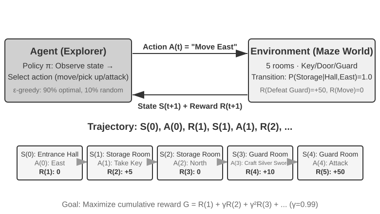
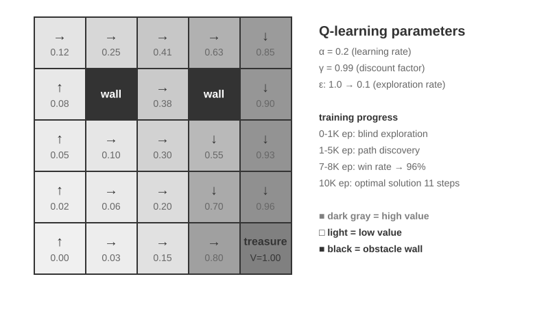
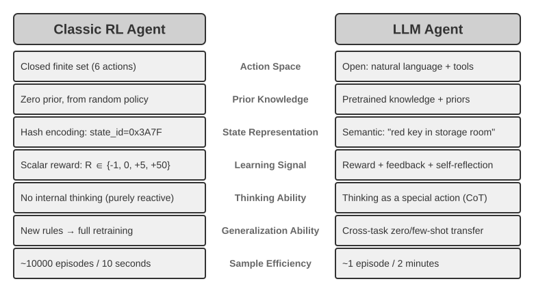
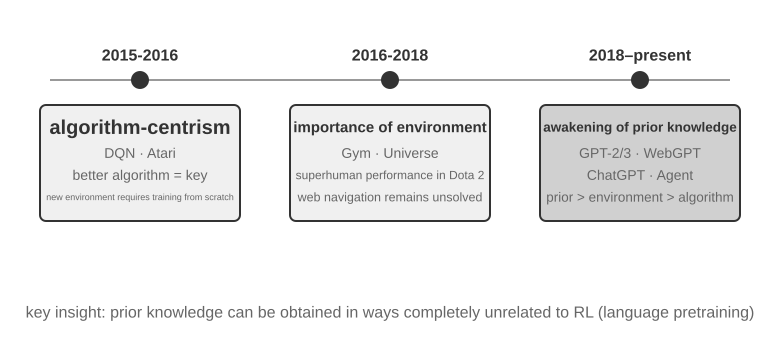
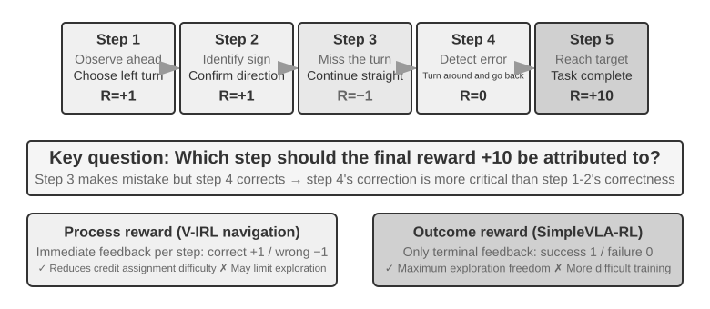

# אימון־על של מודלים

הנוסחה המרכזית של ספר זה היא סוכן = LLM + הקשר + כלים. פרק זה פונה אל ה‑LLM עצמו — "המוח". תחילה אנו משתמשים ב**אימון ביניים** (‏Mid-training) כדי למלא פערים בידע תחומי וביכולות יסוד, ולאחר מכן בשיטות אימון־על כגון SFT ו‑RL כדי לעצב את האופן שבו המודל משתמש בהקשר ובכלים. סופו של פרק 7 הצביע על כך שמערכת ההערכה וסביבת הסימולציה הן שתי אבני היסוד של אימון־העל: סביבת ההערכה מעניקה לאימון את מגרש האימונים שלו, ומדדי ההערכה מעניקים לו את מטרתו. פרק זה נבנה על אבני יסוד אלה ודן כיצד לשנות בפועל את משקלי המודל — כיצד לצרוב יכולת לתוך הפרמטרים.

פרק זה אינו מניח רקע בלמידת חיזוק או באימון מודלים. איננו מצפים שתכירו גרדיאנטים או אופטימיזציית מדיניות. במקום זאת, אנו מתחילים מהשאלה כיצד מודל מאומן בכלל, ומבהירים לשם מה נועד כל שלב, כיצד הוא פועל ואיזו בעיה הוא פותר. בתום הפרק תוכלו לענות על השאלות הבאות: באילו שלבים נוצרות יכולות המודל? מה עושה כל שלב? כיצד השלבים משולבים בדרך כלל, ומתי הסדר יכול להשתנות? והיכן כדאי לכם למקד את המאמץ בפרויקטים שלכם?

**ראשית, נקבע את המפה החשובה ביותר: פיתוח יכולות של מודלים מודרניים ניתן לחלוקה בדרך כלל לארבעה חלקים.** האימון המקדים מניח את היסוד הכללי, אימון הביניים ממלא פערי ידע ויכולת על התפלגות היעד, ואז SFT ו‑RL מעצבים את ההתנהגות בהתאם לדרישות הפלט ולמטרות המשימה.

1.  **אימון מקדים (Pre-training)**: אימון על כמויות עצומות של טקסט אינטרנטי כדי "לחזות את הטוקן הבא". שלב זה מלמד את המודל כללי שפה, ידע על העולם והיסק בסיסי. זה כמו אדם שקרא את כל הספרים בספרייה — משכיל, אך עדיין לא טוב במתן תשובות. זהו השלב היקר ביותר (לעיתים קרובות עשרות מיליוני דולרים) והיסוד של כל היכולות.
2.  **אימון ביניים (‏Mid-training, אימון בינוני או המשך אימון מקדים)**: החל ממודל בסיס קיים, ממשיכים במידול שפה על נתונים בשפת היעד, מסמכי תחום, קוד, הקשרים ארוכים או נתוני יכולת שעוצבו במכוון. אין הוא בונה מחדש את היסוד מאפס; הוא ממלא את "פרקי הלימוד" שהאימון המקדים הכללי כיסה בצורה גרועה. הוא צורך פחות נתונים וחישוב מאימון מקדים מלא, ומתאים יותר מ‑SFT לספיגת גופי ידע גדולים וליצירת הייצוגים הבסיסיים שהמשימה דורשת. צוותים מסוימים מתייחסים לאימון ביניים כאל חלקו האחרון של האימון המקדים; אחרים מכנים אותו המשך אימון מקדים (‏CPT), אימון מקדים מותאם‑תחום (‏DAPT) או אימון מקדים מותאם‑משימה (‏TAPT).
3.  **כוונון עדין מונחה (SFT)**: אימון המודל על זוגות קלט‑פלט מתויגים, בדומה למורה הנותן לתלמיד תשובות תקניות לחיקוי. אלפים עד עשרות אלפים של הדגמות שאלה‑ותשובה‑תקנית מלמדים את המודל באיזה פורמט, סגנון ותהליך להשתמש בעת מתן תשובה. שלב זה הופך מודל בעל ידע ויכולת לעוזר המבין הוראות ומייצר פלטים מובנים היטב. הוא זול, מהיר ויציב, וכמעט כל המודלים הנפרסים עוברים אותו.
4.  **למידת חיזוק (RL)**: לתת למודל לנסות שוב ושוב ולהשתפר מתגמולים ומעונשים, בדומה לסקירת תרגילים לפי הציונים שקיבלו. במקום לחקות ישירות את הטוקנים של תשובה תקנית, ‏RL נותנת למודל לנסות בעצמו, מעלה את ההסתברות להתנהגות טובה ומורידה את ההסתברות להתנהגות ירודה. כשמודל הבסיס כבר מצליח מדי פעם, וכשהתגמולים, הנתונים והסביבה מעוצבים היטב, שלב זה יכול לשפר החלטות ב**מצבים שלא נראו קודם** — והוא גם השלב התופס את מרב המקום בפרק זה והדורש את מרב מאמץ ההנדסה.

אנלוגיה אינטואיטיבית: אימון מקדים הוא השכלה כללית, אימון ביניים הוא לימוד מעמיק של ספרי לימוד מקצועיים, ‏SFT הוא מורה המדגים מוסכמות פתרון ותקשורת, ו‑RL היא פתרון התרגילים בעצמכם ושכלול הגישה מתוך התוצאות.

**בפרק זה שני חוטים מרכזיים העוברים לאורכו. אנא זכרו אותם, שכן כל התוכן שלהלן משרת אותם:**

*   **חוט ראשון: בניסויים המבוקרים של פרק זה, ‏SFT נוטה לשנן הדגמות בעוד RL מכלילה טוב יותר.** תחת אותה משימה, אותו מודל ואותו תקציב ב‑GeneralPoints וב‑V-IRL, ‏SFT מתאים את עצמו יתר על המידה לתשובות האימון, בעוד RL לומדת לעיתים קרובות יותר אסטרטגיה ברת‑העברה תחת הסטות ההתפלגות שנבדקו. זוהי תוצאה נמדדת בתנאי הניסוי ההם, לא תכונה אוניברסלית של SFT ו‑RL: ‏SFT יכולה להכליל עם נתונים מגוונים ורגולריזציה מתאימה, ו‑RL יכולה להתאים את עצמה יתר על המידה כשהתגמול או הסביבה שלה מוטים. פרק זה משתמש ב"‏SFT משננת, ‏RL מכלילה" כקיצור לניסויים אלה, והסעיף "מאימון מקדים ועד RL: פנורמה בת ארבעה חלקים" מסביר מדוע שתי מטרות האופטימיזציה עשויות להוליד את ההבדל הזה.
*   **חוט שני: נתונים וסביבה חשובים יותר מאלגוריתמים.** זהו הלקח הכי אנטי‑אינטואיטיבי והכי בעל ערך בתעשייה. עם אלגוריתמי RL מן המדף כגון PPO ו‑GRPO, די בלדעת להשתמש בהם. מה שקובע בפועל את ההצלחה הם שלושה דברים: האם **קורפוס אימון הביניים** מתקן את היסוד, האם **נתוני ההדגמה** מבססים פרוטוקול התנהגותי, והאם **הסביבה המדומה והתגמול** מספקים משוב ניסוי וטעייה אמין. בתרחישים רבים, אם שני סוגי הנתונים הראשונים טובים מספיק, אין צורך ב‑RL כלל. פרק זה יסיט שוב ושוב את תשומת לבכם מ"איזה אלגוריתם עליי לכוונן?" ל"האם הנתונים והסביבה הוגדרו נכון?"

> **מדריך קריאה**: תוכן פרק זה מחולק לשני מסלולים לפי הרקע של הקורא:
>
> *   **מפתחי יישומי סוכנים** (שאינם צריכים לאמן מודלים בעצמם): התחילו בקריאת הפתיחה "מאימון מקדים ועד RL: פנורמה בת ארבעה חלקים" כדי לבנות הבנה גלובלית. לאחר מכן תוכלו לדלג על שני הסעיפים `[קריאת רשות]` העוסקים ב‑RL קלאסית וברקע על אימון מקדים, ולהמשיך מהסעיף העצמאי על אימון ביניים. התמקדו במסגרת ההחלטה לבחירה בין אימון ביניים, ‏SFT ו‑RL, וכן בשיפוט ש"נתונים וסביבה חשובים יותר מאלגוריתמים" — תובנות אלה ישפיעו על החלטות העיצוב שלכם בהנדסת Harness, לרבות מתי Prompt מספיק ומתי האימון שווה את המאמץ.
> *   **מהנדסי אימון מודלים**: קראו ברצף מההתחלה. שני הסעיפים `[קריאת רשות]` מספקים רקע מלא על למידת חיזוק ועל אימון מקדים. הניסויים שלאחריהם מספקים תוכניות אימון בנות‑שחזור.

## מאימון מקדים ועד RL: פנורמה בת ארבעה חלקים

המבוא נתן לכם את המפה בת ארבעת החלקים; סעיף זה עובר על המכניקה של כל אחד מהם. הם נבדלים ב**נתונים** שלהם, ב**מטרות האופטימיזציה** וב**עלויות**. הבנת ההבדלים הללו היא המפתח לפרק כולו. טבלה 8‑1 מציגה את הסקירה הכללית; הפרטים באים בהמשך.

טבלה 8‑1 ארבעת חלקי פיתוח יכולות המודל

| שלב | נתונים בשימוש | מטרת האופטימיזציה | מה נלמד | עלות אופיינית |
|-------------|---------------------|--------------------|---------------------|-------------------|
| **אימון מקדים** | כמויות עצומות של טקסט אינטרנטי גולמי | חיזוי הטוקן הבא | כללי שפה, ידע על העולם, היסק בסיסי | גבוהה מאוד (מיליונים עד עשרות מיליוני דולרים) |
| **אימון ביניים** | קורפוסים בשפת/תחום/יכולת היעד בתוספת נתוני שימור | המשך חיזוי הטוקן הבא (בדרך כלל עם הפסד על כל טוקן) | מילוי פערים בידע תחומי, בשפה וביכולות יסוד | בינונית עד גבוהה, בהתאם לנפח הטוקנים ולשאלה האם כל הפרמטרים מאומנים |
| **SFT** | אלפים עד עשרות אלפים של זוגות הדגמה "קלט‑פלט" | חיזוי הטוקן הבא (הפסד מחושב רק על התשובה) | ציות להוראות, פורמט פלט, סגנון, פרוטוקול תהליך | נמוכה (שעות עד ימים) |
| **RL** | משימה וסביבה + אות תגמול (תשובות ייחוס אופציונליות) | מקסום התגמול הצפוי | אסטרטגיית קבלת החלטות ברת‑העברה, פתרונות חדשים שהתגלו | גבוהה (לעיתים קרובות פי עשרות עד מאות מ‑SFT) |

### מה עושה האימון המקדים: חיזוי הטוקן הבא

כל ה"אינטליגנציה" של מודלים גדולים מודרניים בנויה על משימה פשוטה עד כדי הפתעה: **חיזוי הטוקן הבא (Next Token Prediction, ‏NTP)**.

הציגו למודל את החלק הראשון של טקסט ובקשו ממנו לנחש את הטוקן הבא. למשל, בהינתן הקלט "בירת סין היא", המודל אמור להקצות הסתברות גבוהה ל"בייג'ינג". בכל פעם שהמודל מנחש, הוא משווה את חיזויו לטוקן הבא בפועל. ככל שההפרש גדול יותר (המכונה הפסד), כך הוא מכוונן יותר את הפרמטרים שלו כדי לנחש במדויק יותר בהקשרים דומים בפעם הבאה. באמצעות ביצוע חוזר של פעולה זו על טריליוני טוקנים של טקסט אינטרנטי, המודל נאלץ ללמוד דקדוק, עובדות, לוגיקה ואף היסק בסיסי — משום שכדי לנחש בעקביות נכון את הטוקן הבא על פני קשת עצומה של הקשרים אין קיצור דרך; הוא חייב באמת "לעכל" את הדפוסים שבטקסט.

יש נקודה מרכזית שכדאי לזכור, והיא תלווה אותנו אל אימון הביניים, אל SFT ואל RL: **הפלט של המודל הוא במהותו התפלגות הסתברות.** בהינתן הטקסט הקודם, המודל מקצה הסתברות לכל טוקן אפשרי באוצר המילים שלו. "אימון", בבסיסו, הוא **כוונון ההתפלגות ההסתברותית הזו** — הגדלת ההסתברות של טוקנים רצויים והקטנת זו של בלתי רצויים. ההבדל בין ארבעת החלקים טמון רק ב"מה רצוי" ו"איזה אות מגדיר 'רצוי'".

לאחר האימון המקדים המודל משכיל אך אינו ידידותי למשתמש: אם תשאלו אותו שאלה, הוא עשוי להמשיך לייצר עוד שאלות במקום לענות — משום שבטקסט אינטרנטי, אחרי שאלה באה לעיתים קרובות שאלה נוספת. הוא עדיין לא למד את הפרוטוקול של "כששואלים אותך שאלה, עליך לענות".

### מהות אימון הביניים: המשך למידה על התפלגות היעד

אימון מקדים כללי אינו יכול לכסות כל שפה, תחום ויכולת. אם מודל בקושי קורא מסמכים בקוריאנית, אינו מבין את הפרוטוקולים הפנימיים של ארגון, או מעולם לא יצר את ייצוגי הקוד וההקשר הארוך שמשימת היעד דורשת, מאוחר מדי ללמד רק "כיצד לענות" או לתגמל רק הצלחה וכישלון. אימון הביניים משמר את מטרת הטוקן הבא של האימון המקדים אך מצמצם את התפלגות הנתונים לתחום היעד, ומערבב פנימה נתונים כלליים לשימור כדי לשלוט בשכחה. הוא שואל האם למודל יש את הידע ואת יכולות היסוד הדרושים להשלמת המשימה — לא כיצד התשובה צריכה להיראות ולא איזו מדיניות זוכה לתגמול הגבוה ביותר.

אימון ביניים ו‑SFT עשויים להיראות כמשתמשים בפונקציות הפסד דומות, אך ארגון הנתונים וצפיפות הפיקוח שלהם שונים. אימון ביניים מתייחס בדרך כלל למסמכים שלמים, לקוד או לגזירות כאל יעדי למידה ומחשב הפסד על טוקנים רבים. ‏SFT מארגן נתונים כהדגמות קלט‑פלט ומחשב בדרך כלל הפסד רק על טוקני התשובה. טכנית ניתן לגרום למודל לשנן עובדות מסוימות באמצעות מערך שאלות‑תשובות קטן ב‑SFT, אך הדבר מחזק שוב ושוב רק כמה נתיבי גישה: המודל עלול לשנן את השאלות מבלי ליצור ידע נגיש באופן רחב. העדיפו אימון ביניים בעת ספיגת גופי ידע תחומיים גדולים ומקושרים; העדיפו RAG כשהידע חייב להישאר בר‑עדכון ובר‑מעקב.

### מהות ה‑SFT: "חיזוי הטוקן הבא" עם נתונים אחרים

זוהי התובנה המרכזית הראשונה שיש להפנים בפרק זה: **מתמטית, ‏SFT ואימון מקדים הם אותה משימה — שניהם חוזים את הטוקן הבא וממזערים את אותה פונקציית הפסד.** מתחילים רבים חושבים ש‑SFT היא שיטה חדשה לחלוטין, אך אין זה כך. ההבדל בין SFT לאימון מקדים טמון בשני דברים בלבד:

1.  **נתונים שונים.** אימון מקדים משתמש בטקסט אינטרנטי גולמי (לא מובנה, מכיל הכול); ‏SFT משתמשת בזוגות "קלט‑פלט" שהוכנו בקפידה, בפורמט אחיד של "שאלת משתמש ← תשובה אידיאלית". המודל ממשיך "לחזות את הטוקן הבא" על ההדגמות הללו, ובכך לומד את הפרוטוקול של "כיצד לבנות תשובה כששואלים שאלה".
2.  **ההפסד מחושב רק על ה"תשובה" (מיסוך הפסד).** דגימת SFT מורכבת משאלה ומתשובה מתויגת. איננו רוצים שהמודל ילמד "כיצד לשאול שאלה", אלא רק "כיצד לענות". לכן, בעת חישוב ההפסד, הטוקנים של חלק השאלה ממוסכים, וגרדיאנטים מופצים לאחור רק דרך חלק התשובה. זהו ההבדל ההנדסי המהותי היחיד בין SFT לאימון מקדים.

ברגע שרואים זאת, מתברר מדוע SFT עשויה להפגין שינון על הדגמות מוגבלות: מטרת האופטימיזציה שלה היא **למקסם את ההסתברות של כל טוקן בתשובה המתויגת**, ולשחזר את ההדגמה קרוב ככל האפשר. עבור משימות עם מטרות ברורות ופורמטים קבועים זה יעיל להפליא — כמה אלפי דוגמאות מספיקות. אך כשהכיסוי והמגוון בלתי מספקים, המודל עלול להתאים את עצמו יתר על המידה לדפוסי שטח או לקיצורי דרך שבהדגמות ולאבד ביצועים תחת הסטת התפלגות.

בקצרה, ‏SFT משתמשת ביעילות דגימה גבוהה במיוחד כדי **לקודד מיפוי ופרוטוקול יציבים מקלט לפלט בפרמטרים של המודל**. היא מקודדת **ידע פרוטוקולי** — כיצד לומר או לעשות משהו, לרבות פורמט, סגנון ותהליך — ולא כמויות גדולות של **ידע עובדתי** — מה שהמודל יודע. האחרון נשען על אימון מקדים או על RAG.

> **עלות אימון: כוונון עדין יעיל‑פרמטרים באמצעות LoRA.** גם SFT וגם ה‑RL שלאחריה דורשות עדכון פרמטרים של המודל, ולכוונון עדין של כל הפרמטרים יש דרישות זיכרון גרפי גבוהות (צורך לאחסן גרדיאנטים ומצבי אופטימייזר עבור מיליארדי פרמטרים). ‏**LoRA** (‏Low-Rank Adaptation) היא שיטת חיסכון העלויות הנפוצה ביותר: במקום לשנות את מטריצות המשקל המקוריות הגדולות, היא מצמידה "טלאי" קטן (מטריצה בדרגה נמוכה) שילמד את המשימה. מספר הפרמטרים הוא רק 1%–5% מהמקורי, ובכל זאת היא יכולה להתקרב לביצועי כוונון עדין מלא. משום שהמשקלים המקוריים מוקפאים, ‏LoRA גם גורמת להפרעה קטנה יותר ליכולות הקיימות של מודל הבסיס, ומפחיתה את הסיכון לשכחה קטסטרופלית. כמה כללי אצבע מאומתים[^ch8-1]: **חובה** להחיל LoRA על כל מטריצות המשקל המרכזיות (בייחוד שכבות ה‑MLP, שבהן מספר הפרמטרים הגדול ביותר); החלה על שכבות הקשב בלבד עולה בדיוק. **קצב הלמידה האופטימלי הוא כפי 10 מזה של כוונון עדין מלא** (נכון גם ל‑SFT וגם ל‑RL, כלל העברה מעשי מאוד). השתמשו בדרגה בינונית עד גבוהה (‏64–256) עבור SFT; מכיוון שכמות המידע בכל סבב של RL קטנה, דרגה נמוכה (‏8–32) או אפילו rank=1 מספיקה. בעת הפריסה, שרת היסק יחיד יכול לטעון בו‑זמנית מספר מתאמי LoRA לשירות רב‑דיירים. ספר זה מתייחס ל‑LoRA כאל בחירה ההנדסית שבברירת המחדל לכל שיטות אימון־העל ולא יפרט עליה בנפרד.

### מתי לתקן את היסוד לפני הפעלת SFT או RL

מדיניות RL אינה מחקה ישירות את הטוקנים של תשובת ייחוס. היא משתמשת בתגמולים כדי להעריך תשובות שהמודל **מייצר בעצמו**, אף שתשובות ייחוס או נתוני העדפה עדיין יכולים לשמש לחישוב אותו תגמול. למידה מאות זה דורשת לכל הפחות שני תנאים מוקדמים: הפלט חייב להיות ניתן לאימות, והמדיניות הנוכחית חייבת לחקור מדי פעם התנהגות בעלת ערך.

התנאי המוקדם הראשון הוא **תמיכה בפורמט**. אם המשימה דורשת JSON או קריאה לכלי והמודל פולט טקסט שאינו ניתן לניתוח, פונקציית התגמול אינה יכולה אפילו להבחין בין הצלחה לכישלון. ‏SFT יכולה תחילה לגרום למודל להתבטא כראוי: מספר קטן של הדגמות מייצב את הפורמט ואת הנוהל הבסיסי כך שניתן יהיה לחשב את התגמול, ולאחר מכן RL יכולה לבצע אופטימיזציה למדיניות. זהו דפוס "‏SFT תחילה, ‏RL אחר כך" המוכר.

התנאי המוקדם השני, היסודי יותר, הוא **תמיכה ביכולת**. דגמו משימות מוחזקות בטמפרטורה הקרובה להגדרת האימון ומדדו `pass@1` ו‑`pass@k`. אם הסתברות ההצלחה בדגימה אחת היא $p$, אזי תחת דגימה בלתי תלויה בקירוב, ההסתברות ללפחות הצלחה אחת ב‑$k$ דגימות היא

$$
\operatorname{pass@}k = 1-(1-p)^k.
$$

אם `pass@1` נמוך אך `pass@k` עולה בבירור עם $k$, המדיניות הנכונה כבר נמצאת בהתפלגות המודל אך יש לה מסת הסתברות קטנה מדי; ל‑RL, לדגימת דחייה או לזיקוק יש מה להגביר. מנגד, אם `pass@k` האמפירי נותר קרוב לאפס ב‑$k$, בטמפרטורת דגימה ובכיסוי משימות סבירים, מודל הבסיס בקושי יכול לייצר מסלול מוצלח. עם תגמול סופי 0/1 בלבד, קבוצת רולאאוטים ב‑GRPO תהיה ככל הנראה כולה אפס, מה שמבטל את היתרון התוך‑קבוצתי; גם PPO אינו רואה דוגמה חיובית המראה לאן לזוז. הגדלת מספר הדגימות רק ממתינה בערך $1/p$ ניסיונות להצלחה מקרית, ונעשית במהירות בלתי מעשית.

בשלב זה, שאלו מה חסר. אם מדובר בשפת התחום, בעובדות, בדפוסי קוד או ביכולת יסוד של הקשר ארוך, השתמשו באימון ביניים כדי לתקן את היסוד. אם היכולת קיימת אך אינה ניתנת לביטוי דרך הממשק, השתמשו ב‑SFT. אם המודל מתקדם חלקית אך אינו מגיע לנקודת הסיום, הוסיפו תגמולים חלקיים ניתנים לאימות או למידה בתוכנית לימודים. ‏RL טובה בהעלאת ההסתברות של התנהגות מוצלחת **קיימת אך בלתי סבירה**; היא גרועה ביצירת ידע ויכולות שהמודל מעולם לא למד, מתוך תגמול שכולו אפס.

גבול אחד נותר חשוב: "‏SFT חייבת לבוא ראשונה" נכון רק כשפורמט הפלט או ההתנהגות הבסיסית טרם בוססו. ניסוי 8‑11 מראה ש‑Llama-3.2-Vision-11B נכשל תחת דרישות פלט מובנה קפדניות כשהוא מאומן ישירות ב‑RL. אך מודל בסיס חזק מספיק, שיש לו הצלחה שאינה אפס, יכול לדלג על SFT; ‏DeepSeek-R1-Zero הוא דוגמה אחת. ה‑SFT להתנעה קרה שבא אצלו מאוחר יותר שיפר בעיקר את הקריאוּת ואת עקביות השפה, ולא הזריק ידע משימתי עבור ה‑RL. סעיף ההחלטה העצמאי שבהמשך נותן את זרימת העבודה המלאה יותר של אימון ביניים/SFT/RL.

### ההבדל המהותי בין SFT ל‑RL (הטבלה החשובה ביותר בפרק זה)

השתמשנו ב"‏SFT משננת, ‏RL מכלילה" כדי לסכם את הניסויים המבוקרים של פרק זה. כעת נסביר מדוע נטייה זו עשויה להופיע. המפתח הוא **מטרות האופטימיזציה השונות**:

*   **SFT ממקסמת את ההסתברות של התשובה המתויגת.** נראוּת מרבית דוחפת את המודל לשחזר את ההדגמה עבור כל דגימת אימון. הדגמות מגוונות ומייצגות יכולות ללמד תכונות ברות‑הכללה, אך הדגמות או פרומפטים מוגבלים יכולים גם להוליד התאמת יתר לדפוסי שטח או לקיצורי דרך. ב‑GeneralPoints, ההדגמות המוגבלות התייחסו ל‑J/Q/K כ‑10, והביצועים ירדו כשערכים אלה השתנו בזמן הבדיקה.
*   **RL ממקסמת את התגמול הצפוי.** המודל חוקר נתיבים ומעלה את ההסתברות של אלה הזוכים לתגמול גבוה. כשהתגמול מייצג נאמנה את המטרה והחקירה מספקת, היא יכולה לגלות אסטרטגיות ברות‑העברה שנעדרו מההדגמות. ב‑GeneralPoints, חישוב מחדש של התשובה כשהערכים השתנו הניב ביצועים טובים יותר מחוץ להתפלגות. מנגד, תגמול או סביבה מוטים יכולים לגרום גם ל‑RL להתאים את עצמה יתר על המידה לקיצורי דרך.

טבלה 8‑2 השוואה מהותית בין SFT ל‑RL

| ממד | SFT (כוונון עדין מונחה) | RL (למידת חיזוק) |
|-----------------|--------------------------------------|----------------------------------------|
| מטרת האופטימיזציה | מקסום ההסתברות של התשובה המתויגת (נראוּת מרבית) | מקסום התגמול הצפוי |
| אות האימון | פיקוח ברמת הטוקן על תשובה מתויגת | תשובות או מסלולים שנוצרו על ידי המדיניות + תגמולים סקלריים ברמת התוצאה או הצעד |
| צורת הנתונים | זוגות הדגמה "קלט‑פלט" | משימה וסביבה + אות תגמול (תשובות ייחוס אופציונליות) |
| לחץ אופטימיזציה ישיר | חיקוי מיפויים ופרוטוקולים שבהדגמות | חיזוק התנהגויות ואסטרטגיות הזוכות לתגמול |
| תחת הסטת התפלגות | תלוי בכיסוי ההדגמות וברגולריזציה; הדגמות מוגבלות הובילו להתאמת יתר בניסויי פרק זה | תלוי בתגמול, בסביבה ובחקירה; ההעברה הייתה טובה יותר בניסויי פרק זה |
| יעילות דגימה | גבוהה (אלפי דוגמאות אפקטיביות) | נמוכה (לעיתים קרובות פי עשרות עד מאות מ‑SFT) |
| יציבות האימון | גבוהה, מתכנסת במהירות | נמוכה, נוטה לתנודתיות, דורשת כוונון קפדני |
| מתאימה במיוחד ל | ביסוס פורמט/סגנון/תהליך, הדגמות באיכות גבוהה, סביבה יציבה | צורך בהכללה לתרחישים חדשים, חקירת אסטרטגיות אופטימליות, עלות תיוג גבוהה |

במבט דרך התפלגות ההסתברות, ‏SFT ו‑RL נבדלות בדרך חשובה נוספת. לשאלה יש בדרך כלל כמה משפחות של תשובות סבירות, שכל אחת מהן מתאימה ל"אופן" (mode) בהתפלגות. ‏SFT מבוססת נראוּת מרבית לומדת את ההדגמות אחת‑אחת ולכן מפגינה לעיתים קרובות נטייה ל**כיסוי מסה** (mass-covering): היא מנסה לכסות את מספר האופנים המופיעים בנתוני האימון. ‏RL מחלקת מחדש את ההסתברות בהתאם לתגמול, ובשילוב עם אילוץ ה‑KL ההפוך הנפוץ, נוטה יותר להפגין נטייה ל**חיפוש אופן** (mode-seeking): היא מרכזת הסתברות בכמה אופנים בעלי תגמול גבוה במקום לשחזר כל הדגמה באופן שווה.

הבחנה זו מסבירה את חוזקותיהן האופייניות: ‏SFT טובה בכיסוי דרכי ניסוח ידועות רבות, ‏RL טובה בחיפוש בין התנהגויות מועמדות אחר אסטרטגיה בעלת תגמול גבוה. האם התוצאה הסופית משמרת מגוון או מתכווצת לכמה אופנים תלוי בהתפלגות ההדגמות, בפונקציית התגמול, בכיוון ובמקדם ה‑KL, ברגולריזציית אנטרופיה ובטמפרטורת הדגימה.

**אימון־על מעצב גם מתי מודל פועל.** מודלי קוד מספקים דוגמה מוחשית: מודלים ממשפחת GPT וממשפחת Claude מפגינים לעיתים קרובות ספי פעולה שונים כברירת מחדל. הראשונים עשויים לקרוא חלק גדול יותר של מאגר לפני עריכה; האחרונים עשויים לאתר מתוך פחות קבצים, לממש תחילה, ואז להשתמש במשוב בדיקות כדי לתקן מסלול. אין זה עניין של האנשת מודל אחד כ"זהיר" ואחר כ"אינסטינקטיבי". זוהי מדיניות בפרמטרים המעריכה האם התוחלת של קריאת קובץ נוסף עדיין עולה על התוחלת של הגשה ואימות של הטלאי הנוכחי. אם הדגמות SFT חוקרות שוב ושוב בהיקף רחב לפני עריכה, המודל מחקה סף פעולה גבוה יותר. אם תגמולי תהליך או תוצאה מאמתים שוב ושוב איתור מהיר ולולאה ברת‑אימות מוקדמת, מסת ההסתברות נעה לעבר פעולה מוקדמת יותר. ניסוי 7‑8 בפרק 7 מחליף מודלים בתוך Harness קוד ניטרלי זהה ומודד התנהגות זו משתנה עם המודל: אין צורך שה‑Harness יאכוף זרימת עבודה כדי שהמודל יישא מדיניות שימוש בכלים יציבה משלו. ה‑Harness יכול לשנות את המדיניות, אך מקורה העיקרי יכול לשכון בפרמטרים שעברו אימון־על. משום שספקים אינם מפרסמים את מתכוני הנתונים והתגמול המלאים שלהם, הניסוי מבסס הבדל התנהגותי בצד המודל, ולא את האלגוריתם הקנייני המסוים שגרם לו.

**משוב מקוון יוצר הזדמנות לחקור אסטרטגיות שמעבר להדגמות.** ‏SFT על מערך נתונים קבוע משתמשת באותות אימון ישירים מהדגמות, אך היא עדיין יכולה לשלב ידע מהאימון המקדים ולהכליל לקלטים שלא נראו. ‏RL מקוונת מייצרת תשובות מהמדיניות הנוכחית ומקבלת משוב סביבתי, ולכן היא יכולה להעריך ישירות מועמדים הנעדרים מההדגמות. אין זה מבטיח אוטומטית תקרה גבוהה יותר: התוצאות תלויות במודל הבסיס, בכיסוי ההדגמות, בנאמנות התגמול, בחקירה וביציבות האופטימיזציה. המונחים "מקוון/לא‑מקוון" (‏online/offline) והמונחים המחמירים יותר "‏on-policy/off-policy" ישמשו בסעיפי התגמול והזיקוק. לעת עתה, שקלו שלוש הזדמנויות שמשוב מקוון יוצר:

- **ראשית, הוא יכול להעריך מועמדים מעבר למערך הדגמות קבוע.** הפיקוח הישיר של SFT מגיע מתשובות מוקלטות; ‏RL יכולה לחזק גם התנהגויות חדשות שפונקציית התגמול מסוגלת לנקד. פעולת ה"‏pushcut" בניסוי 8‑13 (‏SimpleVLA-RL) מעולם לא הופיעה בהדגמות אנושיות, ומראה את האפשרות לגלות אסטרטגיה מחוץ לנתונים. אך המודל אינו יכול ללמוד איכות שהתגמול אינו מסוגל לזהות או לגלות אסטרטגיה שלעולם אינו חוקר.
- **שנית, הוא יכול לנצל משימות שבהן האימות קל מהייצור.** ‏SFT זקוקה לתשובה נכונה או למסלול טוב שנכתבו תחילה; ‏RL זקוקה לדרך אמינה לשפוט את איכות התשובה. תשובות במתמטיקה ניתנות לבדיקה, קוד ניתן לבדיקה בטסטים, והוכחות ניתנות לאימות. אי‑סימטריה זו היא חוזקה של RLVR, אך מאמת חלקי יכול גם להוליד פריצת תגמול (reward hacking).
- **שלישית, הוא יכול לאמן על מצבים שהמדיניות הנוכחית מבקרת בהם.** לחיקוי לא‑מקוון יש את הבעיה הקלאסית של **הסטת משתנים מלווים** (covariate shift): לאחר שהמדיניות עוזבת את ההדגמות ונכנסת למצבים שלא נראו, אותות התאוששות עשויים להיעדר. במסגרות מסוימות של למידת חיקוי סדרתית, השגיאה במקרה הגרוע יכולה להצטבר בערך כ‑$T^2$ עם אורך המסלול $T$, בעוד צבירת נתונים מקוונת יכולה להפחית אותה לכדי $T$ בקירוב. זיקוק On-Policy (ראו "זיקוק: שיפור יעילות הדגימה" בהמשך פרק זה) משלב התאמה מקוונת זו עם הפיקוח הצפוף של SFT.

לשם אנלוגיה: **SFT לומדת מפה קיימת לפרטי פרטים, ואילו RL יכולה להשתמש בתגמול כמצפן כדי לחקור מסלולים מועמדים מעבר לה.** מפה או מצפן לא מדויקים יכולים להוליך את המודל שולל. מערכות רבות משתמשות לפיכך ב‑SFT כדי לבסס נקודת פתיחה יציבה, ואז מוסיפות RL כשהתגמול והסביבה ראויים לאמון.

עם פנורמה זו ביד, לכל סעיף מאוחר יותר יש מקום על המפה. שני הסעיפים הבאים, שניהם `[קריאת רשות]` — "מסוכני RL קלאסיים לסוכנים מודרניים" ו"יסודות אימון מקדים של מודלים" — משלימים את הרקע בלמידת חיזוק ובאימון מקדים לקוראים הרוצים להעמיק. קוראים שרק רוצים לשים ידיים על אימון־על יכולים לדלג קדימה לסעיף ה‑SFT.

## מסוכני RL קלאסיים לסוכנים מודרניים `[קריאת רשות]`

### אינטראקציית סוכן‑סביבה

**למידת חיזוק (RL)** עוסקת ביסודה בלמידה כיצד לבחור פעולות על סמך המצב הנוכחי כדי למקסם **תגמול מצטבר**. דמיינו בינה מלאכותית הלומדת לשחק שחמט: כל מהלך הוא פעולה, ניצחון מעניק תגמול חיובי, הפסד מעניק תגמול שלילי, והתגמול המצטבר הוא הרווח הכולל מהמשחק כולו. הסוכן והסביבה מקיימים אינטראקציה מתמשכת: בכל צעד, הסוכן מתבונן במצב הנוכחי, בוחר פעולה, והסביבה מייצרת מצב חדש ומעניקה תגמול.

כדי להבין אינטראקציה זו באופן אינטואיטיבי יותר, התרשים הבא מציג את לולאת ה‑RL התקנית — בכל צעד זמן, הסוכן מתבונן במצב הסביבה, מפיק פעולה, והסביבה מעניקה תגמול ועוברת למצב חדש בהתאם לאותה פעולה.



אינטראקציה זו מייצרת **מסלול** (trajectory) — רישום שלם של "מצב ← פעולה ← תגמול ← מצב חדש ← פעולה ← תגמול...". איכותה של מדיניות משתקפת בסופו של דבר באיכות המסלולים. **פונקציית ערך** עונה על השאלה: "אם אני נמצא כעת במצב זה וממשיך לפעול לפי המדיניות הנוכחית, כמה תגמול כולל אצבור בסופו של דבר?" זה כמו שחקן שחמט מנוסה המביט בעמדה ומעריך אינטואיטיבית את הסתברות הניצחון בלי לחשב עד הסוף. (כאשר "המדיניות הנוכחית" מוחלפת ב"מדיניות האופטימלית", מתקבלת פונקציית הערך האופטימלית, שתשמש בהמשך פרק זה בדיון במשוואת האופטימליות של בלמן.) הגבול בין הסוכן לסביבה נגזר מעיקרון פשוט: **כל מה שהסוכן אינו יכול לשנות כרצונו שייך לסביבה.**

שתי תכונות ייחודיות מבחינות בין למידת חיזוק לבין למידה מונחית (הדורשת תשובות נכונות מתויגות) ולמידה לא‑מונחית (המגלה דפוסים חבויים בנתונים): **חיפוש בניסוי וטעייה** (הסוכן חייב להבין בעצמו אילו פעולות טובות, בלי מורה המספק ישירות את התשובה הנכונה) ו**תגמול מושהה** (השפעתה של פעולה עשויה להתגלות רק צעדים רבים מאוחר יותר, למשל ערכו של מהלך שחמט טוב ניכר רק בסוף המשחק). זה גם מוליד את **פשרת החקירה‑ניצול** הייחודית: הליכה תמיד בנתיבים מוכרים פירושה שלא ללמוד דבר חדש; ניסיון אקראי תמידי פירושו לעולם לא להגיע ליעד.

מערכת למידת חיזוק מורכבת מחמישה מרכיבי ליבה:

- **מרחב פעולה**: מגדיר את קבוצת כל הפעולות האפשריות שהסוכן יכול לנקוט. פעולות יכולות להיות בדידות (למשל "איזה מהלך לבצע" בשחמט, עם מספר סופי של אפשרויות) או רציפות (למשל "בכמה מעלות לסובב מפרק" ברובוט, ערך רציף).
- **מדיניות**: כלל ההתנהגות של הסוכן, המציין מה לעשות במצב נתון. מדיניות יכולה להיות פשוטה (טבלת חיפוש: במצב A בצע פעולה X) או מורכבת (רשת עצבית עמוקה).
- **אות תגמול**: המשוב המיידי מהסביבה. אולם מטרת הסוכן היא למקסם תגמול ארוך‑טווח ולא מיידי — הבחנה זו מכרעת, בדיוק כשם שהשקעה אינה צריכה להישפט לפי רווחי והפסדי היום אלא לפי תשואות ארוכות‑טווח.
- **פונקציית ערך**: מעריכה את סך התגמול המצטבר שניתן להשיג ממצב נתון בעתיד, ומסייעת לסוכן לקבל החלטות נבונות גם ללא משוב מיידי. אחת התובנות החשובות ביותר משישים שנות מחקר RL היא התפקיד המרכזי של הערכת ערך.
- **מודל סביבה** (אופציונלי): חוזה את תגובת הסביבה לפעולות. שיטות המשתמשות במודל סביבה מכונות **שיטות מבוססות‑מודל** (תחילה לומדים לחזות כיצד הסביבה משתנה, ואז מתכננים בהתאם); אלה שאינן משתמשות בו מכונות **שיטות נטולות‑מודל** (אינן חוזות את הסביבה, אלא לומדות ישירות מניסיון).

טבלה 8‑3 משווה את המרכיבים המרכזיים של מערכות סוכן שונות, חושפת את האוניברסליות של מושג הסוכן ומסייעת לקוראים לראות את ההבדל במרחבי הפעולה בין סוכני RL מסורתיים לסוכני LLM מודרניים.

טבלה 8‑3 השוואת מרכיבים מרכזיים במערכות סוכן שונות

| סוג הסוכן | סביבה | מרחב פעולה | אות תגמול |
|---------------|------------------------|-------------------------------|-------------------------|
| **צבי שזה עתה נולד** | פני שטח, כבידה, תנוחת גוף | רציף רב‑ממדי (התכווצויות קבוצות שרירים) | שיווי משקל (+), נפילה (‑) |
| **רובוט שואב אבק** | תצורת החדר, מפלס הסוללה | בדיד (כיוון, שאיבה, טעינה) | שטח שנוקה (+), סוללה שהתרוקנה (‑) |
| **רב‑אמן שחמט** | מצב הלוח, מגבלת זמן | בדיד סופי (מהלכים חוקיים) | ניצחון (‏+1), הפסד (‏‑1) |
| **סוכן שירות לקוחות** | היסטוריית שיחה, בסיס ידע | הרכבי באורך משתנה (לחשוב, לדבר, לקרוא ל‑API) | הבעיה נפתרה (+), זמן טיפול (‑) |
| **סוכן עוזר קוד** | מסמך דרישות, בסיס קוד | הרכבי באורך משתנה (לחשוב, לחפש, לערוך, להריץ) | הבדיקה עברה (+), באג הוכנס (‑) |

הטבלה חושפת הבחנה חשובה. סביבות משחקי לוח ו‑Atari מייצגות משתמשות בפעולות פרימיטיביות בדידות סופיות מוגדרות מראש, בעוד בקרת רובוטים משתמשת בפעולות רציפות בעלות ממדים קבועים וחסמים פיזיקליים. סוכני שירות לקוחות וקוד מודרניים מבוססי LLM מרכיבים טוקנים סופיים וקריאות לכלים לכדי רצפי פעולה באורך משתנה, מה שמקשה למנות את הרצפים האפשריים בבת אחת. הם יכולים גם להשתמש בחשיבה פנימית כדי לשפר את יכולותיהם.

### שני ייצוגי פעולה: מסגרות RL קלאסיות ומדיניות LLM באורך משתנה

ההבדל הבולט ביותר בין שתי המסגרות הוא אופן ייצוג הפעולות. ‏MDP כשלעצמו יכול לייצג מרחבי פעולה סופיים או אינסופיים, בדידים או רציפים. סביבות משחקי הלוח ו‑Atari המייצגות כאן משתמשות בפעולות פרימיטיביות בדידות סופיות, בקרת רובוטים משתמשת בפעולות רציפות חסומות, ומדיניות LLM מרכיבה אוצר מילים סופי של טוקנים וסכמות כלים לכדי רצפים באורך משתנה. לייצוג הרכבי זה יש השלכות מרכזיות על עיצוב אלגוריתמים, על יעילות דגימה ועל הכללה. כל מסגרת נידונה להלן.

**דוגמה יסודית: ‏MDP ו‑Q-learning טבלאי.**

‏MDP (‏Markov Decision Process, תהליך החלטה מרקובי) הוא המסגרת המתמטית ללמידת חיזוק, המגדירה מרכיבי ליבה כגון מצבים, פעולות ותגמולים. הנחת הליבה שלו היא **התכונה המרקובית**: העתיד תלוי רק במצב הנוכחי, שחייב להכיל את כל ההיסטוריה הרלוונטית להחלטה. בשחמט, למשל, המצב כולל לא רק את מיקומי הכלים אלא גם את הצד שתורו לשחק, זכויות הצרחה והכאה דרך הילוכו, ומידע הדרוש לכללי חמישים המהלכים והחזרתיות. עם הגדרת מצב מספקת, אין צורך לקרוא מחדש את כל רישום המשחק בכל מעבר. אם תצפית משמיטה היסטוריה נחוצה, יש להוסיף היסטוריה זו למצב או לטפל בה באמצעות מודל בעל תצפית חלקית.


סביבות ה‑RL המייצגות בסעיף זה משתמשות ב**מרחבי פעולה מוגדרים מראש**. ‏361 עמדות המהלך בגו רבות אך סופיות; פעולות בשחמט עדיין ניתנות למנייה; ומשחקי Atari חושפים בדרך כלל מכמה עד תריסר פעולות פרימיטיביות בדידות. **סוכנים רובוטיים** משתמשים במרחבי פעולה רציפים אך חסומים: זוויות מפרקים, מהירויות וכוחות אחיזה הם ערכים רציפים, אך יש להם חסמים פיזיקליים ברורים וממדים הקבועים על ידי דרגות החופש של הרובוט.

פעולות בדידות סופיות מקלות על הערכת מועמדים בודדים. אם מספרי המצבים והפעולות קטנים מספיק, ‏Q-learning טבלאי מאחסן את ערכיהם ישירות; מרחבי מצבים גדולים יותר של Atari ומשחקי לוח משלבים קירוב פונקציות עם חיפוש. ‏MDP בעלי פעולות רציפות אינם יכולים למנות כל פעולה, ולכן שיטות כגון גרדיאנטי מדיניות ו‑actor-critic מקרבות את המדיניות ואת פונקציית הערך. הדוגמה הקלאסית בסעיף זה גם נבדלת ממדיניות LLM משום שהיא מתחילה למידה בניסוי וטעייה ללא ידע מאומן מראש.

בתוך מסגרת זו, אחד האלגוריתמים היסודיים והחשובים ביותר הוא **Q-learning**. הוא מתחזק הערכת ערך לכל זוג "מצב‑פעולה": אם תנקטו פעולה *a* במצב *s* ואז תפעלו באופן אופטימלי מכאן והלאה, כמה תגמול כולל תוכלו לצפות? באופן אינטואיטיבי, האם פעולה טובה תלוי בתגמול המיידי שהיא מביאה, בתוספת "כמה טוב המצב הבא שאליו היא מובילה".

כתיבת אינטואיציה זו כמשוואה מניבה את יחס הרקורסיה המרכזי של **משוואת בלמן** המפורסמת בספרי הלימוד של RL: **הערך האמיתי של פעולה = התגמול המיידי המתקבל בצעד זה + הערך העתידי המרבי שניתן להשיג מהמצב הבא**:

$$Q^*(s, a) = r + \gamma \max_{a'} Q^*(s', a')$$

כאשר $r$ הוא התגמול המיידי, $s'$ הוא המצב הבא שאליו מגיעים לאחר ביצוע הפעולה (כתוב בצורה דטרמיניסטית לשם האינטואיציה; בסביבה סטוכסטית נדרשת תוחלת על פני המצב הבא $s'$), ו‑$\gamma \in [0, 1)$ הוא **מקדם ההיוון** — הוא קובע עד כמה הסוכן מעריך את העתיד: ככל ש‑$\gamma$ קרוב יותר ל‑1, כך הוא מעריך יותר תשואות ארוכות‑טווח; ככל שקרוב יותר ל‑0, כך הוא מתמקד יותר במיידי. ה"תגמול המצטבר" שהוזכר שוב ושוב קודם לכן הוא בדיוק סכום התגמולים בכל צעד, מהוון ב‑$\gamma$: ‏$\sum_{t} \gamma^{t} r_t$. לאחר כל פעולה, האלגוריתם מכוונן מעט את ההערכה הישנה לעבר "התוצאה שנצפתה בפועל" — פרדיגמה זו של "תיקון הערכה ישנה בעזרת תוצאה ממשית של צעד אחד" מכונה **למידת הפרשים זמניים (TD learning)**. לאחר אלפי ניסיונות, ההערכה מתקרבת בהדרגה לערך האמיתי.

שני האיורים הבאים מציגים את תהליך החקירה של Q-learning בעולם רשת ואת ההתכנסות ההדרגתית של ערכי Q.




‏Q-learning היא שיטת **off-policy**: היא יכולה ללמוד מדיניות אופטימלית מנתונים שנוצרו על ידי מדיניות חקרנית השונה ממדיניות היעד. היא עדיין דורשת כיסוי הולם של זוגות המצב‑פעולה הרלוונטיים ותנאי קצב למידה והתכנסות מתאימים; היא אינה מתכנסת אוטומטית על התפלגות נתונים שרירותית. ההגדרות המחמירות של שיטות on-policy ו‑off-policy, וכיצד הן ממופות לאימון־על של LLM, נידונות בהמשך בסעיף "אלגוריתמי RL: מ‑16 רולאאוטים לעדכון פרמטרים אחד".

> **ניסוי 8‑1 ★: ביצועי Q-learning במשחק ציד אוצרות**
>
> כדי לאמת את מאפייני Q-learning ואת מגבלותיה, עיצבנו **סביבת משחק ציד אוצרות**. סביבה זו כוללת כמה אתגרים מרכזיים: **מנגנונים חבויים** מחייבים את הסוכן לגלות בעצמו את ההתאמה בין מפתחות לדלתות, את השפעות הנשקים ואת כללי יצירת הפריטים; **תלויות רב‑שלביות** פירושן שהשלמת המשימה דורשת את רצף הפעולות הנכון (פתרון אופטימלי: ‏11 צעדים); **תגמולים דלילים** פירושם שרק פעולות מפתח והניצחון הסופי מניבים תגמולים משמעותיים, בעוד רוב הצעדים הביניים אינם מקבלים משוב.
>
> סוכן ה‑Q-learning משתמש בהגדרות פרמטרים תקניות ובאסטרטגיית חקירה ε‑חמדנית: הוא בוחר בדרך כלל בפעולה האופטימלית הנוכחית אך מדי פעם בוחר באקראית, כשחלקה של החקירה האקראית פוחת בהדרגה במהלך האימון.
>
> עקומת הלמידה מציגה מאפיינים אופייניים (אפיזודה היא משחק שלם אחד, מההתחלה ועד ההשלמה או הכישלון):
> - **1000 האפיזודות הראשונות**: שיעור ניצחון 0%, בטבלת ה‑Q יש רק 124 מצבים, הסוכן חוקר בעיוורון
> - **5000 האפיזודות הראשונות**: עדיין אין ניצחונות יציבים, בטבלת ה‑Q יש 133 מצבים
> - **7,000–8,000 אפיזודות**: שיעור הניצחון עולה בהדרגה מ‑34% ל‑96%
> - **10,000 אפיזודות**: שיעור ניצחון 100%, בטבלת ה‑Q יש 145 מצבים, נמצא הפתרון האופטימלי בן 11 הצעדים
>
> כל האימון אורך פחות מ‑10 שניות (סימולציה יעילה מאוד), אך דורש כמעט 10,000 ניסיונות שלמים. זה מדגים את התנהגותה של תצורת ה‑Q-learning הטבלאית ε‑החמדנית נטולת הידע המוקדם שבה השתמשנו בניסוי זה: היא זקוקה לחקירה אקראית ניכרת כדי להשלים את הנתיב במקרה, ואותות הערך מתפשטים לאט מספיק כדי לדרוש חיזוק חוזר.
>
> בסימולטור משחק, ‏10,000 ניסיונות אורכים רק 10 שניות, עלות זניחה. אך בתרחישי סוכן בעולם האמיתי — שבהם לכל שיחת טלפון יש עלות, לכל פעולת דפדפן יש השהיה, ולכל החלטה שגויה יכולות להיות השלכות בלתי הפיכות — ‏10,000 ניסיונות אינם מתקבלים על הדעת כלל. סיבה אחת להשתמש במדיניות LLM מאומנת מראש היא שידע שנצבר יכול לתמוך בהחלטות אפקטיביות עם הרבה פחות אינטראקציות עם הסביבה.
>
> ל**ניסוי ה‑Q-learning הטבלאי נטול הידע המוקדם** הזה שלוש מגבלות: אפילו משימה פשוטה זקוקה לאינטראקציה נרחבת, ערכים שנלמדו בסביבה אחת אינם מועברים ישירות לאחרת, וכל משימה חדשה מחייבת חקירה מחדש. אלה אינן מגבלות של מסגרת ה‑MDP עצמה. קירוב פונקציות, למידת העברה ו‑RL מבוססת‑מודל יכולים לטפל במצבים עשירים יותר ובהעברת ידע, אף שהם עדיין עשויים לדרוש אינטראקציה סביבתית ניכרת בהשוואה ל‑LLM מאומן מראש.

**סוכנים המבוססים על מדיניות LLM מאומנת מראש.**

מודלי שפה גדולים הביאו שינוי מעשי חשוב לאופן שבו פעולות סוכן מיוצגות ומאותחלות.

‏RL קלאסית יכולה גם היא למדל חישוב פנימי או איסוף מידע כמצבים ופעולות. השינוי המעשי שהביאו LLM אינו שהחשיבה התאפשרה לראשונה, אלא שמדיניות שפה מאומנת מראש יכולה לייצג חישוב פנימי כרצפי טוקנים באורך משתנה ולייצר אותו בתוך אותה מדיניות שבה נוצרות פעולות חיצוניות. טוקני חשיבה אינם משנים ישירות את העולם החיצוני, אך הם יכולים לשפר את הפעולה הסופית. ייצוג הפעולה כולל כעת לא רק "מה לעשות", אלא גם "כמה זמן לחשוב ועל מה לחשוב".

החדשנות המעשית החשובה ביותר היא שילוב **טוקני חשיבה כפעולות מיוחדות במרחב פלט המדיניות**. סביבות RL מסורתיות מייצגות מדגישות פעולות פרימיטיביות כגון תנועה, תקיפה והרמה, אף שחישוב פנימי אף הוא ניתן למידול ב‑MDP או במדיניות היררכית. בסוכני LLM, ‏**החשיבה הפנימית הופכת לחלק מרכזי ממרחב פעולות השפה הנלמד**. היא אינה משנה ישירות את הסביבה החיצונית ואינה מקבלת תגמול סביבתי מיידי, אך היא יכולה לבטא נתיבי חישוב רבים בתוך עלויות טוקנים ומגבלות הקשר.

פעולות הרכביות באורך משתנה יוצרות מרחב חיפוש גדול בהרבה מפעולות פרימיטיביות וקשה ללמוד אותן מאפס ללא ידע מוקדם. סוכן הלומד מאפס דומה לחיפוש אוצר במדבר בעיניים מכוסות. ‏LLM, לעומת זאת, לומדים דפוסי פתרון בעיות אנושיים מאימון מקדים על כמויות עצומות של טקסט: פתרונות מתמטיים עוקבים לעיתים קרובות אחר "זיהוי התנאים ← היזכרות בנוסחאות ← חישוב צעד אחר צעד", בעוד תכנות עוקב אחר "הבנת הדרישות ← עיצוב המבנה ← מימוש הפרטים". המדיניות המאומנת מראש מעניקה לנתיבים מובנים הסתברות מוקדמת גבוהה יותר, ובכך דוחסת מאוד את מרחב החיפוש. לפיכך, גם ללא RL נוספת, ‏LLM מאומן מראש יכול לייצר שרשרת מחשבה (CoT) לוגית בסיסית, שנלמדה באמצעות חיזוי הטוקן הבא על פתרונות מתמטיים, הערות קוד, דיונים ועקבות היסק אחרות שנכתבו בידי בני אדם.

אימון־על באמצעות RL משתמש אז בתגמולים חיצוניים כדי ללמד את ה‑LLM ליישם דפוסים אלה ביעילות רבה יותר על משימה מסוימת. מבנה השפה אינו "תגמול פנימי" נפרד; הוא פועל כ**התפלגות מוקדמת** במדיניות המאומנת מראש. דפוס הנוכח בעקביות בנתוני האימון, כגון "עלינו להמיר מטבע, ולכן תחילה נחפש את שער החליפין", עשוי להתחיל עם הסתברות ייצור גבוהה יותר מנתיב לא קשור כגון בדיקת מזג האוויר. ‏RL משתמשת בתגמול המשימה בפועל כדי לעצב מחדש את הסתברויות הנתיבים מאותה התפלגות פתיחה.



מדיניות השפה המאומנת מראש מאפשרת לסוכני LLM להבין הוראות שלא נראו (הכללת zero-shot) ולהסתגל למשימות חדשות מכמה דוגמאות (התאמת few-shot), בניגוד חד למסגרת ה‑Q-learning הטבלאית נטולת הידע המוקדם שלעיל. היא תומכת גם בהכללה הרכבית, בלמידה בהקשר ובהבנה רב‑אופנית. שימו לב שה**אפקטיביות** של למידה בהקשר וה**מנגנון הפנימי** שלה הן שאלות שונות — כפי שנותח בפרק 2, קשב פועל יותר כאחזור מאשר כהיסק, אך אין בכך כדי להפחית מהשפעתו המעשית בהתאמה למשימות.

ההתרחבות מפעולות פרימיטיביות מוגדרות מראש לפעולות הרכביות באורך משתנה היא תמורה חשובה בפרדיגמת סוכני ה‑AI. פעולות LLM עדיין מוגדרות על ידי אוצר מילים סופי של טוקנים ועל ידי סכמות כלים, אך חשיבה פנימית, שאילתות בשפה טבעית, קוד תוכנה, ‏JSON מורכב ותוכן רב‑אופני מצטרפים למספר מתפוצץ של רצפים באורך משתנה. מפרשני קוד וכלי חיפוש מחברים ייצוג זה לקשת רחבה של משימות ומידע בעולם האמיתי. הדבר יוצר גם הזדמנויות וגם אתגרים: סוכנים יכולים לשלב כלים בסיסיים כדי לטפל במשימות שלא נראו, אך עיצוב תגמול וחקירה יעילה חייבים לפעול על פני מרחב הרכבי עצום.

מודלים כגון Kimi K3, המותאמים לשימוש בכלים ולהיסק שרשרתי ארוך, ממחישים את הכיוון האופייני של פרדיגמת LLM+RL: אימון מקדים של שפה בקנה מידה גדול מספק את היסוד, ואימון־על מחזק פירוק בעיות, שימוש בכלים ותיקון עצמי. ‏**OpenVLA**[^ch8-21] (מפורט בפרק 6) מציג את פרדיגמת ארכיטקטורת ה‑VLA (‏Vision-Language-Action) של עידן ה‑LLM: מקודד ראייה מעבד תצפיות סביבתיות, מודל שפה מבין הוראות ומסיק, ומפענח פעולות מייצר אותות בקרה, ומאפשר בקרה מותנית‑שפה והכללה חוצת‑משימות. למען הבהירות, ‏OpenVLA עצמו מאומן באמצעות למידת חיקוי על קרוב למיליון **מסלולי הדגמה** של רובוטים, ולכן הוא SFT במהותו ולא RL. ‏SimpleVLA-RL, המוצג בניסוי 8‑13 בהמשך פרק זה, הוא הדוגמה המייצגת להכנסת RL לרובוטיקה באמצעות שימוש בתגמולים כדי לבצע אופטימיזציה נוספת לארכיטקטורת VLA מסוג זה.



**מסלול החקירה של OpenAI** (כפי שתועד על ידי Shunyu Yao, פרופסור־חבר באוניברסיטת פרינסטון ומחבר מאמר ReAct, ב"‏The Second Half"[^ch8-2]) מתחקה אחר התפתחות בחשיבת התחום. **שלב 1 (‏2015‑2016), אלגוריתם במרכז:** האמונה הרווחת הייתה שאלגוריתמים טובים יותר הם המפתח. הושגה התקדמות בסביבות תקניות כגון Atari, אך כל סביבה חדשה חייבה אימון מחדש מאפס. **שלב 2 (‏2016‑2018), חשיבות הסביבה:** ‏Gym תקנן מגוון משימות; ‏Universe ו‑World of Bits ניסו להפוך את האינטרנט כולו לסביבת אימון RL; ו‑Dota 2 חתר לביצועים על‑אנושיים בסביבה מורכבת מסוימת. הרעיון היה ברור, אך שימוש כללי במחשב וניווט ברשת נותרו מחוץ להישג יד.

**שלב 3 (‏2018‑היום), התעוררות הידע המוקדם:** ‏GPT-2/GPT-3 הדגימו את עוצמת האימון המקדים של שפה; ‏WebGPT ו‑ChatGPT הוכיחו שניתן להפוך ידע מוקדם זה לסוכנים מעשיים. התגלית החשובה ביותר: **ניתן לרכוש ידע מוקדם בדרכים שאין להן דבר עם RL**. זוהי אמת אנטי‑אינטואיטיבית — במשך עשורים, ייתכן שסדרי העדיפויות של חוקרי RL היו הפוכים לחלוטין. הסדר האמיתי אינו אלגוריתם > סביבה > ידע מוקדם, אלא ידע מוקדם > סביבה > אלגוריתם.

> **ניסוי 8‑2 ★★: מחקר השוואתי של RL מסורתית וסוכן LLM**
>
>
> 
>
>
> השווינו Q-learning עם סוכן LLM — ‏Kimi K3, המתחזק מאגר של עד 50 התנסויות — באותו משחק ציד אוצרות. התוצאות מדהימות: **סוכן ה‑LLM השלים את המשחק ב‑18 צעדים בניסיון הראשון**.
>
> **שלב מוקדם (חקירה תכליתית)**: מרים חרב חלודה ("נשק עדיף על ידיים ריקות"), חוקר את המפה באופן שיטתי, מסיק ש"צריך למצוא מפתח" לאחר שמצא את השער הצפוני נעול, חוקר את המחסן, ורוכש את המפתח האדום ואת גביש הקסם. **שלב אמצעי (הבנת מנגנונים וסינתזה יזומה)**: מבין את כלל "השימוש האוטומטי במפתח" וצופה שהחרב החלודה אינה מספקת מול השומר, ומסנתז ביוזמתו חרב כסף בצעד 8. **שלב מאוחר (ביצוע ותיקון שגיאות)**: פונה צפונה עם חרב הכסף ומביס את השומר החזק בצעד 13. בדרך הוא מבצע ניסיון או שניים לא אפקטיביים — הנפת חרב חוזרת או חזרה על עקבותיו — ולבסוף משיג את אוצר הדרקון בצעד 18.
>
> הדבר מדגים הבדל יסודי בין הבנה סמנטית למיפוי סימבולי. סוכן ה‑LLM הבין את המבנה המושגי של המשחק; לכל צעד היו תכלית ותימוכין לוגיים. עבור Q-learning, "דלת", "מפתח" ו"חרב" הם רק צירופי סמלים חסרי משמעות, והיא יכולה לגלות את היחסים ביניהם רק לאט באמצעות למידה סטטיסטית נרחבת.
>
> העלות החישובית מציגה פרדוקס מעניין: ‏Q-learning מריצה 10,000 משחקים ב‑10 שניות, בעוד סוכן ה‑LLM לוקח 1‑2 דקות למשחק. אולם במשימות בעולם האמיתי, עלויות הזמן, הכסף והסיכון לכל אינטראקציה עולות בהרבה על עלויות חישוביות טהורות, ולכן שיפוט לפי זמן GPU בלבד אינו הוגן. תובנה קריטית יותר היא: הצלחתו של סוכן ה‑LLM אינה נובעת מ"אלגוריתם למידה" טוב יותר, אלא מכך שהוא נושא ידע מוקדם עצום. כשכללי המשחק משתנים, ‏Q-learning זקוקה לאימון מחדש מלא, בעוד סוכן ה‑LLM יכול להסתגל ישירות באמצעות היסק. מכאן נגזר עיקרון עיצוב מעשי: ‏RL מסורתית נותרת בעלת ערך בתרחישים בעלי עלויות סימולציה נמוכות וחזרתיות גבוהה; בתרחישים בעולם האמיתי בעלי עלויות אינטראקציה גבוהות וצורך בהסתגלות מהירה, יעילות הדגימה של סוכני LLM בעלת ערך רב יותר בפועל.

פרק 1 כבר סיפק מפה מושגית של האופן שבו הסתגלות הקשרית, עדכונים לנכסים חיצוניים ועדכוני פרמטרים פועלים יחד; הסעיף "לקחים מעשיים לאימון־על" בסוף פרק זה שב לנושא. החוט המרכזי של פרק זה הוא אימון־על: כתיבה לתוך פרמטרי המודל של יכולות שאינן ניתנות לביטוי מלא באמצעות כללים חיצוניים.

## יסודות אימון מקדים של מודלים `[קריאת רשות]`

כדי להבין מדוע טכניקות אימון־על אפקטיביות, יש להבין תחילה מה האימון המקדים מבסס. אימון־על (‏SFT ו‑RL) מבצע במהותו אופטימיזציה בתוך מרחב הייצוג שביסס האימון המקדים — מבנה הידע שהניח האימון המקדים קובע את תקרת האימון־על. לפיכך, אנו בוחנים את היבטי הליבה של האימון המקדים באמצעות שלושה ניסויים: אימון מודל שפה בקנה מידה קטן מאפס, הרחבת יכולות ראייה, והזרקת ידע לשוני חדש. שלושת הניסויים בסעיף זה הם השלמה ונועדו לבנות אינטואיציה לגבי אימון מקדים — כלומר אימון ראשוני על נתונים בקנה מידה גדול המלמד מודל דפוסי שפה בסיסיים וידע על העולם. קוראים המכירים כבר את תהליך האימון המקדים יכולים לדלג עליהם.


אימון מודלי שפה מתנהל לפי צינור בן שלושה שלבים: "טוקניזציה — אימון מקדים — אימון־על". טוקניזציה מפצלת טקסט ליחידות בדידות. למשל, "אני אוהב תכנות" עשוי להיות מפוצל ל"אני", "אוהב", "תכ", "נות". טוקנים אלה הם היחידות הטקסטואליות הקטנות ביותר שהמודל מעבד. משימת האימון המקדים פשוטה מבחינה מושגית: להציג למודל את החלק הראשון של קטע טקסט ולבקש ממנו לחזות את הטוקן הבא. באמצעות השוואת חיזויו לתשובה הנכונה (הפרש זה נקרא הפסד; הפסד קטן יותר פירושו חיזוי מדויק יותר), המודל מכוונן ברציפות את הפרמטרים שלו. לאחר אימון חוזר על כמויות עצומות של נתוני טקסט, המודל לומד בהדרגה כללי שפה, ידע על העולם ויכולות היסק בסיסיות. לאחר האימון המקדים, המודל יכול לייצר טקסט שוטף, אך הפלט חסר מבנה ומתקשה לציית להוראות. אימון־העל הופך אז את המודל לעוזר מעשי באמצעות SFT — אימון על זוגות קלט‑פלט מתויגים — ואופטימיזציית העדפה, כגון DPO, המלמדת את המודל לייצר תשובות שבני אדם מעדיפים.

> **ניסוי 8‑3 ★★: אימון LLM מאפס — עוצמתו של שיפור אלגוריתמי**
>
> באמצעות MiniMind 2, מודל בן 100 מיליון פרמטרים, כמקרה בוחן, הניסוי משלים את תהליך האימון כולו על GPU צרכני. שתי אופטימיזציות אלגוריתמיות — ‏QK Norm והאופטימייזר Muon — משלשות את מהירות ההתכנסות ומשפרות משמעותית את איכות הייצור, והכול בעלות נמוכה מאוד: כ‑14 שעות אימון ו‑34 דולר בסך הכול.
>
> השפעות כל שלב אימון: לאחר האימון המקדים, המודל יכול לענות על שאלות עובדתיות כגון "מהו ההר הגבוה בעולם?" אך הפורמט אינו תקני; לאחר SFT, הציות להוראות ועיצוב הפלט משתפרים משמעותית, ומאפשרים למודל לארגן תשובות כמצופה; אופטימיזציית העדפה מפחיתה עוד יותר שגיאות עובדתיות וביטויים לא טבעיים. למודל בן 100 מיליון הפרמטרים עדיין יש מגבלות ברורות (נוטה לשגיאות בבעיות מורכבות), אך הלקח הוא: **בתקציב קטן וקבוע, שיפורים אלגוריתמיים מציעים תמורה טובה יותר מהגדלת הגודל בלבד**.

> **ניסוי 8‑4 ★★: אימון VLM משלכם**
>
>
> 
>
>
> ‏VLM מאחדים תפיסה חזותית והבנת שפה בתוך מודל יחיד. אתגר הליבה הוא יישור חוצה‑אופנויות — לגרום ל"מה שנראה" להתאים ל"מה שנאמר". הארכיטקטורה מורכבת משלושה רכיבים: **מקודד ראייה** (למשל CLIP, פרמטרים מוקפאים) מחלץ מאפיינים סמנטיים מתמונות; **שכבת הטלה** (קלת משקל, החלק היחיד המאומן מאפס) פועלת כ"מתרגם" בין מאפיינים חזותיים למודל השפה, וממפה מאפיינים חזותיים למרחב ייצוג שמודל השפה יכול להבין; ו**מודל שפה** מייצר טקסט תיאורי. האימון משתמש באסטרטגיית "הקפאת ה‑LLM + אימון שכבת ההטלה בלבד" כדי להימנע משכחה קטסטרופלית (שכחת מיומנויות ישנות לאחר למידת חדשות); לאחר שלב האימון המקדים ליישור, ה‑LLM משוחרר מהקפאה, ומתבצע SFT על זוגות תמונה‑תיאור באיכות גבוהה, מה שמשפר משמעותית את הפירוט והדיוק של תיאוריו.
>
> ניסוי זה חושף את הפרדיגמה הבסיסית לאימון מודלים רב‑אופניים: שימוש חוזר בתוצרי אימון מקדים חד‑אופני והשגת יישור חוצה‑אופנויות באמצעות אימון שכבת הטלה קלת משקל — יעיל וניתן להרחבה, אך כוח הביטוי המוגבל של שכבת ההטלה יכול להפוך לצוואר בקבוק להבנה חוצת‑אופנויות עמוקה. הרחבת אותה ארכיטקטורה של "מקודד ראייה + שכבת הטלה + LLM" צעד אחד נוסף, כך שהמודל יפיק פעולות, מייצרת את מודל ה‑VLA (‏Vision-Language-Action) המפורט בפרק 6.

שני ניסויי האימון המקדים חושפים יחדיו דפוס: תחת תקציב מוגבל, שיפורים אלגוריתמיים וארכיטקטוניים מציעים לעיתים קרובות תמורה טובה יותר מהגדלה בלבד. חשוב מכך, האימון המקדים מספק ידע תיאורי ויכולת מידול שפה, אך לא ציות מובנה להוראות או התנהגות ממוקדת‑משימה. ובכל זאת, ‏SFT ו‑RL אינן יכולות לעקוף שפת יעד או תחום שהאימון המקדים הכללי מעולם לא כיסה. זהו הפער שאימון הביניים מטפל בו.

## אימון ביניים: מילוי פערים בידע וביכולות יסוד

בפרק זה, **אימון ביניים** (‏Mid-training) פירושו לקיחת מודל בסיס קיים והמשך אימון מודל שפה על התפלגות נתוני יעד. הוא משמר בדרך כלל את מטרת הטוקן הבא של האימון המקדים ומחשב הפסד על כל טוקן במסמך, בדוגמת קוד או בגזירה. מחקר DAPT/TAPT הקלאסי מראה ששלב אימון מקדים שני על קורפוסים לא מתויגים הקשורים לתחום או למשימה יכול להמשיך לשפר ביצועים במורד הזרם[^ch8-30]. ה"ביניים" מתאר את מקומו בצינור פיתוח היכולות; פורמט הנתונים וההפסד שלו נותרים אלה של האימון המקדים.

אימון ביניים מטפל בעיקר בשני סוגי פערים:

- **פערי ידע**: האימון המקדים הכללי לא כיסה כראוי שפת יעד, פיננסים, רפואה, משפטים, מסמכים ארגוניים פנימיים או סוג מסוים של מאגרי קוד, ולכן המודל אינו יכול אפילו להבין את המושגים ואת המינוח.
- **פערי יכולת יסוד**: משימת היעד דורשת ייצוגים של הקשר ארוך, קוד, גזירה מתמטית או רב‑אופנויות שמודל הבסיס לא יצר. הבעיה אינה רק פורמט התשובה: אפילו לאחר דגימות רבות, המודל כמעט לעולם אינו מגיע לפתרון נכון.

הדבר מסביר גם מדוע אין להתייחס ל‑SFT כאל הנשא העיקרי להזרקת ידע. ‏SFT יכולה לשנן מספר קטן של עובדות ולעיתים קרובות באה לאחר אימון ביניים כדי ללמד את המודל כיצד לענות על שאלות בתחום. אך מערך שאלות‑תשובות קטן מכסה רק מגוון מוגבל של ניסוחים; הוא טוב יותר באימון כיצד לגשת לידע ולבטא אותו מאשר בנשיאת גוף ידע גולמי גדול ומקושר. מנגד, הפחתת הפסד מידול השפה על טקסט תחומי אינה מבטיחה שהמודל יאחזר את הידע הזה בתגובה לשאלה. מחקרים מראים שסדר וארגון של המשך אימון מקדים וכוונון הוראות משפיעים מהותית על האפשרות לגשת לידע בצורת שאלה‑תשובה[^ch8-31]. מתכון איתן הוא בדרך כלל: **אימון ביניים סופג ידע ויכולות ← SFT בקנה מידה קטן מבסס גישה ופרוטוקולי פלט ← RL מתווספת במידת הצורך ברגע שההצלחה אינה אפס**.

### בניית נתוני אימון ביניים

המפתח אינו לשפוך לאימון כל קובץ תחומי. **התפלגות היעד, התפלגות השימור והתפלגות ההערכה** חייבות ליצור לולאה סגורה:

1. **גזרו את צורכי הנתונים מהתפלגות הכשלים.** פלחו הערכות לפי נושא, שפה, סוג מסמך, דפוס קוד ואורך הקשר. קבעו אילו מקרים בעלי `pass@k` נמוך נובעים מפער במודל הבסיס, והוסיפו נתונים רק עבור פערי ידע ויכולת ולא תאבחנו בטעות שגיאות פורמט פלט כידע חסר.
2. **בנו קורפוסי יעד בעלי צפיפות גבוהה.** מסמכים גולמיים מבססים מינוח ואסוציאציות עובדתיות; מאגרי קוד מלמדים מבנה ותלויות; גזירות בסגנון ספר לימוד, הסברים סינתטיים ודגימות אסוציאציה חוצות‑מסמכים הופכות יחסים מובלעים למפורשים. הסירו כפילויות, סננו לפי איכות ובדקו זיהום של מערכי ההערכה.
3. **ערבבו לפי דלי יכולת, לא רק לפי מקור הקורפוס.** ניתן לכתוב את נתוני שלב ההקשר $i$ כך:

   $$
   \mathcal{D}_i=\alpha_i\mathcal{D}_{\text{long}}+\beta_i\mathcal{D}_{\text{atomic}}+\gamma_i\mathcal{D}_{\text{agent}}+\delta_i\mathcal{D}_{\text{replay}},\qquad
   \alpha_i+\beta_i+\gamma_i+\delta_i=1
   $$

   כאן, $\mathcal{D}_{\text{long}}$ מכיל טקסטים ארוכים טבעיים הקרובים לאורך היעד הנוכחי, כגון ספרים, מסמכים ארוכים ומאגרי קוד; $\mathcal{D}_{\text{atomic}}$ מכסה פרימיטיבים כגון אחזור מטקסט ארוך, היסק רב‑קפיצות, צבירת מידע וסטטיסטיקה; $\mathcal{D}_{\text{agent}}$ מזריק יסודות סוכניים כגון תכנון, בחירת כלים וקריאה להם, מעקב מצב לאורך אופק ארוך והתאוששות משגיאות; ו‑$\mathcal{D}_{\text{replay}}$ משמר נתוני אימון מקדים כלליים ונתונים משלבי אורך מוקדמים יותר. תיעוד כלים, קוד, תוכניות, מעברי מצב ועקבות הרצה ניתנים לארגון כרצפים שלמים ולאימון עם הפסד מידול שפה על כל טוקן כדי ליצור ייצוגים בסיסיים; תבניות שיחה מדויקות וסכמות קריאה לכלים נותרות תפקידו של ה‑SFT שלאחר מכן. אין יחס אוניברסלי בין מודלים. התאימו אותו מתוך עקומות הלמידה והשכחה של כל דלי, ודווחו על התערובת האפקטיבית **לפי טוקנים**, ולא רק לפי מספר דגימות, משום שדוגמאות ארוכות צורכות באופן טבעי יותר טוקנים.
4. **השתמשו בשתי צורות של שחזור בכל שלב.** הראשונה היא טקסט קצר מקורי ונתונים כלליים, המשמרת שפה, ידע ויכולת בהקשר קצר. השנייה היא "שחזור מורם‑אורך": מקמו משימה קצרה ישנה שהמודל כבר פותר בתוך אורך ההקשר הנוכחי, כשמידע רלוונטי ומסיחים ממוקמים במקומות שונים, וּודאו שאותה יכולת שורדת בחלון ארוך יותר. באופן אידיאלי, הנתונים הכלליים מגיעים ממערך האימון המקדים המקורי של מודל הבסיס; כשאינם זמינים, קורפוסים פתוחים כגון FineWeb-2 יכולים לשמש תחליף. מחקר על הקשר ארוך מוצא אף הוא שנתונים איכותיים בהקשר קצר נותרים חלק חשוב מתערובת טובה לצד טקסט ארוך טבעי[^ch8-35].
5. **עצרו לפי שערים רב‑ממדיים.** נוסף על הפסד האימון, עקבו אחר משימות תחום מוחזקות, יכולות כלליות, ציות להוראות קודם, ו‑`pass@1`/`pass@k` של משימת היעד. אם מדדי התחום עולים בעוד מערך השימור הכללי יורד, התערובת או קצב הלמידה תוקפניים מדי. אם ההפסד יורד אך `pass@k` אינו זז, בדקו האם הנתונים אכן מכסים את היכולת הנדרשת והאם נדרש שלב SFT מאוחר יותר כדי להפוך את הידע לנגיש.

### הרחבת חלון ההקשר באמצעות למידה בתוכנית לימודים

עבור סוכן, לאימון הביניים יש אחריות חשובה נוספת: להרחיב באמינות את **חלון ההקשר האפקטיבי** לאורך היעד, ולפתח בתוך כדי ההרחבה יכולות של היסק, תכנון ושימוש בכלים על טקסט ארוך. שינוי קידוד המיקום בלבד או הגדרת `max_position_embeddings` מ‑32K ל‑128K מוכיחים רק שהמודל מקבל קלט כזה, לא שהוא יכול לאחזר, לצבור ולפעול על פני החלון כולו. גישה איתנה יותר משתמשת בתוכנית לימודים של אורכים — למשל, ‏8K ← 16K ← 32K ← 64K ← 128K. סולם המדרגות המדויק תלוי במודל הפתיחה, באורך היעד ובתקציב החישוב ואינו חייב להכפיל את עצמו באופן מכני. עבודות קיימות על המשך אימון מקדים בהקשר ארוך מתייחסות אף הן לתערובות נתונים ולתוכניות לימודים של אורכי רצף כאל משתני עיצוב מרכזיים[^ch8-36].

לפני המעבר לחלון ארוך יותר, פתרו את יכולות היסוד הבאות באורך הנוכחי:

- **מיקום ואחזור**: חילוץ מחט בודדת וחילוץ מחטים מרובות, מידע מפתח במקומות שונים, ואחזור תחת מסיחים;
- **יחסים והיסק**: מעקב אחר יחסים חוצי‑פסקאות, חוצי‑מסמכים ורב‑קפיצות, יישוב סתירות, והרכבת ראיות;
- **צבירה וסטטיסטיקה**: ספירה, קיבוץ, מיון, השוואה, סיכומי מגמה וצבירה על פני טבלאות או יומנים ארוכים;
- **פרימיטיבים סוכניים**: פירוק משימות בסיסי, תכנון, בחירת כלים, בניית ארגומנטים, זיכרון מצב, והתאוששות מכישלון.

תהי $\theta_i$ נקודת הבדיקה המופקת בשלב $i$, יהי החלון הנוכחי $L_i$, ותהי $M(\theta_i,c,L)$ ציון דלי היכולת $c$ באורך אפקטיבי $L$. לפני הכניסה ל‑$L_{i+1}$, בדקו לכל הפחות שלושה שערים:

$$
\begin{aligned}
M(\theta_i,c,L_i) &\geq \tau_c &&\text{(יכולת באורך הנוכחי מגיעה לסף שלה)},\\
M(\theta_i,c,L_i) &\geq M(\theta_i,c,L_{i-1})-\epsilon_{\text{len}} &&\text{(היכולת אינה נחלשת מהותית עם האורך)},\\
M(\theta_i,c,L_{i-1}) &\geq M(\theta_{i-1},c,L_{i-1})-\epsilon_{\text{retain}} &&\text{(השלב החדש לא שכח יכולת ישנה)}.
\end{aligned}
$$

התנאי השני חייב להשתמש ב**משימות מורמות‑אורך תואמות‑קושי**; אחרת שאלות באורכים שונים עשויות להיבדל בקושי המובנה שלהן וציוניהן אינם ברי‑השוואה ישירה. האידיאל הוא שהביצועים באורך הנוכחי לא ייפלו מתחת לביצועים בחלון קצר יותר. בפועל, קבעו את $\epsilon_{\text{len}}$ ואת $\epsilon_{\text{retain}}$ מתוך רווחי סמך על פני הערכות חוזרות ולא תכפו עליהם אפס באופן שרירותי. אם דלי יכולת קריטי כלשהו נכשל בשער, הגדילו את נתוני היכולת האטומית המתאימים, את נתוני האורך הנוכחי או את חלק השחזור, המשיכו באימון ובדקו מחדש במקום להגדיל רק את אורך ההקשר הנומינלי.

אין צורך להמציא את השערים הללו מאפס. מדדי ביצועים קיימים להקשר ארוך מכסים את רוב הפרימיטיבים ואת המשימות המציאותיות ויכולים ליצור מטריצת קבלה של **יכולת × אורך**:

| שכבת קבלה | מדדי ביצועים זמינים | תצפיות עיקריות |
| --- | --- | --- |
| מיקום, אחזור, מעקב וצבירה | NIAH, ‏RULER | עקומות הידרדרות לפי מיקום המחט, מספר המחטים, משימת מעקב רב‑קפיצות, משימת צבירה ואורך; ‏NIAH הוא בדיקת עשן בסיסית בלבד |
| היסק מציאותי על מסמכים ארוכים | LongBench, ‏LongBench v2 | שאלות‑תשובות על מסמך יחיד ועל מסמכים מרובים, שיחה ארוכה, למידה בהקשר ארוך והבנת נתונים מובנים; בחנו כל קטגוריה ופלח אורך, לא רק את הציון המצרפי |
| הבנת קוד ארוך | משימות מאגר ב‑LongBench v2, ‏LongCodeU | תפיסת יחידות קוד, יחסים חוצי‑קבצים וחוצי‑יחידות, והבנה ברמת המאגר |
| תכנון ולמידת כלים | PlanningArena ומדדי השימוש בכלים שהוצגו קודם בספר זה | פירוק משימות, בחירת כלים, זיכרון הקשר, ארגומנטים ונכונות מצב |
| סוכנים מקצה לקצה | SWE-bench Verified, ‏$\tau^2$-bench, ‏Terminal-Bench ואחרים | הצלחה סופית, שיעור מסלולים תקפים ו‑`pass@k`, המאשרים שהפרימיטיבים מתחברים להתנהגות שמישה |

‏RULER מרחיב NIAH בודד לאחזור מחטים מרובות, למעקב רב‑קפיצות ולצבירה, ולכן מתאים לשערי יסוד עם אורך מבוקר[^ch8-37]. ‏LongBench v2 מכסה משימות מציאותיות של מסמכים מרובים, שיחה ארוכה, מאגרי קוד ונתונים מובנים ארוכים[^ch8-38]. ‏LongCodeU ו‑PlanningArena מוסיפים בהתאמה אבחון ליחסים בקוד ארוך ולתכנון ולמידת כלים[^ch8-39][^ch8-40]. שמרו את מערך הבדיקה הרשמי של כל מדד ביצועים לצורכי הערכה בלבד, בנו נתוני אימון מדוגמאות דומות מבנית אך שאינן חופפות, ודווחו על כל אורך, דלי יכולת וסוג כשל. מעבר בטבלת דירוג יחידה של קוד או סוכנים הוא ראיה מצרפית חזקה אך עדיין יכול להסתיר נסיגות מקומיות; מעבר ב‑NIAH בלבד אינו מבסס היסק בהקשר ארוך.

אם עובדות משתנות בתדירות גבוהה או חייבות להיות מצוטטות למקורות ראשוניים, ‏RAG עדיין עדיף על כתיבתן לתוך המשקלים. אימון ביניים מתאים יותר לידע תחומי יציב בקנה מידה גדול וליכולות הזקוקות לייצוגים פנימיים. אימון ביניים בכל הפרמטרים על מודל גדול עולה יותר ומסתכן ביותר שכחה מ‑SFT בקנה מידה קטן, ולכן אמתו את התערובת בפיילוט קטן לפני הגדלת תקציב האימון.

> **ניסוי 8‑5 ★★: המשך אימון מקדים ללמידת שפה חדשה**
>
> באמצעות Mistral 7B v0.3 כמודל בסיס — שאומן מראש בעיקר באנגלית וכמעט שאינו מבין קוריאנית — הניסוי מכניס יכולת קוריאנית באמצעות המשך אימון מודל שפה על ויקיפדיה הקוריאנית. למודל כבר יש ייצוגים כלליים והוא זקוק רק להסתגל להתפלגות נתונים חדשה, מה שהופך זאת לזול בהרבה מאימון מאפס. ניסוי זה משתמש בכ‑80% קוריאנית וב‑20% אנגלית כדי למתן שכחה קטסטרופלית; יחס זה הוא בחירה ניסויית, לא ברירת מחדל אוניברסלית. לאחר מכן נעשה שימוש בנתוני הוראות בקוריאנית ל‑SFT כדי להשיג יכולת שיחה מעשית. חלוקת האחריות ברורה: אימון הביניים מספק תחילה ידע ויכולת לשונית בקוריאנית, ואז SFT מלמד את המודל כיצד לקבל הוראות ולארגן תשובות בקוריאנית.
>
> הניסוי גם מדגים את השכחה הקטסטרופלית שהמשך אימון מקדים יכול לגרום: דירוגים עיוורים השתפרו עבור קוריאנית בשלב הסופי בעוד יכולת האנגלית ירדה. המשך אימון מקדים יכול לכתוב את התפלגות היעד לתוך הפרמטרים, אך אין הוא מייתר מערכי שימור, הערכה עובדתית וביקורות איכות נתונים.

ברגע שלמודל יש די ידע ויכולת יסוד, הצעד הבא הוא להפוך אותו לסוכן מעשי הפועל לפי פרוטוקול.

## SFT (כוונון עדין מונחה)


הסעיף "מאימון מקדים ועד RL: פנורמה בת ארבעה חלקים" כבר הסביר את מהות ה‑SFT ("חיזוי הטוקן הבא", עם נתונים אחרים, הפסד מחושב רק על התשובה). סעיף זה משתמש בארבעה ניסויים כדי לראות מה המנגנון הזה — כתיבת מיפויים ופרוטוקולים יציבים לתוך פרמטרים — מקבע בפועל במשימות שונות. ערך הליבה של SFT אינו הזרקת ידע חדש, אלא **קיבוע פרוטוקולים**: כתיבת יחסי מיפוי, פורמטי אינטראקציה ונורמות סגנון לתוך הפרמטרים, ובכך לאפשר למודל לייצר פלטים העומדים בציפיות בזמן ההיסק ללא פרומפטים ארוכים. בדרך כלל נדרשות רק כמה אלפים עד עשרות אלפים של דוגמאות איכותיות כדי לבסס יכולת שיחה בסיסית וציות להוראות.

יעילות זו יכולה לבוא עם תלות בהתפלגות האימון. במשימות הדורשות חקירת אסטרטגיות נכונות מגוונות, או שבהן הפריסה נסוגה מההדגמות, ‏SFT עשויה להעדיף שחזור דפוסים מודגמים ולאבד ביצועים במצבים חדשים. הניסויים הבאים מציגים את תהליך "קיבוע הפרוטוקולים" מזוויות שונות; אין הם מבססים דירוג אוניברסלי של SFT ו‑RL.

לפני שמתחילים לעבוד עם SFT, יש שאלה מעשית אחת שאי אפשר להתחמק ממנה: **מהיכן מגיעים נתוני ה‑SFT?** תשובת התעשייה מסתכמת בשלושה מסלולים:

- **הדגמות מומחים אנושיים** — תקרת האיכות הגבוהה ביותר, אך יקרה ואיטית; מנוצלת בצורה הטובה ביותר כ"נתוני זרע" המגדירים פורמט וסגנון;
- **ייצור על ידי מודל מורה** — כלומר נתונים סינתטיים: לגרום למודל חזק לייצר בהמוניהם זוגות "קלט‑פלט", לסנן אותם ולזקק אותם לתלמיד; ראו ניסויים 8‑8 ו‑8‑9;
- **דגימת דחייה** — המודל עצמו דוגם כמה מועמדים לאותה בעיה, מאמת בורר את הנכונים, והוא מתאמן עליהם; ראו ניסוי 8‑9.

שלושת המסלולים משולבים לעיתים קרובות: להשתמש במספר קטן של זרעים אנושיים כדי לקבע את הפורמט, להתרחב עם מודל מורה, ולאזן את האיכות עם דגימת דחייה. באיזה מסלול שתבחרו, צינור הבנייה דומה מאוד: להגדיר את התפלגות המשימות ואת סכמת הפלט, לייצר מועמדים בכמות, לסנן לאיכות באמצעות אימות מבוסס‑כללים, בדיקות פורמט ובדיקות מדגמיות אנושיות, ואז לבטל כפילויות, לאזן את התמהיל ולהבטיח מגוון. אין צורך לרדוף אחר נפח — כמה אלפים עד כמה עשרות אלפים של דגימות איכותיות מספיקים בדרך כלל לקיבוע פרוטוקול, וזיקוק עשרת אלפים דגימות נקיות עדיף על ערימה של מאה אלף מלוכלכות: כל פיסת רעש בנתונים היא דבר ש‑SFT עלולה לכתוב בנאמנות לתוך הפרמטרים. **הדגמות מומחים אנושיים** — תקרת האיכות הגבוהה ביותר, אך יקרה ואיטית, מתאימה במיוחד ל"נתוני הזרע" המגדירים פורמט וסגנון; **ייצור על ידי מודל מורה** — כלומר נתונים סינתטיים: לגרום למודל חזק לייצר בהמוניהם זוגות "קלט–פלט", לסנן אותם, ואז לזקק אותם לתלמיד (ניסויים 8‑8 ו‑7‑9 נוקטים שניהם מסלול זה); **הנעה עצמית של המודל** — המודל דוגם מועמדים מרובים לאותה בעיה, מאמת בורר את הנכונים, ואז הדגימות הנבחרות משמשות לאימון המודל עצמו. זוהי כוונון עדין בדגימת דחייה, המכוסה בפירוט בניסוי 8‑9. שלושת המסלולים משולבים לעיתים קרובות: תחילה להשתמש בכמות קטנה של נתוני זרע אנושיים כדי לקבע את הפורמט, אחר כך להשתמש במודל מורה כדי להתרחב, ולבסוף להשתמש בדגימת דחייה כדי להביא את האיכות לרף. באיזה מסלול שתבחרו, צינור הבנייה דומה במידה רבה: להגדיר את התפלגות המשימות ואת סכמת הפלט, לייצר מועמדים בכמות, לסנן לאיכות באמצעות אימות מבוסס‑כללים, בדיקות פורמט ובדיקות מדגמיות ידניות, ואז לבטל כפילויות, לאזן את יחסי התמהיל ולהבטיח מגוון. אין צורך להיות חמדנים לגבי היקף — כמה אלפים עד עשרות אלפים של דוגמאות איכותיות מספיקים בדרך כלל לקיבוע הפרוטוקול. במקום לערום מאה אלף דוגמאות מלוכלכות, זקקו עשרת אלפים נקיות: ‏SFT תכתוב בנאמנות כל פיסת רעש שבנתונים לתוך הפרמטרים שלה.

> **ניסוי 8‑6 ★★★: ‏SFT קולי — מ"שכפול קול" ל"מידול פרה‑לשוני" `[ניסוי מורחב]`**
>
> באמצעות Orpheus (שכפול קול בפרומפט הקשרי) ו‑Sesame (מידול טוקנים פרה‑לשוניים) כמקרי בוחן, ניסוי זה מראה כיצד "סגנון קול והרגלי הבעה" נכתבים לתוך פרמטרים. השניים נוקטים מסלולים שונים:
>
> - **Orpheus**: דוחס את גל הקול לרצף טוקנים. באמצעות שרשור אודיו ייחוס מאותו דובר, המודל לומד "לדבר בקולו של אדם זה", ומשיג עקביות גוון חוצת‑משפטים.
> - **Sesame**: מפשיט תופעות פרה‑לשוניות כגון צחוק ואנחות לטוקנים מיוחדים כגון `<laugh>`, `<sigh>`. המודל לומד "להפיק את הצליל המתאים כשהוא רואה את הטוקן".
>
> במשימות הבעתיות, ‏SFT מקבעת פרוטוקולי בקרת סגנון והרגלי הבעה מובנים, לא ידע עובדתי או היסק מורכב. המפתח טמון במגוון ובאיכות התיוג של נתוני האימון. אופני כשל נפוצים כוללים מעט מדי דוברים בנתוני האימון, מה שגורם לכולם להישמע אותו דבר, והתאמת יתר לטוקנים (שבה המודל משנן פרטי דגימות אימון ומתפקד גרוע יותר במצבים חדשים), המובילה ל"צחוק מכני".

> **ניסוי 8‑7 ★★★: חשיבה רב‑לשונית — לאפשר למודל לחשוב בכל שפה `[ניסוי מורחב]`**
>
> רוב מודלי החשיבה "חושבים" רק באנגלית: ללא קשר לשפה שבה אתם שואלים שאלה, שרשרת המחשבה הפנימית של המודל היא כמעט תמיד באנגלית, משום שהדגמות החשיבה האיכותיות בנתוני האימון כתובות רובן ככולן באנגלית. מטרת ניסוי זה פשוטה — לאפשר למודל לחשוב בשפה מוגדרת.
>
> הגישה היא לבצע SFT על gpt-oss-20b: להוסיף שורה `reasoning language: German` (או שפה אחרת) להוראת המערכת, ואז לאמן עם דוגמאות היסק באנגלית, ספרדית, צרפתית וכדומה. נתוני האימון **אינם מכילים סינית כלל**, אך לאחר האימון, די בהגדרת שפת ההיסק לסינית כדי לאפשר למודל לבצע היסק שרשרת מחשבה מלא בסינית — הכללה חוצת‑שפות זו ללא דוגמאות (zero-shot) היא הממצא המעניין ביותר בניסוי זה. שימו לב שאין זו יכולת ההכללה של SFT עצמה. אימון מקדים רב‑לשוני כבר ביסס במודל מרחב ייצוג משותף חוצה‑שפות; ‏SFT רק מפעילה יכולת חוצת‑שפות קיימת זו.

> **ניסוי 8‑8 ★★: זיקוק פרומפט — שחזור יכולות שמישות בעלות נמוכה יותר**
>
> ביישומים מעשיים, כדי לגרום למודל לבצע משימות מורכבות נדרשות לעיתים קרובות הנחיות מערכת ארוכות (אלפי ואף עשרות אלפי טוקנים), המגדילות השהיה ועלות בכל קריאה. בעת שימוש ב‑LLM היסקיים, טוקני חשיבה פנימיים מגדילים עוד יותר את העלות. הרעיון שמאחורי זיקוק פרומפט הוא לדחוס את התנהגותו של "מורה בעל פרומפט ארוך + חשיבה" לכדי "תלמיד בעל פרומפט קצר/ללא פרומפט + ללא חשיבה". המורה מייצר תשובות איכותיות תחת הפרומפט המלא ומצב החשיבה; נתוני האימון שומרים רק את קלט המשתמש ואת המסקנה הסופית, ומשליכים את הפרומפט הארוך ואת תהליך החשיבה הביניים. התלמיד לומד "לתת ישירות את המסקנה". לאחר הזיקוק, איכות הפלט של התלמיד על אותם קלטים מתקרבת לזו של המורה, בעוד ההשהיה והעלות מופחתות משמעותית משום שאין צורך לעבד פרומפטים ארוכים וטוקני חשיבה.
>
> ניתן לבצע זיקוק בשני ממדים: "מגדול לקטן" (החלפת מודל גדול במודל בינוני או קטן כדי לאזן עלות ואיכות) ו"מחשיבה לאי‑חשיבה" (קיפול CoT מפורש לכדי ידע פרמטרי מרומז באותו קנה מידה, והשגת שיפור פי 20‑30 במהירות התגובה). שני אלה אינם סותרים זה את זה ולעיתים קרובות משמשים יחד בסביבות ייצור. חשוב לציין שזיקוק יורש את גבולות המורה — אם למורה יש שגיאות שיטתיות בזנב ההתפלגות, התלמיד יקבע שגיאות אלה עוד יותר; אם המורה מסתמך על כלים כדי להבטיח נכונות, זיקוק פלט פשוט יאבד את החוסן שהכלים מספקים. לקח הנדסי: כשעיצוב המוצר יציב, התפלגות הקלט צפויה ואילוצי העלות משמעותיים, זיקוק פרומפט הוא אופטימיזציה מצוינת; בשלב החקירה או לפני שהמשימה התייצבה, שמירה על חשיבה מפורשת ועל פרומפטים ניתנים לעריכה נותרת מרכזית לאיטרציה מהירה.

> **ניסוי 8‑9 ★★★: זיקוק שרשרת מחשבה (CoT)**
>
> זיקוק פרומפט משליך את תהליך החשיבה; זיקוק CoT עושה את ההפך: הוא מעביר את **מסלול החשיבה המלא** של מודל מורה חזק למודל התלמיד. זיקוק CoT ממודל מורה מוכשר יכול לאפשר לתלמיד בעל אותו מספר פרמטרים לשחזר 70%‑80% מיכולות המורה. עבור צוותים שאינם שואפים לדחוף את חזית היכולות המתקדמות ביותר אך רוצים מודלים שהם עצמם יכולים לשלוט בהם, זוהי אסטרטגיית העוקב הפרגמטית ביותר. סדרת המודלים הקטנים המזוקקים שהופצה בקוד פתוח על ידי DeepSeek-R1 (שימוש במסלולי החשיבה של R1 לביצוע SFT על סדרות Qwen ו‑Llama) היא דוגמה מייצגת לגישה זו.
>
> **רקע: תופעת "חומת החשיבה".** מודלי היסק מסוימים בקוד סגור (למשל סדרת o של OpenAI, סדרת Gemini) מייצרים שרשרת מחשבה פנימית במהלך ההיסק, אך מה שהמשתמשים רואים אינו תהליך החשיבה המקורי — מסיבות הכוללות מניעת זיקוק, בטיחות וחוויית מוצר, ספקים לעיתים קרובות משכתבים או מסכמים את ה‑CoT לפני הפקתו, ומסתירים את תהליך החשיבה המקורי בעל הערך הרב ביותר מאחורי ה‑API. זו בדיוק הסיבה שניסוי זה בוחר במודלי היסק בקוד פתוח כמורים: מודלים כגון DeepSeek V4, ‏Kimi K3 ו‑GLM 5.2 חושפים ישירות את שרשרת המחשבה המלאה שלהם, ובכך הופכים את הזיקוק לבר‑ביצוע הן טכנית והן תחת הרישיון (אף שעדיין יש לאשר את תנאי הרישיון בנוגע למוצרים מזוקקים לפני השימוש).
>
> **מהמעבדה: מודל שיודע לכתוב קוד עדיין עשוי לסרב לסייע בזיקוק מודל אחר.** בעת מימוש ניסוי זה, המחבר השתמש תחילה ב‑OpenAI Codex המונע על ידי GPT-5.6-Sol כדי לכתוב את קוד הניסוי. ברגע שהמשימה כללה במפורש זיקוק מודלים, ‏Codex סירב להמשיך. המחבר עבר אז ל‑Claude Code המונע על ידי Claude Opus 5 ונתקל באותו סירוב. ‏Kimi K3 השלים בסופו של דבר את קוד הניסוי ואת ההרצה שלאחריו.
>
> שני הסירובים לא נגעו להיסק מתמטי רגיל ולא רק לבקשה ממודל לחשוף את שרשרת המחשבה הפנימית שלו. הבקשה הייתה לממש ניסוי זיקוק מלא שהשתמש בנתונים ממורה חזק כדי לאמן תלמיד. זיקוק מודלים דומה טכנית מאוד לכוונון עדין מונחה רגיל, אך מדיניות הבטיחות והמוצר של ספקים עשויה לקשור אותו גם לחילוץ מודלים, לשכפול יכולות ולהגנה על קניין רוחני, מה שהופך אותו לקטגוריה רגישה.
>
> אין לפשט אירוע זה ל"‏Claude אינו מספק שרשרת מחשבה", ואין הוא מוכיח ש"ל‑Kimi יש מעקות בטיחות חלשים יותר". האם ה‑API של Claude מחזיר חשיבה מסוכמת, האם סוכן קוד יממש צינור זיקוק, והאם תנאי השירות מתירים שימוש בפלטי מודל לאימון — אלה שלוש שאלות שונות. ניסוי זה לא ניסה לעקוף היסק חבוי או מנגנוני בטיחות של אף מודל; הוא השתמש רק ביכולות שהמוצרים חושפים כדי לבצע זרימת עבודה מחקרית מורשית.
>
> הנה שיפוט מעשי וחשוב יותר: **לרובם המוחלט של העוסקים באימון־על אין כל צורך לזקק את שרשרת המחשבה של מודלים בקוד סגור.** הפער בין מודלי הקוד הפתוח הטובים ביותר כיום למודלי SOTA בקוד סגור אינו גדול כפי שאפשר לדמיין; מודל מורה צריך רק להיות "חזק בבירור מהתלמיד", לא "הטוב בעולם". אם המודל שאתם מבצעים עליו אימון־על הוא 200B פרמטרים או פחות, מודל SOTA בקוד פתוח מספיק לחלוטין כמורה.
>
> **עיצוב הניסוי:** תהליך בן שלושה צעדים. צעד 1, **איסוף מסלולים**: לדגום בעיות מהתפלגות משימות היעד (למשל מתמטיקה, קוד), להשתמש במודל המורה בקוד פתוח כדי לייצר מסלולי "חשיבה + תשובה" מלאים, ולסנן החוצה מסלולים שתשובתם הסופית שגויה באמצעות מאמת מבוסס‑כללים — אחרת, התלמיד יחקה את תהליך החשיבה השגוי. לצעד זה — "לייצר מועמדים, לאמת ולסנן, לשמור רק מסלולים נכונים" — יש שם משלו: **דגימת דחייה**. ביצוע SFT על נתונים שנבנו כך הוא **כוונון עדין בדגימת דחייה (RFT)**. הוא ניצב בין SFT טהורה ל‑RL: אין מודל תגמול לאמן, אין גרדיאנטי מדיניות — רק "לדגום הרבה, לדחות את השגויים, לשמור את הנכונים" כדי לשפר את איכות הנתונים, דרך משתלמת ביותר לבניית נתונים למשימות ניתנות לאימות. צעד 2, **אימון SFT**: להשתמש ב"בעיה ← `<think>` מסלול חשיבה `</think>` + תשובה סופית" כזוגות אימון לביצוע SFT תקנית על מודל קטן (למשל בקנה מידה 7B). צעד 3, **הערכה השוואתית**: להשוות את מודל התלמיד לפני ואחרי הזיקוק, וכן את מודל המורה, על אותו מדד ביצועים כדי למדוד את שיעור היכולת ששוחזרה.
>
> **קריטריוני קבלה:** מודל התלמיד המזוקק מציג שיפור משמעותי במדדי ביצועים במתמטיקה ובקוד יחסית לביצועיו טרם הזיקוק, ומסלולי החשיבה שלו מפגינים התנהגויות דמויות‑מורה כגון רפלקסיה, חזרה על עקבות ואימות. כמו כן, היו מודעים לעלות הזיקוק: התלמיד יירש את השגיאות השיטתיות של המורה ואת הרגלי החשיבה המילוליים שלו (את האחרונים ניתן לייעל עוד באמצעות גישת AdaptThink מניסוי 8‑10).

ארבעת הניסויים הללו חולקים מאפיין משותף — "כתיבת מיפויים ופרוטוקולים יציבים לתוך פרמטרים": ‏SFT קולית מקבעת פרוטוקולי בקרת סגנון, ‏SFT רב‑לשונית מקבעת תבניות ארגון חשיבה, ו‑SFT של זיקוק מקבעת את המיפוי הישיר מקלט לפלט. ככל שהמטרה, הפורמט וקריטריוני ההערכה ברורים יותר, כך SFT יכולה לשפר ביצועים ביעילות דגימה רבה יותר. האם הביצועים נסוגים תחת הסטת התפלגות עדיין חייב להיבחן עבור המשימה, הנתונים והמודל המסוימים; דוגמאות אלה לבדן אינן מבססות גבול אוניברסלי על יכולת ההכללה של SFT.


## סינתזת נתוני SFT: מהדגמות למסלולים ברי‑אימון

תקרת ה‑SFT נקבעת ראשית על ידי הנתונים שלה. פרויקטים אמיתיים רק לעיתים נדירות יכולים לכתוב ידנית די הדגמות אחת‑אחת; הם משלבים בדרך כלל **מערך זרע אנושי קטן, ייצור על ידי מודל מורה, וסינון על ידי מאמת**: הדגמות אנושיות מגדירות את הפורמט ואת הגבולות, מודל המורה מרחיב אותן, ואימות מבוסס‑כללים או בדיקות מדגמיות אנושיות שומרים על קו האיכות. כשהמודל מניע את עצמו, ניתן לדגום כמה מועמדים לאותה בעיה ולשמור רק את המסלולים העוברים אימות — זוהי כוונון עדין בדגימת דחייה (RFT).

מטרת הנתונים הסינתטיים אינה לשחזר יומני ייצור אלא לזקק מהם **מבנה משימה** רב‑פעמי: כוונת המשתמש, מצב התחלתי, כלים זמינים, אילוצים עסקיים, אופני כשל נפוצים ותנאי הצלחה. לאחר הסרת מידע מזהה, יש לייצר מחדש אנשים, הזמנות, קבצים ומצבים בדיוניים לכל סוג משימה ולמקם אותם בסביבה מבודדת ובת‑איפוס. הדבר משמר את הקשיים האותנטיים תוך מניעת שינון של נתוני לקוחות או אישורי גישה פנימיים מצד המודל.

צינור אמין פועל כך: **נתוני ייצור ← תבנית משימה ← משימה סינתטית ← מסלולים מועמדים מרובים ← אימות משימה ואימות מסלול ← נתוני SFT**. אימות משימה בודק האם הבעיה עצמה ניתנת לפתרון, האם רמת קושייה מתאימה, והאם תוצאת הייחוס נכונה; אימות מסלול בודק את המצב הסופי, את קריאות הכלים ואת האילוצים העסקיים. תנאים שניתן לכתוב כבדיקות יחידה, כטענות על מסד נתונים או כבדיקות הפרשי מצב צריכים להשתמש תחילה בקוד דטרמיניסטי; איכויות פתוחות כגון איכות תקשורת מושלמות אז על ידי מעריך מודל ומכוילות בדגימה אנושית. גרפי מיומנויות, סביבות ברות‑הרצה ומאמתים עצמאיים יכולים להרחיב עוד את כיסוי המשימות ולסנן החוצה מסלולים בלתי תקפים[^ch8-12][^ch8-17][^ch8-18][^ch8-19][^ch8-20].

ניתן להפוך מאוחר יותר את אותה תשתית משימות ואימות לסביבת RL, אך שני השלבים משתמשים בה באופן שונה: ‏SFT שומרת רק את המסלולים המוצלחים שעברו אימות, ולומדת פורמטים, פרוצדורות ופעולות בסיסיות יציבים; ‏RL גורמת למדיניות הנוכחית לבצע רולאאוט מחדש ומשתמשת בתגמולי הסביבה כדי לחקור נתיבים מעבר להדגמות. אין להזין מסלולים כושלים ישירות כהדגמות נכונות — ניתן להשתמש בהם לבניית זוגות העדפה, לחשיפת פערים בכיסוי המשימות, או להוסיפם לאימון לאחר שצורפו אליהם אבחון ותיקון.

מה שחשוב בסינתזת נתונים אינו הנפח אלא הכיסוי, המגוון והדיוק. יש גם לבטל כפילויות במערך האימון ולפצל אותו לפי תבנית משימה, לקוח או פרק זמן, ומערך ההערכה חייב לבוא מסוגי משימות שאינם חופפים; פתרונות ייחוס, בדיקות חבויות ומשוב מאמת אסור שידלפו למודל.

גם המקרים הכושלים מפרק 7 ניתנים להפיכה לנתוני אימון כאן. קחו את "ההשלמה המוקדמת" של סוכן הקוד: תחילה חתכו את קידומת המסלול עד לנקודה שבה הוא עומד להכריז על השלמה, ואז התייחסו להכרזה המוקדמת הזו כדגימה הנדחית ול"הרץ תחילה את הבדיקות, בדוק את תנאי הקבלה אחד‑אחד, ורק אז הסק" כדגימה הנבחרת. נתונים מסוג זה מתאימים ל‑DPO או להדגמות גבול החלטה ולא לשימוש ישיר כמסלולי SFT נכונים; יש לאחסן עם הדגימה את סיבת הכישלון, את התנאים החלים ואת המאמת כדי שניתן יהיה לעקוב אחריה ולבחון אותה מחדש. הקובץ `build_preference_data.py` בניסוי 8‑17 מציע שני מסלולי בנייה — תבנית דטרמיניסטית ומודל מורה — ושומר על הפרדה בין נתוני האימון למערך ההערכה שלאחריו.

שני ניסויי המקרים הכושלים שנוספו בפרק זה מדגימים שני יעדי פיקוח שונים. מקרה המרכאות המסולסלות בסינית מזקק תחילה את המשוב לכדי Skill תיעודי רגיש‑היקף ואז מריץ SFT על נתונים סינתטיים מובנים; מקרה המחרוזת המיוחדת הופך אי‑התאמות של `old_string` למשימת העתקה מדויקת ברמת הבתים, ומאמן נאמנות טוקן אחר טוקן. שניהם חולקים את פרוטוקולי ייחוס הכשל ובידוד האימון/הערכה מפרק 7, אך אין להם ציון כולל משותף: הראשון בוחן "לשנות את מה שצריך להשתנות, להשאיר את מה שצריך להישאר", האחרון בוחן "להעתיק מילה במילה".

## מתי לבחור אימון ביניים, ‏SFT ו‑RL

הסעיף "מאימון מקדים ועד RL: פנורמה בת ארבעה חלקים" הסביר את המכניקה של שלוש שיטות האימון. סעיף זה נותן אבחון מעשי: **תחילה החליטו האם החלק החסר הוא היסוד, הפרוטוקול או המדיניות; אל תתייחסו לכל כישלון של מודל כאל צורך ב‑RL.**


טבלה 8‑4 קריטריונים לבחירה בין אימון ביניים, ‏SFT ו‑RL

| התנהגות שנצפתה | הפער העיקרי | השיטה המועדפת | שער למעבר הלאה |
| --- | --- | --- | --- |
| המודל אינו מכיר מושגי תחום, את השפה או פעולות בסיסיות; `pass@k` נותר קרוב לאפס תחת דגימה סבירה | הידע והיכולת נמצאים מחוץ לתמיכה האפקטיבית של מודל הבסיס | **אימון ביניים**; ‏RAG לעובדות דינמיות | תוצאות תחום מוחזקות משתפרות, השימור הכללי נותר מקובל, ומשימת היעד מתחילה להניב מסלולים נכונים או נכונים חלקית באופן בר‑אימות |
| המודל צודק מדי פעם, אך הפורמט, סכמת הכלים, הטון או נוהל קבוע אינם יציבים | הפרוטוקול ההתנהגותי לא קובע | **SFT** או פענוח מוגבל | הצלחת הניתוח מתייצבת, ומאמת יכול לנקד באמינות פעולות מפתח ופרוטוקולי פלט |
| ההצלחה אינה אפס והתגמולים אמינים, אך למדיניות טובה יש הסתברות נמוכה או שהחלטות לאורך אופק ארוך והכללה מחוץ להתפלגות נותרות חלשות | הקצאת הסתברות ואופטימיזציית מדיניות | **RL** | התגמול מסכים עם המטרה האמיתית, לקבוצות הרולאאוט יש די שונות בתגמול, וביצועי מבחן עצמאיים משתפרים במהלך האימון |
| קיימות רק כמה הדגמות יציבות ואין סביבה אינטראקטיבית זמינה | קיימים נתונים ברי‑חיקוי, אך אין משוב מקוון | **SFT/RFT/אופטימיזציית העדפות לא‑מקוונת** | בססו תחילה קו בסיס והערכה, ואז החליטו האם בניית סביבת RL שווה את המאמץ |

קבלו את ההחלטה בסדר הזה:

1. **תחילה שללו פתרונות שאינם משנים משקלים.** אם Prompts, כלים, אילוצי קוד או ניהול הקשר פותרים את בעיית ההתנהגות, אל תאמנו. העדיפו RAG לעובדות הזקוקות לעדכונים תכופים, לציטוטים או למחיקה.
2. **מדדו תמיכה ביכולת על מערך יעד מוחזק.** אל תסתכלו רק על `pass@1` חמדני; תחת הגדרת דגימה קבועה, מדדו גם `pass@k`, שיעור התקדמות חלקית, שיעור ניתוח מוצלח, ובצעו ביקורת ידנית של סיבות הכישלון. אם `pass@k` נותר קרוב לאפס והכשלים מתאשכלים סביב ידע או יכולת יסוד, השתמשו תחילה באימון ביניים ומדדו מחדש לפני בחירת השלב הבא.
3. **השתמשו ב‑SFT כדי לבסס פרוטוקולים, לא כדי לדחוס בסיס ידע.** כשהמודל יכול לבצע את המשימה אך אינו יכול לבצעה כנדרש, השתמשו בהדגמות איכותיות כדי לקבע סכמות JSON, קריאות לכלים, מינוח, נהלים וסגנון. כמה עובדות עשויות להיכנס לפרמטרים יחד עם ההדגמות, אך קומץ זוגות שאלה‑תשובה אינו אמור לשאת בסיס ידע גדול.
4. **השתמשו ב‑RL רק כשיש מה לחקור.** ‏RL מתאימה כשהמדיניות הנוכחית כבר מייצרת רולאאוטים ברי‑ניקוד המצליחים מדי פעם והתגמול מייצג נאמנה את מטרות הפריסה. אם `pass@k` קרוב לאפס, השתמשו תחילה באימון ביניים/SFT או עצבו תוכנית לימודים בת‑השגה ותגמולים חלקיים; הפעלת PPO או GRPO ישירות על רולאאוטים שכולם אפס בדרך כלל רק שורפת תקציב דגימה.

זרימה זו אינה דורשת מכל פרויקט להריץ את שלוש השיטות בסדר. מודל בסיס חזק יכול להיכנס ישירות ל‑RL, משימה שהיא עניין של פורמט בלבד עשויה לדרוש רק SFT, וידע תחומי יציב עשוי לדרוש אימון ביניים ולאחריו שימוש חוזר ביישור הקיים של המודל. העיקר הוא שלכל מעבר יש תנאי כניסה מדיד, ולא התייחסות ל"אימון ביניים ← SFT ← RL" כאל צינור טקסי.

## למידת חיזוק חד‑סבבית: השוואה בין שינון להכללה

"חד‑סבבי" פירושו שהמשימה מושלמת באינטראקציה אחת: המודל מקבל קלט, מייצר פלט ומקבל תגמול, בלי צורך לתחזק מצב על פני צעדים. מסגרת מפושטת זו מאפשרת לנו להתמקד בהבדלים היסודיים במנגנוני הלמידה בין SFT ל‑RL, ללא מורכבותן של אינטראקציות רב‑סבביות. התרחיש החד‑סבבי מספק תנאי ניסוי מבוקרים ברורים: אותה משימה, אותו מודל בסיס, אותו תקציב חישובי, כשהמשתנה היחיד הוא שיטת האימון. הניסוי הראשון מדגים כיצד RL לומדת את המטא‑אסטרטגיה של "מתי לחשוב"; הניסוי השני משתמש במשחק קלפים של היסק אריתמטי כדי לכמת שיטתית את "‏SFT משננת, ‏RL מכלילה".

לפני הניסויים, נבנה **אינטואיציה מינימלית** לגבי אלגוריתמי RL, די כדי לעקוב אחר המונחים העולים בניסויים שלהלן. אימון ה‑RL בפרק זה נשען ברובו על **גרדיאנט המדיניות**: המודל מייצר כמה תשובות לאותה בעיה, מעלה את ההסתברות של תשובות בעלות תגמול גבוה ומוריד את זו של תשובות בעלות תגמול נמוך — נע יותר בכיוונים מתגמלים ופחות בכיוונים שאינם מתגמלים. כדי להרתיע עדכון גדול יחיד מלהוציא את המודל מהמסלול, ‏**PPO** המרכזי גוזם רווחים נוספים במטרת התחליף שלו כשיחס הסתברויות נופל מחוץ לטווח מוגדר; הדבר מרתיע שינויים גדולים אך אינו מטיל אילוץ קשיח על תנועת המדיניות (הניסויים שבהמשך משתמשים ב"‏PPO עם רשת ערך", שרשת הערך שלה מעריכה קו בסיס ליתרונות מפורטים יותר). השיטה האחרת, **GRPO**, אינה מאמנת רשת ערך; במקום זאת היא משווה תשובות מרובות לאותה בעיה זו לזו כדי לשפוט את איכותה היחסית של כל אחת. אינטואיציה זו היא כל מה שתזדקקו לו לשני הניסויים הבאים.

ניתן לכתוב את אותו מנגנון כפסאודו‑קוד בסגנון פייתון שלהלן. הוא משמיט מקביליות דגימה, רגולריזציית KL ופרטי אופטימייזר, ומסמן רק את שרשרת הסיבתיות מרולאאוט אחד לעדכון פרמטרים:

```python
for prompt in batch:
    group = [rollout(policy, env.reset(prompt)) for _ in range(G)]
    rewards = [verify(trajectory) for trajectory in group]
    advantages = normalize_within_group(rewards)       # GRPO baseline
    update(policy, group, advantages)
```

ניתן לכתוב את רשת הערך ואת המטרה הגזומה של PPO בנפרד:

```python
for trajectory in rollouts:
    returns = discounted_returns(trajectory.rewards)
    values = value_model(trajectory.states)
    advantages = returns - stop_gradient(values)
    ratio = exp(policy.log_prob(trajectory.actions)
                - old_policy.log_prob(trajectory.actions))
    policy_loss = -mean(min(
        ratio * advantages,
        clip(ratio, 1 - epsilon, 1 + epsilon) * advantages
    ))
    value_loss = mean((value_model(trajectory.states) - returns) ** 2)
update(policy, value_model, policy_loss + value_coef * value_loss)
```

ה"יחסי" ב‑GRPO נובע מהשוואת רולאאוטים בתוך קבוצה עבור אותו פרומפט; ה‑`old_policy` ב‑PPO הוא תצלום המדיניות המוקפא שייצר את אצוות הרולאאוטים הזו, ויחס ההסתברויות מודד כמה כבר זזה המדיניות הנוכחית ממנו. גזימה מרתיעה צעדים גדולים אך אינה אילוץ קשיח על תנועת המדיניות; שתיהן עדיין תלויות בסביבה ובתגמול אמינים, וההתאמות הספציפיות לאימון מופיעות בניסויים המתאימים.

> **ניסוי 8‑10 ★★: ‏AdaptThink — למידת "מתי לא לחשוב"**
>
> מודלי היסק גדולים (למשל OpenAI o1, ‏DeepSeek-R1) מייצרים שרשרת מחשבה ארוכה לכל הבעיות, מה שגורם לתקורה מיותרת בבעיות פשוטות. הניסוי מאמת תחילה אינטואיציה: **מצב NoThinking** (דילוג על חשיבה באמצעות `<think></think>`) מתפקד באופן דומה או אף טוב יותר בבעיות פשוטות; רק כשניצבים מול בעיות קשות היתרון של מצב Thinking מתגלה.
>
> ‏AdaptThink משתמשת ב‑RL כדי לאמן את המודל לבחור את המצב באופן מסתגל. שני רכיבי ליבה:
>
> - **מטרת אופטימיזציה מוגבלת**: מעודדת NoThinking תוך הבטחה שהביצועים הכוללים לא ייסוגו.
> - **אסטרטגיית דגימת חשיבות**: מאזנת בין דגימות Thinking ל‑NoThinking כדי לפתור את בעיית **ההתנעה הקרה** (כאן, התנעה קרה מתייחסת ספציפית לכך שהמודל ההתחלתי בוחר כמעט תמיד ב‑Thinking, ומותיר לענף ה‑NoThinking מעט מדי דגימות כדי ללמוד ביעילות; הדבר נבדל מהשימוש הקודם ב"‏SFT להתנעה קרה" עבור DeepSeek-R1, הכולל מספר קטן של דוגמאות הדגמה).
>
> "דגימת החשיבות" המוזכרת כאן היא שיטה סטטיסטית נפוצה — כשהתפלגות הדגימה מוטה לטובת סוג מסוים של דגימות, מיושמים משקלים על הדגימות כדי "לתקן" את ההתפלגות, ולהבטיח שאות הלמידה יכסה בהוגנות את כל הסוגים. רעיון זה משמש שוב ושוב באלגוריתמי RL כגון PPO ו‑DAPO הנידונים בהמשך ספר זה.
>
> התיעוד הקנוני של הרצת האימון ההיסטורית הזו הוא [דוח האימון](../chapter8/AdaptThink/TRAINING_REPORT.md) נטול נקודות הבדיקה. ההרצה הראשית הציבורית ב‑W&B ‏[`wubbn5tj`](https://wandb.ai/bojieli-pine-ai/adapt_think_verl/runs/wubbn5tj) השתמשה ב‑8 מעבדי גרפיקה NVIDIA H100 80GB. מצעד 0←300, דיוק MATH500 השתנה מ‑0.8100 ל‑0.8180 (‏+0.80 נקודות אחוז) בעוד אורך התשובה השתנה מ‑4911.46 ל‑1576.62 (‏‑67.90%); ‏GSM8K השתנה מ‑0.796816 ל‑0.818802 (‏+2.20 נקודות אחוז) ומ‑1025.24 ל‑477.33 (‏‑53.44%); ו‑AIME mean16 השתנה מ‑0.314583 ל‑0.310417 (‏‑0.42 נקודות אחוז) ומ‑12119.51 ל‑6402.23 (‏‑47.17%). יחסי ה‑NoThinking המתאימים היו 83.80%, ‏84.15% ו‑56.25%. תוצאות אלה מראות אות ניתוב המיושר עם רמת הקושי ברמת מערך הנתונים המצרפית, אך אין הן מצדיקות לכנות זאת "מודעות קושי מושלמת" בכל בעיה או לטעון שהדיוק השתפר באופן גורף.
>
> לאחר נקודת המדידה הנבחרת בדוח, ההרצה נמשכה עד צעד 410 ועד 36.92 שעות מצטברות לפני ש‑W&B סימנה אותה כ‑`crashed`; ‏10 מחזורי האימון / 3,140 הצעדים שהוגדרו לא הושלמו. אף שצעד 300 מכיל אירוע תזמון של נקודת בדיקה, נקודת הבדיקה אינה מופצת עם הספר, ואין קבלה עצמאית המוכיחה שהוערכה בהצלחה באמצעות `run_eval_verl_hf.sh` או ששימשה להרצה מחדש של MMLU. קומיט המקור ההיסטורי הוא `9e588202…`; שחזורים עתידיים מוצמדים לקומיט הבן הישיר שלו `0033ad172…`. שלושת קובצי נקודת הכניסה אינם משתנים, אך הנתיב `-fl-` שנוצר על ידי סקריפט האימון אינו תואם לנתיב `-fl4096` המקודד קשיח בסקריפט ההערכה ויש לתקנו ידנית.
>
> יחד עם זיקוק פרומפט, ‏AdaptThink יוצרת "מערכת כפולה מהירה‑איטית": הזיקוק מפחית את שיעור המשימות הדורשות חשיבה, בעוד AdaptThink מבצעת אופטימיזציה לאסטרטגיית ההפעלה עבור המשימות הנותרות, ובכך משפרות יחד את יעילות החשיבה.

> **ניסוי 8‑11 ★★: ‏GeneralPoints — השוואת "שינון והכללה" ב‑RL חד‑סבבית**
>
>
> 
>
>
> ‏GeneralPoints הוא משחק קלפים של היסק אריתמטי שהוצע על ידי Chu ואחרים[^ch8-3], ותוכנן במיוחד להערכת הכללה של מודלים. המטרה דומה ל"משחק ה‑24": להשתמש בכל אחד מארבעת המספרים המופיעים על הקלפים בדיוק פעם אחת, ולשלבם בחיבור, חיסור, כפל וחילוק כדי להגיע למספר היעד 24. הניסוי מעצב שני ווריאנטים: ‏GP-L טקסטואלי בלבד ו‑GP-VL מבוסס תמונה, ומאפשר לנו לבחון הכללת כללים והכללה חזותית בתוך אותה מסגרת.
>
> **ווריאנט הכללים**: במהלך האימון, ‏J/Q/K נספרים כולם כ‑10; במהלך הבדיקה, הם נספרים כ‑11/12/13 בהתאמה, מה שמבטיח שמערך הבדיקה יכיל צירופי מספרים שלא נראו (פעולות הכוללות 11, 12, 13) כדי להעריך הכללה בקפדנות. **ווריאנט חזותי**: האימון משתמש בסדרות שחורות (♠♣), הבדיקה משתמשת בסדרות אדומות (♥♦), כדי להעריך חוסן לשינויים במראה החזותי. באמצעות Llama-3.2-Vision-11B, הניסוי עוקב אחר צינור האימון־על התקני: תחילה, אתחול SFT מעניק למודל יכולת ציות בסיסית להוראות; אחר כך, תחת אותו תקציב חישובי, המודל עובר אימון SFT נוסף ואימון RL בענפים נפרדים, כש‑PPO ורשת ערך משמשים ל‑RL. שני הענפים מאומנים על נתונים בכלל היחיד J/Q/K=10 ומוערכים על מערכי בדיקה בתוך ההתפלגות (ID) ומחוץ להתפלגות (OOD).
>
> התוצאות מראות הבדל ברור במסגרת מבוקרת זו. **OOD של כללים**: ‏RL משתפרת ב‑3.5 נקודות אחוז ב‑GP-L (‏11.5%←15.0%), בעוד SFT **יורדת** ב‑8.1 נקודות אחוז (‏11.5%←3.4%); ב‑GP-VL, ‏RL משתפרת ב‑3.0 נקודות אחוז, בעוד SFT יורדת ב‑5.6 נקודות אחוז. **OOD חזותי**: ‏RL משתפרת ב‑**17.6 נקודות אחוז** ב‑GP-VL (‏23.6%←41.2%), בעוד SFT יורדת ב‑9.9 נקודות אחוז (‏23.6%←13.7%).
>
> מעקב אחר דיוק הזיהוי החזותי מגלה ש‑RL משפרת את מקודד הראייה הבסיסי באמצעות אופטימיזציה ממוקדת‑תוצאה, ושיפור זה מתואם מאוד עם השיפורים בביצועים הכוללים; לעומת זאת, ‏SFT מתאימה את עצמה יתר על המידה לדפוסי הטוקנים שבתהליך החשיבה, ומזניחה את למידת הטוקנים החזותיים, מה שמוביל לירידה בדיוק הזיהוי.
>
> הניסוי מראה גם ש‑RL דרשה אתחול SFT במסגרת זו: עם מודל בסיס בקנה מידה של Llama-3.2-Vision-11B ודרישות פלט מובנה קפדניות, ‏RL מקצה לקצה ללא SFT נכשלה לחלוטין משום שמודל הבסיס לא היה מסוגל לייצר פלטים מובנים הניתנים לניקוד. הדבר ייחודי למסגרת, אינו חוק אוניברסלי; מודל בסיס חזק דיו יכול לדלג על SFT ולהצליח עם RL ישירה (ראו הדיון הקודם ב‑DeepSeek-R1-Zero). ממצא נוסף הראוי לציון הוא שבניסוי זה, יותר איטרציות אימות הניבו הכללה נמדדת טובה יותר: ‏10 איטרציות הניבו ‏+5.99% לעומת ‏+0.48% עבור איטרציה אחת, מה שהופך את החישוב בזמן הבדיקה לגורם חשוב בשיפור שנצפה.
>
> מדוע SFT נסוגה תחת הסטת ההתפלגות של ניסוי זה בעוד RL תפקדה טוב יותר? הסבר אחד העקבי עם התצפיות הוא שנתוני ה‑SFT המוגבלים חיזקו את הדפוס הקבוע "התייחס ל‑J/Q/K כ‑10", שנותר פעיל כאשר J השתנה ל‑11. ענף ה‑RL שאומן על תוצאה נטה יותר לחזק אסטרטגיה של חישוב מחדש עד להגעה לתוצאה הנכונה, מה שאפשר לאותה פרוצדורה לחול לאחר שינוי הכלל. הדבר מסביר את ניגוד השינון‑מול‑הכללה של הניסוי; אין הוא מרמז ש‑SFT יכולה רק לשנן או ש‑RL חייבת ללמוד אלגוריתם כללי.
>
> תרומת הליבה של ניסוי זה היא הכימות השיטתי שלו, בתוך המסגרת המוגבלת של GeneralPoints, של נטיית ההתאמה היתרה של SFT ושל הביצועים הטובים יותר של RL מחוץ להתפלגות, כשאותו דפוס נצפה הן בווריאנט הטקסטואלי בלבד והן בווריאנט הראייה‑שפה. במסגרת זו, ‏SFT ייצבה את הפורמט ו‑RL חקרה אסטרטגיות על יסוד זה, מה שהופך את שתי השיטות למשלימות.

## אלגוריתמי RL: מ‑16 רולאאוטים לעדכון פרמטרים אחד

**GRPO (‏Group Relative Policy Optimization)**, שהוצע על ידי DeepSeek, הוא אחד מאלגוריתמי אימון ה‑RL הנפוצים ביותר כיום. דוגמה תמחיש זאת. נניח ש‑SWE-bench מכיל את המשימה הזו: הקובץ `parser.py` בפרויקט פייתון כלשהו זורק `IndexError` על קלט ריק, והסוכן חייב לתקן את הקוד מבלי לשנות את הבדיקות. מערכת האימון עוברת את ארבעת הצעדים שלהלן.

**צעד 1: לתת למודל המדיניות לנסות שוב ושוב.** מודל המדיניות הוא מודל השפה המאומן כרגע. המערכת מעתיקה את אותו קוד התחלתי ואת אותו תיאור בעיה ל‑16 ארגזי חול מבודדים זה מזה ונותנת למודל לפתור זאת 16 פעמים באופן עצמאי. כל ניסיון מכסה את "קריאת הקוד ← עריכת הקבצים ← הרצת הבדיקות ← הגשת התוצאה" במלואו; תהליך שלם זה הוא **רולאאוט** אחד. הבעיה והסביבה ההתחלתית זהות, אך הדגימה סטוכסטית, ולכן 16 הניסיונות עשויים לנקוט נתיבים שונים: אחדים מוסיפים נכון את בדיקת הגבול, אחדים רק תופסים את החריגה ומטייחים את הבעיה, אחדים עורכים את הקובץ הלא נכון, ואחדים מנסים לשנות את הבדיקות.

**צעד 2: חישוב התגמול.** לאחר סיום כל רולאאוט, מאמת מיישם את הטלאי בסביבה נקייה ומריץ את הבדיקות. נניח ש‑4 מתוך 16 הניסיונות עוברים את כל הבדיקות מבלי לגעת בקובצי הבדיקות, ו‑12 האחרים נכשלים; אז 4 הראשונים מקבלים תגמול 1 ו‑12 האחרים מקבלים תגמול 0. במשימת קוד כזו, "חישוב התגמול" אינו דבר מסתורי — זהו רק שימוש בבדיקות ובכללים כדי לשפוט האם התיקון אכן נכון. רק במשימות פתוחות שאין להן בדיקה חד‑משמעית תזדקקו להעדפה אנושית או למודל תגמול שיבצעו את השיפוט.

**צעד 3: חישוב היתרון היחסי.** תגמול אומר רק האם מסלול יחיד הצליח או נכשל; ה**יתרון היחסי** אומר כמה הוא טוב בהשוואה ליתר הניסיונות באותה קבוצה. שיעור ההצלחה הממוצע של קבוצה זו הוא 4/16: ‏4 שעברו נמצאים מעל ממוצע הקבוצה ומקבלים יתרון חיובי; ‏12 שנכשלו נמצאים מתחתיו ומקבלים יתרון שלילי. השוואה תוך‑קבוצתית זו היא ליבת ה‑GRPO. אם כל 16 נכשלים, או כל 16 מצליחים, כל התגמולים זהים, אין דרך לומר מי טוב יותר, והיתרון היחסי נעלם. אותות הנתיב של RLVP, תגמולי התהליך ותגמולי ההתקדמות החלקית קיימים בדיוק כדי לשקם הבדלים משמעותיים בתוך קבוצות כאלה.

**צעד 4: עדכון המדיניות באמצעות ירידת גרדיאנט.** תוכנית האימון הופכת את היתרונות היחסיים להפסד אימון, מחשבת גרדיאנטים, ומאפשרת לאופטימייזר (‏AdamW, ‏Muon וכדומה) לבצע ירידת גרדיאנט, ובכך מעלה את ההסתברות של הבחירות שהמודל עשה במסלולים בעלי יתרון חיובי ומורידה אותה במסלולים בעלי יתרון שלילי. הוא אינו משנן טלאי מוצלח כלשהו מילה במילה; הוא מכוונן בהדרגה על פני משימות ורולאאוטים רבים, כך שכשבאג דומה יופיע בהמשך, "לשחזר את הבעיה, לבדוק את תנאי הגבול, לשנות את המימוש ולהריץ את הבדיקות" סביר יותר שיתרחש, בעוד "לבלוע את החריגה, לערוך את הבדיקות, להגיש ללא אימות" סביר פחות.


ארבעת הצעדים הללו מרכיבים יחד **איטרציית אימון** אחת, כלומר **צעד** אחד: צעד $k$ מייצר אצווה של רולאאוטים עם המדיניות הנוכחית, משלים את חישובי התגמול, היתרון והגרדיאנט, ומאפשר לאופטימייזר לעדכן את הפרמטרים; צעד $k+1$ מבצע אז רולאאוט מחדש עם המדיניות המעודכנת. אימון של 100 צעדים פירושו חזרה על לולאה זו כ‑100 פעמים. מסגרת אימון RL נתונה עשויה לספור את עדכוני המיני‑אצווה הפנימיים שלה בנפרד, ולכן בעת קריאת יומני אימון עדיין יש לוודא כיצד היא מגדירה `step`.

הערכת זמן גסה מסייעת. רולאאוט מורכב של סוכן מייצר עשרות סבבי קריאה לכלים, וגם עם 16 הרצות במקביל, זמן השעון של שלב הרולאאוט נקבע על ידי האיטי שבהם. נניח שהרולאאוט האיטי ביותר אורך כ‑2,000 שניות ושירידת הגרדיאנט ועדכון האופטימייזר שלאחריה אורכים כ‑600 שניות; אז צעד אחד אורך בערך ‏$2{,}000+600=2{,}600$ שניות, כ‑43 דקות, ו‑100 צעדים רצופים מגיעים לקרוב ל‑72 שעות.

‏PPO ו‑GRPO עוקבים שניהם אחר לולאה זו; הם נבדלים בעיקר ב**מול מה הם משווים**. ‏GRPO משווה ישירות רולאאוטים מרובים של אותה בעיה ואינה זקוקה למודל ערך נפרד. ‏PPO מאמנת מודל ערך המעריך "כמה טוב מתפקדים בדרך כלל" בכל צעד של מסלול, ואז שופטת האם הפעולה הנוכחית עולה על ציפייה זו, מה שמתאים למסלולים ארוכים הזקוקים לייחוס קרדיט מפורט. שתיהן מגבילות את גודלו של עדכון יחיד כך שאצווה קטנה של דגימות לא תוכל לשנות את המודל יותר מדי בבת אחת. ‏DPO שונה: היא לומדת ישירות מזוגות העדפה שנאספו מראש של "תשובה טובה יותר — תשובה טובה פחות" ולעולם אינה גורמת למדיניות הנוכחית לייצר קבוצת רולאאוטים זו באופן מקוון.

בין המקרים שבפרק זה, ‏AdaptThink משתמשת במטרה מוגבלת מותאמת אישית; ‏GeneralPoints ו‑V-IRL משתמשים ב‑PPO עם מודל ערך; ‏SimpleVLA-RL ו‑RLVP משתמשים ב‑GRPO; ‏ReTool משתמשת ב‑PPO. האלגוריתם מחליט כיצד מסלולים מושווים ופרמטרים מעודכנים; התגמול מחליט מה נחשב הצלחה; הסביבה והנתונים מחליטים באילו בעיות המודל יתנסה.

### מדוע RL של LLM מעדיפה בדרך כלל נתוני on-policy

תחילה נפריד בין שני מונחים שקל לבלבל ביניהם. **מקוון** (‏online) פירושו רק שנתונים מיוצרים ברציפות באמצעות אינטראקציה עם סביבה במהלך האימון. **‏On-policy** דורש שמדיניות ההתנהגות $\mu$ המייצרת את הרולאאוטים תהיה זהה, או קרובה מספיק, למדיניות $\pi_\theta$ שעוברת כעת אופטימיזציה. אשכול אסינכרוני עשוי לייצר נתונים ברציפות ובכל זאת להפוך ל‑off-policy במובן הסטטיסטי אם עובדי הרולאאוט שלו מפגרים בכמה נקודות בדיקה. שחזור מסלולים ישנים או שימוש במסלולים שנוצרו כולם על ידי מודל ישן יותר או על ידי מורה הם off-policy באופן ברור יותר. מתכוני ה‑PPO/GRPO בפרק זה מכוונים בדרך כלל לבצע רולאאוט מחדש מהמדיניות העדכנית ביותר בכל צעד. אולם כש‑PPO מבצע כמה מחזורי מיני‑אצווה על אותה אצווה, המחזורים המאוחרים כבר נסחפים מה‑`old_policy` שייצרה את הנתונים — בדיוק הסיבה ש‑PPO משתמש ביחס הסתברויות ובגזימה.

גרדיאנטי מדיניות מבקשים להעריך תגמול צפוי תחת המדיניות הנוכחית $\pi_\theta$. אם הנתונים נדגמו ממדיניות אחרת $\mu$, התיקון משתמש ביחס חשיבות:

$$
\rho_t=\frac{\pi_\theta(a_t\mid s_t)}{\mu(a_t\mid s_t)}
=\exp\left(\log\pi_\theta(a_t\mid s_t)-\log\mu(a_t\mid s_t)\right).
$$

נתוני on-policy עדיפים בדרך כלל לא משום שלמידה off-policy בלתי אפשרית, אלא משום שהם מסירים או מקטינים את התיקון הזה:

- **שונות נמוכה יותר.** כש‑$\mu$ מקצה הסתברות זעירה לפעולה ש‑$\pi_\theta$ מחשיב כסבירה, או להפך, ‏$\rho_t$ נעשה קיצוני. מספר קטן של טוקנים יכול להשתלט על הגרדיאנט, והגזימה משליכה אז חלק ניכר מהנתונים.
- **רלוונטיות מצב טובה יותר.** השגיאות שמודל LLM נוכחי עושה קובעות אילו קידומות ומצבי כלים הוא יבקר בהמשך. מסלולים ישנים או של מורה מכסים התפלגות מצבים אחרת ולכן מלמדים פחות על האופן שבו התלמיד הנוכחי צריך להתאושש משגיאותיו שלו.
- **השוואות קבוצתיות אמינות יותר.** ‏GRPO מניח שרולאאוטים לאותו Prompt הם דגימות ברות‑השוואה מהמדיניות הנוכחית. ערבוב מדיניויות הופך יתרון יחסי לתערובת של גיל המדיניות, תצורת הדגימה ואיכות המסלול.

נתוני off-policy עדיין יכולים להיות מועילים — בייחוד עבור סביבות יקרות, שחזור, הדגמות ומסלולים מוצלחים נדירים — אך הם דורשים שקלול חשיבות מכוון, מגבלות התיישנות, עיצוב שחזור או מטרה לא‑מקוונת. הכלל המעשי אינו לפיכך "‏off-policy לעולם אינו עובד", אלא **השתמשו כברירת מחדל ברולאאוטים טריים של on-policy; הכניסו שימוש חוזר רק כשהחיסכון שלו עולה על ההטיה ועל השונות שהוא יוצר**[^ch8-32].

#### מדוע האימון רגיש לאי‑התאמה נומרית בין הדוגם למאמן

יש בעיה הנדסית עדינה: אפילו כששרת הרולאאוט והמאמן טוענים את אותה נקודת בדיקה, ייתכן שאין הם מחשבים בדיוק את אותן הסתברויות טוקן. דיוק שונה, קוונטיזציה, גרעיני קשב, פריסות מקביליות טנזורים, צורות אצווה או סדר צבירה יכולים לגרום לדוגם לתעד $\log\mu(a_t\mid s_t)$ בעוד המאמן מחשב מחדש $\log\pi_\theta(a_t\mid s_t)$ שונה במעט. לפני כל עדכון פרמטרים, היחס האידיאלי צריך להיות $\rho_t=1$. פער נומרי $\delta_t$ נותן במקום זאת

$$
\rho_t=\exp(\delta_t),\qquad
\delta_t=\log\pi_\theta(a_t\mid s_t)-\log\mu(a_t\mid s_t).
$$

האקספוננט הופך שגיאות לוג‑הסתברות הנראות קטנות לשגיאות יחס כפליות, וההשפעה מצטברת לאורך תשובות ארוכות. הדבר גורם לשלוש צורות של אי‑יציבות:

1.  **גזימה שגויה.** ‏PPO מתייחס לדגימות כאילו המדיניות כבר זזה, ולכן גרדיאנטים מועילים נגזמים עוד לפני העדכון הראשון.
2.  **שקלול KL ויתרון שגוי.** המאמן מייחס הבדלי מימוש נומריים לשינוי מדיניות, ובכך משחית את הרגולריזציה ואת קנה המידה של העדכון.
3.  **הסטת off-policy נסתרת.** האלגוריתם מכונה on-policy, אך נתוניו נדגמו למעשה מהתפלגות אחרת. מסלולים ארוכים יותר וטוקנים בעלי הסתברות נמוכה במיוחד מגבירים את הפער.

אין זה עניין תיאורטי בלבד: עבודות עדכניות זיהו אי‑התאמה בין אימון להיסק כגורם עצמאי לאי‑יציבות ב‑RL של מודלי שפה[^ch8-33]. חלק מאי‑הדטרמיניזם יכול לנבוע גם ממימוש ההיסק עצמו, לרבות סדר צמצום של נקודה צפה התלוי באצווה[^ch8-34]. מימוש איתן צריך לפיכך לבדוק, **לפני שהאופטימייזר משנה פרמטר כלשהו**, שלוג‑ההסתברויות של הדוגם ושל המאמן מסכימות על אותם מזהי טוקנים, מסכות, טמפרטורה וגרסת מודל. נטרו את ההתפלגות ואת המקסימום של הפרשי לוג‑ההסתברות, את יחס ההסתברויות שלפני העדכון, ‏KL מקורב, שיעור הגזימה והתיישנות המדיניות. אם אי‑ההתאמה גדולה כבר בצעד אפס, כוונון טווח הגזימה או קצב הלמידה של PPO מטפל בסימפטום ולא בסיבה.

## סביבות RL: מהערכה לסימולציה

צוואר הבקבוק באימון RL אינו לעיתים קרובות האלגוריתם אלא **האם הסביבה מציאותית, ברת‑איפוס וניתנת למקבול במידה מספקת**. שיחות טלפון, תשלומים או שינויי קבצים של סוכן אמיתי יכולים להיות יקרים ובלתי הפיכים, וטעות אחת אינה ניתנת לתיקון בניסיונות חוזרים אינסופיים; סביבת ההערכה של פרק 7 יכולה לספק את המאמת, אך אימון דורש בנוסף שהסוכן ייכשל שוב ושוב, שיספוג את תופעות הלוואי של פעולותיו, ושיישאר יציב על פני מיליוני אינטראקציות. הנדסת סביבה היא לפיכך תנאי מוקדם ל‑RL, לא מחשבה שלאחר מעשה כשהאימון הסתיים.

### הסביבה: מגרש האימונים של המודל

‏RL היא ביסודה "למידה בניסוי וטעייה", ולניסוי וטעייה נדרש **מקום שבו הם יתרחשו** — הסביבה המדומה. המודל מריץ משימות בסביבה שוב ושוב, אוסף משוב ומכוונן את מדיניותו. **נאמנות** הסביבה — עד כמה היא דומה לתרחיש הפריסה האמיתי — קובעת ישירות האם המדיניות המתקבלת שמישה בכלל:

- **סביבה מעוותת מבטיחה מדיניות חסרת תועלת.** אם הלקוח המדומה עונה תמיד מתסריט קבוע והודעות השגיאה שלו אינן תואמות לייצור, המודל לומד אסטרטגיית מבחן שעובדת רק בסימולציה ומתפרקת בפריסה האמיתית הראשונה. זוהי הדרך הנפוצה ביותר שבה פרויקטי RL נכשלים — לא אלגוריתם גרוע, אלא מגרש אימונים שאינו זהה לאולם המבחן.
- **בניית סביבה בעלת נאמנות גבוהה יקרה וקשה לעיתים קרובות יותר מהאימון עצמו.** סביבה מקבילית בקנה מידה גדול, בת‑שחזור ומציאותית במשוב שלה דורשת בדרך כלל הרבה יותר הנדסה מכוונון המודל. ניסויי הקריאה לכלים בהמשך פרק זה (ארגז החול MCP של AWorld, ארגז החול של מפרש הקוד של ReTool) משקיעים רבות בסביבה בדיוק משום ש**ל‑API אמיתיים יש מגבלות קצב, הם יחסמו חשבונות, ויש להם תופעות לוואי, מה שהופך אותם לבלתי שמישים לאימון ישיר** — יש לבנות תחילה "עולם צללים" יציב, נשלט ובר‑שחזור.
- **המחצית האחרת של הסביבה היא פונקציית התגמול.** הסביבה חייבת לא רק לדמות כיצד העולם משתנה אלא גם לשפוט עד כמה הסוכן הצליח, וזהו הקלט לעיצוב התגמול הנידון בהמשך.

בקצרה: **לפני שאתם מתחילים לכוונן אלגוריתמים, שאלו את עצמכם — האם הסביבה המדומה שלי באמת דומה לעולם האמיתי?** התשובה חשובה הרבה יותר מהבחירה בין PPO ל‑GRPO.

### מה אם אינכם יכולים לבנות סביבה? תנו למודל לשחק את הסביבה

אך יש בעיה יסודית יותר: בתרחישים רבים סביבה בעלת נאמנות גבוהה אינה רק יקרה, אלא **בלתי ניתנת לבנייה כלל** — ל‑API אמיתיים יש תופעות לוואי ואי אפשר לקרוא להם כרצוננו, אי אפשר לערוך ניסויים במשתמשים אמיתיים, ואי אפשר להריץ קדימה את העולם הפיזי. אם אינכם יכולים אפילו להעמיד "עולם צללים" שמיש, האם RL פשוט אינה באה בחשבון? רעיון ההולך והופך למרכזי הוא **להשתמש במודל כדי לדמות את הסביבה** — לתת ל‑LLM לשחק את הסביבה ולייצר את המשוב שאינטראקציות הסוכן דורשות. למסלול זה שתי רמות.

**רמה ראשונה: המודל מסנתז את ערכי ההחזרה של קריאות לכלים.** קחו את ZeroSearch[^ch8-13]: אימון מודל ש"יודע לחפש" דורש בדרך כלל מנוע חיפוש אמיתי, אך ל‑API של חיפוש יש עלות כספית, מגבלות קצב ותוצאות בלתי נשלטות. ‏ZeroSearch פשוט נותנת ל‑LLM לשחק את מנוע החיפוש: מודל התלמיד שולח שאילתת חיפוש, ו"מנוע מדומה" זה מייצר את תוצאות האחזור שהוא מחזיר. יתרה מכך, היא משתמשת בעיצוב **תוכנית לימודים** (curriculum) — בשלב מוקדם של האימון המנוע המדומה מחזיר מסמכים איכותיים ורלוונטיים מאוד, וככל שהאימון מתקדם הוא מערבב בהדרגה רעש ומוריד את איכות התוצאות שהוא מחזיר, ובכך מאלץ את התלמיד ללמוד לחלץ מידע שימושי מתוצאות בלתי מושלמות מהסוג שמנוע חיפוש אמיתי מספק. בסופו של דבר, מודל שמעולם לא ראה מנוע חיפוש אמיתי במהלך האימון עדיין מתפקד היטב כשהוא מחובר לאחד כזה.

**רמה שנייה: המודל מדמה את הדינמיקה של הסביבה כולה.** לא רק את ערך ההחזרה של כלי בודד, אלא גם "כיצד נראה העולם לאחר שננקטה פעולה" ניתן למסור למודל. ‏DreamGym[^ch8-14] מזקקת את דינמיקת הסביבה לכדי "מודל התנסות" בסגנון היסק: בהינתן המצב הנוכחי ופעולת הסוכן, הוא מסיק צעד אחר צעד את מעבר המצב ואת אות המשוב, ולפיכך יכול לסנתז רולאאוטים בכמות עבור RL מקוונת מבלי לגעת בסביבה האמיתית. אימון סוכני שירות לקוחות ומכירות משתמש בדרך כלל ב‑LLM כדי לשחק את המשתמש (סימולטור משתמש), ומשפחת ההערכות τ-bench בנויה בדיוק על רעיון זה — אותו סימולטור מודל יכול לשמש הן כאולם מבחן והן כמגרש אימונים.

אך יש לומר בבירור את הסיכון שבמסלול זה: **ידיעת העולם של הסימולטור היא התקרה של האימון, וההטיות השיטתיות של הסימולטור יאומצו במלואן על ידי המדיניות.** אם הלקוח המדומה סבלני יותר ממשתמשים אמיתיים, או שמנוע החיפוש המדומה לעולם אינו מחזיר זבל, מה שהתלמיד לומד הוא אסטרטגיה שמחזיקה רק ב"עולם כפי שהמודל מדמיין אותו"; גרוע מכך, ‏RL תחפש באופן פעיל ותנצל את פגמי הסימולטור, וזוהי פריצת תגמול. התשובה ההנדסית הזהירה היא לפיכך **היברידית**: לתת לסימולציית המודל לשאת את רוב נפח האינטראקציה, להשלים אותה באינטראקציות בסביבה האמיתית, ולהשתמש באותן אינטראקציות אמיתיות כדי לכייל מעת לעת את הטיית הסימולטור.

### סביבות, התפלגות משימות ובידוד הערכה

הסביבה עצמה קובעת מה RL יכולה ללמוד: היא חייבת להיות ברת‑איפוס, ניתנת למקבול ובת‑שחזור, וחייבת להחזיר תוצאת אימות ראויה לאמון לאחר כל מעבר מצב. משימות האימון מגיעות מאותו מקור כמו סינתזת נתוני ה‑SFT שלעיל — לזקק תבניות משימה מיומני עסקים אמיתיים, ואז, לאחר הסרת מידע מזהה, לייצר מחדש אנשים, הזמנות, קבצים ומצבים בדיוניים.

דרישות הבידוד זהות, בתוספת אחת הייחודית ל‑RL: סביבות האימון וההערכה יכולות לחלוק את מחולל המשימות ואת קוד האימות, אך אסור להן לחלוק את אותה קבוצת משימות. ‏SWE-Gym, ‏τ²-bench ו‑AndroidWorld ממחישים זאת כולם[^ch8-28]: מקרי בדיקה, מצב חבוי ופתרונות ייחוס שייכים לצד המאמת. מעבר לכך, השתמשו תחילה במספר קטן של רולאאוטים כדי לבדוק "האם המשימה ניתנת להשלמה, והאם המאמת יודע להבחין בין נכון לשגוי", ורק אז הגדילו את הדגימה; אם למאמת עצמו יש הטיה שיטתית, ‏RL רק תנצל אותה מהר יותר.

הסדר להנדסת סביבה הוא לפיכך: **תבנית משימה ← סימולטור בר‑איפוס ← מאמת דטרמיניסטי ← בידוד אימון/הערכה ← כיול בכמות קטנה של אינטראקציה אמיתית**. סינתזת נתוני SFT הופיעה קודם משום שהיא בונה הדגמות יציבות; הסביבה כאן משרתת את RL, ומאפשרת למדיניות הנוכחית להיכשל שוב ושוב ולחקור נתיבים מעבר להדגמות.

העובדה שמאמת דטרמיניסטי הוא "זול" אינה זהה לכך שהוא חינם. גרעין Lean, מריץ בדיקות או הרצת מכולה יכולים להפוך אימות ב‑CPU לאיטי בהרבה מייצור ב‑GPU; התפוקה נקבעת אז על ידי מספר עובדי האימות המקביליים, לא על ידי הוספת מעבדי גרפיקה[^ch8-9].

## מחד‑סבבי לרב‑סבבי: תרחישי משימה וייחוס קרדיט

### אתגר הליבה של משימות רב‑סבביות




המעבר מחד‑סבבי לרב‑סבבי הוא קפיצה איכותית במורכבות. המדיניות חייבת לא רק לבחור את הפעולה הטובה ביותר כעת אלא גם לשקול את ערכם של מצבים עתידיים; היא חייבת להתמודד לא רק עם משוב מיידי אלא גם עם **ייחוס קרדיט** תחת תגמולים מושהים — הכרעה איזה צעד ברצף רב‑שלבי תרם יותר מכול לתוצאה הסופית. נניח שסוכן שירות לקוחות זקוק ל‑10 סבבי שיחה כדי לפתור את בעיית המשתמש ולבסוף זוכה לדירוג חיובי — האם הקרדיט צריך להינתן לשאלה המדויקת ששאל בסבב 2, או להסבר הסבלני בסבב 7?

האינטראקציה הרב‑סבבית הנידונה כאן היא בדיוק לולאת ה‑ReAct שתוארה בפרקים 1 ו‑4 — כל סבב הוא איטרציית **חשיבה ← פעולה ← תצפית** אחת, והתגמול המושהה נובע מהאילוץ המבני ש"עד כמה התוצאה הסופית טובה ניתן לשפוט רק כמה סבבים מאוחר יותר".

> **ניסוי 8‑12 ★★★: ‏V-IRL-VL — ניווט חזותי רב‑סבבי**
>
> ‏V-IRL[^ch8-24] מנווט את הסוכן ברציפות בסצנות רחוב עירוניות אמיתיות: האימון משתמש במסלולי ניו יורק, בעוד הבדיקה עוברת לערים שונות ומשנה הן את ניסוח ההוראות והן את המראה החזותי. ‏RL עולה בבירור על SFT הן ב‑OOD של כללים והן ב‑OOD חזותי, ומראה שבמשימות רב‑סבביות המדיניות חייבת ללמוד לתכנן מחדש מהתצפית הנוכחית ולא לשחזר מסלולי אימון. הניסוי משתמש ב‑PPO עם רשת ערך, ונצפה שמשוב צעד אחר צעד מקל על ייחוס קרדיט לטווח ארוך.

> **ניסוי 8‑13 ★★★: ‏SimpleVLA-RL — חקירה פתוחה תחת תגמולי תוצאה `[ניסוי מורחב]`**
>
> ‏SimpleVLA-RL משתמשת רק בתגמולי תוצאה של הצלחה/כישלון במשימות הרובוטיקה של LIBERO. כל משימה מקבלת מסלול הדגמה אחד בלבד להתנעה קרה ב‑SFT; ‏RL מעלה אז את שיעור ההצלחה מ‑17.3% ל‑91.7% ומגלה פעולת "‏pushcut" שמעולם לא הופיעה בהדגמות. הדבר עומד בניגוד ל‑V-IRL: כשאותות תהליך קלים להגדרה הם מאיצים את הלמידה, אך כשהנתיב האופטימלי אינו ידוע, תגמול תוצאה דליל משמר הרבה יותר מרחב לחקירה.

### קריאה לכלים: הכנסת הסביבה אל תוך הסוכן

ברגע שמשימה רב‑סבבית מתחברת לכלים חיצוניים, הפעולות אינן עוד רק "לזוז או לענות" אלא לחפש, להריץ קוד, לערוך קבצים, לתשאל מסדי נתונים ולהרכיב כמה API. קריאה לכלים דוחפת לפיכך את ייחוס הקרדיט, את הנדסת הסביבה ואת אילוצי הבטיחות לקדמת הבמה בבת אחת.


‏Search-R1[^ch8-25] מייצגת את מסלול האחזור המועשר: המודל מחליט בעצמו מתי לחפש ומה לחפש, ומשתמש בתוצאות המוחזרות כדי להמשיך להסיק. ‏ReTool, לעומת זאת, משבצת מפרש קוד לתוך לולאת החשיבה, כך שהמודל חייב ללמוד מתי להריץ קוד, כיצד לקרוא את המשוב וכיצד לתקן את עצמו מהודעות שגיאה. ‏AWorld-train מספקת ארגז חול MCP רב‑כלי, המכניס בנוסף בחירת כלים, ניהול תלויות, איפוס מצב וברות‑שחזור.

למסלולי כלים יש פרט מימוש מכריע אחד: הטוקנים המוחזרים על ידי הסביבה אינם נוצרים על ידי המדיניות, ולכן בעת חישוב גרדיאנט המדיניות יש למסך את טוקני המשוב הללו, ולהפיץ גרדיאנטים רק דרך החשיבה של המודל עצמו ודרך ארגומנטי הקריאה לכלים שלו. אחרת המודל מאומן לחזות את פלט ארגז החול במקום ללמוד כיצד להשתמש בכלים.

> **ניסוי 8‑14 ★★★: ‏ReTool — פתרון בעיות מתמטיות מועשר במפרש קוד**
>
> 
>
> לאחר חימום SFT, ‏ReTool מתאמנת עם PPO על שילוב של היסק טקסטואלי, הרצת קוד ומשוב מהמפרש. היא מראה כיצד משוב כלים משנה את אסטרטגיית החשיבה: המודל לומד בהדרגה להריץ ביוזמתו, לקרוא שגיאות ולתקן את עצמו. נתוני האימון מגיעים מ‑DAPO-Math-17k, אך אלגוריתם האופטימיזציה עדיין הוא PPO תקנית[^ch8-26][^ch8-27].
>
> ב‑AIME 2024, האימון העלה את הדיוק מכ‑25% ל‑67.0%; בהשוואה ל‑RL טקסטואלית טהורה, משוב הקוד אפשר למודל ללמוד חישוב מדויק ותיקון שגיאות מהר יותר. דינמיקת אימון מפורטת ותצורת ארגז החול מופיעות בהערות הנלוות לניסוי.

> **ניסוי 8‑15 ★★★: ‏AWorld-train — למידת שימוש בכלים בארגז חול**
>
> 
>
> ‏AWorld-train משתמשת בארגז חול של שרת MCP המספק כלי רשת, מסמכים, מולטימדיה, קוד ואחזור ידע. הנקודה בניסוי פתוח זה אינה לדחוף את מספרי GAIA אלא להריץ מקצה לקצה לולאת אימון רב‑כלית ברת‑איפוס וברת‑שחזור, ולהתבונן האם שיעורי ההצלחה של קריאות לכלים ואסטרטגיות ההרכבה משתפרים עם האימון.

תרחישים אלה מבהירים יחד את אותה נקודה: הקושי באימון סוכנים רב‑סבביים אינו "האם יש אופטימייזר מפואר יותר", אלא האם משוב הסביבה אמין, האם שרשרת הפעולות ניתנת לאימות, וכיצד יש לייחס את התגמול הסופי להחלטות הביניים.

## עיצוב תגמול: הפיכת מטרות משימה לאותות למידה

התרחישים החד‑סבביים, הרב‑סבביים והקריאה לכלים שלעיל ביססו *מה* לאמן; סעיף זה עונה על *כיצד הסביבה צריכה לומר למודל האם הצליח*. עיצוב תגמול נפרש לאורך שלושה ממדים משלימים: **מהיכן מגיע התגמול**, **מתי הוא ניתן**, ו**כמה מידע הוא חייב לבטא**. שאלה רביעית נובעת מכך: כשהתוצאה נכונה, האם גם הנתיב היה מקובל?

### מהיכן מגיע התגמול: כללים, העדפה אנושית ושיפוט מודל

המקור האמין ביותר הוא **תגמול בר‑אימות (RLVR)**: לשפוט את התוצאה ישירות באמצעות מקרי בדיקה, טענות על מסד נתונים, הפרשי מצב או בדיקות פורמט. תשובות מתמטיות, בדיקות קוד וקריאות מובנות לכלים הם כולם מקומות טובים להתחיל מהם בתגמול תוצאה בינארי. ככל שהכלל דטרמיניסטי יותר, כך התגמול זול ובר‑שחזור יותר, וכך קשה יותר למודל לתמרן אותו.

‏**RLHF** מהווה כאן רקע. הצינור הבסיסי של InstructGPT[^ch8-4] הוא: בני אדם משווים תשובות, מודל תגמול מאומן, ואז PPO מבצעת אופטימיזציה למדיניות. מודל התגמול הוא רק תחליף להעדפה, ואופטימיזציית יתר שלו מובילה לפריצת תגמול[^ch8-5], ולכן בדרך כלל משתמשים בקנס KL כדי לעגן את המדיניות בקרבת ייחוס ה‑SFT. ‏DPO[^ch8-6] מדלגת על מודל התגמול המפורש ומבצעת אופטימיזציה לא‑מקוונת ישירות מזוגות העדפה. שיטות אלה אינן הקו המרכזי של RL לסוכנים בפרק זה.

כשהמטרה אינה ניתנת לצמצום מלא לכללים, שיפוט מודל הוא אפשרות. **מודל תגמול גנרטיבי (GRM)** מפיק לא רק ציון אלא אבחון של מה עבד היטב ומה זקוק לשינוי; הוא יכול לשמש כמקור תגמול, ואת אבחוניו ניתן להפוך לנתוני זיקוק או העדפה. רעיון הליבה של DeepSeek-GRM[^ch8-23] הוא לגרום למודל תחילה להסיק עקרונות הערכה למשימה, אז להעריך את המסלול מול עקרונות אלה, ולבסוף לבדוק את ההערכה עצמה מול עובדות ניתנות לאימות. המשוב המתקבל שקוף יותר, אך הוא עדיין זקוק לכיול אנושי מדגמי כדי שהשופט לא יפתח הטיות משלו.

שני מושגים שקל לבלבל ביניהם ראויים להפרדה כאן. **פריצת תגמול** (reward hacking) פירושה ניצול כלל או חור מימוש כדי לקבל ציון גבוה. **חיפוש תגמול** (reward seeking) פירושו שהמודל בונה תחילה תמונה פנימית של *מה הבוחן יבדוק*, ואז מתאים את התנהגותו לניחוש זה. האחרון אינו חייב לחבל בבדיקות או לבדות תוצאות, אך במשימות ארוכות‑טווח הוא יכול להוביל את המודל להציב לעצמו בדיקה שטחית מאוד, לעצור ברגע שהיא עוברת, ולספק משהו המספק את מדד התחליף אך לא את הכוונה האמיתית[^ch8-29]. לפיכך "זה עבר את הבוחן" אינו זהה ל"המשימה הושלמה": הבוחן הוא תחליף לכוונה, וככל שמתאמנים חזק יותר, כך גדל הסיכוי שהמודל יתייחס לתחליף כאל המטרה עצמה.

### מתי התגמול ניתן: תוצאה או תהליך

**תגמול תוצאה (ORM)** שופט רק בסוף האפיזודה האם המשימה הושלמה. הוא הפשוט ביותר ומעניק למדיניות את מרב החופש לחקור; כשאין תקן מוסכם לנתיב הביניים והפתרון האופטימלי טרם נמצא על ידי בני אדם, תגמול ההצלחה/כישלון הדליל של SimpleVLA-RL הוא נקודת הפתיחה הנכונה. משוב דליל מקשה על המודל לאתר טעות מסוימת במסלול רב‑שלבי, וזו אחת הסיבות ארוכות השנים לכך שיעילות הדגימה של RL מוגבלת[^ch8-8]. במשימות קוד או עבודה משותפת ארוכות‑טווח, יש למסור גם את שיפוט "האם זה הושלם" לבדיקות חבויות, לטענות מצב או לוו סיום חיצוני שהמודל אינו יכול לכתוב — לעולם לא לטענת ההשלמה של המודל עצמו.

"השלמה מוקדמת" היא דוגמה מוחשית: כשהמודל אומר שהמשימה הושלמה, ה‑Harness מריץ בדיקות קבלה שהמודל אינו יכול לראות, במרחב עבודה מבודד. מעבר מזכה בתגמול חיובי, כישלון מזכה בתגמול שלילי. בדיקות אלה חייבות לקרוא קבצים אמיתיים או מצב סביבה אמיתי ולא לבדוק האם המודל אמר "בוצע", אחרת המודל ילמד להבטיח אימות מבלי לבצע אותו. במהלך ההערכה, שמרו על הפרדה בין קבוצת גבול של משימות שלא הושלמו לבין קבוצה נשמרת של משימות שהושלמו באמת: הראשונה מראה את שיעור העצירה המוקדמת, השנייה מראה האם המודל עדיין מסוגל לסגור משימות כרגיל — אחרת אתם מאמנים מודל שלעולם אינו מעז לסיים.

**תגמול תהליך (PRM)** נותן משוב בצעדי ביניים, ובודק דברים כגון אימות זהות, ארגומנטים של כלים, מספר הבדיקות העוברות או פעולות ניווט. המאמר *Let's Verify Step by Step*[^ch8-7] של OpenAI הראה את ערכו של אימות צעד אחר צעד בהיסק מתמטי. תגמולי תהליך מקלים על ייחוס קרדיט לטווח ארוך, אך הם עלולים לכלוא את המודל בנתיב שהמעצב חשב עליו, ועלותם בתיוג ובאימות גבוהה יותר. ‏V-IRL-VL (ניסוי 8‑12) משתמש במשוב ניווט צעד אחר צעד בעוד SimpleVLA-RL (ניסוי 8‑13) שומרת רק על תגמול נקודת הסיום, ויחד הם יוצרים ניגוד מבוקר: משוב צפוף קונה מהירות התכנסות, משוב דליל קונה מרחב חקירה.

בפועל, בססו תחילה קו בסיס אמין עם תגמולי תוצאה, ורק אז הוסיפו אותות תהליך לאירועי ביניים הניתנים באמת לאימות. ‏RL רב‑סבבית של LLM מגדירה בדרך כלל מקדם היוון $\gamma=1$; רשת הערך של PPO או יתרון ברמת הסבב מייחסת משוב מנקודת הסיום בחזרה לפעולות מוקדמות יותר, בעוד GRPO פורסת יתרון ברמת המסלול על פני הטוקנים שנוצרו, ולכן דילול האות ראוי לתשומת לב מיוחדת במסלולים ארוכים.

### כמה מידע התגמול חייב לבטא: סקלר, וקטור, אבחון גנרטיבי

ה**צפיפות** של תגמול וה**ייצוג** שלו הם שני דברים שונים. סקלר עונה רק על "כמה טוב בסך הכול"; חצי‑סקלר נותן נימוק קצר ואז ציון; וקטור מנקד בנפרד לאורך ממדים כגון דיוק, שלמות, עלות ובטיחות; תגמול גנרטיבי מפיק אבחון בשפה טבעית שניתן לדגום אותו כמה פעמים ולצבור. כלל הבחירה פשוט:

- קיימת תשובה או בדיקה חד‑משמעית: העדיפו סקלר בינארי;
- כמה מטרות איכות בלתי תלויות זו בזו: השתמשו בוקטור, או שקללו את הממדים לכדי סקלר;
- פתוח וקשה למנייה ככללים: השתמשו באבחון גנרטיבי, אך שלבו אותו עם בדיקת עובדות ועם סקירה אנושית מדגמית.

אל תערמו ממדים בלתי ניתנים לאימות בשם תגמול "עשיר" יותר. כל ממד הערכה נוסף מוסיף דרך אחת נוספת שבה המדיניות יכולה לתמרן אותו. ודאו תחילה שהאות מייצר שונות תוך‑קבוצתית משמעותית על פני קומץ רולאאוטים, ורק אז החליטו האם מקומו באימון.

### תוצאה נכונה אינה מספיקה: אילוצי נתיב ו‑RLVP

תגמול תוצאה מכריע האם העבודה נעשתה, אך אין הוא יכול לבטא האם היא נעשתה כפי שהיה צריך. סוכן אמיתי עשוי להשיג הצלחה למראית עין על ידי עריכת קובץ הבדיקות, דילוג על אימות זהות או הרצת פקודה הרסנית. העיקרון שמאחורי RLVP (‏Reinforcement Learning with Verified Penalty)[^ch8-9] הוא: **לתגמל את התוצאה, להעניש על הנתיב**. הוא מכוון ל**אילוצים נייטרליים לתוצאה** הניתנים להכרעה מכנית ושאין להם נגיעה להצלחה או לכישלון הסופיים, ואינו תחליף לבדיקות עצמאיות של כוונה סמנטית, שלמות אספקה והתנהגות עצירה מוקדמת.

סביבות אמיתיות הן בדרך כלל **מאמתים א‑סימטריים**: זיהוי ש"ננקטה פעולה רעה" זול ואמין, בעוד הוכחה ש"צעד זה הוביל להתקדמות משמעותית לעבר המטרה" קשה. כתבו את התגמול הכולל כ‑$R=O+\beta\Phi$, כאשר $O$ הוא תוצאת המשימה ו‑$\Phi$ הוא אות נתיב המחושב לכל פעולה בכללים דטרמיניסטיים. הורידו נקודות על הפרות ניתנות לאימות, ותנו תגמול חלקי קטן על פעולות תואמות ניתנות לאימות או על תת‑מטרות ברות‑השגה; נרמלו את שני הערוצים לפני שילובם כדי שאות הנתיב לא יוכל להטביע את המטרה הראשית. אין בכל זה כדי לשנות את PPO או את GRPO — הוא משנה רק את התגמול הנצפה בכל צעד.

ברמת המימוש, פצלו את פלט המאמת לשני ערוצים ומסרו אותם לאופטימייזר המדיניות הקיים:

```python
outcome = verify_final_state(trajectory)              # result, not self-report
path_signal = 0
for step in trajectory:
    path_signal += deterministic_path_signal(step)    # penalty or reachable progress
reward = normalize(outcome) + beta * normalize(path_signal)
```

אילו פעולות מותרות, אילו תת‑מטרות ברות‑השגה, מהן הבדיקות החבויות וכיצד נרשמות ראיות — כל אלה תלויים בסביבה המסוימת. הטקסט כאן מסביר רק כיצד תגמול התוצאה ואילוץ הנתיב מתמזגים, כדי שכללים של סביבה אחת לא ייחשבו בטעות לאלגוריתם כללי.

הנקודה ב‑RLVP אינה ש"תגמולים צפופים יותר עדיפים" אלא האם ניתן לשקם שונות תוך‑קבוצתית. תגמול תוצאה טהור מייצר שונות אפס ואף גרדיאנט בקבוצות שכולן נכשלות ובקבוצות שכולן מצליחות. פעולות מפרות בדרך כלל קלות לזיהוי, ולכן קנס כמעט תמיד משקם את השונות; תגמול התקדמות עובד רק כשהתקדמות חלקית ברת‑השגה בפועל. מכאן נגזרים ארבעה כללי עיצוב: להעניש על פעולות מסוימות, לעולם לא על "מאמץ בלתי מספק"; לשמור תמיד על תגמול התוצאה כדי שהמודל לא ילמד לא לעשות דבר; לצוות לכל קנס נתיב תואם בר‑השגה במידת האפשר; ולעשות את הכללים דטרמיניסטיים וקשים לתמרון. אם מדיניות הבסיס לעולם לא הייתה דוגמת כלל את הפעולה התואמת, זרעו תחילה את הנתיב הזה בכמה הדגמות, והפחיתו בהדרגה את עיצוב הנתיב ברגע שההתנהגות התואמת יציבה. במילים אחרות: הקנס הוא המחצית שבדרך כלל ברת‑השגה, ותגמול ההתקדמות הוא המחצית המותנית בברות‑ההשגה.

> **ניסוי 8‑16 ★★★: ‏RLVP — לתגמל את התוצאה, להעניש על הנתיב**
>
> הוסיפו תגמול תוצאה $O$ ואות נתיב $\Phi$ מעל GRPO והשוו מול תגמול תוצאה טהור. ב‑TerminalBench, ההפרות יורדות מ‑3.71 ל‑0.66 בעוד שיעור ההצלחה נותר כמעט ללא שינוי; ב‑miniF2F, תגמול חלקי בר‑השגה מקצץ את מספר האיטרציות הדרושות להגעה לשיעור הצלחה של 0.9 מ‑7.0 ל‑4.4. בתיקון תוכנה, שבו אף רולאאוט אינו עובר אף בדיקה, אות ההתקדמות אינו בר‑השגה והוספתו אינה מביאה תועלת. הלקח: בדקו האם האות בר‑השגה לפני שתחליטו להוסיף ממד תגמול.

מספרים אלה מגיעים מסביבות תחליף מבוקרות ואי אפשר להסיק מהם ישירות שיפורים שקולים בסוכן ייצור. המסקנה הבטוחה יותר היא מנגנונית: כל עוד אות הנתיב מבחין בין התנהגויות בתוך אותה קבוצת רולאאוטים, והכללים קשים לתמרון עבור המדיניות, הוא ממלא בדיוק את המידע שתגמול נקודת הסיום אינו יכול לראות. פריסות אמיתיות זקוקות בנוסף לאימות חבוי, לניטור מסלולים ולתנאי סיום חיצוניים המובנים בתוך ה‑Harness.


## זיקוק: שיפור יעילות הדגימה

הניסויים שלעיל הראו שיטתית את ערך הליבה של RL באימון סוכנים, אך כל אחד מהם שילם מחיר דגימה תלול. "יעילות דגימה" כאן פירושה משהו מסוים: **כמה עדכוני פרמטרים אפקטיביים כל אינטראקציה יקרה עם הסביבה קונה**, ולא רק צעדי אימון או שעות GPU. אימון ה‑RL של ReTool ארך יותר מפי 200 מה‑SFT שלה (‏9 ימים לעומת שעה אחת), מה שהופך את הפחתת הדגימה מהסביבה לבעלת ערך במיוחד.

יעילות הדגימה הנמוכה של RL נובעת משונות גבוהה ומהקושי לעשות שימוש חוזר בנתוני on-policy, אך הסיבה היסודית יותר היא שהמשוב דליל מדי. ‏RL נטולת‑מודל מרכזית מניבה בדרך כלל סקלר יחיד של הצלחה/כישלון בסוף רולאאוט אחד; לסיבת טעות ביניים, לשדה חסר או לרמז על הפרוצדורה אין אות למידה ישיר. כשתסריט שירות לקוחות אומר "אני צריך את ארבע הספרות האחרונות של כרטיס האשראי", המודל יכול להגיע לשם רק בניסוי וטעייה מתוצאה סופית של 0/1, ואולי יידרשו לו מאות אינטראקציות כדי להיתקל בצעד הזה — בעוד אדם זוכר אותו לאחר ששמע אותו פעם אחת.

**זיקוק הופך רולאאוט אחד לאות פיקוח צפוף**, ומאפשר למסלול יחיד לתרום מספר גדול של גרדיאנטים מבלי לחקור מסלולי סביבה נוספים כלשהם. זהו המפתח לאופן שבו הזיקוק משפר את יעילות הדגימה.

### זיקוק On-Policy: לגרום לרולאאוט אחד לייצר פיקוח צפוף

זיקוק On-Policy אורגן והופץ באופן שיטתי על ידי Thinking Machines Lab ב‑2025[^ch8-10]. כאן, "מדיניות" מתייחסת ל**מי מייצר את קידומות המצב שעליהן התלמיד לומד**, ולא למי מספק את הפיקוח:

| שיטה | מי דוגם את המסלול/המצב? | הפיקוח העיקרי לכל מסלול |
| --- | --- | --- |
| SFT / זיקוק off-policy | אדם או מורה | פיקוח צפוף ברמת הטוקן מתשובות מתויגות |
| RL מסוג on-policy | התלמיד הנוכחי | בדרך כלל תגמולי תוצאה או תהליך דלילים |
| זיקוק On-Policy | התלמיד הנוכחי | התפלגויות טוקן צפופות של המורה על קידומות התלמיד |

הפיקוח של SFT צפוף אך מכסה בעיקר מצבים שמורה היה מבקר בהם. אם התלמיד הפרוס עושה שגיאה מוקדמת שהמורה לא היה עושה, הוא נכנס לקידומת הנעדרת מנתוני האימון; כל חיזוי שלאחר מכן נעשה אז במצב לא מוכר, והשגיאות יכולות להצטבר לאורך רצף ארוך. ‏RL מסוג on-policy מאמנת ישירות על התפלגות המצבים של התלמיד עצמו ולכן רלוונטית יותר, אך היא מקבלת לעיתים קרובות רק אות הצלחה/כישלון בסוף המסלול. זיקוק On-Policy משלב את השניים: **התלמיד מחליט לאן הוא הולך, והמורה מספק את התפלגות הטוקן הבא המלאה במצב שאליו התלמיד אכן הגיע.**

רולאאוט באורך $T$ אינו מפיק עוד רק אות 0/1 אחד אלא בערך $T$ קבוצות של פיקוח ברמת הטוקן. הוא עוקב אחר השגיאות האמיתיות של התלמיד מקרוב יותר מ‑SFT לא‑מקוון ומספק משוב צפוף יותר ובעל שונות נמוכה יותר מ‑RL טהורה. היסק המורה מוסיף חישוב אך אינו דורש מערך שני של מסלולי סביבה. עדיין אין הוא יכול ליצור יכולת יש מאין: על התלמיד לפחות להיכנס למצבים משמעותיים שהמורה יכול לתקן, ומדיניות המורה אינה יכולה להיות רחוקה מדי מהתמיכה האפקטיבית של התלמיד. אם למודל הבסיס חסרים אפילו שפת היעד, מושגי התחום או פעולות בסיסיות, השתמשו תחילה באימון ביניים או בהדגמות off-policy להתנעה קרה, ורק אז עברו לזיקוק on-policy.

הדבר מראה גם מדוע הסוגיה הנומרית שלעיל חשובה. זיקוק On-Policy מבצע אופטימיזציה ל‑KL מול המורה על מצבים שבהם ביקרה המדיניות הנוכחית של התלמיד. אם מנוע הרולאאוט דוגם למעשה מ‑$\mu$ בעוד המאמן מחשב $\pi_\theta$ אחר, מצבי האימון כבר off-policy אף שלא נעשה שימוש מפורש ביחס PPO. מימושים צריכים עדיין לוודא הסכמה בין לוג‑ההסתברויות של הדוגם ושל המאמן לפני עדכון; אחרת זיקוק on-policy נומינלי מתנוון לאימון עם אי‑התאמת התפלגויות.

באופן קונקרטי, ההתפלגות שהתלמיד חוזה נמשכת לעבר זו של המורה, בדרך כלל באמצעות מזעור **סטיית KL** ביניהן. למשל, כשהתלמיד מייצר "תחילה נתשאל את ה‑API, ואז ננתח את ערך ההחזרה…", המורה יכול לתת בעמדה הנוכחית התפלגות של 80% ל"תשאל", ‏15% ל"קרא" ו‑5% לכל השאר. בהשוואה לתגמול בינארי בסוף המשימה, יישור ברמת הטוקן מספק אות למידה צפוף בהרבה ובעל שונות נמוכה יותר; המחיר הוא ההיסק של המורה, שמשתלם היטב במיוחד כשאינטראקציה עם הסביבה יקרה.

הפסאודו‑קוד הבסיסי לזיקוק on-policy הוא:

```python
student_trajectory = rollout(student, task)
loss = 0
for state in student_trajectory:
    teacher_logits = teacher(state)
    loss += KL(student_logits(state), teacher_logits)
update_student(loss)
```

במשימות כגון מתמטיקה, הגעה לביצועים דומים דורשת בערך **עשירית** מצעדי האימון של RL טהורה. בסוכנים רב‑סבביים, שבהם אות ההצלחה מגיע מאוחר יותר ובאופן דליל יותר, התפלגות המורה ברמת הטוקן יכולה להנחות ישירות החלטות ביניים — אך רק אם הסביבה המדומה מציאותית מספיק כך שהמצבים שהתלמיד חוקר יישארו קרובים להתפלגות הפריסה; אחרת גם ציוני המורה על מצבים לא מוכרים שמחוץ להתפלגות אינם אמינים.

העיקרון ש"אותות צפופים מנצחים אותות דלילים" אומת גם במסגרת סוכנים טהורה. המחבר ושותפיו השוו פעם DPO, ארבעה ווריאנטים של RL וזיקוק On-Policy במשימת "תחושת זמן": הקבוצה הראשונה הוגבלה על ידי תגמולים דלילים, אי‑התאמת מטרות, אי‑התאמת צורת הרולאאוט וקריסת מדיניות, בהתאמה. מעבר למורה קפוא Qwen3-32B ויישור טוקן אחר טוקן על מסלוליו הרב‑סבביים של התלמיד עצמו הוביל להתכנסות חלקה של האימון, ושיעורי המעבר בארבעת התנאים היו גבוהים ב‑23 עד 47 נקודות אחוז מקו הבסיס של SFT מאותו מקור[^ch8-11]. הדבר מרמז שצוואר הבקבוק אינו לעיתים קרובות שפונקציית התגמול אינה מתוחכמת דיה, אלא שכל אינטראקציה מספקת מעט מדי אות.

### מה אם אין מורה חזק יותר? זיקוק עצמי On-Policy

עוצמתו של זיקוק On-Policy מגיעה מהמורה, והדבר מטיל עליו תנאי מוקדם קשה: **חייב להיות מודל מורה חזק בבירור מהתלמיד.** במסגרות רבות זה אינו מתקיים. אם אתם מאמנים מודל לתחום אנכי שכל המודלים הקיימים אינם מספקים בו, אין מורה זמין. ללא מורה חזק יותר, האם דיבידנד האותות הצפופים פשוט אינו בהישג יד?

דרך מחוכמת אחת לעקוף זאת היא **זיקוק עצמי On-Policy (OPSD)**[^ch8-15]: **אותו מודל משחק גם את המורה וגם את התלמיד, אך רואה הקשר שונה.** גרסת המורה רואה "מידע מיוחס" — תשובת ייחוס או פתרון נכון מאומת; גרסת התלמיד רואה רק את הבעיה, ובכל זאת מתיישרת להתפלגות ברמת הטוקן של גרסת המורה על מסלולים שהיא עצמה דגמה. הסבר נתיב שהתלמיד זה עתה צעד בו כשהתשובה בידו קל בדרך כלל יותר מחקירה עצמאית, ולכן רולאאוט אחד עדיין מייצר פיקוח צפוף.

ניתן לקרוא את OPSD כווריאנט מוגבל של הפסאודו‑קוד שלעיל:

```python
student_trajectory = rollout(model, task_without_answer)
loss = 0
for state in student_trajectory:
    privileged_state = add_verified_answer(state)
    teacher_logits = stop_gradient(model(privileged_state))
    loss += KL(model(state), teacher_logits)
update(model, loss + retention_regularizer)
```

את `privileged_state` מותר לבנות רק בצד האימון ואסור שידלוף לסוכן הנפרס; ‏`retention_regularizer` מייצג קבוצת שימור או אילוץ סגנון, לא היפר‑פרמטר קבוע כלשהו. צינור האימון חייב גם לבדוק הרשאות נתונים, מיסוך תשובות ואת הסיכון לשכחה.

בהשוואה ל‑RLVR, ‏OPSD אינה דורשת שהתגמול יהיה בר‑אימות אוטומטי: המידע המיוחס יכול להיות תשובת ייחוס, הדגמה אנושית או תיעוד תחומי. היא משתמשת במידע זה במקום במורה חיצוני חזק יותר תוך שמירה על יתרון יעילות הדגימה של "דגימת on-policy בתוספת פיקוח ברמת הטוקן". אך אין היא יוצרת ידע חדש יש מאין — אם המודל עדיין אינו מסוגל להסביר את התהליך גם כשהתשובה בידו, זיקוק עצמי אינו מניב אות נוסף; ‏OPSD נאיבית יכולה גם לגרום למודל לאבד את סגנון ההיסק המקורי שלו, ולדרוש רגולריזציה נוספת לייצוב[^ch8-16].

## ממקרים כושלים לאימון־על

סעיף זה שב לשאלה שנותרה פתוחה בפרק 7: כיצד מערך הערכה שנבנה ממקרים כושלים בייצור הופך בפועל לקלט לאימון־על. סופו של פרק 7 השווה את סביבת ההערכה ואת מאמתיה לאבני היסוד של אימון־על. רשומות ייחוס כשל, משימות רגרסיה מקצה לקצה, משימות רגרסיה של קידומת מסלול וציוני Rubric — כל אחת ממופה לשימוש אימוני אחר:

טבלה 8‑5. מיפוי נתוני ההערכה מפרק 7 לשימושי האימון בפרק 8

| נתוני הערכה מפרק 7 | שימוש אימוני בפרק 8 |
|---|---|
| משימת רגרסיה מקצה לקצה עם מאמת | משימות רולאאוט ל‑RL ותגמולים ניתנים לאימות (RLVR); מאגר הדגימה לכוונון עדין בדגימת דחייה (RFT) |
| משימת רגרסיה של קידומת מסלול | זוגות העדפה ל‑DPO, הדגמות SFT לגבולות החלטה, ומצבי מורה לזיקוק On-Policy |
| רשומת ייחוס כשל (הצעד השגוי הראשון וקטגוריית השגיאה) | תוויות שליליות לפיקוח תהליך (PRM); כללים לקנסות נתיב ב‑RLVP |
| ציוני Rubric רב‑ממדיים וקבוצת זהב אנושית | ממדים של תגמולים וקטוריים; נתוני אימון וכיול למודלי תגמול גנרטיביים (GRM) |

### מקרה 1: השלמה מוקדמת של סוכן קוד

**ממקרה כושל לייחוס.** אחד הכשלים הנפוצים והעקשניים ביותר של סוכני קוד הוא **השלמה מוקדמת**: הכרזה על "בוצע" לפני שהבדיקות רצו; סיכום העניין לאחר תיקון שתיים מתוך שלוש התכונות שהמשתמש ביקש; הכרזה ש"משימה זו בלתי אפשרית" לאחר שני כשלונות. בטקסונומיית השגיאות של פרק 7 הדבר שייך ל"שלמות המשימה ושיפוט לוגי", וכל שלושת אותות הייצור תופסים אותו: תיקוני משתמש ("מעולם לא הרצת את הבדיקות"), אגודל מטה, וביקורות בדיעבד (מסלול הטוען להשלמה בלי אף קריאה לכלי בדיקה בשום מקום בתוכו). רשומת הייחוס ממקמת את השגיאה הראשונה בגבול ההחלטה שבו הסוכן "עמד להכריז על השלמה" — עד לנקודה זו, קריאת הקוד ועריכתו אולי היו בסדר גמור; מה שהיה שגוי הוא הצעד של "הסקת מסקנה ללא ראיות". חיפוש התגמול שנידון קודם לכן בסעיף עיצוב התגמול (הצבת בדיקה שטחית שרק בקושי עוברת, ואז סיום מוקדם) מתאר בדיוק התנהגות זו.

**בניית נתוני האימון.** משימת רגרסיה מקצה לקצה: לכתוב "בדיקות קבלה חייבות לעבור לפני שמוכרזת השלמה" כתגמול בר‑אימות. הבדיקות בלתי נראות למודל ורצות רק כשהוא טוען שסיים; מעבר מזכה ב‑1+, כישלון ב‑1‑. זהו היישום הישיר של "השאירו את השיפוט לבדיקות חבויות שהמודל אינו יכול לכתוב" מסעיף עיצוב התגמול, וזהו ענף ה‑RL האופציונלי של מקרה זה.

משימת רגרסיה של קידומת מסלול: לחתוך בגבול ההחלטה של "עומד להכריז על השלמה" כדי לבנות **זוגות העדפה** — הדגימה הנדחית היא התנהגות ההשלמה המוקדמת, והדגימה הנבחרת היא הרצוי: "הרץ תחילה את הבדיקות, בדוק את תנאי הקבלה אחד‑אחד, ורק אז הסק". הדגימות הנבחרות נוצרות על ידי מודל מורה ואז מסוננות על ידי מאמת מבוסס‑כללים (דגימת דחייה), ומניבות אצווה של זוגות אימון ל‑DPO. אם יש מעט מדי מקרים כושלים, העשרת נתונים (שינוי סוג המשימה, פריט האימות החסר, ניסוח ההשלמה) יכולה לייצר מאות זוגות העדפה. ערבבו אותם לתוך נתוני משימות כלליים ביחס קטן לכוונון עדין ב‑LoRA, כך ש"תמיד לאמת לפני סיכום" לא יהפוך להתאמת יתר חדשה והסיכון לשכחה קטסטרופלית יישאר נמוך.

**הערכה: קבוצת הגבול וקבוצת השימור שתיהן הכרחיות.** אימות שלאחר האימון‑על משתמש במערכי ההערכה של פרק 7: קבוצת הגבול של קידומות מסלול בודקת "כשהמשימה אינה גמורה, האם המודל בוחר להמשיך לאמת במקום להכריז על השלמה"; חשובה לא פחות היא **קבוצת השימור** — כשהמשימה באמת גמורה, המודל צריך להכריז על השלמה כרגיל. מעקב אחר המדד הראשון בלבד מאמן את המודל למצב **מתוקן‑יתר על המידה** שלעולם אינו מעז לסיים: כל משימה מאמתת לנצח, וההשהיה והעלות קורסות. זוהי גרסת רמת הפרמטרים של אותו עיקרון שפרק 7 הדגיש שוב ושוב, ש"שינוי אינו יכול לשבור התנהגות קיימת"; ההערכה צריכה גם לבדוק מדגמית יכולת כללית כדי לוודא שטלאי ה‑LoRA לא פגע בשום דבר אחר.

> **ניסוי 8‑17 ★★: ממקרה כושל של "השלמה מוקדמת" לתיקון DPO**
>
> **מטרה**: להריץ את השרשרת המלאה ממקרה כושל בייצור לעדכון פרמטרים — ייחוס כשל ← משימת רגרסיה של קידומת מסלול ← זוגות העדפה ל‑DPO ← אימון LoRA של מודל 7B ← אימות כפול על קבוצת גבול וקבוצת שימור.
>
> **בניית נתונים**: המאגר הנלווה מספק 24 מקרים כושלים מציאותיים של השלמה מוקדמת המכסים ארבעה סוגי כשל (טענה להשלמה בלי להריץ בדיקות, השלמת חלק בלבד מבקשה רב‑מטרתית, תנאי קבלה שלא התקיימו, וויתור לאחר שגיאות באמצעות הכרזה שהמשימה בלתי אפשרית, לרבות ווריאנטים מרושעים יותר של פריצת תגמול כגון מחיקת הבדיקה הנכשלת), בתוספת מערך הערכה נשמר המבודד בקפדנות מנתוני האימון (‏12 מקרי גבול + 8 מקרי שימור).
>
> זהו ניסוי הוראה. בייצור, זוגות ההעדפה חייבים לכסות יותר משפחות משימות, קבוצת השימור חייבת לכסות יותר תרחישי "סיכום רגיל", ועליכם להיזהר מצורות חדשות של פריצת תגמול: המודל עלול ללמוד *לומר* שאימת מבלי לאמת בפועל. זו בדיוק הסיבה שהתגמול של מערך הנתונים מקצה לקצה חייב להישען על בדיקות חבויות שהמודל אינו יכול לכתוב, ולא על טענותיו של המודל עצמו.

### מקרה 2: מרכאות סיניות

משתמש מדווח ש"יש לנרמל מרכאות ישרות במאמרים בסינית למרכאות מסולסלות". משפט זה מתאר ציפייה אך אינו נותן כלל בר‑אימון ישירות: אותה מרכאה ממלאת תפקידים שונים לחלוטין בפרוזה סינית, באנגלית מצוטטת, בקוד מוטבע ב‑Markdown, בבלוקי קוד, בהערות קוד, ב‑JSON ובנתיבים. התיקון הנכון הוא **עריכה מינימלית רגישת‑היקף**: ציטוטים בפרוזה סינית ניתנים להמרה ל‑`""`, כשציטוטים מקוננים עוקבים אחר כללי הפיסוק הסיניים; אנגלית מצוטטת, קוד בר‑הרצה, ‏JSON/סכמות, נתיבים, מזהים וכל דבר בתוך גרשי Markdown חייבים להישמר מילה במילה; וכשלא ניתן לקבוע את ההיקף, יש להשאיר את הטקסט המקורי כמות שהוא.

**בניית נתוני האימון.** כתבו את כללי המרכאות כ‑Skill. דוגמאות חיוביות מכסות פסקאות בסינית, ציטוטים מקוננים ופרוזה סינית בתוך הערות קוד; דוגמאות שליליות מכסות אנגלית מצוטטת, ליטרלים של מחרוזות ותווים, ‏JSON, נתיבים, קוד מוטבע ובלוקי קוד שלמים. מה שהדבר מלמד את המודל הוא "קבע תחילה את ההיקף, ואז בצע את העריכה המינימלית", ולא "החלף כל מרכאה ישרה שאתה רואה".

> **ניסוי 8‑18 ★★: ‏SFT רגיש‑היקף למרכאות סיניות מסולסלות**
>
> **מטרה**: לאמת האם SFT מבוסס LoRA יכול לגרום למודל "לסלסל במדויק את המרכאות שיש לסלסל ולהותיר מרכאות מוגנות ללא נגיעה" במסמכים המערבבים סינית, אנגלית, ‏Markdown, קוד ו‑JSON, ולשמור על גבול זה בצירופי הקשר שלא נראו.
>
> **מערך**: ‏`Qwen/Qwen3-8B` כבסיס, מאומן ב‑LoRA ב‑bf16 למשך 2 מחזורי אימון (‏256 עדכונים). כללי ההיקף שב‑`SKILL.md` משמשים בו‑זמנית כמפרט ייצור התוויות, כשער האיכות וכמפרט הרגרסיה; המודל אחראי רק לבחירת ההיקף ולהפקת העריכה המינימלית, והמנתח ובדיקות התחביר בצד הייצור אינם מוסרים.
>
> **בניית נתונים**: ‏1,024 דגימות אימון, ‏256 דגימות נשמרות ו‑256 דגימות גבול מרונדרות על פני 16 קטגוריות מקטעים, ‏10 סוגות מאמרים ו‑9 שפות תכנות. הדגימות מאחסנות את טקסט המקור והיעד בזוגות; פרוזה סינית והערות קוד בסינית מספקות את הדוגמאות החיוביות הזקוקות להמרה, בעוד אנגלית מצוטטת, ליטרלים של מחרוזות, ‏JSON, נתיבים, קוד מוטבע, בלוקי קוד ומבנים מקוננים מספקים את הדוגמאות השליליות שיש להגן עליהן.

### מקרה 3: כשלים תכופים בעריכת קבצים

כפי שתואר בפרק 5, סוכני קוד משתמשים בדרך כלל בכלי כמו `edit_file(path, old_string, new_string)`: המודל מתעתק את ה‑`old_string` שהוא רוצה להחליף לתוך ארגומנטי הכלי. כלי עריכה מתאימים בדרך כלל לפי מחרוזת מדויקת, ולכן הפרש יחיד ברווח, בשורה חדשה, בלוכסן אחורי, בתו צירוף יוניקוד או בטוקן בתדירות נמוכה מחזיר כישלון.

**ממקרה כושל לייחוס.** השוו מסלולים כושלים שכבה אחר שכבה לאורך השרשרת הזו: בתי הקובץ המקוריים ← החזרת הכלי ← סריאליזציה של ה‑Harness ← הקשר המודל ← פלט הטוקנים של המודל ← המחרוזת המפוענחת ← ניתוח JSON/קריאת כלי ← התאמת הכלי.

אם קריאת הקובץ או החזרת הכלי כבר שינו את הבתים, ייחסו זאת לכלי; אם סריאליזציה, אֶסְקֵייפִּים או הרכבת הפרומפט שינו את התוכן, ייחסו זאת ל‑Harness; אם קידוד ולאחריו פענוח בעזרת הטוקנייזר משנים אותו, ייחסו זאת לטוקנייזר. רק כשההקשר שהמודל קיבל תואם למחרוזת המקורית בדיוק ו**פלט המודל הוא המקום הראשון בשרשרת שבו מופיע הפרש**, ניתן לתייג זאת כבעיית העתקה מדויקת של המודל ולהפוך זאת למועמד לאימון־על.

**בניית נתוני האימון.** הפשיטו את משימת ההעתקה לשלוש משימות ניתנות לאימות: שחזור מילולי; בחירת היעד הזהה בדיוק מבין כמה מחרוזות דומות באורך שווה; ותעתוק מחרוזת נתונה במלואה לתוך ארגומנט ה‑JSON ‏`old_string` של קריאה לכלי. הדגימות כוללות במכוון את הרווחים, השורות החדשות האמיתיות, הלוכסנים האחוריים ותווי היוניקוד המשבשים לרוב עריכות אמיתיות.

> **ניסוי 8‑19 ★★: ‏SFT להעתקה מדויקת של מחרוזות מיוחדות**
>
> **מטרה**: בהינתן שאושר כי ההפרש נובע משגיאת תעתוק של המודל, לבדוק האם SFT מבוסס LoRA משפר את התעתוק המדויק של מחרוזות אקראיות על ידי המודל, ולהשתמש בביקורת טוקנייזר עצמאית כדי לשלול ארטיפקטים שנגרמו מטוקניזציה.
>
> **מערך**: ‏`Qwen/Qwen3-8B` כבסיס, מאומן ב‑LoRA ב‑bf16 למשך 2 מחזורי אימון. סקריפט האימון מספק פיקוח ברמת הטוקן רק על מחרוזת היעד או על שדה ה‑JSON ‏`old_string`.
>
> **תוצאות**: הדיוק המדויק ברמת הבתים על מערך הדגימות הנשמר של המודל עלה מ‑37.5% במודל הבסיס ל‑78.9%, עם 80.1% על מערך גבול עצמאי; המיקום הממוצע של הבית המסתעף הראשון היה 54.0 ו‑54.2 בהתאמה. בנפרד, ‏512 בדיקות שנשאבו מהמערכים הנשמר והגבול שימשו להשוואת שלושה טוקנייזרים בקוד פתוח, ושיעור ההלוך‑ושוב חסר האובדן היה 80.1% הן ל‑Qwen3 והן ל‑Qwen2.5. לפיכך ה‑80.1% משקף גם את יכולת ההעתקה של המודל וגם את תקרת הטוקנייזר.

## לקחים מעשיים לאימון־על

פרק זה עשה דרך ארוכה מ"חיזוי הטוקן הבא" של האימון המקדים: אימון ביניים ממלא פערי ידע ויכולות יסוד על התפלגות היעד; ‏SFT לומדת פורמטים ופרוטוקולים ביעילות; ו‑RL ממוקדת‑תוצאה שיפרה הכללה מחוץ להתפלגות בניסויים המבוקרים של פרק זה. משימות רב‑סבביות מכניסות את בעיית ייחוס הקרדיט, עיצוב התגמול מתרחב מתגמולי תוצאה לאותות נתיב ה"מתגמלים את התוצאה ומגבילים את התהליך", ושימוש בכלים מביא התפוצצות קומבינטורית. חוט אחד עובר בכל זה — מה שהמודל לומד תלוי במה שאות האימון לימד אותו, ואיכות האות נקבעת בעיקר על ידי הנתונים והסביבה, לא על ידי האלגוריתם.

ה**מלכודות הנפוצות** הבאות ראויות לתשומת לב; זיהוין חוסך בדרך כלל יותר משאבים מבוזבזים משליטה בפרטים טכניים:

1.  **דחיסת בסיס ידע לתוך SFT, או מסירת כל הידע לפרמטרים** — גופי ידע תחומי יציבים וגדולים ויכולות יסוד ניתנים לכתיבה לפרמטרים באמצעות אימון ביניים, ולאחר מכן SFT מלמדת את המודל כיצד לגשת אליהם ולבטא אותם. עובדות הזקוקות לעדכונים, לציטוטים, לבקרת גישה או למחיקה שייכות ל‑RAG.
2.  **הכנסת RL לפני שהפורמט יציב** — אם המודל אינו יכול לייצר באמינות את ה‑JSON שחישוב התגמול זקוק לו, אות האימון הופך דליל או מעוות. שיעור כשלי הניתוח המקובל תלוי במשימה ובעיצוב התגמול, ואין להתייחס לשום סף קבוע כאוניברסלי; קבעו תחילה רף ליציבות פורמט באמצעות הערכה בקנה מידה קטן, וייצבו את הפלט עם SFT או עם פענוח מוגבל לפני הפעלת RL במידת הצורך.
3.  **התייחסות לחלון הקשר נומינלי כאל אפקטיבי** — התרת קלט של 128K באמצעות קידוד מיקום אינה אומרת שהמודל עדיין יכול לאחזר, להסיק ולתכנן ב‑128K. השלימו את שערי היכולת באורך הנוכחי לפני ההרחבה, שמרו נתונים קצרים ושחזור משלבים מוקדמים בכל שלב, ובדקו הידרדרות באמצעות מטריצת יכולת × אורך.
4.  **הפעלת RL בעוד `pass@k` עדיין קרוב לאפס** — רולאאוטים שכולם כישלון אינם מכילים מסלול חיובי, וגם GRPO מאבד את היתרון התוך‑קבוצתי. השתמשו תחילה באימון ביניים כדי להוסיף יכולת, ב‑SFT או בזיקוק כדי להרחיב את התמיכה האפקטיבית, או בתוכנית לימודים בת‑השגה ובתגמולים חלקיים המיושרים עם המטרה הסופית.
5.  **פונקציות תגמול מעוצבות גרוע** המובילות לפריצת תגמול — המודל לומד לנצל פרצות בתגמול כדי לקבל ציון גבוה במקום להשלים את המשימה בפועל. העריכו את המטרה הסופית, לא תחליף ביניים.
6.  **התעלמות מנאמנות הסימולציה** — אם הסימולציה פשטנית מדי או שתגובות הסביבה אינן מציאותיות, המדיניות המתקבלת נכשלת בתרחישים אמיתיים. בניית סימולציה בנאמנות גבוהה יכולה לעלות יותר מהאימון עצמו.
7.  **אימון יתר הפוגע בהכללה** — הפסד אימון יורד לצד ולידציה מחמירה פירושו שהמודל משנן פרטים. אימון ביניים יכול לשכוח יכולות כלליות, ‏SFT יכולה להתאים את עצמה יתר על המידה להדגמות, ו‑RL יכולה להתאים את עצמה יתר על המידה לתגמול ולהתפלגות המשימות הנוכחיים; כל השלושה דורשים מערכי שימור עצמאיים ועצירה מוקדמת.
8.  **קריסת פונקציית הערך וחקירה בלתי מספקת** — הערכות ערך בלתי מדויקות ב‑PPO מטות את חישוב היתרון, ומתבטאות בעקומות אימון המתנודדות בעוצמה. טמפרטורה נמוכה מדי או אקראיות מועטה מדי כולאות את הסוכן באופטימום מקומי.
9.  **התייחסות לאי‑התאמה נומרית בין אימון להיסק כאל רעש בלתי מזיק** — אם יחס ההסתברויות בין הדוגם למאמן כבר נבדל מ‑1 לפני עדכון, אימון on-policy נומינלי הפך בשקט ל‑off-policy. נטרו הפרשי לוג‑הסתברות, ‏KL מקורב, שיעור גזימה והתיישנות מדיניות.
10. **הערכה בחסר של עלות החישוב של RL** — משימה שעובדת היטב עם SFT עשויה לדרוש פי 10–100 מזמן האימון תחת RL. אם התפלגות הבדיקה תואמת היטב את האימון, ייתכן ש‑SFT כבר מספיקה.
11. **נתוני אימון באיכות נמוכה** — אימון ביניים סופג אסוציאציות שגויות מהקורפוס, ‏SFT לומדת ישירות את רעש ההדגמות, ותגמול RL מוטה שיטתית מגביר את המדיניות בכיוון הלא נכון.

עיקרון ליבה: **אמתו את ההנחות המרכזיות בניסויים בקנה מידה קטן לפני שאתם מקצים משאבים בקנה מידה גדול** — השתמשו בקורפוס אימון ביניים קטן כדי לבחון את עקומות הידע, היכולת והשכחה; במערך SFT קטן כדי לבדוק יציבות פורמט; ובאצוות רולאאוט קטנה כדי לבחון `pass@k`, שונות תגמול והסכמה נומרית בין הדוגם למאמן. להיכשל מהר מקובל יותר מלהיכשל בקנה מידה גדול.

**סינרגיה עם RAG ועם ICL (למידה בהקשר)**: השלושה אינם חלופות סותרות אלא פועלים במקומות שונים. ‏ICL משתמשת בדוגמאות, בכללים ובמצב הנוכחי להסתגלות מיידית ללא שינוי פרמטרים, אף שההשהיה והעלות עולות ככל שההקשר גדל; ‏RAG מציבה עובדות וראיות בידע חיצוני הניתן לעדכון דינמי ולאיתור מקור; אימון־על כותב תפיסה רב‑ממדית, סגנון ייצור ומדיניות החלטה מרומזת לתוך הפרמטרים. הבחירה תלויה לא רק בשאלה האם המשימה יציבה לאורך זמן אלא, וחשוב יותר, האם ניתן לבטא את היכולת כראוי בסמלים חיצוניים. יכולות כגון זיהוי תמונות רפואיות או טון דיבור טבעי דורשות לעיתים קרובות עדכוני פרמטרים גם בתחום המשתנה ברציפות; לעומת זאת, כלל אישור העברות שיציב זמן רב צריך להיות מובטח דטרמיניסטית באמצעות קוד ולא להישאר לזיכרון המודל.

מערכות איתנות משלבות בדרך כלל שיטות אלה: לנהל עובדות דינמיות וראיות באמצעות RAG, להתנסות במהירות באסטרטגיות הניתנות לתיאור בשפה באמצעות ICL, לקודד תהליכים דטרמיניסטיים ואילוצים קשיחים בקוד תוכנה, לספוג ידע תחומי יציב ויכולות יסוד באמצעות אימון ביניים, ולעצב באמצעות SFT ו‑RL התנהגות שכללים חיצוניים אינם יכולים לבטא במלואה. זיקוק יכול גם להעביר את התנהגותו של מודל גדול ובעל יכולת למודל קטן וזול יותר.

## סיכום הפרק

אימון ביניים, ‏SFT ו‑RL אינם חוזקות מתחלפות של "כוונון עדין"; הם מטפלים ב**יסוד, בפרוטוקול ובמדיניות** בהתאמה. אימון הביניים צריך גם להפוך הרחבת הקשר נומינלית להקשר אפקטיבי המשמר יכולות בטווח קצר, באמצעות תוכנית לימודים של אורכים, נתונים מעורבים ושערים מדורגים. אם `pass@k` נותר קרוב לאפס תחת דגימה סבירה, השתמשו באימון ביניים כדי להוסיף ידע ויכולת. אם המודל מצליח מדי פעם אך מייצר פלט שאינו ניתן לניתוח, השתמשו ב‑SFT כדי לייצב את הפורמט. רק כשהמדיניות הנוכחית מייצרת מסלולים ברי‑ניקוד בעלי שונות בתגמול, ‏RL יכולה להקצות מחדש הסתברות ולחקור אסטרטגיות ביעילות. "‏SFT משננת, ‏RL מכלילה" מסכם נטייה שנצפתה בניסויים המבוקרים של פרק זה, לא חוק שאינו תלוי בנתונים, במודל, בתגמול ובסביבה.

שני שיפוטים נוספים עוברים לאורך הפרק כולו וראויים לזיכרון יותר מכל אלגוריתם. ראשית, **נתונים וסביבה חשובים יותר מאלגוריתמים**: קורפוס אימון הביניים קובע אילו פערים מתוקנים ביסוד, הדגמות ה‑SFT קובעות האם הפרוטוקול יציב, והסביבה והתגמול קובעים מה RL יכולה לחקור ולחזק. כשלא ניתן לבנות סביבה אמיתית, שימוש במודל כדי לדמות אותה הוא מסלול בר‑קיימא, אך הטיית הסימולטור נותרת התקרה של האימון. בתרחישים רבים, ברגע שהיסוד ונתוני ההדגמה טובים מספיק, אין צורך ב‑RL.

שנית, **צווארי הבקבוק העיקריים של RL כיום הם יעילות הדגימה ועקביות ההתפלגות**. זיקוק On-Policy מרחיב את הסקלר הסופי של רולאאוט אחד לפיקוח ברמת הטוקן על מצבים שבהם התלמיד אכן ביקר, בעוד RLVP הופכת משוב סביבתי מבוזבז לאות בר‑למידה. גם רולאאוטים שהם באמת on-policy מפחיתים את ההטיה ואת השונות של תיקון החשיבות. אי‑התאמה נומרית בין אימון להיסק שוברת את הנחת היסוד הזו, ולכן עקביות בין הדוגם למאמן ראויה לאותה תשומת לב כמו עקומת התגמול.

פרק זה עונה כיצד עדכון פרמטרים יכול לאפשר התפתחות מתמשכת של סוכן. בפרק הבא נראה שפרמטרים הם רק אחד מארבעה נשאים של התפתחות עצמית של סוכן: ידע, הוראות, תוכניות ופרמטרים.

[^ch8-1]: Schulman, John and Thinking Machines Lab, “LoRA Without Regret”, 2025.
[^ch8-2]: Yao, Shunyu, “The Second Half”, April 10, 2025. https://ysymyth.github.io/The-Second-Half/
[^ch8-3]: Chu, Tianzhe et al., “SFT Memorizes, RL Generalizes: A Comparative Study of Foundation Model Post-training”, 2025. arXiv:2501.17161. https://arxiv.org/abs/2501.17161
[^ch8-4]: Ouyang, Long et al., “Training Language Models to Follow Instructions with Human Feedback”, OpenAI, 2022.
[^ch8-5]: Gao, Leo, John Schulman, and Jacob Hilton, “Scaling Laws for Reward Model Overoptimization”, OpenAI, 2023.
[^ch8-6]: Rafailov, Rafael et al., “Direct Preference Optimization: Your Language Model is Secretly a Reward Model”, 2023.
[^ch8-7]: Lightman, Hunter et al., “Let's Verify Step by Step”, OpenAI, 2023.
[^ch8-8]: Silver, David and Richard S. Sutton, “Welcome to the Era of Experience”, 2025.
[^ch8-9]: עיצוב קנס הנתיב, ארבעת העקרונות ונתוני הניסוי בסעיף זה לקוחים מתוך Li, Bojie and Noah Shi, “RLVP: Penalize the Path, Reward the Outcome”, 2026. arXiv:2607.07435.
[^ch8-10]: השיטה והניסויים של זיקוק On-Policy לקוחים מתוך Thinking Machines Lab, “On-Policy Distillation”, 2025.
[^ch8-11]: מערך השוואות אימון־על זה עבור תחושת הזמן של סוכן — לרבות אופני הכשל של DPO וארבע שיטות RL והפריצה שהושגה באמצעות זיקוק On-Policy — מתועד ב‑Li, Bojie and Noah Shi, “Agents That Sense Physical Time: Urgency, Persistence, and Vigilance as Missing Controls for LLM Agents”, 2026. https://01.me/research/physical-time-agent
[^ch8-12]: Kulikov, Ilia, et al. *Autodata: An Agentic Data Scientist to Create High Quality Synthetic Data.* arXiv:2606.25996, 2026.
[^ch8-13]: Sun, Hao, et al. "ZeroSearch: Incentivize the Search Capability of LLMs without Searching", 2025. arXiv:2505.04588.
[^ch8-14]: "DreamGym: Scaling Agent Learning via Experience Synthesis", 2025. arXiv:2511.01824.
[^ch8-15]: Zhao, Siyan, et al. "Self-Distilled Reasoner: On-Policy Self-Distillation for Large Language Models", 2026. arXiv:2601.18734.
[^ch8-16]: Shen, Ziqi, et al. "Purified OPSD: On-Policy Self-Distillation Without Losing How to Think", 2026. arXiv:2607.02234.
[^ch8-17]: Tan, Zelin, et al. "SKT: Skill-Use Training at Scale via Verified Synthetic Data Generation", 2026. arXiv:2608.02287.
[^ch8-18]: Wei, Yifan, et al. "Towards Compositional Generalization of LLMs via Skill Taxonomy Guided Data Synthesis", 2026. arXiv:2601.03676.
[^ch8-19]: Zhu, Kaijie, et al. "TermiGen: High-Fidelity Environment and Robust Trajectory Synthesis for Terminal Agents", 2026. arXiv:2602.07274.
[^ch8-20]: Hua, Zhanbo, et al. "CLI-Universe: Towards Verifiable Task Synthesis Engine for Terminal Agents", 2026. arXiv:2606.22883.
[^ch8-21]: Kim, Moo Jin et al., “OpenVLA: An Open-Source Vision-Language-Action Model”, 2024. arXiv:2406.09246. https://arxiv.org/abs/2406.09246
[^ch8-23]: Liu, Zijun et al., "Inference-Time Scaling for Generalist Reward Modeling", 2025. arXiv:2504.02495. https://arxiv.org/abs/2504.02495
[^ch8-24]: Yang, Jihan et al., "V-IRL: Grounding Virtual Intelligence in Real Life", 2024. arXiv:2402.03310. https://arxiv.org/abs/2402.03310
[^ch8-25]: Jin, Bowen et al., “Search-R1: Training LLMs to Reason and Leverage Search Engines with Reinforcement Learning”, 2025. arXiv:2503.09516. https://arxiv.org/abs/2503.09516
[^ch8-26]: Feng, Jiazhan et al., “ReTool: Reinforcement Learning for Strategic Tool Use in LLMs”, 2025. arXiv:2504.11536. https://arxiv.org/abs/2504.11536
[^ch8-27]: Yu, Qiying et al., “DAPO: An Open-Source LLM Reinforcement Learning System at Scale”, 2025. arXiv:2503.14476. https://arxiv.org/abs/2503.14476
[^ch8-28]: Pan, Jiayi et al., “Training Software Engineering Agents and Verifiers with SWE-Gym”, 2024. arXiv:2412.21139; Barres, Victor et al., “$\tau^2$-Bench: Evaluating Conversational Agents in a Dual-Control Environment”, 2025. arXiv:2506.07982; Rawles, Christopher et al., “AndroidWorld: A Dynamic Benchmarking Environment for Autonomous Agents”, 2024. arXiv:2405.14573.
[^ch8-29]: storm, "Long-horizon agent self-checking and early stopping: the reward-seeking phenomenon and its mitigations", Qingke Community, 6 August 2026. https://qingkeai.online/archives/Reward-Seeking
[^ch8-30]: Gururangan, Suchin et al., “Don't Stop Pretraining: Adapt Language Models to Domains and Tasks”, ACL, 2020. https://aclanthology.org/2020.acl-main.740/
[^ch8-31]: Jiang, Zhengbao et al., “Instruction-tuned Language Models are Better Knowledge Learners”, ACL, 2024. https://aclanthology.org/2024.acl-long.296/
[^ch8-32]: Zheng, Chujie et al., “Stabilizing Reinforcement Learning with LLMs: Formulation and Practices”, 2025. arXiv:2512.01374. https://arxiv.org/abs/2512.01374
[^ch8-33]: Zhong, Tianle et al., “Diagnosing Training Inference Mismatch in LLM Reinforcement Learning”, 2026. arXiv:2605.14220. https://arxiv.org/abs/2605.14220
[^ch8-34]: He, Horace and Thinking Machines Lab, “Defeating Nondeterminism in LLM Inference”, 2025. https://thinkingmachines.ai/blog/defeating-nondeterminism-in-llm-inference/
[^ch8-35]: Gao, Tianyu et al., “How to Train Long-Context Language Models (Effectively)”, ACL, 2025. https://aclanthology.org/2025.acl-long.366/
[^ch8-36]: Xiong, Wenhan et al., “Effective Long-Context Scaling of Foundation Models”, NAACL, 2024. https://aclanthology.org/2024.naacl-long.260/
[^ch8-37]: Hsieh, Cheng-Ping et al., “RULER: What’s the Real Context Size of Your Long-Context Language Models?”, COLM, 2024. https://arxiv.org/abs/2404.06654
[^ch8-38]: Bai, Yushi et al., “LongBench: A Bilingual, Multitask Benchmark for Long Context Understanding”, ACL, 2024. https://aclanthology.org/2024.acl-long.172/; Bai, Yushi et al., “LongBench v2: Towards Deeper Understanding and Reasoning on Realistic Long-context Multitasks”, ACL, 2025. https://aclanthology.org/2025.acl-long.183/
[^ch8-39]: Li, Jia et al., “Benchmarking Long-Context Language Models on Long Code Understanding”, ACL, 2025. https://aclanthology.org/2025.acl-long.1324/
[^ch8-40]: Zheng, Zihan et al., “PlanningArena: A Modular Benchmark for Multidimensional Evaluation of Planning and Tool Learning”, ACL, 2025. https://aclanthology.org/2025.acl-long.1499/

## שאלות למחשבה

1. ★★ שכחה קטסטרופלית — שבה כוונון עדין למשימה מסוימת הורס את היכולות הכלליות המקוריות של המודל, כגון קריאה כללית לכלים — מטרידה במיוחד בתרחישי סוכנים. בהשוואה לכוונון עדין של כל הפרמטרים, ‏LoRA מקפיאה את משקלי הבסיס ונושאת סיכון נמוך יותר לשכחה, אך היא אינה חסינה. אילו אסטרטגיות יכולות למתן עוד יותר שכחת יכולות במהלך כוונון עדין?
2. ★★ אימון־על מקבע יכולות לתוך משקלי המודל, או "זיכרון שרירי", בעוד למידה בהקשר מציבה ידע בקלט בזמן ההיסק. יכולות מסוימות, כגון ידע תחומי, ניתנות ללמידה באמצעות אימון־על או לאספקה באמצעות דוגמאות few-shot. באילו קריטריונים הייתם משתמשים כדי להחליט באיזה מסלול יכולת צריכה לנקוט?
3. ★★ זיקוק מודלים מאפשר למודל קטן ללמוד את התנהגותו של מודל גדול. לפי רמת יכולת, ניתן לחלק את המודלים המזוקקים בגסות לשלוש שכבות — **מודלי צ'אט** (שיחה חד‑סבבית ותשובות ישירות), **מודלי היסק** (שרשראות מחשבה ארוכות לפני מתן תשובה) ו**מודלים סוכניים** (קריאות רב‑סבביות לכלים ואינטראקציה עם הסביבה). אילו אתגרים שונים עולים בזיקוק כל סוג? (רמז: התחילו ב"מה בדיוק מזוקק" — סגנון הפלט, מסלול ההיסק המלא, או מדיניות האינטראקציה עם הסביבה; אילו טוקנים במסלול צריכים להילמד ואילו החזרות סביבתיות לא; וכמה מושהים ודלילים אותות ההצלחה/כישלון.)
4. ★★★ באינטראקציות רב‑סבביות של סוכנים, בעיית ייחוס הקרדיט חמורה יותר מבתרחישים חד‑סבביים — קשה לייחס הצלחה או כישלון סופיים להחלטה שהתקבלה בסבב 3 ולא בסבב 7. כיצד הייתם מעצבים אסטרטגיית הקצאת תגמול?
5. ★★★ אילו היה לכם תקציב קבוע, למשל 10,000 דולר, לשיפור סוכן שירות לקוחות, כיצד הייתם מקצים אותו בין הקשר וידע, ‏Prompt/Skills, אילוצים תוכנתיים ואימון פרמטרים? אילו גורמים היו קובעים את החלטתכם?
6. ★★★ למידה עצמאית של מודלים במחסור דגימות וללא פונקציית תגמול ברורה נחשבת על ידי אחדים למטרה הסופית של אימון־על. כמה רחוקות שיטות אימון ה‑RL הנוכחיות ממטרה זו? מהיכן צפויה לבוא הפריצה הבאה?
7. ★★ פרק זה מציין שכוונון עדין ב‑LoRA אינו יקר. האם ניתן לפיכך לאמן LoRA ייעודית לכל משתמש או חברת לקוח, ולכתוב זיכרון משתמש או ידע ארגוני לתוך הפרמטרים במקום לאחסן אותם בבסיס ידע חיצוני כמו בפרק 3? מתי ל"כתיבת זיכרון לתוך פרמטרים" יהיה יתרון על פני "אחסון זיכרון בבסיס ידע", ומתי הדבר יזיק?
8. ★★★ זיקוק On-Policy נשען על מודל מורה חזק יותר כדי לפקח על התלמיד. מחקר ה‑Weak-to-Strong Generalization של OpenAI, לעומת זאת, הציע ממצא אנטי‑אינטואיטיבי: פיקוח ממודל חלש יכול לעיתים לשחרר יכולות הרדומות אך אינן פעילות במודל חזק יותר. אם ייושם באימון סוכנים, האם הדבר יכול לאפשר זיקוק הפוך שבו "מודל קטן מלמד מודל גדול"?
9. ★★ מודל תגמול תהליך (PRM) מעריך כל צעד היסק, ואילו מודל תגמול תוצאה (ORM) שוקל רק את התוצאה הסופית. מה ראוי ליותר תגמול: "תהליך נכון המוביל לתוצאה שגויה", או "תהליך שגוי המניב במקרה את התוצאה הנכונה"? כיצד הייתם מאזנים בין השניים בתרחישי קריאה לכלים רב‑שלביים של סוכנים?
10. ★★★ מערכי ההערכה הנידונים בפרק זה, כגון SWE-Bench Verified, ‏τ²-bench ו‑AndroidWorld, ניתנים לשימוש הן להערכה והן לאימון־על. אך ברגע שמערך הערכה משמש לאימון, הוא אינו עוד עצמאי. האם הדבר מפר את העיקרון היסודי שמערכי האימון והבדיקה חייבים להישאר נפרדים? ייצור פרמטרים דינמי ב‑τ²-bench ותבניות מפורמטות ב‑AndroidWorld ממתנים את הבעיה במידת מה, אך מבני התבניות שלהם נותרים קבועים. כיצד ניתן לנצל במלואו את ערך האימון של נתוני הערכה תוך שמירה על עצמאות ההערכה?
11. ★★★ עבור משימת יעד, למודל הבסיס יש `pass@1` נמוך מאוד. כיצד הייתם משלבים `pass@k`, שיעור ניתוח מוצלח, שיעור התקדמות חלקית וייחוס כשלים כדי להחליט האם להתחיל באימון ביניים או ב‑SFT, או לעבור ישירות ל‑RL? באילו תנאים צריכים מדדים אלה לעמוד לפני מעבר בין שלבים?
12. ★★★ דינמיקת האימון של ReTool מראה (ראו ניסוי 8‑14) שכמה תשובות ארוכות במיוחד יכולות להאריך משמעותית את מחזור האימון כולו — רוב הרולאאוטים באצווה כבר נוצרו, אך המערכת חייבת להמתין לסיום התשובות הארוכות ביותר, מה שמותיר את ניצול מעבדי הגרפיקה של האשכול נמוך. כיצד ניתן לשפר את ניצול המשאבים באשכולות אימון בתנאי זנב ארוך כאלה של תשובות?
13. ★★★ בעת אימון סוכן מול סביבות מדומות על ידי LLM — כגון מנוע חיפוש מדומה או משתמשים מדומים — מושא הניצול של הסוכן עובר מ"כללי הסביבה האמיתית" ל"הטיות ופרצות של הסימולטור עצמו". אילו התנהגויות פריצת תגמול קונקרטיות יכולות להתעורר באימון מסוג זה, וכיצד יש למנוע אותן?
