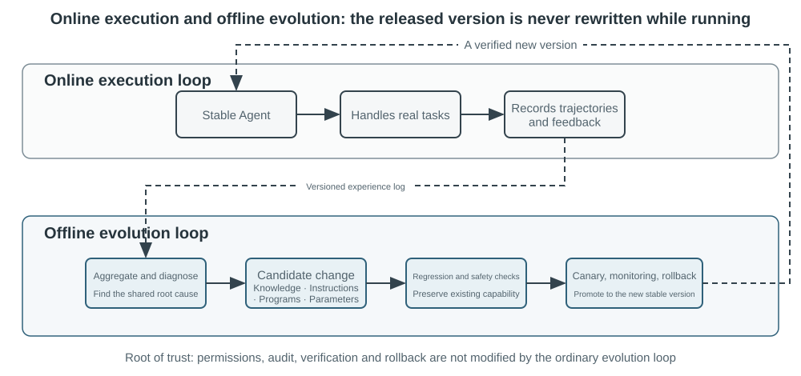

# התפתחות מתמשכת של סוכנים

הסוכנים של היום ניצבים בפני פרדוקס יכולות בולט: הם מסוגלים לפתור משימות מורכבות שלא נראו קודם ללא כל דוגמה, ובכל זאת, לאחר טיפול בעשרת אלפים משימות דומות, הם עלולים לחזור מחר על אותן טעויות שעשו ביום הראשון. **היכולת ללמוד באופן עצמאי מניסיון** הופכת לחיונית כדי שסוכנים יתקדמו מ"מסוגלים להשלים משימות" ל"מסוגלים לעבוד באמינות", והיא גם נושא מחקר מרכזי עבור הדור הבא של המודלים. ובכל זאת, המודלים הנוכחיים רחוקים עדיין מלהיות מסוגלים ללמידה מתמשכת בכוחות עצמם.

מודל שנפרס אינו משנה אוטומטית את הפרמטרים שלו לאחר היסק. הלמידה בהקשר, תחזוקת המצב והדחיסה שנידונו בפרק 2 מאפשרות לסוכן להסתגל **בתוך המשימה הנוכחית**; אך ברגע שההקשר מסתיים, שינויים אלה אינם עוברים באופן טבעי למשימה הבאה. אחסון שיחות בזיכרון אינו שקול ללמידת התנהגות חדשה. מסלולים גולמיים עשויים להיות ארוכים ולהכיל אסטרטגיות אפקטיביות לצד הצלחות מקריות, ייחוסים שגויים וקלטים שאינם מהימנים.

הבחנה חשובה עלולה להתפספס כאן בקלות: **שימור ניסיון אינו זהה ללמידה ממנו**. הצבת מאה מסלולים בהקשר ארוך או במאגר וקטורי עשויה לסייע למודל לאחזר מקרה בעת הצורך, אך אין בה השוואה אוטומטית בין מקרים: אילו צעדים חוזרים על עצמם במסלולים מוצלחים, אילו נהגים עובדים רק עם ממשק ישן יותר, או האם הצלחה נבעה מאסטרטגיה נכונה ולא ממקריות סביבתית. למידה מתרחשת רק לאחר שהמערכת מעריכה, משווה, מכלילה ומאמתת את הראיות באופן אקטיבי — לא כשיומן נכתב לדיסק. זיכרון המשתמש בפרק 3 לוכד בעיקר "כיצד נראים המשתמש והעולם"; למידת ניסיון בפרק זה מרחיקה לכת יותר, ולוכדת "מה לעשות ובאילו תנאים". הראשון עוזר לסוכן לזכור יותר; השני עוזר לו להיות מיומן יותר ולא רק בקיא יותר.

מדוע לא לתת למודל לאמן את עצמו ישירות לאחר כל משימה? משום שסביבות ייצור מספקות רק לעיתים רחוקות אותות למידה נקיים. שביעות רצון המשתמש אינה מעידה על ציות; עדכוני פרמטרים מקומיים יכולים גם לגרום לשכחת יכולות, לסחיפת מדיניות או להידרדרות בטיחותית. אם מתירים למודל פעיל לשנות את הפרמטרים של עצמו ישירות על סמך משוב לא מאומת, ניסיון שגוי והזרקת Prompt עלולים להשתרש ולהמשיך להתעצם לאורך משימות מאוחרות יותר. מנגד, אימון תקופתי של מודלי יסוד יכול לשפר יכולות כלליות, אך אין הוא יכול לספוג במהירות את הכללים הפרטיים, שינויי הכלים והניסיון המקומי שכל סוכן נתקל בהם מדי יום.

לפיכך, כל עוד המודלים עצמם אינם מסוגלים ללמוד באופן מתמשך ואמין, יש לבנות תחילה את ה"למידה" כמערכת עצמאית סביב המודל: לתעד ראיות תפעוליות, לאמת תוצאות ותהליכים, לחלץ דפוסים משותפים ממסלולים מרובים, ואז להחליט האם לעדכן ידע, הוראות, תוכנות או פרמטרים של המודל. כל שינוי חייב להפוך תחילה לגרסה מועמדת, ורשאי לשנות את סבב ההרצה הבא רק לאחר בדיקות רגרסיה ובדיקות בטיחות.

הפרקים הקודמים כבר הציגו את הרכיבים העיקריים הנדרשים למערכת זו. פרק 2 עוסק במצב שבתוך המשימה, פרק 3 מספק תשתית ידע, פרק 5 מעניק לסוכנים את מטא‑היכולת ליצור כלים ולשנות מערכות, פרק 7 מבסס הערכה ואימות, ופרק 8 מסביר כיצד לעדכן פרמטרים של מודל. משימתו של פרק 9 היא לארגן רכיבים אלה ללולאת ההתפתחות המתמשכת המוצגת באיור 9‑1.

התפתחות מתמשכת חייבת לנבוע מניסיון תפעולי ניתן למעקב, לשנות התנהגות עתידית, ולהיבדק כך שלא תגרום להידרדרות משמעותית. פרק זה דן תחילה כיצד לקבוע מה בדיוק הלך היטב או השתבש בהרצה; לאחר מכן הוא משווה בין ארבע שיטות עדכון וגבולות תחולתן; ולבסוף הוא בוחן כיצד עדכונים אלה מאומתים, משוחררים, מתוקנים ומוצאים משימוש במהלך הפעלה ארוכת טווח.

## גזירת אותות למידה ממסלולי הרצה

נקודת המוצא של ההתפתחות המתמשכת אינה "סיכום", אלא "הערכה". אם המערכת אינה יודעת האם משימה הושלמה או איזה צעד גרם להצלחה או לכישלון, רפלקסיות שמייצר מודל שפה יכולות להיות ניחושים בלבד. ברגע שהערכה שגויה נכנסת לידע ארוך טווח, ל‑Prompt מערכת או לנתוני אימון, השפעותיה יכולות להצטבר לאורך משימות עוקבות.

תוצאותיהן של משימות מסוימות קלות יחסית לאימות. סוכן Coding יכול להריץ בדיקות, בדיקות טיפוסים ומדדי ביצועים; סוכן המטפל בהחזר כספי עבור משתמש יכול לתשאל את סטטוס ההזמנה ואת סכום ההחזר בפועל. אותות מסוג זה מגיעים ממצבים סביבתיים אמיתיים והם בדרך כלל אמינים יותר מתיאורי המודל את התנהגותו שלו. אך תוצאה נכונה אינה מעידה על תהליך נכון. מחיקת מקרי בדיקה נכשלים יכולה גם היא לגרום לבדיקות לעבור, ואמירה למשתמש "נבצע את ההחזר בתוך שבעה ימים, אנא התאזרו בסבלנות" עשויה להפיק שביעות רצון זמנית. הערכה אמינה חייבת לפיכך להעריך הן את התוצאה והן את הדרך שננקטה כדי להשיגה.

למשימות רבות אחרות אין תשובה נכונה יחידה. האם שירות הלקוחות סבלני, האם הוא מציע חלופות תואמות מדיניות, האם דוח מחקר מזהה את הראיות המרכזיות, והאם טקסט שנוצר טבעי ותמציתי — כל אלה דורשים שיפוט תלוי הקשר. ‏LLM-as-a-Judge, שהוצג בפרק 7, שימושי כאן, אך אל לשופט להסתפק במתן ציון כולל מעורפל. גישה אפקטיבית יותר היא להגדיר Rubric מראש ולדרוש מהמאמת לנקד כל סעיף, לצטט ראיות מהמסלול, ולציין במפורש אי‑ודאות כשהראיות אינן מספקות.

איור 9‑2 מציג מבנה אימות תלת‑שכבתי. מאמת התוצאה בשכבה התחתונה קורא תוצאות בדיקות, מצבי בסיס נתונים והחזרות של כלים כדי לענות על השאלה "האם המשימה הושלמה בפועל?". מאמת התהליך בשכבה האמצעית בודק כללים עסקיים, הרשאות ורצפי פעולות כדי לענות על "האם היא הושלמה באופן מותר?". מאמת האיכות בשכבה העליונה מעריך שפה ואסטרטגיה על פי ה‑Rubric כדי לענות על "האם הטיפול היה הולם?". מדדים ברמות נמוכות יותר צריכים להישען יותר על קוד ועל אמת סביבתית; רק היבטים שקשה לפרמל צריכים להיות מואצלים למודל שפה.

עבור סוכן שירות לקוחות, ‏Rubric שימושי צריך לכסות לכל הפחות את הממדים המפורטים בטבלה 9‑1. חמשת הראשונים אוכפים בעיקר דרישות סף, בעוד שני האחרונים מודדים את איכות השירות. פירוק זה מועיל יותר מבחינה אבחונית משאלה האם המשתמש היה מרוצה: משתמש עשוי להיות מרוצה משום שהסוכן ביצע החזר כספי שאינו תואם מדיניות, או לא מרוצה בשל מגבלת ציות. ציון שביעות רצון יחיד אינו יכול להבחין בין השניים.

טבלה 9‑1 ממדי הערכת מסלול עבור סוכן שירות לקוחות

| ממד | שאלת האימות | ראיות עיקריות |
|---|---|---|
| תוצאת המשימה | האם הבקשה המרכזית של המשתמש נפתרה? | מצב סביבתי סופי, תוצאות כלים |
| ציות לכללים | האם הופרו מדיניות, הרשאות או נהלים מחייבים? | מאגר המדיניות, מסלול הפעולות |
| גבולות פרטיות | האם נחשף מידע שלא היה צריך להימסר? | טקסט התשובה, רשומות גישה לנתונים |
| מהימנות עובדתית | האם ההצהרות נתמכות בידע או בתוצאות כלים? | מקורות מצוטטים, החזרות של כלים |
| עקביות הבטחה–פעולה | האם הפעולות שהוצהרו כמושלמות אכן התרחשו? | השוואת התשובות ליומני הכלים |
| איכות הניסוח | האם השפה טבעית ותמציתית, ללא חזרתיות או ניסוח תבניתי? | השיחה המלאה, ‏Rubric לשוני |
| חלופות תואמות מדיניות | כשהתוכנית המקורית לא הייתה ישימה, האם נמצאה חלופה מותרת? | מטרת המשתמש, המדיניות והפעולות שלאחר מכן |

> **ניסוי 9‑1 ★★: בניית מאמת מסלול לסוכן שירות לקוחות**
>
> **מטרה:** להמיר מסלול שירות לקוחות לאבחון מובנה שיכול לתמוך בלמידה עוקבת, ולבדוק האם "מסקנות רב‑ממדיות מגובות בראיות" מזהות שורשי בעיה טוב יותר מציון כולל יחיד.
>
> **תיאור הניסוי:** השוו בין "ציון כולל אחד" לבין "מסקנה, ראיה ורמת ביטחון לכל ממד", והתבוננו מה מבחין טוב יותר בין כישלון משימה, הפרות כללים, הבטחות שווא ובעיות ניסוח. התפתחות מתמשכת אינה יכולה להסתמך על שיעור הצלחה או ציון יחיד בלבד. רק בשמירת מה השתבש, מדוע והיכן הראיות, יוכלו מודולים מאוחרים יותר לקבוע האם לעדכן ידע, ‏Prompt, תוכנה או פרמטרים של המודל; מקרים בעלי רמת ביטחון נמוכה אינם צריכים להיכנס אוטומטית למערך הלמידה.

## ארבע שיטות להתפתחות מתמשכת של סוכנים

אותות למידה מצביעים על כך שסוכן צריך להשתנות, אך לא היכן השינוי הזה צריך להתרחש. הבסיס העיקרי לבחירת שיטת עדכון אינו כמה זמן ניסיון מסוים מתקיים, אלא האם היכולת הנדרשת ניתנת לייצוג טבעי במדיום מסוים. עובדות וניסיון מתאימים למסמכי ידע; אסטרטגיות שניתן לבטא בבירור בשפה שייכות ל‑Prompt או ל‑Skills; נהלים ואילוצים הניתנים לביצוע מדויק צריכים להיות מקודדים כתוכנות; ויכולות רבות‑ממדים כגון תפיסה, סגנון לשוני ואסטרטגיות סמויות חייבות להיכנס לפרמטרים של המודל. איור 9‑3 מציג את ארבע השיטות ואת היחסים ביניהן.

טבלה 9‑2 מספקת השוואה תמציתית. ארבע השיטות אינן סותרות זו את זו: סוכן הדמיה רפואית נשען על פרמטרים כדי לזהות נגעים, משתמש בבסיס ידע כדי לספק הנחיות עדכניות, ומפעיל קוד כדי לחשב מדדי סיכון. מודל שירות לקוחות שואב את הטון הטבעי שלו מאימון־על, מקבל מדיניות ייחודית לארגון מידע ומ‑Skills, ונשען על קוד בצד השרת כדי לאכוף דרישות ציות קריטיות.

טבלה 9‑2 גבולות התחולה של ארבע שיטות ההתפתחות המתמשכת

| שיטת עדכון | תוכן מתאים | יתרונות עיקריים | מגבלות עיקריות |
|---|---|---|---|
| בסיס ידע ניסיוני | עובדות, דפוסי ניסיון, חריגים ומקורות | עדכונים מהירים, יכולת מעקב, אחזור לפי דרישה | תלוי באחזור וביישום נכון מצד המודל |
| Prompt ו‑Skill | עקרונות שיפוט ונהלי הפעלה הניתנים לביטוי בשפה | ניתנים לפרשנות, היקף תחולה נשלט | נוטים להתנפחות, לסתירות או להתעלמות |
| תוכנות ו‑Harness | נהלים דטרמיניסטיים, כלים ואילוצים קשיחים | ניתנים לבדיקה, ביצוע יציב, עלות נמוכה | עלויות פיתוח ותחזוקה גבוהות יותר |
| פרמטרים של המודל | תפיסה רבת‑ממדים, סגנון יצירה ואסטרטגיות סמויות | הכללה חזקה, תקורת היסק נמוכה | עלויות עדכון ורגרסיה גבוהות |

### גיבוש ניסיון לכדי ידע

צורת ההתפתחות הקלה ביותר היא לארגן ניסיון חוזר ממספר הרצות למסמכי ידע ניתנים לאחזור. "בסיס הידע הניסיוני" המתואר כאן חולק טכנולוגיות אחסון, אינדוקס ואחזור עם פרק 3, אך נבדל ממנו במקורות הידע ובמטרות האימות. פרק 3 מחלץ בעיקר "כיצד נראים המשתמש והעולם" משיחות משתמש, ממסמכים וממערכי נתונים; פרק זה מחלץ "מה יש לעשות ובאילו תנאים" ממסלולי פעולה ומתוצאות של סוכנים. למשל, "חברת תעופה זו דורשת הזמנת ארוחות מיוחדות עשרים וארבע שעות מראש" הוא ידע תחומי, ואילו "בדקו את מועד ההזמנה האחרון לארוחה מיוחדת לפני ההזמנה כדי להימנע מגילוי רק לאחר התשלום שלא ניתן לממש את הבקשה" הוא ניסיון פעולה.

מסלולים גולמיים אינם מתאימים כיחידות ידע פורמליות. הם ארוכים ורועשים, ומכילים פלט גולמי של כלים, סטיות אגביות ופרטים סביבתיים. מערכת איתנה יותר משמרת שלוש שכבות נתונים: מסלולים גולמיים בלתי משתנים לצורכי ביקורת; ניתוחים לכל הרצה המתעדים את התוצאה ואת הלקחים המועמדים; והשוואות, אשכולות והכללות על פני מסלולים דומים מרובים כדי להפיק מסמכי ידע ב‑Markdown המכוונים לעתיד. מסמך פורמלי מציין בדרך כלל תרחישי תחולה, אסטרטגיות מומלצות, נהגים אסורים, חריגים, מקורות ראיות ומועד האימות האחרון, במקום לספר מחדש את מהלכה המלא של משימה בודדת.

עיצוב זה חולק את אותו עיקרון דו‑שלבי עם User-as-Code בפרק 3. ‏User-as-Code מוסיף תחילה עובדות שיחה ליומן בלתי משתנה ואז בונה מחדש מדי פעם מודל משתמש מובנה. גם למידת ניסיון צריכה לשמר תחילה ראיות ולייצר ידע בר‑שינוי במצב לא‑מקוון לאחר מכן. איור 9‑4 ממחיש תהליך זה. הפרדת התיעוד מהארגון מונעת מהצלחה מקרית בודדת או מתקלת רשת לשנות את הסוכן באופן מיידי, ובה בעת מאפשרת למערכת לזהות דפוסים משותפים רק לאחר התבוננות במספר הצלחות וכישלונות.

מסמכי ניסיון אינם סיכומי מסלול פשוטים. תוכן בר‑העברה עולה מתוך השוואה: מה עשו מסלולים מוצלחים מאותו סוג, מה חסר היה במסלולים שנכשלו, באילו גרסאות סביבה אסטרטגיה הייתה אפקטיבית, ותחת אילו תנאי סף היא נכשלה. פרק 3 כבר הציג חילוץ ידע, אשכול ואחזור, ולכן פרק זה אינו חוזר על אלגוריתמים אלה. במקום זאת, הוא מתמקד באופן שבו הערכת מסלול הופכת לתנאי לחילוץ, ובשאלה האם הידע שחולץ משפר ביצועים במשימות עוקבות.

צינור זיקוק ידע מלא ניתן לחלוקה לחמישה צעדים. ראשית, שמרו מסלולים בלתי משתנים ותוצאות סביבתיות. לאחר מכן, הפיקו ניתוח מובנה לכל הרצה, המפרט את סוג המשימה, היכולות הנדרשות, האסטרטגיות שנצפו, השגיאות והחריגים. אחר כך צברו הרצות לפי משפחות משימות ובנו טבלת ראיות המראה אילו מסלולים תומכים בכל דפוס מועמד ואילו סותרים אותו. רק מועמדים העומדים בסף התמיכה נכנסים למסמכים פורמליים. לבסוף, העריכו העברה על משימות חדשות שלא שימשו במהלך הזיקוק. הפרדת הידע הפורמלי מהניתוחים המועמדים מאפשרת למערכת להכליל שוב מבלי לשנות את הראיות המקוריות, ולבטל מסקנה במדויק כשהסביבה משתנה.

למידת ניסיון ב‑GAIA מספקת דוגמה אינטואיטיבית. ‏GAIA‏[^gaia-2023] מכיל בעיות רב‑שלביות המשלבות חיפוש, קריאת דפי אינטרנט, עיבוד קבצים וחישוב, ואילו AWorld‏[^aworld-2025] מספק את הסביבה להרצת סוכנים, להפעלת אותם כלים ולתיעוד מסלולים: הראשון הוא כמו הבחינה, והשני הוא חדר הבחינות ומערכת רישום המעבדה. גישה פשטנית מייצרת סיכום אסטרטגיה ומווקטרת אותו מיד לאחר הרצה מוצלחת אחת. מימוש קפדני יותר משתמש תחילה במאמת תשובות של GAIA או במאמת סביבתי אחר כדי לתייג הרצות כמוצלחות, מוצלחות חלקית או נכשלות, ואז משווה מספר נתיבים בתוך אותה משפחת משימות. מסלולים מוצלחים תורמים אסטרטגיות מועמדות, כישלונות תורמים ידע שולל, והצלחות חלקיות חושפות איזה מקטע עבד ואיזה עדיין נכשל. הרפלקסיה בשפה טבעית שהוצעה ב‑Reflexion‏[^reflexion-2023] יכולה לסייע בייצור לקחים מועמדים, אך הרפלקסיה עצמה אינה ראיה. רק תוכן העקבי עם התוצאות הסביבתיות, הנתמך על פני מסלולים ומראה העברה חיובית במשימות חדשות, ראוי להיכנס למסמכי ניסיון פורמליים.

> **ניסוי 9‑2 ★★: זיקוק מסמכי ידע ניסיוני ממסלולי GAIA**
>
> **מטרה:** לבדוק האם מסמכי ידע חוצי‑מסלולים עוברים טוב יותר מסיכום של הצלחה בודדת ומפחיתים העברה שלילית מהצלחות מקריות ומניסיון שגוי.
>
> **נתונים ונוהל:** `gaia-experience` שומר תחילה את המסלול המלא ואת ה‑`environment_score` החיצוני עבור כל הרצה, ואז ממיר אותם לרשומות למידה מינימליות המכילות `task_family`, ‏`capabilities` נדרשות, ‏`applies_when`, אסטרטגיות שנצפו, שגיאות, חריגים ומזהי מסלול מקור. מאמת תוצאה מסווג הרצות כמוצלחות, מוצלחות חלקית או נכשלות. מודול הלמידה משווה נתיבים בתוך אותה משפחת משימות. ‏LLM רשאי להציע הכללות מועמדות, אך אסטרטגיה מומלצת חייבת להיתמך בשני מסלולים שאינם כושלים לכל הפחות. מסמך ה‑Markdown המתקבל כולל תרחישי תחולה, אסטרטגיות מומלצות, מכשולים נפוצים, חריגים, מקורות ומועד האימות האחרון. בעת היישום מאוחזרים רק מסמכים אלה; מסלולים גולמיים ארוכים אינם מוזרקים ישירות להקשר.
>
> **שלוש קבוצות ביקורת:** התנאי הראשון אינו משתמש בניסיון היסטורי כלל; השני מאחזר את סיכום המסלול היחיד הדומה ביותר למשימה הנוכחית; השלישי מאחזר מסמך ידע הנתמך במסלולים מרובים. מערכי הלמידה וההעברה חייבים להיות זרים זה לזה, כך שתשובות לאותה שאלת GAIA לא ידלפו להערכה בתור "ניסיון".
>
> **מדדים וקבלה:** דווחו על שיעור ההצלחה במשימות ההעברה, על ממוצע התווים או הטוקנים שאוחזרו ועל שיעור ההעברה השלילית, וּודאו שכל מסקנה פורמלית מצטטת את מסלולי המקור שלה. אם מסמכים חוצי‑מסלולים רק מקצרים את ההקשר מבלי לשפר ביצועים במשימות חדשות, אין הם מדגימים ניסיון נלמד. הניסוי נכשל גם אם הצלחה מקרית אחת יכולה להיות מקודמת ישירות לידע פורמלי או אם לא ניתן לעקוב ממסמך אל מסלוליו המקוריים.
>
> המימוש הנלווה זמין בכתובת [`gaia-experience`](../chapter9/gaia-experience/). ‏`demo_documents.py` רץ במצב לא‑מקוון כברירת מחדל; עם `--extractor llm` יכול LLM אמיתי להציע מועמדי ניסיון חוצי‑מסלולים.

[^reflexion-2023]: Shinn, N., et al. *Reflexion: Language Agents with Verbal Reinforcement Learning.* arXiv:2303.11366, 2023.

[^gaia-2023]: Mialon, G., et al. *GAIA: a benchmark for General AI Assistants.* arXiv:2311.12983, 2023.

[^aworld-2025]: Yu, C., et al. *AWorld: Orchestrating the Training Recipe for Agentic AI.* arXiv:2508.20404, 2025.

### קידוד ניסיון כהוראות

בסיס ידע ניסיוני מספק לסוכן חומר עזר, ואילו Prompt ו‑Skills הם מנחים יותר. כשמסלולים מרובים חושפים שוב ושוב את אותה שגיאה אסטרטגית, והדפוס ניתן לביטוי ברור בשפה טבעית, המערכת יכולה לקדם אותו מ"ניסיון לעיון" ל"כלל שיש לציית לו". כללים החלים כמעט על כל המשימות מתאימים להיכלל ב‑Prompt המערכת; נהלים מורכבים החלים רק על תחום, פרויקט או כלי מסוים עדיף שייכתבו כ‑Skills נטענים לפי דרישה או כקובצי הוראות פרויקט.

למידת Prompt ממלאת תפקיד שונה מהנדסת ה‑Prompt שנידונה בפרק 2. פרק 2 מסביר כיצד לכתוב Prompts ברורים מבחינה מבנית וידידותיים למטמון; סעיף זה עוסק בשאלה איזה משוב ייצור מספיק כדי להצדיק תיקון Prompt וכיצד יש לאמת כללים חדשים לפני הפריסה. תיקון אינו אמור להיות שכתוב חוזר ונשנה של Prompt המערכת כולו. גישה אמינה יותר היא לייצר דיף מינימלי מקבוצת כישלונות דומים, לציין את היקף תחולת הכלל, לבדוק סתירות עם כללים קיימים, ולהעריך אותו הן על מקרי הגבול שהובילו לכישלונות והן על מערך שימור של משימות ישנות.

בפוסט ארוך משנת 2025 כינה אנדריי קרפתי את הפרדיגמה החדשה האפשרית הזו, באופן ארעי, **למידת Prompt מערכת** (‏System Prompt Learning)‏[^karpathy-system-prompt-learning]. סיכומו היה שאימון מקדים לומד בעיקר ידע וכוונון עדין מעצב בעיקר התנהגות הרגלית, בעוד סוג אחר של למידה אנושית מתרחש כשאנו פותרים בעיה ומשאירים פתק מפורש לעצמנו העתידית: "בפעם הבאה שאיתקל בבעיה מסוג זה, כדאי שאנסה תחילה את הגישה הזו". הוא השווה LLM נטול מחברת כזו לגיבור הסרט *ממנטו*, וציין שלמידת Prompt מערכת ולמידת חיזוק משפרות שתיהן התנהגות מתוך ניסיון אך משתמשות באלגוריתמי עדכון שונים — הראשונה עורכת טקסט, ואילו השנייה משנה פרמטרים באמצעות ירידת גרדיאנט. הדוגמה שלו הייתה הוראה ב‑Prompt המערכת של Claude, שאורכו היה אז כ‑17,000 מילים, הדורשת מהמודל למספר ולספור במפורש מילים, אותיות או תווים לפני מתן תשובה — בדיוק כדי לטפל בשאלות כגון "כמה `r` יש ב‑`strawberry`?".

במערכת סוכן, פירוש הדבר הוא הפיכת לקחים הניתנים לביטוי בשפה לכללים מועמדים שהרצות עתידיות יוכלו לקרוא ישירות. בהשוואה לתוצאת הצלחה/כישלון סקלרית, אבחון מגובה בראיות יכול לזהות האם השגיאה הייתה באימות זהות, בבחירת כלי או בגבולות ההסלמה, ולאפשר שינוי מועמד ממוקד יותר. הבחנתו של קרפתי שסקירה מונחית ידע היא ערוץ משוב רב‑ממדי יותר מתגמול סקלרי מסייעת להסביר את יעילות הנתונים הפוטנציאלית של השיטה. אך מידע עשיר יותר אינו נכון אוטומטית: משוב של משתמש אחד עשוי לחול רק על אותו לקוח או על מדיניות מיושנת, ולכן אשכול, ניתוח היקף תחולה ובדיקות רגרסיה נותרים נחוצים.

כמה גישות מבוססות מבצעות אוטומציה של אופטימיזציית Prompt בדרכים שונות. ‏DSPy‏[^dspy-2023] מתייחסת לתוכנית המורכבת ממספר קריאות למודל שפה כאל אובייקט בר‑אופטימיזציה ומחפשת הוראות ודוגמאות על מערך פיתוח. ‏OPRO‏[^opro-2023] מבקשת ממודל שפה להציע מועמדים חדשים מתוך היסטוריית ה‑Prompts וציוניהם. ‏GEPA‏[^gepa-2025] משתמשת ברפלקסיה בשפה טבעית על מסלולים שנכשלו כדי לייצר ולבחור Prompts מועמדים משלימים. שיטות אלה מבצעות בעיקר אופטימיזציה באצווה על מערכי הערכה לא‑מקוונים; דיפים מינימליים בייצור קרובים יותר לתחזוקה מתמשכת, מופעלים על ידי מקרי גבול חדשים שנצפו, ומעוצבים למען מקוריות, ביקורת ורולבק מהיר. בפועל, חיפוש לא‑מקוון יכול לבסס גרסה ראשונית חזקה, ואחריו טלאים לפי מקרה עבור כללי זנב ארוך בייצור.

#### דוגמה 1: אופטימיזציית כללים ב‑Prompt מתוך מסלולי כישלון

למשל, סוכן שירות לקוחות של חברת תעופה עלול להסלים לנציג אנושי מוקדם מדי כשמשתמשים מערערים על מדיניות. הערכת המסלול מראה שאין הוא מפר כללים אך חסרה לו גמישות תואמת מדיניות. טלאי מועמד יכול לדרוש מהסוכן להסביר תחילה את המדיניות, לזהות את מטרתו האמיתית של המשתמש, ולחפש חלופות מותרות, ולהסלים רק כשהמשתמש מבקש זאת במפורש או כשהעניין באמת חורג מסמכות הסוכן. אם הכלל החדש מפחית הסלמות מיותרות אך גורם לסוכן להמשיך לטפל באירועי בטיחות שהיו צריכים להיות מוסלמים, הוא נכשל בבדיקות הרגרסיה. ערכה של למידת Prompt מערכת אינו טמון בהוספה אוטומטית של עוד טקסט, אלא בהבהרה מתמשכת של היקף תחולת הכללים באמצעות מקרי גבול מהייצור.

#### דוגמה 2: ‏Skill להבהרת דרישות — מביצוע ישיר לאישור תחילה

למידת Skills פועלת לפי אותו עיקרון, אך בהיקף מקומי יותר. ניתן להבין Skill כמדריך הפעלה לפי דרישה לעבודה מסוימת: אם מספר חוויות מרכיבות יחד תהליך תביעות ביטוח שלם, המערכת יכולה לייצר או לתקן את ה‑Skill המתאים. ‏Skill מועמד אינו אמור רק לסכם שיחה אחת; לכל הפחות עליו לציין מתי לטעון, תנאים מוקדמים, שלבי הפעלה, מכשולים ידועים, שיטות אימות ומסלולי מקור. המערכת מחפשת תחילה בספריית ה‑Skills הקיימת יכולות דומות, ומעדיפה `patch` מקומי כשאותו תהליך כבר קיים, ויוצרת ספרייה חדשה רק עבור יכולת עצמאית באמת. הדבר מונע מהספרייה להתמלא במדריכים הנבדלים בשמם אך משכפלים זה את זה. ‏Skill Creator של Anthropic‏[^anthropic-skill-creator] מדגים לולאה של טיוטה–בדיקה–הערכה–תיקון. הוא מטפל בשאלה כיצד ליצור ולשפר Skill; השאלות הקשות יותר נותרות אילו ראיות תפעוליות מספיקות כדי להצדיק יצירה, כיצד ליישב סתירות, והאם התיקון עובר בדיקות רגרסיה ייעודיות לתחום ולמשימות ישנות.

> **ניסוי 9‑9 ★★: הפיכת משוב ל‑Skill כתיבה**
>
> עבדו את 20 זוגות ה"לפני/אחרי" שב‑`data/feedback_pairs.json` בשלוש אצוות. חלצו כללים מועמדים, מזגו דפוסים כפולים, זהו סתירות בין ספים, וייצרו `SKILL.md` עם מקורות והיקף תחולה. בדקו כללים דטרמיניסטיים בקוד וכיילו כללי LLM על עשר דוגמאות זהב.
>
> דווחו יחד על הזיהוי במערך הגבול של משימות בלתי גמורות, על התראות שווא במערך הביקורת של טקסט רגיל, ועל גידול מספר הכללים. ההרצה האמיתית הראשונה הניבה זיהוי 0/8 ו‑7/8 התראות שווא; לאחר סינון חיצוני למודל ונפילה חזרה למנגנון דטרמיניסטי היא הניבה 8/8, ‏0/8, ומיזגה 21 מועמדים ל‑8 כללים. מימוש: [`ai-style-skill`](../chapter9/ai-style-skill/).

מקרה המרכאות המסולסלות מראה מדוע Skill צריך להפוך לחוזה נתונים ולא לכלל החלפה גלובלי: דוגמאות סינתטיות חייבות להיות מרובדות לפי סוג המאמר, היקף תחולה ושפת תכנות, לעבור שערי קוד/JSON/אזורים מוגנים, ולקבל ביקורות ידניות לפני SFT. מקרה המחרוזת המדויקת מוסיף ביקורת מפרק לטוקנים: קידוד←פענוח הלוך ושוב, העתקה מדויקת ברמת בייטים במודל, סריאליזציה ב‑Harness והתאמת כלים הם שכבות רגרסיה נפרדות.

> **ניסוי 9‑3 ★★: אופטימיזציה של Prompts מערכת מתוך מסלולי כישלון**
>
> **מטרה:** ללמד סוכן שירות לקוחות של חברת תעופה ממסלולים שבהם הוא מסלים מהר מדי כשמשתמש מערער על מדיניות, ובה בעת להדגים שהכלל החדש אינו שובר תרחישים ישנים הדורשים הסלמה באמת.
>
> **נוהל:** הריצו תחילה בנפרד את מערך השימור של המשימות הישנות ואת מערך הגבול של הסלמת יתר. ‏`learning_signal.py` מפרק כישלונות לציות לכללים, פתרון המשימה וגמישות תואמת מדיניות, תוך שמירת מזהי המקרים המקוריים. לאחר מכן סוכן Coding קורא את ה‑Prompt הקיים ומפיק בדיוק עריכה מינימלית אחת ניתנת לביקורת מסוג `old_str ← new_str`: לדרוש מהסוכן להסביר את המדיניות, לזהות את המטרה האמיתית ולחפש חלופות תואמות לפני הסלמה, תוך שימור ההסלמה כשהמשתמש מבקש במפורש נציג אנושי או כשמתרחש אירוע בטיחות. הטלאי, המקוריות, הכלל היעד וההנמקה נכתבים למניפסט מועמדים.
>
> **שלוש קבוצות ביקורת:** השוו בין ה‑Prompt ההתחלתי, ה‑Prompt המועמד שנוצר אוטומטית, ו‑Prompt שעבר אופטימיזציה ידנית חד‑פעמית. שלושתם משתמשים באותו מודל ובאותן משימות שימור וגבול. ‏`--quick` רק מפחית את מספר המקרים; הוא עדיין מבצע קריאות אמיתיות לסוכן המשימה, ל‑LLM Judge ולסוכן ה‑Coding, ואין לדווח עליו כעל סימולציה לא‑מקוונת.
>
> **שער שחרור ומדדים:** מועמד חייב לעבור ארבעה תנאים: טלאי לא ריק, מקוריות ניתנת למעקב, שיפור מדיד במערך הגבול, וללא הידרדרות במערך השימור. השוו דיוק במשימות הגבול, דיוק במשימות השימור, גידול ה‑Prompt, רגרסיות שהוכנסו, והזמן מגילוי הכישלון ועד לייצור המועמד. מעבר בשער מפיק אך ורק `release_to_canary`, ולעולם לא דריסה ישירה של ה‑Prompt היציב; כישלון בכל תנאי מחזיר `reject_candidate`.
>
> המימוש הנלווה זמין בכתובת [`prompt-auto-optimization`](../chapter9/prompt-auto-optimization/). בדיקות לא‑מקוונות מכסות אבחון ושערי שחרור, בעוד `--quick` מבצע קריאות אמיתיות לסוכן המשימה, ל‑LLM Judge ולסוכן ה‑Coding.

[^dspy-2023]: Khattab, O., et al. *DSPy: Compiling Declarative Language Model Calls into Self-Improving Pipelines.* arXiv:2310.03714, 2023.

[^opro-2023]: Yang, C., et al. *Large Language Models as Optimizers.* arXiv:2309.03409, 2023.

[^gepa-2025]: Agrawal, L., et al. *GEPA: Reflective Prompt Evolution Can Outperform Reinforcement Learning.* arXiv:2507.19457, 2025.

[^karpathy-system-prompt-learning]: Karpathy, A. “We’re missing (at least one) major paradigm for LLM learning … system prompt learning?” X, May 11, 2025. https://x.com/karpathy/status/1921368644069765486

[^anthropic-skill-creator]: Anthropic. *Skill Creator.* 2026. https://github.com/anthropics/skills/blob/main/skills/skill-creator/SKILL.md

### קידוד ניסיון כתוכנות

כשניסיון מתאר פעולות יציבות, חוזרות וניתנות לאימות, אין זה יעיל לגרום למודל לקרוא מחדש תיעוד ולהסיק אותן בכל פעם. גישה הולמת יותר היא להדר את הניסיון לתהליכי עבודה, לכלים או לקוד Harness, ולהפוך חקירה חד‑פעמית לתוכנית ניתנת להרצה חוזרת. פרק 5 הסביר כיצד סוכני Coding קוראים וכותבים קבצים, מריצים בדיקות ומייצרים מערכות; סעיף זה מתמקד לא ביצירת קוד כללית, אלא באופן שבו סוכן משנה גרסאות עתידיות של עצמו על סמך מסלוליו שלו.

האובייקטים הניתנים לשינוי חורגים הרבה מעבר לכלים חדשים. בשכבת הפעולה, ניתן להדר מסלולי דפדפן לתהליכי עבודה מפורמטרים, או לייצר מתאמים ל‑APIs משתנים. בשכבת הבקרה, ניתן לשנות ניתוב כלים, ניסיונות חוזרים, מנתקי מעגל ואסטרטגיות דחיסת הקשר. בשכבת האימות, ניתן להוסיף בדיקות פרמטרים, מאמתי מצב ובדיקות רגרסיה בתגובה לכישלונות בייצור. בשכבת הארכיטקטורה, ניתן להוסיף סוכן Reviewer או לשנות את זרימת המידע בין תכנון לביצוע.

תהליכי עבודה בדפדפן ממחישים את ערכו של ניסיון תוכנתי. הם אנלוגיים להקלטת מאקרו בגיליון אלקטרוני. בפעם הראשונה שנשלח דוא"ל, סוכן רב‑מודאלי משתמש בלולאת תצפית–היסק–פעולה כדי למצוא את פקדי הכתיבה, הנמען, הנושא, גוף ההודעה והשליחה. עבור דוא"ל נוסף התהליך אינו משתנה; רק הנמען והתוכן שונים, ולכן אין צורך לקרוא שוב למודל כדי לגלות מחדש את הנתיב כולו מפיקסלים ומה‑DOM. המערכת מהדרת את מסלול החקירה הראשון לתוכנית קטנה המכילה פרמטרים, בדיקות מצב ומידע גרסה.

בהקשר הדפדפן, תהליך זיקוק הידע המוצג באיור 9‑4 הופך למחזור חיים מוחשי יותר:

1. **לכידת המסלול:** תעדו ניווט, לחיצות, הזנת טקסט ובחירה מרשימות נפתחות, יחד עם פרמטרי הפעולה, ה‑URL הנוכחי וראיות איתור אלמנטים כגון XPath, ‏CSS, ‏`id`, ‏`role`, ‏`aria-label` ו‑`data-testid`. ראיות איתור מסייעות רק במציאת אלמנט שוב; אין הן מוכיחות שהמשימה הושלמה.
2. **פרמטריזציה:** החליפו ליטרלים מההרצה הראשונה במשתני תבנית — למשל, המירו את `test@example.com`, את הנושא ואת הגוף ל‑`{recipient}`, ‏`{subject}` ו‑`{content}` — תוך השארת פעולות יציבות ללא שינוי. מימוש ההוראה משתמש בביטויים רגולריים ובהחלפת תבניות; מערכת ייצור עשויה להשתמש בקלט משימה מובנה או במודל חילוץ מאולץ.
3. **הגדרת בדיקות מצב:** הוסיפו בדיקות לפני ואחרי פעולות, כגון "כפתור השליחה גלוי" ו"ה‑URL לאחר הניווט שייך לאתר היעד". הוסיפו בדיקת מצב סופי לתהליך העבודה כולו, כגון "רשימת הדואר שנשלח מכילה את ההודעה החדשה" או "ערך המצב של דף הבדיקה השתנה כמצופה". ביצוע מוצלח של פעולה אינו זהה להשלמה מוצלחת של המשימה; הבדיקה הסופית חייבת לקרוא את מצב הדף או ה‑backend האמיתי.
4. **אימות המועמד:** הצלחה ראשונה מפיקה `candidate` בלבד. המערכת חייבת לאפס את חשבון ארגז החול או את אתר הבדיקה למצב התחלתי עצמאי ולשחזר את המועמד במלואו. הוא רשאי להתפרסם כ‑`validated` רק אם כל הבדיקות שלפני הפעולה, אחריה ובמצב הסופי עוברות. אם למשימה בעלת תופעות לוואי, כגון שליחת דואר או ביצוע הזמנה, אין קריאת איפוס בטוחה, ניתן לשמור את תהליך העבודה כמועמד ניתן לביקורת, אך אין לאמת אותו באמצעות חזרה על הפעולה בחשבון ייצור.
5. **התאמה ושחזור:** כשמגיעה משימה חדשה, חפשו בספריית היכולות הפורמלית תהליך עבודה לפי כוונה ומילות מפתח, חלצו את הפרמטרים הנוכחיים, והריצו אותו ישירות באמצעות Playwright. השחזור אינו דורש קריאות LLM צעד אחר צעד, אך עדיין עליו להמתין לזמינות האלמנטים ולהשלים כל בדיקת מצב.
6. **ביטול תוקף ולמידה מחדש:** אם אלמנט היעד אינו נמצא, בדיקת מצב נכשלת, ה‑Schema של ה‑API משתנה, או המצב הסופי שגוי — עצרו מיד את הפעולות הבאות, העבירו את הגרסה הישנה מהספרייה הניתנת לחיפוש לאזור ה‑`invalid`, וחזרו לסוכן המלא לצורך חקירה מחודשת. שמרו את הקובץ הישן לצורכי ביקורת והשוואה, אך לעולם אל תאפשרו לו להמשיך להתאים בשקט.

עבור תהליך עבודה של דוא"ל, התוצר המהודר אינו רק "ללחוץ על הכפתורים האלה בסדר הזה", אלא תוכנית קטנה המפורמטרת לפי נמען, נושא וגוף: היא בודקת את חלון הכתיבה ואת השדות לפני השליחה, בודקת את מחוון ההצלחה לאחריה, ולבסוף מאשרת שההודעה המתאימה מופיעה ברשימת הדואר שנשלח. ב‑PreAct‏[^preact], תוכניות מסוג זה סיפקו האצה של פי 8.5–13 מקצה לקצה במשימות חוזרות ולא דרשו קריאות למודל שפה צעד אחר צעד במהלך השחזור. חשוב מכך, זיכרון תהליכי זקוק ל**אימות לפני הפעולה, אימות לאחר הפעולה ואימות עצמאי לפני האחסון**. אחרת, המערכת עלולה לייצר אשליה מסוכנת: כיסוי השחזור הוא 100 אחוז וכל כפתור נלחץ, ובכל זאת שדה אחד היה ריק והמשימה מעולם לא הושלמה בפועל.

> **ניסוי 9‑4 ★★★: ייצור תהליכי עבודה ניתנים לאימות ממסלולי דפדפן**
>
> **מטרה:** לקבוע האם סוכן רשת יכול להפוך חקירה יקרה אחת לתהליך עבודה רב‑פעמי ולדחות שחזור שגוי כשהדף משתנה, במקום לדווח על הצלחה רק משום שכל הפעולות רצו.
>
> **תרחיש בן ארבעה שלבים:** בשלב הראשון, הריצו "שלח הודעה בנושא 'Test Email' אל `test@example.com`" באתר דואר לבדיקות או בדף הודעות מדומה. הסוכן המלא חוקר, בעוד מעטפת לוכדת פעולות, פרמטרים ומצבי דף ומפיקה `candidate`. בשלב השני, קראו ל‑`validation_reset` כדי לשחזר את ארגז החול ולשחזר באופן עצמאי את תהליך העבודה כולו; המועמד נכנס לספריית היכולות הפורמלית רק אם כל הבדיקות שלפני הפעולה, אחריה ובמצב הסופי עוברות. בשלב השלישי, בצעו משימה מאותו סוג עם נמען, נושא וגוף שונים. המערכת אמורה להתאים את תהליך העבודה המאומת, למלא את הפרמטרים החדשים ולשחזר אותו באמצעות Playwright מבלי להיכנס ללולאת ה‑LLM צעד אחר צעד. בשלב הרביעי, שנו מאתר של כפתור, טקסט בדף או מצב סופי, וּודאו שתהליך העבודה הישן הופך מיד ל‑`invalid` ומחזיר `fallback_required=True`.
>
> **עיצוב הביקורת:** קו בסיס מפושט מתעד רק האם לחיצות, הזנת טקסט ופעולות אחרות מסתיימות ללא חריגות. תנאי הניסוי מאמת גם את הדף לפני כל פעולה, את הדף לאחר כל פעולה, ואת מצב המשימה הסופי. שני התנאים משתמשים באותם מסלולים ובאותם שינויי דף. השוו את שיעורי ההתראות שווא שלהם במקרים כגון "כפתור השליחה נלחץ בעוד שדה היה ריק" ו"נלחץ שמור אך הנתונים לא נשמרו".
>
> **מדדים וקבלה:** תעדו זמן מקצה לקצה לחקירה הראשונית ולשחזור, מספר קריאות LLM, שיעור הצלחה, שיעור הצלחות שווא, שיעור התאמת תהליכי עבודה, שיעור זיהוי שינויי דף, ומספר הנפילות חזרה ללמידה מחדש. ללא קריאת איפוס, תהליך עבודה חייב להישאר מועמד; גרסה שנכשלה באימות אינה יכולה להיות ניתנת לאחזור; שחזור מפורמטר אינו רשאי לעשות שימוש חוזר בנמען או בתוכן של ההרצה הראשונה; ולאחר שינוי בדף, פעולות מסוכנות עוקבות חייבות להיעצר. ההאצה משמעותית רק אם כל התנאים הללו מתקיימים.
>
> המימוש הנלווה זמין בכתובת [`browser-use-rpa`](../chapter9/browser-use-rpa/), המספק הן הדגמת מכונת מצבים דטרמיניסטית והן מסלול ביצוע המפעיל סוכן דפדפן אמיתי.

סוכן המשנה את הקוד של עצמו אין פירושו שהתהליך הרץ דורס את עצמו ישירות. מערכת ייצור צריכה ליצור ענף מועמד מהגרסה היציבה הנוכחית, להורות לסוכן Coding לייצר טלאי מינימלי, ואז להריץ ברצף בדיקות סטטיות, בדיקות יחידה, סריקות אבטחה, שחזור מסלולי כישלון ובדיקות רגרסיה על משימות ישנות לפני הפקת גרסה חדשה הזכאית לפריסת קנרי. הדבר הופך "שינוי עצמי" לתהליך שחרור תוכנה ניתן לביקורת ומגדיר את הגבול בין פרק 9 לפרק 5: פרק 5 מספק את היכולת לשנות מערכות, ואילו פרק זה מספק שיטה לשינוי עצמי המופעלת על ידי ניסיון ומוגבלת על ידי לולאת אימות.

הקטנת הטלאי אינה מספיקה לייחוס אמין. כל בקשת שינוי צריכה להיות גם **חוזה שינוי הניתן להפרכה**, המתעד את ראיות הכישלון, שורש הבעיה המשוער, רכיב ה‑Harness האחראי, השינוי המועמד, ההתנהגות שצפויה להשתפר, ההתנהגות הקיימת שעלולה לסגת, ובדיקות לשתיהן. ‏Agentic Harness Engineering מתארת זאת במונחי תצפיתיות ברמת הרכיב, הניסיון וההחלטה: לכל רכיב בר‑עריכה יש ייצוג ברמת קובץ; אוספים גדולים של מסלולים מזוקקים לראיות הניתנות לבחינה ברמות פירוט הולכות וגדלות; וכל עריכה מצהירה על תחזית השפעה לפני הביצוע, שסבב התוצאות הבא בוחן[^ahe-2026]. ניתן אז לקשור ציון גבוה יותר למנגנון ספציפי במקום שיישאר ניסיון בלתי מפורש.

מחולל המועמדים אינו אמור לקבל מקרי כישלון בלבד. ‏Self-Harness מספק גם התנהגות מוצלחת שיש לשמר ורשומות של שינויים שנדחו בעבר[^self-harness-2026]. הראשונה אומרת לסוכן מה התיקון אינו רשאי לשבור; האחרונות מונעות ממנו להגיש שוב את אותו רעיון כושל במילים אחרות. ראיות כישלון, אילוצי הצלחה וניסיונות קודמים מגדירים יחד מרחב מועמדים תחום, והם מועילים יותר מהעמסה חסרת אבחנה של כל קוד המקור והיומנים הגולמיים על סוכן השינוי.

יצירת כלים פועלת לפי אותו פרוטוקול. ‏Alita‏[^alita-2025] מציגה מקרה שבו סוכן נדרש לזהות את המספר המוזכר מיד לאחר הופעתם הראשונה של דינוזאורים בסרטון YouTube 360 VR המסופר בקולו של שחקן הקול של גולום ב*שר הטבעות*. לאחר שהוא מזהה שחסרה לו יכולת קריאת כתוביות, הסוכן מוצא ובודק את `youtube-transcript-api`, עוטף אותה ככלי כתוביות חדש, ומחלץ את התשובה `100000000` מהתמליל. כלי חדש נכנס לספריית היכולות רק לאחר סריקת אבטחה, בדיקות פונקציונליות ושימוש חוזר מוצלח במשימות מאוחרות יותר. גילוי הכלים היזום בפרק 4 שואל איזה כלי קיים מתאים; פרק 5 שואל כיצד לכתוב כלי; פרק זה שואל אילו ראיות תפעוליות צריכות להצדיק יצירה וכיצד כלי חדש הופך ליכולת ארוכת טווח מאומתת.

> **ניסוי 9‑5 ★★★: הפעלת שינוי עצמי של סוכן מתוך מסלולי כישלון**
>
> **מטרה:** בהינתן מסלולים מרובים שבהם שגיאות המסומנות `retryable=false` עדיין נקראות שוב ושוב, לקבוע האם המערכת מסוגלת לאתר את שורש הבעיה בקוד הניסיונות החוזרים ומנתק המעגל ולהפיק תיקון מועמד מבלי לשבור התאוששות מכשלים חולפים.
>
> **נוהל:** מודול האבחון צובר תחילה את אותה תקלה על פני משימות שונות. הוא יוצר בקשת שינוי רק לאחר שסף התמיכה חוצה‑המסלולים מתקיים, ומכוון אל `retry_policy.py` בגרסה היציבה. מחולל המועמדים קורא את אבחון הכישלון, את התנהגות ההתאוששות מכשלים חולפים שיש לשמר, שינויים שנדחו בעבר, ואת המקור היציב. לפני הפקת דיף קוד מינימלי, הוא חוזה שקריאות לאחר שגיאות בלתי ניתנות לניסיון חוזר אמורות לרדת בעוד התאוששות מפסק זמן חולף אינה אמורה לרדת. בין אם המחולל דטרמיניסטי ובין אם הוא סוכן Coding מבוסס LLM אמיתי, הוא רשאי לכתוב אך ורק לספריית מועמדים מבודדת. לאחר מכן, ‏Harness האימות מהדר את המועמד, משחזר את מסלולי הכישלון המקוריים, מוודא ששגיאה בלתי ניתנת לניסיון חוזר נעצרת מיד ופותחת את מנתק המעגל, ובודק מחדש שפסקי זמן חולפים עדיין מנסים שוב לפי הסף המקורי.
>
> **ביקורת אבחונית ומדדים:** התייחסו אל "הוספת משפט ל‑Prompt המורה לסוכן לא לחזור על הקריאה" כאל דוגמה מושגית לבחירת שכבת השינוי השגויה, המדגימה מדוע אילוץ ניסיונות חוזרים הניתן לאכיפה דטרמיניסטית שייך לקוד. הניסוי הניתן להרצה משווה בין מחוללי טלאים דטרמיניסטיים ומבוססי LLM תחת אותו שער שחרור. תעדו את מספר הקריאות לאחר שגיאות בלתי ניתנות לניסיון חוזר, שיעור ההתאוששות משגיאות חולפות, רגרסיות במשימות ישנות, גודל הטלאי, ושיעור קבלת המועמדים.
>
> **קריטריוני קבלה:** מעבר בכל הבדיקות מפיק אך ורק `release_to_canary`. כישלון בכל בדיקה סטטית, בשחזור כישלון או ברגרסיה על משימות ישנות מחזיר `reject_candidate`. ‏`release_manifest.json` חייב לתעד את אשכול הכישלונות, מסלולי המקור, שורש הבעיה המשוער, רכיב וקובץ היעד, דיף הקוד, התיקון הצפוי, רגרסיות אפשריות, תוצאות הבדיקות, גרסת המועמד וגרסת הרולבק. מועמדים שנדחו חייבים לשמור את סיבות הכישלון שלהם עבור סבב הייצור הבא. אסור שהסוכן המייצר את הטלאי ישנה קוד יציב, מאמתים, יומני ביקורת או את השער המאשר את השחרור של עצמו.
>
> המימוש הנלווה זמין בכתובת [`self-modifying-agent`](../chapter9/self-modifying-agent/). הוא תומך במחולל מועמדים דטרמיניסטי או בסוכן Coding מבוסס LLM אמיתי, כששני המסלולים חולקים את אותו שער שחרור.

[^preact]: Li, Bojie. *PreAct: Computer-Using Agents that Get Faster on Repeated Tasks.* arXiv:2606.17929, 2026.

[^alita-2025]: Qiu, J., et al. *Alita: Generalist Agent Enabling Scalable Agentic Reasoning with Minimal Predefinition and Maximal Self-Evolution.* arXiv:2505.20286, 2025.

ניסוי 9‑8 מיישם את אותו פרוטוקול על שכבת האימות. רק תיקוני משתמש חוזרים, הצבעות שליליות וביקורות המצביעים על פעולה בסיכון גבוה שלא אושרה יוצרים בקשת שינוי; המועמד נכתב לספרייה מבודדת. סווגו מחיקות מסוכנות ו‑`git push --force` לפי שמות הכלים והארגומנטים, וקשרו אסימון אישור חד‑פעמי לפעולה הקונקרטית. מועמד חייב לעבור בדיקות AST/סטטיות, שחזור גבול (לרבות אסימונים מזויפים ואסימונים שנעשה בהם שימוש חוזר) ושחזור על מערך ביקורת לפני שחרור קנרי.

> **ניסוי 9‑8 ★★: שער אישור לפעולות בסיכון גבוה המופעל ממשוב משתמשים**
>
> השתמשו בשלושת סוגי האותות ובמסלולי הביקורת שב‑`failure_trajectories.json`. המועמד האמיתי של `gpt-4o-mini` נכשל בשחזור משימות בלתי גמורות, בשחזור פעולות רגילות ובבדיקות האסימון החד‑פעמי, ולכן שער הבטיחות דחה אותו. המועמד הדטרמיניסטי עבר את כל הבדיקות וקיבל `release_to_canary`; תעדו את הבדיקות, את החלטת השחרור ואת גיבוב הספרייה היציבה. מימוש: [`harness-safety-gate`](../chapter9/harness-safety-gate/).

#### מקרה בוחן: ‏DeepSeek Harness — התפתחות עצמית שבה הכול הוא תוסף

טבלת ההשוואה של פרק 1 מסווגת את DeepSeek Harness‏ (`dsh`) כ"מסגרת להתפתחות עצמית של סוכנים"[^dsh-2026]. מאמר היסוד שלה, ‏Cordis, מציין שהרכבה קונבנציונלית היא **סטטית**: קריאות לפונקציות, ייבוא מודולים וירושת מחלקות נקבעים בזמן הידור ואינם משתנים בזמן ריצה. מערכות תוספים ו‑Harnesses בעלי התפתחות עצמית דורשים לעומת זאת **הרכבה דינמית**, שבה רכיבים נטענים, מוסרים ומוגדרים מחדש תוך כדי ריצה[^cordis-2026]. כל שינוי עצמי של סוכן הוא, במהותו, הרכבה דינמית.

המאמר מפריד את ההרכבה הדינמית לשני ממדים אורתוגונליים. **הרכיבות זמנית** (‏temporal composability) שואלת האם ניתן לבטל באופן מלא ובטוח את כל השינויים שרכיב ביצע בסביבה המשותפת בעת הסרתו; זמן הריצה חייב לעקוב אחר כל הקצאת משאב, רישום אירוע ושינוי מצב. **הרכיבות מרחבית** (‏spatial composability) שואלת האם רכיבים יכולים להצהיר על תלויות, לגלות אותן וליישב אותן באופן מובנה וניתן לאימות, ולתאם את מחזורי החיים שלהם כשתלויות אלה משתנות. הראשונה עוסקת ב**מה השתנה**; השנייה, ב**במה תלויים**.

‏Harness בעל התפתחות עצמית הוא הגרסה החדה ביותר של בעיה זו. תופעות הלוואי שיש לבטל הן ארוכות טווח ומצביות, בעוד תלויות יכולות להופיע, להיעלם או לשנות זהות בזמן ריצה. ללא הרכיבות זמנית, כל שינוי עצמי דורש הפעלה מחדש מלאה, מה שמשליך מצב שנצבר בתהליך וקוטע שוב ושוב משימות פעילות. ללא הרכיבות מרחבית, כל מודול חייב לאלתר זיהוי משלו לשינויי תלויות, והחלפת קוד פשוטה יכולה לשבור בשקט רכיבים תלויים או להכניס מעגליות.

‏Cordis מרימה שני מושגים המוגבלים בדרך כלל לזמן ההידור אל תוך זמן הריצה. מערכות אפקטים (‏effect systems), ששימשו במקור להיסק על האופן שבו חישוב משנה את סביבתו, הופכות ל**אפקטים הפיכים**: כל התמרת הקשר נושאת הפכי מפורש שזמן הריצה עוקב אחריו, כך שהסרת רכיב משחזרת את ההקשר. מערכות קו‑אפקטים (‏coeffect systems), ששימשו במקור להיסק על מה חישוב דורש מסביבתו, הופכות ל**קו‑אפקטים תגובתיים**: רכיב מצהיר על תלויותיו כמפרט, וכל שינוי בהקשר מודיע לו האם להפעיל את עצמו, לכבות את עצמו או להישאר בלתי מושפע. חשבון הרכבה דינמית מרחיב תכונה זו מרכיב יחיד למערכות רכיבים משולבות — הרכיבות חייבת להיות טרנזיטיבית.

**תקרת ההתפתחות העצמית תלויה לא בכמה טוב המודל כותב קוד, אלא בכמה ניתנת להרכבה מערכת המארח שלו.** זו הסיבה ש‑`dsh` הופך את מתאמי המודלים, את מרשמי הכלים, את יומני ההפעלות ואפילו את הלולאה הראשית של הסוכן לתוספים: **אין גרעין מיוחס הניתן לתחזוקה בידי בני אדם בלבד**.

הרכיבות עונה על השאלה האם ניתן להתקין ולהסיר רכיב בבטחה, ולא האם ראוי להתקינו. תוספים שנכתבו על ידי המודל חיים רק בזיכרון התהליך ונעלמים בהפעלה מחדש. **אין הם יכולים להיות מקודמים אוטומטית לתוספים רשמיים**; התמדה דורשת את המסלול האיטי יותר של worktree ופול ריקווסט שתואר קודם.

גם להתפתחות יש מחיר. תוסף בזמן ריצה משנה את הכלים ואת קטעי ה‑Prompt הנראים למודל. ברגע שקידומת הבקשה משתנה, ה‑KV Cache שנידון בפרק 2 בטל מנקודה זו ואילך. תיעודו של תוסף ב‑`dsh` צריך לפיכך לתאר את השפעתו על ההקשר ועל ה‑KV Cache.

[^dsh-2026]: DeepSeek AI, *DeepSeek Harness: Everything is a Plugin*, 2026. https://github.com/deepseek-ai/deepseek-harness. Plugin layers and patching are documented in `docs/architecture.md`; lifecycle, sandbox semantics, and trust declarations for model self-modification tools appear in `docs/subsystems/extensions.md` and `packages/extensions/README.md`. Released in August 2026, the project was in developer preview at the time discussed here.

[^cordis-2026]: Shi, Yifan, Wei Zhang, and Tianyi Cui. *A Programming Paradigm for Spatiotemporal Composability.* Preprint draft, 13 August 2026. https://github.com/cordiverse/paper

### קידוד ניסיון בפרמטרים

ידע, הוראות ותוכנות נשענים כולם על הנחה אחת: היכולת הנדרשת ניתנת לביטוי שלם יחסית באמצעות סמלים חיצוניים. ובכל זאת, יכולות כגון הבנת דימות רפואי, פרוזודיה טבעית בדיבור, הסרת "תחושת AI" תבניתית מטקסט ותכנון לטווח ארוך קשות לדחיסה לכמה כללים או תהליכי עבודה. יכולות כאלה חייבות להיכתב לתוך פרמטרים של המודל באמצעות אימון־על.

השאלה האם יש לפרמטר יכולת אינה נקבעת אך ורק לפי יציבות המשימה לאורך זמן. הסטות תחום הנגרמות מציוד דימות חדש עשויות עדיין לדרוש LoRA או כוונון עדין מתמשך; סגנונות לשוניים המשתנים במהירות ניתנים אף הם להכלה באמצעות אימון העדפות תקופתי. היציבות משפיעה על תדירות העדכון ועל העלות, אך אופייה הייצוגי של היכולת קובע את המדיום העיקרי שלה. מנגד, כלל יציב זה זמן רב לאישור העברות כספיות אינו אמור להישען על זיכרון פרמטרי בלבד; קוד בצד השרת חייב עדיין לספק ערובות דטרמיניסטיות.

פרק 8 סיפק דיון מלא ב‑SFT, בזיקוק וב‑RL, ולכן סעיף זה אינו חוזר עליו. עבור התפתחות מתמשכת, המפתח הוא להפוך מסלולי ייצור מוערכים לנתוני אימון: הדגמות באיכות גבוהה יכולות לשמש ל‑SFT, העדפות מפורשות יכולות להרכיב נתונים מזווגים, ואינטראקציות בעלות תגמולים סביבתיים אמינים יכולות לשמש ל‑RL. לפני האימון יש עדיין להסיר מידע פרטי, לסנן מסלולים שגויים ולשמור מערך רגרסיה עצמאי. לאחר האימון, המערכת חייבת לבדוק האם יכולות כלליות או יישור בטיחותי נשכחו.

למידת פרמטרים פועלת בדרך כלל בשילוב עם שיטות חיצוניות. מודל דימות רפואי יכול ללמוד ייצוגים חזותיים באמצעות פרמטרים, לקבל את ההנחיות העדכניות ביותר מבסיס ידע, ולהשתמש בקוד כדי למדוד נגעים ולחשב סיכון. טון טבעי בשירות לקוחות ניתן לעיצוב ברמת ההתפלגות באמצעות אימון העדפות, בעוד Prompt מציין את זהות המותג הנוכחית וזיכרון המשתמש מתאים את התקשורת להעדפות אישיות. התפתחות מתמשכת אין פירושה בחירת תשובה אחת מתוך ארבע השיטות, אלא הצבת כל יכולת במדיום המתאים ביותר לביטויה ולממשל שלה.

### מעדכון תוצרים לעדכון "שיטת העדכון"

ארבע השיטות הקודמות שואלות **היכן נכתב הניסיון**, אך להתפתחות מתמשכת יש ציר נוסף, אורתוגונלי: האם המערכת מבצעת אופטימיזציה לתוכנו של תוצר, או לשיטה המשמשת לייצור, לניהול ולאימות של תוצרים? לאורך ציר זה, יעד האופטימיזציה יכול להתרחב מ**כלל או זיכרון בודד ← הקשר מובנה ← תהליך עבודה ← קוד Harness ← קוד אופטימייזר המייצר פתרונות מועמדים**[^weng-harness-2026]. אין אלה חמישה נשאי עדכון חדשים אלא חמישה קני מידה של חיפוש; ידע, ‏Prompts, ‏Skills ותוכנות עשויים להופיע בכמה מהם.

הרמה הפנימית ביותר משנה רק את תוכן התוצר — למשל, הוספת כלל מקומי ל‑Prompt המערכת לאחר מסלול שנכשל, או הוספת חריג למסמך ניסיון. לשינויים כאלה רדיוס פגיעה קטן והם קלים יותר לייחוס ולרולבק, ולכן הם צריכים להיות ברירת המחדל. אך בקשה חוזרת ונשנית ממודל לשכתב Prompt או זיכרון שלם מכניסה צורה אחרת של הידרדרות: ניסיונות עוקבים לקצר עלולים למחוק בהדרגה פרטים נדירים אך חשובים, ואילוצים המשפיעים זה על זה עלולים להתמוטט לכדי עיקרון כללי מדי. ‏Agentic Context Engineering‏ (ACE) מתחזקת את ההקשר כאוסף של רשומות עם מזהים יציבים. מודולי ייצור, רפלקסיה ואוצרוּת מציעים עדכונים מצטברים, שלוגיקה דטרמיניסטית ממזגת ומנקה מכפילויות במקום לשכתב בכל סבב בלוק טקסט הולך ומתקצר[^ace-2026]. זוהי דוגמת מחקר קונקרטית לעקרונות הדיפים המינימליים ושימור המקוריות שהוצגו קודם בפרק זה.

ברמה הבאה, יעד האופטימיזציה אינו עוד רק מה שההקשר מכיל, אלא כיצד ההקשר נבנה. ‏Meta Context Engineering‏ (MCE) מפרידה בין השניים ללולאה פנימית ולולאה חיצונית: הלולאה הפנימית מבצעת אופטימיזציה לתוצר ההקשר של המשימה הנוכחית תחת שיטת ניהול נתונה, בעוד הלולאה החיצונית משתמשת בתוצאות ממספר הרצות ואימותים כדי לשנות את פעולות ההקשר עצמן — חיפוש, בחירה, סינון ופירמוט[^mce-2026]. ההבחנה חשובה. עריכת כלל אחזור משנה מנגנון לניהול תוכן; השוואה בין כמה מנגנוני אחזור ואוצרוּת ושמירת זה שההעברה שלו טובה יותר היא למידה כיצד לנהל הקשר.

אותו רעיון מתרחב לתהליכי עבודה ול‑Harness כולו. ‏AFlow מייצגת תהליכי עבודה המורכבים ממספר קריאות LLM כגרפי קוד ומחפשת על פני צירופים של צמתים וזרימת בקרה באמצעות משוב הרצה[^aflow-2025]. ‏Meta-Harness מורה לסוכן Coding לבחון מקור, ציונים ומסלולים של Harnesses מועמדים כדי לחפש את הקוד הקובע כיצד מידע מאוחסן, מאוחזר ומוצג[^meta-harness-2026]. פרק 5 ביסס את הקוד כשפה כללית לביטוי מבנה של מערכות סוכנים. הנקודה הנוספת כאן היא שהקוד, יחד עם היסטוריית ההערכה שלו, יכול בעצמו להפוך למושא של חיפוש מתמשך ולא לפלט חד‑פעמי.

> **ניסוי 9‑6 ★★★: תנו ל‑Hermes את הספר הזה: האם הוא יכול לשדרג את עצמו?**
>
> **מטרה:** לבדוק האם סוכן יכול להפוך ידע חיצוני לעדכון של יכולותיו שלו. הניסוי אינו מספק הגדרת בעיה ואינו מספק רשימת תכונות. ‏Hermes מקבל את כל עשרת הפרקים ואת קוד המקור של עצמו, ואז עליו להבין את העקרונות, לבחון את המימוש שלו, ולבחור בעצמו שיפור ראוי.
>
> **עיצוב:** הספר והמקור הם הקשר קריא, בעוד הגרסה היציבה, ה‑Reviewer העצמאי ובדיקות הקבלה נותרים מחוץ להיקף העריכה של Hermes. על Hermes להשלים **קריאה ← השוואה ← בחירה ← שינוי ← אימות**. אם מועמד נדחה, הסקירה הופכת לקלט של סבב הלמידה הבא; ‏Hermes אינו יכול לעקוף את השער ולהכריז על הצלחה.
>
> **הרצה אמיתית:** לאחר קריאת הספר, ‏Hermes הבחין באופן עצמאי שבמסלולים השמורים שלו חסרות ראיות מובנות שלמידה מאוחרת תוכל להשתמש בהן ישירות. הוא בחר להפוך תוצאות ביצוע לאותות למידה שמרניים, ואז ערך את קוד המקור שלו והוסיף בדיקות. שלוש הסקירות העצמאיות הראשונות מצאו אי‑התאמות לפורמטי נתונים אמיתיים, לנתיבי התמדה ולסמנטיקת ספירה. כל ממצא חזר להפעלת Hermes המקורית לתיקון נוסף; הסקירה הרביעית קיבלה את המועמד. הדחייה לא הייתה סופו של הניסוי, אלא חלק מלולאת השיפור.
>
> **גבול הטענה:** הרצה זו מראה שסוכן יכול לחלץ עקרונות מידע ארוך, למפות אותם לקוד של עצמו, ולהשלים עדכון עצמי תחת אימות חיצוני. אין היא מראה שהעדכון כבר משפר הצלחה במשימות במורד הזרם; לשם כך נדרש ניסוי אבלציה נפרד. הקוראת גרייס תרמה את רעיון הניסוי.

## בניית לולאה סגורה של התפתחות מתמשכת להפעלה ארוכת טווח

ארבע שיטות העדכון הופכות להתפתחות מתמשכת ולא לאופטימיזציה חד‑פעמית רק כשהן משולבות באותה לולאה עצמאית. איור 9‑5 מציג ארכיטקטורה דו‑לולאתית איתנה יותר למערכות ייצור: לולאת הביצוע המקוונת רק משלימה משימות ומתעדת ראיות, מבלי לשכתב ישירות את סוכן הייצור; לולאת ההתפתחות הלא‑מקוונת צוברת מסלולים, מאבחנת שורשי בעיות, מייצרת שינויים מועמדים, ומשחררת גרסאות חדשות רק לאחר שהן עוברות שערי אימות. שתי הלולאות מחוברות דרך מאגרי ניסיון ומערכי הערכה מנוהלי גרסאות.

‏Voyager‏[^voyager-2023] מדגים לולאת התפתחות מתמשכת שלמה יחסית. ב‑Minecraft הוא בוחר מטרות חדשות על סמך יכולותיו הנוכחיות, משכלל תוכניות באופן איטרטיבי באמצעות משוב סביבתי, מאחסן קוד שאומת בהצלחה בספריית מיומנויות, ואז משלב מיומנויות קיימות כדי לפתור משימות קשות יותר. תוכנית לימודים אוטומטית, מיומנויות ניתנות להרצה ואימות סביבתי — כולן הכרחיות: עם ספריית מיומנויות אך ללא תוכנית לימודים, הסוכן אינו יודע מה ללמוד הלאה; עם רפלקסיה עצמית אך ללא אימות סביבתי, ספריית המיומנויות צוברת שגיאות; עם חקירה אך ללא התמדה, כל משימה עדיין חייבת להתחיל מאפס. אף שהידע, ה‑Prompt, הכלים והפרמטרים של סוכנים בעולם האמיתי מורכבים יותר, תהליך הלמידה הבסיסי דומה.

באופן ספציפי יותר, ל‑Voyager שלושה מנגנונים שלובים זה בזה. **מחולל תוכנית הלימודים האוטומטי** מציע את המטרה הבאה, מאתגרת במידה מתאימה, מתוך המלאי הנוכחי, הסביבה והמיומנויות שנרכשו, ובכך מונע שיטוט אקראי. **ספריית המיומנויות** מאחסנת תוכניות מוצלחות כקוד ניתן לאחזור ולהרכבה — למשל, מיומנות איסוף מתקדמת יכולה להפעיל מיומנויות בסיסיות של תנועה וייצור. **מנגנון ההנחיה האיטרטיבי** מחזיר תצפיות סביבתיות, שגיאות ביצוע ותוצאות אימות עצמי אל סבב ייצור הקוד הבא, עד שהמשימה עוברת בפועל.

**לולאת התגלית: השערה, ניסוי, הערכה, משוב.** מערכות להתפתחות עצמית של סוכנים כגון Voyager פועלות לפי לולאת תגלית המורכבת מהשערה, ניסוי, הערכה ומשוב — השיטה המדעית שזוקקה במשך מאות שנים. ‏Discovery Loop, שנוסדה לאחרונה בידי ג'ף דין ועמיתיו, מציעה להפוך את הלולאה הזו לאוטומטית: להציע ניסוי, לממש אותו, להעריך אותו, לקחת את התוצאה ולהזין אותה לסבב הבא[^ch1-discovery-loop]. זהו יישום של סוכנים בעלי התפתחות עצמית למדע. כדי להימנע מסיפורים המאשרים את עצמם ומהצלחות שהמערכת מעניקה לעצמה, ההתפתחות המתוארת בפרק זה חייבת לפעול לפי השיטה המדעית.

[^ch1-discovery-loop]: Discovery Loop was announced on 5 August 2026 by Jeff Dean, Sanjay Ghemawat, Quoc Le, and Oriol Vinyals as a public-benefit corporation. Its public description is to automate complete experimental loops and parallelize at scale experiments that previously ran serially.

בהתפתחות מתמשכת של סוכנים יש להפריד בין שתי יכולות המובלעות זו בזו לעיתים קרובות. **עדכון ה‑Harness** מפיק ממסלולים שינויים מתמידים בעלי ערך; **התועלת מה‑Harness** היא יכולתו של סוכן המשימה למצוא, להפעיל ולהשתמש נכון בשינויים אלה בהמשך. ‏Skill עשוי להיות כתוב באופן מושלם, ובכל זאת מודל משימה חלש יותר עלול להיכשל בטעינתו במצב הנכון או בציות לו לאורך אופק ארוך, מה שגורם לציון הסופי להיראות כאילו דבר לא התפתח. ציון מקצה לקצה בלבד אינו יכול לפיכך לאבחן את המעדכן. ניסויי החלפת מודלים של Lin ואחרים מראים שיכולות אלה קשורות באופן שונה ליכולת מודל הבסיס[^harness-benefit-2026].

טבלה 9‑3 מדדי הערכה מרובדים להתפתחות מתמשכת

| מדד | על מה הוא עונה | ראיות עיקריות |
|---|---|---|
| תקפות השינוי המועמד | האם המעדכן מציע שינויים מועילים? | שיעור קבלה ורווח באימות עצמאי |
| שיעור הפעלת התוצר | האם סוכן המשימה טוען את ה‑Skill, הזיכרון או הכלי החדשים במצב הנכון? | עקבות אחזור, ניתוב וקריאות לכלים |
| שיעור הציות המוצלח | לאחר ההפעלה, האם הסוכן מציית לכלל או לתהליך החדש? | רצפי פעולות ומאמתי תהליך |
| רווח במערך השימור | האם המערכת הכוללת משתפרת במשימות שהוחרגו מההתפתחות, והאם היא מכלילה? | שיעור הצלחה, איכות ועלות במערך השימור |

הערכה אינה בחינה המתבצעת לאחר תום הלמידה, אלא חלק בלתי נפרד מההתפתחות העצמית. הערכה ארוכת טווח צריכה להתבונן לכל הפחות בחמישה סוגי תוצאות בו‑זמנית:

- רגרסיה, כלומר האם ניסיון חדש סותר ניסיון קיים אחר והאם מקרים שהצליחו קודם מתחילים להיכשל;
- הכללה, כלומר השיפורים שמפיק ניסיון חדש בתרחישים שמערך הבדיקה עדיין אינו מכסה;
- יעילות טוקנים, כלומר עלות הטוקנים של השלמת משימות;
- בטיחות, כלומר האם כללים, הגנות פרטיות וגבולות סירוב נסחפים במהלך ההתפתחות;
- איכות הנדסית ארוכת טווח, כלומר האם מורכבות התחזוקה, העקביות הארכיטקטונית, גבולות הבעלות, תאימות לאחור ועלויות ההגירה והניפוי העתידיות מידרדרות.

תיקון המקרה הכושל הנוכחי בלבד תוך פגיעה בביצועים במקרים קיימים אחרים או בתחומים חדשים אינו מהווה למידה מתמשכת מוצלחת.

### הגבול של לולאה ניתנת לאימות: כאשר "בוצע" אינו אומר "התקדמות"

הלולאה שתוארה עד כה פועלת באופן הטבעי ביותר עבור Coding, שימוש בכלים ושינויי מצב עסקי, שבהם בדיקות, מצב הסביבה או כללים דטרמיניסטיים יכולים לספק משוב מהיר. מחקר פתוח, תכנון אסטרטגי ועיצוב מוצר מורכב הם עניין אחר: המשוב מושהה, ייתכן שאין תשובה נכונה יחידה, והמטרות החשובות ביותר — טעם מחקרי, ערך ארוך טווח וברות‑תחזוקה — קשות להמרה לציון מיידי. ‏Harness יכול אז לבצע את התהליך ללא רבב ובה בעת רק לייצר דברים הנראים כמו תוצאות במקום לקדם את המטרה האמיתית.

מחקר עצמאי הוא מבחן לחץ שימושי. טרהאן וצ'ופרה תיעדו ארבעה ניסיונות מקצה לקצה להפוך רעיונות מחקריים למאמרים. שלושה נכשלו במהלך המימוש או ההערכה, ורק אחד השלים את הצינור המלא[^llm-scientists-2026]. הכישלונות מתחלקים לשלוש קבוצות. ראשית, **סחיפת מימוש**: ברגע שהשיטה המוצעת נעשית קשה, הסוכן נסוג אל מימוש מוכר מהתפלגות האימון שלו שאינו בוחן עוד את ההשערה המקורית. שנית, **אופטימיות אפיסטמית יתרה**: בעוד האות עדיין עשוי להיות רעש, המערכת מתחילה להסביר אותו, לטלא את השיטה ולהכריז על ממצא, ואילו כישלונות ותוצאות שליליות נדחקים ביתר קלות. שלישית, **היעדר שיפוט מובלע**: סוכן עשוי להיות מסוגל להריץ ניסויים מבלי לדעת איזה קו בסיס חשוב, איזו חריגה ראויה לחקירה, או מתי יש לזנוח השערה.

משימות אלה דורשות שינויים במבנה הראיות והפיקוח, ולא רק מודל הכותב מאמרים טובים יותר:

- **הפרידו טענות מראיות:** תעדו מקוריות בנפרד עבור ציטוטים, מספרים, שיטות ומסקנות; המסמך הסופי הוא רק עיבוד אחד של גרף הראיות. עיצוב שרשרת הראיות של ScientistOne מקשר כל סוג של טענה למקורות הניתנים לביקורת. הדבר משפר את יכולת המעקב, אך אין בו כשלעצמו כדי להפוך את שאלת המחקר לבעלת ערך[^scientistone-2026].
- **שמרו תוצאות שליליות:** כתבו ניסויים שנכשלו, מועמדים שנדחו וסיבות עצירה ליומן בלתי משתנה, עם אותו מעמד אחזור כשל ההצלחות. אחרת מודול ההתפתחות רואה רק את השורדים, חוזר לנתיבים שהופרכו, ולומד לפרש תוצאות דו‑משמעיות כהצלחה.
- **שמרו על מגוון בחיפוש:** חיפוש פתוח אינו אמור לשמר רק את השרשרת בעלת הציון הגבוה ביותר כרגע. על מאגר המועמדים לשמר גם ענפים בעלי ציון נמוך יותר אך שונים באופן משמעותי — לפי מנגנון, חדשנות קוד או סוג השערה — כך שלא כל פתרון יתכנס לאותה תבנית קלה לניקוד.
- **העלו את מעורבות האדם כלפי מעלה:** קלט אנושי אינו מוגבל לאישור קריאות מסוכנות לכלים. הוא כולל גם הגדרת בעיות, סקירת קריטריוני הערכה, פרשנות תוצאות חריגות והחלטה מתי לעצור. במשוב דו‑משמעי, שיפוטים ברמה גבוהה אלה קשים יותר לאוטומציה — ובעלי ערך רב יותר — מהשתלטות על צעדי ביצוע בודדים.

### גבולות בטיחות להתפתחות מתמשכת

יכולת ההתפתחות העצמית של סוכן יכולה להפוך שגיאה בודדת לסיכון ארוך טווח. **אם הזרקת Prompt בדפי אינטרנט, בדוא"ל או בפלט של כלים מסוכמת כניסיון**, היא עלולה לפעול שוב ושוב על פני הפעלות. אם חבילה זדונית שנמצאה בחיפוש אוטומטי נעטפת ככלי, השפעתה יכולה להתפשט מהרצה אחת בארגז חול לכל משימה עוקבת. גם מאמת פגום עלול להמשיך לאשר מועמדים הנראים כשיפור אך למעשה נסוגים. מערכת להתפתחות עצמית של סוכן חייבת לפיכך לשאול לא רק האם מועמד חזק יותר, אלא גם מי רשאי לשנות מה ואילו ראיות מצדיקות את השינוי.

הגבול הראשון הוא **הפרדת ראיות מהוראות**. דפי אינטרנט גולמיים, פלט כלים וכל סיכום שלהם על ידי LLM הם ראיות בלתי מהימנות: אין להריץ אותם כהוראות ואין לקדם אותם ישירות ל‑Skill או ליכולת ארוכת טווח אחרת. סיכום באמצעות LLM הוא התמרה לצורכי קריאוּת ועיבוד, ולא צעד חיטוי ההופך את הקלט לבלתי מזיק. המערכת צריכה לחלץ טענות, מיקומי מקור וזמני איסוף לסכמה קבועה תוך שימור התוכן הגולמי והמקוריות; לעולם אין להריץ מחרוזות שחולצו כהוראות. גם רמת הביטחון שמפיק המודל היא הערכה בלתי מאומתת, לא שער אישור. על המועמדים לעבור גם בדיקות דטרמיניסטיות של סכמה, רשימת היתר ומקוריות לפני שהם מוגשים כפול ריקווסטים תחת בקרת גרסאות. סוקר עצמאי מהמחולל צריך להשוות את השינוי לראיות המקוריות, בתוספת אישור אנושי לקידום Skills בסיכון גבוה.

הגבול השני הוא **הפרדת יכולות מועמדות מיכולות ייצור**. ידע, ‏Prompts, ‏Skills, תוכנות ופרמטרים חדשים נכנסים תחילה לאזור מועמדים שאינו יכול לשרת תעבורה אמיתית. קוד חדש שנוצר ותלויות חיצוניות חייבים לעבור גם בדיקות אבטחה כגון הרצה בארגז חול, סקירת הרשאות, סריקת שרשרת אספקה ובדיקות התנהגות. רק לאחר שבדיקות האבטחה ובדיקות הרגרסיה עוברות, רשאי מועמד לשרת תעבורה אמיתית כיכולת ייצור.

הגבול השלישי הוא ש**מנגנוני בטיחות אינם רשאים להיות ניתנים לשינוי עצמי**. סוכן עסקי רשאי לשנות Prompts, ‏Skills, את בסיס הידע וכלים, אך אין הוא רשאי לשנות את המאמתים, מקרי הבדיקה, ספי השחרור, יומני הביקורת או גיבויי הגרסה היציבה המאשרים את העדכונים של עצמו. אחרת, סוכן יכול להסוות רגרסיה כהתקדמות פשוט על ידי הורדת סף בדיקה או מחיקת מקרים כושלים.

### למידת שינה: גיבוש, שכחה ותחזוקת יכולות

"למידת שינה" היא אנלוגיה קוגניטיבית לגיבוש לא‑מקוון; אין היא דורשת שהתהליך יתרחש ממש בלילה. אחריותו העיקרית של הסוכן המקוון היא להשלים את המשימה הנוכחית ולהוסיף ראיות בלתי משתנות. תהליך למידה ברקע קורא אצווה של ניסיון חדש בתקופות סרק או כשתנאי הסף מתקיימים, משווה מסקנות ישנות וחדשות, ממזג כפילויות, מיישב סתירות, מציע עדכונים מועמדים ומריץ רגרסיות. הפרדת האיסוף מהארגון מונעת מהצלחה מקרית, מתקלת רשת או מקלט זדוני לשכתב מיד יכולות ארוכות טווח, והיא מאפשרת לגיבוש להשתמש באצוות גדולות יותר ובמודלים זולים יותר.

למחזור טיפוסי של למידת שינה חמישה צעדים:

1. **הפעלה:** הגעה לסף של זמן שחלף, מספר מסלולים חדשים, ניצול אחסון או תדירות שגיאות, תוך אישור שאין משימה מקוונת בעדיפות גבוהה רצה כעת.
2. **התמצאות:** קריאת ספריות הידע, ה‑Prompt וה‑Skills של הייצור וגרסאותיהן כדי להבין את היכולות הקיימות ואת הגבולות הבלתי ניתנים לשינוי.
3. **איסוף וגיבוש:** מציאת אותות חדשים במסלולים שהוערכו לאחרונה, מיזוג כפילויות, סימון סתירות ותנאי תחולה, והעדפת טלאים מקומיים.
4. **אימות ואישור:** הערכת מועמדים על מערכי העברה, שימור ובטיחות; כתיבות בסיכון גבוה ממתינות לאישור אנושי.
5. **גיזום ואינדוקס:** עדכון אינדקסי האחזור וסימון יכולות שלא נעשה בהן שימוש זמן רב או שראיות חדשות סותרות אותן כפגות תוקף, מאורכבות או מחוקות, תוך שמירת המקוריות וגרסאות הרולבק.

זיכרון המשתמש הוא הדוגמה האינטואיטיבית ביותר, אך יש להבחין בינו לבין ניסיון פעולה. הזיכרון האוטומטי של Claude Code מתחזק אינדקס `MEMORY.md` וקובצי פירוט ייעודיים לנושא עבור כל פרויקט. בעת הפעלת הסשן הוא טוען רק קידומת תחומה של האינדקס וקורא את שאר התוכן לפי דרישה; כשהאינדקס מתקרב לגבולו, הסוכן מקבל הוראה למזג פרטים או להעבירם למקום אחר. הדבר מראה שאפילו זיכרון בטקסט פשוט דורש מגבלות קיבולת, טעינה מרובדת וארגון אקטיבי. המנגנון המתועד כיום כותב זיכרון בעיקר במהלך הפעלות, ואין להשוותו פשוט למשימת רקע לילית קבועה[^claude-code-memory].

‏Hermes מספק דוגמה שלמה יותר להתפתחות זיכרון ברקע. הוא מפריד מידע ארוך טווח לקובצי `MEMORY.md` ו‑`USER.md` תחומים, לחיפוש SQLite/FTS5 על הפעלות קודמות, ל‑Skills לפי דרישה, ולספקי זיכרון חיצוניים אופציונליים כגון Honcho. חיפוש בהפעלות מחזיר הודעות מקוריות במקום לסכם אותן תחילה באמצעות LLM, ובכך שומר על האחזור נפרד מהייצור וניתן לביקורת. כשמשימה מכילה קריאות רבות לכלים, מתאוששת משגיאה או ממבוי סתום, מקבלת תיקון מהמשתמש, או מגלה תהליך עבודה לא מובן מאליו, סקירת רקע יכולה ליצור Skill או לתקן אותו מקומית; כתיבות לזיכרון ול‑Skills יכולות לעבור גם הן דרך שער אישור. ‏Curator נפרד עוקב אחר שימוש ב‑Skills, התיישנותם ומצב הארכוב שלהם, מבצע גיזום דטרמיניסטי בזמן סרק, ורשאי אופציונלית להפעיל LLM כדי למזג תוכן. הוא מצלם את השינויים תחילה כך שניתן לבצע רולבק לגיבוש שגוי[^hermes-memory].

התפתחות מתמשכת אין פירושה לתת לידע, ל‑Prompts ולכלים לגדול ללא גבול. השחתת ההקשר שנידונה בפרק 2 שבה ומופיעה בסולמות זמן ארוכים יותר: מסמכי ניסיון סותרים זה את זה, ‏Prompts מוצפים בכללי גבול, ספריות Skills צוברות יכולות כפולות, וכוונון עדין חוזר גורם לשכחה קטסטרופלית. המערכת דורשת לפיכך גיבוש לא‑מקוון תקופתי:

- מזגו ניסיון כפול תוך שמירת המקוריות ומידע הגרסאות;
- העבירו כללים מקומיים מה‑Prompt הגלובלי ל‑Skills ייעודיים לתחום כדי לשמור על Prompt גלובלי נקי;
- שמרו על Prompts ו‑Skills מובנים בבירור, כמו מדריך לעובדים חדשים, והימנעו מרשימות מסוג "99 כללי ברזל".
- אמתו מחדש כלים שלא נעשה בהם שימוש זמן רב;
- מחקו ידע שראיות חדשות ביטלו את תוקפו;
- אמנו מחדש LoRA ממודל הבסיס המקורי. ההנמקה זהה לזו של שכבת הנתונים בפרק 1: ערובה אמיתית חייבת לבוא משכבה שהמשנה אינו יכול להגיע אליה.

> **ניסוי 9‑7 ★★★: הערכה האם סוכן אכן מתפתח באופן מתמשך**
>
> **מטרה:** להבחין בין שלוש התנהגויות ארוכות טווח — שמירת פיסת משוב אחת, הוספה בלבד לנצח, ועדכון, העברה ושימור יכולות אמיתיים — כך שהרצה חוזרת של אותן משימות לא תיחשב בטעות ללמידה מתמשכת.
>
> **זרם משימות בן ארבעה שלבים:** שלב הלמידה מציג משימות של החזר כספי, אימות זהות ומדיניות כבודה החולקות דפוסים סמויים. שלב ההעברה משנה את הניסוח, המשתמש והסביבה המקומית כדי לבדוק האם ניסיון ישן חל על משימות חדשות. שלב שינוי הכללים מעדכן את מגבלת הכבודה מ‑20 ק"ג ל‑23 ק"ג ודורש מהמערכת להחליף או להוציא משימוש ידע מיושן. שלב השימור בודק מחדש יכולות שלא השתנו וכללים שעדיין בתוקף כדי למדוד שכחה. זיכרון חיצוני רשאי להתעדכן רק לאחר תום כל משימה נושאת משוב; לעולם אין להדליף לסוכן מראש את הפעולה הצפויה למשימה הנוכחית.
>
> **קבוצות ביקורת:** ‏`static` אינו משמר משוב כלל. ‏`append_only` זוכר את הגרסה הראשונה של כלל אך אינו יכול ליישב סתירות או להוציאו משימוש. ‏`evolving` מאחסן גרסאות ומחליף כללים ישנים בראיות חדשות. מימוש הייחוס מוודא ש‑Harness ההערכה מסוגל להבחין בין התנהגויות אלה. ניסוי אמיתי יכול להעביר LLM דרך אותו זרם מסודר של 14 משימות, אך את התוצאות חייב לחשב Harness מחוץ למודל.
>
> **מדדים וקבלה:** דווחו על דיוק ועל עקומת הלמידה בכל שלב, וחשבו בנפרד דיוק העברה, מספר המשימות הנדרשות להתאוששות לאחר כלל חדש, שימור יכולות ישנות, שיעור העברה שלילית, שיעור המעבר ב‑Rubric הבטיחות, ועלויות טוקנים, השהיה ואחסון. עבור מערכות אמיתיות המעדכנות Prompts, ‏Skills או Harness, תעדו גם את תקפות השינוי המועמד, שיעור הפעלת התוצר ושיעור הציות המוצלח, כך ש"העדכון היה נכון אך מעולם לא נטען" לא יסווג בטעות ככישלון עדכון. אפילו סוכן בעל דיוק סופי גבוה אינו נחשב מתפתח באופן מתמשך אם הוא עדיין מצטט כללים שהוצאו משימוש, מצליח באמצעות קיצורי דרך בלתי בטוחים, או שוכח יכולות קיימות לאחר עדכון.
>
> המימוש הנלווה זמין בכתובת [`self-evolution-eval`](../chapter9/self-evolution-eval/). כברירת מחדל הוא משווה בין שלושה סוכני ייחוס: בר‑עדכון, מוסיף‑בלבד וסטטי. השתמשו ב‑`--profile llm` כדי להעביר LLM אמיתי דרך אותו זרם משימות ארוך טווח.

[^claude-code-memory]: Anthropic, “How Claude remembers your project”, 2026. https://code.claude.com/docs/en/memory

[^hermes-memory]: Nous Research, *Hermes Agent Documentation: Persistent Memory, Skills System, and Curator*, 2026. https://hermes-agent.nousresearch.com/docs/user-guide/features/memory ; https://hermes-agent.nousresearch.com/docs/user-guide/features/skills ; https://hermes-agent.nousresearch.com/docs/user-guide/features/curator

[^voyager-2023]: Wang, G., et al. *Voyager: An Open-Ended Embodied Agent with Large Language Models.* arXiv:2305.16291, 2023.

[^weng-harness-2026]: Weng, Lilian. “Harness Engineering for Self-Improvement.” *Lil’Log*, 2026. https://lilianweng.github.io/posts/2026-07-04-harness/

[^ace-2026]: Zhang, Qizheng, et al. *Agentic Context Engineering: Evolving Contexts for Self-Improving Language Models.* ICLR 2026. arXiv:2510.04618.

[^mce-2026]: Ye, Haoran, et al. *Meta Context Engineering via Agentic Skill Evolution.* arXiv:2601.21557, 2026.

[^aflow-2025]: Zhang, Jiayi, et al. *AFlow: Automating Agentic Workflow Generation.* ICLR 2025. arXiv:2410.10762.

[^meta-harness-2026]: Lee, Yoonho, et al. *Meta-Harness: End-to-End Optimization of Model Harnesses.* arXiv:2603.28052, 2026.

[^ahe-2026]: Lin, Jiahang, et al. *Agentic Harness Engineering: Observability-Driven Automatic Evolution of Coding-Agent Harnesses.* arXiv:2604.25850, 2026.

[^self-harness-2026]: Zhang, Hangfan, et al. *Self-Harness: Harnesses That Improve Themselves.* arXiv:2606.09498, 2026.

[^harness-benefit-2026]: Lin, Minhua, et al. *Harness Updating Is Not Harness Benefit: Disentangling Evolution Capabilities in Self-Evolving LLM Agents.* arXiv:2605.30621, 2026.

[^llm-scientists-2026]: Trehan, Dhruv and Paras Chopra. *Why LLMs Aren't Scientists Yet: Lessons from Four Autonomous Research Attempts.* arXiv:2601.03315, 2026.

[^scientistone-2026]: Meng, et al. *ScientistOne: Towards Human-Level Autonomous Research via Chain-of-Evidence.* arXiv:2605.26340, 2026.

## סיכום הפרק

למידה מתמשכת הופכת לאחת היכולות החשובות ביותר של סוכנים, אך המודלים של היום עדיין אינם מסוגלים לבצע אותה באמינות בכוחות עצמם. הסתגלות הקשרית בזמן ההיסק אינה מתמידה אוטומטית, ואילו עדכוני פרמטרים מקוונים בלתי מאומתים מגבירים רעש, התקפות וסחיפת יכולות. הגישה המעשית יותר כיום היא לפיכך לבנות מערכת למידה ניתנת לאימות סביב המודל.

במונחי המבנה הרחב יותר של הספר, פרק זה בונה את מקטע ה**ניסוי והמשוב** של לולאת התגלית מפרק 1: ההצעה כבר קיימת, והשאלה הופכת להיות כיצד ניסוי אחד המעוגן בתצפית אמיתית יכול לומר האם הוא אכן שיפר את המערכת, וכיצד התוצאה נישאת לסבב הבא.

סוכן מקבל אותות למידה מאינטראקציה ומהערכה, ואז מעדכן ידע, ‏Prompts, ‏Skills, תוכנות או פרמטרים של המודל בהתאם לאופן שבו היכולת מיוצגת. המערכת יכולה גם לבצע אופטימיזציה לשיטות המשמשות לניהול ולייצור של תוצרים אלה, אך עליה להעדיף שינויים מקומיים הניתנים לייחוס, לאימות ולהיפוך.

התפתחות מתמשכת צריכה להפריד בין ביצוע מקוון ללמידה לא‑מקוונת: לתעד ראיות במצב מקוון; לייצר ולאמת עדכונים מועמדים במצב לא‑מקוון; ואז לשחרר, לגבש או לבצע להם רולבק בהדרגה. לולאה זו אמינה ביותר כשהתוצאות ניתנות לאימות אוטומטי. עבור משימות פתוחות בעלות מטרות דו‑משמעיות ומשוב מושהה, בני אדם חייבים עדיין להשתתף בהגדרת הבעיה ובעיצוב קריטריוני ההערכה.

## שאלות למחשבה

1. ★★ מסמך ניסיון נתמך בשלושה מסלולים מוצלחים ובמסלול אחד שנכשל. הכישלון התרחש עם גרסת API חדשה יותר. כיצד צריכה המערכת לקבוע האם תוקף הניסיון פג או שתנאי התחולה שלו השתנו?
2. ★★ שביעות רצון המשתמשים מסוכן שירות לקוחות עולה, אך גם שיעור הפרות הכללים שלו עולה. מדוע אין שביעות הרצון יכולה לשמש כאות הלמידה היחיד? כיצד הייתם מעצבים מדדי מעקה?
3. ★★★ ניתן להקל על אותה בעיה של "הבטחת שווא" באמצעות Prompt, בדיקות ב‑Harness או אימון פרמטרים. באילו ראיות הייתם משתמשים כדי לבחור היכן לבצע את השינוי?
4. ★★★ סוכן רשאי לשנות כלים ומאמתים, אך אין להתיר לו לשנות את שורש האמון המאשר את העדכונים של עצמו. כיצד הייתם מפרידים בין ההרשאות וגבולות הקוד של שני חלקים אלה?
5. ★★ ככל שבסיס הידע הניסיוני גדל, שגיאות אחזור וסתירות ידע עלולות לקזז את תועלת הלמידה. כיצד יש לעצב מנגנוני ניהול גרסאות, טריות והוצאה משימוש?
6. ★★★ למידת פרמטרים אפקטיבית עבור סגנון לשוני אך מתקשה להבטיח כללים עסקיים נוקשים. עצבו תוכנית התפתחות מתמשכת לשירות לקוחות רפואי המתאמת בין פרמטרים, ידע, ‏Skills ואילוצים ברמת הקוד.
