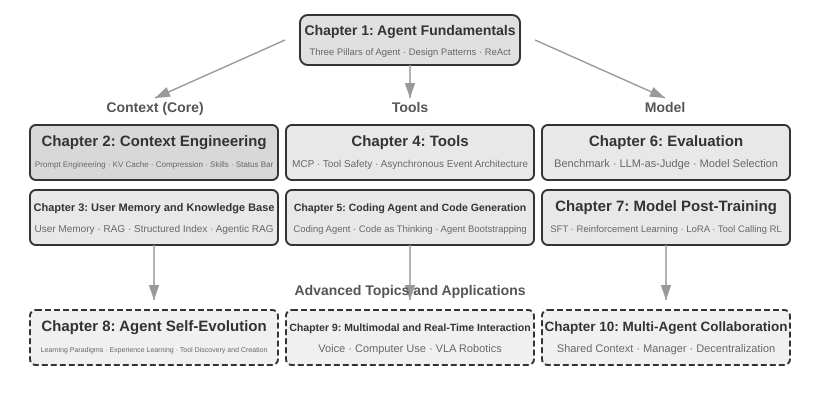

# הקדמה {.unnumbered}

מאוגוסט עד אוקטובר 2025 העברתי סדרת הרצאות טכניות ב"מחנה האימונים לסוכני AI" שמפעילה Turing, ההוצאה לאור הטכנולוגית הסינית. המטרה הייתה פשוטה: להעביר את עיצוב סוכני ה‑AI מהסתמכות על אינטואיציה להסתמכות על עקרונות — לא רק לגרום להדגמה לרוץ, אלא להבין *מדוע* סוכן מעוצב כפי שהוא מעוצב ואילו פשרות עומדות מאחורי כל החלטה ארכיטקטונית. ספר זה חובר והורחב מתוך ההערות והניסויים של אותן הרצאות.

הספר עצמו, מהרעיון הראשון ועד כתב היד המוגמר, נוצר באמצעות מה שאפשר לכנות **whisper coding** (שיתוף פעולה מבוסס הכתבה) — והכלי שבו השתמשתי להכתבה היה Pine, סוכן הקול שלנו. כדי להכין כל הרצאה, הייתי מכתיב מתווה גס, נותן לו לסקור את הנושא, ומאפשר לו להרכיב טיוטה ראשונה. לאחר ההרצאה, הייתי משתף את Pine במשוב של תלמידי מחנה האימונים, והיינו דנים ומלטשים לאורך סבבים רבים; איטרציה אחר איטרציה, הערות ההרצאות צמחו לכדי הספר שאתם מחזיקים היום. לאורך כל הדרך כמעט שלא הקלדתי — במקום זאת דיברתי את מחשבותיי בקול. לדיבור יש רוחב פס גבוה בהרבה מהקלדה (דיבור רגיל רץ בערך פי ארבעה ממהירות ההקלדה), ולכן לולאת "הכתבה—סקירה—דיון—תיקון" התקדמה במהירות. במובן מסוים, ספר זה אינו עוסק רק בסוכנים; הוא גם יצירה שסוכן סייע ליצור.

מאז שחרורו של DeepSeek R1 בתחילת 2025, תחום ה‑AI התקדם מעבר לשלב מודל היסוד הטהור (כלומר, שדרות מודלי שפה גדולים לשימוש כללי) ונכנס לעומק של פריסה הנדסית. ההתקדמות בשכבת המודל נראית בשני כיוונים. ראשית, באמצעות למידת חיזוק סוכנית (Agentic Reinforcement Learning), מודלים אימנו יכולות קריאה לכלים לתוך הפרמטרים שלהם, ורכשו שליטה ביכולות כלליות בתחומים כמו תכנות, מתמטיקה ושימוש במחשב. שנית, איטרציית המודלים ממשיכה להאיץ — מ‑GPT‑5.2 ל‑GPT‑5.5, מ‑Claude Opus 4.5 ל‑4.8, כשכל קפיצה אורכת חצי שנה בלבד. בשכבת המוצר, סוכנים כלליים כמו Manus,‏ Claude Code ו‑OpenClaw הגדירו מחדש את האינטראקציה בין אדם למחשב, ודחפו את הפרדיגמה הארכיטקטונית של "יצירת קוד + מערכת קבצים" אל תוך הזרם המרכזי.

במבט לאחור על עקרונות ארכיטקטורת הסוכנים שסיכמתי בקורס לפני כמעט שנה, מצאתי משהו מספק ומפתיע כאחד: **העקרונות הללו לא התיישנו; הם נעשו קנוניים יותר.** מונחים חדשים — Skill,‏ harness, הנדסת לולאה — סחפו מאז את תעשיית הסוכנים, אך הרצף האמיתי פועל בכיוון ההפוך: חברות כמו Anthropic לא המציאו את המושגים הללו וצפו בתעשייה מאמצת אותם; סוכנים רבים מאוד כבר עשו את הדברים הללו, ו‑Anthropic זיקקה לאחר מכן את הפרקטיקה לכדי עקרונות עיצוב בעלי שם. הפרקטיקה קודמת, השם מגיע אחר כך.

הביטחון שמאחורי עקרונות אלה נובע מדחיפת סוכנים לעבודה ארוכת טווח ובעלת סיכון גבוה בעולם האמיתי. כמדען הראשי של Pine AI, בניתי את Pine עם הצוות שלי. למיטב ידיעתי, זהו הסוכן הכללי הראשון שמסוגל לקיים אינטראקציה אוטונומית עם אנשים אמיתיים ולטפל באופן אמין ובכוחות עצמו במשימות רגישות, מורכבות וארוכות טווח הכרוכות בכסף: הוא מתקשר לחברות תקשורת בשם המשתמשים כדי להתמקח על חשבונות, מטפל בבקשות החזר ובתלונות מול סוחרים, ומבטל מנויים — הכול ללא התערבות אנושית. משימות כאלה נמשכות באופן שגרתי עשרות סבבי משא ומתן, וטעות אחת פירושה הפסד כספי אמיתי. דווקא הדרישה הבלתי מתפשרת הזו לאמינות היא שחישלה, אחד‑אחד, את העקרונות הארכיטקטוניים שספר זה חוזר אליהם שוב ושוב. הדוגמאות הבאות מגיעות מאותה פרקטיקה.

- הרבה לפני ש‑Skill הפך למילת באזז, כבר השתמשנו בטעינת פרומפטים דינמית כדי לרסן צמיחה פרועה של פרומפטים, בכלי הרצת שורת פקודה כדי לרסן רשימות כלים מתנפחות, ובשורת מצב מערכתית כדי להעניק לסוכן מודעות לסביבת הביצוע שלו, לזמן של המשתמש ולמצב העבודה שלו עצמו.
- הרבה לפני ש‑harness הפך למילת באזז, כבר השתמשנו בשיטות בסגנון Claude Code כדי לטפל בקריאות כלים לא יציבות, בהזיות, בפעולות מסוכנות, בפעולות בלתי מורשות ובהוראות שהתעלמו מהן.
- הרבה לפני שהנדסת לולאה הפכה למילת באזז, כבר השתמשנו במה שספר זה מכנה שיטת מציע–סוקר כדי למנוע מהמודל להכריז על סיום משימה מוקדם מדי.

גם דבר מכל אלה אינו המצאה בלעדית שלנו: למיטב ידיעתי, רוב חברות המודלים והסוכנים המובילות פיתחו שיטות דומות בכוחות עצמן. זו הסיבה שהשקתי את קורס "מחנה האימונים לסוכני AI" ב‑Turing באוגוסט 2025, ולימדתי קורס מעשי בסוכני AI באוניברסיטה של האקדמיה הסינית למדעים ברציפות מ‑2024 עד 2026 — וזו הסיבה שבחרתי לשחרר ספר זה כקוד פתוח במקום לשמור אותו סגור ולגבות תמלוגים: אני רוצה שהידע הזה יגיע ליותר עוסקים במלאכה.

**הפרקטיקה קודמת, השם מגיע אחר כך.** לרצף זה יש לקח מעשי מאוד לפיתוח סוכנים ארגוני: **אם אתם מחכים שמילת באזז בעולם הסוכנים תתפוס לפני שאתם מיישמים אותה בפועל, אתם כבר צעד אחד מאחור.** עד שמונח נעשה טרנדי, החברות המובילות כבר עבדו לרוב על הבעיה שהוא מציין. אז כיצד יודעים מה לעשות לפני שהשם מגיע? שני דברים, לדעתי, הם המפתח.

**ראשית, יש להחזיק עסק אמיתי המציב דרישות קיצוניות לתקרת היכולת של הסוכן, ולהמשיך לשאוב ממנו משוב אמיתי.** קחו את Pine. משימה בודדת אורכת לעיתים קרובות שעות ואף שבועות ויכולה לכלול הלוך ושוב חוזר עם בעלי עניין מרובים: שעות בטלפון, עמודים של טפסים מורכבים שממולאים במחשב, מספר סבבי דוא"ל. לאורך כל זה, אף מספר אינו יכול להיות שגוי, וכל חילופי דברים חייבים להישאר זהירים דיים כדי להגן על האינטרסים של המשתמש. רק כשאתם שקועים בתרחיש מורכב כל כך, הפרקטיקה דוחפת אתכם באופן טבעי לבנות Harness — כדי לכסות את מה שהמודל עדיין אינו מסוגל לעשות בכוחות עצמו אך העסק דורש. לעומת זאת, אם העסק דורש מעט מתקרת היכולת ושדרוג מודל צנוע הוא כל הנדרש, לעולם לא תהיה לכם סיבה ללטש את העקרונות הארכיטקטוניים הללו.

**שנית, אתם חייבים לבנות מנגנון הערכה (Evaluation).** ספר זה חוזר לנקודה זו שוב ושוב: ללא הערכה, אין התקדמות. הערכה מאפשרת לכם לדעת האם שינוי הוא באמת טוב יותר או רק בר מזל, כך שכיוון האיטרציה של הסוכן אינו נשען עוד על תחושת בטן. ביסודו של דבר, מה שאנו מטיפים לו הוא שימוש בשיטה המדעית כדי לעשות הנדסה ולבנות סוכנים, וההערכה היא הבסיס של אותה שיטה. פרק 7 מפתח אותה במלואה.

יהיו אשר יהיו ההתקדמויות במודלים הבסיסיים ויהיו אשר יהיו השינויים בצורות המוצר, כמעט כל מערכות הסוכן המוצלחות עוקבות אחר אותם דפוסים ארכיטקטוניים. אין זה מקרה: **עקרונות עיצוב טובים אמורים לשרוד מעבר למחזורי האיטרציה של המודלים**, משום שהם מתארים לא את אופן השימוש במודל מסוים אלא את הדפוסים היסודיים שבהם מערכות אינטליגנטיות מקיימות אינטראקציה עם העולם.

ריצ'רד סאטון, חתן פרס טיורינג ואבי למידת החיזוק, אמר פעם שהתפתחות היקום עברה ארבעה שלבים: אבק, כוכבים, חיים וסוכנים (במקור נקראו ישויות מעוצבות). האבולוציה הביולוגית עיוורת: מוטציה אקראית, ברירה טבעית. רוב האורגניזמים אינם מבינים את עקרונות הפעולה שלהם עצמם ואינם יכולים לעצב או ליצור מחדש יצורים חיים בכוחות עצמם. סוכנים, לעומת זאת, הם משהו חדש לחלוטין בתולדות ההתפתחות הקוסמית: באמצעות יצירת קוד הם יכולים להניע ולפתח את עצמם, כמו מתכנת שכותב מתכנת נוסף, שכותב בתורו את הבא. כלומר, סוכן יכול להבין את מנגנון הפעולה שלו עצמו, ובהינתן מטרה, ליצור סוכנים חדשים לגמרי — ואף לשפר את עצמו. שליחותו של ספר זה היא לסייע לכם להבין ולשלוט בעקרונות היצירה הזו.

נוסחת הליבה של ספר זה היא משפט אחד בלבד: **סוכן = LLM + הקשר + כלים**. שלושתם הכרחיים.


באופן אינטואיטיבי יותר, זהו **מוח + עיניים + ידיים ורגליים**. המוח (LLM) אחראי על החשיבה וקבלת ההחלטות, העיניים (הקשר) קובעות איזה מידע הסוכן יכול לראות, והידיים והרגליים (כלים) קובעות מה הסוכן יכול לעשות. (למען הדיוק, "עיניים" היא אנלוגיה גסה: ההקשר כולל לא רק מידע סביבתי והיסטוריית שיחה אלא גם הגדרות כלים, כלומר המידע שהסוכן "רואה" כולל גם "אילו ידיים ורגליים זמינות". מטרת המטאפורה היא להעביר את האינטואיציה המרכזית: ההקשר הוא כל המידע שהמודל יכול לתפוס.)

עבור קוראים המכירים למידת חיזוק, ניתן למפות את שלושת אלה גם לשפה הפורמלית של RL. באופן ספציפי, LLM מקביל למדיניות (Policy), הקשר מקביל למרחב התצפית (Observation Space), וכלים מקבילים למרחב הפעולה (Action Space). שלושת הביטויים מתייחסים לאותו אובייקט, רק ברמות הפשטה שונות.


## מבנה הספר {.unnumbered}

ספר זה מורכב מעשרה פרקים המאורגנים בארבע רמות (איור 0‑2). פרק 1 מבסס את המסגרת היסודית לסוכנים; פרקים 2 עד 6 דנים כיצד לבנות סוכנים, ומכסים לפי הסדר הקשר, ידע, כלים, יצירת קוד ואינטראקציה; פרקים 7 עד 9 דנים כיצד להעריך ולשפר סוכנים באופן מתמשך, ומתקדמים ממערכות מדידה ואימון־על של מודלים אל התפתחות מתמשכת המונעת מניסיון תפעולי; פרק 10 מרחיב את היריעה לשיתוף פעולה רב‑סוכני.



- **פרק 1 (יסודות הסוכן)** מתחיל בכמה מוצרי סוכן אמיתיים כדי לבנות הבנה אינטואיטיבית של סוכנים. לאחר מכן הוא בוחן לעומק את נוסחת הליבה של הסוכן: משכבת המימוש של LLM + הקשר + כלים, דרך השכבה האינטואיטיבית של מוח + עיניים + ידיים ורגליים, ולבסוף אל השכבה האקדמית של מדיניות, מרחב תצפית ומרחב פעולה. ניסויים מנתחים כיצד פועלת לולאת ReAct — התהליך האיטרטיבי של "חשיבה ← פעולה ← תצפית" — ומבחינים בין התאמה הקשרית בתוך המשימה, עדכונים חוצי־משימות לתוצרים חיצוניים, ועדכוני פרמטרים במהלך מחזורי אימון. הוא מסתיים בדפוסי עיצוב תזמוריים הנעים מתהליכי עבודה ועד סוכנים אוטונומיים, ומבסס מסגרת מושגית אחידה לפרקים שלאחריו.
- **פרק 2 (הנדסת הקשר)** הוא הפרק הקריטי ביותר בספר, ומסביר באופן שיטתי את ההקשר, "עיניו" של הסוכן. הוא מתחיל במבנה הודעות ה‑API ובלולאת הליבה של הסוכן, ומבסס את היסוד ש"הקשר הוא רשימת הודעות", ולאחר מכן בוחן את העקרונות שבבסיס ה‑KV Cache — המנגנון לשימוש חוזר בתוצאות חישוב היסטוריות במהלך אינפרנס של LLM. בהמשך הוא מכסה הנדסת פרומפט, ובכללה עיצוב מוכוון תהליך, תיאורי כלים וליטוש כללים עסקיים; התקפות הזרקת פרומפט והגנות מפניהן; מנגנון הטעינה לפי דרישה של Agent Skills; טכנולוגיית שורת המצב של הסוכן; ואסטרטגיות דחיסת הקשר. הגדרות מלאות של מונחים אלה ניתנות בהופעתם הראשונה בגוף הטקסט.
- **פרק 3 (זיכרון משתמש ובסיסי ידע)** מרחיב את ניהול ההקשר לכדי מערכת ידע מתמידה החוצה סשנים, ומאפשר לסוכן לא רק לזכור את השיחה הנוכחית אלא גם לצבור ולאחזר ידע לאורך שיחות מרובות. הוא מכסה ארבע אסטרטגיות מדורגות לזיכרון משתמש; את מחסנית הטכנולוגיה המלאה של RAG‏ (Retrieval‑Augmented Generation, שבו מאוחזרים מסמכים רלוונטיים לפני שהמודל מייצר תשובה), ובכללה שיטות חיפוש טקסט שונות ואופטימיזציית דירוג; חילוץ מידע רב‑מודאלי; שיטות מתקדמות יותר לארגון ידע; ו‑Agentic RAG, שבו הסוכן מחליט באופן אוטונומי מתי ומה לאחזר.
- **פרק 4 (כלים)** בוחן את הגשר בין סוכנים לעולם החיצוני: כלים מתפקדים כ"ידיים ורגליים" של הסוכן, ומאפשרים לו לחפש ברשת, לקרוא ל‑API, להפעיל מסדי נתונים ועוד. הוא מציג את תקן ההדדיות של כלים MCP ואת עקרונות העיצוב של חמש קטגוריות כלים — תפיסה, ביצוע, שיתוף פעולה, הפעלת אירועים ותקשורת עם המשתמש — מכסה שלוש גישות לתפיסה רב‑אופנית (עיבוד רב‑אופני מובנה, המרה לטקסט, וניתוח רב‑אופני מבוסס כלים), ומדגיש מנגנוני אבטחה לכלי ביצוע. הפעלת אירועים, תקשורת עם המשתמש וזמן הריצה האסינכרוני מכוסים בפרק 6.
- **פרק 5 (סוכן קוד ויצירת קוד)** טוען שסוכן קוד בתוספת מערכת קבצים מהווה את הבסיס הטכני המרכזי של כל סוכן לשימוש כללי. תוך שימוש בארכיטקטורת OpenClaw כחוט מארגן, הוא מנתח את תהליכי העבודה ואת טכניקות המימוש של סוכני קוד, ובה בעת מדגים את הערך הרחב של יצירת קוד מעבר לתכנות: מסיוע לחשיבה ובניית בסיסי ידע ועד יצירה דינמית של כלים חדשים והנעה עצמית של סוכנים.
- **פרק 6 (אינטראקציה: הרחבת מרחבי התצפית והפעולה)** מסיר את הנחת התורות שחמשת הפרקים הקודמים הניחו, ומרחיב את האינטראקציה של הסוכן עם העולם לאורך שני צירים — **מודאליות** ו**תזמון**: עיבוד אסינכרוני ומונחה אירועים מאפשר לעולם להעיר את הסוכן (כלי הפעלת אירועים, כלי תקשורת עם המשתמש, זהויות וירטואליות וסביבות ביצוע מבודדות); קול דוחף את האינטראקציה לסקאלת המילישניות (מצינורות מדורגים ועד מודלים אומני‑מודאליים מקצה לקצה ודו‑כיווניים מלאים); Computer Use מאפשר לסוכן להפעיל ממשקים גרפיים כמו אדם; ומניפולציה רובוטית מרחיבה את הפעולה אל העולם הפיזי (בקרת VLA והעברת Sim2Real). ארבעת התרחישים חולקים מערך פרימיטיבים אחד — יקיצה, נקודה בטוחה, ביטול, קדימות, והפרדת מהיר/איטי.
- **פרק 7 (הערכת סוכנים)** בונה מתודולוגיית הערכה מדעית. הוא מכסה סביבות הערכה — שתי פרדיגמות ליבה, קריאה לכלים ואינטראקציה אדם–מחשב, בתוספת סביבות סימולציה הנדונות בנפרד בסוף הפרק — עקרונות עיצוב מערכי נתונים, הערכה אוטומטית מסוג LLM‑as‑a‑Judge, בחירת מודלים מונחית הערכה, והמעגל הסגור המלא הממיר תוצאות הערכה לשיפורי מערכת.
- **פרק 8 (אימון־על של מודלים)** בוחן לעומק שתי טכניקות אימון־על: SFT‏ (Supervised Fine‑Tuning, שימוש בנתונים מתויגים כדי ללמד את המודל לעקוב אחר דוגמאות) ו‑RL‏ (Reinforcement Learning, המאפשר למודל להשתפר באופן אוטונומי באמצעות ניסוי וטעייה ומשוב תגמול). מאורגן סביב הטענות המרכזיות ש"SFT משנן, RL מכליל" ו"נתונים וסביבה חשובים יותר מאלגוריתמים", הוא מכסה את מלוא נוף האימון המקדים/SFT/RL, תורת RL קלאסית, עיצוב אותות תגמול — מתגמולים בינאריים ותגמולי תהליך ועד קנסות מסלול מאומתים ה"מתגמלים את התוצאה ומרסנים את התהליך" — אלגוריתמי למידת חיזוק חד‑תוריים ורב‑תוריים, ונושאי חזית כגון אופטימיזציית יעילות דגימה.
- **פרק 9 (התפתחות מתמשכת של סוכנים)** חוקר כיצד להמיר את הניסיון התפעולי של סוכן ליכולות עבור גרסתו הבאה. הוא מבסס תחילה אותות למידה המורכבים מתוצאות סביבתיות, כללי תהליך ו‑Rubrics מבוססי LLM; לאחר מכן משווה ארבעה נשאי עדכון — מסמכי ידע, פרומפטים ו‑Skills, תוכניות ו‑Harness, ופרמטרי מודל; ולבסוף דן באימות גרסאות מועמדות, שחרורי קנרי, רולבק וקונסולידציה ארוכת טווח.
- **פרק 10 (שיתוף פעולה רב‑סוכני)** דן בצורתן האולטימטיבית של מערכות סוכני AI: כיצד סוכנים מרובים מחלקים את העבודה ומשתפים פעולה. הוא מציג באופן שיטתי מסגרת סיווג לשיתוף פעולה רב‑סוכני — הקשר משותף/עצמאי × מבנים עמיתיים/מנהליים/מבוזרים — משתמש בסוכני תרגום ובסוכני טלפון־ומחשב כדי להדגים עיצוב ארכיטקטורת שיתוף פעולה, וסוקר כיווני חזית בחברות סוכנים ובכלכלות סוכנים.

## כיצד לקרוא ספר זה {.unnumbered}

הפרקים בספר זה עצמאיים יחסית. תוכלו לבחור מסלולי קריאה שונים בהתאם לצרכים שלכם:

- **אם אתם מפתחי סוכנים**, קראו את פרקים 1 עד 9 לפי הסדר: ששת הפרקים הראשונים מציגים שיטות בנייה, פרק 7 מבסס את יסודות ההערכה, פרק 8 מסביר כיצד לאמן מודלים, ופרק 9 משלב פרמטרים ונשאי עדכון אחרים לכדי לולאת התפתחות מתמשכת שלמה. את פרק 10 ניתן לקרוא באופן סלקטיבי בהתאם לצרכים שלכם בשיתוף פעולה רב‑סוכני.
- **אם זמנכם מוגבל**, תנו עדיפות לפרק 1, לתמונה הכוללת, ולפרק 2, להנדסת הקשר — המיומנות הקריטית ביותר. העקרונות שבבסיס ה‑KV Cache בפרק 2 טכניים למדי; בקריאה ראשונה תוכלו לדלג על המכניקה ולשמר רק את שלוש מסקנות הליבה המוצגות בתחילתו, מבלי לפגוע בהבנתכם את החומר שבהמשך.
- **אם המיקוד שלכם הוא אימון מודלים**, גשו ישירות לפרק 8 (אימון־על של מודלים). מכיוון ששיטות ההערכה בפרק 7 הן תנאי מקדים לאימון, קראו את השניים יחד, לאחר שפרקים 1 ו‑2 ביססו את התמונה הכוללת.

כל פרק מכיל מספר רב של **ניסויים** ו**שאלות למחשבה**, הממוספרים בפורמט "ניסוי X‑Y" (X הוא מספר הפרק, Y הוא המספר הסידורי בתוך הפרק). כותרות הניסויים ושאלות המחשבה נושאות דירוגי כוכבים לרמת קושי: ★ פירושו רמת מתחילים, מתאים לכל הקוראים; ★★ פירושו קושי בינוני, הדורש מידה מסוימת של פרקטיקה הנדסית; ★★★ פירושו אתגר מתקדם, הכרוך בדרך כלל בשאלות פתוחות או בעיצוב מערכות מורכב. רוב הניסויים מגיעים עם קוד מלא בר‑הרצה, המאורגן במאגר הקוד הפתוח הנלווה:

> **מאגר הקוד הנלווה**: [https://github.com/bojieli/ai-agent-book](https://github.com/bojieli/ai-agent-book)

תוכלו להשיג את כל הקוד הנלווה באמצעות Git:

```bash
git clone https://github.com/bojieli/ai-agent-book.git
cd ai-agent-book
```

אם אינכם משתמשים ב‑Git, תוכלו גם לבחור **Code → Download ZIP** בעמוד המאגר. קוד הניסויים מאורגן לפי פרקים תחת `chapter1/` עד `chapter10/`. כדי למצוא את "ניסוי X‑Y", פתחו את `chapterX/README.en.md` המתאים, השתמשו במספר הניסוי כדי לאתר את ספריית הפרויקט שלו, ולאחר מכן עקבו אחר ה‑README של אותו פרויקט כדי להתקין תלויות ולהריץ אותו. ניסויים מסוימים המסומנים כמדריכי שחזור תלויים במאגרים חיצוניים; קובצי ה‑README שלהם מסבירים כיצד להשיג גם אותם.

אני ממליץ בחום להריץ את הניסויים הללו בעצמכם: סוכני AI הם תחום מעשי במיוחד, ואינטואיציות עיצוב רבות מתגבשות רק תוך כדי ניפוי שגיאות.

**הערת מינוח**: ספר זה מקפיד להבחין בין שני מונחים שהשימוש הרווח נוטה לערבב. **היסק (Reasoning)** הוא החשיבה שלב‑אחר‑שלב של המודל — כמו במודלי היסק, שרשרת מחשבה וטוקני היסק. **אינפרנס (Inference)** הוא החישוב קדימה של המודל בזמן הפריסה — כמו בעלות אינפרנס, מחסנית אינפרנס והרחבה בזמן אינפרנס. (המהדורה הסינית מתרגמת אותם לשתי מילים נבדלות — 思考 עבור reasoning ו‑推理 עבור inference — בדיוק כדי לשמור על שני הרעיונות נפרדים; מקרה הבוחן של התרגום בפרק 10 מפנה בחזרה למוסכמה זו.) מונחי מפתח נוספים מוגדרים בהופעתם הראשונה בטקסט.

## ידע מוקדם נדרש {.unnumbered}

ספר זה מיועד לקוראים בעלי רקע טכני מסוים, אך אינו דורש מכם להיות מומחים בתחום ספציפי. הדרישות המוקדמות מפורטות להלן בשתי רמות: "נדרש" ו"מומלץ", כדי לסייע לכם להעריך את מוכנותכם.

**נדרש: יסוד לקריאת הספר כולו**

- **תכנות ב‑Python**: כמעט כל הניסויים בספר מבוססים על Python. עליכם להכיר את התחביר הבסיסי של Python, מבני נתונים נפוצים, ניהול חבילות (pip) ומושגי יסוד נוספים. שליטה מלאה אינה נדרשת, אך עליכם להיות מסוגלים לקרוא ולשנות קוד Python בעל מורכבות בינונית.
- **ניסיון בסיסי עם מודלי LLM**: עליכם להיות מי שהשתמשו ב‑ChatGPT,‏ Claude או מוצרים דומים, ולהבין את דפוס האינטראקציה הבסיסי של "פרומפט ← תגובת מודל".
- **כלי תכנות בסיוע AI**: התקינו והתרגלו לפחות לכלי תכנות אחד בסיוע AI, כגון Claude Code,‏ Codex,‏ Cursor או TRAE. ראשית, כלים אלה יאיצו מאוד את הניסויים, הכרוכים בכתיבת קוד ובניפוי שגיאות נרחבים. שנית, הם עצמם סוכני קוד בשלים: בשימוש בהם תתנסו באופן בלתי אמצעי במנגנוני הליבה שספר זה חוזר אליהם — לולאת ReAct, קריאות לכלים, ניהול הקשר. אותה התנסות בלתי אמצעית היא בעלת ערך רב להבנת עקרונות עיצוב הסוכנים.
- **ידע כללי בהנדסת תוכנה**: הכירו מושגי יסוד כגון פעולות שורת פקודה, בקרת גרסאות Git, פורמט הנתונים JSON וממשקי REST API. אלה הם היסוד להרצת הניסויים ולהבנת מנגנון קריאת הכלים של הסוכן.

**מומלץ: שיפור חוויית הקריאה בפרקים ספציפיים**

- **יסודות למידת מכונה** (פרק 8): הבנת מושגי יסוד כמו אימון לעומת אינפרנס, פונקציות הפסד, ירידת גרדיאנט והתאמת יתר תסייע לכם להבין אימון־על של מודלים.
- **מתמטיקה בסיסית** (פרקים 2‑3, 8): הבנה אינטואיטיבית של אלגברה לינארית (למשל, הידיעה שווקטורים יכולים לייצג כיוון וגודל, ושמטריצות יכולות לבצע פעולות באצווה) תסייע לכם להבין embeddings ומנגנוני קשב. ידע בסיסי בהסתברות ובסטטיסטיקה יסייע במדדי הערכה ובתגמולים צפויים בלמידת חיזוק. המתמטיקה בספר אינה כרוכה בגזירות מורכבות ומתמקדת בהסברים אינטואיטיביים.
- **יסודות פיתוח ווב** (פרק 6): הבנת מושגים כמו HTTP,‏ WebSocket וארכיטקטורת הפרדת צד לקוח/צד שרת תסייע לכם להבין ארכיטקטורות סוכן אסינכרוניות מונחות אירועים וניסויי תקשורת בזמן אמת עבור סוכני קול.
- **הבנה בסיסית של ארכיטקטורת Transformer** (פרקים 2, 8): Transformer הוא הארכיטקטורה שבבסיס כמעט כל מודלי השפה הגדולים הנוכחיים. קוראים המעוניינים לבנות באופן שיטתי את ידע היסוד שלהם במודלים גדולים עשויים ליהנות מ‑*Illustrating Large Models*‏ (图解大模型, יצא לאור בסינית בהוצאת Turing), המשתמש בתרשימים אינטואיטיביים כדי להסביר מושגי ליבה כגון ארכיטקטורת Transformer, אימון מקדים וכוונון עדין — השלמה טובה לפרספקטיבת הנדסת הסוכנים של ספר זה.

אם חסרות לכם חלק מהדרישות המוקדמות הללו, אל תתייאשו. ערכו המרכזי של ספר זה טמון ב**עקרונות עיצוב ארכיטקטוני ובמתודולוגיה הנדסית**, ולא באלגוריתם או בטכניקה ספציפיים כלשהם. מחוץ לפרק 8 העוסק באימון־על, הספר דורש מעט מאוד מתמטיקה או למידת מכונה, והוא עובד היטב כנקודת פתיחה.

טכנולוגיית הסוכנים עדיין מתפתחת במהירות, אך **לעקרונות עיצוב ארכיטקטוני טובים יש את הכוח להחזיק מעמד לאורך זמן**. שלטו ב"מדוע" שמאחורי העיצובים, ותוכלו לשמור על שיקול דעת צלול בעוד גלי הטכנולוגיה חולפים. אני מקווה שספר זה יהפוך למדריך אמין בדרככם לבניית סוכני AI.

## תודות {.unnumbered}

ברצוני להודות לעורכות Meng Ge ו‑Liu Meiying מ‑Turing על עריכתן החרוצה ועל עבודתן בארגון קורס "מחנה האימונים לסוכני AI" של Turing; אני מודה גם לפרופסור Liu Junming על שהציע את הקורס המעשי בסוכני AI באוניברסיטה של האקדמיה הסינית למדעים. תודה מיוחדת לכל תלמידי "מחנה האימונים לסוכני AI" של Turing ולתלמידי קורס סוכני ה‑AI ב‑UCAS — הוראת הקורסים הללו הביאה לי שפע של משוב ועצות יקרי ערך מכם, והיא חידדה את אחיזתי שלי במושגים הללו.

אני מודה לכל עמיתיי ב‑Pine AI. ללא מוצר מצוין כמו Pine AI, וללא האתגרים הרבים שהוא הביא עמו, לעולם לא הייתי יכול להעמיק כל כך בתחום הסוכנים, לא בהבנה ולא בפרקטיקה; ובאמצעות חילופי רעיונות אחד אחרי השני, עמיתיי תרמו שפע של תובנות יקרות ערך.

ברצוני להודות גם לחברים רבים ברחבי תעשיית ה‑AI (לא אנקוב בשמות כולם כאן). בדיון אחר דיון, נתתם לי משוב כן על השקפותיי, תיקנתם רבות משגיאות השיפוט שלי, והעליתם את הבנתי במודלים ובסוכנים.

יותר מכול, אני מודה למשפחתי, ובמיוחד לאשתי, Meng Jiaying. היא תמכה בי לאורך כתיבת הספר והציעה הצעות יקרות ערך רבות לאורך הדרך.
