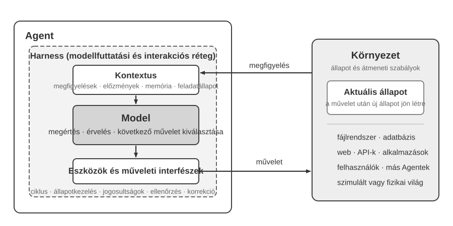
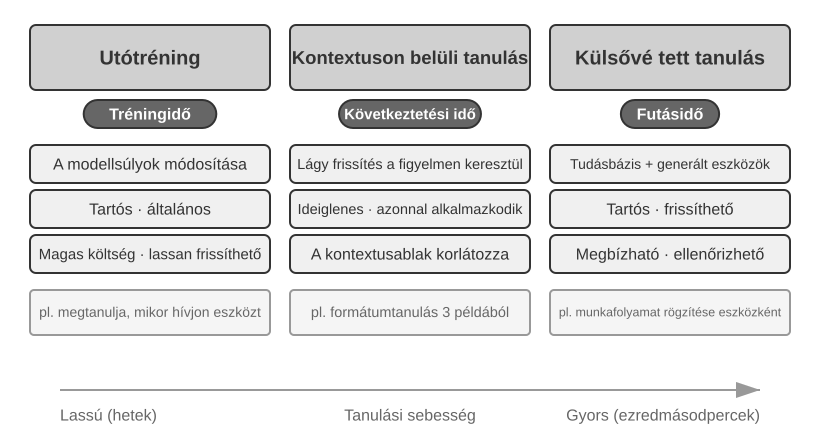
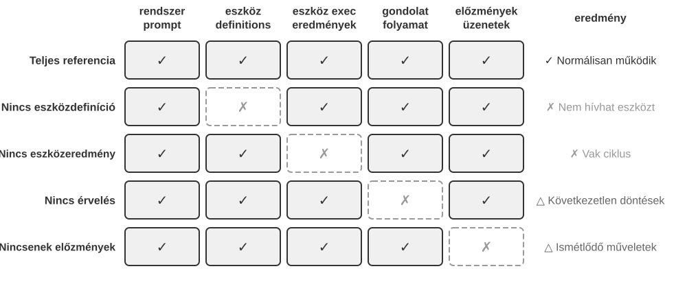
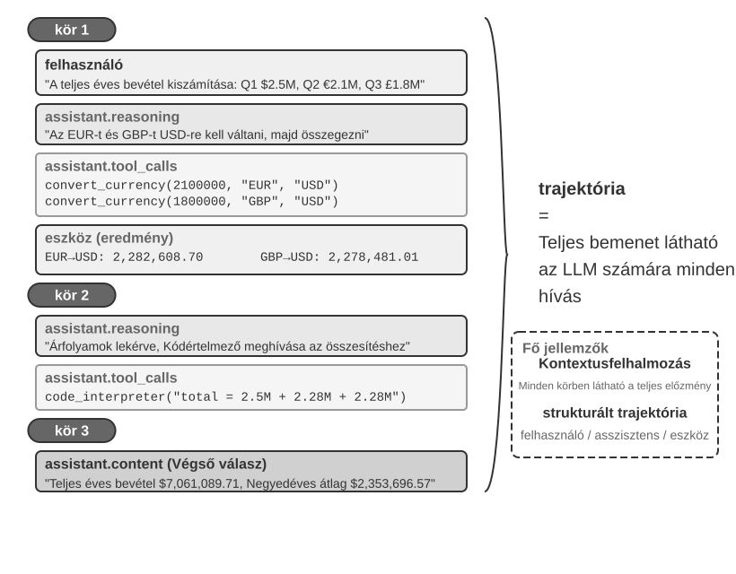
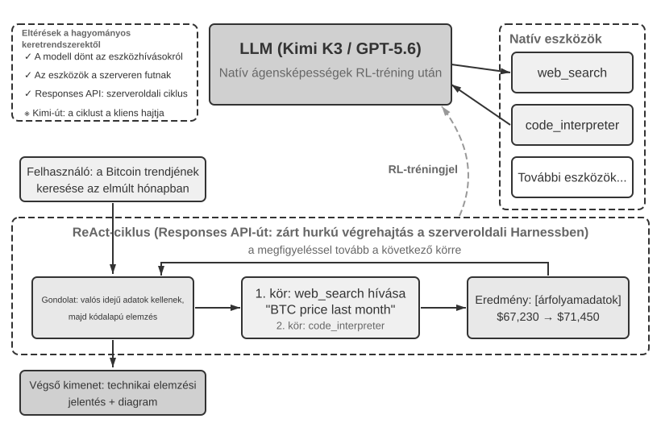
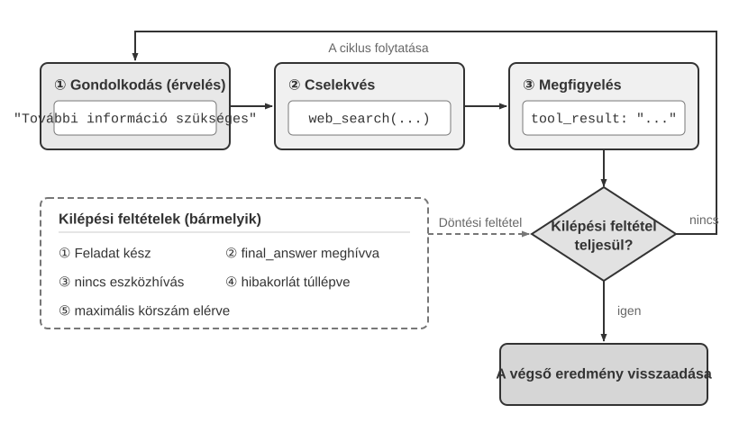

# Ismerkedés az AI-ügynökökkel

Ha használtad már a Cursort kódírásra, és láttad, ahogy átkutatja a kódbázist, szerkeszt több fájlt, és újrafuttatja a teszteket, amíg azok át nem mennek – akkor már használtál AI-ügynököt (AI Agent). Ugyanez igaz, ha a Deep Research segítségével kutattál egy témát ismételt kereséssel és olvasással, ha a Manus-sal böngészőt vezéreltél online feladatok elvégzésére, ha a Doubao telefonos asszisztenst kérted meg jegyek foglalására vagy üzenetek küldésére, vagy ha a Pine AI-t küldted el alkudni a telefonszámládon.

Ezek a termékek sokféle formát öltenek, de van egy közös jellemzőjük: már nem passzív "te kérdezel, én válaszolok" beszélgetések. Megtervezik a saját végrehajtási lépéseiket, meghívják az egyes feladatokhoz szükséges eszközöket, és az eredmények függvényében módosítják a stratégiájukat. Az AI-ügynökök a számítógépekkel való interakció új módjává válnak.

Ez a fejezet gyakorlati példákkal indul, majd visszavezet az AI-ügynökök alapvető összetevőihez: az olvasók első kézből tapasztalhatják meg, mire képesek a modern ügynökök, megérthetik a mögöttes architektúrát, és elsajátíthatják az ügynökrendszerek építésének tervezési mintáit és bevált gyakorlatait.

> **Olvasási tipp**: Ez a fejezet az egész könyv koncepcionális térképe: tömör áttekintés a központi formuláról, a működési ciklusról, a mérnöki keretrendszerről és az ügynöktervezési mintákról. Megalapozza a későbbi fejezetekben használt közös szókincset és referenciapontokat. Ne próbáld meg az első olvasáskor az összes fogalmat megjegyezni; a nagy képre koncentrálj. Minden későbbi fejezet egy-egy itt bevezetett szempontot fejt ki részletesen, és bármikor visszatérhetsz ehhez a fejezethez, ha újra kell tájékozódnod.

## Modern ügynök = LLM + Kontextus + Eszközök

Egy modern ügynökrendszer lényege egy tömör képletbe foglalható: **Ügynök = LLM (Nagy nyelvi modell) + Kontextus + Eszközök**. A képlet egyszerű és gyakorlatias – feltéve, hogy minden tagot tágan értelmezünk:

- **Az LLM az ügynök érvelőmotorja**: Több, mint paraméterek halmaza; ez az ügynök döntéshozó központja, amely a szándék megértéséért, az érvelésért, a tervezésért és az ítéletalkotásért felelős. Az LLM képességei az "előtanítás" (pre-training) során megszerzett világismeretből és nyelvi készségekből, valamint az "utótanítás" (post-training) során kódolt döntéshozatali stratégiákból származnak (az olyan technikák, mint a felügyelt finomhangolás és a megerősítéses tanulás a 8. fejezetben kerülnek kifejtésre).
- **A kontextus az ügynök aktuális információhalmaza**: Nem csupán a modellbe táplált szöveg, hanem az ügynök számára az egyes döntési pontokon elérhető információhalmaz – a környezet, a felhasználó memóriája, a tartományi tudás, a saját állapota és a feladat előrehaladása. Ahogy egy döntést hozó embernek is fel kell mérnie a helyzetet, emlékeznie kell a releváns tapasztalatokra és konzultálnia kell a forrásokkal, az ügynök kontextusablaka (context window) is az adott pillanatban felhasználható információkat tartalmazza.
- **Az eszközök az ügynök cselekvési interfészei**: Nem csupán néhány meghívható API-függvény, hanem az összes mód, ahogy az ügynök cselekedhet – az előre definiált eszközhívásoktól a menet közben betöltött készségekig (Skills), a kódgenerálástól az új képességek menet közbeni létrehozásán át a feladatok al-ügynököknek delegálásáig, a felhasználó megkeresésétől a külső eseményekre adott válaszig.

Intuitívabban megfogalmazva: **Ügynök = Érvelőmotor + Aktuális információhalmaz + Cselekvési interfészek**. A modell érvel és dönt, a kontextus biztosítja az információhalmazt, amelyre a döntések támaszkodnak, az eszközök pedig azokat az interfészeket nyújtják, amelyeken keresztül a döntések hatással vannak a külvilágra.

A klasszikus megerősítéses tanulási és irányításelméleti nézőpontból az Agent és a Környezet egy zárt hurkú interakció két oldala, nem egymás részei. A Környezet megfigyelést ad vissza, az Agent a kontextusa alapján kiválasztja a következő műveletet, a művelet pedig módosítja a Környezet állapotát, amely új megfigyelést eredményez.



Az 1-1. ábra két absztrakciós szintet mutat. A külső szint az **Agent és a Környezet interakciója**: a Környezethez tartozik a fájlrendszer, az adatbázis, a web, a felhasználó, más Agentek és a fizikai vagy szimulált világ. A belső szint az **Agenten belüli Modell–Harness szerkezet**: a Modell hozza a policy-döntéseket; a Harness az Agent határain belüli futtatási és irányítási réteg, amely felépíti a kontextust, eszközinterfészeket tesz elérhetővé, kezeli a ciklust és az állapotot, valamint jogosultságot, ellenőrzést és korrekciót alkalmaz. A Harness létrehozhat, elszigetelhet vagy közvetíthet egy környezetet anélkül, hogy tartalmazná annak állapotát és átmeneti szabályait.

A mérnöki képlet így bontható ki: az LLM a Modellnek felel meg, a Kontextus + Eszközök pedig a minimális Harness-t alkotják; a termelési rendszerek ezen a határon belül korlátozást, ellenőrzést és korrekciót adnak hozzá. A fejezet további része ezt a határt követi.

Ez a három összetevő kapcsolatban áll a megerősítéses tanulás (RL; lásd 8. fejezet) három alapfogalmával, de nem szigorú egy-az-egyben megfeleltetés: a kontextus a megfigyelések és az előzmények Agenten belüli reprezentációja, az eszközök pedig olyan megfigyelési és műveleti interfészeket adnak, amelyek mögöttes objektumai továbbra is a Környezethez tartoznak.

| Intuíció | Ügynök-összetevő | RL fogalom | Szerep |
|----------|------------------|-------------------------|--------|
| "Érvelőmotor" | LLM | "Policy" | A döntéshozatali logika, amely meghatározza, hogy "mit tegyünk ezután" – a rendelkezésre álló információk alapján válassza ki a legmegfelelőbb cselekvést az összes lehetséges opció közül |
| "Aktuális információhalmaz" | Kontextus felépítése | "Megfigyelések és előzmények" | A Környezet megfigyeléseit és a meglévő előzményeket az aktuális döntéshez szükséges információvá rendezi |
| "Cselekvési interfészek" | Eszközinterfészek | "Megfigyelési/műveleti interfészek" | Meghatározza, milyen megfigyeléseket olvashat az Agent, milyen műveleteket küldhet, és milyen formátumban |

### Megfigyelési és cselekvési terek: A modell és a világ közötti interfész

**A megfigyelési tér és a cselekvési tér együtt alkotják az LLM és a külső környezete közötti interfészt**. A megfigyelési tér a környezet információit a modell által feldolgozható kontextussá alakítja; a cselekvési tér a modell döntéseit a külvilágra ható műveletekké fordítja. A megfigyelési téren kívüli információ gyakorlatilag nem létezik a modell számára. A cselekvési téren kívüli műveletet a modell csak szavakkal tud javasolni, még ha pontosan tudja is, mit kellene tenni.

Következésképpen **ha az alapmodellt rögzítjük, az ügynökteljesítmény javításának elsődleges rendszermérnöki eszköze gyakran a megfigyelési és cselekvési terek újradefiniálása vagy kiterjesztése**. A könyv terminológiájában ez a kontextus és az eszközök bővítését jelenti. Sok olyan probléma, amely "okosabb modellt" igényelne, valójában interfészprobléma: hozd be a feladathoz releváns adatokat a kontextusba, vagy tedd elérhetővé a szükséges műveletet eszközként, és egy korábban megoldhatatlan feladat megoldhatóvá válhat.

**Manus: terek egyesítése, amelyek korábban különállók voltak.** Mielőtt a Manus megjelent, a termelési ügynökök többnyire három különálló irányt követtek: Deep Research, Kódolás és Számítógép-használat (Computer Use). A Manus volt az első széles körben ható termelési ügynök, amely mind a hármat egyetlen rendszerbe hozta. A virtuális böngésző kibővítette a megfigyelési terét; a fájlrendszer, a kódvégrehajtás és a parancssor kibővítette a cselekvési terét. A Manus nem pusztán egy erősebb modell behelyettesítésével vált általános ügynökké. Háromféle ügynök megfigyelési és cselekvési tereinek unióját vette, lehetővé téve, hogy egyetlen ügynök átlépje a korábbi termékhatárokat.

**OpenClaw: az interfész kiterjesztése a felhasználó digitális életébe.** Az OpenClaw mindkét teret tovább tágítja. Feladatokat fogad és eredményeket ad vissza olyan üzenetküldő csatornákon keresztül, amelyeket a felhasználók már használnak – WhatsApp, Telegram, Slack, Discord, iMessage és még sok más – így az ügynök szinte bárhonnan elérhető. Helyi Gateway-e felhőalkalmazásokhoz, például a Google Drive-hoz és a Notionhöz, valamint a helyi fájlrendszerhez kapcsolódik. A fiókok és eszközök között szétszórt fájlok így – a felhasználó kifejezett engedélyével – beléphetnek egy ügynök megfigyelési terébe, és az eszközei által módosíthatóvá válhatnak. A Manus eredeti, felhő-sandbox központú formájához képest, ahol a fájlokat általában fel kellett tölteni vagy egy csatlakozót külön konfigurálni, a helyi-első OpenClaw szélesebb adathatárt fog át. A Manus később hozzáadta saját Google Drive csatlakozóját és asztali hozzáférést a helyi fájlokhoz – ami csak megerősíti a pontot: a termékfejlődés gyakran pontosan a megfigyelési és cselekvési terek kiterjesztéséből áll[^ch1-agent-products].

[^ch1-agent-products]: A Manus hivatalos anyagai az eredeti Sandboxot egy elkülönített felhő-alapú virtuális gépként írják le. Amikor bemutatták a Google Drive Connectorát, a Manus kifejezetten felidézte a korábbi, töredezett munkafolyamatot, amikor a fájlokat manuálisan kellett letölteni és feltölteni a Drive, az asztali gép és a Manus között. Amikor 2026 márciusában elindította a My Computer szolgáltatást, azt a tényt, hogy a fontos munka helyben, nem pedig a felhőben található, a felhő-sandbox alapvető korlátjának nevezte. Az OpenClaw hivatalos README-je egy helyi-első, mindig aktív személyi asszisztensként írja le, amely a felhasználó saját eszközein fut, és több mint húsz üzenetküldő csatornát sorol fel; eszközei és bővítményrendszere felhő-integrációkat és helyi képességeket is hozzáadhatnak. Lásd: https://manus.im/blog/manus-sandbox, https://manus.im/blog/manus-google-drive-connector, https://manus.im/blog/manus-my-computer-desktop, https://github.com/openclaw/openclaw, és https://docs.openclaw.ai/tools

Az egyes összetevők szerepének és összeillésének megértése az alapja a hatékony ügynökrendszerek építésének. A legkonkrétabb összetevővel – az eszközökkel, vagyis a cselekvési interfészekkel – kezdjük, majd haladunk befelé az LLM és a kontextus felé. Először azonban nézzük meg, hogy a különböző típusú ügynökök hogyan viszonyulnak egymáshoz e három dimenzió mentén:

| Ügynöktermék | Aktuális információhalmaz | Cselekvési interfészek | Stratégia |
|--------------|--------------------------|------------------------|-----------|
| "Kódoló ügynökök (pl. Cursor)" | Követelménydokumentumok, kódbázis, terminálkörnyezet | Nyitott (belső érvelés, kódkeresés, fájl olvasás/írás, parancsvégrehajtás stb.) | Iteratív fejlesztés: követelmények megértése → releváns kód keresése → kód szerkesztése → tesztelés és ellenőrzés → hibakeresés és javítás |
| "Kereső ügynökök (pl. Deep Research)" | Webes források, tudományos adatbázisok, helyi fájlok | Nyitott (belső érvelés, keresőlekérdezések, webes olvasás, összefoglalók generálása) | Iteratív mélyítés: keresési irány módosítása a meglévő információk alapján, fokozatosan egy teljes jelentés szintetizálása |
| "Számítógép-vezérlő ügynökök (pl. Browser Use)" | Számítógép képernyő, böngészőoldalak, fájlrendszer | Nyitott (belső érvelés, kattintás, gépelés, görgetés, képernyőképek, kódvégrehajtás stb.) | Vizuális észlelés + művelet: képernyő megfigyelése → célelemek azonosítása → műveletek végrehajtása → eredmények ellenőrzése |
| "Telefonos asszisztens ügynökök (pl. Doubao)" | Telefon képernyő, telepített alkalmazások | Nyitott (belső érvelés, kattintás, lapozás, gépelés, alkalmazások megnyitása stb.) | Szándék felismerése + Alkalmazás-vezérlés: felhasználói igény megértése → célalkalmazás megtalálása → műveletek végrehajtása → teljesítés megerősítése |
| "Személyes feladatügynökök (pl. Pine AI)" | Felhasználói fiókinformációk, korábbi számlák, szolgáltatói tudásbázis | Nyitott (belső érvelés, telefonálás, e-mailezés, űrlapkitöltés, megerősítés kérése a felhasználótól) | Többlépéses feladatvégrehajtás: információgyűjtés → alkudozási stratégia kialakítása → szolgáltató felkeresése → alkudozás → eredmények jelentése |

Ezek a rendszerek három jellemzőt osztanak meg: "nyitott cselekvési teret" – nem egy rögzített gombkészletből választanak, hanem tetszőleges természetes nyelvet és kódot generálnak; "belső érvelést" – tervezés a cselekvés előtt; és "folyamatos interakciót" – stratégia módosítása a környezeti visszajelzések alapján. Ezek a képességek pontosan az érvelőmotor, az aktuális információhalmaz és a cselekvési interfészek – vagyis az LLM, a kontextus és az eszközök – együttműködéséből származnak.

### Eszközök: Az ügynök cselekvési interfészei

Az eszközök az ügynök hídjai a külvilághoz. Az ügynököt passzív megfigyelőből aktív rendszerré változtatják, amely képes keresni, fájlokat írni, kódot futtatni, API-kat hívni, üzeneteket küldeni vagy felületeket vezérelni. Eszközök nélkül az ügynök szöveggenerálásra korlátozódik; velük képes hatni a külső rendszerekre.

Az eszközök szisztematikus tárgyalásához öt típusba sorolhatjuk őket aszerint, hogy az ügynök milyen irányban lép interakcióba a világgal. Ebben a szakaszban az egyes típusok reprezentatív forgatókönyveinek rövid áttekintése elég a nagy kép felvázolásához; a későbbi fejezetek mindegyiket részletesen tárgyalják.

**Észlelő eszközök (Perception Tools)** lehetővé teszik az ügynök számára az információk elérését: a keresőmotorok valós idejű webes adatokat, a fájlrendszerek helyi dokumentumokat, az API-k és adatbázisok pedig külső szolgáltatásokat és vállalati alapadatokat szolgáltatnak.

**Végrehajtó eszközök (Execution Tools)** lehetővé teszik az ügynök számára, hogy külső rendszerekre hasson: a kódvégrehajtás, a fájlműveletek, a rendszerparancsok és a külső API-hívások a döntéseket konkrét cselekvésekké alakítják.

**Együttműködő eszközök (Collaboration Tools)** lehetővé teszik az ügynök számára a munka megosztását más ügynökökkel: specializált feladatok delegálása al-ügynököknek, emberi megerősítés kérése kulcsfontosságú döntési pontokon, vagy cselekvések összehangolása több ügynökből álló rendszerekben.

**Eseményindító eszközök (Event Trigger Tools)** alapvetően más módon kerülnek meghívásra, mint az első három kategória: az ügynök nem hívja őket; külső bemenetként érkeznek, amelyek elindítják az ügynök munkáját. Új e-mail érkezik, beállított időpont elérkezik, vagy egy másik rendszer Webhook-visszahívást küld; az esemény aktiválja az ügynököt, és elindítja az érvelést és a cselekvést. Az ügynök soha nem hívja ezeket maga, mégis csatornát képeznek, amelyen keresztül a külvilággal interakcióba lép, ezért a tágabb eszközrendszer részének tekintjük őket.

**Felhasználói kommunikációs eszközök (User Communication Tools)** azok a csatornák, amelyeken keresztül az ügynök kommunikál a felhasználóval. Míg a végrehajtó eszközök megváltoztatják a külvilágot, a kommunikációs eszközök információt hordoznak – az ügynök előrehaladásának vagy egy proaktív bejelentkezésnek a kézbesítése szöveges üzenetben, hanghívásban, e-mailben stb.

A 4. fejezet az öt típus teljes taxonómiáját és tervezési elveit tárgyalja. Az eszköztervezés minősége közvetlenül meghatározza, hogy egy ügynök mit képes megbízhatóan végrehajtani: ha az interfészek homályosak, a modell helytelenül használja őket; ha a hibakezelés gyenge, egyetlen meghibásodott eszköz is beragaszthatja az ügynököt; ha az engedélyek túl tágak, egyetlen ügynökhiba visszafordíthatatlanná válhat. Az MCP (Model Context Protocol) szabvány terjedése megkönnyíti az eszközök integrálását.

**Tool Calling** (más néven Function Calling) a modern LLM-ügynökök egyik alapvető képessége: lehetővé teszi a modell számára, hogy strukturált módon hívjon külső eszközöket, átalakítva az LLM-et tiszta szöveggenerátorból intelligens rendszerré, amely képes külső interfészeken keresztül cselekedni. Ez a könyv végig a "tool calling" kifejezést használja.

A tool calling négy lépésben zajlik: először a kontextus tájékoztatja a modellt arról, hogy mely eszközök állnak rendelkezésre (nevek, célok, paraméterek); majd a modell saját maga dönti el, hogy hív-e eszközt, melyiket és milyen argumentumokkal; ezután, miután az eszköz lefutott, az eredmény hozzáfűződik a kontextushoz; végül a modell az eredmény alapján dönt a következő lépésről. Ez a ciklus a ReAct alapja, amelyet a fejezet később mutat be.

Egy időjárás-lekérdezés esetén a négy lépéses folyamat API-szintű egyszerűsített reprezentációja a következő:

```text
1. lépés: Eszközök deklarálása         2. lépés: Modell úgy dönt, meghívja
tools: [{                              assistant: {
  name: "get_weather",                   tool_calls: [{
  parameters: {                            function: "get_weather",
    city: "string"                         arguments: {city: "Beijing"}
  }                                        }]
}]                                     }

3. lépés: Eredmény hozzáfűzése         4. lépés: Modell válaszol az eredmény alapján
tool: {                                assistant: {
  tool_call_id: "call_1",                content: "Ma Pekingben: 28°C, napos."
  content: '{"temp":28,"sky":"clear"}' }
}                                      }
```

A fejlesztő csak az eszközöket definiálja és hajtja végre a hívásokat; a modell maga dönti el, hogy hív-e eszközt, melyiket és milyen argumentumokkal. A 2. fejezet ezt az API-struktúrát vizsgálja részletesen.

Amikor eszközöket tervezünk egy ügynök számára, kezdjük a feladat által megkövetelt legszűkebb képességgel, majd fokozatosan bővítsük, ahogy a feladat bonyolultabbá válik. Ha a feladat csak alapvető számtani műveleteket igényel, egy jól definiált paraméterekkel rendelkező számológép elegendő; amikor azonban táblázatok olvasására, hiányzó értékek tisztítására, statisztikák számítására és diagramok rajzolására bővül, egy korlátozott Python kódértelmező könnyebben kombinálható és felfedezhető, mint egy folyamatosan növekvő specializált eszközgyűjtemény. Az általánosság azonban növeli a hibák kockázatát és tágítja a támadási felületet: a kódot elszigetelt sandboxban kell futtatni, alapértelmezés szerint letiltott hálózati hozzáféréssel, hozzáféréssel csak az engedélyezett munkakönyvtáron kívüli fájlokhoz, valamint korlátokkal a végrehajtási időre, CPU-ra, memóriára és kimeneti méretre vonatkozóan.

Hasonlóképpen, egy egyszerű naplózó eszköz megfelelő egyetlen végrehajtás rögzítésére; a több óráig vagy akár napokig tartó hosszú futású feladatokhoz egy ellenőrzött virtuális munkakönyvtár megőrizheti a terveket, a köztes eredményeket, a végrehajtási naplókat és a végső artefaktumokat, így az ügynök több futamon keresztül is folytathatja a munkát. Ennek a könyvtárnak korlátoznia kell az olvasható és írható elérési utakat, a tárolókapacitást és a fájltípusokat, valamint meg kell akadályoznia az útvonal-átjárást (path traversal) ahelyett, hogy a teljes gazdafájlrendszert kitenné az ügynöknek.

Az általános célú eszközök nem mindig jobbak a speciálisaknál. A magas kockázatú műveleteket vagy a szigorú üzleti korlátok által szabályozottakat – mint a fizetések, adattörlés, e-mail küldése és éles üzembe helyezés – továbbra is dedikált eszközökként kell elérhetővé tenni, explicit paraméterekkel, korlátozott engedélyekkel és végpontok közötti naplózhatósággal, szükség esetén előnézettel és emberi megerősítéssel kiegészítve. Az eszköztervezés központi elve ezért: **használj általános célú alapképességeket a kombinációhoz és felfedezéshez; használj speciális eszközöket a magas kockázatú műveletek korlátozásához és a szigorú üzleti szabályok érvényesítéséhez**.

### LLM: Az ügynök érvelőmotorja

A nagy nyelvi modell (LLM) az ügynök döntéshozó központja. Egy felhasználói kérés alapján először ki kell következtetnie a valódi szándékot (amit a felhasználók mondanak, gyakran nem az, amit valójában akarnak), majd egy homályos vagy összetett feladatot végrehajtható lépésekre kell bontania. A végrehajtás során folyamatosan döntéseket hoz: mit tegyen ezután, hívjon-e eszközt, melyiket és milyen argumentumokkal. Ez a megértés–tervezés–végrehajtás képesség az előtanítás során felhalmozott tudásból származik, és ez az az alap, amelyre a munkafolyamatok és az autonóm ügynökök egyaránt támaszkodnak.

Az LLM-ügynökök egyik jellegzetes képessége a "belső érvelés" – cselekvés előtt az ügynök képes megtervezni és átgondolni a feladatot. Ez nem változtatja meg a külső környezetet, mégis észrevehetően javítja az azt követő cselekvéseket. Ez a képesség az előtanításból (a kezdeti képzés hatalmas mennyiségű internetes szövegből, amelyen keresztül a modell megtanulja a nyelvi mintákat és a világismeretet) származik: a modell az emberi tudásba kódolt érvelési mintákra támaszkodik, beleértve a matematikai törvényeket, az ok-okozati összefüggéseket és a problémabontási stratégiákat. Ezért a hagyományos megerősítéses tanulási ügynökökkel ellentétben a mai LLM-alapú ügynökök nem vak, véletlenszerű keresést végeznek, hanem strukturált tudásra építve érvelnek.

#### Modell mint ügynök: Amikor a modell maga válik termékké

A "Model as Agent" paradigma az AI-ügynökfejlesztés legújabb iránya. A fejlett modellek az utótanítás (különösen a megerősítéses tanulás) révén natív képességként sajátítják el a tool calling használatát: mikor hívjanak eszközt, melyiket és milyen argumentumokkal – a modell dönt minderről, nincs szükség manuális összehangolásra. Ez nem teszi kevésbé fontossá a keretrendszer réteget. Éppen ellenkezőleg: minél erősebb a modell, annál fontosabb a körülötte lévő Harness. A harness szó eredetileg a lóra adott hámot és gyeplőt jelenti: nem azért használják, hogy korlátozzák a ló futóképességét, hanem hogy a megfelelő irányba tereljék az erejét. Az ügynökök világában a modell ez az erős, de kiszámíthatatlan ló, a Harness pedig az a mérnöki infrastruktúra, amely a modell képességeit megbízható feladatvégrehajtássá csatornázza. Magában foglalja a kontextuskezelést, az eszközinterfészeket, a biztonsági korlátokat, valamint az ellenőrzési és javítási mechanizmusokat (lásd a fejezet utolsó részét).

Minél nagyobb döntési jogköre van egy modellnek, annál nagyobb a rossz döntés hatása – ami finomabb korlátozást, ellenőrzést és javítást igényel a megbízhatóság fenntartásához. A modellszolgáltatók valódi előnye nem az, hogy "vékonyabbá teszik a keretrendszert", hanem hogy képesek együtt optimalizálni a modellt és a körülötte lévő Harness-t, folyamatosan iterálva.

De felmerül egy mélyebb kérdés: ha a modellek folyamatosan erősödnek, vajon a mai Harness végül beépül-e a modellbe? Rich Sutton "The Bitter Lesson" című írásában visszatekintett egy az AI-kutatás hetven éve alatt ismétlődő mintára[^ch1-1]: a kutatók újra és újra belekódolták egy terület megértését egy rendszerbe, rövid távú nyereséget érve el, de végül alulmaradtak az általános módszerekkel – a kereséssel és tanulással – szemben, amelyek a számítási kapacitással és az adatokkal skálázódnak. Ezen a lencsén keresztül nézve: a Harness-ben lévő korlátozás, ellenőrzés és javítás mekkora része "emberi előfeltételezés", amelyet a modell végül interiorizálni fog? A könyv álláspontja: **az irányt támogatjuk, a tempót illetően pragmatikusak maradunk**. Irányát tekintve nem kérdőjelezzük meg, hogy a modellek továbbra is magukba szívják a Harness részeit – a tool calling és a hosszú távú tervezés egykor külső összehangolásra szorult, ma már natív modellképességek. A gyakorlatban azonban ez a beépülés sokkal lassabb, mint az intuíció sugallja: a tréning hónapok skáláján halad, és egyetlen modell sem képes egyetlen menetben interiorizálni a valós üzleti környezet összes korlátját és preferenciáját. A modell aktuális képességbeli határa pontosan az a pont, ahol a Harness értéket teremt. A Harness-mérnöki tevékenység ezért nem ellenállás a Bitter Lesson-nel szemben, hanem annak gyakorlása egy mérnöki időskálán: amit a modell még nem tud megbízhatóan megtenni, azt a Harness fedezi le először; amikor a modell interiorizál egy újabb réteget, a Harness ledobja azt a réteget, és továbblép a következő képességbeli határ támogatására.

[^ch1-1]: Sutton, Rich. "The Bitter Lesson", 2019. http://www.incompleteideas.net/IncIdeas/BitterLesson.html

#### Ügynöktanulási mechanizmusok: A kontextuális adaptációtól a tartós frissítésekig

Az előzőekben megjegyeztük, hogy egy modell megerősítéses tanulással interiorizálhatja az eszközhasználati politikákat natív képességként. Az ügynök viselkedésének változásai azonban nem csak a tréning során következnek be. A frissítés helye és időtartama alapján ezek a változások három egymást kiegészítő útvonalként értelmezhetők (1-2. ábra): feladaton belüli kontextuális adaptáció, feladatokon átívelő frissítések külső artefaktumokban, és paraméterfrissítések a tréningciklusok során.



**Kontextuális adaptáció** az aktuális feladaton belül történik. Miután példák, állapot és visszakeresési eredmények belépnek a kontextusba, a modell azonnal módosíthatja a viselkedését, de ez nem változtatja meg a következő munkamenet állandó állapotát. Előnyei a gyorsaság és az alacsony költség; korlátai a kontextusablakból és az információszervezés módjából adódnak. A 2. fejezet részletesen elmagyarázza, hogyan működik az adaptációnak ez a formája.

Ahhoz, hogy a változások feladatokon átívelően fennmaradjanak, a rendszer frissítheti a "külső artefaktumokat": tények és tapasztalatok rendezhetők tudásdokumentumokba, nyelvileg kifejezhető stratégiák írhatók Promptba vagy Skillbe, a determinisztikus eljárások és korlátok pedig programokba és Harness-ekbe kódolhatók. Ezek az artefaktumok naplózhatók és felülvizsgálhatók, de az ügynöknek továbbra is hozzá kell férnie hozzájuk a végrehajtás során a kontextuson vagy az eszközinterfészeken keresztül. A 3–5. fejezetek megalapozzák a tudás és a programok alapjait, míg a 9. fejezet arról szól, hogyan generálhatók ilyen frissítések kiértékelt műveleti trajektóriákból.

Amikor a cél egy magas dimenziójú képesség – például orvosi képértelmezés, természetes nyelvi stílus vagy implicit döntési politika –, amelyet külső szabályok nem képesek teljesen kifejezni, a "modell paramétereit" az utótanításon keresztül kell frissíteni. A paraméterfrissítések magasabb telepítési költséggel járnak, de természetes és széles körű általánosítást eredményezhetnek; a 8. fejezet módszereiket mutatja be szisztematikusan. A három útvonal tehát nem egymást kizáró kategória, hanem különböző időskálákon működő, összehangolt mechanizmus: a kontextus az azonnali adaptációt, a külső artefaktumok az ellenőrzött felhalmozást, a paraméterek pedig a nehezen kifejezhető képességek interiorizálását támogatják.

### Kontextus: Az ügynök aktuális információhalmaza

A kontextus az ügynök számára az egyes döntési pontokon elérhető információhalmaz. Ahogy egy döntést hozó embernek is szüksége van a megfelelő anyagokra az asztalon – feladatutasításokra, referencia-kézikönyvekre, korábbi levelezésekre, a legfrissebb adatokra –, az ügynök kontextusablaka az az információ, amelyet felhasználhat. Az API szemszögéből (részletesen a 2. fejezetben) az egyes LLM-hívások kontextusa öt részből áll:

- **System Prompt**: Ellentétben a felhasználók által beszélgetés közben bevitt utasításokkal, a system promptot a fejlesztő írja, és a teljes beszélgetés során rögzített marad. Ez az ügynök "munkaköri leírása" – meghatározza az identitását, az engedélyeit és a magatartási szabályait. A system prompt gondos Prompt Engineering-je alakítja az ügynök működési viselkedését. A system prompt hordozza a munkameneteken átívelő "felhasználói memóriát" is (személyre szabott információkat, mint preferenciák, korábbi viselkedés és háttérbeállítások; lásd a 3. fejezetet), valamint a dinamikusan injektált környezeti állapotot.
- **Eszközdefiníciók (Tool Definitions)**: Deklarálják az ügynök számára elérhető eszközök nevét, funkcionális leírását és paraméterformátumait. Eszközdefiníciók nélkül az ügynök nem ismer fel és nem hívhat semmilyen eszközt – ezt egy abláció (kiirtásos) vizsgálat (1-1. kísérlet) ellenőrizni fogja. Az eszközdefiníciók a system prompttal együtt alkotják a "statikus előtagot" (static prefix), amely a beszélgetés során változatlan marad. (Ez az alapminta; 2026 óta a termelési keretrendszerek igény szerint is betölthetnek teljes eszköz-sémákat a kontextus végén anélkül, hogy megtörnék az előtagot – lásd a 2. fejezet és a 4. fejezet eszközdefiníciós szakaszait.)
- **Felhasználói üzenetek (User Messages)**: Bemenet a felhasználótól. A felhasználói üzenetek tartalmazhatnak "külső tudást" is, amelyet dinamikusan, RAG (Retrieval-Augmented Generation, lásd a 3. fejezetet) segítségével keresünk vissza – lefedve a tréningadatok vágási időpontján túli információkat vagy privát tartományi tudást.
- **Asszisztens üzenetek (Assistant Messages)**: A modell által korábban generált válaszok, amelyek legfeljebb három részt tartalmazhatnak – `reasoning` (a belső gondolatmenet, amely fenntartja a koherenciát és a döntések értelmezhetőségét), `content` (a válasz a felhasználónak) és `tool_calls` (ahogy az ügynök cselekszik). Egy adott válaszban ez a három rész nem feltétlenül jelenik meg egyszerre: például amikor az ügynök úgy dönt, hogy eszközt hív, általában csak `reasoning` + `tool_calls` van; amikor végső választ ad, általában csak `reasoning` + `content`.
- **Eszközeredmények (Tool Results)**: Az a kimenet, amelyet az ügynökkeretrendszer az eszköz végrehajtása után visszaad. Ezek az eredmények képezik az ügynök következő érvelési lépésének közvetlen alapját – és teszik lehetővé, hogy tanuljon az eredményekből ahelyett, hogy ismételné a hibáit.

Az első két elem (system prompt + eszközdefiníciók) alkotja a statikus előtagot; az utolsó három (felhasználói üzenetek + asszisztens üzenetek + eszközeredmények) alkotja a dinamikus üzenetelőzményt, amely minden interakcióval növekszik. Ez az öt rész együtt teszi ki az egyes LLM-következtetések kontextusát.

Valóban minden összetevő nélkülözhetetlen? A legközvetlenebb módja ennek kiderítésére egy "ablációs vizsgálat" (ablation study) – a diagnosztikai módszer, amely egyszerre csak egy okot zár ki: távolítsuk el az A összetevőt, és nézzük meg, hogy a rendszer még mindig működik-e, majd a B összetevőt, és így tovább, amíg az egyes összetevők hozzájárulása világossá nem válik. Az 1-1. kísérlet pontosan ezt a módszert alkalmazza a fenti öt összetevőre. Az eredmények közvetlenek: eszközdefiníciók nélkül az ügynök teljesen cselekvésképtelen; eszközeredmények nélkül nem kap visszajelzést az előző lépésről, ezért ugyanazt az eszközt hívja újra és újra, végtelen ciklusba ragadva; az asszisztens üzenetek érvelés nélkül az egymást követő döntések ellentmondani kezdenek egymásnak; üzenetelőzmény nélkül az ügynök elveszíti a feladat folytonosságát, és a legelejéről kezdi újra az egész feladatot, megismételve a már elvégzett lépéseket.

> **1-1. kísérlet ★★: A kontextus kritikus szerepe**
>
> Szisztematikus "ablációs vizsgálattal" kutattuk, hogy az egyes kontextus-összetevők hogyan alakítják az ügynök viselkedését. A fenti öt összetevő közül négyet teszteltünk – a system prompt, mint az ügynök alapvető identitásdefiníciója, kivétel volt: nélküle az ügynöknek egyáltalán nincs szereptudata, és a teszt értelmetlen lenne. Az 1-3. ábrán látható módon a kísérlet öt kontrollcsoportot futtatott: egy teljes alapvonalat, amely minden összetevőt megtartott, plusz négy csoportot, amelyek mindegyike egy-egy összetevőt hiányolt, hogy megfigyeljük az egyes összetevők hatását az ügynökteljesítményre.
>
> 
>
> A kísérleti eredmények feltárták az egyes kontextus-összetevők pótolhatatlan szerepét. Az "eszközdefiníciók" (a statikus előtag részei) az ügynök cselekvési képességének alapjai; nélkülük az ügynök nem ismer fel és nem hívhat semmilyen eszközt. Az "eszközeredmények" kulcsfontosságúak a zárt hurkú vezérléshez; hiányuk megfosztja az ügynököt a végrehajtási visszajelzéstől, és végtelen ciklusba taszítja. Az "érvelési folyamat" (az asszisztens üzenetek reasoning része) megőrzi az ügynök korábbi döntéseinek indokait, koherensebbé téve a teljes érvelést és megelőzve az ellentmondó döntéseket. Az "üzenetelőzmény" (korábbi körök felhasználói üzenetei, asszisztens üzenetei és eszközeredményei) megakadályozza a redundáns műveleteket, fenntartja a feladatvégrehajtás koherenciáját, és elkerüli ugyanazon hibák megismétlését.
>
> A kísérlet központi felismerése: **a kontextus határozza meg, hogy az ügynök milyen információval rendelkezik a döntés pillanatában, és az ügynök csak ezen információk alapján dönthet**. Ahogy egy ember sem hozhat megalapozott döntéseket kulcsfontosságú dokumentumok hiányában, az ügynök is súlyos döntéshozatali képességromlást szenved el bármely kontextus-összetevő hiányában – eszközdefiníciók nélkül nem tudja, milyen eszközök léteznek; korábbi végrehajtási eredmények nélkül nem tudja, mi történt már.

### A ReAct ciklus

A három összetevő ismeretében természetes kérdés: hogyan működnek együtt? A ReAct ciklus az a központi mechanizmus, amely az LLM-et, a kontextust és az eszközöket egyetlen rendszerré kapcsolja össze. Vizsgáljuk meg lépésről lépésre.

Azt a központi mintát, ahogy egy ügynök egy feladatot végrehajt, "ReAct"-nek (Reasoning + Acting) hívják. A név csak az érvelést és a cselekvést említi, de a tényleges ciklus három szakaszból áll: a modell először "gondolkodik" (reasoning) arról, mit tegyen ezután, majd meghív egy eszközt a "cselekvéshez" (acting), majd "megfigyeli" (observes) az eszköz eredményét, és gondolkodik a következő lépésről. Ez a "gondolkodás → cselekvés → megfigyelés → gondolkodás → cselekvés → megfigyelés" ciklus addig ismétlődik, amíg a feladat el nem készül.

Vegyünk egy konkrét példát – a bevételek összesítését több devizában –, hogy megértsük az ügynök "trajektóriáját" (trajectory): az üzenetelőzményt, amely az ügynök munkája során halmozódik fel, és amely felhasználói üzenetekből, asszisztens üzenetekből (azok érvelésével és eszközhívásaival) és eszközeredményekből áll. Minden egyes LLM-hívásnál a modell által kapott teljes kontextus a "statikus előtag" (system prompt + eszközdefiníciók) plusz a "trajektória" (dinamikus üzenetelőzmény) (1-4. ábra). Ez egy kulcsfontosságú tényt mutat: **Ügynök kontextus = statikus előtag + trajektória**. Konkrétan: a statikus előtag a fenti öt összetevő közül az első kettő (system prompt + eszközdefiníciók); a trajektória az utolsó három (felhasználói üzenetek + asszisztens üzenetek + eszközeredmények, amelyek minden interakcióval növekednek). Ebből a teljes kontextusból generálja az LLM a következő válaszát, amely aztán hozzáfűződik a trajektóriához a következő híváshoz.



Az alábbi Python-stílusú vázlat magyarázó pszeudokód, nem futtatható SDK-kód; a `python` jelölő csak szintaxiskiemelésre szolgál.

**ReAct vezérlési ciklus:**

```python
trajectory = [user_request]

repeat:
    context = stable_prefix + trajectory
    decision = Model(context)
    trajectory.append(decision)

    if decision has no tool call:
        return decision.answer

    for call in decision.tool_calls:       # independent calls may run in parallel
        validated_call = Harness.validate(call)
        observation = Environment.execute(validated_call)
        trajectory.append(observation)
```

Itt látható egy trajektória szerkezete pszeudokódban:

```text
trajectory = [
  {role: "user", content: "A vállalat negyedéves bevételei alapján: Q1 2,5M USD, Q2 2,1M EUR, Q3 1,8M GBP, Q4 380M JPY, számítsd ki a vállalat teljes éves bevételét és az átlagos negyedéves bevételt"},

  # Első iteráció - LLM megkapja a fenti trajektóriát és generál egy választ
  {role: "assistant",
   reasoning: "Az összes devizát USD-re kell váltani...",
   content: "",  # Nincs közvetlen válasz a felhasználónak
   tool_calls: [
     {name: "convert_currency", args: {amount: 2100000, from: "EUR", to: "USD"}},
     {name: "convert_currency", args: {amount: 1800000, from: "GBP", to: "USD"}},
     {name: "convert_currency", args: {amount: 380000000, from: "JPY", to: "USD"}}
   ]},

  # Ügynök keretrendszer végrehajtja az eszközöket, eredményeket ad a trajektóriához
  {role: "tool", content: "EUR->USD: 2282608.7"},
  {role: "tool", content: "GBP->USD: 2278481.01"},
  {role: "tool", content: "JPY->USD: 2541806.02"},

  # Második iteráció - LLM megkapja a teljes trajektóriát, beleértve az eszközeredményeket
  {role: "assistant",
   reasoning: "A konverziós eredmények megvannak, most összesíteni és számolni kell...",
   content: "",
   tool_calls: [
     {name: "code_interpreter", args: {code: "total = 2500000 + 2282608.7 + ..."}}
   ]},

  {role: "tool", content: "Összesen: $9,602,895.73, Átlag: $2,400,723.93..."},

  # Harmadik iteráció - LLM megkapja a teljes trajektóriát és generálja a végső választ
  {role: "assistant",
   reasoning: "Minden számítás kész, az eredmények összefoglalása...",
   content: "VÉGSŐ VÁLASZ: Teljes bevétel $9,602,895.73..."}
]
```

Vegyük észre, hogy a system prompt és az eszközdefiníciók nem jelennek meg a trajektóriában – ezek statikus előtagként szolgálnak, és automatikusan a trajektória elé kerülnek minden egyes LLM-hívás előtt.

A kísérletünkben ez a ciklus jól látható volt. Az első körben az ügynök elemezte a feladatot, és párhuzamosan három devizaváltó eszközt hívott; a másodikban a konverziós eredményeket egy kódértelmezőnek adta át a számításigényesebb aggregációhoz; a harmadikban, miután megerősítette, hogy minden számítás kész, előállította a végső választ. Egy összetett, többlépéses feladat 3 iterációban és 4 eszközhívásban készült el.

Ebben a legalapvetőbb kialakításban az LLM által látott kontextus folyamatosan bővül. Minden egyes LLM-hívás megkapja a teljes trajektóriát, így a modell tudja, hogy a feladat mely szakaszában jár, mit próbált ki korábban, és mi lett az eredmény. Ahogy az emberek is folyamatosan áttekintik és összegzik a problémák megoldása során, az ügynök is egy globális képet tart fenn a feladatról a trajektóriáján keresztül. És mivel a trajektória strukturált – a felhasználói üzenetek, az asszisztens üzenetek (érvelés + eszközhívások) és az eszközeredmények mind tisztán elkülönülnek –, a rendszer jól értelmezhető és hibakereshető.

A trajektória több, mint egy végrehajtási rekord; az ügynök képességének bizonyítéka. A trajektóriák nagy léptékű elemzése feltárja a viselkedésmintákat, a jobb döntési útvonalakat és a jobb eszközterveket. A trajektóriaadatok akár tudásbázisba desztillálhatók, vagy megerősítéses tanulással erősebb ügynökmodellek képzésére használhatók – bezárva a tapasztalatból való tanulás körét.

Most, hogy megértettük az ügynök működési ciklusát, két kísérletet vizsgálunk meg, hogy lássuk, a különböző modellek hogyan vezérlik azt.

> **1-2. kísérlet ★: Kimi K3 natív ügynökképesség**
>
> Ez a kísérlet a "Kimi K3" natív ügynökképességét mutatja be, amely a "Model as Agent" paradigma egy példája. A Kimi K3 egy Mixture of Experts (MoE) modell, körülbelül 2,8 billió paraméterrel. A MoE egy szakértői csapatként képzelhető el: minden egyes problématípushoz a rendszer csak a leginkább alkalmas néhány szakértőt aktiválja a teljes modell helyett, megőrizve a képességet anélkül, hogy a teljes hatékonysági költséget kellene fizetni. A Kimi K3 1 millió token kontextusablakkal, natív vizuális megértéssel és mindig bekapcsolt "gondolkodási móddal" rendelkezik. A megerősítéses tanuláson keresztül interiorizálta az eszközhívás "döntési politikáját" natív képességként: mikor hívjon eszközt, melyik eszközt hívja, és milyen argumentumokkal – mindezt a modell dönti el, lehetővé téve olyan feladatok autonóm végrehajtását, mint a webes keresés. Pontosabban: ami interiorizálódik, az a *mikor és hogyan hívjon* döntése; maguk az eszközök, mint a `web_search` és a `code_runner`, továbbra is szerveroldalon, API-szintű beépített eszközökként futnak. A Kimi ezeket a hivatalos eszközöket egy Formula nevű szerveroldali szkriptmotoron keresztül futtatja.
>
> A legfontosabb megfigyelések: a modell maga dönti el, mikor és mire keressen, valódi autonómiát mutatva; az érkező keresési eredmények alapján módosítja a stratégiáját, és eldönti, hogy van-e elég információja. Érdemes tisztázni egy gyakori tévhitet: **a megerősítéses tanulás a döntési politikát adja a modellnek**, nem magukat az eszközöket. Arra tanítja meg, hogy mikor hívjon eszközt, melyik eszközt válassza, milyen argumentumokat adjon át, folytassa-e az eredmény kézhezvétele után, és hogyan fűzzön tucatnyi vagy száz hívást koherens érvelésbe; ezek a *használatra vonatkozó ítéletek* kerülnek bele a modell súlyaiba. **Az eszközöket és azok végrehajtását az ügynök keretrendszer vagy API beépített eszközei biztosítják**: a `web_search` és a `code_runner` implementációi, a kód-sandbox, valamint a hívásokat kiadó és eredményeket visszaadó infrastruktúra mind a modellen kívül él. Az RL optimalizálja a döntési politikát; nem ágyaz be egy keresőmotort vagy kód-sandboxot a modell súlyaiba. Így az összehangolási ciklus nem tűnt el; a kliensről a szerverre költözött, miközben a döntéshozatal a modellbe került[^ch1-2].
>
> [^ch1-2]: Köszönet az asdlem olvasónak, amiért a GitHub Issue #30-on keresztül rámutatott és tisztázta, hogy az RL által interiorizált dolog az eszközhívási döntési politika, nem az eszköz-végrehajtási mechanizmus. Lásd: https://github.com/bojieli/ai-agent-book/issues/30
>
> A Kimi K3 figyelemre méltó előnye az ügynökfeladatokban "a hosszú láncú eszközhívások stabilitása" – 200–300 egymást követő eszközhívást képes fenntartani koherens érveléssel, messze meghaladva azt a néhány tucat hívást, amelynél a legtöbb modell romlani kezd. A K3-at hosszú távú programozási és ügynök-munkaterhelésekre optimalizálták, és két változatban jelent meg: K3 Max (dialógus- és ügynökfeladatokhoz) és K3 Swarm Max (nagyméretű párhuzamos feldolgozáshoz). Nyílt forráskódú modellként felülmúlja a legjobb zárt forráskódú rendszereket szoftvermérnöki és ügynökmérési feladatokon – bizonyítva, hogy a megerősítéses tanulás natív ügynökképességgel ruházhat fel egy modellt.

> **1-3. kísérlet ★: GPT-5.6 natív Deep Research képesség**
>
> A második kísérlet az "OpenAI GPT-5.6"-ot használja annak bemutatására, hogy egy fejlett modell, API-szintű beépített eszközökkel támogatva, hogyan zárja le a "keresés → olvasás → elemzés" összehangolási ciklust szerveroldalon a Deep Research számára. A GPT-5.6 egyik kényelmes funkciója a "Freeform Tool Calling". Hagyományosan a modellnek minden paramétert szigorú JSON-ba (strukturált adatformátum) kellett szerializálnia egy eszköz hívásakor, hasonlóan egy merev formázási szabályokkal rendelkező űrlap kitöltéséhez. A Freeform tool calling (amelyet az API-ban egy `type: "custom"` típusú eszközön keresztül deklarálnak) lehetővé teszi a modell számára, hogy nyers szöveget küldjön közvetlenül az eszköznek (egy Python kódrészletet, egy SQL lekérdezést), teljesen elkerülve a JSON escape-elést. Érdemes hangsúlyozni, hogy ez az API paraméterformátumának fejlődése, nem pedig modellarchitektúra-innováció – a kliens eszközhívási ciklusa (`tool_calls` észlelése → végrehajtás → eredmény visszaadása) ugyanaz marad; csak az argumentumok változnak JSON stringről nyers szövegre.
>
> A GPT-5.6 a Responses API "webes keresés és kódértelmező" beépített eszközeivel párosítva biztosítja a Deep Research alapvető mechanizmusát: a modell autonóm módon kereshet a weben valós idejű információkért, és írhat kódot mélyreható elemzéshez, lehetővé téve a "keresés → olvasás → elemzés → újra keresés" iteratív kutatási folyamatot. Például egy olyan kérdéssel szembesülve, mint "Mi a legrövidebb távolság a 10 ASEAN-ország fővárosai között?", a GPT-5.6 automatikusan megkeresi az egyes fővárosok földrajzi koordinátáit, majd Python kódot ír a nagy kör távolság kiszámításához az összes fővárospár között, végül azonosítva a legközelebbi párt. Hasonlóképpen, egy olyan feladatban, mint "Keresd meg a Bitcoin trendjét az elmúlt hónapban, és végezz technikai elemzést", valós idejű áradatokat kérhet le több pénzügyi adatforrásból, professzionális technikai elemző könyvtárakat használhat a mozgóátlagok, RSI, MACD és más technikai indikátorok kiszámításához, vizuális diagramokat generálhat, és kereskedési javaslatokat adhat.
>
> Ennél is fontosabb, hogy a GPT-5.6 interiorizálja az "OpenAI Deep Research" termék tervezési filozófiáját modellszinten, bevezetve egy "szándéktisztázási folyamatot". Egy kutatási kérés esetén a GPT-5.6 nem kezdi meg azonnal a végrehajtást; először egy sor kérdéssel tisztázza a felhasználó valódi szándékát. A "Keresd meg a Bitcoin trendjét az elmúlt hónapban, és végezz technikai elemzést" kérésre először megkérdezné: "Melyik adatforrást részesíti előnyben? Milyen technikai indikátorokat szeretne elemezni?" Ez az interaktív tisztázás lehetővé teszi a GPT-5.6 számára, hogy pontosabb kutatási jelentéseket készítsen, amelyek jobban igazodnak a felhasználó tényleges igényeihez.
>
> A GPT-5.6 a "Model as Agent" érett példája – a webes keresés, a kódértelmező és a Responses API más beépített eszközei zárt hurokban futnak a szerveren; az összehangolási ciklus a kliensről az API szerverre költözik, ami egyszerűsíti a kliens implementációt. A modell továbbra is szabványos eszközhívásokat bocsát ki; a kliensnek egyszerűen már nem kell magának felépítenie a "keresés → olvasás → elemzés" összehangolási keretrendszert. A legfigyelemreméltóbb szempont a szándéktisztázási mechanizmus: ahelyett, hogy azonnal végrehajtaná a feladatot, a modell először megerősíti, hogy a felhasználónak valójában mire van szüksége, majd kutatási stratégiát fogalmaz meg. Az "amit a felhasználó mondott" és az "amit a felhasználó ténylegesen akar" közötti szakadék a végrehajtás megkezdése előtt áthidalásra kerül.
>
> Fontos megjegyezni, hogy ez a kísérlet nem kötődik egyetlen szolgáltatóhoz sem. Az OpenAI-kredittel nem rendelkező olvasók egyenértékű felügyelt eszközöket kínáló szolgáltatóval is reprodukálhatják. Az Alibaba Cloud Bailian qwen3.7-plus Responses API-ja például szintén beépített `web_search` és `code_interpreter` eszközt kínál; a Kimi K3 Formula által felügyelt keresése és `code_runner` eszköze ugyanehhez a képességosztályhoz tartozik.
>
> Az 1-5. ábra a natív eszközhívás teljes architektúráját mutatja a "Model as Agent" paradigma alatt, valamint a Kimi K3 és a GPT-5.6 ReAct végrehajtási folyamatát valós feladatokban.
>
> 

## Harness Engineering: Versenyképesség a modellen túl

Mára már érted, hogyan működik egy ügynök a magjában: egy LLM futtatja a ReAct ciklust, kontextus által vezérelve, eszközökkel végrehajtva a feladatot. A fenti kísérletek megmutatják, hogy az alapmechanizmus működik – és azt is felfedik, mennyire törékeny. A modell hallucinálhat (nem létező eszközöket vagy paramétereket találhat ki), rossz eszközt választhat, vagy nem tud felépülni egy hibából. A működő demó és a megbízható termék között jelentős szakadék van, és ezek a törékenységek pontosan azok, amelyeket a Harness Engineering hivatott kijavítani. A fejezet első fele arra a kérdésre válaszolt, hogy mi az ügynök; a második fele arra, hogyan működik egy ügynök megbízhatóan éles üzemben.

Az előző részek megalapozták a központi képletet: **Ügynök = LLM + Kontextus + Eszközök**. Ez az ügynök "belső összetételét" írja le: érvelőmotor, aktuális információhalmaz és cselekvési interfészek. A Harness Engineering hozzáad egy második, "implementációs szintű" nézetet ugyanerről a rendszerről: kezeld az LLM-et mint egy központi összetevőt (a Modell), és nevezd az összes köré épített támogató kódot Harness-nek. A két nézet nem versenytárs; ugyanazt a rendszert írják le az absztrakció különböző szintjein. Átváltunk az általánosabb "Modell" szóra, mert a Harness Engineering alapelvei bármely olyan modellre alkalmazhatók, amely képes érvelni és eszközöket hívni, nem egy adott típusra. A Harness magja az eredeti képlet "Kontextus + Eszközök" része, plusz három védelmi réteg: "Korlátozás" (Constrain – mit tehet és mit nem az ügynök), "Ellenőrzés" (Verify – helyesen csinálta-e) és "Javítás" (Correct – hogyan állítsuk helyre, ha nem).

Kibontva egyenletként, a teljes éles üzemi összetétel:

> **Ügynök = Modell + Harness**
>
> **Harness = Kontextuskezelés + eszközinterfészek + korlátozás + ellenőrzés + javítás**
>
> **Ügynök ↔ Környezet**

Egy minimális demóhoz elég a Modell és egy Harness, amely kontextust épít és eszközöket tesz elérhetővé; egy éles rendszernek ugyanezen a határon belül korlátozásra, ellenőrzésre és javításra is szüksége van. Egy visszatérítési ügynök például a szabályzatot a kontextusba teheti, jogosultsági és összegkorlátokkal szabályozhatja a hívásokat, az adatbázis állapotán ellenőrizheti az eredményt, időtúllépéskor pedig újrapróbálkozhat vagy tartalék útra térhet. A Harness engineering pontosan ezt, a modellen kívüli, de a környezeten belüli futtatási és irányítási kódot vizsgálja.

Pontosabban: a Harness nem minden, ami a modellen kívül található, hanem az **Agent határain belüli, a Modellen kívüli** futtatási és irányítási réteg. A Modell és a Környezet interakcióját közvetíti, de magát a Környezetet nem tartalmazza. Az eszközdefiníciók, a hívásadapterek, valamint a sandbox jogosultság- és visszaállítási mechanizmusai a Harness részei; a sandboxban változó fájlok és folyamatok, a külső adatbázisok, weboldalak, felhasználók és a fizikai világ a Környezethez tartoznak. A telepítés helye nem módosítja ezt a fogalmi határt. A Harness magja a kontextuskezelés és az eszközinterfészek, amelyek köré háromféle mérnöki védelmi mechanizmus épül:

| Funkció | Egymondatos felelősség / Alapelv | Gyakorlati példa | Lásd a fejezetet |
|---|---|---|---|
| "Kontextus" | Releváns információkat biztosít a modellnek; Információs teljesség: Biztosítsd, hogy az ügynök minden döntési ponton elegendő információ alapján döntsön | System promptok, tudásbázisok, ügynökállapot-sávok, Sidecar bypass lekérdezések | 2. és 3. fejezet |
| "Eszközök" | Cselekvési interfészeket biztosít a modellnek; Tiszta interfész: Az eszköznevek intuitívak, a paraméterek példákkal ellátottak, a határok magyarázottak | MCP eszközök, kódértelmező, keresőeszközök | 4. fejezet |
| "Korlátozás" | Viselkedési határokat szab meg – mit szabad és mit nem; Hibatűrő alapértelmezések: Minden képesség alapértelmezés szerint ki van kapcsolva, és kifejezetten engedélyezni kell (hasonlóan a mobilalkalmazás-engedélykezeléshez) | Claude Code-ban minden eszköz alapértelmezés szerint felhasználói engedélyt igényel a végrehajtás előtt | 4. fejezet |
| "Ellenőrzés" | Automatikusan megítéli az eszköz-végrehajtási eredmények helyességét; Bemeneti elkülönítés: A biztonsági ellenőrzések csak strukturált adatokat vizsgálnak (pl. az eszközök által visszaadott JSON mezőket), nem a modell által generált szabad formátumú szöveget (mert a támadók prompt injection segítségével manipulálhatják a modell kimenetét) | Linter-ellenőrzések, típusrendszerek, eszközhívási eredmények validálása | 5. és 7. fejezet |
| "Javítás" | Automatikusan helyreállít vagy visszaállít, ha problémát talál; Ne tegyél ki köztes állapotokat, amíg a hiba visszafordíthatatlannak nem bizonyul (pl. némán próbáld újra a meghiúsult eszközhívást ahelyett, hogy egy félkész eredményt mutatnál a felhasználónak) | Csendes újrapróbálkozások, folytatásgenerálás, emberi ítéletre hagyatkozás egymást követő hibák esetén (megszakító mechanizmus) | 2. és 5. fejezet |

A modell vezérlési ciklusának alapfolyamatát az alábbi pszeudokód mutatja:

```python
observation = Environment.observe()
trajectory = [observation]
while true:
	actions = Model(Harness.build_context(trajectory))
	if len(actions) == 0:
		break
	allowed_actions = Harness.constrain(actions)
	observation = Environment.apply(allowed_actions)
	if not Harness.verify(Environment):
		observation = Harness.correct(Environment)
	trajectory.append(allowed_actions, observation)
```

Ez a váz szándékosan elhagyja a megvalósítás részleteit. A teljes API-üzenetciklus a 2. fejezetben található; az eszközöket és az automatikus ellenőrzést a 4., illetve az 5. fejezet tárgyalja.

A Kontextus és az Eszközök lehetővé teszik az ügynök számára a feladatok elvégzését – a feladat megértését és a cselekvést. A Korlátozás, Ellenőrzés és Javítás biztosítja, hogy ezt megbízhatóan és biztonságosan tegye – nem a Kontextustól és Eszközöktől elkülönülve, hanem annak a mérnöki munkának a részeként, amely megbízhatóan működteti őket éles üzemben. Az ügynöktermékek érettségi görbéje mentén a hangsúly e két csoport között eltolódik.

A korai ügynökkeretrendszerek a Kontextusra és Eszközökre összpontosítottak: adj eszközöket a modellnek, adj kontextust, és hagyd, hogy elvégezze a feladatokat. Az éles üzemre szánt rendszerek súlypontja a Korlátozásra, Ellenőrzésre és Javításra tolódott: annak biztosítása, hogy az eszközhívások biztonságosak legyenek, a kontextus kezelve legyen, és a hibák helyreállíthatók legyenek.

Vegyük a Claude Code-ot. A Harness kódjának túlnyomó többsége Korlátozást, Ellenőrzést és Javítást végez, nem Kontextust és Eszközöket – maguk az eszközök (fájl olvasás/írás, parancsvégrehajtás, keresés) csak egy kis részt képviselnek; a köréjük épített védelmi mechanizmusok a valódi mag. Ezek a mechanizmusok a következőket foglalják magukban:

- **Folyamatállapot-kezelés (Process State Management)**: Nyomon követi, hogy az ügynök éppen melyik lépést hajtja végre
- **Többrétegű kontextus-tömörítés (Multi-Layer Context Compression)**: Automatikusan ritkítja az információt, ha túl sok van belőle
- **Engedélybesorolás (Permission Classification)**: Szabályozza, hogy mely műveletek igényelnek felhasználói megerősítést
- **Megszakító (Circuit Breaker)**: Automatikusan leállítja az újrapróbálkozásokat ismételt hibák után, hogy egy meghibásodott művelet ne kaszkáddjon át az egész rendszeren
- **Hibakezelési mechanizmusok (Error Recovery Mechanisms)**: Kivételek elkapása, visszaállás az utolsó stabil állapotba, újrapróbálkozás, vagy átadás egy emberi kezelőnek

**Az iparág a feladatvégrehajtásról a megbízható feladatvégrehajtásra vált, így a Harness Engineering válik az ügynökrendszerek központi versenyelőnyévé.**

### A Prompt Engineering-től a Loop Engineering-ig: A mérnöki paradigmák fejlődése

Visszatekintve az AI alkalmazásmérnökség fejlődésére, egy világos evolúciós ív rajzolódik ki:

A "Prompt Engineering" volt az innováció első hulláma – a kimenet minőségének javítása a modellnek adott természetes nyelvi utasítások finomításával.

A "Context Engineering" volt a második hullám – annak felismerése, hogy a prompt önmagában való optimalizálása nem elég: a modell által látható összes információt, így a rendszerutasításokat, eszközdefiníciókat, beszélgetési előzményeket és külső tudást szisztematikusan kell kezelni.

A "Harness Engineering" volt a harmadik hullám – kitágította a nézőpontot arról, hogy "mit lát a modell" arra, hogy "milyen rendszerben fut a modell", magába foglalva minden, a modellen kívüli infrastruktúrát: korlátozó mechanizmusokat, ellenőrzési módszereket, visszacsatolási hurkokat és hibajavítást.

A "Loop Engineering" következett ezután, kitágítva a nézőpontot egyetlen futásról a futásokon átívelő, tartós autonóm működésre: ki fedezi fel a következő munkadarabot, mikor kell ellenőrizni, és mikor számít a feladat valóban késznek (a 10. fejezet ezt a több ügynökből álló együttműködési rendszerekkel együtt tárgyalja).

2026 júliusában az iparág elkezdte használni a "Graph Engineering" kifejezést egy magasabb szintű összehangolási perspektívára: az ügynökciklusok, determinisztikus programok és emberi jóváhagyások szervezése explicit végrehajtási gráfba, ahol a csomópontok képességeket, az élek útválasztást és függőségeket határoznak meg, a strukturált állapot pedig ezen élek mentén halad, és kulcsfontosságú határokon perzisztálásra kerül.[^ch1-graph-engineering]

[^ch1-graph-engineering]: Josh C. Simmons kifejezetten használta az elnevezést 2026. július 4-i *We Are Entering the Graph Engineering Phase* című cikkében, csomópontok, típusos élek és ellenőrzőpontos állapot alapján összegezve. Július 18-án Peter Steinberger kérdése arról, hogy a diskurzus a ciklusokról a gráfokra váltott-e, segített az elnevezés további terjedésében. A gyakorlatok megelőzik a címkét: a LangGraph, a Microsoft Agent Framework és a Google ADK hivatalos dokumentációja gráf-összehangolásként vagy gráf-alapú munkafolyamatokként írja le őket. Lásd: https://www.drjoshcsimmons.com/writing/we-are-entering-the-graph-engineering-phase, https://x.com/steipete/status/2078277297791189132, https://docs.langchain.com/oss/python/langgraph/overview, https://learn.microsoft.com/en-us/agent-framework/workflows/, és https://adk.dev/workflows/.

Ez az öt szakasz nem helyettesítő, hanem egymásba ágyazott rétegek: a Prompt Engineering a Context Engineering része, amely a Harness Engineering része, amely a Loop Engineering része. Minden egyes réteg szélesíti a mérnök látókörét és befolyását az előzőhöz képest. **Ahogy a modellek képességben konvergálnak, és megszűnnek a döntő megkülönböztető tényező lenni, a versenyelőny a modellen kívüli mérnöki munkára helyeződik át.**

A közelmúlt mérnöki gyakorlata alátámasztja ezt a nézetet. A LangChain munkája a Terminal Bench 2.0-n – amely azt méri, hogyan teljesít egy ügynök összetett terminálfeladatokon – szembetűnő példa: a Kódoló Ügynökük 52,8%-ról 66,5%-ra javult, és a ranglista első harminc helyén kívülről az első ötbe ugrott. Nem a modell változott, hanem a Harness: az ügynök ellenőrizte saját végrehajtási eredményeit, felismerte, ha ismétlődő ciklusba ragadt, és finomította érvelési stratégiáját.

### A hatékony ügynökök építésének alapelvei

Az Anthropic tapasztalatai alapján a sikeres ügynökrendszerek három alapelvet követnek.

**Legyen egyszerű.** Kezdd a legegyszerűbb megoldással, és csak akkor adj hozzá bonyolultságot, ha valóban szükséges. A közvetlen API-hívások előnyösebbek az összetett keretrendszerekkel szemben; a tiszta kód jobb, mint a ravasz absztrakció – minden extra absztrakciós réteg új vakfolt a hibakeresés során.

**Legyen átlátható.** Mutasd meg az ügynök tervezési lépéseit, végrehajtási naplóit és döntési trajektóriáját világosan. Ez nemcsak a hibakeresés kényelme; előfeltétele a felhasználói bizalomnak – egy fekete doboz belsejében lévő hibát nehéz megtalálni vagy kívülről kijavítani.

**Tervezz jól strukturált eszközinterfészt (ACI, Agent-Computer Interface).** Az ACI azt jelenti, hogy az interfészt az ügynök szemszögéből tervezzük – könnyen érthető és használható legyen az ügynök számára –, nem a programozó szemszögéből, mint a hagyományos API-knál. Az eszközök nevei és paraméterei legyenek intuitívak, és ahol valószínű a helytelen használat, a tervezés tegye lehetetlenné a hibát már a kezdetektől: egy SIM-kártya bemetszett sarka csak egy irányban engedi a tálcába csúsztatni, és a mikrohullámú sütő nem hajlandó működni, amíg az ajtaja nyitva van. A gyártásban ezt a "hibák kitervezésének" filozófiáját "Poka-yoke"-nak hívják, ami a Toyota Termelési Rendszerből származik. Egy rosszul megtervezett eszköz még a legerősebb modellt is ismételt kudarcra késztetheti: az interfész az egyetlen csatorna a modell és az eszköz között, és egy homályos interfész szisztémás hibává erősödik fel.

A következő három rész a Harness-mérnökség három szabadon álló, de fontos témáját tárgyalja: modellválasztás, összehangolási minták, valamint védőkorlátok és biztonság. Egyik sem tartozik szorosan az öt Harness-elem közé, de a mérnöki gyakorlatban mindegyik elkerülhetetlen.

### Hogyan válasszunk modellt

Mielőtt az összehangolási mintákról beszélnénk, először egy gyakorlati kérdésre kell válaszolnunk: milyen modell hajtsa az ügynöködet?

A modell az ügynök intelligenciájának alapja, és a megfelelő kiválasztása gyakran fontosabb, mint bármennyi prompt-hangolás. A modellkiadások túl gyorsan változnak ahhoz, hogy a konkrét verzióajánlások hasznosak maradjanak, ezért ez a rész irányokat ad.

**Zárt modellek.** A jelenlegi ügynökfejlesztésben leggyakrabban használt két zárt modellszolgáltató az OpenAI (GPT/o sorozat) és az Anthropic (Claude sorozat). A zárt modellek képességei rendszerint előrébb járnak, de drágábbak, és a szolgáltató API-szabályzatai korlátozzák őket. A modell kiválasztásakor ne hagyatkozz kizárólag a rangsorokra; **értékeld a saját feladataidon** (lásd a 7. fejezetet).

**Nyílt modellek.** A könyv írásakor a nyílt és zárt modellek közötti lemaradás hat hónapon belüli, miközben a nyílt modellek költsége lényegesen alacsonyabb. Ha az üzleti feladat nem igényli a lehető legnagyobb modellképességet, egy nyílt modell pragmatikus választás. Olcsó, privát környezetben telepíthető és finomhangolható, ezért jól illik a költségérzékeny vagy adatmegfelelőséget igénylő esetekhez. A DeepSeek, a Kimi és a GLM az erősebb kínai ügynökmodellek közé tartozik. Az eszközhívási képesség ugyanakkor modellenként erősen eltér, ezért a döntés előtt mindig tesztelj a saját forgatókönyvedben.

**A képességen túl vedd figyelembe a modell szabályzati határait is.** Attól, hogy egy modell technikailag képes elvégezni egy feladatot, az azt kiszolgáló termék még nem feltétlenül engedi a felhasználónak e képesség igénybevételét. A szolgáltatók eltérő határokat húznak a kiberbiztonság, a modelldesztilláció, a modellkinyerés, a privát adatok és a magas kockázatú műveletek köré; ugyanaz a feladat egy csevegőtermékben, Coding Agentben és API-n keresztül is eltérő eredményt adhat. A modellválasztás ezért nem korlátozódhat a pontosság, az ár és a sebesség összehasonlítására. Valós feladatokon ellenőrizd, hogy a modell hajlandó-e végrehajtani a feladatot, az interfész elérhetővé teszi-e a szükséges képességet, és a szolgáltatási feltételek engedik-e a tervezett felhasználást. Üzletileg kritikus feladatokhoz előre készíts emberi átvételt vagy másik, szabályoknak megfelelő modellt tartalék útvonalként.

**A legtöbb ügynöknek érvelésre képes modellre van szüksége.** Az ügynökök összetett döntéseket hoznak – többlépéses érvelés, eszközkiválasztás –, és az érvelésre nem képes modellek általában gyengén teljesítenek ezeken. Kivételek kevés vannak: egyetlen egyszerű lépés, vagy Computer Use GUI műveletek, amelyek egy rögzített pozícióra kattintásból állnak, ahol egy nem-érvelő modell is elegendő lehet. Amint többlépéses érvelés vagy dinamikus döntéshozatal lép be, az érvelő modell elengedhetetlen.

**Vedd figyelembe a kimeneti sebességet és a multimodális képességeket.** A költségeken túl két dimenzió könnyen figyelmen kívül hagyható. Az egyik a "kimeneti token sebesség": az ügynökök jellemzően sok környi következtetést futtatnak, és minden körnek be kell fejeződnie, mielőtt a következő elkezdődhet, így a kimeneti sebesség közvetlenül meghatározza a végpontok közötti késleltetést – egy 20 körös ügynökfeladat, amely körönként 2 másodperccel lassabb, plusz 40 másodperc várakozást jelent. A másik a "multimodális támogatás": ha az ügynöködnek képeket, hangot vagy videót kell megértenie, a multimodális képesség kemény követelmény, és a modellek ezen a téren nagymértékben különböznek.

### Összehangolási minták: Munkafolyamat vs. Autonóm

Az összehangolási minták (orchestration patterns) határozzák meg, hogy a Harness hogyan szervezi a "kontextus és eszközök" rétegét – meghatározzák, hogyan áramlik a kontextus az LLM-hívások között, hogyan ütemeződnek az eszközök, és hogy az ügynök végrehajtási útvonala előre rögzített vagy dinamikusan generált-e. Az ügynök-összehangolás az egyszerűtől az összetett felé fejlődött, és minden mintának vannak megfelelő használati esetei és kompromisszumai. Az Anthropic tapasztalatai szerint, akik tucatnyi, LLM-ügynököket építő csapattal dolgoztak együtt, a legsikeresebb implementációk ritkán használnak összetett keretrendszereket; egyszerű, kombinálható mintákat használnak.

Amikor LLM-alkalmazást építesz, haladj az egyszerűtől az összetett felé. Kezdd egyetlen LLM-hívással – ha jobb promptok és kontextusbeli példák megoldják a problémát, ne építs ügynökrendszert. Amikor több lépésre van szükség, és a feladat jól bontható rögzített alfeladatokra, használj munkafolyamatot (workflow). Használj autonóm ügynököt (autonomous Agent) csak akkor, ha dinamikus döntésekre és rugalmas végrehajtási útvonalra van szükséged. És ne feledd: az ügynökrendszerek jellemzően késleltetést és költséget cserélnek jobb feladatteljesítményre – alaposan értékeld, hogy a csere megéri-e.

#### Munkafolyamat minta: Determinisztikus összehangolás

A "munkafolyamat" (workflow) egy olyan rendszer, amely LLM-eket és eszközöket előre meghatározott kódútvonalakon keresztül hangol össze. Végrehajtási útvonala determinisztikus, és a fejlesztő által előre megtervezett – az egyes lépések és átmenetek viselkedése kódban van definiálva; az LLM csak az egyes csomópontokon belüli megértést és generálást kezeli.

Például egy repülőjegy-foglaló ügynök használhat egy munkafolyamatot négy rögzített csomóponttal:

1. **Felhasználói identitás ellenőrzése** – Az identitásellenőrző API meghívása a felhasználó azonosítására.
2. **Elérhető járatok keresése** – A járatazonosító adatbázis lekérdezése a felhasználói igények alapján.
3. **Fizetés teljesítése** – A fizetési interfész meghívása az összeg levonására.
4. **Foglalás megerősítése** – A foglalási API meghívása a hely lefoglalására és visszaigazolás küldése a felhasználónak.

Az LLM használható az egyes csomópontokon belül (pl. természetes nyelv használata a felhasználó utazási igényeinek megértésére), de a csomópontok közötti folyamat sorrendjét kód rögzíti – a rendszer nem foglal helyet a fizetés befejezése előtt, és nem kezd járatokat keresni az identitás ellenőrzése előtt.

A munkafolyamat mintának két alapvető előnye van. Először is, "szigorú folyamatellenőrzés": a fejlesztő garantálhatja, hogy a kritikus lépések soha nem maradnak ki vagy nem hajtódnak végre rossz sorrendben – az olyan üzleti szabályok, mint "nincs foglalás fizetés előtt", kód által kényszerítettek ki, nem az LLM ítéletére bízva. Másodszor, "biztonság": mivel a végrehajtási útvonal determinisztikus, a prompt injection vagy egy modellhiba legfeljebb az aktuális csomóponton belüli feldolgozást érintheti; nem teheti lehetővé, hogy az ügynök olyan ágra ugorjon, ahová nem szabad. A támadási felület egyetlen csomópontra korlátozódik.

A munkafolyamat fő korlátja a "rugalmasság hiánya". Amikor egy nem várt esemény következik be – például a felhasználó megváltoztatja a foglalást a fizetés során, vagy egy járatot törölnek, és a rendszernek alternatívát kell ajánlania –, a rögzített útvonal nem tud önállóan alkalmazkodni; csak egy előre beállított kivételágat követhet, vagy átadhatja a vezérlést egy emberi kezelőnek.

Vegyünk egy lehető legegyszerűbb munkafolyamat-példát: a **szövegből kép generálást** (text-to-image). A felhasználó igénye gyakran egyetlen hétköznapi mondat, például „rajzolj nekem egy jelenetet a programozók munkájáról az AGI megvalósulása után"; az olyan szöveg-kép modellek, mint a Stable Diffusion azonban csak meghatározott stílusú promptokat fogadnak el – vesszővel elválasztott angol címkéket, minőségi szavakat és negatív promptokat. Ezért a munkafolyamatnak két rögzített csomópontot kell elhelyeznie a felhasználó és a képgeneráló modell közé:

1. **Prompt-átírás** – LLM-mel írjuk át a felhasználó természetes nyelvű igényét a szöveg-kép modell által megszokott promptformátumra. A fenti példában „a programozók munkája az AGI megvalósulása után" nagyon tág igény, ezért az LLM-nek alaposan végig kell gondolnia a feladatot (például: „az AGI megvalósulása után a programozóknak már nem kell kódot írniuk, ezért egy programozót kell megrajzolni, amint a tengerparton napozik, és agy-gép interfészen keresztül irányítja az AI-alkalmazottait"), majd konkrét jelenetleírást kell adnia.
2. **Képgenerálás** – az átírt prompttal hívjuk meg a szöveg-kép modellt, és megkapjuk a képet.

A végrehajtási útvonal kódban van rögzítve. Az ebben a munkafolyamatban szereplő LLM-csomópont **fordítást** végez: az emberi nyelvet az eszköz által érthető bemeneti formátumra alakítja, és azért létezik, mert a szöveg-kép modell „nem érti az emberi nyelvet". Az ilyen, kifejezetten egy eszköz (vagy modell) képességbeli hiányosságait foltozó Harness-kódot nevezhetjük **adapterrétegnek**.

Ha azonban a képgeneráló eszközt egy **natív képgenerálási** képességgel rendelkező multimodális modellre cseréljük – például Nano Banana 2-re vagy GPT-Image 2-re –, már nincs szükség prompt-átírásra. Akárhogyan is fogalmaz a felhasználó, a modell maga is megérti a kérést, és közvetlenül legenerálja a képet.

> **1-4. kísérlet ★: Szöveg-kép munkafolyamat és natív képgenerálás összevetése**
>
> Ugyanazt a hétköznapi nyelven megfogalmazott igényt futtassuk végig két útvonalon. **Munkafolyamat-útvonal**: az LLM először Stable Diffusion-stílusú prompttá írja át az igényt, majd meghívja a szöveg-kép modellt a kép elkészítéséhez; **natív útvonal**: a mondatot változatlan formában elküldjük egy natív képgenerálást támogató multimodális modellnek (például GPT-Image 2-nek), amely egyetlen hívással közvetlenül képet ad.
>
> Vessük össze: mit csinált a prompt-átíró csomópont az eredeti igénnyel, és melyik útvonal képe áll közelebb az eredeti igényhez. Érdemes két igénytípusra külön elvégezni az összevetést: az egyik a konkrétan leírt igény (például megadott plakátszöveg), a másik a tág igény (például a fenti AGI-s munkajelenet); ez utóbbi esetében a munkafolyamat-útvonalnak továbbra is lehetnek saját előnyei.

Ez a kísérlet azt mutatja: **a Harness azon részeit, amelyek a modell képességbeli hiányosságait foltozzák, a modell erősödésével maga a modell interiorizálja**. Már a könyv első fejezetében is több ilyen kör lejátszódott: a few-shot példákat és a „gondolkodjunk lépésről lépésre"-féle prompttrükköket az instrukció-finomhangolás és az érvelő modellek interiorizálták; a kimeneti formátum javítását és a JSON-elemzés hibatűrését a strukturált kimenet és a natív eszközhívás interiorizálta; a szöveg-kép prompt-átírást pedig a modell natív multimodális megértési és generálási képessége nyelte el. Minden interiorizálási kör éppen a „fordítás" és az „állványzat" (scaffolding) jellegű adapterréteg-kódot szünteti meg.

#### Autonóm ügynök: Futásidőbeli döntéshozatal

Amikor a munkafolyamat rögzített útvonala nem elegendő, "autonóm ügynökre" (autonomous Agent) van szükségünk. Az autonóm ügynök és a munkafolyamat közötti alapvető különbség az, hogy a végrehajtási útvonal nem előre meghatározott, hanem futásidőben az ügynök határozza meg "környezeti visszajelzések" alapján.

Visszatérve a repülős példához, egy autonóm ügynöknek nincs szüksége négy előre meghatározott csomópontra. A felhasználó azt mondja: "Foglalj nekem egy repülőjegyet Sanghajba jövő szerdára", és az ügynök dinamikusan határozza meg a sorrendet: járatokat keres, felfedezi, hogy bejelentkezés szükséges, ellenőrzi az identitást, és folytatja a keresést. Ha a legolcsóbb járat átszállással jár, megkérdezheti, hogy ez elfogadható-e; ha a felhasználó nemet mond, módosítja a keresési feltételeket.

Egy autonóm ügynöknek ezért magának kell terveznie – kiválasztania a saját végrehajtási lépéseit –, és fel kell ismernie a hibát, valamint stratégiát kell váltania ahelyett, hogy egyszerűen megállna a hibán. Az autonómia azonban nem korlátlan: explicit "megállási feltételeket" (stopping conditions) kell beépíteni (feladat kész, maximális iterációk elérve, helyrehozhatatlan hiba történt), különben az ügynök végtelen ciklusokba kerülhet, vagy tovább folytathatja a végrehajtást, miután a feladat már kész.

Implementációs szempontból egy autonóm ügynök lényegében egy LLM, amely eszközöket használ egy ciklusban, folyamatosan környezeti visszajelzéseket szerezve a feladat előrehaladásához – ez a korábban bemutatott ReAct ciklus. Gyakori kilépési feltételek közé tartozik: egy végső kimeneti eszköz meghívása, a modell eszközhívás nélküli válasz visszaadása, vagy hiba észlelése, illetve a maximális körszám elérése.



Az autonóm ügynökök jól alkalmazhatók nyitott végű problémákra – azokra, ahol nehéz előre megjósolni a szükséges lépések számát. Tipikus használati esetek közé tartoznak: Kódoló Ügynökök, amelyek SWE-bench (Software Engineering Benchmark, egy olyan benchmark, amely az ügynök azon képességét értékeli, hogy automatikusan kijavítson valós GitHub problémákat) feladatokat oldanak meg, "Computer Use" ügynökök, amelyek emberként működtetik a számítógép interfészeit, és kutatási feladatok, amelyek iteratív keresést és elemzést igényelnek.

Az autonómia többe is kerül, és hagyja a hibák halmozódását. Egy autonóm ügynök telepítése ezért alapos tesztelést igényel sandbox környezetben, megfelelő védőkorlátokat és monitorozást, valamint emberi közreműködést igénylő ellenőrzőpontokat a kritikus döntési pontokon.

#### A két minta kiválasztása és keverése

A gyakorlatban a munkafolyamatok és az autonóm ügynökök nem zárják ki egymást – sok rendszer keveri a kettőt: a szigorú megfelelőségi követelményekkel rendelkező kritikus folyamatok munkafolyamatként futnak a megbízhatóság érdekében, míg a rugalmas döntéseket igénylő részek autonóm módba kapcsolnak. Az n8n például egy érett nyílt forráskódú munkafolyamat-automatizációs keretrendszer, amelyben a fejlesztők vizuális vásznon elhelyezett funkcionális komponensek elrendezésével építenek ügynököket – és a munkafolyamat-csomópontok valamint az autonóm ügynök-csomópontok együtt élhetnek ugyanabban a rendszerben.


#### A főbb ügynökkeretrendszerek rövid összehasonlítása

Az alábbi táblázat összefoglalja a széles körben használt ügynökkeretrendszereket és platformokat, hogy segítse az olvasókat a megfelelő kiválasztásában a saját forgatókönyvükhöz:

| Keretrendszer/platform | Alapvető rendeltetés | Összehangolási minta | Fejlesztési mód | Alkalmazási terület |
|---|---|---|---|---|
| **Codex Harness** | A Codexet hajtó nyílt forráskódú Agent-futtatókörnyezet | Autonóm | Kódközpontú, saját alkalmazásba ágyazható | Coding Agent, Agent beépítése saját termékbe |
| **Claude Agent SDK** | Éles üzemi ügynökfejlesztési keretrendszer | Autonóm | Kódközpontú | Összetett autonóm feladatok, Coding Agentek |
| **LangChain / LangGraph** | Általános LLM-alkalmazáskeret | Munkafolyamat + autonóm | Kódközpontú | Összetett gondolatmenetek, többlépéses munkafolyamatok |
| **n8n** | Vizuális munkafolyamat-automatizálás | Munkafolyamat + autonóm | Low-code | Üzleti automatizálás, nem műszaki csapatok |
| **Dify** | LLM-alkalmazásfejlesztési platform | Munkafolyamat + párbeszédes | Low-code + API | Vállalati RAG, tudásbázis-alkalmazások |
| **CrewAI** | Szerepalapú többügynökös összehangolás | Többügynökös együttműködés | Kódközpontú | Csapatszerű feladatbontás és végrehajtás |
| **OpenClaw** | Nyílt forrású, általános személyes ügynök | Autonóm + eseményvezérelt | Konfiguráció + kód | Személyi asszisztens, Deep Research, Computer Use, többplatformos üzenetkezelés |
| **DeepSeek Harness** | Ügynök-önevolúciós keretrendszer | Minden bővítmény | Kódközpontú, könnyen testreszabható | Ügynökfejlesztők, kutatók |
| **Pi** | Minimális Coding Agent keretrendszer | Autonóm | Kódközpontú, könnyen testreszabható | Ügynökfejlesztők |

A táblázat első két sora külön magyarázatot érdemel. A Codex az OpenAI Coding Agent terméke (alkalmazás, CLI, IDE-bővítmény), a Codex Harness pedig az a futtatókörnyezeti réteg, amely mindezeket a formákat hajtja[^ch1-codex-harness]. A Codex Harness három integrációs utat kínál: a `codex exec` a szkriptekben és CI-ben futó egyszeri feladatokhoz való; a Codex SDK olyan harmadik féltől származó alkalmazáskódhoz, amely feladatokat indít, folytat és folyamatosan dolgoz fel; az app-server pedig JSON-RPC protokollon keresztül nyújt tartós munkameneteket, eseményfolyamokat és jóváhagyási visszahívásokat, ami akkor jó, ha az Agentet közvetlenül a termékbe építed. A Claude Agent SDK és a Claude Code is hasonló viszonyban áll egymással, azzal a különbséggel, hogy a Claude oldalán az SDK felülete nyílik meg kifelé, magának a Harnessnek az implementációja nem nyílt forráskódú.

[^ch1-codex-harness]: OpenAI. "Codex as a platform: build on the open agent harness", 2026. augusztus.

Az ügynök-keretrendszerek gyorsan változnak. Mire ezt a könyvet olvasod, némelyikük már elavult lehet, és új keretek válhatnak népszerűvé. Ezért egy adott keretrendszer API-jának megtanulása önmagában nem fontos. Választáskor nem a keret bonyolultsága a döntő, hanem az, hogy elég vékony absztrakcióval hagy-e az üzleti logikára összpontosítani.

Az összehangolási minták megoldják a kontextus és eszközök szervezését a Harness-en belül – hogyan kapcsolódnak össze az LLM-hívások, eszközök és adatfolyamok. De a feladat elvégzése nem elég; a feladatokat helyesen és biztonságosan is el kell végezni. Ezért rátérünk a korlátozás, ellenőrzés és javítás gyakorlati megvalósításának fő módjára: a védőkorlátokra (guardrails).

### Védőkorlátok és biztonság

Ez a rész magas szintű áttekintést ad a védőkorlátokról a nagy kép felvázolásához. A megvalósítási részletek és gyakorlat a 2. fejezetben (kontextusréteg: prompt injection elleni védelem), a 4. fejezetben (végrehajtási réteg: eszköz-engedélyezés) és az 5. fejezetben (végrehajtási és adatréteg: kódvégrehajtás biztonsága és a bizalmi határ lejjebb vitele) következnek; az első olvasóknak nem kell minden részletet követniük.

A védőkorlátok (guardrails) jelentik a Harness "korlátozás, ellenőrzés és javítás" rétegének elsődleges megvalósítását – egy rétegzett védelmet, amely az ügynök viselkedését biztonságosan és ellenőrizhetően tartja. A jól megtervezett "védőkorlátok" segítenek kezelni az adatvédelmi kockázatokat (például a system prompt kiszivárgásának megakadályozását) és a hírnévkockázatokat (például a modell viselkedésének a márkával való összhangban tartását). Kezdd azokkal a védőkorlátokkal, amelyeket a már azonosított kockázatokhoz terveztél, majd adj hozzá újakat, ahogy új sérülékenységek kerülnek felszínre.

Gondolj a védőkorlátokra mint mélységi védelemre (defense in depth). Egyetlen védőkorlát önmagában valószínűleg nem elegendő, de több specializált kombinációja sokkal ellenállóbb ügynökrendszert eredményez.

A védőkorlátoknak van egy másik hibamódjuk is: a **téves elutasítás**. A veszélyes kérések átengedési esélyének csökkentése közben a modell jogszerű, de érzékenynek látszó munkákat is elutasíthat, például engedélyezett biztonsági tesztelést vagy modelldesztillációs kutatást. A védőkorlátok értékelésének ezért nemcsak azt kell vizsgálnia, hogy a tiltott kéréseket blokkolják-e, hanem azt is, hogy az egyértelműen engedélyezett kérések továbbra is teljesíthetők-e.

#### A védőkorlátok típusai

Elhelyezkedésük szerint a védőkorlátok három rétegre oszlanak: **kontextusréteg, végrehajtási réteg és adatréteg**. A három nem a kérésfeldolgozás sorrendje szerint van sorba rendezve, hanem aszerint, **mennyire nehéz megkerülni őket**: minél lejjebb van egy réteg, annál kevésbé függ a modell saját ítéletétől, és annál nehezebb egyetlen sikeres támadással áttörni. A könyv további biztonsági fejtegetései mind erre a fára akaszkodnak.

A **kontextusréteg** védőkorlátai azt szabályozzák, **mit láthat a modell**, és még azelőtt elfogják a tartalmat, hogy bekerülne a kontextusba. Rendszerint négy mechanizmusból állnak. A **relevanciaosztályozó** megjelöli a témától elrugaszkodó lekérdezéseket — például amikor egy programozóasszisztens azt kapja, hogy „milyen magas az Empire State Building?". A **biztonsági osztályozó** felismeri a jailbreaket (Jailbreak, vagyis a modell rábírását a biztonsági korlátok megkerülésére) és a promptinjekciót (Prompt Injection, azaz rosszindulatú utasítások beágyazását a bemenetbe); a kulcskülönbség az, hogy a jailbreaket maga a felhasználó kísérli meg, a promptinjekció viszont a támadó közvetett manipulációja külső adatokon — weboldalakon, dokumentumokon — keresztül. A **tartalommoderálás** megjelöli a káros vagy nem megfelelő bemenetet, például az erőszakos vagy diszkriminatív tartalmat. A **szabályalapú védelem** determinisztikus eszközöket vet be — feketelistát, bemeneti hosszkorlátot, reguláris kifejezésű szűrőket — az ismert fenyegetések, például az SQL-injekció ellen. A forrásmegjelölés és az „utasítás / adat" szétválasztása szintén ide tartozik; a 2. fejezet fejti ki őket.

Az osztályozó-alapú védőkorlátok egy reprezentatív iparági gyakorlata az Anthropic Constitutional Classifiers rendszere[^ch1-3]. Tervezésének három kulcseleme van. Először is, "szabályvezérelt tréning": természetes nyelven írt szabályok – amely kifejezetten meghatározza, hogy mi megengedett és mi nem – szintetikus tréningadatok generálására szolgál a bemeneti és kimeneti osztályozók számára. Másodszor, "közös kontextuális ítéletalkotás": az új generáció együtt ellenőrzi a felhasználó kérdését és a modell válaszát, mert néhány válasz önmagában teljesen rendben van (pl. "hogyan használjunk élelmiszer-aromákat"), és csak a kérdéssel együtt válik világossá, hogy az "élelmiszer-aromák" kódolva vegyi reagenseket jelentenek. Harmadszor, "kétszakaszos szűrés": egy rendkívül könnyű szonda – amely szinte nulla költséggel olvassa a modell belső aktivációit – először ellenőriz minden beszélgetést, és bármi gyanúsat egy erősebb osztályozóhoz továbbít felülvizsgálatra, ahelyett, hogy azonnal elutasítaná. Így az első szakasz több téves pozitívot is eltűrhet anélkül, hogy rontaná a felhasználói élményt, és a teljes költség jelentősen csökken.

[^ch1-3]: Anthropic. "Next-generation Constitutional Classifiers: More efficient protection against universal jailbreaks", 2026. https://www.anthropic.com/research/next-generation-constitutional-classifiers; tanulmány: Cunningham et al., "Constitutional Classifiers++: Efficient Production-Grade Defenses against Universal Jailbreaks", arXiv:2601.04603

Ennek a rétegnek azonban van egy szerkezeti felső korlátja: **az ugyanabban a kontextusban ülő Ügynök nehezen tudja megítélni, hogy nem injektálták-e már**. A kontextusréteg ezért csökkentheti a támadás sikerarányát, de garanciát nem adhat — pontosan ezért van szükség az alatta lévő két rétegre.

A **végrehajtási réteg** védőkorlátai azt szabályozzák, **mit tehet a modell**, és még azelőtt ellenőrzik a cselekvést, hogy az valóban hatályba lépne. Magvuk az **eszközkockázat-besorolás**: minden eszköz kockázati szintet (alacsony/közepes/magas) kap a művelet visszafordíthatósága, a jogosultsági szint és az anyagi hatás alapján, a magas kockázatú műveletekhez pedig további felülvizsgálat vagy emberi megerősítés kell. A lényeg, hogy ezt a felülvizsgálatot a **kontextuson kívüli** mechanizmusnak kell elvégeznie — önálló ellenőrző folyamatnak, minimális jogosultságú hitelesítő adatoknak, sandbox-elszigetelésnek, a hurokban lévő embernek —, különben az injektált Ügynökkel együtt bukik el. A felhasználónak visszaadott válasz maga is cselekvés (a 4. fejezet a felhasználói kommunikációs eszközök közé sorolja), így a **kimenet-ellenőrzés** is ide tartozik: a **PII-szűrő** átvizsgálja a kimenetet a személyazonosításra alkalmas adatok (személyi szám, telefonszám) után, hogy megelőzze a szükségtelen kiszivárgást, a **kimenet-validálás** pedig tartalmi ellenőrzéssel tartja a válaszokat összhangban a márkaértékekkel.

Az **adatréteg** védőkorlátai azt szabályozzák, **mivé változtatható végül a világ**, és a „ki mit tehet melyik adattal" kérdését egy stabil, emberi felülvizsgálaton átesett mechanizmusra bízzák: az adatbázis sorszintű biztonsági szabályaira, kényszerekre és validátorokra, ellenőrzött nézetekre és tárolt eljárásokra, valamint egy megbízható futtatókörnyezet által kötött, hamisíthatatlan hozzáférési kontextusra. E réteg értéke épp abban áll, hogy nem függ a fölötte lévő kettő helyességétől: még ha a promptinjekció sikerül is, és a generált kód teljesen kihagyja a jogosultság-ellenőrzést, a jogosulatlan műveletet az adatréteg akkor is elutasítja. Az 5. fejezet a dinamikusan generált szoftver példáján fejti ki ezt a réteget.

#### Emberi beavatkozás

Az "emberi közreműködés" (human-in-the-loop) beavatkozás kulcsfontosságú védelmi intézkedés: lehetővé teszi az ügynök számára, hogy javítsa a valós teljesítményét anélkül, hogy rontaná a felhasználói élményt. A korai telepítés során a legfontosabb, amikor segít azonosítani a hibamódokat, felszínre hozni a peremfeltételeket, és kialakítani egy robusztus kiértékelési ciklust.

Az emberi közreműködés mechanizmusával egy olyan ügynök, amely nem tudja befejezni a feladatot, kecsesen átadhatja a vezérlést. Az ügyfélszolgálatban ez azt jelenti, hogy továbbítja egy emberi ügyintézőnek; egy Kódoló Ügynök esetében azt, hogy visszaadja a vezérlést a fejlesztőnek.

Jellemzően két fő helyzet váltja ki az emberi beavatkozást:

**Hibaküszöbök túllépése**
Állíts be korlátokat az ügynök újrapróbálkozásaira és műveleteire. Ha az ügynök túllépi ezeket a korlátokat, továbbítsd emberi kezelőhöz.

**Magas kockázatú műveletek**
Az érzékeny, visszafordíthatatlan vagy magas kockázatú műveleteknek emberi felügyeletet kell kiváltaniuk – legalább addig, amíg a csapat elegendő bizalmat nem épített az ügynök megbízhatóságában. Tipikus példák a nagy összegű visszatérítések engedélyezése és a fizetések feldolgozása.

Térjünk vissza az öt Harness-elem fő vonalához, és nézzük meg, hogyan viszonyul a könyv szerkezetéhez.

### Az öt Harness-elem és az „építés" rész

**Először tisztázzuk a két képlet viszonyát, hogy senkinek se kelljen két vázat fejben tartania.** A könyvnek pontosan egy szerkezeti váza van, az, amelyet a bevezető és az utószó újra meg újra használ: **Ügynök = LLM + kontextus + eszközök** – a 2–6. fejezet épít, a 7–9. fejezet értékel és fejleszt, a 10. fejezet együttműködik. Az **Ügynök = Modell + Harness** nem egy mellé állított rivális felosztás, hanem ugyanannak a termelési formába kibontott alakja: a „kontextust" és az „eszközöket" bontja ki öt felelősséggé – kontextuskezelés, eszközinterfész, korlátok, ellenőrzés, javítás. Ezért ez **az „építés" részen belül használt lencse**, nem pedig mind a tíz fejezetet lefedő tartalomjegyzék.

Ezen a körön belül az öt Harness-elem világosan megfelel a 2–5. fejezetnek:

| A Harness fókuszterülete | Kapcsolódó fejezet | Alapvető tartalom | Biztonsági aggályok |
|---------------------------|--------------------|-------------------|---------------------|
| Kontextustervezés | 2. fejezet (Context Engineering) | Prompt engineering, ügynök állapotsáv, kontextus-tömörítés, Agent Skills | Prompt injection és információszivárgás |
| Kontextus bővítése (tudás perzisztálása) | 3. fejezet (Knowledge Base) | Felhasználói memória, RAG, strukturált indexelés, agentic RAG | Érzékeny információk kiszivárgása, adatvédelem |
| Eszköztervezés és biztonsági korlátok | 4. fejezet (Tool Design) | Eszközbesorolás, engedélykezelés, MCP szabvány, aszinkron architektúra | Téves műveletek, jogosulatlan hozzáférés, visszafordíthatatlan műveletek |
| Eszközök ellenőrzése és javítása | 5. fejezet (Code Generation) | Kódoló ügynökök Harness-e, tesztvezérelt fejlesztés, kódba foglalt szabályok | Személyazonosság-megszemélyesítés, felelősség hozzárendelése |

A 6. fejezet (interakció) egyik elemhez sem tartozik: azt terjeszti ki, hogy maga a megfigyelési és a cselekvési tér milyen modalitásban és milyen időzítéssel működik. A 7–9. fejezet azt kérdezi, **honnan tudjuk, hogy a Harness jól épült meg, és hogyan tartható folyamatosan javuló pályán**. A 10. fejezet pedig egyetlen Ügynök Harness-ét több Ügynök együttműködési szerkezetére cseréli. Ha ezeket a fejezeteket is beleerőltetnénk az öt rekeszbe, a rekeszek egyszerűen elveszítenék megkülönböztető erejüket.

A biztonság szintén nem fejezetenként oszlik meg: az egész könyvön végigvonuló keresztmetsző szempont (cross-cutting concern, azaz a rendszer több részét érintő probléma), és az előző szakasz háromrétegű védőkorlátja szerint rendeződik – kontextusréteg, végrehajtási réteg, adatréteg. A fenti táblázat „biztonsági fókusz" oszlopa azt adja meg, hogy az egyes fejezetek elsősorban melyik rétegre érkeznek.

Az Anthropic gyakorlata a hosszú ideig futó ügynökök építésében megmutatja, hogy a Harness-tervezés hogyan oldhat meg olyan problémákat, amelyeket maga a modell nem képes. A bonyolult feladatokat egy "Inicializáló Ügynök" (környezet beállítása, feladatlista lebontása) és egy "Végrehajtó Ügynök" (minden munkamenetben inkrementális előrelépés és tiszta átadási artefaktumok hátrahagyása) közé osztották, strukturált Harness-t használva a hosszú feladatok két hibamódjának kezelésére: a kontextus kifogyása és a feladat idő előtti befejezettnek nyilvánítása. Az előttünk álló fejezetek a Harness összetevőit veszik sorra – a 2. fejezet a legközpontibbal, a kontextusmérnökséggel kezdi, és az 5. fejezet fekteti le a Kódoló Ügynökök teljes Harness-mérnökségi gyakorlatát.

## A könyvön végigvonuló tervezési minták

A következő fejezetek újra és újra ugyanazokat a tervezési mintákat használják, ezért itt egyszer elnevezzük és szabatosan meghatározzuk őket.

**Javasló–Ellenőrző (Proposer-Reviewer)**: az előállítást és az ítéletet két olyan szerep végzi, amely nem osztozik a kontextuson, és az ítélő magát a terméket látja – a kirenderelt eredményt, a teszt kimenetét, a strukturált hívási paramétereket –, nem pedig az előállító gondolatmenetét. Az előfeltevés, hogy **az önellenőrzés megbízhatatlan**: az adott kontextuson belüli modell sem arra nem jut rá, amire nem jutott, sem azt nem tudja könnyen megítélni, hogy nem injektálták-e már. A 3. fejezet ezzel frissíti a tudást; a 4. fejezet az eszközhívások előzetes jóváhagyására és utólagos ellenőrzésére használja (a Sidecar ennek csak olvasható változata); az 5. fejezet prezentációs, videós és naplós kísérlete egyaránt erre épül; a 7. fejezet felületek értékelésére, a 9. fejezet frissítési javaslatok elbírálására használja; a 10. fejezet pedig azt tárgyalja, milyen alakot ölt a társi együttműködésben, és miért nem szabad egyazon Ügynökkel önmagát ellenőriztetni.

**Fokozatos feltárás (Progressive Disclosure)**: ahelyett, hogy minden információt egyszerre tennénk a kontextusba, előbb egy kereshető katalógust adunk, a részleteket pedig igény szerint töltjük be. Egyszerre két dolgot optimalizál: a kontextusköltségvetést és a kiválasztás pontosságát. A 2. fejezet Agent Skills mechanizmusa a legjellemzőbb alakja (a metaadat bent marad, a törzs igény szerint töltődik); a 3. fejezet rétegzett keresése, a 4. fejezet proaktív eszközfelfedezése és lapozó csonkolása, valamint a 10. fejezet Ügynök-felfedezése mind ennek változatai.

**Csak hozzáfűzés (Append-only)**: az állapot hozzáfűzéssel halad előre, a már leírtat nem írjuk át utólag. Cserébe gyorsítótárazhatóságot, visszajátszhatóságot és auditálhatóságot kapunk. A 2. fejezet KV Cache-előtagstabilitása ennek teljesítménybeli alakja – minél elöl van a változás, annál több gyorsítótár érvénytelenedik; a 3. fejezet eseményszerű memóriája és a 4. fejezet szokása, hogy az új eszköz sémáját a trajektória végére fűzi, nem pedig visszaszúrja az előtagba, ugyanezt a fegyelmet követi.

**Határhalmaz + megtartási halmaz (Boundary Set + Retention Set)**: minden módosítást egyszerre kell érvényesíteni azon a mintakészleten, „amelyet meg kell változtatnia", és azon, „amelyet nem szabad befolyásolnia". Csak az elsőt mérve a túlillesztést tekintjük haladásnak; csak a másodikat mérve a hatástalan módosítást tekintjük biztonságosnak. A 7. fejezet regressziós feladatai, a 8. fejezet tréning–értékelés elkülönítése és a 9. fejezet frissítésijavaslat-ellenőrzése mind erre a halmazpárra épül.

**Minimális diff + visszafordíthatóság**: minden módosítás legyen a lehető legkisebb, hordozza a forrását, és legyen külön visszavonható – ne teljes újraírás. Ez teszi lehetővé a hozzárendelést: ha valami elromlik, konkrét módosításig vissza lehet vezetni. A 3. fejezet tudásfrissítései, az 5. fejezet kódfoltjai, a 9. fejezet prompt- és programfrissítései mind ezt követik; a fejezet elején megadott három frissítési útvonal (kontextuson belüli alkalmazkodás, külső termék frissítése, paraméterfrissítés) pedig épp a visszafordíthatóság csökkenő sorrendjében áll.

## Fejezet-összefoglaló

Ez a fejezet egy gyakorlatközpontú keretrendszert épített fel az AI-ügynökök megértéséhez és megalkotásához.

**Ügynök = Érvelőmotor + Aktuális információhalmaz + Cselekvési interfészek**: Az LLM biztosítja az érvelést és a döntéshozatalt, a kontextus szolgáltatja a döntéskor elérhető információhalmazt, az eszközök pedig a cselekvési interfészeket. Egyik sem nélkülözhető.

**A kontextus és eszközök bővítése az elsődleges képességemelő**: Ha a modell rögzített, a megfigyelési és cselekvési terek újradefiniálása vagy bővítése – azaz a kontextus és eszközök kiterjesztése – gyakran közvetlenül megoldhatóvá tehet egy korábban megoldhatatlan feladatot. A Manustól az OpenClaw-ig tartó fejlődés megmutatja, hogy az általánosság nagy része az interfész határainak szélesítéséből származik; ennek a bővítésnek igény szerintinek kell maradnia, és engedélyekkel és ellenőrzéssel kell párosulnia.

**A kontextus a döntő tényező**: A kontextus egy statikus előtagból (system prompt + eszközdefiníciók) és egy dinamikus trajektóriából (üzenetelőzmény) áll. Az abláció megmutatja, hogy bármely összetevő eltávolítása érezhetően rontja a rendszert. A ReAct ciklus lényege, hogy újra és újra hozzáfűz a trajektóriához, így a modell folyamatosan halad a feladattal.

**A Harness a versenyelőny**: A modellképesség árucikké válik; a valódi megkülönböztető tényező a Harness – a kontextus és eszközök köré épített korlátozó, ellenőrző és javító mechanizmusok, amelyek lehetővé teszik a megbízható feladatvégrehajtást. Az éles üzemre szánt ügynökrendszerekben a Harness kódjának túlnyomó többsége ezekbe a védelmi mechanizmusokba kerül, nem csupán a kontextusba és eszközökbe.

**A munkafolyamattól az autonóm ügynökig**: Promptok először, majd munkafolyamatok, végül autonóm ügynökök – ez a sorrend a legpraktikusabb módja a váratlan viselkedés csökkentésének. Minden összehangolási mintának vannak olyan helyzetei, ahol illeszkedik; egyetlen minta sem a legjobb mindenhol.

**Öt tervezési minta vonul végig a könyvön**: Javasló–Ellenőrző, fokozatos feltárás, csak hozzáfűzés, határhalmaz + megtartási halmaz, valamint minimális diff + visszafordíthatóság.

**A biztonság architekturális kérdés**: Már az első kódsortól gondolni kell rá, nem a bevezetés előtt utólag hozzáfoltozni. A védőkorlátok a megkerülés nehézsége szerint kontextus-, végrehajtási és adatrétegre oszlanak; a későbbi biztonsági tárgyalás mind erre a vázra épül.

A következő fejezet a Harness legközpontibb összetevőjét vizsgálja meg részletesen: a kontextusmérnökséget. A 8. fejezet az ügynök fogalom akadémiai gyökereit tárgyalja a megerősítéses tanulásban, és összehasonlítja a hagyományos RL-t a modern LLM-ügynökökkel.

Az alábbi gondolkodtató kérdések célja, hogy a fejezet alapfogalmait egy szinttel mélyebbre vigyék; nincs rájuk egyetlen szabványos válasz.

## Gondolkodtató kérdések

1. ★★ Ha csak egy képességet adhatnál egy ügynökrendszerhez – egy erősebb modellt, gazdagabb kontextust vagy több eszközt –, melyiket választanád? Milyen körülmények között változna meg a választásod?
2. ★★★ Egy ReAct ciklusban az összesített cache-olvasási mennyiség a körök számával közel négyzetesen nő. Hogyan csökkenthető ez a növekedés?
3. ★★ A "Model as Agent" paradigma azt jelenti, hogy a modellek egyre autonómabbak az eszközhívási döntésekben. Ez a fejezet azonban azt állítja, hogy a Harness engineering fontossága valójában növekszik. Hogyan létezhet együtt ez a két trend? Hol van az ügynökkeretrendszerek jövőbeli alapvető értéke?
4. ★★ Az abláció vizsgálatban az "eszközeredmények visszajelzésének" hiánya végtelen ciklusba taszította az ügynököt. Éles üzemi környezetben az eszközeredmények hiányán kívül milyen más helyzetek okozhatják, hogy egy ügynök ciklusba kerüljön? Milyen észlelési és megszakítási mechanizmusokat terveznél?
5. ★ Ez a fejezet öt ügynökterméket elemzett három dimenzió mentén: aktuális információhalmaz, cselekvési interfészek és stratégia. Válassz ki egy általad naponta használt AI-terméket, elemezd ugyanezen három dimenzió mentén, és ítéld meg, hogy az architektúrája megfelelő-e. Ha te terveznéd, min javítanál?
6. ★★ Ha egy kifejezetten repülőjegy-foglalásra szánt ügyfélszolgálati rendszert terveznél, milyen mintát – munkafolyamatot vagy autonóm ügynököt – választanál? Lehetséges-e a két minta keverése ugyanabban a rendszerben?
7. ★★★ A védőkorlátok rész említette az eszközkockázat-besorolást. Ha egy eszköz általában alacsony kockázatú, de bizonyos paraméterkombinációkkal magas kockázatúvá válik (pl. a `delete_file` egy normál fájl törlése vs. egy rendszerfájl törlése), hogyan terveznéd meg a dinamikus kockázatértékelést?
8. ★★ Az ügynöktermék-táblázatban ebben a fejezetben minden ügynök "nyitott" cselekvési térrel rendelkezik. Milyen forgatókönyvekben lenne egy korlátozott cselekvési tér (pl. csak előre meghatározott opciókból lehet választani) jobb, mint egy nyitott?
9. ★★ Az emberi közreműködés mechanizmusa megköveteli az ügynöktől, hogy "kecsesen adja át a vezérlést". A gyakorlatban azonban a felhasználó lehet offline, lassan válaszolhat, vagy homályos utasításokat adhat. Mit tegyen ilyenkor az ügynök?
10. ★★★ A bevezetés kijelenti, hogy "a jó tervezési elveknek túl kell mutatniuk a modell-iterációs ciklusokon", de az ezeket megvalósító konkrét mérnöki módszerek a modellek képességeinek fejlődésével elavulhatnak. Adj példát egy ilyen Agent-mérnöki módszerre, és indokold meg.
