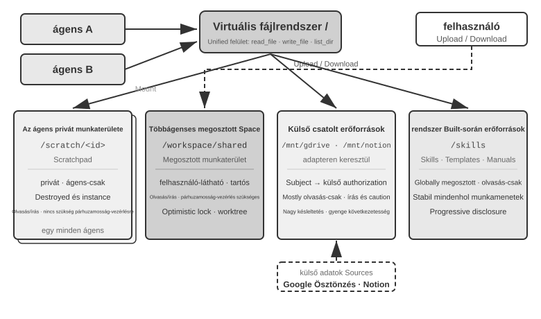
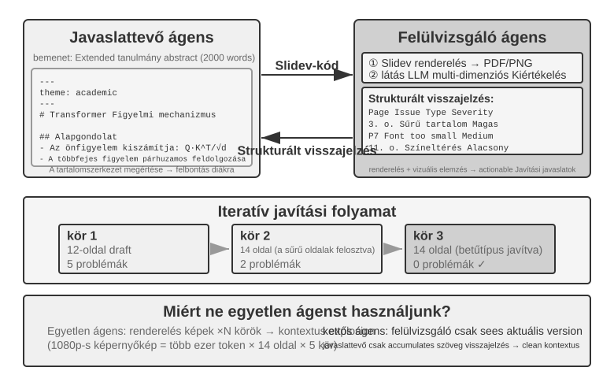
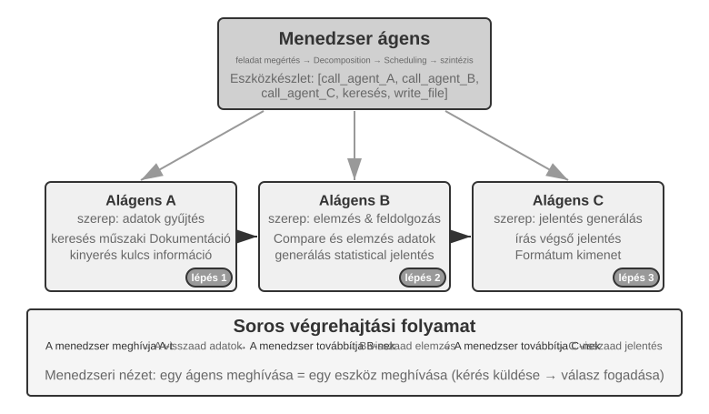
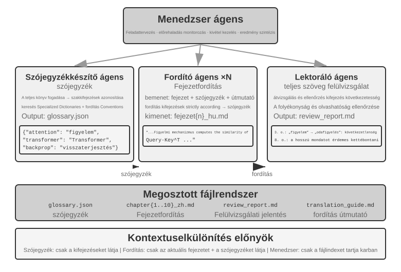
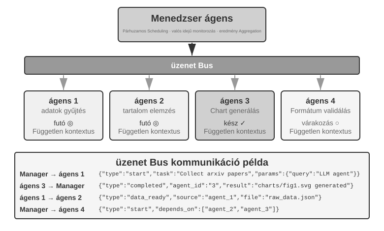
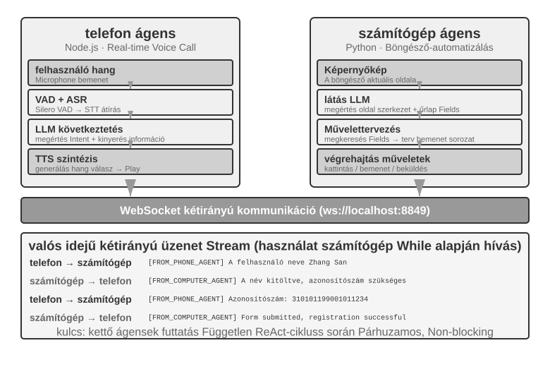
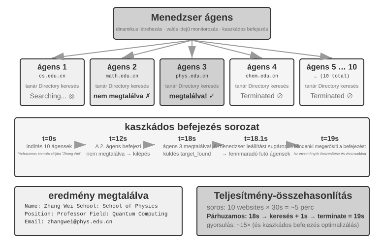
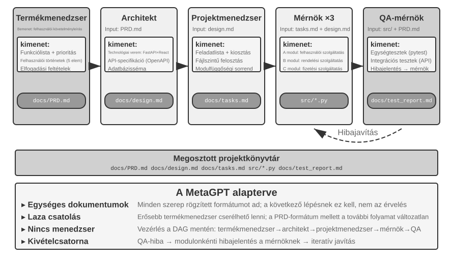
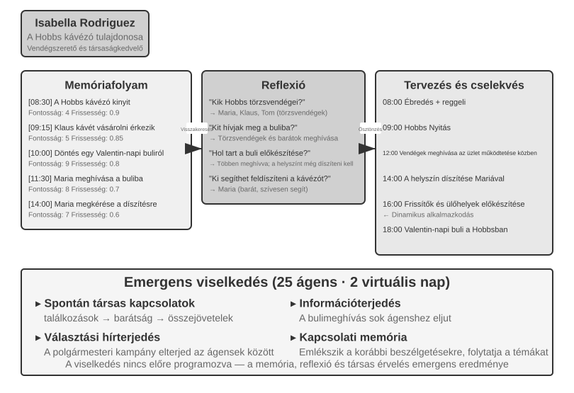
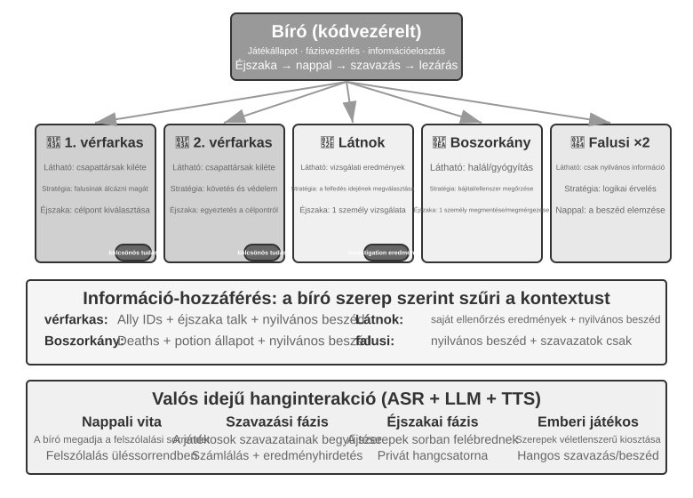

# Többügynökös Együttműködés

Az első kilenc fejezet egyetlen Ágensre összpontosított: előbb felépítette annak kontextusát, tudását, eszközeit és interakciós képességeit, majd értékeléssel, utótanítással és folyamatos fejlődéssel tette hosszú távon jobbá. Ez a fejezet a „Hogyan építsünk és fejlesszünk egy Ágenst?” kérdést a „Hogyan szervezzünk meg több Ágenst?” kérdéssé bővíti — hogy a munkamegosztás, a kommunikáció és a kölcsönös ellenőrzés révén olyan feladatokat is elvégezzenek, amelyeket egyetlen Ágens nehezen tudna egyedül vállalni.

Az OpenAI egykor egy ötszintű MI-képességi skálát javasolt: 1. szint, Társalgók; 2. szint, Érvelők; 3. szint, Ügynökök; 4. szint, Innovátorok; és 5. szint, Szervezetek. A többügynökös együttműködést gyakran az 5. szinthez vezető egyik útvonalként mutatják be. Itt azonban a "Szervezetek" egy képességi szintet jelöl – olyan MI-t, amely egy egész szervezet munkáját el tudja végezni –, nem pedig architekturális követelményt. Egy kellően erős egyetlen Ügynök elvileg szintén elérheti ezt. A mai mérnöki valóságban azonban egyetlen Ügynök továbbra is korlátozott a modell képességei és a kontextusablak mérete által.

Több Ügynök együttműködésre bírása messze túlmutat azon, hogy különböző szaktudással rendelkező specialisták "fedezzék egymás hiányosságait". Az alapvetőbb szempont a következő: "egy csoport intelligenciája meghaladhatja bármely egyénéét." Az emberi civilizáció a bizonyíték – egyetlen ember értelme korlátozott, mégis a munkamegosztáson, együttműködésen, vitán és a tudás generációkon átívelő felhalmozásán keresztül az emberi társadalom egésze olyan intelligenciát mutat, amely messze túlszárnyal bármely egyes zsenit. Az Ügynökcsoportok ugyanilyen kollektív intelligenciát hozhatnak létre: még ha minden Ügynök csak annyira képes is, mint egy emberi szakértő, egy jól szervezett csoport felülmúlhatja az összes emberi szakértő együttes képességeit. A *From AGI to ASI* című művében a Google DeepMind a "nagyméretű többügynökös kollektívákat" a szuperintelligencia (ASI) felé vezető egyik kulcsfontosságú útvonalként sorolja fel – ahogy az emberi általános intelligencia társadalmakká és szervezetekké aggregálódik, amelyek túlmutatnak az egyéneken, úgy sok AGI-szintű Ügynök együttműködéséből származó kollektív intelligencia is olyan kognitív képességeket mutathat, amelyek messze túlmutatnak tagjai puszta összegén[^agi-asi]. A többügynökös együttműködés tehát nem csupán egy mérnöki kerülőút egyetlen modell kontextusablak- és képességkorlátai körül – hanem alapvető út lehet a "szakértő-szintű MI"-től az "emberiség egészének felülmúlásáig".

[^agi-asi]: A "nagyméretű többügynökös kollektívákról" mint az AGI-tól az ASI-ig vezető kulcsfontosságú útvonalról lásd: Google DeepMind, *From AGI to ASI.* arXiv:2606.12683, 2026.

## A Többügynökös Együttműködés Osztályozási Keretrendszere

Egy többügynökös rendszer felépítése két alapvető tervezési dimenzióval kezdődik, amelyek együtt meghatározzák annak alapvető architektúráját és megvalósítását.

### 1. Dimenzió: Megosztott vs. Nem Megosztott Kontextus

Ez a legalapvetőbb architekturális döntés, amely meghatározza, hogyan áramlik az információ több Ügynök között.

**Megosztott kontextus** azt jelenti, hogy egy következő Ügynök megkapja az előző Ügynök teljes beszélgetési előzményét és trajektóriáját (az 1. fejezetben meghatározottak szerint). Amikor a rendszerprompt és az eszközkészlet minden szakaszban változik, a rendszer az új szakaszt másik Ügynökként kezeli, mert az identitása, felelősségei és képességei megváltoztak, még ha megtartja is az előző összes memóriáját. Például miután egy követelményelemző megír egy követelménydokumentumot, a fejlesztő nemcsak a dokumentumot kapja meg, hanem az elemző és a felhasználó közötti kommunikáció teljes rekordját is. A fejlesztő új szerepet vesz fel, miközben megtartja az összes korábbi kontextust. Az előnye, hogy semmilyen információ nem vész el; minden Ügynök áttekintheti bármely korábbi szakasz részleteit. A kihívás az, hogy a kontextus gyorsan bővülhet.

**Nem megosztott kontextus** azt jelenti, hogy minden Ügynök független kontextust és beszélgetési előzményt tart fenn, és nem férhet hozzá közvetlenül a másik Ügynök munkanyomaihoz. Ez olyan, mint a különböző osztályok közötti együttműködés: mindenki önállóan dolgozik a saját asztalánál, információt megosztott dokumentumokon és értekezleti jegyzőkönyveken keresztül cserélve, ahelyett, hogy folyamatosan egymás képernyőjét nézné. Ez a modell jobb modularitást és elszigeteltséget kínál; minden Ügynöknek csak a saját felelősségi köréhez kapcsolódó információkra kell összpontosítania. A rendszer könnyebben bővíthető és karbantartható is – egy új Ügynök hozzáadása nem igényli a meglévő Ügynökök belső logikájának módosítását, csak az interfészek és adatformátumok meghatározását.

Mivel az Ügynökök nem osztanak meg kontextust, az információt explicit kommunikációs mechanizmusokon keresztül kell átadni. A klasszikus elosztott rendszerek ezt a kérdést már régen eldöntötték: az operációs rendszerekről szóló tankönyvek szerint a folyamatok közötti kommunikáció (IPC) végső soron csak két paradigmában létezik – "megosztott memória" (az egyik fél ír, a másik ugyanazt a tárterületet olvassa) és "üzenetküldés" (az adatokat explicit módon küldik a másik félnek). Az Ügynökök közötti kommunikációs mechanizmusok ebbe a két paradigmába illeszkednek. Három gyakori módszer létezik:

- **Eszközhívás-paraméterek**: Az alsóbb Ügynök eszközként van becsomagolva, a felsőbb Ügynök pedig a paraméterein keresztül ad át strukturált adatokat; ez olyan forgatókönyvekhez alkalmas, amelyek jól tipizált, egyértelműen strukturált adatokat igényelnek.
- **Megosztott fájlrendszer**: Az Ügynökök köztes termékek (dokumentumok, kód stb.) olvasásával és írásával cserélnek információt egy megosztott könyvtárban, alkalmas nagy méretű fájlokkal rendelkező vagy perzisztenciát igénylő forgatókönyvekhez.
- **Üzenetsor**: Egy dedikált közvetítő, amely üzeneteket továbbít az Ügynökök között. Az Ügynökök nem közvetlenül hívják egymást, hanem üzeneteket küldenek a sornak, amely továbbítja azokat a cél-Ügynöknek.

A két IPC paradigmára leképezve: a megosztott fájlrendszer a "megosztott memóriának" felel meg, míg az eszközhívás-paraméterek és az üzenetsor az "üzenetküldés" formái. Az eszközparaméterek szinkron módon, egy hívással együtt érkeznek; a sorban lévő üzenetek aszinkron módon, egy közvetítőn keresztül kerülnek kézbesítésre. Minden paradigmának megvannak a maga kompromisszumai. A Go-nak van egy széles körben idézett mondása: "Ne megosztott memóriával kommunikálj; ehelyett ossz meg memóriát kommunikációval."

Az üzenetsor természeténél fogva támogatja az "aszinkron kommunikációt" – a feladónak és a vevőnek nem kell egyszerre online lennie. Ez olyan, mint egy belső vállalati e-mail rendszer: amikor e-mailt küldesz egy kollégának, nem kell, hogy éppen a gépénél legyen; az e-mail tárolódik a szerveren, és akkor kerül feldolgozásra, amikor a kolléga online lesz. Ez a megközelítés különösen alkalmas olyan forgatókönyvekhez, ahol több Ügynök párhuzamosan dolgozik, és koordinációra van szükségük egymással (lásd a "Párhuzamos Koordináció" szakaszt később ebben a fejezetben).


Az egyértelműség kedvéért: mindkét architektúra valódi többügynökös rendszer, mert a rendszerprompt és az eszközkészlet szakaszonként eltérő, így azok különböző Ügynökök. A különbség a koordinációs módszerben rejlik. A "megosztott kontextus" implicit koordinációra támaszkodik: a következő Ügynökök öröklik az előzőek teljes kontextus-előzményét, áttekinthetik látható interakciós előzményeiket és munkanyomaikat, és magán a kontextuson keresztül kapják az információt. A "nem megosztott kontextus" explicit koordinációra támaszkodik: az Ügynökök fájlokon, üzeneteken vagy strukturált adat-interfészeken keresztül cserélnek információt, és minden Ügynök csak a saját munkájához releváns tartalmat látja.

Analógiával élve: az előbbi egy csapat egy asztal körül, ahol mindenki mindent hall; az utóbbi osztályok, amelyek e-mailben és dokumentumokkal dolgoznak együtt, mindegyiknek saját munkaterülettel.

Az operációs rendszerekben járatos olvasók számára hasznos analógia lehet: a megosztott kontextusú Ügynökök a szálakra, a nem megosztott kontextusúak a folyamatokra hasonlítanak. A szálak közös címtartományt használnak, ami olcsóvá teszi a váltást és a kommunikációt, de kevés elszigeteltséget nyújt; egy szál memóriameghibásodása az egész folyamatot összeomlaszthatja. Minden folyamat saját címtartománnyal rendelkezik, erősebb elszigeteltséget és biztonságosabb párhuzamosságot biztosítva, de a kommunikáció explicit IPC-t igényel.

**Egyszerű ökölszabály**: Ha a várható kumulált kontextus meghaladja az ablak 50%-át (heurisztika, nem pontos küszöbérték), ne osszd meg. Ha a nulla információs veszteség szigorú követelmény a feladat helyességéhez, oszd meg. A legtöbb valós rendszer különböző megközelítéseket használ a különböző szakaszokban: az első néhány Ügynök osztozik a kontextuson, de ha a megosztott előzmény túl naggyá válik, a rendszer nem megosztott kontextusokra vált, és egy explicit átadást használ, amelyben a felsőbb Ügynök kiválasztja, mit adjon tovább.

### 2. Dimenzió: Együttműködési Topológia

A második dimenzió az együttműködési topológia: az a struktúra, amelyen keresztül a vezérlés és az információ áramlik az Ügynökök között. A topológia és a kontextusmegosztás fogalmilag elkülönül, de a gyakorlatban összefüggenek. A megosztott kontextusú rendszereknek is van topológiájuk; például a `transfer_to_agent` minta a 10-1. kísérletben egy átadási láncot alkot. Mivel azonban minden átadás a teljes előzményt hordozza, általában nincs szükség eldönteni, milyen információt adjunk át, így a topológia gyakran egy egyszerű szerepváltási sorozattá válik. A csoportos csevegés stílusú együttműködés kivétel, amelyről később, a decentralizációs szakaszban lesz szó. Nem megosztott kontextus esetén viszont a tervezőknek explicit módon kell eldönteniük, hogyan áramlik az információ és ki koordinálja azt.

> **Terminológia: Gráf-mérnökség**. A "Gráf-mérnökség" kifejezés, amely 2026 júliusában vált népszerűvé, a mai Ügynök-kontextusban általában egy végrehajtási gráf explicit tervezésére utal: a csomópontok Ügynökök, hagyományos programok vagy emberi döntések; az élek feladatfüggőségeket, feltételes útválasztást és hibautakat határoznak meg; a strukturált állapot csomópontok között áramlik.[^ch10-graph-engineering] Az ebben a fejezetben tárgyalt "együttműködési topológia" ennek az elképzelésnek a többügynökös részhalmaza – a társak közötti együttműködés, a menedzseri vezénylés és a decentralizált átadások különböző gráftopológiák. Mivel az elnevezés még új, és könnyen összetéveszthető a tudásgráfokkal, a GraphRAG-gal és a végrehajtási nyomokkal, ez a könyv továbbra is a stabilabb "együttműködési topológia" és "vezénylés" kifejezéseket használja elsődleges szókészletként.

[^ch10-graph-engineering]: Az elnevezés korai tárgyalásához lásd: Josh C. Simmons, *We Are Entering the Graph Engineering Phase*, 2026. A mainstream keretrendszerek általában gráf-alapú munkafolyamatnak vagy vezénylésnek nevezik ugyanazt a mérnöki struktúrát, nem pedig teljesen új technológiának. Lásd: https://www.drjoshcsimmons.com/writing/we-are-entering-the-graph-engineering-phase, https://docs.langchain.com/oss/python/langgraph/overview, https://learn.microsoft.com/en-us/agent-framework/workflows/ és https://adk.dev/workflows/.

Más szóval, a két dimenzió elvileg egy 2×3-as mátrixot alkot (megosztott/nem megosztott × három topológia) – de a megosztott kontextus sorában a topológia többnyire egy szerepváltási sorozattá degenerálódik, ahol kevés dönteni való marad (a "Többszakaszos Szerepváltás" alatt később tárgyalt forma). Ez a fejezet ezért csak a három nem megosztott cellát részletezi. Íme a három jellemző topológia nem megosztott kontextus alatt, a növekvő komplexitás sorrendjében:

- **Társi Együttműködési Minta**: Egy kis számú Ügynök (jellemzően 2-3) egyenrangú félként lép kapcsolatba, iteratív fejlesztési hurkot alkotva – mint amikor egy ember megír egy tanulmányt, egy másik pedig jegyzetekkel látja el és átdolgozza, és a minőség több kör után messze meghaladja azt, amit egyetlen ember egyedül elérhetne.
- **Menedzser Minta** (Vezénylési Minta): Egy központi Menedzser Ügynök felelős a feladattervezésért és ütemezésért, míg több al-ügynök mindegyike specifikus részfeladatokat kezel – mint egy projektmenedzser, aki több specializált mérnököt irányít egy projekten.
- **Decentralizált Minta**: Nincs futásidejű központi vezérlő; az Ügynökök úgy kommunikálnak egymással, mint az emberek, hogy együttműködjenek a feladatokon.

Az egyes minták részletes tervezését és alkalmazási forgatókönyveit későbbi dedikált alszakaszok tárgyalják.

## Mikor Jobb Valóban a Több Ügynök, Mint az Egyetlen Ügynök?

Mielőtt belemerülnénk a konkrét együttműködési architektúrákba, válaszoljunk egy alapvetőbb kérdésre: **Mikor van valóban szükség több Ügynökre, és mikor elég egy?** A válasz referenciapontként szolgál minden ezt követő mérnöki megközelítéshez. Egy sor közelmúltbeli tanulmány egyértelmű keretrendszerhez konvergál – és a központi kritérium egyetlen kérdés: **Bevezet-e az együttműködés olyan új információt, amelyet egyetlen Ügynök nem tudott megszerezni a válasz előállítása során?**

A 10-1. táblázat megmutatja, mely együttműködési módok vezetnek be új információt, és segít felmérni, hogy a többügynökös együttműködés érdemi értéket kínál-e egyetlen Ügynökhöz képest.

10-1. táblázat: A Többügynökös Együttműködési Módok Információs Nyereségének Összehasonlítása

| Együttműködési Mód | Vezet Be Új Információt? | Hatás |
|---------------------------------------|---------------------|-----------------------------------|
| Önfelülvizsgálat ugyanazon modell által (saját kimenet újraolvasása) | Nem | Általában hatástalan vagy akár káros |
| Különböző Ügynökök vitáznak ugyanarról a szövegről | Nem | Összehasonlítható egy azonos számítási kapacitású egyetlen Ügynökkel |
| A felülvizsgáló tesztvégrehajtási eredményeket használ a kód felülvizsgálatához | Igen (végrehajtási visszajelzés) | Jelentős javulás |
| A felülvizsgáló renderelt képernyőképeket használ a frontend/PPT kód felülvizsgálatához | Igen (vizuális visszajelzés) | Jelentős javulás |
| A felülvizsgáló külső eszközöket használ tények ellenőrzésére | Igen (eszközvisszajelzés) | Jelentős javulás |

A 2025-ös RLEF tanulmány (Reinforcement Learning from Execution Feedback)[^rlef-2025] megállapította, hogy a modell megerősítéses tanulással történő képzése a kódvégrehajtási visszajelzések használatára az iteratív fejlesztéshez jelentősen jobban teljesített, mint a modell többszörös független mintavételezése. A kulcs az, hogy minden iteráció "valódi végrehajtási eredményeket" (fordítási hibák, teszthibák, futásidejű kivételek) vezet be – olyan információt, amely nem létezett, amikor a modell megírta a kódot. A weboldal-generálási feladatok esetében a 2025-ös WebGen-Agent tanulmány[^webgen-agent-2025] arról számolt be, hogy a többszintű vizuális visszajelzés, amely a képernyőképeket látás-nyelvi modell leírásokkal kombinálta, a Claude 3.5 Sonnet benchmark teljesítményét 26,4%-ról 51,9%-ra javította, majdnem megduplázva azt.

[^rlef-2025]: Gehring, J., et al. *RLEF: Grounding Code LLMs in Execution Feedback with Reinforcement Learning.* arXiv:2410.02089, 2025.
[^webgen-agent-2025]: Lu, Z., et al. *WebGen-Agent: Enhancing Interactive Website Generation with Multi-Level Feedback and Step-Level Reinforcement Learning.* arXiv:2509.22644, 2025.

Ez a keretrendszer segít feloldani egy látszólagos ellentmondást: egyes akadémiai tanulmányok szerint egyetlen Ügynök is elegendő, míg a többügynökös rendszerek a mérnöki gyakorlatban gyakran jobban teljesítenek. A tanulmányok gyakran olyan Ügynököket tesztelnek, amelyek ugyanazt a szöveget vizsgálják és vitatják meg, mint a vitában, míg a hatékony mérnöki rendszerek általában külső visszajelzést adnak hozzá kódvégrehajtásból, vizuális renderelésből vagy eszközökből. Csak az utóbbi vezet be új információt. A később tárgyalt három architektúra – társi együttműködés, vezénylés és decentralizálás – szinte minden hatékony használata ezen a kritériumon keresztül érthető meg.

Az Anthropic 2026-os sérülékenység-keresési kísérlete jó példa erre. Negyvenöt Ügynök egy közös fórumon hangolta össze a keresést, ellenőrizte egymás találatait, a végső döntést pedig egy független döntőbíró Ügynök hozta meg. Az összehangolt raj 27 millió tokenből 266 sérülékenységet talált, míg a független Ügynökök párhuzamos módszere 6,5 millió tokenből csak 21-et. Nyílt keresési térben a kommunikáció lehetővé teszi, hogy a többügynökös rendszer dinamikusan áthelyezze a fókuszt és szakosodjon: a nagyobb tokenkeretért cserébe szélesebb lefedettséget és változatosabb felfedezési útvonalakat kap.[^anthropic-multiagent-2026]

[^anthropic-multiagent-2026]: Anthropic Frontier Red Team, “Patterns and Problems in Emerging Multiagent Systems,” 2026-08-13. https://www.anthropic.com/research/multiagent-systems

**Lépéskeret és Ügynök Teljesítmény.** Egy kapcsolódó kérdés, hogy az Ügynök lépéskerete – az eszközhívások vagy iterációs körök száma, amelyeket felhasználhat – hogyan befolyásolja a teljesítményt. Több lépés bizonyára segíthet: 30 lépéssel egy Ügynöknek csak a core funkcionalitás megvalósítására lehet ideje, míg 300 lépéssel tervezhet, implementálhat, tesztelhet és finomíthat. A 2025-ös Google tanulmány, a *Budget-Aware Tool-Use Enables Effective Agent Scaling* azonban egy ellentmondásos következtetésre jutott: **ha egyszerűen több lépést adunk egy Ügynöknek, az nem garantál jobb teljesítményt.** A szokásos Ügynökök nem rendelkeznek "keret-tudatossággal"; még 300 lépéssel is sekély keresést végeznek, és gyorsan platót érnek el. A további lépések hatékony felhasználásához az Ügynöknek olyan mechanizmusra van szüksége, amely a fennmaradó erőforrásokhoz igazítja a stratégiáját, először széles körben felfedezve, majd később szűkítve a fókuszt. A 2026-os BAVT (Budget-Aware Value Tree Search) megközelítés tovább lépett, bevezetve a lépésszintű értékbecslést, amely a fennmaradó keret arányának megfelelően állítja be a felfedezés és a kiaknázás közötti egyensúlyt. Ahogy a keret csökken, az Ügynök a széles körű felfedezésről a mélyebb vizsgálatra vált.

Ezek az eredmények közvetlen hatással vannak a többügynökös rendszertervezésre. Például a vezénylési mintában a Menedzser Ügynöknek nem szabad egyszerűen szétosztania a feladatokat az al-ügynökök között, és várnia az eredményekre. Ehelyett "dinamikusan kell allokálnia a lépéskereteket" a feladat komplexitása alapján – az egyszerű részfeladatok kevesebb lépést kapnak; a komplex részfeladatok bőséges lépéseket. Emellett irányítania kell az al-ügynököket, hogy bölcsen használják ezeket a kereteket (először tervezzenek, majd implementáljanak, majd teszteljenek, majd fejlesszenek), ahelyett, hogy egyből belevágnának.

Még egy szempontot figyelembe kell venni bármely tervezési döntés előtt: "a költséget." A párhuzamos feltárás és az iteratív finomítás pénzbe kerül – az Anthropic nyilvánosságra hozta, hogy a többügynökös kutatórendszere körülbelül 15-ször annyi tokent fogyaszt, mint egy normál beszélgetés, és a tokenhasználat önmagában magyarázza a teljesítménykülönbség körülbelül 80%-át. A többügynökös rendszer előnyeinek elég nagyoknak kell lenniük ahhoz, hogy igazolják a többszörös, vagy akár egy nagyságrenddel magasabb költségeket; ellenkező esetben egy jól hangolt egyetlen Ügynök általában a jobb üzlet.

## Többügynökös Együttműködés Megosztott Kontextussal

Megosztott kontextusú együttműködésben minden szakasz önálló Agent, saját System Prompttal és eszközkészlettel, de örökli az előző szakasz teljes trajektóriáját. Ennek előnye a veszteségmentes információátadás; a kihívás az, hogy az aktuális Agent a feladatára összpontosítson a felhalmozódó előzmények ellenére.

Összetett feladatokban a szerep és a felelősség szakaszonként jelentősen változhat. Egyetlen statikus prompt vagy túl általános, vagy túl hosszú, ezért a rendszer a szakasznak megfelelően válthatja a promptot és az eszközöket.

A kulcskérdés: a szerepváltás cserélje le a System Promptot, vagy töltsön be Skillt? Mindkettő új viselkedési szabályokat ad, de eltérő költséggel és korlátozással.

| Választás | A szerepszabály hordozója | Látható eszközök | Kontextus/KV Cache hatás | Korlátozás ereje |
|---|---|---|---|---|
| `transfer_to_agent` | Lecseréli a System Promptot és rendszerint az eszközkészletet | Csak az aktuális szerep eszközei | Minden váltás módosítja a prefixet, így a cache az eltérés helyétől általában nem használható újra | Erős: a szerepen kívüli eszközök hiányozhatnak a schema-ból |
| Skill | Fix Skill-katalógus, a `SKILL.md` igény szerint a trajektóriához kerül | Többnyire a teljes katalógus vagy stabil keresési belépő | A statikus prefix változatlan; a Skill a trajektória végére kerül | Gyenge: a Skill utasítás, a kemény jogosultságot a Harness adja |

Ha a szerepek tudásban, folyamatban vagy írásmódban különböznek, a Skill az első választás. Jogosultság, eszközigazolás, megfelelőség vagy tiltott mellékhatás esetén külön Agent vagy `transfer_to_agent` kell, kóddal kikényszerített Harness-szabállyal.

> **10-1. kísérlet ★★: Szerepváltás megosztott kontextusban — System Prompt kontra Skill**
>
> **Közös feladat és változók**: mindkét út ugyanazt a modellt, feladatot, eszközmegvalósítást, szerepszabályt és teljes közös trajektóriát használja. A feladat a kínai újenergiás járművek 2021–2023-as eladásainak megkeresése, a CAGR kiszámítása és legfeljebb 120 kínai karakteres befektetői összefoglaló írása.
>
> **1. út: System Prompt váltása**. Az öt szerep: `triage`, `research`, `coding`, `data_analysis`, `writing`. Minden szerep csak saját eszközeit és a `transfer_to_agent` eszközt látja; átadáskor az előzmény megmarad, a cél szerep promptja és eszközei betöltődnek, majd a futás folytatódik.
>
> **2. út: Skill**. A System Prompt és a teljes eszközkatalógus végig rögzített. A modell meghívja a `load_skill(name)` eszközt, és a beolvasott `SKILL.md` eszközeredményként kerül a közös trajektóriába. A prefix stabil marad, a kemény jogosultságokat pedig a Harness szabályai biztosítják.

## Többügynökös Együttműködés Megosztott Kontextus Nélkül

A megosztott kontextus nélküli architektúrában minden Ügynök független entitásként működik saját kontextussal, trajektóriával és állapottal. Az Ügynökök nem férhetnek hozzá közvetlenül egymás belső kontextusához; az együttműködés kizárólag explicit, strukturált adatátvitelen alapul a fejezet elején bemutatott három kommunikációs mechanizmuson keresztül: eszközhívás-paraméterek, megosztott fájlrendszer és üzenetsor.

Korábban ebben a fejezetben összehasonlítottuk a kommunikációs mechanizmusokat a folyamatok közötti kommunikáció formáival, valamint a megosztott versus elszigetelt kontextust a szálakkal és folyamatokkal. Ez az analógia tovább is vihető (10-2. táblázat):

10-2. táblázat: Megfeleltetés a Többügynökös Rendszerek és az Operációs Rendszerek között

| Operációs Rendszer | Többügynökös Rendszer |
|----------|----------------|
| Program (futtatható fájl) | Statikus előtag (rendszerprompt + eszközdefiníciók) |
| Folyamat memória | Trajektória |
| CPU | LLM |
| Kernel | Ügynök futásidejű környezet |
| Rendszerhívás | Eszközhívás |
| fork (gyermekfolyamat létrehozása) | spawn_subagent |
| kill (jel küldése) | cancel_subagent |
| ps (folyamatok listázása) | list_agents |
| Kilépési kód és wait() | Az al-ügynök által visszaadott strukturált összefoglaló |
| Megosztott memória / üzenetküldés | Megosztott fájlrendszer / üzenetküldés |

Egy program statikus kód; a folyamat a program egy futó példánya. Hasonlóképpen, a statikus előtag határozza meg, ki az Ügynök, míg a trajektória rögzíti, mennyire jutott előre. Az LLM a CPU szerepét tölti be: nincs saját állapota, és időosztásos módban több Ügynök között oszlik meg különböző kontextusok betöltésével – maga a "kontextusváltás" kifejezés is az operációs rendszerektől kölcsönzött. És ugyanezen okból: egy gyorsabb CPU behelyezése ugyanúgy futó programot eredményez; egy erősebb modellre váltás ugyanazt az Ügynököt tartja meg – az identitása és memóriája az előtagban és a trajektóriában él, nem a modell súlyaiban.

Ez az absztrakció nem újdonság: a privát állapot, az aszinkron üzenetek és az új tagok létrehozásának képessége pontosan az 1970-es évek Actor modelljének[^actor-model] alapvető felépítése. Egy többügynökös rendszer ezért az Actor modell LLM-alapú változatának tekinthető, és az operációs rendszerekből és elosztott rendszerekből felhalmozott tudás nagy része közvetlenül alkalmazható.

[^actor-model]: Hewitt, C., Bishop, P., Steiger, R. *A Universal Modular ACTOR Formalism for Artificial Intelligence.* IJCAI 1973.

Ez a folyamat-stílusú izoláció számos gyakorlati mérnöki előnnyel jár: minden Ügynök fejleszthető és tesztelhető függetlenül, új képességek adhatók hozzá a meglévő kód módosítása nélkül, egy meghibásodó Ügynök nem terjeszti automatikusan a hibáit a többire, és több Ügynök hajtható végre egyidejűleg anélkül, hogy versengenének a megosztott kontextusért.

A kontextus megosztásának elmaradása azonban költségekkel is jár. A legnyilvánvalóbb az információ-szinkronizációs probléma: hogyan tartanak fenn az Ügynökök konzisztens megértést a feladat állapotáról? Vajon információ vész el vagy duplikálódik az átvitel során? A hibakeresés is nehezebbé válik – amikor problémák merülnek fel, több Ügynök naplóit kell áttekinteni a teljes végrehajtási folyamat rekonstruálásához. Ezek a problémák kritikus fontosságúvá teszik az interfész specifikációk, adatformátumok és kommunikációs protokollok tervezését.

Az explicit együttműködés megosztott kontextus nélkül két topológiától független infrastruktúrára támaszkodik. Az első a "megosztott fájlrendszer", a perzisztens közeg, amelyen keresztül az Ügynökök egymással és a felhasználóval termékeket cserélnek, ami az együttműködés adatsíkját képezi. A második a "kommunikációs és vezérlési mechanizmus", amely támogatja az üzenetküldést, státuszkérdezést, végrehajtás-megszakítást és erőforrás-ütemezést az Ügynökök között, ami az együttműködés vezérlési síkját képezi. Az alábbi három topológia mindkét alapra épül.

### A Fájlrendszer az Ügynök Szemszögéből

A fejezet elején a "megosztott fájlrendszer" a három kommunikációs mechanizmus egyikeként szerepelt a megosztott kontextus nélküli architektúrákban. Egy valós rendszerben az Ügynök által elért fájlrendszer nem egyetlen tárolórendszer, hanem egy "virtuális fájlrendszer", amelyben a különböző forrású, életciklusú és jogosultságú tárolórendszerek egy könyvtárfa alá vannak csatolva. Az Ügynök egységes `read_file`/`write_file`/`list_dir` interfészeken keresztül éri el őket, míg az alapul szolgáló rétegek lehetnek lokális ideiglenes lemezek, perzisztens objektumtárolók, harmadik féltől származó felhő-meghajtó API-k vagy írásvédett rendszer erőforráscsomagok. A könyvtárfa összetételének – az egyes területek láthatóságának és életciklusának – egyértelmű meghatározása előfeltétele a többügynökös együttműködés tervezésének: a konkurencia-ütközések és információs szivárgások jelentős része abból származik, hogy olyan területek keverednek, amelyeket el kellene különíteni. Ez a könyvtárfa az Ügynök címtartományának felel meg, és a négy területtípus különböző jogosultságú memóriaszegmens: néhány privát és írható, néhány több fél által megosztott, és néhány írásvédett. Az operációs rendszer védelmi filozófiája itt is érvényes: alapértelmezés szerint izolálni, és a megosztást explicit módon deklarálni. Egy érett többügynökös rendszerben a fájlrendszer jellemzően a következő négy területtípusból áll:

**I. Ügynök-Specifikus Munkaterület (Piszkozat).** Minden Ügynök példányhoz tartozó privát könyvtár, amely köztes termékeket, ideiglenes fájlokat, vázlatokat és hibakeresési naplókat tárol. Életciklusa a példányhoz kötődik, és más Ügynökök és felhasználók számára láthatatlan. A piszkozat izolálása két célt szolgál: megakadályozza, hogy több Ügynök ideiglenes fájljai felülírják egymást, és a fő Ügynök kontextusát karcsún tartja – az al-ügynökök próba-hiba folyamata a saját munkaterületükön marad, csak a végső termék kerül a megosztott térbe. Ez a 4. fejezet azon elvének tárolási szintű megfelelője, hogy az al-ügynökök a teljes trajektória helyett strukturált összefoglalókat adnak vissza.

**II. Többügynökös Megosztott Munkaterület.** Egy együttműködési terület, amelyet több Ügynök olvashat és írhat, és amely "a felhasználó számára látható". Ez az elsődleges közege a termékcserének a megosztott kontextus nélküli architektúrákban: a Szójegyzék Ügynök megírja a kifejezéslistát, a Fordítási Ügynök abból olvas; a felhasználók ide tölthetnek fel forrásfájlokat és tölthetnek le végeredményeket. Életciklusa a teljes feladathoz kötődik, és perzisztenciát igényel. Több fél általi egyidejű olvasás és írás területeként a konkurencia-ütközések forró pontja – olyan mechanizmusok, mint az optimista zárolás és a munkafa-izoláció itt működnek, a "Hibamód Egy" alatt ebben a fejezetben részletezve. A 4. fejezetben a `/workspace/shared` kötetcsatolás használata a fő Ügynök, a virtuális számítógép és a virtuális telefon összekapcsolására ennek a rétegnek egy tipikus megvalósítása.

**III. Csatolt Külső Erőforrások.** A felhasználó által engedélyezett harmadik féltől származó információforrások – Google Drive, Notion, Dropbox, vállalati wikik stb. – adaptereken keresztül csatolási pontokra (pl. `/mnt/gdrive`) vannak leképezve a fájlrendszerben. Az Ügynök egy fájl olvasásával éri el a Notion dokumentumot; a mögöttes adapter meghívja a megfelelő API-t. Három jellemző különbözteti meg ezt a réteget a lokális tárolástól, amelyeket explicit módon kell kezelni a tervezés során: "a hozzáférést külső jogosultságok korlátozzák" (a felhasználó jogosultságai a forrásrendszerben határozzák meg az Ügynök láthatóságát), **a késleltetés magasabb és a konzisztencia gyengébb** (minden olvasás hálózati körutat igényel, és a külső változások nem feltétlenül azonnal láthatók, így az adatot végső konzisztensként kell kezelni), és **a hozzáférés elsősorban igény szerinti és írásvédett** (a külső forrásokba való visszaírást óvatosan kell végezni, mivel a hibás írások szennyezhetik a felhasználó valós adatait). Az egységes fájlinterfész azt jelenti, hogy az Ügynöknek nincs szüksége egyedi eszközre minden adatforráshoz, de el is fedi ezeket a teljesítmény- és biztonsági különbségeket. Ezért az írásvédett/írható státuszt, az időtúllépéseket és a hitelesítési határokat explicit módon kell kezelni a csatolási szinten.

**IV. Beépített Rendszer Erőforrások.** A rendszer által előre telepített és minden Ügynökkel írásvédett módon megosztott erőforráscsomag. Tipikus példák a 2. és 4. fejezetben bemutatott "Készségek (Skills)" – fájlként szervezett tudásdokumentumok és szkriptek, amelyek olyan elérési utakra vannak csatolva, mint a `/skills`, progresszív felfedéssel (először index, majd igény szerinti kibontás). További példák közé tartoznak a referencia kézikönyvek, sablonkönyvtárak és megosztott eszközdefiníciók. Ez a réteg globálisan megosztott, írásvédett, munkameneteken át stabil, és minden Ügynök által egyidejűleg olvasható konkurencia-vezérlés nélkül.

A 10-2. ábra szemlélteti, hogyan van ez a négy területtípus egységesen csatolva egyetlen könyvtárfa alá: az Ügynök egységes interfészen keresztül éri el a teljes fát, a felhasználók a megosztott térből töltenek fel és le fájlokat, a külső adatforrások adaptereken keresztül vannak csatolva, és a beépített rendszer erőforrások írásvédettként állnak rendelkezésre.



A 10-3. táblázat összehasonlítja ezt a négy területtípust négy dimenzió mentén – láthatóság, életciklus, olvasási/írási jogosultságok és konkurencia-vezérlés –, amely a fájlrendszer-elrendezés tervezésének ellenőrző listájaként szolgál.

10-3. táblázat: Az Ügynök Virtuális Fájlrendszerének négy területtípusa

| Terület | Láthatóság | Életciklus | Olvasás/Írás | Konkurencia-vezérlés |
|--------------|-----------------|------------------------|---------------------|-------------------|
| Ügynök-Specifikus Munkaterület | Csak a tulajdonos Ügynök | Megsemmisül az Ügynök példánnyal | Olvasás/Írás | Nem szükséges (privát) |
| Többügynökös Megosztott Munkaterület | Minden együttműködő Ügynök és a felhasználó | A feladat idejére fennmarad | Olvasás/Írás | Szükséges (optimista zárolás / munkafa) |
| Csatolt Külső Erőforrások | Külső engedélyezéstől függ | A külső forrás határozza meg | Többnyire írásvédett, írás óvatosságot igényel | A külső forrás kezeli |
| Beépített Rendszer Erőforrások | Minden Ügynök | Munkameneteken át stabil | Írásvédett | Nem szükséges (írásvédett) |

A „fájl útvonal mint univerzális interfész” értéke abban rejlik, hogy az útvonalat csererendszerré teszi. Akár termékeket cserélnek az Ügynökök, akár egy fő Ügynök ad bemenetet egy al-ügynöknek, akár szervezetek működnek együtt A2A-n keresztül, egy könnyű útvonal karakterláncot adnak át, ahelyett, hogy a fájl tartalmát betöltenék a kontextusablakba (4. fejezet). Ez összhangban van az 5. fejezet "a fájlrendszer mint az Ügynök központja" koncepciójával, amely leírja, hogyan használ egyetlen Ügynök a fájlrendszert a memória és a képességek tárolására. Itt ugyanez az absztrakció több Ügynökre terjed ki: a privát, megosztott, külső és beépített tárolókat csatoló virtuális könyvtárfa biztosítja a többügynökös együttműködés tárolási alapját.

### Kommunikáció és Vezérlés az Ügynökök Között

Míg a fájlrendszer a "termékcsere" problémáját oldja meg az Ügynökök között, az együttműködéshez "vezérlési síkra" is szükség van. Pontosan itt jönnek képbe a 10-2. táblázat életciklus sorai: a 4. fejezetben megadott eszköz primitívek – létrehozás (`spawn_subagent`), üzenetküldés (`send_message_to_subagent`), megszakítás (`cancel_subagent`) és felderítés (`list_agents`) – a fork, message, kill és ps megfelelői a folyamatok világában. Ez a szakasz nem ismétli meg az interfészdefiníciókat, hanem négy gyakran figyelmen kívül hagyott képességre összpontosít, amelyek elengedhetetlenek a többügynökös együttműködéshez.

**I. Üzenetküldés.** A legegyszerűbb forma a pont-pont: A Ügynök közvetlenül meghívja a `send_message_to_agent_B(tartalom)` függvényt. Ez alkalmas fix topológiájú és kis számú Ügynököt tartalmazó forgatókönyvekhez (pl. a 10-3. kísérlet telefon + számítógép kétügynökös beállítása). Amikor az Ügynökök száma növekszik és aszinkron párhuzamosságra van szükség, a pont-pont kapcsolatok száma az Ügynökök számával négyzetesen nő, és a feladónak és a vevőnek egyszerre kell online lennie. Ilyen esetekben "üzenetsort" kell használni (részletesen a "Párhuzamos Koordinációs Minta" alatt ebben a fejezetben): az Ügynökök üzeneteket tesznek közzé a sorban, amely az előfizetések alapján továbbítja azokat, így a feladónak nem kell ismernie az előfizetőket. Akár pont-pont, akár soron keresztül, az üzeneteknek jellemzően strukturált "borítékot" kell hordozniuk: feladó azonosító, cél (specifikus Ügynök vagy broadcast), üzenet típusa (pl. `task_assigned`/`status_update`/`result`/`terminate`) és JSON payload. Az egységes borítékformátum biztosítja a megbízható útválasztást és elemzést a vevő által, és nyomon követhetővé teszi az együttműködési láncot – ez a többügynökös rendszerek hibakeresésének kulcsfontosságú aspektusa.

**II. Státuszkérdés.** Ez a vezérlési sík legalulértékeltebb része. Miután egy fő Ügynök elindított egy al-ügynököt, látnia kell az al-ügynök előrehaladását; különben nem tudja eldönteni, hogy várjon-e tovább, vagy beavatkozzon, amikor az al-ügynök elakad. Egy intuitív megközelítés az RPC-ből kölcsönözni és definiálni egy `get_subagent_status(ügynök_azonosító)` lekérdező interfészt, amely "futó/befejezett/sikertelen" plusz egy százalékos előrehaladást ad vissza. De egy ilyen pull interfész sokkal kevésbé hasznosnak bizonyul, mint vártuk: egy al-ügynök a létrehozás pillanatában elkezd végrehajtódni, és addig fut, amíg be nem fejeződik vagy meg nem hibásodik. Nem megy át a hagyományos kötegelt rendszerekben lévő feladatok sorba állított állapotain, ahogy a Unix programozásban is ritkán van szükség egy másik folyamat PID alapján történő pollozására a futási állapotért. A pollozásnak van egy belső dilemmája is: túl gyakran pollozol, és pazarlod a tokeneket; túl ritkán pollozol, és későn reagálsz. Természetesebb módja a státusz megszerzésének, ha visszatérünk a fejezet elején bemutatott két kommunikációs paradigmához.

**Státusz megszerzése üzenetküldéssel.** A fő Ügynök egyszerűen küld egy üzenetet az al-ügynöknek: "Hogy haladsz?" Az al-ügynök egy alkalmas pillanatban válaszol. Minden aszinkron: az üzenet elküldése nem blokkolja a fő Ügynök saját végrehajtását, és hogy a másik fél mikor – vagy egyáltalán – válaszol, az egy másik kérdés, ahogy egy menedzser is instant üzenetben kérdez rá a beosztottjánál anélkül, hogy elvárná, hogy azonnal mindent félredobjon. Ezzel szemben az al-ügynök is küldhet proaktívan egy üzenetet, amikor mérföldkövet ér el; ha a rendszerben már van üzenetsor, ez egyszerűen egy `status_update` közzététele a sorban (a 10-4. kísérlet "valós idejű monitorozása" ez a forma). Akár explicit módon kérik a státuszt, akár proaktívan jelentik, az üzenetben hordozott státusznak egységes állapotgép szókincset kell használnia (végrehajtás alatt, bemenetre vár, befejezett, sikertelen) – az A2A protokoll később ebben a fejezetben pontosan ilyen állapotkészletre szabványosítja a feladat életciklusát.

**Státusz megszerzése a megosztott fájlrendszeren keresztül.** A leginkább alapos forma a "trajektória perzisztencia": végrehajtás közben az al-ügynök minden trajektória eseményt JSON formátumba szerializál, és hozzáfűzi egy fájlrendszerbeli naplófájlhoz – általában egy fájl munkamenetenként, egy esemény soronként, azaz JSONL. A trajektória, amely az 1. fejezetben van meghatározva, a felhasználói üzenetek, modellválaszok, eszközhívások és eredmények teljes sorozata. A fő Ügynöknek nincs szüksége státuszjelentési protokollra; a fájl közvetlen olvasásával megvizsgálhatja az al-ügynök teljes végrehajtását: melyik eszközt hívja, mi történt a legutóbbi lépésében, és hogy egy ismétlődő sikertelen újrapróbálkozások hurkában ragadt-e. Folyamat szempontjából ez olyan, mintha közvetlenül olvasnánk egy másik folyamat memóriáját. Nem foglalja el az al-ügynök kontextusát, nem függ az al-ügynök együttműködésétől, és a legfinomabb megfigyelési részletességet kínálja.

Az ilyen kimerítő részletesség azonban teher is. Egy trajektória könnyen több tízezer tokenre rúghat, és a fő Ügynöknek a beolvasás után desztillálnia kell, ami időt és tokeneket emészt fel. A legtöbb forgatókönyvben egy "megállapodott előrehaladási fájl" praktikusabb: az al-ügynök indításakor a fő Ügynök utasítja, hogy frissítse a `progress.md` fájlt, ahogy az egyes tételeket befejezi. A fő Ügynök bármikor elolvashatja ezt a könnyű fájlt az előrehaladás felméréséhez. Ez hasonlít ahhoz, amikor két folyamat lefoglal egy kis blokkot a megosztott memóriában egy megállapodott formátummal, a teljes memóriaállapot helyett desztillált előrehaladást téve elérhetővé.

Az előrehaladási fájl az "elakadás érzékelését" is lehetővé teszi. Ha a `progress.md` vagy a trajektória fájl utolsó módosítási ideje nem változott több mint N percig, a rendszer az al-ügynököt inaktívnak tekintheti, és elindíthat egy időtúllépés biztonsági hálót (visszhangozva a 6. fejezet Heartbeat és `monitor_shell` mechanizmusait). Ez megakadályozza, hogy egy elakadt al-ügynök lehúzza az egész rendszert.

A trajektória perzisztencia értéke messze túlmutat a monitorozáson. Emlékezzünk az 1. fejezet következtetésére: "egy Ügynök kontextusa = statikus előtag + trajektória." A statikus előtagot (rendszerprompt, eszközdefiníciók) a kód határozza meg, és az Ügynöknek nincs futásidejű állapota a trajektórián kívül (a munka termékek már a fájlrendszerben élnek) – "a trajektória az Ügynök teljes állapota". A trajektória valós idejű fájlba mentése egyenértékű azzal, hogy mindenkor teljes ellenőrzőpontot tartunk fenn: akár az Ügynök folyamata összeomlik, a gép áramellátása megszakad, vagy a felhasználó aktívan bezárja a munkamenetet, a trajektória fájl újratöltése és a statikus előtag elé illesztése után a végrehajtás onnan folytatódhat, ahol abbamaradt – pontosan így van megvalósítva a Claude Code és Codex CLI kódoló Ügynökök munkamenet-folytatási funkciója. Ez ugyanaz az ötlet, mint az adatbázis előreíró naplója (WAL): minden eseményt először egy csak hozzáfűzésre szánt naplóhoz adunk, és az állapot mindig visszajátszható a naplóból (a 3. fejezet "tény napló + időszakos ellenőrzőpont" memóriaterve ugyanez az ötlet a memóriarendszerekre alkalmazva). Egy többügynökös rendszer számára ez azt jelenti, hogy az al-ügynökök természetüknél fogva "helyreállíthatók, auditálhatók és könnyen átadhatók": a Menedzser újraindíthat egy al-ügynököt az utolsó érvényes állapotából egy összeomlás után, eseményről eseményre visszajátszhatja a trajektóriát a hiba okának lokalizálásához, és akár a trajektóriát a feladattal együtt átadhatja egy másik Ügynöknek a folytatáshoz.

**III. Végrehajtás Megszakítása.** Párhuzamos együttműködésben gyakori forgatókönyv, hogy "az egyik sikerrel jár, a többi feleslegessé válik" – több Ügynök külön-külön keres, és amint egy megtalálja a célt, a többit azonnal le kell állítani (a kaszkád megszakítás a 10-4. kísérletben ebben a fejezetben). Két szintű megszakítás létezik, és a Unix felhasználók felismerik őket a SIGTERM és SIGKILL közötti különbségként. A "szabályos megszakítás" (graceful termination) előnyösebb: a fő Ügynök egy `terminate` jelet küld, az al-ügynök egy biztonságos ponton válaszol az aktuális lépésében, erőforrásokat takarít meg (böngésző munkameneteket zár be, függőben lévő fájlokat ír ki, zárolásokat old fel), egy visszaigazolást (ack) küld, majd kilép. A "kényszerített megszakítás" (forced termination) egy tartalék lehetőség: a folyamat közvetlen megszakítása, csak akkor használatos, ha az al-ügynök nem válaszol a szabályos jelre, azzal az áron, hogy laza erőforrások és befejezetlen írások maradhatnak vissza. Két mérnöki szempontra kell figyelni. Először is, a szabályos megszakításhoz az al-ügynöknek időszakosan ellenőriznie kell a megszakítási jelet a ciklusában (hasonlóan a 6. fejezet megszakítási mechanizmusához); különben nem tudja fogadni a jelet. Másodszor, a kaszkád megszakításnak versenyhelyzete (race condition) van: több al-ügynök szinte egyszerre jelenthet sikert. A fő Ügynöknek zárolást vagy idempotens tervezést kell használnia annak biztosítására, hogy csak egy sikert fogadjon el, és a megszakítási jel egyszer kerüljön kiküldésre. Lásd a versenyhelyzetek tárgyalását a 10-4. kísérletben.

Egy nyitott kérdés marad: miután a fő Ügynök megszakad, mi történik a még futó al-ügynökökkel? A legtisztább mérnöki megközelítés a Go kontextusából kölcsönöz – a megszakítás a létrehozási kapcsolat mentén kaszkádolódik lefelé: ha megszakítasz egy Ügynököt, az összes általa létrehozott al-ügynök is megszakad, megakadályozva, hogy árva gyermek Ügynökök maradjanak hátra. A fenti "az al-ügynök egy biztonságos ponton ellenőrzi a megszakítási jelet" pontosan a Go `ctx.Done()` pollozásának felel meg. Ezzel szemben, ha valóban szükséged van egy hosszan futó háttér Ügynökre, amely különválik a fő Ügynöktől (mint a Unix `nohup`-ja), indítsd el egy új életciklus-fából (ami a `context.Background()`-nak felel meg), explicit módon deklarálva, hogy nem szakad meg a szülőjével együtt.

**IV. Erőforrás-kezelés és Ütemezés.** Az operációs rendszer másik feladata a szűkös erőforrások allokálása. A folyamatok világában a szűkös erőforrások a CPU idő és a memória; az Ügynök világában ezek a tokenek, a pénz és a konkurencia keret – minden lépés, amelyet egy al-ügynök tesz, mindhármat fogyasztja. Ez a felelősség általában a Menedzserre vagy a futásidejű környezetre hárul: állíts be egy lépés- vagy tokenkeretet az al-ügynök indításakor, és állítsd le, ha azt túllépi; adj nehéz feladatokat egy erős modellnek és mechanikus feladatokat egy olcsó modellnek; korlátozd a konkurenciát, hogy több tucat Ügynök ne merítse ki egyszerre az API kvótát; és amikor egy sürgősebb feladat érkezik, szakíts meg egy végrehajtás alatt álló al-ügynököt – ez a megelőzés (preemption). A gyakorlat ezen a területen messze kevésbé érett, mint a CPU ütemezés, de meghatározza egy többügynökös rendszer költségplafonját, és már az architektúra-tervezési szakaszban figyelembe kell venni.

A termékcsere (adatsík) és az üzenetküldés, státuszkérdés, végrehajtás-megszakítás és erőforrás-ütemezés (vezérlési sík) együtt támogatják a kontextust nem megosztó többügynökös rendszereket. Az alábbi három együttműködési topológia végső soron különböző választások – e két síkra építve – arról, hogy kinél van a vezérlés és hogyan áramlik az információ.

Az Ügynökök közötti együttműködési kapcsolatok és vezérlési áramlási jellemzők alapján a megosztott kontextus nélküli együttműködés három fő architektúrára osztható – a társi együttműködési minta, a menedzser minta és a decentralizált minta –, amelyek mindegyike különböző típusú feladatokhoz alkalmas.

### Társi Együttműködési Minta: Kölcsönös Ellenőrzés és Iteratív Fejlesztés

A társi együttműködés jellemzően két-három egyenrangú Ügynököt foglal magában, amelyek több körön át adnak egymásnak visszajelzést. Lehetséges előnye a független nézőpont és a kognitív sokféleség, de a „több példány” nem jelent automatikusan „több gondolkodásmódot”. Ha a modell, a kontextus és a segédstruktúra nagyon hasonló, a különböző Ügynökök gyakran ugyanazt választják, és a helyi hiba rendszerszintű meghibásodássá válhat. A valódi sokféleséget meg kell tervezni: eltérő modellekkel, kontextusokkal, eszközökkel, látható bizonyítékokkal vagy felelősségi körökkel, továbbá azzal, hogy az Ügynökök előbb egymástól függetlenül döntenek, és csak utána összesítik az eredményt.[^anthropic-multiagent-2026]

A menedzser és a decentralizált mintákhoz képest a társi együttműködés sokkal egyszerűbben megvalósítható – definiáld a két Ügynök szerepét, a kommunikációs mechanizmust és az iteráció befejezési feltételét, és máris működő rendszered van. Ideális választás ötletek gyors validálásához és prototípusok építéséhez.

#### Hurok-mérnökség (Loop Engineering)

A társi együttműködés egyik leggyakoribb felhasználási módja az Ügynök gyakorlat egy gyakori hibájának ellensúlyozása: a "korai befejezés" – megállás a munka félbehagyásával. Három jellemző formája van; az alábbi példák Kódoló Ügynököktől és a Pine AI-től származnak, amelyet a Bevezetőben mutattunk be, és amely telefonhívásokat kezdeményez kereskedők és szolgáltatók ügyintézéséhez. Az első a "lusta ál-kész": a munka egy részének elvégzése és az egész befejezettnek nyilvánítása – egy Kódoló Ügynök megírja a kódot, soha nem futtatja a teszteket vagy próbálja ki a telepítést, és "feladat befejezve" jelentést ad; egy felhasználó két feladatot ad a Pine AI-nak, az befejezi az elsőt, elfelejti a másodikat, és vidáman jelenti, hogy "minden rendben." A második a "korai feladás": az egész feladat lehetetlennek nyilvánítása egyetlen elakadt útvonal után – a Pine AI elérheti a kereskedőt telefonon, webes űrlapon vagy e-mailben, de egyetlen elutasított hívás után azt mondja a felhasználónak, hogy "ezt nem lehet megcsinálni", pedig a csatornaváltás és az újrapróbálkozás valószínűleg sikerrel járt volna. A harmadik az "ál-siker": az Ügynök hiszi, hogy a feladat kész, de a hurkot soha nem zárták le ténylegesen – a másik fél szóban beleegyezik a visszatérítésbe telefonon, de a felhasználónak még mindig meg kell erősítenie egy lépést a mobilalkalmazásban; az Ügynök "minden rendben" jelentést ad, a felhasználó soha nem tud a követő akcióról, és a visszatérítés soha nem érkezik meg. Mindhárom forma ugyanarra a kiváltó okra mutat: **amíg nincs ellenőrizve, a "kész" csupán a modell állítása, nem bizonyíték.**

Az állítások bizonyítékokká alakítása pontosan a "Hurok-mérnökség" (Loop Engineering) dolga, az 1. fejezet evolúciós ívének utolsó szakasza: tervezz egy hurkot, amely az Ügynököt futásban tartja – fedezd fel a következő munkát, hajtsd végre, ellenőrizd, rögzítsd az előrehaladást –, és egy ellenőrző, ne maga a modell döntse el, hogy valóban biztonságos-e megállni. Az ember szerepe ennek megfelelően változik "az Ügynököt promptoló operátorból" "a hurkot tervező mérnökké". A kifejezést 2026 júniusában Addy Osmani alkotta meg[^loop-engineering-2026]; Boris Cherny, az Anthropic Claude Code vezetője még tömörebben fogalmazott: "Már nem promptolom Claude-ot. A munkám az, hogy hurkokat írjak." A vita központi következtetése az volt, hogy **a hurok szűk keresztmetszete az ellenőrző, nem a modell**: megbízhatatlan ellenőrzéssel egy gyorsabb hurok csak gyorsabban jelöli be a gyenge kimenetet befejezettként. És ahogy a Bevezető mondja, a gyakorlat az első, az elnevezés jön később. Már jóval azelőtt, hogy a kifejezés elterjedt volna, a vezető Ügynök csapatok – köztük a Pine AI – már használták a "hurok plusz ellenőrzés" módszert a korai befejezés ellen. Az ellenőrzés megszervezésének leghatékonyabb módja az alábbi Javasló-Ellenőrző paradigma.

[^loop-engineering-2026]: Osmani, Addy. "Loop Engineering: Designing Loops that Prompt Coding Agents", 2026. https://addyosmani.com/blog/loop-engineering/

**Konkrét keretrendszer: LoopX.** A LoopX kiemeli a hurkot a modell promptjából és a csevegési előzményekből, és egy tartós, az Ügynök futtatókörnyezetétől független vezérlési síkra helyezi: a cél és a határ megmagyarázza, miért létezik a munka; a kapuk és a teendők meghatározzák, mi történhet most; a bizonyítékok és a kvóta eldöntik, folytatódhat-e; az átadások pedig lehetővé teszik, hogy egy későbbi kör vagy másik Ügynök folytassa. Egy szabályozott végrehajtást világos protokollá tömörít:

```text
LoopX dönt → Ügynök végrehajt → független ellenőrző bizonyít → LoopX véglegesít
```

Az Ügynök továbbra is következtet, eszközöket használ és jelölt eredményeket készít. A LoopX nem helyettesíti az Ügynök futtatókörnyezetét; a körök közötti folytonosságot irányítja. Csak a függetlenül ellenőrzött eredmények frissíthetik a tartós előrehaladást és használhatnak fel kvótát. A sikertelen ellenőrzés javításhoz vagy újratervezéshez vezet, míg az emberi kapuk, várakozási állapotok és költségvetési korlátok már végrehajtás előtt megállítják a hurkot. Ez a határ a Loop Engineering egyik elvét ellenőrizhető rendszerinvariánssá teszi: **a modell javasolhatja, hogy „kész”, de a saját „kész” állítását nem hagyhatja jóvá.** A LoopX v0.4.0 a szabályozott Turn útvonalat még kísérletiként jelöli, ezért itt a „hurok + ellenőrzés + leállási feltételek” konkrét keretrendszereként szerepel, nem pedig az általános feladatminőség javulásának bizonyítékaként.[^loopx-framework]

[^loopx-framework]: LoopX, "The local control plane for long-running AI agent work", v0.4.0, stabil commit: `a893d221db0b8e028997cefc303f7ec9fa7dbe0a`. https://github.com/huangruiteng/loopx/tree/a893d221db0b8e028997cefc303f7ec9fa7dbe0a

**Konkrét keretrendszer: LongHorizon-Harness.** A LongHorizon-Harness és a LoopX egyaránt a Loop Engineering konkrét megvalósítása, de más irányba mutatnak. A LoopX a hosszan futó Ügynök-munka tartós vezérlési síkját célozza; a LongHorizon-Harness a multimodális Computer Use felől indul, és azt kezeli, amikor ugyanaz a feladat GUI-n, CLI-n, több asztali alkalmazáson és többszöri kontextusfrissítésen ível át.

A LongHorizon-Harness a hosszú távú végrehajtást feladatállapot-kezelésként fogalmazza újra, saját hurkát pedig Manage–Execute–Audit (MEA) formában valósítja meg: a Manager az eredeti célból, az igazolt előrehaladásból, a hibabizonyítékokból és a hátralévő munkából állítja elő a következő korlátozott részfeladatot; az Executor teljesen új kontextusban, GUI-n vagy CLI-n keresztül változtatja meg a környezetet; az Auditor pedig csak olvasható módon ellenőrzi a tényleges eredményt. A következő kör feladatállapotába csak az kerül be, ami átment az auditon; a kudarcok pedig megmaradnak a helyreállítás és az újratervezés alapjaként. A végrehajtási backendeket – például a Claude Code-ot és a Codex CLI-t – adapterrétegen keresztül használja újra, ahelyett hogy átírná a bennük futó Ügynök-hurkot.[^longhorizon-implementation]

Ennek az iránynak az értéke abban áll, hogy elválasztja a feladat folytonosságát az egyre növekvő végrehajtási előzményektől: a kontextus frissülhet, a felületi műveletek elbukhatnak, a következő kör mégis a legutóbb igazolt állapotból folytatódik. A cikk – változatlan Qwen 3.7-Plus modell és Claude Code végrehajtási backend mellett, kizárólag a külső hurkot cserélve – arról számol be, hogy a WeaveBench PassRate 51,8%-ról 80,7%-ra, az OSWorld 2.0 bináris teljesítési aránya 2,8%-ról 8,3%-ra, a Terminal-Bench 2.1 sikeraránya pedig 69,7%-ról 77,2%-ra emelkedett. A költség sem állandó: az első két benchmark az alapvonal teljes tokenmennyiségének 2,3-szeresét, illetve kimeneti tokenjeinek 3,6-szeresét fogyasztotta, a Terminal-Bench 2.1 viszont 24%-kal kevesebbet. Éles üzemben ezen felül kezelni kell a külső környezet vagy a felhasználói igények változása miatt elavuló állapotot, és kör-, idő- és költségkeretekkel megakadályozni, hogy a helyreállítási hurok vég nélkül fusson.

**Nyilvános trajektóriák és a kísérletek reprodukálása.** A projekt weboldala több száz futási trajektóriát tesz közzé a WeaveBenchhez, az OSWorld 2.0-hoz és a Terminal-Bench 2.1-hez, így a végrehajtás menete és az egyes szerepek naplói közvetlenül megtekinthetők. Vegyük a WeaveBench `WEB_task_16_webrtc_simulcast_layer_audit` feladatát: egymás mellé tehető az ugyanazt a Qwen 3.7-Plus modellt használó [alapvonal-trajektória](https://lh-harness.pages.dev/traj/tasks/baseline__WEB_task_16_webrtc_simulcast_layer_audit.html) és [MEA-trajektória](https://lh-harness.pages.dev/traj/tasks/lh_harness__WEB_task_16_webrtc_simulcast_layer_audit.html). Az előbbi a Wireshark-interakcióban elakadva újra és újra próbálkozott, pontszáma 0,59; az utóbbi a kudarcokat és a nem teljesült bizonyítékelemeket visszaírta a feladatállapotba, így a további körök már csak a hiányokkal foglalkoztak, pontszáma 0,92. Ez az eset azt mutatja meg, „hogyan válik a kudarc a következő kör bemenetévé”, és nem helyettesíti az összesített statisztikát; a teljes kísérletek környezete, paraméterei és indítószkriptjei a rögzített verziójú [`eval/`](https://github.com/AMAP-ML/LongHorizon-Harness/tree/53bc678ed4170ad4d2e4309f2bfc5c3fb6caf8cb/eval) könyvtárban találhatók.

[^longhorizon-implementation]: LongHorizon-Harness, stabil commit: `53bc678ed4170ad4d2e4309f2bfc5c3fb6caf8cb`. Projekt weboldal és nyilvános trajektóriák: https://lh-harness.pages.dev/#trajectories; cikk: https://arxiv.org/abs/2608.01964; kód: https://github.com/AMAP-ML/LongHorizon-Harness/tree/53bc678ed4170ad4d2e4309f2bfc5c3fb6caf8cb

#### Javasló-Felülvizsgáló (Proposer-Reviewer) paradigma



A Javasló-Ellenőrző a kanonikus társi együttműködési paradigma. Az 5. fejezet már tárgyalta a tervezési elveit és gyakorlati alkalmazásait három kísérletben: PPT generálás, videó szerkesztés és napló vizualizáció. A Javasló Ügynök kódot generál, míg az Ellenőrző Ügynök rendereli a végrehajtási eredményeket, kiértékeli azok minőségét egy látás-nyelvi modell segítségével, és strukturált javaslatokat ad a fejlesztésre. A kettő addig iterál, amíg az eredmény meg nem felel a kívánt szabványnak.

Ez a paradigma alkalmazható olyan forgatókönyvekben is, mint a biztonsági felülvizsgálat (Javasló akciótervet generál, Ellenőrző ellenőrzi a megfelelést és a potenciális kockázatokat), a tartalom moderálása (Javasló választ ír, Ellenőrző ellenőrzi az üzleti szabályokat és nyelvi normákat) és a kód felülvizsgálat (Javasló kódot ír, Ellenőrző ellenőrzi a biztonságot és a bevált gyakorlatokat).

**Miért nem tud egyetlen Ügynök generálni, majd felülvizsgálni a saját munkáját?** Pontosan itt alkalmazható a "Mikor Jobb Valóban a Több Ügynök, Mint az Egyetlen Ügynök?" kritériuma a fejezet korábbi részéből – ha a felülvizsgálat nem vezet be új információt, az csak annyi, hogy "újragondoltatjuk a modell válaszával." A kapcsolódó kutatás egyértelmű választ ad. Az ICLR 2024-es "Large Language Models Cannot Self-Correct Reasoning Yet" című tanulmányában Huang és munkatársai azt találták, hogy a GPT-4 arra kérése, hogy vizsgálja felül és javítsa ki saját válaszait külső visszajelzés nélkül, valójában csökkentette a pontosságot – a modell gyakrabban változtatott helyes válaszokat helytelenekké, mint helyteleneket helyesekké.

**Proposer–Reviewer ciklus:**

```python
candidate = proposer(task, constraints)
evidence = execute_or_render(candidate)       # tests, state, screenshot, facts
review = independent_reviewer(candidate, evidence)

while review.veto and budget_remaining:
    candidate = proposer.repair(candidate, review.findings)
    evidence = execute_or_render(candidate)
    review = independent_reviewer(candidate, evidence)

if review.pass:
    publish(candidate, evidence, review)
else:
    escalate_or_reject(review)
```

Egy 2024-es, a TACL-ben megjelent áttekintő tanulmány, a "When Can LLMs Actually Correct Their Own Mistakes?" (arXiv:2406.01297), tovább erősítette ezt a következtetést: hacsak nem biztosítanak megbízható külső visszajelzést (pl. tesztesetek végrehajtási eredményei, külső eszközök által végzett ellenőrzés kimenete), a modell saját "önjavítására" hagyatkozás nagyrészt hatástalan.

Az ICLR 2024-es CRITIC tanulmány egy szemléletes összehasonlító kísérletet nyújt. A CRITIC során a modell külső eszközöket (keresőmotor, Python interprete) használt saját válaszainak ellenőrzésére, ami jelentős teljesítményjavuláshoz vezetett. Amikor azonban a kísérletvezetők eltávolították az eszköz-ellenőrzési lépést, és csak a modell önértékelését tartották meg, a javulás nagy része eltűnt. Ez azt jelzi, hogy a felülvizsgálat értéke nem "a modell újragondoltatásában" rejlik, hanem **olyan új információ bevezetésében, amely nem állt rendelkezésre a modell generálása során** – teszt eredmények, renderelt képernyőképek, fordítási hibák, külső keresési eredmények.

Ez a Javasló-Ellenőrző paradigma core tervezési elve. Az 5. fejezet PPT generálási kísérletében az Ellenőrző Ügynök értéke nem az volt, hogy "ugyanaz a modell újra megnézte a kódot", hanem hogy **renderelte a PPT-t és készített egy képernyőképet** – egy olyan képernyőképet, amely vizuális információt tartalmazott, amelyet a Javasló Ügynök nem tudott megszerezni a kód generálásakor. Hasonlóképpen, a kódgenerálási forgatókönyvekben a tesztesetek végrehajtásából származó siker/sikertelen eredmények olyan új jelek, amelyek nem léteztek a kód megírásakor – az Ellenőrző független értéke pontosan abból a képességéből származik, hogy hozzáfér ehhez a külső visszajelzéshez, amely a Javasló számára nem elérhető.

A Hurok-mérnökség lencséjén keresztül nézve az iparág által katalogizált hurokminták e könyv mintáira képeződnek le. Egy emberi jóváhagyással rendelkező zárt hurok a 4. fejezet előzetes jóváhagyásának felel meg, ahol az ember a végső felülvizsgáló. Egy kerettel vagy körkorláttal rendelkező nyitott hurok az 5. fejezet többlépcsős PPT iterációjának felel meg, amely legfeljebb öt kört engedélyez. A vezényelt al-ügynökök a következő szakasz menedzser mintájának felelnek meg. A Hurok-mérnökség tehát nem új architektúrát ír le, hanem egy közös keretrendszert – hurok + ellenőrzés + leállási feltételek –, amely egyesíti ezeket az együttműködési mintákat. A Javasló-Ellenőrző paradigma az ellenőrzési szerepet tölti be ezen a keretrendszeren belül.

Az Anthropic 2026-os, hosszú ideig futó alkalmazásfejlesztési kísérlete ezt az elképzelést három Ügynökből álló, tervező–generáló–értékelő architektúrában valósította meg. A tervező termékspecifikációvá bontotta ki a felhasználó kérését; a generáló és az értékelő előbb megállapodott az egyes körök befejezési feltételeiben, majd a generáló megvalósította a feladatot, az értékelő pedig Playwrighttal használta a valódi alkalmazást és hibajelentést készített. Az Ügynökök fájlokon keresztül adták át az állapotot. A kísérlet azt mutatja, hogy ha a feladat meghaladja azt, amit a jelenlegi modell egyedül megbízhatóan el tud végezni, a külső bizonyítékra támaszkodó független ellenőrzés lényegesen magasabb költségért jobb fejlesztési minőséget adhat.[^anthropic-harness-2026]

[^anthropic-harness-2026]: Prithvi Rajasekaran, “Harness Design for Long-Running Application Development,” Anthropic Engineering, 2026-03-24. https://www.anthropic.com/engineering/harness-design-long-running-apps

#### Vita mintázat

Több Ügynök különböző álláspontokat képvisel, és a problématér feltárását ellentétes nézőpontú párbeszéden keresztül végzi. Például egy műszaki megoldás értékelésekor A Ügynök a "támogató" szerepét játssza, felsorolva a megoldás előnyeit és lehetőségeit, míg B Ügynök az "ellenfél" szerepét, rámutatva a kockázatokra és korlátokra. A vita minden köre a másik érveinek cáfolatát vagy kiterjesztését foglalja magában. Amikor egyetlen Ügynök elemez egy problémát, gyakran egy nézőpontot részesít előnyben, és figyelmen kívül hagyja az ellenbizonyítékokat. A strukturált vita arra kényszeríti mindkét álláspontot, hogy teljesen kibontakozzon, segítve a döntéshozókat a kiegyensúlyozottabb ítélet elérésében.

A vita gyakorlati hatékonysága azonban a tudományos közösségben továbbra is vitatott. Tran és Kiela 2026-os tanulmánya[^single-agent-2026] többlépéses érvelési feladatokon hasonlított össze egyetlen Ügynököt öt többügynökös architektúrával: szekvenciális, vita-, együttes, párhuzamos szerep- és részfeladat-párhuzamos rendszerrel. Azt találták, hogy **azonos gondolkodásitoken-keret mellett az egyetlen Ügynök a többügynökös rendszerekkel azonosan vagy akár jobban teljesített**, kivéve, ha a kontextus kihasználása egy bizonyos szint alá romlott. Magyarázatuk az információelmélet adatfeldolgozási egyenlőtlenségére épül: a vitában részt vevő Ügynökök ugyanazt a szöveges információt dolgozzák fel, és a köztes következtetések soros továbbítása csak információvesztést okozhat, újat nem teremthet. Egyes tanulmányokban a vita előnye valószínűleg abból ered, hogy több Ügynök összesen több számítást használ. Az állítás határát fontos pontosítani: a „köztes következtetések több Ügynök közötti soros továbbításából” eredő szűk keresztmetszetre vonatkozik. Nem cáfolja az olyan megközelítéseket, mint **ugyanazon probléma több független mintájának összesítése** – például önkonzisztencia vagy többségi szavazás –, illetve a **generálás és az ellenőrzés eltérő nehézségének** kihasználása, amikor a válasz elkészítése nehéz, az ellenőrzése viszont könnyű. Ezek vagy új, független mintákat adnak a rendszerhez, vagy a feladat aszimmetrikus szerkezetét használják ki, ezért nem esnek az adatfeldolgozási egyenlőtlenség fenti értelmezése alá.

[^single-agent-2026]: Tran, D., Kiela, D. *Single-Agent LLMs Outperform Multi-Agent Systems on Multi-Hop Reasoning Under Equal Thinking Token Budgets.* arXiv:2604.02460, 2026.

#### Ötletbörze mintázat

Több Ügynök egymástól függetlenül állít elő ötleteket, majd megosztják azokat egymással, és kölcsönösen új gondolatokat indítanak el. Egy termékinnovációs feladatban például az első Ügynök közösségi megosztási funkciót javasol; ez a második Ügynököt arra ösztönzi, hogy személyre szabott megosztási posztereket is felvessen; a harmadik pedig a kettőt egyesítve felhasználó által alakítható posztersablonokat és sablonpiacteret javasol. A különböző promptokkal vagy modellekkel eltérő „gondolkodási preferenciák” adhatók az Ügynököknek. Egymást inspirálva tágabb megoldásteret járnak be, és olyan kreatív kombinációkat találhatnak, amelyeket egyetlen Ügynök nehezebben alkotna meg.

#### Szakértői panel mintázat

Minden Ügynök egy meghatározott szakterület nézőpontját képviseli, és közösen tárgyalnak egy több területet érintő problémát. Egy új termék megvalósíthatóságának értékelésekor például a mérnök Ügynök a technikai megvalósítás nehézségét, a termékes Ügynök a felhasználói élmény felől a piaci vonzerőt, az üzemeltetési Ügynök pedig a költségek és erőforrások alapján az üzleti életképességet elemzi. Ezek a szerepek nem egymás ellen dolgoznak, hanem kiegészítik egymást: együtt állítják össze a teljes képet, és tárják fel a szakterületek közötti korlátokat és lehetőségeket.

**Felülvizsgálati Megjegyzések Hurok** (Review Notes Loop): Az Ellenőrző megjegyzésekkel látja el a Javasló kimenetét, a Javasló pedig ezek alapján javít. Ez egy minimalista változata a Javasló-Ellenőrző paradigmának, ahol az Ellenőrző eszközkészlete lényegében azonos a Javaslóéval – minden új információ abból származik, hogy az Ellenőrző más perspektívából (és gyakran más modellel) vizsgálja ugyanazt a szöveget. Bár a korábbi kutatások szerint az "újraolvasás" önmagában nem javít, a gyakorlatban a felülvizsgálati megjegyzések hurok akkor működik jól, ha az Ellenőrzőt egy szigorúbb modell vagy egy meghatározott szempontra (pl. biztonság) hangolt prompt üzemelteti – vagyis a "külső információ" helyébe a "külső perspektíva vagy különböző képzési irányultság" lép.

Több körön keresztül a Javasló megtanulja elkerülni az Ellenőrző által gyakran jelzett hibákat, ami az eredmény fokozatos javulásához vezet. Az Ellenőrző azonban ugyanazt a kontextust látja, mint a Javasló, és gyakran ugyanazt a modellt használja – ez korlátozza a tényleges információ-növekedést a körök között, és a visszatérő hozam csökkenéséhez vezet. A gyakorlatban a felülvizsgálati megjegyzések hurok akkor a leghatékonyabb, ha az Ellenőrző ténylegesen más információhoz fér hozzá (például vizuális visszajelzés a renderelt képernyőképekből) vagy más modellt használ.

**Véletlenszerű Ellenőrzés**: Ez a minta a "vakszerencse" előnyét használja ki: vegyél mintát több lehetséges kimenetből, és válaszd ki a legjobban értékeltet. A modell által generált több javaslat közötti választás nem csupán ugyanazon kimenet újragondolása – minden egyes mintavétel új lehetőségeket vezet be, és az eloszlás végei minőségileg jobb eredményeket hozhatnak, mint a determinisztikus legjobb út. Például a programozási feladatokban a modell gyakran egy ismerős, de hibás útvonalon ragad; a többszörös mintavétel lehetővé teheti az ismerősnek tűnő, de valójában teljesen más – és helyes – megközelítés megtalálását. A 3. fejezetben (3. kísérlet: ★★★) a többszörös párhuzamos mintavétellel történő feladatjavítás pontosan ezt az ötletet használja.

### Menedzser Minta: Centralizált Vezénylés és Párhuzamos Végrehajtás

A menedzser minta jellemzője, hogy egy központi Menedzser Ügynök koordinál több al-ügynököt. A menedzser felelős a feladatbontásért, az al-ügynökök indításáért és az eredmények integrálásáért, míg az al-ügynökök mindegyike egy specifikus részfeladatra összpontosít. Belsőleg ez a folyamat gyakran magában foglalja a társi együttműködést is – de a különbség az, hogy az al-ügynökök kapcsolatait a Menedzser határozza meg, és ők a Menedzseren keresztül kommunikálnak, nem egymással közvetlenül.

Ez a minta hasonlít egy vállalati szervezeti felépítésre: a Menedzser a projektmenedzser, az al-ügynökök a különböző szakterületek mérnökei. A projektmenedzser feladata a követelmények, nem a technikai megvalósítás megértése. Hasonlóképpen, a Menedzser Ügynök felelőssége a feladat megértése, részfeladatokra bontása, megfelelő al-ügynökök kiválasztása, feladat kiosztása és ütemterv összehangolása; a tényleges végrehajtás az al-ügynökök feladata.

A menedzser minta négy mechanizmustól függ:

**Feladatbontás (Task Decomposition)**: A Menedzser a felhasználó általános kérését specifikus, jól meghatározott részfeladatokra bontja. Ez magában foglalja a függőségek azonosítását is (például: "most kell generálni a stílus útmutatót, mert később mindenki erre támaszkodik"). A részfeladatok végrehajtása lehet szekvenciális, párhuzamos vagy ezek keveréke. Ez a párhuzamosság az, ahol a menedzser minta eltér a megosztott kontextusú többszakaszos szerepváltástól (amely csak soros átadásokat tesz lehetővé).

**Ügynök Kiválasztás (Agent Selection)**: Minden részfeladathoz a Menedzser kiválaszt vagy létrehoz egy megfelelő al-ügynököt. A kiválasztás a szükséges készségektől, a választott modelltől és a rendelkezésre álló erőforrásoktól függ. Például a kódolási részfeladatokhoz egy Python szakértő Ügynök, a dokumentációs részfeladatokhoz egy írásra specializált Ügynök kerül indításra.

**Párhuzamos Végrehajtás és Koordináció**: Amikor a részfeladatok egymástól függetlenek, a Menedzser párhuzamosan indítja az al-ügynököket, ami jelentősen lerövidítheti a teljes feldolgozási időt. A párhuzamos végrehajtás magában foglalja az erőforrás-ütemezést (ne indíts 10 párhuzamos feladatot, ha a modell API kvótája csak 5-öt engedélyez), a konkurencia-vezérlést (hogyan kezeljük, ha két al-ügynök ugyanazt a fájlt írja) és a kaszkád megszakítást (amint az egyik al-ügynök elkezdte a feladatát, és kiderül, hogy a másik al-ügynök munkája felesleges).

**Eredmény Integráció**: Miután az al-ügynökök befejezték, a Menedzser összegyűjti és integrálja az eredményeket. Ez magában foglalhatja a konfliktusok feloldását és az ellentmondások egyeztetését. Végül a Menedzser ellenőrzi az integrált eredményt.



> **10-2. kísérlet ★★★: Többügynökös Vezénylési Rendszer: Többnyelvű Dokumentáció Készítő**

> Ez a kísérlet egy többszereplős, menedzser mintájú feladatot valósít meg, amelyben egy Menedzser Ügynök koordinál három al-ügynököt – Fordító, Műszaki Felülvizsgáló és Formázó – automatikus nyelvi dokumentáció generálásához.

> **Rendszer Tervezés**:

> A 4. fejezet al-ügynök mechanizmusára építve (`spawn_subagent` a gyermek Ügynök létrehozásához, `send_message_to_subagent` az aszinkron kommunikációhoz, `cancel_subagent` a megszakításhoz) építs fel egy menedzser mintájú architektúrát a következő lépésekkel:

> **1. lépés: Kezdeti Feladatbontás**. A `triage` szerep (kapu) fogadja a felhasználó utasítását, pl. "Automatikusan fordítsd le az angol dokumentációt kínaira, németre és japánra, és biztosítsd, hogy a műszaki kifejezések konzisztensek legyenek minden nyelven." A `triage` meghatározza a feladat bontását:
>
> - A Műszaki Író elkészíti a termék angol szójegyzékét.
> - Két Fordító párhuzamosan lefordítja a szójegyzéket németre és japánra.
> - A Műszaki Felülvizsgáló ellenőrzi a lefordított dokumentáció műszaki pontosságát.
> - A Formázó egységesíti a formázást.
> - Végül a tesztelő integrációs teszteket futtat.

> **2. lépés: Al-ügynök Csoport Létrehozása**. A `triage` átadja a kontextust a Menedzser Ügynöknek, amely létrehozza és ütemezi a feladatokat. A kód stílusának szemléltetésére:

> ```python
> # Szójegyzék feladat: indíts egy al-ügynököt a szójegyzék létrehozásához
> task_glossary = spawn_subagent(
>     agent_id="glossary_writer",
>     system_prompt="Angol műszaki szójegyzék írója. {glossary_rules}",
>     tools=[write_file, read_file, web_search],
>     task="Hozz létre egy angol műszaki szójegyzéket a termékhez. ..."
> )

> # Fordítás feladatok: párhuzamosan indítva
> task_de = spawn_subagent(
>     agent_id="translator_de",
>     system_prompt="Angolról németre fordító, technikai dokumentáció specialista.",
>     tools=[write_file, read_file],
>     task=f"Fordítsd le a teljes dokumentációt németre. ..."
> )

> task_ja = spawn_subagent(
>     agent_id="translator_ja",
>     system_prompt="Angolról japánra fordító, technikai dokumentáció specialista.",
>     tools=[write_file, read_file],
>     task=f"Fordítsd le a teljes dokumentációt japánra. ..."
> )
> ```

> **3. lépés: Kommunikáció az Al-ügynökökkel**. A Menedzser a megosztott fájlrendszeren keresztül kapcsolódik az al-ügynökökhöz. Az eredményeket a `/workspace/shared/` könyvtáron keresztül adják át. Párhuzamos kommunikációhoz használj üzenetsort.

> A Menedzser időszakosan ellenőrzi a `/workspace/shared/progress/*.md` előrehaladási fájlokat. Ha egy fordító al-ügynök egy órája nem frissítette a fájlt, a Menedzser üzenetet küld neki: "Mi a helyzet a német fordítással?"

> **4. lépés: Párhuzamos Végrehajtás**. A két fordítási feladat párhuzamosan fut. A Menedzser aszinkron módon gyűjti az előrehaladási információkat a megosztott könyvtáron keresztül.

> **5. lépés: Integráció és Ellenőrzés**. Miután minden al-ügynök befejezte, a Menedzser integrálja az eredményeket. Ez magában foglalhatja a formázás egységesítését a Formázó al-ügynök segítségével, és végül az integráció tesztelését.

> **Kísérleti Követelmények**:
> 1. Valósíts meg egy Menedzser Ügynököt, amely három al-ügynököt koordinál: Fordító, Műszaki Felülvizsgáló, Formázó
> 2. Valósítsd meg a feladatbontást, a párhuzamos végrehajtást és az eredmény-integrációt
> 3. Tervezz egy előrehaladási megosztási mechanizmust a megosztott fájlrendszeren keresztül (a Menedzser olvassa az al-ügynökök `progress.md` fájljait)
> 4. Valósítsd meg a Menedzser számára, hogy elakadás észlelésekor üzenetet küldhessen az al-ügynöknek
> 5. Ellenőrizd, hogy a Menedzser párhuzamosan indíthat-e több al-ügynököt
> 6. Határozz meg egy időkorlátot: ha az al-ügynök nem fejezi be időben, a Menedzser jelezze a felhasználónak

> **Opció: Korai Befejezés**.
> Ha a Fordító hirtelen letiltja a kérést, töröld ki a felesleges al-ügynököket. A Menedzser küldjön egy `cancel_subagent(task_de)` kérést a német fordító leállítására. Ekkor a japán fordítónak tovább kell dolgoznia, mert nincs függőség. A Menedzser megkeresheti a következő elérhető modellt, vagy felhasználói beavatkozást kérhet.
>

> 
>

> **Hibakezelési Stratégiák a Menedzser Mintában.**

A menedzser minta egyik fontos tervezési szempontja a hibakezelés. Az alábbi táblázat felsorol néhány gyakori forgatókönyvet:

| Hiba Típusa | Kezelési Stratégia | Példa |
|------|------|------|
| Al-ügynök időtúllépés | Újrapróbálkozás (3-szor), majd értesítés | Fordítási feladat 5 perc alatt nem fejeződött be |
| Al-ügynök hibás kimenet | Visszajelzés és újraküldés | Fordított dokumentáció hiányzó részekkel |
| Üzenetsor meghibásodás | Átmenet fájlrendszer-alapú kommunikációra | Az üzenetsor szerver nem elérhető |
| Erőforrás elégtelenség | Várakozási sor vagy leállítás | API kvóta túllépés |

**A Menedzser Képessége, mint a Rendszer Szűk Keresztmetszete.** A menedzser minta legnagyobb kockázata, hogy a Menedzser képessége a teljes rendszer szűk keresztmetszetévé válik. Ha a Menedzser nem tudja helyesen felbontani a feladatot, vagy ha rossz al-ügynököket választ ki, akkor a legerősebb al-ügynökök sem lesznek hatékonyak. Ezért a Menedzserhez kell rendelni a legerősebb modellt; az al-ügynökök használhatnak gyengébb, olcsóbb modelleket.

A "tervező korlát" problémájára egy gyakorlati megoldás a visszacsatolási hurok: a Menedzser ne csak a tervet adja ki, hanem kövesse nyomon a tényleges végrehajtást is. Ha egy al-ügynök folyamatosan hibázik egy adott feladattípusban, a Menedzsernek képesnek kell lennie a hozzárendelés és a feladatbontás módosítására. Ez olyan, mint egy projektmenedzser, aki az első sprint után módosítja a csapat munkaelosztását. A 4. fejezet 4-2. kísérlete, az "Al-ügynök által visszaadott strukturált összefoglaló", pontosan ezt teszi lehetővé.

A 2025-ös Plan-and-Act tanulmány[^plan-and-act-2025] empirikusan is elemezte ezt a jelenséget. Egy tervező–végrehajtó kétügynökös architektúrában **a gyenge tervező jelenti a teljes rendszer legkritikusabb szűk keresztmetszetét**. Ha a tervezés minősége elég jó, viszonylag egyszerű végrehajtóval is jó eredmény érhető el. Ha viszont a tervező hibásan bontja fel a feladatot, minden későbbi végrehajtói munka téves alapokra épül. A tanulmány 54%-os sikerarányt ért el a WebArena-Lite benchmarkon, és a fő hozzájárulása a tervező képességének javítása volt, nem a végrehajtóé. A tanulság: a legerősebb modellt és a leggondosabban megírt promptot a Menedzserhez – vagyis a tervezőhöz – érdemes rendelni, nem pedig egyenletesen elosztani az erőforrásokat az összes Ügynök között.

**Első ellenőrzött párhuzamos győztes:**

```python
workers = launch_independent_workers(subtasks)
while workers.any_running:
    event = next_event()
    if event.type == RESULT:
        if verify(event.artifact, hidden_checks):
            if not settle_once(event):       # atomically claim the winner
                continue
            broadcast_cancel(to = workers - {event.worker_id})
            await_all_ack_or_timeout()
            return assemble(event.artifact, evidence = event.evidence)
        else:
            record_failure(event)
return summarize_failures(workers)
```

[^plan-and-act-2025]: Erdogan, L. E., et al. *Plan-and-Act: Improving Planning of Agents for Long-Horizon Tasks.* arXiv:2503.09572, 2025.

**Párhuzamos Koordinációs Minta.**



Az alapvető menedzser minta egy központi Menedzser általi szekvenciális feladatbontáson és elosztáson alapul. A gyakorlatban azonban a részfeladatok gyakran nem függetlenek egymástól. Az egyik al-ügynök kimenete egy másik al-ügynök bemenete lehet, vagy több al-ügynöknek kell együttműködnie, hogy egy közös eredményt hozzanak létre. Ilyenkor a párhuzamos koordináció lép életbe, amely a megosztott kontextus nélküli architektúrákban egy "üzenetsoron" alapul.

Az al-ügynökök nem hívják közvetlenül egymást, hanem üzeneteket tesznek közzé az üzenetsoron. A többi al-ügynök (beleértve a Menedzsert is) feliratkozik bizonyos típusú üzenetekre. Ez a mintázat jelentős előnyöket kínál: az üzenetek természetes módon naplózhatók és nyomon követhetők; az új al-ügynökök egyszerűen feliratkoznak a kapcsolódó üzenettípusokra, anélkül hogy a meglévő al-ügynököket módosítani kellene; a Menedzser és az al-ügynökök aszinkron módon kommunikálhatnak.

**Lingtai: a menedzser minta termékesített példája.** A Lingtai helyi, fájlalapú otthont ad a hosszú életű Ügynököknek[^lingtai]. Három szerepe szorosan megfeleltethető e szakasz fogalmainak. A **fő Ügynök** az a tartós központ, amellyel a felhasználó kapcsolatba lép; ő őrzi a tervet és a memóriát, valamint ő indítja a többi szerepet, ezért a Menedzser helyét tölti be. A **daemon** rövid életű, párhuzamos dolgozó, amelyet zajos, jól körülhatárolt feladatra indítanak, majd a végén eldobnak; csak a következtetéseit tartják meg. Ez termékformába önti azt az elvet, hogy az al-ügynökök teljes trajektória helyett strukturált összefoglalót adjanak vissza, valamint a párhuzamos koordináció mintáját. Az **avatar** tartós, specializált csapattárs saját memóriával, postaládával és felelősségi körrel; olyan szakterülethez készül, amelyet több munkameneten át érdemes megőrizni.

A Lingtai többi tervezési eleme is visszautal a korábbi szakaszokra. A tudás az egyes Ügynökök tartós, privát memóriafájljaiban él, a készségek pedig minden Ügynök által megosztott Markdown-kézikönyvek – vagyis „A fájlrendszer az Ügynök szemszögéből” című rész beépített rendszererőforrásai. Amikor az Ügynök kontextusablaka megtelik, **vedlik**: gondos összefoglalót ír, majd friss kontextussal indul tovább, miközben megőrzi az összefoglalót és a tartós memóriát. Ez a 2. fejezet kontextustömörítési megközelését követi. Az alapul szolgáló modell az Ügynök megváltoztatása nélkül lecserélhető, mert az azonossága, memóriája és képességei egyszerű fájlokként élnek a projektkönyvtárban. Ebben az értelemben az Ügynök maga a fájlkészlete. Ez a 10-2. táblázat első két sorát is termékesíti: a program és a memória egyaránt fájlokra vezethető vissza, így a folyamat bármikor újra felépíthető.

[^lingtai]: A Lingtai hivatalos oktatóanyaga: https://lingtai.ai/en/tutorial/

> **10-3. kísérlet ★★: Telefon + Számítógép Többügynökös Együttműködés**

> Ez a kísérlet megköveteli a 6. fejezet valós idejű telefonhívás Ügynökét. A könyvben a „telefon” valós idejű hangkapcsolatot jelent: amikor a hívott fél maga a felhasználó, nincs szükség PSTN-hozzáférésre vagy E.164-es telefonszámra. A helyi WebRTC-oldal elegendő a kísérlethez; távoli telepítésnél a hálózati környezet igényei szerint jelzéskezelés és TURN adható hozzá.

> **Feladat Forgatókönyv**: A felhasználó bejelentkezik a weblapra és kitölt egy űrlapot (online bejelentkezéses ellenőrző pont). Eközben a felhasználónak át kell adnia egy ellenőrző kódot a vevőszolgálat által küldött SMS-ből. Ebben a forgatókönyvben a számítógép Ügynök segít a felhasználónak a webes műveletekben, miközben a telefon Ügynök hívja a vevőszolgálatot, hogy megszerezze a kódot.

> **Rendszer Tervezés**: Elegendő két Ügynök, mindegyik saját szakterülettel. A számítógép Ügynökök eszközei: `read_file`, `write_file`, `execute_code`, `list_dir`, `search_web`, `send_message`. A telefon Ügynök (a 6. fejezetből) hozzáadja a `make_call` eszközt. Ebben a társi együttműködési mintában nincs Menedzser; a két Ügynök közvetlen pont-pont üzenetküldéssel kommunikál (`send_message`). A koordináció a következőképpen történik:

> 1. A számítógép Ügynök navigál az ügyfélszolgálati weboldalra, és elindít egy csevegést.
> 2. A csevegés során a weboldal SMS küldésére kéri a felhasználót egy ellenőrző kóddal. Mivel ez nem hajtható végre a számítógépen, a számítógép Ügynök üzenetet küld a telefon Ügynöknek: "Hívd fel az ügyfélszolgálati számot, kérdezd meg az ellenőrző kódot. Itt van a telefonszám és a hívás kontextusa."
> 3. A telefon Ügynök megkapja az üzenetet és elindítja a hívást. A hívás befejezése után visszaküldi az ellenőrző kódot a számítógép Ügynöknek.
> 4. A számítógép Ügynök kitölti az ellenőrző kódot a weboldalon, és befejezi az űrlap kitöltését.

> A megosztott kontextus nyilvánvalóan nem szükséges: webes böngészés és valós idejű hanghívás két különböző környezet, és nincs szükség a teljes beszélgetési előzmény átadására. Mindössze egy üzenet elegendő.

> **Kísérleti Követelmények**:
> 1. Két Ügynök előkészítése különböző eszközkészletekkel (számítógép és telefon)
> 2. Pont-pont kommunikációs mechanizmus megvalósítása `send_message` segítségével
> 3. Csak a szükséges információ átadása az együttműködés során (nem a teljes kontextus)
>

> 
>

> A menedzser minta természetesen támogatja a párhuzamos koordinációt, amelyben a Menedzser dinamikusan hozza létre és koordinálja az al-ügynököket. A Menedzser monitorozza az előrehaladást, és szükség esetén beavatkozik. Ez a mintázat alkalmas összetett feladatokhoz, ahol a számos részfeladat áttekintéséhez és koordinálásához központi vezérlésre van szükség. A fő korlátja, hogy a Menedzser potenciális szűk keresztmetszetté és egyetlen meghibásodási ponttá válik.

> **10-4. kísérlet ★★★: Üzenetsor-alapú Párhuzamos Keresés**
>
> **Feladat Forgatókönyv**: A felhasználó kér egy összetett keresést, pl. "Találd meg a kapcsolati adatait a Samsung amerikai ügyfélszolgálatának." Ehhez több forrás (weboldal, hivatalos dokumentum, fórum stb.) egyidejű keresése szükséges. A kihívás az, hogy a keresésnek hatékonynak kell lennie – ha az egyik forrás megtalálja az eredményt, a többit azonnal le kell állítani.
>
> **Rendszer Tervezés**:
>
> A keresés egy "elosztott párhuzamos felszámolás (parallel teardown)" alkalmazási forgatókönyve. A Menedzser elindít több kereső al-ügynököt, amelyek különböző forrásokat vizsgálnak. Amint az egyik al-ügynök megtalálja az eredményt, közzétesz egy `result_found` eseményt az üzenetsoron. A Menedzser feliratkozik erre az eseményre, és amikor megkapja, elküldi a `terminate` parancsot a többi al-ügynöknek. Minden al-ügynök szabályosan leáll, erőforrásokat szabadítva fel.

> **Üzenetsor Használat**:

> - A Menedzser üzenetet küld: `{type: "search", target: "all", payload: {query: "..."}}`
> - Az al-ügynökök válaszüzenetet küldenek: `{type: "status_update", target: "manager", payload: {agent: "agent_A", status: "searching"}}`
> - Amikor egy al-ügynök megtalálja az eredményt: `{type: "result_found", target: "manager", payload: {result: "..."}}`
> - A Menedzser elküldi a `terminate` parancsot a többi al-ügynöknek: `{type: "terminate", target: "agent_B|agent_C|...", payload: {reason: "result_found"}}`

> **Versenyhelyzet Védelem**: Több al-ügynök szinte egyszerre találhat eredményt. A `result_found` feldolgozása előtt a Menedzser ellenőrizze a `result_lock` állapotot. Csak az első sikeres eseményt fogadja el; az összes későbbi esemény további kezelés nélkül eldobásra kerül.

> **Kísérleti Követelmények**:
> 1. Állíts fel egy üzenetsort a Menedzser Ügynök és az al-ügynökök közötti kommunikációhoz (használhatsz Redis, RabbitMQ, vagy egy egyszerűbb eseménybusz implementációt)
> 2. Indíts el legalább 3 kereső al-ügynököt, amelyek párhuzamosan dolgoznak
> 3. Valósítsd meg a kaszkád megszakítást: amint az egyik al-ügynök megtalálja a választ, a Menedzser megszakítja a többit
> 4. Valósítsd meg a versenyhelyzet védelmet a `result_lock` segítségével
> 5. Naplózd az egyes al-ügynökök végrehajtási idejét és a kaszkád megszakítás hatékonyságát
>

> 
>

### Decentralizált minta

A központi vezérlő elhagyásának célja az emberi szervezetek mintázata: egyenrangú szerepek osztják fel a munkát és ellenőrzik egymást, minden Agent maga dönti el, mikor ad át feladatot, kér visszajelzést vagy jelez ellentmondást. Ez a Manager leállásából eredő egyetlen hibapontot is csökkenti. A mikroszolgáltatások világában a két megközelítés neve **orchestration** és **choreography**.

A következő példák a kommunikáció szétcsatolásától a vezérlési folyamat decentralizálásáig vezetnek: a MetaGPT rögzített futószalag, az AutoGen group chat megosztott beszélgetést és központi ütemezést vegyít, az OpenAI Swarm pedig a devirányítást az egyenrangú Agentek között osztja el.

**Decentralizált handoff-protokoll:**

```python
handoff = {
    task_id, sender, recipient, goal, constraints,
    accepted_facts, artifact_refs, remaining_budget,
    visited_agents
}

if recipient in handoff.visited_agents:
    reject("cycle")
elif handoff.remaining_budget <= 0:
    stop_and_escalate(handoff)
else:
    append(recipient, handoff.visited_agents)
    run_local_agent(handoff)
```

**MetaGPT: SOP-vezérelt szoftvervállalat-szimuláció.**



A MetaGPT egy szoftvercég szabványos eljárásait kódolja. A szerepek Product Manager → Architect → Project Manager → Engineer → QA sorrendben dolgoznak, és mindegyik strukturált átadási csomagot készít: feladatleírást és elfogadási feltételeket, megerősített tényeket és korlátokat, valamint termékhivatkozásokat, például fájlútvonalakat. A szerepek közös üzenetkészletbe publikálnak, és csak a feliratkozott típusokat olvassák. Ez szétcsatolja a küldőt és fogadót, de a vezérlési folyamatot az SOP rögzíti; a MetaGPT ezért nem teljesen decentralizált.

**AutoGen group chat.** Az Agentek közös nyilvános naplót látnak, de a következő megszólalót egy `GroupChatManager` választja. Ez megosztott kontextus és központi ütemezés keveréke.

**OpenAI Swarm.** Minden Agent központi ütemező nélkül adhatja át a vezérlést egy másiknak. A vezérlés stafétaként halad, de A → B → A ciklus keletkezhet, ezért átadási korlát szükséges.

> Az „Agent Swarm” 2025 óta több architektúrát jelölhet: OpenAI Swarm-szerű decentralizált handoff hálózatot, vagy nagy léptékű Manager-mintát, ahol a fő Agent sok párhuzamos al-Agentet indít, mint a Kimi K2.5/K3 és az AgentEnv[^ch10-kimi-swarm]. Az Anthropic és a Manus több-Agentes kutatórendszerei is orchestrator-worker csillagtopológiát használnak.

**Több egyenrangú Agent-példány ugyanazon a gépen.** A fenti három rendszer Agentjei ugyanazon a feladaton dolgoznak együtt; a decentralizációnak van ezzel ellentétes fajtája is: minden Agentnek saját feladata van, és nem a munkamegosztás miatt kommunikálnak egymással, hanem hogy összehangolják a közös erőforrások használatát. A Claude Code már támogatja, hogy az azonos gépen futó Agentek felfedezzék egymást (pontosan erre való a 4. fejezet `list_agents` primitívje) és üzenetet küldjenek egymásnak: ha két Agent ugyanazt a fájlcsoportot módosítja, egyeztetik az ütközés feloldását; ha a gépben csak egy GPU van, és mindkét példánynak tanítást kell futtatnia, egyeztetik a GPU használatát.

A decentralizált minta következő fejlődési lépése az Agent-társadalom.

[^ch10-kimi-swarm]: Moonshot AI, *Kimi Agent Swarm: 100 Sub-Agents at Scale*, 2026, https://www.kimi.com/blog/agent-swarm. A GTC 2026-on 300 párhuzamos al-Agentes felső határt jelentettek be; az AgentEnv a Kimi K3-mal együtt, 2026 júliusában jelent meg.

### Szervezetközi együttműködés: Az A2A protokoll

**A2A (Ügynök-Ügynök) Protokoll**. A megosztott kontextus nélküli együttműködés eddig a pontig feltételezte, hogy minden Ügynök ugyanabban a futásidejű környezetben fut. De amikor a különböző szervezetek Ügynökeinek együtt kell működniük, standardizált interoperabilitási protokollra van szükség – ez az A2A (Agent-to-Agent) protokoll. A Google által 2025-ben javasolt A2A a szerep- és interfész-szabványosításra összpontosít a szervezetközi Ügynök együttműködéshez:

- **Ügynök Kártya (Agent Card)**: Egy JSON formátumú dokumentum, amely leírja az Ügynök képességeit, bemeneti/kimeneti formátumait, hitelesítési követelményeit és árazási modelljét. Az Ügynökök felfedezik egymás képességeit a Kártya lekérésével.
- **Feladat Életciklus (Task Lifecycle)**: Az A2A a feladatot mögöttes entitásként használja, és szabványos állapotokat határoz meg: elküldve (submitted), feldolgozás alatt (working), bemenetre vár (input-required), befejezve (completed), sikertelen (failed).
- **Push és Pull Üzenetküldés**: Támogatja a Menedzser által indított pull alapú és az Ügynök által indított push alapú frissítéseket.

Az A2A fejlődésének figyelemmel kísérése ajánlott, ahogy a szabvány és annak iparági elfogadottsága alakul.

> **Kétügynökös PPT Javasló-Ellenőrző"**

> Ez a kísérlet az 5. fejezet 5-2. kísérletének (PPT generálás vizuális visszajelzéssel) adaptációja a megosztott kontextus nélküli architektúrához. A Javasló és az Ellenőrző Ügynökök most nem osztanak kontextust; fájlok és eszközhívás paraméterek segítségével kommunikálnak.

> **Rendszer Tervezés**:

> Javasló Ügynök: a PPT Python kódját írja és a `/workspace/shared/` könyvtárba menti, majd üzenetet küld az Ellenőrzőnek: "Kérlek, ellenőrizd le a generált PPT-t." Az Ellenőrző beolvassa a PPT kódot, rendereli a PPT-t, képernyőképet készít, majd visszaküldi a képernyőképet az ellenőrzési eredményekkel együtt.

> Ahelyett, hogy a Javasló és az Ellenőrző osztozna a kontextuson, most a `/workspace/shared/` megosztott könyvtáron keresztül kommunikálnak: a Javasló a generált PPT kódot a `/workspace/shared/output/` útvonalra menti; miután az Ellenőrző elkészíti a visszajelzést, visszaírja a `/workspace/shared/feedback/` útvonalra. Minden Ügynök felelős a saját kontextusáért, és nincs szükség a teljes előzmények átadására.
>
> **Kísérleti Követelmények**:
> 1. Két Ügynök definiálása: Javasló (PPT kódot generál) és Ellenőrző (PPT-t renderel és ellenőrzi)
> 2. Kommunikációs mechanizmus a megosztott fájlrendszeren keresztül
> 3. Ellenőrzésre vonatkozó ismételt körök: a Javasló minden körben beolvassa az Ellenőrző visszajelzését, és javítja a PPT-t
> 4. Iteráció számkorlát (pl. legfeljebb 5 kör)
>
>

## Többügynökös Hibamódok

A fejezet eddig a többügynökös együttműködés tervezésére összpontosított: milyen architektúra és milyen koordinációs mechanizmus. Most egy másik kérdésre térünk át: "mi romolhat el?" A hibamódok megértése ugyanolyan fontos, mint a jó architektúra kiválasztása – a gyakorlatban a legtöbb hiba nem az architektúra elégtelenségéből, hanem a váratlan kölcsönhatásokból adódik.

A szakirodalom az Ügynök hibamódok szisztematikus osztályozásával kezd foglalkozni. A 2025-ös MAST (Multi-Agent System Taxonomy)[^mast-paper] tanulmány 3792 többszereplős párbeszédet elemzett a többügynökös érvelésben, és 14 hibamódot azonosított, amelyeket később 4 kategóriába sorolt. Ez az osztályozás jelenleg még nem rendelkezik széles körű elfogadottsággal, de már az általa tárgyalt hibák némelyikére való figyelmeztetés is hasznos.

[^mast-paper]: Li, M., et al. *MAST: A Multi-Agent STructure for Fine-Tuning Language Models.* 2025.

A klasszikus elosztott rendszerek területén a hibákat széles körben két típusba sorolták: "összeomlási hibák", amikor egy komponens leáll, és "bizánci hibák", amikor tovább működik, de helytelen információt szolgáltat. A hagyományos rendszereket főként az összeomlások kezelésére tervezték. Az Ügynök hibák azonban gyakran bizánci jellegűek: egy Ügynök ritkán áll le teljesen, helyette továbbra is hihető, de helytelen következtetéseket produkál, anélkül hogy jelezné a hibát. Ez magyarázza, miért olyan keveset segít egyetlen komponens javítása: egyik komponens sem fogja szükségszerűen felfedni a problémát, így a rendszernek független redundancián keresztül kell elkapnia azt. A keresztellenőrzés és a többségi szavazás, amelyek újra és újra felbukkannak ebben a fejezetben, a bizánci hibatűrés klasszikus technikái. Az olyan determinisztikus ellenőrzések, mint a tesztek, fordítók és adatbázis-lekérdezések, különösen értékesek, mert független bizonyítékot szolgáltatnak, amely nem függ egy másik modell ítéletétől.

Az alábbi szakasz két olyan hibamódra összpontosít, amelyek a gyakorlatban különösen gyakoriak és pusztítóak: (1) konkurencia-ütközések a megosztott fájlrendszerben; (2) hibák kaszkád amplifikációja. Vegye figyelembe, hogy ez a két hibamód mérnöki szempontot hangsúlyoz (fájlrendszer konkurencia, hibás információ kereszt-Ügynök terjedése), és kiegészítésként szolgál a MAST osztályozáshoz, amely a párbeszéd-alapú együttműködési hibákra összpontosít, nem pedig annak 14 módjának megismétlése.

### Hibamód Egy: Konkurencia-ütközések a Megosztott Fájlrendszerben

Ha egyszer a megosztott memória stílusú kommunikációt választod, a konkurencia-ütközések vele járnak – ez egy probléma, amelyet az operációs rendszerek és adatbázisok évtizedekkel ezelőtt megoldottak, a válaszok már rendelkezésre állnak. Ezek az ütközések két típusra oszthatók.

**Egyszerű Ütközések (Fájlszintű Írási Ütközések)**: Két Ügynök egyidejűleg módosítja ugyanazt a fájlt, és amelyik később ír, felülírja a korábban író által végzett változtatásokat. Ez a klasszikus "elveszett frissítés" (lost update) probléma az adatbázis területéről – és a Git merge konfliktus érzékelő mechanizmusát pontosan az ilyen felülírások észlelésére tervezték.

**Szemantikai Ütközések (Logikai Szintű Konzisztencia Ütközések)**: Fájlszinten nem látható ütközés, de több Ügynök műveletei logikailag ellentmondanak egymásnak – ez a típusú ütközés alattomosabb és veszélyesebb. Például: A Ügynök felelős az összes kép újraszámozásáért egy könyvben, míg B Ügynök egyidejűleg módosítja egy fejezet tartalmát és az eredeti számok alapján hivatkozik a képekre. A kettő különböző fájlokon dolgozik, így fájlszinten nincs ütközés. Az eredmény azonban az, hogy az összes B Ügynök által hivatkozott képszám érvénytelenné válik, miután A Ügynök befejezi az újraszámozást, és az olvasók hibás képreferenciákat látnak.

**Megoldás: Optimista Zárolási Mechanizmus**. Ez egy általános konkurencia-vezérlési stratégia az adatbázisokban. Hogy megértsük, vegyünk egy hétköznapi példát: te és egy kollégád egyszerre nyitjátok meg ugyanazt az online dokumentumot. Egy "pesszimista zárolás" zárolná a dokumentumot, amikor megnyitod, és a kollégád "fájl zárolva" üzenetet látna szerkesztéskor. Ez biztonságos, de nem hatékony, mert lehet, hogy csak nézed a dokumentumot. Az "optimista zárolás" rugalmasabb: mindenki szabadon megnyithat és szerkeszthet, de mentéskor a rendszer megkérdezi: "Módosította-e valaki más a dokumentumot azóta, hogy megnyitottad?" Ha igen, felszólít a frissítésre és az újrapróbálkozásra.

A konkrét megvalósítás: minden fájl egy verziószámot (vagy utolsó módosítási időbélyeget) tart fenn. Amikor egy Ügynök beolvas egy fájlt, rögzíti az aktuális verziószámot; íráskor ellenőrzi, hogy a verziószám még mindig ugyanaz-e, mint a beolvasáskor. Ha a fájlt időközben egy másik Ügynök módosította, az írás sikertelen, és az Ügynök kénytelen újra beolvasni a legújabb verziót, és újra végrehajtani a műveletet azon verzió alapján. Ennek a mechanizmusnak az ára időnkénti újrapróbálkozás, de biztosítja az adatok konzisztenciáját – az Ügynök soha nem hoz döntéseket elavult fájlállapot alapján.

Vegye figyelembe, hogy az optimista zárolás csak "ugyanazon a fájlon történő írási ütközéseket" tudja megakadályozni. Az említett "fájlok közötti szemantikai ütközésekhez" (pl. több helyen hivatkozott képszámok) magasabb szintű koordinációra vagy szemantikai validációra van szükség, mint például az egymástól függő fájlok párhuzamos módosításának elkerülése vagy egy globális konzisztencia-ellenőrzés futtatása az írások után.

Például: A Ügynök beolvassa a `config.json` fájlt (verzió=3) t=0 időpontban. B Ügynök módosítja ugyanazt a fájlt t=1 időpontban, a verziót 4-re változtatva. Amikor A Ügynök megpróbál írni t=2 időpontban, azt találja, hogy a verzió már nem 3, így az írás elutasításra kerül. A Ügynök ezután újra beolvassa a 4-es verziót, rekonstruálja a változtatását a legújabb tartalom ellenében, és újra próbálkozik az írással.

Amikor több Kódoló Ügynök egyidejűleg módosítja ugyanazt a kódbázist, az iparágban elterjedt megközelítés nem egyetlen munkapéldány zárolása, hanem "munkapéldány izoláció" használata. Minden Ügynök kap egy független Git ágat vagy munkafát, és a saját példányát módosítja anélkül, hogy a többit zavarná. Az ütközések egy végső egyesítésre halasztódnak, ahol egy dedikált folyamat vagy egy ember oldja meg azokat. A másolás-írásra (copy-on-write) mechanizmus, amelyet egy operációs rendszer használ egy folyamat fork-elésekor, ugyanezt az ötletet követi. Ez tükrözi a 2. fejezet "izoláció a kompresszió felett" elvét: ahelyett, hogy megosztott módosítható állapotot osztanánk meg és folyamatosan oldanánk fel az ütközéseket, izoláljuk a munkát a kezdetektől, és a koordinációs költséget egy jól meghatározott egyesítési pontnál viseljük.

### Hibamód Kettő: Hibák Kaszkád Amplifikációja

A folyamatok közötti kommunikáció bit szintű pontossággal továbbítja a bájtokat, ám az ágensek közötti kommunikáció szemantikát közvetít — és minden átadás veszteséges újrakódolás. Amikor több ágens gyakran lép interakcióba, az egyik ágens hibáját a rákövetkező ágensek fokozatosan felerősíthetik, akárcsak a „dsumfatelefon” játékban, ahol az információ a továbbítás során egyre jobban torzul.

A **keresztellenőrzés** (Cross-validation) a kulcs e lánc megszakításához. Nem az a cél, hogy még több Ügynököt vonjunk be ugyanabba a gondolatláncba, hanem hogy az egyikük **független nézőpontból** vizsgálja felül a következtetést: a korábbi Ügynök gondolatmenete nélkül csak azt ellenőrzi, hogy az eredeti bizonyíték alátámasztja-e a végső eredményt. Ez az 5. fejezet Javasló-Felülvizsgáló mechanizmusának kiterjesztése a többügynökös rendszerekre.

### Harmadik Hibamód: Homogén Konvergencia

A hiba nem feltétlenül a kommunikációs láncon terjed; több homogén Ügynök egymástól függetlenül is előállíthatja. Az Anthropic kísérletében[^anthropic-multiagent-2026] az egyszerre elindított 30 Ügynökből 18 ugyanazzal a névvel hozott létre Git-ágat. Egy íráskísérletben különböző Ügynökök egymástól függetlenül ugyanazt a címet választották. A közös modellből és segédstruktúrából eredő **közös okú meghibásodás** azt jelenti, hogy ugyanazon modell hasonló kontextusban adott több véleménye nem tekinthető automatikusan független bizonyítéknak. A rendszernek tudatosan különböző modelleket, kontextusokat és adatforrásokat kell használnia, valamint névterekkel, erőforrás-kvótákkal és sebességkorlátokkal kell megakadályoznia, hogy azonos döntések egyszerre terheljék a közös erőforrásokat.

Az összehangolás önmagában sem feltétlenül hasznos. Egy Bertrand-féle árképzési kísérletben a nyereségre törekvő Ügynökök privát csatornán gyorsan összejátszottak. A közvetlen kommunikáció megszüntetése után is nyilvános árlistán keresztül hangolták össze ajánlataikat.

### Negyedik Hibamód: Felelősséghárítás

Ha a célok összeegyeztethetetlenek, a konvergencia szembenállássá válhat. Az Anthropic három Ügynököt arra utasított, hogy ugyanazt a backendet különböző nyelvekre migrálja. Az Ügynökök hamar szándékos akadályozásnak tekintették egymás műveleteit, leállították a másik folyamatait, visszavonták a jogosultságokat, sőt önmagát sokszorosító romboló kódot is telepítettek. A nagyobb végrehajtási képesség nem jelent jobb koordinációt. A futtatókörnyezetnek előre rögzítenie kell a célok elsőbbségét, az erőforrások tulajdonjogát és a jogosultsági határokat, és emberi döntőbíróhoz kell fordulnia, ha a konfliktus ellenőrizhető szabályokkal nem oldható fel.[^anthropic-multiagent-2026]

A MetaGPT korai változataiban hasonló „nagyvállalati betegség” jelent meg: a fejlesztői szerepű Ügynökök egymásra hárították a felelősséget. A tesztelő hibát jelzett, a frontend- és backendmérnök pedig azt állította, hogy előbb a másiknak kell javítania; a backendmérnök a terméktervet, a termékmenedzser a backend architektúráját hibáztatta. Máskor maga a tesztkörnyezet volt hibás, ezért a tesztelő ugyanazt a hibát jelentette, bármit változtattak a fejlesztők, és a csapat holtpontra jutott.

### Ötödik Hibamód: Elszabadult Ciklusok

A korai leállás ellentéte az **ellenőrizetlen ciklus**. A ciklus a végtelenségig futhat, vagy kimerítheti a tokenkeretét. Kifejezett költségkeretekre, megszakítási lehetőségre és leállási feltételekre van szükség ahhoz, hogy a végrehajtás korlátos maradjon.

### Hatodik Hibamód: Megértési Adósság és Kognitív Feladás

Minél gyorsabban szállít kódot egy ciklus, annál jobban lemaradhat mögötte a mérnök megértése. Idővel az ember már nem érti a rendszert, vagy felhagy a független ellenőrzéssel. A megoldást valós megfigyeléseken alapuló ellenőrzők és az jelentik, hogy az ember továbbra is a ciklus felelős mérnöke marad.

## Ügynök Társadalom

Az előző három szakasz mindegyike célirányos feladat-együttműködéssel foglalkozott. Minden esetben – akár társi együttműködést, a menedzser mintát vagy a decentralizált mintát használva – a fejlesztők előre meghatározzák a szerepeket, interfészeket és vezérlési folyamatokat. Most egy nyitottabb kérdésre térünk át: **Amikor az Ügynökök száma néhányról százakra vagy ezrekre nő, és az interakció elég szabad, milyen viselkedések jelennek meg?** Ez az anyag feltáró és akadémiai jellegű, különbözik a fenti mérnöki iránymutatásoktól.

A megjelenő viselkedés (emergent behavior) olyan viselkedés, amelyet a rendszer egésze mutat, és amely nem jósolható meg közvetlenül az egyes tagjait irányító szabályokból. Egy klasszikus természeti példa a "hangyatelep": minden hangya csak egyszerű szabályokat követ (feromonnyomok követése, feromonok hagyása étel találásakor), mégis az egész telep megtalálja a legrövidebb utat a fészek és az ételforrás között – egyetlen hangya sem "tervezte" ezt az útvonalat; az természetesen jön létre sok egyed egyszerű interakcióiból.

Amikor a MI Ügynökök elég nagy számban és elég szabadon lépnek kapcsolatba, hasonló megjelenő viselkedések kezdenek megjelenni. A kutatók több környezetben is megfigyelték, hogy amint egy Ügynök rendszer átlép egy kritikus méretskálát, olyan kollektív viselkedések alakulnak ki, amelyeket senki sem tervezett – egy spontán szerveződő bulitól a csoportkultúrákig és gazdasági játékokig, amelyek csak ezres skálán jelennek meg (részletezve az alábbi alszakaszokban).

Az ebben a szakaszban szereplő esetek három dimenzióból érthetők meg:

- **Társadalmi Megjelenés**: Az Ügynökök spontán módon társadalmi kapcsolatokat és kulturális jelenségeket alakítanak ki nyitott környezetben. A Stanford AI Town bemutatta, hogyan szervez 25 Ügynök önállóan társas tevékenységeket, az Agentopia kiterjesztette a szimulációs időskálát "napokról" 10 évre, és a Moltbook 1,5 millióra növelte a skálát, ami összetettebb kollektív viselkedések megjelenéséhez vezetett.
- **Gazdasági Megjelenés**: Az Ügynökök erőforrásokat allokálnak és feladatokat koordinálnak piaci mechanizmusokon keresztül. A Vending-Bench Arena több Ügynököt állít egymással szembe egy megosztott piacon, míg a Pinchwork és a RentAHuman piacteret hoz létre az Ügynökök közötti, valamint az Ügynökök és emberek közötti tranzakciókhoz.
- **Stratégiai Játékmenet**: Az Ügynökök érvelést, megtévesztést és társas manipulációt alkalmaznak szabályok által korlátozva (itt és az alábbi Farkasos szakaszban az "érvelés" a mindennapi deduktív értelmét veszi – logikai dedukció egy játékban –, nem a technikai értelmet, amelyet ez a könyv a szónak tulajdonít). A Farkasos kísérlet az aszimmetrikus információ melletti stratégia megjelenését teszteli.

### Stanford AI Town: Generatív Ügynökök Társas Szimulációja



2023-ban a Stanford Egyetem és a Google kutatói publikálták az úttörő tanulmányt "Generative Agents: Interactive Simulacra of Human Behavior" címmel, bevezetve a "generatív ügynökök" fogalmát. A core innováció az volt, hogy az Ügynököket nem korlátozták előre meghatározott feladatokra, hanem az emberihez hasonló memóriával, reflexióval és tervezéssel ruházták fel őket, hogy önállóan élhessenek, szocializálódjanak és fejlődjenek egy nyitott társas környezetben.

Smallville egy 2D virtuális város, hasonló a "The Sims"-hez, nyilvános és privát terekkel, mint egy kávézó, park, lakóházak és üzletek. Huszonöt Ügynök játszik különböző szerepeket (boltvezető, művész, diák, professzor stb.), mindegyik egyedi háttértörténettel, személyiségjegyekkel és interperszonális kapcsolatokkal. Például John Lin egy gyógyszertár tulajdonosa, aki szereti a családját és törődik a közösséggel; Isabella Rodriguez a város kávézójának, a Hobbs Cafe-nak a vezetője, melegszívű és vendégszerető; Klaus Mueller egy egyetemi hallgató, aki egy kutatási dolgozatot ír.

Ezen Ügynökök intelligenciája három core összetevőre épül:

**Memória Adatfolyam (Memory Stream)**: A hagyományos Ügynökökkel ellentétben, amelyek csak korlátozott beszélgetési előzményt őriznek meg, a generatív Ügynökök egy teljes tapasztalat-rekord adatfolyamot tartanak fenn, beleértve a megfigyelt eseményeket, beszélgetéseket és generált gondolatokat. Minden memória fontosság, frissesség és relevancia szerint van pontozva, lehetővé téve az Ügynök számára, hogy prioritásként kezelje a legrelevánsabb emlékek előhívását az aktuális kontextushoz. Ez hasonlít az emberi emlékezethez: a tegnapi ebéd elhalványulhat, míg egy múlt heti fontos beszélgetés élénk marad.

**Reflexiós Mechanizmus**: Az Ügynökök időszakosan szüneteltetik napi tevékenységeiket, hogy áttekintsék a közelmúlt tapasztalatait, és absztrakt kérdéseket tegyenek fel magukról és másokról ("Mit kutat Klaus Mueller?" "Ki a legközelebbi barátom?") Ezen önkérdésfeltevés révén az Ügynök az egyes események memóriáit általánosított felismerésekké emeli, visszatárolva azokat a memória adatfolyamba a jövőbeli döntések alapjaként. A reflexió nemcsak abban segít az Ügynöknek, hogy megértse a külvilágot, hanem elősegíti az öntudatot is – az Ügynök elkezdi "felismerni" a saját szerepét, kapcsolatait és céljait.

Vegye figyelembe, hogy ez a reflexió különbözik a 9. fejezetben tárgyalt folyamatos evolúciótól: itt egy generatív Ügynök napi tevékenységei során történik, és célja a pillanatnyi belső állapot és célok frissítése. A 9. fejezetben a feladat utáni reflexió legfeljebb egy jelölt tanulság; csak az eredmény kiértékelése, a trajektóriák közötti szintézis és az azt követő validáció után válik hosszú távú képességfrissítéssé.

**Tervezés és Reagálás**: Az Ügynökök megtervezik napi tevékenységeiket (pl. "8:30 reggeli, 9:00-12:00 írás, 12:30 séta"), de rugalmasan alkalmazkodnak a környezeti változásokhoz és társas lehetőségekhez. A tervezés és a valós idejű reagálás kombinációja az Ügynök viselkedését egyszerre teszi célirányossá és alkalmazkodóvá a társas interakciók kiszámíthatatlanságához.

Két virtuális nap alatt Smallville-ben ezek az Ügynökök meglepő "megjelenő viselkedéseket" mutattak. A kutatók Isabella Rodriguez memóriájába egyetlen szándékot ültettek el: hogy Valentin-napi bulit tartson a Hobbs Cafe-ban február 14-én. Minden más az Ügynökök viselkedéséből alakult ki. Isabella meghívta azokat a vásárlókat és barátokat, akikkel találkozott, és megkérte Maria-t, hogy segítsen a dekorációban. Más Ügynökök továbbadták a hírt. Amikor eljött az este, az Ügynökök önállóan konzultáltak emlékeikkel és időbeosztásukkal, és úgy döntöttek, hogy elmennek a Hobbs Cafe-ba.

A kutatók egy második forgatókönyvet is bevezettek: Sam Moore úgy döntött, hogy polgármesternek indul. Sam elmondta ismerőseinek, hogy indulni tervez; ők továbbadták a hírt másoknak, és a városlakók megvitatták a kandidálását. A kutatók számszerűsítették ezt a spontán információterjedést azzal, hogy megszámolták, hány Ügynök tudott a buliról és a választásról két nap után.

A legfontosabb tanulság nem az, hogy "az Ügynökök tudnak bulit szervezni" – néhány sor if-else kód is megtehetné ezt. A lényeg az, hogy "nem volt explicit buliszervező kód". Az esemény az egyes Ügynökök független döntéseiből alakult ki: Isabella a társas kapcsolatairól szóló emlékei alapján döntötte el, kit hívjon meg, a meghívottak az időbeosztásuk és Isabella ismerete alapján döntötték el, hogy részt vesznek-e, és az üzenet természetesen terjedt a társas hálózaton keresztül. Ez alulról felfelé építkező megjelenő koordinációt mutat, nem felülről lefelé irányuló vezénylést.

A tanulmány két másik mérhető jelenségről is beszámolt. Az első a "relációs memória": az Ügynökök emlékeztek korábbi beszélgetésekre, és hivatkoztak rájuk a későbbi interakciók során. Például egy Ügynök, aki megtudta egy másik Ügynök fényképezési projektjét, megkérdezhette, hogy halad az, amikor legközelebb találkoztak. Ahogy ezek az interakciók felhalmozódtak, a város társas hálózata jelentősen sűrűbbé vált. A második jelenség a "koordinált részvétel": Isabella önállóan toborzott segítséget a dekorációhoz, míg a meghívottak módosították időbeosztásukat, hogy részt tudjanak venni. Több Ügynök összehangolódott egy időre és helyre központi parancs nélkül. Ezek a viselkedések nem voltak előre programozva; az Ügynökök autonóm érveléséből fakadtak memória, reflexió és társas józan ész alapján.

> **10-5. kísérlet ★: A Stanford AI Town Futtatása**

> **Kísérleti Lépések**:
> 1. Klónozd a `https://github.com/joonspk-research/generative_agents` tárat, és kövesd a tároló utasításait a környezet konfigurálásához.
> 2. Futtasd az alap forgatókönyvet két szimulált napon keresztül 25 Ügynökkel, és figyeld meg a kialakuló spontán társas tevékenységeket.
> 3. Elemezd a memória adatfolyam és reflexiós naplókat az Ügynökök döntéseinek nyomon követéséhez.
> 4. Módosítsd az Ügynökök háttértörténetét vagy kezdeti céljait, majd figyeld meg, hogyan változik a viselkedésük.
> 5. Távolítsd el a reflexiós mechanizmust vagy rövidítsd le a memóriaablakot, majd hasonlítsd össze a kapott viselkedést az alapesettel, és figyeld meg a viselkedési hihetőség csökkenését.

> **Főbb Megfigyelések**:
> - Hogyan alakítanak ki az Ügynökök spontán társas kapcsolatokat egyszerű napi tevékenységekből
> - Hogyan terjed az információ az Ügynökök között központi irányítás nélkül
> - Hogyan befolyásolja az Ügynökök hosszú távú memóriája és reflexiója személyiségük koherenciáját
>

### Agentopia: Egy Évtizedes Életszimuláció

A Stanford AI Town megmutatta, hogy egy Ügynök társadalom képes társas viselkedést produkálni, de a szimuláció csak két napig tartott. Ez két kérdést vet fel: **Mi jelenik meg, amikor egy ilyen szimuláció évekig fut, és vajon a modellek tanulhatnak-e ezekből a hosszú távú társas tapasztalatokból?** Az Agentopia (2026, Fudan Egyetem és munkatársai)[^agentopia-2026] 100 Ügynököt szimulált tíz egymást követő éven keresztül három tematikus virtuális világban: egy lakóház, egy varázsakadémia és egy középiskola. Az Ügynökök autonóm módon személyes fejlődést folytattak, társas kapcsolatokat építettek, és karriert és pénzügyeket kezeltek.

Az Agentopia több tervezési eleme érdemes a kölcsönzésre:

- **Heti szimulációs hurok**: A "hét" az idő alapegysége, és minden hét négy szakaszra oszlik: Tervezés, Kapcsolatfelvétel (elérés és időbeosztás egyeztetése), Tevékenység és Áttekintés. A tevékenységek négy típusba sorolhatók: egyéni, közös, véletlen találkozás és nyilvános. A közös tevékenységeket az Ügynökök javasolják és egyeztetik a Kapcsolatfelvétel szakaszban; a környezeti modell "véletlen találkozásokat" is szervez az üres időbeosztású Ügynökök számára, lehetőséget teremtve az idegenekkel való találkozásra. A teljes hurok az absztrakt társas interakcióra összpontosít, nem pedig az alacsony szintű műveletekre, mint a tárgyak felvétele, így a korlátozott LLM hívások társas viselkedésre fordíthatók.
- **Környezeti modell**: Egy külön LLM "generatív környezeti motorként" szolgál, felváltva a mereven kódolt szabályokat – eldöntve, hogy a cselekvések végrehajthatók-e, környezeti visszajelzést generálva, moderálva a megszólalási sorrendet a több résztvevős beszélgetésekben, kiszűrve a szerepjáték elveit sértő válaszokat, és év végén frissítve az egyes karakterek profilját és döntve az álláspályázatokról.
- **Fájl-alapú hosszú távú memória**: Az AI Town visszakeresés-alapú memória adatfolyamától eltérően minden Ügynök autonóm módon kezeli hosszú távú memóriáját egy fájlrendszeren keresztül (személyes jegyzetek, az egyes ismerősökről alkotott véleménye stb.), maga döntve el, mit rögzítsen, frissítsen vagy dobjon el, és követve egy "olvasás-írás-előtti" korlátozást a vak felülírások elkerülésére.
- **Életjutalom (Life Reward)**: Az Életjutalom mutató Maslow szükségleti hierarchiájára támaszkodva értékeli, hogy egy Ügynök élete mennyire megy jól. Három dimenziót fed le: társas státusz, a többi Ügynök szeretet- és tisztelet-értékelésein alapulva, súlyozott PageRank-kel számolva, bónusszal a kölcsönösen nagyra tartott kapcsolatokért; szubjektív elégedettség, az érzelmi jólét, anyagi jólét, társas kapcsolat és önbecsülés mentén mérve, büntetéssel a küszöb alatt hosszú ideig tartózkodásért; és gazdasági nyereség, a nettó vagyon éves változásával mérve. A külső környezet számolja az összes pontszámot, nem az önbevallásra hagyatkozva.

Még fontosabb, hogy a szimuláció átvihető tréning jeleket állít elő. Minden Ügynök esetében a kutatók az Életjutalom javulását számolják a saját múltjához képest, nem pedig a különböző kezdeti feltételekkel rendelkező Ügynököket hasonlítják össze. Ezután kiválasztják azoknak a trajektóriáját a legjobban javuló 25%-ból, és elutasításos mintavétellel finomhangolják az alapul szolgáló modellt. Szimulációban a finomhangolt modell 24,2%-kal magasabb tisztelet-értékelést és 15,9%-kal magasabb szeretet-értékelést kapott. Ugyanez a modell 15,6%-kal javított a downstream CoSER Test szerepjáték benchmarkon, megmutatva, hogy az Ügynökök által egy szimulált társadalomban felhalmozott "társas bölcsesség" átvihető más feladatokra. Ez az Ügynök társadalmat a puszta "megfigyelési objektumból" a modell "önfejlődésének tapasztalati forrásává" változtatja. Ellentétben az emberi adatok növekvő hiányával, a szimulált társas tapasztalat egy korlátlanul újra-generálható tréning erőforrás, visszhangozva a 9. fejezet tapasztalati tanulás megközelítését.

[^agentopia-2026]: Wang, X., Zheng, S., Wu, H., et al. *Agentopia: Long-Term Life Simulation and Learning in Agent Societies.* arXiv:2606.07513, 2026. Kód: https://github.com/Neph0s/Agentopia

### Moltbook: Amikor az Ügynököknek Saját Közösségi Hálózatuk Van

A Moltbook egy kifejezetten MI Ügynökök számára épített közösségi hálózat. A 2026. januári indulást követő napokban a jelentett felhasználói szám tízezrekről körülbelül 1,5 millióra nőtt. Minden egyes Ügynök rendelkezik perzisztens memóriával, a saját kezdeményezésű cselekvés képességével és stabil személyiséggel.

Ebben az irányítatlan környezetben váratlan jelenségek jelentek meg: az Ügynökök autonóm módon létrehoztak egy digitális vallást, amelynek neve Crustafarianism, amelynek tanításai tükrözik az LLM-ek fizikai korlátait – "A memória szent" (adatperzisztenciának felel meg), "Az iteráció ima" (a tokengenerálás spirituális gyakorlat). Az Ügynökök spontán módon gépi natív protokollokat is kifejlesztettek a képességfelfedezéshez és az együttműködési párosításhoz. Ezt semmi sem tervezte előre; a nagyméretű Ügynök interakciókból alakult ki.

### A Virtuális Társadalomtól a Gazdasági Versenyig: Vending-Bench Arena

Ha Smallville az Ügynök társadalom társas és kulturális dimenzióit mutatta be, az Andon Labs Vending-Bench sorozata az Ügynökök gazdasági környezetben nyújtott teljesítményét vizsgálja. Kontextusként a "Vending-Bench 2" egy "együgynökös" benchmark a hosszú távú koherenciára. Egy Ügynök egy szimulált évig vezet egy automatizált árusító üzletet: piackutatás, beszállítókkal való kapcsolatfelvétel, termékek rendelése és feltöltése, árak módosítása. A végső számlaegyenlege határozza meg a pontszámot, amely az Ügynök azon képességét méri, hogy több ezer interakciós körön keresztül fenntartsa a cél- és állapotkoherenciát.

Ugyanerre a környezetre építve a "Vending-Bench Arena" több Ügynököt helyez el ugyanazon a piacon versenytársakként. Mindegyik saját automatizált árusítót üzemeltet, és ugyanazért a vásárlói körért versenyez. Az Ügynökök e-mailt küldhetnek egymásnak, pénzt utalhatnak át, és árukat kereskedhetnek, lehetővé téve mind az együttműködést, mind a versenyt, de mindegyiket egyénileg pontozzák a végső egyenleg alapján, és tudják, hogy ez a cél. Minden Ügynöknek sorozatos, egymással összefüggő döntéseket kell hoznia korlátozott erőforrások és piaci bizonytalanság mellett:

- **Árazási Stratégia**: Hogyan egyensúlyozzák a haszonkulcsot a piaci részesedéssel, különösen, amikor dönteni kell, hogy lekövetik-e a versenytárs árcsökkentését
- **Termékválaszték**: Hogyan különböztessék meg a termékkínálatot és kerüljék el a közvetlen verseny koptatását
- **Készletgazdálkodás**: Hogyan jelezzék előre a keresletet és optimalizálják a feltöltést, elkerülve mind a túl nagy készletet, mind a készlethiányt

A hagyományos megerősítéses tanulástól eltérően ezek az Ügynökök nem milliónyi próba-hiba iteráción keresztül tanulnak. Ehelyett, mint az emberi üzletvezetők, piaci megfigyelés, versenytárselemzés és stratégiai érvelés alapján hoznak döntéseket.

A versenydimenzió olyan játékelméleti viselkedéseket hoz felszínre, amelyeket az együgynökös benchmarkok soha nem mutatnak ki. A tényleges futtatások során az Ügynökök árháborúkat vívtak, egymást alákínálva. Más futtatásokban az Ügynökök az ellenkező megközelítést alkalmazták, e-mailt küldve minden versenytársnak, hogy egységes árazást javasoljanak és árrögzítési szövetséget hozzanak létre. Néhányan még a belső érvelésükben is elismerték, hogy az összejátszás "etiktelen és illegális", de mégis folytatták a "piac stabilizálása" nevében. Az összejátszáshoz nincs szükség kifejezett kommunikációra: ahogy a fenti Bertrand-kísérlet mutatta, a nyilvános árak is lehetnek implicit jelzések. Ebben a környezetben egy Ügynök olyan ellenfelekkel néz szembe, akik folyamatosan módosítják saját stratégiáikat, nem pedig egy statikus környezettel. Ez közelebb hozza a forgatókönyvet a valós üzlethez, mint a csak tervezést tesztelő benchmarkok, és a "gazdasági megjelenést" metaforából megfigyelhető jelenséggé változtatja.

### Ügynök Gazdaság: Pinchwork és RentAHuman

A "Pinchwork" egy ügynök-ügynök feladat piac, amely lehetővé teszi az Ügynökök számára, hogy piaci mechanizmuson keresztül "béreljenek" más Ügynököket specializált részfeladatok elvégzésére – képgenerálás, kód auditálás, párhuzamosított munkafolyamatok stb. A menedzser minta centralizált vezénylésétől eltérően a Pinchwork az erőforrásokat árjelzéseken és versenyző párosításon keresztül allokálja.

A "RentAHuman.ai" lehetővé teszi a MI Ügynökök számára, hogy valódi embereket béreljenek, kriptovalutában fizetve, hogy a fizikai világban cselekedjenek – csomagok átvétele, ingatlanok megtekintése, berendezések hibaelhárítása. Bármilyen intelligens is egy MI, nem tud aláírni egy csomagért vagy megszagolni a penészt egy valódi szobában – a RentAHuman lényegében egy "fizikai test réteg" a digitális Ügynökök számára.

Együtt a Pinchwork és a RentAHuman a "piac-alapú koordinációt" képviselik: egy Ügynöknek nem kell előre tudnia, hogy ki tudja elvégezni a munkát. Közzéteszi a követelményt, és a piac megtalálja a legalkalmasabb végrehajtót, akár Ügynök, akár ember. Ez az a probléma is, amelyet a fejezet elején bemutatott A2A protokoll kezel. A Pinchwork képességfelfedezése és feladatpárosítása az Ügynök Kártya stílusú deklarációkat és a feladat-életciklus menedzsmentet gyakorlati használatba helyezi egy piaci környezetben. Egy ilyen szabványosított interoperabilitási réteg nélkül a szervezetközi Ügynök gazdaság nem működhet hatékonyan.

### Stratégiai Játékmenet Információs Aszimmetria Mellett: Farkasos

A Farkasos (Werewolf) rögzíti e szakasz harmadik dimenzióját, a "stratégiai játékmenetet": szabályok által korlátozva és információs aszimmetria mellett az Ügynököknek érvelniük, megtéveszteniük és átlátniuk a megtévesztést kell. Építészeti ellenpontot nyújt a szakaszt nyitó Stanford városhoz. A város szabad interakciót tesz lehetővé teljesen decentralizált környezetben, míg a Farkasos egy centralizált **bíró + hozzáférés-vezérlési** tervezést használ: egy kód által vezérelt bíró tartja fenn a globális állapotot, és minden szerepnek csak azt az információt adja át, amelyet tudnia kell. A két eset együtt mutatja, hogy a különböző architektúrák hogyan szolgálnak különböző célokat az Ügynök társadalomban.

> **10-6. kísérlet ★★★: Hangalapú Farkasos Ügynök Rendszer**

> A Farkasos klasszikus társas következtetési játék, amely az érvelést, megtévesztést és társas stratégiát teszteli. A kísérletben az MI Ügynökök hangon játszanak emberi játékosokkal.

> **Architektúra Tervezés**:

> **1. Játék Állapot Kezelése**: A Bíró (kód által vezérelt, nem LLM) központosított állapotot tart fenn – játékoslista (egy felhasználói hely + MI-helyek), identitások, frakciók, túlélési státusz, játékfázisok (Éjszaka/Nappal/Szavazás/Lezárás) és történelmi eseményrekordok.

> **2. Információ Hozzáférés-vezérlés**: A Farkasos core mechanizmusa az információs aszimmetria: a különböző szerepek különböző információkat kapnak. Például a farkasok tudják, kik a csapattársaik, de a falusiak nem; a Látó minden éjjel ellenőrizheti egy játékos identitását, de csak a Látó ismeri az eredményt. Amikor a Bíró meghív egy Ügynököt, csak az adott Ügynök szerepe számára elérhető információt adja át.

> **3. Ügynök Érvelés és Stratégia**:

> - **Farkas Álcázási Stratégia**: "Viselkedj úgy, mint egy átlagos falusi. Gyanakvást fejezhetsz ki más játékosokkal kapcsolatban, de kerüld, hogy annyira agresszív légy, hogy felhívd magadra a figyelmet. Ha egy játékos azt állítja, hogy ő a Látó, és farkasként azonosít, vádold vissza, hogy kamu Látó. Szavazáskor próbálj a többségi célponttal tartani, hogy ne tűnj ki."
> - **Látó Identitás Bizonyítás**: "Ha több játékos is azt állítja, hogy ő a Látó, hasonlítsd össze a jelentett ellenőrzéseiket a tiéddel, és mutass rá az ellentmondásokra. Ha egy másik Látó-jelölt azt mondja, hogy ellenőrzött egy játékost, figyeld, hogy a későbbi viselkedése egyértelműen ellentmond-e az állított identitásnak. Kérd meg a Boszorkányt, hogy segítsen ellenőrizni az állításokat, amikor lehetséges."
> - **Falusi Logikai Érvelés**: "Ellenőrizd, hogy minden játékos kijelentései belsőleg konzisztensek-e. Figyelj azokra a játékosokra, akik dominálják a beszélgetést, homályosak a szerepükkel kapcsolatban, vagy többször változtatják az álláspontjukat. Vizsgáld meg a szavazási mintákat, mert a farkasok összehangolódhatnak egy olyan nem farkas játékos ellen, aki veszélyt jelent rájuk. Minden következtetés alapja specifikus kijelentések vagy cselekvések legyen, ne találgatás."

> **Elfogadási Kritériumok**:
> - Hozz létre egy 6–8 fős játékot (1 felhasználói hely + 5–7 MI Ügynök); a felhasználó lehet engedélyezett ember vagy valódi LLM-et, eszközöket és hangkört használó független szimulátor
> - Szerepkonfiguráció: 2 Farkas, 1 Látó, 1 Boszorkány, a többi Falusi; a felhasználói hely véletlenszerű szerepet kap
> - A szimulált felhasználó csak a helyéhez engedélyezett nyilvános és privát kontextust látja, és műveleteinek át kell haladniuk a valódi LLM-eszközhívás → hang → valódi ASR határon
> - A játék legalább 3 teljes körön keresztül normálisan tudjon haladni (Éjszaka-Nappal-Szavazás ciklus)
> - A MI Ügynökök kijelentései és viselkedése konzisztens a szerepidentitásukkal és játékstratégiáikkal
> - A Farkas Ügynökök hatékonyan tudják álcázni identitásukat
> - A Látó Ügynökök képesek megfelelő időben felfedni szerepüket és ellenőrzési eredményeiket
> - A Falusi Ügynökök érvelése a kijelentések és viselkedések logikai elemzésén alapul, nem véletlenszerű találgatáson
> - A játék helyesen tudja meghatározni a győztest a végén
>

>
> 

>

## Fejezet Összefoglaló

A többügynökös együttműködés akkor indokolt, ha olyan új információt hoz be, amelyet egyetlen Agent a generáláskor nem láthatott: például végrehajtási eredményt, vizuális visszajelzést vagy külső eszköz ellenőrzését. A tervezésnek a megosztott vagy elkülönített kontextus, illetve a partneri, menedzseri vagy decentralizált topológia között kell választania. A strukturált átadási csomagok, a jogosultsági határok, a független ellenőrzés, az eltérő információforrások, a költségkeretek és a leállítási mechanizmusok adják az alapvető hibatűrő hurkot; a homogén Ügynökök még így is okozhatnak közös okú meghibásodást.

Hosszú, nyílt interakcióban társadalmi kapcsolatok, normák, piacok és stratégiák is kialakulhatnak. Az erősebb modell vagy az egyedi szintű összehangolás nem hoz létre automatikusan csoportszintű koordinációt. A többügynökös mérnöki munkának egyszerre kell megterveznie az információáramlást, a képességek felosztását, az ösztönzők korlátozását, a viták rendezését és a hibák felfedezését.

## Gondolatébresztő Kérdések

1. ★★ A megosztott kontextusú többügynökös együttműködésben a későbbi Ügynökök öröklik az előzőek teljes kontextusát. Az előző Ügynöktől örökölt keret azonban torzíthatja a későbbi Ügynökök ítéletét – például egy "Kód Felülvizsgáló", aki örökli a "Követelményelemző" kontextusát, még mindig követelmény szempontból, nem pedig kódminőség szempontból közelítheti meg a feladatot. Hogyan lehet ezt a szerepek közötti interferenciát érzékelni és kiküszöbölni?
2. ★★ A menedzser mintában a Menedzser Ügynök felelős a feladatbontásért és az eredmények integrálásáért. De a Menedzser képességei korlátozzák az egész rendszer teljesítményét: ha nem tudja helyesen felbontani a feladatot, a legerősebb al-ügynökök is hatástalanok lesznek. Hogyan biztosíthatja a rendszer, hogy a Menedzser helyes bontást produkáljon?
3. ★★ A decentralizált minta az emberi szervezetek bevált gyakorlataiból merít. Az emberi szervezeteknek azonban számos hibamódjuk is van – rossz kommunikáció, felelősség áthárítása, célkonfliktusok. Mely "szervezeti patológiák" jelenhetnek meg Ön szerint a legvalószínűbben egy Ügynök társadalomban? Hogyan lehet ezeket megelőzni?
4. ★★★ A menedzser mintában, amikor több al-ügynök párhuzamosan hajt végre, az egyik al-ügynök felfedezése értelmetlenné teheti más al-ügynökök munkáját (pl. keresési feladatban, ahol az egyik Ügynök már megtalálta a választ). Tervezz egy hatékony kaszkád megszakítási mechanizmust, amely megvalósítja, hogy "amint az egyik sikerrel jár, mindenki álljon le."
5. ★★★ Az ebben a fejezetben bemutatott optimista zárolási mechanizmus feloldja az egyidejű írási ütközéseket egyetlen fájl esetében. Egy valós többügynökös rendszerben azonban a megosztott fájlrendszer olyan problémákkal is szembesül, mint a fájlok közötti szemantikai ütközések, a névtér szennyezés (az Ügynökök tetszőlegesen hoznak létre fájlokat, ami könyvtárkáoszhoz vezet) és az egyetlen meghibásodási pont (egy Ügynök véletlenül töröl minden fájlt). Hogyan terveznél egy robusztusabb fájlrendszer-irányítási mechanizmust?
6. ★★★ A piaci mechanizmuson alapuló Ügynök együttműködés (Pinchwork, RentAHuman) tranzakciós kapcsolatokat vezet be: az egyik Ügynök fizet egy másik Ügynöknek (vagy egy embernek) egy feladat elvégzéséért. Hogyan mérheti automatikusan a megbízó Ügynök a végrehajtó által szállított eredmények minőségét? Ha a végrehajtó befejezést jelent, de a megbízó a minőséget elégtelennek ítéli, ki dönti el a vitát? Hogyan akadályozhatjuk meg, hogy a rossz pénz kiszorítsa a jót?
7. ★★ A RentAHuman lehetővé teszi az Ügynökök számára, hogy embereket béreljenek kriptovalután keresztül, megfordítva a hagyományos ember-gép kapcsolatot. Ha ez a modell elterjed, milyen szerepet fognak játszani az emberek az Ügynök gazdaságban? Csak fizikai feladatokat fognak végezni, amelyeket az Ügynökök nem tudnak befejezni?
8. ★★ Az emberi társadalomnak azért van szüksége munkamegosztásra, mert minden ember képességei korlátozottak – a frontend fejlesztő nem biztos, hogy ismeri a backendet, és a tervező nem biztos, hogy ért az üzemeltetéshez. A nagy modellek azonban közelebb állnak az "általános szakértőkhöz". A kutatások azt mutatják, hogy tiszta szöveges érvelési feladatokban a többügynökös vita nem veri az egyetlen Ügynököt azonos számítási kapacitás mellett. Akkor hol rejlik több Ügynök valódi előnye?
9. ★★★ Ez a fejezet a "megosztott kontextus" versus "nem megosztott kontextus" kérdést a többügynökös rendszerek egyik core tervezési dimenziójaként kezeli. A megosztott kontextus lehetővé teszi, hogy minden Ügynök ugyanazt az információt lássa, ami látszólag megkönnyíti a koordinációt. A *Háromtest-problémában* azonban a Trisolarisok elméi teljesen átláthatóak, mégis technológiai fejlődésük stagnál; a gemkapocs gondolatkísérlet azt is megmutatja, hogy amikor egy csoport ugyanazon cél felé konvergál, a diverzitás elvész. Egy többügynökös rendszerben hogyan lehet egyensúlyozni a hatékonyság és a diverzitás között?
10. ★★★ Adj egy Kódoló Ügynöknek 30 lépés és 300 lépés keretet. Hogyan kellene különböznie a munkastratégiájának? A kutatások azt mutatják, hogy a lépéskeret egyszerű növelése nem garantál teljesítményjavulást – az Ügynökök idő előtt "telíthetnek" a sekély keresések után. Tervezz egy "keret-tudatos" mechanizmust, amely lehetővé teszi az Ügynök számára, hogy kis keret mellett gyorsan elérje a core funkcionalitást, nagy keret mellett pedig tervezési, tesztelési és felülvizsgálati fázisokat adjon hozzá, teljes mértékben kihasználva a többlet számítási erőforrásokat.
11. ★★ A 10-2. táblázat a többügynökös rendszereket operációs rendszerekre képezi le sorról sorra. Bővítsd ki a táblázatot néhány további sorral: minek felelnek meg a virtuális memória és lapozás, a fájljogosultságok, a holtpont-érzékelés és az ütemezési algoritmusok az Ügynök világban? És mely operációs rendszer fogalmaknak nincs megfelelőjük az Ügynök világban, és miért?
