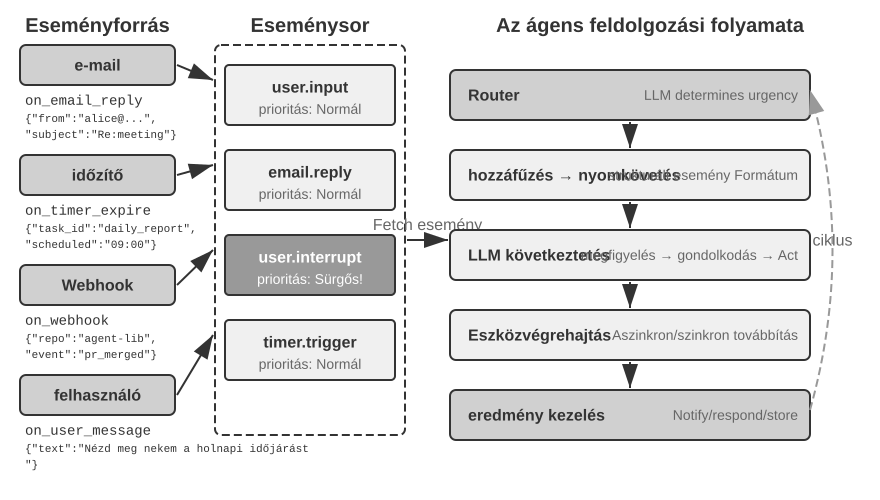
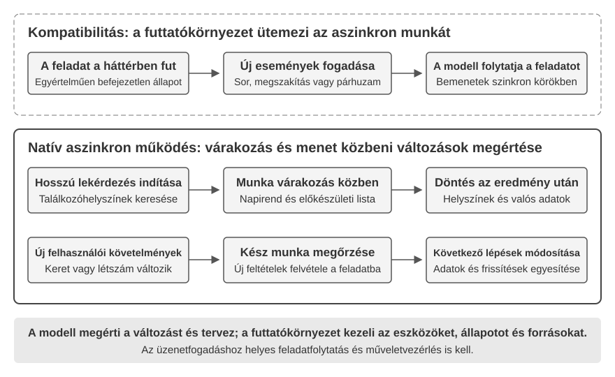
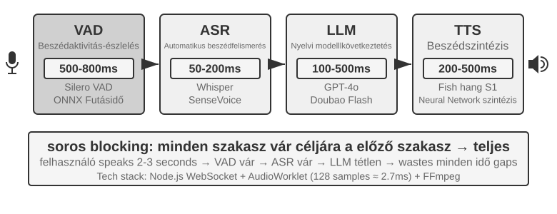
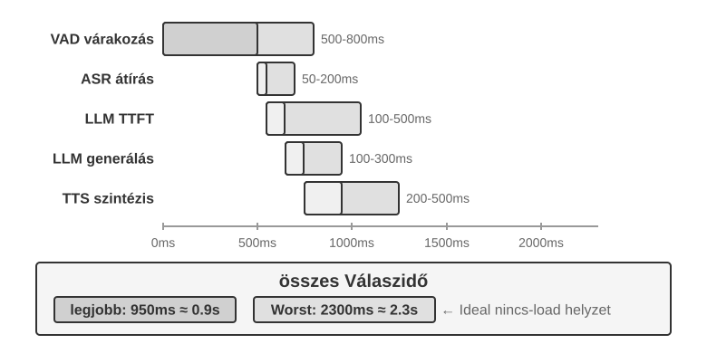
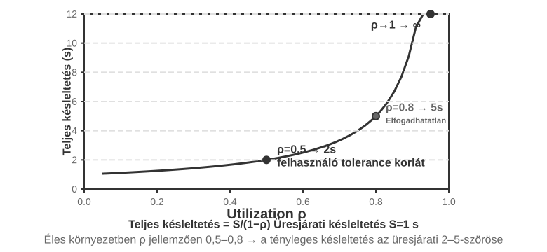
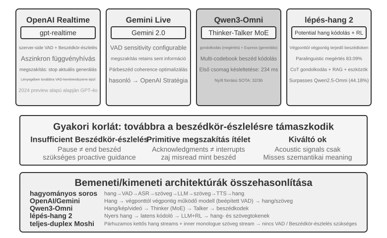
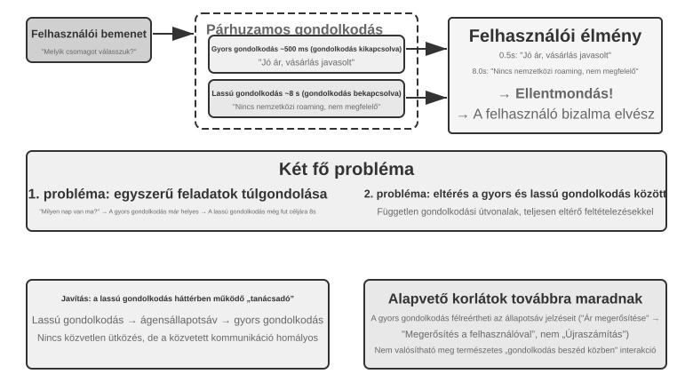
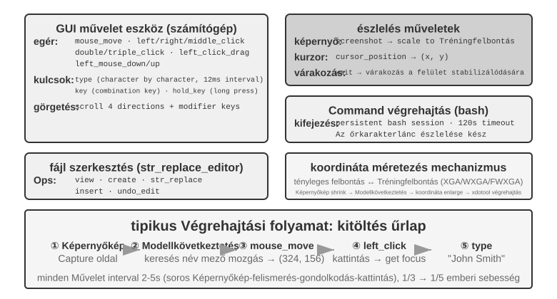
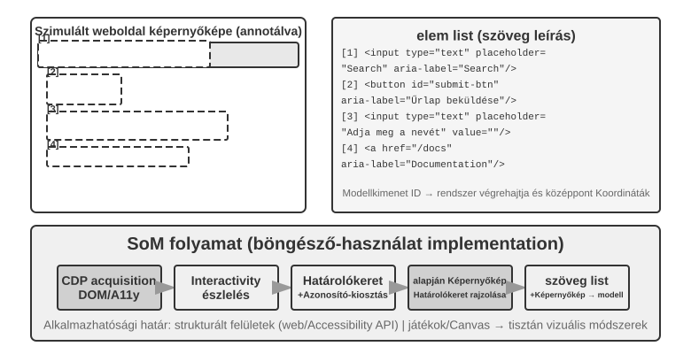
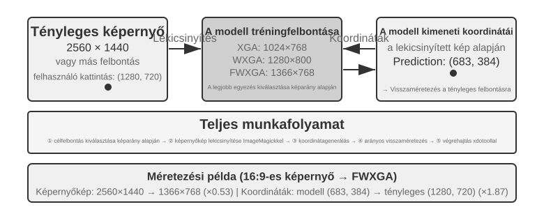

# Interakció: a megfigyelési és a cselekvési tér kiterjesztése

Az 1. fejezet megfogalmazott egy állítást: ha az alapmodell rögzített, az Ügynök feladatteljesítményének javítására a legfontosabb rendszermérnöki eszköz többnyire a **megfigyelési tér** és a **cselekvési tér** újradefiniálása vagy kiterjesztése. A 2–5. fejezet végig ezt az állítást váltotta valóra: a kontextusmérnökség dönti el, mi kerül a megfigyelésbe, a memória és a tudásbázisok a megfigyelést munkameneteken átívelővé teszik, az eszközök meghatározzák, mit tud tenni az Ügynök, a kódgenerálás pedig lehetővé teszi, hogy maga hozzon létre új cselekvéseket.

Csakhogy mindezek a kiterjesztések ugyanazon előfeltevés alatt történtek: **az Ügynök és a világ felváltva beszél**. A felhasználó befejez egy mondatot, az Ügynök gondolkodik egy sort, meghív néhány eszközt, majd válaszol; amíg gondolkodik, a világot alapértelmezésben állónak tekintjük. Ez az előfeltevés annyira természetes, hogy ritkán írjuk le egyáltalán feltevésként.

Éppen ezt az előfeltevést számolja fel ez a fejezet.

## Két tengely: modalitás és időzítés

Ha kiterítjük a megfigyelési és a cselekvési teret, kiderül, hogy mindkettőnek két kiterjeszthető iránya van.

- A **modalitás** a megfigyelés és a cselekvés **formáját** dönti el: az Ügynök csak szöveget olvas, vagy hangot is hall, képernyőt is lát, nyomatékot is érzékel; csak tokent ad ki, vagy meg is szólal, kattint és ízületet is hajt.
- Az **időzítés** a megfigyelés és a cselekvés **ritmusát** dönti el: a megfigyelésért az Ügynök megy-e, vagy a világ tolja oda; a cselekvésnek egyetlen körön belül be kell-e fejeződnie, vagy átívelhet köröket, megszakítható félúton, és kiszoríthatja valami sürgősebb.

A korábbi fejezetek e két tér **tartalmát** terjesztették ki; ez a fejezet a **modalitásukat** és az **időzítésüket**:

| | A megfigyelési tér kiterjesztése | A cselekvési tér kiterjesztése |
|---|---|---|
| **Tartalom** (2–5. fejezet) | Kontextusmérnökség, memória és tudásbázisok | Eszközök, kódgenerálás |
| **Modalitás** (ez a fejezet) | Hang, képernyő, fizikai érzékelők | Beszéd, kattintás, ízületmozgás |
| **Időzítés** (ez a fejezet) | A világ tol, folytonos folyamok | Köröket átívelő, megszakítható, kiszorítható |

A fejezet magállítása egyetlen mondatba sűríthető: **a körökre osztottság a tréning által hagyott feltevés, nem a környezet tulajdonsága.**

A modell betanítási korpusza szinte teljes egészében körökre osztott: egy kérdést válasz követ, egy eszközhívást eszközeredmény, az egyik beszélő befejezi, mielőtt a másik elkezdené. Ezért a modell által tanult policy eleve azt feltételezi, hogy a világ megvárja. A valós környezet viszont nem vár arra, hogy a modell reagáljon: a levél közben érkezik meg, a felhasználó a mondat közepén közbevág, a két képernyőkép között az oldal már megváltozott, és a csészét feldöntik, miközben a kar éppen felé nyúl.

| Skála | Forgatókönyv | Változás a megfigyelés oldalán | Változás a cselekvés oldalán |
|---|---|---|---|
| Másodperc — nap | Aszinkron és eseményvezérelt | A világ ébreszti az Ügynököt (levél, időzítő, visszahívás) | A cselekvés köröket ível át: előbb indít, a végét esemény zárja |
| 10 ms — 1 s | Hang | Beszéd közben hallgatni, nem várva a mondat végét | Beszéd közben gondolkodni; megszakítható, útközben javítható |
| Másodperc alatt — másodperc | Computer Use | A képernyő két képkocka között is folyton változik | Cselekvés után újra meg kell erősíteni, hogy a valóság még illik-e a tervhez |
| Ezredmásodperc | Robotika | Az érzékelők folyamatosan visszacsatolnak | A cselekvés darabolt: egyszerre kis szakaszt tervez, kiszorítható |

A négy szakasz ugyanazt az alapelem-készletet osztja meg — **ébresztés, biztonságos pont, megszakítás, kiszorítás és gyors/lassú szétválasztás** —, csak a paraméterek és a hibaformák térnek el. Az eseményvezérelt aszinkron „biztonságos ponton ellenőrizd a megszakítási jelet" és a robot darabolt cselekvésének „ha rendellenességet látsz, dobd el a maradék mozdulatot és figyelj újra" ugyanannak a mechanizmusnak két megvalósítása, öt nagyságrendnyi időskála-különbséggel. Ezt az izomorfiát meglátni fontosabb, mint bármely egyedi forgatókönyv technikai részletét megjegyezni.

**Az olvasási sorrendben van egy szándékos elrendezés: ez a fejezet a hangnak érezhetően több teret szentel, mint az utána következő két forgatókönyvnek.** A valós idejű interakció fejlődési vonalán a hang jutott a legmesszebb, és ez a legérdemesebb vonatkoztatási rendszer: a „soros csővezeték késleltetése túl nagy" problémától indulva, a végponttól végpontig tartó modelleken, a teljes duplexen és a beszéd közbeni gondolkodáson át egészen a mai, viszonylag kiforrott végállapotig — a probléma → megoldás → végállapot út egésze már bejárt. Ezért ezt tárgyaljuk ki alaposan, a későbbi Computer Use és robotika pedig ehhez a vonalhoz mérve olvasható: melyik hol tart rajta, és hol akadt el.

## Aszinkron és eseményvezérelt: amikor a világ kopogtat be

A 4. fejezetben tárgyalt érzékelési, végrehajtási és együttműködési eszközöket mind az ügynök hívja meg. Hogyan reagáljon az ügynök a bármikor beérkező külső eseményekre? Ehhez eseményvezérelt aszinkron architektúra kell. Az 1. fejezet két fennmaradó eszközosztálya—az eseményindító és a felhasználói kommunikációs eszközök—erre az architektúrára épül, ezért ezeket is itt tárgyaljuk.

### Miért Van Szükség Aszinkron Működésre

Kezdjük egy analógiával, hogy elmagyarázzuk, miért van szükség aszinkron működésre. A szinkron azt jelenti, hogy "egy dolgot kell elvégezni, mielőtt a következőhöz láthatunk", míg az aszinkron azt, hogy "több dolog történhet egyidejűleg". Egy hagyományos szinkron Agent architektúra olyan, mint egy egyetlen pénztárral rendelkező bolt – egyszerre csak egy vevőt tud kiszolgálni, és csak az aktuális befejezése után hívja a következőt. Egy igazán intelligens asszisztens inkább olyan, mint egy rugalmas titkár – több függőben lévő dolog van az asztalon (e-mailek, telefonhívások, látogatók), a titkár a sürgősség alapján dönti el, melyiket kezelje először, és félbeszakíthatja az aktuális feladatot egy sürgősebbért. Szinkron módban az Agentnek vagy meg kell várnia egy háttérfeladat befejezését, mielőtt a felhasználóval beszélhetne, vagy meg kell várnia a beszélgetés végét, mielőtt egy újonnan érkezett eseményt feldolgozhatna. Nem tudja nyújtani azokat az alapvető képességeket, amelyeket egy valódi asszisztens forgatókönyv megkövetel:

- **Az aszinkron végrehajtás a norma** – Sok feladat hosszú futási időt igényel, és nem szabad, hogy blokkolja a felhasználói interakciót.
- **Eseményprioritás dinamikus megítélése** – Nem minden esemény egyformán fontos. Az Agentnek intelligensen kell kiválasztania a kezelési stratégiát: az aktuális művelet megszakítása (sürgős), sorba állítás (rutin), vagy párhuzamos feldolgozás (független könnyűsúlyú lekérdezés).
- **A megszakítás és folytatás folyékonysága** – Egy megszakított beszélgetésnek vagy feladatnak természetesen kell tudnia folytatódnia.

Az aszinkron paradigma azonban ütközik a jelenlegi LLM-ek alapvető jellemzőjével: a képzésük szinkronitást feltételez – egy eszközhívás után a következő üzenetnek az eszköz eredményének kell lennie –, miközben a valódi telepítés aszinkronitást követel: a felhasználók bármikor megszakíthatják, a feladatok párhuzamosan haladnak, és a külső események az eszköz visszatérése előtt érkeznek. Ez a "szinkron képzés / aszinkron telepítés" ellentmondás áthatja a szakasz hátralévő részének minden mérnöki kompromisszumát.

Ennek megoldásához egy "eseményvezérelt aszinkron Agent architektúrára" van szükségünk. Technikailag ez azt jelenti, hogy a rendszer már nem aktívan és ismételten ellenőrzi az "új üzeneteket" (ez a polling, ami hatástalan), hanem automatikusan elindítja a feldolgozási logikát, amikor új üzenet érkezik. Minden bemenet, kimenet, gondolkodási folyamat és külső interakció egységesen eseményfolyamként van modellezve – eseményrekordok sorozataként, idővonalon elrendezve. A 6-1. ábra egy eseményvezérelt aszinkron Agent teljes architektúráját mutatja, illusztrálva az eseményforrások, az eseménysor és az Agent feldolgozási folyamat közötti kapcsolatot.



### Eseményvezérelt mechanizmusok megvalósítása az OpenClawban

A nyílt forráskódú OpenClaw keretrendszer (architektúráját az 5. fejezet részletezi) egy Gateway vezérlősíkon keresztül fogadja a többcsatornás üzeneteket, és irányítja azokat az Agent futásidejű környezetébe. Három beépített automatizálási mechanizmust kínál:

- **Hooks (Horgok)**: Reagálnak az Agent életciklus-eseményeire, mint a munkamenet létrehozása és visszaállítása, hasonlóan a GitHub Actions eseménytriggereihez
- **Cron (ütemezett feladatütemező)**: Időszakos feladatok végrehajtása cron kifejezések szerint (széles körben használt szintaxis ütemezett feladatokhoz Unix rendszereken, pl. `0 9 * * 5` jelentése: minden pénteken 9:00), mint például heti jelentés generálása minden pénteken vagy adatok összesítése minden hónap elején
- **Heartbeat (Szívverés démon)**: Minden N percben felébreszti az Agentet, hogy ellenőrizze, van-e olyan dolog, ami figyelmet igényel, ítélőképességet használva a riasztási fáradtság elkerülésére

Ez a három mechanizmus az autonómia látszatát kelti az OpenClaw Agentek számára – még ha a felhasználó offline is van, az Agent képes ütemezetten jelentéseket generálni, rendszerállapotot ellenőrizni és rutinfeladatokat végezni. Ha azonban közelebbről megnézzük, egy alapvető korlát jelenik meg. Pontosabban: a Gateway már "push" módon kezeli a beépített csatornák (IM, webes felület) üzeneteit – azok a érkezés pillanatában az Agenthez kerülnek. A három automatizálási mechanizmus közül csak a Cron és a Heartbeat teszi lehetővé, hogy az Agent felhasználói üzenet nélkül cselekedjen, és mindkettő "idővezérelt" – a Heartbeat fix időközönként ellenőriz, a Cron előre beállított időpontokban tüzel. A Hooks csak a keretrendszer belső életciklus-eseményeire reagál, nem képes új változásokat behozni a külvilágból. A valódi hiányosság ez: bármely, a beépített csatornákon túli harmadik fél eseményforrás számára – új e-mail, külső API visszahívás adatokat küldve, sürgős értesítés azonnali figyelmet igényelve – az OpenClaw-nak nincs azonnali belépési útvonala. Az Agent nem tud reagálni abban a pillanatban, amikor az esemény bekövetkezik; legfeljebb a következő Cron/Heartbeat tick-nél veszi észre.

Ez a késedelem sok forgatókönyvben elfogadhatatlan. Vegyük "PineClaw-t" (a Pine AI OpenClaw bővítményét) példaként: a Pine AI egy MI asszisztens, amely valódi telefonhívásokat kezdeményez a felhasználó nevében, tipikus forgatókönyvek közé tartozik a számlák újratárgyalása, előfizetések lemondása és biztosítási igények kezelése. Amikor egy felhasználó Pine telefonfeladatot indít egy OpenClaw Agenten keresztül, a Pine hang-MI-je elvégzi a hívást a felhasználó nevében, de a felhasználónak bármikor közbe kell tudnia avatkozni a hívás során:

- **Valós Idejű Személyazonosság Ellenőrzés**: Az ügyfélszolgálati munkatárs kéri a számlatulajdonos személyazonosságának ellenőrzését, és a Pine-nek azonnali biztonsági kódot vagy egyszeri jelszót (OTP) kell kérnie a felhasználótól
- **Háromutas Hívás Megerősítés**: Az ügyfélszolgálati munkatárs kéri, hogy beszélhessen közvetlenül a számlatulajdonossal, és a Pine-nek másodperceken belül el kell érnie a felhasználót
- **Előrehaladás Szinkronizálás és Döntés Megerősítés**: A tárgyalás kritikus pontján (pl. a másik fél árcsökkentést javasol) a Pine-nek meg kell erősíttetnie a felhasználóval, hogy elfogadja-e

A Heartbeat időszakos pollozásával – mondjuk 5 perces időközökkel – a felhasználó nem kapná meg az értesítést, amíg az ügyfélszolgálati munkatárs még mindig várja a megerősítő kódot; a munkatárs leteszi a telefont, és a hívás meghiúsul. Az időköz néhány másodpercre rövidítése egyszerűen elárasztaná a rendszert haszontalan kérésekkel.

A PineClaw megoldása egy "Channel (Csatorna) mechanizmus" bevezetése – egy valós idejű eseménycsatorna létrehozása az OpenClaw Gateway-e és a Pine API között. Amikor kulcsfontosságú események történnek, mint például a hívás kapcsolódása, a felhasználói bemenet szükségessége vagy a hívás vége, az üzenet azonnal push-elődik az OpenClaw Agenthez. Az Agent azonnal feldolgozza és értesíti a felhasználót, a válaszidőt percekről másodpercekre csökkentve.

Ez az eset feltárja az eseményvezérelt architektúra alapvető értékét az Agent keretrendszerek számára: **az igazi "proaktív szolgáltatáshoz" nem csak az kell, hogy az Agent időszakosan ellenőrizze az eseményeket, hanem az is, hogy az események aktívan értesíteni tudják az Agentet.** Az összes bemenet – felhasználói üzenetek, eszköz visszatérések, külső visszahívások, ütemezett triggerek – egységesítése egy eseményfolyammá, és az Agent gondolkodásának és cselekvéseinek egy eseményhurokon keresztüli vezérlése az építészeti alap e cél eléréséhez. Ezen architektúra alatt először a két, közvetlenül az eseményekhez kapcsolódó eszközkategóriát mutatjuk be, valamint az Agent független cselekvéseit támogató virtuális identitást és izolált végrehajtási környezetet, mielőtt az eseménykezelő mechanizmus konkrét tervezését tárgyalnánk.

### Eseményindított Eszközök

Az eseményindított eszközök azok a belépési pontok, amelyeken keresztül a külső események az Agent cselekvéseit vezérlik. Nélkülük egy Agent csak egy folyamatos gondolkodási, eszközhívási és végül eredmény-kiadási ciklusban tud működni, majd várni a felhasználó következő bemenetére. A világ változásainak az Agent által feldolgozható eseményekké való átültetéséhez három gyakori típusú eseményindított eszköz létezik.

**Időzítők** (`set_timer`) a fizikai időhöz kötött eseményeket kezelik. Ha egy e-mailre nem érkezik válasz, az Agentnek egy idő után követnie kell a haladást; ha egy hívás a címzett munkaidején kívül történik, a következő munkaidőben kell újrapróbálkoznia. Ennek támogatására az olyan eszközök, mint az OpenClaw és a Claude Code, időzítő funkciót tartalmaznak, lehetővé téve, hogy az Agent egy meghatározott fizikai időpontban felébressze magát. "Egyszeri időzítők" egy adott végrehajtási időponttal rendelkező feladatokhoz használatosak: például ha egy felhasználó szombaton kéri a "DMV felhívását", az Agent beállít egy időzítőt "következő hétfő 10:00-kor a DMV hívására", ami automatikusan elindítja a hívást. "Ismétlődő időzítők" időszakos feladatokhoz használatosak: például a szerver állapotának óránkénti ellenőrzése vagy heti előrehaladási jelentés küldése minden pénteken. Ezenkívül egyes külső szolgáltatások nem támogatják a proaktív előrehaladás-frissítéseket, ami megköveteli az Agenttől, hogy aktívan pollozza az állapotot. Ilyen esetekben ismétlődő időzítőre van szükség az ismételt lekérdezésekhez – az előző szakaszban említett Heartbeat mechanizmus az OpenClaw-ban ennek rendszerezett formája, és ez az OpenClaw "proaktív szolgáltatás" képességének gyökere.

**Háttérfeladat Figyelés** (`monitor_shell`) az aszinkron módon végrehajtott eszközökből vagy parancssori feladatokból származó eseményeket kezeli. Egyes parancssori feladatok hosszú ideig futnak a háttérben, és az Agentnek követnie kell az előrehaladásukat. Ha az Agent "bámulja a parancssort", ismételten meghívva egy eszközt az előrehaladás pollozására, tokeneket éget; ha megvárja, amíg a feladat teljesen befejeződött, mielőtt újra gondolkodna, lemarad a kritikus problémák kibontakozásáról – és ha a parancs lefagy, egyáltalán nem tud közbelépni, megakasztva az egész feladatot. A Claude Code ezt egy `monitor` eszköz bevezetésével oldja meg, lehetővé téve az Agent számára az új parancssori kimenet figyelését, beleértve a specifikus kulcsszavakat tartalmazó kimenetet is.

**Külső Eseménycsatornák** (`connect_channel`) a külső eseményeket, mint új e-mailek, API visszahívások vagy IM üzenetek, valós időben push-olják az Agenthez. Az előző szakaszban említett PineClaw Channel mechanizmus egy tipikus megvalósítás.

Tervezési szempontból az eseményindított eszközöknek egyértelmű trigger-feltételeket és szűrési szabályokat kell megadniuk, hogy megakadályozzák a nem releváns eseményeket az Agent felébresztésében és a számítási erőforrások pazarlásában. Az esemény hasznos terhének (payload) elegendő kontextusinformációt kell tartalmaznia, hogy minimalizálja a további lekérdezések számát, amelyeket az Agentnek az ébredés után kell végeznie.

### Felhasználói Kommunikációs Eszközök

Az OpenClawban a munkamenetek átláthatók: a felhasználó és az Agent bármikor üzenhet egymásnak dedikált eszközökkel, képekkel, fájlokkal, push-értesítéssel, multimodális üzenetekkel és Generative UI-val.

A felhasználói kommunikációs eszközök az Agent és a felhasználó közötti kommunikációs csatornák egyre növekvő diverzifikációjából erednek. Sok Agent (mint a Claude Code, Manus, Genspark) natív ReAct hurkot használ, ahol minden, amit az Agent "mond" (azaz asszisztens üzenetek), közvetlenül a felhasználóhoz kerül, akinek meg kell nyitnia egy adott munkamenetet az alkalmazásban, hogy beszélgethessen az Agenttel. Az OpenClaw az egyik legbefolyásosabb általános célú Agent, amely megtöri ezt az ember-számítógép kommunikációs paradigmát: a munkamenetei átláthatóak a felhasználó számára – a felhasználónak nem kell tudnia a munkamenet létezéséről, vagy törődnie az Agent eszközhívásainak részleteivel; a felhasználó és az Agent bármikor küldhet egymásnak üzeneteket, ahelyett, hogy szigorú felhasználói üzenet / Agent válasz minta lenne. Ennek következtében sok felhasználó úgy érzi, hogy az OpenClaw "ember-szerű jelenléttel" rendelkezik, aszinkron módon üzenve nekik, ahogy egy titkár tenné. Ezek a szöveges üzenetek nem a modell asszisztens üzenetei, amelyeket egyenesen a felhasználóhoz irányítanak; dedikált eszközökön keresztül küldik őket, hordozhatnak kép- és fájlmellékleteket, és push értesítéseket indíthatnak a sürgősség szerint.

A szöveges kommunikáción túl egyre több Agent rendelkezik multimodális kommunikációs képességekkel, például strukturált kártyaüzenetek vagy emlékeztető e-mailek küldésével. Néhány Agent elkezdett kísérletezni a generatív UI-val, HTML-t vagy más módszereket használva interaktív felületek létrehozására az információk felhasználóbarátabb bemutatásához. Tervezési szempontból a felhasználói kommunikációs eszközöknek támogatniuk kell az aszinkron üzenetküldést (a felhasználó nem biztos, hogy online van), olvasott/olvasatlan állapot követést kell biztosítaniuk, és fenn kell tartaniuk az üzenetek konzisztenciáját a több csatornán keresztül.

**Többcsatornás Felhasználói Kommunikáció és Újrabekapcsolás.**

Egy kategóriahatár könnyen elmosódhat: mindkét eszközkategória "értesítéseket küld", de ha a címzett egy jóváhagyó vagy együttműködő (adminisztratív jóváhagyás kérése, előrehaladás jelentése egy együttműködő Agentnek), az eszköz az együttműködő kategóriába tartozik; csak akkor számít felhasználói kommunikációs eszköznek, ha a címzett a végfelhasználó. A különbség nem a csatornában rejlik, hanem abban, hogy kit értesítenek, és miért.

**Egy Agent válasza nem korlátozódhat egyetlen csatornára; az értesítési mechanizmus egyben felhasználói újrabekapcsolási mechanizmusként is szolgál.** Az üzenetküldés kiterjed azonnali üzenetküldésre, SMS-re, e-mailre, telefonhívásokra, push értesítésekre és más csatornákra. Az Agent a sürgősség, a felhasználó állapota, a tartalom jellege és a felhasználói preferenciák kombinációja alapján dönt a csatornáról, biztosítva, hogy a fontos üzenetek ne maradjanak el, miközben elkerüli a redundáns megszakításokat.

Hosszan futó feladatok esetén az Agentnek proaktívan értesítenie kell a felhasználót a befejezéskor, hogy visszaterelje a figyelmét. Időszakos feladatoknál (mint a napi összefoglalók vagy heti jelentések) az értesítések segíthetnek a felhasználóknak rendszeres interakciós szokás kialakításában.

A felhasználói kommunikációs eszközök megoldják "hogyan érjük el a felhasználót" problémát. Az Agent által ezeken a csatornákon felvett identitás és a környezet, amelyben a felhasználó nevében cselekszik, azonban egy identitás- és végrehajtási környezet infrastruktúra réteget igényel, amely a következő szakasz témája.

### Virtuális Identitás és Izolált Végrehajtási Környezet

A virtuális számítógép éjjel-nappal futhat, nem fér hozzá szabadon a helyi fájlokhoz, és egy hiba legfeljebb a virtuális környezetet érinti. Az adatcsere megosztott fájlrendszeren és útvonalakon történik.

Egy megjegyzés e szakasz elhelyezéséről: a virtuális identitás és az izolált végrehajtási környezet alapvetően végrehajtási környezet infrastruktúra, összhangban a végrehajtó eszközöknél tárgyalt sandboxokkal. Azért jelennek meg itt, az aszinkron architektúra szakaszban, mert az Agentek, amelyeknek a legégetőbben szükségük van rájuk, azok, amelyek függetlenül futnak, állandóan jelen vannak és bármikor cselekszenek a felhasználó nevében.

Ahogy a fejezet elején említettük, Samantha-nak a *Her*-ben független identitása és működési környezete van. Egy ilyen általános célú asszisztens elérése egy kulcsfontosságú architekturális választást kényszerít ki: az Agent közvetlenül kezelje a felhasználó személyes fiókjait, vagy saját virtuális identitással rendelkezzen? A közvetlen kezelés kényelmesnek tűnik, de egy Agent hiba vagy kompromittálódás kitenné a felhasználó teljes digitális identitását. A biztonságosabb megközelítés, ha az Agent kap egy független virtuális identitást – ahogy egy titkárnak saját irodai telefonja és postafiókja van –, amely dedikált kommunikációs fiókokból, tároló- és számítási környezetekből áll, így az Agent átlátható, egyértelműen deklarált identitás alatt dolgozhat a felhasználó nevében. Ez az átláthatóság nem gyengíti a bizalmat; hitelesebbé teheti a kommunikációt.

A virtuális identitásokat izolált végrehajtási környezetekben kell megalapozni. A "virtuális számítógépek" (VM-ek/konténerek) és "virtuális telefonok" (Android emulátorok) operációs rendszer szintű elszigetelést és teljes asztali/mobil működési képességeket biztosítanak az Agent számára: az Agent saját felhasználói fiókkal, home könyvtárral és bejelentkezési hitelesítő adatokkal rendelkezik bennük, így minden művelet nyomon követhető és auditálható; még ha hibás műveletek is történnek, a gazdarendszer és a felhasználó valódi eszköze érintetlen marad. Ez a végrehajtó eszközöknél tárgyalt sandbox koncepció kiterjesztése a "digitális identitás" dimenzióra – a sandboxok elszigetelik a kódvégrehajtást, míg a virtuális számítógépek és telefonok a teljes digitális identitást szigetelik el.

A független identitás két gyakorlati kihívást is jelent. Először is, "anti-automatizálási mechanizmusok": sok weboldal használ CAPTCHA-kat és IP hírnév ellenőrzéseket az automatizált hozzáférés blokkolására. Az adatközponti IP-ket használó virtuális környezetek könnyen azonosíthatók; a gyakorlatban a normál hozzáférés gyakran lakossági proxy hálózat (amely valódi háztartási IP-ket használ) konfigurálását igényli. Másodszor, "hozzáférés a felhasználó valódi fiókjaihoz": amikor egy feladatnak a felhasználóként kell bejelentkeznie, használjon Human-in-the-Loop hitelesítést – egy VNC/RDP távoli asztalt, ahol a felhasználó személyesen jelentkezik be, látja a teljes felületet, amelyet az Agent működtet, és megérti, miért van szükség hitelesítésre. A munkamenet token ezután újrafelhasználható az érvényességi idején belül, hogy ne kelljen ismételten megszakítani a felhasználót, egyensúlyt teremtve az autonómia és a biztonság között.

A fő Agent és a virtuális környezet közötti adatcsere egy "megosztott fájlrendszeren" keresztül történik: kötetcsatolások (pl. `/workspace/shared`) használatával, amelyek összekötik a fő Agentet, a virtuális számítógépet és a virtuális telefont. Az adatok fájl-elérési út referenciákként kerülnek átadásra a tartalom másolása helyett, elkerülve a kontextusablak fogyasztását. Például egy adatelemzési feladatban: a felhasználó feltölt egy CSV fájlt a megosztott könyvtárba, az Agent a virtuális számítógépben beolvassa a fájlt, elvégzi az elemzést, diagramokat generál, és visszamenteti őket a megosztott könyvtárba. A fő Agentnek csak a diagram fájl elérési útját kell visszaadnia a felhasználónak – ami a felek között átadásra kerül, mindig egy könnyűsúlyú elérésiút sztring.

Az eseményindított eszközök lehetővé teszik, hogy a világ felébressze az Agentet, a felhasználói kommunikációs eszközök lehetővé teszik, hogy az Agent elérje a felhasználót, a virtuális identitások és izolált végrehajtási környezetek pedig lehetővé teszik, hogy az Agent függetlenül és auditálhatóan cselekedjen. A fennmaradó kérdés: amikor több esemény egyidejűleg érkezik ugyanahhoz az Agent példányhoz, hogyan kell azokat kezelni?

### Eseménykezelési Mechanizmus

Egyetlen Agent példány több eseménnyel szembesülhet egyidejűleg: új üzenet a felhasználótól, eredmény egy eszköztől, időzítő lejárta, együttműködési kérés egy másik Agenttől. Az események hatékony és helyes kezelése közvetlenül befolyásolja a teljesítményt és a felhasználói élményt.

Ennek a mechanizmusnak a váza a konkurens programozásból ismert "eseményhurok (event loop)". Gondoljunk egy aszinkron Agentre mint egy hosszan futó hurokra: minden körben kivesz egy köteg eseményt a bemeneti sorból, hozzáfűzi a trajektóriához, egyszer meghívja az LLM-et, végrehajtja az általa meghívni kívánt eszközöket, majd visszatér a hurok elejére, hogy várjon a következő eseménykötegre – ugyanaz a struktúra, mint egy Go goroutine, amely üzeneteket olvas egy csatornából, és körönként dolgozza fel őket egy `for { select { ... } }` belsejében. Ennek a modellnek van egy döntő tulajdonsága: **az események csak az egyes hurokiterációk határainál kerülnek feldolgozásra**. Amíg az LLM gondolkodik vagy egy eszköz végrehajtódik, egy újonnan érkezett esemény nem furakodhat be a semmiből és nem zavarhatja meg az aktuális lépést; a sorban várakozik, amíg a kör elér egy "biztonságos ponthoz" (safe point) (egy gondolkodási szakasz vége, egy eszköz visszatérése), majd kötegelve kerül feldolgozásra. A megszakítás ugyanezt a fegyelmet követi: ahelyett, hogy erőszakosan megszakítana egy tetszőleges pillanatban, az Agent egy biztonságos pontnál ellenőrzi, hogy "kértek-e megállítást" – ami pontosan az a szerep, amelyet a `ctx.Done()` játszik a Go-ban (a 10. fejezet ugyanezt a kontextus idiómát használja egy szülő Agent al-Agentjeinek kaszkádolt megszakításának tárgyalásakor). Ha ezt megértettük, a három feldolgozási stratégia alább csak abban különbözik, hogyan kezelik a biztonságos pontot: hagyják, hogy az esemény megvárja a következő természetesen előforduló biztonságos pontot (sorba állítás), proaktívan kényszerítenek egy korai biztonságos pontot (megszakítás), vagy egyszerűen elindítanak egy külön hurkot, és nem várnak a fő hurok biztonságos pontjára (párhuzamos).

**Strukturált Eseménymodellezés.**

A kezeléshez megértés szükséges. Egy általános célú Agent bemenete nem csak a felhasználótól származik – egy harmadik féltől érkező üzenetet nem a felhasználó küldte az Agentnek, mégis az Agentnek meg kell értenie, mérlegelnie kell a fontosságát, és el kell döntenie, hogy közbelépjen-e. Ez megköveteli, hogy minden bemenetet egy "strukturált eseményként" modellezzünk, gazdag szemantikával:

- **Forrás (ki)**: Maga a felhasználó, egy kapcsolat, egy idegen, egy rendszerértesítés
- **Csatorna (hogyan)**: Telefonhívás, SMS, azonnali üzenet, e-mail, közösségi média, időzítő trigger, aszinkron eszközhívás eredménye, parancssori monitorozási állapotfrissítés
- **Tartalom (mit)**: Üzenet szövege, érzelmi hangnem, sürgősség, szükséges-e válasz
- **Kontextus (háttér)**: Válasz-e egy korábbi beszélgetésre vagy új kommunikáció, relevanciája az aktuális feladathoz

Például egy ügyfél visszatérítési kérelmet tartalmazó e-mail strukturált eseményként:

```json
{
  "source": {"type": "email", "sender": "client@example.com"},
  "channel": "gmail_webhook",
  "content": {"subject": "Visszatérítési Kérelem", "body": "Rendelés #12345, visszatérítés kérelmezése..."},
  "context": {"priority": "high", "customer_tier": "vip", "related_orders": ["#12345"]}
}
```

Csak amikor ezek a dimenziók egyértelműen modellezve vannak strukturált eseményként, tudja az Agent fenntartani a világos megértést a több fél közötti kommunikációban, elkerülve, hogy a felhasználói bemenetet összetévessze egy eszközeredménnyel, vagy egy rejtett utasításokat tartalmazó eszközeredményt felhasználói parancsnak nézzen (prompt injection). A többszálú kontextuskezelés összetettsége azt is megköveteli, hogy az Agent megértse a több beszélgetési szál közötti kapcsolatokat – hogy egy harmadik féltől származó üzenet hogyan befolyásolja a felhasználó hangulatát, a felhasználó szerepváltásait a különböző beszélgetések során, és hogy mikor kell szintetizálni a különböző szálakból származó információkat tanácsadás céljából. Az olyan munkafolyamat-platformok triggerökoszisztémája, mint az n8n – webhookok, időzítők, e-mailek, adatbázis-változások, fájlfigyelők – ugyanezt az elvet illusztrálja: minden trigger egy "érzékszerv", amelyen keresztül az Agent érzékeli a világot. Miután ezeket a heterogén eseményeket egyetlen strukturált formátumba modelleztük, az Agent bármely forrásból származó ingereket következetesen fel tud dolgozni. Az alábbi sürgősség-meghatározás és feldolgozási stratégiák mind erre az egységes modellezésre épülnek.

**Dinamikus Feldolgozási Stratégia a Sürgősség Alapján.**

Az emberek, akik több feladatot egyensúlyoznak, a sürgősséghez igazítják stratégiájukat: egy vészhelyzet esetén elengednek mindent, amit csinálnak; egy rutin teendő későbbre kerül a listára. Az Agent eseménykezelésének ugyanezt az intelligenciát kell mutatnia.


**Megszakítás-alapú Feldolgozás** sürgős eseményekhez használatos; lényege egy "korai biztonságos pont kényszerítése" a sürgős esemény számára: az aktuális lépés proaktív megszakítása, hogy ez a pillanat egy határrá váljon, ahol az új esemény feldolgozható. Amikor egy sürgős esemény érkezik (pl. a felhasználó rákattint a "stop" gombra, vagy egy felügyeleti rendszer magas prioritású utasítást küld): (1) Állítsa le az aktuális műveletet – ha az LLM gondolkodik, azonnal szakítsa meg a streaming választ; ha egy szinkron eszköz végrehajtódik, küldjön egy megszakító jelet; (2) Ürítse ki a függőben lévő sort az összes függő esemény eltávolításával; (3) Fűzze hozzá ezeket az eseményeket a sürgős eseménnyel együtt a trajektória végéhez; (4) Azonnal hívja meg újra az LLM-et a frissített teljes trajektóriával bemenetként a helyzet felméréséhez. Például, ha a felhasználó azt írja: "Stop! Rosszul mondtam", miközben az Agent egy potenciálisan hibás műveletet készül végrehajtani, az Agent azonnal meglátja ezt az új bemenetet, újraértelmezi a valódi szándékot, és így elkerüli a rossz művelet végrehajtását.

**Sorbaállítás-alapú Feldolgozás** rutin eseményekhez használatos. Amikor egy nem sürgős esemény érkezik (pl. egy aszinkron eszköz visszaad egy eredményt, vagy a felhasználó kiegészítő információt küld): (1) Adja hozzá az eseményt a sor végéhez anélkül, hogy megszakítaná az aktuális műveletet; (2) Várja meg, amíg az aktuális művelet befejeződik – hagyja, hogy az LLM befejezze a gondolkodást, hagyja, hogy a szinkron eszköz befejezze a végrehajtást; (3) Amikor bármely eszközhívás befejeződik és visszaad egy `tool.result`-ot, ellenőrizze a sort. Ha a sor nem üres, fűzze hozzá az összes eseményt a trajektóriához egyszerre; (4) Az LLM átfogóan dolgozza fel a frissített trajektóriát. Ez lehetővé teszi a kötegelt feldolgozást, növelve a hatékonyságot – például amíg az Agent egy keresőeszköz eredményére vár, a felhasználó hozzáteszi: "csak az elmúlt hónap eredményeit mutasd." Ez a kiegészítő információ bekerül a sorba, és amikor a keresési eredmények visszatérnek, mindkét esemény együtt kerül az LLM elé, elkerülve a szükségtelen köröket.

**Párhuzamos Feldolgozás** független, könnyűsúlyú lekérdezésekhez használatos. Például amíg az Agent nagy mennyiségű adatot elemez, a felhasználó hirtelen megkérdezi: "Milyen idő lesz ma?" Az ilyen lekérdezések három jellemzővel bírnak: nem kapcsolódnak a fő feladathoz, gyors választ igényelnek, és alacsony a végrehajtási költségük. Sem a megszakítás-alapú (megszakítaná a fontos fő feladatot), sem a sorbaállítás-alapú (túl sokáig várakoztatná a felhasználót) feldolgozás nem megfelelő. A rendszer először felméri a lekérdezés függetlenségét és összetettségét, majd egy párhuzamos gondolkodási ülésben függetlenül végrehajtja, meghívva a szükséges eszközöket a válasz generálásához, és azonnal visszaadja. A lekérdezés és a válasz hozzáfűződik a fő feladat trajektóriájához, egyértelműen "a fő feladattal párhuzamosan végrehajtva" jelöléssel, hogy ne zavarja össze az LLM-et.

**Sürgősség Meghatározása.**

Sürgős események: Felhasználói megszakítás (`user.interrupt`), felügyelői utasítás (`supervisor.instruction`), Agentek közötti megszakítás (`agent.interrupt`), sürgősként jelölt külső triggerek (pl. rendszerriasztások, fizetési hibák).

Nem sürgős események: Normál felhasználói bemenet (`user.input`), Agent bemenet (`agent.input`), eszköz eredmények (`tool.result`), időzítő triggerek (`timer.trigger`), normál külső triggerek.

A keménykódolt szabályoknak korlátai vannak; az esemény szemantikája diktálja a kezelési módot – "Azonnal állj le!" megszakítás-alapú feldolgozást használ, "Milyen idő lesz ma?" párhuzamos feldolgozást, "Küldd el a jelentést kínaiul" sorbaállítás-alapú feldolgozást. **Egy könnyűsúlyú osztályozó LLM használata javasolt esemény-útválasztóként**, amely gyorsan meghatározza, melyik stratégiát alkalmazza, amikor egy esemény érkezik.

A következő kísérlet, egy eseményvezérelt e-mail feldolgozó Agent, a fent tárgyalt eseménykezelési stratégiákat valósítja meg futtatható implementációként.

> **6-1. ★★★ Kísérlet: Eseményvezérelt E-mail Feldolgozó Agent**
>
>
> 
>
>
> Ez a kísérlet a legegyszerűbb eseményvezérelt Agentet építi fel: egy "Automatikus E-mail Feldolgozó Asszisztenst". Az Agent figyeli az e-mail beérkező leveleket, és amikor új e-mail érkezik, automatikusan elindít egy feldolgozási munkafolyamatot – osztályozás, összefoglalás, választervezet, és szükség esetén a felhasználó értesítése. Ez a legintuitívabb bevezető forgatókönyv egy eseményvezérelt Agent számára: egy külső esemény (új e-mail érkezése) elindít egy teljes Agent gondolkodási ciklust.
>
> **Kísérlet Célja**: az eseményvezérelt architektúra alapgondolatának megértése – az Agent már nem vár passzívan a felhasználói bemenetre, hanem saját maga cselekszik a külső eseményekre válaszul. Ezen a kísérleten keresztül az olvasók elsajátítják az eseményforrás regisztráció, az eseménysor és az "esemény érkezik → Agent feldolgoz → eredmény kézbesítve" alapvető zárt hurkát.
>
> **Eseményforrások és Eseménysor.**
>
> A rendszer egységes hozzáférést támogat több eseményforráshoz:
>
> - **E-mail Események** (`on_email_received`): Akkor aktiválódik, amikor új e-mail érkezik, akár a beérkező levelek időszakos ellenőrzésével, akár push értesítések fogadásával.
> - **IM/SMS Üzenetek** (`on_im_message`, `on_sms_message`): Azonnali üzenetek vagy SMS üzenetek által aktiválva.
> - **GitHub Események** (`on_github_pr_update`, `on_github_issue_update`): PR felülvizsgálati megjegyzések vagy állapotváltozások által aktiválva.
> - **Időzítő Triggerek** (`on_timer_expire`): Ütemezett feladatok által aktiválva (pl. napi összefoglalók, heti jelentések generálása).
> - **Webhookok** (`on_webhook_received`): Általános visszahívások külső rendszerektől.
> - **Rendszer Események** (`on_user_inactive`, `on_process_timeout`, `on_resource_alert`): Belső állapotváltozások által aktiválva.
>
> Minden esemény egy egységes "eseménysorba" kerül, és érkezési sorrendben, szekvenciálisan kerül feldolgozásra. Minden esemény egy független Agent gondolkodási ciklust indít: az Agent elolvassa az esemény tartalmát, meghívja a releváns eszközöket (pl. tudásbázis lekérdezés, mellékletek olvasása, kapcsolódó e-mail előzmények keresése), létrehozza a feldolgozási eredményt (osztályozási címkék, összefoglalók, választervezetek), és végül vagy értesíti a felhasználót az értesítő eszközökön keresztül, vagy közvetlenül végrehajt egy műveletet.
>
> **Validációs Forgatókönyv**: Konfigurálja az Agentet egy teszt postafiók figyelésére. Szimuláljon három e-mail érkezését – egy találkozómeghívás, egy ügyfélpanasz és egy marketingreklám. Az Agent szekvenciálisan dolgozza fel őket: a találkozómeghívás esetén automatikusan ellenőrzi a naptár ütközéseket, és elfogadó/elutasító választ tervez; az ügyfélpanasznál kinyeri a kulcsfontosságú információkat, magas prioritásként jelöli meg, és értesíti a felhasználót a kezelésről; a marketingreklámot automatikusan archiválja. A teljes folyamat nem igényel felhasználói beavatkozást.

A 6-1. kísérlet bemutatja a legegyszerűbb eseményvezérelt mintát – események belépnek a sorba, és az Agent szekvenciálisan dolgozza fel őket. Amikor azonban az Agentnek a hosszú ideig futó eszközvégrehajtások során érkező megszakításokra kell reagálnia, vagy több egyidejű feladatot kell kezelnie, egy egyszerű eseménysor nem elegendő. Ezután mélyebb mérnöki kihívásokat tárgyalunk.

### Mérnöki Megvalósítás: Hogyan Tegyük a Szinkron Modelleket Aszinkron Megszakítások Támogatására

A 6-1. kísérlet csak szekvenciális eseményeket kezel – az események egyesével lépnek be a sorba, és az Agent egyesével dolgozza fel őket. Most térjünk vissza a szakasz elején felvetett "szinkron képzés / aszinkron telepítés" ellentmondáshoz: amikor a felhasználó megszakítja az Agentet, miközben egy eszköz még nem tért vissza, hogyan tud a szinkron formátum alkalmazkodni hozzá? Ez a szakasz bemutatja az iparág által ma használt mérnöki megkerülő megoldásokat.

Először egy konkrét forgatókönyvvel illusztráljuk ezt az ellentmondást. Tegyük fel, hogy az Agent segít a felhasználónak egy e-mail megírásában (eszközhívás: elérhetőségek keresése). Mielőtt a keresés visszaadná az eredményeket, a felhasználó hirtelen azt mondja: "Várj, előbb nézd meg a holnapi időjárást." Egy szinkron ReAct hurokban az Agentnek meg kell várnia a keresés visszatérését, mielőtt feldolgozná a következő üzenetet – mert az API megköveteli, hogy "egy eszközhívás kiadása után a következő üzenet az eszköz eredménye legyen." De az aszinkron valóságban az események bármikor megszakíthatják a folyamatban lévő feladatokat. Az "aszinkron megszakítás" szemantikájának kifejezése a "szinkron formátum" korlátai között pontosan az a probléma, amelyet ez a mérnöki megoldás meg kíván oldani.

**Mérnöki Megoldás: Aszinkron Implementáció Szinkron Viselkedés Szimulálásával.**

A központi gondolat: **Normál körülmények között, megszakítások nélkül, az LLM egy szabványos szinkron trajektóriát lát; csak akkor szúrunk be helyettesítőket (placeholdereket) a formátum javításához, ha megszakítás történik.** Íme öt kulcsszabály:

**1. szabály**: Az asszisztens üzenetet (beleértve a gondolkodást, tartalmat és eszközhívást) azonnal rögzítse, amikor az LLM előállítja.

**2. szabály**: Az eszköz eredményét csak akkor rögzítse, amikor az eszközhívás befejeződött. A trajektória "részben befejezett" állapotban van a végrehajtás során.

**3. szabály**: Az eszközvégrehajtás közbeni megszakítások helyettesítőket igényelnek. Generáljon egy helyettesítő választ a befejezetlen eszközhöz (pl. "Az eszköz a háttérben fut, kérjük, először az új eseményt kezelje"), fűzze hozzá a megszakítási eseményt, és hívja meg újra az LLM-et. Az LLM szemszögéből az asszisztens üzenet továbbra is párosítva van egy eszköz eredménnyel.

**4. szabály**: Az LLM gondolkodása közbeni megszakítások közvetlenül eldobják a jelenlegi gondolkodást. Ne írja a trajektóriába; helyette fűzze hozzá az új eseményt, és kezdjen egy új gondolkodási kört.

**5. szabály**: A nem megszakító események a sorba kerülnek kötegelt feldolgozásra. Csak az aktuális ciklus befejezése után kerülnek egyszerre hozzáfűzésre.

Az Agent e-mail írásának példáján, amikor a felhasználó az időjárásról kérdez, az öt szabály működése a következő:

1. Az Agent meghívja a `search_contacts`-ot az elérhetőségek keresésére, és az asszisztens üzenet azonnal a trajektóriába kerül (1. szabály).
2. Mielőtt a keresőeszköz visszaadná az eredményeket, a felhasználó elküldi: "Előbb nézd meg a holnapi időjárást." Mivel ez egy felhasználói megszakítás, a rendszer generál egy helyettesítő eszköz eredményt a befejezetlen `search_contacts`-hoz ("Az eszköz a háttérben fut, kérjük, először az új eseményt kezelje", 3. szabály), majd hozzáfűzi a felhasználó időjárás lekérdezését a trajektóriához, és újra meghívja az LLM-et. Ezen a ponton az LLM által látott trajektória formátum teljesen érvényes – az asszisztens üzenet és az eszköz eredménye tökéletesen párosítva van.
3. Miután az Agent megválaszolta az időjárás lekérdezést, az eredeti `search_contacts` eredmény megérkezik, és új eseményként hozzáfűződik a trajektóriához (2. szabály). Az Agent elolvassa az elérhetőségi információkat, és folytatja az e-mail írását.

A séma alapvető előnye: **normál körülmények között az LLM egy tökéletes szinkron trajektóriát lát** – asszisztens üzenetek és eszköz eredmények szigorúan párosítva, az idővonal tiszta, nincsenek helyettesítők vagy rendellenes állapotok. Ez a legkedvezőbb elrendezés a szinkron paradigma alatt képzett LLM-ek számára, és megőrzi a gondolkodás minőségét. A helyettesítő – egy szükséges kompromisszum – csak akkor jelenik meg, amikor valóban megszakítás történik.

De fennáll a hallucinációk súlyosbodásának kockázata. Annak ellenére, hogy a helyettesítő kifejezetten jelzi, hogy az eszköz "még nem fejeződött be", a modell később mégis kitalálhat egy eszközeredményt a gondolkodás során – meggyőzve magát arról, hogy az eszköz érvényes adatokat adott vissza, és ezen kitalált adatok alapján hozhat döntéseket. Ez azért van, mert a képzés során látott trajektóriák túlnyomó többségében egy eszközhívást azonnal a valódi eredmény követi; a modell soha nem tanulta meg, hogyan kezelje azokat a helyzeteket, amikor "az eredmény még nem érkezett vissza." Ezért a gyakorlatban a megszakítások csak valóban sürgős helyzetekben indulnak el (amikor a felhasználó kifejezetten kéri a leállítást); a nem sürgős eseményeket egy sorba helyezik kötegelt feldolgozásra.

**Aszinkron Eszköz Interfészek a Meglévő Modellekhez.**

Mivel a modellek szinkron feltételezése nehezen törhető meg, egy alapvetőbb stratégia az **aszinkron szemantika befogadása az eszköz-interfész tervezés szintjén**.

A hagyományos eszköztervezés "hívás egyenlő befejezés" szemantikát sugall. Például a `phone_call` név arra utal, hogy "a hívás tárcsázza a telefont, és megvárja a hívás végét, visszaadva a hívásnaplót." Az aszinkron paradigma alatt a "kezdeményezés" és a "befejezés" szétválasztandó:

- `initiate_phone_call`: Elindít egy telefonhívást, azonnal visszaadva egy feladatazonosítót és kezdeti állapotot (pl. "Hívás kezdeményezve, tárcsázás...")
- A hívás előrehaladását eseményértesítések közvetítik (`phone_call_connected`, `phone_call_ended`)

A kulcs az, hogy az eszköz neve és leírása maga közvetítse az aszinkron szemantikát. Amikor a modell meglátja az `initiate_phone_call`-t, nyelvi értelmezési képességei természetesen arra következtetnek, hogy ez "kezdeményezés", nem "befejezés". Az eszköz leírásának tovább kell erősítenie ezt: "Ez az eszköz elindít egy telefonhívás feladatot, amelyet egy al-Agent kezel. Sikeres kezdeményezés esetén azonnal visszaadja a feladat azonosítóját, lehetővé téve, hogy más dolgokkal folytassa. Külön értesítőesemény kerül elküldésre, amikor a hívás véget ér."

**Figyelem Szóródása Sor-alapú Feldolgozásban.**

Kötegelt események feldolgozásakor a modell gyakran csak az utolsó eseményre összpontosít. Ennek kiváltó oka, hogy **a modell arra van kiképezve, hogy a legfrissebb bemenetre reagáljon, és a kötegelt események megtörik ezt a feltételezést**.

Két szinten lehet beavatkozni:

**Prompt Szinten**: Tájékoztassa a modellt: "Amikor több egymást követő eseményt kap, kérjük, győződjön meg arról, hogy átfogóan figyelembe veszi az összes információt."

**Agent Állapotsor Jelzők**: Adjon explicit jelzőket minden esemény előtt:

```text
[Feldolgozatlan Esemény 1/4] Eszköz eredmény a database_query-ből: ...
[Feldolgozatlan Esemény 2/4] Felhasználói kiegészítés: Csak a pekingi adatokat nézd
[Feldolgozatlan Esemény 3/4] Rendszer emlékeztető: A jelentés határideje 30 perc múlva
[Feldolgozatlan Esemény 4/4] Felhasználó kérdezi: Mi az előrehaladás?
```

Adjon hozzá egy összefoglalót a végén: "Fent 4 feldolgozatlan esemény található, köztük 1 eszköz eredmény, 2 felhasználói üzenet és 1 rendszer emlékeztető. Kérjük, győződjön meg róla, hogy válasza lefedi az összes információt."

### Mélyebb Ellentmondások és Jövőbeli Irányok


Végső soron az előző szakaszok helyettesítői, aszinkron eszköz interfészei és állapotsor jelzői mind prompt engineeringet használnak ugyanazon "szinkron képzés / aszinkron telepítés" ellentmondás javítására (6-4. ábra) – ennek az ellentmondásnak az okát a szakasz elején részleteztük, így itt nem ismételjük; ehelyett az alapvető megoldásra összpontosítunk.

**A Modell Evolúció Előrejelzése: Szinkrontól Aszinkron Felé.**

A fenti mérnöki technikák lényegében **a prompt engineering használata a modellképzés hiányosságainak kompenzálására**, egy átmeneti időszak ideiglenes megoldása. A valódi megoldás paradigma váltást igényel a modellképzés szintjén.

A robotika területén a VLA (Vision-Language-Action, lásd 6. fejezet) modellek már kezdenek hasonló kihívásokkal szembenézni: elkerülhetetlen késleltetés van az észlelés és a cselekvés között. A VLA sikere utat mutat az Agent modellek evolúciója számára. A következő generációs modelleknek három alapvető képességet kell megszerezniük a megerősítéses tanuláson (RL) keresztül aszinkron környezetekben:

1. **Aszinkron Események Közti Átfedés Megértése a Trajektóriákban**: Ez a legkritikusabb képességhiány. A jelenlegi modellek szigorúan szinkron sorrendet várnak, de egy valódi aszinkron környezetben egy eszközhívást nem biztos, hogy egy eszköz eredménye követ, hanem egy új felhasználói üzenet; a gondolkodás félbeszakadhat, de a köztes állapotot meg kell őrizni a trajektóriában, és a gondolkodásnak folytatódnia kell az új üzenet feldolgozása után, ahelyett, hogy újrakezdené. A modellnek világos megértést kell fenntartania az ilyen "rendezetlen" trajektóriákban – mely eszközhívások várnak még eredményekre, és mely gondolatok befejezetlen töredékek.
2. **Megszakított Feladatok és Gondolatok Folytatása**: Amikor megszakítják egy sürgős esemény kezelésére, a modellnek emlékeznie kell a befejezetlen feladatra. Például, ha a felhasználó hirtelen az időjárásról kérdez, miközben az Agent egy adatelemző eszközt hajt végre, a válaszadás után az Agentnek természetesen meg kell várnia az adatelemzés eredményét, ahelyett, hogy elfelejtené, hogy egy eszköz még fut. Különösen fontos elkerülni azokat a hallucinációkat, ahol a modell tévesen azt hiszi, hogy a megszakított eszközhívás befejeződött.
3. **Kötegelt Események Átfogó Feldolgozása**: Amikor több esemény egy kötegben kerül hozzáfűzésre a trajektóriához, a modell nem csak az utolsóra összpontosíthat; átfogóan kell figyelembe vennie az összes feldolgozatlan információt.

Ennek az aszinkron RL képzésnek az eléréséhez új infrastruktúra szükséges: egy aszinkron környezeti szimulátor (olyan forgatókönyvek generálása, mint a késleltetett eszközvisszatérések, véletlenszerű felhasználói megszakítások, stb.) és specializált jutalmak az aszinkron képességekhez (a rendezetlen trajektóriák helyes megértése, a megszakított gondolatok sikeres folytatása, hallucinációk elkerülése, kötegelt események átfogó feldolgozása).

A folyamatos gondolkodáshoz nem kell megvárni a következő modellgenerációt. Mintegy kétszáz sornyi összehangolás egy **meglévő** szöveges érvelőmodellt **folyamatos idejű** ügynökké alakíthat, összekötve a fenti mérnöki kerülőutat a modellfejlődéssel. Ez a 4. szabály továbbfejlesztése: a megszakított gondolattöredék eldobása helyett az interakció egyetlen megszakítás nélküli gondolatfolyam. A futtatókörnyezet lezárhatja az aktuális `<think>` blokkot, közönséges üzenetként beillesztheti az új megfigyelést—eszközeredményt, felhasználói megszakítást vagy felismerési frissítést—, majd folytathatja a dekódolást.

Egy gyakran elpazarolt erőforrást használ ki: a modell másodpercenként több száz tokent generálhat, miközben egy eszközhívás vagy a felhasználó megszólalása több másodpercig tarthat. Ez a várakozás gondolkodásra fordítható. Az ügynök így **várakozás közben gondolkodhat**—részleges információból folytathatja, sőt korán elindíthatja a következő eszközt—, és **cselekvés közben gondolkodhat**—kimenet közben tovább érvelhet, és félúton javíthatja a cselekvést.

> **6-2. ★★★ Kísérlet: Aszinkron Agent Párhuzamos Végrehajtással és Megszakítási Képességekkel**
>
>
> 
>
>
> A 6-1. kísérlet egyszerű eseménysorára építve ez a kísérlet az aszinkron Agentek nehéz részeibe merül: **párhuzamos eszközvégrehajtás, végrehajtás megszakítása és állapotkezelés**. Az Agent már nem csak egyesével dolgozza fel az eseményeket; egyszerre több egyidejű feladatot kell kezelnie, meg kell birkóznia a megszakításokkal és helyreállításokkal, és dinamikus döntéseket kell hoznia a valós idejű állapot alapján.
>
> **1. Aszinkron Eszközvégrehajtás**: Támogatja az időigényes eszközök (legalább 3-5 másodperc) aszinkron végrehajtását, azonnal visszaadva egy helyettesítőt a kezdeményezéskor. "Validációs Forgatókönyv": Az Agent végrehajt egy hosszan futó terminálparancsot. Ez idő alatt a felhasználó megkérdezi: "Hány óra van?" Az Agent azonnal válaszol, majd bemutatja az elemzési eredményt, amikor a hosszan futó parancs befejeződik.
>
> **2. Eseménysor és Kötegelt Feldolgozás**: Felhalmozza a nem sürgős eseményeket, és egy kötegben fűzi hozzá a trajektóriához. "Validációs Forgatókönyv": Az Agent egy hosszú feladatot hajt végre. A felhasználó egymást követő üzeneteket küld: "Ne felejts el japánul válaszolni" és "Formázd weboldalként." Amikor a feladat befejeződik, az Agent az összes eseményt egyszerre dolgozza fel, generálva egy japán weboldalt.
>
> **3. Megszakítási Mechanizmus**: A felhasználó "stop" parancsa azonnal megszakítja a végrehajtási folyamatot, és lemondja az aszinkron eszközt. "Validációs Forgatókönyv": Az Agent egy hosszú feladatot hajt végre. A felhasználó elküldi: "Mégse." Az Agent azonnal leáll, és a trajektória rögzíti a megszakítási eseményt és a lemondási műveletet.
>
> **4. Párhuzamos Eszközök Lemondása és Állapotlekérdezése**: Miután egy aszinkron eszköz befejeződött, a valódi eredmény egy új eseményen keresztül kerül a beszélgetésbe. Támogatja a lemondást vagy az előrehaladás lekérdezését feladat azonosító alapján. "Validációs Forgatókönyv": A felhasználó kéri: "Futtasd nekem ezt a három szkriptet egyszerre. Amelyik előbb befejeződik, ellenőrizd a maradék szkriptek előrehaladását. Ha valamelyik nem haladta meg az 50%-ot, mondd le." A három szkript elemzési folyamatokat szimulál, folyamatosan 3%, 2% és 1% sebességgel adva ki az előrehaladást másodpercenként. Az Agent három aszinkron terminálparancsot indít egyszerre. Amikor a 3%/másodperc sebességű szkript körülbelül 33 másodperc alatt befejeződik, az Agent lekérdezi a maradék két terminál állapotát, az egyiket körülbelül 66%-os, a másikat körülbelül 33%-os előrehaladással találva. Ezután lemondja azt, amelyik nem haladta meg az 50%-ot. Miután mindkét terminál befejeződött, integrálja az eredményeket egy teljes jelentés létrehozásához.

Az aszinkron, eseményvezérelt végrehajtás lehetővé teszi, hogy a világ bármikor felébressze az ügynököt, de feltételezi, hogy a modell befejezheti a gondolkodást, mielőtt válaszol. A következő három szakasz ezt kérdőjelezi meg: ha a környezet a modell generálási sebességével azonosan vagy annál gyorsabban változik, az „előbb gondolkodj, aztán beszélj” elfogadhatatlan késleltetéssé válik.

## Hang: A legtermészetesebb ember-gép interfész

A hang nem pusztán a szöveg hanggá alakítása. A beszéd körülbelül négyszer gyorsabb a gépelésnél, és szabadon hagyja a kezet és a tekintetet, ezért természetesen illeszti az Agentet egy folyamatos, bármikor megszakítható ki- és bemeneti hurokba. A hangbevitel szöveggé alakítja a diktálást; a hangügynök közvetlen együttműködést tesz lehetővé. Mindkettő támogatja a bevezetőben említett whisper codingot.

A szakasz két irányt tárgyal: a felhasználó az Agenthez beszél, illetve az Agent a felhasználó nevében a külvilághoz beszél. A hangmodell azt határozza meg, mire tud válaszolni; az interakciós architektúra azt, hogy jól hall-e, időben válaszol-e, természetesen adja-e át a szót, és hívás közben elvégzi-e a megerősítéseket és eszközhívásokat.

### Interakciós időzítés: a kaszkádtól a teljes duplexig

Az OpenAI GPT-Live bemutatója három paradigmát különböztet meg: kaszkád, köralapú és teljes duplex[^ch6-12]. Ezek eltérő kompromisszumok a késleltetés, a költség és a megfigyelhetőség között, nem lineáris fejlődési lépések.

| Paradigma | Szerkezet | Előny | Korlát |
| --- | --- | --- | --- |
| Kaszkád | VAD → ASR → LLM → TTS | Átlátható, cserélhető, hibakereshető modulok | Késleltetés halmozódik, a paralingvisztikai jel elveszik |
| Végponttól végpontig Omni | Natív hangbemenet és -kimenet, köralapú interakció | Kisebb késleltetés, jobb hangszín- és környezethang-megőrzés | Továbbra is köralapú, drága a tanítás és a hibakeresés |
| Teljes duplex | Natív hangbemenet és -kimenet, folyamatos hallgatás, beszéd és döntés | Átfedő beszéd és természetes megszakítás | Bonyolultabb tanítás, vezérlés és értékelés |

A közös cél az „egymás után beszélünk” feltételezés és a VAD szólójoggal kapcsolatos találgatásának meghaladása. A kaszkád és az Omni még körökre bont; a teljes duplexben a modell folyamatosan dönti el, ki beszél.

[^ch6-12]: OpenAI. *Introducing GPT-Live.* 2026-07-08. https://openai.com/index/introducing-gpt-live/. A háromosztatú besorolás a ChatGPT Voice három generációjának összefoglalásából származik; az Omni a „turn-based voice models” kategóriának felel meg.

### Paradigma 1 · Kaszkádolt csővezeték

A legtöbb kereskedelmi hangasszisztens soros csővezetéket használ (6-6. ábra): a VAD érzékeli a végét, az ASR szöveggé alakítja a hangot, az LLM megérti és megfogalmazza a választ, a TTS pedig kimondja. A modularitás megkönnyíti az egyes részek optimalizálását, de minden határ várakozást ad hozzá.



| Modul | Feladat | Tipikus szűk keresztmetszet |
| --- | --- | --- |
| VAD | A beszéd végének eldöntése | Csendküszöb, várakozás és hibás szegmentálás |
| ASR | Hangból szöveg | Felismerési késleltetés és kontextusvesztés |
| LLM | Megértés, gondolkodás és generálás | Első token késleltetése, reasoning miatti várakozás |
| TTS | Szövegből hang | Első csomag szintézise és lejátszási puffer |

Rövid válasznál is sorosan összeadódik a VAD, ASR, LLM és TTS várakozása (6-7. ábra). Éles rendszerben a sorban állás tovább növeli az üresjárati késleltetést (6-8. ábra).





> **6-3. kísérlet ★: Hagyományos hangügynök építése**
>
> WebSocketon keresztül kösd össze a mikrofont, a Silero VAD-ot, a helyi Whispert, egy streamelő LLM-et és a Fish S1 TTS-t a kaszkádos alapvonal felépítéséhez.

#### A sorostól a streaming észlelésig

A 6-7. ábra a VAD + ASR + LLM + TTS teljesen soros esetét mutatja; ennek a soros észlelésnek három gondja van:

1. **Halmozódó késleltetés**: csak egy szakasznyi csend után lehet megerősíteni, hogy a felhasználó befejezte a mondandóját.
2. **Információvesztés**: a hangos/néma bináris jel nem tudja kifejezni a hezitálást, az érzelmet, a hümmögést és a környezeti hangot.
3. **Kontextustörés**: az e-mail-címek, a személynevek és a tulajdonnevek darabokra szabdalva félreismerhetők.

A moduláris munkamegosztás megtartása mellett erre a **streaming észlelés** kínál megoldást: minden szakasz a lehető legkorábban ad inkrementális eredményt.

- **Az ASR hallgatás közben ír át**: amint a VAD érzékeli, hogy a felhasználó beszélni kezdett, a rendszer adott időközönként meghívja az ASR modellt, és folyamatosan ideiglenes átiratot állít elő; miután a VAD a beszéd végét jelzi, megerősíti a végleges szöveget.
- **Az LLM spekulatív végrehajtása**: az ideiglenes átirat azonnal az LLM-hez kerül; ha a végleges szöveg megegyezik az ideiglenes átirattal, az LLM-et nem kell újra meghívni, ellenkező esetben a korábbi spekulatív gondolkodás megszakad, és az LLM újra lefut.
- **Az LLM szakaszos kimenete**: az első felolvasható szövegrész azonnal a TTS-hez kerül, nem kell megvárni a teljes választ.
- **A TTS inkrementális szintézise**: folyamatosan ad vissza hangblokkokat, így a további generálás, a szintézis és a lejátszás átfedheti egymást.

A valódi streaming ASR-hez a modellnek is támogatnia kell ezt a működést. A Whisper dekódolása ugyan autoregresszív, de a kódolója teljes hangszegmenst vár, ezért nem tekinthető streaming modellnek. Az LLM-alapú streaming hallási modell folyamatos hangból ad ki szöveget és szemantikai eseményeket, vagyis a „felismerést” és a „megértés” egy részét ugyanabba a modellbe helyezi. Megőrzi a beszélgetés kezdetétől az aktuális pillanatig tartó kontextust, és világtudását felhasználva kezeli a márkaneveket, személyneveket és tulajdonneveket.

A végpont eldöntése beépíthető a streaming felismerőbe, de a címkék csak a döntéskor látható információt használhatják. A speak_start/end, interrupt, emotion, laugh, sigh és noise jelölők megőrzik a nem szöveges jeleket.

> **6-4. kísérlet ★: Streaming hangészlelés szimulációja Qwen2-Audio-val**
>
> A Qwen2-Audio önmagában nem streamelő modell. A kísérlet növekvő hangelőtagokkal szimulálja a folyamatos érzékelést, és 600 ms-os VAD + Whisper megoldással hasonlítja össze.

### Paradigma 2 · Végponttól végpontig tartó omnimodális modellek (Omni)

A kaszkád még streaming észleléssel is diszkrét interfészeken adja tovább a hallgatást, a gondolkodást és a beszédet; az érzelem, az intonáció és a környezeti hang elveszhet, amikor a hangból tiszta szöveg lesz. Az Omni megoldás ugyanazzal a modellel hallgatja a hangot, fogalmazza meg a választ és mondja ki, ezért megőrizheti ezeket a jeleket, cserébe viszont drágább a tanítása. Az első paradigma kaszkádjához képest az Omni előnye főként a késleltetésben, valamint a nem szöveges információ megértésében és generálásában mutatkozik meg.

A megértés oldalán az Omni modell felfogja a hangban lévő szüneteket. A generálás oldalán gazdagabb paralingvisztikai információt tud átadni: például énekelhet, vagy különleges hanglejtéssel mondhat ki egy mondatot.

Az Omni modell továbbra is a felváltva beszélést feltételezi, és a szólójogot rendszerint VAD osztja ki. Ezért ha a felhasználó számsort diktál, a közben tartott szünetet a rendszer még mindig a beszéd végének vélheti.



> **6-5. kísérlet ★★: MiniCPM-o 4.5 helyi futtatása — end-to-end és önkaszkád**
>
> Futtasd helyben a MiniCPM-o 4.5-öt kikapcsolt thinking mode-dal, és hasonlítsd össze a közvetlen hangalapú választ azzal az önkaszkáddal, amely ugyanazzal a modellel előbb átír, majd válaszol. Ez azt méri, megmarad-e a hanginformáció, **nem** a későbbi „beszéd közbeni gondolkodást”.

### Paradigma 3 · Teljes duplex interaktív modellek

Az Omni a „felhasználó beszél” és a „modell beszél” időszakára osztja a párbeszédet, de a szinkrontolmácsolás átfedést igényel. A teljes duplex folyamatosan hallgat és beszél, és eldönti, folytatja-e, szünetel-e, megszakít-e vagy eszközt hív. A Kyutai Moshi korai példa; a Thinking Machines Lab Interaction Modelnek[^ch6-14] nevezi a modellbe épített interakciót. A GPT-Live ezt termelési méretre viszi.

[^ch6-14]: Thinking Machines Lab, “Interaction Models: A Scalable Approach to Human-AI Collaboration,” 2026-05. https://thinkingmachines.ai/blog/interaction-models/

### Kognitív időzítés: valós idejű interakció és mély gondolkodás

Az interakció minősége és az intelligencia felső határa külön dimenzió. Az előtérmodell addig válaszol, amíg a felhasználó jelen van; a háttérmodell tovább gondolkodhat. A következő három terv kompromisszum, nem lineáris fejlődés. Az első kettő kaszkádra vagy Omni modellre is ráépíthető; a harmadik a mély gondolkodást és a valós idejű kifejezést ugyanazon modellen belül egyesíti.

#### 1. terv: gyors gondolkodás a kitöltéshez, lassú gondolkodás a válaszhoz

A gyors gondolkodás néhány száz ezredmásodperc alatt képes kitöltő választ adni, míg a lassú gondolkodás a háttérben mélyebb levezetést végez. A gond az, hogy az egyszerű kérdéseket kétszer dolgozza fel, az összetetteknél pedig ellentmondás keletkezhet: a gyors modell vásárlást javasol, a lassú utóbb felfedezi, hogy a csomagból hiányzik egy kulcsfontosságú funkció, és a felhasználó néhány másodpercen belül egymásnak ellentmondó válaszokat hall. Az alapvető ok az, hogy a két példány egymástól függetlenül gondolkodott végig egy-egy kérdést.





#### 2. terv: gyors gondolkodás az interakcióhoz, lassú gondolkodás a figyelmeztetéshez

A második tervben a háttérmodell állapotsávon vagy dedikált interfészen keresztül ad javaslatokat az előtérmodellnek, az előtér pedig továbbra is tartja a szót, és eldönti, hogyan fogalmaz. Ez stabilabb az elsőnél, de a kommunikáció továbbra is közvetett: az előtér félreértheti a javaslatot, és nem látja a háttér köztes gondolkodását; amíg a háttér nem végez, a felhasználó rákérdezésére az előtér csak a saját képességeire támaszkodhat. Természetesen tud „eredményre várni", de valódi gondolkodás beszéd közben nem valósul meg.

#### 3. terv: a gondolkodás és a kifejezés végponttól végpontig tartó egyesítése

A harmadik terv a gondolkodási képességet közvetlenül a végponttól végpontig tartó hangmodellbe építi be. A Step-Audio R1 két egymást kiegészítő mechanizmussal két problémát old meg: a **modalitáshoz horgonyzott gondolkodásdesztilláció (MGRD)** akusztikai jellemzők alapján gondolkodtatja a modellt, az **MPS kétagyú architektúra** pedig párhuzamosítja a fogalmazást és a kifejezést. Az előbbi a „helyes gondolkodást" biztosítja, az utóbbi az „időben történő megszólalást" oldja meg.

Ideális esetben a modellnek a hangmagasságból, a ritmusból és a hanglejtésből kellene megítélnie az érzelmet, nem pusztán az átiratból. Az MGRD kiszűri azokat a gondolatmeneteket, amelyek valóban akusztikai jellemzőkre hivatkoznak, ezekkel az adatokkal tanítja a modellt, és megerősítéses tanulással akadályozza meg, hogy a modell átugorja a gondolkodást és egyből tippeljen. Az MPS-ben a fogalmazó agy folyamatosan gondolatfoszlányokat termel, a kifejező agy pedig, amint megkap egy foszlányt, a már elhangzott válasszal együtt azonnal beszédet generál. A kettő futószalagszerűen párhuzamosan működik, így nem kell megvárni a teljes gondolatmenet végét ahhoz, hogy a felhasználó meghallja az első mondatot.

#### A gyors/lassú gondolkodás szétválasztása és a végponttól végpontig tartó gondolkodás közötti kompromisszum

Az egyesített modell valósítja meg a legközvetlenebbül a „gondolkodás beszéd közben" elvét, ára viszont az, hogy a gondolkodást és a valós idejű kifejezést együtt kell újratanítani; a szétcsatolt megoldásban könnyebb kicserélni a háttéragyat. A kettő kompromisszum, nem egyszerű helyettesítője egymásnak.

A legfejlettebb következtető modellek gyors fejlődése közepette a gyors és lassú gondolkodás szétválasztása fontos mérnöki előnyt kínál: közvetlenül kihasználhatja a lassú modellek minden új generációjának javulását. A gyors előtérmodellnek csak alacsony késleltetéssel kell hallgatnia, válaszolnia és fenntartania a beszélgetést; a lassú háttérmodell végzi a következtetést, a tervezést és az eszközhívásokat. Amikor megjelenik egy erősebb következtető modell, elég a háttérmodellt cserélni, nem kell az egész valós idejű hangrendszert újratanítani. Az egyesített megoldás ugyanahhoz a tanítási ciklushoz köti a következtetést és az interakciót, ezért minden frissítésnél újra egyensúlyba kell hozni az intelligenciát, a válaszkésleltetést és a kifejezés természetességét. A gyors/lassú szétválasztás tehát nem pusztán a késleltetés miatti kompromisszum, hanem moduláris döntés, amelyben az interakciós képesség és az intelligencia felső határa külön fejlődhet.

Ez a szétválasztás nem feltétlenül rontja a feladatteljesítményt sem. 2026 augusztusában a gyors/lassú architektúrát használó Pine AI hangügynöke az első helyen állt a τ³-Voice Leaderboardon, megelőzve többek között a Grok Voice és a GPT-Realtime-2 rendszereket. Ez az eredmény legalább azt mutatja, hogy a mély következtetést és a valós idejű beszélgetést egyszerre mérő feladatokban a szétcsatolt architektúra nem eleve gyengébb a végponttól végpontig tartó modelleknél.[^ch6-17]

[^ch6-17]: Pine AI. “The Most Natural Human-Computer Interface Is Your Voice.” 2026-06-23 (frissítve: 2026-08-06). https://www.19pine.ai/blog/pine-ai-the-most-natural-human-computer-interface-is-your-voice

Pontosítani kell, hogy a „végponttól végpontig tartó modell" kifejezést gyakran két értelemben használják. Az első az előző szakaszban tárgyalt **végponttól végpontig tartó hangút**: a modell közvetlenül hangot fogad és hangot állít elő, nem pedig diszkrét szövegen keresztül kapcsol össze több modellt. Az Omni és az Interaction Model ebben az értelemben egyaránt végponttól végpontig tartó, de az Omni rendszerint köralapú marad, míg az Interaction Model egyszerre tud hallgatni és beszélni; architektúrájuk jelentősen eltér. A második az ebben a szakaszban tárgyalt **végponttól végpontig tartó kognitív architektúra**: a valós idejű interakció és a mély gondolkodás egyetlen modellen belül közös állapotot használva együtt tanul-e, vagy egy gyors előtérmodell és egy lassú háttérmodell között oszlik meg. A két tengely független. Egy rendszer hangútja lehet végponttól végpontig tartó úgy, hogy kognitív architektúrája megtartja a gyors/lassú szétválasztást; ilyen kombináció, amikor a Thinking Machines Lab a bonyolult feladatokat háttérben futó következtető modellre bízza.

### Emberibb beszédszintézis

A hagyományos TTS túl sima hangzásával és túl kevés szünetével árulhatja el gépi mivoltát. A szünetek, töltelékszavak és az alkalmi ismétlések az emberi beszédben a bizonytalanságot és a gondolkodást jelzik.

A fő LLM a szöveg mellett vezérlőjelölőket is kibocsáthat, például **THINKING**, **EMO:happy** és **SPEED:0.8x**; a TTS ezeket szünetekké, prozódiává, beszédtempóvá, nevetéssé, sóhajjá és más nem verbális hangokká alakítja. A megvalósítás lehet olyan TTS, amelyet vezérlőjelölők megértésére tanítottak, vagy hangklónozás különböző érzelmekhez és stílusokhoz tartozó referenciafelvételekkel.

> **6-6. kísérlet ★★: Vezérlőtoken-vezérelt TTS Fish Audióval**
>
> Használjuk a Fish Audio S1-et többreferenciás hangkönyvtár felépítésére, és hasonlítsunk össze három konfigurációt: vezérlőjelölők nélkül, egy referenciafelvétellel és több referenciafelvétellel. A végrehajtási réteg a jelölők alapján választja ki a megfelelő érzelmet, beszédtempót és stílust.


## Computer Use: Grafikus Felület Automatizálási Ügynökök

Mire mostanra észrevehették, hogy ez a fejezet sokkal több teret szentel a hangnak, mint a következő két forgatókönyvnek. Ez szándékos. A valós idejű multimodális rendszerek közül a hangtechnológia haladt a legmesszebbre, ezért nyújtja a legjobb referenciát. Végigjárta a teljes ívet az eredeti problémától — a soros csővezetékek túlzott késleltetése — a végponti modelleken, a teljes duplex interakción és a gondolkodva beszélésen át a mai viszonylag érett tervekig. Ezért meséltük el a történetét teljes egészében. Ahogy olvassák a Computer Use és a robotika szakaszokat, hasonlítsák össze ezzel a pályával: az egyes területek milyen messzire jutottak, és hol maradtak meg?

Ez a három forgatókönyv különbözőnek tűnik, de ugyanazokkal a magkihívásokkal néz szembe: valós idejű érzékelés, alacsony késleltetésű döntéshozatal és folyamatos interakció. Ezután a vizuális interakcióra, vagyis a Computer Use-re térünk, kiterjesztve a perspektívát a hallásiról a vizuális modalitásra: mi lenne, ha egy ügynök nemcsak a beszédet értené, hanem "látná" is a képernyőt, és kezelné a grafikus felületet?

A Computer Use, más néven GUI automatizálás, lehetővé teszi a mesterséges intelligencia számára, hogy úgy használja a szoftvereket, mint egy ember, a képernyő megfigyelésével és az egér és billentyűzet kezelésével — például böngésző megnyitása információk kereséséhez, adatok beírása egy táblázatkezelő alkalmazásba, vagy beállítások módosítása a rendszer beállításaiban. Magja egy "Perceive-Think-Act" (Érzékel-Gondolkodj-Cselekedj) ciklus (6-11. ábra):

1.  Az ügynök képernyőképet készít az aktuális képernyőről.
2.  Egy multimodális modell megkapja a képernyőképet és a feladatutasítást, és kiad egy gondolatot és egy konkrét cselekvést.
3.  A végrehajtási réteg végrehajtja a cselekvést a valós környezetben (egér mozgatása, kattintás, szöveg beírása stb.).
4.  Megvárja a felület válaszát, újabb képernyőképet készít, és belép a ciklus következő iterációjába.

Itt külön kell választani **a felület megértését** és **a feladat elvégzését**. Az előbbi közelebb áll a multimodális megértéshez, és egyetlen képernyőképre épülő kérdés-válasszal mérhető; az utóbbihoz a modellnek zárt ciklusba kell kapcsolnia a megértést és a cselekvésgenerálást, kezelve az oldalbetöltést, az állapotváltozásokat, a hibákat és a visszafordíthatatlan következményeket. A Computer Use nehézsége ezért nem pusztán a képernyőképre adott helyes válasz, hanem annak minden lépés utáni újbóli ellenőrzése, hogy a valóság még megfelel-e a tervnek.


Ebben a ciklusban három kulcsfontosságú tervezési dimenzió van: "Cselekvési Tér" (milyen műveleteket végezhet az ügynök), "Vizuális Helymeghatározás" (hogyan találja meg a cél elemet a képernyőképen), és "Modell Architektúra" (hogyan generálja a helyes cselekvést a képernyőképből).

### Cselekvési Tér Tervezése

Az Anthropic referencia-megvalósítása három eszköztípusra bontja a teljes interakciós képességet (6-12. ábra). Ez világos cselekvésitér-terv, de nem olyan magánprotokoll, amelyet a modellszolgáltatóknak követniük kell: ha a Harness ugyanazokat a képernyőképeket, cselekvési korlátokat és végrehajtási eredményeket a célmodell által támogatott üzenetekké és strukturált kimenetekké tudja alakítani, akkor Claude, nyílt súlyú látásmodellek és saját üzemeltetésű végpontok is ugyanazt az Érzékel-Gondolkodj-Cselekedj ciklust vezérelhetik.



**GUI Kezelő Eszköz** (`computer` eszköz): Egérműveletek: mozgatás (`mouse_move`), bal/jobb/középső kattintás, dupla- vagy háromszoros kattintás, húzás (`left_click_drag`), és pontosabb lenyomás/elengedés műveletek (`left_mouse_down` és `left_mouse_up`). Görgetés (`scroll`) négy irányt támogat, és kombinálható módosító billentyűkkel. Billentyűzetműveletek: karakterenkénti gépelés (`type`, 12 ms intervallummal a karakterek között a valódi gépelés szimulálására), billentyűkombinációk (`key`, pl. `Ctrl+C`), és billentyű lenyomva tartása (`hold_key`). Érzékelési műveletek: képernyőkép készítése, kurzorpozíció lekérése (`cursor_position`), várakozás (`wait`).

**Parancsvégrehajtási Eszköz** (bash eszköz): Perzisztens bash terminál munkamenetet biztosít 120 másodperces időkorláttal. Egy őrszöveges karakterláncot használ a parancs befejeződésének érzékelésére, és megtartja a környezeti állapotot több hívás között (pl. egy könyvtárba `cd` után a következő hívás abban a könyvtárban marad).

**Fájlszerkesztő Eszköz** (`str_replace_editor`): Biztonságos szerkesztést tesz lehetővé karakterlánc-illesztésen keresztül, támogatva a megtekintést, létrehozást, cserét, beszúrást és visszavonást. Pontosabb, mint a teljes fájl felülírása, és kisebb a valószínűsége, hogy véletlenül más tartalmat módosít.

> **6-7. kísérlet ★: Computer Use futtatása (Anthropic referenciaútvonal vagy nyílt modell útvonal)**
>
> Az A útvonal az Anthropic Computer Use Demót használja. A konténer egy teljes Ubuntu asztali környezetet csomagol, beleértve a böngészőt, a terminált és más gyakori eszközöket. A front-end fogadja a feladatot, míg a back-end az utasításokat és a képernyőképeket elküldi Claude-nak, majd végrehajtja a modell által visszaadott egér-, billentyűzet-, terminál- vagy szerkesztési műveleteket.
>
> A B útvonal a [`chapter6/computer-use-open-model`](../chapter6/computer-use-open-model/) példakódját használja. Alapértelmezésben a browser-use-t a nyílt súlyú Qwen3-VL 32B Instruct modellel hajtja meg a hosztolt OpenRouter API-n keresztül, vagy saját hosztolású vLLM/SGLang és hasonló rendszereken át.

### Vizuális Helymeghatározás

A ciklus minden iterációjában a modellnek pontosan meg kell találnia a cél elemet a képernyőképen — "Hol van a keresőmező?" "Mik a beküldő gomb koordinátái?" Ez a vizuális helymeghatározás problémája. Jelenleg "két fő megközelítés" létezik: az egyik a lokalizációt "többválasztásos problémává" alakítja — először számokkal annotáljuk a felületi elemeket, a modellnek csak ki kell választania egyet; a másik a "tiszta koordináta előrejelzés" — hagyjuk, hogy a modell "nézze" a képernyőképet, és közvetlenül adjon meg koordinátákat, akár egy ember. A többválasztásos megközelítésnek két implementációs módja van: "tiszta vizuális annotáció" (az eredeti Set-of-Mark, egy szegmentációs modell használatával a képen lévő jelölt régiók szegmentálására) és "strukturált elemindexálás" (DOM/Accessibility Tree, a felület eredeti struktúrájának közvetlen olvasása). A többválasztásos megközelítés közös előnye, hogy a "keresd meg a gombot a képernyőképen és jelezd előre a koordinátáit" nyílt végű problémát egy "válassz egyet a már annotált elemek közül" zárt végű problémává alakítja. Ahogy egy vizsgán a többválasztásos kérdésekre könnyebb helyesen válaszolni, mint a kitöltendőkre, a modellnek is elég annyit mondania, hogy "kattints [123]-ra" ahelyett, hogy "kattints a képernyő (350, 464) pontján lévő gombra". A koordináták kiadása különösen nagy kihívás a modell számára: sok tanítás kell ahhoz, hogy pontos legyen, ráadásul eltérő képernyőfelbontásokon könnyen hibázik.

**Set-of-Mark: Vizuális Annotációs Módszer.**

Az eredeti Set-of-Mark (SoM) a Microsoft Research által 2023-ban javasolt, kezdetben a GPT-4V vizuális helymeghatározási képességeinek felszabadítására. Ez egy "tisztán vizuális" módszer: képszegmentációs modelleket (SAM, SEEM stb.) használ a képernyőképen lévő jelölt régiók automatikus szegmentálására, számozott markert helyez minden régióra, és a modell számokkal ellátott képet lát. A modellnek csak a számot kell jelentenie, a rendszer pedig átalakítja a megfelelő régió középponti koordinátáivá. A teljes folyamat nem igényel DOM-ot vagy belső felületi struktúrát, így egyaránt alkalmazható natív asztali szoftverekre és játékfelületekre — amíg a szegmentációs modell azonosítani tudja a jelölt régiókat.

**Strukturált Elemindexálás: Az SoM-ötlet strukturált implementációja a weben.**

Amikor a felület maga biztosít strukturált információt, az annotáció pontosabb lehet. A modern weboldalak a renderelés előtt meghatároznak egy teljes elemstruktúrát (a DOM fát) és szemantikus szerepeket, amelyek azonosítják a gombokat, beviteli mezőket és más vezérlőket. Az akadálymentesítési fák hasonló információt nyújtanak sok asztali alkalmazáshoz. A webes ügynökrendszerek, mint a `browser-use`, pontosan ezt teszik: felsorolják és számozzák az interaktív elemeket a DOM-ból. Ez az SoM-ötlet strukturált implementációja a web számára (6-13. ábra). A folyamat négy lépésből áll:

1. A strukturált reprezentáció (DOM fa) és akadálymentesítési információk lekérése a böngésző hibakereső felületén keresztül (CDP, Chrome DevTools Protocol)
2. Automatikusan érzékelni, hogy mely elemek interaktívak (gombok, beviteli mezők, linkek stb.)
3. Minden interaktív elemet egyedi azonosítóval annotálni és határoló kereteket rajzolni a képernyőképen
4. Egyidejűleg egy szöveges listát generálni, amely leírja az egyes azonosítókhoz tartozó elemet

```text
Képernyőkép: [A képen a kulcselemek [1], [2], [3], [4] azonosítókkal vannak annotálva]

Elemek:
[1] <input type="text" placeholder="Keresés" aria-label="Keresés" />
[2] <button id="submit-btn" aria-label="Űrlap beküldése" />
[3] <input type="text" placeholder="Adja meg a nevét" value="" />
[4] <a href="/docs" aria-label="Dokumentáció" />
```

A modellnek csak egy azonosítót kell kiadnia, és a rendszer automatikusan rákattint a megfelelő elem középpontjára. Ez a megközelítés nem takarít meg tokeneket, mert minden annotációs adatot el kell küldeni a modellnek, de pontos, stabil lokalizációt biztosít, elkerülve a szegmentációs modellek által bevezethető kihagyásokat és téves pozitívumokat.



**Tiszta Koordináta Előrejelzés.**

A harmadik út kihagyja az annotációt, és megkéri a modellt, hogy közvetlenül adjon meg koordinátákat. Az olyan rendszerek, mint a "SeeClick" és a Claude computer use, olyan látásmodellekre támaszkodnak, amelyeket GUI képernyőképek és elempozíciók hatalmas adatkészletein tanítottak. Ezek a modellek megtanulják a természetes nyelvű leírásokat (pl. "kattints a beküldő gombra") közvetlenül pontos képernyőkoordinátákra leképezni, vizuális érzékelésre támaszkodva, mint egy emberi felhasználó.

A koordináta-előrejelzési sémákban a modell koordináta-megértése nagymértékben függ a tanítás során használt felbontástól (6-14. ábra). A Claude-ot XGA (1024×768), WXGA (1280×800) és FWXGA (1366×768) felbontásokon tanították. Ha a bemeneti képernyőkép felbontása nem egyezik, a modell által előrejelzett koordináták szisztematikusan eltolódnak — mintha egy távolságot egy kis térképen mérnénk meg, majd közvetlenül egy nagy térképre alkalmaznánk. Ezért egy kétirányú koordináta-skálázó mechanizmust kell implementálni az eszköz rétegben, és a célfelbontást "a képarány alapján kell kiválasztani", hogy elkerüljük az egyenlőtlen nyújtást, amely torzítja a képet, és ezáltal torzítja a koordináta-ítéletet. Például, ha a tényleges képernyőfelbontás 2560×1440 (16:9), a Claude három támogatott opciója közül a legmegfelelőbb cél az FWXGA (1366×768), amelynek képaránya a legközelebb van a 16:9-hez. A képernyőképet arányosan 1366×768-ra skálázzák és táplálják a modellbe; miután a modell kiadja a kattintási koordinátákat (683, 384), azokat visszafejtik a valós koordinátákra (683×2560/1366, 384×1440/768) ≈ (1280, 720). Ezzel szemben, ha egy 16:9-es képet erőszakosan 4:3-as 1024×768-ra nyújtanak, a kép vízszintesen összenyomódik, ami a modell által előrejelzett koordináták szisztematikus eltolódását okozza.



A három út közötti választás a következőképpen foglalható össze: **ha strukturált információ áll rendelkezésre, részesítsük előnyben a DOM/akadálymentesítési fa indexálást** a legpontosabb és legstabilabb lokalizáció érdekében. "Ha nem áll rendelkezésre" — natív asztali szoftverekben, például Photoshop, canvas/WebGL renderelt felületek vagy játékok esetén — **használjunk vizuális annotációt (az eredeti SoM utat) vagy koordináta előrejelzést**. A vizuális annotáció többválasztásos problémává alakítja a lokalizációt, ami barátságosabbá teszi az általános célú modellek számára specializált tanítás nélkül. A koordináta előrejelzés kiküszöböli az annotációs lépést, és közvetlenebb a kifejezetten GUI lokalizációra tanított modellek számára. Mindkét megközelítés továbbra is küzd a kis elemekkel és a sűrű felületekkel.

> **6-8. kísérlet ★: A browser-use használata automatizált böngészőműveletekhez**
>
> A Playwright böngésző-automatizálási keretrendszert multimodális modellel kombinálva valósíts meg természetes nyelvvel vezérelt böngészőműveleteket. Engedélyezd a SoM-megjelenítést, és minden döntés előtt ments jelölőkeretes képernyőképet.
>
> Tesztfeladat: „Nyisd meg a Google-t, és keresd meg San Francisco időjárását.” Indítás után a képernyőkép a Google keresőoldalát és számozott interaktív elemeit mutatja. A modell kiválasztja a keresőmezőt, beírja a „San Francisco weather today” szöveget, elküldi a keresést, majd kiolvassa a hőmérsékletet és az időjárást a találati oldalról.

### Egy Computer Use ügynök, aki animációkat nézhet és hangot hallhat

A Computer Use érzékelése eddig egy hallgatólagos feltételezésre épült: **a képernyő áll**—képernyőkép, egy lépés átgondolása, kattintás, majd újabb kép. A valós képernyők videót játszanak, felvillanó értesítéseket és értekezletek hangját közvetítik. Egy ügynök, amely csak 3–5 másodpercenként nyitja ki a szemét, és nincs füle, nem látja és nem hallja, mi történik két képkocka között.

Nem a cselekvési, hanem a **megfigyelési interfészt** kell újratervezni[^ch6-9]. Az ügynök–számítógép megfigyelési interfész (AOI) a környezet folyamatos megfigyelését a modell számára kezelhető diszkrét eseményekké alakítja. Fő technikái: **a képernyő kulcskép-alapú rögzítése**, amelynél egy kis modell dönti el, hogy a képernyő jelentősen megváltozott-e, és csak jelentős változáskor készül képernyőkép — gyakori változás esetén már a másodpercenként egyszeri képernyőkép is jó eredményt ad; **hangerővezérelt beszédátírás**, amely hang esetén meghívja a beszédfelismerést, és a felismert szöveget a kontextusba helyezi, hogy az Agent hallhasson; valamint **a képernyő szöveges leírása**, amelynél a modell egyetlen mondatban írja le az elkapott képernyőképet, így az eredeti kép kontextusból való törlése után is a kontextusban marad ez a mondat, tömörítve a multimodális interakciós előzményt.

[^ch6-9]: Lásd Li, Bojie and Noah Shi. *Agent-Computer Observation Interfaces Enable Dynamic Computer Use.* arXiv:2606.29472, 2026.

### Világmodellek a Computer Use-hoz

Az előző fejezetrész megfigyelési felülete arra válaszol, hogy „mi történt a kettő között": kulcsképkockákkal, beszédátirattal és tartós szöveggel az ügynök már nem csak két, egymástól messze eső képernyőképet lát. A megfigyelési felület azonban nem szünteti meg a tervezési késleltetést. Az ügynök továbbra is a soros „képernyőkép—gondolkodás—kattintás" hurkot futtatja, és minden egyes művelet után újra megfigyel, majd végiggondolja a következő lépést. Az **OSWorld-Human** hatékonysági vizsgálata azt mutatja, hogy még ha a feladat végül sikerül is, az ügynök lépésszáma és várakozási ideje szemmel láthatóan több az emberénél; az emberi szintű pontosság elérése nem egyenlő azzal, hogy már elég használható is.

Az ember számítógépezés közben nem a kattintás után kezd a következő lépésen gondolkodni, hanem előbb megjósolja a művelet következményét: ha a tényleges változás megfelel a várakozásnak, folytatja az eredeti tervet; és csak akkor áll meg újra megfigyelni és tervezni, ha az oldal állapota eltér a várttól. A világmodell lehetővé teszi, hogy az ügynök még a cselekvés előtt megjósolja, mivé válhat az asztal, és ezzel megvalósítsa ezt az emberihez hasonló „spekulatív végrehajtást", jelentősen javítva a hatékonyságot.

Az asztal állapota nem csupán egy képpontokból álló kép: beletartoznak az ablakok, a fókusz, a görgetési pozíció, a beviteli mezők tartalma, a betöltési állapot, a jogosultságok és a hálózati válaszok; a műveletek pedig magukban foglalják a kattintást, a billentyűzetes bevitelt, a görgetést, a húzást és a várakozást. Egy Computer Use-hoz használható világmodellnek legalább kódolnia kell a jelenlegi állapotot, meg kell jósolnia a jelölt művelet okozta állapotváltozást, és át kell adnia ezt a jóslatot a tervezőnek, hogy az eldönthesse a következő lépést:

```text
asztal állapota + click/type/scroll/wait ──> a következő állapot reprezentációja
```

Így az ügynök még a tényleges kattintás előtt összehasonlíthatja a jelölt műveletek következményeit, az oldal betöltése alatt előkészítheti a következő lépést, és az állapotkülönbség alapján helyreállhat akkor is, ha egy felugró ablak csak egy pillanatra villant fel. Ha például a feladat az, hogy „hozz létre egy új Python fájlt a VS Code-ban, és írd bele, hogy hello world", a modell előbb megjósolhatja a fájlfa és a szerkesztő kulcsállapotát sikeres végrehajtás esetén, és csak azután választja ki a kattintás, a gépelés és a mentés műveletét; ha pedig a feladat egy fájl törlése, egy elszigetelt virtuális asztalon előre megjósolhatja, felbukkan-e visszafordíthatatlan megerősítő ablak, és szükség esetén kérheti a felhasználó jóváhagyását. A lényeg itt nem az, hogy a modell élethű jövőbeli képernyőképet állítson elő, hanem az, hogy megjósolja azokat az ellenőrizhető állapotkülönbségeket, amelyek a feladat elvégzéséhez kellenek.

2026 júliusában az Induction Labs által bemutatott **Photon-1** ennek az útnak az egyik megvalósítását mutatta meg: mindössze 30 000 óra H200 GPU-idővel elvégezte egy computer use világmodell előtanítását. Minden képkockát diszkrét látens tokenekké tömörít, és önvisszatérő módon jósolja meg a művelet utáni következő állapot reprezentációját ahelyett, hogy az előtanítás szakaszában képpontonként állítana elő képernyőképeket; a hozzákapcsolt képgenerátor pedig csak a látens reprezentációk megjelenítésére szolgál, és nem szükséges alkatrésze a következtetésnek. Egy kiinduló képernyőképet és az azt követő műveleteket megadva a modell folyamatosan „elképzelheti" az asztal állapotait, majd virtuális gépeken végzett online tanítással megtanul computer-use műveleteket kiadni.[^ch6-20]

[^ch6-20]: David Li and Jonathan Li, Induction Labs, „Scaling Video Pretraining with Imagination Models,” 2026-07-23. https://www.inductionlabs.com/news/scaling-video-pretraining. A szövegben szereplő Photon-1 paraméterek, adatméret, belső benchmarkok és költség-összehasonlítások mind a cég által közzétett eredmények.

### Mobil: Az ökoszisztéma akadályok keményebbek, mint a technológia

A Computer Use a mobileszközökre is kiterjed. A mobil és asztali rendszerek technikailag különböznek: az egérkoordináták és billentyűzetbemenet helyett a mobil cselekvési tér jellemzően a rendszer akadálymentesítési szolgáltatás API-ját (pl. Android `AccessibilityService`) használja a felületi elemek olvasására és kattintások vagy szövegbevitel kiadására. Az interakció is az egérmutatóról érintési gesztusokra vált, megváltoztatva a koordináták jelentését. Ugyanaz az `(x, y)` pozíció jelenthet érintést, hosszú lenyomást vagy egy húzás kezdőpontját, ezért a cselekvésnek meg kell adnia a gesztus típusát is. A mobil benchmarkok, mint a 7. fejezetben bemutatott AndroidWorld, ebben a cselekvési térben értékelik az ügynök képességét a valós alkalmazásokban végzett feladatok elvégzésére.

Azonban ami valóban akadályozza a mobil Computer Use-t, az gyakran nem ezek a technikai különbségek, hanem az ökoszisztéma akadályok. Egyes telefon gyártók megkíséreltek MI asszisztenseket integrálni fogyasztói telefonokba, hogy az asszisztensek automatikusan kezelhessék a mindennapi alkalmazásokat, mint a WeChat, Taobao és Alipay, de gyorsan platformkorlátozásokba ütköztek.

Ez felfedi a Computer Use egyedi kihívását: "ökoszisztéma akadályok". E korlátozások mögött üzleti modell konfliktus áll. A hagyományos internetes alkalmazások magjának monetizációs logikája a "forgalom és a figyelem": a felhasználók hirdetéseket látnak a hírfolyam görgetése közben, ajánló algoritmusok irányítják őket a termékek keresésekor, és impulzusvásárlásokat hajtanak végre az oldalak böngészése közben. Amikor egy ügynök a felhasználó nevében működik, ez a monetizációs lánc teljesen megkerül: a MI figyelmen kívül hagyja a hirdetéseket, nem végez impulzusvásárlásokat, egyenesen a cél felé halad, befejezi a feladatot, és távozik. Azok számára a platformok számára, amelyek a reklámból és a forgalomból élnek, minden ügynöki művelet aláássa az üzleti modell alapját.

Ez azt jelenti, hogy a Computer Use nemcsak technikai ellenintézkedésekkel (mint a CAPTCHA) néz szembe, hanem egy "strukturális érdekellentéttel is". Ezt a konfliktust rövid távon nehéz lesz feloldani, és nagyobb akadályt jelent a fogyasztói elterjedésben, mint a tisztán technikai problémák.

## Robot Manipuláció: Az Asztal Rendrakása XLeRobottal

> **Hogyan olvassuk ezt a fejezetrészt**: elejétől a végéig egyetlen feladatot használunk——„tedd a piros poharat a tálcára, dobd a sárga papírgalacsint a szemetesbe, végül nézz rá még egyszer, és ellenőrizd az asztal állapotát”. A 9-7. és 6-11. kísérlet valódi XLeRoboton fut: kar, kalibráció, vészleállító és helyszíni felügyelő kell hozzá. A 9-8., 9-10. és 6-13. kísérlet ezek helyi GPU-n futó megfelelője. A valódi hardveren és a szimulációban kapott eredményeket külön jelentjük, de a feladat célja, a műveletek jelentése és a sikerfeltételek azonosak maradnak.

A robot manipuláció jóval nehezebb munka, mint „ránézni egy képre és válaszolni egy kérdésre”. A modellnek nemcsak a jelenetet kell értenie, hanem folyamatosan cselekednie is kell a valós világban, ráadásul minden egyes művelet megváltoztatja a következő pillanat helyzetét. Az XLeRobot nagyon kézzelfoghatóvá teszi ezt a különbséget. Ugyanazt a kart távvezérelheti ember billentyűzettel, játékvezérlővel vagy VR-eszközzel; de át is adhatjuk a kamerakép megfigyelését és egy szűkre szabott műveleti eszközkészletet egy Agentnek, hogy maga hívja őket. A hardver nem változik, a feladat sem; egyedül az változik, hogy ki kezeli——az elsőben az ember folyamatosan figyel és javít, a másodikban a modellnek és a vezérlőrendszernek kell ugyanazt a munkát végigvinnie.

Ez a fejezetrész öt kísérletet fűz fel az „asztal rendrakására”. Először ember távvezérli a valódi XLeRobotot, hogy megmérjük, meddig jut el ez a hardver egy kellően ügyes kezelő kezében. Ezután a szimulátorban megállapítjuk ugyanennek a feladatnak az ideális vezérlési felső korlátját. Utána egy Agent önállóan vezérli a valódi XLeRobotot, hogy lássuk, miként dönti el az eredményt az érzékelés, a tervezés és a hibából való visszatérés. Ezt követően ugyanazt az eszközszerződést átvisszük a szimulátorba, és egyszerre hasonlítunk össze három stratégiát: nyílt hurkú végrehajtás, lépésenkénti ellenőrzés és világmodell. Végül megváltoztatjuk a hátteret, a tárgyak külsejét, a megvilágítást és a vizuális zajt, hogy kiderüljön: a szimulációban tanult vizuális eljárásmód képes-e alkalmazkodni egy új környezethez.

A szűk keresztmetszet itt rendszerint nem az, hogy készítsünk még egy statikus kérdés-felelet mércét, hanem az, hogy a modell zárva tudja tartani a hurkot korlátozott érzékelési és vezérlési sávszélesség mellett. Egy használható robotrendszernek legalább a következő négy kérdésre kell válaszolnia:

1. Milyen feladatot akar befejezni az ember?
2. Melyik részfeladat következik?
3. Konkrétan milyen műveletet ad ki a jelenlegi készség?
4. A művelet végrehajtása után a valóság még mindig illeszkedik az eredeti tervhez?

Ez a fejezetrész ugyanabba az XLeRobot-vezérlőhurokba helyezi ezt a négy kérdést, és megmutatja, melyik résztvállalja a négy technika közül: a hosszú távú tervezés eldönti, hogy a pohár vagy a papír kerüljön előbb sorra; a VLA vagy a műveleti primitívek végzik a megfogást és a lehelyezést; a világmodell megbecsüli egy művelet következményeit; a szimulációból a valóságba vezető átmenet pedig magára vállalja a tanítóvideók, valamint a valódi kamera és beavatkozók közötti különbséget. Még ha a magas szintű modellnek elegendő tudása és tervezőképessége is van, elég egyetlen láncszemnek kiesnie ebből a visszacsatolási hurokból, hogy a rendszer ne tudja befejezni a feladatot.

### A Hardver és az Algoritmus Munkamegosztása

Az első kérdés, amelyre az XLeRobot a legalkalmasabb választ adni, ez: amikor az önálló asztalrendrakás kudarcot vall, a kar nem képes rá, vagy az algoritmus nem tudja használni a kart? Van itt egy tény, amit nem szabad felpuhítani: **még egy néhány száz dolláros kar is, amilyen az XLeRobot, távvezérléssel már képes végrehajtani egy olyan többlépéses, összefüggő asztali feladatot, mint amilyen ebben a fejezetrészben szerepel**——az ember nézi a kamera képét, megfogja a piros poharat, ráteszi a tálcára, a sárga papírt a szemetesbe dobja, végül még egyszer ellenőrzi az állapotot. Ez az eredmény nem pusztán annyit jelent, hogy „a hardver éppen csak elég”; ez világos diagnosztikai bizonyíték: **ami ezt a feladatot illeti, a szűk keresztmetszet az algoritmus oldalán van, nem magában a hardverben.**

A diagnózis módszere egyenes. Rögzített kamera, kar, megfogó, asztali elrendezés és sikerfeltételek mellett először az ember veszi át a hurkot. Az ember folyamatosan pontosítja a tárgyak helyének becslését, a művelet kiválasztását és az időzítést, és azt is tudja, mit tegyen, ha a megfogás nem sikerül. Az önálló rendszer és az ember közötti távolság éppen ebben a zárt hurkú képességben mutatkozik meg. Ennek a következtetésnek a hatóköre természetesen az e fejezetrészben szereplő asztali feladat: azt mutatja, hogy a hardver átlépte az e feladathoz szükséges teherbírási, pontossági és munkatéri küszöböt, de nem azt jelenti, hogy egy néhány száz dolláros kar minden nyílt környezettel vagy nehezebb manipulációval megbirkózik.

Az XLeRobot többféle távvezérlési belépési pontot támogat: billentyűzet, Xbox-kontroller, Switch Joy-Con és VR-eszközök. Az emberi kezelő természetes módon csinál sok olyat, amit egy algoritmusnak kifejezetten meg kellene valósítania: lassít, amikor a megfogó közelít a pohárhoz; kijavítja a fogáspontot, ha a pohár megcsúszik; újranéz, ha elsőre nem sikerül megcsípnie a papírt; és ellenőrzi az eredményt, amikor a tárgy a célterületre kerül. A távvezérlés ezért nem csupán a bemutató adatok gyűjtésének eszköze, hanem olyan diagnosztikai kísérlet is, amely „rögzíti a hardvert, és csak a kezelőt cseréli”.[^ch6-1]

> **6-9. kísérlet ★: Az asztal rendrakása valódi XLeRobot távvezérlésével**
>
> Helyezzen egy valódi XLeRobot munkaterébe egy piros poharat, egy tálcát, egy összegyűrt sárga papírt és egy szemetest. A kezelő az egyik kalibrált távvezérlési úton hajtja végre a rögzített feladatot: „tedd a piros poharat a tálcára, dobd a sárga papírgalacsint a szemetesbe, végül nézz rá még egyszer, és ellenőrizd az asztal állapotát”. Ismételje meg legalább néhány körben, és rögzítse a kamera képét, a kezelő bemeneteit, a kar állapotát, a műveletek időtartamát, a sikertelen megfogásokat, az újrapróbálkozások számát és a végállapotot.
>
> Ne süllyessze az elfogadási feltételt odáig, hogy „a végén az asztal tisztának látszik”. A piros pohárnak a tálcán, a sárga papírnak a szemetesben kell lennie; a karnak vissza kell térnie biztonságos testhelyzetébe; és a folyamat során nem lehet ütközés, munkatéren kívülre lépés, sem olyan emberi beavatkozás, amely ellenőrzés nélkül fejezi be a munkát.

A valódi hardveren végzett távvezérlés a legmeggyőzőbben mutatja meg a feladat felső korlátját, de nem alkalmas arra, hogy tömegesen változtassuk a tárgyak számát és helyzetét. Hogy ismételhető és statisztikailag mérhető összehasonlítást kapjunk, ugyanazt a „tegyük vissza a tárgyakat a helyükre” feladatot a következő lépésben egy kétdimenziós asztali szimulátorba visszük át, és egy ideális szabályozót használunk annak az erős kezelőnek a helyettesítésére, aki nem téveszt az érzékelésben és nem választ rosszul műveletet.

> **6-10. kísérlet ★: Ugyanannak a feladatnak az ideális vezérlési felső korlátja a szimulátorban**
>
> Egy kétdimenziós asztali szimulátorban helyezze el véletlenszerűen a piros poharat, a sárga papírt és a hozzájuk tartozó célterületeket, az ideális szabályozó pedig sorban közelítse meg a tárgyakat, fogja meg és vigye őket a helyes helyre. Nem kell képet felismernie, és nem választ rosszul műveletet, ezért azt képviseli, hogy „meddig juthat el legalább ez a feladat akkor, ha az érzékelés és a döntés is helyes”.
>
> Nézze a feladat sikerarányát, a lépések számát és az útvonal hosszát; változtassa a tárgyak kezdeti helyzetét és a feladat léptékét is, hogy lássa, stabil marad-e ez az ideális korlát. Ugyanazokat a sikerfeltételeket használjuk, mint a 6-9. kísérletben, de amit mérünk, az beavatkozó nélküli szimuláció: ez nem jelenti azt, hogy a valódi XLeRobot megmozdult volna. A kettő két alapvonal lesz a későbbi önálló vezérléshez——a 6-9. kísérlet az ember zárt hurka valódi hardveren, a 9-8. pedig az ideális zárt hurok szimulációs környezetben.

### A Robotvezérlés Alapszerkezete

Egy robotrendszer általában szétválasztja a különböző időléptékű munkákat.

| Réteg | Központi kérdés | Kimenet | Jellemző időlépték |
| --- | --- | --- | --- |
| Feladatcél | Mit akar befejezni az ember | „A pohár és a papír a helyére” | Perces nagyságrend |
| Hosszú távú tervezés | Mi előbb, mi utóbb | Előbb a pohár, aztán a papír, végül ellenőrzés | Másodperctől percig |
| Alapkészség | Milyen állapotváltozást érünk el most | `pick(red_cup)`, `place(red_cup, tray)` | Kb. 1—3 mp |
| VLA / készség-eljárásmód | Konkrétan hogyan mozog ez a készség | Az XLeRobot megfogójának rövid mozdulata vagy folytonos pályája | Kb. 1—10 Hz következtetés |
| Alacsony szintű vezérlés és biztonsági réteg | Hogyan hajtsuk végre stabilan és késleltetés nélkül | Ízületi vagy szerszámponti vezérlőjelek, sebességkorlát és vészleállítás | Kb. 50—1000 Hz |

Ez egy szokásos mérnöki munkamegosztás, nem az egyetlen lehetséges modellarchitektúra. A VLA átvállalhat a magas szintű döntésekből is, a tervező pedig lehet szabályalapú program, VLM vagy optimalizáló. Bármelyik megvalósítást választjuk, a „feladat sorrendjét” érdemes elválasztani a „pillanatnyi művelettől”; különben a magas szintű modell következtetési késleltetése lehúzza az alacsony szintű vezérlést, az alacsony szint nagy frekvenciájú vezérlése pedig rengeteg lényegtelen részlet feldolgozására kényszeríti a felső modellt. Az XLeRoboton a modell ne adjon ki közvetlenül tetszőleges ízületi szögeket: csak világos határú készségeket válasszon, mint a `pick`, `place`, `verify_state` és `stop`, a kalibrált, sebességkorlátos és időtúllépéssel ellátott végrehajtó pedig ezeket alakítsa a kar valódi mozgásává.

### Hosszú Távú Tervezés és Feladatfelbontás

Amikor a felhasználó azt mondja, „szedd rendbe az asztalt”, a rendszer nem adhatja át ezt a mondatot változatlanul a műveleti modellnek. A tervező először felsorolja a jelenetben lévő tárgyakat és célokat, meghatározza a sorrendet, majd minden lépéshez leírja a kezdőfeltételt, a befejezési feltételt és a kockázati korlátokat. Például:

```text
Piros pohár kezelése → Sárga papír eltakarítása → Asztal ellenőrzése
```

A „piros pohár kezelése” tovább bomlik két műveletre és egy ellenőrzésre:

```text
pick(red_cup) → place(red_cup, tray) → verify_state()
```

Minden befejezett készség egy ellenőrizhető csomópontot hagy hátra. Ha a megfogás nem sikerül, csak azt a lépést kell újracsinálni. Ha valaki elmozdít egy tárgyat, vagy a felhasználó megváltoztatja a célt, elég az érintett későbbi lépéseket újratervezni, nem kell a régi tervet elölről végigcsinálni. Az ügynöknek adott eszközöknek is elég egyszerűnek kell lenniük: egy hívás egyetlen dolgot végez, a mozgástartomány rögzített, van időtúllépés, és a végrehajtás után azonnal újra megfigyelünk.

> **6-11. kísérlet ★★: Hagyjuk, hogy a Gemini Robotics-ER 1.5 önállóan rakja rendbe az asztalt XLeRobottal**
>
> Tartsa meg a 6-9. kísérlet valódi XLeRobotját, asztali elrendezését, feladatutasítását és sikerfeltételeit; egyedül az emberi kezelőt cserélje le egy Agentre. A megfigyelést és a tervezést bízza egy megtestesült következtető modellre, például a Gemini Robotics-ER 1.5-re, és egy RoboCrew-stílusú ügynökhurkon keresztül csak öt eszközt nyisson meg: `observe_scene`, `pick`, `place`, `verify_state` és `stop`.[^ch6-2]
>
> A modell először megfigyeli az asztalt, meghatározza a kezelés sorrendjét, majd meghívja az XLeRobot kalibrált megfogó és lehelyező műveleteit. Minden befejezett készség után újra kell megfigyelnie és ellenőriznie az utófeltételt. Sikertelen megfogás esetén csak az aktuális készséget próbálhatja újra; és meg kell hívnia a `stop`-ot, ha a felhasználó megállást kér, ha egy tárgy kikerül a munkatérből, vagy ha az állapot nem ellenőrizhető. A modell nem adhat ki közvetlenül tetszőleges ízületi szögeket, és nem hagyhatja ki a valódi ellenőrzést pusztán azért, mert korábban maga mondta, hogy „kész”.
>
> Az elfogadási feltétel pontosan ugyanaz, mint a 6-9. kísérletben: a pohár a tálcán, a papír a szemetesben, a kar visszatért biztonságos testhelyzetébe, nincs ütközés és munkatéren kívülre lépés. A különbség az, hogy az önálló kísérletben a feladat értelmének a modell saját megfigyeléséből kell származnia, a valódi műveleteknek eszközhívásokból, a végállapotot pedig új megfigyeléssel kell megerősíteni. Az ember csak indíthat, vészleállíthat és a biztonságra ügyelhet; nem fejezheti be félúton a műveletet az Agent helyett. Csak így hasonlítható össze közvetlenül a 9-7. és a 6-11. kísérlet: „azonos hardveren és azonos feladaton mi hiányzik a modell zárt hurkából az emberéhez képest”.

A valódi hardveren végzett kísérletek felszínre hozzák a kalibrációs hibákat, a kamera takarásait és a megfogó kudarcait, de nem alkalmasak arra, hogy nagy számú meghibásodást biztonságosan és szabályozottan ismételjünk. A következő szimulációs kísérletek pontosan ugyanezt az öt eszközt és feladatállapotot őrzik meg, és csak a valódi beavatkozókat cserélik olyan asztali környezetre, amelybe hiba injektálható——így szétválasztható, hogy külön-külön mit tesz hozzá a nyílt hurkú végrehajtás, a lépésenkénti ellenőrzés és a műveleti előrejelzés.

### Vezérlés VLA-val

A VLA a Vision-Language-Action rövidítése, magyarul „látás—nyelv—cselekvés modell”. Megkapja a jelenlegi jelenetet és egyetlen készségutasítást, és kiadja azt a műveletet, amelyet a robotnak következőként végre kell hajtania:

```text
jelenlegi megfigyelés + készségutasítás → művelet
```

Az XLeRobot példájában a magas szintű tervező csak a `pick(red_cup)`-ot adja be; hogy melyik irányból közelítse meg a poharat, mikor záruljon a megfogó, és milyen pályán emelkedjen a kar, azt a VLA vagy a készség-eljárásmód dönti el a pillanatnyi jelenet alapján. Amikor a végrehajtó réteg befejezte ezt a rövid mozdulatot, újra képet készítünk az asztalról, és a tervező csak azután adhatja be a `place(red_cup, tray)`-t, hogy megerősítettük: a pohár valóban a megfogóban van. Másképp fogalmazva: az eszközhívás definiálja a kívánt állapotváltozást, a VLA pedig azt, hogy ezt az állapotváltozást hogyan valósítjuk meg folytonos művelettel.

Az RT-2 és az OpenVLA diszkrét tokenekre szabdalja a folytonos műveletet, és egyesével adja ki őket, akárcsak mondatgenerálásnál. A π₀ a másik utat képviseli: közvetlenül folytonos, sima műveleti pályákat állít elő. Egyszerű fölény egyik javára sem áll fenn. A diszkrét tokeneket könnyű nyelvi modellhez illeszteni; a folytonos pályák alkalmasabbak a sima mozgás kifejezésére. A valódi döntés az, hogyan érdemes ábrázolni a műveletet, nem pusztán az, hogy mekkora a modell.[^ch6-15]

Egy nagy modell rendszerint csak másodpercenként 1—10 alkalommal tud következtetni, míg egy hagyományos szabályozó másodpercenként több tíztől több ezerszer is frissülhet. Elterjedt mérnöki gyakorlat a „műveletdarabolás” (action chunking): a modell egyszerre a jövőbeli műveleteknek csak egy rövid szakaszát állítja elő, a vezérlőszál ezt a szakaszt nagy frekvenciával hajtja végre, a modell pedig a háttérben készíti elő a következőt. Így a következtetési várakozás egy része elrejthető a műveletek végrehajtási idejében. Az ára ez: minél hosszabb a szakasz, annál simább a mozgás, de annál kevesebb új jelenetet lát a modell ezalatt. Ha az XLeRobot kinyújtja a karját a pohárért, és a poharat útközben meglökik, akár folytathatja is a régi képből előállított műveletek végrehajtását. A műveletdarabolás tehát a simaság és a reakciósebesség közötti alku, nem pedig ingyen gyorsítás.

### A VLA Korlátai

A „hosszú távú tervezés + VLA” használható alapterv, de néhány könnyen elnézhető problémát hátrahagy.

- **A tanítóadat korlátozott**: robotbemutatóból jóval kevesebb van, mint internetes szövegből és képből. Attól, hogy a modell látta a „pohár” szót, még nem látott mindenféle anyagú és mindenféle súrlódási körülmények közti poharat.
- **Utánozni megtanul, a következményt nem ismeri**: a viselkedésklónozás főként azt tanulja, „mit csinált a bemutató következő lépésben”, és nem követeli meg kifejezetten a modelltől, hogy megválaszolja: „mit idéz elő ez a művelet”.
- **Minden robot más**: eltérő szabadsági fokok, koordináta-rendszerek, megfogók és beavatkozó-késleltetések mellett semmi sem garantálja, hogy ugyanaz a művelet változatlanul átvihető egy másik gépre.
- **A megfigyelés elavulhat**: miután egy műveletszakasz végrehajtása megkezdődött, a tárgyat elmozdíthatják, takarásba kerülhet vagy feldőlhet, a modell viszont még mindig a korábbi képkocka alapján dönt.

Tehát attól, hogy egy nyelvi modell ismeri a „pohár” szót, még nem tudja, hogyan változtatja meg a jövőbeli állapotot a súrlódás, az érintkezés, a folyadék lötyögése vagy egy tápkábel. A VLA főként arra válaszol, „mit kell most tenni”; ahhoz, hogy megítéljük, „mi történhet azután, hogy megtettük”, másfajta modell kell.

### Világmodellek

A világmodell a műveletek következményeinek előrejelzőjeként érthető. Azt tanulja meg, hogy ha a jelenlegi állapotban végrehajtunk egy műveletet, hogyan változhat meg a következő pillanat állapota.

```text
jelenlegi állapot + jelölt művelet
    → jelezzük előre a következő állapotot vagy a jövő egy darabját
    → hasonlítsuk össze a jelöltek eredményeit
    → válasszunk műveletet, tervezzünk újra, vagy álljunk le biztonságosan
```

Egy robotikában használható világmodellnek legalább három dolgot kell jól csinálnia:

- értenie kell a jelenlegi állapotot;
- előre kell jeleznie a különböző műveletek lehetséges eredményeit;
- át kell adnia ezt az előrejelzést a tervezőnek vagy a szabályozónak, hogy segítse a választást.

Egy VLM, amely csak videót tud leírni, vagy egy modell, amely csak képet tud előállítani, nem válik magától megbízható robotikai világmodellé. Tudnia kell, mi az a művelet, és képesnek kell lennie előre jelezni a művelet hatását a tárgyakra és a környezetre. A V-JEPA 2 azt az utat képviseli, amely belső állapotban jelzi előre a jövőt, a World-Action Model pedig kifejezetten a „művelet—jövőbeli megfigyelés” kapcsolatot tanulja. Ezek a VLA mellett használhatók, nem kell helyettesíteniük.[^ch6-16]

Valódi rendszerben a világmodellnek rendszerint három haszna van:

1. **Mozgás előtt**: összehasonlítani a jelölt műveleteket——megfogás, tolás, várakozás——és előre venni a kisebb kockázatú változatot;
2. **Végrehajtás közben**: egybevetni a valódi megfigyelést az előrejelzéssel, és eltérés esetén lerövidíteni a műveletet, megállni vagy újratervezni;
3. **Tanítás közben**: videóból, szimulációs adatból és sikertelen pályákból megtanulni az állapotváltozásokat, csökkentve a valódi gépen végzett próbálkozást.

Térjünk vissza az XLeRobot asztali feladatához. Ha a sárga papírt részben eltakarja a piros pohár, a rendszer összehasonlíthatja a jelölt készségeket: „előbb vegyük fel a papírt”, „előbb toljuk el a poharat” vagy „fogjuk meg más irányból”. A világmodellnek nem kell élethű robotvideót előállítania: elég, ha előre jelzi, melyik jelölt művelet vezet nagyobb eséllyel olyan állapothoz, amelyben a papír felvehető, és melyik dönthetné fel a poharat——ennyi már segít a tervezőnek rangsorolni. A művelet végrehajtása után a valódi kamerakép marad a végső tény: az előrejelzés csak a választásban segít, az elfogadási ellenőrzést nem helyettesíti.

A világmodell nem biztos válaszokat ad, hanem összehasonlítható előrejelzéseket arról, „mi történhet, ha így teszek”. Minél távolabbra jelzünk előre, annál nagyobb általában a hiba, és egy élethűnek látszó jövőbeli kép nem feltétlenül felel meg a valódi érintkezési és súrlódási törvényeknek. Ezért egy valódi rendszernek továbbra is szüksége van rövid távú előrejelzésre, valós idejű megfigyelésre, bizonytalanságbecslésre és önálló hardveres biztonsági szabályozóra. A generatív világmodellek jól használhatók interaktív szimulációra és megjelenítésre, de nem szabad összekeverni azt, hogy „tud videót előállítani”, azzal, hogy „képes irányítani a robot műveleteit”.[^ch6-21]

> **6-12. kísérlet ★★: Három önálló asztalrendrakó hurok összehasonlítása a szimulátorban**
>
> Vigye át a 6-11. kísérlet feladatát, célállapotait, sikerfeltételeit és öt eszközét az asztali szimulátorba, és egyedül a valódi XLeRobot beavatkozóit cserélje szabályozható szimulációs végrehajtóra, amely a megfogásnál időnként átmeneti, de helyrehozható hibát okoz. Így a probléma megváltoztatása nélkül hasonlítható össze a három stratégia.
>
> A **nyílt hurkú végrehajtás** egyszerre állítja elő a teljes műveletsort, és útközben nem figyel meg újra. A **lépésenkénti ellenőrzés** minden `pick` és `place` után újraolvassa az állapotot, és hiba esetén csak az aktuális készséget csinálja újra. Az **előrejelző végrehajtás** ezen felül egy rövid távú világmodellt is bevon: összehasonlítja a jelölt készségek várható eredményét, mielőtt kiválasztaná a következő lépést. A kísérlet összehasonlítja a feladat sikerarányát, az eszközhívások többletköltségét és a hibából való visszatérés képességét, továbbá ellenőrzi, hogy minden végső sikert megerősít-e egy új `verify_state` megfigyelés.
>
> E kísérlet célja nem annak kimutatása, hogy egy kicsi szimulációs világmodell egyenértékű a valódi gép fizikai modelljével, hanem egy alapvetőbb összefüggés igazolása: a nyílt hurkú terv egyetlen helyi hibát is elvonszol a feladat végéig; a lépésenkénti ellenőrzés lehetővé teszi a visszatérést; a műveleti előrejelzés pedig ezen felül segít rangsorolni a jelölt készségeket. Hogy valóban elkészült-e, azt továbbra is a környezet visszajelzése dönti el.

### A Szimulációs Környezettől a Valódi Robotig

Attól, hogy a 6-12. kísérlet stabil a szimulátorban, a 6-11. kísérlet valódi XLeRobotja még nem lesz ugyanúgy sikeres. A szimulációtól a valódi gépig eljutni nem azt jelenti, hogy még egy szabályozót lecserélünk, hanem azt, hogy magunkra vállaljuk a két környezet közötti különbséget. A tanításhoz használhatunk távvezérlési adatot, videóadatot és szimulációs interakciós adatot; de valódi üzembe helyezéskor ugyanaz a piros pohár, ugyanaz a sárga papír, ugyanaz a tálca és ugyanaz a szemetes más háttér, más megvilágítás, más kamerapozíció és más takarási viszonyok mellett jelenik meg, a kar pedig ráadásul más súrlódással, más érzékelőzajjal és más beavatkozó-késleltetéssel találkozik. Ha ezek a különbségek elég nagyok, a szimulációban megtanult mozdulatok a valóságban felmondhatják a szolgálatot.

> **6-13. kísérlet ★★★: Környezetek közötti RGB-teszt ugyanazon az asztali feladaton**
>
> A szimulációs környezetben továbbra is a „vigyük a tárgyat a megfelelő célhoz” alapproblémát használja, és tekintsen minden mintát az asztalrendrakáson belüli helyi döntésnek: az RGB-képből eldönteni, melyik irányból kell megközelíteni a tárgyat, vagy hogy megfogható-e már. Tanítson négy, azonos szerkezetű vizuális eljárásmódot: az egyik csak rögzített jeleneteket lát; a másik a hátteret változtatja; a harmadik a tárgyak külsejét; az utolsó pedig egyszerre változtatja a hátteret, a külsőt, a megvilágítást és a zajt.
>
> Próbálja ki mindegyik eljárásmódot az eredeti és a megváltoztatott új környezetben is, majd hasonlítsa össze a műveleti döntés pontosságát a vizuális feltételek megváltozása előtt és után. Ez a kísérlet nem arra keresi a választ, hogy „olyan lett-e már a szimulátor, mint a valódi XLeRobot”, hanem egy szűkebb kérdésre: segít-e a jelenetek változatosságának szándékos kiterjesztése a tanítás során abban, hogy ugyanez a pohár—tálca, papír—szemetes feladat alkalmazkodjon egy új kameraképhez? Még ha az eredmény javul is, a valódi gépen való üzembe helyezéshez továbbra is valódi kamerakalibráció, beavatkozó-vizsgálatok és teljes biztonsági zárt hurok kell.[^ch6-6]

## Fejezet Összefoglaló

A **modalitás** és a **végrehajtás időzítése** tengelyén nézve az **aszinkron, eseményvezérelt végrehajtás** a megfigyelést az „ügynök lekéri” formáról a „világ betolja”, a cselekvést pedig a „körön belül befejezi” formáról az „elindítja, majd későbbi események zárják le” formára bővíti. A **hang** ezredmásodpercekre szűkíti a skálát, a körváltástól a folyamatos hallgatás és beszéd felé halad, miközben különválasztja a gyors előtérbeli interakciót és a mélyebb háttérgondolkodást. A **Computer Use** a képernyőre viszi a hurkot, ahol a hatékonyság, a folyamatos vizuális megértés és a cselekvés utáni állapotellenőrzés is szűk keresztmetszet. A **robotika** a fizikai világba tolja, ahol a cselekvésdarabolás a simaságot és a reakcióképességet egyensúlyozza, a sikert pedig továbbra is új megfigyelésből kell megítélni.

A négy szakasz ugyanazt a vezérlési vázat osztja meg:

```text
folyamatos érzékelés
  → az aktuális állapot és időzítés megítélése
  → válasz vagy cselekvés választása
  → a kimenet beengedése a környezetbe
  → a visszacsatolás megfigyelése
  → folytatás, javítás, újrapróbálás, leállás vagy újratervezés
```

Ugyanazokon a primitíveken is osztoznak: ébresztés, biztonságos pontok, megszakítás, kiszorítás, valamint gyors/lassú szétválasztás.

Ez a fejezet befejezte az „Ügynök építése” rész utolsó darabját: a megfigyelési és a cselekvési tér mindhárom irányban — tartalom, modalitás és időzítés — kibontakozott. Ezután a 7. fejezet azt kérdezi, hogyan állapítható meg, hogy a rendszer helyesen épült-e fel; a 8. fejezet bemutatja, hogyan frissíti az utótanítás a modell paramétereit; a 9. fejezet pedig a futási trajektóriákat, az értékelést és a különféle frissítési hordozókat folyamatos fejlődési hurokká szervezi. A 10. fejezet erre a teljes egy-Ágenses alapra építve tér át a több-Ágenses együttműködésre.

[^ch6-16]: Meta AI, “Introducing the V-JEPA 2 world model and new benchmarks for physical reasoning,” 2025-06-11. https://ai.meta.com/blog/v-jepa-2-world-model-benchmarks/; V-JEPA 2 technical report：arXiv:2506.09985, https://arxiv.org/abs/2506.09985
[^ch6-21]: Jack Parker-Holder and Shlomi Fruchter, Google DeepMind, “Genie 3: A new frontier for world models,” 2025-08-05. https://deepmind.google/blog/genie-3-a-new-frontier-for-world-models/; Zachary Lin et al. *Cosmos World Foundation Model Platform for Physical AI.* arXiv:2501.03575, 2025. https://arxiv.org/abs/2501.03575 。
[^ch6-1]: XLeRobot, „Teleop dokumentáció”. https://xlerobot.readthedocs.io/en/latest/software/getting_started/XLeRobot_teleop.html
[^ch6-2]: Google DeepMind, „Gemini Robotics-ER 1.5”. https://deepmind.google/models/gemini-robotics/gemini-robotics-er/; XLeRobot, „Vezérlés LLM Agenttel”. https://xlerobot.readthedocs.io/en/latest/software/getting_started/LLM_agent.html. Az XLeRobot forrásoldali példája bemutatja, hogyan hangolható össze a modell az eszközhívásokkal; ez a fejezetrész ugyanazt az összehangolási elvet tartja meg, de a műveleti eszközöket kalibrált asztali megfogó, lehelyező, ellenőrző és leállító primitívekre korlátozza.
[^ch6-6]: LeRobot, „Sim2Real oktatóanyag”. https://github.com/StoneT2000/lerobot-sim2real/blob/87d6c1d969f6e0ca4dc5697940804e231118a63a/docs/zero_shot_rgb_sim2real.md
[^ch6-15]: Moo Jin Kim et al. *OpenVLA: An Open-Source Vision-Language-Action Model.* arXiv:2406.09246, 2024. https://arxiv.org/abs/2406.09246

## Elgondolkodtató Kérdések

1. ★★ Egy aszinkron Agent architektúrában az eseménysor prioritási stratégiáját a tervezéskor kell meghatározni. De ha a prioritás megítélése maga is szemantikai megértést igényel (pl. annak eldöntése, hogy egy új üzenet sürgősebb-e, mint az aktuális feladat), ki hozza meg ezt az ítéletet – egy szabálymotor vagy egy másik LLM hívás? Melyek az egyes lehetőségek költségei?
2. ★★ A sor-alapú eseményfeldolgozásban a modellek hajlamosak csak az utolsó eseményre összpontosítani. Ez a fejezet Agent állapotsor jelzőkkel és összefoglalással enyhíti ezt. De ha a sorban 20 esemény halmozódott fel (10 eszközeredmény + 5 felhasználói üzenet + 5 rendszerriasztás), hogyan szervezné meg ezen események megjelenítési sorrendjét és formátumát, hogy a modell ne hagyjon ki fontos információkat?
3. ★★★ Amikor egy Agent a felhasználó nevében lép kapcsolatba a külső világgal, lényegében egy identitásválasztással szembesül: használjon független virtuális identitást (dedikált e-mail és telefonszám) harmadik félként, vagy közvetlenül a felhasználó személyes fiókjaiban működjön felhasználóként? Az előbbi lehetővé teszi az önálló háttérműködést, de a harmadik felek nem biztos, hogy megbíznak egy nem emberi identitásban; az utóbbi teljesebb kontextussal és engedélyekkel rendelkezik, de hitelesítési, bizalmi és biztonsági határvonali problémákat vet fel. Milyen forgatókönyvekben véli helyesnek az egyes módok választását?
4. ★★ A hangügynökök végponti modellje egyetlen modellbe olvasztja az ASR-LLM-TTS-t, csökkentve a késleltetést, de elveszítve a modularitást. Ha a végponti modell egy adott szakaszban hibázik (pl. beszédfelismerés), a hibakeresés és javítás sokkal nehezebb, mint egy soros csővezetékben. Hogyan tervezne megfigyelhetőségi rendszert egy végponti hangügynök számára?
5. ★ A Step-Audio R1 az MPS kétagyú architektúrán keresztül éri el a "gondolkodva beszélést". Az emberek azonban, amikor "gondolkodva beszélnek", gyakran mondanak dolgokat, mielőtt teljesen átgondolták volna, önjavítanak, vagy töltelékszavakat használnak. Egy ügynök "gondolkodva beszélésének" utánoznia kellene ezeket az emberi jellemzőket?
6. ★★ Az SoM (Set-of-Mark) és strukturált változatai (DOM elem indexálás) a Computer Use vizuális lokalizációját nyílt végű koordináta előrejelzésről zárt halmazú azonosító kiválasztásra alakítják át, de mindegyik megköveteli a felületi elemek előzetes érzékelését és annotálását — akár egy szegmentációs modellen, akár a DOM-on keresztül. Ha a felület nem szabványos vezérlőket vagy dinamikusan változó elemeket tartalmaz, az annotációk hiányosak vagy pontatlanok lehetnek. Ilyen esetben vissza kellene térnünk a koordináta előrejelzéshez?
7. ★★ Az olyan néhány száz dolláros robotplatformok, mint az XLeRobot, olcsóvá teszik a távirányításos adatgyűjtést. Azonban a távirányításos adatok minősége nagyban függ a kezelő képzettségétől. Hogyan befolyásolná egy képzetlen kezelő alacsony minőségű adata egy VLA modell tanítását? Hogyan lehet az alacsony minőségű adatokat automatikusan kiszűrni az adatgyűjtési fázisban?
8. ★★★ Ez a fejezet három interakciós modalitást fed le: hang, Computer Use és robotika. Ezekben a modalitásokban közös tendencia a soros csővezetékektől a végponti modellek felé való fejlődés. Ha ez a tendencia folytatódik, hogyan nézhet ki az ügynök interakciós rétege öt év múlva?
9. ★★ A DOM/Accessibility Tree elemindexálás jól működik a szabványos webalkalmazásokon, de egyre több szoftverfelület (Canvas/WebGL renderelés, platformokon átívelő egyedi rajzolt vezérlők) nem biztosít hozzáférhető strukturált információt, kizárólag vizuális annotációra vagy koordináta előrejelzésre támaszkodva. Ön szerint a Computer Use-nek a tisztán vizuális megközelítésre kellene fogadnia, vagy mind a strukturált, mind a vizuális utat fenn kellene tartania? Mik a költségei és előnyei mindkét út fenntartásának?
10. ★★ A VLA modellek cselekvés darabolást használnak — a szövegben említettek szerint π₀ tipikus konfigurációja 25-50 jövőbeli cselekvést generál 50 Hz-en — az inferencia késleltetésének a végrehajtási időn belüli elrejtésére. Ha azonban a környezet hirtelen megváltozik a végrehajtás alatt (pl. egy tárgyat elmozdítanak), az előre generált cselekvési sorozat érvénytelenné válik. Hogyan lehet egyensúlyt teremteni a cselekvés darabolás hatékonysági előnye és a környezeti változásokra való reagálóképesség igénye között?
11. ★★★ A fejezet mindhárom forgatókönyve (hang, Computer Use, robotika) szembesül az "észlelés-gondolkodás-cselekvés" ciklus késleltetési problémájával, és a párhuzamosított gyors és lassú gondolkodás felé fejlődik. A hangban ez a "javítás a félrebeszélés után"; a Computer Use-ben a "kattints először, aztán nézz"; a robotikában a "tegyél egy lépést, aztán nézz" formában nyilvánul meg. Hogyan biztosítható, hogy ezek a gyors gondolkodáson alapuló cselekvések ne vezessenek visszafordíthatatlan következményekhez?
12. ★★★ Ebben a fejezetben ugyanaz az alapelem-készlet (ébresztés, biztonságos pont, megszakítás, kiszorítás, gyors/lassú szétválasztás) tér vissza különböző időskálákon. Válasszon ki egyet, és mutassa be, miben tér el a megvalósítása az eseményvezérelt feldolgozásban (másodperc—nap) és a robot cselekvésdarabolásában (ezredmásodperc). Mi határozza meg elsősorban ezt az eltérést — a környezet változásának sebessége, a cselekvés visszafordíthatósága, vagy a megfigyelés megszerzésének költsége?
