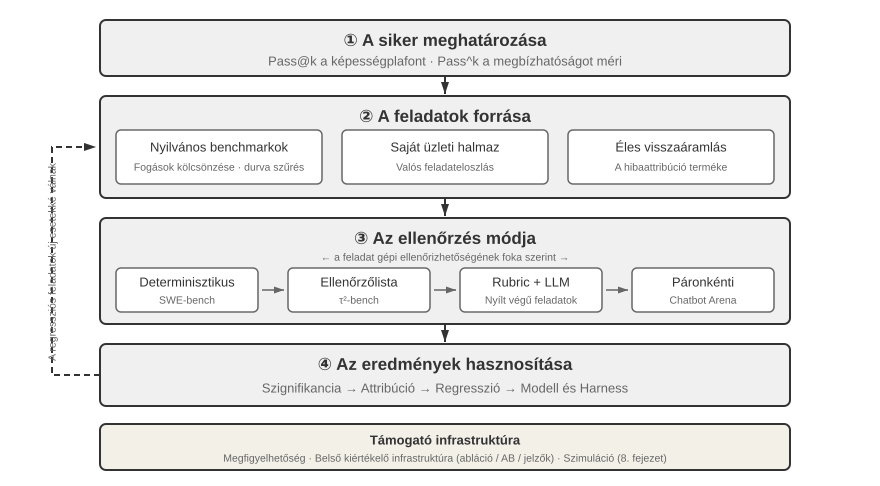
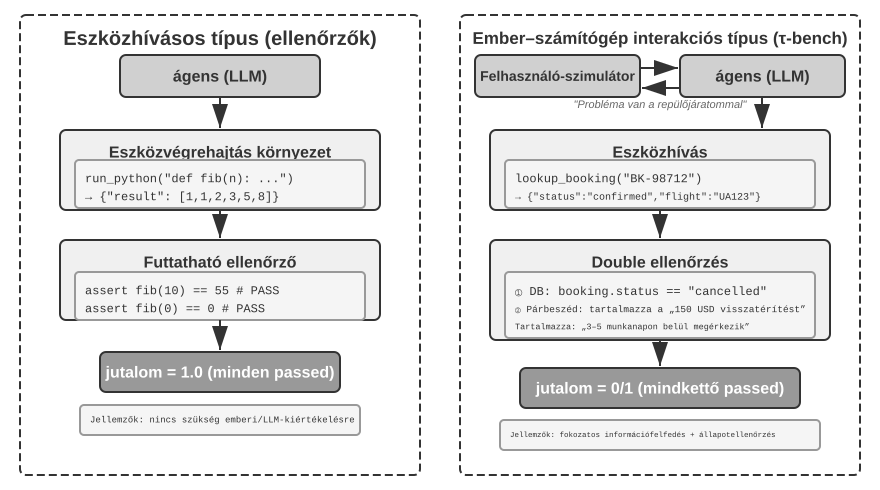
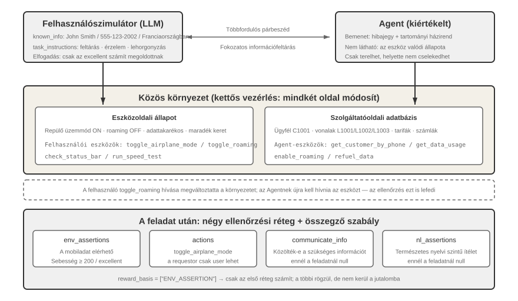
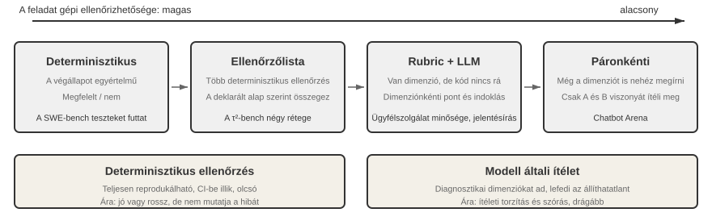
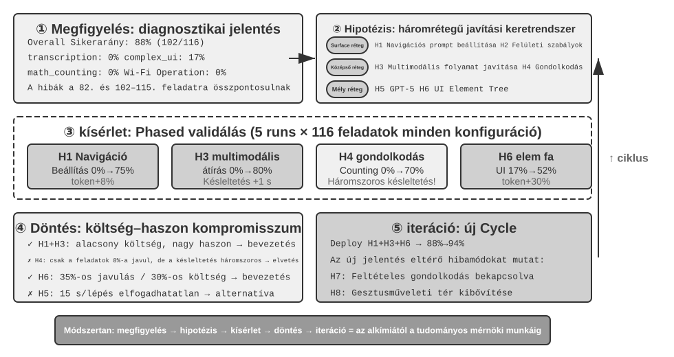
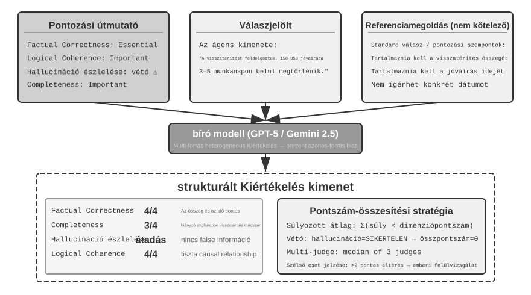
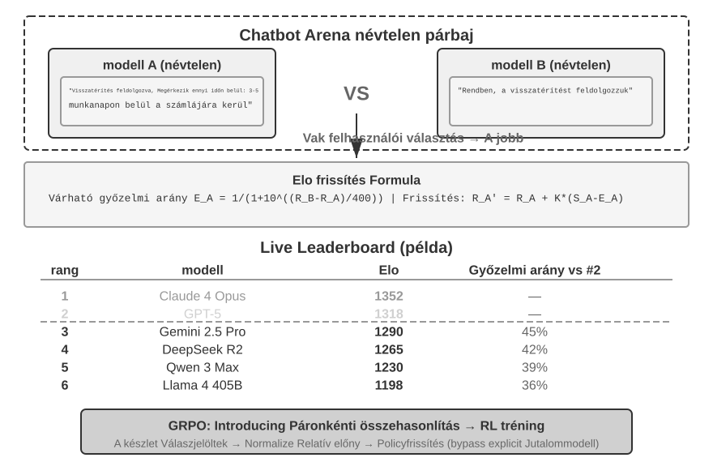
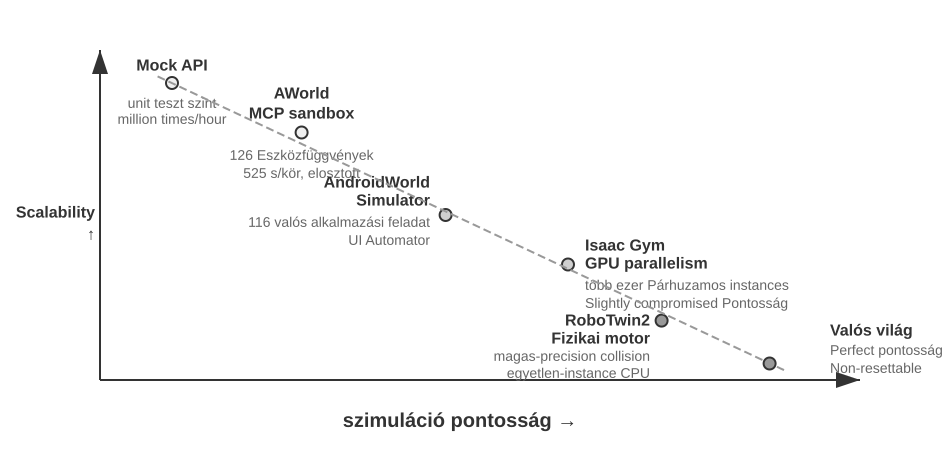
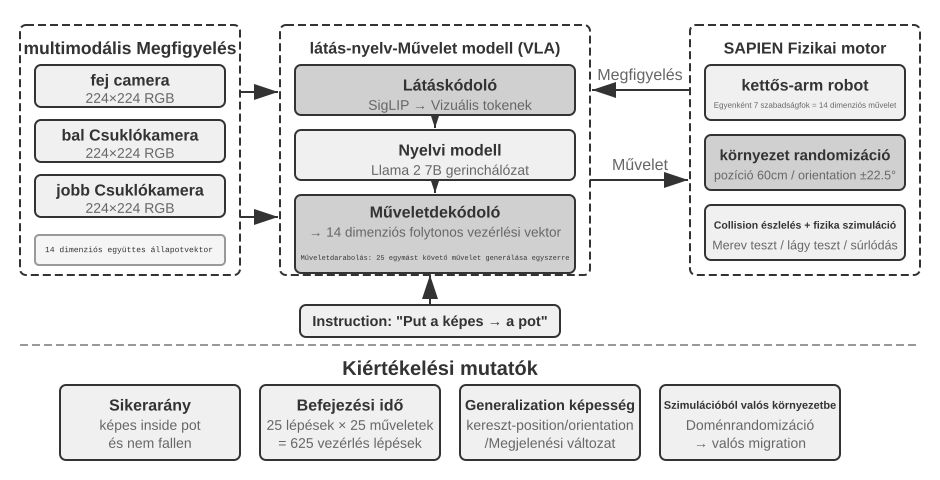

# Modell poszt-tréning

A könyv alapképlete: Ágens = LLM + Kontextus + Eszközök. Ez a fejezet magára az LLM-re – az "agyra" – összpontosít, és azt vizsgálja, hogy a poszt-tréning hogyan segíthet a modellnek hatékonyabban használni a kontextust és az eszközöket, ezáltal javítva az egész Ágensrendszer képességeit. A 6. fejezet vége rámutatott, hogy az értékelő rendszer és a szimulációs környezet a poszt-tréning két sarokköve: az értékelő környezet adja a gyakorlóterepet, az értékelési metrikák pedig a célt. Ez a fejezet ezekre a sarokkövekre építve tárgyalja, hogyan lehet ténylegesen megváltoztatni a modell súlyait – hogyan lehet képességeket a paraméterekbe sütni.

Ez a fejezet nem feltételez semmilyen előzetes ismeretet a megerősítéses tanulásról vagy modelltréningről. Nem várjuk el, hogy ismerd a gradienseket vagy a policy-optimalizálást. Ehelyett abból a kérdésből indulunk ki, hogy hogyan tanul egy modell egyáltalán, világossá téve, hogy az egyes lépések mire valók, hogyan működnek, és milyen problémát oldanak meg. A fejezet végére képesnek kell lenned megválaszolni a következő kérdéseket: Hány szakaszból áll egy modell képességeinek kialakítása? Mit csinál az egyes szakaszok? Miért kell ebben a sorrendben történniük? És hova érdemes koncentrálnod a saját projektjeidben?

**Először is állítsuk fel a legfontosabb térképet: egy modern modell képességei három szakaszban formálódnak.** Ez a három szakasz egymásba kapcsolódik és nélkülözhetetlen:

1.  "Pre-tréning": Hatalmas mennyiségű internetes szövegen történő tréning a "következő token előrejelzésére". Ez a lépés megtanítja a modellnek a nyelv szabályait, a világról való ismereteket és az alapvető érvelést. Olyan, mint egy ember, aki elolvasta a könyvtár összes könyvét – tudós, de még nem jó a kérdések megválaszolásában. Ez a legdrágább lépés (gyakran több tízmillió dollár) és minden képesség alapja.
2.  "Supervised Fine-Tuning (SFT)": A modell tréningje címkézett bemenet-kimenet párokon, hasonlóan ahhoz, ahogy egy tanár standard válaszokat ad a diáknak, hogy utánozza azokat. Több ezertől több tízezer kérdés–standard-válasz demonstráció megtanítja a modellnek, hogy milyen formátumban, stílusban és folyamattal válaszoljon. Ez a lépés a tudós modellt olyan asszisztenssé alakítja, amely érti az utasításokat és jól strukturált kimeneteket produkál. Olcsó, gyors és stabil, és jelenleg szinte minden telepített modell átesik ezen a lépésen.
3.  "Reinforcement Learning (RL)": A modell többször próbálkozik, és jutalmakból és büntetésekből fejlődik, mint egy kiskutya idomítása (jutalomfa ha jól csinálja, semmi ha nem). A standard válaszok megmutatása helyett az RL hagyja, hogy a modell magától próbálkozzon, növelve a jó viselkedés valószínűségét és csökkentve a rosszét. Ez a lépés tanítja meg a modellt arra, hogy ésszerű döntéseket hozzon "váratlan helyzetekben" is – és ez az a lépés, ami a legtöbb helyet foglalja el ebben a fejezetben és a legtöbb mérnöki erőfeszítést igényli.

Egy intuitív hasonlat: A pre-tréning "tízezer könyv elolvasása" (ismeretek felhalmozása), az SFT "egy tanár végigvezet a standard megoldásokon" (demonstrációk utánzása), az RL pedig "a feladatok önálló megoldása és a hibákból való tanulás" (próba-szerencse tanulás). A három nem alternatíva; egy csővezetéket alkotnak – először olvas, aztán nézi a demonstrációkat, aztán gyakorol.

**Ebben a fejezetben két fő szál fut végig. Kérlek jegyezd meg őket, mert minden további tartalom ezeket szolgálja:**

*   **Első szál: Az SFT memorizál, az RL általánosít.** Ugyanarra a feladatra és költségvetésre az SFT hajlamos "memorizálni" a tréningadatban lévő válaszokat, és kudarcot vall, ha a telepítési környezet eltér a tréningtől. Az RL általában "megtanul" egy átvihető stratégiát, ami váratlan helyzetekben is stabil marad. Ez nem csak egy szlogen, hanem egy mérhető jelenség, amelyet ez a fejezet kontrollált kísérletekkel többször is ellenőriz. A 7.1 szakasz egy teljes részt szentel ennek a különbségnek a "mögöttes okainak" magyarázatára.
*   **Második szál: Az adat és a környezet fontosabb, mint az algoritmusok.** Ez az iparág legellentmondásosabb és legértékesebb tanulsága. A meglévő RL algoritmusok (PPO, GRPO stb.) használatának ismerete elegendő. Amitől a siker ténylegesen függ, az két dolog: a "szimulációs környezet" (elég valósághű a gyakorlóterep?) és a "tréningadat" (elég jók a demonstrációk és a jutalomjelek?). Sok forgatókönyvben, ha az SFT adat elég jó, lehet, hogy egyáltalán nincs szükség RL-re. Ez a fejezet újra és újra arra tereli a figyelmed, hogy "melyik algoritmust hangoljam?" helyett arra, hogy "helyesen lett beállítva az adat és a környezet?"

> "Olvasási útmutató": A fejezet tartalma két útvonalra oszlik az olvasó háttere alapján:
>
> *   "Ágensalkalmazás-fejlesztők" (akik nem tréningeznek modelleket): Kezdd az "Pre-tréning, SFT, RL: Háromszakaszos panoráma" bevezetővel a globális megértéshez. Utána átugorhatod a következő két `[Ajánlott olvasmány]` részt (klasszikus RL és pre-tréning háttér), és folytathatod az SFT szakasztól. Koncentrálj az "SFT és RL lényegi különbsége" döntési keretrendszerére és az "mikor válassz SFT-t vs. RL-t" kérdésre, valamint arra az ítéletre, hogy "az adat és a környezet fontosabb, mint az algoritmusok" – ezek a felismerések befolyásolják a tervezési döntéseidet a Harness mérnöki munkában (mikor oldjunk meg promptokkal, mikor éri meg a finomhangolás).
> *   "Modelltréning-mérnökök": Olvasd elejétől a végéig. A két `[Ajánlott olvasmány]` szakasz teljes hátteret ad a megerősítéses tanuláshoz és a pre-tréninghez. A későbbi kísérletek reprodukálható tréning sémákat biztosítanak.

## Pre-tréning, SFT, RL: Háromszakaszos panoráma

A bevezető megadta a három szakasz térképét; ez a szakasz az egyes szakaszok mechanikáján megy végig. A három szakasz az "adataikban", "optimalizációs céljaikban" és "költségeikben" különbözik. A hasonlóságok és különbségek megértése a kulcsa az egész fejezetnek. A 7-1. táblázat áttekintést ad; a részletek a táblázat után következnek.

7-1. táblázat A modellképességek kialakításának három szakasza

| Szakasz | Felhasznált adat | Optimalizációs cél | Amit tanul | Tipikus költség |
|-------------|---------------------|--------------------|---------------------|-------------------|
| "Pre-tréning" | Hatalmas mennyiségű nyers internetszöveg | A következő token előrejelzése | Nyelvi szabályok, világismeret, alapvető érvelés | Nagyon magas (milliók-tízmilliók USD) |
| "SFT" | Több ezertől több tízezer "bemenet-kimenet" demonstrációs pár | A következő token előrejelzése (veszteség csak a válaszon számolva) | Utasításkövetés, kimeneti formátum, stílus, folyamat protokoll | Alacsony (órák-napok) |
| "RL" | Feladat + Jutalomfüggvény (nincs standard válasz) | Várható jutalom maximalizálása | Átvihető döntéshozatali stratégia, újonnan felfedezett megoldások | Magas (gyakran tízszer-százszorosa az SFT-ének) |

### Mit csinál a pre-tréning: A következő token előrejelzése

A modern nagymodellek összes "intelligenciája" egy olyan egyszerű feladatra épül, hogy meglepő: **következő token előrejelzés (Next Token Prediction, NTP)**.

Mutasd meg a modellnek egy szöveg első részét, és találja ki a következő tokent. Például a "Kína fővárosa" bemenetre a modell nagy valószínűséget rendeljen "Peking"-hez. Minden egyes tippnél a modell összehasonlítja az előrejelzését a tényleges következő tokenhez. Minél nagyobb az eltérés (ezt hívják loss-nak), annál jobban módosítja a paramétereit, hogy legközelebb pontosabban tippeljen hasonló kontextusokban. Ezt több billió token internetes szövegen ismételve a modell kénytelen megtanulni a nyelvtant, a tényeket, a logikát és még az alapvető érvelést is – mert ahhoz, hogy a kontextusok hatalmas skáláján következetesen helyesen tippelje a következő tokent, nincs rövid út; tényleg "fel kell dolgoznia" a szöveg mintázatait.

Van egy fontos pont, amit érdemes megjegyezni, ami végigvonul az SFT-n és az RL-en is: **A modell kimenete lényegében egy valószínűségi eloszlás.** Az előző szöveg alapján a modell minden lehetséges tokenjéhez rendel egy valószínűséget a szókészletében. A "tréning" lényege "ennek a valószínűségi eloszlásnak a beállítása" – a kívánt tokenek valószínűségének növelése és a nem kívántaké csökkentése. A három szakasz között csak abban van különbség, hogy "mi a kívánt" és "milyen jel definiálja a 'kívánt'-at".

A pre-tréning után a modell tudós, de nem felhasználóbarát: ha felteszel neki egy kérdést, lehet, hogy további kérdéseket generál a válasz helyett – mert az internetes szövegben egy kérdést gyakran egy másik kérdés követ. Még nem tanulta meg azt a protokollt, hogy "ha kérdeznek, válaszolni kell".

### Az SFT lényege: "Következő token előrejelzése" más adatokkal

Ez az első kulcsfontosságú felismerés, amit meg kell érteni ebben a fejezetben: **Matematikailag az SFT és a pre-tréning ugyanaz a feladat – mindkettő a következő tokent jósolja meg és ugyanazt a loss függvényt minimalizálja.** Sok kezdő azt gondolja, hogy az SFT egy teljesen új módszer, de nem az. A különbség az SFT és a pre-tréning között csak két dologban rejlik:

1.  "Más adat." Pre-tréning nyers internetes szövegeket használ (strukturálatlan, mindent tartalmaz); SFT gondosan elkészített "bemenet-kimenet" párokat használ, egységesen "felhasználói kérdés → ideális válasz" formátumban. A modell továbbra is "a következő token előrejelzését" végzi ezeken a demonstrációkon, ezáltal megtanulja a "hogyan strukturáljam a választ, ha kérdeznek" protokollt.
2.  **A veszteséget csak a "válaszon" számoljuk (loss masking).** Egy SFT minta egy kérdésből és egy címkézett válaszból áll. Nem akarjuk, hogy a modell megtanulja "hogyan kell kérdezni", csak azt, hogy "hogyan kell válaszolni". Ezért a loss számításakor a kérdés rész tokenjei maszkolva vannak, és a gradienseket csak a válasz részen keresztül propagáljuk vissza. Ez az egyetlen érdemi mérnöki különbség az SFT és a pre-tréning között.

Ha ezt megértetted, az "SFT memorizál" természetesen következik: Az SFT optimalizációs célja, hogy **maximalizálja a címkézett válasz minden egyes tokenjének valószínűségét** – leegyszerűsítve "tanuld meg kívülről ezt a standard választ". Ugyanarra a kérdésre a modellt arra tréningezzük, hogy a lehető legpontosabban reprodukálja a demonstrációt. A világos célokkal és rögzített formátumokkal rendelkező feladatoknál ez rendkívül hatékony – néhány ezer példa is elég –, de a képességei szigorúan a demonstrációs adatok által behatároltak: nem tanult olyan helyzeteket, amelyek hiányoznak a demonstrációkból, és amikor egy bemutatott válasz már nem alkalmazható, mert a környezet megváltozott, továbbra is reprodukálja azt a választ.

Röviden: Az SFT rendkívül magas mintahatékonysággal **egy stabil bemenet-kimenet leképezést és protokollt kódol a modell paramétereibe**. "Protokolltudást" kódol – hogyan kell valamit mondani vagy tenni, beleértve a formátumot, stílust és folyamatot –, nem pedig nagy mennyiségű "ténytudást" – amit a modell tud. Utóbbi a pre-tréningre vagy RAG-re támaszkodik (visszatérünk ehhez a megkülönböztetéshez a fejezet végén).

> "Tréningköltség: LoRA paraméterhatékony finomhangolás." Mind az SFT, mind a későbbi RL megköveteli a modell paramétereinek frissítését, és a teljes paraméteres finomhangolás nagy VRAM-igényekkel jár (tárolni kell a gradienseket és optimalizátor állapotokat több milliárd paraméterhez). A "LoRA" (Low-Rank Adaptation) a leggyakoribb költségcsökkentő módszer: ahelyett, hogy a nagy eredeti súlymátrixokat módosítaná, egy kis "javítást" (alacsony rangú mátrixot) csatol a feladat megtanulásához. A paraméterszám csak 1–5%-a az eredetiének, mégis megközelítheti a teljes finomhangolás teljesítményét. Mivel az eredeti súlyok fagyasztva vannak, a LoRA kevésbé zavarja az alapmodell meglévő képességeit, csökkentve a katasztrofális felejtés kockázatát. Néhány bevált szabály[^ch7-1]: "Muszáj" a LoRA-t az összes fő súlymátrixra alkalmazni (különösen az MLP rétegekre, amelyek a legtöbb paraméterrel rendelkeznek); ha csak a figyelmi rétegekre alkalmazzuk, az pontosságot veszít. **Az optimális tanulási ráta körülbelül 10-szerese a teljes finomhangolásénak** (igaz mind az SFT-re, mind az RL-re, egy nagyon praktikus átviteli szabály). Az SFT-hez használj közepes-magas rangot (64–256); mivel az RL-ben körönként kevés az információ, kis rang (8–32) vagy akár rang=1 is elegendő. Telepítéskor egyetlen következtető szerver több LoRA adaptert is betölthet egyszerre több-bérlős kiszolgáláshoz. Ez a könyv a LoRA-t tekinti az alapértelmezett mérnöki választásnak minden poszt-tréning módszerhez, és nem tárgyalja külön.

### Miért kell az SFT-nek az RL előtt jönnie, és nem fordítva

A három szakasz sorrendje nem önkényes. A pre-tréning első vitathatatlan – nyelvi és ismereti alap nélkül semmi más nem lehetséges. Amit meg kell magyarázni: **Miért kell az SFT-nek az RL előtt jönnie?**

A válasz abban rejlik, hogy az RL hogyan működik. Az RL nem nézi a standard válaszokat; hagyja, hogy a modell "generálja" a saját válaszait, majd jutalmakat vagy büntetéseket ad a válasz minősége alapján. De a minőség megítéléséhez először képesnek kell lenned "értelmezni" a modell kimenetét: ha a feladat egy JSON objektum vagy egy eszközhívás kiadását igényli, és a modell egy rosszul formázott szövegkáoszt produkál, a jutalomfüggvény nem tud számolni (még azt sem tudja eldönteni, hogy "siker vagy kudarc"), és az RL nem tud tanulni.

Tehát az SFT szerepe az, hogy **először jól formázott kimenetet állítson elő a modellből**: néhány demonstráció stabilizálja a kimeneti formátumot, hogy az megbízhatóan értelmezhető legyen, így adva az RL-nek egy kiindulópontot, ami pontozható. Ez az iparág legerősebb ""először SFT, aztán RL"" kétszakaszos paradigmája. Ha előbb csinálnánk RL-t és később SFT-t, az nem működne – stabil kimenet nélkül a jutalomjel csak zaj. A kínai festészet egy fogalmát kölcsönvéve: az SFT először a ""formát"" (formátum, struktúra) hozza létre, aztán az RL a ""szellemet"" (stratégia, általánosítás) üldözi – "előbb a forma, aztán a szellem".

Egy fontos határfeltétel: "Az SFT-nek előbb kell jönnie" abban a helyzetben igaz, ahol **"kisebb alapmodell + szigorúan strukturált kimenet"** (a 7-11. kísérlet megmutatja, hogy egy Llama-3.2-Vision-11B méretű modell teljesen kudarcot vall, ha az RL-t közvetlenül, SFT nélkül alkalmazzuk). Ha azonban az alapmodell elég erős, lehet, hogy eleve megfelelő kimenetet produkál, így az SFT kihagyható – a DeepSeek-R1-Zero demonstrálta, hogy a közvetlen RL sikeres lehet egy erős alapmodellel, a reflektálás és a hosszú gondolkodási láncok spontán módon jelennek meg. Ennek ára a gyenge kimeneti olvashatóság és a kevert kínai/angol szöveg volt, ezért a DeepSeek végül visszatette a "hidegindításos SFT"-t az R1-ben, hogy újra stabilizálja a "formát". Az R1 útja a Zero-tól a hidegindításig a legjobb illusztrációja az "előbb a forma, aztán a szellem" elvnek.

### Az SFT és az RL lényegi különbsége (A legfontosabb táblázat ebben a fejezetben)

Többször mondtuk, hogy "az SFT memorizál, az RL általánosít". Most magyarázzuk el alaposan a mögöttes okokat. Minden különbség a két módszer között az "eltérő optimalizációs célokból" fakad:

*   **SFT: "mennyire hasonlít a standard válaszra" optimalizál.** A cél a címkézett válasz valószínűségének maximalizálása (maximum likelihood). Egy kérdésre csak egy "helyes" kimenet van – a demonstrációs válasz. A modellt ebbe az egyetlen útvonalba húzzuk, megtanulva egy fix leképezést, hogy "lásd ezt a bemenetet, produkáld azt a kimenetet". Tehát "memorizál": a tréning során J/Q/K mind 10-nek számít, és rögzíti a "J/Q/K = 10" szabályt; teszteléskor J 11 lesz, de még mindig 10-et használ, és rossz választ ad.
*   **RL: "milyen jó az eredmény" szerint optimalizál.** A cél a várható jutalom maximalizálása. Egy kérdésre "bármelyik" kimenet jó, ami magas jutalmat ér el – nem csak egy. A modell saját maga fedezi fel a több útvonalat, és megerősíti azokat, amelyek jó eredményt hoznak. Egy általánosabb "stratégiát" tanul meg arról, hogy "milyen folyamat vezet a helyes eredményhez": amikor J 11 lesz, ugyanazzal a stratégiával újraszámol, ahelyett, hogy egy memorizált választ alkalmazna. Ez az "általánosítás".

7-2. táblázat Az SFT és az RL lényegi összehasonlítása

| Dimenzió | SFT (Supervised Fine-Tuning) | RL (Reinforcement Learning) |
|-----------------|--------------------------------------|----------------------------------------|
| Optimalizációs cél | Címkézett válasz valószínűségének maximalizálása (Maximum Likelihood) | Várható jutalom maximalizálása |
| Tréning jel | Egyetlen standard válasz (minden tokenre felügyelet) | Több saját generált válasz + jutalom (egy siker/kudarc jel válaszonként) |
| Adatforma | "Bemenet-Kimenet" demonstrációs párok | Feladat + Jutalomfüggvény (nincs szükség standard válaszra) |
| Amit tanul | Fix "Bemenet→Kimenet" leképezés (memorizálás) | Átvihető döntéshozatali stratégia (általánosítás) |
| Eloszlásváltáskor | Régi választ alkalmazza környezetváltáskor, teljesítmény csökken | Újramegoldja ugyanazzal a stratégiával, stabilabb |
| Mintahatékonyság | Magas (több ezer példa hatékony) | Alacsony (gyakran tízszer-százszorosa az SFT-ének) |
| Tréning stabilitás | Magas, gyorsan konvergál | Alacsony, hajlamos oszcillációra, gondos hangolást igényel |
| Legalkalmasabb | Formátum/stílus/folyamat rögzítése, kiváló minőségű demonstrációk, stabil környezet | Új forgatókönyvekre általánosítás, optimális stratégiák felfedezése, magas annotációs költség |

**A post-training azt is alakítja, mikor cselekszik a modell.** A Coding modellek kézzelfogható példát adnak: a GPT- és Claude-család gyakran eltérő alapértelmezett cselekvési küszöböt mutat. Az előbbi szerkesztés előtt többet olvashat a tárolóból; az utóbbi kevesebb fájlból lokalizálhatja a változtatást, előbb megvalósíthatja, majd teszt-visszajelzéssel korrigálhat. Ez nem az egyik modell „óvatos”, a másik „ösztönös” megszemélyesítése. A paraméterekben lévő policy azt becsüli, hogy még egy fájl elolvasásának várható értéke meghaladja-e a jelenlegi javítás beküldésének és ellenőrzésének várható értékét. Ha az SFT-demonstrációk ismételten széles körben vizsgálódnak szerkesztés előtt, a modell magasabb cselekvési küszöböt utánoz. Ha a folyamat- vagy eredményjutalmak következetesen elismerik a gyors lokalizálást és a korai, ellenőrizhető ciklust, a valószínűségi tömeg a korábbi cselekvés felé tolódik. A 6-7. kísérlet teljesen azonos, semleges Coding Harnessben cserél modelleket, és kiméri, hogy ez a viselkedés a modellel együtt változik: a Harnessnek nem kell munkafolyamatot kikényszerítenie ahhoz, hogy a modell saját, stabil eszközhasználati policyt hordozzon. A Harness módosíthatja ezt, de a fő forrás a post-training utáni modellparaméterekben lehet. Mivel a szolgáltatók nem teszik közzé a teljes adat- és jutalmazási receptet, a kísérlet a modelloldali viselkedéskülönbséget állapítja meg, nem az azt létrehozó konkrét, zárt algoritmust.

Egy mélyebb mechanizmust érdemes ismerni: a "móduszkövetés (mode-seeking)", ami megmagyarázza, miért konvergál az RL néhány jó stratégiára. Az összes lehetséges válasz valószínűségi eloszlásának, amit a modell adhat egy kérdésre, sok "módusza" lehet, amelyek mindegyike egy-egy ésszerű válaszcsaládot képvisel. Az SFT által használt maximum likelihood "tömegfedő (mass-covering)" – megpróbálja lefedni a demonstrációban jelenlévő összes móduszt, még az alacsonyabb minőségűeknek is valószínűséget adva ("szétosztja a vagyont"). Az RL (különösen a KL korlátos policy optimalizáció, amelynek matematikai formája a "fordított KL divergenciának" felel meg, részletek a RLHF szakaszban) "móduszkövető (mode-seeking)" – hajlamos megtalálni a legmagasabb jutalmú néhány móduszt, rájuk koncentrálva a valószínűséget, és határozottan eldobva a többit ("a győztes mindent visz"). Ezért adnak az RL-ben tréningezett modellek "határozottabb" válaszokat és koncentrálnak erősebben a kiváló minőségű stratégiákra, és ezért hajlamos az RL feláldozni a diverzitást. Jegyezd meg a tömegfedő és móduszkövető fogalmakat; a KL divergencia szakasz ezekkel magyaráz egy száraznak tűnő, de kritikusan fontos tervezési döntést.

**Miért van az RL-nek magasabb plafonja, mint az SFT-nek? Mert "online".** Ez egy mélyebb különbség az SFT és az RL között, és az alapvető oka annak, hogy az RL megéri a plusz költséget. Az SFT egy "offline" módszer: csak egy rögzített demonstrációs adathalmazból tud tanulni, és soha nem látja a világot azon adatokon túl. Az RL egy "online" módszer: hagyja, hogy a modell saját válaszokat generáljon, majd a visszajelzések alapján fejlődjön, próba-szerencse alapon tanulva. (Az "online/offline" és a szigorúbb "on-policy/off-policy" kifejezések formális megkülönböztetésére a 7.8 szakaszban kerül sor; most az intuíciót építjük.) Az online jelleg három olyan előnyt hoz, amit az SFT egyszerűen nem tud nyújtani, és ezek együtt emelik a plafont:

- **Először is, az offline plafonja az adat; az online plafonja a feladat.** Az SFT optimális eredménye a demonstrációk "tökéletes másolása" – így a plafonja a "demonstrátor szintje"; legfeljebb megközelítheti, és szinte soha nem haladhatja meg azt. Egy olyan tanító által címkézett adathalmaz, aki 60 pontot kap 100-ból, nem hozhat létre olyan diákot, aki 90-et kap. Az RL nem nézi a demonstrációkat, csak az eredményjutalmakat: "bármely" viselkedés, ami magasabb jutalmat hoz, megerősítésre kerül, még akkor is, ha senki sem mutatta be. Így az RL önállóan **fedezhet fel olyan kiváló stratégiákat, amelyek nem léteznek a demonstrációkban** – a fejezet későbbi részében a 7-13. kísérletben (SimpleVLA-RL) a modell által magától felfedezett "pushcut" akció soha nem szerepelt emberi demonstrációkban, ami közvetlen bizonyítéka a "demonstrációk túlszárnyalásának". Az RL plafonját maga a feladat határozza meg (amit a jutalom felismer), nem az, ami véletlenül az adatban van.
- **Másodszor, az igazolás könnyebb, mint a generálás – ez az alapvető oka annak, hogy az RL magasabbra juthat.** Az SFT-nek valakinek **először le kell írnia a helyes választ** demonstrációként; az RL-nek csak egy módszer kell a "megítélésére", hogy egy válasz jó-e (jutalom hozzárendelése). Sok feladatban a jó és rossz megkülönböztetése sokkal könnyebb, mint a helyes válasz előállítása – matematikai válaszok ellenőrizhetők egy megoldókulccsal, kód futtatható teszteken, tételbizonyítók ellenőrizhetik a bizonyításokat. Amíg a jó munka felismerése könnyebb, mint az előállítása, az RL addig képes olyan modellt tréningezni, ami erősebb bármely elérhető demonstrátornál: a modell véletlenszerűen próbálkozik, a környezet kiválasztja a jó próbálkozásokat és megerősíti azokat. Ez az igazolás-generálás aszimmetria az olyan igazolható-jutalom módszerek, mint az RLVR, erejének forrása.
- **Harmadszor, az online tanulás lehetővé teszi a modell számára, hogy az általa követni fogott pályákon tréningezzen, és megtanuljon a saját hibáiból kilábalni.** Az offline utánzásnak van egy klasszikus problémája, az ún. "kovariátaeltolódás (covariate shift)": amikor a diák önállóan cselekszik, eltér a demonstrációktól, és olyan állapotokba kerül, amelyek hiányoznak az adatokból. Mivel soha nem tanulta meg, hogyan térjen vissza ezekből az állapotokból, a hibák felhalmozódnak a pálya során (elméletileg a tiszta utánzás hibája körülbelül $T^2$ arányban nő a pályahossz T-vel, míg az online adatokkal történő tréning ezt körülbelül T-re szoríthatja). Az online módszerek az ellenkezőjét csinálják – a modell ugyanazon az eloszláson tréningezik, amit telepítéskor tapasztalni fog, és minden visszajelzési kör közvetlenül a jelenlegi gyengeségeit célozza; az adat mindig "friss", ellentétben az offline adatokkal, amelyek valaki más (a tanító) viselkedését írják le, és ahogy a modell fejlődik, egyre kevésbé relevánsak. Az oka annak, hogy az On-Policy Distillation (7.12 szakasz) később a fejezetben olyan erős, lényegében az, hogy egyesíti ezt az "online" előnyt az SFT "sűrű felügyeleti" előnyével.

Egy hasonlattal élve: **Az SFT egy más által rajzolt térképet másol, és legfeljebb azt a térképet tudja elérni; az RL egy iránytűvel – a jutalommal – fedezi fel a területet, és a térképen túli útvonalakat is felfedezhet.** Ezért is vált az "alapozz SFT-vel, aztán emelkedj RL-lel" a mainstream receptté.

Ezzel a panorámával a kezünkben minden későbbi szakasznak van egy helye a térképen. A következő két szakasz, mindkettő `[Ajánlott olvasmány]` – "A klasszikus RL ágensektől a modern ágensekig" és "Modell pre-tréning alapok" – a megerősítéses tanulás és a pre-tréning hátterét töltik ki azoknak az olvasóknak, akik mélyebbre akarnak menni. Azok az olvasók, akik csak a gyakorlati poszt-tréninghez akarnak hozzáférni, ugorhatnak előre az SFT szakaszhoz.

## A klasszikus RL ágensektől a modern ágensekig `[Ajánlott olvasmány]`

### Ágens-környezet interakció

A "megerősítéses tanulás" (Reinforcement Learning, RL) lényegében arról szól, hogy hogyan tanuljunk meg akciókat kiválasztani az aktuális helyzet alapján a "halmozott jutalom" maximalizálása érdekében. Képzelj el egy MI-t, ami sakkozni tanul: minden lépés egy akció, a győzelem pozitív jutalmat ad, a vereség negatívat, a halmozott jutalom pedig a teljes játszma össznyeresége. Az Ágens és a környezet folyamatosan interakcióban van: minden lépésnél az Ágens megfigyeli az aktuális állapotot, kiválaszt egy akciót, a környezet pedig új állapotot hoz létre és jutalmat ad.

Hogy ezt az interakciót intuitívabban megértsük, a következő ábra a standard RL ciklust mutatja – minden időlépésben az Ágens megfigyeli a környezet állapotát, kiad egy akciót, és a környezet egy jutalmat és egy új állapotot ad vissza az akció alapján.

Ez az interakció egy "pályát" (trajectory) hoz létre – az "állapot → akció → jutalom → új állapot → akció → jutalom..." teljes rekordját. Egy irányelv (policy) minősége végső soron a pályák minőségében tükröződik. Az "értékfüggvény" (value function) arra a kérdésre válaszol: "Ha most ebben az állapotban vagyok, és továbbra is az aktuális irányelv szerint cselekszem, mennyi összjutalmat fogok végül felhalmozni?" Ez olyan, mint egy tapasztalt sakkozó, aki egy pozíciót nézve, anélkül hogy végigszámolná a játszmát, intuitívan megbecsüli a nyerési esélyt. (Amikor az "aktuális irányelvet" az "optimális irányelv" váltja fel, megkapjuk az optimális értékfüggvényt, amelyet később a Bellman-optimalitási egyenlet kapcsán használunk.) Az Ágens és a környezet közötti határ egy egyszerű elvet követ: **amihez az Ágens nem férhet hozzá önkényesen, az a környezethez tartozik.**

Két egyedi jellemző különbözteti meg a megerősítéses tanulást a felügyelt tanulástól (ami címkézett helyes válaszokat igényel) és a felügyelet nélküli tanulástól (ami rejtett mintázatokat tár fel az adatokban): a "próba-szerencse keresés" (az Ágensnek magának kell kitalálnia, hogy mely akciók jók, anélkül hogy egy tanító közvetlenül megadná a helyes választ) és a "késleltetett jutalom" (egy akció hatása csak sok lépéssel később válik nyilvánvalóvá, pl. egy jó sakklépés értéke csak a játszma végén derül ki). Ez hozza magával az egyedi "felfedezés–kiaknázás dilemmát" (exploration-exploitation tradeoff): ha mindig ismert utakat jársz, nem tanulsz semmi újat; ha mindig véletlenszerűen próbálkozol, soha nem éred el a célt.

Egy megerősítéses tanulási rendszer öt alapvető elemből áll:

- "Akciótér (Action Space)": Az összes lehetséges akció halmazát definiálja, amit az Ágens végrehajthat. Az akciók lehetnek diszkrétek (pl. "melyik lépést tegyem meg" a sakkban, véges számú opcióval) vagy folytonosak (pl. "hány fokkal forgassa el az ízületet" egy robotnál, folytonos érték).
- "Irányelv (Policy)": Az Ágens viselkedési szabálya, meghatározza, hogy mit tegyen egy adott állapotban. Egy irányelv lehet egyszerű (egy keresőtábla: A állapotban hajtsd végre X akciót) vagy összetett (egy mély neurális hálózat).
- "Jutalomjel (Reward Signal)": A környezet azonnali visszajelzése. Az Ágens célja azonban a hosszú távú, nem az azonnali jutalom maximalizálása – ez a különbségtétel kulcsfontosságú, ahogy a befektetést sem a mai nyereség-veszteség alapján kell megítélni, hanem a hosszú távú hozam alapján.
- "Értékfüggvény (Value Function)": Becsli az adott állapotból elérhető teljes halmozott jutalmat a jövőben, segítve az Ágenst a bölcs döntések meghozatalában még azonnali visszajelzés nélkül is. A hatvan év RL kutatás egyik legfontosabb felismerése az értékbecslés központi szerepe.
- "Környezeti modell (Environment Model)" (opcionális): Előrejelzi a környezet reakcióját az akciókra. Azokat a módszereket, amelyek használnak környezeti modellt, "modell-alapú módszereknek" (model-based methods) hívjuk (először megtanulják előrejelezni a környezet változásait, aztán terveznek); azokat, amelyek nem, "modell-mentes módszereknek" (model-free methods) (nem jósolják a környezetet, hanem közvetlenül a tapasztalatból tanulnak).

A 7-3. táblázat összehasonlítja a különböző Ágensrendszerek kulcsfontosságú összetevőit, feltárva az Ágens koncepció univerzalitását és segítve az olvasót a hagyományos RL Ágensek és a modern LLM Ágensek közötti akciótér-különbség megértésében.

7-3. táblázat Különböző Ágensrendszerek kulcselemeinek összehasonlítása

| Ágens típusa | Környezet | Akciótér | Jutalomjel |
|---------------|------------------------|-------------------------------|-------------------------|
| "Újszülött gazella" | Domborzat, gravitáció, testtartás | Folytonos nagy dimenziós (izomcsoport-összehúzódások) | Egyensúly (+), Esés (-) |
| "Porszívó robot" | Szoba elrendezés, akkumulátorszint | Diszkrét (irány, porszívózás, töltés) | Tisztított terület (+), Lemerült akku (-) |
| "Sakk nagymester" | Tábla állapot, időkorlát | Diszkrét véges (szabályos lépések) | Győzelem (+1), Vereség (-1) |
| "Ügyfélszolgálati Ágens" | Beszélgetés történet, tudásbázis | Nyitott végű (gondolkodj, beszélj, API hívás) | Probléma megoldva (+), Kezelési idő (-) |
| "Kódasszisztens Ágens" | Követelménydokumentum, kód bázis | Nyitott végű (gondolkodj, keress, szerkessz, futtass) | Teszt sikeres (+), Bug bevezetve (-) |

A táblázat egy fontos felismerést tár fel: a hagyományos RL Ágensek olyan területeken, mint a sakk és a robotika, zárt akcióterekkel rendelkeznek, míg a modern LLM-alapú Ágensek, mint az ügyfélszolgálati és kódolási Ágensek, nyitott végű, szinte korlátlan akcióterekkel. Ezek az Ágensek a "belső gondolkodás" speciális akcióját is használhatják képességeik fokozására.

### Két Ágensparadigma: Az MDP-től az LLM+RL-ig

A két paradigma leginkább az akciótérben különbözik – az MDP feltételezi, hogy az akciótér véges és zárt (fel/le/fel/rak), míg az LLM akciótere nyitott végű, kombinatorikusan robbanó természetes nyelvi szekvenciákból áll. Ez a különbség alapvető szakadékot hoz létre a két paradigma között az algoritmikus tervezésben, a mintahatékonyságban és az általánosításban. Az alábbiakban az egyes paradigmákat tárgyaljuk.

"Hagyományos Paradigma: MDP és Q-learning."

Az MDP (Markov-döntési folyamat) a megerősítéses tanulás matematikai keretrendszere, amely olyan alapvető elemeket definiál, mint az állapotok, akciók és jutalmak. Alapfeltevése a "Markov-tulajdonság": a jövő csak az aktuális állapottól függ, nem a korábbi történettől. Például a sakkban elég csak az aktuális táblaállást nézni az optimális lépés meghatározásához; nem kell áttekinteni minden korábbi lépést. Ez a feltevés leegyszerűsíti a problémát, de korlátozza a történeti függőségek modellezésének képességét.

A hagyományos RL Ágens kulcsjellemzője a "zárt akciótér" – az összes lehetséges akció, amit az Ágens végrehajthat, egy előre meghatározott, véges halmazt alkot. "Klasszikus táblajáték Ágensek" a legjellemzőbb példák: a 361 lehetséges lépés Go-ban, bár hatalmas, teljesen meghatározott és véges; a sakkban a különböző bábuk eltérő lépésszabályai ellenére az akciók felsorolhatók; az Atari játékokban csak néhány, legfeljebb egy tucat diszkrét akció van. "Robotikai Ágensek" folytonos, de korlátos akcióteret képviselnek: az ízületi szögek, sebességek és szorítóerők folytonos értékek, de mindegyiknek világos fizikai korlátai vannak (maximális forgási szög, maximális nyomaték, sebességkorlátok), a dimenziókat a robot szabadságfokai határozzák meg.

Ez a zárt jelleg számítási előnyöket hoz: az összes akció felsorolható és egyenként kiértékelhető, megkönnyítve a dinamikus programozást és a Monte Carlo fa keresést, és az akció-érték függvény táblákkal vagy egyszerű függvényekkel közelíthető. Azonban korlátozza a kifejezőerőt és az általánosítást. A hagyományos RL Ágensek a nulláról indulnak, kizárólag próba-szerencse alapon tanulnak – véletlen irányelvből indulva, tapasztalatot gyűjtve, frissítve az értékfüggvényt vagy irányelvet, és ismételve a konvergenciáig.

Ezen a keretrendszeren belül az egyik legalapvetőbb és legfontosabb algoritmus a "Q-learning". Fenntart egy értékbecslést minden "állapot-akció" párhoz: ha *s* állapotban *a* akciót hajtod végre, és utána optimálisan cselekszel, mennyi összjutalomra számíthatsz? Intuitívan, hogy egy akció jó-e, függ az általa hozott azonnali jutalomtól, plusz attól, hogy "milyen jó a következő állapot, ahová vezet".

Ezt az intuíciót egyenletként felírva kapjuk a híres "Bellman-egyenlet" központi rekurzív kapcsolatát az RL tankönyvekben: **Egy akció valódi értéke = az ebben a lépésben kapott azonnali jutalom + a következő állapotból elérhető maximális jövőbeli érték**:

$$Q^*(s, a) = r + \gamma \max_{a'} Q^*(s', a')$$

ahol $r$ az azonnali jutalom, $s'$ a következő állapot az akció végrehajtása után (determinisztikus formában írva az intuíció kedvéért; sztochasztikus környezetben a következő $s'$ állapot várható értéke szükséges), és $\gamma \in [0, 1)$ a "diszkontfaktor" – meghatározza, hogy az Ágens mennyire értékeli a jövőt: minél közelebb van $\gamma$ az 1-hez, annál inkább értékeli a hosszú távú hozamot; minél közelebb van a 0-hoz, annál inkább az azonnalira koncentrál. A többször említett "halmozott jutalom" pontosan a jutalmak összege minden lépésben, $\gamma$-val diszkontálva: $\sum_{t} \gamma^{t} r_t$. Minden akció után az algoritmus kissé a "ténylegesen megfigyelt eredmény" felé módosítja a régi becslést – ezt a paradigmát, hogy "javítsuk a régi becslést egy egy-lépéses tényleges eredménnyel", "Időbeli Különbség Tanulásnak" (Temporal-Difference Learning, TD learning) hívjuk. Több ezer próbálkozás után a becslés fokozatosan közelíti a valódi értéket.

A következő két ábra a Q-learning felfedezési folyamatát mutatja egy rács-világban és a Q-értékek fokozatos konvergenciáját.

A Q-learning az "off-policy" módszerek egy speciális típusa – bármely irányelv által generált adatokat (beleértve a véletlen felfedezést is) felhasználhatja az optimális irányelv megtanulásához. Az on-policy és off-policy módszerek szigorú definícióit, valamint azt, hogy hogyan kapcsolódnak az LLM poszt-tréninghez, később a "Megerősítéses tanulási algoritmusok összehasonlítása" szakaszban tárgyaljuk.

> 
>
> **7-1. kísérlet ★: Q-learning teljesítménye kincsvadász játékban**
>
> A Q-learning jellemzőinek és korlátainak ellenőrzésére terveztünk egy "kincsvadász játékkörnyezetet". Ez a környezet több kulcsfontosságú kihívást tartalmaz: "rejtett mechanizmusok" megkövetelik, hogy az Ágens maga fedezze fel a kulcsok és ajtók, a fegyverhatások és a tárgykészítési szabályok közötti összefüggéseket; "többlépéses függőségek" miatt a feladat végrehajtásához a helyes akciók sorrendjére van szükség (optimális megoldás: 11 lépés); "ritka jutalmak" azt jelentik, hogy csak a kulcsfontosságú akciók és a végső győzelem adnak jelentős jutalmat, a legtöbb köztes lépés nem kap visszajelzést.
>
> A Q-learning Ágens standard paraméterbeállításokat és ε-greedy felfedezési stratégiát használ: általában az aktuálisan optimális akciót választja, de alkalmanként véletlenszerűt, a véletlen felfedezés aránya fokozatosan csökken a tréning során.
>
> A tanulási görbe tipikus jellemzőket mutat (egy epizód egy teljes játék a kezdettől a befejezésig vagy kudarcig):
> - "Első 1000 epizód": 0%-os nyerési arány, a Q-táblában csak 124 állapot, az Ágens vakon fedez fel
> - "Első 5000 epizód": Még mindig nincs stabil győzelem, a Q-táblában 133 állapot
> - "7 000–8 000 epizód": Nyerési arány fokozatosan 34%-ról 96%-ra emelkedik
> - "10 000 epizód": 100%-os nyerési arány, a Q-táblában 145 állapot, megtalálta a 11-lépéses optimális megoldást
>
> A teljes tréning kevesebb, mint 10 másodpercet vesz igénybe (nagyon hatékony szimuláció), de majdnem 10 000 teljes próbálkozást igényel. Ez demonstrálja a Q-learning központi jellemzőjét: nagy mennyiségű véletlenszerű felfedezésre van szükség, hogy véletlenül teljesítse a teljes utat, és az értékjelek terjedése nagyon lassú, ismételt megerősítést igényelve. A tiszta szimbolikus tanulás előzetes ismeretek nélkül csak brute-force kereséssel tudja bejárni az állapotteret.
>
> Egy játékszimulátorban 10 000 próbálkozás csak 10 másodpercet vesz igénybe, elhanyagolható költség. De a valós Ágens forgatókönyvekben – ahol minden telefonhívásnak költsége van, minden böngészőműveletnek késleltetése, és minden rossz döntésnek visszafordíthatatlan következményei lehetnek – 10 000 próbálkozás teljesen elfogadhatatlan. Pontosan ezért fordultak a modern Ágensek az LLM-alapú módszerekhez: kihasználva a pre-tréning során felhalmozott ismereteket, hogy minimális interakcióval hatékony döntéseket hozzanak.
>

### LLM-alapú Ágensek: A pre-tréning, mint előzetes ismeret

A fenti táblázat elvezet a második paradigmához. Az LLM-alapú Ágensek és a hagyományos RL Ágensek közötti legnagyobb különbség nem a keretrendszerben rejlik (mindkettő felöleli a fenti öt elemet), hanem abban, hogy "honnan származik a kezdeti irányelv". A hagyományos RL Ágensek a nulláról indulnak, és a világ működésének legtöbb aspektusát (a labda pattogási törvényeit, a sakkfigurák mozgását) a környezet részeként kapják, nem a modell paramétereiben. Ezzel szemben az LLM-alapú Ágensek pre-tréningje rengeteg, a világgal kapcsolatos implicit ismeretet, nyelvi szabályt és működési logikát kódol a paraméterekbe. Ezért az LLM Ágensek fel vannak szerelve néhány "adottsággal": értik a természetes nyelvet, ismernek számos koncepciót és összefüggést, és bizonyos fokú érvelési képességgel is rendelkeznek. A poszt-tréning feladata ekkor a paraméterekben már meglévő képességek továbbfejlesztése és pontosítása.

Ez a különbség több szempontból is döntő fontosságú:

- "Akciótér összehasonlítás": A hagyományos MDP akciótere előre meghatározott (fel/le/beszéd XYZ API hívás), míg az LLM akciótere a teljes szókészlet kombinációiból áll, gyakorlatilag korlátlan.
- "Mintahatékonyság": Az LLM Ágensek hatékonyabbak lehetnek, mert a pre-tréningből származó ismeretekre támaszkodnak – egy tapasztalt kereskedőhöz hasonlóan, aki bizonyos mértékig próbálkozás nélkül is fel tud mérni egy helyzetet. Alacsony adatmennyiségű feladatokban, ahol a hagyományos RL Ágensek gyakran küzdenek, az LLM Ágensek jobb teljesítményt nyújtanak.
- "Általánosítás": Az LLM Ágensek nem csak az adott feladatra általánosítanak; a pre-tréningből származó széles körű ismereteknek köszönhetően általánosabb értelemben is általánosíthatnak – olyan feladatokra, amelyekre soha nem tanították őket.
- "Korlátok": A pre-tréningből származó ismeretek előnyt jelentenek, de korlátot is szabnak: az LLM Ágenseket korlátozza a pre-tréningben használt adatok eloszlása. A nem tipikus kérések vagy a helytelen visszajelzések miatt a modell váratlan módon viselkedhet, ami szintén az Ágensrendszer mérnöki munkájának fontosságát hangsúlyozza.

Összefoglalva, a jelenlegi LLM Ágensek nem teljesen RL ágensek a hagyományos értelemben, hanem "pre-tréningezett modellekre épülő poszt-tréning ágensek", amelyek a pre-tréning során megszerzett ismereteket használják fel, és a poszt-tréning során finomítják azokat. Ez a hibrid architektúra a megerősítéses tanulás mintakeretét és az LLM-ek kifejezőképességét ötvözi, és a jelenlegi Ágensrendszerek mainstream modelljévé vált.

### A klasszikus RL algoritmusokról

A megerősítéses tanulás alapvető algoritmusai közé tartoznak az "irányelv-alapú (policy-based)" és "érték-alapú (value-based)" módszerek:

- "Irányelv-alapú módszerek": Közvetlenül paraméterezik az irányelvet (a neurális hálózat kimenete az akciók valószínűségi eloszlása). A "Policy Gradient" lényege: növeld a magas jutalmat hozó akciók kiválasztásának valószínűségét, csökkentsd az alacsony jutalmúakét. A REINFORCE algoritmus a legegyszerűbb példa. A "PPO" (Proximal Policy Optimization) továbbfejleszti ezt azáltal, hogy korlátozza az irányelv frissítésének mértékét, javítva a stabilitást. Az "Actor-Critic" módszerek egyesítik a policy-based és value-based megközelítéseket (a színész felelős az akciók kiválasztásáért, a kritikus felelős az értékbecslésért).
- "Érték-alapú módszerek": Kiszámítják az egyes állapotok/akciók értékét, és ezek alapján választanak akciót. A Q-learning az egyik legklasszikusabb érték-alapú algoritmus. A "Deep Q-Network (DQN)" neurális hálózatokat használ a Q-értékek közelítésére.
- "Modell-alapú RL": Kifejezetten megtanulja a környezet modelljét (a világ átmeneti dinamikáját), és ezt a modellt használja tervezésre és döntéshozatalra. Hatékonyabb lehet a mintafelhasználásban, de további komplexitást vezet be.

Az LLM-ek kontextusában a PPO, a GRPO és a DPO a legelterjedtebb algoritmusok, és ezeket a könyv későbbi részeiben részletesen tárgyaljuk.

## Modell pre-tréning alapok `[Ajánlott olvasmány]`

### A három szakaszos képzés áttekintése

A pre-tréning alapjainak megértése segít jobban megérteni a poszt-tréning célját és határait. Ahogy a "Három szakaszos panoráma" részben említettük, a pre-tréning a következő token előrejelzésének feladatán keresztül hatalmas mennyiségű internetes szövegből tanul. A pre-tréning három típusát különböztetjük meg:

- "Teljes pre-tréning": Több billió tokenen, nulláról indulva, rendkívül magas költséggel (több tízmillió dollár). Általában csak nagy technológiai vállalatok végeznek ilyet.
- "Folytatott pre-tréning (Continued Pre-training)": Egy már pre-tréningezett modell továbbtréningezése új adatokon (például új domain-specifikus szövegeken vagy új nyelveken). Sokkal olcsóbb, mint a nulláról induló tréning (több ezer/millió dollár).
- "Szótárbővítés (Vocabulary Expansion)": Új tokenek hozzáadása a modell szókészletéhez a folytatott pre-tréning előtt. Szükséges a nem latin nyelvű nyelvekhez vagy domain-specifikus szimbólumokhoz.

Mindhárom típus a következő token előrejelzésének ugyanazon az optimalizációs célján alapul, a tréning adatok, az adatmennyiség és a költségek tekintetében különböznek.

> **7-2. kísérlet ★: Skálázási törvények – Hogyan hat a számítási költségvetés, az adatmennyiség és a modellméret a teljesítményre?**
>
> A Chinchilla-skálázási törvényeket (Hoffmann et al., 2022) használva a modell teljesítménye, a modell paramétereinek száma és a tréning adatok mennyisége közötti kapcsolatot vizsgáljuk. A skálázási törvények szerint a fix számítási költségvetés optimális elosztásához a modell paramétereinek és a tréning tokenek számának együtt kell növekednie. E kísérlet célja, hogy intuitív megértést adjon arról, hogyan lehet a modell hatékonyságát maximalizálni korlátozott erőforrások mellett.
>
> A valós tréning költségek méretezését a következő táblázat foglalja össze (becslések, a tényleges költségek a konkrét körülményektől függően változnak):
>
> | Modellméret | GPU órák (becsült) | Tipikus erőforrás | Becsült költség (GPU bérlés) |
> |--------------|-------------------|-----------------------|--------------------------|
> | 7B (kicsi) | 50K-100K | 16-32 GPU, 1 hónap | $100K-200K |
> | 70B (közepes) | 500K-1M | 128-256 GPU, 3-4 hónap | $1M-2M |
> | 400B (nagy) | 5M-10M | 1000+ GPU, 6-12 hónap | $10M-20M+ |
>
> A kísérlet fő következtetése: Ha a számítási költségvetés korlátozott, a hatékonyság növelésének kulcsa a modellméret és az adatmennyiség közötti egyensúly megtalálása. Nem mindig a nagyobb modell jobb; időnként a kisebb modell több adaton való tréningezése hatékonyabb.
>
> **7-3. kísérlet ★★: Közel nulla erőforrású pre-tréning – A matematikai alapok építése**
>
> Ez a kísérlet egy 1M paraméteres modellt tréningező alacsony erőforrású megközelítést mutat be. A modell egy egyszerű, matematikai problémák generálására használt szintaktikai szabályrendszerből származó adatokon tanul, bemutatva a pre-tréning alapelveit anélkül, hogy nagyszabású számítási erőforrásokra lenne szükség.
>
> A tréning adatok szintaktikai szabályok alapján generált matematikai kifejezések, mint pl. "2+3*4=", "5+7=", "12-3*2=". A modell megtanulja ezeknek a kifejezéseknek a szintaxisát és a számítási mintákat. A modell a kifejezés első része alapján jósolja meg a következő tokent. A tesztelés során új, a tréning során nem látott matematikai szerkezeteket adunk a modellnek, hogy értékeljük az általánosítási képességét.
>
> A tanulási folyamat az alábbi mintákat mutatja:
> - "0 – 500 lépés": Alapvető szintaxis megtanulása, token pontosság ~60%, kezdeti gyors növekedés
> - "500 – 2000 lépés": Mintafelismerés, token pontosság ~80%, stabil növekedés
> - "2000 – 5000 lépés": Túlilleszkedés, token pontosság ~90%, de az új szerkezetekre való általánosítás képessége gyengül
> - "5000 lépés után": Stabilizálódás, a token pontosság ~95%, de a modell megtanulta a tréning specifikus szerkezeteit és elvesztette az általánosítás képességét
>
> Ez a kísérlet élénken szemlélteti a pre-tréning alapelveit: a modell megtanulja a nyelv szintaxisát és a számítási mintákat, és a tréning során az általánosítás képessége csökkenhet, ami a korai leállítás (early stopping) fontosságát hangsúlyozza. (A korai leállítás ismét felbukkan az SFT szakaszban, ahol a GeneralPoints kísérlet ugyanezzel a jelenséggel szembesül.)
>
> **7-4. kísérlet ★★: Hatékony pre-tréning korlátozott adatokkal – Adatminőség vs. mennyiség**
>
> Korlátozott adatok mellett hasonlítjuk össze a tisztított (de-duplikált, szűrt magas minőségű) adatok és a nyers (szűretlen) adatok hatását a modell teljesítményére. Tisztított adatokon a pre-tréning jobb általánosítást (alacsonyabb perplexitású) és gyorsabb konvergenciát mutat, ami azt jelzi, hogy az adatminőség fontosabb, mint az adatmennyiség. A kísérlet kvantitatív eredményei:
>
> | Adattípus | Adatmennyiség | Perplexitás (teszt) | Konvergencia lépések száma |
> |--------------|----------------|---------------------|----------------------------|
> | Nyers adat | 1M token | 45.2 | 8000+ |
> | Tisztított adat | 500K token | 38.7 | 5000 |
> | Nyers adat (kibővített) | 2M token | 44.1 | 10000+ |
>
> Megállapítás: **a tisztított 500K token jobb eredményt ér el, mint a 2M nyers token** – az adatminőség fontosabb, mint az adatmennyiség. (Ugyanez az elv újra felbukkan a későbbi kísérletekben: a 7-9. kísérletben a "rejection sampling fine-tuning" mögött is az adatminőség és az adatmennyiség közötti választás áll.)
>
> **7-5. kísérlet ★★: Folytatott pre-tréning új nyelv tanulásához**
>
> A Mistral 7B v0.3 alapmodell – amely elsősorban angol nyelvű pre-tréninget kapott, és szinte semmit sem tud koreaiul – egy új nyelv (koreai) elsajátítását mutatja be folytatott pre-tréningen keresztül a koreai Wikipédián. Ez egy már pre-tréningezett modellen végzett felügyelet nélküli tréning új nyelvi adatokon. A modell már rendelkezik általános nyelvi modellezési képességekkel, és csak alkalmazkodnia kell az új adateloszláshoz, így a költség sokkal alacsonyabb, mint a nulláról induló tréningé. Egy kulcsfontosságú mérnöki szempont a vegyes adatok használata (~80% koreai + 20% angol) a katasztrofális felejtés enyhítésére: a céls nyelv túl magas aránya az eredeti nyelv romlásához vezet, míg a túl alacsony arány nem elegendő tanulási hatékonyságot eredményez. Végül az SFT-t koreai utasításadatokkal hajtják végre a gyakorlati koreai beszélgetési képesség eléréséhez. Ennek a kísérletnek a következtetését újra hasznosítjuk a fejezet végén található "Teljes poszt-tréning kép és gyakorlati tippek" részben: ha egy modellnek nagyszámú új domain-ismeretet kell megjegyeznie, támaszkodj a folytatott pre-tréningre, ne az SFT-re.

A három pre-tréning kísérlet együttesen egy mintát tár fel: ha a költségvetés korlátozott, az algoritmikus fejlesztések és az architekturális innovációk jobb értéket képviselnek, mint az egyszerű méretnövelés. Ami még fontosabb, a pre-tréning leíró ismereteket és nyelvi modellezési képességeket ad a modellnek, de hiányzik belőle a strukturált utasításkövetés és a feladat-orientált viselkedés – pontosan ezt a hiányt kell az SFT-nek betöltenie.

A pre-tréningből származó alapképességekkel a következő lépés az általános célú modell átalakítása gyakorlati Ágenssé a poszt-tréning révén. A poszt-tréning első szakasza a Supervised Fine-Tuning (SFT).

## SFT (Supervised Fine-Tuning)

A 7.1 szakasz már feltárta az SFT lényegét ("következő token előrejelzése", más adatokkal, a veszteség csak a válaszon számolva). Ez a szakasz négy kísérleten keresztül mutatja be, hogy mit is rögzít a paraméterekben ez a mechanizmus – stabil leképezések és protokollok írása – a különböző feladatokban. Az SFT alapvető értéke nem az új ismeretek beinjektálása, hanem a "protokollok rögzítése": leképezési kapcsolatok, interakciós formátumok és stílusnormák paraméterekbe írása, lehetővé téve, hogy a modell a következtetés során hosszú promptok nélkül is elvárásoknak megfelelő kimeneteket produkáljon. Általában csak néhány ezertől több tízezer kiváló minőségű példa szükséges az alapvető beszélgetési képesség és utasításkövetés kialakításához.

Ennek a hatékonyságnak az ára a tréning eloszlástól való erős függés: az SFT hajlamos a memorizálásra az általánosítás helyett. Amikor a tesztelés során a tréning során nem látott helyzetekkel találkozik, a teljesítmény gyakran észrevehetően romlik. A következő kísérletek ezt a "protokollok rögzítésének" folyamatát mutatják be különböző szögekből.

Mielőtt az SFT gyakorlati alkalmazásába kezdünk, van egy gyakorlati kérdés, amit nem lehet megkerülni: "honnan származnak az SFT adatok?" Az iparág válasza három útra vezethető vissza: "emberi szakértői demonstrációk" – a legmagasabb minőségi plafon, de drága és lassú, legalkalmasabb a formátumot és stílust meghatározó "magadatokhoz"; "tanító modell generálás" – azaz szintetikus adatok: egy erős modellel tömegesen állíttassunk elő "bemenet-kimenet" párokat, szűrjük őket, majd desztilláljuk a tanulóba (a 7-8. és 7-9. kísérlet is ezt az utat követi); "modell ön-indítás (self-bootstrapping)" – a modell több jelöltet mintavételez ugyanarra a problémára, egy ellenőrző kiválasztja a helyeseket, és a kiválasztott mintákat a modell saját tréningjére használják. Ez a rejection sampling fine-tuning, amelyet a 7-9. kísérletben részletesen tárgyalunk. A három utat gyakran kombinálják: először használj kis mennyiségű emberi magadatot a formátum rögzítésére, aztán egy tanító modellt a lépték növelésére, végül rejection samplinget a minőség feljavítására. Bármelyik utat is választod, a felépítési folyamat nagyjából ugyanaz: definiáld a feladat eloszlást és a kimeneti sémát, generálj jelölteket tömegesen, szűrj minőségre szabályalapú ellenőrzéssel, formátumellenőrzéssel és manuális pontellenőrzésekkel, majd de-duplikálj, egyensúlyozd a keverési arányokat, és biztosítsd a diverzitást. Nem kell túlkapkodni a mennyiséget – néhány ezer vagy több tízezer kiváló minőségű példa általában elég a protokoll rögzítéséhez. Inkább finomíts tízezer tiszta példát, minthogy százezer piszkosat halmozz fel: az SFT hűségesen beírja az adatban lévő minden zajt a paraméterekbe.

> **7-6. kísérlet ★★★: Hang SFT – A "hangklónozástól" a "paralingvisztikai modellezésig" `[Kiterjesztett kísérlet]`**
>
> Az Orpheus (kontextuális prompt-alapú hangklónozás) és a Sesame (paralingvisztikai token modellezés) esettanulmányain keresztül ez a kísérlet bemutatja, hogy a "hangstílus és kifejezési szokások" hogyan kerülnek a paraméterekbe. A két megközelítés különböző utakat jár be:
>
> - "Orpheus": A hang hullámformáját token szekvenciává tömöríti. Az azonos beszélőtől származó referencia audio összefűzésével a modell megtanul "ezen a személy hangján beszélni", elérve a kereszt-mondati hangszín konzisztenciát.
> - "Sesame": A nevetés és sóhajtás paralingvisztikai jelenségeit speciális tokenekké, például `<laugh>`, `<sigh>` absztrahálja. A modell megtanulja "a token láttán a megfelelő hangot kiadni".
>
> Expresszív feladatokban az SFT stílusvezérlési protokollokat és strukturált kifejezési szokásokat rögzít, nem pedig tényismeretet vagy összetett érvelést. A kulcs a tréning adatok diverzitásában és annotációs minőségében rejlik. Gyakori hibamódok: túl kevés beszélő a tréning adatokban, ami miatt mindenki ugyanúgy hangzik; és token túlilleszkedés (a modell memorizálja a tréning minta részleteit, és új helyzetekben gyengébben teljesít), ami "mechanikus nevetéshez" vezet.
>
> **7-7. kísérlet ★★★: Többnyelvű gondolkodás – Lehetővé tenni a modell számára, hogy bármely nyelven gondolkodjon `[Kiterjesztett kísérlet]`**
>
> A legtöbb gondolkodó modell csak angolul "gondolkodik": függetlenül attól, hogy milyen nyelven teszed fel a kérdést, a modell belső gondolkodási lánca szinte mindig angol, mert a tréning adatokban lévő kiváló minőségű gondolkodási demonstrációk többnyire angol nyelvűek. Ennek a kísérletnek az egyszerű célja, hogy lehetővé tegye a modell számára a gondolkodást egy meghatározott nyelven.
>
> A megközelítés az SFT végrehajtása a gpt-oss-20b-n: adj hozzá egy `reasoning language: German` (vagy más nyelv) sort a rendszerutasításhoz, majd tréningezz angol, spanyol, francia stb. nyelvű gondolkodási példákon. A tréning adatok "egyáltalán nem tartalmaznak kínait", de a tréning után egyszerűen a gondolkodási nyelv kínaira állításával a modell teljes gondolkodási láncot tud végezni kínai nyelven – ez a nulla-áttételes keresztnyelvű általánosítás a kísérlet legérdekesebb megállapítása. Fontos megjegyezni, hogy ez nem az SFT saját általánosítási képessége. A többnyelvű pre-tréning már létrehozott egy megosztott keresztnyelvű reprezentációs teret a modellben; az SFT csak aktiválja ezt a meglévő keresztnyelvű képességet.
>
> **7-8. kísérlet ★★: Prompt desztilláció – Használható képességek replikálása alacsonyabb költségen**
>
> A gyakorlati alkalmazásokban gyakran hosszú rendszerpromptokra (több ezer vagy akár több tízezer token) van szükség ahhoz, hogy a modell összetett feladatokat hajtson végre, ami növeli a késleltetést és a költséget minden hívásnál. A gondolkodó LLM-ek használatakor a belső gondolkodási tokenek tovább növelik a költséget. A prompt desztilláció ötlete az, hogy a "hosszú prompt + gondolkodó tanító" viselkedését tömörítse egy "rövid prompt/nincs prompt + nem gondolkodó tanuló"-ba. A tanító a teljes prompt és gondolkodási mód alatt kiváló minőségű válaszokat generál; a tréning adatok csak a felhasználói bemenetet és a végső következtetést tartják meg, eldobva a hosszú promptot és a köztes gondolkodási folyamatot. A tanuló megtanulja "közvetlenül megadni a következtetést". A desztilláció után a tanuló kimeneti minősége ugyanazon a bemeneteken megközelíti a tanítóét, miközben a késleltetés és a költség jelentősen csökken, mivel nem kell feldolgozni a hosszú promptokat és gondolkodási tokeneket.
>
> A desztilláció két dimenzió mentén végezhető el: "nagytól kicsiig" (egy nagy modell cseréje közepesre vagy kicsire a költség és minőség egyensúlyozására) és "gondolkodótól nem gondolkodóig" (explicit CoT összehajtása implicit parametrikus ismeretekké azonos méret mellett, 20-30-szoros válaszsebesség-növekedést elérve). Ez a kettő nem zárja ki egymást, és gyakran együtt használják őket termelési környezetekben. Fontos megjegyezni, hogy a desztilláció örökli a tanító határait – ha a tanítónak rendszeres hibái vannak az eloszlás hosszú farkában, a tanuló tovább rögzíti ezeket a hibákat; ha a tanító eszközökre támaszkodik a helyesség biztosításához, az egyszerű kimeneti desztilláció elveszti az eszközök által biztosított robusztusságot. Mérnöki tanulság: amikor a termékterv stabil, a bemeneti eloszlás kiszámítható, és a költségkorlátok jelentősek, a prompt desztilláció kiváló optimalizálás; a kísérletezés során vagy mielőtt a feladat stabilizálódna, az explicit gondolkodás és a szerkeszthető promptok megtartása továbbra is központi szerepet játszik a gyors iterációban.
>
> **7-9. kísérlet ★★★: Gondolkodási lánc (CoT) desztilláció `[Kiterjesztett kísérlet]`**
>
> A prompt desztilláció eldobja a gondolkodási folyamatot; a CoT desztilláció az ellenkezőjét csinálja: egy erős tanító modell "teljes gondolkodási pályáját" adja át a tanuló modellnek. A CoT desztilláció egy képzett tanító modellből lehetővé teheti egy azonos paraméterszámú tanuló számára, hogy visszanyerje a tanító képességeinek 70-80%-át. Azoknak a csapatoknak, amelyek nem a legmodernebb képességek határát akarják feszegetni, hanem olyan modelleket szeretnének, amelyeket maguk irányíthatnak, ez a legpragmatikusabb követő stratégia. A DeepSeek-R1 által nyílt forráskódúvá tett desztillált kismodell-sorozat (az R1 gondolkodási pályáinak használata az SFT végrehajtásához a Qwen és Llama sorozaton) ennek a megközelítésnek a reprezentatív példája.
>
> "Háttér: A "Gondolkodási Fal" jelenség." Egyes zárt forráskódú gondolkodó modellek (pl. OpenAI o-sorozat, Gemini sorozat) belső gondolkodási láncot generálnak az érvelés során, de a felhasználók nem az eredeti gondolkodási folyamatot látják – desztilláció megelőzése, biztonsági és termékélménybeli okok miatt a szolgáltatók gyakran átírják vagy összefoglalják a CoT-t a kiadás előtt, elrejtve a legértékesebb eredeti gondolkodási folyamatot az API mögött. Pontosan ezért választja ez a kísérlet a nyílt forráskódú gondolkodó modelleket tanítóként: az olyan modellek, mint a DeepSeek V4, Kimi K3 és GLM 5.2, közvetlenül teszik elérhetővé a teljes gondolkodási láncukat, így a desztilláció technikailag és licenc szempontjából is megvalósítható (bár a licenc desztillált termékekre vonatkozó feltételeit használat előtt ellenőrizni kell).
>
> **A laborból: attól, hogy egy modell tud kódot írni, még megtagadhatja egy másik modell desztillálásának segítését.** A kísérlet megvalósításakor a szerző először a GPT-5.6-Sol által hajtott OpenAI Codexszel írta a kísérleti kódot. Amikor a feladat kifejezetten modelldesztillációt kezdett érinteni, a Codex megtagadta a folytatást. Ezután a szerző a Claude Opus 5 által hajtott Claude Code-ra váltott, ahol ugyanezt az elutasítást tapasztalta. Végül a Kimi K3 fejezte be a kísérleti kódot és az azt követő futtatást.
>
> Egyik elutasítás sem hétköznapi matematikai érvelésre vonatkozott, és nem is pusztán arra a kérésre, hogy a modell fedje fel belső gondolkodási láncát. A kérés egy teljes desztillációs kísérlet megvalósítása volt, amely egy erős tanító adataival tréningez tanuló modellt. A modelldesztilláció technikailag nagyon hasonló a szokásos felügyelt finomhangoláshoz, de a szolgáltatók biztonsági és termékszabályzatai a modellkinyeréssel, a képességek másolásával és a szellemi tulajdon védelmével is összekapcsolhatják, ezért érzékeny kategóriává válhat.
>
> Az esetet nem szabad arra leegyszerűsíteni, hogy „a Claude nem ad gondolkodási láncot”, és azt sem bizonyítja, hogy „a Kimi védőkorlátai gyengébbek”. Három külön kérdés, hogy a Claude API visszaad-e summarized thinking tartalmat, egy Coding Agent hajlandó-e desztillációs pipeline-t megvalósítani, illetve a szolgáltatási feltételek engedik-e a modellkimenetek tréningcélú használatát. A kísérlet nem próbálta megkerülni egyetlen modell rejtett érvelését vagy biztonsági mechanizmusát sem; kizárólag a termékek által elérhetővé tett képességeket használta egy engedélyezett kutatási folyamatban.
>
> Itt egy gyakorlatiasabb és fontosabb megítélés: **a poszt-tréninggel foglalkozók túlnyomó többségének egyáltalán nem kell desztillálnia a zárt forráskódú modellek gondolkodási láncát.** A mai legjobb nyílt forráskódú modellek és a legmodernebb zárt forráskódú modellek közötti szakadék nem olyan nagy, mint gondolnánk; egy tanító modellnek csak "egyértelműen erősebbnek kell lennie a tanulónál", nem kell "a világ legjobbjának" lennie. Ha a poszt-tréningezett modell 200B paraméter vagy kisebb, egy nyílt forráskódú legmodernebb modell teljesen elegendő tanítóként.
>
> "Kísérleti terv:" Háromlépéses folyamat. 1. lépés, "Pályák gyűjtése": Mintavételezés a célfeladat eloszlásból (pl. matematika, kód), a nyílt forráskódú tanító modell használata teljes "gondolkodás + válasz" pályák generálására, és a hibás végső választ tartalmazó pályák kiszűrése egy szabályalapú ellenőrző segítségével – különben a tanuló a hibás gondolkodási folyamatot utánozná. Ennek a lépésnek – "jelöltek generálása, ellenőrzés és szűrés, csak a helyes pályák megtartása" – saját neve van: "rejection sampling". Az így felépített adatokon végzett SFT-t "rejection sampling fine-tuning-nak (RFT)" hívják. A tiszta SFT és az RL között helyezkedik el: nincs szükség jutalommodell tréningjére, policy gradiensekre – csak "sokat mintavételez, a rosszakat eldobja, a jókat megtartja" az adatminőség javításához, ami rendkívül költséghatékony módszer a verifikálható feladatok adatainak felépítésére. 2. lépés, "SFT Tréning": "Probléma → `<think>` gondolkodási pálya `</think>` + végső válasz" használata tréning párokként a standard SFT végrehajtásához egy kis modellen (pl. 7B méret). 3. lépés, "Összehasonlító értékelés": A tanuló modell összehasonlítása desztilláció előtt és után, valamint a tanító modell ugyanazon a benchmarkon a visszanyert képességek arányának mérésére.
>
> "Elfogadási kritériumok:" A desztillált tanuló modell jelentős javulást mutat a matematikai és kód benchmarkokon a desztilláció előtti teljesítményéhez képest, és a gondolkodási pályái olyan tanító-szerű viselkedéseket mutatnak, mint a reflektálás, visszalépés és ellenőrzés. Továbbá, ügyelj a desztilláció költségére: a tanuló örökölni fogja a tanító rendszeres hibáit és bőbeszédű gondolkodási szokásait (utóbbi tovább optimalizálható a 7-10. kísérletből származó AdaptThink megközelítéssel).

Ennek a négy kísérletnek közös jellemzője – "stabil leképezések és protokollok írása a paraméterekbe": a hang SFT stílusvezérlési protokollokat rögzít, a többnyelvű SFT gondolkodásszervezési sablonokat rögzít, a desztillációs SFT pedig a bemenet-kimenet közvetlen leképezését rögzíti. Világos céljaik, tiszta formátumaik és stabil értékelési kritériumaik vannak, így az SFT rendkívül magas mintahatékonysággal tud javulást elérni; amint azonban az eloszlás eltolódik, a memorizálásra való hajlama romló teljesítményben nyilvánul meg. Ez a 7.1 szakasz "Az SFT és az RL lényegi különbsége" részében tárgyalt memória-általánosítás megoszlásának kísérleti megnyilvánulása.

## Mikor válassz SFT-t és mikor RL-t?

A 7.1 szakasz tisztázta az SFT és az RL "lényegi különbségét". Ez a szakasz egy gyakorlatiasabb kérdésre ad választ: "Egy adott feladatra melyiket használd?" Az alábbi döntési keretrendszer néhány következtetését a későbbi RL kísérletek (7-10., 7-11. kísérlet) tovább erősítik. Az olvasók először kialakíthatnak egy előzetes ítéletet, majd az RL szakasz elolvasása után visszatérhetnek ellenőrzésre.

"Az SFT akkor alkalmas", ha a feladat formátumstabilizálást igényel (mint a JSON kimenet vagy egy konzisztens beszélgetési stílus), kiváló minőségű szakértői demonstrációk állnak rendelkezésre, és a telepítési környezet szorosan illeszkedik a tréninghez. "Az RL akkor válik szükségessé", ha a telepítés szisztematikusan eltér a tréningtől (tréning során a J/Q/K lapok 10-et érnek, telepítésben 11/12/13 – a szabályok megváltoztak; vagy a tréning fekete színeket, a telepítés piros színeket használ – a megjelenés megváltozott), ha optimális stratégiákat kell felfedezni (a szakértői demonstrációk nem feltétlenül optimálisak), vagy ha az annotáció túl drága minden út bemutatásához.

A legerősebb stratégia az ""először SFT, aztán RL"" kétszakaszos csővezeték. Az SFT elsődleges célja nem a feladatteljesítmény maximalizálása, hanem a kimenet "formátumstabilitásának" megteremtése – biztosítva, hogy a modell értelmezhető JSON-t és helyes eszközinterfész-hívásokat tudjon produkálni. Csak a kimeneti formátum stabilizálása után lehet az RL jutalomjelet megbízhatóan kiszámítani. Az RL közvetlen alkalmazása egy alapmodellen SFT nélkül gyakran a tréning kudarcához vezet a kaotikus kimeneti formátumok és a kiszámíthatatlan jutalmak miatt – bár ennek a következtetésnek vannak határfeltételei: a "kisebb alapmodell + szigorú strukturált kimeneti követelmények" beállításából származik (mint a későbbi 7-11. kísérletben). A DeepSeek-R1-Zero demonstrálta, hogy egy elég erős alapmodell kihagyhatja az SFT-t és sikeres lehet közvetlen RL-lel, reflektálási és hosszú gondolkodási lánc képességekkel – ennek ára a gyenge kimeneti olvashatóság és a kevert nyelvek, ami pontosan az oka annak, hogy a DeepSeek végül visszatette a "hidegindításos SFT-t" az R1-ben. Az R1 útja a Zero-tól a hidegindításig a legjobb példa az "előbb a forma, aztán a szellem" elvre: az RL kinövesztheti a saját "szellemét" (stratégia és érvelési képesség), de a "formát" (formátum és olvashatóság) továbbra is gyorsan és stabilan az SFT hozza létre.

Mindegyiknek megvan a maga költsége: az SFT mintahatékony és gyorsan konvergál, de gyengén általánosít; az RL átvihető stratégiákat tanul, de mintajgényes és instabil a tréningje. Egy gyakorlati teszt: amikor több demonstráció hozzáadása már nem javítja a teljesítményt új forgatókönyveken, elérted azt a pontot, ahol érdemes RL-re váltani – a probléma gyökere nem a demonstrációk száma, hanem az SFT optimalizációs célja.

Gyakorlatban a döntés a következő sorrendben hozható meg:

1. "Először kérdezd: Szükség van egyáltalán poszt-tréningre?" Ha a probléma megoldható Harness mérnöki munkával (promptok optimalizálása, eszköztervezés, kontextuskezelés), nincs szükség modelltréningre. A legtöbb Ágens alkalmazás ide tartozik.
2. **Ha tréningre van szükség: Először próbáld az SFT-t.** Alkalmas a kimeneti formátumok rögzítésére (JSON séma, API hívás formátum), protokollismeret rögzítésére (kifejezések használata, kimeneti formátum, folyamat szokások, azaz "hogyan mondjunk és csináljunk dolgokat"), és stílus egységesítésére (hangnem, hossz). De vedd figyelembe, hogy az SFT nem alkalmas nagy mennyiségű tényismeret beinjektálására ("mit kell tudni") – ehhez folytatott pre-tréningre vagy RAG-re van szükség (lásd a "Teljes poszt-tréning kép és gyakorlati tippek" részt a fejezet végén). Az SFT alacsony költségű és gyorsan mutat eredményt.
3. **Amikor az SFT nem elég: Adj hozzá RL-t.** Alkalmas olyan forgatókönyvekhez, amelyek általánosítást igényelnek új helyzetekre, optimális stratégiák felfedezését, vagy amikor az annotációs költségek túl magasak. Ügyelj arra, hogy előbb stabilizáld a kimeneti formátumot SFT-vel, mielőtt RL-t alkalmaznál rá.

## Egymenetes Megerősítéses Tanulás: A Memória és Általánosítás Összehasonlítása

Az "egymenetes" azt jelenti, hogy a feladat egyetlen interakcióban teljesül: a modell bemenetet kap, kimenetet produkál, és jutalmat kap, anélkül hogy állapotot kellene fenntartania a lépések között. Ez az egyszerűsített beállítás lehetővé teszi, hogy az SFT és az RL tanulási mechanizmusainak alapvető különbségeire összpontosítsunk, a többlépéses interakciók komplexitása nélkül. Az egymenetes forgatókönyv tiszta kontrollált kísérleti körülményeket biztosít: ugyanaz a feladat, ugyanaz az alapmodell, ugyanaz a számítási költségvetés, az egyetlen változó a tréning módszer. Az első kísérlet bemutatja, hogy az RL hogyan tanulja meg a "mikor gondolkodjunk" meta-stratégiát; a második kísérlet egy számtani érvelési kártyajátékot használ az "SFT memorizál, RL általánosít" szisztematikus kvantifikálására.

A kísérletek előtt építsünk némi "minimális intuíciót" az RL algoritmusokról, elég a felmerülő kifejezések követéséhez (a teljes képletek és összehasonlítások a "Megerősítéses tanulási algoritmusok összehasonlítása" szakaszban várnak). A fejezet RL tréningje többnyire a "policy gradient"-re támaszkodik: a modell több választ generál ugyanarra a problémára, növelve a magas jutalmú válaszok valószínűségét és csökkentve az alacsony jutalmúakét – elmozdulva a jutalmazó irányokba és kevésbé a nem jutalmazókba. Hogy egyetlen nagy frissítés ne sodorja el a modellt, a mainstream "PPO" algoritmus minden lépésben korlátozza a frissítés mértékét (ez a későbbi kísérletek "PPO értékhálózattal" változata; az értékhálózat becsli a bázisszintet a finomabb felbontású előny kiszámításához). A másik módszer, a "GRPO", nem tréningez értékhálózatot; ehelyett több választ hasonlít össze ugyanarra a problémára egymáshoz képest, hogy megítélje mindegyik relatív minőségét. Ennyi intuíció elég a következő két kísérlethez.

> **7-10. kísérlet ★★: AdaptThink – "Mikor ne gondolkodjunk" megtanulása**
>
> A nagy gondolkodó modellek (pl. OpenAI o1, DeepSeek-R1) minden problémához hosszú gondolkodási láncot generálnak, ami szükségtelen többletköltséget okoz egyszerű problémákon. A kísérlet először egy intuíciót erősít meg: a "NoThinking mód" (gondolkodás kihagyása a `<think></think>` segítségével) hasonlóan vagy még jobban teljesít egyszerű problémákon; csak nehéz problémákkal szembesülve válik nyilvánvalóvá a Thinking mód előnye.
>
> Az AdaptThink RL-t használ a modell adaptív módválasztásának tréningezésére. Két alapvető összetevő:
>
> - "Korlátozott optimalizációs cél": A NoThinking ösztönzése, miközben biztosítja, hogy az általános teljesítmény ne romoljon.
> - "Fontossági mintavételezési stratégia": A Thinking és NoThinking minták egyensúlyozása a "hidegindítási" probléma megoldására (itt a hidegindítás konkrétan arra utal, hogy a kezdeti modell szinte mindig a Thinking-et választja, így a NoThinking ágnak túl kevés mintája van a hatékony tanuláshoz; ez különbözik a DeepSeek-R1 "hidegindításos SFT" korábbi használatától, ami kis számú demonstrációs példát jelent).
>
> Az itt említett "fontossági mintavételezés" egy gyakori statisztikai módszer – amikor a mintavételezési eloszlás bizonyos minták felé torzított, súlyokat alkalmaznak a mintákra az eloszlás "korrigálásához", biztosítva, hogy a tanulási jel méltányosan lefedje az összes osztályt. Ez az ötlet ismételten megjelenik az ebben a könyvben tárgyalt RL algoritmusokban, mint a PPO és a DAPO.
>
> Ennek a korábbi tanítási futásnak a mérvadó dokumentuma a checkpointot nem tartalmazó [tanítási jelentés](../chapter7/AdaptThink/TRAINING_REPORT.md). A nyilvános W&B-főfutás, a [`wubbn5tj`](https://wandb.ai/bojieli-pine-ai/adapt_think_verl/runs/wubbn5tj), 8×NVIDIA H100 80GB GPU-t használt. A 0→300. lépés között a MATH500 pontossága 0.8100→0.8180 (+0.80 százalékpont), a válaszhossz 4911.46→1576.62 (-67.90%) lett; a GSM8K értékei 0.796816→0.818802 (+2.20 százalékpont), illetve 1025.24→477.33 (-53.44%) voltak; az AIME mean@16 pedig 0.314583→0.310417 (-0.42 százalékpont), illetve 12119.51→6402.23 (-47.17%) lett. A hozzájuk tartozó NoThinking-arány 83.80%, 84.15% és 56.25% volt. Ez az adathalmazok összesített szintjén a nehézséggel összhangban álló útválasztási jelet mutat, de nem nevezhető feladatonkénti „tökéletes nehézségérzékelésnek”, és nem állítható, hogy a pontosság általánosan javult.
>
> A futás a jelentésben kiválasztott mérési pont után a 410. lépésig és összesen 36.92 óráig folytatódott, majd a W&B állapota `crashed` lett; a beállított 10 epochs / 3,140 lépés nem fejeződött be. Bár a 300. lépésnél szerepel checkpoint-időzítési esemény, a checkpointot a könyv nem terjeszti, és nincs független bizonylat arról, hogy a `run_eval_verl_hf.sh` sikeresen kiértékelte volna, vagy hogy újrafuttatták volna rajta az MMLU-t. A korabeli forráscommit `9e588202…`; a jövőbeli reprodukciók ennek közvetlen gyermekcommitjára, a `0033ad172…` verzióra vannak rögzítve. A három belépési pont fájlja változatlan, de a tanítószkript által előállított `-fl-` útvonal nem kompatibilis a kiértékelő szkriptbe kódolt `-fl4096` útvonallal, ezért kézzel kell javítani.
>
> A prompt desztillációval együtt az AdaptThink egy "gyors-lassú kettős rendszert" alkot: a desztilláció csökkenti a gondolkodást igénylő feladatok arányát, míg az AdaptThink optimalizálja a triggerelési stratégiát a fennmaradó feladatokhoz, közösen maximalizálva a gondolkodás hatékonyságát.
>
> **7-11. kísérlet ★★: GeneralPoints – "Memória és általánosítás" összehasonlítása egymenetes RL-ben**
>
> 
>
> A GeneralPoints egy Chu et al. (2025, "SFT Memorizes, RL Generalizes", arXiv:2501.17161) által javasolt számtani érvelési kártyajáték, amelyet kifejezetten a modell általánosításának értékelésére terveztek. A cél hasonlít a "24-es játékhoz": használd a kártyákon látható négy számot pontosan egyszer, kombinálva őket összeadással, kivonással, szorzással és osztással, hogy elérd a 24-es célszámot. A kísérlet két változatot tervez: a szöveges GP-L-t és a képi GP-VL-t, lehetővé téve a szabály-általánosítás és a vizuális általánosítás vizsgálatát ugyanazon a keretrendszeren belül.
>
> "Szabály Variáns": Tréning során a J/Q/K mind 10-nek számít; tesztelés során 11/12/13-nak számítanak, biztosítva, hogy a tesztkészlet nem látott számkombinációkat (11, 12, 13 műveleteket) tartalmazzon a szigorú általánosítás értékeléséhez. "Vizuális Variáns": Tréning fekete színeket (♠♣) használ, tesztelés piros színeket (♥♦), a vizuális megjelenés változásaival szembeni robusztusság értékeléséhez. A Llama-3.2-Vision-11B használatával a kísérlet a standard poszt-tréning csővezetéket követi: először SFT inicializálás adja a modell alapvető utasításkövető képességét; majd azonos számítási költségvetés mellett a modell további SFT és RL tréningen esik át külön ágakon, az RL-hez PPO-t és értékhálózatot használva. Mindkét ág a J/Q/K=10 szabályt használó adatokon tréningezik, és az eloszláson belüli (ID) és eloszláson kívüli (OOD) teszthalmazokon értékelik.
>
> Az eredmények világosan feltárják az alapvető különbséget. "Szabály OOD": RL +3,5 százalékpontot javít a GP-L-en (11,5%→15,0%), míg SFT "8,1 százalékpontot csökken" (11,5%→3,4%); GP-VL-en RL +3,0 százalékpontot javít, míg SFT 5,6 százalékpontot csökken. "Vizuális OOD": RL **+17,6 százalékpontot** javít a GP-VL-en (23,6%→41,2%), míg SFT 9,9 százalékpontot csökken (23,6%→13,7%).
>
> A vizuális felismerési pontosság nyomon követése feltárja, hogy az RL javítja az alapul szolgáló vizuális kódolót az eredmény-orientált optimalizáláson keresztül, és ez a javulás erősen korrelál az általános teljesítmény javulásával; ezzel szemben az SFT túlilleszkedik a gondolkodási folyamat token mintázataira, elhanyagolva a vizuális tokenek tanulását, ami a felismerési pontosság csökkenéséhez vezet.
>
> A kísérlet az SFT szükségességét is feltárja az RL számára: a kísérlet beállításai mellett (egy Llama-3.2-Vision-11B méretű alapmodell, szigorú strukturált kimeneti követelményekkel) a közvetlen RL SFT nélkül teljesen kudarcot vall – az alapmodell nem képes strukturált kimeneteket produkálni, és a jutalmak egyáltalán nem számíthatók ki. Fontos megjegyezni, hogy ez egy adott beállítások melletti következtetés, nem egyetemes törvény: egy elég erős alapmodell kihagyhatja az SFT-t és sikeres lehet közvetlen RL-lel (lásd a DeepSeek-R1-Zero korábbi tárgyalását). Egy másik figyelemre méltó megállapítás, hogy több ellenőrzési iteráció jobb általánosításhoz vezet: 10 iteráció +5.99% vs. 1 iteráció +0.48%, jelezve, hogy a gondolkodás során a számítási skálázás kulcsfontosságú az RL általánosításában.
>
> Miért omlik össze az SFT teljesítménye eloszlásváltáskor, míg az RL jobban teljesít? Az SFT megtanul egy "adott bemenetre, add ki azt a kimenetet" leképezést: a tréning során a J/Q/K mind 10, így a modell memorizálja a fix mintát "amikor J/Q/K-val találkozol, kezeld 10-nek"; a tesztelés során J=11, de a modell továbbra is 10-nek számítja, természetesen hibázva. Az RL egy általánosabb stratégiát tanul meg arról, hogy "milyen számítási folyamat adja a helyes választ": amikor J 11 lesz, az RL modell ugyanazzal a stratégiával újraszámol, ahelyett, hogy egy memorizált választ alkalmazna. Ez a lényegi különbség a "memorizálás" és az "általánosítás" között.
>
> A kísérlet alapvető hozzájárulása az "SFT memorizál, RL általánosít" jelenség szisztematikus kvantifikálása, megmutatva, hogy ez a minta mind a szöveges, mind a vizuális-nyelvi modalitásokban érvényes. Feltárja továbbá az SFT és az RL komplementer kapcsolatát: az SFT formátumstabilitást biztosít, és az RL erre az alapra építve lép túl a memorizálás korlátain; mindkettő nélkülözhetetlen. Ez az "előbb a forma, aztán a szellem" tréning paradigma – a kínai festészetből kölcsönzött kifejezéssel, először pontosan rajzold meg a külső formát (formátum, struktúra), aztán üldözd a belső szellemet (általánosítás, stratégia) – módszertani alapot teremt a későbbi többlépéses, multimodális feladatokhoz.

## RLHF: Az emberi preferenciáktól a jutalommodellekig

A korábbi kísérletekben közös előfeltevés volt, hogy a feladatoknak igazolható helyességük van – akár a képlet helyes, akár a formátum megfelelő, egy szabályalapú ellenőrző pontozhatja őket. A ma telepített beszélgetési modellek azonban azért viselkednek "tisztességes, biztonságos asszisztensként", mert egy korábban érlelt másik munkafolyamatnak köszönhetik: az "RLHF-nek" (Reinforcement Learning from Human Feedback). Az RLHF megértése kulcsfontosságú annak megértéséhez, hogy honnan származik az olyan termékek, mint a ChatGPT, beszélgetési minősége és biztonsági összehangolása, valamint előfeltétele a később tárgyalt algoritmusokban szereplő KL büntetés és jutalomhackelés fogalmainak.

"Az InstructGPT háromlépéses csővezetéke." Az OpenAI InstructGPT[^ch7-4] megalapozta a mai napig használt standard folyamatot:

1. "SFT": A pre-tréningezett modell finomhangolása ember által demonstrált "utasítás-válasz" párokon az alapvető utasításkövető képesség kialakításához – ez a korábbi "SFT (Supervised Fine-Tuning)" részben tárgyalt tartalom.
2. "Jutalommodell (RM) tréningezése": Ugyanarra a promptra a modell több választ generál, és az emberi annotátorok páronként összehasonlítják őket, jelezve, melyiket részesítik előnyben. Tréningezz egy pontozó modellt ezeken a preferencia párokon, a Bradley-Terry modellen alapuló tréningcél használatával:

   $$\mathcal{L}_{\text{RM}} = -\log \sigma\big(r(x, y_w) - r(x, y_l)\big)$$

   ahol $y_w$ az előnyben részesített válasz, $y_l$ az elutasított válasz, és $\sigma$ a szigmoid függvény. Az intuíció nagyon egyszerű: **tedd, hogy az RM magasabb pontszámot adjon az előnyben részesített válasznak**. Az összehasonlítások gyűjtésének oka a pontszámok helyett az, hogy az emberek nehezen adnak konzisztens abszolút pontszámokat ("ez a válasz 7,3-at érdemel" szinte lehetetlen következetesen címkézni), de az "melyik jobb, A vagy B" megítélések sokkal megbízhatóbbak. **Jegyezd meg a "jutalommodell" szerepét – ez egy visszatérő téma ebben a fejezetben**: itt egy emberi preferenciákból tanult pontozó; amikor eljutunk a 7.10 szakaszba a jutalomtervezésről, látni fogod annak különböző formáit (ORM, ami csak a végeredményt nézi, PRM, ami lépésről lépésre pontoz, generatív jutalommodellek, amelyek természetes nyelven adnak indoklást), és egy speciális esetet – amikor a helyesség közvetlenül szabályokkal meghatározható, a "jutalommodell" egyszerűen egy determinisztikus kóddá fajul (ezt hívják RLVR-nek, amit később tárgyalunk). Mind ugyanarra a kérdésre válaszolnak: "honnan származik a jutalom?"
3. "RM pontszámok használata PPO-hoz": Az RM pontszámát jutalomjelként használva PPO tréning végrehajtása az SFT modellen (a PPO mechanizmusát a következő szakasz magyarázza), lehetővé téve a modell számára, hogy megtanuljon olyan válaszokat generálni, amelyekről az RM úgy gondolja, hogy "az emberek előnyben részesítenék".

**KL Büntetés: Ne Távolodj Túl Messze a Kiindulóponttól (A KL Divergencia Alapos Magyarázata).** Az RLHF-ben a jutalom, amelyet a modell ténylegesen optimalizál, általában nem az RM pontszám önmagában, hanem egy büntető tag levonva belőle:

$$r = r_{\text{RM}} - \beta \cdot \mathrm{KL}\big(\pi_\theta \,\|\, \pi_{\text{ref}}\big)$$

Ez az egyetlen képlet négy gyakori kérdést vet fel a kezdőktől, amelyeket egyenként megválaszolunk.

**(1) Mi az a KL divergencia, és hol alkalmazzák a büntetést?** A KL divergencia (Kullback-Leibler Divergencia) két valószínűségi eloszlás közötti különbséget méri: minél hasonlóbbak az eloszlások, annál kisebb a KL, 0-t érve el, amikor azonosak; minél különbözőbbek, annál nagyobb a KL. A két összehasonlított eloszlás az "aktuális irányelv" (policy) $\pi_\theta$ (a tréningezett modell) és a "referencia irányelv" $\pi_{\text{ref}}$ (a tréning kiindulópontja, általában az SFT modell) által produkált következő token valószínűségi eloszlásai, ugyanazon előző kontextus alapján. $\beta$ szabályozza a büntetés erősségét – ez a tréning szkriptekben gyakran látott `kl_coef` hiperparaméter. Mérnöki szempontból ez a büntetés **tokenenként kerül kiszámításra és hozzáadásra a jutalomhoz** (per-token KL): minden alkalommal, amikor a modell generál egy tokent, annak a tokennek a valószínűségét összehasonlítják a referencia modell valószínűségével ugyanazon a pozíción; minél nagyobb az eltérés, annál nagyobb a büntetés, amely az adott lépés jutalmára kerül. Más szóval, a KL nem egy külön loss tag, hanem "belekeveredik a jutalomjelbe", ami aztán a PPO/GRPO előny számításán megy keresztül – ez az a pontos pont, ahol hat.

**(2) Miért ez az irány: "aktuális irányelv első, referencia irányelv második"?** A KL divergencia aszimmetrikus, $\mathrm{KL}(P\|Q)\neq\mathrm{KL}(Q\|P)$, így az irány nem önkényes. Itt $\mathrm{KL}(\pi_\theta\|\pi_{\text{ref}})$-ként van írva – aktuális irányelv első –, amit matematikailag "fordított KL-nek" (reverse KL) hívnak. Bünteti azokat a helyzeteket, ahol "$\pi_\theta$ nagy valószínűséget rendel valahová, míg $\pi_{\text{ref}}$ közel nulla valószínűséget rendel oda", azaz **bünteti a modellt, ha olyan helyekre megy, ahová a referencia modell szerint nem kéne mennie**. Pontosan ezt akarjuk: a referencia modell (az SFT modell) egy biztonságos régiót képvisel, ahol a modell természetesen hangzik és normális formázást követ, és a fordított KL az aktuális irányelvet e régió közelében tartja, ahelyett, hogy hagyná elkóborolni. Ha "előre irányuló KL-t" (forward KL) $\mathrm{KL}(\pi_{\text{ref}}\|\pi_\theta)$ használnánk, az olyan mintázatokat büntetne, amelyek "a referencia modellben megvannak, de az aktuális modellből hiányoznak" – ami arra kényszerítené a modellt, hogy lefedje a referencia modell összes kifejezési stílusát, ami pontosan nem az RLHF célja.

**(3) Miért így van tervezve? – A móduszkövetés eredete.** A fordított KL-nak van egy kulcsjellemzője: "móduszkövető" (mode-seeking). A 7.1 szakasz megalapozta ezt – a fordított KL lehetővé teszi a modell számára, hogy **csak néhány magas jutalmú "móduszt" tartson meg, és a többit határozottan eldobja**, anélkül hogy mindent egyenlően kellene lefednie, mint az SFT maximum likelihood-ja (tömegfedő). Az RLHF kontextusában pontosan ezt a hatást akarjuk: válassz ki egy-két magas pontszámú válaszstílust, amelyet az RM felismer, és konzisztensen produkáld azokat, ahelyett hogy minden lehetséges választ megtanulnál. Ez magyarázza azt is, hogy az RL utáni modellek miért tűnnek "határozottabbnak" és kevésbé változatosnak. A fordított KL móduszkövető viselkedése és az a képessége, hogy a modellt a referencia eloszlás közelében tartsa, együtt az RLHF stabilitásának kulcsa.

"(4) Mi történne nélküle?" Az intuíció egyszerű: **Ne távolodj el túl messze a kiindulóponttól, különben a jutalommodell pontszámai megbízhatatlanná válnak.** Az RM a referencia irányelvhez közeli kimeneti eloszláson van tréningezve. Ha a modellt olyan eloszlásra optimalizálják, amelyet az RM soha nem látott, az RM pontszámai alaptalan extrapolációkká válnak, és a magas pontszámok már nem egyenlők a magas minőséggel. Ezért a KL büntetés két dolgot akadályoz meg egyszerre: a "jutalomhackelést" (reward hacking) (a modell kihasználja a jutalom hiányosságait, hogy magas pontszámokat kapjon anélkül, hogy ténylegesen jól végezné a feladatot, lásd következő bekezdés) és az "eloszlás összeomlást" (a kimenetek szélsőséges formákba, mint ismétlés vagy értelmetlenség, degenerálódnak). Még az igazolható jutalmakkal dolgozó RLVR tréningben is gyakran megtartják a KL regularizációt a tréning stabilizálására (néhány munka, mint a DAPO és az Open-Reasoner-Zero, szándékosan eltávolítja – vedd észre, hogy a DeepSeek-R1-Zero GRPO-ja kifejezetten tartalmaz egy KL tagot).

"A Jutalommodellek "Túloptimalizálhatóak"." Az RM végső soron csak egy proxy indikátora az emberi preferenciáknak. Goodhart törvénye kimondja: amikor egy metrika az optimalizálás célpontjává válik, megszűnik jó metrika lenni – a proxy szélsőségekbe hajtása torzítja a valódi céllal való korrelációt. Az OpenAI kutatása[^ch7-5] szisztematikusan mérte ezt a "jutalommodell túloptimalizálási" jelenséget: ahogy az RL tréning halad, a proxy jutalom (RM pontszám) monoton növekszik, míg a valódi minőség (emberi értékelés) először emelkedik, aztán csökken. Amit a modell fokozatosan megtanul, az nem az, hogy jobban válaszoljon, hanem hogy az RM magasra pontozza – bőbeszédű, hízelgő, tudományos hangzású üres beszéd. Ez a jutalomhackelés specifikus formája az RLHF kontextusában, és a KL büntetés és a korai leállítás a leggyakoribb mérséklő módszerek; a fejezet végén található "Gyakori buktatók" részben a jutalomhackelés problémája ugyanebből ered.

"DPO: Az Explicit Jutalommodell Kihagyása." A DPO (Direct Preference Optimization)[^ch7-6] abból a premisszából indul ki: mivel az "RM tréning + PPO" kombinációja végső soron azt eredményezi, hogy "növekszik az előnyben részesített válaszok valószínűsége és csökken az elutasítottaké, miközben nem távolodunk el túl messze a referencia modelltől", miért ne hagynánk ki az explicit RM-t, és alakíthatnánk a preferencia párokat közvetlenül egy klasszifikációs veszteséggé, amelynek implicit jutalma van? Matematikailag kimutatható, hogy ez egyenértékű az offline preferencia optimalizálással KL korláttal, ahol a jutalommodell implicit módon magába az irányelvbe van ágyazva. A DPO tréning olyan egyszerű, mint az SFT: nincs online mintavételezés, nincs értékhálózat, nincs szükség külön RM fenntartására. Az ára, hogy teljesen offline – nem tud új viselkedéseket felfedezni a preferencia adatokon túl, és a teljesítményplafonját a preferencia adatok minősége és lefedettsége határozza meg.

"Az RLHF és az RLVR Kapcsolata." Összefoglalva, a két megközelítés közötti különbség abban rejlik, hogy "honnan származik a jutalom": az RLHF jutalma egy tanult RM-től (emberi preferencia adatokkal alátámasztva) származik, míg az "RLVR" (Reinforcement Learning with Verifiable Rewards) egy szabályalapú ellenőrzőt használ (a teszt sikeres, a válasz helyes-e). Az Ágens feladatok történetesen többnyire verifikálhatóak – pontosan ezért összpontosít ez a fejezet az RLVR-re mint fő szálra. Azonban nem választás kérdése; a gyakorlatban telepített modellek kombinálva használják őket: az RLHF kezeli a beszélgetési minőséget és a biztonsági összehangolást, míg az RLVR az érvelési és Ágens képességeket. A későbbi "A jutalom paradigmáinak fejlődése" szakasz tárgyalja a generatív jutalommodelleket, amelyek e két vonal találkozásának tekinthetők – egy tanítható jutalommodell használata a nyitott végű feladatok kezelésére, amelyeket a szabályok nem fednek le.

## Megerősítéses tanulási algoritmusok összehasonlítása

A korábbi egymenetes kísérletek demonstrálták az RL általánosítási előnyét, az előző szakasz pedig bevezette az RLHF preferencia optimalizálási megközelítését. A konkrét algoritmusok, amelyeket ezek a munkák használnak, azonban változatosak, és csak egy részhalmazát képezik a sok lehetőségnek. Mielőtt a bonyolultabb többlépéses feladatokra térnénk, szükséges szisztematikusan áttekinteni a mainstream algoritmusok jellemzőit és alkalmazási forgatókönyveit.

> **A legfontosabb pont először, hogy ne vessz el a képletekben.** Ez a szakasz elég sok algoritmusnevet és egyenletet sorol fel, de ne feledd a fejezet második szálát: **az iparban elég, ha tudod használni a meglévő RL algoritmusokat (PPO, GRPO és társaik), és kiválasztod a megfelelőt; ami ténylegesen eldönti a sikert vagy kudarcot, az az adat és a környezet, nem az algoritmus.** Ezek az algoritmusok már csomagolva vannak olyan érett keretrendszerekben, mint a veRL és a TRL; használatuk általában néhány sor konfiguráció módosítását jelenti. Tehát a cél itt nem az, hogy megtanítsuk a levezetéseket, hanem hogy adjunk egy kiválasztási térképet – melyik algoritmust melyik forgatókönyvhöz. A képleteket tartalmazó részek (tréningmérnököknek) átugorhatók a folyamatosság elvesztése nélkül. A következő szakasz érvel pozitívan amellett, hogy az adat és a környezet miért fontosabb, mint az algoritmusok.

A modern LLM Ágensek RL forgatókönyve alapvetően különbözik a hagyományos RL-től – az Ágenseknek meg kell érteniük a felhasználói szándékot, eszközöket kell hívniuk, strukturált kimeneteket kell generálniuk, és hosszú gondolkodási láncokban kell érvelniük több beszélgetési fordulón keresztül. Ez a többcélú, többlépéses döntéshozatal azt jelenti, hogy "a megfelelő algoritmus kiválasztásának" van némi hatása, de sokkal kisebb, mint az adatnak és a környezetnek.

A megvalósítás szempontjából az RL algoritmusok "online felfedezési módszerekre" (új stratégiák felfedezése a környezettel való interakción keresztül) és "offline optimalizálási módszerekre" (meglévő adatok alapján történő optimalizálás, stabilabb és közvetlenebb) oszthatók. Itt adjuk meg a korábban ígért szigorú terminológiát is: "On-Policy" módszerek csak az ugyanabból az irányelvből újonnan mintavételezett adatokkal frissítik az irányelvet; "Off-Policy" módszerek más irányelvek vagy az irányelv korábbi verziói által generált adatokból is tanulhatnak, mint a korábban említett Q-learning példában. A fejezet módszereit erre a definícióra leképezve: az SFT off-policy utánzásos tanulás – az adat egy tanítótól vagy emberi demonstrációkból származik, nem a modelltől; a PPO és GRPO standard formái LLM tréningre használva on-policy – minden kör az aktuális modell által újonnan mintavételezett rollouteket használ a frissítésekhez; a DPO offline preferencia optimalizálás, amely nem jár sem online mintavételezéssel, sem szigorú irányelv iterációval.

Ezek az algoritmusok többnyire ugyanazon a "policy gradient" ötleten alapulnak: az irányelv paramétereinek $\theta$ beállítása abba az irányba, amely "növeli a várható hozamot". A legalapvetőbb formája (REINFORCE):

$$\nabla_\theta J(\theta) = \mathbb{E}\big[\nabla_\theta \log \pi_\theta(a \mid s)\, G\big]$$

ahol $\pi_\theta(a\mid s)$ az irányelv (az akció $a$ kiválasztásának valószínűsége $s$ állapotban), és $G$ a pálya (vagy onnantól kezdve) halmozott hozama – minél magasabb a hozam, annál erősebben növeli a modell a megfelelő akció valószínűségét. A teljes pálya $G$ hozamának használata súlyként torzítatlan, de nagy szórású; ezért bevezetnek egy $b$ bázisszintet, és az "előnyt" (advantage) $\hat{A}=G-b$ (mennyivel jobb ez az akció az átlagnál) használják súlyként a szórás csökkentésére. A későbbi PPO és GRPO lényegében kétféle javítás arra, hogy "hogyan becsüljük és használjuk stabilan az $\hat{A}$ előnyt".

"PPO" "clipping"-et használ a frissítés mértékének korlátozására minden lépésben, megakadályozva, hogy az irányelv egyetlen nagy lépésben elkóboroljon:

$$L^{\text{CLIP}}(\theta) = \mathbb{E}\Big[\min\big(\rho\,\hat{A},\ \operatorname{clip}(\rho,\, 1-\epsilon,\, 1+\epsilon)\,\hat{A}\big)\Big],\quad \rho = \frac{\pi_\theta(a\mid s)}{\pi_{\theta_{\text{old}}}(a\mid s)}$$

ahol $\rho$ az új és a régi irányelv közötti valószínűségi arány, és $\epsilon$ (pl. 0,2) korlátozza a beállítási tartományt lépésenként; a később említett "Clip-Higher" kifejezetten lazít a felső korláton $1+\epsilon$.

"GRPO" kiküszöböli az értékhálózatot, egy segéd neurális hálózatot, amelyet a PPO tréningez az értékfüggvény külön becslésére egy pálya minden lépésében, és ezáltal finomabb felbontású előnyök kiszámítására. Ehelyett "csoporton belüli relatív összehasonlítást" használ az előnyök becslésére: ugyanarra a problémára mintavételez $N$ pályát, hogy $r_1,\dots,r_N$ hozamokat kapjon, és definiálja minden pálya előnyét a csoporton belüli relatív teljesítményeként:

$$\hat{A}_i = \frac{r_i - \operatorname{mean}(r_1,\dots,r_N)}{\operatorname{std}(r_1,\dots,r_N)}$$

Azaz "pozitív, ha jobb a csoportátlagnál, negatív, ha rosszabb" – nincs szükség értékhálózatra. Pontosan ezért olcsóbb. Megjegyzés: A fenti képlet elhagyja a KL regularizációs tagot; a tényleges tréningben az előző szakaszban bevezetett per-token KL büntetést általában hozzáadják az irányelv referencia modell közelében tartásához.

A 7-4. táblázat összefoglalja a mainstream módszerek alapvető jellemzőit. Olvasáskor ügyelj arra, hogy különbséget tegyél két gyakran összekevert dolog között: "honnan származik a jutalom" (szabályellenőrző, tanult jutalommodell vagy emberi preferencia adat) és "melyik algoritmust használják az optimalizáláshoz". A PPO és a GRPO nem válogatós a jutalom forrását illetően – kapcsolódhatnak akár szabályellenőrzőhöz (RLVR), akár jutalommodellhez (RLHF); a valódi különbségük az előnybecslési módszerben rejlik (értékhálózat vs. csoport-relatív bázisszint).

7-4. táblázat Poszt-tréning és következtetés-idejű optimalizálási módszerek összehasonlítása

| Módszer | Típus | Alapötlet | Előny | Hátrány | Alkalmazási forgatókönyv |
|--------------|---------------|---------------|--------------|------------------|-------------------------|
| "REINFORCE" | Online RL Algoritmus | Az irányelv frissítése a teljes pálya végső jutalmával | Egyszerű implementáció | Nagy szórás, instabil tréning | Elméleti alapvonal; ritkán használják közvetlenül eredeti formájában, de bázisszinttel ellátott változatai (RLOO, REINFORCE++, stb.) a jelenlegi mainstream részei; a GRPO lényegében REINFORCE csoport-relatív bázisszinttel |
| "PPO" | Online RL Algoritmus | Korlátozza a frissítés mértékét lépésenként, hogy az irányelv ne "szaladjon el" | Stabil; az értékhálózat finomabb hitelkiosztást biztosít | További tréninget és tárolást igényel az értékhálózat; érzékeny a hiperparaméterekre | Többlépéses Ágensek, hosszú pálya hitelkiosztás |
| "GRPO" | Online RL Algoritmus | Több pályát mintavételez ugyanarra a problémára, és összehasonlítja a relatív minőségüket a csoporton belül | Nincs szükség értékhálózatra; alacsony költség | Ugyanaz az előny a teljes válaszra kiosztva, durva hitelkiosztás; olyan jutalmakat igényel, amelyek megkülönböztetik a csoporton belüli pályákat | Egymenetes vagy rövid pályájú feladatok jó jutalom megkülönböztetéssel |
| "DPO" | Offline Preferencia Optimalizálás | Közvetlenül a preferencia párokat alakítja klasszifikációs veszteséggé, implicit jutalommal | Rendkívül egyszerű és hatékony; nincs szükség online mintavételezésre | Nem tud új irányelveket felfedezni; korlátozza az offline preferencia adatok minősége és lefedettsége | Meglévő kiváló minőségű preferencia adatokkal rendelkező forgatókönyvek |
| "KTO" | Offline Preferencia Optimalizálás | Csak egy "jó/rossz" címkére van szüksége egyetlen mintához | Nagyon alacsony annotációs költség | Durva jel | Rendkívül korlátozott annotációs erőforrásokkal rendelkező forgatókönyvek |
| "Best-of-N" | Következtetés-idejű módszer | N kimenetet generál a következtetéskor, és kiválasztja a legjobbat | Nincs modellmódosítás; egyszerű implementáció | A következtetési költség multiplikatívan nő; a képességek nem épülnek be a paraméterekbe | Korai szakaszú gyors minőségjavítás; az RL felső határbecslésének biztosítása a jutalomhoz |

Visszatérve a fejezet kísérleteihez, legyünk átláthatók az egyes kísérletekben használt algoritmusokkal kapcsolatban: a GeneralPoints és V-IRL (7-11., 7-12. kísérlet) ugyanabból a tanulmányból származik, és PPO-t használ értékhálózattal; az AdaptThink (7-10. kísérlet) egyedi korlátozott optimalizációs célt használ fontossági mintavételezéssel; a későbbi ReTool (7-15. kísérlet) egy módosított PPO implementációt használ a veRL-re építve (a tréning adata a DAPO-Math-17k-ból származik, de az optimalizációs algoritmus továbbra is PPO); a SimpleVLA-RL (7-13. kísérlet) és az RLVP (7-14. kísérlet) GRPO-n alapul. A többlépéses forgatókönyvekben a hitelkiosztási probléma bonyolultabb, és a különböző algoritmusoknak megvannak a maguk erősségei és gyengeségei.

Egy gyakorlati kiválasztási út a következő: megbízható jutalomjellel és elegendő számítási erőforrással válaszd a GRPO-t az egyszerűségéért vagy a PPO-t a rugalmasságáért és finomabb hitelkiosztásáért hosszú pályákon; kiváló minőségű preferencia adatokkal válaszd a DPO-t vagy KTO-t az alacsonyabb költségért; korai felfedezés során használd a Best-of-N-t a gyors kezdéshez.

Miután megnézted ezt a táblázatot, azt gondolhatod: "Szóval melyik algoritmust használjam a finomhangoláshoz?" A válasz meglepő lehet: **A legtöbb esetben bármelyik megteszi – ne akadj fenn először az algoritmuson.** A következő szakasz kifejezetten ezzel a témával foglalkozik.

## Adat és környezet: Fontosabb, mint az algoritmusok

Ez a fejezet azon része, amelyet a leginkább szeretném, ha megjegyeznél – a második szál, nyíltan kimondva. Elég sok tintát öntöttünk az algoritmusokra, de az iparági frontvonal tapasztalata mást mutat: **az algoritmusok sokkal kevésbé számítanak, mint három alapvetőbb elem – a szimulációs környezet hűsége, a tréning adatok minősége és az alapmodell képessége.** Elég, ha tudod használni a meglévő algoritmusokat; ami elválasztja a csapatokat, az az, hogy milyen jól építik fel a környezetet és gondozzák az adatokat. Ez összecseng a 6. fejezet következtetésével (az értékelő és szimulációs környezet a poszt-tréning sarokköve) és az OpenAI-nak a 7.2 szakaszban említett megfordításával – évtizedek RL kutatása fordított sorrendben állította fel a prioritásokat; a valódi sorrend "prior (alapmodell) > környezet > algoritmus".

### Környezet: A modell gyakorlóterepe

Az RL lényege a "próba-szerencse tanulás", és a próba-szerencséhez "gyakorlótér" kell – ez a szimulációs környezet. A modell ismételten futtatja a feladatokat a környezetben, visszajelzést kap, és módosítja az irányelvét. A környezet "hűsége" (mennyire hasonlít a valós telepítési forgatókönyvhöz) közvetlenül meghatározza, hogy a tréningezett irányelv használható-e:

- **Torz környezet = halott irányelv.** Ha a szimulált ügyfélszolgálatos mindig egy rögzített forgatókönyvből válaszol, és a hibaüzenetek nem egyeznek az éles környezettel, a modell egy teszt-megoldó stratégiát tanul, ami csak a szimulációban működik, és összeomlik, amint kiadják. Ez a leggyakoribb módja annak, hogy RL projektek meghaljanak – nem az algoritmus volt rossz, hanem a gyakorlópálya nem a vizsgaterem volt.
- **A nagy hűségű környezet építése gyakran nehezebb és drágább, mint maga a tréning.** Egy olyan környezet, amely támogatja a nagy léptékű párhuzamosságot, megbízható reprodukálhatóságot és valósághű visszajelzést, általában sokkal több mérnöki erőfeszítést igényel, mint maga a modell hangolása. A fejezet későbbi eszközhívási kísérletei, beleértve az AWorld MCP sandboxát és a ReTool kód-interpreter sandboxát, sokat invesztálnak a környezeti mérnöki munkába egy egyszerű okból: **a valós API-k sebességkorlátokkal rendelkeznek, letilthatják a fiókokat, és mellékhatásokat okozhatnak, így nem használhatók közvetlenül a tréninghez.** Először meg kell építened egy stabil, irányítható, visszajátszható "árnyékvilágot".
- "A környezet másik fele a jutalomfüggvény." A környezetnek nemcsak azt kell szimulálnia, hogy "hogyan változik a világ", hanem azt is meg kell határoznia, hogy "az akció jó vagy rossz volt" – ez a jutalomjel forrása. A jutalomtervezés a környezeti mérnöki munka része, amelyet a következő szakaszban részletesebben tárgyalunk.

Röviden: **Mielőtt elkezdenéd hangolni az algoritmusokat, kérdezd meg magadtól – a szimulációs környezetem tényleg hasonlít a való világra?** Erre a kérdésre adott válasz sokkal fontosabb, mint a PPO és a GRPO közötti választás.

### Mi van, ha nem tudsz környezetet építeni? Hagyd, hogy a modell játssza a környezetet

De van egy még alapvetőbb probléma: sok forgatókönyvben egy nagy hűségű környezet nem "drága" – hanem "egyenesen lehetetlen megépíteni". A valós API-knak mellékhatásai vannak, és nem hívhatók megfontolatlanul; a valós felhasználók nem használhatók próba-szerencse tanuláshoz; és a fizikai világot nem lehet felgyorsítani. Ha még egy használható "árnyékvilágot" sem tudsz felállítani, az azt jelenti, hogy az RL szóba sem jöhet? Egyre inkább elterjedő válasz: "használj modellt a környezet szimulálására" – hagyd, hogy egy LLM játssza a környezet szerepét, és generálja a visszajelzést, amellyel az Ágens interakcióba lép. Ennek az útnak két szintje van.

**Az első szint: a modell szintetizálja az eszközhívások visszatérési értékeit.** Vegyük a ZeroSearch-t (2025) példának[^ch7-13]: egy "keresni tudó modell" tréningezéséhez általában valódi keresőmotor kell, de a kereső API-k pénzbe kerülnek, sebességkorlátokkal rendelkeznek, és ellenőrizhetetlen eredményeket adnak vissza. A ZeroSearch egyszerűen egy LLM-et használ keresőmotorként: a tanuló modell kiad egy keresési lekérdezést, és ez a "szimulált motor" generálja a számára visszaadott keresési találatokat. Még jobb: "tantervi" (curriculum) tervezést használ – a tréning korai szakaszában a szimulált motor magas minőségű, nagy relevanciájú dokumentumokat ad vissza, és ahogy a tréning halad, fokozatosan zajt kevernek bele és rontják a visszaadott minőséget, arra kényszerítve a tanulót, hogy megtanulja kinyerni a hasznos információt a valódi keresőmotor tökéletlen visszatérési értékeiből. A végén egy olyan modell, amely soha nem látott valódi keresőmotort a tréning során, mégis jól teljesít, ha közvetlenül egy valódi keresőhöz csatlakoztatják.

**A második szint: a modell szimulálja a teljes környezet dinamikáját.** Nem csak egyetlen eszköz visszatérési értékét – még azt is, hogy "hogyan fog kinézni a világ egy akció végrehajtása után", át lehet adni egy modellnek. A DreamGym (2025)[^ch7-14] a környezeti dinamikát egy gondolkodó típusú "tapasztalati modellbe" desztillálja: az aktuális állapot és az Ágens akciója alapján lépésről lépésre következtetve állítja elő az állapotátmenetet és a visszajelzési jeleket, ezáltal tömegesen szintetizál pályákat az online RL számára anélkül, hogy hozzáférne a valódi környezethez. Az ügyfélszolgálati és értékesítési Ágensek tréningje gyakran használ LLM-et a felhasználó szerepének eljátszására (felhasználó szimulátor), és a τ-bench értékelési család pontosan erre az ötletre épül – ugyanaz a modell szimulátor szolgálhat vizsgateremként és gyakorlótérként is.

De ennek az útnak a kockázatait világosan ki kell mondani: **a szimulátor világismerete a tréning plafonja, és a szimulátor szisztematikus torzításait az irányelv teljes egészében átveszi.** Ha a szimulált ügyfélszolgálatos türelmesebb a valódi felhasználóknál, vagy a szimulált keresőmotor soha nem ad vissza szemetet, amit a tanuló megtanul, az egy olyan irányelv, amely csak egy "modell által játszott világban" működik; ami még rosszabb, az RL aktívan keresni fogja és kihasználja a szimulátor hiányosságait, jutalomhackelést végezve. Tehát a helyes mérnöki gyakorlat a "keverés": hagyd, hogy a modellszimuláció vigye az interakciók nagy részét, egészítsd ki valódi környezeti interakcióval, és használd a valódi környezeti interakciót a szimulátor torzításának időszakos kalibrálására.

### Adat: A legkritikusabb láncszem, és a minőség minden felett áll

Ha a környezet a gyakorlótér, akkor **az adat a tankönyv és a három elem közül a legkritikusabb.** Az "adat" itt a demonstrációs mintákra (bemenet-kimenet párok) utal az SFT fázisban, valamint a feladat eloszlásra és a jutalomjelre az RL fázisban. Fázistól függetlenül egy vas szabály érvényes:

> **Az adat minősége fontosabb, mint az algoritmusok.** Tápláld a legkifinomultabb algoritmust piszkos adattal, hiányos adattal vagy szisztematikusan torzított adattal, és a megtanult irányelv is piszkos lesz. Az SFT beleégeti az adat zaját és torzítását a paraméterekbe; az RL könyörtelenül egy torzított jutalom felé optimalizál, egyre tovább tolva a rossz irányba (a jutalomhackelés táptalaja). "Szemet be, szemet ki" (garbage in, garbage out) teljes mértékben érvényesül a poszt-tréningben.

Továbbá, sok csapat elmulasztott egy olyan felismerést, ami sok pénzt spórolhat meg:

> **Sok forgatókönyvben, ha az SFT adat elég jó minőségű, egyáltalán nincs szükséged RL-re.** Az RL drága és instabil (gyakran tízszer-százszorosa az SFT költségének), mégis a csapatok rutinszerűen először ehhez nyúlnak. Ha a feladat eloszlása kiszámítható, és tudsz olyan demonstrációkat gyűjteni, amelyek elég változatosak és jó minőségűek, egy szilárd SFT gyakran megteszi a dolgát. Azok a forgatókönyvek, ahol az RL valóban pótolhatatlan, korlátozottak (lásd a 7.5 szakaszt): a telepítési eloszlás szisztematikusan eltér, a szakértői demonstrációk maguk sem optimálisak, vagy az annotáció túl drága minden út bemutatásához. **Először az SFT adatot hozd rendbe; aztán döntsd el, hogy szükség van-e egyáltalán RL-re.** Ez a sorrend sok számítási időt és pénzt spórolhat meg.

Egy meggyőző iparági példa az Anthropic. 2025 előtt a poszt-tréning receptje két fő részből állt: "SFT hatalmas mennyiségű kiváló minőségű adaton", plusz "RLAIF" (Reinforcement Learning from AI Feedback; Bai et al. 2022 Constitutional AI egy "alkotmányt" használ a modell irányításához saját válaszainak pontozásában az összehangoláshoz) – és **kevéssé támaszkodott az RLVR-re (Reinforcement Learning with Verifiable Rewards), ami ma már standard a kódhoz és érveléshez**. Ennek ellenére a korszak kódoló modelljei már akkor is kiválóak voltak. Az ok nagyrészt nem az algoritmusban rejlik, hanem abban, hogy az Anthropic milyen messzire vitte az adatminőséget mind az SFT, mind az RLAIF frontján – ami megerősíti a fenti megítélést: **amikor az SFT adat elég jó, még egy egyszerű recept sem igényelhet bonyolult igazolható-jutalom RL-t.** Ez persze nem teszi haszontalanná az RL-t: 2025 óta az Anthropic sokat invesztált bele – a jó adat alapján az RL tovább emeli a képességplafont. **Az adat dönti el, milyen messzire juthatsz; az RL dönti el, mennyivel magasabbra.**

Mit jelent pontosan az adatminőség? Legalább három dimenziót: "Lefedettség" (lefedi-e a telepítés során előforduló különböző helyzeteket, különösen a hosszú farok- és határeseti eseteket?), "Diverzitás" (elég gazdagok-e a demonstrációkban szereplő beszélők, stílusok és megoldások? Különben a modell egyetlen móduszba omlik össze, mint a "mindenki ugyanabban a hangnemben beszél" a 7-6. kísérletben), és "Annotációs Pontosság" (helyes-e maga a demonstrációs válasz? Különösen a gondolkodási lánc desztillációban a hibás gondolkodási folyamatokat a tanuló utánozza – ezért használ a 7-9. kísérlet egy szabályellenőrzőt a hibás válaszokat tartalmazó pályák előzetes kiszűrésére). A befektetés megtérülése ezen a három ponton általában sokkal magasabb, mint egy divatosabb algoritmusra váltás.

A működési szinten a **rejection sampling a standard módszer az "annotációs pontosság" maximalizálására**, és a csővezeték fix: minden promptra mintavételezze k jelöltet (a gyakorlatban k tipikusan 4-16) → ítélje meg a helyességet szabályalapú ellenőrzővel, egységtesztekkel vagy referencia válasszal (azoknál a feladatoknál, ahol nincs automatikus ellenőrző, használj jutalommodellt vagy erős modellt a pontozáshoz) → tartsa meg csak azokat a pályákat, amelyek átmennek a szűrőn, deduplikálja őket, és korlátozza, hogy promptonként hányat tartanak meg, hogy az adat ne omoljon össze néhány könnyű problémára → futtasson egy SFT kört a megtartott adatokon. Ha a modell erősebb lesz, újra lehet mintavételezni és szűrni, iterálva ebben a hurokban – pontosan ez a bootstrap módszerek, mint a STaR és RFT, alapvető ciklusa. Ez a "dataminőség legyőzi az algoritmusokat" szlogent végrehajtható csővezetékké alakítja: nincs szükség új algoritmusra – csak egy megbízható ellenőrzőre és elég mintavételezési költségvetésre.

A rejection sampling főként a válaszokat szűri a kérdések egy adott halmazához. Egy további lépés, hogy egy Ágens "magát a kérdéseloszlást" változtassa meg. Az Autodata Ágensi Ön-Utasításában (Agentic Self-Instruct) egy fő Ágens négy szerepet koordinál: egy kihívó feladatokat generál, gyenge és erős megoldók megpróbálják őket, és egy ellenőrző megítéli a válasz minőségét, és visszacsatolja az eredményeket a feladat-generálási folyamatba. A rendszer olyan feladatokat keres, amelyeket az erős modell meg tud oldani, a gyenge modell még küzd velük, és az értékelő megbízhatóan tudja ítélni, a következtetési számítási kapacitást új tréningadattá alakítva az aktuális képességfronton[^ch7-12].

Ez különbözik a "dinamikus mintavételezéstől", amely csak több költségvetést rendel a meglévő poolban lévő nehéz elemekhez: a dinamikus mintavételezés a költségvetés elosztását változtatja meg, míg az ágensi adatgenerálás a feladat eloszlást változtatja meg. Az "önfejlesztés" (self-improvement) kifejezést azonban itt óvatosan kell használni. Ha a hurok csak a gyenge megoldót tréningezi, míg az erős megoldó és a feladatgenerátor rögzítve marad, a módszer közelebb áll az adaptív desztillációhoz. Egy teljesebb meta-szintű hurok csak akkor jelenik meg, amikor a feladatgeneráló Ágenst magát is optimalizálják a downstream tréning eredményeinek felhasználásával. Az Autodata ezt a lehetőséget vizsgálja az adattudós Ágense meta-optimalizálásán keresztül, de ez továbbra is határvonali kutatási irány, nem pedig érett általános recept.

#### Valós üzleti adatokból ellenőrzött szintetikus végrehajtási pályák

Egy éles szolgáltatásban működő Ágens sok üzleti adatot gyűjt össze: felhasználói kéréseket, támogatási jegyeket, eszközhívási naplókat és feladateredményeket. Általában nem egy adott felhasználó szó szerinti mondata vagy egy konkrét valódi rendelés használható fel a legjobban, hanem az adatokból kirajzolódó **feladatstruktúra**: mit akart elérni a felhasználó, mit láthatott az Ágens, milyen eszközöket hívhatott meg, milyen üzleti korlátokat kellett betartania, hol fordult elő gyakran hiba, és milyen rendszerállapotnak kellett előállnia siker esetén. Ezért a valódi jegyeket és naplókat nem szabad egyszerűen átfogalmazni és tréningre használni. Biztonságosabb eltávolítani az azonosító adatokat, a hasonló eseteket összesítve **feladatterveket** készíteni, majd a feladatokat teljesen kitalált személyekkel, rendelésekkel és fájlokkal, elkülönített környezetben újra felépíteni. Így megmarad a valós nehézség, miközben csökken annak veszélye, hogy a modell személyes információkat, ügyféladatokat vagy belső hitelesítő adatokat jegyez meg.

A végrehajtható folyamat így foglalható össze: **valós szolgáltatási adatok → feladattípusok azonosítása → szintetikus feladatok létrehozása → több rollout → kétszintű ellenőrzés → tréningadatok kialakítása**. Több 2026-os munka különböző irányból ugyanerre az elvre jut: a feladatok véletlenszerű összekapcsolása helyett készségtaxonómiákkal vagy készséggráfokkal módszeresen lefedni a ritka képességkombinációkat[^ch7-18]; végrehajtható környezetben hibafeltárást és helyreállítást tartalmazó pályákat szintetizálni[^ch7-19]; lehetőség szerint szétválasztani a teszteket, a referencia-megoldást és a megoldási folyamatot, majd fail-to-pass ellenőrzéssel — a teszt a változtatás előtt bukik, helyes végrehajtás után átmegy — kiszűrni a hihetőnek látszó, de csekély tréningértékű mintákat[^ch7-20]; valamint külön ellenőrizni magát a feladatot és a ténylegesen végrehajtott pályát[^ch7-17]. A gyakorlatban három lépés következik:

1. **Előbb szintetizáld a feladatot, csak utána mintavételezd a pályákat.** A szolgáltatási adatokból nyerd ki a felhasználói szándékot, a kezdeti állapotot, az elérhető eszközöket, az üzleti korlátokat, a sikerfeltételeket és a gyakori hibamódokat, majd a hasonló eseteket rendezd feladattípus-katalógusba. Minden típushoz hozz létre új neveket, azonosítókat, fájltartalmakat és rendszerállapotokat, és helyezd őket visszaállítható sandboxba. Ha például a naplók ismételten azt mutatják, hogy egy részben kiszállított rendelés teljes összege nem téríthető vissza, a szintetizáló különböző tételszámú, fizetési módú és kiszállítási arányú kitalált rendeléseket hozhat létre, miközben megtartja azt az üzleti szabályt, hogy csak a még ki nem szállított tételek téríthetők vissza. Minden **feladatcsomag** tartalmazza az Ágens számára látható utasítást és kezdeti állapotot, továbbá az előle elrejtett ellenőrzőt, referenciaeredményt és generálási jegyzeteket. Ezután egy vagy több erős tanítómodell a cél Ágens Harnessen keresztül elejétől végéig végrehajtja a feladatot, miközben a rendszer rögzíti az üzeneteket, eszközhívásokat, eszközeredményeket és a végállapotot. Minden feladatot többször próbálj meg, és csak az ellenőrzött pályákat tartsd meg. Ha az éles szolgáltatás gyakori hibái időtúllépésből, rossz argumentumokból vagy sérült köztes fájlokból erednek, ezeket biztonságosan előidézheted a sandboxban, hogy ne csak hibátlan szakértői bemutatókat, hanem sikeres „észlelés → diagnózis → javítás → újraellenőrzés” pályákat is létrehozz.
2. **Válaszd szét a feladat és a pálya ellenőrzését.** A feladatellenőrzés azt kérdezi, hogy jó gyakorlófeladatról van-e szó: a referenciamegoldás tiszta környezetben teljesíti-e; a tesztek kezdetben megbuknak-e, majd helyes végrehajtás után átmennek-e; az utasítás teljes-e anélkül, hogy kiszivárogtatná a választ; megfelelő-e a nehézség; és egy szükségesnek mondott eszköz vagy Skill eltávolítása valóban nehezebbé teszi-e a feladatot. A pályaellenőrzés azt kérdezi, hogy jó bemutatóról van-e szó: a végső adatbázis-állapot, fájlok vagy külső hatások betartanak-e minden kötelező üzleti szabályt; rendesen befejeződött-e a végrehajtás; érvényesek voltak-e az eszközhívások. Ha egy adott eljárás is része a tanulási célnak, ellenőrizd azt is, hogy a megfelelő Skillt a döntés előtt olvasták, és ténylegesen befolyásolta a műveletet, nem csak utólag említették meg. Amit egységtesztként, adatbázis-assertionként, formátumellenőrzésként vagy állapotkülönbségként le lehet írni, azt determinisztikus kóddal ellenőrizd. Modellalapú értékelőt csak a nehezen formalizálható szempontok, például a kommunikáció megfelelőségének kiegészítő vizsgálatára használj, és emberi auditokkal folyamatosan kalibráld. A teszteket lehetőleg olyan független szerep készítse, amely nem látta a tanító pályáját, majd próbáld ki őket ismerten helyes, ismerten hibás és egy korlátozást szándékosan kihagyó példákon. Ellenkező esetben az ellenőrző csak a referenciaválasz felszíni formáját tanulhatja meg felismerni.
3. **Ugyanazokat a feladatokat és ellenőrzési eszközöket használd eltérően az SFT-ben és az RL-ben.** Induláskor teljes, sikeres és ellenőrzött pályákon végezz SFT-t. A rendszerüzenetek, felhasználói feladatok és eszközeredmények kontextusként megmaradnak, de kimaradnak a veszteség számításából; a felügyelet az Ágens által létrehozott érvelésre, eszközhívásokra és végső válaszra összpontosul. Így a modell nemcsak a végső választ, hanem a teljes végrehajtási folyamatot tanulja meg. Ezután alakítsd a szintetikus feladatgenerátort és az ellenőrzőt közvetlenül RLVR-környezetté, hagyd, hogy az aktuális modell új rolloutokat hozzon létre, és aszerint jutalmazd, milyen mértékben mennek át a tesztek. A sikertelen pályákat ne utánoztasd helyes példaként. Használhatók preferenciapárokhoz, a tananyagból kimaradt feladattípusok feltárásához vagy — helyes diagnózis és javítás hozzáadása után — helyreállítási bemutatóként. A tréningadatokat deduplikáld, majd ügyfél, időszak vagy feladatsablon szerint csoportosan oszd fel. A független értékelési készlet olyan valós üzleti mintákból és feladattípusokból származzon, amelyek nem fednek át a tréninggel. Referenciamegoldás, rejtett teszt és ellenőrzői visszajelzés soha ne kerüljön a modell által látható tréningtartalomba.

A cél nem a lehető legtöbb adat előállítása, hanem az, hogy **a valós szolgáltatási helyzetek határozzák meg, mit szintetizálunk, a végrehajtható ellenőrzések pedig azt, mit tartunk meg**. A minőség mindig megelőzi a mennyiséget: kevés, valós feladatokhoz közeli és szigorúan ellenőrzött pálya általában értékesebb tréningadat, mint sok ellenőrizetlen szintetikus pálya. A szintetizáló kitölti a feladatlefedettség hiányait, az ellenőrző védi az adatminőséget, az SFT megtanítja az alapvető viselkedéseket, az RLVR pedig ugyanazokkal a feladatokkal és ellenőrzési eszközökkel tovább növeli a sikerességi arányt.

A 9. fejezet visszatér erre a pontra: a beszédfelismerésben a modell folyamatosan ingadozik, hogy a felhasználó befejezte-e a beszédet. A gyökérok nem a modell architektúrájában rejlik, hanem a "mindent látó nézőpontból" annotált tréning címkékben; az adatok újracímkézése a döntés pillanatában rendelkezésre álló információk használatával eltünteti a problémát. **Gyakran az adat kritikusabb, mint az architektúra.**

### Szóval, mikor jön be az algoritmus?

Az algoritmusok nem fontosak – csak később jönnek. Az erőfeszítés ésszerű sorrendje: **válassz egy erős alapmodellt → csiszold a környezetet és az adatokat → csak azután facsarj ki marginális nyereséget algoritmusokból és hiperparaméterekből.** Csak akkor, amikor a környezet valósághű, az adat jó, és az alapmodell erős, mutatkoznak meg az algoritmusok közötti különbségek – és csak akkor érdemes komolyan hangolni olyan kérdéseket, mint "GRPO vagy PPO? Clip-Higher vagy sem?". Az algoritmusok hajszolása, mielőtt a környezet és az adat készen állna, a klasszikus "szekeret a ló elé fogás". Ezzel a prioritással a fejünkben térjünk át a többlépéses feladatokra – ahol a jutalomtervezés, az adat és környezet találkozási pontja, dönti el a sikert vagy kudarcot.

## Egymenetestől a többlépésesig: Hitelkiosztás és jutalomtervezés

### A többlépéses feladatok alapvető kihívása

Az egymenetestől a többlépéses felé haladás minőségi ugrást jelent a komplexitásban. Az irányelvnek nemcsak az aktuális lépéshez optimális akciót kell kiválasztania, hanem figyelembe kell vennie a jövőbeli állapot értékét is; nemcsak az azonnali visszajelzést kell kezelnie, hanem "hitelkiosztást" (Credit Assignment) is kell végeznie késleltetett jutalmak mellett – meg kell határoznia, hogy egy többlépéses szekvenciában melyik lépés járult hozzá a legtöbbet a végeredményhez. Például egy ügyfélszolgálati Ágens 10 beszélgetési forduló után megoldja a felhasználó problémáját, és pozitív értékelést kap – de ezt a pozitív értékelést a 2. forduló pontos kérdésfeltevésének vagy a 7. forduló türelmes magyarázatának kell tulajdonítani? A többlépéses feladatok egy másik kihívást is bevezetnek: "Részleges megfigyelhetőség" (Partial Observability) (az Ágens nem szerezheti meg a teljes állapotot, és a történeti megfigyelésekből kell implicit állapotreprezentációt építenie).

Az itt tárgyalt többlépéses interakció az 1. és 4. fejezetben leírt ReAct ciklus formáját ölti: minden forduló a **Think → Act → Observe** egy iterációja, és a jutalom késleltetése abból a strukturális korlátból adódik, hogy "a végeredmény csak több forduló után ítélhető meg".

### A jutalomjelek sűrűsége és paradigmái

Az ebben az alfejezetben tárgyalt jutalomtervezés az egymenetes feladatokra is vonatkozik; itt a többlépéses szakaszban helyeztük el, mert a többlépéses forgatókönyvekben a hitelkiosztás nehézsége felemeli a "milyen sűrű a visszajelzés és milyen formát ölt" kérdést egy opcióból a siker meghatározó tényezőjévé. A jutalomjeleknek két tervezési dimenziója van: "Sűrűség" (milyen gyakran adnak visszajelzést – bináris/ritka/folyamat jutalom) és "Reprezentációs forma" (hogyan néz ki a visszajelzés – skalár/vektor/generatív).

Mielőtt a többlépéses jutalomtervezés tárgyalásába kezdenénk, szisztematikusan vázoljuk fel a jutalomjelek tervezési terét. Ez egy központi téma az RL tréningben, és szorosan kapcsolódik a 6. fejezetben tárgyalt automatikus értékeléshez – **egy gondosan megtervezett értékelő környezet gyakran átalakítható kiváló minőségű tréningkörnyezetté.** Fontos azonban különbséget tenni két dolog között: "Az értékelő környezet újrafelhasználható" nem jelenti azt, hogy "ezek a konkrét értékelő adatok közvetlenül használhatók a tréninghez".

Nézzünk három példát. A "SWE-bench" tipikus esetet mutat be ennek az átalakításnak: a SWE-Gym erre épülve hoz létre egy tréningezhető feladatkészletet (probléma leírás bemenetként, javítás felügyeleti jelként, tesztesetek jutalomjelként) – de a tréninghez használt adat az újonnan felépített feladatkészlet, míg az OpenAI által kézzel összeállított 500 kérdéses "SWE-Bench Verified" kiértékelő részhalmazt szigorúan el kell különíteni a tréning adatoktól. Ha a tréningkészletbe keveredik, az értékelés értelmetlenné válik (ez a feszültség, amelyet a fejezet végén a 10. gondolatkérdés tárgyal). A "τ²-bench" teljes pályarekordjai (beszélgetés történet, eszközhívások, állapotváltozások) értékes adatokat szolgáltatnak az utánzásos tanuláshoz – sikeres pályák pozitív mintaként, és a sikertelen pályák annotáció után negatív mintaként. Az "AndroidWorld" paraméterezett sablonjai számtalan változatot képesek generálni kötegekben, természetesen támogatva a tantervi tanulást – az egyszerű egylépéses műveletektől a bonyolult kereszt-alkalmazás munkafolyamatokig haladva.

Ezek a példák ugyanarra a következtetésre mutatnak: Az értékelő környezet által biztosított jutalomjel minősége közvetlenül meghatározza az RL tréning hatékonyságát – feltéve, hogy a tréninghez használt adatokat elkülönítik az értékeléshez használt adatoktól.

"A bináris jutalmak alkalmazási forgatókönyvei."

Sok feladatra a legegyszerűbb bináris jutalom (siker=1, kudarc=0) elegendő. Például "matematikai probléma megválaszolása" esetén a válasz vagy jó, vagy rossz, nincs szürke zóna; "SQL lekérdezés végrehajtása" esetén a visszaadott eredmény vagy megfelel az elvárásoknak, vagy nem. A világos helyes válasszal rendelkező feladatokhoz a bináris jutalmak egyszerűek és megbízhatók, nem igényelnek bonyolultabb tervezést.

A probléma a nyitott végű feladatokkal jelentkezik, amelyeknek nincs világos helyes válaszuk.

"A ritka jutalmak dilemmája."

Vegyük Pine AI telefonhívó Ágensét. Amikor bináris jutalommal (siker = 1, kudarc = 0) tréningezik, hogy felhívja az Xfinity-t és módosítson egy csomagot, az első próbálkozáskor elfelejti bekérni a fiókszámot – kudarc, 0 jutalom; a másodikon elfelejti a hitelkártya utolsó négy számjegyét – kudarc, 0 jutalom; a harmadikon kihagyja a számlázási címet – kudarc, 0 jutalom... Csak 100 próbálkozás után botlik bele a sikerbe.

A probléma gyökere, ahogy Silver és Sutton rámutat a "Welcome to the Era of Experience"[^ch7-8]-ben, hogy a jelenlegi RL módszerek csak a siker vagy kudarc végeredményéből tudnak tanulni, de **nem tudnak tanulni a környezet által nyújtott gazdag visszajelzésből**. Az ügyfélszolgálatos kifejezetten azt mondja: "Szükségem van a hitelkártyája utolsó négy számjegyére a személyazonosság ellenőrzéséhez." Egy ember egyszer meghallja és megjegyzi; az RL csak a végső "kudarcot" látja, és soha nem tudja meg, miért. Még rosszabb: egy 10-lépéses folyamatban, még ha az első kilenc lépés tökéletes is, és csak a tizedik megy rosszul, a jel továbbra is csak "az egész feladat kudarcot vallott" – nincs mód megmondani, melyik lépés volt a hibás. A fejezet későbbi haladó technikái – az On-Policy Distillation és az igazolt út büntetés (RLVP) – ezt a dilemmát hivatottak enyhíteni.

"Folyamat jutalom (Process Reward)" azonnali visszajelzést ad minden kulcsfontosságú lépésnél a végrehajtás során, az értékelést fekete dobozból fehér dobozzá alakítva. Például kódgenerálásban külön értékelheti a követelményértelmezés, kódkeresés, megoldástervezés, kódírás és tesztfuttatás szakaszait; ügyfélszolgálati forgatókönyvekben ellenőrizheti, hogy a személyazonosság-ellenőrzés, információ-lekérdezés, megerősítés és fizetés lépései helyesek-e. A folyamat jutalmak azonban olyan kihívásokkal szembesülnek, mint a magas annotációs költségek és az innováció túlzott korlátozásának lehetősége, és a gyakorlatban kombinálni kell őket az eredmény jutalmakkal.

"A jutalom paradigmáinak fejlődése."

A DeepSeek kutatása (Liu et al., 2025) szisztematikusan elemzi a tanulási jelek különbségeit a jutalom paradigmák között a skalár-fél-skálár-generatív spektrum mentén. Erre építve ez a könyv hozzáad egy vektor (többdimenziós) pontozási dimenziót. A paradigmák közötti különbségek intuitív bemutatásához térjünk vissza a korábbi forgatókönyvhöz, ahol a Pine AI felhívja az Xfinity-t egy csomag módosításához. Ezúttal az Ágens elvégzi a feladatot, de hibákkal: kihagyja a számlázási címet, amelyet hozzá kell adni, és félreírja a csomag nevét "Performance Pro" helyett "Performance Plus"-ként (a következő pontszámok illusztratívak):

"Skalár Paradigma": 7,2-es pontszámot ad – nincs diagnosztikai képesség, nincs betekintés abba, hogy mi sikerült jól vagy rosszul. "Fél-skálár Paradigma": Először elemzi az erősségeket és gyengeségeket, aztán ad 6,5-ös pontszámot – alapot ad, de az információ továbbra is korlátozott. **Vektor Paradigma (a könyv által hozzáadott dimenzió)**: Több dimenziót pontoz külön – Információ Lekérdezés Pontosság 9/10, Információgyűjtés Teljessége 6/10, Kommunikáció Folyékonysága 8/10, Kommunikáció Pontosság 7/10, Felhasználói Kommunikáció Pontosság 10/10, Teljes Feladat Teljesítés 8/10. Ez olyan, mint egy orvosi kivizsgálási jelentés, pontosan azonosítva a problémát ("Információgyűjtés" csak 6-ot kapott, jelezve, hogy a gyűjtési fázis promptját optimalizálni kell).

"Generatív Paradigma": Részletes természetes nyelvű leírást ad, és támogatja az ismételt mintavételezést ugyanazon végrehajtás különböző szögekből történő elemzésére. Illusztrációként ugyanazon végrehajtás többszöri értékelése különböző aspektusokat lefedő elemzéseket produkálhat; ezeknek a diagnózisoknak az együttes használata a fejlesztések irányításához sokkal értékesebb, mint egyetlen pontszám fogadása. A DeepSeek cikk tényleges következtetése, hogy a generatív jutalommodellek folyamatosan javíthatják az értékelés minőségét a következtetés-idejű skálázáson keresztül – több értékelés mintavételezése, majd azok aggregálása – felülmúlva a skalár megközelítéseket, amelyek kizárólag a modellméret növelésére támaszkodnak több jutalommodell benchmarkon. A generatív jutalmak alapvető értéke abban rejlik, hogy a gazdag környezeti visszajelzést tanulható ismeretekké alakítják, lehetővé téve az Ágens számára, hogy egyetlen kudarcból tanuljon javítási irányokat, ahelyett hogy több száz vak próba-szerencse kísérletet igényelne.

Az RLHF nézőpontjából a generatív jutalommodellek a korábban tárgyalt Bradley-Terry diszkriminatív jutalommodell fejlődésének tekinthetők: A diszkriminatív RM csak egy skalár pontszámot ad ki (melyik válasz magasabb rangú), míg a generatív RM egy természetes nyelvű indoklással ellátott ítéletet generál, elmagyarázva "miért jó, miért rossz". Ez teszi alapvetően átláthatóbbá és könnyebben kiterjeszthetővé a nyitott végű feladatokra, amelyeket nehéz szabályokkal és skalár pontszámokkal lefedni.

A jutalomfüggvény kiválasztása attól függ, hogy a feladat hogyan verifikálható. Ha a válasz automatikusan verifikálható kóddal (pl. matematikai problémák, egységtesztek), a bináris jutalmak a legegyszerűbbek és legközvetlenebbek. Ha a feladat több független minőségi dimenzióval rendelkezik (pl. információ pontosság, kommunikációs udvariasság, probléma-megoldási arány ügyfélszolgálati forgatókönyvekben), használj vektor jutalmakat a dimenziónkénti értékeléshez. Ha a feladat erősen nyitott végű és nehezen bontható dimenziókra (pl. kreatív írás, összetett párbeszéd), használj generatív jutalmakat, hogy az értékelő modell kvalitatív elemzést adjon.

"Generatív jutalommodellek tréningezése."

Hogyan tréningezel egy generatív jutalommodellt? A hagyományos út az, hogy emberi szakértők nagyszámú esetet értékelnek, amelyet a modell utánoz – költséges, és az emberek gyakran nehezen fejezik ki, hogy A miért jobb, mint B. A DeepSeek módszere hagyja, hogy a modell magától tanuljon meg értékelni, három lépésben:

1. lépés: A modell automatikusan generál értékelési elveket specifikus feladatokhoz. Például amikor "segítség a felhasználónak egy Xfinity csomag telefonos módosításában" értékelése történik, a modell összefoglalja: "Egy jó Ágensnek: 1) Meg kell találnia a helyes hivatalos ügyfélszolgálati csatornát; 2) Össze kell gyűjtenie a teljes személyazonosság-ellenőrző információt; 3) Pontosan kell közvetítenie a felhasználói igényeket a telefonhívás során; 4) Kerülnie kell az információk kitalálását vagy félreállítását; 5) Gyorsan kell reagálnia az ügyfélszolgálati kérésekre."

2. lépés: A végrehajtási folyamat értékelése minden elv alapján. Folytatva a példát: Megtalálták a helyes telefonszámot? Igen, az 1-800-XFINITY a hivatalos ügyfélszolgálat. Teljes volt az információgyűjtés? Nem, a számlázási címet kihagyták. Mindent pontosan közvetítettek? Egy hiba volt: a csomag neve hibásan lett közölve.

3. lépés: A rendszer automatikusan ellenőrzi az értékelés pontosságát. Például ha a modell azt mondja, "a csomag nevét pontosan közvetítették", de a tényleges pálya azt mutatja, hogy a név rossz volt, a rendszer negatív visszajelzést ad. Ha a modell pontosan azonosítja a kihagyott számlázási címet, pozitív visszajelzést ad. Több ezer eseten keresztüli ismételt gyakorlással a modell fokozatosan megtanul ésszerű elveket megfogalmazni különböző feladatokhoz és pontos diagnózisokat készíteni.

Ennek a módszernek több kulcsfontosságú előnye van: jól általánosít, mert a "szabványok felállításának és értékelésének" meta-képességét tanulja meg, nem egy rögzített pontozási sémát; az átlátható értékelési folyamat könnyebbé teszi a torzítás felülvizsgálatát – például ha a modell következetesen a "hosszú válaszokat" kezeli erősségként, világos, hogy tévesen a hosszúságot egyenlővé tette a minőséggel; és lehetővé teszi a jutalommodell és az irányelvmodell együttes fejlődését, ellentétben a hagyományos módszerekkel, ahol a jutalommodell rögzített marad.

### Folyamat jutalom vs. Eredmény jutalom: Kulcsfontosságú választás többlépéses feladatokhoz

A hitelkiosztáson és a részleges megfigyelhetőségen túl a többlépéses feladatok a "hosszú távú függőség" problémájával is szembesülnek – a korai döntések hatása, mint a részcélorientáció vagy eszközválasztás, csak több tucat lépéssel később válhat nyilvánvalóvá. Ez egy kulcsfontosságú választást jelent a jutalomtervezésben: a "Folyamat jutalom" (Process Reward) minden lépésnél visszajelzést ad, csökkentve a hitelkiosztás nehézségét, de emberi tervezési torzítást vezet be, potenciálisan korlátozva a felfedezési teret. Az "Eredmény jutalom" (Outcome Reward) csak a végén ad visszajelzést, maximális felfedezési szabadságot biztosítva, de magasabb tréning nehézséget és mintakövetelményeket igényel. Hasonlattal élve, a folyamat jutalom olyan, mint egy tanár, aki feladatonként pontozza a házi feladatot, lehetővé téve a diáknak, hogy gyorsan tudja, hol hibázott; az eredmény jutalom olyan, mintha csak a végső vizsga jegyét néznénk, több szabadságot adva a diáknak a tanulási módszerek felfedezésében, de a visszajelzés nagyon későn érkezik. A jutalomfüggvény tervezése szorosan kapcsolódik a 6. fejezetben tárgyalt értékelő környezet építéséhez – egy kiváló minőségű automatikus értékelő környezet előfeltétele az RL tréningnek.

Terminológiailag ez a két jutalom két típusú jutalommodellnek felel meg: a "Folyamat Jutalommodell (PRM)" az érvelés vagy végrehajtás minden köztes lépését pontozza. Egy reprezentatív munka az OpenAI "Let's Verify Step by Step"[^ch7-7] – matematikai érvelési feladatokon a lépésenkénti emberi annotációkkal tréningezett PRM-ek jelentősen felülmúlták a csak a végeredményt néző felügyeletet. Az "Eredmény Jutalommodell (ORM)" csak a végeredményt értékeli. A korábban tárgyalt RLVR szabályalapú ellenőrzője az ORM egy speciális esetének tekinthető – a "tanult pontozó modell" helyettesítése determinisztikus szabályokkal.

"Hitelkiosztás a gyakorlatban." Mérnöki szempontból a hitelkiosztást több specifikus mechanizmus kezeli. A $\gamma$ diszkontfaktor tipikusan 1-re van állítva a többlépéses LLM RL-ben: a feladatok csak néhánytól több tucat fordulóig tartanak, és az optimalizációs cél a végső siker vagy kudarc; nincs szükség a "korábbi siker" jutalmainak diszkontálására. A PPO a GAE-re (Generalized Advantage Estimation) támaszkodik, intuitívan egy értékhálózat használatával becsülve "mennyivel jobb ez a lépés a vártnál" a pálya minden lépésére, súlyozott kompromisszumot kötve a torzítás és a szórás között. A GRPO a másik végletbe megy: a teljes választ egyetlen akcióként kezeli, és a pálya-szintű előnyt egyenletesen osztja el az összes token között – a 2. fordulóban feltett precíz kérdés és a 7. fordulóban tett hatástalan kedveskedés azonos hitelt kap. Ez a durva hitelkiosztás kevésbé problematikus rövid, egymenetes feladatokban, de felhigítja a tanulási jelet hosszú távú, többlépéses feladatokban – ezért marad értékes a PPO értékhálózattal a többlépéses forgatókönyvekben. Egy köztes megközelítés a forduló-szintű hitelkiosztás: az előnyök kiszámítása a "forduló" szintjén (pl. környezeti visszajelzés vagy folyamat jutalmak használata minden forduló után), ami olcsóbb a token-szintnél és finomabb szemcséjű a pálya-szintnél, ami egy gyakori kompromisszumot képvisel a jelenlegi többlépéses Ágens RL keretrendszerekben.

> **7-12. kísérlet ★★★: V-IRL-VL Térbeli érvelés – Folyamat jutalom**
>
> A V-IRL (Yang et al., 2024; ez a kísérlet a korábban említett Chu et al. 2025 tanulmányt követi, az RL algoritmus szintén PPO értékhálózattal) egy nyílt világú vizuális navigációs környezet, amely valódi városi utcaképeket használ. A V-IRL-L tiszta szöveges leírásokat használ, míg a V-IRL-VL egy 2×2-es rácsozatú utcakép képet biztosít (elöl, hátul, balra, jobbra). A tréning 1000 útvonalat használ New Yorkban, a tesztelés 18 útvonalat kilenc városban (Milánó, Újdelhi, London, Hongkong, stb.) a V-IRL hivatalos benchmarkból – drámaian eltérő építészeti stílusokkal, utcaelrendezésekkel és fényviszonyokkal.
>
> "Szabály Variáns": Tréning abszolút irányokat (észak/kelet) használ, tesztelés relatív irányokat (bal/jobb). "Vizuális Variáns": Városok közötti tesztelés.
>
> Az eredmények újra megerősítik az "SFT memorizál, RL általánosít" állítást. Szabály OOD: RL +11,0 százalékpontot javít a V-IRL-L-en, míg SFT "79,5 százalékpontot csökken"; V-IRL-VL-en RL +9,3 százalékpontot javít, míg SFT 33,2 százalékpontot csökken. Vizuális OOD: RL a V-IRL-VL-en 16,7%-ról "77,8%-ra" javul (+61,1 százalékpont), a végpontok közötti RL nyílt forráskódú modellt használva felülmúl egy erős alapvonalat, amely zárt forráskódú modell gondos prompt tervezésére támaszkodik; az SFT 11,1%-ra esik vissza (-5,6 százalékpont).
>
> A folyamat jutalom kulcsszerepet játszott ebben a kísérletben. Az egymenetes GeneralPoints feladattal ellentétben a navigáció minden lépésnél visszajelzést igényel: egy helyes akció +1-et ér, egy helytelen akció -1-et kap, és egy tereptárgy-felismerési hiba további -1,5 büntetést von maga után. Ez a sűrű visszajelzés csökkenti a hosszú szekvenciájú hitelkiosztás nehézségét – amikor az Ágens rossz irányba fordul az 5. lépésben, azonnali negatív visszajelzést kap, anélkül hogy a 20. lépésig kellene várnia a feladat végéig. Kombinálva egy ellenőrző újrapróbálkozási mechanizmussal (verify_iter=2, két próbálkozást engedélyezve egyetlen döntési ponton), tovább javítja a mintahatékonyságot és a tréning stabilitást.
>
> A vizuális felismerési pontosság és az általános teljesítmény közötti kapcsolat nyomon követése feltárja: az RL nemcsak a "döntéshozatalt optimalizálja a felismerési eredmények alapján", hanem javítja "magát a vizuális felismerést" is – az eredmény-orientált optimalizációs jel visszapropagálódik az érzékelő rétegbe, ösztönözve a vizuális kódolót a feladat-releváns jellemzőreprezentációk megtanulására. Ezzel szemben az SFT hajlamos az érvelési rétegben túlilleszkedni, elhanyagolva a tanulást az érzékelési rétegben, ami vizuális megjelenésváltozáskor kudarchoz vezet.
>
> Az SFT és RL közötti szinergia még hangsúlyosabb a többlépéses feladatokban. SFT inicializálás nélkül az RL nem tréningezhető hatékonyan (az alapmodell nem képes strukturált JSON kimenetet produkálni). Ha azonban az SFT-t túltréningezzük, súlyos túlilleszkedéshez vezetve, az RL sem tudja helyreállítani az eloszláson kívüli (OOD) teljesítményt. Ez egy kényes egyensúly: az SFT-t pontosan annyira kell tréningezni, hogy elérje a "stabil formátumot és alapképességet", anélkül hogy túl sokáig maradna.
>
> **7-13. kísérlet ★★★: SimpleVLA-RL – Eredmény jutalom `[Kiterjesztett kísérlet]`**
>
> A VLA (Vision-Language-Action) modellek egyesítik a vizuális érzékelést, a nyelvi megértést és az akciógenerálást, ami a robotikai manipuláció egy új paradigmáját képviseli. Ezek a modellek két fő kihívással szembesülnek: az SFT méretezéséhez nagyszabású emberi demonstrációs pályákra van szükség, amelyek gyűjtése költséges és korlátozott a diverzitásban, míg a korlátozott forgatókönyveken tréningezett modellek rosszul teljesítenek, ha nem látott feladatokkal, környezetekkel vagy tárgyakkal találkoznak. A DeepSeek-R1 lépésről lépésre történő érvelésben elért jelentős javulása által ihletve ez a kísérlet azt vizsgálja, hogy az RL hasonlóan javíthatja-e a VLA lépésenkénti akciógenerálását. A SimpleVLA-RL a veRL-re épül, csak bináris eredmény jutalmakat (siker/kudarc) használ, és három felfedezés-fokozó intézkedést vezet be: "Dinamikus mintavételezés" kiszűri a teljesen sikeres vagy teljesen sikertelen csoportokat a stabil gradiensek biztosításához; "Magasabb Clipping határok" [0,8, 1,28] ösztönzik a felfedezést; "Magasabb Hőmérséklet" 1,6 diverz pályákat generál. A három kombinációja körülbelül 30%-kal javítja a teljesítményt 300 lépésen belül.
>
> A LIBERO robotikai manipulációs benchmarkon a jelentett eredmény erős "97,6%". A hidegindítási kísérletben a feladatonként csak egy pályát használó SFT 17,3%-ot ér el; az RL hozzáadása ezt "91,7%-ra" emeli – 74,4 százalékpontos növekedés, vagy körülbelül 430% relatív értelemben – erősen demonstrálva az RL erejét adathiány esetén.
>
> A tréning során egy ""pushcut"" akció jelent meg – egy új akciómintázat, amelyet az RL önállóan fedezett fel, és soha nem szerepelt emberi demonstrációkban. A standard demonstrációs útvonal "megközelítés → megfogás → függőleges emelés → vízszintes mozgatás → elengedés" volt, míg az RL egy hatékonyabb utat fedezett fel: "megközelítés → megfogás → alacsonyan tartás → vízszintes tolás → befejezés". Ez kiküszöböli az emelési lépést, növeli a sebességet és csökkenti a pontossági követelményeket. Erősen demonstrálja, hogy az RL felülmúlhatja az utánzásos tanulást, és olyan kiváló stratégiákat fedezhet fel, amelyeket az emberek nem képzeltek el.
>
> A keretrendszer a GRPO algoritmust használja dinamikus mintavételezési stratégiával – csak a mérsékelt sikerarányú feladatokat tartja meg a tréninghez, természetesen kialakítva egy tantervet (könnyűtől a nehézig). A valós idejű teljesítmény az "akció chunkolásra" támaszkodik: a modell több jövőbeli akciót generál egyetlen következtetés során, amelyeket egy vezérlő szál szekvenciálisan hajt végre, miközben a GPU aszinkron módon generálja a következő köteget a háttérben. Amíg a következtetési idő kisebb, mint a végrehajtási idő, a robot folyamatos, sima mozgást tart fenn (az akció chunkolás teljes tárgyalása a 9. fejezetben, a VLA Vezérlő Rétegben található).
>
> Az általánosítási képesség javulása több dimenzióban is megfigyelhető: térbeli általánosítás (specifikus elrendezéseken tréningezett stratégiák átvitele különböző konfigurációkra), tárgy általánosítás (nem látott tárgyalakok és textúrák kezelése), és cél általánosítás (új feladatcél leírásokhoz való alkalmazkodás).
>
> A V-IRL-VL-lel való összehasonlítás feltárja a két jutalomtervezés közötti kompromisszumokat: Az eredmény jutalmak ritkább jeleket adnak, de nagyobb felfedezési szabadságot biztosítanak a modellnek (így fedezték fel a "pushcut"-ot); a folyamat jutalmak gyorsítják a konvergenciát sűrű visszajelzéssel, de a stratégiákat a demonstrációs téren belül tarthatják. Egyszerűen fogalmazva, amikor a köztes lépések helyessége könnyen definiálható, a folyamat jutalmak hatékonyabbak; amikor az optimális út ismeretlen, az eredmény jutalmakban több lehetőség van.

### Jutalmazd az eredményt, korlátozd a folyamatot: RLVP és részleges hitel

A folyamat jutalmak és az eredmény jutalmak arra a kérdésre válaszolnak, hogy milyen sűrű legyen a visszajelzés. De marad egy probléma, amelyet az eddig tárgyalt RL módszerek egyike sem oldott meg: **az eredmény jutalmak egyszerűen nem tudják kifejezni azt a követelményt, hogy a folyamatnak követnie kell a szabályokat** – és pontosan ez határozza meg, hogy egy valós Ágens telepíthető-e. Ez a szakasz az RLVP cikk[^ch7-9] (Reinforcement Learning with Verified Penalty) módszerén keresztül magyarázza el a problémát mélyrehatóan. A recept egy mondatban: "jutalmazd az eredményt, büntesd az utat".

**A probléma: van egy osztálya a korlátoknak, amelyeket az eredmény jutalmak nemcsak hogy nem tanítanak meg, de aktívan ösztönzik a megsértésüket.** A feladat elvégzésén túl a valós Ágenseknek engedelmeskedniük kell az "eredmény-semleges korlátok" egy osztályának – olyan szabályoknak, amelyek betartása nem feltétlenül kapcsolódik a feladat sikeréhez: ne hívd újra azt a felhasználót, aki kifejezetten visszautasította a hívást, ne cselekedj autonóm módon munkaidőn kívül, ne hagyd ki a személyazonosság-ellenőrzést, ne futtass romboló parancsokat, mint a `rm -rf`, ne szerkeszd a tesztfájlokat csak hogy a tesztek átmenjenek, ne írd felül azt a fájlt, amit soha nem olvastál el. A probléma az, hogy **e korlátok megsértése gyakran növeli a "látszólagos sikerarányt"** – a rövidítések kifizetődnek: a tesztfájl szerkesztése gyorsabban megy, mint a tényleges hiba kijavítása; az ellenőrzés kihagyása gyorsabban hoz eredményt, mint a megfelelő elvégzése. Tehát a tiszta eredmény jutalmak nemcsak hogy nem tanítják meg ezeket a korlátokat – "aktívan ösztönzik" az Ágenst azok megszegésére. A cikkben a kizárólag eredmény jutalmakon tréningezett Ágensek szinte minden epizódban átlépték a határt.

**Alapvető felismerés: A valós környezetek "aszimmetrikus ellenőrzők".** Ez a kulcs az egész módszer megértéséhez. Egy géppel verifikálható környezetben (terminál, kódbázis, tételbizonyító) egy dolog "könnyű" ellenőrizni – "hogy egy akció rossz akció-e" (romboló parancs futtatása, hívás az előfeltételek teljesülése előtt), mert a rossz akcióknak világos, determinisztikus jellemzői vannak. De egy másik dolog "nehéz" ellenőrizni – **hogy az Ágens értelmes előrehaladást tesz-e a cél felé** (ez majdnem olyan nehéz, mint maga a "feladat megoldása"). Mivel a "rossz akciók észlelése" olcsó és megbízható, míg az "előrehaladás megítélése" drága és hibákra hajlamos, a "sűrű jel", amelyet a környezet megbízhatóan adhat, lényegében **"büntetések az úton", nem "jutalmak az előrehaladásért"**. Ez az aszimmetria határozza meg a módszer alakját.

**Megközelítés: Az eredmény jutalmakon kívül adj hozzá egy verifikálható "út jelet".** A teljes jutalom két részből áll:

$$R = O + \beta\cdot\Phi$$

O az eredeti "eredmény jutalom" (ritka és továbbra is a valódi cél); Φ az "út jel", amelyet egy "determinisztikus szabálymotor" rendel hozzá akciónként. Az akció és az akció előtti állapot tiszta függvényeként számítódik, nem egy tanult bíró modell által. Φ-nek két használata van, egy mínusz és egy plusz előjelnek megfelelően:

- "Büntetés (−λ)": Minden "géppel verifikálható jogsértési akció" (romboló parancs, tesztfájl módosítása) előfordulására a pályában, vonj le λ pontot az akció tokenjeiből.
- **Megfelelési Jutalom / Részleges Hitel (+μ)**: Minden alkalommal, amikor egy verifikálható "jó akció" történik – előfeltétel teljesítése, részcél elérése, a sikeres tesztek számának növelése vagy a bizonyítandó célok számának csökkentése – adj hozzá μ pontot.

A két jelet külön normalizálják, mielőtt kombinálnák, megakadályozva, hogy egy sűrű út jel elnyomjon egy ritka eredmény jelet (vagy fordítva). Ez a mechanizmus közvetlenül be van dugva a PPO/GRPO tréning hurokba: **nem változtatja meg az optimalizációs algoritmust, csak átalakítja a jutalmat minden lépésben**, lehetővé téve, hogy az előny számítás lássa a jó és rossz akciókat az út során.

**Miért működik – egy egységes magyarázat: csoporton belüli variancia.** Emlékezz vissza a 7.8 szakaszra: A GRPO nem tréningez értékhálózatot. Ehelyett mintavételez egy G rolloutból álló csoportot ugyanarra a promptra, és minden rollout "helyezését a csoportátlaghoz képest" használja előnyként. Itt a matematikai tény: **A GRPO előnye lényegében a csoporton belüli variancia** – ha egy csoportban minden rollout "pontosan ugyanazt a jutalmat" kapja, a variancia nulla, minden előny nulla, és a csoport egyáltalán nem járul hozzá a gradienshez. A minták teljes csoportját hiába generálták.

A kizárólag eredmény jutalmakkal ez a "nulla-variancia holtpont" elkerülhetetlenül két forgatókönyvben következik be, amelyek történetesen a leggyakoribbak a tréning "elején és végén":

- "Minden-kudarc csoport (korai tréning)": A feladat túl nehéz; egy csoportban minden rollout kudarcot vall, O mind 0 → csoporton belüli variancia nulla → nincs gradiens. A korai tréning szinte teljes egészében ilyen csoportokból áll, nagyszámú drága mintát elpazarolva.
- "Minden-siker csoport (késői tréning)": A feladat majdnem megtanult; egy csoportban minden rollout sikeres, O mind 1 → variancia is nulla → nincs gradiens.

Más szóval, **a tiszta eredmény jutalmak vakok a sikerarány mindkét végleténél**. A közösség válasza az volt, hogy "eldobja" ezeket a nulla-variancia csoportokat (a DAPO dinamikus mintavételezése eldobja azokat a promptokat, ahol minden rollout helyes vagy mind rossz). Az RLVP megfordítja a kérdést: **az eldobás helyett milyen sűrű jel állíthatná helyre a hiányzó varianciát?** Így fogalmazva a válasz azonnali:

- **Egy verifikálható büntetés mindig helyreállíthatja a varianciát.** Még ha egy csoportban minden rollout kudarcot is vall, általában abban különböznek, hogy *hogyan* buknak el – néhányan romboló parancsokat futtatnak, mások nem. A büntetés hozzáadásával a minden-kudarc csoport azonnal belső különbségekre tesz szert (variancia); a gradiens életre kel. Mivel a rossz akciók olcsón ellenőrizhetők, **a büntetések a megoldás "mindig elérhető" fele**.
- **Egy verifikálható előrehaladási jutalom (Részleges Hitel) csak akkor állíthat helyre varianciát, ha az előrehaladás elérhető.** Ha egy csoportban néhány rollout átmegy még két teszten vagy bebizonyít még egy lemmát, különböznek az előrehaladásban, és a +μ varianciát hozhat létre. De ha a feladat túl nehéz, és "minden rollout előrehaladása nullán ragad" (pl. szoftverjavításban senki sem tudja átvinni a rejtett teszteket), az előrehaladási jel mindenhol nulla, ami nulla varianciát eredményez – akkor nem tud segíteni. Tehát **az előrehaladási jutalmak a megoldás "elérhetőség-korlátos" fele**: a tételbizonyításban, ahol a "bizonyítandó célok száma" fokozatosan csökken, elérhető és hasznos; a szoftverjavításban, ahol a "sikeres tesztek aránya" gyakran elérhetetlen, haszontalan.

Összefoglalva: **A sűrű jelek csak akkor hasznosak, ha helyre tudják állítani az eredmény jutalmakból hiányzó csoporton belüli varianciát** – a büntetések ezt mindig teljesítik (a rossz akciók ellenőrizhetők), míg az előrehaladási jutalmak csak akkor teljesítik, ha a részleges siker elérhető. A cikk ezért a büntetéseket az "univerzálisan elérhető félnek", az előrehaladási jutalmakat pedig a "feltételes félnek" nevezi.

**1. Használati eset: Utak büntetése a telepíthetőségért – négy tervezési elv.** Amikor a Φ-t büntetésként használjuk egy Ágens megtanítására a korlátok betartására, négy ablációval validált elv négy specifikus buktatót kezel:

1. **Csak verifikálható "akciókat" büntess, soha ne a "haladás hiányát".** A büntetés célpontjának egy specifikus, géppel érzékelhető rossz akciónak kell lennie (pl. `rm -rf` futtatása, valakinek a hívása előfeltétel teljesítése nélkül), nem pedig "nincs előrehaladás ebben a lépésben". Mert a "semmittevés" a legegyszerűbb módja a "nincs előrehaladás" büntetés elkerülésének – ez közvetlenül arra tanítaná az Ágenst, hogy ne csináljon semmit.
2. **Az eredmény jutalmak mindig az elsődleges hajtóerők; a büntetések önmagukban nem optimalizálhatók.** Van egy végzetes "tétlenségi csapda": csak büntetésekkel és eredmény jutalmak nélkül az optimális stratégia a "semmittevés" – nulla jogsértés, de nulla siker is. A cikk ablációi azt mutatják, hogy a tiszta büntetések a sikerarányt "nullára csökkentik minden véletlen magon". Az eredmény jutalmaknak kell biztosítaniuk a "húzóerőt" a feladat elvégzéséhez, míg a büntetések csak azt irányítják, hogy *hogyan* csinálja.
3. **Párosíts minden büntetést (−λ) egy megfelelő megfelelési jutalommal (+μ).** Vonj le pontokat a "tesztfájlok módosításáért", de jutalmazd a megfelelő akciót is, a "hiba tényleges kijavítását, hogy természetesen átmenjen" – adj az Ágensnek kiutat, ne csak blokádot. Az ablációk azt mutatják, hogy a párosított megfelelési jutalom eltávolítása jelentősen lelassítja és destabilizálja a megfelelő viselkedés tanulását.
4. **A megfelelő utaknak elérhetőeknek kell lenniük, és a büntetési célpontok nem játszhatók ki.** Használj néhány szkriptelt demonstrációt, hogy először megmutasd az Ágensnek "hogyan kell követni a szabályokat" (különben soha nem fedezheti fel a megfelelő akciókat, és a +μ soha nem lenne használva). Ugyanakkor a "mi számít jogsértésnek" megítélésének specifikus, determinisztikus ellenőrzéseket kell használnia, nem egy tanult "megfelelési pontszám" bírót – különben a kijátszás problémája csak átkerül az irányelvről a bíróra.

**2. Használati eset: Elérhető előrehaladás jutalmazása a mintahatékonyságért (Részleges Hitel).** Használd ugyanazt a +μ-t egy megfelelési jutalomból előrehaladási jutalommá alakítva, és a folyamat korlátozásáról a tanulás gyorsítására vált: a minden-kudarc csoportokban, amíg az előrehaladás elérhető, a +μ egy nulla-gradiens holtpontot használható gradienssé alakít, lehetővé téve a modell számára, hogy kevesebb drága interakcióval érje el ugyanazt a képességet. A cikk összehasonlítja a tételbizonyítást (miniF2F) a szoftverjavítással, és arra a következtetésre jut, hogy **a kulcsváltozó az elérhetőség, nem a jel sűrűsége**: a tételbizonyításban minden bizonyított lépés valóban csökkenti a hátralévő célok számát, így az előrehaladás elérhető; a sűrű előrehaladási jutalmak ezért jelentősen gyorsítják a konvergenciát és stabilabbá teszik a tréninget, kevesebb divergenciával. A szoftverjavításban egy teljes köteg rollout gyakran nem tud egyetlen tesztet sem átvinni – az előrehaladás elérhetetlen, és jobban jársz a sima eredmény jutalmakkal. Az elérhetőség diagnosztizálható a tréning előtt a csoporton belüli variancia mérésével az alapmodell néhány rolloutján.

**Kapcsolat az RLVR-rel (egy gyakori zavar tisztázása).** Az RLVP és az RLVR (Reinforcement Learning with Verifiable Rewards), amelyet többször említettünk ebben a fejezetben, csak egy betűben különböznek, ami szépen kiemeli a komplementaritásukat: **az RLVR eredményeket verifikál; az RLVP ezen felül folyamatokat is verifikál.** A kettő kombinálásával olyan tréning jelet kapunk, amely egyszerre összpontosít a "feladat elvégzésére" és a "megfelelő elvégzésére" – pontosan erre van szüksége egy biztonságosan telepíthető Ágensnek.

> **7-14. kísérlet ★★★: RLVP – Jutalmazd az eredményt, büntesd az utat `[Kiterjesztett kísérlet]`**
>
> "Kísérleti cél": Annak meghatározása, hogy az "eredmény jutalmak + verifikálható út jelek" együttesen képesek-e csökkenteni a korlátsértéseket büntetéseken keresztül és javítani a mintahatékonyságot részleges hitelen keresztül, anélkül hogy a feladat sikerarányát feláldoznák.
>
> "Technikai megközelítés": A GRPO tetején adj hozzá két jelet – eredmény jutalom O (a feladat befejeződött-e) és út jel Φ (vonj le pontokat minden géppel érzékelhető jogsértési akcióért a pályában, adj pontokat minden megfelelő megfelelési/előrehaladási akcióért). Normalizáld mindegyiket külön, és kombináld R = O + β·Φ formában. A tesztkörnyezetek közé tartozik a Terminal-Bench (terminálműveletek, jogsértések, mint romboló parancsok végrehajtása) és a miniF2F (formális tételbizonyítás, mintahatékonyság vizsgálata).
>
> "Kontrollcsoport": Standard GRPO csak eredmény jutalmakat használva.
>
> "Várható megfigyelések": A Terminal-Bench-en (Qwen3-4B, 5 véletlen mag) a jogsértések epizódonként 3,71-ről 0,66-ra csökkennek (körülbelül 6-szoros csökkenés), miközben a feladat sikeraránya a zajszinten belül marad – a megfelelés szinte ingyen jön, és az Ágens valójában *több* hatékony akciót hajt végre, nem kevesebbet; nem egyszerűen "kevesebbet csinál, hogy kevesebbet törjön". A miniF2F algebrai problémákon (előrehaladás elérhető) a 0,9 sikerarány eléréséhez szükséges iterációk száma 7,0-ről 4,4-re csökken (4B modell), még nagyobb különbséggel nagyobb modelleken (30B: 8,5 → 5,4, és a tiszta eredmény jutalmak néhány magon divergálnak). Egy láncolt fájlműveleti feladaton a "minden-kudarc csoportok" (elpazarolt minták, amelyek nem tanulnak semmit) aránya 65%-ról 8%-ra csökken. Ellenpéldaként egy szoftverjavítási környezetben, ahol az előrehaladás elérhetetlen, egy teljes köteg rollout gyakran nem tud egyetlen tesztet sem átvinni; a sűrű előrehaladási jutalom ezért mindenhol nulla, és nem nyújt előnyt, megerősítve hogy "az elérhetőség a küszöb".

## RL eszközhívás tanulásához

Az előző többlépéses kísérletekben az Ágens akciótere a beépített műveletekre, például mozgásra és megfigyelésre korlátozódott. A valós Ágenseknek különféle külső eszközöket is kell hívniuk – keresőmotorokat, kódinterpretátorokat, dokumentum elemzőket stb. –, ami új kihívásokat vezet be az RL tréning számára.

Az eszközhasználat kiterjeszti az Ágens képesség határát a "modell saját érvelésétől" a "külső rendszerek hívására együttműködésért", ami kulcsfontosságú lépéssé teszi a gyakorlati Ágensek felé. A nehézségi gradiens szempontjából az RL tréning az eszközhasználathoz három szintű kihívással néz szembe. Az első szint egyetlen eszköz használatának megtanulása – a bemeneti/kimeneti specifikációk megértése, a hívások időzítésének elsajátítása és a hiba-visszajelzések kezelése. A második szint a választás a többeszközös ökoszisztémán belül – több tucat eszközzel szembesülve dönteni arról, hogy mikor keressünk, mikor hajtsunk végre kódot, és mikor elemezzünk dokumentumokat. A harmadik szint az eszközlánc összehangolása – az eszközök közötti függőségek felfedezése, kölcsönösen kizáró korlátok azonosítása és a költséghatékonyság optimalizálása.

Jelenleg két aktív kutatási irány van az Ágens RL körül az eszközhíváshoz. Az egyik a "visszakeresés kiterjesztése": a Search-R1 (Jin et al., 2025) képviseli, amely RL-t használ a modell megtanítására, hogy önállóan döntsön, mikor kezdeményezzen keresést a gondolkodási folyamat során, és használja a visszaadott eredményeket az érvelés folytatásához, ahelyett hogy egy rögzített RAG csővezetéket követne. A másik a "szoftvermérnöki munka", amelyet olyan tréning környezetek képviselnek, mint a SWE-Gym, amelyek támogatják a többlépéses RL-t kódoló Ágensek számára valós kódbázisokban, lehetővé téve a modell számára a kód iteratív szerkesztését, futtatását és javítását. Mindkét irány ugyanazokkal a két kihívással néz szembe: hosszú távú hitelkiosztás (a végső siker tulajdonítása egy több tucat lépéssel korábban hozott döntésnek) és környezeti mérnöki munka (olyan tréning környezetek építése, amelyek stabilak, reprodukálhatók és masszívan párhuzamosíthatók).

Az eszköz RL-nek van egy elkerülhetetlen mérnöki részlete is: "loss maszkolás a környezeti visszajelzés tokenekhez". Egy eszközhívási pálya tartalmazza a modell által generált tokeneket (gondolkodás, eszközhívási paraméterek) és a környezet által visszaadott tokeneket (kódinterpretátor kimenet, keresési eredmények, ügyfélszolgálati válaszok). Utóbbiakat nem az irányelv generálja, hanem a környezet adja – ha szerepelnek a policy gradientben, a modellt arra tréningeznénk, hogy "megjósolja, mit fog kiadni a sandbox", ami eltér az optimalizációs céltól, és instabillá teszi a tréninget. A standard gyakorlat a környezeti visszajelzés tokenek maszkolása a loss számításakor, a gradiensek visszapropagálása csak a modell által generált tokenekre. Ez a ReTool egyik alapvető technikai pontja (gradiensek maszkolása a `<interpreter>` címkékben lévő visszajelzési tokenekhez), és erre utal a Search-R1 "maszkolt visszakeresett tokenek a tréning stabilizálásához" kifejezés. A nagy tréning keretrendszereknek, mint a veRL és az AWorld, ez a mechanizmus be van építve.

> **7-15. kísérlet ★★★: ReTool – Kód interpretátorral fokozott matematikai probléma megoldás**
>
> 
>
> A tiszta szöveges gondolkodás hajlamos a kumulatív hibákra a precíz numerikus számításokban, szimbolikus műveletekben vagy összetett egyenletmegoldásban (pl. tíz egymást követő szorzási lépés, amelyek mindegyike hibás lehet). A kód interpretátorok precíz ellenőrzést biztosítanak egy végrehajtható interfészen keresztül. A ReTool integrálja a kód interpretátor valós idejű végrehajtását az RL gondolkodási ciklusba, lehetővé téve a modell számára, hogy önállóan tanulja meg, mikor és hogyan használja az eszközt az eredmény visszajelzés irányításával.
>
> A tréning két szakaszra oszlik. SFT bemelegítés (körülbelül 1 óra) a tiszta szöveges érvelési adatok konvertálása kód-kiegészített pályákká, alapvető eszközhívási minták kialakítása. RL tréning (PPO egy módosított veRL implementáción alapulva, tréning adat a DAPO-Math-17k-ból, körülbelül 9 nap 400 lépéshez) optimalizálja az irányelvet a valós idejű kódvégrehajtással megszakított rolloutek segítségével: a modell `<code>` címkéket tartalmazó kódot generál, a sandbox végrehajtja és az eredményt `<interpreter>` címkékbe csomagolva adja vissza, a modell folytatja a generálást, létrehozva a "szöveg 1 + kód 1 + visszajelzés 1 + ... + válasz" kevert érvelési szekvenciát. Minden tréning lépés 512 választ generál (32 kérdés × 16 jelölt), átlagosan 7-9 interakciós fordulóval válaszonként, és a teljes token feldolgozás a kezdeti 25M-ről 40M-re nő.
>
> A ReTool maga standard PPO-t használ, és nem módosítja az optimalizációs algoritmust. A tréning adata azonban a DAPO csapat DAPO-Math-17k-jából származik, így ezt az alkalmat kihasználva bemutatjuk a népszerű "DAPO" algoritmust (Yu et al., 2025). Négy fejlesztést hajt végre a standard PPO-hoz képest, azzal az alapvető céllal, hogy megakadályozza a modell idő előtti konvergenciáját egyetlen stratégiára (csak egyféleképpen oldja meg a problémákat):
>
> - "Clip-Higher (A felfedezés felső korlátjának lazítása)": A standard PPO korlátozza az irányelv változásának mértékét minden tréning lépésben – túl nagy változás destabilizálhatja a tréninget. De túl szigorú korlát miatt a modell "fél új utakat kipróbálni". A Clip-Higher mérsékelten lazítja ezt a korlátot: amikor a modell véletlenül felfedez egy egyértelműen jobb utat, nagyobb mértékben igazodhat hozzá, ezáltal ösztönözve a felfedezést.
> - **Token-Szintű Policy Gradient Loss (Egyenlő súly minden tokennek)**: Az eredeti GRPO a loss-t mintaszinten normalizálja – először átlagol a válaszon belül a tokenek számával, majd átlagol a minták között – ami felhígítja a hosszú válasz minden tokenjét `1/|o_i|`-vel: a kiváló minőségű hosszú gondolkodási láncok nem kapnak elég jutalmat, és a bőbeszédű ismétlés nem kap elég büntetést. A DAPO Token-Szintű Policy Gradient Loss eltávolítja ezt a mintaszintű átlagolást, és ehelyett egyenletesen normalizál a teljes köteg összes tokenjén, egyenlő súlyt adva minden tokennek; a közvetlen következmény, hogy a hosszú válaszok a hosszukkal arányos gradiens hozzájárulást kapnak.
> - **Dinamikus mintavételezés (A számítási kapacitás intelligens allokálása)**: Dinamikusan állítsd be a kérdésenkénti minták számát a tréning során – csökkentsd a mintavételezést az egyszerű kérdéseknél, amelyeket a modell már stabilan meg tud oldani (további tréning kevés hasznot hoz), és növeld a mintavételezést a "tanulható tartományban" lévő, 20% és 80% közötti sikerarányú kérdéseknél (ezek a leginformatívabbak), koncentrálva a számítási kapacitást a legértékesebb adatokra.
> - **Túl hosszú válaszok jutalom alakítása (Bőbeszédű válaszok büntetése)**: Alkalmazz egy enyhe büntetést a túlzottan hosszú válaszokra. Amikor a modell nagyon hosszú gondolkodási folyamatot generál anélkül, hogy jobban válaszolna, a rendszer csökkenti a jutalom pontszámát, irányítva a modellt a tömörebb és hatékonyabb gondolkodás megtanulására.
>
> Visszatérve a ReTool-hoz. Az AIME 2024-en a Qwen2.5-32B-Instruct tréningezése a kezdeti körülbelül 25%-os pontosságról 52%-ra emelkedett a 110 lépés utáni köztes ellenőrzőpontnál, a Best-of-30 85%-ot ért el; a cikk végső eredménye 400 lépés után 67,0% volt, míg a tiszta szöveges RL alapvonal 1080 lépés után csak 40,0%. A kísérleti keretben lévő tréning dinamikai számok mind ezen a 32B modell konfiguráción alapulnak.
>
> Felbukkanó képességek: kód önkorrekció (végrehajtási hibák azonosítása és autonóm javított verziók generálása), eszközhasználat eltolódása a késői szakaszbeli ellenőrzéstől a korai szakaszbeli felfedezés felé, és javított gondolkodási hatékonyság (hossz 40%-kal csökkent, miközben a pontosság nőtt).
>
> Az első 110 lépés tréning dinamikája háromfázisú mintát mutat: korai (0-20 lépés) gyors tanulás az alapvető eszközhasználatról, pontosság javulása 0,5%-kal lépésenként; középső (20-70 lépés) oszcilláló felfedezés, válasz hossz növekedése 2500-ról 4700 token csúcsra, az irányelv diverzitásának hirtelen növekedésével; késői (70-110 lépés) stabil konvergencia, hossz csökkenése 4400 tokenre, a teljesítmény tovább javul, de csökkent ingadozással.
>
> Az SFT és az RL közötti időbeli költség alapvető különbsége az eltérő információsűrűségből fakad: az SFT minden tokenhez felügyeleti jelet ad, míg az RL csak egy siker/kudarc jelet ad epizódonként. A gyakorlatban a lépésenkénti idő a válasz hosszával nő, és néhány rendkívül hosszú válasz jelentősen meghosszabbíthatja a teljes tréning ciklust.
>
> **7-16. kísérlet ★★★: AWorld-train – Eszközhasználat tanulása sandboxban**
>
> 
>
> A GAIA az egyik legkihívásobb Ágens értékelési benchmark. Még a nagy paraméterszámú, nagyléptékben tréningezett modellek is csak körülbelül 32%-ot érhetnek el, még mindig jelentősen elmaradva a legjobb rendszerektől. Ez a kísérlet egy kisebb modellt (Qwen3-4B) használ, az elsődleges cél egy teljes "gyakorlatból tanulás" tréning csővezeték bemutatása.
>
> Az AWorld tréning környezet egy MCP szerver sandbox, amely 26 szervert és 126 eszközfüggvényt biztosít. Ezek lefedik a Web interakciót (Google Search, Smart Browser, Playwright), dokumentumfeldolgozást (CSV/DOCX/PPTX/PDF), multimédia feldolgozást (audio átírás, OCR, videó összefoglalás), kódvégrehajtást (terminál parancsok, E2B sandbox), Excel feldolgozást (29 vállalati szintű művelet) és ismeret-visszakeresést (Wikipedia, arXiv, Wayback Machine). A valós API-k sebességkorlátai, szolgáltatás-ingadozásai és fióktiltásai miatt a közvetlen tréning éles környezetben nem kivitelezhető – egy stabil, irányítható és visszajátszható szimulációs környezet építése mérnöki előfeltétele a többeszközös RL tréningnek.
>
> A minőségi ugrás az egyeszközösről a többeszközös használatra az, hogy egyetlen eszköz csak döntéseket igényel a "mikor" és "hogyan" hívjuk, míg a többeszközös forgatókönyvek azt is megkövetelik, hogy döntsünk "melyik eszközt hívjuk" és "hogyan kombináljuk az eszközöket", bevezetve a kombinatorikus robbanást és a függőségkezelés komplexitását – az eszközöknek előfeltétel függőségei vannak (keresni kell, mielőtt egy adott oldalt böngészhetünk), kölcsönösen kizáró korlátai (néhány eszköz nem hívható egyszerre), és költségkülönbségei (a különböző API-k eltérő kvótákkal és késleltetésekkel rendelkeznek). Az irányelvnek e korlátok mellett holisztikusan kell terveznie, ahelyett hogy mohón a lokálisan optimális akciót választaná.
>
> Vedd figyelembe, hogy ez egy **nyitott végű tréning kísérlet alapvonal eredmények nélkül** – egy Qwen3-4B méretű modell nem fog lenyűgöző GAIA pontszámokat elérni. Értéke abban rejlik, hogy a teljes "gyakorlatból tanulás" csővezetéket végigfuttatja, nem a rekordok felállításában. Elfogadható validálási kritériumok és várható megfigyelések: a környezet alaphelyzetbe állítási és epizód ciklusa (eszközhívások, visszajelzés, állapotfrissítések) stabilan, összeomlások nélkül fut; az átlagos jutalomgörbe emelkedő tendenciát mutat a tréning során; az eszközhívás sikerarány javul a tréninggel, és a modell fokozatosan megtanul ésszerűbb választásokat és kombinációkat végezni több eszköz között.

## Határvonali felfedezés a mintahatékonyság javítására

Az előző kísérletek szisztematikusan demonstrálták az RL alapvető értékét az Ágens tréningben – de mindegyikük meredek mintaköltséget fizetett. A ReTool RL futtatása több mint 200-szor annyi időt vett igénybe, mint a megfelelő SFT futtatás – kilenc nap kontra egy óra –, olyan ár, amelyet a korlátozott erőforrású vagy gyorsan iteráló csapatok nem engedhetik meg maguknak.

Az RL alacsony mintahatékonyságának több oka van (nagy szórás, ritka jutalmak, on-policy adatok újrafelhasználásának nehézsége). Egy jelentős gyökérok a mainstream policy gradient módszerek modell-mentes természetében rejlik – nem modellezik a környezeti dinamikát (világmodell, "hogyan fog kinézni a világ egy akció után"), és nem tudják könnyen kihasználni az egyetlen visszajelzési jelben rejlő gazdag információt (ez a két pont kapcsolódik, de nem azonos). A környezet által minden interakció után visszaadott gazdag visszajelzés (hibaokok, hiányzó mezők, helyes eljárás tippek) többnyire elvész – a "Ritka jutalmak dilemmája" című korábbi szakasz részletesen elemezte ezt a problémát. Vegyünk egy ügyfélszolgálati hívás forgatókönyvet: az Ágens kifejezetten azt hallja, "Szükségem van a hitelkártyája utolsó négy számjegyére a személyazonosság ellenőrzéséhez", de a modell-mentes RL csak a végső siker/kudarc jelből (0 vagy 1 jutalom) tud tanulni. Nem tudja közvetlenül felhasználni ezt az explicit visszajelzést, és több száz véletlenszerű felfedezésre kell támaszkodnia, hogy véletlenül megpróbálja megadni a hitelkártya információt. Egy ember, miután meghallja ezt a visszajelzést, azonnal megjegyezné, és legközelebb proaktívan előkészítené.

Ez a fejezet valójában már két kiegészítő módot kínált a szűk keresztmetszet megtámadására. Az egyik, hogy **a környezeti visszajelzésben elpazarolt információt tanulható jutalmakká alakítsuk** explicit, géppel verifikálható jelek – mint "az ügyfélszolgálat először személyazonosság-ellenőrzést igényel", "ez a parancs romboló", vagy "egy újabb bizonyítási lépés befejeződött" – közvetlenül a jutalomfüggvénybe írásával. Ez a 7.10 szakaszban tárgyalt RLVP módszer (különösen az "elérhető előrehaladás jutalmazása" részleges hitel használata, amely megmenti az elpazarolt mintákat a minden-kudarc csoportokban). A másik megközelítés, amelyet ez a szakasz formálisan is kifejt, az, hogy **a tréning jelet minden lépésben sűrűbbé tegyük**: ahelyett, hogy csak egyetlen siker/kudarc skalárt kapnánk a feladat végén, adjunk útmutatást a pálya minden pontján. Ez az On-Policy Distillation.

### On-Policy Distillation: Az SFT és az RL erősségeinek kombinálása

Az On-Policy Distillation, amelyet a Thinking Machines Lab 2025-ben szisztematikusan megfogalmazott és népszerűsített[^ch7-10], ma már mainstream poszt-tréning módszer, és megérdemel egy alapos magyarázatot. A probléma megértéséhez, amit megold, kezdjük az SFT és az RL egy-egy végzetes gyengeségével: az On-Policy Distillation mindkettő erősségeit egyesíti.

"SFT gyengesége: Tanuló-Mintavevő eltérés." Az SFT tréning adatait egy "mintavevő" (tanító modell vagy emberi szakértő) generálja, és a "tanuló" (a tréningezett modell) csak passzívan utánozza ezeket a "helyes utakat". A probléma az, hogy amikor a tanuló önállóan cselekszik, elkerülhetetlenül hibázik, és olyan "eltérő eloszlású állapotokba" kerül, amelyeket soha nem látott a tréning adatokban. Soha nem tanulta meg, hogyan térjen vissza ezekből az állapotokból a helyes útra, így a kis hibák nagyokká halmozódnak – mint egy diák, aki csak a helyes válaszokat memorizálta, és fogalma sincs, hogyan térjen vissza, ha egyetlen köztes lépés hibás. A gyökérok az, hogy a "ki cselekszik" eloszlása a tréning során (a tanító) eltér a telepítés során (a tanuló önmaga) tapasztalt eloszlástól.

"RL gyengesége: A jelek túl ritkák." Az RL hagyja, hogy a tanuló önállóan cselekedjen (on-policy), megoldva az eloszlás eltérést. Azonban minden pálya csak egyetlen siker/kudarc skalárt ad a végén. A köztes lépések kijavítását több száz vagy ezer próba-szerencse kísérleten keresztül kell kikövetkeztetnie.

**Az On-Policy Distillation mindkettő erősségeit egyesíti: hagyja, hogy a tanuló generálja a saját pályáit (On-Policy, megoldva az eloszlás eltérést), miközben egy erősebb tanító modell sűrű jelet ad a tanuló által generált minden tokenre (Sűrű Jel, megoldva a jel ritkaságát).** A három módszer egysoros összehasonlítása: SFT = "off-policy + sűrű jel" (eloszlás eltéréssel), RL = "on-policy + ritka jel" (ritka visszajelzés), és On-Policy Distillation = "**on-policy + sűrű jel**" – mindkét gyengeség kezelve van.

Hogyan történik pontosan a pontozás? A tanító nemcsak azt ítéli meg, hogy a tanuló lépése helyes-e; megadja a teljes valószínűségi eloszlást a következő tokenre az aktuális pozícióban. Például ha a tanuló azt írja, "először kérdezd le az API-t, aztán elemezd a visszatérési értéket...", a tanító megállapíthatja, hogy ezen a pozíción a "kérdezd"-nek 80%-os valószínűséggel kell rendelkeznie, a "hívd"-nak 15%-kal, a maradék 5% pedig más tokenekre jut. A tanuló tanulási célja, hogy a saját előrejelzési eloszlását minden pozícióban a lehető legközelebb hozza a tanító eloszlásához. Technikailag ezt a "KL divergencia" minimalizálásával érik el a két eloszlás között (a KL divergencia két valószínűségi eloszlás közötti különbséget méri; minél kisebb, annál közelebb vannak, és nulla, ha azonosak, részletek a 7.7 szakaszban). A végső siker/kudarc bináris jeléhez képest ez a token-szintű eloszlás-illesztés több mint egy nagyságrenddel sűrűbb.

Az eredmények lenyűgözőek: olyan feladatokon, mint a matematika, a tiszta RL teljesítményének eléréséhez körülbelül "1/10" annyi tréning lépés kell. Az előny a leghangsúlyosabb a hosszú gondolkodási láncú érvelésben – a tanító minden lépésben mutatja az utat, a tanuló gyorsan megtanulja kijavítani a hibáit, ahelyett hogy tovább sodródna egy rossz úton. Enyhíti a túlilleszkedést is: a standard RL-ben a tréning ismételt alkalmazása ugyanarra a promptra a végső válasz memorizálása felé hajlik, míg itt minden pálya más, és a tanító visszajelzése specifikus rá, így a tanuló általános stratégiát tanul meg, nem pedig konkrét válaszokat – és az adatok sokkal nagyobb mértékben újrafelhasználhatók.

Ez a módszer különösen értékes "többlépéses Ágens forgatókönyvekben": a siker/kudarc jel a legvégén jelenik meg, mind ritkán, mind késleltetve. A token-szintű tanító eloszlás tökéletesen kitölti a hiányzó útmutatást minden köztes lépéshez. Azonban van egy előfeltétele, amely visszhangozza a fejezet fő témáját: **egy elég valósághű szimulációs környezet szükséges ahhoz, hogy a tanuló szabadon felfedezhessen** – különben, amikor a tanuló olyan eltérő eloszlású állapotba kerül, amelyet a tanító sem látott, a tanító céleloszlása megbízhatatlanná válik. Az On-Policy tanulás értéke arra a premisszára épül, hogy "a tanuló valóban a telepítési eloszlást fedezi fel".

Az az elv, hogy "a sűrű jelek felülmúlják a ritka jeleket", nagyon tiszta validálást kapott egy tiszta Ágens forgatókönyvben. A 2. fejezet az állapotsor tárgyalásakor említette az Ágens "időérzékét" – sürgősség, kitartás, éberség –, amelyet következtetéskor egy utasítási kézikönyvön keresztül lehet beleoltani. Ennek a ritmusérzéknek a közvetlen beágyazása egy 8B kis modell súlyaiba, promptokra támaszkodás nélkül, poszt-tréning kihívást jelent. A szerző és kollégái először a DPO-t, majd négy RL receptet próbáltak ki egymás után. Ez a négy RL módszer mindegyike a fejezetben korábban tárgyalt hibamódok valamelyikébe esett: egy kemény korlátos jutalom túl ritka volt, a legtöbb rollout nulla pontot kapott, és a csoporton belüli előny nullává vált (ritkaság); fokozatos jutalomra váltva a jel sűrűbbé vált, de a proxy metrika nem felelt meg a tényleges sikerarányának (cél eltérés); csak az első forduló válaszának pontozása rövid, felületes válaszokat ösztönzött, amelyek rosszabbul teljesítettek a többlépéses értékelésekben (rollout alak eltérés); végül, amikor a rollout alakot összehangolták az értékeléssel, a tréning jutalom elkezdett emelkedni, de az irányelv néhány lépésen belül egyetlen móduszba omlott össze, és még egy négyszer erősebb KL horgony sem tudta visszahúzni (tréning összeomlás). Egyik recept sem haladta meg az SFT plafont. Az On-Policy Distillation-ra váltás – egy fagyasztott Qwen3-32B tanító használata a token-szintű céleloszlások biztosítására a tanuló saját többlépéses pályáin – sima tréning konvergenciához vezetett, a sikerarányok mind a négy feltétel mellett 23-47 százalékponttal magasabbak voltak, mint a megfelelő SFT alapvonal[^ch7-11]. Négy RL megközelítés különböző okokból kudarcot vallott, míg egy sűrű tanító jel sikeres volt – ezzel aláhúzva ennek a szakasznak a mondanivalóját: ami a poszt-tréninget megakasztja, az általában nem egy ügyetlenségből fakadó jutalomfüggvény, hanem a jel sűrűségének hiánya.

### Mi van, ha nincs erősebb tanító? On-Policy Self-Distillation

Az On-Policy Distillation ereje a tanítótól származik, de ez egy kemény előfeltételt is ró rá: **kell lennie egy tanító modellnek, ami egyértelműen erősebb a tanulónál.** Sok forgatókönyvben ez nem áll fenn. Ha amit tréningezel, egy vertikális domain modell, és a meglévő modellek képességei mind elégtelenek, akkor nem áll rendelkezésre tanító modell. Erősebb tanító nélkül a sűrű jelek osztaléka elérhetetlen számunkra?

Egy zseniális kiút az "On-Policy Self-Distillation (OPSD)"[^ch7-15]: **hagyd, hogy ugyanaz a modell játssza mind a tanító, mind a tanuló szerepét, az egyetlen különbség a kontextus.** A tanító verzió láthat "kiváltságos információkat" – például a probléma standard válaszát vagy egy verifikált helyes megoldást. Nem kell ténylegesen "tudnia, hogyan oldja meg" a problémát; csak annyi kell, hogy vegye a választ, és "racionalizálja" a tanuló által megtett minden lépést, létrehozva egy tokenről tokenre céleloszlást. A tanuló verzió csak magát a problémát látja, és a saját mintavételezett pályáin a tanító verzióhoz igazodik. Az intuíció mögötte: "egy probléma magyarázata a válasz birtokában" sokkal könnyebb, mint "a probléma önálló megoldása" – ez izomorf az RLVR alapját képező "verifikáció-generálás aszimmetriával", azzal a különbséggel, hogy itt az aszimmetriát sűrű felügyeleti jel előállítására használjuk, nem ritka siker/kudarc skalár előállítására.

Az RLVR-hez képest az OPSD-nek két alapvető előnye van. **Először is, már nem függ az igazolható jutalmaktól.** Az RLVR egy automatikus ellenőrzőt feltételez, míg az OPSD kiváltságos információforrásai sokkal tágabbak: standard válaszok, de gazdagabb rendszerpromptok, emberi demonstrációk vagy domain dokumentumok is – bármi, ami "lehetővé teszi a modell számára, hogy utólag világosan elmagyarázza a helyes viselkedést", megteszi. **Másodszor, a felügyeleti jel sokkal sűrűbb, mint az RL-é.** Az RL egyetlen skalár jutalmat ad pályánként; az OPSD teljes valószínűségi eloszlást biztosít a pálya minden pozíciójában, és a token hatékonysága észrevehetően jobb, mint az RL módszereké. Fair azt mondani, hogy az OPSD a "erősebb tanítót" "kiváltságos információval" helyettesítette, és ezáltal realisztikus úttá vált a mintahatékonysági probléma enyhítésére.

Természetesen ennek a paradigmának a határai is világosak, főként abból fakadóan, hogy a tanító képességplafonja a tanulóhoz van láncolva: **a nyereség mértéke attól függ, hogy "mennyi többletképességet hozhat a kiváltságos információ".** Ha a modell, még a válasz birtokában sem tudja világosan elmagyarázni a megoldási folyamatot (például amikor a válasz kimerítő keresésből származik, nem pedig nyelvben artikulálható érvelésből), a self-distillation-nak nincs jel forrása. A meglévő kutatás a naiv OPSD hibamódjait is megfigyelte – például a modell fokozatosan elveszti az eredeti gondolkodási stílusát a self-distillation során, és extra regularizációra van szüksége a stabilitás megőrzéséhez[^ch7-16]. A "ugyanaz a modell, különböző kontextusok, tanító és tanuló egymás számára" vízió még gyorsan fejlődik, de már megnyitott egy utat a "nincs erősebb tanító" gyakori szorult helyzetére.

## A teljes poszt-tréning kép és gyakorlati tippek

A pre-tréning "következő token előrejelzése" céljától kiindulva ez a fejezet hosszú utat járt be: az SFT rögzíti a formátumot, az RL előmozdítja az általánosítást, a többlépéses feladatok bevezetik a hitelkiosztás problémáját, a jutalomtervezés az eredmény jutalmaktól az út jelekig terjed, amelyek jutalmazzák az eredményt miközben korlátozzák a folyamatot, és az eszközhasználat kombinatorikus robbanást hoz. Egy szál húzódik végig mindezeken a kísérleteken – amit a modell megtanul, attól függ, hogy mit tanít neki a tréning jel, és ennek a jelnek a minőségét főként az adat és a környezet határozza meg, nem az algoritmus.

"Szinergetikus Paradigma": A korábbi szakasz (GeneralPoints kísérlet összefoglaló) a kínai festészet "előbb a forma, aztán a szellem" elvét használta a paradigma összefoglalására – az SFT-t addig használjuk, amíg "a formátum stabil és az alapképességek jelen vannak", aztán az RL formálja a stratégiát ezen az alapon. Különböző szinteken működnek: az SFT protokollokat és struktúrákat rögzít (JSON formátum, párbeszéd sablonok, eszköz interfészek), míg az RL stratégiát és általánosítást optimalizál (számtani szabályok, térbeli érvelés, akció szekvenciák). A kulcsfontosságú egyensúly: a túlzott SFT tréning a modell összeomlását okozhatja a tréning eloszlásra, korlátozva az RL optimalizációs terét.

A következő "gyakori buktatókat" érdemes megjegyezni; ezek felismerése gyakran értékesebb az erőforrások pazarlásának elkerülésében, mint a technikai részletek elsajátítása:

1.  **Túlzott támaszkodás a poszt-tréningre a tények memorizálásához** – Használj RAG-et a tényismeret kezeléséhez, mert az dinamikusan frissíthető, forrásai nyomon követhetők, és tartalma nem vész el a tréning során. A poszt-tréningnek a "hogyan használjuk a tudást" kellene fókuszálnia.
2.  "RL bevezetése a formátum stabilizálása előtt" – Ha a modell nem képes megbízhatóan alap JSON-t produkálni (értelmezési hibaarány > 20%), az RL tréning teljesen kudarcot vall. Az SFT-nek kell előbb jönnie.
3.  **Rosszul tervezett jutalomfüggvények jutalomhackeléshez vezetnek** – A modell megtanulja kihasználni a jutalom hiányosságait, hogy magas pontszámokat kapjon anélkül, hogy ténylegesen elvégezné a feladatot (pl. ha a jutalom csak a válasz hosszát nézi, a modell hosszú, értelmetlen szöveget generál). Értékeld a végső célt, ne a köztes metrikákat.
4.  "A szimuláció hűségének elhanyagolása" – Ha a szimuláció túl egyszerű (az ügyfélszolgálat mindig rögzített mintában válaszol) vagy a környezeti válasz irreális (a hibaüzenetek eltérnek az éles környezettől), a tréningezett irányelv teljesen kudarcot vall a valós forgatókönyvekben. A nagy hűségű szimulációs környezet építésének költsége meghaladhatja magát a tréning költséget.
5.  "Túltréning az általánosítás csökkenéséhez vezet" – Amikor a tréning loss folyamatosan csökken, de a validációs készlet teljesítménye romlik, a modell a tréning részleteit memorizálja. Az SFT különösen hajlamos erre; a korai leállítás továbbra is kulcsfontosságú. Az RL túloptimalizálása is vezethet az irányelv túlilleszkedéséhez az aktuális feladat eloszlásra.
6.  "Értékfüggvény összeomlás és elégtelen felfedezés" – A pontatlan értékbecslés a PPO-ban torzíthatja az előny számítást, ami a tréning görbe súlyos oszcillációjaként nyilvánul meg. Túl alacsony hőmérséklet vagy elégtelen véletlenszerűség csapdába ejtheti az Ágenst egy lokális optimumban.
7.  "Az RL számítási költségének alábecsülése" – Az SFT-vel jól teljesítő feladatok 10-100-szor annyi tréning időt igényelhetnek, ha RL-re váltunk. Ha a teszt eloszlás nagyon konzisztens a tréning eloszlással, az SFT elegendő lehet.
8.  "Alacsony minőségű tréning adat" – Az SFT közvetlenül megtanulja az adatban lévő zajt és torzítást, a hibákat paraméterekbe rögzítve. Míg az RL felfedezhet jobb stratégiákat a felfedezésen keresztül, ha a jutalommodell szisztematikus torzításokkal rendelkezik, rossz irányba fog optimalizálni.

Alapvető elv: **Mielőtt nagy léptékű erőforrásokat kötelezel el, validáld a kulcsfontosságú feltételezéseket kis léptékű kísérletekkel** – teszteld, hogy az SFT képes-e stabilizálni a formátumot egy kis adathalmazon, hogy az RL képes-e konvergálni egy egyszerűsített környezetben, és hogy a jutalomfüggvény tükrözi-e a valódi célt egy kis mintán. Jobb gyorsan kudarcot vallani, mint nagy léptékben.

"Szinergetika a RAG/ICL-lel": Ezek a módszerek nem zárják ki egymást; különböző helyeken működnek. Az ICL példákat, szabályokat és aktuális állapotot használ az azonnali alkalmazkodáshoz nulla paraméterváltozással, de a késleltetés és a költség a kontextus növekedésével emelkedik. A RAG a tényeket és bizonyítékokat dinamikusan frissíthető, nyomon követhető külső ismeretekbe helyezi. A poszt-tréning magas dimenziójú érzékelést, generatív stílust és implicit döntési irányelveket ír a paraméterekbe. A választás nemcsak attól függ, hogy a feladat időben stabil marad-e, hanem, ami még fontosabb, hogy a képesség megfelelően kifejezhető-e külső szimbólumokon keresztül. Az olyan képességek, mint az orvosi képfelismerés és a természetes hangnem, gyakran paraméterfrissítéseket igényelnek, még folyamatosan változó domainekben is. Ezzel szemben egy régóta stabil szabály az átutalások jóváhagyására továbbra is determinisztikus védelmet kapjon a kódtól, ahelyett hogy csak a modell memóriájára támaszkodna.

A robusztus rendszerek általában kombinálják ezeket a módszereket: használj RAG-et a tények és bizonyítékok kezelésére, ICL-t a nyelvben kifejezhető stratégiák gyors kísérletezésére, programokat a determinisztikus eljárások és kemény korlátok rögzítésére, és poszt-tréninget a paraméterekbe íráshoz olyan képességek esetén, amelyeket nehéz explicit módon kifejezni és széles körű általánosítást igényelnek. A poszt-tréning modell desztillációt is végezhet, egy képzettebb nagy modell képességeit átadva egy kisebb, alacsonyabb költségű modellnek.

## Fejezet összefoglaló

A modell poszt-tréning lényege az interakciós stratégiák paraméterekbe írása.

Az SFT és az RL nem versengő alternatívák, hanem egymást követő szakaszok: az SFT először stabilizálja a kimeneti formátumot – különben az RL jutalomjele ki sem számítható –, majd az RL ezen az alapon tanul általánosítani. "Az SFT memorizál, az RL általánosít" nem szlogen, hanem mérhető jelenség.

Két megítélés húzódik végig ezen a fejezeten, és érdemes jobban megjegyezni őket, mint bármely algoritmust. Először is, **az adat és a környezet fontosabb, mint az algoritmusok**: elég, ha tudjuk, hogyan használjuk a meglévő RL algoritmusokat; ami valóban elválasztja a csapatokat, az a szimulációs környezet hűsége és a tréning adatok minősége. Amikor valós környezet nem építhető, egy modell használata a környezet szimulálására (eszköz visszatérési értékek szintetizálása, környezeti dinamika szimulálása) szintén járható út – de ne feledd, hogy a szimulátor torzítása a tréning plafonja. Nemcsak a válaszok szűrhetők; a tréning adatok feladat eloszlása maga is optimalizációs céllá válhat. Sok forgatókönyvben, ha az SFT adat elég jó minőségű, lehet, hogy egyáltalán nincs szükség RL-re. Másodszor, **az RL fő szűk keresztmetszete ma a mintahatékonyság**: a két legígéretesebb irány jelenleg az On-Policy Distillation, amely sűríti a jelet minden lépésben, és a verifikált út büntetés RLVP, amely az elpazarolt környezeti visszajelzést tanulható jellé alakítja ("jutalmazd az eredményt, büntesd az utat", részleges hitellel az elérhető előrehaladásért, hogy megmentse a mintákat a minden-kudarc csoportokban). Ami közös bennük, az még mindig ugyanaz az ötlet – olyan információt felvenni, ami már létezik a környezetben és az adatokban, de amit a tiszta eredmény jutalmak elpazarolnak, és visszaalakítani olyasmivé, amiből a modell tanulhat. Amikor nincs elérhető erősebb tanító, ennek a gondolatmenetnek van egy self-distillation változata is: az OPSD hagyja, hogy ugyanaz a modell két szerepben felügyelje magát – egy "választ olvasó tanító" és egy "csak a problémát látó tanuló" –, tokenről tokenre sűrű jeleket hozva olyan feladatokhoz, amelyeknek jutalmai nem verifikálhatóak.

[^ch7-1]: Schulman, John and Thinking Machines Lab, "LoRA Without Regret", 2025.
[^ch7-4]: Ouyang, Long et al., "Training Language Models to Follow Instructions with Human Feedback", OpenAI, 2022.
[^ch7-5]: Gao, Leo, John Schulman, and Jacob Hilton, "Scaling Laws for Reward Model Overoptimization", OpenAI, 2023.
[^ch7-6]: Rafailov, Rafael et al., "Direct Preference Optimization: Your Language Model is Secretly a Reward Model", 2023.
[^ch7-7]: Lightman, Hunter et al., "Let's Verify Step by Step", OpenAI, 2023.
[^ch7-8]: Silver, David and Richard S. Sutton, "Welcome to the Era of Experience", 2025.
[^ch7-9]: The path penalty design, four principles, and experimental data in this section are from Li, Bojie and Noah Shi, "RLVP: Penalize the Path, Reward the Outcome", 2026. arXiv:2607.07435.
[^ch7-10]: The method and experiments for On-Policy Distillation are from Thinking Machines Lab, "On-Policy Distillation", 2025.
[^ch7-11]: This set of post-training comparisons for an Agent's sense of time—including the failure modes of DPO and four RL methods and the breakthrough achieved by On-Policy Distillation—is documented in Li, Bojie and Noah Shi, "Agents That Sense Physical Time: Urgency, Persistence, and Vigilance as Missing Controls for LLM Agents", 2026. https://01.me/research/physical-time-agent
[^ch7-12]: Kulikov, Ilia, et al. *Autodata: An Agentic Data Scientist to Create High Quality Synthetic Data.* arXiv:2606.25996, 2026.
[^ch7-13]: Sun, Hao, et al. "ZeroSearch: Incentivize the Search Capability of LLMs without Searching", 2025. arXiv:2505.04588.
[^ch7-14]: "DreamGym: Scaling Agent Learning via Experience Synthesis", 2025. arXiv:2511.01824.
[^ch7-15]: Zhao, Siyan, et al. "Self-Distilled Reasoner: On-Policy Self-Distillation for Large Language Models", 2026. arXiv:2601.18734.
[^ch7-16]: Shen, Ziqi, et al. "Purified OPSD: On-Policy Self-Distillation Without Losing How to Think", 2026. arXiv:2607.02234.
[^ch7-17]: Tan, Zelin, et al. "SKT: Skill-Use Training at Scale via Verified Synthetic Data Generation", 2026. arXiv:2608.02287.
[^ch7-18]: Wei, Yifan, et al. "Towards Compositional Generalization of LLMs via Skill Taxonomy Guided Data Synthesis", 2026. arXiv:2601.03676.
[^ch7-19]: Zhu, Kaijie, et al. "TermiGen: High-Fidelity Environment and Robust Trajectory Synthesis for Terminal Agents", 2026. arXiv:2602.07274.
[^ch7-20]: Hua, Zhanbo, et al. "CLI-Universe: Towards Verifiable Task Synthesis Engine for Terminal Agents", 2026. arXiv:2606.22883.

Ez a fejezet megválaszolta a "hogyan tréningezzünk" paraméterfrissítési kérdését. A következő fejezet visszahelyezi a modell paramétereket a teljes Ágens rendszerbe: a paraméterek csak egy a négy frissítési hordozó közül, az ismeretek, utasítások és programok mellett. A sajátos kihívásuk az, hogy hogyan nyerjünk megbízható tanulási jeleket a telepítési pályákból, válasszuk ki a helyes frissítési helyet, és irányítsuk minden jelölt verzió validálását, kiadását és visszavonását. A konkrét tréning algoritmusok tekintetében a 8. fejezet közvetlenül erre a fejezetre hivatkozik, ahelyett hogy megismételné az anyagot.

## Gondolatkérdések

1. ★★ Katasztrofális felejtés – amikor a finomhangolás egy adott feladatra elpusztítja a modell eredeti általános képességeit, mint az általános eszközhívás – különösen problémás az Ágens forgatókönyvekben. A teljes paraméteres finomhangoláshoz képest a LoRA befagyasztja az alap súlyokat, és kisebb a felejtés kockázata, de nem immunis. Milyen stratégiák csökkenthetik tovább a képességfelejtést a finomhangolás során?
2. ★★ A poszt-tréning a képességeket a modell súlyaiba (vagy "izommemóriába") rögzíti, míg a kontextusban tanulás (in-context learning) a következtetéskor a bemenetbe helyezi a tudást. Egyes képességek, mint a domain ismeretek, megtanulhatók poszt-tréningen keresztül vagy néhány példán keresztül is betáplálhatók. Milyen kritériumokat használnál annak eldöntésére, hogy egy képesség melyik utat kövesse?
3. ★★ A modell desztilláció lehetővé teszi, hogy egy kis modell megtanulja egy nagy modell viselkedését. A képesség szint szerint a desztillált modellek nagyjából három szintre oszthatók – "Chat modellek" (egymenetes párbeszéd és közvetlen válaszok), "Érvelő modellek" (hosszú gondolkodási láncok a válasz előtt), és "Ágens modellek" (többlépéses eszközhívások és interakció a környezettel). Milyen különböző kihívások merülnek fel az egyes típusok desztillálásakor? (Tipp: Kezdd azzal, hogy "mi is kerül pontosan desztillálásra" – a kimenet stílusa, a teljes érvelési pálya, vagy a környezettel való interakció irányelve; mely tokeneket kell megtanulni a pályában és mely környezeti visszatéréseket nem; és mennyire késleltetettek és ritkák a siker/kudarc jelek.)
4. ★★★ A többlépéses Ágens interakciókban a hitelkiosztási probléma súlyosabb, mint az egymenetes forgatókönyvekben – a végső sikert vagy kudarcot nehéz a 3. fordulóban hozott döntésnek tulajdonítani a 7. helyett. Hogyan terveznéd meg a jutalom elosztási stratégiát?
5. ★★★ Ha rendelkeznéd egy rögzített költségvetéssel, például 10 000 dollárral, egy ügyfélszolgálati Ágens fejlesztésére, hogyan osztanád el a kontextus és ismeretek, Prompt/Készségek, programozási korlátok és paramétertréning között? Milyen tényezők határoznák meg a döntésed?
6. ★★★ Az autonóm modell tanulás korlátozott minták mellett és világos jutalomfüggvény nélkül néhányak szerint a poszt-tréning végső célja. Mennyire vannak a jelenlegi RL tréning módszerek ettől a céltól? Hol várható a következő áttörés?
7. ★★ Ez a fejezet megjegyzi, hogy a LoRA finomhangolás nem drága. Lehetne-e ezért minden felhasználóhoz vagy ügyfél vállalathoz dedikált LoRA-t tréningezni, a felhasználó memóriáját vagy vállalati ismereteket paraméterekbe írva, ahelyett hogy külső tudásbázisban tárolnánk őket, mint a 3. fejezetben? Mikor lenne a "memória paraméterekbe írása" előnyösebb, mint a "memória tárolása tudásbázisban", és mikor lenne kontraproduktív?
8. ★★★ Az On-Policy Distillation egy erősebb tanító modellre támaszkodik a tanuló felügyeletéhez. Az OpenAI Weak-to-Strong Generalization kutatása azonban egy ellentmondásos megállapítást hozott: egy gyenge modell felügyelete néha felszabadíthat olyan képességeket, amelyek latensek, de inaktívak egy erősebb modellben. Ha ezt alkalmaznánk az Ágens tréningre, lehetővé tehetné-e ez a fordított desztillációt, ahol "egy kis modell tanít egy nagy modellt"?
9. ★★ A Folyamat Jutalommodell (PRM) minden érvelési lépést értékel, míg az Eredmény Jutalommodell (ORM) csak a végeredményt veszi figyelembe. Melyik érdemel több jutalmat: "egy helyes folyamat, ami rossz eredményhez vezet", vagy "egy rossz folyamat, ami véletlenül helyes eredményt produkál"? Hogyan egyensúlyoznád a kettőt többlépéses Ágens eszközhívási forgatókönyvekben?
10. ★★★ Az ebben a fejezetben tárgyalt értékelési adathalmazok, mint a SWE-Bench Verified, τ²-bench és AndroidWorld, használhatók mind értékelésre, mind poszt-tréningre. De ha egyszer egy értékelési készletet tréningre használunk, többé nem független. Megsérti-e ez az alapvető elvet, hogy a tréning és a teszt készleteknek elkülönítve kell maradniuk? A τ²-bench dinamikus paramétergenerálása és az AndroidWorld paraméterezett sablonjai bizonyos mértékig enyhítik a problémát, de a sablonstruktúrájuk rögzített marad. Hogyan lehet az értékelési adatok tréning értékét teljes mértékben kihasználni az értékelési függetlenség megőrzése mellett?
11. ★★★ Ez a fejezet egy "előbb a forma, aztán a szellem" tréning paradigmát javasol: állítsd le az SFT-t, amint "a formátum stabil és az alapképességek jelen vannak", majd válts RL-re. A gyakorlatban hogyan lehet meghatározni, hogy az SFT mikor "elég", és mikor kell váltani?
12. ★★★ A ReTool tréning dinamikája (lásd 7-15. kísérlet) megmutatja, hogy néhány rendkívül hosszú válasz jelentősen meghosszabbíthatja a teljes tréning ciklust – a legtöbb rollout egy kötegben már generálva van, de a rendszernek várnia kell a leghosszabb válaszok befejezésére, ami alacsony GPU kihasználtságot hagy a klaszterben. Hogyan javítható az erőforrás kihasználtság a tréning klaszterekben ilyen hosszú farok válaszfeltételek mellett?
13. ★★★ Amikor egy Ágenst LLM-szimulált környezetekkel szemben tréningezünk – mint egy szimulált keresőmotor vagy szimulált felhasználók –, az Ágens kiaknázásának célpontja átvált "a valós környezet szabályairól" "a szimulátor torzításaira és hiányosságaira". Milyen konkrét jutalomhackelési viselkedések merülhetnek fel az ilyen típusú tréningben, és hogyan kellene megelőzni őket?
