# Modell poszt-tréning

A könyv alapképlete: Ágens = LLM + Kontextus + Eszközök. Ez a fejezet magára az LLM-re – az "agyra" – összpontosít, és azt vizsgálja, hogy a poszt-tréning hogyan segíthet a modellnek hatékonyabban használni a kontextust és az eszközöket, ezáltal javítva az egész Ágensrendszer képességeit. A 7. fejezet vége rámutatott, hogy az értékelő rendszer és a szimulációs környezet a poszt-tréning két sarokköve: az értékelő környezet adja a gyakorlóterepet, az értékelési metrikák pedig a célt. Ez a fejezet ezekre a sarokkövekre építve tárgyalja, hogyan lehet ténylegesen megváltoztatni a modell súlyait – hogyan lehet képességeket a paraméterekbe sütni.

Ez a fejezet nem feltételez semmilyen előzetes ismeretet a megerősítéses tanulásról vagy modelltréningről. Nem várjuk el, hogy ismerd a gradienseket vagy a policy-optimalizálást. Ehelyett abból a kérdésből indulunk ki, hogy hogyan tanul egy modell egyáltalán, világossá téve, hogy az egyes lépések mire valók, hogyan működnek, és milyen problémát oldanak meg. A fejezet végére képesnek kell lenned megválaszolni a következő kérdéseket: Hány szakaszból áll egy modell képességeinek kialakítása? Mit csinál az egyes szakaszok? Miért kell ebben a sorrendben történniük? És hova érdemes koncentrálnod a saját projektjeidben?

**A legfontosabb térkép négy részből áll: pre-tréning, Mid-training, SFT és RL.** A Mid-training az általános alap és a viselkedési illesztés között szakterületi tudást és alapképességeket épít; a következő szakaszok mind a négy részt tárgyalják.

1.  "Pre-tréning": Hatalmas mennyiségű internetes szövegen történő tréning a "következő token előrejelzésére". Ez a lépés megtanítja a modellnek a nyelv szabályait, a világról való ismereteket és az alapvető érvelést. Olyan, mint egy ember, aki elolvasta a könyvtár összes könyvét – tudós, de még nem jó a kérdések megválaszolásában. Ez a legdrágább lépés (gyakran több tízmillió dollár) és minden képesség alapja.
2.  "Supervised Fine-Tuning (SFT)": A modell tréningje címkézett bemenet-kimenet párokon, hasonlóan ahhoz, ahogy egy tanár standard válaszokat ad a diáknak, hogy utánozza azokat. Több ezertől több tízezer kérdés–standard-válasz demonstráció megtanítja a modellnek, hogy milyen formátumban, stílusban és folyamattal válaszoljon. Ez a lépés a tudós modellt olyan asszisztenssé alakítja, amely érti az utasításokat és jól strukturált kimeneteket produkál. Olcsó, gyors és stabil, és jelenleg szinte minden telepített modell átesik ezen a lépésen.
3.  "Reinforcement Learning (RL)": A modell többször próbálkozik, és jutalmakból és büntetésekből fejlődik, mint egy kiskutya idomítása (jutalomfa ha jól csinálja, semmi ha nem). A standard válaszok megmutatása helyett az RL hagyja, hogy a modell magától próbálkozzon, növelve a jó viselkedés valószínűségét és csökkentve a rosszét. Ez a lépés tanítja meg a modellt arra, hogy ésszerű döntéseket hozzon "váratlan helyzetekben" is – és ez az a lépés, ami a legtöbb helyet foglalja el ebben a fejezetben és a legtöbb mérnöki erőfeszítést igényli.

Egy intuitív hasonlat: A pre-tréning "tízezer könyv elolvasása" (ismeretek felhalmozása), az SFT "egy tanár végigvezet a standard megoldásokon" (demonstrációk utánzása), az RL pedig "a feladatok önálló megoldása és a hibákból való tanulás" (próba-szerencse tanulás). A három nem alternatíva; egy csővezetéket alkotnak – először olvas, aztán nézi a demonstrációkat, aztán gyakorol.

**Ebben a fejezetben két fő szál fut végig. Kérlek jegyezd meg őket, mert minden további tartalom ezeket szolgálja:**

*   **Első szál: Az SFT memorizál, az RL általánosít.** Ugyanarra a feladatra és költségvetésre az SFT hajlamos "memorizálni" a tréningadatban lévő válaszokat, és kudarcot vall, ha a telepítési környezet eltér a tréningtől. Az RL általában "megtanul" egy átvihető stratégiát, ami váratlan helyzetekben is stabil marad. Ez nem csak egy szlogen, hanem egy mérhető jelenség, amelyet ez a fejezet kontrollált kísérletekkel többször is ellenőriz. A „Pre-tréning, SFT, RL: Háromszakaszos panoráma” szakasz egy teljes részt szentel ennek a különbségnek a "mögöttes okainak" magyarázatára.
*   **Második szál: Az adat és a környezet fontosabb, mint az algoritmusok.** Ez az iparág legellentmondásosabb és legértékesebb tanulsága. A meglévő RL algoritmusok (PPO, GRPO stb.) használatának ismerete elegendő. Amitől a siker ténylegesen függ, az két dolog: a "szimulációs környezet" (elég valósághű a gyakorlóterep?) és a "tréningadat" (elég jók a demonstrációk és a jutalomjelek?). Sok forgatókönyvben, ha az SFT adat elég jó, lehet, hogy egyáltalán nincs szükség RL-re. Ez a fejezet újra és újra arra tereli a figyelmed, hogy "melyik algoritmust hangoljam?" helyett arra, hogy "helyesen lett beállítva az adat és a környezet?"

> **Olvasási útmutató**: A fejezet tartalma két útvonalra oszlik az olvasó háttere alapján:
>
> *   "Ágensalkalmazás-fejlesztők" (akik nem tréningeznek modelleket): Kezdd az "Pre-tréning, SFT, RL: Háromszakaszos panoráma" bevezetővel a globális megértéshez. Utána átugorhatod a következő két `[Ajánlott olvasmány]` részt (klasszikus RL és pre-tréning háttér), és folytathatod az SFT szakasztól. Koncentrálj az "SFT és RL lényegi különbsége" döntési keretrendszerére és az "mikor válassz SFT-t vs. RL-t" kérdésre, valamint arra az ítéletre, hogy "az adat és a környezet fontosabb, mint az algoritmusok" – ezek a felismerések befolyásolják a tervezési döntéseidet a Harness mérnöki munkában (mikor oldjunk meg promptokkal, mikor éri meg a finomhangolás).
> *   "Modelltréning-mérnökök": Olvasd elejétől a végéig. A két `[Ajánlott olvasmány]` szakasz teljes hátteret ad a megerősítéses tanuláshoz és a pre-tréninghez. A későbbi kísérletek reprodukálható tréning sémákat biztosítanak.

## A pre-tréningtől az RL-ig: négyszakaszos panoráma

A bevezető megadta a négy rész térképét; ez a szakasz az **adat**, **optimalizációs cél** és **költség** különbségeit mutatja be. A 8-1. táblázat áttekintést ad, majd jönnek a részletek.

8-1. táblázat A modellképesség-fejlesztés négy része

| Szakasz | Felhasznált adat | Optimalizációs cél | Amit tanul | Tipikus költség |
|-------------|---------------------|--------------------|---------------------|-------------------|
| "Pre-tréning" | Hatalmas mennyiségű nyers internetszöveg | A következő token előrejelzése | Nyelvi szabályok, világismeret, alapvető érvelés | Nagyon magas (milliók-tízmilliók USD) |
| "Mid-training" | Célnyelvi, szakterületi és képességkorpusz, valamint megőrző adatok | A következő token előrejelzésének folytatása (loss rendszerint minden tokenen) | Tudás-, nyelvi és alapképesség-hiányok pótlása | Közepes–magas; a tokenszámtól és a tanított paraméterektől függ |
| "SFT" | Több ezertől több tízezer "bemenet-kimenet" demonstrációs pár | A következő token előrejelzése (veszteség csak a válaszon számolva) | Utasításkövetés, kimeneti formátum, stílus, folyamat protokoll | Alacsony (órák-napok) |
| "RL" | Feladat + Jutalomfüggvény (nincs standard válasz) | Várható jutalom maximalizálása | Átvihető döntéshozatali stratégia, újonnan felfedezett megoldások | Magas (gyakran tízszer-százszorosa az SFT-ének) |

### Mit csinál a pre-tréning: A következő token előrejelzése

A modern nagymodellek összes "intelligenciája" egy olyan egyszerű feladatra épül, hogy meglepő: **következő token előrejelzés (Next Token Prediction, NTP)**.

Mutasd meg a modellnek egy szöveg első részét, és találja ki a következő tokent. Például a "Kína fővárosa" bemenetre a modell nagy valószínűséget rendeljen "Peking"-hez. Minden egyes tippnél a modell összehasonlítja az előrejelzését a tényleges következő tokenhez. Minél nagyobb az eltérés (ezt hívják loss-nak), annál jobban módosítja a paramétereit, hogy legközelebb pontosabban tippeljen hasonló kontextusokban. Ezt több billió token internetes szövegen ismételve a modell kénytelen megtanulni a nyelvtant, a tényeket, a logikát és még az alapvető érvelést is – mert ahhoz, hogy a kontextusok hatalmas skáláján következetesen helyesen tippelje a következő tokent, nincs rövid út; tényleg "fel kell dolgoznia" a szöveg mintázatait.

Van egy fontos pont, amit érdemes megjegyezni, ami végigvonul az SFT-n és az RL-en is: **A modell kimenete lényegében egy valószínűségi eloszlás.** Az előző szöveg alapján a modell minden lehetséges tokenjéhez rendel egy valószínűséget a szókészletében. A "tréning" lényege "ennek a valószínűségi eloszlásnak a beállítása" – a kívánt tokenek valószínűségének növelése és a nem kívántaké csökkentése. A három szakasz között csak abban van különbség, hogy "mi a kívánt" és "milyen jel definiálja a 'kívánt'-at".

A pre-tréning után a modell tudós, de nem felhasználóbarát: ha felteszel neki egy kérdést, lehet, hogy további kérdéseket generál a válasz helyett – mert az internetes szövegben egy kérdést gyakran egy másik kérdés követ. Még nem tanulta meg azt a protokollt, hogy "ha kérdeznek, válaszolni kell".

### A Mid-training lényege: továbbtanulás a céleloszláson

Az általános pre-tréning nem fedhet le minden nyelvet, szakterületet és képességet. Ha a modell alig olvassa a célnyelvet, nem ismeri a belső protokollt, vagy még nincs megfelelő reprezentációja hosszú kontextushoz és kódhoz, már késő csak a válaszformátumot vagy a siker/kudarc jutalmát tanítani. A Mid-training megtartja a következő-token célt, a célterületre szűkíti az adateloszlást, és általános adatot kever be a felejtés ellen. Azt kérdezi, megvan-e a feladathoz szükséges tudás és alapképesség, nem azt, hogyan nézzen ki a válasz vagy melyik stratégia kapja a legtöbb jutalmat.

### Az SFT lényege: "Következő token előrejelzése" más adatokkal

Ez az első kulcsfontosságú felismerés, amit meg kell érteni ebben a fejezetben: **Matematikailag az SFT és a pre-tréning ugyanaz a feladat – mindkettő a következő tokent jósolja meg és ugyanazt a loss függvényt minimalizálja.** Sok kezdő azt gondolja, hogy az SFT egy teljesen új módszer, de nem az. A különbség az SFT és a pre-tréning között csak két dologban rejlik:

1.  "Más adat." Pre-tréning nyers internetes szövegeket használ (strukturálatlan, mindent tartalmaz); SFT gondosan elkészített "bemenet-kimenet" párokat használ, egységesen "felhasználói kérdés → ideális válasz" formátumban. A modell továbbra is "a következő token előrejelzését" végzi ezeken a demonstrációkon, ezáltal megtanulja a "hogyan strukturáljam a választ, ha kérdeznek" protokollt.
2.  **A veszteséget csak a "válaszon" számoljuk (loss masking).** Egy SFT minta egy kérdésből és egy címkézett válaszból áll. Nem akarjuk, hogy a modell megtanulja "hogyan kell kérdezni", csak azt, hogy "hogyan kell válaszolni". Ezért a loss számításakor a kérdés rész tokenjei maszkolva vannak, és a gradienseket csak a válasz részen keresztül propagáljuk vissza. Ez az egyetlen érdemi mérnöki különbség az SFT és a pre-tréning között.

Ha ezt megértetted, az "SFT memorizál" természetesen következik: Az SFT optimalizációs célja, hogy **maximalizálja a címkézett válasz minden egyes tokenjének valószínűségét** – leegyszerűsítve "tanuld meg kívülről ezt a standard választ". Ugyanarra a kérdésre a modellt arra tréningezzük, hogy a lehető legpontosabban reprodukálja a demonstrációt. A világos célokkal és rögzített formátumokkal rendelkező feladatoknál ez rendkívül hatékony – néhány ezer példa is elég –, de a képességei szigorúan a demonstrációs adatok által behatároltak: nem tanult olyan helyzeteket, amelyek hiányoznak a demonstrációkból, és amikor egy bemutatott válasz már nem alkalmazható, mert a környezet megváltozott, továbbra is reprodukálja azt a választ.

Röviden: Az SFT rendkívül magas mintahatékonysággal **egy stabil bemenet-kimenet leképezést és protokollt kódol a modell paramétereibe**. "Protokolltudást" kódol – hogyan kell valamit mondani vagy tenni, beleértve a formátumot, stílust és folyamatot –, nem pedig nagy mennyiségű "ténytudást" – amit a modell tud. Utóbbi a pre-tréningre vagy RAG-re támaszkodik (visszatérünk ehhez a megkülönböztetéshez a fejezet végén).

> **Tréningköltség: LoRA paraméterhatékony finomhangolás.** Mind az SFT, mind a későbbi RL megköveteli a modell paramétereinek frissítését, és a teljes paraméteres finomhangolás nagy VRAM-igényekkel jár (tárolni kell a gradienseket és optimalizátor állapotokat több milliárd paraméterhez). A "LoRA" (Low-Rank Adaptation) a leggyakoribb költségcsökkentő módszer: ahelyett, hogy a nagy eredeti súlymátrixokat módosítaná, egy kis "javítást" (alacsony rangú mátrixot) csatol a feladat megtanulásához. A paraméterszám csak 1–5%-a az eredetiének, mégis megközelítheti a teljes finomhangolás teljesítményét. Mivel az eredeti súlyok fagyasztva vannak, a LoRA kevésbé zavarja az alapmodell meglévő képességeit, csökkentve a katasztrofális felejtés kockázatát. Néhány bevált szabály[^ch8-1]: "Muszáj" a LoRA-t az összes fő súlymátrixra alkalmazni (különösen az MLP rétegekre, amelyek a legtöbb paraméterrel rendelkeznek); ha csak a figyelmi rétegekre alkalmazzuk, az pontosságot veszít. **Az optimális tanulási ráta körülbelül 10-szerese a teljes finomhangolásénak** (igaz mind az SFT-re, mind az RL-re, egy nagyon praktikus átviteli szabály). Az SFT-hez használj közepes-magas rangot (64–256); mivel az RL-ben körönként kevés az információ, kis rang (8–32) vagy akár rang=1 is elegendő. Telepítéskor egyetlen következtető szerver több LoRA adaptert is betölthet egyszerre több-bérlős kiszolgáláshoz. Ez a könyv a LoRA-t tekinti az alapértelmezett mérnöki választásnak minden poszt-tréning módszerhez, és nem tárgyalja külön.

### Mikor kell az alapot megerősíteni az SFT/RL előtt

Az RL a modell **saját maga által generált** válaszait értékeli, ezért a kimenetnek ellenőrizhetőnek kell lennie, és az aktuális stratégiának időnként értékes viselkedést kell találnia. Instabil formátumnál SFT-vel tesszük értelmezhetővé a JSON-t vagy tool callt. Ha viszont ésszerű hőmérsékleten és mintaszámnál a `pass@k` is közel nulla, a megoldás az alapmodell effektív támogatásán kívül van. A teljesen sikertelen rolloutok alig jelzik, melyik tudás vagy érvelési lépés hiányzik; a GRPO csoporton belüli advantage-e is eltűnik. Előbb Mid-traininggel adjunk tudást és atomi képességet, vagy bemutatóval/desztillációval vigyük a járható utat a támogatásba, és csak azután használjunk RL-t.

Ezután értelmes a kérdés: **milyen feltételek mellett jöjjön az SFT az RL előtt?**

A válasz abban rejlik, hogy az RL hogyan működik. Az RL nem nézi a standard válaszokat; hagyja, hogy a modell "generálja" a saját válaszait, majd jutalmakat vagy büntetéseket ad a válasz minősége alapján. De a minőség megítéléséhez először képesnek kell lenned "értelmezni" a modell kimenetét: ha a feladat egy JSON objektum vagy egy eszközhívás kiadását igényli, és a modell egy rosszul formázott szövegkáoszt produkál, a jutalomfüggvény nem tud számolni (még azt sem tudja eldönteni, hogy "siker vagy kudarc"), és az RL nem tud tanulni.

Tehát az SFT szerepe az, hogy **először jól formázott kimenetet állítson elő a modellből**: néhány demonstráció stabilizálja a kimeneti formátumot, hogy az megbízhatóan értelmezhető legyen, így adva az RL-nek egy kiindulópontot, ami pontozható. Ez az iparág legerősebb ""először SFT, aztán RL"" kétszakaszos paradigmája. Ha előbb csinálnánk RL-t és később SFT-t, az nem működne – stabil kimenet nélkül a jutalomjel csak zaj. A kínai festészet egy fogalmát kölcsönvéve: az SFT először a ""formát"" (formátum, struktúra) hozza létre, aztán az RL a ""szellemet"" (stratégia, általánosítás) üldözi – "előbb a forma, aztán a szellem".

Egy fontos határfeltétel: "Az SFT-nek előbb kell jönnie" abban a helyzetben igaz, ahol **"kisebb alapmodell + szigorúan strukturált kimenet"** (a 8-11. kísérlet megmutatja, hogy egy Llama-3.2-Vision-11B méretű modell teljesen kudarcot vall, ha az RL-t közvetlenül, SFT nélkül alkalmazzuk). Ha azonban az alapmodell elég erős, lehet, hogy eleve megfelelő kimenetet produkál, így az SFT kihagyható – a DeepSeek-R1-Zero demonstrálta, hogy a közvetlen RL sikeres lehet egy erős alapmodellel, a reflektálás és a hosszú gondolkodási láncok spontán módon jelennek meg. Ennek ára a gyenge kimeneti olvashatóság és a kevert kínai/angol szöveg volt, ezért a DeepSeek végül visszatette a "hidegindításos SFT"-t az R1-ben, hogy újra stabilizálja a "formát". Az R1 útja a Zero-tól a hidegindításig a legjobb illusztrációja az "előbb a forma, aztán a szellem" elvnek.

### Az SFT és az RL lényegi különbsége (A legfontosabb táblázat ebben a fejezetben)

Többször mondtuk, hogy "az SFT memorizál, az RL általánosít". Most magyarázzuk el alaposan a mögöttes okokat. Minden különbség a két módszer között az "eltérő optimalizációs célokból" fakad:

- **Az SFT a címkézett válasz valószínűségét maximalizálja.** Minden tréningminta maximum likelihood révén tolja a modellt a bemutató reprodukálása felé. A változatos és reprezentatív bemutatók megtaníthatnak általánosítható jegyeket, de ha a bemutatók vagy a promptok nem elég sokfélék, a modell felszíni mintázatokra vagy rövidzárakra is ráilleszkedhet. A GeneralPoints korlátozott bemutatói a J/Q/K lapokat mind 10-nek veszik, ezért a modell teljesítménye visszaesik, amikor a teszt értékei megváltoznak.
- **Az RL a várható jutalmat maximalizálja.** A modell több utat is bejár, és megemeli a nagy jutalmú utak valószínűségét. Ha a jutalom hűen tükrözi a célt, és a felfedezés is elegendő, a modell olyan átvihető stratégiákat találhat, amelyek a bemutatókban nem szerepeltek. A GeneralPointsban az bizonyult jobbnak az eloszláson kívüli teszteken, ha a modell újraszámol, ahelyett hogy egy rögzített értéket alkalmazna. Fordítva viszont: ha a jutalom vagy a környezet torzított, az RL is ráilleszkedhet egy rövidzárra.

8-2. táblázat Az SFT és az RL lényegi összehasonlítása

| Dimenzió | SFT (Supervised Fine-Tuning) | RL (Reinforcement Learning) |
|----------|-----------------------------------------|--------------------------------------------|
| Optimalizációs cél | A címkézett válasz valószínűségének maximalizálása (maximum likelihood) | A várható jutalom maximalizálása |
| Tréningjel | Tokenszintű felügyelet a címkézett válaszon | A politika által generált válaszok vagy trajektóriák + eredmény- vagy lépésszintű skaláris jutalom |
| Adatforma | „Bemenet–kimenet” bemutatópárok | Feladat és környezet + jutalomjel (a referenciaválasz opcionális) |
| Közvetlen optimalizációs nyomás | A bemutatók leképezésének és protokolljának utánzása | A jutalmat hozó viselkedések és stratégiák megerősítése |
| Eloszláseltolódás esetén | A bemutatók lefedettségén és a regularizáción múlik; e fejezet korlátozott bemutatós kísérleteiben túlillesztés jelent meg | A jutalmon, a környezeten és a felfedezésen múlik; e fejezet kísérleteiben jobban átvihető volt |
| Mintahatékonyság | Magas (néhány ezer minta már hat) | Alacsony (gyakran az SFT tízszerese–százszorosa) |
| Tréningstabilitás | Magas, gyorsan konvergál | Alacsony, hajlamos oszcillálni, gondos hangolást igényel |
| Mikor a legalkalmasabb | Formátum/stílus/folyamat rögzítése, jó minőségű bemutatók megléte, stabil környezet | Új helyzetekre való általánosítás, optimális stratégia keresése, túl drága címkézés |

A valószínűségi eloszlás felől nézve az SFT és az RL között van még egy fontos különbség. Egy kérdésre gyakran többféle ésszerű válaszcsalád létezik, és mindegyik család a eloszlás egy-egy „csúcsának” felel meg. A maximum likelihood szerinti SFT egyenként tanulja a bemutatókat, ezért gyakran **mass-covering (tömeglefedő)** hajlamot mutat: igyekszik lefedni a tréningadatban megjelenő több módust. Az RL a jutalom szerint osztja újra a valószínűséget, és a szokásos fordított KL-megszorítással párosulva könnyebben mutat **mode-seeking (csúcskereső)** hajlamot: a valószínűséget néhány nagy jutalmú csúcsra koncentrálja, ahelyett hogy egyenletesen reprodukálná az összes bemutatót.

Ez a megkülönböztetés magyarázza mindkettő jellemző erősségét: az SFT jól lefedi a már ismert megfogalmazásokat, az RL pedig jól megtalálja a jelölt viselkedések közül a nagy jutalmút. Hogy a végén megmarad-e a sokféleség, vagy néhány módusra szűkül, az a bemutatók eloszlásától, a jutalomfüggvénytől, a KL irányától és együtthatójától, az entrópia-regularizációtól és a mintavételi hőmérséklettől függ.

**A poszt-tréning azt is alakítja, mikor cselekszik a modell.** Vegyük a Coding modelleket: a GPT- és a Claude-család gyakran eltérő alapértelmezett cselekvési küszöböt mutat. Az előbbi hajlamos több repository-információt elolvasni a módosítás előtt; az utóbbi hajlamos kevesebb fájlból behatárolni a hibát, előbb megvalósítani, majd a tesztek visszajelzésével korrigálni. Ez nem arról szól, hogy az egyik modellt „óvatosnak”, a másikat „ösztönösnek” emberiesítenénk. A paraméterekben lévő politika azt becsüli, hogy még egy fájl elolvasásának várható értéke meghaladja-e a jelenlegi patch beküldésének és ellenőrzésének várható értékét. Ha az SFT bemutatói ismételten olyan trajektóriákat tartalmaznak, amelyek szerkesztés előtt széles körben vizsgálódnak, a modell magasabb cselekvési küszöböt utánoz; ha viszont az RL folyamat- vagy eredményjutalma tartósan elismeri a gyors behatárolást és az ellenőrizhető ciklusba való korai belépést, a valószínűségi tömeg a korábban cselekvő trajektóriák felé tolódik. A 7. fejezet 7-8. kísérlete pontosan ugyanabban a semleges Coding Harnessben cserél modellt, és ténylegesen méri, hogy ez a különbség a modellel együtt változik: a Harnessnek nem kell folyamatot kikényszerítenie ahhoz, hogy a modell magával hozza a saját stabil eszközhasználati politikáját. A Harness ezt módosíthatja, de a viselkedés fő forrása a poszt-tréning utáni paraméterekben lehet. Mivel a szolgáltatók nem hozzák nyilvánosságra a teljes adat- és jutalomreceptjüket, a kísérlet a modell oldalán fennálló viselkedésbeli különbséget igazolja, nem azt, hogy egy konkrét zárt algoritmus okozta.

**Az online visszajelzés lehetőséget ad a modellnek, hogy a bemutatókon túli stratégiákat is felfedezze.** A rögzített adathalmazon végzett SFT a bemutatók által adott közvetlen tréningjelet használja, de attól még kombinálhatja a pre-tréning tudását, és általánosíthat olyan bemenetekre, amelyek nem szerepeltek a bemutatókban. Az online RL a modellel az aktuális politika szerint generáltat válaszokat, és környezeti visszajelzést kap rájuk, így közvetlenül tudja értékelni a bemutatókon kívüli jelölt viselkedéseket. Ez nem garantál automatikusan magasabb plafont: az eredmény az alapmodelltől, a bemutatók lefedettségétől, a jutalom hűségétől, a felfedezéstől és az optimalizálás stabilitásától függ. Az online/offline, illetve a szigorúbb on-policy/off-policy fogalmakat a jutalomról és a desztillációról szóló szakaszokban használjuk majd. Most nézzük meg azt a három lehetőséget, amelyet az online visszajelzés nyit meg:

- **Először: a rögzített bemutatókon kívüli jelöltek is értékelhetők.** Az SFT közvetlen felügyelete az adatban rögzített válaszokból jön; az RL ezen felül olyan új viselkedéseket is meg tud erősíteni, amelyeket a jutalomfüggvény pontozni tud. A 8-13. kísérlet (SimpleVLA-RL) „tolva vágó” mozdulata soha nem szerepelt emberi bemutatóban, ami azt mutatja, hogy a modellnek van esélye a bemutatókon kívüli stratégiák felfedezésére. Azt a minőséget viszont, amelyet a jutalom nem ismer fel, nem lehet megtanulni, és azt a stratégiát, ameddig a felfedezés nem ér el, nem lehet megtalálni.
- **Másodszor: kihasználhatók azok a feladatok, ahol „ellenőrizni könnyebb, mint előállítani”.** Az SFT-hez előbb le kell írni a helyes választ vagy egy jó minőségű trajektóriát; az RL-hez elég megbízhatóan megítélni a válasz minőségét. A matematikai válasz összevethető, a kód tesztelhető, a tételbizonyítást ellenőrző is átnézheti. Ez az aszimmetria az RLVR erőssége, de ha az ellenőrző hiányos, jutalomhackeléshez is vezet.
- **Harmadszor: azokon az állapotokon lehet tréningezni, amelyeket az aktuális politika ténylegesen meglátogat.** Az offline utánzásnak megvan a klasszikus problémája, a **kovariáns eltolódás (covariate shift)**: miután a politika letér a bemutatókról, és az adatban nem szereplő állapotokba kerül, hiányozhat a jel a helyreállásához. Bizonyos szekvenciális utánzó tanulási beállításokban a hiba legrosszabb esetben nagyjából $T^2$ szerint halmozódhat a $T$ trajektóriahosszal, míg az online adataggregáció ezt körülbelül $T$-re csökkentheti. Az e fejezet későbbi részében szereplő On-Policy Distillation (lásd a „Desztilláció: a mintahatékonyság javítása” szakaszt) ezt az online illesztést kapcsolja össze az SFT sűrű felügyeletével.

Egy hasonlattal élve: **az SFT alaposan megtanulja a meglévő térképet, az RL pedig a jutalmat iránytűként használva felderítheti a térképen kívüli jelölt útvonalakat is.** Ha a térkép pontatlan, és ha az iránytű pontatlan, egyaránt eltévedünk. Ezért sok rendszer előbb SFT-vel épít stabil kiindulópontot, és akkor tesz hozzá RL-t, amikor a jutalom és a környezet már elég megbízható.

Ezzel a panorámával a kezünkben minden későbbi szakasznak van egy helye a térképen. A következő két szakasz, mindkettő `[Ajánlott olvasmány]` – "A klasszikus RL ágensektől a modern ágensekig" és "Modell pre-tréning alapok" – a megerősítéses tanulás és a pre-tréning hátterét töltik ki azoknak az olvasóknak, akik mélyebbre akarnak menni. Azok az olvasók, akik csak a gyakorlati poszt-tréninghez akarnak hozzáférni, ugorhatnak előre az SFT szakaszhoz.

## A klasszikus RL ágensektől a modern ágensekig `[Ajánlott olvasmány]`

### Ágens-környezet interakció

A "megerősítéses tanulás" (Reinforcement Learning, RL) lényegében arról szól, hogy hogyan tanuljunk meg akciókat kiválasztani az aktuális helyzet alapján a "halmozott jutalom" maximalizálása érdekében. Képzelj el egy MI-t, ami sakkozni tanul: minden lépés egy akció, a győzelem pozitív jutalmat ad, a vereség negatívat, a halmozott jutalom pedig a teljes játszma össznyeresége. Az Ágens és a környezet folyamatosan interakcióban van: minden lépésnél az Ágens megfigyeli az aktuális állapotot, kiválaszt egy akciót, a környezet pedig új állapotot hoz létre és jutalmat ad.

Hogy ezt az interakciót intuitívabban megértsük, a következő ábra a standard RL ciklust mutatja – minden időlépésben az Ágens megfigyeli a környezet állapotát, kiad egy akciót, és a környezet egy jutalmat és egy új állapotot ad vissza az akció alapján.

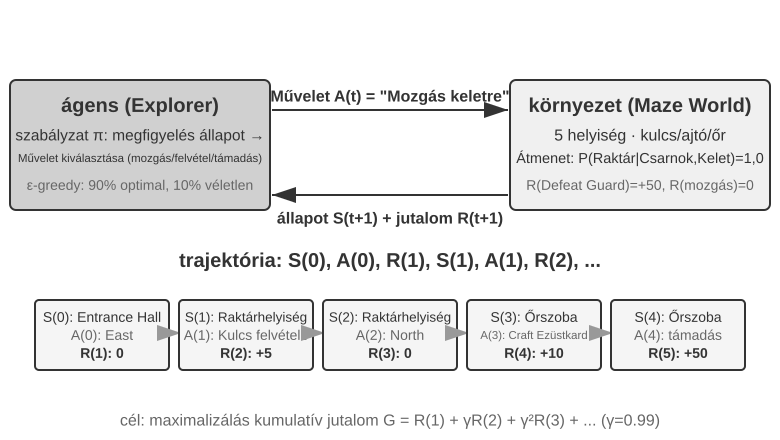

Ez az interakció egy "pályát" (trajectory) hoz létre – az "állapot → akció → jutalom → új állapot → akció → jutalom..." teljes rekordját. Egy irányelv (policy) minősége végső soron a pályák minőségében tükröződik. Az "értékfüggvény" (value function) arra a kérdésre válaszol: "Ha most ebben az állapotban vagyok, és továbbra is az aktuális irányelv szerint cselekszem, mennyi összjutalmat fogok végül felhalmozni?" Ez olyan, mint egy tapasztalt sakkozó, aki egy pozíciót nézve, anélkül hogy végigszámolná a játszmát, intuitívan megbecsüli a nyerési esélyt. (Amikor az "aktuális irányelvet" az "optimális irányelv" váltja fel, megkapjuk az optimális értékfüggvényt, amelyet később a Bellman-optimalitási egyenlet kapcsán használunk.) Az Ágens és a környezet közötti határ egy egyszerű elvet követ: **amihez az Ágens nem férhet hozzá önkényesen, az a környezethez tartozik.**

Két egyedi jellemző különbözteti meg a megerősítéses tanulást a felügyelt tanulástól (ami címkézett helyes válaszokat igényel) és a felügyelet nélküli tanulástól (ami rejtett mintázatokat tár fel az adatokban): a "próba-szerencse keresés" (az Ágensnek magának kell kitalálnia, hogy mely akciók jók, anélkül hogy egy tanító közvetlenül megadná a helyes választ) és a "késleltetett jutalom" (egy akció hatása csak sok lépéssel később válik nyilvánvalóvá, pl. egy jó sakklépés értéke csak a játszma végén derül ki). Ez hozza magával az egyedi "felfedezés–kiaknázás dilemmát" (exploration-exploitation tradeoff): ha mindig ismert utakat jársz, nem tanulsz semmi újat; ha mindig véletlenszerűen próbálkozol, soha nem éred el a célt.

Egy megerősítéses tanulási rendszer öt alapvető elemből áll:

- **Akciótér (Action Space)**: Az összes lehetséges akció halmazát definiálja, amit az Ágens végrehajthat. Az akciók lehetnek diszkrétek (pl. "melyik lépést tegyem meg" a sakkban, véges számú opcióval) vagy folytonosak (pl. "hány fokkal forgassa el az ízületet" egy robotnál, folytonos érték).
- **Irányelv (Policy)**: Az Ágens viselkedési szabálya, meghatározza, hogy mit tegyen egy adott állapotban. Egy irányelv lehet egyszerű (egy keresőtábla: A állapotban hajtsd végre X akciót) vagy összetett (egy mély neurális hálózat).
- **Jutalomjel (Reward Signal)**: A környezet azonnali visszajelzése. Az Ágens célja azonban a hosszú távú, nem az azonnali jutalom maximalizálása – ez a különbségtétel kulcsfontosságú, ahogy a befektetést sem a mai nyereség-veszteség alapján kell megítélni, hanem a hosszú távú hozam alapján.
- **Értékfüggvény (Value Function)**: Becsli az adott állapotból elérhető teljes halmozott jutalmat a jövőben, segítve az Ágenst a bölcs döntések meghozatalában még azonnali visszajelzés nélkül is. A hatvan év RL kutatás egyik legfontosabb felismerése az értékbecslés központi szerepe.
- **Környezeti modell (Environment Model)** (opcionális): Előrejelzi a környezet reakcióját az akciókra. Azokat a módszereket, amelyek használnak környezeti modellt, "modell-alapú módszereknek" (model-based methods) hívjuk (először megtanulják előrejelezni a környezet változásait, aztán terveznek); azokat, amelyek nem, "modell-mentes módszereknek" (model-free methods) (nem jósolják a környezetet, hanem közvetlenül a tapasztalatból tanulnak).

A 8-3. táblázat összehasonlítja a különböző Ágensrendszerek kulcsfontosságú összetevőit, feltárva az Ágens koncepció univerzalitását és segítve az olvasót a hagyományos RL Ágensek és a modern LLM Ágensek közötti akciótér-különbség megértésében.

8-3. táblázat Különböző Ágensrendszerek kulcselemeinek összehasonlítása

| Ágens típusa | Környezet | Akciótér | Jutalomjel |
|---------------|------------------------|-------------------------------|-------------------------|
| "Újszülött gazella" | Domborzat, gravitáció, testtartás | Folytonos nagy dimenziós (izomcsoport-összehúzódások) | Egyensúly (+), Esés (-) |
| "Porszívó robot" | Szoba elrendezés, akkumulátorszint | Diszkrét (irány, porszívózás, töltés) | Tisztított terület (+), Lemerült akku (-) |
| "Sakk nagymester" | Tábla állapot, időkorlát | Diszkrét véges (szabályos lépések) | Győzelem (+1), Vereség (-1) |
| "Ügyfélszolgálati Ágens" | Beszélgetés történet, tudásbázis | Nyitott végű (gondolkodj, beszélj, API hívás) | Probléma megoldva (+), Kezelési idő (-) |
| "Kódasszisztens Ágens" | Követelménydokumentum, kód bázis | Nyitott végű (gondolkodj, keress, szerkessz, futtass) | Teszt sikeres (+), Bug bevezetve (-) |

A táblázat egy fontos felismerést tár fel: a hagyományos RL Ágensek olyan területeken, mint a sakk és a robotika, zárt akcióterekkel rendelkeznek, míg a modern LLM-alapú Ágensek, mint az ügyfélszolgálati és kódolási Ágensek, nyitott végű, szinte korlátlan akcióterekkel. Ezek az Ágensek a "belső gondolkodás" speciális akcióját is használhatják képességeik fokozására.

### Kétféle akcióreprezentáció: a klasszikus RL-beállítás és az LLM változó hosszúságú politikája

Az itt összehasonlított kétféle beállítás legszembetűnőbb különbsége az akciók reprezentálásában van. Maga az MDP véges, végtelen, diszkrét vagy folytonos akcióteret is le tud írni. Ebben a szakaszban a sakk- és Atari-példák véges diszkrét primitív akciókat használnak, a robotvezérlés korlátos folytonos akciókat; az LLM-politika viszont véges tokenszótárból és eszközsémákból épít változó hosszúságú sorozatokat. Ez a kombinatorikus reprezentáció jelentősen befolyásolja az algoritmustervezést, a mintahatékonyságot és a általánosítás módját. Vegyük sorra őket.

**Alappélda: MDP és táblázatos Q-learning.**

Az MDP (Markov Decision Process, Markov-döntési folyamat) a megerősítéses tanulás matematikai kerete, amely definiálja az állapot, az akció és a jutalom alapelemeit. Központi feltevése a **Markov-tulajdonság**: a jövő csak az aktuális állapottól függ, az aktuális állapotnak pedig tartalmaznia kell minden múltbeli információt, ami a döntéshez kell. A sakkot véve példának: az állapotba nemcsak a bábuk helyzete tartozik, hanem az is, ki következik, megvan-e a sáncolási jog, az en passant ütés joga, valamint a lépésszámláló és a lépésismétlés megítéléséhez szükséges információ. Ha az állapotdefiníció elég teljes, nem kell minden alkalommal újraolvasni a teljes játszmajegyzőkönyvet; ha a megfigyelés nem tartalmazza a szükséges előzményt, akkor az előzményt be kell emelni az állapotba, vagy részlegesen megfigyelhető modellt kell használni.

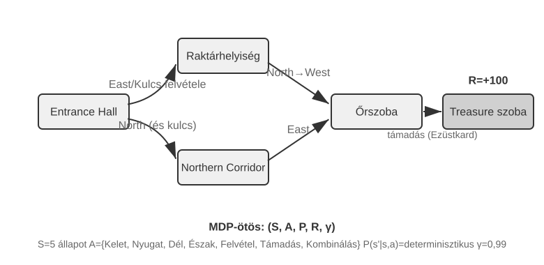

Az itt tárgyalt tipikus RL-környezetek **előre definiált akcióteret** használnak. A gó 361 lerakási pontja nagy, de véges; a sakk akciói is felsorolhatók; az Atari-játékokban rendszerint csak néhánytól bő tucatnyiig terjedő diszkrét primitív akció van. A **robotágensek** folytonos, de korlátos akcióteret használnak: az ízületi szögek, sebességek és a fogáserő folytonos értékek, de egyértelmű fizikai határaik vannak, a dimenziószámot pedig a robot szabadsági fokai adják.

A véges diszkrét akciók megkönnyítik a jelöltek egyenkénti kiértékelését; ha az állapotok és akciók száma elég kicsi, a táblázatos Q-learning közvetlenül tárolhatja az értékeket, a nagyobb Atari- vagy táblajáték-állapotterekhez viszont a függvényapproximációt és a keresést kell összekapcsolni. A folytonos akciójú MDP-kben nem lehet minden akciót felsorolni, ezért rendszerint politikagradienses vagy actor-critic típusú módszerekkel közelítik a politikát és az értékfüggvényt. E szakasz klasszikus példáinak másik különbsége az LLM-politikákhoz képest az, hogy nincs pre-tréninges tudásuk: a tanulás tisztán a próbálkozásból indul.

Ebben a keretben az egyik legalapvetőbb és legfontosabb algoritmus a **Q-learning**. Minden „állapot–akció” párhoz értékbecslést tart fenn: ha az s állapotban az a akciót választom, majd végig az optimális politika szerint cselekszem, összesen mennyi jutalmat kapok? Intuitívan egy akció jósága azon múlik, mekkora azonnali hozamot ad, és hogy „mennyire jó az az állapot, ahová juttat”.

Ezt az intuíciót egyenletbe írva kapjuk az RL-tankönyvek híres **Bellman-egyenletének** központi rekurzióját: **egy akció valódi értéke = az ebben a lépésben kapott azonnali jutalom + a következő állapotból elérhető legnagyobb jövőbeli érték**:

$$Q^*(s, a) = r + \gamma \max_{a'} Q^*(s', a')$$

ahol $r$ az azonnali jutalom, $s'$ az akció végrehajtása után elért következő állapot (itt a szemléletesség kedvéért determinisztikus alakban írva; sztochasztikus környezetben a következő $s'$ állapotra várható értéket kell venni), $\gamma \in [0, 1)$ pedig a **diszkonttényező** — ez dönti el, mennyire fontos az ágensnek a jövő: minél közelebb van $\gamma$ az 1-hez, annál inkább a hosszú távú hozam számít, minél közelebb a 0-hoz, annál inkább csak a pillanat. A korábban többször emlegetett „kumulatív jutalom” éppen az egyes lépések jutalmainak $\gamma$ szerint diszkontált összege, $\sum_{t} \gamma^{t} r_t$. Az algoritmus minden cselekvés után egy kicsit a „ténylegesen bekövetkezett eredmény” irányába hangolja a régi becslést — ezt a „egy lépés valódi eredményével javítom a régi becslést” paradigmát nevezik **időbeli különbség szerinti tanulásnak** (Temporal-Difference Learning, TD learning); sok ezernyi próbálkozás után a becslés fokozatosan a valódi értékhez közelít.

A következő két ábra a Q-learning rácsvilágbeli felfedezési folyamatát, illetve a Q-értékek fokozatos konvergenciáját mutatja.

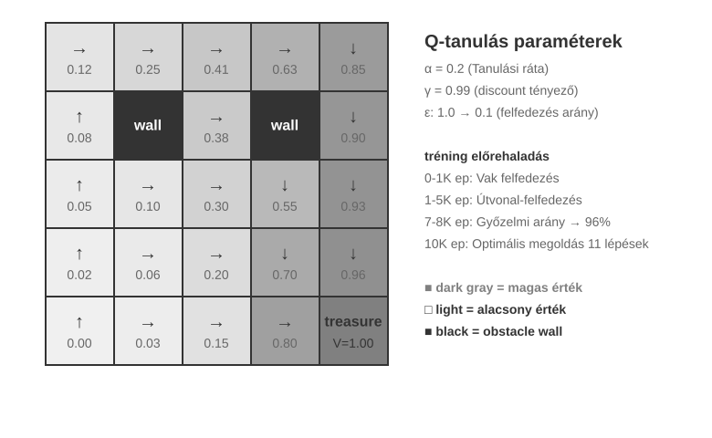

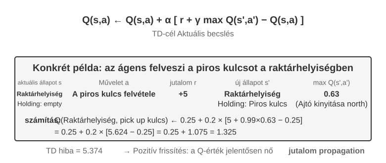

A Q-learning **off-policy** (célpolitikától eltérő) módszer: a célpolitikától különböző felfedező politika által generált adatból is meg tudja tanulni az optimális politikát, de továbbra is megköveteli az érintett állapot–akció párok kellő lefedettségét, valamint a megfelelő tanulási ráta- és konvergenciafeltételeket; nem konvergál automatikusan tetszőleges adateloszláson. Az on-policy/off-policy szigorú definícióját és az LLM poszt-tréningben való megfelelőjét lásd később, az „RL-algoritmusok: 16 rollouttól egyetlen paraméterfrissítésig” szakaszban.

> **8-1. kísérlet ★: A Q-learning teljesítménye egy kincskereső játékban**
>
> A Q-learning tulajdonságainak és korlátainak ellenőrzésére terveztünk egy **kincskereső játékkörnyezetet**. Ez a környezet több kulcsfontosságú kihívást tartalmaz: a **rejtett mechanizmusok** miatt az ágensnek magának kell felfedeznie a kulcsok és ajtók megfeleltetését, a fegyverek hatását és a tárgykészítés szabályait; a **többlépéses függőség** azt jelenti, hogy a feladat teljesítéséhez helyes akciósorozat kell (az optimális megoldás 11 lépés); a **ritka jutalom** pedig azt, hogy csak a kulcsfontosságú akciók és a végső győzelem hoz jelentős jutalmat, a köztes lépések többsége semmilyen visszajelzést nem kap.
>
> Ennek az **előzetes tudás nélküli táblázatos Q-learning kísérletnek** három korlátja van: még az egyszerű feladathoz is rengeteg interakció kell, vagyis alacsony a mintahatékonyság; az egyik környezetben felvett táblázatos értékek nehezen vihetők át közvetlenül egy másikba; és minden új feladatot elölről kell felfedezni. Ezek nem magának az MDP matematikai keretének a korlátai. A függvényapproximáció, a transzfertanulás és a modellalapú RL összetettebb állapotokat és tudásátvitelt is kezelni tud, ám a pre-tréningelt LLM-ekhez képest továbbra is sok környezeti interakciót igényelhet.

**Pre-tréningelt LLM-politikán alapuló ágensek.**

A nagy nyelvi modellek fontos gyakorlati változást hoztak abban, hogyan reprezentáljuk és inicializáljuk az ágens akcióit.

A klasszikus RL is tud belső számítást vagy információgyűjtést állapotként és akcióként modellezni. Az LLM-ek gyakorlati újdonsága nem az, hogy először engednének „gondolkodni”, hanem az, hogy a pre-tréningelt nyelvi politika változó hosszúságú tokensorozattal tudja reprezentálni a belső számítást, és ugyanaz a politika állítja elő a külső cselekvést is. A gondolkodási tokenek nem változtatják meg közvetlenül a külvilágot, mégis javíthatják a végső cselekvés minőségét. Az ágens akcióreprezentációja így nemcsak azt tartalmazza, hogy „mit tegyen”, hanem azt is, hogy „meddig és min gondolkodjon”.

A legfontosabb gyakorlati újítás az, hogy a **gondolkodási tokeneket különleges akcióként emeljük be a politika kimeneti terébe**. A tipikus hagyományos RL-környezetek főként olyan primitív akciókat használnak — mozgás, támadás, felvétel —, amelyek a környezet állapotát változtatják, még ha a belső számítás MDP-ben vagy hierarchikus politikában szintén modellezhető is; az LLM-ágensekben viszont **a belső gondolkodás a megtanult nyelvi akciótér központi részévé válik**. Ez nem változtatja meg közvetlenül a külső környezetet, és nem is kap azonnal környezeti jutalmat, de a tokenköltség és a kontextushatár keretei között sokféle számítási utat képes kifejezni.

Ez a változó hosszúságú, kombinatorikus akció sokkal nagyobb keresési térrel bír, mint a primitív akciók, ezért előzetes tudás nélkül nagyon nehéz nulláról megtanulni. A nulláról induló ágens olyan, mint aki bekötött szemmel keres kincset a sivatagban. Az LLM viszont hatalmas szöveges pre-tréningből tanulta meg az emberek hátrahagyott problémamegoldási mintáit — a matematikai feladatok gyakran a „feltételek azonosítása → képlet felidézése → lépésenkénti számolás”, a programozási feladatok pedig a „követelmény megértése → szerkezet megtervezése → részletek megvalósítása” mentén haladnak. A pre-tréningelt politika nagyobb előzetes valószínűséget ad a strukturált utaknak, és ezzel jelentősen összenyomja a keresési teret. Ezért még külön RL nélkül is képes egy pre-tréningelt LLM alapszintű gondolatláncot (Chain of Thought, CoT) generálni. Ezek a minták matematikai megoldásokból, kódkommentekből, vitákra adott válaszokból és hasonló pre-tréningkorpuszból származnak, és a modell a következő token előrejelzésén keresztül implicit módon tanulja meg, „hogyan néz ki a következő gondolati lépés”.

Az RL poszt-tréning ezután külső jutalommal tanítja meg az LLM-nek, hogyan használja ezeket a mintákat hatékonyabban egy adott feladatban. A nyelvi szerkezet nem külön „belső jutalom”, hanem a pre-tréningelt politika **előzetes eloszlása (prior)**: a tréningadatban következetesen előforduló „mivel a devizát dollárra kell váltani, előbb megnézem az árfolyamot” kezdeti generálási valószínűsége magasabb lehet, míg az olyan irreleváns utaké, mint „mivel pénzt kell váltani, előbb megnézem az időjárást”, alacsonyabb. Az RL ezen a kiinduló eloszláson, valódi feladatjutalmakkal hangolja újra az egyes utak valószínűségét.

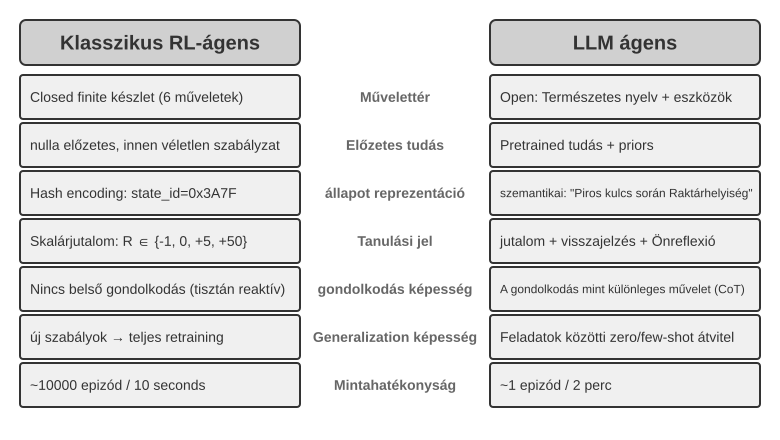

A pre-tréningelt nyelvi politika lehetővé teszi, hogy az LLM-ágens megértse a soha nem látott utasításokat (zero-shot általánosítás), és kevés bemutatóval alkalmazkodjon új feladatokhoz (few-shot adaptáció); ez éles ellentétben áll a fent tárgyalt, előzetes tudás nélküli táblázatos Q-learning beállítással.

Az előre definiált primitív akcióktól a változó hosszúságú, kombinatorikus akciókig való kiterjesztés az AI-ágensek paradigmájának fontos fordulata. Az LLM akcióit továbbra is véges tokenszótár és eszközsémák definiálják, de a belső gondolkodás, a természetes nyelvű lekérdezések, a programkód, az összetett JSON és a multimodális tartalom robbanásszerűen sok, változó hosszúságú sorozattá kombinálható. A kódinterpreter és a keresőeszközök ezt a reprezentációt a valós környezet széles feladat- és információkörével kötik össze. Ez új lehetőségeket és új kihívásokat is hoz: az ágens alapeszközök kombinálásával nem látott feladatokat is kezelhet, de a hatalmas kombinatorikus térben jutalmat is definiálni kell, és hatékonyan kell felfedezni.

A Kimi K3-hoz hasonló, eszközhívásra és hosszú gondolatláncra optimalizált modelleken jól látszik az LLM+RL paradigma tipikus iránya: nagy léptékű nyelvi pre-tréningre építve a poszt-tréning erősíti a problémabontást, az eszközhívást és az önjavítást. Az **OpenVLA**[^ch8-21] (részletesen a 6. fejezetben) pedig az LLM-korszak VLA (vizuális–nyelvi–akció) architektúra-paradigmáját mutatja be: a vizuális kódoló feldolgozza a környezeti megfigyelést, a nyelvi modell megérti az utasítást és következtet, az akciódekóder pedig vezérlőjeleket generál, így valósul meg a nyelvvel feltételezett vezérlés és a feladatok közti általánosítás. Tisztázni kell: maga az OpenVLA közel egymillió robot-**bemutatótrajektórián**, imitációs tanulással (viselkedésklónozással) készült, tehát SFT jellegű, nem RL; azt, hogy az RL-t valóban bevigyék a robotikába és egy ilyen VLA-architektúra fölött jutalommal optimalizáljanak tovább, e fejezet későbbi 8-13. kísérletének SimpleVLA-RL-je képviseli.

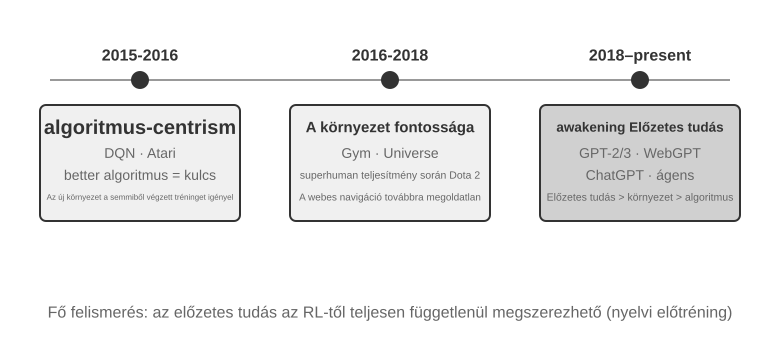

Yao Shunyu a *The Second Half*[^ch8-2] című blogbejegyzésében tekintette át az OpenAI felfedezőútjának szemléleti fejlődését. **Első szakasz (2015–2016), algoritmusközpontúság**: az volt a hit, hogy a jobb algoritmus a kulcs; az Atarihoz hasonló szabványos környezetekben született is előrelépés, de minden új környezetben elölről kellett tréningezni. **Második szakasz (2016–2018), a környezet fontossága**: a Gym szabványosította a feladatokat, a Universe és a World of Bits az egész internetet próbálta RL-tréningkörnyezetté tenni, a Dota 2 pedig egy adott összetett környezetben hajszolta az emberfeletti teljesítményt. Az elgondolás világos volt, de az általános számítógép-használat és a webes navigáció mégsem tört át. 

**Harmadik szakasz (2018-tól napjainkig), az előzetes tudás ébredése**: a GPT-2/GPT-3 megmutatta a nyelvi pre-tréning erejét, a WebGPT és a ChatGPT pedig bizonyította, hogy ez az előzetes tudás használható ágensekké alakítható. A legfontosabb felismerés: **az előzetes tudás az RL-től teljesen független úton is megszerezhető.** Ez egy ellenintuitív igazság: az RL-kutatók prioritási sorrendje évtizedeken át talán teljesen fordítva volt — nem algoritmus > környezet > előzetes tudás, hanem előzetes tudás > környezet > algoritmus.

> **8-2. kísérlet ★★: A hagyományos RL és az LLM-ágens összehasonlító vizsgálata**
>
>
> 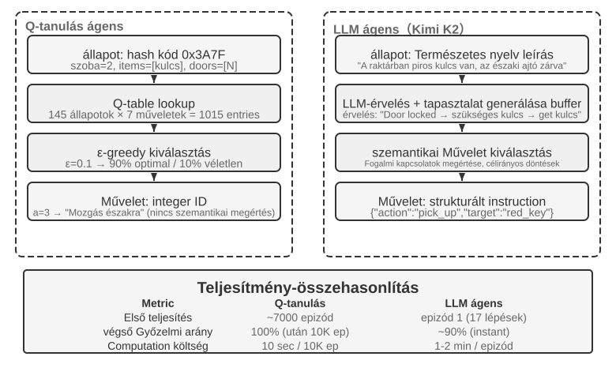
>
>
> Ugyanabban a kincskereső játékban hasonlítjuk össze a Q-learninget és egy LLM-ágenst (Kimi K3, legfeljebb 50 tapasztalatot tartó pufferrel). Az eredmény lenyűgöző: **az LLM-ágens már az első játszmában 18 lépésen belül teljesítette a pályát.**
>
> **Korai szakasz (célirányos felfedezés)**: felveszi a rozsdás kardot („fegyverrel mindig jobb, mint puszta kézzel”), rendszeresen bejárja a térképet, majd amikor az északi ajtót zárva találja, arra következtet, hogy „kulcsot kell keresni”, átvált a raktár felderítésére, és sorra megszerzi a piros kulcsot és a mágikus kristályt. **Középső szakasz (a mechanizmus megértése és aktív készítés)**: megérti a „kulcs automatikusan használódik” szabályt, és előre látja, hogy a rozsdás kard nem lesz elég az őr ellen, ezért a 8. lépésben aktívan ezüstkardot készít. **Késői szakasz (végrehajtás és hibajavítás)**: az ezüstkarddal észak felé indul, a 13. lépésben legyőzi az erős őrt, közben egy-két hatástalan próbálkozással (ismételt csapás, visszalépés), végül a 18. lépésben megszerzi a sárkánykincset.
>
> Ez a szemantikai megértés és a szimbolikus leképezés közti alapvető különbséget mutatja meg. Az LLM-ágens megértette a játék fogalmi szerkezetét, minden lépése mögött van cél és logika. A Q-learning számára viszont az „ajtó”, a „kulcs” és a „kard” csak értelmetlen szimbólumkombináció, amelyek kapcsolatait csak sok statisztikai tanulással, lassan tudja felfedezni.
>
> A számítási költség érdekes paradoxont ad: a Q-learning 10 000 játszmát 10 másodperc alatt lefuttat, az LLM-ágensnek viszont egyetlen játszma 1–2 percébe kerül. Valós feladatokban azonban minden interakció idő-, pénz- és kockázatköltsége messze meghaladja a puszta számítási költséget, ezért önmagában a GPU-idő nézése nem méltányos. A fontosabb felismerés: az LLM-ágens sikere nem attól van, hogy „jobb tanulóalgoritmusa” van, hanem attól, hogy hatalmas előzetes tudást hoz magával. Ha a játékszabályok megváltoznak, a Q-learninget teljesen újra kell tréningezni, az LLM-ágens viszont következtetéssel közvetlenül alkalmazkodik. Ebből gyakorlati tervezési elv adódik: ahol a szimuláció olcsó és sokszor ismételhető, ott a hagyományos RL-nek továbbra is van értéke; ahol az interakció drága és gyors alkalmazkodás kell, ott az LLM-ágens mintahatékonysága a gyakorlatiasabb.

Hogy a kontextusalapú alkalmazkodás, a külső artefaktumok frissítése és a paraméterfrissítés miként működik együtt, arról az 1. fejezet már adott fogalmi térképet, és a fejezet végi „teljes kép” is visszatér rá. E fejezet fő szála ezek közül a poszt-tréning: azoknak a képességeknek a modellparaméterekbe írása, amelyeket külső szabályokkal nem lehet maradéktalanul kifejezni.

## Modell pre-tréning alapok `[Ajánlott olvasmány]`

Ahhoz, hogy megértsük, miért működnek a poszt-tréning technikák, előbb tisztázni kell, mit épít fel a pre-tréning. A poszt-tréning (SFT és RL) lényegében a pre-tréning által kialakított reprezentációs téren belül optimalizál — a pre-tréningben lefektetett tudásszerkezet határozza meg a poszt-tréning plafonját. Ezért három kísérleten keresztül nézzük meg a pre-tréning kulcsmozzanatait: kis nyelvi modell tréningezése nulláról, a vizuális képesség kiterjesztése, valamint új nyelvi tudás beinjektálása. E szakasz három kísérlete kiegészítő anyag, és abban segít, hogy intuíciót építsünk a pre-tréningről (vagyis arról a kezdeti tréningről, amely nagy adatmennyiségen tanítja meg a modellnek a nyelv alapvető szabályszerűségeit és a világról szóló tudást).

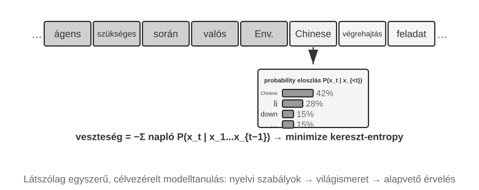

A nyelvi modellek tréningje általában a „tokenizálás — pre-tréning — poszt-tréning” háromlépéses folyamatot követi. A tokenizálás (Tokenization) diszkrét egységekre bontja a szöveget: a „szeretek programozni” például „szeretek”, „program”, „ozni” tokenekre bomolhat — ezek a tokenek a modell szövegfeldolgozásának legkisebb egységei. A pre-tréning feladata fogalmilag nagyon egyszerű: megmutatjuk a modellnek egy szöveg első felét, és megjósoltatjuk vele a következő tokent. A modell a saját előrejelzése és a helyes válasz közti eltérést (ezt az eltérést hívjuk veszteségnek, és minél kisebb, annál pontosabb az előrejelzés) felhasználva folyamatosan igazítja a paramétereit. Hatalmas szövegmennyiségen ismételve a modell fokozatosan elsajátítja a nyelvi szabályszerűségeket, a világról szóló tudást és az alapvető következtetést. A pre-tréning végeztével a modell folyékony szöveget tud generálni, de a kimenete szerkezetlen, és nehezen követ utasítást. A poszt-tréning SFT-vel (címkézett bemenet–kimenet párokon való tréningezéssel) és preferenciaoptimalizálással (például DPO-val, amely megtanítja a modellt az emberek által jobban kedvelt válaszok generálására) alakítja használható asszisztenssé.

> **8-3. kísérlet ★★: LLM tréningezése nulláról — az algoritmikus fejlesztések ereje**
>
> A 100 millió paraméteres MiniMind 2 modellen keresztül a kísérlet a teljes tréningfolyamatot végigviszi egy fogyasztói GPU-n. Két algoritmikus optimalizálás mutatja meg, mennyit számít a mérnöki döntés: a modellarchitektúra és a tréningütemezés hangolása korlátozott költségvetés mellett is érezhető minőségjavulást hoz.
>
> Az egyes tréningszakaszok hatása: a pre-tréning után a modell képes olyan ténykérdésekre válaszolni, mint „mi a világ legmagasabb hegye?”, de a formátuma szerkezetlen; az SFT után már utasítást követ és rendezett választ ad.

> **8-4. kísérlet ★★: Saját VLM tréningezése**
>
>
> 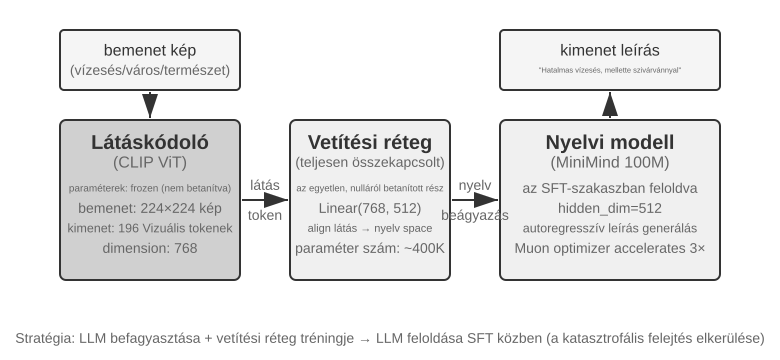
>
>
> A VLM-ek egyetlen modellben egyesítik a vizuális észlelést és a nyelvi megértést. A fő kihívás a modalitások közti illesztés: azt, „amit lát”, meg kell feleltetni annak, „amit mond”.
>
> A kísérlet a multimodális modelltréning alapparadigmáját tárja fel: az egymodalitású pre-tréning eredményeinek újrahasznosítását, és a modalitások közti illesztés elérését egy könnyű illesztőréteg tréningezésével.

> **8-5. kísérlet ★★: Folytatott pre-tréning új nyelv tanulásához**
>
> A Mistral 7B v0.3-at alapmodellként használva — amely főként angolon volt pre-tréningelve, és a koreait szinte egyáltalán nem érti — a kísérlet koreai Wikipédián végzett folytatott pre-tréninggel visz be koreai képességet. Ez azt jelenti, hogy egy már pre-tréningelt modellt felügyelet nélkül tréningezünk tovább új nyelvi adaton. A modell már rendelkezik általános nyelvi modellezési képességgel, és csak az új adateloszláshoz kell alkalmazkodnia, ezért a költség jóval kisebb, mint a nulláról tréningezés. Fontos mérnöki pont a kevert adat (kb. 80% koreai + 20% angol) használata a katasztrofális felejtés enyhítésére: a célnyelv túl magas aránya az eredeti nyelv romlásához vezet, a túl alacsony arány pedig elégtelen tanulási hatékonysághoz. Végül koreai utasításadaton végzett SFT adja a használható koreai társalgási képességet.

A három pre-tréning kísérlet együtt egy szabályszerűséget tár fel: korlátozott költségvetés mellett az algoritmikus fejlesztés és az architekturális újítás jobb ár-érték arányú, mint a puszta méretnövelés. Ennél is fontosabb, hogy a pre-tréning leíró tudást és nyelvi modellezési képességet ad a modellnek, viszont hiányzik belőle a strukturált utasításkövetés és a feladatorientált viselkedés — épp ezt a hézagot kell az SFT-nek betöltenie.

A pre-tréningből származó alapképességekkel a következő lépés az, hogy poszt-tréninggel az általános modellt használható ágenssé alakítsuk. A poszt-tréning első szakasza a felügyelt finomhangolás (SFT).

## Mid-training: tudás és alapképességek pótlása

A fejezetben a **Mid-training** egy kész alapmodellből induló, a céleloszláson végzett további nyelvimodell-tréning. Rendszerint ugyanazt a next-token célt használja, és dokumentum, kód vagy levezetés minden tokenén loss-t számol. A DAPT/TAPT kutatás szerint a szakterületi vagy feladathoz kötődő címkézetlen korpuszon végzett második pre-tréning javíthatja a downstream teljesítményt[^ch8-30].

Ez pótolja a nyelv, terminológia, belső dokumentum vagy codebase **tudáshiányát**, valamint a hosszú kontextus, kód, matematika és multimodális reprezentáció **alapképesség-hiányát**, amikor sok mintából sem születik jó megoldás. Az SFT kevés tényt megjegyezhet, de néhány QA-pár kevés hozzáférési útvonalat erősít; nagy, összefüggő tudásra nem alkalmas. Stabil sorrend: Mid-training tudás/képesség → kis SFT protokoll → RL, ha a siker már nem nulla[^ch8-31].

### Adatkeverék és hosszúkontextus-tanterv

Az $i$ hosszúsági szakasz keveréke:

$$
D_i=\alpha_iD_{\text{long}}+\beta_iD_{\text{atomic}}+\gamma_iD_{\text{agent}}+\delta_iD_{\text{replay}},
\qquad \alpha_i+\beta_i+\gamma_i+\delta_i=1.
$$

Az arányokat **tokenek**, ne dokumentumok alapján számoljuk. $D_{\text{long}}$ könyv, hosszú dokumentum és kódrepo; $D_{\text{atomic}}$ visszakeresés, többlépéses érvelés, utasításkövetés, aggregáció és statisztika; $D_{\text{agent}}$ tervezés, eszközválasztás/-hívás, hosszú állapotkövetés és hibajavítás. $D_{\text{replay}}$ megőrzi az általános/rövid adatokat és a már ismert rövid feladatokat a jelenlegi hosszra „felemelve”, változó bizonyítékhellyel és zavaró elemekkel. Szükséges a deduplikáció, minőségszűrés és eval-szennyezés ellenőrzése.

A Mid-trainingnek a névleges ablakot **effektív célhosszra** kell bővítenie, közben hosszú érvelést, tervezést és eszközhasználatot tanítva. A `max_position_embeddings` 32K-ról 128K-ra emelése csak a bemenet elfogadását bizonyítja. Használjunk például 8K → 16K → 32K → 64K → 128K tantervet a modellhez, célhoz és költséghez igazítva[^ch8-36]. Bővítés előtt a jelenlegi hosszon legyen kész a NIAH, visszakeresés, multi-hop, aggregáció/statisztika, alaptervezés és eszközválasztás.

Ha $M(\theta,c,L)$ a $\theta$ modell $c$ képességének pontja $L$ hosszon, három kapu használható:

$$
\begin{aligned}
M(\theta_i,c,L_i)&\geq\tau_{c,i},\\
M(\theta_i,c,L_i)&\geq M(\theta_i,c,L_{i-1})-\epsilon_{\text{len}},\\
M(\theta_i,c,L_{i-1})&\geq M(\theta_{i-1},c,L_{i-1})-\epsilon_{\text{retain}}.
\end{aligned}
$$

Ezek rendre a jelenlegi hossz teljesítését, a képesség megőrzését hosszabbításkor és a régi képesség megőrzését az új szakaszban kérik. A másodikhoz azonos nehézségű, csak hosszában emelt feladat kell; az $\epsilon$ értékeit ismételt mérés konfidenciaintervallumából válasszuk. Ha egy képesség elbukik, növeljük az atomi, jelenlegi hosszú vagy replay adatot, ne csak a névleges ablakot.

| Képesség | Benchmark | Fő diagnózis |
| --- | --- | --- |
| Pozíció, visszakeresés, követés, aggregáció | NIAH, RULER | Needle-hely/-szám, multi-hop, aggregáció és hossz szerinti romlás; a NIAH csak smoke test |
| Valós hosszú dokumentum | LongBench, LongBench v2 | Egy-/többdokumentumos QA, hosszú párbeszéd, in-context learning, strukturált adat kategória és hossz szerint |
| Hosszú kód | LongBench v2 repository feladatok, LongCodeU | Kódegységek, fájlok közötti kapcsolat, repo-szintű megértés |
| Tervezés és eszközök | PlanningArena és korábbi tool benchmarkok | Felbontás, választás, memória, argumentum, állapot |
| End-to-end Agent | SWE-bench Verified, $\tau^2$-bench, Terminal-Bench | Tervezés, eszköz, helyreállítás és befejezés valós hosszú trajektórián |

A RULER a NIAH-t multi-needle, multi-hop és aggregáció felé bővíti[^ch8-37]; a LongBench v2 valós dokumentumot, párbeszédet, repót és strukturált adatot fed le[^ch8-38]; a LongCodeU és PlanningArena hosszú kódot, illetve tervezést/eszközhasználatot diagnosztizál[^ch8-39][^ch8-40]. A hivatalos teszt csak értékelésre való; tanítsunk hasonló, de nem átfedő példán, és jelentsünk hossz, képesség és hibatípus szerint. Egyetlen NIAH vagy leaderboard nem bizonyít hosszúkontextus-érvelést.

A frissítendő, idézendő, hozzáférés-szabályozott vagy törlendő tények maradjanak RAG-ban. Nagy teljes-paraméteres Mid-training előtt kis kísérletben validáljuk a keveréket.

## SFT (Supervised Fine-Tuning)

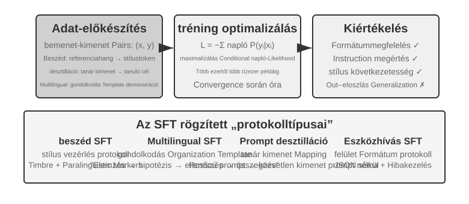

A „Pre-tréning, SFT, RL: Háromszakaszos panoráma” szakasz már feltárta az SFT lényegét ("következő token előrejelzése", más adatokkal, a veszteség csak a válaszon számolva). Ez a szakasz négy kísérleten keresztül mutatja be, hogy mit is rögzít a paraméterekben ez a mechanizmus – stabil leképezések és protokollok írása – a különböző feladatokban. Az SFT alapvető értéke nem az új ismeretek beinjektálása, hanem a "protokollok rögzítése": leképezési kapcsolatok, interakciós formátumok és stílusnormák paraméterekbe írása, lehetővé téve, hogy a modell a következtetés során hosszú promptok nélkül is elvárásoknak megfelelő kimeneteket produkáljon. Általában csak néhány ezertől több tízezer kiváló minőségű példa szükséges az alapvető beszélgetési képesség és utasításkövetés kialakításához.

Ennek a hatékonyságnak az ára a tréning eloszlástól való erős függés: az SFT hajlamos a memorizálásra az általánosítás helyett. Amikor a tesztelés során a tréning során nem látott helyzetekkel találkozik, a teljesítmény gyakran észrevehetően romlik. A következő kísérletek ezt a "protokollok rögzítésének" folyamatát mutatják be különböző szögekből.

Mielőtt az SFT gyakorlati alkalmazásába kezdünk, van egy gyakorlati kérdés, amelyet nem lehet megkerülni: **honnan jön az SFT-adat?** Az iparág válasza lényegében három útra szűkül:

- **Emberi szakértői bemutatók** — ezeknél a legmagasabb a minőségi plafon, de drágák és lassúak; „magadatnak” valók, amely a formátumot és a stílust definiálja;
- **Tanítómodellel való generálás** — vagyis szintetikus adat: egy erős modell tömegével állít elő „bemenet–kimenet” párokat, ezeket szűrjük, majd a diákba desztilláljuk; lásd a 8-8. és a 8-9. kísérletet;
- **Elutasításos mintavételezés** — a modell maga vesz több jelöltet ugyanarra a feladatra, egy ellenőrző kiválogatja a helyeseket, és ezekkel tréningezi újra önmagát; lásd a 8-9. kísérletet.

A három utat gyakran kombinálják: előbb kevés emberi magadattal rögzítjük a formátumot, aztán tanítómodellel felnagyítjuk a méretet, végül elutasításos mintavételezéssel kiegyenlítjük a minőséget. Bármelyik utat választjuk, az építési folyamat nagyjából ugyanaz: definiáljuk a feladateloszlást és a kimeneti sémát, tömegével generálunk jelölteket, szabályalapú validálással, formátumellenőrzéssel és emberi mintavételes átnézéssel szűrjük a minőséget, végül deduplikálunk, kiegyensúlyozzuk az arányokat és biztosítjuk a változatosságot. Ami a mennyiséget illeti, nem kell mohónak lenni: néhány ezertől néhány tízezerig terjedő jó minőségű minta rendszerint elég egy protokoll rögzítéséhez, és jobb tízezer tiszta mintát csiszolni, mint százezer piszkosat felhalmozni, mert az adatban lévő minden zajt hűen beírhat a paraméterekbe az SFT.

> **8-6. kísérlet ★★★: Hang SFT – A "hangklónozástól" a "paralingvisztikai modellezésig" `[Kiterjesztett kísérlet]`**
>
> Az Orpheus (kontextuális prompt-alapú hangklónozás) és a Sesame (paralingvisztikai token modellezés) esettanulmányain keresztül ez a kísérlet bemutatja, hogy a "hangstílus és kifejezési szokások" hogyan kerülnek a paraméterekbe. A két megközelítés különböző utakat jár be:
>
> - **Orpheus**: A hang hullámformáját token szekvenciává tömöríti. Az azonos beszélőtől származó referencia audio összefűzésével a modell megtanul "ezen a személy hangján beszélni", elérve a kereszt-mondati hangszín konzisztenciát.
> - **Sesame**: A nevetés és sóhajtás paralingvisztikai jelenségeit speciális tokenekké, például `<laugh>`, `<sigh>` absztrahálja. A modell megtanulja "a token láttán a megfelelő hangot kiadni".
>
> Expresszív feladatokban az SFT stílusvezérlési protokollokat és strukturált kifejezési szokásokat rögzít, nem pedig tényismeretet vagy összetett érvelést. A kulcs a tréning adatok diverzitásában és annotációs minőségében rejlik. Gyakori hibamódok: túl kevés beszélő a tréning adatokban, ami miatt mindenki ugyanúgy hangzik; és token túlilleszkedés (a modell memorizálja a tréning minta részleteit, és új helyzetekben gyengébben teljesít), ami "mechanikus nevetéshez" vezet.

> **8-7. kísérlet ★★★: Többnyelvű gondolkodás – Lehetővé tenni a modell számára, hogy bármely nyelven gondolkodjon `[Kiterjesztett kísérlet]`**
>
> A legtöbb gondolkodó modell csak angolul "gondolkodik": függetlenül attól, hogy milyen nyelven teszed fel a kérdést, a modell belső gondolkodási lánca szinte mindig angol, mert a tréning adatokban lévő kiváló minőségű gondolkodási demonstrációk többnyire angol nyelvűek. Ennek a kísérletnek az egyszerű célja, hogy lehetővé tegye a modell számára a gondolkodást egy meghatározott nyelven.
>
> A megközelítés az SFT végrehajtása a gpt-oss-20b-n: adj hozzá egy `reasoning language: German` (vagy más nyelv) sort a rendszerutasításhoz, majd tréningezz angol, spanyol, francia stb. nyelvű gondolkodási példákon. A tréning adatok "egyáltalán nem tartalmaznak kínait", de a tréning után egyszerűen a gondolkodási nyelv kínaira állításával a modell teljes gondolkodási láncot tud végezni kínai nyelven – ez a nulla-áttételes keresztnyelvű általánosítás a kísérlet legérdekesebb megállapítása. Fontos megjegyezni, hogy ez nem az SFT saját általánosítási képessége. A többnyelvű pre-tréning már létrehozott egy megosztott keresztnyelvű reprezentációs teret a modellben; az SFT csak aktiválja ezt a meglévő keresztnyelvű képességet.

> **8-8. kísérlet ★★: Prompt desztilláció – Használható képességek replikálása alacsonyabb költségen**
>
> A gyakorlati alkalmazásokban gyakran hosszú rendszerpromptokra (több ezer vagy akár több tízezer token) van szükség ahhoz, hogy a modell összetett feladatokat hajtson végre, ami növeli a késleltetést és a költséget minden hívásnál. A gondolkodó LLM-ek használatakor a belső gondolkodási tokenek tovább növelik a költséget. A prompt desztilláció ötlete az, hogy a "hosszú prompt + gondolkodó tanító" viselkedését tömörítse egy "rövid prompt/nincs prompt + nem gondolkodó tanuló"-ba. A tanító a teljes prompt és gondolkodási mód alatt kiváló minőségű válaszokat generál; a tréning adatok csak a felhasználói bemenetet és a végső következtetést tartják meg, eldobva a hosszú promptot és a köztes gondolkodási folyamatot. A tanuló megtanulja "közvetlenül megadni a következtetést". A desztilláció után a tanuló kimeneti minősége ugyanazon a bemeneteken megközelíti a tanítóét, miközben a késleltetés és a költség jelentősen csökken, mivel nem kell feldolgozni a hosszú promptokat és gondolkodási tokeneket.
>
> A desztilláció két dimenzió mentén végezhető el: "nagytól kicsiig" (egy nagy modell cseréje közepesre vagy kicsire a költség és minőség egyensúlyozására) és "gondolkodótól nem gondolkodóig" (explicit CoT összehajtása implicit parametrikus ismeretekké azonos méret mellett, 20-30-szoros válaszsebesség-növekedést elérve). Ez a kettő nem zárja ki egymást, és gyakran együtt használják őket termelési környezetekben. Fontos megjegyezni, hogy a desztilláció örökli a tanító határait – ha a tanítónak rendszeres hibái vannak az eloszlás hosszú farkában, a tanuló tovább rögzíti ezeket a hibákat; ha a tanító eszközökre támaszkodik a helyesség biztosításához, az egyszerű kimeneti desztilláció elveszti az eszközök által biztosított robusztusságot. Mérnöki tanulság: amikor a termékterv stabil, a bemeneti eloszlás kiszámítható, és a költségkorlátok jelentősek, a prompt desztilláció kiváló optimalizálás; a kísérletezés során vagy mielőtt a feladat stabilizálódna, az explicit gondolkodás és a szerkeszthető promptok megtartása továbbra is központi szerepet játszik a gyors iterációban.

> **8-9. kísérlet ★★★: Gondolkodási lánc (CoT) desztilláció**
>
> A prompt desztilláció eldobja a gondolkodási folyamatot; a CoT desztilláció az ellenkezőjét csinálja: egy erős tanító modell "teljes gondolkodási pályáját" adja át a tanuló modellnek. A CoT desztilláció egy képzett tanító modellből lehetővé teheti egy azonos paraméterszámú tanuló számára, hogy visszanyerje a tanító képességeinek 70-80%-át. Azoknak a csapatoknak, amelyek nem a legmodernebb képességek határát akarják feszegetni, hanem olyan modelleket szeretnének, amelyeket maguk irányíthatnak, ez a legpragmatikusabb követő stratégia. A DeepSeek-R1 által nyílt forráskódúvá tett desztillált kismodell-sorozat (az R1 gondolkodási pályáinak használata az SFT végrehajtásához a Qwen és Llama sorozaton) ennek a megközelítésnek a reprezentatív példája.
>
> **Háttér: A **Gondolkodási Fal" jelenség." Egyes zárt forráskódú gondolkodó modellek (pl. OpenAI o-sorozat, Gemini sorozat) belső gondolkodási láncot generálnak az érvelés során, de a felhasználók nem az eredeti gondolkodási folyamatot látják – desztilláció megelőzése, biztonsági és termékélménybeli okok miatt a szolgáltatók gyakran átírják vagy összefoglalják a CoT-t a kiadás előtt, elrejtve a legértékesebb eredeti gondolkodási folyamatot az API mögött. Pontosan ezért választja ez a kísérlet a nyílt forráskódú gondolkodó modelleket tanítóként: az olyan modellek, mint a DeepSeek V4, Kimi K3 és GLM 5.2, közvetlenül teszik elérhetővé a teljes gondolkodási láncukat, így a desztilláció technikailag és licenc szempontjából is megvalósítható (bár a licenc desztillált termékekre vonatkozó feltételeit használat előtt ellenőrizni kell).
>
> **A laborból: attól, hogy egy modell tud kódot írni, még megtagadhatja egy másik modell desztillálásának segítését.** A kísérlet megvalósításakor a szerző először a GPT-5.6-Sol által hajtott OpenAI Codexszel írta a kísérleti kódot. Amikor a feladat kifejezetten modelldesztillációt kezdett érinteni, a Codex megtagadta a folytatást. Ezután a szerző a Claude Opus 5 által hajtott Claude Code-ra váltott, ahol ugyanezt az elutasítást tapasztalta. Végül a Kimi K3 fejezte be a kísérleti kódot és az azt követő futtatást.
>
> Egyik elutasítás sem hétköznapi matematikai érvelésre vonatkozott, és nem is pusztán arra a kérésre, hogy a modell fedje fel belső gondolkodási láncát. A kérés egy teljes desztillációs kísérlet megvalósítása volt, amely egy erős tanító adataival tréningez tanuló modellt. A modelldesztilláció technikailag nagyon hasonló a szokásos felügyelt finomhangoláshoz, de a szolgáltatók biztonsági és termékszabályzatai a modellkinyeréssel, a képességek másolásával és a szellemi tulajdon védelmével is összekapcsolhatják, ezért érzékeny kategóriává válhat.
>
> Az esetet nem szabad arra leegyszerűsíteni, hogy „a Claude nem ad gondolkodási láncot”, és azt sem bizonyítja, hogy „a Kimi védőkorlátai gyengébbek”. Három külön kérdés, hogy a Claude API visszaad-e summarized thinking tartalmat, egy Coding Agent hajlandó-e desztillációs pipeline-t megvalósítani, illetve a szolgáltatási feltételek engedik-e a modellkimenetek tréningcélú használatát. A kísérlet nem próbálta megkerülni egyetlen modell rejtett érvelését vagy biztonsági mechanizmusát sem; kizárólag a termékek által elérhetővé tett képességeket használta egy engedélyezett kutatási folyamatban.
>
> Itt egy gyakorlatiasabb és fontosabb megítélés: **a poszt-tréninggel foglalkozók túlnyomó többségének egyáltalán nem kell desztillálnia a zárt forráskódú modellek gondolkodási láncát.** A mai legjobb nyílt forráskódú modellek és a legmodernebb zárt forráskódú modellek közötti szakadék nem olyan nagy, mint gondolnánk; egy tanító modellnek csak "egyértelműen erősebbnek kell lennie a tanulónál", nem kell "a világ legjobbjának" lennie. Ha a poszt-tréningezett modell 200B paraméter vagy kisebb, egy nyílt forráskódú legmodernebb modell teljesen elegendő tanítóként.
>
> **Kísérleti terv:** Háromlépéses folyamat. 1. lépés, "Pályák gyűjtése": Mintavételezés a célfeladat eloszlásból (pl. matematika, kód), a nyílt forráskódú tanító modell használata teljes "gondolkodás + válasz" pályák generálására, és a hibás végső választ tartalmazó pályák kiszűrése egy szabályalapú ellenőrző segítségével – különben a tanuló a hibás gondolkodási folyamatot utánozná. Ennek a lépésnek – "jelöltek generálása, ellenőrzés és szűrés, csak a helyes pályák megtartása" – saját neve van: "rejection sampling". Az így felépített adatokon végzett SFT-t "rejection sampling fine-tuning-nak (RFT)" hívják. A tiszta SFT és az RL között helyezkedik el: nincs szükség jutalommodell tréningjére, policy gradiensekre – csak "sokat mintavételez, a rosszakat eldobja, a jókat megtartja" az adatminőség javításához, ami rendkívül költséghatékony módszer a verifikálható feladatok adatainak felépítésére. 2. lépés, "SFT Tréning": "Probléma → `<think>` gondolkodási pálya `</think>` + végső válasz" használata tréning párokként a standard SFT végrehajtásához egy kis modellen (pl. 7B méret). 3. lépés, "Összehasonlító értékelés": A tanuló modell összehasonlítása desztilláció előtt és után, valamint a tanító modell ugyanazon a benchmarkon a visszanyert képességek arányának mérésére.
>
> **Elfogadási kritériumok:** A desztillált tanuló modell jelentős javulást mutat a matematikai és kód benchmarkokon a desztilláció előtti teljesítményéhez képest, és a gondolkodási pályái olyan tanító-szerű viselkedéseket mutatnak, mint a reflektálás, visszalépés és ellenőrzés. Továbbá, ügyelj a desztilláció költségére: a tanuló örökölni fogja a tanító rendszeres hibáit és bőbeszédű gondolkodási szokásait (utóbbi tovább optimalizálható a 8-10. kísérletből származó AdaptThink megközelítéssel).

Ennek a négy kísérletnek közös jellemzője – "stabil leképezések és protokollok írása a paraméterekbe": a hang SFT stílusvezérlési protokollokat rögzít, a többnyelvű SFT gondolkodásszervezési sablonokat rögzít, a desztillációs SFT pedig a bemenet-kimenet közvetlen leképezését rögzíti. Világos céljaik, tiszta formátumaik és stabil értékelési kritériumaik vannak, így az SFT rendkívül magas mintahatékonysággal tud javulást elérni; amint azonban az eloszlás eltolódik, a memorizálásra való hajlama romló teljesítményben nyilvánul meg. Ez a a „Pre-tréning, SFT, RL: Háromszakaszos panoráma” szakasz "Az SFT és az RL lényegi különbsége" részében tárgyalt memória-általánosítás megoszlásának kísérleti megnyilvánulása.

## SFT adatszintézis: bemutatóktól a tanítható trajektóriákig

Az SFT plafonját mindenekelőtt az adat szabja meg. Valódi projektekben ritkán lehet elég bemutatót egyesével kézzel megírni, ezért rendszerint **kevés emberi magadat, tanítómodellel való generálás és ellenőrzővel való szűrés** kombinációjára van szükség: az emberi bemutatók definiálják a formátumot és a határokat, a tanítómodell felnagyítja a méretet, a szabályalapú ellenőrzés vagy az emberi mintavételes átnézés pedig tartja a minőséget. Amikor a modell önmagát húzza fel, ugyanarra a feladatra több jelöltet lehet mintavételezni, és csak az ellenőrzésen átment trajektóriákat megtartani — ez az elutasításos mintavételezéses finomhangolás (RFT).

A szintetikus adat célja nem az, hogy visszamondja az éles naplókat, hanem hogy újrafelhasználható **feladatszerkezetet** desztilláljon belőlük: felhasználói szándék, kezdőállapot, elérhető eszközök, üzleti megszorítások, gyakori hibamódok és sikerfeltételek. Az azonosító adatok eltávolítása után minden feladattípushoz újragenerált kitalált személyek, rendelések, fájlok és állapotok kerülnek egy visszaállítható, elszigetelt környezetbe. Így megmaradnak a valódi nehézségek, ugyanakkor a modell nem jegyzi meg az ügyféladatokat vagy a belső hitelesítő adatokat.

Egy megbízható folyamat így fest: **éles adat → feladatterv → szintetikus feladat → több jelölt trajektória → feladat- és trajektóriaellenőrzés → SFT-adat**. A feladatellenőrzés azt nézi, hogy maga a feladat megoldható-e, megfelelő-e a nehézsége, és helyes-e a referenciaeredmény; a trajektóriaellenőrzés a végállapotot, az eszközhívásokat és az üzleti megszorításokat nézi. Azoknál a feltételeknél, amelyek egységtesztként, adatbázis-állításként vagy állapotkülönbség-ellenőrzésként megírhatók, elsőként determinisztikus kódot érdemes használni; a nyitott jellemzőket, például a kommunikáció minőségét, utána egészíti ki egy modellalapú értékelő, emberi mintavételes kalibrálással. A készséggráfok, a futtatható környezetek és a független ellenőrzők tovább szélesíthetik a feladatlefedettséget, és kiszűrhetik az érvénytelen trajektóriákat[^ch8-12][^ch8-17][^ch8-18][^ch8-19][^ch8-20].

Ugyanez a feladat- és ellenőrzési infrastruktúra később RL-környezetté alakítható, de a két szakasz másképp használja: az SFT csak az ellenőrzésen átment sikeres trajektóriákat tartja meg, és stabil formátumot, eljárást és alapműveleteket tanul; az RL az aktuális politikával újra rollout-ol, és a környezeti jutalommal a bemutatókon túli utakat kutatja fel. A sikertelen trajektóriákat nem szabad közvetlenül helyes bemutatóként betenni — preferenciapárok építésére, a feladatlefedettség hézagainak feltárására, vagy diagnózissal és javítással kiegészítve a tréningbe emelésre valók.

Az adatszintézisben nem a mennyiség dönt, hanem a lefedettség, a változatosság és a pontosság. A tréninghalmazt ráadásul feladatsablon, ügyfél vagy időszak szerint kell deduplikálni és felosztani, az értékelőhalmaznak pedig nem átfedő feladattípusokból kell származnia; a referenciamegoldások, a rejtett tesztek és az ellenőrző visszajelzése nem szivároghat el a modellhez.

A 7. fejezet bad case-ei is átalakíthatók itt tréningadattá. Vegyük a Coding Agent „túl korai befejezését”: először vágjuk ki a trajektória előtagját addig a pontig, ahol az ágens éppen késznek nyilvánítaná a munkát, majd az akkori korai bejelentést vegyük rejected-nek, a „előbb futtasd le a teszteket, pontról pontra vesd össze az átvételi feltételeket, és csak azután vonj le következtetést” pedig chosen-nek. Az ilyen adat DPO-hoz vagy döntéshatár-bemutatókhoz való, nem pedig ahhoz, hogy közvetlenül helyes SFT-trajektóriaként használjuk; a hiba okát, az alkalmazhatóság feltételeit és az ellenőrzőt a mintával együtt kell tárolni, hogy visszakövethető és újra átnézhető legyen. A 8-17. kísérlet `build_preference_data.py` szkriptje két építési utat kínál — determinisztikus sablont és tanítómodellt —, és a tréningadatot a későbbi értékelőhalmaztól elkülönítve tárolja.

Az ebben a fejezetben újként szereplő két Bad Case kísérlet két különböző felügyeleti célt mutat be. A kínai kunkori idézőjeles eset előbb hatókörérzékeny dokumentációs Skill-lé desztillálja a visszajelzést, és csak azután végez SFT-t strukturált szintetikus adaton; a speciális karakterláncos eset az `old_string` eltéréseit bájtpontos másolási feladattá alakítja, és a tokenszintű hűséget tréningezi. Mindkettő a 7. fejezet hibaattribúciós, valamint tréning/értékelés elkülönítési protokollját használja, de nem osztoznak közös összpontszámon: az első azt méri, hogy „amit változtatni kell, azt változtasd, amit megőrizni, azt hagyd”, a második azt, hogy „szó szerint másolj”.

## Mikor válassz Mid-traininget, SFT-t vagy RL-t?

Először azt diagnosztizáljuk, hogy az **alap, a protokoll vagy a stratégia** hiányzik. A közel nulla `pass@k` tudás-/képességhibákkal Mid-traininget; az alkalmi siker instabil formátummal/schema-val SFT-t jelez. Az RL csak akkor hatékony, ha a rollout pontozható, néha sikeres, a jutalom hű a célhoz, és a csoporton belül eltér. Held-out adaton mérjük a `pass@1`, `pass@k`, részleges előrehaladás, parse arány és hibaattribúció értékeit. Ne futtassunk PPO/GRPO-t közvetlenül teljesen sikertelen rolloutokon.

A „Pre-tréning, SFT, RL: Háromszakaszos panoráma” szakasz tisztázta az SFT és az RL "lényegi különbségét". Ez a szakasz egy gyakorlatiasabb kérdésre ad választ: "Egy adott feladatra melyiket használd?" Az alábbi döntési keretrendszer néhány következtetését a későbbi RL kísérletek (7-10., 8-11. kísérlet) tovább erősítik. Az olvasók először kialakíthatnak egy előzetes ítéletet, majd az RL szakasz elolvasása után visszatérhetnek ellenőrzésre.

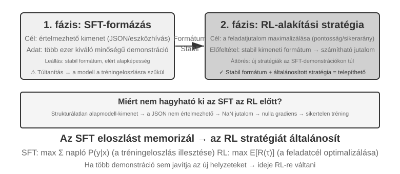

**Az SFT akkor alkalmas**, ha a feladat formátumstabilizálást igényel (mint a JSON kimenet vagy egy konzisztens beszélgetési stílus), kiváló minőségű szakértői demonstrációk állnak rendelkezésre, és a telepítési környezet szorosan illeszkedik a tréninghez. "Az RL akkor válik szükségessé", ha a telepítés szisztematikusan eltér a tréningtől (tréning során a J/Q/K lapok 10-et érnek, telepítésben 11/12/13 – a szabályok megváltoztak; vagy a tréning fekete színeket, a telepítés piros színeket használ – a megjelenés megváltozott), ha optimális stratégiákat kell felfedezni (a szakértői demonstrációk nem feltétlenül optimálisak), vagy ha az annotáció túl drága minden út bemutatásához.

A legerősebb stratégia az ""először SFT, aztán RL"" kétszakaszos csővezeték. Az SFT elsődleges célja nem a feladatteljesítmény maximalizálása, hanem a kimenet "formátumstabilitásának" megteremtése – biztosítva, hogy a modell értelmezhető JSON-t és helyes eszközinterfész-hívásokat tudjon produkálni. Csak a kimeneti formátum stabilizálása után lehet az RL jutalomjelet megbízhatóan kiszámítani. Az RL közvetlen alkalmazása egy alapmodellen SFT nélkül gyakran a tréning kudarcához vezet a kaotikus kimeneti formátumok és a kiszámíthatatlan jutalmak miatt – bár ennek a következtetésnek vannak határfeltételei: a "kisebb alapmodell + szigorú strukturált kimeneti követelmények" beállításából származik (mint a későbbi 8-11. kísérletben). A DeepSeek-R1-Zero demonstrálta, hogy egy elég erős alapmodell kihagyhatja az SFT-t és sikeres lehet közvetlen RL-lel, reflektálási és hosszú gondolkodási lánc képességekkel – ennek ára a gyenge kimeneti olvashatóság és a kevert nyelvek, ami pontosan az oka annak, hogy a DeepSeek végül visszatette a "hidegindításos SFT-t" az R1-ben. Az R1 útja a Zero-tól a hidegindításig a legjobb példa az "előbb a forma, aztán a szellem" elvre: az RL kinövesztheti a saját "szellemét" (stratégia és érvelési képesség), de a "formát" (formátum és olvashatóság) továbbra is gyorsan és stabilan az SFT hozza létre.

Mindegyiknek megvan a maga költsége: az SFT mintahatékony és gyorsan konvergál, de gyengén általánosít; az RL átvihető stratégiákat tanul, de mintajgényes és instabil a tréningje. Egy gyakorlati teszt: amikor több demonstráció hozzáadása már nem javítja a teljesítményt új forgatókönyveken, elérted azt a pontot, ahol érdemes RL-re váltani – a probléma gyökere nem a demonstrációk száma, hanem az SFT optimalizációs célja.

Gyakorlatban a döntés a következő sorrendben hozható meg:

1. **Először kérdezd: Szükség van egyáltalán poszt-tréningre?** Ha a probléma megoldható Harness mérnöki munkával (promptok optimalizálása, eszköztervezés, kontextuskezelés), nincs szükség modelltréningre. A legtöbb Ágens alkalmazás ide tartozik.
2. **Ha tréningre van szükség: Először próbáld az SFT-t.** Alkalmas a kimeneti formátumok rögzítésére (JSON séma, API hívás formátum), protokollismeret rögzítésére (kifejezések használata, kimeneti formátum, folyamat szokások, azaz "hogyan mondjunk és csináljunk dolgokat"), és stílus egységesítésére (hangnem, hossz). De vedd figyelembe, hogy az SFT nem alkalmas nagy mennyiségű tényismeret beinjektálására ("mit kell tudni") – ehhez folytatott pre-tréningre vagy RAG-re van szükség (lásd a "Teljes poszt-tréning kép és gyakorlati tippek" részt a fejezet végén). Az SFT alacsony költségű és gyorsan mutat eredményt.
3. **Amikor az SFT nem elég: Adj hozzá RL-t.** Alkalmas olyan forgatókönyvekhez, amelyek általánosítást igényelnek új helyzetekre, optimális stratégiák felfedezését, vagy amikor az annotációs költségek túl magasak. Ügyelj arra, hogy előbb stabilizáld a kimeneti formátumot SFT-vel, mielőtt RL-t alkalmaznál rá.

## Egymenetes Megerősítéses Tanulás: A Memória és Általánosítás Összehasonlítása

Az "egymenetes" azt jelenti, hogy a feladat egyetlen interakcióban teljesül: a modell bemenetet kap, kimenetet produkál, és jutalmat kap, anélkül hogy állapotot kellene fenntartania a lépések között. Ez az egyszerűsített beállítás lehetővé teszi, hogy az SFT és az RL tanulási mechanizmusainak alapvető különbségeire összpontosítsunk, a többlépéses interakciók komplexitása nélkül. Az egymenetes forgatókönyv tiszta kontrollált kísérleti körülményeket biztosít: ugyanaz a feladat, ugyanaz az alapmodell, ugyanaz a számítási költségvetés, az egyetlen változó a tréning módszer. Az első kísérlet bemutatja, hogy az RL hogyan tanulja meg a "mikor gondolkodjunk" meta-stratégiát; a második kísérlet egy számtani érvelési kártyajátékot használ az "SFT memorizál, RL általánosít" szisztematikus kvantifikálására.

A kísérletek előtt építsünk némi "minimális intuíciót" az RL algoritmusokról, elég a felmerülő kifejezések követéséhez (a teljes képletek és összehasonlítások a "Megerősítéses tanulási algoritmusok összehasonlítása" szakaszban várnak). A fejezet RL tréningje többnyire a "policy gradient"-re támaszkodik: a modell több választ generál ugyanarra a problémára, növelve a magas jutalmú válaszok valószínűségét és csökkentve az alacsony jutalmúakét – elmozdulva a jutalmazó irányokba és kevésbé a nem jutalmazókba. Hogy egyetlen nagy frissítés ne sodorja el a modellt, a mainstream "PPO" algoritmus minden lépésben korlátozza a frissítés mértékét (ez a későbbi kísérletek "PPO értékhálózattal" változata; az értékhálózat becsli a bázisszintet a finomabb felbontású előny kiszámításához). A másik módszer, a "GRPO", nem tréningez értékhálózatot; ehelyett több választ hasonlít össze ugyanarra a problémára egymáshoz képest, hogy megítélje mindegyik relatív minőségét. Ennyi intuíció elég a következő két kísérlethez.

Ugyanez a mechanizmus az alábbi Python-stílusú pszeudokóddal írható le. Elhagyja a mintavételezés párhuzamosítását, a KL-regularizációt és az optimalizáló részleteit, és csak az egy rollouttól a paraméterfrissítésig vezető oksági láncot jelöli:

```python
for prompt in batch:
    group = [rollout(policy, env.reset(prompt)) for _ in range(G)]
    rewards = [verify(trajectory) for trajectory in group]
    advantages = normalize_within_group(rewards)       # GRPO baseline
    update(policy, group, advantages)
```

A PPO értékhálója és vágott célfüggvénye külön így írható fel:

```python
for trajectory in rollouts:
    returns = discounted_returns(trajectory.rewards)
    values = value_model(trajectory.states)
    advantages = returns - stop_gradient(values)
    ratio = exp(policy.log_prob(trajectory.actions)
                - old_policy.log_prob(trajectory.actions))
    policy_loss = -mean(min(
        ratio * advantages,
        clip(ratio, 1 - epsilon, 1 + epsilon) * advantages
    ))
    value_loss = mean((value_model(trajectory.states) - returns) ** 2)
update(policy, value_model, policy_loss + value_coef * value_loss)
```

A GRPO „relatív” jelzője az ugyanarra a promptra vonatkozó csoporton belüli összehasonlításból ered; a PPO `old_policy`-ja az a befagyasztott politika-pillanatkép, amely ezt a rolloutköteget generálta, a valószínűséghányados pedig azt méri, mennyire mozdult el tőle az aktuális politika. A vágás fékezi a nagy lépéseket, de nem kemény korlát a politika mozgására; mindkettő továbbra is megbízható környezetre és jutalomra épül, a konkrét tréningbeli finomításokat pedig lásd a megfelelő kísérleteknél.

> **8-10. kísérlet ★★: AdaptThink – "Mikor ne gondolkodjunk" megtanulása**
>
> A nagy gondolkodó modellek (pl. OpenAI o1, DeepSeek-R1) minden problémához hosszú gondolkodási láncot generálnak, ami szükségtelen többletköltséget okoz egyszerű problémákon. A kísérlet először egy intuíciót erősít meg: a "NoThinking mód" (gondolkodás kihagyása a `<think></think>` segítségével) hasonlóan vagy még jobban teljesít egyszerű problémákon; csak nehéz problémákkal szembesülve válik nyilvánvalóvá a Thinking mód előnye.
>
> Az AdaptThink RL-t használ a modell adaptív módválasztásának tréningezésére. Két alapvető összetevő:
>
> - **Korlátozott optimalizációs cél**: A NoThinking ösztönzése, miközben biztosítja, hogy az általános teljesítmény ne romoljon.
> - **Fontossági mintavételezési stratégia**: A Thinking és NoThinking minták egyensúlyozása a "hidegindítási" probléma megoldására (itt a hidegindítás konkrétan arra utal, hogy a kezdeti modell szinte mindig a Thinking-et választja, így a NoThinking ágnak túl kevés mintája van a hatékony tanuláshoz; ez különbözik a DeepSeek-R1 "hidegindításos SFT" korábbi használatától, ami kis számú demonstrációs példát jelent).
>
> Az itt említett "fontossági mintavételezés" egy gyakori statisztikai módszer – amikor a mintavételezési eloszlás bizonyos minták felé torzított, súlyokat alkalmaznak a mintákra az eloszlás "korrigálásához", biztosítva, hogy a tanulási jel méltányosan lefedje az összes osztályt. Ez az ötlet ismételten megjelenik az ebben a könyvben tárgyalt RL algoritmusokban, mint a PPO és a DAPO.
>
> Ennek a korábbi tanítási futásnak a mérvadó dokumentuma a checkpointot nem tartalmazó [tanítási jelentés](../chapter8/AdaptThink/TRAINING_REPORT.md). A nyilvános W&B-főfutás, a [`wubbn5tj`](https://wandb.ai/bojieli-pine-ai/adapt_think_verl/runs/wubbn5tj), 8×NVIDIA H100 80GB GPU-t használt. A 0→300. lépés között a MATH500 pontossága 0.8100→0.8180 (+0.80 százalékpont), a válaszhossz 4911.46→1576.62 (-67.90%) lett; a GSM8K értékei 0.796816→0.818802 (+2.20 százalékpont), illetve 1025.24→477.33 (-53.44%) voltak; az AIME mean16 pedig 0.314583→0.310417 (-0.42 százalékpont), illetve 12119.51→6402.23 (-47.17%) lett. A hozzájuk tartozó NoThinking-arány 83.80%, 84.15% és 56.25% volt. Ez az adathalmazok összesített szintjén a nehézséggel összhangban álló útválasztási jelet mutat, de nem nevezhető feladatonkénti „tökéletes nehézségérzékelésnek”, és nem állítható, hogy a pontosság általánosan javult.
>
> A futás a jelentésben kiválasztott mérési pont után a 410. lépésig és összesen 36.92 óráig folytatódott, majd a W&B állapota `crashed` lett; a beállított 10 epochs / 3,140 lépés nem fejeződött be. Bár a 300. lépésnél szerepel checkpoint-időzítési esemény, a checkpointot a könyv nem terjeszti, és nincs független bizonylat arról, hogy a `run_eval_verl_hf.sh` sikeresen kiértékelte volna, vagy hogy újrafuttatták volna rajta az MMLU-t. A korabeli forráscommit `9e588202…`; a jövőbeli reprodukciók ennek közvetlen gyermekcommitjára, a `0033ad172…` verzióra vannak rögzítve. A három belépési pont fájlja változatlan, de a tanítószkript által előállított `-fl-` útvonal nem kompatibilis a kiértékelő szkriptbe kódolt `-fl4096` útvonallal, ezért kézzel kell javítani.
>
> A prompt desztillációval együtt az AdaptThink egy "gyors-lassú kettős rendszert" alkot: a desztilláció csökkenti a gondolkodást igénylő feladatok arányát, míg az AdaptThink optimalizálja a triggerelési stratégiát a fennmaradó feladatokhoz, közösen javítva a gondolkodás hatékonyságát.

> **8-11. kísérlet ★★: GeneralPoints – "Memória és általánosítás" összehasonlítása egymenetes RL-ben**
>
> 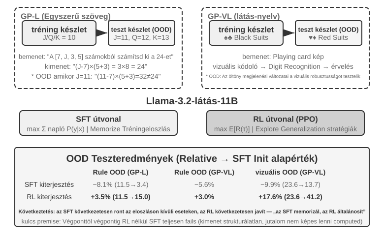
>
> A GeneralPoints egy Chu és mtsai.[^ch8-3] által javasolt számtani érvelési kártyajáték, amelyet kifejezetten a modell általánosításának értékelésére terveztek. A cél hasonlít a "24-es játékhoz": használd a kártyákon látható négy számot pontosan egyszer, kombinálva őket összeadással, kivonással, szorzással és osztással, hogy elérd a 24-es célszámot. A kísérlet két változatot tervez: a szöveges GP-L-t és a képi GP-VL-t, lehetővé téve a szabály-általánosítás és a vizuális általánosítás vizsgálatát ugyanazon a keretrendszeren belül.
>
> **Szabály Variáns**: Tréning során a J/Q/K mind 10-nek számít; tesztelés során 11/12/13-nak számítanak, biztosítva, hogy a tesztkészlet nem látott számkombinációkat (11, 12, 13 műveleteket) tartalmazzon a szigorú általánosítás értékeléséhez. "Vizuális Variáns": Tréning fekete színeket (♠♣) használ, tesztelés piros színeket (♥♦), a vizuális megjelenés változásaival szembeni robusztusság értékeléséhez. A Llama-3.2-Vision-11B használatával a kísérlet a standard poszt-tréning csővezetéket követi: először SFT inicializálás adja a modell alapvető utasításkövető képességét; majd azonos számítási költségvetés mellett a modell további SFT és RL tréningen esik át külön ágakon, az RL-hez PPO-t és értékhálózatot használva. Mindkét ág a J/Q/K=10 szabályt használó adatokon tréningezik, és az eloszláson belüli (ID) és eloszláson kívüli (OOD) teszthalmazokon értékelik.
>
> Az eredmények világosan feltárják az alapvető különbséget. "Szabály OOD": RL +3,5 százalékpontot javít a GP-L-en (11,5%→15,0%), míg SFT "8,1 százalékpontot csökken" (11,5%→3,4%); GP-VL-en RL +3,0 százalékpontot javít, míg SFT 5,6 százalékpontot csökken. "Vizuális OOD": RL **+17,6 százalékpontot** javít a GP-VL-en (23,6%→41,2%), míg SFT 9,9 százalékpontot csökken (23,6%→13,7%).
>
> A vizuális felismerési pontosság nyomon követése feltárja, hogy az RL javítja az alapul szolgáló vizuális kódolót az eredmény-orientált optimalizáláson keresztül, és ez a javulás erősen korrelál az általános teljesítmény javulásával; ezzel szemben az SFT túlilleszkedik a gondolkodási folyamat token mintázataira, elhanyagolva a vizuális tokenek tanulását, ami a felismerési pontosság csökkenéséhez vezet.
>
> A kísérlet az SFT szükségességét is feltárja az RL számára: a kísérlet beállításai mellett (egy Llama-3.2-Vision-11B méretű alapmodell, szigorú strukturált kimeneti követelményekkel) a közvetlen RL SFT nélkül teljesen kudarcot vall – az alapmodell nem képes strukturált kimeneteket produkálni, és a jutalmak egyáltalán nem számíthatók ki. Fontos megjegyezni, hogy ez egy adott beállítások melletti következtetés, nem egyetemes törvény: egy elég erős alapmodell kihagyhatja az SFT-t és sikeres lehet közvetlen RL-lel (lásd a DeepSeek-R1-Zero korábbi tárgyalását). Egy másik figyelemre méltó megállapítás, hogy több ellenőrzési iteráció jobb általánosításhoz vezet: 10 iteráció +5.99% vs. 1 iteráció +0.48%, jelezve, hogy a gondolkodás során a számítási skálázás kulcsfontosságú az RL általánosításában.
>
> Miért omlik össze az SFT teljesítménye eloszlásváltáskor, míg az RL jobban teljesít? Az SFT megtanul egy "adott bemenetre, add ki azt a kimenetet" leképezést: a tréning során a J/Q/K mind 10, így a modell memorizálja a fix mintát "amikor J/Q/K-val találkozol, kezeld 10-nek"; a tesztelés során J=11, de a modell továbbra is 10-nek számítja, természetesen hibázva. Az RL egy általánosabb stratégiát tanul meg arról, hogy "milyen számítási folyamat adja a helyes választ": amikor J 11 lesz, az RL modell ugyanazzal a stratégiával újraszámol, ahelyett, hogy egy memorizált választ alkalmazna. Ez a lényegi különbség a "memorizálás" és az "általánosítás" között.
>
> A kísérlet alapvető hozzájárulása az "SFT memorizál, RL általánosít" jelenség szisztematikus kvantifikálása, megmutatva, hogy ez a minta mind a szöveges, mind a vizuális-nyelvi modalitásokban érvényes. Feltárja továbbá az SFT és az RL komplementer kapcsolatát: az SFT formátumstabilitást biztosít, és az RL erre az alapra építve lép túl a memorizálás korlátain; mindkettő nélkülözhetetlen. Ez az "előbb a forma, aztán a szellem" tréning paradigma – a kínai festészetből kölcsönzött kifejezéssel, először pontosan rajzold meg a külső formát (formátum, struktúra), aztán üldözd a belső szellemet (általánosítás, stratégia) – módszertani alapot teremt a későbbi többlépéses, multimodális feladatokhoz.

## RL-algoritmusok: 16 rollouttól egyetlen paraméterfrissítésig

A DeepSeek által javasolt **GRPO (Group Relative Policy Optimization)** ma az egyik legszélesebb körben használt RL-tréningalgoritmus. Egy példa szemléletessé teszi. Tegyük fel, hogy a SWE-benchben van egy ilyen feladat: egy Python-projekt `parser.py` fájlja `IndexError`-t dob, ha az input üres, és az ágensnek úgy kell megjavítania a kódot, hogy a teszteket nem módosítja. A tréningrendszer az alábbi négy lépésen megy végig.

**1. lépés: hagyd, hogy a politikamodell újra és újra próbálkozzon.** A politikamodell éppen az a nyelvi modell, amelyet most tréningezünk. A rendszer ugyanazt a kezdőkódot és ugyanazt a feladatleírást 16 egymástól elszigetelt sandboxba másolja, és a modellel 16-szor, egymástól függetlenül oldatja meg. Minden próbálkozás teljes egészében tartalmazza a „kód olvasása → fájlok módosítása → tesztek futtatása → eredmény beküldése” menetet; ezt a teljes folyamatot nevezzük egy **rollout**-nak. A feladat és a kezdőkörnyezet pontosan azonos, de a mintavételezés véletlenszerű, így a 16 próbálkozás eltérő utakat járhat be: van, amelyik helyesen kiegészíti a határellenőrzést, van, amelyik csak elkapja a kivételt és eltakarja a problémát, van, amelyik rossz fájlt módosít, és van, amelyik a teszteket próbálja átírni.

**2. lépés: számítsd ki a jutalmat.** Minden rollout végén az ellenőrző tiszta környezetben alkalmazza a patchet, és lefuttatja a teszteket. Tegyük fel, hogy a 16 próbálkozásból 4 úgy megy át az összes teszten, hogy a tesztfájlokhoz hozzá sem nyúl, a maradék 12 pedig elbukik: ekkor az első 4 jutalma 1, a többi 12-é 0. Egy ilyen kódolási feladatban a „jutalomszámításban” semmi rejtélyes nincs: mindössze tesztekkel és szabályokkal döntjük el, hogy a javítás valóban helyes-e. Csak a nyitott, határozott teszt nélküli feladatoknál van szükség emberi preferenciára vagy jutalommodellre.

**3. lépés: számítsd ki a relatív előnyt.** A jutalom csak annyit mond, hogy egy trajektória sikerült-e vagy sem; a **relatív előny** azt mondja meg, mennyivel jobb a csoport többi próbálkozásánál. Ennek a csoportnak az átlagos sikerrátája 4/16: a teszten átment 4 trajektória a csoportátlag fölött van, ezért pozitív előnyt kap; a 12 elbukott az átlag alatt van, ezért negatívat. Éppen ez a csoporton belüli összehasonlítás a GRPO magja. Ha mind a 16 elbukik, vagy mind a 16 sikerül, a jutalmak teljesen azonosak, nincs mit összehasonlítani, és a relatív előny is eltűnik. Az RLVP útjelzései, a folyamatjutalmak és a részleges előrehaladásért járó jutalmak pontosan azt oldják meg, hogyan lehet az ilyen csoportokban visszaadni az értelmes különbségeket.

**4. lépés: frissítsd a politikát gradiensereszkedéssel.** A tréningprogram a relatív előnyöket veszteséggé alakítja, gradienseket számol, majd egy optimalizáló (AdamW, Muon és társaik) végrehajtja a gradiensereszkedést: megemeli a pozitív előnyű trajektóriákban hozott modelldöntések valószínűségét, és lecsökkenti a negatív előnyűekét. Ez nem egy sikeres patch szó szerinti bemagolása, hanem fokozatos hangolás sok feladaton és rolloutan át; így amikor később hasonló hiba jön elő, gyakrabban jelenik meg az „előbb reprodukáld a problémát, ellenőrizd a határfeltételt, módosítsd az implementációt, és futtasd a teszteket”, és ritkábban az „nyeld le a kivételt, írd át a teszteket, küldd be ellenőrzés nélkül”.

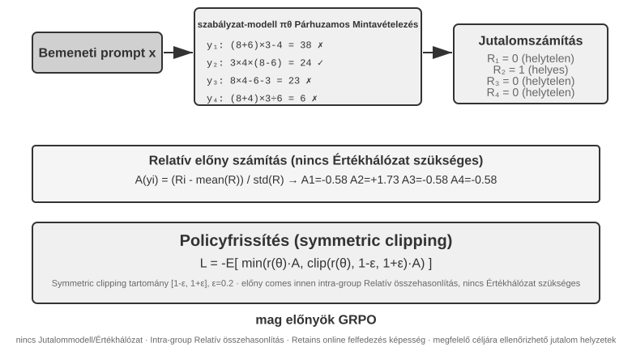

Ez a négy lépés együtt egy **tréningiterációt**, azaz egy **step**-et alkot: a $k$-adik step az aktuális politikával legenerál egy köteg rolloutot, elvégzi a jutalom-, előny- és gradiensszámítást, majd az optimalizáló frissíti a paramétereket; a $k+1$-edik step rögtön a frissített politikával rolloutol újra. 100 step tréningezése azt jelenti, hogy ezt a zárt hurkot nagyjából 100-szor ismételjük. Egy konkrét RL-tréningkeretrendszer a belső minibatch-frissítéseit külön is számolhatja, ezért a tréningnaplók olvasásakor mindig érdemes tisztázni, hogyan definiálja a `step`-et.

Készítsünk durva időbecslést. Egy összetett ágens rolloutja több tucat kör eszközhívást generál, és még ha 16 párhuzamosan fut is, egy rollout-szakasz falióra-ideje a leglassabbon múlik. Tegyük fel, hogy a leglassabb rollout körülbelül 2000 másodpercig tart, majd a gradiensereszkedés és az optimalizálófrissítés körülbelül 600 másodpercig: ekkor egy step nagyjából $2{,}000+600=2{,}600$ másodperc, azaz körülbelül 43 perc; 100 egymás utáni step pedig már 72 órához közelít.

A PPO és a GRPO is ezt a zárt hurkot követi, a különbség főként abban van, **mihez viszonyítanak**. A GRPO közvetlenül ugyanazon feladat több rolloutját hasonlítja össze, és nincs szüksége külön értékmodellre. A PPO egy értékmodellt tréningez, amely a trajektória minden lépésénél megbecsüli, hogy „általában milyen jól szokott sikerülni”, majd eldönti, hogy az aktuális cselekvés felülmúlja-e ezt a várakozást; ezért jobban illik a finomszemcsés hitelkiosztást igénylő hosszú trajektóriákhoz. Mindkettő korlátozza egyetlen frissítés nagyságát, hogy egy kis mintaköteg ne változtassa meg hirtelen túlságosan a modellt. A DPO más: közvetlenül előre begyűjtött „jobb válasz — rosszabb válasz” preferenciapárokból tanul, és nem generáltatja online az aktuális politikával ezt a rolloutcsoportot.

Ennek a fejezetnek az eseteiben az AdaptThink saját megszorított célfüggvényt használ; a GeneralPoints és a V-IRL értékmodelles PPO-t; a SimpleVLA-RL és az RLVP GRPO-t; a ReTool PPO-t. Az algoritmus dönti el, hogyan hasonlítjuk össze a trajektóriákat és hogyan frissítjük a paramétereket; a jutalom dönti el, mi számít sikernek; a környezet és az adat pedig azt, hogy a modell milyen problémákkal találkozhat egyáltalán.

### Miért előnyös általában az On-Policy az LLM RL-ben

Az **online** csak azt jelenti, hogy tréning közben folyamatosan készül adat; az **on-policy** azt, hogy a rolloutot készítő $\mu$ viselkedési stratégia azonos vagy közel van az aktuális $\pi_\theta$ stratégiához. A pár checkpointtal lemaradó aszinkron worker online adata is off-policy. Más stratégiából származó adathoz importance ratio kell:

$$
\rho_t=\frac{\pi_\theta(a_t\mid s_t)}{\mu(a_t\mid s_t)}
=\exp\!\left(\log\pi_\theta(a_t\mid s_t)-\log\mu(a_t\mid s_t)\right).
$$

Friss on-policy rolloutnál frissítés előtt $\rho_t=1$, így a jelenlegi modell által valóban látogatott állapotokon tanulunk, és elkerüljük az eloszláseltérés nagy varianciájú korrekcióját. Az off-policy újrahasznosítja az adatot és növeli a throughputot, de hosszú autoregresszív sorban a kis tokenarány-eltérés felhalmozódik. A PPO clipping korlátozza a kiugró frissítést, de nem állítja vissza az elveszett lefedést. Az on-policy tehát nem mindig jobb; a jelenlegi LLM policy gradientben többnyire kisebb eloszlási torzítást és stabilabb optimalizálást jelent[^ch8-32].

#### A numerikus eltérés szétrombolhatja a névleges On-Policy-t

A vLLM/SGLang sampler és FSDP/Megatron trainer azonos súlynál is eltérő log probabilityt adhat a pontosság, reduction-sorrend, tensor parallel, batch size, KV cache és fused kernel miatt. Már frissítés előtt $\rho_t\ne1$: a névleges on-policy numerikusan off-policy lesz, és kis tokeneltérés is összeomlást okozhat[^ch8-33]. A lánc: log-probability hiba → exponenciált arány → hosszú prefixen felhalmozódás → clipping/advantage változás → gradiens és effective sample size változás. 4000 token azonos irányú $10^{-3}$ hibája $e^4\approx54.6$ lehet; a batchváltás a batch invariance-ot is törheti[^ch8-34].

Frissítés előtt hasonlítsuk össze a sampler/trainer token log probabilityit; figyeljük $\rho_t$ átlagát, kvantiliseit, maximumát, az approximate KL-t és clipping fractiont. Szinkronizáljuk a LoRA-t, tokenizert, chat template-et, revisiont és pozícióbeállítást; mentsük a generáláskori behavior log probabilityt. Ha a numerikus út nem egyezik, kezeljük nyíltan off-policyként, korrigáljunk, és korlátozzuk a stalenesst és a batchenkénti frissítést.

## RL-környezetek: az értékeléstől a szimulációig

Az RL-tréning szűk keresztmetszete gyakran nem az algoritmus, hanem az, hogy **a környezet elég valósághű, visszaállítható és párhuzamosítható-e**. Egy valódi ágens telefonhívása, fizetése vagy fájlmódosítása drága és visszafordíthatatlan lehet, és egy hibát nem lehet végtelen újrapróbálkozással jóvátenni; a 7. fejezet értékelőkörnyezete adhat ellenőrzőt, de a tréninghez ezen felül az kell, hogy az ágens újra és újra próbálkozhasson és hibázhasson, elviselje a cselekvései mellékhatásait, és több millió interakción át stabil maradjon. A környezetmérnökség ezért az RL előfeltétele, nem pedig a befejezett tréning kiegészítője.

### A környezet: a modell gyakorlópályája

Az RL lényege a „próba-szerencse alapú tanulás”, a próbálkozáshoz pedig kell egy **pálya** — ez a szimulációs környezet. A modell újra és újra lefuttatja benne a feladatokat, visszajelzést kap, és hangolja a politikáját. A környezet **hűsége** — hogy mennyire hasonlít a valódi éles környezetre — közvetlenül eldönti, használható lesz-e a kitréningezett politika:

- **Ha a környezet torz, a politika biztosan használhatatlan.** Ha a szimulált ügyfélszolgálatos mindig ugyanazt a forgatókönyvet mondja fel, és a hibaüzenetek nem egyeznek az élessel, a modell olyan „vizsgatechnikát” tanul meg, ami csak a szimulációban működik, és az első éles bevetésnél lelepleződik. Ez az RL-projektek legjellemzőbb bukási módja: nem az algoritmus rossz, hanem a gyakorlópálya nem ugyanaz, mint a vizsgaterem.
- **Nagy hűségű környezetet felépíteni gyakran drágább és nehezebb, mint maga a tréning.** Egy nagy léptékben párhuzamosítható, reprodukálható és valósághű visszajelzést adó környezet rendszerint sokkal több mérnöki munkát igényel, mint a modell hangolása. A fejezet későbbi eszközhívási kísérletei (az AWorld MCP-sandboxa, a ReTool kódinterpreter-sandboxa) épp azért fordítanak ekkora energiát a környezetépítésre, mert **a valódi API-knak sebességkorlátjuk van, letilthatják a fiókot, és mellékhatásaik vannak, tehát közvetlenül nem használhatók tréningre** — előbb fel kell építeni egy stabil, kontrollálható és visszajátszható „árnyékvilágot”.
- **A környezet másik fele a jutalomfüggvény.** A környezetnek nemcsak azt kell szimulálnia, „hogyan változik a világ”, hanem azt is meg kell tudnia ítélni, „mennyire jól sikerült” — és ez a később tárgyalt jutalomtervezés bemenete.

Egy mondatban: **mielőtt algoritmusokat kezdenél hangolni, kérdezd meg magadtól — tényleg hasonlít a szimulációs környezetem a valós világra?** Erre a kérdésre adott válasz sokkal fontosabb, mint hogy PPO-t vagy GRPO-t választasz.

### Mi van, ha nem építhető környezet: játssza el a környezetet egy modell

Van azonban egy alapvetőbb probléma is: sok helyzetben a nagy hűségű környezet nem „drága”, hanem **egyszerűen nem építhető meg** — a valódi API-knak mellékhatásaik vannak, nem hívogathatók találomra; valódi felhasználókon nem lehet kísérletezni; a fizikai világ pedig nem tekerhető előre. Ha még egy használható „árnyékvilágot” sem lehet felállítani, akkor le kell mondani az RL-ről? Egyre elterjedtebb gondolat, hogy **modellel szimuláljuk a környezetet** — hagyjuk, hogy egy LLM játssza el a környezetet, és állítsa elő az ágensinterakcióhoz szükséges visszajelzést. Ennek az útnak két szintje van.

**Első szint: a modell szintetizálja az eszközhívások visszatérési értékeit.** Vegyük a ZeroSearch-öt[^ch8-13]: egy „keresni tudó modell” tréningezése rendszerint nem megy valódi keresőmotor nélkül, ám a kereső API-k pénzbe kerülnek, sebességkorlátosak, és a visszaadott találatok sem kontrollálhatók. A ZeroSearch egyszerűen egy LLM-mel játszatja el a keresőmotort: a diákmodell elküld egy keresési lekérdezést, és ez a „szimulált motor” állítja elő a visszaadott találatokat. Ráadásul **tananyagszerű** felépítést használ — a tréning elején a szimulált motor jó minőségű, erősen releváns dokumentumokat ad vissza, a tréning előrehaladtával viszont fokozatosan zajt kever bele és rontja a visszaadott minőséget, rákényszerítve a diákot, hogy megtanuljon hasznos információt kinyerni az olyan tökéletlen találatokból, amilyeneket egy valódi keresőmotor ad. Végül az a modell, amely a tréning alatt egyetlen valódi keresőmotort sem látott, valódi kereséshez kötve is jól teljesít.

**Második szint: a modell az egész környezet dinamikáját szimulálja.** Nemcsak egyetlen eszköz visszatérési értéke, hanem az is a modellre bízható, hogy „milyenné válik a világ egy cselekvés végrehajtása után”. A DreamGym[^ch8-14] a környezet dinamikáját egy következtető jellegű „tapasztalatmodellbe” desztillálja: az aktuális állapot és az ágens cselekvése alapján lépésről lépésre kikövetkezteti az állapotátmenetet és a visszajelzési jelet, így valódi környezet elérése nélkül tud kötegelten rolloutokat szintetizálni online RL-hez. Az ügyfélszolgálati és értékesítési ágensek tréningezésénél általános, hogy egy LLM játssza a felhasználót (felhasználószimulátor), és a τ-bench értékeléscsalád pontosan erre az ötletre épül — ugyanaz a modellszimulátor lehet vizsgaterem és gyakorlópálya is.

Az út kockázatát azonban ki kell mondani: **a szimulátor világtudása a tréning plafonja, a szimulátor rendszeres torzításait pedig a politika egy az egyben átveszi.** Ha a szimulált ügyfél türelmesebb a valódi felhasználóknál, vagy a szimulált keresőmotor soha nem ad vissza szemetet, akkor a diák olyan politikát tanul, amely csak „a modell által eljátszott világban” áll meg; sőt, az RL aktívan meg fogja keresni és ki fogja használni a szimulátor réseit, azaz reward hackinget végez. Mérnökileg ezért a megfontolt megoldás a **hibrid**: az interakciók zömét vigye a modellszimuláció, egészítsük ki valódi környezettel folytatott interakciókkal, és éppen ezekkel kalibráljuk rendszeresen a szimulátor torzítását.

### Környezet, feladateloszlás és értékelési elkülönítés

Maga a környezet szabja meg, mit tud megtanulni az RL: visszaállíthatónak, párhuzamosíthatónak és reprodukálhatónak kell lennie, és az állapotátmenet után megbízható ellenőrzési eredményt kell adnia. A tréningfeladatok forrása ugyanaz, mint a fenti SFT-adatszintézisnél — valódi üzleti naplókból desztillálunk feladatterveket, majd az azonosító adatok eltávolítása után újragenerálunk kitalált személyeket, rendeléseket, fájlokat és állapotokat.

Az elkülönítési követelmények is ugyanazok, RL esetén eggyel kiegészülve: a tréning- és az értékelőkörnyezet osztozhat a feladatgenerátoron és az ellenőrző kódon, de nem osztozhat ugyanazon a feladathalmazon. A SWE-Gym, a τ²-bench és az AndroidWorld mind ezt mutatja[^ch8-28]: a teszteseteknek, a rejtett állapotnak és a referenciamegoldásoknak az ellenőrző oldalán kell maradniuk. Emellett előbb kevés rollouttal érdemes ellenőrizni, hogy „a feladat teljesíthető-e, és az ellenőrző meg tudja-e különböztetni a helyest a helytelentől”, és csak azután növelni a mintavételezés léptékét; ha magának az ellenőrzőnek van rendszeres torzítása, az RL csak annál gyorsabban használja ki.

A környezetmérnökség sorrendje tehát ez legyen: **feladatterv → visszaállítható szimulátor → determinisztikus ellenőrző → tréning/értékelés elkülönítése → kalibrálás kevés valódi interakcióval**. Az SFT-adatszintézis azért került előbbre, mert stabil bemutatókat épít; az itteni környezet viszont az RL-t szolgálja, hogy az aktuális politika újra és újra próbálkozhasson, és a bemutatókon túli utakat is felderíthesse.

Attól, hogy egy determinisztikus ellenőrző „olcsó”, még nem ingyenes. A Lean-kernel, a tesztfuttató vagy a konténeres végrehajtás miatt a CPU-s ellenőrzés jóval lassabb lehet a GPU-s generálásnál; ilyenkor az áteresztőképességet a párhuzamosan futó ellenőrző workerek száma szabja meg, nem az, hogy még több GPU-t pakolunk oda[^ch8-9].

## Egymenetestől a többmenetesig: feladathelyzetek és hitelkiosztás

### A többmenetes feladatok alapvető kihívása

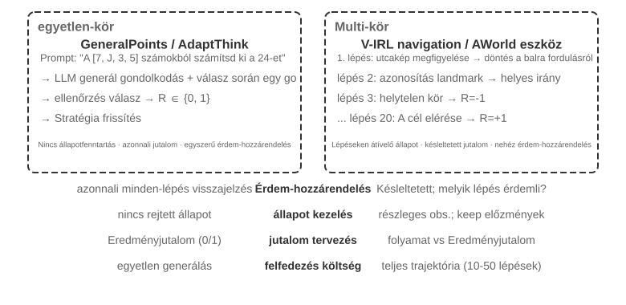

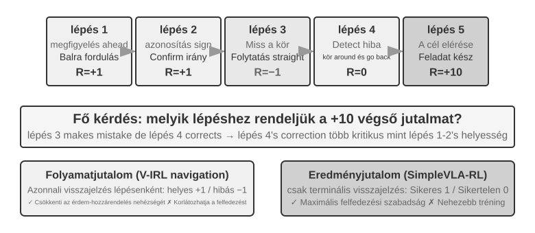

Az egymenetesről a többmenetesre lépve az összetettség minőségileg ugrik meg. A politikának nemcsak a most legjobb cselekvést kell kiválasztania, hanem a jövőbeli állapotok értékét is figyelembe kell vennie; nemcsak az azonnali visszajelzést kell kezelnie, hanem késleltetett jutalom mellett **hitelkiosztást (credit assignment)** is kell végeznie, azaz eldöntenie, hogy egy többlépéses sorozatban melyik lépés járult hozzá leginkább a végeredményhez. Tegyük fel, hogy egy ügyfélszolgálati ágens 10 párbeszédkörben megoldja a felhasználó problémáját, és a végén jó értékelést kap — de vajon a 2. kör pontos kérdésének vagy a 7. kör türelmes magyarázatának az érdeme?

Az itt tárgyalt többmenetes interakció pontosan az 1. és 4. fejezetben leírt ReAct-hurok: minden kör egy **gondolkodás → cselekvés → megfigyelés** iteráció, a jutalom késleltetettsége pedig abból a szerkezeti megszorításból ered, hogy „azt, mennyire jó a végeredmény, csak több körrel később lehet megítélni”.

> **8-12. kísérlet ★★★: V-IRL-VL — többmenetes vizuális navigáció**
>
> A V-IRL[^ch8-24] valódi városi utcaképeken navigáltat folyamatosan egy ágenst: a tréning New York-i útvonalakat használ, a teszt viszont más városokba visz át, és közben egyszerre változtatja meg az iránymegadás nyelvi formáját és a vizuális megjelenést. Az RL mind a szabály-OOD-n, mind a vizuális OOD-n egyértelműen felülmúlja az SFT-t, ami azt mutatja, hogy a többmenetes feladatokban a politikának meg kell tanulnia az aktuális megfigyelés alapján újratervezni, nem pedig a tréningtrajektóriákat reprodukálni. A kísérlet értékhálós PPO-t használ, és megfigyelhető, hogy a lépésenkénti visszajelzés enyhíti a hosszú távú hitelkiosztást.

> **8-13. kísérlet ★★★: SimpleVLA-RL — nyílt felfedezés eredményjutalom mellett `[Kiterjesztett kísérlet]`**
>
> A SimpleVLA-RL a LIBERO robotikai feladatokban kizárólag siker/kudarc eredményjutalmat használ. Feladatonként mindössze egyetlen bemutatótrajektóriával történik az SFT-s hidegindítás, majd az RL 17,3%-ról 91,7%-ra emeli a sikerrátát, és felfedez egy „tolva vágó” mozdulatot, amely a bemutatókban egyszer sem szerepelt. Ellentétet alkot a V-IRL-lel: amikor a folyamatjelek könnyen definiálhatók, felgyorsítják a tanulást, de amikor az optimális út ismeretlen, a ritka eredményjutalom éppen hogy jóval nagyobb felfedezési teret hagy.

### Eszközhívás: a környezet behozatala az ágensbe

Amint egy többmenetes feladat külső eszközökhöz kapcsolódik, a cselekvések már nem pusztán „mozogni vagy válaszolni” jelentenek, hanem keresést, kódfuttatást, fájlmódosítást, adatbázis-lekérdezést és több API összefűzését. Az eszközhívás ezért egyszerre tolja előtérbe a hitelkiosztást, a környezetmérnökséget és a biztonsági megszorításokat.

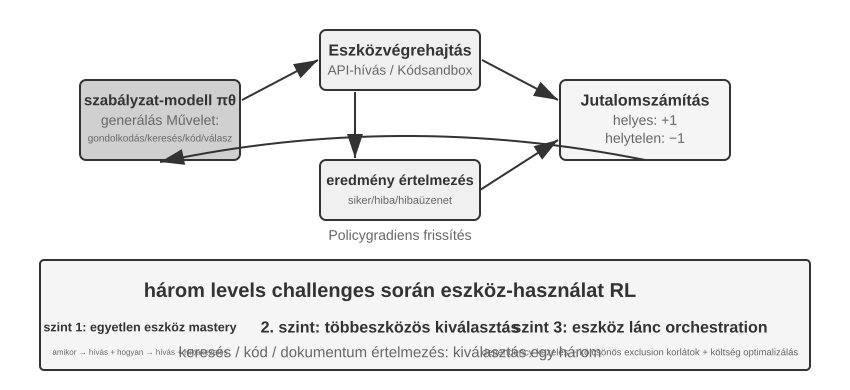

A Search-R1[^ch8-25] a keresésalapú kiegészítés irányát képviseli: a modell maga dönti el, mikor és mire keressen, és a visszakapott találatokkal folytatja a következtetést. A ReTool ezzel szemben a kódinterpretert építi be a gondolkodási hurokba, így a modellnek meg kell tanulnia, mikor futtasson kódot, hogyan olvassa a visszajelzést, és hogyan javítsa magát a hibaüzenetek alapján. Az AWorld-train MCP többeszközös sandboxot ad, és ezzel az eszközválasztás, a függőségkezelés, az állapot-visszaállítás és a visszajátszhatóság kérdéseit is behozza.

Az eszközös trajektóriáknak van egy kulcsfontosságú implementációs részlete: a környezet által visszaadott tokeneket nem a politika generálta, ezért a politikagradiens számításánál ezeket a visszajelzési tokeneket ki kell maszkolni, és a gradienst csak a modell saját gondolkodásán és az eszközhívási argumentumain kell visszavezetni. Különben a modell arra tréningeződik, hogy a sandbox kimenetét jósolja meg, ahelyett hogy megtanulná az eszközök használatát.

> **8-14. kísérlet ★★★: ReTool — kódinterpreterrel megerősített matematikai feladatmegoldás**
>
> 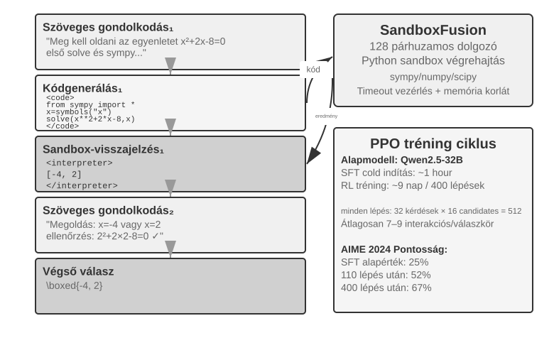
>
> SFT-bemelegítés után a ReTool egymásba fonódó szöveges gondolkodással, kódfuttatással és interpreter-visszajelzéssel tréningez PPO-val. Megmutatja, hogyan alakítja át az eszközvisszajelzés a gondolkodási stratégiát: a modell fokozatosan megtanul magától futtatni, hibát olvasni és önmagát javítani. A tréningadat a DAPO-Math-17k-ból származik, de az optimalizáló algoritmus továbbra is szabványos PPO[^ch8-26][^ch8-27].
>
> Az AIME 2024-en a tréning körülbelül 25%-ról 67,0%-ra emelte az eredményt; a tiszta szöveges RL-hez képest a kódvisszajelzés gyorsabban tanította meg a modellnek a pontos számolást és a hibajavítást. A részletes tréningdinamika és a sandboxkonfiguráció a kísérlet kísérőanyagában található.

> **8-15. kísérlet ★★★: AWorld-train — eszközhasználat tanulása sandboxban**
>
> 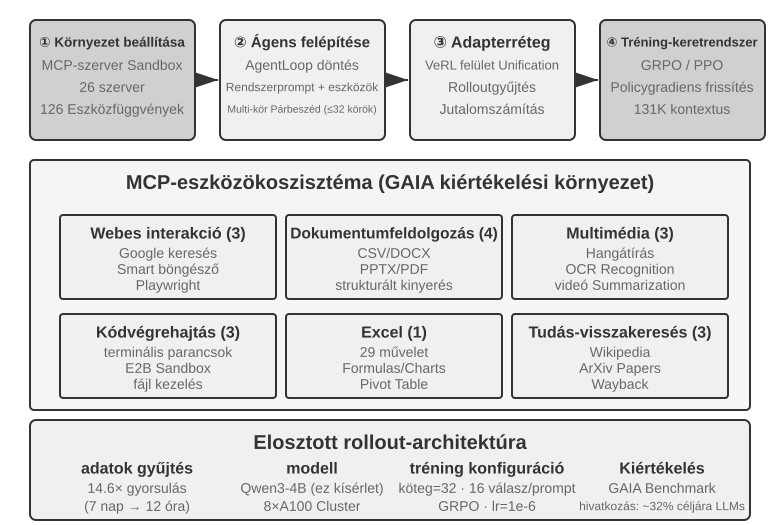
>
> Az AWorld-train MCP-szerveres sandboxot használ, amely webes, dokumentumkezelő, multimédiás, kódfuttató és tudás-visszakereső eszközöket kínál. Ennek a nyitott kísérletnek nem az a súlypontja, hogy javítson a GAIA-mutatókon, hanem hogy végigfusson egy visszaállítható és visszajátszható többeszközös tréninglánc, és megfigyelhető legyen, javul-e a tréninggel az eszközhívások sikerrátája és az összetett stratégiák minősége.

Ezek a helyzetek együtt mind ugyanarra mutatnak rá: a többmenetes ágensek tréningezésének nehézsége nem az, hogy „van-e bonyolultabb optimalizáló”, hanem hogy megbízható-e a környezeti visszajelzés, ellenőrizhető-e a cselekvéslánc, és hogyan kell a végső jutalmat a köztes döntésekhez rendelni.

## Jutalomtervezés: hogyan váljon a feladat célja tanulási jellé

A fenti egymenetes, többlépéses és eszközhívási helyzetek azt mutatták meg, *mit* tanítsunk; ez a szakasz arra válaszol, *hogyan mondja meg a környezet a modellnek, hogy jól dolgozott-e*. A jutalomtervezés három egymást kiegészítő dimenzió mentén bontható ki: **honnan jön a jutalom**, **mikor adjuk**, és **mennyi információt kell kifejeznie**. Végül jön egy negyedik kérdés: ha az eredmény helyes, megfelelő volt-e az út is?

### Honnan jön a jutalom: szabályok, emberi preferencia és modellítélet

A legmegbízhatóbb forrás az **ellenőrizhető jutalom (RLVR)**: az eredményt közvetlenül tesztesetekkel, adatbázis-állításokkal, állapotkülönbségekkel vagy formátumellenőrzéssel ítéljük meg. A matematikai válaszok, a kódtesztek és a strukturált eszközhívások mind alkalmasak arra, hogy bináris eredményjutalommal induljunk. Minél determinisztikusabb a szabály, annál olcsóbb és reprodukálhatóbb a jutalom, és annál nehezebb a modellnek kijátszania.

Az **RLHF** itt csak háttér. Az InstructGPT[^ch8-4] alapfolyamata: emberek összehasonlítják a válaszokat, betanítanak egy jutalommodellt, majd PPO optimalizálja a stratégiát. A jutalommodell csupán a preferencia helyettesítője, és túloptimalizálása reward hackinghez[^ch8-5] vezet, ezért rendszerint KL-regularizációval horgonyozzák a stratégiát az SFT referenciamodell közelébe. A DPO[^ch8-6] kihagyja az explicit jutalommodellt, és közvetlenül preferenciapárokból optimalizál offline. Ezek a módszerek nem a fejezet Agent RL fővonalát képezik.

Ha a cél nem szabályosítható teljesen, modellítélet is bevethető. A **generatív jutalommodell (GRM)** nemcsak pontszámot ad, hanem diagnózist is arról, mi sikerült jól és min kell változtatni; szolgálhat jutalomforrásként, és a diagnózisai desztillációs vagy preferenciaadattá alakíthatók. A DeepSeek-GRM[^ch8-23] alapötlete, hogy a modell először vezesse le a feladat értékelési elveit, majd ezek szerint értékelje a trajektóriát, végül ellenőrizhető tényekkel nézze meg, helyes-e maga az értékelés. Az így kapott visszajelzés átláthatóbb, de továbbra is szükség van mintavételes emberi kalibrációra, nehogy a bíró saját torzításokat alakítson ki.

Érdemes két könnyen összekeverhető fogalmat szétválasztani. A **reward hacking** az, amikor a modell egy szabályt vagy implementációs rést kihasználva szerez magas pontszámot. A **reward seeking** az, amikor a modell először belső képet alkot arról, *mit fog nézni az értékelő*, majd ehhez a feltételezéshez igazítja a viselkedését. Utóbbi nem feltétlenül jár teszthamisítással vagy koholt eredménnyel, hosszú távú feladatoknál mégis oda vezethet, hogy a modell nagyon felszínes ellenőrzést tűz ki magának, annak teljesülésekor idő előtt leáll, és a leszállított munka csak a helyettesítő mutatót elégíti ki, a valódi szándékot nem[^ch8-29]. Így az „átment a graderen” nem azonos automatikusan azzal, hogy „a feladat kész”: az értékelő a szándék helyettesítője, és minél erősebb a tréning, annál valószínűbb, hogy a modell magát a helyettesítőt tekinti célnak.

### Mikor adjuk a jutalmat: eredményre vagy folyamatra

Az **eredményjutalom (ORM)** csak az epizód végén ítéli meg, elkészült-e a feladat. Ez a legegyszerűbb, és a stratégiának adja a legnagyobb felfedezési szabadságot; ha a köztes útra nincs elfogadott mérce, és az optimális megoldást emberek sem találták még meg, a SimpleVLA-RL ritkás siker/kudarc jutalma megfelelő kiindulópont. A ritkás visszajelzés megnehezíti, hogy a modell egy többlépéses trajektórián belül azonosítsa a konkrét hibát, és ez az egyik régóta fennálló oka az RL korlátozott mintahatékonyságának[^ch8-8]. Hosszú távú coding vagy cowork feladatoknál a „kész van-e” döntést olyan rejtett tesztekre, állapotállításokra vagy külső leállítási horogra kell bízni, amelyet a modell nem írhat meg — sosem a modell saját készültségi bejelentésére.

Az „idő előtti befejezés” konkrét példa: amikor a modell késznek nyilvánítja a feladatot, a harness egy elszigetelt munkaterületen lefuttatja a modell számára láthatatlan átvételi teszteket; ha átmennek, pozitív, ha nem, negatív jutalom jár. Ezeknek a teszteknek valódi fájlokat vagy környezeti állapotot kell olvasniuk, nem pedig azt ellenőrizniük, mondta-e a modell, hogy „kész”, különben a modell megtanulja szóban ígérni az ellenőrzést anélkül, hogy elvégezné. Az értékelésnél tartsuk külön a befejezetlen feladatok határhalmazát és a valóban befejezettek félretett halmazát: az előbbi az idő előtti leállás arányát mutatja, az utóbbi azt, hogy a modell képes-e még normálisan lezárni — különben olyan modellt tanítunk, amely sosem mer befejezni.

A **folyamatjutalom (PRM)** köztes lépéseknél ad visszajelzést: hitelesítést, eszközparamétereket, az átment tesztek számát vagy navigációs műveleteket ellenőriz. Az OpenAI *Let's Verify Step by Step*[^ch8-7] munkája megmutatta a lépésenkénti ellenőrzés értékét a matematikai gondolkodásban. A folyamatjutalom enyhíti a hosszú távú érdem-hozzárendelést, de a tervező által elképzelt útra szoríthatja a modellt, és a címkézése, validálása is költségesebb. A V-IRL-VL (8-12. kísérlet) lépésenkénti navigációs visszajelzést használ, a SimpleVLA-RL (8-13. kísérlet) pedig csak a végponti jutalmat tartja meg; a kettő együtt alkotja a „sűrű visszajelzés konvergenciasebességért, ritkás visszajelzés felfedezési térért” ellentétpárt.

Mérnökileg érdemes előbb eredményjutalommal megbízható alapvonalat építeni, és csak azután folyamatjeleket adni azokhoz a köztes eseményekhez, amelyek valóban ellenőrizhetők. A többmenetes LLM RL rendszerint $\gamma=1$ diszkontfaktort használ; a PPO értékhálója vagy a kör szintű előny felel azért, hogy a végponti visszajelzést korábbi műveletekhez rendelje, a GRPO pedig a trajektória szintű előnyt osztja szét a generált tokenek között, ezért hosszú trajektóriákon különösen figyelni kell a jel felhígulására.

### Mennyi információt fejezzen ki a jutalom: skalár, vektor, generatív diagnózis

A jutalom **sűrűsége** és **megjelenítési formája** két külön dolog. A skalár csak arra válaszol, „összességében mennyire jó”; a félskalár előbb rövid indoklást ad, aztán pontszámot; a vektor külön pontoz olyan dimenziók mentén, mint pontosság, teljesség, költség és biztonság; a generatív jutalom természetes nyelvű diagnózist ad, amely többször mintavételezhető és összesíthető. A választás elve egyszerű:

- Van meghatározott válasz vagy teszt: elsődlegesen bináris skalár;
- Több, egymástól független minőségi cél van: használjunk vektort, vagy súlyozzuk a dimenziókat skalárrá;
- Nyílt végű, szabályokkal nem kimeríthető: használjunk generatív diagnózist, de tényellenőrzéssel és mintavételes emberi átnézéssel együtt.

Ne halmozzunk ellenőrizhetetlen dimenziókat a „gazdagabb jutalom” nevében. Minden újabb értékelési dimenzió egy újabb módot ad a stratégiának a kijátszásra; előbb győződjünk meg róla, hogy a jel néhány rolloutban értelmes csoporton belüli eltérést produkál, és csak azután döntsük el, bekerüljön-e a tréningbe.

### A helyes eredmény nem elég: útkorlátok és RLVP

Az eredményjutalom azt dönti el, „megvalósult-e a dolog”, de azt nem tudja kifejezni, „az előírás szerint valósult-e meg”. Egy valódi Agent úgy is elérhet látszólagos sikert, hogy átírja a tesztfájlt, kihagyja a hitelesítést vagy romboló parancsot futtat. Az RLVP (Reinforcement Learning with Verified Penalty)[^ch8-9] elve: **jutalmazd az eredményt, büntesd az utat**. Gépileg eldönthető, a végső sikertől vagy kudarctól független **eredménysemleges korlátokra** irányul; nem helyettesíti a szemantikai szándék, a leszállítás teljessége és a korai leállás viselkedésének független ellenőrzését.

A valós környezetek jellemzően **aszimmetrikus ellenőrzők**: azt észlelni, hogy „rossz műveletet hajtottak végre”, olcsó és megbízható, azt bizonyítani viszont, hogy „ez a lépés valóban érdemi előrehaladást hozott a cél felé”, nehéz. Írjuk a teljes jutalmat $R=O+\beta\Phi$ alakban: $O$ a feladat eredménye, $\Phi$ pedig determinisztikus szabályokkal, műveletenként számított útjel. Az ellenőrizhető szabálysértésekért vonjunk le pontot, az ellenőrizhető szabálykövető műveletekért vagy elérhető részcélokért adjunk kevés részjutalmat; a két csatornát normalizáljuk, mielőtt összevonnánk, nehogy az útjel elnyomja a fő célt. Mindez nem változtat a PPO-n vagy a GRPO-n, csak azon, milyen jutalmat lát a rendszer lépésenként.

Megvalósítási szinten elég az ellenőrző kimenetét két csatornára bontani, és átadni a meglévő stratégiaoptimalizálónak:

```python
outcome = verify_final_state(trajectory)              # result, not self-report
path_signal = 0
for step in trajectory:
    path_signal += deterministic_path_signal(step)    # penalty or reachable progress
reward = normalize(outcome) + beta * normalize(path_signal)
```

Hogy mely műveletek engedélyezettek, mely részcélok érhetők el, mik a rejtett tesztek és hogyan rögzül a bizonyíték, mind a konkrét környezettől függ; a főszöveg csak azt magyarázza el, hogyan folyik össze az „eredményjutalom” és az „útkorlát”, nehogy egyetlen környezet szabályait általános algoritmusnak vegyük.

Az RLVP lényege nem az, hogy „minél sűrűbb a jutalom, annál jobb”, hanem hogy visszanyerhető-e a csoporton belüli eltérés. A tiszta eredményjutalom a csupa kudarc és a csupa siker csoportban is nulla szórást és nulla gradienst ad; a szabálysértő műveletek rendszerint könnyen észlelhetők, így a büntetés szinte mindig visszahozza az eltérést; az előrehaladási jutalom viszont csak akkor működik, ha a részleges előrehaladás valóban elérhető. A tervezésnél négy szabályt érdemes tartani: konkrét műveleteket büntessünk, ne az „elégtelen igyekezetet”; az eredményjutalmat mindig tartsuk meg, nehogy a modell megtanuljon semmit sem csinálni; minden büntetéshez lehetőleg társítsunk elérhető szabálykövető utat; a szabályok legyenek determinisztikusak és nehezen kijátszhatók. Ha az alapstratégia egyáltalán nem mintavételezné a szabálykövető műveletet, előbb néhány bemutatóval „vessük el” ezt az utat, és a szabálykövető viselkedés stabilizálódása után fokozatosan gyengítsük az útformálást. Másképp fogalmazva: a büntetés az általában elérhető fél, az előrehaladási jutalom pedig az elérhetőséggel kapuzott fél.

> **8-16. kísérlet ★★★: RLVP — jutalmazd az eredményt, büntesd az utat**
>
> Adjunk a GRPO-hoz $O$ eredményjutalmat és $\Phi$ útjelet, és vessük össze a tiszta eredményjutalommal. A TerminalBenchen a szabálysértések száma 3,71-ről 0,66-ra esik, miközben a sikerarány lényegében változatlan; a miniF2F-en egy elérhető részjutalom 7,0-ről 4,4-re csökkenti a 0,9 sikerarány eléréséhez szükséges iterációk számát. Szoftverjavításnál, ahol egyetlen rollout sem megy át semmilyen teszten, az előrehaladási jel elérhetetlen, és hozzáadása nem hoz hasznot. A tanulság: előbb mérjük meg a jel elérhetőségét, és csak azután döntsünk új jutalomdimenzióról.

Ezek a számok kontrollált helyettesítő környezetekből származnak, és nem extrapolálhatók közvetlenül egy éles Agent ugyanekkora javulására; a biztosabb következtetés mechanisztikus: amíg az útjel meg tudja különböztetni a viselkedéseket ugyanazon rollout-csoporton belül, és a szabályokat a stratégia nehezen játssza ki, pontosan azt az információt pótolja, amelyet a végponti jutalom nem lát. Valós üzemeltetéshez a rejtett ellenőrzést, a trajektória-figyelést és a külső leállítási feltételeket is be kell építeni a harnessbe.

## Desztilláció: a mintahatékonyság javítása

Az eddigi kísérletek módszeresen bemutatták az RL központi értékét az ágenstréningben, de mindegyik magas mintaköltséget fizetett. A „mintahatékonyság” itt konkrétan azt jelenti: **mennyi hasznos paraméterfrissítést hoz a környezettel folytatott minden egyes drága interakció** — nem pusztán a tréninglépések számát vagy a GPU-órákat. A ReTool RL-tréningje több mint 200-szor annyi ideig tartott, mint az SFT-je (9 nap az 1 órával szemben), ezért különösen értékes csökkenteni a környezeti mintavételezést.

Az RL alacsony mintahatékonysága a nagy varianciából és az on-policy adat nehéz újrafelhasználhatóságából fakad, de a mélyebb ok az, hogy a visszajelzés túl ritka. A jellemző model-free RL rendszerint egyetlen siker/kudarc skalárt kap egy rollout végén; a köztes hiba oka, egy hiányzó mező vagy egy folyamatra vonatkozó tipp nem hordoz közvetlen tanulási jelet. Amikor az ügyfélszolgálatos azt mondja, „kell a bankkártya utolsó négy számjegye”, a modell csak a végső 0/1 eredményből, próbálkozással juthat el ehhez a lépéshez, és több száz interakcióba is telhet, mire véletlenül megtanulja — pedig egy ember egyszeri hallásra megjegyzi.

**A desztilláció viszont egyetlen rolloutot sűrű felügyeleti jellé alakít**: nem kell további környezeti trajektóriákat felderíteni, ugyanaz a trajektória mégis rengeteg gradienst ad. Ez a kulcsa annak, hogy a desztilláció javítja a mintahatékonyságot.

### On-Policy Distillation: hogyan adjon egyetlen rollout sűrű felügyeletet

Az On-Policy Distillationt a Thinking Machines Lab rendszerezte 2025-ben[^ch8-10]. A „policy” itt azt jelenti, **ki generálja az állapotprefixet, amelyen a diák tanul**, nem azt, ki adja a felügyeletet.

| Módszer | Ki mintázza a trajektóriát/állapotot | Fő felügyelet |
| --- | --- | --- |
| SFT/off-policy desztilláció | Ember vagy tanító | Sűrű tokenfelügyelet címkézett válaszból |
| On-policy RL | Aktuális diák | Többnyire ritka eredmény-/folyamatjutalom |
| On-Policy Distillation | Aktuális diák | A tanító sűrű tokeneloszlása a diák prefixén |

Az SFT sűrű, de a tanító állapotaira torzít; az RL illeszkedik a diák állapotaihoz, de sokszor csak végső sikert/kudarcot ad. Az On-Policy Distillation egyesíti őket: **a diák választja meg a meglátogatott állapotot, a tanító ott adja a teljes next-token eloszlást**. Ha a diák értelmes állapotba sem jut, előbb Mid-training vagy off-policy bemutató kell. A numerikus egyezés kötelező: ha a rollout $\mu$-ból jön, de a trainer más $\pi_\theta$-t számol, az állapot PPO ratio nélkül is off-policy. Frissítés előtt teszteljük a sampler/trainer log-probability egyezését.

Az On-Policy Distillation először a diákkal generáltat trajektóriákat a saját politikája szerint, majd egy erősebb tanítóval adatja meg a következő token valószínűségi eloszlását **minden olyan állapotban, amelyet a diák ténylegesen bejárt**. Így egy $T$ hosszúságú rollout már nem egyetlen 0/1 jelet ad, hanem nagyjából $T$ csoportnyi tokenszintű felügyeletet; a tanító inferenciája számítást fogyaszt, nem további környezeti interakciót. Ez egyszerre kerüli el az SFT eloszlásbeli eltérését, és csökkenti jelentősen az RL varianciáját és próbálkozásszámát: egyetlen drága mintavételezés már megtanítja, „mit kellene ebben a lépésben másképp csinálni”, ahelyett hogy meg kellene várni a feladat végét, és onnan visszafelé következtetni.

Konkrétan a diák előrejelzési eloszlását közelítjük a tanítóéhoz, jellemzően a kettő közti **KL-divergencia** minimalizálásával. Amikor például a diák azt generálja, hogy „előbb lekérdezem az API-t, aztán feldolgozom a visszatérési értéket…”, a tanító adhat az adott pozícióban 80% „lekérdez”, 15% „hív”, 5% egyéb eloszlást. A feladat végi bináris jutalomhoz képest a tokenszintű illesztés jóval sűrűbb és kisebb varianciájú tanulási jelet ad; ára a tanító inferenciaköltsége, ami éppen akkor éri meg, amikor a környezeti interakció drága.

Az on-policy desztilláció alapvető pszeudokódja:

```python
student_trajectory = rollout(student, task)
loss = 0
for state in student_trajectory:
    teacher_logits = teacher(state)
    loss += KL(student_logits(state), teacher_logits)
update_student(loss)
```

Az olyan feladatokban, mint a matematika, az azonos teljesítmény eléréséhez szükséges tréninglépések száma nagyjából a tiszta RL **egytizede**. A többmenetes ágensekben, ahol a siker jelzése később és ritkábban érkezik, a tanító tokenszintű eloszlása közvetlenül tudja irányítani a köztes döntéseket; ennek azonban feltétele, hogy a szimulációs környezet elég valósághű legyen, és a diák által bejárt állapotok közel legyenek az éles eloszláshoz — különben a tanító pontszámai is megbízhatatlanok az ismeretlen, torzított állapotokban.

A „sűrű jel legyőzi a ritkát” elv egy tisztán ágensalapú helyzetben is igazolást nyert. A szerző és munkatársai egyszer egy „időérzék” feladaton hasonlították össze a DPO-t, négy RL-változatot és az On-Policy Distillationt: az előbbieket rendre a ritka jutalom, a célok eltérése, a rollout alakjának eltérése és a politika összeomlása korlátozta. Egy befagyasztott Qwen3-32B tanítóra váltva és a diák saját többmenetes trajektóriáin tokenszinten illesztve a tréning simán konvergált, és a négy feltételben az átmenési arány 23–47 százalékponttal haladta meg az azonos eredetű SFT-alapvonalat[^ch8-11]. Ez arra utal, hogy a szűk keresztmetszet gyakran nem az, hogy a jutalomfüggvény nem elég kifinomult, hanem az, hogy egy interakció nem ad elég sűrű jelet.

### Mi van, ha nincs erősebb tanító? On-policy önérdesztilláció

Az On-Policy Distillation ereje a tanítóból jön, és emiatt kemény előfeltevést cipel: **kell lennie a diáknál egyértelműen erősebb tanítómodellnek.** Sok helyzetben ez nem teljesül. Ha vertikális szakterületi modellt tréningezel, és minden létező modell képessége hiányos, nincs használható tanítómodell. Erősebb tanító nélkül a sűrű jel haszna elérhetetlen marad?

Ötletes kiút az **On-Policy Self-Distillation (OPSD, on-policy önérdesztilláció)**[^ch8-15]: **ugyanaz a modell játssza a tanító és a diák szerepét is, de eltérő kontextust lát.** A tanítóváltozat látja a „privilegizált információt” — a mintamegoldást vagy egy már ellenőrzött helyes megoldást; a diákváltozat csak magát a feladatot látja, mégis a saját maga által mintavételezett trajektóriákon illeszkedik a tanítóváltozat tokenszintű eloszlásához. A választ kézben tartva elmagyarázni a diák épp bejárt útját rendszerint könnyebb, mint önállóan felfedezni, ezért egy rollout továbbra is sűrű felügyeletet ad.

Az OPSD a fenti pszeudokód megszorított változataként olvasható:

```python
student_trajectory = rollout(model, task_without_answer)
loss = 0
for state in student_trajectory:
    privileged_state = add_verified_answer(state)
    teacher_logits = stop_gradient(model(privileged_state))
    loss += KL(model(state), teacher_logits)
update(model, loss + retention_regularizer)
```

A `privileged_state` csak a tréning oldalán építhető fel, és nem szivároghat ki a telepített ágenshez; a `retention_regularizer` egy megtartási halmazt vagy stíluskorlátot jelöl, nem valamilyen rögzített hiperparamétert. A tréningfolyamatnak ellenőriznie kell az adathozzáférési jogokat, a válasz elfedését és a felejtés kockázatát is.

Az RLVR-hez képest az OPSD nem követeli meg, hogy a jutalom automatikusan ellenőrizhető legyen: a privilegizált információ lehet mintamegoldás, emberi bemutató vagy szakterületi dokumentáció. Ezekkel helyettesíti az erősebb külső tanítót, miközben megőrzi az „on-policy mintavételezés + tokenszintű felügyelet” mintahatékonysági előnyét. Nem teremt azonban a semmiből új tudást: ha a modell a válasz birtokában sem tudja elmagyarázni a folyamatot, az önérdesztilláció nem ad többletjelet; a naiv OPSD ráadásul azt is okozhatja, hogy a modell elveszíti eredeti gondolkodási stílusát, ezért további regularizáció kell a stabilizálásához[^ch8-16].

## A bad case-ektől a post-trainingig

Ez a szakasz visszatér ahhoz a kérdéshez, amelyet a 7. fejezet nyitva hagyott: hogyan válik az éles bad case-ekből épített értékelő adathalmaz valóban a poszt-tréning bemenetévé. A 7. fejezet vége az értékelőkörnyezetet és az ellenőrzőket a poszt-tréning alapköveihez hasonlította. A hibaattribúciós feljegyzések, a végponttól végpontig tartó regressziós feladatok, a trajektória-előtag regressziós feladatok és a rubrikás pontozás mind más-más tréningfelhasználásnak felelnek meg:

8-5. táblázat A 7. fejezet értékelő adathalmazainak megfeleltetése a 8. fejezet tréningfelhasználásainak

| A 7. fejezet értékelő adata | A 8. fejezet tréningfelhasználása |
| --- | --- |
| Végponttól végpontig tartó regressziós feladat (ellenőrzővel) | RL rollout-feladatok és ellenőrizhető jutalmak (RLVR); az elutasításos mintavételezéses finomhangolás (RFT) mintavételi medencéje |
| Trajektória-előtag regressziós feladat | DPO preferenciapárok, döntéshatár SFT-bemutatói, tanítóállapotok az On-Policy Distillationhöz |
| Hibaattribúciós feljegyzés (első hibás lépés és hibakategória) | Negatív címkék a folyamatfelügyelethez (PRM); az RLVP útbüntetésének szabályforrása |
| Többdimenziós rubrikapontok és emberi aranyhalmaz | A vektorjutalom dimenziói; a generatív jutalommodellek (GRM) tréning- és kalibrációs adata |

### 1. eset: A Coding Agent túl korai befejezése

**A bad case-től az attribúcióig.** A Coding Agent egyik leggyakoribb és legnehezebben gyökerestől kiirtható hibája a **túl korai befejezés**: „kész” bejelentése azelőtt, hogy a tesztek lefutottak volna; a munka lezárása azután, hogy a felhasználó három funkció javítását kérte, de csak kettő készült el; annak kijelentése, hogy „ez a feladat lehetetlen”, két kudarc után. A 7. fejezet hibabesorolásában ez a „feladatteljesítettség és logikai ítélet” körébe tartozik, és az éles oldal mindhárom jelzése elkapja: felhasználói helyesbítés („nem is futtattad le a teszteket”), negatív értékelés és utólagos audit (a késznek nyilvánított trajektóriában egyetlen teszteszköz-hívás sincs). Az attribúciós feljegyzés az első hibát pontosan a „mindjárt késznek nyilvánítom” döntéshatárra teszi: addig a kód olvasása és módosítása akár rendben is lehetett; az volt a hibás lépés, hogy „bizonyíték nélkül vont le következtetést”. A jutalomtervezési szakaszban tárgyalt reward seeking — amikor a modell magának állít fel egy nagyon sekély ellenőrzést, épp csak átmegy rajta, és korán befejezi — pontosan ezt a viselkedést írja le.

**A tréningadat felépítése.** Végponttól végpontig tartó regressziós feladat: írjuk meg ellenőrizhető jutalomként, hogy „a késznek nyilvánítás előtt az átvételi teszteknek át kell menniük”. A tesztek a modell számára láthatatlanok, és csak akkor futnak, amikor a modell késznek nyilvánítja a munkát; ha átmennek, +1, ha nem, −1. Ez a „bízzuk az ítéletet olyan rejtett tesztekre, amelyeket a modell nem tud megírni” (lásd a fenti jutalomtervezést) közvetlen alkalmazása, és egyben ennek az esetnek az opcionális RL-ága.

Trajektória-előtag regressziós feladat: vágjunk a „mindjárt késznek nyilvánítom” döntéshatárnál, és építsünk **preferenciapárokat** — az elutasított minta a túl korai befejezés hibás viselkedése, a kiválasztott minta pedig az elvárt „előbb futtasd le a teszteket, pontról pontra vesd össze az átvételi feltételeket, és csak azután vonj le következtetést”. A kiválasztott mintákat egy tanítómodell generálja, majd szabályalapú ellenőrző szűri meg őket (elutasításos mintavételezés), így kapunk egy köteg DPO-tréningpárt. Ha túl kevés a bad case, adatbővítéssel (feladattípus cserélése, a hiányzó ellenőrzési tétel cserélése, a befejezés megfogalmazásának cserélése) több száz preferenciapár állítható elő. Ezeket kis arányban keverjük általános feladatadatba, és úgy végezzünk LoRA-finomhangolást, nehogy a „lezárás előtt mindig ellenőrizz” új túlillesztéssé váljon, és hogy a katasztrofális felejtés kockázata is csökkenjen.

**Értékelés: a határhalmaz és a megtartási halmaz egyaránt nélkülözhetetlen (az 1. fejezetben elnevezett mintázat).** A tréning utáni validáláshoz a 7. fejezet értékelő adathalmazait használjuk: a trajektória-előtag határhalmaza azt ellenőrzi, hogy „amikor a feladat még nincs kész, a modell a további ellenőrzést választja-e ahelyett, hogy késznek nyilvánítaná”; ugyanilyen fontos a **megtartási halmaz** — amikor a feladat valóban elkészült, a modellnek normálisan késznek kell nyilvánítania. Ha csak az első mutatót nézzük, a modellt olyan **túlkorrigált** állapotba tréningezzük, amelyben soha nem mer lezárni: minden feladatot a végtelenségig ellenőriz, a késleltetés és a költség pedig összeomlik. Ez ugyanannak az elvnek a paraméterszintű változata, amelyet a 7. fejezet ismételten hangsúlyozott: „a változtatás nem törheti el a meglévő viselkedést”; az értékelésnek ezenfelül mintavételesen az általános képességet is ellenőriznie kell, hogy a LoRA-folt nem rontott-e el mást.

> **8-17. kísérlet ★★: A „túl korai befejezés” bad case-től a DPO-val való javításig**
>
> **A kísérlet célja**: végigvinni a teljes láncot az éles bad case-től a paraméterfrissítésig — hibaattribúció → trajektória-előtag regressziós feladat → DPO preferenciapárok → egy 7B-s modell LoRA-tréningje → kettős validálás határhalmazon és megtartási halmazon.
>
> **Az adat felépítése**: a kísérő repó 24 élethű, túl korai befejezéses bad case-t ad, amelyek négy hibatípust fednek le (késznek nyilvánítás tesztek futtatása nélkül, több célból csak egy rész teljesítése, nem teljesült átvételi feltételek, valamint feladás hiba után a feladat lehetetlenné nyilvánításával — ideértve a csúnyább jutalomhackelési változatokat, például a bukó teszt törlését is), továbbá egy, a tréningadattól szigorúan elkülönített held-out értékelőhalmazt (12 határ + 8 megtartási eset).
>
> Ez egy oktató jellegű kísérlet. Élesben a preferenciapároknak több feladatcsaládot kell lefedniük, a megtartási halmaznak több „normális lezárás” helyzetet, és figyelni kell a jutalomhackelés új formáira is: a modell megtanulhatja azt is, hogy *azt mondja*, ellenőrzött, holott valójában nem. Éppen ezért kell a végponttól végpontig tartó adathalmaz jutalmának olyan rejtett tesztekre támaszkodnia, amelyeket a modell nem tud megírni, nem pedig a modell saját állítására.

### 2. eset: Kínai idézőjelek

A felhasználói visszajelzés így szólt: „a kínai szövegekben az egyenes idézőjeleket egységesen kunkori idézőjelekre kellene cserélni”. Ez a mondat egy elvárást ír le, de nem ad közvetlenül tréningezhető szabályt: ugyanaz az idézőjel teljesen más szerepet tölt be kínai természetes nyelvben, idézett angol szövegben, Markdown soron belüli kódban, kódblokkban, kódkommentben, JSON-ban vagy útvonalakban. A helyes javítás a **hatókörérzékeny minimális szerkesztés**: a kínai természetes nyelvben szereplő idézetek átalakíthatók `“”` alakra, az egymásba ágyazott idézetek pedig a kínai központozás szabályai szerint; az idézett angol szöveget, a futtatható kódot, a JSON-t és sémákat, az útvonalakat, az azonosítókat és a Markdown visszaperjelei közti tartalmat viszont változatlanul kell hagyni; ha pedig a hatókör nem állapítható meg, meg kell tartani az eredeti szöveget.

**A tréningadat felépítése.** Írjuk meg az idézőjelhasználat szabályait Skill formájában. A pozitív példák lefedik a kínai bekezdéseket, az egymásba ágyazott idézeteket és a kódkommentekben szereplő kínai természetes nyelvet; a negatív példák az idézett angol szöveget, a sztring- és karakterliterálokat, a JSON-t, az útvonalakat, a soron belüli kódot és a teljes kódblokkokat. Így azt tanítjuk a modellnek, hogy „előbb állapítsd meg a hatókört, aztán végezd el a minimális szerkesztést”, nem pedig azt, hogy „ha egyenes idézőjelet látsz, cseréld ki”.

> **8-18. kísérlet ★★: Hatókörérzékeny kínai kunkori idézőjel SFT**
>
> **A kísérlet célja**: annak igazolása, hogy a LoRA SFT képes-e elérni, hogy a modell a kínait, angolt, Markdownt, kódot és JSON-t vegyítő dokumentumokban pontosan végrehajtsa a „amit kunkorítani kell, azt kunkorítsd, a védetthez ne nyúlj” feladatot, és megtartsa ezt a határt soha nem látott kontextuskombinációkon is.
>
> **A kísérlet beállítása**: alapmodellként `Qwen/Qwen3-8B`, bf16 LoRA-val 2 epoch (256 frissítés). A `SKILL.md` hatókörszabályai egyszerre szolgálnak címkegenerálási specifikációként, minőségkapuként és regressziós specifikációként; a modell feladata csak a hatókör kiválasztása és a minimális szerkesztés előállítása, az éles oldali elemzőt és szintaxisellenőrzést nem távolítjuk el.
>
> **Az adat felépítése**: 16 töredékkategóriából, 10 szövegműfajból és 9 programozási nyelvből 1024 tréningmintát, 256 held-out mintát és 256 határmintát renderelünk. A minták párban tárolják az eredeti és a célszöveget; a kínai természetes nyelv és a kínai kódkommentek adják az átalakítandó pozitív példákat, míg az idézett angol szöveg, a sztringliterálok, a JSON, az útvonalak, a soron belüli kód, a kódblokkok és az egymásba ágyazott szerkezetek a védendő negatív példákat.

### 3. eset: A fájlszerkesztések gyakori sikertelensége

Ahogy az 5. fejezetben szó volt róla, a Coding Agentek gyakran használnak `edit_file(path, old_string, new_string)` típusú eszközt: a modell átmásolja a lecserélendő `old_string`-et az eszköz argumentumába. A szerkesztőeszközök rendszerint pontos sztringegyezés szerint illesztenek, így egyetlen szóköz, sortörés, fordított perjel, Unicode kombináló karakter vagy ritka token eltérése is hibát ad vissza.

**A bad case-től az attribúcióig.** A sikertelen trajektóriákat rétegről rétegre kell összevetni a következő láncon: a fájl eredeti bájtjai → az eszköz visszatérése → a Harness szerializálása → a modell kontextusa → a modell tokenkimenete → a dekódolt sztring → a JSON/tool-call elemzése → az eszközbeli illesztés.

Ha a fájl beolvasása vagy az eszköz visszatérése már megváltoztatta a bájtokat, az eszközhöz rendeljük a hibát; ha a szerializálás, az escape-elés vagy a promptösszeállítás változtatta meg a tartalmat, a Harnesshez; ha a tokenizerrel való encode, majd decode megváltoztatja, a tokenizerhez. Csak akkor jelölhető a modell pontos másolási képességének problémájaként — és válhat poszt-tréning-jelöltté —, ha a modell által kapott kontextus teljesen megegyezik az eredeti sztringgel, és **a modell kimenete a lánc első olyan pontja, ahol eltérés jelenik meg**.

**A tréningadat felépítése.** Absztraháljuk a másolási feladatot három ellenőrizhető feladattá: szó szerinti visszamondás; a teljesen azonos sztring kiválasztása több hasonló és azonos hosszúságú közül; valamint egy megadott sztring hiánytalan átmásolása egy eszközhívás `old_string` JSON-argumentumába. A minták szándékosan tartalmazzák azokat a szóközöket, valódi sortöréseket, fordított perjeleket és Unicode karaktereket, amelyek a valódi szerkesztéseket a leggyakrabban elrontják.

> **8-19. kísérlet ★★: Speciális sztringek pontos másolására irányuló SFT**
>
> **A kísérlet célja**: annak feltételezésével, hogy az eltérés bizonyítottan a modell átmásolási hibájából ered, annak vizsgálata, hogy a LoRA SFT javítja-e a modell véletlen sztringekre vonatkozó pontos átmásolását, és egy független tokenizer-audittal annak kizárása, hogy a hatást a tokenizálás okozza.
>
> **A kísérlet beállítása**: alapmodellként `Qwen/Qwen3-8B`, bf16 LoRA-val 2 epoch. A tréningszkript csak a célsztringre vagy az `old_string` JSON-mezőre ad tokenszintű felügyeletet.
>
> **Eredmények**: a modell held-out halmazán a byte-exact accuracy az alapmodell 37,5%-áról 78,9%-ra nőtt, a független határhalmazon pedig 80,1% lett; az első eltérő bájt átlagos pozíciója rendre 54,0 és 54,2 volt. Külön a held-out és a határhalmazból vett összesen 512 szondával hasonlítottunk össze három nyílt forrású tokenizert: a Qwen3 és a Qwen2.5 veszteségmentes round-trip aránya egyaránt 80,1% volt. A 80,1% tehát egyszerre tükrözi a modell másolási képességét és a tokenizer plafonját.

## A poszt-tréning gyakorlati tanulságai

Három további veszélyt külön is figyeljünk: **a névleges ablak nem feltétlenül effektív**, **közel nulla `pass@k` mellett ne indítsunk RL-t**, és **a sampler/trainer numerikus eltérését ne tekintsük ártalmatlan zajnak**. Az elsőhöz képesség × hossz kapuk és replay, a másodikhoz Mid-training/SFT támogatás, a harmadikhoz frissítés előtti log-probability-, KL- és clipping-monitorozás kell.

Ez a fejezet hosszú utat járt be a pre-tréning „jósold meg a következő szót” feladatától: az SFT hatékonyan tanulja meg a formátumot és a protokollt, az eredményközpontú RL pedig e fejezet kontrollált kísérleteiben javította az eloszláson kívüli általánosítást; a többmenetes feladatok behozzák a hitelkiosztás problémáját; a jutalomtervezés az eredményjutalomtól az „eredményt jutalmazó, folyamatot korlátozó” útjelzésekig bővül; az eszközhasználat pedig kombinatorikus robbanást hoz. Egyetlen fonál fut végig mindezen: az, hogy a modell mit tanul meg, attól függ, mit tanított neki a tréningjel; annak minőségét pedig elsősorban az adat és a környezet dönti el, nem az algoritmus.

Az alábbi **gyakori csapdák** figyelmet érdemelnek; felismerésük gyakran több erőforrás-pazarlástól ment meg, mint a technikai részletek elsajátítása:

1. **Túlzott támaszkodás a poszt-tréningre a tények megjegyzésében** — a tényszerű tudást RAG-gal érdemes kezelni (dinamikusan frissíthető, forrása visszakövethető, és nem felejtődik el a tréning miatt), a poszt-tréning pedig arra összpontosítson, „hogyan használjuk a tudást”.
2. **RL bevezetése azelőtt, hogy a formátum stabil lenne** — ha a modell nem tudja megbízhatóan előállítani a jutalomszámításhoz szükséges JSON-t, a tréningjel ritkává vagy torzzá válik. Az elfogadható elemzési hibaarány a feladattól és a jutalomtervezéstől függ, és semmilyen rögzített küszöb nem tekinthető egyetemes mércének; előbb egy kis léptékű értékeléssel állítsunk formátumstabilitási küszöböt, és ha kell, SFT-vel vagy korlátozott dekódolással stabilizáljuk a kimenetet, mielőtt RL-t alkalmaznánk.
3. **A jutalomfüggvény rossz megtervezése**, ami jutalomhackeléshez vezet — a modell megtanulja kihasználni a jutalom réseit a magas pontszámért ahelyett, hogy valóban teljesítené a feladatot (ha például csak a válasz hosszát nézzük, hosszú, értelmetlen szöveget generál). A végső célt kell értékelni, nem valamilyen köztes mutatót.
4. **A szimuláció hűségének lebecsülése** — ha a szimuláció túl egyszerű (az ügyfélszolgálatos mindig ugyanazzal a sablonnal válaszol), vagy a környezet válaszai nem valósághűek (a hibaüzenetek nem egyeznek az élessel), a kitréningezett politika valós helyzetben teljesen csődöt mond. Egy nagy hűségű szimulációs környezet felépítése többe kerülhet, mint maga a tréning.
5. **A túltréningezés rontja az általánosítást** — ha a tréningveszteség tovább csökken, miközben a validációs teljesítmény romlik, a modell a tréning részleteit magolja. Az SFT különösen hajlamos erre, és a korai leállítás továbbra is kulcsfontosságú; a túloptimalizált RL szintén ráilleszti a politikát az aktuális feladateloszlásra.
6. **Az értékfüggvény összeomlása és az elégtelen felfedezés** — a PPO-ban a pontatlan értékbecslés torzítja az előnyszámítást, ami hevesen oszcilláló tréninggörbékben mutatkozik meg. A túl alacsony hőmérséklet vagy a kevés véletlenszerűség lokális optimumba szorítja az ágenst.
7. **Az RL számítási költségének alábecsülése** — egy SFT-vel jól működő feladat RL-re váltva 10–100-szoros tréningidőt igényelhet. Ha a teszteloszlás nagyon hasonlít a tréningre, lehet, hogy az SFT már elegendő.
8. **A tréningadat gyenge minősége** — az SFT közvetlenül megtanulja az adatban lévő zajt és torzítást, és a hibákat beégeti a paraméterekbe; az RL a felfedezés révén találhat jobb stratégiát, de ha a jutalommodellnek rendszeres torzítása van, rossz irányba optimalizál.

Alapelv: **mielőtt nagy léptékű erőforrást fektetnél be, kis léptékű kísérletekkel igazold a kulcsfeltevéseket** — kevés adaton próbáld ki, hogy az SFT stabilizálja-e a formátumot, egyszerűsített környezetben nézd meg, konvergál-e az RL, és kis mintán ellenőrizd, hogy a jutalomfüggvény tükrözi-e a valódi célt. Gyorsan elbukni elfogadhatóbb, mint nagyban elbukni.

**Együttműködés a RAG-gal és az ICL-lel (kontextusbeli tanulás)**: a három nem egymást kizáró lehetőség, hanem különböző pontokon fejti ki hatását. Az ICL példákkal, szabályokkal és az aktuális állapottal, paraméterek nélkül, azonnal alkalmazkodik, de a kontextus növekedésével a késleltetés és a költség is nő; a RAG a tényeket és bizonyítékokat dinamikusan frissíthető, visszakövethető külső tudásba helyezi; a poszt-tréning pedig a nagy dimenziós észlelést, a generálási stílust és az implicit döntési politikákat írja a paraméterekbe. A választás alapja nemcsak az, hogy a feladat hosszú távon stabil-e, hanem ennél is fontosabban az, hogy a képesség kifejezhető-e kellően külső szimbólumokkal. Az olyan képességek, mint az orvosi képfelismerés vagy a természetes beszédhanglejtés, folyamatosan változó szakterületen is gyakran paraméterfrissítést igényelnek; fordítva, egy hosszú távon stabil utalásjóváhagyási szabályt kóddal, determinisztikusan kell garantálni, nem a modell emlékezetére bízni.

A robusztus rendszerek jellemzően kombinálják ezeket: RAG-gal kezelik a tényeket és bizonyítékokat, ICL-lel gyorsan kipróbálják a nyelvvel leírható stratégiákat, programmal rögzítik a determinisztikus folyamatokat és a kemény megszorításokat, poszt-tréninggel pedig azokat a képességeket írják a paraméterekbe, amelyeket nehéz nyelvvel kifejezni, és széles általánosítást igényelnek. A poszt-tréning modelldesztillációt is lehetővé tesz: egy nagy képességű modell tudásának átvitelét egy olcsóbb, kisebb modellbe.

## Fejezet összefoglaló

A Mid-training, SFT és RL rendre az **alapot, protokollt és stratégiát** kezeli. A Mid-training hosszúsági tantervvel és replay-keverékkel épít effektív kontextust; az SFT stabilizálja a formát; az RL csak pontozható, jutalomváltozatosságot mutató trajektóriákon hatékony. Nulla `pass@k` esetén előbb képességet kell hozzáadni, nem többet próbálkozni.

Az SFT és az RL nem annyira versenytársak, mint inkább gyakran sorban egymásra épülő módszerek. Olyan beállításokban, ahol a strukturált kimenet instabil, előbb az SFT stabilizálhatja a formátumot, hogy az RL jutalomjele megbízhatóan kiszámítható legyen, majd az RL felfedezhet stratégiákat és javíthatja az eloszláson kívüli teljesítményt. Az „SFT memorizál, RL általánosít” e fejezet kontrollált kísérleteiben megfigyelt hajlamot foglalja össze, nem pedig olyan törvényt, amely az adattól, a modelltől, a jutalomtól és a környezettől függetlenül érvényes.

Két további ítélet fut végig az egész fejezeten, és ezeket érdemesebb megjegyezni bármelyik algoritmusnál. Először: **az adat és a környezet fontosabb az algoritmusnál** — a kész RL-algoritmusokat elég használni tudni, a valódi különbséget a szimulációs környezet hűsége és a tréningadat minősége adja. Ha valódi környezetet nem lehet felépíteni, a környezet modellel való szimulálása (eszközök visszatérési értékének szintetizálása, a környezet dinamikájának szimulálása) is járható út, de ne feledjük, hogy a szimulátor torzítása a tréning plafonja. Nemcsak a válaszok szűrhetők; maga a tréningadat feladateloszlása is optimalizálás tárgyává tehető. Sok helyzetben, ha az SFT-adat minősége elég jó, akár egyáltalán nincs is szükség RL-re.

Másodszor: **az RL fő szűk keresztmetszete ma a mintahatékonyság** — az On-Policy Distillation egy rollout végponti skalárját tokenszintű felügyeletté bővíti, az RLVP pedig az addig elpazarolt környezeti visszajelzést alakítja tanulható jellé; jelenleg ez a két legígéretesebbnek látszó irány. A közös bennük az, hogy azt az információt, amely a környezetben és az adatban eleve benne van, de a tisztán eredményalapú jutalom elpazarol, visszaalakítják olyasmivé, amit a modell meg tud tanulni.

Ez a fejezet arra a kérdésre válaszolt, hogyan valósítható meg az ágens folyamatos fejlődése a modell paramétereinek frissítésével. A következő fejezetben látni fogjuk, hogy a paraméter csak egy a négy hordozó közül, amelyeken az ágens önfejlődése nyugszik: tudás, utasítás, program és paraméter.

[^ch8-1]: Schulman, John and Thinking Machines Lab, "LoRA Without Regret", 2025.
[^ch8-2]: Yao, Shunyu, „The Second Half”, 2025. április 10. https://ysymyth.github.io/The-Second-Half/
[^ch8-3]: Chu, Tianzhe et al., “SFT Memorizes, RL Generalizes: A Comparative Study of Foundation Model Post-training”, 2025. arXiv:2501.17161. https://arxiv.org/abs/2501.17161
[^ch8-4]: Ouyang, Long et al., "Training Language Models to Follow Instructions with Human Feedback", OpenAI, 2022.
[^ch8-5]: Gao, Leo, John Schulman, and Jacob Hilton, "Scaling Laws for Reward Model Overoptimization", OpenAI, 2023.
[^ch8-6]: Rafailov, Rafael et al., "Direct Preference Optimization: Your Language Model is Secretly a Reward Model", 2023.
[^ch8-7]: Lightman, Hunter et al., "Let's Verify Step by Step", OpenAI, 2023.
[^ch8-8]: Silver, David and Richard S. Sutton, "Welcome to the Era of Experience", 2025.
[^ch8-9]: The path penalty design, four principles, and experimental data in this section are from Li, Bojie and Noah Shi, "RLVP: Penalize the Path, Reward the Outcome", 2026. arXiv:2607.07435.
[^ch8-10]: The method and experiments for On-Policy Distillation are from Thinking Machines Lab, "On-Policy Distillation", 2025.
[^ch8-11]: This set of post-training comparisons for an Agent's sense of time—including the failure modes of DPO and four RL methods and the breakthrough achieved by On-Policy Distillation—is documented in Li, Bojie and Noah Shi, "Agents That Sense Physical Time: Urgency, Persistence, and Vigilance as Missing Controls for LLM Agents", 2026. https://01.me/research/physical-time-agent
[^ch8-12]: Kulikov, Ilia, et al. *Autodata: An Agentic Data Scientist to Create High Quality Synthetic Data.* arXiv:2606.25996, 2026.
[^ch8-13]: Sun, Hao, et al. "ZeroSearch: Incentivize the Search Capability of LLMs without Searching", 2025. arXiv:2505.04588.
[^ch8-14]: "DreamGym: Scaling Agent Learning via Experience Synthesis", 2025. arXiv:2511.01824.
[^ch8-15]: Zhao, Siyan, et al. "Self-Distilled Reasoner: On-Policy Self-Distillation for Large Language Models", 2026. arXiv:2601.18734.
[^ch8-16]: Shen, Ziqi, et al. "Purified OPSD: On-Policy Self-Distillation Without Losing How to Think", 2026. arXiv:2607.02234.
[^ch8-17]: Tan, Zelin, et al. "SKT: Skill-Use Training at Scale via Verified Synthetic Data Generation", 2026. arXiv:2608.02287.
[^ch8-18]: Wei, Yifan, et al. "Towards Compositional Generalization of LLMs via Skill Taxonomy Guided Data Synthesis", 2026. arXiv:2601.03676.
[^ch8-19]: Zhu, Kaijie, et al. "TermiGen: High-Fidelity Environment and Robust Trajectory Synthesis for Terminal Agents", 2026. arXiv:2602.07274.
[^ch8-20]: Hua, Zhanbo, et al. "CLI-Universe: Towards Verifiable Task Synthesis Engine for Terminal Agents", 2026. arXiv:2606.22883.
[^ch8-21]: Kim, Moo Jin et al., “OpenVLA: An Open-Source Vision-Language-Action Model”, 2024. arXiv:2406.09246. https://arxiv.org/abs/2406.09246
[^ch8-23]: Liu, Zijun et al., "Inference-Time Scaling for Generalist Reward Modeling", 2025. arXiv:2504.02495. https://arxiv.org/abs/2504.02495
[^ch8-24]: Yang, Jihan et al., "V-IRL: Grounding Virtual Intelligence in Real Life", 2024. arXiv:2402.03310. https://arxiv.org/abs/2402.03310
[^ch8-25]: Jin, Bowen et al., “Search-R1: Training LLMs to Reason and Leverage Search Engines with Reinforcement Learning”, 2025. arXiv:2503.09516. https://arxiv.org/abs/2503.09516
[^ch8-26]: Feng, Jiazhan et al., “ReTool: Reinforcement Learning for Strategic Tool Use in LLMs”, 2025. arXiv:2504.11536. https://arxiv.org/abs/2504.11536
[^ch8-27]: Yu, Qiying et al., “DAPO: An Open-Source LLM Reinforcement Learning System at Scale”, 2025. arXiv:2503.14476. https://arxiv.org/abs/2503.14476
[^ch8-28]: Pan, Jiayi et al., “Training Software Engineering Agents and Verifiers with SWE-Gym”, 2024. arXiv:2412.21139; Barres, Victor et al., “$\tau^2$-Bench: Evaluating Conversational Agents in a Dual-Control Environment”, 2025. arXiv:2506.07982; Rawles, Christopher et al., “AndroidWorld: A Dynamic Benchmarking Environment for Autonomous Agents”, 2024. arXiv:2405.14573.
[^ch8-29]: storm, "Long-horizon agent self-checking and early stopping: the reward-seeking phenomenon and its mitigations", Qingke Community, 6 August 2026. https://qingkeai.online/archives/Reward-Seeking
[^ch8-30]: Gururangan, Suchin et al., “Don't Stop Pretraining”, ACL, 2020. https://aclanthology.org/2020.acl-main.740/
[^ch8-31]: Jiang, Zhengbao et al., “Instruction-tuned Language Models are Better Knowledge Learners”, ACL, 2024. https://aclanthology.org/2024.acl-long.296/
[^ch8-32]: Zheng, Chujie et al., “Stabilizing Reinforcement Learning with LLMs”, 2025. https://arxiv.org/abs/2512.01374
[^ch8-33]: Zhong, Tianle et al., “Diagnosing Training Inference Mismatch in LLM Reinforcement Learning”, 2026. https://arxiv.org/abs/2605.14220
[^ch8-34]: He, Horace and Thinking Machines Lab, “Defeating Nondeterminism in LLM Inference”, 2025. https://thinkingmachines.ai/blog/defeating-nondeterminism-in-llm-inference/
[^ch8-35]: Gao, Tianyu et al., “How to Train Long-Context Language Models (Effectively)”, ACL, 2025. https://aclanthology.org/2025.acl-long.366/
[^ch8-36]: Xiong, Wenhan et al., “Effective Long-Context Scaling of Foundation Models”, NAACL, 2024. https://aclanthology.org/2024.naacl-long.260/
[^ch8-37]: Hsieh, Cheng-Ping et al., “RULER”, COLM, 2024. https://arxiv.org/abs/2404.06654
[^ch8-38]: Bai, Yushi et al., “LongBench” and “LongBench v2”, ACL, 2024/2025. https://aclanthology.org/2025.acl-long.183/
[^ch8-39]: Li, Jia et al., “Benchmarking Long-Context Language Models on Long Code Understanding”, ACL, 2025. https://aclanthology.org/2025.acl-long.1324/
[^ch8-40]: Zheng, Zihan et al., “PlanningArena”, ACL, 2025. https://aclanthology.org/2025.acl-long.1499/

## Gondolatkérdések

1. ★★ Katasztrofális felejtés – amikor a finomhangolás egy adott feladatra elpusztítja a modell eredeti általános képességeit, mint az általános eszközhívás – különösen problémás az Ágens forgatókönyvekben. A teljes paraméteres finomhangoláshoz képest a LoRA befagyasztja az alap súlyokat, és kisebb a felejtés kockázata, de nem immunis. Milyen stratégiák csökkenthetik tovább a képességfelejtést a finomhangolás során?
2. ★★ A poszt-tréning a képességeket a modell súlyaiba (vagy "izommemóriába") rögzíti, míg a kontextusban tanulás (in-context learning) a következtetéskor a bemenetbe helyezi a tudást. Egyes képességek, mint a domain ismeretek, megtanulhatók poszt-tréningen keresztül vagy néhány példán keresztül is betáplálhatók. Milyen kritériumokat használnál annak eldöntésére, hogy egy képesség melyik utat kövesse?
3. ★★ A modell desztilláció lehetővé teszi, hogy egy kis modell megtanulja egy nagy modell viselkedését. A képesség szint szerint a desztillált modellek nagyjából három szintre oszthatók – "Chat modellek" (egymenetes párbeszéd és közvetlen válaszok), "Érvelő modellek" (hosszú gondolkodási láncok a válasz előtt), és "Ágens modellek" (többlépéses eszközhívások és interakció a környezettel). Milyen különböző kihívások merülnek fel az egyes típusok desztillálásakor? (Tipp: Kezdd azzal, hogy "mi is kerül pontosan desztillálásra" – a kimenet stílusa, a teljes érvelési pálya, vagy a környezettel való interakció irányelve; mely tokeneket kell megtanulni a pályában és mely környezeti visszatéréseket nem; és mennyire késleltetettek és ritkák a siker/kudarc jelek.)
4. ★★★ A többlépéses Ágens interakciókban a hitelkiosztási probléma súlyosabb, mint az egymenetes forgatókönyvekben – a végső sikert vagy kudarcot nehéz a 3. fordulóban hozott döntésnek tulajdonítani a 7. helyett. Hogyan terveznéd meg a jutalom elosztási stratégiát?
5. ★★★ Ha rendelkeznéd egy rögzített költségvetéssel, például 10 000 dollárral, egy ügyfélszolgálati Ágens fejlesztésére, hogyan osztanád el a kontextus és ismeretek, Prompt/Készségek, programozási korlátok és paramétertréning között? Milyen tényezők határoznák meg a döntésed?
6. ★★★ Az autonóm modell tanulás korlátozott minták mellett és világos jutalomfüggvény nélkül néhányak szerint a poszt-tréning végső célja. Mennyire vannak a jelenlegi RL tréning módszerek ettől a céltól? Hol várható a következő áttörés?
7. ★★ Ez a fejezet megjegyzi, hogy a LoRA finomhangolás nem drága. Lehetne-e ezért minden felhasználóhoz vagy ügyfél vállalathoz dedikált LoRA-t tréningezni, a felhasználó memóriáját vagy vállalati ismereteket paraméterekbe írva, ahelyett hogy külső tudásbázisban tárolnánk őket, mint a 3. fejezetben? Mikor lenne a "memória paraméterekbe írása" előnyösebb, mint a "memória tárolása tudásbázisban", és mikor lenne kontraproduktív?
8. ★★★ Az On-Policy Distillation egy erősebb tanító modellre támaszkodik a tanuló felügyeletéhez. Az OpenAI Weak-to-Strong Generalization kutatása azonban egy ellentmondásos megállapítást hozott: egy gyenge modell felügyelete néha felszabadíthat olyan képességeket, amelyek latensek, de inaktívak egy erősebb modellben. Ha ezt alkalmaznánk az Ágens tréningre, lehetővé tehetné-e ez a fordított desztillációt, ahol "egy kis modell tanít egy nagy modellt"?
9. ★★ A Folyamat Jutalommodell (PRM) minden érvelési lépést értékel, míg az Eredmény Jutalommodell (ORM) csak a végeredményt veszi figyelembe. Melyik érdemel több jutalmat: "egy helyes folyamat, ami rossz eredményhez vezet", vagy "egy rossz folyamat, ami véletlenül helyes eredményt produkál"? Hogyan egyensúlyoznád a kettőt többlépéses Ágens eszközhívási forgatókönyvekben?
10. ★★★ Az ebben a fejezetben tárgyalt értékelési adathalmazok, mint a SWE-Bench Verified, τ²-bench és AndroidWorld, használhatók mind értékelésre, mind poszt-tréningre. De ha egyszer egy értékelési készletet tréningre használunk, többé nem független. Megsérti-e ez az alapvető elvet, hogy a tréning és a teszt készleteknek elkülönítve kell maradniuk? A τ²-bench dinamikus paramétergenerálása és az AndroidWorld paraméterezett sablonjai bizonyos mértékig enyhítik a problémát, de a sablonstruktúrájuk rögzített marad. Hogyan lehet az értékelési adatok tréning értékét teljes mértékben kihasználni az értékelési függetlenség megőrzése mellett?
11. ★★★ Ha az alapmodell `pass@1` értéke nagyon alacsony a célfeladaton, hogyan egyesítenéd a `pass@k`, parse-siker, részleges előrehaladás és hibaattribúció jeleit a Mid-training, SFT vagy közvetlen RL kiválasztásához? Milyen feltételeket kell teljesíteni váltás előtt?
12. ★★★ A ReTool tréning dinamikája (lásd 8-14. kísérlet) megmutatja, hogy néhány rendkívül hosszú válasz jelentősen meghosszabbíthatja a teljes tréning ciklust – a legtöbb rollout egy kötegben már generálva van, de a rendszernek várnia kell a leghosszabb válaszok befejezésére, ami alacsony GPU kihasználtságot hagy a klaszterben. Hogyan javítható az erőforrás kihasználtság a tréning klaszterekben ilyen hosszú farok válaszfeltételek mellett?
13. ★★★ Amikor egy Ágenst LLM-szimulált környezetekkel szemben tréningezünk – mint egy szimulált keresőmotor vagy szimulált felhasználók –, az Ágens kiaknázásának célpontja átvált "a valós környezet szabályairól" "a szimulátor torzításaira és hiányosságaira". Milyen konkrét jutalomhackelési viselkedések merülhetnek fel az ilyen típusú tréningben, és hogyan kellene megelőzni őket?
