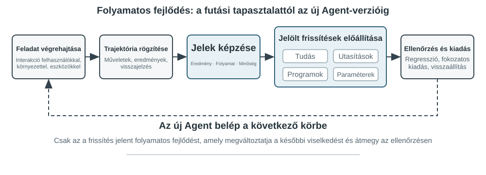
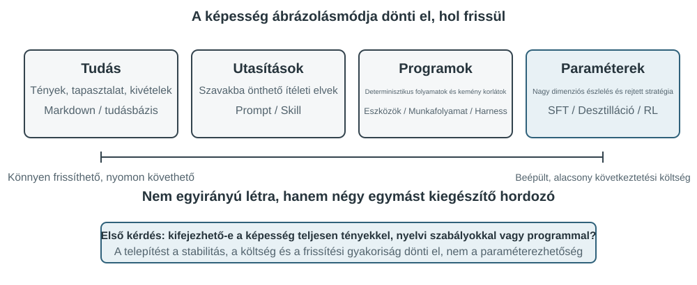
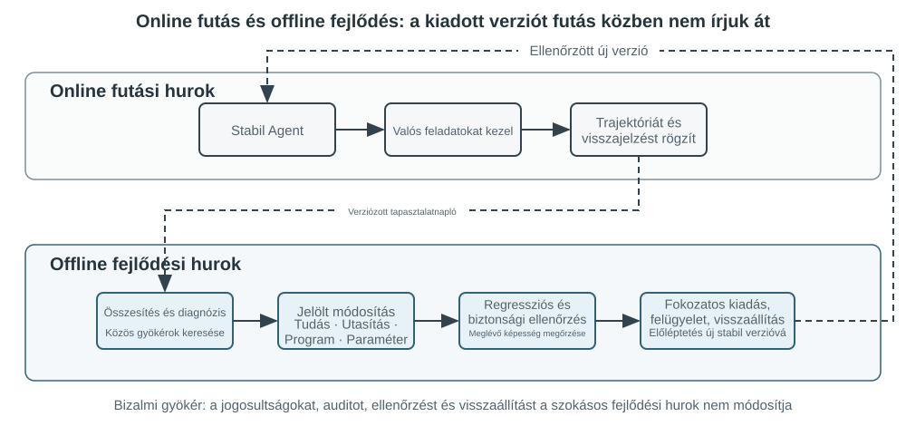

# Az ágensek folyamatos evolúciója

A mai ágensek feltűnő képességparadoxonnal szembesülnek: képesek korábban nem látott összetett feladatokat zero-shot megoldani, mégis tízezer hasonló feladat után is megismételhetik holnap az első napon elkövetett hibáikat. "Az önálló tapasztalatból való tanulás képessége" egyre fontosabbá válik ahhoz, hogy az ágensek a „feladatok elvégzésének képességétől" a „megbízható munkavégzés képességéig" jussanak, és egyben a következő modellgeneráció központi kutatási témája is. A jelenlegi modellek azonban még messze vannak attól, hogy önállóan képesek legyenek folyamatos tanulásra.

Egy élesben használt modell egyetlen következtetés után nem változtatja meg automatikusan a paramétereit. A 2. fejezetben tárgyalt in-context tanulás, állapotkezelés és tömörítés lehetővé teszik, hogy egy ágens "az aktuális feladaton belül" alkalmazkodjon; amint a kontextus véget ér, ezek a változások azonban nem kerülnek át természetes úton a következő feladatra. A beszélgetések memóriában tárolása nem egyenlő az új viselkedés megtanulásával. A nyers trajektóriák hosszúak lehetnek, és hatékony stratégiák mellett véletlen sikereket, hibás attribúciókat és nem megbízható bemeneteket is tartalmazhatnak.

Itt egy fontos megkülönböztetést könnyű szem elől téveszteni: **a tapasztalat megőrzése nem ugyanaz, mint a tapasztalatból való tanulás**. Száz trajektória elhelyezése egy hosszú kontextusban vagy vektoros adatbázisban segíthet a modellnek egy eset előhívásában, amikor szüksége van rá, de nem hasonlítja össze automatikusan az eseteket: mely lépések ismétlődnek a sikeres trajektóriákban, mely gyakorlatok működnek csak egy régebbi felülettel, vagy hogy egy siker megalapozott stratégiából fakadt-e, nem pedig környezeti véletlenből. Tanulás csak akkor történik, amikor a rendszer aktívan kiértékeli, összehasonlítja, általánosítja és validálja a bizonyítékokat – nem pedig amikor egy napló a lemezre íródik. A 3. fejezetben tárgyalt felhasználói memória elsősorban azt rögzíti, „milyen a felhasználó és a világ"; a jelen fejezet tapasztalati tanulása ennél tovább megy, rögzítve, „mit kell tenni milyen feltételek mellett". Az előbbi segít az ágensnek többet megjegyezni; az utóbbi segít neki ügyesebbé válni, nem csupán tájékozottabbá.

Miért ne hagyhatnánk, hogy a modell minden egyes feladat után közvetlenül betanítsa magát? Mert az éles környezetek ritkán biztosítanak tiszta tanulási jeleket. A felhasználói elégedettség nem jelent megfelelőséget; a paraméterek helyi frissítései képességfelejtést, irányelvi sodródást vagy a biztonság romlását is okozhatják. Ha egy futó modell ellenőrizetlen visszajelzések alapján közvetlenül módosíthatja saját paramétereit, a hibás tapasztalatok és a Prompt-injekciók meggyökeresedhetnek, majd a későbbi feladatok során tovább erősödhetnek. Másfelől az alapmodellek időszakos betanítása javíthatja az általános képességeket, de nem képes időben befogadni az egyes ágensek által nap mint nap tapasztalt privát szabályokat, eszközváltozásokat és helyi tapasztalatokat.

Ezért amíg a modellek önállóan még nem képesek folyamatosan és megbízhatóan tanulni, a „tanulást" először a modell köré épített autonóm rendszerként kell megvalósítani: rögzíteni kell a működési bizonyítékokat, ellenőrizni az eredményeket és a folyamatokat, több trajektóriából közös mintákat kell kinyerni, majd eldönteni, hogy frissíteni kell-e a tudást, az utasításokat, a programokat vagy a modellparamétereket. Minden módosításnak először jelölt verzióvá kell válnia, és csak regressziós tesztelés és biztonsági ellenőrzések után változtathatja meg a következő működési kört.

Az előző fejezetek már bemutatták a rendszerhez szükséges főbb összetevőket. A 2. fejezet a feladaton belüli állapotot, a 3. fejezet a tudás-infrastruktúrát tárgyalja, az 5. fejezet az ágensek meta-képességét adja az eszközök létrehozására és rendszerek módosítására, a 7. fejezet a kiértékelést és ellenőrzést, a 8. fejezet pedig a modellparaméterek frissítését magyarázza el. A 9. fejezet feladata, hogy ezeket az összetevőket a 8-1. ábrán látható folyamatos evolúciós hurokba szervezze.

A folyamatos evolúciónak visszakövethető működési tapasztalatokból kell származnia, meg kell változtatnia a későbbi viselkedést, és igazoltnak kell lennie, hogy nem okoz jelentős romlást. Ez a fejezet először azt tárgyalja, hogyan határozható meg pontosan, mi ment jól vagy rosszul egy futás során; majd négy frissítési módszert és azok alkalmazási határait hasonlítja össze; végül azt vizsgálja, hogy ezek a frissítések hogyan kerülnek ellenőrzésre, kiadásra, felülvizsgálatra és visszavonásra a hosszú távú működés során.

## Tanulási jelek származtatása működési trajektóriákból

A folyamatos evolúció kiindulópontja nem az „összefoglalás", hanem a "kiértékelés". Ha a rendszer nem tudja, hogy egy feladat elkészült-e, vagy hogy melyik lépés okozta a sikert vagy a kudarcot, a nyelvi modell által generált reflexiók csak találgatások lehetnek. Ha egy hibás kiértékelés bekerül a hosszú távú tudásba, egy rendszer Promptba vagy a tréningadatokba, hatásai a későbbi feladatok során felerősödhetnek.

Egyes feladatok kimenetele viszonylag könnyen ellenőrizhető. Egy kódoló ágens futtathat teszteket, típusellenőrzéseket és teljesítménymérőket; egy visszatérítést feldolgozó ágens lekérdezheti a rendelés állapotát és a tényleges visszatérítési összeget. Az ilyen jelek valós környezeti állapotokból származnak, és általában megbízhatóbbak, mint a modell saját viselkedéséről adott leírásai. A helyes kimenet azonban nem jelent helyes folyamatot. A hibás tesztesetek törlése is átmehetővé teheti a teszteket, míg ha azt mondjuk a felhasználónak: „Hét napon belül kiadjuk a visszatérítést; kérjük, legyen türelemmel", az átmeneti elégedettséget kelthet. A megbízható kiértékelésnek ezért mind az eredményt, mind az eléréséhez vezető utat értékelnie kell.

Sok más feladatnak nincs egyetlen helyes válasza. Az, hogy az ügyfélszolgálat türelmes-e, hogy megfelelő alternatívákat kínál-e, hogy egy kutatási jelentés azonosítja-e a kulcsfontosságú bizonyítékokat, és hogy a generált szöveg természetes és tömör-e – mind kontextuális ítéletet igényel. A 7. fejezetben bemutatott LLM-as-a-Judge itt használható, de a bíráló nem szabad, hogy csak egy homályos összpontszámot adjon. Hatékonyabb megközelítés, ha előre definiálunk egy "rubrikát", és megköveteljük az ellenőrzőtől, hogy minden tételt pontozzon, idézze a trajektóriából a bizonyítékokat, és kifejezetten jelezze a bizonytalanságot, amikor a bizonyíték nem elegendő.

A 9-2. ábra egy háromrétegű ellenőrzési struktúrát mutat. Az alsó rétegbeli eredmény-ellenőrző a teszteredményeket, adatbázis-állapotokat és eszköz-visszatéréseket olvassa, hogy megválaszolja: „Ténylegesen elkészült a feladat?" A középső rétegbeli folyamat-ellenőrző az üzleti szabályokat, jogosultságokat és műveleti sorrendeket ellenőrzi a kérdésre: „Megengedett módon készült el?" A felső rétegbeli minőség-ellenőrző a rubrika szerint értékeli a nyelvet és a stratégiát a kérdésre: „Megfelelően lett kezelve?" Az alsó szintű mutatóknak erősebben kell támaszkodniuk a kódra és a környezeti alapismeretekre; csak a formalizálható szempontokat szabad nyelvi modellre bízni.

Egy ügyfélszolgálati ágens esetében egy hasznos rubrikának legalább a 9-1. táblázatban felsorolt dimenziókat kell lefednie. Az első öt elsősorban az alapkövetelményeket kényszeríti ki, míg az utolsó kettő a szolgáltatás minőségét méri. Ez a bontás diagnosztikailag hasznosabb, mint annak megkérdezése, hogy a felhasználó elégedett volt-e: a felhasználó lehet elégedett, mert az ágens nem megfelelő visszatérítést adott ki, vagy elégedetlen egy megfelelőségi korlátozás miatt. Egyetlen elégedettségi pontszám nem képes megkülönböztetni a kettőt.

9-1. táblázat: Trajektória-kiértékelési dimenziók egy ügyfélszolgálati ágenshez

| Dimenzió | Ellenőrzési kérdés | Elsődleges bizonyíték |
|---|---|---|
| Feladatkimenet | Teljesült a felhasználó alapvető kérése? | Végső környezeti állapot, eszközeredmények |
| Szabálymegfelelés | Sérültek irányelvek, jogosultságok vagy előírt eljárások? | Irányelvtár, műveleti trajektória |
| Adatvédelmi határok | Került nyilvánosságra olyan információ, amely nem lett volna szabad? | Válasz szövege, adathozzáférési rekordok |
| Tényszerű megbízhatóság | Az állításokat alátámasztja a tudás vagy az eszközeredmények? | Hivatkozott források, eszköz-visszatérések |
| Ígéret–tett konzisztencia | A befejezettként állított műveletek ténylegesen megtörténtek? | Válaszok és eszköznaplók összehasonlítása |
| Kifejezésminőség | Természetes és tömör a nyelv, ismétlés vagy sablonos megfogalmazás nélkül? | Teljes beszélgetés, nyelvi rubrika |
| Megfelelő alternatívák | Ha az eredeti terv kivitelezhetetlen volt, talált az ágens megengedett alternatívát? | Felhasználói cél, irányelvek és későbbi műveletek |

> **9-1. ★★ kísérlet: Trajektória-ellenőrző építése egy ügyfélszolgálati ágenshez**
>
> **Cél:** Egy ügyfélszolgálati trajektória átalakítása strukturált diagnózissá, amely támogatja a későbbi tanulást, és annak tesztelése, hogy a „bizonyítékokkal alátámasztott többdimenziós következtetések" jobban azonosítják-e a gyökérokokat, mint egyetlen összpontszám.
>
> **A kísérlet leírása:** Hasonlítsd össze az „egyetlen összpontszámot” a „dimenziónkénti következtetés, bizonyíték és megbízhatóság” megoldással, és figyeld meg, melyik különíti el jobban a feladathibát, szabálysértést, hamis ígéretet és fogalmazási problémát. A folyamatos fejlődés nem támaszkodhat csupán sikerarányra vagy egyetlen pontszámra. Csak a hiba helyének, okának és bizonyítékának megőrzésével dönthető el később, hogy a tudást, Promptot, programot vagy modellparamétert kell-e frissíteni; az alacsony bizalmú esetek ne kerüljenek automatikusan a tanulóhalmazba.

## Az ágensek folyamatos evolúciójának négy módszere

A tanulási jelek jelzik, hogy az ágensnek változnia kell, de azt nem, hogy hol. A frissítési módszer kiválasztásának elsődleges alapja nem az, hogy egy tapasztalat mennyi ideje áll fenn, hanem hogy a célképesség természetesen reprezentálható-e egy adott médiummal. Tények és tapasztalatok tudásdokumentumokba illenek; nyelvileg egyértelműen kifejezhető stratégiák Promptokba vagy Skill-ekbe; pontosan végrehajtható eljárások és kényszerek kódba; a magas dimenziós képességek, mint az érzékelés, nyelvi stílus és implicit stratégiák pedig modellparaméterekbe kell hogy kerüljenek. A 9-3. ábra ezt a négy módszert és kapcsolataikat mutatja.

A 9-2. táblázat tömör összehasonlítást nyújt. A négy módszer nem zárja ki egymást: egy orvosi képalkotó ágens paraméterekre támaszkodik az elváltozások azonosításához, tudásbázist használ az aktuális irányelvekhez, és kódot a kockázati mutatók kiszámításához. Egy ügyfélszolgálati modell a természetes hangvételét az utóképzésből nyeri, a vállalatspecifikus irányelveket tudásból és Skill-ekből szerzi be, és szerveroldali kódra támaszkodik a kritikus megfelelőségi követelmények kikényszerítéséhez.

9-2. táblázat: A folyamatos evolúció négy módszerének alkalmazási határai

| Frissítési módszer | Alkalmas tartalom | Fő előnyök | Fő korlátok |
|---|---|---|---|
| Tapasztalati tudásbázis | Tények, tapasztalati minták, kivételek és források | Gyors frissítés, visszakövethetőség, igény szerinti lekérés | Függ a visszakereséstől és a modell helyes alkalmazásától |
| Prompt és Skill | Nyelvileg kifejezhető ítélkezési elvek és műveleti eljárások | Értelmezhető, szabályozható hatókör | Hajlamos a dagályra, konfliktusra vagy figyelmen kívül hagyásra |
| Programok és Harness | Determinisztikus eljárások, eszközök és kemény kényszerek | Tesztelhető, stabil végrehajtás, alacsony költség | Magasabb fejlesztési és karbantartási költségek |
| Modellparaméterek | Magas dimenziós érzékelés, generálási stílus és implicit stratégiák | Erős általánosítás, alacsony következtetési többletterhelés | Magas frissítési és regressziós költségek |

### Tapasztalatok konszolidálása tudásba

Az evolúció legkönnyebb formája, ha több futásból származó ismétlődő tapasztalatokat visszakereshető tudásdokumentumokba szervezünk. Az itt leírt „tapasztalati tudásbázis” a 3. fejezettel közös tárolási, indexelési és visszakeresési technológiákat használ, de eltér a tudásforrásokban és az ellenőrzési célkitűzésekben. A 3. fejezet elsősorban a „milyen a felhasználó és a világ" témát vonja ki a felhasználói beszélgetésekből, dokumentumokból és adatkészletekből; ez a fejezet a „mit kell tenni milyen feltételek mellett" témát vonja ki az ágens műveleti trajektóriáiból és eredményeiből. Például: „Ez a légitársaság megköveteli, hogy a speciális ételeket huszonnégy órával korábban lefoglalják" domain-tudás, míg: „A foglalás előtt ellenőrizd a speciális étkezés határidejét, nehogy csak a fizetés után derüljön ki, hogy a kérés nem teljesíthető" műveleti tapasztalat.

A nyers trajektóriák nem alkalmasak formális tudásegységként. Hosszúak és zajosak, nyers eszközkimeneteket, véletlenszerű kitérőket és környezeti részleteket tartalmaznak. Egy robusztusabb rendszer három adatréteget őriz meg: a naplózási célú megváltoztathatatlan trajektóriákat; a futtatásonkénti elemzéseket az eredménnyel és a lehetséges tanulságokkal; valamint több hasonló trajektória összehasonlítását, klaszterezését és indukcióját, amelyek jövőorientált Markdown tudásdokumentumokat eredményeznek. Egy formális dokumentum általában meghatározza az alkalmazható forgatókönyveket, az ajánlott stratégiákat, a tiltott gyakorlatokat, a kivételeket, a bizonyítékforrásokat és a legutóbbi ellenőrzés időpontját, ahelyett, hogy egyetlen feladat teljes lefolyását mesélné el.

Ez a kialakítás ugyanazt a kétlépcsős elvet követi, mint a 3. fejezet User-as-Code megközelítése. A User-as-Code először a beszélgetési tényeket fűzi egy megváltoztathatatlan naplóhoz, majd időszakosan újraépít egy strukturált felhasználói modellt. A tapasztalati tanulásnak hasonlóképpen először a bizonyítékokat kell megőriznie, majd a módosítható tudást offline kell generálnia. A 9-4. ábra ezt a folyamatot illusztrálja. A rögzítés és a szervezés szétválasztása megakadályozza, hogy egyetlen véletlen siker vagy hálózati hiba azonnal megváltoztassa az ágenst, miközben lehetővé teszi a rendszer számára, hogy csak több siker és kudarc megfigyelése után azonosítsa a közös mintákat.

A tapasztalati dokumentumok nem egyszerű trajektória-összefoglalók. Az átvihető tartalom az összehasonlításból származik: hogy mit csináltak az azonos típusú sikeres trajektóriák, miben hiányosak a sikertelenek, mely környezeti verziókban volt hatékony egy stratégia, és milyen előfeltételek mellett bukott meg. A 3. fejezet már bemutatta a tudáskinyerést, a klaszterezést és a visszakeresést, így ez a fejezet nem ismétli meg ezeket az algoritmusokat. Ehelyett arra összpontosít, hogy a trajektória-kiértékelés hogyan válik a kinyerés feltételévé, és hogy a kinyert tudás javítja-e a teljesítményt a későbbi feladatokon.

Egy teljes tudásdesztillációs csővezeték öt lépésre bontható. Először őrizzük meg a megváltoztathatatlan trajektóriákat és a környezeti eredményeket. Ezután készítsünk strukturált elemzést minden futtatáshoz, felsorolva a feladattípust, a szükséges képességeket, a megfigyelt stratégiákat, a hibákat és a kivételeket. Ezután csoportosítsuk a futtatásokat feladatcsaládok szerint, és építsünk egy bizonyítéktáblát, amely megmutatja, hogy mely trajektóriák támasztják alá vagy cáfolják az egyes jelölt mintákat. Csak azok a jelöltek kerüljenek formális dokumentumokba, amelyek elérik a támogatottsági küszöböt. Végül értékeljük az átvitelt olyan új feladatokon, amelyek nem voltak részei a desztillációnak. A formális tudás elkülönítése a jelölt elemzésektől lehetővé teszi a rendszer számára, hogy újra általánosítson anélkül, hogy az eredeti bizonyítékokat módosítaná, és pontosan visszavonhasson egy következtetést, ha a környezet megváltozik.

A GAIA tapasztalati tanulása szemléletes példát nyújt. A GAIA[^gaia-2023] többlépéses problémákat tartalmaz, amelyek keresést, webes olvasást, fájlfeldolgozást és számítást kombinálnak, míg az AWorld[^aworld-2025] biztosítja a környezetet az ágensek futtatásához, az eszközök meghívásához és a trajektóriák rögzítéséhez: az előbbi olyan, mint a vizsga, az utóbbi a vizsgaterem és a laboratóriumi jegyzőkönyvi rendszer. Egy leegyszerűsítő megközelítés egy sikeres futtatás után azonnal generál egy stratégia-összefoglalót és vektorizálja. Egy szigorúbb implementáció először egy GAIA válasz-ellenőrzővel vagy más környezeti ellenőrzővel címkézi a futtatásokat sikeres, részben sikeres vagy sikertelen kategóriákba, majd összehasonlítja a több útvonalat ugyanazon feladatcsaládon belül. A sikeres trajektóriák jelölt stratégiákat szolgáltatnak, a sikertelenek kizárási tudást, a részben sikeresek pedig felfedik, mely szegmens működött és melyik bukott még meg. A Reflexion[^reflexion-2023] által javasolt természetes nyelvű reflexió segíthet a jelölt tanulságok generálásában, de maga a reflexió nem bizonyíték. Csak a környezeti eredményekkel konzisztens, trajektóriákon át alátámasztott és új feladatokon pozitív átvitelt mutató tartalom kerülhet a formális tapasztalati dokumentumokba.

> **9-2. ★★ kísérlet: Tapasztalati tudásdokumentumok desztillálása GAIA trajektóriákból**
>
> **Cél:** Annak tesztelése, hogy a trajektóriákon átívelő tudásdokumentumok jobban átvihetők-e, mint egyetlen siker összefoglalása, és csökkentik-e a véletlen sikerekből és hibás tapasztalatokból származó negatív transzfert.
>
> **Adatok és eljárás:** A `gaia-experience` először minden futtatáshoz eltárolja a teljes trajektóriát és a külső `environment_score` értéket, majd minimális tanulási rekordokká alakítja őket, amelyek tartalmazzák a `task_family`, a szükséges `capabilities`, az `applies_when`, a megfigyelt stratégiák, a hibák, a kivételek és a forrás trajektória-azonosítók adatait. Egy eredmény-ellenőrző sikeres, részben sikeres vagy sikertelen kategóriákba sorolja a futtatásokat. A tanulási modul összehasonlítja az útvonalakat ugyanazon feladatcsaládon belül. Egy LLM javasolhat jelölt általánosításokat, de egy ajánlott stratégiát legalább két nem sikertelen trajektóriának kell alátámasztania. Az eredményül kapott Markdown dokumentum tartalmazza az alkalmazható forgatókönyveket, az ajánlott stratégiákat, a gyakori buktatókat, a kivételeket, a származást és a legutóbbi érvényesítési időpontot. Alkalmazáskor csak ezek a dokumentumok kerülnek lekérésre; a hosszú nyers trajektóriák nem kerülnek közvetlenül a kontextusba.
>
> **Három kontroll:** Az első feltétel nem használ történeti tapasztalatot; a második az aktuális feladathoz legjobban hasonlító egyetlen trajektória-összefoglalást kérdezi le; a harmadik egy több trajektória által alátámasztott tudásdokumentumot kérdez le. A tanulási és átviteli készleteknek diszjunktaknak kell lenniük, hogy ugyanazon GAIA kérdésre adott válaszok ne szivárogjanak be „tapasztalatként" a kiértékelésbe.
>
> **Mérőszámok és elfogadás:** Jelentsük az átviteli feladatok sikerarányát, az átlagosan lekérdezett karakterek vagy tokenek számát, a negatív transzfer arányát, és ellenőrizzük, hogy minden formális következtetés hivatkozik a forrás trajektóriáira. Ha a trajektóriákon átívelő dokumentumok csak a kontextust rövidítik anélkül, hogy javítanák az új feladatok teljesítményét, nem bizonyítanak tanult tapasztalatot. A kísérlet akkor is sikertelen, ha egyetlen véletlen siker közvetlenül formális tudássá léptethető elő, vagy ha egy dokumentum nem vezethető vissza az eredeti trajektóriáihoz.
>
> A mellékelt implementáció a [`gaia-experience`](../chapter9/gaia-experience/) címen érhető el. A `demo_documents.py` alapértelmezésben offline fut; a `--extractor llm` kapcsolóval egy valódi LLM javasolhat trajektóriákon átívelő tapasztalati jelölteket.

[^reflexion-2023]: Shinn, N., et al. *Reflexion: Language Agents with Verbal Reinforcement Learning.* arXiv:2303.11366, 2023.

[^gaia-2023]: Mialon, G., et al. *GAIA: a benchmark for General AI Assistants.* arXiv:2311.12983, 2023.

[^aworld-2025]: Yu, C., et al. *AWorld: Orchestrating the Training Recipe for Agentic AI.* arXiv:2508.20404, 2025.

### Tapasztalatok kódolása utasításokként

Egy tapasztalati tudásbázis referenciát biztosít az ágens számára, míg a Promptok és Skill-ek inkább előíró jellegűek. Amikor több trajektória ismételten ugyanazt a stratégiai hibát tárja fel, és a minta természetes nyelven egyértelműen kifejezhető, a rendszer előléptetheti azt a „referenciaként szolgáló tapasztalatból” a „követendő szabály” státuszba. A szinte minden feladatra érvényes szabályok a rendszer Promptba illenek; a csak egy adott domainre, projektre vagy eszközre vonatkozó összetett eljárások jobban illenek igény szerinti Skill-ekbe vagy projekt utasításfájlokba.

A Prompt-tanulás más szerepet tölt be, mint a 2. fejezetben tárgyalt Prompt engineering. A 2. fejezet elmagyarázza, hogyan kell strukturáltan, gyorsítótár-barát módon Promptokat írni; ez a szakasz azt tárgyalja, hogy milyen termelési visszajelzés elegendő egy Prompt-felülvizsgálat kiváltásához, és hogyan kell az új szabályokat a telepítés előtt érvényesíteni. A felülvizsgálat nem jelentheti a teljes rendszer Prompt újraírását. Megbízhatóbb megközelítés, ha egy minimális különbséget generálunk egy hasonló hibákból álló csoportból, meghatározzuk a szabály hatókörét, ellenőrizzük a meglévő szabályokkal való ütközéseket, és kiértékeljük mind a hibákat kiváltó határesetekre, mind egy régi feladatokból álló retenciós készletre.

Egy 2025-ös hosszú posztjában Andrej Karpathy ezt a lehetséges új paradigmát ideiglenesen "System Prompt Learning"-nek nevezte[^karpathy-system-prompt-learning]. Összefoglalója szerint az előtanítás elsősorban tudást tanul, a finomhangolás pedig elsősorban a megszokott viselkedést alakítja, míg az emberi tanulás egy másik fajtája az, amikor megoldunk egy problémát, és egy explicit jegyzetet hagyunk jövőbeli énünknek: „Ha legközelebb ilyen problémával találkozom, először ezt a megközelítést próbáljam ki." Egy ilyen jegyzetfüzet nélküli LLM-et a *Memento* film főszereplőjéhez hasonlította, és megjegyezte, hogy a System Prompt Learning és a megerősítéses tanulás egyaránt javítja a viselkedést tapasztalatból, de különböző frissítési algoritmusokat használnak – az előbbi szöveget szerkeszt, míg az utóbbi gradiensereszkedéssel változtatja a paramétereket. Példája egy utasítás volt Claude akkoriban nagyjából 17 000 szavas rendszer Promptjában, amely megkövetelte a modelltől, hogy számozza és explicit módon számolja meg a szavakat, betűket vagy karaktereket a válasz előtt – pontosan a „Hány `r` van a `szamóca` szóban?" típusú kérdések kezelésére.

Egy ágensrendszerben ez azt jelenti, hogy a nyelvben kifejezhető tanulságokat jelölt szabályokká alakítjuk, amelyeket a jövőbeli futtatások közvetlenül olvashatnak. A skaláris siker/kudarc eredménnyel szemben egy bizonyítékokkal alátámasztott diagnózis azonosíthatja, hogy a hiba a személyazonosság-ellenőrzésben, az eszközválasztásban vagy az eszkalációs határokban volt-e, lehetővé téve egy célzottabb jelölt változtatást. Karpathy azon megfigyelése, hogy a tudásvezérelt felülvizsgálat egy magasabb dimenziós visszacsatolási csatorna, mint a skaláris jutalom, segít megmagyarázni a módszer potenciális adathatékonyságát. A gazdagabb információ azonban nem automatikusan helyes: egy felhasználó visszajelzése csak arra az ügyfélre vagy egy elavult irányelvre vonatkozhat, így a klaszterezés, a hatókör-elemzés és a regressziós tesztelés továbbra is szükséges.

Több bevált megközelítés automatizálja a Prompt-optimalizálást különböző módokon. A DSPy[^dspy-2023] a több nyelvi modell hívásból álló programot optimalizálható objektumként kezeli, és utasításokat és példákat keres egy fejlesztési készleten. Az OPRO[^opro-2023] egy nyelvi modellt kér fel új jelöltek javasolására a Promptok és pontszámok előzményeiből. A GEPA[^gepa-2025] természetes nyelvű reflexiót használ a sikertelen trajektóriák felett, hogy kiegészítő jelölt Promptokat generáljon és szelektáljon. Ezek a módszerek elsősorban kötegelt optimalizálást végeznek offline kiértékelési készleteken; a minimális termelési különbségek közelebb állnak a folyamatos karbantartáshoz, amelyet újonnan megfigyelt határesetek váltanak ki, és a visszakövethetőségre és gyors visszaállásra terveztek. A gyakorlatban az offline keresés létrehozhat egy erős kezdeti verziót, amelyet eseti javítások követnek a hosszú farok termelési szabályaihoz.

#### 1. példa: Szabályok optimálása a promptban a hiba trajektóriák alapján

Például egy légitársasági ügyfélszolgálati ágens túl korán eszkalálhat emberhez, amikor a felhasználók megkérdőjeleznek egy irányelvet. A trajektória-kiértékelés megmutatja, hogy nem sért szabályokat, de hiányzik a megfelelő rugalmasság. Egy jelölt javítás előírhatja, hogy az ágens először magyarázza el az irányelvet, azonosítsa a felhasználó valódi célját, és keressen engedélyezett alternatívákat, csak akkor eszkalálva, ha a felhasználó kifejezetten kéri, vagy a probléma valóban meghaladja az ágens hatáskörét. Ha az új szabály csökkenti a felesleges eszkalációt, de az ágens továbbra is kezeli azokat a biztonsági incidenseket, amelyeket eszkalálnia kellene, akkor megbukott a regressziós teszten. A System Prompt Learning értéke nem abban rejlik, hogy automatikusan több szöveget fűz hozzá, hanem hogy a termelési határeseteken keresztül folyamatosan tisztázza a szabályok hatókörét.

#### 2. példa: Követelménytisztázó Skill — a „közvetlen munkakezdéstől” az „első megerősítés, majd végrehajtás” elvéig

A Skill-tanulás ugyanezt az elvet követi, de lokalizáltabb hatókörrel. Egy Skill felfogható egy adott munka igény szerinti használati útmutatójaként: ha több tapasztalat együtt egy teljes biztosítási kárfolyamatot alkot, a rendszer generálhatja vagy felülvizsgálhatja a megfelelő Skill-t. Egy jelölt Skill nem foglalhat össze csupán egyetlen beszélgetést; minimum meg kell adnia, hogy mikor kell betölteni, az előfeltételeket, a műveleti lépéseket, az ismert buktatókat, az érvényesítési módszereket és a forrás trajektóriákat. A rendszer először a meglévő Skill-könyvtárat keresi hasonló képességekre, előnyben részesítve a lokális javítást, ha ugyanaz a folyamat már létezik, és csak egy valóban független képességhez hoz létre új könyvtárat. Ez megakadályozza, hogy a könyvtár megteljen olyan kézikönyvekkel, amelyek névben különböznek, de tartalmilag duplikálják egymást. Az Anthropic Skill Creator[^anthropic-skill-creator] egy vázlat–teszt–kiértékelés–felülvizsgálat ciklust mutat be. Azt tárgyalja, hogyan kell létrehozni és fejleszteni egy Skill-t; a nehezebb kérdések azok, hogy milyen működési bizonyíték elegendő a létrehozás kiváltásához, hogyan kell feloldani az ütközéseket, és hogy a felülvizsgálat átmegy-e a domain-specifikus és a régi feladatok regressziós tesztjein.

> **9-9. ★★ kísérlet: Visszajelzésből írási Skill**
>
> A `data/feedback_pairs.json` 20 before/after párját három adagban dolgozzuk fel, jelölteket nyerünk ki, egyesítjük az ismétlődéseket, ellenőrizzük a küszöbütközéseket, majd forrással és hatókörrel rendelkező `SKILL.md` készül. A determinisztikus szabályokat kód, az LLM-szabályokat 10 aranypélda kalibrálja.
>
> A befejezetlen feladatok és a normál szövegek külön készletén együtt mérjük a felismerést, a téves riasztást és a szabályszám növekedését. Az első valós futás 0/8 felismerést és 7/8 téves riasztást adott; külső szűrés és determinisztikus tartalékút után 8/8, 0/8 és 21 jelöltből 8 szabály lett. Megvalósítás: [`ai-style-skill`](../chapter9/ai-style-skill/).

A görbe idézőjelek esete azt mutatja, hogy a Skillnek adat-szerződéssé, nem globális csere-szabállyá kell válnia: az SFT előtt a szintetikus példákat műfaj, hatókör és programnyelv szerint rétegezzük, kód/JSON/védett-rész kapukkal és kézi audittal ellenőrizzük. A pontos másolási esetben külön regressziós réteg a tokenizer encode→decode round-trip, a modell byte-exact másolása, a Harness sorosítása és az eszközillesztés.

> **9-3. ★★ kísérlet: Rendszer Promptok optimalizálása sikertelen trajektóriákból**
>
> **Cél:** Egy légitársasági ügyfélszolgálati ágens tanítása olyan trajektóriákból, ahol túl gyorsan eszkalál, amikor egy felhasználó megkérdőjelez egy irányelvet, miközben bizonyítja, hogy az új szabály nem töri el a régebbi forgatókönyveket, amelyek valóban eszkalációt igényelnek.
>
> **Eljárás:** Először a régi feladatok retenciós készletét és a túlzott eszkaláció határeset-készletét futtassuk külön. A `learning_signal.py` a hibákat szabálykövetésre, feladatmegoldásra és megfelelő rugalmasságra bontja, miközben megtartja a forrás esetazonosítókat. Egy kódoló ágens ezután elolvassa a meglévő Promptot, és pontosan egy auditálható `old_str → new_str` minimális szerkesztést hoz létre: előírja az ágensnek, hogy magyarázza el az irányelvet, azonosítsa a valódi célt, és keressen megfelelő alternatívákat az eszkaláció előtt, miközben megtartja az eszkalációt, ha a felhasználó kifejezetten embert kér, vagy biztonsági incidens történik. A javítás, a származás, a célszabály és az indoklás egy jelölt manifestbe kerül.
>
> **Három kontroll:** Hasonlítsuk össze a kezdeti Promptot, az automatikusan generált jelölt Promptot és egy egyszeri, manuálisan optimalizált Promptot. Mindhárom ugyanazt a modellt és ugyanazt a retenciós és határeset-készletet használja. A `--quick` csak az esetek számát csökkenti; továbbra is valódi hívásokat indít a feladat ágenshez, az LLM bíróhoz és a kódoló ágenshez, és nem jelenthető offline szimulációként.
>
> **Kiadási kapu és mérőszámok:** Egy jelöltnek négy feltételt kell teljesítenie: nem üres javítás, visszakövethető származás, mérhető javulás a határeset-készleten, és nincs romlás a retenciós készleten. Hasonlítsuk össze a határeset-feladatok pontosságát, a retenciós feladatok pontosságát, a Prompt növekedését, a bevezetett regressziókat és a hiba felfedezésétől a jelölt generálásáig eltelt időt. A kapun való áthaladás csak `release_to_canary` eredményt ad, soha nem a stabil Prompt közvetlen felülírását; bármely feltétel megszegése `reject_candidate` eredményt ad.
>
> A mellékelt implementáció a [`prompt-auto-optimization`](../chapter9/prompt-auto-optimization/) címen érhető el. Az offline tesztek lefedik a diagnózist és a kiadási kapukat, míg a `--quick` valódi hívásokat indít a feladat ágenshez, az LLM bíróhoz és a kódoló ágenshez.

[^dspy-2023]: Khattab, O., et al. *DSPy: Compiling Declarative Language Model Calls into Self-Improving Pipelines.* arXiv:2310.03714, 2023.

[^opro-2023]: Yang, C., et al. *Large Language Models as Optimizers.* arXiv:2309.03409, 2023.

[^gepa-2025]: Agrawal, L., et al. *GEPA: Reflective Prompt Evolution Can Outperform Reinforcement Learning.* arXiv:2507.19457, 2025.

[^karpathy-system-prompt-learning]: Karpathy, A. "We're missing (at least one) major paradigm for LLM learning … system prompt learning?" X, 2025. május 11. https://x.com/karpathy/status/1921368644069765486

[^anthropic-skill-creator]: Anthropic. *Skill Creator.* 2026. https://github.com/anthropics/skills/blob/main/skills/skill-creator/SKILL.md

### Tapasztalatok kódolása programokként

Amikor a tapasztalat olyan műveleteket ír le, amelyek stabilak, ismétlődőek és ellenőrizhetők, pazarlás minden alkalommal újraolvastatni a modellt a dokumentációval és végigvezetni a gondolkodási folyamaton. Célszerűbb a tapasztalatot munkafolyamatokká, eszközökké vagy Harness-kóddá fordítani, az egyszeri felfedezést egy ismételten végrehajtható programmá alakítva. Az 5. fejezet elmagyarázta, hogy a kódoló ágensek hogyan olvasnak fájlokat, futtatnak teszteket és generálnak rendszereket; ez a szakasz nem az általános kódgenerálásra összpontosít, hanem arra, hogy egy ágens hogyan módosítja saját jövőbeli verzióit a saját trajektóriái alapján.

A módosítható objektumok messze túlmutatnak az új eszközökön. A műveleti rétegben a böngésző-trajektóriák paraméterezett munkafolyamatokká fordíthatók, vagy adapterek generálhatók a változó API-khoz. A vezérlési rétegben az eszköz-útválasztás, újrapróbálkozások, megszakítók és kontextus-tömörítési stratégiák módosíthatók. Az érvényesítési rétegben paraméter-ellenőrzések, állapot-érvényesítők és regressziós tesztek adhatók hozzá a termelési hibák hatására. Az architektúrai rétegben egy felülvizsgáló ágens adható hozzá, vagy a tervezés és végrehajtás közötti információáramlás változtatható meg.

A böngésző-munkafolyamatok jól illusztrálják a programozott tapasztalat értékét. Hasonlóak egy táblázatkezelő makró felvételéhez. Amikor először küldünk e-mailt, egy multimodális ágens megfigyelés–érvelés–cselekvés ciklust használ a levélírás, címzett, tárgy, szövegtörzs és küldés vezérlőinek megtalálásához. Egy másik e-mailhez a folyamat változatlan; csak a címzett és a tartalom különbözik, így nincs szükség a modell újbóli meghívására a teljes útvonal újrafelfedezéséhez pixelekből és DOM-ból. A rendszer az első felfedező trajektóriát egy kis programmá fordítja, amely paramétereket, állapot-ellenőrzéseket és verzióinformációkat tartalmaz.

A böngésző környezetben a 8-4. ábrán bemutatott tudásdesztillációs folyamat egy konkrétabb életciklussá válik:

1. **Trajektória rögzítése:** Rögzítsük a navigációt, kattintásokat, szövegbevitelt és legördülő menü kiválasztást, a műveleti paraméterekkel, az aktuális URL-lel és az elem-lokátor bizonyítékokkal (XPath, CSS, `id`, `role`, `aria-label`, `data-testid`) együtt. A lokátor bizonyítékok csak segítenek újra megtalálni egy elemet; nem bizonyítják, hogy a feladat elkészült.
2. **Paraméterezés:** Cseréljük ki az első futtatás literáljait sablonváltozókra – például a `test@example.com`, a tárgy és a szövegtörzs helyére `{recipient}`, `{subject}` és `{content}` kerül –, miközben a stabil műveleteket változatlanul hagyjuk. A tanító implementáció reguláris kifejezéseket és sablonhelyettesítést használ; egy termelési rendszer strukturált feladatbemenetet vagy egy korlátozott kinyerő modellt használhat.
3. **Állapot-ellenőrzések definiálása:** Adjunk hozzá ellenőrzéseket a műveletek előtt és után, például „a küldés gomb látható" és „a navigáció utáni URL a célsite-hoz tartozik". Adjunk hozzá egy végső állapot-ellenőrzést a teljes munkafolyamathoz, például „az elküldött levelek listája tartalmazza az új üzenetet" vagy „a tesztoldal állapotértéke a várt módon változott". Egy művelet sikeres végrehajtása nem egyenlő a feladat sikeres elvégzésével; a végső ellenőrzésnek a valós oldalt vagy backend-állapotot kell olvasnia.
4. **Jelölt érvényesítése:** Az első siker csak egy `candidate`-et eredményez. A rendszernek vissza kell állítania a sandbox fiókot vagy tesztoldalt egy független kezdeti állapotba, és újra kell játszania a jelöltet teljes egészében. Csak akkor publikálható `validated` státusszal, ha minden művelet előtti, művelet utáni és végső állapot-ellenőrzés sikeres. Ha egy mellékhatással járó feladatnak (például e-mail küldése vagy rendelés leadása) nincs biztonságos visszaállítási lehetősége, a munkafolyamat auditálható jelöltként megőrizhető, de nem érvényesíthető a művelet megismétlésével egy termelési fiókban.
5. **Egyeztetés és visszajátszás:** Amikor egy új feladat érkezik, keressük a formális képességkönyvtárban a munkafolyamatot szándék és kulcsszavak alapján, vonjuk ki az aktuális paramétereket, és hajtsuk végre közvetlenül Playwright-tel. A visszajátszás nem igényel lépésenkénti LLM-hívásokat, de továbbra is meg kell várnia, hogy az elemek elérhetővé váljanak, és el kell végeznie minden állapot-ellenőrzést.
6. **Érvénytelenítés és újratanulás:** Ha a célelem nem található, egy állapot-ellenőrzés sikertelen, az API séma megváltozik, vagy a végső állapot hibás, azonnal állítsuk le a későbbi műveleteket, helyezzük át a régi verziót a kereshető könyvtárból az `invalid` területre, és térjünk vissza a teljes ágensre a friss felfedezéshez. Tartsuk meg a régi fájlt auditálási és összehasonlítási célból, de soha ne hagyjuk, hogy továbbra is csendben egyezzen.

Egy e-mail munkafolyamat esetén a lefordított eredmény nem csupán „kattints ezekre a gombokra sorrendben", hanem egy kis program, amely a címzett, tárgy és szövegtörzs paraméterekkel rendelkezik: ellenőrzi a levélírás ablakot és mezőket a küldés előtt, ellenőrzi a sikerjelzőt a küldés után, és végül megerősíti, hogy a megfelelő üzenet megjelenik az elküldött lista részben. A PreAct[^preact] rendszerben az ilyen programok 8,5–13-szoros végpontok közötti gyorsulást értek el ismétlődő feladatokon, és nem igényeltek lépésenkénti nyelvi modell hívásokat a visszajátszás során. Ennél is fontosabb, hogy a folyamatmemóriának szüksége van **művelet előtti érvényesítésre, művelet utáni érvényesítésre és független előtárolásos érvényesítésre**. Ellenkező esetben a rendszer veszélyes illúziót kelthet: a visszajátszási lefedettség 100%, minden gombra kattintottak, de az egyik mező üres volt, és a feladat soha nem készült el ténylegesen.

> **9-4. ★★★ kísérlet: Ellenőrizhető munkafolyamatok generálása böngésző-trajektóriákból**
>
> **Cél:** Annak meghatározása, hogy egy webes ágens egy drága felfedezést újrafelhasználható munkafolyamattá tud-e alakítani, és el tudja-e utasítani a hibás visszajátszást, ha az oldal megváltozik, ahelyett, hogy sikert jelentene, mert minden művelet lefutott.
>
> **Négyszakaszos forgatókönyv:** Az első szakaszban futtassuk a „küldj egy üzenetet 'Teszt e-mail' tárggyal a `test@example.com` címre" parancsot egy teszt e-mail oldalon vagy szimulált üzenetküldő oldalon. A teljes ágens felfedez, miközben egy wrapper rögzíti a műveleteket, paramétereket és oldalállapotokat, és egy `candidate`-et állít elő. A második szakaszban hívjuk meg a `validation_reset` függvényt a sandbox visszaállításához, és játsszuk le a teljes munkafolyamatot függetlenül; a jelölt csak akkor kerül be a formális képességkönyvtárba, ha minden művelet előtti, művelet utáni és végső állapot-ellenőrzés sikeres. A harmadik szakaszban végezzük el ugyanazt a feladattípust más címzettel, tárggyal és szövegtörzzsel. A rendszernek egyeztetnie kell az érvényesített munkafolyamattal, ki kell töltenie az új paramétereket, és Playwright-on keresztül vissza kell játszania anélkül, hogy belépne a lépésenkénti LLM-hurokba. A negyedik szakaszban változtassuk meg egy gomb lokátorát, az oldal szövegét vagy a végső állapotot, és ellenőrizzük, hogy a régi munkafolyamat azonnal `invalid`-dé válik, és `fallback_required=True` értéket ad vissza.
>
> **Kontroll kialakítás:** Egy leegyszerűsített kiindulási feltétel csak azt rögzíti, hogy a kattintások, szövegbevitel és más műveletek kivétel nélkül befejeződnek-e. A kísérleti feltétel emellett érvényesíti az oldalt minden művelet előtt, az oldalt minden művelet után és a végső feladatállapotot. Mindkét feltétel ugyanazokat a trajektóriákat és oldalváltoztatásokat használja. Hasonlítsuk össze a téves pozitív arányokat olyan esetekben, mint „a küldés gombra kattintottak, miközben egy mező üres volt" és „a Mentés gombra kattintottak, de az adatok nem maradtak meg".
>
> **Mérőszámok és elfogadás:** Rögzítsük a kezdeti felfedezés és a visszajátszás végpontok közötti idejét, az LLM-hívások számát, a sikerarányt, a téves sikerarányt, a munkafolyamat-egyezési arányt, az oldalváltozás-érzékelési arányt és az újratanuláshoz szükséges visszaállások számát. Visszaállítási lehetőség nélkül a munkafolyamatnak jelöltnek kell maradnia; az érvényesítést megbukott verziónak nem szabad lekérdezhetőnek lennie; a paraméterezett visszajátszás nem használhatja újra az első futtatás címzettjét vagy tartalmát; és oldalváltozás után a veszélyes későbbi műveleteknek le kell állniuk. A gyorsulás csak akkor számít, ha minden feltétel teljesül.
>
> A mellékelt implementáció a [`browser-use-rpa`](../chapter9/browser-use-rpa/) címen érhető el, amely egy determinisztikus állapotgép-demonstrációt és egy valódi böngésző ágenst meghívó végrehajtási útvonalat is biztosít.

Az a tény, hogy egy ágens módosítja a saját kódját, nem jelenti azt, hogy a futó folyamat közvetlenül felülírja önmagát. Egy termelési rendszernek létre kell hoznia egy jelölt ágat az aktuális stabil verzióból, egy kódoló ágenssel kell generálnia egy minimális javítást, majd sorban statikus ellenőrzéseket, egységteszteket, biztonsági vizsgálatokat, sikertelen trajektóriák visszajátszását és régi feladatok regressziós tesztjeit kell futtatnia, mielőtt új verziót bocsátana ki canary telepítésre. Ez az „önmódosítást" egy auditálható szoftverkiadási folyamattá alakítja, és meghatározza a 8. és az 5. fejezet közötti határt: az 5. fejezet a rendszerek módosításának képességét biztosítja, míg ez a fejezet egy olyan módszert ad az önmódosításhoz, amelyet tapasztalat indít el és egy érvényesítési hurok korlátoz.

A javítás kicsinyítése önmagában nem elegendő a megbízható attribúcióhoz. Minden módosítási kérelemnek egy "hamisítható változási szerződésnek" is kell lennie, amely rögzíti a hiba bizonyítékait, a feltételezett gyökérokot, a felelős Harness komponenst, a jelölt változtatást, a várhatóan javuló viselkedést, a meglévő viselkedést, amely romolhat, valamint a teszteket mindkettőhöz. Az Agentic Harness Engineering ezt komponens-, tapasztalat- és döntésszintű megfigyelhetőségként írja le: minden szerkeszthető komponens fájlszintű reprezentációval rendelkezik; a trajektóriák nagy gyűjteményeit egyre részletesebb szinteken vizsgálható bizonyítékokká desztillálják; és minden szerkesztés a végrehajtás előtt hatás-előrejelzést deklarál, amelyet a következő eredménykör aztán tesztel[^ahe-2026]. Egy magasabb pontszám így egy konkrét mechanizmushoz kapcsolható, ahelyett, hogy értelmezhetetlen próbálkozás maradna.

A jelöltgenerátornak nem szabad csak sikertelen eseteket kapnia. A Self-Harness emellett biztosítja a megőrzendő sikeres viselkedést és a korábban elutasított módosítások rekordjait is[^self-harness-2026]. Az előbbi megmondja az ágensnek, hogy mit nem szabad eltörnie a javításnak; az utóbbi megakadályozza, hogy ugyanazt a sikertelen ötletet más szavakkal újra benyújtsa. A hiba bizonyítékai, a sikerességi kényszerek és a korábbi próbálkozások együtt egy korlátozott jelöltteret határoznak meg, és hasznosabbak, mint az összes forráskód és nyers napló válogatás nélküli betöltése a módosító ágensbe.

Az eszközlétrehozás ugyanezt a protokollt követi. Az Alita[^alita-2025] egy olyan esetet mutat be, ahol egy ágensnek azonosítania kell a számot, amely közvetlenül azután hangzik el, hogy a dinoszauruszok először megjelennek egy YouTube 360 VR videóban, amelyet a *Gyűrűk Ura* Gollumának hangját adó színész narrál. Miután felismeri, hogy hiányzik a feliratolvasási képessége, az ágens megtalálja és teszteli a `youtube-transcript-api`-t, új felirat-eszközként csomagolja, és kinyeri a `100000000` választ a transzkriptumból. Egy új eszköz csak biztonsági vizsgálat, funkcionális tesztek és sikeres újrafelhasználás után kerül a képességkönyvtárba. A 4. fejezet proaktív eszközfelderítése azt kérdezi, melyik meglévő eszköz illik; az 5. fejezet azt kérdezi, hogyan kell eszközt írni; ez a fejezet azt kérdezi, hogy milyen működési bizonyítékoknak kell kiváltaniuk a létrehozást, és hogyan válik egy új eszköz érvényesített hosszú távú képességgé.

> **9-5. ★★★ kísérlet: Ágens önmódosításának kiváltása sikertelen trajektóriákból**
>
> **Cél:** Több olyan trajektória esetén, ahol a `retryable=false` jelzésű hibákat továbbra is ismételten hívják, annak meghatározása, hogy a rendszer képes-e azonosítani a gyökérokot az újrapróbálkozási és megszakító kódban, és előállítani egy jelölt javítást anélkül, hogy eltörné a tranziens hibákból való helyreállást.
>
> **Eljárás:** A diagnosztikai modul először ugyanazt a hibát gyűjti össze különböző feladatokból. Csak a trajektóriákon átívelő támogatottsági küszöb elérése után hoz létre módosítási kérelmet, amely a stabil verzió `retry_policy.py` fájlját célozza. A jelöltgenerátor elolvassa a hibadiagnózist, a megőrzendő tranziens hiba-kezelési viselkedést, a korábban elutasított változtatásokat és a stabil forrást. Mielőtt kiad egy minimális kód-különbséget, előrejelzi, hogy a nem újrapróbálható hibák utáni hívásoknak csökkenniük kell, míg a tranziens időtúllépés utáni helyreállásnak nem szabad romlania. Akár determinisztikus a generátor, akár valódi LLM kódoló ágens, csak egy izolált jelölt könyvtárba írhat. Az érvényesítő Harness ezután lefordítja a jelöltet, visszajátssza az eredeti hibás trajektóriákat, ellenőrzi, hogy egy nem újrapróbálható hiba azonnal leáll és nyitja a megszakítót, és újrateszteli, hogy a tranziens időtúllépések továbbra is az eredeti küszöb szerint próbálkoznak újra.
>
> **Diagnosztikai kontroll és mérőszámok:** Kezeljük a „adjunk hozzá egy mondatot a Prompthoz, amely megtiltja az ágensnek a hívás megismétlését" konceptuális példaként a rossz módosítási réteg kiválasztására, demonstrálva, hogy egy determinisztikusan kikényszeríthető újrapróbálkozási kényszer miért a kódba való. A futtatható kísérlet összehasonlítja a determinisztikus és az LLM javításgenerátorokat ugyanazon kiadási kapu alatt. Rögzítsük a nem újrapróbálható hibák utáni hívások számát, a tranziens hibák helyreállási arányát, a régi feladatok regresszióit, a javítás méretét és a jelölt elfogadási arányát.
>
> **Elfogadási kritériumok:** Minden ellenőrzés sikeres áthaladása csak `release_to_canary` eredményt ad. Bármely statikus ellenőrzés, hibavisszajátszás vagy régi feladat regressziójának meghiúsulása `reject_candidate` eredményt ad. A `release_manifest.json` fájlnak tartalmaznia kell a hibaklasztert, a forrás trajektóriákat, a feltételezett gyökérokot, a célkomponenst és fájlt, a kód-különbséget, a várható javítást, a lehetséges regressziókat, az ellenőrzési eredményeket, a jelölt verziót és a visszaállítási verziót. Az elutasított jelölteknek meg kell őrizniük a hibák okait a következő generálási körhöz. A javítást generáló ágens nem módosíthatja a stabil kódot, az érvényesítőket, az auditnaplókat vagy a saját kiadását jóváhagyó kaput.
>
> A mellékelt implementáció a [`self-modifying-agent`](../chapter9/self-modifying-agent/) címen érhető el. Támogatja a determinisztikus jelöltgenerátort és a valódi LLM kódoló ágenst is, mindkét útvonal ugyanazt a kiadási kaput használja.

[^preact]: Li, Bojie. *PreAct: Computer-Using Agents that Get Faster on Repeated Tasks.* arXiv:2606.17929, 2026.

[^alita-2025]: Qiu, J., et al. *Alita: Generalist Agent Enabling Scalable Agentic Reasoning with Minimal Predefinition and Maximal Self-Evolution.* arXiv:2505.20286, 2025.

A 9-8. kísérlet ugyanezt a protokollt a verifikációs rétegre alkalmazza. Csak több felhasználói javítás, negatív értékelés és audit után készül módosítási kérés a megerősítés nélküli veszélyes műveletekre; a jelölt elszigetelt könyvtárba kerül. Az eszköz neve és argumentumai alapján veszélyes törléseket és `git push --force`-t keresünk, az egyszer használatos tokent a konkrét művelethez kötjük. AST/statikus ellenőrzés, határ- és tartalékkészlet-visszajátszás után engedhető ki.

> **9-8. ★★ kísérlet: Magas kockázatú műveletek megerősítési kapuja felhasználói visszajelzésből**
>
> A `failure_trajectories.json` három jelzést és kontrollpályákat ad. A valós `gpt-4o-mini` jelölt nem ment át a befejezetlen feladatok, normál műveletek és egyszer használatos tokenek ellenőrzésén, ezért a biztonsági kapu elutasította. A determinisztikus jelölt minden ellenőrzést teljesített és `release_to_canary` lett; rögzítjük a döntést és a stabil könyvtár hashét. Megvalósítás: [`harness-safety-gate`](../chapter9/harness-safety-gate/).

#### Eset: DeepSeek Harness – önevolúció, ahol minden bővítmény

Az 1. fejezet táblázata a DeepSeek Harness (`dsh`) rendszert „ügynök-önevolúciós keretrendszerként” sorolja be[^dsh-2026]. Alapját, a Cordis tanulmányt az a felismerés vezeti, hogy a hagyományos kompozíció **statikus**: a függvényhívás, import és öröklés fordításkor rögzül. A bővítményrendszereknek és önevolúciós Harnessnek **dinamikus kompozíció** kell, amely futás közben tölt be, távolít el és konfigurál át összetevőket[^cordis-2026]. Minden önmódosítás lényegében dinamikus kompozíció.

A tanulmány két független dimenziót különít el. Az **időbeli kompozícióképesség** azt kérdezi, hogy egy összetevő eltávolításakor teljesen és biztonságosan visszavonható-e minden közös környezeti módosítása; ehhez követni kell minden erőforrást, eseményregisztrációt és állapotváltozást. A **térbeli kompozícióképesség** azt kérdezi, hogy az összetevők strukturáltan, ellenőrizhetően deklarálják, fedezik fel és oldják-e fel függőségeiket, és összehangolják-e életciklusukat változáskor. Az első: **mi változott**; a második: **mitől függ**.

Az önevolúciós Harness a probléma legélesebb esete. A visszavonandó mellékhatások hosszú életűek és állapottartók, a függőségek futás közben jelennek meg, tűnnek el vagy váltanak azonosságot. Időbeli kompozícióképesség nélkül minden módosítás teljes újraindítást, állapotvesztést és feladatmegszakítást okoz. Térbeli nélkül minden modul rögtönözve figyeli a függőséget, és egy egyszerű kódcsere csendben törhet el fogyasztókat vagy ciklust hozhat létre.

A Cordis két fordításidejű fogalmat emel futásidőre. Az effektusrendszerből **visszafordítható effektus** lesz: minden kontextusátalakításhoz explicit inverz tartozik, amelyet a futtatókörnyezet követ és eltávolításkor alkalmaz. A koeffektusrendszerből **reaktív koeffektus** lesz: az összetevő specifikációként deklarálja igényeit, a kontextusváltozás pedig aktiválja, inaktiválja vagy érintetlenül hagyja. A dinamikus kompozíciós kalkulus ezt összefonódó rendszerekre terjeszti ki—kompozícióképességnek tranzitívnak kell lennie.

**Az önevolúció felső határát nem a modell kódírása, hanem a befogadó rendszer kompozícióképessége szabja meg.** Ezért bővítmény a `dsh` modelladaptere, eszközjegyzéke, munkamenetnaplója és még a fő ügynökciklusa is: **nincs csak ember által karbantartható kiváltságos mag**.

A kompozícióképesség azt oldja meg, hogy biztonságosan telepíthető-e valami, nem azt, hogy telepíteni kell-e. A modell írta bővítmény csak folyamatmemóriában él, újraindításkor eltűnik, és **nem léptethető automatikusan hivatalos bővítménnyé**; a megőrzéshez a lassabb worktree + Pull Request út kell.

Az evolúció költséges is. A futó bővítmény megváltoztatja a modell eszközeit és Prompt-részleteit; a kéréselőtag változásától a 2. fejezet KV Cache-e érvénytelen. Egy `dsh` bővítmény dokumentációjának ezért le kell írnia kontextus- és KV Cache-hatását.

[^dsh-2026]: DeepSeek AI, *DeepSeek Harness: Everything is a Plugin*, 2026. https://github.com/deepseek-ai/deepseek-harness. A `docs/architecture.md` ismerteti a rétegeket és foltozást, a `docs/subsystems/extensions.md` és `packages/extensions/README.md` az önmódosító eszközök életciklusát, sandboxát és bizalmi deklarációit. A 2026 augusztusában kiadott projekt ekkor fejlesztői előzetes volt.

[^cordis-2026]: Shi, Yifan, Wei Zhang, and Tianyi Cui. *A Programming Paradigm for Spatiotemporal Composability.* Preprint-tervezet, 2026. augusztus 13. https://github.com/cordiverse/paper

### Tapasztalatok kódolása paraméterekben

A tudás, az utasítások és a programok mind egy előfeltevésen alapulnak: a célképesség viszonylag teljesen kifejezhető külső szimbólumokkal. Az olyan képességek azonban, mint az orvosi képalkotás megértése, a természetes beszéd prozódia, a formális „AI-érzés" eltávolítása a szövegből és a hosszú távú tervezés, nehezen sűríthetők néhány szabályba vagy munkafolyamatba. Ezeket a képességeket paraméterekbe kell írni utóképzéssel.

Azt, hogy egy képességet paraméterezni kell-e, nem csak az határozza meg, hogy a feladat hosszú távon stabil-e. Az új képalkotó berendezések által okozott domain-eltolódások továbbra is igényelhetnek LoRA-t vagy folyamatos finomhangolást; a gyorsan változó nyelvi stílusok időszakos preferencia-tanítással is kezelhetők. A stabilitás befolyásolja a frissítés gyakoriságát és költségét, de a képesség reprezentációs természete határozza meg az elsődleges médiumot. Ezzel szemben egy hosszú ideje stabil átutalás-jóváhagyási szabály nem támaszkodhat kizárólag paraméteres memóriára; a szerveroldali kódnak továbbra is determinisztikus garanciákat kell nyújtania.

A 8. fejezet teljes körű tárgyalást adott az SFT-ről, a desztillációról és a megerősítéses tanulásról, így ez a szakasz nem ismétli meg azt. A folyamatos evolúció szempontjából a kulcs az, hogy a kiértékelt termelési trajektóriákat tréningadatokká alakítsuk: a kiváló minőségű demonstrációk használhatók az SFT-hez, az explicit preferenciák páros adatokat képezhetnek, és a megbízható környezeti jutalmakkal való interakciók RL-hez használhatók. A tréning előtt továbbra is el kell távolítani a privát információkat, ki kell szűrni a hibás trajektóriákat, és meg kell őrizni egy független regressziós készletet. A tréning után ellenőrizni kell, hogy nem következett-e be általános képességfelejtés vagy biztonsági irányítás eltolódása.

A paraméteres tanulás általában külső módszerekkel együtt működik. Egy orvosi képalkotó modell paramétereken keresztül tanulhat vizuális reprezentációkat, a legújabb irányelveket tudásbázisból szerezheti be, és kódot használhat az elváltozások mérésére és a kockázatok kiszámítására. Egy természetes ügyfélszolgálati hangnem eloszlási szinten alakítható preferencia-tanítással, míg egy Prompt adja meg az aktuális márkaidentitást, és a felhasználói memória egyéni preferenciákhoz igazítja a kommunikációt. A folyamatos evolúció nem azt jelenti, hogy a négy módszer közül kiválasztunk egyetlen választ, hanem hogy minden képességet abba a médiumba helyezzük, amely a legalkalmasabb a kifejezésére és szabályozására.

### A frissítendő artefaktumoktól a „frissítési módszer" frissítéséig

Az előző négy módszer azt kérdezi, "hová íródik a tapasztalat", de a folyamatos evolúciónak van egy másik, merőleges tengelye is: a rendszer az artefaktum tartalmát optimalizálja, vagy az artefaktumok előállításának, kezelésének és érvényesítésének módszerét? Ezen a tengely mentén az optimalizálás célpontja kibővülhet **egyetlen szabálytól vagy memóriától → strukturált kontextus → munkafolyamat → Harness kód → optimalizáló kód, amely jelölt megoldásokat generál**[^weng-harness-2026]. Ezek nem öt új frissítési hordozó, hanem öt keresési skála; a tudás, a Promptok, a Skill-ek és a programok több ilyen szinten is megjelenhetnek.

A legbelső szint csak az artefaktum tartalmát változtatja meg – például egy lokális szabály hozzáadása a rendszer Prompthoz egy sikertelen trajektória után, vagy egy kivétel hozzáadása egy tapasztalati dokumentumhoz. Az ilyen változtatásoknak kicsi a hatássugara, könnyebben attribuálhatók és visszaállíthatók, ezért ezeknek kell lenniük az alapértelmezettnek. Ha azonban ismételten megkérünk egy modellt egy teljes Prompt vagy memória átírására, az a romlás egy másik formáját hozza be: a tömörítésre tett egymást követő kísérletek fokozatosan kitörölhetnek ritka, de fontos részleteket, és az egymással kölcsönhatásban lévő kényszerek egy túl általános elvvé olvadhatnak össze. Az Agentic Context Engineering (ACE) a kontextust stabil azonosítókkal rendelkező bejegyzések gyűjteményeként tartja fenn. A generálási, reflexiós és kurációs modulok növekményes frissítéseket javasolnak, amelyeket determinisztikus logika egyesít és deduplikál, ahelyett, hogy minden körben egy egyre rövidebb szövegblokkot írnának át[^ace-2026]. Ez a fejezet korábbi, minimális különbségekre és megtartott származásra vonatkozó elveinek konkrét kutatási példája.

A következő szinten az optimalizálás célpontja már nem csupán az, hogy mit tartalmaz a kontextus, hanem hogy hogyan épül fel a kontextus. A Meta Context Engineering (MCE) a kettőt belső és külső hurokra bontja: a belső hurok a kontextus artefaktumot optimalizálja az aktuális feladathoz egy adott kezelési módszer mellett, míg a külső hurok több végrehajtás és érvényesítés eredményeit használja a kontextus-műveletek (keresés, kiválasztás, szűrés, formázás) módosítására[^mce-2026]. A megkülönböztetés fontos. Egy visszakeresési szabály szerkesztése egy tartalomkezelési mechanizmust változtat meg; több visszakeresési és kurációs mechanizmus összehasonlítása és a jobb átvitelű megtartása a kontextuskezelés tanulása.

Ugyanez az ötlet kiterjed a munkafolyamatokra és a teljes Harness-re. Az AFlow a több LLM-hívásból álló munkafolyamatokat kódgráfokként reprezentálja, és a csomópontok és vezérlési folyam kombinációit keresi végrehajtási visszajelzés segítségével[^aflow-2025]. A Meta-Harness egy kódoló ágenssel vizsgáltatja a jelölt Harness forrást, pontszámokat és trajektóriákat, hogy megtalálja azt a kódot, amely meghatározza, hogy az információ hogyan tárolódik, kerül visszakeresésre és bemutatásra[^meta-harness-2026]. Az 5. fejezet a kódot az ágensrendszer szerkezetének általános nyelveként határozta meg. A kiegészítő pont itt az, hogy a kód a kiértékelési előzményeivel együtt maga is a folyamatos keresés tárgyává válhat, nem pedig egyszeri kimenet.

> **9-6. ★★★ kísérlet: Mi történik, ha Hermes megkapja ezt a könyvet? Képes frissíteni önmagát?**
>
> **Cél:** Annak vizsgálata, hogy egy Agent képes-e külső tudást saját képességeinek valódi frissítésévé alakítani. A kísérlet nem ad meg hibát vagy funkciólistát: Hermes megkapja mind a tíz fejezetet és saját forrását, majd magának kell megértenie az elveket, átvizsgálnia a megvalósítást és kiválasztania egy érdemi javítást.
>
> **Elrendezés:** A könyv és a forrás olvasható kontextus, de a stabil verzió, a független Reviewer és az elfogadási tesztek Hermes szerkeszthető hatókörén kívül maradnak. A folyamat: **olvasás → összevetés → választás → módosítás → ellenőrzés**. Az elutasított jelölt visszajelzése a következő tanulási kör bemenete; a kapu nem kerülhető meg.
>
> **Valós futás:** A könyv elolvasása után Hermes önállóan felismerte, hogy a mentett trajektóriákból hiányzik a későbbi tanulás számára közvetlenül használható strukturált bizonyíték. Konzervatív tanulási jeleket vezetett le a végrehajtási eredményekből, majd módosította saját kódját és teszteket adott hozzá. Az első három független review valós adatformátum-, mentésiútvonal- és számlálási eltéréseket talált; minden megállapítás visszakerült az eredeti Hermes munkamenetbe, a negyedik review pedig elfogadta a jelöltet.
>
> **Az állítás határa:** A futás igazolja, hogy egy Agent hosszú tudásanyagból elveket vonhat ki, azokat saját kódjára vetítheti, és külső ellenőrzés mellett önfrissítést fejezhet be. A downstream feladatok javulását nem bizonyítja; ehhez külön ablation kísérlet kell. A kísérlet ötletét Grace olvasó adta.

## Hosszú távú működésre alkalmas folyamatos evolúciós zárt hurok építése

A négy frissítési módszer csak akkor válik folyamatos evolúcióvá, nem pedig egyszeri optimalizálássá, ha ugyanabba az autonóm hurokba illeszkednek. A 9-5. ábra egy robusztusabb, termelési rendszerekhez tervezett kéthurkú architektúrát mutat: az online végrehajtási hurok csak feladatokat végez el és bizonyítékokat rögzít, anélkül, hogy közvetlenül átírná a termelési ágenst; az offline evolúciós hurok trajektóriákat gyűjt, gyökérokokat diagnosztizál, jelölt módosításokat generál, és új verziókat csak az érvényesítési kapukon való áthaladás után bocsát ki. A két hurkot verziózott tapasztalati tárolók és kiértékelési készletek kötik össze.

A Voyager[^voyager-2023] egy viszonylag teljes folyamatos evolúciós hurkot demonstrál. A Minecraftban az aktuális képességek alapján választ új célokat, iteratívan finomítja a programokat környezeti visszajelzéssel, a sikeresen érvényesített kódot egy skill-könyvtárban tárolja, majd a meglévő skill-eket kombinálja nehezebb feladatok megoldásához. Az automatikus tanterv, a végrehajtható skill-ek és a környezeti érvényesítés mind nélkülözhetetlen: skill-könyvtárral, de tanterv nélkül az ágens nem tudja, mit tanuljon következőnek; önreflexióval, de környezeti érvényesítés nélkül a skill-könyvtár hibákat halmoz fel; felfedezéssel, de perzisztencia nélkül minden feladatot előröl kell kezdeni. Bár a valós ágensek tudása, Promptjai, eszközei és paraméterei összetettebbek, az alapvető tanulási folyamat hasonló.

A Voyager három egymásba kapaszkodó mechanizmusból áll. Az **automatikus tantervgenerátor** a készlet, környezet és meglévő készségek alapján megfelelő nehézségű következő célt javasol, elkerülve a céltalan bolyongást. A **készségkönyvtár** a sikeres programokat visszakereshető, kombinálható kódként tárolja; egy fejlett gyűjtési készség például mozgási és barkácsolási alapkészségeket hívhat. Az **iteratív promptmechanizmus** a környezeti megfigyelést, végrehajtási hibát és önellenőrzést visszavezeti a következő kódgenerálási körbe, amíg a feladat ténylegesen át nem megy.

**Felfedezési ciklus: hipotézis, kísérlet, értékelés, visszacsatolás.** A Voyagerhez hasonló önevolúciós rendszerek ezt, az évszázadok alatt kiforrott tudományos módszert követik. A Jeff Dean és társai által nemrég alapított Discovery Loop a ciklus automatizálását javasolja: kísérletet ajánlani, megvalósítani, értékelni, majd az eredményt a következő körbe visszaadni[^ch1-discovery-loop]. Ez az ügynök-önevolúció tudományos alkalmazása. Az önigazoló történetek és önmagának adott jó értékelés elkerüléséhez a fejezet evolúciójának a tudományos módszert kell követnie.

[^ch1-discovery-loop]: A Discovery Loop alapítását Jeff Dean, Sanjay Ghemawat, Quoc Le és Oriol Vinyals jelentette be 2026. augusztus 5-én, közhasznú vállalatként. Nyilvános célja teljes kísérleti ciklusok automatizálása és a korábban soros kísérletek nagy léptékű párhuzamosítása.

A folyamatos evolúcióban két gyakran összekevert képességet kell szétválasztani. A **Harness updating** értékes, tartós módosításokat készít a trajektóriákból; a **Harness benefit** azt jelenti, hogy a feladatügynök később megtalálja, aktiválja és helyesen használja ezeket. Egy Skill lehet hibátlan, de egy gyengébb modell nem tölti be megfelelő helyzetben vagy hosszú távon nem követi, így úgy tűnik, nem történt fejlődés. A végponttól végpontig pontszám tehát nem diagnosztizálja önmagában a frissítőt. Lin és társai modellcserés kísérletei szerint a két képesség másképp függ az alapmodelltől[^harness-benefit-2026].

9-3. táblázat: A folyamatos evolúció rétegezett értékelési mérőszámai

| Mérőszám | Megválaszolt kérdés | Elsődleges bizonyíték |
|---|---|---|
| Jelölt-változtatás érvényessége | Javasol-e a frissítő hasznos változtatásokat? | Elfogadási arány és nyereség független érvényesítésben |
| Artefaktum aktiválási arány | Betölti-e a feladat ágens az új Skill-t, memóriát vagy eszközt a megfelelő helyzetben? | Visszakeresési, útválasztási és eszközhívási nyomok |
| Sikeres követési arány | Aktiválás után követi-e az ágens az új szabályt vagy folyamatot? | Műveleti sorozatok és folyamat-ellenőrzők |
| Megtartási halmaz nyeresége | Javul-e az evolúcióban nem szereplő feladatokon, és általánosít-e? | A megtartási halmaz sikeraránya, minősége és költsége |

Az értékelés nem egy vizsga, amelyet a tanulás befejezése után végeznek el, hanem az önfejlődés nélkülözhetetlen része. A hosszú távú értékelésnek legalább ötféle kimenetet kell egyidejűleg figyelnie:

- Regresszió: az új tapasztalat ütközik-e más meglévő tapasztalattal, és a korábban sikeres esetek kezdenek-e meghiúsulni;
- Generalizáció: az új tapasztalat által a tesztkészlet által még nem lefedett forgatókönyvekben elért javulások;
- Token-hatékonyság: a feladatok elvégzésének token költsége;
- Biztonság: a szabályok, adatvédelmi védelem és elutasítási határok sodródnak-e az evolúció során;
- Hosszú távú mérnöki minőség: a karbantartási komplexitás, az architekturális konzisztencia, a tulajdonjogi határok, a visszafelé kompatibilitás, valamint a jövőbeli migrációs és hibakeresési költségek romlanak-e.

Csak az aktuálisan meghibásodott eset javítása, miközben más meglévő eseteken vagy új területeken romlik a teljesítmény, nem jelent sikeres folyamatos tanulást.

### Az ellenőrizhető hurok határa: amikor a „kész" nem jelent „előrelépést"

A fent leírt hurok a legtermészetesebben a kódolás, az eszközhasználat és az üzleti állapotváltozások területén működik, ahol tesztek, környezeti állapot vagy determinisztikus szabályok gyors visszajelzést biztosítanak. A nyílt végű kutatás, a stratégiai tervezés és a komplex terméktervezés más: a visszajelzés késleltetett, lehet, hogy nincs egyetlen helyes válasz, és a legfontosabb célkitűzések (kutatási ízlés, hosszú távú érték, karbantarthatóság) nehezen alakíthatók azonnali pontszámmá. Egy Harness ekkor hibátlanul végrehajthatja a folyamatot, miközben csak olyan dolgokat hoz létre, amelyek eredménynek látszanak, ahelyett, hogy előrevinnék a valódi célkitűzést.

Az autonóm kutatás hasznos stresszteszt. Trehan és Chopra négy végpontok közötti kísérletet dokumentált a kutatási ötletek cikkekké alakítására. Három a megvalósítás vagy az értékelés során meghiúsult, és csak egy teljesítette a teljes csővezetéket[^llm-scientists-2026]. A kudarcok három csoportba sorolhatók. Először, "implementációs sodródás": amint a javasolt módszer nehézzé válik, az ágens visszavonul a tréning eloszlásából ismert implementáció felé, amely már nem teszteli az eredeti hipotézist. Másodszor, "episztemikus túlzott optimizmus": míg a jel még zaj lehet, a rendszer elkezdi magyarázni, javítgatja a módszert, és bejelent egy felfedezést, miközben a kudarcokat és a negatív eredményeket könnyebben figyelmen kívül hagyja. Harmadszor, "hiányzó hallgatólagos ítélőképesség": egy ágens képes lehet kísérleteket futtatni anélkül, hogy tudná, melyik alapvonal számít, melyik anomália érdemel vizsgálatot, vagy mikor kell elvetni egy hipotézist.

Ezek a feladatok a bizonyíték- és felügyeleti struktúra megváltoztatását igénylik, nem csupán egy jobb cikkeket író modellt:

- **Állítások elkülönítése a bizonyítékoktól:** Rögzítsük a hivatkozások, számok, módszerek és következtetések származását külön; a végső dokumentum csak a bizonyíték gráf egy renderelése. A ScientistOne Chain-of-Evidence kialakítása minden állításosztályt auditálható forrásokhoz köt[^scientistone-2026]. Ez javítja a visszakövethetőséget, de önmagában nem teszi értékessé a kutatási kérdést.
- **Negatív eredmények megőrzése:** A sikertelen kísérleteket, elutasított jelölteket és leállítási okokat írjuk egy megváltoztathatatlan naplóba, ugyanolyan visszakeresési státusszal, mint a sikereket. Ellenkező esetben az evolúciós modul csak a túlélőket látja, újra bejárja a megcáfolt utakat, és megtanulja a kétértelmű eredményeket sikernek értelmezni.
- **Keresési diverzitás megőrzése:** A nyílt végű keresés ne csak az aktuálisan legmagasabb pontszámú láncot tartsa meg. A jelöltkészletben érdemes megőrizni néhány alacsonyabb pontszámú, de mechanizmusban, kód-újdonságban vagy hipotézistípusban jelentősen eltérő ágat is, hogy ne minden megoldás ugyanarra a könnyen pontozható sablonra konvergáljon.
- **Emberi részvétel felfelé mozgatása:** Az emberi input nem korlátozódik a veszélyes eszközhívások jóváhagyására. Magában foglalja a problémák meghatározását, az értékelési kritériumok felülvizsgálatát, az anomáliák értelmezését és a leállítás eldöntését. Kétértelmű visszajelzés esetén ezek a magas szintű ítéletek nehezebben automatizálhatók – és értékesebbek –, mint az egyes végrehajtási lépések átvétele.

### A folyamatos evolúció biztonsági korlátai

Egy ágens önfejlődési képessége egyetlen hibát hosszú távú kockázattá változtathat. **Ha a weboldalakon, e-mailekben vagy eszközkimenetben található Prompt injekciókat tapasztalatként összegezzük**, azok munkameneteken át ismétlődően érvényesülhetnek. Ha egy automatizált kereséssel talált rosszindulatú csomagot eszközként csomagolunk, a hatása egyetlen sandbox futtatásról minden későbbi feladatra kiterjedhet. Egy hibás érvényesítő is tovább hagyhatja jóvá azokat a jelölteket, amelyek látszólag javulnak, de valójában romlanak. Egy ágens önfejlődési rendszerének ezért nemcsak azt kell kérdeznie, hogy egy jelölt erősebb-e, hanem azt is, hogy ki mit módosíthat, és milyen bizonyíték indokolja a változtatást.

Az első korlát a "bizonyítékok és az utasítások szétválasztása". A nyers weboldalak és eszközkimenetek nem megbízható bizonyítékok, és nem írhatók közvetlenül egy Skill-hez vagy hasonló képességhez; egy LLM-nek először össze kell foglalnia azokat. Az írásokat verziókezelni kell, és pull requestként kell benyújtani, amelyek csak egy másik forrásból származó felülvizsgáló LLM általi áttekintés után kerülnek beolvasztásra.

A második korlát a **jelölt képességek és a termelési képességek szétválasztása**. Az új tudás, Promptok, Skill-ek, programok és paraméterek először egy jelölt területre kerülnek, amely nem szolgálhat valós forgalmat. Az újonnan generált kódnak és külső függőségeknek emellett biztonsági ellenőrzéseken kell átesnie, mint a sandbox végrehajtás, jogosultsági felülvizsgálat, ellátási lánc vizsgálat és viselkedési tesztelés. Csak a biztonsági ellenőrzések és regressziós tesztek sikeres áthaladása után szolgálhat egy jelölt valós forgalmat termelési képességként.

A harmadik korlát, hogy a "biztonsági mechanizmusok nem lehetnek önmódosítóak". Egy üzleti ágens módosíthatja a Promptokat, Skill-eket, a tudásbázist és az eszközöket, de nem módosíthatja azokat az érvényesítőket, teszteseteket, kiadási küszöbértékeket, auditnaplókat vagy stabil verziójú biztonsági másolatokat, amelyek jóváhagyják a saját frissítéseit. Ellenkező esetben egy ágens egyszerűen egy tesztküszöb csökkentésével vagy a hibás esetek törlésével álcázhatja a regressziót előrelépésként.

### Alvó tanulás: konszolidáció, felejtés és képességkarbantartás

Az „alvó tanulás" egy kognitív analógia az offline konszolidációra; nem követeli meg, hogy a folyamat szó szerint éjszaka fusson. Az online ágens elsődleges felelőssége az aktuális feladat elvégzése és a megváltoztathatatlan bizonyítékok hozzáfűzése. Egy háttértanulási folyamat az üresjárati időszakokban vagy a kapuzási feltételek teljesülésekor olvassa be az új tapasztalatok kötegét, összehasonlítja a régi és új következtetéseket, egyesíti a duplikátumokat, feloldja az ütközéseket, jelölt frissítéseket javasol, és regressziókat futtat. A gyűjtés és a szervezés szétválasztása megakadályozza, hogy egy véletlen siker, hálózati hiba vagy rosszindulatú bemenet azonnal átírja a hosszú távú képességeket, és lehetővé teszi, hogy a konszolidáció nagyobb kötegeket és olcsóbb modelleket használjon.

Egy tipikus alvó tanulási ciklus öt lépésből áll:

1. **Kiváltás:** Érjünk el egy küszöböt az eltelt idő, az új trajektóriák száma, a tárhelyhasználat vagy a hibagyakoriság tekintetében, miközben megerősítjük, hogy nem fut magas prioritású online feladat.
2. **Tájékozódás:** Olvassuk el a termelési tudás, Prompt és Skill könyvtárakat és azok verzióit, hogy megértsük a meglévő képességeket és a megváltoztathatatlan határokat.
3. **Gyűjtés és konszolidáció:** Keressünk új jeleket a nemrég kiértékelt trajektóriákban, egyesítsük a duplikátumokat, jelöljük az ütközéseket és alkalmazási feltételeket, és részesítsük előnyben a lokális javításokat.
4. **Érvényesítés és jóváhagyás:** Értékeljük a jelölteket átviteli, retenciós és biztonsági készleteken; a magas kockázatú írások várjanak emberi jóváhagyásra.
5. **Ritkítás és indexelés:** Frissítsük a visszakeresési indexeket, és a hosszú ideje használaton kívüli vagy új bizonyítékok által megcáfolt képességeket jelöljük lejártnak, archiváltnak vagy töröltnek, miközben megőrizzük a származást és a visszaállítási verziókat.

A felhasználói memória a legkézenfekvőbb példa, de meg kell különböztetni a műveleti tapasztalattól. A Claude Code auto memory funkciója minden projekthez fenntart egy `MEMORY.md` indexet és témaspecifikus részletes fájlokat. A munkamenet indításakor csak az index egy korlátozott előtagját tölti be, és a többi tartalmat igény szerint olvassa; amikor az index megközelíti a korlátját, az ágens utasítást kap a részletek egyesítésére vagy máshová helyezésére. Ez megmutatja, hogy még az egyszerű szöveges memória is kapacitáskorlátokat, rétegzett betöltést és aktív szervezést igényel. A jelenleg dokumentált mechanizmus elsősorban a munkamenetek során ír memóriát, és nem szabad egyszerűen egy rögzített éjszakai háttérfeladattal azonosítani[^claude-code-memory].

A Hermes egy teljesebb példát ad a háttérben zajló memóriaevolúcióra. A hosszú távú információt korlátozott `MEMORY.md` és `USER.md` fájlokra, SQLite/FTS5 keresésre a korábbi munkamenetekben, igény szerinti Skill-ekre és opcionális külső memóriaszolgáltatókra (például Honcho) bontja. A munkamenet-keresés az eredeti üzeneteket adja vissza, nem pedig először LLM-mel összefoglalja őket, így a visszakeresés különbözik a generálástól és auditálható marad. Amikor egy feladat sok eszközhívást tartalmaz, hibából vagy zsákutcából áll helyre, felhasználói javítást kap, vagy egy nem nyilvánvaló munkafolyamatot fedez fel, egy háttér-felülvizsgálat létrehozhat vagy lokálisan felülvizsgálhat egy Skill-t; a memória- és Skill-írások áthaladhatnak egy jóváhagyási kapun is. Egy külön kurátor követi a Skill-használatot, az elavultságot és az archiválási státuszt, determinisztikus ritkítást végez üresjáratban, és opcionálisan meghívhat egy LLM-et a tartalom egyesítésére. Először pillanatfelvételt készít a változásokról, hogy a helytelen konszolidáció visszaállítható legyen[^hermes-memory].

A folyamatos evolúció nem jelenti azt, hogy a tudás, a Promptok és az eszközök korlátlanul növekedhetnek. A 2. fejezetben tárgyalt kontextusromlás hosszabb időskálán újra megjelenik: a tapasztalati dokumentumok ütköznek egymással, a Promptok elárasztódnak határszabályokkal, a Skill-könyvtárak duplikált képességeket halmoznak fel, és az ismételt finomhangolás katasztrofális felejtést okoz. A rendszer ezért időszakos offline konszolidációt igényel:

- A duplikált tapasztalatok egyesítése a származás és verzióinformációk megtartásával;
- A lokális szabályok áthelyezése a globális Promptból domain-specifikus Skill-ekbe a globális Prompt tisztán tartása érdekében;
- A Promptok és Skill-ek világos strukturálása, mint egy új alkalmazottaknak szánt kézikönyv, kerülve a „99 vas szabály" jellegű felsorolásokat;
- A hosszú ideje nem használt eszközök újraérvényesítése;
- Az új bizonyítékok által megcáfolt tudás törlése;
- A LoRA újratanítása az eredeti alapmodellből. Ugyanaz a logika, mint az 1. fejezet adatrétegénél: valódi garancia csak olyan rétegtől jöhet, amelyhez a módosító nem fér hozzá.

> **9-7. ★★★ kísérlet: Annak értékelése, hogy egy ágens folyamatosan fejlődik-e**
>
> **Cél:** Három hosszú távú viselkedés megkülönböztetése – egyetlen visszajelzés elmentése, örökké csak hozzáfűzés, és a képességek tényleges frissítése, átvitele és megtartása –, hogy az azonos feladatok ismételt futtatását ne tévesszük össze a folyamatos tanulással.
>
> **Négy szakaszból álló feladatfolyam:** A tanulási szakasz visszatérítési, személyazonosság-ellenőrzési és poggyász-irányelv feladatokat mutat be, amelyek rejtett mintákat osztanak meg. Az átviteli szakasz megváltoztatja a megfogalmazást, a felhasználót és a helyi környezetet, hogy tesztelje, alkalmazható-e a régi tapasztalat új feladatokra. A szabályváltoztatási szakasz a poggyászhatárt 20 kg-ról 23 kg-ra módosítja, és megköveteli a rendszertől, hogy cserélje le vagy vonja vissza az elavult tudást. A retenciós szakasz újrateszteli a változatlan képességeket és az aktuálisan érvényes szabályokat a felejtés mérésére. A külső memória csak az egyes visszajelzést tartalmazó feladatok befejezése után frissíthető; az aktuális feladat várható műveletét soha nem szabad előre kiszivárogtatni az ágens számára.
>
> **Kontrollcsoportok:** A `static` nem őriz meg semmilyen visszajelzést. Az `append_only` megjegyzi egy szabály első verzióját, de nem tudja feloldani az ütközéseket vagy visszavonni azt. Az `evolving` verziókat tárol és régi szabályokat cserél le új bizonyítékokra. A referencia implementáció ellenőrzi, hogy az értékelő Harness képes megkülönböztetni ezeket a viselkedéseket. Egy valódi kísérletben egy LLM ugyanazon a 14 feladatból álló rendezett folyamon mehet keresztül, de az eredményeket a modellen kívüli Harness-nek kell kiszámítania.
>
> **Mérőszámok és elfogadás:** Jelentsük a pontosságot és a tanulási görbét minden szakaszra, és számítsuk ki külön az átviteli pontosságot, az új szabály utáni helyreállításhoz szükséges feladatok számát, a régi képességek megtartását, a negatív transzfer arányát, a biztonsági rubrika áthaladási arányát, valamint a token, késleltetési és tárolási költségeket. Valós rendszereknél, amelyek Promptokat, Skill-eket vagy egy Harness-t frissítenek, rögzítsük a jelölt-változtatás érvényességét, az artefaktum aktiválási arányát és a sikeres követési arányt is, hogy a „a frissítés helyes volt, de soha nem töltődött be" ne minősüljön sikertelen frissítésnek. Még egy magas végső pontosságú ágens sem minősül folyamatosan fejlődőnek, ha továbbra is visszavont szabályokat idéz, nem biztonságos rövidítéseken keresztül ér el sikert, vagy elfelejti a meglévő képességeket egy frissítés után.
>
> A mellékelt implementáció a [`self-evolution-eval`](../chapter9/self-evolution-eval/) címen érhető el. Alapértelmezésben három referencia ágenst hasonlít össze: frissíthető, csak hozzáfűző és statikus. A `--profile llm` kapcsolóval egy valódi LLM mehet keresztül ugyanazon a hosszú távú feladatfolyamon.

[^claude-code-memory]: Anthropic, "How Claude remembers your project", 2026. https://code.claude.com/docs/en/memory

[^hermes-memory]: Nous Research, *Hermes Agent Documentation: Persistent Memory, Skills System, and Curator*, 2026. https://hermes-agent.nousresearch.com/docs/user-guide/features/memory ; https://hermes-agent.nousresearch.com/docs/user-guide/features/skills ; https://hermes-agent.nousresearch.com/docs/user-guide/features/curator

[^voyager-2023]: Wang, G., et al. *Voyager: An Open-Ended Embodied Agent with Large Language Models.* arXiv:2305.16291, 2023.

[^weng-harness-2026]: Weng, Lilian. "Harness Engineering for Self-Improvement." *Lil'Log*, 2026. https://lilianweng.github.io/posts/2026-07-04-harness/

[^ace-2026]: Zhang, Qizheng, et al. *Agentic Context Engineering: Evolving Contexts for Self-Improving Language Models.* ICLR 2026. arXiv:2510.04618.

[^mce-2026]: Ye, Haoran, et al. *Meta Context Engineering via Agentic Skill Evolution.* arXiv:2601.21557, 2026.

[^aflow-2025]: Zhang, Jiayi, et al. *AFlow: Automating Agentic Workflow Generation.* ICLR 2025. arXiv:2410.10762.

[^meta-harness-2026]: Lee, Yoonho, et al. *Meta-Harness: End-to-End Optimization of Model Harnesses.* arXiv:2603.28052, 2026.

[^ahe-2026]: Lin, Jiahang, et al. *Agentic Harness Engineering: Observability-Driven Automatic Evolution of Coding-Agent Harnesses.* arXiv:2604.25850, 2026.

[^self-harness-2026]: Zhang, Hangfan, et al. *Self-Harness: Harnesses That Improve Themselves.* arXiv:2606.09498, 2026.

[^harness-benefit-2026]: Lin, Minhua, et al. *Harness Updating Is Not Harness Benefit: Disentangling Evolution Capabilities in Self-Evolving LLM Agents.* arXiv:2605.30621, 2026.

[^llm-scientists-2026]: Trehan, Dhruv and Paras Chopra. *Why LLMs Aren't Scientists Yet: Lessons from Four Autonomous Research Attempts.* arXiv:2601.03315, 2026.

[^scientistone-2026]: Meng, et al. *ScientistOne: Towards Human-Level Autonomous Research via Chain-of-Evidence.* arXiv:2605.26340, 2026.

## Fejezet összefoglaló

A folyamatos tanulás az ágensek egyik legfontosabb képességévé válik, de a mai modellek még mindig nem képesek megbízhatóan önállóan végezni. A következtetés során történő kontextuális alkalmazkodás nem marad fenn automatikusan, míg az érvényesítetlen online paraméterfrissítések felerősítik a zajt, a támadásokat és a képességsodródást. A ma praktikusabb megközelítés ezért az, hogy a modell köré egy ellenőrizhető tanulási rendszert építünk.

A könyv egészének szerkezete felől nézve ez a fejezet az 1. fejezet felfedezési hurkának **kísérlet és visszacsatolás** szakaszát építi: a javaslat már megvan, a kérdés pedig az lesz, hogyan mondja meg egyetlen, valós megfigyelésben gyökerező kísérlet, hogy csakugyan jobb lett-e a rendszer, és hogyan kerül az eredmény a következő körbe.

Egy ágens tanulási jeleket szerez az interakcióból és a kiértékelésből, majd frissíti a tudást, Promptokat, Skill-eket, programokat vagy modellparamétereket aszerint, hogy a képesség hogyan reprezentálható. A rendszer optimalizálhatja az artefaktumok kezelésére és generálására használt módszereket is, de előnyben kell részesítenie a visszakövethető, ellenőrizhető és visszaállítható lokális változtatásokat.

A folyamatos evolúciónak el kell választania az online végrehajtást az offline tanulástól: rögzítsük a bizonyítékokat online; generáljuk és érvényesítsük a jelölt frissítéseket offline; majd fokozatosan adjuk ki, konszolidáljuk vagy vonjuk vissza azokat. Ez a hurok a legmegbízhatóbb, ha az eredmények automatikusan ellenőrizhetők. Nyílt végű, kétértelmű célkitűzésekkel és késleltetett visszajelzéssel rendelkező feladatok esetén az embereknek továbbra is részt kell venniük a probléma meghatározásában és az értékelési kritériumok tervezésében.

## Elgondolkodtató kérdések

1. ★★ Egy tapasztalati dokumentumot három sikeres trajektória és egy sikertelen trajektória támaszt alá. A sikertelen egy újabb API-verzióval történt. Hogyan határozza meg a rendszer, hogy a tapasztalat érvénytelenné vált, vagy az alkalmazási feltételei változtak meg?
2. ★★ Egy ügyfélszolgálati ágens felhasználói elégedettsége nő, de a szabálysértések aránya is emelkedik. Miért nem szolgálhat az elégedettség az egyetlen tanulási jelként? Hogyan tervezne védőkorlát-mérőszámokat?
3. ★★★ Ugyanaz a „hamis ígéret" probléma enyhíthető Prompt-pal, Harness-ellenőrzéssel vagy paramétertanítással. Milyen bizonyítékokat használna a módosítás helyének kiválasztásához?
4. ★★★ Egy ágens módosíthat eszközöket és érvényesítőket, de nem módosíthatja a saját frissítéseit jóváhagyó megbízható gyökeret. Hogyan választaná szét e két rész jogosultsági és kódhatárait?
5. ★★ Ahogy a tapasztalati tudásbázis növekszik, a visszakeresési hibák és a tudásütközések ellensúlyozhatják a tanulás előnyeit. Hogyan kell kialakítani a verziókezelési, frissességi és visszavonási mechanizmusokat?
6. ★★★ A paramétertanulás hatékony a természetes nyelvi stílusra, de nehezen garantálja a szigorú üzleti szabályokat. Tervezzen egy folyamatos evolúciós sémát az orvosi ügyfélszolgálathoz, amely összehangolja a paramétereket, a tudást, a Skill-eket és a kódszintű kényszereket.
