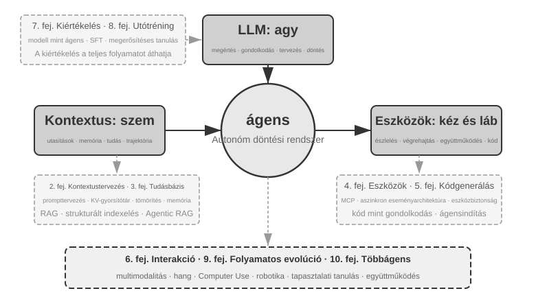

# Bevezetés {.unnumbered}

2025 augusztusától októberéig egy műszaki előadássorozatot tartottam a Turing, a kínai műszaki kiadó által szervezett "AI Agent Bootcamp" keretében. A cél egyszerű volt: az AI-ügynökök tervezését intuícióvezéreltből elvvezéreltté alakítani – nem csupán egy működő demót összerakni, hanem megérteni, *miért* úgy van felépítve egy ügynök, ahogy, és milyen kompromisszumok rejlenek az egyes architektúrális döntések mögött. Ez a könyv ezen előadások jegyzeteiből és kísérleteiből állt össze és bővült ki.

Maga a könyv, az első ötlettől a kész kéziratig, egyfajta **suttogó kódolással** (diktálásalapú együttműködés) készült – és a diktáláshoz használt eszköz a Pine, a saját hangalapú ügynökünk volt. Minden egyes előadás előkészítéséhez lediktáltam egy durva vázlatot, hagyta, hogy felmérje a témát, és összeállítson egy első változatot. Az előadás után megosztottam a Bootcamp hallgatóinak visszajelzéseit Pine-nel, és sok körön át beszéltük meg, csiszoltuk; iterációról iterációra nőttek az előadásjegyzetek azzá a könyvvé, amelyet most a kezében tart. Mindeközben alig gépeltem – helyette hangosan kimondtam a gondolataimat. A beszéd sávszélessége sokkal nagyobb, mint a gépelésé (a normál beszéd körülbelül négyszer olyan gyors, mint a gépelés), így a "diktálás – felmérés – megbeszélés – átdolgozás" ciklus gyorsan haladt. Bizonyos értelemben ez a könyv nem csak az ügynökökről szól; egyben egy olyan alkotás is, amelynek létrejöttében egy ügynök segédkezett.

A DeepSeek R1 2025 eleji megjelenése óta az AI-mezőny túllépett a tiszta alapmodell-stádiumon (azaz az általános célú nagy nyelvi modell gerinceken), és a mérnöki telepítés mélyvízébe merült. A modellrétegben két irányban látható előrelépés. Először is, az ügynöki megerősítéses tanuláson (Agentic Reinforcement Learning) keresztül a modellek a paramétereikbe építették az eszközhívási képességeket, elsajátítva az olyan általános készségeket, mint a kódolás, a matematika és a számítógéphasználat. Másodszor, a modell-iteráció egyre gyorsul – GPT-5.2-től GPT-5.5-ig, Claude Opus 4.5-től 4.8-ig, minden ugrás mindössze fél évet vesz igénybe. A termékrétegben az olyan általános ügynökök, mint a Manus, a Claude Code és az OpenClaw, újradefiniálták az ember-számítógép interakciót, és a "kódgenerálás + fájlrendszer" architektúrális paradigmát a mainstreambe emelték.

Visszatekintve az ügynökarchitektúra-elvekre, amelyeket közel egy éve foglaltam össze a tanfolyamon, valami egyszerre örömteli és meglepő dolgot tapasztaltam: **ezek az elvek nem avultak el; kanonikusabbá váltak.** Új kifejezések – Skill, harness, loop engineering – azóta elárasztották az ügynök-ipart, de a valódi sorrend fordított: az olyan cégek, mint az Anthropic, nem ezeket a koncepciókat találták ki, majd nézték végig, ahogy az iparág átveszi őket; nagyon sok ügynök már csinálta ezeket a dolgokat, és az Anthropic ezután sűrítette a gyakorlatot elnevezett tervezési elvekké. A gyakorlat az első, az elnevezés jön csak később.

Az ezen elvek mögötti magabiztosság onnan származik, hogy az ügynököket hosszú távú, nagy tétű, valós munkába állítottuk. A Pine AI vezető tudósaként a csapatommal együtt építettem a Pine-t. Tudomásom szerint ez az első olyan általános ügynök, amely autonóm módon képes kapcsolatba lépni valós emberekkel, és megbízhatóan kezelni érzékeny, összetett, hosszú távú, pénzzel kapcsolatos feladatokat önállóan: a felhasználók nevében hívja a szolgáltatókat a számlák megtárgyalásához, kezeli a visszatérítési kérelmeket és panaszokat a kereskedőknél, és lemondja az előfizetéseket – mindezt emberi beavatkozás nélkül. Az ilyen feladatok rutinszerűen több tucat tárgyalási fordulót igényelnek, és egyetlen hiba valós anyagi veszteséget jelent. Ez a könyörtelen megbízhatósági igény kovácsolta ki, egyenként, azokat az architektúrális elveket, amelyekhez ez a könyv újra és újra visszatér. A következő példák ebből a gyakorlatból származnak.

- Jóval azelőtt, hogy a Skill divatszóvá vált volna, már dinamikus promptbetöltést használtunk az elszabadult promptnövekedés megfékezésére, parancssori végrehajtási eszközöket az elszabadult eszközlisták megfékezésére, és egy rendszerállapot-sávot, hogy az ügynök tisztában legyen a végrehajtási környezetével, a felhasználó idejével és a saját munkájának állapotával.
- Jóval azelőtt, hogy a harness divatszóvá vált volna, már Claude Code-stílusú módszereket használtunk az instabil eszközhívások, hallucinációk, veszélyes műveletek, jogosulatlan műveletek és figyelmen kívül hagyott utasítások kezelésére.
- Jóval azelőtt, hogy a loop engineering divatszóvá vált volna, már azt a módszert alkalmaztuk, amelyet ez a könyv javaslattevő-felülvizsgáló (proposer-reviewer) módszernek nevez, hogy megakadályozzuk a modellt abban, hogy túl korán befejezettnek nyilvánítson egy feladatot.

Egyik sem a mi kizárólagos találmányunk: tudomásom szerint a legtöbb vezető modell- és ügynökvállalat önállóan dolgozott ki hasonló módszereket. Ezért indítottam el az "AI Agent Bootcamp" tanfolyamot a Turingnál 2025 augusztusában, és tanítottam gyakorlatorientált AI-ügynök kurzust a Kínai Tudományos Akadémia Egyetemén (University of Chinese Academy of Sciences) folyamatosan 2024-től 2026-ig – és ezért döntöttem úgy, hogy ezt a könyvet nyílt forráskódként teszem közzé, ahelyett, hogy zárt körben tartanám és jogdíjakat szednék: szeretném, ha ez a tudás minél több gyakorló szakemberhez eljutna.

**A gyakorlat az első, az elnevezés jön csak később.** Ez a sorrend egy nagyon gyakorlati tanulságot hordoz a vállalati ügynökfejlesztés számára: **ha megvárod, amíg egy ügynökös divatszó felkapott lesz, mielőtt gyakorlatba ülteted, már egy lépéssel lemaradtál.** Mire egy kifejezés trendivé válik, a vezető cégek általában már megoldották a problémát, amelyet az elnevez. Hogyan tudod hát, mit kell tennie, mielőtt a név megérkezik? Két dolog, hiszem, a kulcs.

**Először is, legyen egy valós üzleti tevékenységed, amely szélsőséges követelményeket támaszt az ügynök képességplafonjával szemben, és meríts folyamatosan valódi visszajelzést belőle.** Vegyük a Pine-t. Egyetlen feladat gyakran órákba vagy akár hetekbe telhet, és többszöri oda-vissza kommunikációt jelenthet több érdekelt féllel: órák a telefonban, oldalak összetett űrlap kitöltése a számítógépen, több körös e-mail-váltás. Mindeközben egyetlen szám sem lehet hibás, és minden egyes megnyilatkozásnak elég körültekintőnek kell lennie a felhasználó érdekeinek védelméhez. Csak amikor ilyen összetett forgatókönyvbe merülsz, akkor késztet a gyakorlat természetszerűleg arra, hogy védőhálókat (harnesses) építs – hogy lefedje azt, amit a modell még nem tud önállóan megtenni, de az üzlet megkövetel. Ezzel szemben, ha az üzlet keveset kér a képességplafontól, és egy szerény modellfrissítés is elég, soha nem lesz okod ezeket az architektúrális elveket csiszolni.

**Másodszor, ki kell építened egy Értékelési (Evaluation) mechanizmust.** Ez a könyv újra és újra visszatér erre a pontra: értékelés nélkül nincs fejlődés. Az értékelés lehetővé teszi, hogy megmondd, egy változás valóban jobb-e, vagy csak szerencsés, így az ügynök iterációs iránya többé nem a megérzésen múlik. Végső soron azt szorgalmazzuk, hogy a tudományos módszert használjuk a mérnöki munkához és az ügynökök építéséhez, és az értékelés ennek a módszernek az alapja. A 7. fejezet részletesen kifejti ezt.

Akárhogyan haladnak is előre az alapul szolgáló modellek, és akárhogyan változnak is a termékformák, szinte minden sikeres ügynökrendszer ugyanazokat az architektúrális mintákat követi. Ez nem véletlen: **a jó tervezési elveknek túl kell élniük a modell-iterációs ciklusokat**, mert nem egy adott modell használatát írják le, hanem azokat az alapvető mintákat, ahogyan az intelligens rendszerek kölcsönhatásba lépnek a világgal.

Richard Sutton, Turing-díjas kutató és a megerősítéses tanulás atyja egyszer azt mondta, hogy az univerzum evolúciója négy szakaszon ment keresztül: por, csillagok, élet és ágensek (eredetileg "tervezett entitásoknak" nevezve). A biológiai evolúció vak: véletlenszerű mutáció, természetes kiválasztódás. A legtöbb organizmus nem érti a saját működési elveit, és nem képes önállóan élőlényeket tervezni vagy újraalkotni. Az ágensek azonban valami teljesen újat jelentenek a kozmikus evolúció történetében: kód generálásával képesek saját magukat elindítani és fejleszteni, akár egy programozó, aki ír egy másik programozót, aki aztán megírja a következőt. Vagyis egy ágens képes megérteni a saját működési mechanizmusát, és egy cél adott esetén teljesen új ágenseket létrehozni – sőt, önmagát is fejleszteni. Ennek a könyvnek a küldetése, hogy segítsen megérteni és elsajátítani ennek a teremtésnek az elveit.

Ennek a könyvnek a központi képlete egyetlen mondat: **Ágens = NYM + Kontextus + Eszközök**. Mindhárom nélkülözhetetlen.



Szemléletesebben: **Agy + Szemek + Kéz és Láb**. Az agy (NYM) felelős a gondolkodásért és a döntéshozatalért, a szemek (Kontextus) határozzák meg, hogy az ágens milyen információkat láthat, a kéz és láb (Eszközök) pedig azt, hogy mit tehet az ágens. (Szigorúan véve a "szemek" durva hasonlat: a Kontextus nemcsak környezeti információkat és beszélgetési előzményeket foglal magában, hanem az eszközdefiníciókat is, vagyis az információ, amit az ágens "lát", magában foglalja azt is, hogy "milyen kéz és láb áll rendelkezésre." Ez a metafora azt a központi intuíciót hivatott közvetíteni: a Kontextus minden információ, amit a modell érzékelhet.)

A megerősítéses tanulásban járatos olvasók számára ez a három dolog leképezhető a RL formális nyelvére is. Pontosabban: az NYM a Policy-nak, a Kontextus a Megfigyelési Térnek (Observation Space), az Eszközök pedig a Cselekvési Térnek (Action Space) felel meg. A három kifejezés ugyanarra a dologra utal, csak különböző absztrakciós szinteken.


## A könyv szerkezete {.unnumbered}

A könyv tíz fejezetből áll, négy szinten kibontva (0-2. ábra). Az 1. fejezet felállítja az Ügynök alapkeretét; a 2–6. fejezet azt tárgyalja, hogyan építsünk Ügynököt, sorra véve a kontextust, a tudást, az eszközöket, a kódgenerálást és az interakciót; a 7–9. fejezet azt tárgyalja, hogyan értékeljük és javítsuk folyamatosan az Ügynököt, a mérési rendszerektől és a modell utólagos tréningjétől az üzemeltetési tapasztalat hajtotta folyamatos evolúcióig; a 10. fejezet pedig a többügynökös együttműködésre tágítja a látókört.


- **1. fejezet (Az ügynök alapjai)** néhány valós ügynöktermékkel kezd, hogy intuitív megértést építsen az ügynökökről. Ezután mélyrehatóan megvizsgálja az ügynök központi képletét: a NYM + Kontextus + Eszközök implementációs rétegétől az Agy + Szemek + Kéz és Láb intuitív rétegén át egészen a Policy, Megfigyelési Tér és Cselekvési Tér akadémiai rétegéig. Kísérletek boncolgatják a ReAct ciklus működését – a "Gondolkodj → Cselekedj → Figyelj meg" iteratív folyamatot – és megkülönböztetik a feladaton belüli kontextuális adaptációt, a feladatok közötti külső artefaktumok frissítését, valamint a paraméterfrissítéseket a tanítási ciklusok során. A fejezet a munkafolyamatoktól az autonóm ügynökökig terjedő vezénylési tervezési mintákkal zárul, egységes fogalmi keretet teremtve az ezt követő fejezetek számára.
- **2. fejezet (Kontextusmérnökség)** a könyv legkritikusabb fejezete, amely szisztematikusan magyarázza el a Kontextust, az ügynök "szemét." Az API üzenetszerkezetével és az ügynök központi ciklusával kezdi, lefektetve azt az alapot, hogy "a Kontextus üzenetek listája", majd megvizsgálja a KV Cache mögötti elveket – azt a mechanizmust, amely a történeti számítási eredmények újrafelhasználását teszi lehetővé az NYM következtetése során. Ezt követően kitér a Promptmérnökségre, beleértve a folyamatorientált tervezést, az eszközleírásokat és az üzleti szabályok finomítását; a Prompt Injection támadásokra és védekezésre; az ügynöki képességek (Agent Skills) igény szerinti betöltési mechanizmusára; az ügynök állapotsáv technológiájára; és a Kontextus-tömörítési stratégiákra. E kifejezések teljes definíciói a főszövegben történő első előfordulásukkor szerepelnek.
- **3. fejezet (Felhasználói memória és tudásbázisok)** kiterjeszti a kontextuskezelést egy, a munkameneteken átívelő perzisztens tudásrendszerré, lehetővé téve az ügynök számára, hogy ne csak az aktuális beszélgetésre emlékezzen, hanem tudást halmozzon fel és keressen elő több beszélgetésen keresztül. Négy progresszív stratégiát tárgyal a felhasználói memóriához; a RAG (Retrieval-Augmented Generation – visszakereséssel bővített generálás, amelyben a modell válaszadása előtt releváns dokumentumokat keresnek ki) teljes technológiai veremét, beleértve a különböző szövegkeresési módszereket és a rangsorolás optimalizálását; a multimodális információ-kinyerést; a tudásszervezés fejlettebb módszereit; és az ügynökvezérelt RAG-ot (Agentic RAG), ahol az ügynök autonóm módon dönti el, hogy mikor és mit kell visszakeresnie.
- **4. fejezet (Eszközök)** az ügynök és a külvilág közötti hidat vizsgálja: az eszközök az ügynök „kezei és lábai”, amelyekkel kereshet a weben, API-kat hívhat meg, adatbázisokat kezelhet és így tovább. Bemutatja az MCP eszköz-átjárhatósági szabványt és az öt eszközkategória — érzékelés, végrehajtás, együttműködés, eseményindítás és felhasználói kommunikáció — tervezési elveit; ismerteti a multimodális érzékelés három útját (natív multimodális feldolgozás, szöveggé alakítás és eszközalapú multimodális elemzés); valamint kiemelten tárgyalja a végrehajtási eszközök biztonsági mechanizmusait. Az eseményindítást, a felhasználói kommunikációt és az aszinkron futtatókörnyezetet a 6. fejezet bontja ki.
- **5. fejezet (Kódoló ügynök és kódgenerálás)** amellett érvel, hogy egy kódoló ügynök plusz egy fájlrendszer alkotja minden általános célú ügynök központi technológiai alapját. Az OpenClaw architektúráját használva szervező fonal gyanánt, elemzi a kódoló ügynök munkafolyamatait és implementációs technikáit, miközben bemutatja a kódgenerálás programozáson túli széleskörű értékét: a gondolkodás segítésétől a tudásbázisok építésén át az új eszközök dinamikus létrehozásáig és az ügynökök elindításáig (bootstrap).
- **6. fejezet (Interakció: a megfigyelési és a cselekvési tér kiterjesztése)** felszámolja az előző öt fejezet „felváltva beszélünk" előfeltevését, és a **modalitás** és az **időzítés** két tengelye mentén bontja ki az Ügynök és a világ interakcióját: az aszinkron és eseményvezérelt működés hagyja, hogy a világ ébressze az Ügynököt (eseményindított eszközök, felhasználói kommunikációs eszközök, virtuális identitás és elszigetelt futtatókörnyezet); a hang ezredmásodperces skálára tolja az interakciót (a kaszkád csővezetéktől a végponttól végpontig tartó teljes modalitású és teljes duplex modellekig); a Computer Use révén az Ügynök emberként kezeli a grafikus felületet; a robotikai manipuláció pedig a fizikai világba nyújtja a cselekvést (VLA-vezérlés és Sim2Real átvitel). A négy forgatókönyv ugyanazt az alapelem-készletet osztja meg: ébresztés, biztonságos pont, megszakítás, kiszorítás és gyors/lassú szétválasztás.
- **7. fejezet (Ügynök-értékelés)** egy tudományos értékelési módszertant épít fel. Lefedi az értékelési környezeteket – két központi paradigmát, az eszközhívást és az ember-számítógép interakciót, valamint a szimulációs környezeteket, amelyeket a fejezet végén külön tárgyalunk –, az adathalmaz-tervezési elveket, az NYM mint bíró (LLM-as-a-Judge) automatizált értékelést, az értékelésvezérelt modellválasztást és a teljes zárt hurkot, amely az értékelési eredményeket rendszerfejlesztésekké alakítja.
- **8. fejezet (Modell utóképzése)** két utóképzési technikát vizsgál mélyrehatóan: az SFT-t (Supervised Fine-Tuning – felügyelt finomhangolás, amely címkézett adatokat használ a modell megtanítására a példák követésére) és a RL-t (Reinforcement Learning – megerősítéses tanulás, amely lehetővé teszi a modell számára, hogy próbálkozással és hibázással, valamint jutalom-visszajelzéssel autonóm módon fejlődjön). Az "SFT memorizál, RL általánosít" és "Az adatok és a környezet fontosabbak, mint az algoritmusok" központi érvek köré szerveződve lefedi a teljes előképzés/SFT/RL tájképet, a klasszikus RL-elméletet, a jutalomjel-tervezést – a bináris jutalmaktól és a folyamatjutalmaktól a "jutalmazd a kimenetet, és korlátozd a folyamatot" igazolt útvonal-büntetésekig –, az egymenetes és többmenetes megerősítéses tanulási algoritmusokat, valamint a mintahatékonyság-optimalizálás határterületeit.
- **9. fejezet (Folyamatos ügynökevolúció)** azt vizsgálja, hogyan alakítható át egy ügynök üzemeltetési tapasztalata a következő verziójának képességeivé. Először a környezeti kimenetekből, folyamatszabályokból és NYM-értékelési szempontokból (Rubrics) álló tanulási jeleket határozza meg; majd összehasonlít négy frissítési hordozót – tudásdokumentumokat, Promptokat és Képességeket (Skills), programokat és Védőhálókat (Harnesses), valamint modellparamétereket –, végül tárgyalja a jelöltverziók validálását, a fokozatos bevezetést (canary release), a visszaállítást és a hosszú távú konszolidációt.
- **10. fejezet (Többágenses együttműködés)** az AI-ügynök rendszerek végső formáját tárgyalja: hogyan osztják meg a munkát és működnek együtt több ügynök. Szisztematikusan bemutat egy osztályozási keretrendszert a többágenses együttműködéshez – megosztott/független kontextus × peer/vezérlő/decentralizált struktúrák –, fordító ügynökökön és telefon-plusz-számítógép ügynökökön keresztül demonstrálja a kollaboratív architektúra tervezését, és áttekinti az ügynöktársadalmak és ügynökgazdaságok határterületeit.

## Hogyan olvassuk ezt a könyvet {.unnumbered}

E könyv fejezetei viszonylag függetlenek. A szükségleteid alapján különböző olvasási utakat választhatsz:

- **Ha Ügynök-fejlesztő vagy**, olvasd sorban az 1–9. fejezetet: az első hat adja az építés módszereit, a 7. fejezet lerakja az értékelés alapjait, a 8. fejezet elmagyarázza a modell tréningjét, a 9. fejezet pedig a paramétereket és a többi frissítési hordozót egyetlen teljes, folyamatos evolúciós hurokba illeszti. A 10. fejezet a többügynökös együttműködés iránti igény szerint olvasható válogatva.
- **Ha korlátozott az időd**, részesítsd előnyben az 1. fejezetet az átfogó képért, és a 2. fejezetet a kontextusmérnökségért – ez a legkritikusabb készség. A KV Cache mögötti elvek a 2. fejezetben meglehetősen technikai jellegűek; első olvasásra átugorhatod a mechanikát, és megtarthatod csak a fejezet elején megadott három központi következtetést anélkül, hogy ez befolyásolná a későbbi anyag megértését.
- **Ha a fókuszod a modell tanítása**, menj egyenesen a 8. fejezethez (Modell utóképzése). Mivel a 7. fejezet értékelési módszerei a tanítás előfeltételei, olvasd a kettőt együtt, miután az 1. és 2. fejezet megadta az átfogó képet.

Minden fejezet nagyszámú **kísérletet** és **gondolkodtató kérdést** tartalmaz, "X-Y. kísérlet" formátumban számozva (X a fejezet száma, Y a sorszám a fejezeten belül). A kísérletek és gondolkodtató kérdések címei csillagbesorolást hordoznak a nehézségi szintre: ★ belépő szint, minden olvasó számára alkalmas; ★★ közepes nehézség, némi mérnöki gyakorlatot igényel; ★★★ haladó kihívás, általában nyitott végű kérdéseket vagy összetett rendszertervezést foglal magában. A legtöbb kísérlet teljes futtatható kóddal érkezik, amely a kísérő nyílt forráskódú repóban található:

> **Kísérő kódrepó**: [https://github.com/bojieli/ai-agent-book](https://github.com/bojieli/ai-agent-book)

A teljes kísérő kódot letöltheted Gittel:

```bash
git clone https://github.com/bojieli/ai-agent-book.git
cd ai-agent-book
```

Ha nem használsz Gitet, a repó oldalán a **Code → Download ZIP** lehetőséget is választhatod. A kísérletek kódja fejezetenként, a `chapter1/` és `chapter10/` közötti könyvtárakban található. Az „X-Y. kísérlet” megkereséséhez nyisd meg a megfelelő `chapterX/README.hu.md` fájlt, a kísérlet száma alapján keresd meg a projekt könyvtárát, majd a projekt saját README-jét követve telepítsd a függőségeket és futtasd a kísérletet. Egyes, reprodukciós útmutatóként megjelölt kísérletek külső repókra támaszkodnak; ezek beszerzését is a megfelelő README ismerteti.

Erősen ajánlom, hogy futtasd ezeket a kísérleteket magad is: az AI-ügynökök rendkívül gyakorlatorientált terület, és sok tervezési intuíció csak hibakeresés közben alakul ki.

**Egy terminológiai megjegyzés**: Ez a könyv gondosan megkülönböztet két olyan kifejezést, amelyeket a hétköznapi használat gyakran összemos. A **Reasoning** (okoskodás / gondolkodás) a modell lépésről lépésre történő gondolkodása – mint a reasoning modellekben, a gondolkodási láncban (chain-of-thought) és a reasoning tokenekben. Az **Inference** (következtetés) a modell előreirányú számítása telepítéskor – mint az inference költség, az inference stack és az inference-időbeli skálázás. (A kínai kiadás ezt két külön szóval adja vissza – 思考 a reasoningre, 推理 az inference-re – pontosan azért, hogy a két fogalmat elkülönítve tartsa; a 10. fejezet fordítással foglalkozó esettanulmánya hivatkozik is erre a konvencióra.) Más kulcsfontosságú kifejezések a szövegben való első előfordulásukkor kerülnek meghatározásra.

## Előfeltételek {.unnumbered}

Ez a könyv némi műszaki háttérrel rendelkező olvasóknak szól, de nem követeli meg, hogy szakértő legyél egy adott területen. Az előfeltételek két szinten vannak felsorolva: "Kötelező" és "Ajánlott", hogy segítsen felmérni a felkészültségedet.

**Kötelező: A teljes könyv olvasásának alapja**

- **Python programozás**: A könyv szinte minden kísérlete Python-alapú. Ismerned kell a Python alapvető szintaxisát, a gyakori adatszerkezeteket, a csomagkezelést (pip) és más alapvető fogalmakat. Magas szintű jártasság nem szükséges, de képesnek kell lennie közepes bonyolultságú Python kód olvasására és módosítására.
- **Alapvető tapasztalat NYM-ekkel (LLM-ekkel)**: Használtál már ChatGPT-t, Claude-ot vagy hasonló termékeket, és érted a "Prompt → Modell válasza" alapvető interakciós mintát.
- **Egy AI-asszisztált programozási eszköz**: Telepíts és szokj hozzá legalább egy AI-asszisztált programozási eszközhöz, mint a Claude Code, a Codex, a Cursor vagy a TRAE. Egyrészt ezek az eszközök nagyban felgyorsítják a kísérleteket, amelyek kiterjedt kódírást és hibakeresést foglalnak magukban. Másrészt ezek maguk is érett kódoló ügynökök: használatukkal első kézből tapasztalod meg azokat a központi mechanizmusokat, amelyekhez ez a könyv újra és újra visszatér – a ReAct ciklust, az eszközhívásokat, a kontextuskezelést. Ez a közvetlen tapasztalat felbecsülhetetlen értékű az ügynök-tervezési elvek megértéséhez.
- **Általános szoftvermérnöki ismeretek**: Légy járatos olyan alapvető fogalmakban, mint a parancssori műveletek, a Git verziókezelés, a JSON adatformátum és a REST API-k. Ezek képezik az alapot a kísérletek futtatásához és az ügynök eszközhívási mechanizmusának megértéséhez.

**Ajánlott: Az olvasási élmény fokozása bizonyos fejezetekhez**

- **Gépi tanulás alapjai** (8. fejezet): Az olyan alapfogalmak megértése, mint a tanítás vs. következtetés, veszteségfüggvények, gradiensereszkedés és túltanulás, segítenek a modell utóképzésének megértésében.
- **Alapvető matematika** (2–3., 8. fejezet): A lineáris algebra intuitív megértése (pl. annak ismerete, hogy a vektorok irányt és nagyságot képviselhetnek, a mátrixok pedig batch-műveleteket végezhetnek) segít az beágyazások (embeddings) és a figyelmi mechanizmusok (attention) megértésében. A valószínűségszámítás és statisztika alapvető ismerete segít az értékelési metrikák és a megerősítéses tanulás várható jutalmainak megértésében. A könyv matematikai része nem tartalmaz összetett levezetéseket, és az intuitív magyarázatokra összpontosít.
- **Webfejlesztési alapok** (4., 6. fejezet): Az olyan fogalmak megértése, mint a HTTP, a WebSocket és a front-end/back-end szétválasztás architektúrája, segít az eseményvezérelt aszinkron ügynökarchitektúrák és a hangalapú ügynökök valós idejű kommunikációs kísérleteinek megértésében.
- **A Transformer architektúra alapvető ismerete** (2., 8. fejezet): A Transformer szinte az összes jelenlegi nagy nyelvi modell mögöttes architektúrája. Azok az olvasók, akik szisztematikusan szeretnék felépíteni a nagy modellekkel kapcsolatos alapvető tudásukat, élvezhetik a *Illustrating Large Models* (图解大模型, kínai nyelven, a Turing kiadásában) című könyvet, amely intuitív ábrákkal magyarázza el az olyan központi fogalmakat, mint a Transformer architektúra, az előképzés és a finomhangolás – jó kiegészítője e könyv ügynökmérnöki perspektívájának.

Ha hiányzik néhány ezen előfeltételek közül, ne csüggedj. A könyv központi értéke **az architektúrális tervezési elvekben és a mérnöki módszertanban** rejlik, nem pedig valamely konkrét algoritmusban vagy technikában. Az utóképzésről szóló 8. fejezeten kívül a könyv nagyon kevés matematikát vagy gépi tanulást igényel, és tökéletesen megfelel kiindulópontnak.

Az ügynök-technológia még mindig gyorsan fejlődik, de **a jó architektúrális tervezési elvek képesek átvészelni az időt.** Sajátítsd el a tervek mögött meghúzódó "miértet", és megőrizheted az ítélőképességed tisztaságát, ahogy a technológiai hullámok átgördülnek. Remélem, ez a könyv megbízható útmutatóddá válik, amint AI-ügynököket építesz.

## Köszönetnyilvánítás {.unnumbered}

Szeretném megköszönni Meng Ge és Liu Meiying szerkesztőknek a Turing Kiadónál gondos szerkesztői munkájukat és a Turing "AI Agent Bootcamp" tanfolyam megszervezésében végzett munkájukat; valamint köszönöm Liu Junming professzornak, hogy lehetővé tette a gyakorlatorientált AI-ügynök kurzust a Kínai Tudományos Akadémia Egyetemén. Külön köszönet illeti a Turing "AI Agent Bootcamp" és a UCAS AI-ügynök kurzus összes hallgatóját – e kurzusok tanítása során rengeteg értékes visszajelzést és tanácsot kaptam tőletek, ami élesítette a saját megértésemet ezekről a fogalmakról.

Köszönöm minden kollégámnak a Pine AI-nál. Egy olyan kiváló termék nélkül, mint a Pine AI, és az általa hozott számos kihívás nélkül, soha nem mehettem volna ilyen mélyre az ügynökök területén, sem megértésben, sem gyakorlatban; és az egymást követő gondolatcserék során a kollégáim rengeteg értékes meglátással járultak hozzá.

Köszönöm továbbá sok barátomnak az AI-iparból (nem sorolom fel itt mindnyájukat). Beszélgetésről beszélgetésre őszinte visszajelzést adtatok a nézeteimről, kijavítottatok számos téves ítéletemet, és emeltétek a modellekről és ügynökökről alkotott megértésem színvonalát.

Legfőképpen pedig köszönöm a családomnak, különösen a feleségemnek, Meng Jiayingnek. Támogatott végig e könyv írása során, és számos értékes javaslattal szolgált az út során.
