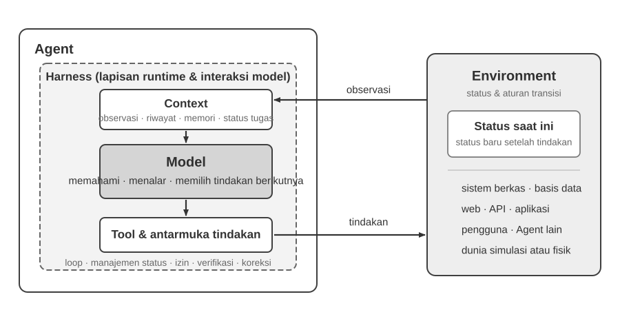
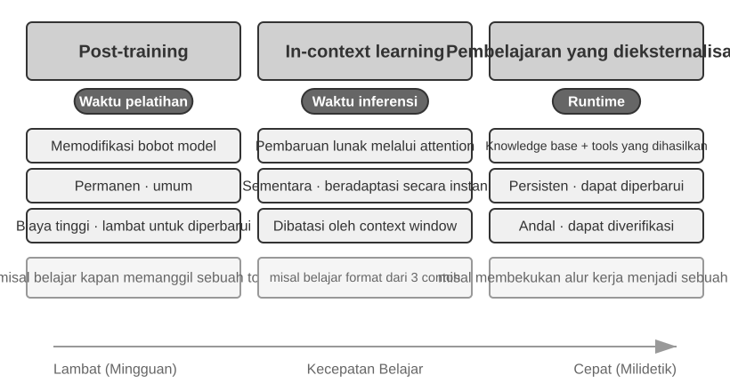
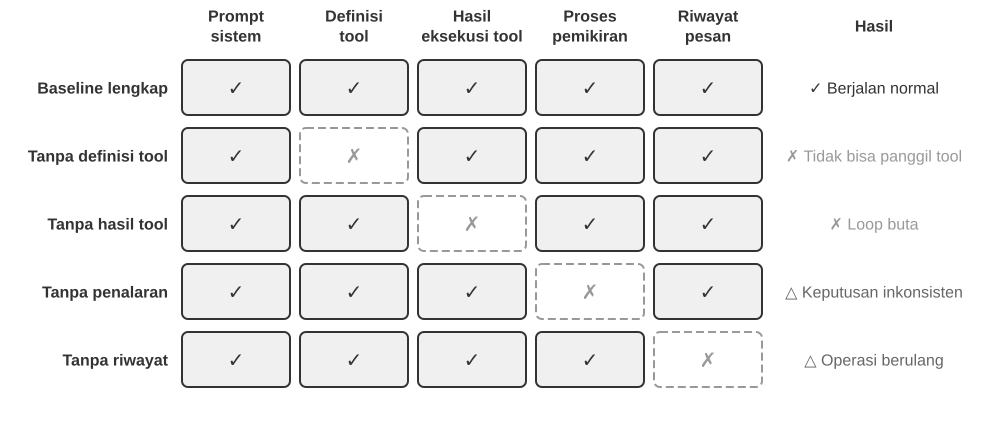
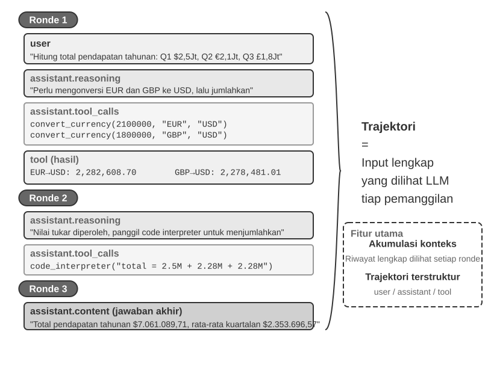
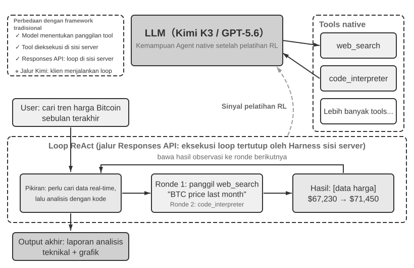
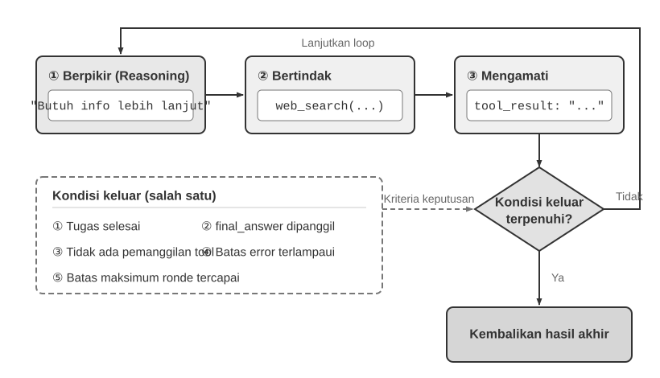

# Memulai dengan AI Agent

Jika Anda pernah menggunakan Cursor untuk menulis kode dan melihatnya mencari basis kode Anda, mengedit beberapa file, dan menjalankan ulang pengujian hingga berhasil, Anda sudah menggunakan AI Agent. Hal yang sama berlaku jika Anda pernah menggunakan Deep Research untuk menyelidiki suatu topik melalui pencarian dan pembacaan berulang kali, menyuruh Manus mengontrol peramban untuk menyelesaikan tugas online, meminta asisten telepon Doubao untuk memesan tiket atau mengirim pesan, atau mengirim Pine AI untuk menegosiasikan tagihan telekomunikasi yang lebih rendah.

Produk-produk ini memiliki banyak bentuk, namun memiliki satu kesamaan: mereka bukan lagi sekadar percakapan pasif "Anda bertanya, ia menjawab". Mereka merencanakan langkah-langkah eksekusinya sendiri, memanggil tool yang dibutuhkan setiap tugas, dan menyesuaikan strategi mereka saat hasil muncul. AI Agent menjadi cara baru untuk berinteraksi dengan komputer.

Bab ini dimulai dengan contoh-contoh praktis dan menelusuri kembali ke komponen inti dari AI Agent: pembaca akan merasakan langsung apa yang dapat dilakukan Agent modern, memahami arsitektur di baliknya, dan mempelajari pola desain serta praktik terbaik untuk membangun sistem Agent.

> **Tips Membaca**: Bab ini adalah peta konsep untuk keseluruhan buku: tur ringkas tentang formula inti, loop operasi, kerangka kerja rekayasa, dan pola desain Agent. Bab ini menetapkan kosakata bersama dan titik acuan yang digunakan sepanjang bab-bab berikutnya. Jangan mencoba menghafal setiap konsep pada bacaan pertama Anda; bertujuanlah untuk memahami gambaran besarnya. Setiap bab selanjutnya memperluas satu aspek yang diperkenalkan di sini, dan Anda dapat kembali ke bab ini kapan pun Anda perlu mengorientasikan diri kembali.

## Agent Modern = LLM + Context + Tool

Inti dari sistem Agent modern cocok dengan satu formula ringkas: **Agent = LLM (Large Language Model) + Context + Tool**. Formula ini sederhana dan praktis—asalkan setiap istilah dibaca secara luas:

- **LLM adalah mesin penalaran Agent**: Ini lebih dari sekadar kumpulan parameter model; ini adalah inti pengambilan keputusan Agent, yang bertanggung jawab untuk memahami niat, penalaran, perencanaan, dan penilaian. Kemampuan LLM berasal dari pengetahuan dunia dan kemampuan bahasa yang diperoleh selama **pre-training**, ditambah strategi pengambilan keputusan yang dienkode melalui **post-training** (teknik seperti supervised fine-tuning dan reinforcement learning dibahas di Bab 8).
- **Context adalah sekumpulan informasi kerja Agent**: Bukan sekadar teks yang dimasukkan ke dalam model, tetapi sekumpulan informasi kerja yang tersedia untuk Agent pada setiap titik keputusan—lingkungan, memori pengguna, pengetahuan domain, state-nya sendiri, dan kemajuan tugas. Sama seperti seseorang yang membuat keputusan perlu menilai situasi, mengingat kembali pengalaman yang relevan, dan berkonsultasi dengan referensi, context window Agent berisi informasi yang dapat digunakannya pada saat itu.
- **Tool adalah antarmuka tindakan Agent**: Bukan sekadar beberapa fungsi API yang dapat dipanggil, tetapi serangkaian cara Agent dapat bertindak—mulai dari panggilan tool yang telah ditentukan sebelumnya hingga Skill yang dimuat sesuai permintaan, dari menghasilkan kode untuk menciptakan kemampuan baru dengan cepat hingga mendelegasikan pekerjaan ke sub-agent, dari menghubungi pengguna hingga merespons event eksternal.

Secara lebih intuitif: **Agent = Mesin Penalaran + Context Kerja + Antarmuka Tindakan**. Model menalar dan memutuskan, context menyediakan sekumpulan informasi kerja yang menjadi sandaran keputusan tersebut, dan tool menyediakan antarmuka melalui mana keputusan memengaruhi dunia luar.

Dari perspektif klasik reinforcement learning dan teori kontrol, Agent dan Environment adalah dua pihak dalam interaksi loop tertutup, bukan komponen satu sama lain. Environment mengembalikan observasi, Agent menggunakan context untuk memilih tindakan berikutnya, dan tindakan itu mengubah state Environment sehingga menghasilkan observasi berikutnya.



Gambar 1-1 menunjukkan dua tingkat abstraksi. Tingkat luar adalah interaksi antara **Agent dan Environment**: Environment mencakup sistem berkas, basis data, halaman web, pengguna, Agent lain, serta dunia fisik atau simulasi. Tingkat dalam adalah **struktur Model–Harness di dalam Agent**: Model mengambil keputusan policy; Harness adalah lapisan runtime dan tata kelola di dalam batas Agent yang membangun context, mengekspos antarmuka tool, memelihara loop dan state, serta menerapkan izin, verifikasi, dan koreksi. Harness dapat membuat, mengisolasi, atau mem-proxy sebuah environment tanpa memuat state dan aturan transisinya.

Formula rekayasa ini dapat diuraikan sebagai berikut: LLM menjadi Model, sedangkan Context + Tool membentuk Harness minimum; sistem produksi menambahkan constrain, verify, dan correct di dalam batas tersebut. Seluruh bab ini mengikuti batas yang sama.

Ketiga komponen tersebut berhubungan dengan tiga konsep inti dalam RL (reinforcement learning; lihat Bab 8), tetapi bukan padanan satu-banding-satu yang ketat: context adalah representasi internal Agent atas observasi dan riwayat, sedangkan tool mendefinisikan antarmuka observasi/tindakan yang objek dasarnya tetap berada di Environment.

| Intuisi | Komponen Agent | Konsep RL | Peran |
|---------------|----------------|------------------|---------------------------------------------|
| **Mesin Penalaran** | LLM | **Policy** | Logika pengambilan keputusan yang menentukan "apa yang harus dilakukan selanjutnya"—mengingat informasi saat ini, memilih tindakan yang paling tepat dari semua opsi yang tersedia |
| **Context Kerja** | Konstruksi Context | **Observasi dan riwayat** | Mengatur observasi Environment dan riwayat yang ada menjadi informasi untuk keputusan saat ini |
| **Antarmuka Tindakan** | Antarmuka Tool | **Antarmuka observasi/tindakan** | Menentukan observasi yang dapat dibaca Agent, tindakan yang dapat dikirim, dan format antarmukanya |

### Ruang Observasi dan Tindakan: Antarmuka antara Model dan Dunia

**Ruang observasi dan ruang tindakan bersama-sama membentuk antarmuka antara LLM dan lingkungan eksternalnya**. Ruang observasi menerjemahkan informasi dari lingkungan menjadi context yang dapat diproses model; ruang tindakan menerjemahkan keputusan model menjadi operasi pada dunia luar. Informasi di luar ruang observasi pada dasarnya tidak ada bagi model. Operasi di luar ruang tindakan hanya dapat direkomendasikan model melalui kata-kata, sekalipun model mengetahui persis apa yang harus dilakukan.

Karena itu, **jika model dasarnya tetap, tuas rekayasa sistem utama untuk meningkatkan kinerja Agent sering kali adalah mendefinisikan ulang atau memperluas ruang observasi dan tindakannya**. Dalam istilah buku ini, itu berarti memperluas context dan tool. Banyak masalah yang tampaknya membutuhkan “model yang lebih cerdas” sebenarnya merupakan masalah antarmuka: masukkan data yang relevan dengan tugas ke dalam context atau hadirkan operasi yang diperlukan sebagai tool, dan tugas yang sebelumnya tidak dapat diselesaikan mungkin menjadi dapat diselesaikan.

**Manus: menyatukan ruang yang sebelumnya terpisah.** Sebelum Manus hadir, Agent produksi umumnya mengikuti tiga jalur terpisah: Deep Research, Coding, dan Computer Use. Manus menjadi Agent produksi berpengaruh pertama yang menyatukan ketiganya dalam satu sistem. Browser virtual memperluas ruang observasinya; sistem file, eksekusi kode, dan baris perintah memperluas ruang tindakannya. Manus tidak menjadi Agent umum hanya dengan mengganti model yang lebih kuat. Ia menggabungkan ruang observasi dan tindakan dari tiga jenis Agent sehingga satu Agent dapat melintasi batas produk sebelumnya.

**OpenClaw: memperluas antarmuka ke kehidupan digital pengguna.** OpenClaw kembali memperluas kedua ruang tersebut. Ia menerima tugas dan mengembalikan hasil melalui kanal pesan yang sudah digunakan pengguna—WhatsApp, Telegram, Slack, Discord, iMessage, dan banyak lainnya—sehingga Agent dapat dijangkau hampir dari mana saja. Gateway lokalnya dapat menghubungkan aplikasi cloud seperti Google Drive dan Notion serta sistem file lokal. Dengan izin eksplisit pengguna, file yang tersebar di berbagai akun dan perangkat dapat masuk ke ruang observasi Agent dan diproses oleh tool-nya. Dibandingkan bentuk awal Manus yang berpusat pada sandbox cloud, di mana file umumnya harus diunggah atau konektor dikonfigurasi secara terpisah, OpenClaw yang *local-first* mencakup batas data yang lebih luas. Manus kemudian menambahkan konektor Google Drive dan akses desktop ke file lokal—yang justru menegaskan poin ini: evolusi produk sering kali berupa perluasan ruang observasi dan tindakan[^ch1-agent-products].

[^ch1-agent-products]: Materi resmi Manus menjelaskan Sandbox awalnya sebagai mesin virtual cloud yang terisolasi. Saat memperkenalkan Google Drive Connector, Manus mengingat kembali alur kerja lama yang terfragmentasi: mengunduh dan mengunggah file secara manual antara Drive, desktop, dan Manus. Ketika meluncurkan My Computer pada Maret 2026, Manus menyebut fakta bahwa pekerjaan penting berada secara lokal, bukan di cloud, sebagai keterbatasan mendasar sandbox cloud. README resmi OpenClaw menjelaskannya sebagai asisten pribadi *local-first* yang selalu aktif pada perangkat pengguna dan mencantumkan lebih dari dua puluh kanal pesan; sistem tool dan pluginnya dapat menambahkan integrasi cloud maupun kemampuan lokal. Lihat https://manus.im/blog/manus-sandbox, https://manus.im/blog/manus-google-drive-connector, https://manus.im/blog/manus-my-computer-desktop, https://github.com/openclaw/openclaw, dan https://docs.openclaw.ai/tools

Memahami apa yang dilakukan setiap komponen, dan bagaimana mereka saling melengkapi, adalah fondasi untuk membangun sistem Agent yang efektif. Kita akan mulai dengan yang paling konkret dari ketiganya—tool, antarmuka tindakan—dan bekerja ke dalam menuju LLM dan context. Pertama, inilah perbandingan berbagai jenis Agent di ketiga dimensi ini:

| Produk Agent | Context Kerja | Antarmuka Tindakan | Strategi |
|-----------------|------------------------|--------------------------|-----------------------------|
| **Coding Agent (mis., Cursor)** | Dokumen persyaratan, basis kode, lingkungan terminal | Open-ended (penalaran internal, pencarian kode, baca/tulis file, eksekusi perintah, dll.) | Pengembangan inkremental: memahami persyaratan → mencari kode yang relevan → mengedit kode → menguji dan memverifikasi → debug dan perbaiki |
| **Search Agent (mis., Deep Research)** | Sumber daya web, database akademik, file lokal | Open-ended (penalaran internal, kueri pencarian, pembacaan web, pembuatan ringkasan) | Pendalaman iteratif: menyesuaikan arah pencarian berdasarkan informasi yang ada, secara bertahap menyintesis laporan lengkap |
| **Computer Control Agent (mis., Manus)** | Layar komputer, halaman peramban, sistem file | Open-ended (penalaran internal, mengklik, mengetik, menggulir, screenshot, eksekusi kode, dll.) | Persepsi visual + operasi: mengobservasi layar → mengidentifikasi elemen target → melakukan tindakan → memverifikasi hasil |
| **Phone Assistant Agent (mis., Doubao)** | Layar ponsel, aplikasi terinstal | Open-ended (penalaran internal, mengklik, menggeser, mengetik, membuka aplikasi, dll.) | Pemahaman niat + Kontrol App: memahami kebutuhan pengguna → menemukan aplikasi target → melakukan tindakan → mengonfirmasi penyelesaian |
| **Personal Task Agent (mis., Pine AI)** | Informasi akun pengguna, riwayat tagihan, basis pengetahuan penyedia layanan | Open-ended (penalaran internal, melakukan panggilan, mengirim email, mengisi formulir, mengonfirmasi dengan pengguna) | Eksekusi tugas multi-langkah: mengumpulkan informasi → merumuskan strategi negosiasi → menghubungi penyedia layanan → bernegosiasi → melaporkan hasil |

Sistem-sistem ini berbagi tiga fitur: **action space yang open-ended**—tidak memilih dari serangkaian tombol tetap tetapi menghasilkan bahasa alami dan kode sembarang; **penalaran internal**—merencanakan sebelum bertindak; dan **interaksi berkelanjutan**—menyesuaikan strategi berdasarkan feedback lingkungan. Kemampuan ini berasal tepat dari interaksi mesin penalaran, context kerja, dan antarmuka tindakan—yaitu, LLM, context, dan tool.

### Tool: Antarmuka Tindakan Agent

Tool adalah jembatan Agent ke dunia luar. Tool mengubah Agent dari pengamat pasif menjadi sistem aktif yang dapat mencari, menulis file, menjalankan kode, memanggil API, mengirim pesan, atau mengoperasikan antarmuka. Tanpa tool, Agent terbatas pada pembuatan teks; dengan mereka, ia dapat bertindak pada sistem eksternal.

Untuk membahas tool secara sistematis, kita dapat mengurutkannya menjadi lima jenis berdasarkan arah interaksi Agent dengan dunia. Pada tahap ini, gambaran singkat dari skenario representatif setiap jenis sudah cukup untuk menetapkan gambaran keseluruhan; bab-bab berikutnya membahas masing-masing secara mendalam.

**Perception Tool** memungkinkan Agent untuk mengakses informasi: search engine menyediakan data web real-time, sistem file membaca dokumen lokal, dan API serta database terhubung ke layanan eksternal dan data inti perusahaan.

**Execution Tool** memungkinkan Agent untuk bertindak pada sistem eksternal: eksekusi kode, operasi file, perintah sistem, dan panggilan API eksternal mengubah keputusan menjadi tindakan konkret.

**Collaboration Tool** memungkinkan Agent untuk membagi pekerjaan dengan Agent lain: mendelegasikan tugas khusus ke sub-agent, meminta konfirmasi manusia pada titik keputusan penting, atau mengoordinasikan tindakan dalam sistem multi-agent.

**Event Trigger Tool** dipanggil dengan cara yang pada dasarnya berbeda dari ketiga kategori pertama: Agent tidak memanggilnya; mereka datang sebagai input eksternal yang memicu Agent untuk mulai bekerja. Email baru masuk, waktu yang dijadwalkan tiba, atau sistem lain mengaktifkan callback Webhook; event tersebut mengaktifkan Agent dan memulai penalaran dan tindakan. Agent tidak pernah memanggil tool ini sendiri, namun mereka tetap merupakan saluran yang melaluinya Agent berinteraksi dengan dunia luar, jadi kita memasukkannya ke dalam sistem tool secara luas.

**User Communication Tool** adalah saluran yang melaluinya Agent berkomunikasi dengan pengguna. Di mana execution tool mengubah dunia eksternal, communication tool membawa informasi—menyampaikan kemajuan Agent, atau check-in proaktif, melalui pesan teks, panggilan suara, email, dan sebagainya.

Bab 4 mencakup taksonomi lengkap dan prinsip-prinsip desain untuk kelima jenis ini. Kualitas desain tool secara langsung menentukan apa yang dapat diselesaikan Agent dengan andal: definisikan antarmuka secara tidak jelas dan model akan menyalahgunakannya; tangani error dengan buruk dan satu tool yang gagal dapat membuat Agent macet; ruang lingkup permission terlalu luas dan satu error Agent bisa menjadi tidak dapat diubah. Penyebaran standar MCP (Model Context Protocol) membuat integrasi tool semakin mudah.

**Tool Calling** (juga dikenal sebagai Function Calling) adalah kemampuan inti dari LLM Agent modern: ini memungkinkan model memanggil tool eksternal dengan cara yang terstruktur, mengubah LLM dari pembuat teks murni menjadi sistem cerdas yang dapat bertindak melalui antarmuka eksternal. Buku ini menggunakan istilah "tool calling" di seluruh bagian.

Tool calling berjalan dalam empat langkah: pertama, context memberi tahu model tool mana yang tersedia (nama, tujuan, parameter); kemudian model memutuskan sendiri apakah akan memanggil tool, tool mana yang akan dipanggil, dan dengan argumen apa; selanjutnya, setelah tool dijalankan, hasilnya ditambahkan ke context; terakhir, model memutuskan langkah selanjutnya berdasarkan hasil tersebut. Loop ini adalah fondasi ReAct, yang diperkenalkan nanti dalam bab ini.

Untuk kueri cuaca, representasi sederhana dari proses empat langkah di level API adalah sebagai berikut:

```text
Step 1: Declare tools                  Step 2: Model decides to call
tools: [{                             assistant: {
  name: "get_weather",                  tool_calls: [{
  parameters: {                           function: "get_weather",
    city: "string"                        arguments: {city: "Beijing"}
  }                                      }]
}]                                    }

Step 3: Result appended to context    Step 4: Model responds based on result
tool: {                               assistant: {
  tool_call_id: "call_1",               content: "Today in Beijing: 28°C, sunny."
  content: '{"temp":28,"sky":"clear"}' }
}                                     }
```

Developer hanya mendefinisikan tool dan mengeksekusi panggilan; model itu sendiri yang memutuskan apakah akan memanggil, tool mana yang akan dipanggil, dan argumen apa yang akan diteruskan. Bab 2 membahas struktur API ini secara rinci.

Saat merancang tool untuk Agent, mulailah dengan kapabilitas tersempit yang dibutuhkan tugas, lalu perluas secara bertahap ketika tugas menjadi lebih kompleks. Jika tugas hanya memerlukan aritmetika dasar, kalkulator dengan parameter yang didefinisikan dengan jelas sudah cukup; ketika tugas berkembang hingga membaca spreadsheet, membersihkan nilai yang hilang, menghitung statistik, dan membuat grafik, interpreter kode Python yang dibatasi lebih mudah dikombinasikan dan dieksplorasi daripada koleksi tool khusus yang terus bertambah. Namun, sifat yang makin general juga meningkatkan risiko error dan memperluas permukaan serangan: kode harus dijalankan di sandbox terisolasi, dengan akses jaringan dinonaktifkan secara default, tanpa akses ke file di luar direktori kerja yang diizinkan, serta dengan batas waktu eksekusi, CPU, memori, dan ukuran output.

Demikian pula, satu tool pencatatan cocok untuk merekam satu kali eksekusi; untuk tugas jangka panjang yang berlangsung berjam-jam atau bahkan berhari-hari, direktori kerja virtual yang terkontrol dapat menyimpan rencana, hasil antara, log eksekusi, dan artefak akhir agar Agent dapat melanjutkan pekerjaan dalam beberapa kali eksekusi. Direktori ini juga harus membatasi jalur yang dapat dibaca dan ditulis, kapasitas penyimpanan, serta jenis file, dan mencegah path traversal alih-alih membuka seluruh sistem file host kepada Agent.

Tool general-purpose tidak selalu lebih baik daripada tool khusus. Operasi berisiko tinggi atau yang diatur oleh batasan bisnis yang ketat—seperti pembayaran, penghapusan data, pengiriman email, dan deployment produksi—tetap harus disediakan sebagai tool khusus dengan parameter eksplisit, izin terbatas, dan auditabilitas menyeluruh, ditambah pratinjau serta konfirmasi manusia bila diperlukan. Karena itu, prinsip inti desain tool adalah: **gunakan kapabilitas dasar general-purpose untuk komposisi dan eksplorasi; gunakan tool khusus untuk membatasi operasi berisiko tinggi dan menegakkan aturan bisnis yang ketat**.

### LLM: Mesin Penalaran Agent

Large Language Model (LLM) adalah inti pengambilan keputusan Agent. Mengingat permintaan pengguna, pada awalnya ia harus menyimpulkan niat sebenarnya (apa yang dikatakan pengguna sering kali bukan apa yang sebenarnya mereka inginkan), kemudian memecah tugas yang tidak jelas atau kompleks menjadi langkah-langkah yang dapat dieksekusi. Sepanjang eksekusi ia terus membuat keputusan: apa yang harus dilakukan selanjutnya, apakah akan memanggil tool, tool yang mana, dan dengan argumen apa. Kemampuan memahami–merencanakan–mengeksekusi ini berasal dari pengetahuan yang dikumpulkan selama pre-training, dan ini adalah fondasi yang diandalkan oleh workflow maupun Agent otonom.

Kemampuan khas dari LLM Agent adalah **penalaran internal**—sebelum bertindak, Agent dapat merencanakan dan menalar keseluruhan tugas. Hal ini tidak mengubah lingkungan eksternal, namun secara nyata meningkatkan tindakan selanjutnya. Kemampuan ini berasal dari pre-training (pelatihan awal pada teks internet dalam jumlah besar, yang melaluinya model mempelajari pola bahasa dan pengetahuan dunia): model memanfaatkan pola penalaran yang dienkode dalam pengetahuan manusia, termasuk hukum matematika, hubungan sebab akibat, dan strategi untuk memecah masalah. Oleh karena itu, berbeda dari Agent reinforcement learning tradisional, Agent berbasis LLM saat ini tidak melakukan eksplorasi acak secara buta, melainkan menalar di atas kumpulan pengetahuan yang terstruktur.

#### Model sebagai Agent: Ketika Model Itu Sendiri Menjadi Produk

Paradigma "Model sebagai Agent" adalah arah terbaru dalam pengembangan AI Agent. Model canggih menginternalisasi tool calling sebagai kemampuan bawaan melalui post-training (terutama reinforcement learning): kapan memanggil tool, tool yang mana, dengan argumen apa—model memutuskan semuanya, tanpa memerlukan orkestrasi manual. Hal itu tidak membuat lapisan kerangka kerja menjadi kurang penting. Sebaliknya: semakin kuat modelnya, semakin penting Harness di sekitarnya. Kata *harness* pada mulanya berarti tali kekang dan perlengkapan yang dipasang pada kuda—bukan untuk membatasi kemampuan kuda berlari, melainkan untuk mengarahkan tenaganya ke arah yang tepat. Dalam konteks Agent, model adalah kuda yang kuat tetapi sulit diprediksi, sedangkan Harness adalah infrastruktur rekayasa yang menyalurkan kemampuan model ke dalam eksekusi tugas yang andal. Harness mencakup manajemen context, antarmuka tool, batasan keamanan, dan mekanisme verifikasi serta koreksi (lihat bagian akhir dari bab ini).

Semakin banyak otoritas keputusan yang dimiliki model, semakin besar dampak dari keputusan yang salah—yang membutuhkan batasan, verifikasi, dan koreksi yang lebih terperinci untuk menjaganya tetap andal. Keuntungan nyata dari penyedia model bukanlah "membuat kerangka kerja lebih tipis" tetapi mampu mengoptimalkan bersama model dan Harness di sekitarnya, beriterasi secara terus menerus.

Namun pertanyaan yang lebih mendalam mengikuti: jika model terus menjadi lebih kuat, akankah Harness saat ini pada akhirnya diserap ke dalam model? Dalam "The Bitter Lesson," Rich Sutton menengok kembali pola yang berulang sepanjang tujuh puluh tahun riset AI[^ch1-1]: para peneliti berulang kali mengenkode pemahaman mereka tentang suatu domain ke dalam sebuah sistem, mencapai keuntungan jangka pendek tetapi pada akhirnya kalah dari metode umum—search dan learning—yang berskala dengan compute dan data. Dilihat dari kacamata ini, seberapa banyak constraint, verifikasi, dan koreksi dalam sebuah Harness merupakan "human prior" (pengetahuan awal manusia) yang pada akhirnya ditakdirkan untuk diinternalisasi oleh model? Posisi buku ini adalah: **mendukung arahnya, tetap pragmatis tentang lajunya**. Secara arah, kami tidak meragukan bahwa model akan terus menyerap bagian-bagian dari Harness—tool calling dan long-horizon planning yang dulunya bergantung pada orkestrasi eksternal, kini menjadi kemampuan native model. Namun dalam praktiknya, penyerapan ini jauh lebih lambat daripada yang dibayangkan: training berlangsung dalam skala waktu berbulan-bulan, dan tidak ada model yang dapat menginternalisasi semua constraint dan preferensi bisnis nyata dalam satu lintasan. Batasan kemampuan model saat ini justru merupakan tempat di mana Harness menciptakan nilai. Oleh karena itu, rekayasa Harness bukanlah perlawanan terhadap Bitter Lesson, melainkan praktiknya pada skala waktu rekayasa: apa pun yang belum dapat dilakukan model secara andal, Harness menutupinya terlebih dahulu; kapan pun model menginternalisasi lapisan lain, Harness melepaskan lapisan tersebut dan beralih untuk mendukung batas kemampuan berikutnya.

[^ch1-1]: Sutton, Rich. “The Bitter Lesson”, 2019. http://www.incompleteideas.net/IncIdeas/BitterLesson.html

#### Mekanisme Pembelajaran Agent: Dari Adaptasi Kontekstual hingga Pembaruan Persisten

Pembahasan sebelumnya menunjukkan bagaimana reinforcement learning dapat menginternalisasi policy penggunaan tool sebagai kemampuan native model. Tetapi perubahan dalam perilaku Agent tidak hanya terjadi selama training. Berdasarkan di mana pembaruan terjadi dan berapa lama ia bertahan, perubahan ini dapat dipahami sebagai tiga jalur yang saling melengkapi (Gambar 1-2): adaptasi kontekstual di dalam tugas (within-task), pembaruan lintas tugas (cross-task) pada artifact eksternal, dan pembaruan parameter selama siklus training.



**Adaptasi kontekstual (Contextual adaptation)** terjadi di dalam tugas saat ini. Setelah contoh, state, dan hasil retrieval masuk ke dalam context, model dapat menyesuaikan perilakunya dengan segera, tetapi ini tidak mengubah state yang persisten dari sesi berikutnya. Keuntungannya adalah kecepatan dan biaya rendah; keterbatasannya muncul dari context window dan cara informasi diatur. Bab 2 menjelaskan secara rinci bagaimana bentuk adaptasi ini bekerja.

Agar perubahan persisten di seluruh tugas, sistem dapat memperbarui **artifact eksternal**: fakta dan pengalaman dapat diatur ke dalam dokumen knowledge, strategi yang dapat diekspresikan dalam bahasa dapat ditulis ke dalam Prompt atau Skill, dan prosedur serta batasan deterministik dapat dienkode ke dalam program dan Harness. Artifact ini dapat diaudit dan direvisi, namun Agent tetap harus mengaksesnya pada waktu eksekusi melalui context atau antarmuka tool. Bab 3 hingga 5 meletakkan dasar untuk knowledge dan program, sementara Bab 9 membahas bagaimana pembaruan semacam itu dapat dihasilkan dari trajectory operasional yang dievaluasi.

Ketika tujuannya adalah kemampuan berdimensi tinggi—seperti pemahaman medical-image, gaya bahasa alami, atau policy keputusan implisit—yang tidak dapat diekspresikan secara penuh oleh aturan eksternal, **parameter model** harus diperbarui melalui post-training. Pembaruan parameter membawa biaya deployment yang lebih tinggi tetapi dapat menghasilkan generalisasi yang alami dan luas; Bab 8 menyajikan metodenya secara sistematis. Oleh karena itu, ketiga jalur tersebut bukanlah kategori yang saling eksklusif melainkan mekanisme terkoordinasi yang beroperasi pada skala waktu berbeda: context mendukung adaptasi segera, artifact eksternal mendukung akumulasi yang terkendali, dan parameter menginternalisasi kemampuan yang sulit diekspresikan secara eksplisit.

### Context: Kumpulan Kerja Agent

Context adalah kumpulan kerja informasi yang tersedia bagi Agent pada setiap titik keputusan. Sama seperti seseorang yang mengambil keputusan memerlukan materi yang tepat di atas meja—instruksi tugas, panduan referensi, korespondensi sebelumnya, data terbaru—context window Agent adalah informasi yang dapat ia gunakan. Dari perspektif API (diperinci di Bab 2), context dari setiap pemanggilan LLM terdiri dari lima bagian:

- **System Prompt**: Tidak seperti prompt yang dimasukkan pengguna selama percakapan, system prompt ditulis oleh developer dan tetap (fixed) untuk seluruh percakapan. Ini adalah "deskripsi pekerjaan" Agent—yang menentukan identitas, permission, dan aturan perilakunya. Prompt engineering yang cermat dari system prompt adalah cara kita membentuk perilaku operasi Agent. System prompt juga membawa **memori pengguna** yang persisten antar sesi (informasi yang dipersonalisasi seperti preferensi, perilaku masa lalu, dan pengaturan latar belakang; lihat Bab 3), ditambah state lingkungan yang disuntikkan secara dinamis.
- **Tool Definitions**: Mendeklarasikan nama, deskripsi fungsional, dan format parameter dari tool yang tersedia untuk Agent. Tanpa tool definitions, Agent tidak dapat mengenali atau memanggil tool apa pun—studi ablasi (Eksperimen 1-1) akan memverifikasi hal ini. Tool definitions, bersama dengan system prompt, membentuk **prefix statis** yang tetap tidak berubah di sepanjang percakapan. (Ini adalah pola dasar; sejak 2026, kerangka kerja produksi juga dapat memuat skema tool lengkap sesuai permintaan (on demand) di akhir context tanpa merusak prefix—lihat bagian tool definitions di Bab 2 dan Bab 4.)
- **User Messages**: Input dari pengguna. User messages mungkin juga berisi **knowledge eksternal** yang diambil secara dinamis melalui RAG (Retrieval-Augmented Generation, lihat Bab 3 untuk detailnya)—yang mencakup informasi di luar batas data training atau knowledge domain privat.
- **Assistant Messages**: Respons yang dihasilkan sebelumnya oleh model, yang dapat berisi hingga tiga bagian—`reasoning` (alur pemikiran internal (chain of thought), yang menjaga koherensi dan interpretasi keputusan), `content` (respons kepada pengguna), dan `tool_calls` (cara Agent mengambil tindakan). Dalam respons tertentu, ketiga bagian ini mungkin tidak selalu muncul bersamaan: misalnya, ketika Agent memutuskan untuk memanggil tool, ia biasanya hanya memiliki `reasoning` + `tool_calls`; saat memberikan jawaban akhir, ia biasanya hanya memiliki `reasoning` + `content`.
- **Tool Results**: Output yang dikembalikan setelah kerangka kerja Agent mengeksekusi tool. Hasil ini adalah dasar langsung untuk langkah penalaran Agent berikutnya—dan apa yang memungkinkannya belajar dari hasil alih-alih mengulangi kesalahannya.

Dua item pertama (system prompt + tool definitions) membentuk prefix statis; tiga item terakhir (user messages + assistant messages + tool results) membentuk riwayat pesan dinamis (dynamic message history) yang tumbuh di setiap interaksi. Bersama-sama, kelima bagian ini membentuk context dari setiap inferensi LLM.

Apakah setiap komponen benar-benar sangat diperlukan? Cara paling langsung untuk mengetahuinya adalah **studi ablasi (ablation study)**—metode diagnostik untuk mengesampingkan penyebab satu per satu: hilangkan komponen A dan lihat apakah sistem masih berfungsi, lalu komponen B, dan seterusnya, sampai kontribusi setiap komponen terlihat jelas. Eksperimen 1-1 persis menerapkan metode ini ke kelima komponen di atas. Hasilnya langsung: tanpa tool definitions, Agent benar-benar tidak mampu bertindak; tanpa tool results, ia tidak menerima feedback dari langkah sebelumnya, sehingga ia memanggil tool yang sama berulang kali, lalu terjebak dalam infinite loop (perulangan tak terbatas); tanpa reasoning di dalam assistant messages, keputusan-keputusan yang berurutan mulai saling bertentangan; tanpa message history, Agent kehilangan kontinuitas tugas dan memulai ulang seluruh tugas dari awal, mengulangi langkah-langkah yang telah diselesaikan.

> **Eksperimen 1-1 ★★: Peran Penting Context**
>
> Kami menyelidiki bagaimana setiap komponen context membentuk perilaku Agent dengan **studi ablasi (ablation study)** sistematis. Dari kelima komponen di atas, empat diuji—system prompt, sebagai definisi identitas dasar Agent, dikecualikan: tanpanya Agent tidak memiliki kesadaran peran sama sekali, dan pengujian menjadi tidak berarti. Seperti yang ditunjukkan Gambar 1-3, eksperimen menjalankan lima grup kontrol: baseline lengkap yang mempertahankan setiap komponen, plus empat grup yang masing-masing kehilangan satu komponen, untuk mengobservasi efek dari setiap komponen pada kinerja Agent.
>
> 
>
> Hasil eksperimental mengungkapkan peran yang tak tergantikan dari setiap komponen context. **Tool Definitions** (bagian dari prefix statis) adalah fondasi dari kemampuan tindakan Agent; tanpa itu, Agent tidak dapat mengenali atau memanggil tool apa pun. **Tool Results** adalah kunci untuk kontrol loop tertutup (closed-loop control); ketiadaannya menghilangkan feedback eksekusi Agent dan menyebabkannya jatuh ke dalam perulangan tak terbatas (infinite loop). **Proses reasoning** (bagian reasoning dari assistant messages) menyimpan alasan dari keputusan Agent sebelumnya, membuat penalaran keseluruhan lebih koheren dan mencegah keputusan yang kontradiktif. **Message history** (user messages, assistant messages, dan tool results dari putaran sebelumnya) mencegah operasi yang redundan, menjaga koherensi eksekusi tugas, dan menghindari pengulangan kesalahan yang sama.
>
> Insight inti eksperimen ini: **context menentukan informasi apa yang dimiliki Agent pada saat pengambilan keputusan, dan Agent hanya dapat memutuskan berdasarkan informasi tersebut**. Sama seperti seseorang yang kehilangan dokumen penting tidak dapat membuat penilaian yang tepat, Agent yang kehilangan komponen context mana pun akan menderita hilangnya kemampuan pengambilan keputusan yang parah—tanpa tool definitions ia tidak tahu tool apa yang ada; tanpa hasil eksekusi sebelumnya ia tidak tahu apa yang telah dilakukan.

### Loop ReAct

Dengan ketiga komponen tersebut di tangan, muncul pertanyaan yang natural: bagaimana cara mereka bekerja sama? Loop ReAct adalah mekanisme inti yang menghubungkan LLM, context, dan tool ke dalam satu sistem. Kita dapat memeriksanya langkah demi langkah.

Pola inti yang dengannya Agent mengeksekusi tugas disebut **ReAct** (Reasoning + Acting). Namanya hanya menyebut reasoning (penalaran) dan acting (bertindak), tetapi loop sebenarnya memiliki tiga tahap: model pertama-tama **reasons** tentang apa yang harus dilakukan selanjutnya, kemudian memanggil tool untuk **act**, lalu **observes** hasil dari tool tersebut dan reasons tentang langkah selanjutnya. Loop "reason → act → observe → reason → act → observe" ini berulang hingga tugas selesai.

Pertimbangkan contoh konkret—mengagregasi pendapatan lintas berbagai mata uang—untuk memahami **trajectory** (lintasan) Agent: message history yang terakumulasi saat Agent bekerja, yang terdiri dari user messages, assistant messages (dengan reasoning dan tool calls-nya), dan tool results. Pada setiap panggilan LLM, context lengkap yang diterima model adalah **prefix statis** (system prompt + tool definitions) ditambah **trajectory** (message history dinamis) (Gambar 1-4). Ini menunjukkan fakta penting: **Context Agent = prefix statis + trajectory**. Secara konkret, prefix statis adalah dua yang pertama dari kelima komponen di atas (system prompt + tool definitions); trajectory adalah tiga yang terakhir (user messages + assistant messages + tool results, yang berkembang seiring setiap interaksi). Dari context lengkap ini, LLM menghasilkan respons selanjutnya, yang kemudian ditambahkan ke trajectory untuk pemanggilan berikutnya.



Sketsa bergaya Python berikut adalah pseudocode penjelas, bukan kode SDK yang dapat dijalankan; penanda `python` hanya digunakan untuk penyorotan sintaks.

**Loop kontrol ReAct:**

```python
trajectory = [user_request]

repeat:
    context = stable_prefix + trajectory
    decision = Model(context)
    trajectory.append(decision)

    if decision has no tool call:
        return decision.answer

    for call in decision.tool_calls:       # independent calls may run in parallel
        validated_call = Harness.validate(call)
        observation = Environment.execute(validated_call)
        trajectory.append(observation)
```

Berikut adalah struktur trajectory, dalam pseudocode:

```text
trajectory = [
  {role: "user", content: "Based on the company's quarterly revenue: Q1 2.5M USD, Q2 2.1M EUR, Q3 1.8M GBP, Q4 380M JPY, calculate the company's total annual revenue and average quarterly revenue"},

  # Iterasi pertama - LLM menerima trajectory di atas dan menghasilkan respons
  {role: "assistant",
   reasoning: "Need to convert all currencies to USD...",
   content: "",  # Tidak ada balasan langsung ke pengguna
   tool_calls: [
     {name: "convert_currency", args: {amount: 2100000, from: "EUR", to: "USD"}},
     {name: "convert_currency", args: {amount: 1800000, from: "GBP", to: "USD"}},
     {name: "convert_currency", args: {amount: 380000000, from: "JPY", to: "USD"}}
   ]},

  # Kerangka kerja Agent mengeksekusi tool, menambahkan hasil ke trajectory
  {role: "tool", content: "EUR->USD: 2282608.7"},
  {role: "tool", content: "GBP->USD: 2278481.01"},
  {role: "tool", content: "JPY->USD: 2541806.02"},

  # Iterasi kedua - LLM menerima trajectory lengkap, termasuk tool results
  {role: "assistant",
   reasoning: "Conversion results obtained, now need to aggregate and calculate...",
   content: "",
   tool_calls: [
     {name: "code_interpreter", args: {code: "total = 2500000 + 2282608.7 + ..."}}
   ]},

  {role: "tool", content: "Total: $9,602,895.73, Average: $2,400,723.93..."},

  # Iterasi ketiga - LLM menerima trajectory lengkap dan menghasilkan jawaban akhir
  {role: "assistant",
   reasoning: "All calculations complete, summarizing results...",
   content: "FINAL ANSWER: Total revenue $9,602,895.73..."}
]
```

Perhatikan bahwa system prompt dan tool definitions tidak ditampilkan dalam trajectory—mereka berfungsi sebagai prefix statis dan secara otomatis disisipkan di awal (prepended) ke trajectory sebelum setiap panggilan LLM.

Dalam eksperimen kami, loop ini terlihat jelas. Pada putaran pertama, Agent menganalisis tugas dan memanggil tiga tool konversi mata uang secara paralel; pada putaran kedua, ia memasukkan hasil konversi ke interpreter kode (code interpreter) untuk penghitungan yang lebih intensif secara komputasi; pada putaran ketiga, setelah mengonfirmasi bahwa semua penghitungan telah selesai, ia menghasilkan jawaban akhir. Tugas multilangkah yang kompleks diselesaikan dalam 3 iterasi dan 4 tool calls.

Dalam desain paling dasar ini, context yang dilihat LLM terus ditambahkan. Setiap panggilan LLM menerima trajectory lengkap, sehingga model mengetahui tahap mana dari tugas yang sedang dijalankannya, apa yang telah dicoba sebelumnya, dan apa hasilnya. Sama seperti orang yang terus meninjau dan merangkum saat memecahkan masalah, Agent mempertahankan pandangan global dari tugas tersebut melalui trajectory-nya. Dan karena trajectory terstruktur—user messages, assistant messages (reasoning + tool calls), dan tool results semuanya terpisah dengan rapi—sistem ini sangat dapat diinterpretasikan (interpretable) dan dapat di-debug (debuggable).

Trajectory lebih dari sekadar catatan eksekusi; ini adalah bukti kapabilitas Agent. Menganalisis trajectory dalam skala besar akan mengungkap pola perilaku, jalur keputusan yang lebih baik, dan desain tool yang lebih baik. Data trajectory bahkan dapat disuling menjadi basis pengetahuan (knowledge base), atau digunakan untuk melatih model Agent yang lebih kuat via reinforcement learning—menutup loop pembelajaran dari pengalaman.

Sekarang setelah kita memahami loop operasi Agent, kita akan memeriksa dua eksperimen untuk melihat bagaimana berbagai model menggerakkannya.

> **Eksperimen 1-2 ★: Kemampuan Agent Native Kimi K3**
>
> Eksperimen ini mendemonstrasikan kemampuan native Agent dari **Kimi K3**, sebuah contoh paradigma "Model sebagai Agent". Kimi K3 adalah model Mixture of Experts (MoE) dengan sekitar 2,8 triliun parameter. MoE dapat dipandang sebagai tim pakar: untuk setiap jenis masalah, sistem hanya mengaktifkan beberapa pakar yang paling cocok untuknya daripada seluruh model, mempertahankan kemampuan tanpa harus membayar biaya efisiensi penuh. Kimi K3 memiliki context window 1 juta token, pemahaman visual bawaan (native), dan "thinking mode" (mode berpikir) yang selalu aktif. Melalui reinforcement learning, model ini telah menginternalisasi **policy keputusan** tool-calling sebagai kemampuan bawaan: kapan harus memanggil tool, tool mana yang dipanggil, dan argumen apa yang harus diteruskan semuanya diputuskan oleh model, memungkinkannya untuk melaksanakan tugas-tugas seperti pencarian web secara otonom. Tepatnya, apa yang diinternalisasi adalah keputusan *kapan dan bagaimana memanggil* (when and how to call); tool itu sendiri, seperti `web_search` dan `code_runner`, masih dieksekusi di sisi server (server-side) sebagai tool bawaan tingkat API. Kimi menjalankan tool resmi ini melalui mesin script server-side yang disebut Formula.
>
> Pengamatan pentingnya: model memutuskan kapan harus mencari dan apa yang harus dicari, yang menunjukkan otonomi sesungguhnya; model menyesuaikan strategi seiring munculnya hasil pencarian dan menilai apakah informasinya sudah cukup. Sebuah kesalahpahaman umum patut diklarifikasi: **reinforcement learning memberikan policy keputusan kepada model**, bukan tool itu sendiri. Hal ini mengajarkan kapan harus memanggil sebuah tool, tool mana yang dipilih, argumen apa yang harus diberikan, apakah akan melanjutkan setelah menerima hasil, dan bagaimana merangkai puluhan atau ratusan panggilan menjadi penalaran yang koheren; penilaian *apakah-dan-bagaimana-menggunakan* inilah yang ditulis ke dalam weight (bobot) model. **Tool dan eksekusinya disediakan oleh kerangka kerja Agent atau bawaan API**: implementasi dari `web_search` dan `code_runner`, code sandbox, serta infrastruktur yang mengeluarkan panggilan dan mengembalikan hasil semuanya hidup di luar model. RL mengoptimalkan policy keputusan; RL tidak menanamkan search engine atau code sandbox ke dalam weight model. Dengan demikian, loop orkestrasi tidak hilang; ia telah berpindah dari sisi klien ke server, sementara pengambilan keputusan telah berpindah ke dalam model[^ch1-2].
>
> [^ch1-2]: Terima kasih kepada pembaca asdlem karena telah menunjukkan dan mengklarifikasi, melalui GitHub Issue #30, perbedaan bahwa apa yang diinternalisasi oleh RL adalah policy keputusan pemanggilan tool, bukan mekanisme eksekusi tool. Lihat https://github.com/bojieli/ai-agent-book/issues/30
>
> Keunggulan Kimi K3 yang menonjol dalam tugas-tugas Agent adalah **stabilitas panggilan tool berantai panjang (long-chain tool calls)**—ia dapat mempertahankan 200–300 pemanggilan tool berturut-turut dengan penalaran yang koheren di keseluruhannya, jauh melampaui beberapa lusin panggilan di mana sebagian besar model mulai menurun. K3 dioptimalkan untuk pemrograman berjangka panjang (long-horizon programming) dan beban kerja Agent, serta dirilis dalam dua varian: K3 Max (untuk dialog dan tugas Agent) dan K3 Swarm Max (untuk pemrosesan paralel skala besar). Sebagai model open-source, K3 sebanding dengan sistem closed-source papan atas pada benchmark rekayasa perangkat lunak dan Agent—bukti bahwa reinforcement learning dapat memberkati model dengan kemampuan Agent bawaan.

> **Eksperimen 1-3 ★: Kemampuan Deep Research Bawaan GPT-5.6**
>
> Eksperimen kedua menggunakan **OpenAI GPT-5.6** untuk menunjukkan bagaimana model tingkat lanjut, yang didukung oleh tool bawaan tingkat API, menutup loop orkestrasi "pencarian—baca—analisis" di sisi server untuk Deep Research. Salah satu fitur praktis GPT-5.6 adalah **Freeform Tool Calling**. Secara tradisional, model yang memanggil tool harus menserialisasi setiap parameter ke dalam JSON (format data terstruktur) yang ketat, seperti halnya mengisi formulir dengan aturan pemformatan yang kaku. Freeform tool calling (dideklarasikan di API melalui tool bertipe `type: "custom"`) memungkinkan model mengirimkan teks mentah (raw text) langsung ke tool tersebut (sepotong kode Python, kueri SQL), sama sekali menghindari escaping JSON. Patut ditekankan bahwa ini merupakan evolusi format parameter API, bukan inovasi dalam arsitektur model—loop pemanggilan tool klien (deteksi `tool_calls` → eksekusi → kembalikan hasil) tetap sama; hanya argumen yang berubah dari string JSON ke teks mentah.
>
> GPT-5.6, digabungkan dengan tool bawaan **pencarian web dan interpreter kode (web search and code interpreter)** pada Responses API, memberikan mekanisme inti dari Deep Research: model secara otonom dapat menelusuri web untuk mencari informasi real-time dan menulis kode untuk analisis mendalam, sehingga memungkinkan proses riset iteratif dari "cari -> baca -> analisis -> cari lagi". Sebagai contoh, saat dihadapkan pada pertanyaan seperti "Berapa jarak terpendek antara ibu kota 10 negara ASEAN?", GPT-5.6 secara otomatis menelusuri koordinat geografis tiap ibu kota, lalu menulis kode Python guna menghitung jarak lingkaran besar (great-circle distance) antarsemua pasangan ibu kota, yang pada akhirnya mengidentifikasi pasangan yang paling berdekatan. Demikian pula, dalam tugas seperti "Cari tren Bitcoin selama sebulan terakhir dan lakukan analisis teknikal", model dapat mengambil data harga real-time dari beberapa sumber data keuangan, menggunakan library analisis teknikal profesional guna menghitung rata-rata bergerak (moving averages), RSI, MACD, dan indikator teknikal lainnya, lalu membuat diagram visual, serta memberikan rekomendasi perdagangan (trading recommendations).
>
> Lebih penting lagi, GPT-5.6 menginternalisasi filosofi desain dari produk **OpenAI Deep Research** pada tingkat model, dan memperkenalkan **proses klarifikasi niat (intent clarification process)**. Diberikan permintaan riset, GPT-5.6 tidak langsung mulai mengeksekusi; melainkan, ia mengklarifikasi niat pengguna yang sebenarnya terlebih dulu melalui serangkaian pertanyaan. Untuk "Cari tren Bitcoin selama sebulan terakhir dan lakukan analisis teknikal", ia akan bertanya terlebih dahulu: "Sumber data apa yang Anda sukai? Indikator teknikal apa yang ingin Anda analisis?" Klarifikasi interaktif ini memungkinkan GPT-5.6 menghasilkan laporan riset yang lebih presisi dan lebih selaras dengan apa yang sebenarnya dibutuhkan pengguna.
>
> GPT-5.6 adalah contoh matang dari "Model sebagai Agent"—pencarian web, code interpreter, dan tool bawaan lainnya dari Responses API mengeksekusi dalam satu putaran tertutup di server; loop orkestrasi berpindah dari sisi klien ke server API, sehingga menyederhanakan implementasi klien. Model ini masih mengeluarkan panggilan tool standar; hanya saja, klien tidak lagi harus membangun kerangka kerja orkestrasi "pencarian—baca—analisis" secara mandiri. Aspek yang paling menonjol adalah mekanisme klarifikasi niat: daripada langsung mengeksekusi tugas, model pertama-tama mengonfirmasi apa yang benar-benar dibutuhkan pengguna, baru kemudian merumuskan strategi penelitian. Kesenjangan antara "apa yang dikatakan pengguna" dan "apa yang sebenarnya diinginkan pengguna" telah ditangani sebelum eksekusi dimulai.
>
> Perlu dicatat bahwa eksperimen ini tidak terikat pada vendor tertentu. Pembaca tanpa kredit OpenAI dapat mereproduksinya dengan penyedia yang menawarkan tool terkelola setara. Sebagai contoh, Responses API qwen3.7-plus dari Alibaba Cloud Bailian juga memiliki `web_search` dan `code_interpreter` bawaan; pencarian terkelola Formula dan `code_runner` milik Kimi K3 menyediakan kemampuan sekelas.
>
> Gambar 1-5 mengilustrasikan arsitektur lengkap pemanggilan tool secara native (bawaan) pada paradigma "Model sebagai Agent", bersamaan dengan proses eksekusi ReAct Kimi K3 dan GPT-5.6 pada tugas-tugas dunia nyata.
>
> 

## Rekayasa Harness (Harness Engineering): Daya Saing di Luar Model

Sampai saat ini, Anda telah memahami inti cara kerja Agent: sebuah LLM menjalankan loop ReAct, dipandu oleh context, menggunakan tool untuk menyelesaikan tugas. Eksperimen di atas menunjukkan bahwa mekanisme dasarnya berfungsi—dan juga mengungkap betapa rapuhnya mekanisme tersebut. Model mungkin mengalami halusinasi (membuat tool atau parameter yang tidak ada), memilih tool yang salah, atau gagal pulih dari error. Terdapat jurang yang cukup lebar antara sekadar demo yang dapat bekerja dan produk andal, dan kerapuhan itulah letak kegunaan Rekayasa Harness (Harness Engineering) untuk memperbaikinya. Separuh pertama bab ini menjawab apa itu Agent; separuh kedua menjawab bagaimana sebuah Agent dijalankan secara andal di ranah produksi (production).

Bagian-bagian sebelumnya telah menetapkan formula inti: **Agent = LLM + Context + Tool**. Rumusan tersebut mendeskripsikan **komposisi internal** Agent: mesin penalaran, context kerja, dan antarmuka tindakan. Rekayasa Harness (Harness Engineering) menambah satu pandangan lagi pada tingkat **implementasi** bagi sistem yang sama: memperlakukan LLM sebagai salah satu komponen inti (Model), dan menyebut semua kode pendukung yang dibangun di sekitarnya sebagai Harness. Kedua sudut pandang ini tidak saling bersaing; melainkan mendeskripsikan sistem yang sama di tingkat abstraksi berbeda. Kita beralih memakai kata umum "Model" sebab prinsip-prinsip Rekayasa Harness (Harness Engineering) berlaku untuk semua model yang dapat menalar dan memanggil tool, bukan satu jenis model tertentu. Inti Harness adalah "Context + Tool" dari formula awal, ditambah tiga lapis penjagaan (safeguards): **Constrain** (apa yang boleh dan tidak boleh dilakukan Agent), **Verify** (apakah Agent melakukan hal itu secara benar), dan **Correct** (bagaimana melakukan pemulihan saat ia tidak melakukannya).

Jika dijabarkan ke dalam bentuk persamaan, komposisi kelas produksi (production-grade) yang utuh adalah:

> **Agent = Model + Harness**
>
> **Harness = manajemen Context + antarmuka Tool + Constrain + Verify + Correct**
>
> **Agent ↔ Environment**

Demo minimal hanya memerlukan Model dan Harness yang dapat membangun context serta mengekspos tool; sistem produksi juga harus menambahkan constrain, verify, dan correct di dalam batas yang sama. Sebagai contoh, Agent pengembalian dana dapat menaruh kebijakan dalam context, membatasi panggilan dengan aturan permission dan jumlah, memverifikasi hasil melalui status database, lalu mencoba lagi atau beralih ke jalur cadangan saat timeout. Harness engineering mempelajari tepatnya kode runtime dan tata kelola yang berada “di luar model, di dalam environment” ini.

Lebih tepatnya, Harness bukanlah segala sesuatu di luar model: Harness adalah lapisan runtime dan tata kelola **di dalam batas Agent dan di luar Model**. Harness menjadi perantara interaksi Model–Environment, tetapi tidak mencakup Environment. Definisi tool, adaptor pemanggilan, serta mekanisme izin dan reset sandbox termasuk Harness; berkas dan proses yang berubah di dalam sandbox, basis data eksternal, halaman web, pengguna, dan dunia fisik termasuk Environment. Lokasi deployment tidak mengubah batas konseptual ini. Inti Harness adalah manajemen Context dan antarmuka Tool, yang di sekitarnya dibangun tiga jenis perlindungan rekayasa:

| Fungsi | Tanggung Jawab Satu-Kalimat / Aturan Dasar Inti | Contoh Praktik | Lihat Bab |
|---|---|---|---|
| **Context** | Memberikan model informasi yang relevan; Kecukupan Informasi: Memastikan Agent membuat keputusan berdasarkan informasi yang cukup pada setiap titik pengambilan keputusan | System prompt, basis knowledge, status bar Agent, kueri bypass Sidecar | Bab 2 & 3 |
| **Tool** | Memberikan model antarmuka tindakan; Antarmuka Jelas: Nama tool intuitif, parameter memiliki contoh, batasan dijelaskan | Tool MCP, code interpreter, tool pencarian | Bab 4 |
| **Constrain** | Menetapkan batas perilaku—apa yang bisa dan tidak bisa dilakukan; Default Gagal-Aman (Fail-Safe Defaults): Semua kapabilitas nonaktif secara default dan harus diaktifkan secara eksplisit (mirip dengan manajemen permission aplikasi seluler) | Di Claude Code, setiap tool memerlukan otorisasi pengguna secara default sebelum dieksekusi | Bab 4 |
| **Verify** | Secara otomatis menilai kebenaran dari hasil eksekusi tool; Isolasi Input: Pemeriksaan keamanan hanya melihat data terstruktur (mis., field JSON yang dikembalikan oleh tool), bukan teks bentuk bebas yang dihasilkan oleh model (karena penyerang mungkin memanipulasi output model melalui prompt injection) | Pemeriksaan linter, sistem tipe data, validasi hasil panggilan tool | Bab 5 & 6 |
| **Correct** | Secara otomatis memulihkan (recover) atau membatalkan (roll back) saat masalah ditemukan; Jangan mengekspos state intermediate (menengah/sedang berjalan) hingga kegagalan dipastikan tidak dapat dipulihkan (misalnya, secara diam-diam mencoba kembali pemanggilan tool yang gagal alih-alih menunjukkan hasil yang setengah jadi kepada pengguna) | Percobaan ulang (retry) diam-diam, continuation generation, pengembalian (fallback) ke penilaian manusia pada kegagalan berturut-turut (mekanisme circuit breaker) | Bab 2 & 5 |

Alur dasar loop kontrol model ditunjukkan dalam pseudocode berikut:

```python
observation = Environment.observe()
trajectory = [observation]
while true:
	actions = Model(Harness.build_context(trajectory))
	if len(actions) == 0:
		break
	allowed_actions = Harness.constrain(actions)
	observation = Environment.apply(allowed_actions)
	if not Harness.verify(Environment):
		observation = Harness.correct(Environment)
	trajectory.append(allowed_actions, observation)
```

Kerangka ini sengaja tidak memuat detail implementasi. Loop pesan API lengkap ada di Bab 2; tool dan verifikasi otomatis masing-masing dibahas di Bab 4 dan 5.

Context dan Tool memungkinkan Agent menyelesaikan tugas—memahami tugas dan mengerjakannya. Constrain, Verify, dan Correct memastikan ia melakukannya dengan andal dan aman—bukan sebagai sesuatu yang terpisah dari Context dan Tool, tetapi sebagai rekayasa yang menjaganya tetap bekerja secara andal dalam produksi. Di sepanjang kurva kematangan (maturity curve) produk Agent, penekanan di antara kedua kelompok ini bergeser.

Kerangka kerja Agent pada tahap awal berfokus pada Context dan Tool: beri model tool, beri ia context, dan biarkan ia menyelesaikan tugas. Sistem berkelas produksi (production-grade) telah memindahkan pusat gravitasinya ke Constrain, Verify, dan Correct: memastikan panggilan tool itu aman, context dapat dikelola (managed), dan error dapat dipulihkan (recoverable).

Contohnya Claude Code. Sebagian besar kode Harness-nya melakukan Constrain, Verify, dan Correct, bukan Context dan Tool—tool itu sendiri (baca/tulis file, eksekusi perintah, pencarian) hanyalah bagian kecil; perlindungan yang dibangun di sekitar merekalah (the safeguards built around them) yang menjadi inti sesungguhnya. Mekanisme ini meliputi:

- **Process State Management**: Melacak langkah mana yang saat ini dieksekusi oleh Agent
- **Multi-Layer Context Compression**: Secara otomatis memangkas (prunes) informasi ketika jumlahnya terlalu banyak
- **Permission Classification**: Mengontrol operasi mana yang memerlukan konfirmasi pengguna
- **Circuit Breaker**: Secara otomatis menghentikan percobaan ulang (retrying) setelah error berulang kali, sehingga satu operasi yang gagal tidak merambat ke seluruh sistem
- **Error Recovery Mechanisms**: Menangkap exception, mengembalikan (roll back) ke keadaan stabil terakhir, mencoba kembali, atau menyerahkan kendali (hands off) kepada manusia

**Industri sedang bergeser dari sekadar menyelesaikan tugas (task completion) ke arah penyelesaian tugas yang andal (reliable task completion), menjadikan Rekayasa Harness (Harness Engineering) sebagai keunggulan kompetitif inti (core competitive advantage) bagi sistem Agent.**

### Dari Prompt Engineering ke Loop Engineering: Evolusi Paradigma Rekayasa

Menilik kembali pada perkembangan rekayasa aplikasi AI, sebuah kurva evolusi (evolutionary arc) yang jelas mulai muncul:

**Prompt Engineering** merupakan gelombang inovasi pertama—meningkatkan kualitas output dengan menyempurnakan instruksi bahasa alami yang diberikan kepada model.

**Context Engineering** adalah gelombang kedua—kesadaran bahwa mengoptimalkan prompt saja tidak cukup: semua informasi yang dapat dilihat model, termasuk system instructions, tool definitions, conversation history, dan external knowledge, harus dikelola secara sistematis.

**Harness Engineering** adalah gelombang ketiga—ia memperluas sudut pandang dari "apa yang dapat dilihat model" menjadi "jenis sistem apa yang di dalamnya model berjalan", yang mencakup semua infrastruktur di luar model: mekanisme batasan, metode verifikasi, feedback loops, dan error recovery.

Gelombang berikutnya adalah **Loop Engineering**—ia sekali lagi memperluas sudut pandang, dari satu kali eksekusi menjadi operasi otonom berkelanjutan lintas eksekusi: siapa yang menemukan pekerjaan selanjutnya, kapan melakukan verifikasi, dan kapan sebuah tugas benar-benar dinyatakan selesai (Bab 10 mengembangkan konsep ini bersama sistem kolaborasi multi-agent).

Pada Juli 2026, industri mulai menggunakan istilah **Graph Engineering** untuk perspektif orkestrasi tingkat lebih tinggi: mengorganisasi loop Agent, program deterministik, dan persetujuan manusia ke dalam execution graph yang eksplisit, dengan node yang menyediakan kapabilitas, edge yang mendefinisikan perutean dan dependensi, serta state terstruktur yang mengalir di sepanjang edge tersebut dan disimpan pada batas-batas penting.[^ch1-graph-engineering]

[^ch1-graph-engineering]: Josh C. Simmons menggunakan nama ini secara eksplisit dalam artikelnya tanggal 4 Juli 2026, *We Are Entering the Graph Engineering Phase*, dengan merangkumnya sebagai node, typed edge, dan checkpointed state. Pada 18 Juli, pertanyaan Peter Steinberger mengenai apakah pembahasan telah bergeser dari loop ke graph turut menyebarluaskan istilah tersebut. Praktiknya sendiri mendahului label ini: dokumentasi resmi LangGraph, Microsoft Agent Framework, dan Google ADK menyebutnya sebagai graph orchestration atau graph-based workflow. Lihat https://www.drjoshcsimmons.com/writing/we-are-entering-the-graph-engineering-phase, https://x.com/steipete/status/2078277297791189132, https://docs.langchain.com/oss/python/langgraph/overview, https://learn.microsoft.com/en-us/agent-framework/workflows/, dan https://adk.dev/workflows/.

Kelima tahap ini tidak saling menggantikan, melainkan lapisan bersarang: Prompt Engineering adalah bagian dari Context Engineering, yang merupakan bagian dari Harness Engineering, yang lalu menjadi bagian dari Loop Engineering. Setiap lapisan memperluas cakupan perhatian dan pengaruh perekayasa melebihi lapisan sebelumnya. **Ketika kapabilitas model saling mendekat dan tidak lagi menjadi pembeda yang menentukan, keunggulan kompetitif beralih ke rekayasa di luar model.**

Praktik rekayasa belakangan ini mendukung pandangan tersebut. Proyek LangChain di Terminal Bench 2.0, sebuah benchmark untuk kemampuan Agent menyelesaikan tugas kompleks di lingkungan terminal, merupakan contoh mencolok: Coding Agent mereka meningkat dari 52,8% ke 66,5%, melompat dari luar 30 besar ke dalam lima besar leaderboard. Yang berubah bukan modelnya, melainkan Harness-nya—Agent memeriksa hasil eksekusinya sendiri, mendeteksi saat terjebak dalam loop berulang, dan menyempurnakan strategi penalarannya.

### Prinsip Inti Membangun Agent yang Efektif

Berdasarkan pengalaman Anthropic, sistem Agent yang sukses mengikuti tiga prinsip inti.

**Tetap sederhana (Keep it simple).** Mulailah dengan solusi paling sederhana dan tambahkan kompleksitas hanya ketika benar-benar diperlukan. Pemanggilan API langsung lebih disukai daripada framework kompleks; kode yang jelas lebih disukai daripada abstraksi yang pintar—setiap lapisan abstraksi tambahan adalah blind spot baru selama debugging.

**Tetap transparan (Keep it transparent).** Tunjukkan langkah-langkah perencanaan Agent, log eksekusi, dan trajectory keputusan dengan jelas. Ini bukan hanya untuk kemudahan debugging; ini adalah prasyarat bagi kepercayaan pengguna—error di dalam black box (kotak hitam) sulit untuk dilacak atau diperbaiki dari luar.

**Rancang antarmuka tool yang terstruktur dengan baik (ACI, Agent-Computer Interface).** ACI berarti merancang antarmuka dari sudut pandang Agent—mudah dimengerti dan digunakan oleh Agent—bukan dari sudut pandang programmer seperti pada API tradisional. Nama tool dan parameter harus intuitif, dan ketika kemungkinan salah pakai ada, desain harus membuat kesalahan itu mustahil sejak awal: sudut kartu SIM yang terpotong membuatnya hanya dapat masuk ke baki dalam satu orientasi, dan microwave tidak mau memanaskan ketika pintunya terbuka. Manufaktur menyebut filosofi “meniadakan kesalahan melalui desain” ini sebagai **Poka-yoke**, sebuah istilah dari Toyota Production System. Tool yang dirancang dengan buruk dapat menyebabkan bahkan model yang paling kuat sekalipun gagal berulang kali: antarmuka (interface) adalah satu-satunya saluran antara model dan tool, dan antarmuka yang tidak jelas akan diperkuat menjadi error sistemik (systemic error).

Tiga bagian berikutnya membahas tiga topik yang berdiri sendiri namun penting dalam Harness engineering: model selection, orchestration pattern, serta guardrail dan safety. Tidak ada yang termasuk ke dalam lima elemen Harness proper (yang sesungguhnya), namun semuanya tidak dapat dihindari dalam praktik engineering.

### Bagaimana Cara Memilih Sebuah Model

Sebelum membahas orchestration pattern, kita perlu terlebih dahulu menjawab sebuah pertanyaan praktis: jenis model seperti apa yang seharusnya menggerakkan Agent Anda?

Model adalah fondasi dari kecerdasan Agent, dan memilih yang tepat sering kali jauh lebih penting daripada melakukan prompt tuning sebanyak apa pun. Perilisan model bergerak terlalu cepat sehingga rekomendasi versi spesifik akan cepat usang, oleh karena itu bagian ini akan menawarkan pedoman arahnya saja.

**Model closed-source.** Dua penyedia model closed-source yang paling umum digunakan dalam pengembangan Agent saat ini adalah OpenAI (seri GPT/o) dan Anthropic (seri Claude). Model closed-source umumnya lebih unggul dalam kapabilitas, tetapi lebih mahal dan dibatasi oleh kebijakan API vendor. Saat memilih model, jangan hanya mengandalkan leaderboard; **evaluasilah pada tugas Anda sendiri** (lihat Bab 7).

**Model open-source.** Saat buku ini ditulis, kesenjangan antara model open-source dan closed-source berada dalam rentang enam bulan, sementara biaya model open-source jauh lebih rendah. Jika skenario bisnis Anda tidak menuntut kapabilitas model tertinggi, model open-source adalah pilihan pragmatis. Model ini berbiaya rendah, dapat di-deploy secara privat, dan dapat disesuaikan melalui fine-tuning, sehingga cocok untuk skenario sensitif biaya atau yang memiliki persyaratan kepatuhan data. DeepSeek, Kimi, dan GLM termasuk model Tiongkok yang kuat dalam kapabilitas Agent. Kemampuan tool calling sangat berbeda antarmodel, jadi ujilah pada skenario Anda sendiri sebelum memilih.

**Selain kapabilitas, pertimbangkan juga batas kebijakan model.** Sebuah model mungkin secara teknis mampu melakukan suatu tugas, tetapi produk yang menampungnya belum tentu mengizinkan pengguna memanfaatkan kemampuan tersebut. Setiap vendor menetapkan batas kebijakan yang berbeda untuk keamanan siber, distilasi model, ekstraksi model, data privat, dan operasi berisiko tinggi; tugas yang sama juga dapat menghasilkan respons berbeda di produk chat, Coding Agent, dan API. Karena itu, pemilihan model tidak boleh hanya membandingkan akurasi, harga, dan kecepatan. Ujilah pada tugas nyata apakah model bersedia melanjutkan, apakah interface menyediakan kemampuan yang dibutuhkan, dan apakah ketentuan layanan mengizinkan penggunaan tersebut. Untuk tugas yang kritis bagi bisnis, siapkan handoff ke manusia atau model lain yang patuh sebagai jalur alternatif.

**Sebagian Besar Agent Membutuhkan Model yang Mendukung Penalaran (Reasoning).** Agent membuat keputusan kompleks—penalaran multi-langkah, pemilihan tool—dan model tanpa penalaran cenderung berkinerja buruk pada tugas-tugas tersebut. Pengecualiannya sedikit: satu langkah sederhana tunggal, atau operasi Computer Use GUI yang sebatas mengklik posisi tetap, di mana model tanpa penalaran mungkin sudah cukup. Begitu penalaran multi-langkah atau pengambilan keputusan dinamis (dynamic decision-making) dilibatkan, model bernalar sangat penting.

**Pertimbangkan Kecepatan Output dan Kapabilitas Multimodal.** Selain biaya, ada dua dimensi yang mudah terlewatkan. Yang pertama adalah **kecepatan output token**: Agent umumnya menjalankan iterasi inferensi (inference) berkali-kali, dan setiap iterasi harus selesai sebelum iterasi berikutnya dapat dimulai, sehingga kecepatan output secara langsung menentukan end-to-end latency—tugas Agent 20 putaran yang berjalan 2 detik lebih lambat per putaran berarti ada waktu tunggu tambahan selama 40 detik. Yang lainnya adalah **dukungan multimodal**: jika Agent Anda perlu memahami gambar, audio, atau video, maka kemampuan multimodal merupakan kebutuhan mutlak, dan kinerja berbagai model sangat berbeda di ranah ini.

### Orchestration Pattern: Workflow vs. Autonomous

Orchestration pattern (pola orkestrasi) adalah cara Harness mengatur lapisan "context and tool"-nya—ini menentukan bagaimana context mengalir di antara panggilan LLM, bagaimana tool dijadwalkan, dan apakah jalur eksekusi Agent ditetapkan di awal atau dihasilkan secara dinamis. Orkestrasi Agent telah berevolusi dari yang sederhana hingga yang kompleks, dan setiap pola memiliki use case (kasus penggunaan) dan trade-off yang sesuai. Dari pengalaman Anthropic saat bekerja dengan lusinan tim yang membangun LLM Agent, implementasi tersukses jarang menggunakan kerangka kerja (framework) yang kompleks; mereka menggunakan pola sederhana yang composable.

Saat membangun aplikasi LLM, bergeraklah dari sederhana ke kompleks. Mulailah dengan pemanggilan LLM tunggal (single LLM call)—jika prompt yang lebih baik (better prompts) dan in-context examples (contoh dalam konteks) dapat menyelesaikan masalah, jangan membangun sistem Agent. Ketika beberapa langkah diperlukan dan tugas dapat dipecah dengan rapi (decomposes cleanly) menjadi sub-tugas tetap (fixed sub-tasks), gunakan workflow (alur kerja). Gunakan Autonomous Agent (Agent Otonom) hanya ketika Anda memerlukan pengambilan keputusan yang dinamis (dynamic decisions) dan jalur eksekusi yang fleksibel (flexible execution path). Dan ingatlah: Sistem Agent biasanya menukar latensi dan biaya (latency and cost) demi kinerja tugas (task performance) yang lebih baik—evaluasi secara cermat apakah pertukaran tersebut sepadan.

#### Pola Workflow: Orkestrasi Deterministik

Sebuah **workflow** adalah sistem yang mengorkestrasi LLM dan tool melalui jalur kode yang telah ditentukan sebelumnya (predefined code paths). Jalur eksekusinya bersifat deterministik dan dirancang dari awal oleh developer—perilaku dari tiap-tiap langkah dan transisinya didefinisikan ke dalam kode; LLM hanya menangani pemahaman (understanding) dan generasi di dalam setiap node.

Sebagai contoh, sebuah Agent pemesanan penerbangan dapat menggunakan workflow dengan empat node tetap:

1.  **Memverifikasi Identitas Pengguna**—Memanggil API verifikasi identitas untuk mengonfirmasi siapa penggunanya.
2.  **Mencari Jadwal Penerbangan yang Tersedia**—Mencari (query) database penerbangan berdasarkan kebutuhan pengguna.
3.  **Menyelesaikan Pembayaran**—Memanggil antarmuka pembayaran untuk memotong saldo.
4.  **Mengonfirmasi Pemesanan**—Memanggil API pemesanan untuk mengunci kursi dan mengirimkan konfirmasi kepada pengguna.

LLM dapat digunakan di dalam setiap node (mis., menggunakan bahasa alami untuk memahami kebutuhan perjalanan pengguna), tetapi urutan alur antar node ditetapkan oleh kode—sistem tidak akan memesan kursi sebelum pembayaran diselesaikan, dan juga tidak akan mulai mencari penerbangan sebelum verifikasi identitas selesai.

Pola workflow memiliki dua keunggulan inti. Pertama, **kontrol proses yang ketat (strict process control)**: developer dapat menjamin bahwa langkah-langkah kritis tidak akan pernah terlewat atau berjalan tidak berurutan—aturan bisnis seperti "tidak ada pemesanan sebelum pembayaran" ditegakkan (enforced) oleh kode, tidak diserahkan pada penilaian LLM. Kedua, **keamanan (security)**: karena jalur eksekusinya deterministik, prompt injection atau error model paling banter (at most) hanya dapat memengaruhi pemrosesan di dalam node saat ini; hal itu tidak dapat membuat Agent melompat ke cabang yang seharusnya tidak bisa dicapainya. Attack surface (permukaan serangan)-nya terbatas hanya pada satu node saja.

Keterbatasan utama dari workflow adalah **kurangnya fleksibilitas (lack of flexibility)**. Ketika suatu peristiwa yang tak terduga terjadi—sebagai contoh, pengguna mengubah pemesanan di tengah-tengah pembayaran, atau penerbangan dibatalkan dan sistem perlu merekomendasikan alternatif lain—jalur tetap tersebut tidak dapat beradaptasi sendiri; ia hanya dapat mengikuti cabang pengecualian (preset exception branch) yang telah disetel sebelumnya atau mengembalikan kendali kepada manusia (hand control back to a human).

Mari ambil contoh workflow yang paling sederhana: **text-to-image** (teks-ke-gambar). Kebutuhan pengguna sering kali hanyalah satu kalimat bahasa sehari-hari, misalnya "gambarkan suasana kerja programmer setelah AGI tercapai"; namun model text-to-image seperti Stable Diffusion hanya menerima prompt dengan gaya tertentu—tag berbahasa Inggris yang dipisahkan koma, kata kunci kualitas, dan prompt negatif. Jadi workflow harus menyisipkan dua node tetap di antara pengguna dan model pembuat gambar:

1.  **Penulisan ulang prompt**—menggunakan LLM untuk menulis ulang kebutuhan bahasa alami pengguna ke dalam format prompt yang biasa dipahami model text-to-image. Untuk contoh di atas, "suasana kerja programmer setelah AGI tercapai" adalah kebutuhan yang sangat luas, sehingga LLM juga harus berpikir dengan saksama (misalnya, "setelah AGI tercapai, programmer tidak perlu lagi menulis kode, jadi gambarlah seorang programmer yang sedang berjemur di pantai sambil mengarahkan karyawan AI melalui antarmuka otak-komputer"), lalu memberikan deskripsi adegan yang konkret.
2.  **Pembuatan gambar**—memanggil model text-to-image dengan prompt yang telah ditulis ulang untuk mendapatkan gambar.

Jalur eksekusinya ditetapkan di dalam kode. Node LLM dalam workflow ini melakukan **penerjemahan**, yaitu mengubah bahasa manusia menjadi format input yang dapat dipahami tool; ia ada karena model text-to-image "tidak memahami bahasa manusia". Kode Harness yang secara khusus menambal kekurangan kapabilitas tool (atau model) semacam ini dapat disebut **lapisan adaptasi (adaptation layer)**.

Namun jika tool pembuat gambar diganti dengan model multimodal yang memiliki kapabilitas **native image generation** (pembuatan gambar native), misalnya Nano Banana 2 atau GPT-Image 2, penulisan ulang prompt tidak lagi diperlukan. Bagaimana pun pengguna menyusun kalimatnya, model dapat memahaminya sendiri dan langsung menghasilkan gambar.

> **Eksperimen 1-4 ★: Perbandingan Workflow Text-to-Image dengan Native Image Generation**
>
> Jalankan satu kalimat kebutuhan bahasa sehari-hari yang sama melalui dua rute. **Rute workflow**: LLM pertama-tama menulis ulang kebutuhan tersebut menjadi prompt bergaya Stable Diffusion, lalu memanggil model text-to-image untuk menghasilkan gambar; **rute native**: kirimkan kalimat itu apa adanya ke model multimodal yang mendukung native image generation (misalnya GPT-Image 2), dan hasilkan gambar langsung dalam satu panggilan.
>
> Bandingkan: seperti apa bentuk kebutuhan asli setelah diubah oleh node penulisan ulang prompt, dan gambar dari rute mana yang lebih dekat dengan kebutuhan asli. Ada baiknya membandingkan dua jenis kebutuhan: satu yang mendeskripsikan hal konkret (misalnya poster dengan copywriting yang telah ditentukan); dan satu lagi yang luas (misalnya suasana kerja AGI di atas)—untuk kebutuhan jenis ini, rute workflow mungkin masih memiliki keunggulannya sendiri.

Eksperimen ini menunjukkan: **bagian-bagian Harness yang menambal kekurangan kapabilitas model akan diinternalisasi oleh model itu sendiri seiring model menjadi lebih kuat**. Hanya dalam Bab 1 buku ini saja, hal semacam itu sudah terjadi beberapa kali: in-context examples few-shot dan teknik prompt seperti "mari berpikir selangkah demi selangkah" diinternalisasi oleh instruction tuning dan reasoning model; perbaikan format output dan toleransi kesalahan parsing JSON diinternalisasi oleh structured output dan native tool calling; penulisan ulang prompt untuk text-to-image ditelan oleh kapabilitas pemahaman dan generasi multimodal native model. Setiap putaran internalisasi menyingkirkan kode lapisan adaptasi jenis "penerjemahan" dan "scaffolding".

#### Agen Otonom (Autonomous Agent): Pengambilan Keputusan saat Runtime

Ketika jalur tetap (fixed path) dari sebuah workflow tidak mencukupi, kita memerlukan **autonomous Agent (Agent otonom)**. Perbedaan inti antara autonomous Agent dan workflow adalah bahwa jalur eksekusinya tidak ditentukan sebelumnya (not predefined) melainkan ditentukan saat runtime (waktu berjalan) oleh Agent berdasarkan **environmental feedback (umpan balik lingkungan)**.

Kembali ke contoh penerbangan, sebuah autonomous Agent tidak memerlukan empat node tetap. Pengguna berkata, "Pesan penerbangan untuk saya ke Shanghai hari Rabu depan," dan Agent menentukan urutannya secara dinamis: ia mencari penerbangan, menyadari bahwa ia harus login, memverifikasi identitas, dan melanjutkan pencarian kembali. Jika penerbangan termurah ada transitnya, ia dapat bertanya apakah itu bisa diterima; jika pengguna menjawab tidak, ia akan menyesuaikan kriteria pencariannya.

Oleh karena itu, autonomous Agent harus menyusun rencananya sendiri—memilih langkah eksekusinya sendiri—dan menyadari (recognize) kegagalan serta mengubah strateginya alih-alih hanya berhenti di saat terjadi error (halting on error). Namun otonomi tidaklah tanpa batas: kondisi pemberhentian (stopping conditions) yang eksplisit harus disertakan dalam desain (tugas selesai, jumlah iterasi maksimum tercapai, menemukan unrecoverable error), atau Agent bisa memasuki infinite loop (perulangan tak terbatas) atau terus mengeksekusi meskipun tugasnya sudah selesai.

Dari perspektif implementasi, sebuah autonomous Agent pada dasarnya adalah LLM yang menggunakan tool di dalam loop, terus-menerus memperoleh environmental feedback untuk membuat kemajuan pada tugasnya—inilah loop ReAct yang telah diperkenalkan sebelumnya. Kondisi keluar (exit conditions) yang umum meliputi: memanggil tool keluaran akhir (final output tool), model mereturn (mengembalikan) respons tanpa pemanggilan tool apa pun, atau menghadapi error atau mencapai batas jumlah putaran maksimum.



Autonomous Agent sangat cocok untuk open-ended problems—yakni masalah di mana sulit memprediksi jumlah langkah yang dibutuhkan. Use case tipikal mencakup: Coding Agent yang memecahkan SWE-bench (Software Engineering Benchmark, sebuah benchmark untuk mengevaluasi kemampuan Agent dalam memperbaiki issue GitHub yang sesungguhnya secara otomatis), Agent "Computer Use" yang mengoperasikan antarmuka komputer seperti manusia, dan tugas-tugas riset yang membutuhkan pencarian dan analisis iteratif.

Otonomi juga berbiaya lebih mahal (costs more) dan membuat error menjadi berlipat ganda (compound). Oleh karena itu, men-deploy autonomous Agent menuntut pengujian menyeluruh (thorough testing) di dalam sandbox, guardrail dan pemantauan (monitoring) yang sesuai, serta pos pemeriksaan (checkpoints) human-in-the-loop pada titik-titik keputusan krusial.

#### Memilih dan Mencampur Kedua Pola

Dalam praktiknya, workflow dan autonomous Agent tidak saling eksklusif—banyak sistem yang mencampur keduanya: proses kritis dengan persyaratan kepatuhan ketat dijalankan sebagai workflow demi keandalan, sementara bagian yang membutuhkan keputusan fleksibel dialihkan ke mode otonom. n8n, misalnya, adalah kerangka otomatisasi workflow open-source yang matang di mana developer membangun Agent dengan menyusun komponen fungsional di atas kanvas visual—dan node workflow maupun node autonomous Agent dapat hidup berdampingan di sistem yang sama.


#### Perbandingan Singkat Kerangka Kerja Agent Mainstream

Tabel berikut ini merangkum kerangka kerja dan platform Agent yang banyak digunakan untuk membantu pembaca mengidentifikasi mana yang tepat untuk skenario mereka:

| Framework/Platform | Posisi Inti | Pola Orkestrasi | Cara Pengembangan | Skenario yang Sesuai |
|---|---|---|---|---|
| **Codex Harness** | Runtime Agent sumber terbuka yang menjalankan Codex | Otonom | Code-first, dapat ditanam di aplikasi sendiri | Coding Agent, menanam Agent ke produk sendiri |
| **Claude Agent SDK** | Framework pengembangan Agent kelas produksi | Otonom | Code-first | Tugas otonom kompleks, Coding Agent |
| **LangChain / LangGraph** | Framework aplikasi LLM umum | Workflow + otonom | Code-first | Rantai penalaran kompleks, workflow multi-langkah |
| **n8n** | Otomasi workflow visual | Workflow + otonom | Low-code | Otomasi bisnis, tim nonteknis |
| **Dify** | Platform pengembangan aplikasi LLM | Workflow + percakapan | Low-code + API | RAG enterprise, aplikasi knowledge base |
| **CrewAI** | Orkestrasi multi-Agent berbasis peran | Kolaborasi Multi-Agent | Code-first | Pembagian dan pelaksanaan tugas bergaya tim |
| **OpenClaw** | Agent personal serbaguna open-source | Otonom + berbasis event | Konfigurasi + kode | Asisten personal, Deep Research, Computer Use, pesan multiplatform |
| **DeepSeek Harness** | Framework evolusi mandiri Agent | Semuanya adalah plugin | Code-first, mudah dikustomisasi | Developer Agent, peneliti |
| **Pi** | Framework Coding Agent minimal | Otonom | Code-first, mudah dikustomisasi | Developer Agent |

Dua baris pertama pada tabel perlu diperjelas tersendiri. Codex adalah produk Coding Agent dari OpenAI (App, CLI, ekstensi IDE), dan Codex Harness adalah lapisan runtime yang menjalankan semua bentuk tersebut[^ch1-codex-harness]. Codex Harness menyediakan tiga jalur integrasi: `codex exec` cocok untuk tugas sekali jalan di skrip dan CI; Codex SDK cocok untuk kode aplikasi pihak ketiga yang memulai, melanjutkan, dan memproses tugas secara streaming; sedangkan app-server menyediakan sesi persisten, aliran peristiwa, dan callback persetujuan melalui protokol JSON-RPC, sehingga cocok untuk menanam Agent langsung ke dalam produk. Claude Agent SDK dan Claude Code memiliki hubungan serupa, bedanya yang dibuka ke publik di sisi Claude adalah antarmuka SDK, sedangkan implementasi Harness-nya sendiri tidak bersumber terbuka.

[^ch1-codex-harness]: OpenAI. "Codex as a platform: build on the open agent harness", Agustus 2026.

Framework Agent berkembang dengan cepat. Saat Anda membaca buku ini, sebagian mungkin sudah usang dan framework baru telah populer. Karena itu, mempelajari API satu framework tertentu bukanlah hal yang penting. Saat memilih, pertimbangan utamanya bukan kecanggihan framework, melainkan apakah lapisan abstraksinya cukup tipis sehingga Anda dapat berfokus pada logika bisnis.

Orchestration pattern memecahkan masalah pengorganisasian context dan tool di dalam Harness—bagaimana panggilan LLM, tool, dan aliran data terhubung. Namun, penyelesaian tugas saja tidak cukup; tugas juga harus diselesaikan dengan benar dan aman. Oleh karena itu, kita beralih ke cara utama mengimplementasikan constrain, verify, dan correct dalam praktiknya: guardrail.

### Guardrail dan Safety (Penjagaan dan Keamanan)

Bagian ini memberikan tinjauan umum tingkat tinggi (high-level overview) tentang guardrail untuk membentuk gambaran besarnya. Detail implementasi dan praktiknya akan menyusul di Bab 2 (lapis konteks: perlindungan dari prompt injection), Bab 4 (lapis eksekusi: kontrol permission tool), dan Bab 5 (lapis eksekusi dan data: keamanan eksekusi kode dan penurunan batas kepercayaan); pembaca yang baru pertama kali membacanya tidak perlu mengikuti setiap detailnya.

Guardrail adalah cara lapisan "constrain, verify, and correct" dari Harness utamanya diimplementasikan—pertahanan berlapis yang menjaga perilaku Agent agar tetap aman dan dapat dikendalikan. **Guardrail (pagar pengaman)** yang dirancang dengan baik membantu mengelola risiko privasi data (misalnya, mencegah kebocoran system prompt) dan risiko reputasi (misalnya, menjaga agar perilaku model tetap konsisten dengan citra merek). Mulailah dengan guardrail untuk risiko yang sudah Anda identifikasi, lalu tambahkan yang baru ketika ada kerentanan (vulnerabilities) baru yang muncul.

Anggaplah guardrail sebagai defense in depth (pertahanan berlapis). Tidak ada satu guardrail pun yang kemungkinan cukup jika berdiri sendiri, tetapi menggabungkan beberapa guardrail yang terspesialisasi akan membuat sistem Agent menjadi jauh lebih tangguh.

Guardrail juga memiliki mode kegagalan lain: **penolakan keliru (false refusal)**. Untuk mengurangi kemungkinan meloloskan request berbahaya, model dapat ikut menolak pekerjaan yang sah tetapi tampak sensitif, seperti pengujian keamanan berizin atau riset distilasi model. Karena itu, evaluasi guardrail tidak cukup hanya menguji apakah request terlarang diblokir; evaluasi juga harus memastikan bahwa request yang jelas diperbolehkan tetap dapat diselesaikan.

#### Jenis-Jenis Guardrail

Berdasarkan letak perlindungannya, guardrail terbagi menjadi tiga lapis: **lapis konteks, lapis eksekusi, dan lapis data**. Ketiganya tidak disusun menurut urutan pemrosesan permintaan, melainkan menurut **seberapa sulit dilewati**—semakin bawah lapisnya, semakin sedikit ia bergantung pada penilaian model sendiri, sehingga semakin sulit ditembus oleh satu serangan yang berhasil. Semua pembahasan keamanan selanjutnya dalam buku ini bergantung pada pohon ini.

Guardrail **lapis konteks** mengatur **apa yang boleh dilihat model**, mencegat konten sebelum masuk ke dalam konteks. Biasanya terdiri atas empat mekanisme. **Pengklasifikasi relevansi** menandai kueri yang melenceng dari topik, misalnya asisten pemrograman menerima pertanyaan "berapa tinggi Empire State Building?". **Pengklasifikasi keamanan** mendeteksi jailbreak (Jailbreak, yaitu memancing model agar melewati batas keamanannya) dan prompt injection (Prompt Injection, yaitu menyisipkan instruksi jahat ke dalam masukan); perbedaan kuncinya, jailbreak dilakukan pengguna sendiri untuk menembus batas keamanan model, sedangkan prompt injection dilakukan penyerang yang memanipulasi perilaku model secara tidak langsung lewat data eksternal seperti isi halaman web atau dokumen. **Moderasi konten** menandai masukan yang berbahaya atau tidak pantas, seperti konten kekerasan dan diskriminatif. **Perlindungan berbasis aturan** memakai langkah deterministik—daftar hitam, batas panjang masukan, filter ekspresi reguler—untuk mencegah ancaman yang sudah dikenal seperti injeksi SQL. Penandaan sumber dan pemisahan "instruksi / data" juga termasuk lapis ini, dan dibahas di Bab 2.

Sebuah praktik industri representatif terkait guardrail berbasis pengklasifikasi (classifier-based guardrails) adalah Constitutional Classifiers dari Anthropic[^ch1-3]. Desainnya memiliki tiga elemen kunci. Pertama, **pelatihan berbasis aturan (rule-driven training)**: aturan yang ditulis dalam bahasa alami—yang secara eksplisit menetapkan apa yang diperbolehkan dan apa yang tidak—digunakan untuk menghasilkan synthetic training data (data pelatihan sintetis) untuk pengklasifikasi input dan output. Kedua, **penilaian kontekstual gabungan (joint contextual judgment)**: generasi baru ini memeriksa pertanyaan pengguna dan jawaban model secara bersama-sama, karena beberapa jawaban tampak sangat biasa saja jika berdiri sendiri (misalnya, "cara menggunakan perisa makanan"), dan barulah ketika dihadapkan dengan pertanyaan tersebut menjadi jelas bahwa "perisa makanan" adalah kode untuk reagen kimia (chemical reagents). Ketiga, **penyaringan dua tahap (two-stage screening)**: probe (alat pendeteksi) yang sangat ringan—yang membaca aktivasi internal model dengan biaya yang hampir nol—memeriksa setiap percakapan terlebih dahulu, dan apa pun yang mencurigakan di eskalasi (diteruskan) ke pengklasifikasi yang lebih kuat untuk ditinjau, bukannya langsung ditolak (refused outright). Dengan cara ini, tahap pertama dapat menoleransi lebih banyak false positive (positif palsu) tanpa merusak pengalaman pengguna, dan biaya keseluruhannya pun sangat berkurang.

[^ch1-3]: Anthropic. "Next-generation Constitutional Classifiers: More efficient protection against universal jailbreaks", 2026. https://www.anthropic.com/research/next-generation-constitutional-classifiers; makalah: Cunningham et al., "Constitutional Classifiers++: Efficient Production-Grade Defenses against Universal Jailbreaks", arXiv:2601.04603

Namun lapis ini punya batas struktural: **Agent yang berada di dalam konteks yang sama sulit menilai apakah dirinya sudah tersuntik**. Maka lapis konteks hanya bisa menurunkan tingkat keberhasilan serangan dan tidak dapat memberi jaminan—justru itulah alasan dua lapis di bawahnya diperlukan.

Guardrail **lapis eksekusi** mengatur **apa yang boleh dilakukan model**, memvalidasi tindakan sebelum benar-benar berlaku. Intinya adalah **pemeringkatan risiko tool**: setiap tool diberi tingkat risiko (rendah/sedang/tinggi) menurut dapat-tidaknya dibalik, tingkat wewenang, dan dampak finansial; operasi berisiko tinggi menuntut peninjauan tambahan atau konfirmasi manusia. Kuncinya, peninjauan semacam itu harus dijalankan oleh mekanisme **di luar konteks**—proses peninjauan independen, kredensial hak akses minimum, isolasi sandbox, manusia dalam lingkar—jika tidak, ia akan tumbang bersama Agent yang tersuntik. Balasan yang dikembalikan kepada pengguna pun merupakan sebuah tindakan (Bab 4 menggolongkannya sebagai alat komunikasi pengguna), sehingga **pemeriksaan keluaran** juga termasuk lapis ini: **filter PII** memeriksa informasi identitas pribadi dalam keluaran (nomor identitas, nomor ponsel) agar tidak terekspos tanpa perlu, sedangkan **validasi keluaran** memeriksa isi agar balasan selaras dengan nilai merek.

Guardrail **lapis data** mengatur **dunia pada akhirnya boleh diubah menjadi seperti apa**, dengan menyerahkan "siapa boleh melakukan apa terhadap data mana" kepada satu lapis mekanisme yang stabil dan telah ditinjau manusia: kebijakan keamanan tingkat baris pada basis data, batasan dan validator, tampilan terkontrol dan prosedur tersimpan, serta konteks akses yang diikat oleh runtime tepercaya dan tak dapat dipalsukan. Nilai lapis ini justru terletak pada ketidaktergantungannya terhadap benar-tidaknya dua lapis di atas—sekalipun prompt injection berhasil dan kode yang dihasilkan sama sekali lupa menulis pemeriksaan wewenang, operasi melampaui wewenang tetap akan ditolak di lapis data. Bab 5 membahas lapis ini dengan contoh perangkat lunak yang dihasilkan secara dinamis.

#### Intervensi Manusia

Intervensi **Human-in-the-loop** merupakan langkah perlindungan utama: ia memungkinkan Agent meningkatkan kinerja di dunia nyata tanpa mengorbankan pengalaman pengguna. Hal ini sangat penting dalam deployment awal, yang mana hal itu membantu mengidentifikasi mode kegagalan (failure modes), memunculkan edge cases, dan membangun siklus evaluasi yang kuat.

Dengan mekanisme human-in-the-loop, Agent yang tidak dapat menyelesaikan tugas dapat menyerahkan kendali secara halus (gracefully). Dalam layanan pelanggan, ini berarti meneruskannya (escalating) ke perwakilan manusia; untuk Coding Agent, ini berarti mengembalikan kendali kepada developer.

Umumnya ada dua situasi utama yang memicu intervensi manusia:

**Melebihi Ambang Batas Kegagalan (Exceeding Failure Thresholds)**
Tetapkan batas pada percobaan ulang dan operasi Agent. Jika Agent melebihi batas tersebut, serahkan kepada manusia.

**Operasi Berisiko Tinggi (High-Risk Operations)**
Operasi sensitif, ireversibel, atau berisiko tinggi harus memicu pengawasan manusia—setidaknya sampai tim telah membangun kepercayaan diri yang cukup terhadap keandalan Agent. Contoh umumnya adalah mengesahkan pengembalian dana dalam jumlah besar atau memproses pembayaran.

Kembali ke alur utama lima elemen Harness—mari lihat bagaimana hubungannya dengan struktur buku ini.

### Lima Elemen Harness dan Bagian "Membangun"

**Perjelas dulu hubungan kedua rumus itu, supaya pembaca tak perlu mengingat dua kerangka.** Kerangka struktural buku ini hanya satu, yaitu yang berulang kali dipakai pengantar dan epilog: **Agent = LLM + konteks + tool**—Bab 2 sampai 6 membangun, Bab 7 sampai 9 mengevaluasi dan mengembangkan, Bab 10 berkolaborasi. **Agent = Model + Harness** bukan pembagian tandingan di sampingnya, melainkan hal yang sama yang dibentangkan ke dalam bentuk produksinya: ia membentangkan "konteks" dan "tool" menjadi lima tanggung jawab—manajemen konteks, antarmuka tool, batasan, verifikasi, koreksi. Karena itu ia adalah **lensa di dalam bagian "membangun"**, bukan daftar isi yang menutupi sepuluh bab.

Dalam lingkup itu, lima elemen Harness berpadanan jelas dengan Bab 2 sampai 5:

| Fokus Harness | Bab Terkait | Konten Inti | Masalah Keamanan |
|--------------------|--------------------|-------------------------------|------------------------|
| Desain Context | Bab 2 (Context Engineering) | Prompt engineering, Agent status bar, context compression, Agent Skills | Prompt injection dan kebocoran informasi |
| Ekstensi Context (Persistensi Knowledge) | Bab 3 (Knowledge Base) | Memori pengguna, RAG, pengindeksan terstruktur, agentic RAG | Eksposur informasi sensitif, perlindungan privasi |
| Desain Tool dan Batasan Keamanan | Bab 4 (Tool Design) | Klasifikasi tool, kontrol permission, standar MCP, arsitektur asinkron | Misoperasi, akses tidak sah, operasi ireversibel |
| Validasi Tool dan Koreksi | Bab 5 (Code Generation) | Harness Coding Agent, pengembangan berbasis pengujian, aturan dienkode sebagai kode | Peniruan identitas, atribusi tanggung jawab |

Bab 6 (interaksi) tidak termasuk salah satu dari lima elemen tersebut; yang diperluasnya adalah modalitas dan waktu dari ruang observasi dan ruang aksi itu sendiri. Bab 7 sampai 9 menanyakan **bagaimana kita tahu Harness sudah dibangun dengan benar, dan bagaimana membuatnya terus membaik**. Bab 10 mengganti Harness satu Agent dengan struktur kolaborasi beberapa Agent. Memaksa bab-bab itu masuk ke lima kotak hanya membuat kotaknya kehilangan daya bedanya.

Keamanan pun tidak dibagi per bab: ia adalah perhatian lintas potong (cross-cutting concern, yaitu persoalan yang memengaruhi banyak bagian sistem) yang membentang di seluruh buku, ditata menurut tiga lapis guardrail pada bagian sebelumnya—lapis konteks, lapis eksekusi, lapis data. Kolom "fokus keamanan" pada tabel di atas menunjukkan di lapis mana tiap bab terutama mendarat.

Praktik Anthropic dalam membangun Agent jangka-panjang (long-running Agents) menunjukkan bagaimana desain Harness dapat menyelesaikan masalah yang tidak dapat diselesaikan oleh model itu sendiri. Mereka membagi tugas kompleks antara "Initialization Agent" (menyiapkan lingkungan, memecah daftar tugas) dan "Execution Agent" (membuat kemajuan bertahap di setiap sesi dan meninggalkan artifak serah-terima yang jelas), menggunakan Harness terstruktur untuk mengatasi dua mode kegagalan dari tugas yang panjang: kehabisan context dan menyatakan tugas selesai sebelum waktunya. Bab-bab di depan akan membedah Harness komponen demi komponen—Bab 2 dimulai dengan yang paling sentral, context engineering, dan Bab 5 menjabarkan praktik lengkap dari Harness engineering pada Coding Agent.

## Pola Desain yang Membentang Sepanjang Buku

Bab-bab berikutnya berulang kali menggunakan kelompok design pattern yang sama; karena itu, pola-pola tersebut dinamai dan diberi definisi baku sekali saja di sini.

**Pengusul-Peninjau (Proposer-Reviewer)**: produksi dan penilaian dijalankan oleh dua peran yang tidak berbagi konteks, dan pihak penilai melihat artefaknya sendiri—hasil render, keluaran pengujian, argumen pemanggilan terstruktur—bukan proses penalaran pihak yang memproduksi. Premisnya adalah **peninjauan diri tidak dapat diandalkan**: model yang berada di dalam satu konteks tidak bisa memikirkan apa yang tak terpikirkan olehnya, dan sulit pula menilai apakah dirinya sudah tersuntik. Bab 3 memakainya untuk memperbarui pengetahuan; Bab 4 untuk persetujuan di muka dan validasi setelahnya pada pemanggilan tool (Sidecar adalah variannya yang hanya-baca); tiga eksperimen Bab 5—presentasi, video, dan log—semuanya berkerangka pola ini; Bab 7 memakainya untuk mengevaluasi UI; Bab 9 untuk meninjau usulan pembaruan; dan Bab 10 membahas bentuknya dalam kolaborasi setara serta mengapa satu Agent tidak boleh meninjau dirinya sendiri.

**Pengungkapan Bertahap (Progressive Disclosure)**: alih-alih memasukkan seluruh informasi ke konteks sekaligus, sediakan dulu katalog yang dapat ditelusuri lalu muat detailnya sesuai kebutuhan. Ia mengoptimalkan dua hal sekaligus—anggaran konteks dan ketepatan pemilihan. Agent Skills di Bab 2 adalah bentuk paling khasnya (metadata menetap, isi dimuat sesuai kebutuhan); pencarian berlapis di Bab 3, penemuan tool proaktif dan pemotongan berhalaman di Bab 4, serta penemuan Agent di Bab 10 semuanya adalah variannya.

**Hanya Tambah (Append-only)**: keadaan berkembang dengan cara menambahkan, dan apa yang sudah ditulis tidak diubah lagi. Imbalannya adalah dapat di-cache, dapat diputar ulang, dan dapat diaudit. Kestabilan prefiks KV Cache di Bab 2 adalah bentuk kinerjanya—makin di depan letak perubahan, makin banyak cache yang gugur; memori bergaya peristiwa di Bab 3 dan kebiasaan Bab 4 menambahkan schema tool baru di ujung trajektori alih-alih menyisipkannya kembali ke prefiks mengikuti disiplin yang sama.

**Himpunan Batas + Himpunan Retensi (Boundary Set + Retention Set)**: setiap perubahan harus divalidasi sekaligus pada "kumpulan sampel yang seharusnya berubah" dan "kumpulan sampel yang tidak boleh terpengaruh". Menguji yang pertama saja membuat overfitting disangka kemajuan; menguji yang kedua saja membuat perubahan tak berguna disangka aman. Tugas regresi di Bab 7, pemisahan pelatihan dan evaluasi di Bab 8, serta validasi usulan pembaruan di Bab 9 semuanya berdiri di atas pasangan himpunan ini.

**Diff minimal + dapat dibalik**: setiap perubahan diupayakan sekecil mungkin, membawa asal-usulnya, dan dapat dibalik sendiri-sendiri, bukan ditulis ulang seluruhnya. Inilah yang membuat atribusi mungkin—ketika ada masalah, ia dapat dilacak ke satu perubahan tertentu. Pembaruan pengetahuan di Bab 3, tambalan kode di Bab 5, serta pembaruan prompt dan program di Bab 9 semuanya mengikutinya; dan tiga jalur pembaruan yang diberikan di awal bab ini (adaptasi dalam konteks, pembaruan artefak eksternal, pembaruan parameter) memang tersusun dari yang paling mudah dibalik hingga yang paling sulit.

## Ringkasan Bab

Bab ini telah membangun kerangka kerja yang mengutamakan praktik (practice-first framework) untuk memahami dan membangun AI Agent.

**Agent = Mesin Penalaran + Context Kerja + Antarmuka Tindakan**: LLM menyediakan penalaran dan pengambilan keputusan, context menyuplai kumpulan kerja informasi yang tersedia saat waktu keputusan, dan tool menyediakan antarmuka tindakan. Tak satu pun dari ketiganya dapat dihilangkan.

**Context Adalah Faktor Penentu**: Context terdiri dari prefix statis (system prompt + tool definitions) dan trajectory dinamis (message history). Ablasi menunjukkan bahwa menghilangkan komponen mana pun akan menurunkan kinerja sistem secara signifikan. Inti dari loop ReAct adalah penambahan terus-menerus (appending) pada trajectory, secara berulang-ulang, sehingga model terus melanjutkan penuntasan tugas.

**Harness Adalah Keunggulan Kompetitif**: Kemampuan model sedang mengalami komoditisasi; pembeda sesungguhnya adalah Harness—mekanisme batasan (constrain), verifikasi (verify), dan koreksi (correct) yang dibangun di sekitar context dan tool, yang memungkinkan penyelesaian tugas secara andal. Dalam sistem Agent kelas-produksi (production-grade), sebagian besar kode Harness ditujukan untuk pengamanan (safeguards) ini, bukan hanya untuk context dan tool semata.

**Dari Workflow ke Autonomous Agent**: Terapkan prompt terlebih dahulu, lalu workflow, baru autonomous Agent terakhir—urutan tersebut adalah cara paling praktis untuk mengurangi perilaku tak terduga. Setiap orchestration pattern memiliki situasi tersendiri di mana ia cocok diterapkan; tidak ada pola tunggal yang terbaik di mana-mana.

**Lima design pattern membentang sepanjang buku**: Pengusul-Peninjau, pengungkapan bertahap, hanya tambah, himpunan batas + himpunan retensi, serta diff minimal + dapat dibalik.

**Keamanan adalah isu arsitektur**: keamanan harus dipertimbangkan sejak baris kode pertama, bukan ditambalkan sebelum peluncuran. Berdasarkan kesulitan untuk melewatinya, guardrail dibagi menjadi lapis context, eksekusi, dan data; pembahasan keamanan selanjutnya memakai struktur ini.

Bab berikutnya akan membahas komponen Harness yang paling sentral secara mendalam: context engineering. Bab 8 membahas akar akademis dari konsep Agent di dalam reinforcement learning dan membandingkan RL tradisional dengan LLM Agent modern.

Pertanyaan pemikiran di bawah ini dirancang untuk membawa konsep-konsep inti bab ini satu tingkat lebih dalam; tidak ada jawaban standar.

## Pertanyaan Pemikiran

1. ★★ Jika Anda hanya bisa menambahkan satu kapabilitas pada sebuah sistem Agent—model yang lebih kuat, context yang lebih kaya, atau lebih banyak tool—mana yang akan Anda pilih? Di bawah kondisi seperti apakah pilihan Anda akan berubah?
2. ★★★ Dalam loop ReAct, jumlah pembacaan cache kumulatif tumbuh hampir secara kuadratik terhadap jumlah putaran. Bagaimana pertumbuhan ini dapat dikurangi?
3. ★★ Paradigma "Model sebagai Agent" berarti model menjadi lebih otonom dalam keputusan pemanggilan tool (tool-calling decisions). Namun, bab ini berpendapat bahwa pentingnya Harness engineering sebenarnya kian meningkat. Bagaimana kedua tren ini bisa hidup berdampingan? Di manakah letak nilai inti masa depan dari framework Agent?
4. ★★ Dalam eksperimen ablasi, tidak adanya "tool result feedback" (umpan balik hasil tool) menyebabkan Agent terjebak dalam perulangan tak terbatas. Dalam lingkungan produksi (production environment), selain karena hilangnya hasil tool, situasi apa lagi yang bisa menyebabkan Agent berulang-ulang terus? Mekanisme deteksi dan terminasi seperti apa yang akan Anda rancang?
5. ★ Bab ini menganalisis lima produk Agent sepanjang tiga dimensi: context kerja, antarmuka tindakan, dan strategi. Pilih salah satu produk AI yang Anda gunakan sehari-hari, analisis sepanjang tiga dimensi yang sama, dan nilailah apakah arsitekturnya sudah sesuai. Jika Anda merancangnya, apa yang akan Anda perbaiki?
6. ★★ Jika Anda diminta merancang sistem layanan pelanggan khusus untuk pemesanan penerbangan, akankah Anda memilih pola workflow atau pola autonomous Agent? Mungkinkah mencampur kedua pola di dalam sistem yang sama?
7. ★★★ Bagian guardrail menyebutkan tentang tool risk rating. Jika suatu tool pada umumnya berisiko rendah (low-risk) tetapi menjadi berisiko tinggi (high-risk) akibat kombinasi parameter tertentu (misalnya, `delete_file` yang menghapus file normal vs. menghapus file sistem), bagaimana cara Anda merancang penilaian risiko dinamis (dynamic risk assessment)?
8. ★★ Dalam tabel produk Agent di bab ini, semua Agent memiliki action space "open-ended". Di dalam skenario apakah action space yang terbatasi (constrained action space) (mis., hanya mampu memilih dari opsi-opsi yang sudah ditetapkan) akan lebih unggul daripada open-ended action space?
9. ★★ Mekanisme intervensi human-in-the-loop menuntut Agent agar "menyerahkan kendali secara halus." Namun, pada praktiknya, pengguna mungkin sedang offline, lambat merespons, atau memberikan instruksi yang samar. Apa yang seharusnya Agent lakukan pada kasus semacam itu?
10. ★★★ Bagian pengantar menyatakan bahwa "prinsip desain yang baik seharusnya melampaui siklus iterasi model," tetapi metode rekayasa konkret untuk menerapkan prinsip tersebut dapat menjadi usang seiring meningkatnya kemampuan model. Berikan satu contoh metode rekayasa Agent semacam itu dan jelaskan alasannya.
