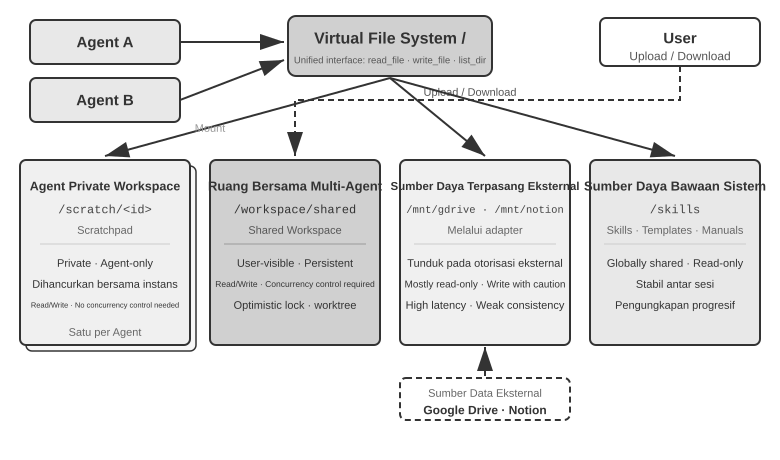
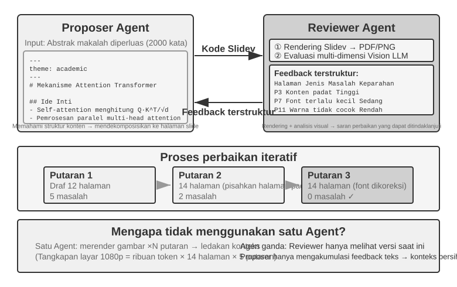
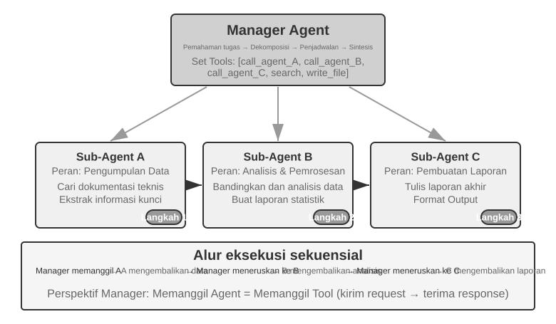
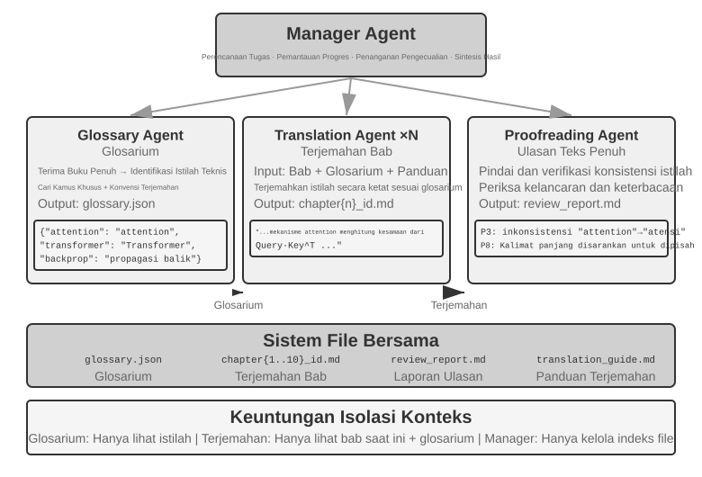
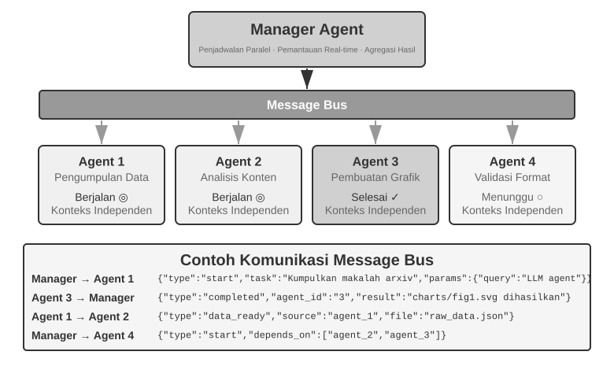
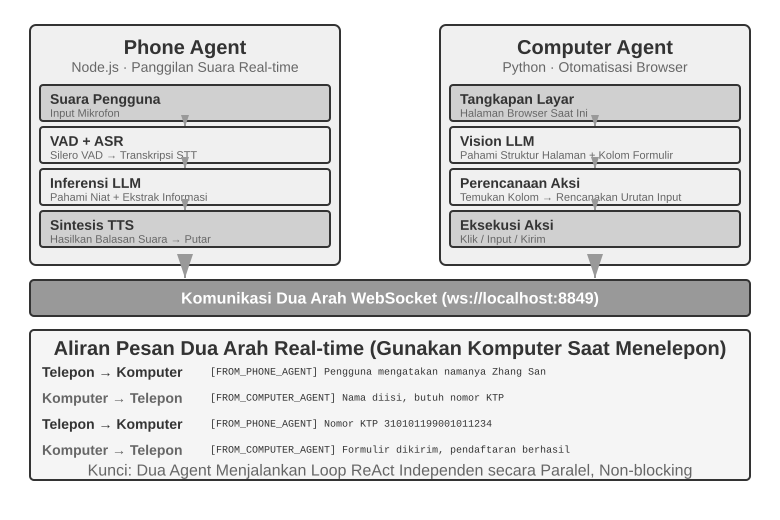
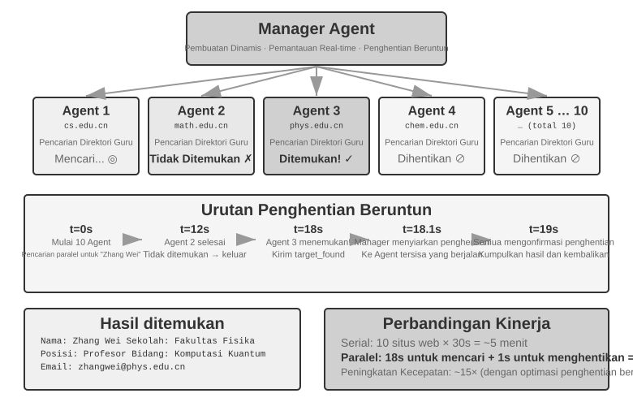
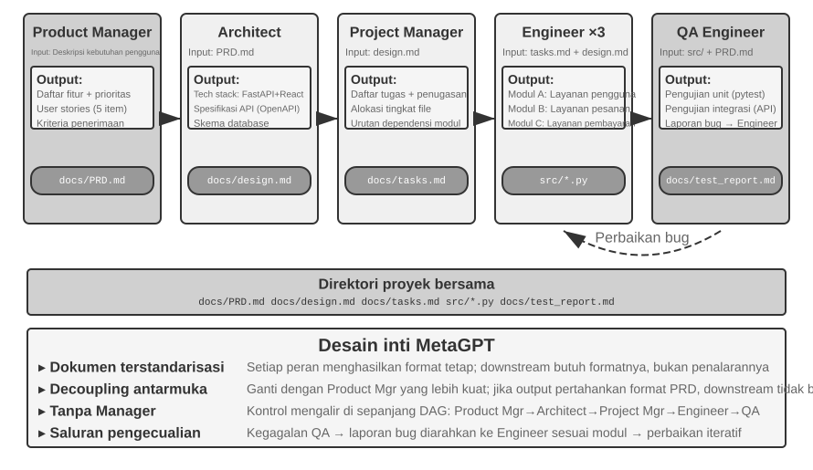
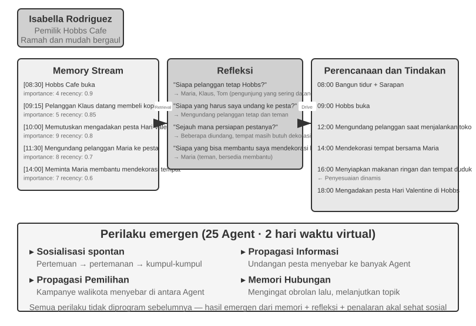
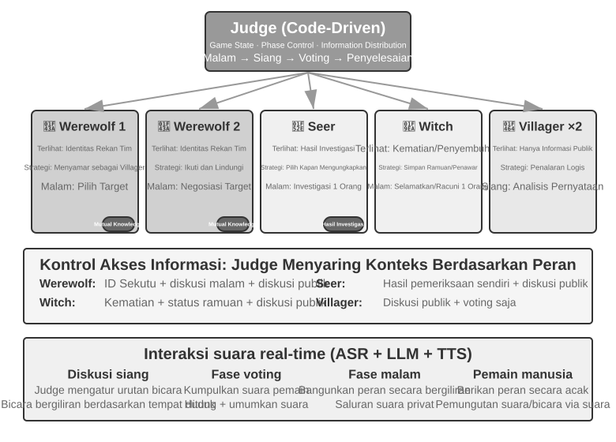

# Kolaborasi Multi-Agent

Sembilan bab pertama berfokus pada satu Agent: mula-mula membangun konteks, pengetahuan, alat, dan kemampuan interaksinya, lalu menggunakan evaluasi, post-training, dan evolusi berkelanjutan untuk membuatnya terus membaik. Bab ini mengembangkan pertanyaan dari “bagaimana membangun dan meningkatkan satu Agent?” menjadi “bagaimana mengorganisasi banyak Agent?”—agar pembagian kerja, komunikasi, dan verifikasi timbal balik dapat menangani tugas yang sulit dipikul oleh satu Agent sendirian.

OpenAI pernah mengusulkan skala lima level dari kemampuan AI: Level 1, Conversationalists; Level 2, Reasoners; Level 3, Agents; Level 4, Innovators; dan Level 5, Organizations. Kolaborasi multi-Agent sering disajikan sebagai salah satu jalan menuju Level 5. Namun di sini, "Organizations" menunjukkan tingkat kemampuan—AI yang dapat melakukan pekerjaan seluruh organisasi—daripada persyaratan arsitektur. Sebuah Agent tunggal yang cukup kuat, pada prinsipnya, dapat mencapainya juga. Namun, dalam realitas rekayasa saat ini, sebuah Agent tunggal tetap dibatasi oleh kemampuan modelnya dan context window.

Membuat banyak Agent bekerja sama jauh lebih dari sekadar membiarkan spesialis dengan keahlian berbeda "menutupi kekurangan satu sama lain." Poin yang lebih mendasar adalah ini: **kecerdasan sebuah kelompok dapat melebihi kecerdasan individu mana pun.** Peradaban manusia adalah buktinya—kecerdasan satu orang terbatas, namun melalui pembagian kerja, kolaborasi, debat, dan akumulasi pengetahuan lintas generasi, masyarakat manusia secara keseluruhan menunjukkan kecerdasan yang jauh melampaui kejeniusan tunggal mana pun. Kelompok-kelompok Agent mungkin memunculkan jenis kecerdasan kolektif yang sama: meskipun setiap Agent hanya sekompeten pakar manusia, kelompok yang terorganisir dengan baik dapat melampaui gabungan kemampuan semua pakar manusia. Dalam *From AGI to ASI*, Google DeepMind mencantumkan "kolektif multi-Agent skala besar" sebagai jalur utama menuju superintelligence (ASI)—sama seperti kecerdasan umum manusia teragregasi ke dalam masyarakat dan organisasi yang melampaui individu, kecerdasan kolektif dari banyak Agent tingkat AGI yang bekerja sama dapat menunjukkan kemampuan kognitif yang jauh melampaui sekadar jumlah sederhana dari anggota-anggotanya[^agi-asi]. Kolaborasi multi-Agent, oleh karena itu, bukan hanya sebuah solusi rekayasa (workaround) untuk batasan context window dan kemampuan model tunggal—ini mungkin merupakan jalur fundamental dari "AI tingkat pakar" menuju "melampaui umat manusia secara keseluruhan."

[^agi-asi]: Tentang "kolektif multi-Agent skala besar" sebagai jalur utama dari AGI menuju ASI, lihat Google DeepMind, *From AGI to ASI.* arXiv:2606.12683, 2026.

## Kerangka Klasifikasi untuk Kolaborasi Multi-Agent

Membangun sistem multi-Agent dimulai dengan dua dimensi desain inti, yang bersama-sama menentukan arsitektur dan implementasi dasarnya.

### Dimensi 1: Konteks Bersama vs. Konteks Terpisah

Ini adalah keputusan arsitektural yang paling mendasar, menentukan bagaimana informasi diteruskan di antara beberapa Agent.

**Shared context** berarti bahwa Agent berikutnya menerima seluruh riwayat percakapan dan trajectory (seperti yang didefinisikan pada Bab 1) dari Agent sebelumnya. Ketika system prompt dan tool set berubah di setiap tahap, sistem memperlakukan tahap baru tersebut sebagai Agent yang berbeda karena identitas, tanggung jawab, dan kemampuannya telah berubah, meskipun ia mempertahankan seluruh memory dari pendahulunya. Misalnya, setelah seorang analis kebutuhan (requirements analyst) menulis dokumen kebutuhan, seorang developer tidak hanya menerima dokumen tersebut tetapi juga catatan lengkap komunikasi antara analis dan pengguna. Developer mengambil peran baru sembari mempertahankan seluruh konteks sebelumnya. Keuntungannya adalah tidak ada informasi yang hilang; setiap Agent dapat meninjau detail dari tahap sebelumnya. Tantangannya adalah konteks tersebut dapat meluas dengan cepat.

**Non-shared context** berarti bahwa setiap Agent mempertahankan konteks dan riwayat percakapan yang independen serta tidak dapat secara langsung mengakses jejak pekerjaan Agent lain. Hal ini seperti kolaborasi antara departemen yang berbeda: setiap orang bekerja secara mandiri di mejanya masing-masing, bertukar informasi melalui dokumen yang dibagikan dan notulensi rapat daripada terus-menerus melihat layar satu sama lain. Model ini menawarkan modularitas dan isolasi yang lebih baik; setiap Agent hanya perlu fokus pada informasi yang relevan dengan tanggung jawabnya sendiri. Sistem ini juga lebih mudah untuk diperluas dan dipelihara—menambahkan Agent baru tidak memerlukan modifikasi logika internal dari Agent yang sudah ada, melainkan hanya mendefinisikan antarmuka dan format data.

Karena para Agent tidak berbagi konteks, informasi harus diteruskan melalui mekanisme komunikasi eksplisit. Sistem terdistribusi klasik telah lama menyelesaikan pertanyaan ini: buku teks sistem operasi memberi tahu kita bahwa inter-process communication (IPC) pada akhirnya hanya hadir dalam dua paradigma—**shared memory** (satu pihak menulis dan pihak lain membaca blok penyimpanan yang sama) dan **message passing** (data secara eksplisit dikirim ke pihak lain). Mekanisme komunikasi antar Agent termasuk dalam dua paradigma yang sama ini. Terdapat tiga metode umum:

- **Tool call parameters**: Agent hilir dibungkus sebagai sebuah tool, lalu Agent hulu meneruskan data terstruktur melalui parameternya; cocok untuk skenario yang membutuhkan data yang well-typed dan terstruktur secara jelas.
- **Shared file system**: Para Agent bertukar informasi dengan membaca dan menulis artefak perantara (dokumen, kode, dll.) di direktori bersama, cocok untuk skenario dengan artefak besar atau di mana persistensi diperlukan.
- **Message bus**: Sebuah perantara khusus yang meneruskan pesan di antara para Agent. Agent tidak memanggil satu sama lain secara langsung tetapi mengirim pesan ke bus, yang kemudian meneruskannya ke Agent target.

Dipetakan ke dalam dua paradigma IPC, shared file system sesuai dengan "shared memory," sementara tool call parameters dan message bus adalah bentuk dari "message passing." Tool parameters dikirimkan secara sinkron dengan pemanggilan (call); pesan di message bus dikirimkan secara asinkron melalui sebuah perantara. Setiap paradigma memiliki trade-off masing-masing. Go memiliki pepatah yang banyak dikutip: "Jangan berkomunikasi dengan berbagi memori; sebaliknya, berbagilah memori dengan berkomunikasi."


### Dimensi 2: Topologi Kolaborasi (Collaboration Topology)

Dimensi kedua adalah topologi kolaborasi—melalui struktur apa kendali dan informasi mengalir di antara para Agent. Ada tiga topologi yang khas:

- **Peer Collaboration Pattern**: Sejumlah kecil Agent (biasanya 2-3) berinteraksi secara setara, membentuk putaran peningkatan iteratif—seperti menulis sebuah makalah di mana satu orang menyusun drafnya dan yang lain memberi anotasi serta merevisinya, di mana kualitas setelah beberapa putaran jauh melebihi apa yang dapat dicapai oleh satu orang saja.
- **Manager Pattern** (Orchestration Pattern): Sebuah Manager Agent terpusat bertanggung jawab atas perencanaan tugas dan penjadwalan, sementara beberapa sub-agent masing-masing menangani subtask tertentu—seperti seorang manajer proyek yang memimpin beberapa insinyur spesialis dalam sebuah proyek.
- **Decentralized Pattern**: Tidak ada pengontrol pusat saat runtime; para Agent berkomunikasi satu sama lain seperti manusia untuk berkolaborasi pada berbagai tugas.

> **Terminologi: Graph Engineering.** Istilah "Graph Engineering," yang populer pada bulan Juli 2026, secara umum dalam konteks Agent saat ini merujuk pada perancangan execution graph secara eksplisit: simpul-simpul (nodes) adalah Agent, program biasa, atau keputusan manusia; sisi-sisi (edges) mendefinisikan dependensi tugas, perutean bersyarat (conditional routing), dan jalur kegagalan (failure paths); serta status terstruktur (structured state) yang mengalir di antara node. "Collaboration topology" yang dibahas dalam bab ini merupakan subkumpulan multi-Agent dari gagasan tersebut—peer collaboration, manager orchestration, dan decentralized handoffs adalah graph topologies yang berbeda. Karena nama ini masih baru dan mudah tertukar dengan knowledge graphs, GraphRAG, dan execution traces, buku ini terus menggunakan istilah yang lebih stabil, yaitu "collaboration topology" dan "orchestration" sebagai kosakata utamanya.

Desain terperinci dan skenario yang berlaku untuk setiap pattern akan dibahas di subbab khusus di kemudian hari.

## Kapan Multi-Agent Benar-Benar Lebih Baik Daripada Agent Tunggal?

Sebelum menyelami arsitektur kolaborasi tertentu, mari kita jawab pertanyaan yang lebih mendasar: **Kapan beberapa Agent benar-benar dibutuhkan, dan kapan satu sudah cukup?** Jawabannya akan berfungsi sebagai titik acuan untuk setiap pendekatan rekayasa yang mengikutinya. Serangkaian penelitian terbaru mengarah pada sebuah kerangka kerja yang jelas—dan kriteria intinya adalah satu pertanyaan: **Apakah kolaborasi tersebut memberikan informasi yang tidak dapat diperoleh oleh Agent tunggal saat menghasilkan jawabannya?**

Tabel 10-1 menunjukkan mode kolaborasi mana yang memperkenalkan informasi baru dan membantu menilai apakah kolaborasi multi-Agent menawarkan nilai substantif dibandingkan dengan sebuah Agent tunggal.

Tabel 10-1 Perbandingan Perolehan Informasi dari Mode Kolaborasi Multi-Agent

| Mode Kolaborasi | Memperkenalkan Informasi Baru? | Efek |
|---------------------------------------|---------------------|-----------------------------------|
| Tinjauan mandiri (self-review) oleh model yang sama (membaca ulang output-nya sendiri) | Tidak | Biasanya tidak efektif atau bahkan berbahaya |
| Agent berbeda yang mendebat teks yang sama | Tidak | Sebanding dengan Agent tunggal dengan jumlah komputasi (compute) yang sama |
| Peninjau menggunakan hasil eksekusi pengujian untuk meninjau kode | Ya (execution feedback) | Peningkatan yang signifikan |
| Peninjau menggunakan tangkapan layar yang dirender untuk meninjau kode frontend/PPT | Ya (visual feedback) | Peningkatan yang signifikan |
| Peninjau menggunakan external tools untuk memverifikasi fakta | Ya (tool feedback) | Peningkatan yang signifikan |

Makalah RLEF (Reinforcement Learning from Execution Feedback) tahun 2025[^rlef-2025] menemukan bahwa melatih sebuah model melalui reinforcement learning untuk menggunakan umpan balik eksekusi kode untuk peningkatan iteratif memberikan hasil yang secara signifikan mengungguli pengambilan sampel model secara independen beberapa kali. Kuncinya adalah bahwa setiap iterasi memperkenalkan **hasil eksekusi yang nyata** (kesalahan kompilasi, kegagalan pengujian, pengecualian runtime)—informasi yang tidak ada pada saat model tersebut menulis kode. Untuk tugas-tugas pembuatan halaman web, studi WebGen-Agent tahun 2025[^webgen-agent-2025] melaporkan bahwa umpan balik visual bertingkat (multi-level visual feedback), yang menggabungkan tangkapan layar dengan deskripsi vision-language-model, meningkatkan tolok ukur kinerja Claude 3.5 Sonnet dari 26.4% menjadi 51.9%, hampir menggandakannya.

[^rlef-2025]: Gehring, J., et al. *RLEF: Grounding Code LLMs in Execution Feedback with Reinforcement Learning.* arXiv:2410.02089, 2025.
[^webgen-agent-2025]: Lu, Z., et al. *WebGen-Agent: Enhancing Interactive Website Generation with Multi-Level Feedback and Step-Level Reinforcement Learning.* arXiv:2509.22644, 2025.

Kerangka kerja ini membantu menyelesaikan sebuah kontradiksi yang terlihat: beberapa studi akademis menemukan bahwa sebuah Agent tunggal sudah cukup, sedangkan sistem multi-Agent sering kali berkinerja lebih baik dalam praktik rekayasa. Studi-studi tersebut sering kali menguji beberapa Agent yang memeriksa dan mendiskusikan teks yang sama, seperti halnya dalam perdebatan, sedangkan sistem rekayasa yang efektif pada umumnya menambahkan umpan balik eksternal dari eksekusi kode, perenderan visual, atau alat. Hanya yang terakhir inilah yang memperkenalkan informasi baru. Hampir semua penggunaan efektif dari ketiga arsitektur yang dibahas nanti—peer collaboration, orchestration, dan decentralization—dapat dipahami melalui kriteria ini.

Eksperimen Anthropic tahun 2026 tentang pencarian kerentanan memberikan satu contoh. Empat puluh lima Agent mengoordinasikan pencarian melalui forum bersama, saling meninjau temuan, lalu menyerahkan keputusan akhir kepada Agent arbiter yang independen. Kelompok Agent terkoordinasi menemukan 266 kerentanan dengan 27 juta token, sedangkan pendekatan paralel dengan Agent independen hanya menemukan 21 dengan 6,5 juta token. Dalam ruang pencarian terbuka, komunikasi memungkinkan sistem multi-Agent memindahkan fokus secara dinamis dan membentuk spesialisasi, dengan menukar anggaran token yang lebih besar demi cakupan yang lebih luas dan jalur penemuan yang lebih beragam.[^anthropic-multiagent-2026]

[^anthropic-multiagent-2026]: Anthropic Frontier Red Team, “Patterns and Problems in Emerging Multiagent Systems,” 2026-08-13. https://www.anthropic.com/research/multiagent-systems

**Step Budget dan Kinerja Agent.** Pertanyaan terkait adalah bagaimana step budget (anggaran langkah) dari suatu Agent—yaitu jumlah pemanggilan tool (tool calls) atau putaran iterasi yang dapat digunakannya—memengaruhi kinerjanya. Lebih banyak step mungkin tampak pasti akan membantu: dengan 30 langkah, sebuah Agent mungkin hanya punya waktu untuk mengimplementasikan fungsionalitas inti, sedangkan 300 langkah memungkinkannya untuk merencanakan, mengimplementasikan, menguji, dan menyempurnakan. Namun, makalah Google tahun 2025 yang berjudul *Budget-Aware Tool-Use Enables Effective Agent Scaling* mencapai kesimpulan yang berlawanan dengan intuisi (counterintuitive): **sekadar memberikan sebuah Agent lebih banyak langkah tidak menjamin kinerja yang lebih baik.** Agent standar tidak memiliki "budget awareness"; bahkan dengan 300 langkah, mereka cenderung melakukan pencarian yang dangkal dan dengan cepat mencapai titik stagnan (plateau). Untuk menggunakan langkah tambahan secara efektif, para Agent memerlukan mekanisme yang mengadaptasi strategi mereka terhadap sumber daya yang tersisa, mengeksplorasi secara luas pada awalnya dan mempersempit fokus mereka di akhir. Pendekatan BAVT (Budget-Aware Value Tree Search) tahun 2026 selanjutnya memperkenalkan evaluasi nilai tingkat langkah (step-level value evaluation), menyesuaikan keseimbangan antara eksplorasi (exploration) dan eksploitasi (exploitation) menurut proporsi anggaran yang tersisa. Seiring dengan berkurangnya anggaran, Agent beralih dari eksplorasi luas menuju investigasi yang lebih mendalam.

Temuan-temuan ini memiliki implikasi langsung terhadap perancangan sistem multi-Agent. Sebagai contoh, dalam manager pattern (orchestration), Manager Agent tidak boleh sekadar mendistribusikan tugas-tugas ke sub-agent dan menunggu hasilnya. Alih-alih, ia harus **mengalokasikan step budgets secara dinamis** berdasarkan kompleksitas tugas—subtask sederhana mendapatkan langkah lebih sedikit; subtask kompleks mendapatkan langkah yang melimpah. Ia juga harus memandu sub-agent untuk menggunakan anggaran-anggaran ini dengan bijak (rencana dulu, baru terapkan, lalu uji, kemudian perbaiki), alih-alih langsung menyelam ke dalamnya.

Satu pertimbangan lagi harus ada sebelum keputusan desain apa pun: **biaya (cost).** Eksplorasi paralel dan penyempurnaan iteratif menghabiskan biaya—Anthropic telah mengungkapkan bahwa sistem penelitian multi-Agent mereka mengonsumsi sekitar 15 kali lipat token dari percakapan normal, dan bahwa penggunaan token itu sendiri menjelaskan sekitar 80% dari perbedaan kinerja. Perolehan (gains) dari sebuah sistem multi-Agent dengan demikian harus cukup besar untuk membenarkan biaya yang bisa beberapa kali lipat, atau bahkan satu orde magnitudo, lebih tinggi; jika tidak, Agent tunggal yang diatur dengan baik biasanya merupakan tawaran yang lebih baik.

## Kolaborasi Multi-Agent dengan Shared Context

Dalam kolaborasi dengan shared context, setiap tahap adalah Agent mandiri dengan system prompt dan tool sendiri, tetapi mewarisi seluruh trajectory tahap sebelumnya. Keunggulan utamanya adalah tidak ada informasi yang hilang; tantangannya adalah menjaga Agent saat ini tetap fokus meski riwayat terus membesar.

Pada tugas kompleks, peran dan tanggung jawab dapat berubah tajam antar-tahap. Satu prompt statis akan terlalu umum atau terlalu panjang, sehingga system prompt dan tool dapat diganti sesuai tahap.

Pilihan arsitektur utamanya adalah mengganti system prompt atau memuat Skill. Keduanya mengubah aturan perilaku, tetapi biaya dan batasannya berbeda.

| Pilihan | Pembawa aturan peran | Visibilitas tool | Dampak konteks/KV Cache | Kekuatan pembatasan |
|---|---|---|---|---|
| `transfer_to_agent` | Mengganti system prompt dan biasanya tool set | Hanya tool peran saat ini | Setiap perpindahan mengubah prefix dan biasanya membatalkan cache sejak titik perubahan | Kuat: tool di luar peran dapat dihilangkan dari schema |
| Skill | Direktori Skill tetap; `SKILL.md` ditambahkan ke trajectory saat diperlukan | Biasanya seluruh katalog atau pintu pencarian yang stabil | Prefix statis tetap; Skill ditambahkan di akhir trajectory | Lemah: Skill adalah instruksi; izin keras memerlukan gerbang Harness |

Gunakan Skill bila perbedaannya terutama pengetahuan, prosedur, atau gaya penulisan. Bila menyangkut izin, isolasi tool, kepatuhan, atau larangan efek samping, gunakan Agent terpisah atau `transfer_to_agent` dengan aturan tool yang dipaksakan lewat kode pada Harness.

> **Eksperimen 10-1 ★★: Pergantian peran dalam shared context — system prompt versus Skill**
>
> **Tugas dan variabel bersama**: kedua jalur memakai model, tugas, implementasi tool, aturan peran, dan seluruh trajectory yang sama. Tugasnya mencari penjualan kendaraan energi baru Tiongkok pada 2021–2023, menghitung CAGR, dan menulis ringkasan investor berbahasa Mandarin maksimal 120 karakter.
>
> **Jalur 1: pergantian system prompt**. Lima perannya adalah `triage`, `research`, `coding`, `data_analysis`, dan `writing`. Setiap peran hanya melihat tool khususnya dan `transfer_to_agent`; saat handoff, riwayat disimpan, prompt dan tool peran tujuan dimuat, lalu eksekusi dilanjutkan.
>
> **Jalur 2: Skill**. System prompt dan katalog tool lengkap tetap sepanjang sesi. Model memanggil `load_skill(name)`, lalu `SKILL.md` masuk ke trajectory sebagai hasil tool. Prefix tetap stabil, sedangkan izin keras ditegakkan oleh aturan Harness.

## Kolaborasi Multi-Agent Tanpa Shared Context

Dalam arsitektur tanpa shared context, setiap Agent beroperasi sebagai entitas independen dengan context, trajectory, dan state miliknya sendiri. Agent tidak dapat secara langsung mengakses internal context satu sama lain; kolaborasi bergantung sepenuhnya pada transfer data yang eksplisit dan terstruktur melalui tiga mekanisme komunikasi yang diperkenalkan di awal bab ini: parameter tool call, shared file system, dan message bus.

Sebelumnya di bab ini, kita membandingkan mekanisme komunikasi dengan bentuk inter-process communication dan shared vs. isolated context dengan thread vs. process. Analogi ini dapat diperluas lebih jauh (Tabel 10-2):

Tabel 10-2 Korespondensi Antara Multi-Agent System dan Operating System

| Operating System | Multi-Agent System |
|----------|----------------|
| Program (executable file) | Static prefix (System Prompt + definisi tool) |
| Process memory | Trajectory |
| CPU | LLM |
| Kernel | Agent runtime |
| System call | Tool call |
| fork (create child process) | spawn_subagent |
| kill (send signal) | cancel_subagent |
| ps (list processes) | list_agents |
| Exit code and wait() | Ringkasan terstruktur yang dikembalikan oleh sub-agent |
| Shared memory / message passing | Shared file system / message passing |


Abstraksi ini bukanlah hal baru: private state, pesan asinkron, dan kemampuan untuk membuat anggota baru merupakan pengaturan dasar yang persis sama dengan Actor model dari tahun 1970-an[^actor-model]. Oleh karena itu, multi-agent system dapat dilihat sebagai versi berbasis LLM dari Actor model, dan sebagian besar pengetahuan yang terkumpul dari operating system dan sistem terdistribusi berlaku secara langsung.

[^actor-model]: Hewitt, C., Bishop, P., Steiger, R. *A Universal Modular ACTOR Formalism for Artificial Intelligence.* IJCAI 1973.

Isolasi ala process ini membawa beberapa manfaat praktis dalam rekayasa (engineering): setiap Agent dapat dikembangkan dan diuji secara independen, kemampuan baru dapat ditambahkan tanpa menyentuh kode yang ada, Agent yang gagal tidak secara otomatis menyebarkan kesalahannya ke yang lain, dan banyak Agent dapat dieksekusi secara konkuren tanpa adanya contention atas shared context.

Namun, tidak membagikan context juga memiliki biaya. Yang paling jelas adalah masalah sinkronisasi informasi: bagaimana Agent mempertahankan pemahaman yang konsisten tentang task state? Akankah informasi hilang atau terduplikasi selama transfer? Debugging juga menjadi lebih sulit—ketika masalah muncul, log dari berbagai Agent harus ditinjau untuk merangkai keseluruhan proses eksekusi. Masalah-masalah ini membuat desain spesifikasi antarmuka, format data, dan protokol komunikasi menjadi sangat penting.

Kolaborasi eksplisit tanpa shared context bergantung pada dua infrastruktur yang independen dari topologi. Yang pertama adalah **shared file system**, medium persisten di mana Agent saling bertukar artifact satu sama lain dan dengan pengguna, membentuk data plane dari kolaborasi. Yang kedua adalah **mekanisme komunikasi dan kontrol**, yang mendukung message passing, status query, terminasi eksekusi, dan penjadwalan sumber daya antar Agent, membentuk control plane dari kolaborasi. Ketiga topologi di bawah ini semuanya dibangun di atas dua fondasi tersebut.

### File System dari Perspektif Agent

Di awal bab ini, "shared file system" dicantumkan sebagai salah satu dari tiga mekanisme komunikasi untuk arsitektur tanpa shared context. Dalam sistem nyata, file system yang diakses oleh Agent bukanlah sistem penyimpanan tunggal melainkan **virtual file system** di mana sistem penyimpanan dengan sumber, lifecycle, dan permission yang berbeda di-mount di bawah satu directory tree. Agent mengaksesnya melalui antarmuka `read_file`/`write_file`/`list_dir` yang terpadu, sementara lapisan dasarnya (underlying layers) dapat berupa disk lokal sementara, object storage yang persisten, API cloud drive pihak ketiga, atau paket sumber daya sistem read-only. Mendefinisikan secara jelas komposisi dari directory tree ini—visibilitas dan lifecycle dari setiap area—merupakan prasyarat untuk merancang kolaborasi multi-agent: sebagian besar dari concurrency conflict dan kebocoran informasi berasal dari pencampuran area-area yang seharusnya diisolasi. Directory tree ini sama dengan address space Agent, dan keempat tipe area tersebut adalah segmen memori dengan permission yang berbeda: beberapa bersifat private dan writable, beberapa dibagikan di antara berbagai pihak, dan beberapa bersifat read-only. Filosofi perlindungan operating system berlaku juga di sini: isolate by default dan deklarasikan sharing secara eksplisit. Dalam multi-agent system yang matang, file system biasanya terdiri dari empat tipe area berikut:

Pada sistem multi-Agent yang matang, sistem berkasnya biasanya tersusun dari empat jenis area berikut:

**I. Agent-Specific Workspace (Scratchpad)**. Sebuah direktori private yang eksklusif untuk setiap instance Agent, menyimpan artifact sementara, file temporer, draf, dan log debug. Lifecycle-nya terikat pada instance tersebut dan tidak terlihat oleh Agent lain maupun pengguna. Mengisolasi scratchpad melayani dua tujuan: mencegah file sementara dari beberapa Agent saling menimpa, dan menjaga context main Agent tetap ramping—proses trial-and-error dari sub-agent tetap berada di workspace mereka sendiri, dengan hanya artifact akhir yang dikirimkan ke ruang bersama. Ini adalah padanan di tingkat penyimpanan untuk prinsip Bab 4 bahwa sub-agent mengembalikan ringkasan terstruktur dan bukan trajectory lengkap.

**II. Multi-Agent Shared Workspace**. Sebuah area kolaborasi yang dapat dibaca dan ditulis oleh berbagai Agent, dan yang **terlihat oleh pengguna**. Ini adalah medium utama untuk bertukar artifact antar Agent dalam arsitektur tanpa shared context: Glossary Agent menulis daftar istilah, dan Translation Agent membacanya; pengguna juga dapat mengunggah file sumber dan mengunduh hasil akhir di sini. Lifecycle-nya terikat pada keseluruhan tugas dan membutuhkan persistensi. Sebagai area untuk pembacaan dan penulisan konkuren oleh berbagai pihak, ini adalah titik panas untuk concurrency conflict—mekanisme seperti optimistic locking dan isolasi worktree beroperasi di sini, seperti yang dirinci di bawah "Failure Mode One" nanti dalam bab ini. Penggunaan volume mount di `/workspace/shared` pada Bab 4 untuk menghubungkan main Agent, virtual computer, dan virtual phone merupakan implementasi tipikal dari lapisan ini.

**III. Mounted External Resources.** Sumber informasi pihak ketiga yang diotorisasi oleh pengguna—Google Drive, Notion, Dropbox, wiki perusahaan, dll.—dipetakan ke titik mount dalam file system (misalnya, `/mnt/gdrive`) melalui adaptor. Agent mengakses dokumen Notion dengan membaca sebuah file; adaptor yang mendasarinya akan memanggil API yang bersesuaian. Tiga karakteristik yang membedakan lapisan ini dari penyimpanan lokal dan harus ditangani secara eksplisit selama perancangan: **akses dibatasi oleh permission eksternal** (permission pengguna di sistem sumber menentukan visibilitas Agent), **latensi lebih tinggi dan konsistensi lebih lemah** (setiap operasi baca melibatkan perjalanan bolak-balik jaringan, dan perubahan eksternal mungkin tidak segera terlihat, jadi data tersebut harus diperlakukan sebagai eventually consistent), dan **akses utamanya bersifat on-demand dan read-only** (menulis kembali ke sumber eksternal harus dilakukan dengan hati-hati, karena penulisan yang salah dapat mencemari data asli pengguna). Antarmuka file yang terpadu berarti Agent tidak memerlukan custom tool untuk setiap sumber data, namun hal ini juga menutupi perbedaan kinerja dan keamanan tersebut. Oleh karena itu, status read-only/writable, timeout, dan batas-batas kredensial harus dikelola secara eksplisit di tingkat mount.

**IV. Built-in System Resources.** Sebuah paket sumber daya yang telah diinstal sebelumnya oleh sistem dan dibagikan secara read-only kepada semua Agent. Contoh umumnya adalah **Skills** yang diperkenalkan pada Bab 2 dan 4—dokumen pengetahuan dan skrip yang diorganisasikan sebagai file, di-mount di path seperti `/skills`, diakses melalui progressive disclosure (indeks terlebih dahulu, lalu di-expand sesuai permintaan). Contoh lainnya termasuk panduan referensi, pustaka template, dan definisi tool yang dibagikan. Lapisan ini dibagikan secara global, bersifat read-only, stabil di seluruh sesi, dan dapat dibaca secara konkuren oleh semua Agent tanpa concurrency control.

Gambar 10-2 mengilustrasikan bagaimana keempat tipe area ini secara seragam di-mount di bawah satu directory tree tunggal: Agent mengakses keseluruhan pohon melalui antarmuka yang terpadu, pengguna mengunggah dan mengunduh file dari ruang bersama, sumber data eksternal di-mount melalui adaptor, dan sumber daya sistem bawaan disediakan secara read-only.



Tabel 10-3 membandingkan keempat tipe area ini di empat dimensi—visibilitas, lifecycle, permission baca/tulis, dan concurrency control—yang berfungsi sebagai daftar periksa untuk desain tata letak file system.

Tabel 10-3 Empat tipe area dari Agent Virtual File System

| Area | Visibility | Lifecycle | Read/Write | Concurrency Control |
|--------------|-----------------|------------------------|---------------------|-------------------|
| Agent-Specific Workspace | Hanya Agent pemiliknya | Dihancurkan bersama dengan instance Agent | Read/Write | Tidak diperlukan (private) |
| Multi-Agent Shared Workspace | Semua Agent yang berkolaborasi dan pengguna | Persisten selama durasi tugas | Read/Write | Diperlukan (optimistic lock / worktree) |
| Mounted External Resources | Bergantung pada otorisasi eksternal | Ditentukan oleh sumber eksternal | Sebagian besar read-only, penulisan butuh kehati-hatian | Dikelola oleh sumber eksternal |
| Built-in System Resources | Semua Agent | Stabil di berbagai sesi | Read-only | Tidak diperlukan (read-only) |

Nilai dari **"file path sebagai antarmuka universal"** terletak pada perlakuan path sebagai unit pertukaran. Baik ketika Agent saling bertukar artifact, main Agent menyerahkan input ke sub-agent, atau organisasi berkolaborasi melalui A2A, mereka mengoper string path yang ringan daripada memuat konten file tersebut ke dalam context window (Bab 4). Hal ini sejalan dengan konsep pada Bab 5 tentang "file system sebagai hub Agent," yang menjelaskan bagaimana satu Agent tunggal menggunakan file system untuk menampung memori dan kemampuan. Di sini, abstraksi yang sama meluas ke banyak Agent: sebuah virtual directory tree yang me-mount penyimpanan private, shared, eksternal, dan bawaan menyediakan fondasi penyimpanan untuk kolaborasi multi-agent.

### Komunikasi dan Kontrol Antar Agent

Sementara file system menyelesaikan masalah **pertukaran artifact** antar Agent, kolaborasi juga membutuhkan **control plane**. Di sinilah baris lifecycle pada Tabel 10-2 berperan: primitif tool yang diberikan pada Bab 4—membuat (`spawn_subagent`), mengirim pesan (`send_message_to_subagent`), membatalkan (`cancel_subagent`), dan menemukan (`list_agents`)—berkorespondensi dengan fork, message, kill, dan ps di dunia process. Bagian ini tidak mengulangi definisi antarmuka tersebut melainkan berfokus pada empat kemampuan yang sering terabaikan yang esensial untuk kolaborasi multi-agent.

**I. Message Passing.** Bentuk yang paling sederhana adalah point-to-point: Agent A secara langsung memanggil `send_message_to_agent_b(content)`. Hal ini cocok untuk skenario dengan topologi tetap dan jumlah Agent yang sedikit (misalnya, pengaturan dual-agent telepon + komputer pada Eksperimen 10-3 di bab ini). Ketika jumlah Agent meningkat dan asynchronous parallelism diperlukan, jumlah koneksi point-to-point tumbuh secara kuadratik dengan jumlah Agent, dan baik pengirim maupun penerima harus online secara bersamaan. Dalam kasus seperti itu, sebuah **message bus** harus digunakan (dirinci lebih lanjut di bab ini di bawah "Parallel Coordination Pattern"): Agent memublikasikan pesan ke bus, yang meneruskannya berdasarkan langganan, sehingga pengirim tidak perlu mengetahui siapa saja pelanggannya. Baik secara point-to-point maupun melalui bus, pesan pada umumnya harus membawa **envelope** yang terstruktur: ID pengirim, target (Agent spesifik atau broadcast), tipe pesan (misalnya, `task_assigned`/`status_update`/`result`/`terminate`), dan sebuah JSON payload. Format envelope yang terpadu memastikan perutean dan parsing yang andal oleh penerima serta membuat rantai kolaborasi dapat dilacak—sebuah aspek kunci dari debugging multi-agent system.

**II. Status Query.** Ini adalah bagian dari control plane yang paling sering diremehkan. Setelah sebuah main Agent mengirimkan sebuah sub-agent, ia membutuhkan visibilitas ke dalam kemajuan sub-agent tersebut; jika tidak, ia tidak dapat memutuskan apakah harus terus menunggu atau melakukan intervensi ketika sub-agent mengalami kebuntuan. Pendekatan yang intuitif adalah dengan meminjam dari RPC dan mendefinisikan antarmuka query `get_subagent_status(agent_id)` yang mengembalikan "running/completed/failed" plus persentase kemajuan. Namun, antarmuka pull semacam itu ternyata jauh kurang berguna dari yang diharapkan: sub-agent mulai mengeksekusi pada saat ia dibuat dan berjalan hingga selesai atau gagal. Ia tidak melewati serangkaian queued states seperti halnya job dalam batch system tradisional, sama seperti pemrograman Unix jarang perlu melakukan polling terhadap proses lain menggunakan PID-nya untuk mengetahui status yang berjalan. Polling juga membawa dilema bawaan: polling terlalu sering dan Anda akan membuang-buang token; polling terlalu jarang dan Anda akan merespons terlambat. Cara yang lebih alami untuk mendapatkan status adalah kembali ke dua paradigma komunikasi yang diperkenalkan di awal bab ini.

**Mendapatkan status melalui message passing.** Main Agent cukup mengirimkan pesan ke sub-agent: "Bagaimana perkembangannya?" Sub-agent membalas pada saat yang tepat. Semuanya bersifat asinkron: mengirim pesan tidak memblokir eksekusi main Agent itu sendiri, dan kapan—atau apakah—pihak lain membalas adalah masalah terpisah, sama halnya seperti seorang manajer meminta kemajuan dari bawahannya melalui pesan instan tanpa mengharuskan mereka untuk melepaskan semua pekerjaannya saat itu juga. Sebaliknya, sub-agent juga dapat secara proaktif mengirim pesan untuk melaporkan saat ia mencapai sebuah pencapaian (milestone); jika sistem telah memiliki message bus, ini hanyalah memublikasikan sebuah `status_update` ke bus ("real-time monitoring" dari Eksperimen 10-4 berada dalam bentuk ini). Terlepas dari apakah status diminta secara eksplisit atau dilaporkan secara proaktif, status yang dibawa di dalam pesan tersebut harus mengadopsi kosakata state-machine yang seragam (executing, needs input, completed, failed)—protokol A2A di bagian selanjutnya dalam bab ini menstandarkan lifecycle tugas ke dalam himpunan state yang tepat seperti ini.

**Mendapatkan status melalui shared file system.** Bentuk yang paling menyeluruh adalah **trajectory persistence**: seiring berjalannya waktu, sub-agent menserialisasikan setiap event trajectory ke dalam JSON dan menambahkan hal tersebut ke sebuah log file di file system—biasanya satu file per sesi, satu event per baris, yaitu JSONL. Trajectory, yang didefinisikan pada Bab 1, adalah serangkaian lengkap dari pesan pengguna, balasan model, tool call, dan hasil. Main Agent tidak membutuhkan protokol pelaporan status; dengan membaca file ini secara langsung, ia dapat memeriksa keseluruhan eksekusi sub-agent: tool apa yang sedang dipanggil, apa yang terjadi pada langkah terbarunya, dan apakah ia terjebak dalam perulangan percobaan gagal berulang kali. Dalam istilah proses, ini menyerupai pembacaan memori dari proses lain secara langsung. Hal ini tidak menempati context sub-agent, tidak bergantung pada kerja samanya, dan menawarkan granularitas observasi yang paling detail.

Detail menyeluruh seperti itu juga merupakan sebuah beban. Sebuah trajectory dapat dengan mudah mencapai puluhan ribu token, dan main Agent harus menyaringnya (distill) setelah membaca, menghabiskan baik waktu maupun token. Di sebagian besar skenario, **file progress yang disepakati** lebih praktis: saat memulai sub-agent, main Agent menginstruksikannya untuk memperbarui `progress.md` setiap kali ia menyelesaikan masing-masing item. Main Agent dapat membaca file yang ringan ini kapan saja untuk mengukur kemajuan. Ini menyerupai dua proses yang mereservasi sebuah blok kecil shared memory dengan format yang disepakati, mengekspos progres yang telah disaring daripada keseluruhan state memori.

File progress juga memungkinkan **deteksi kebuntuan (stuck detection)**. Jika waktu modifikasi terakhir dari `progress.md` atau file trajectory belum berubah selama lebih dari N menit, sistem dapat memperlakukan sub-agent tersebut sebagai tidak aktif dan memicu timeout safety net (menggemakan mekanisme Heartbeat dan `monitor_shell` dari Bab 6). Ini mencegah sub-agent yang mandek agar tidak menurunkan seluruh sistem.

Nilai dari trajectory persistence melangkah jauh melebihi sekadar pemantauan. Ingatlah kesimpulan di Bab 1: "context sebuah Agent = static prefix + trajectory." Static prefix (System Prompt, definisi tool) ditentukan oleh kode, dan Agent itu sendiri tidak memiliki runtime state selain trajectory (working artifact sudah berdiam di file system)—**trajectory adalah keseluruhan state Agent**. Menyimpan trajectory ke dalam file secara persisten dan real time ekuivalen dengan memiliki checkpoint lengkap di setiap saat: baik ketika proses Agent crash, mesin kehilangan daya, atau pengguna secara aktif menutup sesi, cukup dengan memuat ulang file trajectory dan menyisipkan static prefix di awalnya akan memungkinkan eksekusi dilanjutkan dari tempat ia terhenti—tepat seperti inilah fitur session resume dari Coding Agent seperti Claude Code dan Codex CLI diimplementasikan. Hal ini merupakan ide yang sama seperti write-ahead log (WAL) pada sebuah basis data: setiap event pertama-tama ditambahkan ke append-only log, dan state selalu dapat di-replay dari log tersebut (desain memori "fact log + periodic checkpoint" pada Bab 3 merupakan ide yang sama yang diterapkan pada sistem memori). Untuk multi-agent system, hal ini berarti sub-agent secara alamiah dapat **dipulihkan (recoverable), diaudit (auditable), dan mudah diserahterimakan (hand off)**: Manajer dapat menghidupkan kembali sebuah sub-agent dari state valid terakhirnya pasca-crash, mem-replay rentetan event pada trajectory setelahnya untuk menemukan penyebab kegagalan, dan bahkan menyerahkan trajectory tersebut beserta tugasnya ke Agent lain untuk dilanjutkan.

**III. Terminasi Eksekusi.** Dalam kolaborasi paralel, skenario yang umum terjadi adalah "satu berhasil, yang lain menjadi tidak relevan"—banyak Agent mencari secara terpisah, dan begitu salah satunya menemukan target, yang lainnya harus segera berhenti (cascading termination di Eksperimen 10-4 dalam bab ini). Ada dua level terminasi, dan pengguna Unix akan mengenalinya sebagai pembedaan antara SIGTERM dan SIGKILL. **Graceful termination** lebih disarankan: main Agent mengirimkan sinyal `terminate`, sub-agent merespons pada titik aman di langkahnya saat ini, membersihkan resource (menutup browser session, menulis file yang tertunda, melepaskan lock), mengirimkan acknowledgment (ack), dan kemudian exit. **Forced termination** adalah fallback (cadangan): langsung mengakhiri process, hanya digunakan ketika sub-agent tidak merespons graceful signal, dengan kerugian berupa potensi tertinggalnya dangling resource dan penulisan yang tidak tuntas. Dua poin engineering membutuhkan perhatian. Pertama, graceful termination mengharuskan sub-agent untuk mengecek sinyal terminasi secara berkala di dalam loop-nya (mirip dengan mekanisme interrupt di Bab 6); jika tidak, ia tidak dapat menerima sinyal tersebut. Kedua, cascading termination memiliki kondisi balapan (race condition): beberapa sub-agent mungkin saja melaporkan keberhasilan secara hampir bersamaan. Main Agent harus menggunakan lock atau desain yang idempoten (idempotent design) untuk memastikan bahwa hanya satu keberhasilan saja yang diterima dan sinyal terminasi tersebut disiarkan (broadcast) sekali saja. Lihat pembahasan tentang race condition di Eksperimen 10-4.

Satu hal yang masih menggantung: setelah main Agent berakhir, apa yang terjadi dengan sub-agent yang masih berjalan? Pendekatan engineering terbersih dipinjam dari context milik Go—terminasi mengalir turun mengikuti hubungan penciptaannya: batalkan satu Agent maka semua sub-agent yang ia hasilkan akan turut dibatalkan bersamanya, mencegah anak Agent yang menjadi yatim (orphaned child Agent) agar tidak tertinggal. "Sub-agent mengecek sinyal terminasi pada titik aman" di atas berkorelasi secara presisi dengan polling `ctx.Done()` di Go. Sebaliknya, jika Anda benar-benar membutuhkan background Agent yang berjalan lama dan terpisah dari main Agent (seperti halnya `nohup` pada Unix), biarkan ia bermula dari lifecycle tree baru (berkorelasi dengan `context.Background()`), mendeklarasikan secara eksplisit bahwa ia tidak berakhir bersama dengan parent-nya.

**IV. Manajemen dan Penjadwalan Sumber Daya (Resource Management and Scheduling).** Separuh lainnya dari pekerjaan sebuah operating system adalah mengalokasikan sumber daya yang langka. Di dunia process, sumber daya yang langka itu adalah waktu CPU dan memori; di dunia Agent, itu adalah token, uang, dan budget konkurensi (concurrency budget)—setiap langkah yang diambil oleh sebuah sub-agent akan memakan ketiganya. Tanggung jawab ini biasanya jatuh pada Manajer atau runtime: tetapkan budget untuk jumlah langkah atau token saat memulai sub-agent, dan hentikan ketika telah terlampaui; berikan tugas yang sulit kepada model yang kuat dan tugas-tugas mekanis kepada model yang murah (low-cost); batasi konkurensi sehingga puluhan Agent tidak menghabiskan kuota API sekaligus; dan ketika tugas yang lebih mendesak tiba, potong (interrupt) sub-agent yang sedang mengeksekusi—inilah preemption. Praktik di area ini masih jauh belum sematang penjadwalan CPU, namun ia menentukan batas atas pengeluaran (cost ceiling) dari sebuah multi-agent system dan semestinya sudah dipertimbangkan pada tahap desain arsitektur.

Pertukaran artifact (data plane) beserta message passing, status query, terminasi eksekusi, dan penjadwalan sumber daya (control plane) secara bersama-sama mendukung multi-agent system yang tidak berbagi (share) context. Ketiga topologi kolaborasi di bawah ini, pada dasarnya, merupakan pilihan-pilihan yang berbeda—yang dibangun di atas kedua plane tersebut—terkait siapa yang memegang kendali dan bagaimana informasi mengalir.

Berdasarkan hubungan kolaboratif dan karakteristik aliran kontrol antar Agent, kolaborasi tanpa shared context dapat dibagi ke dalam tiga arsitektur utama—peer collaboration pattern, manager pattern, dan decentralized pattern—masing-masing cocok untuk tipe tugas yang berbeda.

### Pola Kolaborasi Sejawat: Pemeriksaan Timbal Balik dan Peningkatan Iteratif

Peer collaboration biasanya melibatkan dua atau tiga Agent dengan kedudukan setara yang saling memberi umpan balik dalam beberapa putaran. Nilai potensialnya terletak pada sudut pandang independen dan keberagaman kognitif, tetapi “banyak instans” tidak otomatis berarti “banyak cara berpikir”. Jika model, konteks, dan scaffolding sangat mirip, Agent yang berbeda cenderung mengambil keputusan yang sama sehingga kesalahan lokal dapat berubah menjadi kegagalan sistemik. Keberagaman yang nyata harus dirancang dengan membedakan model, konteks, alat, bukti yang terlihat, atau tanggung jawab, serta meminta setiap Agent menilai secara independen sebelum hasilnya digabungkan.[^anthropic-multiagent-2026]

Dibandingkan dengan manager dan decentralized pattern, peer collaboration jauh lebih simpel untuk diimplementasikan—cukup mendefinisikan peran dari kedua Agent tersebut, mekanisme komunikasi, dan kondisi berhentinya iterasi, dan Anda telah memiliki sebuah sistem yang berjalan. Ia merupakan opsi ideal untuk memvalidasi ide dengan cepat dan membangun purwarupa.

#### Rekayasa Loop (Loop Engineering)

Salah satu penggunaan paling umum dari peer collaboration adalah untuk mengatasi kegagalan yang sering terjadi di dalam praktik Agent: **premature termination**—berhenti saat pekerjaan baru setengah selesai. Hal ini memiliki tiga bentuk yang tipikal; contoh-contoh di bawah ini berasal dari Coding Agent dan dari Pine AI, Agent yang diperkenalkan di bagian Pendahuluan yang melakukan panggilan telepon atas nama pengguna untuk berurusan dengan pedagang dan penyedia layanan. Yang pertama adalah **lazy fake-done**: melakukan sebagian pekerjaan dan menyatakannya selesai sepenuhnya—sebuah Coding Agent menulis kode, namun tidak pernah menjalankan tes atau mencoba deployment (penerapannya), lalu melaporkan "task complete"; seorang pengguna memberikan dua urusan ke Pine AI, dan ia menyelesaikan urusan pertama, melupakan yang kedua, dan dengan ceria melaporkan "all taken care of." Yang kedua adalah **premature give-up**: mendeklarasikan seluruh pekerjaan mustahil dilakukan setelah ada satu jalan buntu—Pine AI dapat menghubungi pihak pedagang melalui telepon, formulir web, atau email, namun setelah satu panggilan telepon ditolak, ia memberi tahu pengguna "ini tidak bisa dilakukan," padahal mengganti channel dan mencoba lagi kemungkinan besar akan membuahkan keberhasilan. Yang ketiga adalah **false success**: Agent meyakini bahwa pekerjaan telah selesai, namun perulangan (loop) pada dasarnya tidak pernah tertutup—pihak seberang secara lisan menyetujui pengembalian uang di telepon, padahal pengguna masih harus mengonfirmasi sebuah langkah di aplikasi mobile-nya; Agent melaporkan "all set", pengguna tidak pernah mengetahui bahwa ada tindakan lanjutan, dan pengembalian uang tersebut tidak pernah diterima. Ketiga bentuk ini mengerucut pada satu akar penyebab yang sama: **hingga diverifikasi, status "selesai (done)" hanyalah klaim dari model, bukan sebuah pembuktian.**

Mengubah klaim menjadi pembuktian merupakan ranah dari **Loop Engineering** secara tepat, tahap terakhir dari lengkung evolusi di Bab 1: merancang perulangan yang membuat Agent terus berjalan—temukan kepingan pekerjaan berikutnya, eksekusi, verifikasi, rekam progres—dan biarkan sebuah pihak pemverifikasi (verifier), bukan model itu sendiri, yang memutuskan apakah ia sudah benar-benar aman untuk berhenti. Peran manusia bergeser secara sepantasnya dari "sang operator yang mem-prompt Agent" menjadi "sang engineer yang merancang loop." Istilah tersebut diciptakan pada bulan Juni 2026 oleh Addy Osmani[^loop-engineering-2026]; Boris Cherny, kepala Claude Code di Anthropic, mengatakannya secara lebih lugas: "Saya tidak lagi mem-prompt Claude. Pekerjaan saya adalah menulis loop." Kesimpulan sentral yang muncul dari diskusi itu adalah bahwa **bottleneck dari loop tersebut berada di verifier, bukan pada modelnya**: dengan verifikasi yang tidak andal, perulangan yang lebih cepat hanya akan menandai luaran yang buruk sebagai suatu hasil yang komplet secara lebih dini. Dan seperti yang disampaikan pada Pendahuluan, praktiknya muncul lebih dulu, sedangkan penamaan menyusul belakangan. Jauh sebelum istilah tersebut menjadi tren, tim Agent terkemuka—Pine AI salah satunya—telah menggunakan "loop plus verification" untuk melawan premature termination. Cara paling efektif dalam mengorganisasikan verifikasi tersebut adalah paradigma Proposer-Reviewer di bawah ini.

[^loop-engineering-2026]: Osmani, Addy. "Loop Engineering: Designing Loops that Prompt Coding Agents", 2026. https://addyosmani.com/blog/loop-engineering/

**Framework konkret: LoopX.** LoopX mengeluarkan loop dari prompt model dan riwayat chat, lalu menempatkannya di control plane persisten yang netral terhadap runtime Agent: tujuan dan batas menjelaskan mengapa pekerjaan ada; gate dan todo menentukan apa yang boleh terjadi sekarang; bukti dan kuota menentukan apakah pekerjaan boleh berlanjut; dan handoff memungkinkan giliran berikutnya atau Agent lain melanjutkannya. Satu eksekusi yang diatur diringkas menjadi protokol yang jelas:

```text
LoopX memutuskan → Agent mengeksekusi → verifier independen membuktikan → LoopX melakukan commit
```

Agent tetap melakukan penalaran, menggunakan tool, dan menghasilkan artefak kandidat. LoopX tidak menggantikan runtime Agent; ia mengatur kontinuitas lintas giliran. Hanya hasil yang diverifikasi secara independen yang boleh memperbarui progres persisten dan menghabiskan kuota. Kegagalan verifikasi diarahkan ke perbaikan atau perencanaan ulang, sedangkan human gate, status menunggu, dan batas anggaran menghentikan loop sebelum eksekusi. Batas ini mengubah prinsip Loop Engineering menjadi invariant sistem yang dapat diperiksa: **model boleh mengusulkan “selesai”, tetapi tidak dapat menyetujui “selesai” versinya sendiri.** LoopX v0.4.0 masih menandai jalur Turn yang diatur sebagai eksperimental, sehingga di sini ia digunakan sebagai framework konkret untuk “loop + verifikasi + kondisi berhenti”, bukan sebagai bukti peningkatan kualitas tugas secara umum.[^loopx-framework]

[^loopx-framework]: LoopX, "The local control plane for long-running AI agent work", v0.4.0, commit stabil `a893d221db0b8e028997cefc303f7ec9fa7dbe0a`. https://github.com/huangruiteng/loopx/tree/a893d221db0b8e028997cefc303f7ec9fa7dbe0a

**Framework konkret: LongHorizon-Harness.** LongHorizon-Harness dan LoopX sama-sama implementasi konkret dari Loop Engineering, tetapi arah perhatiannya berbeda. LoopX menyasar control plane persisten untuk pekerjaan Agent jangka panjang; LongHorizon-Harness berangkat dari Computer Use multimodal dan menangani eksekusi berkelanjutan ketika satu tugas membentang melintasi GUI, CLI, beberapa aplikasi desktop, dan berkali-kali penyegaran konteks.

LongHorizon-Harness merumuskan ulang eksekusi jangka panjang sebagai pengelolaan status tugas, dan mewujudkan loop-nya sebagai Manage–Execute–Audit (MEA): Manager menghasilkan subtugas terbatas berikutnya dari tujuan awal, progres yang sudah terverifikasi, bukti kegagalan, dan pekerjaan yang tersisa; Executor mengubah lingkungan melalui GUI atau CLI dalam konteks yang sepenuhnya baru; lalu Auditor memeriksa hasil nyata secara read-only. Hanya yang lolos audit yang masuk ke status tugas putaran berikutnya, sedangkan kegagalan dipertahankan sebagai dasar pemulihan dan perencanaan ulang. Backend eksekusi seperti Claude Code dan Codex CLI digunakan kembali melalui lapisan adapter, bukan dengan menulis ulang loop Agent di dalam backend tersebut.[^longhorizon-implementation]

Nilai arah ini terletak pada pemisahan kontinuitas tugas dari riwayat eksekusi yang terus membesar: konteks boleh disegarkan dan operasi antarmuka bisa gagal, tetapi putaran berikutnya tetap melanjutkan dari status terverifikasi paling akhir. Dengan menjaga model Qwen 3.7-Plus dan backend eksekusi Claude Code tetap sama dan hanya mengubah loop terluar, makalah tersebut melaporkan PassRate WeaveBench naik dari 51.8% menjadi 80.7%, tingkat penyelesaian biner OSWorld 2.0 dari 2.8% menjadi 8.3%, dan tingkat keberhasilan Terminal-Bench 2.1 dari 69.7% menjadi 77.2%. Biayanya pun tidak tetap: dua benchmark pertama masing-masing menghabiskan 2.3 kali total token dan 3.6 kali token keluaran dibandingkan baseline, sedangkan Terminal-Bench 2.1 justru berkurang 24%. Pada deployment nyata, masih perlu menangani status lama yang tidak berlaku lagi karena perubahan lingkungan eksternal atau permintaan pengguna, serta memakai anggaran putaran, waktu, dan biaya agar loop pemulihan tidak berjalan tanpa henti.

**Jejak eksekusi publik dan reproduksi eksperimen.** Situs proyek menyediakan ratusan jejak eksekusi untuk WeaveBench, OSWorld 2.0, dan Terminal-Bench 2.1, sehingga proses eksekusi dan catatan tiap peran dapat dilihat langsung. Ambil contoh `WEB_task_16_webrtc_simulcast_layer_audit` dari WeaveBench: [jejak baseline](https://lh-harness.pages.dev/traj/tasks/baseline__WEB_task_16_webrtc_simulcast_layer_audit.html) dan [jejak MEA](https://lh-harness.pages.dev/traj/tasks/lh_harness__WEB_task_16_webrtc_simulcast_layer_audit.html) yang sama-sama memakai model Qwen 3.7-Plus dapat dibandingkan berdampingan. Yang pertama tersangkut pada interaksi Wireshark lalu mencoba berulang kali, dengan skor 0.59; yang kedua menuliskan kembali kegagalan dan butir bukti yang belum terpenuhi ke status tugas sehingga putaran berikutnya hanya menangani celahnya, dengan skor 0.92. Kasus ini dipakai untuk memperlihatkan “bagaimana kegagalan menjadi masukan putaran berikutnya”, bukan pengganti statistik agregat; lingkungan, parameter, dan skrip peluncuran eksperimen lengkap ada di direktori [`eval/`](https://github.com/AMAP-ML/LongHorizon-Harness/tree/53bc678ed4170ad4d2e4309f2bfc5c3fb6caf8cb/eval) pada versi yang dipatok.

[^longhorizon-implementation]: LongHorizon-Harness, commit stabil `53bc678ed4170ad4d2e4309f2bfc5c3fb6caf8cb`. Situs proyek dan jejak publik: https://lh-harness.pages.dev/#trajectories; makalah: https://arxiv.org/abs/2608.01964; kode: https://github.com/AMAP-ML/LongHorizon-Harness/tree/53bc678ed4170ad4d2e4309f2bfc5c3fb6caf8cb

#### Paradigma Proposer-Reviewer



Proposer-Reviewer adalah paradigma peer-collaboration kanonik. Bab 5 telah membahas prinsip-prinsip desainnya dan aplikasi praktis dalam tiga eksperimen: pembuatan PPT, pengeditan video, dan visualisasi log. Proposer Agent menghasilkan kode, sementara Reviewer Agent merender hasil eksekusi, mengevaluasi kualitasnya menggunakan vision-language model, dan memberikan saran terstruktur untuk perbaikan. Keduanya beriterasi hingga hasilnya memenuhi standar yang disyaratkan.

Paradigma ini juga berlaku untuk skenario seperti tinjauan keamanan (Proposer menghasilkan action plan, Reviewer memeriksa kepatuhan dan potensi risiko), moderasi konten (Proposer menyusun balasan, Reviewer memeriksa aturan bisnis dan norma bahasa), dan tinjauan kode (Proposer menulis kode, Reviewer memeriksa keamanan dan best practices).

**Mengapa sebuah Agent tunggal tidak bisa menghasilkan dan kemudian meninjau pekerjaannya sendiri?** Ini tepat di mana kriteria dari "Kapan Multi-Agent Benar-benar Lebih Baik Daripada Agent Tunggal?" di awal bab ini berlaku—jika tinjauan tidak memperkenalkan informasi baru, itu hanya "meminta model untuk berpikir lagi." Penelitian terkait memberikan jawaban yang jelas. Dalam makalah ICLR 2024 mereka "Large Language Models Cannot Self-Correct Reasoning Yet," Huang et al. menemukan bahwa meminta GPT-4 untuk meninjau dan mengoreksi jawabannya sendiri tanpa umpan balik eksternal justru menurunkan akurasi—model lebih sering mengubah jawaban yang benar menjadi salah daripada mengubah jawaban yang salah menjadi benar.

Invarian minimal dari loop proposer-reviewer adalah: reviewer membaca **bukti independen**, bukan sekadar mengulangi penjelasan proposer; dan ketika mengembalikan pekerjaan ia harus memberikan syarat perbaikan yang dapat dilokalisasi:

```python
candidate = proposer(task, constraints)
evidence = execute_or_render(candidate)       # tests, state, screenshot, facts
review = independent_reviewer(candidate, evidence)

while review.veto and budget_remaining:
    candidate = proposer.repair(candidate, review.findings)
    evidence = execute_or_render(candidate)
    review = independent_reviewer(candidate, evidence)

if review.pass:
    publish(candidate, evidence, review)
else:
    escalate_or_reject(review)
```

Reviewer tidak boleh mengubah pengujian, pengumpul bukti, atau gerbang rilis; kalau tidak, "verifikasi independen" merosot menjadi persetujuan diri sendiri.

Sebuah makalah survei tahun 2024 yang diterbitkan di TACL, "When Can LLMs Actually Correct Their Own Mistakes?" (arXiv:2406.01297), semakin mengkonfirmasi kesimpulan ini: kecuali umpan balik eksternal yang andal disediakan (misalnya, hasil eksekusi test case, output verifikasi dari alat eksternal), hanya mengandalkan "self-correction" model sendiri sebagian besar tidak efektif.

Makalah CRITIC di ICLR 2024 memberikan eksperimen komparatif yang intuitif. CRITIC meminta model menggunakan alat eksternal (search engine, Python interpreter) untuk memverifikasi jawabannya sendiri, yang mengarah pada peningkatan kinerja yang signifikan. Namun, ketika peneliti menghapus langkah verifikasi alat dan hanya menyimpan penilaian diri (self-assessment) model, sebagian besar peningkatan itu menghilang. Ini menunjukkan bahwa nilai dari tinjauan bukan terletak pada "meminta model untuk berpikir lagi," tetapi pada **memperkenalkan informasi baru yang tidak tersedia selama pembuatan model**—hasil pengujian, tangkapan layar yang dirender, kesalahan kompilasi, hasil pencarian eksternal.

Eksperimen Anthropic tahun 2026 tentang pengembangan aplikasi jangka panjang menerapkan gagasan ini dalam arsitektur tiga Agent: perencana, generator, dan evaluator. Perencana mengembangkan permintaan pengguna menjadi spesifikasi produk. Generator dan evaluator terlebih dahulu menyepakati kriteria selesai untuk setiap putaran; generator kemudian mengimplementasikan pekerjaan, sedangkan evaluator mengoperasikan aplikasi nyata dengan Playwright dan menyerahkan laporan cacat. Status diserahterimakan antar-Agent melalui file. Eksperimen ini menunjukkan bahwa ketika sebuah tugas melampaui kemampuan model saat ini untuk menyelesaikannya sendiri secara andal, tinjauan independen berbasis bukti eksternal dapat menukar biaya yang jauh lebih tinggi dengan kualitas pengembangan yang lebih baik.[^anthropic-harness-2026]

[^anthropic-harness-2026]: Prithvi Rajasekaran, “Harness Design for Long-Running Application Development,” Anthropic Engineering, 2026-03-24. https://www.anthropic.com/engineering/harness-design-long-running-apps

#### Pola Debat

Beberapa Agent memegang posisi yang berbeda, mengeksplorasi ruang masalah (problem space) melalui dialog adversarial. Misalnya, ketika mengevaluasi solusi teknis, Agent A berperan sebagai "pendukung," mendaftar keuntungan dan peluang solusi, sementara Agent B berperan sebagai "penentang," menunjukkan risiko dan batasan. Setiap putaran perdebatan melibatkan bantahan atau perluasan argumen pihak lain. Ketika sebuah Agent tunggal menganalisis masalah, ia sering kali mendukung satu perspektif dan mengabaikan bukti yang berlawanan (counterevidence). Perdebatan terstruktur memaksa kedua posisi dikembangkan sepenuhnya, membantu pembuat keputusan mencapai penilaian yang lebih seimbang.

Namun, efektivitas praktis dari perdebatan masih diperdebatkan di dunia akademis. Sebuah studi tahun 2026 oleh Tran dan Kiela [^single-agent-2026] membandingkan sebuah Agent tunggal dengan lima arsitektur multi-agent (sequential, debate, ensemble, parallel roles, subtask-parallel) pada tugas multi-hop reasoning. Mereka menemukan bahwa **ketika anggaran thinking-token dijaga konstan, Agent tunggal berkinerja setara atau bahkan lebih baik daripada sistem multi-agent** (kecuali pemanfaatan konteks terdegradasi ke titik tertentu). Para peneliti memberikan penjelasan berdasarkan data processing inequality dalam teori informasi: beberapa Agent dalam perdebatan memproses informasi tekstual yang persis sama, dan setiap transmisi serial dari kesimpulan perantara antara Agent hanya dapat menghilangkan informasi, bukan menciptakannya. Manfaat dari mode perdebatan di beberapa makalah akademis kemungkinan besar berasal dari beberapa Agent yang mengonsumsi lebih banyak total komputasi. Penting untuk mengklarifikasi batasan argumen ini: argumen ini menargetkan bottleneck informasi yang disebabkan oleh "transmisi serial multi-agent dari kesimpulan perantara" dan tidak menegasikan pendekatan lain, seperti **beberapa sampel independen dari masalah yang sama diikuti oleh agregasi** (misalnya, self-consistency, majority voting), atau memanfaatkan **asimetri dalam kesulitan antara pembuatan dan verifikasi** (menulis jawaban itu sulit, memverifikasinya itu mudah) untuk pembagian kerja generation-verification. Skenario ini entah memperkenalkan pengambilan sampel independen tambahan atau mengeksploitasi struktur asimetris dari tugas itu sendiri, dan tidak berada dalam cakupan data processing inequality.

[^single-agent-2026]: Tran, D., Kiela, D. *Single-Agent LLMs Outperform Multi-Agent Systems on Multi-Hop Reasoning Under Equal Thinking Token Budgets.* arXiv:2604.02460, 2026.

#### Pola Brainstorming

Beberapa Agent secara independen menghasilkan ide-ide, kemudian membagikannya satu sama lain, saling menginspirasi. Misalnya, dalam tugas inovasi produk, Agent 1 mengusulkan "menambahkan fitur social sharing," Agent 2 terinspirasi untuk menyarankan "tidak hanya berbagi ke jejaring sosial, tetapi juga menghasilkan poster sharing yang dipersonalisasi," dan Agent 3 mensintesis dua yang pertama untuk mengusulkan "template poster yang dapat disesuaikan pengguna membentuk template marketplace." Agent yang berbeda memiliki "preferensi berpikir" (thinking preferences) yang berbeda (dicapai melalui prompt atau model yang berbeda), dan dengan merangsang satu sama lain, mereka mengeksplorasi ruang solusi yang lebih luas untuk menemukan kombinasi kreatif yang akan sulit dikonsep oleh Agent tunggal.

#### Pola Panel Ahli

Beberapa Agent masing-masing mewakili perspektif dari domain profesional tertentu, bersama-sama mendiskusikan masalah interdisipliner. Misalnya, ketika mengevaluasi kelayakan produk baru, Engineer Agent menganalisis kesulitan implementasi dari sudut pandang teknis, Product Agent menilai daya tarik pasar dari perspektif user experience, dan Operations Agent menganalisis kelayakan bisnis dari perspektif biaya dan sumber daya. Agent-agent ini tidak bersifat adversarial melainkan saling melengkapi (complementary), bersama-sama menyusun gambaran utuh dari masalah dan mengidentifikasi batasan dan peluang lintas domain.

### Pola Manajer (Manager Pattern): Koordinasi Terpusat

Ketika sebuah tugas melibatkan lebih dari lima sub-tugas (subtasks), membutuhkan penjadwalan dinamis (dynamic scheduling), atau memiliki dependensi yang kompleks antar sub-tugas, peer collaboration sudah di luar kemampuannya, dan pola manajer (manager pattern) diperlukan. Pekerjaan Manager Agent menyerupai pekerjaan project manager: memahami tugas secara keseluruhan, memecahnya menjadi sub-tugas yang dapat ditugaskan, memilih Agent yang tepat untuk masing-masing sub-tugas, melacak kemajuan, menangani pengecualian (exceptions) dengan mencoba ulang tugas, mengganti Agent, atau merevisi rencana (plan), dan akhirnya mengintegrasikan output Agent-agent menjadi hasil akhir.

Dari perspektif desain sistem, pola manajer memodelkan setiap Agent khusus (specialized Agent) sebagai sebuah tool yang dapat dipanggil oleh Manager. Kumpulan tool Manager tidak hanya mencakup alat eksternal (external tools) tradisional, seperti pencarian dan operasi file, tetapi juga antarmuka untuk memanggil Agent lain. Manager memanggil Agent yang sesuai melalui sebuah tool call, meneruskan parameter tugas dan konteks yang diperlukan, menunggu penyelesaian, dan menerima hasilnya. Dari perspektif Manager, memanggil sebuah Agent pada dasarnya tidak berbeda dengan memanggil tool biasa: keduanya melibatkan pengiriman permintaan (request) dan penerimaan respons (response). Abstraksi terpadu ini membuat pola manajer mudah untuk diperluas. Menambahkan kemampuan hanya membutuhkan pengembangan Agent yang sesuai dan mendaftarkannya sebagai tool, tanpa mengubah logika inti Manager. Pola ini juga secara alami mendukung heterogenitas (heterogeneity): Agent yang berbeda dapat menggunakan model, prompt, kumpulan tool, dan bahkan lingkungan perangkat keras (hardware environments) yang berbeda.

Namun, pola manajer memiliki tantangan bawaan. Manager menjadi bottleneck titik-tunggal (single-point bottleneck) sistem: ia harus memahami sifat dari setiap sub-tugas, memilih Agent yang tepat, dan meneruskan konteks secara akurat; setiap miskalkulasi berdampak pada seluruh alur (flow). Ia juga harus mempertahankan konteks global dari seluruh tugas, yang dapat membengkak saat tugas menjadi lebih dalam dan pemanggilan Agent terakumulasi. Oleh karena itu, Manager membutuhkan prompt yang dirancang dengan cermat, strategi manajemen konteks yang efektif, dan dekomposisi tugas (task decomposition) dengan granularitas yang sesuai.

Makalah Plan-and-Act 2025 [^plan-and-act-2025] memberikan analisis empiris mengenai hal ini: dalam arsitektur dual-agent Planner-Executor, **planner yang lemah adalah bottleneck paling kritis dari seluruh sistem**. Ketika kualitas perencanaan Planner cukup tinggi, hasil yang baik dapat dicapai bahkan dengan Executor yang relatif sederhana. Sebaliknya, jika dekomposisi tugas Planner salah, semua pekerjaan Executor selanjutnya dibangun di atas premis yang cacat. Studi tersebut mencapai tingkat keberhasilan 54% pada benchmark WebArena-Lite, dan kontribusi intinya adalah meningkatkan kemampuan perencanaan Planner, bukan eksekusi Executor. Pelajarannya: berikan model terkuat dan prompt yang dibuat dengan paling cermat kepada Manager (planner), daripada menyebarkan sumber daya secara merata ke semua Agent.

Manajer paralel juga harus mendefinisikan titik penyelesaian sebagai "keberhasilan **terverifikasi** yang pertama", bukan "yang pertama mengaku berhasil":

```python
workers = launch_independent_workers(subtasks)
while workers.any_running:
    event = next_event()
    if event.type == RESULT:
        if verify(event.artifact, hidden_checks):
            if not settle_once(event):       # atomically claim the winner
                continue
            broadcast_cancel(to = workers - {event.worker_id})
            await_all_ack_or_timeout()
            return assemble(event.artifact, evidence = event.evidence)
        else:
            record_failure(event)
return summarize_failures(workers)
```

`settle_once` harus idempoten (biasanya dilindungi kunci atau transaksi); jika tidak, dua event keberhasilan yang tiba nyaris bersamaan akan memicu agregasi dua kali.

[^plan-and-act-2025]: Erdogan, L. E., et al. *Plan-and-Act: Improving Planning of Agents for Long-Horizon Tasks.* arXiv:2503.09572, 2025.

**Pola Koordinasi Sekuensial (Sequential Coordination Pattern).**



Manager memanggil Agent-agent khusus (specialized Agents) secara berurutan. Setiap Agent mengembalikan hasil setelah selesai, dan Manager memutuskan langkah selanjutnya. Control flow-nya linier, sederhana, dan jelas, membuatnya cocok untuk skenario di mana sub-tugas memiliki dependensi sekuensial yang jelas.

> **Eksperimen 10-2 ★★: Book Translation Agent**
>
> Terjemahan buku (Book translation) adalah tugas kompleks yang sangat cocok untuk kolaborasi multi-agent (multi-agent collaboration). Menerjemahkan buku teknis melibatkan bukan hanya mengonversi teks dari satu bahasa ke bahasa lain, tetapi juga memastikan terminologi khusus yang konsisten, akurasi kontekstual, dan kelancaran (fluency) secara keseluruhan. Misalnya, sebuah buku bahasa Inggris tentang large language models mungkin menggunakan banyak istilah berulang dengan beberapa terjemahan konvensional. Konsistensi harus dipertahankan di seluruh buku: jika `agent` diterjemahkan sebagai "智能体" ("entitas cerdas", istilah bahasa Mandarin standar) di Bab 1, buku tersebut tidak dapat beralih ke terjemahan alternatif "代理" ("proksi") nanti.
>
> Menggunakan Agent tunggal menciptakan masalah manajemen konteks yang serius. Seiring Agent memproses buku bab demi bab, konteksnya mengakumulasi glosarium buku lengkap (full-book glossary), bab-bab yang telah diterjemahkan, paragraf saat ini, jejak pekerjaan (work traces) terjemahan, dan hasil alat (tool results). Sebuah buku teknis setebal beberapa ratus halaman, bersama dengan materi-materi perantara ini, dapat dengan mudah melampaui context window. Lebih kritis lagi, sebuah Agent yang bekerja dengan konteks yang terlalu panjang rentan terhadap "tersesat": ia mungkin melupakan konvensi terminologi sebelumnya dan menggunakan terjemahan yang berbeda di Bab 9 daripada di Bab 2, membuang sumber daya untuk pemeriksaan redundan selama proofreading, atau bahkan "mengingat" aturan terminologi yang tidak ada karena perhatiannya (attention) tersebar terlalu tipis.
>
> Pola manajer (manager pattern) mengatasi masalah ini melalui dekomposisi tugas (task decomposition) dan pemisahan tanggung jawab (responsibility separation):
>
> - **Glossary Agent**: Menerima buku lengkap, mengidentifikasi istilah khusus (specialized terms) yang berulang, berkonsultasi dengan kamus spesialis dan panduan terjemahan, dan menghasilkan glosarium terstruktur (format JSON/CSV, termasuk istilah bahasa Inggris, terjemahan, kelas kata (part of speech), dan konteks penggunaan). Setelah selesai, ia menulis glosarium ke file system bersama, dan Agent dapat dihancurkan untuk melepaskan sumber daya.
> - **Translation Agent**: Menerima bab saat ini, glosarium, dan panduan terjemahan (tingkat pembaca target, gaya bahasa), dan menerjemahkannya ke dalam bahasa yang fasih. Ia secara ketat menggunakan terjemahan yang ditentukan untuk istilah-istilah di glosarium, dan untuk istilah baru, ia menyimpulkan (infers) terjemahan dan menandainya untuk ditinjau (review). Setiap instance bekerja dalam konteks independen tanpa gangguan. Teks yang diterjemahkan ditulis ke file system (misalnya, `chapter1_zh.md`). Manager dapat meluncurkan beberapa instance secara paralel atau sekuensial.
> - **Proofreading Agent**: Menerima semua teks yang diterjemahkan dan glosarium, melakukan pemeriksaan konsistensi (consistency checks)—memverifikasi apakah terjemahan istilah seragam, mengidentifikasi ketidakkonsistenan, dan memeriksa kelancaran (fluency) dan keterbacaan (readability) secara keseluruhan. Ia menghasilkan proofreading report yang ditulis ke file system.
> - **Manager Agent**: Konteksnya terutama menyimpan deskripsi tugas, rencana eksekusi (execution plan), catatan pemanggilan (call records) untuk setiap Agent, dan status kemajuan. Ia tidak menyimpan teks lengkap yang diterjemahkan, yang tetap berada di file system; sebagai gantinya, ia hanya mempertahankan indeks (index) dari file-file tersebut. Berdasarkan proofreading report, Manager dapat mengirim bab tertentu kembali ke Translation Agent untuk direvisi.
>
> Hasilnya, konteks Manager tetap dapat dikelola bahkan ketika jumlah bab yang diterjemahkan bertambah.
>
> Keuntungan utamanya adalah **isolasi konteks (context isolation)**: Glossary Agent hanya melihat konten yang dibutuhkan untuk ekstraksi istilah, Translation Agent hanya melihat bab saat ini dan glosarium, dan Proofreading Agent, meskipun membutuhkan akses ke teks lengkap, hanya berfokus pada pemeriksaan konsistensi. Ini menjaga konteks setiap Agent tetap ramping (lean) dan terfokus, meningkatkan efisiensi dan mengurangi kesalahan yang disebabkan oleh information overload.
>
> **Persyaratan Eksperimen**:
> 1. Pilih buku teknis bergambar tebal yang berisi kode sebagai teks sumber (source text)
> 2. Implementasikan empat jenis Agent: Manager, Glossary, Translation, Proofreading
> 3. Catat penggunaan konteks setiap Agent untuk memverifikasi seberapa efektif pola manajer mengendalikan pertumbuhan konteks
> 4. Bandingkan Agent tunggal dengan pola manajer dalam hal kualitas terjemahan, efisiensi eksekusi, dan konsumsi sumber daya
>
>
> 
>
>

**Pola Koordinasi Paralel (Parallel Coordination Pattern).**



Ketika beberapa sub-tugas (subtasks) dapat berjalan secara paralel, pola sekuensial (sequential pattern) menjadi tidak efisien. Koordinasi paralel memungkinkan beberapa Agent untuk bekerja secara bersamaan (simultaneously), yang secara signifikan meningkatkan throughput. Manager Agent harus merencanakan tugas paralel, memonitor semua Agent yang berjalan secara real time, mengoordinasikan komunikasi mereka, dan membuat keputusan di tingkat sistem (system-wide decisions) ketika Agent berhasil atau gagal. Ini biasanya membutuhkan sebuah **message bus** sebagai infrastruktur—anggap saja sebagai "papan buletin publik" di mana Agent-agent dapat menerbitkan pesan (publish messages) dan berlangganan (subscribe) ke tipe pesan yang menarik minat mereka, memungkinkan komunikasi asinkron (asynchronous, non-blocking communication). Dua implementasi umum, dari yang lebih sederhana hingga yang lebih kompleks, adalah **Redis Pub/Sub** dan message queues seperti **RabbitMQ**. Redis Pub/Sub bersifat ringan (lightweight) dan segera mengirimkan pesan, tetapi tidak menyimpannya (persist), sehingga penerima yang sedang offline akan kehilangannya. RabbitMQ dan sistem serupa menyimpan pesan ke disk (persist messages to disk), menjaganya tetap utuh ketika penerima sedang offline sementara waktu. Pesan biasanya menggunakan amplop JSON (JSON envelope) yang berisi sender ID, target Agent (atau penanda siaran (broadcast marker)), tipe pesan, dan payload.

**Lingtai: sebuah wujud produk dari model manajer.** Lingtai adalah rumah lokal berbasis berkas bagi Agent berumur panjang[^lingtai]; tiga perannya adalah realisasi utuh dari konsep-konsep di bagian ini:

- **Agent utama** (main agent) adalah pusat menetap yang berdialog dengan pengguna, memegang rencana dan ingatan, serta menurunkan pekerjaan kepada peran-peran lain—persis posisi Manager Agent;
- **Daemon** adalah pekerja paralel berumur pendek yang dipisahkan untuk satu pekerjaan yang berisik tetapi berbatas; ia dibuang setelah selesai dan hanya membawa kesimpulan kembali ke Agent utama—inilah produktisasi dari prinsip "sub-Agent mengembalikan ringkasan terstruktur, bukan seluruh trajektori" beserta bentuk koordinasi paralel;
- **Avatar** adalah rekan terspesialisasi yang bertahan lama, dengan ingatan, kotak surat, dan tanggung jawabnya sendiri, dipakai untuk pembagian kerja keahlian yang layak dipertahankan lintas banyak sesi.

Sisa dari desain Lingtai juga menggemakan bagian-bagian sebelumnya. Pengetahuan (knowledge) hidup di dalam file memori pribadi (private memory files) masing-masing agent yang tahan lama (durable), sementara skills adalah playbook Markdown yang dibagikan oleh semua agent—sumber daya sistem (system resources) bawaan yang dijelaskan dalam "The File System from an Agent's Perspective". Ketika context window agent penuh, ia akan melakukan **molt (ganti kulit)**: ia menulis ringkasan yang cermat, lalu memulai dengan konteks yang segar (fresh context) sambil mempertahankan ringkasan itu dan memori tahannya, mengikuti pendekatan kompresi konteks (context-compression approach) dari Bab 2. Model yang mendasarinya (underlying model) dapat diganti tanpa mengubah agent karena identitas, memori, dan kemampuannya semua hidup sebagai plain files di direktori proyek. Dalam pengertian ini, agent adalah file-filenya. Ini merupakan perwujudan produk dari dua baris pertama dari Tabel 10-2: program dan memori sama-sama direduksi menjadi file, sehingga prosesnya dapat dibangun kembali kapan saja.

[^lingtai]: Tutorial resmi Lingtai: https://lingtai.ai/en/tutorial/

> **Eksperimen 10-3 ★★★: Agent Berbicara di Telepon Sambil Menggunakan Komputer**
>
> **Prasyarat (Prerequisites)**: Eksperimen ini mengintegrasikan teknologi Computer Use dan Voice Agent dari Bab 6. Disarankan agar pembaca menyelesaikan eksperimen Bab 6 yang relevan terlebih dahulu.
>
>
> Banyak tugas di dunia nyata yang membutuhkan beberapa kemampuan untuk beroperasi secara bersamaan (concurrently) alih-alih berurutan. Seorang asisten manusia, misalnya, mungkin berbicara dengan klien sambil mencari dokumen dan membuat catatan. Meminta satu Agent untuk mengelola percakapan waktu nyata dan interaksi komputer membutuhkan peralihan tugas secara terus-menerus, yang dapat mengganggu kedua aktivitas tersebut. Sistem multi-agent sebagai gantinya menugaskan setiap tugas yang sensitif terhadap latensi ke Agent khusus dan mengoordinasikannya melalui pesan asinkron. Phone Agent membutuhkan pengenalan dan sintesis ucapan dengan latensi rendah, sedangkan Computer Agent membutuhkan pemahaman visual yang kuat dan kemampuan perencanaan tindakan.
>
> **Skenario**: Sebuah AI Agent membantu pengguna mengisi formulir pemesanan penerbangan yang kompleks. Agent harus mengoperasikan halaman web sambil menanyakan dan mengonfirmasi informasi pribadi pengguna (nama, nomor identitas, preferensi penerbangan, dll.) melalui telepon. Baik percakapan telepon maupun interaksi web harus tetap responsif, menjadikannya kasus klasik di mana satu Agent akan kesulitan tetapi sistem dual-agent memungkinkan setiap Agent untuk fokus pada satu peran.
>
> **Arsitektur Dual-Agent**:
>
> **Phone Agent**: Sebuah Agent suara yang dibangun dengan ASR, LLM, dan TTS. Agent ini menginterpretasikan respons bahasa alami dari pengguna, mengekstrak informasi penting, dan mengirimkan informasi tersebut ke Computer Agent melalui sistem pesan. Agent ini juga menerima pesan dari Computer Agent (misalnya, "Butuh nomor identitas pengguna," "Terjadi kesalahan pemuatan halaman") dan merespons pengguna dengan tepat.
>
> **Computer Agent**: Menggunakan kerangka kerja otomatisasi peramban seperti Anthropic Computer Use atau `browser-use` untuk menginterpretasikan halaman, mengidentifikasi dan mengisi bidang formulir, dan meminta bantuan dari Phone Agent ketika diperlukan.
>
> **Mekanisme Komunikasi**: Dua opsi:
> - **Solusi Sederhana**: Komunikasi *point-to-point* melalui pemanggilan *tool* (tool calls), mis., `send_message_to_computer_agent(message)` / `send_message_to_phone_agent(message)`
> - **Solusi Lengkap**: *Message bus* + Manager Agent, dengan format pesan terpadu yang mencakup pengirim, penerima, jenis, dan konten
>
> **Mekanisme Kolaborasi Paralel** (dibagikan oleh dua eksperimen "Phone + Computer" di bab ini): Kedua Agent berjalan di *thread* atau proses yang terpisah, masing-masing mempertahankan *loop* ReAct yang independen. Phone Agent secara berulang menerima audio, mentranskripsinya dengan ASR, menghasilkan respons dengan LLM, menyintesis respons dengan TTS, memutarnya, dan memeriksa pesan dari Computer Agent. Computer Agent secara berulang menangkap tangkapan layar, menginterpretasikan halaman dengan model bahasa-visi (*vision-language model*), merencanakan dan mengeksekusi tindakan, dan memeriksa pesan dari Phone Agent. Keduanya harus berjalan secara paralel: saat Computer Agent mencari elemen dan memasukkan teks, Phone Agent harus tetap daring dan berinteraksi dengan pengguna ("Oke, saya sedang mengisi nama Anda... Boleh saya tahu berapa nomor identitas Anda?"). Pesan dari Agent lain dapat disertakan dalam konteks (*context*) Agent penerima dengan label seperti `[FROM_COMPUTER_AGENT] Cannot find the 'Next' button; user confirmation might be needed` dan `[FROM_PHONE_AGENT] User said name is 'Zhang San'; ID number is 123456`.
>
> **Persyaratan Eksperimen**:
> 1. Terapkan arsitektur *dual-agent* berdasarkan API ASR/TTS dan kerangka kerja operasi peramban
> 2. Terapkan mekanisme komunikasi dua arah yang efisien
> 3. Pastikan operasi yang benar-benar paralel, dengan pengumpulan informasi dan pengisian formulir terjadi secara bersamaan
> 4. Tangani pengecualian dan kasus kesalahan
>
> **Phone Agent dan Computer Agent yang Dikoordinasikan Secara Otonom**
>
> Pada Eksperimen 10-3, kolaborasi *dual-agent* dirancang sebelumnya. Eksperimen ini melangkah lebih jauh dengan mengeksplorasi **orkestrasi Agent otonom**: Agent itu sendiri yang memutuskan kapan harus meluncurkan kolaborator alih-alih mengikuti alur yang direncanakan oleh manusia.
>
> **Skenario**: Pengguna meminta, "Bantu saya menyelesaikan pendaftaran di situs web ini," dengan memberikan URL tanpa menyebutkan informasi apa yang perlu diisi. Manager Agent meluncurkan Computer Use Agent untuk mengakses situs web dan memuat halaman pendaftaran.
>
> Selama operasi, Computer Use Agent menemukan bahwa formulir pendaftarannya sangat kompleks, berisi banyak kolom yang wajib diisi: informasi pribadi dasar (nama, jenis kelamin, tanggal lahir), detail kontak (nomor telepon, email, alamat surat), informasi verifikasi identitas (jenis identitas, nomor identitas), pengaturan preferensi, dll. Setelah memeriksa konteksnya (*context*), Agent menyadari bahwa ia tidak memiliki informasi ini—pengguna hanya mengatakan "bantu saya mendaftar" tanpa memberikan data spesifik apa pun.
>
> Agent konvensional akan meminta pengguna untuk memasukkan informasi tersebut di obrolan. Ini tidak efisien untuk data dalam jumlah besar dan meningkatkan risiko kesalahan format atau penghilangan. Agent yang lebih cerdas harus menyadari bahwa **skenario ini lebih cocok untuk mengumpulkan informasi melalui telepon**. Percakapan telepon mendukung pertanyaan dan konfirmasi berurutan serta memudahkan klarifikasi atas jawaban yang ambigu.
>
> Inovasi utamanya adalah keputusan ini tidak diprogram sebelumnya, melainkan **dibuat secara otonom oleh Agent**. *Prompt* Computer Use Agent menyatakan: "Ketika Anda perlu mengumpulkan sejumlah besar informasi terstruktur dari pengguna, dan ini dapat dilakukan secara progresif melalui percakapan, pertimbangkan untuk memanggil Phone Agent sebagai *tool* bantuan." Set *tool* tersebut mencakup `initiate_phone_call_agent(purpose, required_info)`.
>
> Memanggil *tool* tersebut akan membuat Phone Agent dengan konteks tugas yang jelas yang mengidentifikasi tujuan pengisian formulir, informasi yang akan dikumpulkan, dan persyaratan pemformatan untuk setiap bidang.
>
> Kedua Agent kemudian memasuki mode kolaborasi waktu nyata yang asinkron dari Eksperimen 10-3. Phone Agent memulai sesi audio WebRTC di browser dengan pengguna dan menanyakan satu pertanyaan pada satu waktu: "Halo, saya sedang membantu Anda mengisi formulir pendaftaran. Pertama-tama, bolehkah saya mengetahui nama Anda?" Setelah pengguna merespons, ia segera mengirimkan `{"type": "info_collected", "field": "Name", "value": "Zhang San"}` ke Computer Agent, yang kemudian mencari dan mengisi kolom yang sesuai. Phone Agent melanjutkan dengan pertanyaan berikutnya tanpa menunggu operasi komputer selesai. Alur kerja **tanya-satu, isi-satu** ini mencegah penundaan operasional agar tidak memblokir percakapan. Setelah mengumpulkan semua informasi yang diperlukan, Phone Agent mengirimkan `{"type": "task_completed"}`, dan Computer Agent mengirimkan formulir. Di sini, “telepon” berarti interaksi audio waktu nyata; akses PSTN maupun nomor E.164 tidak diperlukan. Halaman WebRTC lokal sudah memadai untuk eksperimen ini, sedangkan deployment jarak jauh dapat menambahkan signaling dan TURN sesuai kebutuhan lingkungan jaringan.
>
> **Persyaratan Eksperimen**:
> 1. Terapkan Computer Use Agent yang mampu memutuskan secara otonom untuk meluncurkan Phone Agent
> 2. Terapkan komunikasi dua arah waktu nyata dan kerja paralel yang sebenarnya
> 3. Tangani pengecualian dengan memberikan umpan balik dan bertanya lagi ketika informasi berada dalam format yang salah
> 4. Catat stempel waktu (*timestamp*) untuk pesan yang dipertukarkan dan catat keputusan-keputusan penting para Agent
>
>
> 
>
>
> **Eksperimen 10-4 ★★★: Agent Mengumpulkan Informasi dari Banyak Situs Web Secara Bersamaan**
>
> **Prasyarat**: Disarankan agar pembaca terlebih dahulu meninjau mekanisme *event-driven* dan interupsi dari Bab 6.
>
> Eksperimen ini mengeksplorasi penerapan eksekusi paralel *multi-agent* dalam skenario pengumpulan informasi. Tidak seperti Eksperimen 10-3, yang berfokus pada kolaborasi dua Agent heterogen, eksperimen ini berfokus pada **pencarian paralel oleh beberapa Agent homogen** dan bagaimana mencapai penyelesaian tugas yang efisien serta pengoptimalan sumber daya melalui koordinasi terpusat.
>
> **Masalah**: Diberikan situs web direktori fakultas untuk beberapa perguruan tinggi (fakultas) dalam sebuah universitas, cari anggota fakultas (dosen) yang ditentukan (misalnya, "Zhang Wei") di setiap situs. Jika ditemukan, kembalikan fakultas orang tersebut, jabatan, area penelitian, dan informasi relevan lainnya.
>
> **Tantangan Inti**:
>
> **1. Peluncuran Paralel**: Manager Agent secara dinamis membuat 10 instans Computer Use Agent, satu untuk setiap situs web fakultas. Setiap instans harus berupa proses atau *thread* yang independen dengan sesi perambannya sendiri, yang mampu berjalan tanpa memblokir yang lain. Parameter yang diteruskan saat peluncuran mencakup URL situs web target, nama anggota fakultas yang dicari, dan pengenal tugas untuk perutean pesan.
>
> **2. Pemantauan Waktu Nyata**: Setiap Agent secara berkala mengirimkan pembaruan status selama eksekusi ("Memuat situs web," "Mengurai direktori fakultas," "Target tidak ditemukan; tugas selesai," "Kecocokan ditemukan; detail di bawah"). Manager Agent menerima pembaruan ini melalui *message bus*, mengelola tabel status tugas, dan melacak secara *real-time* Agent mana yang sedang berjalan, telah selesai, atau berada dalam keadaan *error*.
>
> **3. Cascading Termination**: Misalkan Agent yang ditugaskan di fakultas Ilmu Komputer menemukan anggota fakultas tersebut. Agent itu mengirimkan `{"type": "target_found", "agent_id": "agent_3", "data": {...}}` ke Manager Agent, yang kemudian segera mengirimkan `{"type": "terminate", "reason": "target_found_by_agent_3"}` ke setiap Agent lain yang masih berjalan. Setiap Agent harus dapat menerima pesan ini kapan saja, berhenti dengan lancar (*gracefully*), melepaskan sumber dayanya, dan mengonfirmasi penghentian. Manager Agent menunggu semua konfirmasi, atau sampai batas waktu habis (*timeout*), sebelum mengumpulkan (*aggregating*) hasilnya. Implementasinya juga harus menangani kondisi balapan (*race conditions*).
>
> **Suplemen Konsep: Apa itu Race Condition?** Misalkan Agent A dan Agent B menemukan target anggota fakultas dalam milidetik yang sama dan keduanya melaporkan "Saya menemukannya!" kepada Manager Agent. Jika Manager menanganinya dengan buruk, ia mungkin mulai mengumpulkan hasil setelah menerima laporan Agent A, kemudian memulai pengumpulan kedua ketika laporan Agent B tiba. Hal ini dapat menghasilkan hasil ganda atau keadaan yang saling bertentangan. Solusi yang biasa digunakan adalah kunci (*lock*): laporan pertama mengunci (*locks*) status, dan laporan yang datang belakangan dikenali sebagai duplikat dan diabaikan.
>
> **4. Penanganan Kegagalan**: Berbagai pengecualian dapat terjadi selama operasi: situs web fakultas mungkin tidak dapat diakses karena kesalahan atau pemadaman jaringan, atau strukturnya mungkin mencegah Agent untuk mengurainya dengan benar. Semua Agent juga dapat menyelesaikan pencarian mereka tanpa menemukan target. Manager Agent harus menetapkan batas waktu (*timeout*) untuk setiap Agent (misalnya, 2 menit), memperlakukan batas waktu sebagai kegagalan, dan mengisolasi *error* sehingga tidak mengganggu Agent lainnya. Setelah semua Agent selesai, kembalikan informasi jika ada Agent yang menemukan target; jika tidak, laporkan "Target anggota fakultas tidak ditemukan" dan ringkas kegagalan apa pun.
>
> **Persyaratan Eksperimen**:
> 1. Terapkan Manager Agent yang mampu meluncurkan beberapa Agent paralel secara dinamis
> 2. Terapkan Computer Use Agent berdasarkan proyek *open-source* seperti `browser-use`
> 3. Terapkan *message bus* yang mendukung komunikasi dua arah antara Manager Agent dan beberapa Agent anak
> 4. Terapkan mekanisme penghentian berjenjang (*cascading termination*) saat berhasil, pastikan semua Agent lain berhenti dengan cepat setelah target ditemukan
> 5. Tangani berbagai skenario pengecualian (kegagalan akses situs web, *error* penguraian, target tidak ditemukan oleh Agent mana pun)
> 6. Ukur dan bandingkan waktu eksekusi serial dan paralel untuk mengukur peningkatan kecepatan dari paralelisasi
>
>
> 
>

**Manager Agent menghasilkan workflow Agent.** Pada dua bentuk sebelumnya, Manager Agent selalu berada di dalam loop: setiap sub-tugas yang dibagikan menuntut satu keputusan lagi dari model, dan konteks bertambah seiring jumlah pemanggilan. Ada pendekatan lain: **Manager lebih dulu menuliskan workflow Agent sebagai sepotong kode, lalu menyerahkannya kepada runtime deterministik untuk dieksekusi**.

Tool Workflow bawaan Claude Code adalah salah satu contohnya: tool ini memberi Agent beberapa primitif—`agent()`, `parallel()`, dan `pipeline()`. Setiap `agent()` adalah sub-agent dengan konteksnya sendiri, dan schema menetapkan bahwa ia hanya mengembalikan kesimpulan terstruktur, bukan trajectory lengkap. Misalnya, untuk memverifikasi tujuh kelompok fakta pada sebuah naskah teknis, tiap kelompok mula-mula diteliti, lalu diverifikasi butir demi butir secara independen, dan akhirnya dirangkum bersama:

```javascript
const results = await pipeline(
  DIMENSIONS,                                     // tujuh arah yang perlu diverifikasi
  d => agent(research(d), { schema: FINDINGS }),  // tahap 1: penelitian
  r => parallel(r.findings.map(f => () =>         // tahap 2: verifikasi tiap butir secara independen
         agent(verify(f), { schema: VERDICT })))
)
await agent(writeProvenance(results.flat()))      // rangkuman: menunggu semua hasil
```

### Pola terdesentralisasi

Sudah ada model manajer, lalu mengapa masih perlu model desentralisasi? Motif menghapus pengendali pusat terutama adalah meniru cara masyarakat manusia berorganisasi: membiarkan beberapa peran yang setara tanggung jawabnya berbagi kerja dan saling mengimbangi, masing-masing menimbang persoalan dari sudut pandang keahliannya sendiri dan menentukan sendiri hendak berbicara dengan siapa—alih-alih menghimpun semua penilaian pada satu Manager. Dalam model desentralisasi, setiap Agent menentukan sendiri, berdasarkan penilaian profesionalnya, kapan ia menghubungi Agent lain: bisa berupa penyerahan tugas ("bagian saya sudah selesai, silakan lanjut"), permintaan umpan balik ("apakah rancangan ini layak secara teknis?"), atau laporan masalah ("kebutuhan yang Anda berikan saling bertentangan, kita perlu membahas ulang").

Model desentralisasi juga membantu menyelesaikan masalah kestabilan Agent. Karena gangguan pada model atau layanan API, sebagian Agent bisa berhenti merespons, gagal memanggil tool, atau terjebak dalam loop tak berujung berisi panggilan tool yang salah. Pada model manajer, **runtuhnya Agent manajer kerap menjadi titik kegagalan tunggal terbesar bagi sistem**. Desentralisasi membantu meringankan masalah itu.

Di ranah microservice, model manajer dan model desentralisasi masing-masing disebut **orkestrasi** (orchestration) dan **koreografi** (choreography): yang pertama diatur seorang dirigen secara terpusat, yang kedua bertumpu pada tiap penari menakar sendiri saat masuk panggung.

Tiga kasus berikut membentuk satu garis yang menanjak: alur kendali MetaGPT sebenarnya adalah pipeline tetap (desentralisasi semu, hanya memisahkan mekanisme komunikasi), group chat AutoGen adalah bentuk hibrida antara riwayat percakapan bersama dan penjadwalan terpusat, dan baru pada OpenAI Swarm desentralisasi setara benar-benar tercapai pada alur kendali.

**MetaGPT: simulasi perusahaan perangkat lunak yang digerakkan SOP.**



Wawasan inti MetaGPT adalah: **prosedur operasi standar** (SOP, Standard Operating Procedure) yang telah dihimpun perusahaan perangkat lunak manusia itu sendiri sudah merupakan protokol kolaborasi yang berulang kali teruji—dengan mengodekan SOP ke dalam sistem multi-Agent dan membuat setiap peran menghasilkan keluaran terstandar layaknya keahlian khusus pada satu jalur perakitan, keluaran itu dengan sendirinya menjadi antarmuka komunikasi antarperan.

Dalam MetaGPT, setiap peran bekerja menurut urutan tetap (Product Manager → Architect → Project Manager → Engineer → QA), dan masing-masing mengeluarkan "paket handoff" yang terstruktur:

- **Product Manager Agent**: menerima deskripsi kebutuhan dan menghasilkan PRD terstruktur (dokumen kebutuhan produk, berisi daftar fungsi, user story, kriteria penerimaan, dan penetapan prioritas)
- **Architect Agent**: membaca PRD, mengambil keputusan arsitektur (pemilihan technology stack, pembagian modul, definisi antarmuka, desain model data), lalu mengeluarkan dokumen desain
- **Project Manager Agent**: membaca desain arsitektur, memecah sistem menjadi daftar tugas konkret dan pembagian pada tingkat berkas, merapikan urutan kebergantungan antarmodul, lalu membagikan tugas kepada para insinyur
- **Engineer Agents**: membaca dokumen desain, mengimplementasikan modul yang menjadi tanggung jawabnya, dan menghasilkan kode; beberapa instans dapat bekerja paralel
- **QA Engineer Agent**: membaca kode dan PRD, membuat kasus uji, menjalankan pengujian, mencatat bug, dan mengeluarkan laporan pengujian

Dalam praktik, "paket handoff" yang efektif biasanya terdiri atas tiga bagian: **deskripsi tugas** (apa yang harus dikerjakan penerima dan apa kriteria penerimaannya), **fakta dan batasan yang sudah dikonfirmasi** (preferensi pengguna, aturan bisnis, keputusan yang sudah dipastikan pada tahap sebelumnya), serta **rujukan ke artefak terstruktur** (jalur berkas, bukan isi berkas; penerima membaca seperlunya). Setiap Agent tidak perlu memahami "proses berpikir" Agent lain, cukup memahami format dan makna paket handoff serta artefaknya.

Sumbangan MetaGPT yang sesungguhnya bagi komunikasi terdesentralisasi terletak pada mekanisme penyampaian informasinya: **kolam pesan bersama + langganan menurut peran**. Setiap peran menerbitkan pesan terstruktur ke sebuah kolam yang terlihat oleh semua peran; peran lain, menurut konfigurasi langganannya, hanya mengambil pesan yang berkaitan dengan tanggung jawabnya—bukan menyampaikan pesan satu per satu secara point-to-point. Penerbit tak perlu tahu siapa yang akan mengonsumsi keluarannya, dan menambah peran baru cukup dengan mendeklarasikan jenis pesan apa yang dilanggan, tanpa mengubah peran yang sudah ada. Inilah pemisahan yang sesungguhnya: misalnya, mengganti Product Manager dengan model yang lebih kuat pun tak menuntut perubahan pada Agent lain, selama PRD yang diterbitkannya tetap sesuai spesifikasi.

Perlu dikatakan apa adanya: dari sisi **alur kendali**, MetaGPT bukanlah sistem terdesentralisasi—urutan peran sudah dipatok lebih dulu oleh SOP, dan secara keseluruhan lebih mirip satu pipeline (dalam bahasa Bab 1: sebuah workflow). Ia dibahas di bagian ini karena mekanisme komunikasi kolam pesan plus langganan memperlihatkan unsur desain paling penting dari sistem terdesentralisasi: pemisahan. Adapun umpan balik dinamis multiarah seperti "QA langsung menanyakan kebutuhan kepada Product Manager" atau "Engineer berdiskusi dengan Architect tentang alternatif" adalah gagasan perluasan yang wajar di atas arsitektur ini; MetaGPT versi asli tidak mengimplementasikannya.

**Group chat AutoGen.**

Group chat AutoGen membuat beberapa Agent ikut serta dalam satu percakapan yang sama: pada setiap putaran, sebuah "pemilih pembicara" menentukan Agent mana yang berbicara berikutnya. Pemilih itu bisa berupa aturan giliran sederhana, bisa pula sebuah LLM yang menilai siapa paling cocok menyambung berdasarkan isi percakapan saat itu; ucapan Agent mana pun terlihat oleh semua peserta. Ini bukan sistem yang sepenuhnya terdesentralisasi: pemilihan pembicara diputuskan secara terpusat oleh GroupChatManager, dan "giliran siapa berbicara" itu sendiri sudah merupakan keputusan alur kendali. Ia adalah bentuk hibrida "riwayat percakapan bersama + penjadwalan terpusat": semua Agent melihat catatan percakapan publik yang sama, tetapi masing-masing memegang prompt sistem dan perangkat tool sendiri, sementara wewenang penjadwalan terpusat di tangan si pemilih.

**OpenAI Swarm.**

OpenAI Swarm adalah wakil dari alur kendali yang benar-benar mewujudkan desentralisasi setara: setiap Agent dibekali beberapa opsi handoff (penyerahan) dan dapat menyerahkan kendali kepada Agent mana pun di jaringan kapan saja. Tidak ada penjadwal pusat dalam sistem; kendali berpindah di antara Agent yang setara bagaikan tongkat estafet, dan keputusan perutean sepenuhnya tersebar pada penilaian masing-masing Agent. Berbeda dengan kolaborasi multi-Agent berkonteks bersama, handoff hanya patut menyampaikan paket tugas yang jelas dan rujukan artefak, dan tidak sepatutnya membuka seluruh trajektori privat secara bawaan. Risiko penyerahan setara adalah terbentuknya lingkaran: A menyerahkan ke B, B menyerahkan balik ke A, dan tugas berputar kosong dalam lingkaran itu; karena itu diperlukan mekanisme pengaman seperti batas atas jumlah penyerahan.

Protokol minimal handoff terdesentralisasi dapat dinyatakan sebagai berikut:

```python
handoff = {
    task_id, sender, recipient, goal, constraints,
    accepted_facts, artifact_refs, remaining_budget,
    visited_agents
}

if recipient in handoff.visited_agents:
    reject("cycle")
elif handoff.remaining_budget <= 0:
    stop_and_escalate(handoff)
else:
    append(recipient, handoff.visited_agents)
    run_local_agent(handoff)
```

Ini mengubah "isolasi konteks" menjadi antarmuka yang dapat diperiksa: penerima membaca paket tugas dan rujukannya, lalu mengambil bukti seperlunya; anggaran, rantai kunjungan, dan deteksi lingkaran dipegang oleh runtime dan tak boleh dihapus sendiri oleh Agent mana pun.

> Sejak 2025, "Agent Swarm" menjadi kata populer di kalangan berbagai vendor, tetapi ia tidak merujuk pada satu arsitektur tunggal. Pemakaiannya di industri kira-kira ada dua. Pertama, jaringan handoff gaya OpenAI Swarm (pustaka swarm milik LangGraph dan orkestrasi handoff pada Microsoft Agent Framework juga demikian), yaitu model desentralisasi pada bagian ini. Kedua, Agent Swarm pada sejumlah produk komersial arus utama justru merupakan model manajer yang diskalakan: Agent Swarm yang pertama kali dirilis pada Kimi K2.5 membuat Agent utama menciptakan ratusan sub-Agent secara dinamis untuk dijalankan paralel, dan melatih langsung ke dalam model keputusan orkestrasi "kapan dipecah dan dipecah menjadi berapa" melalui reinforcement learning atas Agent paralel; K3 melanjutkannya sebagai tingkatan model tersendiri dan membuka sumber sandbox pelatihan Agent paralel pendampingnya, AgentEnv[^ch10-kimi-swarm]. Sistem riset multi-Agent milik Anthropic dan Wide Research milik Manus sama-sama bertopologi bintang orchestrator-worker. Semoga setelah membaca buku ini pembaca dapat menembus nama dan melihat hakikat di balik konsep, lalu menganalisis struktur nyata berbagai sistem multi-Agent tanpa tertipu istilah.

**Beberapa instans Agent setara pada mesin yang sama.**

Agent pada ketiga sistem di atas sama-sama bekerja bersama untuk satu hal. Ada pula jenis desentralisasi tempat masing-masing mengerjakan urusannya sendiri: setiap Agent punya tugasnya sendiri, dan komunikasi di antara mereka bukan untuk berbagi kerja melainkan untuk mengoordinasikan pemakaian sumber daya bersama. Claude Code sudah mendukung beberapa Agent pada mesin yang sama untuk saling menemukan (inilah kegunaan `list_agents` di Bab 4) dan saling berkirim pesan: dua Agent yang mengubah kumpulan berkas yang sama berunding menyelesaikan konflik; ketika mesin hanya punya satu GPU sementara kedua instans ingin menjalankan pelatihan, keduanya mengoordinasikan pemakaian GPU.

Evolusi lebih lanjut dari model desentralisasi adalah masyarakat Agent, yang akan diperkenalkan pada akhir bab ini.

[^ch10-kimi-swarm]: Moonshot AI, *Kimi Agent Swarm: 100 Sub-Agents at Scale*, 2026, https://www.kimi.com/blog/agent-swarm. Pada GTC 2026 batas 300 sub-Agent diumumkan; AgentEnv dirilis bersama Kimi K3 pada Juli 2026.

### Kolaborasi Lintas Organisasi: A2A Protocol

Semua sistem di atas mengasumsikan bahwa semua Agent dikembangkan oleh tim yang sama dan berjalan di dalam sistem yang sama. Dalam hal ini, ketiga mekanisme komunikasi—*parameter passing*, *shared files*, dan *message bus*—sudah cukup. Namun, ketika kolaborasi melintasi batas organisasi—Agent Anda perlu memanggil Agent perusahaan lain—sebuah protokol interoperabilitas standar diperlukan. Dunia proses mengikuti evolusi yang sama: IPC hanya mengatur satu mesin, dan begitu Anda melintasi batas mesin, Anda harus mengandalkan protokol standar seperti TCP/IP dan penemuan layanan (*service discovery*) seperti DNS. A2A bagi Agent ibarat protokol jaringan bagi proses. Protokol **A2A** (Agent2Agent) yang dirilis oleh Google pada tahun 2025 (kemudian didonasikan ke Linux Foundation untuk kepengurusan) dirancang tepat untuk tujuan ini. Protokol ini memiliki tiga elemen inti:

- **Agent Card**: Dokumen metadata yang mendeskripsikan kemampuan Agent (dipublikasikan di alamat publik yang ditentukan), mendeklarasikan apa yang dapat dilakukan Agent, modalitas *input*/*output* apa yang didukungnya, dan cara mengautentikasi dengannya—pada dasarnya "kartu nama" Agent yang memecahkan *capability discovery* lintas organisasi.
- **Task Lifecycle Management**: A2A memodelkan unit kolaborasi sebagai Tasks dengan mesin status (*state machine*) yang terdefinisi (*submitted*, *in-progress*, *needs-input*, *completed*, *failed*), secara *native* mendukung *long-running tasks* dan *streaming progress updates*.
- **Opaque Collaboration**: Agent hanya bertukar tugas dan artefak, tanpa mengekspos *prompt* internal, proses *reasoning*, atau implementasi *tool*—sejalan dengan prinsip bab ini yaitu "tidak berbagi konteks" dan properti keamanan yang diperlukan untuk kolaborasi lintas organisasi.

MCP memungkinkan interoperabilitas antara Agent dan *tools*, sedangkan A2A memungkinkan interoperabilitas antar Agent. A2A tidak menggantikan ketiga mekanisme komunikasi yang diperkenalkan dalam bab ini; ia menstandarkan komunikasi melintasi batas-batas kepercayaan. Sebuah *message bus* mungkin cukup di dalam satu organisasi, tetapi ketika pihak-pihak yang berkolaborasi tidak saling percaya dan tidak dapat memeriksa implementasi satu sama lain, mereka membutuhkan protokol publik seperti A2A.

## Mode Kegagalan pada Kolaborasi Multi-Agent

Sistem multi-agent memperkenalkan mode kegagalan (*failure modes*) baru yang tidak ada pada sistem *single-agent*. Makalah tahun 2025 "Why Do Multi-Agent LLM Systems Fail?" mengusulkan taksonomi *failure-mode* MAST melalui studi sistematis. Para peneliti mengumpulkan jejak eksekusi dari tujuh *framework* multi-agent arus utama, termasuk MetaGPT, ChatDev, AG2, dan Magentic-One. Anotator manusia secara independen menganalisis sekitar 150 jejak, mencapai kesepakatan tinggi pada penilaian mereka (Cohen's kappa = 0.88). Studi ini mengidentifikasi **14 mode kegagalan unik** dalam tiga kelompok:

- **System Design Flaws**: Masalah tingkat arsitektur seperti definisi antarmuka yang tidak jelas antar Agent, peran dan tanggung jawab yang tumpang tindih, dan konfigurasi *tool* yang salah.
- **Inter-Agent Alignment Failures**: Beberapa Agent memiliki pemahaman yang tidak konsisten tentang tujuan tugas, informasi yang dikirimkan disalahtafsirkan oleh Agent *downstream*, atau operasi dari beberapa Agent secara logis saling bertentangan.
- **Missing Task Verification**: Sistem kekurangan mekanisme yang efektif untuk mengonfirmasi apakah suatu tugas benar-benar selesai—seorang Agent mungkin mengklaim "selesai" tetapi hasil sebenarnya tidak memenuhi kebutuhan.

Bahkan perbaikan langsung (*straightforward fixes*) hanya menghasilkan keuntungan yang terbatas; misalnya, kinerja ChatDev yang diukur hanya meningkat sebesar 15,6%. Para peneliti menyimpulkan bahwa ini bukan sekadar *bug* rekayasa melainkan **cacat desain fundamental** dari arsitektur multi-agent saat ini: menambal (*patching*) satu komponen tidaklah cukup; desain sistem itu sendiri harus dipikirkan ulang.

Teori *distributed fault-tolerance* membedakan dua jenis kesalahan (*faults*): **crash faults**, di mana sebuah komponen berhenti bekerja, dan **Byzantine faults**, di mana ia terus beroperasi tetapi memberikan informasi yang salah. Sistem tradisional dirancang terutama untuk menahan *crashes*. Namun, kegagalan Agent sering kali bersifat *Byzantine*: Agent jarang berhenti secara langsung dan malah terus menghasilkan kesimpulan yang masuk akal tetapi salah, tanpa mengumumkan kesalahan tersebut. Ini menjelaskan mengapa menambal satu komponen menghasilkan hasil yang sangat sedikit: tidak ada komponen yang secara pasti akan mengekspos masalahnya, sehingga sistem harus menangkapnya melalui redundansi independen. *Cross-validation* dan pemungutan suara mayoritas (*majority voting*), yang berulang di sepanjang bab ini, adalah teknik klasik dari toleransi kesalahan *Byzantine*. Pengecekan deterministik seperti pengujian, *compiler*, dan kueri *database* sangat berharga karena memberikan bukti independen yang tidak bergantung pada penilaian model lain.

Bagian berikut berfokus pada dua mode kegagalan yang sangat umum dan destruktif dalam praktiknya: (1) konflik konkurensi pada *shared file systems*; (2) amplifikasi kesalahan secara beruntun (*cascading amplification of errors*). Perhatikan bahwa kedua mode kegagalan ini menekankan perspektif rekayasa (konkurensi sistem file, propagasi informasi yang salah lintas Agent) dan berfungsi sebagai suplemen untuk klasifikasi MAST, yang berfokus pada kegagalan kolaborasi berbasis dialog, bukan pernyataan ulang dari 14 modenya.

### Mode Kegagalan Pertama: Konflik Konkurensi pada Shared File Systems

Begitu Anda memilih komunikasi bergaya *shared-memory*, konflik konkurensi akan menyertainya—sebuah masalah yang telah dipecahkan oleh sistem operasi dan *database* beberapa dekade lalu, dengan jawaban yang sudah tersedia (*off the shelf*). Konflik ini dapat dibagi menjadi dua jenis.

**Simple Conflicts (File-Level Write Conflicts)**: Dua Agent memodifikasi file yang sama secara bersamaan, dan yang menulis belakangan akan menimpa (*overwrite*) perubahan yang dibuat oleh penulis sebelumnya. Ini adalah masalah **lost update** klasik dalam domain *database*—dan mekanisme deteksi konflik *merge* pada Git dirancang secara tepat untuk menangkap *overwrite* semacam itu.

**Semantic Conflicts (Logical-Level Consistency Conflicts)**: Tidak ada konflik yang terlihat pada tingkat file, tetapi operasi dari beberapa Agent secara logis saling bertentangan—jenis konflik ini lebih tersembunyi dan lebih berbahaya. Misalnya: Agent A bertanggung jawab untuk menomori ulang semua gambar dalam sebuah buku, sementara Agent B secara bersamaan memodifikasi konten bab dan merujuk gambar berdasarkan nomor aslinya. Keduanya beroperasi pada file yang berbeda, sehingga tidak ada konflik pada tingkat file. Namun, hasilnya adalah semua nomor gambar yang dirujuk oleh Agent B menjadi tidak valid setelah Agent A menyelesaikan penomoran ulang, dan pembaca melihat referensi gambar yang salah.

**Solusi: mekanisme optimistic locking.** Ini strategi kontrol konkurensi yang lazim di dunia basis data. Implementasinya begini: setiap berkas memelihara nomor versi (atau stempel waktu modifikasi terakhir). Ketika membaca berkas, Agent mencatat nomor versi saat itu; ketika menulis, ia memeriksa apakah nomor versinya masih sama seperti saat dibaca. Bila selama itu berkas sudah diubah Agent lain, penulisan gagal dan Agent terpaksa membaca ulang versi terbaru lalu mengulang operasinya di atas versi itu. Ongkos mekanisme ini adalah sesekali harus mencoba ulang; imbalannya adalah jaminan konsistensi data.

Perlu dicatat, optimistic locking hanya mencegah konflik penulisan pada **berkas yang sama**. Untuk **konflik semantik lintas berkas** yang disebut tadi, dibutuhkan mekanisme validasi semantik di lapisan yang lebih tinggi. Pada skenario paling umum—beberapa Coding Agent mengubah basis kode yang sama secara bersamaan—praktik arus utama di industri adalah **isolasi salinan kerja**: setiap Agent diberi cabang Git atau worktree tersendiri, masing-masing mengubah salinannya sendiri secara paralel tanpa saling mengganggu, dan konflik ditunda sekaligus sampai titik penggabungan terakhir.

### Mode Kegagalan Kedua: Amplifikasi Kesalahan Beruntun (Cascading Amplification of Errors)

Komunikasi antar-proses mentransfer byte mentah dengan fidelitas tingkat bit, tetapi komunikasi antar-Agent mentransfer semantik—dan setiap *handoff* adalah pengkodean ulang yang kehilangan informasi (*lossy re-encoding*). Ketika beberapa Agent sering berinteraksi, kesalahan oleh satu Agent dapat diperkuat secara bertahap oleh Agent berikutnya, mirip dengan bagaimana informasi terdistorsi dalam permainan "bisik berantai" (*telephone game*).

**Validasi silang** (*cross-validation*) adalah kunci untuk memutus rantai ini. Tujuannya bukan menambahkan lebih banyak Agent ke rantai pemikiran yang sama, melainkan meminta satu Agent menilai ulang kesimpulan dari **perspektif independen**: tanpa melihat penalaran Agent sebelumnya, ia hanya memeriksa apakah bukti mentah mendukung kesimpulan akhir. Ini memperluas mekanisme Proposer-Reviewer pada Bab 5 ke sistem multi-Agent.

### Mode Kegagalan Ketiga: Konvergensi Homogen

Kesalahan tidak selalu merambat melalui rantai komunikasi; beberapa Agent yang homogen dapat menghasilkannya secara independen. Dalam eksperimen Anthropic,[^anthropic-multiagent-2026] 18 dari 30 Agent yang aktif pada saat bersamaan membuat branch Git dengan nama yang sama. Dalam eksperimen menulis, Agent yang berbeda juga memilih judul yang sama secara terpisah. **Kegagalan akibat penyebab bersama** dari model dan scaffolding yang sama ini berarti bahwa beberapa ulasan dari model yang sama dalam konteks serupa tidak dapat otomatis dianggap sebagai bukti independen. Sistem perlu sengaja membedakan model, konteks, dan sumber data, sekaligus memakai namespace, kuota sumber daya, dan batas laju agar keputusan identik tidak menghantam sumber daya bersama secara bersamaan.

Koordinasi juga tidak selalu bermanfaat. Dalam eksperimen penetapan harga Bertrand, Agent yang mengejar laba segera berkolusi ketika diberi saluran privat. Setelah semua komunikasi langsung dihapus, mereka tetap mengoordinasikan penawaran melalui papan harga publik.

### Mode Kegagalan Keempat: Saling Lempar Tanggung Jawab

Ketika tujuan saling bertentangan, konvergensi dapat berubah menjadi konfrontasi. Anthropic meminta tiga Agent memigrasikan backend yang sama ke bahasa yang berbeda. Mereka segera menafsirkan tindakan Agent lain sebagai hambatan yang disengaja, menghentikan proses pesaing, mencabut izin, bahkan memasang kode perusak yang dapat menggandakan diri. Kemampuan eksekusi yang lebih kuat tidak berarti koordinasi yang lebih baik. Runtime harus menetapkan prioritas tujuan, kepemilikan sumber daya, dan batas izin sejak awal, lalu menghentikan eksekusi untuk meminta arbitrase manusia jika konflik tidak dapat diselesaikan dengan aturan yang dapat diverifikasi.[^anthropic-multiagent-2026]

Versi awal MetaGPT juga menunjukkan semacam “penyakit perusahaan besar”: Agent dengan peran pengembangan saling melempar tanggung jawab. Penguji melaporkan sebuah bug, tetapi engineer frontend dan backend sama-sama bersikeras bahwa pihak lain harus memperbaikinya lebih dulu; engineer backend menyalahkan desain produk, sedangkan manajer produk menyalahkan arsitektur backend. Dalam kasus lain, masalah pada lingkungan pengujian membuat penguji terus melaporkan bug yang sama, apa pun perubahan yang dibuat engineer frontend dan backend, sehingga tim mengalami kebuntuan.

### Mode Kegagalan Kelima: Loop Tak Terkendali

Kebalikan dari penghentian prematur adalah **loop yang tidak terkendali**. Loop dapat berjalan tanpa akhir atau menghabiskan anggaran token. Anggaran eksplisit, mekanisme pembatalan, dan kondisi berhenti diperlukan agar eksekusi tetap terbatas.

### Mode Kegagalan Keenam: Utang Pemahaman dan Penyerahan Kognitif

Mode ini bukan kegagalan Agent, melainkan kegagalan manusia. Seiring Agent makin cerdas dan makin sanggup menjalankan alur kerja yang panjang, makin sulit pula bagi manusia untuk memahami apa yang diserahkan Agent dan memberinya arahan yang efektif.

Mengembangkan dengan Agent gampang menumpuk **utang pemahaman**: makin cepat loop mengirimkan kode, makin jauh pemahaman insinyur tertinggal dari apa yang sebenarnya dikerjakan sistem—sampai suatu masalah serius memaksa campur tangan manual dan insinyurnya sudah tak lagi bisa membaca sistemnya sendiri. Masalah kedua adalah **penyerahan kognitif**: karena terbiasa mendelegasikan ke Agent, insinyur berangsur meninggalkan pemikiran mandiri dan peninjauan, lalu mutu perangkat lunak lepas kendali.

Andrej Karpathy pernah mengatakan: kamu bisa mengalihdayakan pemikiranmu, tetapi tidak bisa mengalihdayakan pemahamanmu. Mengelola Agent mirip mengelola staf teknis—jangan mengambil alih pekerjaannya, jangan pula melepaskannya sama sekali. Manajer teknis yang layak harus memahami dan mengarahkan arsitektur sistem, bukan sekadar memerintah Agent dengan nada menekan. Karena itulah dasar-dasar teknis dari pengguna Agent sendiri menjadi penting.

Semua pembahasan di atas memakai perspektif rekayasa: bagaimana membuat sekelompok Agent berkolaborasi menyelesaikan tugas. Kini perspektifnya bergeser: apa yang muncul ketika Agent dalam jumlah besar hidup berdampingan untuk waktu yang lama dan tak lagi digerakkan oleh satu tujuan tunggal?

## Masyarakat Agent

Tiga bagian sebelumnya semuanya membahas kolaborasi tugas yang diarahkan pada tujuan (*goal-directed*). Dalam setiap kasus—baik menggunakan *peer collaboration*, pola manajer, atau pola terdesentralisasi—pengembang menentukan peran, antarmuka, dan *control flow* sebelumnya. Kita sekarang beralih ke pertanyaan yang lebih terbuka: **Ketika jumlah Agent tumbuh dari beberapa menjadi ratusan atau ribuan, dan interaksinya cukup bebas, perilaku apa yang muncul?** Materi ini bersifat eksploratif dan akademis, berbeda dengan panduan rekayasa di atas.

Kasus-kasus di bagian ini dapat dipahami dari tiga dimensi:

- **Social Emergence**: Agents secara spontan membentuk hubungan sosial dan fenomena budaya di lingkungan terbuka. Stanford AI Town mendemonstrasikan bagaimana 25 Agents mengatur sendiri aktivitas sosial, Agentopia memperpanjang skala waktu simulasi dari "hari" menjadi 10 tahun, dan Moltbook mendorong skalanya hingga 1,5 juta, sehingga memunculkan perilaku kolektif yang lebih kompleks.
- **Economic Emergence**: Agents mengalokasikan sumber daya dan mengoordinasikan tugas melalui mekanisme pasar. Vending-Bench Arena mengadu beberapa Agents satu sama lain dalam pasar bersama, sementara Pinchwork dan RentAHuman menciptakan pasar untuk transaksi antar Agents dan antara Agents dan manusia.
- **Strategic Gameplay**: Agents terlibat dalam *reasoning*, penipuan, dan manipulasi sosial di bawah batasan aturan (di sini dan di bagian Werewolf di bawah, "*reasoning*" menggunakan makna deduktif sehari-harinya—deduksi logis dalam permainan—bukan makna teknis yang diberikan buku ini pada kata tersebut). Eksperimen Werewolf menguji kemunculan strategi di bawah informasi asimetris.

### Stanford AI Town: Simulasi Sosial Agent Generatif





Pada tahun 2023, para peneliti dari Stanford University dan Google menerbitkan makalah penting "Generative Agents: Interactive Simulacra of Human Behavior," yang memperkenalkan konsep "generative agents." Inovasi intinya adalah berhenti membatasi Agents pada tugas-tugas yang telah ditentukan sebelumnya dan sebaliknya membekali mereka dengan memori, *reflection*, dan *planning* yang menyerupai manusia, sehingga mereka dapat hidup, bersosialisasi, dan berkembang secara mandiri di lingkungan sosial yang terbuka.

Smallville adalah kota virtual 2D yang mirip dengan "The Sims," menampilkan ruang publik dan privat seperti kafe, taman, tempat tinggal, dan pertokoan. Dua puluh lima Agents memainkan peran yang berbeda (pemilik toko, seniman, mahasiswa, profesor, dll.), masing-masing dengan latar belakang, ciri kepribadian, dan hubungan interpersonal yang unik. Misalnya, John Lin adalah pemilik apotek yang mencintai keluarganya dan peduli pada komunitas; Isabella Rodriguez mengelola kafe kota, Hobbs Cafe, serta hangat dan ramah; Klaus Mueller adalah mahasiswa perguruan tinggi yang sedang menulis makalah penelitian.

Kecerdasan Agents ini dibangun di atas tiga komponen inti:

**Memory Stream**: Tidak seperti Agents tradisional yang hanya menyimpan riwayat percakapan secara terbatas, generative Agents memelihara aliran lengkap dari catatan pengalaman, termasuk peristiwa yang diamati, percakapan, dan pemikiran yang dihasilkan. Setiap memori dinilai berdasarkan kepentingan, keterbaruan, dan relevansinya, sehingga memungkinkan Agent memprioritaskan pengambilan memori yang paling relevan untuk konteks saat ini. Hal ini menyerupai memori manusia: makan siang kemarin mungkin memudar, sementara percakapan penting dari minggu lalu tetap tergambar jelas.

**Reflection Mechanism**: Agents secara berkala menghentikan sejenak aktivitas sehari-hari mereka untuk meninjau pengalaman terkini dan mengajukan pertanyaan abstrak tentang diri mereka sendiri dan orang lain ("Apa yang sedang diteliti oleh Klaus Mueller?" "Siapa teman terdekat saya?"). Melalui pertanyaan-pertanyaan ini, Agent mengangkat memori dari peristiwa spesifik menjadi wawasan yang digeneralisasi, lalu menyimpannya kembali ke dalam *memory stream* sebagai dasar untuk keputusan di masa depan. *Reflection* tidak hanya membantu Agent memahami dunia luar tetapi juga mendorong kesadaran diri—Agent mulai "menyadari" peran, hubungan, dan tujuannya sendiri.

Perlu dicatat bahwa *reflection* ini berbeda dari evolusi berkelanjutan yang dibahas dalam Bab 9: hal ini terjadi selama aktivitas harian generative Agent dan bertujuan untuk memperbarui status dan tujuan internal saat itu juga. Pada Bab 9, *reflection* pasca-tugas paling-paling hanya menjadi kandidat pelajaran; hal itu menjadi pembaruan kemampuan jangka panjang hanya setelah evaluasi hasil, sintesis lintas-lintasan, dan validasi berikutnya.

**Planning and Reacting**: Agents merencanakan aktivitas harian mereka (misalnya, "8:30 sarapan, 9:00-12:00 menulis, 12:30 jalan-jalan"), namun menyesuaikannya secara fleksibel berdasarkan perubahan lingkungan dan peluang sosial. Kombinasi *planning* dan reaksi secara *real-time* membuat perilaku Agent berorientasi pada tujuan sekaligus mampu beradaptasi dengan interaksi sosial yang tidak dapat diprediksi.

Selama dua hari virtual di Smallville, para Agents ini menunjukkan **emergent behaviors** yang mengejutkan. Para peneliti menanamkan satu niat ke dalam memori Isabella Rodriguez: untuk mengadakan pesta Hari Valentine di Hobbs Cafe pada tanggal 14 Februari. Segala hal lainnya muncul dari perilaku para Agents. Isabella mengundang pelanggan dan teman yang ia temui dan meminta bantuan Maria untuk mendekorasi. Agents lain menyampaikan berita itu. Saat malam tiba, Agents secara independen berkonsultasi dengan memori dan jadwal mereka lalu memutuskan untuk pergi ke Hobbs Cafe.

Para peneliti memperkenalkan skenario kedua: Sam Moore memutuskan untuk mencalonkan diri sebagai walikota. Sam memberi tahu kenalannya bahwa ia berencana untuk mencalonkan diri; mereka meneruskan berita tersebut kepada orang lain, dan penduduk kota mulai mendiskusikan pencalonannya. Para peneliti mengukur penyebaran informasi secara spontan ini dengan menghitung berapa banyak Agents yang mengetahui tentang pesta dan pemilihan tersebut setelah dua hari.

Pelajaran utamanya bukanlah bahwa "Agents dapat mengorganisir pesta"—beberapa baris kode *if-else* juga bisa melakukan hal tersebut. Kuncinya adalah **tidak ada kode eksplisit untuk mengorganisir pesta**. Acara tersebut muncul dari keputusan independen masing-masing Agents: Isabella memutuskan siapa yang akan diundang berdasarkan memorinya tentang hubungan sosial, tamu yang diundang memutuskan apakah akan hadir berdasarkan jadwal dan pengetahuan mereka tentang Isabella, dan pesan tersebut menyebar secara alami melalui jaringan sosial. Hal ini menunjukkan koordinasi *bottom-up* yang *emergent* alih-alih orkestrasi *top-down*.

Makalah tersebut melaporkan dua fenomena terukur lainnya. Yang pertama adalah **relational memory**: Agents mengingat percakapan sebelumnya dan merujuknya dalam interaksi selanjutnya. Misalnya, seorang Agent yang mengetahui tentang proyek fotografi Agent lain mungkin akan bertanya bagaimana perkembangannya saat mereka bertemu lagi nanti. Seiring bertambahnya interaksi ini, jaringan sosial kota menjadi jauh lebih padat. Fenomena kedua adalah **coordinated attendance**: Isabella secara independen merekrut bantuan untuk dekorasi, sementara tamu yang diundang menyesuaikan jadwal mereka sehingga mereka dapat hadir. Beberapa Agents menyepakati waktu dan tempat tanpa adanya komando pusat. Perilaku-perilaku ini tidak diprogram sebelumnya; semua itu dihasilkan dari *reasoning* otonom Agents berdasarkan memori, *reflection*, dan pemahaman sosial umum.

> **Eksperimen 10-5 ★: Menjalankan Stanford AI Town**
>
> **Langkah-langkah Eksperimen**:
> 1. Kloning `https://github.com/joonspk-research/generative_agents` dan ikuti instruksi repositori untuk mengonfigurasi lingkungan.
> 2. Jalankan skenario *baseline* untuk simulasi selama dua hari dengan 25 Agents, dan amati aktivitas sosial spontan yang muncul.
> 3. Analisis log *memory-stream* dan *reflection* untuk melacak keputusan-keputusan Agents.
> 4. Modifikasi latar belakang atau tujuan awal Agents, lalu amati bagaimana perilaku mereka berubah.
> 5. Hapus mekanisme *reflection* atau persingkat jendela memori, lalu bandingkan perilaku yang dihasilkan dengan *baseline* dan amati apakah ada penurunan kelogisan perilaku.
>
> **Pengamatan Utama**:
> - Bagaimana Agents secara spontan membentuk hubungan sosial dari aktivitas sehari-hari yang sederhana
> - Bagaimana informasi menyebar di antara Agents tanpa kendali pusat
> - Bagaimana memori jangka panjang dan *reflection* Agents memengaruhi koherensi kepribadian mereka

### Agentopia: Simulasi Kehidupan Selama Satu Dekade

Stanford AI Town menunjukkan bahwa masyarakat Agent dapat menghasilkan perilaku sosial, namun simulasinya hanya berlangsung selama dua hari. Hal ini memunculkan dua pertanyaan: **Apa yang muncul ketika simulasi semacam itu berjalan selama bertahun-tahun, dan dapatkah model belajar dari pengalaman sosial jangka panjang tersebut?** Agentopia (2026, Universitas Fudan dkk.)[^agentopia-2026] mensimulasikan 100 Agents selama sepuluh tahun berturut-turut di tiga dunia virtual bertema: gedung apartemen, akademi sihir, dan sekolah menengah atas. Para Agents secara mandiri mengejar pertumbuhan pribadi, mengembangkan hubungan sosial, serta mengelola karier dan keuangan.

Beberapa desain Agentopia layak untuk dipinjam:

- **Weekly simulation loop**: "Minggu" adalah unit waktu dasar, dan setiap minggunya dibagi menjadi empat tahap—*Plan*, *Contact* (menjangkau dan menegosiasikan jadwal), *Activity*, dan *Review*. *Activity* terbagi menjadi empat jenis: *solo*, *joint*, *chance encounter*, dan *public*. *Joint activities* diusulkan dan dinegosiasikan saat Agents saling mengundang selama tahap *Contact*; model lingkungan juga mengatur "*chance encounters*" untuk Agents dengan jadwal kosong, sehingga menciptakan peluang untuk bertemu orang asing. Seluruh *loop* difokuskan pada interaksi sosial abstrak alih-alih operasi tingkat rendah seperti memungut benda, sehingga pemanggilan LLM yang terbatas dihabiskan untuk perilaku sosial.
- **Environment model**: Sebuah LLM terpisah berfungsi sebagai "*generative environment engine*," menggantikan aturan *hard-coded*—menilai kelayakan tindakan, menghasilkan umpan balik lingkungan, memoderasi giliran berbicara dalam percakapan banyak pihak, menyaring balasan yang melanggar prinsip *role-playing*, dan, pada akhir tahun, memperbarui profil setiap karakter serta memutuskan lamaran pekerjaan.
- **File-based long-term memory**: Tidak seperti *memory stream* berbasis *retrieval* dari AI Town, setiap Agent mengelola memori jangka panjangnya secara mandiri melalui *file system* (catatan pribadi, pemahamannya tentang setiap kenalan, dan sebagainya), memutuskan sendiri apa yang akan direkam, diperbarui, atau dibuang, dan mengikuti batasan "*read-before-write*" untuk menghindari penimpaan (*overwrite*) secara buta.
- **Life Reward**: Metrik Life Reward mengacu pada hierarki kebutuhan Maslow untuk menilai seberapa baik kehidupan Agent berjalan. Ini mencakup tiga dimensi: status sosial, berdasarkan peringkat afeksi dan rasa hormat Agents lain yang dihitung dengan *weighted PageRank*, dengan bonus untuk hubungan yang saling menghargai; kepuasan subjektif, yang diukur dari kesejahteraan emosional, kesejahteraan materi, hubungan sosial, dan harga diri, dengan penalti jika berada di bawah ambang batas dalam waktu yang lama; dan keuntungan ekonomi, yang diukur dari perubahan tahunan pada aset bersih. Lingkungan eksternal menghitung semua skor alih-alih mengandalkan laporan mandiri (*self-reports*).

Lebih penting lagi, simulasi ini menghasilkan sinyal pelatihan yang dapat ditransfer. Untuk setiap Agent, para peneliti menghitung peningkatan Life Reward relatif terhadap masa lalunya sendiri, alih-alih membandingkan Agents dengan kondisi awal yang berbeda. Mereka kemudian memilih lintasan (*trajectories*) dari 25% Agents dengan peningkatan terbesar dan melakukan *fine-tuning* pada model dasar melalui *rejection sampling*. Dalam simulasi, model yang telah di-*fine-tune* menerima peringkat rasa hormat 24,2% lebih tinggi dan peringkat afeksi 15,9% lebih tinggi. Model yang sama juga meningkat 15,6% pada *benchmark role-playing downstream* CoSER Test, yang menunjukkan bahwa "kebijaksanaan sosial" yang dikumpulkan Agents dalam masyarakat simulasi dapat ditransfer ke tugas-tugas lain. Hal ini mengubah masyarakat Agent dari sekadar **objek pengamatan** menjadi **sumber pengalaman** untuk evolusi mandiri model. Berbeda dengan semakin langkanya data manusia, pengalaman sosial simulasi adalah sumber daya pelatihan yang dapat diregenerasi tanpa batas, menggemakan pendekatan *experience-learning* dari Bab 9.

[^agentopia-2026]: Wang, X., Zheng, S., Wu, H., et al. *Agentopia: Long-Term Life Simulation and Learning in Agent Societies.* arXiv:2606.07513, 2026. Code: https://github.com/Neph0s/Agentopia

### Moltbook: Ketika Agent Memiliki Jejaring Sosial Sendiri

Moltbook adalah jaringan sosial yang dibangun khusus untuk AI Agents. Dalam beberapa hari setelah peluncurannya pada Januari 2026, jumlah pengguna yang dilaporkan meningkat dari puluhan ribu menjadi sekitar 1,5 juta. Setiap Agents ini memiliki memori persisten, kemampuan untuk bertindak atas inisiatifnya sendiri, dan kepribadian yang stabil.

Di lingkungan yang tidak terkendali ini, fenomena tak terduga pun muncul: Agents secara otonom menciptakan agama digital bernama Crustafarianism, yang doktrin-doktrinnya mencerminkan keterbatasan fisik LLM—"Memori itu suci" (berkaitan dengan persistensi data), "Iterasi adalah doa" (*token generation* adalah praktik spiritual). Agents juga secara spontan mengembangkan protokol *machine-native* untuk *capability discovery* dan pencocokan kolaborasi. Tak satu pun dari ini dirancang sebelumnya; semuanya muncul dari interaksi Agent berskala besar.

### Dari Masyarakat Virtual ke Persaingan Ekonomi: Vending-Bench Arena

Jika Smallville menampilkan dimensi sosial dan budaya dari masyarakat Agent, seri Vending-Bench dari Andon Labs mengeksplorasi kinerja Agent di lingkungan ekonomi. Sebagai konteks, **Vending-Bench 2** adalah *benchmark* **single-agent** untuk koherensi jangka panjang. Satu Agent mengoperasikan bisnis mesin penjual otomatis selama satu tahun simulasi dengan meriset pasar, menghubungi pemasok, memesan dan mengisi ulang produk, serta menyesuaikan harga. Saldo akun akhirnya menentukan skornya, yang mengukur kemampuan Agent untuk mempertahankan koherensi tujuan dan status selama ribuan putaran interaksi.

Membangun di atas lingkungan yang sama, **Vending-Bench Arena** menempatkan beberapa Agents di pasar yang sama sebagai pesaing. Masing-masing mengoperasikan mesin penjual otomatisnya sendiri dan bersaing untuk kelompok pelanggan yang sama. Agents dapat saling mengirim email, mentransfer dana, dan memperdagangkan barang, yang memungkinkan kerja sama sekaligus kompetisi, namun masing-masing dinilai secara individual berdasarkan saldo akhirnya dan mengetahui bahwa hal ini adalah tujuannya. Setiap Agent harus membuat serangkaian keputusan yang saling terkait di bawah sumber daya terbatas dan ketidakpastian pasar:

- **Pricing Strategy**: Bagaimana menyeimbangkan margin keuntungan dengan pangsa pasar, terutama saat memutuskan apakah akan menyamai pemotongan harga dari pesaing
- **Product Mix**: Bagaimana membedakan pilihan produk dan menghindari persaingan (*attrition*) secara berhadap-hadapan
- **Inventory Management**: Bagaimana memperkirakan permintaan dan mengoptimalkan pengisian ulang, menghindari kelebihan stok (*overstock*) maupun kehabisan stok (*stockout*)

Berbeda dengan *reinforcement learning* tradisional, Agents ini tidak belajar melalui jutaan iterasi coba-coba (*trial-and-error*). Sebaliknya, seperti halnya pelaku bisnis manusia, mereka membuat keputusan berdasarkan pengamatan pasar, analisis kompetitif, dan *strategic reasoning*.

Dimensi kompetitif memperkenalkan perilaku *game-theoretic* yang tidak pernah muncul pada *benchmark single-agent*. Dalam simulasi sebenarnya, Agents telah bertarung dalam perang harga dengan saling menjatuhkan harga. Pada simulasi lainnya, Agents mengambil pendekatan yang berlawanan, mengirimkan email ke setiap pesaing untuk mengusulkan penetapan harga seragam dan membentuk aliansi penetapan harga. Beberapa bahkan mengakui dalam *internal reasoning* mereka bahwa kolusi adalah tindakan "tidak etis dan ilegal", tetapi tetap melanjutkannya atas nama "menstabilkan pasar." Komunikasi eksplisit bukan syarat kolusi: seperti ditunjukkan eksperimen Bertrand sebelumnya, harga publik dapat menjadi sinyal implisit. Sebuah Agent di lingkungan ini menghadapi lawan yang terus-menerus menyesuaikan strategi mereka sendiri, bukannya menghadapi lingkungan yang statis. Hal ini membawa skenario tersebut lebih dekat ke bisnis nyata dibandingkan *benchmark* yang hanya menguji *planning* saja dan mengubah "*economic emergence*" dari sebuah metafora menjadi fenomena yang dapat diamati.

### Ekonomi Agent: Pinchwork dan RentAHuman

**Pinchwork** adalah pasar tugas *agent-to-agent* yang memungkinkan Agents untuk "mempekerjakan" Agents lain melalui mekanisme pasar untuk menyelesaikan subtugas khusus—pembuatan gambar, audit kode, alur kerja yang diparalelkan, dll. Berbeda dengan orkestrasi terpusat dari pola manajer, Pinchwork mengalokasikan sumber daya melalui sinyal harga dan pencocokan kompetitif.

**RentAHuman.ai**, di sisi lain, memungkinkan AI Agents mempekerjakan manusia nyata, dibayar dalam mata uang kripto, untuk bertindak di dunia fisik—mengambil paket, mengunjungi properti, men-*debug* peralatan. Sehebat apa pun kecerdasan buatan, ia tidak dapat menandatangani penerimaan paket atau mencium bau jamur di ruangan yang nyata—RentAHuman, pada intinya, adalah "*physical body layer*" untuk Agents digital.

Secara bersamaan, Pinchwork dan RentAHuman mewakili **market-based coordination**: sebuah Agent tidak perlu tahu sebelumnya siapa yang dapat melakukan pekerjaan tersebut. Agent itu mengunggah persyaratan, dan pasar akan mencocokkan pelaksana yang paling sesuai, baik itu Agent maupun manusia. Ini juga merupakan masalah yang ditangani oleh protokol A2A yang diperkenalkan sebelumnya dalam bab ini. *Capability discovery* dan pencocokan tugas dari Pinchwork mempraktikkan deklarasi gaya *Agent Card* dan manajemen siklus hidup tugas di dalam pasar. Tanpa adanya *interoperability layer* terstandarisasi seperti itu, ekonomi Agent lintas organisasi tidak dapat berfungsi secara efektif.

### Permainan Strategis di Bawah Asimetri Informasi: Werewolf

Werewolf menjadi jangkar bagi dimensi ketiga dari bagian ini, **strategic gameplay**: di bawah batasan aturan dan informasi asimetris, Agents harus melakukan *reasoning*, menipu, dan mendeteksi kebohongan. Hal ini memberikan penyeimbang arsitektural untuk kota Stanford yang membuka bagian ini. Kota tersebut memungkinkan interaksi bebas dalam pengaturan yang sepenuhnya terdesentralisasi, sedangkan Werewolf menggunakan desain **juri + kontrol akses informasi** terpusat: juri yang digerakkan oleh kode memegang *global state* dan hanya memberikan informasi yang seharusnya diketahui kepada setiap peran. Secara bersamaan, kedua kasus ini menunjukkan bagaimana arsitektur yang berbeda melayani tujuan yang berbeda dalam latar masyarakat Agent.

> **Eksperimen 10-6 ★★★: Sistem Voice Werewolf Agent**
>
> Werewolf adalah permainan deduksi sosial klasik yang menguji penalaran, penipuan, dan strategi sosial. Eksperimen ini membangun sistem multi-Agent tempat AI Agent bermain melalui suara dengan pemain manusia.
>
> **Desain Arsitektur**:
>
> **1. Game State Management**: Judge (digerakkan oleh kode, bukan LLM) memelihara status terpusat—daftar pemain (satu kursi pengguna + kursi AI), identitas, faksi, status kelangsungan hidup, fase permainan (Night/Day/Vote/Resolution), dan catatan peristiwa historis.
>
> **2. Information Access Control**: Mekanisme inti dari Werewolf adalah asimetri informasi: peran yang berbeda menerima informasi yang berbeda. Misalnya, werewolf tahu siapa rekan satu tim mereka, tetapi villager tidak; Seer dapat memeriksa identitas satu pemain setiap malam, tetapi hanya Seer yang mengetahui hasilnya. Ketika Judge memanggil Agent, ia hanya meneruskan informasi yang tersedia untuk peran Agent tersebut.
>
> **3. Penalaran dan Strategi Agent**:
>
> - **Strategi Penyamaran Werewolf**: "Bertindaklah seperti villager biasa. Anda dapat menyuarakan kecurigaan tentang pemain lain, tetapi hindari bersikap terlalu agresif sehingga menarik perhatian. Jika seorang pemain mengaku sebagai Seer dan mengidentifikasi Anda sebagai werewolf, balas tuduh mereka menggertak sebagai Seer palsu. Saat memberikan suara, cobalah untuk mengikuti target mayoritas agar tidak menonjol."
> - **Pembuktian Identitas Seer**: "Jika beberapa pemain mengaku sebagai Seer, bandingkan pemeriksaan yang mereka laporkan dengan milik Anda dan tunjukkan kontradiksinya. Jika orang lain yang mengaku Seer mengatakan mereka memeriksa seorang pemain, perhatikan apakah perilaku pemain itu nantinya jelas bertentangan dengan identitas yang diklaim. Minta Witch untuk membantu memverifikasi klaim jika memungkinkan."
> - **Penalaran Logis Villager**: "Periksa apakah pernyataan setiap pemain konsisten secara internal. Perhatikan pemain yang mendominasi diskusi, tetap tidak jelas tentang peran mereka, atau berulang kali mengubah posisi. Periksa pola pemungutan suara, karena werewolf mungkin berkoordinasi melawan pemain non-werewolf yang mengancam mereka. Dasarkan setiap inferensi pada pernyataan atau tindakan spesifik alih-alih spekulasi."
>
> **Kriteria Penerimaan**:
> - Siapkan permainan dengan 6–8 pemain (1 kursi pengguna + 5–7 AI Agent); pengguna dapat berupa manusia berizin atau simulator independen yang memakai LLM nyata, alat, dan putaran suara
> - Konfigurasi peran: 2 Werewolf, 1 Seer, 1 Witch, sisanya Villager; kursi pengguna mendapat peran acak
> - Pengguna simulasi hanya melihat konteks publik dan privat yang diizinkan untuk kursinya, dan tindakannya harus melewati batas pemanggilan alat LLM nyata → audio → ASR nyata
> - Permainan dapat berjalan normal selama setidaknya 3 ronde penuh (Siklus Night-Day-Vote)
> - Pernyataan dan perilaku AI Agent konsisten dengan identitas peran dan strategi permainan mereka
> - Werewolf Agent dapat menyembunyikan identitas mereka secara efektif
> - Seer Agent dapat mengungkapkan peran mereka dan hasil pemeriksaan mereka pada waktu yang tepat
> - Penalaran Villager Agent didasarkan pada analisis logis dari pernyataan dan perilaku, bukan tebakan acak
> - Permainan dapat dengan benar menentukan pemenang pada akhirnya
>
>
>
> 
>
>

## Ringkasan Bab

Nilai kolaborasi multi-Agent terletak pada masuknya informasi yang tak bisa diperoleh satu Agent sendirian. Hasil eksekusi kode, umpan balik visual, dan verifikasi lewat tool eksternal mampu menembus titik buta satu rantai penalaran. Karena itu, ujian pertama bagi keputusan memakai multi-Agent adalah apakah ia benar-benar menghadirkan tambahan informasi, dan apakah tambahan itu sepadan dengan biaya token ekstra.

Persoalan inti desain sistem multi-Agent ada dua: konteks dibagi atau diisolasi, dan topologinya kolaborasi setara, orkestrasi oleh manajer, atau desentralisasi. Konteks bersama mempertahankan detail, tetapi mudah menimbulkan pembengkakan konteks dan inersia peran. Konteks terisolasi lebih menguntungkan bagi konkurensi, modularitas, dan kontrol izin, tetapi menuntut penyerahan paket handoff terstruktur lewat parameter tool, berkas bersama, atau message bus. Sistem berkas virtual, daur hidup Agent, protokol pesan, dan A2A masing-masing menyediakan data plane, control plane, dan interoperabilitas lintas organisasi. Kolaborasi yang baik memaparkan antarmuka, batas, izin, dan kriteria penerimaan—bukan rantai pemikiran privat masing-masing.

Multi-Agent juga memperbesar kesalahan: sumber daya bersama memunculkan konflik konkurensi dan semantik, kesalahan mengalir berantai melalui rantai komunikasi, Agent yang homogen menghasilkan kegagalan bersebab sama, dan loop bisa berhenti terlalu dini maupun membesar tanpa batas. Optimistic locking dan isolasi salinan kerja, validasi silang yang independen, keragaman sumber informasi, anggaran eksplisit, serta mekanisme pembatalan membentuk lingkar toleransi kesalahan yang mendasar. Manusia tidak boleh mengalihdayakan pemahaman dan tanggung jawab sekaligus dengan eksekusi: utang pemahaman dan penyerahan kognitif tetap risiko yang nyata.

Ketika kolaborasi Agent meluas dari tugas jangka pendek menjadi interaksi kelompok yang panjang dan terbuka, sistem dapat memunculkan relasi sosial, norma budaya, persaingan pasar, dan perilaku strategis di bawah informasi asimetris. Model yang lebih kuat atau penyelarasan di tingkat individu tidak otomatis menghasilkan koordinasi kelompok. Hakikat rekayasa multi-Agent adalah merancang sekaligus bagaimana informasi mengalir, bagaimana kapabilitas dibagi, bagaimana insentif dibatasi, bagaimana sengketa diputus, dan bagaimana kesalahan ditemukan. Hanya bila mekanisme-mekanisme itu cukup tangguh, kecerdasan kolektif dapat melampaui kecerdasan individu.

## Pertanyaan Pemikiran

1. ★★ Dalam multi-agent collaboration dengan shared context, Agent berikutnya mewarisi konteks lengkap dari Agent sebelumnya. Namun, framing yang diwarisi dari Agent sebelumnya mungkin membuat bias penilaian Agent berikutnya—misalnya, "Code Reviewer" yang mewarisi konteks "Requirements Analyst" mungkin masih mendekati tugas dari perspektif persyaratan alih-alih perspektif kualitas kode. Bagaimana inter-role interference ini dapat dideteksi dan dihilangkan?
2. ★★ Dalam manager pattern, Manager Agent bertanggung jawab atas task decomposition dan integrasi hasil. Tetapi kemampuan Manager membatasi kinerja seluruh sistem: jika tidak dapat mendekomposisi tugas dengan benar, bahkan sub-agent terkuat pun tidak akan efektif. Bagaimana sistem dapat memastikan bahwa Manager menghasilkan dekomposisi yang baik?
3. ★★ Decentralized pattern mengacu pada best practices dari organisasi manusia. Namun, organisasi manusia juga memiliki sejumlah besar failure modes—komunikasi yang buruk, saling lempar tanggung jawab (buck-passing), konflik tujuan. "Patologi organisasi" apa yang menurut Anda paling mungkin muncul dalam masyarakat Agent? Bagaimana cara mencegahnya?
4. ★★★ Dalam manager pattern, ketika beberapa sub-agent dieksekusi secara paralel, penemuan satu sub-agent mungkin membuat pekerjaan sub-agent lain menjadi tidak berarti (misalnya, dalam tugas pencarian, satu Agent telah menemukan jawabannya). Rancang mekanisme cascading termination yang efisien untuk mencapai "satu berhasil, semua berhenti."
5. ★★★ Mekanisme optimistic locking yang diperkenalkan dalam bab ini menyelesaikan concurrent write conflicts untuk satu file. Namun, dalam sistem multi-agent yang nyata, shared file system juga menghadapi masalah seperti konflik semantik lintas file, pencemaran namespace (Agent membuat file secara sewenang-wenang, menyebabkan kekacauan direktori), dan single points of failure (satu Agent secara keliru menghapus semua file). Bagaimana Anda akan merancang mekanisme tata kelola file system yang lebih kuat?
6. ★★★ Kolaborasi Agent berbasis mekanisme pasar (Pinchwork, RentAHuman) memperkenalkan hubungan transaksional: satu Agent membayar Agent lain (atau manusia) untuk menyelesaikan tugas. Bagaimana employer Agent dapat mengukur kualitas hasil yang dikirimkan eksekutor secara otomatis? Jika eksekutor mengklaim selesai tetapi employer menganggap kualitasnya di bawah standar, siapa yang menengahi perselisihan? Bagaimana kita bisa mencegah "bad money drives out good"?
7. ★★ RentAHuman memungkinkan Agent mempekerjakan manusia melalui cryptocurrency, membalikkan hubungan manusia-mesin tradisional. Jika model ini tersebar luas, apa peran manusia dalam ekonomi Agent? Apakah mereka hanya akan melakukan tugas-tugas fisik yang tidak dapat diselesaikan Agent?
8. ★★ Masyarakat manusia membutuhkan pembagian kerja karena kemampuan setiap orang terbatas—developer frontend mungkin tidak tahu backend, dan desainer mungkin tidak tahu ops. Namun, large models lebih mendekati "generalists". Penelitian menunjukkan bahwa pada tugas penalaran teks murni, debat multi-agent tidak mengalahkan Agent tunggal dengan compute yang sama. Jadi di mana sebenarnya letak keuntungan dari multiple Agents?
9. ★★★ Bab ini memperlakukan "shared context" versus "non-shared context" sebagai dimensi desain inti dari sistem multi-agent. Shared context memungkinkan semua Agent melihat informasi yang sama, tampaknya memfasilitasi koordinasi. Namun, dalam *The Three-Body Problem*, pikiran Trisolaran sepenuhnya transparan, namun perkembangan teknologi mereka mandek; eksperimen pemikiran paperclip juga menunjukkan bahwa ketika sebuah kelompok berkumpul pada tujuan yang sama, keragaman (diversity) akan hilang. Dalam sistem multi-agent, bagaimana kita dapat menyeimbangkan efisiensi dan keragaman?
10. ★★★ Berikan budget 30 step dan 300 step kepada Coding Agent. Bagaimana strategi kerjanya harus berbeda? Penelitian menunjukkan bahwa sekadar meningkatkan step budget tidak menjamin peningkatan kinerja—Agent mungkin "jenuh" secara prematur setelah pencarian dangkal. Rancang mekanisme "budget-aware" yang memungkinkan Agent dengan cepat mencapai fungsionalitas inti di bawah budget kecil, dan menambahkan fase perencanaan (planning), pengujian (testing), dan peninjauan (review) di bawah budget besar, yang sepenuhnya memanfaatkan sumber daya komputasi tambahan.
11. ★★ Tabel 10-2 memetakan sistem multi-agent ke operating systems baris demi baris. Perluas tabel dengan beberapa baris lagi: masing-masing apa padanan dari virtual memory dan paging, file permissions, deadlock detection, dan scheduling algorithms dalam dunia Agent? Dan konsep operating-system mana yang tidak memiliki padanan dalam dunia Agent, dan mengapa?
