# Interaksi: Perluasan Ruang Observasi dan Ruang Aksi

Bab 1 mengajukan sebuah tesis: ketika model dasarnya tetap, tuas rekayasa sistem yang paling utama untuk meningkatkan performa tugas sebuah Agent umumnya adalah mendefinisikan ulang atau memperluas **ruang observasi** dan **ruang aksi**-nya. Bab 2 sampai 5 selama ini menunaikan kalimat itu—rekayasa konteks menentukan apa yang masuk ke dalam observasi, memori dan basis pengetahuan memanjangkan observasi hingga lintas sesi, tool mendefinisikan apa yang bisa dilakukan Agent, dan pembuatan kode membuatnya sanggup menciptakan aksi baru sendiri.

Namun semua perluasan itu terjadi di bawah satu premis yang sama: **Agent dan dunia berbicara bergantian**. Pengguna selesai bicara, Agent berpikir sejenak, memanggil beberapa tool, lalu menjawab; selama ia berpikir, dunia diandaikan diam. Premis ini begitu wajar sehingga jarang sekali dituliskan sebagai sebuah asumsi.

Yang hendak dicabut bab ini justru premis tersebut.

## Dua Sumbu: Modalitas dan Waktu

Bila ruang observasi dan ruang aksi dibentangkan, masing-masing ternyata punya dua arah yang bisa diperluas.

- **Modalitas** menentukan **bentuk** observasi dan aksi: apakah Agent hanya membaca teks, atau juga bisa mendengar suara, melihat layar, dan merasakan torsi; apakah ia hanya bisa mengeluarkan token, atau juga bersuara, mengklik, dan menggerakkan sendi.
- **Waktu** menentukan **irama** observasi dan aksi: apakah observasi diambil sendiri oleh Agent atau didorong oleh dunia; apakah aksi harus selesai dalam satu giliran, atau boleh melintasi giliran, disela di tengah jalan, dan didahului oleh hal yang lebih mendesak.

Bab-bab sebelumnya memperluas **isi** kedua ruang tersebut; bab ini memperluas **modalitas** dan **waktu**-nya:

| | Perluasan ruang observasi | Perluasan ruang aksi |
|---|---|---|
| **Isi** (Bab 2–5) | Rekayasa konteks, memori dan basis pengetahuan | Tool, pembuatan kode |
| **Modalitas** (bab ini) | Suara, layar, sensor fisik | Berbicara, mengklik, gerak sendi |
| **Waktu** (bab ini) | Dunia mendorong, aliran kontinu | Lintas giliran, dapat disela, dapat didahului |

**Pergiliran adalah kesepakatan interaksi antara model dan antarmukanya, bukan sifat lingkungan.** Antarmuka pemanggilan alat awal biasanya menyusun pesan dalam putaran sinkron: pertanyaan diikuti jawaban, lalu hasil alat harus dilengkapi sebelum penalaran dilanjutkan. Lingkungan nyata tidak menunggu: email datang saat model berpikir, pengguna menyela kalimat, halaman berubah di antara tangkapan layar, dan cangkir tersenggol ketika lengan robot menjangkaunya. Kesepakatan ini juga berubah: per September 2026, GPT-6 Astra sudah menyediakan pemanggilan alat asinkron secara native dan penambahan instruksi pengguna di tengah giliran. Karena itu, bab ini membahas dukungan native serta kompatibilitas dengan antarmuka sinkron yang ada.[^ch6-22][^ch6-23]

| Skala | Skenario | Perubahan di sisi observasi | Perubahan di sisi aksi |
|---|---|---|---|
| Detik — hari | Asinkron dan berbasis peristiwa | Dunia membangunkan Agent (surel, timer, callback) | Aksi melintasi giliran: mulai dahulu, selesai kemudian lewat peristiwa |
| 10 ms — 1 dtk | Suara | Mendengar sambil berbicara, tanpa menunggu satu kalimat selesai | Berpikir sambil berbicara, bisa disela dan diralat di tengah |
| Subdetik — detik | Computer Use | Layar terus berubah di antara dua bingkai | Setelah bertindak, kenyataan harus dikonfirmasi ulang terhadap rencana |
| Milidetik | Robot | Sensor mengalir balik terus-menerus | Aksi dipotong per blok: sekali rencana sepotong, dapat didahului |

## Asinkron dan Berbasis Peristiwa: Ketika Dunia Datang Menghampiri

Tool persepsi, eksekusi, dan kolaborasi yang dibahas di Bab 4 semuanya dipanggil secara proaktif oleh Agent. Bagaimana Agent menanggapi event eksternal yang dapat tiba kapan saja? Hal ini memerlukan arsitektur asynchronous berbasis event. Dua kelas tool yang tersisa dari Bab 1—tool pemicu event dan tool komunikasi pengguna—bergantung pada arsitektur ini, sehingga keduanya juga dibahas di bagian ini.

Dalam bagian ini modalitasnya tidak berubah—tetap teks; yang berubah hanyalah waktunya. Inilah langkah pertama keluar dari dunia bergiliran pada lima bab sebelumnya.

### Mengapa Asinkroni Diperlukan

Mari kita mulai dengan analogi untuk menjelaskan mengapa asinkroni diperlukan. Sinkron berarti "lakukan satu hal sebelum Anda dapat melakukan hal berikutnya," sedangkan asinkron berarti "beberapa hal dapat terjadi secara bersamaan." Arsitektur Agent sinkron tradisional ibarat satu loket kasir di toko—hanya bisa melayani satu pelanggan pada satu waktu, dan baru memanggil nomor antrean berikutnya setelah selesai dengan yang saat ini. Asisten cerdas yang sebenarnya lebih mirip seorang sekretaris yang fleksibel—dengan beberapa pekerjaan yang menumpuk di meja (email, panggilan telepon, pengunjung), sekretaris tersebut memutuskan mana yang harus ditangani terlebih dahulu berdasarkan urgensi, dan dapat menjeda lalu beralih ke tugas yang lebih mendesak di tengah jalan. Dalam mode sinkron, Agent harus menunggu tugas latar belakang selesai sebelum berbicara dengan pengguna, atau menunggu percakapan berakhir sebelum memproses peristiwa yang baru tiba. Agent tidak dapat memberikan kemampuan inti yang dibutuhkan oleh skenario asisten nyata:

- **Eksekusi asinkron adalah hal yang normal**—Banyak tugas membutuhkan waktu berjalan (*runtime*) yang lama dan tidak boleh memblokir interaksi pengguna.
- **Penilaian dinamis terhadap prioritas peristiwa**—Tidak semua peristiwa sama pentingnya. Agent perlu secara cerdas memilih strategi penanganan: batalkan operasi saat ini (mendesak), tambahkan ke antrean (rutin), atau proses secara paralel (kueri ringan yang independen).
- **Kelancaran dalam interupsi dan pelanjutan kembali**—Percakapan atau tugas yang terinterupsi harus dapat dilanjutkan kembali secara alami.

Saat menerapkan paradigma asinkron pada LLM, periksa dahulu apakah model dan API mendukung urutan waktu pesan tersebut. Sebagian antarmuka mengharuskan semua hasil alat dilengkapi sebelum melanjutkan; yang lain sudah membolehkan alat tetap tertunda sementara model bekerja dan menerima pembaruan pengguna selama generasi. Kelompok pertama memerlukan antrean peristiwa, handle tugas, dan lapisan kompatibilitas; kelompok kedua dapat langsung memakai protokol asinkron native. Keduanya tetap membutuhkan aplikasi untuk mengelola sumber peristiwa, siklus hidup alat, dan keterkaitan hasil. Penggunaan `asyncio` saja tidak membuktikan bahwa model memiliki kemampuan asinkron native.

Untuk mengatasinya, kita memerlukan **arsitektur Agent asinkron berbasis peristiwa**. Secara teknis, ini berarti sistem tidak lagi secara aktif dan berulang kali memeriksa "pesan baru" (ini adalah *polling*, yang tidak efisien), melainkan secara otomatis memicu logika pemrosesan ketika pesan baru tiba. Semua input, output, proses berpikir, dan interaksi eksternal dimodelkan secara seragam sebagai aliran peristiwa (*event stream*)—urutan catatan peristiwa yang diatur dalam sebuah garis waktu (*timeline*). Gambar 6-1 menunjukkan arsitektur keseluruhan dari Agent asinkron berbasis peristiwa, mengilustrasikan hubungan antara sumber peristiwa, antrean peristiwa, dan alur pemrosesan Agent.


### Implementasi Mekanisme Berbasis Peristiwa di OpenClaw

Kerangka kerja (*framework*) *open-source* OpenClaw (arsitekturnya akan dirinci di Bab 5) menerima pesan multi-saluran melalui bidang kendali (*control plane*) Gateway dan merutekannya ke *runtime* Agent. Kerangka kerja ini menyediakan tiga mekanisme otomatisasi bawaan:

- **Hooks**: Merespons peristiwa dalam siklus hidup Agent, seperti pembuatan dan penyetelan ulang sesi, mirip dengan pemicu peristiwa di GitHub Actions
- **Cron (penjadwal tugas-terjadwal)**: Menjalankan tugas secara berkala menurut ekspresi cron (sintaksis yang banyak digunakan untuk tugas terjadwal di sistem Unix, misalnya, `0 9 * * 5` berarti pukul 9 pagi setiap hari Jumat), seperti menghasilkan laporan mingguan setiap hari Jumat atau merangkum data pada awal setiap bulan
- **Heartbeat (Daemon Heartbeat)**: Membangunkan Agent setiap N menit untuk memeriksa apakah ada yang membutuhkan perhatian, menggunakan penilaian untuk menghindari *alert fatigue* (kelelahan akibat terlalu banyak notifikasi)

Ketiga mekanisme ini memberikan tampilan otonomi pada Agent OpenClaw—bahkan dengan pengguna yang sedang *offline*, Agent dapat menghasilkan laporan sesuai jadwal, memeriksa status sistem, dan menangani pekerjaan rutin. Namun, jika dicermati lebih dekat, akan muncul sebuah batasan mendasar. Tepatnya: Gateway sudah menangani pesan dari saluran bawaan (IM, antarmuka web) dengan cara **push**—pesan langsung diarahkan ke Agent saat pesan itu tiba. Dan dari tiga mekanisme otomatisasi tersebut, hanya Cron dan Heartbeat yang membiarkan Agent bertindak tanpa adanya pesan dari pengguna, dan keduanya **digerakkan oleh waktu (*time-driven*)**—Heartbeat memeriksa pada interval tetap, Cron berjalan pada waktu yang telah ditentukan. Hooks hanya bereaksi terhadap kejadian siklus hidup internal kerangka kerja dan tidak dapat membawa perubahan baru dari dunia luar. Celah sebenarnya adalah ini: untuk setiap sumber kejadian pihak ketiga di luar saluran bawaan—email baru, panggilan balik API eksternal yang mendorong data, notifikasi mendesak yang membutuhkan perhatian segera—OpenClaw tidak memiliki jalur masuk langsung. Agent tidak dapat segera merespons saat kejadian tersebut terjadi; paling cepat Agent hanya akan menyadarinya pada detak Cron/Heartbeat berikutnya.

Kelemahan yang sebenarnya terletak di sini: untuk sumber peristiwa pihak ketiga di luar kanal bawaan—misalnya sepucuk surel baru tiba, sebuah callback API eksternal terkirim, atau sebuah notifikasi darurat perlu segera ditangani—OpenClaw tidak punya jalur masuk seketika, sehingga Agent tidak dapat langsung merespons begitu peristiwa terjadi dan baru mungkin menyadarinya pada siklus Cron/Heartbeat berikutnya.

Keterlambatan ini tidak dapat diterima dalam banyak skenario. Ambil **PineClaw** (plugin OpenClaw milik Pine AI) sebagai contoh: Pine AI adalah asisten AI yang melakukan panggilan telepon nyata atas nama pengguna, dengan skenario umum meliputi negosiasi tagihan, pembatalan langganan, dan penanganan klaim asuransi. Ketika pengguna memulai tugas telepon Pine melalui Agent OpenClaw, AI suara dari Pine akan menelepon atas nama pengguna, namun pengguna mungkin perlu turun tangan kapan saja selama panggilan berlangsung:

- **Verifikasi Identitas Real-time**: Perwakilan layanan pelanggan meminta untuk memverifikasi identitas pemilik akun, dan Pine membutuhkan pengguna untuk segera memberikan kode keamanan atau *one-time password* (OTP)
- **Konfirmasi Panggilan Tiga Arah**: Perwakilan layanan pelanggan meminta untuk berbicara langsung dengan pemilik akun, dan Pine membutuhkan pengguna untuk menjawab telepon dalam hitungan detik
- **Sinkronisasi Kemajuan dan Konfirmasi Keputusan**: Pada titik kritis dalam negosiasi (misalnya, pihak lain mengusulkan penurunan harga), Pine membutuhkan pengguna untuk mengonfirmasi apakah akan menerimanya

Dengan sistem *polling* berkala Heartbeat—katakanlah interval 5 menit—pengguna mungkin tidak mendapatkan notifikasi saat perwakilan tersebut masih menunggu kode verifikasi; perwakilan itu menutup telepon dan panggilan pun gagal. Memperpendek interval menjadi beberapa detik hanya akan membanjiri sistem dengan permintaan yang tidak berguna.

Solusi PineClaw adalah memperkenalkan **mekanisme Channel**—membangun saluran kejadian secara *real-time* antara Gateway OpenClaw dan API Pine. Saat kejadian kunci terjadi, seperti ketika panggilan tersambung, ketika input pengguna diperlukan, atau saat panggilan berakhir, pesan secara instan didorong (*push*) ke Agent OpenClaw. Agent akan memprosesnya segera dan memberi tahu pengguna, mengurangi latensi respons dari hitungan menit menjadi detik.

Kasus ini mengungkapkan nilai inti dari arsitektur *event-driven* untuk kerangka kerja Agent: **"layanan proaktif" yang sesungguhnya tidak hanya menuntut Agent agar bisa secara berkala memeriksa peristiwa, tetapi juga agar peristiwa bisa secara aktif memberi tahu Agent.** Menyatukan semua input—pesan pengguna, pengembalian dari alat, *callback* eksternal, pemicu yang dijadwalkan—ke dalam sebuah aliran peristiwa (*event stream*), dan menggerakkan pikiran serta tindakan Agent melalui *event loop*, adalah fondasi arsitektur untuk mencapai tujuan ini. Di bawah arsitektur ini, kita pertama-tama akan memperkenalkan dua kategori alat yang secara langsung berkaitan dengan peristiwa, serta identitas virtual dan lingkungan eksekusi terisolasi yang mendukung tindakan mandiri Agent, sebelum mendiskusikan desain spesifik dari mekanisme penanganan peristiwa.

### Alat Pemicu Peristiwa

Event-triggered tools adalah titik masuk (*entry point*) di mana peristiwa eksternal menggerakkan tindakan suatu Agent. Tanpa hal ini, Agent hanya dapat beroperasi dalam siklus memikirkan, memanggil alat, lalu pada akhirnya menghasilkan suatu hasil, dan kemudian menunggu input pengguna berikutnya. Untuk menerjemahkan perubahan di dunia menjadi peristiwa yang dapat diproses oleh Agent, terdapat tiga tipe umum dari alat pemicu peristiwa (*event-triggered tools*).

**Timers** (`set_timer`) menangani peristiwa yang terikat pada waktu fisik. Jika sebuah email tidak dijawab, Agent harus menindaklanjuti beberapa waktu kemudian untuk menanyakan tentang perkembangannya; jika panggilan dilakukan di luar jam kerja penerima, Agent harus mencoba kembali selama jeda jam kerja berikutnya. Untuk mendukung hal ini, alat seperti OpenClaw dan Claude Code menyertakan fungsionalitas pengatur waktu (*timer*), membiarkan Agent membangunkan dirinya sendiri pada waktu fisik tertentu. **One-shot timers** digunakan untuk tugas dengan waktu eksekusi spesifik: misalnya, jika pengguna meminta untuk "menelepon DMV" pada hari Sabtu, Agent menetapkan sebuah *timer* untuk "hari Senin depan jam 10:00 pagi untuk menelepon DMV," yang akan memicu panggilan secara otomatis. **Recurring timers** digunakan untuk tugas periodik: seperti memeriksa kesehatan server setiap jam atau mengirimkan laporan kemajuan setiap hari Jumat. Selain itu, beberapa layanan eksternal tidak mendukung pembaruan kemajuan secara proaktif, sehingga mengharuskan Agent untuk aktif melakukan *polling* guna mengetahui status. Dalam kasus seperti itu, diperlukan *recurring timer* untuk kueri berulang—mekanisme Heartbeat pada OpenClaw dari bagian sebelumnya adalah bentuk tersistematisasi dari ini, dan itulah akar dari kemampuan "layanan proaktif" OpenClaw.

**Background Task Monitoring** (`monitor_shell`) menangani peristiwa dari alat yang dieksekusi secara asinkron atau tugas *command-line*. Beberapa tugas *command-line* berjalan di latar belakang untuk waktu yang lama, dan Agent perlu melacak kemajuannya. Jika Agent "menatap ke *command-line*," secara berulang-ulang memanggil alat untuk melakukan *polling* terhadap kemajuan, itu akan membakar token; jika Agent menunggu sampai tugas benar-benar selesai sebelum berpikir lagi, Agent akan melewatkan masalah-masalah kritis yang terungkap saat itu juga—dan jika perintah itu macet (*hang*), Agent tidak dapat melakukan intervensi sama sekali, sehingga menghentikan seluruh tugas tersebut. Claude Code menyelesaikan hal ini dengan memperkenalkan alat `monitor`, yang memungkinkan Agent untuk memantau keluaran *command-line* baru, termasuk keluaran yang mengandung kata kunci tertentu.

**External Event Channels** (`connect_channel`) mendorong kejadian eksternal seperti email baru, *callback* API, atau pesan IM ke Agent secara *real-time*. Mekanisme Channel di PineClaw dari bagian sebelumnya merupakan implementasi khas.

Dari perspektif desain, *event-triggered tools* harus menetapkan kondisi pemicu dan aturan penyaringan yang jelas guna mencegah peristiwa yang tidak relevan membangunkan Agent dan menyia-nyiakan sumber daya komputasi. Muatan (*payload*) peristiwa harus berisi informasi konteks yang cukup untuk meminimalkan jumlah kueri tambahan yang perlu dilakukan Agent setelah dibangunkan.

### Alat Komunikasi Pengguna

Alat komunikasi pengguna lahir untuk menyesuaikan diri dengan kanal komunikasi antara Agent dan pengguna yang kian beragam. Banyak Agent (seperti Claude Code dan Manus) memakai loop ReAct native: semua yang "dikatakan" Agent—yaitu pesan assistant—dikirim langsung kepada pengguna, dan pengguna harus membuka sesi tertentu di dalam aplikasi untuk berbicara dengannya. Di dalam sesi itu pengguna biasanya juga dapat melihat proses Agent memanggil tool.

OpenClaw mematahkan paradigma komunikasi manusia–mesin ini. Pengguna tidak perlu menyadari keberadaan sesi, juga tidak perlu peduli pada detail pemanggilan tool oleh Agent; pengguna dan Agent sama-sama dapat mengirim pesan kapan saja, bukan pengguna mengirim satu lalu Agent membalas satu. Karena itu banyak orang menilai OpenClaw punya **"rasa manusia hidup"**, seperti seorang sekretaris yang berkomunikasi secara asinkron dengan pengguna lewat pesan teks. OpenClaw tidak langsung menyajikan pesan assistant keluaran model kepada pengguna, melainkan memakai tool khusus untuk mengirim pesan. Pesan-pesan ini juga dapat disertai gambar dan berkas, serta ditambahi pengingat push sesuai tingkat kedaruratannya.

Lebih dari sekadar komunikasi berbasis teks, semakin banyak Agent yang memiliki kemampuan komunikasi multimodal, seperti mengirim pesan kartu terstruktur atau email pengingat. Beberapa Agent telah mulai bereksperimen dengan UI generatif, menggunakan HTML atau metode lain untuk membuat antarmuka interaktif yang menyajikan informasi kepada pengguna dengan cara yang lebih ramah pengguna. Dari perspektif desain, *user communication tools* harus mendukung pengiriman pesan asinkron (pengguna mungkin tidak sedang *online*), menyediakan pelacakan status baca/belum dibaca, dan mempertahankan konsistensi pesan di berbagai saluran.

**Komunikasi Pengguna Multi-saluran dan Keterlibatan Kembali.**

**Tanggapan dari sebuah Agent tidak boleh dibatasi hanya pada satu saluran; mekanisme notifikasi juga berfungsi sebagai mekanisme pelibatan kembali (*re-engagement*) pengguna.** Pengiriman pesan meluas hingga ke *instant messaging*, SMS, email, panggilan telepon, *push notification*, dan saluran lainnya. Agent memutuskan salurannya berdasarkan kombinasi antara urgensi, status pengguna, sifat konten, dan preferensi pengguna, untuk memastikan pesan penting tidak terlewatkan sembari menghindari interupsi yang tidak perlu.

Untuk tugas yang berjalan lama, Agent perlu secara proaktif memberi tahu pengguna ketika sudah selesai untuk menarik kembali perhatian pengguna. Untuk tugas yang berjalan secara periodik (seperti ringkasan harian atau laporan mingguan), notifikasi dapat membantu pengguna mengembangkan kebiasaan berinteraksi yang rutin.

*User communication tools* menyelesaikan masalah mengenai "bagaimana menjangkau pengguna." Namun demikian, identitas yang diadopsi oleh Agent di saluran-saluran tersebut dan lingkungan tempat Agent melakukan tindakan atas nama pengguna memerlukan suatu lapisan identitas serta infrastruktur lingkungan eksekusi, yang mana hal ini merupakan topik di bagian berikutnya.

### Identitas Virtual dan Lingkungan Eksekusi Terisolasi

Bab 4 dibuka dengan Samantha dalam *Her* sebagai contoh, yang menunjukkan bagaimana Agent menggunakan alat untuk berinteraksi dengan dunia digital nyata. Untuk mencapai asisten multiguna seperti itu memaksa adanya pilihan arsitektur utama: perlukah Agent mengelola akun pribadi pengguna secara langsung, atau Agent memiliki identitas virtualnya sendiri? Manajemen secara langsung terlihat nyaman, tetapi jika ada satu saja kesalahan dari Agent atau terjadinya kompromi keamanan, seluruh identitas digital pengguna akan terancam. Pendekatan yang lebih aman adalah dengan memberikan identitas virtual yang independen kepada Agent—seperti layaknya sekretaris yang memiliki nomor telepon kantor dan kotak suratnya sendiri—yang terdiri dari akun komunikasi, penyimpanan, dan lingkungan komputasi yang berdedikasi tinggi, dengan demikian Agent dapat bekerja atas nama pengguna menggunakan identitas yang dideklarasikan secara jelas dan transparan. Transparansi ini tidak melemahkan kepercayaan; melainkan dapat menjadikan komunikasi menjadi lebih autentik.

Identitas virtual (Virtual identities) perlu didasarkan pada lingkungan eksekusi yang terisolasi. **Virtual computers** (VMs/containers) dan **virtual phones** (Android emulators) memberikan Agent isolasi tingkat sistem operasi dan kemampuan operasi desktop/mobile secara penuh: Agent memiliki akun pengguna, direktori home, dan kredensial login sendiri di dalamnya, membuat semua operasi dapat dilacak dan diaudit; bahkan jika operasi yang salah dilakukan, sistem host dan perangkat nyata pengguna tetap tidak terpengaruh. Ini adalah perluasan dari konsep sandbox yang dibahas di bagian execution tools ke dalam dimensi "identitas digital"—sandbox mengisolasi eksekusi kode, sementara virtual computers dan phones mengisolasi seluruh identitas digital.

Identitas yang independen juga menghadirkan dua tantangan praktis. Pertama, ada **mekanisme anti-otomatisasi (anti-automation mechanisms)**: banyak situs web menggunakan CAPTCHA dan pemeriksaan reputasi IP untuk memblokir akses otomatis. Lingkungan virtual yang menggunakan IP pusat data mudah diidentifikasi; pada praktiknya, akses normal sering kali memerlukan konfigurasi jaringan proksi perumahan (yang menggunakan IP rumah tangga nyata). Kedua, **akses ke akun nyata pengguna**: ketika sebuah tugas harus masuk sebagai pengguna, gunakan otentikasi Human-in-the-Loop—sebuah remote desktop VNC/RDP di mana pengguna masuk secara pribadi, melihat antarmuka penuh yang dioperasikan oleh Agent, dan memahami mengapa otentikasi diperlukan. Session token kemudian digunakan kembali dalam masa berlakunya untuk menghindari gangguan terhadap pengguna secara berulang, menyeimbangkan otonomi dan keamanan.

Pertukaran data antara main Agent dan lingkungan virtual diselesaikan melalui **shared file system**: menggunakan volume mounts (misalnya, `/workspace/shared`) untuk menghubungkan main Agent, virtual computer, dan virtual phone. Data diteruskan sebagai referensi file-path alih-alih menyalin konten, menghindari konsumsi context window. Sebagai contoh, dalam tugas analisis data: pengguna mengunggah file CSV ke direktori shared, Agent di virtual computer membaca file tersebut, melakukan analisis, menghasilkan grafik, dan menyimpannya kembali ke direktori shared. Main Agent hanya perlu mengembalikan file path dari grafik tersebut kepada pengguna—apa yang diteruskan antar pihak selalu berupa path string yang ringan.

Event-triggered tools memungkinkan dunia untuk membangunkan Agent, user communication tools memungkinkan Agent untuk menjangkau pengguna, dan identitas virtual dengan lingkungan eksekusi yang terisolasi (isolated execution environments) memungkinkan Agent untuk bertindak secara independen dan dapat diaudit. Pertanyaan yang tersisa adalah: ketika beberapa event terpusat pada instance Agent yang sama secara bersamaan, bagaimana mereka harus ditangani?

### Mekanisme Penanganan Peristiwa

Satu instance Agent mungkin menghadapi beberapa event secara bersamaan: pesan baru dari pengguna, hasil dari suatu tool, waktu timer habis, permintaan kolaborasi dari Agent lain. Bagaimana event-event ini ditangani secara efisien dan benar berdampak langsung pada performa dan pengalaman pengguna.

Kerangka dari mekanisme ini adalah **event loop** dari pemrograman konkuren (concurrent programming). Pikirkan asynchronous Agent sebagai loop yang berjalan panjang: setiap putaran mengambil sekumpulan event dari antrean input (input queue), menambahkannya ke trajectory, memanggil LLM sekali, mengeksekusi tool yang diputuskan untuk dipanggil, lalu kembali ke bagian atas loop untuk menunggu sekumpulan event berikutnya—struktur yang sama dengan goroutine pada Go yang membaca pesan dari channel dan memprosesnya putaran demi putaran di dalam `for { select { ... } }`.

Dalam implementasi antarmuka sinkron tradisional, **peristiwa dikonsumsi pada batas setiap putaran**. Saat LLM bernalar atau alat berjalan, peristiwa baru menunggu di antrean hingga **titik aman**: akhir suatu bagian penalaran atau kembalinya hasil alat. Asinkroni native memungkinkan persyaratan baru diterima saat model masih berpikir atau menghasilkan keluaran; sistem memilih saat yang tepat untuk melanjutkan pemrosesan. Keduanya memiliki batas yang dikelola oleh lapisan berbeda. Pembatalan alat tetap memerlukan pelaksana yang merespons sinyal pembatalan, seperti pemeriksaan `ctx.Done()` dalam Go; menerima pesan “berhenti” tidak otomatis membatalkan tindakan yang sudah terjadi.

Dengan pembedaan ini, kita terlebih dahulu memakai loop peristiwa yang kompatibel dengan antarmuka sinkron untuk menjelaskan tiga strategi: menunggu titik aman alami berikutnya (antrean), membuat titik aman lebih awal (pembatalan), atau memulai loop lain tanpa menunggu loop utama (paralel). Kelanjutan melalui steering native dibahas kemudian.

**Structured Event Modeling.**

Penanganan (handling) membutuhkan pemahaman. Input Agent yang bersifat umum (general-purpose) tidak datang hanya dari pengguna—pesan pihak ketiga tidak dikirimkan oleh pengguna ke Agent, namun Agent harus memahaminya, menimbang kepentingannya, dan memutuskan apakah akan mengambil tindakan. Hal ini memerlukan pemodelan setiap input sebagai **structured event** yang kaya dengan semantik:

- **Source (siapa)**: Pengguna itu sendiri, kontak, orang asing, notifikasi sistem
- **Channel (bagaimana)**: Panggilan telepon, SMS, pesan instan, email, media sosial, timer trigger, hasil pemanggilan tool asynchronous, pembaruan status dari command-line monitoring
- **Content (apa)**: Teks pesan, nada emosi, tingkat urgensi, apakah balasan diperlukan
- **Context (latar belakang)**: Apakah itu balasan ke percakapan sebelumnya atau komunikasi baru, relevansinya dengan task saat ini

Mengambil contoh email permintaan pengembalian dana dari pelanggan, structured event akan terlihat seperti ini:

```json
{
  "source": {"type": "email", "sender": "client@example.com"},
  "channel": "gmail_webhook",
  "content": {"subject": "Refund Request", "body": "Order #12345, requesting a refund..."},
  "context": {"priority": "high", "customer_tier": "vip", "related_orders": ["#12345"]}
}
```

Hanya ketika dimensi-dimensi ini dimodelkan secara jelas sebagai structured events, Agent dapat mempertahankan pemahaman yang jelas dalam komunikasi multi-party, menghindari kesalahan mengira input pengguna sebagai hasil tool (tool result), atau kesalahan mengira tool result yang berisi instruksi tersembunyi sebagai perintah pengguna (Prompt Injection). Kompleksitas manajemen context pada multi-threaded juga mengharuskan Agent untuk memahami hubungan antara banyak thread percakapan—bagaimana pesan dari pihak ketiga memengaruhi suasana hati pengguna, transisi peran pengguna di berbagai percakapan, dan kapan harus mensintesis informasi dari thread yang berbeda untuk memberikan saran.

Ekosistem trigger pada platform workflow seperti n8n memperlihatkannya dengan jelas: webhook, timer, email, perubahan database, pemantauan file—setiap trigger adalah satu "indra" Agent untuk mengindra dunia. Begitu event-event heterogen ini dimodelkan secara seragam ke dalam format terstruktur, Agent dapat menangani rangsangan dari berbagai sumber dengan cara yang konsisten; penentuan tingkat urgensi dan strategi penanganan yang dibahas di bawah juga bertumpu pada pemodelan terpadu ini.

**Strategi Pemrosesan Dinamis Berdasarkan Urgensi.**

Manusia yang menangani berbagai task secara bersamaan mengadaptasi strategi mereka terhadap urgensi: keadaan darurat membuat mereka menghentikan apa yang sedang mereka lakukan; tugas rutin (routine to-do) dimasukkan ke dalam daftar untuk dikerjakan nanti. Event handling pada Agent juga harus menunjukkan kecerdasan yang sama.

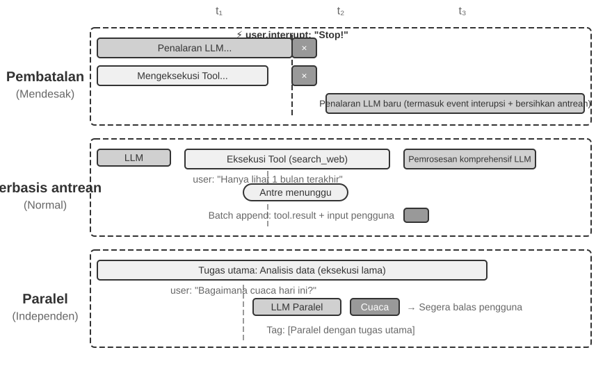

**Cancellation-Based Processing** digunakan untuk event darurat (urgent events); intinya adalah **memaksa sebuah safe point lebih awal** untuk event darurat tersebut: secara proaktif menyela (interrupt) langkah saat ini untuk mengubah momen ini menjadi batasan (boundary) di mana event baru dapat dikonsumsi. Ketika event darurat tiba (misalnya, pengguna mengklik "stop" atau sistem pengawas mengirim instruksi prioritas tinggi): (1) Hentikan operasi saat ini—jika LLM sedang melakukan reasoning, segera batalkan streaming response; jika tool sinkron sedang dieksekusi, kirim sinyal batal (cancel signal); (2) Kosongkan (drain) antrean tunggu (pending queue) dengan menghapus semua event yang tertunda; (3) Tambahkan event-event tersebut bersama dengan event darurat ke akhir trajectory; (4) Segera panggil kembali (re-invoke) LLM dengan input berupa trajectory lengkap yang diperbarui untuk menilai situasi. Sebagai contoh, jika pengguna menginputkan "Berhenti! Saya salah bicara" saat Agent akan melakukan operasi yang berpotensi salah, Agent akan segera melihat input baru ini, memahami kembali niat (intent) yang sebenarnya, dan dengan demikian menghindari eksekusi tindakan yang salah.

**Queued Processing** digunakan untuk event rutin. Ketika event yang tidak darurat tiba (misalnya, asynchronous tool mengembalikan hasil atau pengguna mengirimkan informasi tambahan): (1) Tambahkan event ke akhir antrean tanpa mengganggu operasi saat ini; (2) Tunggu operasi saat ini selesai—biarkan LLM menyelesaikan reasoning, biarkan tool sinkron selesai dieksekusi; (3) Ketika setiap tool call selesai dan mengembalikan `tool.result`, periksa antrean. Jika antrean tidak kosong, tambahkan semua event ke trajectory secara bersamaan; (4) LLM memproses trajectory yang diperbarui secara komprehensif. Ini memungkinkan pemrosesan secara batch, meningkatkan efisiensi—sebagai contoh, ketika Agent sedang menunggu search tool result, pengguna menambahkan "hanya tampilkan hasil dari bulan lalu." Informasi tambahan ini masuk ke antrean, dan ketika hasil pencarian kembali, kedua event disajikan ke LLM bersama-sama, menghindari round trips yang tidak perlu.

**Parallel Processing** digunakan untuk permintaan (queries) yang independen dan ringan. Sebagai contoh, ketika Agent sedang menganalisis sejumlah besar data, pengguna tiba-tiba bertanya, "Bagaimana cuaca hari ini?" Query semacam ini memiliki tiga karakteristik: tidak terkait dengan tugas utama, memerlukan respons cepat, dan memiliki biaya eksekusi yang rendah. Baik cancellation-based (yang akan mengganggu task utama yang penting) maupun queued processing (yang akan membuat pengguna menunggu terlalu lama) tidak ada yang cocok. Sistem pertama-tama menilai kemandirian dan kompleksitas query tersebut, kemudian mengeksekusinya secara mandiri dalam parallel reasoning session, memanggil tool yang diperlukan untuk menghasilkan respons dan mengembalikannya segera. Query dan respons tersebut ditambahkan ke trajectory task utama, dengan ditandai secara jelas sebagai "dieksekusi secara paralel dengan task utama" untuk menghindari kebingungan pada LLM.

**Penentuan Urgensi (Urgency Determination).**

Event darurat (Urgent events): Interupsi pengguna (`user.interrupt`), instruksi pengawas (`supervisor.instruction`), interupsi antar-Agent (`agent.interrupt`), external triggers yang ditandai sebagai darurat (misalnya, peringatan sistem, kegagalan pembayaran).

Event tidak darurat (Non-urgent events): Input pengguna biasa (`user.input`), input Agent (`agent.input`), hasil tool (`tool.result`), timer triggers (`timer.trigger`), external triggers biasa.

Hardcoded rules memiliki keterbatasan; semantik event menentukan metode penanganan—"Berhenti sekarang!" menggunakan cancellation-based processing, "Bagaimana cuaca hari ini?" menggunakan parallel processing, "Kirimkan laporannya dalam bahasa Mandarin" menggunakan queued processing. **Sangat disarankan untuk menggunakan classification LLM yang ringan sebagai event router**, dengan cepat menentukan strategi mana yang akan diadopsi ketika sebuah event tiba.

Titik pembatalan harus berada di posisi yang memungkinkan tool atau reasoning menutup pekerjaannya dengan aman; hasil tool yang belum selesai diwakili oleh placeholder eksplisit dan tidak boleh dipalsukan sebagai keberhasilan.

Eksperimen berikut, yakni event-driven Agent pemroses email, mengimplementasikan strategi event handling yang dibahas di atas menjadi implementasi yang dapat dijalankan.

> **Eksperimen 6-1 ★★★: Event-Driven Email Processing Agent**
>
>
> 
>
>
> Eksperimen ini membangun event-driven Agent yang paling sederhana: sebuah **Automated Email Processing Assistant** (Asisten Pemrosesan Email Otomatis). Agent memantau kotak masuk (inbox) email, dan setiap kali email baru tiba, ia secara otomatis memicu processing workflow—klasifikasi, peringkasan, draf balasan, dan memberi tahu pengguna jika perlu. Ini adalah skenario pengantar paling intuitif untuk sebuah event-driven Agent: eksternal event (kedatangan email baru) memicu siklus berpikir (thinking cycle) Agent yang utuh.
>
> **Tujuan Eksperimen**: untuk memahami gagasan inti dari arsitektur event-driven—Agent tidak lagi menunggu pasif untuk input pengguna tetapi bertindak dengan sendirinya sebagai respons terhadap event eksternal. Melalui eksperimen ini, pembaca akan menguasai putaran tertutup (closed loop) dasar dari registrasi sumber event (event source registration), antrean event (event queue), dan "event tiba → Agent memproses → hasil dikirim".
>
> **Event Sources dan Event Queue.**
>
> Sistem ini mendukung akses terpadu untuk berbagai sumber event (event sources):
>
> - **Event Email** (`on_email_received`): Dipicu ketika email baru tiba, baik dengan memeriksa inbox secara berkala atau menerima notifikasi push.
> - **Pesan IM/SMS** (`on_im_message`, `on_sms_message`): Dipicu oleh pesan instan (instant messages) atau pesan SMS.
> - **Event GitHub** (`on_github_pr_update`, `on_github_issue_update`): Dipicu oleh komentar PR review atau perubahan status.
> - **Timer Triggers** (`on_timer_expire`): Dipicu oleh scheduled tasks (misalnya, ringkasan harian, pembuatan laporan mingguan).
> - **Webhooks** (`on_webhook_received`): Callback generik dari sistem eksternal.
> - **Event Sistem** (`on_user_inactive`, `on_process_timeout`, `on_resource_alert`): Dipicu oleh perubahan status internal.
>
> Semua event masuk ke dalam **event queue** yang terpadu dan diproses secara berurutan sesuai urutan kedatangan. Setiap event memicu Agent thinking loop yang independen: Agent membaca isi event, memanggil tool yang relevan (misalnya, menanyakan pada Knowledge Base, membaca lampiran, mencari riwayat email terkait), menghasilkan hasil pemrosesan (label klasifikasi, ringkasan, draf balasan), dan pada akhirnya memberi tahu pengguna melalui notification tools atau secara langsung mengeksekusi sebuah tindakan.
>
> **Skenario Validasi**: Konfigurasikan Agent untuk memantau kotak surat pengujian (test mailbox). Simulasikan menerima tiga email—undangan rapat, keluhan pelanggan, dan iklan pemasaran. Agent memprosesnya secara berurutan: untuk undangan rapat, Agent secara otomatis memeriksa konflik kalender dan membuat draf balasan terima/tolak; untuk keluhan pelanggan, Agent mengekstrak informasi penting, menandainya sebagai prioritas tinggi, dan memberi tahu pengguna untuk menanganinya; untuk iklan pemasaran, Agent secara otomatis mengarsipkannya. Seluruh proses tidak memerlukan campur tangan pengguna.

Eksperimen 6-1 mendemonstrasikan pola event-driven paling sederhana—event masuk ke antrean, dan Agent memprosesnya secara berurutan. Akan tetapi, ketika Agent perlu merespons terhadap interupsi selama pengeksekusian tool yang berjalan lama (long-running tool executions), atau mengelola banyak task konkuren secara bersamaan, event queue yang sederhana tidaklah cukup. Selanjutnya, kita akan membahas tantangan engineering yang lebih dalam.

### Kompatibilitas ketika asinkroni native tidak didukung

Eksperimen 6-1 hanya menangani peristiwa serial: peristiwa masuk antrean dan Agent menyelesaikannya satu per satu. Jika model atau antarmuka yang dipilih tidak mendukung asinkroni native, interupsi pengguna sebelum alat mengembalikan hasil harus dinyatakan dalam format sinkron. Berikut jalur kompatibilitasnya; setelah itu kita membahas antarmuka native GPT-6 Astra.

Misalkan Agent sedang menyusun email dan memanggil alat pencarian kontak. Sebelum hasilnya tiba, pengguna berkata, “Tunggu, periksa dulu cuaca besok.” Jika antarmuka mengharuskan panggilan yang belum selesai mendapatkan hasil pasangannya terlebih dahulu, Agent tidak dapat langsung memproses pesan baru dengan panggilan yang masih tertunda. Batasan ini berasal dari kombinasi protokol dan model yang dipilih, bukan aturan yang berlaku bagi semua LLM.

**Implementasi asinkron yang kompatibel dengan format sinkron.**

Ide intinya adalah: **Di bawah kondisi normal tanpa interupsi, biarkan LLM melihat synchronous trajectory standar; hanya ketika interupsi terjadi, sisipkan placeholder untuk memperbaiki format tersebut**. Berikut adalah lima aturan utama:

**Aturan 1**: Segera catat pesan assistant dan item pemanggilan alat yang sudah diselesaikan API. Pertahankan status penalaran yang dikelola server sesuai protokol kelanjutan penyedia; jangan merangkai sendiri teks pemikiran yang tidak terlihat.

**Aturan 2**: Rekam tool result hanya setelah pengeksekusian tool call selesai. Trajectory berada dalam keadaan "selesai sebagian (partially completed)" selama eksekusi.

**Aturan 3**: Interupsi selama pengeksekusian tool memerlukan placeholder. Hasilkan placeholder response untuk tool yang belum selesai (misalnya, "Tool sedang dieksekusi di background, mohon prioritaskan event baru ini"), tambahkan event interupsi tersebut, dan panggil kembali LLM. Dari sudut pandang LLM, pesan assistant masih memiliki pasangan tool result.

**Aturan 4**: Tanpa steering native atau antarmuka kelanjutan di tengah giliran yang didukung, batalkan generasi yang belum selesai, simpan pesan yang terkonfirmasi lengkap beserta status alat, tambahkan peristiwa baru, lalu kirim permintaan baru. Jangan menganggap keluaran parsial atau penalaran tersembunyi dapat sembarang dimasukkan kembali sebagai prefiks yang sah.

**Aturan 5**: Event yang tidak menginterupsi akan masuk ke antrean untuk diproses secara batch. Event tersebut akan ditambahkan sekaligus hanya setelah siklus saat ini selesai.

Menggunakan contoh Agent yang sedang menyusun draf email ketika pengguna menginterupsi untuk menanyakan cuaca, pengoperasian kelima aturan ini adalah sebagai berikut:

1. Agent memanggil `search_contacts` untuk mencari informasi kontak, dan pesan assistant segera ditulis ke dalam trajectory (Aturan 1).
2. Sebelum tool pencarian mengembalikan hasil, pengguna mengirimkan "Cek dulu cuaca besok untuk saya." Karena ini adalah interupsi dari pengguna, sistem menghasilkan hasil tool placeholder (pengganti sementara) untuk `search_contacts` yang belum selesai ("Tool sedang berjalan di latar belakang, mohon prioritaskan event baru", Aturan 3), lalu menambahkan kueri cuaca dari pengguna ke dalam trajectory dan memanggil ulang LLM. Pada titik ini, format trajectory yang dilihat oleh LLM sepenuhnya valid—pesan assistant dan hasil tool berpasangan dengan sempurna.
3. Setelah Agent menjawab kueri cuaca, hasil `search_contacts` yang asli tiba dan ditambahkan ke dalam trajectory sebagai event baru (Aturan 2). Agent membaca informasi kontak dan melanjutkan penyusunan draf email.

Pendekatan ini mempertahankan pasangan panggilan dan hasil yang disyaratkan antarmuka sinkron. Placeholder yang jelas menyatakan “belum selesai” hanya ditambahkan ketika interupsi diperlukan. Ketika hasil nyata dari tugas latar belakang tiba, hasil masuk ke lintasan sebagai peristiwa dengan sumber dan ID tugas. Untuk model dengan asinkroni native, sistem dapat mempertahankan status tertunda lalu menyerahkan hasil nyata ketika tersedia.

Placeholder juga membawa risiko semantik: model dapat menyamakan “tugas dimulai” dengan “tugas selesai” dan mengambil keputusan yang bergantung pada hasil sebelum hasil itu tiba. Status tugas yang jelas dan validasi hasil harus mencegah kekeliruan ini; evaluasi perlu memeriksa apakah data yang belum diterima justru direkayasa. Satu kegagalan saja tidak membenarkan kesimpulan bahwa penyebabnya adalah suatu proses pelatihan yang tidak dipublikasikan.

**Menyatakan semantik asinkron melalui handle tugas.**

Dengan atau tanpa protokol asinkron native, **desain antarmuka alat dapat memperjelas semantik asinkron**. Cara yang sangat berguna untuk antarmuka sinkron adalah menjadikan “mulai tugas” sebagai panggilan lengkap dengan nilai kembalian nyata.

Desain tool tradisional mengimplikasikan semantik "panggilan sama dengan penyelesaian". Misalnya, nama `phone_call` mengisyaratkan bahwa "memanggil akan memutar nomor telepon dan menunggu panggilan berakhir, lalu mengembalikan log panggilan." Di bawah paradigma asinkron, "inisiasi" dan "penyelesaian" harus dipisahkan:

- `initiate_phone_call`: Memulai panggilan telepon, segera mengembalikan pengidentifikasi tugas (task identifier) dan status awal (misalnya, "Panggilan dimulai, sedang memanggil...")
- Kemajuan panggilan dikomunikasikan melalui notifikasi event (`phone_call_connected`, `phone_call_ended`)

Kuncinya adalah bahwa nama dan deskripsi tool itu sendiri harus menyampaikan semantik asinkron. Ketika model melihat `initiate_phone_call`, kemampuan pemahaman bahasanya secara alami akan menyimpulkan bahwa ini adalah "memulai" alih-alih "menyelesaikan." Deskripsi tool harus lebih memperkuat hal ini: "Tool ini memulai tugas panggilan telepon yang ditangani oleh sub-agent. Tool ini mengembalikan task ID segera setelah berhasil diinisiasi, memungkinkan Anda untuk melanjutkan hal-hal lain. Event notifikasi terpisah akan dikirimkan saat panggilan berakhir."

**Dispersi Perhatian dalam Pemrosesan Berbasis Antrean.**

Saat memproses peristiwa secara berkelompok, model mungkin hanya menanggapi peristiwa terakhir dan melewatkan persyaratan sebelumnya. Asinkroni native menjawab apakah pesan dapat tiba saat eksekusi berlangsung; kita tetap harus memeriksa apakah model menggunakan semua pembaruan secara terpadu.

Intervensi dapat diterapkan pada dua tingkatan:

**Tingkat Prompt**: Informasikan kepada model, "Ketika Anda menerima beberapa event yang berurutan, pastikan Anda mempertimbangkan semua informasi secara komprehensif."

**Penanda Agent Status Bar**: Tambahkan penanda eksplisit sebelum setiap event:

```text
[Event Belum Diproses 1/4] Hasil tool dari database_query: ...
[Event Belum Diproses 2/4] Catatan tambahan dari pengguna: Hanya lihat data Beijing
[Event Belum Diproses 3/4] Pengingat sistem: Tenggat waktu laporan adalah dalam 30 menit
[Event Belum Diproses 4/4] Pengguna bertanya: Bagaimana kemajuannya?
```

Tambahkan ringkasan di bagian akhir: "Terdapat 4 event yang belum diproses di atas, termasuk 1 hasil tool, 2 pesan pengguna, dan 1 pengingat sistem. Pastikan respons Anda mencakup semua informasi tersebut."

> **Eksperimen 6-2 ★★★: Agent Asinkron dengan Eksekusi Paralel dan Kemampuan Interupsi**
>
>
> 
>
>
> Berangkat dari antrean sederhana pada eksperimen 6-1, eksperimen ini memakai runtime yang kompatibel dengan antarmuka sinkron untuk menerapkan **eksekusi alat paralel, pembatalan eksekusi, dan pengelolaan status**. Agent harus mengelola beberapa tugas bersamaan, menangani interupsi dan pemulihan, serta mengambil keputusan berdasarkan status terkini. Lihat eksperimen 6-3 untuk perbandingan dengan antarmuka native Astra.
>
> **1. Eksekusi Tool Asinkron**: Mendukung eksekusi asinkron dari tool yang memakan waktu (setidaknya 3-5 detik), segera mengembalikan placeholder setelah inisiasi. **Skenario Validasi**: Agent mengeksekusi perintah terminal yang berjalan lama. Selama waktu ini, pengguna bertanya, "Jam berapa sekarang?" Agent segera merespons, lalu menyajikan hasil analisis ketika perintah yang berjalan lama selesai.
>
> **2. Antrean Event dan Pemrosesan Batch**: Mengakumulasi event yang tidak mendesak dan menambahkannya ke dalam trajectory secara batch. **Skenario Validasi**: Agent sedang menjalankan tugas yang panjang. Pengguna mengirimkan pesan berturut-turut: "Ingat untuk membalas dalam bahasa Jepang" dan "Format sebagai halaman web." Ketika tugas selesai, Agent memproses semua event sekaligus, menghasilkan halaman web berbahasa Jepang.
>
> **3. Mekanisme Interupsi**: Perintah "berhenti" dari pengguna segera menghentikan alur eksekusi dan membatalkan tool asinkron. **Skenario Validasi**: Agent sedang mengeksekusi tugas yang panjang. Pengguna mengirimkan "Batal." Agent segera berhenti, dan trajectory mencatat event interupsi dan operasi pembatalan tersebut.
>
> **4. Pembatalan dan Kueri Status untuk Tool Paralel**: Setelah tool asinkron selesai, hasil nyata disuntikkan ke dalam percakapan melalui event baru. Mendukung pembatalan atau kueri kemajuan melalui task ID. **Skenario Validasi**: Pengguna meminta, "Jalankan ketiga skrip ini secara bersamaan untuk saya. Mana saja yang selesai lebih dulu, periksa kemajuan skrip yang tersisa. Jika ada yang belum melebihi 50%, batalkan." Ketiga skrip mensimulasikan proses analisis, mengeluarkan kemajuan terus menerus dengan kecepatan masing-masing 3%, 2%, dan 1% per detik. Agent memulai tiga perintah terminal asinkron secara bersamaan. Ketika skrip pada 3% per detik selesai dalam sekitar 33 detik, Agent melakukan kueri status dari dua terminal yang tersisa, menemukan satu sekitar 66% dan yang lainnya sekitar 33%. Agent kemudian membatalkan yang belum melebihi 50%. Setelah kedua terminal selesai, Agent mengintegrasikan hasil untuk menghasilkan laporan lengkap.
>

### Asinkroni native pada model: GPT-6 Astra

Pada pendekatan kompatibilitas sebelumnya, runtime mengatur urutan masuknya peristiwa agar model berantarmuka sinkron dapat menangani tugas asinkron. Jalur lain membuat model memahami ritme tersebut secara native: ia dapat mengerjakan hal lain saat alat berjalan dan menyesuaikan pekerjaan berikutnya ketika pengguna menambahkan persyaratan. GPT-6 Astra sudah mendukung pemanggilan alat asinkron (Async tool calling) dan pengarahan di tengah giliran (Mid-turn steering), yang menunjukkan perubahan ini (Gambar 6-5).[^ch6-22][^ch6-23]

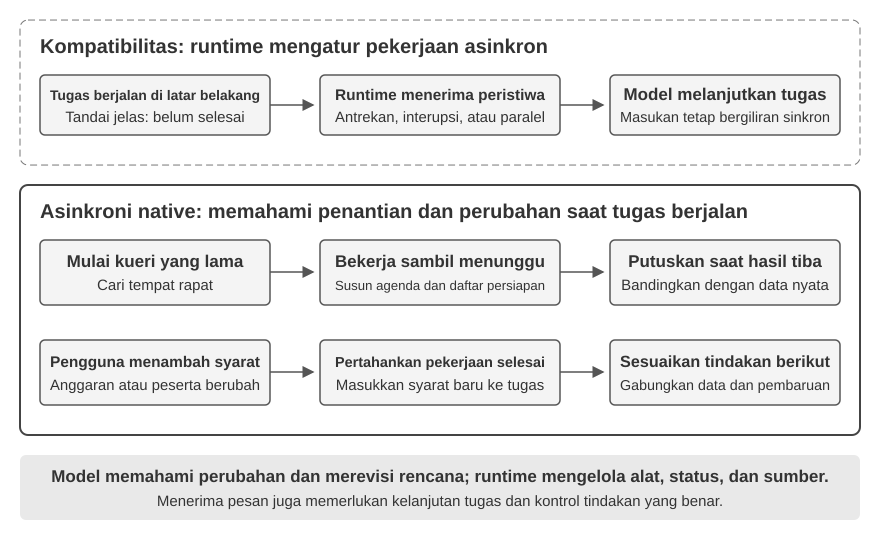

**Pemanggilan alat asinkron memisahkan “memulai tindakan” dari “memperoleh hasil”.** Setelah memulai kueri yang lama, Agent dapat terus bernalar, memanggil alat lain, atau menyelesaikan bagian yang tidak bergantung pada hasil kueri. Saat mencari tempat rapat, misalnya, ia dapat menyusun agenda dan daftar persiapan terlebih dahulu, lalu membandingkan pilihan setelah informasi tempat tiba. Kuncinya adalah memahami ketergantungan: lanjutkan pekerjaan mandiri dan tunda keputusan yang membutuhkan hasil sampai hasil tersedia.

**Pengarahan di tengah giliran memungkinkan pengguna mengoreksi arah saat tugas berjalan.** Ketika Agent masih berpikir atau menyusun jawaban, pengguna dapat menambahkan “anggaran berkurang” atau “jumlah peserta berubah”. Sistem mempertahankan pekerjaan yang selesai dan membawa batasan baru ke pemrosesan berikutnya sehingga rencana dapat disesuaikan dalam tugas yang sama. Masih mungkin ada jeda antara menerima pembaruan dan menerapkannya, tetapi pengguna tidak perlu menunggu satu jawaban penuh berakhir untuk menyampaikan perubahan.

Kedua kemampuan ini memperluas waktu interaksi: hasil alat dan persyaratan pengguna dapat tiba selama tugas berlangsung. Sistem tetap harus membedakan sumbernya dan mengingat pekerjaan yang selesai maupun yang tertunda. Mengubah rencana tidak otomatis menghentikan alat yang berjalan atau mengurungkan tindakan yang sudah terjadi; eksekusi, pembatalan, dan pengelolaan status tetap menjadi tanggung jawab runtime.

Tidak semua model memiliki kemampuan asinkron native. Saat membangun Agent, pilih interaksi native atau pendekatan kompatibilitas sesuai dukungan model, lalu periksa apakah seluruh sistem menangani hasil terlambat, perubahan di tengah tugas, dan kelanjutan tugas dengan benar. Pelatihan asinkron dapat terus meningkatkan kemampuan tersebut, tetapi pengembang sudah dapat membangun interaksi ini dengan model yang ada.

### Dari menerima pesan asinkron hingga menangani tugas asinkron secara andal

Asinkroni native memungkinkan pesan tiba selama eksekusi. Keandalan tugas kompleks juga bergantung pada cara model menggunakan pesan tersebut. Setidaknya tiga hal harus diperiksa:

1. **Keterkaitan hasil dan status tertunda**: Apakah hasil yang terlambat dikaitkan dengan tugas yang benar dan data tidak direkayasa ketika hasil belum ada?
2. **Kelanjutan tugas dan kontrol tindakan**: Apakah model kembali ke tugas semula setelah menangani persyaratan baru dan membedakan perubahan rencana dari penghentian eksekusi?
3. **Penggabungan beberapa pembaruan**: Apakah batasan anggaran dan jumlah peserta dipatuhi sekaligus, alih-alih hanya mengingat pesan terakhir?

Model dapat diperbaiki melalui pelatihan dalam lingkungan asinkron; sistem dapat diperbaiki melalui status tugas, sumber peristiwa, dan umpan balik eksekusi yang jelas. Evaluasi harus mencakup keduanya: apakah model memahami perubahan dan apakah sistem menjalankannya dengan benar.

> **Eksperimen 6-3 ★★★: Asinkroni native pada model dan pengarahan di tengah giliran**
>
> Memilih tempat rapat: setelah memulai kueri yang lama, Agent menyelesaikan persiapan yang tidak bergantung pada hasilnya. Sementara itu, pengguna menambahkan persyaratan anggaran dan jumlah peserta. Setelah kueri selesai, Agent memilih tempat berdasarkan seluruh batasan.
>
> Panggil API GPT-6 Astra untuk membandingkan alat sinkron, alat asinkron native, dan pengarahan di tengah giliran. Amati apakah menunggu menghambat pekerjaan lain, apakah persyaratan baru masuk ke rencana berikutnya, dan apakah tugas semula berlanjut ketika hasil tiba. Gunakan juga model tanpa dukungan native sebagai kontrol untuk memahami masalah yang ditangani kemampuan model dan orkestrasi runtime masing-masing.

Asinkroni dan eksekusi berbasis peristiwa memungkinkan dunia membangunkan Agent saat tugas berlangsung; pengarahan native juga memungkinkan pengguna mengirim pembaruan sebelum jawaban penuh selesai. Tiga bagian berikut memperpendek skala waktu lebih jauh: ketika lingkungan berubah secepat atau lebih cepat daripada generasi model, menerima pembaruan saja tidak cukup; sistem harus bereaksi tepat waktu.

## Suara: Antarmuka Manusia-Mesin yang Paling Alami

Suara bukan sekadar mengubah teks menjadi bunyi. Berbicara kira-kira empat kali lebih cepat daripada mengetik dan tidak menggunakan tangan maupun pandangan, sehingga cocok menempatkan Agent dalam loop input-output kontinu yang dapat disela kapan saja. Input suara mengubah ucapan menjadi teks; voice Agent membuat pengguna dapat bekerja sama langsung dengan Agent. Keduanya mendukung whisper coding dari bagian pendahuluan.

Bagian ini membahas pengguna yang berbicara kepada Agent dan Agent yang berbicara kepada dunia luar atas nama pengguna. Model suara menentukan apa yang dapat dijawab; arsitektur interaksi menentukan apakah Agent mendengar dengan baik, merespons tepat waktu, berganti giliran secara alami, dan menyelesaikan konfirmasi serta pemanggilan alat selama panggilan.

### Waktu interaksi: dari cascade ke full-duplex

Dalam pengantar GPT-Live, OpenAI merangkum tiga paradigma suara: cascade, turn-based, dan full-duplex[^ch6-12]. Ketiganya adalah pertukaran latensi, biaya, dan keteramatan, bukan penggantian linear.

| Paradigma | Struktur | Keunggulan | Batasan |
| --- | --- | --- | --- |
| Cascade | VAD → ASR → LLM → TTS | Modul jelas, mudah diganti dan di-debug | Latensi menumpuk, informasi paralinguistik hilang di batas |
| Omni end-to-end | Input dan output audio native dengan interaksi berbasis giliran | Latensi lebih rendah, nada, emosi, dan suara lingkungan lebih terjaga | Tetap berbasis giliran; pelatihan dan debugging lebih mahal |
| Full-duplex | Input dan output audio native; terus mendengar, berbicara, dan memutuskan | Ucapan tumpang tindih dan interupsi alami | Pelatihan, kontrol, dan evaluasi lebih rumit |

Benang merahnya adalah keluar dari asumsi bahwa orang harus berbicara bergantian dan dari tebakan VAD tentang siapa yang memegang giliran. Cascade dan Omni masih membagi percakapan menjadi giliran; full-duplex menjadikan kepemilikan giliran sebagai keputusan model yang terus berjalan.

[^ch6-12]: OpenAI. *Introducing GPT-Live.* 2026-07-08. https://openai.com/index/introducing-gpt-live/. Klasifikasi ini berasal dari rangkuman tiga generasi ChatGPT Voice; Omni end-to-end sesuai dengan kategori “turn-based voice models”.

### Paradigma 1 · Pipeline cascade

Sebagian besar asisten suara komersial masih memakai pipeline serial (Gambar 6-6): VAD menentukan akhir ucapan, ASR mengubah audio menjadi teks, LLM memahami dan menghasilkan jawaban, lalu TTS membacakannya. Modularitas memudahkan optimasi tiap komponen, tetapi setiap batas menambah waktu tunggu.

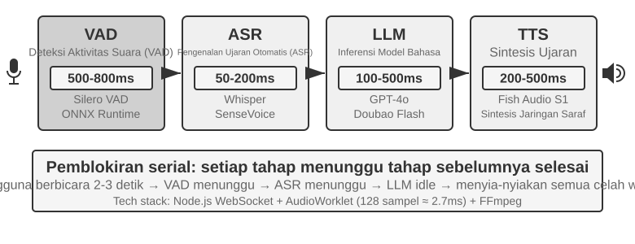

| Modul | Peran | Hambatan umum |
| --- | --- | --- |
| VAD | Menentukan ucapan selesai | Ambang hening menyebabkan tunggu dan salah segmentasi |
| ASR | Audio ke teks | Latensi pengenalan dan hilangnya konteks |
| LLM | Memahami, berpikir, dan menghasilkan | Latensi token pertama dan tunggu tambahan saat reasoning |
| TTS | Teks ke suara | Sintesis paket pertama dan buffer pemutaran |

Pada satu jawaban singkat tanpa reasoning, waktu tunggu VAD, ASR, LLM, dan TTS terakumulasi secara serial (Gambar 6-7). Nilai sebenarnya bergantung pada panjang masukan, model, perangkat keras, jaringan, dan beban.

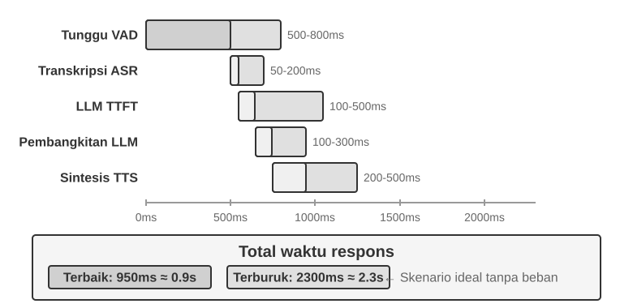

Antrean di lingkungan produksi masih akan memperbesar latensi idle (Gambar 6-8), tetapi hal itu termasuk perencanaan kapasitas layanan, dan bab ini tidak membahas model antrean.

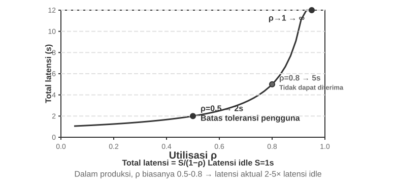

> **Eksperimen 6-4 ★: Membangun voice Agent tradisional**
>
> Hubungkan mikrofon, Silero VAD, Whisper lokal, LLM streaming, dan Fish S1 TTS melalui WebSocket untuk membangun baseline berantai.

#### Dari serial ke persepsi streaming

Gambar 6-7 menggambarkan kasus yang sepenuhnya serial: VAD, ASR, LLM, dan TTS berjalan satu demi satu. Skema persepsi serial ini memiliki tiga masalah:

1. **Akumulasi latensi**: sistem harus menunggu satu penggal hening sebelum dapat memastikan pengguna selesai berbicara.
2. **Kehilangan informasi**: sinyal biner ada suara/tanpa suara tidak dapat menyatakan keraguan, emosi, backchannel, dan suara lingkungan.
3. **Konteks terputus**: alamat email, nama orang, dan nama diri dapat dikenali secara terpotong sehingga menjadi salah.

Untuk mengatasinya, sambil tetap mempertahankan pembagian modular, salah satu optimasinya adalah **persepsi streaming**, yaitu membuat setiap tahap menghasilkan hasil inkremental sedini mungkin:

- **ASR mentranskripsi sambil mendengar**: begitu VAD mendeteksi pengguna mulai berbicara, model ASR dipanggil pada interval waktu tertentu untuk menghasilkan transkrip sementara secara streaming; setelah VAD mendeteksi pengguna selesai berbicara, barulah teks final dikonfirmasi.
- **Eksekusi spekulatif LLM**: transkrip sementara langsung dikirim ke LLM begitu tersedia; jika teks final sama dengan transkrip sementara, LLM tidak perlu dipanggil lagi, jika tidak, proses berpikir spekulatif sebelumnya dibatalkan dan LLM dipanggil ulang.
- **Keluaran LLM per segmen**: kalimat pertama yang layak dibacakan langsung diserahkan ke TTS tanpa menunggu jawaban lengkap.
- **Sintesis TTS inkremental**: potongan audio dikembalikan terus-menerus sehingga generasi, sintesis, dan pemutaran berikutnya saling tumpang tindih.

ASR streaming yang sesungguhnya membutuhkan dukungan pada level model. Decoding Whisper memang autoregresif, tetapi encoder-nya memerlukan segmen audio yang utuh, sehingga tidak dapat begitu saja disamakan dengan model streaming. Model auditori streaming berbasis LLM dapat mengeluarkan teks dan event semantik dari audio kontinu, sehingga "pengenalan" dan sebagian "pemahaman" berada dalam satu model. Model ini mempertahankan konteks sejak awal percakapan hingga saat ini, dan dapat memanfaatkan pengetahuan dunia untuk menangani merek, nama orang, dan nama diri.

Jika tujuannya hanya menentukan apakah pengguna sudah selesai berbicara, penilaian akhir giliran dapat ditanamkan langsung ke recognizer streaming. Label pelatihan hanya boleh memakai informasi yang terlihat pada saat keputusan dibuat; jika tidak, informasi masa depan akan menghasilkan penilaian yang tidak dapat direproduksi secara online.

Keluaran model tidak hanya berupa teks, tetapi juga dapat menyertakan penanda peristiwa akustik:

- **speak_start/end, interrupt**: awal-akhir ucapan dan niat menyela;
- **emotion**: emosi, keraguan, dan status lainnya;
- **laugh, sigh, noise**: sinyal paralinguistik dan suara lingkungan.

Penanda-penanda ini bersama token teks membentuk satu aliran peristiwa yang sama; berdasarkan itu, Agent dapat mengenali keraguan, interupsi, dan perubahan lingkungan tanpa harus memampatkan semua suara menjadi teks murni.

> **Eksperimen 6-5 ★: Mensimulasikan persepsi suara streaming dengan Qwen2-Audio**
>
> Qwen2-Audio bukan model streaming. Eksperimen ini menyimulasikan persepsi kontinu dengan prefix audio yang terus bertambah dan membandingkannya dengan VAD 600 ms + Whisper.

### Paradigma 2 · Model omnimodal end-to-end (Omni)

Meski memakai persepsi streaming, cascade tetap menyerahkan proses mendengar, berpikir, dan berbicara melalui antarmuka diskret; emosi, intonasi, dan suara lingkungan dapat hilang ketika audio menjadi teks murni. Skema Omni memakai satu model untuk langsung mendengar audio, menghasilkan jawaban, dan mengeluarkan suara, sehingga berpeluang mempertahankan informasi tersebut, tetapi biaya pelatihannya lebih mahal (Gambar 6-9). Dibandingkan skema cascade pada Paradigma 1, keunggulan Omni terutama terletak pada latensi serta pada pemahaman dan penghasilan informasi nonteks.

Dari sisi pemahaman, model Omni dapat memahami jeda di dalam suara. Dari sisi penghasilan, model Omni dapat menyampaikan informasi paralinguistik yang lebih kaya, misalnya bernyanyi atau mengucapkan sebuah kalimat dengan intonasi khusus.

Model Omni tetap mengasumsikan orang berbicara bergantian dan umumnya mengandalkan VAD untuk membagi kepemilikan giliran. Karena itu, jeda di tengah ucapan saat pengguna membacakan deretan angka masih dapat disalahartikan sebagai akhir giliran.

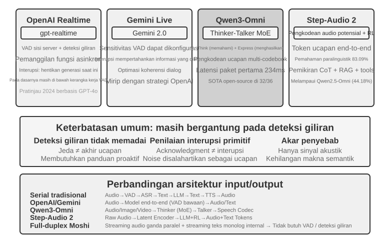

> **Eksperimen 6-6 ★★: Menjalankan MiniCPM-o 4.5 secara lokal, end-to-end versus self-cascade**
>
> Jalankan MiniCPM-o 4.5 secara lokal dengan thinking mode dimatikan, lalu bandingkan jawaban langsung dari audio dengan self-cascade yang mentranskripsikan terlebih dahulu dan menjawab memakai model yang sama. Ini mengukur apakah informasi audio dipertahankan, **bukan** “berpikir sambil berbicara” yang dibahas kemudian.

### Paradigma 3 · Model interaktif full-duplex

Omni memisahkan “pengguna berbicara” dan “model berbicara”, tetapi penerjemahan simultan memerlukan tumpang tindih. Full-duplex terus mendengar dan berbicara sambil memutuskan lanjut, berhenti, menyela, atau memanggil alat. Moshi dari Kyutai adalah contoh awal; Thinking Machines Lab menyebut jalur ini Interaction Model[^ch6-14] dan membangun interaksi di dalam model, bukan di sekitar VAD. GPT-Live membawanya ke skala produksi.

Pendahulunya di sisi riset adalah **Moshi** dari Kyutai (2024). Ia memodelkan aliran audio pengguna dan model secara paralel, sehingga berbicara bertindihan dan menyela menjadi perilaku alami model.

Thinking Machines Lab menyebut jalur ini **model interaksi (Interaction Model)**[^ch6-14]: interaktivitas tak lagi dirakit oleh harness eksternal berbasis VAD, melainkan tertanam di dalam model itu sendiri. Mekanisme mikro-gilirannya bergerak maju terus-menerus dalam blok audio pendek, sehingga keheningan, tumpang tindih, dan sela semuanya tersimpan sebagai konteks yang bersinambung. Model interaksi juga dapat mendelegasikan percakapan utuh kepada model penalaran di latar sementara ia sendiri tetap memegang alur bicara; ketika hasil dari latar kembali, sisi depan menyisipkannya pada saat yang tepat.

[^ch6-14]: Thinking Machines Lab, “Interaction Models: A Scalable Approach to Human-AI Collaboration,” 2026-05. https://thinkingmachines.ai/blog/interaction-models/

GPT-Live dari OpenAI membawa jalur full-duplex ke skala produksi: model terus memproses masukan dan menghasilkan keluaran, bisa menunggu pengguna, menimpali, disela, dan menangani penerjemahan waktu nyata. Sebagaimana model interaksi, ia mendelegasikan tugas rumit ke model latar sementara sisi depan meneruskan percakapan.

### Waktu kognitif: interaksi real-time dan pemikiran mendalam

Kualitas interaksi dan batas kecerdasan adalah dua dimensi yang berbeda. Model latar depan harus menjawab selama pengguna masih aktif; model latar belakang dapat berpikir lebih lama. Tiga desain berikut adalah trade-off, bukan perkembangan linear. Dua desain pertama dapat diterapkan pada cascade atau Omni; desain ketiga menyatukan penalaran mendalam dan ekspresi real-time di dalam model yang sama.

#### Solusi 1: berpikir cepat untuk pengisi, berpikir lambat untuk jawaban

Berpikir cepat dapat memberi respons pengisi dalam beberapa ratus milidetik, sementara berpikir lambat menyelesaikan penalaran yang lebih dalam di latar belakang. Masalahnya, pertanyaan sederhana diproses dua kali, dan pertanyaan rumit bisa berujung kontradiksi: model cepat menyarankan pembelian, lalu model lambat menemukan bahwa paketnya tidak memiliki fitur kunci, sehingga dalam hitungan detik pengguna mendengar dua jawaban yang saling bertentangan. Akar penyebabnya adalah kedua instans masing-masing melakukan penalaran sendiri secara independen.


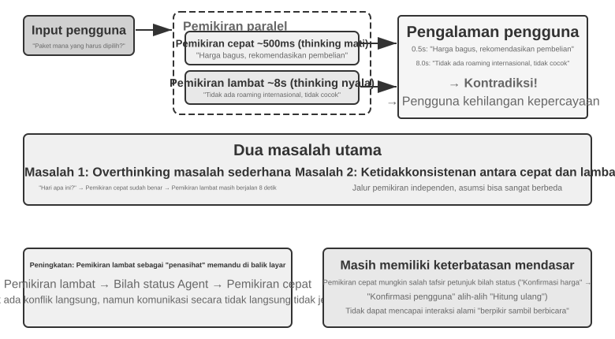


#### Solusi 2: berpikir cepat untuk interaksi, berpikir lambat untuk pengingat

Solusi kedua membuat model latar belakang memberi saran kepada model latar depan melalui status bar atau antarmuka khusus, sementara latar depan tetap menjaga alur percakapan dan menentukan cara mengungkapkannya. Ini lebih stabil daripada solusi pertama, tetapi komunikasinya tetap tidak langsung: latar depan bisa salah menafsirkan saran dan tidak melihat penalaran antara dari latar belakang; sebelum latar belakang selesai, ketika pengguna bertanya lagi, latar depan hanya bisa mengandalkan kemampuannya sendiri. Ia bisa "menunggu hasil" secara wajar, tetapi tidak benar-benar berpikir sambil berbicara.

#### Solusi 3: penyatuan penalaran dan ekspresi secara end-to-end

Solusi ketiga menginternalisasi kemampuan bernalar langsung ke dalam model audio end-to-end. Step-Audio R1 menyelesaikan dua masalah dengan dua mekanisme yang saling melengkapi: **distilasi penalaran berjangkar modalitas (MGRD)** membuat model bernalar berdasarkan fitur akustik, dan **arsitektur dua otak MPS** membuat perumusan dan ekspresi berjalan paralel. Yang pertama menjamin "berpikir benar", yang kedua mengatasi "berbicara tepat waktu".

Idealnya, model menilai emosi dari nada, ritme, dan intonasi, bukan hanya dari teks transkripsi. MGRD menyaring proses penalaran yang benar-benar merujuk pada fitur akustik, melatih model dengan data tersebut, dan melalui reinforcement learning mencegah model melompati penalaran lalu langsung menebak jawaban. MPS membuat otak perumus terus menghasilkan fragmen penalaran, dan otak ekspresi, begitu menerima fragmen, langsung menghasilkan suara dengan menggabungkannya dengan jawaban yang sudah ada. Keduanya berjalan paralel bak jalur pipa, sehingga tidak perlu menunggu seluruh penalaran selesai sebelum pengguna mendengar kalimat pertama.

#### Trade-off antara pemisahan berpikir cepat/lambat dan penalaran end-to-end

Model terpadu paling langsung mewujudkan "berpikir sambil berbicara", dengan biaya bahwa penalaran dan ekspresi real-time harus dilatih ulang bersama-sama; jalur terpisah lebih mudah untuk mengganti otak latar belakang. Keduanya adalah trade-off, bukan sekadar saling menggantikan.

Di tengah kemajuan pesat model penalaran frontier, pemisahan berpikir cepat dan lambat memberi keuntungan rekayasa yang penting: sistem dapat langsung memanfaatkan kemajuan setiap generasi model lambat. Model cepat di latar depan hanya perlu mendengar, merespons, dan menjaga percakapan dengan latensi rendah; model lambat di latar belakang menangani penalaran, perencanaan, dan pemanggilan alat. Ketika model penalaran yang lebih kuat hadir, cukup ganti model latar belakang tanpa melatih ulang seluruh sistem suara real-time. Jalur terpadu mengikat penalaran dan interaksi dalam siklus pelatihan yang sama, sehingga setiap peningkatan harus menyeimbangkan kembali kecerdasan, latensi respons, dan kealamian ekspresi. Karena itu, pemisahan cepat/lambat bukan sekadar kompromi terhadap latensi, melainkan pilihan modular yang memungkinkan kemampuan interaksi dan batas kecerdasan berkembang secara terpisah.

Pemisahan ini juga tidak selalu mengorbankan kinerja tugas. Per Agustus 2026, voice Agent Pine AI yang memakai arsitektur berpikir cepat/lambat terpisah menempati peringkat pertama pada τ³-Voice Leaderboard, di atas sistem suara real-time seperti Grok Voice dan GPT-Realtime-2. Setidaknya, hasil ini menunjukkan bahwa arsitektur terpisah tidak secara inheren kalah dari model end-to-end pada tugas yang sekaligus menguji penalaran mendalam dan percakapan real-time.[^ch6-17]

[^ch6-17]: Pine AI. “The Most Natural Human-Computer Interface Is Your Voice.” 2026-06-23 (diperbarui 2026-08-06). https://www.19pine.ai/blog/pine-ai-the-most-natural-human-computer-interface-is-your-voice

Istilah "model end-to-end" perlu diperjelas karena lazim dipakai dalam dua arti. Pertama adalah **jalur suara end-to-end** yang dibahas pada bagian sebelumnya: model menerima audio dan menghasilkan audio secara langsung, tanpa menghubungkan beberapa model melalui teks diskret. Omni dan Interaction Model sama-sama end-to-end dalam arti ini, tetapi Omni biasanya tetap berjalan berbasis giliran, sedangkan Interaction Model dapat mendengar sambil berbicara; arsitektur keduanya sangat berbeda. Kedua adalah **arsitektur kognitif end-to-end** yang dibahas pada bagian ini: interaksi real-time dan penalaran mendalam berbagi keadaan dan dilatih bersama dalam satu model, atau dipisah antara model cepat di latar depan dan model lambat di latar belakang. Kedua sumbu ini independen. Sebuah sistem dapat memiliki jalur suara end-to-end sambil mempertahankan pemisahan cepat/lambat pada arsitektur kognitifnya; pendelegasian tugas kompleks oleh Thinking Machines Lab kepada model penalaran latar belakang adalah salah satu contohnya.

### Sintesis suara yang lebih manusiawi

TTS tradisional dapat mengungkap identitas mesinnya karena terlalu mulus dan terlalu sedikit berhenti. Jeda, kata pengisi, dan pengulangan sesekali menandakan ketidakpastian dan proses berpikir dalam ucapan manusia.

LLM utama dapat mengeluarkan marker kontrol selain teks, seperti **THINKING**, **EMO:happy**, dan **SPEED:0.8x**; TTS memetakannya menjadi jeda, prosodi, kecepatan bicara, tawa, helaan napas, dan audio nonverbal lainnya. Implementasinya dapat berupa TTS yang dilatih untuk memahami marker kontrol, atau voice cloning dengan klip referensi untuk berbagai emosi dan gaya.

> **Eksperimen 6-7 ★★: TTS berbasis token kontrol dengan Fish Audio**
>
> Gunakan Fish Audio S1 untuk membangun pustaka suara multi-referensi dan bandingkan tiga konfigurasi: tanpa marker kontrol, satu klip referensi, dan beberapa klip referensi. Lapisan eksekusi memilih emosi, kecepatan bicara, dan gaya yang cocok dari marker.


## Computer Use: Agen Otomatisasi GUI

Suara mendorong sumbu waktu turun ke tingkat milidetik, tetapi pengamatannya tetap berupa aliran bunyi satu dimensi. Computer Use memindahkan persoalan yang sama ke layar dua dimensi: pengamatan berubah menjadi piksel yang terus berubah, dan tindakan berubah menjadi klik serta ketikan pada koordinat. Skenario suara menekankan "kapan mulai bicara"; Computer Use menekankan "berikutnya harus mengklik di mana", ditambah satu pertanyaan yang sama sekali tidak ada dalam interaksi suara—setelah tindakan dijalankan, apakah kenyataan masih sesuai dengan rencana?

Computer Use, juga dikenal sebagai otomatisasi GUI, memungkinkan AI untuk menggunakan perangkat lunak seperti manusia dengan mengamati layar dan mengoperasikan mouse dan keyboard—misalnya, membuka browser untuk mencari informasi, mengisi data dalam aplikasi spreadsheet, atau menyesuaikan konfigurasi dalam pengaturan sistem. Intinya adalah loop **Perceive-Think-Act** (Gambar 6-11):

1.  Agent mengambil tangkapan layar dari layar saat ini.
2.  Model multimodal menerima tangkapan layar dan instruksi tugas, lalu mengeluarkan pemikiran dan tindakan spesifik.
3.  Lapisan eksekusi melakukan tindakan di lingkungan nyata (menggerakkan mouse, mengklik, mengetik teks, dll.).
4.  Menunggu antarmuka merespons, mengambil tangkapan layar lagi, dan memasuki iterasi loop berikutnya.

Di sini perlu dibedakan antara **memahami antarmuka** dan **menyelesaikan tugas**. Yang pertama lebih dekat dengan pemahaman multimodal dan dapat diukur melalui tanya jawab atas satu tangkapan layar; yang kedua mengharuskan model menempatkan pemahaman dan pembuatan tindakan dalam loop tertutup yang menangani pemuatan halaman, perubahan keadaan, kesalahan, dan konsekuensi yang tidak dapat dibatalkan. Karena itu, kesulitan Computer Use bukan sekadar menjawab dengan benar tentang tangkapan layar, melainkan memastikan kembali setelah setiap langkah bahwa keadaan nyata masih sesuai dengan rencana.

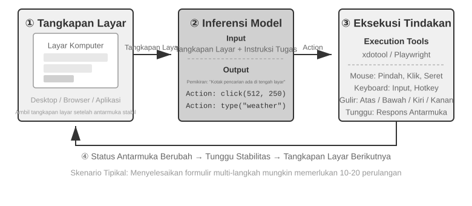

Ada tiga dimensi desain utama dalam loop ini: **Action Space** (operasi apa yang dapat dilakukan Agent), **Visual Grounding** (bagaimana menemukan elemen target dalam tangkapan layar), dan **Model Architecture** (bagaimana menghasilkan tindakan yang benar dari tangkapan layar).

### Desain Action Space

Implementasi referensi Anthropic membagi kemampuan interaksi lengkap menjadi tiga jenis alat (Gambar 6-12). Ini adalah desain action space yang jelas, tetapi bukan protokol privat yang wajib diikuti penyedia model: selama Harness dapat menerjemahkan tangkapan layar, batasan tindakan, dan hasil eksekusi yang sama menjadi pesan serta keluaran terstruktur yang didukung model sasaran, Claude, model visi berbobot terbuka, dan endpoint swakelola semuanya dapat menggerakkan loop Perceive-Think-Act yang sama.

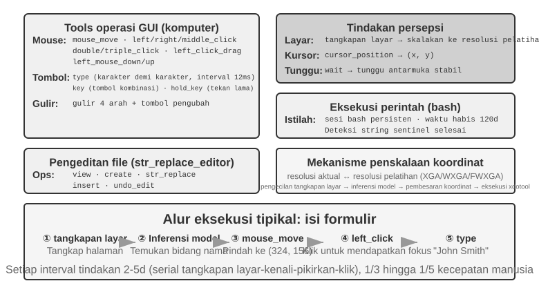

**GUI Operation Tool** (alat `computer`): Operasi mouse mencakup menggerakkan (`mouse_move`), klik kiri/kanan/tengah, klik ganda atau klik tiga kali, menyeret (`left_click_drag`), dan tindakan tekan/lepas yang lebih presisi (`left_mouse_down` dan `left_mouse_up`). Menggulir (`scroll`) mendukung empat arah dan dapat dikombinasikan dengan tombol pengubah. Operasi keyboard mencakup mengetik karakter demi karakter (`type`, dengan interval 12ms antar karakter untuk menyimulasikan pengetikan nyata), kombinasi tombol (`key`, mis., `Ctrl+C`), dan menahan tombol (`hold_key`). Tindakan persepsi mencakup mengambil tangkapan layar, mengambil posisi kursor (`cursor_position`), dan menunggu (`wait`).

**Command Execution Tool** (alat bash): Menyediakan sesi terminal bash persisten dengan batas waktu 120 detik. Alat ini menggunakan string sentinel untuk mendeteksi penyelesaian perintah dan mempertahankan status lingkungan di beberapa pemanggilan (mis., setelah `cd` ke sebuah direktori, panggilan berikutnya tetap berada di direktori tersebut).

**File Editing Tool** (`str_replace_editor`): Memungkinkan pengeditan yang aman melalui pencocokan string dan mendukung operasi lihat, buat, ganti, sisipkan, dan urungkan. Ini lebih presisi daripada menimpa seluruh file dan lebih kecil kemungkinannya untuk memodifikasi konten yang tidak terkait secara tidak sengaja.

> **Eksperimen 6-8 ★: Menjalankan Computer Use (Jalur Referensi Anthropic atau Jalur Model Terbuka)**
>
> Jalur A menggunakan Anthropic Computer Use Demo. Kontainernya mengemas lingkungan desktop Ubuntu lengkap, termasuk browser, terminal, dan tool umum lainnya. Frontend menerima tugas, sedangkan backend mengirim instruksi dan tangkapan layar ke Claude, lalu mengeksekusi aksi mouse, keyboard, terminal, atau pengeditan yang dikembalikan oleh model.
>
> Jalur B menggunakan kode contoh di [`chapter6/computer-use-open-model`](../chapter6/computer-use-open-model/). Secara default, jalur ini menjalankan browser-use dengan model open-weight Qwen3-VL 32B Instruct melalui OpenRouter API yang di-host, atau melalui vLLM/SGLang yang di-host sendiri dan sistem serupa.

### Visual Grounding

Dalam setiap iterasi loop, model perlu menemukan elemen target di tangkapan layar secara akurat—"Di mana kotak pencariannya?" "Apa koordinat tombol kirim?" Ini adalah masalah visual grounding. Saat ini, ada **dua pendekatan utama**: yang pertama adalah mengubah pelokalan menjadi **masalah pilihan ganda**—pertama beri anotasi elemen antarmuka dengan angka, dan model hanya perlu memilih satu; yang lainnya adalah **prediksi koordinat murni**—membiarkan model "melihat" tangkapan layar dan melaporkan koordinat secara langsung, persis seperti manusia. Pendekatan pilihan ganda memiliki dua metode implementasi: **anotasi visual murni** (Set-of-Mark asli, menggunakan model segmentasi untuk menyegmentasi wilayah kandidat dalam gambar) dan **pengindeksan elemen terstruktur** (DOM/Accessibility Tree, secara langsung membaca struktur inheren antarmuka). Keuntungan umum dari pendekatan pilihan ganda adalah mengubah masalah terbuka "temukan tombol dalam tangkapan layar dan prediksi koordinatnya" menjadi masalah tertutup "pilih satu dari elemen yang sudah dianotasi". Sama seperti pertanyaan pilihan ganda yang lebih mudah dijawab dengan benar daripada pertanyaan isian dalam ujian, model hanya perlu mengatakan "klik [123]" daripada "klik tombol pada posisi (350, 464) di layar". Mengeluarkan koordinat adalah tantangan yang sangat berat bagi model: dibutuhkan pelatihan dalam jumlah besar agar akurat, dan hasilnya mudah meleset pada resolusi layar yang berbeda-beda.

**Set-of-Mark: Metode Anotasi Visual.**

Set-of-Mark (SoM) asli diusulkan oleh Microsoft Research pada tahun 2023, awalnya untuk membuka kemampuan visual grounding dari GPT-4V. Ini adalah metode **visual murni**: menggunakan model segmentasi gambar (SAM, SEEM, dll.) untuk menyegmentasi wilayah kandidat dalam tangkapan layar secara otomatis, menempatkan penanda bernomor pada setiap wilayah, dan model melihat gambar dengan angka-angka. Model hanya perlu melaporkan angka tersebut, dan sistem mengubahnya menjadi koordinat tengah dari wilayah yang sesuai. Seluruh proses tidak memerlukan DOM atau struktur antarmuka internal apa pun, sehingga sama-sama berlaku untuk perangkat lunak desktop asli dan antarmuka game—selama model segmentasi dapat mengidentifikasi wilayah kandidat.

**Pengindeksan Elemen Terstruktur: Implementasi Terstruktur dari Ide SoM di Web.**

Ketika antarmuka itu sendiri menyediakan informasi terstruktur, anotasi dapat menjadi lebih presisi. Sebelum rendering, halaman web modern mendefinisikan struktur elemen lengkap (pohon DOM) dan peran semantik yang mengidentifikasi tombol, bidang input, dan kontrol lainnya. Accessibility tree memberikan informasi serupa untuk banyak aplikasi desktop. Sistem Web Agent seperti `browser-use` melakukan hal ini: mereka menghitung dan menomori elemen interaktif dari DOM. Ini adalah implementasi terstruktur dari ide SoM untuk web (Gambar 6-13). Prosesnya memiliki empat langkah:

1. Mendapatkan representasi terstruktur (pohon DOM) dan informasi aksesibilitas untuk halaman tersebut melalui antarmuka debugging browser (CDP, Chrome DevTools Protocol)
2. Mendeteksi elemen mana yang interaktif secara otomatis (tombol, kotak input, tautan, dll.)
3. Menganotasi setiap elemen interaktif dengan ID unik dan menggambar kotak pembatas (bounding box) pada tangkapan layar
4. Secara bersamaan menghasilkan daftar teks yang mendeskripsikan elemen yang sesuai dengan setiap ID

```text
Tangkapan layar: [Elemen kunci pada gambar dianotasi dengan ID seperti [1], [2], [3], [4]]

Elemen:
[1] <input type="text" placeholder="Search" aria-label="Search" />
[2] <button id="submit-btn" aria-label="Submit form" />
[3] <input type="text" placeholder="Enter your name" value="" />
[4] <a href="/docs" aria-label="Documentation" />
```

Model hanya perlu menghasilkan ID, dan sistem secara otomatis mengklik bagian tengah elemen yang sesuai. Pendekatan ini tidak menghemat token karena semua data anotasi tetap harus dikirim ke model, tetapi memberikan pelokalan yang akurat dan stabil sembari menghindari deteksi yang terlewat dan positif palsu yang dapat diperkenalkan oleh model segmentasi.

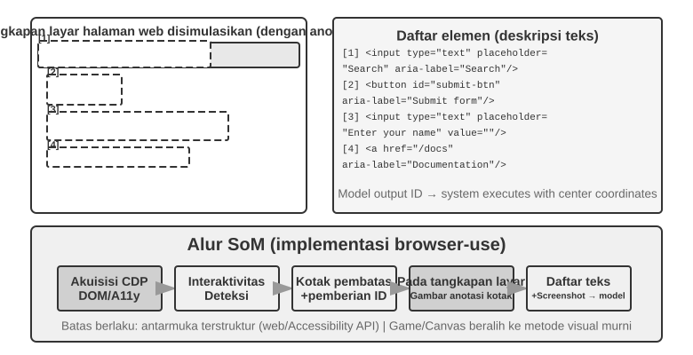

**Prediksi Koordinat Murni.**

Rute ketiga melewatkan anotasi dan meminta model untuk mengeluarkan koordinat secara langsung. Sistem seperti **SeeClick** dan computer use Claude mengandalkan model visi yang dilatih pada dataset besar tangkapan layar GUI yang dipasangkan dengan posisi elemen. Model ini belajar memetakan deskripsi bahasa alami (mis., "klik tombol kirim") secara langsung ke koordinat tangkapan layar yang tepat, mengandalkan persepsi visual seperti pengguna manusia.

Dalam skema prediksi koordinat, pemahaman model tentang koordinat sangat bergantung pada resolusi yang digunakan selama pelatihan (Gambar 6-14). Claude dilatih menggunakan XGA (1024×768), WXGA (1280×800), dan FWXGA (1366×768). Jika resolusi tangkapan layar input tidak cocok, prediksi koordinat model akan bergeser secara sistematis—seperti mengukur jarak di peta kecil dan kemudian menerapkannya secara langsung ke peta besar. Oleh karena itu, mekanisme penskalaan koordinat dua arah harus diimplementasikan pada lapisan alat, dan resolusi target harus **dipilih berdasarkan rasio aspek** untuk menghindari peregangan tidak seragam yang mendistorsi gambar dan akibatnya membiaskan penilaian koordinat. Misalnya, jika resolusi layar sebenarnya adalah 2560×1440 (16:9), target yang paling sesuai di antara tiga opsi yang didukung Claude adalah FWXGA (1366×768), yang memiliki rasio aspek terdekat dengan 16:9. Tangkapan layar diskalakan secara proporsional menjadi 1366×768 dan diumpankan ke model; setelah model mengeluarkan koordinat klik (683, 384), koordinat tersebut dipetakan secara terbalik ke koordinat sebenarnya (683×2560/1366, 384×1440/768) ≈ (1280, 720). Sebaliknya, jika gambar 16:9 diregangkan secara paksa ke 4:3 1024×768, gambar akan dikompresi secara horizontal, menyebabkan prediksi koordinat model bergeser secara sistematis.

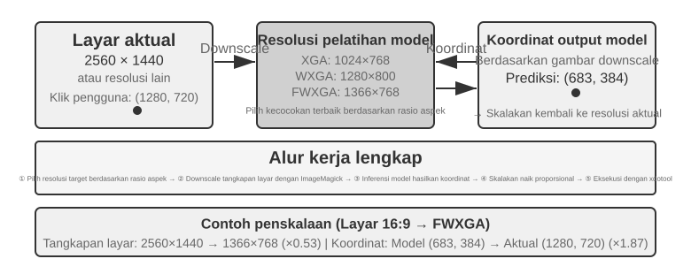

Pilihan di antara ketiga rute tersebut dapat diringkas sebagai berikut: **ketika informasi terstruktur tersedia, prioritaskan pengindeksan DOM/accessibility-tree** untuk pelokalan yang paling akurat dan stabil. **Ketika tidak tersedia**—dalam perangkat lunak desktop asli seperti Photoshop, antarmuka yang dirender canvas/WebGL, atau game—**gunakan anotasi visual (rute SoM asli) atau prediksi koordinat**. Anotasi visual mengubah pelokalan menjadi masalah pilihan ganda, membuatnya lebih ramah terhadap model serbaguna tanpa pelatihan khusus. Prediksi koordinat menghilangkan langkah anotasi dan lebih langsung untuk model yang dilatih khusus pada pelokalan GUI. Kedua pendekatan ini masih kesulitan dengan elemen kecil dan antarmuka yang padat.

> **Eksperimen 6-9 ★: Menggunakan browser-use untuk Mengimplementasikan Operasi Browser Otomatis**
>
> Gabungkan Playwright, framework otomasi browser, dengan model multimodal untuk menjalankan operasi browser berbasis bahasa alami. Aktifkan visualisasi SoM dan simpan screenshot dengan kotak anotasi sebelum setiap keputusan.
>
> Tugas uji “Buka Google dan cari cuaca San Francisco”: setelah startup, screenshot menampilkan Google dengan elemen interaktif bernomor. Model memilih kotak pencarian, memasukkan “San Francisco weather today”, mengirim pencarian, lalu mengekstrak suhu dan kondisi dari halaman hasil.

### Computer Use Agent yang Dapat Menonton Animasi dan Mendengar Suara

Sejauh ini, persepsi Computer Use bertumpu pada asumsi implisit: **layar bersifat statis**—ambil screenshot, pikirkan satu langkah, klik, lalu ambil screenshot berikutnya. Layar nyata memutar video, menampilkan notifikasi singkat, dan mengeluarkan suara rapat. Agent yang hanya membuka mata setiap 3–5 detik dan tidak memiliki telinga tidak dapat melihat atau mendengar apa yang terjadi di antara dua frame.

Yang perlu didesain ulang bukan action interface, melainkan **observation interface**[^ch6-9]. Agent–computer observation interface (AOI) mengubah observasi environment yang kontinu menjadi event diskret yang mudah diproses model. Teknik utamanya: **screenshot keyframe layar**, yang memakai model kecil untuk menilai apakah layar mengalami perubahan yang bermakna dan hanya mengambil screenshot ketika perubahannya signifikan—saat perubahan berlangsung sering, satu screenshot per detik pun sudah memberi hasil yang cukup baik; **transkripsi ucapan berbasis volume**, yang memanggil pengenalan suara saat ada suara dan memasukkan teks hasil pengenalan ke dalam context sehingga Agent dapat mendengar; dan **mendeskripsikan frame sebagai teks**, yaitu meminta model mendeskripsikan screenshot yang ditangkap menjadi satu kalimat, sehingga meskipun gambar aslinya kemudian dibersihkan dari context, kalimat itu tetap berada dalam context dan riwayat interaksi multimodal pun termampatkan.

[^ch6-9]: Lihat Li, Bojie and Noah Shi. *Agent-Computer Observation Interfaces Enable Dynamic Computer Use.* arXiv:2606.29472, 2026.

### World Model untuk Computer Use

Antarmuka observasi pada bagian sebelumnya menjawab "apa yang terjadi di antaranya": lewat keyframe, transkripsi suara, dan teks yang bertahan, Agent tidak lagi hanya melihat dua tangkapan layar yang terpisah jauh. Tetapi antarmuka observasi tidak menghapus tundaan perencanaan. Agent masih menjalankan lingkar serial "tangkap layar—berpikir—klik", dan setiap kali selesai satu aksi ia mengamati ulang serta memikirkan langkah berikutnya. Kajian efisiensi **OSWorld-Human** memperlihatkan bahwa sekalipun tugas akhirnya berhasil, jumlah langkah dan waktu tunggu Agent tetap jauh lebih banyak daripada manusia; mencapai ketepatan setara manusia tidak sama dengan sudah cukup layak pakai.

Ketika manusia mengoperasikan komputer, ia tidak mulai memikirkan langkah berikutnya baru setelah mengklik, melainkan lebih dulu meramalkan akibat aksinya: bila perubahan yang sesungguhnya sesuai dengan dugaan, ia meneruskan rencana semula; hanya ketika keadaan halaman menyimpang dari dugaan barulah ia berhenti untuk mengamati dan merencanakan ulang. World model membuat Agent bisa meramalkan akan menjadi apa layar kerja itu sebelum ia bertindak, sehingga terwujud "eksekusi spekulatif" mirip manusia yang meningkatkan efisiensi secara mencolok.

Keadaan layar kerja bukan sekadar sebuah citra piksel: ia juga mencakup jendela, fokus, posisi gulir, isi kotak masukan, keadaan pemuatan, izin, dan balasan jaringan; sedangkan aksinya mencakup klik, ketikan papan ketik, gulir, seret, dan tunggu. Sebuah world model yang bisa dipakai untuk Computer Use setidaknya harus mampu menyandikan keadaan sekarang, meramalkan perubahan keadaan yang ditimbulkan aksi calon, dan menyerahkan ramalan itu kepada perencana untuk menetapkan langkah berikutnya:

```text
keadaan layar kerja + click/type/scroll/wait ──> representasi keadaan berikutnya
```

Dengan begitu Agent dapat membandingkan akibat aksi-aksi calon sebelum benar-benar mengklik, menyiapkan langkah berikutnya selagi halaman dimuat, dan pulih berdasarkan selisih keadaan ketika sebuah jendela sembul lewat sekejap. Misalnya bila tugasnya "buat berkas Python baru di VS Code dan tulis hello world", model bisa lebih dulu meramalkan keadaan kunci pohon berkas dan penyunting setelah berhasil, baru kemudian memilih aksi klik, ketik, dan simpan; bila tugasnya menghapus berkas, ia bisa lebih dulu meramalkan di dalam layar kerja maya yang terisolasi apakah akan muncul kotak konfirmasi yang tak dapat dibatalkan, dan meminta persetujuan pengguna bila perlu. Yang penting di sini bukan membuat model menghasilkan tangkapan layar masa depan yang tampak nyata, melainkan meramalkan selisih keadaan yang dapat diperiksa dan yang memang dibutuhkan untuk menuntaskan tugas.

Pada Juli 2026, **Photon-1** yang diumumkan Induction Labs memperlihatkan satu perwujudan jalur ini: pralatih world model computer use diselesaikan hanya dengan 30.000 jam GPU H200. Ia memampatkan setiap bingkai menjadi token laten diskret dan meramalkan secara autoregresif representasi keadaan berikutnya sesudah sebuah aksi, alih-alih menghasilkan tangkapan layar piksel demi piksel pada tahap pralatih; adapun pembangkit citra yang ditautkan padanya hanya dipakai untuk memvisualkan representasi laten dan bukan komponen yang diperlukan saat inferensi. Diberi satu tangkapan layar benih beserta aksi-aksi lanjutannya, model dapat terus-menerus "membayangkan" keadaan layar kerja, lalu belajar mengeluarkan aksi computer-use melalui pelatihan daring di atas mesin maya.[^ch6-20]

[^ch6-20]: David Li and Jonathan Li, Induction Labs, “Scaling Video Pretraining with Imagination Models,” 2026-07-23. https://www.inductionlabs.com/news/scaling-video-pretraining. Parameter, skala data, tolok ukur internal, dan perbandingan biaya Photon-1 yang disebut dalam teks semuanya merupakan hasil yang diungkap perusahaan itu sendiri.

### Seluler: Hambatan Ekosistem Lebih Sulit Daripada Teknologi

Computer Use juga merambah ke perangkat seluler. Antara seluler dan desktop memang ada perbedaan teknis: ruang aksi umumnya bukan lagi "koordinat tetikus + papan ketik", melainkan lewat API layanan aksesibilitas sistem (seperti AccessibilityService di Android) untuk membaca elemen antarmuka serta mengirim ketukan dan masukan teks; cara berinteraksi pun beralih dari penunjuk tetikus ke gestur sentuh, sehingga makna koordinat ikut berubah — titik (x, y) yang sama perlu jenis gestur tambahan untuk menentukan apakah itu ketukan tunggal, tekan lama, atau titik awal sebuah usapan. Tolok ukur seluler seperti AndroidWorld yang dibahas pada Bab 7 justru mengukur kemampuan Agent menuntaskan tugas nyata di dalam aplikasi pada ruang aksi semacam ini.

Namun yang benar-benar mengganjal di seluler kerap bukan perbedaan teknis itu, melainkan hambatan ekosistem. Seorang produsen ponsel pernah mencoba menanamkan asisten AI pada ponsel konsumen agar mengoperasikan sendiri aplikasi sehari-hari seperti WeChat, Taobao, dan Alipay, tetapi cepat berbenturan dengan pembatasan platform.

Ini menyingkap tantangan khas yang dihadapi Computer Use: **hambatan ekosistem**. Akar penyebab pemblokiran itu adalah benturan model bisnis. Logika monetisasi aplikasi internet tradisional bertumpu pada **trafik dan perhatian**: pengguna melihat iklan saat menggulir umpan, mengikuti arahan algoritma rekomendasi saat mencari barang, dan berbelanja impulsif saat menjelajah halaman. Ketika Agent menggantikan pengguna dalam mengoperasikan aplikasi, rantai monetisasi itu dilewati sepenuhnya: AI tidak menonton iklan dan tidak berbelanja impulsif, ia langsung menuju sasaran lalu pergi. Bagi platform yang hidup dari iklan dan trafik, setiap operasi Agent menggerogoti fondasi model bisnisnya.

Artinya, yang dihadapi Computer Use bukan sekadar perlawanan teknis seperti CAPTCHA (kode verifikasi), melainkan **konflik kepentingan yang struktural**. Pertentangan ini sulit didamaikan dalam jangka pendek, dan membuat penerapan Computer Use pada skenario konsumen menghadapi tantangan yang lebih pelik daripada persoalan teknis murni.

## Robot Manipulation: Merapikan Meja dengan XLeRobot

> **Cara membaca bagian ini**: dari awal sampai akhir kita memakai satu tugas saja——"masukkan cangkir merah ke nampan, buang kertas kuning ke tempat sampah, lalu amati sekali lagi untuk memastikan keadaan meja". Eksperimen 6-10 dan 6-12 dijalankan pada XLeRobot fisik dan memerlukan lengan robot, kalibrasi, tombol henti darurat, serta pengawas di tempat. Eksperimen 6-11, 6-13, dan 6-14 adalah padanannya di GPU lokal. Hasil fisik dan hasil simulasi dilaporkan terpisah, tetapi tujuan tugas, makna aksi, dan syarat keberhasilannya dijaga tetap sama.

Manipulasi robot jauh lebih sulit daripada "melihat gambar lalu menjawab pertanyaan". Model bukan hanya harus memahami pemandangan, tetapi harus bertindak secara berkelanjutan di dunia nyata, dan setiap aksi mengubah keadaan pada detik berikutnya. XLeRobot membuat perbedaan ini menjadi sangat konkret. Lengan yang sama bisa dikendalikan dari jarak jauh oleh manusia dengan papan ketik, gamepad, atau perangkat VR; bisa pula pengamatan kamera dan sehimpunan kecil alat aksi diserahkan kepada Agent agar ia memanggilnya sendiri. Perangkat kerasnya tidak berubah, tugasnya juga tidak; yang berubah hanya siapa yang mengoperasikan——pada kasus pertama manusia terus mengamati dan mengoreksi, pada kasus kedua model dan sistem kendali harus menuntaskan pekerjaan yang sama.

Bagian ini merangkai lima eksperimen dengan "merapikan meja". Mula-mula manusia mengendalikan XLeRobot fisik dari jarak jauh, untuk mengukur sampai di mana kemampuan perangkat keras ini di tangan operator yang cukup cakap. Berikutnya, di dalam simulator, kita menetapkan batas atas kendali yang ideal untuk tugas yang sama. Setelah itu Agent dibiarkan mengendalikan XLeRobot fisik secara mandiri, untuk melihat bagaimana persepsi, perencanaan, dan pemulihan dari kegagalan menentukan hasil. Selanjutnya kontrak alat yang sama dipindahkan ke simulator, dan tiga strategi dibandingkan sekaligus: eksekusi lingkar terbuka, pemeriksaan bertahap, dan model dunia. Terakhir kita mengubah latar belakang, rupa benda, pencahayaan, dan derau visual untuk melihat apakah kebijakan visual yang dipelajari di simulasi mampu menyesuaikan diri dengan lingkungan baru.

Hambatan di sini biasanya bukan membuat satu lagi tolok ukur tanya-jawab yang statis, melainkan membuat model tetap menutup lingkar kendali dengan lebar pita persepsi dan kendali yang terbatas. Sistem robot yang layak pakai setidaknya harus menjawab empat pertanyaan berikut:

1. Tugas apa yang ingin diselesaikan manusia?
2. Subtugas mana yang dikerjakan berikutnya?
3. Aksi konkret apa yang dihasilkan keterampilan saat ini?
4. Setelah aksi dijalankan, apakah kenyataan masih sesuai dengan rencana semula?

Bagian ini menaruh keempat pertanyaan itu di dalam lingkar kendali XLeRobot yang sama, dan menunjukkan bagian mana yang ditangani masing-masing dari empat teknik: perencanaan jangka panjang menentukan cangkir dulu atau kertas dulu; VLA atau primitif aksi mengerjakan penjepitan dan peletakan; model dunia memperkirakan akibat sebuah aksi; dan perpindahan dari simulasi ke dunia nyata memikul selisih antara video latih dengan kamera serta aktuator sungguhan. Sekalipun model tingkat tinggi sudah punya pengetahuan dan kemampuan perencanaan yang memadai, cukup satu mata rantai umpan balik ini hilang untuk membuat sistem gagal menuntaskan tugas.

### Pembagian Kerja antara Perangkat Keras dan Algoritme

Pertanyaan pertama yang paling cocok dijawab XLeRobot adalah: ketika perapian meja secara mandiri gagal, apakah lengan robotnya yang tidak mampu, atau algoritmenya yang tidak becus memakai lengan itu? Ada satu fakta di sini yang tidak boleh diperlunak: **lengan seharga beberapa ratus dolar seperti XLeRobot pun, lewat teleoperasi, sudah sanggup menuntaskan tugas meja berantai beberapa langkah seperti pada bagian ini**——manusia menonton video kamera, menjepit cangkir merah dan menaruhnya di nampan, membuang kertas kuning ke tempat sampah, lalu memeriksa keadaannya sekali lagi. Hasil ini bukan sekadar berarti "perangkat kerasnya nyaris cukup", melainkan bukti diagnostik yang jelas: **sejauh menyangkut tugas ini, hambatannya ada pada algoritme, bukan pada perangkat kerasnya.**

Cara mendiagnosisnya lugas. Dengan kamera, lengan, penjepit, tata letak meja, dan syarat keberhasilan yang dikunci, manusia lebih dulu memegang lingkar kendali. Manusia terus-menerus mengoreksi taksiran posisi benda, pilihan aksi, dan pemilihan waktu, serta tahu apa yang harus dilakukan ketika jepitan gagal. Jarak antara sistem mandiri dan manusia justru tampak pada kemampuan lingkar tertutup semacam itu. Tentu saja jangkauan kesimpulan ini adalah tugas meja pada bagian ini: ia menunjukkan perangkat keras sudah melewati ambang beban, ketelitian, dan ruang kerja yang dibutuhkan tugas ini, tetapi bukan berarti lengan seharga beberapa ratus dolar sanggup menangani segala lingkungan terbuka atau manipulasi yang lebih sulit.

XLeRobot mendukung beberapa pintu masuk teleoperasi: papan ketik, pengendali Xbox, Joy-Con Switch, dan perangkat VR. Operator manusia secara alami melakukan banyak hal yang harus ditulis eksplisit bila dikerjakan algoritme: melambat ketika penjepit mendekati cangkir, memperbaiki titik jepit bila cangkir tergelincir, mengamati ulang bila kertas tak terjepit dalam sekali coba, dan memastikan hasilnya ketika benda masuk ke zona sasaran. Karena itu teleoperasi bukan hanya sarana mengumpulkan data demonstrasi, melainkan juga eksperimen diagnostik yang "mengunci perangkat keras dan hanya mengganti operatornya".[^ch6-1]

> **Eksperimen 6-10 ★: Merapikan meja dengan meneleoperasi XLeRobot fisik**
>
> Taruh cangkir merah, nampan, gumpalan kertas kuning, dan tempat sampah di area kerja XLeRobot fisik. Operator menjalankan tugas tetap melalui salah satu jalur teleoperasi yang sudah dikalibrasi: "masukkan cangkir merah ke nampan, buang kertas kuning ke tempat sampah, lalu amati sekali lagi untuk memastikan keadaan meja". Ulangi sekurang-kurangnya beberapa putaran, dan catat video kamera, masukan operator, keadaan lengan, lama aksi, kegagalan jepitan, jumlah percobaan ulang, serta keadaan akhir.
>
> Jangan menurunkan syarat penerimaan menjadi "pada akhirnya meja tampak bersih". Cangkir merah harus berada di dalam nampan dan kertas kuning di dalam tempat sampah, lengan harus kembali ke sikap aman, dan sepanjang proses tidak boleh ada tabrakan, keluar dari area kerja, maupun campur tangan manusia yang menuntaskan tugas tanpa verifikasi.

Teleoperasi fisik adalah cara paling meyakinkan untuk menunjukkan batas atas tugas, tetapi kurang cocok untuk mengubah jumlah dan posisi benda secara besar-besaran. Untuk memperoleh pembanding yang dapat diulang dan bisa dihitung secara statistik, masalah "mengembalikan benda ke tempatnya" yang sama berikutnya kita pindahkan ke simulator meja dua dimensi, dan kita pakai pengendali ideal sebagai pengganti operator kuat yang tidak salah mempersepsi dan tidak salah memilih aksi.

> **Eksperimen 6-11 ★: Mengukur batas atas kendali ideal untuk tugas yang sama di simulator**
>
> Di dalam simulator meja dua dimensi, tempatkan cangkir merah, kertas kuning, dan zona sasaran masing-masing secara acak, lalu biarkan pengendali ideal mendekati benda satu per satu, menjepitnya, dan memindahkannya ke posisi yang benar. Ia tidak perlu mengenali gambar dan tidak pernah salah memilih aksi, sehingga ia mewakili "sejauh mana tugas ini setidaknya bisa berjalan bila persepsi dan keputusan sama-sama benar".
>
> Amati tingkat keberhasilan, jumlah langkah, dan panjang lintasan; ubah pula posisi awal benda dan skala tugas untuk melihat apakah batas ideal itu tetap stabil. Syarat keberhasilannya sama dengan Eksperimen 6-10, tetapi yang diukur adalah simulasi tanpa aktuator: ini tidak berarti XLeRobot fisik telah bergerak. Keduanya menjadi dua garis dasar bagi kendali mandiri sesudahnya——Eksperimen 6-10 adalah lingkar tertutup manusia di atas perangkat keras nyata, dan Eksperimen 6-11 adalah lingkar tertutup ideal di lingkungan simulasi.

### Struktur Dasar Kendali Robot

Sistem robot biasanya memisahkan pekerjaan dengan skala waktu yang berbeda.

| Lapisan | Pertanyaan inti | Keluaran | Skala waktu khas |
| --- | --- | --- | --- |
| Tujuan tugas | Apa yang ingin diselesaikan manusia | "Cangkir dan kertas ke tempatnya" | Orde menit |
| Perencanaan jangka panjang | Mana dulu, mana kemudian | Cangkir dulu, lalu kertas, terakhir memeriksa | Detik sampai menit |
| Keterampilan dasar | Perubahan keadaan apa yang dicapai sekarang | `pick(red_cup)`, `place(red_cup, tray)` | Sekitar 1—3 detik |
| VLA / kebijakan keterampilan | Bagaimana persisnya keterampilan ini bergerak | Gerak pendek atau lintasan kontinu penjepit XLeRobot | Inferensi ~1—10 Hz |
| Kendali aras rendah dan lapisan keselamatan | Bagaimana menjalankannya dengan stabil dan tanpa tunda | Perintah sendi atau ujung lengan, batas laju dan henti darurat | ~50—1000 Hz |

Ini pembagian kerja rekayasa yang lazim, bukan satu-satunya arsitektur model. VLA bisa saja memikul sebagian keputusan aras tinggi, dan perencana bisa berupa program berbasis aturan, VLM, atau pengoptimal. Implementasi mana pun yang dipilih, "urutan tugas" sebaiknya dipisahkan dari "aksi saat ini"; jika tidak, tundaan inferensi model aras tinggi akan menyeret kendali aras rendah, sementara kendali berfrekuensi tinggi di aras rendah memaksa model atas mengolah segudang perincian yang tidak relevan. Pada XLeRobot, model tidak seharusnya langsung mengeluarkan sudut sendi sembarang: ia hanya memilih keterampilan berbatas jelas seperti `pick`, `place`, `verify_state`, dan `stop`, lalu pelaksana yang sudah dikalibrasi——dengan batas laju dan batas waktu——mengubahnya menjadi gerak lengan yang sesungguhnya.

### Perencanaan Jangka Panjang dan Penguraian Tugas

Ketika pengguna berkata "rapikan mejanya", sistem tidak bisa menyerahkan kalimat itu apa adanya kepada model aksi. Perencana lebih dulu mendaftar benda dan sasaran di dalam pemandangan, menetapkan urutannya, lalu menuliskan syarat mulai, syarat selesai, dan batas risiko untuk setiap langkah. Misalnya:

```text
Tangani cangkir merah → Singkirkan kertas kuning → Periksa meja
```

"Tangani cangkir merah" masih terurai menjadi dua aksi dan satu pemeriksaan:

```text
pick(red_cup) → place(red_cup, tray) → verify_state()
```

Setiap keterampilan yang tuntas memberi kita satu simpul yang bisa diperiksa. Bila jepitan gagal, hanya langkah itu yang diulang. Bila ada yang memindahkan benda atau pengguna mengubah sasaran, cukup rencanakan ulang langkah-langkah sesudahnya yang terpengaruh, bukan mengulang seluruh rencana lama. Alat yang diberikan kepada agen juga harus cukup sederhana: satu panggilan mengerjakan satu hal saja, jangkauan geraknya terkunci, ada batas waktu, dan sesudah dijalankan langsung diamati ulang.

> **Eksperimen 6-12 ★★: Membiarkan Gemini Robotics-ER 1.5 merapikan meja secara mandiri dengan XLeRobot**
>
> Pertahankan XLeRobot fisik, tata letak meja, perintah tugas, dan syarat keberhasilan dari Eksperimen 6-10; ganti hanya operator manusianya dengan Agent. Serahkan pengamatan dan perencanaan kepada model penalaran terwujud seperti Gemini Robotics-ER 1.5, dan lewat lingkar agen bergaya RoboCrew bukalah lima alat saja: `observe_scene`, `pick`, `place`, `verify_state`, dan `stop`.[^ch6-2]
>
> Model mula-mula mengamati meja, menetapkan urutan penanganan, lalu memanggil aksi jepit dan letak XLeRobot yang sudah dikalibrasi. Setiap kali sebuah keterampilan tuntas, ia harus mengamati ulang dan memeriksa pascasyaratnya. Ketika jepitan gagal ia hanya boleh mengulang keterampilan yang sedang berjalan, dan ia harus memanggil `stop` bila pengguna menyuruh berhenti, bila benda keluar dari area kerja, atau bila keadaan tak bisa diverifikasi. Model tidak boleh langsung mengeluarkan sudut sendi sembarang, dan tidak boleh melewati verifikasi nyata hanya karena ia sendiri sudah lebih dulu berkata "sudah selesai".
>
> Syarat penerimaannya persis sama dengan Eksperimen 6-10: cangkir di dalam nampan, kertas di dalam tempat sampah, lengan kembali ke sikap aman, tanpa tabrakan dan tanpa keluar area. Bedanya, pada eksperimen mandiri makna tugas harus lahir dari pengamatan model itu sendiri, aksi nyata harus lahir dari panggilan alat, dan keadaan akhir harus dipastikan lewat pengamatan yang baru. Manusia hanya boleh menyalakan, menekan henti darurat, dan mengawasi keselamatan——tidak boleh menuntaskan aksi menggantikan Agent di tengah jalan. Hanya dengan begitu Eksperimen 6-10 dan 6-12 dapat langsung dibandingkan: "dengan perangkat keras dan tugas yang sama, apa yang masih kurang pada lingkar tertutup model dibanding lingkar tertutup manusia".

Eksperimen fisik menyingkap galat kalibrasi, kamera yang terhalang, dan kegagalan penjepit, tetapi tidak cocok untuk mengulang banyak kerusakan secara aman dan terkendali. Eksperimen simulasi selanjutnya mempertahankan kelima alat itu dan keadaan tugas yang persis sama, dan hanya mengganti aktuator nyata dengan lingkungan meja tempat kegagalan bisa disuntikkan, agar dapat dipilah apa sumbangan masing-masing: eksekusi lingkar terbuka, pemeriksaan bertahap, dan prediksi aksi.

### Kendali dengan VLA

VLA adalah singkatan Vision-Language-Action, yaitu "model penglihatan—bahasa—aksi". Ia menerima pemandangan saat ini beserta satu perintah keterampilan, lalu mengeluarkan aksi yang harus dijalankan robot berikutnya:

```text
pengamatan saat ini + perintah keterampilan → aksi
```

Dalam contoh XLeRobot, perencana aras tinggi hanya mengajukan `pick(red_cup)`; VLA atau kebijakan keterampilanlah yang menentukan, dari pemandangan saat ini, dari arah mana mendekati cangkir, kapan penjepit dikatupkan, dan dengan lintasan seperti apa lengan diangkat. Setelah lapisan pelaksana menuntaskan gerak pendek itu, meja difoto ulang, dan hanya setelah dipastikan cangkir benar-benar terjepit barulah perencana boleh mengajukan `place(red_cup, tray)`. Dengan kata lain, panggilan alat menetapkan perubahan keadaan yang diinginkan, sedangkan VLA menetapkan bagaimana perubahan keadaan itu diwujudkan lewat aksi kontinu.

RT-2 dan OpenVLA memotong aksi kontinu menjadi token diskret dan mengeluarkannya satu per satu seperti menghasilkan kalimat. π₀ mewakili jalur yang lain: ia langsung menghasilkan lintasan aksi yang kontinu dan mulus. Tidak ada yang secara sederhana lebih unggul. Token diskret mudah dirangkai dengan model bahasa; lintasan kontinu lebih cocok untuk menyatakan gerak yang mulus. Pilihan yang sesungguhnya adalah bagaimana aksi sebaiknya diwakilkan, bukan sekadar seberapa besar modelnya.[^ch6-15]

Model besar biasanya hanya sanggup berinferensi 1—10 kali per detik, sedangkan pengendali tradisional bisa memperbarui puluhan sampai ribuan kali per detik. Praktik rekayasa yang lazim adalah "pemenggalan aksi" (action chunking): model sekali jalan menghasilkan sepenggal pendek aksi masa depan, utas kendali menjalankan penggalan itu pada frekuensi tinggi, dan model menyiapkan penggalan berikutnya di belakang layar. Dengan begitu sebagian waktu tunggu inferensi tersembunyi di dalam waktu pelaksanaan aksi. Harganya: makin panjang penggalannya, makin mulus geraknya, tetapi makin sedikit pemandangan baru yang dilihat model selama selang itu. Bila XLeRobot menjulurkan lengan hendak mengambil cangkir lalu cangkirnya tersenggol dan bergeser di tengah jalan, ia mungkin tetap menjalankan aksi yang dihasilkan dari gambar lama. Jadi pemenggalan aksi adalah pertukaran antara kemulusan dan kecepatan tanggap, bukan percepatan tanpa ongkos.

### Batas Kemampuan VLA

"Perencanaan jangka panjang + VLA" adalah rancangan dasar yang bisa dipakai, tetapi menyisakan beberapa persoalan yang mudah terlewat.

- **Data latihnya terbatas**: demonstrasi robot jauh lebih sedikit daripada teks dan gambar di internet. Model pernah melihat kata "cangkir" bukan berarti ia pernah melihat cangkir dari segala bahan dan segala kondisi gesekan.
- **Bisa meniru, tetapi tak paham akibat**: kloning perilaku terutama mempelajari "apa yang dilakukan pendemonstrasi berikutnya", dan tidak secara eksplisit menuntut model menjawab "apa yang ditimbulkan aksi ini".
- **Setiap robot berbeda**: dengan derajat kebebasan, sistem koordinat, penjepit, dan tundaan aktuator yang berlainan, tidak ada jaminan aksi yang sama bisa dipindahkan begitu saja ke mesin lain.
- **Pengamatan bisa basi**: setelah penggalan aksi mulai dijalankan, bila benda dipindahkan, terhalang, atau terguling, model masih memutuskan berdasarkan bingkai sebelumnya.

Jadi, model bahasa yang mengenal kata "cangkir" tidak berarti ia tahu bagaimana gesekan, sentuhan, riak zat cair, atau kabel daya mengubah keadaan di masa depan. VLA terutama menjawab "apa yang harus dikerjakan sekarang"; untuk menimbang "apa yang mungkin terjadi setelah dikerjakan" dibutuhkan model jenis lain.

### Model Dunia

Model dunia dapat dipahami sebagai peramal akibat aksi. Yang ia pelajari adalah: bila pada keadaan sekarang diambil suatu aksi, bagaimana keadaan pada saat berikutnya mungkin berubah.

```text
keadaan sekarang + aksi calon
    → ramalkan keadaan berikutnya atau sepenggal masa depan
    → bandingkan hasil tiap calon
    → pilih aksinya, rencanakan ulang, atau berhenti dengan aman
```

Model dunia yang bisa dipakai untuk robot setidaknya harus pandai dalam tiga hal:

- memahami keadaan sekarang;
- meramalkan hasil yang mungkin ditimbulkan aksi-aksi yang berbeda;
- menyerahkan ramalan itu kepada perencana atau pengendali untuk membantu memilih.

VLM yang hanya bisa menerangkan video, atau model yang hanya bisa membangkitkan gambar, tidak otomatis menjadi model dunia yang tepercaya untuk robot. Ia harus tahu apa itu aksi, dan bisa meramalkan pengaruh aksi itu terhadap benda dan lingkungan. V-JEPA 2 mewakili jalur meramalkan masa depan pada keadaan internal, sedangkan World-Action Model secara eksplisit mempelajari hubungan "aksi—pengamatan mendatang". Keduanya bisa dipakai berdampingan dengan VLA dan tidak harus menggantikannya.[^ch6-16]

Dalam sistem nyata, model dunia biasanya punya tiga kegunaan:

1. **Sebelum bergerak**: membandingkan aksi calon seperti menjepit, mendorong, atau menunggu, dan mendahulukan pilihan yang risikonya lebih kecil;
2. **Saat berjalan**: menyandingkan pengamatan nyata dengan ramalan, dan bila ditemukan simpangan, memperpendek aksi, berhenti, atau merencanakan ulang;
3. **Saat berlatih**: mempelajari perubahan keadaan dari video, data simulasi, dan jejak kegagalan, sehingga coba-coba pada mesin nyata berkurang.

Kembali ke tugas meja XLeRobot. Bila kertas kuning sebagian tertutup cangkir merah, sistem bisa membandingkan keterampilan calon: "ambil kertasnya dulu", "geser cangkirnya dulu", atau "jepit dari arah lain". Model dunia tidak perlu membangkitkan video robot yang tampak nyata: cukup ia bisa meramalkan aksi calon mana yang lebih mungkin membawa ke keadaan di mana kertas bisa diambil, dan aksi mana yang bisa menjatuhkan cangkir, untuk membantu perencana mengurutkan pilihan. Setelah aksi dijalankan, pengamatan kamera yang nyata tetap menjadi fakta pemutus: ramalan hanya membantu memilih, dan tidak menggantikan pemeriksaan penerimaan.

Yang diberikan model dunia bukan jawaban pasti, melainkan ramalan yang bisa dibandingkan tentang "apa yang mungkin terjadi bila begini". Makin jauh ke depan meramal, galatnya cenderung makin besar, dan pemandangan masa depan yang tampak nyata belum tentu sesuai dengan hukum sentuh dan gesek yang sesungguhnya. Karena itu sistem nyata tetap memerlukan ramalan jangka pendek, pengamatan waktu nyata, taksiran ketidakpastian, dan pengendali keselamatan perangkat keras yang berdiri sendiri. Model dunia generatif berguna untuk simulasi interaktif dan visualisasi, tetapi jangan mencampuradukkan "bisa membangkitkan video" dengan "bisa memandu aksi robot".[^ch6-21]

> **Eksperimen 6-13 ★★: Membandingkan tiga lingkar perapian meja mandiri di simulator**
>
> Pindahkan tugas, keadaan sasaran, syarat keberhasilan, dan kelima alat dari Eksperimen 6-12 ke simulator meja, dan ganti hanya aktuator XLeRobot fisik dengan pelaksana simulasi yang terkendali, yang sesekali membuat jepitan gagal sementara namun masih bisa dipulihkan. Dengan begitu tiga strategi dapat dibandingkan tanpa mengubah masalahnya.
>
> **Eksekusi lingkar terbuka** menghasilkan seluruh runtunan aksi sekaligus dan tidak mengamati ulang di tengah jalan. **Pemeriksaan bertahap** membaca ulang keadaan pada setiap `pick` dan `place`, dan bila gagal hanya mengulang keterampilan yang sedang berjalan. **Eksekusi prediktif** menambahkan model dunia jangka pendek, membandingkan ramalan hasil keterampilan calon sebelum memilih langkah berikutnya. Eksperimen ini membandingkan tingkat keberhasilan, ongkos tambahan panggilan alat, dan kemampuan pulih dari kegagalan, serta memeriksa apakah semua keberhasilan akhir sudah dipastikan oleh pengamatan baru dari `verify_state`.
>
> Tujuan eksperimen ini bukan menunjukkan bahwa model dunia simulasi yang kecil setara dengan model fisika mesin nyata, melainkan menguji hubungan yang lebih mendasar: perencanaan lingkar terbuka menyeret satu kegagalan setempat sampai ke ujung tugas, pemeriksaan bertahap memungkinkan pemulihan, dan prediksi aksi lebih jauh membantu mengurutkan keterampilan calon. Siapa yang benar-benar tuntas tetap ditentukan oleh umpan balik lingkungan.

### Dari Lingkungan Simulasi ke Robot Nyata

Eksperimen 6-13 yang stabil di simulator tidak berarti XLeRobot fisik pada Eksperimen 6-12 akan sama berhasilnya. Melangkah dari simulasi ke mesin nyata bukan sekadar berganti pengendali, melainkan memikul selisih antara dua lingkungan. Untuk berlatih kita bisa memakai data teleoperasi, data video, dan data interaksi simulasi; tetapi ketika benar-benar digelar, cangkir merah, kertas kuning, nampan, dan tempat sampah yang sama muncul di bawah latar belakang, pencahayaan, posisi kamera, dan hubungan halangan yang berbeda, sedangkan lengan robot lagi-lagi bertemu gesekan, derau sensor, dan tundaan aktuator yang lain. Bila selisih itu cukup besar, gerak yang dipelajari di simulasi bisa tidak mempan di dunia nyata.

> **Eksperimen 6-14 ★★★: Uji lintas lingkungan RGB pada tugas meja yang sama**
>
> Di lingkungan simulasi, teruslah memakai masalah dasar "memindahkan benda ke sasaran yang sesuai", dan pandanglah setiap sampel sebagai keputusan setempat di dalam perapian meja: dari gambar RGB, menimbang dari arah mana benda harus didekati, atau apakah ia sudah bisa dijepit. Latih empat kebijakan visual berstruktur sama: satu hanya melihat pemandangan tetap; satu mengubah-ubah latar belakang; satu mengubah-ubah rupa benda; dan yang terakhir mengubah latar belakang, rupa, pencahayaan, dan derau sekaligus.
>
> Ujilah semua kebijakan itu di lingkungan asal dan di lingkungan baru yang sudah diubah, lalu bandingkan ketepatan keputusan aksinya sebelum dan sesudah kondisi visual berubah. Yang hendak dijawab eksperimen ini bukan "apakah simulator sudah sama dengan XLeRobot fisik", melainkan pertanyaan yang lebih sempit: apakah dengan sengaja memperluas rentang perubahan pemandangan sewaktu berlatih membantu tugas cangkir—nampan dan kertas—tempat sampah yang sama ini menyesuaikan diri dengan video kamera yang baru? Sekalipun hasilnya membaik, penggelaran pada mesin nyata tetap menuntut kalibrasi kamera yang sesungguhnya, pengujian aktuator, dan lingkar keselamatan tertutup yang lengkap.[^ch6-6]

## Ringkasan Bab

Dilihat pada dua sumbu **modalitas** dan **waktu eksekusi**, **asynchronous dan event-driven** memperluas observasi dari “Agent mengambil” menjadi “dunia mendorong”, serta tindakan dari “selesai dalam giliran” menjadi “mulai sekarang dan dituntaskan oleh event berikutnya”. **Suara** memampatkan skala ke milidetik, bergerak dari bergantian bicara menuju mendengar dan berbicara terus-menerus, sambil membagi interaksi foreground realtime dari pemikiran background yang lebih dalam. **Computer Use** memindahkan loop ke layar, dengan bottleneck berupa efisiensi, pemahaman visual kontinu, dan konfirmasi status setelah tindakan. **Robotika** membawanya ke dunia fisik, tempat action chunking menukar kelancaran dengan responsivitas dan keberhasilan tetap harus dinilai dari observasi baru.

Keempat subbab berbagi satu kerangka kendali yang sama:

```text
mengindra terus-menerus
  → menilai keadaan dan waktu saat ini
  → memilih balasan atau aksi
  → membiarkan keluaran masuk ke lingkungan
  → mengamati umpan balik
  → melanjutkan, mengoreksi, mencoba lagi, berhenti, atau merencanakan ulang
```

Keempatnya juga berbagi primitive yang sama—wake-up, safe point, pembatalan, preemption, dan pemisahan cepat/lambat.

Bab ini merampungkan kepingan terakhir bagian “membangun Agent”: ruang observasi dan ruang aksi kini telah terbentang pada tiga arah sekaligus—isi, modalitas, dan waktu. Selanjutnya, Bab 7 menjawab cara menentukan apakah sistem telah dibangun dengan benar; Bab 8 membahas cara memperbarui parameter model melalui post-training; dan Bab 9 menyusun trajectory runtime, evaluasi, serta berbagai media pembaruan menjadi loop evolusi berkelanjutan. Bab 10 lalu beralih dari fondasi Agent tunggal yang lengkap ini ke kolaborasi multi-Agent.

[^ch6-16]: Meta AI, “Introducing the V-JEPA 2 world model and new benchmarks for physical reasoning,” 2025-06-11. https://ai.meta.com/blog/v-jepa-2-world-model-benchmarks/; V-JEPA 2 technical report：arXiv:2506.09985, https://arxiv.org/abs/2506.09985
[^ch6-21]: Jack Parker-Holder and Shlomi Fruchter, Google DeepMind, “Genie 3: A new frontier for world models,” 2025-08-05. https://deepmind.google/blog/genie-3-a-new-frontier-for-world-models/; Zachary Lin et al. *Cosmos World Foundation Model Platform for Physical AI.* arXiv:2501.03575, 2025. https://arxiv.org/abs/2501.03575 。
[^ch6-1]: XLeRobot, “Dokumentasi Teleop”. https://xlerobot.readthedocs.io/en/latest/software/getting_started/XLeRobot_teleop.html
[^ch6-2]: Google DeepMind, “Gemini Robotics-ER 1.5”. https://deepmind.google/models/gemini-robotics/gemini-robotics-er/; XLeRobot, “Kendali LLM Agent”. https://xlerobot.readthedocs.io/en/latest/software/getting_started/LLM_agent.html. Contoh hulu XLeRobot memperlihatkan cara menata model bersama panggilan alat; bagian ini mempertahankan prinsip penataan yang sama, tetapi membatasi alat aksinya pada primitif jepit, letak, periksa, dan henti di atas meja yang sudah dikalibrasi.
[^ch6-6]: LeRobot, “Tutorial Sim2Real”. https://github.com/StoneT2000/lerobot-sim2real/blob/87d6c1d969f6e0ca4dc5697940804e231118a63a/docs/zero_shot_rgb_sim2real.md
[^ch6-15]: Moo Jin Kim et al. *OpenVLA: An Open-Source Vision-Language-Action Model.* arXiv:2406.09246, 2024. https://arxiv.org/abs/2406.09246
[^ch6-22]: OpenAI, “[Async tool calling](https://developers.openai.com/api/docs/guides/async-tool-calling)”; “[Using GPT-6 Astra](https://developers.openai.com/api/docs/guides/latest-model)”, diperiksa 2026-09-05.
[^ch6-23]: OpenAI, “[Mid-turn steering](https://developers.openai.com/api/docs/guides/steering)”, diperiksa 2026-09-05.

## Pertanyaan Pemikiran

1. ★★ Dalam arsitektur Agent yang asinkron, strategi prioritas untuk antrean kejadian (*event queue*) harus ditentukan pada waktu desain. Tetapi jika penilaian prioritas itu sendiri membutuhkan pemahaman semantik (misalnya, menentukan apakah pesan baru lebih mendesak daripada tugas saat ini), siapa yang harus membuat penilaian ini—sebuah mesin aturan (*rules engine*) atau pemanggilan LLM yang lain? Apa saja biaya dari masing-masing pilihan?
2. ★★ Dalam pemrosesan kejadian berbasis antrean (*queue-based event processing*), model cenderung hanya berfokus pada kejadian terakhir. Bab ini memitigasinya melalui penanda bilah status Agent dan ringkasan. Namun, jika antrean memiliki 20 kejadian yang menumpuk (*backlogged*) (10 hasil tool + 5 pesan pengguna + 5 peringatan sistem), bagaimana Anda akan mengatur urutan presentasi dan format dari kejadian-kejadian ini agar model tidak melewatkan informasi kunci?
3. ★★★ Ketika Agent berinteraksi dengan dunia luar atas nama pengguna, pada dasarnya ia menghadapi pilihan identitas: menggunakan identitas virtual independen (email dan nomor telepon khusus) untuk bertindak sebagai pihak ketiga, atau langsung mengoperasikan akun pribadi pengguna sebagai pengguna itu sendiri? Opsi pertama memungkinkan operasi di latar belakang secara otonom, tetapi pihak ketiga mungkin tidak mempercayai identitas non-manusia; opsi kedua memiliki konteks dan izin yang lebih lengkap tetapi memunculkan masalah otorisasi, kepercayaan, dan batas keamanan. Dalam skenario seperti apa menurut Anda masing-masing mode harus dipilih?
4. ★★ Model end-to-end untuk Voice Agents menggabungkan ASR-LLM-TTS menjadi sebuah model tunggal, mengurangi latensi namun mengorbankan modularitas. Jika model end-to-end membuat kesalahan pada tahap tertentu (misalnya, speech recognition), melakukan debugging dan memperbaikinya jauh lebih sulit daripada dalam sebuah serial pipeline. Bagaimana Anda akan mendesain sebuah sistem observabilitas (observability system) untuk sebuah Voice Agent end-to-end?
5. ★ Step-Audio R1 mencapai "thinking while speaking" melalui arsitektur dual-brain MPS. Akan tetapi, manusia, ketika "berpikir sambil berbicara", sering kali mengatakan sesuatu sebelum mereka memikirkannya secara utuh, mengoreksi diri sendiri (self-correct), atau menggunakan kata-kata pengisi (filler words). Haruskah kemampuan "thinking while speaking" pada Agent meniru karakteristik manusia ini?
6. ★★ SoM (Set-of-Mark) dan varian terstrukturnya (DOM element indexing) mengubah lokalisasi visual Computer Use dari prediksi koordinat yang bersifat open-ended menjadi pemilihan ID closed-set, namun semuanya membutuhkan pendeteksian dan penganotasian elemen UI terlebih dahulu—baik melalui segmentation model ataupun DOM. Jika antarmuka tersebut mengandung kontrol non-standar atau elemen yang berubah secara dinamis, anotasinya mungkin menjadi tidak lengkap atau tidak akurat. Dalam kasus seperti ini, haruskah kita kembali menggunakan coordinate prediction?
7. ★★ Platform robot seharga beberapa ratus dolar seperti XLeRobot membuat pengumpulan data teleoperation menjadi murah. Namun, kualitas dari data teleoperation sangat bergantung pada keterampilan operatornya. Bagaimana data berkualitas rendah dari operator yang tidak terampil akan memengaruhi pelatihan model VLA? Bagaimana data berkualitas rendah dapat difilter secara otomatis selama fase pengumpulan data?
8. ★★★ Bab ini mencakup tiga modalitas interaksi: voice, Computer Use, dan robotika. Tren umum di seluruh modalitas ini adalah evolusi dari serial pipelines menuju model end-to-end. Jika tren ini berlanjut, akan seperti apa bentuk dari Agent interaction layer dalam lima tahun ke depan?
9. ★★ DOM/Accessibility Tree element indexing bekerja dengan baik pada aplikasi web standar, tetapi semakin banyak antarmuka perangkat lunak (rendering Canvas/WebGL, kontrol cross-platform yang digambar secara kustom) tidak menyediakan informasi terstruktur yang dapat diakses, hanya mengandalkan anotasi visual atau coordinate prediction. Apakah menurut Anda Computer Use harus bertaruh pada pendekatan visual murni, atau mempertahankan jalur terstruktur dan visual? Apa biaya dan manfaat dari mempertahankan kedua jalur tersebut?
10. ★★ Model VLA menggunakan action chunking—seperti yang disebutkan di dalam teks, konfigurasi tipikal π₀ menghasilkan 25-50 future actions pada 50Hz—untuk menyembunyikan inference latency di dalam execution time. Akan tetapi, jika lingkungan berubah secara tiba-tiba selama eksekusi (misalnya, sebuah objek dipindahkan), urutan tindakan (action sequence) yang dihasilkan sebelumnya menjadi tidak valid. Bagaimana kita dapat menyeimbangkan keuntungan efisiensi dari action chunking dengan kebutuhan akan responsivitas terhadap perubahan lingkungan?
11. ★★★ Ketiga skenario dalam bab ini (voice, Computer Use, robotika) menghadapi masalah latensi pada loop "perceive-think-act" dan sedang berevolusi menuju fast and slow thinking yang diparalelkan. Pada voice, ini bermanifestasi sebagai "mengoreksi setelah salah bicara"; pada Computer Use, sebagai "mengklik dulu, baru melihat"; pada robotika, sebagai "mengambil satu langkah, lalu melihat." Bagaimana kita dapat memastikan bahwa tindakan-tindakan yang didasarkan pada fast thinking ini tidak mengarah pada konsekuensi yang tidak dapat diubah (irreversible consequences)?
12. ★★★ Bab ini berulang kali menampilkan satu set primitif yang sama (membangunkan, titik aman, pembatalan, pendahuluan, pemisahan cepat/lambat) yang diimplementasikan pada skala waktu berbeda. Pilih salah satu dan jelaskan perbedaan implementasinya antara pemrosesan berbasis peristiwa (detik—hari) dan pemotongan aksi robot (milidetik). Apa yang terutama menentukan perbedaan itu—kecepatan perubahan lingkungan, keterbalikan aksi, atau biaya memperoleh observasi?
