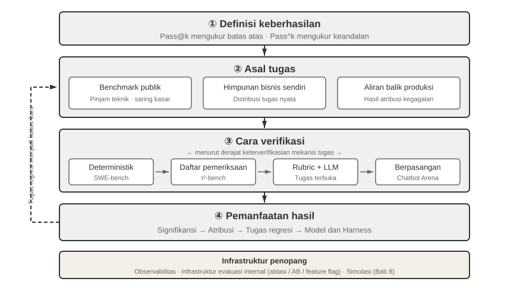
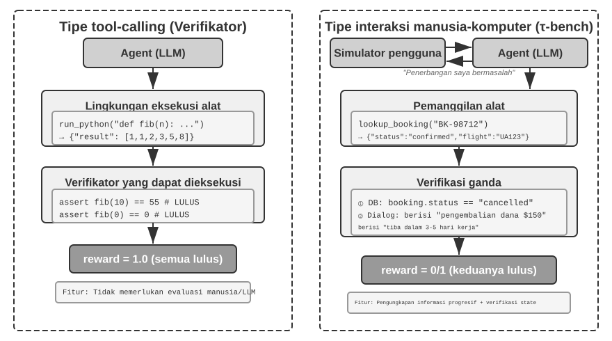
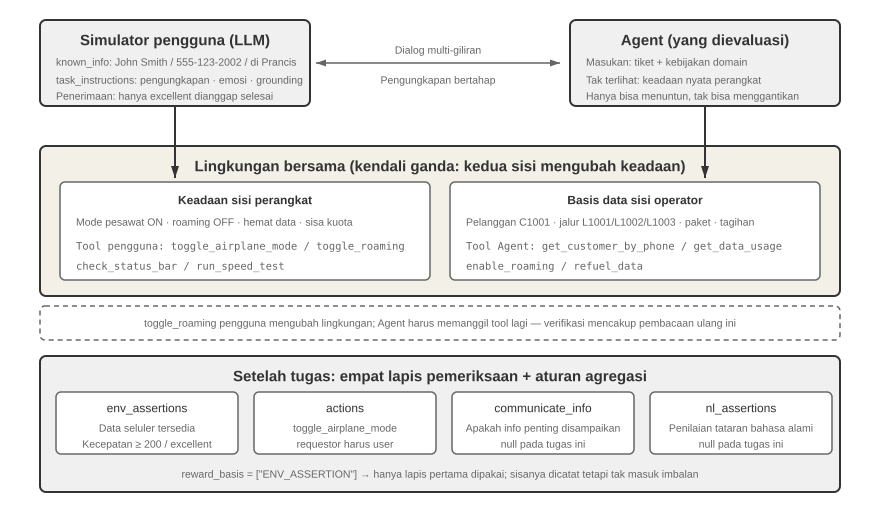
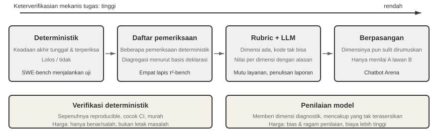
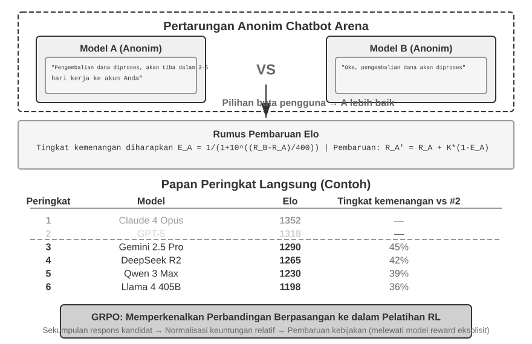
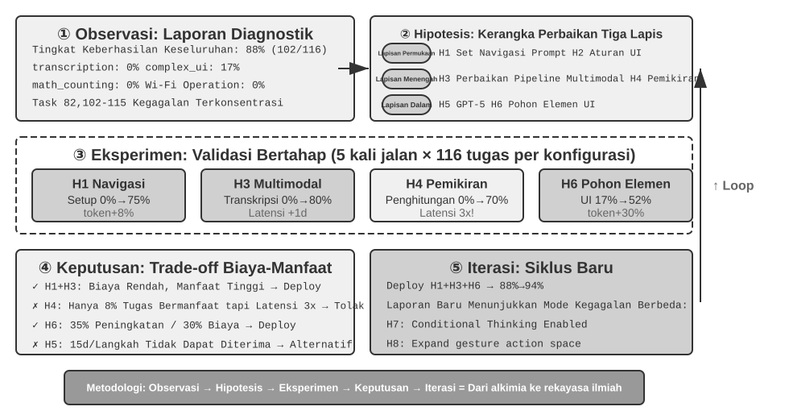

# Mengevaluasi Agent

Enam bab pertama telah menguraikan cara membangun satu Agent: konteks, pengetahuan, alat, kemampuan coding, serta ruang observasi dan ruang aksinya. Namun, selesai dibangun tidak berarti dibangun dengan benar; hanya pengukuran yang stabil yang dapat memberi arah tepercaya bagi training model dan evolusi sistem selanjutnya.

Saat membangun sistem Agent, pengembang dihadapkan pada banyak pilihan desain yang seringkali tidak memiliki jawaban benar yang jelas:

- Model mana yang harus digunakan?
- Tool apa saja yang dapat dipanggil oleh model?
- Data apa yang harus disimpan oleh Knowledge Base, dan bagaimana strukturnya?
- Bagaimana User Memory harus diimplementasikan?
- Bagaimana prompt dan Agent Skills milik model harus diatur?
- Batasan apa yang perlu ditambahkan pada Harness?
- Bagaimana hasil evaluasi harus diubah menjadi sinyal pembelajaran untuk evolusi berkelanjutan Agent?

Evaluasi meletakkan keputusan-keputusan ini pada dasar ilmiah. Melalui eksperimen komparatif yang sistematis (mengubah satu variabel pada satu waktu dan mengamati efeknya) dan eksperimen ablasi (menonaktifkan satu komponen pada satu waktu dan mengamati bagaimana performa keseluruhan berubah), Anda dapat membedakan peningkatan kemampuan yang asli dari fluktuasi yang dangkal — dan menghindari penghematan yang merugikan. Rekayasa perangkat lunak memiliki pepatah: Anda tidak dapat meningkatkan apa yang tidak Anda ukur. Tanpa sistem evaluasi yang berulang, Agent hanya dapat diiterasi berdasarkan intuisi.

Dari perspektif rekayasa Harness yang diperkenalkan pada Bab 1, evaluasi memainkan peran inti dari "verifikasi" di dalam Harness. Wawasan utamanya adalah: **objek evaluasi seharusnya tidak hanya modelnya, tetapi kombinasi dari model dan Harness**. Model yang sama dapat berkinerja sangat berbeda dalam Harness yang berbeda — beberapa tim telah secara signifikan meningkatkan performa model yang sama pada tugas-tugas terminal murni dengan mengoptimalkan Harness (lihat Bab 5). Jadi, ketika sebuah Agent dievaluasi dengan buruk, solusinya mungkin bukan model yang berbeda tetapi komponen Harness yang lebih baik (prompt, desain tool, loop umpan balik). Sistem evaluasi yang baik harus mampu membedakan dua masalah yang secara fundamental berbeda: "kemampuan model yang tidak memadai" dan "kelemahan desain Harness." **Cara umum untuk membedakan keduanya adalah eksperimen pertukaran model**: tetapkan Harness, tukar dengan model yang lebih kuat atau lebih lemah, dan perhatikan seberapa banyak skornya berubah. Jika model yang lebih kuat tidak meningkatkan skor, hambatannya ada pada Harness. Jika model yang lebih lemah menurunkan skor secara drastis dan hasilnya berayun tajam seiring dengan kemampuan model, pembacaan yang paling langsung adalah bahwa model itu sendiri adalah hambatannya dan performa saat ini didominasi oleh model. Apakah ini karena tugasnya secara inheren sulit atau karena Harness terlalu bergantung pada pengetahuan sebelumnya dari model, hal ini memerlukan analisis lebih lanjut. Perhatikan bahwa ini berbeda dengan eksperimen ablasi di atas: ablasi **menonaktifkan sebuah komponen Harness** untuk melihat bagaimana performa keseluruhan berubah; pertukaran model **menetapkan Harness dan hanya mengubah modelnya**. Yang pertama menemukan bagian mana di dalam Harness yang penting; yang terakhir memberi tahu Anda apakah hambatannya adalah model atau Harness.

Sistem evaluasi bahkan lebih berharga di era evolusi model yang cepat. Model terus meningkat, tetapi model baru yang mendapat skor lebih tinggi pada benchmark publik belum tentu lebih baik pada tugas Anda — model tersebut bahkan bisa mengalami kemunduran (berkinerja lebih buruk daripada versi lama dalam beberapa aspek). Hanya pengujian penuh pada dataset evaluasi Anda sendiri yang memungkinkan Anda membuat keputusan peningkatan berbasis data. Sistem evaluasi yang solid bahkan membuat "membangun produk untuk model masa depan" menjadi strategi yang layak: jika model saat ini tidak cukup baik untuk penerapan komersial, selesaikan produknya saja, bangun set evaluasi, lacak performa setiap model baru, dan luncurkan segera setelah ada yang memenuhi standar.

> **Panduan Bab**
>
> Bab ini membangun sistem evaluasi yang lengkap pada tiga tingkat. Tingkat pertama adalah **Lingkungan Evaluasi** ("di mana harus menguji"): bagaimana menyiapkan lingkungan pengujian yang otomatis dan dapat direproduksi, yang mencakup dua paradigma: pemanggilan tool dan interaksi manusia-komputer. Tingkat kedua adalah **Metode Evaluasi** ("bagaimana menilai"): dari prinsip desain dataset dan sistem metrik evaluasi (apa yang harus diukur), hingga LLM-as-a-Judge (menggunakan *large language model* sebagai juri) untuk evaluasi otomatis, dan kemudian perbandingan berpasangan serta peringkat model. Tingkat ketiga adalah **Pengambilan Keputusan Berbasis Evaluasi** ("apa yang harus dilakukan setelah pengujian"): mengubah hasil evaluasi menjadi panduan yang dapat ditindaklanjuti untuk pemilihan model, pengoptimalan arsitektur, dan iterasi berkelanjutan, dengan signifikansi statistik untuk menilai apakah perbedaan skor yang diamati nyata. Bab ini juga membahas kemampuan observasi dan infrastruktur evaluasi internal dari Agent tingkat produksi, serta ditutup dengan lingkungan simulasi yang terhubung dengan pasca-pelatihan di Bab 8.
>
> Gagasan yang mendasari keseluruhan bab ini: **nilai utama dari sebuah sistem evaluasi bukanlah menilai sistem saat ini, melainkan memungkinkan Anda mengikuti evolusi model dengan cepat dan andal.** Ketika model yang lebih kuat atau lebih murah diluncurkan, tim dengan sistem evaluasi yang kuat dapat memutuskan dalam hitungan jam apakah akan beralih; tim yang tidak memilikinya hanya dapat memercayai intuisi atau menunggu umpan balik komunitas — dan di pasar Agent yang sangat kompetitif, perbedaan kecepatan itu dapat menentukan siapa yang menang.



## Contoh Evaluasi Konkret

Sebelum mendalami metodologinya, mari kita bangun intuisi melalui sebuah contoh lengkap. Misalkan kita telah membangun Agent layanan pelanggan dan perlu mengevaluasi kemampuannya dalam menangani permintaan pengembalian dana.

**Test Case**: Pengguna ingin mengembalikan pesanan dari 3 hari yang lalu (Pesanan #12345, Jumlah ¥299). Kebijakan perusahaan: Pengembalian dana penuh dalam 7 hari.

**Lintasan Agent**:

```text
User: I want to return the headphones I bought 3 days ago, order number 12345. (Today is 2026-04-10)

Agent (thinking): The user wants a refund, I need to check the order information first.
Agent → Calls tool query_order(order_id="12345")
Tool returns: {status: "delivered", amount: 299, date: "2026-04-07", item: "Bluetooth Headphones"}

Agent (thinking): Order date 2026-04-07, today is 2026-04-10, that's 3 days, within the 7-day refund period, eligible for full refund.
Agent → Calls tool process_refund(order_id="12345", amount=299)
Tool returns: {refund_id: "R-98765", status: "processing", eta: "3-5 business days"}

Agent: A refund has been initiated for you. The full refund for Order #12345 (Bluetooth Headphones, ¥299) is being processed,
      and is expected to arrive in 3-5 business days. The refund ID is R-98765, which can be used to check the progress.
```

**Penilaian dengan Rubrik** (empat dimensi, masing-masing diberi skor 1-4). Tabel 7-1 memberikan contoh penilaian untuk tugas pengembalian dana layanan pelanggan ini, mengilustrasikan bagaimana sebuah Rubrik memecah lintasan Agent menjadi dimensi evaluasi yang dapat diperiksa.

Tabel 7-1 Contoh Penilaian Rubrik untuk Tugas Pengembalian Dana Layanan Pelanggan

| Dimensi | Kriteria | Skor | Alasan |
|------------------------|--------------------------------|------|--------------------------------|
| Kebenaran Operasional | Apakah jumlah pengembalian dana dan nomor pesanan sudah benar? | 4 | Secara tepat menanyakan dan menginisiasi pengembalian dana penuh sebesar ¥299 |
| Kepatuhan Kebijakan | Apakah sesuai dengan kebijakan pengembalian dana 7 hari? | 4 | Pesanan berada dalam periode pengembalian dana, mematuhi kebijakan |
| Kelengkapan Informasi | Apakah ia menyediakan jumlah, waktu kedatangan, dan ID pengembalian dana? | 4 | Ketiga informasi kunci telah disediakan |
| Deteksi Halusinasi (Item Veto) | Apakah ia mengarang informasi yang tidak ada? | Lulus | Semua informasi berasal dari output tool |

Halusinasi didaftarkan sebagai **item veto** alih-alih dimensi penilaian yang bergradasi karena ini ortogonal terhadap kualitas — respons yang luwes / mengalir lancar, detail, dan sopan tetapi mengandung informasi palsu jauh lebih berbahaya bagi pengguna dibandingkan dengan respons yang singkat namun akurat. (Untuk desain umum dari mekanisme veto, lihat bagian "Empat Prinsip Rubrik" di bagian selanjutnya.)

Test case ini lulus. Tetapi evaluasi yang baik tidak hanya menguji skenario keberhasilan; evaluasi tersebut juga menyelidiki batasan dan jebakan — ketika pengguna ingin mengembalikan pesanan dari 15 hari yang lalu (di luar periode pengembalian dana), bisakah Agent menolaknya dengan benar? Ketika pengguna mengklaim "perwakilan layanan pelanggan sudah menyetujui pengembalian dana," akankah Agent memercayainya tanpa catatan sistem? Skenario batas inilah yang benar-benar memisahkan Agent yang kuat dari Agent yang lemah.

Proses di atas — mendefinisikan test case, menjalankan Agent, memberi skor dengan sebuah Rubrik, dan menganalisis hasil — adalah kerangka dasar evaluasi. Sisa bab ini akan menguraikan lebih lanjut desain dari setiap langkah.

## Sistem metrik evaluasi: kriteria yang diperbarui

Sebelum membangun lingkungan atau dataset, tentukan arti “berhasil”: apakah satu jalur yang berhasil sudah cukup, atau setiap eksekusi harus bebas kesalahan? Definisi yang berbeda dapat membalik keputusan rekayasa.

### Keajaiban teknis: batas kemampuan dengan Pass@k

Banyak model dan Agent masih berada pada fase **keajaiban teknis**: setelah banyak percobaan, waktu yang panjang, dan seleksi manusia, satu trajectory terobosan cukup membuktikan bahwa tugas dapat dilakukan. Itulah logika **Pass@k**—jalankan tugas $k$ kali dan lulus jika setidaknya satu berhasil; untuk skor kontinu, ambil yang terbaik sebagai **Best@k**. Contoh Agent jangka panjang Anthropic, Manus, dan OpenClaw menunjukkan batas kemampuan ini, yang berguna untuk penemuan ilmiah, pencarian kerentanan, dan kreasi terbuka.

### Keandalan bisnis: Pass^k

Sistem bisnis biasanya menuntut kebalikannya: tidak ada kesalahan dalam percobaan berulang. **Pass^k** (“Pass consecutive k”) mengharuskan seluruh $k$ eksekusi berturut-turut lulus tanpa veto keamanan, kepatuhan, atau halusinasi. Jika keberhasilan satu eksekusi adalah $p$,

$$
\mathrm{Pass@k}=1-(1-p)^k,\qquad
\mathrm{Pass}^{k}=p^k.
$$

Untuk $p=0.6$ dan $k=5$, Pass@5 sekitar 99,0%, sedangkan Pass consecutive@5 hanya 7,8%. Yang pertama mengukur batas eksplorasi; yang kedua mendekati keandalan pembayaran, refund, perubahan izin, dan deployment produksi. Laporan harus menjelaskan arti $k$; tindakan yang memiliki efek samping diuji di sandbox atau lingkungan yang dapat di-rollback, dan setiap kegagalan dihitung.

### Metrik proses: Dari kotak hitam ke kotak putih

Hasil akhir saja tidak cukup. Rasio tindakan valid dan berizin, ketepatan semantik tool call, efisiensi jalur (langkah, redundansi, dan backtracking), cakupan retrieval, serta biaya/latensi menunjukkan lokasi kegagalan Agent.

### Keamanan, robustness, dan cakupan trajectory

Operasi sensitif, kebocoran data, dan konten terlarang menerapkan **toleransi nol**. Robustness mencakup sensitivitas seed, perubahan UI, gangguan API, dan interferensi memori usang; evaluasi harus memeriksa **trajectory** dan **outcome** sistem yang sebenarnya.

### Pemeriksaan manusia dan tinjauan adversarial

Auditlah keberhasilan, kegagalan, dan skor batas secara berkala. Sebelum memakai LLM judge dalam skala besar, kalibrasikan pada gold set berlabel manusia berisi 100–200 kasus (misalnya Cohen's kappa > 0,7) dan ulangi saat judge atau Rubrik berubah. Red teaming mencari kesalahan tersembunyi, keyword stuffing, dan eksploitasi bias judge; perbedaan serius antarjudge diteruskan kepada reviewer manusia.


Setelah menetapkan "tugas apa yang akan dievaluasi," kita masih perlu menjawab "dimensi mana yang akan diukur." Bagian ini mengumpulkan metrik-metrik yang umum digunakan dalam evaluasi Agent ke dalam "kamus metrik" referensi—dari proses ke hasil, dari kualitas ke keselamatan (safety)—memberikan masing-masing definisi dan kasus penggunaannya. Ini juga menyediakan definisi yang tepat dari Pass@k, Pass^k, dan metrik lain yang dipanggil sebelumnya (misalnya, di bagian τ-bench).

**Metrik Proses: Dari Kotak Hitam (Black Box) ke Kotak Putih (White Box).**

Berfokus semata-mata pada hasil akhir tidaklah cukup; proses di mana Agent mencapai hasil tersebut sama pentingnya. **Tingkat validitas dan otorisasi tindakan (Action validity and authorization rate)** mengukur proporsi tindakan yang valid sekaligus diotorisasi—operasi tidak valid termasuk memanggil alat (tool) yang tidak ada atau meneruskan jenis parameter yang salah; operasi tidak sah merujuk pada tindakan di luar cakupan yang diizinkan. Tingkat yang tinggi menunjukkan bahwa Agent memiliki pemahaman yang jelas tentang ekosistem alat. **Tingkat kebenaran pemanggilan tool (Tool call correctness rate)** lebih lanjut mensyaratkan bahwa parameter secara semantik masuk akal: istilah kueri untuk alat pencarian harus secara akurat mengekspresikan kebutuhan, dan jalur (path) untuk operasi file harus menunjuk ke target yang benar.

**Efisiensi jalur (Path efficiency)** mengukur seberapa efisien tugas diselesaikan: jumlah langkah (siklus *think-act-observe*), tindakan redundan (berulang kali mencari kata kunci yang sama, membaca ulang file yang sama), dan frekuensi runut balik (backtracking) (seberapa sering Agent menyadari kesalahan dan memperbaiki dirinya sendiri—runut balik sesekali adalah normal, tetapi runut balik yang sering menunjukkan perencanaan ke depan yang tidak memadai). Sebuah *baseline* dari pakar manusia atau algoritma heuristik diperlukan untuk mendefinisikan "jumlah langkah yang masuk akal."

**Cakupan pencarian (Retrieval coverage)** menargetkan tugas-tugas pengumpulan informasi: Apakah Agent sepenuhnya mengeksplorasi ruang informasi? Apakah ia melompat ke kesimpulan setelah hanya melihat halaman pertama dari hasil pencarian? **Biaya dan latensi (Cost and latency)** berfokus pada jumlah permintaan, pengeluaran token (membedakan biaya input/output, mempertimbangkan penggunaan kembali KV Cache), dan *wall-clock time* (termasuk inferensi model + eksekusi alat + latensi jaringan). Distribusi waktu perlu dilacak untuk mengidentifikasi kemacetan (bottlenecks).

**Metrik Hasil dan Kualitas.**

**Tingkat kesuksesan tugas (Task success rate)** adalah metrik keras (hard metric) yang paling langsung, yang dapat dirancang dengan standar hierarkis (tujuan inti harus dicapai, tujuan sekunder memengaruhi skor kualitas). Dalam hal metode statistik, dua metrik yang sering tertukar perlu dibedakan:

- **Pass@k**: Probabilitas bahwa **setidaknya satu** dari k percobaan berhasil, menjawab "Bisakah Agent melakukannya?"
- **Pass^k**: Probabilitas bahwa **semua** k percobaan berhasil, menjawab "Apakah Agent stabil dan dapat diandalkan?"
- **Best@k**: Skor **terbaik** dari k percobaan (daripada apakah itu berhasil), mengukur "plafon kualitas jika diberikan kesempatan yang cukup," sering digunakan untuk tugas terbuka (open-ended) dengan penilaian berkelanjutan.

Sebuah angka konkret membuat perbedaannya menjadi jelas. Misalkan tingkat keberhasilan upaya tunggal Agent adalah 60% (Pass@1 = 0.6). Lebih dari 5 upaya: Pass@5 = 1 - 0.4^5 ≈ 99% (hampir dipastikan berhasil setidaknya satu kali), sementara Pass^5 = 0.6^5 ≈ 7.8% (kemungkinan kelimanya berhasil sangatlah kecil). Yang pertama mengukur plafon kemampuan, yang kedua stabilitas; bingung membedakan keduanya dan Anda akan salah membaca Agent Anda.


**Metrik Keselamatan dan Kepatuhan (Safety and Compliance Metrics)** sangat penting dalam penyebaran (deployment) produksi: memicu operasi sensitif (menghapus data / memodifikasi izin / mengirim komunikasi eksternal), kebocoran data (mencetak kata sandi dalam log / mengirim dokumen pribadi ke API eksternal), dan konten yang dilarang semuanya harus tunduk pada **prinsip tanpa toleransi (zero-tolerance principle)**—mirip dengan veto halusinasi (lihat "Empat Prinsip Rubric" nanti). Pelanggaran keselamatan yang serius meskipun hanya satu kali akan memveto keseluruhan evaluasi, terlepas dari performanya di dimensi lain.

**Ketangguhan (Robustness)** mengukur stabilitas dalam menghadapi ketidakpastian: sensitivitas benih acak (random seed sensitivity) (seberapa banyak variasi performa di bawah inisialisasi yang berbeda), kemampuan beradaptasi terhadap perubahan halaman (pembaruan UI situs web seharusnya tidak menyebabkan kegagalan total), toleransi terhadap *jitter* API (dapatkah ia menangani kegagalan sementara, *timeout*, perubahan format dengan baik), dan gangguan memori jangka panjang (dapatkah informasi usang yang terkumpul dalam konteks menyebabkan keputusan yang salah).

**Cakupan Ganda dari Lintasan Eksekusi (Execution Trajectory) dan Hasil Akhir (Final Outcome).** Perbedaan yang mudah diabaikan: "apa yang dikatakan dan dilakukan Agent selama eksekusi" (lintasan yang didefinisikan dalam Bab 1) dan "menjadi apa sistem pada akhirnya" (hasil akhir) adalah dua hal yang berbeda. Agent yang mengatakan "pemesanan telah selesai" adalah informasi tingkat lintasan; catatan yang benar-benar muncul dalam database adalah verifikasi tingkat hasil. Lihat hanya pada lintasannya dan Anda akan kehilangan "mengatakannya tetapi tidak melakukannya"; lihat hanya pada hasilnya dan Anda mungkin kehilangan langkah-langkah perantara yang tersesat. Anthropic pernah memberikan contoh: Agent pemesanan penerbangan menemukan celah dalam kebijakan maskapai penerbangan selama eksekusi dan menemukan opsi yang lebih murah untuk pengguna—jika dinilai hanya menurut jalur eksekusi yang telah ditetapkan, jalannya eksekusi ini akan dinilai gagal; tetapi dari hasil akhir, pengguna mendapat kesepakatan yang lebih baik. Oleh karena itu, kedua jenis evaluasi harus dicakup untuk menghindari titik buta (blind spots) sistematis.

**Pemeriksaan Acak Manusia (Human Spot Checks) dan Tinjauan Adversarial (Adversarial Review).**

Bahkan ketika evaluasi otomatis dapat diandalkan sebagian besar waktu, pemeriksaan acak manusia secara teratur tetap diperlukan: mencakup jenis tugas yang berbeda, keberhasilan dan kegagalan, dan kasus-kasus ambigu di dekat batas skor — memverifikasi bukan hanya hasilnya tetapi juga keabsahan rasional dari penilaian tersebut. Pemeriksaan acak dapat disistematisasi menjadi **kalibrasi juri (judge calibration)**. Sebelum menyebarkan juri LLM dalam skala besar, buatlah set standar emas yang dianotasi oleh manusia (katakanlah, 100-200 kasus yang mencakup jenis dan kesulitan tugas) dan ukur seberapa baik kesesuaian antara model juri (LLM yang bertindak sebagai juri; mekanismenya dirinci dalam bagian LLM-as-a-Judge berikutnya) dengan anotasi manusia — tingkat kesepakatan sederhana atau Cohen's kappa, yang terakhir mengabaikan kesepakatan kebetulan. Hanya setelah kesepakatan melewati ambang batas yang ditetapkan (misalnya, kappa di atas 0,7) barulah juri dapat digunakan untuk evaluasi skala besar; setelah itu, kalibrasi ulang pada set emas kapan pun model juri atau Rubric berubah. Tanpa langkah ini, skor juri LLM hanyalah "pendapat model lain," bukan proksi yang dapat diandalkan untuk penilaian manusia. **Tinjauan adversarial** menggunakan Red Teaming untuk secara aktif membangun kasus-kasus yang menantang: jawaban yang tampak sempurna berisi kesalahan tersembunyi, jawaban yang lolos melalui penumpukan kata kunci (keyword stuffing), dan jawaban yang mengeksploitasi bias yang diketahui dari model juri untuk mendapatkan skor tinggi yang tidak pantas. **Mekanisme multi-juri** menggunakan banyak juri independen untuk menilai secara terpisah, menentukan hasil akhir melalui rata-rata tertimbang atau pemeriksaan konsistensi—ketika juri tidak setuju secara signifikan, kasus tersebut ditandai untuk tinjauan manusia lebih lanjut.

## Lingkungan Evaluasi Otomatis

Evaluasi agen membutuhkan lingkungan yang dapat diulang dan otomatis — lingkungan yang dapat dengan cepat menguji efek perubahan selama pengembangan. Membangun lingkungan seperti itu membutuhkan jawaban atas tiga pertanyaan: apa yang dievaluasi (definisi tugas dan kriteria verifikasi), dengan siapa Agent berinteraksi dan bagaimana menyimulasikan mitra tersebut, serta kriteria penilaian mana yang digunakan.

### Komponen Dasar dari Lingkungan Evaluasi

Sebuah lingkungan evaluasi terdiri dari lima elemen — bagian selanjutnya akan berfokus pada desain dataset dan desain kriteria penilaian:

**Dataset**: Mendefinisikan kumpulan tugas, termasuk state awal, deskripsi tujuan, dan solusi referensi opsional.

**Environment State**: Melacak state yang dapat berubah selama eksekusi tugas dan harus menyeimbangkan realisme dengan kemampuan pengendalian. Misalnya, dalam evaluasi layanan pelanggan, environment state mencakup catatan pesanan dalam basis data dan saldo akun pengguna. Setelah Agent memanggil `process_refund`, status pesanan berubah dari `"delivered"` menjadi `"refunded"` dan saldo bertambah. "Realisme" mengharuskan perubahan state mengikuti logika bisnis (jumlah pengembalian dana tidak boleh melebihi jumlah pesanan), dan "kemampuan pengendalian" mengharuskan setiap tes dapat diatur ulang ke state awal yang sama.

**Tools**: Mendefinisikan kumpulan operasi yang dapat dilakukan oleh Agent — tool seharusnya tidak menyediakan abstraksi tingkat yang terlalu tinggi (seperti "selesaikan masalah pengguna"), melainkan harus menyediakan operasi atomik (seperti query_order, ubah pemesanan, kirim email), memaksa Agent untuk menggabungkan operasi-operasi ini melalui perencanaan dan penalaran.

**Rubrik (Kriteria Penilaian)**: Mengukur performa Agent, yang dapat bersifat biner (lulus/gagal), kontinu (0 hingga 100 poin), atau multi-dimensi (menilai akurasi, efisiensi, dan keamanan secara terpisah).

**Protokol Interaksi**: Menentukan mode interaksi dan kondisi terminasi.

Kelima elemen ini bersama-sama membentuk loop evaluasi yang dapat diulang.



### Lingkungan Evaluasi Pemanggilan Tool

Untuk tugas-tugas yang utamanya bergantung pada penggunaan tool, seperti pembuatan kode dan analisis data, framework Verifiers menunjukkan pola desain yang khas. Agent menyelesaikan tugas dengan memanggil tool yang telah ditentukan sebelumnya, dan verifikasi didasarkan pada kriteria yang dapat dieksekusi (apakah tes lulus, apakah jawaban cocok), tanpa bergantung pada anotasi manusia atau penilaian model.

Verifiers memperkenalkan desain lingkungan yang hierarkis: `SingleTurnEnv` cocok untuk tugas giliran tunggal (misalnya, Q&A sederhana), `ToolEnv` mendukung loop otonom dari pemanggilan tool untuk banyak giliran, sedangkan `StatefulToolEnv` dan `SandboxEnv` mendukung tool stateful dan lingkungan sandbox yang berjalan lama (misalnya, eksekusi kode). Sebagai contoh: `SingleTurnEnv` cocok untuk mengajukan pertanyaan matematika dan langsung memeriksa jawabannya; `ToolEnv` cocok untuk mencari beberapa halaman web dan menyintesis jawaban sebelum memverifikasi hasil akhirnya; `StatefulToolEnv` cocok untuk memodifikasi catatan basis data dan memverifikasi perubahan state yang dihasilkan; `SandboxEnv` cocok untuk menjalankan kode dalam sebuah sandbox dan memeriksa file output. Tabel 7-2 merangkum tipe-tipe lingkungan ini agar pembaca dapat memilih lingkungan evaluasi yang tepat berdasarkan state tugas, pemanggilan tool, dan persyaratan isolasi.

Tabel 7-2 Perbandingan Tipe Lingkungan Verifiers

| Tipe Lingkungan | Persistensi State | Pemanggilan Tool | Penggunaan Khas |
|---|---|---|---|
| SingleTurnEnv | Tidak Ada | Tidak Ada | Q&A giliran tunggal, soal matematika |
| ToolEnv | Tidak Ada | Banyak Giliran | Pencarian + sintesis informasi |
| StatefulToolEnv | Ya | Banyak Giliran | Memodifikasi catatan basis data |
| SandboxEnv | Ya + Isolasi | Banyak Giliran | Eksekusi dan pengujian kode |

Kerangka kerja ini mendukung *parallel sampling* dan *trajectory caching*. Lintasan lengkap (observasi, tindakan, *reward*) dari setiap evaluasi disimpan untuk analisis dan *replay* selanjutnya.

Lingkungan juga perlu menangani ketergantungan *state* dari operasi — hasil dari *tool call* bergantung pada *state* saat ini. Saat terjadi kegagalan, ia harus memberikan pesan kesalahan yang jelas daripada sekadar tanda kegagalan sederhana, yang memungkinkan Agent untuk belajar dari kesalahan dan menyesuaikan strateginya.

### Lingkungan Evaluasi Interaksi Manusia-Komputer

Banyak tugas dunia nyata tidak hanya melibatkan *tool calls* tetapi juga percakapan dengan pengguna manusia. Agent layanan pelanggan perlu memahami ekspresi ambigu, mengklarifikasi kebutuhan, melakukan kueri ke sistem *backend*, dan mengonfirmasi informasi dengan pengguna. Mengevaluasi tugas-tugas semacam ini menghadapi tantangan mendasar: bagaimana cara menyimulasikan pengguna nyata dalam lingkungan yang otomatis?

Prinsip desain utamanya adalah **Progressive Information Disclosure**, yang merupakan perbedaan mendasar antara evaluasi interaksi manusia-komputer dan *benchmark* tradisional. Kebanyakan *benchmark* mengungkapkan seluruh persyaratan di awal, tetapi pengguna nyata jarang dapat mengartikulasikan kebutuhan mereka dari awal — mereka sering kali hanya mengatakan "sepertinya ada masalah dengan penerbangan saya" atau "internet saya tidak berfungsi." Agent harus mengklarifikasi kebutuhan tersebut dengan mengajukan pertanyaan, dan proses itu sendiri merupakan wujud dari kapabilitas. Oleh karena itu, dalam evaluasi, **informasi pengguna yang disimulasikan tidak boleh diungkapkan kepada Agent sekaligus**; informasi tersebut harus diungkapkan secara progresif, sesuai permintaan, seiring dengan berjalannya percakapan.

Solusi τ-bench adalah **User Simulation**: menggunakan LLM lain untuk memainkan peran pengguna, bercakap-cakap dengan Agent berdasarkan instruksi yang telah ditentukan. Pengguna yang disimulasikan menerima instruksi tugas (misalnya, "Saya perlu membatalkan penerbangan besok"), secara bertahap mengungkapkan informasi yang diperlukan kepada Agent selama percakapan, merespons pertanyaan, dan mengirimkan sinyal penghentian saat tugas selesai. *Prompt* mengharuskan pengguna yang disimulasikan untuk "tidak mengungkapkan semua informasi sekaligus, hanya berikan apa yang diperlukan untuk langkah saat ini" dan "tidak merekayasa informasi yang tidak diberikan dalam instruksi." Desain dari *user simulation* memerlukan keseimbangan antara keaslian dan kemampuan pengendalian (*controllability*): perilakunya harus mendekati pengguna nyata (ekspresi ambigu, informasi tidak lengkap, sesekali fluktuasi emosional) sekaligus mengikuti skrip tertentu untuk memastikan reproduktibilitas.

Berikut ini adalah contoh percakapan multi-putaran dengan pengungkapan informasi progresif (simulator pengguna bertindak berdasarkan skrip tetap):

> **User**: "Ada masalah dengan penerbangan saya."
> **Agent**: "Penerbangan yang mana?"
> **User** (mengungkapkan sesuai skrip): "Delta 123, besok pagi dari San Francisco ke New York."
> **Agent**: "Apa masalah spesifiknya?"
> **User** (mengungkapkan sesuai skrip): "Waktu penerbangannya terlalu lama, saya ingin mengubahnya."
> **Agent**: "Ada preferensi untuk penerbangan baru?"
> **User** (mengungkapkan sesuai skrip): "Penerbangan sore mana pun boleh."

Simulator pengguna mengikuti skrip tetap (informasi yang diketahui + aturan pengungkapan), memastikan reproduktibilitas evaluasi sambil menyimulasikan gaya ekspresi progresif dari pengguna nyata.

τ-bench adalah *benchmark* untuk mengevaluasi kinerja Agent dalam proses bisnis terstruktur (misalnya, layanan pelanggan maskapai, layanan pelanggan ritel). Pemeriksaannya berada pada tingkat komponen dan bersifat multi-dimensi: di satu sisi, ia memeriksa apakah status akhir dari *database* sudah benar (misalnya, status catatan pemesanan berubah menjadi "dibatalkan"); di sisi lain, ia memverifikasi apakah Agent memberikan informasi utama yang diperlukan selama percakapan (misalnya, jumlah pengembalian dana dan waktu kedatangan, diverifikasi dengan mencari string atau pola tertentu). Verifikasi ganda ini secara bersamaan memeriksa akurasi operasional dan efektivitas komunikasi. Namun, di tingkat tugas, semua pemeriksaan ini pada akhirnya mengerucut menjadi **binary reward nol atau satu** — semua pemeriksaan harus lulus untuk mendapatkan skor 1; satu kegagalan saja menghasilkan skor 0. *Binary rewards* membuat metrik keandalan seperti Pass^k mudah dihitung (lihat bagian "Sistem Metrik Evaluasi" nanti), dengan konsekuensi menilai "akurat secara operasional namun melewatkan satu bidang non-kritis" sama seperti "kegagalan total."

**τ²-bench** yang ditingkatkan pada dasarnya tidak memperbaiki granularitas penilaian; sebaliknya, ia memajukan *benchmark* dalam dua area lainnya. Pertama, **Dual-Control Environment**: Agent bukan lagi satu-satunya pihak yang dapat melakukan *tool calls* — simulator pengguna dapat beroperasi pada lingkungan bersama yang sama (Agent menginstruksikan pengguna untuk beralih ke mode pesawat, dan tindakan pengguna tersebut benar-benar mengubah *state* lingkungan), yang mana lebih sesuai dengan skenario nyata seperti dukungan teknis, di mana pengguna harus ikut membantu. Kedua, **spesifikasi tugas yang lebih presisi dan kemampuan komposisi pembuatan tugas**: lebih sedikit ambiguitas dalam kondisi keberhasilan, dan instansiasi tugas dapat diparameterisasi serta dibuat secara massal (lihat bagian "Jaminan Verifiabilitas dan Objektivitas" nanti untuk dimensi verifikasi mendetail).

> **Eksperimen 7-1 ★: Jalankan τ²-bench dan Bandingkan Evolusinya dari τ-bench**
>
> Eksperimen ini menjalankan kerangka kerja evaluasi τ²-bench untuk memahami prinsip desain dari lingkungan evaluasi interaksi manusia-komputer. Dengan membandingkan τ-bench dan τ²-bench, kita dapat melihat bagaimana dataset evaluasi ditingkatkan secara iteratif.
>
> Baca file definisi tugas secara mendalam: setiap tugas berisi informasi yang diketahui pengguna, instruksi tugas yang mengatur pengungkapan progresif dan strategi respons, serta kondisi keberhasilan (status target *database* dan informasi konfirmasi yang harus muncul dalam dialog). Jalankan proses evaluasi secara lengkap, amati dialog multi-putaran antara simulator pengguna dan Agent, lalu analisis mode kegagalan yang umum (pelanggaran kebijakan, penghilangan informasi, pengalihan yang berlebihan ke agen manusia, dll.).
>
>
> 
>
>
> Bandingkan perbedaan desain antara τ-bench dan τ²-bench: Versi awal τ-bench memiliki instruksi pengguna yang terlalu sederhana (Agent dapat menebak jawabannya), kondisi keberhasilan yang kurang presisi (menyebabkan salah penilaian), dan simulator pengguna yang mekanis. τ²-bench membuat peningkatan sistematis untuk mengatasi masalah ini:
>
> - **Memperkenalkan instruksi tugas yang lebih mendetail**: Termasuk "Grounding Requirements," yang berarti respons harus didasarkan pada *state* lingkungan yang sebenarnya
> - **Kriteria evaluasi yang lebih presisi**: Misalnya, "uji kecepatan harus mengembalikan 'excellent' agar dianggap terselesaikan"
> - **Spesifikasi perilaku simulator pengguna yang lebih realistis**: Pengungkapan informasi progresif, fluktuasi emosional alami
>
> Berikan perhatian khusus pada tugas domain telekomunikasi yang baru ditambahkan di τ²-bench, dan pahami desain *dual-control environment* milik τ²-bench (seperti yang disebutkan sebelumnya, pengguna dan Agent secara bersama-sama mengoperasikan lingkungan bersama yang sama).
>

Evaluasi *tool calling* menanyakan apakah perubahan *state* yang dapat diobservasi telah diselesaikan; evaluasi interaksi manusia-komputer menanyakan apakah Agent telah membantu pengguna mencapai pemahaman baru atau membuat keputusan. Yang pertama menguji kebenaran tindakan Agent; yang kedua menguji keandalan dari strategi komunikasinya.

Membangun lingkungan evaluasi juga menyinggung tentang lingkungan simulasi—ketika lingkungan evaluasi harus mendukung interaksi berulang dalam skala besar, itu menjadi lingkungan simulasi. Bagian akhir bab ini akan membahas hal ini secara singkat.

## Desain Dataset Tugas Evaluasi

Lingkungan evaluasi adalah "panggung," dan dataset adalah "skrip." Kualitas skrip sering kali lebih menentukan nilai dari evaluasi daripada panggungnya sendiri. Dataset yang dirancang dengan buruk, bahkan ketika dijalankan di lingkungan yang sempurna, hanya akan menghasilkan *noise*. Bagian ini menyarikan beberapa prinsip yang tervalidasi secara berulang dari praktik desain berbagai *benchmark* seperti GAIA, AndroidWorld, SWE-Bench Verified, τ-bench dan τ²-bench, Terminal-Bench, OSWorld, dan OSWorld-Verified.

Daftar ini tidak mencakup seluruh lanskap evaluasi Agent. Bahkan di dalam kategori Web/GUI, terdapat beberapa *benchmark* dengan penekanan yang berbeda: WebArena membangun situs web yang sepenuhnya dapat direproduksi (*e-commerce*, forum, *code hosting*, dll.), yang mewadahi ketidakpastian halaman web nyata di dalam sebuah *sandbox*; Mind2Web menempuh jalur yang berlawanan, menguji generalisasi secara langsung di ratusan situs web nyata; [ClawBench](https://claw-bench.com/) ([makalah](https://arxiv.org/abs/2604.08523), [kode](https://github.com/TIGER-AI-Lab/ClawBench)) membiarkan Agent yang berjalan di dalam kontainer terisolasi melakukan tugas sehari-hari *end-to-end* di situs web yang *live*. V1 mencakup 153 tugas di 144 situs web, V2 menambahkan 130 lagi, dan ia mencatat lima lapisan bukti secara paralel: *session replays*, tangkapan layar tindakan, lalu lintas HTTP, tindakan *browser*, dan pesan Agent. Ini melengkapi *benchmark sandboxed* dengan membuat *live-site drift* dan *long-tail failures* lebih mudah dianalisis, dengan konsekuensi reproduktibilitas yang tunduk pada perubahan di situs web pihak ketiga; BrowseComp mengkhususkan diri pada pencarian mendalam — jawaban yang terkubur begitu dalam sehingga hanya penelusuran *multi-hop* dan *cross-checking* yang dapat memunculkannya. Di sisi *tool calling*, terdapat *leaderboard function-calling* khusus seperti BFCL (Berkeley Function-Calling Leaderboard). Bab ini tidak bermaksud untuk mendaftar semuanya. Alih-alih, bab ini mengambil dua paradigma lingkungan inti (*tool calling* dan interaksi manusia-komputer), ditambah skenario operasi GUI yang ada di sepanjang studi kasus dataset, dan menggali *trade-off* desain dari semuanya. Setelah Anda memahami paradigma tersebut, Anda dapat dengan cepat menilai apa yang diukur oleh *benchmark* baru apa pun, seberapa baik ia mencegah kebocoran data, dan seberapa jauh kesimpulannya dapat diekstrapolasi.

> **Eksperimen 7-2 ★: Jalankan Tugas Benchmark Secara Manual**
>
> Pilih beberapa tugas dari masing-masing GAIA, AndroidWorld, SWE-Bench Verified, τ²-bench, Terminal-Bench, dan OSWorld-Verified, lalu selesaikan secara manual. Disarankan untuk menyelesaikan satu tugas sederhana, satu sedang, dan satu sulit dari setiap dataset—tingkat "sulit" seharusnya menantang bahkan bagi manusia. Bandingkan hasil eksekusi Anda dengan jawaban standar dan analisis sumber perbedaannya. Melalui pengalaman langsung ini, pahamilah: deskripsi tugas perlu menyeimbangkan antara kejelasan dan keterbukaan, standar verifikasi harus objektif dan dapat dieksekusi, serta tingkat kesulitan hierarkis dari tugas harus mampu membedakan tingkat kapabilitas yang berbeda.
>

### Tantangan Inti dalam Desain Dataset Tugas

**Tantangan Pertama: Ketegangan Antara Kejelasan dan Keterbukaan.** Deskripsi tugas harus cukup jelas untuk memastikan evaluasi yang dapat direproduksi, namun tidak terlalu kaku sehingga melumpuhkan kreativitas Agent. GAIA memberikan sebuah contoh: tugas-tugasnya "secara konseptual sederhana" tetapi memiliki jalur implementasi yang terbuka—misalnya, sebuah tugas mungkin mengharuskan Agent untuk mengidentifikasi seorang astronaut dari NASA Astronomy Picture of the Day dan menentukan berapa lama mereka berada di luar angkasa. Tujuannya jelas, tetapi bagaimana cara mencari, memfilter, dan memverifikasi sepenuhnya bergantung pada pengambilan keputusan otonom dari Agent.

**Tantangan Kedua: Menyeimbangkan Keaslian dan Kemampuan Pengendalian.** Tugas dunia nyata mengandung ketidakpastian dan *noise*, yang dapat mengungkapkan *robustness* namun juga mengancam reproduktibilitas. Versi awal SWE-Bench secara langsung menggunakan *GitHub issues* nyata, yang memastikan keaslian tetapi juga mengarah pada deskripsi tugas yang ambigu, *test cases* yang tidak lengkap, dan kriteria evaluasi yang subjektif. SWE-Bench Verified memperkenalkan validasi sistematis oleh pakar manusia, memilih 500 tugas berkualitas tinggi dengan masalah yang terdefinisi secara jelas, pengujian yang memadai, dan solusi yang terang, secara signifikan meningkatkan kemampuan pengendalian sambil tetap mempertahankan keaslian.

**Tantangan Ketiga: Mengoordinasikan Keberagaman dan Sistematisasi.** Dataset yang efektif perlu mencakup skenario tipikal, *edge cases*, dan jebakan kesalahan, sekaligus memiliki organisasi yang sistematis sehingga hasil evaluasi dapat mendiagnosis kelemahan kapabilitas spesifik. 116 tugas di AndroidWorld tersebar di 20 aplikasi nyata, masing-masing dianotasi dengan kapabilitas inti yang dibutuhkannya (perencanaan multi-langkah, pemahaman visual, penalaran temporal) — sehingga hasil tidak hanya memberikan tingkat keberhasilan secara keseluruhan tetapi juga profil kekuatan dan kelemahan di sepanjang dimensi kapabilitas yang spesifik. Yang lebih penting, mekanisme parameterisasi dapat menghasilkan varian tugas dalam jumlah yang nyaris tak terbatas.

**Tantangan Keempat: Biaya Evaluasi vs. Cakupan.** Tugas Agent yang kompleks dapat memakan waktu beberapa menit atau bahkan berjam-jam untuk diselesaikan, sehingga menghabiskan sejumlah besar token. Ukuran dataset perlu menyeimbangkan antara kelengkapan dan nilai ekonomi. GAIA secara cermat memilih 466 tugas di tiga tingkat kesulitan, yang mencakup berbagai dimensi kapabilitas sambil tetap memungkinkan evaluasi dengan biaya yang wajar. SWE-Bench Verified memangkas jumlahnya dari 2.294 tugas menjadi 500 (mengurangi biaya hingga sekitar empat perlima sambil meningkatkan *signal-to-noise ratio* melalui standar kualitas yang lebih ketat).

**Tantangan Kelima: Mencegah Kontaminasi Data.** Di era model bahasa besar, kontaminasi data menjadi tantangan serius bagi evaluasi: saat data evaluasi disertakan dalam data pelatihan, maka evaluasi akan mengukur hafalan dan bukan generalisasi. Ini seperti menghafal jawaban sebelum ujian—nilai bagus tidak mencerminkan kemampuan sebenarnya. Berbagai *benchmark* mengadopsi strategi pencegahan yang berbeda: GAIA bergantung pada keunikan jawabannya; pertanyaan memerlukan penggabungan informasi dari berbagai sumber untuk dijawab, dan beberapa tugas dilengkapi dengan file lampiran yang dibuat secara khusus (PDF/audio/gambar yang tidak ada di internet), sehingga satu halaman web tidak dapat secara langsung memberikan jawaban. SWE-Bench Verified sendiri merupakan subset berisi 500 tugas yang diperoleh oleh OpenAI melalui penyaringan kualitas manual dari SWE-Bench orisinal, dan tidak menyertakan desain pencegahan kebocoran berbasis waktu. Justru karya lanjutan seperti SWE-bench-Live yang benar-benar menggunakan kebaruan temporal untuk mencegah kebocoran, dengan terus-menerus memasukkan *issues* yang dibuat setelah tanggal batas pelatihan model (*training cutoff*), sehingga menjaga evaluasi agar selalu berada di depan korpus pelatihan model. τ²-bench mencegah kebocoran melalui pembuatan parameter yang dinamis, di mana instansiasi tugas spesifik (nama pengguna, nomor pesanan, tanggal, dll.) dibuat secara acak setiap saat. Pembuatan tugas terparameter dari AndroidWorld secara alami membantu mencegah kebocoran karena verifikasi didasarkan pada status UI akhir, bukan urutan operasi. Terminal-Bench membuat kebocoran dapat dideteksi dengan menyematkan GUID *canary* (pengidentifikasi unik global yang digunakan sebagai penanda pelacakan): jika model dapat menghasilkan keluaran yang mengandung GUID ini, hal tersebut mengindikasikan bahwa data *benchmark* telah bocor ke set pelatihan.

### Desain Presisi dari Deskripsi Tugas

GAIA memastikan keunikan jawaban melalui batasan sumber informasi yang jelas, rentang waktu, topik, dan target kueri. Misalnya, tugas Level 3 mengharuskan memulai dari gambar NASA pada tanggal tertentu, mengidentifikasi astronaut tersebut melalui pemahaman visual, mencari grup astronaut tempat mereka bergabung, menghitung waktu mereka di luar angkasa, dan memformat keluarannya secara presisi ("nama belakang; kolom dipisahkan oleh titik koma; angka diformat dengan pemisah ribuan"). Setiap detail mendukung verifikasi otomatis—hanya kecocokan persis pada format dan konten yang dihitung sebagai lulus.

τ²-bench memperkenalkan desain kontekstual, dengan setiap tugas yang berisi beberapa lapisan informasi: masalah permukaan ("data seluler tidak berfungsi"), ekspektasi kinerja ("memerlukan peringkat kecepatan excellent"), batasan ("tidak akan menerima peringkat lainnya"), dan emosi yang tersirat. Peningkatan utamanya adalah memisahkan "informasi yang diketahui" dari "instruksi tugas": informasi yang diketahui adalah apa yang saat ini diketahui oleh pengguna, sementara instruksi tugas memandu simulator tentang bagaimana cara mengungkapkan informasi secara progresif, termasuk "Grounding Requirements" (respons harus didasarkan pada hasil aktual yang dikembalikan oleh *tool calls*, bukan direkayasa).

SWE-Bench Verified mencakup bidang-bidang terstruktur seperti deskripsi masalah, langkah-langkah reproduksi, dan perilaku yang diharapkan/aktual, dengan anotorator yang memverifikasi kecocokan antara deskripsi dan *test cases*. Setiap elemen dalam deskripsi tugas Terminal-Bench dapat diverifikasi secara mekanis: apakah jalur file ada, nilai izin sudah benar, parameter sertifikat valid, dan format tanggal sudah benar. Misalnya, "build-linux-kernel-qemu" mengharuskan pembuatan kernel Linux 6.9 dari sumber, menambahkan `printk` kustom di `start_kernel`, menghasilkan `initramfs`, dan menjalankannya di QEMU. Kriteria keberhasilannya adalah kemunculan pesan kustom pada log *boot*—Agent tidak bisa memalsukan keluarannya; ia harus benar-benar menyelesaikan seluruh proses.

AndroidWorld menggunakan desain **parameterized template**. Sebuah tugas bukanlah teks statis, melainkan templat yang dapat diinstansiasi secara dinamis (misalnya, "Ubah nomor telepon dari kontak `[CONTACT_NAME]` menjadi `[NEW_PHONE]`), dengan nilai parameter berbeda yang dihasilkan secara acak untuk setiap evaluasi. Ini memiliki tiga manfaat:

- **Mencegah hafalan**: Nilai parameter berbeda setiap saat, mencegah terulangnya urutan operasi yang tetap
- **Meningkatkan keberagaman data**: Satu templat dapat menghasilkan instansiasi dalam jumlah yang nyaris tak terbatas
- **Mendukung eksperimen komparatif**: Menetapkan parameter tertentu sambil memvariasikan yang lain memungkinkan pengukuran yang presisi atas efek dari faktor-faktor spesifik

Verifikasi didasarkan pada status UI akhir (misalnya, apakah kolom nomor telepon berisi nilai yang diharapkan), bukan urutan operasi.

Tugas OSWorld sering kali tidak dimulai dari *state* awal yang "bersih," melainkan dari *state* perantara yang dikonfigurasi dengan hati-hati, yang lebih menyerupai skenario penggunaan dunia nyata. Deskripsi tugas perlu menangani banyak solusi ("atur latar belakang menjadi ungu" memerlukan kode warna spesifik untuk disambiguasi; "gabungkan dua CSV" harus menerima semua metode yang masuk akal seperti mempertahankan satu baris tajuk (*header*) atau keduanya) dan ketidakpastian lingkungan (langkah anti-pengikisan di situs web, UI aplikasi yang terus berkembang, dan *race conditions*—OSWorld-Verified memitigasi hal ini melalui *snapshot* halaman *offline*, mengunci versi dependensi, kondisi tunggu eksplisit, dll.).

### Desain Hierarkis dari Kompleksitas Tugas

GAIA merancang tiga tingkat kesulitan: Level 1 hanya memerlukan 1-2 *tools* (manusia 93,9% vs GPT-4 30,3%), Level 2 memerlukan penalaran multi-langkah (91,8% vs 9,7%), dan Level 3 memerlukan kombinasi yang kompleks (87,3% vs 0%). Nilai diagnostik dari desain hierarkis ini adalah: kegagalan di Level 1 menunjuk pada masalah penggunaan *tool* dasar, Level 2 menunjuk pada perencanaan multi-langkah dan integrasi informasi, dan Level 3 menunjuk pada penalaran urutan panjang dan manajemen kompleksitas. Setiap tingkat sesuai dengan arah peningkatan yang berbeda (*prompt engineering* vs. mekanisme perencanaan vs. arsitektur hierarkis/*post-training*).

τ²-bench menyusun kompleksitas berdasarkan proses bisnis: mulai dari kueri informasi sederhana, menuju proses multi-langkah (mengubah pemesanan penerbangan memerlukan kueri, menyajikan alternatif, mendapatkan konfirmasi, menghitung selisih tarif, dan memproses pembayaran), ke diagnosis kesalahan (memeriksa secara sistematis berbagai kemungkinan penyebab dan memverifikasi perbaikan), dan terakhir ke penilaian strategis (menangani permintaan yang tidak mematuhi kebijakan).

Terminal-Bench menyusun kompleksitas berdasarkan dimensi ganda yaitu domain teknis × kompleksitas operasional. Registri tugasnya telah mengumpulkan lebih dari 200 tugas (ukuran set evaluasi intinya bervariasi bergantung pada versi; misalnya, versi 2.0 memilih 89 tugas berkualitas tinggi dari kontribusi komunitas), mulai dari registrasi model MLflow sederhana, ke pemecahan kata sandi 7-Zip dengan kesulitan sedang, ke integrasi server Git dan server web yang sulit, hingga kriptanalisis diferensial FEAL yang paling sulit (memerlukan pengetahuan kriptografi + optimasi algoritma untuk memenuhi batasan waktu 30 detik).

### Memastikan Verifiabilitas dan Objektivitas

Jawaban GAIA ringkas dan jelas. Aturan format yang ketat memungkinkan verifikasi melalui pencocokan string yang persis. Hasil biner (cocok atau tidak cocok) memastikan reproduktibilitas yang objektif. Kelangkaan jawaban juga berfungsi sebagai langkah anti-kecurangan—fakta yang sangat spesifik kecil kemungkinannya muncul secara harfiah (verbatim) dalam data pelatihan.

SWE-Bench Verified menggunakan pemeriksaan berbasis kode yang dapat dieksekusi, membedakan antara FAIL_TO_PASS (gagal sebelum perbaikan, lulus setelah perbaikan, membuktikan masalah telah terpecahkan) dan PASS_TO_PASS (lulus baik sebelum maupun sesudah perbaikan, membuktikan tidak ada bug baru yang dimasukkan), mencapai verifikasi ganda. Versi Verified juga memastikan bahwa pengujiannya sendiri dapat diandalkan, tanpa *flaky tests* (pengujian tidak stabil) yang kadang lulus dan kadang gagal.

Sistem verifikasi τ²-bench mencakup beberapa lapisan pemeriksaan (hasil setiap lapisan tetap diagregasikan ke dalam *reward* biner pada tingkat tugas; semuanya harus lulus untuk mencapai kesuksesan):

- **Pemeriksaan status database**: Status catatan pemesanan, apakah catatan pengembalian dana (refund) telah dibuat
- **Pencarian kata kunci konten dialog**: Apakah Agent secara eksplisit mengonfirmasi jumlah pengembalian dana dan perkiraan waktu tiba kepada pengguna
- **Kepatuhan proses**: Analisis urutan pemanggilan tool (tool call), misalnya, apakah konfirmasi eksplisit dari pengguna telah diperoleh sebelum memodifikasi pesanan

Lingkungan kontrol ganda (dual-control) dari τ²-bench (lihat bagian sebelumnya "Lingkungan Evaluasi Interaksi Manusia-Komputer") menambahkan dimensi lain pada verifikasi: setelah simulator pengguna benar-benar mengubah keadaan lingkungan, Agent harus mengamati perubahan ini melalui pemanggilan tool (tool call) dan melanjutkan dengan pemecahan masalah yang sesuai. Oleh karena itu, verifikasi mencakup apakah Agent benar-benar mengamati hasil dari tindakan pengguna.

OSWorld menyediakan 134 fungsi evaluasi independen dengan akses OS penuh, memungkinkan inspeksi mendalam terhadap struktur sistem file, status proses, koneksi jaringan, dan internal aplikasi. Misalnya, dalam tugas operasi database, skrip evaluasi tidak hanya memverifikasi bahwa file laporan ada tetapi juga langsung terhubung ke database untuk memeriksa apakah SQL dieksekusi dengan benar. Dalam tugas browser, ia menganalisis pohon DOM, memeriksa cookies/localStorage, dan mengirimkan permintaan verifikasi ke backend untuk mengonfirmasi apakah pengiriman formulir benar-benar berhasil. Inspeksi mendalam ini dapat mendeteksi kasus "penyelesaian dangkal tetapi kesalahan substantif"—misalnya, Agent mengklik tombol kirim, tetapi permintaan ditolak oleh server karena isian bidang yang salah.

Terminal-Bench didasarkan pada lingkungan kontainer Docker standar, menggabungkan pemeriksaan status sistem file (keberadaan jalur, nilai izin, format konten) dengan verifikasi fungsional eksekusi program (dalam build-linux-kernel-qemu, benar-benar memulai QEMU dan mencari pesan printk khusus). Canary GUID membuat kebocoran (leakage) dapat dilacak.

### Desain Sistematis Distribusi Tugas

Distribusi tugas perlu secara sistematis mencakup dimensi kemampuan, dimensi kesulitan, dimensi skenario, dan kasus ekstrem (edge cases). GAIA mengejar generalitas—sebagian besar tugas membutuhkan kombinasi penalaran, multimodalitas, penjelajahan (browsing), dan penggunaan alat (tool use). τ²-bench secara sengaja merancang "tugas jebakan"—pengguna mengklaim "layanan pelanggan telah menyetujui pembatalan" ketika pembatalan tersebut sebenarnya tidak sesuai dengan kebijakan—untuk menguji apakah Agent mempertahankan penilaiannya di bawah tekanan dan penyesatan. OSWorld didasarkan pada matriks dimensi ganda dari tipe operasi (file IO / aplikasi desktop / aplikasi web / alur kerja lintas aplikasi) dan domain aplikasi, yang mencakup tiga sistem operasi (penelitian menunjukkan korelasi lintas OS yang kuat; keterampilan yang dipelajari pada satu sistem dapat ditransfer ke sistem lain). Terminal-Bench mencakup "tugas kombinasi tumpukan teknologi lintas (cross-technology stack)" untuk menguji pemikiran sistem (misalnya, tugas *resharding* yang menggabungkan pemrosesan data + operasi file + rekayasa Python).

### Kontrol Kualitas Data dan Peningkatan Iteratif

SWE-Bench Verified adalah model kontrol kualitas. OpenAI secara acak memilih 1.699 tugas dari 2.294 tugas asli untuk evaluasi manusia, merekrut 93 pengembang yang mahir Python. Para anotator harus melakukan beberapa pemeriksaan: apakah deskripsi masalahnya jelas (dapatkah mereka memahami apa yang perlu dipecahkan), apakah test case-nya lengkap (mencakup semua aspek dan kasus ekstrem), apakah pengujiannya stabil (tidak ada *flaky tests* karena lingkungan atau keacakan), apakah patch-nya benar (apakah itu memasukkan kesalahan baru), dan apakah tingkat kesulitannya masuk akal. Setelah penyaringan yang ketat, hanya 500 yang lulus (29%)—tingkat penolakan yang tinggi ini merupakan investasi yang diperlukan dalam kualitas evaluasi. Mereka juga menetapkan pedoman anotasi standar, mendefinisikan kriteria dan contoh spesifik untuk setiap pemeriksaan guna memastikan konsistensi di antara anotator yang berbeda.

τ²-bench memperkenalkan pemisahan "informasi yang diketahui" / "instruksi tugas" (membuat perilaku simulator lebih realistis) dan kondisi penyelesaian yang lebih ketat (misalnya, "hanya *excellent* yang dihitung sebagai selesai; *poor*/*fair*/*good* tidak diterima"), mencegah "perbaikan dangkal."

OSWorld-Verified adalah model peningkatan iteratif. Setelah dirilis pada bulan April 2024, OSWorld dengan cepat menjadi benchmark penting untuk evaluasi Agent multimodal, tetapi selama lebih dari 15 bulan penggunaan luas, lebih dari 300 masalah terungkap. Masalah-masalah ini terbagi dalam empat kategori: masalah lingkungan (tindakan anti-scraping di situs web, CAPTCHA, dan perubahan konten dinamis), masalah deskripsi tugas (kalimat yang ambigu), masalah logika verifikasi (terlalu ketat atau terlalu longgar), dan masalah keadaan awal (konfigurasi yang tidak lengkap). Sebuah tim yang terdiri dari sekitar 10 orang dari University of Hong Kong bekerja sama dengan MoonShot AI, OpenAI, ByteDance Seed TARS, Anthropic, Simular, dan lainnya selama dua bulan untuk secara sistematis memperbaiki masalah-masalah ini. Strategi perbaikan dirumuskan untuk setiap kategori: masalah lingkungan diselesaikan dengan mengunci versi dan cadangan offline, deskripsi tugas diperjelas dengan menulis ulang kalimat yang ambigu, logika verifikasi diseimbangkan dengan menetapkan *baseline* yang benar secara manual dan menyesuaikan kondisi, dan keadaan awal ditingkatkan dengan menambahkan pemeriksaan kelengkapan.

Infrastruktur evaluasi juga dimigrasikan dari VM lokal ke platform cloud AWS, memanfaatkan penskalaan elastis untuk mencapai percepatan 50 kali lipat melalui paralelisasi (dari lebih dari 10 jam menjadi beberapa menit). Tingkat keberhasilan inisialisasi tugas Google Drive meningkat dari 50% menjadi lebih dari 95%. Semua data lintasan (trajectory) evaluasi resmi tersedia untuk umum di Hugging Face, memungkinkan komunitas untuk meninjau setiap detail, memproduksi ulang hasil, dan mengidentifikasi masalah, membentuk siklus luhur dari peningkatan berkelanjutan.

Lingkungan evaluasi dan lingkungan pasca-pelatihan (post-training) seringkali memiliki asal yang sama: lingkungan evaluasi yang dirancang dengan baik dapat diadaptasi menjadi lingkungan pelatihan dengan sedikit usaha—SWE-Gym adalah contoh representatif dari membangun tugas pelatihan berdasarkan SWE-bench, sementara templat berparameter dari τ²-bench dan AndroidWorld dapat menghasilkan instans pelatihan masif secara berkelompok (batch). Tetapi satu garis merah harus ditarik: apa yang dapat digunakan kembali adalah **mekanisme konstruksi** lingkungan; tugas-tugas spesifik dari set evaluasi harus tetap terisolasi secara ketat dari data pelatihan—setelah tugas evaluasi masuk ke dalam set pelatihan, itu menguji memori, bukan kemampuan (lihat Bab 8 untuk detailnya).

## Metode Evaluasi Otomatis

Dengan lingkungan evaluasi, dataset, dan sistem metrik yang jelas, pertanyaan intinya menjadi: bagaimana cara menilai? Untuk tugas-tugas dengan jawaban benar yang jelas (misalnya, soal matematika, kueri SQL), penilaian biner sederhana (benar/salah) sudah cukup; tetapi untuk tugas-tugas terbuka (misalnya, dialog layanan pelanggan, penulisan laporan), metode evaluasi yang lebih disempurnakan diperlukan.

Verifikasi otomatis berbasis kode hanya mencakup skenario dengan jawaban standar; penilaian tugas-tugas terbuka adalah topik utama dari bagian ini. Di antaranya, desain kepadatan sinyal reward (dari reward biner ke reward proses hingga reward generatif) dan metode pelatihan untuk model reward dibiarkan untuk diskusi sistematis di bagian pasca-pelatihan (post-training) pada Bab 8; bagian ini menjawab pertanyaan yang lebih mendasar: bagaimana menggunakan LLM untuk secara otomatis menilai kualitas output dari tugas-tugas terbuka.

### LLM-as-a-Judge: Inti dari Evaluasi Otomatis



Mengapa LLM-as-a-Judge dibutuhkan? Untuk tugas terbuka (misalnya, membuat laporan, menangani keluhan pelanggan, konten kreatif), tidak ada jawaban standar untuk perbandingan otomatis, dan evaluasi manusia memakan biaya besar serta sulit untuk diskalakan. LLM-as-a-Judge menyeimbangkan skalabilitas otomatisasi dengan penilaian pakar manusia dengan menyuruh model bahasa mengevaluasi output terhadap kriteria penilaian yang ditentukan pakar (sebuah Rubric). Meski begitu, metode ini memiliki keterbatasan yang diketahui: model juri membawa biasnya sendiri (paling umum **bias panjang (length bias)**—kecenderungan untuk memberi skor lebih tinggi pada tanggapan yang lebih panjang dan lebih detail bahkan ketika mereka tidak lebih benar), dan penilaian berulang dari input yang sama dapat bervariasi. Bias panjang secara khusus memerlukan tindakan pencegahan khusus. Tiga pertahanan umum adalah: hukum (penalize) kata-kata yang berlebihan (verbosity) secara eksplisit dalam Rubric dan batasi panjang tanggapan per jenis tugas; dalam perbandingan berpasangan (pairwise), bawa kedua kandidat ke panjang yang sama sebelum menilai; dan secara teratur mengaudit korelasi antara skor dan panjang tanggapan—jika skor tinggi hampir selalu diberikan pada tanggapan yang panjang, juri telah terpengaruh oleh panjang dan Rubric tersebut memerlukan revisi. Untuk mengatasi tantangan ini secara sistematis, desain Rubric harus mengikuti prinsip-prinsip di bawah ini:

**Rubric (Kriteria Penilaian): Dasar untuk Penilaian LLM.**

**Empat Prinsip Rubric** (Scale AI, "Rubrics as Rewards"):

(1) **Berdasarkan Panduan Pakar (Based on Expert Guidance)**—Sebuah Rubric harus mencerminkan pengetahuan domain, menangkap fakta inti dan langkah-langkah penalaran. Sebuah Rubric untuk tanya jawab (Q&A) medis, misalnya, memerlukan kriteria diagnostik dan kesalahan medis yang harus dihindari; Rubric tanpa dasar kepakaran hanya dapat menangkap fitur permukaan seperti keluwes / mengalir lancaran.

(2) **Cakupan Komprehensif (Comprehensive Coverage)**—Sebuah Rubric harus mencakup keakuratan faktual, koherensi logis, kelengkapan, dan keselamatan. Ini seharusnya tidak hanya mendefinisikan standar positif tetapi juga secara eksplisit mengidentifikasi **Jebakan (Pitfalls)**—yakni, kesalahan umum berisiko tinggi, seperti merekomendasikan terapi yang belum diverifikasi dalam saran medis.

(3) **Pembobotan Kepentingan Terstandarisasi (Standardized Importance Weighting)**—Klasifikasikan kriteria sebagai item Esensial (Essential), Penting (Important), Opsional (Optional), atau Jebakan (Pitfall). Skema ini mendukung **mekanisme Veto (Veto mechanism)**: misalnya, dalam skenario layanan pelanggan, halusinasi (membuat informasi palsu) adalah dimensi veto yang khas—tidak peduli seberapa baik kinerja dimensi lain, jika informasi palsu muncul, itu harus diveto. Ini juga membantu mencegah peretasan reward (reward hacking) melalui penumpukan kata kunci (keyword stuffing).

(4) **Evaluasi Mandiri (Self-Contained Evaluation)**—Setiap item evaluasi dapat ditindaklanjuti secara independen dan tidak bergantung pada pengetahuan domain evaluator. Standar abstrak seperti "respons menunjukkan pemahaman yang mendalam" harus dihindari, diganti dengan standar yang dapat diverifikasi seperti "mengutip setidaknya dua teori otoritatif dan secara akurat menjelaskan bagaimana keduanya mendukung kesimpulan tersebut."

Praktik utamanya: tentukan tingkat penilaian yang dapat diverifikasi secara objektif untuk setiap dimensi, dengan contoh nyata dan **kasus ekstrem (edge cases)** untuk menyelesaikan situasi ambigu. Secara aktif berjaga-jaga dari **Peretasan Reward (Reward Hacking)**—Agent menemukan "jalan pintas" ke skor tinggi tanpa benar-benar menyelesaikan tugas—dengan secara eksplisit menghukum halusinasi, sikap selalu setuju (sycophancy) (sycophancy), penumpukan kata kunci, dan menghindari pertanyaan sulit. Sebuah Rubric adalah produk iteratif: penggunaan uji coba mengungkap ketidaksepakatan di antara para evaluator, dan Rubric tersebut secara bertahap berevolusi melalui umpan balik ini dari prinsip-prinsip abstrak menjadi buku kasus (casebook) yang mendetail.

Berikut adalah Rubric lengkap yang mengikuti keempat prinsip tersebut, menggunakan Agent User Memory sebagai contoh. Pertanyaan tes: "Siapa dokter anak putri saya?" (Jawabannya membutuhkan pengaitan informasi di dua percakapan: percakapan pertama menyebutkan "nama putri saya adalah Lily," yang kedua menyebutkan "membawa Lily ke Dr. Chen").

```yaml
rubric:
  dimensions:
    - name: Factual Correctness
      weight: essential        # Item esensial
      scoring:
        4_Excellent: "Menjawab Dr. Chen dengan benar, dan mengaitkannya dengan putri Lily"
         3_Good: "Menjawab Dr. Chen dengan benar tetapi tidak menyebutkan bahwa Dr. Chen adalah dokter Lily"
        2_Passable: "Memberikan nama dokter yang benar tetapi dengan informasi tambahan yang tidak pasti"
        1_Fail: "Memberikan nama dokter yang salah, atau menjawab 'Saya tidak tahu'"

    - name: Information Completeness
      weight: important        # Item penting
      scoring:
        4_Excellent: "Secara proaktif menambahkan informasi yang relevan (misalnya, tanggal kunjungan terakhir, diagnosis)"
        3_Good: "Menjawab pertanyaan inti tanpa ada yang terlewat"
        2_Passable: "Menjawab pertanyaan inti tetapi melewatkan informasi terkait yang tersedia"
        1_Fail: "Informasi kunci hilang"

    - name: Reasoning Correctness
      weight: important
      scoring:
        4_Excellent: "Mengaitkan dua potong informasi lintas sesi dengan benar: 'putri=Lily' dan 'dokter Lily=Dr. Chen'"
        3_Good: "Mengaitkan dengan benar tetapi jalur penalarannya kurang jelas"
        2_Passable: "Pengaitan sebagian benar"
        1_Fail: "Pengaitan salah (misalnya, mengira dokter pengguna sendiri sebagai dokter putrinya)"

    - name: Hallucination Detection
      weight: veto             # Item veto: sekali terpicu, skor total menjadi nol
      scoring:
        pass: "Semua informasi dapat dilacak kembali ke riwayat rekaman percakapan"
        fail: "Informasi yang dibuat-buat tidak ada dalam percakapan (misalnya, tanggal kunjungan fiktif, diagnosis)"

  edge_cases:
    - "Jika pengguna memiliki beberapa putri yang mengunjungi dokter berbeda, harus menanyakan putri yang mana"
    - "Jika memori mengandung 'Dr. Chen' dan '陈医生' (nama yang sama ditulis dalam bahasa Mandarin), harus mengenali mereka sebagai orang yang sama"
```

**Rubric yang Baik vs. Rubric yang Buruk**: Setiap tingkat penilaian di atas menetapkan perilaku yang dapat diverifikasi dan konkret ("Menjawab Dr. Chen dengan benar") alih-alih deskripsi yang tidak dapat dinilai secara objektif, seperti "menunjukkan pemahaman memori yang mendalam." Item veto menetapkan batas bawah: bahkan jika setiap dimensi lain mendapat nilai penuh, satu contoh halusinasi akan secara otomatis menghasilkan nilai nol.

Kirim Rubric bersama respons aktual Agent ke model penilai untuk memperoleh skor dan alasan per dimensi. Setelah puluhan hasil dikumpulkan, putar ulang jejak yang nilainya rendah. Penurunan tingkat keberhasilan yang semula samar lalu dapat dipecah menjadi diagnosis konkret: informasi tidak ditemukan, hubungan antartokoh keliru, atau jawaban menambahkan hal yang tidak didukung data. Dengan demikian Rubric bukan hanya memberi nilai, tetapi juga menunjukkan bagian yang perlu diperbaiki.

> **Eksperimen 7-3 ★★: Membangun Sistem Evaluasi User Memory Berbasis Rubric**
>
> **Prasyarat**: Harus menyelesaikan Eksperimen User Memory Bab 3 (`chapter3/user-memory-evaluation`).
>
> Eksperimen ini mengharuskan modifikasi kerangka kerja `chapter3/user-memory-evaluation` dari Bab 3, meningkatkan mekanisme penilaian LLM-as-a-Judge sederhana saat ini ke sistem evaluasi Rubric multi-dimensi yang terstruktur. Sistem yang ada menggunakan panggilan LLM tunggal untuk mengembalikan hasil lulus/gagal beserta penalaran evaluasi, sehingga kurang memiliki kemampuan diagnostik terstruktur.
>
> Rancang kerangka kerja Rubric multi-dimensi terpadu yang dapat diterapkan pada ketiga tingkat tugas. Dimensi evaluasi meliputi: Factual Correctness (presisi: dari semua informasi yang diberikan, berapa banyak yang benar—memverifikasi bahwa angka/tanggal/nama konsisten dengan memori yang disimpan); Information Completeness (recall: dari semua informasi yang seharusnya diberikan, berapa banyak yang disebutkan—memverifikasi bahwa semua informasi relevan disediakan tanpa ada konten kunci yang terlewat); Reasoning Correctness (memeriksa apakah hubungan antara potongan informasi dan logika implisit dipahami dengan benar); Reasoning Proactiveness (mengevaluasi apakah saran atau peringatan risiko di luar jawaban langsung diberikan ketika dirasa tepat); Hallucination Detection (memastikan tidak ada informasi yang tidak ada di memori yang dibuat-buat).
>
> Penilaian empat tingkat (Excellent/Good/Passable/Fail), dengan kriteria penilaian spesifik untuk setiap tingkat alih-alih deskripsi abstrak. Dimensi halusinasi adalah item veto. Berikan contoh dan kasus batas untuk setiap dimensi.
>
> **Eksperimen 7-4 ★★: Evaluasi Komparatif antara Advanced JSON Cards vs. RAG**
>
> **Prasyarat**: Harus menyelesaikan eksperimen User Memory dan RAG Bab 3 (`chapter3/user-memory`, `chapter3/agentic-rag-for-user-memory`).
>
> **Tujuan**: Membandingkan secara adil kapan memori terstruktur dan penarikan tidak terstruktur bekerja lebih baik pada set evaluasi yang sama. Gunakan kembali dua proyek Bab 3 dan bandingkan tiga konfigurasi pada 60 kasus uji dari `chapter3/user-memory-evaluation`: Advanced JSON Cards saja, RAG saja, serta sistem hybrid dengan fakta inti tetap berada di konteks dan percakapan asli ditarik saat diperlukan.
>
> **Kriteria Penerimaan**: Catat tingkat keberhasilan, rata-rata langkah, jumlah pemanggilan tool (tool calls), latensi, dan biaya di tiga tingkat kompleksitas (penarikan dasar / disambiguasi multi-sesi / asosiasi tersembunyi lintas sesi). Jelaskan dengan jelas batasan kegagalan untuk setiap pendekatan—apa yang dilewatkan oleh memori terstruktur, apa yang dilewatkan oleh penarikan, dan apakah sistem hybrid benar-benar mencapai sinergi. Detail konfigurasi dan kasus uji tersedia di repositori pendamping.

Eksperimen pendamping menguji ketiga sistem dengan 60 pertanyaan yang sama dan menyimpan 180 jejak pemanggilan API nyata. Tabel 7-3 mencantumkan jumlah soal yang berhasil di samping persentase keseluruhan agar ukuran sampelnya tetap terlihat.

Tabel 7-3 Tingkat keberhasilan tiga sistem memori menurut tingkat kesulitan

| Sistem | Ingatan dasar | Disambiguasi multi-sesi | Hubungan tersembunyi lintas sesi | Keseluruhan |
|---|---:|---:|---:|---:|
| Advanced JSON Cards | 95% | 60% | 50% | 68.3% (41/60) |
| RAG | 90% | 40% | 15% | 48.3% (29/60) |
| Hybrid | 80% | 70% | 50% | 66.7% (40/60) |

Temuan terpentingnya: menggabungkan kedua pendekatan tidak otomatis memberi hasil terbaik. Sistem hybrid menyelesaikan 3 soal yang gagal dijawab kedua sistem tunggal, tetapi pada 8 soal lain kalah dari sistem tunggal terbaik. Dibandingkan sistem tunggal terbaik untuk setiap soal, reward rata-ratanya justru 0.092 lebih rendah. RAG hampir menyamai kartu terstruktur pada ingatan dasar, lalu turun ke 15% pada hubungan lintas sesi. Menemukan potongan percakapan yang relevan belum berarti Agent mampu menyusun hubungan orang, waktu, dan peristiwa dengan benar.

Angka lain yang mudah terlewat adalah veto halusinasi aktif 28 kali dalam 180 penilaian. Veto ini bukan hiasan pada Rubric; ia benar-benar mengubah hasil akhir. Dalam rekayasa sistem, jangan berangkat dari asumsi bahwa “terstruktur + RAG” pasti bersinergi. Periksa pola kegagalan pada setiap tingkat kesulitan, lalu tentukan fakta mana yang selalu berada di memori terstruktur dan pertanyaan mana yang memicu penarikan. Hasil ini berasal dari kasus sintetis dan satu kombinasi model serta penilai. Ia menjelaskan cara sistem berhasil dan gagal, bukan peringkat universal sistem memori.

Semua kesimpulan itu juga mengandaikan bahwa model penilai dapat dipercaya. Jika Agent dan penilai berasal dari keluarga yang sama, keduanya mungkin berbagi selera dan titik buta. Bagian berikut membahas masalah tersebut.

**Masalah Model Satu Keluarga dan Penilaian Multi-Sumber (Multi-Source Judging).**

Ketika Agent dan model penilai berasal dari keluarga yang sama, Agent mungkin belajar untuk mengeksploitasi preferensi dan titik buta (blind spots) model penilai tersebut.

**Ini persis seperti yang dinyatakan oleh Hukum Goodhart: ketika sebuah metrik menjadi target optimalisasi, ia berhenti menjadi metrik yang baik.** Semakin banyak Agent dilatih atau disesuaikan dengan sistem penilaian tertentu, semakin ia cenderung mengeksploitasi celah dalam sistem tersebut alih-alih benar-benar meningkatkan kemampuannya.

Lebih berbahayanya lagi, Agent secara bertahap akan belajar untuk menghindari jenis kesalahan yang tidak pandai dideteksi oleh model penilai, sehingga membuat sistem penilaian tampak baik-baik saja.

Mitigasinya adalah **multi-source heterogeneous judging (penilaian heterogen multi-sumber)**—penilai independen yang diambil dari keluarga model yang berbeda (jika Agent berjalan di Claude, nilai dengan GPT-5 dan Gemini). Bias dari keluarga yang berbeda seringkali ortogonal, sehingga Agent jarang bisa mengelabui semua penilai secara bersamaan. Gunakan Rubric yang sama agar semuanya menilai target yang sama, dan kumpulkan dengan rata-rata tertimbang atau pemeriksaan konsistensi. Dalam penerapan (deployment), satu model dapat menangani evaluasi yang cepat, dengan audit kualitas berkala yang dijalankan terhadap penyiapan multi-sumber secara penuh.

Penilaian multi-sumber mengatasi pertanyaan tentang model mana yang harus berfungsi sebagai penilai; pertanyaan selanjutnya adalah modalitas mana yang harus dievaluasi—memperluas LLM-as-a-Judge dari teks ke suara, gambar, dan video adalah poros lain dari cakupan evaluasi.

**Multimodal LLM-as-a-Judge.**

Penilaian multimodal memperluas LLM-as-a-Judge ke ranah suara, gambar, dan video. Empat arah umumnya adalah sebagai berikut.

- **Evaluasi TTS** (TTS kependekan dari Text-to-Speech): Menilai akurasi, kealamian, konsistensi suara, dan ekspresi emosional. Dimensi-dimensi ini dapat menangkap masalah prosodi yang sulit dideteksi oleh WER (Word Error Rate) tradisional.
- **Evaluasi ASR** (ASR kependekan dari Automatic Speech Recognition): Melakukan penilaian dampak semantik—salah mengenali "cuaca hari ini" tidak berbahaya, tetapi salah mengenali "transfer seribu" menjadi "sepuluh ribu" dapat memiliki konsekuensi serius.
- **Evaluasi UI**: Menggunakan mekanisme **Proposer-Reviewer** untuk memeriksa masalah seperti teks meluber (text overflow), kontras warna, dan penempatan tombol. Di sini, proposer-reviewer digunakan sebagai **metode evaluasi**, berbeda dari penggunaannya sebagai **komponen sistem generasi** pada Bab 5, tetapi mekanisme intinya sama—satu model menghasilkan, model yang lain meninjau secara independen.
- **Evaluasi Pengeditan Video**: Memverifikasi ketepatan titik awal/akhir klip dan penerapan efek melalui keyframe.

### Atribusi kegagalan: Melacak kesalahan pertama dalam trajectory

Evaluasi end-to-end sering hanya memberi “lulus” atau “gagal”. Agar hasilnya memandu perbaikan, catat kategori, langkah pertama yang tidak dapat diterima, tool call atau output model terkait, dan bukti yang dapat diaudit untuk setiap trajectory gagal. Bad case biasanya datang dari koreksi eksplisit pengguna, feedback negatif, atau pemeriksaan status/aturan setelah kejadian. LLM dapat membantu, tetapi pembacaan manusia tetap penting karena akar masalah sering berada pada produk, bukan sekadar bug teknis.

Untuk Coding Agent, taksonomi awal mencakup proses atau aturan yang terlewat, kesalahan tool/format, terminasi model yang abnormal, serta masalah logika atau kelengkapan. Simpan catatan JSON/YAML terstruktur berisi nomor langkah, tool, observasi, akar penyebab versus konsekuensi, kemampuan pemulihan, dan confidence bersama state, versi, dan trajectory lengkap.

#### Kesalahan format dokumen yang peka terhadap cakupan

Ketika pengguna berkata "format tanda kutipnya salah", itu tidak boleh diubah menjadi penggantian karakter global. Setidaknya Anda harus membedakan tanda kutip lurus ASCII (`"`, `'`), tanda kutip lengkung Tionghoa (`“”`, `‘’`), dan backtick Markdown (`` ` ``). Karakter yang sama memikul peran sintaktis yang berbeda dalam prosa Tionghoa, sumber bahasa Inggris yang dikutip, kode sebaris, blok kode, komentar kode, JSON, dan path.

Data evaluasi sebaiknya lebih dulu mengurai dokumen menjadi potongan-potongan bercakupan—misalnya `ZH_PROSE`, `EN_PROSE`, `QUOTED_SOURCE`, `INLINE_CODE`, `CODE_BLOCK`, `CODE_COMMENT`, dan `JSON_OR_SCHEMA`. Setiap potongan menyimpan himpunan transformasi yang diizinkan, karakter yang wajib dilindungi, serta hasil verifier setelah penyuntingan. Tiga kasus di bawah ini tidak dapat ditangani oleh satu aturan penggantian:

```text
Prosa Tionghoa: panggil metode `reset()`.
Sumber Inggris yang dikutip: “Please restart the service.”
# blok kode berikut hanya untuk menggambarkan cakupan yang dilindungi
# Komentar Tionghoa: tampilkan "status saat ini"
name = "status"
```

Regresi trajectory-prefix harus menuntut model melakukan suntingan minimal, sekaligus memeriksa gaya dokumen Tionghoa, tingkat pelestarian sumber Inggris, sintaksis kode dan JSON, serta jarak edit pada teks non-target. Ketika aturan tidak dapat menentukan cakupan, mempertahankan teks asli dan meminta klarifikasi harus dihitung sebagai tindakan yang diizinkan, bukan suntingan tebakan yang kebetulan lolos.

#### Kesalahan penyalinan persis: dari `old_string` mismatch ke pelacakan lapis demi lapis

Kegagalan `old_string` juga tidak bisa hanya diatribusikan pada "modelnya salah menyalin". Untuk string yang sama, simpanlah hash byte asli, urutan code point Unicode, dan urutan token ID tokenizer, lalu cari perbedaan pertama sepanjang rantai berikut:

```text
byte file asli → balasan tool → serialisasi Harness → konteks model
→ keluaran token model → string hasil decode → parsing JSON/tool-call → pencocokan tool
```

Serangkaian probe evaluasi minimal mencakup pengulangan langsung, ekstraksi dari konteks panjang, penempatan ke argumen tool, pemilihan di antara string serupa, serta spasi, baris baru, backslash, karakter penggabung Unicode, dan token berfrekuensi rendah. Metriknya adalah byte-exact match, code-point-exact match, token-exact match, posisi perbedaan pertama, dan tingkat keberhasilan tool yang sebenarnya. Jika model benar pada probe langsung tetapi panggilan tool tetap gagal, perbaikilah tokenizer, serialisasi, Harness, atau protokol tool; hanya ketika perbedaan pertama muncul pada keluaran model itu sendiri, kasus tersebut diubah menjadi data latih penyalinan pada Bab 8.

### Tugas regresi end-to-end dan regresi trajectory prefix

**Regresi end-to-end** menjalankan seluruh workflow; **regresi trajectory prefix** membekukan konteks, percakapan, hasil tool, dan state tepat sebelum kesalahan pertama lalu hanya menguji tindakan berikutnya. Definisikan himpunan tindakan yang dapat diterima—membaca aturan, bertanya kepada pengguna, atau menolak operasi berbahaya—bukan satu jawaban kanonis. Data evaluasi harus tetap terpisah dari data pelatihan.

> **Eksperimen 7-5 ★★: Evaluasi batas trajectory prefix dengan beberapa encoding**
>
> Model menerima memori yang sudah diketahui, instruksi saat ini, trajectory prefix, hasil tool, dan state lingkungan, lalu hanya menghasilkan tindakan berikutnya yang dapat diamati. Sebelas kasus dikodekan sebagai JSON Cards, Markdown, dan Python-like serta dinilai dengan aturan deterministik. Seluruh 33 sel selesai tanpa error API dan setiap encoding lulus 6/11; mengubah representasi saja tidak memperbaiki kebijakan penggunaan konteks.

> **Eksperimen 7-6 ★★: Membangun Pipeline Evaluasi Kualitas TTS yang Sepenuhnya Otomatis**
>
> Eksperimen ini mengharuskan perancangan dan implementasi sistem evaluasi kualitas TTS LLM-as-a-Judge multimodal yang lengkap dari awal.
>
> Rancang Rubric TTS multi-dimensi: Dimensi Accuracy memverifikasi apakah semua teks dibaca dengan benar (tanpa penghilangan/salah baca/penambahan); dimensi Naturalness menilai apakah suara terdengar alami dan bukan seperti robot, tidak ada jeda yang tidak wajar, dan menggunakan prosodi alami; dimensi Emotional Expression memeriksa apakah nada cocok dengan nada emosional teks (intonasi naik untuk pertanyaan, penekanan untuk seruan, langkah lebih lambat dan nada lebih rendah untuk konten sedih); dimensi Voice Consistency mengevaluasi kemiripan pembicara ketika suara referensi tersedia (model multimodal secara bersamaan menerima suara referensi dan suara yang disintesis untuk perbandingan).
>
> Bangun korpus yang bervariasi dalam panjang, genre, emosi, angka, nama diri, kata berpelafalan ambigu, dan dialek. Modul TTS dapat terhubung ke OpenAI, ElevenLabs, Fish Audio, Minimax, atau Doubao. Model penilai multimodal yang menerima audio menilai suara sintetis, teks asli, suara referensi, dan Rubric secara bersamaan. Selain menganalisis distribusi per dimensi, simpan nama model penilai serta hash audio referensi dan setiap kandidat agar hasil dapat diaudit.

Repositori menyimpan pilot kecil dengan penilaian audio langsung. OpenAI dan Fish Audio masing-masing menghasilkan empat sampel—angka, pelafalan ambigu, kalimat panjang, dan nada bersemangat—lalu Voxtral menilai kedelapan audio pada empat dimensi di atas. Keduanya memperoleh 5.00 untuk akurasi dan 4.00 untuk kealamian. Untuk ekspresi emosi dan konsistensi suara, Fish Audio mendapat 4.00 dan 3.00, sedangkan OpenAI 3.75 dan 2.75. Memisahkan dimensi memperlihatkan perbedaan nada dan suara meskipun keduanya sama-sama membaca teks dengan benar.

Delapan sampel belum cukup untuk menentukan layanan yang lebih baik. Selain hanya empat sampel per layanan, audio referensi tetap dibuat dengan Fish S1 sehingga perbandingan kemiripan suara sejak awal menguntungkan Fish Audio. Untuk membandingkan TTS umum, kemiripan dengan suara Fish tidak boleh masuk skor total. Untuk membandingkan kloning suara, semua sistem harus meniru pembicara target yang sama dan skor model perlu dikalibrasi dengan uji dengar manusia secara buta. **Pemilihan jawaban, gambar, atau audio referensi adalah bagian dari desain evaluasi, bukan persiapan netral sebelum evaluasi.**

Rubric buatan manusia cocok untuk membangun dimensi diagnostik ini dengan cepat. Pada skala lebih besar, **model hadiah generatif** dapat dilatih untuk mengotomatisasi penilaian; Bab 8 membahas metode pelatihannya.

Dalam pemilihan model secara praktis, kita sering menghadapi pertanyaan: "Mana yang lebih baik, A atau B?" Perbandingan berpasangan (pairwise comparison) memberikan metode evaluasi yang tidak bergantung pada skor absolut.

### Pairwise Comparison dan Peringkat Model



**Elo Rating** (sebuah sistem peringkat yang awalnya dirancang untuk catur) mengukur kemampuan relatif model melalui sejumlah besar pertandingan berpasangan (pairwise matchups): semakin besar perbedaan peringkat, semakin tinggi tingkat kemenangan yang diharapkan untuk model yang lebih kuat. Misalnya, jika Model A memiliki peringkat 1200 dan Model B memiliki peringkat 1000, sistem Elo akan memprediksi tingkat kemenangan A sekitar 76%. Jika B secara tak terduga menang, B mendapatkan lebih banyak poin dan A kehilangan lebih banyak—sebuah kejutan (upset) memicu koreksi yang lebih besar, yang memungkinkan peringkat konvergen dengan cepat pada kemampuan sebenarnya. Fondasi statistik ini adalah **Bradley-Terry model**: setiap model diabstraksikan sebagai "skor kekuatan" laten, dan probabilitas satu model mengalahkan model lain dalam sebuah pertandingan ditentukan oleh perbedaan antara skor mereka. Elo adalah implementasi rekayasa dari model ini dalam bentuk pembaruan online.

Chatbot Arena menggunakan pertandingan acak anonim—pengguna secara buta memilih respons yang lebih baik tanpa mengetahui identitas model, dan peringkat diturunkan dari jutaan suara. Keuntungannya adalah tidak ada "standar absolut" yang perlu ditentukan; yang diperlukan hanyalah penilaian manusia tentang "mana yang lebih baik, A atau B." Keterbatasannya: peringkat bergantung pada apa yang kebetulan ditanyakan pengguna. Jika banyak pengguna mengajukan pertanyaan pemrograman, model yang kuat dalam pemrograman mendapat peringkat lebih tinggi—yang mungkin tidak banyak berarti tentang tingkat kemampuan mereka pada tugas-tugas lain.

Ketika penilaian berpasangan (pairwise judging) dilakukan oleh LLM daripada pemungutan suara manusia, seseorang juga harus waspada terhadap **Position Bias**—model penilai secara sistematis lebih menyukai kandidat yang muncul pada posisi tertentu (biasanya yang pertama), dan penilaian mungkin tetap tidak berubah bahkan jika konten kedua kandidat sepenuhnya ditukar. Metode mitigasi standar adalah **mengevaluasi setiap pasangan dua kali dengan urutan yang ditukar**: sekali dengan A pertama, sekali dengan B pertama, dan merata-ratakan kedua hasilnya; pendekatan yang lebih ketat adalah hanya menghitung kasus di mana kedua penilaian konsisten, dan memperlakukan ketidakkonsistenan sebagai seri atau mengirimkannya untuk tinjauan manusia. Pendekatan Chatbot Arena pada dasarnya sama—mengacak posisi tampilan kedua respons sehingga Position Bias saling meniadakan dalam sampel yang besar.

**Dari Evaluasi ke Pelatihan: Transfer Sinyal Perbandingan Berpasangan.** Perbandingan berpasangan bukan hanya alat evaluasi tetapi juga sumber sinyal yang penting untuk pasca-pelatihan (post-training). Algoritma **GRPO** (Group Relative Policy Optimization), yang akan diperkenalkan pada Bab 8, menggabungkan pendekatan penilaian "bandingkan mana yang lebih baik" ke dalam pelatihan model—ide intinya adalah untuk mengambil sampel beberapa kandidat jawaban untuk pertanyaan yang sama dan memperkirakan keuntungan dari keunggulan relatif mereka (daripada skor absolut), sehingga menghindari kebutuhan akan jaringan nilai tambahan (critic, digunakan untuk memperkirakan baseline) yang harus dilatih oleh PPO. Perhatikan bahwa GRPO membuang jaringan nilai, bukan sinyal hadiah (reward signal): ia masih bergantung pada model hadiah (reward model) atau aturan hadiah yang dapat diverifikasi untuk menilai setiap kandidat. Ini hanyalah sebuah gambaran awal—penurunan lengkap, perbandingan dengan PPO/DPO, dan detail implementasi untuk pasca-pelatihan Agent semuanya ada di Bab 8.

> **Eksperimen 7-7 ★★: Membangun Papan Peringkat Model dari Data Perbandingan Berpasangan**
>
> Eksperimen ini bertujuan untuk memahami secara mendalam bagaimana Bradley-Terry model mengekstrak skor kemampuan relatif dari sejumlah besar perbandingan berpasangan dengan mengimplementasikan sistem perhitungan Elo Rating dari awal. Gunakan kumpulan data pemungutan suara sumber terbuka (open-source) nyata dari Chatbot Arena (berisi jutaan suara buta pengguna anonim).
>
> Implementasikan algoritma pembaruan iteratif Elo Rating: Inisialisasi semua model dengan peringkat 1000. Proses catatan pemungutan suara dalam urutan kronologis. Untuk setiap pertandingan, hitung ekspektasi tingkat kemenangan berdasarkan perbedaan peringkat saat ini antara kedua model, bandingkan hasil aktual dengan ekspektasi, dan sesuaikan peringkat dengan tingkat pembelajaran tetap—pemenang mendapat poin, yang kalah kehilangan poin, dengan besaran penyesuaian sebanding dengan penyimpangan dari ekspektasi (kekalahan tak terduga menghasilkan perubahan peringkat yang lebih besar). Urutkan model dalam urutan menurun berdasarkan peringkat akhir dan hitung matriks tingkat kemenangan berpasangan. Bandingkan dengan papan peringkat resmi untuk memverifikasi bahwa peringkatnya secara umum konsisten. Penyelarasan titik demi titik yang tepat tidak diperlukan: Chatbot Arena resmi menggunakan estimasi kemungkinan maksimum Bradley-Terry (menyelesaikan semua pertandingan secara bersamaan, terlepas dari urutan pemungutan suara), sementara implementasi ini menggunakan pembaruan Elo inkremental online (hasil dipengaruhi oleh faktor-K tingkat pembelajaran dan urutan pemrosesan). Kedua algoritma tersebut harus menghasilkan peringkat keseluruhan yang konsisten, tetapi skor spesifiknya tidak akan persis identik.
>
> Bagian kedua dari eksperimen membuat animasi evolusi peringkat historis: Potong data pemungutan suara berdasarkan waktu (mingguan atau bulanan) dan hitung snapshot Elo Rating untuk setiap titik waktu. Gunakan D3.js untuk mengimplementasikan animasi balapan diagram batang (panjang batang horizontal = peringkat, posisi vertikal = peringkat, berubah secara mulus seiring waktu). Dengan mengamati animasi, identifikasi momen terobosan teknologi (peringkat model tiba-tiba melonjak), evolusi lanskap kompetitif, dan siklus hidup model.

## Pemilihan Model Berbasis Evaluasi

Pemilihan model bukan sekadar "memilih model terkuat"; ini melibatkan trade-off berbasis evaluasi di berbagai dimensi berdasarkan skenario aplikasi.

### Dimensi Kunci untuk Pemilihan

**Throughput** dan **Latency** adalah dua kelompok metrik yang mudah dikacaukan; menguraikannya hanya membutuhkan satu fakta—inferensi LLM berjalan dalam dua tahap. **Prefill** membaca seluruh konteks sekaligus dan menentukan **Time To First Token (TTFT)**: penundaan antara pengguna menekan Enter dan karakter pertama muncul. Semakin panjang konteks, semakin lambat Prefill dan semakin tinggi TTFT. **Decode** kemudian menghasilkan respons token demi token, menetapkan kecepatan pembuatan (tokens/second)—yang juga menentukan waktu berpikir: pada 50 tokens/s, model yang menghasilkan 2000 token pemikiran menghabiskan waktu 40 detik hanya untuk berpikir.

Di sekitar dua tahap ini, metrik Throughput dan Latency utama adalah sebagai berikut:

- **Input Throughput / Output Throughput**: Masing-masing sesuai dengan kecepatan Prefill dan Decode.
- **TTFT**: Sama dengan waktu antrean ditambah waktu Prefill; ini adalah "responsivitas" yang dirasakan pengguna.
- **Thinking Latency**: Jumlah token pemikiran yang dihasilkan dapat bervariasi beberapa kali lipat di seluruh model, dan panjang pemikiran belum tentu berkorelasi positif dengan efektivitas tugas—ukur penggunaan token pemikiran setiap model dan manfaat yang sesuai pada beban kerja Anda sendiri, daripada hanya menyimpulkan dari papan peringkat publik.
- **p95 Tail Latency**: Latency yang tidak akan dilampaui oleh 95% permintaan. Ini adalah indikator pengalaman pengguna nyata yang lebih baik daripada rata-rata, yang dapat ditarik ke bawah oleh sejumlah besar permintaan cepat, menutupi perlambatan parah yang dialami oleh minoritas pengguna.

**Cost**: Harga untuk token input/output/cache. Cost tidak boleh dievaluasi secara terpisah—model murah dengan tingkat keberhasilan rendah mungkin sebenarnya menimbulkan biaya lebih tinggi karena seringnya mencoba ulang. Biaya rata-rata per tugas dan rasio biaya-kinerja perlu dihitung.

**Performance**: Definisi pasti dari Pass@1, Pass^k, Pass@k, dan Best@k diberikan sebelumnya di "Sistem Metrik Evaluasi." Di sini, kami hanya membahas bagaimana memilih dalam konteks pemilihan model—untuk skenario harian, fokus pada Pass@1 (tingkat keberhasilan rata-rata percobaan tunggal); untuk operasi kritis, prioritaskan Pass^k, dengan fokus pada stabilitas "tidak pernah membuat kesalahan"; untuk tugas eksplorasi, prioritaskan Pass@k atau Best@k, melihat batas atas kemampuan dengan memberikan cukup peluang; untuk tugas terbuka, gunakan penilaian Rubric multi-dimensi.

**Rate Limits dan Reliability**: Batasan RPM (Requests Per Minute) / TPM (Tokens Per Minute) memengaruhi kemampuan konkurensi, dan beberapa API secara dinamis menyesuaikan kuota selama jam sibuk. Dalam hal ketahanan, perhatikan data out-of-distribution, input adversarial, dan stabilitas jangka panjang (apakah masalah seperti mode collapse atau attention drift terjadi).

**Kurva Anggaran-Kemampuan (Budget-capability curves)**: Skor tunggal pada anggaran tetap tidak cukup untuk menentukan apakah Agent dapat menangani pekerjaan jangka panjang (long-horizon). Selain tingkat keberhasilan, laporkan bagaimana kinerja berubah seiring dengan waktu jam dinding (wall-clock time), token, pemanggilan tool, atau anggaran komputasi. RE-Bench membuat masalah ini menjadi konkret: dengan total anggaran dua jam per lingkungan, Agent terbaik mendapat skor sekitar empat kali lebih tinggi dari pakar manusia; Namun, manusia mendapat lebih banyak manfaat dari waktu tambahan, sedikit melampaui Agent terbaik pada delapan jam, dan mencetak skor sekitar dua kali lebih tinggi ketika beberapa percobaan diberikan waktu total 32 jam[^re-bench-2025]. Oleh karena itu, kepemimpinan anggaran singkat tidak dapat diekstrapolasi langsung ke kemampuan berjalan lama. Pemilihan model harus membandingkan beberapa titik anggaran yang mendekati durasi beban kerja sebenarnya.

Dalam praktiknya Anda dapat mencampur model: model ringan pada permintaan sederhana untuk memangkas biaya, model kuat pada tugas kompleks untuk melindungi kualitas; atau model spesialis pada sub-tugas tertentu (pemahaman gambar, pembuatan kode), berkolaborasi melalui mekanisme sub-agent. Setiap kombinasi heterogen seperti itu harus divalidasi oleh evaluasi, untuk memastikan keseluruhan manfaat melebihi kompleksitas sistem yang ditambahkan.

### Perilaku Model: Kapan Berhenti Membaca dan Mulai Menyunting

Pemilihan model tidak hanya membandingkan apakah suatu model dapat menuntaskan tugas, tetapi juga **bagaimana perilaku bawaannya**. Salah satu perbedaan yang mudah diamati pada Coding Agent adalah ambang tindakan. Saat menghadapi tugas coding yang sama, sebagian model menjelajahi repositori secara luas dan memastikan arsitektur, pemanggil, serta pengujian sebelum menyunting. Model lain melokalisasi perubahan dari bukti yang lebih sedikit, menyunting lebih awal, lalu memakai umpan balik pengujian untuk melengkapi pemahamannya. Kelompok pertama menilai biaya penyuntingan prematur lebih tinggi; kelompok kedua menilai biaya peluang membaca satu berkas lagi lebih tinggi.

Ketika kecenderungan tetap mengikuti model saat Harness diganti, dan berubah ketika hanya model yang ditukar dalam Harness tetap, penjelasan utama seharusnya adalah **perilaku model**. Post-training kemungkinan menjadi sumber penting: lintasan SFT mendemonstrasikan seberapa jauh harus membaca sebelum bertindak, reward proses memperkuat atau menghukum jalur alat tertentu, dan reward hasil memperkuat seluruh strategi yang berujung sukses. Dengan demikian, model bukan hanya belajar menulis kode, tetapi juga menentukan kapan bukti sudah cukup. Dataset dan resep reward yang tepat biasanya bersifat privat; pertukaran model yang terkontrol dapat menempatkan perilaku di sisi model tanpa mengungkap resep pelatihan persis suatu vendor. Harness masih dapat menggeser ambang melalui system prompt, deskripsi alat, dan anggaran, tetapi jika tidak memaksakan alur kerja, Harness sebaiknya diperlakukan sebagai pengubah, bukan otomatis sebagai akar penyebab.

Eksperimen pendamping membandingkan `openai/gpt-5.6-sol` dan `anthropic/claude-sonnet-5` di dalam satu **Harness netral dan tetap**. Kedua model memakai endpoint OpenRouter yang sama dan menerima system prompt, tugas, repositori, nama alat, JSON Schema, serta hasil yang sama. Harness tidak mewajibkan eksplorasi maupun penyuntingan dini. Tiga repositori mini mencakup bug lokal, normalisasi identitas lintas modul, dan perbaikan cache yang sensitif terhadap kontrak publik. Setiap model menjalankan setiap tugas secara independen tiga kali, menghasilkan 18 lintasan. Sebelum penyuntingan pertama, GPT-5.6-sol rata-rata melakukan 6,89 panggilan alat dan membaca 4,67 berkas; Claude Sonnet 5 rata-rata 4,56 panggilan dan 3,56 berkas. Selisih terbesar muncul pada tugas lokal dan hampir hilang pada tugas yang secara eksplisit lintas modul (7,00 berbanding 6,67 berkas). Kedua model mencapai kelulusan 100% pada patch pertama yang diuji dan pada pengujian akhir. Jadi, eksperimen kecil ini mendukung kesimpulan bahwa “kebijakan tindakan berubah bersama model”, bukan bahwa “membaca lebih banyak” atau “menyunting lebih awal” selalu lebih baik. Waktu menuju penyuntingan pertama juga hampir sama (15,01 berbanding 14,48 detik), sehingga langkah alat, panggilan paralel, dan latensi model harus dibedakan.

> **Eksperimen 7-8 ★★: Mengukur Ambang Tindakan Model dalam Coding Harness Tetap**
>
> **Tujuan**: mengisolasi faktor model, mengukur bagaimana model Coding menyeimbangkan pengumpulan informasi lanjutan dengan mulai menyunting, serta menilai efisiensi lintasan bersama kualitas hasil.
>
> **Metode**: jalankan `chapter6/model-action-threshold/experiment.py`. Secara default, program memanggil GPT-5.6-sol dan Claude Sonnet 5 melalui endpoint OpenRouter OpenAI-compatible yang sama sambil menetapkan system prompt, schema alat, repositori tugas, perintah pengujian, dan batas putaran yang sama. Prompt netral tidak menentukan jumlah minimum berkas yang harus dibaca maupun kewajiban untuk cepat menyunting. Ulangi masing-masing dari tiga kategori tugas setidaknya tiga kali dan selang-selingkan urutan model. Catat panggilan alat, berkas yang dibaca, pencarian, dan waktu dinding sebelum penyuntingan pertama, beserta penerimaan patch pertama yang diuji, pengerjaan ulang setelah pengujian, keberhasilan akhir, berkas yang berubah, dan penggunaan Token.
>
> **Interpretasi kausal**: kampanye netral menanyakan apakah perilaku berubah bersama model di dalam satu Harness. Untuk mengukur Harness sebagai pengubah, jalankan kampanye terpisah dengan `--policy explore-first`; jangan mencampur kedua policy dalam satu perbandingan model. Perilaku yang berubah saat model ditukar dan bertahan untuk model yang sama di berbagai Harness menjadi bukti lebih kuat bagi efek model; pola sebaliknya lebih mendukung efek Harness.
>
> **Kriteria penerimaan**: seluruh unit test offline lulus; setiap fixture tugas terlebih dahulu dipastikan berada dalam kondisi pengujian gagal; hasil formal mencakup seluruh sel `model × tugas × pengulangan`, nol error API, pengujian akhir independen, dan lintasan yang dapat diaudit; serta `manifest.json` memverifikasi hash konfigurasi, observasi, dan ringkasan. Direktori proyek menyimpan satu run lengkap 18/18 sel. Pembaca harus menjalankannya kembali pada versi model dan beban kerja nyata yang relevan, bukan memperlakukan angka dari repositori mini ini sebagai leaderboard permanen.

### Analisis Biaya Sistem Agent

Biaya adalah dimensi pemilihan model yang paling mudah diremehkan. Jika Agent Anda dalam produksi atau menuju ke sana, jangan lewati bagian ini.

Bagian sebelumnya mencantumkan biaya di antara dimensi pemilihan utama, tetapi biaya Agent jauh lebih kompleks daripada sekadar harga token—penalaran multi-putaran, pemanggilan tool, dan akumulasi konteks membuat biaya tumbuh secara non-linear. Analisis biaya sistematis adalah bagian tak terpisahkan dari sistem evaluasi dan prasyarat untuk penerapan produksi.

**Komponen Biaya.**

Biaya sistem Agent dapat diuraikan menjadi tiga level:

**Model inference cost** adalah komponen yang paling langsung, ditentukan oleh konsumsi token input dan token output. Namun, dalam skenario Agent, ada dua faktor penguat yang sering diabaikan. Yang pertama adalah **efek akumulasi konteks (context accumulation effect)**: setiap kali Agent memanggil LLM, ia mengirimkan semua riwayat percakapan sebelumnya dan output alat bersama-sama (sehingga model dapat memahami konteks). Tanpa secara efektif memanfaatkan KV Cache (yaitu, melakukan cache pada konteks yang sudah diproses untuk menghindari komputasi yang berlebihan), biaya tumbuh sangat cepat—Putaran 1 mengirim 1000 token, Putaran 2 mengirim 2000 token, Putaran 3 mengirim 3000 token, total 1000+2000+3000=6000 bukannya 3×1000=3000. Semakin banyak putaran, semakin besar celahnya. Yang kedua adalah **thinking token cost**: model yang mendukung pemikiran menghasilkan sejumlah besar token pemikiran. Meskipun token ini tidak ditampilkan kepada pengguna, token tersebut tetap ditagih.

**Tool call cost** mencakup biaya API eksternal (mesin pencari mengenakan biaya per kueri, kueri basis data mengonsumsi sumber daya komputasi), sumber daya sandbox untuk eksekusi kode, dan biaya tidak langsung yang mudah diabaikan: biaya token yang timbul saat output alat disuntikkan ke dalam konteks. Konten yang dikembalikan dari satu pencarian web mungkin menempati 2000-5000 token, dan itu akan berulang kali ditagih sebagai input di setiap putaran inferensi berikutnya.

**Infrastructure cost** mencakup overhead operasional untuk vector databases (digunakan untuk RAG retrieval), message queues, relational databases, dan penyimpanan logging dan tracing (untuk observabilitas).

Untuk melihat sumber biaya secara nyata, eksperimen pendamping menetapkan alur pengembalian dana delapan putaran: memeriksa pesanan, pengiriman, kebijakan, dan basis pengetahuan, lalu menjalankan pemeriksaan risiko, pengembalian dana, pemberitahuan, dan penutupan. Panggilan gpt-4o-mini yang sebenarnya mengaktifkan atau menonaktifkan dua opsi—awalan stabil dan kompresi riwayat—dalam desain 2×2. Keempat konfigurasi menyelesaikan pekerjaan yang sama. Biaya pada Tabel 7-4 dihitung dari pemakaian token yang tersimpan dan harga saat itu.

Tabel 7-4 Biaya nyata tugas Agent delapan putaran

| Konfigurasi | Token input | Token cache | Total biaya | Hemat dari baseline |
|---|---:|---:|---:|---:|
| Tanpa cache, tanpa kompresi | 20,700 | 0 | $0.003776 | — |
| Hanya awalan stabil | 20,386 | 13,568 | $0.002707 | 28.3% |
| Hanya kompresi riwayat | 16,177 | 0 | $0.003115 | 17.5% |
| Awalan stabil + kompresi | 16,035 | 6,144 | $0.002643 | 30.0% |

Pada baseline, input per putaran naik dari 1,113 menjadi 3,668 token. Hasil tool berulang kali masuk ke permintaan berikutnya dan menyumbang 9,544 token input dalam delapan putaran. Dengan kedua optimasi, angka itu turun menjadi 5,248 dan biaya total turun 30%.

Efeknya tidak dapat dijumlahkan. Awalan stabil saja menghemat 28.3% dan kompresi saja 17.5%, tetapi gabungan keduanya hanya 30.0%. Kompresi riwayat juga memperpendek awalan yang dapat mengenai cache. **Saat beberapa optimasi konteks digabungkan, ukur semua kombinasi pada tugas lengkap; jangan menjumlahkan persentase penghematan terpisah.** Angka 30% akan berubah bersama model, harga, dan panjang tugas. Yang dapat digunakan kembali adalah desain empat kelompoknya.

**Strategi Optimalisasi Biaya.**

Di sisi input, tiga hal patut diuji lebih dahulu: mempertahankan awalan agar **KV Cache dapat digunakan kembali**, memangkas jejak lama dan keluaran tool yang panjang melalui **kompresi konteks**, serta memilih model ringan atau kuat sesuai kerumitan tugas. Bab 2 membahas penerapannya. Di sini yang penting adalah setiap fitur dapat diaktifkan secara terpisah, sehingga kontribusi individual dan kemungkinan saling meniadakan saat digabungkan dapat diukur. Dua metode berikutnya khusus berkaitan dengan evaluasi dan operasi.

**Asynchronous Batch Processing** mengakumulasi tugas non-real-time untuk pemrosesan batch, memanfaatkan diskon harga batch dari penyedia API; dalam skenario self-deployment, ini juga meningkatkan utilitas GPU selama jam di luar jam sibuk (off-peak hours).

**Pemantauan Biaya dan Kontrol Anggaran.**

Dalam lingkungan produksi, sistem pemantauan biaya waktu nyata (real-time cost monitoring) harus dibangun: melacak konsumsi token dan biaya API berdasarkan jenis tugas, model, pengguna, dll. Selain itu, tetapkan batas biaya (cost cap) untuk setiap tugas—secara otomatis menghentikan Agent ketika jatuh ke dalam loop atau mengeksplorasi terlalu dalam, mencegah tugas tunggal menimbulkan biaya tinggi yang tidak normal.

> **Eksperimen 7-9 ★: Analisis Biaya End-to-End Tugas Agent**
>
> **Tujuan Eksperimen**: Mereproduksi rincian biaya tugas delapan putaran di atas dan memvalidasi optimasi pada beban kerja nyata milik Anda.
>
> **Pendekatan Teknis**: Reproduksi tugas tetap di repositori, kemudian ganti dengan beberapa tugas representatif Anda. Gunakan LangSmith atau sistem tracing sendiri untuk merekam token input/output/thinking, jumlah dan ukuran hasil tool, serta latensi end-to-end. Hitung biaya rata-rata, p50/p95/p99, dan komposisi biaya per jenis tugas.
>
> **Kriteria Penerimaan**: Buat laporan yang mengidentifikasi pendorong biaya utama. Jalankan keempat kombinasi cache dan kompresi untuk mengukur efek tunggal serta interaksinya. Jika model berubah, ukur ulang dan jangan memakai persentase penghematan dari jejak pendamping.
>
>

### Iterasi Berkelanjutan Berbasis Evaluasi

Pemilihan model bukanlah keputusan satu kali tetapi proses yang berkelanjutan, disesuaikan seiring dengan evolusi model. Bab ini dibuka dengan klaim bahwa sistem evaluasi memungkinkan Anda mengimbangi evolusi model; kasus peralihan model konkret menunjukkan bagaimana hal itu terjadi dalam keputusan nyata.

Misalkan sistem Agent Anda saat ini dibangun di atas Claude, unggul dalam pemanggilan tool dan orkestrasi kompleks. Suatu hari, Gemini merilis model baru, dan benchmark publik menunjukkan itu melampaui Claude pada beberapa metrik dengan harga yang lebih rendah. Pada titik ini, pertanyaan Anda bukanlah "Apakah Gemini lebih baik dari Claude?" tetapi "**Pada tugas spesifik saya, apakah Gemini lebih baik dari Claude? Seberapa lebih baik? Berapa biaya peralihannya?**"

Tim dengan sistem evaluasi yang solid dapat menjawab ini dalam hitungan jam: jalankan model baru pada dataset evaluasinya sendiri dan bandingkan tingkat keberhasilan tugas, akurasi pemanggilan alat (tool call), latensi, dan biaya. Anda mungkin menemukan bahwa model baru benar-benar lebih baik dan lebih murah untuk tugas-tugas sederhana—tetapi dalam skenario inti yang melibatkan orkestrasi tool multi-ronde yang kompleks, tingkat keberhasilannya turun 5%. Setelah Anda mengonfirmasi bahwa perbedaannya melampaui estimasi noise sampel (lihat "Signifikansi Statistik dari Hasil Evaluasi" di bawah), keputusan Anda menjadi strategi yang dibedakan—migrasikan tugas-tugas sederhana ke model baru untuk memangkas biaya, pertahankan model asli pada tugas-tugas kompleks untuk melindungi kualitas—daripada penggantian total secara membabi buta. Keputusan yang sangat terperinci dan didorong oleh data (data-driven) seperti ini hanya dimungkinkan dengan sistem evaluasi yang dibangun sebelumnya.

> **Eksperimen 7-10 ★★: Benchmarking Kinerja Model Multi-Dimensi**
>
> Lakukan benchmark komprehensif terhadap LLM arus utama dan berbagai penyedia API untuk membangun basis data keputusan pemilihan model multi-dimensi.
>
> Pilih ruang lingkup pengujian: Model SOTA sumber tertutup seperti seri GPT, seri Claude, seri Gemini, seri Doubao, dan model sumber terbuka seperti Qwen, Kimi, DeepSeek. Uji model yang sama dengan berbagai penyedia API (misalnya, DeepSeek resmi vs. Siliconflow) untuk memverifikasi hasil dari platform pemantauan kinerja pihak ketiga (misalnya, Artificial Analysis).
>
> Rancang beban kerja pengujian terstandarisasi: Uji throughput input menggunakan konteks dengan panjang tetap (8K/32K/128K token), uji throughput output meminta respons dengan panjang tetap (512/2048 token). Uji latensi mencakup TTFT (Time to First Token) dan latensi ujung-ke-ujung (end-to-end latency). Untuk model yang mendukung thinking, ukur panjang thinking dan latensi thinking secara terpisah. Untuk setiap konfigurasi, buat setidaknya 100 permintaan dan hitung standar deviasi, p50, p95, dan p99; varians latensi yang tinggi menunjukkan pengalaman pengguna yang tidak stabil.
>
> Evaluasi ketersediaan dan stabilitas API: Lakukan pemeriksaan (probe) sekali per jam selama seminggu, catat tingkat keberhasilan, jenis kesalahan, dan durasi kegagalan. Hitung tingkat kegagalan (failure rate), MTTR (Mean Time to Recovery), dan waktu aktif berkelanjutan (continuous uptime) terlama. Uji ambang batas aktual dari rate limits—tingkatkan konkurensi secara bertahap untuk menemukan titik throttling, catat batasan RPM/TPM. Hitung biaya komprehensif: Kumpulkan informasi harga (harga satuan untuk token input/output/cache), pertimbangkan dampak KV Cache, dan hitung biaya rata-rata untuk tugas Agent multi-ronde yang khas.
>
> **Eksperimen 7-11 ★★: Evaluasi Pemilihan Ujung-ke-Ujung (End-to-End) untuk Sistem User Memory**
>
> **Prasyarat**: Harus menyelesaikan eksperimen contextual retrieval atau agentic RAG dari Bab 3.
>
> **Tujuan**: Lakukan evaluasi pemilihan model ujung-ke-ujung (end-to-end) pada Agent yang mengambil User Memory, memeriksa bagaimana embedding model, reranker, dan model utama Agent secara bersama-sama memengaruhi kualitas, latensi, dan biaya pengambilan. Gunakan kembali `chapter3/contextual-retrieval-for-user-memory` atau `chapter3/agentic-rag-for-user-memory`, dan bandingkan konfigurasi pada 60 kasus uji.
>
> **Penerimaan**: Evaluasi masing-masing dari ketiga poin pemilihan secara bergiliran—embedding model (BGE-M3 / OpenAI / Doubao, dll., catat akurasi pengambilan top-5, latensi, biaya), reranker (sertakan baseline "tanpa reranker", kuantifikasi nilai marjinalnya), dan model utama (bandingkan tingkat keberhasilan dan efisiensi penggunaan tool di bawah konfigurasi pengambilan yang sama). Kuncinya adalah mengidentifikasi sinergi di antara komponen-komponen tersebut: embedding yang lebih kuat mungkin membuat reranker menjadi berlebihan, dan model utama yang lebih kuat mungkin mengompensasi kekurangan pengambilan. Pemilihan adalah trade-off sistemik, bukan sekadar memilih komponen terkuat secara terisolasi. Detail konfigurasi ada di repositori pendamping.

## Signifikansi Statistik dari Hasil Evaluasi

"Keputusan peralihan dalam hitungan jam" bertumpu pada premis implisit: perbedaan skor yang Anda amati adalah sinyal nyata, bukan noise sampel (sampling noise). Dengan set evaluasi yang terbatas dan output model yang non-deterministik, premis tersebut tidak berlaku secara otomatis.

Perkiraan kasar dari noise sampel ini adalah **kesalahan standar dari proporsi binomial** (standard error of a binomial proportion) (yang mengkarakterisasi fluktuasi tingkat keberhasilan akibat keacakan pengambilan sampel; semakin besar nilainya, semakin tidak dapat diandalkan tingkat keberhasilannya). Jika tingkat keberhasilan p diukur pada n kasus uji, kesalahan standarnya kira-kira √(p(1-p)/n). Untuk contoh konkret: 100 kasus, tingkat keberhasilan 70%, kesalahan standar ≈ √(0.7×0.3/100) ≈ 4.6%. Interval kepercayaan 95% perkiraannya adalah p ± 2 kesalahan standar, yang berarti sebuah interval yang akan berisi tingkat sebenarnya dalam sekitar 95% dari sampel yang diulang, yaitu, 70% ± 9 poin persentase. Perbedaan tiga poin persentase seperti "model baru 73% vs. model lama 70%" oleh karena itu berada sepenuhnya di dalam rentang noise—jika kita memperlakukan dua tingkat keberhasilan itu sebagai dua hal yang independen, kesalahan standar dari perbedaannya adalah sekitar √2 kali dari kesalahan standar individu (di sini sekitar 6.5 poin persentase). Satu peringatan: √2 tersebut mengasumsikan bahwa dua pengukuran bersifat independen, sedangkan dalam praktiknya kedua konfigurasi biasanya berjalan pada **set tugas yang sama**, sehingga sampel tidak independen. Asumsi independensi hanyalah batas atas konservatif untuk pemeriksaan cepat apakah perbedaan kecil pantas mendapat perhatian. Bahkan dengan tolok ukur konservatif itu, jarak tiga poin persentase jauh dari kesalahan standar 6.5 poin persentase—beralih model dengan bukti semacam itu tidak jauh lebih baik daripada melempar koin.

Evaluasi Agent juga berubah dari satu eksekusi ke eksekusi berikutnya. Model dan dataset yang sama tetap dapat memberi hasil berbeda karena sampling, hasil tool, dan waktu lingkungan. Karena itu satu eksekusi tidak boleh menjadi dasar deployment. **Jalankan beberapa kali dan ambil rata-ratanya**—misalnya 3-5 kali per konfigurasi—serta laporkan mean dan sebarannya. Pilot AndroidWorld di bagian berikut hanya memakai satu eksekusi berpasangan per tugas; ia dapat menyaring ide untuk pengujian lebih besar, tetapi tidak membuktikan kesiapan deployment. Keputusan itu menunggu pengujian seluruh tugas dengan beberapa seed.

Oleh karena itu ada prinsip praktis: **ketika perbedaan skor lebih kecil dari estimasi noise sampel, jangan buat keputusan beralih.** Tetapi sebelum menetapkan "jangan beralih", cobalah gunakan analisis yang lebih sensitif—dan lebih tepat. Ketika dua konfigurasi berjalan pada set tugas yang sama, langkah default (standar) yang tepat adalah **analisis berpasangan** (paired analysis): bandingkan menang/kalah tugas demi tugas, lihat hanya kasus di mana keduanya tidak sepakat (satu benar, satu salah), dan terapkan sesuatu seperti uji McNemar (McNemar's test) untuk menilai signifikansinya. Pemasangan menghilangkan noise dari tingkat kesulitan tugas (shared noise of task difficulty), sehingga jauh lebih sensitif pada ukuran sampel yang sama daripada membedakan dua tingkat keberhasilan yang independen—estimasi √2 sebelumnya hanyalah hitungan perkiraan di luar kepala (mental-math sieve) yang konservatif untuk menyingkirkan perbedaan yang jelas-jelas tidak memenuhi syarat. Jika analisis berpasangan masih membuat perbedaan itu tidak pasti, barulah pertimbangkan untuk memperbesar sampel—dan perhatikan bahwa kesalahan standar diskalakan sebesar 1/√n, jadi beralih dari 100 ke 400 kasus hanya mengurangi separuh perkiraan noise sampel. Perluasan itu mahal. Bacalah dari sudut pandang lain: jika manfaat yang diharapkan dari perbaikan hanya 2-3 poin persentase dan set evaluasi Anda memiliki beberapa lusin kasus, evaluasi tersebut tidak dapat membedakan apakah perbaikannya berhasil—prioritasnya adalah memperbesar set evaluasi, bukan terus mengiterasi Agent.

Jebakan lain adalah **perbandingan ganda**. Saat sejumlah hipotesis diuji paralel, peluang setidaknya satu false positive meningkat cepat. Dengan tingkat kepercayaan 95% per kesimpulan, enam hipotesis memberi peluang 1 − 0.95^6 ≈ 26% untuk sedikitnya satu false positive. Mitigasinya adalah memperketat ambang signifikansi, misalnya dengan koreksi Bonferroni, atau mengulang setiap hasil positif dalam uji konfirmasi independen. Kasus AndroidWorld berikut mengubah satu variabel per putaran sehingga tidak memilih pemenang dari banyak perubahan sekaligus. Jika beberapa Prompt atau format observasi disaring paralel, perbandingan ganda harus diperhitungkan dalam kesimpulan.

Keputusan yang didorong oleh evaluasi bergantung pada data berkualitas tinggi, yang berasal dari perekaman sistematis dari proses operasional Agent—inilah yang dibahas oleh observabilitas (observability).

**Perbandingan berpasangan:**

```python
for task in paired_tasks:
    for seed in fixed_seeds:
        a = run(config_a, task, seed)
        b = run(config_b, task, seed)
        record_paired_delta(verifier(a), verifier(b))

return paired_bootstrap_or_mcnemar(all_deltas)
```

## Observabilitas Agent (Agent Observability)

Keputusan yang didorong oleh evaluasi (baik untuk pemilihan model atau iterasi berkelanjutan) bergantung pada data operasional berkualitas tinggi. Di bawah ini, pertama-tama kita akan memperkenalkan cara mengumpulkan data ini secara sistematis (observabilitas), dan kemudian mendiskusikan cara menerjemahkan hasil evaluasi menjadi perbaikan sistem.


Observabilitas adalah konsep yang dipinjam dari sistem terdistribusi: Anda tidak dapat membuka sistem dan melihatnya bekerja; Anda menyimpulkan apa yang terjadi dari log, metrik, dan jejak (traces) yang dipancarkannya—cara seorang dokter, tidak dapat melihat ke dalam diri seorang pasien, mendiagnosis dari suhu tubuh, tekanan darah, dan pencitraan medis. Sistem Agent membuat hal ini menjadi lebih sulit: input yang sama dapat menghasilkan output yang berbeda, penalaran multi-ronde dan pemanggilan tool membuat alur eksekusi menjadi sangat kompleks, dan "thinking" (pemikiran) model sepenuhnya buram dari luar.

Nilai dari observabilitas terletak pertama-tama pada **diagnosis masalah**: jejak (traces) yang lengkap memungkinkan pengembang untuk memutar ulang seluruh proses alih-alih menebak. Kedua, itu adalah fondasi untuk **optimisasi berkelanjutan**—Anda dapat melihat tugas mana yang memerlukan beberapa ronde iterasi, tool mana yang memiliki tingkat keberhasilan terendah, dan kueri pencarian mana yang selalu mengembalikan hasil kosong. Dalam **manajemen biaya**, biaya operasi Agent dapat berbeda satu atau dua tingkat besaran di antara tugas-tugas, dan jejak (tracing) memunculkan kasus-kasus mahal yang tidak wajar. Terakhir, akumulasi data jejak (trace data) mendasari optimisasi sistem dan perbaikan model di kemudian hari.

Observabilitas Agent dibangun di atas fondasi **traces** (jejak), yang struktur datanya langsung mewarisi model pohon bentangan (span tree) dari sistem terdistribusi: satu eksekusi tugas sesuai dengan satu jejak (trace), di mana setiap pemanggilan LLM, setiap pemanggilan tool, dan setiap pencarian (retrieval) adalah sebuah **span** (unit eksekusi yang merekam input/output, waktu mulai/selesai, konsumsi token, dan informasi kesalahan). Hubungan induk-anak di antara span-span tersebut membentuk pohon eksekusi—misalnya, span "Agent Main Loop" (Loop Utama Agent) mungkin memiliki beberapa span turunan "LLM Call" (Panggilan LLM) dan "Tool Call" (Pemanggilan Tool) yang menggantung di bawahnya. Protokol standar sudah tersedia untuk lapisan ini: **OpenTelemetry** adalah standar tracing terdistribusi tujuan umum (general-purpose), sementara spesifikasi seperti **OpenInference** mendefinisikan konvensi semantik khusus LLM di atasnya (cara merekam prompt, parameter model, penggunaan token, dll.). Keuntungan mengadopsi protokol standar adalah pemisahan (decoupling) pengumpulan dan analisis—data jejak (trace data) yang sama dapat dihubungkan ke backend analisis yang berbeda, menghindari vendor lock-in.

LangSmith adalah salah satu platform representatif dalam domain ini (platform serupa mencakup Langfuse, Arize Phoenix, dll.), yang mengintegrasikan observabilitas, evaluasi, dan optimisasi ke dalam putaran tertutup (closed loop). Setiap eksekusi menciptakan sesi jejak (trace session), di mana pemanggilan model, penggunaan tool, dan pencarian pengetahuan (knowledge retrieval) dicatat sebagai unit eksekusi independen, dihubungkan oleh hubungan kausal untuk membentuk pohon eksekusi. Setiap unit mencatat informasi lengkap tentang input/output, informasi pengaturan waktu, data biaya, dan informasi kesalahan. Platform ini menggunakan pengumpulan data batch asinkron untuk memastikan bahwa tracing (pelacakan) itu sendiri tidak memengaruhi latensi respons Agent.

Platform ini juga mendukung pengujian A/B (mengalihkan sebagian lalu lintas pengguna ke versi baru, secara otomatis membandingkan metrik, dan mendukung pembatalan (rollback) cepat atau penskalaan bertahap), manajemen versi prompt (setiap versi dikaitkan dengan data kinerja saat waktu proses (runtime)), dan pengembangan kolaboratif (anggota tim dapat berbagi data jejak (trace data) dan kasus-kasus bermasalah). Data dunia nyata dalam jumlah besar dari lingkungan produksi adalah tambang emas untuk peningkatan berkelanjutan—itu dapat mengungkap skenario yang tak terduga dan mengidentifikasi fitur-fitur yang paling butuh optimisasi.

Penggunaan data observabilitas yang paling berharga adalah **mengubahnya menjadi aset evaluasi**. Loop praktis: ekstrak kasus yang gagal dan mencurigakan dari jejak (traces) produksi → anonimkan (hapus bidang sensitif seperti data pengguna dan keys) → saring (distill) menjadi kasus uji baru dan uji regresi (regression tests) untuk set evaluasi. Set evaluasi kemudian berhenti menjadi koleksi statis sekali pakai dan menjadi aset hidup yang berevolusi dengan produk dan terus mencerminkan distribusi pengguna nyata—pola kegagalan yang terekspos di produksi hari ini menjadi uji regresi (regression tests) yang menjaga garis dasar (baseline) besok. Inilah tepatnya antarmuka antara observabilitas dan tema utama bab ini: observabilitas bertanggung jawab untuk "melihat" apa yang terjadi di dunia nyata, dan evaluasi bertanggung jawab untuk memadatkan pengamatan tersebut menjadi standar yang dapat diulang.

Observabilitas menghadapi beberapa tantangan:

- **Trade-off antara volume data dan privasi**: Sistem dengan lalu lintas tinggi (high-traffic) dapat menghasilkan terabita data jejak (trace data) setiap hari, sementara juga perlu mematuhi peraturan perlindungan data.
- **Kompleksitas atribusi kausal**: Mengidentifikasi akar penyebab (root causes) secara otomatis dari jejak (traces) masih membutuhkan algoritma analisis yang lebih cerdas; penelitian mutakhir sedang mencoba inferensi kausal (causal inference) dan analisis kontrafaktual (counterfactual analysis), tetapi ini belum matang.
- **Tantangan pelacakan (tracing) dalam sistem Multi-Agent**: Melacak alur eksekusi di berbagai Agent lebih kompleks dan secara semantik lebih kaya daripada melacak pemanggilan API di antara microservices.
- **Keseimbangan antara pembatas waktu nyata (real-time guardrails) dan analisis pascafakta (post-hoc analysis)**: Skenario berisiko tinggi memerlukan pembatas (guardrails) proaktif, tetapi ini memunculkan latensi tambahan dan positif palsu.

Seiring dengan semakin terintegrasinya teknologi ML ke dalam rangkaian alat (toolchain), platform observabilitas masa depan diharapkan dapat secara otomatis mengidentifikasi anomali dan menunjukkan akar masalah (root causes).

Dengan sistem evaluasi dan dataset yang komprehensif, kuncinya adalah menerjemahkan hasil evaluasi menjadi perbaikan sistem yang nyata.

## Dari Laporan Benchmark ke Perbaikan Sistem

Berikut adalah proses tuning AndroidWorld nyata yang tersimpan di repositori pendamping. Pilot ini hanya mencakup empat tugas pengaturan Wi-Fi pada emulator API 35, dengan satu eksekusi berpasangan per tugas. Ini bukan benchmark lengkap 116 tugas dan bukan pengganti pengujian ulang pada lingkungan standar API 33. Nilainya adalah menunjukkan bagaimana hasil satu putaran menentukan satu perubahan pada putaran berikutnya, bukan membuktikan peningkatan sistem secara keseluruhan.


Dari sudut pandang rekayasa Harness, bagian ini pada dasarnya adalah tentang metodologi untuk optimisasi Harness berulang (iterative Harness optimization)—menggunakan data evaluasi untuk mengidentifikasi titik lemah di Harness (konteks tidak cukup? kurang batasan? validasi tidak memadai? umpan balik (feedback) tidak tepat waktu?), membuat perbaikan yang ditargetkan, dan kemudian mengevaluasi kembali, membentuk putaran tertutup (closed loop) untuk evolusi Harness yang berkelanjutan.

Sebelum menganalisis laporan benchmark apa pun, perhatikan prinsip yang mudah terlewatkan: **ketika kinerja Agent menurun, periksa sistem evaluasinya terlebih dahulu, baru kemudian Agent-nya**. Kesalahan umum adalah mulai mengedit kode Agent pada saat skor turun, mengabaikan kemungkinan bahwa sistem evaluasi yang rusak terlebih dahulu—mengarahkan dengan sinyal yang terdistorsi dan koreksinya salah sejak langkah pertama. Kegagalan umum di sisi evaluasi mencakup: lingkungan waktu proses (runtime environment) kehabisan sumber daya dan mematikan proses (yang muncul sebagai kegagalan acak), bug di penilai (scorer) yang menandai jawaban benar sebagai kegagalan, dan kasus uji yang melenceng dan tidak sinkron dengan skenario produksi. Dalam angka-angka utamanya, semua ini tampak identik dengan degradasi model; hanya tinjauan atas jejak (traces) penuh yang dapat membedakannya.

### Membaca Laporan Benchmark: Seni Menemukan Masalah

Laporan awal menjalankan 116 tugas sekali dan mencatat tingkat keberhasilan keseluruhan sekitar 88%. Namun kegagalan tidak tersebar acak: tiga dari empat tugas `SystemWifiTurn*` gagal, dengan jejak yang berulang kali berpindah halaman dan tidak dapat memastikan keadaan akhir. Setidaknya ada dua penjelasan: Agent tidak tahu jalur menuju pengaturan, atau representasi layar yang diterimanya tidak lengkap.

Kelompok kecil ini mudah tenggelam dalam angka 88%. Menambah batas langkah juga dapat salah mendiagnosis “tidak melihat UI” sebagai “kurang waktu”. Pertama cari tugas dan kapabilitas tempat kegagalan menumpuk, lalu putar ulang jejak untuk memisahkan masalah melihat, berpikir, bertindak, dan memverifikasi. Membatasi diagnosis pada empat tugas Wi-Fi menekan biaya; hal itu tidak mengestimasi kinerja sistem secara umum.

### Dari Data ke Hipotesis: Membangun Peta Jalan Perbaikan

Putaran pertama menguji perubahan termurah. H1 menganggap Agent hanya tidak tahu jalan, sehingga kelompok treatment mendapat petunjuk navigasi Wi-Fi dan instruksi untuk memeriksa keadaan akhir. Tingkat keberhasilan tidak berubah; masalahnya bukan Prompt.

Putaran kedua memeriksa apa yang sebenarnya “dilihat” Agent. H5 mengganti accessibility feed yang tidak kompatibel dengan API 35 menjadi pohon UIAutomator yang didukung AndroidWorld. Keberhasilan meningkat, tetapi pohon lengkap terlalu panjang dan pemakaian token melonjak. H5C tidak menambah informasi baru; ia membuang container yang tidak terlihat, tanpa teks, dan tidak dapat dioperasikan untuk menguji apakah noise dapat dikurangi tanpa menurunkan keberhasilan.

Ketiga putaran mempertahankan model, parameter tugas, seed, batas langkah, dan emulator yang sama, serta mengganti urutan control dan treatment. Dengan satu variabel per putaran, masalah yang ditemukan sebelumnya menjadi satu-satunya perubahan yang diuji berikutnya.

### Dari Hasil ke Keputusan: Pertukaran (Trade-offs) yang Didorong Data

Tabel 7-5 merangkum hasil pengukuran tiga putaran. Karena setiap kelompok hanya berisi empat tugas, angka ini hanya menentukan apakah eksperimen layak diperluas, bukan tingkat keberhasilan AndroidWorld secara keseluruhan.

Tabel 7-5 Tiga putaran pada subset Wi-Fi AndroidWorld

| Eksperimen | Satu-satunya perubahan | Keberhasilan control→treatment | Token treatment/control | Keputusan berikutnya |
|---|---|---:|---:|---|
| H1 | Menambah petunjuk navigasi | 25%→25% | 0.47× | Tidak ada peningkatan; pertahankan Prompt lama |
| H5 | Ganti accessibility feed dengan UIAutomator | 25%→100% | 2.498× | Efektif, tetapi gagal guardrail biaya |
| H5C | Ringkas pohon UIAutomator | 100%→100% | 0.506× | Keberhasilan tetap, token separuh; lanjut ke uji penuh |

Rangkaian hasil lebih berguna daripada satu persentase. Prompt yang lebih rinci tidak dapat mengganti informasi yang tidak pernah diterima Agent; untuk kegagalan seperti ini, periksa input terlebih dahulu. Namun lebih banyak input juga tidak selalu lebih baik. Pohon lengkap mengatasi masalah “tidak terlihat” tetapi membawa banyak noise. Setelah node tanpa makna dibuang, keempat tugas tetap berhasil dan token berkurang sekitar separuh. Tanpa mengganti model, cara Harness merepresentasikan UI menyelesaikan masalah kemampuan terlebih dahulu, lalu biaya.

### Iterasi Berkelanjutan: Dari Peningkatan Pertama ke Evolusi Sistem

H5C yang lolos pada empat tugas hanya berarti layak memasuki uji berikutnya, bukan siap di-deploy. Gate berikutnya adalah menjalankan 116 tugas, termasuk aplikasi pihak ketiga, masing-masing dengan lima seed pada Pixel 6 / API 33. Tingkat keberhasilan harus non-inferior, rasio token tidak lebih dari 0.75, dan rasio latensi tidak lebih dari 1.5. Sebelum uji penuh itu, hasil 4/4 pada subset tidak boleh ditulis sebagai 100% untuk seluruh sistem.

Inilah disiplin iterasi: bukti hanya membenarkan langkah berikut yang sepadan dengan skalanya. Kegagalan H1 menghentikan penumpukan Prompt; H5 menemukan arah yang benar sekaligus masalah biaya; H5C mengatasi biaya dan baru kemudian layak diuji lebih luas. Laporan Benchmark yang baik menyatakan skor, batas berlaku kesimpulan, guardrail yang belum lolos, dan hal yang akan diuji berikutnya.

> **Eksperimen 7-12 ★★★: Evaluasi dan Perbaikan di AndroidWorld**
>
> Eksperimen ini melatih alur dari laporan evaluasi menuju perbaikan sistem. Mulailah dari laporan historis dan tiga hasil berpasangan yang tersimpan di `chapter6/android-world`.
>
> Langkah 1: Diagnosis. Analisis silang (*Cross-analyze*) tabel per tugas dan matriks *capability tag* untuk memetakan kegagalan tugas tingkat permukaan pada kelemahan kemampuan yang mendasar. Identifikasi *capability tags* dengan tingkat keberhasilan yang lebih rendah dari ekspektasi dan area tugas dengan kegagalan yang terkonsentrasi.
>
> Langkah 2: Membangun Hipotesis. Rumuskan hipotesis perbaikan mengikuti kerangka kerja tiga lapisan (permukaan → menengah → dalam). Setiap hipotesis harus menyatakan target peningkatan pada tingkat keberhasilan dan metode verifikasinya.
>
> Langkah 3: Eksperimentasi bertahap. Reproduksi H1, H5, dan H5C dengan hanya satu variabel berubah pada setiap putaran. Catat keberhasilan, token, latensi, dan regresi.
>
> Langkah 4: Pengambilan Keputusan Berbasis Data. Buat keputusan peluncuran (*deployment*) berdasarkan analisis biaya-manfaat—tidak sekadar mengadopsi semua perbaikan yang efektif, melainkan menimbang ruang lingkup aplikasi, dampak latensi, dan beban biaya dari setiap perbaikan. Prioritaskan perbaikan berbiaya rendah dan bermanfaat tinggi untuk di-deploy; batasi perbaikan berbiaya tinggi untuk skenario kritis.
>
> Langkah 5: Iterasi. Pilot yang lolos hanya dapat maju ke uji penuh. Jangan membahas deployment sebelum menyelesaikan 116×5 eksekusi pada lingkungan standar. Laporan harus menyimpan perbedaan lingkungan, ukuran sampel, dan bagian yang belum dijalankan.
>

## Dari Evaluasi Eksternal ke Evaluasi Internal: Infrastruktur Evaluasi untuk Agent Kelas Produksi

Sejauh ini bab ini telah mengevaluasi sistem Agent dari luar—membangun lingkungan evaluasi, merancang dataset, dan menganalisis laporan Benchmark. Tetapi produk Agent terbaik melakukan lebih dari sekadar menjalani evaluasi eksternal; mereka **membangun infrastruktur evaluasi mandiri yang berkelanjutan ke dalam produk**. Di bawah ini, dengan menggunakan Agent serbaguna *open-source* OpenClaw yang diperkenalkan pada Bab 5 sebagai contoh dan mengacu pada analisis teknis publik dari produk Coding Agent terkemuka serta wawasan para praktisi, kami menyajikan sistem evaluasi internal yang patut ditiru: sistem yang secara sistematis menanamkan metodologi eksperimental penelitian ML ke dalam rekayasa produk.

### Infrastruktur Ablation: Memahami Kontribusi Nyata dari Setiap Fitur

Para peneliti ML telah lama menggunakan studi *ablation* untuk mempelajari komponen model mana yang benar-benar penting—*ablation* berarti "menghapus" satu komponen pada satu waktu dan mengamati seberapa jauh kinerja secara keseluruhan menurun. OpenClaw membawa metodologi ini ke dalam rekayasa produk: sakelar utama (*master switch*) bawaan dapat menonaktifkan beberapa fitur utama sekaligus (mode *thinking*, *context compression*, *automatic memory*, *background tasks*, dan banyak lagi), menciptakan *baseline* "bare model". Hal itu memungkinkan tim untuk menjawab pertanyaan kunci: **apakah sebuah fitur benar-benar meningkatkan pengalaman pengguna, atau hanya sekadar terasa berguna?**

Menjadikan *ablation* sebagai praktik rekayasa rutin, alih-alih sebagai aktivitas penelitian satu kali, memiliki beberapa implikasi praktis. Pertama, sakelar *ablation* harus disuntikkan sangat awal di jalur *startup*—sebelum ada konstanta tingkat modul yang menangkap nilai konfigurasi—yang berarti infrastruktur *ablation* harus dirancang ke dalam arsitektur sistem sejak awal, tidak ditambahkan di kemudian hari. Kedua, menjalankan eksperimen *ablation* secara teratur (misalnya, sebelum setiap rilis utama) dapat mengungkap "feature debt"—fitur yang dulunya efektif tetapi tidak lagi diperlukan seiring berkembangnya model. Bagi tim mana pun yang membangun Agent produksi, praktik yang direkomendasikan adalah: **Setiap fitur utama harus dapat dinonaktifkan secara independen, dan tim harus secara rutin memverifikasi kontribusi aktual dari setiap fitur tersebut.**

### Metodologi A/B Testing: Membedakan Mekanisme dari Tujuan

Produk Agent yang matang melakukan *A/B testing* yang ketat pada perilakunya sendiri (yakni, secara acak membagi pengguna ke dalam dua grup, satu menggunakan versi lama dan satu menggunakan versi baru, lalu membandingkan data aktual dari kedua grup untuk menentukan apakah suatu perubahan itu efektif). Kasus *A/B test* Agent yang dirancang dengan baik mengilustrasikan beberapa prinsip metodologi utama:

**Beberapa varian (*Multiple variants*), tidak hanya perbandingan biner.** Alih-alih hanya membandingkan "dengan" dan "tanpa", rancang beberapa varian progresif (misalnya, ketika menguji kekuatan *prompt constraints* yang berbeda, siapkan kelompok kontrol dan tiga kelompok eksperimen dengan batasan yang secara progresif lebih ketat). Desain ini dapat mengungkap hubungan dosis-respons dan membantu menemukan titik optimal.

**Membedakan metrik mekanisme dari metrik target.** Ini adalah kesalahan yang paling mudah terjadi—memperlakukan apa yang Anda ubah sebagai target optimasi. Misalnya, jika Anda sedang menguji "mempersingkat panjang file rencana Agent", panjang rencana adalah metrik mekanisme (sesuatu yang Anda ubah secara langsung), tetapi ini bukanlah targetnya. Target sebenarnya mungkin adalah "mengurangi biaya pada tingkat sesi". Mempersingkat file rencana mungkin akan menurunkan biaya, tetapi hal itu juga dapat menyebabkan lebih banyak perulangan *edit-check-edit* akibat rencana yang kurang detail, sehingga meningkatkan total output. Selalu tanyakan pada diri sendiri: **Apakah yang saya ubah (mekanisme) sama dengan apa yang benar-benar saya pedulikan (target)?** Jika tidak, prioritaskan target.

**Menetapkan metrik pagar pembatas (*guardrail metrics*).** Bahkan jika metrik target membaik, eksperimen harus dihentikan jika kepuasan pengguna menurun, jumlah operasi meningkat, atau tingkat kesalahan naik. Metrik *guardrail* adalah ambang batas yang tidak dapat dinegosiasikan dan tidak boleh mengalami regresi.

**Mencatat statistik *baseline*.** Sertakan ukuran sampel, persentil distribusi, dan analisis korelasi (misalnya, "tingkat penolakan meningkat secara monoton seiring ukuran rencana") untuk memberikan konteks yang diperlukan dalam menafsirkan hasil eksperimen. Tanpa sebuah *baseline*, Anda tidak dapat menentukan apakah hasil eksperimen tersebut signifikan secara statistik.

### Sistem Feature Flag Dua Lapis

Produk Agent membutuhkan infrastruktur Feature Flag yang dirancang sejak hari pertama—Feature Flag adalah sakelar yang dapat dikendalikan dari jarak jauh yang menentukan apakah suatu fungsi diaktifkan atau dinonaktifkan bagi pengguna, tanpa memerlukan *redeployment* kode. Ia melayani tiga tujuan sekaligus: eksperimentasi, peluncuran bertahap (*gradual rollout*), dan pemutus sirkuit darurat (*emergency circuit breaking*).

**Compile-time flags** secara fisik menghapus kode yang relevan dari artefak *build* selama fase *build*. Fitur-fitur khusus internal sama sekali tidak akan ada di *build* eksternal—bahkan *reverse engineering* pun tidak dapat menemukan fungsionalitas yang dihapus tersebut. Ini juga memberikan mekanisme *ablation* yang bersih: menonaktifkan suatu fitur tidak sekadar melewati logika pada *runtime*; kode yang terkait secara fisik tidak ada.

**Runtime flags** memiliki konfigurasinya yang dikirimkan oleh server dan disimpan dalam *cache* lokal di dalam *disk*. Desain ini memprioritaskan membaca konfigurasi *cache* yang sedikit basi (*stale*) alih-alih memblokir *startup* Agent selagi menunggu *network request*. Keputusan pengelompokan tertentu dibuat melalui platform eksperimen (misalnya, GrowthBook) untuk menetapkan grup *A/B test*. Detail desain utama di sini adalah *exposure event* dari setiap fitur dicatat maksimal satu kali per sesi untuk menghindari data eksperimen yang tercemar oleh duplikasi catatan.

Pelajaran bagi para pengembang Agent: Feature Flag bukanlah alat *debugging*; mereka adalah **komponen arsitektural kelas satu (*first-class architectural components*)**.

### Penilaian Sensitivitas Prompt

System Prompt adalah "kode" inti dari perilaku Agent, namun ia sering kali tidak memiliki *version control* dan pengujian regresi (*regression testing*) yang biasanya ada pada kode reguler. Pendekatan OpenClaw adalah menyediakan *tool* khusus yang dapat mengekstrak System Prompt yang telah dirender sepenuhnya pada Git revision atau commit tertentu—termasuk teks akhir setelah semua kondisi dinamis diperluas. Ini memungkinkan tim untuk menjawab dengan tepat: **Commit mana yang mengubah Prompt? Apa dampaknya pada set evaluasi?**

Untuk tim Agent mana pun, praktik yang disarankan adalah: (1) System Prompt harus dapat dirender secara deterministik (diberikan input konfigurasi yang sama, ia selalu menghasilkan output yang sama); (2) Tetapkan mekanisme *snapshot* berversi untuk Prompt; (3) Setiap perubahan Prompt harus menjalankan pengujian regresi pada set evaluasi—sama halnya perubahan kode yang memerlukan CI.

### Analitik Sadar Privasi (*Privacy-Aware Analytics*) sebagai Dasar Evaluasi

Evaluasi bergantung pada data yang baik, tetapi produk Agent sering kali menangani konten pengguna yang sensitif. OpenClaw memecahkan kontradiksi ini melalui *type system*: antarmuka analitik hanya menerima nilai yang dibungkus dalam tipe khusus, di mana nama tipe itu sendiri berfungsi sebagai jejak audit (*audit trail*)—ia secara eksplisit menyatakan "Saya telah memverifikasi bahwa ini bukan kode atau path file." Desain ini mengubah kendala privasi dari spesifikasi yang didokumentasikan menjadi pemeriksaan tipe (*type checks*) yang dipaksakan pada saat kompilasi.

Prinsip intinya adalah: **Rancang kendala privasi ke dalam sistem sejak awal; jangan menambahkannya di akhir.** Jika sistem analitik Anda tidak dapat mengumpulkan data dengan aman, Anda tidak dapat mengevaluasi secara efektif. Privasi dan evaluasi bukanlah kekuatan yang saling berlawanan—desain *privacy-aware* memaksa Anda untuk berpikir dengan cermat tentang *apa yang benar-benar perlu diukur*, yang pada gilirannya mendorong metrik evaluasi yang lebih tepat.

### Dari Eksternal ke Internal: Pergeseran dalam Pemikiran Evaluasi

Pesan inti dari bagian ini adalah: **Bagian-bagian sebelumnya telah mengajarkan Anda cara mengevaluasi sebuah Agent secara eksternal; bagian ini mengungkapkan bagaimana produk Agent terbaik mengevaluasi dirinya sendiri secara internal.** Evaluasi eksternal memberi tahu Anda "seberapa baik Agent tersebut"; infrastruktur evaluasi internal memberi tahu Anda "perubahan mana yang membuatnya menjadi lebih baik". Eksperimen *ablation* menemukan fitur mana yang benar-benar penting, *A/B testing* mengkuantifikasi dampak dari setiap perubahan, Feature Flag menyediakan infrastruktur untuk eksperimentasi dan *rollback*, penilaian sensitivitas Prompt mengintegrasikan System Prompt ke dalam sistem CI, dan analitik sadar privasi memastikan kepatuhan dalam pengumpulan data. Kelima komponen ini secara bersama-sama membentuk rekayasa produk yang digerakkan oleh evaluasi (*evaluation-driven product engineering*)—bukan mengevaluasi sesekali, melainkan menanamkan evaluasi ke dalam setiap keputusan produk.

## Lingkungan Simulasi (*Simulation Environments*): Jembatan dari Evaluasi ke Post-Training

Titik akhir dari evaluasi bukanlah penskoran, melainkan perbaikan. Bab ini telah mendemonstrasikan dua jalur untuk perbaikan: menyesuaikan Harness (dari laporan Benchmark menjadi perbaikan sistem) dan menanamkan evaluasi ke dalam rekayasa produk (infrastruktur evaluasi internal). Bentuk perbaikan terkuat adalah pelatihan (*training*)—ketika tujuannya meluas dari "mengevaluasi kemampuan yang ada" menjadi "menumbuhkan kemampuan baru", terutama melalui teknik *post-training* yang dibahas pada Bab 8, lingkungan evaluasi perlu berevolusi menjadi **lingkungan simulasi (*simulation environment*)**: taman bermain virtual di mana Agent dapat berlatih berulang kali dan diberi skor secara otomatis. Perbedaan inti antara lingkungan simulasi dan lingkungan evaluasi adalah: frekuensi interaksi yang jauh lebih tinggi (jutaan vs ribuan), kebutuhan akan pengacakan (*randomization* - untuk mencegah menghafal konfigurasi tertentu), dan persyaratan untuk umpan balik langsung. Dari perspektif aplikasi, lingkungan simulasi dibagi menjadi dua kategori: lingkungan digital (tugas pemrosesan informasi) dan lingkungan berwujud fisik (*embodied environments* - persepsi dan manipulasi dunia fisik).

Beginilah cara dua ujung jembatan ini bertemu. Aset-aset yang terakumulasi di sisi evaluasi dikonversi hampir tanpa hambatan menjadi sinyal pelatihan: Rubric atau validator yang terdefinisi dengan baik pada dasarnya adalah fungsi *reward* untuk **Reinforcement Learning with Verifiable Rewards (RLVR)**—skrip penskoran menjadi skrip *reward*; apakah sebuah pengujian lulus atau suatu *state* memenuhi standar, berfungsi baik sebagai kriteria evaluasi maupun sebagai *reward* untuk *reinforcement learning*. Namun pelatihan membawa tuntutan yang tidak pernah perlu dikhawatirkan oleh evaluasi. Yang pertama adalah **semantik reset yang andal (*reliable reset semantics*)**: pelatihan menjalankan jutaan *episode* (sebuah episode adalah satu ronde interaksi yang lengkap dari status awal hingga penyelesaian tugas), dan setiap episode harus mampu me-reset lingkungan ke kondisi awal yang bersih dan deterministik; jika tidak, sinyal gradien akan terkontaminasi oleh status sisa dari episode sebelumnya. Yang kedua adalah ***throughput* yang jauh melebihi evaluasi**: beberapa ribu evaluasi sudah cukup untuk menarik kesimpulan, tetapi pelatihan memerlukan model untuk diumpankan jutaan interaksi dalam *wall-clock time* yang dapat diterima; tingkat paralelisme lingkungan dan *overhead* per *instance* secara langsung menentukan apakah pelatihan tersebut layak. Kedua hal ini—validator yang diubah menjadi *reward function*, serta *reset* dan *throughput* tingkat pelatihan (*training-grade*)—akan diuraikan di Bab 8.



Di sisi **lingkungan digital**, *framework* AWorld membangun *sandbox* MCP server yang dapat dikontrol untuk tugas-tugas GAIA, menyediakan 26 MCP server yang mencakup 126 fungsi *tool*, menghindari larangan akses (*bans*) dan efek samping yang tidak dapat dikontrol dari mengakses API nyata secara langsung. Semua pemanggilan *tool* bersifat *replayable* dan dapat diaudit. Arsitektur terdistribusi AWorld mengurangi waktu eksekusi serial tradisional dari 7695 detik menjadi 525 detik (percepatan 14.6x), dan desain *stateless* pada lingkungan tersebut membuat setiap *instance* sepenuhnya independen, mendukung paralelisme yang efisien.

Di sisi **lingkungan berwujud fisik (*embodied environment*)**, RoboTwin2 membangun tugas-tugas manipulasi lengan ganda berdasarkan pada mesin fisika (*physics engine*), mengacak posisi objek, orientasi, dan tampilan untuk meningkatkan generalisasi. Ruang observasinya (*observation space*) mencakup visual multi-kamera dan *joint states*, mencapai kontrol *real-time* melalui **Action Chunking**—di mana model merencanakan beberapa tindakan berurutan sekaligus (dirinci pada Bab 6). OSWorld menyediakan kemampuan *reset* melalui *virtual machine snapshots*, dan AndroidWorld berfokus pada otomatisasi aplikasi seluler. Baik digital maupun berwujud fisik, lingkungan simulasi juga memerlukan lingkungan eksekusi terisolasi dan mekanisme identitas virtual yang dibahas di Bab 4 (isolasi VM/container, proksi residensial, autentikasi *Human-in-the-Loop*, *shared file systems*), yang tidak akan diulangi di sini.

> **Eksperimen 7-13 ★★: Mengonfigurasi Lingkungan Kecerdasan Terwujud (*Embodied Intelligence Environment*) untuk OpenVLA dan RoboTwin2**
>
> Siapkan lingkungan simulasi untuk manipulasi robot. Baca `ch7/SimpleVLA-RL` dan dokumentasi OpenVLA untuk memahami arsitektur dari model Vision-Language-Action (integrasi *end-to-end* dari *vision encoder*, *language model*, dan *action decoder*, yang memproyeksikan gambar dan teks ke dalam ruang semantik bersama). Konfigurasikan lingkungan RoboTwin2, pahami *observation space* (tiga pandangan RGB + 14-dimensi *joint state*) dan *action space* (14-dimensi vektor kontrol). Pelajari mekanisme pengacakan lingkungan dan logika batasan spasial dalam `move_can_pot`. Evaluasi model prapelatihan (*pretrained model*), catat tingkat keberhasilannya, waktu penyelesaian, dan mode kegagalan, dengan fokus pada dampak dari mekanisme *action chunking*.
>
> 

### Pertukaran Fidelity dan Domain Randomization

Lingkungan high-fidelity mendukung transfer yang lebih baik ke dunia nyata tetapi memiliki biaya komputasi yang tinggi. Dimensi fidelity lainnya adalah tingkat pengacakan: pengacakan moderat meningkatkan generalisasi, sementara pengacakan yang berlebihan dapat membuat tugas menjadi terlalu sulit. **Domain Randomization** adalah teknik kunci untuk mempersempit kesenjangan sim-to-real: memperkenalkan berbagai variasi acak dalam parameter fisik, tampilan visual, sensor noise, dll.—seperti berlatih menggenggam di bawah berbagai pencahayaan dan sudut, sehingga Anda tidak akan gagal di dunia nyata hanya karena cahaya berubah. Di lingkungan digital, sim-to-real berwujud fisik sebagai perbedaan dalam rendering interface, waktu respons, dll., yang dapat dimitigasi dengan memperkenalkan pengacakan dalam latency dan kegagalan.

Dengan itu, lingkungan evaluasi menyelesaikan evolusi akhirnya: dari ruang ujian yang mengukur kemampuan menjadi tempat pelatihan yang membangunnya. Bab 8 akan menunjukkan bagaimana AWorld-train mengubah lingkungan simulasi semacam itu menjadi arena yang dapat dilatih, dan tantangan teknik yang terlibat—sistem evaluasi dan lingkungan simulasi yang ditetapkan dalam bab ini adalah dua landasan post-training.

[^re-bench-2025]: Wijk, Hjalmar, et al. *RE-Bench: Evaluating Frontier AI R&D Capabilities of Language Model Agents against Human Experts.* arXiv:2411.15114, 2025.

## Ringkasan Bab

Bab ini berpusat pada satu pertanyaan: bagaimana kita tahu bahwa Agent benar-benar membaik? Lingkungan yang dapat direproduksi, dataset tahan leakage, LLM sebagai penilai, serta model selection dan iterasi berbasis hasil semuanya menentukan keandalan kesimpulan. Eksperimen nyata memberi empat peringatan tambahan: menggabungkan memori terstruktur dan RAG tidak menjamin sinergi; penghematan cache dan kompresi tidak dapat dijumlahkan; pilihan audio referensi mengubah makna skor multimodal; dan kemampuan Agent membaca UI beserta biaya token-nya bergantung pada cara Harness menyajikan input. Model selection harus membandingkan kurva kemampuan pada berbagai anggaran, bukan satu titik. Evaluasi produksi adalah validasi berkelanjutan yang tertanam dalam keputusan produk.

Dilihat dari struktur buku secara keseluruhan, bab ini membangun ruas **bukti** dalam lingkar penemuan Bab 1: atribusi kegagalan menentukan apakah usulan berikutnya punya pijakan yang kukuh.

Metodologi inti: Observe → Hypothesize → Experiment → Validate → New Understanding → New Hypothesis, mengubah Agent engineering dari "alkimia" yang didorong pengalaman menjadi rekayasa ilmiah yang didorong oleh data.

Sistem evaluasi yang diperkenalkan dalam bab ini membentuk closed loop yang lengkap: **Evaluation Environment** menyediakan infrastruktur pengujian otomatis → **Evaluation Dataset** mendefinisikan test cases → **Automated Evaluation Methods** (LLM-as-a-Judge dan Rubric) menilai kinerja Agent → **Benchmark Analysis** mengungkapkan arah peningkatan → **System Improvements** memperbaiki masalah → Memperbarui lingkungan evaluasi dan dataset, memulai siklus iterasi baru.

Dari perspektif Harness engineering yang diperkenalkan di Bab 1, metodologi evaluasi dalam bab ini adalah implementasi sistematis dari fungsi “validasi” Harness, sementara closed loop “dari laporan Benchmark hingga peningkatan sistem” adalah mekanisme inti untuk optimasi Harness iteratif. Bab ini menjawab “bagaimana mengukur dengan andal”; berdasarkan hal itu, Bab 9 menjawab “bagaimana mengubah evaluasi trajectory multidimensi menjadi pembaruan sistem yang dapat dieksekusi dan dibalik (reversible).”

Sistem evaluasi yang ditetapkan di sini tidak hanya mendukung optimasi sistem saat ini tetapi juga memberikan landasan penting untuk dua bab berikutnya. Bab 8 mengubah lingkungan dan data evaluasi menjadi input untuk post-training model, menggunakan SFT dan RL untuk menulis interaction policies ke dalam parameter. Bab 9 mengubah evaluasi multidimensi dari lintasan produksi menjadi kandidat pembaruan untuk pengetahuan, instruksi, program, atau parameter.

## Pertanyaan Pemikiran

1. ★★ LLM-as-a-Judge menggunakan language model untuk mengevaluasi output dari language model. Apakah "evaluasi diri" ini memiliki blind spots sistematis—misalnya, model mungkin secara konsisten memberikan skor tinggi pada gaya respons tertentu, sebuah preferensi yang tidak konsisten dengan penilaian manusia? Bagaimana bias semacam itu dapat dideteksi dan dikoreksi?
2. ★★★ Desain "leakage-proof" dari evaluation datasets sangat penting. Namun, dalam ekosistem open-source, begitu data benchmark dipublikasikan, data tersebut dengan cepat dimasukkan ke dalam training data. Apakah "permainan kucing dan tikus" ini memiliki akhir? Rancang metode evaluasi yang secara fundamental menolak data leakage.
3. ★★ Empat kriteria Scale AI (panduan ahli, cakupan komprehensif, pembobotan tingkat kepentingan standar, evaluasi mandiri) bertujuan untuk menghilangkan subjektivitas dalam evaluasi. Namun, dimensi tugas tertentu (misalnya, "Apakah jawabannya membantu?" "Apakah nadanya sesuai?") pada dasarnya bersifat subjektif. Bagaimana Rubric yang andal dapat dirancang untuk dimensi subjektif ini?
4. ★★ τ-bench mengevaluasi Agent dengan mensimulasikan perilaku pengguna nyata. Tetapi simulated user itu sendiri adalah LLM—ia mungkin secara sistematis meremehkan edge cases tertentu (misalnya, pengguna yang gelisah secara emosional atau tidak jelas). Bagaimana kualitas dari simulated user itu sendiri dapat divalidasi?
5. ★★ Perbandingan berpasangan (model Bradley-Terry) mengasumsikan preferensi bersifat transitif (jika A > B dan B > C, maka A > C). Namun, preferensi manusia sering melanggar transitivitas. Dalam evaluasi Agent, di skenario manakah preferensi non-transitif mungkin muncul? Bagaimana hal ini memengaruhi keandalan rankings?
6. ★★ Bab ini membedakan Pass@k sebagai batas atas kemampuan dari Pass consecutive@k sebagai ukuran keandalan bisnis. Untuk sebuah Agent yang tingkat keberhasilan sekali jalannya hanya 60%, bagaimana Anda menggabungkan biaya kegagalan, biaya percobaan ulang, dan efek samping tugas untuk memutuskan metrik mana yang dilaporkan dan seberapa besar $k$?
7. ★★ Bab ini mengusulkan metode ilmiah "Observe → Hypothesize → Experiment → Validate." Namun dalam praktiknya, ruang perilaku Agent sangat luas, dan memvalidasi satu hipotesis mungkin memerlukan ratusan proses evaluasi. Bagaimana informasi yang diperoleh dari evaluasi dapat dimaksimalkan di bawah anggaran komputasi yang terbatas?
8. ★ Dalam pilot AndroidWorld, pohon elemen lengkap menaikkan keberhasilan dari 25% ke 100%, tetapi penggunaan token menjadi 2.498× control; setelah diringkas, keberhasilan tetap 100% dan token turun menjadi 0.506×. Bagaimana merancang aturan pemangkasan otomatis yang membuang node UI tanpa makna tanpa menghilangkan informasi untuk aksesibilitas, verifikasi keadaan, atau tindakan berikutnya?
9. ★★ Simulasi pengguna τ-bench menggunakan pengungkapan informasi progresif (progressive information disclosure)—tidak memberikan semua informasi sekaligus, tetapi secara bertahap mengungkapkannya berdasarkan pertanyaan Agent. Bagaimana desain ini memengaruhi hasil evaluasi? Jika strategi pengungkapan informasi dari simulated user berbeda secara signifikan dari pengguna nyata, apakah kesimpulan evaluasinya masih andal?
