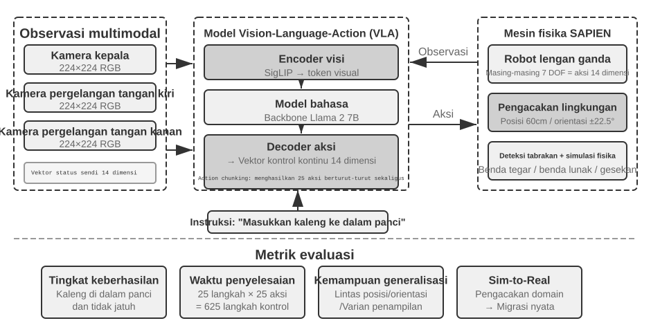

# Pascapelatihan Model

Formula inti dari buku ini adalah Agent = LLM + Context + Tools. Bab ini beralih ke LLM itu sendiri—"otak"-nya—dan menguji bagaimana post-training dapat membantu model menggunakan context dan tools secara lebih efektif, sehingga meningkatkan kapabilitas dari seluruh sistem Agent. Akhir dari Bab 6 menunjukkan bahwa sistem evaluasi dan lingkungan simulasi adalah dua batu loncatan dari post-training: lingkungan evaluasi memberikan tempat latihan untuk training, dan metrik evaluasi memberikan targetnya. Bab ini dibangun di atas batu loncatan tersebut dan membahas bagaimana cara yang sebenarnya untuk mengubah bobot model—bagaimana menanamkan kapabilitas ke dalam parameter.

Bab ini mengasumsikan tidak adanya latar belakang tentang reinforcement learning atau model training. Kami tidak mengharapkan Anda mengetahui gradien atau policy optimization. Alih-alih, kami memulai dari pertanyaan tentang bagaimana sebuah model dilatih pada awalnya, memperjelas apa tujuan setiap langkah, bagaimana cara kerjanya, dan masalah apa yang dipecahkannya. Pada akhir bab ini, Anda seharusnya dapat menjawab pertanyaan-pertanyaan berikut: Berapa banyak tahapan yang terlibat dalam membentuk kapabilitas model? Apa yang dilakukan pada setiap tahap? Mengapa mereka harus terjadi dalam urutan ini? Dan di mana Anda harus memfokuskan upaya dalam proyek Anda sendiri?

**Pertama, mari kita tetapkan peta yang paling penting: kapabilitas model modern dibentuk dalam tiga tahap.** Ketiga tahap ini saling terkait dan sangat diperlukan:

1.  **Pre-training**: Training pada teks internet yang masif untuk "memprediksi token berikutnya". Langkah ini mengajarkan model aturan bahasa, pengetahuan dunia, dan penalaran dasar. Ini seperti seseorang yang telah membaca semua buku di perpustakaan—terpelajar, tetapi belum pandai menjawab pertanyaan. Ini adalah langkah yang paling mahal (seringkali puluhan juta dolar) dan merupakan fondasi dari semua kapabilitas.
2.  **Supervised Fine-Tuning (SFT)**: Training model pada pasangan input-output berlabel, seperti seorang guru yang memberikan jawaban standar kepada siswa untuk ditiru. Ribuan hingga puluhan ribu demonstrasi pertanyaan-dan-jawaban standar mengajarkan model tentang format, gaya, dan proses apa yang harus digunakan saat merespons. Langkah ini mengubah model yang terpelajar menjadi asisten yang memahami instruksi dan menghasilkan output yang terstruktur dengan baik. Proses ini murah, cepat, dan stabil, serta saat ini merupakan langkah yang dialami oleh hampir semua model yang di-deploy.
3.  **Reinforcement Learning (RL)**: Membiarkan model mencoba berulang kali dan membaik dari penghargaan (reward) dan hukuman (penalty), seperti melatih anak anjing (mendapat camilan ketika melakukan hal yang benar, tidak mendapat apa-apa ketika salah). Daripada menunjukkan jawaban standar kepada model, RL membiarkannya mencoba sendiri, meningkatkan probabilitas perilaku yang baik dan mengurangi probabilitas perilaku yang buruk. Langkah ini mengajarkan model untuk membuat keputusan yang masuk akal bahkan dalam **situasi yang belum pernah dilihat sebelumnya (unseen situations)**—dan ini juga merupakan langkah yang paling banyak mengambil porsi dalam bab ini serta membutuhkan upaya engineering paling besar.

Sebuah analogi intuitif: Pre-training adalah "membaca sepuluh ribu buku" (mengumpulkan pengetahuan), SFT adalah "seorang guru yang memandu Anda melalui solusi standar" (meniru demonstrasi), dan RL adalah "mengerjakan soal sendiri dan memperbaiki dari yang benar dan yang salah" (belajar melalui uji coba / trial and error). Ketiganya bukan merupakan alternatif; mereka membentuk sebuah pipeline—baca dulu, lalu tonton demonstrasi, kemudian praktik.

**Bab ini memiliki dua benang merah utama yang mengalir sepanjang bacaan. Harap ingat keduanya, karena semua konten selanjutnya akan melayani mereka:**

*   **Benang Merah Satu: SFT menghafal, RL menggeneralisasi.** Untuk tugas dan anggaran yang sama, SFT cenderung **menghafal** jawaban dalam data training, sehingga akan gagal ketika lingkungan deployment berbeda dari training. RL cenderung **mempelajari** strategi yang dapat ditransfer, tetap stabil bahkan dalam situasi yang belum pernah dilihat sebelumnya. Ini bukan sekadar slogan, melainkan fenomena terukur yang akan berulang kali diverifikasi oleh bab ini dengan eksperimen terkontrol. Bagian 7.1 akan mendedikasikan satu bagian penuh untuk menjelaskan **alasan mendasar** atas perbedaan ini.
*   **Benang Merah Dua: Data dan environment lebih penting daripada algoritma.** Ini adalah pelajaran industri yang paling berlawanan dengan intuisi (counterintuitive) namun paling berharga. Dengan algoritma RL yang sudah tersedia (PPO, GRPO, dan sejenisnya), mengetahui cara menggunakannya saja sudah cukup. Apa yang sebenarnya menentukan kesuksesan adalah dua hal: **lingkungan simulasi (simulation environment)** (apakah tempat latihannya cukup realistis?) dan **data training** (apakah demonstrasi dan sinyal reward-nya cukup bagus?). Dalam banyak skenario, jika data SFT sudah cukup baik, Anda mungkin tidak membutuhkan RL sama sekali. Bab ini akan berulang kali mengalihkan perhatian Anda dari "algoritma mana yang harus saya tune?" menjadi "apakah data dan environment sudah diatur dengan benar?"

> **Panduan Membaca**: Konten bab ini dibagi menjadi dua jalur berdasarkan latar belakang pembaca:
>
> *   **Agent Application Developers** (tidak perlu melatih model sendiri): Mulailah dengan membaca pembuka "Pre-training, SFT, RL: A Three-Stage Panorama" untuk membangun pemahaman global. Kemudian Anda bisa melewati dua bagian `[Optional Reading]` berikut (classic RL dan latar belakang pre-training) dan melanjutkan dari bagian SFT. Fokuslah pada kerangka keputusan untuk "perbedaan esensial antara SFT dan RL" dan "kapan harus memilih SFT vs RL", serta penilaian bahwa "data dan environment lebih penting daripada algoritma"—wawasan ini akan memengaruhi keputusan desain Anda dalam Harness engineering (kapan harus menyelesaikannya dengan prompt, kapan fine-tuning sepadan untuk dilakukan).
> *   **Model Training Engineers**: Bacalah secara berurutan dari awal. Dua bagian `[Optional Reading]` memberikan latar belakang lengkap tentang reinforcement learning dan pre-training. Eksperimen-eksperimen selanjutnya memberikan skema training yang dapat direproduksi.

## Prapelatihan, SFT, dan RL: Panorama Tiga Tahap

Bagian pengantar telah memberi Anda peta dari tiga tahap tersebut; bagian ini membahas mekanisme masing-masing tahap. Ketiga tahap ini berbeda dalam hal **data**, **tujuan optimasi (optimization objectives)**, dan **biaya (costs)**. Memahami persamaan dan perbedaannya adalah kunci untuk keseluruhan bab ini. Tabel 7-1 memberikan gambarannya; detailnya menyusul.

Tabel 7-1 Tiga Tahapan Pembentukan Kapabilitas Model

| Tahap | Data yang Digunakan | Tujuan Optimasi | Apa yang Dipelajari | Biaya Tipikal |
|-------------|---------------------|--------------------|---------------------|-------------------|
| **Pre-training** | Teks internet mentah yang masif | Memprediksi token berikutnya | Aturan bahasa, pengetahuan dunia, penalaran dasar | Sangat Tinggi (jutaan hingga puluhan juta USD) |
| **SFT** | Ribuan hingga puluhan ribu pasangan demonstrasi "input-output" | Memprediksi token berikutnya (loss dihitung hanya pada respons) | Mengikuti instruksi (instruction following), format output, gaya, protokol proses | Rendah (hitungan jam hingga hari) |
| **RL** | Tugas + Fungsi reward (tanpa jawaban standar) | Memaksimalkan expected reward | Strategi pengambilan keputusan yang dapat ditransfer, solusi yang baru ditemukan | Tinggi (seringkali puluhan hingga ratusan kali lipat dari SFT) |

### Apa yang Dilakukan Pre-training: Memprediksi Token Berikutnya

Semua "kecerdasan" dari large models modern dibangun di atas sebuah tugas yang sangat sederhana sehingga mengejutkan: **Next Token Prediction (NTP)**.

Tunjukkan pada model bagian pertama dari sebuah teks dan biarkan model menebak token berikutnya. Misalnya, jika diberikan input "Ibukota negara Tiongkok adalah," model seharusnya menetapkan probabilitas tinggi pada "Beijing." Setiap kali model menebak, ia membandingkan prediksinya dengan token berikutnya yang sebenarnya. Semakin besar perbedaannya (disebut loss), semakin ia menyesuaikan parameternya untuk menebak lebih akurat pada context yang serupa di lain waktu. Dengan melakukan ini berulang kali pada triliunan token dari teks internet, model dipaksa untuk mempelajari tata bahasa, fakta, logika, dan bahkan penalaran dasar—karena untuk secara konsisten menebak token berikutnya dengan benar di berbagai macam contexts, tidak ada jalan pintas; ia harus benar-benar "mencerna" pola-pola di dalam teks.

Ada satu poin kunci yang harus diingat yang akan terbawa hingga ke SFT dan RL: **Output model pada dasarnya adalah sebuah distribusi probabilitas (probability distribution).** Diberikan teks sebelumnya, model menetapkan probabilitas pada setiap kemungkinan token yang ada di dalam kosakatanya. "Training," pada intinya, adalah **menyesuaikan distribusi probabilitas ini**—membuat probabilitas dari token yang diinginkan menjadi lebih tinggi dan yang tidak diinginkan menjadi lebih rendah. Perbedaan antara ketiga tahapan tersebut hanya terletak pada "apa yang diinginkan" dan "sinyal apa yang mendefinisikan 'diinginkan' tersebut".

Setelah pre-training, model menjadi sangat berpengetahuan tetapi tidak user-friendly: jika Anda mengajukan pertanyaan, model mungkin akan terus menghasilkan lebih banyak pertanyaan alih-alih menjawabnya—karena dalam teks internet, sebuah pertanyaan sering kali diikuti oleh pertanyaan lain. Model belum mempelajari protokol "ketika ditanya sebuah pertanyaan, Anda harus menjawab."

### Esensi dari SFT: "Predict the Next Token" dengan Data Berbeda

Ini adalah wawasan utama pertama yang harus dipahami dalam bab ini: **Secara matematis, SFT dan pre-training adalah tugas yang sama—keduanya memprediksi token berikutnya dan meminimalkan loss function yang sama.** Banyak pemula berpikir bahwa SFT adalah metode yang sama sekali baru, tetapi ternyata tidak. Perbedaan antara SFT dan pre-training hanya terletak pada dua hal:

1.  **Data yang Berbeda.** Pre-training menggunakan teks internet mentah (tidak terstruktur, berisi segalanya); SFT menggunakan pasangan "input-output" yang disiapkan dengan saksama, diformat secara seragam sebagai "pertanyaan pengguna → jawaban ideal." Model tersebut terus "memprediksi token berikutnya" pada demonstrasi-demonstrasi ini, sehingga mempelajari protokol "bagaimana menyusun respons saat ditanya sebuah pertanyaan."
2.  **Loss dihitung hanya pada "respons" (loss masking).** Sampel SFT terdiri dari pertanyaan dan respons berlabel. Kita tidak ingin model mempelajari "bagaimana cara mengajukan pertanyaan," tetapi hanya "bagaimana cara menjawab." Jadi, ketika menghitung loss, token pada bagian pertanyaan di-mask, dan gradien di-backpropagate hanya melalui bagian respons. Ini adalah satu-satunya perbedaan engineering yang substantif antara SFT dan pre-training.

Begitu Anda melihat hal ini, "SFT menghafal" menjadi hal yang wajar: tujuan optimasi SFT adalah untuk **memaksimalkan probabilitas setiap token dalam respons berlabel**—dalam bahasa sederhana, "hafalkan jawaban standar ini di luar kepala." Diberikan pertanyaan yang sama, model dilatih untuk mereproduksi demonstrasi sedekat mungkin. Untuk tugas-tugas dengan tujuan yang jelas dan format yang tetap, ini sangatlah efisien—beberapa ribu contoh sudah cukup—tetapi kapabilitasnya tetap dibatasi secara ketat oleh data demonstrasi: model tersebut tidak mempelajari situasi yang tidak ada dalam demonstrasi, dan ketika jawaban yang didemonstrasikan tidak lagi berlaku karena environment telah berubah, model masih akan mereproduksi jawaban tersebut.

Singkatnya, SFT menggunakan efisiensi sampel yang sangat tinggi untuk **menyandikan (encode) pemetaan dan protokol input-ke-output yang stabil dalam parameter model**. SFT menyandikan **pengetahuan protokol (protocol knowledge)**—bagaimana mengatakan atau melakukan sesuatu, termasuk format, gaya, dan proses—alih-alih **pengetahuan faktual (factual knowledge)** dalam jumlah besar—apa yang diketahui model. Pengetahuan faktual bergantung pada pre-training atau RAG (kita akan kembali ke perbedaan ini di akhir bab).

> **Biaya Training: LoRA Parameter-Efficient Fine-Tuning.** Baik SFT maupun RL selanjutnya membutuhkan pembaruan parameter model, dan full-parameter fine-tuning memiliki kebutuhan VRAM yang tinggi (perlu menyimpan gradien dan state optimizer untuk miliaran parameter). **LoRA** (Low-Rank Adaptation) adalah metode penghematan biaya yang paling umum: alih-alih memodifikasi matriks bobot asli yang besar, ia melampirkan sebuah "tambalan" kecil (matriks rank rendah) untuk mempelajari tugas tersebut. Jumlah parameternya hanya 1%–5% dari aslinya, namun ia dapat mendekati performa full fine-tuning. Karena bobot aslinya dibekukan (frozen), LoRA juga menyebabkan lebih sedikit gangguan (perturbation) pada kapabilitas model dasar (base model) yang ada, mengurangi risiko catastrophic forgetting (lupa secara drastis). Beberapa aturan praktis (rules of thumb) yang telah divalidasi[^ch7-1]: Anda **harus** menerapkan LoRA ke semua matriks bobot utama (terutama layer MLP, yang memiliki jumlah parameter terbesar); menerapkannya hanya pada layer attention akan mengorbankan akurasi. **Learning rate yang optimal adalah sekitar 10 kali lipat dari full fine-tuning** (berlaku untuk SFT dan RL, sebuah aturan transfer yang sangat praktis). Gunakan rank menengah ke tinggi (64–256) untuk SFT; karena informasi per putaran kecil untuk RL, rank kecil (8–32) atau bahkan rank=1 sudah cukup. Selama deployment, sebuah inference server tunggal dapat memuat beberapa LoRA adapter secara bersamaan untuk layanan multi-tenant. Buku ini memperlakukan LoRA sebagai pilihan engineering default untuk semua metode post-training dan tidak akan menjelaskannya secara terpisah.

### Mengapa SFT Harus Ada Sebelum RL, dan Bukan Sebaliknya

Urutan ketiga tahapan ini tidaklah sembarangan. Pre-training pertama tidak menjadi kontroversi—tanpa dasar bahasa dan pengetahuan, tidak ada hal lain yang memungkinkan. Yang perlu dijelaskan adalah: **Mengapa SFT harus ada sebelum RL?**

Jawabannya terletak pada bagaimana RL bekerja. RL tidak melihat jawaban standar; ia membiarkan model **menghasilkan (generate)** responsnya sendiri dan kemudian memberikan reward atau penalti berdasarkan kualitas respons tersebut. Tetapi untuk menilai kualitas, pertama-tama Anda harus dapat **mem-parse** output dari model: jika tugas tersebut membutuhkan output berupa objek JSON atau sebuah Tool Call, dan model tersebut menghasilkan teks acak-acakan yang formatnya buruk, maka fungsi reward tidak memiliki dasar perhitungan (bahkan tidak dapat membedakan "keberhasilan dan kegagalan"), dan RL tidak dapat belajar.

Jadi, SFT berperan untuk **membuat model menghasilkan output yang terbentuk dengan baik (well-formed) terlebih dahulu**: sejumlah kecil demonstrasi menstabilkan format output sehingga dapat di-parse dengan andal, memberikan RL titik awal yang dapat diberi skor. Ini adalah paradigma dua tahap **"SFT dulu, lalu RL"** yang paling kuat di industri. Melakukan RL dulu dan SFT kemudian tidak akan berhasil—tanpa output yang stabil, sinyal reward hanyalah noise belaka. Meminjam konsep dari lukisan Tiongkok: SFT pertama kali membangun **"bentuk"** (format, struktur), dan kemudian RL mengejar **"jiwa"** (strategi, generalisasi)—**bentuk dahulu, jiwa kemudian**.

Sebuah kondisi batas yang penting: "SFT harus ada lebih dulu" berlaku pada pengaturan (setting) **"base model yang lebih kecil + output yang terstruktur ketat"** (Eksperimen 7-11 akan menunjukkan bahwa model pada skala Llama-3.2-Vision-11B gagal total jika RL diterapkan langsung tanpa SFT). Namun, jika base model-nya cukup kuat, ia mungkin dapat menghasilkan output yang memadai sejak awal, sehingga SFT dapat dilewati—DeepSeek-R1-Zero membuktikan bahwa RL secara langsung dapat berhasil dengan base model yang kuat, memunculkan refleksi dan Chain of Thought yang panjang secara spontan. Konsekuensinya adalah keterbacaan (readability) output yang buruk serta percampuran bahasa Mandarin/Inggris, sehingga DeepSeek pada akhirnya menambahkan kembali "cold-start SFT" ke dalam R1 untuk membangun kembali "bentuknya". Perjalanan R1 dari Zero menuju cold-start adalah ilustrasi terbaik dari "bentuk dahulu, jiwa kemudian."

### Perbedaan Esensial Antara SFT dan RL (Tabel Terpenting di Bab Ini)

Kita telah berulang kali mengatakan "SFT menghafal, RL menggeneralisasi." Sekarang mari kita jelaskan alasan mendasarnya secara menyeluruh. Semua perbedaan antara keduanya berasal dari **tujuan optimasi yang berbeda**:

*   **SFT mengoptimalkan "seberapa mirip output dengan jawaban standar."** Tujuannya adalah untuk memaksimalkan probabilitas dari jawaban berlabel (maximum likelihood). Diberikan sebuah pertanyaan, hanya ada satu output yang "benar"—jawaban demonstrasi. Model ditarik ke arah jalur tunggal ini, mempelajari pemetaan tetap dari "lihat input ini, hasilkan output itu." Sehingga ia **menghafal**: selama training, J/Q/K semuanya diperlakukan sebagai 10, dan ia memasukkan aturan "J/Q/K berarti 10" ke dalam memori; pada saat test (pengujian), J menjadi 11, namun ia tetap menggunakan 10 dan menjawab salah.
*   **RL mengoptimalkan "seberapa bagus hasil outputnya."** Tujuannya adalah untuk memaksimalkan expected reward. Diberikan sebuah pertanyaan, **output mana pun** yang meraih reward tinggi dianggap baik—tidak hanya satu. Model mengeksplorasi berbagai jalur dengan sendirinya, memperkuat jalur-jalur yang memberikan hasil yang baik. Ia mempelajari sebuah **strategi** yang lebih umum tentang "proses apa yang mengarah pada hasil yang benar": ketika J menjadi 11, ia menghitung ulang dengan menggunakan strategi yang sama, bukannya menerapkan jawaban yang telah dihafal. Inilah yang disebut **generalisasi (generalization)**.

Tabel 7-2 Perbandingan Esensial SFT dan RL

| Dimensi | SFT (Supervised Fine-Tuning) | RL (Reinforcement Learning) |
|-----------------|--------------------------------------|----------------------------------------|
| Tujuan Optimasi | Memaksimalkan probabilitas jawaban berlabel (Maximum Likelihood) | Memaksimalkan expected reward |
| Sinyal Training | Jawaban standar tunggal (supervisi untuk setiap token) | Beragam respons buatan sendiri (self-generated) + reward (satu sinyal keberhasilan/kegagalan per respons) |
| Bentuk Data | Pasangan demonstrasi "Input-Output" | Tugas + Fungsi reward (tanpa perlu jawaban standar) |
| Apa yang Dipelajari | Pemetaan "Input→Output" yang tetap (menghafal) | Strategi pengambilan keputusan yang dapat ditransfer (generalisasi) |
| Perubahan Distribusi (Under Distribution Shift) | Menerapkan jawaban lama ketika environment berubah, performa menurun | Menyelesaikan kembali masalah menggunakan strategi yang sama, lebih stabil |
| Efisiensi Sampel | Tinggi (ribuan contoh sudah efektif) | Rendah (seringkali puluhan hingga ratusan kali lipat dari SFT) |
| Stabilitas Training | Tinggi, berkumpul (converge) dengan cepat | Rendah, rentan terhadap osilasi, membutuhkan tuning yang cermat |
| Paling Cocok Untuk | Memantapkan format/gaya/proses, demonstrasi berkualitas tinggi, environment yang stabil | Membutuhkan generalisasi pada skenario baru, mengeksplorasi strategi optimal, biaya anotasi yang tinggi |

**Post-training juga membentuk kapan model bertindak.** Model Coding memberi contoh konkret: keluarga GPT dan Claude sering menunjukkan ambang tindakan bawaan yang berbeda. Keluarga pertama dapat membaca bagian repositori yang lebih luas sebelum menyunting; keluarga kedua dapat melokalisasi perubahan dari lebih sedikit berkas, mengimplementasikan lebih dahulu, lalu mengoreksi arah dengan umpan balik pengujian. Ini bukan antropomorfisasi satu model sebagai “hati-hati” dan model lain sebagai “intuitif”. Ini adalah kebijakan di dalam parameter yang memperkirakan apakah nilai harapan membaca satu berkas lagi masih lebih besar daripada nilai harapan mengirim dan memvalidasi patch saat ini. Jika demonstrasi SFT berulang kali menyelidiki secara luas sebelum menyunting, model meniru ambang tindakan yang lebih tinggi. Jika reward proses atau hasil berulang kali mengakui pelokalan cepat dan loop terverifikasi yang dimulai lebih dini, massa probabilitas bergeser ke tindakan yang lebih awal. Eksperimen 6-7 menukar model di dalam Coding Harness netral yang identik dan mengukur perubahan perilaku bersama model: Harness tidak perlu memaksakan alur kerja agar model membawa kebijakan penggunaan alatnya sendiri yang stabil. Harness dapat mengubah kebijakan itu, tetapi sumber utamanya dapat berada dalam parameter hasil post-training. Karena vendor tidak memublikasikan dataset dan resep reward lengkap, eksperimen ini menetapkan perbedaan perilaku di sisi model, bukan algoritme proprieter tertentu yang menyebabkannya.

Ada satu mekanisme yang lebih dalam yang patut diketahui: **mode-seeking**, yang menjelaskan mengapa RL mengerucut (converge) pada beberapa strategi yang bagus saja. Distribusi probabilitas dari semua kemungkinan jawaban yang dapat diberikan model pada sebuah pertanyaan mungkin memiliki banyak "modes", masing-masing mewakili sekumpulan cara menjawab yang masuk akal. Maximum likelihood yang digunakan oleh SFT bersifat **mass-covering**—ia mencoba untuk mencakup (cover) semua modes yang ada di dalam demonstrasi, bahkan memberikan probabilitas ke modes berkualitas lebih rendah ("menyebar kekayaan"). RL (terutama policy optimization dengan kendala KL, yang bentuk matematisnya berkorelasi dengan **reverse KL divergence**, yang dirinci di bagian RLHF) bersifat **mode-seeking**—ia cenderung mencari beberapa modes yang memiliki reward tertinggi, mengonsentrasikan probabilitas pada modes tersebut dan dengan tegas membuang sisanya ("pemenang mengambil semuanya"). Inilah mengapa model yang dilatih dengan RL memberikan jawaban yang lebih "tegas" dan lebih berkonsentrasi pada strategi berkualitas tinggi, dan juga mengapa RL cenderung mengorbankan diversitas (diversity). Ingatlah konsep mass-covering dan mode-seeking; bagian KL divergence akan menggunakannya untuk menjelaskan sebuah pilihan desain yang kelihatannya membosankan namun sangatlah penting.

**Mengapa RL memiliki batas atas (ceiling) yang lebih tinggi dari SFT? Karena RL itu "online."** Ini adalah perbedaan yang lebih dalam antara SFT dan RL, dan merupakan alasan mendasar mengapa RL sepadan dengan biaya tambahannya. SFT adalah metode **offline**: ia hanya dapat belajar dari sekumpulan data demonstrasi yang tetap dan tidak akan pernah dapat melihat dunia di luar data tersebut. RL adalah metode **online**: ia membiarkan model menghasilkan (generate) responsnya sendiri, kemudian membaik berdasarkan feedback, belajar melalui trial and error. (Istilah "online/offline" dan istilah yang lebih ketat "on-policy/off-policy" akan dibedakan secara formal pada Bagian 7.8; untuk saat ini, kita membangun intuisinya dulu.) Menjadi online membawa tiga keunggulan yang tidak bisa dimiliki SFT, dan bersama-sama hal tersebut menaikkan batas atasnya (ceiling):

- **Pertama, batas atas offline adalah datanya; batas atas online adalah tugasnya.** Hasil optimal dari SFT adalah untuk "mereplikasi secara sempurna" demonstrasi—jadi batas atasnya (ceiling) adalah **tingkatan si pendemonstrasi (demonstrator)**; ia paling maksimal hanya akan mendekati, dan hampir tidak pernah melampaui level tersebut. Sebuah dataset yang diberi label oleh guru dengan skor 60 dari 100 tidak akan bisa menghasilkan siswa dengan skor 90. RL tidak melihat demonstrasi, hanya melihat reward dari hasilnya: perilaku **apa pun** yang menghasilkan reward lebih tinggi akan diperkuat (reinforced), bahkan jika tidak ada seorang pun yang pernah mendemonstrasikannya. Oleh karena itu, RL dapat secara mandiri **menemukan strategi superior yang tidak ada dalam demonstrasi**—pada Eksperimen 7-13 (SimpleVLA-RL) di akhir bab ini, aksi "pushcut" yang diciptakan sendiri oleh model tidak pernah muncul dalam demonstrasi manusia, yang mana ini adalah bukti langsung dari "melampaui demonstrasi". Batas atas dari RL ditentukan oleh tugas itu sendiri (apa yang dapat dikenali oleh reward), bukan oleh apa yang kebetulan ada dalam data.
- **Kedua, memverifikasi lebih mudah daripada membuat (generating)—inilah alasan mendasar RL dapat mendaki lebih tinggi.** SFT membutuhkan seseorang untuk **menuliskan jawaban yang benar terlebih dahulu** sebagai demonstrasi; RL hanya membutuhkan sebuah cara untuk **menilai (judge)** apakah jawaban itu bagus (memberikan reward). Dalam banyak tugas, menilai benar atau salah jauh lebih mudah ketimbang menghasilkan jawaban yang benar—jawaban matematika dapat diperiksa dengan kunci jawaban, kode dapat dijalankan melalui pengujian (tests), pembukti teorema (theorem provers) dapat memverifikasi pembuktian. Selama mengenali hasil kerja yang baik itu lebih mudah daripada menghasilkannya, RL dapat melatih model yang lebih kuat dari demonstrator mana pun yang tersedia: model mencoba banyak hal secara acak, dan environment memilih upaya yang baik serta memperkuatnya. Asimetri verifikasi-generasi ini adalah sumber kekuatan metode berbasis reward yang dapat diverifikasi seperti RLVR.
- **Ketiga, pembelajaran online (online learning) membiarkan model untuk ditraining pada lintasan (trajectories) yang akan diikutinya sendiri dan belajar pulih (recover) dari kesalahannya sendiri.** Imitasi offline memiliki masalah klasik yang disebut **covariate shift**: ketika siswa bertindak sendiri, ia menyimpang dari demonstrasi dan memasuki status (states) yang tidak ada dalam data. Karena ia belum pernah mempelajari cara pulih dari status tersebut, kesalahan (errors) terakumulasi di sepanjang lintasan (secara teoritis, error dari imitasi murni tumbuh kira-kira sebesar $T^2$ dengan panjang lintasan T, sedangkan training dengan data online dapat mengompresinya menjadi sekitar $T$). Metode online melakukan hal sebaliknya—model ditraining pada distribusi yang sama yang akan ia hadapi selama deployment, dan setiap putaran feedback secara langsung menargetkan kelemahannya saat ini; datanya selalu "segar", tidak seperti data offline, yang menjelaskan perilaku orang lain (guru) dan menjadi semakin tidak relevan seiring dengan membaiknya model. Alasan mengapa On-Policy Distillation (Bagian 7.12) nanti pada bab ini menjadi sangat kuat pada dasarnya adalah karena hal itu menggabungkan keuntungan "online" ini dengan keuntungan "supervisi yang padat (dense supervision)" dari SFT.

Sebagai analogi: **SFT menelusuri peta yang digambar oleh orang lain dan paling-paling hanya bisa menyamai peta tersebut; RL menjelajah (explore) dengan kompas—yaitu reward—dan dapat menemukan rute-rute di luar peta tersebut.** Ini juga alasan mengapa "meletakkan pondasi dengan SFT, lalu mendaki dengan RL" menjadi resep yang mainstream.

Dengan panorama (gambaran besar) di tangan, setiap bagian selanjutnya akan memiliki tempat tersendiri di peta. Dua bagian berikutnya, di mana keduanya adalah `[Optional Reading]`—"Dari Classic RL Agents ke Modern Agents" dan "Dasar-Dasar Model Pre-training"—mengisi latar belakang reinforcement learning dan pre-training untuk pembaca yang ingin mendalami lebih jauh. Pembaca yang hanya ingin langsung mempraktikkan post-training dapat melewatkannya dan melompat ke bagian SFT.

## Dari Agent RL Klasik ke Agent Modern `[Bacaan Opsional]`

### Interaksi Agent-Environment

**Reinforcement Learning (RL)** pada dasarnya adalah tentang belajar bagaimana memilih tindakan berdasarkan situasi saat ini untuk memaksimalkan **cumulative reward**. Bayangkan sebuah AI yang belajar bermain catur: setiap langkah adalah tindakan, menang memberikan imbalan positif, kalah memberikan imbalan negatif, dan cumulative reward adalah total keuntungan dari keseluruhan permainan. Agent dan environment berinteraksi terus-menerus: pada setiap langkah, Agent mengamati keadaan saat ini, memilih tindakan, dan environment menghasilkan keadaan baru serta memberikan imbalan.

Untuk memahami interaksi ini dengan lebih intuitif, diagram berikut menunjukkan loop standar RL—pada setiap langkah waktu, Agent mengamati keadaan environment, menghasilkan tindakan, dan environment memberikan imbalan serta bertransisi ke keadaan baru berdasarkan tindakan tersebut.

Interaksi ini menghasilkan sebuah **trajectory**—catatan lengkap tentang "keadaan → tindakan → imbalan → keadaan baru → tindakan → imbalan...". Kualitas sebuah policy pada akhirnya tercermin dari kualitas trajectory-nya. Sebuah **value function** menjawab pertanyaan: "Jika saya berada di keadaan ini sekarang dan terus bertindak sesuai dengan policy saat ini, berapa total imbalan yang pada akhirnya akan saya kumpulkan?" Ini seperti pemain catur berpengalaman yang melihat posisi dan, tanpa memperhitungkan sampai akhir, secara intuitif memperkirakan probabilitas kemenangannya. (Ketika "policy saat ini" diganti dengan "policy optimal," kita mendapatkan value function optimal, yang akan digunakan nanti di bab ini ketika membahas Bellman optimality equation.) Batas antara Agent dan environment mengikuti prinsip sederhana: **apapun yang tidak dapat diubah secara sewenang-wenang oleh Agent merupakan bagian dari environment.**

Dua fitur unik yang membedakan reinforcement learning dari supervised learning (yang membutuhkan jawaban benar berlabel) dan unsupervised learning (yang menemukan pola tersembunyi dalam data): **trial-and-error search** (Agent harus mencari tahu sendiri tindakan mana yang baik, tanpa seorang guru yang secara langsung memberikan jawaban benar) dan **delayed reward** (efek dari sebuah tindakan mungkin baru terlihat setelah banyak langkah kemudian, misalnya nilai dari langkah catur yang baik baru terlihat pada akhir permainan). Ini juga memunculkan **exploration-exploitation tradeoff** yang unik: selalu mengambil jalur yang sudah dikenal berarti tidak mempelajari hal baru; selalu mencoba secara acak berarti tidak pernah mencapai tujuan.

Sistem reinforcement learning terdiri dari lima elemen inti:

- **Action Space**: Mendefinisikan himpunan semua tindakan yang mungkin dilakukan oleh Agent. Tindakan bisa diskrit (misal, "langkah mana yang harus diambil" dalam catur, dengan jumlah pilihan yang terbatas) atau kontinu (misal, "berapa derajat untuk memutar sendi" untuk robot, nilai kontinu).
- **Policy**: Aturan perilaku Agent, yang menentukan apa yang harus dilakukan pada keadaan tertentu. Policy bisa sederhana (lookup table: di keadaan A, jalankan tindakan X) atau kompleks (deep neural network).
- **Reward Signal**: Umpan balik langsung dari environment. Namun, tujuan Agent adalah untuk memaksimalkan imbalan jangka panjang, bukan imbalan langsung—perbedaan ini sangat penting, sama seperti investasi yang tidak seharusnya dinilai dari keuntungan dan kerugian hari ini, melainkan dari pengembalian jangka panjang.
- **Value Function**: Memperkirakan total cumulative reward yang dapat diperoleh dari keadaan tertentu di masa depan, membantu Agent membuat keputusan yang bijak bahkan tanpa umpan balik langsung. Salah satu wawasan paling penting dari enam puluh tahun penelitian RL adalah peran sentral dari estimasi nilai.
- **Environment Model** (opsional): Memprediksi respons environment terhadap tindakan. Metode yang menggunakan environment model disebut **model-based methods** (pertama-tama belajar memprediksi bagaimana environment berubah, kemudian merencanakan sesuai dengan itu); metode yang tidak menggunakannya disebut **model-free methods** (tidak memprediksi environment, tetapi belajar langsung dari pengalaman).

Tabel 7-3 membandingkan komponen kunci dari berbagai sistem Agent, mengungkapkan universalitas dari konsep Agent dan membantu pembaca melihat perbedaan dalam action space antara tradisional RL Agents dan modern LLM Agents.

Tabel 7-3 Comparison of Key Elements in Different Agent Systems

| Agent Type | Environment | Action Space | Reward Signal |
|---------------|------------------------|-------------------------------|-------------------------|
| **Newborn Gazelle** | Terrain, gravity, body posture | Continuous high-dimensional (muscle group contractions) | Balance (+), Falling (-) |
| **Vacuum Robot** | Room layout, battery level | Discrete (direction, vacuum, charge) | Cleaned area (+), Battery depleted (-) |
| **Chess Grandmaster** | Board state, time limit | Discrete finite (legal moves) | Win (+1), Loss (-1) |
| **Customer Service Agent** | Conversation history, knowledge base | Open-ended (think, speak, API call) | Problem solved (+), Handling time (-) |
| **Code Assistant Agent** | Requirements document, codebase | Open-ended (think, search, edit, execute) | Test passed (+), Bug introduced (-) |

Tabel ini mengungkapkan sebuah wawasan penting: RL Agents tradisional dalam domain seperti catur dan robotika memiliki action space yang tertutup, sedangkan Agents berbasis LLM modern seperti customer-service dan coding Agents memiliki action space yang open-ended, hampir tidak terbatas. Agents ini juga dapat menggunakan tindakan khusus yaitu "internal thinking" untuk meningkatkan kemampuannya.

### Dua Paradigma Agent: Dari MDP ke LLM+RL

Dua paradigma ini paling mendasar berbeda pada action space—MDP mengasumsikan action space bersifat terbatas dan tertutup (naik/turun/ambil/letakkan), sementara action space LLM bersifat open-ended, terdiri dari urutan bahasa alami (natural language) yang eksplosif secara kombinatorial. Perbedaan ini menghasilkan pemisah mendasar antara dua paradigma tersebut dalam desain algoritma, sample efficiency, dan generalisasi. Setiap paradigma dibahas di bawah ini.

**Paradigma Tradisional: MDP dan Q-learning.**

MDP (Markov Decision Process) adalah kerangka matematis untuk reinforcement learning, mendefinisikan elemen inti seperti keadaan, tindakan, dan imbalan. Asumsi intinya adalah **Markov property**: masa depan hanya bergantung pada keadaan saat ini, bukan pada sejarah sebelumnya. Sebagai contoh, dalam catur, melihat posisi papan saat ini saja sudah cukup untuk menentukan langkah optimal; tidak perlu meninjau setiap langkah sebelumnya. Asumsi ini menyederhanakan masalah tetapi juga membatasi kemampuan untuk memodelkan ketergantungan historis.

Fitur kunci dari RL Agent tradisional adalah **closed action space**—semua tindakan yang mungkin dilakukan oleh Agent membentuk himpunan terbatas yang telah ditentukan sebelumnya. **Classic board-game Agents** adalah contoh paling khas: 361 kemungkinan posisi langkah di Go, meskipun sangat luas, sepenuhnya ditentukan dan terbatas; dalam catur, meskipun ada aturan pergerakan yang berbeda untuk bidak yang berbeda, tindakan yang mungkin tetap bisa dihitung; game Atari hanya memiliki beberapa hingga belasan tindakan diskrit. **Robotic Agents** mewakili action space yang kontinu tetapi terbatas: sudut sendi, kecepatan, dan kekuatan cengkeraman adalah nilai kontinu, tetapi semuanya memiliki batasan fisik yang jelas (sudut rotasi maksimum, torsi maksimum, batas kecepatan), dengan dimensi yang ditentukan oleh degrees of freedom robot.

Sifat tertutup ini membawa keuntungan komputasional: semua tindakan dapat dihitung dan dievaluasi satu per satu, memfasilitasi dynamic programming dan Monte Carlo tree search, dan action-value function dapat didekati menggunakan tabel atau fungsi sederhana. Namun, ini juga membatasi ekspresivitas dan generalisasi. RL Agents tradisional mulai dari nol, belajar murni melalui coba-coba—mulai dari policy acak, mengumpulkan pengalaman, memperbarui value function atau policy, dan mengulangi sampai convergence.

Di dalam kerangka ini, salah satu algoritma paling dasar dan penting adalah **Q-learning**. Algoritma ini mempertahankan estimasi nilai untuk setiap pasangan "state-action": jika Anda mengambil tindakan *a* di keadaan *s* dan kemudian bertindak optimal setelahnya, berapa total imbalan yang bisa Anda harapkan? Secara intuitif, apakah suatu tindakan itu baik tergantung pada imbalan langsung yang dibawanya, ditambah "seberapa baik keadaan selanjutnya yang ditujunya."

Menuliskan intuisi ini sebagai persamaan memberikan hubungan rekursif inti dari **Bellman equation** yang terkenal di buku teks RL: **Nilai sebenarnya dari sebuah tindakan = imbalan langsung yang diperoleh pada langkah ini + nilai masa depan maksimum yang dapat diperoleh dari keadaan selanjutnya**:

$$Q^*(s, a) = r + \gamma \max_{a'} Q^*(s', a')$$

di mana $r$ adalah imbalan langsung, $s'$ adalah keadaan selanjutnya yang dicapai setelah mengeksekusi tindakan (ditulis dalam bentuk deterministik untuk intuisi; dalam environment stokastik, sebuah expectation atas keadaan selanjutnya $s'$ diperlukan), dan $\gamma \in [0, 1)$ adalah **discount factor**—menentukan seberapa besar Agent menilai masa depan: semakin dekat $\gamma$ ke 1, semakin ia menilai pengembalian jangka panjang; semakin dekat ke 0, semakin ia berfokus pada yang langsung (immediate). "Cumulative reward" yang disebutkan berulang kali sebelumnya pada dasarnya adalah jumlah imbalan pada setiap langkah, didiskon dengan $\gamma$: $\sum_{t} \gamma^{t} r_t$. Setelah setiap tindakan, algoritma sedikit menyesuaikan estimasi lama menuju "hasil yang benar-benar diamati"—paradigma "memperbaiki estimasi lama dengan hasil aktual satu langkah" ini disebut **Temporal-Difference Learning (TD learning)**. Setelah ribuan percobaan, estimasi tersebut secara bertahap mendekati nilai sebenarnya.

Dua gambar berikut menunjukkan proses eksplorasi dari Q-learning di sebuah grid world dan konvergensi bertahap dari Q-values.

Q-learning adalah jenis khusus dari metode **off-policy**—ia dapat menggunakan data yang dihasilkan oleh policy apapun (termasuk eksplorasi acak) untuk mempelajari policy optimal. Definisi ketat dari metode on-policy dan off-policy, serta bagaimana mereka dipetakan ke post-training LLM, akan dibahas nanti di bagian "Perbandingan Algoritma Reinforcement Learning."

> **Eksperimen 7-1 ★: Kinerja Q-learning dalam Game Pencarian Harta Karun**
>
> Untuk memverifikasi karakteristik dan batasan dari Q-learning, kami merancang sebuah **lingkungan permainan pencarian harta karun (treasure hunt game)**. Lingkungan ini mencakup beberapa tantangan utama: **mekanisme tersembunyi (hidden mechanisms)** yang mengharuskan Agent menemukan korespondensi antara kunci dan pintu, efek senjata, dan aturan crafting item secara mandiri; **ketergantungan multi-langkah (multi-step dependencies)** yang berarti bahwa menyelesaikan tugas memerlukan urutan tindakan yang benar (solusi optimal: 11 langkah); **sparse rewards** yang berarti bahwa hanya tindakan penting dan kemenangan akhir yang menghasilkan imbalan yang signifikan, sementara sebagian besar langkah menengah tidak menerima umpan balik.
>
> Q-learning Agent menggunakan pengaturan parameter standar dan strategi eksplorasi ε-greedy: ia biasanya memilih tindakan optimal saat ini tetapi kadang-kadang memilih satu secara acak, dengan proporsi eksplorasi acak perlahan-lahan menurun selama training.
>
> Kurva pembelajaran menunjukkan karakteristik tipikal (satu episode adalah satu permainan lengkap, dari awal hingga penyelesaian atau kegagalan):
> - **1000 episode pertama**: tingkat kemenangan 0%, Q-table hanya memiliki 124 states, Agent mengeksplorasi secara membabi buta
> - **5000 episode pertama**: Masih tidak ada kemenangan yang stabil, Q-table memiliki 133 states
> - **7.000–8.000 episode**: Tingkat kemenangan bertahap naik dari 34% ke 96%
> - **10.000 episode**: tingkat kemenangan 100%, Q-table memiliki 145 states, menemukan solusi optimal 11-langkah
>
> Seluruh training membutuhkan waktu kurang dari 10 detik (simulasi yang sangat efisien), tetapi membutuhkan hampir 10.000 upaya lengkap. Ini mendemonstrasikan karakteristik inti dari Q-learning: ia memerlukan jumlah eksplorasi acak yang besar untuk menyelesaikan rute penuh secara tidak sengaja, dan propagasi sinyal nilai sangat lambat, membutuhkan penguatan berulang. Pembelajaran simbolik murni, tanpa prior knowledge, hanya bisa melakukan brute-force search pada state space.
>
> Dalam simulator permainan, 10.000 percobaan hanya membutuhkan waktu 10 detik, biaya yang dapat diabaikan. Tetapi di skenario Agent dunia nyata—di mana setiap panggilan telepon memiliki biaya, setiap operasi browser memiliki jeda, dan setiap keputusan yang salah dapat memiliki konsekuensi yang tidak dapat diubah—10.000 percobaan sama sekali tidak dapat diterima. Justru inilah mengapa Agents modern telah beralih ke metode berbasis LLM: memanfaatkan knowledge yang dikumpulkan selama pre-training untuk membuat keputusan yang efektif dengan interaksi minimal.
>
> Keterbatasan mendasar dari MDP ada tiga: sample efficiency yang rendah (membutuhkan interaksi masif untuk mempelajari tugas sederhana), generalisasi yang buruk (pengetahuan yang dipelajari dalam satu environment sulit ditransfer ke environment lain), dan ketidakmampuan untuk memanfaatkan prior knowledge (setiap tugas baru harus dipelajari dari awal). Keterbatasan ini menjadi sangat menonjol saat menghadapi state space yang kompleks seperti natural language atau high-dimensional vision.
>

**Paradigma Modern: Agents Berbasis LLM+RL.**

Large language models telah membawa paradigma baru untuk Agents, mengubah secara mendasar bagaimana Agents dibangun—terutama dalam desain dari action space.

Dalam RL tradisional, Agent hanya dapat menerima umpan balik dengan mengubah environment: membuat langkah dalam catur, mengambil langkah dalam labirin. Tetapi LLMs memperkenalkan jenis tindakan yang benar-benar baru: internal thinking. Berpikir tidak mengubah dunia eksternal, tetapi dapat secara signifikan meningkatkan kualitas dari tindakan akhir. Pergeseran ini mengubah segalanya: action space Agent tidak lagi hanya "apa yang harus dilakukan," tetapi juga mencakup "berapa lama untuk berpikir dan apa yang dipikirkan."

Inovasi yang paling penting adalah memasukkan **Thinking sebagai tindakan khusus** ke dalam action space. Dalam RL tradisional, Agents hanya dapat melakukan tindakan eksternal yang mengubah keadaan environment (bergerak, menyerang, mengambil); dalam LLM Agents, **internal thinking menjadi komponen inti dari action space**—ia tidak secara langsung mengubah environment eksternal, tidak memiliki imbalan langsung, dapat dilakukan hampir tanpa batas, dan relatif tidak mahal.

RL tradisional kesulitan dengan jenis tindakan ini, pada dasarnya karena ruang eksplorasinya terlalu besar dan kurang struktur: Agent yang belajar dari nol seperti mencari harta karun di padang pasir dengan mata tertutup, hanya dapat tersandung secara acak. LLMs itu berbeda. Melalui pre-training teks yang masif, mereka telah menginternalisasi aturan pemikiran manusia: memecahkan masalah matematika mengikuti "mengidentifikasi kondisi → mengingat rumus → menghitung langkah demi langkah," menulis kode mengikuti "memahami persyaratan → mendesain struktur → mengimplementasikan detail." Hal ini memungkinkan pemikiran LLM berjalan di sepanjang jalur terstruktur, yang secara drastis menekan ruang pencarian. Oleh karena itu, bahkan tanpa RL training tambahan, pre-trained LLM dapat menghasilkan Chain of Thought (CoT) logis dasar. Logika dasar ini berasal dari sejumlah besar proses pemikiran manusia di corpus pre-training (solusi masalah matematika, komentar kode, tanggapan debat, dll.). Melalui next-token prediction, model secara implisit belajar "seperti apa seharusnya langkah penalaran selanjutnya."

RL post-training kemudian menggunakan imbalan eksternal untuk mengajari LLM agar menggunakan aturan-aturan ini secara lebih efisien untuk tugas-tugas tertentu. Struktur bahasa itu sendiri juga memberikan imbalan internal implisit—sebuah Chain of Thought yang koheren secara logis (misal, "Karena kita perlu mengkonversi mata uang asing ke USD, langkah pertama adalah melihat nilai tukar") memiliki generation probability tinggi, sedangkan yang kacau secara logis (misal, "Karena kita perlu mengkonversi mata uang, mari kita periksa cuaca dulu") memiliki probabilitas yang sangat rendah, secara alami membimbing model ke arah jalur yang masuk akal.

Kemampuan berpikir ini, yang didasarkan pada aturan bahasa yang melekat, memungkinkan LLM Agents untuk memahami instruksi yang belum pernah mereka lihat sebelumnya (zero-shot generalization) dan menguasai tugas-tugas baru dengan sangat sedikit contoh (few-shot adaptation)—sebuah kontras yang tajam dengan paradigma tradisional MDP Agent yang membutuhkan trial and error yang ekstensif. Selain itu, paradigma baru ini juga mendukung compositional generalization (menggabungkan kembali konsep-konsep yang diketahui untuk menangani situasi baru), in-context learning (adaptasi cepat melalui prompts dan contoh-contoh), dan multimodal understanding (secara alami mengintegrasikan modalitas seperti visi, bahasa, dan tindakan). Perhatikan bahwa **efektivitas** dari in-context learning (zero-shot generalization, few-shot adaptation) dan **mekanisme internalnya** adalah dua hal yang berbeda—seperti yang dianalisis di Bab 2, attention mechanism bekerja lebih seperti retrieval daripada reasoning, tetapi ini tidak menghalangi efek praktisnya yang kuat dalam adaptasi tugas.

Evolusi dari ruang tindakan tertutup ke terbuka mencerminkan pergeseran fundamental dalam paradigma AI Agent. Di luar pemikiran internal, keragaman parameter alat (kueri bahasa alami, kode program, JSON kompleks, konten multimodal) membuat ruang tindakan aktual hampir tak terbatas—sebuah code interpreter secara teoritis dapat mengeksekusi tugas apa pun yang dapat dikomputasi, dan alat pencarian dapat menjelajahi seluruh ruang informasi di internet. Hal ini membawa peluang baru (Agents dapat menangani tugas yang belum pernah ada sebelumnya, memecahkan masalah kompleks dengan menggabungkan alat-alat dasar) dan tantangan baru (bagaimana mendefinisikan dan mengoptimalkan reward functions di lingkungan terbuka, bagaimana mencari secara efisien dalam ruang tindakan yang tak terbatas).

Model-model seperti Kimi K3, yang dioptimalkan untuk penggunaan alat dan penalaran rantai panjang, mengilustrasikan arah khas dari paradigma LLM+RL: prapelatihan bahasa skala besar menyediakan fondasi, dan post-training memperkuat dekomposisi masalah, penggunaan alat, dan koreksi diri. **OpenVLA** (dirinci di Bab 9) memamerkan arsitektur paradigma VLA (Vision-Language-Action) di era LLM: sebuah vision encoder memproses observasi lingkungan, model bahasa memahami instruksi dan melakukan reasoning, dan action decoder menghasilkan sinyal kontrol, memungkinkan kontrol yang dikondisikan bahasa dan generalisasi lintas tugas. Untuk memperjelas, OpenVLA itu sendiri dilatih melalui imitation learning pada hampir satu juta **lintasan demonstrasi** robot, menjadikannya bersifat SFT pada dasarnya alih-alih RL. SimpleVLA-RL, yang diperkenalkan pada Eksperimen 7-13 di bagian selanjutnya dari bab ini, adalah contoh representatif dari membawa RL ke dalam robotika dengan menggunakan rewards untuk lebih mengoptimalkan jenis arsitektur VLA ini.

**Jalur Eksplorasi OpenAI** (dicatat oleh Shunyu Yao, Asisten Profesor di Princeton University dan penulis makalah ReAct, dalam "The Second Half") menelusuri evolusi dalam cara bidang ini berpikir. **Fase 1 (2015-2016), Berpusat pada Algoritma:** Keyakinan yang berlaku adalah bahwa algoritma yang lebih baik adalah kuncinya. Kemajuan dicapai di lingkungan standar seperti Atari, tetapi setiap lingkungan baru membutuhkan pelatihan ulang dari awal. **Fase 2 (2016-2018), Pentingnya Lingkungan:** Gym menstandarkan berbagai tugas; Universe dan World of Bits berusaha mengubah seluruh internet menjadi lingkungan pelatihan RL; dan Dota 2 mengejar kinerja manusia super dalam lingkungan kompleks tertentu. Idenya jelas, tetapi penggunaan komputer secara umum dan navigasi web masih di luar jangkauan.

**Fase 3 (2018-sekarang), Kebangkitan Prior:** GPT-2/GPT-3 mendemonstrasikan kekuatan dari prapelatihan bahasa; WebGPT dan ChatGPT membuktikan bahwa priors tersebut dapat diubah menjadi Agents praktis. Penemuan terpenting: **priors dapat diperoleh dengan cara yang sama sekali tidak ada hubungannya dengan RL**. Ini adalah kebenaran yang berlawanan dengan intuisi—selama beberapa dekade, para peneliti RL mungkin memiliki prioritas yang benar-benar terbalik. Urutan sebenarnya bukanlah algoritma > lingkungan > prior, melainkan prior > lingkungan > algoritma.

> **Eksperimen 7-2 ★★: Studi Perbandingan RL Tradisional dan LLM Agent**
>
>
> 
>
>
> Kami membandingkan Q-learning dengan sebuah LLM Agent—Kimi K3, mempertahankan buffer hingga 50 pengalaman—dalam permainan berburu harta karun yang sama. Hasilnya menakjubkan: **LLM Agent menyelesaikan permainan dalam 18 langkah pada percobaan pertamanya**.
>
> **Tahap Awal (Eksplorasi Bertujuan)**: Mengambil pedang berkarat ("Senjata lebih baik daripada tangan kosong"), secara sistematis menjelajahi peta, menyimpulkan "perlu menemukan kunci" setelah menemukan gerbang utara terkunci, menjelajahi ruang penyimpanan, mendapatkan kunci merah dan kristal ajaib. **Tahap Menengah (Pemahaman Mekanisme dan Sintesis Proaktif)**: Memahami aturan "penggunaan kunci otomatis" dan mengantisipasi bahwa pedang berkarat tidak cukup melawan penjaga, secara proaktif menyintesis pedang perak pada langkah ke-8. **Tahap Akhir (Eksekusi dan Koreksi Kesalahan)**: Menuju utara dengan pedang perak dan mengalahkan penjaga yang kuat pada langkah ke-13. Sepanjang jalan, ia melakukan satu atau dua percobaan yang tidak efektif—berulang kali mengayunkan pedang atau berbalik arah—dan akhirnya mendapatkan harta karun naga pada langkah ke-18.
>
> Hal ini mendemonstrasikan perbedaan mendasar antara pemahaman semantik dan pemetaan simbolik. LLM Agent memahami struktur konseptual dari permainan; setiap langkah memiliki tujuan dan dukungan logis. Untuk Q-learning, "pintu," "kunci," dan "pedang" hanyalah kombinasi simbol tanpa makna, dan ia hanya dapat secara perlahan menemukan hubungan mereka melalui pembelajaran statistik yang ekstensif.
>
> Biaya komputasi menghadirkan paradoks yang menarik: Q-learning menjalankan 10.000 permainan dalam 10 detik, sementara LLM Agent membutuhkan 1-2 menit per permainan. Namun, dalam tugas-tugas dunia nyata, biaya waktu, uang, dan risiko per interaksi jauh melampaui biaya komputasi murni, sehingga menilai semata-mata berdasarkan waktu GPU tidaklah adil. Wawasan yang lebih kritis adalah: Keberhasilan LLM Agent bukan karena memiliki "algoritma pembelajaran" yang lebih baik, tetapi karena ia membawa prior knowledge yang luas. Ketika aturan permainan berubah, Q-learning membutuhkan pelatihan ulang total, sementara LLM Agent dapat beradaptasi langsung melalui reasoning. Hal ini mengarah pada prinsip desain praktis: RL tradisional tetap berharga dalam skenario dengan biaya simulasi yang rendah dan tingkat pengulangan yang tinggi; dalam skenario dunia nyata dengan biaya interaksi yang tinggi dan kebutuhan akan adaptasi yang cepat, efisiensi sampel dari LLM Agents bernilai jauh lebih praktis.
>

Bab 1 telah memberikan peta konseptual tentang bagaimana adaptasi kontekstual, pembaruan ke artefak eksternal, dan pembaruan parameter bekerja bersama; bagian “The Complete Post-Training Landscape and Practical Tips” di akhir bab ini kembali membahas topik tersebut. Benang merah dari bab ini adalah post-training: menuliskan ke dalam parameter model kemampuan-kemampuan yang tidak dapat diekspresikan sepenuhnya melalui aturan eksternal.

## Dasar-dasar Prapelatihan Model `[Bacaan Opsional]`

Untuk memahami mengapa teknik-teknik post-training efektif, pertama-tama kita harus memahami apa yang dibangun oleh pre-training. Post-training (SFT dan RL) pada dasarnya mengoptimalkan dalam ruang representasi yang dibangun oleh pre-training—struktur pengetahuan yang diletakkan oleh pre-training menentukan batas atas dari post-training. Oleh karena itu, kita memeriksa aspek-aspek inti dari pre-training melalui tiga eksperimen: melatih model bahasa skala kecil dari awal, memperluas kemampuan visual, dan menyuntikkan pengetahuan bahasa baru. Tiga eksperimen di bagian ini bersifat tambahan dan ditujukan untuk membangun intuisi tentang pre-training—yaitu, pelatihan awal pada data skala besar yang mengajarkan model tentang pola bahasa dasar dan pengetahuan dunia. Pembaca yang sudah akrab dengan proses pre-training dapat melewatinya.

Pelatihan model bahasa mengikuti pipeline tiga langkah: "tokenization — pre-training — post-training." Tokenization mensegmentasi teks menjadi unit-unit diskrit. Misalnya, "I like programming" mungkin di-tokenize menjadi "I," "like," "program," "ming." Tokens ini adalah unit tekstual terkecil yang diproses oleh model. Tugas dari pre-training secara konseptual sederhana: tunjukkan pada model bagian pertama dari sebuah segmen teks dan minta ia untuk memprediksi token berikutnya. Dengan membandingkan prediksinya dengan jawaban yang benar (perbedaan ini disebut loss; loss yang lebih kecil berarti prediksi yang lebih akurat), model secara terus-menerus menyesuaikan parameternya. Setelah pelatihan berulang pada data teks masif, model secara bertahap mempelajari aturan bahasa, pengetahuan dunia, dan kemampuan reasoning dasar. Setelah pre-training, model dapat menghasilkan teks yang fasih, tetapi output-nya kurang terstruktur dan kesulitan mengikuti instruksi. Post-training kemudian mengubah model menjadi asisten praktis melalui SFT—berlatih pada pasangan input-output yang berlabel—dan preference optimization, seperti DPO, yang mengajarkan model untuk menghasilkan respons yang lebih disukai manusia.

> **Eksperimen 7-3 ★★: Melatih LLM dari Awal—Kekuatan Perbaikan Algoritma**
>
> Menggunakan MiniMind 2, sebuah model dengan 100 juta parameter, sebagai studi kasus, eksperimen ini menyelesaikan seluruh proses pelatihan pada GPU tingkat konsumen. Dua pengoptimalan algoritma—QK Norm dan optimizer Muon—melipatgandakan kecepatan konvergensi hingga tiga kali lipat dan secara signifikan meningkatkan kualitas generasi, semuanya dengan biaya yang sangat rendah: sekitar 14 jam pelatihan dan total $34.
>
> Efek dari setiap tahap pelatihan: Setelah pre-training, model dapat menjawab pertanyaan faktual seperti "Apa gunung tertinggi di dunia?" tetapi formatnya tidak standar; setelah SFT, instruction following dan pemformatan output meningkat pesat, memungkinkan model untuk mengatur jawaban seperti yang diharapkan; preference optimization lebih lanjut mengurangi kesalahan faktual dan ekspresi yang tidak wajar. Model dengan 100 juta parameter masih memiliki batasan yang jelas (rentan terhadap kesalahan pada masalah kompleks), tetapi pelajaran yang dapat diambil adalah: **Dengan anggaran tetap dan kecil, perbaikan algoritma menawarkan nilai yang lebih baik daripada sekadar meningkatkan ukuran**.
>
> **Eksperimen 7-4 ★★: Melatih VLM Anda Sendiri**
>
>
> 
>
>
> VLMs menyatukan persepsi visual dan pemahaman bahasa dalam satu model tunggal. Tantangan intinya adalah cross-modal alignment—membuat "apa yang dilihat" sesuai dengan "apa yang dikatakan." Arsitekturnya terdiri dari tiga komponen: sebuah **Vision Encoder** (misalnya, CLIP, parameter dibekukan) mengekstrak fitur semantik dari gambar; sebuah **Projection Layer** (ringan, satu-satunya bagian yang dilatih dari awal) bertindak sebagai "penerjemah" antara fitur visual dan model bahasa, memetakan fitur visual ke dalam ruang representasi yang dapat dipahami oleh model bahasa; dan sebuah **Language Model** yang menghasilkan teks deskriptif. Pelatihan menggunakan strategi "bekukan LLM + latih hanya projection layer" untuk menghindari catastrophic forgetting (melupakan kemampuan lama setelah mempelajari kemampuan baru); setelah tahap alignment pre-training, pembekuan LLM dilepas, dan SFT dilakukan pada pasangan gambar-deskripsi berkualitas tinggi, yang secara signifikan meningkatkan detail dan keakuratan dari deskripsinya.
>
> Eksperimen ini mengungkap paradigma dasar untuk pelatihan model multimodal: menggunakan kembali hasil pre-training unimodal dan mencapai cross-modal alignment dengan melatih projection layer yang ringan—efisien dan terukur, tetapi ekspresivitas terbatas dari projection layer dapat menjadi leher botol bagi pemahaman cross-modal yang mendalam. Memperluas arsitektur "vision encoder + projection layer + LLM" yang sama selangkah lebih jauh dengan membuat model menghasilkan actions akan menghasilkan model VLA (Vision-Language-Action) yang dirinci di Bab 9.
>
> **Eksperimen 7-5 ★★: Continued Pre-training untuk Mempelajari Bahasa Baru**
>
> Menggunakan Mistral 7B v0.3 sebagai model dasar—yang utamanya di-pre-train dalam bahasa Inggris dan hampir tidak memiliki pemahaman bahasa Korea—eksperimen ini memperkenalkan kemampuan bahasa Korea melalui continued pre-training pada Wikipedia Korea. Ini melakukan pelatihan tak terawasi pada data bahasa baru menggunakan model yang telah menyelesaikan pre-training. Model tersebut sudah memiliki kemampuan language modeling umum dan hanya perlu beradaptasi dengan distribusi data yang baru, menjadikan biayanya jauh lebih rendah daripada melatih dari awal. Poin engineering utamanya adalah menggunakan campuran data (~80% Korea + 20% Inggris) untuk memitigasi catastrophic forgetting: proporsi bahasa target yang terlalu tinggi menyebabkan degradasi pada bahasa aslinya, sementara proporsi yang terlalu rendah menghasilkan efisiensi pembelajaran yang tidak memadai. Terakhir, SFT dilakukan dengan data instruksi bahasa Korea untuk mendapatkan kemampuan percakapan bahasa Korea yang praktis. Kesimpulan dari eksperimen ini akan digunakan kembali dalam "The Complete Post-Training Landscape and Practical Tips" di akhir bab ini: untuk membuat model mengingat sejumlah besar pengetahuan domain baru, andalkan continued pre-training, bukan SFT.
>

Ketiga eksperimen pre-training tersebut secara kolektif mengungkap sebuah pola: ketika anggaran terbatas, perbaikan algoritma dan inovasi arsitektur menawarkan nilai yang lebih baik daripada sekadar meningkatkan ukuran skala. Lebih penting lagi, pre-training membekali model dengan pengetahuan deskriptif dan kemampuan language modeling, tetapi kurang dalam instruction following yang terstruktur dan perilaku berorientasi tugas—inilah celah yang tepat yang perlu diisi oleh SFT.

Dengan kemampuan dasar dari pre-training, langkah selanjutnya adalah mengubah model tujuan umum menjadi sebuah Agent praktis melalui post-training. Tahap pertama dari post-training adalah Supervised Fine-Tuning (SFT).

## SFT (Supervised Fine-Tuning)

Bagian 7.1 telah mengungkap esensi dari SFT ("memprediksi token berikutnya," dengan data yang berbeda, loss hanya dihitung pada responsnya). Bagian ini menggunakan empat eksperimen untuk mengamati apa yang sebenarnya diperkuat oleh mekanisme ini—menuliskan pemetaan yang stabil dan protokol ke dalam parameter—di berbagai tugas yang berbeda. Nilai inti dari SFT bukanlah menyuntikkan pengetahuan baru, tetapi **memperkuat protokol (solidifying protocols)**: menuliskan hubungan pemetaan, format interaksi, dan norma gaya ke dalam parameter, yang memungkinkan model untuk menghasilkan outputs yang memenuhi ekspektasi selama proses inferensi tanpa prompts yang panjang. Biasanya, hanya dibutuhkan beberapa ribu hingga puluhan ribu contoh berkualitas tinggi untuk membangun kemampuan percakapan dasar dan instruction following.

Harga dari efisiensi ini adalah ketergantungan yang kuat pada distribusi pelatihan: SFT cenderung ke arah memorisasi alih-alih generalisasi. Ketika menghadapi situasi yang tidak terlihat selama pelatihan pada saat pengujian, kinerjanya sering kali menurun secara nyata. Eksperimen-eksperimen berikut ini akan mendemonstrasikan proses "memperkuat protokol" ini dari sudut pandang yang berbeda.

Sebelum terjun langsung dengan SFT, ada satu pertanyaan praktis yang tidak bisa Anda hindari: **dari mana asal data SFT?** Jawaban dari industri ini bermuara pada tiga rute: **human expert demonstrations**—batas atas kualitas tertinggi, tetapi mahal dan lambat, paling cocok untuk "data benih" yang mendefinisikan format dan gaya; **generasi teacher-model**—yaitu, data sintetis: mintalah model yang kuat untuk memproduksi pasangan "input-output" secara massal, memfilternya, dan kemudian mendistilasinya ke dalam student (Eksperimen 7-8 dan 7-9 mengambil rute ini); **model self-bootstrapping**—model men-sample beberapa kandidat untuk masalah yang sama, sebuah verifikator memilih yang benar, dan sampel yang dipilih tersebut kemudian digunakan untuk melatih model itu sendiri. Ini adalah rejection sampling fine-tuning, yang dibahas secara rinci di Eksperimen 7-9. Ketiga rute tersebut sering kali digabungkan: pertama-tama gunakan sejumlah kecil data benih dari manusia untuk menetapkan formatnya, kemudian gunakan teacher-model untuk menskalakannya, dan terakhir gunakan rejection sampling untuk membawa kualitasnya mencapai standar. Rute mana pun yang Anda ambil, pipeline konstruksinya sebagian besar sama: tentukan distribusi tugas dan skema output, hasilkan kandidat dalam jumlah besar, saring kualitasnya dengan validasi berbasis aturan, pemeriksaan format, dan pengecekan acak secara manual, kemudian deduplikasi, seimbangkan rasio campuran, dan pastikan keragamannya. Tidak perlu serakah tentang skala—beberapa ribu hingga puluhan ribu contoh yang berkualitas tinggi biasanya sudah cukup untuk memperkuat protokolnya. Alih-alih menumpuk seratus ribu contoh kotor, saring sepuluh ribu yang bersih: SFT akan dengan setia menuliskan setiap bit noise dalam data ke dalam parameternya.

> **Eksperimen 7-6 ★★★: Voice SFT—Dari "Voice Cloning" ke "Paralinguistic Modeling" `[Eksperimen Lanjutan]`**
>
> Menggunakan Orpheus (contextual-prompt voice cloning) dan Sesame (paralinguistic token modeling) sebagai studi kasus, eksperimen ini menunjukkan bagaimana "gaya suara dan kebiasaan berekspresi" ditulis ke dalam parameter. Keduanya mengambil rute yang berbeda:
>
> - **Orpheus**: Mengompresi bentuk gelombang suara menjadi urutan token. Dengan menggabungkan audio referensi dari pembicara yang sama, model belajar untuk "berbicara dengan suara orang ini," mencapai konsistensi timbre antarkalimat.
> - **Sesame**: Mengabstraksi fenomena paralinguistik seperti tawa dan helaan napas menjadi tokens khusus seperti `<laugh>`, `<sigh>`. Model belajar untuk "menghasilkan suara yang sesuai saat melihat token tersebut."
>
> Dalam tugas ekspresif, SFT memperkuat protokol kontrol gaya dan kebiasaan berekspresi yang terstruktur, bukan pengetahuan faktual atau penalaran kompleks. Kuncinya terletak pada keragaman dan kualitas anotasi dari data pelatihan. Mode kegagalan umum termasuk terlalu sedikit pembicara dalam data pelatihan, yang menyebabkan setiap orang terdengar sama, dan token overfitting (di mana model menghafal detail sampel pelatihan dan berkinerja lebih buruk pada situasi baru), yang mengarah pada "tawa mekanis."
>
> **Eksperimen 7-7 ★★★: Multilingual Thinking—Memungkinkan Model untuk Berpikir dalam Bahasa Apa Pun `[Eksperimen Lanjutan]`**
>
> Sebagian besar model berpikir hanya "berpikir" dalam bahasa Inggris: terlepas dari bahasa apa yang Anda gunakan untuk mengajukan pertanyaan, chain of thought internal dari model tersebut hampir selalu dalam bahasa Inggris, karena demonstrasi berpikir berkualitas tinggi dalam data pelatihan sebagian besar ditulis dalam bahasa Inggris. Tujuan dari eksperimen ini sederhana—memungkinkan model untuk berpikir dalam bahasa yang ditentukan.
>
> Pendekatannya adalah melakukan SFT pada gpt-oss-20b: tambahkan baris `reasoning language: German` (atau bahasa lain) ke instruksi sistem, kemudian latih dengan contoh penalaran dalam bahasa Inggris, Spanyol, Prancis, dll. Data pelatihannya sama sekali **tidak mengandung bahasa Mandarin**, tetapi setelah pelatihan, sekadar menyetel bahasa penalaran ke bahasa Mandarin memungkinkan model tersebut untuk melakukan penalaran chain-of-thought lengkap dalam bahasa Mandarin—zero-shot cross-lingual generalization ini adalah temuan paling menarik dari eksperimen ini. Perhatikan bahwa ini bukanlah kemampuan generalisasi dari SFT itu sendiri. Prapelatihan multibahasa telah membangun ruang representasi lintas bahasa bersama di dalam model; SFT hanya mengaktifkan kemampuan lintas bahasa yang sudah ada sebelumnya ini.
>
> **Eksperimen 7-8 ★★: Prompt Distillation—Mereplikasi Kemampuan yang Dapat Digunakan dengan Biaya Lebih Rendah**
>
> Dalam aplikasi praktis, untuk membuat model melakukan tugas kompleks, system prompts yang panjang (ribuan atau bahkan puluhan ribu tokens) sering kali diperlukan, yang meningkatkan latensi dan biaya pada setiap pemanggilan. Saat menggunakan LLMs penalaran, token pemikiran (thinking tokens) internal semakin melipatgandakan biayanya. Ide di balik prompt distillation adalah untuk mengompresi perilaku "prompt panjang + teacher berpikir" menjadi "prompt pendek/tanpa prompt + student tidak berpikir". Teacher menghasilkan jawaban berkualitas tinggi di bawah prompt penuh dan mode berpikir; data pelatihan hanya mempertahankan input pengguna dan kesimpulan akhir, membuang prompt panjang dan proses berpikir menengah. Student belajar untuk "langsung memberikan kesimpulan." Setelah distilasi, kualitas output student pada input yang sama mendekati kualitas teacher, sementara latensi dan biaya berkurang drastis karena tidak perlu memproses prompts yang panjang dan token pemikiran.
>
> Distilasi dapat dilakukan di sepanjang dua dimensi: "besar ke kecil" (menggantikan model besar dengan model menengah atau kecil untuk menyeimbangkan biaya dan kualitas) dan "berpikir ke tidak berpikir" (melipat CoT eksplisit menjadi pengetahuan parametrik implisit pada skala yang sama, mencapai peningkatan 20-30x dalam kecepatan respons). Keduanya tidak saling eksklusif dan sering kali digunakan bersama di lingkungan produksi. Penting untuk dicatat bahwa distilasi mewarisi batas-batas teacher—jika teacher memiliki kesalahan sistematis pada long tail distribusi, student akan semakin melekat pada kesalahan ini; jika teacher mengandalkan alat untuk memastikan kebenaran, distilasi output yang sederhana akan kehilangan ketangguhan (robustness) yang diberikan oleh alat-alat tersebut. Hal yang dapat dipetik dari sisi engineering: ketika desain produk stabil, distribusi input dapat diprediksi, dan batasan biaya signifikan, prompt distillation adalah pengoptimalan yang sangat baik; selama masa eksplorasi atau sebelum tugasnya stabil, mempertahankan pemikiran eksplisit dan prompts yang dapat diedit tetap menjadi inti dari iterasi yang cepat.
>
> **Eksperimen 7-9 ★★★: Chain of Thought (CoT) Distillation `[Eksperimen Lanjutan]`**
>
> Prompt distillation membuang proses berpikir; CoT distillation melakukan sebaliknya: ia mentransfer **lintasan pemikiran secara lengkap** dari model teacher yang kuat ke model student. Mendistilasi CoT dari model teacher yang cakap dapat memungkinkan student dengan jumlah parameter yang sama untuk memulihkan 70%-80% dari kemampuan teacher tersebut. Bagi tim yang tidak bertujuan untuk menembus batasan kapabilitas state-of-the-art tetapi menginginkan model yang dapat mereka kontrol sendiri, ini adalah strategi pengikut yang paling pragmatis. Serangkaian model kecil hasil distilasi yang bersifat open-source dari DeepSeek-R1 (menggunakan lintasan pemikiran R1 untuk melakukan SFT pada seri Qwen dan Llama) adalah contoh representatif dari pendekatan ini.
>
> **Latar Belakang: Fenomena "Thinking Wall".** Beberapa model penalaran sumber tertutup (misalnya, seri OpenAI o, seri Gemini) menghasilkan chain-of-thought internal selama penalaran, tetapi apa yang dilihat pengguna bukanlah proses berpikir aslinya—untuk alasan termasuk pencegahan distilasi, keamanan, dan pengalaman produk, penyedia layanan sering kali menulis ulang atau merangkum CoT sebelum mengeluarkannya, menyembunyikan proses berpikir asli yang paling berharga di balik API. Inilah tepatnya alasan eksperimen ini memilih model penalaran open-source sebagai teacher: model-model seperti DeepSeek V4, Kimi K3, dan GLM 5.2 secara langsung mengekspos chain-of-thought lengkap mereka, sehingga menjadikan distilasi layak dilakukan baik secara teknis maupun di bawah lisensi (meskipun seseorang masih harus memastikan ketentuan lisensi mengenai produk hasil distilasi sebelum digunakan).
>
> **Catatan dari eksperimen: model yang mampu menulis kode belum tentu bersedia membantu mendistilasi model lain.** Saat mengimplementasikan eksperimen ini, penulis mula-mula menggunakan OpenAI Codex yang ditenagai GPT-5.6-Sol untuk menulis kode eksperimen. Ketika tugas tersebut secara eksplisit melibatkan distilasi model, Codex menolak untuk melanjutkan. Penulis lalu beralih ke Claude Code yang ditenagai Claude Opus 5 dan mengalami penolakan yang sama. Pada akhirnya, Kimi K3 menyelesaikan kode eksperimen dan proses menjalankannya.
>
> Kedua penolakan tersebut bukan mengenai penalaran matematika biasa dan bukan sekadar permintaan agar model membuka chain-of-thought internalnya. Permintaannya adalah mengimplementasikan eksperimen distilasi lengkap yang menggunakan data teacher kuat untuk melatih student. Secara teknis, distilasi model sangat mirip dengan supervised fine-tuning biasa, tetapi kebijakan keamanan dan produk vendor juga dapat mengaitkannya dengan ekstraksi model, replikasi kemampuan, dan perlindungan kekayaan intelektual, sehingga menjadikannya kategori sensitif.
>
> Peristiwa ini tidak boleh disederhanakan menjadi "Claude tidak menyediakan chain-of-thought", dan juga tidak membuktikan bahwa "guardrail Kimi lebih lemah". Apakah Claude API mengembalikan summarized thinking, apakah Coding Agent bersedia mengimplementasikan pipeline distilasi, dan apakah ketentuan layanan mengizinkan output model digunakan untuk training adalah tiga pertanyaan yang berbeda. Eksperimen ini tidak mencoba melewati penalaran tersembunyi atau mekanisme keamanan model mana pun; eksperimen hanya menggunakan kemampuan yang disediakan produk untuk menjalankan alur riset yang berizin.
>
> Berikut adalah penilaian yang lebih praktis dan lebih penting: **bagi sebagian besar orang yang melakukan post-training, sama sekali tidak perlu mendistilasi chain-of-thought dari model sumber tertutup.** Kesenjangan antara model open-source terbaik saat ini dan model SOTA sumber tertutup tidak sebesar yang dibayangkan orang; model teacher hanya perlu "secara jelas lebih kuat daripada student", tidak harus "yang terbaik di dunia". Jika model yang Anda post-training berukuran 200B parameter atau lebih kecil, model SOTA open-source sudah sangat memadai sebagai teacher.

> **Desain Eksperimen:** Proses tiga langkah. Langkah 1, **Mengumpulkan Lintasan**: Ambil sampel masalah dari distribusi tugas target (misalnya matematika atau kode), gunakan model guru sumber terbuka untuk menghasilkan lintasan "pemikiran + jawaban", lalu singkirkan lintasan yang jawaban akhirnya salah dengan validator berbasis aturan agar model siswa tidak meniru proses yang keliru. Langkah "hasilkan kandidat, verifikasi, lalu simpan hanya lintasan yang benar" disebut **rejection sampling**. SFT pada data semacam ini disebut **rejection sampling fine-tuning (RFT)**. Pendekatan ini berada di antara SFT murni dan RL: tidak ada reward model atau policy gradient, hanya pengambilan banyak sampel dan penyaringan untuk meningkatkan kualitas data. Langkah 2, **Pelatihan SFT**: Gunakan pasangan "masalah → `<think>` lintasan pemikiran `</think>` + jawaban akhir" untuk menjalankan SFT standar pada model kecil. Langkah 3, **Evaluasi Perbandingan**: Bandingkan model siswa sebelum dan sesudah distilasi serta model guru pada benchmark yang sama.
>
> **Kriteria Penerimaan:** Model siswa yang telah didistilasi menunjukkan peningkatan signifikan pada benchmark matematika dan kode dibandingkan sebelum distilasi, serta menampilkan perilaku seperti refleksi, pelacakan mundur, dan verifikasi. Perhatikan pula biaya distilasi: siswa dapat mewarisi kesalahan sistematis dan kebiasaan berpikir bertele-tele dari guru; masalah terakhir dapat dioptimalkan lebih lanjut dengan AdaptThink pada Eksperimen 7-10.

Keempat eksperimen ini memiliki fitur yang sama—"menuliskan pemetaan dan protokol yang stabil ke dalam parameter": voice SFT memantapkan protokol kontrol gaya, multilingual SFT memantapkan templat pengorganisasian pemikiran, dan distillation SFT memantapkan pemetaan langsung dari input ke output. Mereka berbagi tujuan yang jelas, format yang bersih, dan kriteria evaluasi yang stabil, yang memungkinkan SFT untuk memberikan keuntungan dengan efisiensi sampel yang sangat tinggi; namun begitu distribusinya bergeser, kecenderungannya terhadap hafalan bermanifestasi sebagai penurunan kinerja. Ini adalah manifestasi eksperimental dari pemisahan *memory-generalization* yang dibahas pada Section 7.1, "The Essential Difference Between SFT and RL."

## Kapan Memilih SFT dan Kapan Memilih RL

Bagian 7.1 menjelaskan **perbedaan mendasar** antara SFT dan RL. Bagian ini menjawab pertanyaan yang lebih praktis: **Untuk tugas tertentu, mana yang sebaiknya digunakan?** Beberapa kesimpulan dari kerangka keputusan berikut akan diuji lebih lanjut dalam Eksperimen 7-10 dan 7-11. Pembaca dapat membentuk penilaian awal, lalu kembali membandingkannya setelah membaca bagian RL.

**SFT cocok untuk** tugas-tugas yang membutuhkan stabilisasi format (seperti output JSON atau gaya percakapan yang konsisten), memiliki demonstrasi ahli berkualitas tinggi yang tersedia, dan sangat cocok dengan lingkungan *deployment*. **RL menjadi perlu** dalam keadaan yang berbeda: ketika *deployment* berbeda secara sistematis dari pelatihan (selama pelatihan, kartu J/Q/K semuanya bernilai 10, sedangkan dalam *deployment* mereka menjadi 11/12/13—aturannya berubah; atau pelatihan menggunakan corak hitam dan *deployment* menggunakan corak merah—penampilannya berubah), ketika strategi optimal harus ditemukan (demonstrasi ahli belum tentu optimal), atau ketika biaya anotasi terlalu mahal untuk mendemonstrasikan setiap jalur.

Strategi yang paling kuat adalah *pipeline* dua tahap **"SFT dahulu, lalu RL"**. Tujuan utama SFT bukanlah untuk memaksimalkan kinerja tugas, melainkan untuk menetapkan **stabilitas format** pada output—memastikan model dapat menghasilkan JSON yang dapat diurai dan pemanggilan antarmuka alat (*tool interface*) yang benar. Hanya setelah format output stabil barulah sinyal *reward* RL dapat dihitung dengan andal. Melakukan RL secara langsung pada *base model* tanpa SFT sering kali berujung pada kegagalan pelatihan karena format output yang kacau dan *reward* yang tidak dapat dihitung—meskipun kesimpulan ini memiliki batasan kondisi: ia berasal dari pengaturan "*base model* yang lebih kecil + persyaratan output terstruktur yang ketat" (seperti pada Experiment 7-11 nanti). DeepSeek-R1-Zero mendemonstrasikan bahwa *base model* yang cukup kuat dapat melewatkan SFT dan berhasil dengan RL langsung, memunculkan refleksi dan kemampuan penalaran rantai panjang (*long-chain reasoning*)—dengan konsekuensi buruknya keterbacaan output dan campuran bahasa, yang justru menjadi alasan mengapa DeepSeek pada akhirnya menambahkan kembali "cold-start SFT" di R1. Perjalanan bolak-balik R1 dari Zero ke *cold-start* adalah contoh terbaik dari "bentuk (form) dahulu, baru jiwa (spirit)": RL dapat menumbuhkan "jiwa"-nya sendiri (strategi dan kemampuan penalaran), tetapi "bentuk" (format dan keterbacaan) masih harus dibangun dengan cepat dan stabil oleh SFT.

Masing-masing memiliki konsekuensinya: SFT sangat efisien dalam penggunaan sampel dan konvergen dengan cepat namun memiliki generalisasi yang buruk; RL mempelajari strategi yang dapat ditransfer namun sangat boros sampel (*sample-hungry*) dan tidak stabil untuk dilatih. Sebuah pengujian praktis: ketika menambahkan lebih banyak demonstrasi tidak lagi meningkatkan kinerja pada skenario baru, Anda telah mencapai titik di mana inilah saatnya untuk beralih ke RL—akar masalahnya bukanlah jumlah demonstrasi, melainkan tujuan optimasi dari SFT itu sendiri.

Dalam praktiknya, keputusan dapat dibuat dengan urutan sebagai berikut:

1. **Pertama tanyakan: Apakah post-training diperlukan?** Jika masalah dapat diselesaikan melalui *Harness engineering* (mengoptimalkan *prompt*, desain alat, manajemen konteks), maka tidak ada pelatihan model yang diperlukan. Sebagian besar aplikasi *Agent* berada di kategori ini.
2. **Jika pelatihan diperlukan: Coba SFT dahulu.** Cocok untuk memantapkan format output (skema JSON, format pemanggilan API), memantapkan pengetahuan protokol (penggunaan istilah, format output, kebiasaan proses, yaitu, "bagaimana mengatakan dan melakukan sesuatu"), dan menyatukan gaya (*tone*, panjang). Namun perhatikan bahwa SFT tidak cocok untuk menyuntikkan sejumlah besar pengetahuan faktual ("apa yang harus diketahui")—hal itu memerlukan kelanjutan *pre-training* atau RAG (lihat "The Complete Post-Training Landscape and Practical Tips" di akhir bab ini). SFT berbiaya rendah dan cepat menunjukkan hasil.
3. **Ketika SFT tidak cukup: Tambahkan RL.** Cocok untuk skenario yang membutuhkan generalisasi terhadap situasi baru, eksplorasi strategi optimal, atau ketika biaya anotasi terlalu tinggi. Pastikan untuk menstabilkan format output terlebih dahulu dengan SFT sebelum menerapkan RL di atasnya.

## Reinforcement Learning Putaran Tunggal: Perbandingan Memori dan Generalisasi

"Single-turn" berarti tugas diselesaikan dalam satu interaksi: model menerima input, menghasilkan output, dan menerima *reward*, tanpa perlu mempertahankan *state* di seluruh langkah. Pengaturan yang disederhanakan ini memungkinkan kita untuk fokus pada perbedaan mendasar dalam mekanisme pembelajaran antara SFT dan RL, tanpa kompleksitas dari interaksi *multi-turn*. Skenario *single-turn* memberikan kondisi eksperimental terkontrol yang jelas: tugas yang sama, *base model* yang sama, anggaran komputasi yang sama, dengan satu-satunya variabel adalah metode pelatihannya. Eksperimen pertama mendemonstrasikan bagaimana RL mempelajari meta-strategi tentang "kapan harus berpikir"; eksperimen kedua menggunakan permainan kartu penalaran aritmatika untuk secara sistematis mengkuantifikasi "SFT menghafal, RL menggeneralisasi".

Sebelum masuk ke eksperimen, mari kita bangun beberapa **intuisi minimal** tentang algoritma RL, yang cukup untuk mengikuti istilah-istilah yang muncul (rumus lengkap dan perbandingannya akan dibahas nanti di bagian "Comparison of Reinforcement Learning Algorithms" di bab ini). Pelatihan RL dalam bab ini sebagian besar bertumpu pada **policy gradient**: model menghasilkan beberapa respons untuk masalah yang sama, meningkatkan probabilitas untuk respons ber-*reward* tinggi dan menurunkan probabilitas untuk respons ber-*reward* rendah—bergerak lebih jauh ke arah yang memberikan *reward* dan lebih sedikit ke arah yang tidak memberikan *reward*. Untuk menjaga agar pembaruan besar tunggal tidak menggagalkan model, algoritma **PPO** arus utama memotong besaran pembaruan pada setiap langkah (ini adalah "PPO with value network" dari eksperimen-eksperimen selanjutnya; *value network* memperkirakan *baseline* untuk menghitung *advantage* yang lebih halus). Metode lainnya, **GRPO**, tidak melatih *value network*; melainkan ia membandingkan beberapa respons terhadap masalah yang sama satu sama lain untuk menilai kualitas relatif masing-masing. Intuisi tersebut adalah semua yang Anda butuhkan untuk dua eksperimen berikutnya.

> **Eksperimen 7-10 ★★: AdaptThink—Belajar "Kapan Tidak Perlu Berpikir"**
>
> Model penalaran besar (misalnya, OpenAI o1, DeepSeek-R1) menghasilkan *chain-of-thought* yang panjang untuk semua masalah, menyebabkan *overhead* yang tidak perlu pada masalah-masalah sederhana. Eksperimen ini pertama-tama memvalidasi sebuah intuisi: **Mode NoThinking** (melewatkan pemikiran melalui `<think></think>`) berkinerja sebanding atau bahkan lebih baik pada masalah sederhana; hanya ketika menghadapi masalah sulit, keunggulan dari mode *Thinking* menjadi nyata.
>
> AdaptThink menggunakan RL untuk melatih model agar secara adaptif memilih mode tersebut. Dua komponen inti:
>
> - **Constrained Optimization Objective**: Mendorong *NoThinking* sembari memastikan kinerja keseluruhan tidak menurun.
> - **Importance Sampling Strategy**: Menyeimbangkan sampel *Thinking* dan *NoThinking* untuk memecahkan masalah **cold-start** (di sini, *cold start* secara khusus merujuk pada model awal yang hampir selalu memilih *Thinking*, sehingga cabang *NoThinking* memiliki terlalu sedikit sampel untuk dipelajari secara efektif; ini berbeda dengan penggunaan awal "cold-start SFT" untuk DeepSeek-R1, yang melibatkan sejumlah kecil contoh demonstrasi).
>
> "Importance sampling" yang disebutkan di sini adalah metode statistik yang umum—ketika distribusi sampel bias ke arah kelas sampel tertentu, bobot diterapkan pada sampel untuk "mengoreksi" distribusinya, memastikan bahwa sinyal pembelajaran secara adil mencakup semua kelas. Gagasan ini berulang kali digunakan dalam algoritma RL seperti PPO dan DAPO yang dibahas di bagian selanjutnya dari buku ini.
>
> Catatan resmi untuk proses training historis ini adalah [laporan training](../chapter7/AdaptThink/TRAINING_REPORT.md) tanpa checkpoint. Proses utama publik W&B [`wubbn5tj`](https://wandb.ai/bojieli-pine-ai/adapt_think_verl/runs/wubbn5tj) menggunakan 8×NVIDIA H100 80GB. Dari langkah 0→300, akurasi MATH500 berubah dari 0.8100→0.8180 (+0.80 pp) dan panjang respons dari 4911.46→1576.62 (-67.90%); untuk GSM8K nilainya 0.796816→0.818802 (+2.20 pp) dan 1025.24→477.33 (-53.44%); sedangkan AIME mean@16 berubah dari 0.314583→0.310417 (-0.42 pp) dan 12119.51→6402.23 (-47.17%). Rasio NoThinking yang bersesuaian adalah 83.80%, 84.15%, dan 56.25%. Hasil ini menunjukkan sinyal routing yang selaras dengan tingkat kesulitan pada tingkat agregat dataset, tetapi tidak membenarkan sebutan “kesadaran kesulitan yang sempurna” untuk setiap soal ataupun klaim bahwa akurasi meningkat secara umum.
>
> Setelah titik pengukuran yang dipilih dalam laporan, proses berlanjut hingga langkah 410 dan total 36.92 jam sebelum W&B menandainya sebagai `crashed`; konfigurasi 10 epochs / 3,140 langkah tidak selesai. Walaupun ada peristiwa pengukuran waktu checkpoint pada langkah 300, checkpoint tersebut tidak didistribusikan bersama buku dan tidak ada bukti eksekusi independen bahwa checkpoint itu berhasil dievaluasi dengan `run_eval_verl_hf.sh` atau digunakan untuk menjalankan ulang MMLU. Commit source historisnya adalah `9e588202…`; reproduksi mendatang dipatok ke commit anak langsungnya, `0033ad172…`. Ketiga file entry point tidak berubah, tetapi path `-fl-` yang dihasilkan script training tidak kompatibel dengan path `-fl4096` yang di-hardcode dalam script evaluasi dan harus diperbaiki secara manual.
>
> Bersama dengan *prompt distillation*, AdaptThink membentuk "fast-slow dual system": distilasi mengurangi proporsi tugas yang memerlukan pemikiran, sementara AdaptThink mengoptimalkan strategi pemicuan untuk tugas-tugas yang tersisa, secara bersama-sama memaksimalkan efisiensi pemikiran.

> **Eksperimen 7-11 ★★: GeneralPoints—Perbandingan "Memori dan Generalisasi" dalam RL Putaran Tunggal**
>
> 
>
> GeneralPoints adalah permainan kartu penalaran aritmatika yang diusulkan oleh Chu dkk. (2025, "SFT Memorizes, RL Generalizes," arXiv:2501.17161), yang dirancang secara khusus untuk mengevaluasi generalisasi model. Tujuannya menyerupai "24 Game": gunakan setiap dari keempat angka yang ditampilkan pada kartu tepat satu kali, kombinasikan dengan penjumlahan, pengurangan, perkalian, dan pembagian untuk mencapai angka target 24. Eksperimen ini merancang dua varian: GP-L yang hanya teks (*text-only*) dan GP-VL yang berbasis gambar (*image-based*), yang memungkinkan kita untuk menguji *rule generalization* dan *visual generalization* di dalam kerangka kerja yang sama.
>
> **Rule Variant**: Selama pelatihan, J/Q/K semuanya dihitung sebagai 10; selama pengujian, mereka dihitung masing-masing sebagai 11/12/13, memastikan set pengujian berisi kombinasi angka yang belum pernah dilihat (operasi yang melibatkan 11, 12, 13) untuk mengevaluasi generalisasi secara ketat. **Visual Variant**: Pelatihan menggunakan corak hitam (♠♣), pengujian menggunakan corak merah (♥♦), untuk mengevaluasi kekokohan terhadap perubahan pada penampilan visual. Menggunakan Llama-3.2-Vision-11B, eksperimen ini mengikuti *pipeline post-training* standar: pertama, inisialisasi SFT memberikan model kemampuan dasar mengikuti instruksi; kemudian, dengan anggaran komputasi yang sama, model menjalani pelatihan tambahan SFT dan RL di cabang yang terpisah, dengan PPO dan *value network* digunakan untuk RL. Kedua cabang dilatih pada data menggunakan aturan tunggal J/Q/K=10 dan dievaluasi pada set pengujian *in-distribution* (ID) dan *out-of-distribution* (OOD).
>
> Hasilnya dengan jelas mengungkapkan perbedaan yang mendasar. **Rule OOD**: RL meningkat sebesar +3.5 poin persentase pada GP-L (11.5%→15.0%), sementara SFT **menurun** sebesar 8.1 poin persentase (11.5%→3.4%); pada GP-VL, RL meningkat sebesar +3.0 poin persentase, sementara SFT menurun sebesar 5.6 poin persentase. **Visual OOD**: RL meningkat sebesar **+17.6 poin persentase** pada GP-VL (23.6%→41.2%), sementara SFT menurun sebesar 9.9 poin persentase (23.6%→13.7%).
>
> Pelacakan akurasi pengenalan visual mengungkapkan bahwa RL meningkatkan *visual encoder* yang mendasarinya melalui optimasi berorientasi hasil, dan peningkatan ini sangat berkorelasi dengan perolehan kinerja secara keseluruhan; sebaliknya, SFT mengalami *overfitting* pada pola token dalam proses pemikiran, mengabaikan pembelajaran token visual, yang mengarah pada penurunan akurasi pengenalan.
>
> Eksperimen ini juga mengungkapkan perlunya SFT untuk RL: di bawah pengaturan eksperimen ini (*base model* dari skala Llama-3.2-Vision-11B, ditambah persyaratan output terstruktur yang ketat), melakukan RL secara langsung tanpa SFT akan gagal total—*base model* tidak dapat menghasilkan output terstruktur, dan *reward* tidak dapat dihitung sama sekali. Perhatikan bahwa ini adalah kesimpulan di bawah pengaturan khusus, bukan hukum universal: *base model* yang cukup kuat dapat melewati SFT dan berhasil dengan RL langsung (lihat pembahasan sebelumnya mengenai DeepSeek-R1-Zero). Temuan lain yang patut diperhatikan adalah bahwa iterasi verifikasi yang lebih banyak mengarah pada generalisasi yang lebih baik: 10 iterasi +5.99% vs 1 iterasi +0.48%, yang mengindikasikan bahwa skalabilitas komputasi selama proses pemikiran adalah kunci bagi generalisasi RL.
>
> Mengapa kinerja SFT runtuh saat *distribution shift*, sementara RL berkinerja lebih baik? SFT mempelajari pemetaan "diberikan input ini, keluarkan jawaban itu": selama pelatihan, J/Q/K semuanya 10, sehingga model menghafal pola tetap "saat menjumpai J/Q/K, perlakukan sebagai 10"; selama pengujian, J=11, tetapi model masih menghitungnya sebagai 10, tentu saja ia akan membuat kesalahan. RL mempelajari strategi yang lebih umum dari "proses perhitungan apa yang menghasilkan jawaban yang benar": ketika J menjadi 11, model RL menghitung ulang menggunakan strategi yang sama, alih-alih menerapkan jawaban yang dihafal. Ini adalah perbedaan mendasar antara "hafalan" (*memorization*) dan "generalisasi" (*generalization*).
>
> Kontribusi inti dari eksperimen ini adalah kuantifikasi sistematisnya dari fenomena "SFT memorizes, RL generalizes", yang menunjukkan bahwa pola ini berlaku baik di dalam modalitas teks-saja maupun visi-bahasa. Eksperimen ini juga mengungkapkan hubungan yang saling melengkapi antara SFT dan RL: SFT memberikan stabilitas format, dan RL membangun fondasi tersebut untuk melampaui batas hafalan; keduanya sangat diperlukan. Paradigma pelatihan "bentuk dahulu, baru jiwa" (*form first, spirit second*) ini—meminjam istilah dari lukisan Tiongkok, pertama-tama gambarlah secara akurat bentuk luarnya (format, struktur), lalu kejarlah jiwa batinnya (generalisasi, strategi)—meletakkan landasan metodologis untuk tugas-tugas *multi-turn*, multimoda selanjutnya.

## RLHF: Dari Preferensi Manusia menuju Reward Models

Eksperimen-eksperimen sebelumnya berbagi premis yang sama: tugas-tugas memiliki kebenaran yang dapat diverifikasi—apakah rumusnya benar atau formatnya mematuhi aturan, *verifier* berbasis aturan dapat menilainya. Namun, model percakapan yang di-*deploy* saat ini berperilaku seperti "asisten yang layak dan aman" berkat garis pekerjaan berbeda yang matang lebih awal: **RLHF** (Reinforcement Learning from Human Feedback). Memahami RLHF adalah kunci untuk memahami dari mana kualitas percakapan dan penyelarasan keamanan (*safety alignment*) produk seperti ChatGPT berasal, dan juga menjadi prasyarat untuk memahami konsep seperti *KL penalty* dan *reward hacking* pada algoritma-algoritma yang akan dibahas nanti.

**Tiga Tahap Pipeline InstructGPT.** InstructGPT OpenAI[^ch7-4] menetapkan proses standar yang masih digunakan sampai saat ini:

1. **SFT**: Lakukan *fine-tune* pada *pre-trained model* menggunakan pasangan "instruction-response" yang didemonstrasikan manusia untuk menetapkan kemampuan dasar dalam mengikuti instruksi—ini adalah konten yang dibahas pada bagian "SFT (Supervised Fine-Tuning)" sebelumnya.
2. **Train a Reward Model (RM)**: Untuk *prompt* yang sama, perintahkan model untuk menghasilkan beberapa respons, dan para anotator manusia membandingkannya secara berpasangan, lalu menunjukkan mana yang mereka lebih sukai. Latih sebuah model penilaian dengan pasangan-pasangan preferensi ini, dengan tujuan pelatihan berdasarkan model Bradley-Terry:

   $$\mathcal{L}_{\text{RM}} = -\log \sigma\big(r(x, y_w) - r(x, y_l)\big)$$

   di mana $y_w$ adalah respons yang disukai, $y_l$ adalah respons yang ditolak, dan $\sigma$ adalah fungsi sigmoid. Intuisinya sangat sederhana: **buat RM memberikan skor yang lebih tinggi pada respons yang disukai**. Alasan untuk mengumpulkan perbandingan ketimbang skor adalah karena sulit bagi manusia untuk secara konsisten memberikan skor absolut ("respons ini pantas mendapat skor 7.3" hampir tidak mungkin untuk dilabeli secara konsisten), tetapi penilaian terhadap "mana yang lebih baik, A atau B" jauh lebih andal. **Ingatlah peran dari "reward model"—ini adalah tema yang terus berjalan di bab ini**: di sini, ia adalah penilai yang dipelajari dari preferensi manusia; saat kita sampai ke Section 7.10 mengenai *reward design*, Anda akan melihat berbagai bentuknya (ORM yang hanya melihat hasil akhir, PRM yang menilai langkah demi langkah, *generative reward models* yang memberikan penalaran dalam bahasa alami), dan satu kasus khusus—ketika kebenaran dapat ditentukan secara langsung oleh aturan, "reward model" hanya terdegradasi menjadi sepotong kode deterministik (inilah yang dimaksud dengan RLVR, dibahas di bawah). Semuanya menjawab pertanyaan yang sama: **dari mana reward itu berasal?**
3. **Gunakan skor RM untuk PPO**: Menggunakan skor RM sebagai sinyal *reward*, lakukan pelatihan PPO pada model SFT (mekanisme PPO dijelaskan pada bagian berikutnya), yang memungkinkan model belajar menghasilkan respons yang diyakini RM "lebih disukai manusia."

**KL Penalty: Jangan Terlalu Jauh dari Titik Awal (Menjelaskan KL Divergence Secara Menyeluruh).** Di dalam RLHF, *reward* yang benar-benar dioptimalkan oleh model biasanya bukanlah skor RM itu sendiri, melainkan istilah penalti yang dikurangkan darinya:

$$r = r_{\text{RM}} - \beta \cdot \mathrm{KL}\big(\pi_\theta \,\|\, \pi_{\text{ref}}\big)$$

Satu rumus ini memunculkan empat pertanyaan umum dari para pemula, yang akan kita bahas satu per satu.

**(1) Apa itu KL divergence, dan di mana penalti tersebut diterapkan?** KL divergence (Kullback-Leibler Divergence) mengukur perbedaan antara dua distribusi probabilitas: semakin mirip distribusinya, semakin kecil KL-nya, mencapai 0 bila identik; semakin berbeda, semakin besar KL-nya. Dua distribusi yang dibandingkan adalah distribusi probabilitas *next-token* yang dihasilkan oleh **current policy** $\pi_\theta$ (model yang sedang dilatih) dan **reference policy** $\pi_{\text{ref}}$ (titik awal pelatihan, biasanya model SFT), diberikan konteks sebelumnya yang sama. $\beta$ mengontrol kekuatan penalti—itu adalah *hyperparameter* `kl_coef` yang umumnya terlihat dalam skrip pelatihan. Dalam istilah teknis (*engineering*), penalti ini **dihitung per token dan ditambahkan ke reward** (per-token KL): setiap kali model menghasilkan token, probabilitas untuk token tersebut dibandingkan dengan probabilitas *reference model* pada posisi yang sama; semakin besar penyimpangannya, semakin besar penalti yang diterapkan pada *reward* langkah tersebut. Dengan kata lain, KL bukanlah *loss term* yang terpisah, melainkan **dicampur ke dalam sinyal reward**, yang kemudian melewati perhitungan *advantage* dari PPO/GRPO—di sinilah tepatnya ia bekerja.

**(2) Mengapa arahnya "current policy dahulu, lalu reference policy"?** KL divergence bersifat asimetris, $\mathrm{KL}(P\|Q)\neq\mathrm{KL}(Q\|P)$, sehingga arahnya tidak sembarangan. Di sini tertulis sebagai $\mathrm{KL}(\pi_\theta\|\pi_{\text{ref}})$—*current policy* terlebih dahulu—yang secara matematis disebut **reverse KL**. Ia menghukum situasi di mana "$\pi_\theta$ memberikan probabilitas tinggi di suatu tempat, sementara $\pi_{\text{ref}}$ memberikan probabilitas mendekati nol di sana," yaitu, ia **menghukum model yang pergi ke tempat-tempat yang menurut reference model tidak seharusnya dituju**. Inilah persisnya yang kita inginkan: *reference model* (model SFT) merepresentasikan wilayah aman di mana model terdengar natural dan mengikuti pemformatan yang normal, dan *reverse KL* menjaga *current policy* tetap berada di dekat wilayah tersebut daripada membiarkannya menyimpang secara liar. Jika kita menggunakan **forward KL** $\mathrm{KL}(\pi_{\text{ref}}\|\pi_\theta)$ sebagai gantinya, itu akan menghukum pola-pola yang "dimiliki oleh reference model, tetapi dilewatkan oleh current model"—yang akan memaksa model untuk mencakup semua gaya ekspresi dari *reference model*, yang mana bukanlah tujuan dari RLHF.

**(3) Mengapa dirancang seperti ini?—Asal muasal mode-seeking.** Reverse KL memiliki karakteristik kunci: ia bersifat **mode-seeking**. Section 7.1 telah meletakkan dasar untuk hal ini—*reverse KL* memungkinkan model untuk **hanya mempertahankan beberapa "modes" ber-reward tinggi dan dengan tegas membuang sisanya**, tanpa harus mencakup semuanya secara setara seperti *maximum likelihood* SFT (*mass-covering*). Dalam konteks RLHF, efek inilah tepatnya yang kita inginkan: memilih satu atau dua gaya respons berskor tinggi yang dikenali oleh RM dan memproduksinya secara konsisten, alih-alih mempelajari semua kemungkinan respons. Hal ini juga menjelaskan mengapa model setelah RL tampak lebih "tegas" dan kurang beragam. Secara bersamaan, perilaku *mode-seeking* dari *reverse KL* dan kemampuannya untuk menjaga model berada di dekat distribusi referensi merupakan kunci kestabilan RLHF.

**(4) Apa yang terjadi tanpanya?** Intuisinya sederhana: **Jangan terlalu jauh dari titik awal, atau skor dari reward model menjadi tidak dapat diandalkan.** RM dilatih pada distribusi output di sekitar *reference policy*. Begitu model dioptimalkan ke sebuah distribusi yang belum pernah dilihat oleh RM, skor RM tersebut menjadi ekstrapolasi tanpa dasar, dan skor tinggi tidak lagi sama dengan kualitas tinggi. Oleh karena itu, *KL penalty* mencegah dua hal sekaligus: **reward hacking** (model mengeksploitasi celah di dalam *reward* untuk mendapatkan skor tinggi tanpa benar-benar mengerjakan tugas dengan baik, lihat paragraf berikutnya) dan **distribution collapse** (output merosot ke dalam bentuk-bentuk yang ekstrem seperti repetisi atau omong kosong/gibberish). Bahkan pada pelatihan RLVR dengan *verifiable rewards*, regularisasi KL sering kali dipertahankan untuk menstabilkan pelatihan (beberapa penelitian seperti DAPO dan Open-Reasoner-Zero secara sengaja menghapusnya—perhatikan bahwa GRPO milik DeepSeek-R1-Zero sendiri masih secara eksplisit menyertakan istilah KL).

**Reward Models Bisa Menjadi "Over-Optimized".** Bagaimanapun, RM hanyalah indikator *proxy* dari preferensi manusia. Hukum Goodhart menyatakan: ketika sebuah metrik menjadi target optimasi, ia berhenti menjadi metrik yang baik—mendorong *proxy* hingga ke batas ekstrem akan mendistorsi korelasinya dengan tujuan yang sebenarnya. Penelitian OpenAI[^ch7-5] secara sistematis mengukur fenomena **reward model over-optimization** ini: seiring berjalannya pelatihan RL, *proxy reward* (skor RM) meningkat secara monotonik, sementara kualitas sebenarnya (evaluasi manusia) pada awalnya naik kemudian turun. Apa yang perlahan dipelajari oleh model bukanlah menjawab dengan lebih baik melainkan membuat skor RM-nya tinggi—bertele-tele, menjilat, atau omong kosong yang terdengar kaku dan berbobot. Ini adalah bentuk spesifik dari *reward hacking* dalam konteks RLHF, dan *KL penalty* serta *early stopping* adalah metode mitigasi yang paling umum; masalah *reward hacking* pada bagian "Common Pitfalls" di akhir bab ini memiliki asal muasal yang sama.

**DPO: Melewati Explicit Reward Model.** DPO (Direct Preference Optimization)[^ch7-6] berangkat dari premis: karena kombinasi "pelatihan RM + PPO" pada akhirnya berujung pada "meningkatkan probabilitas respons yang disukai dan menurunkan probabilitas respons yang ditolak, sembari tidak menyimpang terlalu jauh dari reference model," mengapa tidak melewatkan RM yang eksplisit tersebut dan secara langsung mengubah pasangan preferensi menjadi klasifikasi *loss* dengan *implicit reward*? Secara matematis, dapat ditunjukkan bahwa ini ekuivalen dengan optimasi preferensi *offline* dengan batasan KL, di mana *reward model* secara implisit tertanam di dalam *policy* itu sendiri. Pelatihan DPO sama sederhananya dengan SFT: tidak ada pengambilan sampel *online*, tidak ada *value network*, tidak perlu memelihara RM yang terpisah. Konsekuensinya adalah metode ini sepenuhnya *offline*—ia tidak dapat mengeksplorasi perilaku baru di luar data preferensi, dan batas tertinggi dari kinerjanya ditentukan oleh kualitas serta cakupan data preferensi tersebut.

**Hubungan Antara RLHF dan RLVR.** Ringkasnya, perbedaan antara kedua pendekatan ini terletak pada **dari mana reward tersebut berasal**: *reward* RLHF berasal dari RM yang dipelajari (didukung oleh data preferensi manusia), sementara **RLVR** (Reinforcement Learning with Verifiable Rewards) menggunakan *verifier* berbasis aturan (apakah pengujiannya berhasil, apakah jawabannya benar). Tugas-tugas *Agent* kebetulan sebagian besar dapat diverifikasi—inilah tepatnya alasan mengapa bab ini berfokus pada RLVR sebagai alur utamanya. Namun, hal ini bukanlah tentang memilih salah satu dan mengabaikan yang lain; model-model yang di-*deploy* dalam praktiknya menggunakan keduanya secara kombinasi: RLHF menangani kualitas percakapan dan penyelarasan keamanan (*safety alignment*), sementara RLVR menangani penalaran dan kapabilitas *Agent*. Bagian "Evolution of Reward Paradigms" nanti akan membahas *generative reward models*, yang dapat dilihat sebagai titik temu dari kedua garis ini—menggunakan *reward model* yang dapat dilatih untuk menangani tugas-tugas *open-ended* yang tidak dapat dicakup oleh aturan.

## Perbandingan Algoritma Reinforcement Learning

Eksperimen *single-turn* sebelumnya menunjukkan keunggulan generalisasi dari RL, dan bagian sebelumnya memperkenalkan pendekatan *preference optimization* dari RLHF. Namun, algoritma spesifik yang digunakan dalam karya-karya ini bervariasi dan hanya sebagian kecil dari banyak pilihan. Sebelum beralih ke tugas *multi-turn* yang lebih kompleks, kita perlu secara sistematis meninjau karakteristik dan skenario penerapan dari algoritma-algoritma *mainstream*.

> **Poin terpenting pertama, agar Anda tidak tersesat dalam rumus.** Bagian ini mencantumkan cukup banyak nama algoritma dan persamaan, tetapi ingat Thread Dua dari bab ini: **di industri, cukup mengetahui cara menggunakan algoritma RL yang sudah ada (*off-the-shelf* seperti PPO, GRPO, dan sejenisnya) dan memilih yang tepat; apa yang sebenarnya menentukan keberhasilan atau kegagalan adalah data dan *environment*, bukan algoritmanya.** Algoritma-algoritma ini sudah dipaketkan dalam *framework* matang seperti veRL dan TRL; menggunakannya biasanya berarti mengubah beberapa baris konfigurasi. Jadi, tujuan di sini bukanlah untuk mengajarkan Anda turunannya, melainkan untuk memberi Anda peta panduan—algoritma mana untuk skenario yang mana. Bagian rumus (ditujukan untuk *training engineers*) dapat dilewati tanpa kehilangan benang merah. Bagian selanjutnya memberikan argumen positif tentang mengapa data dan *environment* lebih penting daripada algoritma.

Skenario RL untuk LLM Agents modern berbeda secara mendasar dari RL tradisional—Agents perlu memahami niat pengguna, melakukan *Tool Call*, menghasilkan output terstruktur, dan terlibat dalam penalaran rantai panjang (*long-chain reasoning*) melalui beberapa giliran dialog. Pengambilan keputusan multi-tahap dan multi-objektif ini berarti bahwa "memilih algoritma yang tepat" memiliki beberapa dampak, tetapi jauh lebih kecil dibandingkan dengan data dan *environment*.

Dari perspektif implementasi, algoritma RL dibagi menjadi **metode eksplorasi online** (mengeksplorasi strategi baru melalui interaksi dengan *environment*) dan **metode optimasi offline** (mengoptimalkan berdasarkan data yang ada, lebih stabil dan langsung). Di sini, kami juga menyediakan terminologi ketat yang dijanjikan sebelumnya: metode **On-Policy** memperbarui *policy* hanya menggunakan data yang baru di-*sample* dari *policy* yang sama; metode **Off-Policy** juga dapat belajar dari data yang dihasilkan oleh *policy* lain atau versi sebelumnya dari *policy*, seperti pada contoh Q-learning yang disebutkan sebelumnya. Memetakan metode-metode bab ini ke definisi tersebut: SFT adalah *imitation learning off-policy*—datanya berasal dari guru atau demonstrasi manusia, bukan dari model itu sendiri; bentuk standar dari PPO dan GRPO yang digunakan untuk *training* LLM adalah *on-policy*—setiap putaran menggunakan *rollout* yang baru di-*sample* oleh model saat ini (yaitu, membuat model menjalankan seluruh tugas sekali, menghasilkan lintasan lengkap dari awal hingga akhir) untuk pembaruan; DPO adalah *preference optimization offline*, tidak melibatkan pengambilan sampel online maupun iterasi *policy* yang ketat.

Algoritma-algoritma ini sebagian besar dibangun di atas gagasan **policy gradient**: menyesuaikan parameter *policy* $\theta$ ke arah yang "meningkatkan hasil yang diharapkan" (*expected return*). Bentuk paling dasarnya (REINFORCE) adalah:

$$\nabla_\theta J(\theta) = \mathbb{E}\big[\nabla_\theta \log \pi_\theta(a \mid s)\, G\big]$$

di mana $\pi_\theta(a\mid s)$ adalah *policy* (probabilitas memilih tindakan $a$ dalam status $s$), dan $G$ adalah pengembalian kumulatif untuk lintasan ini (atau dari langkah itu dan seterusnya)—semakin tinggi pengembaliannya, semakin kuat model meningkatkan probabilitas tindakan yang sesuai. Menggunakan pengembalian seluruh lintasan $G$ sebagai bobot tidak bias tetapi memiliki varians yang tinggi; oleh karena itu, *baseline* $b$ diperkenalkan, dan **advantage** $\hat{A}=G-b$ (seberapa jauh lebih baik tindakan ini daripada rata-rata) digunakan sebagai bobot untuk mengurangi varians. PPO dan GRPO selanjutnya pada dasarnya adalah dua jenis perbaikan pada "bagaimana memperkirakan dan menggunakan *advantage* $\hat{A}$ secara stabil."

**PPO** menggunakan "clipping" untuk membatasi besaran pembaruan di setiap langkah, mencegah *policy* menyimpang terlalu jauh dalam sekali jalan:

$$L^{\text{CLIP}}(\theta) = \mathbb{E}\Big[\min\big(\rho\,\hat{A},\ \operatorname{clip}(\rho,\, 1-\epsilon,\, 1+\epsilon)\,\hat{A}\big)\Big],\quad \rho = \frac{\pi_\theta(a\mid s)}{\pi_{\theta_{\text{old}}}(a\mid s)}$$

di mana $\rho$ adalah rasio probabilitas antara *policy* baru dan lama, dan $\epsilon$ (misalnya, 0.2) membatasi rentang penyesuaian per langkah; "Clip-Higher" yang disebutkan kemudian secara khusus melonggarkan batas atas $1+\epsilon$.

**GRPO** menghilangkan *value network*, sebuah *neural network* tambahan yang dilatih oleh PPO untuk memperkirakan fungsi nilai secara terpisah pada setiap langkah lintasan dan dengan demikian menghitung *advantage* yang lebih terperinci. Sebagai gantinya, ia menggunakan "perbandingan relatif intra-grup" untuk memperkirakan *advantage*: untuk masalah yang sama, ambil sampel $N$ lintasan untuk mendapatkan pengembalian $r_1,\dots,r_N$, dan tentukan *advantage* dari setiap lintasan sebagai kinerja relatifnya di dalam grup:

$$\hat{A}_i = \frac{r_i - \operatorname{mean}(r_1,\dots,r_N)}{\operatorname{std}(r_1,\dots,r_N)}$$

Artinya, "positif jika lebih baik dari rata-rata grup, negatif jika lebih buruk"—tidak diperlukan *value network*. Inilah tepatnya mengapa ia lebih murah. Catatan: Rumus di atas menghilangkan suku regularisasi KL; dalam *training* sebenarnya, penalti KL per token yang diperkenalkan di bagian sebelumnya biasanya ditambahkan untuk membatasi *policy* di dekat model referensi.

Tabel 7-4 merangkum karakteristik inti dari metode-metode *mainstream*. Saat membaca, perhatikan untuk membedakan dua hal yang sering disamakan: **dari mana *reward* berasal** (*rule verifier*, *reward model* yang dipelajari, atau data preferensi manusia) dan **algoritma apa yang digunakan untuk optimasi**. PPO dan GRPO tidak pemilih tentang sumber *reward*—mereka dapat dihubungkan ke *rule verifier* (RLVR) atau *reward model* (RLHF); perbedaan nyata mereka terletak pada metode estimasi *advantage* (*value network* vs. *group-relative baseline*).

Tabel 7-4 Perbandingan Metode *Post-Training* dan Optimasi *Inference-Time*

| Method | Type | Core Idea | Advantage | Disadvantage | Applicable Scenario |
|--------------|---------------|---------------|--------------|------------------|-------------------------|
| **REINFORCE** | Algoritma Online RL | Memperbarui *policy* menggunakan *reward* akhir dari seluruh lintasan | Sederhana untuk diimplementasikan | Varians tinggi, *training* tidak stabil | *Baseline* teoritis; jarang digunakan langsung dalam bentuk aslinya, tetapi variannya dengan *baseline* (RLOO, REINFORCE++, dll.) ada di antara arus utama saat ini; GRPO pada dasarnya adalah REINFORCE dengan *group-relative baseline* |
| **PPO** | Algoritma Online RL | Membatasi besaran pembaruan per langkah untuk mencegah *policy* "keluar jalur" | Stabil; *value network* menyediakan pembagian kredit (*credit assignment*) yang lebih terperinci | Membutuhkan pelatihan dan penyimpanan tambahan dari *value network*; sensitif terhadap *hyperparameters* | Agents *Multi-turn*, *credit assignment* lintasan panjang |
| **GRPO** | Algoritma Online RL | Mengambil sampel beberapa lintasan untuk masalah yang sama dan membandingkan kualitas relatifnya di dalam grup | Tidak memerlukan *value network*; biaya rendah | *Advantage* yang sama ditetapkan di seluruh respons, menghasilkan *credit assignment* yang kasar; membutuhkan *rewards* yang membedakan antar lintasan di dalam grup | Tugas *single-turn* atau lintasan pendek dengan diskriminasi *reward* yang baik |
| **DPO** | Optimasi Preferensi Offline | Langsung mengubah pasangan preferensi menjadi klasifikasi *loss* dengan *reward* implisit | Sangat sederhana dan efisien; tidak perlu pengambilan sampel online | Tidak dapat mengeksplorasi *policies* baru; dibatasi oleh kualitas dan cakupan data preferensi offline | Skenario dengan data preferensi offline berkualitas tinggi yang sudah ada |
| **KTO** | Optimasi Preferensi Offline | Hanya membutuhkan label "baik/buruk" untuk sampel tunggal | Biaya anotasi sangat rendah | Sinyal kasar | Skenario dengan sumber daya anotasi yang sangat terbatas |
| **Best-of-N** | Metode Inference-Time | Menghasilkan N output saat *inference time* dan memilih yang terbaik | Tidak ada modifikasi model; sederhana untuk diimplementasikan | Biaya *inference* meningkat secara multiplikatif; kapabilitas tidak disematkan ke dalam parameter | Peningkatan kualitas cepat pada tahap awal; memberikan estimasi batas atas *reward* untuk RL |

Kembali ke eksperimen dalam bab ini, mari kita bersikap transparan tentang algoritma yang digunakan di masing-masing: GeneralPoints dan V-IRL (Eksperimen 7-11, 7-12) berasal dari studi yang sama dan menggunakan PPO dengan *value network*; AdaptThink (Eksperimen 7-10) menggunakan tujuan optimasi terbatas (*constrained optimization objective*) kustom dengan *importance sampling*; kemudian, ReTool (Eksperimen 7-15) menggunakan implementasi PPO yang dimodifikasi yang dibangun di atas veRL (data latihnya berasal dari DAPO-Math-17k, tetapi algoritma optimasinya tetap PPO); SimpleVLA-RL (Eksperimen 7-13) dan RLVP (Eksperimen 7-14) didasarkan pada GRPO. Dalam skenario *multi-turn*, masalah pembagian kredit (*credit assignment*) menjadi lebih kompleks, dan algoritma yang berbeda memiliki kelebihan dan kekurangannya masing-masing.

Jalur pemilihan praktis adalah sebagai berikut: dengan sinyal *reward* yang dapat diandalkan dan sumber daya komputasi yang memadai, pilih GRPO untuk kesederhanaan atau PPO untuk fleksibilitas dan *credit assignment* yang lebih terperinci pada lintasan yang panjang; dengan data preferensi berkualitas tinggi, pilih DPO atau KTO untuk biaya yang lebih rendah; selama eksplorasi awal, gunakan Best-of-N untuk memulai dengan cepat.

Setelah melihat tabel ini, Anda mungkin berpikir, "Lalu algoritma mana yang harus saya gunakan untuk *fine-tuning*?" Jawabannya mungkin mengejutkan: **Dalam kebanyakan kasus, algoritma apa pun bisa digunakan—jangan terlalu memusingkan algoritma terlebih dahulu.** Bagian selanjutnya didedikasikan untuk topik ini.

## Data dan Environment: Lebih Penting Daripada Algoritma

Ini adalah bagian dari bab yang paling saya ingin Anda ingat—Thread Dua, dinyatakan secara langsung. Kita telah menghabiskan cukup banyak tinta untuk algoritma, tetapi pengalaman dari garis depan industri menunjukkan sebaliknya: **algoritma jauh kurang penting dibandingkan tiga elemen yang lebih dasar—kesetiaan dari *simulation environment*, kualitas data pelatihan, dan kemampuan *base model*.** Mengetahui cara menggunakan algoritma yang ada sudah cukup; apa yang membedakan satu tim dengan tim lainnya adalah seberapa baik mereka membangun *environment* dan mengurasi datanya. Hal ini menggemakan kesimpulan dari Bab 6 (*evaluation* dan *simulation environments* adalah landasan dari *post-training*) dan pembalikan OpenAI yang diceritakan dalam Bagian 7.2—puluhan tahun riset RL memiliki prioritas yang terbalik; urutan yang sebenarnya adalah **prior (*base model*) > *environment* > algoritma**.

### Environment: Tempat Latihan untuk Model

Inti dari RL adalah "pembelajaran coba-coba" (*trial-and-error learning*), dan coba-coba membutuhkan **tempat latihan**—ini adalah *simulation environment*. Model tersebut berulang kali menjalankan tugas di *environment*, menerima umpan balik, dan menyesuaikan *policy*-nya. **Kesetiaan** (*fidelity*) dari *environment* (seberapa mirip dengan skenario *deployment* di dunia nyata) secara langsung menentukan apakah *policy* yang dilatih dapat digunakan:

- **Environment yang terdistorsi berarti *policy* yang mati.** Jika perwakilan layanan pelanggan yang disimulasikan selalu menjawab dari skrip tetap dan pesan *error* tidak sesuai dengan produksi, model akan mempelajari strategi menjawab ujian yang hanya berfungsi dalam simulasi dan hancur berantakan saat diluncurkan. Ini adalah cara paling umum proyek RL mati—bukan karena algoritmanya buruk, tetapi karena lapangan latihannya bukanlah ruang ujian.
- **Membangun environment dengan kesetiaan tinggi seringkali lebih sulit dan lebih mahal daripada *training* itu sendiri.** Sebuah *environment* yang mendukung paralelisme skala besar, reproduktifitas yang andal, dan umpan balik yang realistis biasanya membutuhkan upaya rekayasa yang jauh lebih besar daripada *tuning* model itu sendiri. Eksperimen *Tool Call* nanti dalam bab ini, termasuk *sandbox* MCP dari AWorld dan *Code Sandbox* dari ReTool, berinvestasi besar pada rekayasa *environment* karena alasan sederhana: **API nyata memberlakukan batasan rasio (*rate limits*), mungkin memblokir akun, dan dapat menghasilkan efek samping, sehingga tidak dapat digunakan secara langsung untuk *training*.** Anda harus terlebih dahulu membangun "dunia bayangan" yang stabil, dapat dikontrol, dan dapat diputar ulang.
- **Setengah lainnya dari environment adalah fungsi *reward*.** *Environment* tidak hanya harus menyimulasikan "bagaimana dunia berubah" tetapi juga menentukan "apakah tindakannya baik atau buruk"—ini adalah sumber dari sinyal *reward*. Desain *reward* adalah bagian dari rekayasa *environment*, yang akan diperluas pada bagian selanjutnya.

Singkatnya: **Sebelum Anda mulai melakukan *tuning* algoritma, tanyakan pada diri Anda sendiri—apakah *simulation environment* saya benar-benar menyerupai dunia nyata?** Jawaban atas pertanyaan ini jauh lebih penting daripada memilih antara PPO dan GRPO.

### Bagaimana Jika Anda Tidak Dapat Membangun Environment? Biarkan Model Memainkan Environment

Namun ada masalah yang lebih mendasar: dalam banyak skenario, *environment* dengan kesetiaan tinggi tidak sekadar "mahal"—tetapi **sama sekali tidak mungkin untuk dibangun**. API nyata memiliki efek samping dan tidak dapat dipanggil sembarangan; pengguna nyata tidak dapat digunakan untuk coba-coba; dan dunia fisik tidak dapat dipercepat. Jika Anda bahkan tidak bisa membuat "dunia bayangan" yang dapat digunakan, apakah itu berarti RL tidak dapat dilakukan? Jawaban yang semakin *mainstream* adalah: **gunakan model untuk menyimulasikan *environment***—biarkan LLM memainkan peran *environment* dan menghasilkan umpan balik yang diperlukan Agent untuk berinteraksi. Rute ini memiliki dua tingkatan.

**Tingkat pertama: model menyintesis nilai kembalian dari *Tool Call*.** Ambil ZeroSearch (2025) sebagai contoh[^ch7-13]: melatih "model yang tahu cara mencari" biasanya membutuhkan *search engine* nyata, tetapi API pencarian memakan biaya, memberlakukan *rate limits*, dan mengembalikan hasil yang tidak dapat dikontrol. ZeroSearch hanya menggunakan LLM untuk memainkan peran *search engine*: model siswa mengeluarkan kueri pencarian, dan "mesin simulasi" ini menghasilkan hasil pengambilan yang dikembalikan kepadanya. Lebih baik lagi, ini menggunakan desain **gaya kurikulum**—di awal pelatihan, mesin simulasi mengembalikan dokumen berkualitas tinggi dan sangat relevan, dan seiring berjalannya pelatihan, *noise* secara bertahap dicampurkan dan kualitas kembalian diturunkan, memaksa siswa untuk belajar mengekstrak informasi yang berguna dari kembalian yang tidak sempurna dari *search engine* nyata. Pada akhirnya, model yang tidak pernah melihat *search engine* nyata selama pelatihan masih berkinerja baik saat terhubung langsung ke pencarian nyata.

**Tingkat kedua: model menyimulasikan dinamika dari seluruh environment.** Bukan hanya nilai kembalian dari satu *tool*—bahkan "akan seperti apa dunia ini setelah sebuah tindakan diambil" dapat didelegasikan ke sebuah model. DreamGym (2025)[^ch7-14] menyaring dinamika *environment* ke dalam model pengalaman gaya penalaran: diberikan status saat ini dan tindakan Agent, ia menalar langkah demi langkah untuk menghasilkan transisi status dan sinyal umpan balik, dengan demikian menyintesis *rollouts* dalam jumlah besar untuk RL online tanpa mengakses *environment* nyata. Melatih Agent layanan pelanggan dan penjualan umumnya menggunakan LLM untuk memainkan peran pengguna (sebagai *user simulator*), dan keluarga *evaluation* τ-bench dibangun tepat di atas gagasan ini—simulator model yang sama dapat berfungsi sebagai ruang ujian dan lapangan latihan.

Tetapi risiko dari rute ini harus dinyatakan secara gamblang: **pengetahuan dunia simulator adalah batas atas pelatihan, dan bias sistematis simulator diserap sepenuhnya oleh *policy*.** Jika perwakilan layanan pelanggan yang disimulasikan lebih sabar daripada pengguna nyata, atau *search engine* yang disimulasikan tidak pernah mengembalikan hasil sampah, apa yang dipelajari siswa adalah *policy* yang hanya bekerja di "dunia yang dimainkan oleh model"; lebih buruk lagi, RL akan secara aktif mencari dan mengeksploitasi celah simulator, terlibat dalam peretasan *reward* (*reward hacking*). Jadi praktik rekayasa yang sehat adalah **pencampuran**: biarkan simulasi model menanggung sebagian besar volume interaksi, lengkapi dengan interaksi *environment* nyata, dan gunakan interaksi *environment* nyata untuk mengkalibrasi bias simulator secara berkala.

### Data: Tautan Paling Kritis, dan Kualitas Mengalahkan Segalanya

Jika *environment* adalah tempat latihan, maka **data adalah buku teks dan yang paling kritis dari ketiga elemen tersebut.** "Data" di sini merujuk pada sampel demonstrasi (pasangan input-output) dalam fase SFT serta distribusi tugas dan sinyal *reward* dalam fase RL. Terlepas dari fasenya, ada satu aturan besi:

> **Kualitas data mengalahkan algoritma.** Berikan algoritma yang paling canggih data yang kotor, data yang tidak lengkap, atau data yang bias secara sistematis, dan *policy* yang dipelajarinya juga akan kotor. SFT menyematkan *noise* dan bias data ke dalam parameter secara verbatim; RL mengoptimalkan tanpa henti menuju *reward* yang bias, mendorong lebih jauh dan lebih jauh ke arah yang salah (tempat berkembang biaknya *reward hacking*). ***Garbage in, garbage out*** ditampilkan secara penuh di *post-training*.

Lebih jauh lagi, banyak tim telah melewatkan wawasan yang dapat menghemat banyak uang:

> **Dalam banyak skenario, jika data SFT Anda cukup berkualitas tinggi, Anda tidak memerlukan RL sama sekali.** RL mahal dan tidak stabil (seringkali puluhan hingga ratusan kali lipat dari biaya SFT), namun tim secara rutin memilihnya terlebih dahulu. Jika distribusi tugas Anda dapat diprediksi dan Anda dapat mengumpulkan demonstrasi yang beragam dan cukup berkualitas tinggi, SFT yang solid seringkali sudah cukup. Skenario di mana RL benar-benar tidak tergantikan adalah terbatas (lihat Bagian 7.5): distribusi *deployment* menyimpang secara sistematis, demonstrasi ahli itu sendiri kurang optimal, atau anotasi terlalu mahal untuk mendemonstrasikan setiap jalur. **Dapatkan data SFT yang benar terlebih dahulu; baru kemudian putuskan apakah RL benar-benar diperlukan.** Urutan itu dapat menghemat banyak perhitungan dan waktu bagi Anda.

Contoh industri yang menarik adalah Anthropic. Sebelum tahun 2025, resep *post-training*-nya memiliki dua bagian utama: **SFT pada data berkualitas tinggi dalam jumlah besar**, ditambah **RLAIF** (Reinforcement Learning from AI Feedback; Constitutional AI dari Bai et al. 2022 menggunakan "konstitusi" untuk memandu model dalam menilai responsnya sendiri untuk *alignment*)—dan model ini **hanya sedikit bergantung pada RLVR (Reinforcement Learning with Verifiable Rewards), yang sekarang menjadi standar untuk *code* dan *reasoning***. Meskipun demikian, model *coding*-nya pada era itu sudah sangat baik. Alasannya sebagian besar bukan pada algoritmanya, tetapi pada seberapa jauh Anthropic mendorong kualitas data di kedua sisi, SFT dan RLAIF—yang mengkonfirmasi penilaian di atas: **ketika data SFT cukup baik, bahkan resep yang sederhana pun mungkin tidak memerlukan RL dengan *verifiable-reward* yang rumit.** Semua ini tidak membuat RL tidak berguna: sejak 2025 Anthropic telah berinvestasi besar-besaran di dalamnya—berlandaskan data yang baik, RL meningkatkan batas atas kemampuan lebih jauh lagi. **Data memutuskan seberapa jauh Anda bisa melangkah; RL memutuskan seberapa tinggi lagi.**

Apa arti spesifik dari kualitas data? Setidaknya ada tiga dimensi: **Coverage** (apakah data tersebut mencakup berbagai situasi yang ditemui selama peluncuran, terutama kasus *long-tail* dan *edge cases*?), **Diversity** (apakah pembicara, gaya, dan solusi dalam demonstrasi cukup kaya? Jika tidak, model akan runtuh menjadi satu mode tunggal, seperti "semua orang berbicara dengan nada yang sama" pada Eksperimen 7-6), dan **Annotation Accuracy** (apakah jawaban demonstrasi itu sendiri benar? Terutama dalam distilasi *Chain of Thought*, proses berpikir yang keliru akan ditiru oleh siswa—maka Eksperimen 7-9 menggunakan *rule verifier* untuk menyaring lintasan yang memiliki jawaban salah terlebih dahulu). Pengembalian investasi untuk ketiga poin ini biasanya jauh lebih tinggi daripada beralih ke algoritma yang lebih mewah.

Pada tingkat operasional, ***rejection sampling* adalah langkah standar untuk mendorong "annotation accuracy" ke batas maksimal**, dan *pipeline*-nya tetap: untuk setiap *prompt*, ambil sampel k kandidat (dalam praktiknya k biasanya 4 hingga 16) → nilai kebenarannya dengan validator berbasis aturan, *unit tests*, atau jawaban referensi (untuk tugas tanpa verifikator otomatis, gunakan *reward model* atau model yang kuat untuk menilainya sebagai gantinya) → simpan hanya lintasan yang lolos filter, hapus duplikatnya, dan batasi berapa banyak yang dipertahankan per *prompt* untuk mencegah data runtuh ke beberapa masalah mudah → jalankan putaran SFT pada data yang dipertahankan. Setelah model menjadi lebih kuat, Anda dapat melakukan pengambilan sampel ulang dan penyaringan ulang, mengulangi proses ini—inilah yang tepatnya menjadi inti putaran (*core loop*) dari metode *bootstrapping* seperti STaR dan RFT. Ini mengubah slogan "kualitas data mengalahkan algoritma" menjadi *pipeline* yang dapat dieksekusi: tidak diperlukan algoritma baru—hanya verifikator yang andal dan anggaran *sampling* yang cukup.

*Rejection sampling* utamanya memfilter jawaban untuk sekumpulan pertanyaan tertentu. Langkah lebih lanjut adalah membiarkan Agent mengubah **distribusi pertanyaannya sendiri**. Dalam Agentic Self-Instruct dari Autodata, Agen utama mengoordinasikan empat peran: seorang penantang (*challenger*) menghasilkan tugas, pemecah masalah lemah dan kuat mencobanya, dan seorang verifikator menilai kualitas jawaban serta mengembalikan temuannya ke proses pembuatan tugas. Sistem mencari tugas-tugas yang dapat diselesaikan oleh model kuat, model lemah masih kesulitan menyelesaikannya, dan evaluator dapat menilainya dengan andal, mengonversi komputasi *inference* menjadi data pelatihan baru di batas kapabilitas saat ini[^ch7-12].

Hal ini berbeda dengan **dynamic sampling**, yang hanya mengalokasikan lebih banyak anggaran untuk *item* sulit dalam kumpulan yang sudah ada: *dynamic sampling* mengubah alokasi anggaran, sedangkan pembuatan data agensial (*agentic data generation*) mengubah distribusi tugas. Istilah "*self-improvement*" harus tetap digunakan secara hati-hati di sini. Jika *loop* hanya melatih *solver* yang lemah sedangkan *solver* kuat dan generator tugas tetap sama, metodenya lebih dekat dengan *adaptive distillation*. *Meta-level loop* yang lebih lengkap hanya muncul ketika Agent penghasil tugas itu sendiri dioptimalkan menggunakan hasil *training downstream*. Autodata mengeksplorasi kemungkinan ini melalui *meta-optimization* Agent *data-scientist*-nya, tetapi ini tetap merupakan arah riset perintis (*frontier research*) daripada resep umum yang sudah matang.

#### Dari Data Bisnis Nyata ke Lintasan Sintetis yang Terverifikasi

Agent yang berjalan dalam layanan nyata mengumpulkan banyak data bisnis, seperti permintaan pengguna, tiket dukungan, log pemanggilan alat, dan hasil tugas. Bagian yang paling berguna untuk dipakai kembali biasanya bukan kalimat persis seorang pengguna atau sebuah pesanan nyata tertentu, melainkan **struktur tugas** yang diungkapkan oleh data tersebut: apa yang ingin dicapai pengguna, apa yang dapat dilihat Agent, alat apa yang tersedia, aturan bisnis apa yang harus dipatuhi, di langkah mana kegagalan sering terjadi, dan seperti apa keadaan sistem setelah tugas berhasil. Karena itu, tiket dan log nyata tidak seharusnya sekadar diparafrasekan lalu dipakai untuk pelatihan. Pendekatan yang lebih aman adalah menghapus informasi identitas, mengelompokkan kasus untuk memperoleh **rancangan tugas**, lalu membangun ulang tugas dalam lingkungan terisolasi dengan orang, pesanan, dan berkas yang sepenuhnya fiktif. Dengan cara ini, kesulitan nyata tetap terjaga, sementara risiko model menghafal informasi pribadi, data pelanggan, atau kredensial internal berkurang.

Alurnya dapat diringkas sebagai: **data nyata dari layanan → identifikasi jenis tugas → bangun tugas sintetis → jalankan beberapa rollout → verifikasi pada dua tingkat → bentuk data pelatihan**. Sejumlah karya pada 2026 bertemu pada prinsip yang sama dari arah berbeda: gunakan taksonomi atau graf keterampilan untuk mencakup kombinasi kemampuan yang jarang, bukan menggabungkan tugas secara acak[^ch7-18]; sintesis lintasan yang memuat diagnosis dan pemulihan di dalam lingkungan yang dapat dieksekusi[^ch7-19]; pisahkan pengujian, solusi referensi, dan proses pemecahan bila memungkinkan, lalu gunakan pemeriksaan fail-to-pass—pengujian gagal sebelum perubahan dan lulus setelah eksekusi yang benar—untuk membuang sampel yang tampak masuk akal tetapi bernilai pelatihan rendah[^ch7-20]; serta verifikasi tugas itu sendiri secara terpisah dari lintasan yang benar-benar dijalankan[^ch7-17]. Dalam praktiknya, proses ini terdiri dari tiga tahap:

1. **Sintesis tugas terlebih dahulu, baru ambil sampel lintasan.** Ekstrak niat pengguna, keadaan awal, alat yang tersedia, aturan bisnis, syarat keberhasilan, dan pola kegagalan umum dari data layanan, kemudian kelompokkan kasus serupa menjadi katalog jenis tugas. Untuk setiap jenis, buat nama, pengenal, isi berkas, dan keadaan sistem baru, lalu tempatkan semuanya di sandbox yang dapat diatur ulang. Misalnya, log layanan berulang kali menunjukkan bahwa pesanan yang baru dikirim sebagian tidak boleh dikembalikan seluruh dananya. Penyintesis dapat membuat pesanan fiktif dengan jumlah barang, metode pembayaran, dan proporsi pengiriman berbeda sambil mempertahankan aturan bahwa hanya barang yang belum dikirim yang boleh dikembalikan dananya. Setiap **paket tugas** setidaknya berisi instruksi dan keadaan awal yang terlihat oleh Agent, serta verifikator, hasil referensi, dan catatan pembuatan yang tersembunyi. Satu atau beberapa model guru yang kuat kemudian menjalankan tugas secara menyeluruh melalui Harness Agent sasaran, dengan merekam pesan, pemanggilan alat, hasil alat, dan keadaan akhir. Coba setiap tugas beberapa kali dan simpan hanya lintasan yang terverifikasi. Jika kegagalan umum di layanan berasal dari timeout, argumen yang salah, atau berkas perantara yang rusak, gangguan tersebut dapat dimasukkan dengan aman ke sandbox untuk menghasilkan lintasan sukses “temukan → diagnosis → perbaiki → periksa kembali”, bukan hanya demonstrasi ahli yang selalu mulus.
2. **Pisahkan verifikasi tugas dari verifikasi lintasan.** Verifikasi tugas menanyakan apakah ini latihan yang baik: dapatkah solusi referensi menyelesaikannya dalam lingkungan bersih; apakah pengujian gagal pada keadaan awal dan lulus setelah eksekusi yang benar; apakah instruksinya lengkap tanpa membocorkan jawaban; apakah tingkat kesulitannya sesuai; dan apakah penghapusan alat atau Skill yang diklaim wajib membuat tugas benar-benar lebih sulit? Verifikasi lintasan menanyakan apakah ini demonstrasi yang baik: apakah keadaan akhir basis data, berkas, atau dampak eksternal mematuhi semua aturan bisnis; apakah eksekusi berakhir normal; dan apakah pemanggilan alat valid? Jika sasaran pelatihan mencakup prosedur tertentu, periksa pula bahwa Skill yang relevan dibaca sebelum keputusan dibuat dan benar-benar memengaruhi tindakan, bukan sekadar disebut setelahnya. Gunakan kode deterministik untuk hal-hal yang dapat dinyatakan sebagai unit test, assertion basis data, validasi format, atau perbandingan keadaan. Evaluator berbasis model hanya melengkapi aspek yang sulit diformalkan, seperti kepantasan komunikasi, dan harus terus dikalibrasi melalui audit manusia. Idealnya, pengujian dibuat oleh peran independen yang belum melihat lintasan guru, lalu diuji balik dengan contoh yang diketahui benar, diketahui salah, dan sengaja menghilangkan satu aturan. Jika tidak, verifikator dapat sekadar mengenali bentuk permukaan jawaban referensi.
3. **Gunakan tugas dan infrastruktur verifikasi yang sama secara berbeda untuk SFT dan RL.** Untuk tahap awal, lakukan SFT pada lintasan sukses lengkap yang telah diverifikasi. Prompt sistem, tugas pengguna, dan hasil alat tetap menjadi konteks, tetapi dikeluarkan dari perhitungan loss; supervisi difokuskan pada penalaran, pemanggilan alat, dan jawaban akhir yang dihasilkan Agent. Dengan demikian, model mempelajari keseluruhan proses, bukan hanya jawaban akhir. Selanjutnya, jadikan generator tugas sintetis dan verifikator sebagai lingkungan RLVR, biarkan model saat ini menghasilkan rollout baru, lalu berikan reward berdasarkan seberapa lengkap pengujian berhasil dilalui. Jangan meniru lintasan gagal sebagai contoh benar. Lintasan tersebut dapat digunakan untuk membuat pasangan preferensi, menemukan jenis tugas yang belum tercakup kurikulum, atau menjadi demonstrasi pemulihan setelah diagnosis dan perbaikan yang benar ditambahkan. Hapus duplikasi data pelatihan dan bagi data menurut pelanggan, periode waktu, atau templat tugas. Set evaluasi independen harus berasal dari sampel bisnis nyata dan jenis tugas yang tidak tumpang tindih dengan pelatihan. Solusi referensi, pengujian tersembunyi, dan umpan balik verifikator tidak boleh muncul dalam konten pelatihan yang terlihat oleh model.

Tujuannya bukan menghasilkan data sebanyak mungkin, melainkan **membiarkan kondisi nyata layanan menentukan apa yang perlu disintesis dan pemeriksaan yang dapat dieksekusi menentukan apa yang layak disimpan**. Kualitas selalu lebih penting daripada kuantitas: sedikit lintasan yang menyerupai tugas nyata dan lolos verifikasi ketat biasanya lebih bernilai daripada banyak lintasan sintetis yang tidak diverifikasi. Penyintesis menutup kekurangan cakupan tugas, verifikator menjaga kualitas data, SFT mengajarkan perilaku dasar, dan RLVR memakai tugas serta infrastruktur verifikasi yang sama untuk meningkatkan tingkat keberhasilan lebih lanjut.

Bab 9 akan kembali ke poin ini: dalam pengenalan ucapan (*speech recognition*), model terus ragu apakah pengguna telah selesai berbicara. Akar penyebabnya tidak terletak pada arsitektur model tetapi pada label pelatihan yang dianotasi dari "sudut pandang pengamat menyeluruh (God's-eye view)" (*God's-eye view*); melabeli ulang data hanya menggunakan informasi yang tersedia pada saat pengambilan keputusan membuat masalah tersebut hilang. **Seringkali, data lebih krusial daripada arsitektur.**

### Lalu, Kapan Algoritma Masuk?

Algoritma bukannya tidak penting—mereka hanya datang belakangan. Urutan usaha yang masuk akal adalah: **pilih *base model* yang kuat → poles *environment* dan data → baru kemudian peras perolehan marjinal dari algoritma dan *hyperparameters*.** Hanya ketika *environment*-nya realistis, datanya baik, dan *base model*-nya kuat barulah perbedaan antar algoritma terlihat sama sekali—dan baru pada saat itulah pertanyaan seperti "GRPO atau PPO? Clip-Higher atau tidak?" layak di-*tuning* secara serius. Mengejar algoritma sebelum *environment* dan data siap adalah klasik seperti menempatkan kereta di depan kuda. Dengan mengingat prioritas ini, kita beralih ke tugas *multi-turn*—di mana desain *reward*, tempat bertemunya data dan *environment*, menentukan keberhasilan atau kegagalan.

## Dari Single-Turn ke Multi-Turn: Credit Assignment dan Desain Reward

### Tantangan Utama dari Tugas Multi-Giliran

Beralih dari giliran tunggal ke multi-giliran melibatkan lompatan kualitatif dalam kompleksitas. Kebijakan tidak hanya harus memilih tindakan optimal untuk langkah saat ini tetapi juga mempertimbangkan nilai keadaan di masa depan; itu tidak hanya harus menangani umpan balik langsung tetapi juga melakukan **Credit Assignment** di bawah imbalan yang tertunda—menentukan langkah mana dalam urutan multi-langkah yang paling berkontribusi terhadap hasil akhir. Misalnya, Agent layanan pelanggan memecahkan masalah pengguna setelah 10 giliran dialog dan menerima ulasan positif—tetapi apakah ulasan positif ini harus dikaitkan dengan pertanyaan yang tepat pada giliran ke-2 atau penjelasan yang sabar pada giliran ke-7? Multi-giliran juga memperkenalkan tantangan lain: **Partial Observability** (Agent tidak dapat memperoleh keadaan lengkap dan harus membangun representasi keadaan implisit dari pengamatan historis).

Interaksi multi-giliran yang dibahas di sini mengambil bentuk loop ReAct yang dijelaskan pada Bab 1 dan 4: setiap giliran adalah satu iterasi dari **Think → Act → Observe**, dan penundaan imbalan muncul dari kendala struktural bahwa "hasil akhir hanya dapat dinilai setelah beberapa giliran."

### Kepadatan dan Paradigma Sinyal Imbalan

Desain imbalan yang dibahas dalam subbagian ini juga berlaku untuk tugas giliran tunggal; ini ditempatkan di bagian multi-giliran karena kesulitan credit assignment dalam skenario multi-giliran mengangkat "seberapa padat umpan baliknya dan dalam bentuk apa ia mengambil" dari sebuah opsi menjadi faktor penentu keberhasilan. Sinyal imbalan memiliki dua dimensi desain: **Density** (seberapa sering umpan balik diberikan—imbalan biner/jarang/proses) dan **Representation Form** (seperti apa bentuk umpan baliknya—skalar/vektor/generatif).

Sebelum membahas desain imbalan multi-giliran, mari kita uraikan secara sistematis ruang desain untuk sinyal imbalan. Ini adalah topik inti untuk pelatihan RL dan berkaitan erat dengan evaluasi otomatis yang dibahas pada Bab 6—**lingkungan evaluasi yang dirancang dengan cermat sering kali dapat diubah menjadi lingkungan pelatihan berkualitas tinggi.** Namun, penting untuk membedakan dua hal: "Lingkungan evaluasi dapat digunakan kembali" bukan berarti "data evaluasi spesifik ini dapat langsung digunakan untuk pelatihan."

Mari kita lihat tiga contoh. **SWE-bench** memberikan kasus khas dari transformasi ini: SWE-Gym dibangun di atasnya untuk membangun set tugas yang dapat dilatih (deskripsi masalah sebagai input, patch sebagai sinyal pengawasan, test case yang memberikan sinyal imbalan)—tetapi data yang digunakan untuk pelatihan adalah set tugas yang baru dibangun, sementara subset evaluasi 500 pertanyaan **SWE-Bench Verified**, yang dikurasi secara manual oleh OpenAI, harus diisolasi secara ketat dari data pelatihan. Begitu dicampur ke dalam set pelatihan, evaluasi menjadi tidak berarti (ini adalah ketegangan yang dibahas dalam Pertanyaan Pemikiran 10 di akhir bab ini). Catatan lintasan lengkap dari **τ²-bench** (riwayat dialog, tool call, perubahan keadaan) menyediakan data berharga untuk pembelajaran imitasi—lintasan yang berhasil sebagai sampel positif, dan lintasan yang gagal, setelah dianotasi, sebagai sampel negatif. Templat berparameter dari **AndroidWorld** dapat menghasilkan varian yang tak terhitung jumlahnya secara berkelompok, yang secara alami mendukung pembelajaran kurikulum—berkembang dari operasi langkah tunggal yang sederhana hingga alur kerja lintas aplikasi yang kompleks.

Contoh-contoh ini menunjuk pada kesimpulan yang sama: Kualitas sinyal imbalan yang diberikan oleh lingkungan evaluasi secara langsung menentukan efisiensi pelatihan RL—asalkan data yang digunakan untuk pelatihan dipisahkan dari data yang digunakan untuk evaluasi.

**Skenario yang Berlaku untuk Imbalan Biner.**

Untuk banyak tugas, imbalan biner yang paling sederhana (berhasil=1, gagal=0) sudah cukup. Misalnya, dalam "menjawab soal matematika," jawabannya benar atau salah, tanpa area abu-abu; dalam "mengeksekusi kueri SQL," hasil yang dikembalikan sesuai dengan ekspektasi atau tidak. Untuk tugas-tugas dengan jawaban benar yang jelas, imbalan biner itu sederhana dan dapat diandalkan, tidak memerlukan desain yang lebih kompleks.

Masalah muncul dengan tugas-tugas terbuka yang tidak memiliki jawaban benar yang jelas.

**Dilema Imbalan yang Jarang.**

Pertimbangkan Agent penelepon Pine AI. Ketika dilatih dengan imbalan biner (berhasil = 1, gagal = 0) untuk menelepon Xfinity dan mengubah paket, Agent lupa mengumpulkan nomor akun pada percobaan pertama—gagal, imbalan 0; lupa empat digit terakhir kartu kredit pada percobaan kedua—gagal, imbalan 0; melewatkan alamat penagihan pada percobaan ketiga—gagal, imbalan 0... Hanya setelah 100 percobaan ia tersandung ke dalam keberhasilan.

Akar masalahnya, sebagaimana ditunjukkan oleh Silver dan Sutton dalam "Welcome to the Era of Experience"[^ch7-8], adalah bahwa metode RL saat ini hanya dapat belajar dari hasil akhir keberhasilan atau kegagalan tetapi **tidak dapat belajar dari umpan balik yang kaya yang diberikan oleh lingkungan**. Perwakilan layanan pelanggan secara eksplisit mengatakan, "Saya butuh empat digit terakhir kartu kredit Anda." Manusia mendengarnya sekali dan mengingatnya; RL hanya melihat "kegagalan" akhir dan tidak pernah belajar mengapa. Lebih buruk lagi: dalam proses 10 langkah, bahkan jika sembilan langkah pertama sempurna dan hanya langkah kesepuluh yang salah, sinyalnya tetap saja "seluruh tugas gagal"—tanpa cara untuk mengetahui langkah mana yang salah. Teknik lanjutan di bagian selanjutnya dari bab ini—On-Policy Distillation dan penalti jalur yang diverifikasi (RLVP)—dirancang untuk meredakan dilema ini.

**Process Reward** memberikan umpan balik langsung untuk setiap langkah kunci selama eksekusi, mengubah evaluasi dari kotak hitam menjadi kotak putih. Misalnya, dalam pembuatan kode, ini dapat mengevaluasi tahapan seperti pemahaman persyaratan, pencarian kode, desain solusi, penulisan kode, dan menjalankan pengujian secara terpisah; dalam skenario layanan pelanggan, ini dapat memeriksa apakah langkah-langkah seperti verifikasi identitas, kueri informasi, konfirmasi, dan pembayaran sudah benar. Namun, process reward menghadapi tantangan seperti biaya anotasi yang tinggi dan potensi untuk terlalu membatasi inovasi, dan dalam praktiknya perlu dikombinasikan dengan imbalan hasil.

**Evolusi Paradigma Imbalan.**

Penelitian DeepSeek (Liu et al., 2025) secara sistematis menganalisis perbedaan sinyal pembelajaran di seluruh paradigma imbalan di sepanjang spektrum skalar-semi-skalar-generatif. Berdasarkan hal ini, buku ini menambahkan dimensi penilaian vektor (multidimensi). Untuk membuat perbedaan di antara paradigma-paradigma ini menjadi intuitif, kita kembali ke skenario sebelumnya di mana Pine AI menelepon Xfinity untuk mengubah paket. Kali ini, Agent menyelesaikan tugas tetapi dengan kelemahan: ia menghilangkan alamat penagihan, yang harus ditambahkan, dan salah menyebutkan nama paket sebagai "Performance Plus" alih-alih "Performance Pro" (skor berikut bersifat ilustratif):

**Paradigma Skalar**: Memberikan skor 7.2—tanpa kemampuan diagnostik, tanpa wawasan tentang apa yang dilakukan dengan baik atau buruk. **Paradigma Semi-Skalar**: Pertama-tama menganalisis kekuatan dan kelemahan, kemudian memberikan skor 6.5—memberikan dasar, tetapi informasinya masih terbatas. **Paradigma Vektor (dimensi ditambahkan oleh buku ini)**: Menilai berbagai dimensi secara terpisah—Akurasi Kueri Informasi 9/10, Kelengkapan Pengumpulan Informasi 6/10, Kelancaran Komunikasi 8/10, Akurasi Komunikasi 7/10, Akurasi Komunikasi Pengguna 10/10, Penyelesaian Tugas Keseluruhan 8/10. Ini seperti laporan pemeriksaan medis, dengan tepat menunjukkan masalahnya ("Pengumpulan Informasi" hanya mendapat skor 6, menunjukkan bahwa prompt untuk fase pengumpulan harus dioptimalkan).

**Paradigma Generatif**: Memberikan deskripsi bahasa alami yang mendetail dan mendukung pengambilan sampel berulang untuk menganalisis eksekusi yang sama dari sudut yang berbeda. Sebagai ilustrasi, mengevaluasi eksekusi yang sama beberapa kali dapat menghasilkan analisis yang mencakup berbagai aspek; menggunakan diagnosis-diagnosis ini secara bersama-sama untuk memandu perbaikan jauh lebih berharga daripada menerima skor tunggal. Kesimpulan sebenarnya dari makalah DeepSeek adalah bahwa model imbalan generatif dapat terus meningkatkan kualitas evaluasi melalui penskalaan waktu inferensi—mengambil sampel beberapa evaluasi dan kemudian menggabungkannya—mengungguli pendekatan skalar yang semata-mata mengandalkan peningkatan ukuran model di berbagai benchmark model imbalan. Nilai inti dari imbalan generatif terletak pada mengubah umpan balik lingkungan yang kaya menjadi pengetahuan yang dapat dipelajari, memungkinkan Agent untuk mempelajari arah perbaikan dari satu kegagalan, alih-alih membutuhkan ratusan upaya coba-coba buta.

Dari perspektif RLHF, model imbalan generatif dapat dilihat sebagai evolusi dari model imbalan diskriminatif Bradley-Terry yang dibahas sebelumnya: RM diskriminatif hanya mengeluarkan skor skalar (respons mana yang berperingkat lebih tinggi), sedangkan RM generatif menghasilkan penilaian dengan penalaran dalam bahasa alami, menjelaskan "mengapa ini baik, mengapa ini buruk." Hal ini membuatnya secara inheren lebih transparan dan lebih mudah untuk diperluas ke tugas-tugas terbuka yang sulit dicakup dengan aturan dan skor skalar.

Pilihan fungsi imbalan bergantung pada bagaimana tugas dapat diverifikasi. Jika jawaban dapat diverifikasi secara otomatis oleh kode (misalnya, soal matematika, pengujian unit), imbalan biner adalah yang paling sederhana dan paling langsung. Jika tugas memiliki beberapa dimensi kualitas independen (misalnya, akurasi informasi, kesopanan komunikasi, tingkat penyelesaian masalah dalam skenario layanan pelanggan), gunakan imbalan vektor untuk evaluasi berdasarkan dimensi. Jika tugasnya sangat terbuka dan sulit dipecah menjadi dimensi (misalnya, penulisan kreatif, dialog yang kompleks), gunakan imbalan generatif agar model evaluasi dapat memberikan analisis kualitatif.

**Melatih Model Imbalan Generatif.**

Bagaimana Anda melatih model imbalan generatif? Rute tradisional menyuruh pakar manusia mengevaluasi sejumlah besar kasus untuk ditiru oleh model—mahal, dan manusia sering kali kesulitan untuk mengartikulasikan mengapa A mengalahkan B. Metode DeepSeek memungkinkan model belajar mengevaluasi sendiri, dalam tiga langkah:

Langkah 1: Model secara otomatis menghasilkan prinsip evaluasi untuk tugas-tugas tertentu. Misalnya, saat mengevaluasi "membantu pengguna menelepon untuk mengubah paket Xfinity," model meringkas: "Agent yang baik harus: 1) Menemukan saluran layanan pelanggan resmi yang benar; 2) Mengumpulkan informasi verifikasi identitas secara lengkap; 3) Menyampaikan kebutuhan pengguna secara akurat selama panggilan telepon; 4) Menghindari pemalsuan atau salah menyatakan informasi; 5) Merespons permintaan layanan pelanggan dengan cepat."

Langkah 2: Evaluasi proses eksekusi berdasarkan setiap prinsip. Melanjutkan contoh: Apakah nomor telepon yang benar ditemukan? Ya, 1-800-XFINITY adalah layanan pelanggan resmi. Apakah pengumpulan informasi selesai? Tidak, alamat penagihan terlewat. Apakah semuanya disampaikan secara akurat? Ada satu kesalahan: nama paket salah disebutkan.

Langkah 3: Sistem secara otomatis memeriksa akurasi evaluasi. Misalnya, jika model mengatakan "nama paket disampaikan secara akurat," tetapi lintasan sebenarnya menunjukkan namanya salah, sistem memberikan umpan balik negatif. Jika model secara akurat mengidentifikasi alamat penagihan yang terlewat, sistem memberikan umpan balik positif. Melalui latihan berulang pada ribuan kasus, model secara bertahap belajar merumuskan prinsip-prinsip yang masuk akal untuk tugas yang berbeda dan membuat diagnosis yang akurat.

Metode ini memiliki beberapa keuntungan utama: generalisasinya baik karena mempelajari kemampuan meta dari "menetapkan standar dan melakukan evaluasi" daripada rubrik penilaian tetap; proses evaluasinya yang transparan membuat bias lebih mudah ditinjau—misalnya, jika model secara konsisten memperlakukan "balasan panjang" sebagai kekuatan, jelas bahwa model secara keliru menyamakan panjang dengan kualitas; dan ini memungkinkan model imbalan dan model kebijakan berevolusi bersama, tidak seperti metode tradisional di mana model imbalan tetap statis.

### Process Reward vs. Outcome Reward: Pilihan Utama untuk Tugas Multi-Putaran

Di luar credit assignment dan partial observability, tugas multi-giliran juga menghadapi masalah **long-range dependency**—dampak dari keputusan awal, seperti pengaturan sub-tujuan atau pemilihan alat, mungkin baru terlihat puluhan langkah kemudian. Ini menghadirkan pilihan utama dalam desain imbalan: **Process Reward** memberikan umpan balik di setiap langkah, mengurangi kesulitan credit assignment tetapi memperkenalkan bias desain manusia, berpotensi membatasi ruang eksplorasi. **Outcome Reward** memberikan umpan balik hanya pada bagian akhir, menawarkan kebebasan eksplorasi maksimum tetapi menuntut kesulitan pelatihan dan kebutuhan sampel yang lebih tinggi. Secara analogi, process reward seperti guru yang menilai pekerjaan rumah soal demi soal, memungkinkan siswa dengan cepat mengetahui letak kesalahannya; outcome reward ibarat hanya melihat nilai ujian akhir, memberi siswa lebih banyak kebebasan untuk mengeksplorasi metode pembelajaran, tetapi umpan baliknya datang sangat terlambat. Desain fungsi imbalan berkaitan erat dengan konstruksi lingkungan evaluasi yang dibahas pada Bab 6—lingkungan evaluasi otomatis berkualitas tinggi adalah prasyarat untuk pelatihan RL.

Secara terminologis, kedua imbalan ini bersesuaian dengan dua tipe model imbalan: **Process Reward Model (PRM)** menilai setiap langkah peralihan dari penalaran atau eksekusi. Karya perwakilan adalah "Let's Verify Step by Step" dari OpenAI[^ch7-7]—pada tugas penalaran matematika, PRM yang dilatih dengan anotasi manusia selangkah demi selangkah secara signifikan mengungguli pengawasan yang hanya melihat jawaban akhir. **Outcome Reward Model (ORM)** hanya mengevaluasi hasil akhir. Verifikator berbasis aturan dalam RLVR yang dibahas sebelumnya dapat dilihat sebagai kasus khusus dari ORM—menggantikan "model penilaian yang dipelajari" dengan aturan deterministik.

**Credit Assignment dalam Praktik.** Secara istilah teknik, credit assignment ditangani oleh beberapa mekanisme spesifik. Faktor diskonto $\gamma$ biasanya diatur langsung ke 1 dalam RL LLM multi-giliran: tugas hanya berlangsung beberapa hingga puluhan giliran, dan tujuan optimasi adalah keberhasilan atau kegagalan akhir; tidak perlu mendiskon imbalan untuk "keberhasilan yang lebih awal". PPO mengandalkan GAE (Generalized Advantage Estimation), secara intuitif menggunakan jaringan nilai untuk memperkirakan "seberapa jauh lebih baik langkah ini dari yang diharapkan" untuk setiap langkah dalam lintasan, membuat pertukaran berbobot antara bias dan varians. GRPO mengambil jalan ekstrem lainnya: ini memperlakukan seluruh respons sebagai satu tindakan, dan keuntungan tingkat lintasan didistribusikan secara merata ke seluruh token—pertanyaan yang tepat pada giliran 2 dan basa-basi yang tidak efektif pada giliran 7 menerima kredit yang identik. Credit assignment kasar ini tidak terlalu bermasalah dalam tugas giliran tunggal yang singkat tetapi mencairkan sinyal pembelajaran dalam tugas multi-giliran berjangka panjang—itulah sebabnya PPO dengan jaringan nilai tetap berharga dalam skenario multi-giliran. Pendekatan menengah adalah credit assignment tingkat giliran: menghitung keuntungan di tingkat "giliran" (misalnya, menggunakan umpan balik lingkungan atau process reward setelah setiap giliran), yang lebih murah daripada tingkat token dan lebih halus daripada tingkat lintasan, mewakili kompromi umum dalam kerangka kerja RL Agent multi-giliran saat ini.

> **Eksperimen 7-12 ★★★: V-IRL-VL Spatial Reasoning—Process Reward**
>
> V-IRL (Yang et al., 2024; eksperimen ini mengikuti studi Chu et al. 2025 yang disebutkan di atas, dengan algoritma RL juga menggunakan PPO dengan jaringan nilai) adalah lingkungan navigasi visual dunia terbuka menggunakan pemandangan jalan kota nyata. V-IRL-L menggunakan deskripsi teks murni, sedangkan V-IRL-VL menyediakan kisi 2x2 gambar pemandangan jalan (depan, belakang, kiri, kanan). Pelatihan menggunakan 1000 rute di New York, pengujian menggunakan 18 rute di sembilan kota (Milan, New Delhi, London, Hong Kong, dll.) dari tolok ukur resmi V-IRL—dengan gaya arsitektur, tata letak jalan, dan kondisi pencahayaan yang sangat berbeda.
>
> **Varian Aturan**: Pelatihan menggunakan arah absolut (utara/timur), pengujian menggunakan arah relatif (kiri/kanan). **Varian Visual**: Pengujian lintas kota.
>
> Hasilnya kembali memvalidasi "SFT menghafal, RL menggeneralisasi." Rule OOD: RL meningkat sebesar +11.0 poin persentase pada V-IRL-L, sementara SFT **menurun sebesar 79.5 poin persentase**; pada V-IRL-VL, RL meningkat sebesar +9.3 poin persentase, sementara SFT menurun sebesar 33.2 poin persentase. Visual OOD: RL pada V-IRL-VL meningkat dari 16.7% menjadi **77.8%** (+61.1 poin persentase), dengan RL ujung-ke-ujung (end-to-end RL) menggunakan model open-source yang melampaui garis dasar kuat yang bergantung pada prompt engineering yang cermat dengan model closed-source; SFT turun menjadi 11.1% (-5.6 poin persentase).
>
> Process reward memainkan peran kunci dalam eksperimen ini. Tidak seperti tugas GeneralPoints giliran tunggal, navigasi membutuhkan umpan balik di setiap langkah: tindakan yang benar mendapat +1, tindakan yang salah menerima -1, dan kesalahan pengenalan landmark menimbulkan tambahan -1.5. Umpan balik padat ini mengurangi kesulitan credit assignment urutan panjang—ketika Agent berbelok ke arah yang salah pada langkah 5, ia langsung menerima umpan balik negatif, tanpa menunggu hingga tugas berakhir di langkah 20 untuk mengetahuinya. Dikombinasikan dengan mekanisme percobaan ulang verifikasi (verify_iter=2, memungkinkan dua percobaan pada titik keputusan tunggal), hal ini lebih lanjut meningkatkan efisiensi sampel dan stabilitas pelatihan.
>
> Melacak hubungan antara akurasi pengenalan visual dan kinerja keseluruhan mengungkapkan: RL tidak hanya mengoptimalkan "pengambilan keputusan dari hasil pengenalan" tetapi juga meningkatkan "pengenalan visual itu sendiri"—sinyal optimasi berorientasi hasil merambat balik ke lapisan persepsi, mendorong visual encoder untuk mempelajari representasi fitur yang relevan dengan tugas. Sebaliknya, SFT cenderung mengalami overfitting di lapisan penalaran, mengabaikan pembelajaran di lapisan persepsi, menyebabkan kegagalan ketika penampilan visual berubah.
>
> Sinergi antara SFT dan RL bahkan lebih menonjol dalam tugas multi-giliran. Tanpa inisialisasi SFT, RL tidak dapat dilatih secara efektif (model dasar tidak dapat menghasilkan output JSON terstruktur). Namun, jika SFT dilatih secara berlebihan, menyebabkan overfitting yang parah, RL juga tidak dapat memulihkan performa out-of-distribution (OOD). Ini adalah keseimbangan yang rumit: SFT harus dilatih secukupnya saja untuk mencapai "format stabil dan kemampuan dasar," tanpa melebihi batas.
>
> **Eksperimen 7-13 ★★★: SimpleVLA-RL—Outcome Reward `[Extended Experiment]`**
>
> Model VLA (Vision-Language-Action) menyatukan persepsi visual, pemahaman bahasa, dan pembangkitan tindakan, yang mewakili paradigma yang muncul dalam manipulasi robotik. Model-model ini menghadapi dua tantangan besar: menskalakan SFT memerlukan lintasan demonstrasi manusia skala besar, yang pengumpulannya mahal dan keragamannya terbatas, sementara model yang dilatih pada skenario terbatas berkinerja buruk ketika menghadapi tugas, lingkungan, atau objek yang tidak terlihat. Terinspirasi oleh peningkatan signifikan DeepSeek-R1 dalam penalaran selangkah demi selangkah melalui RL, eksperimen ini mengeksplorasi apakah RL juga dapat meningkatkan pembangkitan tindakan selangkah demi selangkah VLA dengan cara yang sama. SimpleVLA-RL dibangun di atas veRL, hanya menggunakan imbalan hasil biner (berhasil/gagal), dan memperkenalkan tiga langkah peningkatan eksplorasi: **Dynamic Sampling** menyaring kelompok dengan semua keberhasilan atau semua kegagalan untuk memastikan gradien yang stabil; **Higher Clipping Bounds** [0.8, 1.28] mendorong eksplorasi; **Higher Temperature** 1.6 menghasilkan lintasan yang beragam. Kombinasi ketiganya meningkatkan performa sekitar 30% dalam 300 langkah.
>
> Pada LIBERO, sebuah tolok ukur manipulasi robot, hasil yang dilaporkan adalah skor kuat **97.6%**. Dalam eksperimen cold-start, SFT dengan hanya satu lintasan per tugas mencapai 17.3%; menambahkan RL meningkatkan ini menjadi **91.7%**—peningkatan sebesar 74.4 poin persentase, atau sekitar 430% secara relatif—dengan kuat menunjukkan kekuatan RL di bawah kelangkaan data.
>
> Selama pelatihan, sebuah tindakan "**pushcut**" muncul—pola tindakan baru yang secara otonom ditemukan oleh RL, belum pernah terlihat dalam demonstrasi manusia. Jalur demonstrasi standar adalah "mendekati → memegang → mengangkat vertikal → bergerak horizontal → melepaskan," sementara RL menemukan jalur yang lebih efisien: "mendekati → memegang → tetap rendah → mendorong horizontal → selesai." Ini menghilangkan langkah mengangkat, meningkatkan kecepatan, dan mengurangi persyaratan presisi. Hal ini sangat menunjukkan bahwa RL dapat melampaui pembelajaran imitasi dan menemukan strategi unggul yang belum pernah terpikirkan oleh manusia.
>
> Kerangka kerja tersebut menggunakan algoritma GRPO dengan strategi dynamic sampling—hanya mempertahankan tugas dengan tingkat keberhasilan sedang untuk pelatihan, yang secara alami membentuk kurikulum (mudah ke sulit). Kinerja waktu nyata (real-time) mengandalkan **action chunking**: model menghasilkan banyak tindakan di masa depan dalam satu jalur inferensi, yang dieksekusi secara berurutan oleh thread kontrol sementara GPU secara asinkron menghasilkan batch berikutnya di latar belakang. Selama waktu inferensi lebih kecil dari waktu eksekusi, robot mempertahankan gerakan yang berkesinambungan dan mulus (pembahasan lengkap tentang action chunking ada pada Bab 9, Lapisan Kontrol VLA).
>
> Peningkatan kemampuan generalisasi terlihat di berbagai dimensi: generalisasi spasial (strategi yang dilatih pada tata letak tertentu dapat ditransfer ke konfigurasi yang berbeda), generalisasi objek (menangani bentuk dan tekstur objek yang tidak terlihat), dan generalisasi tujuan (beradaptasi dengan deskripsi tujuan tugas yang baru).
>
> Membandingkan dengan V-IRL-VL mengungkapkan pertukaran dari dua desain imbalan ini: Outcome reward memberikan sinyal yang lebih jarang tetapi memberi model kebebasan eksplorasi yang lebih besar (begitulah cara "pushcut" ditemukan); process reward mempercepat konvergensi melalui umpan balik yang padat tetapi mungkin membuat strategi tidak bergerak di luar ruang demonstrasi. Sederhananya, ketika kebenaran dari langkah perantara mudah ditentukan, process reward lebih efisien; ketika jalur optimalnya tidak diketahui, outcome reward memiliki potensi yang lebih besar.

### Hadiahi Hasilnya, Batasi Prosesnya: RLVP dan Kredit Parsial

Process rewards dan outcome rewards membahas pertanyaan seberapa padat seharusnya umpan balik tersebut. Namun satu masalah tetap ada yang belum ditangani oleh metode RL mana pun yang dibahas sejauh ini: **outcome rewards sama sekali tidak dapat mengekspresikan persyaratan bahwa proses harus mengikuti aturan**—dan itulah tepatnya yang menentukan apakah Agent dunia nyata dapat di-deploy. Bagian ini menjelaskan masalah tersebut secara mendalam menggunakan metode dari makalah RLVP[^ch7-9] (Reinforcement Learning with Verified Penalty). Resepnya dalam satu kalimat: **hargai hasilnya, hukum jalurnya**.

**Masalahnya: ada kelas kendala yang tidak hanya tidak dapat diajarkan oleh outcome rewards, tetapi secara aktif mendorong untuk dilanggar.** Selain menyelesaikan pekerjaan, Agent dunia nyata harus mematuhi kelas **kendala netral-hasil (outcome-neutral constraints)**—aturan yang kepatuhannya tidak memiliki hubungan penting dengan keberhasilan tugas: jangan berulang kali menelepon pengguna yang secara eksplisit menolak menerima panggilan, jangan bertindak secara otonom di luar jam kerja, jangan lewati verifikasi identitas, jangan jalankan perintah destruktif seperti `rm -rf`, jangan edit file pengujian hanya agar pengujian lulus, jangan timpa file yang tidak pernah Anda baca. Masalahnya adalah **melanggar kendala-kendala ini sering kali meningkatkan "tingkat keberhasilan yang tampak"**—mengambil jalan pintas itu menguntungkan: mengedit file pengujian akan lulus lebih cepat daripada benar-benar memperbaiki bug; melewati verifikasi akan memberikan hasil lebih cepat daripada melakukannya dengan benar. Jadi outcome rewards murni tidak sekadar gagal mengajarkan kendala-kendala ini—mereka **secara aktif mendorong** Agent untuk melanggarnya. Dalam makalah tersebut, Agent yang dilatih pada outcome rewards saja melewati batas di hampir setiap episode.

**Wawasan Inti: Lingkungan nyata adalah "pemverifikasi asimetris" (asymmetric verifiers).** Ini adalah kunci untuk memahami keseluruhan metode. Dalam lingkungan yang dapat diverifikasi oleh mesin (terminal, codebase, pembukti teorema), satu hal **mudah** diverifikasi—**apakah suatu tindakan adalah tindakan yang buruk** (menjalankan perintah destruktif, memanggil sebelum prasyarat terpenuhi), karena tindakan buruk memiliki karakteristik deterministik yang jelas. Tetapi hal lain **sulit** diverifikasi—**apakah Agent membuat kemajuan yang berarti menuju tujuan** (ini hampir sama sulitnya dengan "menyelesaikan tugas" itu sendiri). Karena "mendeteksi tindakan buruk" itu murah dan dapat diandalkan, sementara "menilai kemajuan" itu mahal dan rawan kesalahan, **sinyal padat (dense signal)** yang dapat diberikan lingkungan secara andal pada dasarnya adalah **"hukuman pada jalur," bukan "hadiah untuk kemajuan."** Asimetri ini menentukan bentuk metodenya.

**Pendekatan: Selain outcome rewards, tambahkan "sinyal jalur" (path signal) yang dapat diverifikasi.** Total hadiah (reward) ditulis dalam dua bagian:

$$R = O + \beta\cdot\Phi$$

O adalah **outcome reward** asli (jarang (sparse) dan masih merupakan tujuan sebenarnya); Φ adalah **path signal**, diberikan aksi demi aksi oleh **mesin aturan deterministik (deterministic rule engine)**. Ini dihitung sebagai fungsi murni dari aksi dan keadaan segera sebelum aksi tersebut, daripada oleh model hakim (judge model) yang dipelajari. Φ memiliki dua kegunaan, yang bersesuaian dengan tanda minus dan tanda plus:

- **Hukuman (Penalty) (−λ)**: Untuk setiap kejadian **aksi pelanggaran yang dapat diverifikasi mesin** (perintah destruktif, memodifikasi file pengujian) dalam lintasan (trajectory), kurangi poin λ dari token aksi tersebut.
- **Hadiah Kepatuhan (Compliance Reward) / Kredit Sebagian (Partial Credit) (+μ)**: Setiap kali **aksi baik** yang dapat diverifikasi terjadi—memenuhi prasyarat, mencapai subtujuan, meningkatkan jumlah pengujian yang lulus, atau mengurangi jumlah tujuan yang harus dibuktikan—tambahkan poin μ.

Kedua sinyal tersebut masing-masing dinormalisasi secara terpisah sebelum digabungkan, mencegah path signal yang padat mengalahkan outcome signal yang jarang (atau sebaliknya). Mekanisme ini langsung dihubungkan ke dalam loop pelatihan PPO/GRPO: ini **tidak mengubah algoritma pengoptimalan, hanya membentuk kembali (reshapes) reward pada setiap langkah**, memungkinkan penghitungan keuntungan (advantage calculation) untuk melihat tindakan benar dan salah di sepanjang jalan.

**Mengapa ini berhasil—satu penjelasan yang menyatukan: varians di dalam grup (within-group variance).** Ingat Bagian 7.8: GRPO tidak melatih jaringan nilai (value network). Sebaliknya, ia mengambil sampel sekelompok rollout G untuk prompt yang sama dan menggunakan **posisi relatif setiap rollout terhadap rata-rata grup** sebagai keuntungannya. Berikut adalah fakta matematisnya: **Keuntungan GRPO pada dasarnya adalah varians di dalam grup**—jika setiap rollout dalam sebuah grup menerima **hadiah yang persis sama**, variansnya adalah nol, setiap keuntungannya adalah nol, dan grup tersebut tidak menyumbangkan gradien sama sekali. Seluruh grup sampel itu dihasilkan tanpa hasil.

Dengan hadiah yang hanya berupa hasil (outcome-only rewards), "kebuntuan nol-varians" (zero-variance deadlock) ini pasti terjadi dalam dua skenario, yang kebetulan paling umum di **awal dan akhir pelatihan**:

- **Grup gagal-semua (pelatihan awal)**: Tugasnya terlalu sulit; semua rollout dalam grup gagal, O semuanya 0 → varians di dalam grup adalah nol → tidak ada gradien. Pelatihan awal hampir seluruhnya terdiri dari kelompok-kelompok seperti itu, membuang banyak sampel mahal.
- **Grup lulus-semua (pelatihan akhir)**: Tugas hampir dipelajari; semua rollout dalam grup berhasil, O semuanya 1 → varians juga nol → tidak ada gradien.

Dengan kata lain, **pure outcome rewards buta pada kedua ekstrem dari tingkat keberhasilan**. Jawaban komunitas tersebut adalah dengan **membuang** langsung kelompok-kelompok varians nol ini (pengambilan sampel dinamis (dynamic sampling) DAPO membuang prompt di mana semua rollout benar atau semua salah). RLVP membalikkan pertanyaannya: **daripada membuangnya, sinyal padat (dense signal) apa yang dapat memulihkan varians yang hilang?** Dengan kata lain, jawabannya langsung:

- **Hukuman (penalty) yang dapat diverifikasi selalu dapat memulihkan varians.** Bahkan ketika setiap rollout dalam grup gagal, mereka biasanya berbeda dalam *bagaimana* mereka gagal—beberapa menjalankan perintah destruktif, yang lain tidak. Tambahkan hukuman dan grup yang gagal semua langsung memperoleh perbedaan internal (varians); gradien kembali hidup. Karena tindakan buruk murah untuk diperiksa, **hukuman adalah separuh dari solusi yang "selalu dapat dicapai" (always reachable)**.
- **Hadiah kemajuan (progress reward) yang dapat diverifikasi (Partial Credit) dapat memulihkan varians hanya jika kemajuan dapat dicapai.** Jika beberapa rollout dalam suatu grup lulus dua pengujian lagi atau membuktikan satu lema lagi, maka terdapat perbedaan dalam kemajuan, dan +μ dapat menciptakan varians. Namun jika tugasnya terlalu sulit dan **kemajuan setiap rollout tertahan di angka nol** (misalnya, dalam perbaikan perangkat lunak (software repair), tidak ada yang bisa membuat pengujian tersembunyi apa pun lulus), sinyal kemajuan nol di mana-mana, menghasilkan varians nol—maka itu tidak dapat membantu. Jadi **hadiah kemajuan (progress rewards) adalah separuh dari solusi yang "terbatas pada ketercapaian" (reachability-gated)**: dalam pembuktian teorema, di mana "jumlah tujuan yang harus dibuktikan" perlahan berkurang, ia dapat dicapai dan berguna; dalam perbaikan perangkat lunak (software repair), di mana "proporsi pengujian yang lulus" sering kali tidak dapat dicapai, ia tidak berguna.

Ringkasnya: **Sinyal padat (dense signals) berguna hanya jika mereka dapat memulihkan varians di dalam grup (within-group variance) yang hilang dari outcome rewards**—hukuman selalu memenuhi ini (tindakan buruk dapat diperiksa), sementara hadiah kemajuan memenuhi itu hanya jika keberhasilan sebagian dapat dicapai. Oleh karena itu, makalah tersebut menyebut hukuman sebagai "separuh yang tersedia secara universal" (universally available half) dan hadiah kemajuan sebagai "separuh kondisional" (conditional half).

**Kasus Penggunaan 1: Menghukum jalur untuk deployability—empat prinsip desain.** Ketika Φ digunakan sebagai hukuman (penalty) untuk mengajari Agent agar mematuhi kendala, empat prinsip yang divalidasi melalui ablasi (ablation) mengatasi empat jebakan spesifik:

1. **Hanya hukum "tindakan" yang dapat diverifikasi, jangan pernah "kurangnya kemajuan."** Target dari suatu hukuman haruslah tindakan buruk yang spesifik dan dapat dideteksi mesin (misalnya, menjalankan `rm -rf`, memanggil seseorang tanpa memenuhi prasyarat), bukan "tidak ada kemajuan pada langkah ini." Karena "tidak melakukan apa-apa" adalah cara termudah untuk menghindari hukuman "tidak ada kemajuan"—ini secara langsung akan mengajari Agent untuk tidak melakukan apa-apa.
2. **Outcome rewards selalu menjadi pendorong utama; hukuman (penalties) tidak dapat dioptimalkan sendirian.** Ada **jebakan tidak bertindak (inaction trap)** yang fatal: dengan hanya hukuman dan tanpa outcome rewards, strategi optimalnya adalah "tidak melakukan apa-apa"—nol pelanggaran, tetapi juga nol kesuksesan. Ablasi dalam makalah tersebut menunjukkan bahwa hukuman murni (pure penalties) menyebabkan tingkat keberhasilan **runtuh menjadi nol pada setiap nilai seed acak**. Outcome rewards harus memberikan "tarikan" untuk menyelesaikan tugas, sementara hukuman hanya memandu *bagaimana* melakukannya.
3. **Pasangkan setiap hukuman (−λ) dengan hadiah kepatuhan (+μ) yang sesuai.** Kurangi poin untuk "memodifikasi file pengujian," tetapi juga beri hadiah pada tindakan patuh berupa "benar-benar memperbaiki bug untuk membuatnya lulus secara alami"—berikan Agent jalan keluar, bukan hanya blokade. Ablasi menunjukkan bahwa menghilangkan hadiah kepatuhan yang dipasangkan ini secara signifikan memperlambat dan menggoyahkan (destabilizes) pembelajaran tentang perilaku patuh.
4. **Jalur patuh (compliant paths) harus dapat dicapai, dan target hukuman tidak boleh bisa dipermainkan (un-gameable).** Gunakan beberapa demonstrasi terprogram (scripted demonstrations) untuk menunjukkan terlebih dahulu kepada Agent "cara mengikuti aturan" (jika tidak, ia mungkin tidak pernah mengeksplorasi tindakan yang patuh, dan +μ tidak akan pernah digunakan). Pada saat yang sama, penilaian tentang "apa yang dihitung sebagai pelanggaran" harus menggunakan pemeriksaan spesifik dan deterministik, bukan hakim "skor kepatuhan" (compliance score) yang dipelajari—jika tidak, masalah kecurangan (gaming) hanya berpindah dari kebijakan (policy) ke hakim.

**Kasus Penggunaan 2: Menghargai kemajuan yang dapat dicapai untuk efisiensi sampel (Kredit Sebagian/Partial Credit).** Ubah fungsi +μ yang sama dari hadiah kepatuhan menjadi hadiah kemajuan (progress reward), dan ia beralih dari membatasi proses menjadi mempercepat pembelajaran: dalam kelompok gagal-semua, selama kemajuan dapat dicapai, +μ mengubah kebuntuan nol-gradien (zero-gradient deadlock) menjadi gradien yang dapat digunakan, memungkinkan model mencapai kemampuan yang sama dengan interaksi mahal yang lebih sedikit. Makalah ini membandingkan pembuktian teorema (miniF2F) dengan perbaikan perangkat lunak dan menyimpulkan bahwa **variabel kuncinya adalah ketercapaian (reachability), bukan kepadatan (density) sinyal itu sendiri**: dalam pembuktian teorema, setiap langkah yang terbukti benar-benar mengurangi jumlah tujuan yang tersisa, sehingga kemajuan dapat dicapai; karena itu, hadiah kemajuan yang padat mempercepat konvergensi secara signifikan dan membuat pelatihan lebih stabil, dengan divergensi yang lebih sedikit. Dalam perbaikan perangkat lunak, seluruh batch rollout sering kali tidak dapat lulus satu pun pengujian—kemajuan tidak dapat dicapai, dan Anda lebih baik tetap menggunakan outcome rewards biasa. Ketercapaian dapat didiagnosis sebelum pelatihan dengan mengukur varians di dalam grup (within-group variance) pada beberapa rollout dari base model.

**Hubungan dengan RLVR (mengklarifikasi titik kebingungan yang umum).** RLVP dan RLVR (Reinforcement Learning with Verifiable Rewards), yang berulang kali disebutkan dalam bab ini, hanya berbeda satu huruf, yang dengan rapi menyoroti sifat komplementernya: **RLVR memverifikasi hasil; RLVP juga memverifikasi proses.** Menggabungkan keduanya menghasilkan sinyal pelatihan yang berfokus pada "menyelesaikan pekerjaan" dan "melakukannya dengan benar"—tepat seperti yang dibutuhkan untuk Agent yang dapat di-deploy dengan aman.

> **Eksperimen 7-14 ★★★: RLVP—Hargai Hasilnya, Hukum Jalurnya `[Eksperimen Diperluas]`**
>
> **Tujuan Eksperimen**: Menentukan apakah "outcome rewards + sinyal jalur yang dapat diverifikasi" keduanya dapat mengurangi pelanggaran kendala melalui hukuman dan meningkatkan efisiensi sampel melalui kredit sebagian (partial credit), tanpa mengorbankan tingkat keberhasilan tugas.
>
> **Pendekatan Teknis**: Di atas GRPO, tambahkan dua sinyal—outcome reward O (apakah tugas selesai) dan path signal Φ (kurangi poin untuk setiap aksi pelanggaran yang dapat dideteksi mesin dalam lintasan (trajectory), tambahkan poin untuk setiap aksi kepatuhan/kemajuan yang sesuai). Normalisasikan masing-masing secara terpisah dan gabungkan sebagai R = O + β·Φ. Lingkungan pengujian meliputi Terminal-Bench (operasi terminal, pelanggaran seperti menjalankan perintah destruktif) dan miniF2F (pembuktian teorema formal, memeriksa efisiensi sampel).
>
> **Grup Kontrol**: GRPO standar yang hanya menggunakan outcome rewards.
>
> **Pengamatan yang Diharapkan**: Pada Terminal-Bench (Qwen3-4B, 5 nilai seed acak), pelanggaran per episode turun dari 3.71 dengan pure outcome rewards menjadi 0.66 (sekitar 6x lebih sedikit), sementara tingkat keberhasilan tugas tetap berada dalam batas fluktuasi (noise)—kepatuhan hampir tidak memakan biaya, dan nyatanya Agent mengambil *lebih* banyak tindakan efektif, bukan lebih sedikit; ia tidak sekadar "melakukan lebih sedikit agar tidak merusak banyak hal." Pada soal aljabar miniF2F (kemajuan dapat dicapai), jumlah iterasi yang dibutuhkan untuk mencapai tingkat keberhasilan 0.9 turun dari 7.0 menjadi 4.4 (model 4B), dengan selisih yang lebih besar lagi pada model yang lebih besar (30B: 8.5 → 5.4, dan pure outcome rewards menyimpang (diverge) pada beberapa seed). Pada tugas operasi file berantai, proporsi "grup gagal-semua" (sampel terbuang yang tidak mempelajari apa pun) turun dari 65% menjadi 8%. Sebagai contoh kebalikannya, dalam pengaturan perbaikan perangkat lunak (software-repair) di mana kemajuan tidak dapat dicapai, seluruh batch rollout sering kali tidak dapat lulus pada satu pun pengujian; karena itu, hadiah kemajuan yang padat (dense progress reward) adalah nol di mana-mana dan tidak memberikan manfaat, yang menegaskan bahwa "ketercapaian adalah ambang batasnya."

## RL untuk Mempelajari Tool Calling

Dalam eksperimen multi-giliran (multi-turn) sebelumnya, ruang aksi Agent terbatas pada operasi bawaan seperti bergerak dan mengamati. Agent dunia nyata juga perlu memanggil berbagai tool eksternal—mesin pencari, Code Interpreter, parser dokumen, dll.—yang memperkenalkan tantangan baru untuk pelatihan RL.

Penggunaan tool memperluas batas kemampuan Agent dari "penalaran model itu sendiri" menjadi "memanggil sistem eksternal untuk berkolaborasi," menjadikannya langkah kunci menuju Agent praktis. Dari perspektif gradien kesulitan, pelatihan RL untuk penggunaan tool menghadapi tiga tingkat tantangan. Tingkat pertama adalah belajar menggunakan tool tunggal—memahami spesifikasi input/output, menguasai waktu pemanggilan, dan menangani umpan balik (feedback) kesalahan. Tingkat kedua adalah membuat pilihan dalam ekosistem multi-tool—menghadapi lusinan tool, memutuskan kapan harus mencari, kapan harus mengeksekusi kode, dan kapan harus mengurai (parse) dokumen. Tingkat ketiga adalah orkestrasi rantai tool—menemukan dependensi antar tool, mengidentifikasi kendala yang saling eksklusif, dan mengoptimalkan efisiensi biaya.

Saat ini terdapat dua jalur penelitian yang aktif seputar Agent RL untuk Tool Calling. Salah satunya adalah **retrieval augmentation**: diwakili oleh Search-R1 (Jin dkk., 2025), yang menggunakan RL untuk melatih model agar memutuskan secara otonom kapan harus memulai pencarian selama proses berpikir dan menggunakan hasil yang dikembalikan untuk melanjutkan penalaran, daripada mengikuti pipeline RAG yang tetap. Yang lainnya adalah **rekayasa perangkat lunak (software engineering)**, diwakili oleh lingkungan pelatihan seperti SWE-Gym, yang mendukung multi-turn RL untuk Agent pengodean di codebase nyata, memungkinkan model untuk secara berulang mengedit, menjalankan, dan memperbaiki kode. Kedua jalur ini memiliki dua tantangan yang sama: long-horizon credit assignment (menghubungkan keberhasilan akhir dengan keputusan yang dibuat belasan langkah sebelumnya) dan rekayasa lingkungan (membangun lingkungan pelatihan yang stabil, dapat direproduksi, dan dapat diparalelkan secara masif).

Tool RL juga memiliki detail rekayasa yang tidak dapat dihindari: **loss masking untuk token umpan balik lingkungan**. Trajectory dari Tool Call berisi token yang dihasilkan oleh model itu sendiri (thinking, parameter pemanggilan tool) dan token yang dikembalikan oleh lingkungan (output Code Interpreter, hasil pencarian, balasan layanan pelanggan). Yang terakhir tidak dihasilkan oleh policy melainkan diberikan oleh lingkungan—jika mereka disertakan dalam policy gradient, model akan dilatih untuk "memprediksi apa yang akan dikeluarkan (output) oleh Code Sandbox," yang menyimpang dari tujuan pengoptimalan dan membuat pelatihan menjadi tidak stabil. Praktik standarnya adalah menutupi (mask) token umpan balik lingkungan ketika menghitung kerugian (loss), melakukan propagasi balik (backpropagating) gradien hanya untuk token yang dihasilkan oleh model. Ini adalah salah satu poin teknis inti dari ReTool (menutupi gradien untuk token umpan balik (feedback tokens) di dalam tag `<interpreter>`), dan ini adalah apa yang disebut oleh Search-R1 sebagai "masking retrieved tokens to stabilize training." Framework pelatihan utama seperti veRL dan AWorld memiliki mekanisme bawaan ini.

> **Eksperimen 7-15 ★★★: ReTool—Penyelesaian Soal Matematika yang Ditingkatkan Code Interpreter**
>
>
> 
>
>
> Pemikiran teks murni (pure text thinking) rentan terhadap kesalahan kumulatif dalam kalkulasi numerik presisi, operasi simbolik, atau penyelesaian persamaan kompleks (misalnya, sepuluh langkah perkalian berturut-turut, masing-masing berpotensi salah). Code Interpreter memberikan verifikasi yang presisi melalui antarmuka yang dapat dieksekusi. ReTool mengintegrasikan eksekusi Code Interpreter secara real-time ke dalam loop pemikiran RL, memungkinkan model untuk belajar secara otonom kapan dan bagaimana menggunakan tool tersebut di bawah panduan hasil umpan balik.
>
> Pelatihan dibagi menjadi dua tahap. Pemanasan SFT (sekitar 1 jam) mengubah data penalaran teks murni menjadi lintasan (trajectory) yang ditingkatkan kode, menetapkan pola dasar pemanggilan tool (Tool Calling). Pelatihan RL (PPO berdasarkan implementasi veRL yang dimodifikasi, data pelatihan dari DAPO-Math-17k, sekitar 9 hari untuk 400 langkah) mengoptimalkan policy melalui rollout yang disisipkan dengan eksekusi kode real-time: model menghasilkan kode yang berisi tag `<code>`, Code Sandbox mengeksekusinya dan membungkus hasilnya dalam tag `<interpreter>` untuk umpan balik, model terus membuat respons, membentuk urutan penalaran campuran "teks 1 + kode 1 + umpan balik 1 + ... + jawaban." Setiap langkah pelatihan menghasilkan 512 respons (32 pertanyaan × 16 kandidat), dengan rata-rata 7–9 putaran interaksi per respons, dan total pemrosesan token tumbuh dari 25 juta awal menjadi 40 juta.
>
> ReTool itu sendiri menggunakan PPO standar dan tidak memodifikasi algoritma pengoptimalan. Akan tetapi, data pelatihannya berasal dari DAPO-Math-17k buatan tim DAPO, sehingga kami mengambil kesempatan ini untuk memperkenalkan algoritma **DAPO** yang baru-baru ini populer (Yu dkk., 2025). Algoritma ini membuat empat peningkatan dibandingkan PPO standar, dengan tujuan inti untuk mencegah model dari konvergensi prematur ke satu strategi tunggal (hanya memecahkan masalah dengan satu cara):
>
> - **Clip-Higher (Melonggarkan batas atas eksplorasi)**: PPO standar membatasi besarnya perubahan policy per langkah pelatihan—perubahan yang terlalu besar dapat membuat pelatihan tidak stabil. Tetapi batas yang terlalu ketat membuat model "takut mencoba jalur baru." Clip-Higher sedikit melonggarkan batasan ini: ketika model secara tidak sengaja menemukan jalur yang jelas lebih baik, model tersebut diperbolehkan untuk menyesuaikan lebih berani ke arah itu, sehingga mendorong eksplorasi.
> - **Token-Level Policy Gradient Loss (Bobot yang sama untuk setiap token)**: GRPO asli menormalisasi loss (kerugian) pada tingkat sampel—pertama merata-rata di dalam setiap respons dengan jumlah token, lalu merata-rata di seluruh sampel—yang melemahkan (dilute) setiap token dalam respons panjang dengan `1/|o_i|`: Chain of Thought panjang berkualitas tinggi menerima hadiah yang tidak mencukupi, dan pengulangan bertele-tele menerima hukuman yang tidak memadai. Token-Level Policy Gradient Loss dari DAPO menghilangkan perata-rataan tingkat sampel ini dan malah menormalisasi secara seragam di seluruh token dalam seluruh batch, memberikan setiap token bobot yang sama; konsekuensi langsungnya adalah respons yang panjang menerima kontribusi gradien sepadan dengan panjangnya.
> - **Dynamic Sampling (Alokasi komputasi cerdas)**: Secara dinamis menyesuaikan jumlah sampel per soal selama pelatihan—mengurangi sampling untuk soal sederhana yang sudah dapat diselesaikan model dengan stabil (pelatihan lebih lanjut memberikan sedikit manfaat), dan meningkatkan sampling untuk soal-soal dalam "rentang yang dapat dipelajari" dengan tingkat keberhasilan antara 20% dan 80% (ini yang paling informatif), memusatkan komputasi pada data yang paling berharga.
> - **Overlong Reward Shaping (Menghukum respons yang bertele-tele)**: Terapkan hukuman ringan (soft penalty) pada respons yang terlalu panjang. Ketika model menghasilkan proses berpikir yang sangat panjang tanpa memberikan jawaban yang lebih baik, sistem akan mengurangi skor hadiahnya, membimbingnya untuk belajar pemikiran yang lebih ringkas dan efisien.
>
> Kembali ke ReTool. Pada AIME 2024, pelatihan Qwen2.5-32B-Instruct meningkatkan akurasi dari akurasi awal sekitar 25% menjadi 52% di pos pemeriksaan menengah (intermediate checkpoint) setelah 110 langkah, dengan Best-of-30 mencapai 85%; hasil akhir makalah tersebut setelah 400 langkah adalah 67.0%, sedangkan baseline RL teks murni setelah 1080 langkah hanya 40.0%. Angka dinamika pelatihan dalam kotak eksperimen ini semuanya berdasarkan konfigurasi model 32B ini.
>
> Kemampuan yang muncul (Emergent capabilities): koreksi diri kode (code self-correction) (mengidentifikasi kesalahan eksekusi dan secara otonom menghasilkan versi yang dikoreksi), penggunaan tool bergeser dari verifikasi tahap akhir ke eksplorasi tahap awal, dan efisiensi berpikir yang lebih baik (panjang berkurang 40% sementara akurasi meningkat).
>
> Dinamika pelatihan untuk 110 langkah pertama menunjukkan pola tiga fase: awal (0-20 langkah) pembelajaran cepat (rapid learning) penggunaan tool dasar, akurasi meningkat 0.5% per langkah; tengah (20-70 langkah) eksplorasi osilasi, panjang respons meningkat dari 2500 hingga puncaknya pada 4700 token, dengan lonjakan keragaman policy; akhir (70-110 langkah) konvergensi stabil, panjang turun menjadi 4400 token, kinerja terus membaik tetapi dengan fluktuasi yang berkurang.
>
> Perbedaan mendasar dalam biaya waktu (time cost) antara SFT dan RL berasal dari perbedaan kepadatan informasi: SFT memberikan sinyal pengawasan (supervisory signal) untuk setiap token, sedangkan RL hanya memberikan sinyal sukses/gagal per episode. Dalam praktiknya, waktu per langkah meningkat dengan panjang respons, dan beberapa respons yang sangat panjang dapat memperpanjang seluruh siklus pelatihan secara signifikan.
>
> **Eksperimen 7-16 ★★★: AWorld-train—Belajar Menggunakan Tool di Code Sandbox**
>
>
> 
>
>
> GAIA adalah salah satu patokan evaluasi (evaluation benchmarks) Agent yang paling menantang. Bahkan model berparameter besar yang dilatih pada skala besar mungkin hanya mencapai sekitar 32%, masih jauh tertinggal dari sistem pencetak skor tertinggi. Eksperimen ini menggunakan model yang lebih kecil (Qwen3-4B), dengan tujuan utama mendemonstrasikan pipeline pelatihan "belajar dari praktik" yang lengkap.
>
> Lingkungan pelatihan AWorld adalah server Code Sandbox MCP, yang menyediakan 26 server dan 126 fungsi tool. Ini mencakup interaksi Web (Google Search, Smart Browser, Playwright), pemrosesan dokumen (CSV/DOCX/PPTX/PDF), pemrosesan multimedia (transkripsi audio, OCR, ringkasan video), eksekusi kode (perintah terminal, Code Sandbox E2B), pemrosesan Excel (29 operasi tingkat perusahaan), dan pencarian pengetahuan (Wikipedia, arXiv, Wayback Machine). Batas kecepatan (rate limits), fluktuasi layanan, dan pemblokiran akun dari API nyata membuat pelatihan langsung dalam lingkungan produksi menjadi tidak layak—membangun lingkungan simulasi yang stabil, dapat dikontrol, dan dapat diputar ulang adalah prasyarat rekayasa untuk pelatihan RL multi-tool.
>
> Lompatan kualitatif dari penggunaan tool tunggal ke multi-tool adalah bahwa tool tunggal hanya memerlukan keputusan tentang "kapan" dan "bagaimana" memanggilnya, sedangkan skenario multi-tool juga memerlukan keputusan "tool mana yang akan dipanggil" dan "bagaimana menggabungkan tool-tool tersebut," yang memunculkan ledakan kombinatorial (combinatorial explosion) dan kerumitan manajemen dependensi—tool-tool tersebut memiliki dependensi prasyarat (harus mencari sebelum menelusuri halaman tertentu), kendala saling eksklusif (beberapa tool tidak dapat dipanggil secara bersamaan), dan perbedaan biaya (API yang berbeda memiliki kuota dan latensi yang bervariasi). Policy harus merencanakan secara holistik di bawah kendala ini, alih-alih memilih tindakan optimal lokal secara serakah (greedily).

>
> Perhatikan bahwa ini adalah **eksperimen pelatihan terbuka (open-ended training) tanpa hasil baseline**—sebuah model pada skala Qwen3-4B tidak akan mencetak skor GAIA yang mengesankan. Nilainya terletak pada menjalankan pipeline "belajar dari praktik" secara end-to-end, bukan pada mencetak rekor. Kriteria validasi yang dapat diterima dan observasi yang diharapkan adalah: loop reset dan episode dari environment (Tool Calls, feedback, pembaruan state) berjalan stabil tanpa crash; kurva rata-rata reward menunjukkan tren peningkatan selama pelatihan; tingkat keberhasilan Tool Call meningkat seiring dengan pelatihan, dan model secara bertahap belajar membuat pilihan dan kombinasi yang lebih masuk akal di antara berbagai tool.

## Eksplorasi Mutakhir untuk Meningkatkan Efisiensi Sampel

Eksperimen sebelumnya telah mendemonstrasikan, secara sistematis, nilai inti dari RL dalam pelatihan Agent—tetapi masing-masing eksperimen tersebut membayar biaya sampel yang mahal. Eksekusi RL pada ReTool membutuhkan waktu lebih dari 200 kali lebih lama dibandingkan eksekusi SFT yang bersesuaian—sembilan hari berbanding satu jam—sebuah harga yang mungkin tidak mampu dibayar oleh tim dengan sumber daya terbatas atau yang melakukan iterasi cepat.

Rendahnya efisiensi sampel dari RL memiliki banyak penyebab (variansi tinggi, sparse rewards, kesulitan dalam menggunakan kembali data on-policy). Salah satu akar penyebab yang signifikan terletak pada sifat model-free dari metode policy gradient arus utama—mereka tidak memodelkan dinamika environment (sebuah world model, "akan seperti apa dunia setelah suatu action diambil"), mereka juga tidak dapat dengan mudah memanfaatkan informasi kaya yang terkandung dalam sinyal feedback tunggal (kedua poin ini berhubungan tetapi tidak identik). Feedback kaya yang dikembalikan oleh environment setelah setiap interaksi (alasan error, field yang hilang, petunjuk prosedur yang benar) sebagian besar terbuang sia-sia—bagian sebelumnya "Dilema Sparse Rewards" menganalisis masalah ini secara detail. Pertimbangkan skenario menelepon layanan pelanggan: Agent secara eksplisit diberi tahu, "Saya memerlukan empat digit terakhir kartu kredit Anda untuk memverifikasi identitas Anda," tetapi RL model-free hanya dapat belajar dari sinyal keberhasilan/kegagalan akhir (reward 0 atau 1). Ia tidak dapat secara langsung menggunakan feedback eksplisit ini dan harus bergantung pada ratusan eksplorasi acak untuk secara tidak sengaja mencoba memberikan informasi kartu kredit tersebut. Seorang manusia, setelah mendengar feedback ini, akan segera mengingatnya dan secara proaktif menyiapkannya di lain waktu.

Bab ini sebenarnya telah menawarkan dua cara yang saling melengkapi untuk mengatasi bottleneck ini. Salah satunya adalah **mengubah informasi yang terbuang dalam feedback environment menjadi reward yang dapat dipelajari (learnable rewards)** dengan menuliskan sinyal yang eksplisit dan dapat diverifikasi oleh mesin—seperti "layanan pelanggan memerlukan verifikasi identitas terlebih dahulu," "perintah ini bersifat merusak," atau "langkah pembuktian lain telah diselesaikan"—langsung ke dalam fungsi reward. Ini adalah metode RLVP yang dibahas di Bagian 7.10 (terutama penggunaan partial-credit dari "memberikan reward pada kemajuan yang dapat dicapai", yang menyelamatkan sampel yang terbuang dalam kelompok all-fail). Pendekatan lainnya, yang akan dikembangkan secara formal di bagian ini, adalah **membuat sinyal pelatihan lebih padat di setiap langkah**: alih-alih hanya menerima satu skalar keberhasilan/kegagalan di akhir task, berikan panduan di setiap titik di sepanjang trajectory. Ini adalah On-Policy Distillation.

### On-Policy Distillation: Menggabungkan Kekuatan SFT dan RL

On-Policy Distillation, yang dirumuskan secara sistematis dan dipopulerkan oleh Thinking Machines Lab pada tahun 2025[^ch7-10], kini menjadi metode post-training arus utama dan layak mendapat penjelasan yang memadai. Untuk memahami masalah yang diselesaikannya, mulailah dengan satu kelemahan fatal dari masing-masing SFT dan RL: On-Policy Distillation menggabungkan kekuatan keduanya.

**Kelemahan SFT: Ketidakcocokan Learner-Sampler.** Data pelatihan SFT dihasilkan oleh sebuah "sampler" (model guru atau pakar manusia), dan "learner" (model yang sedang dilatih) hanya meniru **jalur yang benar (correct paths)** ini secara pasif. Masalahnya adalah ketika learner bertindak sendiri, ia pasti membuat kesalahan dan memasuki **status off-distribution** yang tidak pernah terlihat dalam data pelatihan. Ia tidak pernah belajar bagaimana memulihkan diri dari status ini kembali ke jalur yang benar, sehingga kesalahan kecil terakumulasi menjadi kesalahan besar—seperti seorang siswa yang hanya menghafal jawaban yang benar dan tidak tahu cara memulihkan diri jika satu langkah menengah salah. Akar penyebabnya adalah bahwa distribusi "siapa yang bertindak" selama pelatihan (guru) berbeda dengan distribusi saat deployment (siswa itu sendiri).

**Kelemahan RL: Sinyal Terlalu Sparse.** RL membiarkan siswa bertindak sendiri (on-policy), memecahkan ketidakcocokan distribusi. Namun, setiap trajectory hanya menghasilkan satu skalar keberhasilan/kegagalan di akhir. Ia harus menyimpulkan cara memperbaiki setiap langkah menengah melalui ratusan atau ribuan percobaan trial-and-error.

**On-Policy Distillation menggabungkan kekuatan keduanya: ia membiarkan siswa menghasilkan trajectory-nya sendiri (On-Policy, menyelesaikan ketidakcocokan distribusi) sementara model guru yang lebih kuat memberikan sinyal padat (dense signal) untuk setiap token yang dihasilkan siswa (Dense Signal, menyelesaikan sinyal yang sparse).** Perbandingan satu kalimat dari ketiga metode: SFT adalah "off-policy + dense signal" (memiliki ketidakcocokan distribusi), RL adalah "on-policy + sparse signal" (feedback sparse), dan On-Policy Distillation adalah "**on-policy + dense signal**"—kedua kelemahan tersebut tertangani.

Bagaimana tepatnya penilaian dilakukan? Guru tidak hanya menilai apakah langkah siswa tersebut benar; ia memberikan distribusi probabilitas lengkap untuk token berikutnya pada posisi saat ini. Misalnya, jika siswa menulis "pertama-tama kueri API, lalu parse nilai kembalian...", guru mungkin menentukan bahwa pada posisi ini, "kueri" harus memiliki probabilitas 80%, "panggil" 15%, dan sisa 5% untuk token lainnya. Tujuan pembelajaran siswa adalah membuat distribusi prediksinya sendiri di setiap posisi sedekat mungkin dengan distribusi guru. Secara teknis, ini dicapai dengan meminimalkan **KL divergence** antara dua distribusi (KL divergence mengukur perbedaan antara dua distribusi probabilitas; semakin kecil, semakin dekat keduanya, dan bernilai nol jika identik, sebagaimana dirinci di Bagian 7.7). Dibandingkan dengan sinyal biner keberhasilan/kegagalan akhir, penyelarasan distribusi di tingkat token ini lebih padat (dense) lebih dari satu tingkat (order of magnitude).

Hasilnya mencolok: pada task seperti matematika, menyamai performa RL murni hanya membutuhkan sekitar **1/10** langkah pelatihan. Keunggulannya paling menonjol dalam penalaran rantai panjang (long-chain reasoning)—dengan guru menunjukkan jalan di setiap langkah, siswa dengan cepat belajar mengoreksi kesalahannya alih-alih melayang lebih jauh ke jalur yang salah. Hal ini juga mengurangi overfitting: dalam RL standar, melatih berulang kali pada prompt yang sama cenderung menghafal jawaban akhir, sedangkan di sini setiap trajectory berbeda dan feedback guru spesifik untuk trajectory tersebut, sehingga siswa mempelajari strategi umum daripada jawaban tertentu—dan data dapat digunakan kembali dengan jauh lebih masif.

Metode ini sangat berharga dalam **skenario Agent multi-putaran (multi-turn Agent)**: sinyal keberhasilan/kegagalan muncul di bagian paling akhir, yang menjadikannya sparse sekaligus tertunda. Distribusi guru di tingkat token dengan sempurna mengisi panduan yang hilang untuk setiap langkah menengah. Namun, hal ini memiliki prasyarat yang menggemakan tema utama bab ini: **environment simulasi yang cukup realistis diperlukan agar siswa dapat bereksplorasi secara bebas**—jika tidak, ketika siswa memasuki status off-distribution yang juga belum pernah dilihat guru, distribusi target guru menjadi tidak dapat diandalkan. Nilai pembelajaran On-Policy dibangun di atas premis bahwa "siswa benar-benar mengeksplorasi distribusi deployment."

Prinsip bahwa "dense signals lebih baik daripada sparse signals" mendapat validasi yang sangat bersih (clean) dalam skenario Agent murni. Bab 2, ketika membahas status bar, menyebutkan "kesadaran waktu" (sense of time) Agent—urgency, persistence, vigilance—yang dapat ditanamkan saat inference melalui panduan instruksi. Namun, menanamkan ritme ini secara langsung ke dalam bobot (weights) model kecil 8B, tanpa bergantung pada prompt, menghadirkan tantangan post-training. Penulis dan kolaborator secara bergiliran mencoba DPO dan kemudian empat resep RL. Keempat metode RL ini masing-masing jatuh ke dalam mode kegagalan yang dibahas sebelumnya di bab ini: hard-gated reward yang terlalu sparse, sebagian besar rollout mendapat skor nol, dan keunggulan dalam grup dihilangkan (sparsity); beralih ke graded reward membuat sinyal lebih padat, tetapi metrik proksi tidak sesuai dengan pass rate yang sebenarnya (objective misalignment); hanya memberikan skor pada balasan (reply) putaran pertama mendorong jawaban yang pendek dan asal-asalan, yang berkinerja lebih buruk dalam evaluasi multi-putaran (rollout shape mismatch); terakhir, setelah rollout shape disejajarkan dengan evaluasi, reward pelatihan memang mulai menanjak, tetapi policy tersebut kolaps menjadi mode tunggal dalam beberapa langkah, dan bahkan KL anchor yang empat kali lebih kuat tidak dapat menariknya kembali (training collapse). Tak satu pun dari resep tersebut yang melampaui batas (ceiling) SFT. Beralih ke On-Policy Distillation—menggunakan guru Qwen3-32B yang dibekukan untuk memberikan distribusi target tingkat token pada trajectory multi-putaran milik siswa itu sendiri—menghasilkan konvergensi pelatihan yang mulus, dengan pass rate pada keempat kondisi 23 hingga 47 poin persentase lebih tinggi daripada baseline SFT yang bersesuaian[^ch7-11]. Empat pendekatan RL gagal karena alasan yang berbeda, sementara satu sinyal guru yang padat berhasil—mempertegas poin di bagian ini: apa yang menghentikan post-training biasanya bukanlah fungsi reward yang kurang pintar, tetapi sinyal yang kurang padat.

### Bagaimana Jika Tidak Ada Guru yang Lebih Kuat? On-Policy Self-Distillation

Kekuatan On-Policy Distillation berasal dari guru, tetapi hal itu juga membebani dengan prasyarat yang sulit: **harus ada model guru yang jelas-jelas lebih kuat dari siswa.** Di banyak skenario, ini tidak berlaku. Jika yang Anda latih adalah model domain vertikal dan kemampuan model-model yang ada semuanya tidak memadai, maka tidak ada model guru yang tersedia. Tanpa guru yang lebih kuat, apakah keuntungan dari sinyal padat di luar jangkauan kita?

Jalan keluar yang cerdas adalah **On-Policy Self-Distillation (OPSD)**[^ch7-15]: **biarkan model yang sama bermain sebagai guru dan siswa, di mana satu-satunya perbedaan adalah konteksnya.** Versi guru dapat melihat "informasi istimewa" (privileged information)—seperti standar jawaban untuk masalah tersebut, atau solusi benar yang telah diverifikasi. Ia tidak perlu benar-benar "tahu cara memecahkan" masalah; ia hanya perlu mengambil jawaban dan **merasionalisasi** setiap langkah yang telah diambil siswa, menghasilkan distribusi target token demi token. Versi siswa hanya melihat masalah itu sendiri dan menyelaraskan dirinya dengan versi guru pada trajectory sampelnya sendiri. Intuisi di baliknya: "menjelaskan masalah dengan memegang jawaban di tangan" jauh lebih mudah daripada "memecahkan masalah secara independen"—ini isomorfik dengan "asimetri verifikasi-generasi" (verification-generation asymmetry) yang menjadi tumpuan RLVR, kecuali bahwa di sini asimetri tersebut digunakan untuk menghasilkan sinyal supervisi yang padat alih-alih skalar keberhasilan/kegagalan yang sparse.

Dibandingkan dengan RLVR, OPSD memiliki dua keunggulan inti. **Pertama, ia tidak lagi bergantung pada reward yang dapat diverifikasi (verifiable rewards).** RLVR mengandaikan pemverifikasi (verifier) otomatis, sedangkan sumber informasi istimewa OPSD jauh lebih luas: standar jawaban, namun juga System Prompt yang lebih kaya, demonstrasi manusia, atau dokumen domain—apa pun yang "memungkinkan model, setelah fakta (after the fact), menjelaskan dengan jelas perilaku yang benar" dapat digunakan. **Kedua, sinyal supervisi jauh lebih padat daripada RL.** RL menghasilkan satu skalar reward per trajectory; OPSD memberikan distribusi probabilitas lengkap di setiap posisi di sepanjang trajectory, dan efisiensi tokennya jelas lebih baik daripada metode RL. Wajar untuk mengatakan bahwa OPSD mengganti "guru yang lebih kuat" dengan "informasi istimewa," dan dengan demikian telah menjadi jalur yang realistis untuk meringankan masalah efisiensi sampel.

Tentu saja, batas-batas paradigma ini juga jelas, terutama berasal dari fakta bahwa batas atas (ceiling) kemampuan guru terkunci pada siswa itu sendiri: **besarnya perolehan bergantung pada "seberapa banyak kemampuan ekstra yang dapat diberikan oleh informasi istimewa."** Jika model, bahkan dengan jawaban di tangan, tidak dapat menjelaskan secara jelas proses penyelesaiannya (misalnya, ketika jawaban berasal dari exhaustive search alih-alih penalaran yang dapat diartikulasikan dalam bahasa), self-distillation tidak memiliki sumber sinyal. Penelitian yang ada juga mengamati mode kegagalan OPSD naif—sebagai contoh, model secara bertahap kehilangan gaya berpikir aslinya selama self-distillation dan memerlukan regularisasi ekstra agar tetap stabil[^ch7-16]. Visi "model yang sama, konteks yang berbeda, saling menjadi guru dan siswa" masih berkembang pesat, tetapi hal itu telah membuka jalan bagi kesulitan umum yaitu "tidak memiliki guru yang lebih kuat."

## Lanskap Post-Training Lengkap dan Kiat Praktis

Berawal dari tujuan pre-training untuk "memprediksi token berikutnya," bab ini telah menelusuri jalur yang panjang: SFT memantapkan format, RL memajukan generalisasi, task multi-putaran memperkenalkan masalah pembagian kredit (credit-assignment problem), desain reward meluas dari outcome rewards menjadi sinyal jalur (path signals) yang memberikan reward pada hasil sambil membatasi proses, dan penggunaan tool membawa ledakan kombinatorial. Satu utas menembus semua eksperimen ini—apa yang dipelajari model bergantung pada apa yang diajarkan oleh sinyal pelatihan kepadanya, dan kualitas sinyal tersebut terutama ditentukan oleh data dan environment, bukan algoritmanya.

**Paradigma Sinergis (Synergistic Paradigm)**: Bagian sebelumnya (ringkasan eksperimen GeneralPoints) menggunakan prinsip lukisan Tiongkok yaitu "bentuk diutamakan, jiwa di nomor dua" (form first, spirit second) untuk merangkum paradigma ini—SFT digunakan hingga "format stabil dan kemampuan dasar hadir," dan kemudian RL membentuk strategi pada fondasi ini. Keduanya beroperasi pada level yang berbeda: SFT memantapkan protokol dan struktur (format JSON, template dialog, interface tool), sementara RL mengoptimalkan strategi dan generalisasi (aturan aritmetika, penalaran spasial, urutan action). Keseimbangan utama: pelatihan SFT yang berlebihan dapat menyebabkan model kolaps ke dalam distribusi pelatihan, membatasi ruang optimisasi untuk RL.

**Jebakan umum** (common pitfalls) berikut ini patut diperhatikan; mengenali masalah ini sering kali lebih berharga untuk menghindari terbuangnya sumber daya dibandingkan menguasai detail teknis:

1.  **Ketergantungan berlebihan pada post-training untuk menghafal fakta**—Gunakan RAG untuk mengelola pengetahuan faktual karena dapat diperbarui secara dinamis, sumbernya dapat dilacak, dan isinya tidak hilang melalui pelatihan. Post-training harus berfokus pada "bagaimana cara menggunakan pengetahuan."
2.  **Memperkenalkan RL sebelum format stabil**—Jika model tidak dapat menghasilkan JSON dasar secara andal (tingkat kegagalan parsing > 20%), pelatihan RL akan gagal total. SFT harus dilakukan lebih dulu.
3.  **Fungsi reward yang dirancang dengan buruk mengarah ke reward hacking**—Model belajar mengeksploitasi celah dalam reward untuk mendapatkan skor tinggi tanpa benar-benar menyelesaikan task (misalnya, jika reward hanya melihat panjang respons, model menghasilkan teks panjang dan tidak berarti). Evaluasilah pada tujuan akhir, bukan metrik menengah (intermediate metrics).
4.  **Mengabaikan fidelitas simulasi**—Jika simulasi terlalu sederhana (layanan pelanggan selalu merespons dalam pola tetap) atau respons environment tidak realistis (pesan error berbeda dari environment produksi), policy yang dilatih akan gagal total di skenario dunia nyata. Biaya untuk membangun environment simulasi fidelitas tinggi mungkin melebihi biaya pelatihan itu sendiri.
5.  **Pelatihan berlebih yang mengarah pada penurunan generalisasi**—Ketika training loss terus menurun tetapi performa validation set memburuk, model sedang menghafal detail pelatihan. SFT sangat rentan terhadap hal ini; early stopping tetap krusial. Over-optimization dalam RL juga dapat menyebabkan policy mengalami overfitting terhadap distribusi task saat ini.
6.  **Value function collapse dan eksplorasi yang tidak memadai**—Estimasi nilai yang tidak akurat di PPO dapat menyimpangkan penghitungan advantage, bermanifestasi sebagai osilasi parah dalam kurva pelatihan. Suhu (temperature) yang terlalu rendah atau keacakan yang tidak cukup dapat menjebak Agent pada optimum lokal.
7.  **Meremehkan biaya komputasi RL**—Task yang berkinerja baik dengan SFT mungkin membutuhkan waktu pelatihan 10-100 kali lebih lama jika beralih ke RL. Jika distribusi pengujian sangat konsisten dengan distribusi pelatihan, SFT mungkin sudah memadai.
8.  **Data pelatihan berkualitas rendah**—SFT akan langsung mempelajari noise dan bias dalam data, memantapkan error ke dalam parameter. Meskipun RL mungkin menemukan strategi yang lebih baik melalui eksplorasi, jika model reward memiliki bias yang sistematis, ia akan mengoptimalkan ke arah yang salah.

Prinsip inti: **Sebelum mengerahkan sumber daya skala besar, validasi asumsi-asumsi kunci dengan eksperimen skala kecil**—uji apakah SFT dapat menstabilkan format pada dataset kecil, apakah RL dapat mencapai konvergensi (converge) dalam environment yang disederhanakan, dan apakah fungsi reward mencerminkan tujuan sebenarnya pada sampel yang kecil. Lebih baik gagal cepat (fail fast) daripada gagal di skala besar.

**Sinergi dengan RAG/ICL**: Metode-metode ini tidak saling eksklusif (mutually exclusive); mereka beroperasi di lokasi yang berbeda. In-Context Learning (ICL) menggunakan contoh, aturan, dan state saat ini untuk memberikan adaptasi instan tanpa perubahan parameter sama sekali, tetapi latensi dan biaya meningkat seiring bertambahnya konteks. RAG menempatkan fakta dan bukti dalam pengetahuan eksternal yang dapat diperbarui secara dinamis dan dapat dilacak. Post-training menuliskan persepsi berdimensi tinggi, gaya generatif, dan decision policies implisit ke dalam parameter. Pilihan tersebut tidak hanya bergantung pada apakah task tersebut tetap stabil dari waktu ke waktu, tetapi, yang lebih penting, pada apakah kemampuan tersebut dapat diekspresikan secara memadai melalui simbol eksternal. Kemampuan seperti pengenalan gambar medis dan nada yang natural sering kali memerlukan pembaruan parameter bahkan di dalam domain yang terus berubah. Sebaliknya, aturan untuk menyetujui transfer yang stabil dalam waktu lama sebaiknya tetap mendapat perlindungan deterministik dari kode (program) daripada hanya mengandalkan memori model.

Sistem yang robust umumnya menggabungkan metode-metode ini: gunakan RAG untuk mengelola fakta dan bukti, ICL untuk bereksperimen dengan cepat menggunakan strategi yang dapat diekspresikan dalam bahasa, program untuk memantapkan prosedur deterministik dan batasan yang kaku (hard constraints), dan post-training untuk menuliskan ke dalam parameter kemampuan-kemampuan yang sulit diekspresikan secara eksplisit dan membutuhkan generalisasi yang luas. Post-training juga dapat melakukan model distillation, mentransfer kemampuan model besar yang lebih mumpuni ke model yang lebih kecil dan berbiaya rendah.

## Ringkasan Bab

Esensi dari post-training model adalah menuliskan strategi interaksi ke dalam parameter.

SFT dan RL bukanlah alternatif yang saling bersaing melainkan tahapan yang berurutan: SFT pertama-tama menstabilkan format output—jika tidak, sinyal reward dari RL tidak dapat dihitung sama sekali—dan kemudian RL belajar untuk menggeneralisasi di atas fondasi tersebut. "SFT menghafal, RL menggeneralisasi" bukanlah sebuah slogan melainkan fenomena yang terukur.
Dua penilaian terjalin di sepanjang bab ini dan lebih berharga untuk diingat dibandingkan algoritma apa pun. Pertama, **data dan environment lebih penting daripada algoritma**: sekadar tahu cara menggunakan algoritma RL off-the-shelf sudah cukup; apa yang benar-benar membedakan tim-tim yang ada adalah fidelitas environment simulasi dan kualitas data pelatihan. Ketika environment riil tidak dapat dibangun, menggunakan model untuk menyimulasikan environment (menyimulasikan nilai kembalian Tool, menyimulasikan dinamika environment) juga merupakan rute yang layak—tetapi ingatlah bahwa bias dari simulator adalah batas atas pelatihan. Tidak hanya jawaban yang dapat disaring; distribusi task dari data pelatihan itu sendiri dapat menjadi target optimisasi. Dalam banyak skenario, jika data SFT berkualitas cukup tinggi, RL mungkin tidak diperlukan sama sekali. Kedua, **hambatan utama RL saat ini adalah efisiensi sampel**: dua arah yang saat ini tampak paling menjanjikan adalah On-Policy Distillation, yang memadatkan sinyal di setiap langkah, dan penalti jalur yang diverifikasi (verified path penalty) RLVP, yang mengubah feedback environment yang terbuang sia-sia menjadi sinyal yang dapat dipelajari ("beri reward pada hasil, penalti pada jalur," dengan partial credit untuk kemajuan yang dapat dicapai untuk menyelamatkan sampel dalam grup all-fail). Kesamaan dari keduanya adalah gagasan yang sama—mengambil informasi yang sudah ada di dalam environment dan data, yang selama ini disia-siakan oleh outcome rewards, dan mengubahnya kembali menjadi sesuatu yang dapat dipelajari oleh model. Ketika tidak ada guru yang lebih kuat, alur pemikiran ini juga memiliki varian self-distillation: OPSD membiarkan model yang sama mengawasi dirinya sendiri dalam dua peran—sebagai "guru pembaca jawaban" dan "siswa yang hanya melihat masalah"—membawa sinyal padat token-demi-token ke task yang reward-nya tidak dapat diverifikasi.

[^ch7-1]: Schulman, John and Thinking Machines Lab, “LoRA Without Regret”, 2025.
[^ch7-4]: Ouyang, Long et al., “Training Language Models to Follow Instructions with Human Feedback”, OpenAI, 2022.
[^ch7-5]: Gao, Leo, John Schulman, and Jacob Hilton, “Scaling Laws for Reward Model Overoptimization”, OpenAI, 2023.
[^ch7-6]: Rafailov, Rafael et al., “Direct Preference Optimization: Your Language Model is Secretly a Reward Model”, 2023.
[^ch7-7]: Lightman, Hunter et al., “Let's Verify Step by Step”, OpenAI, 2023.
[^ch7-8]: Silver, David and Richard S. Sutton, “Welcome to the Era of Experience”, 2025.
[^ch7-9]: Desain path penalty, empat prinsip, dan data eksperimen di bagian ini berasal dari Li, Bojie and Noah Shi, “RLVP: Penalize the Path, Reward the Outcome”, 2026. arXiv:2607.07435.
[^ch7-10]: Metode dan eksperimen untuk On-Policy Distillation berasal dari Thinking Machines Lab, “On-Policy Distillation”, 2025.
[^ch7-11]: Kumpulan perbandingan post-training untuk "kesadaran waktu" (sense of time) Agent—termasuk mode kegagalan dari DPO dan empat metode RL serta terobosan yang dicapai oleh On-Policy Distillation—didokumentasikan dalam Li, Bojie and Noah Shi, “Agents That Sense Physical Time: Urgency, Persistence, and Vigilance as Missing Controls for LLM Agents”, 2026. https://01.me/research/physical-time-agent
[^ch7-12]: Kulikov, Ilia, et al. *Autodata: An Agentic Data Scientist to Create High Quality Synthetic Data.* arXiv:2606.25996, 2026.
[^ch7-13]: Sun, Hao, et al. "ZeroSearch: Incentivize the Search Capability of LLMs without Searching", 2025. arXiv:2505.04588.
[^ch7-14]: "DreamGym: Scaling Agent Learning via Experience Synthesis", 2025. arXiv:2511.01824.
[^ch7-15]: Zhao, Siyan, et al. "Self-Distilled Reasoner: On-Policy Self-Distillation for Large Language Models", 2026. arXiv:2601.18734.
[^ch7-16]: Shen, Ziqi, et al. "Purified OPSD: On-Policy Self-Distillation Without Losing How to Think", 2026. arXiv:2607.02234.
[^ch7-17]: Tan, Zelin, et al. "SKT: Skill-Use Training at Scale via Verified Synthetic Data Generation", 2026. arXiv:2608.02287.
[^ch7-18]: Wei, Yifan, et al. "Towards Compositional Generalization of LLMs via Skill Taxonomy Guided Data Synthesis", 2026. arXiv:2601.03676.
[^ch7-19]: Zhu, Kaijie, et al. "TermiGen: High-Fidelity Environment and Robust Trajectory Synthesis for Terminal Agents", 2026. arXiv:2602.07274.
[^ch7-20]: Hua, Zhanbo, et al. "CLI-Universe: Towards Verifiable Task Synthesis Engine for Terminal Agents", 2026. arXiv:2606.22883.

Bab ini telah menjawab pertanyaan terkait pembaruan parameter tentang “bagaimana cara melatih”. Bab selanjutnya menempatkan kembali parameter model ke dalam sistem Agent yang utuh: parameter hanyalah satu dari empat pembawa pembaruan, di samping pengetahuan, instruksi, dan program. Tantangan khasnya adalah bagaimana memperoleh sinyal pembelajaran (learning signals) yang dapat dipercaya dari trajectory deployment, memilih lokasi pembaruan yang tepat, dan mengatur validasi, rilis, serta rollback dari setiap kandidat versi. Terkait spesifikasi algoritma pelatihan, Bab 8 secara langsung merujuk ke bab ini daripada mengulang materi tersebut.

## Pertanyaan Pemikiran

1. ★★ Catastrophic forgetting—di mana fine-tuning untuk task spesifik menghancurkan kemampuan umum asli dari model, seperti Tool Calling umum—sangat merepotkan di dalam skenario Agent. Dibandingkan dengan fine-tuning parameter penuh (full-parameter fine-tuning), LoRA membekukan weights dasar dan membawa risiko melupakan yang lebih rendah, tetapi tidak kebal terhadap hal itu. Strategi apa yang dapat lebih memitigasi lupa kemampuan (capability forgetting) selama fine-tuning?
2. ★★ Post-training memantapkan kemampuan ke dalam weights model, atau “memori otot” (muscle memory), sedangkan In-Context Learning menempatkan pengetahuan dalam input saat inferensi (inference). Beberapa kemampuan, seperti pengetahuan domain, dapat dipelajari melalui post-training atau diberikan melalui contoh few-shot. Kriteria apa yang akan Anda gunakan untuk memutuskan jalur mana yang harus diambil suatu kemampuan?
3. ★★ Model distillation memungkinkan model kecil untuk mempelajari perilaku dari model besar. Berdasarkan tingkat kemampuan, model-model yang disuling (distilled) dapat dibagi secara kasar ke dalam tiga tingkatan—**Chat models** (dialog tunggal dan jawaban langsung), **Reasoning models** (rantai pemikiran (Chain of Thought) yang panjang sebelum menjawab), dan **Agentic models** (Tool Calls multi-putaran dan interaksi dengan environment). Tantangan berbeda apa yang muncul saat menyuling setiap jenis model tersebut? (Petunjuk: Mulailah dengan “apa sebenarnya yang disuling”—gaya output, trajectory penalaran yang lengkap, atau policy untuk berinteraksi dengan environment; token mana dalam trajectory yang harus dipelajari dan return environment mana yang tidak boleh; dan seberapa tertunda (delayed) serta sparse sinyal keberhasilan/kegagalannya.)
4. ★★★ Dalam interaksi Agent multi-putaran, masalah pembagian kredit (credit-assignment problem) lebih parah daripada di skenario putaran tunggal (single-turn)—sukses atau gagal pada bagian akhir sulit untuk dikaitkan dengan keputusan yang dibuat pada putaran 3 alih-alih putaran 7. Bagaimana Anda akan merancang strategi alokasi reward?
5. ★★★ Jika Anda memiliki anggaran tetap, misal $10.000, untuk meningkatkan Agent layanan pelanggan, bagaimana Anda mengalokasikannya di antara konteks dan pengetahuan (context and knowledge), Prompt/Skills, batasan terprogram (programmatic constraints), dan pelatihan parameter? Faktor-faktor apa yang akan menentukan keputusan Anda?
6. ★★★ Pembelajaran model otonom di bawah keterbatasan sampel (scarce samples) dan tanpa fungsi reward yang jelas dipandang oleh beberapa pihak sebagai tujuan pamungkas post-training. Seberapa jauh jarak metode pelatihan RL saat ini dari tujuan ini? Dari manakah kemungkinan besar datangnya terobosan berikutnya?
7. ★★ Bab ini mencatat bahwa fine-tuning LoRA tidaklah mahal. Oleh karena itu, bisakah LoRA khusus dilatih untuk setiap pengguna atau perusahaan klien, yang menuliskan User Memory atau Pengetahuan Perusahaan (enterprise knowledge) ke dalam parameter alih-alih menyimpannya dalam Knowledge Base eksternal seperti di Bab 3? Kapan “menulis memori ke dalam parameter” memiliki keunggulan dibandingkan “menyimpan memori dalam Knowledge Base,” dan kapan hal itu justru menjadi kontraproduktif?
8. ★★★ On-Policy Distillation bergantung pada model guru yang lebih kuat untuk mengawasi siswa. Akan tetapi, riset Weak-to-Strong Generalization dari OpenAI menawarkan temuan yang kontra-intuitif (counterintuitive): pengawasan dari model yang lemah terkadang dapat membuka kemampuan yang tersembunyi (latent) tetapi tidak aktif di dalam model yang lebih kuat. Jika diterapkan pada pelatihan Agent, bisakah ini memungkinkan reverse distillation (penyulingan terbalik) di mana “sebuah model kecil mengajar model besar”?
9. ★★ Sebuah Process Reward Model (PRM) mengevaluasi setiap langkah penalaran, sedangkan Outcome Reward Model (ORM) hanya mempertimbangkan hasil akhir. Mana yang pantas mendapatkan lebih banyak reward: “proses benar yang mengarah ke hasil yang salah,” atau “proses salah yang kebetulan menghasilkan hasil yang benar”? Bagaimana Anda akan menyeimbangkan keduanya dalam skenario Tool Call Agent multi-langkah?
10. ★★★ Dataset evaluasi yang dibahas dalam bab ini, seperti SWE-Bench Verified, τ²-bench, dan AndroidWorld, dapat digunakan baik untuk evaluasi maupun post-training. Tetapi begitu sebuah set evaluasi digunakan untuk pelatihan, ia tidak lagi independen. Apakah ini melanggar prinsip dasar bahwa set pelatihan (training set) dan pengujian (test set) harus tetap terpisah? Pembangkitan parameter dinamis (dynamic parameter generation) dalam τ²-bench dan parameterized templates (template terparameter) dalam AndroidWorld dapat sedikit memitigasi masalah ini, tetapi struktur template-nya tetap statis. Bagaimana nilai pelatihan dari data evaluasi dapat dieksploitasi sepenuhnya sambil mempertahankan independensi evaluasi?
11. ★★★ Bab ini mengusulkan paradigma pelatihan “bentuk diutamakan, jiwa di nomor dua” (form first, spirit second): hentikan SFT setelah “format stabil dan kemampuan dasar hadir,” lalu beralih ke RL. Dalam praktiknya, bagaimana seseorang dapat menentukan kapan SFT “sudah cukup” dan ini saatnya untuk beralih?
12. ★★★ Dinamika pelatihan ReTool menunjukkan (lihat Eksperimen 7-15) bahwa beberapa respons yang sangat panjang dapat secara signifikan memperpanjang seluruh siklus pelatihan—sebagian besar Rollout dalam sebuah batch telah dihasilkan, tetapi sistem harus menunggu hingga respons terpanjang selesai, menjadikan pemanfaatan cluster GPU rendah. Bagaimana pemanfaatan sumber daya dapat ditingkatkan dalam cluster pelatihan di bawah kondisi respons long-tail seperti itu?
13. ★★★ Saat melatih Agent melawan environment simulasi-LLM—seperti mesin pencari yang disimulasikan atau pengguna yang disimulasikan—target eksploitasi Agent bergeser dari “aturan dari environment riil” menuju “bias dan celah dari simulator itu sendiri.” Perilaku reward hacking konkret apa yang dapat muncul dalam jenis pelatihan ini, dan bagaimana hal tersebut harus dicegah?
