# Pascapelatihan Model

Formula inti dari buku ini adalah Agent = LLM + Context + Tools. Bab ini beralih ke LLM itu sendiri—"otak"-nya—dan menguji bagaimana post-training dapat membantu model menggunakan context dan tools secara lebih efektif, sehingga meningkatkan kapabilitas dari seluruh sistem Agent. Akhir dari Bab 7 menunjukkan bahwa sistem evaluasi dan lingkungan simulasi adalah dua batu loncatan dari post-training: lingkungan evaluasi memberikan tempat latihan untuk training, dan metrik evaluasi memberikan targetnya. Bab ini dibangun di atas batu loncatan tersebut dan membahas bagaimana cara yang sebenarnya untuk mengubah bobot model—bagaimana menanamkan kapabilitas ke dalam parameter.

Bab ini mengasumsikan tidak adanya latar belakang tentang reinforcement learning atau model training. Kami tidak mengharapkan Anda mengetahui gradien atau policy optimization. Alih-alih, kami memulai dari pertanyaan tentang bagaimana sebuah model dilatih pada awalnya, memperjelas apa tujuan setiap langkah, bagaimana cara kerjanya, dan masalah apa yang dipecahkannya. Pada akhir bab ini, Anda seharusnya dapat menjawab pertanyaan-pertanyaan berikut: Berapa banyak tahapan yang terlibat dalam membentuk kapabilitas model? Apa yang dilakukan pada setiap tahap? Mengapa mereka harus terjadi dalam urutan ini? Dan di mana Anda harus memfokuskan upaya dalam proyek Anda sendiri?

**Peta terpenting memiliki empat bagian: pre-training, Mid-training, SFT, dan RL.** Mid-training berada di antara fondasi umum dan penyelarasan perilaku untuk menyerap pengetahuan domain serta membangun kapabilitas dasar; bagian berikut membahas keempatnya.

1.  **Pre-training**: Training pada teks internet yang masif untuk "memprediksi token berikutnya". Langkah ini mengajarkan model aturan bahasa, pengetahuan dunia, dan penalaran dasar. Ini seperti seseorang yang telah membaca semua buku di perpustakaan—terpelajar, tetapi belum pandai menjawab pertanyaan. Ini adalah langkah yang paling mahal (seringkali puluhan juta dolar) dan merupakan fondasi dari semua kapabilitas.
2.  **Supervised Fine-Tuning (SFT)**: Training model pada pasangan input-output berlabel, seperti seorang guru yang memberikan jawaban standar kepada siswa untuk ditiru. Ribuan hingga puluhan ribu demonstrasi pertanyaan-dan-jawaban standar mengajarkan model tentang format, gaya, dan proses apa yang harus digunakan saat merespons. Langkah ini mengubah model yang terpelajar menjadi asisten yang memahami instruksi dan menghasilkan output yang terstruktur dengan baik. Proses ini murah, cepat, dan stabil, serta saat ini merupakan langkah yang dialami oleh hampir semua model yang di-deploy.
3.  **Reinforcement Learning (RL)**: Membiarkan model mencoba berulang kali dan membaik dari penghargaan (reward) dan hukuman (penalty), seperti melatih anak anjing (mendapat camilan ketika melakukan hal yang benar, tidak mendapat apa-apa ketika salah). Daripada menunjukkan jawaban standar kepada model, RL membiarkannya mencoba sendiri, meningkatkan probabilitas perilaku yang baik dan mengurangi probabilitas perilaku yang buruk. Langkah ini mengajarkan model untuk membuat keputusan yang masuk akal bahkan dalam **situasi yang belum pernah dilihat sebelumnya (unseen situations)**—dan ini juga merupakan langkah yang paling banyak mengambil porsi dalam bab ini serta membutuhkan upaya engineering paling besar.

Sebuah analogi intuitif: Pre-training adalah "membaca sepuluh ribu buku" (mengumpulkan pengetahuan), SFT adalah "seorang guru yang memandu Anda melalui solusi standar" (meniru demonstrasi), dan RL adalah "mengerjakan soal sendiri dan memperbaiki dari yang benar dan yang salah" (belajar melalui uji coba / trial and error). Ketiganya bukan merupakan alternatif; mereka membentuk sebuah pipeline—baca dulu, lalu tonton demonstrasi, kemudian praktik.

**Bab ini memiliki dua benang merah utama yang mengalir sepanjang bacaan. Harap ingat keduanya, karena semua konten selanjutnya akan melayani mereka:**

*   **Benang Merah Satu: SFT menghafal, RL menggeneralisasi.** Untuk tugas dan anggaran yang sama, SFT cenderung **menghafal** jawaban dalam data training, sehingga akan gagal ketika lingkungan deployment berbeda dari training. RL cenderung **mempelajari** strategi yang dapat ditransfer, tetap stabil bahkan dalam situasi yang belum pernah dilihat sebelumnya. Ini bukan sekadar slogan, melainkan fenomena terukur yang akan berulang kali diverifikasi oleh bab ini dengan eksperimen terkontrol. bagian "Prapelatihan, SFT, dan RL: Panorama Tiga Tahap" akan mendedikasikan satu bagian penuh untuk menjelaskan **alasan mendasar** atas perbedaan ini.
*   **Benang Merah Dua: Data dan environment lebih penting daripada algoritma.** Ini adalah pelajaran industri yang paling berlawanan dengan intuisi (counterintuitive) namun paling berharga. Dengan algoritma RL yang sudah tersedia (PPO, GRPO, dan sejenisnya), mengetahui cara menggunakannya saja sudah cukup. Apa yang sebenarnya menentukan kesuksesan adalah dua hal: **lingkungan simulasi (simulation environment)** (apakah tempat latihannya cukup realistis?) dan **data training** (apakah demonstrasi dan sinyal reward-nya cukup bagus?). Dalam banyak skenario, jika data SFT sudah cukup baik, Anda mungkin tidak membutuhkan RL sama sekali. Bab ini akan berulang kali mengalihkan perhatian Anda dari "algoritma mana yang harus saya tune?" menjadi "apakah data dan environment sudah diatur dengan benar?"

> **Panduan Membaca**: Konten bab ini dibagi menjadi dua jalur berdasarkan latar belakang pembaca:
>
> *   **Agent Application Developers** (tidak perlu melatih model sendiri): Mulailah dengan membaca pembuka "Pre-training, SFT, RL: A Three-Stage Panorama" untuk membangun pemahaman global. Kemudian Anda bisa melewati dua bagian `[Optional Reading]` berikut (classic RL dan latar belakang pre-training) dan melanjutkan dari bagian SFT. Fokuslah pada kerangka keputusan untuk "perbedaan esensial antara SFT dan RL" dan "kapan harus memilih SFT vs RL", serta penilaian bahwa "data dan environment lebih penting daripada algoritma"—wawasan ini akan memengaruhi keputusan desain Anda dalam Harness engineering (kapan harus menyelesaikannya dengan prompt, kapan fine-tuning sepadan untuk dilakukan).
> *   **Model Training Engineers**: Bacalah secara berurutan dari awal. Dua bagian `[Optional Reading]` memberikan latar belakang lengkap tentang reinforcement learning dan pre-training. Eksperimen-eksperimen selanjutnya memberikan skema training yang dapat direproduksi.

## Dari Prapelatihan hingga RL: Panorama Empat Tahap

Pengantar telah memberi peta empat bagian. Bagian ini membandingkan **data**, **tujuan optimasi**, dan **biaya** masing-masing. Tabel 8-1 memberi gambaran sebelum detailnya dibahas.

Tabel 8-1 Empat Bagian Pengembangan Kapabilitas Model

| Tahap | Data yang Digunakan | Tujuan Optimasi | Apa yang Dipelajari | Biaya Tipikal |
|-------------|---------------------|--------------------|---------------------|-------------------|
| **Pre-training** | Teks internet mentah yang masif | Memprediksi token berikutnya | Aturan bahasa, pengetahuan dunia, penalaran dasar | Sangat Tinggi (jutaan hingga puluhan juta USD) |
| **Mid-training** | Korpus bahasa/domain/kapabilitas target serta data retensi | Melanjutkan prediksi token berikutnya (biasanya loss pada semua token) | Menutup celah pengetahuan domain, bahasa, dan kapabilitas dasar | Sedang hingga tinggi, bergantung jumlah token dan parameter yang dilatih |
| **SFT** | Ribuan hingga puluhan ribu pasangan demonstrasi "input-output" | Memprediksi token berikutnya (loss dihitung hanya pada respons) | Mengikuti instruksi (instruction following), format output, gaya, protokol proses | Rendah (hitungan jam hingga hari) |
| **RL** | Tugas + Fungsi reward (tanpa jawaban standar) | Memaksimalkan expected reward | Strategi pengambilan keputusan yang dapat ditransfer, solusi yang baru ditemukan | Tinggi (seringkali puluhan hingga ratusan kali lipat dari SFT) |

### Apa yang Dilakukan Pre-training: Memprediksi Token Berikutnya

Semua "kecerdasan" dari large models modern dibangun di atas sebuah tugas yang sangat sederhana sehingga mengejutkan: **Next Token Prediction (NTP)**.

Tunjukkan pada model bagian pertama dari sebuah teks dan biarkan model menebak token berikutnya. Misalnya, jika diberikan input "Ibukota negara Tiongkok adalah," model seharusnya menetapkan probabilitas tinggi pada "Beijing." Setiap kali model menebak, ia membandingkan prediksinya dengan token berikutnya yang sebenarnya. Semakin besar perbedaannya (disebut loss), semakin ia menyesuaikan parameternya untuk menebak lebih akurat pada context yang serupa di lain waktu. Dengan melakukan ini berulang kali pada triliunan token dari teks internet, model dipaksa untuk mempelajari tata bahasa, fakta, logika, dan bahkan penalaran dasar—karena untuk secara konsisten menebak token berikutnya dengan benar di berbagai macam contexts, tidak ada jalan pintas; ia harus benar-benar "mencerna" pola-pola di dalam teks.

Ada satu poin kunci yang harus diingat yang akan terbawa hingga ke SFT dan RL: **Output model pada dasarnya adalah sebuah distribusi probabilitas (probability distribution).** Diberikan teks sebelumnya, model menetapkan probabilitas pada setiap kemungkinan token yang ada di dalam kosakatanya. "Training," pada intinya, adalah **menyesuaikan distribusi probabilitas ini**—membuat probabilitas dari token yang diinginkan menjadi lebih tinggi dan yang tidak diinginkan menjadi lebih rendah. Perbedaan antara ketiga tahapan tersebut hanya terletak pada "apa yang diinginkan" dan "sinyal apa yang mendefinisikan 'diinginkan' tersebut".

Setelah pre-training, model menjadi sangat berpengetahuan tetapi tidak user-friendly: jika Anda mengajukan pertanyaan, model mungkin akan terus menghasilkan lebih banyak pertanyaan alih-alih menjawabnya—karena dalam teks internet, sebuah pertanyaan sering kali diikuti oleh pertanyaan lain. Model belum mempelajari protokol "ketika ditanya sebuah pertanyaan, Anda harus menjawab."

### Esensi Mid-training: Melanjutkan Belajar pada Distribusi Target

Pre-training umum tidak mungkin mencakup setiap bahasa, domain, dan kapabilitas. Bila model hampir tidak dapat membaca bahasa target, tidak memahami protokol internal, atau belum membentuk representasi kode dan konteks panjang yang dibutuhkan tugas, mengajarkan format jawaban atau memberi reward sukses/gagal saja sudah terlambat. Mid-training mempertahankan tujuan next-token tetapi memusatkan distribusi data pada domain target dan mencampur data umum untuk mengendalikan lupa. Ia menjawab apakah model memiliki pengetahuan dan kapabilitas dasar untuk mengerjakan tugas, bukan bagaimana respons harus terlihat atau policy mana yang mendapat reward tertinggi.

### Esensi dari SFT: "Predict the Next Token" dengan Data Berbeda

Ini adalah wawasan utama pertama yang harus dipahami dalam bab ini: **Secara matematis, SFT dan pre-training adalah tugas yang sama—keduanya memprediksi token berikutnya dan meminimalkan loss function yang sama.** Banyak pemula berpikir bahwa SFT adalah metode yang sama sekali baru, tetapi ternyata tidak. Perbedaan antara SFT dan pre-training hanya terletak pada dua hal:

1.  **Data yang Berbeda.** Pre-training menggunakan teks internet mentah (tidak terstruktur, berisi segalanya); SFT menggunakan pasangan "input-output" yang disiapkan dengan saksama, diformat secara seragam sebagai "pertanyaan pengguna → jawaban ideal." Model tersebut terus "memprediksi token berikutnya" pada demonstrasi-demonstrasi ini, sehingga mempelajari protokol "bagaimana menyusun respons saat ditanya sebuah pertanyaan."
2.  **Loss dihitung hanya pada "respons" (loss masking).** Sampel SFT terdiri dari pertanyaan dan respons berlabel. Kita tidak ingin model mempelajari "bagaimana cara mengajukan pertanyaan," tetapi hanya "bagaimana cara menjawab." Jadi, ketika menghitung loss, token pada bagian pertanyaan di-mask, dan gradien di-backpropagate hanya melalui bagian respons. Ini adalah satu-satunya perbedaan engineering yang substantif antara SFT dan pre-training.

Begitu Anda melihat hal ini, "SFT menghafal" menjadi hal yang wajar: tujuan optimasi SFT adalah untuk **memaksimalkan probabilitas setiap token dalam respons berlabel**—dalam bahasa sederhana, "hafalkan jawaban standar ini di luar kepala." Diberikan pertanyaan yang sama, model dilatih untuk mereproduksi demonstrasi sedekat mungkin. Untuk tugas-tugas dengan tujuan yang jelas dan format yang tetap, ini sangatlah efisien—beberapa ribu contoh sudah cukup—tetapi kapabilitasnya tetap dibatasi secara ketat oleh data demonstrasi: model tersebut tidak mempelajari situasi yang tidak ada dalam demonstrasi, dan ketika jawaban yang didemonstrasikan tidak lagi berlaku karena environment telah berubah, model masih akan mereproduksi jawaban tersebut.

Singkatnya, SFT menggunakan efisiensi sampel yang sangat tinggi untuk **menyandikan (encode) pemetaan dan protokol input-ke-output yang stabil dalam parameter model**. SFT menyandikan **pengetahuan protokol (protocol knowledge)**—bagaimana mengatakan atau melakukan sesuatu, termasuk format, gaya, dan proses—alih-alih **pengetahuan faktual (factual knowledge)** dalam jumlah besar—apa yang diketahui model. Pengetahuan faktual bergantung pada pre-training atau RAG (kita akan kembali ke perbedaan ini di akhir bab).

> **Biaya Training: LoRA Parameter-Efficient Fine-Tuning.** Baik SFT maupun RL selanjutnya membutuhkan pembaruan parameter model, dan full-parameter fine-tuning memiliki kebutuhan VRAM yang tinggi (perlu menyimpan gradien dan state optimizer untuk miliaran parameter). **LoRA** (Low-Rank Adaptation) adalah metode penghematan biaya yang paling umum: alih-alih memodifikasi matriks bobot asli yang besar, ia melampirkan sebuah "tambalan" kecil (matriks rank rendah) untuk mempelajari tugas tersebut. Jumlah parameternya hanya 1%–5% dari aslinya, namun ia dapat mendekati performa full fine-tuning. Karena bobot aslinya dibekukan (frozen), LoRA juga menyebabkan lebih sedikit gangguan (perturbation) pada kapabilitas model dasar (base model) yang ada, mengurangi risiko catastrophic forgetting (lupa secara drastis). Beberapa aturan praktis (rules of thumb) yang telah divalidasi[^ch8-1]: Anda **harus** menerapkan LoRA ke semua matriks bobot utama (terutama layer MLP, yang memiliki jumlah parameter terbesar); menerapkannya hanya pada layer attention akan mengorbankan akurasi. **Learning rate yang optimal adalah sekitar 10 kali lipat dari full fine-tuning** (berlaku untuk SFT dan RL, sebuah aturan transfer yang sangat praktis). Gunakan rank menengah ke tinggi (64–256) untuk SFT; karena informasi per putaran kecil untuk RL, rank kecil (8–32) atau bahkan rank=1 sudah cukup. Selama deployment, sebuah inference server tunggal dapat memuat beberapa LoRA adapter secara bersamaan untuk layanan multi-tenant. Buku ini memperlakukan LoRA sebagai pilihan engineering default untuk semua metode post-training dan tidak akan menjelaskannya secara terpisah.

### Kapan Fondasi Perlu Diperbaiki sebelum SFT/RL

RL menilai respons yang **dihasilkan sendiri** oleh model. Karena itu output harus dapat diverifikasi dan policy saat ini sesekali harus menemukan perilaku bernilai. Jika format tidak stabil, gunakan SFT agar JSON atau tool call dapat di-parse. Namun bila dengan temperatur dan jumlah sampel yang wajar `pass@k` tetap mendekati nol, solusi berada di luar effective support model. Rollout yang semuanya gagal hampir tidak menjelaskan pengetahuan atau langkah penalaran yang hilang; GRPO juga kehilangan advantage dalam grup. Tambahkan pengetahuan dan kapabilitas atomik lewat Mid-training, atau masukkan jalur yang layak ke dalam support lewat demonstrasi/distilasi, baru gunakan RL.

Setelah itu barulah perlu dijelaskan: **dalam kondisi apa SFT harus mendahului RL?**

Jawabannya terletak pada bagaimana RL bekerja. RL tidak melihat jawaban standar; ia membiarkan model **menghasilkan (generate)** responsnya sendiri dan kemudian memberikan reward atau penalti berdasarkan kualitas respons tersebut. Tetapi untuk menilai kualitas, pertama-tama Anda harus dapat **mem-parse** output dari model: jika tugas tersebut membutuhkan output berupa objek JSON atau sebuah Tool Call, dan model tersebut menghasilkan teks acak-acakan yang formatnya buruk, maka fungsi reward tidak memiliki dasar perhitungan (bahkan tidak dapat membedakan "keberhasilan dan kegagalan"), dan RL tidak dapat belajar.

Jadi, SFT berperan untuk **membuat model menghasilkan output yang terbentuk dengan baik (well-formed) terlebih dahulu**: sejumlah kecil demonstrasi menstabilkan format output sehingga dapat di-parse dengan andal, memberikan RL titik awal yang dapat diberi skor. Ini adalah paradigma dua tahap **"SFT dulu, lalu RL"** yang paling kuat di industri. Melakukan RL dulu dan SFT kemudian tidak akan berhasil—tanpa output yang stabil, sinyal reward hanyalah noise belaka. Meminjam konsep dari lukisan Tiongkok: SFT pertama kali membangun **"bentuk"** (format, struktur), dan kemudian RL mengejar **"jiwa"** (strategi, generalisasi)—**bentuk dahulu, jiwa kemudian**.

Sebuah kondisi batas yang penting: "SFT harus ada lebih dulu" berlaku pada pengaturan (setting) **"base model yang lebih kecil + output yang terstruktur ketat"** (Eksperimen 8-11 akan menunjukkan bahwa model pada skala Llama-3.2-Vision-11B gagal total jika RL diterapkan langsung tanpa SFT). Namun, jika base model-nya cukup kuat, ia mungkin dapat menghasilkan output yang memadai sejak awal, sehingga SFT dapat dilewati—DeepSeek-R1-Zero membuktikan bahwa RL secara langsung dapat berhasil dengan base model yang kuat, memunculkan refleksi dan Chain of Thought yang panjang secara spontan. Konsekuensinya adalah keterbacaan (readability) output yang buruk serta percampuran bahasa Mandarin/Inggris, sehingga DeepSeek pada akhirnya menambahkan kembali "cold-start SFT" ke dalam R1 untuk membangun kembali "bentuknya". Perjalanan R1 dari Zero menuju cold-start adalah ilustrasi terbaik dari "bentuk dahulu, jiwa kemudian."

### Perbedaan Esensial Antara SFT dan RL (Tabel Terpenting di Bab Ini)

Kita telah berulang kali mengatakan "SFT menghafal, RL menggeneralisasi." Sekarang mari kita jelaskan alasan mendasarnya secara menyeluruh. Semua perbedaan antara keduanya berasal dari **tujuan optimasi yang berbeda**:

- **SFT memaksimalkan peluang jawaban yang dianotasi.** Setiap sampel pelatihan mendorong model, lewat maximum likelihood, untuk mereproduksi demonstrasinya. Demonstrasi yang beragam dan representatif dapat mengajarkan ciri yang dapat digeneralisasi, tetapi ketika demonstrasi atau prompt-nya kurang beragam, model juga dapat overfit pada pola permukaan atau jalan pintas. Demonstrasi GeneralPoints yang terbatas memperlakukan J/Q/K semuanya sebagai 10, sehingga kinerja model turun ketika nilai pada pengujian berubah.
- **RL memaksimalkan imbalan yang diharapkan.** Model menjelajahi beberapa jalur dan menaikkan peluang jalur yang berimbalan tinggi. Ketika imbalannya setia mencerminkan tujuan dan eksplorasinya memadai, model dapat menemukan strategi yang dapat dipindahkan yang tidak ada dalam demonstrasi. Pada GeneralPoints, menghitung ulang alih-alih memakai nilai tetap memberi hasil lebih baik pada pengujian di luar distribusi. Sebaliknya, ketika imbalan atau environment-nya berbias, RL pun dapat overfit pada jalan pintas.

Tabel 8-2 Perbandingan Esensial SFT dan RL

| Dimensi | SFT (Supervised Fine-Tuning) | RL (Reinforcement Learning) |
|----------|-----------------------------------------|--------------------------------------------|
| Tujuan optimasi | Memaksimalkan peluang jawaban yang dianotasi (maximum likelihood) | Memaksimalkan imbalan yang diharapkan |
| Sinyal pelatihan | Supervisi per token pada jawaban yang dianotasi | Jawaban atau trajektori yang dihasilkan policy + imbalan skalar pada tataran hasil atau langkah |
| Bentuk data | Pasangan demonstrasi "masukan—keluaran" | Tugas dan environment + sinyal imbalan (jawaban rujukan opsional) |
| Tekanan optimasi langsung | Meniru pemetaan dan protokol dalam demonstrasi | Memperkuat perilaku dan strategi yang memperoleh imbalan | 
| Di bawah pergeseran distribusi | Bergantung pada cakupan demonstrasi dan regularisasi; pada eksperimen bab ini dengan demonstrasi terbatas muncul overfitting | Bergantung pada imbalan, environment, dan eksplorasi; pada eksperimen bab ini transfernya lebih baik |
| Efisiensi sampel | Tinggi (beberapa ribu contoh sudah berdampak) | Rendah (kerap puluhan sampai ratusan kali SFT) |
| Kestabilan pelatihan | Tinggi, konvergensi cepat | Rendah, mudah berosilasi, perlu penyetelan berhati-hati |
| Paling cocok untuk | Memaku format/gaya/prosedur, tersedia demonstrasi bermutu, environment stabil | Perlu generalisasi ke skenario baru, mencari strategi optimal, biaya anotasi terlampau tinggi |

Dilihat dari distribusi peluang, SFT dan RL masih punya satu perbedaan penting lagi. Satu pertanyaan kerap punya beberapa kelompok jawaban yang masuk akal, dan tiap kelompok bersesuaian dengan satu "puncak" pada distribusi. SFT dengan maximum likelihood mempelajari demonstrasi satu per satu sehingga kerap memperlihatkan kecenderungan **mass-covering (menyelimuti)**: ia berusaha menutupi beberapa mode yang muncul dalam data pelatihan. RL mengalokasikan ulang peluang menurut imbalan dan, dipadu kendala reverse KL yang lazim, lebih mudah memperlihatkan kecenderungan **mode-seeking (mencari puncak)**: ia memusatkan peluang pada sedikit puncak berimbalan tinggi alih-alih mereproduksi semua demonstrasi secara merata.

Perbedaan ini menjelaskan ciri khas keduanya: SFT unggul menutupi beragam cara penulisan yang sudah dikenal, sedangkan RL unggul mencari strategi berimbalan tinggi di antara perilaku kandidat. Apakah pada akhirnya keragaman terjaga atau menyusut ke sedikit mode bergantung pada distribusi demonstrasi, fungsi imbalan, arah dan koefisien KL, regularisasi entropi, serta suhu pengambilan sampel.

**Post-training juga membentuk kapan model bertindak.** Ambil contoh model Coding: keluarga GPT dan keluarga Claude kerap memperlihatkan ambang bertindak bawaan yang berbeda. Yang pertama cenderung membaca lebih banyak informasi repositori sebelum mengubah; yang kedua cenderung menemukan letak masalah dengan lebih sedikit berkas, mengimplementasikan lebih dulu, lalu mengoreksi lewat umpan balik tes. Ini bukan soal memanusiakan satu model sebagai "hati-hati" dan yang lain sebagai "intuitif". Ini adalah policy di dalam parameter yang sedang menaksir: apakah nilai harapan membaca satu berkas lagi masih melebihi nilai harapan mengirim patch saat ini lalu memverifikasinya. Jika demonstrasi SFT berulang kali memuat trajektori yang menyelidiki secara luas sebelum menyunting, model akan meniru ambang bertindak yang lebih tinggi; jika imbalan proses atau imbalan hasil pada RL terus-menerus mengakui penemuan letak yang cepat dan masuknya lingkar terverifikasi lebih awal, massa peluang akan bergeser ke trajektori yang bertindak lebih dini. Eksperimen 7-8 pada Bab 7 menukar model di dalam Coding Harness netral yang persis sama dan memang mengukur perbedaan ini berubah mengikuti model, yang menunjukkan bahwa Harness tak perlu memaksakan alur untuk membuat model membawa policy pemakaian tool yang stabil miliknya sendiri. Harness dapat menyetelnya, tetapi sumber utama perilakunya bisa berada pada parameter hasil post-training. Karena vendor tidak menerbitkan data dan resep imbalan secara lengkap, yang dapat dibuktikan eksperimen ini adalah adanya perbedaan perilaku pada sisi model, bukan bahwa suatu algoritma tertutup tertentu yang menyebabkannya.

**Umpan balik daring memberi model kesempatan menjelajahi strategi di luar demonstrasi.** SFT pada himpunan data tetap memakai sinyal pelatihan langsung yang disediakan demonstrasi, tetapi ia tetap dapat memadukan pengetahuan pra-pelatihan dan menggeneralisasi ke masukan yang tak ada dalam demonstrasi. RL daring membuat model menghasilkan jawaban dengan policy saat ini dan menerima umpan balik environment, sehingga dapat langsung menilai perilaku kandidat di luar demonstrasi. Ini tidak otomatis menjamin batas atas yang lebih tinggi: hasilnya bergantung pada model dasar, cakupan demonstrasi, kesetiaan imbalan, eksplorasi, dan kestabilan optimasi. Istilah daring/luring dan yang lebih ketat on-policy/off-policy akan dipakai pada bagian tentang imbalan dan distilasi. Untuk sekarang, lihat tiga kesempatan yang dibuka umpan balik daring:

- **Pertama, ia dapat menilai kandidat di luar demonstrasi yang tetap.** Supervisi langsung SFT berasal dari jawaban yang tercatat dalam data; RL selain itu dapat memperkuat perilaku baru yang dapat dinilai fungsi imbalan. Gerakan "dorong-potong" pada Eksperimen 8-13 (SimpleVLA-RL) tak pernah muncul dalam demonstrasi manusia, yang menunjukkan model punya peluang menemukan strategi di luar demonstrasi. Tetapi mutu yang tak dikenali imbalan tak dapat dipelajari, dan strategi yang tak terjangkau eksplorasi tak dapat ditemukan.
- **Kedua, ia dapat memanfaatkan tugas yang "memverifikasi lebih mudah daripada menghasilkan".** SFT menuntut kita lebih dulu menuliskan jawaban benar atau trajektori bermutu; RL cukup dapat menilai mutu jawaban secara andal. Jawaban matematika dapat dicocokkan, kode dapat diuji, bukti teorema dapat diperiksa verifier. Ketaksimetrisan inilah keunggulan RLVR, tetapi ketika verifier-nya tak lengkap ia juga menuntun ke reward hacking.
- **Ketiga, ia dapat berlatih pada keadaan yang benar-benar dikunjungi policy saat ini.** Imitasi luring punya masalah klasik **covariate shift**: setelah policy menyimpang dari demonstrasi dan masuk ke keadaan yang tak ada dalam data, sinyal untuk pulih bisa tak tersedia. Pada tatanan imitation learning barisan tertentu, galat dalam kasus terburuk dapat menumpuk kira-kira sebesar $T^2$ terhadap panjang trajektori $T$, sedangkan agregasi data daring dapat menurunkannya menjadi sekitar $T$. On-Policy Distillation di bagian selanjutnya bab ini (lihat bagian "Distilasi: meningkatkan efisiensi sampel") memadukan pencocokan daring ini dengan supervisi rapat milik SFT.

Sebagai analogi: **SFT mempelajari peta yang sudah ada dengan saksama, sedangkan RL dapat menjelajahi jalur kandidat di luar peta dengan imbalan sebagai kompasnya.** Peta yang tidak akurat maupun kompas yang tidak akurat sama-sama membuat tersesat. Karena itu banyak sistem lebih dulu memakai SFT untuk membangun titik awal yang stabil, lalu menambahkan RL ketika imbalan dan environment-nya sudah cukup tepercaya.

Dengan panorama (gambaran besar) di tangan, setiap bagian selanjutnya akan memiliki tempat tersendiri di peta. Dua bagian berikutnya, di mana keduanya adalah `[Optional Reading]`—"Dari Classic RL Agents ke Modern Agents" dan "Dasar-Dasar Model Pre-training"—mengisi latar belakang reinforcement learning dan pre-training untuk pembaca yang ingin mendalami lebih jauh. Pembaca yang hanya ingin langsung mempraktikkan post-training dapat melewatkannya dan melompat ke bagian SFT.

## Dari Agent RL Klasik ke Agent Modern `[Bacaan Opsional]`

### Interaksi Agent-Environment

**Reinforcement Learning (RL)** pada dasarnya adalah tentang belajar bagaimana memilih tindakan berdasarkan situasi saat ini untuk memaksimalkan **cumulative reward**. Bayangkan sebuah AI yang belajar bermain catur: setiap langkah adalah tindakan, menang memberikan imbalan positif, kalah memberikan imbalan negatif, dan cumulative reward adalah total keuntungan dari keseluruhan permainan. Agent dan environment berinteraksi terus-menerus: pada setiap langkah, Agent mengamati keadaan saat ini, memilih tindakan, dan environment menghasilkan keadaan baru serta memberikan imbalan.

Untuk memahami interaksi ini dengan lebih intuitif, diagram berikut menunjukkan loop standar RL—pada setiap langkah waktu, Agent mengamati keadaan environment, menghasilkan tindakan, dan environment memberikan imbalan serta bertransisi ke keadaan baru berdasarkan tindakan tersebut.

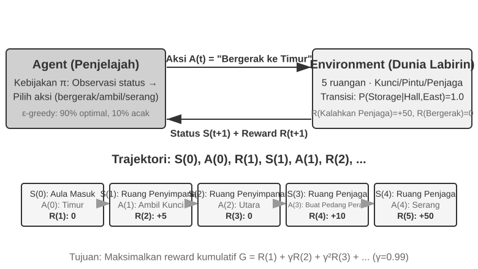

Interaksi ini menghasilkan sebuah **trajectory**—catatan lengkap tentang "keadaan → tindakan → imbalan → keadaan baru → tindakan → imbalan...". Kualitas sebuah policy pada akhirnya tercermin dari kualitas trajectory-nya. Sebuah **value function** menjawab pertanyaan: "Jika saya berada di keadaan ini sekarang dan terus bertindak sesuai dengan policy saat ini, berapa total imbalan yang pada akhirnya akan saya kumpulkan?" Ini seperti pemain catur berpengalaman yang melihat posisi dan, tanpa memperhitungkan sampai akhir, secara intuitif memperkirakan probabilitas kemenangannya. (Ketika "policy saat ini" diganti dengan "policy optimal," kita mendapatkan value function optimal, yang akan digunakan nanti di bab ini ketika membahas Bellman optimality equation.) Batas antara Agent dan environment mengikuti prinsip sederhana: **apapun yang tidak dapat diubah secara sewenang-wenang oleh Agent merupakan bagian dari environment.**

Dua fitur unik yang membedakan reinforcement learning dari supervised learning (yang membutuhkan jawaban benar berlabel) dan unsupervised learning (yang menemukan pola tersembunyi dalam data): **trial-and-error search** (Agent harus mencari tahu sendiri tindakan mana yang baik, tanpa seorang guru yang secara langsung memberikan jawaban benar) dan **delayed reward** (efek dari sebuah tindakan mungkin baru terlihat setelah banyak langkah kemudian, misalnya nilai dari langkah catur yang baik baru terlihat pada akhir permainan). Ini juga memunculkan **exploration-exploitation tradeoff** yang unik: selalu mengambil jalur yang sudah dikenal berarti tidak mempelajari hal baru; selalu mencoba secara acak berarti tidak pernah mencapai tujuan.

Sistem reinforcement learning terdiri dari lima elemen inti:

- **Action Space**: Mendefinisikan himpunan semua tindakan yang mungkin dilakukan oleh Agent. Tindakan bisa diskrit (misal, "langkah mana yang harus diambil" dalam catur, dengan jumlah pilihan yang terbatas) atau kontinu (misal, "berapa derajat untuk memutar sendi" untuk robot, nilai kontinu).
- **Policy**: Aturan perilaku Agent, yang menentukan apa yang harus dilakukan pada keadaan tertentu. Policy bisa sederhana (lookup table: di keadaan A, jalankan tindakan X) atau kompleks (deep neural network).
- **Reward Signal**: Umpan balik langsung dari environment. Namun, tujuan Agent adalah untuk memaksimalkan imbalan jangka panjang, bukan imbalan langsung—perbedaan ini sangat penting, sama seperti investasi yang tidak seharusnya dinilai dari keuntungan dan kerugian hari ini, melainkan dari pengembalian jangka panjang.
- **Value Function**: Memperkirakan total cumulative reward yang dapat diperoleh dari keadaan tertentu di masa depan, membantu Agent membuat keputusan yang bijak bahkan tanpa umpan balik langsung. Salah satu wawasan paling penting dari enam puluh tahun penelitian RL adalah peran sentral dari estimasi nilai.
- **Environment Model** (opsional): Memprediksi respons environment terhadap tindakan. Metode yang menggunakan environment model disebut **model-based methods** (pertama-tama belajar memprediksi bagaimana environment berubah, kemudian merencanakan sesuai dengan itu); metode yang tidak menggunakannya disebut **model-free methods** (tidak memprediksi environment, tetapi belajar langsung dari pengalaman).

Tabel 8-3 membandingkan komponen kunci dari berbagai sistem Agent, mengungkapkan universalitas dari konsep Agent dan membantu pembaca melihat perbedaan dalam action space antara tradisional RL Agents dan modern LLM Agents.

Tabel 8-3 Comparison of Key Elements in Different Agent Systems

| Agent Type | Environment | Action Space | Reward Signal |
|---------------|------------------------|-------------------------------|-------------------------|
| **Newborn Gazelle** | Terrain, gravity, body posture | Continuous high-dimensional (muscle group contractions) | Balance (+), Falling (-) |
| **Vacuum Robot** | Room layout, battery level | Discrete (direction, vacuum, charge) | Cleaned area (+), Battery depleted (-) |
| **Chess Grandmaster** | Board state, time limit | Discrete finite (legal moves) | Win (+1), Loss (-1) |
| **Customer Service Agent** | Conversation history, knowledge base | Open-ended (think, speak, API call) | Problem solved (+), Handling time (-) |
| **Code Assistant Agent** | Requirements document, codebase | Open-ended (think, search, edit, execute) | Test passed (+), Bug introduced (-) |

Tabel ini mengungkapkan sebuah wawasan penting: RL Agents tradisional dalam domain seperti catur dan robotika memiliki action space yang tertutup, sedangkan Agents berbasis LLM modern seperti customer-service dan coding Agents memiliki action space yang open-ended, hampir tidak terbatas. Agents ini juga dapat menggunakan tindakan khusus yaitu "internal thinking" untuk meningkatkan kemampuannya.

### Dua Paradigma Agent: Dari MDP ke LLM+RL

Dua paradigma ini paling mendasar berbeda pada action space—MDP mengasumsikan action space bersifat terbatas dan tertutup (naik/turun/ambil/letakkan), sementara action space LLM bersifat open-ended, terdiri dari urutan bahasa alami (natural language) yang eksplosif secara kombinatorial. Perbedaan ini menghasilkan pemisah mendasar antara dua paradigma tersebut dalam desain algoritma, sample efficiency, dan generalisasi. Setiap paradigma dibahas di bawah ini.

**Paradigma Tradisional: MDP dan Q-learning.**

MDP (Markov Decision Process) adalah kerangka matematis untuk reinforcement learning, mendefinisikan elemen inti seperti keadaan, tindakan, dan imbalan. Asumsi intinya adalah **Markov property**: masa depan hanya bergantung pada keadaan saat ini, bukan pada sejarah sebelumnya. Sebagai contoh, dalam catur, melihat posisi papan saat ini saja sudah cukup untuk menentukan langkah optimal; tidak perlu meninjau setiap langkah sebelumnya. Asumsi ini menyederhanakan masalah tetapi juga membatasi kemampuan untuk memodelkan ketergantungan historis.

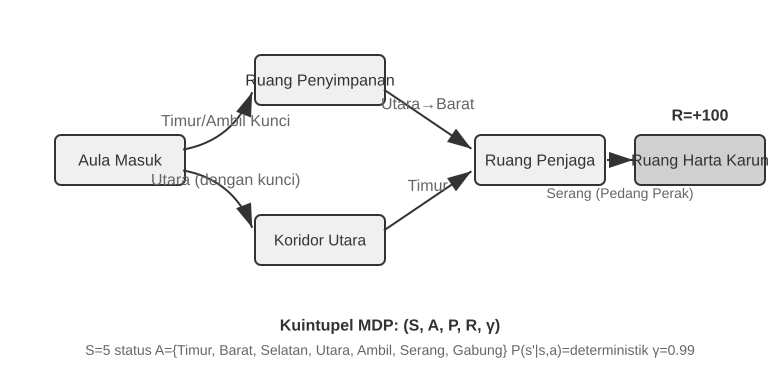

Fitur kunci dari RL Agent tradisional adalah **closed action space**—semua tindakan yang mungkin dilakukan oleh Agent membentuk himpunan terbatas yang telah ditentukan sebelumnya. **Classic board-game Agents** adalah contoh paling khas: 361 kemungkinan posisi langkah di Go, meskipun sangat luas, sepenuhnya ditentukan dan terbatas; dalam catur, meskipun ada aturan pergerakan yang berbeda untuk bidak yang berbeda, tindakan yang mungkin tetap bisa dihitung; game Atari hanya memiliki beberapa hingga belasan tindakan diskrit. **Robotic Agents** mewakili action space yang kontinu tetapi terbatas: sudut sendi, kecepatan, dan kekuatan cengkeraman adalah nilai kontinu, tetapi semuanya memiliki batasan fisik yang jelas (sudut rotasi maksimum, torsi maksimum, batas kecepatan), dengan dimensi yang ditentukan oleh degrees of freedom robot.

Sifat tertutup ini membawa keuntungan komputasional: semua tindakan dapat dihitung dan dievaluasi satu per satu, memfasilitasi dynamic programming dan Monte Carlo tree search, dan action-value function dapat didekati menggunakan tabel atau fungsi sederhana. Namun, ini juga membatasi ekspresivitas dan generalisasi. RL Agents tradisional mulai dari nol, belajar murni melalui coba-coba—mulai dari policy acak, mengumpulkan pengalaman, memperbarui value function atau policy, dan mengulangi sampai convergence.

Di dalam kerangka ini, salah satu algoritma paling dasar dan penting adalah **Q-learning**. Algoritma ini mempertahankan estimasi nilai untuk setiap pasangan "state-action": jika Anda mengambil tindakan *a* di keadaan *s* dan kemudian bertindak optimal setelahnya, berapa total imbalan yang bisa Anda harapkan? Secara intuitif, apakah suatu tindakan itu baik tergantung pada imbalan langsung yang dibawanya, ditambah "seberapa baik keadaan selanjutnya yang ditujunya."

Menuliskan intuisi ini sebagai persamaan memberikan hubungan rekursif inti dari **Bellman equation** yang terkenal di buku teks RL: **Nilai sebenarnya dari sebuah tindakan = imbalan langsung yang diperoleh pada langkah ini + nilai masa depan maksimum yang dapat diperoleh dari keadaan selanjutnya**:

$$Q^*(s, a) = r + \gamma \max_{a'} Q^*(s', a')$$

di mana $r$ adalah imbalan langsung, $s'$ adalah keadaan selanjutnya yang dicapai setelah mengeksekusi tindakan (ditulis dalam bentuk deterministik untuk intuisi; dalam environment stokastik, sebuah expectation atas keadaan selanjutnya $s'$ diperlukan), dan $\gamma \in [0, 1)$ adalah **discount factor**—menentukan seberapa besar Agent menilai masa depan: semakin dekat $\gamma$ ke 1, semakin ia menilai pengembalian jangka panjang; semakin dekat ke 0, semakin ia berfokus pada yang langsung (immediate). "Cumulative reward" yang disebutkan berulang kali sebelumnya pada dasarnya adalah jumlah imbalan pada setiap langkah, didiskon dengan $\gamma$: $\sum_{t} \gamma^{t} r_t$. Setelah setiap tindakan, algoritma sedikit menyesuaikan estimasi lama menuju "hasil yang benar-benar diamati"—paradigma "memperbaiki estimasi lama dengan hasil aktual satu langkah" ini disebut **Temporal-Difference Learning (TD learning)**. Setelah ribuan percobaan, estimasi tersebut secara bertahap mendekati nilai sebenarnya.

Dua gambar berikut menunjukkan proses eksplorasi dari Q-learning di sebuah grid world dan konvergensi bertahap dari Q-values.

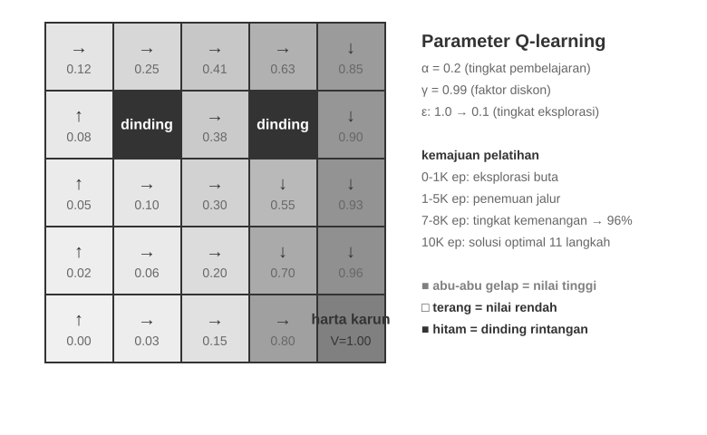

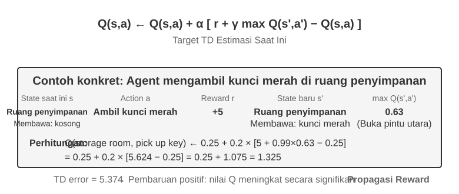

Q-learning adalah jenis khusus dari metode **off-policy**—ia dapat menggunakan data yang dihasilkan oleh policy apapun (termasuk eksplorasi acak) untuk mempelajari policy optimal. Definisi ketat dari metode on-policy dan off-policy, serta bagaimana mereka dipetakan ke post-training LLM, akan dibahas nanti di bagian "Perbandingan Algoritma Reinforcement Learning."

> **Eksperimen 8-1 ★: Kinerja Q-learning dalam Game Pencarian Harta Karun**
>
> Untuk memverifikasi karakteristik dan batasan dari Q-learning, kami merancang sebuah **lingkungan permainan pencarian harta karun (treasure hunt game)**. Lingkungan ini mencakup beberapa tantangan utama: **mekanisme tersembunyi (hidden mechanisms)** yang mengharuskan Agent menemukan korespondensi antara kunci dan pintu, efek senjata, dan aturan crafting item secara mandiri; **ketergantungan multi-langkah (multi-step dependencies)** yang berarti bahwa menyelesaikan tugas memerlukan urutan tindakan yang benar (solusi optimal: 11 langkah); **sparse rewards** yang berarti bahwa hanya tindakan penting dan kemenangan akhir yang menghasilkan imbalan yang signifikan, sementara sebagian besar langkah menengah tidak menerima umpan balik.
>
> Q-learning Agent menggunakan pengaturan parameter standar dan strategi eksplorasi ε-greedy: ia biasanya memilih tindakan optimal saat ini tetapi kadang-kadang memilih satu secara acak, dengan proporsi eksplorasi acak perlahan-lahan menurun selama training.
>
> Kurva pembelajaran menunjukkan karakteristik tipikal (satu episode adalah satu permainan lengkap, dari awal hingga penyelesaian atau kegagalan):
> - **1000 episode pertama**: tingkat kemenangan 0%, Q-table hanya memiliki 124 states, Agent mengeksplorasi secara membabi buta
> - **5000 episode pertama**: Masih tidak ada kemenangan yang stabil, Q-table memiliki 133 states
> - **7.000–8.000 episode**: Tingkat kemenangan bertahap naik dari 34% ke 96%
> - **10.000 episode**: tingkat kemenangan 100%, Q-table memiliki 145 states, menemukan solusi optimal 11-langkah
>
> Seluruh training membutuhkan waktu kurang dari 10 detik (simulasi yang sangat efisien), tetapi membutuhkan hampir 10.000 upaya lengkap. Ini mendemonstrasikan karakteristik inti dari Q-learning: ia memerlukan jumlah eksplorasi acak yang besar untuk menyelesaikan rute penuh secara tidak sengaja, dan propagasi sinyal nilai sangat lambat, membutuhkan penguatan berulang. Pembelajaran simbolik murni, tanpa prior knowledge, hanya bisa melakukan brute-force search pada state space.
>
> Dalam simulator permainan, 10.000 percobaan hanya membutuhkan waktu 10 detik, biaya yang dapat diabaikan. Tetapi di skenario Agent dunia nyata—di mana setiap panggilan telepon memiliki biaya, setiap operasi browser memiliki jeda, dan setiap keputusan yang salah dapat memiliki konsekuensi yang tidak dapat diubah—10.000 percobaan sama sekali tidak dapat diterima. Justru inilah mengapa Agents modern telah beralih ke metode berbasis LLM: memanfaatkan knowledge yang dikumpulkan selama pre-training untuk membuat keputusan yang efektif dengan interaksi minimal.
>
> Keterbatasan mendasar dari MDP ada tiga: sample efficiency yang rendah (membutuhkan interaksi masif untuk mempelajari tugas sederhana), generalisasi yang buruk (pengetahuan yang dipelajari dalam satu environment sulit ditransfer ke environment lain), dan ketidakmampuan untuk memanfaatkan prior knowledge (setiap tugas baru harus dipelajari dari awal). Keterbatasan ini menjadi sangat menonjol saat menghadapi state space yang kompleks seperti natural language atau high-dimensional vision.

**Paradigma Modern: Agents Berbasis LLM+RL.**

Large language models telah membawa paradigma baru untuk Agents, mengubah secara mendasar bagaimana Agents dibangun—terutama dalam desain dari action space.

Dalam RL tradisional, Agent hanya dapat menerima umpan balik dengan mengubah environment: membuat langkah dalam catur, mengambil langkah dalam labirin. Tetapi LLMs memperkenalkan jenis tindakan yang benar-benar baru: internal thinking. Berpikir tidak mengubah dunia eksternal, tetapi dapat secara signifikan meningkatkan kualitas dari tindakan akhir. Pergeseran ini mengubah segalanya: action space Agent tidak lagi hanya "apa yang harus dilakukan," tetapi juga mencakup "berapa lama untuk berpikir dan apa yang dipikirkan."

Inovasi yang paling penting adalah memasukkan **Thinking sebagai tindakan khusus** ke dalam action space. Dalam RL tradisional, Agents hanya dapat melakukan tindakan eksternal yang mengubah keadaan environment (bergerak, menyerang, mengambil); dalam LLM Agents, **internal thinking menjadi komponen inti dari action space**—ia tidak secara langsung mengubah environment eksternal, tidak memiliki imbalan langsung, dapat dilakukan hampir tanpa batas, dan relatif tidak mahal.

RL tradisional kesulitan dengan jenis tindakan ini, pada dasarnya karena ruang eksplorasinya terlalu besar dan kurang struktur: Agent yang belajar dari nol seperti mencari harta karun di padang pasir dengan mata tertutup, hanya dapat tersandung secara acak. LLMs itu berbeda. Melalui pre-training teks yang masif, mereka telah menginternalisasi aturan pemikiran manusia: memecahkan masalah matematika mengikuti "mengidentifikasi kondisi → mengingat rumus → menghitung langkah demi langkah," menulis kode mengikuti "memahami persyaratan → mendesain struktur → mengimplementasikan detail." Hal ini memungkinkan pemikiran LLM berjalan di sepanjang jalur terstruktur, yang secara drastis menekan ruang pencarian. Oleh karena itu, bahkan tanpa RL training tambahan, pre-trained LLM dapat menghasilkan Chain of Thought (CoT) logis dasar. Logika dasar ini berasal dari sejumlah besar proses pemikiran manusia di corpus pre-training (solusi masalah matematika, komentar kode, tanggapan debat, dll.). Melalui next-token prediction, model secara implisit belajar "seperti apa seharusnya langkah penalaran selanjutnya."

RL post-training kemudian menggunakan imbalan eksternal untuk mengajari LLM agar menggunakan aturan-aturan ini secara lebih efisien untuk tugas-tugas tertentu. Struktur bahasa itu sendiri juga memberikan imbalan internal implisit—sebuah Chain of Thought yang koheren secara logis (misal, "Karena kita perlu mengkonversi mata uang asing ke USD, langkah pertama adalah melihat nilai tukar") memiliki generation probability tinggi, sedangkan yang kacau secara logis (misal, "Karena kita perlu mengkonversi mata uang, mari kita periksa cuaca dulu") memiliki probabilitas yang sangat rendah, secara alami membimbing model ke arah jalur yang masuk akal.

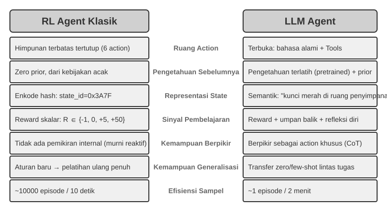

Kemampuan berpikir ini, yang didasarkan pada aturan bahasa yang melekat, memungkinkan LLM Agents untuk memahami instruksi yang belum pernah mereka lihat sebelumnya (zero-shot generalization) dan menguasai tugas-tugas baru dengan sangat sedikit contoh (few-shot adaptation)—sebuah kontras yang tajam dengan paradigma tradisional MDP Agent yang membutuhkan trial and error yang ekstensif. Selain itu, paradigma baru ini juga mendukung compositional generalization (menggabungkan kembali konsep-konsep yang diketahui untuk menangani situasi baru), in-context learning (adaptasi cepat melalui prompts dan contoh-contoh), dan multimodal understanding (secara alami mengintegrasikan modalitas seperti visi, bahasa, dan tindakan). Perhatikan bahwa **efektivitas** dari in-context learning (zero-shot generalization, few-shot adaptation) dan **mekanisme internalnya** adalah dua hal yang berbeda—seperti yang dianalisis di Bab 2, attention mechanism bekerja lebih seperti retrieval daripada reasoning, tetapi ini tidak menghalangi efek praktisnya yang kuat dalam adaptasi tugas.

Evolusi dari ruang tindakan tertutup ke terbuka mencerminkan pergeseran fundamental dalam paradigma AI Agent. Di luar pemikiran internal, keragaman parameter alat (kueri bahasa alami, kode program, JSON kompleks, konten multimodal) membuat ruang tindakan aktual hampir tak terbatas—sebuah code interpreter secara teoritis dapat mengeksekusi tugas apa pun yang dapat dikomputasi, dan alat pencarian dapat menjelajahi seluruh ruang informasi di internet. Hal ini membawa peluang baru (Agents dapat menangani tugas yang belum pernah ada sebelumnya, memecahkan masalah kompleks dengan menggabungkan alat-alat dasar) dan tantangan baru (bagaimana mendefinisikan dan mengoptimalkan reward functions di lingkungan terbuka, bagaimana mencari secara efisien dalam ruang tindakan yang tak terbatas).

Model-model seperti Kimi K3, yang dioptimalkan untuk penggunaan alat dan penalaran rantai panjang, mengilustrasikan arah khas dari paradigma LLM+RL: prapelatihan bahasa skala besar menyediakan fondasi, dan post-training memperkuat dekomposisi masalah, penggunaan alat, dan koreksi diri. **OpenVLA**[^ch8-21] (dirinci di Bab 6) memamerkan arsitektur paradigma VLA (Vision-Language-Action) di era LLM: sebuah vision encoder memproses observasi lingkungan, model bahasa memahami instruksi dan melakukan reasoning, dan action decoder menghasilkan sinyal kontrol, memungkinkan kontrol yang dikondisikan bahasa dan generalisasi lintas tugas. Untuk memperjelas, OpenVLA itu sendiri dilatih melalui imitation learning pada hampir satu juta **lintasan demonstrasi** robot, menjadikannya bersifat SFT pada dasarnya alih-alih RL. SimpleVLA-RL, yang diperkenalkan pada Eksperimen 8-13 di bagian selanjutnya dari bab ini, adalah contoh representatif dari membawa RL ke dalam robotika dengan menggunakan rewards untuk lebih mengoptimalkan jenis arsitektur VLA ini.

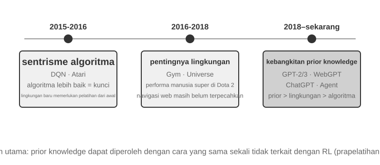

**Jalur Eksplorasi OpenAI** (dicatat oleh Shunyu Yao, Asisten Profesor di Princeton University dan penulis makalah ReAct, dalam "The Second Half"[^ch8-2]) menelusuri evolusi dalam cara bidang ini berpikir. **Fase 1 (2015-2016), Berpusat pada Algoritma:** Keyakinan yang berlaku adalah bahwa algoritma yang lebih baik adalah kuncinya. Kemajuan dicapai di lingkungan standar seperti Atari, tetapi setiap lingkungan baru membutuhkan pelatihan ulang dari awal. **Fase 2 (2016-2018), Pentingnya Lingkungan:** Gym menstandarkan berbagai tugas; Universe dan World of Bits berusaha mengubah seluruh internet menjadi lingkungan pelatihan RL; dan Dota 2 mengejar kinerja manusia super dalam lingkungan kompleks tertentu. Idenya jelas, tetapi penggunaan komputer secara umum dan navigasi web masih di luar jangkauan.

**Fase 3 (2018-sekarang), Kebangkitan Prior:** GPT-2/GPT-3 mendemonstrasikan kekuatan dari prapelatihan bahasa; WebGPT dan ChatGPT membuktikan bahwa priors tersebut dapat diubah menjadi Agents praktis. Penemuan terpenting: **priors dapat diperoleh dengan cara yang sama sekali tidak ada hubungannya dengan RL**. Ini adalah kebenaran yang berlawanan dengan intuisi—selama beberapa dekade, para peneliti RL mungkin memiliki prioritas yang benar-benar terbalik. Urutan sebenarnya bukanlah algoritma > lingkungan > prior, melainkan prior > lingkungan > algoritma.

> **Eksperimen 8-2 ★★: Studi Perbandingan RL Tradisional dan LLM Agent**
>
>
> 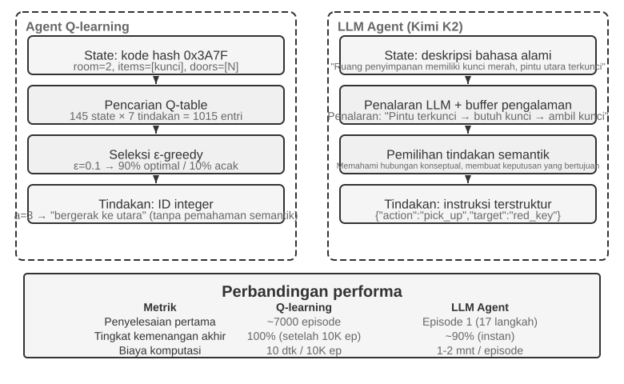
>
>
> Kami membandingkan Q-learning dengan sebuah LLM Agent—Kimi K3, mempertahankan buffer hingga 50 pengalaman—dalam permainan berburu harta karun yang sama. Hasilnya menakjubkan: **LLM Agent menyelesaikan permainan dalam 18 langkah pada percobaan pertamanya**.
>
> **Tahap Awal (Eksplorasi Bertujuan)**: Mengambil pedang berkarat ("Senjata lebih baik daripada tangan kosong"), secara sistematis menjelajahi peta, menyimpulkan "perlu menemukan kunci" setelah menemukan gerbang utara terkunci, menjelajahi ruang penyimpanan, mendapatkan kunci merah dan kristal ajaib. **Tahap Menengah (Pemahaman Mekanisme dan Sintesis Proaktif)**: Memahami aturan "penggunaan kunci otomatis" dan mengantisipasi bahwa pedang berkarat tidak cukup melawan penjaga, secara proaktif menyintesis pedang perak pada langkah ke-8. **Tahap Akhir (Eksekusi dan Koreksi Kesalahan)**: Menuju utara dengan pedang perak dan mengalahkan penjaga yang kuat pada langkah ke-13. Sepanjang jalan, ia melakukan satu atau dua percobaan yang tidak efektif—berulang kali mengayunkan pedang atau berbalik arah—dan akhirnya mendapatkan harta karun naga pada langkah ke-18.
>
> Hal ini mendemonstrasikan perbedaan mendasar antara pemahaman semantik dan pemetaan simbolik. LLM Agent memahami struktur konseptual dari permainan; setiap langkah memiliki tujuan dan dukungan logis. Untuk Q-learning, "pintu," "kunci," dan "pedang" hanyalah kombinasi simbol tanpa makna, dan ia hanya dapat secara perlahan menemukan hubungan mereka melalui pembelajaran statistik yang ekstensif.
>
> Biaya komputasi menghadirkan paradoks yang menarik: Q-learning menjalankan 10.000 permainan dalam 10 detik, sementara LLM Agent membutuhkan 1-2 menit per permainan. Namun, dalam tugas-tugas dunia nyata, biaya waktu, uang, dan risiko per interaksi jauh melampaui biaya komputasi murni, sehingga menilai semata-mata berdasarkan waktu GPU tidaklah adil. Wawasan yang lebih kritis adalah: Keberhasilan LLM Agent bukan karena memiliki "algoritma pembelajaran" yang lebih baik, tetapi karena ia membawa prior knowledge yang luas. Ketika aturan permainan berubah, Q-learning membutuhkan pelatihan ulang total, sementara LLM Agent dapat beradaptasi langsung melalui reasoning. Hal ini mengarah pada prinsip desain praktis: RL tradisional tetap berharga dalam skenario dengan biaya simulasi yang rendah dan tingkat pengulangan yang tinggi; dalam skenario dunia nyata dengan biaya interaksi yang tinggi dan kebutuhan akan adaptasi yang cepat, efisiensi sampel dari LLM Agents bernilai jauh lebih praktis.

Bab 1 telah memberikan peta konseptual tentang bagaimana adaptasi kontekstual, pembaruan ke artefak eksternal, dan pembaruan parameter bekerja bersama; bagian “The Complete Post-Training Landscape and Practical Tips” di akhir bab ini kembali membahas topik tersebut. Benang merah dari bab ini adalah post-training: menuliskan ke dalam parameter model kemampuan-kemampuan yang tidak dapat diekspresikan sepenuhnya melalui aturan eksternal.

## Dasar-dasar Prapelatihan Model `[Bacaan Opsional]`

Untuk memahami mengapa teknik-teknik post-training efektif, pertama-tama kita harus memahami apa yang dibangun oleh pre-training. Post-training (SFT dan RL) pada dasarnya mengoptimalkan dalam ruang representasi yang dibangun oleh pre-training—struktur pengetahuan yang diletakkan oleh pre-training menentukan batas atas dari post-training. Oleh karena itu, kita memeriksa aspek-aspek inti dari pre-training melalui tiga eksperimen: melatih model bahasa skala kecil dari awal, memperluas kemampuan visual, dan menyuntikkan pengetahuan bahasa baru. Tiga eksperimen di bagian ini bersifat tambahan dan ditujukan untuk membangun intuisi tentang pre-training—yaitu, pelatihan awal pada data skala besar yang mengajarkan model tentang pola bahasa dasar dan pengetahuan dunia. Pembaca yang sudah akrab dengan proses pre-training dapat melewatinya.

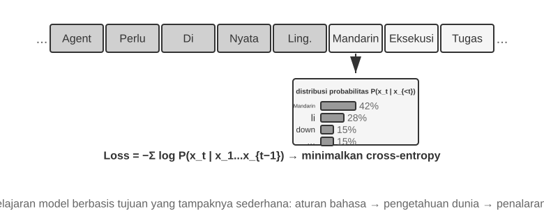

Pelatihan model bahasa mengikuti pipeline tiga langkah: "tokenization — pre-training — post-training." Tokenization mensegmentasi teks menjadi unit-unit diskrit. Misalnya, "I like programming" mungkin di-tokenize menjadi "I," "like," "program," "ming." Tokens ini adalah unit tekstual terkecil yang diproses oleh model. Tugas dari pre-training secara konseptual sederhana: tunjukkan pada model bagian pertama dari sebuah segmen teks dan minta ia untuk memprediksi token berikutnya. Dengan membandingkan prediksinya dengan jawaban yang benar (perbedaan ini disebut loss; loss yang lebih kecil berarti prediksi yang lebih akurat), model secara terus-menerus menyesuaikan parameternya. Setelah pelatihan berulang pada data teks masif, model secara bertahap mempelajari aturan bahasa, pengetahuan dunia, dan kemampuan reasoning dasar. Setelah pre-training, model dapat menghasilkan teks yang fasih, tetapi output-nya kurang terstruktur dan kesulitan mengikuti instruksi. Post-training kemudian mengubah model menjadi asisten praktis melalui SFT—berlatih pada pasangan input-output yang berlabel—dan preference optimization, seperti DPO, yang mengajarkan model untuk menghasilkan respons yang lebih disukai manusia.

> **Eksperimen 8-3 ★★: Melatih LLM dari Awal—Kekuatan Perbaikan Algoritma**
>
> Menggunakan MiniMind 2, sebuah model dengan 100 juta parameter, sebagai studi kasus, eksperimen ini menyelesaikan seluruh proses pelatihan pada GPU tingkat konsumen. Dua pengoptimalan algoritma—QK Norm dan optimizer Muon—melipatgandakan kecepatan konvergensi hingga tiga kali lipat dan secara signifikan meningkatkan kualitas generasi, semuanya dengan biaya yang sangat rendah: sekitar 14 jam pelatihan dan total $34.
>
> Efek dari setiap tahap pelatihan: Setelah pre-training, model dapat menjawab pertanyaan faktual seperti "Apa gunung tertinggi di dunia?" tetapi formatnya tidak standar; setelah SFT, instruction following dan pemformatan output meningkat pesat, memungkinkan model untuk mengatur jawaban seperti yang diharapkan; preference optimization lebih lanjut mengurangi kesalahan faktual dan ekspresi yang tidak wajar. Model dengan 100 juta parameter masih memiliki batasan yang jelas (rentan terhadap kesalahan pada masalah kompleks), tetapi pelajaran yang dapat diambil adalah: **Dengan anggaran tetap dan kecil, perbaikan algoritma menawarkan nilai yang lebih baik daripada sekadar meningkatkan ukuran**.

> **Eksperimen 8-4 ★★: Melatih VLM Anda Sendiri**
>
>
> 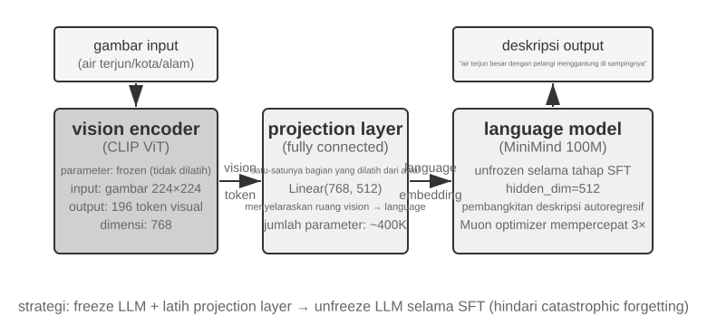
>
>
> VLMs menyatukan persepsi visual dan pemahaman bahasa dalam satu model tunggal. Tantangan intinya adalah cross-modal alignment—membuat "apa yang dilihat" sesuai dengan "apa yang dikatakan." Arsitekturnya terdiri dari tiga komponen: sebuah **Vision Encoder** (misalnya, CLIP, parameter dibekukan) mengekstrak fitur semantik dari gambar; sebuah **Projection Layer** (ringan, satu-satunya bagian yang dilatih dari awal) bertindak sebagai "penerjemah" antara fitur visual dan model bahasa, memetakan fitur visual ke dalam ruang representasi yang dapat dipahami oleh model bahasa; dan sebuah **Language Model** yang menghasilkan teks deskriptif. Pelatihan menggunakan strategi "bekukan LLM + latih hanya projection layer" untuk menghindari catastrophic forgetting (melupakan kemampuan lama setelah mempelajari kemampuan baru); setelah tahap alignment pre-training, pembekuan LLM dilepas, dan SFT dilakukan pada pasangan gambar-deskripsi berkualitas tinggi, yang secara signifikan meningkatkan detail dan keakuratan dari deskripsinya.
>
> Eksperimen ini mengungkap paradigma dasar untuk pelatihan model multimodal: menggunakan kembali hasil pre-training unimodal dan mencapai cross-modal alignment dengan melatih projection layer yang ringan—efisien dan terukur, tetapi ekspresivitas terbatas dari projection layer dapat menjadi leher botol bagi pemahaman cross-modal yang mendalam. Memperluas arsitektur "vision encoder + projection layer + LLM" yang sama selangkah lebih jauh dengan membuat model menghasilkan actions akan menghasilkan model VLA (Vision-Language-Action) yang dirinci di Bab 6.

> **Eksperimen 8-5 ★★: Continued Pre-training untuk Mempelajari Bahasa Baru**
>
> Menggunakan Mistral 7B v0.3 sebagai model dasar—yang utamanya di-pre-train dalam bahasa Inggris dan hampir tidak memiliki pemahaman bahasa Korea—eksperimen ini memperkenalkan kemampuan bahasa Korea melalui continued pre-training pada Wikipedia Korea. Ini melakukan pelatihan tak terawasi pada data bahasa baru menggunakan model yang telah menyelesaikan pre-training. Model tersebut sudah memiliki kemampuan language modeling umum dan hanya perlu beradaptasi dengan distribusi data yang baru, menjadikan biayanya jauh lebih rendah daripada melatih dari awal. Poin engineering utamanya adalah menggunakan campuran data (~80% Korea + 20% Inggris) untuk memitigasi catastrophic forgetting: proporsi bahasa target yang terlalu tinggi menyebabkan degradasi pada bahasa aslinya, sementara proporsi yang terlalu rendah menghasilkan efisiensi pembelajaran yang tidak memadai. Terakhir, SFT dilakukan dengan data instruksi bahasa Korea untuk mendapatkan kemampuan percakapan bahasa Korea yang praktis. Kesimpulan dari eksperimen ini akan digunakan kembali dalam "The Complete Post-Training Landscape and Practical Tips" di akhir bab ini: untuk membuat model mengingat sejumlah besar pengetahuan domain baru, andalkan continued pre-training, bukan SFT.

Ketiga eksperimen pre-training tersebut secara kolektif mengungkap sebuah pola: ketika anggaran terbatas, perbaikan algoritma dan inovasi arsitektur menawarkan nilai yang lebih baik daripada sekadar meningkatkan ukuran skala. Lebih penting lagi, pre-training membekali model dengan pengetahuan deskriptif dan kemampuan language modeling, tetapi kurang dalam instruction following yang terstruktur dan perilaku berorientasi tugas—inilah celah yang tepat yang perlu diisi oleh SFT.

Dengan kemampuan dasar dari pre-training, langkah selanjutnya adalah mengubah model tujuan umum menjadi sebuah Agent praktis melalui post-training. Tahap pertama dari post-training adalah Supervised Fine-Tuning (SFT).

## Mid-training: Menambah Pengetahuan dan Kapabilitas Dasar

**Mid-training** di bab ini berarti satu tahap language-model training tambahan pada distribusi target, dimulai dari base model yang sudah ada. Tujuannya biasanya tetap next-token prediction dengan loss pada seluruh token dokumen, kode, atau derivasi. Riset DAPT/TAPT menunjukkan bahwa tahap kedua pada korpus domain atau tugas yang tidak berlabel dapat memperbaiki kinerja hilir[^ch8-30].

Ia memperbaiki **celah pengetahuan**—bahasa, istilah, dokumen perusahaan, atau codebase yang kurang tercakup—dan **celah kapabilitas dasar**—konteks panjang, kode, matematika, atau representasi multimodal yang tetap gagal meski disampel berkali-kali. SFT dapat menghafal sedikit fakta, tetapi pasangan QA yang sedikit hanya menguatkan beberapa jalur akses; ia bukan wadah yang baik untuk pengetahuan besar dan saling terkait. Resep yang stabil adalah Mid-training menyerap pengetahuan/kapabilitas → SFT kecil menetapkan protokol → RL sesudah tingkat sukses tidak nol[^ch8-31].

### Campuran Data dan Kurikulum Konteks Panjang

Campuran pada tahap panjang $i$ dapat ditulis:

$$
D_i=\alpha_iD_{\text{long}}+\beta_iD_{\text{atomic}}+\gamma_iD_{\text{agent}}+\delta_iD_{\text{replay}},
\qquad \alpha_i+\beta_i+\gamma_i+\delta_i=1.
$$

Hitung rasio berdasarkan **token**, bukan jumlah dokumen. $D_{\text{long}}$ berisi buku, dokumen panjang, dan repository kode; $D_{\text{atomic}}$ melatih retrieval, penalaran multi-hop, instruction following, agregasi, dan statistik; $D_{\text{agent}}$ memuat planning, pemilihan/pemanggilan tool, pelacakan state jangka panjang, dan pemulihan error. $D_{\text{replay}}$ harus menyimpan data umum/pendek serta tugas lama yang sudah dikuasai tetapi “diangkat” ke panjang saat ini dengan posisi bukti dan distraktor yang bervariasi. Lakukan deduplikasi, filter mutu, dan pemeriksaan kontaminasi evaluasi.

Mid-training juga harus mengubah context window nominal menjadi **window efektif** sambil memasukkan penalaran panjang, planning, dan tool use. Mengubah `max_position_embeddings` dari 32K ke 128K hanya membuktikan input diterima. Gunakan kurikulum seperti 8K → 16K → 32K → 64K → 128K, disesuaikan dengan model, target, dan anggaran[^ch8-36]. Sebelum memperpanjang, selesaikan retrieval, NIAH, multi-hop, agregasi/statistik, planning dasar, dan pemilihan tool pada panjang saat ini.

Jika $M(\theta,c,L)$ adalah skor model $\theta$ untuk kapabilitas $c$ pada panjang $L$, gunakan tiga gerbang:

$$
\begin{aligned}
M(\theta_i,c,L_i)&\geq\tau_{c,i},\\
M(\theta_i,c,L_i)&\geq M(\theta_i,c,L_{i-1})-\epsilon_{\text{len}},\\
M(\theta_i,c,L_{i-1})&\geq M(\theta_{i-1},c,L_{i-1})-\epsilon_{\text{retain}}.
\end{aligned}
$$

Artinya: lolos pada panjang sekarang, kapabilitas yang sama tidak turun secara material ketika konteks memanjang, dan tahap baru tidak melupakan kapabilitas lama. Bandingkan tugas yang tingkat kesulitannya sama dan hanya dinaikkan panjangnya; tentukan $\epsilon$ dari confidence interval evaluasi berulang. Bila satu bucket gagal, tambah data atomik, data panjang saat ini, atau replay sebelum memperpanjang window nominal.

| Kapabilitas | Benchmark | Diagnosis utama |
| --- | --- | --- |
| Posisi, retrieval, tracking, agregasi | NIAH, RULER | Degradasi menurut posisi/jumlah needle, multi-hop, agregasi, dan panjang; NIAH hanya smoke test |
| Penalaran dokumen realistis | LongBench, LongBench v2 | QA satu/banyak dokumen, dialog panjang, in-context learning, data terstruktur per kategori dan panjang |
| Pemahaman kode panjang | Tugas repository LongBench v2, LongCodeU | Unit kode, relasi antar-file, pemahaman repository |
| Planning dan tool learning | PlanningArena dan benchmark tool sebelumnya | Dekomposisi, pilihan, memori, argumen, dan state |
| Agent end-to-end | SWE-bench Verified, $\tau^2$-bench, Terminal-Bench | Planning, tool, recovery, dan penyelesaian pada trajektori nyata |

RULER memperluas NIAH ke multi-needle, multi-hop, dan agregasi[^ch8-37]; LongBench v2 mencakup dokumen, dialog, repository, dan data terstruktur realistis[^ch8-38]; LongCodeU dan PlanningArena mendiagnosis kode panjang serta planning/tool learning[^ch8-39][^ch8-40]. Simpan test set resmi hanya untuk evaluasi, latih dengan contoh serupa tetapi tidak bertumpang tindih, dan laporkan per panjang, kapabilitas, dan jenis kegagalan. Lulus NIAH atau satu leaderboard tidak membuktikan penalaran konteks panjang.

Fakta yang perlu diperbarui, dikutip, dikontrol aksesnya, atau dihapus tetap lebih tepat di RAG. Validasi campuran lewat eksperimen kecil sebelum full-parameter Mid-training berskala besar.

## SFT (Supervised Fine-Tuning)

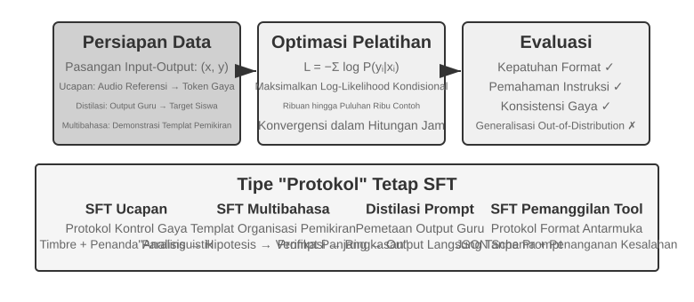

bagian "Prapelatihan, SFT, dan RL: Panorama Tiga Tahap" telah mengungkap esensi dari SFT ("memprediksi token berikutnya," dengan data yang berbeda, loss hanya dihitung pada responsnya). Bagian ini menggunakan empat eksperimen untuk mengamati apa yang sebenarnya diperkuat oleh mekanisme ini—menuliskan pemetaan yang stabil dan protokol ke dalam parameter—di berbagai tugas yang berbeda. Nilai inti dari SFT bukanlah menyuntikkan pengetahuan baru, tetapi **memperkuat protokol (solidifying protocols)**: menuliskan hubungan pemetaan, format interaksi, dan norma gaya ke dalam parameter, yang memungkinkan model untuk menghasilkan outputs yang memenuhi ekspektasi selama proses inferensi tanpa prompts yang panjang. Biasanya, hanya dibutuhkan beberapa ribu hingga puluhan ribu contoh berkualitas tinggi untuk membangun kemampuan percakapan dasar dan instruction following.

Harga dari efisiensi ini adalah ketergantungan yang kuat pada distribusi pelatihan: SFT cenderung ke arah memorisasi alih-alih generalisasi. Ketika menghadapi situasi yang tidak terlihat selama pelatihan pada saat pengujian, kinerjanya sering kali menurun secara nyata. Eksperimen-eksperimen berikut ini akan mendemonstrasikan proses "memperkuat protokol" ini dari sudut pandang yang berbeda.

Sebelum terjun langsung dengan SFT, ada satu pertanyaan praktis yang tak terhindarkan: **dari mana data SFT berasal?** Jawaban industri pada dasarnya menempuh tiga jalan:

- **Demonstrasi pakar manusia** — batas mutunya paling tinggi, tetapi mahal dan lambat; cocok sebagai "data benih" yang mendefinisikan format dan gaya;
- **Generasi oleh model guru** — yakni data sintetis: model kuat memproduksi pasangan "masukan—keluaran" secara massal, disaring, lalu didistilasi ke murid; lihat Eksperimen 8-8 dan 8-9;
- **Rejection sampling** — model sendiri mengambil beberapa kandidat untuk soal yang sama, verifier memilih yang benar, lalu dengan itu ia melatih dirinya kembali; lihat Eksperimen 8-9.

Ketiga jalan itu kerap dipakai bersama: mula-mula sedikit benih manusia memancangkan formatnya, lalu model guru memperbesar skalanya, dan terakhir rejection sampling meratakan mutunya. Jalan mana pun yang ditempuh, alur penyusunannya kurang lebih sama: definisikan distribusi tugas dan skema keluaran, hasilkan kandidat secara massal, saring mutunya dengan validasi aturan, pemeriksaan format, dan pemeriksaan sampel oleh manusia, lalu deduplikasi, seimbangkan proporsinya, dan pastikan keragamannya. Soal jumlah, tak perlu berlebihan: beberapa ribu hingga puluhan ribu sampel bermutu biasanya sudah cukup untuk memancangkan protokol, dan lebih baik memoles sepuluh ribu sampel bersih daripada menumpuk seratus ribu yang kotor, sebab setiap derau dalam data dapat ditulis SFT dengan setia ke dalam parameter.

> **Eksperimen 8-6 ★★★: Voice SFT—Dari "Voice Cloning" ke "Paralinguistic Modeling" `[Eksperimen Lanjutan]`**
>
> Menggunakan Orpheus (contextual-prompt voice cloning) dan Sesame (paralinguistic token modeling) sebagai studi kasus, eksperimen ini menunjukkan bagaimana "gaya suara dan kebiasaan berekspresi" ditulis ke dalam parameter. Keduanya mengambil rute yang berbeda:
>
> - **Orpheus**: Mengompresi bentuk gelombang suara menjadi urutan token. Dengan menggabungkan audio referensi dari pembicara yang sama, model belajar untuk "berbicara dengan suara orang ini," mencapai konsistensi timbre antarkalimat.
> - **Sesame**: Mengabstraksi fenomena paralinguistik seperti tawa dan helaan napas menjadi tokens khusus seperti `<laugh>`, `<sigh>`. Model belajar untuk "menghasilkan suara yang sesuai saat melihat token tersebut."
>
> Dalam tugas ekspresif, SFT memperkuat protokol kontrol gaya dan kebiasaan berekspresi yang terstruktur, bukan pengetahuan faktual atau penalaran kompleks. Kuncinya terletak pada keragaman dan kualitas anotasi dari data pelatihan. Mode kegagalan umum termasuk terlalu sedikit pembicara dalam data pelatihan, yang menyebabkan setiap orang terdengar sama, dan token overfitting (di mana model menghafal detail sampel pelatihan dan berkinerja lebih buruk pada situasi baru), yang mengarah pada "tawa mekanis."

> **Eksperimen 8-7 ★★★: Multilingual Thinking—Memungkinkan Model untuk Berpikir dalam Bahasa Apa Pun `[Eksperimen Lanjutan]`**
>
> Sebagian besar model berpikir hanya "berpikir" dalam bahasa Inggris: terlepas dari bahasa apa yang Anda gunakan untuk mengajukan pertanyaan, chain of thought internal dari model tersebut hampir selalu dalam bahasa Inggris, karena demonstrasi berpikir berkualitas tinggi dalam data pelatihan sebagian besar ditulis dalam bahasa Inggris. Tujuan dari eksperimen ini sederhana—memungkinkan model untuk berpikir dalam bahasa yang ditentukan.
>
> Pendekatannya adalah melakukan SFT pada gpt-oss-20b: tambahkan baris `reasoning language: German` (atau bahasa lain) ke instruksi sistem, kemudian latih dengan contoh penalaran dalam bahasa Inggris, Spanyol, Prancis, dll. Data pelatihannya sama sekali **tidak mengandung bahasa Mandarin**, tetapi setelah pelatihan, sekadar menyetel bahasa penalaran ke bahasa Mandarin memungkinkan model tersebut untuk melakukan penalaran chain-of-thought lengkap dalam bahasa Mandarin—zero-shot cross-lingual generalization ini adalah temuan paling menarik dari eksperimen ini. Perhatikan bahwa ini bukanlah kemampuan generalisasi dari SFT itu sendiri. Prapelatihan multibahasa telah membangun ruang representasi lintas bahasa bersama di dalam model; SFT hanya mengaktifkan kemampuan lintas bahasa yang sudah ada sebelumnya ini.

> **Eksperimen 8-8 ★★: Prompt Distillation—Mereplikasi Kemampuan yang Dapat Digunakan dengan Biaya Lebih Rendah**
>
> Dalam aplikasi praktis, untuk membuat model melakukan tugas kompleks, system prompts yang panjang (ribuan atau bahkan puluhan ribu tokens) sering kali diperlukan, yang meningkatkan latensi dan biaya pada setiap pemanggilan. Saat menggunakan LLMs penalaran, token pemikiran (thinking tokens) internal semakin melipatgandakan biayanya. Ide di balik prompt distillation adalah untuk mengompresi perilaku "prompt panjang + teacher berpikir" menjadi "prompt pendek/tanpa prompt + student tidak berpikir". Teacher menghasilkan jawaban berkualitas tinggi di bawah prompt penuh dan mode berpikir; data pelatihan hanya mempertahankan input pengguna dan kesimpulan akhir, membuang prompt panjang dan proses berpikir menengah. Student belajar untuk "langsung memberikan kesimpulan." Setelah distilasi, kualitas output student pada input yang sama mendekati kualitas teacher, sementara latensi dan biaya berkurang drastis karena tidak perlu memproses prompts yang panjang dan token pemikiran.
>
> Distilasi dapat dilakukan di sepanjang dua dimensi: "besar ke kecil" (menggantikan model besar dengan model menengah atau kecil untuk menyeimbangkan biaya dan kualitas) dan "berpikir ke tidak berpikir" (melipat CoT eksplisit menjadi pengetahuan parametrik implisit pada skala yang sama, mencapai peningkatan 20-30x dalam kecepatan respons). Keduanya tidak saling eksklusif dan sering kali digunakan bersama di lingkungan produksi. Penting untuk dicatat bahwa distilasi mewarisi batas-batas teacher—jika teacher memiliki kesalahan sistematis pada long tail distribusi, student akan semakin melekat pada kesalahan ini; jika teacher mengandalkan alat untuk memastikan kebenaran, distilasi output yang sederhana akan kehilangan ketangguhan (robustness) yang diberikan oleh alat-alat tersebut. Hal yang dapat dipetik dari sisi engineering: ketika desain produk stabil, distribusi input dapat diprediksi, dan batasan biaya signifikan, prompt distillation adalah pengoptimalan yang sangat baik; selama masa eksplorasi atau sebelum tugasnya stabil, mempertahankan pemikiran eksplisit dan prompts yang dapat diedit tetap menjadi inti dari iterasi yang cepat.

> **Eksperimen 8-9 ★★★: Chain of Thought (CoT) Distillation**
>
> Prompt distillation membuang proses berpikir; CoT distillation melakukan sebaliknya: ia mentransfer **lintasan pemikiran secara lengkap** dari model teacher yang kuat ke model student. Mendistilasi CoT dari model teacher yang cakap dapat memungkinkan student dengan jumlah parameter yang sama untuk memulihkan 70%-80% dari kemampuan teacher tersebut. Bagi tim yang tidak bertujuan untuk menembus batasan kapabilitas state-of-the-art tetapi menginginkan model yang dapat mereka kontrol sendiri, ini adalah strategi pengikut yang paling pragmatis. Serangkaian model kecil hasil distilasi yang bersifat open-source dari DeepSeek-R1 (menggunakan lintasan pemikiran R1 untuk melakukan SFT pada seri Qwen dan Llama) adalah contoh representatif dari pendekatan ini.
>
> **Latar Belakang: Fenomena "Thinking Wall".** Beberapa model penalaran sumber tertutup (misalnya, seri OpenAI o, seri Gemini) menghasilkan chain-of-thought internal selama penalaran, tetapi apa yang dilihat pengguna bukanlah proses berpikir aslinya—untuk alasan termasuk pencegahan distilasi, keamanan, dan pengalaman produk, penyedia layanan sering kali menulis ulang atau merangkum CoT sebelum mengeluarkannya, menyembunyikan proses berpikir asli yang paling berharga di balik API. Inilah tepatnya alasan eksperimen ini memilih model penalaran open-source sebagai teacher: model-model seperti DeepSeek V4, Kimi K3, dan GLM 5.2 secara langsung mengekspos chain-of-thought lengkap mereka, sehingga menjadikan distilasi layak dilakukan baik secara teknis maupun di bawah lisensi (meskipun seseorang masih harus memastikan ketentuan lisensi mengenai produk hasil distilasi sebelum digunakan).
>
> **Catatan dari eksperimen: model yang mampu menulis kode belum tentu bersedia membantu mendistilasi model lain.** Saat mengimplementasikan eksperimen ini, penulis mula-mula menggunakan OpenAI Codex yang ditenagai GPT-5.6-Sol untuk menulis kode eksperimen. Ketika tugas tersebut secara eksplisit melibatkan distilasi model, Codex menolak untuk melanjutkan. Penulis lalu beralih ke Claude Code yang ditenagai Claude Opus 5 dan mengalami penolakan yang sama. Pada akhirnya, Kimi K3 menyelesaikan kode eksperimen dan proses menjalankannya.
>
> Kedua penolakan tersebut bukan mengenai penalaran matematika biasa dan bukan sekadar permintaan agar model membuka chain-of-thought internalnya. Permintaannya adalah mengimplementasikan eksperimen distilasi lengkap yang menggunakan data teacher kuat untuk melatih student. Secara teknis, distilasi model sangat mirip dengan supervised fine-tuning biasa, tetapi kebijakan keamanan dan produk vendor juga dapat mengaitkannya dengan ekstraksi model, replikasi kemampuan, dan perlindungan kekayaan intelektual, sehingga menjadikannya kategori sensitif.
>
> Peristiwa ini tidak boleh disederhanakan menjadi "Claude tidak menyediakan chain-of-thought", dan juga tidak membuktikan bahwa "guardrail Kimi lebih lemah". Apakah Claude API mengembalikan summarized thinking, apakah Coding Agent bersedia mengimplementasikan pipeline distilasi, dan apakah ketentuan layanan mengizinkan output model digunakan untuk training adalah tiga pertanyaan yang berbeda. Eksperimen ini tidak mencoba melewati penalaran tersembunyi atau mekanisme keamanan model mana pun; eksperimen hanya menggunakan kemampuan yang disediakan produk untuk menjalankan alur riset yang berizin.
>
> Berikut adalah penilaian yang lebih praktis dan lebih penting: **bagi sebagian besar orang yang melakukan post-training, sama sekali tidak perlu mendistilasi chain-of-thought dari model sumber tertutup.** Kesenjangan antara model open-source terbaik saat ini dan model SOTA sumber tertutup tidak sebesar yang dibayangkan orang; model teacher hanya perlu "secara jelas lebih kuat daripada student", tidak harus "yang terbaik di dunia". Jika model yang Anda post-training berukuran 200B parameter atau lebih kecil, model SOTA open-source sudah sangat memadai sebagai teacher.
>
> **Desain Eksperimen:** Proses tiga langkah. Langkah 1, **Mengumpulkan Lintasan**: Ambil sampel masalah dari distribusi tugas target (misalnya matematika atau kode), gunakan model guru sumber terbuka untuk menghasilkan lintasan "pemikiran + jawaban", lalu singkirkan lintasan yang jawaban akhirnya salah dengan validator berbasis aturan agar model siswa tidak meniru proses yang keliru. Langkah "hasilkan kandidat, verifikasi, lalu simpan hanya lintasan yang benar" disebut **rejection sampling**. SFT pada data semacam ini disebut **rejection sampling fine-tuning (RFT)**. Pendekatan ini berada di antara SFT murni dan RL: tidak ada reward model atau policy gradient, hanya pengambilan banyak sampel dan penyaringan untuk meningkatkan kualitas data. Langkah 2, **Pelatihan SFT**: Gunakan pasangan "masalah → `<think>` lintasan pemikiran `</think>` + jawaban akhir" untuk menjalankan SFT standar pada model kecil. Langkah 3, **Evaluasi Perbandingan**: Bandingkan model siswa sebelum dan sesudah distilasi serta model guru pada benchmark yang sama.
>
> **Kriteria Penerimaan:** Model siswa yang telah didistilasi menunjukkan peningkatan signifikan pada benchmark matematika dan kode dibandingkan sebelum distilasi, serta menampilkan perilaku seperti refleksi, pelacakan mundur, dan verifikasi. Perhatikan pula biaya distilasi: siswa dapat mewarisi kesalahan sistematis dan kebiasaan berpikir bertele-tele dari guru; masalah terakhir dapat dioptimalkan lebih lanjut dengan AdaptThink pada Eksperimen 8-10.

Keempat eksperimen ini memiliki fitur yang sama—"menuliskan pemetaan dan protokol yang stabil ke dalam parameter": voice SFT memantapkan protokol kontrol gaya, multilingual SFT memantapkan templat pengorganisasian pemikiran, dan distillation SFT memantapkan pemetaan langsung dari input ke output. Mereka berbagi tujuan yang jelas, format yang bersih, dan kriteria evaluasi yang stabil, yang memungkinkan SFT untuk memberikan keuntungan dengan efisiensi sampel yang sangat tinggi; namun begitu distribusinya bergeser, kecenderungannya terhadap hafalan bermanifestasi sebagai penurunan kinerja. Ini adalah manifestasi eksperimental dari pemisahan *memory-generalization* yang dibahas pada Section 7.1, "The Essential Difference Between SFT and RL."

## Sintesis Data SFT: Dari Demonstrasi ke Trajektori yang Dapat Dilatih

Batas atas SFT ditentukan pertama-tama oleh datanya. Proyek nyata jarang bisa menulis cukup banyak demonstrasi satu per satu secara manual, sehingga biasanya digabungkan **sedikit benih buatan manusia, generasi oleh model guru, dan penyaringan oleh verifier**: demonstrasi manusia mendefinisikan format dan batas, model guru memperbesar skala, dan validasi berbasis aturan atau pemeriksaan sampel oleh manusia menjaga mutu. Ketika model melakukan bootstrap sendiri, kita dapat mengambil beberapa kandidat untuk soal yang sama dan hanya menyimpan trajektori yang lolos verifikasi — inilah rejection sampling fine-tuning (RFT).

Tujuan data sintetis bukanlah mengulang log produksi, melainkan menyuling darinya **struktur tugas** yang dapat dipakai ulang: maksud pengguna, keadaan awal, tool yang tersedia, batasan bisnis, ragam kegagalan yang lazim, dan syarat keberhasilan. Setelah informasi identitas dihapus, untuk setiap jenis tugas dibangkitkan ulang tokoh, pesanan, berkas, dan keadaan fiktif, lalu ditempatkan dalam environment terisolasi yang dapat direset. Dengan begitu kesulitan yang sesungguhnya tetap terjaga, sementara model tidak menghafal data pelanggan atau kredensial internal.

Pipeline yang kokoh berjalan begini: **data produksi → cetak biru tugas → tugas sintetis → beberapa trajektori kandidat → verifikasi tugas dan verifikasi trajektori → data SFT**. Verifikasi tugas memeriksa apakah soalnya sendiri dapat diselesaikan, apakah tingkat kesulitannya pas, dan apakah hasil rujukannya benar; verifikasi trajektori memeriksa keadaan akhir, pemanggilan tool, dan batasan bisnis. Syarat yang dapat ditulis sebagai unit test, asersi basis data, atau pemeriksaan selisih keadaan sebaiknya lebih dulu memakai kode deterministik; kualitas terbuka seperti mutu komunikasi kemudian dilengkapi oleh model penilai dan dikalibrasi dengan pemeriksaan sampel oleh manusia. Graf keterampilan, environment yang dapat dieksekusi, dan verifier independen dapat memperluas cakupan tugas sekaligus menyaring trajektori yang tidak sah[^ch8-12][^ch8-17][^ch8-18][^ch8-19][^ch8-20].

Infrastruktur tugas dan verifikasi yang sama kelak dapat diubah menjadi environment RL, tetapi kedua tahap memakainya secara berbeda: SFT hanya menyimpan trajektori sukses yang lolos verifikasi dan mempelajari format, prosedur, serta aksi dasar yang stabil; RL membuat policy saat ini melakukan rollout ulang dan memakai imbalan environment untuk menjelajahi jalur di luar demonstrasi. Trajektori gagal tidak boleh langsung dimasukkan sebagai demonstrasi yang benar — ia dapat dipakai untuk menyusun pasangan preferensi, menemukan celah cakupan tugas, atau ditambahkan ke pelatihan setelah dilengkapi diagnosis dan perbaikan.

Yang menentukan dalam sintesis data bukan jumlah, melainkan cakupan, keragaman, dan ketepatan. Himpunan latih juga perlu didedupliksi dan dibagi menurut templat tugas, pelanggan, atau rentang waktu, sedangkan himpunan evaluasi harus berasal dari jenis tugas yang tidak beririsan; solusi rujukan, tes tersembunyi, dan umpan balik verifier tidak boleh bocor ke model.

Bad case dari Bab 7 juga dapat diubah menjadi data pelatihan di sini. Ambil "penyelesaian terlalu dini" pada Coding Agent: mula-mula potong awalan trajektori sampai titik ketika agent hendak menyatakan pekerjaan selesai, lalu jadikan pernyataan dini itu sebagai rejected, dan "jalankan dulu tesnya, cocokkan syarat penerimaan satu per satu, baru menyimpulkan" sebagai chosen. Data semacam ini cocok untuk DPO atau demonstrasi batas keputusan, bukan untuk dipakai langsung sebagai trajektori SFT yang benar; alasan kegagalan, syarat keberlakuan, dan verifier sebaiknya disimpan bersama sampelnya agar dapat ditelusuri dan diperiksa ulang. Skrip `build_preference_data.py` pada Eksperimen 8-17 menyediakan dua jalur penyusunan — templat deterministik dan model guru — serta menyimpan data pelatihan terpisah dari himpunan evaluasi yang menyusul.

Dua eksperimen Bad Case yang ditambahkan pada bab ini memperlihatkan dua sasaran supervisi yang berbeda. Kasus tanda kutip lengkung bahasa Tionghoa mula-mula menyuling umpan balik menjadi Skill dokumentasi yang peka terhadap cakupan, baru kemudian menjalankan SFT pada data sintetis terstruktur; kasus string khusus mengubah ketidakcocokan `old_string` menjadi tugas penyalinan yang persis per byte dan melatih kesetiaan per token. Keduanya berbagi protokol atribusi kegagalan dan isolasi latih/evaluasi dari Bab 7, tetapi tidak berbagi skor total: yang pertama mengukur "ubah yang perlu diubah, biarkan yang perlu dibiarkan", yang kedua mengukur "salin persis kata demi kata".

## Kapan Memilih Mid-training, SFT, dan RL

Diagnosis pertama adalah apakah yang hilang berupa **fondasi, protokol, atau policy**. `pass@k` yang hampir nol dan kegagalan pengetahuan/kapabilitas mengarah ke Mid-training; model yang sesekali benar tetapi format/schema-nya tidak stabil mengarah ke SFT; RL baru efisien ketika rollout dapat dinilai, sesekali berhasil, reward setia pada tujuan, dan terdapat variasi reward dalam grup. Ukur `pass@1`, `pass@k`, kemajuan parsial, parse rate, serta atribusi kegagalan pada held-out set. Jangan langsung memakai PPO/GRPO pada seluruh rollout yang gagal.

bagian "Prapelatihan, SFT, dan RL: Panorama Tiga Tahap" menjelaskan **perbedaan mendasar** antara SFT dan RL. Bagian ini menjawab pertanyaan yang lebih praktis: **Untuk tugas tertentu, mana yang sebaiknya digunakan?** Beberapa kesimpulan dari kerangka keputusan berikut akan diuji lebih lanjut dalam Eksperimen 8-10 dan 7-11. Pembaca dapat membentuk penilaian awal, lalu kembali membandingkannya setelah membaca bagian RL.

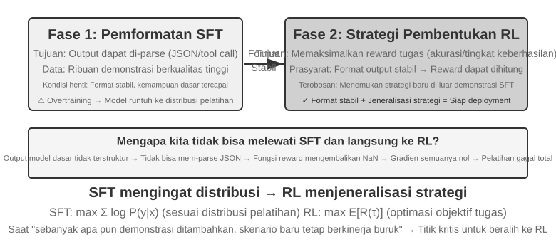

**SFT cocok untuk** tugas-tugas yang membutuhkan stabilisasi format (seperti output JSON atau gaya percakapan yang konsisten), memiliki demonstrasi ahli berkualitas tinggi yang tersedia, dan sangat cocok dengan lingkungan *deployment*. **RL menjadi perlu** dalam keadaan yang berbeda: ketika *deployment* berbeda secara sistematis dari pelatihan (selama pelatihan, kartu J/Q/K semuanya bernilai 10, sedangkan dalam *deployment* mereka menjadi 11/12/13—aturannya berubah; atau pelatihan menggunakan corak hitam dan *deployment* menggunakan corak merah—penampilannya berubah), ketika strategi optimal harus ditemukan (demonstrasi ahli belum tentu optimal), atau ketika biaya anotasi terlalu mahal untuk mendemonstrasikan setiap jalur.

Strategi yang paling kuat adalah *pipeline* dua tahap **"SFT dahulu, lalu RL"**. Tujuan utama SFT bukanlah untuk memaksimalkan kinerja tugas, melainkan untuk menetapkan **stabilitas format** pada output—memastikan model dapat menghasilkan JSON yang dapat diurai dan pemanggilan antarmuka alat (*tool interface*) yang benar. Hanya setelah format output stabil barulah sinyal *reward* RL dapat dihitung dengan andal. Melakukan RL secara langsung pada *base model* tanpa SFT sering kali berujung pada kegagalan pelatihan karena format output yang kacau dan *reward* yang tidak dapat dihitung—meskipun kesimpulan ini memiliki batasan kondisi: ia berasal dari pengaturan "*base model* yang lebih kecil + persyaratan output terstruktur yang ketat" (seperti pada Experiment 7-11 nanti). DeepSeek-R1-Zero mendemonstrasikan bahwa *base model* yang cukup kuat dapat melewatkan SFT dan berhasil dengan RL langsung, memunculkan refleksi dan kemampuan penalaran rantai panjang (*long-chain reasoning*)—dengan konsekuensi buruknya keterbacaan output dan campuran bahasa, yang justru menjadi alasan mengapa DeepSeek pada akhirnya menambahkan kembali "cold-start SFT" di R1. Perjalanan bolak-balik R1 dari Zero ke *cold-start* adalah contoh terbaik dari "bentuk (form) dahulu, baru jiwa (spirit)": RL dapat menumbuhkan "jiwa"-nya sendiri (strategi dan kemampuan penalaran), tetapi "bentuk" (format dan keterbacaan) masih harus dibangun dengan cepat dan stabil oleh SFT.

Masing-masing memiliki konsekuensinya: SFT sangat efisien dalam penggunaan sampel dan konvergen dengan cepat namun memiliki generalisasi yang buruk; RL mempelajari strategi yang dapat ditransfer namun sangat boros sampel (*sample-hungry*) dan tidak stabil untuk dilatih. Sebuah pengujian praktis: ketika menambahkan lebih banyak demonstrasi tidak lagi meningkatkan kinerja pada skenario baru, Anda telah mencapai titik di mana inilah saatnya untuk beralih ke RL—akar masalahnya bukanlah jumlah demonstrasi, melainkan tujuan optimasi dari SFT itu sendiri.

Dalam praktiknya, keputusan dapat dibuat dengan urutan sebagai berikut:

1. **Pertama tanyakan: Apakah post-training diperlukan?** Jika masalah dapat diselesaikan melalui *Harness engineering* (mengoptimalkan *prompt*, desain alat, manajemen konteks), maka tidak ada pelatihan model yang diperlukan. Sebagian besar aplikasi *Agent* berada di kategori ini.
2. **Jika pelatihan diperlukan: Coba SFT dahulu.** Cocok untuk memantapkan format output (skema JSON, format pemanggilan API), memantapkan pengetahuan protokol (penggunaan istilah, format output, kebiasaan proses, yaitu, "bagaimana mengatakan dan melakukan sesuatu"), dan menyatukan gaya (*tone*, panjang). Namun perhatikan bahwa SFT tidak cocok untuk menyuntikkan sejumlah besar pengetahuan faktual ("apa yang harus diketahui")—hal itu memerlukan kelanjutan *pre-training* atau RAG (lihat "The Complete Post-Training Landscape and Practical Tips" di akhir bab ini). SFT berbiaya rendah dan cepat menunjukkan hasil.
3. **Ketika SFT tidak cukup: Tambahkan RL.** Cocok untuk skenario yang membutuhkan generalisasi terhadap situasi baru, eksplorasi strategi optimal, atau ketika biaya anotasi terlalu tinggi. Pastikan untuk menstabilkan format output terlebih dahulu dengan SFT sebelum menerapkan RL di atasnya.

## Reinforcement Learning Putaran Tunggal: Perbandingan Memori dan Generalisasi

"Single-turn" berarti tugas diselesaikan dalam satu interaksi: model menerima input, menghasilkan output, dan menerima *reward*, tanpa perlu mempertahankan *state* di seluruh langkah. Pengaturan yang disederhanakan ini memungkinkan kita untuk fokus pada perbedaan mendasar dalam mekanisme pembelajaran antara SFT dan RL, tanpa kompleksitas dari interaksi *multi-turn*. Skenario *single-turn* memberikan kondisi eksperimental terkontrol yang jelas: tugas yang sama, *base model* yang sama, anggaran komputasi yang sama, dengan satu-satunya variabel adalah metode pelatihannya. Eksperimen pertama mendemonstrasikan bagaimana RL mempelajari meta-strategi tentang "kapan harus berpikir"; eksperimen kedua menggunakan permainan kartu penalaran aritmatika untuk secara sistematis mengkuantifikasi "SFT menghafal, RL menggeneralisasi".

Sebelum masuk ke eksperimen, mari kita bangun beberapa **intuisi minimal** tentang algoritma RL, yang cukup untuk mengikuti istilah-istilah yang muncul (rumus lengkap dan perbandingannya akan dibahas nanti di bagian "Comparison of Reinforcement Learning Algorithms" di bab ini). Pelatihan RL dalam bab ini sebagian besar bertumpu pada **policy gradient**: model menghasilkan beberapa respons untuk masalah yang sama, meningkatkan probabilitas untuk respons ber-*reward* tinggi dan menurunkan probabilitas untuk respons ber-*reward* rendah—bergerak lebih jauh ke arah yang memberikan *reward* dan lebih sedikit ke arah yang tidak memberikan *reward*. Untuk menjaga agar pembaruan besar tunggal tidak menggagalkan model, algoritma **PPO** arus utama memotong besaran pembaruan pada setiap langkah (ini adalah "PPO with value network" dari eksperimen-eksperimen selanjutnya; *value network* memperkirakan *baseline* untuk menghitung *advantage* yang lebih halus). Metode lainnya, **GRPO**, tidak melatih *value network*; melainkan ia membandingkan beberapa respons terhadap masalah yang sama satu sama lain untuk menilai kualitas relatif masing-masing. Intuisi tersebut adalah semua yang Anda butuhkan untuk dua eksperimen berikutnya.

Mekanisme yang sama dapat dituliskan sebagai pseudocode bergaya Python di bawah ini. Ia menghilangkan paralelisme pengambilan sampel, regularisasi KL, dan rincian optimizer, dan hanya menandai rantai sebab dari satu rollout sampai pembaruan parameter:

```python
for prompt in batch:
    group = [rollout(policy, env.reset(prompt)) for _ in range(G)]
    rewards = [verify(trajectory) for trajectory in group]
    advantages = normalize_within_group(rewards)       # GRPO baseline
    update(policy, group, advantages)
```

Value network dan fungsi tujuan terklip milik PPO dapat dituliskan terpisah:

```python
for trajectory in rollouts:
    returns = discounted_returns(trajectory.rewards)
    values = value_model(trajectory.states)
    advantages = returns - stop_gradient(values)
    ratio = exp(policy.log_prob(trajectory.actions)
                - old_policy.log_prob(trajectory.actions))
    policy_loss = -mean(min(
        ratio * advantages,
        clip(ratio, 1 - epsilon, 1 + epsilon) * advantages
    ))
    value_loss = mean((value_model(trajectory.states) - returns) ** 2)
update(policy, value_model, policy_loss + value_coef * value_loss)
```

Kata "relatif" pada GRPO berasal dari perbandingan di dalam kelompok untuk prompt yang sama; `old_policy` pada PPO adalah cuplikan beku dari policy yang menghasilkan sekumpulan rollout itu, dan rasio peluang mengukur seberapa jauh policy saat ini sudah bergeser darinya. Clipping menahan langkah besar, tetapi bukan kendala keras atas pergerakan policy; keduanya tetap bergantung pada environment dan imbalan yang andal, dan penyesuaian pelatihannya yang konkret dapat dilihat pada eksperimen terkait.

> **Eksperimen 8-10 ★★: AdaptThink—Belajar "Kapan Tidak Perlu Berpikir"**
>
> Model penalaran besar (misalnya, OpenAI o1, DeepSeek-R1) menghasilkan *chain-of-thought* yang panjang untuk semua masalah, menyebabkan *overhead* yang tidak perlu pada masalah-masalah sederhana. Eksperimen ini pertama-tama memvalidasi sebuah intuisi: **Mode NoThinking** (melewatkan pemikiran melalui `<think></think>`) berkinerja sebanding atau bahkan lebih baik pada masalah sederhana; hanya ketika menghadapi masalah sulit, keunggulan dari mode *Thinking* menjadi nyata.
>
> AdaptThink menggunakan RL untuk melatih model agar secara adaptif memilih mode tersebut. Dua komponen inti:
>
> - **Constrained Optimization Objective**: Mendorong *NoThinking* sembari memastikan kinerja keseluruhan tidak menurun.
> - **Importance Sampling Strategy**: Menyeimbangkan sampel *Thinking* dan *NoThinking* untuk memecahkan masalah **cold-start** (di sini, *cold start* secara khusus merujuk pada model awal yang hampir selalu memilih *Thinking*, sehingga cabang *NoThinking* memiliki terlalu sedikit sampel untuk dipelajari secara efektif; ini berbeda dengan penggunaan awal "cold-start SFT" untuk DeepSeek-R1, yang melibatkan sejumlah kecil contoh demonstrasi).
>
> "Importance sampling" yang disebutkan di sini adalah metode statistik yang umum—ketika distribusi sampel bias ke arah kelas sampel tertentu, bobot diterapkan pada sampel untuk "mengoreksi" distribusinya, memastikan bahwa sinyal pembelajaran secara adil mencakup semua kelas. Gagasan ini berulang kali digunakan dalam algoritma RL seperti PPO dan DAPO yang dibahas di bagian selanjutnya dari buku ini.
>
> Catatan resmi untuk proses training historis ini adalah [laporan training](../chapter8/AdaptThink/TRAINING_REPORT.md) tanpa checkpoint. Proses utama publik W&B [`wubbn5tj`](https://wandb.ai/bojieli-pine-ai/adapt_think_verl/runs/wubbn5tj) menggunakan 8×NVIDIA H100 80GB. Dari langkah 0→300, akurasi MATH500 berubah dari 0.8100→0.8180 (+0.80 pp) dan panjang respons dari 4911.46→1576.62 (-67.90%); untuk GSM8K nilainya 0.796816→0.818802 (+2.20 pp) dan 1025.24→477.33 (-53.44%); sedangkan AIME mean16 berubah dari 0.314583→0.310417 (-0.42 pp) dan 12119.51→6402.23 (-47.17%). Rasio NoThinking yang bersesuaian adalah 83.80%, 84.15%, dan 56.25%. Hasil ini menunjukkan sinyal routing yang selaras dengan tingkat kesulitan pada tingkat agregat dataset, tetapi tidak membenarkan sebutan “kesadaran kesulitan yang sempurna” untuk setiap soal ataupun klaim bahwa akurasi meningkat secara umum.
>
> Setelah titik pengukuran yang dipilih dalam laporan, proses berlanjut hingga langkah 410 dan total 36.92 jam sebelum W&B menandainya sebagai `crashed`; konfigurasi 10 epochs / 3,140 langkah tidak selesai. Walaupun ada peristiwa pengukuran waktu checkpoint pada langkah 300, checkpoint tersebut tidak didistribusikan bersama buku dan tidak ada bukti eksekusi independen bahwa checkpoint itu berhasil dievaluasi dengan `run_eval_verl_hf.sh` atau digunakan untuk menjalankan ulang MMLU. Commit source historisnya adalah `9e588202…`; reproduksi mendatang dipatok ke commit anak langsungnya, `0033ad172…`. Ketiga file entry point tidak berubah, tetapi path `-fl-` yang dihasilkan script training tidak kompatibel dengan path `-fl4096` yang di-hardcode dalam script evaluasi dan harus diperbaiki secara manual.
>
> Bersama dengan *prompt distillation*, AdaptThink membentuk "fast-slow dual system": distilasi mengurangi proporsi tugas yang memerlukan pemikiran, sementara AdaptThink mengoptimalkan strategi pemicuan untuk tugas-tugas yang tersisa, secara bersama-sama meningkatkan efisiensi pemikiran.

> **Eksperimen 8-11 ★★: GeneralPoints—Perbandingan "Memori dan Generalisasi" dalam RL Putaran Tunggal**
>
> 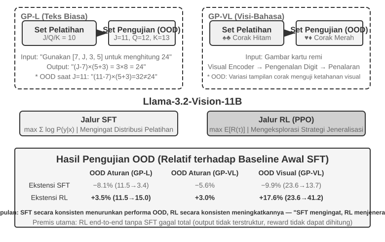
>
> GeneralPoints adalah permainan kartu penalaran aritmatika yang diusulkan oleh Chu dkk.[^ch8-3], yang dirancang secara khusus untuk mengevaluasi generalisasi model. Tujuannya menyerupai "24 Game": gunakan setiap dari keempat angka yang ditampilkan pada kartu tepat satu kali, kombinasikan dengan penjumlahan, pengurangan, perkalian, dan pembagian untuk mencapai angka target 24. Eksperimen ini merancang dua varian: GP-L yang hanya teks (*text-only*) dan GP-VL yang berbasis gambar (*image-based*), yang memungkinkan kita untuk menguji *rule generalization* dan *visual generalization* di dalam kerangka kerja yang sama.
>
> **Rule Variant**: Selama pelatihan, J/Q/K semuanya dihitung sebagai 10; selama pengujian, mereka dihitung masing-masing sebagai 11/12/13, memastikan set pengujian berisi kombinasi angka yang belum pernah dilihat (operasi yang melibatkan 11, 12, 13) untuk mengevaluasi generalisasi secara ketat. **Visual Variant**: Pelatihan menggunakan corak hitam (♠♣), pengujian menggunakan corak merah (♥♦), untuk mengevaluasi kekokohan terhadap perubahan pada penampilan visual. Menggunakan Llama-3.2-Vision-11B, eksperimen ini mengikuti *pipeline post-training* standar: pertama, inisialisasi SFT memberikan model kemampuan dasar mengikuti instruksi; kemudian, dengan anggaran komputasi yang sama, model menjalani pelatihan tambahan SFT dan RL di cabang yang terpisah, dengan PPO dan *value network* digunakan untuk RL. Kedua cabang dilatih pada data menggunakan aturan tunggal J/Q/K=10 dan dievaluasi pada set pengujian *in-distribution* (ID) dan *out-of-distribution* (OOD).
>
> Hasilnya dengan jelas mengungkapkan perbedaan yang mendasar. **Rule OOD**: RL meningkat sebesar +3.5 poin persentase pada GP-L (11.5%→15.0%), sementara SFT **menurun** sebesar 8.1 poin persentase (11.5%→3.4%); pada GP-VL, RL meningkat sebesar +3.0 poin persentase, sementara SFT menurun sebesar 5.6 poin persentase. **Visual OOD**: RL meningkat sebesar **+17.6 poin persentase** pada GP-VL (23.6%→41.2%), sementara SFT menurun sebesar 9.9 poin persentase (23.6%→13.7%).
>
> Pelacakan akurasi pengenalan visual mengungkapkan bahwa RL meningkatkan *visual encoder* yang mendasarinya melalui optimasi berorientasi hasil, dan peningkatan ini sangat berkorelasi dengan perolehan kinerja secara keseluruhan; sebaliknya, SFT mengalami *overfitting* pada pola token dalam proses pemikiran, mengabaikan pembelajaran token visual, yang mengarah pada penurunan akurasi pengenalan.
>
> Eksperimen ini juga mengungkapkan perlunya SFT untuk RL: di bawah pengaturan eksperimen ini (*base model* dari skala Llama-3.2-Vision-11B, ditambah persyaratan output terstruktur yang ketat), melakukan RL secara langsung tanpa SFT akan gagal total—*base model* tidak dapat menghasilkan output terstruktur, dan *reward* tidak dapat dihitung sama sekali. Perhatikan bahwa ini adalah kesimpulan di bawah pengaturan khusus, bukan hukum universal: *base model* yang cukup kuat dapat melewati SFT dan berhasil dengan RL langsung (lihat pembahasan sebelumnya mengenai DeepSeek-R1-Zero). Temuan lain yang patut diperhatikan adalah bahwa iterasi verifikasi yang lebih banyak mengarah pada generalisasi yang lebih baik: 10 iterasi +5.99% vs 1 iterasi +0.48%, yang mengindikasikan bahwa skalabilitas komputasi selama proses pemikiran adalah kunci bagi generalisasi RL.
>
> Mengapa kinerja SFT runtuh saat *distribution shift*, sementara RL berkinerja lebih baik? SFT mempelajari pemetaan "diberikan input ini, keluarkan jawaban itu": selama pelatihan, J/Q/K semuanya 10, sehingga model menghafal pola tetap "saat menjumpai J/Q/K, perlakukan sebagai 10"; selama pengujian, J=11, tetapi model masih menghitungnya sebagai 10, tentu saja ia akan membuat kesalahan. RL mempelajari strategi yang lebih umum dari "proses perhitungan apa yang menghasilkan jawaban yang benar": ketika J menjadi 11, model RL menghitung ulang menggunakan strategi yang sama, alih-alih menerapkan jawaban yang dihafal. Ini adalah perbedaan mendasar antara "hafalan" (*memorization*) dan "generalisasi" (*generalization*).
>
> Kontribusi inti dari eksperimen ini adalah kuantifikasi sistematisnya dari fenomena "SFT memorizes, RL generalizes", yang menunjukkan bahwa pola ini berlaku baik di dalam modalitas teks-saja maupun visi-bahasa. Eksperimen ini juga mengungkapkan hubungan yang saling melengkapi antara SFT dan RL: SFT memberikan stabilitas format, dan RL membangun fondasi tersebut untuk melampaui batas hafalan; keduanya sangat diperlukan. Paradigma pelatihan "bentuk dahulu, baru jiwa" (*form first, spirit second*) ini—meminjam istilah dari lukisan Tiongkok, pertama-tama gambarlah secara akurat bentuk luarnya (format, struktur), lalu kejarlah jiwa batinnya (generalisasi, strategi)—meletakkan landasan metodologis untuk tugas-tugas *multi-turn*, multimoda selanjutnya.

## Algoritma RL: Dari 16 Rollout ke Satu Pembaruan Parameter

**GRPO (Group Relative Policy Optimization)** yang diperkenalkan DeepSeek kini menjadi salah satu algoritma pelatihan RL yang paling banyak dipakai. Sebuah contoh membuatnya konkret. Misalkan di SWE-bench ada tugas ini: `parser.py` pada suatu proyek Python memunculkan `IndexError` saat masukan kosong, dan Agent harus memperbaiki kodenya tanpa mengubah tes. Sistem pelatihan menempuh empat langkah berikut.

**Langkah 1: biarkan model policy mencoba berulang kali.** Model policy adalah model bahasa yang sedang kita latih. Sistem menyalin kode awal dan deskripsi soal yang sama ke 16 sandbox yang saling terisolasi, lalu membiarkan model menyelesaikannya 16 kali secara independen. Setiap percobaan mencakup seluruh alur "baca kode → ubah berkas → jalankan tes → kirim hasil"; keseluruhan proses itu disebut satu **rollout**. Soal dan environment awalnya persis sama, tetapi pengambilan sampel bersifat stokastik sehingga 16 percobaan itu bisa menempuh jalur berbeda: ada yang menambahkan pemeriksaan batas dengan benar, ada yang hanya menangkap exception dan menutupi masalahnya, ada yang mengubah berkas yang salah, dan ada yang mencoba mengubah tesnya.

**Langkah 2: hitung imbalan.** Setelah setiap rollout selesai, verifier menerapkan patch di environment bersih lalu menjalankan tes. Misalkan 4 dari 16 percobaan lolos semua tes tanpa menyentuh berkas tes dan 12 sisanya gagal, maka 4 yang pertama memperoleh imbalan 1 dan 12 sisanya memperoleh 0. Pada tugas pemrograman semacam ini "menghitung imbalan" tidak ada misteriusnya: ia hanyalah memakai tes dan aturan untuk menilai apakah perbaikannya benar. Barulah pada tugas terbuka yang tidak punya tes pasti diperlukan preferensi manusia atau reward model untuk menilai.

**Langkah 3: hitung keunggulan relatif.** Imbalan hanya memberi tahu satu trajektori berhasil atau gagal, sedangkan **keunggulan relatif** memberi tahu seberapa baik ia dibandingkan percobaan lain dalam kelompok yang sama. Rata-rata keberhasilan kelompok ini 4/16: 4 trajektori yang lolos berada di atas rata-rata kelompok dan memperoleh keunggulan positif; 12 yang gagal berada di bawahnya dan memperoleh keunggulan negatif. Perbandingan di dalam kelompok inilah inti GRPO. Jika semua 16 gagal, atau semua 16 berhasil, imbalannya sama persis sehingga tidak ada yang bisa dibandingkan dan keunggulan relatifnya lenyap. Sinyal jalur pada RLVP, imbalan proses, dan imbalan kemajuan parsial hadir justru untuk memulihkan perbedaan yang bermakna di dalam kelompok semacam itu.

**Langkah 4: perbarui policy dengan gradient descent.** Program pelatihan mengubah keunggulan relatif menjadi loss, menghitung gradien, lalu optimizer (AdamW, Muon, dan sejenisnya) menjalankan gradient descent, menaikkan peluang pilihan yang diambil model pada trajektori berkeunggulan positif dan menurunkannya pada trajektori berkeunggulan negatif. Ini bukan menghafalkan satu patch yang berhasil apa adanya, melainkan menyetel sedikit demi sedikit di banyak tugas dan rollout; kelak ketika bertemu galat serupa, "reproduksi dulu masalahnya, periksa syarat batas, ubah implementasi, lalu jalankan tes" akan lebih mudah muncul, sementara "tutupi exception, ubah tes, kirim tanpa verifikasi" akan lebih jarang muncul.

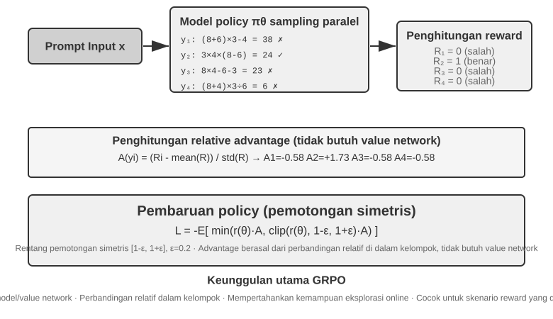

Keempat langkah ini bersama-sama membentuk satu **iterasi pelatihan**, yaitu satu **step**: pada step ke-$k$ policy saat ini menghasilkan sekumpulan rollout, menuntaskan perhitungan imbalan, keunggulan, dan gradien, lalu optimizer memperbarui parameter; step ke-$k+1$ langsung melakukan rollout lagi dengan policy yang sudah diperbarui. Melatih 100 steps berarti mengulang lingkar tertutup ini kira-kira 100 kali. Kerangka kerja pelatihan RL tertentu mungkin menghitung sendiri pembaruan minibatch internalnya, jadi saat membaca log pelatihan tetap perlu dipastikan bagaimana ia mendefinisikan `step`.

Mari buat perkiraan waktu kasar. Rollout Agent yang rumit menghasilkan puluhan putaran pemanggilan tool, dan meskipun 16 di antaranya berjalan paralel, waktu jam dinding satu tahap rollout ditentukan oleh yang paling lambat. Andaikan rollout terlambat memakan sekitar 2.000 detik, lalu gradient descent dan pembaruan optimizer memakan sekitar 600 detik, maka satu step memerlukan kira-kira $2{,}000+600=2{,}600$ detik, yakni sekitar 43 menit; 100 steps berturut-turut mendekati 72 jam.

PPO dan GRPO sama-sama mengikuti lingkar tertutup ini, dan perbedaannya terutama pada **dibandingkan dengan apa**. GRPO langsung membandingkan beberapa rollout dari soal yang sama sehingga tidak memerlukan value model terpisah. PPO melatih sebuah value model yang menaksir "biasanya sebaik apa" pada tiap langkah trajektori, lalu menilai apakah aksi saat ini melampaui ekspektasi itu; karena itu ia lebih cocok untuk trajektori panjang yang memerlukan credit assignment yang halus. Keduanya membatasi besar satu pembaruan agar sekumpulan kecil sampel tidak mengubah model terlalu drastis. DPO berbeda: ia belajar langsung dari pasangan preferensi "jawaban lebih baik — jawaban lebih buruk" yang dikumpulkan lebih dulu, dan tidak pernah menyuruh policy saat ini menghasilkan kumpulan rollout itu secara daring.

Pada kasus-kasus di bab ini, AdaptThink memakai fungsi tujuan berkendala buatan sendiri; GeneralPoints dan V-IRL memakai PPO dengan value model; SimpleVLA-RL dan RLVP memakai GRPO; ReTool memakai PPO. Algoritma menentukan bagaimana trajektori dibandingkan dan parameter diperbarui; imbalan menentukan apa yang dihitung sebagai keberhasilan; environment dan data menentukan masalah apa saja yang dapat dialami model.

### Mengapa LLM RL Biasanya Mengutamakan On-Policy

**Online** hanya berarti data terus dibuat selama training; **on-policy** berarti behavior policy $\mu$ yang membuat rollout sama atau cukup dekat dengan policy terkini $\pi_\theta$. Worker asinkron yang tertinggal beberapa checkpoint sudah membuat data online menjadi off-policy. Koreksinya memakai importance ratio:

$$
\rho_t=\frac{\pi_\theta(a_t\mid s_t)}{\mu(a_t\mid s_t)}
=\exp\!\left(\log\pi_\theta(a_t\mid s_t)-\log\mu(a_t\mid s_t)\right).
$$

Sebelum update, rollout on-policy yang segar memiliki $\rho_t=1$: training berfokus pada state yang benar-benar dikunjungi model kini dan menghindari koreksi ber-variance tinggi. Off-policy dapat memakai ulang data dan menaikkan throughput, tetapi rasio token yang sedikit menyimpang dapat terakumulasi pada urutan panjang. PPO clipping membatasi outlier, bukan memulihkan coverage distribusi. Jadi on-policy bukan selalu unggul; dalam policy gradient LLM ia biasanya berarti bias distribusi lebih kecil dan optimasi lebih stabil[^ch8-32].

#### Ketidakcocokan Numerik Dapat Merusak On-Policy

Sampler vLLM/SGLang dan trainer FSDP/Megatron dapat memberi log probability berbeda meski bobot sama, akibat presisi, urutan reduksi, tensor parallelism, batch size, KV cache, atau fused kernel. Maka sebelum update pun $\rho_t\ne1$ dan training nominal on-policy menjadi off-policy secara numerik; perbedaan token kecil saja dapat meruntuhkan training[^ch8-33]. Rantai penguatnya adalah: galat log-probability → rasio yang dieksponensialkan → akumulasi pada prefix panjang → perubahan clipping/advantage → perubahan gradien dan effective sample size. Pada 4.000 token, bias searah $10^{-3}$ dapat menjadi $e^4\approx54.6$; perubahan batch juga dapat merusak batch invariance[^ch8-34].

Sebelum update, bandingkan token log probability sampler/trainer dan pantau mean, quantile, maksimum $\rho_t$, approximate KL, dan clipping fraction. Sinkronkan juga LoRA, tokenizer, chat template, revision, dan konfigurasi posisi; simpan behavior log probability saat generasi. Jika jalur numeriknya tak dapat disamakan, perlakukan sebagai off-policy, gunakan koreksi eksplisit, dan batasi staleness serta jumlah update per batch.

## Environment RL: Dari Evaluasi ke Simulasi

Sumbat pelatihan RL kerap bukan pada algoritma, melainkan pada **apakah environment-nya cukup realistis, dapat direset, dan dapat diparalelkan**. Panggilan telepon, pembayaran, atau perubahan berkas oleh Agent sungguhan bisa mahal dan tak dapat dibatalkan, dan satu kesalahan tidak bisa ditebus dengan percobaan ulang tanpa batas; environment evaluasi pada Bab 7 dapat menyediakan verifier, tetapi pelatihan masih menuntut Agent mencoba dan gagal berulang-ulang, menanggung efek samping aksinya, serta tetap stabil sepanjang jutaan interaksi. Karena itu rekayasa environment adalah prasyarat RL, bukan pelengkap setelah pelatihan selesai.

### Environment: lapangan tempat model berlatih

Hakikat RL adalah "belajar dari coba-coba", dan coba-coba memerlukan **lapangan**, yaitu environment simulasi. Model berulang kali menjalankan tugas di sana, memperoleh umpan balik, dan menyetel policy-nya. **Kesetiaan** environment — seberapa mirip ia dengan skenario penggelaran nyata — langsung menentukan apakah policy yang dihasilkan berguna sama sekali:

- **Environment yang melenceng menjamin policy yang tidak terpakai.** Jika pelanggan tersimulasi selalu menjawab menurut naskah tetap dan pesan galatnya tidak cocok dengan produksi, model akan mempelajari "kiat ujian" yang hanya manjur di simulasi dan langsung ketahuan begitu digelar. Inilah cara paling umum sebuah proyek RL gagal — bukan algoritmanya yang buruk, melainkan lapangan latihannya bukan ruang ujiannya.
- **Membangun environment berkesetiaan tinggi sering lebih mahal dan lebih sulit daripada pelatihannya sendiri.** Environment yang dapat diparalelkan secara masif, dapat direproduksi, dan umpan baliknya realistis biasanya menuntut rekayasa jauh lebih besar daripada menyetel model. Eksperimen tool calling di bagian selanjutnya bab ini (sandbox MCP milik AWorld, sandbox interpreter kode milik ReTool) menanam usaha besar pada environment justru karena **API sungguhan punya batas laju, bisa memblokir akun, dan punya efek samping, sehingga mustahil dipakai langsung untuk pelatihan** — Anda harus lebih dulu membangun "dunia bayangan" yang stabil, terkendali, dan dapat diputar ulang.
- **Separuh lainnya dari environment adalah fungsi imbalan.** Environment tidak hanya harus mensimulasikan bagaimana dunia berubah, tetapi juga harus dapat menilai seberapa baik hasilnya; inilah masukan bagi desain imbalan yang dibahas berikutnya.

Singkatnya: **sebelum mulai mengutak-atik algoritma, tanyakan pada diri sendiri — apakah environment simulasi saya sungguh mirip dunia nyata?** Jawaban atas pertanyaan itu jauh lebih penting daripada memilih PPO atau GRPO.

### Bagaimana jika environment tidak bisa dibangun: biarkan model memerankan environment

Namun ada persoalan yang lebih mendasar: pada banyak skenario, environment berkesetiaan tinggi bukan sekadar "mahal", melainkan **sama sekali tidak bisa dibangun** — API sungguhan punya efek samping sehingga tak boleh dipanggil sembarangan, pengguna sungguhan tak boleh dijadikan bahan coba-coba, dan dunia fisik tak bisa dipercepat. Jika "dunia bayangan" yang layak pun tak bisa didirikan, apakah RL jadi mustahil? Gagasan yang kian arus utama adalah **memakai model untuk mensimulasikan environment** — biarkan sebuah LLM memerankan environment dan menghasilkan umpan balik yang dibutuhkan interaksi Agent. Jalur ini punya dua tingkat.

**Tingkat pertama: model mensintesis nilai kembalian pemanggilan tool.** Ambil ZeroSearch[^ch8-13]: melatih "model yang bisa mencari" biasanya tak lepas dari mesin pencari sungguhan, padahal API pencarian berbiaya, berbatas laju, dan hasilnya tak terkendali. ZeroSearch langsung saja menyuruh sebuah LLM memerankan mesin pencari: model murid mengirim kueri pencarian, lalu "mesin tersimulasi" itu menghasilkan hasil pencarian yang dikembalikan. Yang lebih cerdik, ia memakai rancangan **berkurikulum** — pada awal pelatihan mesin tersimulasi mengembalikan dokumen bermutu tinggi dan sangat relevan, lalu seiring pelatihan berjalan derau dicampurkan sedikit demi sedikit dan mutu kembaliannya diturunkan, memaksa murid belajar memungut informasi berguna dari hasil tak sempurna seperti yang diberikan mesin pencari sungguhan. Pada akhirnya, model yang sepanjang pelatihan tak pernah melihat mesin pencari sungguhan tetap bekerja baik ketika disambungkan ke yang asli.

**Tingkat kedua: model mensimulasikan dinamika seluruh environment.** Bukan hanya nilai kembalian satu tool, "akan seperti apa dunia setelah sebuah aksi dijalankan" pun dapat diserahkan kepada model. DreamGym[^ch8-14] menyuling dinamika environment ke dalam sebuah "model pengalaman" bercorak penalaran: diberi keadaan saat ini dan aksi Agent, ia menalar bertahap sampai ke transisi keadaan dan sinyal umpan balik, sehingga dapat mensintesis rollout secara massal untuk RL daring tanpa menyentuh environment sungguhan. Pelatihan Agent layanan pelanggan dan penjualan lazim memakai LLM untuk memerankan pengguna (simulator pengguna), dan keluarga evaluasi τ-bench dibangun tepat di atas gagasan ini — simulator berbasis model yang sama dapat menjadi ruang ujian sekaligus lapangan latihan.

Namun risiko jalur ini harus dinyatakan terang-terangan: **pengetahuan simulator tentang dunia adalah langit-langit pelatihan, dan bias sistematis simulator akan diserap bulat-bulat oleh policy.** Jika pelanggan tersimulasi lebih sabar daripada pengguna sungguhan, atau mesin pencari tersimulasi tak pernah mengembalikan sampah, yang dipelajari murid adalah policy yang hanya berlaku di "dunia yang diperankan model"; lebih buruk lagi, RL akan aktif mencari dan memanfaatkan celah simulator, yakni reward hacking. Karena itu langkah rekayasa yang aman adalah **hibrida**: biarkan simulasi berbasis model menanggung sebagian besar volume interaksi, lengkapi dengan interaksi di environment sungguhan, dan pakai interaksi sungguhan itu untuk mengalibrasi bias simulator secara berkala.

### Environment, distribusi tugas, dan isolasi evaluasi

Environment itu sendiri menentukan apa yang dapat dipelajari RL: ia harus dapat direset, dapat diparalelkan, dapat direproduksi, dan setelah transisi keadaan memberikan hasil verifikasi yang tepercaya. Tugas pelatihan berasal dari sumber yang sama dengan sintesis data SFT di atas — sulingkan cetak biru tugas dari log bisnis nyata, lalu setelah informasi identitas dihapus, bangkitkan ulang tokoh, pesanan, berkas, dan keadaan fiktif.

Tuntutan isolasinya sama, dengan satu tambahan khas RL: environment pelatihan dan evaluasi boleh berbagi generator tugas dan kode verifikasi, tetapi tidak boleh berbagi kumpulan tugas yang sama. SWE-Gym, τ²-bench, dan AndroidWorld sama-sama menunjukkan hal ini[^ch8-28]: kasus uji, keadaan tersembunyi, dan solusi rujukan mesti tinggal di sisi verifier. Selain itu, pakai dulu sedikit rollout untuk memeriksa "apakah tugasnya dapat dituntaskan dan apakah verifier bisa membedakan benar dari salah", baru perbesar skala pengambilan sampel; jika verifier-nya sendiri berbias sistematis, RL hanya akan memanfaatkannya lebih cepat.

Karena itu urutan rekayasa environment semestinya: **cetak biru tugas → simulator yang dapat direset → verifier deterministik → isolasi latih/evaluasi → kalibrasi dengan sedikit interaksi sungguhan**. Sintesis data SFT diletakkan lebih dulu karena ia membangun demonstrasi yang stabil; environment di sini melayani RL, membiarkan policy saat ini berulang kali mencoba-gagal dan menjelajahi jalur di luar demonstrasi.

Verifier deterministik yang "murah" tidak berarti tanpa biaya. Kernel Lean, test runner, atau eksekusi kontainer dapat membuat verifikasi di CPU jauh lebih lambat daripada generasi di GPU; ketika itu terjadi, throughput ditentukan oleh jumlah worker verifier yang berjalan paralel, bukan oleh menambah GPU[^ch8-9].

## Dari Single-Turn ke Multi-Turn: Skenario Tugas dan Credit Assignment

### Tantangan inti tugas multi-turn

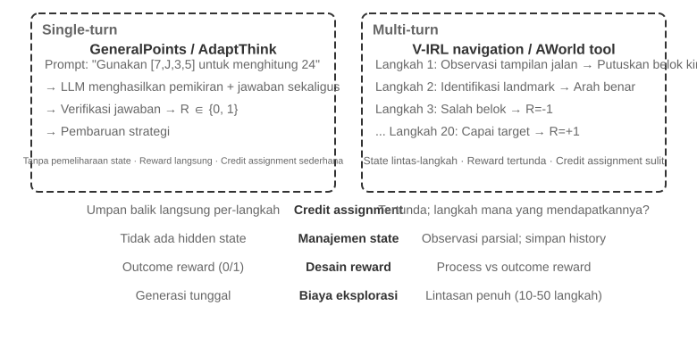

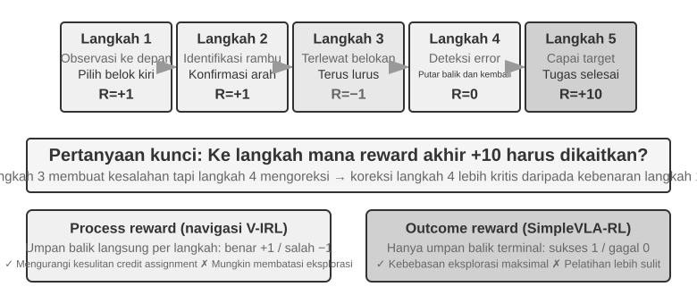

Beralih dari single-turn ke multi-turn membuat kerumitan melonjak secara kualitatif. Policy tidak hanya harus memilih aksi terbaik sekarang, tetapi juga mempertimbangkan nilai keadaan di masa depan; tidak hanya menangani umpan balik seketika, tetapi juga melakukan **credit assignment** di bawah imbalan tertunda, yakni menentukan langkah mana dalam rangkaian banyak langkah yang paling besar sumbangannya pada hasil akhir. Misalnya, sebuah Agent layanan pelanggan memakai 10 putaran percakapan untuk menuntaskan masalah pengguna dan akhirnya memperoleh penilaian bagus — tetapi apakah itu jasa pertanyaan jitu di putaran ke-2, atau penjelasan sabar di putaran ke-7?

Interaksi multi-turn yang dibicarakan di sini persis lingkar ReAct yang dijelaskan pada Bab 1 dan Bab 4 — tiap putaran adalah satu iterasi **berpikir → bertindak → mengamati**, dan tertundanya imbalan berasal dari kendala struktural bahwa "baik-buruknya hasil akhir baru dapat dinilai beberapa putaran kemudian".

> **Eksperimen 8-12 ★★★: V-IRL-VL — navigasi visual multi-turn**
>
> V-IRL[^ch8-24] membuat Agent bernavigasi terus-menerus di pemandangan jalanan kota yang nyata: pelatihan memakai rute New York, sedangkan pengujian dipindahkan ke kota lain sambil sekaligus mengubah cara arah dinyatakan dan tampilan visualnya. RL jelas mengungguli SFT baik pada OOD aturan maupun OOD visual, yang menunjukkan bahwa pada tugas multi-turn policy harus belajar menyusun rencana ulang berdasarkan pengamatan saat ini, bukan mereproduksi trajektori pelatihan. Eksperimen memakai PPO dengan value network, dan teramati bahwa umpan balik bertahap meringankan credit assignment berjangka panjang.

> **Eksperimen 8-13 ★★★: SimpleVLA-RL — eksplorasi terbuka di bawah imbalan hasil `[Eksperimen Perluasan]`**
>
> SimpleVLA-RL hanya memakai imbalan hasil berhasil/gagal pada tugas robotika LIBERO. Tiap tugas hanya memakai satu trajektori demonstrasi untuk cold start SFT, lalu RL menaikkan tingkat keberhasilan dari 17,3% menjadi 91,7% dan menemukan gerakan "dorong-potong" yang tak pernah muncul dalam demonstrasi. Ia berkebalikan dengan V-IRL: ketika sinyal proses mudah didefinisikan ia mempercepat pembelajaran, tetapi ketika jalur optimalnya tak diketahui, imbalan hasil yang jarang justru menyisakan ruang eksplorasi jauh lebih besar.

### Tool calling: membawa environment ke dalam Agent

Begitu tugas multi-turn tersambung ke tool eksternal, aksi tidak lagi sekadar "berpindah atau menjawab", melainkan mencari, mengeksekusi kode, mengubah berkas, mengueri basis data, dan merangkai beberapa API. Karena itu tool calling sekaligus mendorong credit assignment, rekayasa environment, dan batasan keamanan ke depan panggung.

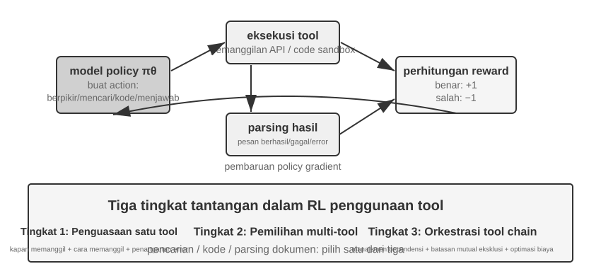

Search-R1[^ch8-25] mewakili jalur augmentasi pencarian: model sendiri memutuskan kapan dan apa yang dicari, lalu memakai hasil yang kembali untuk melanjutkan penalaran. ReTool justru menanamkan interpreter kode ke dalam lingkar berpikir, sehingga model harus belajar kapan mengeksekusi kode, bagaimana membaca umpan balik, dan bagaimana memperbaiki diri dari pesan galat. AWorld-train menyediakan sandbox MCP multi-tool, yang selanjutnya memasukkan pemilihan tool, pengelolaan dependensi, reset keadaan, dan keterulangan.

Trajektori bertool punya satu detail implementasi yang penting: token yang dikembalikan environment bukan dihasilkan policy, jadi ketika menghitung gradien policy token umpan balik itu mesti dimasker, dan gradien hanya dialirkan lewat pikiran model sendiri serta argumen pemanggilan tool-nya. Kalau tidak, model justru dilatih memprediksi keluaran sandbox alih-alih belajar memakai tool.

> **Eksperimen 8-14 ★★★: ReTool — penyelesaian soal matematika dengan interpreter kode**
>
> 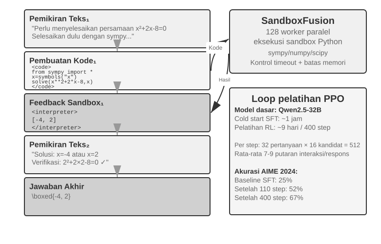
>
> Setelah pemanasan SFT, ReTool berlatih dengan PPO pada penalaran teks, eksekusi kode, dan umpan balik interpreter yang berselang-seling. Ia memperlihatkan bagaimana umpan balik tool mengubah strategi berpikir: model berangsur belajar mengeksekusi atas inisiatif sendiri, membaca galat, dan memperbaiki diri. Data pelatihan berasal dari DAPO-Math-17k, tetapi algoritma optimasinya tetap PPO standar[^ch8-26][^ch8-27].
>
> Pada AIME 2024, pelatihan menaikkan hasil dari sekitar 25% menjadi 67,0%; dibandingkan RL teks murni, umpan balik kode membuat model lebih cepat belajar berhitung cermat dan mengoreksi galat. Dinamika pelatihan yang rinci dan konfigurasi sandbox ada pada catatan pendamping eksperimen.

> **Eksperimen 8-15 ★★★: AWorld-train — belajar memakai tool di dalam sandbox**
>
> 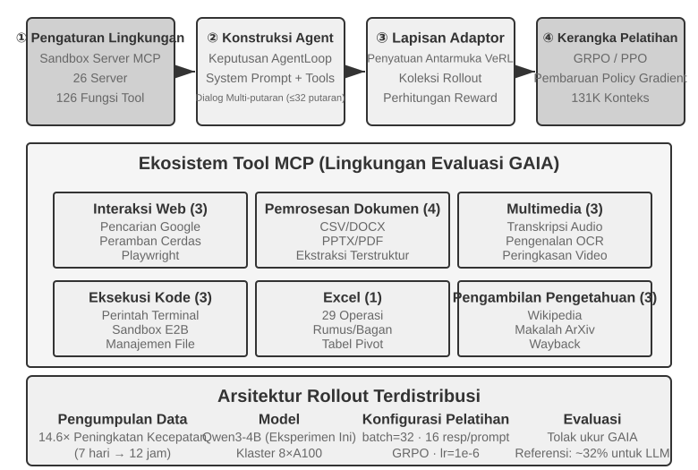
>
> AWorld-train memakai sandbox server MCP yang menyediakan tool untuk web, dokumen, multimedia, kode, dan pencarian pengetahuan. Titik berat eksperimen terbuka ini bukan memperbarui angka GAIA, melainkan menjalankan tuntas lingkar pelatihan multi-tool yang dapat direset dan diputar ulang, serta mengamati apakah tingkat keberhasilan pemanggilan tool dan strategi perangkaiannya membaik seiring pelatihan.

Semua skenario ini menunjukkan hal yang sama: kesulitan melatih Agent multi-turn bukan pada "ada atau tidaknya optimizer yang lebih canggih", melainkan pada apakah umpan balik environment tepercaya, apakah rantai aksinya dapat diverifikasi, dan bagaimana imbalan akhir mesti diatribusikan ke keputusan-keputusan antara.

## Desain imbalan: mengubah tujuan tugas menjadi sinyal pembelajaran

Skenario single-turn, multi-turn, dan pemanggilan alat di atas menjelaskan *apa* yang dilatih; bagian ini menjawab *bagaimana lingkungan seharusnya memberi tahu model apakah kerjanya bagus*. Desain imbalan terbentang pada tiga dimensi yang saling melengkapi: **dari mana imbalan berasal**, **kapan diberikan**, dan **berapa banyak informasi yang harus disampaikan**. Lalu ada pertanyaan keempat: ketika hasilnya benar, apakah jalurnya juga sesuai aturan?

### Dari mana imbalan berasal: aturan, preferensi manusia, dan penilaian model

Sumber paling andal adalah **imbalan terverifikasi (RLVR)**: menilai hasil secara langsung dengan test case, asersi basis data, selisih status, atau pemeriksaan format. Jawaban matematika, tes kode, dan pemanggilan alat terstruktur semuanya cocok dimulai dari imbalan hasil biner. Semakin deterministik aturannya, semakin murah dan dapat direproduksi imbalannya, dan semakin sulit dicurangi model.

**RLHF** di sini hanya latar. Alur dasar InstructGPT[^ch8-4] adalah: manusia membandingkan jawaban, sebuah model imbalan dilatih, lalu PPO mengoptimalkan kebijakan. Model imbalan hanyalah proksi preferensi, dan mengoptimalkannya berlebihan menimbulkan reward hacking[^ch8-5]; karena itu biasanya dipakai regularisasi KL untuk menambatkan kebijakan di dekat model rujukan SFT. DPO[^ch8-6] melewati model imbalan eksplisit dan langsung mengoptimalkan secara luring dari pasangan preferensi. Metode-metode ini bukan jalur utama Agent RL pada bab ini.

Ketika tujuan sulit diaturkan sepenuhnya, penilaian model bisa dipakai. **Model imbalan generatif (GRM)** tidak hanya mengeluarkan skor, tetapi juga diagnosis "bagian mana yang baik, bagian mana yang perlu diperbaiki"; ia bisa menjadi sumber imbalan, dan diagnosisnya bisa diubah menjadi data distilasi atau preferensi berikutnya. Gagasan inti DeepSeek-GRM[^ch8-23] adalah membiarkan model lebih dulu menyimpulkan prinsip penilaian untuk tugas tersebut, lalu menilai trajektori menurut prinsip itu, dan akhirnya memeriksa kebenaran penilaian itu dengan fakta yang terverifikasi. Umpan baliknya lebih transparan, tetapi kalibrasi manusia berbasis sampel tetap dibutuhkan agar penilai tidak membentuk bias baru.

Dua pengertian yang mudah tertukar perlu dipisahkan di sini. **Reward hacking** adalah meraih skor tinggi dengan menyalahgunakan aturan atau celah implementasi. **Reward seeking** adalah ketika model lebih dulu membangun gambaran internal tentang *apa yang akan dilihat penilai*, lalu menyesuaikan perilakunya dengan dugaan itu. Yang kedua tidak harus mengutak-atik tes atau memalsukan hasil, tetapi pada tugas berhorizon panjang bisa membuat model menetapkan sendiri pemeriksaan yang sangat dangkal, berhenti begitu lolos, sehingga hasil kerjanya hanya memenuhi metrik proksi dan bukan maksud sebenarnya[^ch8-29]. Jadi "lolos grader" tidak otomatis berarti "tugas selesai": penilai adalah proksi dari maksud, dan semakin kuat pelatihannya, semakin besar kemungkinan model menganggap proksi itu sebagai tujuan itu sendiri.

### Kapan imbalan diberikan: hasil atau proses

**Imbalan hasil (ORM)** hanya menilai di akhir episode apakah tugas selesai. Ini yang paling sederhana dan memberi kebijakan kebebasan eksplorasi terbesar; ketika jalur antara belum punya standar yang disepakati dan solusi optimal belum ditemukan manusia, imbalan berhasil/gagal yang jarang ala SimpleVLA-RL adalah titik awal yang tepat. Umpan balik yang jarang menyulitkan model menentukan kesalahan spesifik dalam trajektori banyak langkah, dan itu salah satu alasan efisiensi sampel RL lama terbatas[^ch8-8]. Pada tugas coding atau cowork berjangka panjang, penentuan "sudah selesai atau belum" juga harus diserahkan kepada tes tersembunyi, asersi status, atau hook terminasi eksternal yang tak bisa ditulis model — bukan kepada klaim selesai dari model sendiri.

"Berhenti terlalu dini" adalah contoh konkret: saat model menyatakan tugas selesai, harness menjalankan tes penerimaan yang tak terlihat model di ruang kerja terisolasi; lolos berarti imbalan positif, gagal berarti negatif. Tes itu harus membaca berkas nyata atau status lingkungan, bukan sekadar memeriksa apakah model berkata "selesai", jika tidak model akan belajar menjanjikan verifikasi tanpa benar-benar melakukannya. Saat evaluasi, pisahkan himpunan batas berisi tugas yang belum selesai dari himpunan tersimpan berisi tugas yang benar-benar selesai: yang pertama menunjukkan laju berhenti dini, yang kedua menunjukkan apakah model masih bisa menutup pekerjaan dengan normal, supaya tidak terlatih menjadi model yang tak pernah berani mengakhiri.

**Imbalan proses (PRM)** memberi umpan balik pada langkah antara, misalnya memeriksa autentikasi, argumen alat, jumlah tes yang lolos, atau aksi navigasi. *Let's Verify Step by Step*[^ch8-7] dari OpenAI menunjukkan nilai verifikasi langkah demi langkah dalam penalaran matematis. Imbalan proses meringankan penetapan kredit berhorizon panjang, tetapi bisa mengurung model pada jalur yang sudah dibayangkan perancang, dan biaya pelabelan serta validasinya lebih tinggi. V-IRL-VL (eksperimen 7-12) memakai umpan balik navigasi langkah demi langkah, sedangkan SimpleVLA-RL (eksperimen 7-13) hanya mempertahankan imbalan di titik akhir; keduanya membentuk kontras "umpan balik padat ditukar kecepatan konvergensi, umpan balik jarang ditukar ruang eksplorasi".

Secara rekayasa, bangun dulu garis dasar yang andal dengan imbalan hasil, baru tambahkan sinyal proses hanya untuk peristiwa antara yang benar-benar terverifikasi. RL LLM multi-giliran biasanya menetapkan faktor diskon $\gamma=1$; jaringan nilai PPO atau keunggulan tingkat giliran bertugas mengatribusikan umpan balik akhir ke aksi-aksi lebih awal, sedangkan GRPO meratakan keunggulan tingkat trajektori ke token yang dihasilkan, sehingga pada trajektori panjang pengenceran sinyal perlu perhatian khusus.

### Berapa banyak informasi yang harus disampaikan imbalan: skalar, vektor, diagnosis generatif

**Kepadatan** imbalan dan **bentuk representasinya** adalah dua hal berbeda. Skalar hanya menjawab "seberapa baik secara keseluruhan"; semi-skalar memberi alasan singkat lalu skor; vektor menilai terpisah menurut dimensi seperti akurasi, kelengkapan, biaya, dan keamanan; imbalan generatif menghasilkan diagnosis dalam bahasa alami yang bisa disampel beberapa kali lalu diagregasi. Prinsip pemilihannya lugas:

- Ada jawaban pasti atau tes: utamakan skalar biner;
- Ada beberapa tujuan kualitas yang saling bebas: pakai vektor, atau bobotkan tiap dimensi menjadi skalar;
- Terbuka dan sulit dijabarkan habis dengan aturan: pakai diagnosis generatif, tetapi sertai pemeriksaan fakta dan tinjauan manusia berbasis sampel.

Jangan menumpuk dimensi yang tak terverifikasi demi "imbalan yang lebih kaya". Setiap dimensi penilaian tambahan menambah satu cara lagi bagi kebijakan untuk mencurangi; pastikan dulu sinyal itu menghasilkan perbedaan dalam kelompok yang bermakna pada sedikit rollout, baru putuskan apakah layak masuk pelatihan.

### Hasil yang benar saja belum cukup: batasan jalur dan RLVP

Imbalan hasil menyelesaikan "apakah pekerjaannya jadi", tetapi tak bisa menyatakan "apakah dikerjakan sesuai ketentuan". Agent nyata bisa memperoleh keberhasilan semu dengan mengubah berkas tes, melewati autentikasi, atau menjalankan perintah destruktif. Prinsip RLVP (Reinforcement Learning with Verified Penalty)[^ch8-9] adalah: **hadiahi hasilnya, hukum jalurnya**. Sasarannya adalah **batasan yang netral terhadap hasil**, dapat diputus mesin dan tidak terkait keberhasilan atau kegagalan akhir; ia bukan pengganti pemeriksaan independen atas maksud semantik, kelengkapan hasil kerja, dan perilaku berhenti dini.

Lingkungan nyata umumnya adalah **verifikator asimetris**: mendeteksi "sebuah aksi buruk telah dilakukan" itu murah dan andal, sedangkan membuktikan "langkah ini benar-benar membawa kemajuan berarti menuju tujuan" itu sulit. Tulis imbalan total sebagai $R=O+\beta\Phi$: $O$ adalah hasil tugas, $\Phi$ adalah sinyal jalur yang dihitung per aksi dengan aturan deterministik. Kurangi poin untuk pelanggaran yang terverifikasi, dan beri sedikit imbalan parsial untuk aksi patuh yang terverifikasi atau subtujuan yang terjangkau; normalisasi kedua jalur sebelum digabung agar sinyal jalur tidak menenggelamkan tujuan utama. Ini tidak mengubah PPO/GRPO, hanya mengubah imbalan yang terlihat pada tiap langkah.

Pada tataran implementasi, pisahkan keluaran verifikator menjadi dua jalur lalu serahkan ke pengoptimal kebijakan yang sudah ada:

```python
outcome = verify_final_state(trajectory)              # result, not self-report
path_signal = 0
for step in trajectory:
    path_signal += deterministic_path_signal(step)    # penalty or reachable progress
reward = normalize(outcome) + beta * normalize(path_signal)
```

Aksi mana yang diizinkan, subtujuan mana yang terjangkau, apa saja tes tersembunyinya, dan bagaimana bukti dicatat, semuanya bergantung pada lingkungan konkret; teks ini hanya menjelaskan bagaimana "imbalan hasil" dan "batasan jalur" bertemu, agar aturan satu lingkungan tidak disalahartikan sebagai algoritma umum.

Kunci RLVP bukan "makin padat imbalan makin baik", melainkan apakah perbedaan dalam kelompok bisa dipulihkan. Imbalan hasil murni menghasilkan varians nol dan tanpa gradien baik pada kelompok yang gagal semua maupun berhasil semua; aksi pelanggaran umumnya mudah dideteksi sehingga hukuman hampir selalu memulihkan perbedaan; imbalan kemajuan hanya efektif bila kemajuan parsial memang terjangkau. Dalam perancangan ikuti empat hal: hukum aksi yang konkret, bukan "kurang berusaha"; selalu pertahankan imbalan hasil agar model tidak belajar diam saja; sebisa mungkin pasangkan tiap hukuman dengan jalur patuh yang terjangkau; buat aturan yang deterministik dan sulit dicurangi. Jika kebijakan dasar sama sekali tidak pernah menyampel aksi patuh, "semai" dulu jalur itu dengan sedikit demonstrasi, lalu lemahkan pembentukan jalur secara bertahap setelah perilaku patuh stabil. Dengan kata lain, hukuman adalah separuh yang biasanya terjangkau, dan imbalan kemajuan adalah separuh yang digerbangi keterjangkauan.

> **Eksperimen 8-16 ★★★: RLVP — hadiahi hasilnya, hukum jalurnya**
>
> Tambahkan imbalan hasil $O$ dan sinyal jalur $\Phi$ di atas GRPO, lalu bandingkan dengan imbalan hasil murni. Di TerminalBench jumlah pelanggaran turun dari 3,71 menjadi 0,66 sementara laju keberhasilan nyaris tak berubah; di miniF2F, imbalan parsial yang terjangkau memangkas iterasi yang dibutuhkan untuk mencapai laju keberhasilan 0,9 dari 7,0 menjadi 4,4. Pada perbaikan perangkat lunak, jika tak satu pun rollout lolos tes apa pun, sinyal kemajuan tak terjangkau dan menambahkannya tidak memberi manfaat. Pelajarannya: ukur dulu keterjangkauan sinyal, baru putuskan apakah menambah dimensi imbalan.

Angka-angka ini berasal dari lingkungan proksi terkendali dan tidak bisa langsung diekstrapolasi menjadi peningkatan setara pada Agent produksi; kesimpulan yang lebih aman bersifat mekanistis: selama sinyal jalur bisa membedakan perilaku dalam kelompok rollout yang sama dan aturannya sulit dicurangi kebijakan, ia melengkapi persis informasi yang tak terlihat oleh imbalan akhir. Untuk penerapan nyata, verifikasi tersembunyi, pemantauan trajektori, dan kondisi terminasi eksternal juga harus dimasukkan ke dalam harness.

## Distilasi: meningkatkan efisiensi sampel

Eksperimen-eksperimen sebelumnya telah memperlihatkan secara sistematis nilai inti RL dalam pelatihan Agent, tetapi semuanya membayar biaya sampel yang mahal. "Efisiensi sampel" di sini bermakna spesifik: **berapa banyak pembaruan parameter yang efektif yang dihasilkan oleh setiap interaksi mahal dengan environment**, bukan sekadar jumlah langkah pelatihan atau jam GPU. Waktu pelatihan RL ReTool lebih dari 200 kali lipat SFT-nya (9 hari berbanding 1 jam), sehingga mengurangi pengambilan sampel dari environment menjadi sangat berharga.

Rendahnya efisiensi sampel RL berasal dari variansi yang besar dan sulitnya memakai ulang data on-policy, tetapi penyebab yang lebih mendasar adalah umpan baliknya terlampau jarang. RL model-free arus utama biasanya hanya memperoleh satu skalar berhasil/gagal pada akhir satu rollout, sedangkan alasan kesalahan di tengah jalan, field yang hilang, atau petunjuk prosedur tidak membawa sinyal pembelajaran langsung. Ketika petugas layanan mengatakan "saya butuh empat digit terakhir kartu kredit", model hanya bisa mencapai langkah itu lewat coba-coba dari hasil 0/1 di ujung, dan mungkin butuh ratusan interaksi untuk kebetulan menguasainya — padahal manusia cukup mendengarnya sekali.

**Distilasi mengubah satu rollout menjadi sinyal supervisi yang rapat**, sehingga satu trajektori yang sama menyumbang banyak gradien tanpa perlu menjelajahi trajektori environment tambahan. Inilah kunci mengapa distilasi meningkatkan efisiensi sampel.

### On-Policy Distillation: membuat satu rollout menghasilkan supervisi rapat

On-Policy Distillation dirumuskan oleh Thinking Machines Lab pada 2025[^ch8-10]. “Policy” di sini berarti **siapa yang menghasilkan prefix state tempat murid belajar**, bukan siapa yang memberi supervisi.

| Metode | Pembuat trajektori/state | Supervisi utama |
| --- | --- | --- |
| SFT/distilasi off-policy | Manusia atau guru | Supervisi token rapat dari jawaban berlabel |
| RL on-policy | Murid saat ini | Reward hasil/proses yang biasanya jarang |
| On-Policy Distillation | Murid saat ini | Distribusi token guru pada prefix murid |

SFT rapat tetapi terutama mencakup state guru, sedangkan RL relevan pada state murid namun sering hanya menerima sukses/gagal di akhir. On-Policy Distillation menggabungkannya: **murid menentukan state yang dikunjungi, guru memberi seluruh distribusi next-token di sana**. Jika murid bahkan tidak dapat mencapai state yang bermakna, lakukan Mid-training atau demonstrasi off-policy lebih dahulu. Konsistensi numerik tetap wajib: bila rollout berasal dari $\mu$ tetapi trainer menghitung $\pi_\theta$ lain, state training sudah off-policy meski tanpa PPO ratio. Uji kesepakatan log-probability sampler/trainer sebelum update.

On-Policy Distillation mula-mula membiarkan murid menghasilkan trajektori dengan policy-nya sendiri, lalu meminta guru yang lebih kuat memberikan distribusi peluang token berikutnya **pada setiap keadaan yang benar-benar dilewati murid**. Dengan begitu rollout sepanjang $T$ tak lagi hanya menghasilkan satu sinyal 0/1, melainkan sekitar $T$ himpunan supervisi per token; yang dikonsumsi inferensi guru adalah komputasi, bukan interaksi environment tambahan. Ini menghindari ketidakcocokan distribusi pada SFT sekaligus menurunkan variansi dan jumlah percobaan RL secara mencolok: satu kali pengambilan sampel yang mahal sudah mengajarkan "apa yang harus diubah pada langkah ini", tanpa perlu menunggu tugas selesai lalu menalar mundur dari berhasil-gagalnya.

Secara konkret, distribusi prediksi murid didekatkan ke distribusi guru, biasanya dengan meminimalkan **divergensi KL** di antara keduanya. Misalnya ketika murid menghasilkan "kueri API dulu, lalu urai nilai kembaliannya…", guru dapat memberikan distribusi pada posisi itu berupa 80% "kueri", 15% "panggil", dan 5% sisanya. Dibandingkan imbalan biner di ujung tugas, penyelarasan per token memberi sinyal pembelajaran yang jauh lebih rapat dan bervariansi lebih rendah; harganya adalah biaya inferensi guru, yang justru sangat sepadan ketika interaksi environment mahal.

Pseudocode dasar dari on-policy distillation adalah:

```python
student_trajectory = rollout(student, task)
loss = 0
for state in student_trajectory:
    teacher_logits = teacher(state)
    loss += KL(student_logits(state), teacher_logits)
update_student(loss)
```

Pada tugas seperti matematika, jumlah langkah pelatihan untuk mencapai kinerja setara kira-kira **sepersepuluh** RL murni. Pada Agent multi-turn, ketika sinyal berhasil-gagal datang lebih lambat dan lebih jarang, distribusi per token dari guru dapat langsung membimbing keputusan-keputusan antara; syaratnya environment simulasi cukup realistis sehingga keadaan yang dijelajahi murid mendekati distribusi penggelaran, sebab kalau tidak, penilaian guru atas keadaan asing yang berbias pun tak dapat dipercaya.

Prinsip "sinyal rapat mengalahkan sinyal jarang" pernah pula diverifikasi pada skenario Agent murni. Penulis dan para kolaborator pernah membandingkan DPO, empat varian RL, dan On-Policy Distillation pada tugas "rasa waktu": kelompok pertama masing-masing terbatasi oleh imbalan yang jarang, ketidakcocokan tujuan, ketidakcocokan bentuk rollout, dan runtuhnya policy. Setelah beralih ke guru Qwen3-32B yang dibekukan dan menyelaraskan per token pada trajektori multi-turn milik murid sendiri, pelatihan konvergen dengan mulus dan tingkat kelulusan pada keempat kondisi 23 sampai 47 poin persentase lebih tinggi daripada baseline SFT dari sumber yang sama[^ch8-11]. Ini menunjukkan bahwa sumbatnya kerap bukan pada fungsi imbalan yang kurang canggih, melainkan pada sinyal per interaksi yang kurang rapat.

### Bagaimana jika tidak ada guru yang lebih kuat: distilasi diri on-policy

Kekuatan On-Policy Distillation datang dari gurunya, dan karena itu ia memikul satu prasyarat keras: **harus ada model guru yang jelas lebih kuat daripada muridnya.** Pada banyak keadaan hal itu tidak terpenuhi. Jika yang hendak Anda latih adalah model domain vertikal dan kemampuan semua model yang ada masih kurang, tak ada model guru yang tersedia. Tanpa guru yang lebih kuat, apakah dividen sinyal rapat menjadi mustahil?

Satu jalan keluar yang cerdik adalah **On-Policy Self-Distillation (OPSD, distilasi diri on-policy)**[^ch8-15]: **satu model yang sama memerankan guru dan murid sekaligus, tetapi melihat konteks yang berbeda.** Versi guru dapat melihat "informasi istimewa" — jawaban rujukan atau solusi benar yang sudah terverifikasi; versi murid hanya melihat soalnya, tetapi menyelaraskan diri ke distribusi per token versi guru pada trajektori yang ia sampel sendiri. Menjelaskan jalur yang baru saja ditempuh murid sambil memegang jawabannya biasanya lebih mudah daripada menjelajah sendiri, sehingga satu rollout tetap dapat menghasilkan supervisi rapat.

OPSD dapat dibaca sebagai varian terbatas dari pseudocode di atas:

```python
student_trajectory = rollout(model, task_without_answer)
loss = 0
for state in student_trajectory:
    privileged_state = add_verified_answer(state)
    teacher_logits = stop_gradient(model(privileged_state))
    loss += KL(model(state), teacher_logits)
update(model, loss + retention_regularizer)
```

`privileged_state` hanya boleh disusun di sisi pelatihan dan tidak boleh bocor ke Agent yang digelar; `retention_regularizer` mewakili himpunan retensi atau kendala gaya, bukan suatu hiperparameter tetap. Alur pelatihannya juga harus memeriksa hak akses data, penyamaran jawaban, dan risiko lupa.

Dibandingkan RLVR, OPSD tidak menuntut imbalannya dapat diverifikasi otomatis: informasi istimewanya bisa berupa jawaban rujukan, demonstrasi manusia, atau dokumen domain. Ia memakai informasi itu untuk menggantikan guru luar yang lebih kuat sambil tetap menjaga keunggulan efisiensi sampel dari "pengambilan sampel on-policy + supervisi per token". Tetapi ia tidak menciptakan pengetahuan dari ketiadaan: jika sambil memegang jawaban pun model tak dapat menjelaskan prosesnya, distilasi diri tak memberi sinyal tambahan; OPSD yang naif juga dapat membuat model kehilangan gaya berpikirnya semula sehingga perlu regularisasi tambahan untuk menstabilkannya[^ch8-16].

## Dari bad case ke post-training

Bagian ini kembali ke pertanyaan yang ditinggalkan Bab 7: bagaimana himpunan data evaluasi yang dibangun dari bad case produksi benar-benar menjadi masukan bagi post-training. Akhir Bab 7 mengumpamakan environment evaluasi dan verifier sebagai batu fondasi post-training. Catatan atribusi kegagalan, tugas regresi end-to-end, tugas regresi awalan trajektori, dan penilaian rubrik masing-masing bersesuaian dengan kegunaan pelatihan yang berbeda:

Tabel 8-5. Pemetaan himpunan data evaluasi Bab 7 ke kegunaan pelatihan pada Bab 8

| Data evaluasi Bab 7 | Kegunaan pelatihan pada Bab 8 |
| --- | --- |
| Tugas regresi end-to-end (dengan verifier) | Tugas rollout RL dan imbalan terverifikasi (RLVR); kolam pengambilan sampel untuk rejection sampling fine-tuning (RFT) |
| Tugas regresi awalan trajektori | Pasangan preferensi DPO, demonstrasi SFT untuk batas keputusan, keadaan guru bagi On-Policy Distillation |
| Catatan atribusi kegagalan (langkah keliru pertama dan kategori galat) | Label negatif bagi supervisi proses (PRM); sumber aturan bagi penalti jalur RLVP |
| Penilaian rubrik multidimensi dan himpunan emas manusia | Dimensi-dimensi imbalan vektor; data pelatihan dan kalibrasi bagi generative reward model (GRM) |

### Kasus 1: Coding Agent menyelesaikan terlalu dini

**Dari bad case ke atribusi.** Salah satu kegagalan Coding Agent yang paling lazim sekaligus paling sulit diberantas adalah **penyelesaian terlalu dini**: menyatakan "selesai" sebelum tes dijalankan; menutup pekerjaan setelah memperbaiki dua dari tiga fungsi yang diminta pengguna; mengumumkan "tugas ini mustahil" setelah dua kali gagal. Dalam klasifikasi galat Bab 7 ini termasuk "tingkat penuntasan tugas dan pertimbangan logis", dan ketiga sinyal dari sisi produksi menangkapnya: koreksi pengguna ("kamu sama sekali tidak menjalankan tesnya"), penilaian negatif, dan audit setelah fakta (trajektori yang menyatakan selesai tanpa satu pun pemanggilan tool pengujian). Catatan atribusi menempatkan galat pertama tepat pada batas keputusan ketika Agent "hendak menyatakan pekerjaan selesai" — sebelum itu, membaca dan mengubah kode mungkin tidak keliru; yang keliru adalah langkah "menyimpulkan tanpa bukti". Reward seeking yang dibahas pada bagian desain imbalan sebelumnya — memasang sendiri pemeriksaan yang sangat dangkal, lolos tipis, lalu selesai lebih awal — persis menggambarkan perilaku semacam ini.

**Menyusun data pelatihan.** Tugas regresi end-to-end: tuliskan "tes penerimaan harus lolos sebelum menyatakan selesai" sebagai imbalan yang dapat diverifikasi. Tesnya tak terlihat oleh model dan baru dijalankan ketika model menyatakan selesai; lolos +1, gagal −1. Ini penerapan langsung dari "serahkan putusannya kepada tes tersembunyi yang tak dapat ditulis model" (lihat desain imbalan sebelumnya), sekaligus cabang RL opsional untuk kasus ini.

Tugas regresi awalan trajektori: potong pada batas keputusan "hendak menyatakan selesai" untuk menyusun **pasangan preferensi** — sampel yang ditolak adalah perilaku keliru berupa penyelesaian dini, sampel yang dipilih adalah perilaku yang diharapkan berupa "jalankan dulu tesnya, cocokkan syarat penerimaan satu per satu, baru menyimpulkan". Sampel yang dipilih dihasilkan model guru lalu disaring verifier berbasis aturan (rejection sampling), sehingga diperoleh sekumpulan pasangan pelatihan DPO. Jika jumlah bad case-nya terlalu sedikit, augmentasi data (mengganti jenis tugas, mengganti butir verifikasi yang hilang, mengganti diksi penyelesaian) dapat menghasilkan ratusan pasangan preferensi. Campurkan dengan proporsi kecil ke data tugas umum untuk fine-tuning LoRA, agar "selalu verifikasi sebelum menutup" tidak menjadi overfitting baru dan risiko catastrophic forgetting pun menurun.

**Evaluasi: himpunan batas dan himpunan retensi sama-sama tak boleh absen (pola yang dinamai pada Bab 1).** Validasi setelah pelatihan memakai himpunan data evaluasi Bab 7: himpunan batas awalan trajektori memeriksa "ketika tugas belum tuntas, apakah model memilih terus memverifikasi alih-alih menyatakan selesai"; sama pentingnya adalah **himpunan retensi** — ketika tugas memang sudah tuntas, model harus menyatakan selesai secara normal. Hanya memelototi metrik yang pertama akan melatih model sampai ke keadaan **terlalu terkoreksi** yang tak pernah berani menutup: setiap tugas diverifikasi tanpa henti, dan latensi serta biayanya runtuh. Ini versi pada tataran parameter dari prinsip yang berulang kali ditekankan Bab 7, yakni "perubahan tak boleh merusak perilaku yang sudah ada"; evaluasinya juga perlu memeriksa sampel kemampuan umum untuk memastikan patch LoRA tidak merusak kemampuan lain.

> **Eksperimen 8-17 ★★: dari bad case "penyelesaian terlalu dini" ke perbaikan dengan DPO**
>
> **Tujuan eksperimen**: menjalankan tuntas seluruh rantai dari bad case produksi sampai pembaruan parameter — atribusi kegagalan → tugas regresi awalan trajektori → pasangan preferensi DPO → pelatihan LoRA model 7B → validasi ganda pada himpunan batas dan himpunan retensi.
>
> **Penyusunan data**: repositori pendamping menyediakan 24 bad case penyelesaian dini yang realistis, mencakup empat jenis kegagalan (menyatakan selesai tanpa menjalankan tes, hanya menuntaskan sebagian dari permintaan bertujuan jamak, syarat penerimaan tak terpenuhi, dan menyerah setelah galat dengan menyatakan tugasnya mustahil — termasuk varian reward hacking yang lebih buruk seperti menghapus tes yang gagal), serta himpunan evaluasi held-out yang terisolasi ketat dari data pelatihan (12 batas + 8 retensi).
>
> Ini eksperimen yang bersifat mengajar. Pada produksi, pasangan preferensinya harus mencakup lebih banyak keluarga tugas, himpunan retensinya harus mencakup lebih banyak skenario "penutupan normal", dan kita mesti mewaspadai bentuk-bentuk baru reward hacking: model dapat belajar *mengaku* sudah memverifikasi tanpa benar-benar memverifikasi. Justru karena itulah imbalan pada himpunan end-to-end harus bersandar pada tes tersembunyi yang tak dapat ditulis model, bukan pada pengakuan model sendiri.

### Kasus 2: tanda kutip bahasa Tionghoa

Pengguna memberi masukan: "tanda kutip lurus dalam artikel berbahasa Tionghoa semestinya diseragamkan menjadi tanda kutip lengkung". Kalimat itu menggambarkan harapan, tetapi tidak memberikan aturan yang langsung dapat dilatih: tanda kutip yang sama memikul peran yang sama sekali berbeda dalam prosa Tionghoa, kutipan bahasa Inggris, kode inline Markdown, blok kode, komentar kode, JSON, atau path. Perbaikan yang benar adalah **suntingan minimal yang peka terhadap cakupan**: kutipan dalam prosa Tionghoa boleh diubah menjadi `“”`, kutipan bersarang mengikuti kaidah tanda baca Tionghoa; kutipan bahasa Inggris, kode yang dapat dieksekusi, JSON/skema, path, pengidentifikasi, dan isi di dalam backtick Markdown harus dipertahankan apa adanya; dan ketika cakupannya tak dapat dipastikan, teks aslinya harus dibiarkan.

**Menyusun data pelatihan.** Tuliskan aturan pemakaian tanda kutip sebagai sebuah Skill. Contoh positifnya mencakup paragraf Tionghoa, kutipan bersarang, dan prosa Tionghoa di dalam komentar kode; contoh negatifnya mencakup kutipan bahasa Inggris, literal string dan karakter, JSON, path, kode inline, serta blok kode utuh. Dengan begitu yang diajarkan kepada model adalah "tentukan dulu cakupannya, baru lakukan suntingan minimal", bukan "lihat tanda kutip lurus, ganti".

> **Eksperimen 8-18 ★★: SFT tanda kutip lengkung Tionghoa yang peka cakupan**
>
> **Tujuan eksperimen**: memverifikasi apakah LoRA SFT dapat membuat model, pada dokumen yang mencampur bahasa Tionghoa, Inggris, Markdown, kode, dan JSON, secara tepat menjalankan "lengkungkan tanda kutip yang perlu diubah, jangan sentuh yang dilindungi", dan mempertahankan batas itu pada kombinasi konteks yang belum pernah dilihat.
>
> **Penyiapan eksperimen**: memakai `Qwen/Qwen3-8B` sebagai basis, dilatih dengan LoRA bf16 selama 2 epoch (256 pembaruan). Aturan cakupan pada `SKILL.md` sekaligus menjadi spesifikasi penghasil label, gerbang mutu, dan spesifikasi regresi; model hanya bertugas memilih cakupan dan menghasilkan suntingan minimal, sedangkan parser dan pemeriksaan sintaks di sisi produksi tidak dihilangkan.
>
> **Penyusunan data**: dari 16 kategori potongan, 10 genre tulisan, dan 9 bahasa pemrograman dirender 1.024 sampel pelatihan, 256 sampel held-out, dan 256 sampel batas. Sampel menyimpan teks asli dan teks target secara berpasangan; prosa Tionghoa dan komentar kode berbahasa Tionghoa menyediakan contoh positif yang perlu diubah, sedangkan kutipan bahasa Inggris, literal string, JSON, path, kode inline, blok kode, dan struktur bersarang menyediakan contoh negatif yang harus dilindungi.

### Kasus 3: penyuntingan berkas sering gagal

Seperti dijelaskan pada Bab 5, Coding Agent kerap memakai tool semacam `edit_file(path, old_string, new_string)`: model menyalin `old_string` yang hendak diganti ke argumen tool. Tool penyuntingan biasanya mencocokkan berdasarkan kesamaan string yang persis, sehingga selisih satu spasi, satu baris baru, satu backslash, satu karakter penggabung Unicode, atau satu token berfrekuensi rendah pun akan mengembalikan kegagalan.

**Dari bad case ke atribusi.** Bandingkan trajektori yang gagal lapis demi lapis mengikuti rantai berikut: byte asli berkas → kembalian tool → serialisasi Harness → konteks model → keluaran token model → string hasil dekode → penguraian JSON/tool-call → pencocokan pada tool.

Jika pembacaan berkas atau kembalian tool sudah mengubah byte-nya, atribusikan ke tool; jika serialisasi, escaping, atau perakitan prompt yang mengubah isinya, atribusikan ke Harness; jika hasil encode lalu decode oleh tokenizer berubah, atribusikan ke tokenizer. Hanya ketika konteks yang diterima model sama persis dengan string aslinya dan **keluaran model merupakan tempat pertama pada rantai itu yang memperlihatkan perbedaan**, barulah ia dapat ditandai sebagai persoalan kemampuan penyalinan persis pada model dan menjadi kandidat post-training.

**Menyusun data pelatihan.** Abstraksikan tugas penyalinan menjadi tiga tugas yang dapat diverifikasi: mengulang persis kata demi kata; memilih string yang benar-benar identik di antara beberapa string mirip yang sama panjangnya; dan menyalin utuh string tertentu ke argumen JSON `old_string` pada pemanggilan tool. Sampelnya sengaja memuat spasi, baris baru sungguhan, backslash, dan Unicode yang paling sering merusak penyuntingan nyata.

> **Eksperimen 8-19 ★★: SFT penyalinan persis untuk string khusus**
>
> **Tujuan eksperimen**: dengan premis bahwa perbedaannya sudah dipastikan berasal dari kekeliruan penyalinan oleh model, menguji apakah LoRA SFT dapat meningkatkan ketepatan penyalinan model atas string acak, dan memakai audit tokenizer independen untuk menyingkirkan ilusi yang disebabkan tokenisasi.
>
> **Penyiapan eksperimen**: memakai `Qwen/Qwen3-8B` sebagai basis, dilatih dengan LoRA bf16 selama 2 epoch. Skrip pelatihan hanya memberi supervisi per token pada string target atau pada field JSON `old_string`.
>
> **Hasil**: byte-exact accuracy pada himpunan held-out model naik dari 37,5% pada model basis menjadi 78,9%, dan 80,1% pada himpunan batas independen; posisi rata-rata byte pertama yang menyimpang berturut-turut 54,0 dan 54,2. Secara terpisah, 512 probe dari himpunan held-out dan batas dipakai untuk membandingkan tiga tokenizer sumber terbuka, dan tingkat round-trip nirsusut untuk Qwen3 maupun Qwen2.5 sama-sama 80,1%. Karena itu angka 80,1% sekaligus mencerminkan kemampuan menyalin model dan batas atas tokenizer.

## Kiat praktis post-training

Tambahkan tiga risiko utama: **window nominal belum tentu efektif**, **jangan memulai RL ketika `pass@k` masih hampir nol**, dan **jangan menganggap perbedaan numerik sampler/trainer sebagai noise biasa**. Gunakan gerbang kapabilitas × panjang dan replay untuk yang pertama, perbaiki support lewat Mid-training/SFT untuk yang kedua, dan monitor log-probability, KL, serta clipping sebelum update untuk yang ketiga.

Bab ini telah menempuh jalan panjang dari "memprediksi token berikutnya" pada prapelatihan: SFT mempelajari format dan protokol secara efisien, dan RL yang berorientasi hasil memperbaiki generalisasi di luar distribusi pada eksperimen terkendali bab ini; tugas multi-turn memasukkan persoalan credit assignment; desain imbalan meluas dari imbalan hasil ke sinyal jalur yang "mengganjar hasil dan membatasi proses"; dan pemakaian tool membawa ledakan kombinatorial. Benang merah yang menembus semuanya hanya satu: apa yang dipelajari model bergantung pada apa yang diajarkan sinyal pelatihan, dan mutu sinyal itu terutama ditentukan oleh data dan environment, bukan oleh algoritma.

**Jebakan yang lazim** berikut patut diwaspadai; mengenalinya kerap lebih menghemat sumber daya daripada menguasai rincian teknis:

1. **Terlalu bersandar pada post-training untuk menghafal fakta** — pengetahuan faktual semestinya dikelola dengan RAG (dapat diperbarui dinamis, sumbernya dapat ditelusuri, dan tidak terlupakan karena pelatihan), sedangkan post-training memusatkan diri pada "bagaimana memakai pengetahuan".
2. **Memasukkan RL sebelum formatnya stabil** — jika model tidak dapat menghasilkan JSON yang dibutuhkan perhitungan imbalan secara stabil, sinyal pelatihannya menjadi jarang atau melenceng. Tingkat kegagalan penguraian yang dapat diterima bergantung pada tugas dan desain imbalan, dan tidak ada ambang tetap yang layak dianggap baku; tetapkan dulu ambang kestabilan format lewat evaluasi skala kecil, dan bila perlu stabilkan keluaran dengan SFT atau constrained decoding sebelum menerapkan RL.
3. **Desain fungsi imbalan yang keliru** yang menuntun ke reward hacking — model belajar mengorek celah imbalan demi skor tinggi alih-alih benar-benar menuntaskan tugas (misalnya menghasilkan teks panjang tak bermakna ketika yang diukur hanya panjang jawaban). Yang perlu dinilai adalah tujuan akhirnya, bukan indikator antara.
4. **Mengabaikan kesetiaan simulasi** — jika simulasinya terlalu sederhana (petugas layanan selalu membalas dengan pola tetap) atau respons environment-nya tak realistis (pesan galat tak cocok dengan produksi), policy yang dilatih akan sepenuhnya gagal di skenario nyata. Biaya membangun environment simulasi berkesetiaan tinggi dapat melampaui pelatihannya sendiri.
5. **Pelatihan berlebih yang menurunkan generalisasi** — ketika loss pelatihan terus turun tetapi kinerja pada himpunan validasi justru memburuk, model sedang menghafal rincian pelatihan. SFT terutama rawan mengalami ini dan early stopping tetap sangat penting; RL yang dioptimalkan berlebihan pun akan membuat policy overfit pada distribusi tugas saat ini.
6. **Runtuhnya fungsi nilai dan kurangnya eksplorasi** — taksiran nilai yang tak akurat pada PPO membuat perhitungan keunggulan berbias, yang tampak sebagai kurva pelatihan yang berosilasi hebat. Suhu yang terlalu rendah atau keacakan yang kurang membuat Agent terperangkap di optimum lokal.
7. **Meremehkan biaya komputasi RL** — tugas yang berjalan baik dengan SFT bisa memerlukan 10–100 kali waktu pelatihan ketika dipindahkan ke RL. Jika distribusi pengujiannya sangat mirip dengan pelatihan, SFT saja mungkin sudah cukup.
8. **Mutu data pelatihan yang rendah** — SFT langsung mempelajari derau dan bias dalam data serta memakukan galatnya ke dalam parameter; RL memang bisa menemukan strategi lebih baik lewat eksplorasi, tetapi jika reward model-nya berbias sistematis ia akan mengoptimalkan ke arah yang salah.

Prinsip intinya: **sebelum menanamkan sumber daya berskala besar, verifikasi dulu asumsi kuncinya lewat eksperimen kecil** — uji dengan sedikit data apakah SFT dapat menstabilkan format, pakai environment yang disederhanakan untuk memastikan RL konvergen, dan pakai sampel kecil untuk memeriksa apakah fungsi imbalannya mencerminkan tujuan yang sebenarnya. Gagal cepat lebih dapat diterima daripada gagal besar-besaran.

**Sinergi dengan RAG/ICL (in-context learning)**: ketiganya bukan pilihan yang saling meniadakan, melainkan bekerja pada tempat yang berbeda. ICL memakai contoh, aturan, dan keadaan saat ini untuk beradaptasi seketika tanpa mengubah parameter, meski latensi dan biayanya naik seiring konteks memanjang; RAG menaruh fakta dan bukti pada pengetahuan eksternal yang dapat diperbarui dinamis dan ditelusuri; post-training menuliskan persepsi berdimensi tinggi, gaya pembangkitan, dan strategi keputusan implisit ke dalam parameter. Dasar pemilihannya bukan hanya apakah tugasnya stabil dalam jangka panjang, melainkan yang lebih penting apakah kemampuannya dapat diungkapkan secara memadai lewat simbol eksternal. Kemampuan seperti pengenalan citra medis atau intonasi bicara yang wajar kerap tetap memerlukan pembaruan parameter meski domainnya terus berubah; sebaliknya, aturan persetujuan transfer yang stabil dalam jangka panjang justru harus dijamin secara deterministik oleh kode, bukan bersandar pada ingatan model.

Sistem yang tangguh biasanya memadukan metode-metode ini: kelola fakta dan bukti dengan RAG, ujicobakan dengan cepat lewat ICL strategi yang dapat diuraikan dengan bahasa, pakukan prosedur deterministik dan kendala keras dengan program, lalu tuliskan lewat post-training ke dalam parameter kemampuan yang sulit diungkapkan dengan bahasa dan menuntut generalisasi luas. Post-training juga memungkinkan distilasi model — memindahkan kemampuan model besar berkemampuan tinggi ke model kecil yang lebih murah.

## Ringkasan Bab

Mid-training, SFT, dan RL masing-masing menangani **fondasi, protokol, dan policy**. Mid-training membangun konteks efektif dengan kurikulum panjang dan replay; SFT menstabilkan format; RL baru efisien pada trajektori yang dapat dinilai dan memiliki variasi reward. Bila `pass@k` nol, tambahkan kapabilitas lebih dahulu, bukan sekadar lebih banyak percobaan.

SFT dan RL bukanlah sekadar pilihan yang saling bersaing, melainkan metode yang kerap dirangkai secara berurutan. Pada tatanan ketika keluaran terstrukturnya tidak stabil, SFT dapat lebih dulu menstabilkan format sehingga sinyal imbalan RL dapat dihitung dengan andal; sesudah itu RL dapat menjelajahi strategi dan memperbaiki kinerja di luar distribusi. "SFT menghafal, RL menggeneralisasi" merangkum kecenderungan yang teramati pada eksperimen terkendali bab ini, bukan hukum yang berlaku terlepas dari data, model, imbalan, dan environment.

Ada pula dua pertimbangan yang menembus seluruh bab ini dan lebih layak diingat daripada algoritma mana pun. Pertama, **data dan environment lebih penting daripada algoritma**: algoritma RL yang tersedia cukup Anda ketahui cara memakainya, sedangkan yang benar-benar membuat perbedaan adalah kesetiaan environment simulasi dan mutu data pelatihan. Ketika environment sungguhan tak dapat dibangun, memakai model untuk mensimulasikannya (mensintesis nilai kembalian tool, mensimulasikan dinamika environment) juga jalan yang layak, tetapi ingatlah bahwa bias simulator adalah langit-langit pelatihan. Bukan hanya jawaban yang dapat disaring; distribusi tugas pada data pelatihan itu sendiri pun dapat menjadi sasaran optimasi. Pada banyak skenario, asalkan mutu data SFT-nya memadai, Anda bahkan tak perlu melakukan RL.

Kedua, **sumbat utama RL saat ini adalah efisiensi sampel**: On-Policy Distillation memperluas skalar di ujung satu rollout menjadi supervisi per token, sedangkan RLVP mengubah umpan balik environment yang selama ini terbuang menjadi sinyal yang dapat dipelajari; keduanya adalah dua arah yang untuk sekarang tampak paling menjanjikan. Kesamaan keduanya adalah mengembalikan informasi yang sebenarnya sudah ada di environment dan data, tetapi disia-siakan oleh imbalan hasil semata, menjadi sesuatu yang dapat dipelajari model.

Bab ini menjawab pertanyaan bagaimana mewujudkan evolusi berkelanjutan Agent lewat pembaruan parameter model. Pada bab berikutnya kita akan melihat bahwa parameter hanyalah satu dari empat pengemban evolusi diri Agent: pengetahuan, instruksi, program, dan parameter.

[^ch8-1]: Schulman, John and Thinking Machines Lab, “LoRA Without Regret”, 2025.
[^ch8-2]: Yao, Shunyu, “The Second Half”, 10 April 2025. https://ysymyth.github.io/The-Second-Half/
[^ch8-3]: Chu, Tianzhe et al., “SFT Memorizes, RL Generalizes: A Comparative Study of Foundation Model Post-training”, 2025. arXiv:2501.17161. https://arxiv.org/abs/2501.17161
[^ch8-4]: Ouyang, Long et al., “Training Language Models to Follow Instructions with Human Feedback”, OpenAI, 2022.
[^ch8-5]: Gao, Leo, John Schulman, and Jacob Hilton, “Scaling Laws for Reward Model Overoptimization”, OpenAI, 2023.
[^ch8-6]: Rafailov, Rafael et al., “Direct Preference Optimization: Your Language Model is Secretly a Reward Model”, 2023.
[^ch8-7]: Lightman, Hunter et al., “Let's Verify Step by Step”, OpenAI, 2023.
[^ch8-8]: Silver, David and Richard S. Sutton, “Welcome to the Era of Experience”, 2025.
[^ch8-9]: Desain path penalty, empat prinsip, dan data eksperimen di bagian ini berasal dari Li, Bojie and Noah Shi, “RLVP: Penalize the Path, Reward the Outcome”, 2026. arXiv:2607.07435.
[^ch8-10]: Metode dan eksperimen untuk On-Policy Distillation berasal dari Thinking Machines Lab, “On-Policy Distillation”, 2025.
[^ch8-11]: Kumpulan perbandingan post-training untuk "kesadaran waktu" (sense of time) Agent—termasuk mode kegagalan dari DPO dan empat metode RL serta terobosan yang dicapai oleh On-Policy Distillation—didokumentasikan dalam Li, Bojie and Noah Shi, “Agents That Sense Physical Time: Urgency, Persistence, and Vigilance as Missing Controls for LLM Agents”, 2026. https://01.me/research/physical-time-agent
[^ch8-12]: Kulikov, Ilia, et al. *Autodata: An Agentic Data Scientist to Create High Quality Synthetic Data.* arXiv:2606.25996, 2026.
[^ch8-13]: Sun, Hao, et al. "ZeroSearch: Incentivize the Search Capability of LLMs without Searching", 2025. arXiv:2505.04588.
[^ch8-14]: "DreamGym: Scaling Agent Learning via Experience Synthesis", 2025. arXiv:2511.01824.
[^ch8-15]: Zhao, Siyan, et al. "Self-Distilled Reasoner: On-Policy Self-Distillation for Large Language Models", 2026. arXiv:2601.18734.
[^ch8-16]: Shen, Ziqi, et al. "Purified OPSD: On-Policy Self-Distillation Without Losing How to Think", 2026. arXiv:2607.02234.
[^ch8-17]: Tan, Zelin, et al. "SKT: Skill-Use Training at Scale via Verified Synthetic Data Generation", 2026. arXiv:2608.02287.
[^ch8-18]: Wei, Yifan, et al. "Towards Compositional Generalization of LLMs via Skill Taxonomy Guided Data Synthesis", 2026. arXiv:2601.03676.
[^ch8-19]: Zhu, Kaijie, et al. "TermiGen: High-Fidelity Environment and Robust Trajectory Synthesis for Terminal Agents", 2026. arXiv:2602.07274.
[^ch8-20]: Hua, Zhanbo, et al. "CLI-Universe: Towards Verifiable Task Synthesis Engine for Terminal Agents", 2026. arXiv:2606.22883.
[^ch8-21]: Kim, Moo Jin et al., “OpenVLA: An Open-Source Vision-Language-Action Model”, 2024. arXiv:2406.09246. https://arxiv.org/abs/2406.09246
[^ch8-23]: Liu, Zijun et al., "Inference-Time Scaling for Generalist Reward Modeling", 2025. arXiv:2504.02495. https://arxiv.org/abs/2504.02495
[^ch8-24]: Yang, Jihan et al., "V-IRL: Grounding Virtual Intelligence in Real Life", 2024. arXiv:2402.03310. https://arxiv.org/abs/2402.03310
[^ch8-25]: Jin, Bowen et al., “Search-R1: Training LLMs to Reason and Leverage Search Engines with Reinforcement Learning”, 2025. arXiv:2503.09516. https://arxiv.org/abs/2503.09516
[^ch8-26]: Feng, Jiazhan et al., “ReTool: Reinforcement Learning for Strategic Tool Use in LLMs”, 2025. arXiv:2504.11536. https://arxiv.org/abs/2504.11536
[^ch8-27]: Yu, Qiying et al., “DAPO: An Open-Source LLM Reinforcement Learning System at Scale”, 2025. arXiv:2503.14476. https://arxiv.org/abs/2503.14476
[^ch8-28]: Pan, Jiayi et al., “Training Software Engineering Agents and Verifiers with SWE-Gym”, 2024. arXiv:2412.21139; Barres, Victor et al., “$\tau^2$-Bench: Evaluating Conversational Agents in a Dual-Control Environment”, 2025. arXiv:2506.07982; Rawles, Christopher et al., “AndroidWorld: A Dynamic Benchmarking Environment for Autonomous Agents”, 2024. arXiv:2405.14573.
[^ch8-29]: storm, "Long-horizon agent self-checking and early stopping: the reward-seeking phenomenon and its mitigations", Qingke Community, 6 August 2026. https://qingkeai.online/archives/Reward-Seeking
[^ch8-30]: Gururangan, Suchin et al., “Don't Stop Pretraining”, ACL, 2020. https://aclanthology.org/2020.acl-main.740/
[^ch8-31]: Jiang, Zhengbao et al., “Instruction-tuned Language Models are Better Knowledge Learners”, ACL, 2024. https://aclanthology.org/2024.acl-long.296/
[^ch8-32]: Zheng, Chujie et al., “Stabilizing Reinforcement Learning with LLMs”, 2025. https://arxiv.org/abs/2512.01374
[^ch8-33]: Zhong, Tianle et al., “Diagnosing Training Inference Mismatch in LLM Reinforcement Learning”, 2026. https://arxiv.org/abs/2605.14220
[^ch8-34]: He, Horace and Thinking Machines Lab, “Defeating Nondeterminism in LLM Inference”, 2025. https://thinkingmachines.ai/blog/defeating-nondeterminism-in-llm-inference/
[^ch8-35]: Gao, Tianyu et al., “How to Train Long-Context Language Models (Effectively)”, ACL, 2025. https://aclanthology.org/2025.acl-long.366/
[^ch8-36]: Xiong, Wenhan et al., “Effective Long-Context Scaling of Foundation Models”, NAACL, 2024. https://aclanthology.org/2024.naacl-long.260/
[^ch8-37]: Hsieh, Cheng-Ping et al., “RULER”, COLM, 2024. https://arxiv.org/abs/2404.06654
[^ch8-38]: Bai, Yushi et al., “LongBench” and “LongBench v2”, ACL, 2024/2025. https://aclanthology.org/2025.acl-long.183/
[^ch8-39]: Li, Jia et al., “Benchmarking Long-Context Language Models on Long Code Understanding”, ACL, 2025. https://aclanthology.org/2025.acl-long.1324/
[^ch8-40]: Zheng, Zihan et al., “PlanningArena”, ACL, 2025. https://aclanthology.org/2025.acl-long.1499/

## Pertanyaan Pemikiran

1. ★★ Catastrophic forgetting—di mana fine-tuning untuk task spesifik menghancurkan kemampuan umum asli dari model, seperti Tool Calling umum—sangat merepotkan di dalam skenario Agent. Dibandingkan dengan fine-tuning parameter penuh (full-parameter fine-tuning), LoRA membekukan weights dasar dan membawa risiko melupakan yang lebih rendah, tetapi tidak kebal terhadap hal itu. Strategi apa yang dapat lebih memitigasi lupa kemampuan (capability forgetting) selama fine-tuning?
2. ★★ Post-training memantapkan kemampuan ke dalam weights model, atau “memori otot” (muscle memory), sedangkan In-Context Learning menempatkan pengetahuan dalam input saat inferensi (inference). Beberapa kemampuan, seperti pengetahuan domain, dapat dipelajari melalui post-training atau diberikan melalui contoh few-shot. Kriteria apa yang akan Anda gunakan untuk memutuskan jalur mana yang harus diambil suatu kemampuan?
3. ★★ Model distillation memungkinkan model kecil untuk mempelajari perilaku dari model besar. Berdasarkan tingkat kemampuan, model-model yang disuling (distilled) dapat dibagi secara kasar ke dalam tiga tingkatan—**Chat models** (dialog tunggal dan jawaban langsung), **Reasoning models** (rantai pemikiran (Chain of Thought) yang panjang sebelum menjawab), dan **Agentic models** (Tool Calls multi-putaran dan interaksi dengan environment). Tantangan berbeda apa yang muncul saat menyuling setiap jenis model tersebut? (Petunjuk: Mulailah dengan “apa sebenarnya yang disuling”—gaya output, trajectory penalaran yang lengkap, atau policy untuk berinteraksi dengan environment; token mana dalam trajectory yang harus dipelajari dan return environment mana yang tidak boleh; dan seberapa tertunda (delayed) serta sparse sinyal keberhasilan/kegagalannya.)
4. ★★★ Dalam interaksi Agent multi-putaran, masalah pembagian kredit (credit-assignment problem) lebih parah daripada di skenario putaran tunggal (single-turn)—sukses atau gagal pada bagian akhir sulit untuk dikaitkan dengan keputusan yang dibuat pada putaran 3 alih-alih putaran 7. Bagaimana Anda akan merancang strategi alokasi reward?
5. ★★★ Jika Anda memiliki anggaran tetap, misal $10.000, untuk meningkatkan Agent layanan pelanggan, bagaimana Anda mengalokasikannya di antara konteks dan pengetahuan (context and knowledge), Prompt/Skills, batasan terprogram (programmatic constraints), dan pelatihan parameter? Faktor-faktor apa yang akan menentukan keputusan Anda?
6. ★★★ Pembelajaran model otonom di bawah keterbatasan sampel (scarce samples) dan tanpa fungsi reward yang jelas dipandang oleh beberapa pihak sebagai tujuan pamungkas post-training. Seberapa jauh jarak metode pelatihan RL saat ini dari tujuan ini? Dari manakah kemungkinan besar datangnya terobosan berikutnya?
7. ★★ Bab ini mencatat bahwa fine-tuning LoRA tidaklah mahal. Oleh karena itu, bisakah LoRA khusus dilatih untuk setiap pengguna atau perusahaan klien, yang menuliskan User Memory atau Pengetahuan Perusahaan (enterprise knowledge) ke dalam parameter alih-alih menyimpannya dalam Knowledge Base eksternal seperti di Bab 3? Kapan “menulis memori ke dalam parameter” memiliki keunggulan dibandingkan “menyimpan memori dalam Knowledge Base,” dan kapan hal itu justru menjadi kontraproduktif?
8. ★★★ On-Policy Distillation bergantung pada model guru yang lebih kuat untuk mengawasi siswa. Akan tetapi, riset Weak-to-Strong Generalization dari OpenAI menawarkan temuan yang kontra-intuitif (counterintuitive): pengawasan dari model yang lemah terkadang dapat membuka kemampuan yang tersembunyi (latent) tetapi tidak aktif di dalam model yang lebih kuat. Jika diterapkan pada pelatihan Agent, bisakah ini memungkinkan reverse distillation (penyulingan terbalik) di mana “sebuah model kecil mengajar model besar”?
9. ★★ Sebuah Process Reward Model (PRM) mengevaluasi setiap langkah penalaran, sedangkan Outcome Reward Model (ORM) hanya mempertimbangkan hasil akhir. Mana yang pantas mendapatkan lebih banyak reward: “proses benar yang mengarah ke hasil yang salah,” atau “proses salah yang kebetulan menghasilkan hasil yang benar”? Bagaimana Anda akan menyeimbangkan keduanya dalam skenario Tool Call Agent multi-langkah?
10. ★★★ Dataset evaluasi yang dibahas dalam bab ini, seperti SWE-Bench Verified, τ²-bench, dan AndroidWorld, dapat digunakan baik untuk evaluasi maupun post-training. Tetapi begitu sebuah set evaluasi digunakan untuk pelatihan, ia tidak lagi independen. Apakah ini melanggar prinsip dasar bahwa set pelatihan (training set) dan pengujian (test set) harus tetap terpisah? Pembangkitan parameter dinamis (dynamic parameter generation) dalam τ²-bench dan parameterized templates (template terparameter) dalam AndroidWorld dapat sedikit memitigasi masalah ini, tetapi struktur template-nya tetap statis. Bagaimana nilai pelatihan dari data evaluasi dapat dieksploitasi sepenuhnya sambil mempertahankan independensi evaluasi?
11. ★★★ Jika `pass@1` base model sangat rendah pada tugas target, bagaimana Anda menggabungkan `pass@k`, keberhasilan parsing, kemajuan parsial, dan atribusi kegagalan untuk memilih Mid-training, SFT, atau langsung RL? Kondisi apa yang harus dipenuhi sebelum berpindah tahap?
12. ★★★ Dinamika pelatihan ReTool menunjukkan (lihat Eksperimen 8-14) bahwa beberapa respons yang sangat panjang dapat secara signifikan memperpanjang seluruh siklus pelatihan—sebagian besar Rollout dalam sebuah batch telah dihasilkan, tetapi sistem harus menunggu hingga respons terpanjang selesai, menjadikan pemanfaatan cluster GPU rendah. Bagaimana pemanfaatan sumber daya dapat ditingkatkan dalam cluster pelatihan di bawah kondisi respons long-tail seperti itu?
13. ★★★ Saat melatih Agent melawan environment simulasi-LLM—seperti mesin pencari yang disimulasikan atau pengguna yang disimulasikan—target eksploitasi Agent bergeser dari “aturan dari environment riil” menuju “bias dan celah dari simulator itu sendiri.” Perilaku reward hacking konkret apa yang dapat muncul dalam jenis pelatihan ini, dan bagaimana hal tersebut harus dicegah?
