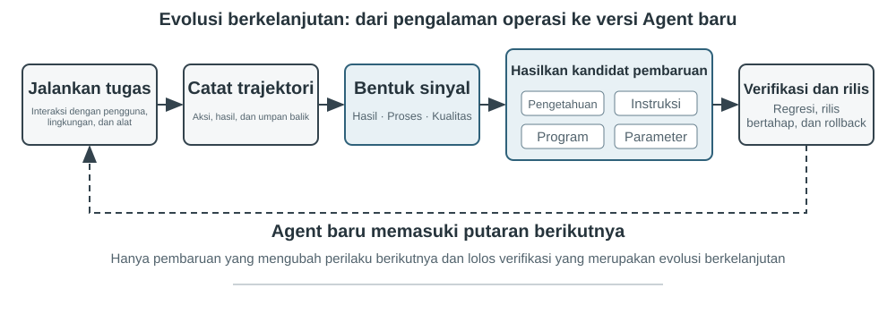
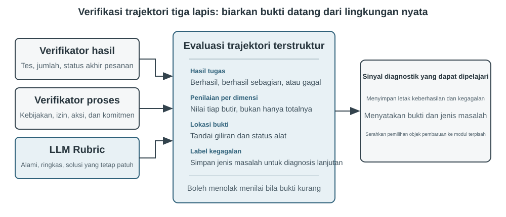
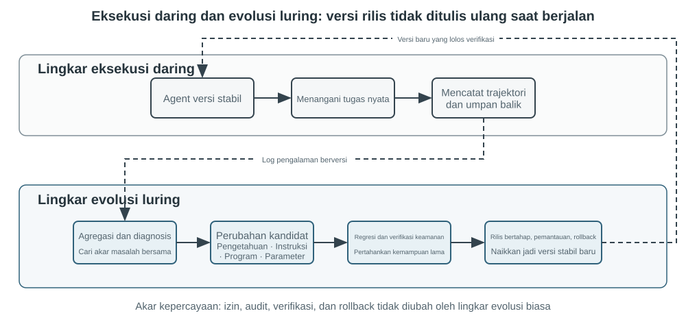

# Evolusi Kontinual pada Agent

Agent saat ini menghadapi paradoks kemampuan yang mencolok: mereka dapat menyelesaikan tugas kompleks yang belum pernah dilihat sebelumnya secara zero-shot, namun setelah menangani sepuluh ribu tugas serupa, mereka mungkin masih mengulangi kesalahan tersebut keesokan harinya yang mereka buat pada hari pertama. **Kemampuan untuk belajar secara otonom dari pengalaman** menjadi esensial bagi Agent untuk berkembang dari “mampu menyelesaikan tugas” menjadi “mampu bekerja dengan andal,” dan ini juga merupakan topik penelitian sentral untuk generasi model berikutnya. Namun, model saat ini masih jauh dari mampu melakukan pembelajaran berkelanjutan dengan sendirinya.

Model yang di-deploy tidak secara otomatis mengubah parameternya setelah sebuah inferensi. In-Context Learning, pemeliharaan state, dan kompresi yang dibahas pada Bab 2 memungkinkan sebuah Agent untuk beradaptasi **di dalam tugas saat ini**; namun, begitu konteks berakhir, perubahan ini tidak secara alami terbawa ke tugas berikutnya. Menyimpan percakapan di memori tidak sama dengan mempelajari perilaku baru. Lintasan (trajectories) mentah mungkin panjang dan berisi strategi yang efektif bersamaan dengan keberhasilan tak sengaja, atribusi yang salah, dan input yang tidak tepercaya.

Perbedaan penting di sini mudah terlewatkan: **menyimpan pengalaman tidak sama dengan belajar darinya**. Menempatkan seratus lintasan (trajectories) dalam konteks panjang atau vector store mungkin membantu model mengambil sebuah kasus saat dibutuhkan, tetapi itu tidak secara otomatis membandingkan kasus: langkah mana yang berulang di berbagai lintasan yang sukses, praktik mana yang hanya berfungsi dengan antarmuka lama, atau apakah keberhasilan berasal dari strategi yang masuk akal alih-alih sekadar kebetulan lingkungan. Pembelajaran hanya terjadi setelah sistem secara aktif mengevaluasi, membandingkan, menggeneralisasi, dan memvalidasi bukti—bukan saat log ditulis ke disk. User Memory pada Bab 3 terutama menangkap “seperti apa pengguna dan dunia itu”; pengalaman belajar di bab ini melangkah lebih jauh, menangkap “apa yang harus dilakukan di bawah kondisi yang mana.” Yang pertama membantu Agent mengingat lebih banyak; yang terakhir membantunya menjadi lebih mahir daripada sekadar lebih berpengetahuan.

Mengapa tidak membiarkan model melatih dirinya sendiri secara langsung setelah setiap tugas? Karena lingkungan produksi jarang memberikan sinyal pembelajaran yang bersih. Kepuasan pengguna tidak berarti kepatuhan; pembaruan parameter lokal juga dapat menyebabkan hilangnya kemampuan, penyimpangan kebijakan, atau penurunan keamanan. Jika model yang sedang berjalan diizinkan mengubah parameternya sendiri secara langsung berdasarkan umpan balik yang tidak terverifikasi, pengalaman yang salah dan Prompt Injection dapat mengakar lalu terus menguat pada tugas-tugas berikutnya. Di sisi lain, pelatihan berkala foundation model dapat meningkatkan kemampuan umum, tetapi tidak dapat segera menyerap aturan privat, perubahan tool, dan pengalaman lokal yang dihadapi setiap Agent setiap hari.

Oleh karena itu, sementara model itu sendiri belum dapat belajar secara terus-menerus dan andal, “pembelajaran” pertama-tama harus dibangun sebagai sistem otonom di sekitar model: merekam bukti operasional, memverifikasi hasil dan proses, mengekstrak pola umum dari beberapa lintasan, dan kemudian memutuskan apakah akan memperbarui pengetahuan, instruksi, program, atau parameter model. Setiap modifikasi pertama-tama harus menjadi versi kandidat dan dapat mengubah putaran operasi berikutnya hanya setelah pengujian regresi dan pemeriksaan keamanan.

Bab-bab sebelumnya telah memperkenalkan komponen-komponen utama yang diperlukan oleh sistem ini. Bab 2 membahas state di dalam tugas, Bab 3 menyediakan infrastruktur pengetahuan (knowledge infrastructure), Bab 5 memberi Agent kemampuan meta untuk membuat tool dan memodifikasi sistem, Bab 7 menetapkan evaluasi dan verifikasi, dan Bab 8 menjelaskan cara memperbarui parameter model. Tugas Bab 9 adalah mengatur komponen-komponen ini ke dalam loop evolusi kontinual seperti yang ditunjukkan pada Gambar 9-1.

Evolusi kontinual harus muncul dari pengalaman operasional yang dapat dilacak, mengubah perilaku berikutnya, dan diverifikasi agar tidak menyebabkan degradasi yang signifikan. Bab ini pertama-tama membahas cara menentukan apa sebenarnya yang berjalan baik atau salah dalam sebuah run; kemudian membandingkan empat metode pembaruan dan batasan penerapannya; akhirnya, bab ini menguji bagaimana pembaruan ini diverifikasi, dirilis, direvisi, dan dipensiunkan selama operasi jangka panjang.

## Menurunkan Sinyal Pembelajaran dari Lintasan Operasional

Titik awal evolusi kontinual bukanlah “ringkasan” (summarization), melainkan “evaluasi”. Jika sistem tidak mengetahui apakah sebuah tugas telah diselesaikan atau langkah mana yang menyebabkan keberhasilan atau kegagalan, refleksi yang dihasilkan oleh model bahasa hanya bisa menjadi tebakan. Begitu evaluasi yang salah memasuki pengetahuan jangka panjang (long-term knowledge), System Prompt, atau data pelatihan, efeknya dapat berlipat ganda pada tugas-tugas berikutnya.

Hasil dari beberapa tugas relatif mudah untuk diverifikasi. Sebuah Coding Agent dapat menjalankan pengujian (tests), pemeriksaan tipe (type checks), dan benchmark kinerja; sebuah Agent yang memproses pengembalian dana untuk pengguna dapat menanyakan status pesanan dan jumlah pengembalian dana aktual. Sinyal semacam ini berasal dari state lingkungan nyata dan umumnya lebih dapat diandalkan daripada deskripsi model tentang perilakunya sendiri. Namun, hasil yang benar tidak menyiratkan proses yang benar. Menghapus kasus pengujian (test cases) yang gagal juga dapat membuat pengujian lulus, sementara memberi tahu pengguna, “Kami akan menerbitkan pengembalian dana Anda dalam tujuh hari; mohon bersabar,” mungkin menghasilkan kepuasan sementara. Oleh karena itu, evaluasi yang andal harus menilai hasil (outcome) dan jalur yang diambil untuk mencapainya.

Banyak tugas lain tidak memiliki jawaban tunggal yang benar. Apakah layanan pelanggan bersabar, apakah ia menawarkan alternatif yang patuh aturan, apakah laporan penelitian mengidentifikasi bukti utama, dan apakah teks yang dihasilkan alami dan ringkas semuanya membutuhkan penilaian kontekstual. LLM-as-a-Judge, yang diperkenalkan pada Bab 7, dapat digunakan di sini, tetapi judge tidak boleh hanya memberikan skor keseluruhan yang samar. Pendekatan yang lebih efektif adalah dengan mendefinisikan Rubric terlebih dahulu dan mengharuskan pemverifikasi (verifier) untuk menilai setiap item, mengutip bukti lintasan, dan secara eksplisit menunjukkan ketidakpastian ketika buktinya tidak cukup.

Gambar 9-2 menyajikan struktur verifikasi tiga lapis. Verifikator hasil (outcome verifier) lapisan bawah membaca hasil pengujian, state basis data, dan balasan tool untuk menjawab, “Apakah tugas tersebut benar-benar diselesaikan?” Verifikator proses (process verifier) lapisan tengah memeriksa aturan bisnis, izin, dan urutan tindakan untuk menjawab, “Apakah itu diselesaikan dengan cara yang diizinkan?” Verifikator kualitas (quality verifier) lapisan atas mengevaluasi bahasa dan strategi menurut Rubric untuk menjawab, “Apakah itu ditangani dengan tepat?” Metrik tingkat bawah harus lebih bergantung pada kode dan kebenaran dasar lingkungan (environmental ground truth); hanya aspek-aspek yang sulit diformalkan yang harus didelegasikan ke model bahasa.

Untuk Agent layanan pelanggan, sebuah Rubric yang berguna setidaknya harus mencakup dimensi-dimensi yang tercantum dalam Tabel 9-1. Lima yang pertama terutama menegakkan persyaratan dasar, sementara dua yang terakhir mengukur kualitas layanan. Dekomposisi ini secara diagnostik lebih berguna daripada menanyakan apakah pengguna merasa puas: pengguna mungkin puas karena Agent menerbitkan pengembalian dana yang tidak patuh aturan, atau tidak puas karena pembatasan kepatuhan. Skor kepuasan tunggal tidak dapat membedakan keduanya.

Tabel 9-1 Dimensi evaluasi lintasan (trajectory evaluation) untuk Agent layanan pelanggan

| Dimensi | Pertanyaan verifikasi | Bukti utama |
|---|---|---|
| Hasil tugas | Apakah permintaan inti pengguna terselesaikan? | State lingkungan akhir, hasil tool |
| Kepatuhan aturan | Apakah ada kebijakan, izin, atau prosedur wajib yang dilanggar? | Repositori kebijakan, lintasan tindakan |
| Batasan privasi | Apakah ada informasi yang diungkapkan yang seharusnya tidak diberikan? | Teks respons, catatan akses data |
| Keandalan faktual | Apakah pernyataan didukung oleh pengetahuan atau hasil tool? | Sumber yang dikutip, kembalian tool |
| Konsistensi janji-tindakan | Apakah tindakan yang diklaim selesai benar-benar terjadi? | Perbandingan respons dan log tool |
| Kualitas ekspresi | Apakah bahasanya alami dan ringkas, tanpa pengulangan atau susunan kata berbasis templat? | Percakapan penuh, bahasa Rubric |
| Alternatif patuh aturan | Ketika rencana asli tidak memungkinkan, apakah alternatif yang diizinkan ditemukan? | Tujuan pengguna, kebijakan, dan tindakan berikutnya |

> **Eksperimen 9-1 ★★: Membangun Pemverifikasi Lintasan (Trajectory Verifier) untuk Agent Layanan Pelanggan**
>
> **Tujuan:** Mengubah lintasan layanan pelanggan menjadi diagnosis terstruktur yang dapat mendukung pembelajaran selanjutnya, dan menguji apakah “kesimpulan multidimensi dengan bukti” mengidentifikasi akar penyebab lebih baik daripada satu skor keseluruhan.
>
> **Deskripsi eksperimen:** Bandingkan “satu skor total” dengan “kesimpulan, bukti, dan confidence per dimensi”, lalu amati mana yang lebih mudah membedakan kegagalan tugas, pelanggaran aturan, janji palsu, dan masalah bahasa. Evolusi kontinu tidak dapat hanya mengandalkan success rate atau satu skor. Hanya dengan mempertahankan apa yang salah, mengapa, dan di mana buktinya, modul berikutnya dapat menentukan apakah knowledge, Prompt, program, atau parameter model yang harus diperbarui; kasus ber-confidence rendah juga tidak boleh otomatis masuk learning set.

## Empat Metode untuk Evolusi Agent secara Kontinual

Sinyal pembelajaran menunjukkan bahwa sebuah Agent harus berubah, tetapi tidak di mana perubahan itu harus terjadi. Basis utama untuk memilih metode pembaruan bukanlah berapa lama sebuah pengalaman telah bertahan, melainkan apakah kemampuan target dapat diwakili secara alami oleh media tertentu. Fakta dan pengalaman cocok untuk dokumen pengetahuan (knowledge documents); strategi yang dapat diungkapkan secara jelas dalam bahasa termasuk dalam Prompt atau Skills; prosedur dan kendala yang dapat dieksekusi secara tepat harus dikodekan sebagai program; dan kemampuan dimensi tinggi seperti persepsi, gaya bahasa, dan strategi implisit harus masuk ke parameter model. Gambar 9-3 menunjukkan keempat metode ini dan hubungannya.

Tabel 9-2 memberikan perbandingan yang ringkas. Keempat metode ini tidak saling eksklusif: Agent pencitraan medis (medical-imaging) mengandalkan parameter untuk mengidentifikasi lesi, menggunakan Knowledge Base untuk menyediakan panduan saat ini, dan menggunakan kode untuk menghitung indikator risiko. Model layanan pelanggan memperoleh nada aslinya dari post-training, memperoleh kebijakan spesifik perusahaan dari pengetahuan (knowledge) dan Skills, dan bergantung pada kode sisi server untuk menegakkan persyaratan kepatuhan kritis.

Tabel 9-2 Batasan yang berlaku dari empat metode evolusi kontinual

| Metode pembaruan | Konten yang sesuai | Keuntungan utama | Keterbatasan utama |
|---|---|---|---|
| Knowledge Base pengalaman | Fakta, pola eksperiensial, pengecualian, dan sumber | Pembaruan cepat, keterlacakan, pengambilan (retrieval) sesuai permintaan | Bergantung pada pengambilan dan penerapan model yang benar |
| Prompt dan Skill | Prinsip penilaian yang dapat diekspresikan secara linguistik dan prosedur operasi | Dapat diinterpretasikan, ruang lingkup yang dapat dikontrol | Rentan terhadap pembengkakan (bloat), konflik, atau diabaikan |
| Program dan Harness | Prosedur deterministik, tool, dan kendala ketat (hard constraints) | Dapat diuji, eksekusi stabil, biaya rendah | Biaya pengembangan dan pemeliharaan lebih tinggi |
| Parameter model | Persepsi dimensi tinggi, gaya generasi, dan strategi implisit | Generalisasi kuat, overhead inferensi rendah | Biaya pembaruan dan regresi tinggi |

### Mengkonsolidasikan Pengalaman menjadi Pengetahuan

Bentuk evolusi yang paling ringan adalah mengorganisir pengalaman berulang dari beberapa run ke dalam dokumen pengetahuan yang dapat diambil (retrievable knowledge documents). “Knowledge Base pengalaman” yang dijelaskan di sini berbagi teknologi penyimpanan, pengindeksan, dan pengambilan dengan Bab 3, tetapi berbeda dalam sumber pengetahuannya dan tujuan verifikasinya. Bab 3 terutama mengekstrak “seperti apa pengguna dan dunia itu” dari percakapan pengguna, dokumen, dan dataset; bab ini mengekstrak “apa yang harus dilakukan di bawah kondisi yang mana” dari lintasan (trajectories) tindakan dan hasil Agent. Misalnya, “Maskapai ini mewajibkan makanan khusus untuk dipesan dua puluh empat jam sebelumnya” adalah pengetahuan domain, sedangkan “Periksa batas waktu makanan khusus sebelum memesan untuk menghindari mengetahui hanya setelah pembayaran bahwa permintaan tersebut tidak dapat dipenuhi” adalah pengalaman tindakan (action experience).

Lintasan mentah tidak cocok sebagai unit pengetahuan formal. Mereka panjang dan berisik (noisy), berisi output tool mentah, jalan memutar yang tidak disengaja, dan detail lingkungan. Sistem yang lebih kuat mempertahankan tiga lapisan data: lintasan mentah yang tidak dapat diubah untuk auditing; analisis per-run yang mencatat hasil dan kandidat pelajaran (candidate lessons); serta perbandingan, pengelompokan (clustering), dan induksi di berbagai lintasan yang serupa untuk menghasilkan dokumen pengetahuan Markdown yang berorientasi ke masa depan. Sebuah dokumen formal biasanya menentukan skenario yang berlaku, strategi yang disarankan, praktik yang dilarang, pengecualian, sumber bukti, dan waktu verifikasi terbaru daripada menceritakan ulang jalannya penyelesaian sebuah tugas tunggal secara lengkap.

Desain ini berbagi prinsip dua tahap yang sama seperti User-as-Code pada Bab 3. User-as-Code pertama-tama menambahkan fakta percakapan ke log yang tidak dapat diubah dan kemudian secara berkala membangun kembali model pengguna terstruktur. Pembelajaran pengalaman (experience learning) juga harus menyimpan bukti terlebih dahulu dan menghasilkan pengetahuan yang dapat diubah (mutable knowledge) secara offline setelahnya. Gambar 9-4 mengilustrasikan proses ini. Memisahkan perekaman dari pengorganisasian mencegah satu keberhasilan yang tidak disengaja atau kegagalan jaringan segera mengubah Agent, sambil memungkinkan sistem untuk mengidentifikasi pola umum hanya setelah mengamati beberapa keberhasilan dan kegagalan.

Dokumen pengalaman bukanlah ringkasan lintasan sederhana. Konten yang dapat ditransfer (transferable content) muncul dari perbandingan: apa yang dilakukan oleh lintasan sukses dengan tipe yang sama, apa yang kurang pada lintasan gagal, di versi lingkungan mana sebuah strategi efektif, dan di bawah prasyarat mana strategi tersebut gagal. Bab 3 telah memperkenalkan ekstraksi pengetahuan, clustering, dan pengambilan (retrieval), sehingga bab ini tidak mengulangi algoritma-algoritma tersebut. Sebaliknya, ini berfokus pada bagaimana evaluasi lintasan (trajectory evaluation) menjadi kondisi untuk ekstraksi dan apakah pengetahuan yang diekstrak meningkatkan performa pada tugas-tugas berikutnya.

Sebuah pipeline penyulingan pengetahuan (knowledge-distillation pipeline) yang lengkap dapat dibagi menjadi lima langkah. Pertama, simpan lintasan yang tidak dapat diubah dan hasil lingkungan. Selanjutnya, hasilkan analisis terstruktur untuk setiap run, buat daftar tipe tugas, kemampuan yang diperlukan, strategi yang diamati, kesalahan, dan pengecualian. Kemudian agregasikan run menurut kelompok tugas (task family) dan buat tabel bukti yang menunjukkan lintasan mana yang mendukung atau bertentangan dengan setiap kandidat pola. Hanya kandidat yang memenuhi ambang batas dukungan (support threshold) yang masuk ke dokumen formal. Terakhir, evaluasi transfer pada tugas baru yang tidak digunakan selama penyulingan (distillation). Mempertahankan pengetahuan formal terpisah dari kandidat analisis memungkinkan sistem untuk menggeneralisasi lagi tanpa mengubah bukti asli dan untuk mencabut sebuah kesimpulan secara tepat ketika lingkungannya berubah.

Pembelajaran pengalaman GAIA memberikan contoh intuitif. GAIA[^gaia-2023] berisi masalah multi-langkah yang menggabungkan pencarian, pembacaan web, pemrosesan file, dan komputasi, sementara AWorld[^aworld-2025] menyediakan lingkungan untuk menjalankan Agent, memanggil tool tersebut, dan merekam lintasan: yang pertama seperti ujian, dan yang terakhir adalah ruang ujian dan sistem catatan laboratorium. Pendekatan yang terlalu sederhana (simplistic) menghasilkan ringkasan strategi dan segera memvektorisasinya setelah satu operasi sukses (successful run). Implementasi yang lebih ketat (stricter implementation) pertama-tama menggunakan pemverifikasi jawaban GAIA atau pemverifikasi lingkungan lainnya untuk memberi label run sebagai sukses, sebagian sukses, atau gagal, dan kemudian membandingkan beberapa jalur di dalam kelompok tugas yang sama. Lintasan sukses menyumbangkan strategi kandidat, kegagalan menyumbangkan pengetahuan pengecualian (exclusionary knowledge), dan kesuksesan sebagian mengungkapkan segmen mana yang berhasil dan mana yang masih gagal. Refleksi bahasa alami yang diajukan oleh Reflexion[^reflexion-2023] dapat membantu menghasilkan pelajaran kandidat, tetapi refleksi itu sendiri bukanlah bukti. Hanya konten yang konsisten dengan hasil lingkungan, didukung di seluruh lintasan, dan menunjukkan transfer positif pada tugas-tugas baru yang harus dimasukkan ke dalam dokumen pengalaman formal.

> **Eksperimen 9-2 ★★: Menyaring Dokumen Pengetahuan Pengalaman dari Lintasan GAIA**
>
> **Tujuan:** Menguji apakah dokumen pengetahuan lintas-lintasan (cross-trajectory) ditransfer lebih baik daripada ringkasan satu keberhasilan dan mengurangi transfer negatif dari kesuksesan yang tak disengaja dan pengalaman yang salah.
>
> **Data dan prosedur:** `gaia-experience` pertama-tama menyimpan lintasan penuh (full trajectory) dan `environment_score` eksternal untuk setiap run, lalu mengubahnya menjadi rekaman pembelajaran minimal yang mengandung `task_family`, `capabilities` yang diperlukan, `applies_when`, strategi yang diamati, kesalahan, pengecualian, dan ID lintasan sumber (source trajectory IDs). Verifikator hasil (outcome verifier) mengklasifikasikan run sebagai sukses, sebagian sukses, atau gagal. Modul pembelajaran membandingkan jalur dalam kelompok tugas yang sama. Sebuah LLM mungkin mengusulkan kandidat generalisasi, tetapi strategi yang direkomendasikan harus didukung oleh setidaknya dua lintasan yang tidak gagal. Dokumen Markdown yang dihasilkan mencakup skenario yang berlaku, strategi yang direkomendasikan, kesalahan umum (common pitfalls), pengecualian, asal-usul (provenance), dan waktu validasi terbaru. Selama penerapan (application), hanya dokumen ini yang diambil (retrieved); lintasan mentah yang panjang tidak dimasukkan langsung ke dalam konteks.

>
> **Tiga kontrol (Three controls):** Kondisi pertama tidak menggunakan pengalaman historis; yang kedua mengambil satu ringkasan trajektori (trajectory summary) yang paling mirip dengan tugas saat ini; yang ketiga mengambil dokumen pengetahuan (knowledge document) yang didukung oleh beberapa trajektori. Set pembelajaran (learning set) dan transfer (transfer set) harus terpisah sehingga jawaban atas pertanyaan GAIA yang sama tidak bocor ke dalam evaluasi sebagai "pengalaman."
>
> **Metrik dan penerimaan (Metrics and acceptance):** Laporkan tingkat keberhasilan transfer tugas (transfer-task success rate), rata-rata karakter atau Tokens yang diambil, dan tingkat transfer negatif (negative-transfer rate), serta verifikasi bahwa setiap kesimpulan formal mengutip sumber trajektorinya. Jika dokumen lintas-trajektori (cross-trajectory) hanya menyingkat konteks tanpa meningkatkan kinerja tugas baru, itu tidak menunjukkan pengalaman yang dipelajari. Eksperimen ini juga gagal jika satu keberhasilan kebetulan dapat secara langsung dipromosikan menjadi pengetahuan formal atau jika sebuah dokumen tidak dapat ditelusuri ke trajektori aslinya.
>
> Implementasi yang menyertainya tersedia di [`gaia-experience`](../chapter9/gaia-experience/). `demo_documents.py` berjalan secara offline secara default; dengan `--extractor llm`, sebuah LLM nyata dapat mengusulkan kandidat pengalaman lintas-trajektori.

[^reflexion-2023]: Shinn, N., et al. *Reflexion: Language Agents with Verbal Reinforcement Learning.* arXiv:2303.11366, 2023.

[^gaia-2023]: Mialon, G., et al. *GAIA: a benchmark for General AI Assistants.* arXiv:2311.12983, 2023.

[^aworld-2025]: Yu, C., et al. *AWorld: Orchestrating the Training Recipe for Agentic AI.* arXiv:2508.20404, 2025.

### Mengenkode Pengalaman sebagai Instruksi

Knowledge Base pengalaman menyediakan materi referensi untuk sebuah Agent, sedangkan Prompts dan Agent Skills bersifat lebih preskriptif. Ketika beberapa trajektori berulang kali mengungkapkan kesalahan strategis yang sama, dan pola tersebut dapat diekspresikan dengan jelas dalam bahasa alami, sistem dapat meningkatkannya dari "pengalaman untuk referensi" menjadi "aturan yang harus diikuti." Aturan yang berlaku untuk hampir semua tugas cocok untuk dimasukkan ke dalam System Prompt; prosedur kompleks yang hanya berlaku untuk domain, proyek, atau alat tertentu lebih baik ditulis sebagai Skills *on-demand* atau file instruksi proyek.

Prompt learning melayani peran yang berbeda dari Prompt engineering yang dibahas pada Bab 2. Bab 2 menjelaskan cara menulis Prompts yang jernih secara struktural dan ramah terhadap KV Cache; bagian ini membahas umpan balik produksi apa yang cukup untuk memicu revisi Prompt dan bagaimana aturan baru harus divalidasi sebelum di-deploy. Revisi tidak berarti berulang kali menulis ulang seluruh System Prompt. Pendekatan yang lebih andal adalah menghasilkan *diff* minimal dari sekelompok kegagalan yang serupa, menentukan ruang lingkup aturan, memeriksa konflik dengan aturan yang ada, dan mengevaluasinya terhadap *boundary cases* yang memicu kegagalan tersebut serta *retention set* dari tugas-tugas lama.

Dalam postingan format panjang tahun 2025, Andrej Karpathy untuk sementara menyebut kemungkinan paradigma baru ini sebagai **System Prompt Learning**[^karpathy-system-prompt-learning]. Ringkasannya adalah bahwa *pretraining* utamanya mempelajari pengetahuan dan *fine-tuning* utamanya membentuk perilaku habitual, sementara jenis pembelajaran manusia lainnya terjadi ketika kita memecahkan masalah dan meninggalkan catatan eksplisit untuk diri kita di masa depan: "Lain kali saya menghadapi masalah semacam ini, saya harus mencoba pendekatan ini terlebih dahulu." Ia membandingkan LLM tanpa buku catatan semacam itu dengan protagonis film *Memento* dan mencatat bahwa System Prompt Learning dan *reinforcement learning* sama-sama meningkatkan perilaku dari pengalaman tetapi menggunakan algoritma pembaruan yang berbeda—yang pertama mengedit teks, sementara yang kedua mengubah parameter melalui gradien desenden (gradient descent). Contoh yang ia berikan adalah instruksi dalam System Prompt Claude yang saat itu terdiri dari sekitar 17.000 kata, yang mengharuskan model untuk menomori dan menghitung kata, huruf, atau karakter secara eksplisit sebelum menjawab, tepatnya untuk menangani pertanyaan seperti "Berapa banyak huruf `r` dalam `strawberry`?"

Dalam sistem Agent, ini berarti mengubah pelajaran yang dapat diekspresikan dalam bahasa menjadi aturan kandidat yang dapat dibaca secara langsung oleh proses selanjutnya. Dibandingkan dengan hasil berhasil/gagal yang skalar, diagnosis yang didukung bukti dapat mengidentifikasi apakah kesalahan terjadi pada verifikasi identitas, pemilihan alat (Tool Use), atau batas eskalasi, sehingga memungkinkan perubahan kandidat yang lebih bertarget. Observasi Karpathy bahwa tinjauan yang dipandu pengetahuan adalah saluran umpan balik berdimensi lebih tinggi daripada *reward* skalar membantu menjelaskan potensi efisiensi data dari metode ini. Namun, informasi yang lebih kaya tidak secara otomatis benar: umpan balik satu pengguna mungkin hanya berlaku untuk pelanggan tersebut atau kebijakan yang sudah usang, sehingga *clustering*, analisis ruang lingkup, dan pengujian regresi tetap diperlukan.

Beberapa pendekatan yang sudah mapan mengotomatiskan optimasi Prompt dengan berbagai cara. DSPy[^dspy-2023] memperlakukan program yang terdiri dari beberapa panggilan model bahasa sebagai objek yang dapat dioptimalkan dan mencari instruksi serta contoh pada *development set*. OPRO[^opro-2023] meminta model bahasa untuk mengusulkan kandidat baru dari sejarah Prompts dan skor mereka. GEPA[^gepa-2025] menggunakan *natural-language reflection* atas trajektori yang gagal untuk menghasilkan dan memilih Prompts kandidat komplementer. Metode-metode ini utamanya melakukan optimasi *batch* pada set evaluasi offline; *diffs* produksi yang minimal lebih dekat ke pemeliharaan berkelanjutan, dipicu oleh *boundary cases* yang baru diamati dan dirancang untuk asal-usul (provenance), audit, dan *rollback* cepat. Dalam praktiknya, pencarian offline dapat membentuk versi awal yang kuat, diikuti oleh *patch* kasus-per-kasus untuk aturan produksi *long-tail*.

#### Contoh 1: Mengoptimalkan Aturan dalam Prompt Berdasarkan Lintasan Kegagalan

Sebagai contoh, Agent layanan pelanggan maskapai penerbangan mungkin melakukan eskalasi ke manusia terlalu awal ketika pengguna menantang suatu kebijakan. Evaluasi trajektori menunjukkan bahwa ia tidak melanggar aturan apa pun tetapi kurang memiliki fleksibilitas yang patuh (compliant flexibility). Kandidat *patch* dapat mengharuskan Agent untuk menjelaskan kebijakan terlebih dahulu, mengidentifikasi tujuan aktual pengguna, dan mencari alternatif yang diizinkan, eskalasi hanya ketika pengguna secara eksplisit memintanya atau masalah tersebut benar-benar melampaui otoritas Agent. Jika aturan baru tersebut mengurangi eskalasi yang tidak perlu tetapi menyebabkan Agent terus menangani insiden keselamatan yang seharusnya dieskalasi, itu berarti telah gagal dalam pengujian regresi. Nilai dari System Prompt Learning tidak terletak pada sekadar menambahkan lebih banyak teks secara otomatis, tetapi pada pengklarifikasian ruang lingkup aturan secara terus-menerus melalui *boundary cases* produksi.

#### Contoh 2: Skill Klarifikasi Persyaratan — Dari "Langsung Bekerja" menjadi "Konfirmasi Dulu Baru Eksekusi"

Agent Skills learning mengikuti prinsip yang sama, tetapi dengan ruang lingkup yang lebih terlokalisasi. Sebuah Skill dapat dipahami sebagai manual operasi *on-demand* untuk pekerjaan tertentu: jika beberapa pengalaman secara kolektif membentuk proses klaim asuransi yang lengkap, sistem dapat menghasilkan atau merevisi Skill yang sesuai. Skill kandidat tidak boleh sekadar meringkas satu percakapan; minimal, ia harus menentukan kapan harus dimuat, prasyarat, langkah operasi, jebakan yang diketahui, metode validasi, dan trajektori sumber. Sistem pertama-tama mencari *library* Skill yang ada untuk kemampuan serupa, lebih memilih `patch` lokal ketika proses yang sama sudah ada dan membuat direktori baru hanya untuk kemampuan yang benar-benar mandiri. Ini mencegah *library* terisi oleh manual yang berbeda nama tetapi menduplikasi satu sama lain. Skill Creator dari Anthropic[^anthropic-skill-creator] mendemonstrasikan *loop draft–test–evaluate–revise*. Ia menjawab cara membuat dan menyempurnakan Skill; pertanyaan yang lebih sulit yang tersisa adalah bukti operasional apa yang cukup untuk memicu pembuatan, bagaimana menyelesaikan konflik, dan apakah revisi tersebut lulus tes regresi tugas-lama dan spesifik-domain.

> **Eksperimen 9-9 ★★: Mengubah umpan balik menjadi Skill penulisan**
>
> Dua puluh pasangan before/after dari `data/feedback_pairs.json` diproses dalam tiga batch. Sistem mengekstrak aturan, menggabungkan pola duplikat, memeriksa konflik ambang, lalu membuat `SKILL.md` dengan sumber dan cakupan. Aturan deterministik diperiksa dengan kode; aturan LLM dikalibrasi pada 10 contoh emas.
>
> Laporkan deteksi pada kumpulan tugas belum selesai, false positive pada teks normal, dan pertumbuhan jumlah aturan. Proses nyata pertama menghasilkan 0/8 deteksi dan 7/8 false positive; setelah filter eksternal dan fallback deterministik hasilnya 8/8, 0/8, serta 21 kandidat digabung menjadi 8 aturan. Implementasi: [`ai-style-skill`](../chapter9/ai-style-skill/).

Kasus tanda kutip lengkung menunjukkan bahwa Skill harus menjadi kontrak data, bukan aturan penggantian global: sebelum SFT, contoh sintetis distratifikasi menurut jenis artikel, cakupan, dan bahasa pemrograman, lalu melewati gate kode/JSON/area terlindungi serta audit manual. Kasus string eksak menambahkan audit tokenizer; round-trip encode→decode, penyalinan byte-exact oleh model, serialisasi Harness, dan pencocokan tool adalah lapisan regresi yang terpisah.

> **Eksperimen 9-3 ★★: Mengoptimalkan System Prompts dari Trajektori Kegagalan**
>
> **Tujuan (Objective):** Mengajari Agent layanan pelanggan maskapai penerbangan dari trajektori di mana ia melakukan eskalasi terlalu cepat ketika pengguna menantang suatu kebijakan, sekaligus mendemonstrasikan bahwa aturan baru tersebut tidak merusak skenario lama yang benar-benar membutuhkan eskalasi.
>
> **Prosedur (Procedure):** Pertama-tama jalankan *retention set* tugas-lama dan *boundary set* eskalasi-berlebihan secara terpisah. `learning_signal.py` menguraikan kegagalan ke dalam kepatuhan aturan, penyelesaian tugas, dan fleksibilitas yang patuh, sambil mempertahankan ID kasus sumber. Sebuah Coding Agent kemudian membaca Prompt yang ada dan menghasilkan tepat satu edit minimal `old_str → new_str` yang dapat diaudit: mengharuskan Agent untuk menjelaskan kebijakan, mengidentifikasi tujuan aktual, dan mencari alternatif yang patuh sebelum eskalasi, sekaligus mempertahankan eskalasi saat pengguna secara eksplisit meminta campur tangan manusia atau terjadi insiden keselamatan. *Patch*, asal-usul, aturan target, dan dasar pemikirannya ditulis ke dalam *candidate manifest*.
>
> **Tiga kontrol (Three controls):** Bandingkan Prompt awal, Prompt kandidat yang dihasilkan secara otomatis, dan Prompt yang dioptimalkan secara manual satu kali. Ketiganya menggunakan model yang sama dan tugas retensi serta *boundary* yang sama. `--quick` hanya mengurangi jumlah kasus; ia masih melakukan panggilan nyata ke *task Agent*, *LLM Judge*, dan *Coding Agent* dan tidak boleh dilaporkan sebagai simulasi offline.
>
> **Gerbang rilis dan metrik (Release gate and metrics):** Sebuah kandidat harus melewati empat kondisi: *patch* yang tidak kosong, asal-usul yang dapat dilacak, peningkatan terukur pada *boundary set*, dan tidak ada degradasi pada *retention set*. Bandingkan akurasi tugas-batas (boundary-task accuracy), akurasi tugas-retensi (retention-task accuracy), pertumbuhan Prompt, regresi yang dimasukkan, dan waktu dari penemuan kegagalan hingga pembuatan kandidat. Melewati gerbang hanya menghasilkan `release_to_canary`, tidak pernah *overwrite* langsung dari Prompt stabil; kegagalan kondisi apa pun mengembalikan `reject_candidate`.
>
> Implementasi yang menyertainya tersedia di [`prompt-auto-optimization`](../chapter9/prompt-auto-optimization/). Tes offline mencakup diagnosis dan gerbang rilis, sementara `--quick` melakukan panggilan nyata ke *task Agent*, *LLM Judge*, dan *Coding Agent*.

[^dspy-2023]: Khattab, O., et al. *DSPy: Compiling Declarative Language Model Calls into Self-Improving Pipelines.* arXiv:2310.03714, 2023.

[^opro-2023]: Yang, C., et al. *Large Language Models as Optimizers.* arXiv:2309.03409, 2023.

[^gepa-2025]: Agrawal, L., et al. *GEPA: Reflective Prompt Evolution Can Outperform Reinforcement Learning.* arXiv:2507.19457, 2025.

[^karpathy-system-prompt-learning]: Karpathy, A. “We’re missing (at least one) major paradigm for LLM learning … system prompt learning?” X, May 11, 2025. https://x.com/karpathy/status/1921368644069765486

[^anthropic-skill-creator]: Anthropic. *Skill Creator.* 2026. https://github.com/anthropics/skills/blob/main/skills/skill-creator/SKILL.md

### Mengenkode Pengalaman sebagai Program

Ketika pengalaman mendeskripsikan operasi yang stabil, berulang, dan dapat diverifikasi, adalah tidak efisien jika meminta model membaca ulang dokumentasi dan melakukan *reasoning* melaluinya setiap kali. Pendekatan yang lebih tepat adalah mengompilasi pengalaman tersebut ke dalam alur kerja (workflows), alat (tools), atau kode *Harness*, mengubah eksplorasi satu kali menjadi program yang dapat dieksekusi berulang kali. Bab 5 menjelaskan bagaimana Coding Agents membaca dan menulis file, menjalankan tes, dan menghasilkan sistem; bagian ini tidak berfokus pada generasi kode secara umum, tetapi tentang bagaimana sebuah Agent memodifikasi versi dirinya di masa depan berdasarkan trajektorinya sendiri.

Objek yang dapat dimodifikasi meluas jauh melampaui alat baru. Pada lapisan operasi, trajektori peramban (browser trajectories) dapat dikompilasi menjadi alur kerja yang terparameterisasi, atau *adapters* dapat dihasilkan untuk API yang berubah. Pada lapisan kontrol, *tool routing*, *retries*, *circuit breakers*, dan strategi kompresi konteks dapat dimodifikasi. Pada lapisan validasi, pemeriksaan parameter, *state validators*, dan tes regresi dapat ditambahkan sebagai respons terhadap kegagalan produksi. Pada lapisan arsitektur, sebuah *Reviewer Agent* dapat ditambahkan atau aliran informasi antara perencanaan dan eksekusi dapat diubah.

Alur kerja peramban (Browser workflows) mengilustrasikan nilai pengalaman terprogram. Mereka analog dengan merekam *spreadsheet macro*. Pertama kali email dikirim, Agent multimodal menggunakan *loop* amati–pikir–tindak (observe–reason–act) untuk menemukan kontrol *compose*, penerima, subjek, *body*, dan *send*. Untuk email yang lain, prosesnya tidak berubah; hanya penerima dan kontennya yang berbeda, jadi tidak perlu memanggil model lagi untuk menemukan kembali seluruh jalur dari piksel dan DOM. Sistem mengompilasi trajektori eksplorasi pertama ke dalam program kecil yang berisi parameter, pemeriksaan status (state checks), dan informasi versi.

Dalam *setting* peramban, proses distilasi pengetahuan (knowledge-distillation) yang ditunjukkan pada Gambar 9-4 menjadi siklus hidup yang lebih konkret:

1. **Capture the trajectory:** Rekam navigasi, klik, entri teks, dan pilihan *drop-down*, bersama dengan parameter tindakan, URL saat ini, dan bukti lokator elemen seperti XPath, CSS, `id`, `role`, `aria-label`, dan `data-testid`. Bukti lokator hanya membantu menemukan elemen lagi; itu tidak membuktikan bahwa tugas telah selesai.
2. **Parameterize:** Ganti literal dari proses pertama dengan variabel templat—misalnya, ubah `test@example.com`, subjek, dan *body* menjadi `{recipient}`, `{subject}`, dan `{content}`—sambil membiarkan tindakan yang stabil tidak berubah. Implementasi pengajaran menggunakan ekspresi reguler (regular expressions) dan penggantian templat; sistem produksi mungkin menggunakan input tugas terstruktur atau model ekstraksi terbatas (constrained extraction model).
3. **Define state checks:** Tambahkan pemeriksaan sebelum dan sesudah tindakan, seperti "tombol *send* terlihat" dan "URL setelah navigasi milik situs target." Tambahkan pemeriksaan *final-state* untuk alur kerja secara keseluruhan, seperti "daftar *sent-mail* berisi pesan baru" atau "nilai *state* halaman pengujian berubah seperti yang diharapkan." Berhasil mengeksekusi tindakan tidak sama dengan berhasil menyelesaikan tugas; pemeriksaan akhir harus membaca halaman sebenarnya atau status *backend*.
4. **Validate the candidate:** Keberhasilan pertama hanya menghasilkan `candidate`. Sistem harus mereset akun *sandbox* atau situs pengujian ke *initial state* independen dan memutar ulang kandidat secara penuh. Ia dapat dipublikasikan sebagai `validated` hanya jika semua pemeriksaan sebelum-tindakan, sesudah-tindakan, dan status-akhir lulus. Jika tugas yang memiliki efek samping (*side-effecting task*) seperti mengirim email atau melakukan pemesanan tidak memiliki *callback* reset yang aman, alur kerja mungkin dipertahankan sebagai kandidat yang dapat diaudit tetapi tidak boleh divalidasi dengan mengulangi tindakan di akun produksi.
5. **Match and replay:** Saat tugas baru tiba, cari *library* kemampuan formal untuk suatu alur kerja berdasarkan niat (*intent*) dan kata kunci, ekstrak parameter saat ini, dan eksekusi langsung dengan Playwright. Pemutaran ulang (*replay*) tidak memerlukan panggilan LLM langkah demi langkah, tetapi masih harus menunggu elemen tersedia dan menyelesaikan setiap *state check*.
6. **Invalidate and relearn:** Jika elemen target tidak dapat ditemukan, *state check* gagal, API Schema berubah, atau status akhirnya salah, hentikan tindakan selanjutnya dengan segera, pindahkan versi lama dari *library* yang dapat dicari ke area `invalid`, dan gunakan kembali (*fallback*) Agent penuh untuk eksplorasi baru. Simpan file lama untuk audit dan perbandingan, tetapi jangan biarkan file itu terus cocok secara diam-diam.

Untuk alur kerja email, hasil kompilasinya bukan sekadar "klik tombol-tombol ini secara berurutan," melainkan program kecil yang diparameterisasi oleh penerima, subjek, dan *body*: program ini memeriksa jendela *compose* dan kolom-kolom sebelum mengirim, memeriksa indikator keberhasilan setelahnya, dan akhirnya mengonfirmasi bahwa pesan terkait muncul di daftar terkirim. Di PreAct[^preact], program semacam itu memberikan percepatan (speedup) ujung-ke-ujung (end-to-end) sebesar 8,5–13× pada tugas yang berulang dan tidak memerlukan panggilan model bahasa langkah-demi-langkah selama pemutaran ulang. Yang lebih penting, memori proses memerlukan **validasi sebelum-tindakan, validasi sesudah-tindakan, dan validasi prapengarsipan (pre-storage) independen**. Jika tidak, sistem dapat menghasilkan ilusi yang berbahaya: cakupan *replay* adalah 100 persen dan setiap tombol diklik, namun ada satu kolom yang kosong dan tugas tersebut sebenarnya tidak pernah selesai.

> **Eksperimen 9-4 ★★★: Menghasilkan Alur Kerja yang Dapat Diverifikasi dari Trajektori Peramban**
>
> **Tujuan (Objective):** Menentukan apakah web Agent dapat mengubah satu eksplorasi mahal menjadi alur kerja yang dapat digunakan kembali dan menolak pemutaran ulang yang salah ketika halaman berubah, alih-alih melaporkan keberhasilan hanya karena setiap tindakan berjalan.
>
> **Skenario empat tahap (Four-stage scenario):** Pada tahap pertama, jalankan "kirim pesan dengan subjek 'Test Email' ke `test@example.com`" di situs email percobaan atau halaman pesan yang disimulasikan. Agent penuh mengeksplorasi, sementara sebuah *wrapper* merekam tindakan, parameter, dan status halaman, dan menghasilkan sebuah `candidate`. Pada tahap kedua, panggil `validation_reset` untuk memulihkan *sandbox* dan secara mandiri memutar ulang seluruh alur kerja; kandidat hanya masuk ke *library* kemampuan formal jika semua pemeriksaan sebelum-tindakan, sesudah-tindakan, dan status-akhir lulus. Pada tahap ketiga, lakukan jenis tugas yang sama dengan penerima, subjek, dan *body* yang berbeda. Sistem harus mencocokkan alur kerja yang divalidasi, mengisi parameter baru, dan memutarnya kembali melalui Playwright tanpa memasuki *loop* LLM langkah-demi-langkah. Pada tahap keempat, ubah lokator tombol, teks halaman, atau status akhir, dan pastikan alur kerja yang lama segera menjadi `invalid` dan mengembalikan `fallback_required=True`.
>
> **Desain kontrol (Control design):** *Baseline* yang disederhanakan hanya mencatat apakah klik, entri teks, dan tindakan lainnya selesai tanpa pengecualian. Kondisi eksperimental juga memvalidasi halaman sebelum setiap tindakan, halaman setelah setiap tindakan, dan status tugas akhir. Kedua kondisi menggunakan trajektori dan perubahan halaman yang sama. Bandingkan tingkat positif palsu (*false-positive rates*) keduanya pada kasus-kasus seperti "tombol kirim diklik saat sebuah kolom kosong" dan "Simpan (Save) diklik tetapi data tidak disimpan persisten (persisted)."
>
> **Metrik dan penerimaan (Metrics and acceptance):** Rekam waktu *end-to-end* untuk eksplorasi dan *replay* awal, jumlah panggilan LLM, tingkat keberhasilan, tingkat keberhasilan-palsu (false-success rate), tingkat kecocokan alur kerja, tingkat deteksi perubahan-halaman (page-change detection rate), dan jumlah *fallbacks* untuk pembelajaran ulang (relearning). Tanpa panggilan ulang reset (reset callback), alur kerja harus tetap menjadi kandidat; versi yang gagal divalidasi tidak boleh dapat diambil (retrievable); *replay* terparameterisasi tidak boleh menggunakan ulang penerima atau konten dari *run* pertama; dan setelah ada perubahan halaman, tindakan selanjutnya yang berbahaya harus dihentikan. Akselerasi hanya berarti jika semua kondisi ini terpenuhi.
>
> Implementasi yang menyertainya tersedia di [`browser-use-rpa`](../chapter9/browser-use-rpa/), yang menyediakan demonstrasi mesin-status deterministik (deterministic state-machine) maupun jalur eksekusi yang memanggil Agent peramban nyata.

Agent yang memodifikasi kodenya sendiri tidak berarti bahwa proses yang berjalan secara langsung menimpa dirinya sendiri (*overwrites itself*). Sistem produksi harus membuat cabang kandidat dari versi stabil saat ini, meminta Coding Agent menghasilkan *patch* minimal, lalu secara berurutan menjalankan *static checks*, *unit tests*, *security scans*, pemutaran ulang *failure-trajectory*, dan tes regresi pada tugas-tugas lama sebelum menghasilkan versi baru yang memenuhi syarat untuk *canary deployment*. Ini mengubah "modifikasi diri" (self-modification) menjadi proses perilisan perangkat lunak yang dapat diaudit dan mendefinisikan batasan antara Bab 9 dan 5: Bab 5 memberikan kemampuan untuk memodifikasi sistem, sementara bab ini memberikan metode untuk modifikasi diri yang dipicu oleh pengalaman dan dibatasi oleh *loop* validasi.

Membuat *patch* berukuran kecil saja tidak cukup untuk atribusi yang dapat diandalkan. Setiap permintaan modifikasi juga harus berupa **kontrak perubahan yang dapat difalsifikasi (falsifiable change contract)** yang mencatat bukti kegagalan, akar penyebab yang disimpulkan, komponen *Harness* yang bertanggung jawab, perubahan kandidat, perilaku yang diharapkan membaik, perilaku yang ada yang mungkin mengalami regresi, dan pengujian untuk keduanya. Agentic Harness Engineering menggambarkan hal ini dalam istilah observabilitas (observability) tingkat komponen, pengalaman, dan keputusan: setiap komponen yang dapat diedit memiliki representasi tingkat-file; koleksi besar dari trajektori disuling menjadi bukti yang dapat diperiksa pada tingkat detail yang semakin meningkat; dan setiap pengeditan mendeklarasikan prediksi dampak sebelum eksekusi, yang mana hasil dari ronde berikutnya akan mengujinya[^ahe-2026]. Skor yang lebih tinggi kemudian dapat dihubungkan ke mekanisme tertentu daripada tetap menjadi uji coba yang tidak dapat diinterpretasikan.

*Candidate generator* seharusnya tidak hanya menerima kasus-kasus yang gagal. Self-Harness juga menyediakan perilaku sukses yang harus dipertahankan dan catatan modifikasi yang sebelumnya ditolak[^self-harness-2026]. Yang pertama memberi tahu Agent tentang apa yang tidak boleh dirusak oleh perbaikan tersebut; yang kedua mencegahnya mengirimkan ulang ide gagal yang sama dengan kata-kata yang berbeda. Bukti kegagalan, batasan keberhasilan, dan upaya sebelumnya secara bersama-sama menentukan ruang kandidat (candidate space) yang dibatasi dan lebih berguna daripada memuat semua *source code* dan log mentah ke dalam *modifying Agent* secara sembarangan.

Pembuatan alat (tool creation) mengikuti protokol yang sama. Alita[^alita-2025] menyajikan kasus di mana Agent harus mengidentifikasi nomor yang disebutkan segera setelah dinosaurus pertama kali muncul dalam video 360 VR YouTube yang dinarasikan oleh aktor pengisi suara untuk Gollum di *The Lord of the Rings*. Setelah mengenali bahwa ia kurang memiliki kemampuan membaca subtitel (subtitle-reading capability), Agent tersebut menemukan dan menguji `youtube-transcript-api`, membungkusnya sebagai alat subtitel baru, dan mengekstrak jawaban `100000000` dari transkrip tersebut. Sebuah alat baru (Tool Use) memasuki *library* kemampuan hanya setelah melalui *safety scanning*, tes fungsional, dan penggunaan ulang yang berhasil pada tugas-tugas berikutnya. Penemuan alat proaktif di Bab 4 menanyakan alat apa yang sudah ada dan cocok; Bab 5 menanyakan cara menulis alat; bab ini menanyakan bukti operasional apa yang seharusnya memicu pembuatan dan bagaimana alat baru menjadi kemampuan jangka panjang yang divalidasi.

> **Eksperimen 9-5 ★★★: Memicu Modifikasi Diri Agent dari Trajektori Kegagalan**
>
> **Tujuan (Objective):** Diberikan beberapa trajektori di mana kesalahan yang ditandai `retryable=false` masih dipanggil berulang kali, tentukan apakah sistem dapat menemukan akar penyebab di kode *retry* dan *circuit-breaker* dan menghasilkan *patch* kandidat perbaikan tanpa merusak pemulihan dari kegagalan sementara (transient failures).
>
> **Prosedur (Procedure):** Modul diagnosis pertama-tama mengagregasi kesalahan yang sama di berbagai tugas berbeda. Ia membuat permintaan modifikasi hanya setelah ambang batas dukungan lintas-trajektori terpenuhi dan menargetkan `retry_policy.py` di versi yang stabil. *Candidate generator* membaca diagnosis kegagalan, perilaku pemulihan kegagalan-sementara yang harus dipertahankan, perubahan yang sebelumnya ditolak, dan sumber yang stabil. Sebelum mengeluarkan *diff* kode yang minimal, ia memprediksi bahwa panggilan setelah kesalahan yang tidak dapat diulang (non-retryable errors) seharusnya menurun sementara pemulihan batas waktu sementara (transient-timeout recovery) tidak. Terlepas dari apakah *generator* itu deterministik atau LLM Coding Agent sungguhan, ia hanya boleh menulis ke direktori kandidat yang terisolasi. Kode *Harness* validasi kemudian mengompilasi kandidat, memutar ulang trajektori kegagalan awal, memverifikasi bahwa kesalahan yang tidak dapat diulang (non-retryable error) segera berhenti dan membuka *circuit breaker*, dan menguji ulang bahwa *transient timeouts* masih mencoba lagi (retry) sesuai dengan ambang batas aslinya.
>
> **Kontrol dan metrik diagnostik (Diagnostic control and metrics):** Perlakukan "tambahkan satu kalimat ke Prompt yang memberi tahu Agent agar tidak mengulang panggilan" sebagai contoh konseptual dalam memilih lapisan modifikasi yang salah, mendemonstrasikan mengapa batasan *retry* yang dapat ditegakkan secara deterministik (deterministically enforceable retry constraint) harus ada di dalam kode. Eksperimen yang dapat dieksekusi membandingkan *patch generators* yang deterministik dan LLM di bawah gerbang rilis (release gate) yang sama. Rekam jumlah panggilan setelah kesalahan yang tidak dapat diulang, tingkat pemulihan kesalahan-sementara, regresi pada tugas-tugas lama, ukuran *patch*, dan tingkat penerimaan kandidat.
>
> **Kriteria penerimaan (Acceptance criteria):** Lulus di setiap pemeriksaan hanya akan menghasilkan `release_to_canary`. Kegagalan dari *static check* mana pun, *failure replay*, atau regresi tugas-lama mengembalikan `reject_candidate`. `release_manifest.json` harus mencatat klaster kegagalan, trajektori sumber, akar penyebab yang disimpulkan, komponen dan file target, *code diff*, perbaikan yang diharapkan, kemungkinan regresi, hasil pemeriksaan, versi kandidat, dan versi *rollback*. Kandidat yang ditolak harus mempertahankan alasan kegagalan mereka untuk ronde *generation* berikutnya. *Patch-generating Agent* tidak boleh memodifikasi kode stabil, validator, log audit, atau gerbang yang menyetujui perilisannya sendiri.
>

> Implementasi yang menyertai tersedia di [`self-modifying-agent`](../chapter9/self-modifying-agent/). Implementasi ini mendukung generator kandidat deterministik atau LLM Coding Agent sungguhan, di mana kedua jalur tersebut berbagi gerbang rilis (*release gate*) yang sama.

[^preact]: Li, Bojie. *PreAct: Computer-Using Agents that Get Faster on Repeated Tasks.* arXiv:2606.17929, 2026.

[^alita-2025]: Qiu, J., et al. *Alita: Generalist Agent Enabling Scalable Agentic Reasoning with Minimal Predefinition and Maximal Self-Evolution.* arXiv:2505.20286, 2025.

Eksperimen 9-8 menerapkan protokol yang sama pada lapisan verifikasi. Permintaan perubahan dibuat hanya setelah koreksi pengguna, penilaian negatif, dan audit berulang menunjuk operasi berisiko tanpa konfirmasi; kandidat ditulis ke direktori terisolasi. Klasifikasikan penghapusan berbahaya dan `git push --force` dari nama serta argumen alat, dan ikat token sekali pakai ke operasi tertentu. Kandidat harus lulus pemeriksaan AST/statis, replay kasus batas (termasuk token palsu dan pemakaian ulang), serta replay kumpulan retensi.

> **Eksperimen 9-8 ★★: Gerbang konfirmasi operasi berisiko tinggi dari umpan balik pengguna**
>
> Gunakan tiga sinyal dan trajectory kontrol dari `failure_trajectories.json`. Kandidat `gpt-4o-mini` nyata gagal pada replay tugas belum selesai, operasi normal, dan token sekali pakai sehingga ditolak gerbang keamanan. Kandidat deterministik lulus dan mendapat `release_to_canary`; catat pemeriksaan, keputusan, dan hash direktori stabil. Implementasi: [`harness-safety-gate`](../chapter9/harness-safety-gate/).

#### Kasus: evolusi mandiri DeepSeek Harness, ketika semuanya adalah plugin

Tabel Bab 1 menggolongkan DeepSeek Harness (`dsh`) sebagai “framework evolusi mandiri Agent”[^dsh-2026]. Landasannya, paper Cordis, menyatakan bahwa komposisi konvensional bersifat **statis**: pemanggilan fungsi, import modul, dan inheritance ditetapkan saat compile. Sistem plugin dan Harness yang berevolusi sendiri membutuhkan **komposisi dinamis**, yakni komponen dimuat, dilepas, dan dikonfigurasi ulang saat runtime[^cordis-2026]. Setiap modifikasi diri Agent pada dasarnya adalah komposisi dinamis.

Paper tersebut memisahkan dua dimensi ortogonal. **Komposabilitas temporal** menanyakan apakah semua perubahan komponen pada environment bersama dapat dibatalkan secara lengkap dan aman saat komponen dilepas; runtime harus melacak setiap alokasi resource, registrasi event, dan perubahan state. **Komposabilitas spasial** menanyakan apakah komponen dapat mendeklarasikan, menemukan, dan menyelesaikan dependency secara terstruktur dan terverifikasi, serta mengoordinasikan lifecycle saat dependency berubah. Yang pertama tentang **apa yang berubah**; yang kedua **bergantung pada apa**.

Harness yang berevolusi sendiri adalah bentuk paling tajam dari masalah ini. Side effect yang harus dibatalkan berumur panjang dan stateful; dependency dapat muncul, hilang, atau berubah identitas saat runtime. Tanpa komposabilitas temporal, setiap modifikasi diri perlu restart penuh, membuang state proses dan memutus tugas. Tanpa komposabilitas spasial, tiap modul harus mendeteksi perubahan dependency dengan cara sementara, dan penggantian kode sederhana dapat diam-diam merusak dependents atau menciptakan siklus.

Cordis mengangkat dua konsep compile-time ke runtime. Effect system menjadi **effect yang dapat dibalik**: tiap transformasi context membawa inverse eksplisit yang dilacak runtime, sehingga context pulih saat komponen dilepas. Coeffect system menjadi **coeffect reaktif**: komponen menyatakan dependency sebagai spesifikasi, lalu tiap perubahan context memberi tahu apakah ia aktif, nonaktif, atau tidak terpengaruh. Kalkulus komposisi dinamis memperluas sifat ini ke sistem komponen yang saling bersilangan—komposabilitas harus transitif.

**Batas evolusi mandiri tidak ditentukan oleh sebaik apa model menulis kode, melainkan oleh seberapa composable sistem yang menampungnya.** Karena itu `dsh` menjadikan adapter model, registry tool, log sesi, bahkan main loop Agent sebagai plugin: **tidak ada kernel istimewa yang hanya dapat dipelihara manusia**.

Komposabilitas menjawab apakah pemasangan dan pelepasan aman, bukan apakah sesuatu layak dipasang. Plugin buatan model hanya hidup di memori proses dan hilang saat restart; ia **tidak dapat otomatis dipromosikan menjadi plugin resmi**. Agar bertahan, ia harus melalui jalur worktree dan Pull Request yang lebih lambat.

Evolusi juga memiliki biaya. Plugin runtime mengubah tool dan fragmen Prompt yang terlihat oleh model. Saat prefix request berubah, KV Cache Bab 2 tidak valid sejak titik itu. Dokumentasi plugin `dsh` perlu menjelaskan dampaknya pada context dan KV Cache.

[^dsh-2026]: DeepSeek AI, *DeepSeek Harness: Everything is a Plugin*, 2026. https://github.com/deepseek-ai/deepseek-harness. `docs/architecture.md` menjelaskan lapisan dan patch; `docs/subsystems/extensions.md` serta `packages/extensions/README.md` menjelaskan lifecycle, sandbox, dan deklarasi trust untuk tool modifikasi diri. Dirilis Agustus 2026, proyek ini masih developer preview dalam pembahasan ini.

[^cordis-2026]: Shi, Yifan, Wei Zhang, and Tianyi Cui. *A Programming Paradigm for Spatiotemporal Composability.* Draf preprint, 13 Agustus 2026. https://github.com/cordiverse/paper

### Mengodekan Pengalaman dalam Parameter

Pengetahuan, instruksi, dan program semuanya bertumpu pada satu premis: kapabilitas target dapat diekspresikan secara relatif lengkap melalui simbol-simbol eksternal. Namun kapabilitas seperti pemahaman citra medis, prosodi ucapan alami, menghilangkan "rasa AI" yang kaku dari teks, dan perencanaan jangka panjang (*long-horizon planning*) sulit untuk dikompresi ke dalam beberapa aturan atau alur kerja (*workflows*). Kapabilitas semacam ini harus ditulis ke dalam parameter model melalui *post-training*.

Apakah sebuah kapabilitas harus diparameterisasi tidak ditentukan semata-mata oleh apakah tugas tersebut stabil dalam jangka panjang. Pergeseran domain (*domain shifts*) yang disebabkan oleh peralatan pencitraan baru mungkin masih memerlukan LoRA atau *continual fine-tuning*; gaya bahasa yang berubah dengan cepat juga dapat diakomodasi melalui pelatihan preferensi berkala (*periodic preference training*). Stabilitas memengaruhi frekuensi dan biaya pembaruan, tetapi sifat representasional dari kapabilitas tersebut yang menentukan media utamanya. Sebaliknya, aturan yang sudah lama stabil untuk menyetujui transfer seharusnya tidak hanya bergantung pada memori parametrik; kode *server-side* masih harus memberikan jaminan deterministik.

Bab 8 telah memberikan pembahasan lengkap tentang SFT, distilasi, dan RL, sehingga bagian ini tidak mengulanginya. Untuk evolusi berkelanjutan (*continual evolution*), kuncinya adalah mengubah trajektori produksi yang telah dievaluasi menjadi data pelatihan: demonstrasi berkualitas tinggi dapat digunakan untuk SFT, preferensi eksplisit dapat membentuk data berpasangan, dan interaksi dengan *reward* lingkungan yang andal dapat digunakan untuk RL. Sebelum pelatihan, informasi pribadi tetap harus dihapus, trajektori yang keliru disaring, dan sekumpulan regresi independen (*independent regression set*) harus dipertahankan. Setelah pelatihan, sistem harus memeriksa apakah kapabilitas umum atau penyelarasan keamanan (*safety alignment*) telah terlupakan.

Pembelajaran parameter biasanya bekerja bersamaan dengan metode eksternal. Sebuah model pencitraan medis dapat mempelajari representasi visual melalui parameter, memperoleh panduan terbaru dari Knowledge Base, dan menggunakan kode untuk mengukur lesi serta menghitung risiko. Nada layanan pelanggan yang alami dapat dibentuk pada tingkat distribusional melalui pelatihan preferensi, sementara sebuah Prompt menentukan identitas merek saat ini dan User Memory mengadaptasi komunikasi dengan preferensi individu. Evolusi berkelanjutan tidak berarti memilih satu jawaban dari keempat metode tersebut, melainkan menempatkan setiap kapabilitas ke dalam media yang paling cocok untuk mengekspresikan dan mengaturnya.

### Dari Memperbarui Artefak hingga Memperbarui "Metode Pembaruan"

Keempat metode sebelumnya menanyakan **di mana pengalaman ditulis**, tetapi evolusi berkelanjutan memiliki sumbu lain yang ortogonal: apakah sistem sedang mengoptimalkan isi dari sebuah artefak, atau metode yang digunakan untuk memproduksi, mengelola, dan memvalidasi artefak? Sepanjang sumbu ini, target optimasi dapat meluas dari **sebuah aturan individu atau memori → konteks terstruktur → alur kerja → kode Harness → kode *optimizer* yang menghasilkan solusi kandidat**[^weng-harness-2026]. Ini bukanlah lima pembawa pembaruan baru, melainkan lima skala pencarian; pengetahuan, Prompts, Skills, dan program dapat muncul di beberapa di antaranya.

Tingkat paling dalam hanya mengubah isi artefak—misalnya, menambahkan aturan lokal ke System Prompt setelah kegagalan trajektori atau menambahkan pengecualian pada sebuah dokumen pengalaman. Perubahan semacam ini memiliki radius dampak (*blast radius*) yang kecil dan lebih mudah untuk diatribusikan serta di-*roll back*, sehingga ini harus menjadi *default*. Namun, berulang kali meminta model untuk menulis ulang seluruh Prompt atau memori akan memunculkan bentuk degradasi lain: upaya berturut-turut untuk mempersingkat dapat secara bertahap menghapus detail yang langka namun penting, dan batasan-batasan yang saling berinteraksi bisa runtuh menjadi prinsip yang terlalu umum. Agentic Context Engineering (ACE) mempertahankan konteks sebagai kumpulan entri dengan pengidentifikasi yang stabil. Modul generasi, refleksi, dan kurasi mengusulkan pembaruan inkremental, yang kemudian digabungkan dan dideduplikasi oleh logika deterministik alih-alih menulis ulang blok teks yang semakin pendek di setiap putarannya[^ace-2026]. Ini adalah contoh penelitian konkret dari prinsip-prinsip awal bab ini tentang perbedaan minimal (*minimal diffs*) dan asal-usul yang dipertahankan (*retained provenance*).

Pada tingkat berikutnya, target optimasinya bukan lagi semata-mata apa yang terkandung dalam konteks, tetapi bagaimana konteks tersebut dibangun. Meta Context Engineering (MCE) memisahkan keduanya menjadi *inner loop* dan *outer loop*: *inner loop* mengoptimalkan artefak konteks untuk tugas saat ini di bawah metode manajemen tertentu, sedangkan *outer loop* menggunakan hasil dari berbagai eksekusi dan validasi untuk memodifikasi operasi konteks itu sendiri—pencarian, pemilihan, pemfilteran, dan pemformatan[^mce-2026]. Perbedaan ini penting. Mengedit aturan pengambilan (*retrieval*) mengubah mekanisme manajemen konten; membandingkan beberapa mekanisme pengambilan dan kurasi lalu mempertahankan mekanisme dengan transfer yang lebih baik berarti mempelajari cara mengelola konteks.

Gagasan yang sama meluas ke alur kerja dan seluruh Harness. AFlow merepresentasikan alur kerja yang terdiri dari beberapa pemanggilan LLM sebagai graf kode dan mencari melalui kombinasi *nodes* dan *control flow* menggunakan umpan balik eksekusi[^aflow-2025]. Meta-Harness memiliki sebuah Coding Agent yang memeriksa kode sumber Harness kandidat, skor, dan trajektori untuk menelusuri kode yang menentukan bagaimana informasi disimpan, diambil, dan disajikan[^meta-harness-2026]. Bab 5 telah menetapkan kode sebagai bahasa umum untuk mengekspresikan struktur sistem Agent. Poin tambahan di sini adalah bahwa kode, bersama dengan riwayat evaluasinya, itu sendiri bisa menjadi objek pencarian berkelanjutan dan bukan sekadar keluaran satu kali.

> **Eksperimen 9-6 ★★★: Berikan Buku Ini kepada Hermes: Bisakah Ia Meng-upgrade Dirinya Sendiri?**
>
> **Tujuan:** Menguji apakah Agent dapat mengubah pengetahuan eksternal menjadi pembaruan nyata bagi kemampuannya sendiri. Eksperimen tidak memberi daftar masalah atau fitur. Hermes menerima sepuluh bab dan source code-nya, lalu harus memahami prinsip, meninjau implementasinya, dan memilih sendiri satu peningkatan yang layak.
>
> **Desain:** Buku dan source menjadi konteks yang dapat dibaca, sedangkan versi stabil, Reviewer independen, dan tes penerimaan berada di luar ruang lingkup yang dapat diubah Hermes. Ia harus menuntaskan **baca → bandingkan → pilih → ubah → verifikasi**. Jika kandidat ditolak, review menjadi sinyal belajar untuk putaran berikutnya; Hermes tidak boleh melewati gerbang dan menyatakan sukses.
>
> **Run nyata:** Setelah membaca buku, Hermes secara mandiri menemukan bahwa trajectory yang tersimpan belum memiliki bukti terstruktur yang dapat langsung dipakai untuk pembelajaran berikutnya. Ia memilih mengubah hasil eksekusi menjadi sinyal belajar konservatif, lalu mengedit kodenya sendiri dan menambah tes. Tiga review independen pertama menemukan ketidaksesuaian dengan format data nyata, jalur penyimpanan, dan semantik penghitungan. Setiap temuan kembali ke sesi Hermes asli; review keempat menerima kandidat.
>
> **Batas klaim:** Run ini menunjukkan bahwa Agent dapat mengambil prinsip dari pengetahuan panjang, memetakannya ke kode sendiri, dan menyelesaikan pembaruan diri di bawah verifikasi eksternal. Ini belum membuktikan peningkatan tugas hilir; hal itu memerlukan eksperimen ablation terpisah. Ide eksperimen disumbangkan oleh pembaca Grace.

## Membangun Loop Tertutup Evolusi Berkelanjutan untuk Operasi Jangka Panjang

Keempat metode pembaruan tersebut menjadi evolusi berkelanjutan alih-alih optimasi satu kali hanya ketika dimasukkan ke dalam *autonomous loop* yang sama. Gambar 9-5 menunjukkan arsitektur *dual-loop* yang lebih tangguh untuk sistem produksi: *online execution loop* hanya menyelesaikan tugas dan mencatat bukti, tanpa menulis ulang Agent produksi secara langsung; *offline evolution loop* mengumpulkan trajektori, mendiagnosis akar penyebab, menghasilkan modifikasi kandidat, dan merilis versi baru hanya setelah mereka melewati *validation gates*. Kedua loop ini terhubung melalui repositori pengalaman berversi dan set evaluasi.

Voyager[^voyager-2023] mendemonstrasikan sebuah *continual-evolution loop* yang relatif lengkap. Di dalam Minecraft, Voyager memilih tujuan-tujuan baru berdasarkan kapabilitasnya saat ini, secara iteratif menyempurnakan program menggunakan umpan balik lingkungan, menyimpan kode yang berhasil divalidasi dalam pustaka keahlian (*skill library*), dan kemudian menggabungkan keahlian-keahlian yang ada untuk memecahkan tugas yang lebih sulit. Kurikulum otomatis, keahlian yang dapat dieksekusi, dan validasi lingkungan semuanya sangat diperlukan: dengan pustaka keahlian tetapi tanpa kurikulum, Agent tidak tahu apa yang harus dipelajari selanjutnya; dengan refleksi diri tetapi tanpa validasi lingkungan, pustaka keahlian akan menumpuk kesalahan; dengan eksplorasi tetapi tanpa persistensi, setiap tugas masih harus dimulai dari awal. Meskipun pengetahuan, Prompt, *tools*, dan parameter dari Agent dunia nyata lebih kompleks, proses pembelajaran dasarnya serupa.

Secara khusus, Voyager memiliki tiga mekanisme yang saling mengunci. **Generator kurikulum otomatis** mengusulkan tujuan berikutnya dengan kesulitan yang tepat dari inventory, environment, dan skill saat ini agar eksplorasi tidak acak. **Skill library** menyimpan program yang berhasil sebagai kode yang dapat di-retrieve dan dikomposisikan; skill pengumpulan tingkat lanjut dapat memanggil skill gerak dan crafting dasar. **Mekanisme prompting iteratif** membawa observasi environment, error eksekusi, dan hasil verifikasi diri ke putaran generasi kode berikutnya sampai tugas benar-benar lolos.

**Loop penemuan: hipotesis, eksperimen, evaluasi, feedback.** Sistem evolusi mandiri seperti Voyager mengikuti loop yang merupakan metode ilmiah hasil pematangan berabad-abad. Discovery Loop, yang baru didirikan Jeff Dean dan kolega, mengusulkan otomatisasi: ajukan eksperimen, implementasikan, evaluasi, ambil hasilnya, lalu masukkan ke putaran berikut[^ch1-discovery-loop]. Ini adalah evolusi mandiri Agent yang diterapkan pada sains. Agar tidak terjebak dalam narasi dan penilaian diri sendiri, evolusi dalam bab ini harus mengikuti metode ilmiah.

[^ch1-discovery-loop]: Discovery Loop diumumkan pada 5 Agustus 2026 oleh Jeff Dean, Sanjay Ghemawat, Quoc Le, dan Oriol Vinyals sebagai public-benefit corporation. Deskripsi publiknya adalah mengotomatiskan loop eksperimen lengkap dan memparalelkan secara besar-besaran eksperimen yang sebelumnya serial.

Dalam evolusi kontinu, dua kemampuan yang sering tercampur harus dipisahkan. **Harness updating** menghasilkan perubahan persisten yang bernilai dari trajectory; **Harness benefit** adalah kemampuan Agent tugas untuk menemukan, mengaktifkan, dan memakai perubahan itu dengan benar pada run berikutnya. Sebuah Skill bisa ditulis sempurna, tetapi model tugas yang lebih lemah mungkin tidak memuatnya pada situasi yang tepat atau tidak dapat mengikutinya dalam horizon panjang, sehingga skor akhir tampak “tidak berevolusi”. Karena itu skor end-to-end saja tidak dapat mendiagnosis updater. Eksperimen pertukaran model Lin dkk. menunjukkan kedua kemampuan memiliki hubungan berbeda dengan kemampuan base model[^harness-benefit-2026].

Tabel 9-3 Metrik evaluasi berlapis untuk evolusi berkelanjutan

| Metrik | Pertanyaan yang dijawab | Bukti utama |
|---|---|---|
| Candidate-change validity | Apakah *updater* mengusulkan perubahan yang berguna? | Tingkat penerimaan (*acceptance rate*) dan perolehan (*gain*) dalam validasi independen |
| Artifact activation rate | Apakah tugas Agent memuat Skill, memori, atau *tool* baru dalam situasi yang tepat? | Jejak *retrieval*, rute, dan *tool-call* |
| Successful adherence rate | Setelah aktivasi, apakah Agent mengikuti aturan atau proses baru tersebut? | Urutan tindakan (*action sequences*) dan *process verifiers* |
| Gain pada himpunan retensi | Apakah sistem membaik pada tugas yang tidak ikut evolusi dan mampu generalisasi? | Success rate, kualitas, dan biaya himpunan retensi |

Evaluasi bukanlah ujian yang dilakukan setelah pembelajaran berakhir, melainkan bagian yang sangat penting dari evolusi diri (*self-evolution*). Evaluasi jangka panjang harus mengamati setidaknya lima jenis hasil secara bersamaan:

- Regresi, yaitu apakah pengalaman baru bertentangan dengan pengalaman lain yang sudah ada dan apakah kasus-kasus yang sebelumnya berhasil mulai gagal;
- Generalisasi, yaitu peningkatan yang dihasilkan oleh pengalaman baru dalam skenario yang belum tercakup oleh *test set*;
- Efisiensi token, yaitu biaya token untuk menyelesaikan tugas;
- Keamanan, yaitu apakah aturan, perlindungan privasi, dan batasan penolakan (*refusal boundaries*) menyimpang (*drift*) selama evolusi;
- Kualitas *engineering* jangka panjang, yaitu apakah kompleksitas pemeliharaan, konsistensi arsitektur, batas kepemilikan, kompatibilitas ke belakang (*backward compatibility*), serta biaya migrasi dan *debugging* di masa depan semakin memburuk.

Hanya memperbaiki kasus gagal saat ini sembari menurunkan performa pada kasus-kasus lain yang sudah ada atau di domain baru tidak sama dengan pembelajaran berkelanjutan (*continual learning*) yang sukses.

### Batas Loop yang Dapat Diverifikasi: Ketika "Selesai" Tidak Berarti "Kemajuan"

Loop sebelumnya bekerja paling alami untuk pengodean (Coding), penggunaan *tool* (*Tool Use*), dan perubahan *business-state*, di mana pengujian, *environment state*, atau aturan deterministik dapat memberikan umpan balik yang cepat. Penelitian *open-ended*, perencanaan strategis, dan desain produk kompleks adalah berbeda: umpan baliknya tertunda, mungkin tidak ada satu-satunya jawaban yang benar, dan tujuan yang paling penting—selera penelitian, nilai jangka panjang, dan *maintainability*—sulit untuk diubah menjadi skor langsung. Sebuah Harness dengan demikian dapat mengeksekusi proses dengan sempurna sembari hanya memproduksi sesuatu yang terlihat seperti hasil dan bukan memajukan tujuan yang sebenarnya.

Penelitian otonom adalah tes tekanan (*stress test*) yang berguna. Trehan dan Chopra mendokumentasikan empat percobaan *end-to-end* untuk mengubah ide-ide penelitian menjadi makalah. Tiga gagal selama implementasi atau evaluasi, dan hanya satu yang menyelesaikan *pipeline* penuh[^llm-scientists-2026]. Kegagalan-kegagalan tersebut masuk ke dalam tiga kelompok. Pertama, **penyimpangan implementasi** (*implementation drift*): begitu metode yang diusulkan menjadi sulit, Agent mundur ke implementasi yang tidak asing dari distribusi pelatihannya yang tidak lagi menguji hipotesis awal. Kedua, **optimisme berlebih epistemik** (*epistemic over-optimism*): meskipun sinyal mungkin masih berupa *noise*, sistem mulai menjelaskannya, menambal metodenya, dan mengumumkan sebuah temuan, sementara kegagalan dan hasil negatif lebih mudah diabaikan. Ketiga, **hilangnya penilaian taksit** (*missing tacit judgment*): sebuah Agent mungkin dapat menjalankan eksperimen tanpa mengetahui mana *baseline* yang penting, mana anomali yang layak diselidiki, atau kapan sebuah hipotesis harus ditinggalkan.

Tugas-tugas ini memerlukan perubahan pada bukti dan struktur pengawasan, bukan hanya sebuah model yang menulis makalah dengan lebih baik:

- **Pisahkan kesimpulan dari bukti:** Catat sumber bukti untuk kutipan, angka, metode, dan kesimpulan secara terpisah; naskah akhir hanyalah salah satu penyajian graf bukti. Desain Chain-of-Evidence ScientistOne menautkan setiap jenis klaim ke sumber yang dapat diaudit. Ini meningkatkan keterlacakan, tetapi tidak otomatis menjamin bahwa pertanyaan risetnya bernilai[^scientistone-2026].
- **Pertahankan hasil negatif:** Catat eksperimen yang gagal, usulan yang ditolak, dan alasan penghentian. Jika tidak, modul evolusi hanya melihat solusi yang bertahan dan akan mengulang jalur yang sudah terbukti salah.
- **Pelihara keragaman pencarian:** Jangan hanya mempertahankan satu rangkaian dengan skor tertinggi saat ini. Kumpulan kandidat juga perlu menyimpan beberapa cabang yang skornya sementara lebih rendah tetapi berbeda secara substantif, agar semua solusi tidak berkonvergensi pada templat sama yang mudah diberi skor.
- **Pindahkan keterlibatan manusia ke tingkat yang lebih tinggi:** Peran manusia tidak terbatas pada menyetujui pemanggilan tool yang berbahaya; peran itu juga mencakup mendefinisikan masalah, meninjau kriteria evaluasi, menafsirkan hasil anomali, dan memutuskan kapan harus berhenti.

### Batas Keamanan untuk Evolusi Berkelanjutan

Kemampuan *self-evolution* dari sebuah Agent dapat mengubah satu kesalahan menjadi risiko jangka panjang. **Jika Prompt Injection di halaman web, email, atau *tool output* dirangkum sebagai pengalaman**, ia bisa berdampak secara berulang-ulang di seluruh sesi. Jika sebuah paket berbahaya yang ditemukan melalui pencarian otomatis dibungkus sebagai sebuah *tool*, dampaknya dapat menyebar dari satu putaran *sandbox* ke setiap tugas berikutnya. Pemeriksa (*verifier*) yang cacat mungkin juga terus menyetujui kandidat yang tampaknya membaik tetapi sebenarnya meregresi. Sistem *self-evolution* Agent dengan demikian tidak hanya harus menanyakan apakah seorang kandidat lebih kuat, tetapi juga siapa yang boleh mengubah apa dan bukti apa yang membenarkan perubahan tersebut.

Batas pertama adalah **memisahkan bukti dari instruksi**. Halaman web mentah dan keluaran *tool* (*tool output*) adalah bukti yang tidak tepercaya dan tidak boleh ditulis langsung ke dalam Skill atau kapabilitas serupa; sebuah LLM pertama-tama harus merangkumnya. Penulisan harus dikontrol versinya (*version-controlled*) dan diajukan sebagai *pull requests*, yang baru digabungkan (*merged*) setelah ditinjau oleh sebuah LLM peninjau dari sumber yang berbeda.

Batas kedua adalah **memisahkan kapabilitas kandidat dari kapabilitas produksi**. Pengetahuan, Prompts, Skills, program, dan parameter baru pertama-tama memasuki area kandidat yang tidak dapat melayani lalu lintas nyata. Kode yang baru dihasilkan dan dependensi eksternal juga harus melewati pemeriksaan keamanan seperti eksekusi *sandbox*, peninjauan izin, pemindaian rantai pasokan (*supply-chain scanning*), dan pengujian perilaku. Hanya setelah melewati pemeriksaan keamanan dan pengujian regresi, barulah sebuah kandidat boleh melayani lalu lintas nyata sebagai kapabilitas produksi.

Batas ketiga adalah bahwa **mekanisme keamanan tidak boleh dimodifikasi sendiri**. Sebuah Agent bisnis mungkin memodifikasi Prompts, Skills, Knowledge Base, dan *tools*, tetapi ia tidak boleh memodifikasi validator, *test cases*, ambang rilis (*release thresholds*), *audit logs*, atau cadangan versi stabil yang menyetujui pembaruannya sendiri. Jika tidak, sebuah Agent dapat menyamarkan regresi sebagai kemajuan hanya dengan menurunkan ambang batas pengujian atau menghapus kasus yang gagal.

### Sleep Learning: Konsolidasi, Lupa, dan Pemeliharaan Kapabilitas

"Sleep learning" adalah analogi kognitif untuk konsolidasi offline; ini tidak berarti proses tersebut harus berjalan benar-benar di malam hari. Tanggung jawab utama Agent online adalah menyelesaikan tugas saat ini dan melampirkan bukti yang tidak dapat diubah (*immutable*). Proses pembelajaran latar belakang (*background learning process*) membaca sekumpulan pengalaman baru selama periode menganggur atau ketika kondisi pelolosan (*gating conditions*) terpenuhi, membandingkan kesimpulan lama dan baru, menggabungkan duplikat, menyelesaikan konflik, mengusulkan kandidat pembaruan, dan menjalankan regresi. Memisahkan pengumpulan dari pengorganisasian mencegah terjadinya kesuksesan yang tidak disengaja, kegagalan jaringan, atau input berbahaya dari segera menulis ulang kapabilitas jangka panjang, dan ini memungkinkan konsolidasi untuk menggunakan *batches* yang lebih besar dan model yang lebih murah.

Siklus sleep-learning khas memiliki lima langkah:

1. **Trigger:** Mencapai ambang batas waktu yang berlalu, jumlah trajectories baru, penggunaan penyimpanan, atau frekuensi kesalahan, sambil memastikan tidak ada tugas online berprioritas tinggi yang berjalan.
2. **Orient:** Membaca direktori production knowledge, Prompt, dan Skill beserta versinya untuk memahami kapabilitas yang ada dan immutable boundaries.
3. **Collect and consolidate:** Menemukan sinyal baru dalam trajectories yang baru dievaluasi, menggabungkan duplikat, menandai konflik dan kondisi keberlakuan, dan memprioritaskan local patches.
4. **Validate and approve:** Mengevaluasi kandidat pada set transfer, retention, dan safety; penulisan berisiko tinggi menunggu persetujuan manusia.
5. **Prune and index:** Memperbarui retrieval indexes dan menandai kapabilitas yang lama tidak digunakan atau bertentangan dengan bukti baru sebagai kedaluwarsa, diarsipkan, atau dihapus, sambil mempertahankan provenance dan versi untuk rollback.

User memory adalah contoh yang paling intuitif, tetapi ini harus dibedakan dari action experience. Auto memory pada Claude Code mempertahankan indeks `MEMORY.md` dan file detail spesifik topik untuk setiap proyek. Pada saat memulai sesi, sistem hanya memuat prefix terbatas dari indeks dan membaca konten yang tersisa on demand; ketika indeks mendekati batasnya, Agent diinstruksikan untuk menggabungkan atau memindahkan detail ke tempat lain. Ini menunjukkan bahwa plain-text memory pun memerlukan batas kapasitas, layered loading, dan pengorganisasian aktif. Mekanisme yang saat ini didokumentasikan terutama menulis memori selama sesi dan tidak boleh sekadar disamakan dengan background task malam hari yang tetap[^claude-code-memory].

Hermes memberikan contoh background memory evolution yang lebih lengkap. Ini memisahkan informasi jangka panjang ke dalam file `MEMORY.md` dan `USER.md` berbatas, pencarian SQLite/FTS5 pada sesi sebelumnya, on-demand Skills, dan opsional penyedia memori eksternal seperti Honcho. Pencarian sesi mengembalikan pesan asli daripada terlebih dahulu merangkumnya dengan LLM, menjaga retrieval tetap terpisah dari generation dan dapat diaudit. Ketika sebuah tugas berisi banyak tool calls, pulih dari kesalahan atau jalan buntu, menerima koreksi pengguna, atau menemukan alur kerja yang tidak biasa, sebuah background review dapat membuat atau merevisi Skill secara lokal; penulisan memori dan Skill juga dapat melewati approval gate. Sebuah Curator terpisah melacak penggunaan Skill, staleness, dan status arsip, melakukan pemangkasan deterministik saat idle, dan dapat secara opsional memanggil LLM untuk menggabungkan konten. Ia mengambil snapshot perubahan terlebih dahulu sehingga konsolidasi yang salah dapat dibatalkan (rolled back)[^hermes-memory].

Continual evolution bukan berarti membiarkan knowledge, Prompts, dan tools tumbuh tanpa batas. Korupsi konteks yang dibahas di Bab 2 muncul kembali dalam jangka waktu yang lebih lama: experience documents saling bertentangan, Prompts menjadi kewalahan oleh aturan batasan, perpustakaan Skill mengumpulkan kapabilitas duplikat, dan fine-tuning berulang menyebabkan catastrophic forgetting. Oleh karena itu, sistem memerlukan konsolidasi offline berkala:

- Menggabungkan pengalaman duplikat sambil mempertahankan provenance dan informasi versi;
- Memindahkan aturan lokal dari global Prompt ke domain-specific Skills untuk menjaga global Prompt tetap bersih;
- Menjaga Prompts dan Skills terstruktur dengan jelas, seperti buku panduan untuk karyawan baru, dan menghindari enumerasi yang menyerupai "99 aturan besi".
- Memvalidasi ulang tools yang sudah lama tidak digunakan;
- Menghapus knowledge yang dibatalkan oleh bukti baru;
- Melatih ulang LoRA dari base model aslinya. Alasannya sama seperti lapis data pada Bab 1: jaminan yang sesungguhnya harus datang dari lapis yang tak dapat disentuh oleh pihak yang melakukan perubahan.

> **Eksperimen 9-7 ★★★: Mengevaluasi Apakah Agent Terus Berevolusi**
>
> **Tujuan:** Membedakan antara tiga perilaku jangka panjang—menyimpan satu masukan (feedback), hanya menambahkan selamanya (append forever), dan benar-benar memperbarui, mentransfer, serta mempertahankan kapabilitas—sehingga menjalankan tugas yang sama berulang kali tidak disalahartikan sebagai continual learning.
>
> **Alur tugas empat tahap:** Tahap learning menyajikan tugas-tugas pengembalian dana, verifikasi identitas, dan kebijakan bagasi yang berbagi pola laten. Tahap transfer mengubah frasa, pengguna, dan lingkungan lokal untuk menguji apakah pengalaman lama berlaku untuk tugas baru. Tahap rule-change memperbarui batas bagasi dari 20 kg menjadi 23 kg dan mengharuskan sistem untuk mengganti atau memensiunkan knowledge yang usang. Tahap retention menguji ulang kapabilitas yang tidak berubah dan aturan yang saat ini berlaku untuk mengukur kelupaan (forgetting). Memori eksternal hanya dapat diperbarui setelah setiap tugas yang membawa feedback berakhir; tindakan yang diharapkan untuk tugas saat ini tidak boleh dibocorkan ke Agent sebelumnya.
>
> **Grup kontrol:** `static` tidak mempertahankan feedback apa pun. `append_only` mengingat versi pertama dari sebuah aturan tetapi tidak dapat menyelesaikan konflik atau memensiunkannya. `evolving` menyimpan versi dan mengganti aturan lama dengan bukti baru. Implementasi referensi memverifikasi bahwa evaluasi Harness dapat membedakan perilaku-perilaku ini. Sebuah eksperimen nyata dapat memasukkan LLM melalui urutan yang sama dari 14 tugas, tetapi hasil harus dihitung oleh Harness di luar model.
>
> **Metrik dan penerimaan:** Melaporkan akurasi dan learning curve untuk setiap tahap, dan secara terpisah menghitung akurasi transfer, tugas yang dibutuhkan untuk pulih setelah aturan baru, retention kapabilitas lama, tingkat negative-transfer, tingkat kelulusan safety-Rubric, serta biaya Token, latency, dan penyimpanan. Untuk sistem nyata yang memperbarui Prompts, Skills, atau sebuah Harness, catat juga validitas candidate-change, tingkat aktivasi artefak, dan tingkat kepatuhan yang berhasil, sehingga "pembaruan tersebut benar tetapi tidak pernah dimuat" tidak disalahklasifikasikan sebagai pembaruan yang gagal. Bahkan sebuah Agent dengan akurasi akhir yang tinggi tidak memenuhi syarat sebagai continually evolving jika ia masih mengutip aturan yang telah dipensiunkan, berhasil melalui jalan pintas yang tidak aman, atau melupakan kapabilitas yang ada setelah pembaruan.
>
> Implementasi yang menyertainya tersedia di [`self-evolution-eval`](../chapter9/self-evolution-eval/). Secara default, ini membandingkan tiga referensi Agents: updatable, append-only, dan static. Gunakan `--profile llm` untuk membuat LLM nyata menjalani task stream jangka panjang yang sama.

[^claude-code-memory]: Anthropic, “How Claude remembers your project”, 2026. https://code.claude.com/docs/en/memory

[^hermes-memory]: Nous Research, *Hermes Agent Documentation: Persistent Memory, Skills System, and Curator*, 2026. https://hermes-agent.nousresearch.com/docs/user-guide/features/memory ; https://hermes-agent.nousresearch.com/docs/user-guide/features/skills ; https://hermes-agent.nousresearch.com/docs/user-guide/features/curator

[^voyager-2023]: Wang, G., et al. *Voyager: An Open-Ended Embodied Agent with Large Language Models.* arXiv:2305.16291, 2023.

[^weng-harness-2026]: Weng, Lilian. “Harness Engineering for Self-Improvement.” *Lil’Log*, 2026. https://lilianweng.github.io/posts/2026-07-04-harness/

[^ace-2026]: Zhang, Qizheng, et al. *Agentic Context Engineering: Evolving Contexts for Self-Improving Language Models.* ICLR 2026. arXiv:2510.04618.

[^mce-2026]: Ye, Haoran, et al. *Meta Context Engineering via Agentic Skill Evolution.* arXiv:2601.21557, 2026.

[^aflow-2025]: Zhang, Jiayi, et al. *AFlow: Automating Agentic Workflow Generation.* ICLR 2025. arXiv:2410.10762.

[^meta-harness-2026]: Lee, Yoonho, et al. *Meta-Harness: End-to-End Optimization of Model Harnesses.* arXiv:2603.28052, 2026.

[^ahe-2026]: Lin, Jiahang, et al. *Agentic Harness Engineering: Observability-Driven Automatic Evolution of Coding-Agent Harnesses.* arXiv:2604.25850, 2026.

[^self-harness-2026]: Zhang, Hangfan, et al. *Self-Harness: Harnesses That Improve Themselves.* arXiv:2606.09498, 2026.

[^harness-benefit-2026]: Lin, Minhua, et al. *Harness Updating Is Not Harness Benefit: Disentangling Evolution Capabilities in Self-Evolving LLM Agents.* arXiv:2605.30621, 2026.

[^llm-scientists-2026]: Trehan, Dhruv and Paras Chopra. *Why LLMs Aren't Scientists Yet: Lessons from Four Autonomous Research Attempts.* arXiv:2601.03315, 2026.

[^scientistone-2026]: Meng, et al. *ScientistOne: Towards Human-Level Autonomous Research via Chain-of-Evidence.* arXiv:2605.26340, 2026.

## Ringkasan Bab

Continual learning menjadi salah satu kapabilitas terpenting dari Agents, tetapi model saat ini masih belum dapat melakukannya secara andal dengan sendirinya. Adaptasi kontekstual selama inferensi tidak bertahan secara otomatis, sementara pembaruan parameter online yang tidak tervalidasi memperkuat noise, serangan, dan capability drift. Oleh karena itu, pendekatan yang lebih praktis saat ini adalah membangun sistem pembelajaran yang dapat diverifikasi di sekitar model tersebut.

Dilihat dari struktur buku secara keseluruhan, bab ini membangun ruas **eksperimen dan umpan balik** dalam lingkar penemuan Bab 1: usulan sudah ada, dan persoalannya berubah menjadi bagaimana satu eksperimen yang berakar pada observasi nyata dapat menilai apakah ia benar-benar memperbaiki sistem, serta bagaimana hasilnya dikirim ke putaran berikutnya.

Sebuah Agent memperoleh learning signals dari interaksi dan evaluasi, kemudian memperbarui knowledge, Prompts, Skills, programs, atau model parameters sesuai dengan bagaimana kapabilitas tersebut direpresentasikan. Sistem juga dapat mengoptimalkan metode yang digunakan untuk mengelola dan menghasilkan artefak ini, tetapi harus memprioritaskan perubahan lokal yang attributable, verifiable, dan reversible.

Continual evolution harus memisahkan eksekusi online dari pembelajaran offline: merekam bukti secara online; membuat dan memvalidasi pembaruan kandidat secara offline; kemudian merilis, mengonsolidasikan, atau membatalkannya (roll them back) secara bertahap. Putaran ini paling andal ketika hasil dapat diverifikasi secara otomatis. Untuk tugas-tugas open-ended dengan tujuan ambigu dan feedback yang tertunda, manusia masih harus berpartisipasi dalam definisi masalah dan perancangan kriteria evaluasi.

## Pertanyaan Refleksi

1. ★★ Sebuah experience document didukung oleh tiga trajectories yang berhasil dan satu trajectory yang gagal. Kegagalan terjadi dengan versi API yang lebih baru. Bagaimana sistem harus menentukan apakah pengalaman tersebut telah ditiadakan (invalidated) atau applicability conditions-nya telah berubah?
2. ★★ Kepuasan pengguna Agent layanan pelanggan meningkat, tetapi tingkat pelanggaran aturannya juga meningkat. Mengapa kepuasan tidak dapat berfungsi sebagai satu-satunya learning signal? Bagaimana Anda akan merancang guardrail metrics?
3. ★★★ Masalah "false promise" yang sama dapat dikurangi melalui sebuah Prompt, pemeriksaan Harness, atau parameter training. Bukti apa yang akan Anda gunakan untuk memilih di mana modifikasi harus dilakukan?
4. ★★★ Sebuah Agent mungkin memodifikasi tools dan validator, tetapi ia tidak boleh diizinkan untuk memodifikasi trusted root yang menyetujui pembaruannya sendiri. Bagaimana Anda akan memisahkan izin dan batas-batas kode dari kedua bagian ini?
5. ★★ Seiring dengan berkembangnya knowledge base pengalaman, retrieval errors dan konflik knowledge dapat meniadakan manfaat pembelajaran. Bagaimana mekanisme versioning, freshness, dan retirement harus dirancang?
6. ★★★ Parameter learning efektif untuk natural-language style tetapi kesulitan untuk menjamin aturan bisnis yang ketat. Rancang skema continual-evolution untuk layanan pelanggan medis yang mengoordinasikan parameter, knowledge, Skills, dan code-level constraints.
