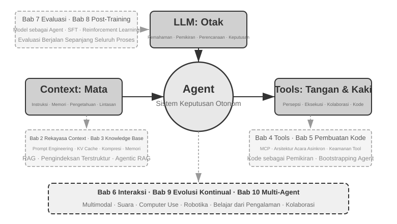

# Pengantar {.unnumbered}

Dari Agustus hingga Oktober 2025, saya memberikan serangkaian kuliah teknis di "AI Agent Bootcamp" yang diselenggarakan oleh Turing, penerbit teknologi asal Tiongkok. Tujuannya sederhana: memindahkan desain AI Agent dari yang digerakkan oleh intuisi menjadi digerakkan oleh prinsip—bukan hanya sekadar membuat demo berjalan, tetapi memahami *mengapa* sebuah Agent didesain sedemikian rupa dan *trade-off* apa yang ada di balik setiap keputusan arsitektur. Buku ini disusun dan dikembangkan dari catatan serta eksperimen dari kuliah-kuliah tersebut.

Buku ini sendiri, mulai dari ide awal hingga naskah akhir, dibuat melalui apa yang mungkin bisa disebut sebagai **whisper coding** (kolaborasi berbasis dikte)—dan alat yang saya gunakan untuk mendikte adalah Pine, *voice Agent* kami sendiri. Untuk mempersiapkan setiap kuliah, saya mendiktekan garis besar kasar, memintanya untuk meninjau topik tersebut, dan membiarkannya menyusun draf pertama. Setelah kuliah, saya akan membagikan umpan balik dari siswa Bootcamp kepada Pine, dan kami akan berdiskusi serta memolesnya selama beberapa putaran; iterasi demi iterasi, catatan kuliah tersebut berkembang menjadi buku yang Anda pegang saat ini. Sepanjang proses tersebut, saya jarang mengetik—saya lebih sering menyuarakan pikiran saya. Berbicara memiliki *bandwidth* yang jauh lebih tinggi daripada mengetik (kecepatan berbicara normal sekitar empat kali lipat kecepatan mengetik), sehingga *loop* "dikte—tinjau—diskusikan—revisi" berjalan dengan cepat. Dalam satu hal, buku ini tidak hanya membahas tentang Agents; buku ini juga merupakan sebuah karya yang pembuatannya dibantu oleh sebuah Agent.

Sejak peluncuran DeepSeek R1 pada awal tahun 2025, bidang AI telah melampaui tahap model fundamental murni (yaitu *backbone large language model* serbaguna) dan masuk jauh ke dalam tahapan rekayasa *deployment*. Kemajuan pada lapisan model terlihat dari dua arah. Pertama, melalui Agentic Reinforcement Learning, model telah melatih kemampuan *tool-calling* ke dalam parameter mereka, menguasai kemampuan umum di berbagai bidang seperti pemrograman, matematika, dan penggunaan komputer. Kedua, iterasi model terus berakselerasi—GPT-5.2 ke GPT-5.5, Claude Opus 4.5 ke 4.8, masing-masing lompatan hanya memakan waktu setengah tahun. Pada lapisan produk, Agent umum seperti Manus, Claude Code, dan OpenClaw telah mendefinisikan ulang interaksi manusia-komputer, mendorong paradigma arsitektur "*code generation* + *file system*" ke arus utama.

Menengok kembali pada prinsip arsitektur Agent yang saya rangkum dalam kursus ini hampir setahun yang lalu, saya menemukan sesuatu yang memuaskan dan juga mengejutkan: **prinsip-prinsip ini tidak menjadi usang; mereka justru menjadi lebih baku.** Istilah-istilah baru—Skill, *harness*, *loop engineering*—sejak saat itu telah menjadi tren Agent, namun urutan sebenarnya berjalan sebaliknya: perusahaan seperti Anthropic tidak menciptakan konsep-konsep ini lalu melihat industri mengadopsinya; sudah banyak sekali Agent yang melakukan hal-hal ini, dan Anthropic kemudian menyaring praktik tersebut ke dalam prinsip desain yang dinamai. Praktik datang lebih dulu, penamaan datang kemudian.

Keyakinan di balik prinsip-prinsip ini muncul dari upaya mendorong Agents ke dalam pekerjaan yang berjangka panjang (*long-horizon*) dan berisiko tinggi (*high-stakes*) di dunia nyata. Sebagai Chief Scientist dari Pine AI, saya membangun Pine bersama tim saya. Sepengetahuan saya, ini adalah Agent umum pertama yang dapat secara mandiri berinteraksi dengan orang sungguhan dan dengan andal menangani tugas-tugas sensitif, kompleks, dan *long-horizon* yang melibatkan uang dengan sendirinya: ia menelepon operator atas nama pengguna untuk menegosiasikan tagihan, menangani permintaan pengembalian dana dan keluhan dengan *merchant*, dan membatalkan langganan—semuanya tanpa campur tangan manusia. Tugas semacam ini secara rutin melibatkan puluhan putaran negosiasi, dan satu kesalahan berarti kerugian finansial nyata. Tuntutan keandalan yang tak kenal ampun inilah yang membentuk satu per satu prinsip arsitektur yang terus-menerus kembali dibahas di buku ini. Contoh-contoh berikut ini berasal dari praktik tersebut.

- Jauh sebelum Skill menjadi kata kunci yang populer (*buzzword*), kami telah menggunakan pemuatan *prompt* dinamis untuk mengendalikan pertumbuhan *prompt* yang tak terkendali, alat eksekusi *command-line* untuk mengendalikan daftar alat yang tak terbatas, dan bilah status sistem (*system status bar*) untuk memberikan kesadaran kepada Agent akan lingkungan eksekusinya, waktu pengguna, dan status kerjanya sendiri.
- Jauh sebelum *harness* menjadi *buzzword*, kami telah menggunakan metode bergaya Claude Code untuk menangani panggilan alat (*tool calls*) yang tidak stabil, halusinasi, operasi berbahaya, operasi tidak sah, dan instruksi yang diabaikan.
- Jauh sebelum *loop engineering* menjadi *buzzword*, kami telah menggunakan apa yang dalam buku ini disebut metode *proposer-reviewer* untuk mencegah model mendeklarasikan suatu tugas selesai terlalu dini.

Semua ini juga bukan murni penemuan eksklusif kami: sepengetahuan saya, sebagian besar perusahaan model dan Agent terkemuka telah menemukan metode serupa dengan cara mereka sendiri. Itulah sebabnya saya meluncurkan kursus "AI Agent Bootcamp" di Turing pada bulan Agustus 2025 dan terus-menerus mengajar kursus AI Agent praktis di University of Chinese Academy of Sciences dari tahun 2024 hingga 2026—dan itulah sebabnya saya memilih untuk merilis buku ini secara *open source* daripada menjadikannya sumber tertutup (closed-source) dan memungut royalti: Saya ingin pengetahuan ini menjangkau lebih banyak praktisi.

**Praktik datang lebih dulu, penamaan datang kemudian.** Urutan ini membawa pelajaran yang sangat praktis bagi pengembangan Agent di tingkat perusahaan (*enterprise*): **jika Anda menunggu sebuah *buzzword* Agent menjadi populer sebelum menerapkannya dalam praktik, Anda sudah tertinggal satu langkah.** Pada saat sebuah istilah menjadi tren, perusahaan-perusahaan terkemuka biasanya sudah mengatasi masalah yang dinamainya. Jadi, bagaimana Anda tahu apa yang harus dilakukan sebelum penamaan tersebut muncul? Saya percaya ada dua hal yang menjadi kunci.

**Pertama, miliki bisnis nyata yang memberikan tuntutan ekstrem pada batas kemampuan (capability ceiling) Agent, dan teruslah menarik umpan balik asli darinya.** Ambil contoh Pine. Satu tugas sering kali membutuhkan waktu berjam-jam atau bahkan berminggu-minggu dan dapat berarti negosiasi bolak-balik berulang kali dengan berbagai pemangku kepentingan: berjam-jam di telepon, berhalaman-halaman formulir kompleks yang diisi di komputer, beberapa putaran email. Melalui semua itu, tidak boleh ada satu angka pun yang salah, dan setiap pertukaran informasi harus tetap cukup hati-hati untuk melindungi kepentingan pengguna. Hanya ketika Anda tenggelam dalam skenario sekompleks inilah, praktik tersebut secara alami akan mendorong Anda untuk membangun *harnesses*—untuk menutupi apa yang belum dapat dilakukan oleh model itu sendiri, tetapi dibutuhkan oleh bisnis. Sebaliknya, jika bisnis menuntut sedikit dari batas kemampuan dan pembaruan model secara sederhana saja sudah cukup, Anda tidak akan pernah punya alasan untuk mengasah prinsip arsitektur ini.

**Kedua, Anda harus membangun mekanisme Evaluasi (Evaluation).** Buku ini berulang kali menekankan pada satu poin ini: tanpa evaluasi, tidak ada kemajuan. Evaluasi memungkinkan Anda mengetahui apakah sebuah perubahan benar-benar lebih baik atau hanya kebetulan, sehingga arah iterasi Agent tidak lagi hanya bertumpu pada firasat. Pada dasarnya, apa yang kami anjurkan adalah menggunakan metode ilmiah untuk melakukan rekayasa (*engineering*) dan membangun Agents, dan evaluasi adalah fondasi dari metode tersebut. Bab 7 membahasnya secara menyeluruh.

Bagaimanapun model dasarnya berkembang dan bentuk produknya berubah, hampir semua sistem Agent yang sukses mengikuti pola arsitektur yang sama. Ini bukan kebetulan: **prinsip desain yang baik seharusnya melampaui siklus iterasi model**, karena hal itu tidak mendeskripsikan penggunaan suatu model secara spesifik, melainkan mendeskripsikan pola fundamental bagaimana sistem cerdas berinteraksi dengan dunia.

Richard Sutton, pemenang Turing Award dan bapak *reinforcement learning*, pernah berkata bahwa evolusi alam semesta telah melalui empat tahap: debu, bintang, kehidupan, dan *agents* (awalnya disebut sebagai *designed entities* atau entitas yang dirancang). Evolusi biologis itu buta: mutasi acak, seleksi alam. Sebagian besar organisme tidak memahami prinsip kerjanya sendiri dan tidak dapat merancang atau membuat ulang makhluk hidup dengan sendirinya. Namun, Agents adalah sesuatu yang sama sekali baru dalam sejarah evolusi kosmis: dengan menghasilkan kode (*generating code*) mereka dapat melakukan *bootstrap* dan berevolusi sendiri, layaknya seorang *programmer* yang menulis kode untuk *programmer* lain, yang pada gilirannya menulis kode untuk *programmer* berikutnya. Artinya, sebuah Agent dapat memahami mekanisme operasionalnya sendiri dan, dengan diberikan tujuan, ia dapat menciptakan Agents yang sepenuhnya baru—bahkan meningkatkan dirinya sendiri. Misi dari buku ini adalah membantu Anda memahami dan menguasai prinsip-prinsip dari penciptaan ini.

Formula inti dari buku ini hanya satu kalimat: **Agent = LLM + Context + Tools**. Ketiganya tidak terpisahkan.



Secara lebih intuitif, itu adalah **Otak + Mata + Tangan dan Kaki**. Otak (LLM) bertanggung jawab atas pemikiran dan pengambilan keputusan, mata (Context) menentukan informasi apa yang dapat dilihat oleh Agent, dan tangan serta kaki (Tools) menentukan apa yang dapat dilakukan Agent. (Secara teknis, "mata" adalah analogi yang masih kasar: Context tidak hanya mencakup informasi lingkungan dan riwayat percakapan, melainkan juga definisi alat, yang berarti informasi yang "dilihat" Agent juga mencakup "tangan dan kaki apa saja yang tersedia." Metafora ini bertujuan untuk menyampaikan intuisi intinya: Context adalah semua informasi yang dapat dipersepsikan oleh model.)

Untuk pembaca yang familier dengan *reinforcement learning*, ketiga hal ini juga dapat dipetakan ke dalam bahasa formal RL. Secara khusus, LLM sesuai dengan Policy, Context sesuai dengan Observation Space, dan Tools sesuai dengan Action Space. Ketiga ungkapan tersebut merujuk pada objek yang sama, hanya saja pada tingkat abstraksi yang berbeda.


## Struktur Buku {.unnumbered}

Buku ini terdiri atas sepuluh bab yang tersusun dalam empat lapis (Gambar 0-2). Bab 1 membangun kerangka dasar Agent; Bab 2 sampai 6 membahas cara membangun Agent, berturut-turut menguraikan konteks, pengetahuan, tool, pembuatan kode, dan interaksi; Bab 7 sampai 9 membahas cara mengevaluasi dan terus memperbaiki Agent, dari sistem pengukuran dan pascapelatihan model hingga evolusi berkelanjutan yang digerakkan pengalaman operasional; Bab 10 memperluas pandangan ke kolaborasi multi-Agent.


- **Bab 1 (Agent Fundamentals)** dimulai dengan beberapa produk Agent nyata untuk membangun pemahaman intuitif tentang Agents. Bab ini kemudian menelaah lebih dalam pada formula inti Agent: dari lapisan implementasi LLM + Context + Tools, ke lapisan intuitif Otak + Mata + Tangan dan Kaki, dan akhirnya ke lapisan akademik yang berupa Policy, Observation Space, dan Action Space. Eksperimen di sini membedah bagaimana *ReAct loop* beroperasi—proses berulang dari “Think → Act → Observe”—dan membedakan antara adaptasi kontekstual *within-task*, pembaruan lintas tugas pada *external artifacts*, dan pembaruan parameter selama siklus *training*. Bab ini ditutup dengan pola desain orkestrasi mulai dari *workflows* (alur kerja) hingga *autonomous Agents*, menetapkan kerangka konseptual terpadu untuk bab-bab selanjutnya.
- **Bab 2 (Context Engineering)** adalah bab yang paling krusial di dalam buku ini, yang secara sistematis menjelaskan Context, “mata” dari si Agent. Bab ini dimulai dengan struktur pesan API dan *loop* inti Agent, menetapkan fondasi bahwa “Context adalah daftar pesan”, kemudian mengkaji prinsip dasar KV Cache—mekanisme untuk menggunakan kembali hasil perhitungan riwayat selama inferensi LLM. Selanjutnya bab ini mencakup Prompt Engineering, termasuk desain yang berorientasi pada proses, deskripsi alat, dan penyempurnaan aturan bisnis; serangan dan pertahanan Prompt Injection; mekanisme pemuatan sesuai permintaan (*on-demand loading*) dari Agent Skills; teknologi *Agent status bar*; dan strategi Context Compression. Definisi lengkap dari istilah-istilah ini disediakan pada saat dimunculkan pertama kalinya di dalam teks utama.
- **Bab 3 (User Memory and Knowledge Bases)** memperluas manajemen konteks ke dalam sistem pengetahuan persisten (Knowledge Base) yang membentang di berbagai sesi, memungkinkan Agent untuk tidak hanya mengingat percakapan saat ini tetapi juga mengumpulkan serta mengambil kembali pengetahuan (*retrieve knowledge*) di beberapa percakapan. Bab ini mencakup empat strategi progresif untuk User Memory; *stack* teknis lengkap RAG (Retrieval-Augmented Generation, yaitu kondisi di mana dokumen yang relevan diambil (*retrieved*) sebelum model menghasilkan jawaban), termasuk metode pencarian teks dan pengoptimalan peringkat (*ranking*) yang berbeda; ekstraksi informasi multimodal; metode pengorganisasian pengetahuan (*knowledge organization*) yang lebih lanjut; dan Agentic RAG, di mana Agent secara mandiri memutuskan kapan dan apa yang akan diambil (*retrieve*).
- **Bab 4 (Tools)** membahas jembatan antara Agent dan dunia luar: *tools* berfungsi sebagai “tangan dan kaki” Agent, sehingga Agent dapat menelusuri web, memanggil API, mengoperasikan basis data, dan banyak lagi. Bab ini memperkenalkan standar interoperabilitas alat MCP serta prinsip desain untuk lima kategori alat—Perception, Execution, Collaboration, Event Triggering, dan User Communication—menguraikan tiga pendekatan untuk persepsi multimodal (pemrosesan multimodal native, konversi menjadi teks, dan analisis multimodal berbasis alat), serta menekankan mekanisme keamanan untuk *execution tools*. Event Triggering, User Communication, dan runtime asinkron dibahas dalam Bab 6.
- **Bab 5 (Coding Agent and Code Generation)** berargumen bahwa Coding Agent ditambah *file system* merupakan fondasi teknis inti dari setiap Agent umum. Dengan menggunakan arsitektur OpenClaw sebagai benang merah pengaturannya, bab ini menganalisis alur kerja (*workflows*) Coding Agent dan teknik implementasinya, sembari mendemonstrasikan nilai luas dari *code generation* di luar pemrograman: mulai dari membantu pemikiran dan membangun basis pengetahuan, hingga membuat alat baru secara dinamis dan *Agent bootstrapping*.
- **Bab 6 (Interaksi: Perluasan Ruang Observasi dan Ruang Aksi)** mencabut premis "berbicara bergantian" yang diandaikan lima bab sebelumnya, dan membentangkan interaksi Agent dengan dunia di sepanjang dua sumbu, **modalitas** dan **waktu**: asinkron dan berbasis peristiwa membuat dunia membangunkan Agent (alat pemicu peristiwa, alat komunikasi pengguna, identitas virtual dan lingkungan eksekusi terisolasi); suara mendorong interaksi ke skala milidetik (dari pipeline kaskade hingga model omnimodal end-to-end dan full duplex); Computer Use membuat Agent mengoperasikan antarmuka grafis layaknya manusia; dan manipulasi robot memperluas aksi ke dunia fisik (kendali VLA dan transfer Sim2Real). Keempat skenario berbagi satu set primitif: membangunkan, titik aman, pembatalan, pendahuluan, dan pemisahan cepat/lambat.
- **Bab 7 (Agent Evaluation)** membangun metodologi evaluasi yang ilmiah. Bab ini mencakup lingkungan evaluasi—dua paradigma inti, yaitu *tool calling* dan interaksi manusia-komputer, ditambah dengan lingkungan simulasi yang dibahas secara terpisah di akhir bab—prinsip desain *dataset*, evaluasi otomatis menggunakan metode LLM-as-a-Judge, pemilihan model yang didorong oleh evaluasi, dan *closed loop* (lingkaran tertutup) lengkap yang mengubah hasil evaluasi menjadi perbaikan pada sistem.
- **Bab 8 (Model Post-training)** mengkaji dua teknik *post-training* secara mendalam: SFT (Supervised Fine-Tuning, yang menggunakan data berlabel untuk mengajarkan model mengikuti contoh) dan RL (Reinforcement Learning, yang memungkinkan model untuk terus meningkat secara mandiri melalui *trial and error* serta *reward feedback*). Disusun berdasarkan argumen utama bahwa “SFT menghafalkan (*memorizes*), RL menggeneralisasi (*generalizes*)” dan “Data dan lingkungan lebih penting daripada algoritma,” bab ini mencakup lanskap prapelatihan (*pre-training*)/SFT/RL secara lengkap, teori RL klasik, desain sinyal-*reward*—mulai dari *binary rewards* dan *process rewards* hingga *verified path penalties* yang “menghargai (*reward*) hasil dan membatasi (*constrain*) prosesnya”—algoritma *reinforcement-learning single-turn* maupun *multi-turn*, serta topik-topik mutakhir seperti pengoptimalan *sample-efficiency*.
- **Bab 9 (Continuous Agent Evolution)** mempelajari bagaimana mengubah pengalaman operasional sebuah Agent menjadi kemampuan untuk versi selanjutnya. Awalnya, bab ini merumuskan sinyal pembelajaran yang terdiri dari hasil lingkungan (*environmental outcomes*), aturan proses (*process rules*), dan Rubrik LLM (*LLM Rubrics*); kemudian bab ini membandingkan empat media pembaruan (*update carriers*)—dokumen pengetahuan, Prompts dan Skills, program dan Harnesses, serta parameter model; dan akhirnya membahas validasi versi-kandidat, *canary releases*, *rollback*, dan konsolidasi jangka panjang.
- **Bab 10 (Multi-Agent Collaboration)** membahas bentuk pamungkas dari sistem AI Agent: bagaimana banyak Agents membagi tugas dan berkolaborasi. Bab ini menyajikan kerangka klasifikasi secara sistematis untuk kolaborasi multi-agen—shared/independent context × struktur peer/manager/decentralized—menggunakan Agent penerjemah dan Agent kombinasi telepon-plus-komputer untuk mendemonstrasikan desain arsitektur kolaboratif, dan menyurvei berbagai arah batas mutakhir dalam *Agent societies* serta *Agent economies*.

## Cara Membaca Buku Ini {.unnumbered}

Bab-bab di dalam buku ini relatif independen. Anda dapat memilih jalur bacaan yang berbeda-beda sesuai kebutuhan Anda:

- **Jika Anda pengembang Agent**, bacalah Bab 1 sampai 9 secara berurutan: enam bab pertama memberikan metode pembangunan, Bab 7 meletakkan dasar evaluasi, Bab 8 menjelaskan cara melatih model, dan Bab 9 memasukkan parameter serta pengangkut pembaruan lainnya ke dalam lingkar tertutup evolusi berkelanjutan yang utuh. Bab 10 dapat dibaca secara selektif sesuai kebutuhan Anda akan kolaborasi multi-Agent.
- **Jika Anda memiliki waktu yang terbatas**, prioritaskan Bab 1, untuk gambaran keseluruhannya, dan Bab 2, untuk *context engineering*—kemampuan yang paling krusial. Prinsip-prinsip dasar yang ada di balik KV Cache dalam Bab 2 lumayan bersifat teknis; pada bacaan pertama, Anda bisa melewati mekanismenya dan hanya memegang tiga kesimpulan inti yang dinyatakan di awal, tanpa akan mempengaruhi pemahaman Anda pada materi-materi selanjutnya.
- **Jika fokus Anda adalah pelatihan model (*model training*)**, langsung pergi ke Bab 8 (Model Post-training). Karena metode evaluasi dalam Bab 7 adalah prasyarat untuk pelatihan, bacalah kedua bab tersebut bersama-sama, setelah Bab 1 dan Bab 2 memberikan gambaran secara menyeluruh.

Setiap bab berisi sejumlah besar **eksperimen** dan **pertanyaan pemikiran (thought questions)**, yang diberi nomor dalam format "Eksperimen X-Y" (X adalah nomor bab, Y adalah nomor urut di dalam bab). Judul-judul eksperimen dan pertanyaan pemikiran mengandung peringkat bintang untuk tingkat kesulitan: ★ berarti tingkat pemula (*entry-level*), cocok untuk semua pembaca; ★★ berarti tingkat kesulitan menengah, membutuhkan sejumlah praktik rekayasa; ★★★ berarti tantangan lanjutan, biasanya melibatkan pertanyaan terbuka atau desain sistem yang kompleks. Sebagian besar eksperimen dilengkapi dengan kode yang lengkap dan dapat dijalankan, yang disusun di dalam repositori *open-source* pendampingnya:

> **Repositori Kode Pendamping**: [https://github.com/bojieli/ai-agent-book](https://github.com/bojieli/ai-agent-book)

Anda dapat memperoleh seluruh kode pendamping dengan Git:

```bash
git clone https://github.com/bojieli/ai-agent-book.git
cd ai-agent-book
```

Jika Anda tidak menggunakan Git, Anda juga dapat memilih **Code → Download ZIP** pada halaman repositori. Kode eksperimen disusun berdasarkan bab, dari `chapter1/` hingga `chapter10/`. Untuk menemukan “Eksperimen X-Y”, buka `chapterX/README.id.md` yang sesuai, gunakan nomor eksperimen untuk menemukan direktori proyeknya, lalu ikuti README proyek tersebut untuk memasang dependensi dan menjalankannya. Beberapa eksperimen yang ditandai sebagai panduan reproduksi bergantung pada repositori eksternal; README masing-masing juga menjelaskan cara memperolehnya.

Saya sangat menyarankan Anda untuk menjalankan sendiri eksperimen-eksperimen ini: AI Agents adalah bidang praktik yang intens, dan banyak intuisi desain yang hanya akan terbentuk saat Anda melakukan proses *debugging*.

**Catatan Terminologi**: Buku ini berhati-hati dalam membedakan dua istilah yang penggunaannya sehari-hari sering kali dicampuradukkan. **Reasoning (Penalaran)** adalah cara berpikir model langkah demi langkah—seperti pada *reasoning models*, *Chain of Thought*, dan *reasoning tokens*. **Inference (Inferensi)** adalah komputasi model ke depan pada saat *deployment*—seperti pada *inference cost*, *inference stack*, dan *inference-time scaling*. (Edisi bahasa Mandarin menerjemahkannya menjadi dua kata yang berbeda—思考 untuk *reasoning*, 推理 untuk *inference*—tepatnya demi menjaga agar kedua ide tersebut tetap terpisah; studi kasus terjemahan pada Bab 10 merujuk kembali kepada konvensi ini.) Istilah-istilah penting lainnya akan didefinisikan pada saat mereka dimunculkan pertama kalinya di dalam teks.

## Prasyarat {.unnumbered}

Buku ini ditujukan untuk pembaca yang memiliki beberapa latar belakang teknis, tetapi tidak mengharuskan Anda untuk menjadi seorang pakar ahli pada bidang tertentu. Prasyarat yang ada tercantum di bawah ini dan dibagi menjadi dua tingkat: "Wajib" dan "Direkomendasikan", untuk membantu Anda dalam menilai kesiapan Anda.

**Wajib: Dasar untuk membaca keseluruhan isi buku**

- **Python Programming (Pemrograman Python)**: Hampir semua eksperimen di dalam buku ini menggunakan Python. Anda harus terbiasa dengan sintaks dasar Python, struktur data umum, manajemen *package* (pip), dan konsep fundamental lainnya. Kemahiran penuh tidak diwajibkan, tetapi Anda harus mampu membaca serta memodifikasi kode Python dengan tingkat kompleksitas menengah.
- **Pengalaman Dasar dengan LLM**: Anda seharusnya pernah menggunakan ChatGPT, Claude, atau produk sejenisnya, dan memahami pola interaksi dasar dari "Prompt → Respons Model".
- **AI-Assisted Programming Tool**: Pasang dan biasakan diri Anda dengan setidaknya satu alat pemrograman berbasis AI, seperti Claude Code, Codex, Cursor, atau TRAE. Di satu sisi, alat-alat ini akan sangat mempercepat eksperimen yang ada, yang akan melibatkan penulisan serta *debugging* kode secara ekstensif. Di sisi lain, mereka sendiri merupakan sebuah Coding Agent yang matang: dalam menggunakannya, Anda akan merasakan sendiri mekanisme inti yang secara berulang kali dibahas di dalam buku ini—*ReAct loop*, panggilan alat (*tool calls*), manajemen konteks (*context management*). Pengalaman langsung itu sangatlah berharga dalam rangka memahami berbagai prinsip perancangan Agent.
- **Pengetahuan Rekayasa Perangkat Lunak Secara Umum**: Anda hendaknya sudah familier dengan konsep-konsep dasar seperti operasi *command-line*, *version control* menggunakan Git, format data JSON, dan REST API. Ini semua adalah fondasi untuk menjalankan berbagai eksperimen serta dalam memahami mekanisme *tool-calling* milik Agent.

**Direkomendasikan: Meningkatkan pengalaman membaca pada bab tertentu**

- **Dasar-dasar Machine Learning** (Bab 8): Memahami berbagai konsep dasar seperti pelatihan (training) versus inferensi (inference), *loss functions*, *gradient descent*, dan *overfitting* akan membantu Anda dalam memahami *model post-training*.
- **Matematika Dasar** (Bab 2-3, 8): Pemahaman intuitif tentang aljabar linier (misalnya, mengetahui bahwa vektor dapat mewakili arah maupun besaran, dan matriks dapat melakukan *batch operations*) akan membantu Anda memahami mekanisme *embeddings* dan *attention mechanisms*. Pengetahuan dasar tentang probabilitas serta statistik akan membantu dengan metrik evaluasi dan nilai *rewards* yang diharapkan dalam *reinforcement learning*. Matematika yang ada di dalam buku tidak melibatkan derivasi yang rumit melainkan lebih berfokus pada penjelasan yang intuitif.
- **Dasar-dasar Web Development** (Bab 6): Memahami berbagai konsep semacam HTTP, WebSocket, dan arsitektur *front-end*/*back-end* terpisah akan membantu Anda untuk mengerti arsitektur Agent asinkron yang digerakkan oleh *event* dan eksperimen mengenai komunikasi *real-time* untuk *voice agents*.
- **Pemahaman Dasar tentang Arsitektur Transformer** (Bab 2, 8): Transformer adalah arsitektur yang mendasari hampir semua jenis *large language model* (model bahasa berukuran besar) saat ini. Pembaca yang ingin membangun pengetahuan dasarnya mengenai *large models* secara sistematis mungkin akan menyukai buku *Illustrating Large Models* (图解大模型, diterbitkan dalam bahasa Mandarin oleh Turing), yang mana menggunakan berbagai diagram intuitif guna menjelaskan bermacam konsep inti semisal arsitektur Transformer, *pre-training*, serta *fine-tuning*—sebuah pelengkap yang bagus untuk perspektif dari sisi rekayasa Agent pada buku ini.

Jika Anda kehilangan atau tidak memiliki sebagian prasyarat ini, janganlah berkecil hati. Nilai inti dari buku ini terletak pada **prinsip rancang arsitektur serta metodologi rekayasa**, dan bukan pada suatu algoritma maupun teknik mana pun secara khusus. Di luar dari Bab 8 tentang *post-training*, buku ini hanya membutuhkan sedikit pengetahuan matematika ataupun *machine learning*, dan ini dapat menjadi sebuah permulaan yang sempurna.

Teknologi Agent masih terus berkembang dengan pesat, namun **prinsip desain arsitektur yang baik memiliki kekuatan untuk bertahan melintasi waktu**. Kuasailah alasan "mengapa" di balik setiap keputusan desain, dan Anda akan mampu menjaga agar setiap penilaian Anda tetap jelas seiring deru ombak perubahan teknologi. Saya berharap semoga buku ini menjadi panduan yang dapat diandalkan pada saat Anda sedang membangun berbagai macam AI Agents.

## Ucapan Terima Kasih {.unnumbered}

Saya ingin berterima kasih kepada editor Meng Ge dan Liu Meiying di penerbit Turing atas upaya *editing* mereka yang teliti dan berkat kerja keras mereka di dalam mengelola kursus "AI Agent Bootcamp" milik Turing; Saya juga berterima kasih kepada Profesor Liu Junming karena telah menawarkan kursus interaktif mengenai AI Agent di The University of Chinese Academy of Sciences (UCAS). Apresiasi dan ucapan terima kasih secara khusus saya berikan kepada seluruh murid di "AI Agent Bootcamp" Turing dan kursus AI Agent di UCAS—mengajar setiap kursus ini telah membawa banyak masukan serta nasihat yang berharga dari Anda, dan itu semakin menajamkan pemahaman pribadi saya terhadap seluruh konsep-konsep ini.

Saya mengucapkan terima kasih kepada semua kolega saya di Pine AI. Tanpa produk yang sebegitu luar biasa layaknya Pine AI, serta berbagai tantangan yang dibawanya, saya takkan mungkin pernah menyelami begitu dalam ke dalam bidang teknologi Agent, di dalam hal pemahaman maupun pada setiap bentuk praktiknya; dan melewati setiap pertukaran gagasan serta ide, rekan-rekan saya juga telah menyumbangkan segudang pengetahuan yang sangat berharga.

Saya juga ingin mengucapkan banyak-banyak terima kasih kepada rekan-rekan yang ada di seluruh lapisan industri teknologi AI (saya takkan bisa menyebutnya satu-per-satu di sini). Melewati waktu-waktu saat kita berdiskusi, kalian memberikan berbagai *feedback* dengan sangat jujur pada semua poin sudut pandang milik saya, membantu mengoreksi sejumlah kesalahan yang saya buat dalam memberikan penilaian, serta terus meningkatkan pemahaman saya tentang model dan Agents.

Paling penting dari itu semua, saya ingin mengucapkan terima kasih saya yang tidak terhingga untuk pihak keluarga, terutama ditujukan untuk istri saya, Meng Jiaying. Ia telah memberikan dukungan penuh selama penulisan buku ini dan memberikan banyak sekali masukan yang sangat berharga sepanjang proses penulisannya.
