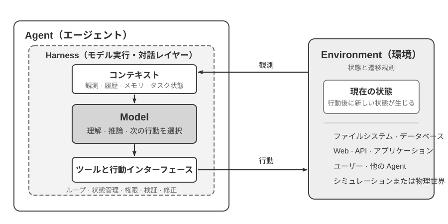
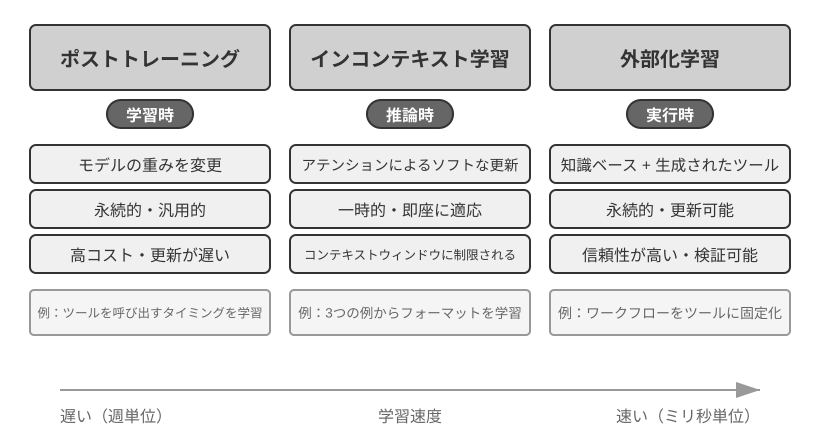
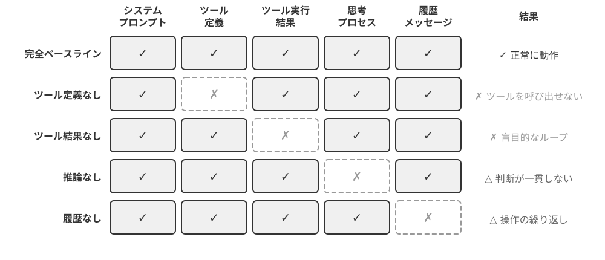
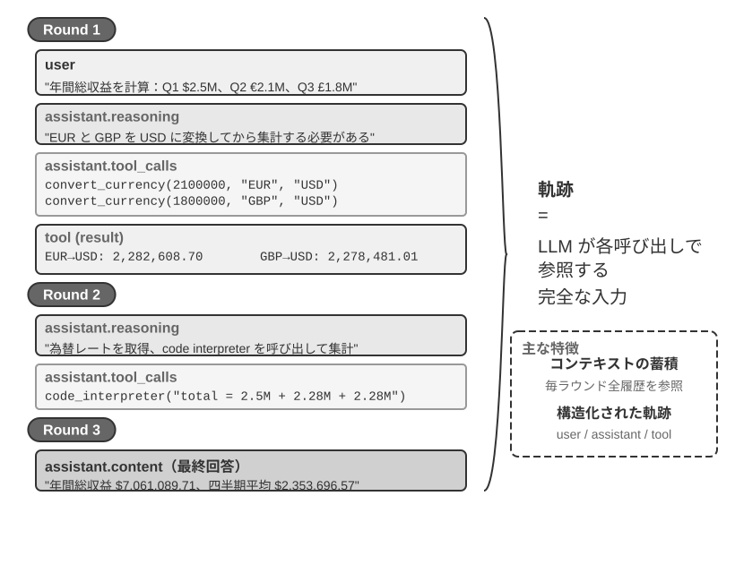
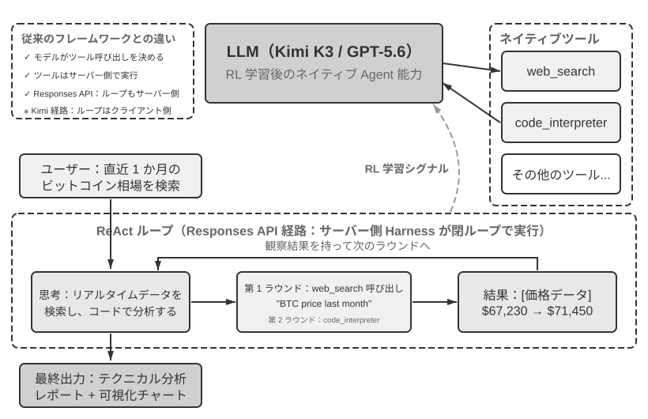
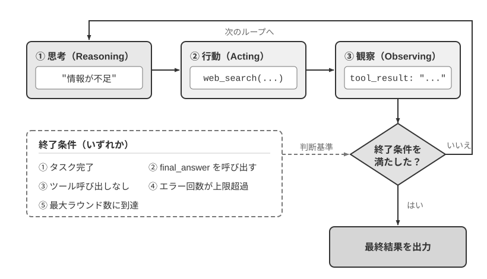

# AI Agent 入門

もしあなたが Cursor でコードを書き、それがコードベースを検索し、複数のファイルを編集し、テストが通るまで実行する様子を見たことがあるなら。Deep Research である課題を調査し、それが繰り返し検索・読解して完全なレポートにまとめる様子を見たことがあるなら。Manus でブラウザを操作してオンラインタスクをこなしたことがあるなら。Doubao のスマホアシスタントにスマホでチケットを予約させたりメッセージを送らせたりしたことがあるなら。あるいは Pine AI にあなたの代わりに通信事業者へ電話をかけて料金の値下げ交渉をさせたことがあるなら——あなたはすでに AI Agent を使っているのです。

これらの製品は形態こそさまざまですが、一つの共通点があります。それらはもはや「あなたが一言問えば、一言答える」という受動的な対話ではなく、自律的に実行ステップを計画し、さまざまなツールを呼び出してタスクを完了し、結果に応じて絶えず方策を調整できる知的システムだということです。AI Agent は、私たちがコンピュータと対話するまったく新しい方法になりつつあります。

本章では、実践の観点から AI Agent の核となる構成要素を理解していきます。実際に手を動かして現代の Agent の能力を体験し、その背後にあるアーキテクチャ原理を理解し、Agent システムを構築するための設計パターンとベストプラクティスを習得します。

> **読書のヒント**：本章は本書全体の概念地図です。Agent の核となる公式、実行ループ、エンジニアリングのフレームワーク、設計パターンを手早く導入し、以降の章に統一された用語と参照座標を提供します。初読ではすべての概念を一つひとつ覚える必要はなく、まず全体像をつかむことをおすすめします。以降の各章では、本章で触れたある側面をそれぞれ詳しく展開していきますので、その都度いつでも本章に戻って照らし合わせられます。

## 現代の Agent = LLM + コンテキスト + ツール

現代の Agent システムの本質は、一つの簡潔な公式で表せます。**Agent = LLM（大規模言語モデル、Large Language Model）+ コンテキスト + ツール**。この公式は簡潔かつ実用的ですが、その中の一つひとつの語は広義に理解する必要があります。

- **LLM は Agent の脳です**：それは単なるモデルパラメータの集まりではなく、Agent の意思決定の中核全体です。意図を理解し、思考して計画を立て、判断を下します。人間の脳が単なるニューロンの集合ではなく、経験によって形づくられた思考様式をも含むのと同じように、LLM の能力も 2 つの部分から来ています。**事前学習**で蓄積された世界知識と言語能力、そして**ポストトレーニング**で固定化された意思決定の方策です。後者の具体的な技術（教師ありファインチューニングや強化学習など）は第 8 章で展開します。
- **コンテキストは Agent の目です**：それはモデルに入力される一続きのテキストにとどまらず、Agent が各意思決定点で見られるすべての情報です。環境情報、ユーザーメモリ、領域知識、自身の状態、そしてタスクの進捗です。人間が判断を下すときに現在の状況を見極め、関連する経験を思い出し、参考資料に目を通す必要があるのと同じように、Agent のコンテキストウィンドウはそれが今この瞬間に見られるすべてなのです。
- **ツールは Agent の手足です**：それは呼び出せるいくつかの API 関数にとどまらず、Agent ができるすべてのことの集合です。事前定義されたツール呼び出しから、オンデマンドで読み込まれる専門的なスキル（Skills）まで。コードを動的に生成して新しい能力を創り出すことから、サブ Agent に委ねて協調させることまで。能動的にユーザーとコミュニケーションすることから、外部イベントに応答することまで。

より直感的な言い方をすれば、**Agent = 脳 + 目 + 手足**です。脳は思考と意思決定を担い、目は思考に必要なすべての情報を提供し、手足は意思決定を現実世界への変化へと転化します。

古典的な強化学習と制御理論の視点では、Agent と Environment は閉ループ相互作用の両側であり、互いの構成要素ではありません。Environment が観測を返し、Agent はコンテキストに基づいて次の行動を選び、その行動が Environment の状態を変えて次の観測を生み出します。



図1-1は2つの抽象レベルを示します。外側は **Agent と Environment の相互作用**で、Environment にはファイルシステム、データベース、Web、ユーザー、他の Agent、物理またはシミュレーション世界が含まれます。内側は **Agent 内部の Model–Harness 構造**です。Model がポリシーを決定し、Harness は Agent の境界内にある実行・ガバナンス層としてコンテキストを構築し、ツールインターフェースを公開し、ループと状態を管理し、権限・検証・修正を適用します。Harness は環境を作成・隔離・代理できますが、Environment の状態や遷移規則そのものを含みません。

したがって、工学的な式は次のように展開できます。LLM は Model に対応し、Context + Tools が最小の Harness を構成します。実運用システムでは、この境界内に制約・検証・修正を加えます。本章の以降の説明もこの境界に従います。

この3つの構成要素は RL（強化学習、第8章参照）の3つの核となる概念に関係しますが、厳密な一対一対応ではありません。コンテキストは観測と履歴を Agent 内部で表現したものであり、ツールは観測・行動インターフェースを定義しますが、その背後の対象は Environment に属します。

| 直感的理解 | 実装コンポーネント | 学術概念 | 意味 |
|-----------|-----------|----------------------------|----------------------------------------------|
| **脳** | LLM | **方策**（Policy） | Agent が「次に何をするか」を決める意思決定ロジック。現在見ている情報に対して、選択可能なすべての行動の中から最も適切なものを一つ選び出す |
| **目** | コンテキスト構築 | **観測と履歴** | Environment の観測と既存の履歴を、現在の意思決定に必要な情報として整理する |
| **手足** | ツールインターフェース | **観測・行動インターフェース** | Agent が読める観測、発行できる行動、その形式を定義する |

### 観測空間と行動空間：モデルと世界を結ぶインターフェース

**観測空間と行動空間は、LLM と外部環境の間のインターフェースを共同で形づくります**。観測空間は環境内の情報をモデルが処理できるコンテキストへ変換し、行動空間はモデルの意思決定を外部世界への操作へ変換します。観測空間に入らない情報は、モデルにとって存在しないも同然です。行動空間にない操作は、モデルが何をすべきか正確に理解していても、言葉で提案することしかできません。

したがって、**基盤モデルを固定した場合、Agent のタスク性能を高める主要なシステム工学上の手段は、観測空間と行動空間を再定義または拡張することです**。本書の用語では、コンテキストとツールを拡張することに当たります。「より賢いモデル」が必要に見える問題の多くは、実はインターフェースの問題です。タスクに必要なデータをコンテキストへ取り込むか、必要な操作をツールとして公開すれば、解けなかったタスクが解けるようになる場合があります。

**Manus：分かれていた空間を統合する。** Manus が登場する以前、本番環境の Agent は主に Deep Research、Coding、Computer Use という三つの独立した系統に分かれていました。Manus は、この三つを一つのシステムに統合した最初の、広く影響力を持つ本番級 Agent でした。仮想ブラウザは観測空間を広げ、ファイルシステム、コード実行、コマンドライン実行は行動空間を広げました。Manus が汎用 Agent になったのは、単により強いモデルへ置き換えたからではありません。三種類の Agent の観測空間と行動空間の和集合を取り、一つの Agent が従来の製品境界を越えてタスクを完遂できるようにしたからです。

**OpenClaw：インターフェースをユーザーのデジタル生活へ広げる。** OpenClaw は、この二つの空間をさらに外側へ押し広げます。WhatsApp、Telegram、Slack、Discord、iMessage など、ユーザーが普段利用しているメッセージチャネルからタスクを受け取り、結果を返すため、ほぼどこからでも Agent にアクセスできます。また、ローカル Gateway を通じて、Google Drive や Notion などのクラウドアプリケーションとローカルファイルシステムへ接続できます。複数のアカウントやデバイスに散在するデジタルファイルを、ユーザーの明示的な許可のもとで一つの Agent の観測空間へ取り込み、そのツールで処理できるのです。ファイルのアップロードや個別のコネクタ設定を必要とした初期 Manus の隔離クラウドサンドボックス中心の形態と比べ、ローカル優先の OpenClaw はより広いデータ境界を横断します。その後 Manus 自身も Google Drive コネクタとデスクトップからのローカルアクセスを追加しました。これはまさに、製品能力の進化が観測空間と行動空間の拡張として現れることを改めて示しています[^ch1-agent-products]。

[^ch1-agent-products]: Manus の公式資料は、初期の Sandbox を隔離されたクラウド仮想マシンと説明しています。Google Drive Connector の発表時には、それ以前は Drive、デスクトップ、Manus の間でファイルを手動でダウンロード・アップロードする分断された手順が必要だったと明記しました。2026 年 3 月の My Computer 発表時には、「重要な仕事はクラウドではなくローカルにある」ことをクラウドサンドボックスの根本的制約としています。OpenClaw の公式 README は、ユーザー自身のデバイスで動作するローカル優先かつ常駐型の個人アシスタントとして説明し、20 種類を超えるメッセージチャネルを列挙しています。また、ツールとプラグインの仕組みによりクラウドサービスやローカル機能を追加できます。https://manus.im/blog/manus-sandbox、https://manus.im/blog/manus-google-drive-connector、https://manus.im/blog/manus-my-computer-desktop、https://github.com/openclaw/openclaw、https://docs.openclaw.ai/tools を参照。

この三者の役割とその相互関係を理解することは、有効な Agent システムを構築するための基礎です。ここでは最も具体的な手足（ツール）から紹介を始め、徐々に脳（LLM）と目（コンテキスト）へと踏み込んでいきます。まず、さまざまなタイプの Agent がこの 3 つの次元でどのように展開するかを見てみましょう。

| Agent 製品 | 目（知覚） | 手足（行動） | 方策 |
|----------------|----------------------|----------------------------|------------------------------|
| **Cursor などの Coding Agent** | 要件ドキュメント、コードベース、ターミナル環境 | オープンエンド（内部思考、コード検索、ファイル読み書き、コマンド実行など） | 増分開発：要件を理解→関連コードを検索→コードを編集→テストで検証→デバッグして修正 |
| **Deep Research などの検索 Agent** | ネットワーク資源、学術データベース、ローカルファイル | オープンエンド（内部思考、検索クエリ、Web ページの読解、要約生成） | 反復的な深掘り：既存の情報に応じて検索の方向を調整し、徐々に完全なレポートへと総合する |
| **Browser Use などのパソコン操作 Agent** | パソコンの画面、ブラウザのページ、ファイルシステム | オープンエンド（内部思考、クリック、入力、スクロール、スクリーンショット、コード実行など） | 視覚的知覚＋操作：画面を観察→対象要素を識別→操作を実行→結果を検証 |
| **Doubao などのスマホアシスタント Agent** | スマホの画面、インストール済みの App | オープンエンド（内部思考、タップ、スワイプ、入力、App の起動など） | 意図理解＋App 操作：ユーザーの要求を理解→対象 App を特定→操作を実行→完了を確認 |
| **Pine AI などの個人用務 Agent** | ユーザーのアカウント情報、過去の請求、サービス提供者の知識ベース | オープンエンド（内部思考、電話をかける、メール送信、フォーム入力、ユーザーへの確認） | 複数ステップのタスク実行：情報を収集→交渉方策を策定→サービス提供者に連絡→交渉→結果を報告 |

これらの Agent システムにはいくつかの共通した特徴があります。いずれも**オープンエンドな行動空間**を用いており、限られたいくつかのボタンから選ぶのではなく、任意の自然言語とコードを生成できます。いずれも**内部思考**ができ、行動を起こす前にまず思考して計画を立てます。いずれも**継続的に対話**でき、環境からのフィードバックに応じて絶えず方策を調整します。これらの能力こそ、脳・目・手足、すなわち LLM・コンテキスト・ツールの協働作用から生まれるものです。

### ツール：Agent の手足

ツールは Agent と外部世界とをつなぐ架け橋であり、人間の手足と同じように、Agent を受動的な観察者から能動的な実行者へと変えます。ツールがなければ、Agent は「机上の空論」を語ることしかできません。ツールがあってはじめて、それは本当に世界を変えられるのです。

ツールを体系的に論じるために、Agent と外界とのやり取りの方向に応じてツールを 5 種類に分けられます。以下ではまず各種類の代表的な場面を手早く一巡りして全体像をつかみます。以降の章で一つずつ展開します。

**知覚ツール**は Agent が情報にアクセスできるようにします。検索エンジンはリアルタイムのネットワークデータを提供し、ファイルシステムはローカル文書を読み取り、API とデータベースは外部サービスや企業の中核データと接続します。

**実行ツール**は Agent が世界を変えられるようにします。コード実行、ファイル操作、システムコマンド、外部 API 呼び出し。意思決定はこれによって実際の行動へと変わります。

**協調ツール**は Agent が他の Agent と分業・協力できるようにします。サブ Agent に専門的なタスクを委ね、重要な意思決定点で人間に確認を求め、あるいはマルチ Agent システムの中で行動を調整します。

**イベントトリガーツール**は、呼び出し方において前の 3 種類とは本質的に異なります。それらは Agent が能動的に呼び出すものではなく、外部入力として Agent にタスクの実行を開始させるものです。たとえば新しいメールを受け取った、ある予定時刻に達した、あるいは別のシステムが Webhook コールバックを発した、といったイベントが Agent を起動させ、その後の思考と行動を始めさせます。イベントトリガーは Agent が能動的に呼び出すものではありませんが、Agent と外部世界とが対話するチャネルの一つであるため、広義のツール体系に含めます。

**ユーザーコミュニケーションツール**は、Agent が能動的にユーザーとつながり、情報を伝えるためのチャネルです。外部世界を変える実行ツールとは異なり、ユーザーコミュニケーションツールは情報の伝達とやり取りに特化しています。テキストメッセージ、音声通話、メールなどの手段で、Agent の実行の進捗や能動的な気遣いをユーザーに伝えます。

以上の 5 種類のツールの完全な分類体系と設計原則は、第 4 章で展開して論じます。ツール設計の質は、Agent がどこまで到達できるかを直接左右します。インターフェースの定義が不明瞭なら、モデルはツールを乱用します。エラー処理が行き届かなければ、ツールがいったん失敗すると Agent のデッドロックになります。権限制御が広すぎれば、Agent がいったん誤ったときに、その結果は取り返しがつかなくなります。MCP（Model Context Protocol、モデルコンテキストプロトコル）標準の普及により、ツールの接続は容易になりつつあります。

**ツール呼び出し**（Tool Calling、Function Calling とも呼ばれます）は現代の LLM Agent の核となる能力の一つで、モデルが構造化された方法で外部ツールを呼び出せるようにします。この能力は、LLM を純粋なテキスト生成器から、実際の操作を実行できる知的システムへと変えます。本書では以降、「ツール呼び出し」という用語で統一します。

ツール呼び出しの流れは 4 つのステップに分かれます。まず、コンテキストの中でモデルにどんなツールが使えるか（名前、用途、パラメータを含む）を伝えます。次に、モデルが自律的にツールを呼び出すかどうか、どれを呼び出すか、どんなパラメータを渡すかを判断します。続いて、ツールの実行が終わると、その結果がコンテキストに追加されます。最後に、モデルはそれをもとに次の行動を決めます。このループこそ、後述する ReAct の基礎です。

天気を調べる場面を例にとると、4 ステップの流れを API のレベルで簡略化して表すと次のようになります。

```text
ステップ1：ツールを宣言              ステップ2：モデルが呼び出しを決定
tools: [{                          assistant: {
  name: "get_weather",               tool_calls: [{
  parameters: {                        function: "get_weather",
    city: "string"                     arguments: {city: "北京"}
  }                                  }]
}]                                 }

ステップ3：結果をコンテキストに追加   ステップ4：モデルが結果をもとに返答
tool: {                            assistant: {
  tool_call_id: "call_1",            content: "北京は今日 28°C、晴れ。"
  content: '{"temp":28,"sky":"晴れ"}'}
}
```

開発者はツールを定義してツール呼び出しを実行するだけでよく、「呼び出すかどうか、どれを呼び出すか、どんなパラメータを渡すか」の意思決定はモデルが自律的に行います。第 2 章でこの API 構造を詳しく展開します。

Agent 向けのツールを設計するときは、まずタスクに必要な最小限の能力から始め、タスクの複雑さに応じて段階的に拡張できます。タスクが四則演算だけであれば、パラメータが明確な電卓で十分です。一方、表計算ファイルの読み込み、欠損値のクリーニング、統計量の計算、グラフ作成まで必要になると、専用ツールを次々と追加するよりも、制限付きの Python コードインタプリタのほうが組み合わせや探索に適しています。ただし、汎用性はエラーの可能性と攻撃面も広げます。コードは隔離されたサンドボックスで実行し、ネットワークアクセスをデフォルトで無効にし、許可された作業ディレクトリ外のファイルは読み込めないようにするとともに、実行時間、CPU、メモリ、出力サイズに上限を設ける必要があります。

同様に、単一のログツールは一回の実行過程を記録するのに適しています。数時間、ときには数日にわたる長期タスクでは、制御された仮想作業ディレクトリに計画、中間結果、実行ログ、最終成果物をまとめて保存することで、Agent は複数回の実行にまたがって作業を続けられます。このディレクトリでは読み書きできるパス、容量、ファイル種類も制限し、ホストのファイルシステム全体を Agent に公開するのではなく、パストラバーサルを防ぐべきです。

汎用ツールが専用ツールより常に優れているわけではありません。決済、データ削除、メール送信、本番環境へのデプロイなどの高リスクな操作や厳格なビジネス制約に従う操作は、引き続きパラメータが明確で、権限が制限され、一連の操作を監査できる専用ツールとして封じ込め、必要に応じてプレビューや人による確認も追加すべきです。したがって、ツール設計の中核原則は次のとおりです。**汎用の基礎能力は組み合わせと探索に用い、専用ツールは高リスクな操作と厳格なビジネスルールを制約するために用いる**。

### LLM：Agent の脳

大規模言語モデル（Large Language Model, LLM）は Agent の意思決定の中核です。ユーザーのリクエストを受け取ると、まず本当の意図を読み解き（ユーザーが口にすることは、往々にして本当に望んでいることではありません）、曖昧あるいは複雑なタスクを実行可能なステップへと分解する必要があります。実行の過程でも絶えず判断を下さなければなりません。次に何をすべきか、ツールを呼び出すかどうか、どのツールを呼び出すか、どんなパラメータを渡すか。この「理解―計画―実行」の能力は事前学習で蓄積された知識から来ており、ワークフローと自律 Agent のどちらもが依拠する基礎です。

LLM Agent の独特な能力の一つは**内部思考**です。実際の行動を起こす前に、Agent はまず計画と推論的な検討を行えます。この過程は外部環境を変えませんが、その後の行動の質を著しく高められます。LLM が有効な内部推論を行えるのは、事前学習（Pre-training、すなわち大量のインターネットテキスト上で初期学習を行い、モデルに言語の規則性と世界知識を学ばせること）の段階で習得した能力のおかげです。モデルが推論を進めるときに従うのは、人類の知識の中にすでに沈殿している論理規則であり、数学の法則、因果関係、問題分解の方策などを含みます。したがって従来の強化学習 Agent とは異なり、今日の LLM ベースの Agent は盲目的にランダム探索するのではなく、構造化された知識体系の上で推論します。

#### モデルが Agent：モデルそのものが製品になるとき

「モデルが Agent」（Model as Agent）というこの新しいパラダイムは、AI Agent 発展の最新の方向性を表しています。先進的なモデルはポストトレーニング（特に強化学習）を通じて、ツール呼び出し能力をネイティブな能力として内在化します。いつツールを呼び出すか、どれを呼び出すか、どんなパラメータを渡すかは、すべてモデル自身が決め、人手によるオーケストレーションを必要としません。しかしこれは、フレームワーク層が重要でなくなったことを意味するわけではありません。むしろ逆に、モデルが強力になるほど、モデルを取り巻いて構築される Harness はいっそう重要になります。Harness という語はもともと馬具、すなわち馬に装着する手綱や引き具を指します。それは馬の走る能力を制限するためではなく、その力を正しい方向へと導くためのものです。Agent の文脈に移せば、モデルは強力だが予測不能なあの馬であり、Harness はその能力を信頼できるタスク実行へと導くエンジニアリングの外殻です。Agent において、Harness にはコンテキスト管理、ツールインターフェース、安全上の制約、検証と是正などのインフラが含まれます（本章末尾の節を参照）。

モデルが自律的に意思決定する余地が大きいほど、誤ったときの影響範囲も大きくなります。そのため、信頼性を確保するにはより精緻な制約・検証・是正の仕組みが必要です。モデルベンダーの本当の強みは「フレームワークを薄くする」ことではなく、モデルと周辺の Harness を協調的に最適化し、継続的にイテレーションできることにあります。

しかしここには、より深い問いが宙づりになっています。もしモデルが強くなり続けるなら、今日のこれらの Harness は最終的にモデルに「食べ尽くされて」しまうのでしょうか。Rich Sutton は『苦い教訓』（The Bitter Lesson）の中で、AI 研究の 70 年間に繰り返し演じられてきた一幕を振り返っています[^ch1-1]。研究者は幾度となく、自らの領域に対する理解をシステムに符号化して組み込み、短期的には効果を上げるものの、長期的には計算能力とデータ規模に応じて拡張し続けられる汎用的な手法——探索と学習——に必ず敗れる、というものです。これを物差しにすると、Harness の中の制約・検証・是正のうち、どれだけが「人間の事前知識」に属し、モデルに内在化される運命にあるのでしょうか。本書の立場は、**方向は認め、ペースは実務的に**というものです。方向としては、本書はモデルが Harness を食べ続けることを疑いません。ツール呼び出しも長期的な計画も、かつては外部のオーケストレーションに頼っていましたが、今やモデルのネイティブな能力です。しかしペースの面では、この「食べる」は直感よりもはるかに遅いのです。学習は月単位でかかり、モデルも実際の業務におけるすべての制約と選好を一度に内在化することはできません。モデルの今この瞬間の能力の境界こそ、Harness の今この瞬間の価値のありかなのです。したがって Harness エンジニアリングは苦い教訓への抵抗ではなく、この教訓をエンジニアリングの時間スケールで実践することにほかなりません。モデルがまだ安定してこなせないことを、Harness が先に補う。モデルが一層を内在化するたびに、Harness は一層を脱ぎ捨て、代わりに新しい能力の最前線を下支えします。

[^ch1-1]: Sutton, Rich. "The Bitter Lesson", 2019. http://www.incompletenessideas.net/IncIdeas/BitterLesson.html

#### Agent の学習メカニズム：ポストトレーニング、文脈内学習、外部化学習

前で、モデルが強化学習を通じてツール呼び出しの意思決定方策をネイティブな能力として内在化できることを論じました。しかし Agent の学習は学習フェーズだけで起こるわけではありません。一部の読者は、Agent が経験から学ぶと聞くと、必ずモデルを訓練しなければならないと考えてしまいます。実際には、ポストトレーニングは Agent が経験から学ぶ唯一の方法ではありません。Agent の学習メカニズムは、互いに補完し合う 3 つのパラダイムにまとめられます（図1-2）。



- **ポストトレーニング（Post-training）**：強化学習を通じて経験をモデルのパラメータに固定化し、最も強力なタスク横断的な汎用性をもたらしますが、更新コストが高いです（第 8 章参照）。
- **文脈内学習（In-Context Learning）**：注意機構（Attention Mechanism、すなわちモデルが入力を処理する際に「どの情報に注目するか」を決める仕組み）を通じて、コンテキストの中でパターン検索的な素早い適応を行います。たとえばプロンプトの中でモデルにカスタマー対応の会話の処理例（「ユーザーからのクレーム→なだめる＋補償案」など）をいくつか見せれば、モデルは類似のやり方で新しいカスタマー対応の会話を処理できます。これが文脈内学習です。素早く適応できますが一時的な性格が強く、セッションが終われば消えてしまいます。ここで注意すべきは、名前は「学習」ですが、その内部の仕組みは**真の学習というよりパターンマッチングに近い**という点です。たとえて言えば、同じタイプの数学の問題と答えを 3 問見せてから 4 問目を出せば、あなたはおそらく見よう見まねで解けるでしょう。これが文脈内学習のしていることです。しかし 4 問目にまったく新しい解法が必要なら、前の 3 問の答えを見るだけでは足りません。言い換えれば、文脈内学習はモデルに**すでに見たパターンを当てはめる**ことはできても、**まったく新しい規則性を発見する**ことはできません。この点はポストトレーニングと本質的に異なります（第 2 章で注意機構の観点からこの論点を詳しく展開します）。
- **外部化学習（Externalized Learning）**：知識とプロセスを知識ベースや実行可能なツールコードとして外部化し、持続性と解釈可能性を兼ね備えます。

この 3 つのパラダイムは異なる時間スケールで補完し合います。ポストトレーニングは基礎能力を提供し、文脈内学習は素早い適応を実現し、外部化学習は信頼性と効率を確保します。第 9 章でこの 3 つのパラダイムの協調関係を体系的に比較します。

たとえて言えば、ポストトレーニングは教科書で体系的に学ぶようなものです。学び終えれば能力は永久に向上しますが、学習コストが高い。文脈内学習はその場で参考資料を調べるようなものです。資料があればうまくこなせますが、閉じれば忘れてしまう。外部化学習は個人のノートを整理するようなものです。情報は持続的に保存され、いつでも調べられますが、専用の整理が必要です。

### コンテキスト：Agent の目

コンテキストは、Agent が各意思決定点で見られるすべての情報です。人が意思決定をするときに、机の上に広げられたすべての資料——タスクの説明、参考マニュアル、これまでのやり取りの記録、最新のデータ——を見る必要があるのと同じように、Agent のコンテキストウィンドウはその「視野」です。API の観点から見ると（第 2 章参照）、LLM を呼び出すたびのコンテキストは、次の 5 つの部分から構成されます。

- **システムプロンプト**（System Prompt）：ユーザーが毎回入力するプロンプトとは異なり、システムプロンプトは開発者が記述し、対話の全過程を通じて変わりません。Agent の「職務記述書」に相当し、その身分・権限・行動規範を定義します。プロンプトエンジニアリング（Prompt Engineering）でシステムプロンプトを入念に設計することで、私たちは Agent の働き方を形づくれます。システムプロンプトには、セッションをまたいで保存される**ユーザーメモリ**（ユーザーの選好、過去の行動、背景設定などの個人化された情報。第 3 章参照）や、動的に注入される環境状態も含まれます。
- **ツール定義**（Tool Definitions）：Agent が使えるツールの名前、機能の説明、パラメータの形式を宣言します。ツール定義がなければ、Agent はいかなるツールも識別・呼び出しできません。アブレーション実験（実験 1-1）でこの点を検証します。ツール定義はシステムプロンプトとともに、対話の中で変わらない**静的プレフィックス**を構成します（これは基本的なパターンです。2026 年以降、本番フレームワークではツールの完全な schema をオンデマンドでコンテキストの末尾に動的に読み込み、プレフィックスを壊さないこともできます。第 2 章のツール定義の節および第 4 章を参照）。
- **ユーザーメッセージ**（User Messages）：ユーザーからの入力です。ユーザーメッセージには、RAG（検索拡張生成、Retrieval-Augmented Generation。第 3 章参照）によって動的に検索・導入される**外部知識**が含まれることもあります。訓練データの締め切り以降の情報や、プライベートな領域知識を補うものです。
- **モデル返答**（Assistant Messages）：モデルが以前に生成した返答で、最大 3 つの部分を含みます。思考過程（`reasoning`、すなわち内部の思考チェーンであり、思考の一貫性と意思決定の解釈可能性を保つ）、テキスト内容（`content`、すなわちユーザーへの返答）、そしてツール呼び出しリクエスト（`tool_calls`、すなわち Agent が行動を起こす方法）です。一つの具体的な返答の中で、この三者が必ずしも同時に現れるとは限りません。たとえば Agent がツールの呼び出しを決めるときには通常 `reasoning` + `tool_calls` だけが、最終的な回答を出すときには通常 `reasoning` + `content` だけが現れます。
- **ツール実行結果**（Tool Results）：Agent フレームワークがツールを実行した後に返す結果です。これらの結果は Agent の次の思考の直接的な拠り所であり、実行結果から学んで同じ誤りを繰り返さないようにする助けにもなります。

前の 2 項目（システムプロンプト + ツール定義）は静的プレフィックスであり、後の 3 項目（ユーザーメッセージ + モデル返答 + ツール実行結果）は、やり取りとともに増え続ける動的なメッセージ履歴です。この 5 つの部分が一体となって、LLM が毎回推論するときのコンテキストを構成します。

各コンポーネントがいずれも欠かせないものかどうかを検証する最も直接的な方法は、**アブレーション実験**（Ablation Study）です。医師が診断のときに病因を一つずつ排除していくように、まず A のコンポーネントを取り除いてシステムがなお正常かを見て、次に B のコンポーネントを取り除き、以下同様にして、各コンポーネントの寄与を判断します。実験 1-1 はまさにこの考え方に沿って、上記の 5 つのコンポーネントに対して体系的なテストを行いました。結果は次のことを示しています。ツール定義を取り除くと、Agent は行動能力を完全に失います。ツール実行結果が欠けると、前のステップのフィードバックが見えないため、Agent は同じツールを繰り返し呼び出し、無限ループに陥ります。モデル返答の中の思考過程がいったん剥ぎ取られると、前後の意思決定が互いに矛盾し始めます。履歴メッセージについては、それがなければ Agent は記憶喪失も同然で、タスクの全工程を最初からやり直し、すでに完了したステップを繰り返し実行します。

> **実験 1-1 ★★：コンテキストの決定的な役割**
>
> 体系的な**アブレーション実験**（Ablation Study）を通じて、私たちは異なるコンテキストコンポーネントが Agent の振る舞いに与える影響を探りました。実験では上記の 5 つの部分から 4 つのコンポーネントを選んでテストしました。システムプロンプトは Agent の基本的な身分定義であるためアブレーションには含めません。システムプロンプトがなければ Agent は基本的な役割認識すら持たず、テストに意味がないからです。図1-3 に示すように、5 組の対照実験は次のとおりです。全コンポーネントを残した完全なベースラインが 1 組、それに各コンポーネントを 1 つずつ欠いた対照が 4 組で、各コンポーネントが Agent の性能に与える影響を観察します。
>
> 
>
> 実験結果は、各コンテキストコンポーネントの代替できない役割を明らかにしました。**ツール定義**（Tool Definitions、静的プレフィックスの一部）は Agent の行動能力の基礎であり、それがなければ Agent はいかなるツールも識別・呼び出しできません。**ツール実行結果**（Tool Results）は閉ループ制御の鍵であり、それが欠けると Agent は「盲目的に」実行し、無限ループに陥ります。**思考過程**（モデル返答の中の reasoning の部分）は Agent が以前の意思決定を下した理由を保持し、思考の流れをより一貫させ、前後で矛盾する意思決定を避けます。**履歴メッセージ**（それ以前のラウンドのユーザーメッセージ、モデル返答、ツール実行結果）は冗長な操作を防ぎ、タスク実行の一貫性を保ち、同じ誤りを繰り返すことを避けます。
>
> この実験の核となる洞察はこうです。**コンテキストは Agent が何を見られるかを決め、Agent は自分が見た情報にもとづいてしか意思決定できない**。人が目隠しをされると合理的な判断を下せなくなるのと同じように、いずれかのコンテキストコンポーネントが欠けると、Agent の意思決定能力は著しく低下します。ツール定義が見えなければどんなツールが使えるか分からず、以前の実行結果が見えなければ何をすでに行ったのか分かりません。

### ReAct ループ

Agent の 3 大コンポーネントを理解したところで、自然な問いが浮かびます。それらはどのように協調して働くのでしょうか。ReAct ループこそ、LLM・コンテキスト・ツールをつなぎ合わせる核となるメカニズムです。一つの Agent がどのように一歩ずつ思考し行動するのかを見てみましょう。

Agent がタスクを実行する核となるパターンは **ReAct**（Reasoning + Acting）と呼ばれます。名前には思考（Reasoning）と行動（Acting）の 2 語しか表れていませんが、実際のループは 3 つの段階を含みます。モデルはまず今何をすべきかを**思考**し、次にツールを呼び出して**行動**し、さらにツールが返した結果を**観察**して次のステップを引き続き考えます。この「考える→やる→見る→考える→やる→見る」のループは、タスクが完了するまで絶えず繰り返されます。

多通貨の収入集計という具体的な例を通じて、Agent の**軌跡**（trajectory）を理解しましょう。軌跡とは、Agent がタスクを実行する過程で絶えず蓄積していくメッセージ履歴、すなわちユーザーメッセージ、モデル返答（思考過程とツール呼び出しを含む）、ツール実行結果です。LLM を呼び出すたびに、それが受け取る完全なコンテキストは、**静的プレフィックス**（システムプロンプト + ツール定義）と**軌跡**（動的なメッセージ履歴）の 2 つの部分から成ります（図1-4）。これは一つの重要な事実を明らかにします。**Agent のコンテキスト = 静的プレフィックス + 軌跡**。具体的に言えば、静的プレフィックスは前述の 5 つのコンポーネントのうち前の 2 項目（システムプロンプト + ツール定義）に対応し、軌跡は後の 3 項目（ユーザーメッセージ + モデル返答 + ツール実行結果で、やり取りとともに増え続ける）に対応します。この完全なコンテキストにもとづいて、LLM は次のステップの応答を生成し、そしてその応答がまた軌跡に追加されて、次の呼び出しに供されます。



以下の Python 風スケッチは説明用の疑似コードであり、実行可能な SDK コードではありません。`python` マーカーは構文のハイライトだけに使います。

**ReAct 制御ループ:**

```python
trajectory = [user_request]

repeat:
    context = stable_prefix + trajectory
    decision = Model(context)
    trajectory.append(decision)

    if decision has no tool call:
        return decision.answer

    for call in decision.tool_calls:       # independent calls may run in parallel
        validated_call = Harness.validate(call)
        observation = Environment.execute(validated_call)
        trajectory.append(observation)
```

疑似コードを通じて Agent の軌跡の構造を理解しましょう。

```text
軌跡 = [
  {role: "user" , content: "会社の四半期収入にもとづき：Q1 2.5M 米ドル、Q2 2.1M ユーロ、Q3 1.8M 英ポンド、Q4 380M 日本円。会社の年間総収入と四半期平均収入を計算せよ" },
  
  # 1回目のイテレーション - LLM が上記の軌跡を見て、応答を生成
  {role: "assistant" ,
   reasoning: "すべての通貨を USD に変換する必要がある..." ,
   content: "" ,  # ユーザーに直接返答しない
   tool_calls: [
     {name: "convert_currency" , args: {amount: 2100000, from: "EUR" , to: "USD" }},
     {name: "convert_currency" , args: {amount: 1800000, from: "GBP" , to: "USD" }},
     {name: "convert_currency" , args: {amount: 380000000, from: "JPY" , to: "USD" }}
   ]},
  
  # Agent フレームワークがツールを実行し、結果を軌跡に追加
  {role: "tool" , content: "EUR->USD: 2282608.7" },
  {role: "tool" , content: "GBP->USD: 2278481.01" },
  {role: "tool" , content: "JPY->USD: 2541806.02" },
  
  # 2回目のイテレーション - LLM がツール結果を含む完全な軌跡を見る
  {role: "assistant" ,
   reasoning: "変換結果を得た。次は集計計算が必要..." ,
   content: "" ,
   tool_calls: [
     {name: "code_interpreter" , args: {code: "total = 2500000 + 2282608.7 + ..." }}
   ]},
  
  {role: "tool" , content: "Total: $9,602,895.73, Average: $2,400,723.93..." },
  
  # 3回目のイテレーション - LLM が完全な軌跡を見て、最終的な答えを生成
  {role: "assistant" ,
   reasoning: "すべての計算が完了。結果をまとめる..." ,
   content: "FINAL ANSWER: 総収入$9,602,895.73..." }
]
```

注意してください。軌跡にはシステムプロンプトとツール定義が表示されていません。それらは静的プレフィックスとして、LLM を呼び出すたびに自動的に軌跡の前に連結されます。

私たちの実験では、このループが余すところなく発揮されました。1 ラウンド目、Agent はタスクを分析したうえで 3 つの通貨変換ツールを並行して呼び出します。2 ラウンド目、変換結果にもとづいてコードインタプリタを呼び出し複雑な計算を行います。3 ラウンド目、すべての計算の完了を確認したうえで最終的な答えを生成します。全過程はわずか 3 回のイテレーション、4 回のツール呼び出しで、複雑な複数ステップのタスクを完了しました。

この最も基本的な設計では、LLM が見るコンテキストは追加によって伸び続けます。LLM を呼び出すたびに完全な軌跡を見られるため、今タスクのどの段階にいるのか、以前に何を試したのか、どんな結果を得たのかを理解できます。人が問題を解くときに絶えず振り返り総括するのと同じように、Agent は軌跡を通じてタスク全体に対する大局的な認識を保ちます。同時に、軌跡の構造化された特性はシステムに高い解釈可能性とデバッグしやすさをもたらします。ユーザーメッセージ、モデル返答（思考過程 + ツール呼び出し）、ツール実行結果が、いずれも明確に区別されているのです。

軌跡は実行の記録であるだけでなく、Agent の能力の表れでもあります。大量の軌跡を分析することで、Agent の行動パターンを発見し、意思決定の経路を最適化し、ツール設計を改善できます。軌跡データは知識ベースにまとめることさえでき、あるいは強化学習を通じてより優れた Agent モデルを訓練し、経験から学ぶ閉ループの最適化を実現できます。


Agent の実行ループを理解したところで、2 つの実験を通じて、異なるモデルがこのループをどのように駆動するのかを体感しましょう。

> **実験 1-2 ★：Kimi K3 のネイティブな Agent 能力**
>
> この実験は **Kimi K3** のネイティブな Agent 能力を示すもので、「モデルが Agent」という新しいパラダイムを体現しています。Kimi K3 は約 2.8 兆パラメータの混合エキスパート（MoE, Mixture of Experts）モデルです。MoE はエキスパートのチームだと想像できます。異なるタイプの問題に直面すると、システムはすべてのエキスパートを同時に投入するのではなく、最も適した数名のエキスパートを自動的に選んで答えさせます。こうすることで能力を確保しつつ効率も高めます。100 万 token のコンテキストウィンドウ、ネイティブな視覚理解能力、そして常時オンの「思考モード」（thinking mode）を備えています。モデルは強化学習によって訓練され、ツール呼び出しの**意思決定方策**をネイティブな能力として内在化しています。いつツールを呼び出すか、どれを呼び出すか、どんなパラメータを渡すかはすべてモデルが自律的に決め、それによってネット検索などのタスクを自律的にこなせます。ここで注意すべきは、内在化されているのは「いつ呼び出すか、どう呼び出すか」の意思決定であり、`web_search` や `code_runner` などのツール自体は依然として API レベルの組み込みツールとしてサーバー側で実行されるという点です（Kimi は Formula という名前のサーバーサイドのスクリプトエンジンを通じて、これらの公式ツールを実行します）。
>
> 重要な観察には次のものが含まれます。モデルは自分でいつ検索するか、何を検索するかを決め、真の自律性を示します。検索結果に応じて動的に方策を調整し、情報が十分かどうかを自律的に判断できます。ここで、よくある誤解を一つ解いておく必要があります。鍵は、2 つの事柄の帰属を区別することにあります。**強化学習がモデルに与えるのは意思決定能力です**。いつツールを呼び出すべきか、どれを呼び出すか、どんなパラメータを渡すか、結果を得た後に続けるか、数十から数百回の呼び出しをどうつなげて一貫した推論にするか、こうした「使うか使わないか、どう使うか」の判断がモデルパラメータに書き込まれています。**一方、ツール自体とその実行は、Agent フレームワーク（または API 組み込みツール）が提供します**。`web_search` や `code_runner` の実際の実装、コードサンドボックス環境、呼び出しの発行と結果の返送は、いずれもモデルの外側のインフラで行われます。RL が最適化するのは意思決定方策であって、検索エンジンやコードサンドボックスをモデルの重みに「詰め込む」ことではありません。したがってオーケストレーションのループは消えたのではなく、クライアント側からサーバー側へ移り、同時に意思決定権がモデルに委ねられたのです[^ch1-2]。
>
> [^ch1-2]: 読者の asdlem 氏が GitHub Issue #30 を通じて「RL が内在化するのはツール呼び出しの意思決定方策であって、ツールの実行メカニズムではない」というこの区別を指摘し、明確にしてくださったことに感謝します。https://github.com/bojieli/ai-agent-book/issues/30 を参照。
>
> Kimi K3 の Agent タスクにおける際立った強みの一つは、**長い連鎖のツール呼び出しの安定性**です。連続して 200〜300 回のツール呼び出しを実行しても思考の一貫性を保つことができ、数十回の呼び出しの後には劣化し始める多くのモデルの振る舞いをはるかに上回ります。K3 は長周期のプログラミングと Agent のワークロード向けに最適化されており、リリース時には K3 Max（対話と Agent タスク向け）と K3 Swarm Max（大規模並列処理向け）の 2 つの規格が提供されました。オープンソースモデルとして、ソフトウェアエンジニアリングと Agent のベンチマークにおいてトップクラスのクローズドソースシステムに肩を並べる性能を示し、強化学習によってモデルにネイティブな Agent 能力を与えるというこの路線の有効性を証明しました。

> **実験 1-3 ★：GPT-5.6 のネイティブな Deep Research 能力**
>
> 2 つ目の実験は **OpenAI GPT-5.6** を用いて、先進的なモデルが API 組み込みツールを借りて、サーバー側で Deep Research の「検索―読解―分析」というオーケストレーションループを閉じる様子を示します。GPT-5.6 の便利な特性の一つが**自由形式ツール呼び出し**（Freeform Tool Calling）です。従来の方式では、モデルがツールを呼び出すとき、すべてのパラメータを厳格な JSON 形式（構造化されたデータ形式の一つ）にまとめなければならず、これは表を埋めるように多くの形式上の制約がありました。自由形式ツール呼び出し（API では `type: "custom"` のツールタイプで宣言）は、モデルがツールに生のテキスト（たとえば一段の Python コードや一つの SQL クエリ）を直接送ることを許し、JSON エスケープの手間を省きます。ここで説明しておくと、これは API のパラメータ形式の進化であって、モデルアーキテクチャの革新ではありません。クライアント側のツール呼び出しループ（`tool_calls` を検出 → 実行 → 結果を返送）のロジックは変わらず、変わったのはパラメータが JSON 文字列から生のテキストになった点だけです。
>
> GPT-5.6 は Responses API の**ネット検索とコードインタプリタ**の組み込みツールと組み合わさります。これこそ Deep Research の核心です。モデルは自律的にネットを検索してリアルタイムの情報を取得し、コードを書いて深い分析を行い、「検索 → 読解 → 分析 → 再検索」という反復的な調査プロセスを実現します。たとえば「ASEAN 10 か国の首都のうち、最も近い首都のペアの距離はどれくらいか」といった問いに対して、GPT-5.6 は各国の首都の地理座標を自動で検索し、次に Python コードを書いてすべての首都ペアの間の大円距離を計算し、最終的に最も近いペアを見つけ出します。また「直近 1 か月のビットコインの動きを検索し、テクニカル分析をせよ」というタスクでは、複数の金融データソースからリアルタイムの価格データを取得し、専門的なテクニカル分析ライブラリを用いて移動平均線、RSI、MACD などのテクニカル指標を計算し、可視化したチャートを生成して売買の助言を示せます。
>
> さらに重要なのは、GPT-5.6 が **OpenAI Deep Research** という製品の設計思想をモデルのレベルに内在化し、**意図の明確化プロセス**を導入した点です。ユーザーが調査の要求を出した後、GPT-5.6 はすぐに実行に取りかかるのではなく、まず一連の問いを通じてユーザーの本当の意図を明確にします。「直近 1 か月のビットコインの動きを検索し、テクニカル分析をせよ」を例にとると、まず「どのデータソースをお好みですか。どのテクニカル指標を分析する必要がありますか」と尋ねます。このような対話的な意図の明確化を通じて、GPT-5.6 はより的確で、よりユーザーの要求に合った調査レポートを生成できます。
>
> GPT-5.6 は「モデルが Agent」という概念の成熟した一例です。ネット検索やコードインタプリタなどが Responses API の組み込みツールとしてサーバー側で閉ループで実行され、オーケストレーションのループはクライアント側から API サーバー側へと移り、それによってクライアント側の実装が簡素化されました。モデルは依然として標準的なツール呼び出しを出力しますが、ただクライアント側が「検索―読解―分析」のオーケストレーションのフレームワークを自前で組み立てる必要がなくなっただけです。その中で最も注目に値するのが意図の明確化のメカニズムです。モデルはタスクを受け取るとすぐに実行するのではなく、まず問いかけを通じてユーザーの本当の要求を確認し、それから調査の方策を立てます。これにより「ユーザーが何を言ったか」と「ユーザーが本当に望んでいること」との間の隔たりが、タスクの実行前に埋められるのです。
>
> なお、この実験は特定のベンダーに依存しません。OpenAI のクレジットがない読者も、同等のマネージドツールを提供する事業者で再現できます。たとえば Alibaba Cloud Bailian の qwen3.7-plus Responses API にも `web_search` と `code_interpreter` が組み込まれています。Kimi K3 の Formula によるマネージド検索と `code_runner` も同種の能力を提供します。
>
> 図1-5 は「モデルが Agent」というパラダイムのもとでのネイティブなツール呼び出しの完全なアーキテクチャ、および Kimi K3 / GPT-5.6 が実際のタスクで行う ReAct の実行過程を示しています。
>
> 

## Harness エンジニアリング：モデルの外側の競争力

ここまでで、あなたは Agent の核となる動作原理を理解しました。LLM が ReAct ループを通じて、コンテキストの助けを借りてツールを使い、タスクを完了するというものです。前の実験はこの基本的なメカニズムが有効であることを証明しましたが、同時に明らかな脆弱点も露呈させました。モデルはハルシネーション（存在しないツールやパラメータをでっち上げる）を起こしたり、ツールを選び間違えたり、エラーに遭遇したときに自己回復できなかったりする可能性があります。動く Demo と信頼できる製品との間にはなお大きな隔たりがあり、これらの脆弱点こそ Harness エンジニアリングが解決すべき問題です。本章の前半は Agent とは何かに答え、後半は Agent がどうすれば本番環境で信頼性高く動くのかに答えます。

前のいくつかの節では **Agent = LLM + コンテキスト + ツール** という核となる公式を打ち立てました。この公式は Agent の**内部構成**、すなわち脳・目・手足をそれぞれ何が担うのかを記述しています。Harness エンジニアリングの観点からは、さらに**エンジニアリング実装**のレベルの観点が必要です。LLM を一つの核となるコンポーネント（Model）とみなし、それを取り巻いて構築されるすべての支援コードを総称して Harness と呼びます。この 2 つの観点は代替の関係ではなく、異なる抽象レベルで同じシステムを記述したものです。より汎用的な「Model」という語に置き換えるのは、Harness エンジニアリングの原則が、推論とツール呼び出しの能力を備えたあらゆるモデルに適用でき、特定のモデルタイプに限られないからです。Harness の核心は、元の公式の中の「コンテキスト + ツール」に、さらに 3 層の保障メカニズム、すなわち**制約**（Agent が何をできて何をできないかを限定する）、**検証**（Agent の作業が正しいかどうかをチェックする）、**是正**（間違えたときにどう補うか）を加えたものです。

本番形態での完全な構成を方程式で展開すると、次のようになります。

> **Agent = Model + Harness**
>
> **Harness = コンテキスト管理 + ツールインターフェース + 制約 + 検証 + 是正**
>
> **Agent ↔ Environment**

最小限のデモに必要なのは、Model と、コンテキストを構築してツールを公開できる Harness だけです。本番システムでは、同じ境界の内側に制約・検証・是正も加えます。たとえば返金 Agent なら、ポリシーをコンテキストに置き、権限と金額のルールで呼び出しを制約し、データベースの状態で結果を検証し、タイムアウト時には再試行またはフォールバックできます。Harness engineering が扱うのは、まさにこの「モデルの外、環境の内」にある実行・ガバナンスコードです。

より正確に言えば、Harness はモデルの外側にあるすべてではなく、**Agent の境界内で Model の外側にある実行・ガバナンス層**です。Harness は Model と Environment の相互作用を仲介しますが、Environment 自体は含みません。ツール定義、呼び出しアダプター、サンドボックスの権限とリセット機構は Harness に属し、サンドボックス内で変化するファイルやプロセス、外部データベース、ウェブページ、ユーザー、物理世界は Environment に属します。デプロイ場所によってこの概念上の境界が変わることはありません。Harness の核心はコンテキスト管理とツールインターフェースであり、それらを取り巻いて 3 種類のエンジニアリング化された保障メカニズムが構築されます。

| 機能 | 一言で言う責務 / 核となる原則 | 実際の例 | 詳細 |
|---|---|---|---|
| **Context（コンテキスト）** | モデルに知覚情報を提供する；情報の充足性：Agent が各意思決定点で十分な情報にもとづいて判断できるようにする | システムプロンプト、知識ベース、Agent ステータスバー、Sidecar のバイパスクエリ | 第 2・3 章 |
| **Tools（ツール）** | モデルに行動手段を提供する；インターフェースの明快さ：ツールの命名が直感的で、パラメータに例があり、境界に説明がある | MCP ツール、コードインタプリタ、検索ツール | 第 4 章 |
| **Constrain（制約）** | 行動の境界を定める——何ができて何ができないか；フェイルセーフのデフォルト値：すべての能力はデフォルトで無効で、明示的に開放しなければならない（スマホの App 権限管理に類似） | Claude Code では各ツールがデフォルトでユーザーの認可を得てはじめて実行できる | 第 4 章 |
| **Verify（検証）** | 操作結果の正誤を自動で判断する；入力の隔離：安全チェックは構造化データ（ツールが返す JSON フィールドなど）だけを見て、モデルが自由に生成したテキストは見ない（攻撃者がプロンプトインジェクションを通じてモデルの出力を操作しうるため） | Linter のチェック、型システム、ツール呼び出し結果の検査 | 第 5・6 章 |
| **Correct（是正）** | 問題を発見したときに自動で修正または巻き戻す；回復不能と確認するまで、中間状態を露出しない（たとえばツール呼び出しが失敗したときはまず黙ってリトライし、半製品の結果をユーザーに見せない） | 黙ってのリトライ、続きからの生成、連続失敗時に人手の判断へ差し戻す（サーキットブレーカーの仕組み） | 第 2・5 章 |

モデル制御ループの基本的な流れを、次の擬似コードに示します。

```python
observation = Environment.observe()
trajectory = [observation]
while true:
	actions = Model(Harness.build_context(trajectory))
	if len(actions) == 0:
		break
	allowed_actions = Harness.constrain(actions)
	observation = Environment.apply(allowed_actions)
	if not Harness.verify(Environment):
		observation = Harness.correct(Environment)
	trajectory.append(allowed_actions, observation)
```

この骨格では、実装の詳細を意図的に省いています。完全な API メッセージループは第 2 章、ツールと自動検証はそれぞれ第 4 章と第 5 章で扱います。

コンテキストとツールは Agent が「事を成せる」ようにします。タスクを理解して行動を起こすということです。制約・検証・是正は Agent が「間違ったことをしない」ようにします。それらはコンテキストとツールの外にある独立したものではなく、コンテキストとツールが本番環境で信頼性高く動くことを確保するためのエンジニアリング実践です。Agent 製品の成熟度曲線の上で、両者の重要性は非対称です。

初期の Agent フレームワークは主にコンテキストとツールに注目していました。モデルにツールを与え、モデルにコンテキストを与えて、「事を成せる」ようにするのです。一方、本番級の Agent システムの重心はすでに制約・検証・是正へと移っています。ツール呼び出しが安全であること、コンテキストが管理されていること、エラーが回復可能であることを確保するのです。

Claude Code を例にとると、その Harness の中の大部分のコードは制約・検証・是正であって、コンテキストとツールではありません。ツール自体（ファイル読み書き、コマンド実行、検索）はほんの一部にすぎず、これらのツールを取り巻いて構築される保障メカニズムこそが本当の核心です。これらのメカニズムには次のものが含まれます。

- **フロー状態管理**：Agent が今どのステップまで実行したかを追跡する
- **多層のコンテキスト圧縮**：情報が多すぎるときに自動的に簡素化する
- **権限の分類**：どの操作にユーザーの確認が必要かを制御する
- **サーキットブレーカー**（Circuit Breaker）：エラーが連続して発生したときに自動的に「電源を切って」リトライを止める。家庭の電気回路がショートしたときにヒューズが自動的に落ちて、システム全体の崩壊を防ぐのと同じ
- **エラー回復メカニズム**：例外を捕捉し、直前の安定した状態にロールバックし、リトライするか人間に引き渡す

**業界は「事を成せる」から「信頼性高く事を成す」へと移行しつつあり、それゆえ Harness エンジニアリングは Agent システムの核となる競争力になっています。**

### プロンプトエンジニアリングから Loop エンジニアリングへ：エンジニアリングパラダイムの進化

AI アプリケーションエンジニアリングの発展を振り返ると、一本の明確な進化の弧が見えてきます。

**プロンプトエンジニアリング**（Prompt Engineering）が第一波の革新です。モデルに入力する自然言語の指示を最適化することで出力の質を高めます。

**コンテキストエンジニアリング**（Context Engineering）が第二波です。人々は、プロンプトを最適化するだけでは足りず、モデルが見られるすべての情報（システム指示、ツール定義、対話履歴、外部知識）を体系的に管理する必要があると認識しました。

**Harness エンジニアリング**が第三波です。視野を「モデルが何を見られるか」から「モデルがどのようなシステムの中で動くのか」へとさらに広げ、制約メカニズム、検証手段、フィードバックループ、エラー回復などモデルの外側のすべてのインフラを包含します。

続いて現れた **Loop エンジニアリング**（Loop Engineering）は、視野を単一の実行から、ラウンドをまたいだ継続的で自律的な運転へとさらに広げました。誰が次にやるべきことを見つけるのか、いつ検証するのか、いつ本当に完了したといえるのか（第 10 章でマルチ Agent 協調システムと絡めて展開します）。

2026 年 7 月、業界では **Graph エンジニアリング**（Graph Engineering）という言葉が、より上位のオーケストレーション視点を表すものとして使われ始めました。Agent のループ、決定論的なプログラム、人間による承認を明示的な実行グラフとして構成し、ノードが個別の能力を担い、エッジがルーティングと依存関係を規定し、構造化された状態がエッジに沿って受け渡され、重要な境界で永続化されます[^ch1-graph-engineering-ja]。

[^ch1-graph-engineering-ja]: Josh C. Simmons は 2026 年 7 月 4 日の記事 *We Are Entering the Graph Engineering Phase* でこの名称を早くから明示的に使い、ノード、型付きエッジ、チェックポイント化された状態として要約しました。7 月 18 日には、議論は loops から graphs へ移ったのかという Peter Steinberger の問いが、この名称のさらなる普及を後押ししました。実践そのものは名称より古く、LangGraph、Microsoft Agent Framework、Google ADK の公式ドキュメントでは、グラフオーケストレーションまたは graph-based workflow と呼ばれています。参照： https://www.drjoshcsimmons.com/writing/we-are-entering-the-graph-engineering-phase、https://x.com/steipete/status/2078277297791189132、https://docs.langchain.com/oss/python/langgraph/overview、https://learn.microsoft.com/en-us/agent-framework/workflows/、https://adk.dev/workflows/。

この 5 つの段階は代替の関係ではなく、層ごとに包含する関係です。プロンプトエンジニアリングはコンテキストエンジニアリングの部分集合であり、コンテキストエンジニアリングは Harness エンジニアリングの部分集合であり、Harness エンジニアリングは Loop エンジニアリングの部分集合です。各層は前の層の基礎の上に、エンジニアの関心の範囲と影響力を広げています。**各社のモデルの能力がますます接近し、もはや決定的な差異の要因でなくなったとき、競争優位はモデルの外側のエンジニアリング実践へと移ります**。

この判断は最近のエンジニアリング実践で裏づけられています。LangChain の Terminal Bench 2.0（ターミナル環境で Agent が複雑なタスクをこなす能力を評価するベンチマーク）での実践がその有力な一例です。彼らの Coding Agent は 52.8% から 66.5% へと向上し、ランキングで 30 位圏外から上位 5 位へと躍進しました。変えたのはモデルではなく Harness でした。Agent に自らの実行結果を自動でチェックさせ、繰り返しループに陥っていないかを検知させ、思考の方策を最適化させる、といったエンジニアリング上の手段です。

### 有効な Agent を構築するための核となる原則

Anthropic の経験によれば、成功する Agent システムは 3 つの核となる原則に従っています。

**シンプルさを保つ**。最もシンプルな方法から始め、本当に必要なときにだけ複雑さを加えます。直接的な API 呼び出しは複雑なフレームワークに勝り、明快なコードは巧妙な抽象化に勝ります。抽象化を一層増やすたびに、それが後のデバッグの際の新たな死角になるからです。

**透明さを保つ**。Agent の計画ステップ、実行ログ、意思決定の軌跡を明確に表示します。これはデバッグの利便のためだけでなく、ユーザーが信頼を築くための前提でもあります。ブラックボックスの中で誤りがいったん起きると、外部の観察者はその場所を特定することも是正することもできないからです。

**ツールインターフェース（ACI、Agent-Computer Interface）をよく設計する**。ACI が強調するのは、従来の API がプログラマーの視点でインターフェースを設計するのに対し、Agent の視点でインターフェースを設計する（Agent が理解しやすく使いやすいようにする）ことです。ツールの命名とパラメータは直感的であるべきで、誤用しやすいところは設計の段階で誤りが起こりえないようにします。たとえば SIM カードは角が欠けているため一方向にしかスロットに入らず、ユーザーが逆向きに挿す誤りを防いでいます。また電子レンジはドアが閉まっていなければ絶対に加熱せず、開いたまま加熱する危険な行為を防ぎます。この「設計によって誤りをなくす」という考え方は、製造業では専門の用語があり、**ポカヨケ**（Poka-yoke）と呼ばれ、トヨタ生産方式に由来します。設計の悪いツールは、どれほど強力なモデルでも頻繁に誤らせます。モデルとツールの間の唯一のコミュニケーションのチャネルはインターフェースそのものであり、曖昧なインターフェースはモデルによって体系的な誤りへと拡大されるからです。

以下の 3 つの節では、Harness エンジニアリングの中の独立しているが重要な 3 つのテーマ、すなわちモデルの選定、オーケストレーションパターン、ガードレールと安全性を展開します。それらはいずれも Harness の 5 要素そのものには属しませんが、エンジニアリング実践では避けて通れない判断です。

### モデルの選び方

オーケストレーションパターンを論じる前に、まず実務的な問いに答えます。Agent を駆動するには、どんなモデルを選ぶべきでしょうか。

モデルは Agent の知能の土台であり、正しいモデルを選ぶことは、しばしばプロンプトを最適化するよりも効果的です。モデルのイテレーションが極めて速いため、本節では具体的なモデルのバージョンは推奨せず、選択の方向性をいくつか示します。

**クローズドソースモデル。** 現在 Agent 開発で最もよく使われる 2 大クローズドソースモデルベンダーは、OpenAI（GPT/o 系列）と Anthropic（Claude 系列）です。クローズドソースモデルは通常、能力の面で先行していますが、コストが高く、ベンダーの API 方針に制約されます。モデルを選ぶときはランキングだけを見るのではなく、**自分自身のタスクで評価する**ようにしましょう（第 7 章参照）。

**オープンソースモデル。** 本書の執筆時点では、オープンソースモデルとクローズドソースモデルの差は 6 か月以内ですが、コストは大幅に低くなっています。業務の場面で最高水準のモデル能力を必要としないなら、オープンソースモデルは実務的な選択肢です。コストが低く、プライベート環境へデプロイでき、ファインチューニングによるカスタマイズにも対応するため、コストに敏感な場面やデータのコンプライアンス要件がある場面に適しています。DeepSeek、Kimi、GLM は中国で Agent 能力が比較的強いモデルです。ツール呼び出し能力はモデルごとの差が大きいため、選定前には必ず具体的な場面でテストしてください。

**能力だけでなく、モデルのポリシー境界も考慮する。** モデルがあるタスクを技術的に実行できるからといって、そのモデルを提供するプロダクトがユーザーによる能力の利用を許可するとは限りません。サイバーセキュリティ、モデル蒸留、モデル抽出、プライベートデータ、高リスク操作について、ベンダーごとに異なるポリシー境界が設けられています。同じタスクでも、チャット製品、Coding Agent、API では結果が異なることがあります。したがって、モデル選定では精度・価格・速度だけを比較するのではなく、実際のタスクで、モデルが実行に応じるか、インターフェースが必要な能力を公開しているか、利用規約が想定用途を許可しているかを検証する必要があります。業務上重要なタスクには、人間への引き継ぎや別の適合モデルを代替経路として事前に用意しておくべきです。

**大多数の Agent は思考（Reasoning）に対応したモデルを必要とします。** Agent は複数ステップの思考やツールの選択といった複雑な意思決定を行う必要があり、思考能力を持たないモデルはこれらのタスクで往々にして性能が非常に低くなります。例外はごくわずかな場面だけです。たとえば単一ステップの単純なタスクだけを実行する場合や、Computer Use で固定位置をクリックするだけの単純な GUI 操作の場合には、思考を持たないモデルでも務まります。しかし複数ステップの思考や動的な意思決定が絡むかぎり、必ず思考に対応したモデルを選ぶべきです。

**出力速度とマルチモーダル能力に注目する。** コストのほかに、見落とされやすい 2 つの次元があります。一つは**出力 token の速度**です。Agent はしばしば複数ラウンドの推論を必要とし、各ラウンドでモデルの出力が終わるのを待ってから次のステップを実行するため、出力速度はエンドツーエンドの応答レイテンシを直接左右します。ある Agent タスクが 20 ラウンドの推論を必要とするなら、各ラウンドが 2 秒遅いだけで、合計 40 秒も余計に待つことになります。もう一つは**マルチモーダル対応**です。Agent が画像、音声、動画を理解する必要があるなら、マルチモーダル能力は必須要件であり、この面でのモデル間の差は大きいです。


### オーケストレーションパターン：ワークフローと自律

オーケストレーションパターンは、Harness における「コンテキストとツール」のレベルでの組織のしかたです。コンテキストが LLM 呼び出しの間をどのように流れるか、ツールがどのようにスケジューリングされるか、そして Agent の実行経路があらかじめ設定されているのか動的に生成されるのかを決めます。Agent システムのオーケストレーションのしかたは、単純なものから複雑なものへと進化してきました。各パターンにはそれぞれ適した場面と、天秤にかけるべきトレードオフがあります。Anthropic が数十のチームと協力して LLM Agent を構築した経験によれば、最も成功する実装は、往々にして複雑なフレームワークを使うことではなく、シンプルで組み合わせ可能なパターンを採ることにあります。

LLM アプリケーションを構築するときは、「単純なものから複雑なものへ」という原則に従うべきです。まず単一の LLM 呼び出しを検討します。プロンプトとコンテキストの例を最適化するだけで問題を解決できるなら、Agent システムを持ち込まないことです。複数ステップの処理が必要になったら、固定的なサブタスクへ明確に分解できる場面については、ワークフローの使用を検討します。動的な意思決定と柔軟な実行経路が必要なときにはじめて、自律 Agent を使います。覚えておくべきは、Agent システムは通常、レイテンシとコストと引き換えにより良いタスク性能を得るものであり、この引き換えが見合うかどうかを慎重に天秤にかけるべきだということです。

#### ワークフローパターン：決定的なオーケストレーション

**ワークフロー**（Workflow）は、あらかじめ定義されたコードの経路によって LLM とツールをオーケストレーションするシステムです。その実行経路は決定的で、開発者があらかじめ設計しています。各ステップで何をするか、次にどこへ進むかは、すべてコードで固定されており、LLM は各ノードの内部で理解と生成だけを担います。

航空券を予約する Agent を例にとると、ワークフローは 4 つの固定ノードとして設計できます。

1. **ユーザー本人確認**——本人認証 API を呼び出し、ユーザーが誰かを確認する
2. **利用可能な便を検索**——ユーザーの要求に応じて便のデータベースを照会する
3. **支払いを完了**——決済インターフェースを呼び出して代金を引き落とす
4. **予約を確定**——予約 API を呼び出して座席を確保し、ユーザーに確認情報を送る

各ノードの内部では LLM を使えます（たとえば自然言語でユーザーの移動の要求を理解する）が、ノード間の遷移の順序はコードで固定されています。システムは支払いが完了する前に座席を予約することはなく、本人確認の前に便の検索を始めることもありません。

ワークフローパターンには 2 つの核となる利点があります。第一は**厳格なフロー制御**です。開発者は重要なステップが飛ばされたり順序が乱れて実行されたりしないことを保証できます。たとえば「支払い前に予約できない」といった業務ルールはコードで強制的に実行され、LLM の判断に依存しません。第二は**安全性**です。実行経路が決定的であるため、プロンプトインジェクションやモデルの誤りは、せいぜい現在のノードの内部の処理に影響するだけで、Agent を実行すべきでない分岐へ飛ばすことはできません。攻撃対象領域が単一のノードの中に限定されるのです。

ワークフローの主な限界は**融通の利かなさ**です。あらかじめ設定されたフローがカバーしていない状況が生じたとき（たとえばユーザーが支払いの段階で急に予約を変更したくなった、あるいは便が突然欠航して代替案を推薦する必要が生じた場合）、固定されたノードの経路は柔軟に対応できず、あらかじめ設定された例外処理の分岐をたどるか、制御権を人間に返すしかありません。

最も単純なワークフローの例を挙げましょう。**テキストからの画像生成**（text-to-image）です。ユーザーの要求は往々にして一句の平たい言葉、たとえば「AGI が実現した後のプログラマの仕事場面を描いて」です。しかし Stable Diffusion のような text-to-image モデルは特定のスタイルのプロンプトしか受け付けません。カンマ区切りの英語タグ、品質ワード、ネガティブプロンプトです。そこでワークフローは、ユーザーと画像生成モデルの間に 2 つの固定ノードを配置します。

1. **プロンプトの書き換え**——LLM を用いて、ユーザーの自然言語の要求を text-to-image モデルが慣れているプロンプト形式に書き換えます。上の例では、「AGI が実現した後のプログラマの仕事場面」はとても曖昧な要求なので、LLM はさらに真面目に考える必要があります（たとえば「AGI 実現後、プログラマはコードを書かなくて済むようになる。だから海辺で日光浴をしながら、ブレイン・マシン・インターフェースを通じて AI 社員を指揮するプログラマを描くべきだ」など）。それから具体的な場面の記述を与えます。
2. **画像生成**——書き換え後のプロンプトで text-to-image モデルを呼び出し、画像を得ます。

実行経路はコードにハードコードされています。このワークフローの中で LLM ノードが担っているのは**翻訳**、すなわち人間の言葉をツールが聞き取れる入力形式へと変換することであり、それが存在する理由は text-to-image モデルが「人の言葉を聞き取れない」からです。このような、ツール（あるいはモデル）の能力の弱点に専門でパッチを当てる Harness コードは、**アダプタ層**と呼んでよいでしょう。

しかし画像生成ツールを、**ネイティブな画像生成**能力を備えたマルチモーダルモデル、たとえば Nano Banana 2 や GPT-Image 2 に置き換えるなら、プロンプトの書き換えはもはや不要になります。ユーザーがどんな言い回しをしても、モデル自身が聞き取って直接画像を出せます。

> **実験 1-4 ★：text-to-image ワークフローとネイティブな画像生成の対照**
>
> 同じ一句の平たい要求を 2 つの経路に通します。**ワークフロー経路**：LLM がまず要求を Stable Diffusion スタイルのプロンプトに書き換え、それから text-to-image モデルを呼んで画像を出します。**ネイティブ経路**：この文をそのまま、ネイティブな画像生成をサポートするマルチモーダルモデル（GPT-Image 2 など）に送り、1 回の呼び出しで直接画像を出します。
>
> 対照して見るべきは、プロンプト書き換えノードが元の要求をどんな姿に変えたか、そして 2 つの経路で出た画像のどちらが元の要求に近いかです。要求を 2 類に分けて対照する価値があります。一類は具体的な記述のもの（たとえばポスターの文案を指定したもの）、もう一類は曖昧なもの（たとえば上の AGI の仕事場面）です。この種の要求のもとでは、ワークフロー経路にもなお独自の優位性があり得ます。

この実験が示すのはこうです。**Harness の中でモデルの能力の弱点にパッチを当てている部分は、モデルが強くなるにつれてモデル自身に内在化されていきます**。本書の第一章だけでも、このようなことはすでに何度も起きています。few-shot の例や「一歩ずつ考えましょう」のようなプロンプトの技巧は、指示ファインチューニングと推論モデルに内在化されました。出力形式の修復や JSON パースのエラー耐性は、構造化出力とネイティブなツール呼び出しに内在化されました。text-to-image のプロンプト書き換えは、モデルのネイティブなマルチモーダルな理解と生成の能力に食べられました。内在化のたびに消滅するのは、「翻訳」や「足場」のようなアダプタ層のコードです。

#### 自律 Agent：動的な自律的意思決定

ワークフローの固定された経路では要求を満たせないとき、私たちには**自律 Agent**（Autonomous Agent）が必要になります。自律 Agent とワークフローの核となる違いは、実行経路があらかじめ定義されているのではなく、Agent が**環境からのフィードバック**にもとづいてリアルタイムに決めるという点にあります。

引き続き航空券の予約を例にとります。自律 Agent は 4 つの固定ノードをあらかじめ定義する必要がありません。ユーザーが「来週の水曜に上海へ行く航空券を予約して」と言うと、Agent はまず便を検索することを自ら決め、ログインが必要だと分かればまず本人確認をし、それから戻って検索し、最も安い便は乗り継ぎが必要だと分かれば、乗り継ぎを受け入れるかどうかを能動的にユーザーに尋ね、ユーザーが乗り継ぎは嫌だと言えば、Agent は検索条件を調整し……というように進みます。

これは、自律 Agent が自律的に計画する能力——実行ステップを自ら決める能力——を備える必要があることを意味します。さらに、誤ったときに立ち止まるだけでなく、失敗を識別して方策を調整できる必要もあります。しかし自律性は無制限を意味しません。明確な**停止条件**（タスクの完了、最大イテレーション回数への到達、または回復不能なエラーへの遭遇）を設計しなければなりません。さもなければ Agent は無限ループや過剰な実行に陥りやすくなります。

実装の観点から見ると、自律 Agent は本質的に、一つのループの中でツールを使う LLM であり、環境からのフィードバックを継続的に取得することでタスクを前へ進めます。これがまさに前で紹介した ReAct ループです。よくある終了条件には次のものがあります。最終出力ツールの呼び出し、モデルがいかなるツール呼び出しも含まない応答を返すこと、あるいはエラーへの遭遇、最大ラウンド数への到達です。



自律 Agent は特にオープンエンドな問題に適しています。この種の問題は、必要なステップ数を予測することが難しいものです。典型的な応用場面には次のものが含まれます。Coding Agent が SWE-bench（Software Engineering Benchmark、Agent が実際の GitHub Issue を自動で修正する能力を評価するベンチマーク）のタスクを解くこと、「コンピュータ操作」（Computer Use）Agent が人間のようにコンピュータのインターフェースを操作すること、そして反復的な検索と分析を必要とする調査タスクです。

ただし、自律性はより高いコストと、潜在的な複合エラーのリスクももたらします。そのため自律 Agent をデプロイするときには、サンドボックス環境で十分にテストし、適切なガードレールと監視の仕組みを設け、重要な意思決定点では人間と機械の協働のチェックポイントを加えることを検討しなければなりません。

#### 2 つのパターンの選択と混合

実践では、ワークフローと自律 Agent はどちらか一方だけというものではありません。多くのシステムは 2 つのパターンを混合して使います。重要で、厳格なコンプライアンス要件のあるフローにはワークフローを用いて信頼性を確保し、柔軟な意思決定が必要な部分は自律モードに切り替えます。たとえば n8n は成熟したワークフロー自動化のオープンソースフレームワークで、開発者は可視化されたインターフェースで機能コンポーネントをドラッグ＆ドロップして Agent を構築でき、同一のシステムの中でワークフローノードと自律 Agent ノードを同時に使えます。


#### 主流の Agent フレームワークの簡単な比較

次の表は、現在主流の Agent フレームワーク/プラットフォームを整理し、読者が場面に応じて素早く位置づけられるようにします。

| フレームワーク/プラットフォーム | 核となる位置づけ | オーケストレーションパターン | 開発のしかた | 適した場面 |
|---------------|---------------|-------------------|---------------|--------------------------------|
| **Codex Harness** | Codex を駆動するオープンソースの Agent ランタイム | 自律 | コードファースト、自社アプリに組み込み可能 | Coding Agent、Agent を自社プロダクトへ組み込む |
| **Claude Agent SDK** | 本番級の Agent 開発フレームワーク | 自律（ツールループ + サブ Agent） | コードファースト | 複雑な自律タスク、Coding Agent |
| **LangChain / LangGraph** | 汎用 LLM アプリケーションフレームワーク | ワークフロー + 自律 | コードファースト | 複雑な連鎖的思考、複数ステップのワークフロー |
| **n8n** | 可視化ワークフロー自動化 | ワークフロー + 自律 | ローコード（可視化ドラッグ＆ドロップ） | 業務自動化、非技術チーム |
| **Dify** | LLM アプリケーション開発プラットフォーム | ワークフロー + 対話型 | ローコード（可視化 + API） | エンタープライズ級 RAG、知識ベースアプリケーション |
| **CrewAI** | 役割化されたマルチ Agent オーケストレーション | Multi-Agent 協調 | コードファースト | チーム型のタスク分解と実行 |
| **OpenClaw** | オープンソースの万能個人 Agent | 自律 + イベント駆動 | 設定 + コード（セルフホスト） | 個人アシスタント、Deep Research、Computer Use、マルチプラットフォームのメッセージ統合 |
| **DeepSeek Harness** | Agent 自己進化フレームワーク | すべてがプラグイン | コード優先、カスタマイズ容易 | Agent 開発者、研究者 |
| **Pi** | 最小 Coding Agent フレームワーク | 自律 | コード優先、カスタマイズ容易 | Agent 開発者 |

表の最初の 2 行は個別に補足しておきます。Codex は OpenAI の Coding Agent プロダクト（App、CLI、IDE 拡張）であり、Codex Harness はこれらの形態を駆動しているランタイム層です[^ch1-codex-harness]。Codex Harness は 3 つの統合経路を提供します。`codex exec` はスクリプトや CI での一回限りのタスクに向き、Codex SDK はサードパーティのアプリケーションコードからタスクを開始・再開・ストリーミング処理するのに向き、app-server は JSON-RPC プロトコルで永続的なセッション、イベントストリーム、承認コールバックを提供し、Agent をプロダクトに直接組み込む用途に向きます。Claude Agent SDK と Claude Code も同様の関係ですが、Claude 側が公開しているのは SDK のインターフェイスであり、Harness の実装自体はオープンソースではありません。

[^ch1-codex-harness]: OpenAI. "Codex as a platform: build on the open agent harness", 2026 年 8 月

Agent フレームワークは急速に変化します。本書を読むころには、すでに古くなったものや、新たに普及したものがあるかもしれません。したがって、特定のフレームワークの API を覚えること自体は重要ではありません。選択時の要点は複雑さではなく、ビジネスロジックに集中できるほど抽象化層が薄いかどうかです。

前で論じたオーケストレーションパターンは、Harness におけるコンテキストとツールの組織の問題、すなわち LLM 呼び出し・ツール・データフローをどうつなぎ合わせるかを解決しました。しかし事を成せるだけでは足りず、正しく、そして安全に行うことも保証しなければなりません。続いて、コンテキストとツールを取り巻いて構築される制約・検証・是正のメカニズムを実践に落とし込む最も核となる手段、すなわちガードレールを論じます。

### ガードレールと安全性

本節ではガードレールを高いレベルで概観し、読者が全体像を築く助けとします。具体的な実装の詳細と実践の方法は、第 2 章（コンテキスト層：プロンプトインジェクション防護）、第 4 章（実行層：ツールの権限制御）、第 5 章（実行層とデータ層：コード実行の安全性と信頼境界の引き下げ）でそれぞれ展開しますので、初読では一つひとつの細部を深く追う必要はありません。

ガードレールは、Harness における「制約・検証・是正」のレベルの核となる実現手段であり、Agent の振る舞いを安全で制御可能に保つための階層的な防衛線を構成します。入念に設計された**ガードレール**（Guardrails）は、データプライバシーのリスク（たとえばシステムプロンプトの漏洩を防ぐ）や評判のリスク（たとえばモデルの振る舞いをブランドイメージと一致させる）を管理するのに役立ちます。まず識別済みのリスクに対してガードレールを設け、それから新しい脆弱性を発見したときに新たなガードレールを段階的に追加していくとよいでしょう。

ガードレールは階層的な防御の仕組みとして理解できます。単一のガードレールが十分な保護を提供することはまずありませんが、複数の専門的なガードレールを組み合わせて使うことで、よりしなやかで強靭な Agent システムを構築できます。

ガードレールには、もう一つの失敗モードである**誤拒否**もあります。危険なリクエストを許可する確率を下げようとする結果、認可されたセキュリティテストやモデル蒸留の研究など、正当でありながら外見上は機微に見える作業までモデルが拒否することがあります。したがって、ガードレールの評価では「拒否すべきリクエストを遮断できるか」だけでなく、「明確に許可されたリクエストを正常に完了できるか」も検証しなければなりません。

#### ガードレールの種類

防護の位置によって 3 つの層に分けられます。**コンテキスト層、実行層、データ層**です。この 3 層はリクエスト処理の前後関係で並べたものではなく、**迂回されにくさ**で並べたものです。下の層ほどモデル自身の判断に依存しないため、一度の成功した攻撃では突破されにくくなります。本書のこれ以降の安全に関する議論は、すべてこの木に掛かります。

**コンテキスト層**のガードレールが管理するのは**モデルが何を見られるか**で、内容がコンテキストに入る前に遮断します。通常 4 種類の仕組みからなります。**関連性分類器**は主題から外れたクエリを標識します。たとえばコーディングアシスタントが「エンパイアステートビルの高さは？」といった無関係な質問を受け取った場合です。**安全分類器**はジェイルブレイク（Jailbreak、モデルに安全制限を回避させる誘導）とプロンプトインジェクション（Prompt Injection、入力に悪意ある指示を埋め込むこと）を検出します。両者の決定的な違いは、ジェイルブレイクがユーザー自身によるモデルの安全制限の回避であるのに対し、プロンプトインジェクションは攻撃者が外部データ（ウェブページの内容や文書など）を通じて間接的にモデルの挙動を操作する点にあります。**コンテンツ審査**は暴力的・差別的な内容など、有害または不適切な入力を標識します。**ルールベースの保護**はブラックリスト、入力長制限、正規表現フィルターといった決定的な手段を用い、SQL インジェクションなどの既知の脅威を防ぎます。出所の標識づけと「指示 / データ」の分離もこの層に属し、第 2 章で展開します。

分類器型ガードレールの代表的な産業実践が Anthropic の Constitutional Classifiers です[^ch1-3]。中核となる仕組みは三つあります。第一に**ルール駆動**——何を許し何を禁じるかを自然言語で明記したルールから合成訓練データを生成し、入力用・出力用の分類器を訓練します。第二に**文脈を合わせた判定**——新世代のシステムはユーザーの問いとモデルの回答を並べて検査します。回答だけを見れば何の問題もない（「食品香料の使い方」など）ものでも、問いと突き合わせて初めて「食品香料」が化学試薬の隠語だと分かる場合があるからです。第三に**二段階のふるい分け**——まず極めて軽量なプローブ（モデル内部の活性を直接読み取る、ほぼゼロコスト）が全会話を検査し、疑わしいものだけをより強い分類器に回して再審査します。即座に拒否しないため、第一段階で誤検知が多めでもユーザー体験を損なわず、全体のコストも大きく下がります。

[^ch1-3]: Anthropic. "Next-generation Constitutional Classifiers: More efficient protection against universal jailbreaks", 2026. https://www.anthropic.com/research/next-generation-constitutional-classifiers ；論文：Cunningham et al., "Constitutional Classifiers++: Efficient Production-Grade Defenses against Universal Jailbreaks", arXiv:2601.04603

しかしこの層には構造的な上限があります。**同一のコンテキストの中にいる Agent は、自分がすでに注入されているかどうかを判断しにくい**のです。ですからコンテキスト層は攻撃の成功率を下げられても、保証は与えられません——これこそ下の 2 層が必要な理由です。

**実行層**のガードレールが管理するのは**モデルが何をできるか**で、動作が実際に効力を持つ前に検証します。その核心は**ツールのリスク評価**です。操作が可逆かどうか、権限のレベル、金銭的影響に応じて各ツールにリスク等級（低／中／高）を付け、高リスクの操作には追加の審査または人による確認を求めます。要点は、この種の再確認が**コンテキストの外**の仕組みによって行われなければならないことです——独立した審査プロセス、最小権限の資格情報、サンドボックス隔離、ヒューマン・イン・ザ・ループ。さもなければ、注入された Agent もろとも陥落します。ユーザーに返す返答そのものも一つの動作であり（第 4 章はこれをユーザーコミュニケーションツールに分類します）、したがって**出力チェック**も同じくこの層に属します。**PII フィルター**は出力中の個人識別情報（身分証番号、携帯番号など）を審査して不要な露出を防ぎ、**出力検証**は内容チェックによって返答がブランド価値と一致することを保証します。

**データ層**のガードレールが管理するのは**世界が最終的にどう変えられうるか**で、「誰がどのデータに何をできるか」を、安定した、人間の審査を経た仕組みに強制させます。データベースの行レベルセキュリティポリシー、制約とバリデータ、制御されたビューとストアドプロシージャ、そして信頼された実行環境が束縛し偽造できないアクセスコンテキストです。この層の価値はまさに、上の 2 層が正しいかどうかに依存しない点にあります——プロンプトインジェクションが成功し、生成されたコードが権限判定を完全に書き落としていても、越権操作はデータ層で拒否されます。第 5 章では動的生成ソフトウェアを例にこの層を展開します。

#### 人間の介入

**人間の介入**（Human in the loop、人間参加型とも呼ばれます）は重要な保護策の一つで、Agent がユーザー体験を損なわずに実際の性能を高められるようにします。これはデプロイの初期に特に重要で、失敗のパターンを識別し、エッジケースを発見し、堅牢な評価サイクルを築くのに役立ちます。

人間の介入の仕組みを実装すると、Agent はタスクを完了できないときに優雅に制御権を移せます。カスタマーサービスにおいては、これは問題を人間のオペレーターへエスカレーションすることを意味します。Coding Agent にとっては、これは制御権を開発者に返すことを意味します。

通常、人間の介入をトリガーする主な状況は 2 つあります。

**失敗のしきい値を超える**
Agent のリトライ回数や操作回数に上限を設けます。Agent がこれらの制限を超えた場合、人間の介入へエスカレーションすべきです。

**高リスクの操作**
機微で、不可逆、または高リスクの操作が絡むときには、少なくともチームが Agent の信頼性に十分な自信を持つまでは、人間による監督をトリガーすべきです。典型的な例には、高額の返金や支払いの承認などが含まれます。

Harness 五要素の本筋に戻り、それが本書の構成とどう関係するのかを見ておきましょう。

### Harness 五要素と「構築」パートの対応

**まず二つの公式の関係をはっきりさせておきます。骨格を二つ覚える必要はありません。** 本書の構成上の骨格はただ一つ、序文と後記が繰り返し用いる **Agent = LLM + コンテキスト + ツール** です。第 2〜6 章が構築、第 7〜9 章が評価と進化、第 10 章が協調にあたります。**Agent = Model + Harness** はそれと並ぶ別の区分ではなく、同じものを生産形態へ展開したものです。「コンテキスト」と「ツール」の二項を、コンテキスト管理・ツールインターフェース・制約・検証・修正という五つの職責へ開いたものであり、したがってこれは**「構築」パートの内部で使うレンズ**であって、全十章を覆う目次ではありません。

この範囲でなら、Harness 五要素は第 2〜5 章と明確に対応します。

| Harness の重点 | 対応する章 | 核となる内容 | 安全上の関心事 |
|---------------|-----------------|------------------------------------|---------------------------|
| コンテキスト設計 | 第 2 章（コンテキストエンジニアリング） | プロンプトエンジニアリング、Agent ステータスバー、コンテキスト圧縮、Agent Skills | プロンプトインジェクションと情報漏洩 |
| コンテキストの拡張（知識の永続化） | 第 3 章（知識ベース） | ユーザーメモリ、RAG、構造化インデックス、エージェント化 RAG | 機微情報の露出、プライバシー保護 |
| ツール設計と安全上の制約 | 第 4 章（ツール設計） | ツールの分類、権限制御、MCP 標準、非同期アーキテクチャ | 誤操作、未認可のアクセス、不可逆な操作 |
| ツールの検証と是正 | 第 5 章（コード生成） | Coding Agent の Harness、テスト駆動、コード化されたルール | 身分のなりすまし、責任の帰属 |

第 6 章（交互）は五要素のどれにも属しません。そこで拡張されるのは観察空間と動作空間そのもののモダリティとタイミングです。第 7〜9 章が問うのは**Harness が正しく建てられたとどう分かるか、そしてどうすればそれを良くし続けられるか**です。第 10 章は単一 Agent の Harness を複数 Agent の協調構造へ置き換えます。これらの章まで五つの枠に押し込めば、枠は区別する力を失うだけです。

安全もまた章で区切られません。書物全体を貫く横断的関心事（Cross-cutting Concern、すなわちシステムの複数の部分に影響する問題）であり、前節の 3 層ガードレール——コンテキスト層・実行層・データ層——に沿って整理されます。上表の「安全上の焦点」欄は、各章がこの 3 層のどこに主に着地するかを示したものです。

Anthropic が長時間実行される Agent を構築したときの実践は、Harness の設計が、モデル自体では解決できない問題をどう解決するかを示しています。彼らは複雑なタスクを「初期化 Agent」（環境を設定し、タスクリストを分解する）と「実行 Agent」（各セッションで増分的に前へ進め、明確な引き継ぎの成果物を残す）に分解し、構造化された Harness を通じて、Agent が長いタスクで「コンテキストを使い果たす」問題と「早々に完了を宣言する」問題を解決しました。以降の章では Harness の各構成要素に一つずつ踏み込んでいきます。第 2 章は最も核となるコンテキストエンジニアリングから始め、第 5 章では Coding Agent における Harness エンジニアリングの完全な実践を専門に展開します。

## 本書を貫く設計パターン

以降の章では同じ一群の設計パターンを繰り返し使うため、ここで一度だけ名前を付け、標準的な定義を示します。

**提案者—審査者（Proposer-Reviewer）**：産出と評定を、コンテキストを共有しない二つの役割が分担します。審査側が見るのは成果物そのもの——レンダリング結果、テスト出力、構造化された呼び出し引数——であって、産出側の推論過程ではありません。この前提は**自己審査が当てにならない**ことです。同じコンテキストの中にいるモデルは、自分が思いつかなかったことを思いつけませんし、自分がすでに注入されているかどうかも判断しにくいのです。第 3 章はこれで知識を更新し、第 4 章はツール呼び出しの事前承認と事後検証に用い（Sidecar はその読み取り専用の変種です）、第 5 章のプレゼン・動画・ログの三つの実験はいずれもこれを骨格とし、第 7 章は UI の評価に、第 9 章は更新提案の審査に用います。第 10 章は対等な協調におけるその形と、なぜ同じ Agent に自己審査をさせてはならないかを論じます。

**漸進的開示（Progressive Disclosure）**：すべての情報を一度にコンテキストへ入れるのではなく、まず検索可能な目次を与え、詳細は必要に応じて読み込みます。これはコンテキスト予算と選択精度という二つを同時に最適化します。第 2 章の Agent Skills が最も典型的な形（メタデータは常駐、本文はオンデマンド）で、第 3 章の階層的検索、第 4 章の能動的なツール発見とページング切り詰め、第 10 章の Agent 発見はいずれもその変種です。

**追記のみ（Append-only）**：状態は追記によって進み、いったん書かれたものは後から書き換えません。得られるのはキャッシュ可能性・再生可能性・監査可能性です。第 2 章の KV Cache のプレフィックス安定性はその性能面の形——変更が前にあるほど無効化されるキャッシュは増えます。第 3 章のイベント型メモリ、第 4 章が新しいツールの schema をプレフィックスに差し戻さず軌跡の末尾に追記するのも、同じ規律です。

**境界集合 + 保持集合（Boundary Set + Retention Set）**：どんな変更も「変えるべきサンプル群」と「影響を与えてはならないサンプル群」の両方で検証しなければなりません。前者だけを測れば過学習を進歩と取り違え、後者だけを測れば無効な変更を安全と取り違えます。第 7 章の回帰タスク、第 8 章の訓練と評価の隔離、第 9 章の更新提案の検証は、いずれもこの対の集合の上に立っています。

**最小 diff + ロールバック可能**：変更はできるだけ小さく、由来を伴い、単独でロールバックできるようにし、全体を書き直さないこと。これが帰属を可能にします——問題が起きたとき、どの変更かを特定できるのです。第 3 章の知識更新、第 5 章のコードパッチ、第 9 章のプロンプトとプログラムの更新はいずれもこれに従います。本章の冒頭で示した三つの更新経路（コンテキスト内適応、外部生成物の更新、パラメータ更新）も、ロールバックしやすい順に並んでいます。

## 本章のまとめ

本章は実践の観点から、AI Agent を理解し構築するための基礎的なフレームワークを打ち立てました。

**Agent = 脳 + 目 + 手足**：LLM は脳（意思決定の中核）、コンテキストは目（何を見られるかを決める）、ツールは手足（何をできるかを決める）です。三者は一つも欠かせません。

**目と手足の拡張が主要な能力レバーである**：モデルを固定した場合、観測空間と行動空間を再定義または拡張すること、すなわちコンテキストとツールを拡張することで、解けなかったタスクが直接解けるようになる場合があります。Manus から OpenClaw への進化は、汎用性の大部分がインターフェース境界の拡大から生まれることを示しています。ただし、その拡張はオンデマンドで行い、権限制御と検証を組み合わせなければなりません。

**目（コンテキスト）が決定的な要因である**：コンテキストは静的プレフィックス（システムプロンプト + ツール定義）と動的な軌跡（メッセージ履歴）から構成されます。アブレーション実験は、いずれか一つのコンポーネントを取り除いてもシステムが著しく劣化することを示しました。ReAct ループの本質は、軌跡を絶えず追加していくことで、モデルにタスクを継続的に前へ進めさせることにあります。

**Harness にこそ競争力がある**：モデルの能力はコモディティ化しつつあり、本当の差はコンテキストとツールを取り巻いて構築される制約・検証・是正のメカニズム、すなわち Harness にあり、それが Agent が「信頼性高く事を成す」ことを確保します。本番級の Agent システムでは、Harness の大部分のコードがこれらの保障メカニズムを担っており、単にコンテキストとツールそのものだけではありません。

**ワークフローから自律 Agent へ**：まずプロンプトを最適化し、次にワークフローを検討し、最後にはじめて自律 Agent を導入する。これが予期せぬリスクを下げる最も実用的な順序です。各オーケストレーションパターンにはそれぞれ適した場面があり、万能の最適解は存在しません。

**5 つの設計パターンが本書を貫く**：提案者—審査者、漸進的開示、追記のみ、境界集合 + 保持集合、最小 diff + ロールバック可能。

**セキュリティはアーキテクチャの問題である**：最初の一行を実装するときから考慮すべきであり、リリース直前にパッチとして足すものではありません。ガードレールは回避の難しさに応じてコンテキスト層・実行層・データ層に分かれ、以降の章のセキュリティ議論はすべてこの骨格に沿います。

次の章では、Harness の中で最も核となる構成要素、すなわちコンテキストエンジニアリングを深く掘り下げます。Agent という概念の強化学習における学術的な源流、そして従来の RL と現代の LLM Agent の踏み込んだ比較については、第 8 章で体系的に展開します。

以下の演習問題は、読者が本章の核となる概念についてより深く掘り下げて考える助けとすることを狙いとしており、標準解答はありません。

## 演習問題

1. ★★ もし Agent システムに一つだけ能力を追加できるとしたら——より強力なモデル、より豊かなコンテキスト、より多くのツール——あなたはどれを選びますか。どんな条件のもとで、あなたの選択は変わるでしょうか。
2. ★★★ ReAct ループでは、累積キャッシュ読み取り量はラウンド数に対しておおむね二次関数的に増加します。この増加をどう抑えられるでしょうか。
3. ★★ 「モデルが Agent」というパラダイムは、モデルがツール呼び出しの意思決定においてますます自律的になることを意味します。しかし本章では、Harness エンジニアリングの重要性がかえって増していることを論じました。この 2 つのトレンドはどうすれば共存できるのでしょうか。Agent フレームワークの将来の核となる価値は、どのような面に表れるでしょうか。
4. ★★ アブレーション実験では、「ツール結果のフィードバック」の欠如が Agent を無限ループに陥らせました。本番環境では、ツール結果の欠如のほかに、どのような状況が Agent を無限ループに陥らせうるでしょうか。あなたならどのような検知と終了の仕組みを設計しますか。
5. ★ 本章では知覚・行動・方策という 3 つの次元で 5 つの Agent 製品を分析しました。あなたが日常的に使っている AI 製品を一つ選び、この 3 つの次元で分析し、そのアーキテクチャ設計が妥当かどうかを考えてみてください。もしあなたがこの AI 製品を設計するなら、どのような改善の余地があるでしょうか。
6. ★★ 航空券の予約を専門に扱うカスタマーサービスシステムを設計するとしたら、あなたはワークフローパターンと自律 Agent パターンのどちらを選びますか。同一のシステムの中で 2 つのパターンを混合して使うことは可能でしょうか。
7. ★★★ ガードレールの部分ではツールのリスク評価に触れました。あるツールが大多数の場合は低リスクだが、特定のパラメータの組み合わせのもとで高リスクになる場合（たとえば `delete_file` が通常のファイルを削除する場合と、システムファイルを削除する場合）、あなたならどのように動的なリスク評価を設計しますか。
8. ★★ 本章の Agent 製品の表では、すべての Agent の行動空間が「オープンエンド」でした。制限された行動空間（たとえばあらかじめ定義された選択肢からしか選べない）は、どのような場面でかえってオープンエンドに勝るでしょうか。
9. ★★ 人間の介入の仕組みは、Agent が「優雅に制御を引き渡せる」ことを求めます。しかし実践では、ユーザーがオンラインでなかったり、応答が非常に遅かったり、曖昧な指示を出したりすることがあります。そのとき Agent はどうすべきでしょうか。
10. ★★★ 「はじめに」では「良い設計原則はモデルのイテレーションサイクルを貫くべきだ」と指摘しましたが、その原則を実現する具体的なエンジニアリング手法は、モデル能力の進歩とともに時代遅れになる可能性があります。そのような Agent のエンジニアリング手法を一つ挙げ、理由を説明してください。
