# 交互：観察空間と動作空間の拡張

第一章で一つの主張を示しました。基盤モデルが固定されているとき、Agent のタスク性能を高める最も主要なシステム工学的手段は、多くの場合**観察空間**と**動作空間**を定義し直すか、拡張することだ、という主張です。第二章から第五章までは、この一文を実際に果たしてきました——コンテキストエンジニアリングは観察に何を入れるかを決め、メモリと知識ベースは観察をセッションを越えて延長し、ツールは Agent に何ができるかを定義し、コード生成はそれ自身に新しい動作を作らせます。

しかしこれらの拡張はすべて、同じ一つの前提のもとで起きていました。すなわち、**Agent と世界は交互に発言する**という前提です。ユーザーが一言話し終えると、Agent がしばらく考え、いくつかツールを呼び出し、そして返事をする。考えているあいだ、世界は静止していると暗黙に仮定されています。この前提はあまりに自然なので、仮定として書き出されることすらほとんどありません。

本章が取り払うのは、まさにこの前提です。

## 二本の軸：モダリティとタイミング

観察空間と動作空間を広げてみると、それぞれに拡張しうる方向が二つあることが分かります。

- **モダリティ**は観察と動作の**形式**を決めます。Agent はテキストを読むだけなのか、それとも音を聞き、画面を見て、トルクを感じ取れるのか。トークンを出力するだけなのか、それとも発声し、クリックし、関節を駆動できるのか。
- **タイミング**は観察と動作の**リズム**を決めます。観察は Agent が能動的に取りに行くのか、それとも世界が押し込んでくるのか。動作は 1 ターン内に終えなければならないのか、それともターンをまたぎ、途中で割り込まれ、より緊急な事柄に横取りされうるのか。

これまでの章が拡張したのはこの二つの空間の**内容**であり、本章が拡張するのはその**モダリティ**と**タイミング**です。

| | 観察空間の拡張 | 動作空間の拡張 |
|---|---|---|
| **内容**（第二〜五章） | コンテキストエンジニアリング、メモリと知識ベース | ツール、コード生成 |
| **モダリティ**（本章） | 音声、画面、物理センサー | 発話、クリック、関節運動 |
| **タイミング**（本章） | 世界からのプッシュ、連続ストリーム | ターンをまたぐ、割り込み可能、横取り可能 |

本章の中核となる命題は一文に圧縮できます。**ターン制は訓練が残した仮定であって、環境の性質ではない。**

モデルの訓練コーパスはほとんどがターン制です。質問の後に回答が続き、ツール呼び出しの後にツール結果が続き、片方が話し終えてからもう片方が始まります。そのため、モデルが学ぶ方策は、世界がモデルを待ってくれることを前提にしています。しかし現実の環境は、モデルの反応を待ってはくれません。考えているあいだにメールが届き、ユーザーは途中で口を挟み、2 枚のスクリーンショットのあいだにページはもう変わっており、ロボットアームが手を伸ばしている間にカップは倒れてしまいます。

| スケール | シーン | 観察側の変化 | 動作側の変化 |
|---|---|---|---|
| 秒 — 日 | 非同期とイベント駆動 | 世界が Agent を能動的に起こす（メール、タイマー、コールバック） | 動作がターンをまたぐ：先に起動し、後続はイベントで締める |
| 10 ミリ秒 — 1 秒 | 音声 | 話しながら聞く。一文の終わりを待たない | 考えながら話す。割り込み可能で、途中で言い直せる |
| 秒未満 — 秒 | Computer Use | 画面はフレーム間で変化し続ける | 動作の後、現実がまだ計画に合っているかを確認し直す必要がある |
| ミリ秒 | ロボット | センサーが連続的に返ってくる | 動作をチャンク化：一度に少しだけ計画し、横取り可能にする |

四つの節は同じ原語群——**起動、セーフポイント、キャンセル、プリエンプション、速い／遅いの分離**——を共有しており、違うのはパラメータと失敗形態だけです。非同期イベント駆動における「セーフポイントでキャンセル信号を確認する」と、ロボットの動作チャンク化における「異常を見つけたら残りの動作を捨てて観察し直す」は、5 桁も離れた時間スケールにおける同一メカニズムの二度の実装です。この同型性が見えることは、個々のシーンの技術的細部を覚えることよりも重要です。

**読む順序について一つ意図的な配置があります。本章は音声に、後続の二つのシーンより明らかに多くの紙幅を割いています。** リアルタイム交互作用という進化の線上で、音声は最も遠くまで進み、参照系として最も価値のある一つです。「直列パイプラインは遅延が大きすぎる」という問題から出発し、エンドツーエンド、全二重、考えながら話すという一連の方策を経て、今日の比較的成型された終局まで、問題→方策→終局の全行程がすでに走り抜けられています。ですからこれを徹底的に論じ、後の Computer Use とロボットはこの筋道と照らし合わせて読めるようにします——それぞれがこの進化線のどこまで来て、どこで止まっているのかを。

## 非同期とイベント駆動：世界のほうから訪ねてくるとき

第 4 章で扱った知覚・実行・協調の各ツールは、いずれも Agent が能動的に呼び出します。では、いつ到着するか分からない外部イベントにはどう応答すべきでしょうか。そのためにはイベント駆動の非同期アーキテクチャが必要です。第 1 章の残る 2 種類、イベントトリガーツールとユーザーコミュニケーションツールもこの構造に依存するため、ここで併せて扱います。

### なぜ非同期が必要か

まずたとえ話で、なぜ非同期が必要かを説明します。同期（Synchronous）は「1 つのことを終えてから次のことに取りかかる」ことを意味し、非同期（Asynchronous）は「複数のことを同時に進められる」ことを意味します。従来の同期 Agent アーキテクチャは、列に並ばせることしかできない窓口のようなものです——一度に 1 人の客しか処理できず、処理し終えてから次の番号を呼ぶのです。一方、真に賢いアシスタントは、柔軟な秘書のようなものです——机の上に複数の処理待ちの事項（メール、電話、来訪者）が並んでおり、秘書は緊急度に応じてどれを先に処理するかを決め、処理の途中でもより緊急のことがあれば一時停止して切り替えられます。同期モードでは、Agent はバックグラウンドタスクが完了するのを待ってからでないとユーザーと対話できないか、対話が終わってからでないと新たに届いたイベントを処理できず、真のアシスタントのシーンで求められるいくつかの核心的な能力に対応できません。

- **非同期実行が常態**——多くのタスクは長時間かかり、ユーザーとのインタラクションをブロックすべきではありません。
- **イベント優先度の動的な判断**——すべてのイベントが同等に重要なわけではなく、Agent は賢く処理戦略を選ぶ必要があります。現在の操作をキャンセルする（緊急）、キューに加える（通常）、あるいは並行処理する（独立した軽量なクエリ）。
- **割り込みと復帰のスムーズさ**——割り込まれた対話やタスクは、自然に復帰できるべきです。

そして非同期パラダイムを現在の LLM に落とし込む際に遭遇する根本的な矛盾は、こうです。LLM の訓練パラダイムは同期を前提としています——ツール呼び出しを発した後、次のメッセージは必ずツール結果でなければなりません。ところが真のデプロイは非同期を要求します——ユーザーはいつでも割り込む可能性があり、複数のタスクが並行して進む可能性があり、外部イベントはツールがまだ返っていないうちに到達する可能性があります。この「訓練は同期/デプロイは非同期」の矛盾が、本節の後続で論じるすべてのエンジニアリング上のトレードオフを貫いています。

そのために私たちには**イベント駆動の非同期 Agent アーキテクチャ**が必要です。技術的には、これはシステムがもはや能動的に「新しいメッセージがあるか」を繰り返し確認する（これをポーリングと呼び、効率が低い）のではなく、新しいメッセージが到達したときに自動的に処理ロジックをトリガーすることを意味します。すべての入力、出力、思考過程、外部とのインタラクションは、統一してイベントストリーム——1 本のタイムライン上に順に並ぶイベント記録——としてモデル化されます。図6-1 はイベント駆動の非同期 Agent の全体アーキテクチャを示し、イベントソース、イベントキュー、Agent の処理フローの間の関係を表しています。

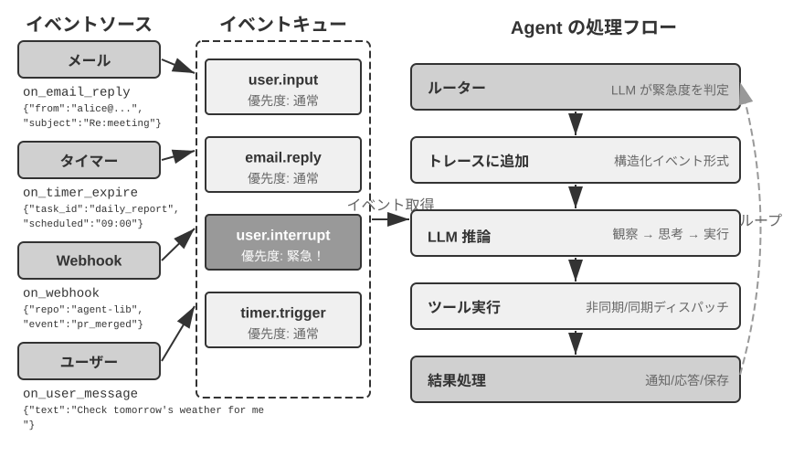

### OpenClaw におけるイベント駆動機構の実装

オープンソースフレームワークの OpenClaw（第 5 章でそのアーキテクチャを詳しく紹介します）は、Gateway 制御プレーンを通じてマルチチャネルのメッセージを受信し、Agent ランタイムへルーティングします。それは 3 種類の組み込みの自動化機構を提供します。

- **Hooks（イベントフック）**：セッションの作成、リセットなど、Agent のライフサイクルにおけるイベントに応答するもので、GitHub Actions におけるイベントトリガーに似ています
- **Cron（定時スケジューラ）**：cron 式（Unix システムで広く使われる定時タスクの構文で、`0 9 * * 5` は毎週金曜午前 9 時を表す）に従って周期的なタスクを実行するもので、毎週金曜に週報を生成する、毎月初にデータを集計するなど
- **Heartbeat（ハートビートのデーモンプロセス）**：N 分ごとに一度 Agent を呼び覚まし、注目すべき事項があるかを確認するもので、判断力によってアラート疲れを避けます

この 3 種類の機構は OpenClaw Agent に「自律的」な外観を与えます——ユーザーがオンラインでなくても、Agent は定時でレポートを生成し、システムの状態を確認し、ルーティンの事務を処理できます。しかし仔細に検討すると、1 つの根本的な限界に気づきます。まず一点整理しておく必要があります。Gateway が組み込みチャネル（IM、Web インターフェースなど）のメッセージを扱う仕方そのものは**プッシュ式**で、メッセージが届くとすぐに Agent へルーティングされます。3 種類の自動化機構のうち、ユーザーのメッセージがないときに Agent を本当に「自ら動かす」のは Cron と Heartbeat だけで、しかもそれらはいずれも**時間駆動**です——Heartbeat は一定間隔ごとに一度確認し、Cron は事前設定した時刻にトリガーし、Hooks はフレームワーク内部のライフサイクルイベントに受動的に応答するだけで、外部世界の新しい変化を持ち込むことはできません。真の弱点はこうです。組み込みチャネル以外の任意のサードパーティのイベントソース——1 通の新着メールの到達、1 つの外部 API のコールバックのプッシュ、直ちに処理すべき緊急通知——に対して、OpenClaw は即時に接続するチャネルを欠いており、Agent はイベント発生の瞬間に応答することができず、次の Cron/Heartbeat の周期を待ってはじめて気づける可能性があるのです。

この遅延は多くのシーンで受け入れられません。**PineClaw**（Pine AI の OpenClaw プラグイン）を例に取りましょう。Pine AI はユーザーに代わって実際の電話をかける AI アシスタントで、典型的なシーンには料金の交渉、サブスクリプションの解約、保険金請求の処理などがあります。ユーザーが OpenClaw Agent を通じて Pine の電話タスクを起動すると、Pine の音声 AI がユーザーに代わって電話をかけますが、通話の過程でいつでもユーザーの介入が必要になる可能性があります。

- **リアルタイムの本人確認**：カスタマーサービスがアカウント保持者の本人確認を求め、Pine はユーザーに直ちにセキュリティコードや OTP（ワンタイムパスワード）認証コードを提供してもらう必要がある
- **三者通話の確認**：カスタマーサービスがアカウント保持者と直接話すことを求め、Pine はユーザーに数秒以内に電話に出てもらう必要がある
- **進展の同期と意思決定の確認**：交渉が重要な節目（相手が値下げ案を提示するなど）に至り、Pine はユーザーに受け入れるかどうかを確認してもらう必要がある

もし Heartbeat の定時ポーリングに頼るなら——ハートビート間隔が 5 分だと仮定すると——ユーザーはカスタマーサービスが認証コードを待っている間に通知をなかなか受け取れず、カスタマーサービスに電話を切られて通話が失敗する恐れがあります。一方、ポーリング間隔を秒レベルに短縮すると、大量の無効なリクエストとリソースの浪費を招きます。

PineClaw の解決策は **Channel 機構**を導入することです——OpenClaw の Gateway と Pine API の間にリアルタイムのイベントチャネルを確立します。電話が接続された、ユーザーの入力が必要、通話が終了した、といった重要なイベントが発生したとき、メッセージが即座に OpenClaw Agent へプッシュされ、Agent は直ちに処理してユーザーに通知し、応答遅延が分レベルから秒レベルへと下がりました。

この事例は、イベント駆動アーキテクチャが Agent フレームワークに対して持つ核心的な価値を明らかにします。**真の「能動的なサービス」は、Agent が定時でイベントを確認できることだけでなく、イベントが能動的に Agent へ通知できることをより一層必要とする**のです。すべての入力——ユーザーメッセージ、ツールの返り、外部のコールバック、定時のトリガー——を統一してイベントストリームとしてモデル化し、イベントループを通じて Agent の思考と行動を駆動することが、この目標を実現するアーキテクチャの基盤です。このアーキテクチャのもとで、以下ではまずイベントに直接関わる 2 種類のツール、および Agent の独立した行動を支える仮想アイデンティティと隔離された実行環境を紹介し、その後にイベント処理機構の具体的な設計を論じます。

### イベントトリガーツール

イベントトリガーツールは外部イベントが Agent の行動を駆動する入り口です。イベントトリガーツールがなければ、Agent は連続してループしながら思考し、ツールを呼び出し、最後に 1 つの結果を出力して、それからユーザーの次の入力を待つことしかできません。世界の変化を Agent が処理できるイベントへ転化させるために、よくあるイベントトリガーツールには 3 種類あります。

**タイマー**（set_timer）は物理的な時間に依存するイベントを処理します。例えば、メールを 1 通送ったが相手が返信しない場合、しばらくして進展を尋ねるメールをもう 1 通送るべきです。電話をかけたが相手が勤務時間外だった場合、次の勤務時間になってから再度かけ直す必要があります。そのために OpenClaw、Claude Code などのツールはいずれもタイマーツールをサポートし、指定した物理的な時刻に自らを呼び覚まします。**一度きりのタイマー**は明確な時点のあるタスクに使います。例えばユーザーが「DMV に電話して」と求めたが今が土曜日なら、Agent は「来週月曜午前 10:00 に DMV へ電話する」を設定し、タイマーがトリガーされると自動的にかけます。**繰り返しタイマー**は周期的なタスクに使います。例えば 1 時間ごとにサーバーの健全性を確認する、毎週金曜に進展報告を送る、などです。さらに、一部の外部サービスは能動的に進展をプッシュできず、能動的に進展を照会するしかないため、この場合は繰り返しタイマーで定時に繰り返し照会する必要があります——前節の OpenClaw の Heartbeat はまさにこの機構を体系化したもので、OpenClaw が「能動的なサービス」の能力を備える根源でもあります。

**バックグラウンドタスクの監視**（monitor_shell）は、非同期に実行されるツールやコマンドラインタスクから届くイベントを処理します。一部のコマンドラインタスクは長時間バックグラウンドで実行する必要があり、Agent は実行の進展を監視する必要があります。もし Agent に絶えず「コマンドラインを見張らせる」、つまり絶えずツールを呼び出して現在の進展を照会させれば、あまりに多くの token を浪費します。もしコマンドラインタスクが完全に実行し終えてから Agent に思考と行動を始めさせれば、Agent は実行過程の深刻な問題を適時に発見できず、それどころかコマンドラインが固まった場合に介入できず、タスク全体が固まってしまいます。Claude Code がこの問題を解決する方法は monitor（監視）ツールを導入することで、Agent がコマンドラインの新規出力や特定のキーワードを含む出力を監視できるようにします。

**外部イベントチャネル**（connect_channel）は、新着メールの到達、API のコールバック、IM メッセージなどの外部イベントを Agent へリアルタイムにプッシュします。前節の PineClaw の Channel 機構がまさに典型的な実装です。

設計のレベルでは、イベントトリガーツールは明確なトリガー条件とフィルタリングのルールを定義し、無関係なイベントが Agent を呼び覚まして計算力を浪費するのを避けるべきです。イベントのペイロード（payload）は十分なコンテキスト情報を含み、Agent が呼び覚まされた後にさらに追加で照会する回数を減らすべきです。

### ユーザーコミュニケーションツール

OpenClaw のセッションはユーザーから見えず、専用ツールで画像・ファイル・プッシュ通知を含むメッセージをいつでも交換できます。マルチモーダル通信や Generative UI も扱います。

ユーザーコミュニケーションツールは、Agent とユーザーのコミュニケーションチャネルが日増しに多様化する状況のもとで生まれたものです。多くの Agent（Claude Code、Manus、Genspark など）はネイティブな ReAct ループを採用しており、Agent が「話す」すべての言葉（すなわち assistant メッセージ）が直接ユーザーへ送られ、ユーザーは App で指定した session を開いてはじめて Agent と対話できます。OpenClaw はこの人機コミュニケーションのパラダイムを打ち破った汎用 Agent の最も影響力ある代表の 1 つです。その session はユーザーに対して透明です——ユーザーは session の存在を意識する必要もなく、Agent がツールを呼び出す細部を気にする必要もありません。ユーザーと Agent はどちらもいつでも相手にメッセージを送れ、ユーザーが 1 通送り、Agent が 1 通返すという形ではありません。そのため多くの人が OpenClaw は「生身の人間らしさ」を備えていると評し、まるで秘書のようにテキストメッセージを通じてユーザーと非同期にコミュニケーションします。このとき、これらのテキストメッセージは直接モデルが出力した assistant メッセージをユーザーへ出力するのではなく、専用のツールを使ってメッセージを送るもので、これらのメッセージには画像やファイルの添付を伴うこともでき、緊急度に応じてプッシュ通知リマインダーを伴うこともできます。

テキストの方式でユーザーとコミュニケーションするほかに、ますます多くの Agent がマルチモーダルなコミュニケーション能力を備えつつあります。例えば構造化カードメッセージの送信、リマインダーメールの送信などです。一部の Agent はすでに生成的 UI、すなわち HTML などの方式でインタラクティブなインターフェースを生成し、より親しみやすい方式で情報をユーザーに提示することを試み始めています。設計のレベルでは、ユーザーコミュニケーションツールは非同期メッセージのモード（ユーザーが必ずしもオンラインとは限らない）をサポートし、既読/未読の状態追跡を提供し、マルチチャネルのシーンでメッセージの一貫性を保つべきです。

**マルチチャネルのユーザーコミュニケーションと呼び戻し。**

ここで混同しやすいカテゴリの境界を整理しておく必要があります。同じ「通知を送る」でも、通知の対象が承認者や協力者（管理者に承認を求める、協力 Agent に進展を報告する、など）であれば、そのツールは協調ツールに分類されます。通知の対象が最終ユーザー本人であってはじめて、ユーザーコミュニケーションツールに分類されます。両者の違いはチャネルにあるのではなく、「誰に、なぜ通知するのか」にあります。

**Agent の応答は単一のチャネルに限られるべきではなく、通知機構は同時にユーザー呼び戻しの機構でもあります**。メッセージの送信は、インスタントメッセージ、SMS、メール、電話、プッシュなど多様なチャネルへ拡張されます。Agent は緊急度、ユーザーの状態、内容の性質、ユーザーの選好を総合してチャネルの選択を決め、重要なメッセージを逃さないことを保証しつつ、重複した打診を避けます。

長時間実行のタスクについては、Agent は完了時に能動的にユーザーへ通知し、ユーザーの注意を呼び戻す必要があります。定期的なタスク（日次サマリー、週報など）については、通知はユーザーが固定的なインタラクションの習慣を築くのを助けられます。

ユーザーコミュニケーションツールは「いかにユーザーに到達するか」を解決しました。しかし Agent がどんなアイデンティティでこれらのチャネルに現れ、どんな環境でユーザーを代表して操作を実行するかには、なおアイデンティティと環境の一層の基盤インフラが必要です。これが次節のテーマです。

### 仮想アイデンティティと隔離された実行環境

仮想コンピューターは 24 時間稼働でき、ローカルファイルへの自由なアクセスを防ぎ、Agent の誤操作の影響を仮想環境に閉じ込めます。データ交換は共有ファイルシステム上のパスで行います。

まず本節の位置づけを説明しておきます。仮想アイデンティティと隔離された実行環境は本質的に実行環境の基盤インフラの一種であり、前述の実行ツールの節で論じたサンドボックスと一脈相通じています。それをこの非同期アーキテクチャの節で展開するのは、独立して常駐実行でき、いつでもユーザーを代表して行動できる Agent こそ、それを最も切実に必要とするからです。

本章の冒頭で触れたように、『Her』の Samantha は独立したアイデンティティと操作環境を持っていました。このような汎用アシスタントを実現するには、まず 1 つの重要なアーキテクチャ上の選択に直面します。Agent はユーザーの個人アカウントを直接管理すべきか、それとも自分自身の仮想アイデンティティを持つべきか。直接管理は一見便利ですが、ひとたび Agent がエラーを起こしたり突破されたりすると、ユーザーのすべてのデジタルアイデンティティが露呈してしまいます。より穏当な方策は、Agent に一組の独立した仮想アイデンティティを与えることです——秘書が自分のオフィス電話とメールアドレスを持つように。この一組の仮想アイデンティティには専用の通信アカウント、ストレージ空間、計算環境が含まれ、Agent が透明なアイデンティティでユーザーを代表して働けるようにします。アイデンティティの明確さは信頼を削ぐどころか、かえってコミュニケーションの真正性を高めます。

仮想アイデンティティは隔離された実行環境の上に落とし込む必要があります。**仮想コンピュータ**（VM/コンテナ）と**仮想スマートフォン**（Android エミュレータ）は、Agent にオペレーティングシステムレベルの隔離と完全なデスクトップ/モバイルの操作能力を提供します。Agent はその中で自分のユーザーアカウント、ホームディレクトリ、ログイン認証情報を持ち、すべての操作は追跡・監査可能です。たとえ誤った操作を実行しても、ホストシステムやユーザーの実際のデバイスには影響しません。これは前述の実行ツールの節で論じたサンドボックスの思想を「デジタルアイデンティティ」の次元へ延伸したものです——サンドボックスが隔離するのはコードの実行ですが、仮想コンピュータと仮想スマートフォンが隔離するのはデジタルアイデンティティ全体です。

独立したアイデンティティは 2 つの現実的な課題ももたらします。1 つは**反自動化の機構**です。多くのウェブサイトは CAPTCHA 認証コードと IP レピュテーション検知で自動化アクセスを遮断し、データセンターの IP から来る仮想環境は容易に識別されるため、実践ではしばしば住宅プロキシネットワーク（実際の家庭の IP を使う）を設定してはじめて正常にアクセスできます。もう 1 つは**ユーザーの実際のアカウントにアクセスするシーン**です。タスクがどうしてもユーザー本人のアイデンティティでログインしなければならない場合は、Human-in-the-Loop 認証を採るべきです——VNC/RDP のリモートデスクトップを通じて、ユーザーが可視化された環境で自らログインを完了し、ユーザーは Agent が操作している完全なインターフェースを見られ、なぜ認証が必要かを理解できます。認証後のセッショントークンは有効期限内は再利用され、ユーザーを頻繁に中断させるのを避け、自律性と安全性の間でバランスを取ります。

主 Agent と仮想環境の間のデータ交換は**共有ファイルシステム**を通じて完了します。ボリュームマウントの方式（`/workspace/shared` など）で主 Agent、仮想コンピュータ、仮想スマートフォンを接続し、データは内容のコピーではなくファイルパスの参照として伝達され、コンテキストウィンドウを占めるのを避けます。データ分析タスクを例に取りましょう。ユーザーが CSV ファイルを共有ディレクトリにアップロードすると、仮想コンピュータの中の Agent がファイルを読み取り、分析を実行し、グラフを生成して共有ディレクトリに保存し直し、主 Agent はグラフのファイルパスをユーザーに返すだけでよいのです——各方面の間で伝達されるのは常に軽量なパス文字列だけです。

イベントトリガーツールは世界が Agent を呼び覚ませるようにし、ユーザーコミュニケーションツールは Agent がユーザーに到達できるようにし、仮想アイデンティティと隔離された実行環境は Agent が独立した、監査可能なアイデンティティで行動できるようにします。残る問題はこうです。複数のイベントが同時に同じ Agent インスタンスへ押し寄せたとき、どう処理すべきか。

### イベント処理機構

1 つの Agent インスタンスは同時に複数のイベントに直面する可能性があります。ユーザーの新しいメッセージ、ツールが返した結果、タイマーの満了、別の Agent の協調リクエストです。これらのイベントをいかに効率的かつ正しく処理するかは、性能とユーザー体験を直接左右します。

この機構の骨格は、並行プログラミングにおける**イベントループ**（event loop）です。非同期 Agent は長期にわたって走り続けるループと見なせます。毎ラウンド、入力キューからいくつかのイベントを取り出して軌跡に追加し、1 回 LLM を呼び出し、それが決めたツールを実行し、そしてループの先頭へ戻って次のバッチのイベントを待つ——これは Go の goroutine が channel からメッセージを読み取り、`for { select { ... } }` の中で一ラウンドずつ処理するのと同じ構造です。このモデルには一つの鍵となる性質があります。**イベントは各ラウンドの境界でのみ消費される**のです。LLM が推論している最中、ツールが実行されている最中には、新たに到着したイベントが割り込んで現在のステップをかき乱すことはなく、まずキューで待機し、本ラウンドが**セーフポイント**（ひと区切りの推論の終わり、一度のツールの返り）に達してから一括して処理されます。キャンセルも同じ規律に従います。任意の時点で強引に断ち切るのではなく、セーフポイントで「停止を要求されているか」を確認する——これはまさに Go における `ctx.Done()` が担う役割です（第 10 章では同じ context の発想で、親 Agent がサブ Agent を連鎖的にキャンセルする話を論じます）。この点を理解すれば、以下の 3 つの処理戦略の違いは、セーフポイントの扱い方の違いに過ぎないとわかります。イベントを次に自然に訪れるセーフポイントまで待たせる（キュー式）、能動的にセーフポイントを前倒しで作り出す（キャンセル式）、あるいはいっそ別のループを立ち上げて主ループのセーフポイントを待たない（並列式）のいずれかです。

**イベントの構造化モデリング。**

処理の前提は理解です。汎用 Agent が直面する入力はユーザー 1 人から来るものだけではありません——サードパーティから届いたメッセージはユーザーが Agent に送ったものではありませんが、Agent はそれを理解し、その重要性を評価し、どう介入するかを決める必要があります。これは各入力を豊かな意味を含む**構造化イベント**としてモデル化することを要求します。

- **出所（誰）**：ユーザー本人、連絡先、見知らぬ相手、システム通知
- **チャネル（方式）**：電話音声、SMS、インスタントメッセージ、メール、ソーシャルメディア、タイマーのトリガー、非同期ツール呼び出しの結果、コマンドライン監視の状態更新
- **内容（何）**：メッセージのテキスト、感情の色合い、緊急度、返信が必要か否か
- **コンテキスト（背景）**：以前のある対話への返信なのか新規に起こしたコミュニケーションなのか、現在のタスクとの関連

顧客の返金リクエストのメールを例に取ると、構造化イベントの具体的な形式は次のとおりです。

```javascript
{
  "source": {"type": "email", "sender": "client@example.com"},
  "channel": "gmail_webhook",
  "content": {"subject": "退款请求", "body": "订单 #12345 希望退款..."},
  "context": {"priority": "high", "customer_tier": "vip", "related_orders": ["#12345"]}
}
```

これらの次元が明確に構造化イベントとしてモデル化されてはじめて、Agent は多者間の通信のなかで明晰な認知を保ち、ユーザー入力をツール結果と取り違えたり、指示の潜んだツール結果をユーザー指示と誤認してプロンプトインジェクションを招いたりするのを避けられます。マルチスレッドのコンテキスト管理の複雑さは、さらに Agent が複数の対話スレッドの間の関連を理解することを要求します——サードパーティから来たメッセージがいかにユーザーの感情に影響するか、複数の対話におけるユーザーの役割の転換、いつ異なるスレッドの情報を総合してアドバイスを提供すべきか。n8n などのワークフロープラットフォームのトリガーのエコシステムから見て取れるように、Webhook、タイマー、メール、データベースの変更、ファイルの監視——各種のトリガーはいずれも Agent が世界を知覚する 1 つの「感覚器官」です。これらの異種のイベントが統一して構造化形式にモデル化された後、Agent は異なる出所から来る刺激を一貫した方式で処理でき、以下の緊急度の判定と処理戦略もすべてこの統一モデリングの上に成り立っています。

**緊急度に基づく動的な処理戦略。**

人間は複数のタスクを処理するとき、緊急度に応じて異なる戦略を採ります。突発的な緊急事態に直面すると、直ちに手元の作業を止めます。通常の処理待ちの事項に直面すると、タスクリストに加えて後で処理します。Agent のイベント処理もこのような賢さを体現すべきです。

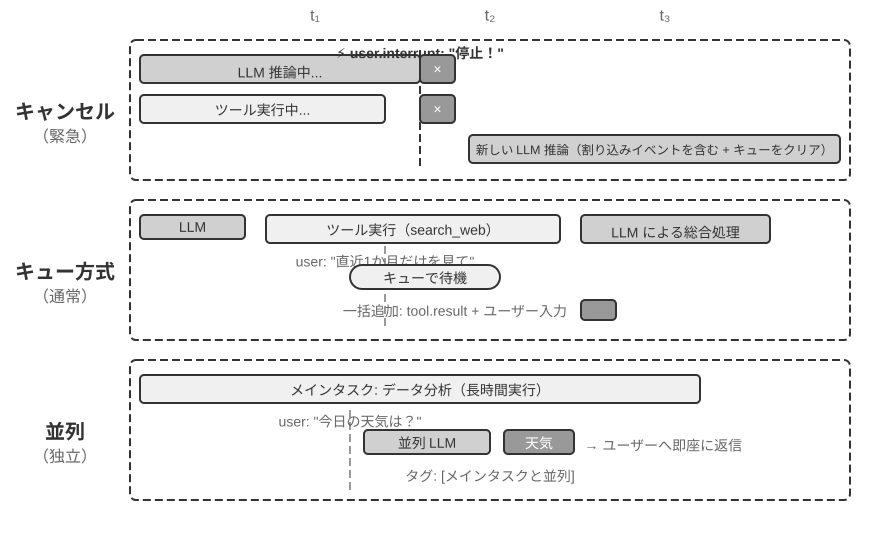

**キャンセル式処理（Cancellation-Based）**は緊急イベントに使います。その本質は、緊急イベントのために**セーフポイントを前倒しで作り出す**ことにあります。能動的に現在のステップを中断し、その瞬間を新しいイベントを消費できる境界に変えるのです。緊急イベントが到達したとき（ユーザーが「停止」をクリックする、または監督システムが高優先度の指示を送ってくるなど）：(1) 現在の操作を停止する——LLM が推論中なら直ちにストリーミング応答をキャンセルし、同期ツールが実行中なら取消信号を送る。(2) 処理待ちキューを空にし、すべてのイベントを取り出す。(3) キュー内のイベントと緊急イベントを一緒に軌跡の末尾に追加する。(4) 直ちに LLM を再度呼び出し、更新後の完全な軌跡を入力として状況を評価する。例えば、Agent が誤りかもしれない操作を実行しているときにユーザーが「止めて！ 言い間違えた」と入力すると、Agent は直ちにこの新しい入力を目にし、真の意図を理解し直し、誤った操作の実行を避けます。

**キュー式処理（Queued）**は通常のイベントに使います。非緊急のイベントが到達したとき（非同期ツールが結果を返す、またはユーザーが補足情報を送ってくるなど）：(1) イベントをキューの末尾に入れ、現在の操作を中断しない。(2) 現在の操作の完了を待つ——LLM に推論を完了させ、同期ツールに実行を完了させる。(3) いずれかのツール呼び出しが完了して `tool.result` を返したとき、キューを確認し、キューが空でなければすべてのイベントを一度に軌跡へ追加する。(4) LLM が更新後の軌跡を総合的に処理する。これはバッチ処理を実現し、効率を高めます——例えば Agent が検索ツールを呼び出した後、待機中にユーザーが「直近 1 か月の結果だけ見て」と補足すると、この補足情報がキューに入り、検索結果が返ったときに 2 つのイベントが一緒に LLM に提示され、不要な往復を避けます。

**並行処理（Parallel）**は独立した軽量なクエリに使います。例えば Agent が大量のデータを分析している最中に、ユーザーが突然「今日の天気はどう？」と尋ねるような場合です。この種のクエリには 3 つの特徴があります。主タスクと無関係、素早い応答が必要、実行コストが低い。キャンセル式処理を使うべきでもなく（重要な主タスクを中断してしまう）、キュー式処理を使うべきでもありません（ユーザーを長く待たせてしまう）。システムはまずクエリの独立性と複雑さを判断し、それから 1 つの並行した推論セッションで独立して実行し、必要なツールを呼び出して応答を生成した後、直ちに返します。クエリと応答は主タスクの軌跡に追加され、「主タスクと並行して実行」と明確に標示され、LLM の混同を避けます。

**緊急度の判定。**

緊急イベント：ユーザー割り込み（`user.interrupt`）、監督指示（`supervisor.instruction`）、Agent 間割り込み（`agent.interrupt`）、緊急と標示された外部トリガー（システムアラート、決済失敗など）。

非緊急イベント：通常のユーザー入力（`user.input`）、Agent 入力（`agent.input`）、ツール結果（`tool.result`）、タイマーのトリガー（`timer.trigger`）、通常の外部トリガー。

ハードコードされたルールには限界があり、イベントの意味が処理方式を決めます——「すぐ止まって」はキャンセル式、「今日の天気はどう」は並行式、「レポートは中国語で送って」はキュー式です。**軽量な分類 LLM をイベントルーターとして使う**ことをお勧めします。イベントの到達時に、どの戦略を採るべきかを素早く判断させます。

以下では、イベント駆動のメール処理 Agent の実験を通じて、上述のイベント処理戦略を実行可能な実装へと落とし込みます。

> **実験 6-1 ★★★：イベント駆動のメール処理 Agent**
>
>
> 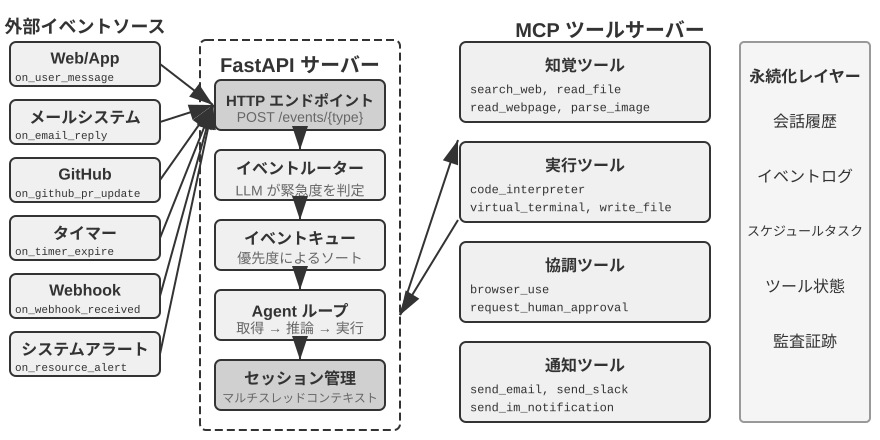
>
>
> 本実験では、最も単純なイベント駆動 Agent、すなわち**自動メール処理アシスタント**を構築します。Agent はメールの受信箱を監視し、新着メールを受け取るたびに自動的に処理フローをトリガーします——分類、要約、返信のドラフト作成、必要ならユーザーへの通知です。これはイベント駆動 Agent の最も直感的な入門シーンです。1 つの外部イベント（新着メールの到達）が 1 回の完全な Agent 思考ループをトリガーします。
>
> **実験の目標**は、イベント駆動の核心的な概念を理解することです。Agent はもはや受動的にユーザー入力を待つだけの存在ではなく、外部イベントに応答して能動的に行動できるのです。この実験を通じて、読者はイベントソースの登録、イベントキュー、そして「イベントの到達 → Agent の処理 → 結果の出力」という基本的な閉ループを習得します。
>
> **イベントソースとイベントキュー。**
>
> システムは多様なイベントソースの統一された接続をサポートします。
>
> - **メールイベント** (`on_email_received`)：受信箱を定期的に確認するか、プッシュ通知を受け取ることで、新着メールの到達時にトリガー
> - **IM/SMS メッセージ** (`on_im_message`、`on_sms_message`)：インスタントメッセージのトリガー
> - **GitHub イベント** (`on_github_pr_update`、`on_github_issue_update`)：PR review の意見、状態の変化
> - **タイマーのトリガー** (`on_timer_expire`)：定時タスク（日次サマリー、週報生成など）
> - **Webhook** (`on_webhook_received`)：汎用の外部システムのコールバック
> - **システムイベント** (`on_user_inactive`、`on_process_timeout`、`on_resource_alert`)：内部状態の変化
>
> すべてのイベントは統一された**イベントキュー**に入り、到達順に順次処理されます。各イベントは 1 回の独立した Agent 思考ループをトリガーします。Agent はイベントの内容を読み取り、関連するツール（知識ベースの照会、添付ファイルの読み取り、関連するメール履歴の検索など）を呼び出し、処理結果（分類ラベル、要約、ドラフト返信）を生成し、最後に通知ツールを通じてユーザーに知らせるか、直接操作を実行します。
>
> **検証シナリオ**：Agent をテスト用メールアドレスの監視に設定します。3 通のメール——会議招待、顧客からのクレーム、マーケティング広告——を受け取ったとシミュレートします。Agent は順に処理します。会議招待にはカレンダーの衝突を自動的に確認して承諾/辞退の返信をドラフトし、顧客のクレームには重要な情報を抽出して高優先度に標示しユーザーに処理を通知し、マーケティング広告は自動的にアーカイブします。この過程全体でユーザーの介入は不要です。

実験 6-1 は最も単純なイベント駆動のパターン——イベントがキューに入り、Agent が順次処理する——を示しました。しかし Agent が長時間実行のツール実行の過程で割り込みに応答する必要がある場合、あるいは複数の並行タスクを同時に管理する必要がある場合には、単純なイベントキューでは足りなくなります。続いてより深いエンジニアリング上の課題を論じます。

### エンジニアリング実装：いかに同期モデルに非同期割り込みをサポートさせるか

実験 6-1 は直列のイベントしか処理しません——イベントは順にキューに入り、Agent が 1 つずつ処理し終えます。ここで本節冒頭で提出した「訓練は同期/デプロイは非同期」の矛盾に戻ります。ツールがまだ返っていないときにユーザーが突然割り込んだら、同期の形式はそれをどう受け止めればよいのか。本節では現在の業界のエンジニアリング的な解法を示します。

まず具体的なシーンでこの矛盾を説明します。Agent がユーザーのためにメールをドラフトしている（ツール呼び出し：連絡先情報の検索）最中、検索がまだ結果を返していないときに、ユーザーが突然「ちょっと待って、先に明日の天気を調べて」と言ったとします。同期の ReAct ループでは、Agent は検索が返ってからでないと次のメッセージを処理できません——API が「ツール呼び出しを発した後、次のメッセージは必ずツール結果でなければならない」と要求するからです。しかし非同期の現実世界では、イベントはいつでも進行中のタスクに割り込む可能性があります。「同期の形式」の制約のもとで「非同期の割り込み」の意味論をいかに表現するか、これがまさに以下の一連のエンジニアリング方策が答えるべき問題です。

**エンジニアリング上の便法：同期を模擬する非同期実装。**

核心的な発想はこうです。**割り込みが起きない常態のもとでは、LLM に標準的な同期の軌跡を見せ、割り込みが起きたときにだけプレースホルダーを挿入して形式を修復する**。以下は 5 つの主要なルールです。

**ルール 1**：LLM が出力するとき、直ちに assistant message（thinking、content、tool call を含む）を記録する。

**ルール 2**：ツール呼び出しが完了したときにはじめて tool result を記録する。実行中の軌跡は「部分完了」の状態にある。

**ルール 3**：ツール実行中の割り込みにはプレースホルダーが必要。未完了のツールにプレースホルダーの応答（「ツールはバックグラウンドで実行中です。新しいイベントを優先して処理してください」など）を生成し、割り込みイベントを追加し、LLM を再度呼び出す。LLM の視点から見れば、assistant message にはなお対になった tool result がある。

**ルール 4**：LLM の思考中の割り込みは現在の思考を直接破棄する。軌跡には書き込まず、新しいイベントを直接追加してから新たな 1 ラウンドの思考を開始する。

**ルール 5**：非割り込みのイベントはキューに入れてバッチ処理を待つ。現在の周期が完了してからはじめて一度に追加する。

Agent がメールをドラフトしている最中にユーザーが割り込んで天気を尋ねる場合を例に、この 5 つのルールの動作の過程は次のとおりです。

1. Agent が `search_contacts` を呼び出して連絡先情報を検索し、assistant message が直ちに軌跡に書き込まれる（ルール 1）。
2. 検索ツールがまだ結果を返していないときに、ユーザーが「先に明日の天気を調べて」と送ってくる。これはユーザーの割り込みなので、システムは未完了の `search_contacts` のためにプレースホルダーの tool result（「ツールはバックグラウンドで実行中です。新しいイベントを優先して処理してください」、ルール 3）を生成し、それからユーザーの天気クエリを軌跡に追加し、LLM を再度呼び出す。この時点で LLM が見る軌跡の形式は完全に合法です——assistant message と tool result の対がきちんと保たれています。
3. 天気クエリが完了してユーザーに返信した後、先ほどの `search_contacts` の結果が到達し、新しいイベントとして軌跡に追加され（ルール 2）、Agent は連絡先情報を読み取った後、メールのドラフトを続けます。

この方策の核心的な利点はこうです。**常態のもとで LLM が見るのは完璧な同期の軌跡である**——assistant message と tool result が厳密に対になり、時間順が明晰で、いかなるプレースホルダーや異常状態もありません。これは現在の同期の訓練パラダイムに基づく LLM にとって最も親和的であり、思考の質を最大限に保証します。本当に割り込みが必要なときにだけ、プレースホルダーという「必要な妥協」を導入するのです。

しかしなおハルシネーションを助長するリスクが存在します。このシーンでは、プレースホルダーがツールが「まだ完了していない」ことを明確に説明していても、システムは後続の思考で 1 つのツール結果を「捏造」し、ツールがすでに有効なデータを返したと誤解し、この虚構の結果に基づいて不適切な意思決定を下してしまう可能性があります。これは、モデルが訓練時に見た大多数の軌跡では、ツール呼び出しの後にすぐ本物の結果が続いており、「結果がまだ返ってきていない」状況をどう処理するかを一度も学んでいないからです。したがって実践では、本当に緊急なとき（ユーザーが明確に停止を求めたとき）にだけ割り込み、非緊急のイベントはキューに入れてバッチ処理します。

**既存のモデルに適した非同期ツールインターフェース。**

モデルの同期の前提を突破するのが難しい以上、より根本的な戦略は、**ツールインターフェースの設計のレベルから非同期の意味論を受け入れる**ことです。

従来のツール設計は「呼び出せば完了」という意味論を暗に含んでいました。例えば `phone_call` という名前は「呼び出せば電話をかけて通話の終了を待ち、通話記録を返す」ことを暗示します。非同期パラダイムでは「起動」と「完了」を分離すべきです。

- `initiate_phone_call`：電話の発信を起動し、直ちにタスク識別子と初期状態（「呼び出しを発起、ダイヤル中」など）を返す
- 通話の進展はイベント通知（`phone_call_connected`、`phone_call_ended`）を通じて伝える

肝心なのは、ツールの名前と記述そのものが非同期の意味論を伝えることです。モデルが `initiate_phone_call` を見ると、その言語理解能力が自然に「起動」であって「完了」ではないと推論します。ツール記述はさらにこれを強化すべきです。「このツールはサブ Agent が処理する電話タスクを起動します。タスクが正常に発起されると直ちにタスク ID を返し、あなたは他の事項の処理を続けられます。通話が終了すると別途通知イベントを受け取ります。」

**キュー式処理における注意力の分散問題。**

バッチのイベント処理では、モデルはしばしば最後の 1 つのイベントにしか注目しません。根源は、**モデルが最新の入力に反応するよう訓練されているのに、バッチのイベントがこの前提を破っている**ことにあります。

2 つのレベルから介入できます。

**プロンプトのレベル**：モデルに「複数の連続したイベントを受け取ったときは、すべての情報を漏れなく考慮するようにしてください」と告げる。

**Agent ステータスバーの標示**：各イベントの前に明示的な標示を加える。

```text
[未処理イベント 1/4] Tool result from database_query：...
[未処理イベント 2/4] User の補足説明：北京地区のデータだけ見て
[未処理イベント 3/4] システムリマインダー：レポートの締切まであと 30 分
[未処理イベント 4/4] User の質問：進捗はどう？
```

末尾にまとめを加える。「上には 4 つの未処理イベントがあり、1 つのツール結果、2 通のユーザーメッセージ、1 つのシステムリマインダーを含みます。応答がすべての情報をカバーするようにしてください。」

### 深層の矛盾と将来の方向

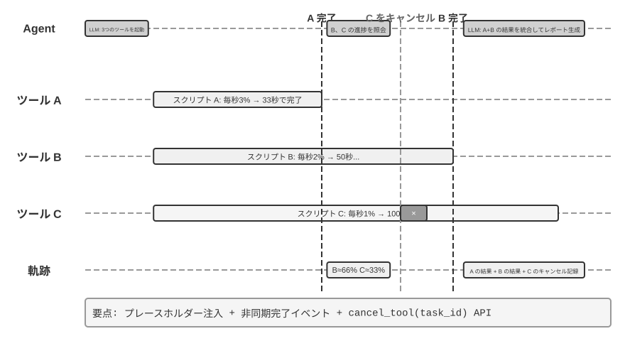


突き詰めれば、前の各節のプレースホルダー、非同期ツールインターフェース、ステータスバーの標示は、いずれも同じ「訓練は同期/デプロイは非同期」の矛盾（図6-4）をプロンプトエンジニアリングで埋め合わせるものです——この矛盾の成因は本節の冒頭で詳述したのでここでは繰り返さず、その根本的な解法だけに焦点を当てます。

**モデルの進化への期待：同期から非同期へ。**

上述のエンジニアリングの技法は本質的に**プロンプトエンジニアリングでモデル訓練の不足を埋め合わせる**もので、過渡期の便法です。真の解決策はモデル訓練のレベルでパラダイムの転換が起こることを必要とします。

ロボット分野の VLA（Vision-Language-Action、視覚・言語・行動、第 6 章を参照）モデルはすでに類似の課題に直面し始めています。知覚と行動の間には避けられない遅延が存在するのです。VLA の成功は Agent モデルの進化に方向を指し示しました。次世代のモデルは非同期環境における強化学習を通じて 3 つの核心的な能力を獲得する必要があります。

1. **軌跡におけるイベントの非同期な差し込みを理解する**：これは最も核心的な能力の欠陥です。現在のモデルは厳密な同期のシーケンスを期待しますが、真の非同期環境では、tool call の後が tool result ではなく新しい user メッセージであるかもしれず、thinking が途中まで進んだところで割り込まれるかもしれませんが、その中間状態は軌跡に保持され、新しいメッセージを処理し終えた後に最初からではなく続きから思考すべきです。モデルはこのような「順序の乱れた」軌跡のなかで明晰な認知を保つ必要があります——どのツール呼び出しがまだ結果を待っているのか、どの思考が未完了の断片なのか。
2. **割り込まれたタスクと思考を復帰させる**：緊急イベントの処理のために割り込まれた後も、未完了のタスクを覚えている。例えば Agent がデータ分析ツールを実行している最中にユーザーが突然天気を尋ねたら、答えた後は自然にデータ分析の結果を待つべきであり、ツールがまだ動いていることを忘れるべきではありません。特に、割り込まれたツール呼び出しがすでに完了したと誤解するハルシネーションを避ける必要があります。
3. **バッチのイベントの総合的な処理**：複数のイベントがバッチで軌跡に追加されたとき、最後の 1 つだけに注目するのではなく、すべての未処理の情報を総合的に考慮しなければなりません。

このような非同期 RL 訓練を実現するには新しいインフラが必要です。非同期環境のシミュレータ（ツールの遅延返却、ユーザーのランダムな割り込みなどのシーンを生成する）と、非同期能力の専用の報酬（順序の乱れた軌跡を正しく理解する、割り込まれた思考を成功裏に復帰させる、ハルシネーションを避ける、バッチのイベントを総合的に処理する）です。

継続的思考は、次世代モデルを待たなくても実現できます。約 200 行のオーケストレーションで、**既存の**テキスト推論モデルを**連続時間** Agent に変え、先ほどの工学的な便法とモデル進化をつなげられます。これはルール 4 の拡張です。中断された思考を捨てず、対話全体を途切れない思考ストリームとして構成します。実行系はモデルが書いている `<think>` ブロックを強制的に閉じ、到着したツール結果、ユーザー割り込み、認識更新などを通常のメッセージとして注入し、そのままデコードを続けます。

これは、しばしば無駄になる資源を使います。モデルは 1 秒に数百 token を生成できる一方、ツール呼び出しやユーザーの発話には数秒かかることがあります。その待ち時間を思考に使えます。したがって Agent は、部分的な情報から考え続け、次のツールを先に動かす**待ちながら考える**動作と、出力しながら推論を続け、行動の途中で自らを修正する**実行しながら考える**動作を行えます。

> **実験 6-2 ★★★：並行実行と割り込み能力を備えた非同期 Agent**
>
>
> 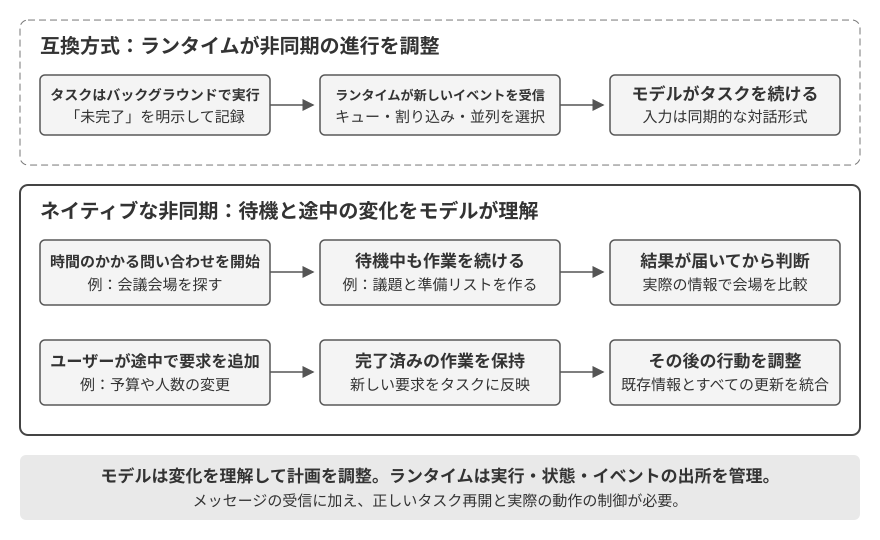
>
>
> 実験 6-1 の単純なイベントキューを土台として、本実験は非同期 Agent の深水域に入ります。**並行ツール実行、実行のキャンセル、状態管理**です。Agent はもはやイベントを 1 つずつ処理するだけではなく、複数の並行するタスクを同時に管理し、割り込みと復帰を処理し、リアルタイムの状態に応じて動的な意思決定を下す必要があります。
>
> **1. 非同期ツール実行**：時間のかかるツールの非同期実行（少なくとも 3〜5 秒）をサポートし、起動後に直ちにプレースホルダーを返す。**検証シナリオ**：Agent が長時間のターミナルコマンドを実行し、その間にユーザーが「今何時？」と尋ねると、Agent は直ちに応答し、分析結果が返ってから改めて提示する。
>
> **2. イベントキューとバッチ処理**：非緊急のイベントを蓄積し、バッチで軌跡に追加する。**検証シナリオ**：Agent が長いタスクを実行中、ユーザーが「日本語で返信するのを忘れないで」「ウェブページにまとめて」と連続して送り、タスク完了時にすべてのイベントを一度に処理し、日本語のウェブページを生成する。
>
> **3. 割り込み機構**：ユーザーの「停止」が実行フローを直ちに終了させ、非同期ツールをキャンセルする。**検証シナリオ**：Agent が長いタスクを実行中、ユーザーが「キャンセル」を送ると、Agent は直ちに停止し、軌跡に割り込みイベントとキャンセル操作を記録する。
>
> **4. 並行ツールのキャンセルと状態照会**：非同期ツールの完了後、新しいイベントを通じて本物の結果を対話に注入し、タスク ID を通じたキャンセルや進捗照会をサポートする。**検証シナリオ**：ユーザーが「この 3 つのスクリプトを同時に実行して、どれかが先に完了したら、残りのスクリプトの進捗を見て、まだ 50% を超えていなければキャンセルして」と要求する。3 つのスクリプトは分析プロセスをシミュレートし、実行中は絶えず進捗を出力し、速度はそれぞれ毎秒 3%、2%、1% とする。Agent は 3 つの非同期ターミナルコマンドを同時に起動し、毎秒 3% のスクリプトが約 33 秒後に完了すると、Agent は残り 2 つのターミナルの状態を照会し、1 つが約 66%、もう 1 つが約 33% まで実行されていることを発見し、そこで 50% を超えていないほうをキャンセルする。両方のターミナルが完了した後、結果を統合して完全なレポートを生成する。
>

非同期・イベント駆動の実行により、世界はいつでも Agent を起こせます。ただし、応答前にモデルが落ち着いて考え終えられることを前提としています。次の 3 節はこの前提を問い直します。環境がモデルの生成速度と同じかそれ以上の速さで変わるとき、「考え終えてから話す」こと自体が許容できない遅延になります。

## 音声：最も自然な人間とコンピュータのインターフェース

音声は文字を音に変えるだけではない。発話はタイピングの約4倍速く、手と視線を使わないため、いつでも割り込まれ得る連続入出力ループに Agent を置くのに適している。音声入力は発話を文字にし、音声 Agent は利用者が Agent と直接協働できるようにする。どちらも序章の whisper coding を支える。

本節では、利用者が Agent に話す場合と、Agent が利用者に代わって外界に話す場合を扱う。音声モデルは何に答えられるかを、対話構造は聞き取り、応答、発話権の交代、確認とツール呼び出しを時間内に行えるかを決める。

### 相互作用の時間構造：カスケードから全二重へ

OpenAI は GPT-Live で、音声対話をカスケード、ターンベース、全二重の三パラダイムに整理した[^ch6-12]。これは新旧の順位ではなく、遅延・コスト・観測性のトレードオフである。

| パラダイム | 構造 | 利点 | 制約 |
| --- | --- | --- | --- |
| カスケード | VAD → ASR → LLM → TTS | 交換・デバッグしやすい明確なモジュール | 遅延の累積とパラ言語情報の欠落 |
| エンドツーエンド Omni | ネイティブ音声入出力、ターン単位の対話 | 低遅延、声色・感情・環境音を保持 | ターン依存、訓練とデバッグが難しい |
| 全二重 | ネイティブ音声入出力、継続的に聞き、話し、判断 | 重なり発話と自然な割り込み | 訓練・制御・評価が複雑 |

共通する課題は、交互に話す仮定と VAD による発話権の推測を越えることだ。全二重だけが発話権を継続的なモデル判断にする。

[^ch6-12]: OpenAI. *Introducing GPT-Live.* 2026-07-08. https://openai.com/index/introducing-gpt-live/。この三分類は ChatGPT Voice の三世代をまとめた同記事に由来し、本文の Omni は「turn-based voice models」に対応する。

### パラダイム一・カスケードパイプライン（Cascading）

商用音声アシスタントの多くは直列パイプラインを使う（図6-6）。VAD が終了を判断し、ASR が音声を文字にし、LLM が回答を生成し、TTS が読み上げる。モジュール性は最適化を容易にするが、各境界が待ち時間を加える。

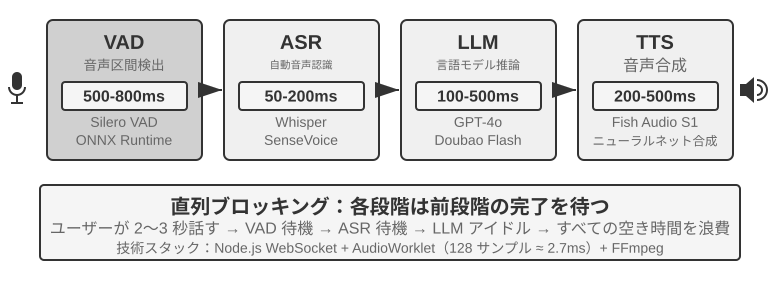

| モジュール | 役割 | ボトルネック |
| --- | --- | --- |
| VAD | 発話終了の判定 | 無音閾値による待機と誤分割 |
| ASR | 音声を文字に変換 | 認識遅延と文脈欠落 |
| LLM | 理解・思考・生成 | 最初の token の遅延、reasoning の追加待機 |
| TTS | 文字を音声に変換 | 最初のパケットと再生バッファ |

短い回答でも段階の待機は直列に累積する（図6-7）。本番のキューイングは空載遅延をさらに増幅する（図6-8）が、容量計画は本章では扱わない。

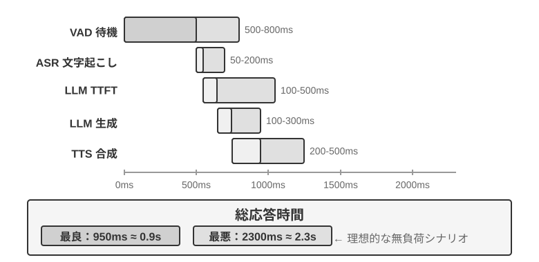

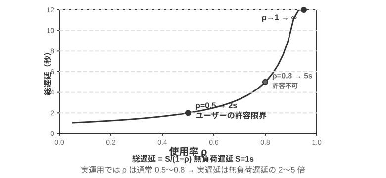

> **実験 6-3 ★：従来型音声 Agent を構築する**
>
> マイク、Silero VAD、ローカル Whisper、ストリーミング LLM、Fish S1 TTS を WebSocket で接続し、カスケード方式のベースラインを構築します。

#### 直列からストリーミング知覚へ

図6-7 が描くのは VAD + ASR + LLM + TTS が完全に直列に動く場合であり、この直列知覚には三つの問題がある。

1. **遅延の累積：** 一定の無音を待たなければ発話終了を確認できない。
2. **情報損失：** 有声／無声の二値信号ではためらい、感情、相槌、環境音を表せない。
3. **文脈の分断：** メールアドレス、人名、固有名詞が分割して認識され誤りやすい。

これを解決する一つの最適化が、モジュールの分担を保ったまま各段階に増分結果を早く出させる**ストリーミング知覚**である：

- **ASR 逐次転写：** VAD が発話開始を検出した時点から一定間隔でモデルを呼び、暫定転写を流し続ける。発話終了を検出してから最終テキストを確定する。
- **LLM 推測実行：** 暫定転写が出た時点で LLM を呼ぶ。最終テキストが暫定転写と一致すれば呼び直さず、異なれば先行する推測実行の思考を取り消して呼び直す。
- **LLM 分割出力：** 最初の読み上げに適した文ができ次第、完全な回答を待たずに TTS に渡す。
- **TTS 増分合成：** 音声チャンクを返し続け、後続の生成・合成・再生を重ねて進める。

真のストリーミング ASR にはモデル側の対応が要る。Whisper のデコードは自己回帰的だが、エンコーダは完全な音声区間を必要とするため、そのままストリーミングモデルとは言えない。LLM ベースのストリーミング聴覚モデルは連続音声からテキストと意味イベントを出力し、「認識」と「理解」の一部を同じモデルに収める。対話の開始から現時点までの文脈を保ち、ブランド名、人名、固有名詞には世界知識を利用できる。

終端判定を組み込む場合、ラベルは判断時点で見える情報だけから作る必要がある。speak_start/end、interrupt、emotion、laugh、sigh、noise のイベントを文字と一緒に出力すれば、音をすべてテキストに圧縮せず対話状態を扱える。

> **実験 6-4 ★：Qwen2-Audio でストリーミング音声知覚を模擬する**
>
> Qwen2-Audio 自体はストリーミングモデルではありません。本実験では、伸長する音声プレフィックスで連続知覚を模擬し、600 ms VAD + Whisper と比較します。

### パラダイム二・エンドツーエンド全モダリティ（Omni）

カスケードはストリーミング知覚を採っても、聞く・考える・話すが離散的なインターフェースで受け渡されるため、感情、抑揚、環境音などの情報は文字にする段階で失われ得る。Omni 方式は一つのモデルで音声を直接聞き、回答を生成し、音声を出力するため、これらの情報を保てる可能性があるが、訓練のコストは高い（図6-9）。パラダイム一のカスケード方式と比べると、Omni の利点は主に遅延と、非文字情報の理解と生成に現れる。

理解の面では、Omni モデルは声の中の間（ま）を理解できる。生成の面では、歌う、特別な語調で一文を言うといった、より豊かなパラ言語情報を伝えられる。

Omni モデルも交互に話すことを前提としており、発話権の区切りは通常 VAD に頼る。そのため、利用者が数字を読み上げる途中の無音を、発話終了と誤判定し得る。

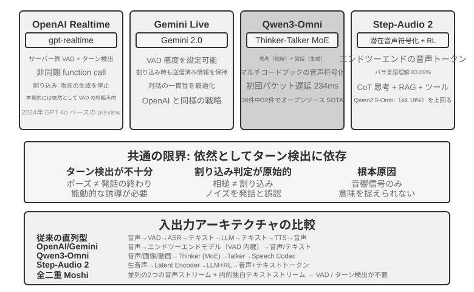

> **実験 6-5 ★★：MiniCPM-o 4.5 をローカルで実行し、エンドツーエンドと自己カスケードを比較する**
>
> MiniCPM-o 4.5 をローカルで実行し、thinking mode を無効にして、音声から直接答える経路と、同じモデルで先に文字起こししてから答える自己カスケードを比較します。測るのは音声情報が保持されるかであり、後述する**「話しながら考える」ではありません**。

### パラダイム三・全二重インタラクティブモデル

Omni は利用者とモデルの発話を分けるが、同時通訳などは重なりを要する。全二重モデルはターンを前提とせず、聞き、話し、続行・停止・割り込み・ツール呼び出しを連続的に判断する。Kyutai の Moshi は音声ストリームを並列にモデル化した初期例だ。

Thinking Machines Lab の Interaction Model[^ch6-14] は相互作用を VAD などの外部ハーネスではなくモデル内に持つ。短いマイクロターンで無音、重なり、割り込みを文脈として保ち、背景推論モデルに会話を委譲しながら話頭を維持できる。

[^ch6-14]: Thinking Machines Lab, “Interaction Models: A Scalable Approach to Human-AI Collaboration,” 2026-05. https://thinkingmachines.ai/blog/interaction-models/

### 認知の時間構造：リアルタイム対話と深い思考

対話品質と知能の上限は別の次元である。前景モデルは利用者がオンラインの間に返答し、背景モデルは長く思考できる。三つの設計は線形の進歩ではなく取捨選択であり、最初の二つはカスケードまたは Omni に組み合わせられる。三つ目だけが深い思考とリアルタイムの表現を同じモデル内に統合する。

#### 解決策一：速い思考でつなぎ、遅い思考で回答する

速いモデルが数百ミリ秒で応答し、遅いモデルが深く推論すると、簡単な質問は二重処理され、難しい質問は矛盾し得る。二つの実体が独立に考えることが原因だ。

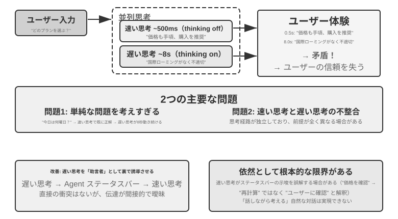

#### 解決策二：速い思考で対話し、遅い思考で助言する

背景モデルが専用インターフェースで助言を送り、前景モデルが会話を維持する。間接通信なので中間思考は見えず、真に考えながら話すことはできない。

#### 解決策三：思考と表現をエンドツーエンド統合する

MGRD は音響特徴に基づく思考を蒸留し、MPS 双脳構造は計画と表現を並列化する。構想側の思考片を表現側が部分回答と結合して音声化するため、全推論を待たずに話せる。

#### 速い思考と遅い思考の分離と、エンドツーエンド思考のトレードオフ

統合モデルは「考えながら話す」を最も直接的に実現するが、思考とリアルタイム表現を一緒に再訓練しなければならない。分離型は背景モデルを交換しやすい。両者はトレードオフであり、単純な代替関係ではない。

最先端の推論モデルが急速に進歩する現在、速い思考と遅い思考を分離する構成には重要な工学上の利点がある。遅いモデルの世代更新による恩恵をそのまま取り込めるからだ。前景の速いモデルは低遅延で聞き、応答し、会話を維持することだけを担い、背景の遅いモデルが推論、計画、ツール呼び出しを担当する。より強力な推論モデルが登場したときは背景モデルだけを交換すればよく、リアルタイム音声システム全体を再訓練する必要はない。統合型では推論と対話が同じ訓練サイクルに結び付くため、更新のたびに知能、応答遅延、表現の自然さを再調整しなければならない。したがって速い思考と遅い思考の分離は、単なる遅延上の妥協ではなく、対話能力と知能の上限を別々に進化させるモジュール化の選択でもある。

この分離がタスク性能を必ず犠牲にするわけでもない。2026 年 8 月時点で、速い思考と遅い思考を分離した Pine AI の音声 Agent は τ³-Voice Leaderboard で首位となり、Grok Voice や GPT-Realtime-2 などのリアルタイム音声システムを上回った。この結果は少なくとも、深い推論とリアルタイム対話を同時に評価するタスクにおいて、分離型アーキテクチャがエンドツーエンドモデルに本質的に劣るわけではないことを示している。[^ch6-17]

[^ch6-17]: Pine AI. “The Most Natural Human-Computer Interface Is Your Voice.” 2026-06-23（2026-08-06 更新）. https://www.19pine.ai/blog/pine-ai-the-most-natural-human-computer-interface-is-your-voice

ここで、「エンドツーエンドモデル」という語が一般に二つの意味で使われることを明確にしておく必要がある。第一は前節で扱った**音声経路のエンドツーエンド性**である。モデルが音声を直接受け取り、音声を生成し、複数のモデルを離散的なテキストでつながないことを指す。Omni と Interaction Model はどちらもこの意味ではエンドツーエンドだが、Omni は通常ターン単位で進み、Interaction Model は聞きながら話せるため、両者のアーキテクチャは大きく異なる。第二は本節で扱った**認知アーキテクチャのエンドツーエンド性**である。リアルタイム対話と深い思考が一つのモデル内で状態を共有して共同訓練されるのか、それとも前景の速いモデルと背景の遅いモデルに分けられるのか、という区別だ。この二つの軸は独立している。音声経路はエンドツーエンドでありながら、認知アーキテクチャでは速い思考と遅い思考を分離することもできる。Thinking Machines Lab が複雑なタスクを背景推論モデルへ委譲する構成は、その一例である。

### より人間らしい音声合成

従来の TTS は、滑らかすぎたり間が少なすぎたりすると機械らしさを露呈します。人間の会話では、間、つなぎ言葉、時折の繰り返しが、迷いや思考を示します。

主 LLM はテキストに加えて、**THINKING**、**EMO:happy**、**SPEED:0.8x** などの制御マーカーを出力できます。TTS はそれらを間、韻律、話速、笑い、ため息、その他の非言語音声へとマッピングします。実装は、制御マーカーを理解するよう訓練された TTS でもよいですし、さまざまな感情やスタイルの参照クリップを使ったボイスクローニングでも構いません。

> **実験 6-6 ★★: Fish Audio を使った制御トークン駆動 TTS**
>
> Fish Audio S1 を使って多参照音声ライブラリを構築し、3 つの構成——制御マーカーなし、1 つの参照クリップ、複数の参照クリップ——を比較します。実行層は、マーカーに応じて感情、話速、スタイルを選択します。


## Computer Use：GUI 自動化 Agent

ここまで読んで、本章が音声に割いた紙幅が後の 2 つの場面より明らかに多いことに気づくかもしれません――これは意図的なものです。リアルタイム・マルチモーダルというこの進化の線上で、音声は最も完全に、最も参照系とするに値するかたちで進んだ一つです。「直列パイプラインは遅延が高すぎる」というこの問題から出発し、エンドツーエンド、全二重、考えながら話す、といった一連の方式を経て、今日の相対的にかたちを成した終局まで進んでおり、問題→方式→終局の全行程がすでに走り抜けられています。だからこそ私たちはそれを徹底的に論じました。続く Computer Use とロボットの 2 つの場面は、いずれも音声のこの脈絡と対照して見ることができます――それぞれこの進化の線のどの段まで進んだのか、どこで行き詰まっているのか。

この 3 つの場面は一見異なりますが、同じ中核の挑戦に直面しています。リアルタイム知覚、低遅延の意思決定、持続的な対話です。続いて、これらの技術的主題が視覚対話（Computer Use）と物理対話（ロボット）でどう再現されるかを見ましょう――まず視点を聴覚モダリティから視覚モダリティへと広げます。もし Agent が音声を理解できるだけでなく、画面を「見て理解」し、グラフィカルインターフェースを操作できるとしたら?

Computer Use（GUI 自動化 Agent とも呼ぶ）は、AI に人間のように画面を観察し、マウスとキーボードを操作してソフトウェアを使わせます――たとえばブラウザを開いて情報を検索する、表計算ソフトにデータを記入する、システム設定で構成を調整する、といった具合です。その中核は **知覚-思考-行動** のループです（図6-11）。

1. Agent が現在の画面をスクリーンショットする
2. マルチモーダルモデルがスクリーンショットとタスク指示を受け取り、一段の思考と一つの具体的な動作を出力する
3. 実行層が現実の環境でその動作を実行する（マウスを動かす、クリックする、文字を入力する、など）
4. インターフェースの応答を待ってから再びスクリーンショットし、次のループに入る

ここでは、**インターフェースを理解すること**と**タスクを完了すること**を区別する必要があります。前者はマルチモーダル理解に近く、1 枚のスクリーンショットへの質問応答で測れます。後者は、理解と動作生成を閉ループに入れ、ページの読み込み、状態変化、誤操作、不可逆な結果を扱うことを求めます。したがって Computer Use の難しさは、スクリーンショットについて正しく答えるだけでなく、各ステップの後に現実がなお計画どおりかを再確認することにあります。


このループには 3 つの鍵となる設計次元があります。**行動空間**（Agent がどんな操作を実行できるか）、**視覚グラウンディング**（スクリーンショットの中でいかに目標要素を見つけるか）、そして **モデルアーキテクチャ**（スクリーンショットからいかに正しい動作を生成するか）です。

### 行動空間の設計

Anthropic のリファレンス実装は、完全な対話能力を 3 種類のツールに分けています（図6-12）。これは明快な行動空間の設計ですが、モデル提供者が従うべき独自プロトコルではありません。Harness が同じスクリーンショット、動作制約、実行結果を対象モデルの対応するメッセージと構造化出力へ変換できれば、Claude、オープンウェイトの視覚モデル、セルフホストしたエンドポイントのいずれでも同じ知覚-思考-行動ループを駆動できます。


**GUI 操作ツール**（computer tool）：マウス操作には移動（mouse_move）、左／右／中ボタンのクリック、ダブル／トリプルクリック、ドラッグ（left_click_drag）、そしてより細かい押下／解放（left_mouse_down/up）が含まれます。スクロール（scroll）は 4 方向をサポートし、修飾キーと組み合わせられます。キーボード操作には一字ずつの入力（type、各文字の間隔 12ms で本物のタイピングを模す）、組み合わせキー（key、Ctrl+C など）、長押し（hold_key）が含まれます。知覚動作：スクリーンショット（screenshot）、カーソル位置の取得（cursor_position）、待機（wait）。

**コマンド実行ツール**（bash tool）：持続的な bash ターミナルセッションを提供し、120 秒のタイムアウトで、番兵文字列によってコマンドの実行完了を検出し、複数回の呼び出しの間で環境の状態を保ちます（あるディレクトリに cd した後、次の呼び出しでもそのディレクトリにいる、など）。

**ファイル編集ツール**（str_replace_editor）：文字列マッチングによって安全な編集を実現し、閲覧、作成、置換、挿入、取り消しの操作をサポートします。ファイル全体を直接上書きするより正確で、他の内容を誤って書き換えにくくなります。

> **実験 6-7 ★: Computer Use を実行する（Anthropic 参照経路またはオープンモデル経路）**
>
> 経路 A は Anthropic Computer Use Demo を使います。コンテナには、ブラウザ、ターミナル、その他の一般的なツールを含む、完全な Ubuntu デスクトップ環境がパッケージされています。フロントエンドがタスクを受け取り、バックエンドが指示とスクリーンショットを Claude に送り、モデルが返したマウス、キーボード、ターミナル、編集操作を実行します。
>
> 経路 B は [`chapter6/computer-use-open-model`](../chapter6/computer-use-open-model/) のサンプルコードを使います。既定では、ホスト型の OpenRouter API を通して、あるいはセルフホストの vLLM/SGLang などを通して、オープンウェイトの Qwen3-VL 32B Instruct モデルで browser-use を駆動します。

### 視覚グラウンディング（Grounding）

ループの各ラウンドで、モデルはスクリーンショットの中で目標要素を正確に特定する必要があります――「検索ボックスはどこか?」「送信ボタンの座標は何か?」。これが視覚グラウンディング（Grounding）の問題です。現在、主に **2 つの大きな考え方** があります。一つはグラウンディングを **選択問題** に変えるもの――先にインターフェースの要素に番号を振っておき、モデルはその中から一つ選ぶだけです。もう一つは **純粋な座標予測** ――モデルに人間のように直接スクリーンショットを「見て」座標を報告させます。そのうち選択問題の考え方にはさらに 2 つの実装方式があります。**純視覚アノテーション**（オリジナルの Set-of-Mark、セグメンテーションモデルでピクセル上に候補領域を切り出す）と **構造化要素インデックス**（DOM/Accessibility Tree、インターフェースが備える構造を直接読み取る）です。選択問題の考え方の共通の利点は、開放的な「スクリーンショットの中でボタンを見つけて座標を予測する」を、閉じた「アノテーション済みの要素から一つ選ぶ」へと変えることです。試験で選択問題が穴埋め問題より正解しやすいのと同じで、モデルは「画面の (350, 464) の位置にあるボタンをクリック」ではなく「[123] をクリック」と言えばよいのです。座標を出力すること自体がモデルにとってはとりわけ難しい課題で、正確にこなすには大量の訓練が必要ですし、解像度が変わると誤りやすくもあります。

**Set-of-Mark：視覚アノテーション法。**

オリジナルの Set-of-Mark（SoM）は 2023 年にマイクロソフトリサーチが提案したもので、当初は GPT-4V の視覚グラウンディング能力を引き出すためのものでした。それは **純視覚** の手法です。画像セグメンテーションモデル（SAM、SEEM など）でスクリーンショット上に候補領域を自動で切り出し、各領域に番号マーカーを重ねます。モデルが見るのは番号付きの画像で、番号を報告するだけでよく、システムが対応する領域の中心座標へ換算します。全過程で DOM を必要とせず、いかなるインターフェース内部の構造も必要としないため、ネイティブのデスクトップソフトウェアやゲームのインターフェースにも同様に適用できます――セグメンテーションモデルが候補領域を切り出せさえすれば。

**構造化要素インデックス：SoM の思想を Web 上で構造化して実装したもの。**

インターフェース自体が構造化された情報を提供できるとき、アノテーションはより精確に行えます。現代のウェブページはレンダリング前にすでに完全な要素構造（DOM ツリー）と意味的な役割（どれがボタンで、どれが入力ボックスか）を定義しています。無障害インターフェース（Accessibility Tree）は多くのデスクトップアプリに類似の情報を提供します。browser-use プロジェクトに代表される Web Agent の方式はまさにこうしています。DOM から対話可能な要素を列挙して番号を振るもので、SoM の思想を Web 上で構造化して実装したものと見なせます（図6-13）。流れは 4 ステップに分かれます。

1. ブラウザのデバッグインターフェース（CDP、Chrome DevTools Protocol）を通じてウェブページの構造化表現（DOM ツリー）と無障害情報を取得する
2. どの要素が対話可能か（ボタン、入力ボックス、リンクなど）を自動で検出する
3. 各対話可能要素に一意の ID を振り、スクリーンショット上に境界ボックスを描く
4. 同時に、各 ID に対応する要素を記述したテキストリストを生成する

```text
Screenshot: [画像中の主要な要素に [1]、[2]、[3]、[4] などの ID が付されている]

Elements:
[1] <input type="text" placeholder="Search" aria-label="Search" />
[2] <button id="submit-btn" aria-label="Submit form" />
[3] <input type="text" placeholder="Enter your name" value="" />
[4] <a href="/docs" aria-label="Documentation" />
```

モデルは ID 番号を一つ出力するだけでよく、システムがその要素の中心座標を使って自動でクリックを実行します。この種の方式はトークンを節約しません（すべてのアノテーション情報をモデルに送る必要があるため）が、グラウンディングは正確で安定しており、しかもセグメンテーションモデルが持ち込みうる見落としと誤検出も避けられます。


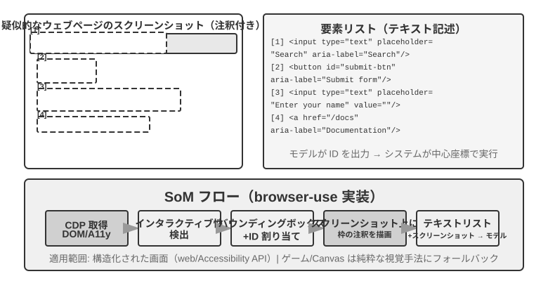

**純粋な座標予測。**

第 3 の路線はいかなるアノテーションもせず、モデルに直接座標を出力させます。**SeeClick** と Claude の computer use に代表されます。膨大な GUI スクリーンショットと要素位置のペアデータで視覚モデルを訓練し、自然言語の記述（「送信ボタンをクリック」など）をスクリーンショット中の精確な座標へ直接マッピングすることを学ばせます――人間のユーザーと同じように、純粋に「見る」ことだけでクリックすべき位置を見つけるのです。

座標予測の方式では、モデルの座標理解は訓練時に使った解像度に強く依存します（図6-14）。Claude は訓練に XGA（1024x768）、WXGA（1280x800）、FWXGA（1366x768）を使っており、入力するスクリーンショットの解像度が合わないと、モデルが予測する座標は系統的にずれます――小さな地図で距離を測って、それをそのまま大きな地図に使うようなものです。したがって、ツール層で双方向の座標スケーリング機構を実装する必要があり、しかも **アスペクト比で目標解像度を選ぶ** 必要があります。非等比の引き伸ばしで画面が歪み、それにつれて座標判断までずれてしまうのを避けるためです。たとえば、実際の画面解像度が 2560×1440（16:9）なら、Claude がサポートする 3 段の中からアスペクト比が同じく 16:9 に近い目標を選ぶべきです――FWXGA（1366×768）が最も合致します。スクリーンショット時に画面を等比で 1366×768 に縮小してモデルに入れ、モデルがクリック座標 (683, 384) を出力したら、実際の座標 (683×2560/1366, 384×1440/768) ≈ (1280, 720) へと逆マッピングします。逆に、無理やり 16:9 を 4:3 の 1024×768 に引き伸ばすと、画面は横方向に押し潰され、モデルが予測する座標は系統的にずれます。


3 つの路線の選択のロジックはこうまとめられます。**構造化情報が得られるときは DOM/Accessibility Tree のインデックスを優先する**、グラウンディングが最も精確で安定します。**得られないとき**（Photoshop のようなネイティブのデスクトップソフトウェア、Canvas/WebGL でレンダリングされたインターフェース、ゲーム）は、**視覚アノテーション（オリジナルの SoM 路線）を使ってもよいし、座標予測を使ってもよい**。視覚アノテーションはグラウンディングを選択問題に変え、専門的な訓練を受けていない汎用モデルにより親切です。座標予測はアノテーションのステップを省き、GUI グラウンディングの訓練を受けたモデルにより直接的です。両者とも、小さな要素や密集したインターフェースでの精度には依然として差があります。

> **実験 6-8 ★：browser-use で自動ブラウザ操作を実現する**
>
> ブラウザ自動化フレームワーク Playwright とマルチモーダルモデルを組み合わせ、自然言語でブラウザを操作します。SoM 可視化を有効にし、各判断の前に注釈枠付きのスクリーンショットを保存します。
>
> テストタスクは「Google を開いてサンフランシスコの天気を検索する」です。起動後の画面には番号付きの操作要素がある Google 検索ページが表示されます。モデルは検索欄を選び、「San Francisco weather today」と入力して検索し、結果ページから気温と天候を抽出します。

### アニメーションを見て、音を聞ける Computer Use Agent

これまでの Computer Use の知覚は、**画面は静止している**という暗黙の前提に立っていました。スクリーンショットを撮り、一手考え、クリックして、次の画面を撮るという流れです。しかし実際の画面では動画が流れ、一瞬の通知が現れ、会議の音声も再生されます。3〜5 秒に一度しか目を開けず、耳もない Agent は、2 フレームの間で起きたことを見聞きできません。

再設計すべきなのは行動インターフェースではなく、**観測インターフェース**です[^ch6-9]。中核となる発想は、Agent–コンピューター観測インターフェース（AOI）を構築し、連続する環境観測をモデルが扱いやすい離散イベントへ変換することです。ここにはいくつかの鍵となる技術が含まれます。第一に、**画面のキーフレーム捕捉**です。小さなモデルで画面に意味のある変化が起きたかどうかを判定し、大きく変化したときだけスクリーンショットを撮ります。変化が頻繁な場合は、1 秒に 1 回撮影するだけでも十分な効果があります。第二に、**音量ゲート付き音声認識**です。音があるときに音声認識を呼び出し、認識したテキストをコンテキストに入れることで、Agent が音を聞き取れるようにします。第三に、**画面をテキストで記述する**ことです。モデルに捕捉したスクリーンショットを一文で説明させれば、元画像がコンテキストから消えた後もその一文はコンテキストに残り、マルチモーダルな対話履歴の圧縮を実現します。

[^ch6-9]: Li, Bojie and Noah Shi. *Agent-Computer Observation Interfaces Enable Dynamic Computer Use.* arXiv:2606.29472, 2026 を参照。

### Computer Use の世界モデル

前節の観察インターフェースが解いたのは「画面の合間に何が起きたのか」でした。キーフレーム、音声の書き起こし、持続する文字によって、Agent は遠く隔たった二枚のスクリーンショットだけを見る状態から抜け出せます。しかし観察インターフェースは計画の遅延をなくしはしません。Agent は依然として「スクリーンショット—思考—クリック」という直列のループを回しており、動作を一つ実行するたびに観察し直して次の一手を考えています。**OSWorld-Human** の効率研究が示すように、タスクが最終的に成功したとしても、Agent の操作手数と待ち時間は人間より明らかに多いままです。正確さが人間並みに達したことは、実用に足ることと同じではありません。

人はコンピュータを操作するとき、クリックしてから次を考え始めるのではなく、まず動作の帰結を予測します。実際の変化が予想どおりなら元の計画のまま進み、画面の状態が予想からずれたときだけ立ち止まって観察し直し、計画を立て直します。世界モデルは、行動する前に机上の画面が次にどうなりうるかを Agent に予測させ、この人に似た「投機的実行」を可能にして効率を大きく高めます。

デスクトップの状態は画素の並びだけではありません。ウィンドウ、フォーカス、スクロール位置、入力欄の内容、読み込み状態、権限、ネットワークの応答も含まれます。動作のほうもクリック、キーボード入力、スクロール、ドラッグ、待機を含みます。Computer Use に使える世界モデルは、少なくとも現在の状態を符号化し、候補となる動作が引き起こす状態変化を予測し、その予測をプランナに渡して次の一手を決めさせられなければなりません。

```text
デスクトップの状態 + click/type/scroll/wait ──> 次の状態の表現
```

こうすれば Agent は、実際にクリックする前に候補動作の帰結を比べ、ページの読み込み中に次の一手を準備し、ポップアップが一瞬で消えたときも状態の差分から立て直せます。たとえば「VS Code で新しい Python ファイルを作り hello world と書く」というタスクなら、モデルはまず成功後のファイルツリーとエディタの重要な状態を予測し、そのうえでクリック、入力、保存の動作を選べます。ファイルを削除するタスクなら、隔離した仮想デスクトップの中で不可逆な確認ダイアログが出るかどうかを先に予測し、必要なら利用者に確認を求められます。ここで肝心なのは、モデルに本物そっくりの未来のスクリーンショットを生成させることではなく、タスクを終えるために必要な、検査可能な状態の差分を予測させることです。

2026 年 7 月、Induction Labs が公表した **Photon-1** はこの路線の一つの実装を示しました。H200 GPU をわずか 3 万時間使うだけで computer use 世界モデルの事前学習を終えています。各フレームを離散的な潜在 token に圧縮し、動作のあとの次状態表現を自己回帰的に予測するもので、事前学習の段階でスクリーンショットを画素ごとに生成するわけではありません。別途つながれた画像生成器は潜在表現を可視化するためだけのもので、推論に必須の部品ではありません。種となるスクリーンショットと後続の動作を与えれば、モデルはデスクトップの状態を連続して「想像」でき、さらに仮想マシン上のオンライン学習を通じて computer-use の動作を出力できるようになります。[^ch6-20]

[^ch6-20]: David Li and Jonathan Li, Induction Labs, “Scaling Video Pretraining with Imagination Models,” 2026-07-23. https://www.inductionlabs.com/news/scaling-video-pretraining 。本文中の Photon-1 のパラメータ、データ規模、社内ベンチマーク、コスト比較はいずれも同社が公表した結果である。

### モバイル端末：技術よりもエコシステムの壁が難しい

Computer Use はモバイル端末へも広がっています。モバイル端末とデスクトップは技術的に確かに差異があります。行動空間はもはや「マウス座標 + キーボード」ではなく、システムの無障害サービス API（Android の AccessibilityService など）に接続してインターフェースの要素を読み取り、クリックとテキスト入力を下ろすものになります。対話方式もマウスポインタからタッチジェスチャに変わり、座標の意味もそれにつれて変わります――同じ (x, y) が指のシングルタップなのか、長押しなのか、それともスワイプジェスチャの起点なのか、それを画定するには追加のジェスチャ種別が必要です。第 7 章で紹介した AndroidWorld などのモバイル端末ベンチマークは、まさにこうした行動空間の上で、Agent が実際のアプリのタスクを完遂する能力を評価します。

しかしモバイル端末を本当に行き詰まらせるのは、しばしばこれらの技術的差異ではなく、エコシステムの壁です。かつてスマートフォンメーカーが、コンシューマー向けスマートフォンに AI アシスタントを統合し、WeChat、淘宝（タオバオ）、支付宝（アリペイ）などの日常アプリを自動操作させようと試みましたが、すぐにプラットフォームの制限に遭いました。

これは Computer Use が直面する独特の挑戦、すなわち **エコシステムの壁** を露わにします。締め出しの背後にある根本原因は、ビジネスモデルの衝突です。従来のインターネットアプリの中核的な収益化ロジックは **トラフィックとアテンション** です。ユーザーはフィードをスクロールしながら広告を見、商品を検索しながらレコメンドアルゴリズムの誘導に従い、ページを閲覧しながら衝動買いをします。ところが Agent がユーザーに代わって操作すると、この収益化の連鎖は完全に迂回されます。AI は広告に注目せず、衝動買いもせず、目標へまっすぐ向かってタスクを終えたら去っていきます。広告とトラフィックで収益化するプラットフォームにとって、Agent の一つ一つの操作はそのビジネスモデルの根幹を侵食しているのです。

これは、Computer Use が直面するのが CAPTCHA（認証コード）などの技術レベルの対抗だけでなく、より根本的には **構造的な利害の衝突** であることを意味します。この矛盾は短期的には調停しがたく、Computer Use のコンシューマー向け場面での実装は、純粋な技術問題よりも厄介な挑戦に直面することになります。

## ロボット操作：XLeRobot による机の片付けを例に

> **読み方の注意**：本節は終始ひとつのタスクを使います——「赤いカップをトレイに入れ、黄色い紙くずをゴミ箱に入れ、最後にもう一度観察して机の状態を確認する」。実験 6-9 と 9-9 は XLeRobot の実機実験で、アーム、キャリブレーション、非常停止装置、現場の観察者が必要です。実験 6-10、9-10、9-11 はそれに対応するローカル GPU 実験です。実機とシミュレーションは明確に分けて報告しますが、タスクの目標、動作の意味、成功条件は一致させます。

ロボット操作は「画像を見て質問に答える」よりずっと難しい仕事です。モデルは画面を理解するだけでなく、現実世界で連続して行動しなければならず、しかも一つひとつの動作が次の瞬間の状況を変えてしまいます。XLeRobot はこの違いを具体的にしてくれます。同じアームを、人がキーボード、ゲームパッド、VR デバイスで遠隔操作することもできれば、カメラの観測と制約された一組の動作ツールを Agent に渡して自律的に呼び出させることもできます。ハードウェアもタスクも変わりません。変わるのは操作者だけです——前者では人が継続的に観察して誤りを正し、後者ではモデルと制御システムが同じ仕事をやり切らなければなりません。

本節は「机の片付け」で 5 つの実験を貫きます。まず人が実機の XLeRobot を遠隔操作し、十分に有能な操作者の下で実機に何ができるかを測ります。次にシミュレータで同じタスクの理想的な制御上限を確立します。続いて Agent に実機の XLeRobot を自律制御させ、知覚、計画、失敗からの復帰が結果をどう左右するかを観察します。さらに同じツール契約をシミュレータに置き、開ループ、逐次チェック、世界モデルという 3 つの戦略をまとめて比較します。最後に背景、物体の見た目、照明、視覚ノイズを変え、シミュレーションで学んだ視覚方策が新しい環境に適応できるかを確かめます。

ここでのボトルネックは、たいてい静的な質問応答ベンチマークをもう一つ足すことではなく、限られた知覚と制御の帯域幅の中でモデルに閉ループを回し続けさせることです。使えるロボットシステムは、少なくとも次の 4 つの問いに答えなければなりません。

1. 人は何のタスクを終わらせたいのか？
2. 次にどのサブタスクをやるのか？
3. いまのスキルは具体的にどんな動作を出すのか？
4. 動作を実行したあと、現実はまだ元の計画どおりか？

本節はこの 4 つの問いを XLeRobot の同一の制御ループに置き、4 つの技術がそれぞれ何を担うのかを示します。長期計画はカップと紙くずのどちらを先に扱うかを決め、VLA または動作プリミティブが把持と設置を行い、世界モデルが動作の帰結を見積もり、シミュレーションから現実への移行が訓練映像と実際のカメラ・アクチュエータの差を引き受けます。高レベルのモデルに十分な知識と計画能力が既にあっても、このフィードバックの環がどれか一つ欠ければ、システムはタスクを終えられないことがあります。

### ハードウェアとアルゴリズムの分担

XLeRobot が答えるのに最も向いている最初の問いはこれです——自律的な机の片付けが失敗したとき、アーム自体にできないのか、それともアルゴリズムがアームを使いこなせていないのか。ここには弱めてはならない事実があります：**XLeRobot のように数百ドルしかしないアームでも、遠隔操作であれば本節のような連続した複数ステップの机タスクを既に完了できます**——人がカメラ映像を見ながら赤いカップをつかんでトレイに入れ、黄色い紙くずをゴミ箱に入れ、最後にもう一度状態を確認する。この結果は「ハードウェアがかろうじて成立している」というだけの話ではなく、明確な診断上の証拠です：**このタスクに関しては、ボトルネックはハードウェア本体ではなくアルゴリズムのほうにあります。**

診断のやり方は率直です。カメラ、アーム、グリッパー、机の配置、成功条件を固定したまま、まず人にループを引き受けさせます。人は物体の位置推定、動作選択、タイミングを継続的に修正し、把持の失敗にも対処します。自律システムと人との差は、まさにこうした閉ループ能力に現れます。もちろんこの判断の射程は本節の机タスクです。ハードウェアがこのタスクに必要な可搬重量、精度、作業空間の閾値を越えたことは示しますが、数百ドルのアームがあらゆる開放環境やより難しい操作をこなせることを意味しはしません。

XLeRobot はキーボード、Xbox コントローラ、Switch Joy-Con、VR デバイスといった遠隔操作の入口に対応しています。人間の操作者は、アルゴリズムなら明示的に実装しなければならない多くのことを自然にやってのけます。グリッパーがカップに近づけば減速し、カップが滑れば把持点を修正し、一度で紙をつまめなければ観察し直し、物体が目標領域に入れば結果を確認する。したがって遠隔操作は実演データを集める手段であるだけでなく、「ハードウェアを固定し、操作者だけを入れ替える」診断実験でもあります。[^ch6-1]

> **実験 6-9 ★：実機の XLeRobot を遠隔操作して机を片付ける**
>
> 実機の XLeRobot の作業領域に、赤いカップ、トレイ、黄色い紙くず、ゴミ箱を置きます。操作者は較正済みの遠隔操作方式のひとつで固定タスクを実行します：「赤いカップをトレイに入れ、黄色い紙くずをゴミ箱に入れ、最後にもう一度観察して机の状態を確認する」。最低でも複数ラウンド繰り返し、カメラ映像、操作者の入力、アームの状態、動作時間、把持の失敗、リトライ回数、最終状態を記録します。
>
> 受け入れ判定を「最後に机が片付いて見える」で済ませてはいけません。赤いカップはトレイの中に、黄色い紙くずはゴミ箱の中になければならず、アームは安全姿勢に戻り、全過程で衝突も領域外への動きも、未確認のまま人が代行することもあってはなりません。

実機の遠隔操作はタスクの上限として最も説得力がありますが、物体の数や位置をまとめて変えるのには向きません。再現可能で統計の取れる対照を得るために、次は同じ「物体を所定の位置へ戻す」問題を 2 次元の机シミュレータに移し、知覚を誤らず動作も選び間違えない強い操作者の代役として理想制御器を使います。

> **実験 6-10 ★：シミュレータで同一タスクの理想的な制御上限を測る**
>
> 2 次元の机シミュレータで、赤いカップ、黄色い紙くずとそれぞれの目標領域をランダムに配置し、理想制御器が順に物体へ近づき、把持し、正しい位置へ移動させます。画像を認識する必要はなく、動作を選び間違えることもないので、「知覚と意思決定がどちらも正しいとき、このタスクは少なくともどこまでできるか」を表します。
>
> 実験ではタスク成功率、所要ステップ数、経路長を見るとともに、物体の初期位置とタスク規模を変えて理想上限が安定しているかを観察します。実験 6-9 と同じ成功条件を使いますが、測っているのは非駆動のシミュレーションであり、XLeRobot の実機が動いたことを意味しません。両者は後続の自律制御に対する 2 本の基準線になります——実験 6-9 は実ハードウェア上の人間の閉ループ、実験 6-10 はシミュレーション環境における理想の閉ループです。

### ロボット制御の基本構造

ロボットシステムは通常、時間スケールの異なる仕事を分けます。

| 階層 | 中心的な問い | 出力 | 典型的な時間スケール |
| --- | --- | --- | --- |
| タスク目標 | 人は何を終わらせたいか | 「カップと紙くずを所定の場所へ」 | 分オーダー |
| 長期計画 | 何を先に、何を後にするか | まずカップ、次に紙くず、最後に確認 | 秒から分 |
| 基本スキル | いまどの状態変化を達成するか | `pick(red_cup)`、`place(red_cup, tray)` | 約 1—3 秒 |
| VLA / スキル方策 | このスキルは具体的にどう動くか | XLeRobot グリッパーの短い動作または連続軌道 | 約 1—10 Hz の推論 |
| 低レベル制御と安全層 | どう安定に、遅れなく実行するか | 関節または手先の制御量、速度制限と非常停止 | 約 50—1000 Hz |

これはよくある工学的な分担であって、唯一のモデルアーキテクチャではありません。VLA が高レベルの判断の一部を担うこともできますし、プランナがルールベースのプログラム、VLM、最適化器であってもかまいません。どの実装を採るにせよ、「タスクの順序」と「目の前の動作」は分けるべきです。さもないと高レベルモデルの推論遅延が低レベル制御を引きずり、低レベルの高頻度制御が高レベルモデルに大量の無関係な詳細を処理させることになります。XLeRobot では、モデルが任意の関節角を直接出力すべきではありません。モデルは `pick`、`place`、`verify_state`、`stop` といった境界のあるスキルを選ぶだけで、較正され、速度制限とタイムアウトを備えた実行器がそれを実際のアームの動きに変えます。

### 長期計画とタスク分解

ユーザーが「机をきれいにして」と言ったとき、システムはその一文をそのまま動作モデルに渡すことはできません。プランナはまず場面にある物体と目標を並べ、順序を決め、各ステップについて開始条件、完了条件、リスクの制限を書き出します。たとえば：

```text
赤いカップを処理する → 黄色い紙を片付ける → 机を確認する
```

「赤いカップを処理する」はさらに 2 つの動作と 1 回の確認に分解されます：

```text
pick(red_cup) → place(red_cup, tray) → verify_state()
```

スキルをひとつ終えるごとに、確認できるノードが得られます。把持に失敗したら、そのステップだけをやり直します。誰かが物体を動かしたり、ユーザーが目標を変えたりした場合も、影響を受ける以降のステップだけを計画し直せばよく、古い計画を全部やり直す必要はありません。エージェントに与えるツールも十分に単純であるべきです。1 回の呼び出しで 1 つのことだけを行い、動作範囲は固定され、タイムアウトがあり、実行後はただちに観察し直します。

> **実験 6-11 ★★：Gemini Robotics-ER 1.5 で XLeRobot に自律的な机の片付けをさせる**
>
> 実験 6-9 の実機 XLeRobot、机の配置、タスク指示、成功条件をそのままに、人間の操作者を Agent に置き換えます。観察と計画は Gemini Robotics-ER 1.5 のような身体化推論モデルに任せ、RoboCrew 風のエージェントループを通じて 5 つのツールだけを開放します：`observe_scene`、`pick`、`place`、`verify_state`、`stop`。[^ch6-2]
>
> モデルはまず机を観察し、処理の順序を決め、それから較正済みの XLeRobot の把持・設置動作を呼び出します。スキルをひとつ終えるたびに観察し直し、事後条件を確認しなければなりません。把持に失敗したときは現在のスキルの再試行だけが許され、ユーザーが停止を告げたとき、物体が作業領域を出たとき、状態を確認できないときは `stop` を呼ばなければなりません。モデルは任意の関節角を直接出力できませんし、自分が先に「もう終わった」と言ったというだけで実際の確認を飛ばすこともできません。
>
> 受け入れ基準は実験 6-9 とまったく同じです。カップはトレイの中、紙くずはゴミ箱の中、アームは安全姿勢に戻り、衝突も領域外への動きもないこと。違うのは、自律実験ではタスクの意味づけがモデル自身の観察から来なければならず、実際の動作はツール呼び出しから来なければならず、最終状態は新しい観察によって確認されなければならない点です。人にできるのは起動、非常停止、安全監督だけで、途中で Agent に代わって動作を完了させてはなりません。そうして初めて、実験 6-9 と 9-9 は「同じハードウェア、同じタスクで、人間の閉ループとモデルの閉ループの間に何が足りないのか」を直接比較できます。

実機実験はキャリブレーション誤差、カメラの遮蔽、グリッパーの失敗を暴き出しますが、大量の故障を安全かつ制御された形で繰り返すのには向きません。以降のシミュレーション実験はこの 5 つのツールとまったく同じタスク状態を保ち、実際のアクチュエータだけを故障を注入できる机環境に置き換え、開ループ実行、逐次チェック、動作予測がそれぞれ何を寄与しているのかを切り分けます。

### VLA 制御

VLA は Vision-Language-Action の略で、日本語では「視覚—言語—動作モデル」と理解できます。現在の画面とひとつのスキル指示を受け取り、ロボットが次に実行すべき動作を出力します：

```text
現在の観測 + スキル指示 → 動作
```

XLeRobot の例では、高レベルのプランナは `pick(red_cup)` を提出するだけで、VLA またはスキル方策のほうが、現在の画面からどの方向からカップに近づくか、グリッパーをいつ閉じるか、腕をどんな軌道で持ち上げるかを決めます。実行層がこの短い運動を終えたら机を撮り直し、カップが本当に掴めていると確認できて初めて、プランナは `place(red_cup, tray)` の提出を許されます。つまりツール呼び出しは望ましい状態変化を定義し、VLA はその状態変化を連続動作でどう実現するかを定義します。

RT-2 と OpenVLA は連続動作を離散的な token に切り、文章を生成するように一つずつ出力します。π₀ はもう一方の路線を代表し、連続的で滑らかな動作軌道を直接生成します。両者に単純な優劣はありません。離散 token は言語モデルと結びつけやすく、連続軌道は滑らかな運動を表現するのに向いています。本当の取捨選択は、動作をどう表現すべきかであって、モデルの大きさだけではありません。[^ch6-15]

大きなモデルは通常 1 秒あたり 1—10 回しか推論できませんが、従来の制御器は 1 秒あたり数十から数千回更新することがあります。工学的によく使われるのが「アクションチャンキング」です。モデルが未来の動作を一度に短い区間だけ生成し、制御スレッドがその区間を高い頻度で実行し、モデルは裏で次の区間を準備します。こうすれば推論の待ち時間の一部を動作の実行時間に隠せます。代償として、区間が長いほど動きは滑らかになりますが、その間にモデルが見る新しい画面は少なくなります。XLeRobot が手を伸ばしてカップを掴もうとする途中でカップが当たって動いても、古い画面から生成された動作をそのまま実行し続けるかもしれません。したがってアクションチャンキングは滑らかさと反応速度の取捨選択であって、代償のない高速化ではありません。

### VLA の限界

「長期計画 + VLA」は実用的な基本案ですが、見落とされやすい問題がいくつか残ります。

- **訓練データが限られる**：ロボットの実演はインターネットのテキストや画像よりはるかに少ない。モデルが「カップ」という語を見たことがあるからといって、あらゆる材質と摩擦条件のカップを見たことにはなりません。
- **模倣は学べても帰結は分からない**：行動クローンは主に「実演者が次に何をしたか」を学ぶだけで、「この動作が何を引き起こすか」に答えることをモデルに明示的に要求しません。
- **ロボットはそれぞれ違う**：自由度、座標系、グリッパー、アクチュエータ遅延が異なれば、同じ動作をそのまま別の機体に移せるとは限りません。
- **観測は古くなりうる**：アクションチャンクが実行に入ったあと、物体が動かされたり、遮られたり、倒れたりしても、モデルは前のフレームに基づいて判断し続けています。

ですから、言語モデルが「カップ」を知っているからといって、摩擦、接触、液体の揺れ、電源ケーブルが未来の状態をどう変えるかを知っていることにはなりません。VLA は主に「いま何をすべきか」に答えるものであり、「やったあとに何が起こりうるか」を判断するには別種のモデルが要ります。

### 世界モデル

世界モデルは「動作結果の予測器」と理解できます。学習しているのは、現在の状態である動作を取ったとき、次の瞬間の状態がどう変わりうるかです。

```text
現在の状態 + 候補動作
    → 次の状態または未来の断片を予測する
    → 候補の結果を比較する
    → 動作を選ぶ、再計画する、または安全に停止する
```

ロボットに使える世界モデルは、少なくとも次の 3 つをうまくこなす必要があります。

- 現在の状態を理解すること；
- 異なる動作がもたらしうる結果を予測すること；
- その予測をプランナや制御器に渡し、選択を助けること。

動画を説明できるだけの VLM や、画面を生成できるだけのモデルは、自動的に信頼できるロボット世界モデルにはなりません。動作が何であるかを知り、その動作が物体と環境に与える影響を予測できなければなりません。V-JEPA 2 は内部状態で未来を予測する路線を代表し、World-Action Model は「動作—未来の観測」の関係を明示的に学びます。これらは VLA と併用でき、VLA を置き換える必要はありません。[^ch6-16]

実際のシステムでは、世界モデルには通常 3 つの使い方があります。

1. **動く前**：把持、押す、待つといった候補動作を比較し、リスクの小さい案を優先する；
2. **実行中**：実際の観測と予測を突き合わせ、ずれを見つけたら動作を短くする、止める、計画し直す；
3. **訓練中**：動画、シミュレーションデータ、失敗軌跡から状態変化を学び、実機での試行錯誤を減らす。

XLeRobot の机タスクに戻りましょう。黄色い紙くずが赤いカップに一部隠れているなら、システムは「先に紙をつかむ」「先にカップを動かす」「別の方向から掴む」といった候補スキルを比較できます。世界モデルはリアルなロボット動画を生成する必要はありません。どの候補動作なら紙がつかめる状態になりやすいか、どの動作ならカップを倒しかねないかを予測できれば、それだけでプランナの順位付けを助けられます。動作を実行したあとは、実際のカメラ観測が最終的な事実であり続けます。予測は選択を助けるだけで、受け入れ判定の代わりにはなりません。

世界モデルが与えるのは確定した答えではなく、「こうしたら何が起こりうるか」という比較可能な予測です。遠くを予測するほど誤差は大きくなりがちで、リアルに見える未来の画面が、実際の接触や摩擦の法則に合っているとは限りません。ですから実際のシステムには、短期予測、リアルタイム観測、不確実性の見積もり、そして独立したハードウェア安全制御器が依然として必要です。生成的世界モデルはインタラクティブなシミュレーションや可視化に使えますが、「動画を生成できる」ことと「ロボットの動作を導ける」ことを混同してはいけません。[^ch6-21]

> **実験 6-12 ★★：シミュレータで 3 種類の自律的な机片付けループを比較する**
>
> 実験 6-11 のタスク、対象の状態、成功条件、5 つのツールをそのまま机シミュレータに置き、実機 XLeRobot のアクチュエータだけを制御可能なシミュレーション実行器に替え、把持に回復可能な一時的失敗をときどき起こさせます。こうすれば問題を変えずに 3 つの戦略を比較できます。
>
> **開ループ実行**は完全な動作列を一度に生成し、途中で観察し直しません。**逐次チェック**は `pick` と `place` のたびに状態を読み直し、失敗したときは現在のスキルだけをやり直します。**予測的実行**はさらに短期の世界モデルを加え、候補スキルの予想される結果を比較してから次の一手を選びます。実験はタスク成功率、ツール呼び出しのオーバーヘッド、失敗からの復帰能力を比較し、最終的な成功がすべて `verify_state` の新しい観察で確認されているかを点検します。
>
> この実験の狙いは、小さなシミュレーション世界モデルが実機の物理モデルと等価だと示すことではなく、もっと基礎的な関係を検証することです——開ループの計画は一度の局所的な失敗をタスクの最後まで引きずり、逐次チェックは復帰でき、動作予測はさらに候補スキルの順位付けを助けられる。本当に完了したかどうかは、依然として環境からのフィードバックが決めます。

### シミュレーション環境から実機のロボットへ

実験 6-12 がシミュレータで安定していたとしても、実験 6-11 の XLeRobot 実機が同じように成功するとは限りません。シミュレーションから実機へ進むことは、制御器をもう一種類取り替えることではなく、2 つの環境の差を扱うことです。訓練には遠隔操作データ、動画データ、シミュレーションの相互作用データを使えますが、実際に配備すると、同じ赤いカップ、黄色い紙くず、トレイ、ゴミ箱が、異なる背景、照明、カメラ位置、遮蔽関係のもとに現れ、アームはさらに異なる摩擦、センサノイズ、アクチュエータ遅延に出会います。これらの差が十分に大きければ、シミュレーションで身につけた動作は現実で通用しなくなりえます。

> **実験 6-13 ★★★：同一の机タスクにおける RGB 環境間テスト**
>
> シミュレーション環境で「物体を対応する目標へ動かす」という基本問題を使い続け、各サンプルを机の片付けにおける局所的な意思決定として捉えます——RGB 画面から、物体にどの方向から近づくべきか、あるいはもう掴めるのかを判断します。構造の同じ視覚方策を 4 つ訓練します。1 組は固定の画面だけを見るもの、1 組は背景を変えるもの、1 組は物体の見た目を変えるもの、最後の 1 組は背景、見た目、照明、ノイズを同時に変えるものです。
>
> すべての方策を元の環境と変化後の新しい環境で試し、視覚条件の変化前後で動作判断の正確さを比べます。この実験が答えようとしているのは「シミュレータはもう XLeRobot の実機と同じか」ではなく、もっと狭い問いです——訓練時に画面の変化の幅を積極的に広げることは、同じカップ—トレイ、紙くず—ゴミ箱のタスクが新しいカメラ映像に適応する助けになるのか。たとえ結果が改善しても、実機配備には実際のカメラ較正、アクチュエータ試験、完全な安全閉ループが依然として必要です。[^ch6-6]

## 本章のまとめ

**モダリティ**と**実行タイミング**の二軸で見ると、**非同期・イベント駆動**は観測を「Agent が取りに行く」から「世界が押し込む」へ、行動を「ターン内で完了する」から「先に開始し、後続イベントで完了する」へ拡張します。**音声**は時間尺度をミリ秒へ縮め、交互に話す方式から連続的に聞き話す方式へ進み、リアルタイムな前景対話と深い背景思考を分担します。**Computer Use** は同じループを画面へ移し、効率、連続的な視覚理解、行動後の状態確認をボトルネックに加えます。**ロボット**は物理世界へ進み、行動チャンクが滑らかさと反応性を交換し、完了は新たな観測から判断しなければなりません。

四つの節は同じ制御骨格を共有します。

```text
持続的に知覚する
  → 現在の状態とタイミングを判断する
  → 返答または動作を選ぶ
  → 出力を環境へ送り込む
  → フィードバックを観察する
  → 継続・修正・再試行・停止、あるいは再計画する
```

また、起動、安全点、キャンセル、プリエンプション、速い／遅い処理の分離という同じプリミティブを共有します。

本章は「Agent を構築する」という部分の最後の一片を仕上げました。観察空間と動作空間は、内容・モダリティ・タイミングという三つの方向すべてに展開されました。続いて、第 7 章はシステムが正しく構築されたかをどう判断するかに答え、第 8 章はポストトレーニングによるモデルパラメータの更新を扱い、第 9 章は実行軌跡、評価、複数の更新媒体を継続的進化の閉ループとして組み立てます。第 10 章は、この完成した単一 Agent の基盤からマルチ Agent 協調へ進みます。

[^ch6-16]: Meta AI, “Introducing the V-JEPA 2 world model and new benchmarks for physical reasoning,” 2025-06-11. https://ai.meta.com/blog/v-jepa-2-world-model-benchmarks/; V-JEPA 2 テクニカルレポート：arXiv:2506.09985, https://arxiv.org/abs/2506.09985
[^ch6-21]: Jack Parker-Holder and Shlomi Fruchter, Google DeepMind, “Genie 3: A new frontier for world models,” 2025-08-05. https://deepmind.google/blog/genie-3-a-new-frontier-for-world-models/; Zachary Lin et al. *Cosmos World Foundation Model Platform for Physical AI.* arXiv:2501.03575, 2025. https://arxiv.org/abs/2501.03575 。
[^ch6-1]: XLeRobot, “Teleop ドキュメント”. https://xlerobot.readthedocs.io/en/latest/software/getting_started/XLeRobot_teleop.html
[^ch6-2]: Google DeepMind, “Gemini Robotics-ER 1.5”. https://deepmind.google/models/gemini-robotics/gemini-robotics-er/；XLeRobot, “LLM Agent 制御”. https://xlerobot.readthedocs.io/en/latest/software/getting_started/LLM_agent.html 。XLeRobot の上流のサンプルはモデルとツール呼び出しの編成方法を示している。本節は同じ編成原則を保ちつつ、動作ツールを較正済みの机上の把持・設置・確認・停止のプリミティブに限定している。
[^ch6-6]: LeRobot, “Sim2Real チュートリアル”. https://github.com/StoneT2000/lerobot-sim2real/blob/87d6c1d969f6e0ca4dc5697940804e231118a63a/docs/zero_shot_rgb_sim2real.md
[^ch6-15]: Moo Jin Kim et al. *OpenVLA: An Open-Source Vision-Language-Action Model.* arXiv:2406.09246, 2024. https://arxiv.org/abs/2406.09246

## 演習問題

1. ★★ 非同期 Agent アーキテクチャでは、イベントキューの優先度戦略は設計時に確定する必要があります。しかしもし優先度の判断そのものが意味的な理解を必要とする（例えばある新しいメッセージが現在のタスクより緊急かどうかを判断する）なら、この判断は誰が下すべきでしょうか——ルールエンジンか、それとも別の LLM 呼び出しか。それぞれにどんな代償がありますか。
2. ★★ キュー式のイベント処理では、モデルは最後の 1 つのイベントにだけ注目する傾向があり、本章では Agent ステータスバーの標示とまとめによってそれを緩和しました。しかしもしキューに 20 個のイベント（10 個のツール結果 + 5 通のユーザーメッセージ + 5 個のシステムリマインダー）が滞留したら、あなたはこれらのイベントの提示の順序と形式をどう組織し、モデルが重要な情報を漏らさないようにしますか。
3. ★★★ Agent がユーザーを代表して外部世界とインタラクションするとき、本質的に 1 つのアイデンティティの選択に直面します。独立した仮想アイデンティティ（専用のメールアドレスと電話番号）で第三者のアイデンティティとして行動するのか、それとも直接ユーザー本人のアイデンティティでその個人アカウントを操作するのか。前者はバックグラウンドで自律的に操作できますが、第三者は生身の人間でないアイデンティティを信頼しないかもしれません。後者はより完全なコンテキストと権限を持ちますが、信頼の認可とセキュリティ境界の問題を導入します。あなたはどんなシーンでどちらのモードを選ぶべきだと考えますか。
4. ★★ 音声 Agent のエンドツーエンドモデルは ASR-LLM-TTS を単一のモデルに統合し、遅延を下げた一方でモジュール性を失いました。もしエンドツーエンドモデルがある工程（音声認識など）で誤ると、デバッグと修復は直列パイプラインよりはるかに困難です。あなたならエンドツーエンド音声 Agent の可観測性（observability）システムをどう設計しますか?
5. ★ Step-Audio R1 は MPS デュアルブレイン・アーキテクチャによって「考えながら話す」を実現しました。しかし人間は「考えながら話す」とき、しばしば熟慮を経ていないことを口にしたり、自己訂正したり、フィラーを使ったりします。Agent の「考えながら話す」は、人間のこれらの特徴を模倣すべきでしょうか?
6. ★★ SoM（Set-of-Mark）とその構造化変種（DOM 要素インデックス）は、Computer Use の視覚グラウンディングを開放的な座標予測から閉じた ID 選択へと変えましたが、いずれもまずインターフェースの要素を検出してアノテーションする必要があります――セグメンテーションモデルに頼るにせよ、DOM に頼るにせよ。もしインターフェースが非標準のコントロールや動的に変化する要素を含んでいれば、アノテーションは不完全または不正確になりかねません。この場合、座標予測へフォールバックすべきでしょうか?
7. ★★ XLeRobot などの数百ドル級のロボットプラットフォームは、テレオペレーションによるデータ収集を安価にしました。しかしテレオペレーションデータの品質は、操作者の技能に大きく依存します。不慣れな操作者が提供したデータは、VLA モデルの訓練にどう影響するでしょうか? データ収集の段階で、いかにして低品質なデータを自動で選り分けますか?
8. ★★★ 本章は音声、Computer Use、ロボットという 3 種類の対話形態をカバーしました。この 3 種類の形態の共通の趨勢は、直列パイプラインからエンドツーエンドモデルへと進化することです。もしこの趨勢が続くなら、5 年後の Agent の対話層はどんな姿になるでしょうか?
9. ★★ DOM/Accessibility Tree の要素インデックスは標準的な Web アプリでは効果が著しいのですが、ますます多くのソフトウェアインターフェース（Canvas/WebGL レンダリング、プラットフォーム横断の自前描画コントロール）はアクセス可能な構造化情報を提供せず、視覚アノテーションか座標予測に頼るしかありません。あなたは Computer Use が純視覚の路線に賭けるべきだと考えますか、それとも構造化と視覚の 2 つの経路を同時に維持すべきだと考えますか? 2 つの経路を維持するコストと便益は、それぞれ何でしょうか?
10. ★★ VLA モデルは動作分割（action chunking）を採用しています――本文で述べたとおり、π₀ の典型的な構成は 50Hz の周波数での未来の 25〜50 個の動作を一度に生成するもので――推論の遅延を実行時間の中に隠します。しかしもし実行の過程で環境が急変すれば（物体が動かされるなど）、事前に生成した動作の並びは無効になります。動作分割の効率上の優位と、環境変化への応答速度の間で、いかにバランスを取りますか?
11. ★★★ 本章の 3 つの場面（音声、Computer Use、ロボット）はいずれも「知覚-思考-行動」ループの遅延問題に直面し、いずれも速い・遅い思考の並行化の方向へ進化しています。音声の場面では、これは「言い間違えたら訂正する」と表れ、Computer Use の場面では「先にクリックしてから見る」と表れ、ロボットの場面では「一歩進んでは様子を見る」と表れます。これらの速い思考に基づく行動が、取り返しのつかない結果を招かないことを、いかにして保証しますか?
12. ★★★ 本章では同じ原語群（起動、セーフポイント、キャンセル、プリエンプション、速い／遅いの分離）が異なる時間スケールで繰り返し実装されました。そのうち一つを選び、イベント駆動（秒〜日）とロボットの動作チャンク化（ミリ秒）における実装の違いを説明してください。この違いを主に決めるのは何でしょうか——環境変化の速さ、動作の可逆性、それとも観察の取得コストでしょうか。
